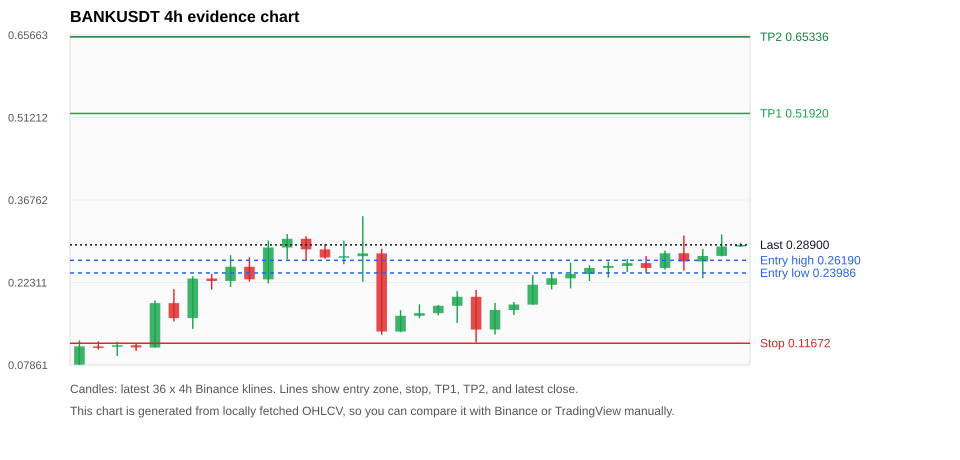
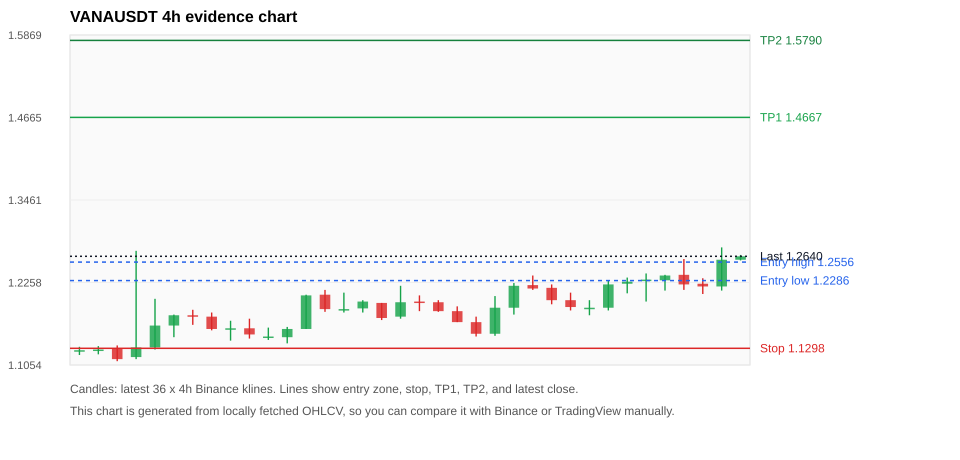
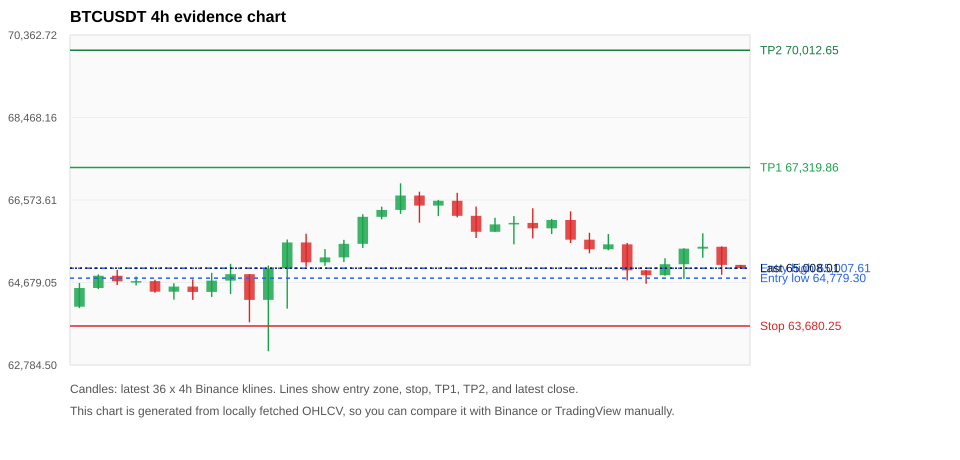
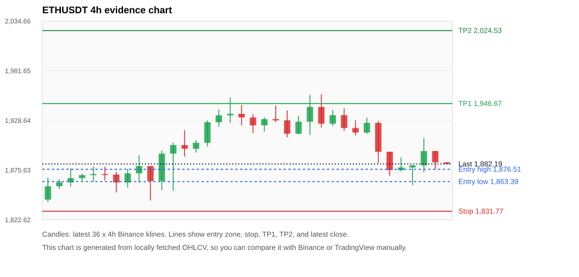
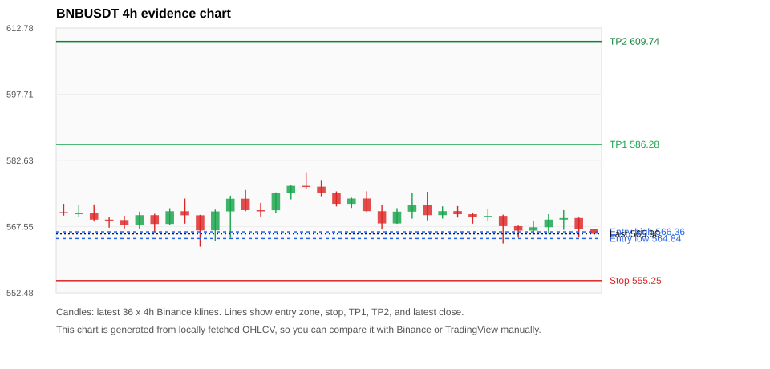

# Crypto 市场扫描报告 v1

- 报告时间：2026-07-24 20:05:59 CST
- Run ID：`20260724_120503_98338d83`
- Run type：`daily_full`
- 数据来源：SQLite
- 报告版本：v1
- 扫描 ID：77ed2c36cc7b
- 数据源：Binance public spot API + CoinGecko/CoinMarketCap cross-check
- 过滤条件：USDT spot; 24h quote volume >= 30,000,000; trades >= 30,000; exclude stables/leveraged tokens; analyze 1h/4h/1d klines
- 默认单笔风险：账户权益的 1.00%

## 限制说明

- 交易信号仍以 Binance 现货公开 K 线为主源；外部数据源用于一致性复核。
- 结果是研究和模拟盘计划，不是确定收益或实盘下单指令。
- 历史长度过滤：候选币至少需要 180 根 1d K 线。
- 数据质量验证池：先验证 score 排名前 min(top_n * 2, 10) 的候选，再按 action + score 补足最终名单。
- 大盘环境过滤：NEUTRAL; BTC/ETH 大盘未完全确认强势，山寨币买入候选降级为观察。 BTC 7d=1.6929481116323197; ETH 7d=2.195523174061975.
- 已启用数据交叉验证：Binance 主源 + CoinGecko 自动对照；CoinMarketCap 在配置 API Key 后自动对照。
- BANKUSDT 交叉验证状态 DATA_WARNING：At least one external provider needs manual review.
- VANAUSDT 交叉验证状态 DATA_WARNING：At least one external provider needs manual review.
- BTCUSDT 交叉验证状态 DATA_WARNING：At least one external provider needs manual review.
- ETHUSDT 交叉验证状态 DATA_WARNING：At least one external provider needs manual review.
- BNBUSDT 交叉验证状态 DATA_WARNING：At least one external provider needs manual review.
- XRPUSDT 交叉验证状态 DATA_WARNING：At least one external provider needs manual review.
- SOLUSDT 交叉验证状态 DATA_WARNING：At least one external provider needs manual review.
- DOGEUSDT 交叉验证状态 DATA_WARNING：At least one external provider needs manual review.
- ZECUSDT 交叉验证状态 DATA_WARNING：At least one external provider needs manual review.
- DEXEUSDT 交叉验证状态 DATA_ERROR：At least one external provider disagrees materially or symbol mapping failed.

## 5 个候选交易计划

| Rank | Coin | Action | Setup | Entry Zone | Stop Loss | TP1 | TP2 / Exit Rule | R/R | Verdict |
|---:|---|---|---|---:|---:|---:|---|---:|---|
| 1 | `BANK` | `WATCH_ONLY` | 涨幅较远，只等深回调 | 0.23986 - 0.26190 | 0.11672 | 0.51920 | 0.65336 或跌破 4h 关键支撑 | 2.00-3.00 | 只等回调 |
| 2 | `VANA` | `WATCH_ONLY` | 趋势中，等回调入场 | 1.2286 - 1.2556 | 1.1298 | 1.4667 | 1.5790 或跌破 4h 关键支撑 | 2.00-3.00 | 只等回调 |
| 3 | `BTC` | `WATCH_ONLY` | 回踩支撑/4h EMA 附近 | 64,779.30 - 65,007.61 | 63,680.25 | 67,319.86 | 70,012.65 或跌破 4h 关键支撑 | 2.00-4.22 | 只观察 |
| 4 | `ETH` | `WATCH_ONLY` | 回踩支撑/4h EMA 附近 | 1,863.39 - 1,876.51 | 1,831.77 | 1,946.67 | 2,024.53 或跌破 4h 关键支撑 | 2.01-4.05 | 只观察 |
| 5 | `BNB` | `WATCH_ONLY` | 回踩支撑/4h EMA 附近 | 564.84 - 566.36 | 555.25 | 586.28 | 609.74 或跌破 4h 关键支撑 | 2.00-4.27 | 只观察 |

## 数据交叉验证摘要

价格差异以 Binance 当前价为基准；成交量口径不同，Binance 是 USDT 现货成交额，CoinGecko/CoinMarketCap 通常是全市场成交量。

| Rank | Coin | Data Status | Max Price Diff | Max 24h Diff | Message |
|---:|---|---|---:|---:|---|
| 1 | `BANK` | DATA_WARNING | 0.72% | 2.20 pts | At least one external provider needs manual review. |
| 2 | `VANA` | DATA_WARNING | 0.49% | 0.41 pts | At least one external provider needs manual review. |
| 3 | `BTC` | DATA_WARNING | 0.04% | 0.24 pts | At least one external provider needs manual review. |
| 4 | `ETH` | DATA_WARNING | 0.07% | 0.13 pts | At least one external provider needs manual review. |
| 5 | `BNB` | DATA_WARNING | 0.06% | 0.05 pts | At least one external provider needs manual review. |

## 候选币说明

### 1. BANK `BANKUSDT`



- 入选原因：涨幅较远，只等深回调；24h +11.92%，7d +483.84%，4h RSI 88.32，24h 成交额 $69.9M。
- 交易失效条件：跌破 0.1167225 或 4h 收盘重新失守关键支撑。
- 主要风险：距离支撑偏远，不能追市价；4h RSI 偏热；24h 振幅较大，回撤风险高；数据交叉验证需要人工复核。
- 数据交叉验证：DATA_WARNING；At least one external provider needs manual review.

#### 可点击人工验证

- [Binance 交易页](https://www.binance.com/en/trade/BANK_USDT)
- [TradingView 图表](https://www.tradingview.com/chart/?symbol=BINANCE%3ABANKUSDT)
- [CoinGecko 搜索](https://www.coingecko.com/en/search?query=BANK)
- [CoinMarketCap 搜索](https://coinmarketcap.com/search/?q=BANK)

#### 多数据源对照

| Source | Status | Asset ID | Price | 24h Change | 24h Volume | Price Diff | 24h Diff | Updated | Message |
|---|---|---|---:|---:|---:|---:|---:|---|---|
| Binance | DATA_OK | BANKUSDT | 0.28900 | +11.92% | $69.9M | 0.00% | 0.00 pts | 2026-07-24T12:05:22+00:00 | Primary market data source used by scanner. |
| CoinGecko | DATA_WARNING | lorenzo-protocol | 0.29108 | +12.90% | $171.2M | 0.72% | 0.98 pts | 2026-07-24T12:03:20.000Z | CoinGecko symbol mapping has 3 exact matches; selected highest market-cap rank |
| CoinMarketCap | DATA_WARNING | 36296 | 0.28831 | +14.13% | $250.4M | 0.24% | 2.20 pts | 2026-07-24T12:04:05.000Z | CoinMarketCap symbol mapping has 10 matches; selected lowest cmc_rank |

#### 指标证据

| 指标 | 数值 | 人工核对用途 |
|---|---:|---|
| 当前价 | 0.28900 | 与 Binance/TradingView 当前价格对照 |
| 24h 涨跌 | +11.92% | 与交易所 24h 涨跌对照 |
| 7d 涨跌 | +483.84% | 判断短线趋势是否延续 |
| 4h EMA20 | 0.23938 | 判断短期趋势支撑 |
| 4h EMA50 | 0.18762 | 判断中期趋势支撑 |
| 1d EMA20 | 0.13992 | 判断日线趋势 |
| 1d EMA50 | 0.08647 | 判断日线趋势 |
| 4h RSI14 | 88.32 | 判断是否过热/过弱 |
| 4h ATR14 | 0.03613 | 推导止损和入场缓冲 |
| 最近 18 根 4h 最低点 | 0.11850 | 支撑/止损参考 |
| 最近 36 根 4h 最高点 | 0.33930 | TP/压力参考 |
| 支撑位 | 0.23938 | 入场区间推导基础 |

#### 交易计划推导

- 支撑位 = 最近低点、4h EMA20、4h EMA50、1d EMA20 中不高于当前价的最高有效支撑 = `0.23938`。
- 入场区间 = 支撑位附近 + ATR 缓冲 = `0.23986 - 0.26190`。
- 止损 = min(最近 18 根 4h 最低点 * 0.985, 入场中位价 - 1.15 * ATR14) = `0.11672`。
- TP1 = max(最近 36 根 4h 最高点 * 0.995, 入场中位价 + 2R) = `0.51920`。
- TP2 = max(入场中位价 + 3R, TP1 * 1.04) = `0.65336`。

#### 最近 10 根 4h K线

| UTC 开盘时间 | Open | High | Low | Close | Quote Volume | Trades |
|---|---:|---:|---:|---:|---:|---:|
| 2026-07-23T00:00+00:00 | 0.23040 | 0.25800 | 0.21280 | 0.23810 | $13.1M | 175883 |
| 2026-07-23T04:00+00:00 | 0.23800 | 0.25330 | 0.22570 | 0.24850 | $6.3M | 82944 |
| 2026-07-23T08:00+00:00 | 0.24870 | 0.25950 | 0.23170 | 0.25210 | $10.5M | 116661 |
| 2026-07-23T12:00+00:00 | 0.25220 | 0.26430 | 0.24120 | 0.25700 | $11.1M | 103996 |
| 2026-07-23T16:00+00:00 | 0.25710 | 0.26950 | 0.23930 | 0.24870 | $9.1M | 98070 |
| 2026-07-23T20:00+00:00 | 0.24860 | 0.27900 | 0.24560 | 0.27430 | $5.9M | 61758 |
| 2026-07-24T00:00+00:00 | 0.27440 | 0.30530 | 0.24390 | 0.26000 | $18.2M | 222539 |
| 2026-07-24T04:00+00:00 | 0.25990 | 0.28190 | 0.23040 | 0.26960 | $13.1M | 162472 |
| 2026-07-24T08:00+00:00 | 0.26970 | 0.30740 | 0.26880 | 0.28610 | $13.7M | 134748 |
| 2026-07-24T12:00+00:00 | 0.28610 | 0.29260 | 0.28540 | 0.28900 | $505,897 | 5880 |

### 2. VANA `VANAUSDT`



- 入选原因：趋势中，等回调入场；24h +3.27%，7d +4.38%，4h RSI 77.03，24h 成交额 $76.3M。
- 交易失效条件：跌破 1.129795 或 4h 收盘重新失守关键支撑。
- 主要风险：4h RSI 偏热；成交量突增，可能是事件驱动；数据交叉验证需要人工复核。
- 数据交叉验证：DATA_WARNING；At least one external provider needs manual review.

#### 可点击人工验证

- [Binance 交易页](https://www.binance.com/en/trade/VANA_USDT)
- [TradingView 图表](https://www.tradingview.com/chart/?symbol=BINANCE%3AVANAUSDT)
- [CoinGecko 搜索](https://www.coingecko.com/en/search?query=VANA)
- [CoinMarketCap 搜索](https://coinmarketcap.com/search/?q=VANA)

#### 多数据源对照

| Source | Status | Asset ID | Price | 24h Change | 24h Volume | Price Diff | 24h Diff | Updated | Message |
|---|---|---|---:|---:|---:|---:|---:|---|---|
| Binance | DATA_OK | VANAUSDT | 1.2640 | +3.27% | $76.3M | 0.00% | 0.00 pts | 2026-07-24T12:05:22+00:00 | Primary market data source used by scanner. |
| CoinGecko | DATA_OK | vana | 1.2600 | +3.08% | $145.4M | 0.32% | 0.19 pts | 2026-07-24T12:05:15.423Z | External source agrees with Binance within thresholds. |
| CoinMarketCap | DATA_WARNING | 34619 | 1.2578 | +2.85% | $134.9M | 0.49% | 0.41 pts | 2026-07-24T12:04:05.000Z | CoinMarketCap symbol mapping has 3 matches; selected lowest cmc_rank |

#### 指标证据

| 指标 | 数值 | 人工核对用途 |
|---|---:|---|
| 当前价 | 1.2640 | 与 Binance/TradingView 当前价格对照 |
| 24h 涨跌 | +3.27% | 与交易所 24h 涨跌对照 |
| 7d 涨跌 | +4.38% | 判断短线趋势是否延续 |
| 4h EMA20 | 1.2149 | 判断短期趋势支撑 |
| 4h EMA50 | 1.2007 | 判断中期趋势支撑 |
| 1d EMA20 | 1.1938 | 判断日线趋势 |
| 1d EMA50 | 1.2066 | 判断日线趋势 |
| 4h RSI14 | 77.03 | 判断是否过热/过弱 |
| 4h ATR14 | 0.03371 | 推导止损和入场缓冲 |
| 最近 18 根 4h 最低点 | 1.1470 | 支撑/止损参考 |
| 最近 36 根 4h 最高点 | 1.2770 | TP/压力参考 |
| 支撑位 | 1.2149 | 入场区间推导基础 |

#### 交易计划推导

- 支撑位 = 最近低点、4h EMA20、4h EMA50、1d EMA20 中不高于当前价的最高有效支撑 = `1.2149`。
- 入场区间 = 支撑位附近 + ATR 缓冲 = `1.2286 - 1.2556`。
- 止损 = min(最近 18 根 4h 最低点 * 0.985, 入场中位价 - 1.15 * ATR14) = `1.1298`。
- TP1 = max(最近 36 根 4h 最高点 * 0.995, 入场中位价 + 2R) = `1.4667`。
- TP2 = max(入场中位价 + 3R, TP1 * 1.04) = `1.5790`。

#### 最近 10 根 4h K线

| UTC 开盘时间 | Open | High | Low | Close | Quote Volume | Trades |
|---|---:|---:|---:|---:|---:|---:|
| 2026-07-23T00:00+00:00 | 1.2000 | 1.2110 | 1.1850 | 1.1900 | $2.1M | 25573 |
| 2026-07-23T04:00+00:00 | 1.1890 | 1.2000 | 1.1780 | 1.1890 | $2.8M | 30804 |
| 2026-07-23T08:00+00:00 | 1.1890 | 1.2290 | 1.1850 | 1.2230 | $3.2M | 35080 |
| 2026-07-23T12:00+00:00 | 1.2240 | 1.2330 | 1.2100 | 1.2270 | $3.9M | 28404 |
| 2026-07-23T16:00+00:00 | 1.2280 | 1.2390 | 1.1980 | 1.2300 | $2.9M | 24628 |
| 2026-07-23T20:00+00:00 | 1.2290 | 1.2370 | 1.2140 | 1.2360 | $1.1M | 20277 |
| 2026-07-24T00:00+00:00 | 1.2370 | 1.2600 | 1.2150 | 1.2230 | $5.4M | 41257 |
| 2026-07-24T04:00+00:00 | 1.2240 | 1.2320 | 1.2090 | 1.2200 | $12.8M | 91895 |
| 2026-07-24T08:00+00:00 | 1.2200 | 1.2770 | 1.2140 | 1.2590 | $50.2M | 133997 |
| 2026-07-24T12:00+00:00 | 1.2590 | 1.2660 | 1.2580 | 1.2640 | $115,722 | 2861 |

### 3. BTC `BTCUSDT`



- 入选原因：回踩支撑/4h EMA 附近；24h -0.86%，7d +2.94%，4h RSI 36.77，24h 成交额 $1.00B。
- 交易失效条件：跌破 63680.25 或 4h 收盘重新失守关键支撑。
- 主要风险：24h 动量未确认；数据交叉验证需要人工复核。
- 数据交叉验证：DATA_WARNING；At least one external provider needs manual review.

#### 可点击人工验证

- [Binance 交易页](https://www.binance.com/en/trade/BTC_USDT)
- [TradingView 图表](https://www.tradingview.com/chart/?symbol=BINANCE%3ABTCUSDT)
- [CoinGecko 搜索](https://www.coingecko.com/en/search?query=BTC)
- [CoinMarketCap 搜索](https://coinmarketcap.com/search/?q=BTC)

#### 多数据源对照

| Source | Status | Asset ID | Price | 24h Change | 24h Volume | Price Diff | 24h Diff | Updated | Message |
|---|---|---|---:|---:|---:|---:|---:|---|---|
| Binance | DATA_OK | BTCUSDT | 65,008.01 | -0.86% | $1.00B | 0.00% | 0.00 pts | 2026-07-24T12:05:22+00:00 | Primary market data source used by scanner. |
| CoinGecko | DATA_OK | bitcoin | 64,989.00 | -1.10% | $26.58B | 0.03% | 0.24 pts | 2026-07-24T12:03:20.000Z | External source agrees with Binance within thresholds. |
| CoinMarketCap | DATA_WARNING | 1 | 64,983.37 | -0.80% | $25.15B | 0.04% | 0.06 pts | 2026-07-24T12:04:05.000Z | CoinMarketCap symbol mapping has 13 matches; selected lowest cmc_rank |

#### 指标证据

| 指标 | 数值 | 人工核对用途 |
|---|---:|---|
| 当前价 | 65,008.01 | 与 Binance/TradingView 当前价格对照 |
| 24h 涨跌 | -0.86% | 与交易所 24h 涨跌对照 |
| 7d 涨跌 | +2.94% | 判断短线趋势是否延续 |
| 4h EMA20 | 65,400.42 | 判断短期趋势支撑 |
| 4h EMA50 | 65,063.31 | 判断中期趋势支撑 |
| 1d EMA20 | 64,399.96 | 判断日线趋势 |
| 1d EMA50 | 65,124.56 | 判断日线趋势 |
| 4h RSI14 | 36.77 | 判断是否过热/过弱 |
| 4h ATR14 | 510.87 | 推导止损和入场缓冲 |
| 最近 18 根 4h 最低点 | 64,650.00 | 支撑/止损参考 |
| 最近 36 根 4h 最高点 | 66,956.15 | TP/压力参考 |
| 支撑位 | 64,650.00 | 入场区间推导基础 |

#### 交易计划推导

- 支撑位 = 最近低点、4h EMA20、4h EMA50、1d EMA20 中不高于当前价的最高有效支撑 = `64,650.00`。
- 入场区间 = 支撑位附近 + ATR 缓冲 = `64,779.30 - 65,007.61`。
- 止损 = min(最近 18 根 4h 最低点 * 0.985, 入场中位价 - 1.15 * ATR14) = `63,680.25`。
- TP1 = max(最近 36 根 4h 最高点 * 0.995, 入场中位价 + 2R) = `67,319.86`。
- TP2 = max(入场中位价 + 3R, TP1 * 1.04) = `70,012.65`。

#### 最近 10 根 4h K线

| UTC 开盘时间 | Open | High | Low | Close | Quote Volume | Trades |
|---|---:|---:|---:|---:|---:|---:|
| 2026-07-23T00:00+00:00 | 66,114.50 | 66,313.14 | 65,585.11 | 65,662.53 | $180.5M | 390926 |
| 2026-07-23T04:00+00:00 | 65,662.53 | 65,821.17 | 65,351.02 | 65,442.13 | $115.2M | 313412 |
| 2026-07-23T08:00+00:00 | 65,442.12 | 65,792.09 | 65,419.75 | 65,555.21 | $111.4M | 263480 |
| 2026-07-23T12:00+00:00 | 65,555.21 | 65,589.41 | 64,728.00 | 64,958.36 | $280.3M | 864979 |
| 2026-07-23T16:00+00:00 | 64,958.37 | 64,961.15 | 64,650.00 | 64,846.94 | $157.7M | 457475 |
| 2026-07-23T20:00+00:00 | 64,846.93 | 65,235.43 | 64,834.52 | 65,098.97 | $114.9M | 267027 |
| 2026-07-24T00:00+00:00 | 65,098.98 | 65,464.35 | 64,762.18 | 65,456.70 | $118.8M | 353470 |
| 2026-07-24T04:00+00:00 | 65,456.70 | 65,808.59 | 65,248.00 | 65,499.95 | $183.7M | 327061 |
| 2026-07-24T08:00+00:00 | 65,499.94 | 65,508.17 | 64,857.14 | 65,083.43 | $146.6M | 299283 |
| 2026-07-24T12:00+00:00 | 65,083.42 | 65,083.43 | 65,000.00 | 65,008.01 | $1.9M | 12033 |

### 4. ETH `ETHUSDT`



- 入选原因：回踩支撑/4h EMA 附近；24h -2.32%，7d +3.11%，4h RSI 40.46，24h 成交额 $438.3M。
- 交易失效条件：跌破 1831.7749 或 4h 收盘重新失守关键支撑。
- 主要风险：24h 动量未确认；数据交叉验证需要人工复核。
- 数据交叉验证：DATA_WARNING；At least one external provider needs manual review.

#### 可点击人工验证

- [Binance 交易页](https://www.binance.com/en/trade/ETH_USDT)
- [TradingView 图表](https://www.tradingview.com/chart/?symbol=BINANCE%3AETHUSDT)
- [CoinGecko 搜索](https://www.coingecko.com/en/search?query=ETH)
- [CoinMarketCap 搜索](https://coinmarketcap.com/search/?q=ETH)

#### 多数据源对照

| Source | Status | Asset ID | Price | 24h Change | 24h Volume | Price Diff | 24h Diff | Updated | Message |
|---|---|---|---:|---:|---:|---:|---:|---|---|
| Binance | DATA_OK | ETHUSDT | 1,882.19 | -2.32% | $438.3M | 0.00% | 0.00 pts | 2026-07-24T12:05:22+00:00 | Primary market data source used by scanner. |
| CoinGecko | DATA_OK | ethereum | 1,880.88 | -2.20% | $9.78B | 0.07% | 0.13 pts | 2026-07-24T12:05:25.922Z | External source agrees with Binance within thresholds. |
| CoinMarketCap | DATA_WARNING | 1027 | 1,881.17 | -2.28% | $10.09B | 0.05% | 0.04 pts | 2026-07-24T12:04:05.000Z | CoinMarketCap symbol mapping has 6 matches; selected lowest cmc_rank |

#### 指标证据

| 指标 | 数值 | 人工核对用途 |
|---|---:|---|
| 当前价 | 1,882.19 | 与 Binance/TradingView 当前价格对照 |
| 24h 涨跌 | -2.32% | 与交易所 24h 涨跌对照 |
| 7d 涨跌 | +3.11% | 判断短线趋势是否延续 |
| 4h EMA20 | 1,899.75 | 判断短期趋势支撑 |
| 4h EMA50 | 1,886.29 | 判断中期趋势支撑 |
| 1d EMA20 | 1,841.53 | 判断日线趋势 |
| 1d EMA50 | 1,831.34 | 判断日线趋势 |
| 4h RSI14 | 40.46 | 判断是否过热/过弱 |
| 4h ATR14 | 24.0607 | 推导止损和入场缓冲 |
| 最近 18 根 4h 最低点 | 1,859.67 | 支撑/止损参考 |
| 最近 36 根 4h 最高点 | 1,956.45 | TP/压力参考 |
| 支撑位 | 1,859.67 | 入场区间推导基础 |

#### 交易计划推导

- 支撑位 = 最近低点、4h EMA20、4h EMA50、1d EMA20 中不高于当前价的最高有效支撑 = `1,859.67`。
- 入场区间 = 支撑位附近 + ATR 缓冲 = `1,863.39 - 1,876.51`。
- 止损 = min(最近 18 根 4h 最低点 * 0.985, 入场中位价 - 1.15 * ATR14) = `1,831.77`。
- TP1 = max(最近 36 根 4h 最高点 * 0.995, 入场中位价 + 2R) = `1,946.67`。
- TP2 = max(入场中位价 + 3R, TP1 * 1.04) = `2,024.53`。

#### 最近 10 根 4h K线

| UTC 开盘时间 | Open | High | Low | Close | Quote Volume | Trades |
|---|---:|---:|---:|---:|---:|---:|
| 2026-07-23T00:00+00:00 | 1,934.26 | 1,941.50 | 1,917.57 | 1,920.55 | $48.2M | 238170 |
| 2026-07-23T04:00+00:00 | 1,920.56 | 1,928.69 | 1,912.60 | 1,915.65 | $54.4M | 253043 |
| 2026-07-23T08:00+00:00 | 1,915.65 | 1,931.66 | 1,914.44 | 1,926.04 | $48.9M | 255383 |
| 2026-07-23T12:00+00:00 | 1,926.03 | 1,927.99 | 1,882.98 | 1,895.23 | $151.8M | 681357 |
| 2026-07-23T16:00+00:00 | 1,895.23 | 1,895.41 | 1,869.44 | 1,875.65 | $76.0M | 401029 |
| 2026-07-23T20:00+00:00 | 1,875.64 | 1,889.09 | 1,874.23 | 1,878.38 | $39.3M | 211827 |
| 2026-07-24T00:00+00:00 | 1,878.38 | 1,881.20 | 1,859.67 | 1,880.67 | $62.8M | 323469 |
| 2026-07-24T04:00+00:00 | 1,880.67 | 1,909.80 | 1,873.48 | 1,895.98 | $65.2M | 306204 |
| 2026-07-24T08:00+00:00 | 1,895.98 | 1,896.04 | 1,876.71 | 1,883.93 | $43.5M | 273771 |
| 2026-07-24T12:00+00:00 | 1,883.93 | 1,883.93 | 1,881.74 | 1,882.18 | $963,343 | 7295 |

### 5. BNB `BNBUSDT`



- 入选原因：回踩支撑/4h EMA 附近；24h -0.70%，7d +0.96%，4h RSI 43.67，24h 成交额 $41.1M。
- 交易失效条件：跌破 555.25435 或 4h 收盘重新失守关键支撑。
- 主要风险：日线趋势未完全确认；24h 动量未确认；数据交叉验证需要人工复核。
- 数据交叉验证：DATA_WARNING；At least one external provider needs manual review.

#### 可点击人工验证

- [Binance 交易页](https://www.binance.com/en/trade/BNB_USDT)
- [TradingView 图表](https://www.tradingview.com/chart/?symbol=BINANCE%3ABNBUSDT)
- [CoinGecko 搜索](https://www.coingecko.com/en/search?query=BNB)
- [CoinMarketCap 搜索](https://coinmarketcap.com/search/?q=BNB)

#### 多数据源对照

| Source | Status | Asset ID | Price | 24h Change | 24h Volume | Price Diff | 24h Diff | Updated | Message |
|---|---|---|---:|---:|---:|---:|---:|---|---|
| Binance | DATA_OK | BNBUSDT | 565.90 | -0.70% | $41.1M | 0.00% | 0.00 pts | 2026-07-24T12:05:22+00:00 | Primary market data source used by scanner. |
| CoinGecko | DATA_OK | binancecoin | 565.57 | -0.70% | $476.3M | 0.06% | 0.00 pts | 2026-07-24T12:03:20.000Z | External source agrees with Binance within thresholds. |
| CoinMarketCap | DATA_WARNING | 1839 | 566.01 | -0.65% | $925.0M | 0.02% | 0.05 pts | 2026-07-24T12:04:05.000Z | CoinMarketCap symbol mapping has 4 matches; selected lowest cmc_rank |

#### 指标证据

| 指标 | 数值 | 人工核对用途 |
|---|---:|---|
| 当前价 | 565.90 | 与 Binance/TradingView 当前价格对照 |
| 24h 涨跌 | -0.70% | 与交易所 24h 涨跌对照 |
| 7d 涨跌 | +0.96% | 判断短线趋势是否延续 |
| 4h EMA20 | 569.42 | 判断短期趋势支撑 |
| 4h EMA50 | 570.99 | 判断中期趋势支撑 |
| 1d EMA20 | 572.29 | 判断日线趋势 |
| 1d EMA50 | 584.43 | 判断日线趋势 |
| 4h RSI14 | 43.67 | 判断是否过热/过弱 |
| 4h ATR14 | 3.7829 | 推导止损和入场缓冲 |
| 最近 18 根 4h 最低点 | 563.71 | 支撑/止损参考 |
| 最近 36 根 4h 最高点 | 579.79 | TP/压力参考 |
| 支撑位 | 563.71 | 入场区间推导基础 |

#### 交易计划推导

- 支撑位 = 最近低点、4h EMA20、4h EMA50、1d EMA20 中不高于当前价的最高有效支撑 = `563.71`。
- 入场区间 = 支撑位附近 + ATR 缓冲 = `564.84 - 566.36`。
- 止损 = min(最近 18 根 4h 最低点 * 0.985, 入场中位价 - 1.15 * ATR14) = `555.25`。
- TP1 = max(最近 36 根 4h 最高点 * 0.995, 入场中位价 + 2R) = `586.28`。
- TP2 = max(入场中位价 + 3R, TP1 * 1.04) = `609.74`。

#### 最近 10 根 4h K线

| UTC 开盘时间 | Open | High | Low | Close | Quote Volume | Trades |
|---|---:|---:|---:|---:|---:|---:|
| 2026-07-23T00:00+00:00 | 571.09 | 572.24 | 569.62 | 570.38 | $4.9M | 48903 |
| 2026-07-23T04:00+00:00 | 570.38 | 570.64 | 568.23 | 569.82 | $5.1M | 50680 |
| 2026-07-23T08:00+00:00 | 569.83 | 571.51 | 568.91 | 569.99 | $8.1M | 57794 |
| 2026-07-23T12:00+00:00 | 570.00 | 570.28 | 563.71 | 567.66 | $13.8M | 136550 |
| 2026-07-23T16:00+00:00 | 567.66 | 567.79 | 565.01 | 566.64 | $4.4M | 63665 |
| 2026-07-23T20:00+00:00 | 566.64 | 568.80 | 566.14 | 567.41 | $3.9M | 42415 |
| 2026-07-24T00:00+00:00 | 567.41 | 570.39 | 565.92 | 569.15 | $5.1M | 59325 |
| 2026-07-24T04:00+00:00 | 569.15 | 571.31 | 566.81 | 569.50 | $6.5M | 71188 |
| 2026-07-24T08:00+00:00 | 569.51 | 569.63 | 565.18 | 566.98 | $7.3M | 67030 |
| 2026-07-24T12:00+00:00 | 566.98 | 566.99 | 565.88 | 565.90 | $497,653 | 2287 |

## 组合风控

- 不要 5 个候选全部满仓买入。
- 同时持仓总风险建议控制在账户权益的 3% - 5% 以内。
- 如果 BTC/ETH 同时破位，暂停山寨币多头计划或降低仓位。
- 第一版报告用于模拟盘和人工复核，不自动下单。

## 原始数据

```json
[
  {
    "rank": 1,
    "symbol": "BANKUSDT",
    "base_asset": "BANK",
    "price": 0.289,
    "score": 61.837492957711305,
    "setup": "涨幅较远，只等深回调",
    "verdict": "只等回调",
    "entry_low": 0.23986179974589533,
    "entry_high": 0.2619035714285714,
    "stop_loss": 0.11672249999999999,
    "take_profit_1": 0.5192030567617001,
    "take_profit_2": 0.6533632423489335,
    "risk_reward_1": 2.0,
    "risk_reward_2": 3.0000000000000004,
    "pct_24h": 11.924,
    "pct_3d": 72.43436754176611,
    "pct_7d": 483.8383838383837,
    "quote_volume_24h": 69875403.98226,
    "trades_24h": 778839,
    "high_low_range_24h": 33.42013888888891,
    "rsi_1h": 60.180681028492,
    "rsi_4h": 88.32041343669252,
    "ema20_4h": 0.23938303367853825,
    "ema50_4h": 0.1876195894787451,
    "ema20_1d": 0.13991994299919838,
    "ema50_1d": 0.08647354647355494,
    "atr_4h": 0.03612857142857144,
    "macd_hist_4h": 0.003353269778907965,
    "volume_ratio_24h": 0.8630410641550968,
    "support_level": 0.23938303367853825,
    "recent_low_4h_18": 0.1185,
    "recent_high_4h_36": 0.3393,
    "distance_to_support_pct": 20.727018769463502,
    "binance_trade_url": "https://www.binance.com/en/trade/BANK_USDT",
    "tradingview_url": "https://www.tradingview.com/chart/?symbol=BINANCE%3ABANKUSDT",
    "coingecko_search_url": "https://www.coingecko.com/en/search?query=BANK",
    "coinmarketcap_search_url": "https://coinmarketcap.com/search/?q=BANK",
    "invalidation": "跌破 0.1167225 或 4h 收盘重新失守关键支撑",
    "recent_4h_klines": [
      {
        "open_time_utc": "2026-07-18T16:00+00:00",
        "open": 0.0791,
        "high": 0.1217,
        "low": 0.079,
        "close": 0.1112,
        "quote_volume": 16168377.79857,
        "trades": 198358
      },
      {
        "open_time_utc": "2026-07-18T20:00+00:00",
        "open": 0.1112,
        "high": 0.12,
        "low": 0.1056,
        "close": 0.111,
        "quote_volume": 3599358.04392,
        "trades": 55755
      },
      {
        "open_time_utc": "2026-07-19T00:00+00:00",
        "open": 0.1112,
        "high": 0.1192,
        "low": 0.0944,
        "close": 0.1132,
        "quote_volume": 4784174.66602,
        "trades": 71666
      },
      {
        "open_time_utc": "2026-07-19T04:00+00:00",
        "open": 0.1131,
        "high": 0.1168,
        "low": 0.1034,
        "close": 0.1094,
        "quote_volume": 3656945.45099,
        "trades": 50744
      },
      {
        "open_time_utc": "2026-07-19T08:00+00:00",
        "open": 0.1092,
        "high": 0.1917,
        "low": 0.1092,
        "close": 0.187,
        "quote_volume": 23368965.43474,
        "trades": 199868
      },
      {
        "open_time_utc": "2026-07-19T12:00+00:00",
        "open": 0.187,
        "high": 0.2115,
        "low": 0.155,
        "close": 0.1608,
        "quote_volume": 34672313.35253,
        "trades": 335916
      },
      {
        "open_time_utc": "2026-07-19T16:00+00:00",
        "open": 0.1608,
        "high": 0.2342,
        "low": 0.142,
        "close": 0.23,
        "quote_volume": 31530446.79001,
        "trades": 293545
      },
      {
        "open_time_utc": "2026-07-19T20:00+00:00",
        "open": 0.2301,
        "high": 0.2381,
        "low": 0.2108,
        "close": 0.2258,
        "quote_volume": 16259292.95524,
        "trades": 153687
      },
      {
        "open_time_utc": "2026-07-20T00:00+00:00",
        "open": 0.2259,
        "high": 0.271,
        "low": 0.2154,
        "close": 0.2507,
        "quote_volume": 13772221.95966,
        "trades": 183561
      },
      {
        "open_time_utc": "2026-07-20T04:00+00:00",
        "open": 0.2507,
        "high": 0.2672,
        "low": 0.2244,
        "close": 0.2287,
        "quote_volume": 13300317.60412,
        "trades": 151963
      },
      {
        "open_time_utc": "2026-07-20T08:00+00:00",
        "open": 0.2286,
        "high": 0.2967,
        "low": 0.2215,
        "close": 0.2844,
        "quote_volume": 20309546.2399,
        "trades": 206094
      },
      {
        "open_time_utc": "2026-07-20T12:00+00:00",
        "open": 0.2844,
        "high": 0.308,
        "low": 0.2638,
        "close": 0.2996,
        "quote_volume": 12756062.97528,
        "trades": 154521
      },
      {
        "open_time_utc": "2026-07-20T16:00+00:00",
        "open": 0.2996,
        "high": 0.3042,
        "low": 0.2608,
        "close": 0.2811,
        "quote_volume": 13024169.95372,
        "trades": 150855
      },
      {
        "open_time_utc": "2026-07-20T20:00+00:00",
        "open": 0.2811,
        "high": 0.2899,
        "low": 0.2646,
        "close": 0.2669,
        "quote_volume": 3901231.88935,
        "trades": 62159
      },
      {
        "open_time_utc": "2026-07-21T00:00+00:00",
        "open": 0.2669,
        "high": 0.2965,
        "low": 0.2551,
        "close": 0.2691,
        "quote_volume": 7908384.16752,
        "trades": 120274
      },
      {
        "open_time_utc": "2026-07-21T04:00+00:00",
        "open": 0.2692,
        "high": 0.3393,
        "low": 0.2243,
        "close": 0.2741,
        "quote_volume": 22009093.04561,
        "trades": 266700
      },
      {
        "open_time_utc": "2026-07-21T08:00+00:00",
        "open": 0.2741,
        "high": 0.2821,
        "low": 0.1314,
        "close": 0.1373,
        "quote_volume": 36796770.96605,
        "trades": 564074
      },
      {
        "open_time_utc": "2026-07-21T12:00+00:00",
        "open": 0.1372,
        "high": 0.1746,
        "low": 0.1362,
        "close": 0.1648,
        "quote_volume": 15411459.06286,
        "trades": 146381
      },
      {
        "open_time_utc": "2026-07-21T16:00+00:00",
        "open": 0.1648,
        "high": 0.1849,
        "low": 0.1607,
        "close": 0.1694,
        "quote_volume": 11849582.05491,
        "trades": 114628
      },
      {
        "open_time_utc": "2026-07-21T20:00+00:00",
        "open": 0.1695,
        "high": 0.1838,
        "low": 0.1657,
        "close": 0.1823,
        "quote_volume": 3051498.55355,
        "trades": 33878
      },
      {
        "open_time_utc": "2026-07-22T00:00+00:00",
        "open": 0.1823,
        "high": 0.208,
        "low": 0.1522,
        "close": 0.1981,
        "quote_volume": 20270511.31169,
        "trades": 279829
      },
      {
        "open_time_utc": "2026-07-22T04:00+00:00",
        "open": 0.1981,
        "high": 0.21,
        "low": 0.1185,
        "close": 0.1407,
        "quote_volume": 22211587.87328,
        "trades": 266622
      },
      {
        "open_time_utc": "2026-07-22T08:00+00:00",
        "open": 0.1408,
        "high": 0.1874,
        "low": 0.1318,
        "close": 0.175,
        "quote_volume": 17504178.66821,
        "trades": 199508
      },
      {
        "open_time_utc": "2026-07-22T12:00+00:00",
        "open": 0.1749,
        "high": 0.1889,
        "low": 0.1661,
        "close": 0.1846,
        "quote_volume": 11865002.45501,
        "trades": 116777
      },
      {
        "open_time_utc": "2026-07-22T16:00+00:00",
        "open": 0.1844,
        "high": 0.2359,
        "low": 0.1842,
        "close": 0.2192,
        "quote_volume": 17620028.88124,
        "trades": 174586
      },
      {
        "open_time_utc": "2026-07-22T20:00+00:00",
        "open": 0.2191,
        "high": 0.2406,
        "low": 0.2109,
        "close": 0.2305,
        "quote_volume": 7628261.19402,
        "trades": 91387
      },
      {
        "open_time_utc": "2026-07-23T00:00+00:00",
        "open": 0.2304,
        "high": 0.258,
        "low": 0.2128,
        "close": 0.2381,
        "quote_volume": 13059172.99562,
        "trades": 175883
      },
      {
        "open_time_utc": "2026-07-23T04:00+00:00",
        "open": 0.238,
        "high": 0.2533,
        "low": 0.2257,
        "close": 0.2485,
        "quote_volume": 6318441.44353,
        "trades": 82944
      },
      {
        "open_time_utc": "2026-07-23T08:00+00:00",
        "open": 0.2487,
        "high": 0.2595,
        "low": 0.2317,
        "close": 0.2521,
        "quote_volume": 10518439.57259,
        "trades": 116661
      },
      {
        "open_time_utc": "2026-07-23T12:00+00:00",
        "open": 0.2522,
        "high": 0.2643,
        "low": 0.2412,
        "close": 0.257,
        "quote_volume": 11144818.63714,
        "trades": 103996
      },
      {
        "open_time_utc": "2026-07-23T16:00+00:00",
        "open": 0.2571,
        "high": 0.2695,
        "low": 0.2393,
        "close": 0.2487,
        "quote_volume": 9065948.65324,
        "trades": 98070
      },
      {
        "open_time_utc": "2026-07-23T20:00+00:00",
        "open": 0.2486,
        "high": 0.279,
        "low": 0.2456,
        "close": 0.2743,
        "quote_volume": 5851924.1141,
        "trades": 61758
      },
      {
        "open_time_utc": "2026-07-24T00:00+00:00",
        "open": 0.2744,
        "high": 0.3053,
        "low": 0.2439,
        "close": 0.26,
        "quote_volume": 18216102.47102,
        "trades": 222539
      },
      {
        "open_time_utc": "2026-07-24T04:00+00:00",
        "open": 0.2599,
        "high": 0.2819,
        "low": 0.2304,
        "close": 0.2696,
        "quote_volume": 13116483.38654,
        "trades": 162472
      },
      {
        "open_time_utc": "2026-07-24T08:00+00:00",
        "open": 0.2697,
        "high": 0.3074,
        "low": 0.2688,
        "close": 0.2861,
        "quote_volume": 13685663.102,
        "trades": 134748
      },
      {
        "open_time_utc": "2026-07-24T12:00+00:00",
        "open": 0.2861,
        "high": 0.2926,
        "low": 0.2854,
        "close": 0.289,
        "quote_volume": 505897.14511,
        "trades": 5880
      }
    ],
    "risks": [
      "距离支撑偏远，不能追市价",
      "4h RSI 偏热",
      "24h 振幅较大，回撤风险高",
      "数据交叉验证需要人工复核"
    ],
    "data_quality_status": "DATA_WARNING",
    "data_quality_message": "At least one external provider needs manual review.",
    "data_checks": [
      {
        "provider": "Binance",
        "status": "DATA_OK",
        "provider_asset_id": "BANKUSDT",
        "provider_symbol": "BANKUSDT",
        "price_usd": 0.289,
        "pct_24h": 11.924,
        "volume_24h": 69875403.98226,
        "last_updated": null,
        "fetched_at_utc": "2026-07-24T12:05:22+00:00",
        "price_diff_pct": 0.0,
        "pct_24h_diff": 0.0,
        "volume_note": "Binance USDT spot 24h quoteVolume.",
        "message": "Primary market data source used by scanner."
      },
      {
        "provider": "CoinGecko",
        "status": "DATA_WARNING",
        "provider_asset_id": "lorenzo-protocol",
        "provider_symbol": "BANK",
        "price_usd": 0.291082,
        "pct_24h": 12.9,
        "volume_24h": 171214429.0,
        "last_updated": "2026-07-24T12:03:20.000Z",
        "fetched_at_utc": "2026-07-24T12:05:22+00:00",
        "price_diff_pct": 0.7204152249135046,
        "pct_24h_diff": 0.9760000000000009,
        "volume_note": "CoinGecko total market volume; not the same venue scope as Binance quoteVolume.",
        "message": "CoinGecko symbol mapping has 3 exact matches; selected highest market-cap rank"
      },
      {
        "provider": "CoinMarketCap",
        "status": "DATA_WARNING",
        "provider_asset_id": "36296",
        "provider_symbol": "BANK",
        "price_usd": 0.2883140428409342,
        "pct_24h": 14.12785015,
        "volume_24h": 250425677.53849798,
        "last_updated": "2026-07-24T12:04:05.000Z",
        "fetched_at_utc": "2026-07-24T12:05:22+00:00",
        "price_diff_pct": 0.23735541836186,
        "pct_24h_diff": 2.203850150000001,
        "volume_note": "CoinMarketCap total market volume; not the same venue scope as Binance quoteVolume.",
        "message": "CoinMarketCap symbol mapping has 10 matches; selected lowest cmc_rank"
      }
    ],
    "action": "WATCH_ONLY"
  },
  {
    "rank": 2,
    "symbol": "VANAUSDT",
    "base_asset": "VANA",
    "price": 1.264,
    "score": 50.02295687749219,
    "setup": "趋势中，等回调入场",
    "verdict": "只等回调",
    "entry_low": 1.2286,
    "entry_high": 1.2555714285714286,
    "stop_loss": 1.129795,
    "take_profit_1": 1.4666671428571425,
    "take_profit_2": 1.5789578571428566,
    "risk_reward_1": 2.0,
    "risk_reward_2": 3.0,
    "pct_24h": 3.268,
    "pct_3d": 5.9513830678960655,
    "pct_7d": 4.376548307184147,
    "quote_volume_24h": 76295013.68709,
    "trades_24h": 342580,
    "high_low_range_24h": 6.594323873121866,
    "rsi_1h": 67.28971962616822,
    "rsi_4h": 77.0334928229665,
    "ema20_4h": 1.2149320414329214,
    "ema50_4h": 1.2007280624036443,
    "ema20_1d": 1.1938032681454331,
    "ema50_1d": 1.2065622718322682,
    "atr_4h": 0.033714285714285745,
    "macd_hist_4h": 0.00586064224694185,
    "volume_ratio_24h": 21.03396694658618,
    "support_level": 1.2149320414329214,
    "recent_low_4h_18": 1.147,
    "recent_high_4h_36": 1.277,
    "distance_to_support_pct": 4.038741007209468,
    "binance_trade_url": "https://www.binance.com/en/trade/VANA_USDT",
    "tradingview_url": "https://www.tradingview.com/chart/?symbol=BINANCE%3AVANAUSDT",
    "coingecko_search_url": "https://www.coingecko.com/en/search?query=VANA",
    "coinmarketcap_search_url": "https://coinmarketcap.com/search/?q=VANA",
    "invalidation": "跌破 1.129795 或 4h 收盘重新失守关键支撑",
    "recent_4h_klines": [
      {
        "open_time_utc": "2026-07-18T16:00+00:00",
        "open": 1.127,
        "high": 1.132,
        "low": 1.12,
        "close": 1.127,
        "quote_volume": 31304.7831,
        "trades": 361
      },
      {
        "open_time_utc": "2026-07-18T20:00+00:00",
        "open": 1.126,
        "high": 1.133,
        "low": 1.121,
        "close": 1.128,
        "quote_volume": 14863.91773,
        "trades": 293
      },
      {
        "open_time_utc": "2026-07-19T00:00+00:00",
        "open": 1.129,
        "high": 1.134,
        "low": 1.111,
        "close": 1.114,
        "quote_volume": 130296.20052,
        "trades": 1759
      },
      {
        "open_time_utc": "2026-07-19T04:00+00:00",
        "open": 1.117,
        "high": 1.272,
        "low": 1.114,
        "close": 1.131,
        "quote_volume": 605317.27223,
        "trades": 8928
      },
      {
        "open_time_utc": "2026-07-19T08:00+00:00",
        "open": 1.131,
        "high": 1.202,
        "low": 1.128,
        "close": 1.163,
        "quote_volume": 340474.79724,
        "trades": 4116
      },
      {
        "open_time_utc": "2026-07-19T12:00+00:00",
        "open": 1.163,
        "high": 1.179,
        "low": 1.146,
        "close": 1.178,
        "quote_volume": 217565.68182,
        "trades": 2131
      },
      {
        "open_time_utc": "2026-07-19T16:00+00:00",
        "open": 1.178,
        "high": 1.186,
        "low": 1.164,
        "close": 1.176,
        "quote_volume": 102881.09424,
        "trades": 1358
      },
      {
        "open_time_utc": "2026-07-19T20:00+00:00",
        "open": 1.176,
        "high": 1.182,
        "low": 1.156,
        "close": 1.158,
        "quote_volume": 61223.37152,
        "trades": 643
      },
      {
        "open_time_utc": "2026-07-20T00:00+00:00",
        "open": 1.158,
        "high": 1.17,
        "low": 1.141,
        "close": 1.159,
        "quote_volume": 205131.63849,
        "trades": 2253
      },
      {
        "open_time_utc": "2026-07-20T04:00+00:00",
        "open": 1.159,
        "high": 1.173,
        "low": 1.144,
        "close": 1.15,
        "quote_volume": 204126.86656,
        "trades": 1657
      },
      {
        "open_time_utc": "2026-07-20T08:00+00:00",
        "open": 1.147,
        "high": 1.16,
        "low": 1.142,
        "close": 1.147,
        "quote_volume": 70598.91486,
        "trades": 743
      },
      {
        "open_time_utc": "2026-07-20T12:00+00:00",
        "open": 1.146,
        "high": 1.161,
        "low": 1.137,
        "close": 1.158,
        "quote_volume": 37392.74074,
        "trades": 528
      },
      {
        "open_time_utc": "2026-07-20T16:00+00:00",
        "open": 1.158,
        "high": 1.208,
        "low": 1.158,
        "close": 1.207,
        "quote_volume": 445910.90195,
        "trades": 3844
      },
      {
        "open_time_utc": "2026-07-20T20:00+00:00",
        "open": 1.208,
        "high": 1.215,
        "low": 1.183,
        "close": 1.187,
        "quote_volume": 197324.18105,
        "trades": 1918
      },
      {
        "open_time_utc": "2026-07-21T00:00+00:00",
        "open": 1.187,
        "high": 1.211,
        "low": 1.182,
        "close": 1.187,
        "quote_volume": 96393.1241,
        "trades": 1387
      },
      {
        "open_time_utc": "2026-07-21T04:00+00:00",
        "open": 1.188,
        "high": 1.2,
        "low": 1.182,
        "close": 1.198,
        "quote_volume": 65258.81034,
        "trades": 890
      },
      {
        "open_time_utc": "2026-07-21T08:00+00:00",
        "open": 1.196,
        "high": 1.196,
        "low": 1.171,
        "close": 1.174,
        "quote_volume": 102163.15601,
        "trades": 1777
      },
      {
        "open_time_utc": "2026-07-21T12:00+00:00",
        "open": 1.176,
        "high": 1.221,
        "low": 1.173,
        "close": 1.197,
        "quote_volume": 191788.69614,
        "trades": 2526
      },
      {
        "open_time_utc": "2026-07-21T16:00+00:00",
        "open": 1.198,
        "high": 1.207,
        "low": 1.184,
        "close": 1.196,
        "quote_volume": 61098.02397,
        "trades": 851
      },
      {
        "open_time_utc": "2026-07-21T20:00+00:00",
        "open": 1.197,
        "high": 1.2,
        "low": 1.183,
        "close": 1.184,
        "quote_volume": 43910.4311,
        "trades": 730
      },
      {
        "open_time_utc": "2026-07-22T00:00+00:00",
        "open": 1.184,
        "high": 1.191,
        "low": 1.168,
        "close": 1.168,
        "quote_volume": 35042.80105,
        "trades": 614
      },
      {
        "open_time_utc": "2026-07-22T04:00+00:00",
        "open": 1.168,
        "high": 1.176,
        "low": 1.147,
        "close": 1.151,
        "quote_volume": 93895.49904,
        "trades": 1442
      },
      {
        "open_time_utc": "2026-07-22T08:00+00:00",
        "open": 1.151,
        "high": 1.206,
        "low": 1.148,
        "close": 1.189,
        "quote_volume": 1477084.98198,
        "trades": 35440
      },
      {
        "open_time_utc": "2026-07-22T12:00+00:00",
        "open": 1.189,
        "high": 1.225,
        "low": 1.179,
        "close": 1.221,
        "quote_volume": 3999846.39864,
        "trades": 61795
      },
      {
        "open_time_utc": "2026-07-22T16:00+00:00",
        "open": 1.222,
        "high": 1.236,
        "low": 1.215,
        "close": 1.217,
        "quote_volume": 2054188.14369,
        "trades": 31797
      },
      {
        "open_time_utc": "2026-07-22T20:00+00:00",
        "open": 1.218,
        "high": 1.223,
        "low": 1.194,
        "close": 1.2,
        "quote_volume": 497304.67689,
        "trades": 5299
      },
      {
        "open_time_utc": "2026-07-23T00:00+00:00",
        "open": 1.2,
        "high": 1.211,
        "low": 1.185,
        "close": 1.19,
        "quote_volume": 2097376.23457,
        "trades": 25573
      },
      {
        "open_time_utc": "2026-07-23T04:00+00:00",
        "open": 1.189,
        "high": 1.2,
        "low": 1.178,
        "close": 1.189,
        "quote_volume": 2775479.68617,
        "trades": 30804
      },
      {
        "open_time_utc": "2026-07-23T08:00+00:00",
        "open": 1.189,
        "high": 1.229,
        "low": 1.185,
        "close": 1.223,
        "quote_volume": 3244882.70598,
        "trades": 35080
      },
      {
        "open_time_utc": "2026-07-23T12:00+00:00",
        "open": 1.224,
        "high": 1.233,
        "low": 1.21,
        "close": 1.227,
        "quote_volume": 3948812.87219,
        "trades": 28404
      },
      {
        "open_time_utc": "2026-07-23T16:00+00:00",
        "open": 1.228,
        "high": 1.239,
        "low": 1.198,
        "close": 1.23,
        "quote_volume": 2877715.74407,
        "trades": 24628
      },
      {
        "open_time_utc": "2026-07-23T20:00+00:00",
        "open": 1.229,
        "high": 1.237,
        "low": 1.214,
        "close": 1.236,
        "quote_volume": 1108036.63961,
        "trades": 20277
      },
      {
        "open_time_utc": "2026-07-24T00:00+00:00",
        "open": 1.237,
        "high": 1.26,
        "low": 1.215,
        "close": 1.223,
        "quote_volume": 5411063.40615,
        "trades": 41257
      },
      {
        "open_time_utc": "2026-07-24T04:00+00:00",
        "open": 1.224,
        "high": 1.232,
        "low": 1.209,
        "close": 1.22,
        "quote_volume": 12751753.08925,
        "trades": 91895
      },
      {
        "open_time_utc": "2026-07-24T08:00+00:00",
        "open": 1.22,
        "high": 1.277,
        "low": 1.214,
        "close": 1.259,
        "quote_volume": 50206584.77633,
        "trades": 133997
      },
      {
        "open_time_utc": "2026-07-24T12:00+00:00",
        "open": 1.259,
        "high": 1.266,
        "low": 1.258,
        "close": 1.264,
        "quote_volume": 115722.16037,
        "trades": 2861
      }
    ],
    "risks": [
      "4h RSI 偏热",
      "成交量突增，可能是事件驱动",
      "数据交叉验证需要人工复核"
    ],
    "data_quality_status": "DATA_WARNING",
    "data_quality_message": "At least one external provider needs manual review.",
    "data_checks": [
      {
        "provider": "Binance",
        "status": "DATA_OK",
        "provider_asset_id": "VANAUSDT",
        "provider_symbol": "VANAUSDT",
        "price_usd": 1.264,
        "pct_24h": 3.268,
        "volume_24h": 76295013.68709,
        "last_updated": null,
        "fetched_at_utc": "2026-07-24T12:05:22+00:00",
        "price_diff_pct": 0.0,
        "pct_24h_diff": 0.0,
        "volume_note": "Binance USDT spot 24h quoteVolume.",
        "message": "Primary market data source used by scanner."
      },
      {
        "provider": "CoinGecko",
        "status": "DATA_OK",
        "provider_asset_id": "vana",
        "provider_symbol": "VANA",
        "price_usd": 1.26,
        "pct_24h": 3.07682,
        "volume_24h": 145355401.0,
        "last_updated": "2026-07-24T12:05:15.423Z",
        "fetched_at_utc": "2026-07-24T12:05:22+00:00",
        "price_diff_pct": 0.31645569620253194,
        "pct_24h_diff": 0.19117999999999968,
        "volume_note": "CoinGecko total market volume; not the same venue scope as Binance quoteVolume.",
        "message": "External source agrees with Binance within thresholds."
      },
      {
        "provider": "CoinMarketCap",
        "status": "DATA_WARNING",
        "provider_asset_id": "34619",
        "provider_symbol": "VANA",
        "price_usd": 1.2577895357897693,
        "pct_24h": 2.8537146,
        "volume_24h": 134895626.5745331,
        "last_updated": "2026-07-24T12:04:05.000Z",
        "fetched_at_utc": "2026-07-24T12:05:22+00:00",
        "price_diff_pct": 0.49133419384736937,
        "pct_24h_diff": 0.4142853999999998,
        "volume_note": "CoinMarketCap total market volume; not the same venue scope as Binance quoteVolume.",
        "message": "CoinMarketCap symbol mapping has 3 matches; selected lowest cmc_rank"
      }
    ],
    "action": "WATCH_ONLY"
  },
  {
    "rank": 3,
    "symbol": "BTCUSDT",
    "base_asset": "BTC",
    "price": 65008.01,
    "score": 34.66910896119598,
    "setup": "回踩支撑/4h EMA 附近",
    "verdict": "只观察",
    "entry_low": 64779.3,
    "entry_high": 65007.607,
    "stop_loss": 63680.25,
    "take_profit_1": 67319.86050000001,
    "take_profit_2": 70012.65492000002,
    "risk_reward_1": 2.0,
    "risk_reward_2": 4.219573567006688,
    "pct_24h": -0.86,
    "pct_3d": -2.662219626867901,
    "pct_7d": 2.935713167133236,
    "quote_volume_24h": 1000352848.7785817,
    "trades_24h": 2570404,
    "high_low_range_24h": 1.7920959010054194,
    "rsi_1h": 44.74601928683564,
    "rsi_4h": 36.77245912851852,
    "ema20_4h": 65400.41611905803,
    "ema50_4h": 65063.314146531106,
    "ema20_1d": 64399.96461102017,
    "ema50_1d": 65124.558358587936,
    "atr_4h": 510.86714285714436,
    "macd_hist_4h": -131.45619307028053,
    "volume_ratio_24h": 0.9558747871058838,
    "support_level": 64650.0,
    "recent_low_4h_18": 64650.0,
    "recent_high_4h_36": 66956.15,
    "distance_to_support_pct": 0.5537664346481064,
    "binance_trade_url": "https://www.binance.com/en/trade/BTC_USDT",
    "tradingview_url": "https://www.tradingview.com/chart/?symbol=BINANCE%3ABTCUSDT",
    "coingecko_search_url": "https://www.coingecko.com/en/search?query=BTC",
    "coinmarketcap_search_url": "https://coinmarketcap.com/search/?q=BTC",
    "invalidation": "跌破 63680.25 或 4h 收盘重新失守关键支撑",
    "recent_4h_klines": [
      {
        "open_time_utc": "2026-07-18T16:00+00:00",
        "open": 64123.13,
        "high": 64669.5,
        "low": 64091.48,
        "close": 64552.79,
        "quote_volume": 110998004.6017032,
        "trades": 257153
      },
      {
        "open_time_utc": "2026-07-18T20:00+00:00",
        "open": 64552.8,
        "high": 64865.0,
        "low": 64528.69,
        "close": 64834.22,
        "quote_volume": 106360570.4476106,
        "trades": 266045
      },
      {
        "open_time_utc": "2026-07-19T00:00+00:00",
        "open": 64834.21,
        "high": 64967.25,
        "low": 64620.44,
        "close": 64706.18,
        "quote_volume": 106536390.3821349,
        "trades": 198160
      },
      {
        "open_time_utc": "2026-07-19T04:00+00:00",
        "open": 64706.18,
        "high": 64815.65,
        "low": 64610.89,
        "close": 64711.05,
        "quote_volume": 71298499.0657687,
        "trades": 143399
      },
      {
        "open_time_utc": "2026-07-19T08:00+00:00",
        "open": 64711.04,
        "high": 64743.0,
        "low": 64445.0,
        "close": 64467.64,
        "quote_volume": 99445905.383701,
        "trades": 229863
      },
      {
        "open_time_utc": "2026-07-19T12:00+00:00",
        "open": 64467.65,
        "high": 64663.04,
        "low": 64285.24,
        "close": 64585.32,
        "quote_volume": 94381470.0512155,
        "trades": 274299
      },
      {
        "open_time_utc": "2026-07-19T16:00+00:00",
        "open": 64585.33,
        "high": 64752.0,
        "low": 64280.0,
        "close": 64462.58,
        "quote_volume": 74890318.851404,
        "trades": 254773
      },
      {
        "open_time_utc": "2026-07-19T20:00+00:00",
        "open": 64462.58,
        "high": 64900.0,
        "low": 64347.89,
        "close": 64722.54,
        "quote_volume": 95006518.1787705,
        "trades": 363843
      },
      {
        "open_time_utc": "2026-07-20T00:00+00:00",
        "open": 64722.55,
        "high": 65107.99,
        "low": 64416.0,
        "close": 64869.8,
        "quote_volume": 120367010.7614054,
        "trades": 587702
      },
      {
        "open_time_utc": "2026-07-20T04:00+00:00",
        "open": 64869.79,
        "high": 64869.99,
        "low": 63765.83,
        "close": 64280.01,
        "quote_volume": 202948573.3207383,
        "trades": 587681
      },
      {
        "open_time_utc": "2026-07-20T08:00+00:00",
        "open": 64280.01,
        "high": 65068.0,
        "low": 63100.0,
        "close": 65002.01,
        "quote_volume": 371789253.355281,
        "trades": 511848
      },
      {
        "open_time_utc": "2026-07-20T12:00+00:00",
        "open": 65002.0,
        "high": 65666.8,
        "low": 64077.76,
        "close": 65598.75,
        "quote_volume": 379053519.1860063,
        "trades": 1036177
      },
      {
        "open_time_utc": "2026-07-20T16:00+00:00",
        "open": 65598.75,
        "high": 65799.0,
        "low": 65041.05,
        "close": 65142.0,
        "quote_volume": 215471814.6428676,
        "trades": 589177
      },
      {
        "open_time_utc": "2026-07-20T20:00+00:00",
        "open": 65142.0,
        "high": 65445.27,
        "low": 65061.92,
        "close": 65255.51,
        "quote_volume": 89552538.9967458,
        "trades": 294262
      },
      {
        "open_time_utc": "2026-07-21T00:00+00:00",
        "open": 65255.51,
        "high": 65658.78,
        "low": 65148.75,
        "close": 65566.78,
        "quote_volume": 149538223.7084598,
        "trades": 450732
      },
      {
        "open_time_utc": "2026-07-21T04:00+00:00",
        "open": 65566.77,
        "high": 66245.64,
        "low": 65471.69,
        "close": 66186.86,
        "quote_volume": 232893727.7760537,
        "trades": 468544
      },
      {
        "open_time_utc": "2026-07-21T08:00+00:00",
        "open": 66186.86,
        "high": 66420.65,
        "low": 66129.19,
        "close": 66345.59,
        "quote_volume": 227803607.7517068,
        "trades": 427621
      },
      {
        "open_time_utc": "2026-07-21T12:00+00:00",
        "open": 66345.59,
        "high": 66956.15,
        "low": 66255.73,
        "close": 66676.54,
        "quote_volume": 335391888.9380546,
        "trades": 858855
      },
      {
        "open_time_utc": "2026-07-21T16:00+00:00",
        "open": 66676.53,
        "high": 66764.0,
        "low": 66052.63,
        "close": 66444.76,
        "quote_volume": 195205977.7344099,
        "trades": 522292
      },
      {
        "open_time_utc": "2026-07-21T20:00+00:00",
        "open": 66444.76,
        "high": 66576.0,
        "low": 66204.0,
        "close": 66556.16,
        "quote_volume": 91969264.1655351,
        "trades": 277197
      },
      {
        "open_time_utc": "2026-07-22T00:00+00:00",
        "open": 66556.15,
        "high": 66739.89,
        "low": 66176.0,
        "close": 66210.0,
        "quote_volume": 191621422.1669866,
        "trades": 652324
      },
      {
        "open_time_utc": "2026-07-22T04:00+00:00",
        "open": 66209.99,
        "high": 66424.0,
        "low": 65701.0,
        "close": 65843.48,
        "quote_volume": 272389387.6457355,
        "trades": 668048
      },
      {
        "open_time_utc": "2026-07-22T08:00+00:00",
        "open": 65843.48,
        "high": 66164.57,
        "low": 65843.47,
        "close": 66013.36,
        "quote_volume": 341268215.7845121,
        "trades": 712578
      },
      {
        "open_time_utc": "2026-07-22T12:00+00:00",
        "open": 66013.36,
        "high": 66204.98,
        "low": 65553.67,
        "close": 66047.39,
        "quote_volume": 197651196.7168623,
        "trades": 662744
      },
      {
        "open_time_utc": "2026-07-22T16:00+00:00",
        "open": 66047.38,
        "high": 66384.0,
        "low": 65691.93,
        "close": 65923.19,
        "quote_volume": 100444842.6386147,
        "trades": 427993
      },
      {
        "open_time_utc": "2026-07-22T20:00+00:00",
        "open": 65923.19,
        "high": 66138.24,
        "low": 65791.79,
        "close": 66114.49,
        "quote_volume": 90583853.3541208,
        "trades": 258138
      },
      {
        "open_time_utc": "2026-07-23T00:00+00:00",
        "open": 66114.5,
        "high": 66313.14,
        "low": 65585.11,
        "close": 65662.53,
        "quote_volume": 180505912.366509,
        "trades": 390926
      },
      {
        "open_time_utc": "2026-07-23T04:00+00:00",
        "open": 65662.53,
        "high": 65821.17,
        "low": 65351.02,
        "close": 65442.13,
        "quote_volume": 115169792.6132061,
        "trades": 313412
      },
      {
        "open_time_utc": "2026-07-23T08:00+00:00",
        "open": 65442.12,
        "high": 65792.09,
        "low": 65419.75,
        "close": 65555.21,
        "quote_volume": 111411329.7332665,
        "trades": 263480
      },
      {
        "open_time_utc": "2026-07-23T12:00+00:00",
        "open": 65555.21,
        "high": 65589.41,
        "low": 64728.0,
        "close": 64958.36,
        "quote_volume": 280331098.6807678,
        "trades": 864979
      },
      {
        "open_time_utc": "2026-07-23T16:00+00:00",
        "open": 64958.37,
        "high": 64961.15,
        "low": 64650.0,
        "close": 64846.94,
        "quote_volume": 157702426.4583233,
        "trades": 457475
      },
      {
        "open_time_utc": "2026-07-23T20:00+00:00",
        "open": 64846.93,
        "high": 65235.43,
        "low": 64834.52,
        "close": 65098.97,
        "quote_volume": 114870647.6083213,
        "trades": 267027
      },
      {
        "open_time_utc": "2026-07-24T00:00+00:00",
        "open": 65098.98,
        "high": 65464.35,
        "low": 64762.18,
        "close": 65456.7,
        "quote_volume": 118798430.7613269,
        "trades": 353470
      },
      {
        "open_time_utc": "2026-07-24T04:00+00:00",
        "open": 65456.7,
        "high": 65808.59,
        "low": 65248.0,
        "close": 65499.95,
        "quote_volume": 183654410.325705,
        "trades": 327061
      },
      {
        "open_time_utc": "2026-07-24T08:00+00:00",
        "open": 65499.94,
        "high": 65508.17,
        "low": 64857.14,
        "close": 65083.43,
        "quote_volume": 146583171.4513061,
        "trades": 299283
      },
      {
        "open_time_utc": "2026-07-24T12:00+00:00",
        "open": 65083.42,
        "high": 65083.43,
        "low": 65000.0,
        "close": 65008.01,
        "quote_volume": 1924698.1891397,
        "trades": 12033
      }
    ],
    "risks": [
      "24h 动量未确认",
      "数据交叉验证需要人工复核"
    ],
    "data_quality_status": "DATA_WARNING",
    "data_quality_message": "At least one external provider needs manual review.",
    "data_checks": [
      {
        "provider": "Binance",
        "status": "DATA_OK",
        "provider_asset_id": "BTCUSDT",
        "provider_symbol": "BTCUSDT",
        "price_usd": 65008.01,
        "pct_24h": -0.86,
        "volume_24h": 1000352848.7785817,
        "last_updated": null,
        "fetched_at_utc": "2026-07-24T12:05:22+00:00",
        "price_diff_pct": 0.0,
        "pct_24h_diff": 0.0,
        "volume_note": "Binance USDT spot 24h quoteVolume.",
        "message": "Primary market data source used by scanner."
      },
      {
        "provider": "CoinGecko",
        "status": "DATA_OK",
        "provider_asset_id": "bitcoin",
        "provider_symbol": "BTC",
        "price_usd": 64989.0,
        "pct_24h": -1.1,
        "volume_24h": 26582792905.0,
        "last_updated": "2026-07-24T12:03:20.000Z",
        "fetched_at_utc": "2026-07-24T12:05:22+00:00",
        "price_diff_pct": 0.029242550264193656,
        "pct_24h_diff": 0.2400000000000001,
        "volume_note": "CoinGecko total market volume; not the same venue scope as Binance quoteVolume.",
        "message": "External source agrees with Binance within thresholds."
      },
      {
        "provider": "CoinMarketCap",
        "status": "DATA_WARNING",
        "provider_asset_id": "1",
        "provider_symbol": "BTC",
        "price_usd": 64983.37425342308,
        "pct_24h": -0.79721015,
        "volume_24h": 25149326182.678543,
        "last_updated": "2026-07-24T12:04:05.000Z",
        "fetched_at_utc": "2026-07-24T12:05:22+00:00",
        "price_diff_pct": 0.037896478567679824,
        "pct_24h_diff": 0.06278985000000004,
        "volume_note": "CoinMarketCap total market volume; not the same venue scope as Binance quoteVolume.",
        "message": "CoinMarketCap symbol mapping has 13 matches; selected lowest cmc_rank"
      }
    ],
    "action": "WATCH_ONLY"
  },
  {
    "rank": 4,
    "symbol": "ETHUSDT",
    "base_asset": "ETH",
    "price": 1882.19,
    "score": 32.7825031647792,
    "setup": "回踩支撑/4h EMA 附近",
    "verdict": "只观察",
    "entry_low": 1863.3893400000002,
    "entry_high": 1876.5125,
    "stop_loss": 1831.77495,
    "take_profit_1": 1946.66775,
    "take_profit_2": 2024.53446,
    "risk_reward_1": 2.009558106840491,
    "risk_reward_2": 4.049236731902265,
    "pct_24h": -2.324,
    "pct_3d": -2.9948976962325347,
    "pct_7d": 3.1054505614900085,
    "quote_volume_24h": 438328991.744084,
    "trades_24h": 2196795,
    "high_low_range_24h": 3.636128990627374,
    "rsi_1h": 49.06719247686941,
    "rsi_4h": 40.46239356669816,
    "ema20_4h": 1899.7542091507748,
    "ema50_4h": 1886.2912452176029,
    "ema20_1d": 1841.5336336955181,
    "ema50_1d": 1831.341710599206,
    "atr_4h": 24.060714285714294,
    "macd_hist_4h": -6.428821884706707,
    "volume_ratio_24h": 0.9395370867904258,
    "support_level": 1859.67,
    "recent_low_4h_18": 1859.67,
    "recent_high_4h_36": 1956.45,
    "distance_to_support_pct": 1.2109675372512285,
    "binance_trade_url": "https://www.binance.com/en/trade/ETH_USDT",
    "tradingview_url": "https://www.tradingview.com/chart/?symbol=BINANCE%3AETHUSDT",
    "coingecko_search_url": "https://www.coingecko.com/en/search?query=ETH",
    "coinmarketcap_search_url": "https://coinmarketcap.com/search/?q=ETH",
    "invalidation": "跌破 1831.7749 或 4h 收盘重新失守关键支撑",
    "recent_4h_klines": [
      {
        "open_time_utc": "2026-07-18T16:00+00:00",
        "open": 1844.15,
        "high": 1867.58,
        "low": 1841.51,
        "close": 1858.45,
        "quote_volume": 50644842.771862,
        "trades": 239431
      },
      {
        "open_time_utc": "2026-07-18T20:00+00:00",
        "open": 1858.45,
        "high": 1865.86,
        "low": 1855.47,
        "close": 1862.61,
        "quote_volume": 25444665.062101,
        "trades": 126864
      },
      {
        "open_time_utc": "2026-07-19T00:00+00:00",
        "open": 1862.61,
        "high": 1877.33,
        "low": 1858.17,
        "close": 1867.08,
        "quote_volume": 51096557.439295,
        "trades": 204006
      },
      {
        "open_time_utc": "2026-07-19T04:00+00:00",
        "open": 1867.08,
        "high": 1871.99,
        "low": 1864.21,
        "close": 1870.25,
        "quote_volume": 32035355.048292,
        "trades": 103978
      },
      {
        "open_time_utc": "2026-07-19T08:00+00:00",
        "open": 1870.26,
        "high": 1879.38,
        "low": 1863.46,
        "close": 1871.41,
        "quote_volume": 40842585.19334,
        "trades": 207232
      },
      {
        "open_time_utc": "2026-07-19T12:00+00:00",
        "open": 1871.4,
        "high": 1879.26,
        "low": 1864.47,
        "close": 1870.91,
        "quote_volume": 44426977.899933,
        "trades": 233247
      },
      {
        "open_time_utc": "2026-07-19T16:00+00:00",
        "open": 1870.91,
        "high": 1873.85,
        "low": 1851.71,
        "close": 1862.37,
        "quote_volume": 50892782.591346,
        "trades": 299983
      },
      {
        "open_time_utc": "2026-07-19T20:00+00:00",
        "open": 1862.37,
        "high": 1877.03,
        "low": 1857.0,
        "close": 1872.23,
        "quote_volume": 49535943.453386,
        "trades": 326699
      },
      {
        "open_time_utc": "2026-07-20T00:00+00:00",
        "open": 1872.24,
        "high": 1891.71,
        "low": 1862.08,
        "close": 1879.94,
        "quote_volume": 75733997.944761,
        "trades": 616195
      },
      {
        "open_time_utc": "2026-07-20T04:00+00:00",
        "open": 1879.94,
        "high": 1879.99,
        "low": 1843.14,
        "close": 1863.95,
        "quote_volume": 76871498.466917,
        "trades": 455920
      },
      {
        "open_time_utc": "2026-07-20T08:00+00:00",
        "open": 1863.95,
        "high": 1896.5,
        "low": 1854.31,
        "close": 1893.2,
        "quote_volume": 82556285.88529,
        "trades": 408523
      },
      {
        "open_time_utc": "2026-07-20T12:00+00:00",
        "open": 1893.21,
        "high": 1904.92,
        "low": 1853.65,
        "close": 1902.34,
        "quote_volume": 122363679.282013,
        "trades": 752281
      },
      {
        "open_time_utc": "2026-07-20T16:00+00:00",
        "open": 1902.34,
        "high": 1918.16,
        "low": 1890.07,
        "close": 1898.46,
        "quote_volume": 110924838.139889,
        "trades": 463219
      },
      {
        "open_time_utc": "2026-07-20T20:00+00:00",
        "open": 1898.46,
        "high": 1907.58,
        "low": 1894.4,
        "close": 1904.77,
        "quote_volume": 41760734.103211,
        "trades": 202624
      },
      {
        "open_time_utc": "2026-07-21T00:00+00:00",
        "open": 1904.77,
        "high": 1928.57,
        "low": 1900.74,
        "close": 1926.75,
        "quote_volume": 75497345.33068,
        "trades": 350782
      },
      {
        "open_time_utc": "2026-07-21T04:00+00:00",
        "open": 1926.74,
        "high": 1940.25,
        "low": 1921.81,
        "close": 1934.08,
        "quote_volume": 78340198.82902,
        "trades": 311313
      },
      {
        "open_time_utc": "2026-07-21T08:00+00:00",
        "open": 1934.07,
        "high": 1953.0,
        "low": 1925.98,
        "close": 1935.69,
        "quote_volume": 220906489.742695,
        "trades": 461182
      },
      {
        "open_time_utc": "2026-07-21T12:00+00:00",
        "open": 1935.69,
        "high": 1945.23,
        "low": 1923.36,
        "close": 1931.81,
        "quote_volume": 120803100.613645,
        "trades": 635584
      },
      {
        "open_time_utc": "2026-07-21T16:00+00:00",
        "open": 1931.81,
        "high": 1935.36,
        "low": 1915.0,
        "close": 1923.39,
        "quote_volume": 96037996.769198,
        "trades": 450944
      },
      {
        "open_time_utc": "2026-07-21T20:00+00:00",
        "open": 1923.38,
        "high": 1932.0,
        "low": 1916.67,
        "close": 1930.09,
        "quote_volume": 39803033.821404,
        "trades": 220537
      },
      {
        "open_time_utc": "2026-07-22T00:00+00:00",
        "open": 1930.09,
        "high": 1944.68,
        "low": 1926.76,
        "close": 1928.77,
        "quote_volume": 73872413.045198,
        "trades": 420834
      },
      {
        "open_time_utc": "2026-07-22T04:00+00:00",
        "open": 1928.76,
        "high": 1939.4,
        "low": 1910.68,
        "close": 1914.44,
        "quote_volume": 92250525.77919,
        "trades": 411324
      },
      {
        "open_time_utc": "2026-07-22T08:00+00:00",
        "open": 1914.43,
        "high": 1933.62,
        "low": 1914.08,
        "close": 1927.27,
        "quote_volume": 70134235.562521,
        "trades": 330907
      },
      {
        "open_time_utc": "2026-07-22T12:00+00:00",
        "open": 1927.26,
        "high": 1955.92,
        "low": 1913.26,
        "close": 1943.03,
        "quote_volume": 119835277.616543,
        "trades": 640676
      },
      {
        "open_time_utc": "2026-07-22T16:00+00:00",
        "open": 1943.04,
        "high": 1956.45,
        "low": 1921.0,
        "close": 1925.13,
        "quote_volume": 80123330.781702,
        "trades": 474808
      },
      {
        "open_time_utc": "2026-07-22T20:00+00:00",
        "open": 1925.14,
        "high": 1939.7,
        "low": 1922.95,
        "close": 1934.25,
        "quote_volume": 48980304.458261,
        "trades": 256919
      },
      {
        "open_time_utc": "2026-07-23T00:00+00:00",
        "open": 1934.26,
        "high": 1941.5,
        "low": 1917.57,
        "close": 1920.55,
        "quote_volume": 48214379.808529,
        "trades": 238170
      },
      {
        "open_time_utc": "2026-07-23T04:00+00:00",
        "open": 1920.56,
        "high": 1928.69,
        "low": 1912.6,
        "close": 1915.65,
        "quote_volume": 54407839.033107,
        "trades": 253043
      },
      {
        "open_time_utc": "2026-07-23T08:00+00:00",
        "open": 1915.65,
        "high": 1931.66,
        "low": 1914.44,
        "close": 1926.04,
        "quote_volume": 48913071.262119,
        "trades": 255383
      },
      {
        "open_time_utc": "2026-07-23T12:00+00:00",
        "open": 1926.03,
        "high": 1927.99,
        "low": 1882.98,
        "close": 1895.23,
        "quote_volume": 151773538.454881,
        "trades": 681357
      },
      {
        "open_time_utc": "2026-07-23T16:00+00:00",
        "open": 1895.23,
        "high": 1895.41,
        "low": 1869.44,
        "close": 1875.65,
        "quote_volume": 75977811.928967,
        "trades": 401029
      },
      {
        "open_time_utc": "2026-07-23T20:00+00:00",
        "open": 1875.64,
        "high": 1889.09,
        "low": 1874.23,
        "close": 1878.38,
        "quote_volume": 39264185.928899,
        "trades": 211827
      },
      {
        "open_time_utc": "2026-07-24T00:00+00:00",
        "open": 1878.38,
        "high": 1881.2,
        "low": 1859.67,
        "close": 1880.67,
        "quote_volume": 62823597.090217,
        "trades": 323469
      },
      {
        "open_time_utc": "2026-07-24T04:00+00:00",
        "open": 1880.67,
        "high": 1909.8,
        "low": 1873.48,
        "close": 1895.98,
        "quote_volume": 65197193.468691,
        "trades": 306204
      },
      {
        "open_time_utc": "2026-07-24T08:00+00:00",
        "open": 1895.98,
        "high": 1896.04,
        "low": 1876.71,
        "close": 1883.93,
        "quote_volume": 43543529.574374,
        "trades": 273771
      },
      {
        "open_time_utc": "2026-07-24T12:00+00:00",
        "open": 1883.93,
        "high": 1883.93,
        "low": 1881.74,
        "close": 1882.18,
        "quote_volume": 963343.357851,
        "trades": 7295
      }
    ],
    "risks": [
      "24h 动量未确认",
      "数据交叉验证需要人工复核"
    ],
    "data_quality_status": "DATA_WARNING",
    "data_quality_message": "At least one external provider needs manual review.",
    "data_checks": [
      {
        "provider": "Binance",
        "status": "DATA_OK",
        "provider_asset_id": "ETHUSDT",
        "provider_symbol": "ETHUSDT",
        "price_usd": 1882.19,
        "pct_24h": -2.324,
        "volume_24h": 438328991.744084,
        "last_updated": null,
        "fetched_at_utc": "2026-07-24T12:05:22+00:00",
        "price_diff_pct": 0.0,
        "pct_24h_diff": 0.0,
        "volume_note": "Binance USDT spot 24h quoteVolume.",
        "message": "Primary market data source used by scanner."
      },
      {
        "provider": "CoinGecko",
        "status": "DATA_OK",
        "provider_asset_id": "ethereum",
        "provider_symbol": "ETH",
        "price_usd": 1880.88,
        "pct_24h": -2.19524,
        "volume_24h": 9781875147.0,
        "last_updated": "2026-07-24T12:05:25.922Z",
        "fetched_at_utc": "2026-07-24T12:05:22+00:00",
        "price_diff_pct": 0.06959977473049721,
        "pct_24h_diff": 0.12875999999999976,
        "volume_note": "CoinGecko total market volume; not the same venue scope as Binance quoteVolume.",
        "message": "External source agrees with Binance within thresholds."
      },
      {
        "provider": "CoinMarketCap",
        "status": "DATA_WARNING",
        "provider_asset_id": "1027",
        "provider_symbol": "ETH",
        "price_usd": 1881.1694340495976,
        "pct_24h": -2.28083156,
        "volume_24h": 10089284702.471571,
        "last_updated": "2026-07-24T12:04:05.000Z",
        "fetched_at_utc": "2026-07-24T12:05:22+00:00",
        "price_diff_pct": 0.05422225972948758,
        "pct_24h_diff": 0.04316843999999964,
        "volume_note": "CoinMarketCap total market volume; not the same venue scope as Binance quoteVolume.",
        "message": "CoinMarketCap symbol mapping has 6 matches; selected lowest cmc_rank"
      }
    ],
    "action": "WATCH_ONLY"
  },
  {
    "rank": 5,
    "symbol": "BNBUSDT",
    "base_asset": "BNB",
    "price": 565.9,
    "score": 22.10807738114749,
    "setup": "回踩支撑/4h EMA 附近",
    "verdict": "只观察",
    "entry_low": 564.8374200000001,
    "entry_high": 566.3580000000001,
    "stop_loss": 555.25435,
    "take_profit_1": 586.2844299999999,
    "take_profit_2": 609.7358072,
    "risk_reward_1": 2.0,
    "risk_reward_2": 4.267288115273964,
    "pct_24h": -0.7,
    "pct_3d": -2.0442782711048935,
    "pct_7d": 0.9562207870981609,
    "quote_volume_24h": 41144158.82075,
    "trades_24h": 441275,
    "high_low_range_24h": 1.3482109595359226,
    "rsi_1h": 41.211604095563,
    "rsi_4h": 43.67325146823282,
    "ema20_4h": 569.4174445369547,
    "ema50_4h": 570.9861533340385,
    "ema20_1d": 572.291893690548,
    "ema50_1d": 584.427033556395,
    "atr_4h": 3.782857142857137,
    "macd_hist_4h": -0.39251170615852693,
    "volume_ratio_24h": 0.8073344801145772,
    "support_level": 563.71,
    "recent_low_4h_18": 563.71,
    "recent_high_4h_36": 579.79,
    "distance_to_support_pct": 0.38849763176100893,
    "binance_trade_url": "https://www.binance.com/en/trade/BNB_USDT",
    "tradingview_url": "https://www.tradingview.com/chart/?symbol=BINANCE%3ABNBUSDT",
    "coingecko_search_url": "https://www.coingecko.com/en/search?query=BNB",
    "coinmarketcap_search_url": "https://coinmarketcap.com/search/?q=BNB",
    "invalidation": "跌破 555.25435 或 4h 收盘重新失守关键支撑",
    "recent_4h_klines": [
      {
        "open_time_utc": "2026-07-18T16:00+00:00",
        "open": 570.86,
        "high": 572.75,
        "low": 570.06,
        "close": 570.64,
        "quote_volume": 4848791.56272,
        "trades": 67612
      },
      {
        "open_time_utc": "2026-07-18T20:00+00:00",
        "open": 570.65,
        "high": 572.5,
        "low": 569.66,
        "close": 570.65,
        "quote_volume": 3240321.25474,
        "trades": 38643
      },
      {
        "open_time_utc": "2026-07-19T00:00+00:00",
        "open": 570.66,
        "high": 572.61,
        "low": 568.7,
        "close": 569.15,
        "quote_volume": 4719529.77658,
        "trades": 61901
      },
      {
        "open_time_utc": "2026-07-19T04:00+00:00",
        "open": 569.15,
        "high": 569.68,
        "low": 567.31,
        "close": 569.04,
        "quote_volume": 4921179.67509,
        "trades": 43787
      },
      {
        "open_time_utc": "2026-07-19T08:00+00:00",
        "open": 569.05,
        "high": 570.0,
        "low": 567.13,
        "close": 568.01,
        "quote_volume": 8467012.31715,
        "trades": 54459
      },
      {
        "open_time_utc": "2026-07-19T12:00+00:00",
        "open": 568.01,
        "high": 570.96,
        "low": 567.0,
        "close": 570.16,
        "quote_volume": 4216114.73246,
        "trades": 53420
      },
      {
        "open_time_utc": "2026-07-19T16:00+00:00",
        "open": 570.16,
        "high": 570.47,
        "low": 566.33,
        "close": 568.15,
        "quote_volume": 4767848.07079,
        "trades": 54451
      },
      {
        "open_time_utc": "2026-07-19T20:00+00:00",
        "open": 568.16,
        "high": 571.75,
        "low": 568.0,
        "close": 571.06,
        "quote_volume": 4266119.20122,
        "trades": 59902
      },
      {
        "open_time_utc": "2026-07-20T00:00+00:00",
        "open": 571.06,
        "high": 573.94,
        "low": 568.23,
        "close": 570.13,
        "quote_volume": 8667269.40398,
        "trades": 108374
      },
      {
        "open_time_utc": "2026-07-20T04:00+00:00",
        "open": 570.13,
        "high": 570.23,
        "low": 562.97,
        "close": 566.69,
        "quote_volume": 9098696.35629,
        "trades": 92900
      },
      {
        "open_time_utc": "2026-07-20T08:00+00:00",
        "open": 566.7,
        "high": 571.43,
        "low": 564.35,
        "close": 571.01,
        "quote_volume": 10490527.5167,
        "trades": 96348
      },
      {
        "open_time_utc": "2026-07-20T12:00+00:00",
        "open": 571.02,
        "high": 574.6,
        "low": 565.0,
        "close": 573.91,
        "quote_volume": 13404138.30178,
        "trades": 151283
      },
      {
        "open_time_utc": "2026-07-20T16:00+00:00",
        "open": 573.92,
        "high": 575.91,
        "low": 571.05,
        "close": 571.3,
        "quote_volume": 12873742.86265,
        "trades": 100818
      },
      {
        "open_time_utc": "2026-07-20T20:00+00:00",
        "open": 571.3,
        "high": 572.96,
        "low": 569.86,
        "close": 571.27,
        "quote_volume": 4017535.01621,
        "trades": 50156
      },
      {
        "open_time_utc": "2026-07-21T00:00+00:00",
        "open": 571.28,
        "high": 575.37,
        "low": 570.75,
        "close": 575.25,
        "quote_volume": 5912452.68029,
        "trades": 74264
      },
      {
        "open_time_utc": "2026-07-21T04:00+00:00",
        "open": 575.25,
        "high": 576.96,
        "low": 573.76,
        "close": 576.85,
        "quote_volume": 11936944.1076,
        "trades": 81131
      },
      {
        "open_time_utc": "2026-07-21T08:00+00:00",
        "open": 576.86,
        "high": 579.79,
        "low": 576.18,
        "close": 576.66,
        "quote_volume": 14157750.98879,
        "trades": 91919
      },
      {
        "open_time_utc": "2026-07-21T12:00+00:00",
        "open": 576.67,
        "high": 578.0,
        "low": 574.48,
        "close": 575.17,
        "quote_volume": 14950024.16381,
        "trades": 119097
      },
      {
        "open_time_utc": "2026-07-21T16:00+00:00",
        "open": 575.17,
        "high": 575.6,
        "low": 572.15,
        "close": 572.75,
        "quote_volume": 8406002.38243,
        "trades": 78611
      },
      {
        "open_time_utc": "2026-07-21T20:00+00:00",
        "open": 572.74,
        "high": 574.16,
        "low": 571.81,
        "close": 573.95,
        "quote_volume": 3909724.03234,
        "trades": 43229
      },
      {
        "open_time_utc": "2026-07-22T00:00+00:00",
        "open": 573.96,
        "high": 575.63,
        "low": 570.9,
        "close": 571.08,
        "quote_volume": 7854742.83528,
        "trades": 66082
      },
      {
        "open_time_utc": "2026-07-22T04:00+00:00",
        "open": 571.07,
        "high": 572.58,
        "low": 566.89,
        "close": 568.27,
        "quote_volume": 7545746.381,
        "trades": 74440
      },
      {
        "open_time_utc": "2026-07-22T08:00+00:00",
        "open": 568.27,
        "high": 571.77,
        "low": 568.18,
        "close": 570.97,
        "quote_volume": 7220801.116,
        "trades": 67504
      },
      {
        "open_time_utc": "2026-07-22T12:00+00:00",
        "open": 570.97,
        "high": 575.25,
        "low": 569.37,
        "close": 572.5,
        "quote_volume": 11045917.47646,
        "trades": 100141
      },
      {
        "open_time_utc": "2026-07-22T16:00+00:00",
        "open": 572.5,
        "high": 575.5,
        "low": 568.98,
        "close": 570.16,
        "quote_volume": 11198015.70832,
        "trades": 94452
      },
      {
        "open_time_utc": "2026-07-22T20:00+00:00",
        "open": 570.16,
        "high": 572.18,
        "low": 569.38,
        "close": 571.08,
        "quote_volume": 3656528.09962,
        "trades": 45840
      },
      {
        "open_time_utc": "2026-07-23T00:00+00:00",
        "open": 571.09,
        "high": 572.24,
        "low": 569.62,
        "close": 570.38,
        "quote_volume": 4882051.25062,
        "trades": 48903
      },
      {
        "open_time_utc": "2026-07-23T04:00+00:00",
        "open": 570.38,
        "high": 570.64,
        "low": 568.23,
        "close": 569.82,
        "quote_volume": 5116841.30634,
        "trades": 50680
      },
      {
        "open_time_utc": "2026-07-23T08:00+00:00",
        "open": 569.83,
        "high": 571.51,
        "low": 568.91,
        "close": 569.99,
        "quote_volume": 8129773.38338,
        "trades": 57794
      },
      {
        "open_time_utc": "2026-07-23T12:00+00:00",
        "open": 570.0,
        "high": 570.28,
        "low": 563.71,
        "close": 567.66,
        "quote_volume": 13794215.0542,
        "trades": 136550
      },
      {
        "open_time_utc": "2026-07-23T16:00+00:00",
        "open": 567.66,
        "high": 567.79,
        "low": 565.01,
        "close": 566.64,
        "quote_volume": 4353724.43926,
        "trades": 63665
      },
      {
        "open_time_utc": "2026-07-23T20:00+00:00",
        "open": 566.64,
        "high": 568.8,
        "low": 566.14,
        "close": 567.41,
        "quote_volume": 3873474.49087,
        "trades": 42415
      },
      {
        "open_time_utc": "2026-07-24T00:00+00:00",
        "open": 567.41,
        "high": 570.39,
        "low": 565.92,
        "close": 569.15,
        "quote_volume": 5066941.0836,
        "trades": 59325
      },
      {
        "open_time_utc": "2026-07-24T04:00+00:00",
        "open": 569.15,
        "high": 571.31,
        "low": 566.81,
        "close": 569.5,
        "quote_volume": 6467490.03591,
        "trades": 71188
      },
      {
        "open_time_utc": "2026-07-24T08:00+00:00",
        "open": 569.51,
        "high": 569.63,
        "low": 565.18,
        "close": 566.98,
        "quote_volume": 7311908.76939,
        "trades": 67030
      },
      {
        "open_time_utc": "2026-07-24T12:00+00:00",
        "open": 566.98,
        "high": 566.99,
        "low": 565.88,
        "close": 565.9,
        "quote_volume": 497652.86103,
        "trades": 2287
      }
    ],
    "risks": [
      "日线趋势未完全确认",
      "24h 动量未确认",
      "数据交叉验证需要人工复核"
    ],
    "data_quality_status": "DATA_WARNING",
    "data_quality_message": "At least one external provider needs manual review.",
    "data_checks": [
      {
        "provider": "Binance",
        "status": "DATA_OK",
        "provider_asset_id": "BNBUSDT",
        "provider_symbol": "BNBUSDT",
        "price_usd": 565.9,
        "pct_24h": -0.7,
        "volume_24h": 41144158.82075,
        "last_updated": null,
        "fetched_at_utc": "2026-07-24T12:05:22+00:00",
        "price_diff_pct": 0.0,
        "pct_24h_diff": 0.0,
        "volume_note": "Binance USDT spot 24h quoteVolume.",
        "message": "Primary market data source used by scanner."
      },
      {
        "provider": "CoinGecko",
        "status": "DATA_OK",
        "provider_asset_id": "binancecoin",
        "provider_symbol": "BNB",
        "price_usd": 565.57,
        "pct_24h": -0.7,
        "volume_24h": 476279660.0,
        "last_updated": "2026-07-24T12:03:20.000Z",
        "fetched_at_utc": "2026-07-24T12:05:22+00:00",
        "price_diff_pct": 0.05831418978616845,
        "pct_24h_diff": 0.0,
        "volume_note": "CoinGecko total market volume; not the same venue scope as Binance quoteVolume.",
        "message": "External source agrees with Binance within thresholds."
      },
      {
        "provider": "CoinMarketCap",
        "status": "DATA_WARNING",
        "provider_asset_id": "1839",
        "provider_symbol": "BNB",
        "price_usd": 566.01447157612,
        "pct_24h": -0.65115348,
        "volume_24h": 924984417.7586998,
        "last_updated": "2026-07-24T12:04:05.000Z",
        "fetched_at_utc": "2026-07-24T12:05:22+00:00",
        "price_diff_pct": 0.020228233984797266,
        "pct_24h_diff": 0.048846520000000004,
        "volume_note": "CoinMarketCap total market volume; not the same venue scope as Binance quoteVolume.",
        "message": "CoinMarketCap symbol mapping has 4 matches; selected lowest cmc_rank"
      }
    ],
    "action": "WATCH_ONLY"
  }
]
```
