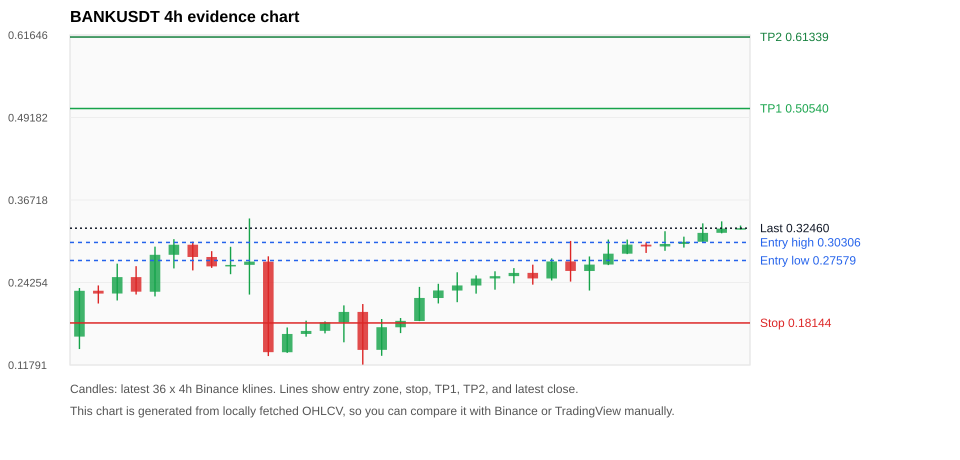
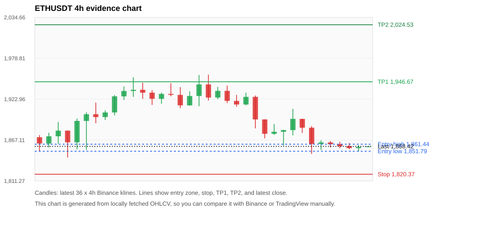
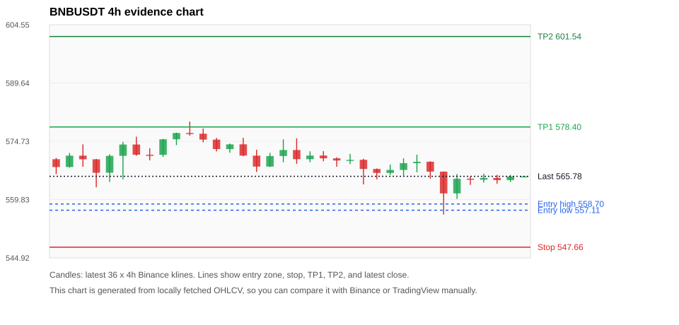
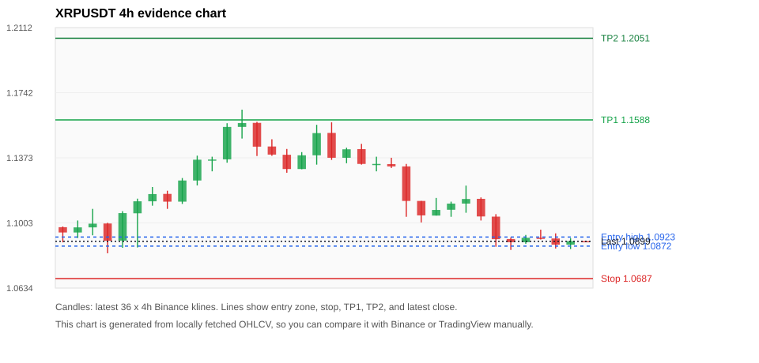
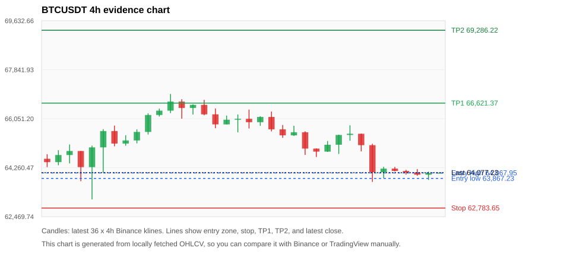

# Crypto 市场扫描报告 v1

- 报告时间：2026-07-25 20:05:49 CST
- Run ID：`20260725_120502_d482334b`
- Run type：`daily_full`
- 数据来源：SQLite
- 报告版本：v1
- 扫描 ID：6769789d22f7
- 数据源：Binance public spot API + CoinGecko/CoinMarketCap cross-check
- 过滤条件：USDT spot; 24h quote volume >= 30,000,000; trades >= 30,000; exclude stables/leveraged tokens; analyze 1h/4h/1d klines
- 默认单笔风险：账户权益的 1.00%

## 限制说明

- 交易信号仍以 Binance 现货公开 K 线为主源；外部数据源用于一致性复核。
- 结果是研究和模拟盘计划，不是确定收益或实盘下单指令。
- 历史长度过滤：候选币至少需要 180 根 1d K 线。
- 数据质量验证池：先验证 score 排名前 min(top_n * 2, 10) 的候选，再按 action + score 补足最终名单。
- 大盘环境过滤：NEUTRAL; BTC/ETH 大盘未完全确认强势，山寨币买入候选降级为观察。 BTC 7d=-1.1675932863848715; ETH 7d=-0.2249531571289709.
- 已启用数据交叉验证：Binance 主源 + CoinGecko 自动对照；CoinMarketCap 在配置 API Key 后自动对照。
- BANKUSDT 交叉验证状态 DATA_WARNING：At least one external provider needs manual review.
- ETHUSDT 交叉验证状态 DATA_WARNING：At least one external provider needs manual review.
- BNBUSDT 交叉验证状态 DATA_WARNING：At least one external provider needs manual review.
- XRPUSDT 交叉验证状态 DATA_WARNING：At least one external provider needs manual review.
- BTCUSDT 交叉验证状态 DATA_WARNING：At least one external provider needs manual review.
- DOGEUSDT 交叉验证状态 DATA_WARNING：At least one external provider needs manual review.
- SOLUSDT 交叉验证状态 DATA_WARNING：At least one external provider needs manual review.
- ZECUSDT 交叉验证状态 DATA_WARNING：At least one external provider needs manual review.
- DEXEUSDT 交叉验证状态 DATA_WARNING：At least one external provider needs manual review.

## 5 个候选交易计划

| Rank | Coin | Action | Setup | Entry Zone | Stop Loss | TP1 | TP2 / Exit Rule | R/R | Verdict |
|---:|---|---|---|---:|---:|---:|---|---:|---|
| 1 | `BANK` | `WATCH_ONLY` | 涨幅较远，只等深回调 | 0.27579 - 0.30306 | 0.18144 | 0.50540 | 0.61339 或跌破 4h 关键支撑 | 2.00-3.00 | 只等回调 |
| 2 | `ETH` | `WATCH_ONLY` | 回踩支撑/4h EMA 附近 | 1,851.79 - 1,861.44 | 1,820.37 | 1,946.67 | 2,024.53 或跌破 4h 关键支撑 | 2.48-4.63 | 只观察 |
| 3 | `BNB` | `REJECT` | 回踩支撑/4h EMA 附近 | 557.11 - 558.70 | 547.66 | 578.40 | 601.54 或跌破 4h 关键支撑 | 2.00-4.26 | 只观察 |
| 4 | `XRP` | `REJECT` | 回踩支撑/4h EMA 附近 | 1.0872 - 1.0923 | 1.0687 | 1.1588 | 1.2051 或跌破 4h 关键支撑 | 3.28-5.49 | 只观察 |
| 5 | `BTC` | `REJECT` | 回踩支撑/4h EMA 附近 | 63,867.23 - 64,067.95 | 62,783.65 | 66,621.37 | 69,286.22 或跌破 4h 关键支撑 | 2.24-4.49 | 只观察 |

## 数据交叉验证摘要

价格差异以 Binance 当前价为基准；成交量口径不同，Binance 是 USDT 现货成交额，CoinGecko/CoinMarketCap 通常是全市场成交量。

| Rank | Coin | Data Status | Max Price Diff | Max 24h Diff | Message |
|---:|---|---|---:|---:|---|
| 1 | `BANK` | DATA_WARNING | 0.54% | 1.24 pts | At least one external provider needs manual review. |
| 2 | `ETH` | DATA_WARNING | 0.12% | 0.05 pts | At least one external provider needs manual review. |
| 3 | `BNB` | DATA_WARNING | 0.11% | 0.18 pts | At least one external provider needs manual review. |
| 4 | `XRP` | DATA_WARNING | 0.09% | 0.37 pts | At least one external provider needs manual review. |
| 5 | `BTC` | DATA_WARNING | 0.12% | 0.07 pts | At least one external provider needs manual review. |

## 候选币说明

### 1. BANK `BANKUSDT`



- 入选原因：涨幅较远，只等深回调；24h +12.20%，7d +355.26%，4h RSI 79.98，24h 成交额 $36.9M。
- 交易失效条件：跌破 0.181437 或 4h 收盘重新失守关键支撑。
- 主要风险：距离支撑偏远，不能追市价；4h RSI 偏热；数据交叉验证需要人工复核。
- 数据交叉验证：DATA_WARNING；At least one external provider needs manual review.

#### 可点击人工验证

- [Binance 交易页](https://www.binance.com/en/trade/BANK_USDT)
- [TradingView 图表](https://www.tradingview.com/chart/?symbol=BINANCE%3ABANKUSDT)
- [CoinGecko 搜索](https://www.coingecko.com/en/search?query=BANK)
- [CoinMarketCap 搜索](https://coinmarketcap.com/search/?q=BANK)

#### 多数据源对照

| Source | Status | Asset ID | Price | 24h Change | 24h Volume | Price Diff | 24h Diff | Updated | Message |
|---|---|---|---:|---:|---:|---:|---:|---|---|
| Binance | DATA_OK | BANKUSDT | 0.32460 | +12.20% | $36.9M | 0.00% | 0.00 pts | 2026-07-25T12:05:19+00:00 | Primary market data source used by scanner. |
| CoinGecko | DATA_WARNING | lorenzo-protocol | 0.32576 | +13.44% | $99.6M | 0.36% | 1.24 pts | 2026-07-25T12:04:58.236Z | CoinGecko symbol mapping has 3 exact matches; selected highest market-cap rank |
| CoinMarketCap | DATA_WARNING | 36296 | 0.32636 | +12.79% | $151.7M | 0.54% | 0.59 pts | 2026-07-25T12:04:05.000Z | CoinMarketCap symbol mapping has 10 matches; selected lowest cmc_rank |

#### 指标证据

| 指标 | 数值 | 人工核对用途 |
|---|---:|---|
| 当前价 | 0.32460 | 与 Binance/TradingView 当前价格对照 |
| 24h 涨跌 | +12.20% | 与交易所 24h 涨跌对照 |
| 7d 涨跌 | +355.26% | 判断短线趋势是否延续 |
| 4h EMA20 | 0.27324 | 判断短期趋势支撑 |
| 4h EMA50 | 0.21447 | 判断中期趋势支撑 |
| 1d EMA20 | 0.15852 | 判断日线趋势 |
| 1d EMA50 | 0.09625 | 判断日线趋势 |
| 4h RSI14 | 79.98 | 判断是否过热/过弱 |
| 4h ATR14 | 0.02871 | 推导止损和入场缓冲 |
| 最近 18 根 4h 最低点 | 0.18420 | 支撑/止损参考 |
| 最近 36 根 4h 最高点 | 0.33930 | TP/压力参考 |
| 支撑位 | 0.27324 | 入场区间推导基础 |

#### 交易计划推导

- 支撑位 = 最近低点、4h EMA20、4h EMA50、1d EMA20 中不高于当前价的最高有效支撑 = `0.27324`。
- 入场区间 = 支撑位附近 + ATR 缓冲 = `0.27579 - 0.30306`。
- 止损 = min(最近 18 根 4h 最低点 * 0.985, 入场中位价 - 1.15 * ATR14) = `0.18144`。
- TP1 = max(最近 36 根 4h 最高点 * 0.995, 入场中位价 + 2R) = `0.50540`。
- TP2 = max(入场中位价 + 3R, TP1 * 1.04) = `0.61339`。

#### 最近 10 根 4h K线

| UTC 开盘时间 | Open | High | Low | Close | Quote Volume | Trades |
|---|---:|---:|---:|---:|---:|---:|
| 2026-07-24T00:00+00:00 | 0.27440 | 0.30530 | 0.24390 | 0.26000 | $18.2M | 222539 |
| 2026-07-24T04:00+00:00 | 0.25990 | 0.28190 | 0.23040 | 0.26960 | $13.1M | 162472 |
| 2026-07-24T08:00+00:00 | 0.26970 | 0.30740 | 0.26880 | 0.28610 | $13.7M | 134748 |
| 2026-07-24T12:00+00:00 | 0.28610 | 0.30740 | 0.28540 | 0.29980 | $8.8M | 110826 |
| 2026-07-24T16:00+00:00 | 0.29970 | 0.30320 | 0.28720 | 0.29700 | $5.8M | 65098 |
| 2026-07-24T20:00+00:00 | 0.29700 | 0.32000 | 0.29040 | 0.30070 | $5.9M | 65488 |
| 2026-07-25T00:00+00:00 | 0.30080 | 0.31180 | 0.29530 | 0.30400 | $3.3M | 40502 |
| 2026-07-25T04:00+00:00 | 0.30410 | 0.33190 | 0.30410 | 0.31750 | $7.6M | 88518 |
| 2026-07-25T08:00+00:00 | 0.31760 | 0.33490 | 0.31680 | 0.32400 | $5.9M | 58867 |
| 2026-07-25T12:00+00:00 | 0.32390 | 0.32860 | 0.32270 | 0.32460 | $106,143 | 1477 |

### 2. ETH `ETHUSDT`



- 入选原因：回踩支撑/4h EMA 附近；24h -1.27%，7d +0.91%，4h RSI 27.56，24h 成交额 $283.5M。
- 交易失效条件：跌破 1820.3686 或 4h 收盘重新失守关键支撑。
- 主要风险：24h 动量未确认；数据交叉验证需要人工复核。
- 数据交叉验证：DATA_WARNING；At least one external provider needs manual review.

#### 可点击人工验证

- [Binance 交易页](https://www.binance.com/en/trade/ETH_USDT)
- [TradingView 图表](https://www.tradingview.com/chart/?symbol=BINANCE%3AETHUSDT)
- [CoinGecko 搜索](https://www.coingecko.com/en/search?query=ETH)
- [CoinMarketCap 搜索](https://coinmarketcap.com/search/?q=ETH)

#### 多数据源对照

| Source | Status | Asset ID | Price | 24h Change | 24h Volume | Price Diff | 24h Diff | Updated | Message |
|---|---|---|---:|---:|---:|---:|---:|---|---|
| Binance | DATA_OK | ETHUSDT | 1,858.42 | -1.27% | $283.5M | 0.00% | 0.00 pts | 2026-07-25T12:05:19+00:00 | Primary market data source used by scanner. |
| CoinGecko | DATA_OK | ethereum | 1,857.05 | -1.30% | $6.77B | 0.07% | 0.03 pts | 2026-07-25T12:02:20.000Z | External source agrees with Binance within thresholds. |
| CoinMarketCap | DATA_WARNING | 1027 | 1,856.23 | -1.33% | $6.92B | 0.12% | 0.05 pts | 2026-07-25T12:04:05.000Z | CoinMarketCap symbol mapping has 6 matches; selected lowest cmc_rank |

#### 指标证据

| 指标 | 数值 | 人工核对用途 |
|---|---:|---|
| 当前价 | 1,858.42 | 与 Binance/TradingView 当前价格对照 |
| 24h 涨跌 | -1.27% | 与交易所 24h 涨跌对照 |
| 7d 涨跌 | +0.91% | 判断短线趋势是否延续 |
| 4h EMA20 | 1,880.31 | 判断短期趋势支撑 |
| 4h EMA50 | 1,879.92 | 判断中期趋势支撑 |
| 1d EMA20 | 1,841.35 | 判断日线趋势 |
| 1d EMA50 | 1,831.51 | 判断日线趋势 |
| 4h RSI14 | 27.56 | 判断是否过热/过弱 |
| 4h ATR14 | 19.0750 | 推导止损和入场缓冲 |
| 最近 18 根 4h 最低点 | 1,848.09 | 支撑/止损参考 |
| 最近 36 根 4h 最高点 | 1,956.45 | TP/压力参考 |
| 支撑位 | 1,848.09 | 入场区间推导基础 |

#### 交易计划推导

- 支撑位 = 最近低点、4h EMA20、4h EMA50、1d EMA20 中不高于当前价的最高有效支撑 = `1,848.09`。
- 入场区间 = 支撑位附近 + ATR 缓冲 = `1,851.79 - 1,861.44`。
- 止损 = min(最近 18 根 4h 最低点 * 0.985, 入场中位价 - 1.15 * ATR14) = `1,820.37`。
- TP1 = max(最近 36 根 4h 最高点 * 0.995, 入场中位价 + 2R) = `1,946.67`。
- TP2 = max(入场中位价 + 3R, TP1 * 1.04) = `2,024.53`。

#### 最近 10 根 4h K线

| UTC 开盘时间 | Open | High | Low | Close | Quote Volume | Trades |
|---|---:|---:|---:|---:|---:|---:|
| 2026-07-24T00:00+00:00 | 1,878.38 | 1,881.20 | 1,859.67 | 1,880.67 | $62.8M | 323469 |
| 2026-07-24T04:00+00:00 | 1,880.67 | 1,909.80 | 1,873.48 | 1,895.98 | $65.2M | 306204 |
| 2026-07-24T08:00+00:00 | 1,895.98 | 1,896.04 | 1,876.71 | 1,883.93 | $43.5M | 273771 |
| 2026-07-24T12:00+00:00 | 1,883.93 | 1,886.09 | 1,848.09 | 1,861.81 | $126.7M | 770893 |
| 2026-07-24T16:00+00:00 | 1,861.82 | 1,866.76 | 1,853.50 | 1,863.83 | $55.5M | 339037 |
| 2026-07-24T20:00+00:00 | 1,863.84 | 1,865.82 | 1,856.97 | 1,861.44 | $22.0M | 121160 |
| 2026-07-25T00:00+00:00 | 1,861.44 | 1,864.69 | 1,855.93 | 1,858.74 | $26.0M | 112861 |
| 2026-07-25T04:00+00:00 | 1,858.74 | 1,862.96 | 1,854.61 | 1,856.02 | $24.1M | 107612 |
| 2026-07-25T08:00+00:00 | 1,856.03 | 1,860.09 | 1,851.22 | 1,857.75 | $29.8M | 118603 |
| 2026-07-25T12:00+00:00 | 1,857.75 | 1,858.43 | 1,857.71 | 1,858.42 | $417,058 | 1965 |

### 3. BNB `BNBUSDT`



- 入选原因：回踩支撑/4h EMA 附近；24h -0.02%，7d -0.64%，4h RSI 40.14，24h 成交额 $49.1M。
- 交易失效条件：跌破 547.66 或 4h 收盘重新失守关键支撑。
- 主要风险：日线趋势未完全确认；24h 动量未确认；7d 趋势未确认；数据交叉验证需要人工复核。
- 数据交叉验证：DATA_WARNING；At least one external provider needs manual review.

#### 可点击人工验证

- [Binance 交易页](https://www.binance.com/en/trade/BNB_USDT)
- [TradingView 图表](https://www.tradingview.com/chart/?symbol=BINANCE%3ABNBUSDT)
- [CoinGecko 搜索](https://www.coingecko.com/en/search?query=BNB)
- [CoinMarketCap 搜索](https://coinmarketcap.com/search/?q=BNB)

#### 多数据源对照

| Source | Status | Asset ID | Price | 24h Change | 24h Volume | Price Diff | 24h Diff | Updated | Message |
|---|---|---|---:|---:|---:|---:|---:|---|---|
| Binance | DATA_OK | BNBUSDT | 565.78 | -0.02% | $49.1M | 0.00% | 0.00 pts | 2026-07-25T12:05:19+00:00 | Primary market data source used by scanner. |
| CoinGecko | DATA_OK | binancecoin | 565.22 | -0.20% | $512.4M | 0.10% | 0.18 pts | 2026-07-25T12:03:30.000Z | External source agrees with Binance within thresholds. |
| CoinMarketCap | DATA_WARNING | 1839 | 565.14 | -0.15% | $964.4M | 0.11% | 0.13 pts | 2026-07-25T12:04:05.000Z | CoinMarketCap symbol mapping has 4 matches; selected lowest cmc_rank |

#### 指标证据

| 指标 | 数值 | 人工核对用途 |
|---|---:|---|
| 当前价 | 565.78 | 与 Binance/TradingView 当前价格对照 |
| 24h 涨跌 | -0.02% | 与交易所 24h 涨跌对照 |
| 7d 涨跌 | -0.64% | 判断短线趋势是否延续 |
| 4h EMA20 | 567.34 | 判断短期趋势支撑 |
| 4h EMA50 | 569.68 | 判断中期趋势支撑 |
| 1d EMA20 | 571.59 | 判断日线趋势 |
| 1d EMA50 | 583.63 | 判断日线趋势 |
| 4h RSI14 | 40.14 | 判断是否过热/过弱 |
| 4h ATR14 | 3.8614 | 推导止损和入场缓冲 |
| 最近 18 根 4h 最低点 | 556.00 | 支撑/止损参考 |
| 最近 36 根 4h 最高点 | 579.79 | TP/压力参考 |
| 支撑位 | 556.00 | 入场区间推导基础 |

#### 交易计划推导

- 支撑位 = 最近低点、4h EMA20、4h EMA50、1d EMA20 中不高于当前价的最高有效支撑 = `556.00`。
- 入场区间 = 支撑位附近 + ATR 缓冲 = `557.11 - 558.70`。
- 止损 = min(最近 18 根 4h 最低点 * 0.985, 入场中位价 - 1.15 * ATR14) = `547.66`。
- TP1 = max(最近 36 根 4h 最高点 * 0.995, 入场中位价 + 2R) = `578.40`。
- TP2 = max(入场中位价 + 3R, TP1 * 1.04) = `601.54`。

#### 最近 10 根 4h K线

| UTC 开盘时间 | Open | High | Low | Close | Quote Volume | Trades |
|---|---:|---:|---:|---:|---:|---:|
| 2026-07-24T00:00+00:00 | 567.41 | 570.39 | 565.92 | 569.15 | $5.1M | 59325 |
| 2026-07-24T04:00+00:00 | 569.15 | 571.31 | 566.81 | 569.50 | $6.5M | 71188 |
| 2026-07-24T08:00+00:00 | 569.51 | 569.63 | 565.18 | 566.98 | $7.3M | 67030 |
| 2026-07-24T12:00+00:00 | 566.98 | 566.99 | 556.00 | 561.41 | $21.3M | 172107 |
| 2026-07-24T16:00+00:00 | 561.41 | 566.37 | 560.00 | 565.16 | $8.6M | 79672 |
| 2026-07-24T20:00+00:00 | 565.17 | 565.71 | 563.60 | 564.90 | $3.5M | 41642 |
| 2026-07-25T00:00+00:00 | 564.91 | 566.47 | 564.18 | 565.37 | $6.3M | 37017 |
| 2026-07-25T04:00+00:00 | 565.37 | 566.15 | 563.90 | 564.81 | $4.5M | 35213 |
| 2026-07-25T08:00+00:00 | 564.81 | 566.16 | 564.34 | 565.74 | $5.3M | 37529 |
| 2026-07-25T12:00+00:00 | 565.75 | 565.79 | 565.59 | 565.78 | $158,608 | 852 |

### 4. XRP `XRPUSDT`



- 入选原因：回踩支撑/4h EMA 附近；24h -1.13%，7d +0.37%，4h RSI 19.30，24h 成交额 $48.5M。
- 交易失效条件：跌破 1.068725 或 4h 收盘重新失守关键支撑。
- 主要风险：日线趋势未完全确认；24h 动量未确认；数据交叉验证需要人工复核。
- 数据交叉验证：DATA_WARNING；At least one external provider needs manual review.

#### 可点击人工验证

- [Binance 交易页](https://www.binance.com/en/trade/XRP_USDT)
- [TradingView 图表](https://www.tradingview.com/chart/?symbol=BINANCE%3AXRPUSDT)
- [CoinGecko 搜索](https://www.coingecko.com/en/search?query=XRP)
- [CoinMarketCap 搜索](https://coinmarketcap.com/search/?q=XRP)

#### 多数据源对照

| Source | Status | Asset ID | Price | 24h Change | 24h Volume | Price Diff | 24h Diff | Updated | Message |
|---|---|---|---:|---:|---:|---:|---:|---|---|
| Binance | DATA_OK | XRPUSDT | 1.0899 | -1.13% | $48.5M | 0.00% | 0.00 pts | 2026-07-25T12:05:19+00:00 | Primary market data source used by scanner. |
| CoinGecko | DATA_OK | ripple | 1.0900 | -1.50% | $906.1M | 0.01% | 0.37 pts | 2026-07-25T12:03:30.000Z | External source agrees with Binance within thresholds. |
| CoinMarketCap | DATA_WARNING | 52 | 1.0889 | -1.20% | $866.9M | 0.09% | 0.07 pts | 2026-07-25T12:04:05.000Z | CoinMarketCap symbol mapping has 3 matches; selected lowest cmc_rank |

#### 指标证据

| 指标 | 数值 | 人工核对用途 |
|---|---:|---|
| 当前价 | 1.0899 | 与 Binance/TradingView 当前价格对照 |
| 24h 涨跌 | -1.13% | 与交易所 24h 涨跌对照 |
| 7d 涨跌 | +0.37% | 判断短线趋势是否延续 |
| 4h EMA20 | 1.1053 | 判断短期趋势支撑 |
| 4h EMA50 | 1.1096 | 判断中期趋势支撑 |
| 1d EMA20 | 1.1062 | 判断日线趋势 |
| 1d EMA50 | 1.1403 | 判断日线趋势 |
| 4h RSI14 | 19.30 | 判断是否过热/过弱 |
| 4h ATR14 | 0.01046 | 推导止损和入场缓冲 |
| 最近 18 根 4h 最低点 | 1.0850 | 支撑/止损参考 |
| 最近 36 根 4h 最高点 | 1.1646 | TP/压力参考 |
| 支撑位 | 1.0850 | 入场区间推导基础 |

#### 交易计划推导

- 支撑位 = 最近低点、4h EMA20、4h EMA50、1d EMA20 中不高于当前价的最高有效支撑 = `1.0850`。
- 入场区间 = 支撑位附近 + ATR 缓冲 = `1.0872 - 1.0923`。
- 止损 = min(最近 18 根 4h 最低点 * 0.985, 入场中位价 - 1.15 * ATR14) = `1.0687`。
- TP1 = max(最近 36 根 4h 最高点 * 0.995, 入场中位价 + 2R) = `1.1588`。
- TP2 = max(入场中位价 + 3R, TP1 * 1.04) = `1.2051`。

#### 最近 10 根 4h K线

| UTC 开盘时间 | Open | High | Low | Close | Quote Volume | Trades |
|---|---:|---:|---:|---:|---:|---:|
| 2026-07-24T00:00+00:00 | 1.1078 | 1.1124 | 1.1038 | 1.1113 | $5.6M | 40418 |
| 2026-07-24T04:00+00:00 | 1.1113 | 1.1215 | 1.1061 | 1.1139 | $6.2M | 36048 |
| 2026-07-24T08:00+00:00 | 1.1140 | 1.1148 | 1.1017 | 1.1040 | $9.9M | 37126 |
| 2026-07-24T12:00+00:00 | 1.1039 | 1.1053 | 1.0868 | 1.0911 | $20.0M | 83489 |
| 2026-07-24T16:00+00:00 | 1.0912 | 1.0921 | 1.0850 | 1.0894 | $9.8M | 35656 |
| 2026-07-24T20:00+00:00 | 1.0894 | 1.0935 | 1.0885 | 1.0919 | $4.0M | 23382 |
| 2026-07-25T00:00+00:00 | 1.0919 | 1.0965 | 1.0909 | 1.0916 | $6.1M | 22889 |
| 2026-07-25T04:00+00:00 | 1.0915 | 1.0944 | 1.0858 | 1.0880 | $4.9M | 18593 |
| 2026-07-25T08:00+00:00 | 1.0880 | 1.0917 | 1.0855 | 1.0900 | $4.1M | 18534 |
| 2026-07-25T12:00+00:00 | 1.0900 | 1.0901 | 1.0898 | 1.0899 | $22,581 | 153 |

### 5. BTC `BTCUSDT`



- 入选原因：回踩支撑/4h EMA 附近；24h -1.44%，7d -0.04%，4h RSI 29.37，24h 成交额 $998.9M。
- 交易失效条件：跌破 62783.654 或 4h 收盘重新失守关键支撑。
- 主要风险：日线趋势未完全确认；24h 动量未确认；7d 趋势未确认；数据交叉验证需要人工复核。
- 数据交叉验证：DATA_WARNING；At least one external provider needs manual review.

#### 可点击人工验证

- [Binance 交易页](https://www.binance.com/en/trade/BTC_USDT)
- [TradingView 图表](https://www.tradingview.com/chart/?symbol=BINANCE%3ABTCUSDT)
- [CoinGecko 搜索](https://www.coingecko.com/en/search?query=BTC)
- [CoinMarketCap 搜索](https://coinmarketcap.com/search/?q=BTC)

#### 多数据源对照

| Source | Status | Asset ID | Price | 24h Change | 24h Volume | Price Diff | 24h Diff | Updated | Message |
|---|---|---|---:|---:|---:|---:|---:|---|---|
| Binance | DATA_OK | BTCUSDT | 64,077.23 | -1.44% | $998.9M | 0.00% | 0.00 pts | 2026-07-25T12:05:19+00:00 | Primary market data source used by scanner. |
| CoinGecko | DATA_OK | bitcoin | 64,006.00 | -1.40% | $23.68B | 0.11% | 0.04 pts | 2026-07-25T12:02:20.000Z | External source agrees with Binance within thresholds. |
| CoinMarketCap | DATA_WARNING | 1 | 63,999.42 | -1.51% | $22.82B | 0.12% | 0.07 pts | 2026-07-25T12:04:05.000Z | CoinMarketCap symbol mapping has 13 matches; selected lowest cmc_rank |

#### 指标证据

| 指标 | 数值 | 人工核对用途 |
|---|---:|---|
| 当前价 | 64,077.23 | 与 Binance/TradingView 当前价格对照 |
| 24h 涨跌 | -1.44% | 与交易所 24h 涨跌对照 |
| 7d 涨跌 | -0.04% | 判断短线趋势是否延续 |
| 4h EMA20 | 64,761.52 | 判断短期趋势支撑 |
| 4h EMA50 | 64,836.43 | 判断中期趋势支撑 |
| 1d EMA20 | 64,294.43 | 判断日线趋势 |
| 1d EMA50 | 65,048.60 | 判断日线趋势 |
| 4h RSI14 | 29.37 | 判断是否过热/过弱 |
| 4h ATR14 | 468.86 | 推导止损和入场缓冲 |
| 最近 18 根 4h 最低点 | 63,739.75 | 支撑/止损参考 |
| 最近 36 根 4h 最高点 | 66,956.15 | TP/压力参考 |
| 支撑位 | 63,739.75 | 入场区间推导基础 |

#### 交易计划推导

- 支撑位 = 最近低点、4h EMA20、4h EMA50、1d EMA20 中不高于当前价的最高有效支撑 = `63,739.75`。
- 入场区间 = 支撑位附近 + ATR 缓冲 = `63,867.23 - 64,067.95`。
- 止损 = min(最近 18 根 4h 最低点 * 0.985, 入场中位价 - 1.15 * ATR14) = `62,783.65`。
- TP1 = max(最近 36 根 4h 最高点 * 0.995, 入场中位价 + 2R) = `66,621.37`。
- TP2 = max(入场中位价 + 3R, TP1 * 1.04) = `69,286.22`。

#### 最近 10 根 4h K线

| UTC 开盘时间 | Open | High | Low | Close | Quote Volume | Trades |
|---|---:|---:|---:|---:|---:|---:|
| 2026-07-24T00:00+00:00 | 65,098.98 | 65,464.35 | 64,762.18 | 65,456.70 | $118.8M | 353470 |
| 2026-07-24T04:00+00:00 | 65,456.70 | 65,808.59 | 65,248.00 | 65,499.95 | $183.7M | 327061 |
| 2026-07-24T08:00+00:00 | 65,499.94 | 65,508.17 | 64,857.14 | 65,083.43 | $146.6M | 299283 |
| 2026-07-24T12:00+00:00 | 65,083.42 | 65,133.99 | 63,739.75 | 64,093.85 | $388.1M | 916912 |
| 2026-07-24T16:00+00:00 | 64,093.86 | 64,292.44 | 63,881.46 | 64,225.32 | $129.9M | 374993 |
| 2026-07-24T20:00+00:00 | 64,225.32 | 64,288.02 | 64,121.86 | 64,139.99 | $119.8M | 195972 |
| 2026-07-25T00:00+00:00 | 64,140.00 | 64,179.03 | 64,006.55 | 64,085.36 | $117.2M | 162165 |
| 2026-07-25T04:00+00:00 | 64,085.36 | 64,205.67 | 63,964.57 | 64,003.20 | $68.8M | 150931 |
| 2026-07-25T08:00+00:00 | 64,003.20 | 64,113.00 | 63,810.00 | 64,064.01 | $175.7M | 240400 |
| 2026-07-25T12:00+00:00 | 64,064.01 | 64,077.23 | 64,060.79 | 64,077.22 | $1.3M | 1935 |

## 组合风控

- 不要 5 个候选全部满仓买入。
- 同时持仓总风险建议控制在账户权益的 3% - 5% 以内。
- 如果 BTC/ETH 同时破位，暂停山寨币多头计划或降低仓位。
- 第一版报告用于模拟盘和人工复核，不自动下单。

## 原始数据

```json
[
  {
    "rank": 1,
    "symbol": "BANKUSDT",
    "base_asset": "BANK",
    "price": 0.3246,
    "score": 59.5977312910974,
    "setup": "涨幅较远，只等深回调",
    "verdict": "只等回调",
    "entry_low": 0.2757857142857143,
    "entry_high": 0.30306428571428573,
    "stop_loss": 0.181437,
    "take_profit_1": 0.5054010000000002,
    "take_profit_2": 0.6133890000000002,
    "risk_reward_1": 2.0000000000000004,
    "risk_reward_2": 2.9999999999999996,
    "pct_24h": 12.202,
    "pct_3d": 84.01360544217687,
    "pct_7d": 355.2594670406732,
    "quote_volume_24h": 36861458.62347,
    "trades_24h": 424961,
    "high_low_range_24h": 16.730568142209833,
    "rsi_1h": 58.37696335078533,
    "rsi_4h": 79.98423955870764,
    "ema20_4h": 0.27324237020616643,
    "ema50_4h": 0.21447427578398062,
    "ema20_1d": 0.1585166830441791,
    "ema50_1d": 0.0962513805344894,
    "atr_4h": 0.028714285714285716,
    "macd_hist_4h": 0.0032838662501748495,
    "volume_ratio_24h": 0.40029941272891634,
    "support_level": 0.27324237020616643,
    "recent_low_4h_18": 0.1842,
    "recent_high_4h_36": 0.3393,
    "distance_to_support_pct": 18.795631788394786,
    "binance_trade_url": "https://www.binance.com/en/trade/BANK_USDT",
    "tradingview_url": "https://www.tradingview.com/chart/?symbol=BINANCE%3ABANKUSDT",
    "coingecko_search_url": "https://www.coingecko.com/en/search?query=BANK",
    "coinmarketcap_search_url": "https://coinmarketcap.com/search/?q=BANK",
    "invalidation": "跌破 0.181437 或 4h 收盘重新失守关键支撑",
    "recent_4h_klines": [
      {
        "open_time_utc": "2026-07-19T16:00+00:00",
        "open": 0.1608,
        "high": 0.2342,
        "low": 0.142,
        "close": 0.23,
        "quote_volume": 31530446.79001,
        "trades": 293545
      },
      {
        "open_time_utc": "2026-07-19T20:00+00:00",
        "open": 0.2301,
        "high": 0.2381,
        "low": 0.2108,
        "close": 0.2258,
        "quote_volume": 16259292.95524,
        "trades": 153687
      },
      {
        "open_time_utc": "2026-07-20T00:00+00:00",
        "open": 0.2259,
        "high": 0.271,
        "low": 0.2154,
        "close": 0.2507,
        "quote_volume": 13772221.95966,
        "trades": 183561
      },
      {
        "open_time_utc": "2026-07-20T04:00+00:00",
        "open": 0.2507,
        "high": 0.2672,
        "low": 0.2244,
        "close": 0.2287,
        "quote_volume": 13300317.60412,
        "trades": 151963
      },
      {
        "open_time_utc": "2026-07-20T08:00+00:00",
        "open": 0.2286,
        "high": 0.2967,
        "low": 0.2215,
        "close": 0.2844,
        "quote_volume": 20309546.2399,
        "trades": 206094
      },
      {
        "open_time_utc": "2026-07-20T12:00+00:00",
        "open": 0.2844,
        "high": 0.308,
        "low": 0.2638,
        "close": 0.2996,
        "quote_volume": 12756062.97528,
        "trades": 154521
      },
      {
        "open_time_utc": "2026-07-20T16:00+00:00",
        "open": 0.2996,
        "high": 0.3042,
        "low": 0.2608,
        "close": 0.2811,
        "quote_volume": 13024169.95372,
        "trades": 150855
      },
      {
        "open_time_utc": "2026-07-20T20:00+00:00",
        "open": 0.2811,
        "high": 0.2899,
        "low": 0.2646,
        "close": 0.2669,
        "quote_volume": 3901231.88935,
        "trades": 62159
      },
      {
        "open_time_utc": "2026-07-21T00:00+00:00",
        "open": 0.2669,
        "high": 0.2965,
        "low": 0.2551,
        "close": 0.2691,
        "quote_volume": 7908384.16752,
        "trades": 120274
      },
      {
        "open_time_utc": "2026-07-21T04:00+00:00",
        "open": 0.2692,
        "high": 0.3393,
        "low": 0.2243,
        "close": 0.2741,
        "quote_volume": 22009093.04561,
        "trades": 266700
      },
      {
        "open_time_utc": "2026-07-21T08:00+00:00",
        "open": 0.2741,
        "high": 0.2821,
        "low": 0.1314,
        "close": 0.1373,
        "quote_volume": 36796770.96605,
        "trades": 564074
      },
      {
        "open_time_utc": "2026-07-21T12:00+00:00",
        "open": 0.1372,
        "high": 0.1746,
        "low": 0.1362,
        "close": 0.1648,
        "quote_volume": 15411459.06286,
        "trades": 146381
      },
      {
        "open_time_utc": "2026-07-21T16:00+00:00",
        "open": 0.1648,
        "high": 0.1849,
        "low": 0.1607,
        "close": 0.1694,
        "quote_volume": 11849582.05491,
        "trades": 114628
      },
      {
        "open_time_utc": "2026-07-21T20:00+00:00",
        "open": 0.1695,
        "high": 0.1838,
        "low": 0.1657,
        "close": 0.1823,
        "quote_volume": 3051498.55355,
        "trades": 33878
      },
      {
        "open_time_utc": "2026-07-22T00:00+00:00",
        "open": 0.1823,
        "high": 0.208,
        "low": 0.1522,
        "close": 0.1981,
        "quote_volume": 20270511.31169,
        "trades": 279829
      },
      {
        "open_time_utc": "2026-07-22T04:00+00:00",
        "open": 0.1981,
        "high": 0.21,
        "low": 0.1185,
        "close": 0.1407,
        "quote_volume": 22211587.87328,
        "trades": 266622
      },
      {
        "open_time_utc": "2026-07-22T08:00+00:00",
        "open": 0.1408,
        "high": 0.1874,
        "low": 0.1318,
        "close": 0.175,
        "quote_volume": 17504178.66821,
        "trades": 199508
      },
      {
        "open_time_utc": "2026-07-22T12:00+00:00",
        "open": 0.1749,
        "high": 0.1889,
        "low": 0.1661,
        "close": 0.1846,
        "quote_volume": 11865002.45501,
        "trades": 116777
      },
      {
        "open_time_utc": "2026-07-22T16:00+00:00",
        "open": 0.1844,
        "high": 0.2359,
        "low": 0.1842,
        "close": 0.2192,
        "quote_volume": 17620028.88124,
        "trades": 174586
      },
      {
        "open_time_utc": "2026-07-22T20:00+00:00",
        "open": 0.2191,
        "high": 0.2406,
        "low": 0.2109,
        "close": 0.2305,
        "quote_volume": 7628261.19402,
        "trades": 91387
      },
      {
        "open_time_utc": "2026-07-23T00:00+00:00",
        "open": 0.2304,
        "high": 0.258,
        "low": 0.2128,
        "close": 0.2381,
        "quote_volume": 13059172.99562,
        "trades": 175883
      },
      {
        "open_time_utc": "2026-07-23T04:00+00:00",
        "open": 0.238,
        "high": 0.2533,
        "low": 0.2257,
        "close": 0.2485,
        "quote_volume": 6318441.44353,
        "trades": 82944
      },
      {
        "open_time_utc": "2026-07-23T08:00+00:00",
        "open": 0.2487,
        "high": 0.2595,
        "low": 0.2317,
        "close": 0.2521,
        "quote_volume": 10518439.57259,
        "trades": 116661
      },
      {
        "open_time_utc": "2026-07-23T12:00+00:00",
        "open": 0.2522,
        "high": 0.2643,
        "low": 0.2412,
        "close": 0.257,
        "quote_volume": 11144818.63714,
        "trades": 103996
      },
      {
        "open_time_utc": "2026-07-23T16:00+00:00",
        "open": 0.2571,
        "high": 0.2695,
        "low": 0.2393,
        "close": 0.2487,
        "quote_volume": 9065948.65324,
        "trades": 98070
      },
      {
        "open_time_utc": "2026-07-23T20:00+00:00",
        "open": 0.2486,
        "high": 0.279,
        "low": 0.2456,
        "close": 0.2743,
        "quote_volume": 5851924.1141,
        "trades": 61758
      },
      {
        "open_time_utc": "2026-07-24T00:00+00:00",
        "open": 0.2744,
        "high": 0.3053,
        "low": 0.2439,
        "close": 0.26,
        "quote_volume": 18216102.47102,
        "trades": 222539
      },
      {
        "open_time_utc": "2026-07-24T04:00+00:00",
        "open": 0.2599,
        "high": 0.2819,
        "low": 0.2304,
        "close": 0.2696,
        "quote_volume": 13116483.38654,
        "trades": 162472
      },
      {
        "open_time_utc": "2026-07-24T08:00+00:00",
        "open": 0.2697,
        "high": 0.3074,
        "low": 0.2688,
        "close": 0.2861,
        "quote_volume": 13685663.102,
        "trades": 134748
      },
      {
        "open_time_utc": "2026-07-24T12:00+00:00",
        "open": 0.2861,
        "high": 0.3074,
        "low": 0.2854,
        "close": 0.2998,
        "quote_volume": 8801650.09037,
        "trades": 110826
      },
      {
        "open_time_utc": "2026-07-24T16:00+00:00",
        "open": 0.2997,
        "high": 0.3032,
        "low": 0.2872,
        "close": 0.297,
        "quote_volume": 5833081.31603,
        "trades": 65098
      },
      {
        "open_time_utc": "2026-07-24T20:00+00:00",
        "open": 0.297,
        "high": 0.32,
        "low": 0.2904,
        "close": 0.3007,
        "quote_volume": 5851171.64945,
        "trades": 65488
      },
      {
        "open_time_utc": "2026-07-25T00:00+00:00",
        "open": 0.3008,
        "high": 0.3118,
        "low": 0.2953,
        "close": 0.304,
        "quote_volume": 3305479.9693,
        "trades": 40502
      },
      {
        "open_time_utc": "2026-07-25T04:00+00:00",
        "open": 0.3041,
        "high": 0.3319,
        "low": 0.3041,
        "close": 0.3175,
        "quote_volume": 7558114.15558,
        "trades": 88518
      },
      {
        "open_time_utc": "2026-07-25T08:00+00:00",
        "open": 0.3176,
        "high": 0.3349,
        "low": 0.3168,
        "close": 0.324,
        "quote_volume": 5906083.2542,
        "trades": 58867
      },
      {
        "open_time_utc": "2026-07-25T12:00+00:00",
        "open": 0.3239,
        "high": 0.3286,
        "low": 0.3227,
        "close": 0.3246,
        "quote_volume": 106142.87822,
        "trades": 1477
      }
    ],
    "risks": [
      "距离支撑偏远，不能追市价",
      "4h RSI 偏热",
      "数据交叉验证需要人工复核"
    ],
    "data_quality_status": "DATA_WARNING",
    "data_quality_message": "At least one external provider needs manual review.",
    "data_checks": [
      {
        "provider": "Binance",
        "status": "DATA_OK",
        "provider_asset_id": "BANKUSDT",
        "provider_symbol": "BANKUSDT",
        "price_usd": 0.3246,
        "pct_24h": 12.202,
        "volume_24h": 36861458.62347,
        "last_updated": null,
        "fetched_at_utc": "2026-07-25T12:05:19+00:00",
        "price_diff_pct": 0.0,
        "pct_24h_diff": 0.0,
        "volume_note": "Binance USDT spot 24h quoteVolume.",
        "message": "Primary market data source used by scanner."
      },
      {
        "provider": "CoinGecko",
        "status": "DATA_WARNING",
        "provider_asset_id": "lorenzo-protocol",
        "provider_symbol": "BANK",
        "price_usd": 0.32576,
        "pct_24h": 13.4415,
        "volume_24h": 99616616.0,
        "last_updated": "2026-07-25T12:04:58.236Z",
        "fetched_at_utc": "2026-07-25T12:05:19+00:00",
        "price_diff_pct": 0.35736290819469946,
        "pct_24h_diff": 1.2394999999999996,
        "volume_note": "CoinGecko total market volume; not the same venue scope as Binance quoteVolume.",
        "message": "CoinGecko symbol mapping has 3 exact matches; selected highest market-cap rank"
      },
      {
        "provider": "CoinMarketCap",
        "status": "DATA_WARNING",
        "provider_asset_id": "36296",
        "provider_symbol": "BANK",
        "price_usd": 0.32635730320995426,
        "pct_24h": 12.78997734,
        "volume_24h": 151745776.15137094,
        "last_updated": "2026-07-25T12:04:05.000Z",
        "fetched_at_utc": "2026-07-25T12:05:19+00:00",
        "price_diff_pct": 0.5413749876630511,
        "pct_24h_diff": 0.5879773400000001,
        "volume_note": "CoinMarketCap total market volume; not the same venue scope as Binance quoteVolume.",
        "message": "CoinMarketCap symbol mapping has 10 matches; selected lowest cmc_rank"
      }
    ],
    "action": "WATCH_ONLY"
  },
  {
    "rank": 2,
    "symbol": "ETHUSDT",
    "base_asset": "ETH",
    "price": 1858.42,
    "score": 25.546209246165667,
    "setup": "回踩支撑/4h EMA 附近",
    "verdict": "只观察",
    "entry_low": 1851.7861799999998,
    "entry_high": 1861.4424999999999,
    "stop_loss": 1820.36865,
    "take_profit_1": 1946.66775,
    "take_profit_2": 2024.53446,
    "risk_reward_1": 2.4845274017407393,
    "risk_reward_2": 4.6328299999255185,
    "pct_24h": -1.272,
    "pct_3d": -4.201697999412346,
    "pct_7d": 0.9127882667883114,
    "quote_volume_24h": 283526750.001998,
    "trades_24h": 1564960,
    "high_low_range_24h": 2.0561769177908085,
    "rsi_1h": 47.487083137623415,
    "rsi_4h": 27.55862285310951,
    "ema20_4h": 1880.3123546434892,
    "ema50_4h": 1879.9233717056054,
    "ema20_1d": 1841.3547371403984,
    "ema50_1d": 1831.5141919644143,
    "atr_4h": 19.07499999999998,
    "macd_hist_4h": -5.128145454926788,
    "volume_ratio_24h": 0.623203967214517,
    "support_level": 1848.09,
    "recent_low_4h_18": 1848.09,
    "recent_high_4h_36": 1956.45,
    "distance_to_support_pct": 0.5589554621257653,
    "binance_trade_url": "https://www.binance.com/en/trade/ETH_USDT",
    "tradingview_url": "https://www.tradingview.com/chart/?symbol=BINANCE%3AETHUSDT",
    "coingecko_search_url": "https://www.coingecko.com/en/search?query=ETH",
    "coinmarketcap_search_url": "https://coinmarketcap.com/search/?q=ETH",
    "invalidation": "跌破 1820.3686 或 4h 收盘重新失守关键支撑",
    "recent_4h_klines": [
      {
        "open_time_utc": "2026-07-19T16:00+00:00",
        "open": 1870.91,
        "high": 1873.85,
        "low": 1851.71,
        "close": 1862.37,
        "quote_volume": 50892782.591346,
        "trades": 299983
      },
      {
        "open_time_utc": "2026-07-19T20:00+00:00",
        "open": 1862.37,
        "high": 1877.03,
        "low": 1857.0,
        "close": 1872.23,
        "quote_volume": 49535943.453386,
        "trades": 326699
      },
      {
        "open_time_utc": "2026-07-20T00:00+00:00",
        "open": 1872.24,
        "high": 1891.71,
        "low": 1862.08,
        "close": 1879.94,
        "quote_volume": 75733997.944761,
        "trades": 616195
      },
      {
        "open_time_utc": "2026-07-20T04:00+00:00",
        "open": 1879.94,
        "high": 1879.99,
        "low": 1843.14,
        "close": 1863.95,
        "quote_volume": 76871498.466917,
        "trades": 455920
      },
      {
        "open_time_utc": "2026-07-20T08:00+00:00",
        "open": 1863.95,
        "high": 1896.5,
        "low": 1854.31,
        "close": 1893.2,
        "quote_volume": 82556285.88529,
        "trades": 408523
      },
      {
        "open_time_utc": "2026-07-20T12:00+00:00",
        "open": 1893.21,
        "high": 1904.92,
        "low": 1853.65,
        "close": 1902.34,
        "quote_volume": 122363679.282013,
        "trades": 752281
      },
      {
        "open_time_utc": "2026-07-20T16:00+00:00",
        "open": 1902.34,
        "high": 1918.16,
        "low": 1890.07,
        "close": 1898.46,
        "quote_volume": 110924838.139889,
        "trades": 463219
      },
      {
        "open_time_utc": "2026-07-20T20:00+00:00",
        "open": 1898.46,
        "high": 1907.58,
        "low": 1894.4,
        "close": 1904.77,
        "quote_volume": 41760734.103211,
        "trades": 202624
      },
      {
        "open_time_utc": "2026-07-21T00:00+00:00",
        "open": 1904.77,
        "high": 1928.57,
        "low": 1900.74,
        "close": 1926.75,
        "quote_volume": 75497345.33068,
        "trades": 350782
      },
      {
        "open_time_utc": "2026-07-21T04:00+00:00",
        "open": 1926.74,
        "high": 1940.25,
        "low": 1921.81,
        "close": 1934.08,
        "quote_volume": 78340198.82902,
        "trades": 311313
      },
      {
        "open_time_utc": "2026-07-21T08:00+00:00",
        "open": 1934.07,
        "high": 1953.0,
        "low": 1925.98,
        "close": 1935.69,
        "quote_volume": 220906489.742695,
        "trades": 461182
      },
      {
        "open_time_utc": "2026-07-21T12:00+00:00",
        "open": 1935.69,
        "high": 1945.23,
        "low": 1923.36,
        "close": 1931.81,
        "quote_volume": 120803100.613645,
        "trades": 635584
      },
      {
        "open_time_utc": "2026-07-21T16:00+00:00",
        "open": 1931.81,
        "high": 1935.36,
        "low": 1915.0,
        "close": 1923.39,
        "quote_volume": 96037996.769198,
        "trades": 450944
      },
      {
        "open_time_utc": "2026-07-21T20:00+00:00",
        "open": 1923.38,
        "high": 1932.0,
        "low": 1916.67,
        "close": 1930.09,
        "quote_volume": 39803033.821404,
        "trades": 220537
      },
      {
        "open_time_utc": "2026-07-22T00:00+00:00",
        "open": 1930.09,
        "high": 1944.68,
        "low": 1926.76,
        "close": 1928.77,
        "quote_volume": 73872413.045198,
        "trades": 420834
      },
      {
        "open_time_utc": "2026-07-22T04:00+00:00",
        "open": 1928.76,
        "high": 1939.4,
        "low": 1910.68,
        "close": 1914.44,
        "quote_volume": 92250525.77919,
        "trades": 411324
      },
      {
        "open_time_utc": "2026-07-22T08:00+00:00",
        "open": 1914.43,
        "high": 1933.62,
        "low": 1914.08,
        "close": 1927.27,
        "quote_volume": 70134235.562521,
        "trades": 330907
      },
      {
        "open_time_utc": "2026-07-22T12:00+00:00",
        "open": 1927.26,
        "high": 1955.92,
        "low": 1913.26,
        "close": 1943.03,
        "quote_volume": 119835277.616543,
        "trades": 640676
      },
      {
        "open_time_utc": "2026-07-22T16:00+00:00",
        "open": 1943.04,
        "high": 1956.45,
        "low": 1921.0,
        "close": 1925.13,
        "quote_volume": 80123330.781702,
        "trades": 474808
      },
      {
        "open_time_utc": "2026-07-22T20:00+00:00",
        "open": 1925.14,
        "high": 1939.7,
        "low": 1922.95,
        "close": 1934.25,
        "quote_volume": 48980304.458261,
        "trades": 256919
      },
      {
        "open_time_utc": "2026-07-23T00:00+00:00",
        "open": 1934.26,
        "high": 1941.5,
        "low": 1917.57,
        "close": 1920.55,
        "quote_volume": 48214379.808529,
        "trades": 238170
      },
      {
        "open_time_utc": "2026-07-23T04:00+00:00",
        "open": 1920.56,
        "high": 1928.69,
        "low": 1912.6,
        "close": 1915.65,
        "quote_volume": 54407839.033107,
        "trades": 253043
      },
      {
        "open_time_utc": "2026-07-23T08:00+00:00",
        "open": 1915.65,
        "high": 1931.66,
        "low": 1914.44,
        "close": 1926.04,
        "quote_volume": 48913071.262119,
        "trades": 255383
      },
      {
        "open_time_utc": "2026-07-23T12:00+00:00",
        "open": 1926.03,
        "high": 1927.99,
        "low": 1882.98,
        "close": 1895.23,
        "quote_volume": 151773538.454881,
        "trades": 681357
      },
      {
        "open_time_utc": "2026-07-23T16:00+00:00",
        "open": 1895.23,
        "high": 1895.41,
        "low": 1869.44,
        "close": 1875.65,
        "quote_volume": 75977811.928967,
        "trades": 401029
      },
      {
        "open_time_utc": "2026-07-23T20:00+00:00",
        "open": 1875.64,
        "high": 1889.09,
        "low": 1874.23,
        "close": 1878.38,
        "quote_volume": 39264185.928899,
        "trades": 211827
      },
      {
        "open_time_utc": "2026-07-24T00:00+00:00",
        "open": 1878.38,
        "high": 1881.2,
        "low": 1859.67,
        "close": 1880.67,
        "quote_volume": 62823597.090217,
        "trades": 323469
      },
      {
        "open_time_utc": "2026-07-24T04:00+00:00",
        "open": 1880.67,
        "high": 1909.8,
        "low": 1873.48,
        "close": 1895.98,
        "quote_volume": 65197193.468691,
        "trades": 306204
      },
      {
        "open_time_utc": "2026-07-24T08:00+00:00",
        "open": 1895.98,
        "high": 1896.04,
        "low": 1876.71,
        "close": 1883.93,
        "quote_volume": 43543529.574374,
        "trades": 273771
      },
      {
        "open_time_utc": "2026-07-24T12:00+00:00",
        "open": 1883.93,
        "high": 1886.09,
        "low": 1848.09,
        "close": 1861.81,
        "quote_volume": 126685739.639251,
        "trades": 770893
      },
      {
        "open_time_utc": "2026-07-24T16:00+00:00",
        "open": 1861.82,
        "high": 1866.76,
        "low": 1853.5,
        "close": 1863.83,
        "quote_volume": 55477384.287484,
        "trades": 339037
      },
      {
        "open_time_utc": "2026-07-24T20:00+00:00",
        "open": 1863.84,
        "high": 1865.82,
        "low": 1856.97,
        "close": 1861.44,
        "quote_volume": 21976612.421105,
        "trades": 121160
      },
      {
        "open_time_utc": "2026-07-25T00:00+00:00",
        "open": 1861.44,
        "high": 1864.69,
        "low": 1855.93,
        "close": 1858.74,
        "quote_volume": 26039463.440314,
        "trades": 112861
      },
      {
        "open_time_utc": "2026-07-25T04:00+00:00",
        "open": 1858.74,
        "high": 1862.96,
        "low": 1854.61,
        "close": 1856.02,
        "quote_volume": 24132356.560451,
        "trades": 107612
      },
      {
        "open_time_utc": "2026-07-25T08:00+00:00",
        "open": 1856.03,
        "high": 1860.09,
        "low": 1851.22,
        "close": 1857.75,
        "quote_volume": 29755614.850639,
        "trades": 118603
      },
      {
        "open_time_utc": "2026-07-25T12:00+00:00",
        "open": 1857.75,
        "high": 1858.43,
        "low": 1857.71,
        "close": 1858.42,
        "quote_volume": 417058.381994,
        "trades": 1965
      }
    ],
    "risks": [
      "24h 动量未确认",
      "数据交叉验证需要人工复核"
    ],
    "data_quality_status": "DATA_WARNING",
    "data_quality_message": "At least one external provider needs manual review.",
    "data_checks": [
      {
        "provider": "Binance",
        "status": "DATA_OK",
        "provider_asset_id": "ETHUSDT",
        "provider_symbol": "ETHUSDT",
        "price_usd": 1858.42,
        "pct_24h": -1.272,
        "volume_24h": 283526750.001998,
        "last_updated": null,
        "fetched_at_utc": "2026-07-25T12:05:19+00:00",
        "price_diff_pct": 0.0,
        "pct_24h_diff": 0.0,
        "volume_note": "Binance USDT spot 24h quoteVolume.",
        "message": "Primary market data source used by scanner."
      },
      {
        "provider": "CoinGecko",
        "status": "DATA_OK",
        "provider_asset_id": "ethereum",
        "provider_symbol": "ETH",
        "price_usd": 1857.05,
        "pct_24h": -1.3,
        "volume_24h": 6771575572.0,
        "last_updated": "2026-07-25T12:02:20.000Z",
        "fetched_at_utc": "2026-07-25T12:05:19+00:00",
        "price_diff_pct": 0.07371853509971471,
        "pct_24h_diff": 0.028000000000000025,
        "volume_note": "CoinGecko total market volume; not the same venue scope as Binance quoteVolume.",
        "message": "External source agrees with Binance within thresholds."
      },
      {
        "provider": "CoinMarketCap",
        "status": "DATA_WARNING",
        "provider_asset_id": "1027",
        "provider_symbol": "ETH",
        "price_usd": 1856.2262034184932,
        "pct_24h": -1.3259428,
        "volume_24h": 6915687115.015045,
        "last_updated": "2026-07-25T12:04:05.000Z",
        "fetched_at_utc": "2026-07-25T12:05:19+00:00",
        "price_diff_pct": 0.11804632868279673,
        "pct_24h_diff": 0.05394279999999996,
        "volume_note": "CoinMarketCap total market volume; not the same venue scope as Binance quoteVolume.",
        "message": "CoinMarketCap symbol mapping has 6 matches; selected lowest cmc_rank"
      }
    ],
    "action": "WATCH_ONLY"
  },
  {
    "rank": 3,
    "symbol": "BNBUSDT",
    "base_asset": "BNB",
    "price": 565.78,
    "score": 16.544707545866657,
    "setup": "回踩支撑/4h EMA 附近",
    "verdict": "只观察",
    "entry_low": 557.112,
    "entry_high": 558.703,
    "stop_loss": 547.66,
    "take_profit_1": 578.4025000000001,
    "take_profit_2": 601.5386000000002,
    "risk_reward_1": 2.0,
    "risk_reward_2": 4.257731153939978,
    "pct_24h": -0.021,
    "pct_3d": -1.1409900228896874,
    "pct_7d": -0.6444815172535034,
    "quote_volume_24h": 49085478.27575,
    "trades_24h": 401772,
    "high_low_range_24h": 1.9100719424460344,
    "rsi_1h": 61.55717761557091,
    "rsi_4h": 40.136718749999865,
    "ema20_4h": 567.3409163616031,
    "ema50_4h": 569.679821693758,
    "ema20_1d": 571.586406888279,
    "ema50_1d": 583.6349457209726,
    "atr_4h": 3.8614285714285677,
    "macd_hist_4h": -0.1394587041242561,
    "volume_ratio_24h": 1.0138684098611195,
    "support_level": 556.0,
    "recent_low_4h_18": 556.0,
    "recent_high_4h_36": 579.79,
    "distance_to_support_pct": 1.7589928057553994,
    "binance_trade_url": "https://www.binance.com/en/trade/BNB_USDT",
    "tradingview_url": "https://www.tradingview.com/chart/?symbol=BINANCE%3ABNBUSDT",
    "coingecko_search_url": "https://www.coingecko.com/en/search?query=BNB",
    "coinmarketcap_search_url": "https://coinmarketcap.com/search/?q=BNB",
    "invalidation": "跌破 547.66 或 4h 收盘重新失守关键支撑",
    "recent_4h_klines": [
      {
        "open_time_utc": "2026-07-19T16:00+00:00",
        "open": 570.16,
        "high": 570.47,
        "low": 566.33,
        "close": 568.15,
        "quote_volume": 4767848.07079,
        "trades": 54451
      },
      {
        "open_time_utc": "2026-07-19T20:00+00:00",
        "open": 568.16,
        "high": 571.75,
        "low": 568.0,
        "close": 571.06,
        "quote_volume": 4266119.20122,
        "trades": 59902
      },
      {
        "open_time_utc": "2026-07-20T00:00+00:00",
        "open": 571.06,
        "high": 573.94,
        "low": 568.23,
        "close": 570.13,
        "quote_volume": 8667269.40398,
        "trades": 108374
      },
      {
        "open_time_utc": "2026-07-20T04:00+00:00",
        "open": 570.13,
        "high": 570.23,
        "low": 562.97,
        "close": 566.69,
        "quote_volume": 9098696.35629,
        "trades": 92900
      },
      {
        "open_time_utc": "2026-07-20T08:00+00:00",
        "open": 566.7,
        "high": 571.43,
        "low": 564.35,
        "close": 571.01,
        "quote_volume": 10490527.5167,
        "trades": 96348
      },
      {
        "open_time_utc": "2026-07-20T12:00+00:00",
        "open": 571.02,
        "high": 574.6,
        "low": 565.0,
        "close": 573.91,
        "quote_volume": 13404138.30178,
        "trades": 151283
      },
      {
        "open_time_utc": "2026-07-20T16:00+00:00",
        "open": 573.92,
        "high": 575.91,
        "low": 571.05,
        "close": 571.3,
        "quote_volume": 12873742.86265,
        "trades": 100818
      },
      {
        "open_time_utc": "2026-07-20T20:00+00:00",
        "open": 571.3,
        "high": 572.96,
        "low": 569.86,
        "close": 571.27,
        "quote_volume": 4017535.01621,
        "trades": 50156
      },
      {
        "open_time_utc": "2026-07-21T00:00+00:00",
        "open": 571.28,
        "high": 575.37,
        "low": 570.75,
        "close": 575.25,
        "quote_volume": 5912452.68029,
        "trades": 74264
      },
      {
        "open_time_utc": "2026-07-21T04:00+00:00",
        "open": 575.25,
        "high": 576.96,
        "low": 573.76,
        "close": 576.85,
        "quote_volume": 11936944.1076,
        "trades": 81131
      },
      {
        "open_time_utc": "2026-07-21T08:00+00:00",
        "open": 576.86,
        "high": 579.79,
        "low": 576.18,
        "close": 576.66,
        "quote_volume": 14157750.98879,
        "trades": 91919
      },
      {
        "open_time_utc": "2026-07-21T12:00+00:00",
        "open": 576.67,
        "high": 578.0,
        "low": 574.48,
        "close": 575.17,
        "quote_volume": 14950024.16381,
        "trades": 119097
      },
      {
        "open_time_utc": "2026-07-21T16:00+00:00",
        "open": 575.17,
        "high": 575.6,
        "low": 572.15,
        "close": 572.75,
        "quote_volume": 8406002.38243,
        "trades": 78611
      },
      {
        "open_time_utc": "2026-07-21T20:00+00:00",
        "open": 572.74,
        "high": 574.16,
        "low": 571.81,
        "close": 573.95,
        "quote_volume": 3909724.03234,
        "trades": 43229
      },
      {
        "open_time_utc": "2026-07-22T00:00+00:00",
        "open": 573.96,
        "high": 575.63,
        "low": 570.9,
        "close": 571.08,
        "quote_volume": 7854742.83528,
        "trades": 66082
      },
      {
        "open_time_utc": "2026-07-22T04:00+00:00",
        "open": 571.07,
        "high": 572.58,
        "low": 566.89,
        "close": 568.27,
        "quote_volume": 7545746.381,
        "trades": 74440
      },
      {
        "open_time_utc": "2026-07-22T08:00+00:00",
        "open": 568.27,
        "high": 571.77,
        "low": 568.18,
        "close": 570.97,
        "quote_volume": 7220801.116,
        "trades": 67504
      },
      {
        "open_time_utc": "2026-07-22T12:00+00:00",
        "open": 570.97,
        "high": 575.25,
        "low": 569.37,
        "close": 572.5,
        "quote_volume": 11045917.47646,
        "trades": 100141
      },
      {
        "open_time_utc": "2026-07-22T16:00+00:00",
        "open": 572.5,
        "high": 575.5,
        "low": 568.98,
        "close": 570.16,
        "quote_volume": 11198015.70832,
        "trades": 94452
      },
      {
        "open_time_utc": "2026-07-22T20:00+00:00",
        "open": 570.16,
        "high": 572.18,
        "low": 569.38,
        "close": 571.08,
        "quote_volume": 3656528.09962,
        "trades": 45840
      },
      {
        "open_time_utc": "2026-07-23T00:00+00:00",
        "open": 571.09,
        "high": 572.24,
        "low": 569.62,
        "close": 570.38,
        "quote_volume": 4882051.25062,
        "trades": 48903
      },
      {
        "open_time_utc": "2026-07-23T04:00+00:00",
        "open": 570.38,
        "high": 570.64,
        "low": 568.23,
        "close": 569.82,
        "quote_volume": 5116841.30634,
        "trades": 50680
      },
      {
        "open_time_utc": "2026-07-23T08:00+00:00",
        "open": 569.83,
        "high": 571.51,
        "low": 568.91,
        "close": 569.99,
        "quote_volume": 8129773.38338,
        "trades": 57794
      },
      {
        "open_time_utc": "2026-07-23T12:00+00:00",
        "open": 570.0,
        "high": 570.28,
        "low": 563.71,
        "close": 567.66,
        "quote_volume": 13794215.0542,
        "trades": 136550
      },
      {
        "open_time_utc": "2026-07-23T16:00+00:00",
        "open": 567.66,
        "high": 567.79,
        "low": 565.01,
        "close": 566.64,
        "quote_volume": 4353724.43926,
        "trades": 63665
      },
      {
        "open_time_utc": "2026-07-23T20:00+00:00",
        "open": 566.64,
        "high": 568.8,
        "low": 566.14,
        "close": 567.41,
        "quote_volume": 3873474.49087,
        "trades": 42415
      },
      {
        "open_time_utc": "2026-07-24T00:00+00:00",
        "open": 567.41,
        "high": 570.39,
        "low": 565.92,
        "close": 569.15,
        "quote_volume": 5066941.0836,
        "trades": 59325
      },
      {
        "open_time_utc": "2026-07-24T04:00+00:00",
        "open": 569.15,
        "high": 571.31,
        "low": 566.81,
        "close": 569.5,
        "quote_volume": 6467490.03591,
        "trades": 71188
      },
      {
        "open_time_utc": "2026-07-24T08:00+00:00",
        "open": 569.51,
        "high": 569.63,
        "low": 565.18,
        "close": 566.98,
        "quote_volume": 7311908.76939,
        "trades": 67030
      },
      {
        "open_time_utc": "2026-07-24T12:00+00:00",
        "open": 566.98,
        "high": 566.99,
        "low": 556.0,
        "close": 561.41,
        "quote_volume": 21258139.41211,
        "trades": 172107
      },
      {
        "open_time_utc": "2026-07-24T16:00+00:00",
        "open": 561.41,
        "high": 566.37,
        "low": 560.0,
        "close": 565.16,
        "quote_volume": 8551049.2252,
        "trades": 79672
      },
      {
        "open_time_utc": "2026-07-24T20:00+00:00",
        "open": 565.17,
        "high": 565.71,
        "low": 563.6,
        "close": 564.9,
        "quote_volume": 3504994.04921,
        "trades": 41642
      },
      {
        "open_time_utc": "2026-07-25T00:00+00:00",
        "open": 564.91,
        "high": 566.47,
        "low": 564.18,
        "close": 565.37,
        "quote_volume": 6329386.8843,
        "trades": 37017
      },
      {
        "open_time_utc": "2026-07-25T04:00+00:00",
        "open": 565.37,
        "high": 566.15,
        "low": 563.9,
        "close": 564.81,
        "quote_volume": 4500782.34987,
        "trades": 35213
      },
      {
        "open_time_utc": "2026-07-25T08:00+00:00",
        "open": 564.81,
        "high": 566.16,
        "low": 564.34,
        "close": 565.74,
        "quote_volume": 5277069.29981,
        "trades": 37529
      },
      {
        "open_time_utc": "2026-07-25T12:00+00:00",
        "open": 565.75,
        "high": 565.79,
        "low": 565.59,
        "close": 565.78,
        "quote_volume": 158607.5062,
        "trades": 852
      }
    ],
    "risks": [
      "日线趋势未完全确认",
      "24h 动量未确认",
      "7d 趋势未确认",
      "数据交叉验证需要人工复核"
    ],
    "data_quality_status": "DATA_WARNING",
    "data_quality_message": "At least one external provider needs manual review.",
    "data_checks": [
      {
        "provider": "Binance",
        "status": "DATA_OK",
        "provider_asset_id": "BNBUSDT",
        "provider_symbol": "BNBUSDT",
        "price_usd": 565.78,
        "pct_24h": -0.021,
        "volume_24h": 49085478.27575,
        "last_updated": null,
        "fetched_at_utc": "2026-07-25T12:05:19+00:00",
        "price_diff_pct": 0.0,
        "pct_24h_diff": 0.0,
        "volume_note": "Binance USDT spot 24h quoteVolume.",
        "message": "Primary market data source used by scanner."
      },
      {
        "provider": "CoinGecko",
        "status": "DATA_OK",
        "provider_asset_id": "binancecoin",
        "provider_symbol": "BNB",
        "price_usd": 565.22,
        "pct_24h": -0.2,
        "volume_24h": 512430386.0,
        "last_updated": "2026-07-25T12:03:30.000Z",
        "fetched_at_utc": "2026-07-25T12:05:19+00:00",
        "price_diff_pct": 0.09897840149880616,
        "pct_24h_diff": 0.17900000000000002,
        "volume_note": "CoinGecko total market volume; not the same venue scope as Binance quoteVolume.",
        "message": "External source agrees with Binance within thresholds."
      },
      {
        "provider": "CoinMarketCap",
        "status": "DATA_WARNING",
        "provider_asset_id": "1839",
        "provider_symbol": "BNB",
        "price_usd": 565.1382388069277,
        "pct_24h": -0.15480749,
        "volume_24h": 964369598.1833818,
        "last_updated": "2026-07-25T12:04:05.000Z",
        "fetched_at_utc": "2026-07-25T12:05:19+00:00",
        "price_diff_pct": 0.11342945898976356,
        "pct_24h_diff": 0.13380749,
        "volume_note": "CoinMarketCap total market volume; not the same venue scope as Binance quoteVolume.",
        "message": "CoinMarketCap symbol mapping has 4 matches; selected lowest cmc_rank"
      }
    ],
    "action": "REJECT"
  },
  {
    "rank": 4,
    "symbol": "XRPUSDT",
    "base_asset": "XRP",
    "price": 1.0899,
    "score": 15.291822236710289,
    "setup": "回踩支撑/4h EMA 附近",
    "verdict": "只观察",
    "entry_low": 1.08717,
    "entry_high": 1.09232,
    "stop_loss": 1.068725,
    "take_profit_1": 1.1587770000000002,
    "take_profit_2": 1.2051280800000002,
    "risk_reward_1": 3.2841103710751702,
    "risk_reward_2": 5.489204567078971,
    "pct_24h": -1.134,
    "pct_3d": -4.628981449072445,
    "pct_7d": 0.3683580440187795,
    "quote_volume_24h": 48529732.66033,
    "trades_24h": 201541,
    "high_low_range_24h": 1.870967741935492,
    "rsi_1h": 44.252873563218266,
    "rsi_4h": 19.300699300699378,
    "ema20_4h": 1.1052667486556254,
    "ema50_4h": 1.1095686595894558,
    "ema20_1d": 1.1062334527834348,
    "ema50_1d": 1.140272060872594,
    "atr_4h": 0.010457142857142863,
    "macd_hist_4h": -0.003461420576188097,
    "volume_ratio_24h": 0.7617181016215108,
    "support_level": 1.085,
    "recent_low_4h_18": 1.085,
    "recent_high_4h_36": 1.1646,
    "distance_to_support_pct": 0.4516129032258176,
    "binance_trade_url": "https://www.binance.com/en/trade/XRP_USDT",
    "tradingview_url": "https://www.tradingview.com/chart/?symbol=BINANCE%3AXRPUSDT",
    "coingecko_search_url": "https://www.coingecko.com/en/search?query=XRP",
    "coinmarketcap_search_url": "https://coinmarketcap.com/search/?q=XRP",
    "invalidation": "跌破 1.068725 或 4h 收盘重新失守关键支撑",
    "recent_4h_klines": [
      {
        "open_time_utc": "2026-07-19T16:00+00:00",
        "open": 1.0979,
        "high": 1.0983,
        "low": 1.0893,
        "close": 1.0949,
        "quote_volume": 5383686.80209,
        "trades": 38222
      },
      {
        "open_time_utc": "2026-07-19T20:00+00:00",
        "open": 1.0949,
        "high": 1.1017,
        "low": 1.0918,
        "close": 1.0978,
        "quote_volume": 5121401.24244,
        "trades": 46712
      },
      {
        "open_time_utc": "2026-07-20T00:00+00:00",
        "open": 1.0978,
        "high": 1.1083,
        "low": 1.0933,
        "close": 1.0999,
        "quote_volume": 10362603.27826,
        "trades": 102526
      },
      {
        "open_time_utc": "2026-07-20T04:00+00:00",
        "open": 1.1,
        "high": 1.1004,
        "low": 1.0831,
        "close": 1.0902,
        "quote_volume": 7264986.60686,
        "trades": 68999
      },
      {
        "open_time_utc": "2026-07-20T08:00+00:00",
        "open": 1.0903,
        "high": 1.107,
        "low": 1.0862,
        "close": 1.1059,
        "quote_volume": 9287324.35514,
        "trades": 60496
      },
      {
        "open_time_utc": "2026-07-20T12:00+00:00",
        "open": 1.1058,
        "high": 1.1141,
        "low": 1.0864,
        "close": 1.1126,
        "quote_volume": 17432731.08966,
        "trades": 122584
      },
      {
        "open_time_utc": "2026-07-20T16:00+00:00",
        "open": 1.1126,
        "high": 1.1207,
        "low": 1.1101,
        "close": 1.1167,
        "quote_volume": 18954539.3125,
        "trades": 85911
      },
      {
        "open_time_utc": "2026-07-20T20:00+00:00",
        "open": 1.1168,
        "high": 1.1186,
        "low": 1.1083,
        "close": 1.1124,
        "quote_volume": 7964501.63524,
        "trades": 41508
      },
      {
        "open_time_utc": "2026-07-21T00:00+00:00",
        "open": 1.1124,
        "high": 1.1258,
        "low": 1.1111,
        "close": 1.1244,
        "quote_volume": 7571383.34953,
        "trades": 53505
      },
      {
        "open_time_utc": "2026-07-21T04:00+00:00",
        "open": 1.1244,
        "high": 1.1385,
        "low": 1.1216,
        "close": 1.1362,
        "quote_volume": 18621866.86961,
        "trades": 83218
      },
      {
        "open_time_utc": "2026-07-21T08:00+00:00",
        "open": 1.1362,
        "high": 1.1379,
        "low": 1.1296,
        "close": 1.1363,
        "quote_volume": 11871597.40634,
        "trades": 49704
      },
      {
        "open_time_utc": "2026-07-21T12:00+00:00",
        "open": 1.1364,
        "high": 1.1569,
        "low": 1.1345,
        "close": 1.1548,
        "quote_volume": 22599852.73269,
        "trades": 113424
      },
      {
        "open_time_utc": "2026-07-21T16:00+00:00",
        "open": 1.1548,
        "high": 1.1646,
        "low": 1.1482,
        "close": 1.157,
        "quote_volume": 23459169.41466,
        "trades": 121034
      },
      {
        "open_time_utc": "2026-07-21T20:00+00:00",
        "open": 1.1571,
        "high": 1.1577,
        "low": 1.1383,
        "close": 1.1436,
        "quote_volume": 12240408.21201,
        "trades": 65431
      },
      {
        "open_time_utc": "2026-07-22T00:00+00:00",
        "open": 1.1437,
        "high": 1.1478,
        "low": 1.1384,
        "close": 1.1391,
        "quote_volume": 8508256.60409,
        "trades": 53353
      },
      {
        "open_time_utc": "2026-07-22T04:00+00:00",
        "open": 1.139,
        "high": 1.1423,
        "low": 1.1288,
        "close": 1.1309,
        "quote_volume": 7564624.6506,
        "trades": 58156
      },
      {
        "open_time_utc": "2026-07-22T08:00+00:00",
        "open": 1.1309,
        "high": 1.1405,
        "low": 1.1308,
        "close": 1.1387,
        "quote_volume": 9423905.70349,
        "trades": 49675
      },
      {
        "open_time_utc": "2026-07-22T12:00+00:00",
        "open": 1.1387,
        "high": 1.156,
        "low": 1.1334,
        "close": 1.1513,
        "quote_volume": 17210628.88266,
        "trades": 91132
      },
      {
        "open_time_utc": "2026-07-22T16:00+00:00",
        "open": 1.1514,
        "high": 1.1574,
        "low": 1.1361,
        "close": 1.1373,
        "quote_volume": 10063864.81986,
        "trades": 76456
      },
      {
        "open_time_utc": "2026-07-22T20:00+00:00",
        "open": 1.1373,
        "high": 1.143,
        "low": 1.1342,
        "close": 1.1421,
        "quote_volume": 5528347.12148,
        "trades": 40056
      },
      {
        "open_time_utc": "2026-07-23T00:00+00:00",
        "open": 1.1422,
        "high": 1.1452,
        "low": 1.1334,
        "close": 1.1338,
        "quote_volume": 5544007.02653,
        "trades": 42437
      },
      {
        "open_time_utc": "2026-07-23T04:00+00:00",
        "open": 1.1337,
        "high": 1.1379,
        "low": 1.1296,
        "close": 1.1338,
        "quote_volume": 5325142.02004,
        "trades": 36157
      },
      {
        "open_time_utc": "2026-07-23T08:00+00:00",
        "open": 1.1337,
        "high": 1.1373,
        "low": 1.1315,
        "close": 1.1324,
        "quote_volume": 4901608.91571,
        "trades": 29653
      },
      {
        "open_time_utc": "2026-07-23T12:00+00:00",
        "open": 1.1324,
        "high": 1.1338,
        "low": 1.1038,
        "close": 1.1128,
        "quote_volume": 24912456.00935,
        "trades": 115254
      },
      {
        "open_time_utc": "2026-07-23T16:00+00:00",
        "open": 1.1128,
        "high": 1.1128,
        "low": 1.1006,
        "close": 1.1046,
        "quote_volume": 10701300.44789,
        "trades": 57762
      },
      {
        "open_time_utc": "2026-07-23T20:00+00:00",
        "open": 1.1045,
        "high": 1.1145,
        "low": 1.1045,
        "close": 1.1077,
        "quote_volume": 7090709.84924,
        "trades": 34761
      },
      {
        "open_time_utc": "2026-07-24T00:00+00:00",
        "open": 1.1078,
        "high": 1.1124,
        "low": 1.1038,
        "close": 1.1113,
        "quote_volume": 5625983.26379,
        "trades": 40418
      },
      {
        "open_time_utc": "2026-07-24T04:00+00:00",
        "open": 1.1113,
        "high": 1.1215,
        "low": 1.1061,
        "close": 1.1139,
        "quote_volume": 6223069.08126,
        "trades": 36048
      },
      {
        "open_time_utc": "2026-07-24T08:00+00:00",
        "open": 1.114,
        "high": 1.1148,
        "low": 1.1017,
        "close": 1.104,
        "quote_volume": 9858062.62579,
        "trades": 37126
      },
      {
        "open_time_utc": "2026-07-24T12:00+00:00",
        "open": 1.1039,
        "high": 1.1053,
        "low": 1.0868,
        "close": 1.0911,
        "quote_volume": 19988373.40649,
        "trades": 83489
      },
      {
        "open_time_utc": "2026-07-24T16:00+00:00",
        "open": 1.0912,
        "high": 1.0921,
        "low": 1.085,
        "close": 1.0894,
        "quote_volume": 9821919.47077,
        "trades": 35656
      },
      {
        "open_time_utc": "2026-07-24T20:00+00:00",
        "open": 1.0894,
        "high": 1.0935,
        "low": 1.0885,
        "close": 1.0919,
        "quote_volume": 4032768.68775,
        "trades": 23382
      },
      {
        "open_time_utc": "2026-07-25T00:00+00:00",
        "open": 1.0919,
        "high": 1.0965,
        "low": 1.0909,
        "close": 1.0916,
        "quote_volume": 6088840.94861,
        "trades": 22889
      },
      {
        "open_time_utc": "2026-07-25T04:00+00:00",
        "open": 1.0915,
        "high": 1.0944,
        "low": 1.0858,
        "close": 1.088,
        "quote_volume": 4889095.45712,
        "trades": 18593
      },
      {
        "open_time_utc": "2026-07-25T08:00+00:00",
        "open": 1.088,
        "high": 1.0917,
        "low": 1.0855,
        "close": 1.09,
        "quote_volume": 4061324.40589,
        "trades": 18534
      },
      {
        "open_time_utc": "2026-07-25T12:00+00:00",
        "open": 1.09,
        "high": 1.0901,
        "low": 1.0898,
        "close": 1.0899,
        "quote_volume": 22580.81194,
        "trades": 153
      }
    ],
    "risks": [
      "日线趋势未完全确认",
      "24h 动量未确认",
      "数据交叉验证需要人工复核"
    ],
    "data_quality_status": "DATA_WARNING",
    "data_quality_message": "At least one external provider needs manual review.",
    "data_checks": [
      {
        "provider": "Binance",
        "status": "DATA_OK",
        "provider_asset_id": "XRPUSDT",
        "provider_symbol": "XRPUSDT",
        "price_usd": 1.0899,
        "pct_24h": -1.134,
        "volume_24h": 48529732.66033,
        "last_updated": null,
        "fetched_at_utc": "2026-07-25T12:05:19+00:00",
        "price_diff_pct": 0.0,
        "pct_24h_diff": 0.0,
        "volume_note": "Binance USDT spot 24h quoteVolume.",
        "message": "Primary market data source used by scanner."
      },
      {
        "provider": "CoinGecko",
        "status": "DATA_OK",
        "provider_asset_id": "ripple",
        "provider_symbol": "XRP",
        "price_usd": 1.09,
        "pct_24h": -1.5,
        "volume_24h": 906060301.0,
        "last_updated": "2026-07-25T12:03:30.000Z",
        "fetched_at_utc": "2026-07-25T12:05:19+00:00",
        "price_diff_pct": 0.009175153683823193,
        "pct_24h_diff": 0.3660000000000001,
        "volume_note": "CoinGecko total market volume; not the same venue scope as Binance quoteVolume.",
        "message": "External source agrees with Binance within thresholds."
      },
      {
        "provider": "CoinMarketCap",
        "status": "DATA_WARNING",
        "provider_asset_id": "52",
        "provider_symbol": "XRP",
        "price_usd": 1.0888757593945384,
        "pct_24h": -1.19918519,
        "volume_24h": 866932967.7401421,
        "last_updated": "2026-07-25T12:04:05.000Z",
        "fetched_at_utc": "2026-07-25T12:05:19+00:00",
        "price_diff_pct": 0.09397564964324161,
        "pct_24h_diff": 0.06518519,
        "volume_note": "CoinMarketCap total market volume; not the same venue scope as Binance quoteVolume.",
        "message": "CoinMarketCap symbol mapping has 3 matches; selected lowest cmc_rank"
      }
    ],
    "action": "REJECT"
  },
  {
    "rank": 5,
    "symbol": "BTCUSDT",
    "base_asset": "BTC",
    "price": 64077.23,
    "score": 14.604369288540436,
    "setup": "回踩支撑/4h EMA 附近",
    "verdict": "只观察",
    "entry_low": 63867.2295,
    "entry_high": 64067.95,
    "stop_loss": 62783.65375,
    "take_profit_1": 66621.36924999999,
    "take_profit_2": 69286.22402,
    "risk_reward_1": 2.2414889825125566,
    "risk_reward_2": 4.492332583855874,
    "pct_24h": -1.441,
    "pct_3d": -2.8417293403520283,
    "pct_7d": -0.04487879449660559,
    "quote_volume_24h": 998909169.6040872,
    "trades_24h": 2031557,
    "high_low_range_24h": 2.1873948360324524,
    "rsi_1h": 44.00146401401281,
    "rsi_4h": 29.369995193572223,
    "ema20_4h": 64761.518189153154,
    "ema50_4h": 64836.42653543975,
    "ema20_1d": 64294.431613496614,
    "ema50_1d": 65048.60138279126,
    "atr_4h": 468.8571428571423,
    "macd_hist_4h": -158.70595797233076,
    "volume_ratio_24h": 0.9597032140540578,
    "support_level": 63739.75,
    "recent_low_4h_18": 63739.75,
    "recent_high_4h_36": 66956.15,
    "distance_to_support_pct": 0.5294655219074462,
    "binance_trade_url": "https://www.binance.com/en/trade/BTC_USDT",
    "tradingview_url": "https://www.tradingview.com/chart/?symbol=BINANCE%3ABTCUSDT",
    "coingecko_search_url": "https://www.coingecko.com/en/search?query=BTC",
    "coinmarketcap_search_url": "https://coinmarketcap.com/search/?q=BTC",
    "invalidation": "跌破 62783.654 或 4h 收盘重新失守关键支撑",
    "recent_4h_klines": [
      {
        "open_time_utc": "2026-07-19T16:00+00:00",
        "open": 64585.33,
        "high": 64752.0,
        "low": 64280.0,
        "close": 64462.58,
        "quote_volume": 74890318.851404,
        "trades": 254773
      },
      {
        "open_time_utc": "2026-07-19T20:00+00:00",
        "open": 64462.58,
        "high": 64900.0,
        "low": 64347.89,
        "close": 64722.54,
        "quote_volume": 95006518.1787705,
        "trades": 363843
      },
      {
        "open_time_utc": "2026-07-20T00:00+00:00",
        "open": 64722.55,
        "high": 65107.99,
        "low": 64416.0,
        "close": 64869.8,
        "quote_volume": 120367010.7614054,
        "trades": 587702
      },
      {
        "open_time_utc": "2026-07-20T04:00+00:00",
        "open": 64869.79,
        "high": 64869.99,
        "low": 63765.83,
        "close": 64280.01,
        "quote_volume": 202948573.3207383,
        "trades": 587681
      },
      {
        "open_time_utc": "2026-07-20T08:00+00:00",
        "open": 64280.01,
        "high": 65068.0,
        "low": 63100.0,
        "close": 65002.01,
        "quote_volume": 371789253.355281,
        "trades": 511848
      },
      {
        "open_time_utc": "2026-07-20T12:00+00:00",
        "open": 65002.0,
        "high": 65666.8,
        "low": 64077.76,
        "close": 65598.75,
        "quote_volume": 379053519.1860063,
        "trades": 1036177
      },
      {
        "open_time_utc": "2026-07-20T16:00+00:00",
        "open": 65598.75,
        "high": 65799.0,
        "low": 65041.05,
        "close": 65142.0,
        "quote_volume": 215471814.6428676,
        "trades": 589177
      },
      {
        "open_time_utc": "2026-07-20T20:00+00:00",
        "open": 65142.0,
        "high": 65445.27,
        "low": 65061.92,
        "close": 65255.51,
        "quote_volume": 89552538.9967458,
        "trades": 294262
      },
      {
        "open_time_utc": "2026-07-21T00:00+00:00",
        "open": 65255.51,
        "high": 65658.78,
        "low": 65148.75,
        "close": 65566.78,
        "quote_volume": 149538223.7084598,
        "trades": 450732
      },
      {
        "open_time_utc": "2026-07-21T04:00+00:00",
        "open": 65566.77,
        "high": 66245.64,
        "low": 65471.69,
        "close": 66186.86,
        "quote_volume": 232893727.7760537,
        "trades": 468544
      },
      {
        "open_time_utc": "2026-07-21T08:00+00:00",
        "open": 66186.86,
        "high": 66420.65,
        "low": 66129.19,
        "close": 66345.59,
        "quote_volume": 227803607.7517068,
        "trades": 427621
      },
      {
        "open_time_utc": "2026-07-21T12:00+00:00",
        "open": 66345.59,
        "high": 66956.15,
        "low": 66255.73,
        "close": 66676.54,
        "quote_volume": 335391888.9380546,
        "trades": 858855
      },
      {
        "open_time_utc": "2026-07-21T16:00+00:00",
        "open": 66676.53,
        "high": 66764.0,
        "low": 66052.63,
        "close": 66444.76,
        "quote_volume": 195205977.7344099,
        "trades": 522292
      },
      {
        "open_time_utc": "2026-07-21T20:00+00:00",
        "open": 66444.76,
        "high": 66576.0,
        "low": 66204.0,
        "close": 66556.16,
        "quote_volume": 91969264.1655351,
        "trades": 277197
      },
      {
        "open_time_utc": "2026-07-22T00:00+00:00",
        "open": 66556.15,
        "high": 66739.89,
        "low": 66176.0,
        "close": 66210.0,
        "quote_volume": 191621422.1669866,
        "trades": 652324
      },
      {
        "open_time_utc": "2026-07-22T04:00+00:00",
        "open": 66209.99,
        "high": 66424.0,
        "low": 65701.0,
        "close": 65843.48,
        "quote_volume": 272389387.6457355,
        "trades": 668048
      },
      {
        "open_time_utc": "2026-07-22T08:00+00:00",
        "open": 65843.48,
        "high": 66164.57,
        "low": 65843.47,
        "close": 66013.36,
        "quote_volume": 341268215.7845121,
        "trades": 712578
      },
      {
        "open_time_utc": "2026-07-22T12:00+00:00",
        "open": 66013.36,
        "high": 66204.98,
        "low": 65553.67,
        "close": 66047.39,
        "quote_volume": 197651196.7168623,
        "trades": 662744
      },
      {
        "open_time_utc": "2026-07-22T16:00+00:00",
        "open": 66047.38,
        "high": 66384.0,
        "low": 65691.93,
        "close": 65923.19,
        "quote_volume": 100444842.6386147,
        "trades": 427993
      },
      {
        "open_time_utc": "2026-07-22T20:00+00:00",
        "open": 65923.19,
        "high": 66138.24,
        "low": 65791.79,
        "close": 66114.49,
        "quote_volume": 90583853.3541208,
        "trades": 258138
      },
      {
        "open_time_utc": "2026-07-23T00:00+00:00",
        "open": 66114.5,
        "high": 66313.14,
        "low": 65585.11,
        "close": 65662.53,
        "quote_volume": 180505912.366509,
        "trades": 390926
      },
      {
        "open_time_utc": "2026-07-23T04:00+00:00",
        "open": 65662.53,
        "high": 65821.17,
        "low": 65351.02,
        "close": 65442.13,
        "quote_volume": 115169792.6132061,
        "trades": 313412
      },
      {
        "open_time_utc": "2026-07-23T08:00+00:00",
        "open": 65442.12,
        "high": 65792.09,
        "low": 65419.75,
        "close": 65555.21,
        "quote_volume": 111411329.7332665,
        "trades": 263480
      },
      {
        "open_time_utc": "2026-07-23T12:00+00:00",
        "open": 65555.21,
        "high": 65589.41,
        "low": 64728.0,
        "close": 64958.36,
        "quote_volume": 280331098.6807678,
        "trades": 864979
      },
      {
        "open_time_utc": "2026-07-23T16:00+00:00",
        "open": 64958.37,
        "high": 64961.15,
        "low": 64650.0,
        "close": 64846.94,
        "quote_volume": 157702426.4583233,
        "trades": 457475
      },
      {
        "open_time_utc": "2026-07-23T20:00+00:00",
        "open": 64846.93,
        "high": 65235.43,
        "low": 64834.52,
        "close": 65098.97,
        "quote_volume": 114870647.6083213,
        "trades": 267027
      },
      {
        "open_time_utc": "2026-07-24T00:00+00:00",
        "open": 65098.98,
        "high": 65464.35,
        "low": 64762.18,
        "close": 65456.7,
        "quote_volume": 118798430.7613269,
        "trades": 353470
      },
      {
        "open_time_utc": "2026-07-24T04:00+00:00",
        "open": 65456.7,
        "high": 65808.59,
        "low": 65248.0,
        "close": 65499.95,
        "quote_volume": 183654410.325705,
        "trades": 327061
      },
      {
        "open_time_utc": "2026-07-24T08:00+00:00",
        "open": 65499.94,
        "high": 65508.17,
        "low": 64857.14,
        "close": 65083.43,
        "quote_volume": 146583171.4513061,
        "trades": 299283
      },
      {
        "open_time_utc": "2026-07-24T12:00+00:00",
        "open": 65083.42,
        "high": 65133.99,
        "low": 63739.75,
        "close": 64093.85,
        "quote_volume": 388120898.2433055,
        "trades": 916912
      },
      {
        "open_time_utc": "2026-07-24T16:00+00:00",
        "open": 64093.86,
        "high": 64292.44,
        "low": 63881.46,
        "close": 64225.32,
        "quote_volume": 129894119.1934784,
        "trades": 374993
      },
      {
        "open_time_utc": "2026-07-24T20:00+00:00",
        "open": 64225.32,
        "high": 64288.02,
        "low": 64121.86,
        "close": 64139.99,
        "quote_volume": 119828379.1889297,
        "trades": 195972
      },
      {
        "open_time_utc": "2026-07-25T00:00+00:00",
        "open": 64140.0,
        "high": 64179.03,
        "low": 64006.55,
        "close": 64085.36,
        "quote_volume": 117173780.0913975,
        "trades": 162165
      },
      {
        "open_time_utc": "2026-07-25T04:00+00:00",
        "open": 64085.36,
        "high": 64205.67,
        "low": 63964.57,
        "close": 64003.2,
        "quote_volume": 68785852.5866114,
        "trades": 150931
      },
      {
        "open_time_utc": "2026-07-25T08:00+00:00",
        "open": 64003.2,
        "high": 64113.0,
        "low": 63810.0,
        "close": 64064.01,
        "quote_volume": 175746238.0970865,
        "trades": 240400
      },
      {
        "open_time_utc": "2026-07-25T12:00+00:00",
        "open": 64064.01,
        "high": 64077.23,
        "low": 64060.79,
        "close": 64077.22,
        "quote_volume": 1250338.6440292,
        "trades": 1935
      }
    ],
    "risks": [
      "日线趋势未完全确认",
      "24h 动量未确认",
      "7d 趋势未确认",
      "数据交叉验证需要人工复核"
    ],
    "data_quality_status": "DATA_WARNING",
    "data_quality_message": "At least one external provider needs manual review.",
    "data_checks": [
      {
        "provider": "Binance",
        "status": "DATA_OK",
        "provider_asset_id": "BTCUSDT",
        "provider_symbol": "BTCUSDT",
        "price_usd": 64077.23,
        "pct_24h": -1.441,
        "volume_24h": 998909169.6040872,
        "last_updated": null,
        "fetched_at_utc": "2026-07-25T12:05:19+00:00",
        "price_diff_pct": 0.0,
        "pct_24h_diff": 0.0,
        "volume_note": "Binance USDT spot 24h quoteVolume.",
        "message": "Primary market data source used by scanner."
      },
      {
        "provider": "CoinGecko",
        "status": "DATA_OK",
        "provider_asset_id": "bitcoin",
        "provider_symbol": "BTC",
        "price_usd": 64006.0,
        "pct_24h": -1.4,
        "volume_24h": 23682759244.0,
        "last_updated": "2026-07-25T12:02:20.000Z",
        "fetched_at_utc": "2026-07-25T12:05:19+00:00",
        "price_diff_pct": 0.11116273284597852,
        "pct_24h_diff": 0.04100000000000015,
        "volume_note": "CoinGecko total market volume; not the same venue scope as Binance quoteVolume.",
        "message": "External source agrees with Binance within thresholds."
      },
      {
        "provider": "CoinMarketCap",
        "status": "DATA_WARNING",
        "provider_asset_id": "1",
        "provider_symbol": "BTC",
        "price_usd": 63999.42304274794,
        "pct_24h": -1.51415839,
        "volume_24h": 22816337942.84805,
        "last_updated": "2026-07-25T12:04:05.000Z",
        "fetched_at_utc": "2026-07-25T12:05:19+00:00",
        "price_diff_pct": 0.12142684265855702,
        "pct_24h_diff": 0.0731583899999999,
        "volume_note": "CoinMarketCap total market volume; not the same venue scope as Binance quoteVolume.",
        "message": "CoinMarketCap symbol mapping has 13 matches; selected lowest cmc_rank"
      }
    ],
    "action": "REJECT"
  }
]
```
