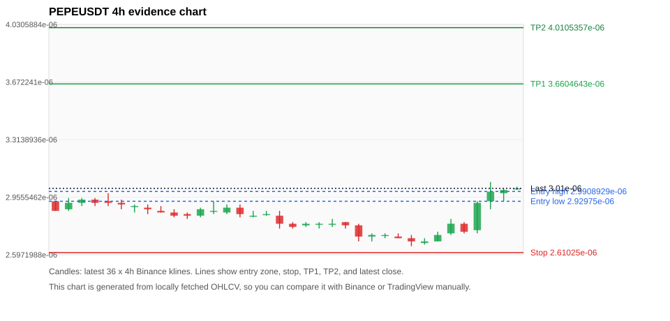
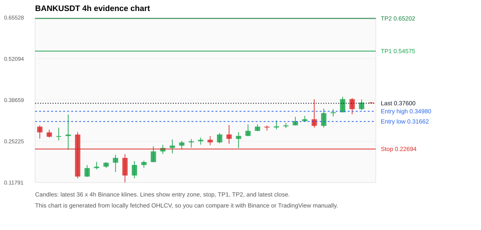
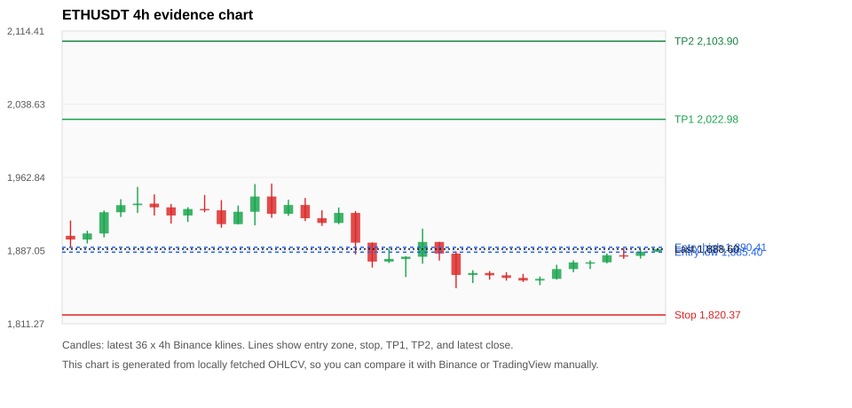
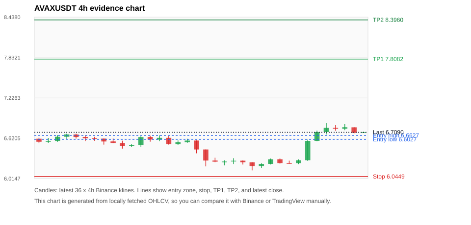
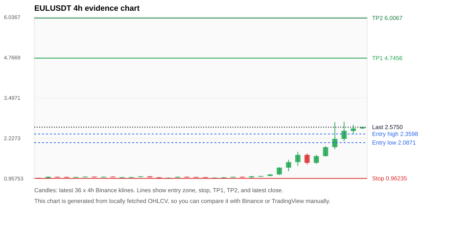

# Crypto 市场扫描报告 v1

- 报告时间：2026-07-26 20:06:26 CST
- Run ID：`20260726_120503_05446c8e`
- Run type：`daily_full`
- 数据来源：SQLite
- 报告版本：v1
- 扫描 ID：5956395707c3
- 数据源：Binance public spot API + CoinGecko/CoinMarketCap cross-check
- 过滤条件：USDT spot; 24h quote volume >= 30,000,000; trades >= 30,000; exclude stables/leveraged tokens; analyze 1h/4h/1d klines
- 默认单笔风险：账户权益的 1.00%

## 限制说明

- 交易信号仍以 Binance 现货公开 K 线为主源；外部数据源用于一致性复核。
- 结果是研究和模拟盘计划，不是确定收益或实盘下单指令。
- 历史长度过滤：候选币至少需要 180 根 1d K 线。
- 数据质量验证池：先验证 score 排名前 min(top_n * 2, 10) 的候选，再按 action + score 补足最终名单。
- 大盘环境过滤：NEUTRAL; BTC/ETH 大盘未完全确认强势，山寨币买入候选降级为观察。 BTC 7d=-0.2573137580818119; ETH 7d=0.8615394476106042.
- 已启用数据交叉验证：Binance 主源 + CoinGecko 自动对照；CoinMarketCap 在配置 API Key 后自动对照。
- BANKUSDT 交叉验证状态 DATA_WARNING：At least one external provider needs manual review.
- PEPEUSDT 交叉验证状态 DATA_WARNING：At least one external provider needs manual review.
- ETHUSDT 交叉验证状态 DATA_WARNING：At least one external provider needs manual review.
- AVAXUSDT 交叉验证状态 DATA_WARNING：At least one external provider needs manual review.
- EULUSDT 交叉验证状态 DATA_WARNING：At least one external provider needs manual review.
- DOGEUSDT 交叉验证状态 DATA_WARNING：At least one external provider needs manual review.
- BNBUSDT 交叉验证状态 DATA_WARNING：At least one external provider needs manual review.
- SHIBUSDT 交叉验证状态 DATA_WARNING：At least one external provider needs manual review.
- BTCUSDT 交叉验证状态 DATA_WARNING：At least one external provider needs manual review.
- VANAUSDT 交叉验证状态 DATA_WARNING：At least one external provider needs manual review.

## 5 个候选交易计划

| Rank | Coin | Action | Setup | Entry Zone | Stop Loss | TP1 | TP2 / Exit Rule | R/R | Verdict |
|---:|---|---|---|---:|---:|---:|---|---:|---|
| 1 | `PEPE` | `WAIT_PULLBACK` | 趋势中，等回调入场 | 2.92975e-06 - 2.9908929e-06 | 2.61025e-06 | 3.6604643e-06 | 4.0105357e-06 或跌破 4h 关键支撑 | 2.00-3.00 | 只等回调 |
| 2 | `BANK` | `WATCH_ONLY` | 涨幅较远，只等深回调 | 0.31662 - 0.34980 | 0.22694 | 0.54575 | 0.65202 或跌破 4h 关键支撑 | 2.00-3.00 | 只等回调 |
| 3 | `ETH` | `WATCH_ONLY` | 回踩支撑/4h EMA 附近 | 1,885.40 - 1,890.41 | 1,820.37 | 2,022.98 | 2,103.90 或跌破 4h 关键支撑 | 2.00-3.20 | 只观察 |
| 4 | `AVAX` | `WATCH_ONLY` | 回踩支撑/4h EMA 附近 | 6.6027 - 6.6627 | 6.0449 | 7.8082 | 8.3960 或跌破 4h 关键支撑 | 2.00-3.00 | 只观察 |
| 5 | `EUL` | `WATCH_ONLY` | 涨幅较远，只等深回调 | 2.0871 - 2.3598 | 0.96235 | 4.7456 | 6.0067 或跌破 4h 关键支撑 | 2.00-3.00 | 只等回调 |

## 数据交叉验证摘要

价格差异以 Binance 当前价为基准；成交量口径不同，Binance 是 USDT 现货成交额，CoinGecko/CoinMarketCap 通常是全市场成交量。

| Rank | Coin | Data Status | Max Price Diff | Max 24h Diff | Message |
|---:|---|---|---:|---:|---|
| 1 | `PEPE` | DATA_WARNING | 0.10% | 0.34 pts | At least one external provider needs manual review. |
| 2 | `BANK` | DATA_WARNING | 0.73% | 1.08 pts | At least one external provider needs manual review. |
| 3 | `ETH` | DATA_WARNING | 0.20% | 0.08 pts | At least one external provider needs manual review. |
| 4 | `AVAX` | DATA_WARNING | 0.16% | 0.13 pts | At least one external provider needs manual review. |
| 5 | `EUL` | DATA_WARNING | 0.12% | 3.07 pts | At least one external provider needs manual review. |

## 候选币说明

### 1. PEPE `PEPEUSDT`



- 入选原因：趋势中，等回调入场；24h +11.94%，7d +5.61%，4h RSI 69.64，24h 成交额 $31.7M。
- 交易失效条件：跌破 2.61025e-06 或 4h 收盘重新失守关键支撑。
- 主要风险：日线趋势未完全确认；数据交叉验证需要人工复核。
- 数据交叉验证：DATA_WARNING；At least one external provider needs manual review.

#### 可点击人工验证

- [Binance 交易页](https://www.binance.com/en/trade/PEPE_USDT)
- [TradingView 图表](https://www.tradingview.com/chart/?symbol=BINANCE%3APEPEUSDT)
- [CoinGecko 搜索](https://www.coingecko.com/en/search?query=PEPE)
- [CoinMarketCap 搜索](https://coinmarketcap.com/search/?q=PEPE)

#### 多数据源对照

| Source | Status | Asset ID | Price | 24h Change | 24h Volume | Price Diff | 24h Diff | Updated | Message |
|---|---|---|---:|---:|---:|---:|---:|---|---|
| Binance | DATA_OK | PEPEUSDT | 3.01e-06 | +11.94% | $31.7M | 0.00% | 0.00 pts | 2026-07-26T12:05:29+00:00 | Primary market data source used by scanner. |
| CoinGecko | DATA_WARNING | pepe | 3.01e-06 | +11.60% | $292.6M | 0.00% | 0.34 pts | 2026-07-26T12:03:20.000Z | CoinGecko symbol mapping has 5 exact matches; selected highest market-cap rank |
| CoinMarketCap | DATA_WARNING | 24478 | 3.007103e-06 | +12.08% | $340.3M | 0.10% | 0.14 pts | 2026-07-26T12:04:05.000Z | CoinMarketCap symbol mapping has 32 matches; selected lowest cmc_rank |

#### 指标证据

| 指标 | 数值 | 人工核对用途 |
|---|---:|---|
| 当前价 | 3.01e-06 | 与 Binance/TradingView 当前价格对照 |
| 24h 涨跌 | +11.94% | 与交易所 24h 涨跌对照 |
| 7d 涨跌 | +5.61% | 判断短线趋势是否延续 |
| 4h EMA20 | 2.8366453e-06 | 判断短期趋势支撑 |
| 4h EMA50 | 2.8154001e-06 | 判断中期趋势支撑 |
| 1d EMA20 | 2.7857036e-06 | 判断日线趋势 |
| 1d EMA50 | 2.8514779e-06 | 判断日线趋势 |
| 4h RSI14 | 69.64 | 判断是否过热/过弱 |
| 4h ATR14 | 7.6428571e-08 | 推导止损和入场缓冲 |
| 最近 18 根 4h 最低点 | 2.65e-06 | 支撑/止损参考 |
| 最近 36 根 4h 最高点 | 3.05e-06 | TP/压力参考 |
| 支撑位 | 2.8366453e-06 | 入场区间推导基础 |

#### 交易计划推导

- 支撑位 = 最近低点、4h EMA20、4h EMA50、1d EMA20 中不高于当前价的最高有效支撑 = `2.8366453e-06`。
- 入场区间 = 支撑位附近 + ATR 缓冲 = `2.92975e-06 - 2.9908929e-06`。
- 止损 = min(最近 18 根 4h 最低点 * 0.985, 入场中位价 - 1.15 * ATR14) = `2.61025e-06`。
- TP1 = max(最近 36 根 4h 最高点 * 0.995, 入场中位价 + 2R) = `3.6604643e-06`。
- TP2 = max(入场中位价 + 3R, TP1 * 1.04) = `4.0105357e-06`。

#### 最近 10 根 4h K线

| UTC 开盘时间 | Open | High | Low | Close | Quote Volume | Trades |
|---|---:|---:|---:|---:|---:|---:|
| 2026-07-25T00:00+00:00 | 2.71e-06 | 2.73e-06 | 2.7e-06 | 2.7e-06 | $747,099 | 2975 |
| 2026-07-25T04:00+00:00 | 2.7e-06 | 2.72e-06 | 2.65e-06 | 2.68e-06 | $1.2M | 4744 |
| 2026-07-25T08:00+00:00 | 2.67e-06 | 2.7e-06 | 2.66e-06 | 2.68e-06 | $741,652 | 3842 |
| 2026-07-25T12:00+00:00 | 2.68e-06 | 2.74e-06 | 2.68e-06 | 2.72e-06 | $1.2M | 4732 |
| 2026-07-25T16:00+00:00 | 2.73e-06 | 2.82e-06 | 2.72e-06 | 2.79e-06 | $5.4M | 17051 |
| 2026-07-25T20:00+00:00 | 2.79e-06 | 2.8e-06 | 2.73e-06 | 2.74e-06 | $1.5M | 4233 |
| 2026-07-26T00:00+00:00 | 2.75e-06 | 2.93e-06 | 2.73e-06 | 2.92e-06 | $6.2M | 17824 |
| 2026-07-26T04:00+00:00 | 2.93e-06 | 3.05e-06 | 2.88e-06 | 2.99e-06 | $11.3M | 32303 |
| 2026-07-26T08:00+00:00 | 2.98e-06 | 3.01e-06 | 2.93e-06 | 3e-06 | $5.8M | 16193 |
| 2026-07-26T12:00+00:00 | 3.01e-06 | 3.02e-06 | 3e-06 | 3.01e-06 | $324,215 | 1120 |

### 2. BANK `BANKUSDT`



- 入选原因：涨幅较远，只等深回调；24h +16.05%，7d +97.79%，4h RSI 73.67，24h 成交额 $50.5M。
- 交易失效条件：跌破 0.226944 或 4h 收盘重新失守关键支撑。
- 主要风险：距离支撑偏远，不能追市价；24h 振幅较大，回撤风险高；数据交叉验证需要人工复核。
- 数据交叉验证：DATA_WARNING；At least one external provider needs manual review.

#### 可点击人工验证

- [Binance 交易页](https://www.binance.com/en/trade/BANK_USDT)
- [TradingView 图表](https://www.tradingview.com/chart/?symbol=BINANCE%3ABANKUSDT)
- [CoinGecko 搜索](https://www.coingecko.com/en/search?query=BANK)
- [CoinMarketCap 搜索](https://coinmarketcap.com/search/?q=BANK)

#### 多数据源对照

| Source | Status | Asset ID | Price | 24h Change | 24h Volume | Price Diff | 24h Diff | Updated | Message |
|---|---|---|---:|---:|---:|---:|---:|---|---|
| Binance | DATA_OK | BANKUSDT | 0.37600 | +16.05% | $50.5M | 0.00% | 0.00 pts | 2026-07-26T12:05:29+00:00 | Primary market data source used by scanner. |
| CoinGecko | DATA_WARNING | lorenzo-protocol | 0.37623 | +15.60% | $132.7M | 0.06% | 0.45 pts | 2026-07-26T12:03:20.000Z | CoinGecko symbol mapping has 3 exact matches; selected highest market-cap rank |
| CoinMarketCap | DATA_WARNING | 36296 | 0.37874 | +17.13% | $193.8M | 0.73% | 1.08 pts | 2026-07-26T12:04:05.000Z | CoinMarketCap symbol mapping has 10 matches; selected lowest cmc_rank |

#### 指标证据

| 指标 | 数值 | 人工核对用途 |
|---|---:|---|
| 当前价 | 0.37600 | 与 Binance/TradingView 当前价格对照 |
| 24h 涨跌 | +16.05% | 与交易所 24h 涨跌对照 |
| 7d 涨跌 | +97.79% | 判断短线趋势是否延续 |
| 4h EMA20 | 0.31440 | 判断短期趋势支撑 |
| 4h EMA50 | 0.24608 | 判断中期趋势支撑 |
| 1d EMA20 | 0.18111 | 判断日线趋势 |
| 1d EMA50 | 0.10804 | 判断日线趋势 |
| 4h RSI14 | 73.67 | 判断是否过热/过弱 |
| 4h ATR14 | 0.03493 | 推导止损和入场缓冲 |
| 最近 18 根 4h 最低点 | 0.23040 | 支撑/止损参考 |
| 最近 36 根 4h 最高点 | 0.39710 | TP/压力参考 |
| 支撑位 | 0.31440 | 入场区间推导基础 |

#### 交易计划推导

- 支撑位 = 最近低点、4h EMA20、4h EMA50、1d EMA20 中不高于当前价的最高有效支撑 = `0.31440`。
- 入场区间 = 支撑位附近 + ATR 缓冲 = `0.31662 - 0.34980`。
- 止损 = min(最近 18 根 4h 最低点 * 0.985, 入场中位价 - 1.15 * ATR14) = `0.22694`。
- TP1 = max(最近 36 根 4h 最高点 * 0.995, 入场中位价 + 2R) = `0.54575`。
- TP2 = max(入场中位价 + 3R, TP1 * 1.04) = `0.65202`。

#### 最近 10 根 4h K线

| UTC 开盘时间 | Open | High | Low | Close | Quote Volume | Trades |
|---|---:|---:|---:|---:|---:|---:|
| 2026-07-25T00:00+00:00 | 0.30080 | 0.31180 | 0.29530 | 0.30400 | $3.3M | 40502 |
| 2026-07-25T04:00+00:00 | 0.30410 | 0.33190 | 0.30410 | 0.31750 | $7.6M | 88518 |
| 2026-07-25T08:00+00:00 | 0.31760 | 0.33490 | 0.31680 | 0.32400 | $5.9M | 58867 |
| 2026-07-25T12:00+00:00 | 0.32390 | 0.38890 | 0.29660 | 0.30240 | $14.4M | 180338 |
| 2026-07-25T16:00+00:00 | 0.30230 | 0.35870 | 0.29690 | 0.34380 | $10.9M | 140685 |
| 2026-07-25T20:00+00:00 | 0.34370 | 0.35680 | 0.33270 | 0.34650 | $3.1M | 44413 |
| 2026-07-26T00:00+00:00 | 0.34660 | 0.39710 | 0.34640 | 0.38940 | $7.8M | 118480 |
| 2026-07-26T04:00+00:00 | 0.38940 | 0.39300 | 0.34010 | 0.35700 | $8.1M | 117648 |
| 2026-07-26T08:00+00:00 | 0.35690 | 0.38850 | 0.35380 | 0.37840 | $6.3M | 79329 |
| 2026-07-26T12:00+00:00 | 0.37850 | 0.37960 | 0.37580 | 0.37600 | $65,408 | 936 |

### 3. ETH `ETHUSDT`



- 入选原因：回踩支撑/4h EMA 附近；24h +1.61%，7d +0.90%，4h RSI 45.26，24h 成交额 $144.0M。
- 交易失效条件：跌破 1820.3686 或 4h 收盘重新失守关键支撑。
- 主要风险：主要风险是大盘同步回撤；数据交叉验证需要人工复核；数据交叉验证状态为 DATA_WARNING，买入候选降级为观察。
- 数据交叉验证：DATA_WARNING；At least one external provider needs manual review.

#### 可点击人工验证

- [Binance 交易页](https://www.binance.com/en/trade/ETH_USDT)
- [TradingView 图表](https://www.tradingview.com/chart/?symbol=BINANCE%3AETHUSDT)
- [CoinGecko 搜索](https://www.coingecko.com/en/search?query=ETH)
- [CoinMarketCap 搜索](https://coinmarketcap.com/search/?q=ETH)

#### 多数据源对照

| Source | Status | Asset ID | Price | 24h Change | 24h Volume | Price Diff | 24h Diff | Updated | Message |
|---|---|---|---:|---:|---:|---:|---:|---|---|
| Binance | DATA_OK | ETHUSDT | 1,888.60 | +1.61% | $144.0M | 0.00% | 0.00 pts | 2026-07-26T12:05:29+00:00 | Primary market data source used by scanner. |
| CoinGecko | DATA_WARNING | n/a | n/a | n/a | n/a | n/a | n/a | 2026-07-26T12:05:29+00:00 | Failed to fetch https://api.coingecko.com/api/v3/coins/markets?vs_currency=usd&ids=ethereum&price_change_percentage=24h&per_page=1&page=1: HTTP Error 429: Too Many Requests |
| CoinMarketCap | DATA_WARNING | 1027 | 1,884.73 | +1.54% | $4.05B | 0.20% | 0.08 pts | 2026-07-26T12:04:05.000Z | CoinMarketCap symbol mapping has 6 matches; selected lowest cmc_rank |

#### 指标证据

| 指标 | 数值 | 人工核对用途 |
|---|---:|---|
| 当前价 | 1,888.60 | 与 Binance/TradingView 当前价格对照 |
| 24h 涨跌 | +1.61% | 与交易所 24h 涨跌对照 |
| 7d 涨跌 | +0.90% | 判断短线趋势是否延续 |
| 4h EMA20 | 1,881.64 | 判断短期趋势支撑 |
| 4h EMA50 | 1,880.24 | 判断中期趋势支撑 |
| 1d EMA20 | 1,847.27 | 判断日线趋势 |
| 1d EMA50 | 1,834.26 | 判断日线趋势 |
| 4h RSI14 | 45.26 | 判断是否过热/过弱 |
| 4h ATR14 | 12.5243 | 推导止损和入场缓冲 |
| 最近 18 根 4h 最低点 | 1,848.09 | 支撑/止损参考 |
| 最近 36 根 4h 最高点 | 1,956.45 | TP/压力参考 |
| 支撑位 | 1,881.64 | 入场区间推导基础 |

#### 交易计划推导

- 支撑位 = 最近低点、4h EMA20、4h EMA50、1d EMA20 中不高于当前价的最高有效支撑 = `1,881.64`。
- 入场区间 = 支撑位附近 + ATR 缓冲 = `1,885.40 - 1,890.41`。
- 止损 = min(最近 18 根 4h 最低点 * 0.985, 入场中位价 - 1.15 * ATR14) = `1,820.37`。
- TP1 = max(最近 36 根 4h 最高点 * 0.995, 入场中位价 + 2R) = `2,022.98`。
- TP2 = max(入场中位价 + 3R, TP1 * 1.04) = `2,103.90`。

#### 最近 10 根 4h K线

| UTC 开盘时间 | Open | High | Low | Close | Quote Volume | Trades |
|---|---:|---:|---:|---:|---:|---:|
| 2026-07-25T00:00+00:00 | 1,861.44 | 1,864.69 | 1,855.93 | 1,858.74 | $26.0M | 112861 |
| 2026-07-25T04:00+00:00 | 1,858.74 | 1,862.96 | 1,854.61 | 1,856.02 | $24.1M | 107612 |
| 2026-07-25T08:00+00:00 | 1,856.03 | 1,860.09 | 1,851.22 | 1,857.75 | $29.8M | 118603 |
| 2026-07-25T12:00+00:00 | 1,857.75 | 1,872.35 | 1,856.96 | 1,867.88 | $38.9M | 149234 |
| 2026-07-25T16:00+00:00 | 1,867.88 | 1,877.07 | 1,864.65 | 1,874.76 | $30.4M | 170723 |
| 2026-07-25T20:00+00:00 | 1,874.77 | 1,876.92 | 1,867.92 | 1,874.89 | $15.6M | 104080 |
| 2026-07-26T00:00+00:00 | 1,874.88 | 1,883.98 | 1,873.85 | 1,882.21 | $19.5M | 113287 |
| 2026-07-26T04:00+00:00 | 1,882.21 | 1,889.36 | 1,878.46 | 1,881.56 | $21.2M | 96548 |
| 2026-07-26T08:00+00:00 | 1,881.57 | 1,887.89 | 1,878.74 | 1,885.87 | $18.1M | 105053 |
| 2026-07-26T12:00+00:00 | 1,885.87 | 1,888.61 | 1,885.68 | 1,888.60 | $902,276 | 5053 |

### 4. AVAX `AVAXUSDT`



- 入选原因：回踩支撑/4h EMA 附近；24h +6.71%，7d +4.21%，4h RSI 73.75，24h 成交额 $30.5M。
- 交易失效条件：跌破 6.044945 或 4h 收盘重新失守关键支撑。
- 主要风险：成交量突增，可能是事件驱动；日线趋势未完全确认；数据交叉验证需要人工复核；数据交叉验证状态为 DATA_WARNING，买入候选降级为观察。
- 数据交叉验证：DATA_WARNING；At least one external provider needs manual review.

#### 可点击人工验证

- [Binance 交易页](https://www.binance.com/en/trade/AVAX_USDT)
- [TradingView 图表](https://www.tradingview.com/chart/?symbol=BINANCE%3AAVAXUSDT)
- [CoinGecko 搜索](https://www.coingecko.com/en/search?query=AVAX)
- [CoinMarketCap 搜索](https://coinmarketcap.com/search/?q=AVAX)

#### 多数据源对照

| Source | Status | Asset ID | Price | 24h Change | 24h Volume | Price Diff | 24h Diff | Updated | Message |
|---|---|---|---:|---:|---:|---:|---:|---|---|
| Binance | DATA_OK | AVAXUSDT | 6.7090 | +6.71% | $30.5M | 0.00% | 0.00 pts | 2026-07-26T12:05:29+00:00 | Primary market data source used by scanner. |
| CoinGecko | DATA_WARNING | n/a | n/a | n/a | n/a | n/a | n/a | 2026-07-26T12:05:29+00:00 | Failed to fetch https://api.coingecko.com/api/v3/coins/markets?vs_currency=usd&ids=avalanche-2&price_change_percentage=24h&per_page=1&page=1: HTTP Error 429: Too Many Requests |
| CoinMarketCap | DATA_OK | 5805 | 6.6984 | +6.58% | $384.0M | 0.16% | 0.13 pts | 2026-07-26T12:04:05.000Z | External source agrees with Binance within thresholds. |

#### 指标证据

| 指标 | 数值 | 人工核对用途 |
|---|---:|---|
| 当前价 | 6.7090 | 与 Binance/TradingView 当前价格对照 |
| 24h 涨跌 | +6.71% | 与交易所 24h 涨跌对照 |
| 7d 涨跌 | +4.21% | 判断短线趋势是否延续 |
| 4h EMA20 | 6.5440 | 判断短期趋势支撑 |
| 4h EMA50 | 6.5278 | 判断中期趋势支撑 |
| 1d EMA20 | 6.5895 | 判断日线趋势 |
| 1d EMA50 | 6.9039 | 判断日线趋势 |
| 4h RSI14 | 73.75 | 判断是否过热/过弱 |
| 4h ATR14 | 0.10464 | 推导止损和入场缓冲 |
| 最近 18 根 4h 最低点 | 6.1370 | 支撑/止损参考 |
| 最近 36 根 4h 最高点 | 6.8450 | TP/压力参考 |
| 支撑位 | 6.5895 | 入场区间推导基础 |

#### 交易计划推导

- 支撑位 = 最近低点、4h EMA20、4h EMA50、1d EMA20 中不高于当前价的最高有效支撑 = `6.5895`。
- 入场区间 = 支撑位附近 + ATR 缓冲 = `6.6027 - 6.6627`。
- 止损 = min(最近 18 根 4h 最低点 * 0.985, 入场中位价 - 1.15 * ATR14) = `6.0449`。
- TP1 = max(最近 36 根 4h 最高点 * 0.995, 入场中位价 + 2R) = `7.8082`。
- TP2 = max(入场中位价 + 3R, TP1 * 1.04) = `8.3960`。

#### 最近 10 根 4h K线

| UTC 开盘时间 | Open | High | Low | Close | Quote Volume | Trades |
|---|---:|---:|---:|---:|---:|---:|
| 2026-07-25T00:00+00:00 | 6.3040 | 6.3170 | 6.2390 | 6.2470 | $781,508 | 10375 |
| 2026-07-25T04:00+00:00 | 6.2470 | 6.2830 | 6.2400 | 6.2450 | $687,427 | 6996 |
| 2026-07-25T08:00+00:00 | 6.2460 | 6.3020 | 6.2310 | 6.2890 | $882,861 | 9870 |
| 2026-07-25T12:00+00:00 | 6.2900 | 6.6000 | 6.2790 | 6.5800 | $8.5M | 98697 |
| 2026-07-25T16:00+00:00 | 6.5800 | 6.7350 | 6.5750 | 6.7130 | $6.6M | 91519 |
| 2026-07-25T20:00+00:00 | 6.7130 | 6.8450 | 6.6770 | 6.7770 | $8.1M | 86316 |
| 2026-07-26T00:00+00:00 | 6.7770 | 6.8150 | 6.7330 | 6.7640 | $2.4M | 31622 |
| 2026-07-26T04:00+00:00 | 6.7640 | 6.8310 | 6.7400 | 6.7840 | $2.7M | 32164 |
| 2026-07-26T08:00+00:00 | 6.7830 | 6.7860 | 6.6940 | 6.7000 | $2.1M | 19862 |
| 2026-07-26T12:00+00:00 | 6.7010 | 6.7150 | 6.6990 | 6.7090 | $165,203 | 1865 |

### 5. EUL `EULUSDT`



- 入选原因：涨幅较远，只等深回调；24h +55.49%，7d +172.20%，4h RSI 87.27，24h 成交额 $44.6M。
- 交易失效条件：跌破 0.962345 或 4h 收盘重新失守关键支撑。
- 主要风险：距离支撑偏远，不能追市价；4h RSI 偏热；24h 振幅较大，回撤风险高；成交量突增，可能是事件驱动；数据交叉验证需要人工复核。
- 数据交叉验证：DATA_WARNING；At least one external provider needs manual review.

#### 可点击人工验证

- [Binance 交易页](https://www.binance.com/en/trade/EUL_USDT)
- [TradingView 图表](https://www.tradingview.com/chart/?symbol=BINANCE%3AEULUSDT)
- [CoinGecko 搜索](https://www.coingecko.com/en/search?query=EUL)
- [CoinMarketCap 搜索](https://coinmarketcap.com/search/?q=EUL)

#### 多数据源对照

| Source | Status | Asset ID | Price | 24h Change | 24h Volume | Price Diff | 24h Diff | Updated | Message |
|---|---|---|---:|---:|---:|---:|---:|---|---|
| Binance | DATA_OK | EULUSDT | 2.5750 | +55.49% | $44.6M | 0.00% | 0.00 pts | 2026-07-26T12:05:29+00:00 | Primary market data source used by scanner. |
| CoinGecko | DATA_WARNING | n/a | n/a | n/a | n/a | n/a | n/a | 2026-07-26T12:05:29+00:00 | Failed to fetch https://api.coingecko.com/api/v3/coins/markets?vs_currency=usd&ids=euler&price_change_percentage=24h&per_page=1&page=1: HTTP Error 429: Too Many Requests |
| CoinMarketCap | DATA_WARNING | 14280 | 2.5719 | +58.57% | $275.6M | 0.12% | 3.07 pts | 2026-07-26T12:05:03.000Z | 24h change diff 3.07 points exceeds warning threshold |

#### 指标证据

| 指标 | 数值 | 人工核对用途 |
|---|---:|---|
| 当前价 | 2.5750 | 与 Binance/TradingView 当前价格对照 |
| 24h 涨跌 | +55.49% | 与交易所 24h 涨跌对照 |
| 7d 涨跌 | +172.20% | 判断短线趋势是否延续 |
| 4h EMA20 | 1.6718 | 判断短期趋势支撑 |
| 4h EMA50 | 1.3219 | 判断中期趋势支撑 |
| 1d EMA20 | 1.2359 | 判断日线趋势 |
| 1d EMA50 | 1.1300 | 判断日线趋势 |
| 4h RSI14 | 87.27 | 判断是否过热/过弱 |
| 4h ATR14 | 0.28700 | 推导止损和入场缓冲 |
| 最近 18 根 4h 最低点 | 0.97700 | 支撑/止损参考 |
| 最近 36 根 4h 最高点 | 2.7460 | TP/压力参考 |
| 支撑位 | 1.6718 | 入场区间推导基础 |

#### 交易计划推导

- 支撑位 = 最近低点、4h EMA20、4h EMA50、1d EMA20 中不高于当前价的最高有效支撑 = `1.6718`。
- 入场区间 = 支撑位附近 + ATR 缓冲 = `2.0871 - 2.3598`。
- 止损 = min(最近 18 根 4h 最低点 * 0.985, 入场中位价 - 1.15 * ATR14) = `0.96235`。
- TP1 = max(最近 36 根 4h 最高点 * 0.995, 入场中位价 + 2R) = `4.7456`。
- TP2 = max(入场中位价 + 3R, TP1 * 1.04) = `6.0067`。

#### 最近 10 根 4h K线

| UTC 开盘时间 | Open | High | Low | Close | Quote Volume | Trades |
|---|---:|---:|---:|---:|---:|---:|
| 2026-07-25T00:00+00:00 | 1.0860 | 1.3120 | 1.0710 | 1.3010 | $1.3M | 16304 |
| 2026-07-25T04:00+00:00 | 1.3000 | 1.5500 | 1.1860 | 1.4730 | $3.5M | 50753 |
| 2026-07-25T08:00+00:00 | 1.4750 | 1.7980 | 1.3550 | 1.7010 | $6.7M | 70990 |
| 2026-07-25T12:00+00:00 | 1.7020 | 1.7480 | 1.4000 | 1.4530 | $4.9M | 63546 |
| 2026-07-25T16:00+00:00 | 1.4520 | 1.7070 | 1.4170 | 1.6630 | $3.5M | 46328 |
| 2026-07-25T20:00+00:00 | 1.6640 | 1.9800 | 1.6540 | 1.9440 | $4.3M | 60586 |
| 2026-07-26T00:00+00:00 | 1.9450 | 2.7300 | 1.8800 | 2.2060 | $16.5M | 252178 |
| 2026-07-26T04:00+00:00 | 2.2050 | 2.7460 | 2.1310 | 2.4590 | $9.8M | 156920 |
| 2026-07-26T08:00+00:00 | 2.4540 | 2.6520 | 2.3480 | 2.5340 | $5.7M | 105515 |
| 2026-07-26T12:00+00:00 | 2.5330 | 2.5840 | 2.5140 | 2.5750 | $115,800 | 2802 |

## 组合风控

- 不要 5 个候选全部满仓买入。
- 同时持仓总风险建议控制在账户权益的 3% - 5% 以内。
- 如果 BTC/ETH 同时破位，暂停山寨币多头计划或降低仓位。
- 第一版报告用于模拟盘和人工复核，不自动下单。

## 原始数据

```json
[
  {
    "rank": 1,
    "symbol": "PEPEUSDT",
    "base_asset": "PEPE",
    "price": 3.01e-06,
    "score": 59.99484639081061,
    "setup": "趋势中，等回调入场",
    "verdict": "只等回调",
    "entry_low": 2.92975e-06,
    "entry_high": 2.990892857142857e-06,
    "stop_loss": 2.61025e-06,
    "take_profit_1": 3.660464285714285e-06,
    "take_profit_2": 4.010535714285713e-06,
    "risk_reward_1": 2.0,
    "risk_reward_2": 3.0,
    "pct_24h": 11.94,
    "pct_3d": 7.499999999999996,
    "pct_7d": 5.6140350877192935,
    "quote_volume_24h": 31684011.52716257,
    "trades_24h": 93437,
    "high_low_range_24h": 13.805970149253731,
    "rsi_1h": 80.48780487804883,
    "rsi_4h": 69.64285714285717,
    "ema20_4h": 2.8366452713963696e-06,
    "ema50_4h": 2.8154000544306825e-06,
    "ema20_1d": 2.7857036228427487e-06,
    "ema50_1d": 2.8514779373126763e-06,
    "atr_4h": 7.642857142857139e-08,
    "macd_hist_4h": 3.554868633464971e-08,
    "volume_ratio_24h": 2.0720133430059136,
    "support_level": 2.8366452713963696e-06,
    "recent_low_4h_18": 2.65e-06,
    "recent_high_4h_36": 3.05e-06,
    "distance_to_support_pct": 6.11125861776487,
    "binance_trade_url": "https://www.binance.com/en/trade/PEPE_USDT",
    "tradingview_url": "https://www.tradingview.com/chart/?symbol=BINANCE%3APEPEUSDT",
    "coingecko_search_url": "https://www.coingecko.com/en/search?query=PEPE",
    "coinmarketcap_search_url": "https://coinmarketcap.com/search/?q=PEPE",
    "invalidation": "跌破 2.61025e-06 或 4h 收盘重新失守关键支撑",
    "recent_4h_klines": [
      {
        "open_time_utc": "2026-07-20T16:00+00:00",
        "open": 2.93e-06,
        "high": 2.93e-06,
        "low": 2.87e-06,
        "close": 2.87e-06,
        "quote_volume": 3372743.42477279,
        "trades": 8167
      },
      {
        "open_time_utc": "2026-07-20T20:00+00:00",
        "open": 2.88e-06,
        "high": 2.95e-06,
        "low": 2.87e-06,
        "close": 2.92e-06,
        "quote_volume": 2400256.89152182,
        "trades": 6252
      },
      {
        "open_time_utc": "2026-07-21T00:00+00:00",
        "open": 2.92e-06,
        "high": 2.95e-06,
        "low": 2.9e-06,
        "close": 2.94e-06,
        "quote_volume": 2620447.32978521,
        "trades": 6812
      },
      {
        "open_time_utc": "2026-07-21T04:00+00:00",
        "open": 2.94e-06,
        "high": 2.95e-06,
        "low": 2.9e-06,
        "close": 2.92e-06,
        "quote_volume": 1766059.20732192,
        "trades": 4696
      },
      {
        "open_time_utc": "2026-07-21T08:00+00:00",
        "open": 2.93e-06,
        "high": 2.98e-06,
        "low": 2.9e-06,
        "close": 2.92e-06,
        "quote_volume": 4603738.06669787,
        "trades": 11144
      },
      {
        "open_time_utc": "2026-07-21T12:00+00:00",
        "open": 2.92e-06,
        "high": 2.94e-06,
        "low": 2.88e-06,
        "close": 2.91e-06,
        "quote_volume": 4347216.37210416,
        "trades": 13808
      },
      {
        "open_time_utc": "2026-07-21T16:00+00:00",
        "open": 2.9e-06,
        "high": 2.91e-06,
        "low": 2.86e-06,
        "close": 2.9e-06,
        "quote_volume": 1586914.59610261,
        "trades": 5896
      },
      {
        "open_time_utc": "2026-07-21T20:00+00:00",
        "open": 2.89e-06,
        "high": 2.91e-06,
        "low": 2.85e-06,
        "close": 2.88e-06,
        "quote_volume": 1428911.29497907,
        "trades": 3473
      },
      {
        "open_time_utc": "2026-07-22T00:00+00:00",
        "open": 2.87e-06,
        "high": 2.9e-06,
        "low": 2.86e-06,
        "close": 2.86e-06,
        "quote_volume": 2094035.13844653,
        "trades": 5675
      },
      {
        "open_time_utc": "2026-07-22T04:00+00:00",
        "open": 2.86e-06,
        "high": 2.88e-06,
        "low": 2.83e-06,
        "close": 2.84e-06,
        "quote_volume": 1938590.33865956,
        "trades": 6470
      },
      {
        "open_time_utc": "2026-07-22T08:00+00:00",
        "open": 2.85e-06,
        "high": 2.86e-06,
        "low": 2.82e-06,
        "close": 2.84e-06,
        "quote_volume": 3060956.72176359,
        "trades": 6532
      },
      {
        "open_time_utc": "2026-07-22T12:00+00:00",
        "open": 2.84e-06,
        "high": 2.89e-06,
        "low": 2.83e-06,
        "close": 2.88e-06,
        "quote_volume": 2571083.01667108,
        "trades": 8969
      },
      {
        "open_time_utc": "2026-07-22T16:00+00:00",
        "open": 2.87e-06,
        "high": 2.93e-06,
        "low": 2.85e-06,
        "close": 2.87e-06,
        "quote_volume": 2537837.21968147,
        "trades": 9161
      },
      {
        "open_time_utc": "2026-07-22T20:00+00:00",
        "open": 2.86e-06,
        "high": 2.91e-06,
        "low": 2.85e-06,
        "close": 2.89e-06,
        "quote_volume": 1317107.97655856,
        "trades": 4373
      },
      {
        "open_time_utc": "2026-07-23T00:00+00:00",
        "open": 2.89e-06,
        "high": 2.91e-06,
        "low": 2.83e-06,
        "close": 2.85e-06,
        "quote_volume": 1389909.67585226,
        "trades": 4796
      },
      {
        "open_time_utc": "2026-07-23T04:00+00:00",
        "open": 2.84e-06,
        "high": 2.87e-06,
        "low": 2.83e-06,
        "close": 2.84e-06,
        "quote_volume": 938982.54756928,
        "trades": 3654
      },
      {
        "open_time_utc": "2026-07-23T08:00+00:00",
        "open": 2.85e-06,
        "high": 2.87e-06,
        "low": 2.84e-06,
        "close": 2.85e-06,
        "quote_volume": 988419.53993391,
        "trades": 3933
      },
      {
        "open_time_utc": "2026-07-23T12:00+00:00",
        "open": 2.84e-06,
        "high": 2.87e-06,
        "low": 2.76e-06,
        "close": 2.79e-06,
        "quote_volume": 5006863.7181332,
        "trades": 14807
      },
      {
        "open_time_utc": "2026-07-23T16:00+00:00",
        "open": 2.79e-06,
        "high": 2.8e-06,
        "low": 2.76e-06,
        "close": 2.77e-06,
        "quote_volume": 1203893.54349417,
        "trades": 5199
      },
      {
        "open_time_utc": "2026-07-23T20:00+00:00",
        "open": 2.78e-06,
        "high": 2.8e-06,
        "low": 2.77e-06,
        "close": 2.79e-06,
        "quote_volume": 1020937.39206108,
        "trades": 3688
      },
      {
        "open_time_utc": "2026-07-24T00:00+00:00",
        "open": 2.79e-06,
        "high": 2.8e-06,
        "low": 2.76e-06,
        "close": 2.79e-06,
        "quote_volume": 1635025.69258209,
        "trades": 4881
      },
      {
        "open_time_utc": "2026-07-24T04:00+00:00",
        "open": 2.79e-06,
        "high": 2.82e-06,
        "low": 2.77e-06,
        "close": 2.79e-06,
        "quote_volume": 2088741.49013663,
        "trades": 5116
      },
      {
        "open_time_utc": "2026-07-24T08:00+00:00",
        "open": 2.8e-06,
        "high": 2.8e-06,
        "low": 2.76e-06,
        "close": 2.78e-06,
        "quote_volume": 973773.09904992,
        "trades": 4406
      },
      {
        "open_time_utc": "2026-07-24T12:00+00:00",
        "open": 2.78e-06,
        "high": 2.79e-06,
        "low": 2.68e-06,
        "close": 2.71e-06,
        "quote_volume": 3098580.75788592,
        "trades": 12059
      },
      {
        "open_time_utc": "2026-07-24T16:00+00:00",
        "open": 2.71e-06,
        "high": 2.73e-06,
        "low": 2.68e-06,
        "close": 2.72e-06,
        "quote_volume": 1408849.27845291,
        "trades": 5993
      },
      {
        "open_time_utc": "2026-07-24T20:00+00:00",
        "open": 2.72e-06,
        "high": 2.73e-06,
        "low": 2.7e-06,
        "close": 2.72e-06,
        "quote_volume": 631287.4840004,
        "trades": 2446
      },
      {
        "open_time_utc": "2026-07-25T00:00+00:00",
        "open": 2.71e-06,
        "high": 2.73e-06,
        "low": 2.7e-06,
        "close": 2.7e-06,
        "quote_volume": 747099.44918311,
        "trades": 2975
      },
      {
        "open_time_utc": "2026-07-25T04:00+00:00",
        "open": 2.7e-06,
        "high": 2.72e-06,
        "low": 2.65e-06,
        "close": 2.68e-06,
        "quote_volume": 1176495.96766877,
        "trades": 4744
      },
      {
        "open_time_utc": "2026-07-25T08:00+00:00",
        "open": 2.67e-06,
        "high": 2.7e-06,
        "low": 2.66e-06,
        "close": 2.68e-06,
        "quote_volume": 741651.71633383,
        "trades": 3842
      },
      {
        "open_time_utc": "2026-07-25T12:00+00:00",
        "open": 2.68e-06,
        "high": 2.74e-06,
        "low": 2.68e-06,
        "close": 2.72e-06,
        "quote_volume": 1244525.7494972,
        "trades": 4732
      },
      {
        "open_time_utc": "2026-07-25T16:00+00:00",
        "open": 2.73e-06,
        "high": 2.82e-06,
        "low": 2.72e-06,
        "close": 2.79e-06,
        "quote_volume": 5350614.95352205,
        "trades": 17051
      },
      {
        "open_time_utc": "2026-07-25T20:00+00:00",
        "open": 2.79e-06,
        "high": 2.8e-06,
        "low": 2.73e-06,
        "close": 2.74e-06,
        "quote_volume": 1514207.02794748,
        "trades": 4233
      },
      {
        "open_time_utc": "2026-07-26T00:00+00:00",
        "open": 2.75e-06,
        "high": 2.93e-06,
        "low": 2.73e-06,
        "close": 2.92e-06,
        "quote_volume": 6206508.15523177,
        "trades": 17824
      },
      {
        "open_time_utc": "2026-07-26T04:00+00:00",
        "open": 2.93e-06,
        "high": 3.05e-06,
        "low": 2.88e-06,
        "close": 2.99e-06,
        "quote_volume": 11282961.57112496,
        "trades": 32303
      },
      {
        "open_time_utc": "2026-07-26T08:00+00:00",
        "open": 2.98e-06,
        "high": 3.01e-06,
        "low": 2.93e-06,
        "close": 3e-06,
        "quote_volume": 5763000.73227723,
        "trades": 16193
      },
      {
        "open_time_utc": "2026-07-26T12:00+00:00",
        "open": 3.01e-06,
        "high": 3.02e-06,
        "low": 3e-06,
        "close": 3.01e-06,
        "quote_volume": 324215.21900673,
        "trades": 1120
      }
    ],
    "risks": [
      "日线趋势未完全确认",
      "数据交叉验证需要人工复核"
    ],
    "data_quality_status": "DATA_WARNING",
    "data_quality_message": "At least one external provider needs manual review.",
    "data_checks": [
      {
        "provider": "Binance",
        "status": "DATA_OK",
        "provider_asset_id": "PEPEUSDT",
        "provider_symbol": "PEPEUSDT",
        "price_usd": 3.01e-06,
        "pct_24h": 11.94,
        "volume_24h": 31684011.52716257,
        "last_updated": null,
        "fetched_at_utc": "2026-07-26T12:05:29+00:00",
        "price_diff_pct": 0.0,
        "pct_24h_diff": 0.0,
        "volume_note": "Binance USDT spot 24h quoteVolume.",
        "message": "Primary market data source used by scanner."
      },
      {
        "provider": "CoinGecko",
        "status": "DATA_WARNING",
        "provider_asset_id": "pepe",
        "provider_symbol": "PEPE",
        "price_usd": 3.01e-06,
        "pct_24h": 11.6,
        "volume_24h": 292612483.0,
        "last_updated": "2026-07-26T12:03:20.000Z",
        "fetched_at_utc": "2026-07-26T12:05:29+00:00",
        "price_diff_pct": 0.0,
        "pct_24h_diff": 0.33999999999999986,
        "volume_note": "CoinGecko total market volume; not the same venue scope as Binance quoteVolume.",
        "message": "CoinGecko symbol mapping has 5 exact matches; selected highest market-cap rank"
      },
      {
        "provider": "CoinMarketCap",
        "status": "DATA_WARNING",
        "provider_asset_id": "24478",
        "provider_symbol": "PEPE",
        "price_usd": 3.007102952835e-06,
        "pct_24h": 12.08357369,
        "volume_24h": 340317598.78443444,
        "last_updated": "2026-07-26T12:04:05.000Z",
        "fetched_at_utc": "2026-07-26T12:05:29+00:00",
        "price_diff_pct": 0.09624741411959761,
        "pct_24h_diff": 0.1435736900000002,
        "volume_note": "CoinMarketCap total market volume; not the same venue scope as Binance quoteVolume.",
        "message": "CoinMarketCap symbol mapping has 32 matches; selected lowest cmc_rank"
      }
    ],
    "action": "WAIT_PULLBACK"
  },
  {
    "rank": 2,
    "symbol": "BANKUSDT",
    "base_asset": "BANK",
    "price": 0.376,
    "score": 73.44184487941732,
    "setup": "涨幅较远，只等深回调",
    "verdict": "只等回调",
    "entry_low": 0.31662142857142855,
    "entry_high": 0.34980357142857144,
    "stop_loss": 0.22694399999999998,
    "take_profit_1": 0.5457495000000001,
    "take_profit_2": 0.6520180000000002,
    "risk_reward_1": 2.0,
    "risk_reward_2": 3.0000000000000004,
    "pct_24h": 16.051,
    "pct_3d": 46.93239546697927,
    "pct_7d": 97.79063650710154,
    "quote_volume_24h": 50521699.54666,
    "trades_24h": 680327,
    "high_low_range_24h": 33.88401888064736,
    "rsi_1h": 59.90903183885641,
    "rsi_4h": 73.66548042704625,
    "ema20_4h": 0.3144026994975055,
    "ema50_4h": 0.24608329283055946,
    "ema20_1d": 0.18110693084362647,
    "ema50_1d": 0.10804219142462869,
    "atr_4h": 0.034928571428571434,
    "macd_hist_4h": 0.004357450376529043,
    "volume_ratio_24h": 0.6089269528987311,
    "support_level": 0.3144026994975055,
    "recent_low_4h_18": 0.2304,
    "recent_high_4h_36": 0.3971,
    "distance_to_support_pct": 19.591848479972484,
    "binance_trade_url": "https://www.binance.com/en/trade/BANK_USDT",
    "tradingview_url": "https://www.tradingview.com/chart/?symbol=BINANCE%3ABANKUSDT",
    "coingecko_search_url": "https://www.coingecko.com/en/search?query=BANK",
    "coinmarketcap_search_url": "https://coinmarketcap.com/search/?q=BANK",
    "invalidation": "跌破 0.226944 或 4h 收盘重新失守关键支撑",
    "recent_4h_klines": [
      {
        "open_time_utc": "2026-07-20T16:00+00:00",
        "open": 0.2996,
        "high": 0.3042,
        "low": 0.2608,
        "close": 0.2811,
        "quote_volume": 13024169.95372,
        "trades": 150855
      },
      {
        "open_time_utc": "2026-07-20T20:00+00:00",
        "open": 0.2811,
        "high": 0.2899,
        "low": 0.2646,
        "close": 0.2669,
        "quote_volume": 3901231.88935,
        "trades": 62159
      },
      {
        "open_time_utc": "2026-07-21T00:00+00:00",
        "open": 0.2669,
        "high": 0.2965,
        "low": 0.2551,
        "close": 0.2691,
        "quote_volume": 7908384.16752,
        "trades": 120274
      },
      {
        "open_time_utc": "2026-07-21T04:00+00:00",
        "open": 0.2692,
        "high": 0.3393,
        "low": 0.2243,
        "close": 0.2741,
        "quote_volume": 22009093.04561,
        "trades": 266700
      },
      {
        "open_time_utc": "2026-07-21T08:00+00:00",
        "open": 0.2741,
        "high": 0.2821,
        "low": 0.1314,
        "close": 0.1373,
        "quote_volume": 36796770.96605,
        "trades": 564074
      },
      {
        "open_time_utc": "2026-07-21T12:00+00:00",
        "open": 0.1372,
        "high": 0.1746,
        "low": 0.1362,
        "close": 0.1648,
        "quote_volume": 15411459.06286,
        "trades": 146381
      },
      {
        "open_time_utc": "2026-07-21T16:00+00:00",
        "open": 0.1648,
        "high": 0.1849,
        "low": 0.1607,
        "close": 0.1694,
        "quote_volume": 11849582.05491,
        "trades": 114628
      },
      {
        "open_time_utc": "2026-07-21T20:00+00:00",
        "open": 0.1695,
        "high": 0.1838,
        "low": 0.1657,
        "close": 0.1823,
        "quote_volume": 3051498.55355,
        "trades": 33878
      },
      {
        "open_time_utc": "2026-07-22T00:00+00:00",
        "open": 0.1823,
        "high": 0.208,
        "low": 0.1522,
        "close": 0.1981,
        "quote_volume": 20270511.31169,
        "trades": 279829
      },
      {
        "open_time_utc": "2026-07-22T04:00+00:00",
        "open": 0.1981,
        "high": 0.21,
        "low": 0.1185,
        "close": 0.1407,
        "quote_volume": 22211587.87328,
        "trades": 266622
      },
      {
        "open_time_utc": "2026-07-22T08:00+00:00",
        "open": 0.1408,
        "high": 0.1874,
        "low": 0.1318,
        "close": 0.175,
        "quote_volume": 17504178.66821,
        "trades": 199508
      },
      {
        "open_time_utc": "2026-07-22T12:00+00:00",
        "open": 0.1749,
        "high": 0.1889,
        "low": 0.1661,
        "close": 0.1846,
        "quote_volume": 11865002.45501,
        "trades": 116777
      },
      {
        "open_time_utc": "2026-07-22T16:00+00:00",
        "open": 0.1844,
        "high": 0.2359,
        "low": 0.1842,
        "close": 0.2192,
        "quote_volume": 17620028.88124,
        "trades": 174586
      },
      {
        "open_time_utc": "2026-07-22T20:00+00:00",
        "open": 0.2191,
        "high": 0.2406,
        "low": 0.2109,
        "close": 0.2305,
        "quote_volume": 7628261.19402,
        "trades": 91387
      },
      {
        "open_time_utc": "2026-07-23T00:00+00:00",
        "open": 0.2304,
        "high": 0.258,
        "low": 0.2128,
        "close": 0.2381,
        "quote_volume": 13059172.99562,
        "trades": 175883
      },
      {
        "open_time_utc": "2026-07-23T04:00+00:00",
        "open": 0.238,
        "high": 0.2533,
        "low": 0.2257,
        "close": 0.2485,
        "quote_volume": 6318441.44353,
        "trades": 82944
      },
      {
        "open_time_utc": "2026-07-23T08:00+00:00",
        "open": 0.2487,
        "high": 0.2595,
        "low": 0.2317,
        "close": 0.2521,
        "quote_volume": 10518439.57259,
        "trades": 116661
      },
      {
        "open_time_utc": "2026-07-23T12:00+00:00",
        "open": 0.2522,
        "high": 0.2643,
        "low": 0.2412,
        "close": 0.257,
        "quote_volume": 11144818.63714,
        "trades": 103996
      },
      {
        "open_time_utc": "2026-07-23T16:00+00:00",
        "open": 0.2571,
        "high": 0.2695,
        "low": 0.2393,
        "close": 0.2487,
        "quote_volume": 9065948.65324,
        "trades": 98070
      },
      {
        "open_time_utc": "2026-07-23T20:00+00:00",
        "open": 0.2486,
        "high": 0.279,
        "low": 0.2456,
        "close": 0.2743,
        "quote_volume": 5851924.1141,
        "trades": 61758
      },
      {
        "open_time_utc": "2026-07-24T00:00+00:00",
        "open": 0.2744,
        "high": 0.3053,
        "low": 0.2439,
        "close": 0.26,
        "quote_volume": 18216102.47102,
        "trades": 222539
      },
      {
        "open_time_utc": "2026-07-24T04:00+00:00",
        "open": 0.2599,
        "high": 0.2819,
        "low": 0.2304,
        "close": 0.2696,
        "quote_volume": 13116483.38654,
        "trades": 162472
      },
      {
        "open_time_utc": "2026-07-24T08:00+00:00",
        "open": 0.2697,
        "high": 0.3074,
        "low": 0.2688,
        "close": 0.2861,
        "quote_volume": 13685663.102,
        "trades": 134748
      },
      {
        "open_time_utc": "2026-07-24T12:00+00:00",
        "open": 0.2861,
        "high": 0.3074,
        "low": 0.2854,
        "close": 0.2998,
        "quote_volume": 8801650.09037,
        "trades": 110826
      },
      {
        "open_time_utc": "2026-07-24T16:00+00:00",
        "open": 0.2997,
        "high": 0.3032,
        "low": 0.2872,
        "close": 0.297,
        "quote_volume": 5833081.31603,
        "trades": 65098
      },
      {
        "open_time_utc": "2026-07-24T20:00+00:00",
        "open": 0.297,
        "high": 0.32,
        "low": 0.2904,
        "close": 0.3007,
        "quote_volume": 5851171.64945,
        "trades": 65488
      },
      {
        "open_time_utc": "2026-07-25T00:00+00:00",
        "open": 0.3008,
        "high": 0.3118,
        "low": 0.2953,
        "close": 0.304,
        "quote_volume": 3305479.9693,
        "trades": 40502
      },
      {
        "open_time_utc": "2026-07-25T04:00+00:00",
        "open": 0.3041,
        "high": 0.3319,
        "low": 0.3041,
        "close": 0.3175,
        "quote_volume": 7558114.15558,
        "trades": 88518
      },
      {
        "open_time_utc": "2026-07-25T08:00+00:00",
        "open": 0.3176,
        "high": 0.3349,
        "low": 0.3168,
        "close": 0.324,
        "quote_volume": 5906083.2542,
        "trades": 58867
      },
      {
        "open_time_utc": "2026-07-25T12:00+00:00",
        "open": 0.3239,
        "high": 0.3889,
        "low": 0.2966,
        "close": 0.3024,
        "quote_volume": 14387180.52024,
        "trades": 180338
      },
      {
        "open_time_utc": "2026-07-25T16:00+00:00",
        "open": 0.3023,
        "high": 0.3587,
        "low": 0.2969,
        "close": 0.3438,
        "quote_volume": 10922530.06229,
        "trades": 140685
      },
      {
        "open_time_utc": "2026-07-25T20:00+00:00",
        "open": 0.3437,
        "high": 0.3568,
        "low": 0.3327,
        "close": 0.3465,
        "quote_volume": 3103058.24085,
        "trades": 44413
      },
      {
        "open_time_utc": "2026-07-26T00:00+00:00",
        "open": 0.3466,
        "high": 0.3971,
        "low": 0.3464,
        "close": 0.3894,
        "quote_volume": 7778456.16454,
        "trades": 118480
      },
      {
        "open_time_utc": "2026-07-26T04:00+00:00",
        "open": 0.3894,
        "high": 0.393,
        "low": 0.3401,
        "close": 0.357,
        "quote_volume": 8077294.95173,
        "trades": 117648
      },
      {
        "open_time_utc": "2026-07-26T08:00+00:00",
        "open": 0.3569,
        "high": 0.3885,
        "low": 0.3538,
        "close": 0.3784,
        "quote_volume": 6295460.24606,
        "trades": 79329
      },
      {
        "open_time_utc": "2026-07-26T12:00+00:00",
        "open": 0.3785,
        "high": 0.3796,
        "low": 0.3758,
        "close": 0.376,
        "quote_volume": 65407.5058,
        "trades": 936
      }
    ],
    "risks": [
      "距离支撑偏远，不能追市价",
      "24h 振幅较大，回撤风险高",
      "数据交叉验证需要人工复核"
    ],
    "data_quality_status": "DATA_WARNING",
    "data_quality_message": "At least one external provider needs manual review.",
    "data_checks": [
      {
        "provider": "Binance",
        "status": "DATA_OK",
        "provider_asset_id": "BANKUSDT",
        "provider_symbol": "BANKUSDT",
        "price_usd": 0.376,
        "pct_24h": 16.051,
        "volume_24h": 50521699.54666,
        "last_updated": null,
        "fetched_at_utc": "2026-07-26T12:05:29+00:00",
        "price_diff_pct": 0.0,
        "pct_24h_diff": 0.0,
        "volume_note": "Binance USDT spot 24h quoteVolume.",
        "message": "Primary market data source used by scanner."
      },
      {
        "provider": "CoinGecko",
        "status": "DATA_WARNING",
        "provider_asset_id": "lorenzo-protocol",
        "provider_symbol": "BANK",
        "price_usd": 0.376231,
        "pct_24h": 15.6,
        "volume_24h": 132678455.0,
        "last_updated": "2026-07-26T12:03:20.000Z",
        "fetched_at_utc": "2026-07-26T12:05:29+00:00",
        "price_diff_pct": 0.06143617021276097,
        "pct_24h_diff": 0.45099999999999874,
        "volume_note": "CoinGecko total market volume; not the same venue scope as Binance quoteVolume.",
        "message": "CoinGecko symbol mapping has 3 exact matches; selected highest market-cap rank"
      },
      {
        "provider": "CoinMarketCap",
        "status": "DATA_WARNING",
        "provider_asset_id": "36296",
        "provider_symbol": "BANK",
        "price_usd": 0.37874077819886776,
        "pct_24h": 17.12724821,
        "volume_24h": 193837024.8578775,
        "last_updated": "2026-07-26T12:04:05.000Z",
        "fetched_at_utc": "2026-07-26T12:05:29+00:00",
        "price_diff_pct": 0.7289303720392966,
        "pct_24h_diff": 1.0762482100000028,
        "volume_note": "CoinMarketCap total market volume; not the same venue scope as Binance quoteVolume.",
        "message": "CoinMarketCap symbol mapping has 10 matches; selected lowest cmc_rank"
      }
    ],
    "action": "WATCH_ONLY"
  },
  {
    "rank": 3,
    "symbol": "ETHUSDT",
    "base_asset": "ETH",
    "price": 1888.6,
    "score": 51.77571894834804,
    "setup": "回踩支撑/4h EMA 附近",
    "verdict": "只观察",
    "entry_low": 1885.4025773087362,
    "entry_high": 1890.4062987113136,
    "stop_loss": 1820.36865,
    "take_profit_1": 2022.976014030075,
    "take_profit_2": 2103.895054591278,
    "risk_reward_1": 2.0,
    "risk_reward_2": 3.1981653423395513,
    "pct_24h": 1.611,
    "pct_3d": -0.532990646330167,
    "pct_7d": 0.8959146931078132,
    "quote_volume_24h": 143974382.46013,
    "trades_24h": 741774,
    "high_low_range_24h": 1.744787179045315,
    "rsi_1h": 69.44613511868562,
    "rsi_4h": 45.26194144838206,
    "ema20_4h": 1881.6392987113136,
    "ema50_4h": 1880.241933606667,
    "ema20_1d": 1847.2734667171505,
    "ema50_1d": 1834.2642254175955,
    "atr_4h": 12.524285714285677,
    "macd_hist_4h": 2.356988011542928,
    "volume_ratio_24h": 0.31109189738808224,
    "support_level": 1881.6392987113136,
    "recent_low_4h_18": 1848.09,
    "recent_high_4h_36": 1956.45,
    "distance_to_support_pct": 0.3699275038235861,
    "binance_trade_url": "https://www.binance.com/en/trade/ETH_USDT",
    "tradingview_url": "https://www.tradingview.com/chart/?symbol=BINANCE%3AETHUSDT",
    "coingecko_search_url": "https://www.coingecko.com/en/search?query=ETH",
    "coinmarketcap_search_url": "https://coinmarketcap.com/search/?q=ETH",
    "invalidation": "跌破 1820.3686 或 4h 收盘重新失守关键支撑",
    "recent_4h_klines": [
      {
        "open_time_utc": "2026-07-20T16:00+00:00",
        "open": 1902.34,
        "high": 1918.16,
        "low": 1890.07,
        "close": 1898.46,
        "quote_volume": 110924838.139889,
        "trades": 463219
      },
      {
        "open_time_utc": "2026-07-20T20:00+00:00",
        "open": 1898.46,
        "high": 1907.58,
        "low": 1894.4,
        "close": 1904.77,
        "quote_volume": 41760734.103211,
        "trades": 202624
      },
      {
        "open_time_utc": "2026-07-21T00:00+00:00",
        "open": 1904.77,
        "high": 1928.57,
        "low": 1900.74,
        "close": 1926.75,
        "quote_volume": 75497345.33068,
        "trades": 350782
      },
      {
        "open_time_utc": "2026-07-21T04:00+00:00",
        "open": 1926.74,
        "high": 1940.25,
        "low": 1921.81,
        "close": 1934.08,
        "quote_volume": 78340198.82902,
        "trades": 311313
      },
      {
        "open_time_utc": "2026-07-21T08:00+00:00",
        "open": 1934.07,
        "high": 1953.0,
        "low": 1925.98,
        "close": 1935.69,
        "quote_volume": 220906489.742695,
        "trades": 461182
      },
      {
        "open_time_utc": "2026-07-21T12:00+00:00",
        "open": 1935.69,
        "high": 1945.23,
        "low": 1923.36,
        "close": 1931.81,
        "quote_volume": 120803100.613645,
        "trades": 635584
      },
      {
        "open_time_utc": "2026-07-21T16:00+00:00",
        "open": 1931.81,
        "high": 1935.36,
        "low": 1915.0,
        "close": 1923.39,
        "quote_volume": 96037996.769198,
        "trades": 450944
      },
      {
        "open_time_utc": "2026-07-21T20:00+00:00",
        "open": 1923.38,
        "high": 1932.0,
        "low": 1916.67,
        "close": 1930.09,
        "quote_volume": 39803033.821404,
        "trades": 220537
      },
      {
        "open_time_utc": "2026-07-22T00:00+00:00",
        "open": 1930.09,
        "high": 1944.68,
        "low": 1926.76,
        "close": 1928.77,
        "quote_volume": 73872413.045198,
        "trades": 420834
      },
      {
        "open_time_utc": "2026-07-22T04:00+00:00",
        "open": 1928.76,
        "high": 1939.4,
        "low": 1910.68,
        "close": 1914.44,
        "quote_volume": 92250525.77919,
        "trades": 411324
      },
      {
        "open_time_utc": "2026-07-22T08:00+00:00",
        "open": 1914.43,
        "high": 1933.62,
        "low": 1914.08,
        "close": 1927.27,
        "quote_volume": 70134235.562521,
        "trades": 330907
      },
      {
        "open_time_utc": "2026-07-22T12:00+00:00",
        "open": 1927.26,
        "high": 1955.92,
        "low": 1913.26,
        "close": 1943.03,
        "quote_volume": 119835277.616543,
        "trades": 640676
      },
      {
        "open_time_utc": "2026-07-22T16:00+00:00",
        "open": 1943.04,
        "high": 1956.45,
        "low": 1921.0,
        "close": 1925.13,
        "quote_volume": 80123330.781702,
        "trades": 474808
      },
      {
        "open_time_utc": "2026-07-22T20:00+00:00",
        "open": 1925.14,
        "high": 1939.7,
        "low": 1922.95,
        "close": 1934.25,
        "quote_volume": 48980304.458261,
        "trades": 256919
      },
      {
        "open_time_utc": "2026-07-23T00:00+00:00",
        "open": 1934.26,
        "high": 1941.5,
        "low": 1917.57,
        "close": 1920.55,
        "quote_volume": 48214379.808529,
        "trades": 238170
      },
      {
        "open_time_utc": "2026-07-23T04:00+00:00",
        "open": 1920.56,
        "high": 1928.69,
        "low": 1912.6,
        "close": 1915.65,
        "quote_volume": 54407839.033107,
        "trades": 253043
      },
      {
        "open_time_utc": "2026-07-23T08:00+00:00",
        "open": 1915.65,
        "high": 1931.66,
        "low": 1914.44,
        "close": 1926.04,
        "quote_volume": 48913071.262119,
        "trades": 255383
      },
      {
        "open_time_utc": "2026-07-23T12:00+00:00",
        "open": 1926.03,
        "high": 1927.99,
        "low": 1882.98,
        "close": 1895.23,
        "quote_volume": 151773538.454881,
        "trades": 681357
      },
      {
        "open_time_utc": "2026-07-23T16:00+00:00",
        "open": 1895.23,
        "high": 1895.41,
        "low": 1869.44,
        "close": 1875.65,
        "quote_volume": 75977811.928967,
        "trades": 401029
      },
      {
        "open_time_utc": "2026-07-23T20:00+00:00",
        "open": 1875.64,
        "high": 1889.09,
        "low": 1874.23,
        "close": 1878.38,
        "quote_volume": 39264185.928899,
        "trades": 211827
      },
      {
        "open_time_utc": "2026-07-24T00:00+00:00",
        "open": 1878.38,
        "high": 1881.2,
        "low": 1859.67,
        "close": 1880.67,
        "quote_volume": 62823597.090217,
        "trades": 323469
      },
      {
        "open_time_utc": "2026-07-24T04:00+00:00",
        "open": 1880.67,
        "high": 1909.8,
        "low": 1873.48,
        "close": 1895.98,
        "quote_volume": 65197193.468691,
        "trades": 306204
      },
      {
        "open_time_utc": "2026-07-24T08:00+00:00",
        "open": 1895.98,
        "high": 1896.04,
        "low": 1876.71,
        "close": 1883.93,
        "quote_volume": 43543529.574374,
        "trades": 273771
      },
      {
        "open_time_utc": "2026-07-24T12:00+00:00",
        "open": 1883.93,
        "high": 1886.09,
        "low": 1848.09,
        "close": 1861.81,
        "quote_volume": 126685739.639251,
        "trades": 770893
      },
      {
        "open_time_utc": "2026-07-24T16:00+00:00",
        "open": 1861.82,
        "high": 1866.76,
        "low": 1853.5,
        "close": 1863.83,
        "quote_volume": 55477384.287484,
        "trades": 339037
      },
      {
        "open_time_utc": "2026-07-24T20:00+00:00",
        "open": 1863.84,
        "high": 1865.82,
        "low": 1856.97,
        "close": 1861.44,
        "quote_volume": 21976612.421105,
        "trades": 121160
      },
      {
        "open_time_utc": "2026-07-25T00:00+00:00",
        "open": 1861.44,
        "high": 1864.69,
        "low": 1855.93,
        "close": 1858.74,
        "quote_volume": 26039463.440314,
        "trades": 112861
      },
      {
        "open_time_utc": "2026-07-25T04:00+00:00",
        "open": 1858.74,
        "high": 1862.96,
        "low": 1854.61,
        "close": 1856.02,
        "quote_volume": 24132356.560451,
        "trades": 107612
      },
      {
        "open_time_utc": "2026-07-25T08:00+00:00",
        "open": 1856.03,
        "high": 1860.09,
        "low": 1851.22,
        "close": 1857.75,
        "quote_volume": 29755614.850639,
        "trades": 118603
      },
      {
        "open_time_utc": "2026-07-25T12:00+00:00",
        "open": 1857.75,
        "high": 1872.35,
        "low": 1856.96,
        "close": 1867.88,
        "quote_volume": 38883665.097903,
        "trades": 149234
      },
      {
        "open_time_utc": "2026-07-25T16:00+00:00",
        "open": 1867.88,
        "high": 1877.07,
        "low": 1864.65,
        "close": 1874.76,
        "quote_volume": 30385128.706757,
        "trades": 170723
      },
      {
        "open_time_utc": "2026-07-25T20:00+00:00",
        "open": 1874.77,
        "high": 1876.92,
        "low": 1867.92,
        "close": 1874.89,
        "quote_volume": 15648697.010211,
        "trades": 104080
      },
      {
        "open_time_utc": "2026-07-26T00:00+00:00",
        "open": 1874.88,
        "high": 1883.98,
        "low": 1873.85,
        "close": 1882.21,
        "quote_volume": 19473769.985199,
        "trades": 113287
      },
      {
        "open_time_utc": "2026-07-26T04:00+00:00",
        "open": 1882.21,
        "high": 1889.36,
        "low": 1878.46,
        "close": 1881.56,
        "quote_volume": 21173822.659788,
        "trades": 96548
      },
      {
        "open_time_utc": "2026-07-26T08:00+00:00",
        "open": 1881.57,
        "high": 1887.89,
        "low": 1878.74,
        "close": 1885.87,
        "quote_volume": 18091980.477335,
        "trades": 105053
      },
      {
        "open_time_utc": "2026-07-26T12:00+00:00",
        "open": 1885.87,
        "high": 1888.61,
        "low": 1885.68,
        "close": 1888.6,
        "quote_volume": 902276.156128,
        "trades": 5053
      }
    ],
    "risks": [
      "主要风险是大盘同步回撤",
      "数据交叉验证需要人工复核",
      "数据交叉验证状态为 DATA_WARNING，买入候选降级为观察"
    ],
    "data_quality_status": "DATA_WARNING",
    "data_quality_message": "At least one external provider needs manual review.",
    "data_checks": [
      {
        "provider": "Binance",
        "status": "DATA_OK",
        "provider_asset_id": "ETHUSDT",
        "provider_symbol": "ETHUSDT",
        "price_usd": 1888.6,
        "pct_24h": 1.611,
        "volume_24h": 143974382.46013,
        "last_updated": null,
        "fetched_at_utc": "2026-07-26T12:05:29+00:00",
        "price_diff_pct": 0.0,
        "pct_24h_diff": 0.0,
        "volume_note": "Binance USDT spot 24h quoteVolume.",
        "message": "Primary market data source used by scanner."
      },
      {
        "provider": "CoinGecko",
        "status": "DATA_WARNING",
        "provider_asset_id": null,
        "provider_symbol": "ETH",
        "price_usd": null,
        "pct_24h": null,
        "volume_24h": null,
        "last_updated": null,
        "fetched_at_utc": "2026-07-26T12:05:29+00:00",
        "price_diff_pct": null,
        "pct_24h_diff": null,
        "volume_note": "External provider data unavailable.",
        "message": "Failed to fetch https://api.coingecko.com/api/v3/coins/markets?vs_currency=usd&ids=ethereum&price_change_percentage=24h&per_page=1&page=1: HTTP Error 429: Too Many Requests"
      },
      {
        "provider": "CoinMarketCap",
        "status": "DATA_WARNING",
        "provider_asset_id": "1027",
        "provider_symbol": "ETH",
        "price_usd": 1884.7296205910573,
        "pct_24h": 1.53555731,
        "volume_24h": 4046900135.8838387,
        "last_updated": "2026-07-26T12:04:05.000Z",
        "fetched_at_utc": "2026-07-26T12:05:29+00:00",
        "price_diff_pct": 0.20493378211069863,
        "pct_24h_diff": 0.07544269000000003,
        "volume_note": "CoinMarketCap total market volume; not the same venue scope as Binance quoteVolume.",
        "message": "CoinMarketCap symbol mapping has 6 matches; selected lowest cmc_rank"
      }
    ],
    "action": "WATCH_ONLY"
  },
  {
    "rank": 4,
    "symbol": "AVAXUSDT",
    "base_asset": "AVAX",
    "price": 6.709,
    "score": 51.59108148532499,
    "setup": "回踩支撑/4h EMA 附近",
    "verdict": "只观察",
    "entry_low": 6.602666486263013,
    "entry_high": 6.662737511240532,
    "stop_loss": 6.044944999999999,
    "take_profit_1": 7.808215996255317,
    "take_profit_2": 8.395972995007089,
    "risk_reward_1": 2.0,
    "risk_reward_2": 2.9999999999999987,
    "pct_24h": 6.707,
    "pct_3d": 4.015503875968984,
    "pct_7d": 4.209381795588696,
    "quote_volume_24h": 30527281.67824,
    "trades_24h": 361818,
    "high_low_range_24h": 9.01417423156554,
    "rsi_1h": 29.411764705882234,
    "rsi_4h": 73.74860956618465,
    "ema20_4h": 6.5439762261974295,
    "ema50_4h": 6.5277995803282405,
    "ema20_1d": 6.589487511240532,
    "ema50_1d": 6.903921531445546,
    "atr_4h": 0.10464285714285726,
    "macd_hist_4h": 0.05275524859414828,
    "volume_ratio_24h": 3.565112911595493,
    "support_level": 6.589487511240532,
    "recent_low_4h_18": 6.137,
    "recent_high_4h_36": 6.845,
    "distance_to_support_pct": 1.8136841227121225,
    "binance_trade_url": "https://www.binance.com/en/trade/AVAX_USDT",
    "tradingview_url": "https://www.tradingview.com/chart/?symbol=BINANCE%3AAVAXUSDT",
    "coingecko_search_url": "https://www.coingecko.com/en/search?query=AVAX",
    "coinmarketcap_search_url": "https://coinmarketcap.com/search/?q=AVAX",
    "invalidation": "跌破 6.044945 或 4h 收盘重新失守关键支撑",
    "recent_4h_klines": [
      {
        "open_time_utc": "2026-07-20T16:00+00:00",
        "open": 6.612,
        "high": 6.628,
        "low": 6.546,
        "close": 6.567,
        "quote_volume": 1273344.35782,
        "trades": 16065
      },
      {
        "open_time_utc": "2026-07-20T20:00+00:00",
        "open": 6.567,
        "high": 6.624,
        "low": 6.551,
        "close": 6.579,
        "quote_volume": 1056734.34839,
        "trades": 12870
      },
      {
        "open_time_utc": "2026-07-21T00:00+00:00",
        "open": 6.579,
        "high": 6.666,
        "low": 6.567,
        "close": 6.642,
        "quote_volume": 941675.52804,
        "trades": 15149
      },
      {
        "open_time_utc": "2026-07-21T04:00+00:00",
        "open": 6.642,
        "high": 6.688,
        "low": 6.604,
        "close": 6.677,
        "quote_volume": 1089996.54937,
        "trades": 15307
      },
      {
        "open_time_utc": "2026-07-21T08:00+00:00",
        "open": 6.676,
        "high": 6.687,
        "low": 6.615,
        "close": 6.638,
        "quote_volume": 1404479.03559,
        "trades": 15646
      },
      {
        "open_time_utc": "2026-07-21T12:00+00:00",
        "open": 6.639,
        "high": 6.66,
        "low": 6.578,
        "close": 6.62,
        "quote_volume": 1739320.37129,
        "trades": 24035
      },
      {
        "open_time_utc": "2026-07-21T16:00+00:00",
        "open": 6.619,
        "high": 6.641,
        "low": 6.581,
        "close": 6.614,
        "quote_volume": 1071653.93393,
        "trades": 16887
      },
      {
        "open_time_utc": "2026-07-21T20:00+00:00",
        "open": 6.614,
        "high": 6.615,
        "low": 6.524,
        "close": 6.571,
        "quote_volume": 982186.25556,
        "trades": 13953
      },
      {
        "open_time_utc": "2026-07-22T00:00+00:00",
        "open": 6.572,
        "high": 6.615,
        "low": 6.545,
        "close": 6.549,
        "quote_volume": 1252156.4154,
        "trades": 13916
      },
      {
        "open_time_utc": "2026-07-22T04:00+00:00",
        "open": 6.548,
        "high": 6.583,
        "low": 6.464,
        "close": 6.502,
        "quote_volume": 1270923.04961,
        "trades": 19509
      },
      {
        "open_time_utc": "2026-07-22T08:00+00:00",
        "open": 6.503,
        "high": 6.531,
        "low": 6.485,
        "close": 6.516,
        "quote_volume": 946473.61958,
        "trades": 8682
      },
      {
        "open_time_utc": "2026-07-22T12:00+00:00",
        "open": 6.517,
        "high": 6.654,
        "low": 6.49,
        "close": 6.637,
        "quote_volume": 1487592.97161,
        "trades": 22166
      },
      {
        "open_time_utc": "2026-07-22T16:00+00:00",
        "open": 6.638,
        "high": 6.657,
        "low": 6.568,
        "close": 6.6,
        "quote_volume": 1218419.09655,
        "trades": 19937
      },
      {
        "open_time_utc": "2026-07-22T20:00+00:00",
        "open": 6.599,
        "high": 6.664,
        "low": 6.576,
        "close": 6.626,
        "quote_volume": 963383.66039,
        "trades": 15391
      },
      {
        "open_time_utc": "2026-07-23T00:00+00:00",
        "open": 6.626,
        "high": 6.655,
        "low": 6.524,
        "close": 6.531,
        "quote_volume": 755594.48086,
        "trades": 14075
      },
      {
        "open_time_utc": "2026-07-23T04:00+00:00",
        "open": 6.531,
        "high": 6.587,
        "low": 6.521,
        "close": 6.561,
        "quote_volume": 666908.27153,
        "trades": 11789
      },
      {
        "open_time_utc": "2026-07-23T08:00+00:00",
        "open": 6.56,
        "high": 6.612,
        "low": 6.551,
        "close": 6.585,
        "quote_volume": 701563.20897,
        "trades": 8556
      },
      {
        "open_time_utc": "2026-07-23T12:00+00:00",
        "open": 6.585,
        "high": 6.589,
        "low": 6.393,
        "close": 6.451,
        "quote_volume": 2659405.67922,
        "trades": 30531
      },
      {
        "open_time_utc": "2026-07-23T16:00+00:00",
        "open": 6.451,
        "high": 6.451,
        "low": 6.197,
        "close": 6.285,
        "quote_volume": 4575792.20854,
        "trades": 42005
      },
      {
        "open_time_utc": "2026-07-23T20:00+00:00",
        "open": 6.285,
        "high": 6.327,
        "low": 6.26,
        "close": 6.268,
        "quote_volume": 1276951.00559,
        "trades": 16290
      },
      {
        "open_time_utc": "2026-07-24T00:00+00:00",
        "open": 6.268,
        "high": 6.289,
        "low": 6.212,
        "close": 6.27,
        "quote_volume": 1877352.71415,
        "trades": 28658
      },
      {
        "open_time_utc": "2026-07-24T04:00+00:00",
        "open": 6.271,
        "high": 6.32,
        "low": 6.233,
        "close": 6.282,
        "quote_volume": 1840908.65709,
        "trades": 18680
      },
      {
        "open_time_utc": "2026-07-24T08:00+00:00",
        "open": 6.283,
        "high": 6.287,
        "low": 6.225,
        "close": 6.259,
        "quote_volume": 1512982.74301,
        "trades": 18556
      },
      {
        "open_time_utc": "2026-07-24T12:00+00:00",
        "open": 6.258,
        "high": 6.26,
        "low": 6.137,
        "close": 6.202,
        "quote_volume": 2053723.04303,
        "trades": 29478
      },
      {
        "open_time_utc": "2026-07-24T16:00+00:00",
        "open": 6.202,
        "high": 6.244,
        "low": 6.175,
        "close": 6.234,
        "quote_volume": 1716213.23065,
        "trades": 14950
      },
      {
        "open_time_utc": "2026-07-24T20:00+00:00",
        "open": 6.235,
        "high": 6.315,
        "low": 6.226,
        "close": 6.304,
        "quote_volume": 1128979.6281,
        "trades": 12245
      },
      {
        "open_time_utc": "2026-07-25T00:00+00:00",
        "open": 6.304,
        "high": 6.317,
        "low": 6.239,
        "close": 6.247,
        "quote_volume": 781507.7818,
        "trades": 10375
      },
      {
        "open_time_utc": "2026-07-25T04:00+00:00",
        "open": 6.247,
        "high": 6.283,
        "low": 6.24,
        "close": 6.245,
        "quote_volume": 687426.60216,
        "trades": 6996
      },
      {
        "open_time_utc": "2026-07-25T08:00+00:00",
        "open": 6.246,
        "high": 6.302,
        "low": 6.231,
        "close": 6.289,
        "quote_volume": 882860.79761,
        "trades": 9870
      },
      {
        "open_time_utc": "2026-07-25T12:00+00:00",
        "open": 6.29,
        "high": 6.6,
        "low": 6.279,
        "close": 6.58,
        "quote_volume": 8496964.53426,
        "trades": 98697
      },
      {
        "open_time_utc": "2026-07-25T16:00+00:00",
        "open": 6.58,
        "high": 6.735,
        "low": 6.575,
        "close": 6.713,
        "quote_volume": 6603658.34732,
        "trades": 91519
      },
      {
        "open_time_utc": "2026-07-25T20:00+00:00",
        "open": 6.713,
        "high": 6.845,
        "low": 6.677,
        "close": 6.777,
        "quote_volume": 8078684.03891,
        "trades": 86316
      },
      {
        "open_time_utc": "2026-07-26T00:00+00:00",
        "open": 6.777,
        "high": 6.815,
        "low": 6.733,
        "close": 6.764,
        "quote_volume": 2390605.27509,
        "trades": 31622
      },
      {
        "open_time_utc": "2026-07-26T04:00+00:00",
        "open": 6.764,
        "high": 6.831,
        "low": 6.74,
        "close": 6.784,
        "quote_volume": 2718553.05869,
        "trades": 32164
      },
      {
        "open_time_utc": "2026-07-26T08:00+00:00",
        "open": 6.783,
        "high": 6.786,
        "low": 6.694,
        "close": 6.7,
        "quote_volume": 2084095.36591,
        "trades": 19862
      },
      {
        "open_time_utc": "2026-07-26T12:00+00:00",
        "open": 6.701,
        "high": 6.715,
        "low": 6.699,
        "close": 6.709,
        "quote_volume": 165203.29534,
        "trades": 1865
      }
    ],
    "risks": [
      "成交量突增，可能是事件驱动",
      "日线趋势未完全确认",
      "数据交叉验证需要人工复核",
      "数据交叉验证状态为 DATA_WARNING，买入候选降级为观察"
    ],
    "data_quality_status": "DATA_WARNING",
    "data_quality_message": "At least one external provider needs manual review.",
    "data_checks": [
      {
        "provider": "Binance",
        "status": "DATA_OK",
        "provider_asset_id": "AVAXUSDT",
        "provider_symbol": "AVAXUSDT",
        "price_usd": 6.709,
        "pct_24h": 6.707,
        "volume_24h": 30527281.67824,
        "last_updated": null,
        "fetched_at_utc": "2026-07-26T12:05:29+00:00",
        "price_diff_pct": 0.0,
        "pct_24h_diff": 0.0,
        "volume_note": "Binance USDT spot 24h quoteVolume.",
        "message": "Primary market data source used by scanner."
      },
      {
        "provider": "CoinGecko",
        "status": "DATA_WARNING",
        "provider_asset_id": null,
        "provider_symbol": "AVAX",
        "price_usd": null,
        "pct_24h": null,
        "volume_24h": null,
        "last_updated": null,
        "fetched_at_utc": "2026-07-26T12:05:29+00:00",
        "price_diff_pct": null,
        "pct_24h_diff": null,
        "volume_note": "External provider data unavailable.",
        "message": "Failed to fetch https://api.coingecko.com/api/v3/coins/markets?vs_currency=usd&ids=avalanche-2&price_change_percentage=24h&per_page=1&page=1: HTTP Error 429: Too Many Requests"
      },
      {
        "provider": "CoinMarketCap",
        "status": "DATA_OK",
        "provider_asset_id": "5805",
        "provider_symbol": "AVAX",
        "price_usd": 6.6984046317917265,
        "pct_24h": 6.57763275,
        "volume_24h": 384037789.80952775,
        "last_updated": "2026-07-26T12:04:05.000Z",
        "fetched_at_utc": "2026-07-26T12:05:29+00:00",
        "price_diff_pct": 0.15792768234122992,
        "pct_24h_diff": 0.1293672499999996,
        "volume_note": "CoinMarketCap total market volume; not the same venue scope as Binance quoteVolume.",
        "message": "External source agrees with Binance within thresholds."
      }
    ],
    "action": "WATCH_ONLY"
  },
  {
    "rank": 5,
    "symbol": "EULUSDT",
    "base_asset": "EUL",
    "price": 2.575,
    "score": 46.5731493236371,
    "setup": "涨幅较远，只等深回调",
    "verdict": "只等回调",
    "entry_low": 2.0871,
    "entry_high": 2.35975,
    "stop_loss": 0.962345,
    "take_profit_1": 4.745584999999999,
    "take_profit_2": 6.006664999999999,
    "risk_reward_1": 2.0,
    "risk_reward_2": 3.0,
    "pct_24h": 55.495,
    "pct_3d": 158.53413654618475,
    "pct_7d": 172.19873150105713,
    "quote_volume_24h": 44592285.24606,
    "trades_24h": 683838,
    "high_low_range_24h": 96.14285714285715,
    "rsi_1h": 76.3157894736842,
    "rsi_4h": 87.26752503576537,
    "ema20_4h": 1.6718280851084113,
    "ema50_4h": 1.321898156320922,
    "ema20_1d": 1.2359134386131712,
    "ema50_1d": 1.1300057753585175,
    "atr_4h": 0.2870000000000001,
    "macd_hist_4h": 0.14433616532919383,
    "volume_ratio_24h": 18.464767083926347,
    "support_level": 1.6718280851084113,
    "recent_low_4h_18": 0.977,
    "recent_high_4h_36": 2.746,
    "distance_to_support_pct": 54.023013666086484,
    "binance_trade_url": "https://www.binance.com/en/trade/EUL_USDT",
    "tradingview_url": "https://www.tradingview.com/chart/?symbol=BINANCE%3AEULUSDT",
    "coingecko_search_url": "https://www.coingecko.com/en/search?query=EUL",
    "coinmarketcap_search_url": "https://coinmarketcap.com/search/?q=EUL",
    "invalidation": "跌破 0.962345 或 4h 收盘重新失守关键支撑",
    "recent_4h_klines": [
      {
        "open_time_utc": "2026-07-20T16:00+00:00",
        "open": 0.977,
        "high": 0.984,
        "low": 0.968,
        "close": 0.971,
        "quote_volume": 33118.07682,
        "trades": 541
      },
      {
        "open_time_utc": "2026-07-20T20:00+00:00",
        "open": 0.97,
        "high": 1.019,
        "low": 0.968,
        "close": 1.012,
        "quote_volume": 113500.46502,
        "trades": 1564
      },
      {
        "open_time_utc": "2026-07-21T00:00+00:00",
        "open": 1.011,
        "high": 1.019,
        "low": 0.997,
        "close": 1.009,
        "quote_volume": 55506.08135,
        "trades": 1001
      },
      {
        "open_time_utc": "2026-07-21T04:00+00:00",
        "open": 1.009,
        "high": 1.009,
        "low": 0.981,
        "close": 0.99,
        "quote_volume": 52489.98589,
        "trades": 905
      },
      {
        "open_time_utc": "2026-07-21T08:00+00:00",
        "open": 0.988,
        "high": 1.01,
        "low": 0.984,
        "close": 1.007,
        "quote_volume": 66369.16314,
        "trades": 1256
      },
      {
        "open_time_utc": "2026-07-21T12:00+00:00",
        "open": 1.008,
        "high": 1.028,
        "low": 1.004,
        "close": 1.018,
        "quote_volume": 60794.93556,
        "trades": 1244
      },
      {
        "open_time_utc": "2026-07-21T16:00+00:00",
        "open": 1.019,
        "high": 1.023,
        "low": 0.992,
        "close": 0.996,
        "quote_volume": 39974.38159,
        "trades": 668
      },
      {
        "open_time_utc": "2026-07-21T20:00+00:00",
        "open": 0.995,
        "high": 1.016,
        "low": 0.99,
        "close": 1.014,
        "quote_volume": 92230.94748,
        "trades": 1479
      },
      {
        "open_time_utc": "2026-07-22T00:00+00:00",
        "open": 1.019,
        "high": 1.029,
        "low": 0.999,
        "close": 1.003,
        "quote_volume": 38579.64399,
        "trades": 658
      },
      {
        "open_time_utc": "2026-07-22T04:00+00:00",
        "open": 1.001,
        "high": 1.008,
        "low": 0.993,
        "close": 1.001,
        "quote_volume": 14499.29129,
        "trades": 412
      },
      {
        "open_time_utc": "2026-07-22T08:00+00:00",
        "open": 1.001,
        "high": 1.01,
        "low": 0.998,
        "close": 1.003,
        "quote_volume": 16478.90272,
        "trades": 376
      },
      {
        "open_time_utc": "2026-07-22T12:00+00:00",
        "open": 1.003,
        "high": 1.03,
        "low": 0.997,
        "close": 1.026,
        "quote_volume": 50503.25968,
        "trades": 983
      },
      {
        "open_time_utc": "2026-07-22T16:00+00:00",
        "open": 1.027,
        "high": 1.029,
        "low": 0.993,
        "close": 0.995,
        "quote_volume": 56556.31802,
        "trades": 1076
      },
      {
        "open_time_utc": "2026-07-22T20:00+00:00",
        "open": 0.995,
        "high": 0.998,
        "low": 0.978,
        "close": 0.981,
        "quote_volume": 25380.58464,
        "trades": 627
      },
      {
        "open_time_utc": "2026-07-23T00:00+00:00",
        "open": 0.982,
        "high": 0.991,
        "low": 0.977,
        "close": 0.984,
        "quote_volume": 26221.49763,
        "trades": 648
      },
      {
        "open_time_utc": "2026-07-23T04:00+00:00",
        "open": 0.985,
        "high": 1.023,
        "low": 0.985,
        "close": 1.01,
        "quote_volume": 42126.59764,
        "trades": 891
      },
      {
        "open_time_utc": "2026-07-23T08:00+00:00",
        "open": 1.011,
        "high": 1.023,
        "low": 1.004,
        "close": 1.007,
        "quote_volume": 34827.85857,
        "trades": 1494
      },
      {
        "open_time_utc": "2026-07-23T12:00+00:00",
        "open": 1.007,
        "high": 1.011,
        "low": 0.994,
        "close": 1.005,
        "quote_volume": 37372.38729,
        "trades": 1728
      },
      {
        "open_time_utc": "2026-07-23T16:00+00:00",
        "open": 1.003,
        "high": 1.003,
        "low": 0.983,
        "close": 0.984,
        "quote_volume": 24805.49953,
        "trades": 1266
      },
      {
        "open_time_utc": "2026-07-23T20:00+00:00",
        "open": 0.985,
        "high": 0.991,
        "low": 0.977,
        "close": 0.987,
        "quote_volume": 12799.58432,
        "trades": 556
      },
      {
        "open_time_utc": "2026-07-24T00:00+00:00",
        "open": 0.987,
        "high": 1.004,
        "low": 0.983,
        "close": 0.993,
        "quote_volume": 68568.86315,
        "trades": 2301
      },
      {
        "open_time_utc": "2026-07-24T04:00+00:00",
        "open": 0.993,
        "high": 1.016,
        "low": 0.988,
        "close": 1.012,
        "quote_volume": 31917.86688,
        "trades": 1166
      },
      {
        "open_time_utc": "2026-07-24T08:00+00:00",
        "open": 1.012,
        "high": 1.014,
        "low": 0.988,
        "close": 0.993,
        "quote_volume": 46139.22607,
        "trades": 1245
      },
      {
        "open_time_utc": "2026-07-24T12:00+00:00",
        "open": 0.993,
        "high": 1.035,
        "low": 0.979,
        "close": 1.028,
        "quote_volume": 99505.03709,
        "trades": 3167
      },
      {
        "open_time_utc": "2026-07-24T16:00+00:00",
        "open": 1.03,
        "high": 1.045,
        "low": 1.018,
        "close": 1.036,
        "quote_volume": 62993.9824,
        "trades": 1982
      },
      {
        "open_time_utc": "2026-07-24T20:00+00:00",
        "open": 1.037,
        "high": 1.094,
        "low": 1.037,
        "close": 1.086,
        "quote_volume": 169769.55553,
        "trades": 3268
      },
      {
        "open_time_utc": "2026-07-25T00:00+00:00",
        "open": 1.086,
        "high": 1.312,
        "low": 1.071,
        "close": 1.301,
        "quote_volume": 1273136.58969,
        "trades": 16304
      },
      {
        "open_time_utc": "2026-07-25T04:00+00:00",
        "open": 1.3,
        "high": 1.55,
        "low": 1.186,
        "close": 1.473,
        "quote_volume": 3523119.1478,
        "trades": 50753
      },
      {
        "open_time_utc": "2026-07-25T08:00+00:00",
        "open": 1.475,
        "high": 1.798,
        "low": 1.355,
        "close": 1.701,
        "quote_volume": 6738315.13546,
        "trades": 70990
      },
      {
        "open_time_utc": "2026-07-25T12:00+00:00",
        "open": 1.702,
        "high": 1.748,
        "low": 1.4,
        "close": 1.453,
        "quote_volume": 4942691.1685,
        "trades": 63546
      },
      {
        "open_time_utc": "2026-07-25T16:00+00:00",
        "open": 1.452,
        "high": 1.707,
        "low": 1.417,
        "close": 1.663,
        "quote_volume": 3526495.37681,
        "trades": 46328
      },
      {
        "open_time_utc": "2026-07-25T20:00+00:00",
        "open": 1.664,
        "high": 1.98,
        "low": 1.654,
        "close": 1.944,
        "quote_volume": 4298093.53513,
        "trades": 60586
      },
      {
        "open_time_utc": "2026-07-26T00:00+00:00",
        "open": 1.945,
        "high": 2.73,
        "low": 1.88,
        "close": 2.206,
        "quote_volume": 16511582.03057,
        "trades": 252178
      },
      {
        "open_time_utc": "2026-07-26T04:00+00:00",
        "open": 2.205,
        "high": 2.746,
        "low": 2.131,
        "close": 2.459,
        "quote_volume": 9758693.90662,
        "trades": 156920
      },
      {
        "open_time_utc": "2026-07-26T08:00+00:00",
        "open": 2.454,
        "high": 2.652,
        "low": 2.348,
        "close": 2.534,
        "quote_volume": 5678214.19622,
        "trades": 105515
      },
      {
        "open_time_utc": "2026-07-26T12:00+00:00",
        "open": 2.533,
        "high": 2.584,
        "low": 2.514,
        "close": 2.575,
        "quote_volume": 115800.44137,
        "trades": 2802
      }
    ],
    "risks": [
      "距离支撑偏远，不能追市价",
      "4h RSI 偏热",
      "24h 振幅较大，回撤风险高",
      "成交量突增，可能是事件驱动",
      "数据交叉验证需要人工复核"
    ],
    "data_quality_status": "DATA_WARNING",
    "data_quality_message": "At least one external provider needs manual review.",
    "data_checks": [
      {
        "provider": "Binance",
        "status": "DATA_OK",
        "provider_asset_id": "EULUSDT",
        "provider_symbol": "EULUSDT",
        "price_usd": 2.575,
        "pct_24h": 55.495,
        "volume_24h": 44592285.24606,
        "last_updated": null,
        "fetched_at_utc": "2026-07-26T12:05:29+00:00",
        "price_diff_pct": 0.0,
        "pct_24h_diff": 0.0,
        "volume_note": "Binance USDT spot 24h quoteVolume.",
        "message": "Primary market data source used by scanner."
      },
      {
        "provider": "CoinGecko",
        "status": "DATA_WARNING",
        "provider_asset_id": null,
        "provider_symbol": "EUL",
        "price_usd": null,
        "pct_24h": null,
        "volume_24h": null,
        "last_updated": null,
        "fetched_at_utc": "2026-07-26T12:05:29+00:00",
        "price_diff_pct": null,
        "pct_24h_diff": null,
        "volume_note": "External provider data unavailable.",
        "message": "Failed to fetch https://api.coingecko.com/api/v3/coins/markets?vs_currency=usd&ids=euler&price_change_percentage=24h&per_page=1&page=1: HTTP Error 429: Too Many Requests"
      },
      {
        "provider": "CoinMarketCap",
        "status": "DATA_WARNING",
        "provider_asset_id": "14280",
        "provider_symbol": "EUL",
        "price_usd": 2.5719111644665302,
        "pct_24h": 58.56584905,
        "volume_24h": 275616968.4868947,
        "last_updated": "2026-07-26T12:05:03.000Z",
        "fetched_at_utc": "2026-07-26T12:05:29+00:00",
        "price_diff_pct": 0.11995477799883288,
        "pct_24h_diff": 3.0708490499999996,
        "volume_note": "CoinMarketCap total market volume; not the same venue scope as Binance quoteVolume.",
        "message": "24h change diff 3.07 points exceeds warning threshold"
      }
    ],
    "action": "WATCH_ONLY"
  }
]
```
