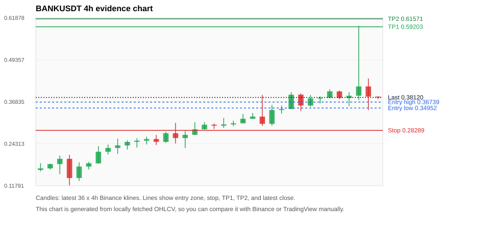
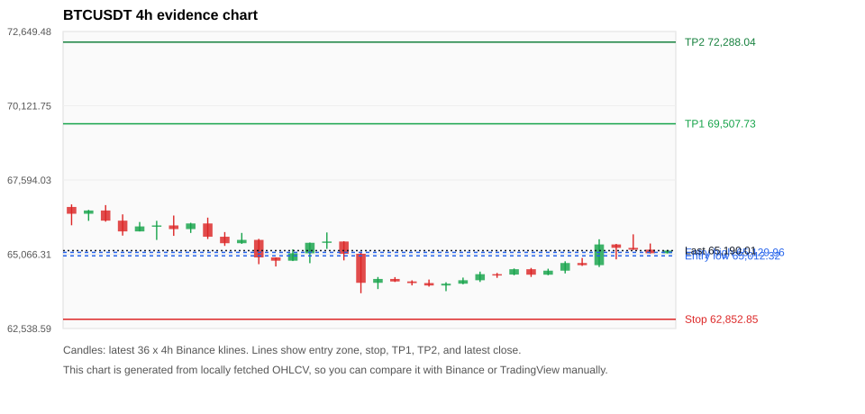
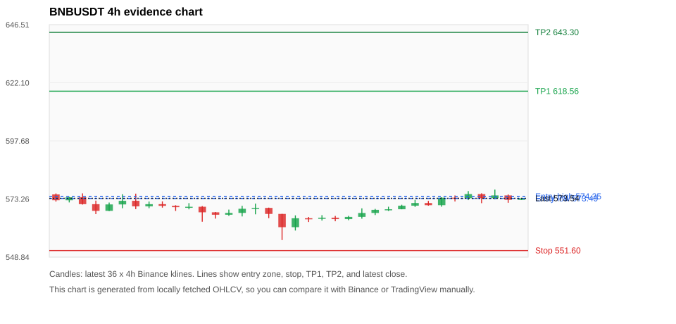
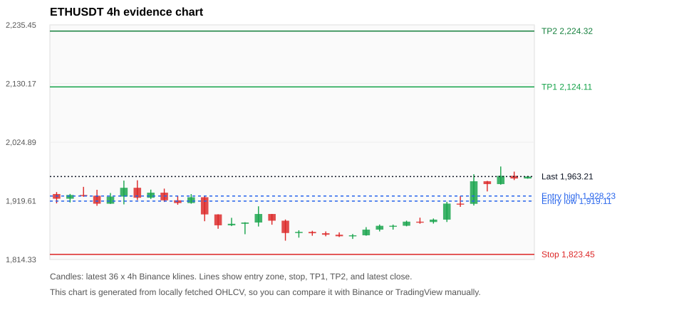
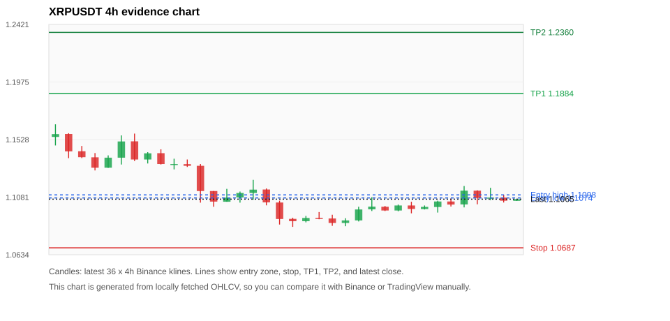

# Crypto 市场扫描报告 v1

- 报告时间：2026-07-27 20:05:53 CST
- Run ID：`20260727_120503_841b2444`
- Run type：`daily_full`
- 数据来源：SQLite
- 报告版本：v1
- 扫描 ID：710f8bc63f57
- 数据源：Binance public spot API + CoinGecko/CoinMarketCap cross-check
- 过滤条件：USDT spot; 24h quote volume >= 30,000,000; trades >= 30,000; exclude stables/leveraged tokens; analyze 1h/4h/1d klines
- 默认单笔风险：账户权益的 1.00%

## 限制说明

- 交易信号仍以 Binance 现货公开 K 线为主源；外部数据源用于一致性复核。
- 结果是研究和模拟盘计划，不是确定收益或实盘下单指令。
- 历史长度过滤：候选币至少需要 180 根 1d K 线。
- 数据质量验证池：先验证 score 排名前 min(top_n * 2, 10) 的候选，再按 action + score 补足最终名单。
- 大盘环境过滤：NEUTRAL; BTC/ETH 大盘未完全确认强势，山寨币买入候选降级为观察。 BTC 7d=-0.09732511476808758; ETH 7d=3.0680869606304118.
- 已启用数据交叉验证：Binance 主源 + CoinGecko 自动对照；CoinMarketCap 在配置 API Key 后自动对照。
- BANKUSDT 交叉验证状态 DATA_WARNING：At least one external provider needs manual review.
- BTCUSDT 交叉验证状态 DATA_WARNING：At least one external provider needs manual review.
- BNBUSDT 交叉验证状态 DATA_WARNING：At least one external provider needs manual review.
- ETHUSDT 交叉验证状态 DATA_WARNING：At least one external provider needs manual review.
- XRPUSDT 交叉验证状态 DATA_WARNING：At least one external provider needs manual review.
- SOLUSDT 交叉验证状态 DATA_WARNING：At least one external provider needs manual review.
- ZECUSDT 交叉验证状态 DATA_WARNING：At least one external provider needs manual review.
- DEXEUSDT 交叉验证状态 DATA_WARNING：At least one external provider needs manual review.

## 5 个候选交易计划

| Rank | Coin | Action | Setup | Entry Zone | Stop Loss | TP1 | TP2 / Exit Rule | R/R | Verdict |
|---:|---|---|---|---:|---:|---:|---|---:|---|
| 1 | `BANK` | `WAIT_PULLBACK` | 趋势中，等回调入场 | 0.34952 - 0.36739 | 0.28289 | 0.59203 | 0.61571 或跌破 4h 关键支撑 | 3.09-3.40 | 只等回调 |
| 2 | `BTC` | `WATCH_ONLY` | 回踩支撑/4h EMA 附近 | 65,012.32 - 65,129.96 | 62,852.85 | 69,507.73 | 72,288.04 或跌破 4h 关键支撑 | 2.00-3.25 | 只等回调 |
| 3 | `BNB` | `WATCH_ONLY` | 回踩支撑/4h EMA 附近 | 573.49 - 574.35 | 551.60 | 618.56 | 643.30 或跌破 4h 关键支撑 | 2.00-3.11 | 只观察 |
| 4 | `ETH` | `WATCH_ONLY` | 回踩支撑/4h EMA 附近 | 1,919.11 - 1,928.23 | 1,823.45 | 2,124.11 | 2,224.32 或跌破 4h 关键支撑 | 2.00-3.00 | 只等回调 |
| 5 | `XRP` | `WATCH_ONLY` | 回踩支撑/4h EMA 附近 | 1.1074 - 1.1098 | 1.0687 | 1.1884 | 1.2360 或跌破 4h 关键支撑 | 2.00-3.19 | 只观察 |

## 数据交叉验证摘要

价格差异以 Binance 当前价为基准；成交量口径不同，Binance 是 USDT 现货成交额，CoinGecko/CoinMarketCap 通常是全市场成交量。

| Rank | Coin | Data Status | Max Price Diff | Max 24h Diff | Message |
|---:|---|---|---:|---:|---|
| 1 | `BANK` | DATA_WARNING | 0.21% | 0.36 pts | At least one external provider needs manual review. |
| 2 | `BTC` | DATA_WARNING | 0.13% | 0.03 pts | At least one external provider needs manual review. |
| 3 | `BNB` | DATA_WARNING | 0.12% | 0.11 pts | At least one external provider needs manual review. |
| 4 | `ETH` | DATA_WARNING | 0.10% | 0.11 pts | At least one external provider needs manual review. |
| 5 | `XRP` | DATA_WARNING | 0.32% | 0.06 pts | At least one external provider needs manual review. |

## 候选币说明

### 1. BANK `BANKUSDT`



- 入选原因：趋势中，等回调入场；24h +0.80%，7d +30.77%，4h RSI 61.52，24h 成交额 $90.9M。
- 交易失效条件：跌破 0.282892 或 4h 收盘重新失守关键支撑。
- 主要风险：距离支撑偏远，不能追市价；24h 振幅较大，回撤风险高；数据交叉验证需要人工复核。
- 数据交叉验证：DATA_WARNING；At least one external provider needs manual review.

#### 可点击人工验证

- [Binance 交易页](https://www.binance.com/en/trade/BANK_USDT)
- [TradingView 图表](https://www.tradingview.com/chart/?symbol=BINANCE%3ABANKUSDT)
- [CoinGecko 搜索](https://www.coingecko.com/en/search?query=BANK)
- [CoinMarketCap 搜索](https://coinmarketcap.com/search/?q=BANK)

#### 多数据源对照

| Source | Status | Asset ID | Price | 24h Change | 24h Volume | Price Diff | 24h Diff | Updated | Message |
|---|---|---|---:|---:|---:|---:|---:|---|---|
| Binance | DATA_OK | BANKUSDT | 0.38120 | +0.80% | $90.9M | 0.00% | 0.00 pts | 2026-07-27T12:05:17+00:00 | Primary market data source used by scanner. |
| CoinGecko | DATA_WARNING | n/a | n/a | n/a | n/a | n/a | n/a | 2026-07-27T12:05:17+00:00 | Failed to fetch https://api.coingecko.com/api/v3/coins/markets?vs_currency=usd&ids=lorenzo-protocol&price_change_percentage=24h&per_page=1&page=1: HTTP Error 429: Too Many Requests |
| CoinMarketCap | DATA_WARNING | 36296 | 0.38042 | +1.15% | $339.7M | 0.21% | 0.36 pts | 2026-07-27T12:04:02.000Z | CoinMarketCap symbol mapping has 10 matches; selected lowest cmc_rank |

#### 指标证据

| 指标 | 数值 | 人工核对用途 |
|---|---:|---|
| 当前价 | 0.38120 | 与 Binance/TradingView 当前价格对照 |
| 24h 涨跌 | +0.80% | 与交易所 24h 涨跌对照 |
| 7d 涨跌 | +30.77% | 判断短线趋势是否延续 |
| 4h EMA20 | 0.34883 | 判断短期趋势支撑 |
| 4h EMA50 | 0.27699 | 判断中期趋势支撑 |
| 1d EMA20 | 0.20047 | 判断日线趋势 |
| 1d EMA50 | 0.11889 | 判断日线趋势 |
| 4h RSI14 | 61.52 | 判断是否过热/过弱 |
| 4h ATR14 | 0.05522 | 推导止损和入场缓冲 |
| 最近 18 根 4h 最低点 | 0.28720 | 支撑/止损参考 |
| 最近 36 根 4h 最高点 | 0.59500 | TP/压力参考 |
| 支撑位 | 0.34883 | 入场区间推导基础 |

#### 交易计划推导

- 支撑位 = 最近低点、4h EMA20、4h EMA50、1d EMA20 中不高于当前价的最高有效支撑 = `0.34883`。
- 入场区间 = 支撑位附近 + ATR 缓冲 = `0.34952 - 0.36739`。
- 止损 = min(最近 18 根 4h 最低点 * 0.985, 入场中位价 - 1.15 * ATR14) = `0.28289`。
- TP1 = max(最近 36 根 4h 最高点 * 0.995, 入场中位价 + 2R) = `0.59203`。
- TP2 = max(入场中位价 + 3R, TP1 * 1.04) = `0.61571`。

#### 最近 10 根 4h K线

| UTC 开盘时间 | Open | High | Low | Close | Quote Volume | Trades |
|---|---:|---:|---:|---:|---:|---:|
| 2026-07-26T00:00+00:00 | 0.34660 | 0.39710 | 0.34640 | 0.38940 | $7.8M | 118480 |
| 2026-07-26T04:00+00:00 | 0.38940 | 0.39300 | 0.34010 | 0.35700 | $8.1M | 117648 |
| 2026-07-26T08:00+00:00 | 0.35690 | 0.38850 | 0.35380 | 0.37840 | $6.3M | 79329 |
| 2026-07-26T12:00+00:00 | 0.37850 | 0.38490 | 0.36350 | 0.38000 | $3.7M | 57814 |
| 2026-07-26T16:00+00:00 | 0.38000 | 0.40550 | 0.38000 | 0.39930 | $6.8M | 91546 |
| 2026-07-26T20:00+00:00 | 0.39910 | 0.40170 | 0.37580 | 0.37970 | $2.9M | 43759 |
| 2026-07-27T00:00+00:00 | 0.37950 | 0.39670 | 0.35570 | 0.38610 | $9.5M | 165051 |
| 2026-07-27T04:00+00:00 | 0.38630 | 0.59500 | 0.37310 | 0.41400 | $39.8M | 645265 |
| 2026-07-27T08:00+00:00 | 0.41400 | 0.43790 | 0.34360 | 0.38360 | $27.9M | 366092 |
| 2026-07-27T12:00+00:00 | 0.38360 | 0.38460 | 0.37610 | 0.38120 | $294,530 | 4942 |

### 2. BTC `BTCUSDT`



- 入选原因：回踩支撑/4h EMA 附近；24h +0.99%，7d +1.31%，4h RSI 75.46，24h 成交额 $812.0M。
- 交易失效条件：跌破 62852.85 或 4h 收盘重新失守关键支撑。
- 主要风险：4h RSI 偏热；数据交叉验证需要人工复核。
- 数据交叉验证：DATA_WARNING；At least one external provider needs manual review.

#### 可点击人工验证

- [Binance 交易页](https://www.binance.com/en/trade/BTC_USDT)
- [TradingView 图表](https://www.tradingview.com/chart/?symbol=BINANCE%3ABTCUSDT)
- [CoinGecko 搜索](https://www.coingecko.com/en/search?query=BTC)
- [CoinMarketCap 搜索](https://coinmarketcap.com/search/?q=BTC)

#### 多数据源对照

| Source | Status | Asset ID | Price | 24h Change | 24h Volume | Price Diff | 24h Diff | Updated | Message |
|---|---|---|---:|---:|---:|---:|---:|---|---|
| Binance | DATA_OK | BTCUSDT | 65,190.01 | +0.99% | $812.0M | 0.00% | 0.00 pts | 2026-07-27T12:05:17+00:00 | Primary market data source used by scanner. |
| CoinGecko | DATA_WARNING | n/a | n/a | n/a | n/a | n/a | n/a | 2026-07-27T12:05:17+00:00 | Failed to fetch https://api.coingecko.com/api/v3/coins/markets?vs_currency=usd&ids=bitcoin&price_change_percentage=24h&per_page=1&page=1: HTTP Error 429: Too Many Requests |
| CoinMarketCap | DATA_WARNING | 1 | 65,107.94 | +0.96% | $20.99B | 0.13% | 0.03 pts | 2026-07-27T12:04:02.000Z | CoinMarketCap symbol mapping has 13 matches; selected lowest cmc_rank |

#### 指标证据

| 指标 | 数值 | 人工核对用途 |
|---|---:|---|
| 当前价 | 65,190.01 | 与 Binance/TradingView 当前价格对照 |
| 24h 涨跌 | +0.99% | 与交易所 24h 涨跌对照 |
| 7d 涨跌 | +1.31% | 判断短线趋势是否延续 |
| 4h EMA20 | 64,882.56 | 判断短期趋势支撑 |
| 4h EMA50 | 64,840.21 | 判断中期趋势支撑 |
| 1d EMA20 | 64,498.20 | 判断日线趋势 |
| 1d EMA50 | 65,074.18 | 判断日线趋势 |
| 4h RSI14 | 75.46 | 判断是否过热/过弱 |
| 4h ATR14 | 353.44 | 推导止损和入场缓冲 |
| 最近 18 根 4h 最低点 | 63,810.00 | 支撑/止损参考 |
| 最近 36 根 4h 最高点 | 66,764.00 | TP/压力参考 |
| 支撑位 | 64,882.56 | 入场区间推导基础 |

#### 交易计划推导

- 支撑位 = 最近低点、4h EMA20、4h EMA50、1d EMA20 中不高于当前价的最高有效支撑 = `64,882.56`。
- 入场区间 = 支撑位附近 + ATR 缓冲 = `65,012.32 - 65,129.96`。
- 止损 = min(最近 18 根 4h 最低点 * 0.985, 入场中位价 - 1.15 * ATR14) = `62,852.85`。
- TP1 = max(最近 36 根 4h 最高点 * 0.995, 入场中位价 + 2R) = `69,507.73`。
- TP2 = max(入场中位价 + 3R, TP1 * 1.04) = `72,288.04`。

#### 最近 10 根 4h K线

| UTC 开盘时间 | Open | High | Low | Close | Quote Volume | Trades |
|---|---:|---:|---:|---:|---:|---:|
| 2026-07-26T00:00+00:00 | 64,375.01 | 64,582.00 | 64,350.00 | 64,557.00 | $61.6M | 142517 |
| 2026-07-26T04:00+00:00 | 64,557.00 | 64,599.95 | 64,293.81 | 64,370.00 | $79.8M | 129186 |
| 2026-07-26T08:00+00:00 | 64,370.00 | 64,573.73 | 64,353.00 | 64,507.35 | $43.9M | 112877 |
| 2026-07-26T12:00+00:00 | 64,507.36 | 64,827.00 | 64,414.00 | 64,768.00 | $94.1M | 246720 |
| 2026-07-26T16:00+00:00 | 64,768.00 | 64,940.51 | 64,668.91 | 64,695.52 | $81.1M | 163019 |
| 2026-07-26T20:00+00:00 | 64,695.52 | 65,577.00 | 64,631.57 | 65,399.99 | $153.3M | 343704 |
| 2026-07-27T00:00+00:00 | 65,400.00 | 65,418.81 | 64,892.03 | 65,284.00 | $126.4M | 391478 |
| 2026-07-27T04:00+00:00 | 65,284.00 | 65,744.60 | 65,217.16 | 65,221.99 | $166.8M | 393601 |
| 2026-07-27T08:00+00:00 | 65,221.99 | 65,432.00 | 65,092.00 | 65,100.79 | $189.4M | 299147 |
| 2026-07-27T12:00+00:00 | 65,100.79 | 65,209.30 | 65,095.56 | 65,190.01 | $3.3M | 9967 |

### 3. BNB `BNBUSDT`



- 入选原因：回踩支撑/4h EMA 附近；24h +0.41%，7d +1.20%，4h RSI 74.10，24h 成交额 $41.4M。
- 交易失效条件：跌破 551.6 或 4h 收盘重新失守关键支撑。
- 主要风险：主要风险是大盘同步回撤；数据交叉验证需要人工复核；数据交叉验证状态为 DATA_WARNING，买入候选降级为观察。
- 数据交叉验证：DATA_WARNING；At least one external provider needs manual review.

#### 可点击人工验证

- [Binance 交易页](https://www.binance.com/en/trade/BNB_USDT)
- [TradingView 图表](https://www.tradingview.com/chart/?symbol=BINANCE%3ABNBUSDT)
- [CoinGecko 搜索](https://www.coingecko.com/en/search?query=BNB)
- [CoinMarketCap 搜索](https://coinmarketcap.com/search/?q=BNB)

#### 多数据源对照

| Source | Status | Asset ID | Price | 24h Change | 24h Volume | Price Diff | 24h Diff | Updated | Message |
|---|---|---|---:|---:|---:|---:|---:|---|---|
| Binance | DATA_OK | BNBUSDT | 573.54 | +0.41% | $41.4M | 0.00% | 0.00 pts | 2026-07-27T12:05:17+00:00 | Primary market data source used by scanner. |
| CoinGecko | DATA_OK | binancecoin | 572.98 | +0.30% | $431.3M | 0.10% | 0.11 pts | 2026-07-27T12:03:20.000Z | External source agrees with Binance within thresholds. |
| CoinMarketCap | DATA_WARNING | 1839 | 572.83 | +0.42% | $878.4M | 0.12% | 0.01 pts | 2026-07-27T12:04:02.000Z | CoinMarketCap symbol mapping has 4 matches; selected lowest cmc_rank |

#### 指标证据

| 指标 | 数值 | 人工核对用途 |
|---|---:|---|
| 当前价 | 573.54 | 与 Binance/TradingView 当前价格对照 |
| 24h 涨跌 | +0.41% | 与交易所 24h 涨跌对照 |
| 7d 涨跌 | +1.20% | 判断短线趋势是否延续 |
| 4h EMA20 | 571.24 | 判断短期趋势支撑 |
| 4h EMA50 | 570.66 | 判断中期趋势支撑 |
| 1d EMA20 | 572.34 | 判断日线趋势 |
| 1d EMA50 | 582.99 | 判断日线趋势 |
| 4h RSI14 | 74.10 | 判断是否过热/过弱 |
| 4h ATR14 | 2.8729 | 推导止损和入场缓冲 |
| 最近 18 根 4h 最低点 | 560.00 | 支撑/止损参考 |
| 最近 36 根 4h 最高点 | 577.20 | TP/压力参考 |
| 支撑位 | 572.34 | 入场区间推导基础 |

#### 交易计划推导

- 支撑位 = 最近低点、4h EMA20、4h EMA50、1d EMA20 中不高于当前价的最高有效支撑 = `572.34`。
- 入场区间 = 支撑位附近 + ATR 缓冲 = `573.49 - 574.35`。
- 止损 = min(最近 18 根 4h 最低点 * 0.985, 入场中位价 - 1.15 * ATR14) = `551.60`。
- TP1 = max(最近 36 根 4h 最高点 * 0.995, 入场中位价 + 2R) = `618.56`。
- TP2 = max(入场中位价 + 3R, TP1 * 1.04) = `643.30`。

#### 最近 10 根 4h K线

| UTC 开盘时间 | Open | High | Low | Close | Quote Volume | Trades |
|---|---:|---:|---:|---:|---:|---:|
| 2026-07-26T00:00+00:00 | 568.94 | 570.84 | 568.94 | 570.43 | $5.5M | 33901 |
| 2026-07-26T04:00+00:00 | 570.44 | 572.91 | 569.93 | 571.57 | $6.9M | 50622 |
| 2026-07-26T08:00+00:00 | 571.56 | 572.45 | 570.44 | 570.65 | $5.5M | 34648 |
| 2026-07-26T12:00+00:00 | 570.66 | 573.99 | 570.01 | 573.79 | $8.7M | 61970 |
| 2026-07-26T16:00+00:00 | 573.80 | 574.75 | 572.20 | 573.59 | $6.2M | 43799 |
| 2026-07-26T20:00+00:00 | 573.59 | 576.57 | 572.80 | 575.32 | $4.9M | 58594 |
| 2026-07-27T00:00+00:00 | 575.31 | 575.67 | 571.49 | 573.61 | $4.4M | 56836 |
| 2026-07-27T04:00+00:00 | 573.61 | 577.20 | 573.09 | 574.76 | $5.6M | 62124 |
| 2026-07-27T08:00+00:00 | 574.76 | 575.15 | 571.68 | 572.90 | $11.5M | 75781 |
| 2026-07-27T12:00+00:00 | 572.90 | 573.63 | 572.89 | 573.54 | $210,780 | 1603 |

### 4. ETH `ETHUSDT`



- 入选原因：回踩支撑/4h EMA 附近；24h +3.97%，7d +5.40%，4h RSI 91.58，24h 成交额 $502.9M。
- 交易失效条件：跌破 1823.4517 或 4h 收盘重新失守关键支撑。
- 主要风险：4h RSI 偏热；数据交叉验证需要人工复核。
- 数据交叉验证：DATA_WARNING；At least one external provider needs manual review.

#### 可点击人工验证

- [Binance 交易页](https://www.binance.com/en/trade/ETH_USDT)
- [TradingView 图表](https://www.tradingview.com/chart/?symbol=BINANCE%3AETHUSDT)
- [CoinGecko 搜索](https://www.coingecko.com/en/search?query=ETH)
- [CoinMarketCap 搜索](https://coinmarketcap.com/search/?q=ETH)

#### 多数据源对照

| Source | Status | Asset ID | Price | 24h Change | 24h Volume | Price Diff | 24h Diff | Updated | Message |
|---|---|---|---:|---:|---:|---:|---:|---|---|
| Binance | DATA_OK | ETHUSDT | 1,963.21 | +3.97% | $502.9M | 0.00% | 0.00 pts | 2026-07-27T12:05:17+00:00 | Primary market data source used by scanner. |
| CoinGecko | DATA_OK | ethereum | 1,961.30 | +3.90% | $9.38B | 0.10% | 0.07 pts | 2026-07-27T12:03:20.000Z | External source agrees with Binance within thresholds. |
| CoinMarketCap | DATA_WARNING | 1027 | 1,961.57 | +4.08% | $10.65B | 0.08% | 0.11 pts | 2026-07-27T12:04:02.000Z | CoinMarketCap symbol mapping has 6 matches; selected lowest cmc_rank |

#### 指标证据

| 指标 | 数值 | 人工核对用途 |
|---|---:|---|
| 当前价 | 1,963.21 | 与 Binance/TradingView 当前价格对照 |
| 24h 涨跌 | +3.97% | 与交易所 24h 涨跌对照 |
| 7d 涨跌 | +5.40% | 判断短线趋势是否延续 |
| 4h EMA20 | 1,915.28 | 判断短期趋势支撑 |
| 4h EMA50 | 1,895.66 | 判断中期趋势支撑 |
| 1d EMA20 | 1,864.01 | 判断日线趋势 |
| 1d EMA50 | 1,841.71 | 判断日线趋势 |
| 4h RSI14 | 91.58 | 判断是否过热/过弱 |
| 4h ATR14 | 18.4971 | 推导止损和入场缓冲 |
| 最近 18 根 4h 最低点 | 1,851.22 | 支撑/止损参考 |
| 最近 36 根 4h 最高点 | 1,981.24 | TP/压力参考 |
| 支撑位 | 1,915.28 | 入场区间推导基础 |

#### 交易计划推导

- 支撑位 = 最近低点、4h EMA20、4h EMA50、1d EMA20 中不高于当前价的最高有效支撑 = `1,915.28`。
- 入场区间 = 支撑位附近 + ATR 缓冲 = `1,919.11 - 1,928.23`。
- 止损 = min(最近 18 根 4h 最低点 * 0.985, 入场中位价 - 1.15 * ATR14) = `1,823.45`。
- TP1 = max(最近 36 根 4h 最高点 * 0.995, 入场中位价 + 2R) = `2,124.11`。
- TP2 = max(入场中位价 + 3R, TP1 * 1.04) = `2,224.32`。

#### 最近 10 根 4h K线

| UTC 开盘时间 | Open | High | Low | Close | Quote Volume | Trades |
|---|---:|---:|---:|---:|---:|---:|
| 2026-07-26T00:00+00:00 | 1,874.88 | 1,883.98 | 1,873.85 | 1,882.21 | $19.5M | 113287 |
| 2026-07-26T04:00+00:00 | 1,882.21 | 1,889.36 | 1,878.46 | 1,881.56 | $21.2M | 96548 |
| 2026-07-26T08:00+00:00 | 1,881.57 | 1,887.89 | 1,878.74 | 1,885.87 | $18.1M | 105053 |
| 2026-07-26T12:00+00:00 | 1,885.87 | 1,917.82 | 1,881.61 | 1,914.63 | $65.2M | 374375 |
| 2026-07-26T16:00+00:00 | 1,914.63 | 1,928.08 | 1,908.75 | 1,914.20 | $54.4M | 295254 |
| 2026-07-26T20:00+00:00 | 1,914.21 | 1,967.36 | 1,911.14 | 1,954.72 | $115.3M | 531446 |
| 2026-07-27T00:00+00:00 | 1,954.72 | 1,955.42 | 1,936.51 | 1,949.64 | $66.6M | 362357 |
| 2026-07-27T04:00+00:00 | 1,949.65 | 1,981.24 | 1,948.54 | 1,964.36 | $137.0M | 477109 |
| 2026-07-27T08:00+00:00 | 1,964.37 | 1,972.00 | 1,956.87 | 1,959.67 | $63.5M | 308712 |
| 2026-07-27T12:00+00:00 | 1,959.67 | 1,964.00 | 1,959.40 | 1,963.21 | $1.6M | 7491 |

### 5. XRP `XRPUSDT`



- 入选原因：回踩支撑/4h EMA 附近；24h +0.46%，7d +1.41%，4h RSI 68.17，24h 成交额 $36.0M。
- 交易失效条件：跌破 1.068725 或 4h 收盘重新失守关键支撑。
- 主要风险：日线趋势未完全确认；数据交叉验证需要人工复核。
- 数据交叉验证：DATA_WARNING；At least one external provider needs manual review.

#### 可点击人工验证

- [Binance 交易页](https://www.binance.com/en/trade/XRP_USDT)
- [TradingView 图表](https://www.tradingview.com/chart/?symbol=BINANCE%3AXRPUSDT)
- [CoinGecko 搜索](https://www.coingecko.com/en/search?query=XRP)
- [CoinMarketCap 搜索](https://coinmarketcap.com/search/?q=XRP)

#### 多数据源对照

| Source | Status | Asset ID | Price | 24h Change | 24h Volume | Price Diff | 24h Diff | Updated | Message |
|---|---|---|---:|---:|---:|---:|---:|---|---|
| Binance | DATA_OK | XRPUSDT | 1.1065 | +0.46% | $36.0M | 0.00% | 0.00 pts | 2026-07-27T12:05:17+00:00 | Primary market data source used by scanner. |
| CoinGecko | DATA_OK | ripple | 1.1100 | +0.40% | $705.2M | 0.32% | 0.06 pts | 2026-07-27T12:03:20.000Z | External source agrees with Binance within thresholds. |
| CoinMarketCap | DATA_WARNING | 52 | 1.1049 | +0.47% | $796.7M | 0.14% | 0.01 pts | 2026-07-27T12:04:02.000Z | CoinMarketCap symbol mapping has 3 matches; selected lowest cmc_rank |

#### 指标证据

| 指标 | 数值 | 人工核对用途 |
|---|---:|---|
| 当前价 | 1.1065 | 与 Binance/TradingView 当前价格对照 |
| 24h 涨跌 | +0.46% | 与交易所 24h 涨跌对照 |
| 7d 涨跌 | +1.41% | 判断短线趋势是否延续 |
| 4h EMA20 | 1.1052 | 判断短期趋势支撑 |
| 4h EMA50 | 1.1073 | 判断中期趋势支撑 |
| 1d EMA20 | 1.1075 | 判断日线趋势 |
| 1d EMA50 | 1.1381 | 判断日线趋势 |
| 4h RSI14 | 68.17 | 判断是否过热/过弱 |
| 4h ATR14 | 0.0078285714 | 推导止损和入场缓冲 |
| 最近 18 根 4h 最低点 | 1.0850 | 支撑/止损参考 |
| 最近 36 根 4h 最高点 | 1.1646 | TP/压力参考 |
| 支撑位 | 1.1052 | 入场区间推导基础 |

#### 交易计划推导

- 支撑位 = 最近低点、4h EMA20、4h EMA50、1d EMA20 中不高于当前价的最高有效支撑 = `1.1052`。
- 入场区间 = 支撑位附近 + ATR 缓冲 = `1.1074 - 1.1098`。
- 止损 = min(最近 18 根 4h 最低点 * 0.985, 入场中位价 - 1.15 * ATR14) = `1.0687`。
- TP1 = max(最近 36 根 4h 最高点 * 0.995, 入场中位价 + 2R) = `1.1884`。
- TP2 = max(入场中位价 + 3R, TP1 * 1.04) = `1.2360`。

#### 最近 10 根 4h K线

| UTC 开盘时间 | Open | High | Low | Close | Quote Volume | Trades |
|---|---:|---:|---:|---:|---:|---:|
| 2026-07-26T00:00+00:00 | 1.0977 | 1.1023 | 1.0971 | 1.1016 | $2.9M | 16778 |
| 2026-07-26T04:00+00:00 | 1.1016 | 1.1045 | 1.0955 | 1.0989 | $4.0M | 20240 |
| 2026-07-26T08:00+00:00 | 1.0988 | 1.1016 | 1.0985 | 1.1005 | $2.8M | 13347 |
| 2026-07-26T12:00+00:00 | 1.1004 | 1.1053 | 1.0961 | 1.1047 | $5.8M | 31583 |
| 2026-07-26T16:00+00:00 | 1.1047 | 1.1069 | 1.1008 | 1.1023 | $3.2M | 19759 |
| 2026-07-26T20:00+00:00 | 1.1024 | 1.1167 | 1.1001 | 1.1131 | $8.1M | 44182 |
| 2026-07-27T00:00+00:00 | 1.1131 | 1.1134 | 1.1025 | 1.1074 | $5.7M | 37215 |
| 2026-07-27T04:00+00:00 | 1.1074 | 1.1153 | 1.1057 | 1.1077 | $6.4M | 43805 |
| 2026-07-27T08:00+00:00 | 1.1077 | 1.1100 | 1.1039 | 1.1053 | $6.8M | 33706 |
| 2026-07-27T12:00+00:00 | 1.1052 | 1.1067 | 1.1051 | 1.1065 | $105,297 | 751 |

## 组合风控

- 不要 5 个候选全部满仓买入。
- 同时持仓总风险建议控制在账户权益的 3% - 5% 以内。
- 如果 BTC/ETH 同时破位，暂停山寨币多头计划或降低仓位。
- 第一版报告用于模拟盘和人工复核，不自动下单。

## 原始数据

```json
[
  {
    "rank": 1,
    "symbol": "BANKUSDT",
    "base_asset": "BANK",
    "price": 0.3812,
    "score": 69.47683886780443,
    "setup": "趋势中，等回调入场",
    "verdict": "只等回调",
    "entry_low": 0.3495247676738986,
    "entry_high": 0.36739464285714285,
    "stop_loss": 0.28289200000000003,
    "take_profit_1": 0.592025,
    "take_profit_2": 0.6157060000000001,
    "risk_reward_1": 3.090808354095254,
    "risk_reward_2": 3.4041829618962005,
    "pct_24h": 0.797,
    "pct_3d": 29.176550321924786,
    "pct_7d": 30.77186963979417,
    "quote_volume_24h": 90861900.68527,
    "trades_24h": 1373447,
    "high_low_range_24h": 73.16647264260767,
    "rsi_1h": 49.89169675090252,
    "rsi_4h": 61.518987341772146,
    "ema20_4h": 0.3488271134470046,
    "ema50_4h": 0.2769862176823783,
    "ema20_1d": 0.20047180356891275,
    "ema50_1d": 0.11888867028653073,
    "atr_4h": 0.05522142857142858,
    "macd_hist_4h": -0.0011271522511094312,
    "volume_ratio_24h": 1.3191530113115388,
    "support_level": 0.3488271134470046,
    "recent_low_4h_18": 0.2872,
    "recent_high_4h_36": 0.595,
    "distance_to_support_pct": 9.280496069556122,
    "binance_trade_url": "https://www.binance.com/en/trade/BANK_USDT",
    "tradingview_url": "https://www.tradingview.com/chart/?symbol=BINANCE%3ABANKUSDT",
    "coingecko_search_url": "https://www.coingecko.com/en/search?query=BANK",
    "coinmarketcap_search_url": "https://coinmarketcap.com/search/?q=BANK",
    "invalidation": "跌破 0.282892 或 4h 收盘重新失守关键支撑",
    "recent_4h_klines": [
      {
        "open_time_utc": "2026-07-21T16:00+00:00",
        "open": 0.1648,
        "high": 0.1849,
        "low": 0.1607,
        "close": 0.1694,
        "quote_volume": 11849582.05491,
        "trades": 114628
      },
      {
        "open_time_utc": "2026-07-21T20:00+00:00",
        "open": 0.1695,
        "high": 0.1838,
        "low": 0.1657,
        "close": 0.1823,
        "quote_volume": 3051498.55355,
        "trades": 33878
      },
      {
        "open_time_utc": "2026-07-22T00:00+00:00",
        "open": 0.1823,
        "high": 0.208,
        "low": 0.1522,
        "close": 0.1981,
        "quote_volume": 20270511.31169,
        "trades": 279829
      },
      {
        "open_time_utc": "2026-07-22T04:00+00:00",
        "open": 0.1981,
        "high": 0.21,
        "low": 0.1185,
        "close": 0.1407,
        "quote_volume": 22211587.87328,
        "trades": 266622
      },
      {
        "open_time_utc": "2026-07-22T08:00+00:00",
        "open": 0.1408,
        "high": 0.1874,
        "low": 0.1318,
        "close": 0.175,
        "quote_volume": 17504178.66821,
        "trades": 199508
      },
      {
        "open_time_utc": "2026-07-22T12:00+00:00",
        "open": 0.1749,
        "high": 0.1889,
        "low": 0.1661,
        "close": 0.1846,
        "quote_volume": 11865002.45501,
        "trades": 116777
      },
      {
        "open_time_utc": "2026-07-22T16:00+00:00",
        "open": 0.1844,
        "high": 0.2359,
        "low": 0.1842,
        "close": 0.2192,
        "quote_volume": 17620028.88124,
        "trades": 174586
      },
      {
        "open_time_utc": "2026-07-22T20:00+00:00",
        "open": 0.2191,
        "high": 0.2406,
        "low": 0.2109,
        "close": 0.2305,
        "quote_volume": 7628261.19402,
        "trades": 91387
      },
      {
        "open_time_utc": "2026-07-23T00:00+00:00",
        "open": 0.2304,
        "high": 0.258,
        "low": 0.2128,
        "close": 0.2381,
        "quote_volume": 13059172.99562,
        "trades": 175883
      },
      {
        "open_time_utc": "2026-07-23T04:00+00:00",
        "open": 0.238,
        "high": 0.2533,
        "low": 0.2257,
        "close": 0.2485,
        "quote_volume": 6318441.44353,
        "trades": 82944
      },
      {
        "open_time_utc": "2026-07-23T08:00+00:00",
        "open": 0.2487,
        "high": 0.2595,
        "low": 0.2317,
        "close": 0.2521,
        "quote_volume": 10518439.57259,
        "trades": 116661
      },
      {
        "open_time_utc": "2026-07-23T12:00+00:00",
        "open": 0.2522,
        "high": 0.2643,
        "low": 0.2412,
        "close": 0.257,
        "quote_volume": 11144818.63714,
        "trades": 103996
      },
      {
        "open_time_utc": "2026-07-23T16:00+00:00",
        "open": 0.2571,
        "high": 0.2695,
        "low": 0.2393,
        "close": 0.2487,
        "quote_volume": 9065948.65324,
        "trades": 98070
      },
      {
        "open_time_utc": "2026-07-23T20:00+00:00",
        "open": 0.2486,
        "high": 0.279,
        "low": 0.2456,
        "close": 0.2743,
        "quote_volume": 5851924.1141,
        "trades": 61758
      },
      {
        "open_time_utc": "2026-07-24T00:00+00:00",
        "open": 0.2744,
        "high": 0.3053,
        "low": 0.2439,
        "close": 0.26,
        "quote_volume": 18216102.47102,
        "trades": 222539
      },
      {
        "open_time_utc": "2026-07-24T04:00+00:00",
        "open": 0.2599,
        "high": 0.2819,
        "low": 0.2304,
        "close": 0.2696,
        "quote_volume": 13116483.38654,
        "trades": 162472
      },
      {
        "open_time_utc": "2026-07-24T08:00+00:00",
        "open": 0.2697,
        "high": 0.3074,
        "low": 0.2688,
        "close": 0.2861,
        "quote_volume": 13685663.102,
        "trades": 134748
      },
      {
        "open_time_utc": "2026-07-24T12:00+00:00",
        "open": 0.2861,
        "high": 0.3074,
        "low": 0.2854,
        "close": 0.2998,
        "quote_volume": 8801650.09037,
        "trades": 110826
      },
      {
        "open_time_utc": "2026-07-24T16:00+00:00",
        "open": 0.2997,
        "high": 0.3032,
        "low": 0.2872,
        "close": 0.297,
        "quote_volume": 5833081.31603,
        "trades": 65098
      },
      {
        "open_time_utc": "2026-07-24T20:00+00:00",
        "open": 0.297,
        "high": 0.32,
        "low": 0.2904,
        "close": 0.3007,
        "quote_volume": 5851171.64945,
        "trades": 65488
      },
      {
        "open_time_utc": "2026-07-25T00:00+00:00",
        "open": 0.3008,
        "high": 0.3118,
        "low": 0.2953,
        "close": 0.304,
        "quote_volume": 3305479.9693,
        "trades": 40502
      },
      {
        "open_time_utc": "2026-07-25T04:00+00:00",
        "open": 0.3041,
        "high": 0.3319,
        "low": 0.3041,
        "close": 0.3175,
        "quote_volume": 7558114.15558,
        "trades": 88518
      },
      {
        "open_time_utc": "2026-07-25T08:00+00:00",
        "open": 0.3176,
        "high": 0.3349,
        "low": 0.3168,
        "close": 0.324,
        "quote_volume": 5906083.2542,
        "trades": 58867
      },
      {
        "open_time_utc": "2026-07-25T12:00+00:00",
        "open": 0.3239,
        "high": 0.3889,
        "low": 0.2966,
        "close": 0.3024,
        "quote_volume": 14387180.52024,
        "trades": 180338
      },
      {
        "open_time_utc": "2026-07-25T16:00+00:00",
        "open": 0.3023,
        "high": 0.3587,
        "low": 0.2969,
        "close": 0.3438,
        "quote_volume": 10922530.06229,
        "trades": 140685
      },
      {
        "open_time_utc": "2026-07-25T20:00+00:00",
        "open": 0.3437,
        "high": 0.3568,
        "low": 0.3327,
        "close": 0.3465,
        "quote_volume": 3103058.24085,
        "trades": 44413
      },
      {
        "open_time_utc": "2026-07-26T00:00+00:00",
        "open": 0.3466,
        "high": 0.3971,
        "low": 0.3464,
        "close": 0.3894,
        "quote_volume": 7778456.16454,
        "trades": 118480
      },
      {
        "open_time_utc": "2026-07-26T04:00+00:00",
        "open": 0.3894,
        "high": 0.393,
        "low": 0.3401,
        "close": 0.357,
        "quote_volume": 8077294.95173,
        "trades": 117648
      },
      {
        "open_time_utc": "2026-07-26T08:00+00:00",
        "open": 0.3569,
        "high": 0.3885,
        "low": 0.3538,
        "close": 0.3784,
        "quote_volume": 6295460.24606,
        "trades": 79329
      },
      {
        "open_time_utc": "2026-07-26T12:00+00:00",
        "open": 0.3785,
        "high": 0.3849,
        "low": 0.3635,
        "close": 0.38,
        "quote_volume": 3699306.79323,
        "trades": 57814
      },
      {
        "open_time_utc": "2026-07-26T16:00+00:00",
        "open": 0.38,
        "high": 0.4055,
        "low": 0.38,
        "close": 0.3993,
        "quote_volume": 6757496.06512,
        "trades": 91546
      },
      {
        "open_time_utc": "2026-07-26T20:00+00:00",
        "open": 0.3991,
        "high": 0.4017,
        "low": 0.3758,
        "close": 0.3797,
        "quote_volume": 2947718.97806,
        "trades": 43759
      },
      {
        "open_time_utc": "2026-07-27T00:00+00:00",
        "open": 0.3795,
        "high": 0.3967,
        "low": 0.3557,
        "close": 0.3861,
        "quote_volume": 9485834.3064,
        "trades": 165051
      },
      {
        "open_time_utc": "2026-07-27T04:00+00:00",
        "open": 0.3863,
        "high": 0.595,
        "low": 0.3731,
        "close": 0.414,
        "quote_volume": 39836624.2301,
        "trades": 645265
      },
      {
        "open_time_utc": "2026-07-27T08:00+00:00",
        "open": 0.414,
        "high": 0.4379,
        "low": 0.3436,
        "close": 0.3836,
        "quote_volume": 27906410.15681,
        "trades": 366092
      },
      {
        "open_time_utc": "2026-07-27T12:00+00:00",
        "open": 0.3836,
        "high": 0.3846,
        "low": 0.3761,
        "close": 0.3812,
        "quote_volume": 294530.07076,
        "trades": 4942
      }
    ],
    "risks": [
      "距离支撑偏远，不能追市价",
      "24h 振幅较大，回撤风险高",
      "数据交叉验证需要人工复核"
    ],
    "data_quality_status": "DATA_WARNING",
    "data_quality_message": "At least one external provider needs manual review.",
    "data_checks": [
      {
        "provider": "Binance",
        "status": "DATA_OK",
        "provider_asset_id": "BANKUSDT",
        "provider_symbol": "BANKUSDT",
        "price_usd": 0.3812,
        "pct_24h": 0.797,
        "volume_24h": 90861900.68527,
        "last_updated": null,
        "fetched_at_utc": "2026-07-27T12:05:17+00:00",
        "price_diff_pct": 0.0,
        "pct_24h_diff": 0.0,
        "volume_note": "Binance USDT spot 24h quoteVolume.",
        "message": "Primary market data source used by scanner."
      },
      {
        "provider": "CoinGecko",
        "status": "DATA_WARNING",
        "provider_asset_id": null,
        "provider_symbol": "BANK",
        "price_usd": null,
        "pct_24h": null,
        "volume_24h": null,
        "last_updated": null,
        "fetched_at_utc": "2026-07-27T12:05:17+00:00",
        "price_diff_pct": null,
        "pct_24h_diff": null,
        "volume_note": "External provider data unavailable.",
        "message": "Failed to fetch https://api.coingecko.com/api/v3/coins/markets?vs_currency=usd&ids=lorenzo-protocol&price_change_percentage=24h&per_page=1&page=1: HTTP Error 429: Too Many Requests"
      },
      {
        "provider": "CoinMarketCap",
        "status": "DATA_WARNING",
        "provider_asset_id": "36296",
        "provider_symbol": "BANK",
        "price_usd": 0.38041743335943057,
        "pct_24h": 1.1522514,
        "volume_24h": 339700997.2694211,
        "last_updated": "2026-07-27T12:04:02.000Z",
        "fetched_at_utc": "2026-07-27T12:05:17+00:00",
        "price_diff_pct": 0.20529030445157803,
        "pct_24h_diff": 0.3552513999999999,
        "volume_note": "CoinMarketCap total market volume; not the same venue scope as Binance quoteVolume.",
        "message": "CoinMarketCap symbol mapping has 10 matches; selected lowest cmc_rank"
      }
    ],
    "action": "WAIT_PULLBACK"
  },
  {
    "rank": 2,
    "symbol": "BTCUSDT",
    "base_asset": "BTC",
    "price": 65190.01,
    "score": 58.75177801101516,
    "setup": "回踩支撑/4h EMA 附近",
    "verdict": "只等回调",
    "entry_low": 65012.321833507165,
    "entry_high": 65129.962220067035,
    "stop_loss": 62852.85,
    "take_profit_1": 69507.7260803613,
    "take_profit_2": 72288.03512357576,
    "risk_reward_1": 2.0,
    "risk_reward_2": 3.2533557392988324,
    "pct_24h": 0.988,
    "pct_3d": 1.6125673481259373,
    "pct_7d": 1.3148077031568395,
    "quote_volume_24h": 811989669.117482,
    "trades_24h": 1844059,
    "high_low_range_24h": 2.065700003104931,
    "rsi_1h": 42.50536845435634,
    "rsi_4h": 75.45786445753421,
    "ema20_4h": 64882.556720067034,
    "ema50_4h": 64840.21216829881,
    "ema20_1d": 64498.2035437546,
    "ema50_1d": 65074.183595865245,
    "atr_4h": 353.43642857142913,
    "macd_hist_4h": 118.27193059748345,
    "volume_ratio_24h": 0.8143936551945443,
    "support_level": 64882.556720067034,
    "recent_low_4h_18": 63810.0,
    "recent_high_4h_36": 66764.0,
    "distance_to_support_pct": 0.473861227848138,
    "binance_trade_url": "https://www.binance.com/en/trade/BTC_USDT",
    "tradingview_url": "https://www.tradingview.com/chart/?symbol=BINANCE%3ABTCUSDT",
    "coingecko_search_url": "https://www.coingecko.com/en/search?query=BTC",
    "coinmarketcap_search_url": "https://coinmarketcap.com/search/?q=BTC",
    "invalidation": "跌破 62852.85 或 4h 收盘重新失守关键支撑",
    "recent_4h_klines": [
      {
        "open_time_utc": "2026-07-21T16:00+00:00",
        "open": 66676.53,
        "high": 66764.0,
        "low": 66052.63,
        "close": 66444.76,
        "quote_volume": 195205977.7344099,
        "trades": 522292
      },
      {
        "open_time_utc": "2026-07-21T20:00+00:00",
        "open": 66444.76,
        "high": 66576.0,
        "low": 66204.0,
        "close": 66556.16,
        "quote_volume": 91969264.1655351,
        "trades": 277197
      },
      {
        "open_time_utc": "2026-07-22T00:00+00:00",
        "open": 66556.15,
        "high": 66739.89,
        "low": 66176.0,
        "close": 66210.0,
        "quote_volume": 191621422.1669866,
        "trades": 652324
      },
      {
        "open_time_utc": "2026-07-22T04:00+00:00",
        "open": 66209.99,
        "high": 66424.0,
        "low": 65701.0,
        "close": 65843.48,
        "quote_volume": 272389387.6457355,
        "trades": 668048
      },
      {
        "open_time_utc": "2026-07-22T08:00+00:00",
        "open": 65843.48,
        "high": 66164.57,
        "low": 65843.47,
        "close": 66013.36,
        "quote_volume": 341268215.7845121,
        "trades": 712578
      },
      {
        "open_time_utc": "2026-07-22T12:00+00:00",
        "open": 66013.36,
        "high": 66204.98,
        "low": 65553.67,
        "close": 66047.39,
        "quote_volume": 197651196.7168623,
        "trades": 662744
      },
      {
        "open_time_utc": "2026-07-22T16:00+00:00",
        "open": 66047.38,
        "high": 66384.0,
        "low": 65691.93,
        "close": 65923.19,
        "quote_volume": 100444842.6386147,
        "trades": 427993
      },
      {
        "open_time_utc": "2026-07-22T20:00+00:00",
        "open": 65923.19,
        "high": 66138.24,
        "low": 65791.79,
        "close": 66114.49,
        "quote_volume": 90583853.3541208,
        "trades": 258138
      },
      {
        "open_time_utc": "2026-07-23T00:00+00:00",
        "open": 66114.5,
        "high": 66313.14,
        "low": 65585.11,
        "close": 65662.53,
        "quote_volume": 180505912.366509,
        "trades": 390926
      },
      {
        "open_time_utc": "2026-07-23T04:00+00:00",
        "open": 65662.53,
        "high": 65821.17,
        "low": 65351.02,
        "close": 65442.13,
        "quote_volume": 115169792.6132061,
        "trades": 313412
      },
      {
        "open_time_utc": "2026-07-23T08:00+00:00",
        "open": 65442.12,
        "high": 65792.09,
        "low": 65419.75,
        "close": 65555.21,
        "quote_volume": 111411329.7332665,
        "trades": 263480
      },
      {
        "open_time_utc": "2026-07-23T12:00+00:00",
        "open": 65555.21,
        "high": 65589.41,
        "low": 64728.0,
        "close": 64958.36,
        "quote_volume": 280331098.6807678,
        "trades": 864979
      },
      {
        "open_time_utc": "2026-07-23T16:00+00:00",
        "open": 64958.37,
        "high": 64961.15,
        "low": 64650.0,
        "close": 64846.94,
        "quote_volume": 157702426.4583233,
        "trades": 457475
      },
      {
        "open_time_utc": "2026-07-23T20:00+00:00",
        "open": 64846.93,
        "high": 65235.43,
        "low": 64834.52,
        "close": 65098.97,
        "quote_volume": 114870647.6083213,
        "trades": 267027
      },
      {
        "open_time_utc": "2026-07-24T00:00+00:00",
        "open": 65098.98,
        "high": 65464.35,
        "low": 64762.18,
        "close": 65456.7,
        "quote_volume": 118798430.7613269,
        "trades": 353470
      },
      {
        "open_time_utc": "2026-07-24T04:00+00:00",
        "open": 65456.7,
        "high": 65808.59,
        "low": 65248.0,
        "close": 65499.95,
        "quote_volume": 183654410.325705,
        "trades": 327061
      },
      {
        "open_time_utc": "2026-07-24T08:00+00:00",
        "open": 65499.94,
        "high": 65508.17,
        "low": 64857.14,
        "close": 65083.43,
        "quote_volume": 146583171.4513061,
        "trades": 299283
      },
      {
        "open_time_utc": "2026-07-24T12:00+00:00",
        "open": 65083.42,
        "high": 65133.99,
        "low": 63739.75,
        "close": 64093.85,
        "quote_volume": 388120898.2433055,
        "trades": 916912
      },
      {
        "open_time_utc": "2026-07-24T16:00+00:00",
        "open": 64093.86,
        "high": 64292.44,
        "low": 63881.46,
        "close": 64225.32,
        "quote_volume": 129894119.1934784,
        "trades": 374993
      },
      {
        "open_time_utc": "2026-07-24T20:00+00:00",
        "open": 64225.32,
        "high": 64288.02,
        "low": 64121.86,
        "close": 64139.99,
        "quote_volume": 119828379.1889297,
        "trades": 195972
      },
      {
        "open_time_utc": "2026-07-25T00:00+00:00",
        "open": 64140.0,
        "high": 64179.03,
        "low": 64006.55,
        "close": 64085.36,
        "quote_volume": 117173780.0913975,
        "trades": 162165
      },
      {
        "open_time_utc": "2026-07-25T04:00+00:00",
        "open": 64085.36,
        "high": 64205.67,
        "low": 63964.57,
        "close": 64003.2,
        "quote_volume": 68785852.5866114,
        "trades": 150931
      },
      {
        "open_time_utc": "2026-07-25T08:00+00:00",
        "open": 64003.2,
        "high": 64113.0,
        "low": 63810.0,
        "close": 64064.01,
        "quote_volume": 175746238.0970865,
        "trades": 240400
      },
      {
        "open_time_utc": "2026-07-25T12:00+00:00",
        "open": 64064.01,
        "high": 64272.0,
        "low": 64043.0,
        "close": 64182.0,
        "quote_volume": 59611183.0092659,
        "trades": 148666
      },
      {
        "open_time_utc": "2026-07-25T16:00+00:00",
        "open": 64182.01,
        "high": 64475.28,
        "low": 64123.0,
        "close": 64388.38,
        "quote_volume": 54590446.8226944,
        "trades": 172305
      },
      {
        "open_time_utc": "2026-07-25T20:00+00:00",
        "open": 64388.39,
        "high": 64430.0,
        "low": 64263.03,
        "close": 64375.0,
        "quote_volume": 92374555.4765284,
        "trades": 130871
      },
      {
        "open_time_utc": "2026-07-26T00:00+00:00",
        "open": 64375.01,
        "high": 64582.0,
        "low": 64350.0,
        "close": 64557.0,
        "quote_volume": 61641755.5761044,
        "trades": 142517
      },
      {
        "open_time_utc": "2026-07-26T04:00+00:00",
        "open": 64557.0,
        "high": 64599.95,
        "low": 64293.81,
        "close": 64370.0,
        "quote_volume": 79788726.3358824,
        "trades": 129186
      },
      {
        "open_time_utc": "2026-07-26T08:00+00:00",
        "open": 64370.0,
        "high": 64573.73,
        "low": 64353.0,
        "close": 64507.35,
        "quote_volume": 43905614.8175047,
        "trades": 112877
      },
      {
        "open_time_utc": "2026-07-26T12:00+00:00",
        "open": 64507.36,
        "high": 64827.0,
        "low": 64414.0,
        "close": 64768.0,
        "quote_volume": 94137143.5612193,
        "trades": 246720
      },
      {
        "open_time_utc": "2026-07-26T16:00+00:00",
        "open": 64768.0,
        "high": 64940.51,
        "low": 64668.91,
        "close": 64695.52,
        "quote_volume": 81070372.2607574,
        "trades": 163019
      },
      {
        "open_time_utc": "2026-07-26T20:00+00:00",
        "open": 64695.52,
        "high": 65577.0,
        "low": 64631.57,
        "close": 65399.99,
        "quote_volume": 153290484.9108912,
        "trades": 343704
      },
      {
        "open_time_utc": "2026-07-27T00:00+00:00",
        "open": 65400.0,
        "high": 65418.81,
        "low": 64892.03,
        "close": 65284.0,
        "quote_volume": 126419306.5771148,
        "trades": 391478
      },
      {
        "open_time_utc": "2026-07-27T04:00+00:00",
        "open": 65284.0,
        "high": 65744.6,
        "low": 65217.16,
        "close": 65221.99,
        "quote_volume": 166808532.2863038,
        "trades": 393601
      },
      {
        "open_time_utc": "2026-07-27T08:00+00:00",
        "open": 65221.99,
        "high": 65432.0,
        "low": 65092.0,
        "close": 65100.79,
        "quote_volume": 189351686.9026121,
        "trades": 299147
      },
      {
        "open_time_utc": "2026-07-27T12:00+00:00",
        "open": 65100.79,
        "high": 65209.3,
        "low": 65095.56,
        "close": 65190.01,
        "quote_volume": 3258897.4385949,
        "trades": 9967
      }
    ],
    "risks": [
      "4h RSI 偏热",
      "数据交叉验证需要人工复核"
    ],
    "data_quality_status": "DATA_WARNING",
    "data_quality_message": "At least one external provider needs manual review.",
    "data_checks": [
      {
        "provider": "Binance",
        "status": "DATA_OK",
        "provider_asset_id": "BTCUSDT",
        "provider_symbol": "BTCUSDT",
        "price_usd": 65190.01,
        "pct_24h": 0.988,
        "volume_24h": 811989669.117482,
        "last_updated": null,
        "fetched_at_utc": "2026-07-27T12:05:17+00:00",
        "price_diff_pct": 0.0,
        "pct_24h_diff": 0.0,
        "volume_note": "Binance USDT spot 24h quoteVolume.",
        "message": "Primary market data source used by scanner."
      },
      {
        "provider": "CoinGecko",
        "status": "DATA_WARNING",
        "provider_asset_id": null,
        "provider_symbol": "BTC",
        "price_usd": null,
        "pct_24h": null,
        "volume_24h": null,
        "last_updated": null,
        "fetched_at_utc": "2026-07-27T12:05:17+00:00",
        "price_diff_pct": null,
        "pct_24h_diff": null,
        "volume_note": "External provider data unavailable.",
        "message": "Failed to fetch https://api.coingecko.com/api/v3/coins/markets?vs_currency=usd&ids=bitcoin&price_change_percentage=24h&per_page=1&page=1: HTTP Error 429: Too Many Requests"
      },
      {
        "provider": "CoinMarketCap",
        "status": "DATA_WARNING",
        "provider_asset_id": "1",
        "provider_symbol": "BTC",
        "price_usd": 65107.939968860555,
        "pct_24h": 0.95508995,
        "volume_24h": 20985845764.257637,
        "last_updated": "2026-07-27T12:04:02.000Z",
        "fetched_at_utc": "2026-07-27T12:05:17+00:00",
        "price_diff_pct": 0.12589357040970947,
        "pct_24h_diff": 0.032910050000000024,
        "volume_note": "CoinMarketCap total market volume; not the same venue scope as Binance quoteVolume.",
        "message": "CoinMarketCap symbol mapping has 13 matches; selected lowest cmc_rank"
      }
    ],
    "action": "WATCH_ONLY"
  },
  {
    "rank": 3,
    "symbol": "BNBUSDT",
    "base_asset": "BNB",
    "price": 573.54,
    "score": 55.45381248166165,
    "setup": "回踩支撑/4h EMA 附近",
    "verdict": "只观察",
    "entry_low": 573.4852164686076,
    "entry_high": 574.351535397812,
    "stop_loss": 551.6,
    "take_profit_1": 618.5551277996292,
    "take_profit_2": 643.2973329116144,
    "risk_reward_1": 2.0,
    "risk_reward_2": 3.1086023994769625,
    "pct_24h": 0.406,
    "pct_3d": 2.619431025228125,
    "pct_7d": 1.196273554943894,
    "quote_volume_24h": 41381541.94136,
    "trades_24h": 359509,
    "high_low_range_24h": 1.2613813792740514,
    "rsi_1h": 41.545893719806486,
    "rsi_4h": 74.10270568746537,
    "ema20_4h": 571.239389809576,
    "ema50_4h": 570.6648135530776,
    "ema20_1d": 572.340535397812,
    "ema50_1d": 582.991365136384,
    "atr_4h": 2.872857142857145,
    "macd_hist_4h": 0.6119216906113326,
    "volume_ratio_24h": 0.8520580230284047,
    "support_level": 572.340535397812,
    "recent_low_4h_18": 560.0,
    "recent_high_4h_36": 577.2,
    "distance_to_support_pct": 0.20957184193746148,
    "binance_trade_url": "https://www.binance.com/en/trade/BNB_USDT",
    "tradingview_url": "https://www.tradingview.com/chart/?symbol=BINANCE%3ABNBUSDT",
    "coingecko_search_url": "https://www.coingecko.com/en/search?query=BNB",
    "coinmarketcap_search_url": "https://coinmarketcap.com/search/?q=BNB",
    "invalidation": "跌破 551.6 或 4h 收盘重新失守关键支撑",
    "recent_4h_klines": [
      {
        "open_time_utc": "2026-07-21T16:00+00:00",
        "open": 575.17,
        "high": 575.6,
        "low": 572.15,
        "close": 572.75,
        "quote_volume": 8406002.38243,
        "trades": 78611
      },
      {
        "open_time_utc": "2026-07-21T20:00+00:00",
        "open": 572.74,
        "high": 574.16,
        "low": 571.81,
        "close": 573.95,
        "quote_volume": 3909724.03234,
        "trades": 43229
      },
      {
        "open_time_utc": "2026-07-22T00:00+00:00",
        "open": 573.96,
        "high": 575.63,
        "low": 570.9,
        "close": 571.08,
        "quote_volume": 7854742.83528,
        "trades": 66082
      },
      {
        "open_time_utc": "2026-07-22T04:00+00:00",
        "open": 571.07,
        "high": 572.58,
        "low": 566.89,
        "close": 568.27,
        "quote_volume": 7545746.381,
        "trades": 74440
      },
      {
        "open_time_utc": "2026-07-22T08:00+00:00",
        "open": 568.27,
        "high": 571.77,
        "low": 568.18,
        "close": 570.97,
        "quote_volume": 7220801.116,
        "trades": 67504
      },
      {
        "open_time_utc": "2026-07-22T12:00+00:00",
        "open": 570.97,
        "high": 575.25,
        "low": 569.37,
        "close": 572.5,
        "quote_volume": 11045917.47646,
        "trades": 100141
      },
      {
        "open_time_utc": "2026-07-22T16:00+00:00",
        "open": 572.5,
        "high": 575.5,
        "low": 568.98,
        "close": 570.16,
        "quote_volume": 11198015.70832,
        "trades": 94452
      },
      {
        "open_time_utc": "2026-07-22T20:00+00:00",
        "open": 570.16,
        "high": 572.18,
        "low": 569.38,
        "close": 571.08,
        "quote_volume": 3656528.09962,
        "trades": 45840
      },
      {
        "open_time_utc": "2026-07-23T00:00+00:00",
        "open": 571.09,
        "high": 572.24,
        "low": 569.62,
        "close": 570.38,
        "quote_volume": 4882051.25062,
        "trades": 48903
      },
      {
        "open_time_utc": "2026-07-23T04:00+00:00",
        "open": 570.38,
        "high": 570.64,
        "low": 568.23,
        "close": 569.82,
        "quote_volume": 5116841.30634,
        "trades": 50680
      },
      {
        "open_time_utc": "2026-07-23T08:00+00:00",
        "open": 569.83,
        "high": 571.51,
        "low": 568.91,
        "close": 569.99,
        "quote_volume": 8129773.38338,
        "trades": 57794
      },
      {
        "open_time_utc": "2026-07-23T12:00+00:00",
        "open": 570.0,
        "high": 570.28,
        "low": 563.71,
        "close": 567.66,
        "quote_volume": 13794215.0542,
        "trades": 136550
      },
      {
        "open_time_utc": "2026-07-23T16:00+00:00",
        "open": 567.66,
        "high": 567.79,
        "low": 565.01,
        "close": 566.64,
        "quote_volume": 4353724.43926,
        "trades": 63665
      },
      {
        "open_time_utc": "2026-07-23T20:00+00:00",
        "open": 566.64,
        "high": 568.8,
        "low": 566.14,
        "close": 567.41,
        "quote_volume": 3873474.49087,
        "trades": 42415
      },
      {
        "open_time_utc": "2026-07-24T00:00+00:00",
        "open": 567.41,
        "high": 570.39,
        "low": 565.92,
        "close": 569.15,
        "quote_volume": 5066941.0836,
        "trades": 59325
      },
      {
        "open_time_utc": "2026-07-24T04:00+00:00",
        "open": 569.15,
        "high": 571.31,
        "low": 566.81,
        "close": 569.5,
        "quote_volume": 6467490.03591,
        "trades": 71188
      },
      {
        "open_time_utc": "2026-07-24T08:00+00:00",
        "open": 569.51,
        "high": 569.63,
        "low": 565.18,
        "close": 566.98,
        "quote_volume": 7311908.76939,
        "trades": 67030
      },
      {
        "open_time_utc": "2026-07-24T12:00+00:00",
        "open": 566.98,
        "high": 566.99,
        "low": 556.0,
        "close": 561.41,
        "quote_volume": 21258139.41211,
        "trades": 172107
      },
      {
        "open_time_utc": "2026-07-24T16:00+00:00",
        "open": 561.41,
        "high": 566.37,
        "low": 560.0,
        "close": 565.16,
        "quote_volume": 8551049.2252,
        "trades": 79672
      },
      {
        "open_time_utc": "2026-07-24T20:00+00:00",
        "open": 565.17,
        "high": 565.71,
        "low": 563.6,
        "close": 564.9,
        "quote_volume": 3504994.04921,
        "trades": 41642
      },
      {
        "open_time_utc": "2026-07-25T00:00+00:00",
        "open": 564.91,
        "high": 566.47,
        "low": 564.18,
        "close": 565.37,
        "quote_volume": 6329386.8843,
        "trades": 37017
      },
      {
        "open_time_utc": "2026-07-25T04:00+00:00",
        "open": 565.37,
        "high": 566.15,
        "low": 563.9,
        "close": 564.81,
        "quote_volume": 4500782.34987,
        "trades": 35213
      },
      {
        "open_time_utc": "2026-07-25T08:00+00:00",
        "open": 564.81,
        "high": 566.16,
        "low": 564.34,
        "close": 565.74,
        "quote_volume": 5277069.29981,
        "trades": 37529
      },
      {
        "open_time_utc": "2026-07-25T12:00+00:00",
        "open": 565.75,
        "high": 569.33,
        "low": 564.98,
        "close": 567.38,
        "quote_volume": 7082588.22821,
        "trades": 53425
      },
      {
        "open_time_utc": "2026-07-25T16:00+00:00",
        "open": 567.39,
        "high": 569.1,
        "low": 566.51,
        "close": 568.7,
        "quote_volume": 4271421.25973,
        "trades": 39855
      },
      {
        "open_time_utc": "2026-07-25T20:00+00:00",
        "open": 568.7,
        "high": 570.0,
        "low": 568.23,
        "close": 568.94,
        "quote_volume": 2783663.52523,
        "trades": 26516
      },
      {
        "open_time_utc": "2026-07-26T00:00+00:00",
        "open": 568.94,
        "high": 570.84,
        "low": 568.94,
        "close": 570.43,
        "quote_volume": 5495428.69002,
        "trades": 33901
      },
      {
        "open_time_utc": "2026-07-26T04:00+00:00",
        "open": 570.44,
        "high": 572.91,
        "low": 569.93,
        "close": 571.57,
        "quote_volume": 6881500.00869,
        "trades": 50622
      },
      {
        "open_time_utc": "2026-07-26T08:00+00:00",
        "open": 571.56,
        "high": 572.45,
        "low": 570.44,
        "close": 570.65,
        "quote_volume": 5465483.57924,
        "trades": 34648
      },
      {
        "open_time_utc": "2026-07-26T12:00+00:00",
        "open": 570.66,
        "high": 573.99,
        "low": 570.01,
        "close": 573.79,
        "quote_volume": 8664334.76388,
        "trades": 61970
      },
      {
        "open_time_utc": "2026-07-26T16:00+00:00",
        "open": 573.8,
        "high": 574.75,
        "low": 572.2,
        "close": 573.59,
        "quote_volume": 6221235.66545,
        "trades": 43799
      },
      {
        "open_time_utc": "2026-07-26T20:00+00:00",
        "open": 573.59,
        "high": 576.57,
        "low": 572.8,
        "close": 575.32,
        "quote_volume": 4929519.6945,
        "trades": 58594
      },
      {
        "open_time_utc": "2026-07-27T00:00+00:00",
        "open": 575.31,
        "high": 575.67,
        "low": 571.49,
        "close": 573.61,
        "quote_volume": 4391338.48893,
        "trades": 56836
      },
      {
        "open_time_utc": "2026-07-27T04:00+00:00",
        "open": 573.61,
        "high": 577.2,
        "low": 573.09,
        "close": 574.76,
        "quote_volume": 5599569.09944,
        "trades": 62124
      },
      {
        "open_time_utc": "2026-07-27T08:00+00:00",
        "open": 574.76,
        "high": 575.15,
        "low": 571.68,
        "close": 572.9,
        "quote_volume": 11459995.44214,
        "trades": 75781
      },
      {
        "open_time_utc": "2026-07-27T12:00+00:00",
        "open": 572.9,
        "high": 573.63,
        "low": 572.89,
        "close": 573.54,
        "quote_volume": 210779.94206,
        "trades": 1603
      }
    ],
    "risks": [
      "主要风险是大盘同步回撤",
      "数据交叉验证需要人工复核",
      "数据交叉验证状态为 DATA_WARNING，买入候选降级为观察"
    ],
    "data_quality_status": "DATA_WARNING",
    "data_quality_message": "At least one external provider needs manual review.",
    "data_checks": [
      {
        "provider": "Binance",
        "status": "DATA_OK",
        "provider_asset_id": "BNBUSDT",
        "provider_symbol": "BNBUSDT",
        "price_usd": 573.54,
        "pct_24h": 0.406,
        "volume_24h": 41381541.94136,
        "last_updated": null,
        "fetched_at_utc": "2026-07-27T12:05:17+00:00",
        "price_diff_pct": 0.0,
        "pct_24h_diff": 0.0,
        "volume_note": "Binance USDT spot 24h quoteVolume.",
        "message": "Primary market data source used by scanner."
      },
      {
        "provider": "CoinGecko",
        "status": "DATA_OK",
        "provider_asset_id": "binancecoin",
        "provider_symbol": "BNB",
        "price_usd": 572.98,
        "pct_24h": 0.3,
        "volume_24h": 431303188.0,
        "last_updated": "2026-07-27T12:03:20.000Z",
        "fetched_at_utc": "2026-07-27T12:05:17+00:00",
        "price_diff_pct": 0.09763922307074405,
        "pct_24h_diff": 0.10600000000000004,
        "volume_note": "CoinGecko total market volume; not the same venue scope as Binance quoteVolume.",
        "message": "External source agrees with Binance within thresholds."
      },
      {
        "provider": "CoinMarketCap",
        "status": "DATA_WARNING",
        "provider_asset_id": "1839",
        "provider_symbol": "BNB",
        "price_usd": 572.8312045592597,
        "pct_24h": 0.41767994,
        "volume_24h": 878437371.0562985,
        "last_updated": "2026-07-27T12:04:02.000Z",
        "fetched_at_utc": "2026-07-27T12:05:17+00:00",
        "price_diff_pct": 0.1235825645535154,
        "pct_24h_diff": 0.01167994,
        "volume_note": "CoinMarketCap total market volume; not the same venue scope as Binance quoteVolume.",
        "message": "CoinMarketCap symbol mapping has 4 matches; selected lowest cmc_rank"
      }
    ],
    "action": "WATCH_ONLY"
  },
  {
    "rank": 4,
    "symbol": "ETHUSDT",
    "base_asset": "ETH",
    "price": 1963.21,
    "score": 53.48039317986282,
    "setup": "回踩支撑/4h EMA 附近",
    "verdict": "只等回调",
    "entry_low": 1919.1110555221046,
    "entry_high": 1928.2284945330384,
    "stop_loss": 1823.4517,
    "take_profit_1": 2124.1059250827147,
    "take_profit_2": 2224.3240001102863,
    "risk_reward_1": 2.0,
    "risk_reward_2": 3.0,
    "pct_24h": 3.971,
    "pct_3d": 5.685292850990531,
    "pct_7d": 5.397062297335031,
    "quote_volume_24h": 502918380.178589,
    "trades_24h": 2351877,
    "high_low_range_24h": 5.294933594102935,
    "rsi_1h": 59.321090706733436,
    "rsi_4h": 91.58196912095592,
    "ema20_4h": 1915.2804945330386,
    "ema50_4h": 1895.6634594863294,
    "ema20_1d": 1864.0124529194873,
    "ema50_1d": 1841.7081502221288,
    "atr_4h": 18.497142857142826,
    "macd_hist_4h": 10.3130664322954,
    "volume_ratio_24h": 1.23576364540426,
    "support_level": 1915.2804945330386,
    "recent_low_4h_18": 1851.22,
    "recent_high_4h_36": 1981.24,
    "distance_to_support_pct": 2.502479694424453,
    "binance_trade_url": "https://www.binance.com/en/trade/ETH_USDT",
    "tradingview_url": "https://www.tradingview.com/chart/?symbol=BINANCE%3AETHUSDT",
    "coingecko_search_url": "https://www.coingecko.com/en/search?query=ETH",
    "coinmarketcap_search_url": "https://coinmarketcap.com/search/?q=ETH",
    "invalidation": "跌破 1823.4517 或 4h 收盘重新失守关键支撑",
    "recent_4h_klines": [
      {
        "open_time_utc": "2026-07-21T16:00+00:00",
        "open": 1931.81,
        "high": 1935.36,
        "low": 1915.0,
        "close": 1923.39,
        "quote_volume": 96037996.769198,
        "trades": 450944
      },
      {
        "open_time_utc": "2026-07-21T20:00+00:00",
        "open": 1923.38,
        "high": 1932.0,
        "low": 1916.67,
        "close": 1930.09,
        "quote_volume": 39803033.821404,
        "trades": 220537
      },
      {
        "open_time_utc": "2026-07-22T00:00+00:00",
        "open": 1930.09,
        "high": 1944.68,
        "low": 1926.76,
        "close": 1928.77,
        "quote_volume": 73872413.045198,
        "trades": 420834
      },
      {
        "open_time_utc": "2026-07-22T04:00+00:00",
        "open": 1928.76,
        "high": 1939.4,
        "low": 1910.68,
        "close": 1914.44,
        "quote_volume": 92250525.77919,
        "trades": 411324
      },
      {
        "open_time_utc": "2026-07-22T08:00+00:00",
        "open": 1914.43,
        "high": 1933.62,
        "low": 1914.08,
        "close": 1927.27,
        "quote_volume": 70134235.562521,
        "trades": 330907
      },
      {
        "open_time_utc": "2026-07-22T12:00+00:00",
        "open": 1927.26,
        "high": 1955.92,
        "low": 1913.26,
        "close": 1943.03,
        "quote_volume": 119835277.616543,
        "trades": 640676
      },
      {
        "open_time_utc": "2026-07-22T16:00+00:00",
        "open": 1943.04,
        "high": 1956.45,
        "low": 1921.0,
        "close": 1925.13,
        "quote_volume": 80123330.781702,
        "trades": 474808
      },
      {
        "open_time_utc": "2026-07-22T20:00+00:00",
        "open": 1925.14,
        "high": 1939.7,
        "low": 1922.95,
        "close": 1934.25,
        "quote_volume": 48980304.458261,
        "trades": 256919
      },
      {
        "open_time_utc": "2026-07-23T00:00+00:00",
        "open": 1934.26,
        "high": 1941.5,
        "low": 1917.57,
        "close": 1920.55,
        "quote_volume": 48214379.808529,
        "trades": 238170
      },
      {
        "open_time_utc": "2026-07-23T04:00+00:00",
        "open": 1920.56,
        "high": 1928.69,
        "low": 1912.6,
        "close": 1915.65,
        "quote_volume": 54407839.033107,
        "trades": 253043
      },
      {
        "open_time_utc": "2026-07-23T08:00+00:00",
        "open": 1915.65,
        "high": 1931.66,
        "low": 1914.44,
        "close": 1926.04,
        "quote_volume": 48913071.262119,
        "trades": 255383
      },
      {
        "open_time_utc": "2026-07-23T12:00+00:00",
        "open": 1926.03,
        "high": 1927.99,
        "low": 1882.98,
        "close": 1895.23,
        "quote_volume": 151773538.454881,
        "trades": 681357
      },
      {
        "open_time_utc": "2026-07-23T16:00+00:00",
        "open": 1895.23,
        "high": 1895.41,
        "low": 1869.44,
        "close": 1875.65,
        "quote_volume": 75977811.928967,
        "trades": 401029
      },
      {
        "open_time_utc": "2026-07-23T20:00+00:00",
        "open": 1875.64,
        "high": 1889.09,
        "low": 1874.23,
        "close": 1878.38,
        "quote_volume": 39264185.928899,
        "trades": 211827
      },
      {
        "open_time_utc": "2026-07-24T00:00+00:00",
        "open": 1878.38,
        "high": 1881.2,
        "low": 1859.67,
        "close": 1880.67,
        "quote_volume": 62823597.090217,
        "trades": 323469
      },
      {
        "open_time_utc": "2026-07-24T04:00+00:00",
        "open": 1880.67,
        "high": 1909.8,
        "low": 1873.48,
        "close": 1895.98,
        "quote_volume": 65197193.468691,
        "trades": 306204
      },
      {
        "open_time_utc": "2026-07-24T08:00+00:00",
        "open": 1895.98,
        "high": 1896.04,
        "low": 1876.71,
        "close": 1883.93,
        "quote_volume": 43543529.574374,
        "trades": 273771
      },
      {
        "open_time_utc": "2026-07-24T12:00+00:00",
        "open": 1883.93,
        "high": 1886.09,
        "low": 1848.09,
        "close": 1861.81,
        "quote_volume": 126685739.639251,
        "trades": 770893
      },
      {
        "open_time_utc": "2026-07-24T16:00+00:00",
        "open": 1861.82,
        "high": 1866.76,
        "low": 1853.5,
        "close": 1863.83,
        "quote_volume": 55477384.287484,
        "trades": 339037
      },
      {
        "open_time_utc": "2026-07-24T20:00+00:00",
        "open": 1863.84,
        "high": 1865.82,
        "low": 1856.97,
        "close": 1861.44,
        "quote_volume": 21976612.421105,
        "trades": 121160
      },
      {
        "open_time_utc": "2026-07-25T00:00+00:00",
        "open": 1861.44,
        "high": 1864.69,
        "low": 1855.93,
        "close": 1858.74,
        "quote_volume": 26039463.440314,
        "trades": 112861
      },
      {
        "open_time_utc": "2026-07-25T04:00+00:00",
        "open": 1858.74,
        "high": 1862.96,
        "low": 1854.61,
        "close": 1856.02,
        "quote_volume": 24132356.560451,
        "trades": 107612
      },
      {
        "open_time_utc": "2026-07-25T08:00+00:00",
        "open": 1856.03,
        "high": 1860.09,
        "low": 1851.22,
        "close": 1857.75,
        "quote_volume": 29755614.850639,
        "trades": 118603
      },
      {
        "open_time_utc": "2026-07-25T12:00+00:00",
        "open": 1857.75,
        "high": 1872.35,
        "low": 1856.96,
        "close": 1867.88,
        "quote_volume": 38883665.097903,
        "trades": 149234
      },
      {
        "open_time_utc": "2026-07-25T16:00+00:00",
        "open": 1867.88,
        "high": 1877.07,
        "low": 1864.65,
        "close": 1874.76,
        "quote_volume": 30385128.706757,
        "trades": 170723
      },
      {
        "open_time_utc": "2026-07-25T20:00+00:00",
        "open": 1874.77,
        "high": 1876.92,
        "low": 1867.92,
        "close": 1874.89,
        "quote_volume": 15648697.010211,
        "trades": 104080
      },
      {
        "open_time_utc": "2026-07-26T00:00+00:00",
        "open": 1874.88,
        "high": 1883.98,
        "low": 1873.85,
        "close": 1882.21,
        "quote_volume": 19473769.985199,
        "trades": 113287
      },
      {
        "open_time_utc": "2026-07-26T04:00+00:00",
        "open": 1882.21,
        "high": 1889.36,
        "low": 1878.46,
        "close": 1881.56,
        "quote_volume": 21173822.659788,
        "trades": 96548
      },
      {
        "open_time_utc": "2026-07-26T08:00+00:00",
        "open": 1881.57,
        "high": 1887.89,
        "low": 1878.74,
        "close": 1885.87,
        "quote_volume": 18091980.477335,
        "trades": 105053
      },
      {
        "open_time_utc": "2026-07-26T12:00+00:00",
        "open": 1885.87,
        "high": 1917.82,
        "low": 1881.61,
        "close": 1914.63,
        "quote_volume": 65165309.721979,
        "trades": 374375
      },
      {
        "open_time_utc": "2026-07-26T16:00+00:00",
        "open": 1914.63,
        "high": 1928.08,
        "low": 1908.75,
        "close": 1914.2,
        "quote_volume": 54448948.144189,
        "trades": 295254
      },
      {
        "open_time_utc": "2026-07-26T20:00+00:00",
        "open": 1914.21,
        "high": 1967.36,
        "low": 1911.14,
        "close": 1954.72,
        "quote_volume": 115302944.890536,
        "trades": 531446
      },
      {
        "open_time_utc": "2026-07-27T00:00+00:00",
        "open": 1954.72,
        "high": 1955.42,
        "low": 1936.51,
        "close": 1949.64,
        "quote_volume": 66645251.541259,
        "trades": 362357
      },
      {
        "open_time_utc": "2026-07-27T04:00+00:00",
        "open": 1949.65,
        "high": 1981.24,
        "low": 1948.54,
        "close": 1964.36,
        "quote_volume": 137044174.517423,
        "trades": 477109
      },
      {
        "open_time_utc": "2026-07-27T08:00+00:00",
        "open": 1964.37,
        "high": 1972.0,
        "low": 1956.87,
        "close": 1959.67,
        "quote_volume": 63477420.78172,
        "trades": 308712
      },
      {
        "open_time_utc": "2026-07-27T12:00+00:00",
        "open": 1959.67,
        "high": 1964.0,
        "low": 1959.4,
        "close": 1963.21,
        "quote_volume": 1589587.669283,
        "trades": 7491
      }
    ],
    "risks": [
      "4h RSI 偏热",
      "数据交叉验证需要人工复核"
    ],
    "data_quality_status": "DATA_WARNING",
    "data_quality_message": "At least one external provider needs manual review.",
    "data_checks": [
      {
        "provider": "Binance",
        "status": "DATA_OK",
        "provider_asset_id": "ETHUSDT",
        "provider_symbol": "ETHUSDT",
        "price_usd": 1963.21,
        "pct_24h": 3.971,
        "volume_24h": 502918380.178589,
        "last_updated": null,
        "fetched_at_utc": "2026-07-27T12:05:17+00:00",
        "price_diff_pct": 0.0,
        "pct_24h_diff": 0.0,
        "volume_note": "Binance USDT spot 24h quoteVolume.",
        "message": "Primary market data source used by scanner."
      },
      {
        "provider": "CoinGecko",
        "status": "DATA_OK",
        "provider_asset_id": "ethereum",
        "provider_symbol": "ETH",
        "price_usd": 1961.3,
        "pct_24h": 3.9,
        "volume_24h": 9381387736.0,
        "last_updated": "2026-07-27T12:03:20.000Z",
        "fetched_at_utc": "2026-07-27T12:05:17+00:00",
        "price_diff_pct": 0.09728964298267032,
        "pct_24h_diff": 0.07100000000000017,
        "volume_note": "CoinGecko total market volume; not the same venue scope as Binance quoteVolume.",
        "message": "External source agrees with Binance within thresholds."
      },
      {
        "provider": "CoinMarketCap",
        "status": "DATA_WARNING",
        "provider_asset_id": "1027",
        "provider_symbol": "ETH",
        "price_usd": 1961.5713796975422,
        "pct_24h": 4.0770707,
        "volume_24h": 10650556673.750753,
        "last_updated": "2026-07-27T12:04:02.000Z",
        "fetched_at_utc": "2026-07-27T12:05:17+00:00",
        "price_diff_pct": 0.08346637916768283,
        "pct_24h_diff": 0.10607070000000007,
        "volume_note": "CoinMarketCap total market volume; not the same venue scope as Binance quoteVolume.",
        "message": "CoinMarketCap symbol mapping has 6 matches; selected lowest cmc_rank"
      }
    ],
    "action": "WATCH_ONLY"
  },
  {
    "rank": 5,
    "symbol": "XRPUSDT",
    "base_asset": "XRP",
    "price": 1.1065,
    "score": 38.3445992124069,
    "setup": "回踩支撑/4h EMA 附近",
    "verdict": "只观察",
    "entry_low": 1.107433716367544,
    "entry_high": 1.1098195,
    "stop_loss": 1.068725,
    "take_profit_1": 1.1884298245513158,
    "take_profit_2": 1.2359670175333686,
    "risk_reward_1": 2.0,
    "risk_reward_2": 3.191360327210725,
    "pct_24h": 0.463,
    "pct_3d": 1.2536603221083409,
    "pct_7d": 1.4114196682247337,
    "quote_volume_24h": 36017048.38558,
    "trades_24h": 210550,
    "high_low_range_24h": 1.879390566554151,
    "rsi_1h": 37.75100401606434,
    "rsi_4h": 68.17288801571706,
    "ema20_4h": 1.1052232698278883,
    "ema50_4h": 1.107276380977999,
    "ema20_1d": 1.1074586083930151,
    "ema50_1d": 1.1381068042053555,
    "atr_4h": 0.007828571428571438,
    "macd_hist_4h": 0.001650923102705715,
    "volume_ratio_24h": 0.5928989914241984,
    "support_level": 1.1052232698278883,
    "recent_low_4h_18": 1.085,
    "recent_high_4h_36": 1.1646,
    "distance_to_support_pct": 0.11551785118590896,
    "binance_trade_url": "https://www.binance.com/en/trade/XRP_USDT",
    "tradingview_url": "https://www.tradingview.com/chart/?symbol=BINANCE%3AXRPUSDT",
    "coingecko_search_url": "https://www.coingecko.com/en/search?query=XRP",
    "coinmarketcap_search_url": "https://coinmarketcap.com/search/?q=XRP",
    "invalidation": "跌破 1.068725 或 4h 收盘重新失守关键支撑",
    "recent_4h_klines": [
      {
        "open_time_utc": "2026-07-21T16:00+00:00",
        "open": 1.1548,
        "high": 1.1646,
        "low": 1.1482,
        "close": 1.157,
        "quote_volume": 23459169.41466,
        "trades": 121034
      },
      {
        "open_time_utc": "2026-07-21T20:00+00:00",
        "open": 1.1571,
        "high": 1.1577,
        "low": 1.1383,
        "close": 1.1436,
        "quote_volume": 12240408.21201,
        "trades": 65431
      },
      {
        "open_time_utc": "2026-07-22T00:00+00:00",
        "open": 1.1437,
        "high": 1.1478,
        "low": 1.1384,
        "close": 1.1391,
        "quote_volume": 8508256.60409,
        "trades": 53353
      },
      {
        "open_time_utc": "2026-07-22T04:00+00:00",
        "open": 1.139,
        "high": 1.1423,
        "low": 1.1288,
        "close": 1.1309,
        "quote_volume": 7564624.6506,
        "trades": 58156
      },
      {
        "open_time_utc": "2026-07-22T08:00+00:00",
        "open": 1.1309,
        "high": 1.1405,
        "low": 1.1308,
        "close": 1.1387,
        "quote_volume": 9423905.70349,
        "trades": 49675
      },
      {
        "open_time_utc": "2026-07-22T12:00+00:00",
        "open": 1.1387,
        "high": 1.156,
        "low": 1.1334,
        "close": 1.1513,
        "quote_volume": 17210628.88266,
        "trades": 91132
      },
      {
        "open_time_utc": "2026-07-22T16:00+00:00",
        "open": 1.1514,
        "high": 1.1574,
        "low": 1.1361,
        "close": 1.1373,
        "quote_volume": 10063864.81986,
        "trades": 76456
      },
      {
        "open_time_utc": "2026-07-22T20:00+00:00",
        "open": 1.1373,
        "high": 1.143,
        "low": 1.1342,
        "close": 1.1421,
        "quote_volume": 5528347.12148,
        "trades": 40056
      },
      {
        "open_time_utc": "2026-07-23T00:00+00:00",
        "open": 1.1422,
        "high": 1.1452,
        "low": 1.1334,
        "close": 1.1338,
        "quote_volume": 5544007.02653,
        "trades": 42437
      },
      {
        "open_time_utc": "2026-07-23T04:00+00:00",
        "open": 1.1337,
        "high": 1.1379,
        "low": 1.1296,
        "close": 1.1338,
        "quote_volume": 5325142.02004,
        "trades": 36157
      },
      {
        "open_time_utc": "2026-07-23T08:00+00:00",
        "open": 1.1337,
        "high": 1.1373,
        "low": 1.1315,
        "close": 1.1324,
        "quote_volume": 4901608.91571,
        "trades": 29653
      },
      {
        "open_time_utc": "2026-07-23T12:00+00:00",
        "open": 1.1324,
        "high": 1.1338,
        "low": 1.1038,
        "close": 1.1128,
        "quote_volume": 24912456.00935,
        "trades": 115254
      },
      {
        "open_time_utc": "2026-07-23T16:00+00:00",
        "open": 1.1128,
        "high": 1.1128,
        "low": 1.1006,
        "close": 1.1046,
        "quote_volume": 10701300.44789,
        "trades": 57762
      },
      {
        "open_time_utc": "2026-07-23T20:00+00:00",
        "open": 1.1045,
        "high": 1.1145,
        "low": 1.1045,
        "close": 1.1077,
        "quote_volume": 7090709.84924,
        "trades": 34761
      },
      {
        "open_time_utc": "2026-07-24T00:00+00:00",
        "open": 1.1078,
        "high": 1.1124,
        "low": 1.1038,
        "close": 1.1113,
        "quote_volume": 5625983.26379,
        "trades": 40418
      },
      {
        "open_time_utc": "2026-07-24T04:00+00:00",
        "open": 1.1113,
        "high": 1.1215,
        "low": 1.1061,
        "close": 1.1139,
        "quote_volume": 6223069.08126,
        "trades": 36048
      },
      {
        "open_time_utc": "2026-07-24T08:00+00:00",
        "open": 1.114,
        "high": 1.1148,
        "low": 1.1017,
        "close": 1.104,
        "quote_volume": 9858062.62579,
        "trades": 37126
      },
      {
        "open_time_utc": "2026-07-24T12:00+00:00",
        "open": 1.1039,
        "high": 1.1053,
        "low": 1.0868,
        "close": 1.0911,
        "quote_volume": 19988373.40649,
        "trades": 83489
      },
      {
        "open_time_utc": "2026-07-24T16:00+00:00",
        "open": 1.0912,
        "high": 1.0921,
        "low": 1.085,
        "close": 1.0894,
        "quote_volume": 9821919.47077,
        "trades": 35656
      },
      {
        "open_time_utc": "2026-07-24T20:00+00:00",
        "open": 1.0894,
        "high": 1.0935,
        "low": 1.0885,
        "close": 1.0919,
        "quote_volume": 4032768.68775,
        "trades": 23382
      },
      {
        "open_time_utc": "2026-07-25T00:00+00:00",
        "open": 1.0919,
        "high": 1.0965,
        "low": 1.0909,
        "close": 1.0916,
        "quote_volume": 6088840.94861,
        "trades": 22889
      },
      {
        "open_time_utc": "2026-07-25T04:00+00:00",
        "open": 1.0915,
        "high": 1.0944,
        "low": 1.0858,
        "close": 1.088,
        "quote_volume": 4889095.45712,
        "trades": 18593
      },
      {
        "open_time_utc": "2026-07-25T08:00+00:00",
        "open": 1.088,
        "high": 1.0917,
        "low": 1.0855,
        "close": 1.09,
        "quote_volume": 4061324.40589,
        "trades": 18534
      },
      {
        "open_time_utc": "2026-07-25T12:00+00:00",
        "open": 1.09,
        "high": 1.1006,
        "low": 1.0892,
        "close": 1.0985,
        "quote_volume": 6186522.19678,
        "trades": 24456
      },
      {
        "open_time_utc": "2026-07-25T16:00+00:00",
        "open": 1.0986,
        "high": 1.108,
        "low": 1.0973,
        "close": 1.1007,
        "quote_volume": 5360070.59287,
        "trades": 33783
      },
      {
        "open_time_utc": "2026-07-25T20:00+00:00",
        "open": 1.1006,
        "high": 1.1012,
        "low": 1.0973,
        "close": 1.0977,
        "quote_volume": 3595885.57297,
        "trades": 18629
      },
      {
        "open_time_utc": "2026-07-26T00:00+00:00",
        "open": 1.0977,
        "high": 1.1023,
        "low": 1.0971,
        "close": 1.1016,
        "quote_volume": 2898161.89843,
        "trades": 16778
      },
      {
        "open_time_utc": "2026-07-26T04:00+00:00",
        "open": 1.1016,
        "high": 1.1045,
        "low": 1.0955,
        "close": 1.0989,
        "quote_volume": 4007487.64624,
        "trades": 20240
      },
      {
        "open_time_utc": "2026-07-26T08:00+00:00",
        "open": 1.0988,
        "high": 1.1016,
        "low": 1.0985,
        "close": 1.1005,
        "quote_volume": 2795772.82303,
        "trades": 13347
      },
      {
        "open_time_utc": "2026-07-26T12:00+00:00",
        "open": 1.1004,
        "high": 1.1053,
        "low": 1.0961,
        "close": 1.1047,
        "quote_volume": 5787737.39346,
        "trades": 31583
      },
      {
        "open_time_utc": "2026-07-26T16:00+00:00",
        "open": 1.1047,
        "high": 1.1069,
        "low": 1.1008,
        "close": 1.1023,
        "quote_volume": 3244302.68512,
        "trades": 19759
      },
      {
        "open_time_utc": "2026-07-26T20:00+00:00",
        "open": 1.1024,
        "high": 1.1167,
        "low": 1.1001,
        "close": 1.1131,
        "quote_volume": 8119437.69018,
        "trades": 44182
      },
      {
        "open_time_utc": "2026-07-27T00:00+00:00",
        "open": 1.1131,
        "high": 1.1134,
        "low": 1.1025,
        "close": 1.1074,
        "quote_volume": 5677822.77741,
        "trades": 37215
      },
      {
        "open_time_utc": "2026-07-27T04:00+00:00",
        "open": 1.1074,
        "high": 1.1153,
        "low": 1.1057,
        "close": 1.1077,
        "quote_volume": 6423886.08156,
        "trades": 43805
      },
      {
        "open_time_utc": "2026-07-27T08:00+00:00",
        "open": 1.1077,
        "high": 1.11,
        "low": 1.1039,
        "close": 1.1053,
        "quote_volume": 6758763.64848,
        "trades": 33706
      },
      {
        "open_time_utc": "2026-07-27T12:00+00:00",
        "open": 1.1052,
        "high": 1.1067,
        "low": 1.1051,
        "close": 1.1065,
        "quote_volume": 105297.28047,
        "trades": 751
      }
    ],
    "risks": [
      "日线趋势未完全确认",
      "数据交叉验证需要人工复核"
    ],
    "data_quality_status": "DATA_WARNING",
    "data_quality_message": "At least one external provider needs manual review.",
    "data_checks": [
      {
        "provider": "Binance",
        "status": "DATA_OK",
        "provider_asset_id": "XRPUSDT",
        "provider_symbol": "XRPUSDT",
        "price_usd": 1.1065,
        "pct_24h": 0.463,
        "volume_24h": 36017048.38558,
        "last_updated": null,
        "fetched_at_utc": "2026-07-27T12:05:17+00:00",
        "price_diff_pct": 0.0,
        "pct_24h_diff": 0.0,
        "volume_note": "Binance USDT spot 24h quoteVolume.",
        "message": "Primary market data source used by scanner."
      },
      {
        "provider": "CoinGecko",
        "status": "DATA_OK",
        "provider_asset_id": "ripple",
        "provider_symbol": "XRP",
        "price_usd": 1.11,
        "pct_24h": 0.4,
        "volume_24h": 705217326.0,
        "last_updated": "2026-07-27T12:03:20.000Z",
        "fetched_at_utc": "2026-07-27T12:05:17+00:00",
        "price_diff_pct": 0.31631269769544135,
        "pct_24h_diff": 0.063,
        "volume_note": "CoinGecko total market volume; not the same venue scope as Binance quoteVolume.",
        "message": "External source agrees with Binance within thresholds."
      },
      {
        "provider": "CoinMarketCap",
        "status": "DATA_WARNING",
        "provider_asset_id": "52",
        "provider_symbol": "XRP",
        "price_usd": 1.10490723456723,
        "pct_24h": 0.47035397,
        "volume_24h": 796741614.6169184,
        "last_updated": "2026-07-27T12:04:02.000Z",
        "fetched_at_utc": "2026-07-27T12:05:17+00:00",
        "price_diff_pct": 0.1439462659530134,
        "pct_24h_diff": 0.0073539699999999875,
        "volume_note": "CoinMarketCap total market volume; not the same venue scope as Binance quoteVolume.",
        "message": "CoinMarketCap symbol mapping has 3 matches; selected lowest cmc_rank"
      }
    ],
    "action": "WATCH_ONLY"
  }
]
```
