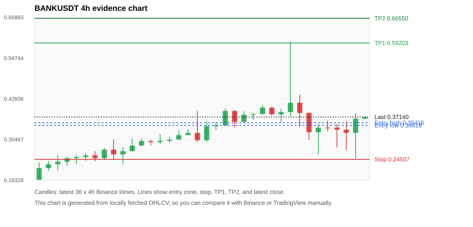
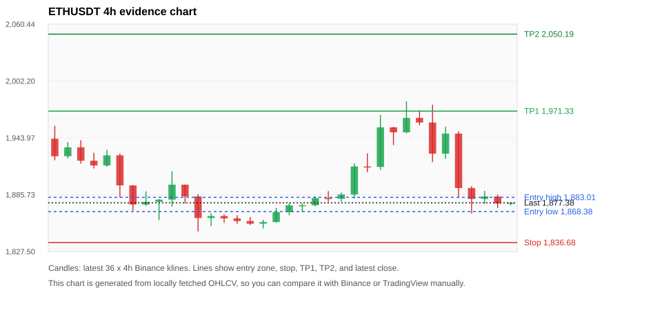
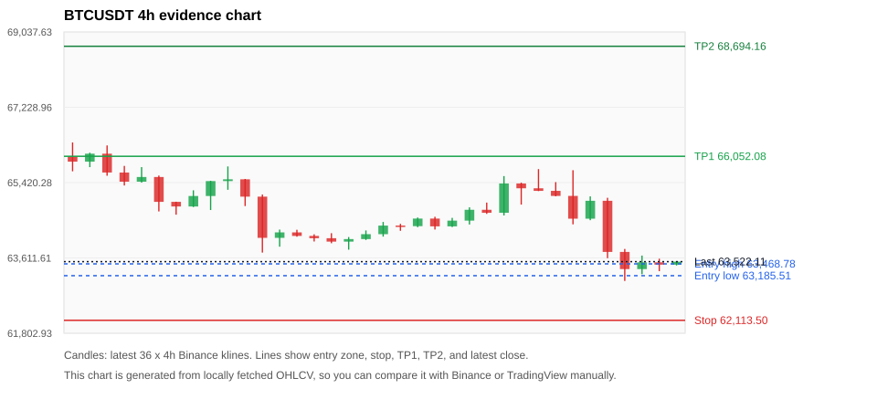
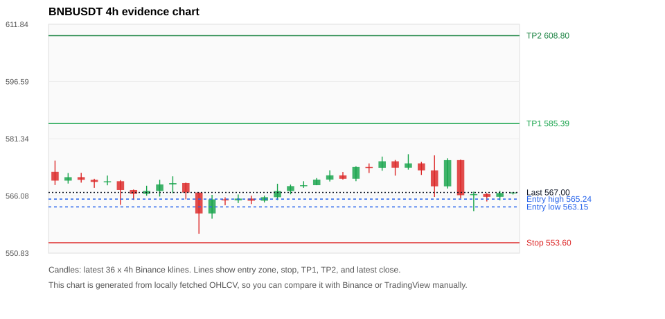
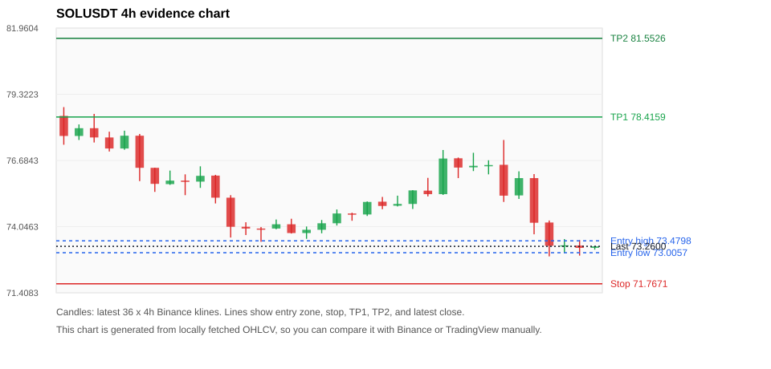

# Crypto 市场扫描报告 v1

- 报告时间：2026-07-28 20:06:18 CST
- Run ID：`20260728_120503_3ce64a4d`
- Run type：`daily_full`
- 数据来源：SQLite
- 报告版本：v1
- 扫描 ID：f313d51a0a36
- 数据源：Binance public spot API + CoinGecko/CoinMarketCap cross-check
- 过滤条件：USDT spot; 24h quote volume >= 30,000,000; trades >= 30,000; exclude stables/leveraged tokens; analyze 1h/4h/1d klines
- 默认单笔风险：账户权益的 1.00%

## 限制说明

- 交易信号仍以 Binance 现货公开 K 线为主源；外部数据源用于一致性复核。
- 结果是研究和模拟盘计划，不是确定收益或实盘下单指令。
- 历史长度过滤：候选币至少需要 180 根 1d K 线。
- 数据质量验证池：先验证 score 排名前 min(top_n * 2, 10) 的候选，再按 action + score 补足最终名单。
- 大盘环境过滤：RISK_OFF; BTC/ETH 大盘偏弱，山寨币买入候选降级为观察。 BTC 7d=-4.5586464122930215; ETH 7d=-2.7449497173706927.
- 已启用数据交叉验证：Binance 主源 + CoinGecko 自动对照；CoinMarketCap 在配置 API Key 后自动对照。
- BANKUSDT 交叉验证状态 DATA_WARNING：At least one external provider needs manual review.
- ETHUSDT 交叉验证状态 DATA_WARNING：At least one external provider needs manual review.
- BTCUSDT 交叉验证状态 DATA_WARNING：At least one external provider needs manual review.
- BNBUSDT 交叉验证状态 DATA_WARNING：At least one external provider needs manual review.
- SOLUSDT 交叉验证状态 DATA_WARNING：At least one external provider needs manual review.
- TRXUSDT 交叉验证状态 DATA_WARNING：At least one external provider needs manual review.
- DOGEUSDT 交叉验证状态 DATA_WARNING：At least one external provider needs manual review.
- XRPUSDT 交叉验证状态 DATA_WARNING：At least one external provider needs manual review.
- ZECUSDT 交叉验证状态 DATA_WARNING：At least one external provider needs manual review.
- DEXEUSDT 交叉验证状态 DATA_WARNING：At least one external provider needs manual review.

## 5 个候选交易计划

| Rank | Coin | Action | Setup | Entry Zone | Stop Loss | TP1 | TP2 / Exit Rule | R/R | Verdict |
|---:|---|---|---|---:|---:|---:|---|---:|---|
| 1 | `BANK` | `WATCH_ONLY` | 趋势中，等回调入场 | 0.34619 - 0.35416 | 0.24507 | 0.59203 | 0.66550 或跌破 4h 关键支撑 | 2.30-3.00 | 只观察 |
| 2 | `ETH` | `WATCH_ONLY` | 回踩支撑/4h EMA 附近 | 1,868.38 - 1,883.01 | 1,836.68 | 1,971.33 | 2,050.19 或跌破 4h 关键支撑 | 2.45-4.47 | 只观察 |
| 3 | `BTC` | `REJECT` | 回踩支撑/4h EMA 附近 | 63,185.51 - 63,468.78 | 62,113.50 | 66,052.08 | 68,694.16 或跌破 4h 关键支撑 | 2.25-4.42 | 只观察 |
| 4 | `BNB` | `REJECT` | 回踩支撑/4h EMA 附近 | 563.15 - 565.24 | 553.60 | 585.39 | 608.80 或跌破 4h 关键支撑 | 2.00-4.21 | 只观察 |
| 5 | `SOL` | `REJECT` | 回踩支撑/4h EMA 附近 | 73.0057 - 73.4798 | 71.7671 | 78.4159 | 81.5526 或跌破 4h 关键支撑 | 3.51-5.63 | 只观察 |

## 数据交叉验证摘要

价格差异以 Binance 当前价为基准；成交量口径不同，Binance 是 USDT 现货成交额，CoinGecko/CoinMarketCap 通常是全市场成交量。

| Rank | Coin | Data Status | Max Price Diff | Max 24h Diff | Message |
|---:|---|---|---:|---:|---|
| 1 | `BANK` | DATA_WARNING | 1.37% | 1.84 pts | At least one external provider needs manual review. |
| 2 | `ETH` | DATA_WARNING | 0.22% | 0.12 pts | At least one external provider needs manual review. |
| 3 | `BTC` | DATA_WARNING | 0.22% | 0.24 pts | At least one external provider needs manual review. |
| 4 | `BNB` | DATA_WARNING | 0.17% | 0.04 pts | At least one external provider needs manual review. |
| 5 | `SOL` | DATA_WARNING | 0.23% | 0.07 pts | At least one external provider needs manual review. |

## 候选币说明

### 1. BANK `BANKUSDT`



- 入选原因：趋势中，等回调入场；24h -2.14%，7d +121.60%，4h RSI 52.77，24h 成交额 $103.1M。
- 交易失效条件：跌破 0.245068 或 4h 收盘重新失守关键支撑。
- 主要风险：24h 振幅较大，回撤风险高；BTC/ETH 大盘环境未确认强势，山寨币买入信号降级；24h 动量未确认；数据交叉验证需要人工复核。
- 数据交叉验证：DATA_WARNING；At least one external provider needs manual review.

#### 可点击人工验证

- [Binance 交易页](https://www.binance.com/en/trade/BANK_USDT)
- [TradingView 图表](https://www.tradingview.com/chart/?symbol=BINANCE%3ABANKUSDT)
- [CoinGecko 搜索](https://www.coingecko.com/en/search?query=BANK)
- [CoinMarketCap 搜索](https://coinmarketcap.com/search/?q=BANK)

#### 多数据源对照

| Source | Status | Asset ID | Price | 24h Change | 24h Volume | Price Diff | 24h Diff | Updated | Message |
|---|---|---|---:|---:|---:|---:|---:|---|---|
| Binance | DATA_OK | BANKUSDT | 0.37140 | -2.14% | $103.1M | 0.00% | 0.00 pts | 2026-07-28T12:05:27+00:00 | Primary market data source used by scanner. |
| CoinGecko | DATA_WARNING | lorenzo-protocol | 0.36630 | -3.56% | $272.4M | 1.37% | 1.43 pts | 2026-07-28T12:05:23.164Z | price diff 1.37% exceeds warning threshold; CoinGecko symbol mapping has 3 exact matches; selected highest market-cap rank |
| CoinMarketCap | DATA_WARNING | 36296 | 0.36752 | -3.98% | $379.5M | 1.05% | 1.84 pts | 2026-07-28T12:04:04.000Z | price diff 1.05% exceeds warning threshold; CoinMarketCap symbol mapping has 10 matches; selected lowest cmc_rank |

#### 指标证据

| 指标 | 数值 | 人工核对用途 |
|---|---:|---|
| 当前价 | 0.37140 | 与 Binance/TradingView 当前价格对照 |
| 24h 涨跌 | -2.14% | 与交易所 24h 涨跌对照 |
| 7d 涨跌 | +121.60% | 判断短线趋势是否延续 |
| 4h EMA20 | 0.34550 | 判断短期趋势支撑 |
| 4h EMA50 | 0.29006 | 判断中期趋势支撑 |
| 1d EMA20 | 0.21318 | 判断日线趋势 |
| 1d EMA50 | 0.12723 | 判断日线趋势 |
| 4h RSI14 | 52.77 | 判断是否过热/过弱 |
| 4h ATR14 | 0.06896 | 推导止损和入场缓冲 |
| 最近 18 根 4h 最低点 | 0.24880 | 支撑/止损参考 |
| 最近 36 根 4h 最高点 | 0.59500 | TP/压力参考 |
| 支撑位 | 0.34550 | 入场区间推导基础 |

#### 交易计划推导

- 支撑位 = 最近低点、4h EMA20、4h EMA50、1d EMA20 中不高于当前价的最高有效支撑 = `0.34550`。
- 入场区间 = 支撑位附近 + ATR 缓冲 = `0.34619 - 0.35416`。
- 止损 = min(最近 18 根 4h 最低点 * 0.985, 入场中位价 - 1.15 * ATR14) = `0.24507`。
- TP1 = max(最近 36 根 4h 最高点 * 0.995, 入场中位价 + 2R) = `0.59203`。
- TP2 = max(入场中位价 + 3R, TP1 * 1.04) = `0.66550`。

#### 最近 10 根 4h K线

| UTC 开盘时间 | Open | High | Low | Close | Quote Volume | Trades |
|---|---:|---:|---:|---:|---:|---:|
| 2026-07-27T00:00+00:00 | 0.37950 | 0.39670 | 0.35570 | 0.38610 | $9.5M | 165051 |
| 2026-07-27T04:00+00:00 | 0.38630 | 0.59500 | 0.37310 | 0.41400 | $39.8M | 645265 |
| 2026-07-27T08:00+00:00 | 0.41400 | 0.43790 | 0.34360 | 0.38360 | $27.9M | 366092 |
| 2026-07-27T12:00+00:00 | 0.38360 | 0.38460 | 0.30280 | 0.32610 | $18.4M | 275049 |
| 2026-07-27T16:00+00:00 | 0.32620 | 0.34990 | 0.26040 | 0.33960 | $19.1M | 251066 |
| 2026-07-27T20:00+00:00 | 0.33980 | 0.36100 | 0.32880 | 0.33970 | $10.0M | 130130 |
| 2026-07-28T00:00+00:00 | 0.33990 | 0.35020 | 0.28080 | 0.33360 | $12.0M | 176425 |
| 2026-07-28T04:00+00:00 | 0.33350 | 0.35800 | 0.27210 | 0.32430 | $16.5M | 256948 |
| 2026-07-28T08:00+00:00 | 0.32440 | 0.38290 | 0.24880 | 0.36630 | $26.7M | 367226 |
| 2026-07-28T12:00+00:00 | 0.36640 | 0.37310 | 0.36530 | 0.37140 | $686,157 | 7550 |

### 2. ETH `ETHUSDT`



- 入选原因：回踩支撑/4h EMA 附近；24h -4.38%，7d -3.24%，4h RSI 49.09，24h 成交额 $613.3M。
- 交易失效条件：跌破 1836.6803 或 4h 收盘重新失守关键支撑。
- 主要风险：BTC/ETH 大盘环境未确认强势，山寨币买入信号降级；24h 动量未确认；7d 趋势未确认；数据交叉验证需要人工复核。
- 数据交叉验证：DATA_WARNING；At least one external provider needs manual review.

#### 可点击人工验证

- [Binance 交易页](https://www.binance.com/en/trade/ETH_USDT)
- [TradingView 图表](https://www.tradingview.com/chart/?symbol=BINANCE%3AETHUSDT)
- [CoinGecko 搜索](https://www.coingecko.com/en/search?query=ETH)
- [CoinMarketCap 搜索](https://coinmarketcap.com/search/?q=ETH)

#### 多数据源对照

| Source | Status | Asset ID | Price | 24h Change | 24h Volume | Price Diff | 24h Diff | Updated | Message |
|---|---|---|---:|---:|---:|---:|---:|---|---|
| Binance | DATA_OK | ETHUSDT | 1,877.38 | -4.38% | $613.3M | 0.00% | 0.00 pts | 2026-07-28T12:05:27+00:00 | Primary market data source used by scanner. |
| CoinGecko | DATA_OK | ethereum | 1,873.56 | -4.50% | $11.03B | 0.20% | 0.12 pts | 2026-07-28T12:03:30.000Z | External source agrees with Binance within thresholds. |
| CoinMarketCap | DATA_WARNING | 1027 | 1,873.32 | -4.49% | $12.87B | 0.22% | 0.10 pts | 2026-07-28T12:04:04.000Z | CoinMarketCap symbol mapping has 6 matches; selected lowest cmc_rank |

#### 指标证据

| 指标 | 数值 | 人工核对用途 |
|---|---:|---|
| 当前价 | 1,877.38 | 与 Binance/TradingView 当前价格对照 |
| 24h 涨跌 | -4.38% | 与交易所 24h 涨跌对照 |
| 7d 涨跌 | -3.24% | 判断短线趋势是否延续 |
| 4h EMA20 | 1,902.11 | 判断短期趋势支撑 |
| 4h EMA50 | 1,893.62 | 判断中期趋势支撑 |
| 1d EMA20 | 1,859.20 | 判断日线趋势 |
| 1d EMA50 | 1,840.36 | 判断日线趋势 |
| 4h RSI14 | 49.09 | 判断是否过热/过弱 |
| 4h ATR14 | 28.9879 | 推导止损和入场缓冲 |
| 最近 18 根 4h 最低点 | 1,864.65 | 支撑/止损参考 |
| 最近 36 根 4h 最高点 | 1,981.24 | TP/压力参考 |
| 支撑位 | 1,864.65 | 入场区间推导基础 |

#### 交易计划推导

- 支撑位 = 最近低点、4h EMA20、4h EMA50、1d EMA20 中不高于当前价的最高有效支撑 = `1,864.65`。
- 入场区间 = 支撑位附近 + ATR 缓冲 = `1,868.38 - 1,883.01`。
- 止损 = min(最近 18 根 4h 最低点 * 0.985, 入场中位价 - 1.15 * ATR14) = `1,836.68`。
- TP1 = max(最近 36 根 4h 最高点 * 0.995, 入场中位价 + 2R) = `1,971.33`。
- TP2 = max(入场中位价 + 3R, TP1 * 1.04) = `2,050.19`。

#### 最近 10 根 4h K线

| UTC 开盘时间 | Open | High | Low | Close | Quote Volume | Trades |
|---|---:|---:|---:|---:|---:|---:|
| 2026-07-27T00:00+00:00 | 1,954.72 | 1,955.42 | 1,936.51 | 1,949.64 | $66.6M | 362357 |
| 2026-07-27T04:00+00:00 | 1,949.65 | 1,981.24 | 1,948.54 | 1,964.36 | $137.0M | 477109 |
| 2026-07-27T08:00+00:00 | 1,964.37 | 1,972.00 | 1,956.87 | 1,959.67 | $63.5M | 308712 |
| 2026-07-27T12:00+00:00 | 1,959.67 | 1,977.99 | 1,919.09 | 1,927.75 | $193.8M | 1050482 |
| 2026-07-27T16:00+00:00 | 1,927.74 | 1,955.41 | 1,922.65 | 1,948.31 | $72.6M | 431754 |
| 2026-07-27T20:00+00:00 | 1,948.32 | 1,950.54 | 1,882.49 | 1,892.53 | $132.5M | 565329 |
| 2026-07-28T00:00+00:00 | 1,892.53 | 1,894.45 | 1,866.31 | 1,881.38 | $94.0M | 423354 |
| 2026-07-28T04:00+00:00 | 1,881.37 | 1,889.66 | 1,876.48 | 1,883.83 | $62.6M | 258640 |
| 2026-07-28T08:00+00:00 | 1,883.84 | 1,885.85 | 1,872.00 | 1,876.68 | $57.0M | 296306 |
| 2026-07-28T12:00+00:00 | 1,876.69 | 1,877.93 | 1,874.63 | 1,877.39 | $2.4M | 7365 |

### 3. BTC `BTCUSDT`



- 入选原因：回踩支撑/4h EMA 附近；24h -2.56%，7d -4.89%，4h RSI 40.32，24h 成交额 $906.1M。
- 交易失效条件：跌破 62113.499 或 4h 收盘重新失守关键支撑。
- 主要风险：日线趋势未完全确认；BTC/ETH 大盘环境未确认强势，山寨币买入信号降级；24h 动量未确认；7d 趋势未确认；数据交叉验证需要人工复核。
- 数据交叉验证：DATA_WARNING；At least one external provider needs manual review.

#### 可点击人工验证

- [Binance 交易页](https://www.binance.com/en/trade/BTC_USDT)
- [TradingView 图表](https://www.tradingview.com/chart/?symbol=BINANCE%3ABTCUSDT)
- [CoinGecko 搜索](https://www.coingecko.com/en/search?query=BTC)
- [CoinMarketCap 搜索](https://coinmarketcap.com/search/?q=BTC)

#### 多数据源对照

| Source | Status | Asset ID | Price | 24h Change | 24h Volume | Price Diff | 24h Diff | Updated | Message |
|---|---|---|---:|---:|---:|---:|---:|---|---|
| Binance | DATA_OK | BTCUSDT | 63,522.11 | -2.56% | $906.1M | 0.00% | 0.00 pts | 2026-07-28T12:05:27+00:00 | Primary market data source used by scanner. |
| CoinGecko | DATA_OK | bitcoin | 63,391.00 | -2.80% | $25.49B | 0.21% | 0.24 pts | 2026-07-28T12:03:30.000Z | External source agrees with Binance within thresholds. |
| CoinMarketCap | DATA_WARNING | 1 | 63,384.28 | -2.65% | $25.88B | 0.22% | 0.09 pts | 2026-07-28T12:04:04.000Z | CoinMarketCap symbol mapping has 13 matches; selected lowest cmc_rank |

#### 指标证据

| 指标 | 数值 | 人工核对用途 |
|---|---:|---|
| 当前价 | 63,522.11 | 与 Binance/TradingView 当前价格对照 |
| 24h 涨跌 | -2.56% | 与交易所 24h 涨跌对照 |
| 7d 涨跌 | -4.89% | 判断短线趋势是否延续 |
| 4h EMA20 | 64,314.42 | 判断短期趋势支撑 |
| 4h EMA50 | 64,586.30 | 判断中期趋势支撑 |
| 1d EMA20 | 64,281.66 | 判断日线趋势 |
| 1d EMA50 | 64,957.65 | 判断日线趋势 |
| 4h RSI14 | 40.32 | 判断是否过热/过弱 |
| 4h ATR14 | 584.85 | 推导止损和入场缓冲 |
| 最近 18 根 4h 最低点 | 63,059.39 | 支撑/止损参考 |
| 最近 36 根 4h 最高点 | 66,384.00 | TP/压力参考 |
| 支撑位 | 63,059.39 | 入场区间推导基础 |

#### 交易计划推导

- 支撑位 = 最近低点、4h EMA20、4h EMA50、1d EMA20 中不高于当前价的最高有效支撑 = `63,059.39`。
- 入场区间 = 支撑位附近 + ATR 缓冲 = `63,185.51 - 63,468.78`。
- 止损 = min(最近 18 根 4h 最低点 * 0.985, 入场中位价 - 1.15 * ATR14) = `62,113.50`。
- TP1 = max(最近 36 根 4h 最高点 * 0.995, 入场中位价 + 2R) = `66,052.08`。
- TP2 = max(入场中位价 + 3R, TP1 * 1.04) = `68,694.16`。

#### 最近 10 根 4h K线

| UTC 开盘时间 | Open | High | Low | Close | Quote Volume | Trades |
|---|---:|---:|---:|---:|---:|---:|
| 2026-07-27T00:00+00:00 | 65,400.00 | 65,418.81 | 64,892.03 | 65,284.00 | $126.4M | 391478 |
| 2026-07-27T04:00+00:00 | 65,284.00 | 65,744.60 | 65,217.16 | 65,221.99 | $166.8M | 393601 |
| 2026-07-27T08:00+00:00 | 65,221.99 | 65,432.00 | 65,092.00 | 65,100.79 | $189.4M | 299147 |
| 2026-07-27T12:00+00:00 | 65,100.79 | 65,718.00 | 64,418.01 | 64,554.01 | $220.5M | 923086 |
| 2026-07-27T16:00+00:00 | 64,554.00 | 65,090.00 | 64,517.78 | 64,984.00 | $96.9M | 436159 |
| 2026-07-27T20:00+00:00 | 64,983.99 | 65,056.00 | 63,605.56 | 63,755.86 | $161.3M | 478165 |
| 2026-07-28T00:00+00:00 | 63,755.86 | 63,827.49 | 63,059.39 | 63,343.83 | $197.2M | 495493 |
| 2026-07-28T04:00+00:00 | 63,343.82 | 63,668.71 | 63,221.26 | 63,505.99 | $138.5M | 302891 |
| 2026-07-28T08:00+00:00 | 63,506.00 | 63,593.00 | 63,294.00 | 63,450.00 | $90.0M | 272253 |
| 2026-07-28T12:00+00:00 | 63,449.99 | 63,536.00 | 63,430.33 | 63,522.11 | $4.9M | 8046 |

### 4. BNB `BNBUSDT`



- 入选原因：回踩支撑/4h EMA 附近；24h -1.14%，7d -1.85%，4h RSI 43.21，24h 成交额 $44.2M。
- 交易失效条件：跌破 553.59955 或 4h 收盘重新失守关键支撑。
- 主要风险：日线趋势未完全确认；BTC/ETH 大盘环境未确认强势，山寨币买入信号降级；24h 动量未确认；7d 趋势未确认；数据交叉验证需要人工复核。
- 数据交叉验证：DATA_WARNING；At least one external provider needs manual review.

#### 可点击人工验证

- [Binance 交易页](https://www.binance.com/en/trade/BNB_USDT)
- [TradingView 图表](https://www.tradingview.com/chart/?symbol=BINANCE%3ABNBUSDT)
- [CoinGecko 搜索](https://www.coingecko.com/en/search?query=BNB)
- [CoinMarketCap 搜索](https://coinmarketcap.com/search/?q=BNB)

#### 多数据源对照

| Source | Status | Asset ID | Price | 24h Change | 24h Volume | Price Diff | 24h Diff | Updated | Message |
|---|---|---|---:|---:|---:|---:|---:|---|---|
| Binance | DATA_OK | BNBUSDT | 567.00 | -1.14% | $44.2M | 0.00% | 0.00 pts | 2026-07-28T12:05:27+00:00 | Primary market data source used by scanner. |
| CoinGecko | DATA_WARNING | n/a | n/a | n/a | n/a | n/a | n/a | 2026-07-28T12:05:27+00:00 | Failed to fetch https://api.coingecko.com/api/v3/coins/markets?vs_currency=usd&ids=binancecoin&price_change_percentage=24h&per_page=1&page=1: HTTP Error 429: Too Many Requests |
| CoinMarketCap | DATA_WARNING | 1839 | 566.05 | -1.18% | $949.4M | 0.17% | 0.04 pts | 2026-07-28T12:04:04.000Z | CoinMarketCap symbol mapping has 4 matches; selected lowest cmc_rank |

#### 指标证据

| 指标 | 数值 | 人工核对用途 |
|---|---:|---|
| 当前价 | 567.00 | 与 Binance/TradingView 当前价格对照 |
| 24h 涨跌 | -1.14% | 与交易所 24h 涨跌对照 |
| 7d 涨跌 | -1.85% | 判断短线趋势是否延续 |
| 4h EMA20 | 569.39 | 判断短期趋势支撑 |
| 4h EMA50 | 569.93 | 判断中期趋势支撑 |
| 1d EMA20 | 571.21 | 判断日线趋势 |
| 1d EMA50 | 582.07 | 判断日线趋势 |
| 4h RSI14 | 43.21 | 判断是否过热/过弱 |
| 4h ATR14 | 4.5793 | 推导止损和入场缓冲 |
| 最近 18 根 4h 最低点 | 562.03 | 支撑/止损参考 |
| 最近 36 根 4h 最高点 | 577.20 | TP/压力参考 |
| 支撑位 | 562.03 | 入场区间推导基础 |

#### 交易计划推导

- 支撑位 = 最近低点、4h EMA20、4h EMA50、1d EMA20 中不高于当前价的最高有效支撑 = `562.03`。
- 入场区间 = 支撑位附近 + ATR 缓冲 = `563.15 - 565.24`。
- 止损 = min(最近 18 根 4h 最低点 * 0.985, 入场中位价 - 1.15 * ATR14) = `553.60`。
- TP1 = max(最近 36 根 4h 最高点 * 0.995, 入场中位价 + 2R) = `585.39`。
- TP2 = max(入场中位价 + 3R, TP1 * 1.04) = `608.80`。

#### 最近 10 根 4h K线

| UTC 开盘时间 | Open | High | Low | Close | Quote Volume | Trades |
|---|---:|---:|---:|---:|---:|---:|
| 2026-07-27T00:00+00:00 | 575.31 | 575.67 | 571.49 | 573.61 | $4.4M | 56836 |
| 2026-07-27T04:00+00:00 | 573.61 | 577.20 | 573.09 | 574.76 | $5.6M | 62124 |
| 2026-07-27T08:00+00:00 | 574.76 | 575.15 | 571.68 | 572.90 | $11.5M | 75781 |
| 2026-07-27T12:00+00:00 | 572.90 | 576.89 | 565.80 | 568.64 | $12.6M | 152214 |
| 2026-07-27T16:00+00:00 | 568.64 | 576.11 | 568.06 | 575.62 | $7.0M | 87544 |
| 2026-07-27T20:00+00:00 | 575.63 | 575.77 | 565.40 | 566.28 | $5.0M | 71729 |
| 2026-07-28T00:00+00:00 | 566.28 | 567.21 | 562.03 | 566.57 | $7.6M | 89467 |
| 2026-07-28T04:00+00:00 | 566.58 | 566.85 | 564.60 | 565.83 | $6.8M | 59171 |
| 2026-07-28T08:00+00:00 | 565.84 | 567.44 | 564.90 | 566.86 | $5.2M | 56281 |
| 2026-07-28T12:00+00:00 | 566.86 | 567.02 | 566.46 | 567.02 | $89,216 | 1856 |

### 5. SOL `SOLUSDT`



- 入选原因：回踩支撑/4h EMA 附近；24h -4.54%，7d -6.77%，4h RSI 39.19，24h 成交额 $138.6M。
- 交易失效条件：跌破 71.7671 或 4h 收盘重新失守关键支撑。
- 主要风险：日线趋势未完全确认；BTC/ETH 大盘环境未确认强势，山寨币买入信号降级；24h 动量未确认；7d 趋势未确认；数据交叉验证需要人工复核。
- 数据交叉验证：DATA_WARNING；At least one external provider needs manual review.

#### 可点击人工验证

- [Binance 交易页](https://www.binance.com/en/trade/SOL_USDT)
- [TradingView 图表](https://www.tradingview.com/chart/?symbol=BINANCE%3ASOLUSDT)
- [CoinGecko 搜索](https://www.coingecko.com/en/search?query=SOL)
- [CoinMarketCap 搜索](https://coinmarketcap.com/search/?q=SOL)

#### 多数据源对照

| Source | Status | Asset ID | Price | 24h Change | 24h Volume | Price Diff | 24h Diff | Updated | Message |
|---|---|---|---:|---:|---:|---:|---:|---|---|
| Binance | DATA_OK | SOLUSDT | 73.2600 | -4.54% | $138.6M | 0.00% | 0.00 pts | 2026-07-28T12:05:27+00:00 | Primary market data source used by scanner. |
| CoinGecko | DATA_WARNING | n/a | n/a | n/a | n/a | n/a | n/a | 2026-07-28T12:05:27+00:00 | Failed to fetch https://api.coingecko.com/api/v3/coins/markets?vs_currency=usd&ids=solana&price_change_percentage=24h&per_page=1&page=1: HTTP Error 429: Too Many Requests |
| CoinMarketCap | DATA_WARNING | 5426 | 73.0924 | -4.47% | $2.07B | 0.23% | 0.07 pts | 2026-07-28T12:04:04.000Z | CoinMarketCap symbol mapping has 8 matches; selected lowest cmc_rank |

#### 指标证据

| 指标 | 数值 | 人工核对用途 |
|---|---:|---|
| 当前价 | 73.2600 | 与 Binance/TradingView 当前价格对照 |
| 24h 涨跌 | -4.54% | 与交易所 24h 涨跌对照 |
| 7d 涨跌 | -6.77% | 判断短线趋势是否延续 |
| 4h EMA20 | 74.7587 | 判断短期趋势支撑 |
| 4h EMA50 | 75.4857 | 判断中期趋势支撑 |
| 1d EMA20 | 75.8574 | 判断日线趋势 |
| 1d EMA50 | 76.2930 | 判断日线趋势 |
| 4h RSI14 | 39.19 | 判断是否过热/过弱 |
| 4h ATR14 | 1.0379 | 推导止损和入场缓冲 |
| 最近 18 根 4h 最低点 | 72.8600 | 支撑/止损参考 |
| 最近 36 根 4h 最高点 | 78.8100 | TP/压力参考 |
| 支撑位 | 72.8600 | 入场区间推导基础 |

#### 交易计划推导

- 支撑位 = 最近低点、4h EMA20、4h EMA50、1d EMA20 中不高于当前价的最高有效支撑 = `72.8600`。
- 入场区间 = 支撑位附近 + ATR 缓冲 = `73.0057 - 73.4798`。
- 止损 = min(最近 18 根 4h 最低点 * 0.985, 入场中位价 - 1.15 * ATR14) = `71.7671`。
- TP1 = max(最近 36 根 4h 最高点 * 0.995, 入场中位价 + 2R) = `78.4159`。
- TP2 = max(入场中位价 + 3R, TP1 * 1.04) = `81.5526`。

#### 最近 10 根 4h K线

| UTC 开盘时间 | Open | High | Low | Close | Quote Volume | Trades |
|---|---:|---:|---:|---:|---:|---:|
| 2026-07-27T00:00+00:00 | 76.7700 | 76.8000 | 75.9800 | 76.4000 | $16.2M | 67758 |
| 2026-07-27T04:00+00:00 | 76.4100 | 76.9900 | 76.2600 | 76.4700 | $16.4M | 66286 |
| 2026-07-27T08:00+00:00 | 76.4800 | 76.6900 | 76.1300 | 76.5000 | $11.1M | 46191 |
| 2026-07-27T12:00+00:00 | 76.5100 | 77.5000 | 75.0300 | 75.2800 | $40.4M | 208268 |
| 2026-07-27T16:00+00:00 | 75.2900 | 76.2500 | 75.1500 | 75.9800 | $14.2M | 82692 |
| 2026-07-27T20:00+00:00 | 75.9800 | 76.1400 | 73.7400 | 74.2000 | $23.9M | 112478 |
| 2026-07-28T00:00+00:00 | 74.2100 | 74.2900 | 72.8600 | 73.2800 | $27.5M | 109104 |
| 2026-07-28T04:00+00:00 | 73.2800 | 73.5500 | 73.0000 | 73.3000 | $14.4M | 55020 |
| 2026-07-28T08:00+00:00 | 73.2900 | 73.5100 | 72.8900 | 73.2000 | $18.5M | 53026 |
| 2026-07-28T12:00+00:00 | 73.2000 | 73.2700 | 73.1300 | 73.2600 | $161,603 | 1299 |

## 组合风控

- 不要 5 个候选全部满仓买入。
- 同时持仓总风险建议控制在账户权益的 3% - 5% 以内。
- 如果 BTC/ETH 同时破位，暂停山寨币多头计划或降低仓位。
- 第一版报告用于模拟盘和人工复核，不自动下单。

## 原始数据

```json
[
  {
    "rank": 1,
    "symbol": "BANKUSDT",
    "base_asset": "BANK",
    "price": 0.3714,
    "score": 51.98847861084215,
    "setup": "趋势中，等回调入场",
    "verdict": "只观察",
    "entry_low": 0.3461934866124873,
    "entry_high": 0.3541607142857143,
    "stop_loss": 0.24506799999999998,
    "take_profit_1": 0.592025,
    "take_profit_2": 0.6655044017964031,
    "risk_reward_1": 2.300922551116441,
    "risk_reward_2": 2.9999999999999996,
    "pct_24h": -2.136,
    "pct_3d": 10.832587287376905,
    "pct_7d": 121.59904534606207,
    "quote_volume_24h": 103138623.15277,
    "trades_24h": 1459235,
    "high_low_range_24h": 53.898713826366574,
    "rsi_1h": 55.69491525423729,
    "rsi_4h": 52.76710222905458,
    "ema20_4h": 0.3455024816491889,
    "ema50_4h": 0.2900649233557049,
    "ema20_1d": 0.21318242536703133,
    "ema50_1d": 0.12722975942036216,
    "atr_4h": 0.06895714285714286,
    "macd_hist_4h": -0.007022812944484969,
    "volume_ratio_24h": 1.4217745504359587,
    "support_level": 0.3455024816491889,
    "recent_low_4h_18": 0.2488,
    "recent_high_4h_36": 0.595,
    "distance_to_support_pct": 7.4956099380804275,
    "binance_trade_url": "https://www.binance.com/en/trade/BANK_USDT",
    "tradingview_url": "https://www.tradingview.com/chart/?symbol=BINANCE%3ABANKUSDT",
    "coingecko_search_url": "https://www.coingecko.com/en/search?query=BANK",
    "coinmarketcap_search_url": "https://coinmarketcap.com/search/?q=BANK",
    "invalidation": "跌破 0.245068 或 4h 收盘重新失守关键支撑",
    "recent_4h_klines": [
      {
        "open_time_utc": "2026-07-22T16:00+00:00",
        "open": 0.1844,
        "high": 0.2359,
        "low": 0.1842,
        "close": 0.2192,
        "quote_volume": 17620028.88124,
        "trades": 174586
      },
      {
        "open_time_utc": "2026-07-22T20:00+00:00",
        "open": 0.2191,
        "high": 0.2406,
        "low": 0.2109,
        "close": 0.2305,
        "quote_volume": 7628261.19402,
        "trades": 91387
      },
      {
        "open_time_utc": "2026-07-23T00:00+00:00",
        "open": 0.2304,
        "high": 0.258,
        "low": 0.2128,
        "close": 0.2381,
        "quote_volume": 13059172.99562,
        "trades": 175883
      },
      {
        "open_time_utc": "2026-07-23T04:00+00:00",
        "open": 0.238,
        "high": 0.2533,
        "low": 0.2257,
        "close": 0.2485,
        "quote_volume": 6318441.44353,
        "trades": 82944
      },
      {
        "open_time_utc": "2026-07-23T08:00+00:00",
        "open": 0.2487,
        "high": 0.2595,
        "low": 0.2317,
        "close": 0.2521,
        "quote_volume": 10518439.57259,
        "trades": 116661
      },
      {
        "open_time_utc": "2026-07-23T12:00+00:00",
        "open": 0.2522,
        "high": 0.2643,
        "low": 0.2412,
        "close": 0.257,
        "quote_volume": 11144818.63714,
        "trades": 103996
      },
      {
        "open_time_utc": "2026-07-23T16:00+00:00",
        "open": 0.2571,
        "high": 0.2695,
        "low": 0.2393,
        "close": 0.2487,
        "quote_volume": 9065948.65324,
        "trades": 98070
      },
      {
        "open_time_utc": "2026-07-23T20:00+00:00",
        "open": 0.2486,
        "high": 0.279,
        "low": 0.2456,
        "close": 0.2743,
        "quote_volume": 5851924.1141,
        "trades": 61758
      },
      {
        "open_time_utc": "2026-07-24T00:00+00:00",
        "open": 0.2744,
        "high": 0.3053,
        "low": 0.2439,
        "close": 0.26,
        "quote_volume": 18216102.47102,
        "trades": 222539
      },
      {
        "open_time_utc": "2026-07-24T04:00+00:00",
        "open": 0.2599,
        "high": 0.2819,
        "low": 0.2304,
        "close": 0.2696,
        "quote_volume": 13116483.38654,
        "trades": 162472
      },
      {
        "open_time_utc": "2026-07-24T08:00+00:00",
        "open": 0.2697,
        "high": 0.3074,
        "low": 0.2688,
        "close": 0.2861,
        "quote_volume": 13685663.102,
        "trades": 134748
      },
      {
        "open_time_utc": "2026-07-24T12:00+00:00",
        "open": 0.2861,
        "high": 0.3074,
        "low": 0.2854,
        "close": 0.2998,
        "quote_volume": 8801650.09037,
        "trades": 110826
      },
      {
        "open_time_utc": "2026-07-24T16:00+00:00",
        "open": 0.2997,
        "high": 0.3032,
        "low": 0.2872,
        "close": 0.297,
        "quote_volume": 5833081.31603,
        "trades": 65098
      },
      {
        "open_time_utc": "2026-07-24T20:00+00:00",
        "open": 0.297,
        "high": 0.32,
        "low": 0.2904,
        "close": 0.3007,
        "quote_volume": 5851171.64945,
        "trades": 65488
      },
      {
        "open_time_utc": "2026-07-25T00:00+00:00",
        "open": 0.3008,
        "high": 0.3118,
        "low": 0.2953,
        "close": 0.304,
        "quote_volume": 3305479.9693,
        "trades": 40502
      },
      {
        "open_time_utc": "2026-07-25T04:00+00:00",
        "open": 0.3041,
        "high": 0.3319,
        "low": 0.3041,
        "close": 0.3175,
        "quote_volume": 7558114.15558,
        "trades": 88518
      },
      {
        "open_time_utc": "2026-07-25T08:00+00:00",
        "open": 0.3176,
        "high": 0.3349,
        "low": 0.3168,
        "close": 0.324,
        "quote_volume": 5906083.2542,
        "trades": 58867
      },
      {
        "open_time_utc": "2026-07-25T12:00+00:00",
        "open": 0.3239,
        "high": 0.3889,
        "low": 0.2966,
        "close": 0.3024,
        "quote_volume": 14387180.52024,
        "trades": 180338
      },
      {
        "open_time_utc": "2026-07-25T16:00+00:00",
        "open": 0.3023,
        "high": 0.3587,
        "low": 0.2969,
        "close": 0.3438,
        "quote_volume": 10922530.06229,
        "trades": 140685
      },
      {
        "open_time_utc": "2026-07-25T20:00+00:00",
        "open": 0.3437,
        "high": 0.3568,
        "low": 0.3327,
        "close": 0.3465,
        "quote_volume": 3103058.24085,
        "trades": 44413
      },
      {
        "open_time_utc": "2026-07-26T00:00+00:00",
        "open": 0.3466,
        "high": 0.3971,
        "low": 0.3464,
        "close": 0.3894,
        "quote_volume": 7778456.16454,
        "trades": 118480
      },
      {
        "open_time_utc": "2026-07-26T04:00+00:00",
        "open": 0.3894,
        "high": 0.393,
        "low": 0.3401,
        "close": 0.357,
        "quote_volume": 8077294.95173,
        "trades": 117648
      },
      {
        "open_time_utc": "2026-07-26T08:00+00:00",
        "open": 0.3569,
        "high": 0.3885,
        "low": 0.3538,
        "close": 0.3784,
        "quote_volume": 6295460.24606,
        "trades": 79329
      },
      {
        "open_time_utc": "2026-07-26T12:00+00:00",
        "open": 0.3785,
        "high": 0.3849,
        "low": 0.3635,
        "close": 0.38,
        "quote_volume": 3699306.79323,
        "trades": 57814
      },
      {
        "open_time_utc": "2026-07-26T16:00+00:00",
        "open": 0.38,
        "high": 0.4055,
        "low": 0.38,
        "close": 0.3993,
        "quote_volume": 6757496.06512,
        "trades": 91546
      },
      {
        "open_time_utc": "2026-07-26T20:00+00:00",
        "open": 0.3991,
        "high": 0.4017,
        "low": 0.3758,
        "close": 0.3797,
        "quote_volume": 2947718.97806,
        "trades": 43759
      },
      {
        "open_time_utc": "2026-07-27T00:00+00:00",
        "open": 0.3795,
        "high": 0.3967,
        "low": 0.3557,
        "close": 0.3861,
        "quote_volume": 9485834.3064,
        "trades": 165051
      },
      {
        "open_time_utc": "2026-07-27T04:00+00:00",
        "open": 0.3863,
        "high": 0.595,
        "low": 0.3731,
        "close": 0.414,
        "quote_volume": 39836624.2301,
        "trades": 645265
      },
      {
        "open_time_utc": "2026-07-27T08:00+00:00",
        "open": 0.414,
        "high": 0.4379,
        "low": 0.3436,
        "close": 0.3836,
        "quote_volume": 27906410.15681,
        "trades": 366092
      },
      {
        "open_time_utc": "2026-07-27T12:00+00:00",
        "open": 0.3836,
        "high": 0.3846,
        "low": 0.3028,
        "close": 0.3261,
        "quote_volume": 18409187.78036,
        "trades": 275049
      },
      {
        "open_time_utc": "2026-07-27T16:00+00:00",
        "open": 0.3262,
        "high": 0.3499,
        "low": 0.2604,
        "close": 0.3396,
        "quote_volume": 19111075.05474,
        "trades": 251066
      },
      {
        "open_time_utc": "2026-07-27T20:00+00:00",
        "open": 0.3398,
        "high": 0.361,
        "low": 0.3288,
        "close": 0.3397,
        "quote_volume": 10001793.56543,
        "trades": 130130
      },
      {
        "open_time_utc": "2026-07-28T00:00+00:00",
        "open": 0.3399,
        "high": 0.3502,
        "low": 0.2808,
        "close": 0.3336,
        "quote_volume": 11993675.56762,
        "trades": 176425
      },
      {
        "open_time_utc": "2026-07-28T04:00+00:00",
        "open": 0.3335,
        "high": 0.358,
        "low": 0.2721,
        "close": 0.3243,
        "quote_volume": 16521877.11789,
        "trades": 256948
      },
      {
        "open_time_utc": "2026-07-28T08:00+00:00",
        "open": 0.3244,
        "high": 0.3829,
        "low": 0.2488,
        "close": 0.3663,
        "quote_volume": 26724067.7504,
        "trades": 367226
      },
      {
        "open_time_utc": "2026-07-28T12:00+00:00",
        "open": 0.3664,
        "high": 0.3731,
        "low": 0.3653,
        "close": 0.3714,
        "quote_volume": 686157.38683,
        "trades": 7550
      }
    ],
    "risks": [
      "24h 振幅较大，回撤风险高",
      "BTC/ETH 大盘环境未确认强势，山寨币买入信号降级",
      "24h 动量未确认",
      "数据交叉验证需要人工复核"
    ],
    "data_quality_status": "DATA_WARNING",
    "data_quality_message": "At least one external provider needs manual review.",
    "data_checks": [
      {
        "provider": "Binance",
        "status": "DATA_OK",
        "provider_asset_id": "BANKUSDT",
        "provider_symbol": "BANKUSDT",
        "price_usd": 0.3714,
        "pct_24h": -2.136,
        "volume_24h": 103138623.15277,
        "last_updated": null,
        "fetched_at_utc": "2026-07-28T12:05:27+00:00",
        "price_diff_pct": 0.0,
        "pct_24h_diff": 0.0,
        "volume_note": "Binance USDT spot 24h quoteVolume.",
        "message": "Primary market data source used by scanner."
      },
      {
        "provider": "CoinGecko",
        "status": "DATA_WARNING",
        "provider_asset_id": "lorenzo-protocol",
        "provider_symbol": "BANK",
        "price_usd": 0.366299,
        "pct_24h": -3.56405,
        "volume_24h": 272350012.0,
        "last_updated": "2026-07-28T12:05:23.164Z",
        "fetched_at_utc": "2026-07-28T12:05:27+00:00",
        "price_diff_pct": 1.3734518039849277,
        "pct_24h_diff": 1.4280499999999998,
        "volume_note": "CoinGecko total market volume; not the same venue scope as Binance quoteVolume.",
        "message": "price diff 1.37% exceeds warning threshold; CoinGecko symbol mapping has 3 exact matches; selected highest market-cap rank"
      },
      {
        "provider": "CoinMarketCap",
        "status": "DATA_WARNING",
        "provider_asset_id": "36296",
        "provider_symbol": "BANK",
        "price_usd": 0.36751553428234646,
        "pct_24h": -3.97679391,
        "volume_24h": 379492060.94354504,
        "last_updated": "2026-07-28T12:04:04.000Z",
        "fetched_at_utc": "2026-07-28T12:05:27+00:00",
        "price_diff_pct": 1.0458981469180266,
        "pct_24h_diff": 1.84079391,
        "volume_note": "CoinMarketCap total market volume; not the same venue scope as Binance quoteVolume.",
        "message": "price diff 1.05% exceeds warning threshold; CoinMarketCap symbol mapping has 10 matches; selected lowest cmc_rank"
      }
    ],
    "action": "WATCH_ONLY"
  },
  {
    "rank": 2,
    "symbol": "ETHUSDT",
    "base_asset": "ETH",
    "price": 1877.38,
    "score": 22.61740431989311,
    "setup": "回踩支撑/4h EMA 附近",
    "verdict": "只观察",
    "entry_low": 1868.3793,
    "entry_high": 1883.0121399999998,
    "stop_loss": 1836.6802500000001,
    "take_profit_1": 1971.3338,
    "take_profit_2": 2050.187152,
    "risk_reward_1": 2.451286118044986,
    "risk_reward_2": 4.472365243837914,
    "pct_24h": -4.385,
    "pct_3d": 0.5430474925558704,
    "pct_7d": -3.2427975055403735,
    "quote_volume_24h": 613343100.458963,
    "trades_24h": 3025556,
    "high_low_range_24h": 5.984000514383991,
    "rsi_1h": 34.84112149532716,
    "rsi_4h": 49.086447881523064,
    "ema20_4h": 1902.105121289849,
    "ema50_4h": 1893.6195987255833,
    "ema20_1d": 1859.196162209878,
    "ema50_1d": 1840.3564244459294,
    "atr_4h": 28.987857142857155,
    "macd_hist_4h": -6.0868547126642,
    "volume_ratio_24h": 1.5595099948025821,
    "support_level": 1864.65,
    "recent_low_4h_18": 1864.65,
    "recent_high_4h_36": 1981.24,
    "distance_to_support_pct": 0.6827018475317193,
    "binance_trade_url": "https://www.binance.com/en/trade/ETH_USDT",
    "tradingview_url": "https://www.tradingview.com/chart/?symbol=BINANCE%3AETHUSDT",
    "coingecko_search_url": "https://www.coingecko.com/en/search?query=ETH",
    "coinmarketcap_search_url": "https://coinmarketcap.com/search/?q=ETH",
    "invalidation": "跌破 1836.6803 或 4h 收盘重新失守关键支撑",
    "recent_4h_klines": [
      {
        "open_time_utc": "2026-07-22T16:00+00:00",
        "open": 1943.04,
        "high": 1956.45,
        "low": 1921.0,
        "close": 1925.13,
        "quote_volume": 80123330.781702,
        "trades": 474808
      },
      {
        "open_time_utc": "2026-07-22T20:00+00:00",
        "open": 1925.14,
        "high": 1939.7,
        "low": 1922.95,
        "close": 1934.25,
        "quote_volume": 48980304.458261,
        "trades": 256919
      },
      {
        "open_time_utc": "2026-07-23T00:00+00:00",
        "open": 1934.26,
        "high": 1941.5,
        "low": 1917.57,
        "close": 1920.55,
        "quote_volume": 48214379.808529,
        "trades": 238170
      },
      {
        "open_time_utc": "2026-07-23T04:00+00:00",
        "open": 1920.56,
        "high": 1928.69,
        "low": 1912.6,
        "close": 1915.65,
        "quote_volume": 54407839.033107,
        "trades": 253043
      },
      {
        "open_time_utc": "2026-07-23T08:00+00:00",
        "open": 1915.65,
        "high": 1931.66,
        "low": 1914.44,
        "close": 1926.04,
        "quote_volume": 48913071.262119,
        "trades": 255383
      },
      {
        "open_time_utc": "2026-07-23T12:00+00:00",
        "open": 1926.03,
        "high": 1927.99,
        "low": 1882.98,
        "close": 1895.23,
        "quote_volume": 151773538.454881,
        "trades": 681357
      },
      {
        "open_time_utc": "2026-07-23T16:00+00:00",
        "open": 1895.23,
        "high": 1895.41,
        "low": 1869.44,
        "close": 1875.65,
        "quote_volume": 75977811.928967,
        "trades": 401029
      },
      {
        "open_time_utc": "2026-07-23T20:00+00:00",
        "open": 1875.64,
        "high": 1889.09,
        "low": 1874.23,
        "close": 1878.38,
        "quote_volume": 39264185.928899,
        "trades": 211827
      },
      {
        "open_time_utc": "2026-07-24T00:00+00:00",
        "open": 1878.38,
        "high": 1881.2,
        "low": 1859.67,
        "close": 1880.67,
        "quote_volume": 62823597.090217,
        "trades": 323469
      },
      {
        "open_time_utc": "2026-07-24T04:00+00:00",
        "open": 1880.67,
        "high": 1909.8,
        "low": 1873.48,
        "close": 1895.98,
        "quote_volume": 65197193.468691,
        "trades": 306204
      },
      {
        "open_time_utc": "2026-07-24T08:00+00:00",
        "open": 1895.98,
        "high": 1896.04,
        "low": 1876.71,
        "close": 1883.93,
        "quote_volume": 43543529.574374,
        "trades": 273771
      },
      {
        "open_time_utc": "2026-07-24T12:00+00:00",
        "open": 1883.93,
        "high": 1886.09,
        "low": 1848.09,
        "close": 1861.81,
        "quote_volume": 126685739.639251,
        "trades": 770893
      },
      {
        "open_time_utc": "2026-07-24T16:00+00:00",
        "open": 1861.82,
        "high": 1866.76,
        "low": 1853.5,
        "close": 1863.83,
        "quote_volume": 55477384.287484,
        "trades": 339037
      },
      {
        "open_time_utc": "2026-07-24T20:00+00:00",
        "open": 1863.84,
        "high": 1865.82,
        "low": 1856.97,
        "close": 1861.44,
        "quote_volume": 21976612.421105,
        "trades": 121160
      },
      {
        "open_time_utc": "2026-07-25T00:00+00:00",
        "open": 1861.44,
        "high": 1864.69,
        "low": 1855.93,
        "close": 1858.74,
        "quote_volume": 26039463.440314,
        "trades": 112861
      },
      {
        "open_time_utc": "2026-07-25T04:00+00:00",
        "open": 1858.74,
        "high": 1862.96,
        "low": 1854.61,
        "close": 1856.02,
        "quote_volume": 24132356.560451,
        "trades": 107612
      },
      {
        "open_time_utc": "2026-07-25T08:00+00:00",
        "open": 1856.03,
        "high": 1860.09,
        "low": 1851.22,
        "close": 1857.75,
        "quote_volume": 29755614.850639,
        "trades": 118603
      },
      {
        "open_time_utc": "2026-07-25T12:00+00:00",
        "open": 1857.75,
        "high": 1872.35,
        "low": 1856.96,
        "close": 1867.88,
        "quote_volume": 38883665.097903,
        "trades": 149234
      },
      {
        "open_time_utc": "2026-07-25T16:00+00:00",
        "open": 1867.88,
        "high": 1877.07,
        "low": 1864.65,
        "close": 1874.76,
        "quote_volume": 30385128.706757,
        "trades": 170723
      },
      {
        "open_time_utc": "2026-07-25T20:00+00:00",
        "open": 1874.77,
        "high": 1876.92,
        "low": 1867.92,
        "close": 1874.89,
        "quote_volume": 15648697.010211,
        "trades": 104080
      },
      {
        "open_time_utc": "2026-07-26T00:00+00:00",
        "open": 1874.88,
        "high": 1883.98,
        "low": 1873.85,
        "close": 1882.21,
        "quote_volume": 19473769.985199,
        "trades": 113287
      },
      {
        "open_time_utc": "2026-07-26T04:00+00:00",
        "open": 1882.21,
        "high": 1889.36,
        "low": 1878.46,
        "close": 1881.56,
        "quote_volume": 21173822.659788,
        "trades": 96548
      },
      {
        "open_time_utc": "2026-07-26T08:00+00:00",
        "open": 1881.57,
        "high": 1887.89,
        "low": 1878.74,
        "close": 1885.87,
        "quote_volume": 18091980.477335,
        "trades": 105053
      },
      {
        "open_time_utc": "2026-07-26T12:00+00:00",
        "open": 1885.87,
        "high": 1917.82,
        "low": 1881.61,
        "close": 1914.63,
        "quote_volume": 65165309.721979,
        "trades": 374375
      },
      {
        "open_time_utc": "2026-07-26T16:00+00:00",
        "open": 1914.63,
        "high": 1928.08,
        "low": 1908.75,
        "close": 1914.2,
        "quote_volume": 54448948.144189,
        "trades": 295254
      },
      {
        "open_time_utc": "2026-07-26T20:00+00:00",
        "open": 1914.21,
        "high": 1967.36,
        "low": 1911.14,
        "close": 1954.72,
        "quote_volume": 115302944.890536,
        "trades": 531446
      },
      {
        "open_time_utc": "2026-07-27T00:00+00:00",
        "open": 1954.72,
        "high": 1955.42,
        "low": 1936.51,
        "close": 1949.64,
        "quote_volume": 66645251.541259,
        "trades": 362357
      },
      {
        "open_time_utc": "2026-07-27T04:00+00:00",
        "open": 1949.65,
        "high": 1981.24,
        "low": 1948.54,
        "close": 1964.36,
        "quote_volume": 137044174.517423,
        "trades": 477109
      },
      {
        "open_time_utc": "2026-07-27T08:00+00:00",
        "open": 1964.37,
        "high": 1972.0,
        "low": 1956.87,
        "close": 1959.67,
        "quote_volume": 63477420.78172,
        "trades": 308712
      },
      {
        "open_time_utc": "2026-07-27T12:00+00:00",
        "open": 1959.67,
        "high": 1977.99,
        "low": 1919.09,
        "close": 1927.75,
        "quote_volume": 193781812.568466,
        "trades": 1050482
      },
      {
        "open_time_utc": "2026-07-27T16:00+00:00",
        "open": 1927.74,
        "high": 1955.41,
        "low": 1922.65,
        "close": 1948.31,
        "quote_volume": 72633786.766492,
        "trades": 431754
      },
      {
        "open_time_utc": "2026-07-27T20:00+00:00",
        "open": 1948.32,
        "high": 1950.54,
        "low": 1882.49,
        "close": 1892.53,
        "quote_volume": 132530190.963395,
        "trades": 565329
      },
      {
        "open_time_utc": "2026-07-28T00:00+00:00",
        "open": 1892.53,
        "high": 1894.45,
        "low": 1866.31,
        "close": 1881.38,
        "quote_volume": 93967372.848415,
        "trades": 423354
      },
      {
        "open_time_utc": "2026-07-28T04:00+00:00",
        "open": 1881.37,
        "high": 1889.66,
        "low": 1876.48,
        "close": 1883.83,
        "quote_volume": 62649039.051836,
        "trades": 258640
      },
      {
        "open_time_utc": "2026-07-28T08:00+00:00",
        "open": 1883.84,
        "high": 1885.85,
        "low": 1872.0,
        "close": 1876.68,
        "quote_volume": 57023763.994646,
        "trades": 296306
      },
      {
        "open_time_utc": "2026-07-28T12:00+00:00",
        "open": 1876.69,
        "high": 1877.93,
        "low": 1874.63,
        "close": 1877.39,
        "quote_volume": 2367372.017398,
        "trades": 7365
      }
    ],
    "risks": [
      "BTC/ETH 大盘环境未确认强势，山寨币买入信号降级",
      "24h 动量未确认",
      "7d 趋势未确认",
      "数据交叉验证需要人工复核"
    ],
    "data_quality_status": "DATA_WARNING",
    "data_quality_message": "At least one external provider needs manual review.",
    "data_checks": [
      {
        "provider": "Binance",
        "status": "DATA_OK",
        "provider_asset_id": "ETHUSDT",
        "provider_symbol": "ETHUSDT",
        "price_usd": 1877.38,
        "pct_24h": -4.385,
        "volume_24h": 613343100.458963,
        "last_updated": null,
        "fetched_at_utc": "2026-07-28T12:05:27+00:00",
        "price_diff_pct": 0.0,
        "pct_24h_diff": 0.0,
        "volume_note": "Binance USDT spot 24h quoteVolume.",
        "message": "Primary market data source used by scanner."
      },
      {
        "provider": "CoinGecko",
        "status": "DATA_OK",
        "provider_asset_id": "ethereum",
        "provider_symbol": "ETH",
        "price_usd": 1873.56,
        "pct_24h": -4.5,
        "volume_24h": 11025336362.0,
        "last_updated": "2026-07-28T12:03:30.000Z",
        "fetched_at_utc": "2026-07-28T12:05:27+00:00",
        "price_diff_pct": 0.20347505566268753,
        "pct_24h_diff": 0.11500000000000021,
        "volume_note": "CoinGecko total market volume; not the same venue scope as Binance quoteVolume.",
        "message": "External source agrees with Binance within thresholds."
      },
      {
        "provider": "CoinMarketCap",
        "status": "DATA_WARNING",
        "provider_asset_id": "1027",
        "provider_symbol": "ETH",
        "price_usd": 1873.3214012273795,
        "pct_24h": -4.48913686,
        "volume_24h": 12867947085.539072,
        "last_updated": "2026-07-28T12:04:04.000Z",
        "fetched_at_utc": "2026-07-28T12:05:27+00:00",
        "price_diff_pct": 0.21618419140614037,
        "pct_24h_diff": 0.10413686000000055,
        "volume_note": "CoinMarketCap total market volume; not the same venue scope as Binance quoteVolume.",
        "message": "CoinMarketCap symbol mapping has 6 matches; selected lowest cmc_rank"
      }
    ],
    "action": "WATCH_ONLY"
  },
  {
    "rank": 3,
    "symbol": "BTCUSDT",
    "base_asset": "BTC",
    "price": 63522.11,
    "score": 5.671917958223055,
    "setup": "回踩支撑/4h EMA 附近",
    "verdict": "只观察",
    "entry_low": 63185.50878,
    "entry_high": 63468.7825,
    "stop_loss": 62113.499149999996,
    "take_profit_1": 66052.08,
    "take_profit_2": 68694.16320000001,
    "risk_reward_1": 2.245245532741569,
    "risk_reward_2": 4.422224761676672,
    "pct_24h": -2.562,
    "pct_3d": -1.0127314093374085,
    "pct_7d": -4.8870871140658245,
    "quote_volume_24h": 906112799.500236,
    "trades_24h": 2906179,
    "high_low_range_24h": 4.216041417463767,
    "rsi_1h": 40.901459730978054,
    "rsi_4h": 40.32387277893799,
    "ema20_4h": 64314.420373335444,
    "ema50_4h": 64586.29739958915,
    "ema20_1d": 64281.66370893019,
    "ema50_1d": 64957.64575395641,
    "atr_4h": 584.8464285714284,
    "macd_hist_4h": -137.14777101674122,
    "volume_ratio_24h": 0.9679898154144864,
    "support_level": 63059.39,
    "recent_low_4h_18": 63059.39,
    "recent_high_4h_36": 66384.0,
    "distance_to_support_pct": 0.7337844530370452,
    "binance_trade_url": "https://www.binance.com/en/trade/BTC_USDT",
    "tradingview_url": "https://www.tradingview.com/chart/?symbol=BINANCE%3ABTCUSDT",
    "coingecko_search_url": "https://www.coingecko.com/en/search?query=BTC",
    "coinmarketcap_search_url": "https://coinmarketcap.com/search/?q=BTC",
    "invalidation": "跌破 62113.499 或 4h 收盘重新失守关键支撑",
    "recent_4h_klines": [
      {
        "open_time_utc": "2026-07-22T16:00+00:00",
        "open": 66047.38,
        "high": 66384.0,
        "low": 65691.93,
        "close": 65923.19,
        "quote_volume": 100444842.6386147,
        "trades": 427993
      },
      {
        "open_time_utc": "2026-07-22T20:00+00:00",
        "open": 65923.19,
        "high": 66138.24,
        "low": 65791.79,
        "close": 66114.49,
        "quote_volume": 90583853.3541208,
        "trades": 258138
      },
      {
        "open_time_utc": "2026-07-23T00:00+00:00",
        "open": 66114.5,
        "high": 66313.14,
        "low": 65585.11,
        "close": 65662.53,
        "quote_volume": 180505912.366509,
        "trades": 390926
      },
      {
        "open_time_utc": "2026-07-23T04:00+00:00",
        "open": 65662.53,
        "high": 65821.17,
        "low": 65351.02,
        "close": 65442.13,
        "quote_volume": 115169792.6132061,
        "trades": 313412
      },
      {
        "open_time_utc": "2026-07-23T08:00+00:00",
        "open": 65442.12,
        "high": 65792.09,
        "low": 65419.75,
        "close": 65555.21,
        "quote_volume": 111411329.7332665,
        "trades": 263480
      },
      {
        "open_time_utc": "2026-07-23T12:00+00:00",
        "open": 65555.21,
        "high": 65589.41,
        "low": 64728.0,
        "close": 64958.36,
        "quote_volume": 280331098.6807678,
        "trades": 864979
      },
      {
        "open_time_utc": "2026-07-23T16:00+00:00",
        "open": 64958.37,
        "high": 64961.15,
        "low": 64650.0,
        "close": 64846.94,
        "quote_volume": 157702426.4583233,
        "trades": 457475
      },
      {
        "open_time_utc": "2026-07-23T20:00+00:00",
        "open": 64846.93,
        "high": 65235.43,
        "low": 64834.52,
        "close": 65098.97,
        "quote_volume": 114870647.6083213,
        "trades": 267027
      },
      {
        "open_time_utc": "2026-07-24T00:00+00:00",
        "open": 65098.98,
        "high": 65464.35,
        "low": 64762.18,
        "close": 65456.7,
        "quote_volume": 118798430.7613269,
        "trades": 353470
      },
      {
        "open_time_utc": "2026-07-24T04:00+00:00",
        "open": 65456.7,
        "high": 65808.59,
        "low": 65248.0,
        "close": 65499.95,
        "quote_volume": 183654410.325705,
        "trades": 327061
      },
      {
        "open_time_utc": "2026-07-24T08:00+00:00",
        "open": 65499.94,
        "high": 65508.17,
        "low": 64857.14,
        "close": 65083.43,
        "quote_volume": 146583171.4513061,
        "trades": 299283
      },
      {
        "open_time_utc": "2026-07-24T12:00+00:00",
        "open": 65083.42,
        "high": 65133.99,
        "low": 63739.75,
        "close": 64093.85,
        "quote_volume": 388120898.2433055,
        "trades": 916912
      },
      {
        "open_time_utc": "2026-07-24T16:00+00:00",
        "open": 64093.86,
        "high": 64292.44,
        "low": 63881.46,
        "close": 64225.32,
        "quote_volume": 129894119.1934784,
        "trades": 374993
      },
      {
        "open_time_utc": "2026-07-24T20:00+00:00",
        "open": 64225.32,
        "high": 64288.02,
        "low": 64121.86,
        "close": 64139.99,
        "quote_volume": 119828379.1889297,
        "trades": 195972
      },
      {
        "open_time_utc": "2026-07-25T00:00+00:00",
        "open": 64140.0,
        "high": 64179.03,
        "low": 64006.55,
        "close": 64085.36,
        "quote_volume": 117173780.0913975,
        "trades": 162165
      },
      {
        "open_time_utc": "2026-07-25T04:00+00:00",
        "open": 64085.36,
        "high": 64205.67,
        "low": 63964.57,
        "close": 64003.2,
        "quote_volume": 68785852.5866114,
        "trades": 150931
      },
      {
        "open_time_utc": "2026-07-25T08:00+00:00",
        "open": 64003.2,
        "high": 64113.0,
        "low": 63810.0,
        "close": 64064.01,
        "quote_volume": 175746238.0970865,
        "trades": 240400
      },
      {
        "open_time_utc": "2026-07-25T12:00+00:00",
        "open": 64064.01,
        "high": 64272.0,
        "low": 64043.0,
        "close": 64182.0,
        "quote_volume": 59611183.0092659,
        "trades": 148666
      },
      {
        "open_time_utc": "2026-07-25T16:00+00:00",
        "open": 64182.01,
        "high": 64475.28,
        "low": 64123.0,
        "close": 64388.38,
        "quote_volume": 54590446.8226944,
        "trades": 172305
      },
      {
        "open_time_utc": "2026-07-25T20:00+00:00",
        "open": 64388.39,
        "high": 64430.0,
        "low": 64263.03,
        "close": 64375.0,
        "quote_volume": 92374555.4765284,
        "trades": 130871
      },
      {
        "open_time_utc": "2026-07-26T00:00+00:00",
        "open": 64375.01,
        "high": 64582.0,
        "low": 64350.0,
        "close": 64557.0,
        "quote_volume": 61641755.5761044,
        "trades": 142517
      },
      {
        "open_time_utc": "2026-07-26T04:00+00:00",
        "open": 64557.0,
        "high": 64599.95,
        "low": 64293.81,
        "close": 64370.0,
        "quote_volume": 79788726.3358824,
        "trades": 129186
      },
      {
        "open_time_utc": "2026-07-26T08:00+00:00",
        "open": 64370.0,
        "high": 64573.73,
        "low": 64353.0,
        "close": 64507.35,
        "quote_volume": 43905614.8175047,
        "trades": 112877
      },
      {
        "open_time_utc": "2026-07-26T12:00+00:00",
        "open": 64507.36,
        "high": 64827.0,
        "low": 64414.0,
        "close": 64768.0,
        "quote_volume": 94137143.5612193,
        "trades": 246720
      },
      {
        "open_time_utc": "2026-07-26T16:00+00:00",
        "open": 64768.0,
        "high": 64940.51,
        "low": 64668.91,
        "close": 64695.52,
        "quote_volume": 81070372.2607574,
        "trades": 163019
      },
      {
        "open_time_utc": "2026-07-26T20:00+00:00",
        "open": 64695.52,
        "high": 65577.0,
        "low": 64631.57,
        "close": 65399.99,
        "quote_volume": 153290484.9108912,
        "trades": 343704
      },
      {
        "open_time_utc": "2026-07-27T00:00+00:00",
        "open": 65400.0,
        "high": 65418.81,
        "low": 64892.03,
        "close": 65284.0,
        "quote_volume": 126419306.5771148,
        "trades": 391478
      },
      {
        "open_time_utc": "2026-07-27T04:00+00:00",
        "open": 65284.0,
        "high": 65744.6,
        "low": 65217.16,
        "close": 65221.99,
        "quote_volume": 166808532.2863038,
        "trades": 393601
      },
      {
        "open_time_utc": "2026-07-27T08:00+00:00",
        "open": 65221.99,
        "high": 65432.0,
        "low": 65092.0,
        "close": 65100.79,
        "quote_volume": 189351686.9026121,
        "trades": 299147
      },
      {
        "open_time_utc": "2026-07-27T12:00+00:00",
        "open": 65100.79,
        "high": 65718.0,
        "low": 64418.01,
        "close": 64554.01,
        "quote_volume": 220545627.3012243,
        "trades": 923086
      },
      {
        "open_time_utc": "2026-07-27T16:00+00:00",
        "open": 64554.0,
        "high": 65090.0,
        "low": 64517.78,
        "close": 64984.0,
        "quote_volume": 96859784.5391176,
        "trades": 436159
      },
      {
        "open_time_utc": "2026-07-27T20:00+00:00",
        "open": 64983.99,
        "high": 65056.0,
        "low": 63605.56,
        "close": 63755.86,
        "quote_volume": 161326260.3790142,
        "trades": 478165
      },
      {
        "open_time_utc": "2026-07-28T00:00+00:00",
        "open": 63755.86,
        "high": 63827.49,
        "low": 63059.39,
        "close": 63343.83,
        "quote_volume": 197223094.3713635,
        "trades": 495493
      },
      {
        "open_time_utc": "2026-07-28T04:00+00:00",
        "open": 63343.82,
        "high": 63668.71,
        "low": 63221.26,
        "close": 63505.99,
        "quote_volume": 138457131.9879771,
        "trades": 302891
      },
      {
        "open_time_utc": "2026-07-28T08:00+00:00",
        "open": 63506.0,
        "high": 63593.0,
        "low": 63294.0,
        "close": 63450.0,
        "quote_volume": 90006748.4715043,
        "trades": 272253
      },
      {
        "open_time_utc": "2026-07-28T12:00+00:00",
        "open": 63449.99,
        "high": 63536.0,
        "low": 63430.33,
        "close": 63522.11,
        "quote_volume": 4949165.8709784,
        "trades": 8046
      }
    ],
    "risks": [
      "日线趋势未完全确认",
      "BTC/ETH 大盘环境未确认强势，山寨币买入信号降级",
      "24h 动量未确认",
      "7d 趋势未确认",
      "数据交叉验证需要人工复核"
    ],
    "data_quality_status": "DATA_WARNING",
    "data_quality_message": "At least one external provider needs manual review.",
    "data_checks": [
      {
        "provider": "Binance",
        "status": "DATA_OK",
        "provider_asset_id": "BTCUSDT",
        "provider_symbol": "BTCUSDT",
        "price_usd": 63522.11,
        "pct_24h": -2.562,
        "volume_24h": 906112799.500236,
        "last_updated": null,
        "fetched_at_utc": "2026-07-28T12:05:27+00:00",
        "price_diff_pct": 0.0,
        "pct_24h_diff": 0.0,
        "volume_note": "Binance USDT spot 24h quoteVolume.",
        "message": "Primary market data source used by scanner."
      },
      {
        "provider": "CoinGecko",
        "status": "DATA_OK",
        "provider_asset_id": "bitcoin",
        "provider_symbol": "BTC",
        "price_usd": 63391.0,
        "pct_24h": -2.8,
        "volume_24h": 25491857726.0,
        "last_updated": "2026-07-28T12:03:30.000Z",
        "fetched_at_utc": "2026-07-28T12:05:27+00:00",
        "price_diff_pct": 0.20640057454010988,
        "pct_24h_diff": 0.238,
        "volume_note": "CoinGecko total market volume; not the same venue scope as Binance quoteVolume.",
        "message": "External source agrees with Binance within thresholds."
      },
      {
        "provider": "CoinMarketCap",
        "status": "DATA_WARNING",
        "provider_asset_id": "1",
        "provider_symbol": "BTC",
        "price_usd": 63384.27790424823,
        "pct_24h": -2.64739149,
        "volume_24h": 25883175955.326916,
        "last_updated": "2026-07-28T12:04:04.000Z",
        "fetched_at_utc": "2026-07-28T12:05:27+00:00",
        "price_diff_pct": 0.21698286746421316,
        "pct_24h_diff": 0.08539149000000013,
        "volume_note": "CoinMarketCap total market volume; not the same venue scope as Binance quoteVolume.",
        "message": "CoinMarketCap symbol mapping has 13 matches; selected lowest cmc_rank"
      }
    ],
    "action": "REJECT"
  },
  {
    "rank": 4,
    "symbol": "BNBUSDT",
    "base_asset": "BNB",
    "price": 567.0,
    "score": 5.274098967083869,
    "setup": "回踩支撑/4h EMA 附近",
    "verdict": "只观察",
    "entry_low": 563.15406,
    "entry_high": 565.2355,
    "stop_loss": 553.59955,
    "take_profit_1": 585.3852400000001,
    "take_profit_2": 608.8006496,
    "risk_reward_1": 2.0,
    "risk_reward_2": 4.209995403591988,
    "pct_24h": -1.142,
    "pct_3d": -0.2269967798131156,
    "pct_7d": -1.853871319520184,
    "quote_volume_24h": 44154711.80293,
    "trades_24h": 516605,
    "high_low_range_24h": 2.643986975784207,
    "rsi_1h": 53.22164948453609,
    "rsi_4h": 43.210981796478585,
    "ema20_4h": 569.3895157443734,
    "ema50_4h": 569.9272819464239,
    "ema20_1d": 571.2082388589001,
    "ema50_1d": 582.0688387845856,
    "atr_4h": 4.5792857142857315,
    "macd_hist_4h": -0.6768546438683636,
    "volume_ratio_24h": 0.9958422952842396,
    "support_level": 562.03,
    "recent_low_4h_18": 562.03,
    "recent_high_4h_36": 577.2,
    "distance_to_support_pct": 0.8842944326815427,
    "binance_trade_url": "https://www.binance.com/en/trade/BNB_USDT",
    "tradingview_url": "https://www.tradingview.com/chart/?symbol=BINANCE%3ABNBUSDT",
    "coingecko_search_url": "https://www.coingecko.com/en/search?query=BNB",
    "coinmarketcap_search_url": "https://coinmarketcap.com/search/?q=BNB",
    "invalidation": "跌破 553.59955 或 4h 收盘重新失守关键支撑",
    "recent_4h_klines": [
      {
        "open_time_utc": "2026-07-22T16:00+00:00",
        "open": 572.5,
        "high": 575.5,
        "low": 568.98,
        "close": 570.16,
        "quote_volume": 11198015.70832,
        "trades": 94452
      },
      {
        "open_time_utc": "2026-07-22T20:00+00:00",
        "open": 570.16,
        "high": 572.18,
        "low": 569.38,
        "close": 571.08,
        "quote_volume": 3656528.09962,
        "trades": 45840
      },
      {
        "open_time_utc": "2026-07-23T00:00+00:00",
        "open": 571.09,
        "high": 572.24,
        "low": 569.62,
        "close": 570.38,
        "quote_volume": 4882051.25062,
        "trades": 48903
      },
      {
        "open_time_utc": "2026-07-23T04:00+00:00",
        "open": 570.38,
        "high": 570.64,
        "low": 568.23,
        "close": 569.82,
        "quote_volume": 5116841.30634,
        "trades": 50680
      },
      {
        "open_time_utc": "2026-07-23T08:00+00:00",
        "open": 569.83,
        "high": 571.51,
        "low": 568.91,
        "close": 569.99,
        "quote_volume": 8129773.38338,
        "trades": 57794
      },
      {
        "open_time_utc": "2026-07-23T12:00+00:00",
        "open": 570.0,
        "high": 570.28,
        "low": 563.71,
        "close": 567.66,
        "quote_volume": 13794215.0542,
        "trades": 136550
      },
      {
        "open_time_utc": "2026-07-23T16:00+00:00",
        "open": 567.66,
        "high": 567.79,
        "low": 565.01,
        "close": 566.64,
        "quote_volume": 4353724.43926,
        "trades": 63665
      },
      {
        "open_time_utc": "2026-07-23T20:00+00:00",
        "open": 566.64,
        "high": 568.8,
        "low": 566.14,
        "close": 567.41,
        "quote_volume": 3873474.49087,
        "trades": 42415
      },
      {
        "open_time_utc": "2026-07-24T00:00+00:00",
        "open": 567.41,
        "high": 570.39,
        "low": 565.92,
        "close": 569.15,
        "quote_volume": 5066941.0836,
        "trades": 59325
      },
      {
        "open_time_utc": "2026-07-24T04:00+00:00",
        "open": 569.15,
        "high": 571.31,
        "low": 566.81,
        "close": 569.5,
        "quote_volume": 6467490.03591,
        "trades": 71188
      },
      {
        "open_time_utc": "2026-07-24T08:00+00:00",
        "open": 569.51,
        "high": 569.63,
        "low": 565.18,
        "close": 566.98,
        "quote_volume": 7311908.76939,
        "trades": 67030
      },
      {
        "open_time_utc": "2026-07-24T12:00+00:00",
        "open": 566.98,
        "high": 566.99,
        "low": 556.0,
        "close": 561.41,
        "quote_volume": 21258139.41211,
        "trades": 172107
      },
      {
        "open_time_utc": "2026-07-24T16:00+00:00",
        "open": 561.41,
        "high": 566.37,
        "low": 560.0,
        "close": 565.16,
        "quote_volume": 8551049.2252,
        "trades": 79672
      },
      {
        "open_time_utc": "2026-07-24T20:00+00:00",
        "open": 565.17,
        "high": 565.71,
        "low": 563.6,
        "close": 564.9,
        "quote_volume": 3504994.04921,
        "trades": 41642
      },
      {
        "open_time_utc": "2026-07-25T00:00+00:00",
        "open": 564.91,
        "high": 566.47,
        "low": 564.18,
        "close": 565.37,
        "quote_volume": 6329386.8843,
        "trades": 37017
      },
      {
        "open_time_utc": "2026-07-25T04:00+00:00",
        "open": 565.37,
        "high": 566.15,
        "low": 563.9,
        "close": 564.81,
        "quote_volume": 4500782.34987,
        "trades": 35213
      },
      {
        "open_time_utc": "2026-07-25T08:00+00:00",
        "open": 564.81,
        "high": 566.16,
        "low": 564.34,
        "close": 565.74,
        "quote_volume": 5277069.29981,
        "trades": 37529
      },
      {
        "open_time_utc": "2026-07-25T12:00+00:00",
        "open": 565.75,
        "high": 569.33,
        "low": 564.98,
        "close": 567.38,
        "quote_volume": 7082588.22821,
        "trades": 53425
      },
      {
        "open_time_utc": "2026-07-25T16:00+00:00",
        "open": 567.39,
        "high": 569.1,
        "low": 566.51,
        "close": 568.7,
        "quote_volume": 4271421.25973,
        "trades": 39855
      },
      {
        "open_time_utc": "2026-07-25T20:00+00:00",
        "open": 568.7,
        "high": 570.0,
        "low": 568.23,
        "close": 568.94,
        "quote_volume": 2783663.52523,
        "trades": 26516
      },
      {
        "open_time_utc": "2026-07-26T00:00+00:00",
        "open": 568.94,
        "high": 570.84,
        "low": 568.94,
        "close": 570.43,
        "quote_volume": 5495428.69002,
        "trades": 33901
      },
      {
        "open_time_utc": "2026-07-26T04:00+00:00",
        "open": 570.44,
        "high": 572.91,
        "low": 569.93,
        "close": 571.57,
        "quote_volume": 6881500.00869,
        "trades": 50622
      },
      {
        "open_time_utc": "2026-07-26T08:00+00:00",
        "open": 571.56,
        "high": 572.45,
        "low": 570.44,
        "close": 570.65,
        "quote_volume": 5465483.57924,
        "trades": 34648
      },
      {
        "open_time_utc": "2026-07-26T12:00+00:00",
        "open": 570.66,
        "high": 573.99,
        "low": 570.01,
        "close": 573.79,
        "quote_volume": 8664334.76388,
        "trades": 61970
      },
      {
        "open_time_utc": "2026-07-26T16:00+00:00",
        "open": 573.8,
        "high": 574.75,
        "low": 572.2,
        "close": 573.59,
        "quote_volume": 6221235.66545,
        "trades": 43799
      },
      {
        "open_time_utc": "2026-07-26T20:00+00:00",
        "open": 573.59,
        "high": 576.57,
        "low": 572.8,
        "close": 575.32,
        "quote_volume": 4929519.6945,
        "trades": 58594
      },
      {
        "open_time_utc": "2026-07-27T00:00+00:00",
        "open": 575.31,
        "high": 575.67,
        "low": 571.49,
        "close": 573.61,
        "quote_volume": 4391338.48893,
        "trades": 56836
      },
      {
        "open_time_utc": "2026-07-27T04:00+00:00",
        "open": 573.61,
        "high": 577.2,
        "low": 573.09,
        "close": 574.76,
        "quote_volume": 5599569.09944,
        "trades": 62124
      },
      {
        "open_time_utc": "2026-07-27T08:00+00:00",
        "open": 574.76,
        "high": 575.15,
        "low": 571.68,
        "close": 572.9,
        "quote_volume": 11459995.44214,
        "trades": 75781
      },
      {
        "open_time_utc": "2026-07-27T12:00+00:00",
        "open": 572.9,
        "high": 576.89,
        "low": 565.8,
        "close": 568.64,
        "quote_volume": 12567692.46647,
        "trades": 152214
      },
      {
        "open_time_utc": "2026-07-27T16:00+00:00",
        "open": 568.64,
        "high": 576.11,
        "low": 568.06,
        "close": 575.62,
        "quote_volume": 6984732.60631,
        "trades": 87544
      },
      {
        "open_time_utc": "2026-07-27T20:00+00:00",
        "open": 575.63,
        "high": 575.77,
        "low": 565.4,
        "close": 566.28,
        "quote_volume": 5038934.04506,
        "trades": 71729
      },
      {
        "open_time_utc": "2026-07-28T00:00+00:00",
        "open": 566.28,
        "high": 567.21,
        "low": 562.03,
        "close": 566.57,
        "quote_volume": 7600035.58643,
        "trades": 89467
      },
      {
        "open_time_utc": "2026-07-28T04:00+00:00",
        "open": 566.58,
        "high": 566.85,
        "low": 564.6,
        "close": 565.83,
        "quote_volume": 6846526.53585,
        "trades": 59171
      },
      {
        "open_time_utc": "2026-07-28T08:00+00:00",
        "open": 565.84,
        "high": 567.44,
        "low": 564.9,
        "close": 566.86,
        "quote_volume": 5243594.50486,
        "trades": 56281
      },
      {
        "open_time_utc": "2026-07-28T12:00+00:00",
        "open": 566.86,
        "high": 567.02,
        "low": 566.46,
        "close": 567.02,
        "quote_volume": 89216.19662,
        "trades": 1856
      }
    ],
    "risks": [
      "日线趋势未完全确认",
      "BTC/ETH 大盘环境未确认强势，山寨币买入信号降级",
      "24h 动量未确认",
      "7d 趋势未确认",
      "数据交叉验证需要人工复核"
    ],
    "data_quality_status": "DATA_WARNING",
    "data_quality_message": "At least one external provider needs manual review.",
    "data_checks": [
      {
        "provider": "Binance",
        "status": "DATA_OK",
        "provider_asset_id": "BNBUSDT",
        "provider_symbol": "BNBUSDT",
        "price_usd": 567.0,
        "pct_24h": -1.142,
        "volume_24h": 44154711.80293,
        "last_updated": null,
        "fetched_at_utc": "2026-07-28T12:05:27+00:00",
        "price_diff_pct": 0.0,
        "pct_24h_diff": 0.0,
        "volume_note": "Binance USDT spot 24h quoteVolume.",
        "message": "Primary market data source used by scanner."
      },
      {
        "provider": "CoinGecko",
        "status": "DATA_WARNING",
        "provider_asset_id": null,
        "provider_symbol": "BNB",
        "price_usd": null,
        "pct_24h": null,
        "volume_24h": null,
        "last_updated": null,
        "fetched_at_utc": "2026-07-28T12:05:27+00:00",
        "price_diff_pct": null,
        "pct_24h_diff": null,
        "volume_note": "External provider data unavailable.",
        "message": "Failed to fetch https://api.coingecko.com/api/v3/coins/markets?vs_currency=usd&ids=binancecoin&price_change_percentage=24h&per_page=1&page=1: HTTP Error 429: Too Many Requests"
      },
      {
        "provider": "CoinMarketCap",
        "status": "DATA_WARNING",
        "provider_asset_id": "1839",
        "provider_symbol": "BNB",
        "price_usd": 566.0543294909298,
        "pct_24h": -1.18304921,
        "volume_24h": 949402185.1791706,
        "last_updated": "2026-07-28T12:04:04.000Z",
        "fetched_at_utc": "2026-07-28T12:05:27+00:00",
        "price_diff_pct": 0.1667849222345977,
        "pct_24h_diff": 0.04104921000000017,
        "volume_note": "CoinMarketCap total market volume; not the same venue scope as Binance quoteVolume.",
        "message": "CoinMarketCap symbol mapping has 4 matches; selected lowest cmc_rank"
      }
    ],
    "action": "REJECT"
  },
  {
    "rank": 5,
    "symbol": "SOLUSDT",
    "base_asset": "SOL",
    "price": 73.26,
    "score": 2.2807377847548977,
    "setup": "回踩支撑/4h EMA 附近",
    "verdict": "只观察",
    "entry_low": 73.00572,
    "entry_high": 73.47977999999999,
    "stop_loss": 71.7671,
    "take_profit_1": 78.41595,
    "take_profit_2": 81.552588,
    "risk_reward_1": 3.505709348422721,
    "risk_reward_2": 5.631306881713137,
    "pct_24h": -4.535,
    "pct_3d": -0.9732360097323589,
    "pct_7d": -6.770170526851604,
    "quote_volume_24h": 138620968.56835,
    "trades_24h": 620500,
    "high_low_range_24h": 6.368377710678019,
    "rsi_1h": 31.81818181818214,
    "rsi_4h": 39.194630872483195,
    "ema20_4h": 74.75871170250606,
    "ema50_4h": 75.48569430021732,
    "ema20_1d": 75.8574496133615,
    "ema50_1d": 76.29302048719528,
    "atr_4h": 1.037857142857142,
    "macd_hist_4h": -0.23273083596638894,
    "volume_ratio_24h": 1.4447400274573758,
    "support_level": 72.86,
    "recent_low_4h_18": 72.86,
    "recent_high_4h_36": 78.81,
    "distance_to_support_pct": 0.5489980785067239,
    "binance_trade_url": "https://www.binance.com/en/trade/SOL_USDT",
    "tradingview_url": "https://www.tradingview.com/chart/?symbol=BINANCE%3ASOLUSDT",
    "coingecko_search_url": "https://www.coingecko.com/en/search?query=SOL",
    "coinmarketcap_search_url": "https://coinmarketcap.com/search/?q=SOL",
    "invalidation": "跌破 71.7671 或 4h 收盘重新失守关键支撑",
    "recent_4h_klines": [
      {
        "open_time_utc": "2026-07-22T16:00+00:00",
        "open": 78.46,
        "high": 78.81,
        "low": 77.31,
        "close": 77.66,
        "quote_volume": 19314890.33883,
        "trades": 108214
      },
      {
        "open_time_utc": "2026-07-22T20:00+00:00",
        "open": 77.66,
        "high": 78.12,
        "low": 77.5,
        "close": 77.97,
        "quote_volume": 11757284.5358,
        "trades": 71436
      },
      {
        "open_time_utc": "2026-07-23T00:00+00:00",
        "open": 77.97,
        "high": 78.54,
        "low": 77.4,
        "close": 77.6,
        "quote_volume": 15648398.31948,
        "trades": 96515
      },
      {
        "open_time_utc": "2026-07-23T04:00+00:00",
        "open": 77.6,
        "high": 77.83,
        "low": 77.04,
        "close": 77.16,
        "quote_volume": 15783769.62413,
        "trades": 50573
      },
      {
        "open_time_utc": "2026-07-23T08:00+00:00",
        "open": 77.16,
        "high": 77.87,
        "low": 77.11,
        "close": 77.67,
        "quote_volume": 10817336.56346,
        "trades": 40746
      },
      {
        "open_time_utc": "2026-07-23T12:00+00:00",
        "open": 77.67,
        "high": 77.74,
        "low": 75.86,
        "close": 76.39,
        "quote_volume": 33880757.58004,
        "trades": 165093
      },
      {
        "open_time_utc": "2026-07-23T16:00+00:00",
        "open": 76.39,
        "high": 76.39,
        "low": 75.43,
        "close": 75.75,
        "quote_volume": 15128275.17437,
        "trades": 75658
      },
      {
        "open_time_utc": "2026-07-23T20:00+00:00",
        "open": 75.74,
        "high": 76.28,
        "low": 75.71,
        "close": 75.88,
        "quote_volume": 12285982.35662,
        "trades": 45639
      },
      {
        "open_time_utc": "2026-07-24T00:00+00:00",
        "open": 75.88,
        "high": 76.13,
        "low": 75.3,
        "close": 75.83,
        "quote_volume": 12877643.3007,
        "trades": 65850
      },
      {
        "open_time_utc": "2026-07-24T04:00+00:00",
        "open": 75.84,
        "high": 76.45,
        "low": 75.59,
        "close": 76.07,
        "quote_volume": 11845109.89477,
        "trades": 49086
      },
      {
        "open_time_utc": "2026-07-24T08:00+00:00",
        "open": 76.08,
        "high": 76.11,
        "low": 74.97,
        "close": 75.2,
        "quote_volume": 19707920.35832,
        "trades": 61535
      },
      {
        "open_time_utc": "2026-07-24T12:00+00:00",
        "open": 75.2,
        "high": 75.3,
        "low": 73.61,
        "close": 74.04,
        "quote_volume": 35052838.73791,
        "trades": 138517
      },
      {
        "open_time_utc": "2026-07-24T16:00+00:00",
        "open": 74.04,
        "high": 74.22,
        "low": 73.71,
        "close": 73.97,
        "quote_volume": 15534934.9554,
        "trades": 53965
      },
      {
        "open_time_utc": "2026-07-24T20:00+00:00",
        "open": 73.97,
        "high": 74.03,
        "low": 73.44,
        "close": 73.96,
        "quote_volume": 13362951.72876,
        "trades": 36568
      },
      {
        "open_time_utc": "2026-07-25T00:00+00:00",
        "open": 73.97,
        "high": 74.33,
        "low": 73.94,
        "close": 74.14,
        "quote_volume": 8373149.99687,
        "trades": 27004
      },
      {
        "open_time_utc": "2026-07-25T04:00+00:00",
        "open": 74.14,
        "high": 74.36,
        "low": 73.77,
        "close": 73.79,
        "quote_volume": 12937588.66515,
        "trades": 26152
      },
      {
        "open_time_utc": "2026-07-25T08:00+00:00",
        "open": 73.79,
        "high": 74.05,
        "low": 73.56,
        "close": 73.92,
        "quote_volume": 6961519.21823,
        "trades": 26248
      },
      {
        "open_time_utc": "2026-07-25T12:00+00:00",
        "open": 73.92,
        "high": 74.31,
        "low": 73.78,
        "close": 74.18,
        "quote_volume": 8820588.32314,
        "trades": 33142
      },
      {
        "open_time_utc": "2026-07-25T16:00+00:00",
        "open": 74.18,
        "high": 74.73,
        "low": 74.09,
        "close": 74.57,
        "quote_volume": 9314897.63098,
        "trades": 37020
      },
      {
        "open_time_utc": "2026-07-25T20:00+00:00",
        "open": 74.57,
        "high": 74.6,
        "low": 74.28,
        "close": 74.52,
        "quote_volume": 7505501.61729,
        "trades": 24773
      },
      {
        "open_time_utc": "2026-07-26T00:00+00:00",
        "open": 74.53,
        "high": 75.05,
        "low": 74.47,
        "close": 75.03,
        "quote_volume": 9329197.12954,
        "trades": 33996
      },
      {
        "open_time_utc": "2026-07-26T04:00+00:00",
        "open": 75.04,
        "high": 75.23,
        "low": 74.74,
        "close": 74.87,
        "quote_volume": 8146682.93818,
        "trades": 33682
      },
      {
        "open_time_utc": "2026-07-26T08:00+00:00",
        "open": 74.88,
        "high": 75.28,
        "low": 74.85,
        "close": 74.95,
        "quote_volume": 7708021.33715,
        "trades": 30171
      },
      {
        "open_time_utc": "2026-07-26T12:00+00:00",
        "open": 74.95,
        "high": 75.5,
        "low": 74.75,
        "close": 75.49,
        "quote_volume": 10183379.03636,
        "trades": 47923
      },
      {
        "open_time_utc": "2026-07-26T16:00+00:00",
        "open": 75.48,
        "high": 75.99,
        "low": 75.25,
        "close": 75.34,
        "quote_volume": 9513858.98745,
        "trades": 47868
      },
      {
        "open_time_utc": "2026-07-26T20:00+00:00",
        "open": 75.34,
        "high": 77.1,
        "low": 75.31,
        "close": 76.76,
        "quote_volume": 22502588.3964,
        "trades": 95545
      },
      {
        "open_time_utc": "2026-07-27T00:00+00:00",
        "open": 76.77,
        "high": 76.8,
        "low": 75.98,
        "close": 76.4,
        "quote_volume": 16201809.30542,
        "trades": 67758
      },
      {
        "open_time_utc": "2026-07-27T04:00+00:00",
        "open": 76.41,
        "high": 76.99,
        "low": 76.26,
        "close": 76.47,
        "quote_volume": 16369051.58965,
        "trades": 66286
      },
      {
        "open_time_utc": "2026-07-27T08:00+00:00",
        "open": 76.48,
        "high": 76.69,
        "low": 76.13,
        "close": 76.5,
        "quote_volume": 11126664.29787,
        "trades": 46191
      },
      {
        "open_time_utc": "2026-07-27T12:00+00:00",
        "open": 76.51,
        "high": 77.5,
        "low": 75.03,
        "close": 75.28,
        "quote_volume": 40439488.96881,
        "trades": 208268
      },
      {
        "open_time_utc": "2026-07-27T16:00+00:00",
        "open": 75.29,
        "high": 76.25,
        "low": 75.15,
        "close": 75.98,
        "quote_volume": 14162102.80962,
        "trades": 82692
      },
      {
        "open_time_utc": "2026-07-27T20:00+00:00",
        "open": 75.98,
        "high": 76.14,
        "low": 73.74,
        "close": 74.2,
        "quote_volume": 23882416.22278,
        "trades": 112478
      },
      {
        "open_time_utc": "2026-07-28T00:00+00:00",
        "open": 74.21,
        "high": 74.29,
        "low": 72.86,
        "close": 73.28,
        "quote_volume": 27450718.81845,
        "trades": 109104
      },
      {
        "open_time_utc": "2026-07-28T04:00+00:00",
        "open": 73.28,
        "high": 73.55,
        "low": 73.0,
        "close": 73.3,
        "quote_volume": 14368558.997,
        "trades": 55020
      },
      {
        "open_time_utc": "2026-07-28T08:00+00:00",
        "open": 73.29,
        "high": 73.51,
        "low": 72.89,
        "close": 73.2,
        "quote_volume": 18464520.97606,
        "trades": 53026
      },
      {
        "open_time_utc": "2026-07-28T12:00+00:00",
        "open": 73.2,
        "high": 73.27,
        "low": 73.13,
        "close": 73.26,
        "quote_volume": 161602.56001,
        "trades": 1299
      }
    ],
    "risks": [
      "日线趋势未完全确认",
      "BTC/ETH 大盘环境未确认强势，山寨币买入信号降级",
      "24h 动量未确认",
      "7d 趋势未确认",
      "数据交叉验证需要人工复核"
    ],
    "data_quality_status": "DATA_WARNING",
    "data_quality_message": "At least one external provider needs manual review.",
    "data_checks": [
      {
        "provider": "Binance",
        "status": "DATA_OK",
        "provider_asset_id": "SOLUSDT",
        "provider_symbol": "SOLUSDT",
        "price_usd": 73.26,
        "pct_24h": -4.535,
        "volume_24h": 138620968.56835,
        "last_updated": null,
        "fetched_at_utc": "2026-07-28T12:05:27+00:00",
        "price_diff_pct": 0.0,
        "pct_24h_diff": 0.0,
        "volume_note": "Binance USDT spot 24h quoteVolume.",
        "message": "Primary market data source used by scanner."
      },
      {
        "provider": "CoinGecko",
        "status": "DATA_WARNING",
        "provider_asset_id": null,
        "provider_symbol": "SOL",
        "price_usd": null,
        "pct_24h": null,
        "volume_24h": null,
        "last_updated": null,
        "fetched_at_utc": "2026-07-28T12:05:27+00:00",
        "price_diff_pct": null,
        "pct_24h_diff": null,
        "volume_note": "External provider data unavailable.",
        "message": "Failed to fetch https://api.coingecko.com/api/v3/coins/markets?vs_currency=usd&ids=solana&price_change_percentage=24h&per_page=1&page=1: HTTP Error 429: Too Many Requests"
      },
      {
        "provider": "CoinMarketCap",
        "status": "DATA_WARNING",
        "provider_asset_id": "5426",
        "provider_symbol": "SOL",
        "price_usd": 73.09235074865312,
        "pct_24h": -4.46978376,
        "volume_24h": 2069782857.2726483,
        "last_updated": "2026-07-28T12:04:04.000Z",
        "fetched_at_utc": "2026-07-28T12:05:27+00:00",
        "price_diff_pct": 0.228841456929958,
        "pct_24h_diff": 0.06521623999999981,
        "volume_note": "CoinMarketCap total market volume; not the same venue scope as Binance quoteVolume.",
        "message": "CoinMarketCap symbol mapping has 8 matches; selected lowest cmc_rank"
      }
    ],
    "action": "REJECT"
  }
]
```
