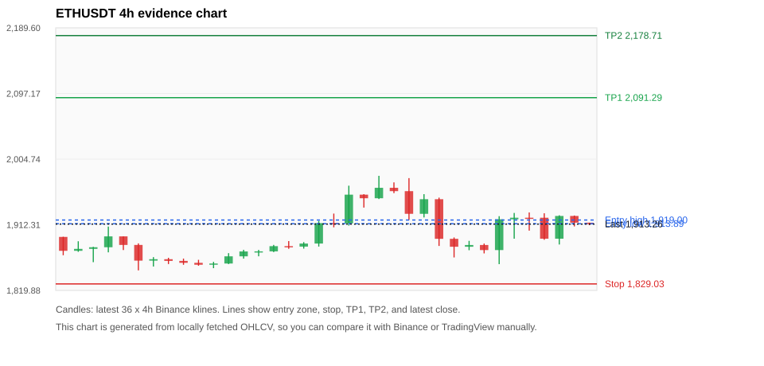
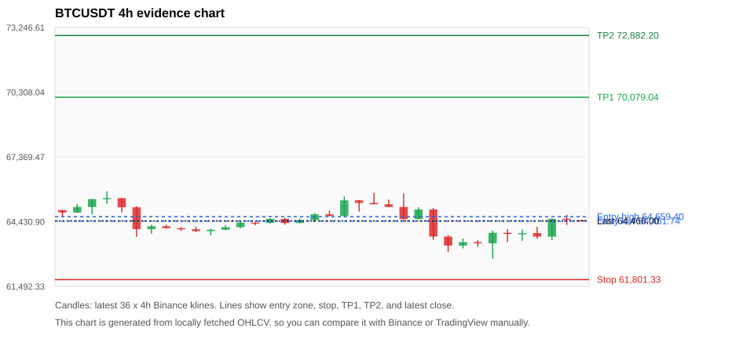
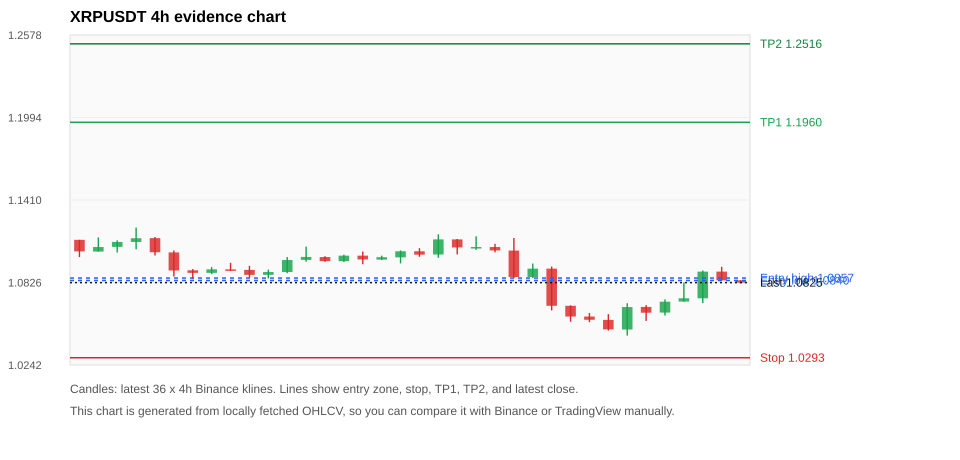
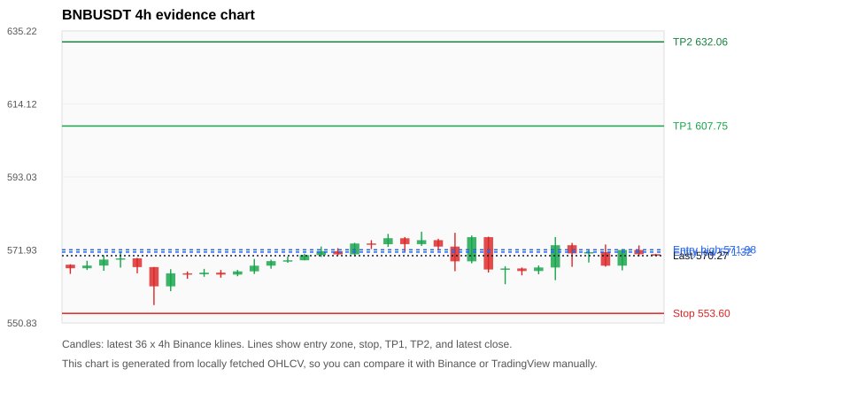
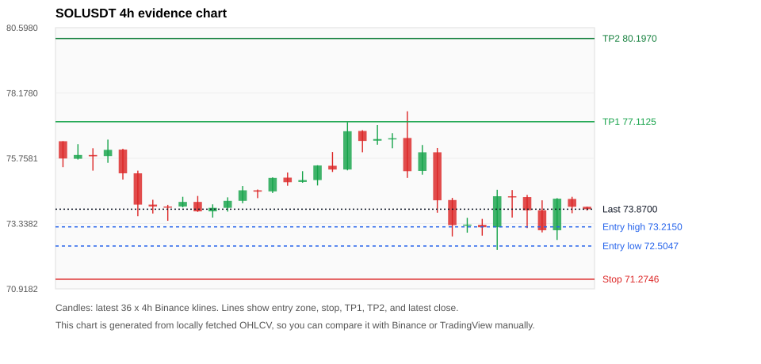

# Crypto 市场扫描报告 v1

- 报告时间：2026-07-29 20:06:34 CST
- Run ID：`20260729_120502_400dc662`
- Run type：`daily_full`
- 数据来源：SQLite
- 报告版本：v1
- 扫描 ID：3a77f1af8f42
- 数据源：Binance public spot API + CoinGecko/CoinMarketCap cross-check
- 过滤条件：USDT spot; 24h quote volume >= 30,000,000; trades >= 30,000; exclude stables/leveraged tokens; analyze 1h/4h/1d klines
- 默认单笔风险：账户权益的 1.00%

## 限制说明

- 交易信号仍以 Binance 现货公开 K 线为主源；外部数据源用于一致性复核。
- 结果是研究和模拟盘计划，不是确定收益或实盘下单指令。
- 历史长度过滤：候选币至少需要 180 根 1d K 线。
- 数据质量验证池：先验证 score 排名前 min(top_n * 2, 10) 的候选，再按 action + score 补足最终名单。
- 大盘环境过滤：NEUTRAL; BTC/ETH 大盘未完全确认强势，山寨币买入候选降级为观察。 BTC 7d=-2.5024317664705698; ETH 7d=-1.086209124983839.
- 已启用数据交叉验证：Binance 主源 + CoinGecko 自动对照；CoinMarketCap 在配置 API Key 后自动对照。
- ETHUSDT 交叉验证状态 DATA_WARNING：At least one external provider needs manual review.
- BTCUSDT 交叉验证状态 DATA_WARNING：At least one external provider needs manual review.
- XRPUSDT 交叉验证状态 DATA_WARNING：At least one external provider needs manual review.
- BNBUSDT 交叉验证状态 DATA_WARNING：At least one external provider needs manual review.
- SOLUSDT 交叉验证状态 DATA_WARNING：At least one external provider needs manual review.
- DOGEUSDT 交叉验证状态 DATA_WARNING：At least one external provider needs manual review.
- VANAUSDT 交叉验证状态 DATA_WARNING：At least one external provider needs manual review.
- ZECUSDT 交叉验证状态 DATA_WARNING：At least one external provider needs manual review.
- BANKUSDT 交叉验证状态 DATA_WARNING：At least one external provider needs manual review.
- DEXEUSDT 交叉验证状态 DATA_WARNING：At least one external provider needs manual review.

## 5 个候选交易计划

| Rank | Coin | Action | Setup | Entry Zone | Stop Loss | TP1 | TP2 / Exit Rule | R/R | Verdict |
|---:|---|---|---|---:|---:|---:|---|---:|---|
| 1 | `ETH` | `WATCH_ONLY` | 回踩支撑/4h EMA 附近 | 1,913.89 - 1,919.00 | 1,829.03 | 2,091.29 | 2,178.71 或跌破 4h 关键支撑 | 2.00-3.00 | 只观察 |
| 2 | `BTC` | `WATCH_ONLY` | 回踩支撑/4h EMA 附近 | 64,461.74 - 64,659.40 | 61,801.33 | 70,079.04 | 72,882.20 或跌破 4h 关键支撑 | 2.00-3.02 | 只观察 |
| 3 | `XRP` | `WATCH_ONLY` | 回踩支撑/4h EMA 附近 | 1.0840 - 1.0857 | 1.0293 | 1.1960 | 1.2516 或跌破 4h 关键支撑 | 2.00-3.00 | 只观察 |
| 4 | `BNB` | `WATCH_ONLY` | 回踩支撑/4h EMA 附近 | 571.32 - 571.98 | 553.60 | 607.75 | 632.06 或跌破 4h 关键支撑 | 2.00-3.35 | 只观察 |
| 5 | `SOL` | `REJECT` | 回踩支撑/4h EMA 附近 | 72.5047 - 73.2150 | 71.2746 | 77.1125 | 80.1970 或跌破 4h 关键支撑 | 2.68-4.63 | 只观察 |

## 数据交叉验证摘要

价格差异以 Binance 当前价为基准；成交量口径不同，Binance 是 USDT 现货成交额，CoinGecko/CoinMarketCap 通常是全市场成交量。

| Rank | Coin | Data Status | Max Price Diff | Max 24h Diff | Message |
|---:|---|---|---:|---:|---|
| 1 | `ETH` | DATA_WARNING | 0.15% | 0.09 pts | At least one external provider needs manual review. |
| 2 | `BTC` | DATA_WARNING | 0.12% | 0.12 pts | At least one external provider needs manual review. |
| 3 | `XRP` | DATA_WARNING | 0.02% | 0.25 pts | At least one external provider needs manual review. |
| 4 | `BNB` | DATA_WARNING | 0.11% | 0.09 pts | At least one external provider needs manual review. |
| 5 | `SOL` | DATA_WARNING | 0.04% | 0.22 pts | At least one external provider needs manual review. |

## 候选币说明

### 1. ETH `ETHUSDT`



- 入选原因：回踩支撑/4h EMA 附近；24h +1.90%，7d -1.37%，4h RSI 39.87，24h 成交额 $527.9M。
- 交易失效条件：跌破 1829.0268 或 4h 收盘重新失守关键支撑。
- 主要风险：7d 趋势未确认；数据交叉验证需要人工复核。
- 数据交叉验证：DATA_WARNING；At least one external provider needs manual review.

#### 可点击人工验证

- [Binance 交易页](https://www.binance.com/en/trade/ETH_USDT)
- [TradingView 图表](https://www.tradingview.com/chart/?symbol=BINANCE%3AETHUSDT)
- [CoinGecko 搜索](https://www.coingecko.com/en/search?query=ETH)
- [CoinMarketCap 搜索](https://coinmarketcap.com/search/?q=ETH)

#### 多数据源对照

| Source | Status | Asset ID | Price | 24h Change | 24h Volume | Price Diff | 24h Diff | Updated | Message |
|---|---|---|---:|---:|---:|---:|---:|---|---|
| Binance | DATA_OK | ETHUSDT | 1,913.26 | +1.90% | $527.9M | 0.00% | 0.00 pts | 2026-07-29T12:05:43+00:00 | Primary market data source used by scanner. |
| CoinGecko | DATA_OK | ethereum | 1,910.34 | +1.89% | $10.00B | 0.15% | 0.00 pts | 2026-07-29T12:05:43.754Z | External source agrees with Binance within thresholds. |
| CoinMarketCap | DATA_WARNING | 1027 | 1,910.55 | +1.99% | $11.47B | 0.14% | 0.09 pts | 2026-07-29T12:04:03.000Z | CoinMarketCap symbol mapping has 6 matches; selected lowest cmc_rank |

#### 指标证据

| 指标 | 数值 | 人工核对用途 |
|---|---:|---|
| 当前价 | 1,913.26 | 与 Binance/TradingView 当前价格对照 |
| 24h 涨跌 | +1.90% | 与交易所 24h 涨跌对照 |
| 7d 涨跌 | -1.37% | 判断短线趋势是否延续 |
| 4h EMA20 | 1,910.07 | 判断短期趋势支撑 |
| 4h EMA50 | 1,899.89 | 判断中期趋势支撑 |
| 1d EMA20 | 1,868.21 | 判断日线趋势 |
| 1d EMA50 | 1,844.83 | 判断日线趋势 |
| 4h RSI14 | 39.87 | 判断是否过热/过弱 |
| 4h ATR14 | 32.6221 | 推导止损和入场缓冲 |
| 最近 18 根 4h 最低点 | 1,856.88 | 支撑/止损参考 |
| 最近 36 根 4h 最高点 | 1,981.24 | TP/压力参考 |
| 支撑位 | 1,910.07 | 入场区间推导基础 |

#### 交易计划推导

- 支撑位 = 最近低点、4h EMA20、4h EMA50、1d EMA20 中不高于当前价的最高有效支撑 = `1,910.07`。
- 入场区间 = 支撑位附近 + ATR 缓冲 = `1,913.89 - 1,919.00`。
- 止损 = min(最近 18 根 4h 最低点 * 0.985, 入场中位价 - 1.15 * ATR14) = `1,829.03`。
- TP1 = max(最近 36 根 4h 最高点 * 0.995, 入场中位价 + 2R) = `2,091.29`。
- TP2 = max(入场中位价 + 3R, TP1 * 1.04) = `2,178.71`。

#### 最近 10 根 4h K线

| UTC 开盘时间 | Open | High | Low | Close | Quote Volume | Trades |
|---|---:|---:|---:|---:|---:|---:|
| 2026-07-28T00:00+00:00 | 1,892.53 | 1,894.45 | 1,866.31 | 1,881.38 | $94.0M | 423354 |
| 2026-07-28T04:00+00:00 | 1,881.37 | 1,889.66 | 1,876.48 | 1,883.83 | $62.6M | 258640 |
| 2026-07-28T08:00+00:00 | 1,883.84 | 1,885.85 | 1,872.00 | 1,876.68 | $57.0M | 296306 |
| 2026-07-28T12:00+00:00 | 1,876.69 | 1,924.41 | 1,856.88 | 1,920.02 | $179.1M | 801789 |
| 2026-07-28T16:00+00:00 | 1,920.02 | 1,928.95 | 1,892.71 | 1,922.23 | $99.0M | 461899 |
| 2026-07-28T20:00+00:00 | 1,922.24 | 1,929.67 | 1,904.06 | 1,922.23 | $55.8M | 263208 |
| 2026-07-29T00:00+00:00 | 1,922.22 | 1,928.51 | 1,891.17 | 1,892.70 | $64.4M | 463804 |
| 2026-07-29T04:00+00:00 | 1,892.70 | 1,925.68 | 1,884.51 | 1,924.71 | $74.4M | 337978 |
| 2026-07-29T08:00+00:00 | 1,924.71 | 1,925.35 | 1,910.00 | 1,915.26 | $56.6M | 242025 |
| 2026-07-29T12:00+00:00 | 1,915.26 | 1,915.27 | 1,911.81 | 1,913.26 | $921,519 | 5698 |

### 2. BTC `BTCUSDT`



- 入选原因：回踩支撑/4h EMA 附近；24h +1.48%，7d -2.25%，4h RSI 41.67，24h 成交额 $893.8M。
- 交易失效条件：跌破 61801.333 或 4h 收盘重新失守关键支撑。
- 主要风险：7d 趋势未确认；数据交叉验证需要人工复核。
- 数据交叉验证：DATA_WARNING；At least one external provider needs manual review.

#### 可点击人工验证

- [Binance 交易页](https://www.binance.com/en/trade/BTC_USDT)
- [TradingView 图表](https://www.tradingview.com/chart/?symbol=BINANCE%3ABTCUSDT)
- [CoinGecko 搜索](https://www.coingecko.com/en/search?query=BTC)
- [CoinMarketCap 搜索](https://coinmarketcap.com/search/?q=BTC)

#### 多数据源对照

| Source | Status | Asset ID | Price | 24h Change | 24h Volume | Price Diff | 24h Diff | Updated | Message |
|---|---|---|---:|---:|---:|---:|---:|---|---|
| Binance | DATA_OK | BTCUSDT | 64,466.00 | +1.48% | $893.8M | 0.00% | 0.00 pts | 2026-07-29T12:05:43+00:00 | Primary market data source used by scanner. |
| CoinGecko | DATA_OK | bitcoin | 64,416.00 | +1.60% | $24.82B | 0.08% | 0.12 pts | 2026-07-29T12:03:30.000Z | External source agrees with Binance within thresholds. |
| CoinMarketCap | DATA_WARNING | 1 | 64,391.76 | +1.59% | $24.48B | 0.12% | 0.11 pts | 2026-07-29T12:04:03.000Z | CoinMarketCap symbol mapping has 13 matches; selected lowest cmc_rank |

#### 指标证据

| 指标 | 数值 | 人工核对用途 |
|---|---:|---|
| 当前价 | 64,466.00 | 与 Binance/TradingView 当前价格对照 |
| 24h 涨跌 | +1.48% | 与交易所 24h 涨跌对照 |
| 7d 涨跌 | -2.25% | 判断短线趋势是否延续 |
| 4h EMA20 | 64,297.17 | 判断短期趋势支撑 |
| 4h EMA50 | 64,527.02 | 判断中期趋势支撑 |
| 1d EMA20 | 64,333.07 | 判断日线趋势 |
| 1d EMA50 | 64,951.68 | 判断日线趋势 |
| 4h RSI14 | 41.67 | 判断是否过热/过弱 |
| 4h ATR14 | 685.65 | 推导止损和入场缓冲 |
| 最近 18 根 4h 最低点 | 62,742.47 | 支撑/止损参考 |
| 最近 36 根 4h 最高点 | 65,808.59 | TP/压力参考 |
| 支撑位 | 64,333.07 | 入场区间推导基础 |

#### 交易计划推导

- 支撑位 = 最近低点、4h EMA20、4h EMA50、1d EMA20 中不高于当前价的最高有效支撑 = `64,333.07`。
- 入场区间 = 支撑位附近 + ATR 缓冲 = `64,461.74 - 64,659.40`。
- 止损 = min(最近 18 根 4h 最低点 * 0.985, 入场中位价 - 1.15 * ATR14) = `61,801.33`。
- TP1 = max(最近 36 根 4h 最高点 * 0.995, 入场中位价 + 2R) = `70,079.04`。
- TP2 = max(入场中位价 + 3R, TP1 * 1.04) = `72,882.20`。

#### 最近 10 根 4h K线

| UTC 开盘时间 | Open | High | Low | Close | Quote Volume | Trades |
|---|---:|---:|---:|---:|---:|---:|
| 2026-07-28T00:00+00:00 | 63,755.86 | 63,827.49 | 63,059.39 | 63,343.83 | $197.2M | 495493 |
| 2026-07-28T04:00+00:00 | 63,343.82 | 63,668.71 | 63,221.26 | 63,505.99 | $138.5M | 302891 |
| 2026-07-28T08:00+00:00 | 63,506.00 | 63,593.00 | 63,294.00 | 63,450.00 | $90.0M | 272253 |
| 2026-07-28T12:00+00:00 | 63,449.99 | 64,026.62 | 62,742.47 | 63,928.47 | $245.2M | 829250 |
| 2026-07-28T16:00+00:00 | 63,928.46 | 64,100.00 | 63,504.00 | 63,904.00 | $107.8M | 448963 |
| 2026-07-28T20:00+00:00 | 63,904.00 | 64,073.30 | 63,562.00 | 63,915.00 | $103.2M | 331093 |
| 2026-07-29T00:00+00:00 | 63,915.00 | 64,200.00 | 63,658.00 | 63,753.03 | $150.0M | 530540 |
| 2026-07-29T04:00+00:00 | 63,753.04 | 64,575.99 | 63,598.00 | 64,561.00 | $174.5M | 440332 |
| 2026-07-29T08:00+00:00 | 64,561.01 | 64,744.81 | 64,283.83 | 64,507.54 | $115.4M | 303739 |
| 2026-07-29T12:00+00:00 | 64,507.53 | 64,507.54 | 64,458.12 | 64,465.99 | $2.8M | 8035 |

### 3. XRP `XRPUSDT`



- 入选原因：回踩支撑/4h EMA 附近；24h +2.97%，7d -5.28%，4h RSI 40.06，24h 成交额 $79.3M。
- 交易失效条件：跌破 1.029325 或 4h 收盘重新失守关键支撑。
- 主要风险：日线趋势未完全确认；7d 趋势未确认；数据交叉验证需要人工复核。
- 数据交叉验证：DATA_WARNING；At least one external provider needs manual review.

#### 可点击人工验证

- [Binance 交易页](https://www.binance.com/en/trade/XRP_USDT)
- [TradingView 图表](https://www.tradingview.com/chart/?symbol=BINANCE%3AXRPUSDT)
- [CoinGecko 搜索](https://www.coingecko.com/en/search?query=XRP)
- [CoinMarketCap 搜索](https://coinmarketcap.com/search/?q=XRP)

#### 多数据源对照

| Source | Status | Asset ID | Price | 24h Change | 24h Volume | Price Diff | 24h Diff | Updated | Message |
|---|---|---|---:|---:|---:|---:|---:|---|---|
| Binance | DATA_OK | XRPUSDT | 1.0825 | +2.97% | $79.3M | 0.00% | 0.00 pts | 2026-07-29T12:05:43+00:00 | Primary market data source used by scanner. |
| CoinGecko | DATA_WARNING | n/a | n/a | n/a | n/a | n/a | n/a | 2026-07-29T12:05:43+00:00 | Failed to fetch https://api.coingecko.com/api/v3/coins/markets?vs_currency=usd&ids=ripple&price_change_percentage=24h&per_page=1&page=1: HTTP Error 429: Too Many Requests |
| CoinMarketCap | DATA_WARNING | 52 | 1.0823 | +3.22% | $1.39B | 0.02% | 0.25 pts | 2026-07-29T12:05:04.000Z | CoinMarketCap symbol mapping has 3 matches; selected lowest cmc_rank |

#### 指标证据

| 指标 | 数值 | 人工核对用途 |
|---|---:|---|
| 当前价 | 1.0825 | 与 Binance/TradingView 当前价格对照 |
| 24h 涨跌 | +2.97% | 与交易所 24h 涨跌对照 |
| 7d 涨跌 | -5.28% | 判断短线趋势是否延续 |
| 4h EMA20 | 1.0819 | 判断短期趋势支撑 |
| 4h EMA50 | 1.0931 | 判断中期趋势支撑 |
| 1d EMA20 | 1.0986 | 判断日线趋势 |
| 1d EMA50 | 1.1318 | 判断日线趋势 |
| 4h RSI14 | 40.06 | 判断是否过热/过弱 |
| 4h ATR14 | 0.01426 | 推导止损和入场缓冲 |
| 最近 18 根 4h 最低点 | 1.0450 | 支撑/止损参考 |
| 最近 36 根 4h 最高点 | 1.1215 | TP/压力参考 |
| 支撑位 | 1.0819 | 入场区间推导基础 |

#### 交易计划推导

- 支撑位 = 最近低点、4h EMA20、4h EMA50、1d EMA20 中不高于当前价的最高有效支撑 = `1.0819`。
- 入场区间 = 支撑位附近 + ATR 缓冲 = `1.0840 - 1.0857`。
- 止损 = min(最近 18 根 4h 最低点 * 0.985, 入场中位价 - 1.15 * ATR14) = `1.0293`。
- TP1 = max(最近 36 根 4h 最高点 * 0.995, 入场中位价 + 2R) = `1.1960`。
- TP2 = max(入场中位价 + 3R, TP1 * 1.04) = `1.2516`。

#### 最近 10 根 4h K线

| UTC 开盘时间 | Open | High | Low | Close | Quote Volume | Trades |
|---|---:|---:|---:|---:|---:|---:|
| 2026-07-28T00:00+00:00 | 1.0661 | 1.0664 | 1.0548 | 1.0585 | $10.8M | 67946 |
| 2026-07-28T04:00+00:00 | 1.0585 | 1.0610 | 1.0545 | 1.0562 | $7.7M | 37672 |
| 2026-07-28T08:00+00:00 | 1.0561 | 1.0602 | 1.0486 | 1.0494 | $11.7M | 47911 |
| 2026-07-28T12:00+00:00 | 1.0493 | 1.0679 | 1.0450 | 1.0652 | $16.4M | 108838 |
| 2026-07-28T16:00+00:00 | 1.0653 | 1.0666 | 1.0554 | 1.0612 | $6.6M | 49854 |
| 2026-07-28T20:00+00:00 | 1.0613 | 1.0706 | 1.0592 | 1.0690 | $8.5M | 47447 |
| 2026-07-29T00:00+00:00 | 1.0691 | 1.0825 | 1.0691 | 1.0714 | $20.8M | 107614 |
| 2026-07-29T04:00+00:00 | 1.0714 | 1.0911 | 1.0680 | 1.0903 | $15.8M | 86520 |
| 2026-07-29T08:00+00:00 | 1.0903 | 1.0937 | 1.0840 | 1.0841 | $11.0M | 53040 |
| 2026-07-29T12:00+00:00 | 1.0841 | 1.0843 | 1.0820 | 1.0825 | $546,041 | 1721 |

### 4. BNB `BNBUSDT`



- 入选原因：回踩支撑/4h EMA 附近；24h +0.58%，7d -0.36%，4h RSI 44.87，24h 成交额 $47.5M。
- 交易失效条件：跌破 553.59955 或 4h 收盘重新失守关键支撑。
- 主要风险：日线趋势未完全确认；7d 趋势未确认；数据交叉验证需要人工复核。
- 数据交叉验证：DATA_WARNING；At least one external provider needs manual review.

#### 可点击人工验证

- [Binance 交易页](https://www.binance.com/en/trade/BNB_USDT)
- [TradingView 图表](https://www.tradingview.com/chart/?symbol=BINANCE%3ABNBUSDT)
- [CoinGecko 搜索](https://www.coingecko.com/en/search?query=BNB)
- [CoinMarketCap 搜索](https://coinmarketcap.com/search/?q=BNB)

#### 多数据源对照

| Source | Status | Asset ID | Price | 24h Change | 24h Volume | Price Diff | 24h Diff | Updated | Message |
|---|---|---|---:|---:|---:|---:|---:|---|---|
| Binance | DATA_OK | BNBUSDT | 570.27 | +0.58% | $47.5M | 0.00% | 0.00 pts | 2026-07-29T12:05:43+00:00 | Primary market data source used by scanner. |
| CoinGecko | DATA_OK | binancecoin | 569.64 | +0.53% | $517.7M | 0.11% | 0.05 pts | 2026-07-29T12:05:51.885Z | External source agrees with Binance within thresholds. |
| CoinMarketCap | DATA_WARNING | 1839 | 569.85 | +0.67% | $980.0M | 0.07% | 0.09 pts | 2026-07-29T12:05:04.000Z | CoinMarketCap symbol mapping has 4 matches; selected lowest cmc_rank |

#### 指标证据

| 指标 | 数值 | 人工核对用途 |
|---|---:|---|
| 当前价 | 570.27 | 与 Binance/TradingView 当前价格对照 |
| 24h 涨跌 | +0.58% | 与交易所 24h 涨跌对照 |
| 7d 涨跌 | -0.36% | 判断短线趋势是否延续 |
| 4h EMA20 | 570.18 | 判断短期趋势支撑 |
| 4h EMA50 | 570.31 | 判断中期趋势支撑 |
| 1d EMA20 | 571.49 | 判断日线趋势 |
| 1d EMA50 | 581.75 | 判断日线趋势 |
| 4h RSI14 | 44.87 | 判断是否过热/过弱 |
| 4h ATR14 | 5.8743 | 推导止损和入场缓冲 |
| 最近 18 根 4h 最低点 | 562.03 | 支撑/止损参考 |
| 最近 36 根 4h 最高点 | 577.20 | TP/压力参考 |
| 支撑位 | 570.18 | 入场区间推导基础 |

#### 交易计划推导

- 支撑位 = 最近低点、4h EMA20、4h EMA50、1d EMA20 中不高于当前价的最高有效支撑 = `570.18`。
- 入场区间 = 支撑位附近 + ATR 缓冲 = `571.32 - 571.98`。
- 止损 = min(最近 18 根 4h 最低点 * 0.985, 入场中位价 - 1.15 * ATR14) = `553.60`。
- TP1 = max(最近 36 根 4h 最高点 * 0.995, 入场中位价 + 2R) = `607.75`。
- TP2 = max(入场中位价 + 3R, TP1 * 1.04) = `632.06`。

#### 最近 10 根 4h K线

| UTC 开盘时间 | Open | High | Low | Close | Quote Volume | Trades |
|---|---:|---:|---:|---:|---:|---:|
| 2026-07-28T00:00+00:00 | 566.28 | 567.21 | 562.03 | 566.57 | $7.6M | 89467 |
| 2026-07-28T04:00+00:00 | 566.58 | 566.85 | 564.60 | 565.83 | $6.8M | 59171 |
| 2026-07-28T08:00+00:00 | 565.84 | 567.44 | 564.90 | 566.86 | $5.2M | 56281 |
| 2026-07-28T12:00+00:00 | 566.86 | 575.66 | 563.19 | 573.30 | $17.3M | 148347 |
| 2026-07-28T16:00+00:00 | 573.30 | 573.97 | 567.05 | 570.93 | $7.2M | 88417 |
| 2026-07-28T20:00+00:00 | 570.93 | 572.07 | 568.29 | 571.29 | $4.1M | 48932 |
| 2026-07-29T00:00+00:00 | 571.29 | 573.50 | 567.10 | 567.38 | $6.8M | 79350 |
| 2026-07-29T04:00+00:00 | 567.39 | 572.13 | 566.01 | 571.90 | $5.4M | 65122 |
| 2026-07-29T08:00+00:00 | 571.89 | 573.23 | 570.11 | 570.69 | $6.7M | 56292 |
| 2026-07-29T12:00+00:00 | 570.70 | 570.74 | 570.26 | 570.27 | $84,720 | 1169 |

### 5. SOL `SOLUSDT`



- 入选原因：回踩支撑/4h EMA 附近；24h +0.81%，7d -5.14%，4h RSI 35.13，24h 成交额 $110.9M。
- 交易失效条件：跌破 71.2746 或 4h 收盘重新失守关键支撑。
- 主要风险：日线趋势未完全确认；7d 趋势未确认；数据交叉验证需要人工复核。
- 数据交叉验证：DATA_WARNING；At least one external provider needs manual review.

#### 可点击人工验证

- [Binance 交易页](https://www.binance.com/en/trade/SOL_USDT)
- [TradingView 图表](https://www.tradingview.com/chart/?symbol=BINANCE%3ASOLUSDT)
- [CoinGecko 搜索](https://www.coingecko.com/en/search?query=SOL)
- [CoinMarketCap 搜索](https://coinmarketcap.com/search/?q=SOL)

#### 多数据源对照

| Source | Status | Asset ID | Price | 24h Change | 24h Volume | Price Diff | 24h Diff | Updated | Message |
|---|---|---|---:|---:|---:|---:|---:|---|---|
| Binance | DATA_OK | SOLUSDT | 73.8700 | +0.81% | $110.9M | 0.00% | 0.00 pts | 2026-07-29T12:05:43+00:00 | Primary market data source used by scanner. |
| CoinGecko | DATA_WARNING | n/a | n/a | n/a | n/a | n/a | n/a | 2026-07-29T12:05:43+00:00 | Failed to fetch https://api.coingecko.com/api/v3/coins/markets?vs_currency=usd&ids=solana&price_change_percentage=24h&per_page=1&page=1: HTTP Error 429: Too Many Requests |
| CoinMarketCap | DATA_WARNING | 5426 | 73.8418 | +1.03% | $1.78B | 0.04% | 0.22 pts | 2026-07-29T12:05:04.000Z | CoinMarketCap symbol mapping has 8 matches; selected lowest cmc_rank |

#### 指标证据

| 指标 | 数值 | 人工核对用途 |
|---|---:|---|
| 当前价 | 73.8700 | 与 Binance/TradingView 当前价格对照 |
| 24h 涨跌 | +0.81% | 与交易所 24h 涨跌对照 |
| 7d 涨跌 | -5.14% | 判断短线趋势是否延续 |
| 4h EMA20 | 74.4216 | 判断短期趋势支撑 |
| 4h EMA50 | 75.1873 | 判断中期趋势支撑 |
| 1d EMA20 | 75.7182 | 判断日线趋势 |
| 1d EMA50 | 76.2166 | 判断日线趋势 |
| 4h RSI14 | 35.13 | 判断是否过热/过弱 |
| 4h ATR14 | 1.2214 | 推导止损和入场缓冲 |
| 最近 18 根 4h 最低点 | 72.3600 | 支撑/止损参考 |
| 最近 36 根 4h 最高点 | 77.5000 | TP/压力参考 |
| 支撑位 | 72.3600 | 入场区间推导基础 |

#### 交易计划推导

- 支撑位 = 最近低点、4h EMA20、4h EMA50、1d EMA20 中不高于当前价的最高有效支撑 = `72.3600`。
- 入场区间 = 支撑位附近 + ATR 缓冲 = `72.5047 - 73.2150`。
- 止损 = min(最近 18 根 4h 最低点 * 0.985, 入场中位价 - 1.15 * ATR14) = `71.2746`。
- TP1 = max(最近 36 根 4h 最高点 * 0.995, 入场中位价 + 2R) = `77.1125`。
- TP2 = max(入场中位价 + 3R, TP1 * 1.04) = `80.1970`。

#### 最近 10 根 4h K线

| UTC 开盘时间 | Open | High | Low | Close | Quote Volume | Trades |
|---|---:|---:|---:|---:|---:|---:|
| 2026-07-28T00:00+00:00 | 74.2100 | 74.2900 | 72.8600 | 73.2800 | $27.5M | 109104 |
| 2026-07-28T04:00+00:00 | 73.2800 | 73.5500 | 73.0000 | 73.3000 | $14.4M | 55020 |
| 2026-07-28T08:00+00:00 | 73.2900 | 73.5100 | 72.8900 | 73.2000 | $18.5M | 53026 |
| 2026-07-28T12:00+00:00 | 73.2000 | 74.5900 | 72.3600 | 74.3500 | $33.3M | 156488 |
| 2026-07-28T16:00+00:00 | 74.3500 | 74.5800 | 73.5600 | 74.3300 | $13.6M | 89250 |
| 2026-07-28T20:00+00:00 | 74.3200 | 74.4000 | 73.1700 | 73.8300 | $17.5M | 62406 |
| 2026-07-29T00:00+00:00 | 73.8300 | 74.2000 | 73.0100 | 73.0900 | $17.3M | 96774 |
| 2026-07-29T04:00+00:00 | 73.0900 | 74.2800 | 72.7300 | 74.2600 | $17.7M | 68887 |
| 2026-07-29T08:00+00:00 | 74.2500 | 74.3300 | 73.7200 | 73.9600 | $11.5M | 45923 |
| 2026-07-29T12:00+00:00 | 73.9600 | 73.9600 | 73.8200 | 73.8700 | $163,969 | 1040 |

## 组合风控

- 不要 5 个候选全部满仓买入。
- 同时持仓总风险建议控制在账户权益的 3% - 5% 以内。
- 如果 BTC/ETH 同时破位，暂停山寨币多头计划或降低仓位。
- 第一版报告用于模拟盘和人工复核，不自动下单。

## 原始数据

```json
[
  {
    "rank": 1,
    "symbol": "ETHUSDT",
    "base_asset": "ETH",
    "price": 1913.26,
    "score": 45.24877590287675,
    "setup": "回踩支撑/4h EMA 附近",
    "verdict": "只观察",
    "entry_low": 1913.8936901013124,
    "entry_high": 1918.9997799999999,
    "stop_loss": 1829.0268,
    "take_profit_1": 2091.286605151968,
    "take_profit_2": 2178.706540202624,
    "risk_reward_1": 2.0,
    "risk_reward_2": 3.0,
    "pct_24h": 1.896,
    "pct_3d": 1.412049061284204,
    "pct_7d": -1.3747918739336007,
    "quote_volume_24h": 527896172.631072,
    "trades_24h": 2568861,
    "high_low_range_24h": 3.920016371547974,
    "rsi_1h": 50.592437706917536,
    "rsi_4h": 39.870758008246106,
    "ema20_4h": 1910.0735430152818,
    "ema50_4h": 1899.8928354314019,
    "ema20_1d": 1868.2098132347894,
    "ema50_1d": 1844.8335845720221,
    "atr_4h": 32.622142857142876,
    "macd_hist_4h": -0.7422266401454474,
    "volume_ratio_24h": 1.2712627159808918,
    "support_level": 1910.0735430152818,
    "recent_low_4h_18": 1856.88,
    "recent_high_4h_36": 1981.24,
    "distance_to_support_pct": 0.16682378520818109,
    "binance_trade_url": "https://www.binance.com/en/trade/ETH_USDT",
    "tradingview_url": "https://www.tradingview.com/chart/?symbol=BINANCE%3AETHUSDT",
    "coingecko_search_url": "https://www.coingecko.com/en/search?query=ETH",
    "coinmarketcap_search_url": "https://coinmarketcap.com/search/?q=ETH",
    "invalidation": "跌破 1829.0268 或 4h 收盘重新失守关键支撑",
    "recent_4h_klines": [
      {
        "open_time_utc": "2026-07-23T16:00+00:00",
        "open": 1895.23,
        "high": 1895.41,
        "low": 1869.44,
        "close": 1875.65,
        "quote_volume": 75977811.928967,
        "trades": 401029
      },
      {
        "open_time_utc": "2026-07-23T20:00+00:00",
        "open": 1875.64,
        "high": 1889.09,
        "low": 1874.23,
        "close": 1878.38,
        "quote_volume": 39264185.928899,
        "trades": 211827
      },
      {
        "open_time_utc": "2026-07-24T00:00+00:00",
        "open": 1878.38,
        "high": 1881.2,
        "low": 1859.67,
        "close": 1880.67,
        "quote_volume": 62823597.090217,
        "trades": 323469
      },
      {
        "open_time_utc": "2026-07-24T04:00+00:00",
        "open": 1880.67,
        "high": 1909.8,
        "low": 1873.48,
        "close": 1895.98,
        "quote_volume": 65197193.468691,
        "trades": 306204
      },
      {
        "open_time_utc": "2026-07-24T08:00+00:00",
        "open": 1895.98,
        "high": 1896.04,
        "low": 1876.71,
        "close": 1883.93,
        "quote_volume": 43543529.574374,
        "trades": 273771
      },
      {
        "open_time_utc": "2026-07-24T12:00+00:00",
        "open": 1883.93,
        "high": 1886.09,
        "low": 1848.09,
        "close": 1861.81,
        "quote_volume": 126685739.639251,
        "trades": 770893
      },
      {
        "open_time_utc": "2026-07-24T16:00+00:00",
        "open": 1861.82,
        "high": 1866.76,
        "low": 1853.5,
        "close": 1863.83,
        "quote_volume": 55477384.287484,
        "trades": 339037
      },
      {
        "open_time_utc": "2026-07-24T20:00+00:00",
        "open": 1863.84,
        "high": 1865.82,
        "low": 1856.97,
        "close": 1861.44,
        "quote_volume": 21976612.421105,
        "trades": 121160
      },
      {
        "open_time_utc": "2026-07-25T00:00+00:00",
        "open": 1861.44,
        "high": 1864.69,
        "low": 1855.93,
        "close": 1858.74,
        "quote_volume": 26039463.440314,
        "trades": 112861
      },
      {
        "open_time_utc": "2026-07-25T04:00+00:00",
        "open": 1858.74,
        "high": 1862.96,
        "low": 1854.61,
        "close": 1856.02,
        "quote_volume": 24132356.560451,
        "trades": 107612
      },
      {
        "open_time_utc": "2026-07-25T08:00+00:00",
        "open": 1856.03,
        "high": 1860.09,
        "low": 1851.22,
        "close": 1857.75,
        "quote_volume": 29755614.850639,
        "trades": 118603
      },
      {
        "open_time_utc": "2026-07-25T12:00+00:00",
        "open": 1857.75,
        "high": 1872.35,
        "low": 1856.96,
        "close": 1867.88,
        "quote_volume": 38883665.097903,
        "trades": 149234
      },
      {
        "open_time_utc": "2026-07-25T16:00+00:00",
        "open": 1867.88,
        "high": 1877.07,
        "low": 1864.65,
        "close": 1874.76,
        "quote_volume": 30385128.706757,
        "trades": 170723
      },
      {
        "open_time_utc": "2026-07-25T20:00+00:00",
        "open": 1874.77,
        "high": 1876.92,
        "low": 1867.92,
        "close": 1874.89,
        "quote_volume": 15648697.010211,
        "trades": 104080
      },
      {
        "open_time_utc": "2026-07-26T00:00+00:00",
        "open": 1874.88,
        "high": 1883.98,
        "low": 1873.85,
        "close": 1882.21,
        "quote_volume": 19473769.985199,
        "trades": 113287
      },
      {
        "open_time_utc": "2026-07-26T04:00+00:00",
        "open": 1882.21,
        "high": 1889.36,
        "low": 1878.46,
        "close": 1881.56,
        "quote_volume": 21173822.659788,
        "trades": 96548
      },
      {
        "open_time_utc": "2026-07-26T08:00+00:00",
        "open": 1881.57,
        "high": 1887.89,
        "low": 1878.74,
        "close": 1885.87,
        "quote_volume": 18091980.477335,
        "trades": 105053
      },
      {
        "open_time_utc": "2026-07-26T12:00+00:00",
        "open": 1885.87,
        "high": 1917.82,
        "low": 1881.61,
        "close": 1914.63,
        "quote_volume": 65165309.721979,
        "trades": 374375
      },
      {
        "open_time_utc": "2026-07-26T16:00+00:00",
        "open": 1914.63,
        "high": 1928.08,
        "low": 1908.75,
        "close": 1914.2,
        "quote_volume": 54448948.144189,
        "trades": 295254
      },
      {
        "open_time_utc": "2026-07-26T20:00+00:00",
        "open": 1914.21,
        "high": 1967.36,
        "low": 1911.14,
        "close": 1954.72,
        "quote_volume": 115302944.890536,
        "trades": 531446
      },
      {
        "open_time_utc": "2026-07-27T00:00+00:00",
        "open": 1954.72,
        "high": 1955.42,
        "low": 1936.51,
        "close": 1949.64,
        "quote_volume": 66645251.541259,
        "trades": 362357
      },
      {
        "open_time_utc": "2026-07-27T04:00+00:00",
        "open": 1949.65,
        "high": 1981.24,
        "low": 1948.54,
        "close": 1964.36,
        "quote_volume": 137044174.517423,
        "trades": 477109
      },
      {
        "open_time_utc": "2026-07-27T08:00+00:00",
        "open": 1964.37,
        "high": 1972.0,
        "low": 1956.87,
        "close": 1959.67,
        "quote_volume": 63477420.78172,
        "trades": 308712
      },
      {
        "open_time_utc": "2026-07-27T12:00+00:00",
        "open": 1959.67,
        "high": 1977.99,
        "low": 1919.09,
        "close": 1927.75,
        "quote_volume": 193781812.568466,
        "trades": 1050482
      },
      {
        "open_time_utc": "2026-07-27T16:00+00:00",
        "open": 1927.74,
        "high": 1955.41,
        "low": 1922.65,
        "close": 1948.31,
        "quote_volume": 72633786.766492,
        "trades": 431754
      },
      {
        "open_time_utc": "2026-07-27T20:00+00:00",
        "open": 1948.32,
        "high": 1950.54,
        "low": 1882.49,
        "close": 1892.53,
        "quote_volume": 132530190.963395,
        "trades": 565329
      },
      {
        "open_time_utc": "2026-07-28T00:00+00:00",
        "open": 1892.53,
        "high": 1894.45,
        "low": 1866.31,
        "close": 1881.38,
        "quote_volume": 93967372.848415,
        "trades": 423354
      },
      {
        "open_time_utc": "2026-07-28T04:00+00:00",
        "open": 1881.37,
        "high": 1889.66,
        "low": 1876.48,
        "close": 1883.83,
        "quote_volume": 62649039.051836,
        "trades": 258640
      },
      {
        "open_time_utc": "2026-07-28T08:00+00:00",
        "open": 1883.84,
        "high": 1885.85,
        "low": 1872.0,
        "close": 1876.68,
        "quote_volume": 57023763.994646,
        "trades": 296306
      },
      {
        "open_time_utc": "2026-07-28T12:00+00:00",
        "open": 1876.69,
        "high": 1924.41,
        "low": 1856.88,
        "close": 1920.02,
        "quote_volume": 179069374.281921,
        "trades": 801789
      },
      {
        "open_time_utc": "2026-07-28T16:00+00:00",
        "open": 1920.02,
        "high": 1928.95,
        "low": 1892.71,
        "close": 1922.23,
        "quote_volume": 99019857.244445,
        "trades": 461899
      },
      {
        "open_time_utc": "2026-07-28T20:00+00:00",
        "open": 1922.24,
        "high": 1929.67,
        "low": 1904.06,
        "close": 1922.23,
        "quote_volume": 55839239.941337,
        "trades": 263208
      },
      {
        "open_time_utc": "2026-07-29T00:00+00:00",
        "open": 1922.22,
        "high": 1928.51,
        "low": 1891.17,
        "close": 1892.7,
        "quote_volume": 64441106.318646,
        "trades": 463804
      },
      {
        "open_time_utc": "2026-07-29T04:00+00:00",
        "open": 1892.7,
        "high": 1925.68,
        "low": 1884.51,
        "close": 1924.71,
        "quote_volume": 74396844.871569,
        "trades": 337978
      },
      {
        "open_time_utc": "2026-07-29T08:00+00:00",
        "open": 1924.71,
        "high": 1925.35,
        "low": 1910.0,
        "close": 1915.26,
        "quote_volume": 56626357.926624,
        "trades": 242025
      },
      {
        "open_time_utc": "2026-07-29T12:00+00:00",
        "open": 1915.26,
        "high": 1915.27,
        "low": 1911.81,
        "close": 1913.26,
        "quote_volume": 921518.560734,
        "trades": 5698
      }
    ],
    "risks": [
      "7d 趋势未确认",
      "数据交叉验证需要人工复核"
    ],
    "data_quality_status": "DATA_WARNING",
    "data_quality_message": "At least one external provider needs manual review.",
    "data_checks": [
      {
        "provider": "Binance",
        "status": "DATA_OK",
        "provider_asset_id": "ETHUSDT",
        "provider_symbol": "ETHUSDT",
        "price_usd": 1913.26,
        "pct_24h": 1.896,
        "volume_24h": 527896172.631072,
        "last_updated": null,
        "fetched_at_utc": "2026-07-29T12:05:43+00:00",
        "price_diff_pct": 0.0,
        "pct_24h_diff": 0.0,
        "volume_note": "Binance USDT spot 24h quoteVolume.",
        "message": "Primary market data source used by scanner."
      },
      {
        "provider": "CoinGecko",
        "status": "DATA_OK",
        "provider_asset_id": "ethereum",
        "provider_symbol": "ETH",
        "price_usd": 1910.34,
        "pct_24h": 1.89448,
        "volume_24h": 10003286550.0,
        "last_updated": "2026-07-29T12:05:43.754Z",
        "fetched_at_utc": "2026-07-29T12:05:43+00:00",
        "price_diff_pct": 0.1526190899302799,
        "pct_24h_diff": 0.0015199999999999658,
        "volume_note": "CoinGecko total market volume; not the same venue scope as Binance quoteVolume.",
        "message": "External source agrees with Binance within thresholds."
      },
      {
        "provider": "CoinMarketCap",
        "status": "DATA_WARNING",
        "provider_asset_id": "1027",
        "provider_symbol": "ETH",
        "price_usd": 1910.545459714669,
        "pct_24h": 1.98706204,
        "volume_24h": 11466694343.919958,
        "last_updated": "2026-07-29T12:04:03.000Z",
        "fetched_at_utc": "2026-07-29T12:05:43+00:00",
        "price_diff_pct": 0.14188036572817814,
        "pct_24h_diff": 0.09106204000000018,
        "volume_note": "CoinMarketCap total market volume; not the same venue scope as Binance quoteVolume.",
        "message": "CoinMarketCap symbol mapping has 6 matches; selected lowest cmc_rank"
      }
    ],
    "action": "WATCH_ONLY"
  },
  {
    "rank": 2,
    "symbol": "BTCUSDT",
    "base_asset": "BTC",
    "price": 64466.0,
    "score": 36.21028891612701,
    "setup": "回踩支撑/4h EMA 附近",
    "verdict": "只观察",
    "entry_low": 64461.740018611476,
    "entry_high": 64659.397999999994,
    "stop_loss": 61801.33295,
    "take_profit_1": 70079.0411279172,
    "take_profit_2": 72882.20277303389,
    "risk_reward_1": 2.0,
    "risk_reward_2": 3.015919473675628,
    "pct_24h": 1.477,
    "pct_3d": -0.08059766266778068,
    "pct_7d": -2.2522497251384666,
    "quote_volume_24h": 893849725.4753982,
    "trades_24h": 2883699,
    "high_low_range_24h": 3.1913630432464535,
    "rsi_1h": 63.8631182415546,
    "rsi_4h": 41.665159927500106,
    "ema20_4h": 64297.172326538064,
    "ema50_4h": 64527.02131314138,
    "ema20_1d": 64333.07387086974,
    "ema50_1d": 64951.68310673192,
    "atr_4h": 685.6457142857138,
    "macd_hist_4h": 64.95255230682702,
    "volume_ratio_24h": 1.0674971430051203,
    "support_level": 64333.07387086974,
    "recent_low_4h_18": 62742.47,
    "recent_high_4h_36": 65808.59,
    "distance_to_support_pct": 0.2066217594344666,
    "binance_trade_url": "https://www.binance.com/en/trade/BTC_USDT",
    "tradingview_url": "https://www.tradingview.com/chart/?symbol=BINANCE%3ABTCUSDT",
    "coingecko_search_url": "https://www.coingecko.com/en/search?query=BTC",
    "coinmarketcap_search_url": "https://coinmarketcap.com/search/?q=BTC",
    "invalidation": "跌破 61801.333 或 4h 收盘重新失守关键支撑",
    "recent_4h_klines": [
      {
        "open_time_utc": "2026-07-23T16:00+00:00",
        "open": 64958.37,
        "high": 64961.15,
        "low": 64650.0,
        "close": 64846.94,
        "quote_volume": 157702426.4583233,
        "trades": 457475
      },
      {
        "open_time_utc": "2026-07-23T20:00+00:00",
        "open": 64846.93,
        "high": 65235.43,
        "low": 64834.52,
        "close": 65098.97,
        "quote_volume": 114870647.6083213,
        "trades": 267027
      },
      {
        "open_time_utc": "2026-07-24T00:00+00:00",
        "open": 65098.98,
        "high": 65464.35,
        "low": 64762.18,
        "close": 65456.7,
        "quote_volume": 118798430.7613269,
        "trades": 353470
      },
      {
        "open_time_utc": "2026-07-24T04:00+00:00",
        "open": 65456.7,
        "high": 65808.59,
        "low": 65248.0,
        "close": 65499.95,
        "quote_volume": 183654410.325705,
        "trades": 327061
      },
      {
        "open_time_utc": "2026-07-24T08:00+00:00",
        "open": 65499.94,
        "high": 65508.17,
        "low": 64857.14,
        "close": 65083.43,
        "quote_volume": 146583171.4513061,
        "trades": 299283
      },
      {
        "open_time_utc": "2026-07-24T12:00+00:00",
        "open": 65083.42,
        "high": 65133.99,
        "low": 63739.75,
        "close": 64093.85,
        "quote_volume": 388120898.2433055,
        "trades": 916912
      },
      {
        "open_time_utc": "2026-07-24T16:00+00:00",
        "open": 64093.86,
        "high": 64292.44,
        "low": 63881.46,
        "close": 64225.32,
        "quote_volume": 129894119.1934784,
        "trades": 374993
      },
      {
        "open_time_utc": "2026-07-24T20:00+00:00",
        "open": 64225.32,
        "high": 64288.02,
        "low": 64121.86,
        "close": 64139.99,
        "quote_volume": 119828379.1889297,
        "trades": 195972
      },
      {
        "open_time_utc": "2026-07-25T00:00+00:00",
        "open": 64140.0,
        "high": 64179.03,
        "low": 64006.55,
        "close": 64085.36,
        "quote_volume": 117173780.0913975,
        "trades": 162165
      },
      {
        "open_time_utc": "2026-07-25T04:00+00:00",
        "open": 64085.36,
        "high": 64205.67,
        "low": 63964.57,
        "close": 64003.2,
        "quote_volume": 68785852.5866114,
        "trades": 150931
      },
      {
        "open_time_utc": "2026-07-25T08:00+00:00",
        "open": 64003.2,
        "high": 64113.0,
        "low": 63810.0,
        "close": 64064.01,
        "quote_volume": 175746238.0970865,
        "trades": 240400
      },
      {
        "open_time_utc": "2026-07-25T12:00+00:00",
        "open": 64064.01,
        "high": 64272.0,
        "low": 64043.0,
        "close": 64182.0,
        "quote_volume": 59611183.0092659,
        "trades": 148666
      },
      {
        "open_time_utc": "2026-07-25T16:00+00:00",
        "open": 64182.01,
        "high": 64475.28,
        "low": 64123.0,
        "close": 64388.38,
        "quote_volume": 54590446.8226944,
        "trades": 172305
      },
      {
        "open_time_utc": "2026-07-25T20:00+00:00",
        "open": 64388.39,
        "high": 64430.0,
        "low": 64263.03,
        "close": 64375.0,
        "quote_volume": 92374555.4765284,
        "trades": 130871
      },
      {
        "open_time_utc": "2026-07-26T00:00+00:00",
        "open": 64375.01,
        "high": 64582.0,
        "low": 64350.0,
        "close": 64557.0,
        "quote_volume": 61641755.5761044,
        "trades": 142517
      },
      {
        "open_time_utc": "2026-07-26T04:00+00:00",
        "open": 64557.0,
        "high": 64599.95,
        "low": 64293.81,
        "close": 64370.0,
        "quote_volume": 79788726.3358824,
        "trades": 129186
      },
      {
        "open_time_utc": "2026-07-26T08:00+00:00",
        "open": 64370.0,
        "high": 64573.73,
        "low": 64353.0,
        "close": 64507.35,
        "quote_volume": 43905614.8175047,
        "trades": 112877
      },
      {
        "open_time_utc": "2026-07-26T12:00+00:00",
        "open": 64507.36,
        "high": 64827.0,
        "low": 64414.0,
        "close": 64768.0,
        "quote_volume": 94137143.5612193,
        "trades": 246720
      },
      {
        "open_time_utc": "2026-07-26T16:00+00:00",
        "open": 64768.0,
        "high": 64940.51,
        "low": 64668.91,
        "close": 64695.52,
        "quote_volume": 81070372.2607574,
        "trades": 163019
      },
      {
        "open_time_utc": "2026-07-26T20:00+00:00",
        "open": 64695.52,
        "high": 65577.0,
        "low": 64631.57,
        "close": 65399.99,
        "quote_volume": 153290484.9108912,
        "trades": 343704
      },
      {
        "open_time_utc": "2026-07-27T00:00+00:00",
        "open": 65400.0,
        "high": 65418.81,
        "low": 64892.03,
        "close": 65284.0,
        "quote_volume": 126419306.5771148,
        "trades": 391478
      },
      {
        "open_time_utc": "2026-07-27T04:00+00:00",
        "open": 65284.0,
        "high": 65744.6,
        "low": 65217.16,
        "close": 65221.99,
        "quote_volume": 166808532.2863038,
        "trades": 393601
      },
      {
        "open_time_utc": "2026-07-27T08:00+00:00",
        "open": 65221.99,
        "high": 65432.0,
        "low": 65092.0,
        "close": 65100.79,
        "quote_volume": 189351686.9026121,
        "trades": 299147
      },
      {
        "open_time_utc": "2026-07-27T12:00+00:00",
        "open": 65100.79,
        "high": 65718.0,
        "low": 64418.01,
        "close": 64554.01,
        "quote_volume": 220545627.3012243,
        "trades": 923086
      },
      {
        "open_time_utc": "2026-07-27T16:00+00:00",
        "open": 64554.0,
        "high": 65090.0,
        "low": 64517.78,
        "close": 64984.0,
        "quote_volume": 96859784.5391176,
        "trades": 436159
      },
      {
        "open_time_utc": "2026-07-27T20:00+00:00",
        "open": 64983.99,
        "high": 65056.0,
        "low": 63605.56,
        "close": 63755.86,
        "quote_volume": 161326260.3790142,
        "trades": 478165
      },
      {
        "open_time_utc": "2026-07-28T00:00+00:00",
        "open": 63755.86,
        "high": 63827.49,
        "low": 63059.39,
        "close": 63343.83,
        "quote_volume": 197223094.3713635,
        "trades": 495493
      },
      {
        "open_time_utc": "2026-07-28T04:00+00:00",
        "open": 63343.82,
        "high": 63668.71,
        "low": 63221.26,
        "close": 63505.99,
        "quote_volume": 138457131.9879771,
        "trades": 302891
      },
      {
        "open_time_utc": "2026-07-28T08:00+00:00",
        "open": 63506.0,
        "high": 63593.0,
        "low": 63294.0,
        "close": 63450.0,
        "quote_volume": 90006748.4715043,
        "trades": 272253
      },
      {
        "open_time_utc": "2026-07-28T12:00+00:00",
        "open": 63449.99,
        "high": 64026.62,
        "low": 62742.47,
        "close": 63928.47,
        "quote_volume": 245194835.7059056,
        "trades": 829250
      },
      {
        "open_time_utc": "2026-07-28T16:00+00:00",
        "open": 63928.46,
        "high": 64100.0,
        "low": 63504.0,
        "close": 63904.0,
        "quote_volume": 107805607.9087662,
        "trades": 448963
      },
      {
        "open_time_utc": "2026-07-28T20:00+00:00",
        "open": 63904.0,
        "high": 64073.3,
        "low": 63562.0,
        "close": 63915.0,
        "quote_volume": 103214086.0481072,
        "trades": 331093
      },
      {
        "open_time_utc": "2026-07-29T00:00+00:00",
        "open": 63915.0,
        "high": 64200.0,
        "low": 63658.0,
        "close": 63753.03,
        "quote_volume": 150025520.9286052,
        "trades": 530540
      },
      {
        "open_time_utc": "2026-07-29T04:00+00:00",
        "open": 63753.04,
        "high": 64575.99,
        "low": 63598.0,
        "close": 64561.0,
        "quote_volume": 174459408.0780022,
        "trades": 440332
      },
      {
        "open_time_utc": "2026-07-29T08:00+00:00",
        "open": 64561.01,
        "high": 64744.81,
        "low": 64283.83,
        "close": 64507.54,
        "quote_volume": 115369161.4944394,
        "trades": 303739
      },
      {
        "open_time_utc": "2026-07-29T12:00+00:00",
        "open": 64507.53,
        "high": 64507.54,
        "low": 64458.12,
        "close": 64465.99,
        "quote_volume": 2820409.9253582,
        "trades": 8035
      }
    ],
    "risks": [
      "7d 趋势未确认",
      "数据交叉验证需要人工复核"
    ],
    "data_quality_status": "DATA_WARNING",
    "data_quality_message": "At least one external provider needs manual review.",
    "data_checks": [
      {
        "provider": "Binance",
        "status": "DATA_OK",
        "provider_asset_id": "BTCUSDT",
        "provider_symbol": "BTCUSDT",
        "price_usd": 64466.0,
        "pct_24h": 1.477,
        "volume_24h": 893849725.4753982,
        "last_updated": null,
        "fetched_at_utc": "2026-07-29T12:05:43+00:00",
        "price_diff_pct": 0.0,
        "pct_24h_diff": 0.0,
        "volume_note": "Binance USDT spot 24h quoteVolume.",
        "message": "Primary market data source used by scanner."
      },
      {
        "provider": "CoinGecko",
        "status": "DATA_OK",
        "provider_asset_id": "bitcoin",
        "provider_symbol": "BTC",
        "price_usd": 64416.0,
        "pct_24h": 1.6,
        "volume_24h": 24815496446.0,
        "last_updated": "2026-07-29T12:03:30.000Z",
        "fetched_at_utc": "2026-07-29T12:05:43+00:00",
        "price_diff_pct": 0.07756026432538082,
        "pct_24h_diff": 0.123,
        "volume_note": "CoinGecko total market volume; not the same venue scope as Binance quoteVolume.",
        "message": "External source agrees with Binance within thresholds."
      },
      {
        "provider": "CoinMarketCap",
        "status": "DATA_WARNING",
        "provider_asset_id": "1",
        "provider_symbol": "BTC",
        "price_usd": 64391.76242700823,
        "pct_24h": 1.58948647,
        "volume_24h": 24475256418.057022,
        "last_updated": "2026-07-29T12:04:03.000Z",
        "fetched_at_utc": "2026-07-29T12:05:43+00:00",
        "price_diff_pct": 0.11515771568232777,
        "pct_24h_diff": 0.1124864699999999,
        "volume_note": "CoinMarketCap total market volume; not the same venue scope as Binance quoteVolume.",
        "message": "CoinMarketCap symbol mapping has 13 matches; selected lowest cmc_rank"
      }
    ],
    "action": "WATCH_ONLY"
  },
  {
    "rank": 3,
    "symbol": "XRPUSDT",
    "base_asset": "XRP",
    "price": 1.0825,
    "score": 25.416379723696792,
    "setup": "回踩支撑/4h EMA 附近",
    "verdict": "只观察",
    "entry_low": 1.0840174155066322,
    "entry_high": 1.0857474999999999,
    "stop_loss": 1.0293249999999998,
    "take_profit_1": 1.1959973732599485,
    "take_profit_2": 1.2515548310132647,
    "risk_reward_1": 2.0,
    "risk_reward_2": 3.0,
    "pct_24h": 2.968,
    "pct_3d": -1.3847134918465787,
    "pct_7d": -5.276513825691287,
    "quote_volume_24h": 79314263.56281,
    "trades_24h": 453548,
    "high_low_range_24h": 4.66028708133972,
    "rsi_1h": 63.94160583941615,
    "rsi_4h": 40.063091482649874,
    "ema20_4h": 1.0818537080904513,
    "ema50_4h": 1.093128991576994,
    "ema20_1d": 1.0986180638297502,
    "ema50_1d": 1.1317900109899919,
    "atr_4h": 0.014264285714285745,
    "macd_hist_4h": 0.0020956732822698197,
    "volume_ratio_24h": 1.5281490675160159,
    "support_level": 1.0818537080904513,
    "recent_low_4h_18": 1.045,
    "recent_high_4h_36": 1.1215,
    "distance_to_support_pct": 0.05973930714620046,
    "binance_trade_url": "https://www.binance.com/en/trade/XRP_USDT",
    "tradingview_url": "https://www.tradingview.com/chart/?symbol=BINANCE%3AXRPUSDT",
    "coingecko_search_url": "https://www.coingecko.com/en/search?query=XRP",
    "coinmarketcap_search_url": "https://coinmarketcap.com/search/?q=XRP",
    "invalidation": "跌破 1.029325 或 4h 收盘重新失守关键支撑",
    "recent_4h_klines": [
      {
        "open_time_utc": "2026-07-23T16:00+00:00",
        "open": 1.1128,
        "high": 1.1128,
        "low": 1.1006,
        "close": 1.1046,
        "quote_volume": 10701300.44789,
        "trades": 57762
      },
      {
        "open_time_utc": "2026-07-23T20:00+00:00",
        "open": 1.1045,
        "high": 1.1145,
        "low": 1.1045,
        "close": 1.1077,
        "quote_volume": 7090709.84924,
        "trades": 34761
      },
      {
        "open_time_utc": "2026-07-24T00:00+00:00",
        "open": 1.1078,
        "high": 1.1124,
        "low": 1.1038,
        "close": 1.1113,
        "quote_volume": 5625983.26379,
        "trades": 40418
      },
      {
        "open_time_utc": "2026-07-24T04:00+00:00",
        "open": 1.1113,
        "high": 1.1215,
        "low": 1.1061,
        "close": 1.1139,
        "quote_volume": 6223069.08126,
        "trades": 36048
      },
      {
        "open_time_utc": "2026-07-24T08:00+00:00",
        "open": 1.114,
        "high": 1.1148,
        "low": 1.1017,
        "close": 1.104,
        "quote_volume": 9858062.62579,
        "trades": 37126
      },
      {
        "open_time_utc": "2026-07-24T12:00+00:00",
        "open": 1.1039,
        "high": 1.1053,
        "low": 1.0868,
        "close": 1.0911,
        "quote_volume": 19988373.40649,
        "trades": 83489
      },
      {
        "open_time_utc": "2026-07-24T16:00+00:00",
        "open": 1.0912,
        "high": 1.0921,
        "low": 1.085,
        "close": 1.0894,
        "quote_volume": 9821919.47077,
        "trades": 35656
      },
      {
        "open_time_utc": "2026-07-24T20:00+00:00",
        "open": 1.0894,
        "high": 1.0935,
        "low": 1.0885,
        "close": 1.0919,
        "quote_volume": 4032768.68775,
        "trades": 23382
      },
      {
        "open_time_utc": "2026-07-25T00:00+00:00",
        "open": 1.0919,
        "high": 1.0965,
        "low": 1.0909,
        "close": 1.0916,
        "quote_volume": 6088840.94861,
        "trades": 22889
      },
      {
        "open_time_utc": "2026-07-25T04:00+00:00",
        "open": 1.0915,
        "high": 1.0944,
        "low": 1.0858,
        "close": 1.088,
        "quote_volume": 4889095.45712,
        "trades": 18593
      },
      {
        "open_time_utc": "2026-07-25T08:00+00:00",
        "open": 1.088,
        "high": 1.0917,
        "low": 1.0855,
        "close": 1.09,
        "quote_volume": 4061324.40589,
        "trades": 18534
      },
      {
        "open_time_utc": "2026-07-25T12:00+00:00",
        "open": 1.09,
        "high": 1.1006,
        "low": 1.0892,
        "close": 1.0985,
        "quote_volume": 6186522.19678,
        "trades": 24456
      },
      {
        "open_time_utc": "2026-07-25T16:00+00:00",
        "open": 1.0986,
        "high": 1.108,
        "low": 1.0973,
        "close": 1.1007,
        "quote_volume": 5360070.59287,
        "trades": 33783
      },
      {
        "open_time_utc": "2026-07-25T20:00+00:00",
        "open": 1.1006,
        "high": 1.1012,
        "low": 1.0973,
        "close": 1.0977,
        "quote_volume": 3595885.57297,
        "trades": 18629
      },
      {
        "open_time_utc": "2026-07-26T00:00+00:00",
        "open": 1.0977,
        "high": 1.1023,
        "low": 1.0971,
        "close": 1.1016,
        "quote_volume": 2898161.89843,
        "trades": 16778
      },
      {
        "open_time_utc": "2026-07-26T04:00+00:00",
        "open": 1.1016,
        "high": 1.1045,
        "low": 1.0955,
        "close": 1.0989,
        "quote_volume": 4007487.64624,
        "trades": 20240
      },
      {
        "open_time_utc": "2026-07-26T08:00+00:00",
        "open": 1.0988,
        "high": 1.1016,
        "low": 1.0985,
        "close": 1.1005,
        "quote_volume": 2795772.82303,
        "trades": 13347
      },
      {
        "open_time_utc": "2026-07-26T12:00+00:00",
        "open": 1.1004,
        "high": 1.1053,
        "low": 1.0961,
        "close": 1.1047,
        "quote_volume": 5787737.39346,
        "trades": 31583
      },
      {
        "open_time_utc": "2026-07-26T16:00+00:00",
        "open": 1.1047,
        "high": 1.1069,
        "low": 1.1008,
        "close": 1.1023,
        "quote_volume": 3244302.68512,
        "trades": 19759
      },
      {
        "open_time_utc": "2026-07-26T20:00+00:00",
        "open": 1.1024,
        "high": 1.1167,
        "low": 1.1001,
        "close": 1.1131,
        "quote_volume": 8119437.69018,
        "trades": 44182
      },
      {
        "open_time_utc": "2026-07-27T00:00+00:00",
        "open": 1.1131,
        "high": 1.1134,
        "low": 1.1025,
        "close": 1.1074,
        "quote_volume": 5677822.77741,
        "trades": 37215
      },
      {
        "open_time_utc": "2026-07-27T04:00+00:00",
        "open": 1.1074,
        "high": 1.1153,
        "low": 1.1057,
        "close": 1.1077,
        "quote_volume": 6423886.08156,
        "trades": 43805
      },
      {
        "open_time_utc": "2026-07-27T08:00+00:00",
        "open": 1.1077,
        "high": 1.11,
        "low": 1.1039,
        "close": 1.1053,
        "quote_volume": 6758763.64848,
        "trades": 33706
      },
      {
        "open_time_utc": "2026-07-27T12:00+00:00",
        "open": 1.1052,
        "high": 1.1141,
        "low": 1.0856,
        "close": 1.0865,
        "quote_volume": 17164794.71569,
        "trades": 121165
      },
      {
        "open_time_utc": "2026-07-27T16:00+00:00",
        "open": 1.0865,
        "high": 1.096,
        "low": 1.0858,
        "close": 1.0924,
        "quote_volume": 11785647.68203,
        "trades": 58231
      },
      {
        "open_time_utc": "2026-07-27T20:00+00:00",
        "open": 1.0924,
        "high": 1.0939,
        "low": 1.0628,
        "close": 1.0661,
        "quote_volume": 17997362.75373,
        "trades": 100650
      },
      {
        "open_time_utc": "2026-07-28T00:00+00:00",
        "open": 1.0661,
        "high": 1.0664,
        "low": 1.0548,
        "close": 1.0585,
        "quote_volume": 10769400.11737,
        "trades": 67946
      },
      {
        "open_time_utc": "2026-07-28T04:00+00:00",
        "open": 1.0585,
        "high": 1.061,
        "low": 1.0545,
        "close": 1.0562,
        "quote_volume": 7700637.16029,
        "trades": 37672
      },
      {
        "open_time_utc": "2026-07-28T08:00+00:00",
        "open": 1.0561,
        "high": 1.0602,
        "low": 1.0486,
        "close": 1.0494,
        "quote_volume": 11738884.75983,
        "trades": 47911
      },
      {
        "open_time_utc": "2026-07-28T12:00+00:00",
        "open": 1.0493,
        "high": 1.0679,
        "low": 1.045,
        "close": 1.0652,
        "quote_volume": 16433343.35709,
        "trades": 108838
      },
      {
        "open_time_utc": "2026-07-28T16:00+00:00",
        "open": 1.0653,
        "high": 1.0666,
        "low": 1.0554,
        "close": 1.0612,
        "quote_volume": 6576455.92839,
        "trades": 49854
      },
      {
        "open_time_utc": "2026-07-28T20:00+00:00",
        "open": 1.0613,
        "high": 1.0706,
        "low": 1.0592,
        "close": 1.069,
        "quote_volume": 8506118.62868,
        "trades": 47447
      },
      {
        "open_time_utc": "2026-07-29T00:00+00:00",
        "open": 1.0691,
        "high": 1.0825,
        "low": 1.0691,
        "close": 1.0714,
        "quote_volume": 20767922.30936,
        "trades": 107614
      },
      {
        "open_time_utc": "2026-07-29T04:00+00:00",
        "open": 1.0714,
        "high": 1.0911,
        "low": 1.068,
        "close": 1.0903,
        "quote_volume": 15812391.32979,
        "trades": 86520
      },
      {
        "open_time_utc": "2026-07-29T08:00+00:00",
        "open": 1.0903,
        "high": 1.0937,
        "low": 1.084,
        "close": 1.0841,
        "quote_volume": 10975823.1417,
        "trades": 53040
      },
      {
        "open_time_utc": "2026-07-29T12:00+00:00",
        "open": 1.0841,
        "high": 1.0843,
        "low": 1.082,
        "close": 1.0825,
        "quote_volume": 546041.22186,
        "trades": 1721
      }
    ],
    "risks": [
      "日线趋势未完全确认",
      "7d 趋势未确认",
      "数据交叉验证需要人工复核"
    ],
    "data_quality_status": "DATA_WARNING",
    "data_quality_message": "At least one external provider needs manual review.",
    "data_checks": [
      {
        "provider": "Binance",
        "status": "DATA_OK",
        "provider_asset_id": "XRPUSDT",
        "provider_symbol": "XRPUSDT",
        "price_usd": 1.0825,
        "pct_24h": 2.968,
        "volume_24h": 79314263.56281,
        "last_updated": null,
        "fetched_at_utc": "2026-07-29T12:05:43+00:00",
        "price_diff_pct": 0.0,
        "pct_24h_diff": 0.0,
        "volume_note": "Binance USDT spot 24h quoteVolume.",
        "message": "Primary market data source used by scanner."
      },
      {
        "provider": "CoinGecko",
        "status": "DATA_WARNING",
        "provider_asset_id": null,
        "provider_symbol": "XRP",
        "price_usd": null,
        "pct_24h": null,
        "volume_24h": null,
        "last_updated": null,
        "fetched_at_utc": "2026-07-29T12:05:43+00:00",
        "price_diff_pct": null,
        "pct_24h_diff": null,
        "volume_note": "External provider data unavailable.",
        "message": "Failed to fetch https://api.coingecko.com/api/v3/coins/markets?vs_currency=usd&ids=ripple&price_change_percentage=24h&per_page=1&page=1: HTTP Error 429: Too Many Requests"
      },
      {
        "provider": "CoinMarketCap",
        "status": "DATA_WARNING",
        "provider_asset_id": "52",
        "provider_symbol": "XRP",
        "price_usd": 1.0823035610740837,
        "pct_24h": 3.21530054,
        "volume_24h": 1394662921.4508457,
        "last_updated": "2026-07-29T12:05:04.000Z",
        "fetched_at_utc": "2026-07-29T12:05:43+00:00",
        "price_diff_pct": 0.018146782994583333,
        "pct_24h_diff": 0.2473005399999999,
        "volume_note": "CoinMarketCap total market volume; not the same venue scope as Binance quoteVolume.",
        "message": "CoinMarketCap symbol mapping has 3 matches; selected lowest cmc_rank"
      }
    ],
    "action": "WATCH_ONLY"
  },
  {
    "rank": 4,
    "symbol": "BNBUSDT",
    "base_asset": "BNB",
    "price": 570.27,
    "score": 21.481317926005854,
    "setup": "回踩支撑/4h EMA 附近",
    "verdict": "只观察",
    "entry_low": 571.318105125085,
    "entry_high": 571.9808099999999,
    "stop_loss": 553.59955,
    "take_profit_1": 607.7492726876274,
    "take_profit_2": 632.0592435951324,
    "risk_reward_1": 2.0,
    "risk_reward_2": 3.3468196899774525,
    "pct_24h": 0.578,
    "pct_3d": -0.20823854687993526,
    "pct_7d": -0.3564501756041283,
    "quote_volume_24h": 47539554.92121,
    "trades_24h": 485800,
    "high_low_range_24h": 2.2141728368756386,
    "rsi_1h": 54.009433962264154,
    "rsi_4h": 44.86622455979876,
    "ema20_4h": 570.1777496258334,
    "ema50_4h": 570.3088883534123,
    "ema20_1d": 571.4868185344478,
    "ema50_1d": 581.7456844613715,
    "atr_4h": 5.874285714285739,
    "macd_hist_4h": -0.012531218707895697,
    "volume_ratio_24h": 1.085749654047131,
    "support_level": 570.1777496258334,
    "recent_low_4h_18": 562.03,
    "recent_high_4h_36": 577.2,
    "distance_to_support_pct": 0.016179230814805656,
    "binance_trade_url": "https://www.binance.com/en/trade/BNB_USDT",
    "tradingview_url": "https://www.tradingview.com/chart/?symbol=BINANCE%3ABNBUSDT",
    "coingecko_search_url": "https://www.coingecko.com/en/search?query=BNB",
    "coinmarketcap_search_url": "https://coinmarketcap.com/search/?q=BNB",
    "invalidation": "跌破 553.59955 或 4h 收盘重新失守关键支撑",
    "recent_4h_klines": [
      {
        "open_time_utc": "2026-07-23T16:00+00:00",
        "open": 567.66,
        "high": 567.79,
        "low": 565.01,
        "close": 566.64,
        "quote_volume": 4353724.43926,
        "trades": 63665
      },
      {
        "open_time_utc": "2026-07-23T20:00+00:00",
        "open": 566.64,
        "high": 568.8,
        "low": 566.14,
        "close": 567.41,
        "quote_volume": 3873474.49087,
        "trades": 42415
      },
      {
        "open_time_utc": "2026-07-24T00:00+00:00",
        "open": 567.41,
        "high": 570.39,
        "low": 565.92,
        "close": 569.15,
        "quote_volume": 5066941.0836,
        "trades": 59325
      },
      {
        "open_time_utc": "2026-07-24T04:00+00:00",
        "open": 569.15,
        "high": 571.31,
        "low": 566.81,
        "close": 569.5,
        "quote_volume": 6467490.03591,
        "trades": 71188
      },
      {
        "open_time_utc": "2026-07-24T08:00+00:00",
        "open": 569.51,
        "high": 569.63,
        "low": 565.18,
        "close": 566.98,
        "quote_volume": 7311908.76939,
        "trades": 67030
      },
      {
        "open_time_utc": "2026-07-24T12:00+00:00",
        "open": 566.98,
        "high": 566.99,
        "low": 556.0,
        "close": 561.41,
        "quote_volume": 21258139.41211,
        "trades": 172107
      },
      {
        "open_time_utc": "2026-07-24T16:00+00:00",
        "open": 561.41,
        "high": 566.37,
        "low": 560.0,
        "close": 565.16,
        "quote_volume": 8551049.2252,
        "trades": 79672
      },
      {
        "open_time_utc": "2026-07-24T20:00+00:00",
        "open": 565.17,
        "high": 565.71,
        "low": 563.6,
        "close": 564.9,
        "quote_volume": 3504994.04921,
        "trades": 41642
      },
      {
        "open_time_utc": "2026-07-25T00:00+00:00",
        "open": 564.91,
        "high": 566.47,
        "low": 564.18,
        "close": 565.37,
        "quote_volume": 6329386.8843,
        "trades": 37017
      },
      {
        "open_time_utc": "2026-07-25T04:00+00:00",
        "open": 565.37,
        "high": 566.15,
        "low": 563.9,
        "close": 564.81,
        "quote_volume": 4500782.34987,
        "trades": 35213
      },
      {
        "open_time_utc": "2026-07-25T08:00+00:00",
        "open": 564.81,
        "high": 566.16,
        "low": 564.34,
        "close": 565.74,
        "quote_volume": 5277069.29981,
        "trades": 37529
      },
      {
        "open_time_utc": "2026-07-25T12:00+00:00",
        "open": 565.75,
        "high": 569.33,
        "low": 564.98,
        "close": 567.38,
        "quote_volume": 7082588.22821,
        "trades": 53425
      },
      {
        "open_time_utc": "2026-07-25T16:00+00:00",
        "open": 567.39,
        "high": 569.1,
        "low": 566.51,
        "close": 568.7,
        "quote_volume": 4271421.25973,
        "trades": 39855
      },
      {
        "open_time_utc": "2026-07-25T20:00+00:00",
        "open": 568.7,
        "high": 570.0,
        "low": 568.23,
        "close": 568.94,
        "quote_volume": 2783663.52523,
        "trades": 26516
      },
      {
        "open_time_utc": "2026-07-26T00:00+00:00",
        "open": 568.94,
        "high": 570.84,
        "low": 568.94,
        "close": 570.43,
        "quote_volume": 5495428.69002,
        "trades": 33901
      },
      {
        "open_time_utc": "2026-07-26T04:00+00:00",
        "open": 570.44,
        "high": 572.91,
        "low": 569.93,
        "close": 571.57,
        "quote_volume": 6881500.00869,
        "trades": 50622
      },
      {
        "open_time_utc": "2026-07-26T08:00+00:00",
        "open": 571.56,
        "high": 572.45,
        "low": 570.44,
        "close": 570.65,
        "quote_volume": 5465483.57924,
        "trades": 34648
      },
      {
        "open_time_utc": "2026-07-26T12:00+00:00",
        "open": 570.66,
        "high": 573.99,
        "low": 570.01,
        "close": 573.79,
        "quote_volume": 8664334.76388,
        "trades": 61970
      },
      {
        "open_time_utc": "2026-07-26T16:00+00:00",
        "open": 573.8,
        "high": 574.75,
        "low": 572.2,
        "close": 573.59,
        "quote_volume": 6221235.66545,
        "trades": 43799
      },
      {
        "open_time_utc": "2026-07-26T20:00+00:00",
        "open": 573.59,
        "high": 576.57,
        "low": 572.8,
        "close": 575.32,
        "quote_volume": 4929519.6945,
        "trades": 58594
      },
      {
        "open_time_utc": "2026-07-27T00:00+00:00",
        "open": 575.31,
        "high": 575.67,
        "low": 571.49,
        "close": 573.61,
        "quote_volume": 4391338.48893,
        "trades": 56836
      },
      {
        "open_time_utc": "2026-07-27T04:00+00:00",
        "open": 573.61,
        "high": 577.2,
        "low": 573.09,
        "close": 574.76,
        "quote_volume": 5599569.09944,
        "trades": 62124
      },
      {
        "open_time_utc": "2026-07-27T08:00+00:00",
        "open": 574.76,
        "high": 575.15,
        "low": 571.68,
        "close": 572.9,
        "quote_volume": 11459995.44214,
        "trades": 75781
      },
      {
        "open_time_utc": "2026-07-27T12:00+00:00",
        "open": 572.9,
        "high": 576.89,
        "low": 565.8,
        "close": 568.64,
        "quote_volume": 12567692.46647,
        "trades": 152214
      },
      {
        "open_time_utc": "2026-07-27T16:00+00:00",
        "open": 568.64,
        "high": 576.11,
        "low": 568.06,
        "close": 575.62,
        "quote_volume": 6984732.60631,
        "trades": 87544
      },
      {
        "open_time_utc": "2026-07-27T20:00+00:00",
        "open": 575.63,
        "high": 575.77,
        "low": 565.4,
        "close": 566.28,
        "quote_volume": 5038934.04506,
        "trades": 71729
      },
      {
        "open_time_utc": "2026-07-28T00:00+00:00",
        "open": 566.28,
        "high": 567.21,
        "low": 562.03,
        "close": 566.57,
        "quote_volume": 7600035.58643,
        "trades": 89467
      },
      {
        "open_time_utc": "2026-07-28T04:00+00:00",
        "open": 566.58,
        "high": 566.85,
        "low": 564.6,
        "close": 565.83,
        "quote_volume": 6846526.53585,
        "trades": 59171
      },
      {
        "open_time_utc": "2026-07-28T08:00+00:00",
        "open": 565.84,
        "high": 567.44,
        "low": 564.9,
        "close": 566.86,
        "quote_volume": 5243594.50486,
        "trades": 56281
      },
      {
        "open_time_utc": "2026-07-28T12:00+00:00",
        "open": 566.86,
        "high": 575.66,
        "low": 563.19,
        "close": 573.3,
        "quote_volume": 17323736.88458,
        "trades": 148347
      },
      {
        "open_time_utc": "2026-07-28T16:00+00:00",
        "open": 573.3,
        "high": 573.97,
        "low": 567.05,
        "close": 570.93,
        "quote_volume": 7243684.90121,
        "trades": 88417
      },
      {
        "open_time_utc": "2026-07-28T20:00+00:00",
        "open": 570.93,
        "high": 572.07,
        "low": 568.29,
        "close": 571.29,
        "quote_volume": 4076171.61659,
        "trades": 48932
      },
      {
        "open_time_utc": "2026-07-29T00:00+00:00",
        "open": 571.29,
        "high": 573.5,
        "low": 567.1,
        "close": 567.38,
        "quote_volume": 6840078.17237,
        "trades": 79350
      },
      {
        "open_time_utc": "2026-07-29T04:00+00:00",
        "open": 567.39,
        "high": 572.13,
        "low": 566.01,
        "close": 571.9,
        "quote_volume": 5356221.85459,
        "trades": 65122
      },
      {
        "open_time_utc": "2026-07-29T08:00+00:00",
        "open": 571.89,
        "high": 573.23,
        "low": 570.11,
        "close": 570.69,
        "quote_volume": 6704377.91709,
        "trades": 56292
      },
      {
        "open_time_utc": "2026-07-29T12:00+00:00",
        "open": 570.7,
        "high": 570.74,
        "low": 570.26,
        "close": 570.27,
        "quote_volume": 84719.9826,
        "trades": 1169
      }
    ],
    "risks": [
      "日线趋势未完全确认",
      "7d 趋势未确认",
      "数据交叉验证需要人工复核"
    ],
    "data_quality_status": "DATA_WARNING",
    "data_quality_message": "At least one external provider needs manual review.",
    "data_checks": [
      {
        "provider": "Binance",
        "status": "DATA_OK",
        "provider_asset_id": "BNBUSDT",
        "provider_symbol": "BNBUSDT",
        "price_usd": 570.27,
        "pct_24h": 0.578,
        "volume_24h": 47539554.92121,
        "last_updated": null,
        "fetched_at_utc": "2026-07-29T12:05:43+00:00",
        "price_diff_pct": 0.0,
        "pct_24h_diff": 0.0,
        "volume_note": "Binance USDT spot 24h quoteVolume.",
        "message": "Primary market data source used by scanner."
      },
      {
        "provider": "CoinGecko",
        "status": "DATA_OK",
        "provider_asset_id": "binancecoin",
        "provider_symbol": "BNB",
        "price_usd": 569.64,
        "pct_24h": 0.53263,
        "volume_24h": 517697036.0,
        "last_updated": "2026-07-29T12:05:51.885Z",
        "fetched_at_utc": "2026-07-29T12:05:43+00:00",
        "price_diff_pct": 0.11047398600662764,
        "pct_24h_diff": 0.04536999999999991,
        "volume_note": "CoinGecko total market volume; not the same venue scope as Binance quoteVolume.",
        "message": "External source agrees with Binance within thresholds."
      },
      {
        "provider": "CoinMarketCap",
        "status": "DATA_WARNING",
        "provider_asset_id": "1839",
        "provider_symbol": "BNB",
        "price_usd": 569.8486567394799,
        "pct_24h": 0.6703115,
        "volume_24h": 979952819.8445358,
        "last_updated": "2026-07-29T12:05:04.000Z",
        "fetched_at_utc": "2026-07-29T12:05:43+00:00",
        "price_diff_pct": 0.07388487216933648,
        "pct_24h_diff": 0.09231149999999999,
        "volume_note": "CoinMarketCap total market volume; not the same venue scope as Binance quoteVolume.",
        "message": "CoinMarketCap symbol mapping has 4 matches; selected lowest cmc_rank"
      }
    ],
    "action": "WATCH_ONLY"
  },
  {
    "rank": 5,
    "symbol": "SOLUSDT",
    "base_asset": "SOL",
    "price": 73.87,
    "score": 19.61765854838048,
    "setup": "回踩支撑/4h EMA 附近",
    "verdict": "只观察",
    "entry_low": 72.50472,
    "entry_high": 73.215,
    "stop_loss": 71.27459999999999,
    "take_profit_1": 77.1125,
    "take_profit_2": 80.197,
    "risk_reward_1": 2.6826135775834787,
    "risk_reward_2": 4.628351185294513,
    "pct_24h": 0.805,
    "pct_3d": -1.4278089137977013,
    "pct_7d": -5.136766405547711,
    "quote_volume_24h": 110900373.45687,
    "trades_24h": 519451,
    "high_low_range_24h": 3.0818131564400275,
    "rsi_1h": 55.36159600997516,
    "rsi_4h": 35.1258581235698,
    "ema20_4h": 74.42159502230585,
    "ema50_4h": 75.18725969828054,
    "ema20_1d": 75.71823660848038,
    "ema50_1d": 76.21660515405,
    "atr_4h": 1.221428571428572,
    "macd_hist_4h": -0.03216899892185304,
    "volume_ratio_24h": 1.117820111988325,
    "support_level": 72.36,
    "recent_low_4h_18": 72.36,
    "recent_high_4h_36": 77.5,
    "distance_to_support_pct": 2.0867882808181415,
    "binance_trade_url": "https://www.binance.com/en/trade/SOL_USDT",
    "tradingview_url": "https://www.tradingview.com/chart/?symbol=BINANCE%3ASOLUSDT",
    "coingecko_search_url": "https://www.coingecko.com/en/search?query=SOL",
    "coinmarketcap_search_url": "https://coinmarketcap.com/search/?q=SOL",
    "invalidation": "跌破 71.2746 或 4h 收盘重新失守关键支撑",
    "recent_4h_klines": [
      {
        "open_time_utc": "2026-07-23T16:00+00:00",
        "open": 76.39,
        "high": 76.39,
        "low": 75.43,
        "close": 75.75,
        "quote_volume": 15128275.17437,
        "trades": 75658
      },
      {
        "open_time_utc": "2026-07-23T20:00+00:00",
        "open": 75.74,
        "high": 76.28,
        "low": 75.71,
        "close": 75.88,
        "quote_volume": 12285982.35662,
        "trades": 45639
      },
      {
        "open_time_utc": "2026-07-24T00:00+00:00",
        "open": 75.88,
        "high": 76.13,
        "low": 75.3,
        "close": 75.83,
        "quote_volume": 12877643.3007,
        "trades": 65850
      },
      {
        "open_time_utc": "2026-07-24T04:00+00:00",
        "open": 75.84,
        "high": 76.45,
        "low": 75.59,
        "close": 76.07,
        "quote_volume": 11845109.89477,
        "trades": 49086
      },
      {
        "open_time_utc": "2026-07-24T08:00+00:00",
        "open": 76.08,
        "high": 76.11,
        "low": 74.97,
        "close": 75.2,
        "quote_volume": 19707920.35832,
        "trades": 61535
      },
      {
        "open_time_utc": "2026-07-24T12:00+00:00",
        "open": 75.2,
        "high": 75.3,
        "low": 73.61,
        "close": 74.04,
        "quote_volume": 35052838.73791,
        "trades": 138517
      },
      {
        "open_time_utc": "2026-07-24T16:00+00:00",
        "open": 74.04,
        "high": 74.22,
        "low": 73.71,
        "close": 73.97,
        "quote_volume": 15534934.9554,
        "trades": 53965
      },
      {
        "open_time_utc": "2026-07-24T20:00+00:00",
        "open": 73.97,
        "high": 74.03,
        "low": 73.44,
        "close": 73.96,
        "quote_volume": 13362951.72876,
        "trades": 36568
      },
      {
        "open_time_utc": "2026-07-25T00:00+00:00",
        "open": 73.97,
        "high": 74.33,
        "low": 73.94,
        "close": 74.14,
        "quote_volume": 8373149.99687,
        "trades": 27004
      },
      {
        "open_time_utc": "2026-07-25T04:00+00:00",
        "open": 74.14,
        "high": 74.36,
        "low": 73.77,
        "close": 73.79,
        "quote_volume": 12937588.66515,
        "trades": 26152
      },
      {
        "open_time_utc": "2026-07-25T08:00+00:00",
        "open": 73.79,
        "high": 74.05,
        "low": 73.56,
        "close": 73.92,
        "quote_volume": 6961519.21823,
        "trades": 26248
      },
      {
        "open_time_utc": "2026-07-25T12:00+00:00",
        "open": 73.92,
        "high": 74.31,
        "low": 73.78,
        "close": 74.18,
        "quote_volume": 8820588.32314,
        "trades": 33142
      },
      {
        "open_time_utc": "2026-07-25T16:00+00:00",
        "open": 74.18,
        "high": 74.73,
        "low": 74.09,
        "close": 74.57,
        "quote_volume": 9314897.63098,
        "trades": 37020
      },
      {
        "open_time_utc": "2026-07-25T20:00+00:00",
        "open": 74.57,
        "high": 74.6,
        "low": 74.28,
        "close": 74.52,
        "quote_volume": 7505501.61729,
        "trades": 24773
      },
      {
        "open_time_utc": "2026-07-26T00:00+00:00",
        "open": 74.53,
        "high": 75.05,
        "low": 74.47,
        "close": 75.03,
        "quote_volume": 9329197.12954,
        "trades": 33996
      },
      {
        "open_time_utc": "2026-07-26T04:00+00:00",
        "open": 75.04,
        "high": 75.23,
        "low": 74.74,
        "close": 74.87,
        "quote_volume": 8146682.93818,
        "trades": 33682
      },
      {
        "open_time_utc": "2026-07-26T08:00+00:00",
        "open": 74.88,
        "high": 75.28,
        "low": 74.85,
        "close": 74.95,
        "quote_volume": 7708021.33715,
        "trades": 30171
      },
      {
        "open_time_utc": "2026-07-26T12:00+00:00",
        "open": 74.95,
        "high": 75.5,
        "low": 74.75,
        "close": 75.49,
        "quote_volume": 10183379.03636,
        "trades": 47923
      },
      {
        "open_time_utc": "2026-07-26T16:00+00:00",
        "open": 75.48,
        "high": 75.99,
        "low": 75.25,
        "close": 75.34,
        "quote_volume": 9513858.98745,
        "trades": 47868
      },
      {
        "open_time_utc": "2026-07-26T20:00+00:00",
        "open": 75.34,
        "high": 77.1,
        "low": 75.31,
        "close": 76.76,
        "quote_volume": 22502588.3964,
        "trades": 95545
      },
      {
        "open_time_utc": "2026-07-27T00:00+00:00",
        "open": 76.77,
        "high": 76.8,
        "low": 75.98,
        "close": 76.4,
        "quote_volume": 16201809.30542,
        "trades": 67758
      },
      {
        "open_time_utc": "2026-07-27T04:00+00:00",
        "open": 76.41,
        "high": 76.99,
        "low": 76.26,
        "close": 76.47,
        "quote_volume": 16369051.58965,
        "trades": 66286
      },
      {
        "open_time_utc": "2026-07-27T08:00+00:00",
        "open": 76.48,
        "high": 76.69,
        "low": 76.13,
        "close": 76.5,
        "quote_volume": 11126664.29787,
        "trades": 46191
      },
      {
        "open_time_utc": "2026-07-27T12:00+00:00",
        "open": 76.51,
        "high": 77.5,
        "low": 75.03,
        "close": 75.28,
        "quote_volume": 40439488.96881,
        "trades": 208268
      },
      {
        "open_time_utc": "2026-07-27T16:00+00:00",
        "open": 75.29,
        "high": 76.25,
        "low": 75.15,
        "close": 75.98,
        "quote_volume": 14162102.80962,
        "trades": 82692
      },
      {
        "open_time_utc": "2026-07-27T20:00+00:00",
        "open": 75.98,
        "high": 76.14,
        "low": 73.74,
        "close": 74.2,
        "quote_volume": 23882416.22278,
        "trades": 112478
      },
      {
        "open_time_utc": "2026-07-28T00:00+00:00",
        "open": 74.21,
        "high": 74.29,
        "low": 72.86,
        "close": 73.28,
        "quote_volume": 27450718.81845,
        "trades": 109104
      },
      {
        "open_time_utc": "2026-07-28T04:00+00:00",
        "open": 73.28,
        "high": 73.55,
        "low": 73.0,
        "close": 73.3,
        "quote_volume": 14368558.997,
        "trades": 55020
      },
      {
        "open_time_utc": "2026-07-28T08:00+00:00",
        "open": 73.29,
        "high": 73.51,
        "low": 72.89,
        "close": 73.2,
        "quote_volume": 18464520.97606,
        "trades": 53026
      },
      {
        "open_time_utc": "2026-07-28T12:00+00:00",
        "open": 73.2,
        "high": 74.59,
        "low": 72.36,
        "close": 74.35,
        "quote_volume": 33294638.197,
        "trades": 156488
      },
      {
        "open_time_utc": "2026-07-28T16:00+00:00",
        "open": 74.35,
        "high": 74.58,
        "low": 73.56,
        "close": 74.33,
        "quote_volume": 13581298.29949,
        "trades": 89250
      },
      {
        "open_time_utc": "2026-07-28T20:00+00:00",
        "open": 74.32,
        "high": 74.4,
        "low": 73.17,
        "close": 73.83,
        "quote_volume": 17540472.92007,
        "trades": 62406
      },
      {
        "open_time_utc": "2026-07-29T00:00+00:00",
        "open": 73.83,
        "high": 74.2,
        "low": 73.01,
        "close": 73.09,
        "quote_volume": 17278117.07237,
        "trades": 96774
      },
      {
        "open_time_utc": "2026-07-29T04:00+00:00",
        "open": 73.09,
        "high": 74.28,
        "low": 72.73,
        "close": 74.26,
        "quote_volume": 17660795.42844,
        "trades": 68887
      },
      {
        "open_time_utc": "2026-07-29T08:00+00:00",
        "open": 74.25,
        "high": 74.33,
        "low": 73.72,
        "close": 73.96,
        "quote_volume": 11527873.33109,
        "trades": 45923
      },
      {
        "open_time_utc": "2026-07-29T12:00+00:00",
        "open": 73.96,
        "high": 73.96,
        "low": 73.82,
        "close": 73.87,
        "quote_volume": 163969.19108,
        "trades": 1040
      }
    ],
    "risks": [
      "日线趋势未完全确认",
      "7d 趋势未确认",
      "数据交叉验证需要人工复核"
    ],
    "data_quality_status": "DATA_WARNING",
    "data_quality_message": "At least one external provider needs manual review.",
    "data_checks": [
      {
        "provider": "Binance",
        "status": "DATA_OK",
        "provider_asset_id": "SOLUSDT",
        "provider_symbol": "SOLUSDT",
        "price_usd": 73.87,
        "pct_24h": 0.805,
        "volume_24h": 110900373.45687,
        "last_updated": null,
        "fetched_at_utc": "2026-07-29T12:05:43+00:00",
        "price_diff_pct": 0.0,
        "pct_24h_diff": 0.0,
        "volume_note": "Binance USDT spot 24h quoteVolume.",
        "message": "Primary market data source used by scanner."
      },
      {
        "provider": "CoinGecko",
        "status": "DATA_WARNING",
        "provider_asset_id": null,
        "provider_symbol": "SOL",
        "price_usd": null,
        "pct_24h": null,
        "volume_24h": null,
        "last_updated": null,
        "fetched_at_utc": "2026-07-29T12:05:43+00:00",
        "price_diff_pct": null,
        "pct_24h_diff": null,
        "volume_note": "External provider data unavailable.",
        "message": "Failed to fetch https://api.coingecko.com/api/v3/coins/markets?vs_currency=usd&ids=solana&price_change_percentage=24h&per_page=1&page=1: HTTP Error 429: Too Many Requests"
      },
      {
        "provider": "CoinMarketCap",
        "status": "DATA_WARNING",
        "provider_asset_id": "5426",
        "provider_symbol": "SOL",
        "price_usd": 73.8417925387733,
        "pct_24h": 1.02533546,
        "volume_24h": 1775348007.7525268,
        "last_updated": "2026-07-29T12:05:04.000Z",
        "fetched_at_utc": "2026-07-29T12:05:43+00:00",
        "price_diff_pct": 0.03818527308338918,
        "pct_24h_diff": 0.22033545999999993,
        "volume_note": "CoinMarketCap total market volume; not the same venue scope as Binance quoteVolume.",
        "message": "CoinMarketCap symbol mapping has 8 matches; selected lowest cmc_rank"
      }
    ],
    "action": "REJECT"
  }
]
```
