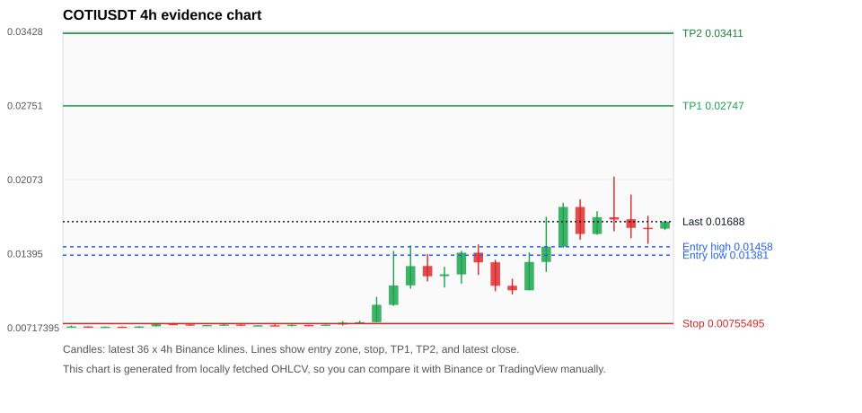
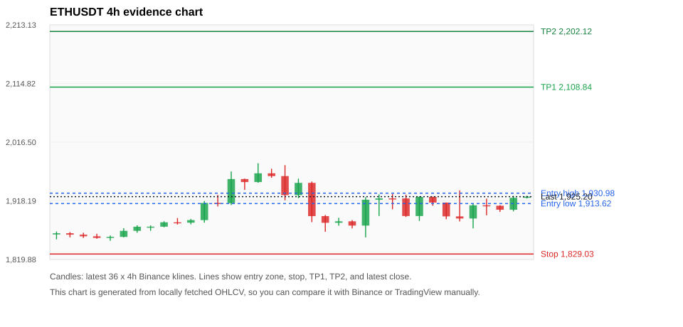
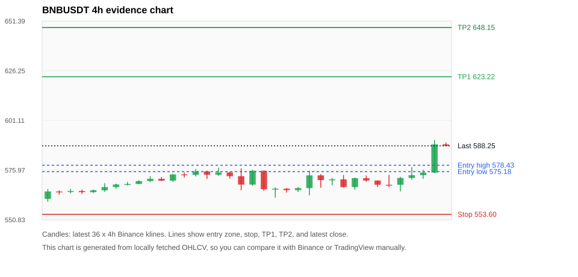
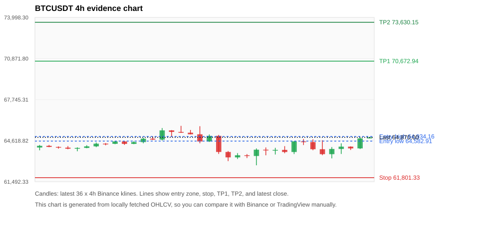
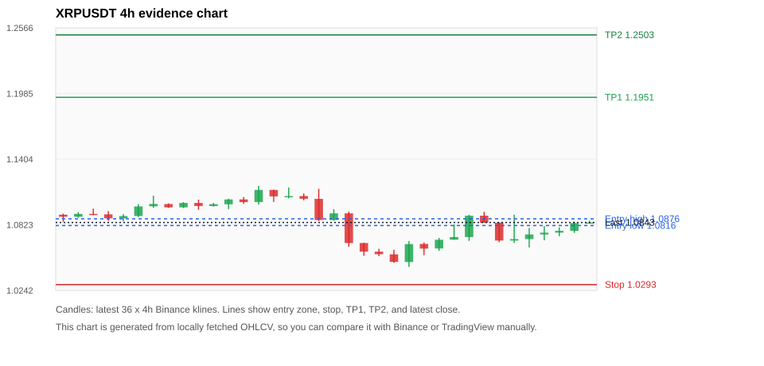

# Crypto 市场扫描报告 v1

- 报告时间：2026-07-30 20:06:00 CST
- Run ID：`20260730_120502_4a73a4c7`
- Run type：`daily_full`
- 数据来源：SQLite
- 报告版本：v1
- 扫描 ID：ac6f6d17c4a3
- 数据源：Binance public spot API + CoinGecko/CoinMarketCap cross-check
- 过滤条件：USDT spot; 24h quote volume >= 30,000,000; trades >= 30,000; exclude stables/leveraged tokens; analyze 1h/4h/1d klines
- 默认单笔风险：账户权益的 1.00%

## 限制说明

- 交易信号仍以 Binance 现货公开 K 线为主源；外部数据源用于一致性复核。
- 结果是研究和模拟盘计划，不是确定收益或实盘下单指令。
- 历史长度过滤：候选币至少需要 180 根 1d K 线。
- 数据质量验证池：先验证 score 排名前 min(top_n * 2, 10) 的候选，再按 action + score 补足最终名单。
- 大盘环境过滤：NEUTRAL; BTC/ETH 大盘未完全确认强势，山寨币买入候选降级为观察。 BTC 7d=-0.3517413562764582; ETH 7d=2.492041014065305.
- 已启用数据交叉验证：Binance 主源 + CoinGecko 自动对照；CoinMarketCap 在配置 API Key 后自动对照。
- COTIUSDT 交叉验证状态 DATA_ERROR：At least one external provider disagrees materially or symbol mapping failed.
- ETHUSDT 交叉验证状态 DATA_WARNING：At least one external provider needs manual review.
- BNBUSDT 交叉验证状态 DATA_WARNING：At least one external provider needs manual review.
- BTCUSDT 交叉验证状态 DATA_WARNING：At least one external provider needs manual review.
- XRPUSDT 交叉验证状态 DATA_WARNING：At least one external provider needs manual review.
- SOLUSDT 交叉验证状态 DATA_WARNING：At least one external provider needs manual review.
- ZECUSDT 交叉验证状态 DATA_WARNING：At least one external provider needs manual review.
- DOGEUSDT 交叉验证状态 DATA_WARNING：At least one external provider needs manual review.
- BANKUSDT 交叉验证状态 DATA_WARNING：At least one external provider needs manual review.

## 5 个候选交易计划

| Rank | Coin | Action | Setup | Entry Zone | Stop Loss | TP1 | TP2 / Exit Rule | R/R | Verdict |
|---:|---|---|---|---:|---:|---:|---|---:|---|
| 1 | `COTI` | `WATCH_ONLY` | 涨幅较远，只等深回调 | 0.01381 - 0.01458 | 0.00755495 | 0.02747 | 0.03411 或跌破 4h 关键支撑 | 2.00-3.00 | 只观察 |
| 2 | `ETH` | `WATCH_ONLY` | 回踩支撑/4h EMA 附近 | 1,913.62 - 1,930.98 | 1,829.03 | 2,108.84 | 2,202.12 或跌破 4h 关键支撑 | 2.00-3.00 | 只观察 |
| 3 | `BNB` | `WATCH_ONLY` | 回踩支撑/4h EMA 附近 | 575.18 - 578.43 | 553.60 | 623.22 | 648.15 或跌破 4h 关键支撑 | 2.00-3.07 | 只等回调 |
| 4 | `BTC` | `WATCH_ONLY` | 回踩支撑/4h EMA 附近 | 64,582.91 - 64,934.16 | 61,801.33 | 70,672.94 | 73,630.15 或跌破 4h 关键支撑 | 2.00-3.00 | 只观察 |
| 5 | `XRP` | `WATCH_ONLY` | 回踩支撑/4h EMA 附近 | 1.0816 - 1.0876 | 1.0293 | 1.1951 | 1.2503 或跌破 4h 关键支撑 | 2.00-3.00 | 只观察 |

## 数据交叉验证摘要

价格差异以 Binance 当前价为基准；成交量口径不同，Binance 是 USDT 现货成交额，CoinGecko/CoinMarketCap 通常是全市场成交量。

| Rank | Coin | Data Status | Max Price Diff | Max 24h Diff | Message |
|---:|---|---|---:|---:|---|
| 1 | `COTI` | DATA_ERROR | 2.40% | 2.62 pts | At least one external provider disagrees materially or symbol mapping failed. |
| 2 | `ETH` | DATA_WARNING | 0.19% | 0.11 pts | At least one external provider needs manual review. |
| 3 | `BNB` | DATA_WARNING | 0.06% | 0.10 pts | At least one external provider needs manual review. |
| 4 | `BTC` | DATA_WARNING | 0.15% | 0.13 pts | At least one external provider needs manual review. |
| 5 | `XRP` | DATA_WARNING | 0.12% | 0.57 pts | At least one external provider needs manual review. |

## 候选币说明

### 1. COTI `COTIUSDT`



- 入选原因：涨幅较远，只等深回调；24h +14.06%，7d +127.19%，4h RSI 63.20，24h 成交额 $38.8M。
- 交易失效条件：跌破 0.00755495 或 4h 收盘重新失守关键支撑。
- 主要风险：距离支撑偏远，不能追市价；24h 振幅较大，回撤风险高；成交量突增，可能是事件驱动；数据交叉验证出现重大差异或映射失败，先不要直接执行计划。
- 数据交叉验证：DATA_ERROR；At least one external provider disagrees materially or symbol mapping failed.

#### 可点击人工验证

- [Binance 交易页](https://www.binance.com/en/trade/COTI_USDT)
- [TradingView 图表](https://www.tradingview.com/chart/?symbol=BINANCE%3ACOTIUSDT)
- [CoinGecko 搜索](https://www.coingecko.com/en/search?query=COTI)
- [CoinMarketCap 搜索](https://coinmarketcap.com/search/?q=COTI)

#### 多数据源对照

| Source | Status | Asset ID | Price | 24h Change | 24h Volume | Price Diff | 24h Diff | Updated | Message |
|---|---|---|---:|---:|---:|---:|---:|---|---|
| Binance | DATA_OK | COTIUSDT | 0.01688 | +14.06% | $38.8M | 0.00% | 0.00 pts | 2026-07-30T12:05:25+00:00 | Primary market data source used by scanner. |
| CoinGecko | DATA_ERROR | coti | 0.01649 | +13.40% | $171.0M | 2.34% | 0.66 pts | 2026-07-30T12:05:24.064Z | price diff 2.34% exceeds error threshold |
| CoinMarketCap | DATA_ERROR | 3992 | 0.01648 | +11.44% | $204.9M | 2.40% | 2.62 pts | 2026-07-30T12:04:03.000Z | price diff 2.40% exceeds error threshold |

#### 指标证据

| 指标 | 数值 | 人工核对用途 |
|---|---:|---|
| 当前价 | 0.01688 | 与 Binance/TradingView 当前价格对照 |
| 24h 涨跌 | +14.06% | 与交易所 24h 涨跌对照 |
| 7d 涨跌 | +127.19% | 判断短线趋势是否延续 |
| 4h EMA20 | 0.01378 | 判断短期趋势支撑 |
| 4h EMA50 | 0.01104 | 判断中期趋势支撑 |
| 1d EMA20 | 0.009918614 | 判断日线趋势 |
| 1d EMA50 | 0.0095669023 | 判断日线趋势 |
| 4h RSI14 | 63.20 | 判断是否过热/过弱 |
| 4h ATR14 | 0.0030671429 | 推导止损和入场缓冲 |
| 最近 18 根 4h 最低点 | 0.00767 | 支撑/止损参考 |
| 最近 36 根 4h 最高点 | 0.02100 | TP/压力参考 |
| 支撑位 | 0.01378 | 入场区间推导基础 |

#### 交易计划推导

- 支撑位 = 最近低点、4h EMA20、4h EMA50、1d EMA20 中不高于当前价的最高有效支撑 = `0.01378`。
- 入场区间 = 支撑位附近 + ATR 缓冲 = `0.01381 - 0.01458`。
- 止损 = min(最近 18 根 4h 最低点 * 0.985, 入场中位价 - 1.15 * ATR14) = `0.00755495`。
- TP1 = max(最近 36 根 4h 最高点 * 0.995, 入场中位价 + 2R) = `0.02747`。
- TP2 = max(入场中位价 + 3R, TP1 * 1.04) = `0.03411`。

#### 最近 10 根 4h K线

| UTC 开盘时间 | Open | High | Low | Close | Quote Volume | Trades |
|---|---:|---:|---:|---:|---:|---:|
| 2026-07-29T00:00+00:00 | 0.01101 | 0.01166 | 0.01022 | 0.01060 | $1.2M | 25387 |
| 2026-07-29T04:00+00:00 | 0.01060 | 0.01406 | 0.01060 | 0.01319 | $2.6M | 52835 |
| 2026-07-29T08:00+00:00 | 0.01319 | 0.01732 | 0.01227 | 0.01459 | $10.4M | 177184 |
| 2026-07-29T12:00+00:00 | 0.01459 | 0.01861 | 0.01447 | 0.01822 | $7.2M | 117153 |
| 2026-07-29T16:00+00:00 | 0.01822 | 0.01892 | 0.01522 | 0.01575 | $7.3M | 113734 |
| 2026-07-29T20:00+00:00 | 0.01575 | 0.01784 | 0.01568 | 0.01729 | $3.7M | 63674 |
| 2026-07-30T00:00+00:00 | 0.01728 | 0.02100 | 0.01599 | 0.01707 | $9.7M | 135541 |
| 2026-07-30T04:00+00:00 | 0.01710 | 0.01936 | 0.01536 | 0.01631 | $5.8M | 92705 |
| 2026-07-30T08:00+00:00 | 0.01632 | 0.01742 | 0.01485 | 0.01623 | $5.2M | 94172 |
| 2026-07-30T12:00+00:00 | 0.01624 | 0.01695 | 0.01612 | 0.01688 | $187,155 | 3297 |

### 2. ETH `ETHUSDT`



- 入选原因：回踩支撑/4h EMA 附近；24h +0.64%，7d +1.39%，4h RSI 60.24，24h 成交额 $547.5M。
- 交易失效条件：跌破 1829.0268 或 4h 收盘重新失守关键支撑。
- 主要风险：主要风险是大盘同步回撤；数据交叉验证需要人工复核；数据交叉验证状态为 DATA_WARNING，买入候选降级为观察。
- 数据交叉验证：DATA_WARNING；At least one external provider needs manual review.

#### 可点击人工验证

- [Binance 交易页](https://www.binance.com/en/trade/ETH_USDT)
- [TradingView 图表](https://www.tradingview.com/chart/?symbol=BINANCE%3AETHUSDT)
- [CoinGecko 搜索](https://www.coingecko.com/en/search?query=ETH)
- [CoinMarketCap 搜索](https://coinmarketcap.com/search/?q=ETH)

#### 多数据源对照

| Source | Status | Asset ID | Price | 24h Change | 24h Volume | Price Diff | 24h Diff | Updated | Message |
|---|---|---|---:|---:|---:|---:|---:|---|---|
| Binance | DATA_OK | ETHUSDT | 1,925.20 | +0.64% | $547.5M | 0.00% | 0.00 pts | 2026-07-30T12:05:25+00:00 | Primary market data source used by scanner. |
| CoinGecko | DATA_OK | ethereum | 1,922.92 | +0.60% | $9.85B | 0.12% | 0.04 pts | 2026-07-30T12:03:20.000Z | External source agrees with Binance within thresholds. |
| CoinMarketCap | DATA_WARNING | 1027 | 1,921.58 | +0.53% | $11.22B | 0.19% | 0.11 pts | 2026-07-30T12:04:03.000Z | CoinMarketCap symbol mapping has 6 matches; selected lowest cmc_rank |

#### 指标证据

| 指标 | 数值 | 人工核对用途 |
|---|---:|---|
| 当前价 | 1,925.20 | 与 Binance/TradingView 当前价格对照 |
| 24h 涨跌 | +0.64% | 与交易所 24h 涨跌对照 |
| 7d 涨跌 | +1.39% | 判断短线趋势是否延续 |
| 4h EMA20 | 1,909.80 | 判断短期趋势支撑 |
| 4h EMA50 | 1,901.85 | 判断中期趋势支撑 |
| 1d EMA20 | 1,873.42 | 判断日线趋势 |
| 1d EMA50 | 1,847.85 | 判断日线趋势 |
| 4h RSI14 | 60.24 | 判断是否过热/过弱 |
| 4h ATR14 | 30.5543 | 推导止损和入场缓冲 |
| 最近 18 根 4h 最低点 | 1,856.88 | 支撑/止损参考 |
| 最近 36 根 4h 最高点 | 1,981.24 | TP/压力参考 |
| 支撑位 | 1,909.80 | 入场区间推导基础 |

#### 交易计划推导

- 支撑位 = 最近低点、4h EMA20、4h EMA50、1d EMA20 中不高于当前价的最高有效支撑 = `1,909.80`。
- 入场区间 = 支撑位附近 + ATR 缓冲 = `1,913.62 - 1,930.98`。
- 止损 = min(最近 18 根 4h 最低点 * 0.985, 入场中位价 - 1.15 * ATR14) = `1,829.03`。
- TP1 = max(最近 36 根 4h 最高点 * 0.995, 入场中位价 + 2R) = `2,108.84`。
- TP2 = max(入场中位价 + 3R, TP1 * 1.04) = `2,202.12`。

#### 最近 10 根 4h K线

| UTC 开盘时间 | Open | High | Low | Close | Quote Volume | Trades |
|---|---:|---:|---:|---:|---:|---:|
| 2026-07-29T00:00+00:00 | 1,922.22 | 1,928.51 | 1,891.17 | 1,892.70 | $64.4M | 463804 |
| 2026-07-29T04:00+00:00 | 1,892.70 | 1,925.68 | 1,884.51 | 1,924.71 | $74.4M | 337978 |
| 2026-07-29T08:00+00:00 | 1,924.71 | 1,925.35 | 1,910.00 | 1,915.26 | $56.6M | 242025 |
| 2026-07-29T12:00+00:00 | 1,915.26 | 1,915.27 | 1,887.31 | 1,892.11 | $120.1M | 667071 |
| 2026-07-29T16:00+00:00 | 1,892.11 | 1,935.68 | 1,883.70 | 1,888.56 | $162.1M | 891662 |
| 2026-07-29T20:00+00:00 | 1,888.57 | 1,913.17 | 1,872.00 | 1,910.72 | $91.2M | 448329 |
| 2026-07-30T00:00+00:00 | 1,910.72 | 1,921.92 | 1,893.99 | 1,909.99 | $62.7M | 366831 |
| 2026-07-30T04:00+00:00 | 1,910.00 | 1,910.93 | 1,899.59 | 1,903.25 | $55.5M | 298425 |
| 2026-07-30T08:00+00:00 | 1,903.26 | 1,926.44 | 1,900.51 | 1,923.22 | $55.3M | 332450 |
| 2026-07-30T12:00+00:00 | 1,923.25 | 1,926.55 | 1,922.19 | 1,925.20 | $1.4M | 5769 |

### 3. BNB `BNBUSDT`



- 入选原因：回踩支撑/4h EMA 附近；24h +3.17%，7d +3.89%，4h RSI 75.95，24h 成交额 $67.0M。
- 交易失效条件：跌破 553.59955 或 4h 收盘重新失守关键支撑。
- 主要风险：4h RSI 偏热；数据交叉验证需要人工复核。
- 数据交叉验证：DATA_WARNING；At least one external provider needs manual review.

#### 可点击人工验证

- [Binance 交易页](https://www.binance.com/en/trade/BNB_USDT)
- [TradingView 图表](https://www.tradingview.com/chart/?symbol=BINANCE%3ABNBUSDT)
- [CoinGecko 搜索](https://www.coingecko.com/en/search?query=BNB)
- [CoinMarketCap 搜索](https://coinmarketcap.com/search/?q=BNB)

#### 多数据源对照

| Source | Status | Asset ID | Price | 24h Change | 24h Volume | Price Diff | 24h Diff | Updated | Message |
|---|---|---|---:|---:|---:|---:|---:|---|---|
| Binance | DATA_OK | BNBUSDT | 588.25 | +3.17% | $67.0M | 0.00% | 0.00 pts | 2026-07-30T12:05:25+00:00 | Primary market data source used by scanner. |
| CoinGecko | DATA_OK | binancecoin | 588.58 | +3.10% | $699.5M | 0.06% | 0.06 pts | 2026-07-30T12:03:20.000Z | External source agrees with Binance within thresholds. |
| CoinMarketCap | DATA_WARNING | 1839 | 588.54 | +3.27% | $1.18B | 0.05% | 0.10 pts | 2026-07-30T12:04:03.000Z | CoinMarketCap symbol mapping has 4 matches; selected lowest cmc_rank |

#### 指标证据

| 指标 | 数值 | 人工核对用途 |
|---|---:|---|
| 当前价 | 588.25 | 与 Binance/TradingView 当前价格对照 |
| 24h 涨跌 | +3.17% | 与交易所 24h 涨跌对照 |
| 7d 涨跌 | +3.89% | 判断短线趋势是否延续 |
| 4h EMA20 | 574.04 | 判断短期趋势支撑 |
| 4h EMA50 | 571.97 | 判断中期趋势支撑 |
| 1d EMA20 | 573.23 | 判断日线趋势 |
| 1d EMA50 | 582.05 | 判断日线趋势 |
| 4h RSI14 | 75.95 | 判断是否过热/过弱 |
| 4h ATR14 | 6.2743 | 推导止损和入场缓冲 |
| 最近 18 根 4h 最低点 | 562.03 | 支撑/止损参考 |
| 最近 36 根 4h 最高点 | 591.25 | TP/压力参考 |
| 支撑位 | 574.04 | 入场区间推导基础 |

#### 交易计划推导

- 支撑位 = 最近低点、4h EMA20、4h EMA50、1d EMA20 中不高于当前价的最高有效支撑 = `574.04`。
- 入场区间 = 支撑位附近 + ATR 缓冲 = `575.18 - 578.43`。
- 止损 = min(最近 18 根 4h 最低点 * 0.985, 入场中位价 - 1.15 * ATR14) = `553.60`。
- TP1 = max(最近 36 根 4h 最高点 * 0.995, 入场中位价 + 2R) = `623.22`。
- TP2 = max(入场中位价 + 3R, TP1 * 1.04) = `648.15`。

#### 最近 10 根 4h K线

| UTC 开盘时间 | Open | High | Low | Close | Quote Volume | Trades |
|---|---:|---:|---:|---:|---:|---:|
| 2026-07-29T00:00+00:00 | 571.29 | 573.50 | 567.10 | 567.38 | $6.8M | 79350 |
| 2026-07-29T04:00+00:00 | 567.39 | 572.13 | 566.01 | 571.90 | $5.4M | 65122 |
| 2026-07-29T08:00+00:00 | 571.89 | 573.23 | 570.11 | 570.69 | $6.7M | 56292 |
| 2026-07-29T12:00+00:00 | 570.70 | 570.74 | 567.40 | 568.57 | $6.7M | 88668 |
| 2026-07-29T16:00+00:00 | 568.57 | 573.56 | 567.37 | 568.54 | $10.6M | 114464 |
| 2026-07-29T20:00+00:00 | 568.55 | 572.56 | 565.27 | 571.99 | $5.7M | 62627 |
| 2026-07-30T00:00+00:00 | 571.99 | 577.51 | 571.05 | 573.42 | $8.5M | 73778 |
| 2026-07-30T04:00+00:00 | 573.42 | 576.10 | 571.56 | 574.72 | $6.6M | 63304 |
| 2026-07-30T08:00+00:00 | 574.72 | 591.25 | 574.41 | 589.00 | $28.1M | 201224 |
| 2026-07-30T12:00+00:00 | 589.00 | 589.94 | 588.11 | 588.25 | $887,527 | 6016 |

### 4. BTC `BTCUSDT`



- 入选原因：回踩支撑/4h EMA 附近；24h +0.63%，7d -0.02%，4h RSI 66.78，24h 成交额 $1.29B。
- 交易失效条件：跌破 61801.333 或 4h 收盘重新失守关键支撑。
- 主要风险：7d 趋势未确认；数据交叉验证需要人工复核。
- 数据交叉验证：DATA_WARNING；At least one external provider needs manual review.

#### 可点击人工验证

- [Binance 交易页](https://www.binance.com/en/trade/BTC_USDT)
- [TradingView 图表](https://www.tradingview.com/chart/?symbol=BINANCE%3ABTCUSDT)
- [CoinGecko 搜索](https://www.coingecko.com/en/search?query=BTC)
- [CoinMarketCap 搜索](https://coinmarketcap.com/search/?q=BTC)

#### 多数据源对照

| Source | Status | Asset ID | Price | 24h Change | 24h Volume | Price Diff | 24h Diff | Updated | Message |
|---|---|---|---:|---:|---:|---:|---:|---|---|
| Binance | DATA_OK | BTCUSDT | 64,870.00 | +0.63% | $1.29B | 0.00% | 0.00 pts | 2026-07-30T12:05:25+00:00 | Primary market data source used by scanner. |
| CoinGecko | DATA_OK | bitcoin | 64,773.00 | +0.50% | $30.82B | 0.15% | 0.13 pts | 2026-07-30T12:03:20.000Z | External source agrees with Binance within thresholds. |
| CoinMarketCap | DATA_WARNING | 1 | 64,790.31 | +0.62% | $30.98B | 0.12% | 0.01 pts | 2026-07-30T12:04:03.000Z | CoinMarketCap symbol mapping has 13 matches; selected lowest cmc_rank |

#### 指标证据

| 指标 | 数值 | 人工核对用途 |
|---|---:|---|
| 当前价 | 64,870.00 | 与 Binance/TradingView 当前价格对照 |
| 24h 涨跌 | +0.63% | 与交易所 24h 涨跌对照 |
| 7d 涨跌 | -0.02% | 判断短线趋势是否延续 |
| 4h EMA20 | 64,276.30 | 判断短期趋势支撑 |
| 4h EMA50 | 64,454.00 | 判断中期趋势支撑 |
| 1d EMA20 | 64,342.70 | 判断日线趋势 |
| 1d EMA50 | 64,929.50 | 判断日线趋势 |
| 4h RSI14 | 66.78 | 判断是否过热/过弱 |
| 4h ATR14 | 685.95 | 推导止损和入场缓冲 |
| 最近 18 根 4h 最低点 | 62,742.47 | 支撑/止损参考 |
| 最近 36 根 4h 最高点 | 65,744.60 | TP/压力参考 |
| 支撑位 | 64,454.00 | 入场区间推导基础 |

#### 交易计划推导

- 支撑位 = 最近低点、4h EMA20、4h EMA50、1d EMA20 中不高于当前价的最高有效支撑 = `64,454.00`。
- 入场区间 = 支撑位附近 + ATR 缓冲 = `64,582.91 - 64,934.16`。
- 止损 = min(最近 18 根 4h 最低点 * 0.985, 入场中位价 - 1.15 * ATR14) = `61,801.33`。
- TP1 = max(最近 36 根 4h 最高点 * 0.995, 入场中位价 + 2R) = `70,672.94`。
- TP2 = max(入场中位价 + 3R, TP1 * 1.04) = `73,630.15`。

#### 最近 10 根 4h K线

| UTC 开盘时间 | Open | High | Low | Close | Quote Volume | Trades |
|---|---:|---:|---:|---:|---:|---:|
| 2026-07-29T00:00+00:00 | 63,915.00 | 64,200.00 | 63,658.00 | 63,753.03 | $150.0M | 530540 |
| 2026-07-29T04:00+00:00 | 63,753.04 | 64,575.99 | 63,598.00 | 64,561.00 | $174.5M | 440332 |
| 2026-07-29T08:00+00:00 | 64,561.01 | 64,744.81 | 64,283.83 | 64,507.54 | $115.4M | 303739 |
| 2026-07-29T12:00+00:00 | 64,507.53 | 64,718.87 | 63,886.00 | 63,964.01 | $175.8M | 813636 |
| 2026-07-29T16:00+00:00 | 63,964.01 | 64,648.79 | 63,511.00 | 63,589.46 | $294.6M | 988525 |
| 2026-07-29T20:00+00:00 | 63,589.46 | 64,131.44 | 63,267.34 | 63,984.28 | $165.4M | 538522 |
| 2026-07-30T00:00+00:00 | 63,984.29 | 64,411.76 | 63,603.92 | 64,161.98 | $149.6M | 470648 |
| 2026-07-30T04:00+00:00 | 64,161.98 | 64,182.00 | 63,907.85 | 64,026.00 | $195.1M | 613375 |
| 2026-07-30T08:00+00:00 | 64,026.00 | 64,885.18 | 63,980.54 | 64,788.00 | $308.9M | 1000641 |
| 2026-07-30T12:00+00:00 | 64,788.01 | 64,898.47 | 64,788.00 | 64,870.00 | $5.6M | 10949 |

### 5. XRP `XRPUSDT`



- 入选原因：回踩支撑/4h EMA 附近；24h +0.17%，7d -2.46%，4h RSI 64.99，24h 成交额 $66.3M。
- 交易失效条件：跌破 1.029325 或 4h 收盘重新失守关键支撑。
- 主要风险：日线趋势未完全确认；7d 趋势未确认；数据交叉验证需要人工复核。
- 数据交叉验证：DATA_WARNING；At least one external provider needs manual review.

#### 可点击人工验证

- [Binance 交易页](https://www.binance.com/en/trade/XRP_USDT)
- [TradingView 图表](https://www.tradingview.com/chart/?symbol=BINANCE%3AXRPUSDT)
- [CoinGecko 搜索](https://www.coingecko.com/en/search?query=XRP)
- [CoinMarketCap 搜索](https://coinmarketcap.com/search/?q=XRP)

#### 多数据源对照

| Source | Status | Asset ID | Price | 24h Change | 24h Volume | Price Diff | 24h Diff | Updated | Message |
|---|---|---|---:|---:|---:|---:|---:|---|---|
| Binance | DATA_OK | XRPUSDT | 1.0843 | +0.17% | $66.3M | 0.00% | 0.00 pts | 2026-07-30T12:05:25+00:00 | Primary market data source used by scanner. |
| CoinGecko | DATA_OK | ripple | 1.0830 | -0.40% | $1.18B | 0.12% | 0.57 pts | 2026-07-30T12:02:20.000Z | External source agrees with Binance within thresholds. |
| CoinMarketCap | DATA_WARNING | 52 | 1.0835 | +0.10% | $1.26B | 0.07% | 0.07 pts | 2026-07-30T12:04:03.000Z | CoinMarketCap symbol mapping has 3 matches; selected lowest cmc_rank |

#### 指标证据

| 指标 | 数值 | 人工核对用途 |
|---|---:|---|
| 当前价 | 1.0843 | 与 Binance/TradingView 当前价格对照 |
| 24h 涨跌 | +0.17% | 与交易所 24h 涨跌对照 |
| 7d 涨跌 | -2.46% | 判断短线趋势是否延续 |
| 4h EMA20 | 1.0794 | 判断短期趋势支撑 |
| 4h EMA50 | 1.0894 | 判断中期趋势支撑 |
| 1d EMA20 | 1.0965 | 判断日线趋势 |
| 1d EMA50 | 1.1296 | 判断日线趋势 |
| 4h RSI14 | 64.99 | 判断是否过热/过弱 |
| 4h ATR14 | 0.01396 | 推导止损和入场缓冲 |
| 最近 18 根 4h 最低点 | 1.0450 | 支撑/止损参考 |
| 最近 36 根 4h 最高点 | 1.1167 | TP/压力参考 |
| 支撑位 | 1.0794 | 入场区间推导基础 |

#### 交易计划推导

- 支撑位 = 最近低点、4h EMA20、4h EMA50、1d EMA20 中不高于当前价的最高有效支撑 = `1.0794`。
- 入场区间 = 支撑位附近 + ATR 缓冲 = `1.0816 - 1.0876`。
- 止损 = min(最近 18 根 4h 最低点 * 0.985, 入场中位价 - 1.15 * ATR14) = `1.0293`。
- TP1 = max(最近 36 根 4h 最高点 * 0.995, 入场中位价 + 2R) = `1.1951`。
- TP2 = max(入场中位价 + 3R, TP1 * 1.04) = `1.2503`。

#### 最近 10 根 4h K线

| UTC 开盘时间 | Open | High | Low | Close | Quote Volume | Trades |
|---|---:|---:|---:|---:|---:|---:|
| 2026-07-29T00:00+00:00 | 1.0691 | 1.0825 | 1.0691 | 1.0714 | $20.8M | 107614 |
| 2026-07-29T04:00+00:00 | 1.0714 | 1.0911 | 1.0680 | 1.0903 | $15.8M | 86520 |
| 2026-07-29T08:00+00:00 | 1.0903 | 1.0937 | 1.0840 | 1.0841 | $11.0M | 53040 |
| 2026-07-29T12:00+00:00 | 1.0841 | 1.0843 | 1.0669 | 1.0683 | $12.6M | 88672 |
| 2026-07-29T16:00+00:00 | 1.0683 | 1.0912 | 1.0662 | 1.0696 | $19.0M | 125633 |
| 2026-07-29T20:00+00:00 | 1.0696 | 1.0795 | 1.0622 | 1.0737 | $11.3M | 80163 |
| 2026-07-30T00:00+00:00 | 1.0737 | 1.0811 | 1.0685 | 1.0753 | $9.8M | 53467 |
| 2026-07-30T04:00+00:00 | 1.0753 | 1.0800 | 1.0722 | 1.0769 | $6.5M | 33802 |
| 2026-07-30T08:00+00:00 | 1.0769 | 1.0850 | 1.0751 | 1.0838 | $7.4M | 31575 |
| 2026-07-30T12:00+00:00 | 1.0839 | 1.0859 | 1.0839 | 1.0843 | $312,170 | 1357 |

## 组合风控

- 不要 5 个候选全部满仓买入。
- 同时持仓总风险建议控制在账户权益的 3% - 5% 以内。
- 如果 BTC/ETH 同时破位，暂停山寨币多头计划或降低仓位。
- 第一版报告用于模拟盘和人工复核，不自动下单。

## 原始数据

```json
[
  {
    "rank": 1,
    "symbol": "COTIUSDT",
    "base_asset": "COTI",
    "price": 0.01688,
    "score": 70.86486921655771,
    "setup": "涨幅较远，只等深回调",
    "verdict": "只观察",
    "entry_low": 0.013808972460653855,
    "entry_high": 0.014579642857142857,
    "stop_loss": 0.0075549499999999995,
    "take_profit_1": 0.02747302297669507,
    "take_profit_2": 0.03411238063559342,
    "risk_reward_1": 2.0,
    "risk_reward_2": 2.9999999999999996,
    "pct_24h": 14.064,
    "pct_3d": 118.36998706338937,
    "pct_7d": 127.18707940780618,
    "quote_volume_24h": 38842545.81146,
    "trades_24h": 617637,
    "high_low_range_24h": 45.12785072563925,
    "rsi_1h": 49.95617879053462,
    "rsi_4h": 63.19957761351637,
    "ema20_4h": 0.013781409641371112,
    "ema50_4h": 0.011042089633410393,
    "ema20_1d": 0.009918613957555555,
    "ema50_1d": 0.009566902318390955,
    "atr_4h": 0.0030671428571428577,
    "macd_hist_4h": 0.000247969134948298,
    "volume_ratio_24h": 4.4754076847468385,
    "support_level": 0.013781409641371112,
    "recent_low_4h_18": 0.00767,
    "recent_high_4h_36": 0.021,
    "distance_to_support_pct": 22.48384192373958,
    "binance_trade_url": "https://www.binance.com/en/trade/COTI_USDT",
    "tradingview_url": "https://www.tradingview.com/chart/?symbol=BINANCE%3ACOTIUSDT",
    "coingecko_search_url": "https://www.coingecko.com/en/search?query=COTI",
    "coinmarketcap_search_url": "https://coinmarketcap.com/search/?q=COTI",
    "invalidation": "跌破 0.00755495 或 4h 收盘重新失守关键支撑",
    "recent_4h_klines": [
      {
        "open_time_utc": "2026-07-24T16:00+00:00",
        "open": 0.00723,
        "high": 0.00738,
        "low": 0.00723,
        "close": 0.00729,
        "quote_volume": 40362.48062,
        "trades": 1294
      },
      {
        "open_time_utc": "2026-07-24T20:00+00:00",
        "open": 0.00729,
        "high": 0.00729,
        "low": 0.00723,
        "close": 0.00724,
        "quote_volume": 8761.26569,
        "trades": 460
      },
      {
        "open_time_utc": "2026-07-25T00:00+00:00",
        "open": 0.00725,
        "high": 0.00729,
        "low": 0.00723,
        "close": 0.00727,
        "quote_volume": 7246.28344,
        "trades": 381
      },
      {
        "open_time_utc": "2026-07-25T04:00+00:00",
        "open": 0.00727,
        "high": 0.00729,
        "low": 0.00722,
        "close": 0.00722,
        "quote_volume": 7589.96573,
        "trades": 472
      },
      {
        "open_time_utc": "2026-07-25T08:00+00:00",
        "open": 0.00722,
        "high": 0.00732,
        "low": 0.00721,
        "close": 0.00729,
        "quote_volume": 13504.57809,
        "trades": 992
      },
      {
        "open_time_utc": "2026-07-25T12:00+00:00",
        "open": 0.0073,
        "high": 0.00755,
        "low": 0.0073,
        "close": 0.00752,
        "quote_volume": 27866.23305,
        "trades": 1204
      },
      {
        "open_time_utc": "2026-07-25T16:00+00:00",
        "open": 0.00752,
        "high": 0.0076,
        "low": 0.00746,
        "close": 0.00748,
        "quote_volume": 31106.66287,
        "trades": 1187
      },
      {
        "open_time_utc": "2026-07-25T20:00+00:00",
        "open": 0.00748,
        "high": 0.0075,
        "low": 0.00739,
        "close": 0.00739,
        "quote_volume": 20547.94636,
        "trades": 840
      },
      {
        "open_time_utc": "2026-07-26T00:00+00:00",
        "open": 0.00739,
        "high": 0.00744,
        "low": 0.00738,
        "close": 0.00743,
        "quote_volume": 12205.80641,
        "trades": 635
      },
      {
        "open_time_utc": "2026-07-26T04:00+00:00",
        "open": 0.00742,
        "high": 0.00755,
        "low": 0.00739,
        "close": 0.00747,
        "quote_volume": 19312.78044,
        "trades": 854
      },
      {
        "open_time_utc": "2026-07-26T08:00+00:00",
        "open": 0.00747,
        "high": 0.00749,
        "low": 0.0074,
        "close": 0.0074,
        "quote_volume": 12760.00582,
        "trades": 339
      },
      {
        "open_time_utc": "2026-07-26T12:00+00:00",
        "open": 0.00739,
        "high": 0.00742,
        "low": 0.00736,
        "close": 0.0074,
        "quote_volume": 7361.09698,
        "trades": 453
      },
      {
        "open_time_utc": "2026-07-26T16:00+00:00",
        "open": 0.0074,
        "high": 0.0075,
        "low": 0.00736,
        "close": 0.00737,
        "quote_volume": 60933.37717,
        "trades": 1504
      },
      {
        "open_time_utc": "2026-07-26T20:00+00:00",
        "open": 0.00737,
        "high": 0.00748,
        "low": 0.00731,
        "close": 0.00745,
        "quote_volume": 31989.92609,
        "trades": 864
      },
      {
        "open_time_utc": "2026-07-27T00:00+00:00",
        "open": 0.00743,
        "high": 0.00743,
        "low": 0.00736,
        "close": 0.00741,
        "quote_volume": 7252.44264,
        "trades": 331
      },
      {
        "open_time_utc": "2026-07-27T04:00+00:00",
        "open": 0.00741,
        "high": 0.00747,
        "low": 0.0074,
        "close": 0.00746,
        "quote_volume": 13431.63907,
        "trades": 596
      },
      {
        "open_time_utc": "2026-07-27T08:00+00:00",
        "open": 0.00746,
        "high": 0.00778,
        "low": 0.00736,
        "close": 0.00763,
        "quote_volume": 55509.87493,
        "trades": 1845
      },
      {
        "open_time_utc": "2026-07-27T12:00+00:00",
        "open": 0.00763,
        "high": 0.00782,
        "low": 0.0075,
        "close": 0.00768,
        "quote_volume": 111291.62827,
        "trades": 4023
      },
      {
        "open_time_utc": "2026-07-27T16:00+00:00",
        "open": 0.00768,
        "high": 0.01,
        "low": 0.00767,
        "close": 0.00927,
        "quote_volume": 1693661.63763,
        "trades": 29160
      },
      {
        "open_time_utc": "2026-07-27T20:00+00:00",
        "open": 0.00926,
        "high": 0.0142,
        "low": 0.00917,
        "close": 0.01104,
        "quote_volume": 8542220.52829,
        "trades": 167816
      },
      {
        "open_time_utc": "2026-07-28T00:00+00:00",
        "open": 0.01105,
        "high": 0.01472,
        "low": 0.01075,
        "close": 0.01281,
        "quote_volume": 4793263.72316,
        "trades": 89786
      },
      {
        "open_time_utc": "2026-07-28T04:00+00:00",
        "open": 0.01282,
        "high": 0.01391,
        "low": 0.01141,
        "close": 0.01188,
        "quote_volume": 4348644.76787,
        "trades": 63009
      },
      {
        "open_time_utc": "2026-07-28T08:00+00:00",
        "open": 0.01189,
        "high": 0.01275,
        "low": 0.01085,
        "close": 0.01206,
        "quote_volume": 3933022.5691,
        "trades": 54895
      },
      {
        "open_time_utc": "2026-07-28T12:00+00:00",
        "open": 0.01205,
        "high": 0.01421,
        "low": 0.01121,
        "close": 0.01404,
        "quote_volume": 4380157.19854,
        "trades": 63744
      },
      {
        "open_time_utc": "2026-07-28T16:00+00:00",
        "open": 0.01404,
        "high": 0.0148,
        "low": 0.012,
        "close": 0.01315,
        "quote_volume": 4518233.09759,
        "trades": 72500
      },
      {
        "open_time_utc": "2026-07-28T20:00+00:00",
        "open": 0.01316,
        "high": 0.01339,
        "low": 0.01051,
        "close": 0.01101,
        "quote_volume": 2323498.17208,
        "trades": 38980
      },
      {
        "open_time_utc": "2026-07-29T00:00+00:00",
        "open": 0.01101,
        "high": 0.01166,
        "low": 0.01022,
        "close": 0.0106,
        "quote_volume": 1152000.93562,
        "trades": 25387
      },
      {
        "open_time_utc": "2026-07-29T04:00+00:00",
        "open": 0.0106,
        "high": 0.01406,
        "low": 0.0106,
        "close": 0.01319,
        "quote_volume": 2556525.87176,
        "trades": 52835
      },
      {
        "open_time_utc": "2026-07-29T08:00+00:00",
        "open": 0.01319,
        "high": 0.01732,
        "low": 0.01227,
        "close": 0.01459,
        "quote_volume": 10376187.64703,
        "trades": 177184
      },
      {
        "open_time_utc": "2026-07-29T12:00+00:00",
        "open": 0.01459,
        "high": 0.01861,
        "low": 0.01447,
        "close": 0.01822,
        "quote_volume": 7156309.03829,
        "trades": 117153
      },
      {
        "open_time_utc": "2026-07-29T16:00+00:00",
        "open": 0.01822,
        "high": 0.01892,
        "low": 0.01522,
        "close": 0.01575,
        "quote_volume": 7302972.15291,
        "trades": 113734
      },
      {
        "open_time_utc": "2026-07-29T20:00+00:00",
        "open": 0.01575,
        "high": 0.01784,
        "low": 0.01568,
        "close": 0.01729,
        "quote_volume": 3710343.40771,
        "trades": 63674
      },
      {
        "open_time_utc": "2026-07-30T00:00+00:00",
        "open": 0.01728,
        "high": 0.021,
        "low": 0.01599,
        "close": 0.01707,
        "quote_volume": 9685494.33155,
        "trades": 135541
      },
      {
        "open_time_utc": "2026-07-30T04:00+00:00",
        "open": 0.0171,
        "high": 0.01936,
        "low": 0.01536,
        "close": 0.01631,
        "quote_volume": 5780676.00346,
        "trades": 92705
      },
      {
        "open_time_utc": "2026-07-30T08:00+00:00",
        "open": 0.01632,
        "high": 0.01742,
        "low": 0.01485,
        "close": 0.01623,
        "quote_volume": 5152826.06673,
        "trades": 94172
      },
      {
        "open_time_utc": "2026-07-30T12:00+00:00",
        "open": 0.01624,
        "high": 0.01695,
        "low": 0.01612,
        "close": 0.01688,
        "quote_volume": 187155.14385,
        "trades": 3297
      }
    ],
    "risks": [
      "距离支撑偏远，不能追市价",
      "24h 振幅较大，回撤风险高",
      "成交量突增，可能是事件驱动",
      "数据交叉验证出现重大差异或映射失败，先不要直接执行计划"
    ],
    "data_quality_status": "DATA_ERROR",
    "data_quality_message": "At least one external provider disagrees materially or symbol mapping failed.",
    "data_checks": [
      {
        "provider": "Binance",
        "status": "DATA_OK",
        "provider_asset_id": "COTIUSDT",
        "provider_symbol": "COTIUSDT",
        "price_usd": 0.01688,
        "pct_24h": 14.064,
        "volume_24h": 38842545.81146,
        "last_updated": null,
        "fetched_at_utc": "2026-07-30T12:05:25+00:00",
        "price_diff_pct": 0.0,
        "pct_24h_diff": 0.0,
        "volume_note": "Binance USDT spot 24h quoteVolume.",
        "message": "Primary market data source used by scanner."
      },
      {
        "provider": "CoinGecko",
        "status": "DATA_ERROR",
        "provider_asset_id": "coti",
        "provider_symbol": "COTI",
        "price_usd": 0.01648535,
        "pct_24h": 13.40487,
        "volume_24h": 171024829.0,
        "last_updated": "2026-07-30T12:05:24.064Z",
        "fetched_at_utc": "2026-07-30T12:05:25+00:00",
        "price_diff_pct": 2.3379739336492884,
        "pct_24h_diff": 0.6591299999999993,
        "volume_note": "CoinGecko total market volume; not the same venue scope as Binance quoteVolume.",
        "message": "price diff 2.34% exceeds error threshold"
      },
      {
        "provider": "CoinMarketCap",
        "status": "DATA_ERROR",
        "provider_asset_id": "3992",
        "provider_symbol": "COTI",
        "price_usd": 0.01647558312205786,
        "pct_24h": 11.44342195,
        "volume_24h": 204895964.45637769,
        "last_updated": "2026-07-30T12:04:03.000Z",
        "fetched_at_utc": "2026-07-30T12:05:25+00:00",
        "price_diff_pct": 2.3958345849652862,
        "pct_24h_diff": 2.6205780500000007,
        "volume_note": "CoinMarketCap total market volume; not the same venue scope as Binance quoteVolume.",
        "message": "price diff 2.40% exceeds error threshold"
      }
    ],
    "action": "WATCH_ONLY"
  },
  {
    "rank": 2,
    "symbol": "ETHUSDT",
    "base_asset": "ETH",
    "price": 1925.2,
    "score": 63.03574257026903,
    "setup": "回踩支撑/4h EMA 附近",
    "verdict": "只观察",
    "entry_low": 1913.6232704331078,
    "entry_high": 1930.9755999999998,
    "stop_loss": 1829.0268,
    "take_profit_1": 2108.844705649661,
    "take_profit_2": 2202.117340866215,
    "risk_reward_1": 2.0,
    "risk_reward_2": 3.0,
    "pct_24h": 0.639,
    "pct_3d": -1.8336086805768037,
    "pct_7d": 1.3946237465239708,
    "quote_volume_24h": 547479147.994727,
    "trades_24h": 3005361,
    "high_low_range_24h": 3.4017094017094074,
    "rsi_1h": 60.90534979423869,
    "rsi_4h": 60.241620042580614,
    "ema20_4h": 1909.803663106894,
    "ema50_4h": 1901.8490042747344,
    "ema20_1d": 1873.4167682544407,
    "ema50_1d": 1847.8458216318013,
    "atr_4h": 30.55428571428573,
    "macd_hist_4h": 0.7769839353121686,
    "volume_ratio_24h": 1.2787565785259773,
    "support_level": 1909.803663106894,
    "recent_low_4h_18": 1856.88,
    "recent_high_4h_36": 1981.24,
    "distance_to_support_pct": 0.8061738067911772,
    "binance_trade_url": "https://www.binance.com/en/trade/ETH_USDT",
    "tradingview_url": "https://www.tradingview.com/chart/?symbol=BINANCE%3AETHUSDT",
    "coingecko_search_url": "https://www.coingecko.com/en/search?query=ETH",
    "coinmarketcap_search_url": "https://coinmarketcap.com/search/?q=ETH",
    "invalidation": "跌破 1829.0268 或 4h 收盘重新失守关键支撑",
    "recent_4h_klines": [
      {
        "open_time_utc": "2026-07-24T16:00+00:00",
        "open": 1861.82,
        "high": 1866.76,
        "low": 1853.5,
        "close": 1863.83,
        "quote_volume": 55477384.287484,
        "trades": 339037
      },
      {
        "open_time_utc": "2026-07-24T20:00+00:00",
        "open": 1863.84,
        "high": 1865.82,
        "low": 1856.97,
        "close": 1861.44,
        "quote_volume": 21976612.421105,
        "trades": 121160
      },
      {
        "open_time_utc": "2026-07-25T00:00+00:00",
        "open": 1861.44,
        "high": 1864.69,
        "low": 1855.93,
        "close": 1858.74,
        "quote_volume": 26039463.440314,
        "trades": 112861
      },
      {
        "open_time_utc": "2026-07-25T04:00+00:00",
        "open": 1858.74,
        "high": 1862.96,
        "low": 1854.61,
        "close": 1856.02,
        "quote_volume": 24132356.560451,
        "trades": 107612
      },
      {
        "open_time_utc": "2026-07-25T08:00+00:00",
        "open": 1856.03,
        "high": 1860.09,
        "low": 1851.22,
        "close": 1857.75,
        "quote_volume": 29755614.850639,
        "trades": 118603
      },
      {
        "open_time_utc": "2026-07-25T12:00+00:00",
        "open": 1857.75,
        "high": 1872.35,
        "low": 1856.96,
        "close": 1867.88,
        "quote_volume": 38883665.097903,
        "trades": 149234
      },
      {
        "open_time_utc": "2026-07-25T16:00+00:00",
        "open": 1867.88,
        "high": 1877.07,
        "low": 1864.65,
        "close": 1874.76,
        "quote_volume": 30385128.706757,
        "trades": 170723
      },
      {
        "open_time_utc": "2026-07-25T20:00+00:00",
        "open": 1874.77,
        "high": 1876.92,
        "low": 1867.92,
        "close": 1874.89,
        "quote_volume": 15648697.010211,
        "trades": 104080
      },
      {
        "open_time_utc": "2026-07-26T00:00+00:00",
        "open": 1874.88,
        "high": 1883.98,
        "low": 1873.85,
        "close": 1882.21,
        "quote_volume": 19473769.985199,
        "trades": 113287
      },
      {
        "open_time_utc": "2026-07-26T04:00+00:00",
        "open": 1882.21,
        "high": 1889.36,
        "low": 1878.46,
        "close": 1881.56,
        "quote_volume": 21173822.659788,
        "trades": 96548
      },
      {
        "open_time_utc": "2026-07-26T08:00+00:00",
        "open": 1881.57,
        "high": 1887.89,
        "low": 1878.74,
        "close": 1885.87,
        "quote_volume": 18091980.477335,
        "trades": 105053
      },
      {
        "open_time_utc": "2026-07-26T12:00+00:00",
        "open": 1885.87,
        "high": 1917.82,
        "low": 1881.61,
        "close": 1914.63,
        "quote_volume": 65165309.721979,
        "trades": 374375
      },
      {
        "open_time_utc": "2026-07-26T16:00+00:00",
        "open": 1914.63,
        "high": 1928.08,
        "low": 1908.75,
        "close": 1914.2,
        "quote_volume": 54448948.144189,
        "trades": 295254
      },
      {
        "open_time_utc": "2026-07-26T20:00+00:00",
        "open": 1914.21,
        "high": 1967.36,
        "low": 1911.14,
        "close": 1954.72,
        "quote_volume": 115302944.890536,
        "trades": 531446
      },
      {
        "open_time_utc": "2026-07-27T00:00+00:00",
        "open": 1954.72,
        "high": 1955.42,
        "low": 1936.51,
        "close": 1949.64,
        "quote_volume": 66645251.541259,
        "trades": 362357
      },
      {
        "open_time_utc": "2026-07-27T04:00+00:00",
        "open": 1949.65,
        "high": 1981.24,
        "low": 1948.54,
        "close": 1964.36,
        "quote_volume": 137044174.517423,
        "trades": 477109
      },
      {
        "open_time_utc": "2026-07-27T08:00+00:00",
        "open": 1964.37,
        "high": 1972.0,
        "low": 1956.87,
        "close": 1959.67,
        "quote_volume": 63477420.78172,
        "trades": 308712
      },
      {
        "open_time_utc": "2026-07-27T12:00+00:00",
        "open": 1959.67,
        "high": 1977.99,
        "low": 1919.09,
        "close": 1927.75,
        "quote_volume": 193781812.568466,
        "trades": 1050482
      },
      {
        "open_time_utc": "2026-07-27T16:00+00:00",
        "open": 1927.74,
        "high": 1955.41,
        "low": 1922.65,
        "close": 1948.31,
        "quote_volume": 72633786.766492,
        "trades": 431754
      },
      {
        "open_time_utc": "2026-07-27T20:00+00:00",
        "open": 1948.32,
        "high": 1950.54,
        "low": 1882.49,
        "close": 1892.53,
        "quote_volume": 132530190.963395,
        "trades": 565329
      },
      {
        "open_time_utc": "2026-07-28T00:00+00:00",
        "open": 1892.53,
        "high": 1894.45,
        "low": 1866.31,
        "close": 1881.38,
        "quote_volume": 93967372.848415,
        "trades": 423354
      },
      {
        "open_time_utc": "2026-07-28T04:00+00:00",
        "open": 1881.37,
        "high": 1889.66,
        "low": 1876.48,
        "close": 1883.83,
        "quote_volume": 62649039.051836,
        "trades": 258640
      },
      {
        "open_time_utc": "2026-07-28T08:00+00:00",
        "open": 1883.84,
        "high": 1885.85,
        "low": 1872.0,
        "close": 1876.68,
        "quote_volume": 57023763.994646,
        "trades": 296306
      },
      {
        "open_time_utc": "2026-07-28T12:00+00:00",
        "open": 1876.69,
        "high": 1924.41,
        "low": 1856.88,
        "close": 1920.02,
        "quote_volume": 179069374.281921,
        "trades": 801789
      },
      {
        "open_time_utc": "2026-07-28T16:00+00:00",
        "open": 1920.02,
        "high": 1928.95,
        "low": 1892.71,
        "close": 1922.23,
        "quote_volume": 99019857.244445,
        "trades": 461899
      },
      {
        "open_time_utc": "2026-07-28T20:00+00:00",
        "open": 1922.24,
        "high": 1929.67,
        "low": 1904.06,
        "close": 1922.23,
        "quote_volume": 55839239.941337,
        "trades": 263208
      },
      {
        "open_time_utc": "2026-07-29T00:00+00:00",
        "open": 1922.22,
        "high": 1928.51,
        "low": 1891.17,
        "close": 1892.7,
        "quote_volume": 64441106.318646,
        "trades": 463804
      },
      {
        "open_time_utc": "2026-07-29T04:00+00:00",
        "open": 1892.7,
        "high": 1925.68,
        "low": 1884.51,
        "close": 1924.71,
        "quote_volume": 74396844.871569,
        "trades": 337978
      },
      {
        "open_time_utc": "2026-07-29T08:00+00:00",
        "open": 1924.71,
        "high": 1925.35,
        "low": 1910.0,
        "close": 1915.26,
        "quote_volume": 56626357.926624,
        "trades": 242025
      },
      {
        "open_time_utc": "2026-07-29T12:00+00:00",
        "open": 1915.26,
        "high": 1915.27,
        "low": 1887.31,
        "close": 1892.11,
        "quote_volume": 120129701.001717,
        "trades": 667071
      },
      {
        "open_time_utc": "2026-07-29T16:00+00:00",
        "open": 1892.11,
        "high": 1935.68,
        "low": 1883.7,
        "close": 1888.56,
        "quote_volume": 162125039.597002,
        "trades": 891662
      },
      {
        "open_time_utc": "2026-07-29T20:00+00:00",
        "open": 1888.57,
        "high": 1913.17,
        "low": 1872.0,
        "close": 1910.72,
        "quote_volume": 91213959.97501,
        "trades": 448329
      },
      {
        "open_time_utc": "2026-07-30T00:00+00:00",
        "open": 1910.72,
        "high": 1921.92,
        "low": 1893.99,
        "close": 1909.99,
        "quote_volume": 62688624.09683,
        "trades": 366831
      },
      {
        "open_time_utc": "2026-07-30T04:00+00:00",
        "open": 1910.0,
        "high": 1910.93,
        "low": 1899.59,
        "close": 1903.25,
        "quote_volume": 55466800.588396,
        "trades": 298425
      },
      {
        "open_time_utc": "2026-07-30T08:00+00:00",
        "open": 1903.26,
        "high": 1926.44,
        "low": 1900.51,
        "close": 1923.22,
        "quote_volume": 55345520.105829,
        "trades": 332450
      },
      {
        "open_time_utc": "2026-07-30T12:00+00:00",
        "open": 1923.25,
        "high": 1926.55,
        "low": 1922.19,
        "close": 1925.2,
        "quote_volume": 1356375.027947,
        "trades": 5769
      }
    ],
    "risks": [
      "主要风险是大盘同步回撤",
      "数据交叉验证需要人工复核",
      "数据交叉验证状态为 DATA_WARNING，买入候选降级为观察"
    ],
    "data_quality_status": "DATA_WARNING",
    "data_quality_message": "At least one external provider needs manual review.",
    "data_checks": [
      {
        "provider": "Binance",
        "status": "DATA_OK",
        "provider_asset_id": "ETHUSDT",
        "provider_symbol": "ETHUSDT",
        "price_usd": 1925.2,
        "pct_24h": 0.639,
        "volume_24h": 547479147.994727,
        "last_updated": null,
        "fetched_at_utc": "2026-07-30T12:05:25+00:00",
        "price_diff_pct": 0.0,
        "pct_24h_diff": 0.0,
        "volume_note": "Binance USDT spot 24h quoteVolume.",
        "message": "Primary market data source used by scanner."
      },
      {
        "provider": "CoinGecko",
        "status": "DATA_OK",
        "provider_asset_id": "ethereum",
        "provider_symbol": "ETH",
        "price_usd": 1922.92,
        "pct_24h": 0.6,
        "volume_24h": 9849017559.0,
        "last_updated": "2026-07-30T12:03:20.000Z",
        "fetched_at_utc": "2026-07-30T12:05:25+00:00",
        "price_diff_pct": 0.11842925410346834,
        "pct_24h_diff": 0.039000000000000035,
        "volume_note": "CoinGecko total market volume; not the same venue scope as Binance quoteVolume.",
        "message": "External source agrees with Binance within thresholds."
      },
      {
        "provider": "CoinMarketCap",
        "status": "DATA_WARNING",
        "provider_asset_id": "1027",
        "provider_symbol": "ETH",
        "price_usd": 1921.5816772460016,
        "pct_24h": 0.5321511,
        "volume_24h": 11215374245.138449,
        "last_updated": "2026-07-30T12:04:03.000Z",
        "fetched_at_utc": "2026-07-30T12:05:25+00:00",
        "price_diff_pct": 0.18794529160598522,
        "pct_24h_diff": 0.10684890000000002,
        "volume_note": "CoinMarketCap total market volume; not the same venue scope as Binance quoteVolume.",
        "message": "CoinMarketCap symbol mapping has 6 matches; selected lowest cmc_rank"
      }
    ],
    "action": "WATCH_ONLY"
  },
  {
    "rank": 3,
    "symbol": "BNBUSDT",
    "base_asset": "BNB",
    "price": 588.25,
    "score": 60.60889884300412,
    "setup": "回踩支撑/4h EMA 附近",
    "verdict": "只等回调",
    "entry_low": 575.1840501817535,
    "entry_high": 578.4279782253029,
    "stop_loss": 553.59955,
    "take_profit_1": 623.2189426105846,
    "take_profit_2": 648.147700315008,
    "risk_reward_1": 2.0,
    "risk_reward_2": 3.0742161100368497,
    "pct_24h": 3.165,
    "pct_3d": 2.4076459733296307,
    "pct_7d": 3.8852097130242846,
    "quote_volume_24h": 66996353.49046,
    "trades_24h": 608872,
    "high_low_range_24h": 4.596033753781392,
    "rsi_1h": 82.29088168801796,
    "rsi_4h": 75.94907407407408,
    "ema20_4h": 574.0359782253029,
    "ema50_4h": 571.9710801276135,
    "ema20_1d": 573.2315200799161,
    "ema50_1d": 582.0522276548492,
    "atr_4h": 6.274285714285733,
    "macd_hist_4h": 1.9346274097042686,
    "volume_ratio_24h": 1.5636808977252867,
    "support_level": 574.0359782253029,
    "recent_low_4h_18": 562.03,
    "recent_high_4h_36": 591.25,
    "distance_to_support_pct": 2.47615520871034,
    "binance_trade_url": "https://www.binance.com/en/trade/BNB_USDT",
    "tradingview_url": "https://www.tradingview.com/chart/?symbol=BINANCE%3ABNBUSDT",
    "coingecko_search_url": "https://www.coingecko.com/en/search?query=BNB",
    "coinmarketcap_search_url": "https://coinmarketcap.com/search/?q=BNB",
    "invalidation": "跌破 553.59955 或 4h 收盘重新失守关键支撑",
    "recent_4h_klines": [
      {
        "open_time_utc": "2026-07-24T16:00+00:00",
        "open": 561.41,
        "high": 566.37,
        "low": 560.0,
        "close": 565.16,
        "quote_volume": 8551049.2252,
        "trades": 79672
      },
      {
        "open_time_utc": "2026-07-24T20:00+00:00",
        "open": 565.17,
        "high": 565.71,
        "low": 563.6,
        "close": 564.9,
        "quote_volume": 3504994.04921,
        "trades": 41642
      },
      {
        "open_time_utc": "2026-07-25T00:00+00:00",
        "open": 564.91,
        "high": 566.47,
        "low": 564.18,
        "close": 565.37,
        "quote_volume": 6329386.8843,
        "trades": 37017
      },
      {
        "open_time_utc": "2026-07-25T04:00+00:00",
        "open": 565.37,
        "high": 566.15,
        "low": 563.9,
        "close": 564.81,
        "quote_volume": 4500782.34987,
        "trades": 35213
      },
      {
        "open_time_utc": "2026-07-25T08:00+00:00",
        "open": 564.81,
        "high": 566.16,
        "low": 564.34,
        "close": 565.74,
        "quote_volume": 5277069.29981,
        "trades": 37529
      },
      {
        "open_time_utc": "2026-07-25T12:00+00:00",
        "open": 565.75,
        "high": 569.33,
        "low": 564.98,
        "close": 567.38,
        "quote_volume": 7082588.22821,
        "trades": 53425
      },
      {
        "open_time_utc": "2026-07-25T16:00+00:00",
        "open": 567.39,
        "high": 569.1,
        "low": 566.51,
        "close": 568.7,
        "quote_volume": 4271421.25973,
        "trades": 39855
      },
      {
        "open_time_utc": "2026-07-25T20:00+00:00",
        "open": 568.7,
        "high": 570.0,
        "low": 568.23,
        "close": 568.94,
        "quote_volume": 2783663.52523,
        "trades": 26516
      },
      {
        "open_time_utc": "2026-07-26T00:00+00:00",
        "open": 568.94,
        "high": 570.84,
        "low": 568.94,
        "close": 570.43,
        "quote_volume": 5495428.69002,
        "trades": 33901
      },
      {
        "open_time_utc": "2026-07-26T04:00+00:00",
        "open": 570.44,
        "high": 572.91,
        "low": 569.93,
        "close": 571.57,
        "quote_volume": 6881500.00869,
        "trades": 50622
      },
      {
        "open_time_utc": "2026-07-26T08:00+00:00",
        "open": 571.56,
        "high": 572.45,
        "low": 570.44,
        "close": 570.65,
        "quote_volume": 5465483.57924,
        "trades": 34648
      },
      {
        "open_time_utc": "2026-07-26T12:00+00:00",
        "open": 570.66,
        "high": 573.99,
        "low": 570.01,
        "close": 573.79,
        "quote_volume": 8664334.76388,
        "trades": 61970
      },
      {
        "open_time_utc": "2026-07-26T16:00+00:00",
        "open": 573.8,
        "high": 574.75,
        "low": 572.2,
        "close": 573.59,
        "quote_volume": 6221235.66545,
        "trades": 43799
      },
      {
        "open_time_utc": "2026-07-26T20:00+00:00",
        "open": 573.59,
        "high": 576.57,
        "low": 572.8,
        "close": 575.32,
        "quote_volume": 4929519.6945,
        "trades": 58594
      },
      {
        "open_time_utc": "2026-07-27T00:00+00:00",
        "open": 575.31,
        "high": 575.67,
        "low": 571.49,
        "close": 573.61,
        "quote_volume": 4391338.48893,
        "trades": 56836
      },
      {
        "open_time_utc": "2026-07-27T04:00+00:00",
        "open": 573.61,
        "high": 577.2,
        "low": 573.09,
        "close": 574.76,
        "quote_volume": 5599569.09944,
        "trades": 62124
      },
      {
        "open_time_utc": "2026-07-27T08:00+00:00",
        "open": 574.76,
        "high": 575.15,
        "low": 571.68,
        "close": 572.9,
        "quote_volume": 11459995.44214,
        "trades": 75781
      },
      {
        "open_time_utc": "2026-07-27T12:00+00:00",
        "open": 572.9,
        "high": 576.89,
        "low": 565.8,
        "close": 568.64,
        "quote_volume": 12567692.46647,
        "trades": 152214
      },
      {
        "open_time_utc": "2026-07-27T16:00+00:00",
        "open": 568.64,
        "high": 576.11,
        "low": 568.06,
        "close": 575.62,
        "quote_volume": 6984732.60631,
        "trades": 87544
      },
      {
        "open_time_utc": "2026-07-27T20:00+00:00",
        "open": 575.63,
        "high": 575.77,
        "low": 565.4,
        "close": 566.28,
        "quote_volume": 5038934.04506,
        "trades": 71729
      },
      {
        "open_time_utc": "2026-07-28T00:00+00:00",
        "open": 566.28,
        "high": 567.21,
        "low": 562.03,
        "close": 566.57,
        "quote_volume": 7600035.58643,
        "trades": 89467
      },
      {
        "open_time_utc": "2026-07-28T04:00+00:00",
        "open": 566.58,
        "high": 566.85,
        "low": 564.6,
        "close": 565.83,
        "quote_volume": 6846526.53585,
        "trades": 59171
      },
      {
        "open_time_utc": "2026-07-28T08:00+00:00",
        "open": 565.84,
        "high": 567.44,
        "low": 564.9,
        "close": 566.86,
        "quote_volume": 5243594.50486,
        "trades": 56281
      },
      {
        "open_time_utc": "2026-07-28T12:00+00:00",
        "open": 566.86,
        "high": 575.66,
        "low": 563.19,
        "close": 573.3,
        "quote_volume": 17323736.88458,
        "trades": 148347
      },
      {
        "open_time_utc": "2026-07-28T16:00+00:00",
        "open": 573.3,
        "high": 573.97,
        "low": 567.05,
        "close": 570.93,
        "quote_volume": 7243684.90121,
        "trades": 88417
      },
      {
        "open_time_utc": "2026-07-28T20:00+00:00",
        "open": 570.93,
        "high": 572.07,
        "low": 568.29,
        "close": 571.29,
        "quote_volume": 4076171.61659,
        "trades": 48932
      },
      {
        "open_time_utc": "2026-07-29T00:00+00:00",
        "open": 571.29,
        "high": 573.5,
        "low": 567.1,
        "close": 567.38,
        "quote_volume": 6840078.17237,
        "trades": 79350
      },
      {
        "open_time_utc": "2026-07-29T04:00+00:00",
        "open": 567.39,
        "high": 572.13,
        "low": 566.01,
        "close": 571.9,
        "quote_volume": 5356221.85459,
        "trades": 65122
      },
      {
        "open_time_utc": "2026-07-29T08:00+00:00",
        "open": 571.89,
        "high": 573.23,
        "low": 570.11,
        "close": 570.69,
        "quote_volume": 6704377.91709,
        "trades": 56292
      },
      {
        "open_time_utc": "2026-07-29T12:00+00:00",
        "open": 570.7,
        "high": 570.74,
        "low": 567.4,
        "close": 568.57,
        "quote_volume": 6654286.42429,
        "trades": 88668
      },
      {
        "open_time_utc": "2026-07-29T16:00+00:00",
        "open": 568.57,
        "high": 573.56,
        "low": 567.37,
        "close": 568.54,
        "quote_volume": 10649643.90124,
        "trades": 114464
      },
      {
        "open_time_utc": "2026-07-29T20:00+00:00",
        "open": 568.55,
        "high": 572.56,
        "low": 565.27,
        "close": 571.99,
        "quote_volume": 5672178.83379,
        "trades": 62627
      },
      {
        "open_time_utc": "2026-07-30T00:00+00:00",
        "open": 571.99,
        "high": 577.51,
        "low": 571.05,
        "close": 573.42,
        "quote_volume": 8506418.03834,
        "trades": 73778
      },
      {
        "open_time_utc": "2026-07-30T04:00+00:00",
        "open": 573.42,
        "high": 576.1,
        "low": 571.56,
        "close": 574.72,
        "quote_volume": 6572177.87838,
        "trades": 63304
      },
      {
        "open_time_utc": "2026-07-30T08:00+00:00",
        "open": 574.72,
        "high": 591.25,
        "low": 574.41,
        "close": 589.0,
        "quote_volume": 28142122.95862,
        "trades": 201224
      },
      {
        "open_time_utc": "2026-07-30T12:00+00:00",
        "open": 589.0,
        "high": 589.94,
        "low": 588.11,
        "close": 588.25,
        "quote_volume": 887526.53802,
        "trades": 6016
      }
    ],
    "risks": [
      "4h RSI 偏热",
      "数据交叉验证需要人工复核"
    ],
    "data_quality_status": "DATA_WARNING",
    "data_quality_message": "At least one external provider needs manual review.",
    "data_checks": [
      {
        "provider": "Binance",
        "status": "DATA_OK",
        "provider_asset_id": "BNBUSDT",
        "provider_symbol": "BNBUSDT",
        "price_usd": 588.25,
        "pct_24h": 3.165,
        "volume_24h": 66996353.49046,
        "last_updated": null,
        "fetched_at_utc": "2026-07-30T12:05:25+00:00",
        "price_diff_pct": 0.0,
        "pct_24h_diff": 0.0,
        "volume_note": "Binance USDT spot 24h quoteVolume.",
        "message": "Primary market data source used by scanner."
      },
      {
        "provider": "CoinGecko",
        "status": "DATA_OK",
        "provider_asset_id": "binancecoin",
        "provider_symbol": "BNB",
        "price_usd": 588.58,
        "pct_24h": 3.1,
        "volume_24h": 699473819.0,
        "last_updated": "2026-07-30T12:03:20.000Z",
        "fetched_at_utc": "2026-07-30T12:05:25+00:00",
        "price_diff_pct": 0.05609859753506858,
        "pct_24h_diff": 0.06499999999999995,
        "volume_note": "CoinGecko total market volume; not the same venue scope as Binance quoteVolume.",
        "message": "External source agrees with Binance within thresholds."
      },
      {
        "provider": "CoinMarketCap",
        "status": "DATA_WARNING",
        "provider_asset_id": "1839",
        "provider_symbol": "BNB",
        "price_usd": 588.5421729008818,
        "pct_24h": 3.26622513,
        "volume_24h": 1177545973.228312,
        "last_updated": "2026-07-30T12:04:03.000Z",
        "fetched_at_utc": "2026-07-30T12:05:25+00:00",
        "price_diff_pct": 0.04966815144612621,
        "pct_24h_diff": 0.10122513,
        "volume_note": "CoinMarketCap total market volume; not the same venue scope as Binance quoteVolume.",
        "message": "CoinMarketCap symbol mapping has 4 matches; selected lowest cmc_rank"
      }
    ],
    "action": "WATCH_ONLY"
  },
  {
    "rank": 4,
    "symbol": "BTCUSDT",
    "base_asset": "BTC",
    "price": 64870.0,
    "score": 46.07322843206433,
    "setup": "回踩支撑/4h EMA 附近",
    "verdict": "只观察",
    "entry_low": 64582.90820318469,
    "entry_high": 64934.16420277913,
    "stop_loss": 61801.33295,
    "take_profit_1": 70672.94270894572,
    "take_profit_2": 73630.14596192763,
    "risk_reward_1": 2.0,
    "risk_reward_2": 3.0000000000000027,
    "pct_24h": 0.627,
    "pct_3d": -0.532634173993829,
    "pct_7d": -0.015413070283598618,
    "quote_volume_24h": 1292168786.9859803,
    "trades_24h": 4428643,
    "high_low_range_24h": 2.578154858415105,
    "rsi_1h": 72.61731742764898,
    "rsi_4h": 66.78199074290521,
    "ema20_4h": 64276.30009172426,
    "ema50_4h": 64454.000202779134,
    "ema20_1d": 64342.701766227125,
    "ema50_1d": 64929.49882137039,
    "atr_4h": 685.9485714285723,
    "macd_hist_4h": 115.54132177310794,
    "volume_ratio_24h": 1.5278238786840919,
    "support_level": 64454.000202779134,
    "recent_low_4h_18": 62742.47,
    "recent_high_4h_36": 65744.6,
    "distance_to_support_pct": 0.6454212243027335,
    "binance_trade_url": "https://www.binance.com/en/trade/BTC_USDT",
    "tradingview_url": "https://www.tradingview.com/chart/?symbol=BINANCE%3ABTCUSDT",
    "coingecko_search_url": "https://www.coingecko.com/en/search?query=BTC",
    "coinmarketcap_search_url": "https://coinmarketcap.com/search/?q=BTC",
    "invalidation": "跌破 61801.333 或 4h 收盘重新失守关键支撑",
    "recent_4h_klines": [
      {
        "open_time_utc": "2026-07-24T16:00+00:00",
        "open": 64093.86,
        "high": 64292.44,
        "low": 63881.46,
        "close": 64225.32,
        "quote_volume": 129894119.1934784,
        "trades": 374993
      },
      {
        "open_time_utc": "2026-07-24T20:00+00:00",
        "open": 64225.32,
        "high": 64288.02,
        "low": 64121.86,
        "close": 64139.99,
        "quote_volume": 119828379.1889297,
        "trades": 195972
      },
      {
        "open_time_utc": "2026-07-25T00:00+00:00",
        "open": 64140.0,
        "high": 64179.03,
        "low": 64006.55,
        "close": 64085.36,
        "quote_volume": 117173780.0913975,
        "trades": 162165
      },
      {
        "open_time_utc": "2026-07-25T04:00+00:00",
        "open": 64085.36,
        "high": 64205.67,
        "low": 63964.57,
        "close": 64003.2,
        "quote_volume": 68785852.5866114,
        "trades": 150931
      },
      {
        "open_time_utc": "2026-07-25T08:00+00:00",
        "open": 64003.2,
        "high": 64113.0,
        "low": 63810.0,
        "close": 64064.01,
        "quote_volume": 175746238.0970865,
        "trades": 240400
      },
      {
        "open_time_utc": "2026-07-25T12:00+00:00",
        "open": 64064.01,
        "high": 64272.0,
        "low": 64043.0,
        "close": 64182.0,
        "quote_volume": 59611183.0092659,
        "trades": 148666
      },
      {
        "open_time_utc": "2026-07-25T16:00+00:00",
        "open": 64182.01,
        "high": 64475.28,
        "low": 64123.0,
        "close": 64388.38,
        "quote_volume": 54590446.8226944,
        "trades": 172305
      },
      {
        "open_time_utc": "2026-07-25T20:00+00:00",
        "open": 64388.39,
        "high": 64430.0,
        "low": 64263.03,
        "close": 64375.0,
        "quote_volume": 92374555.4765284,
        "trades": 130871
      },
      {
        "open_time_utc": "2026-07-26T00:00+00:00",
        "open": 64375.01,
        "high": 64582.0,
        "low": 64350.0,
        "close": 64557.0,
        "quote_volume": 61641755.5761044,
        "trades": 142517
      },
      {
        "open_time_utc": "2026-07-26T04:00+00:00",
        "open": 64557.0,
        "high": 64599.95,
        "low": 64293.81,
        "close": 64370.0,
        "quote_volume": 79788726.3358824,
        "trades": 129186
      },
      {
        "open_time_utc": "2026-07-26T08:00+00:00",
        "open": 64370.0,
        "high": 64573.73,
        "low": 64353.0,
        "close": 64507.35,
        "quote_volume": 43905614.8175047,
        "trades": 112877
      },
      {
        "open_time_utc": "2026-07-26T12:00+00:00",
        "open": 64507.36,
        "high": 64827.0,
        "low": 64414.0,
        "close": 64768.0,
        "quote_volume": 94137143.5612193,
        "trades": 246720
      },
      {
        "open_time_utc": "2026-07-26T16:00+00:00",
        "open": 64768.0,
        "high": 64940.51,
        "low": 64668.91,
        "close": 64695.52,
        "quote_volume": 81070372.2607574,
        "trades": 163019
      },
      {
        "open_time_utc": "2026-07-26T20:00+00:00",
        "open": 64695.52,
        "high": 65577.0,
        "low": 64631.57,
        "close": 65399.99,
        "quote_volume": 153290484.9108912,
        "trades": 343704
      },
      {
        "open_time_utc": "2026-07-27T00:00+00:00",
        "open": 65400.0,
        "high": 65418.81,
        "low": 64892.03,
        "close": 65284.0,
        "quote_volume": 126419306.5771148,
        "trades": 391478
      },
      {
        "open_time_utc": "2026-07-27T04:00+00:00",
        "open": 65284.0,
        "high": 65744.6,
        "low": 65217.16,
        "close": 65221.99,
        "quote_volume": 166808532.2863038,
        "trades": 393601
      },
      {
        "open_time_utc": "2026-07-27T08:00+00:00",
        "open": 65221.99,
        "high": 65432.0,
        "low": 65092.0,
        "close": 65100.79,
        "quote_volume": 189351686.9026121,
        "trades": 299147
      },
      {
        "open_time_utc": "2026-07-27T12:00+00:00",
        "open": 65100.79,
        "high": 65718.0,
        "low": 64418.01,
        "close": 64554.01,
        "quote_volume": 220545627.3012243,
        "trades": 923086
      },
      {
        "open_time_utc": "2026-07-27T16:00+00:00",
        "open": 64554.0,
        "high": 65090.0,
        "low": 64517.78,
        "close": 64984.0,
        "quote_volume": 96859784.5391176,
        "trades": 436159
      },
      {
        "open_time_utc": "2026-07-27T20:00+00:00",
        "open": 64983.99,
        "high": 65056.0,
        "low": 63605.56,
        "close": 63755.86,
        "quote_volume": 161326260.3790142,
        "trades": 478165
      },
      {
        "open_time_utc": "2026-07-28T00:00+00:00",
        "open": 63755.86,
        "high": 63827.49,
        "low": 63059.39,
        "close": 63343.83,
        "quote_volume": 197223094.3713635,
        "trades": 495493
      },
      {
        "open_time_utc": "2026-07-28T04:00+00:00",
        "open": 63343.82,
        "high": 63668.71,
        "low": 63221.26,
        "close": 63505.99,
        "quote_volume": 138457131.9879771,
        "trades": 302891
      },
      {
        "open_time_utc": "2026-07-28T08:00+00:00",
        "open": 63506.0,
        "high": 63593.0,
        "low": 63294.0,
        "close": 63450.0,
        "quote_volume": 90006748.4715043,
        "trades": 272253
      },
      {
        "open_time_utc": "2026-07-28T12:00+00:00",
        "open": 63449.99,
        "high": 64026.62,
        "low": 62742.47,
        "close": 63928.47,
        "quote_volume": 245194835.7059056,
        "trades": 829250
      },
      {
        "open_time_utc": "2026-07-28T16:00+00:00",
        "open": 63928.46,
        "high": 64100.0,
        "low": 63504.0,
        "close": 63904.0,
        "quote_volume": 107805607.9087662,
        "trades": 448963
      },
      {
        "open_time_utc": "2026-07-28T20:00+00:00",
        "open": 63904.0,
        "high": 64073.3,
        "low": 63562.0,
        "close": 63915.0,
        "quote_volume": 103214086.0481072,
        "trades": 331093
      },
      {
        "open_time_utc": "2026-07-29T00:00+00:00",
        "open": 63915.0,
        "high": 64200.0,
        "low": 63658.0,
        "close": 63753.03,
        "quote_volume": 150025520.9286052,
        "trades": 530540
      },
      {
        "open_time_utc": "2026-07-29T04:00+00:00",
        "open": 63753.04,
        "high": 64575.99,
        "low": 63598.0,
        "close": 64561.0,
        "quote_volume": 174459408.0780022,
        "trades": 440332
      },
      {
        "open_time_utc": "2026-07-29T08:00+00:00",
        "open": 64561.01,
        "high": 64744.81,
        "low": 64283.83,
        "close": 64507.54,
        "quote_volume": 115369161.4944394,
        "trades": 303739
      },
      {
        "open_time_utc": "2026-07-29T12:00+00:00",
        "open": 64507.53,
        "high": 64718.87,
        "low": 63886.0,
        "close": 63964.01,
        "quote_volume": 175763704.9083919,
        "trades": 813636
      },
      {
        "open_time_utc": "2026-07-29T16:00+00:00",
        "open": 63964.01,
        "high": 64648.79,
        "low": 63511.0,
        "close": 63589.46,
        "quote_volume": 294567059.2168672,
        "trades": 988525
      },
      {
        "open_time_utc": "2026-07-29T20:00+00:00",
        "open": 63589.46,
        "high": 64131.44,
        "low": 63267.34,
        "close": 63984.28,
        "quote_volume": 165440053.0236322,
        "trades": 538522
      },
      {
        "open_time_utc": "2026-07-30T00:00+00:00",
        "open": 63984.29,
        "high": 64411.76,
        "low": 63603.92,
        "close": 64161.98,
        "quote_volume": 149574162.287137,
        "trades": 470648
      },
      {
        "open_time_utc": "2026-07-30T04:00+00:00",
        "open": 64161.98,
        "high": 64182.0,
        "low": 63907.85,
        "close": 64026.0,
        "quote_volume": 195108453.3282034,
        "trades": 613375
      },
      {
        "open_time_utc": "2026-07-30T08:00+00:00",
        "open": 64026.0,
        "high": 64885.18,
        "low": 63980.54,
        "close": 64788.0,
        "quote_volume": 308892349.1807747,
        "trades": 1000641
      },
      {
        "open_time_utc": "2026-07-30T12:00+00:00",
        "open": 64788.01,
        "high": 64898.47,
        "low": 64788.0,
        "close": 64870.0,
        "quote_volume": 5553551.3282894,
        "trades": 10949
      }
    ],
    "risks": [
      "7d 趋势未确认",
      "数据交叉验证需要人工复核"
    ],
    "data_quality_status": "DATA_WARNING",
    "data_quality_message": "At least one external provider needs manual review.",
    "data_checks": [
      {
        "provider": "Binance",
        "status": "DATA_OK",
        "provider_asset_id": "BTCUSDT",
        "provider_symbol": "BTCUSDT",
        "price_usd": 64870.0,
        "pct_24h": 0.627,
        "volume_24h": 1292168786.9859803,
        "last_updated": null,
        "fetched_at_utc": "2026-07-30T12:05:25+00:00",
        "price_diff_pct": 0.0,
        "pct_24h_diff": 0.0,
        "volume_note": "Binance USDT spot 24h quoteVolume.",
        "message": "Primary market data source used by scanner."
      },
      {
        "provider": "CoinGecko",
        "status": "DATA_OK",
        "provider_asset_id": "bitcoin",
        "provider_symbol": "BTC",
        "price_usd": 64773.0,
        "pct_24h": 0.5,
        "volume_24h": 30822572421.0,
        "last_updated": "2026-07-30T12:03:20.000Z",
        "fetched_at_utc": "2026-07-30T12:05:25+00:00",
        "price_diff_pct": 0.14952982888854632,
        "pct_24h_diff": 0.127,
        "volume_note": "CoinGecko total market volume; not the same venue scope as Binance quoteVolume.",
        "message": "External source agrees with Binance within thresholds."
      },
      {
        "provider": "CoinMarketCap",
        "status": "DATA_WARNING",
        "provider_asset_id": "1",
        "provider_symbol": "BTC",
        "price_usd": 64790.30501028096,
        "pct_24h": 0.61893411,
        "volume_24h": 30976923197.138557,
        "last_updated": "2026-07-30T12:04:03.000Z",
        "fetched_at_utc": "2026-07-30T12:05:25+00:00",
        "price_diff_pct": 0.12285338325734932,
        "pct_24h_diff": 0.00806589000000002,
        "volume_note": "CoinMarketCap total market volume; not the same venue scope as Binance quoteVolume.",
        "message": "CoinMarketCap symbol mapping has 13 matches; selected lowest cmc_rank"
      }
    ],
    "action": "WATCH_ONLY"
  },
  {
    "rank": 5,
    "symbol": "XRPUSDT",
    "base_asset": "XRP",
    "price": 1.0843,
    "score": 31.99574780298405,
    "setup": "回踩支撑/4h EMA 附近",
    "verdict": "只观察",
    "entry_low": 1.0815952763967691,
    "entry_high": 1.0875529,
    "stop_loss": 1.0293249999999998,
    "take_profit_1": 1.195072264595154,
    "take_profit_2": 1.2503213527935386,
    "risk_reward_1": 2.0,
    "risk_reward_2": 3.0,
    "pct_24h": 0.166,
    "pct_3d": -2.103647526182728,
    "pct_7d": -2.4559193954659886,
    "quote_volume_24h": 66330294.43937,
    "trades_24h": 412991,
    "high_low_range_24h": 2.7301826398041795,
    "rsi_1h": 64.30594900849863,
    "rsi_4h": 64.9946638207044,
    "ema20_4h": 1.07943640358959,
    "ema50_4h": 1.0893727027292617,
    "ema20_1d": 1.0964961611954709,
    "ema50_1d": 1.1295763239331957,
    "atr_4h": 0.013964285714285716,
    "macd_hist_4h": 0.0026556009912114733,
    "volume_ratio_24h": 1.1577089577593604,
    "support_level": 1.07943640358959,
    "recent_low_4h_18": 1.045,
    "recent_high_4h_36": 1.1167,
    "distance_to_support_pct": 0.45056812927899426,
    "binance_trade_url": "https://www.binance.com/en/trade/XRP_USDT",
    "tradingview_url": "https://www.tradingview.com/chart/?symbol=BINANCE%3AXRPUSDT",
    "coingecko_search_url": "https://www.coingecko.com/en/search?query=XRP",
    "coinmarketcap_search_url": "https://coinmarketcap.com/search/?q=XRP",
    "invalidation": "跌破 1.029325 或 4h 收盘重新失守关键支撑",
    "recent_4h_klines": [
      {
        "open_time_utc": "2026-07-24T16:00+00:00",
        "open": 1.0912,
        "high": 1.0921,
        "low": 1.085,
        "close": 1.0894,
        "quote_volume": 9821919.47077,
        "trades": 35656
      },
      {
        "open_time_utc": "2026-07-24T20:00+00:00",
        "open": 1.0894,
        "high": 1.0935,
        "low": 1.0885,
        "close": 1.0919,
        "quote_volume": 4032768.68775,
        "trades": 23382
      },
      {
        "open_time_utc": "2026-07-25T00:00+00:00",
        "open": 1.0919,
        "high": 1.0965,
        "low": 1.0909,
        "close": 1.0916,
        "quote_volume": 6088840.94861,
        "trades": 22889
      },
      {
        "open_time_utc": "2026-07-25T04:00+00:00",
        "open": 1.0915,
        "high": 1.0944,
        "low": 1.0858,
        "close": 1.088,
        "quote_volume": 4889095.45712,
        "trades": 18593
      },
      {
        "open_time_utc": "2026-07-25T08:00+00:00",
        "open": 1.088,
        "high": 1.0917,
        "low": 1.0855,
        "close": 1.09,
        "quote_volume": 4061324.40589,
        "trades": 18534
      },
      {
        "open_time_utc": "2026-07-25T12:00+00:00",
        "open": 1.09,
        "high": 1.1006,
        "low": 1.0892,
        "close": 1.0985,
        "quote_volume": 6186522.19678,
        "trades": 24456
      },
      {
        "open_time_utc": "2026-07-25T16:00+00:00",
        "open": 1.0986,
        "high": 1.108,
        "low": 1.0973,
        "close": 1.1007,
        "quote_volume": 5360070.59287,
        "trades": 33783
      },
      {
        "open_time_utc": "2026-07-25T20:00+00:00",
        "open": 1.1006,
        "high": 1.1012,
        "low": 1.0973,
        "close": 1.0977,
        "quote_volume": 3595885.57297,
        "trades": 18629
      },
      {
        "open_time_utc": "2026-07-26T00:00+00:00",
        "open": 1.0977,
        "high": 1.1023,
        "low": 1.0971,
        "close": 1.1016,
        "quote_volume": 2898161.89843,
        "trades": 16778
      },
      {
        "open_time_utc": "2026-07-26T04:00+00:00",
        "open": 1.1016,
        "high": 1.1045,
        "low": 1.0955,
        "close": 1.0989,
        "quote_volume": 4007487.64624,
        "trades": 20240
      },
      {
        "open_time_utc": "2026-07-26T08:00+00:00",
        "open": 1.0988,
        "high": 1.1016,
        "low": 1.0985,
        "close": 1.1005,
        "quote_volume": 2795772.82303,
        "trades": 13347
      },
      {
        "open_time_utc": "2026-07-26T12:00+00:00",
        "open": 1.1004,
        "high": 1.1053,
        "low": 1.0961,
        "close": 1.1047,
        "quote_volume": 5787737.39346,
        "trades": 31583
      },
      {
        "open_time_utc": "2026-07-26T16:00+00:00",
        "open": 1.1047,
        "high": 1.1069,
        "low": 1.1008,
        "close": 1.1023,
        "quote_volume": 3244302.68512,
        "trades": 19759
      },
      {
        "open_time_utc": "2026-07-26T20:00+00:00",
        "open": 1.1024,
        "high": 1.1167,
        "low": 1.1001,
        "close": 1.1131,
        "quote_volume": 8119437.69018,
        "trades": 44182
      },
      {
        "open_time_utc": "2026-07-27T00:00+00:00",
        "open": 1.1131,
        "high": 1.1134,
        "low": 1.1025,
        "close": 1.1074,
        "quote_volume": 5677822.77741,
        "trades": 37215
      },
      {
        "open_time_utc": "2026-07-27T04:00+00:00",
        "open": 1.1074,
        "high": 1.1153,
        "low": 1.1057,
        "close": 1.1077,
        "quote_volume": 6423886.08156,
        "trades": 43805
      },
      {
        "open_time_utc": "2026-07-27T08:00+00:00",
        "open": 1.1077,
        "high": 1.11,
        "low": 1.1039,
        "close": 1.1053,
        "quote_volume": 6758763.64848,
        "trades": 33706
      },
      {
        "open_time_utc": "2026-07-27T12:00+00:00",
        "open": 1.1052,
        "high": 1.1141,
        "low": 1.0856,
        "close": 1.0865,
        "quote_volume": 17164794.71569,
        "trades": 121165
      },
      {
        "open_time_utc": "2026-07-27T16:00+00:00",
        "open": 1.0865,
        "high": 1.096,
        "low": 1.0858,
        "close": 1.0924,
        "quote_volume": 11785647.68203,
        "trades": 58231
      },
      {
        "open_time_utc": "2026-07-27T20:00+00:00",
        "open": 1.0924,
        "high": 1.0939,
        "low": 1.0628,
        "close": 1.0661,
        "quote_volume": 17997362.75373,
        "trades": 100650
      },
      {
        "open_time_utc": "2026-07-28T00:00+00:00",
        "open": 1.0661,
        "high": 1.0664,
        "low": 1.0548,
        "close": 1.0585,
        "quote_volume": 10769400.11737,
        "trades": 67946
      },
      {
        "open_time_utc": "2026-07-28T04:00+00:00",
        "open": 1.0585,
        "high": 1.061,
        "low": 1.0545,
        "close": 1.0562,
        "quote_volume": 7700637.16029,
        "trades": 37672
      },
      {
        "open_time_utc": "2026-07-28T08:00+00:00",
        "open": 1.0561,
        "high": 1.0602,
        "low": 1.0486,
        "close": 1.0494,
        "quote_volume": 11738884.75983,
        "trades": 47911
      },
      {
        "open_time_utc": "2026-07-28T12:00+00:00",
        "open": 1.0493,
        "high": 1.0679,
        "low": 1.045,
        "close": 1.0652,
        "quote_volume": 16433343.35709,
        "trades": 108838
      },
      {
        "open_time_utc": "2026-07-28T16:00+00:00",
        "open": 1.0653,
        "high": 1.0666,
        "low": 1.0554,
        "close": 1.0612,
        "quote_volume": 6576455.92839,
        "trades": 49854
      },
      {
        "open_time_utc": "2026-07-28T20:00+00:00",
        "open": 1.0613,
        "high": 1.0706,
        "low": 1.0592,
        "close": 1.069,
        "quote_volume": 8506118.62868,
        "trades": 47447
      },
      {
        "open_time_utc": "2026-07-29T00:00+00:00",
        "open": 1.0691,
        "high": 1.0825,
        "low": 1.0691,
        "close": 1.0714,
        "quote_volume": 20767922.30936,
        "trades": 107614
      },
      {
        "open_time_utc": "2026-07-29T04:00+00:00",
        "open": 1.0714,
        "high": 1.0911,
        "low": 1.068,
        "close": 1.0903,
        "quote_volume": 15812391.32979,
        "trades": 86520
      },
      {
        "open_time_utc": "2026-07-29T08:00+00:00",
        "open": 1.0903,
        "high": 1.0937,
        "low": 1.084,
        "close": 1.0841,
        "quote_volume": 10975823.1417,
        "trades": 53040
      },
      {
        "open_time_utc": "2026-07-29T12:00+00:00",
        "open": 1.0841,
        "high": 1.0843,
        "low": 1.0669,
        "close": 1.0683,
        "quote_volume": 12647899.86956,
        "trades": 88672
      },
      {
        "open_time_utc": "2026-07-29T16:00+00:00",
        "open": 1.0683,
        "high": 1.0912,
        "low": 1.0662,
        "close": 1.0696,
        "quote_volume": 19011088.09455,
        "trades": 125633
      },
      {
        "open_time_utc": "2026-07-29T20:00+00:00",
        "open": 1.0696,
        "high": 1.0795,
        "low": 1.0622,
        "close": 1.0737,
        "quote_volume": 11274097.5353,
        "trades": 80163
      },
      {
        "open_time_utc": "2026-07-30T00:00+00:00",
        "open": 1.0737,
        "high": 1.0811,
        "low": 1.0685,
        "close": 1.0753,
        "quote_volume": 9762049.85411,
        "trades": 53467
      },
      {
        "open_time_utc": "2026-07-30T04:00+00:00",
        "open": 1.0753,
        "high": 1.08,
        "low": 1.0722,
        "close": 1.0769,
        "quote_volume": 6487212.25584,
        "trades": 33802
      },
      {
        "open_time_utc": "2026-07-30T08:00+00:00",
        "open": 1.0769,
        "high": 1.085,
        "low": 1.0751,
        "close": 1.0838,
        "quote_volume": 7375930.34681,
        "trades": 31575
      },
      {
        "open_time_utc": "2026-07-30T12:00+00:00",
        "open": 1.0839,
        "high": 1.0859,
        "low": 1.0839,
        "close": 1.0843,
        "quote_volume": 312170.11159,
        "trades": 1357
      }
    ],
    "risks": [
      "日线趋势未完全确认",
      "7d 趋势未确认",
      "数据交叉验证需要人工复核"
    ],
    "data_quality_status": "DATA_WARNING",
    "data_quality_message": "At least one external provider needs manual review.",
    "data_checks": [
      {
        "provider": "Binance",
        "status": "DATA_OK",
        "provider_asset_id": "XRPUSDT",
        "provider_symbol": "XRPUSDT",
        "price_usd": 1.0843,
        "pct_24h": 0.166,
        "volume_24h": 66330294.43937,
        "last_updated": null,
        "fetched_at_utc": "2026-07-30T12:05:25+00:00",
        "price_diff_pct": 0.0,
        "pct_24h_diff": 0.0,
        "volume_note": "Binance USDT spot 24h quoteVolume.",
        "message": "Primary market data source used by scanner."
      },
      {
        "provider": "CoinGecko",
        "status": "DATA_OK",
        "provider_asset_id": "ripple",
        "provider_symbol": "XRP",
        "price_usd": 1.083,
        "pct_24h": -0.4,
        "volume_24h": 1183735854.0,
        "last_updated": "2026-07-30T12:02:20.000Z",
        "fetched_at_utc": "2026-07-30T12:05:25+00:00",
        "price_diff_pct": 0.11989301853731243,
        "pct_24h_diff": 0.5660000000000001,
        "volume_note": "CoinGecko total market volume; not the same venue scope as Binance quoteVolume.",
        "message": "External source agrees with Binance within thresholds."
      },
      {
        "provider": "CoinMarketCap",
        "status": "DATA_WARNING",
        "provider_asset_id": "52",
        "provider_symbol": "XRP",
        "price_usd": 1.0835243187681494,
        "pct_24h": 0.09735315,
        "volume_24h": 1263693589.898063,
        "last_updated": "2026-07-30T12:04:03.000Z",
        "fetched_at_utc": "2026-07-30T12:05:25+00:00",
        "price_diff_pct": 0.07153751100716386,
        "pct_24h_diff": 0.06864685000000001,
        "volume_note": "CoinMarketCap total market volume; not the same venue scope as Binance quoteVolume.",
        "message": "CoinMarketCap symbol mapping has 3 matches; selected lowest cmc_rank"
      }
    ],
    "action": "WATCH_ONLY"
  }
]
```
