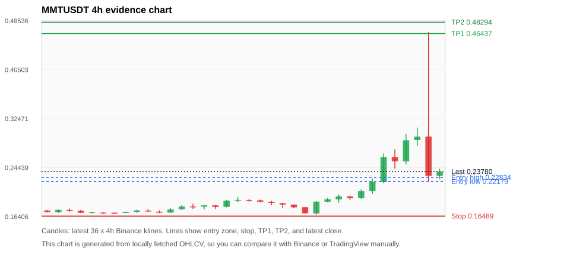
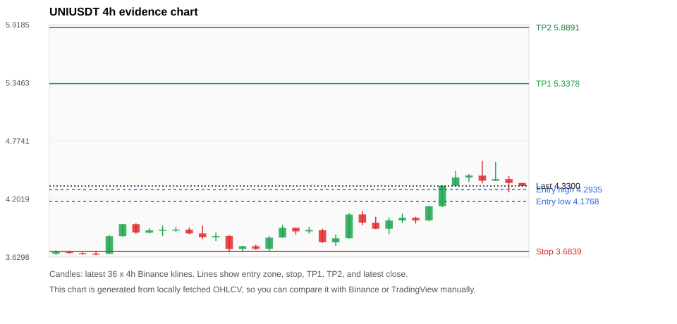
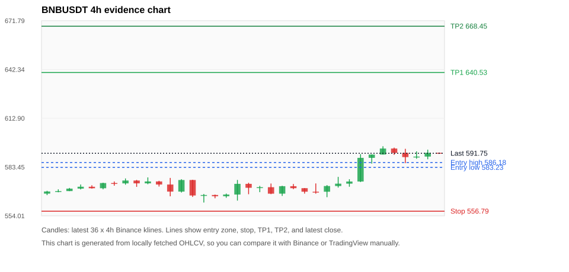
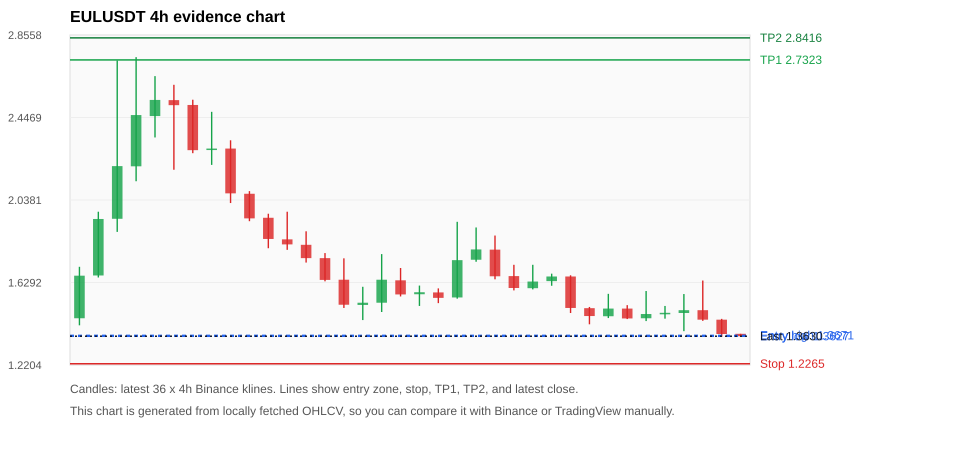
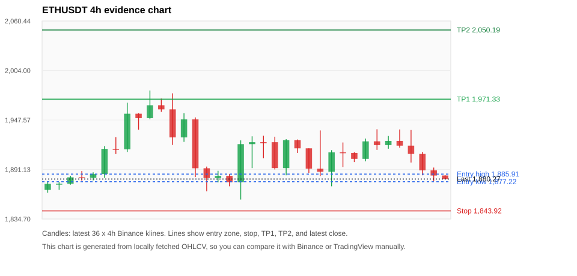

# Crypto 市场扫描报告 v1

- 报告时间：2026-07-31 20:08:32 CST
- Run ID：`20260731_120502_7291a5e3`
- Run type：`daily_full`
- 数据来源：SQLite
- 报告版本：v1
- 扫描 ID：03db6f5625c0
- 数据源：Binance public spot API + CoinGecko/CoinMarketCap cross-check
- 过滤条件：USDT spot; 24h quote volume >= 30,000,000; trades >= 30,000; exclude stables/leveraged tokens; analyze 1h/4h/1d klines
- 默认单笔风险：账户权益的 1.00%

## 限制说明

- 交易信号仍以 Binance 现货公开 K 线为主源；外部数据源用于一致性复核。
- 结果是研究和模拟盘计划，不是确定收益或实盘下单指令。
- 历史长度过滤：候选币至少需要 180 根 1d K 线。
- 数据质量验证池：先验证 score 排名前 min(top_n * 2, 10) 的候选，再按 action + score 补足最终名单。
- 大盘环境过滤：NEUTRAL; BTC/ETH 大盘未完全确认强势，山寨币买入候选降级为观察。 BTC 7d=-0.6080138147823155; ETH 7d=1.0148057417912915.
- 已启用数据交叉验证：Binance 主源 + CoinGecko 自动对照；CoinMarketCap 在配置 API Key 后自动对照。
- MMTUSDT 交叉验证状态 DATA_WARNING：At least one external provider needs manual review.
- UNIUSDT 交叉验证状态 DATA_WARNING：At least one external provider needs manual review.
- BNBUSDT 交叉验证状态 DATA_WARNING：At least one external provider needs manual review.
- ETHUSDT 交叉验证状态 DATA_WARNING：At least one external provider needs manual review.
- SOLUSDT 交叉验证状态 DATA_WARNING：At least one external provider needs manual review.
- XRPUSDT 交叉验证状态 DATA_WARNING：At least one external provider needs manual review.
- BTCUSDT 交叉验证状态 DATA_WARNING：At least one external provider needs manual review.
- ZECUSDT 交叉验证状态 DATA_WARNING：At least one external provider needs manual review.
- BANKUSDT 交叉验证状态 DATA_WARNING：At least one external provider needs manual review.

## 5 个候选交易计划

| Rank | Coin | Action | Setup | Entry Zone | Stop Loss | TP1 | TP2 / Exit Rule | R/R | Verdict |
|---:|---|---|---|---:|---:|---:|---|---:|---|
| 1 | `MMT` | `WAIT_PULLBACK` | 趋势中，等回调入场 | 0.22179 - 0.22834 | 0.16489 | 0.46437 | 0.48294 或跌破 4h 关键支撑 | 3.98-4.29 | 只等回调 |
| 2 | `UNI` | `WAIT_PULLBACK` | 趋势中，等回调入场 | 4.1768 - 4.2935 | 3.6839 | 5.3378 | 5.8891 或跌破 4h 关键支撑 | 2.00-3.00 | 只等回调 |
| 3 | `BNB` | `WATCH_ONLY` | 回踩支撑/4h EMA 附近 | 583.23 - 586.18 | 556.79 | 640.53 | 668.45 或跌破 4h 关键支撑 | 2.00-3.00 | 只等回调 |
| 4 | `EUL` | `WATCH_ONLY` | 回踩支撑/4h EMA 附近 | 1.3627 - 1.3671 | 1.2265 | 2.7323 | 2.8416 或跌破 4h 关键支撑 | 9.88-10.67 | 只观察 |
| 5 | `ETH` | `WATCH_ONLY` | 回踩支撑/4h EMA 附近 | 1,877.22 - 1,885.91 | 1,843.92 | 1,971.33 | 2,050.19 或跌破 4h 关键支撑 | 2.38-4.48 | 只观察 |

## 数据交叉验证摘要

价格差异以 Binance 当前价为基准；成交量口径不同，Binance 是 USDT 现货成交额，CoinGecko/CoinMarketCap 通常是全市场成交量。

| Rank | Coin | Data Status | Max Price Diff | Max 24h Diff | Message |
|---:|---|---|---:|---:|---|
| 1 | `MMT` | DATA_WARNING | 0.73% | 4.46 pts | At least one external provider needs manual review. |
| 2 | `UNI` | DATA_WARNING | 0.04% | 2.16 pts | At least one external provider needs manual review. |
| 3 | `BNB` | DATA_WARNING | 0.10% | 0.22 pts | At least one external provider needs manual review. |
| 4 | `EUL` | DATA_OK | 0.37% | 2.73 pts | External provider checks agree with Binance within configured thresholds. |
| 5 | `ETH` | DATA_WARNING | 0.06% | 0.52 pts | At least one external provider needs manual review. |

## 候选币说明

### 1. MMT `MMTUSDT`



- 入选原因：趋势中，等回调入场；24h +11.66%，7d +33.52%，4h RSI 61.64，24h 成交额 $35.2M。
- 交易失效条件：跌破 0.164889 或 4h 收盘重新失守关键支撑。
- 主要风险：24h 振幅较大，回撤风险高；成交量突增，可能是事件驱动；数据交叉验证需要人工复核。
- 数据交叉验证：DATA_WARNING；At least one external provider needs manual review.

#### 可点击人工验证

- [Binance 交易页](https://www.binance.com/en/trade/MMT_USDT)
- [TradingView 图表](https://www.tradingview.com/chart/?symbol=BINANCE%3AMMTUSDT)
- [CoinGecko 搜索](https://www.coingecko.com/en/search?query=MMT)
- [CoinMarketCap 搜索](https://coinmarketcap.com/search/?q=MMT)

#### 多数据源对照

| Source | Status | Asset ID | Price | 24h Change | 24h Volume | Price Diff | 24h Diff | Updated | Message |
|---|---|---|---:|---:|---:|---:|---:|---|---|
| Binance | DATA_OK | MMTUSDT | 0.23780 | +11.66% | $35.2M | 0.00% | 0.00 pts | 2026-07-31T12:07:57+00:00 | Primary market data source used by scanner. |
| CoinGecko | DATA_OK | momentum-3 | 0.23953 | +14.50% | $195.7M | 0.73% | 2.84 pts | 2026-07-31T12:05:20.000Z | External source agrees with Binance within thresholds. |
| CoinMarketCap | DATA_WARNING | 38231 | 0.23948 | +16.12% | $258.4M | 0.71% | 4.46 pts | 2026-07-31T12:06:03.000Z | 24h change diff 4.46 points exceeds warning threshold; CoinMarketCap symbol mapping has 6 matches; selected lowest cmc_rank |

#### 指标证据

| 指标 | 数值 | 人工核对用途 |
|---|---:|---|
| 当前价 | 0.23780 | 与 Binance/TradingView 当前价格对照 |
| 24h 涨跌 | +11.66% | 与交易所 24h 涨跌对照 |
| 7d 涨跌 | +33.52% | 判断短线趋势是否延续 |
| 4h EMA20 | 0.22135 | 判断短期趋势支撑 |
| 4h EMA50 | 0.19918 | 判断中期趋势支撑 |
| 1d EMA20 | 0.18847 | 判断日线趋势 |
| 1d EMA50 | 0.17004 | 判断日线趋势 |
| 4h RSI14 | 61.64 | 判断是否过热/过弱 |
| 4h ATR14 | 0.03784 | 推导止损和入场缓冲 |
| 最近 18 根 4h 最低点 | 0.16740 | 支撑/止损参考 |
| 最近 36 根 4h 最高点 | 0.46670 | TP/压力参考 |
| 支撑位 | 0.22135 | 入场区间推导基础 |

#### 交易计划推导

- 支撑位 = 最近低点、4h EMA20、4h EMA50、1d EMA20 中不高于当前价的最高有效支撑 = `0.22135`。
- 入场区间 = 支撑位附近 + ATR 缓冲 = `0.22179 - 0.22834`。
- 止损 = min(最近 18 根 4h 最低点 * 0.985, 入场中位价 - 1.15 * ATR14) = `0.16489`。
- TP1 = max(最近 36 根 4h 最高点 * 0.995, 入场中位价 + 2R) = `0.46437`。
- TP2 = max(入场中位价 + 3R, TP1 * 1.04) = `0.48294`。

#### 最近 10 根 4h K线

| UTC 开盘时间 | Open | High | Low | Close | Quote Volume | Trades |
|---|---:|---:|---:|---:|---:|---:|
| 2026-07-30T00:00+00:00 | 0.19230 | 0.20100 | 0.18670 | 0.19720 | $509,357 | 8606 |
| 2026-07-30T04:00+00:00 | 0.19710 | 0.19880 | 0.19130 | 0.19420 | $330,655 | 5707 |
| 2026-07-30T08:00+00:00 | 0.19440 | 0.20860 | 0.19330 | 0.20580 | $721,161 | 10803 |
| 2026-07-30T12:00+00:00 | 0.20580 | 0.22630 | 0.20100 | 0.22060 | $2.6M | 37491 |
| 2026-07-30T16:00+00:00 | 0.22080 | 0.26770 | 0.21880 | 0.26140 | $4.9M | 88106 |
| 2026-07-30T20:00+00:00 | 0.26140 | 0.27420 | 0.24290 | 0.25480 | $2.6M | 59648 |
| 2026-07-31T00:00+00:00 | 0.25470 | 0.29950 | 0.24960 | 0.28930 | $3.4M | 78263 |
| 2026-07-31T04:00+00:00 | 0.28960 | 0.31020 | 0.28000 | 0.29530 | $2.9M | 75297 |
| 2026-07-31T08:00+00:00 | 0.29540 | 0.46670 | 0.22160 | 0.23090 | $18.1M | 414375 |
| 2026-07-31T12:00+00:00 | 0.23090 | 0.24260 | 0.22540 | 0.23740 | $655,039 | 10762 |

### 2. UNI `UNIUSDT`



- 入选原因：趋势中，等回调入场；24h +4.64%，7d +14.55%，4h RSI 73.73，24h 成交额 $46.4M。
- 交易失效条件：跌破 3.6839 或 4h 收盘重新失守关键支撑。
- 主要风险：主要风险是大盘同步回撤；数据交叉验证需要人工复核。
- 数据交叉验证：DATA_WARNING；At least one external provider needs manual review.

#### 可点击人工验证

- [Binance 交易页](https://www.binance.com/en/trade/UNI_USDT)
- [TradingView 图表](https://www.tradingview.com/chart/?symbol=BINANCE%3AUNIUSDT)
- [CoinGecko 搜索](https://www.coingecko.com/en/search?query=UNI)
- [CoinMarketCap 搜索](https://coinmarketcap.com/search/?q=UNI)

#### 多数据源对照

| Source | Status | Asset ID | Price | 24h Change | 24h Volume | Price Diff | 24h Diff | Updated | Message |
|---|---|---|---:|---:|---:|---:|---:|---|---|
| Binance | DATA_OK | UNIUSDT | 4.3300 | +4.64% | $46.4M | 0.00% | 0.00 pts | 2026-07-31T12:07:57+00:00 | Primary market data source used by scanner. |
| CoinGecko | DATA_OK | uniswap | 4.3300 | +6.80% | $466.7M | 0.00% | 2.16 pts | 2026-07-31T12:05:20.000Z | External source agrees with Binance within thresholds. |
| CoinMarketCap | DATA_WARNING | 7083 | 4.3317 | +4.96% | $512.0M | 0.04% | 0.32 pts | 2026-07-31T12:06:03.000Z | CoinMarketCap symbol mapping has 7 matches; selected lowest cmc_rank |

#### 指标证据

| 指标 | 数值 | 人工核对用途 |
|---|---:|---|
| 当前价 | 4.3300 | 与 Binance/TradingView 当前价格对照 |
| 24h 涨跌 | +4.64% | 与交易所 24h 涨跌对照 |
| 7d 涨跌 | +14.55% | 判断短线趋势是否延续 |
| 4h EMA20 | 4.1469 | 判断短期趋势支撑 |
| 4h EMA50 | 3.9619 | 判断中期趋势支撑 |
| 1d EMA20 | 3.7880 | 判断日线趋势 |
| 1d EMA50 | 3.4929 | 判断日线趋势 |
| 4h RSI14 | 73.73 | 判断是否过热/过弱 |
| 4h ATR14 | 0.14586 | 推导止损和入场缓冲 |
| 最近 18 根 4h 最低点 | 3.7400 | 支撑/止损参考 |
| 最近 36 根 4h 最高点 | 4.5770 | TP/压力参考 |
| 支撑位 | 4.1469 | 入场区间推导基础 |

#### 交易计划推导

- 支撑位 = 最近低点、4h EMA20、4h EMA50、1d EMA20 中不高于当前价的最高有效支撑 = `4.1469`。
- 入场区间 = 支撑位附近 + ATR 缓冲 = `4.1768 - 4.2935`。
- 止损 = min(最近 18 根 4h 最低点 * 0.985, 入场中位价 - 1.15 * ATR14) = `3.6839`。
- TP1 = max(最近 36 根 4h 最高点 * 0.995, 入场中位价 + 2R) = `5.3378`。
- TP2 = max(入场中位价 + 3R, TP1 * 1.04) = `5.8891`。

#### 最近 10 根 4h K线

| UTC 开盘时间 | Open | High | Low | Close | Quote Volume | Trades |
|---|---:|---:|---:|---:|---:|---:|
| 2026-07-30T00:00+00:00 | 3.9910 | 4.0590 | 3.9640 | 4.0170 | $2.2M | 14320 |
| 2026-07-30T04:00+00:00 | 4.0170 | 4.0260 | 3.9600 | 3.9910 | $1.5M | 10049 |
| 2026-07-30T08:00+00:00 | 3.9920 | 4.1320 | 3.9820 | 4.1300 | $5.2M | 30882 |
| 2026-07-30T12:00+00:00 | 4.1300 | 4.3380 | 4.1230 | 4.3320 | $11.4M | 54272 |
| 2026-07-30T16:00+00:00 | 4.3320 | 4.4770 | 4.3230 | 4.4140 | $8.1M | 48737 |
| 2026-07-30T20:00+00:00 | 4.4130 | 4.4490 | 4.3700 | 4.4330 | $4.1M | 20138 |
| 2026-07-31T00:00+00:00 | 4.4320 | 4.5770 | 4.3560 | 4.3820 | $9.7M | 53197 |
| 2026-07-31T04:00+00:00 | 4.3820 | 4.5660 | 4.3800 | 4.3980 | $7.2M | 36735 |
| 2026-07-31T08:00+00:00 | 4.3990 | 4.4270 | 4.2670 | 4.3600 | $6.2M | 34373 |
| 2026-07-31T12:00+00:00 | 4.3600 | 4.3600 | 4.3230 | 4.3300 | $131,046 | 1237 |

### 3. BNB `BNBUSDT`



- 入选原因：回踩支撑/4h EMA 附近；24h +0.68%，7d +5.88%，4h RSI 76.52，24h 成交额 $79.1M。
- 交易失效条件：跌破 556.79095 或 4h 收盘重新失守关键支撑。
- 主要风险：4h RSI 偏热；数据交叉验证需要人工复核。
- 数据交叉验证：DATA_WARNING；At least one external provider needs manual review.

#### 可点击人工验证

- [Binance 交易页](https://www.binance.com/en/trade/BNB_USDT)
- [TradingView 图表](https://www.tradingview.com/chart/?symbol=BINANCE%3ABNBUSDT)
- [CoinGecko 搜索](https://www.coingecko.com/en/search?query=BNB)
- [CoinMarketCap 搜索](https://coinmarketcap.com/search/?q=BNB)

#### 多数据源对照

| Source | Status | Asset ID | Price | 24h Change | 24h Volume | Price Diff | 24h Diff | Updated | Message |
|---|---|---|---:|---:|---:|---:|---:|---|---|
| Binance | DATA_OK | BNBUSDT | 591.75 | +0.68% | $79.1M | 0.00% | 0.00 pts | 2026-07-31T12:07:57+00:00 | Primary market data source used by scanner. |
| CoinGecko | DATA_OK | binancecoin | 591.28 | +0.90% | $829.9M | 0.08% | 0.22 pts | 2026-07-31T12:05:20.000Z | External source agrees with Binance within thresholds. |
| CoinMarketCap | DATA_WARNING | 1839 | 591.16 | +0.49% | $1.35B | 0.10% | 0.19 pts | 2026-07-31T12:06:03.000Z | CoinMarketCap symbol mapping has 4 matches; selected lowest cmc_rank |

#### 指标证据

| 指标 | 数值 | 人工核对用途 |
|---|---:|---|
| 当前价 | 591.75 | 与 Binance/TradingView 当前价格对照 |
| 24h 涨跌 | +0.68% | 与交易所 24h 涨跌对照 |
| 7d 涨跌 | +5.88% | 判断短线趋势是否延续 |
| 4h EMA20 | 582.06 | 判断短期趋势支撑 |
| 4h EMA50 | 576.24 | 判断中期趋势支撑 |
| 1d EMA20 | 575.32 | 判断日线趋势 |
| 1d EMA50 | 582.56 | 判断日线趋势 |
| 4h RSI14 | 76.52 | 判断是否过热/过弱 |
| 4h ATR14 | 5.8814 | 推导止损和入场缓冲 |
| 最近 18 根 4h 最低点 | 565.27 | 支撑/止损参考 |
| 最近 36 根 4h 最高点 | 596.00 | TP/压力参考 |
| 支撑位 | 582.06 | 入场区间推导基础 |

#### 交易计划推导

- 支撑位 = 最近低点、4h EMA20、4h EMA50、1d EMA20 中不高于当前价的最高有效支撑 = `582.06`。
- 入场区间 = 支撑位附近 + ATR 缓冲 = `583.23 - 586.18`。
- 止损 = min(最近 18 根 4h 最低点 * 0.985, 入场中位价 - 1.15 * ATR14) = `556.79`。
- TP1 = max(最近 36 根 4h 最高点 * 0.995, 入场中位价 + 2R) = `640.53`。
- TP2 = max(入场中位价 + 3R, TP1 * 1.04) = `668.45`。

#### 最近 10 根 4h K线

| UTC 开盘时间 | Open | High | Low | Close | Quote Volume | Trades |
|---|---:|---:|---:|---:|---:|---:|
| 2026-07-30T00:00+00:00 | 571.99 | 577.51 | 571.05 | 573.42 | $8.5M | 73778 |
| 2026-07-30T04:00+00:00 | 573.42 | 576.10 | 571.56 | 574.72 | $6.6M | 63304 |
| 2026-07-30T08:00+00:00 | 574.72 | 591.25 | 574.41 | 589.00 | $28.1M | 201224 |
| 2026-07-30T12:00+00:00 | 589.00 | 591.00 | 585.52 | 590.99 | $17.2M | 143015 |
| 2026-07-30T16:00+00:00 | 591.00 | 596.00 | 591.00 | 594.62 | $13.8M | 122399 |
| 2026-07-30T20:00+00:00 | 594.62 | 595.18 | 590.78 | 591.99 | $9.6M | 66995 |
| 2026-07-31T00:00+00:00 | 591.99 | 594.46 | 585.79 | 589.46 | $11.9M | 113936 |
| 2026-07-31T04:00+00:00 | 589.47 | 592.92 | 588.47 | 589.76 | $13.3M | 91636 |
| 2026-07-31T08:00+00:00 | 589.77 | 593.92 | 588.15 | 592.02 | $14.1M | 116449 |
| 2026-07-31T12:00+00:00 | 592.02 | 592.17 | 591.39 | 591.75 | $245,400 | 3817 |

### 4. EUL `EULUSDT`



- 入选原因：回踩支撑/4h EMA 附近；24h -8.57%，7d +38.52%，4h RSI 19.29，24h 成交额 $95.4M。
- 交易失效条件：跌破 1.2264938 或 4h 收盘重新失守关键支撑。
- 主要风险：成交量突增，可能是事件驱动；24h 动量未确认。
- 数据交叉验证：DATA_OK；External provider checks agree with Binance within configured thresholds.

#### 可点击人工验证

- [Binance 交易页](https://www.binance.com/en/trade/EUL_USDT)
- [TradingView 图表](https://www.tradingview.com/chart/?symbol=BINANCE%3AEULUSDT)
- [CoinGecko 搜索](https://www.coingecko.com/en/search?query=EUL)
- [CoinMarketCap 搜索](https://coinmarketcap.com/search/?q=EUL)

#### 多数据源对照

| Source | Status | Asset ID | Price | 24h Change | 24h Volume | Price Diff | 24h Diff | Updated | Message |
|---|---|---|---:|---:|---:|---:|---:|---|---|
| Binance | DATA_OK | EULUSDT | 1.3630 | -8.57% | $95.4M | 0.00% | 0.00 pts | 2026-07-31T12:07:57+00:00 | Primary market data source used by scanner. |
| CoinGecko | DATA_OK | euler | 1.3600 | -11.30% | $134.7M | 0.22% | 2.73 pts | 2026-07-31T12:06:20.000Z | External source agrees with Binance within thresholds. |
| CoinMarketCap | DATA_OK | 14280 | 1.3680 | -8.63% | $225.7M | 0.37% | 0.06 pts | 2026-07-31T12:06:03.000Z | External source agrees with Binance within thresholds. |

#### 指标证据

| 指标 | 数值 | 人工核对用途 |
|---|---:|---|
| 当前价 | 1.3630 | 与 Binance/TradingView 当前价格对照 |
| 24h 涨跌 | -8.57% | 与交易所 24h 涨跌对照 |
| 7d 涨跌 | +38.52% | 判断短线趋势是否延续 |
| 4h EMA20 | 1.5323 | 判断短期趋势支撑 |
| 4h EMA50 | 1.5121 | 判断中期趋势支撑 |
| 1d EMA20 | 1.3334 | 判断日线趋势 |
| 1d EMA50 | 1.1937 | 判断日线趋势 |
| 4h RSI14 | 19.29 | 判断是否过热/过弱 |
| 4h ATR14 | 0.12036 | 推导止损和入场缓冲 |
| 最近 18 根 4h 最低点 | 1.3600 | 支撑/止损参考 |
| 最近 36 根 4h 最高点 | 2.7460 | TP/压力参考 |
| 支撑位 | 1.3600 | 入场区间推导基础 |

#### 交易计划推导

- 支撑位 = 最近低点、4h EMA20、4h EMA50、1d EMA20 中不高于当前价的最高有效支撑 = `1.3600`。
- 入场区间 = 支撑位附近 + ATR 缓冲 = `1.3627 - 1.3671`。
- 止损 = min(最近 18 根 4h 最低点 * 0.985, 入场中位价 - 1.15 * ATR14) = `1.2265`。
- TP1 = max(最近 36 根 4h 最高点 * 0.995, 入场中位价 + 2R) = `2.7323`。
- TP2 = max(入场中位价 + 3R, TP1 * 1.04) = `2.8416`。

#### 最近 10 根 4h K线

| UTC 开盘时间 | Open | High | Low | Close | Quote Volume | Trades |
|---|---:|---:|---:|---:|---:|---:|
| 2026-07-30T00:00+00:00 | 1.6590 | 1.6650 | 1.4780 | 1.5030 | $2.5M | 28403 |
| 2026-07-30T04:00+00:00 | 1.5020 | 1.5080 | 1.4220 | 1.4630 | $2.0M | 28883 |
| 2026-07-30T08:00+00:00 | 1.4620 | 1.5730 | 1.4530 | 1.5000 | $4.0M | 51968 |
| 2026-07-30T12:00+00:00 | 1.5000 | 1.5170 | 1.4480 | 1.4510 | $3.2M | 29623 |
| 2026-07-30T16:00+00:00 | 1.4520 | 1.5870 | 1.4380 | 1.4730 | $5.6M | 35387 |
| 2026-07-30T20:00+00:00 | 1.4720 | 1.5130 | 1.4500 | 1.4790 | $1.6M | 10169 |
| 2026-07-31T00:00+00:00 | 1.4780 | 1.5720 | 1.3880 | 1.4920 | $6.4M | 41759 |
| 2026-07-31T04:00+00:00 | 1.4920 | 1.6390 | 1.4390 | 1.4450 | $14.8M | 114083 |
| 2026-07-31T08:00+00:00 | 1.4450 | 1.4490 | 1.3600 | 1.3740 | $63.9M | 104877 |
| 2026-07-31T12:00+00:00 | 1.3750 | 1.3750 | 1.3630 | 1.3630 | $43,079 | 947 |

### 5. ETH `ETHUSDT`



- 入选原因：回踩支撑/4h EMA 附近；24h -2.32%，7d +1.22%，4h RSI 33.93，24h 成交额 $361.6M。
- 交易失效条件：跌破 1843.92 或 4h 收盘重新失守关键支撑。
- 主要风险：24h 动量未确认；数据交叉验证需要人工复核。
- 数据交叉验证：DATA_WARNING；At least one external provider needs manual review.

#### 可点击人工验证

- [Binance 交易页](https://www.binance.com/en/trade/ETH_USDT)
- [TradingView 图表](https://www.tradingview.com/chart/?symbol=BINANCE%3AETHUSDT)
- [CoinGecko 搜索](https://www.coingecko.com/en/search?query=ETH)
- [CoinMarketCap 搜索](https://coinmarketcap.com/search/?q=ETH)

#### 多数据源对照

| Source | Status | Asset ID | Price | 24h Change | 24h Volume | Price Diff | 24h Diff | Updated | Message |
|---|---|---|---:|---:|---:|---:|---:|---|---|
| Binance | DATA_OK | ETHUSDT | 1,880.27 | -2.32% | $361.6M | 0.00% | 0.00 pts | 2026-07-31T12:07:57+00:00 | Primary market data source used by scanner. |
| CoinGecko | DATA_OK | ethereum | 1,879.18 | -1.80% | $7.59B | 0.06% | 0.52 pts | 2026-07-31T12:06:20.000Z | External source agrees with Binance within thresholds. |
| CoinMarketCap | DATA_WARNING | 1027 | 1,879.43 | -2.23% | $8.71B | 0.04% | 0.09 pts | 2026-07-31T12:06:03.000Z | CoinMarketCap symbol mapping has 6 matches; selected lowest cmc_rank |

#### 指标证据

| 指标 | 数值 | 人工核对用途 |
|---|---:|---|
| 当前价 | 1,880.27 | 与 Binance/TradingView 当前价格对照 |
| 24h 涨跌 | -2.32% | 与交易所 24h 涨跌对照 |
| 7d 涨跌 | +1.22% | 判断短线趋势是否延续 |
| 4h EMA20 | 1,904.21 | 判断短期趋势支撑 |
| 4h EMA50 | 1,901.30 | 判断中期趋势支撑 |
| 1d EMA20 | 1,873.48 | 判断日线趋势 |
| 1d EMA50 | 1,848.82 | 判断日线趋势 |
| 4h RSI14 | 33.93 | 判断是否过热/过弱 |
| 4h ATR14 | 24.5993 | 推导止损和入场缓冲 |
| 最近 18 根 4h 最低点 | 1,872.00 | 支撑/止损参考 |
| 最近 36 根 4h 最高点 | 1,981.24 | TP/压力参考 |
| 支撑位 | 1,873.48 | 入场区间推导基础 |

#### 交易计划推导

- 支撑位 = 最近低点、4h EMA20、4h EMA50、1d EMA20 中不高于当前价的最高有效支撑 = `1,873.48`。
- 入场区间 = 支撑位附近 + ATR 缓冲 = `1,877.22 - 1,885.91`。
- 止损 = min(最近 18 根 4h 最低点 * 0.985, 入场中位价 - 1.15 * ATR14) = `1,843.92`。
- TP1 = max(最近 36 根 4h 最高点 * 0.995, 入场中位价 + 2R) = `1,971.33`。
- TP2 = max(入场中位价 + 3R, TP1 * 1.04) = `2,050.19`。

#### 最近 10 根 4h K线

| UTC 开盘时间 | Open | High | Low | Close | Quote Volume | Trades |
|---|---:|---:|---:|---:|---:|---:|
| 2026-07-30T00:00+00:00 | 1,910.72 | 1,921.92 | 1,893.99 | 1,909.99 | $62.7M | 366831 |
| 2026-07-30T04:00+00:00 | 1,910.00 | 1,910.93 | 1,899.59 | 1,903.25 | $55.5M | 298425 |
| 2026-07-30T08:00+00:00 | 1,903.26 | 1,926.44 | 1,900.51 | 1,923.22 | $55.3M | 332450 |
| 2026-07-30T12:00+00:00 | 1,923.25 | 1,936.99 | 1,913.49 | 1,918.90 | $80.4M | 480095 |
| 2026-07-30T16:00+00:00 | 1,918.90 | 1,929.34 | 1,914.81 | 1,923.68 | $42.4M | 227765 |
| 2026-07-30T20:00+00:00 | 1,923.69 | 1,936.79 | 1,916.00 | 1,918.31 | $42.1M | 231583 |
| 2026-07-31T00:00+00:00 | 1,918.32 | 1,936.15 | 1,899.09 | 1,908.90 | $74.6M | 376686 |
| 2026-07-31T04:00+00:00 | 1,908.90 | 1,911.16 | 1,884.53 | 1,890.20 | $54.2M | 278492 |
| 2026-07-31T08:00+00:00 | 1,890.20 | 1,893.33 | 1,877.93 | 1,884.26 | $67.2M | 225597 |
| 2026-07-31T12:00+00:00 | 1,884.27 | 1,884.82 | 1,880.00 | 1,880.27 | $2.5M | 9405 |

## 组合风控

- 不要 5 个候选全部满仓买入。
- 同时持仓总风险建议控制在账户权益的 3% - 5% 以内。
- 如果 BTC/ETH 同时破位，暂停山寨币多头计划或降低仓位。
- 第一版报告用于模拟盘和人工复核，不自动下单。

## 原始数据

```json
[
  {
    "rank": 1,
    "symbol": "MMTUSDT",
    "base_asset": "MMT",
    "price": 0.2378,
    "score": 75.29275307544432,
    "setup": "趋势中，等回调入场",
    "verdict": "只等回调",
    "entry_low": 0.22178833680867516,
    "entry_high": 0.22833928571428572,
    "stop_loss": 0.16488899999999998,
    "take_profit_1": 0.4643665,
    "take_profit_2": 0.48294116000000004,
    "risk_reward_1": 3.9767916794730973,
    "risk_reward_2": 4.2854700053474675,
    "pct_24h": 11.663,
    "pct_3d": 24.698479286837973,
    "pct_7d": 33.52049410443571,
    "quote_volume_24h": 35188034.79814,
    "trades_24h": 763035,
    "high_low_range_24h": 132.1890547263681,
    "rsi_1h": 43.53191489361703,
    "rsi_4h": 61.642050390964386,
    "ema20_4h": 0.22134564551763988,
    "ema50_4h": 0.19917674472344646,
    "ema20_1d": 0.18846774213818593,
    "ema50_1d": 0.17003812582734582,
    "atr_4h": 0.03784285714285714,
    "macd_hist_4h": 0.004730188429397063,
    "volume_ratio_24h": 23.21156195973023,
    "support_level": 0.22134564551763988,
    "recent_low_4h_18": 0.1674,
    "recent_high_4h_36": 0.4667,
    "distance_to_support_pct": 7.433782780718312,
    "binance_trade_url": "https://www.binance.com/en/trade/MMT_USDT",
    "tradingview_url": "https://www.tradingview.com/chart/?symbol=BINANCE%3AMMTUSDT",
    "coingecko_search_url": "https://www.coingecko.com/en/search?query=MMT",
    "coinmarketcap_search_url": "https://coinmarketcap.com/search/?q=MMT",
    "invalidation": "跌破 0.164889 或 4h 收盘重新失守关键支撑",
    "recent_4h_klines": [
      {
        "open_time_utc": "2026-07-25T16:00+00:00",
        "open": 0.1741,
        "high": 0.175,
        "low": 0.1711,
        "close": 0.1715,
        "quote_volume": 49426.93472,
        "trades": 744
      },
      {
        "open_time_utc": "2026-07-25T20:00+00:00",
        "open": 0.1715,
        "high": 0.1756,
        "low": 0.1703,
        "close": 0.175,
        "quote_volume": 53197.52843,
        "trades": 416
      },
      {
        "open_time_utc": "2026-07-26T00:00+00:00",
        "open": 0.175,
        "high": 0.1772,
        "low": 0.1723,
        "close": 0.1739,
        "quote_volume": 82535.94353,
        "trades": 695
      },
      {
        "open_time_utc": "2026-07-26T04:00+00:00",
        "open": 0.1739,
        "high": 0.1751,
        "low": 0.1698,
        "close": 0.1703,
        "quote_volume": 70754.00044,
        "trades": 792
      },
      {
        "open_time_utc": "2026-07-26T08:00+00:00",
        "open": 0.1704,
        "high": 0.172,
        "low": 0.1691,
        "close": 0.1713,
        "quote_volume": 62282.45855,
        "trades": 553
      },
      {
        "open_time_utc": "2026-07-26T12:00+00:00",
        "open": 0.1708,
        "high": 0.1709,
        "low": 0.168,
        "close": 0.1707,
        "quote_volume": 65709.19777,
        "trades": 431
      },
      {
        "open_time_utc": "2026-07-26T16:00+00:00",
        "open": 0.1705,
        "high": 0.1708,
        "low": 0.1691,
        "close": 0.1701,
        "quote_volume": 13572.27987,
        "trades": 140
      },
      {
        "open_time_utc": "2026-07-26T20:00+00:00",
        "open": 0.17,
        "high": 0.172,
        "low": 0.1696,
        "close": 0.1717,
        "quote_volume": 19749.27119,
        "trades": 241
      },
      {
        "open_time_utc": "2026-07-27T00:00+00:00",
        "open": 0.1718,
        "high": 0.1755,
        "low": 0.17,
        "close": 0.1742,
        "quote_volume": 49362.51902,
        "trades": 528
      },
      {
        "open_time_utc": "2026-07-27T04:00+00:00",
        "open": 0.1739,
        "high": 0.1767,
        "low": 0.1715,
        "close": 0.1723,
        "quote_volume": 73531.68991,
        "trades": 750
      },
      {
        "open_time_utc": "2026-07-27T08:00+00:00",
        "open": 0.1721,
        "high": 0.1743,
        "low": 0.1697,
        "close": 0.1705,
        "quote_volume": 63481.86893,
        "trades": 740
      },
      {
        "open_time_utc": "2026-07-27T12:00+00:00",
        "open": 0.1707,
        "high": 0.1781,
        "low": 0.1703,
        "close": 0.1759,
        "quote_volume": 214586.03692,
        "trades": 2421
      },
      {
        "open_time_utc": "2026-07-27T16:00+00:00",
        "open": 0.176,
        "high": 0.1833,
        "low": 0.1758,
        "close": 0.1807,
        "quote_volume": 286292.37571,
        "trades": 2164
      },
      {
        "open_time_utc": "2026-07-27T20:00+00:00",
        "open": 0.1807,
        "high": 0.1853,
        "low": 0.1768,
        "close": 0.1803,
        "quote_volume": 230615.72609,
        "trades": 2592
      },
      {
        "open_time_utc": "2026-07-28T00:00+00:00",
        "open": 0.1804,
        "high": 0.1834,
        "low": 0.1759,
        "close": 0.1826,
        "quote_volume": 197311.10264,
        "trades": 2068
      },
      {
        "open_time_utc": "2026-07-28T04:00+00:00",
        "open": 0.1826,
        "high": 0.1829,
        "low": 0.1769,
        "close": 0.1798,
        "quote_volume": 201935.52365,
        "trades": 1944
      },
      {
        "open_time_utc": "2026-07-28T08:00+00:00",
        "open": 0.1801,
        "high": 0.1916,
        "low": 0.1792,
        "close": 0.1902,
        "quote_volume": 1193547.49592,
        "trades": 14669
      },
      {
        "open_time_utc": "2026-07-28T12:00+00:00",
        "open": 0.1904,
        "high": 0.196,
        "low": 0.1878,
        "close": 0.1915,
        "quote_volume": 1117976.62826,
        "trades": 12687
      },
      {
        "open_time_utc": "2026-07-28T16:00+00:00",
        "open": 0.1913,
        "high": 0.1933,
        "low": 0.1885,
        "close": 0.1909,
        "quote_volume": 289295.85936,
        "trades": 3413
      },
      {
        "open_time_utc": "2026-07-28T20:00+00:00",
        "open": 0.1908,
        "high": 0.1919,
        "low": 0.1875,
        "close": 0.1886,
        "quote_volume": 156435.83373,
        "trades": 1489
      },
      {
        "open_time_utc": "2026-07-29T00:00+00:00",
        "open": 0.1885,
        "high": 0.19,
        "low": 0.183,
        "close": 0.1865,
        "quote_volume": 203014.17245,
        "trades": 1845
      },
      {
        "open_time_utc": "2026-07-29T04:00+00:00",
        "open": 0.1861,
        "high": 0.1863,
        "low": 0.178,
        "close": 0.1838,
        "quote_volume": 393039.0185,
        "trades": 3066
      },
      {
        "open_time_utc": "2026-07-29T08:00+00:00",
        "open": 0.1838,
        "high": 0.1838,
        "low": 0.1777,
        "close": 0.1793,
        "quote_volume": 272688.69253,
        "trades": 2366
      },
      {
        "open_time_utc": "2026-07-29T12:00+00:00",
        "open": 0.1794,
        "high": 0.1794,
        "low": 0.1691,
        "close": 0.1695,
        "quote_volume": 293664.23491,
        "trades": 2281
      },
      {
        "open_time_utc": "2026-07-29T16:00+00:00",
        "open": 0.1693,
        "high": 0.189,
        "low": 0.1674,
        "close": 0.1887,
        "quote_volume": 409368.36876,
        "trades": 3639
      },
      {
        "open_time_utc": "2026-07-29T20:00+00:00",
        "open": 0.1886,
        "high": 0.1944,
        "low": 0.1876,
        "close": 0.1924,
        "quote_volume": 339307.95041,
        "trades": 3776
      },
      {
        "open_time_utc": "2026-07-30T00:00+00:00",
        "open": 0.1923,
        "high": 0.201,
        "low": 0.1867,
        "close": 0.1972,
        "quote_volume": 509357.28718,
        "trades": 8606
      },
      {
        "open_time_utc": "2026-07-30T04:00+00:00",
        "open": 0.1971,
        "high": 0.1988,
        "low": 0.1913,
        "close": 0.1942,
        "quote_volume": 330654.50909,
        "trades": 5707
      },
      {
        "open_time_utc": "2026-07-30T08:00+00:00",
        "open": 0.1944,
        "high": 0.2086,
        "low": 0.1933,
        "close": 0.2058,
        "quote_volume": 721161.21253,
        "trades": 10803
      },
      {
        "open_time_utc": "2026-07-30T12:00+00:00",
        "open": 0.2058,
        "high": 0.2263,
        "low": 0.201,
        "close": 0.2206,
        "quote_volume": 2590255.62488,
        "trades": 37491
      },
      {
        "open_time_utc": "2026-07-30T16:00+00:00",
        "open": 0.2208,
        "high": 0.2677,
        "low": 0.2188,
        "close": 0.2614,
        "quote_volume": 4894929.21376,
        "trades": 88106
      },
      {
        "open_time_utc": "2026-07-30T20:00+00:00",
        "open": 0.2614,
        "high": 0.2742,
        "low": 0.2429,
        "close": 0.2548,
        "quote_volume": 2639716.71023,
        "trades": 59648
      },
      {
        "open_time_utc": "2026-07-31T00:00+00:00",
        "open": 0.2547,
        "high": 0.2995,
        "low": 0.2496,
        "close": 0.2893,
        "quote_volume": 3433777.30462,
        "trades": 78263
      },
      {
        "open_time_utc": "2026-07-31T04:00+00:00",
        "open": 0.2896,
        "high": 0.3102,
        "low": 0.28,
        "close": 0.2953,
        "quote_volume": 2888852.01853,
        "trades": 75297
      },
      {
        "open_time_utc": "2026-07-31T08:00+00:00",
        "open": 0.2954,
        "high": 0.4667,
        "low": 0.2216,
        "close": 0.2309,
        "quote_volume": 18137884.73119,
        "trades": 414375
      },
      {
        "open_time_utc": "2026-07-31T12:00+00:00",
        "open": 0.2309,
        "high": 0.2426,
        "low": 0.2254,
        "close": 0.2374,
        "quote_volume": 655039.37768,
        "trades": 10762
      }
    ],
    "risks": [
      "24h 振幅较大，回撤风险高",
      "成交量突增，可能是事件驱动",
      "数据交叉验证需要人工复核"
    ],
    "data_quality_status": "DATA_WARNING",
    "data_quality_message": "At least one external provider needs manual review.",
    "data_checks": [
      {
        "provider": "Binance",
        "status": "DATA_OK",
        "provider_asset_id": "MMTUSDT",
        "provider_symbol": "MMTUSDT",
        "price_usd": 0.2378,
        "pct_24h": 11.663,
        "volume_24h": 35188034.79814,
        "last_updated": null,
        "fetched_at_utc": "2026-07-31T12:07:57+00:00",
        "price_diff_pct": 0.0,
        "pct_24h_diff": 0.0,
        "volume_note": "Binance USDT spot 24h quoteVolume.",
        "message": "Primary market data source used by scanner."
      },
      {
        "provider": "CoinGecko",
        "status": "DATA_OK",
        "provider_asset_id": "momentum-3",
        "provider_symbol": "MMT",
        "price_usd": 0.239533,
        "pct_24h": 14.5,
        "volume_24h": 195746748.0,
        "last_updated": "2026-07-31T12:05:20.000Z",
        "fetched_at_utc": "2026-07-31T12:07:57+00:00",
        "price_diff_pct": 0.7287636669470078,
        "pct_24h_diff": 2.8369999999999997,
        "volume_note": "CoinGecko total market volume; not the same venue scope as Binance quoteVolume.",
        "message": "External source agrees with Binance within thresholds."
      },
      {
        "provider": "CoinMarketCap",
        "status": "DATA_WARNING",
        "provider_asset_id": "38231",
        "provider_symbol": "MMT",
        "price_usd": 0.23948079066624708,
        "pct_24h": 16.12193943,
        "volume_24h": 258439266.38295653,
        "last_updated": "2026-07-31T12:06:03.000Z",
        "fetched_at_utc": "2026-07-31T12:07:57+00:00",
        "price_diff_pct": 0.7068085223915361,
        "pct_24h_diff": 4.458939430000001,
        "volume_note": "CoinMarketCap total market volume; not the same venue scope as Binance quoteVolume.",
        "message": "24h change diff 4.46 points exceeds warning threshold; CoinMarketCap symbol mapping has 6 matches; selected lowest cmc_rank"
      }
    ],
    "action": "WAIT_PULLBACK"
  },
  {
    "rank": 2,
    "symbol": "UNIUSDT",
    "base_asset": "UNI",
    "price": 4.33,
    "score": 65.50091835912767,
    "setup": "趋势中，等回调入场",
    "verdict": "只等回调",
    "entry_low": 4.17685,
    "entry_high": 4.2935357142857145,
    "stop_loss": 3.6839,
    "take_profit_1": 5.337778571428573,
    "take_profit_2": 5.88907142857143,
    "risk_reward_1": 2.0,
    "risk_reward_2": 2.999999999999999,
    "pct_24h": 4.64,
    "pct_3d": 11.05411644011285,
    "pct_7d": 14.550264550264558,
    "quote_volume_24h": 46389017.00211,
    "trades_24h": 247087,
    "high_low_range_24h": 11.011399466407944,
    "rsi_1h": 44.22535211267608,
    "rsi_4h": 73.7327188940092,
    "ema20_4h": 4.146910142731631,
    "ema50_4h": 3.961871008859776,
    "ema20_1d": 3.788036339801097,
    "ema50_1d": 3.4929118097926666,
    "atr_4h": 0.14585714285714274,
    "macd_hist_4h": 0.028163506874930466,
    "volume_ratio_24h": 2.940063139828674,
    "support_level": 4.146910142731631,
    "recent_low_4h_18": 3.74,
    "recent_high_4h_36": 4.577,
    "distance_to_support_pct": 4.415091018773931,
    "binance_trade_url": "https://www.binance.com/en/trade/UNI_USDT",
    "tradingview_url": "https://www.tradingview.com/chart/?symbol=BINANCE%3AUNIUSDT",
    "coingecko_search_url": "https://www.coingecko.com/en/search?query=UNI",
    "coinmarketcap_search_url": "https://coinmarketcap.com/search/?q=UNI",
    "invalidation": "跌破 3.6839 或 4h 收盘重新失守关键支撑",
    "recent_4h_klines": [
      {
        "open_time_utc": "2026-07-25T16:00+00:00",
        "open": 3.663,
        "high": 3.696,
        "low": 3.651,
        "close": 3.685,
        "quote_volume": 684757.74645,
        "trades": 4886
      },
      {
        "open_time_utc": "2026-07-25T20:00+00:00",
        "open": 3.684,
        "high": 3.694,
        "low": 3.666,
        "close": 3.67,
        "quote_volume": 439554.03806,
        "trades": 3237
      },
      {
        "open_time_utc": "2026-07-26T00:00+00:00",
        "open": 3.669,
        "high": 3.682,
        "low": 3.653,
        "close": 3.663,
        "quote_volume": 931798.57744,
        "trades": 5279
      },
      {
        "open_time_utc": "2026-07-26T04:00+00:00",
        "open": 3.664,
        "high": 3.692,
        "low": 3.648,
        "close": 3.662,
        "quote_volume": 748643.31408,
        "trades": 5290
      },
      {
        "open_time_utc": "2026-07-26T08:00+00:00",
        "open": 3.662,
        "high": 3.847,
        "low": 3.659,
        "close": 3.836,
        "quote_volume": 2939959.9838,
        "trades": 16807
      },
      {
        "open_time_utc": "2026-07-26T12:00+00:00",
        "open": 3.836,
        "high": 3.956,
        "low": 3.831,
        "close": 3.954,
        "quote_volume": 4985216.68489,
        "trades": 33015
      },
      {
        "open_time_utc": "2026-07-26T16:00+00:00",
        "open": 3.954,
        "high": 3.962,
        "low": 3.86,
        "close": 3.871,
        "quote_volume": 1633330.4396,
        "trades": 12910
      },
      {
        "open_time_utc": "2026-07-26T20:00+00:00",
        "open": 3.87,
        "high": 3.914,
        "low": 3.862,
        "close": 3.893,
        "quote_volume": 1371071.39349,
        "trades": 8720
      },
      {
        "open_time_utc": "2026-07-27T00:00+00:00",
        "open": 3.892,
        "high": 3.94,
        "low": 3.836,
        "close": 3.898,
        "quote_volume": 2115187.30972,
        "trades": 11726
      },
      {
        "open_time_utc": "2026-07-27T04:00+00:00",
        "open": 3.899,
        "high": 3.925,
        "low": 3.878,
        "close": 3.9,
        "quote_volume": 1344353.51574,
        "trades": 9679
      },
      {
        "open_time_utc": "2026-07-27T08:00+00:00",
        "open": 3.9,
        "high": 3.921,
        "low": 3.855,
        "close": 3.863,
        "quote_volume": 1296281.60711,
        "trades": 8369
      },
      {
        "open_time_utc": "2026-07-27T12:00+00:00",
        "open": 3.863,
        "high": 3.94,
        "low": 3.81,
        "close": 3.825,
        "quote_volume": 2773387.0123,
        "trades": 18514
      },
      {
        "open_time_utc": "2026-07-27T16:00+00:00",
        "open": 3.825,
        "high": 3.872,
        "low": 3.789,
        "close": 3.838,
        "quote_volume": 1691978.36826,
        "trades": 9948
      },
      {
        "open_time_utc": "2026-07-27T20:00+00:00",
        "open": 3.839,
        "high": 3.843,
        "low": 3.676,
        "close": 3.709,
        "quote_volume": 2723082.59155,
        "trades": 18703
      },
      {
        "open_time_utc": "2026-07-28T00:00+00:00",
        "open": 3.71,
        "high": 3.742,
        "low": 3.678,
        "close": 3.737,
        "quote_volume": 2470435.16313,
        "trades": 9471
      },
      {
        "open_time_utc": "2026-07-28T04:00+00:00",
        "open": 3.737,
        "high": 3.752,
        "low": 3.701,
        "close": 3.711,
        "quote_volume": 854654.98999,
        "trades": 5013
      },
      {
        "open_time_utc": "2026-07-28T08:00+00:00",
        "open": 3.711,
        "high": 3.839,
        "low": 3.689,
        "close": 3.821,
        "quote_volume": 4310959.97111,
        "trades": 18137
      },
      {
        "open_time_utc": "2026-07-28T12:00+00:00",
        "open": 3.822,
        "high": 3.945,
        "low": 3.822,
        "close": 3.917,
        "quote_volume": 6655051.38283,
        "trades": 34482
      },
      {
        "open_time_utc": "2026-07-28T16:00+00:00",
        "open": 3.918,
        "high": 3.918,
        "low": 3.853,
        "close": 3.883,
        "quote_volume": 1432590.61593,
        "trades": 10340
      },
      {
        "open_time_utc": "2026-07-28T20:00+00:00",
        "open": 3.883,
        "high": 3.928,
        "low": 3.861,
        "close": 3.896,
        "quote_volume": 1351892.25373,
        "trades": 9344
      },
      {
        "open_time_utc": "2026-07-29T00:00+00:00",
        "open": 3.894,
        "high": 3.91,
        "low": 3.77,
        "close": 3.776,
        "quote_volume": 2124263.49954,
        "trades": 15195
      },
      {
        "open_time_utc": "2026-07-29T04:00+00:00",
        "open": 3.775,
        "high": 3.855,
        "low": 3.74,
        "close": 3.815,
        "quote_volume": 2379638.64082,
        "trades": 14714
      },
      {
        "open_time_utc": "2026-07-29T08:00+00:00",
        "open": 3.816,
        "high": 4.064,
        "low": 3.81,
        "close": 4.049,
        "quote_volume": 8628195.02619,
        "trades": 39441
      },
      {
        "open_time_utc": "2026-07-29T12:00+00:00",
        "open": 4.05,
        "high": 4.082,
        "low": 3.944,
        "close": 3.969,
        "quote_volume": 4414181.58708,
        "trades": 26077
      },
      {
        "open_time_utc": "2026-07-29T16:00+00:00",
        "open": 3.968,
        "high": 4.027,
        "low": 3.905,
        "close": 3.909,
        "quote_volume": 2656689.81107,
        "trades": 21174
      },
      {
        "open_time_utc": "2026-07-29T20:00+00:00",
        "open": 3.909,
        "high": 4.021,
        "low": 3.856,
        "close": 3.991,
        "quote_volume": 2360353.38882,
        "trades": 18177
      },
      {
        "open_time_utc": "2026-07-30T00:00+00:00",
        "open": 3.991,
        "high": 4.059,
        "low": 3.964,
        "close": 4.017,
        "quote_volume": 2181565.10668,
        "trades": 14320
      },
      {
        "open_time_utc": "2026-07-30T04:00+00:00",
        "open": 4.017,
        "high": 4.026,
        "low": 3.96,
        "close": 3.991,
        "quote_volume": 1526618.26759,
        "trades": 10049
      },
      {
        "open_time_utc": "2026-07-30T08:00+00:00",
        "open": 3.992,
        "high": 4.132,
        "low": 3.982,
        "close": 4.13,
        "quote_volume": 5167869.02636,
        "trades": 30882
      },
      {
        "open_time_utc": "2026-07-30T12:00+00:00",
        "open": 4.13,
        "high": 4.338,
        "low": 4.123,
        "close": 4.332,
        "quote_volume": 11410089.53291,
        "trades": 54272
      },
      {
        "open_time_utc": "2026-07-30T16:00+00:00",
        "open": 4.332,
        "high": 4.477,
        "low": 4.323,
        "close": 4.414,
        "quote_volume": 8060872.24276,
        "trades": 48737
      },
      {
        "open_time_utc": "2026-07-30T20:00+00:00",
        "open": 4.413,
        "high": 4.449,
        "low": 4.37,
        "close": 4.433,
        "quote_volume": 4085662.78578,
        "trades": 20138
      },
      {
        "open_time_utc": "2026-07-31T00:00+00:00",
        "open": 4.432,
        "high": 4.577,
        "low": 4.356,
        "close": 4.382,
        "quote_volume": 9698135.86104,
        "trades": 53197
      },
      {
        "open_time_utc": "2026-07-31T04:00+00:00",
        "open": 4.382,
        "high": 4.566,
        "low": 4.38,
        "close": 4.398,
        "quote_volume": 7198617.04299,
        "trades": 36735
      },
      {
        "open_time_utc": "2026-07-31T08:00+00:00",
        "open": 4.399,
        "high": 4.427,
        "low": 4.267,
        "close": 4.36,
        "quote_volume": 6170219.12492,
        "trades": 34373
      },
      {
        "open_time_utc": "2026-07-31T12:00+00:00",
        "open": 4.36,
        "high": 4.36,
        "low": 4.323,
        "close": 4.33,
        "quote_volume": 131045.82784,
        "trades": 1237
      }
    ],
    "risks": [
      "主要风险是大盘同步回撤",
      "数据交叉验证需要人工复核"
    ],
    "data_quality_status": "DATA_WARNING",
    "data_quality_message": "At least one external provider needs manual review.",
    "data_checks": [
      {
        "provider": "Binance",
        "status": "DATA_OK",
        "provider_asset_id": "UNIUSDT",
        "provider_symbol": "UNIUSDT",
        "price_usd": 4.33,
        "pct_24h": 4.64,
        "volume_24h": 46389017.00211,
        "last_updated": null,
        "fetched_at_utc": "2026-07-31T12:07:57+00:00",
        "price_diff_pct": 0.0,
        "pct_24h_diff": 0.0,
        "volume_note": "Binance USDT spot 24h quoteVolume.",
        "message": "Primary market data source used by scanner."
      },
      {
        "provider": "CoinGecko",
        "status": "DATA_OK",
        "provider_asset_id": "uniswap",
        "provider_symbol": "UNI",
        "price_usd": 4.33,
        "pct_24h": 6.8,
        "volume_24h": 466659300.0,
        "last_updated": "2026-07-31T12:05:20.000Z",
        "fetched_at_utc": "2026-07-31T12:07:57+00:00",
        "price_diff_pct": 0.0,
        "pct_24h_diff": 2.16,
        "volume_note": "CoinGecko total market volume; not the same venue scope as Binance quoteVolume.",
        "message": "External source agrees with Binance within thresholds."
      },
      {
        "provider": "CoinMarketCap",
        "status": "DATA_WARNING",
        "provider_asset_id": "7083",
        "provider_symbol": "UNI",
        "price_usd": 4.331739162844314,
        "pct_24h": 4.95975914,
        "volume_24h": 511997351.73098207,
        "last_updated": "2026-07-31T12:06:03.000Z",
        "fetched_at_utc": "2026-07-31T12:07:57+00:00",
        "price_diff_pct": 0.040165423656206616,
        "pct_24h_diff": 0.3197591400000004,
        "volume_note": "CoinMarketCap total market volume; not the same venue scope as Binance quoteVolume.",
        "message": "CoinMarketCap symbol mapping has 7 matches; selected lowest cmc_rank"
      }
    ],
    "action": "WAIT_PULLBACK"
  },
  {
    "rank": 3,
    "symbol": "BNBUSDT",
    "base_asset": "BNB",
    "price": 591.75,
    "score": 60.98543550783685,
    "setup": "回踩支撑/4h EMA 附近",
    "verdict": "只等回调",
    "entry_low": 583.2280405646187,
    "entry_high": 586.1809127391404,
    "stop_loss": 556.79095,
    "take_profit_1": 640.5315299556387,
    "take_profit_2": 668.4450566075183,
    "risk_reward_1": 2.0,
    "risk_reward_2": 3.0,
    "pct_24h": 0.676,
    "pct_3d": 4.641909814323597,
    "pct_7d": 5.8776167471819685,
    "quote_volume_24h": 79082638.37651,
    "trades_24h": 650727,
    "high_low_range_24h": 1.789862003005882,
    "rsi_1h": 47.47817652764317,
    "rsi_4h": 76.51616350520979,
    "ema20_4h": 582.0639127391404,
    "ema50_4h": 576.2426397667597,
    "ema20_1d": 575.3174519097935,
    "ema50_1d": 582.5606164857193,
    "atr_4h": 5.8814285714285734,
    "macd_hist_4h": 1.5491945533465934,
    "volume_ratio_24h": 1.5877852388772593,
    "support_level": 582.0639127391404,
    "recent_low_4h_18": 565.27,
    "recent_high_4h_36": 596.0,
    "distance_to_support_pct": 1.6640934180711886,
    "binance_trade_url": "https://www.binance.com/en/trade/BNB_USDT",
    "tradingview_url": "https://www.tradingview.com/chart/?symbol=BINANCE%3ABNBUSDT",
    "coingecko_search_url": "https://www.coingecko.com/en/search?query=BNB",
    "coinmarketcap_search_url": "https://coinmarketcap.com/search/?q=BNB",
    "invalidation": "跌破 556.79095 或 4h 收盘重新失守关键支撑",
    "recent_4h_klines": [
      {
        "open_time_utc": "2026-07-25T16:00+00:00",
        "open": 567.39,
        "high": 569.1,
        "low": 566.51,
        "close": 568.7,
        "quote_volume": 4271421.25973,
        "trades": 39855
      },
      {
        "open_time_utc": "2026-07-25T20:00+00:00",
        "open": 568.7,
        "high": 570.0,
        "low": 568.23,
        "close": 568.94,
        "quote_volume": 2783663.52523,
        "trades": 26516
      },
      {
        "open_time_utc": "2026-07-26T00:00+00:00",
        "open": 568.94,
        "high": 570.84,
        "low": 568.94,
        "close": 570.43,
        "quote_volume": 5495428.69002,
        "trades": 33901
      },
      {
        "open_time_utc": "2026-07-26T04:00+00:00",
        "open": 570.44,
        "high": 572.91,
        "low": 569.93,
        "close": 571.57,
        "quote_volume": 6881500.00869,
        "trades": 50622
      },
      {
        "open_time_utc": "2026-07-26T08:00+00:00",
        "open": 571.56,
        "high": 572.45,
        "low": 570.44,
        "close": 570.65,
        "quote_volume": 5465483.57924,
        "trades": 34648
      },
      {
        "open_time_utc": "2026-07-26T12:00+00:00",
        "open": 570.66,
        "high": 573.99,
        "low": 570.01,
        "close": 573.79,
        "quote_volume": 8664334.76388,
        "trades": 61970
      },
      {
        "open_time_utc": "2026-07-26T16:00+00:00",
        "open": 573.8,
        "high": 574.75,
        "low": 572.2,
        "close": 573.59,
        "quote_volume": 6221235.66545,
        "trades": 43799
      },
      {
        "open_time_utc": "2026-07-26T20:00+00:00",
        "open": 573.59,
        "high": 576.57,
        "low": 572.8,
        "close": 575.32,
        "quote_volume": 4929519.6945,
        "trades": 58594
      },
      {
        "open_time_utc": "2026-07-27T00:00+00:00",
        "open": 575.31,
        "high": 575.67,
        "low": 571.49,
        "close": 573.61,
        "quote_volume": 4391338.48893,
        "trades": 56836
      },
      {
        "open_time_utc": "2026-07-27T04:00+00:00",
        "open": 573.61,
        "high": 577.2,
        "low": 573.09,
        "close": 574.76,
        "quote_volume": 5599569.09944,
        "trades": 62124
      },
      {
        "open_time_utc": "2026-07-27T08:00+00:00",
        "open": 574.76,
        "high": 575.15,
        "low": 571.68,
        "close": 572.9,
        "quote_volume": 11459995.44214,
        "trades": 75781
      },
      {
        "open_time_utc": "2026-07-27T12:00+00:00",
        "open": 572.9,
        "high": 576.89,
        "low": 565.8,
        "close": 568.64,
        "quote_volume": 12567692.46647,
        "trades": 152214
      },
      {
        "open_time_utc": "2026-07-27T16:00+00:00",
        "open": 568.64,
        "high": 576.11,
        "low": 568.06,
        "close": 575.62,
        "quote_volume": 6984732.60631,
        "trades": 87544
      },
      {
        "open_time_utc": "2026-07-27T20:00+00:00",
        "open": 575.63,
        "high": 575.77,
        "low": 565.4,
        "close": 566.28,
        "quote_volume": 5038934.04506,
        "trades": 71729
      },
      {
        "open_time_utc": "2026-07-28T00:00+00:00",
        "open": 566.28,
        "high": 567.21,
        "low": 562.03,
        "close": 566.57,
        "quote_volume": 7600035.58643,
        "trades": 89467
      },
      {
        "open_time_utc": "2026-07-28T04:00+00:00",
        "open": 566.58,
        "high": 566.85,
        "low": 564.6,
        "close": 565.83,
        "quote_volume": 6846526.53585,
        "trades": 59171
      },
      {
        "open_time_utc": "2026-07-28T08:00+00:00",
        "open": 565.84,
        "high": 567.44,
        "low": 564.9,
        "close": 566.86,
        "quote_volume": 5243594.50486,
        "trades": 56281
      },
      {
        "open_time_utc": "2026-07-28T12:00+00:00",
        "open": 566.86,
        "high": 575.66,
        "low": 563.19,
        "close": 573.3,
        "quote_volume": 17323736.88458,
        "trades": 148347
      },
      {
        "open_time_utc": "2026-07-28T16:00+00:00",
        "open": 573.3,
        "high": 573.97,
        "low": 567.05,
        "close": 570.93,
        "quote_volume": 7243684.90121,
        "trades": 88417
      },
      {
        "open_time_utc": "2026-07-28T20:00+00:00",
        "open": 570.93,
        "high": 572.07,
        "low": 568.29,
        "close": 571.29,
        "quote_volume": 4076171.61659,
        "trades": 48932
      },
      {
        "open_time_utc": "2026-07-29T00:00+00:00",
        "open": 571.29,
        "high": 573.5,
        "low": 567.1,
        "close": 567.38,
        "quote_volume": 6840078.17237,
        "trades": 79350
      },
      {
        "open_time_utc": "2026-07-29T04:00+00:00",
        "open": 567.39,
        "high": 572.13,
        "low": 566.01,
        "close": 571.9,
        "quote_volume": 5356221.85459,
        "trades": 65122
      },
      {
        "open_time_utc": "2026-07-29T08:00+00:00",
        "open": 571.89,
        "high": 573.23,
        "low": 570.11,
        "close": 570.69,
        "quote_volume": 6704377.91709,
        "trades": 56292
      },
      {
        "open_time_utc": "2026-07-29T12:00+00:00",
        "open": 570.7,
        "high": 570.74,
        "low": 567.4,
        "close": 568.57,
        "quote_volume": 6654286.42429,
        "trades": 88668
      },
      {
        "open_time_utc": "2026-07-29T16:00+00:00",
        "open": 568.57,
        "high": 573.56,
        "low": 567.37,
        "close": 568.54,
        "quote_volume": 10649643.90124,
        "trades": 114464
      },
      {
        "open_time_utc": "2026-07-29T20:00+00:00",
        "open": 568.55,
        "high": 572.56,
        "low": 565.27,
        "close": 571.99,
        "quote_volume": 5672178.83379,
        "trades": 62627
      },
      {
        "open_time_utc": "2026-07-30T00:00+00:00",
        "open": 571.99,
        "high": 577.51,
        "low": 571.05,
        "close": 573.42,
        "quote_volume": 8506418.03834,
        "trades": 73778
      },
      {
        "open_time_utc": "2026-07-30T04:00+00:00",
        "open": 573.42,
        "high": 576.1,
        "low": 571.56,
        "close": 574.72,
        "quote_volume": 6572177.87838,
        "trades": 63304
      },
      {
        "open_time_utc": "2026-07-30T08:00+00:00",
        "open": 574.72,
        "high": 591.25,
        "low": 574.41,
        "close": 589.0,
        "quote_volume": 28142122.95862,
        "trades": 201224
      },
      {
        "open_time_utc": "2026-07-30T12:00+00:00",
        "open": 589.0,
        "high": 591.0,
        "low": 585.52,
        "close": 590.99,
        "quote_volume": 17249377.15884,
        "trades": 143015
      },
      {
        "open_time_utc": "2026-07-30T16:00+00:00",
        "open": 591.0,
        "high": 596.0,
        "low": 591.0,
        "close": 594.62,
        "quote_volume": 13762859.31738,
        "trades": 122399
      },
      {
        "open_time_utc": "2026-07-30T20:00+00:00",
        "open": 594.62,
        "high": 595.18,
        "low": 590.78,
        "close": 591.99,
        "quote_volume": 9622587.40278,
        "trades": 66995
      },
      {
        "open_time_utc": "2026-07-31T00:00+00:00",
        "open": 591.99,
        "high": 594.46,
        "low": 585.79,
        "close": 589.46,
        "quote_volume": 11857275.34371,
        "trades": 113936
      },
      {
        "open_time_utc": "2026-07-31T04:00+00:00",
        "open": 589.47,
        "high": 592.92,
        "low": 588.47,
        "close": 589.76,
        "quote_volume": 13273327.35596,
        "trades": 91636
      },
      {
        "open_time_utc": "2026-07-31T08:00+00:00",
        "open": 589.77,
        "high": 593.92,
        "low": 588.15,
        "close": 592.02,
        "quote_volume": 14135917.51286,
        "trades": 116449
      },
      {
        "open_time_utc": "2026-07-31T12:00+00:00",
        "open": 592.02,
        "high": 592.17,
        "low": 591.39,
        "close": 591.75,
        "quote_volume": 245400.16883,
        "trades": 3817
      }
    ],
    "risks": [
      "4h RSI 偏热",
      "数据交叉验证需要人工复核"
    ],
    "data_quality_status": "DATA_WARNING",
    "data_quality_message": "At least one external provider needs manual review.",
    "data_checks": [
      {
        "provider": "Binance",
        "status": "DATA_OK",
        "provider_asset_id": "BNBUSDT",
        "provider_symbol": "BNBUSDT",
        "price_usd": 591.75,
        "pct_24h": 0.676,
        "volume_24h": 79082638.37651,
        "last_updated": null,
        "fetched_at_utc": "2026-07-31T12:07:57+00:00",
        "price_diff_pct": 0.0,
        "pct_24h_diff": 0.0,
        "volume_note": "Binance USDT spot 24h quoteVolume.",
        "message": "Primary market data source used by scanner."
      },
      {
        "provider": "CoinGecko",
        "status": "DATA_OK",
        "provider_asset_id": "binancecoin",
        "provider_symbol": "BNB",
        "price_usd": 591.28,
        "pct_24h": 0.9,
        "volume_24h": 829881538.0,
        "last_updated": "2026-07-31T12:05:20.000Z",
        "fetched_at_utc": "2026-07-31T12:07:57+00:00",
        "price_diff_pct": 0.07942543303760495,
        "pct_24h_diff": 0.22399999999999998,
        "volume_note": "CoinGecko total market volume; not the same venue scope as Binance quoteVolume.",
        "message": "External source agrees with Binance within thresholds."
      },
      {
        "provider": "CoinMarketCap",
        "status": "DATA_WARNING",
        "provider_asset_id": "1839",
        "provider_symbol": "BNB",
        "price_usd": 591.1590045548005,
        "pct_24h": 0.49042328,
        "volume_24h": 1345438597.4067333,
        "last_updated": "2026-07-31T12:06:03.000Z",
        "fetched_at_utc": "2026-07-31T12:07:57+00:00",
        "price_diff_pct": 0.09987248757067956,
        "pct_24h_diff": 0.18557672000000003,
        "volume_note": "CoinMarketCap total market volume; not the same venue scope as Binance quoteVolume.",
        "message": "CoinMarketCap symbol mapping has 4 matches; selected lowest cmc_rank"
      }
    ],
    "action": "WATCH_ONLY"
  },
  {
    "rank": 4,
    "symbol": "EULUSDT",
    "base_asset": "EUL",
    "price": 1.363,
    "score": 35.12934770265661,
    "setup": "回踩支撑/4h EMA 附近",
    "verdict": "只观察",
    "entry_low": 1.3627200000000002,
    "entry_high": 1.3670889999999998,
    "stop_loss": 1.2264937857142857,
    "take_profit_1": 2.73227,
    "take_profit_2": 2.8415608000000003,
    "risk_reward_1": 9.879043736292093,
    "risk_reward_2": 10.668656018578252,
    "pct_24h": -8.568,
    "pct_3d": -16.68704156479217,
    "pct_7d": 38.51626016260163,
    "quote_volume_24h": 95371602.73035,
    "trades_24h": 335395,
    "high_low_range_24h": 20.514705882352935,
    "rsi_1h": 37.63837638376383,
    "rsi_4h": 19.285714285714263,
    "ema20_4h": 1.5323352099033924,
    "ema50_4h": 1.5120705888968198,
    "ema20_1d": 1.3334270672513693,
    "ema50_1d": 1.1937144213510924,
    "atr_4h": 0.12035714285714287,
    "macd_hist_4h": -0.02584681146903306,
    "volume_ratio_24h": 4.703917338003704,
    "support_level": 1.36,
    "recent_low_4h_18": 1.36,
    "recent_high_4h_36": 2.746,
    "distance_to_support_pct": 0.22058823529411686,
    "binance_trade_url": "https://www.binance.com/en/trade/EUL_USDT",
    "tradingview_url": "https://www.tradingview.com/chart/?symbol=BINANCE%3AEULUSDT",
    "coingecko_search_url": "https://www.coingecko.com/en/search?query=EUL",
    "coinmarketcap_search_url": "https://coinmarketcap.com/search/?q=EUL",
    "invalidation": "跌破 1.2264938 或 4h 收盘重新失守关键支撑",
    "recent_4h_klines": [
      {
        "open_time_utc": "2026-07-25T16:00+00:00",
        "open": 1.452,
        "high": 1.707,
        "low": 1.417,
        "close": 1.663,
        "quote_volume": 3526495.37681,
        "trades": 46328
      },
      {
        "open_time_utc": "2026-07-25T20:00+00:00",
        "open": 1.664,
        "high": 1.98,
        "low": 1.654,
        "close": 1.944,
        "quote_volume": 4298093.53513,
        "trades": 60586
      },
      {
        "open_time_utc": "2026-07-26T00:00+00:00",
        "open": 1.945,
        "high": 2.73,
        "low": 1.88,
        "close": 2.206,
        "quote_volume": 16511582.03057,
        "trades": 252178
      },
      {
        "open_time_utc": "2026-07-26T04:00+00:00",
        "open": 2.205,
        "high": 2.746,
        "low": 2.131,
        "close": 2.459,
        "quote_volume": 9758693.90662,
        "trades": 156920
      },
      {
        "open_time_utc": "2026-07-26T08:00+00:00",
        "open": 2.454,
        "high": 2.652,
        "low": 2.348,
        "close": 2.534,
        "quote_volume": 5678214.19622,
        "trades": 105515
      },
      {
        "open_time_utc": "2026-07-26T12:00+00:00",
        "open": 2.533,
        "high": 2.609,
        "low": 2.188,
        "close": 2.508,
        "quote_volume": 6158130.17686,
        "trades": 105535
      },
      {
        "open_time_utc": "2026-07-26T16:00+00:00",
        "open": 2.509,
        "high": 2.535,
        "low": 2.27,
        "close": 2.285,
        "quote_volume": 3566373.27032,
        "trades": 55888
      },
      {
        "open_time_utc": "2026-07-26T20:00+00:00",
        "open": 2.287,
        "high": 2.475,
        "low": 2.212,
        "close": 2.293,
        "quote_volume": 3169042.49253,
        "trades": 45330
      },
      {
        "open_time_utc": "2026-07-27T00:00+00:00",
        "open": 2.293,
        "high": 2.334,
        "low": 2.023,
        "close": 2.071,
        "quote_volume": 3212471.15039,
        "trades": 46013
      },
      {
        "open_time_utc": "2026-07-27T04:00+00:00",
        "open": 2.069,
        "high": 2.082,
        "low": 1.933,
        "close": 1.947,
        "quote_volume": 2862758.86198,
        "trades": 32226
      },
      {
        "open_time_utc": "2026-07-27T08:00+00:00",
        "open": 1.95,
        "high": 1.97,
        "low": 1.799,
        "close": 1.845,
        "quote_volume": 2129267.05951,
        "trades": 21382
      },
      {
        "open_time_utc": "2026-07-27T12:00+00:00",
        "open": 1.843,
        "high": 1.98,
        "low": 1.791,
        "close": 1.818,
        "quote_volume": 2010188.41788,
        "trades": 20087
      },
      {
        "open_time_utc": "2026-07-27T16:00+00:00",
        "open": 1.816,
        "high": 1.883,
        "low": 1.728,
        "close": 1.75,
        "quote_volume": 1449506.79133,
        "trades": 16302
      },
      {
        "open_time_utc": "2026-07-27T20:00+00:00",
        "open": 1.75,
        "high": 1.775,
        "low": 1.635,
        "close": 1.642,
        "quote_volume": 1435198.6009,
        "trades": 21631
      },
      {
        "open_time_utc": "2026-07-28T00:00+00:00",
        "open": 1.643,
        "high": 1.749,
        "low": 1.503,
        "close": 1.519,
        "quote_volume": 1925952.00377,
        "trades": 20930
      },
      {
        "open_time_utc": "2026-07-28T04:00+00:00",
        "open": 1.518,
        "high": 1.608,
        "low": 1.443,
        "close": 1.529,
        "quote_volume": 1887187.78279,
        "trades": 22616
      },
      {
        "open_time_utc": "2026-07-28T08:00+00:00",
        "open": 1.529,
        "high": 1.77,
        "low": 1.483,
        "close": 1.643,
        "quote_volume": 3264388.39341,
        "trades": 38430
      },
      {
        "open_time_utc": "2026-07-28T12:00+00:00",
        "open": 1.64,
        "high": 1.701,
        "low": 1.56,
        "close": 1.57,
        "quote_volume": 1805954.31232,
        "trades": 22291
      },
      {
        "open_time_utc": "2026-07-28T16:00+00:00",
        "open": 1.571,
        "high": 1.614,
        "low": 1.513,
        "close": 1.581,
        "quote_volume": 906932.77774,
        "trades": 10828
      },
      {
        "open_time_utc": "2026-07-28T20:00+00:00",
        "open": 1.58,
        "high": 1.6,
        "low": 1.527,
        "close": 1.553,
        "quote_volume": 606124.32935,
        "trades": 8284
      },
      {
        "open_time_utc": "2026-07-29T00:00+00:00",
        "open": 1.555,
        "high": 1.93,
        "low": 1.549,
        "close": 1.74,
        "quote_volume": 5241719.64744,
        "trades": 66625
      },
      {
        "open_time_utc": "2026-07-29T04:00+00:00",
        "open": 1.742,
        "high": 1.902,
        "low": 1.732,
        "close": 1.793,
        "quote_volume": 4245669.85482,
        "trades": 46406
      },
      {
        "open_time_utc": "2026-07-29T08:00+00:00",
        "open": 1.792,
        "high": 1.862,
        "low": 1.645,
        "close": 1.66,
        "quote_volume": 3807429.12176,
        "trades": 44726
      },
      {
        "open_time_utc": "2026-07-29T12:00+00:00",
        "open": 1.661,
        "high": 1.717,
        "low": 1.59,
        "close": 1.602,
        "quote_volume": 2907082.11059,
        "trades": 40307
      },
      {
        "open_time_utc": "2026-07-29T16:00+00:00",
        "open": 1.601,
        "high": 1.717,
        "low": 1.595,
        "close": 1.634,
        "quote_volume": 2081676.72493,
        "trades": 37913
      },
      {
        "open_time_utc": "2026-07-29T20:00+00:00",
        "open": 1.636,
        "high": 1.673,
        "low": 1.613,
        "close": 1.659,
        "quote_volume": 804967.44636,
        "trades": 13585
      },
      {
        "open_time_utc": "2026-07-30T00:00+00:00",
        "open": 1.659,
        "high": 1.665,
        "low": 1.478,
        "close": 1.503,
        "quote_volume": 2472180.18803,
        "trades": 28403
      },
      {
        "open_time_utc": "2026-07-30T04:00+00:00",
        "open": 1.502,
        "high": 1.508,
        "low": 1.422,
        "close": 1.463,
        "quote_volume": 2049237.93299,
        "trades": 28883
      },
      {
        "open_time_utc": "2026-07-30T08:00+00:00",
        "open": 1.462,
        "high": 1.573,
        "low": 1.453,
        "close": 1.5,
        "quote_volume": 3983640.73387,
        "trades": 51968
      },
      {
        "open_time_utc": "2026-07-30T12:00+00:00",
        "open": 1.5,
        "high": 1.517,
        "low": 1.448,
        "close": 1.451,
        "quote_volume": 3191033.07161,
        "trades": 29623
      },
      {
        "open_time_utc": "2026-07-30T16:00+00:00",
        "open": 1.452,
        "high": 1.587,
        "low": 1.438,
        "close": 1.473,
        "quote_volume": 5615013.82078,
        "trades": 35387
      },
      {
        "open_time_utc": "2026-07-30T20:00+00:00",
        "open": 1.472,
        "high": 1.513,
        "low": 1.45,
        "close": 1.479,
        "quote_volume": 1570029.98439,
        "trades": 10169
      },
      {
        "open_time_utc": "2026-07-31T00:00+00:00",
        "open": 1.478,
        "high": 1.572,
        "low": 1.388,
        "close": 1.492,
        "quote_volume": 6408320.22417,
        "trades": 41759
      },
      {
        "open_time_utc": "2026-07-31T04:00+00:00",
        "open": 1.492,
        "high": 1.639,
        "low": 1.439,
        "close": 1.445,
        "quote_volume": 14753533.50193,
        "trades": 114083
      },
      {
        "open_time_utc": "2026-07-31T08:00+00:00",
        "open": 1.445,
        "high": 1.449,
        "low": 1.36,
        "close": 1.374,
        "quote_volume": 63938049.76509,
        "trades": 104877
      },
      {
        "open_time_utc": "2026-07-31T12:00+00:00",
        "open": 1.375,
        "high": 1.375,
        "low": 1.363,
        "close": 1.363,
        "quote_volume": 43078.92681,
        "trades": 947
      }
    ],
    "risks": [
      "成交量突增，可能是事件驱动",
      "24h 动量未确认"
    ],
    "data_quality_status": "DATA_OK",
    "data_quality_message": "External provider checks agree with Binance within configured thresholds.",
    "data_checks": [
      {
        "provider": "Binance",
        "status": "DATA_OK",
        "provider_asset_id": "EULUSDT",
        "provider_symbol": "EULUSDT",
        "price_usd": 1.363,
        "pct_24h": -8.568,
        "volume_24h": 95371602.73035,
        "last_updated": null,
        "fetched_at_utc": "2026-07-31T12:07:57+00:00",
        "price_diff_pct": 0.0,
        "pct_24h_diff": 0.0,
        "volume_note": "Binance USDT spot 24h quoteVolume.",
        "message": "Primary market data source used by scanner."
      },
      {
        "provider": "CoinGecko",
        "status": "DATA_OK",
        "provider_asset_id": "euler",
        "provider_symbol": "EUL",
        "price_usd": 1.36,
        "pct_24h": -11.3,
        "volume_24h": 134668746.0,
        "last_updated": "2026-07-31T12:06:20.000Z",
        "fetched_at_utc": "2026-07-31T12:07:57+00:00",
        "price_diff_pct": 0.2201027146001388,
        "pct_24h_diff": 2.732000000000001,
        "volume_note": "CoinGecko total market volume; not the same venue scope as Binance quoteVolume.",
        "message": "External source agrees with Binance within thresholds."
      },
      {
        "provider": "CoinMarketCap",
        "status": "DATA_OK",
        "provider_asset_id": "14280",
        "provider_symbol": "EUL",
        "price_usd": 1.36804848606983,
        "pct_24h": -8.63088375,
        "volume_24h": 225681609.11256042,
        "last_updated": "2026-07-31T12:06:03.000Z",
        "fetched_at_utc": "2026-07-31T12:07:57+00:00",
        "price_diff_pct": 0.370395162863544,
        "pct_24h_diff": 0.06288375000000102,
        "volume_note": "CoinMarketCap total market volume; not the same venue scope as Binance quoteVolume.",
        "message": "External source agrees with Binance within thresholds."
      }
    ],
    "action": "WATCH_ONLY"
  },
  {
    "rank": 5,
    "symbol": "ETHUSDT",
    "base_asset": "ETH",
    "price": 1880.27,
    "score": 28.264866264149248,
    "setup": "回踩支撑/4h EMA 附近",
    "verdict": "只观察",
    "entry_low": 1877.224529242599,
    "entry_high": 1885.9108099999999,
    "stop_loss": 1843.92,
    "take_profit_1": 1971.3338,
    "take_profit_2": 2050.187152,
    "risk_reward_1": 2.3843741533450666,
    "risk_reward_2": 4.478882333882967,
    "pct_24h": -2.317,
    "pct_3d": 0.3302953982754264,
    "pct_7d": 1.220391903531448,
    "quote_volume_24h": 361629246.117307,
    "trades_24h": 1821263,
    "high_low_range_24h": 3.1449521547661563,
    "rsi_1h": 13.688760806916349,
    "rsi_4h": 33.92882974106756,
    "ema20_4h": 1904.2123566909152,
    "ema50_4h": 1901.3039462509266,
    "ema20_1d": 1873.47757409441,
    "ema50_1d": 1848.8235374804049,
    "atr_4h": 24.599285714285738,
    "macd_hist_4h": -3.7556878198697747,
    "volume_ratio_24h": 0.802476616347544,
    "support_level": 1873.47757409441,
    "recent_low_4h_18": 1872.0,
    "recent_high_4h_36": 1981.24,
    "distance_to_support_pct": 0.3625570970003933,
    "binance_trade_url": "https://www.binance.com/en/trade/ETH_USDT",
    "tradingview_url": "https://www.tradingview.com/chart/?symbol=BINANCE%3AETHUSDT",
    "coingecko_search_url": "https://www.coingecko.com/en/search?query=ETH",
    "coinmarketcap_search_url": "https://coinmarketcap.com/search/?q=ETH",
    "invalidation": "跌破 1843.92 或 4h 收盘重新失守关键支撑",
    "recent_4h_klines": [
      {
        "open_time_utc": "2026-07-25T16:00+00:00",
        "open": 1867.88,
        "high": 1877.07,
        "low": 1864.65,
        "close": 1874.76,
        "quote_volume": 30385128.706757,
        "trades": 170723
      },
      {
        "open_time_utc": "2026-07-25T20:00+00:00",
        "open": 1874.77,
        "high": 1876.92,
        "low": 1867.92,
        "close": 1874.89,
        "quote_volume": 15648697.010211,
        "trades": 104080
      },
      {
        "open_time_utc": "2026-07-26T00:00+00:00",
        "open": 1874.88,
        "high": 1883.98,
        "low": 1873.85,
        "close": 1882.21,
        "quote_volume": 19473769.985199,
        "trades": 113287
      },
      {
        "open_time_utc": "2026-07-26T04:00+00:00",
        "open": 1882.21,
        "high": 1889.36,
        "low": 1878.46,
        "close": 1881.56,
        "quote_volume": 21173822.659788,
        "trades": 96548
      },
      {
        "open_time_utc": "2026-07-26T08:00+00:00",
        "open": 1881.57,
        "high": 1887.89,
        "low": 1878.74,
        "close": 1885.87,
        "quote_volume": 18091980.477335,
        "trades": 105053
      },
      {
        "open_time_utc": "2026-07-26T12:00+00:00",
        "open": 1885.87,
        "high": 1917.82,
        "low": 1881.61,
        "close": 1914.63,
        "quote_volume": 65165309.721979,
        "trades": 374375
      },
      {
        "open_time_utc": "2026-07-26T16:00+00:00",
        "open": 1914.63,
        "high": 1928.08,
        "low": 1908.75,
        "close": 1914.2,
        "quote_volume": 54448948.144189,
        "trades": 295254
      },
      {
        "open_time_utc": "2026-07-26T20:00+00:00",
        "open": 1914.21,
        "high": 1967.36,
        "low": 1911.14,
        "close": 1954.72,
        "quote_volume": 115302944.890536,
        "trades": 531446
      },
      {
        "open_time_utc": "2026-07-27T00:00+00:00",
        "open": 1954.72,
        "high": 1955.42,
        "low": 1936.51,
        "close": 1949.64,
        "quote_volume": 66645251.541259,
        "trades": 362357
      },
      {
        "open_time_utc": "2026-07-27T04:00+00:00",
        "open": 1949.65,
        "high": 1981.24,
        "low": 1948.54,
        "close": 1964.36,
        "quote_volume": 137044174.517423,
        "trades": 477109
      },
      {
        "open_time_utc": "2026-07-27T08:00+00:00",
        "open": 1964.37,
        "high": 1972.0,
        "low": 1956.87,
        "close": 1959.67,
        "quote_volume": 63477420.78172,
        "trades": 308712
      },
      {
        "open_time_utc": "2026-07-27T12:00+00:00",
        "open": 1959.67,
        "high": 1977.99,
        "low": 1919.09,
        "close": 1927.75,
        "quote_volume": 193781812.568466,
        "trades": 1050482
      },
      {
        "open_time_utc": "2026-07-27T16:00+00:00",
        "open": 1927.74,
        "high": 1955.41,
        "low": 1922.65,
        "close": 1948.31,
        "quote_volume": 72633786.766492,
        "trades": 431754
      },
      {
        "open_time_utc": "2026-07-27T20:00+00:00",
        "open": 1948.32,
        "high": 1950.54,
        "low": 1882.49,
        "close": 1892.53,
        "quote_volume": 132530190.963395,
        "trades": 565329
      },
      {
        "open_time_utc": "2026-07-28T00:00+00:00",
        "open": 1892.53,
        "high": 1894.45,
        "low": 1866.31,
        "close": 1881.38,
        "quote_volume": 93967372.848415,
        "trades": 423354
      },
      {
        "open_time_utc": "2026-07-28T04:00+00:00",
        "open": 1881.37,
        "high": 1889.66,
        "low": 1876.48,
        "close": 1883.83,
        "quote_volume": 62649039.051836,
        "trades": 258640
      },
      {
        "open_time_utc": "2026-07-28T08:00+00:00",
        "open": 1883.84,
        "high": 1885.85,
        "low": 1872.0,
        "close": 1876.68,
        "quote_volume": 57023763.994646,
        "trades": 296306
      },
      {
        "open_time_utc": "2026-07-28T12:00+00:00",
        "open": 1876.69,
        "high": 1924.41,
        "low": 1856.88,
        "close": 1920.02,
        "quote_volume": 179069374.281921,
        "trades": 801789
      },
      {
        "open_time_utc": "2026-07-28T16:00+00:00",
        "open": 1920.02,
        "high": 1928.95,
        "low": 1892.71,
        "close": 1922.23,
        "quote_volume": 99019857.244445,
        "trades": 461899
      },
      {
        "open_time_utc": "2026-07-28T20:00+00:00",
        "open": 1922.24,
        "high": 1929.67,
        "low": 1904.06,
        "close": 1922.23,
        "quote_volume": 55839239.941337,
        "trades": 263208
      },
      {
        "open_time_utc": "2026-07-29T00:00+00:00",
        "open": 1922.22,
        "high": 1928.51,
        "low": 1891.17,
        "close": 1892.7,
        "quote_volume": 64441106.318646,
        "trades": 463804
      },
      {
        "open_time_utc": "2026-07-29T04:00+00:00",
        "open": 1892.7,
        "high": 1925.68,
        "low": 1884.51,
        "close": 1924.71,
        "quote_volume": 74396844.871569,
        "trades": 337978
      },
      {
        "open_time_utc": "2026-07-29T08:00+00:00",
        "open": 1924.71,
        "high": 1925.35,
        "low": 1910.0,
        "close": 1915.26,
        "quote_volume": 56626357.926624,
        "trades": 242025
      },
      {
        "open_time_utc": "2026-07-29T12:00+00:00",
        "open": 1915.26,
        "high": 1915.27,
        "low": 1887.31,
        "close": 1892.11,
        "quote_volume": 120129701.001717,
        "trades": 667071
      },
      {
        "open_time_utc": "2026-07-29T16:00+00:00",
        "open": 1892.11,
        "high": 1935.68,
        "low": 1883.7,
        "close": 1888.56,
        "quote_volume": 162125039.597002,
        "trades": 891662
      },
      {
        "open_time_utc": "2026-07-29T20:00+00:00",
        "open": 1888.57,
        "high": 1913.17,
        "low": 1872.0,
        "close": 1910.72,
        "quote_volume": 91213959.97501,
        "trades": 448329
      },
      {
        "open_time_utc": "2026-07-30T00:00+00:00",
        "open": 1910.72,
        "high": 1921.92,
        "low": 1893.99,
        "close": 1909.99,
        "quote_volume": 62688624.09683,
        "trades": 366831
      },
      {
        "open_time_utc": "2026-07-30T04:00+00:00",
        "open": 1910.0,
        "high": 1910.93,
        "low": 1899.59,
        "close": 1903.25,
        "quote_volume": 55466800.588396,
        "trades": 298425
      },
      {
        "open_time_utc": "2026-07-30T08:00+00:00",
        "open": 1903.26,
        "high": 1926.44,
        "low": 1900.51,
        "close": 1923.22,
        "quote_volume": 55345520.105829,
        "trades": 332450
      },
      {
        "open_time_utc": "2026-07-30T12:00+00:00",
        "open": 1923.25,
        "high": 1936.99,
        "low": 1913.49,
        "close": 1918.9,
        "quote_volume": 80375524.998735,
        "trades": 480095
      },
      {
        "open_time_utc": "2026-07-30T16:00+00:00",
        "open": 1918.9,
        "high": 1929.34,
        "low": 1914.81,
        "close": 1923.68,
        "quote_volume": 42445238.582868,
        "trades": 227765
      },
      {
        "open_time_utc": "2026-07-30T20:00+00:00",
        "open": 1923.69,
        "high": 1936.79,
        "low": 1916.0,
        "close": 1918.31,
        "quote_volume": 42078053.326291,
        "trades": 231583
      },
      {
        "open_time_utc": "2026-07-31T00:00+00:00",
        "open": 1918.32,
        "high": 1936.15,
        "low": 1899.09,
        "close": 1908.9,
        "quote_volume": 74599836.758693,
        "trades": 376686
      },
      {
        "open_time_utc": "2026-07-31T04:00+00:00",
        "open": 1908.9,
        "high": 1911.16,
        "low": 1884.53,
        "close": 1890.2,
        "quote_volume": 54184628.012895,
        "trades": 278492
      },
      {
        "open_time_utc": "2026-07-31T08:00+00:00",
        "open": 1890.2,
        "high": 1893.33,
        "low": 1877.93,
        "close": 1884.26,
        "quote_volume": 67185097.376898,
        "trades": 225597
      },
      {
        "open_time_utc": "2026-07-31T12:00+00:00",
        "open": 1884.27,
        "high": 1884.82,
        "low": 1880.0,
        "close": 1880.27,
        "quote_volume": 2477950.026162,
        "trades": 9405
      }
    ],
    "risks": [
      "24h 动量未确认",
      "数据交叉验证需要人工复核"
    ],
    "data_quality_status": "DATA_WARNING",
    "data_quality_message": "At least one external provider needs manual review.",
    "data_checks": [
      {
        "provider": "Binance",
        "status": "DATA_OK",
        "provider_asset_id": "ETHUSDT",
        "provider_symbol": "ETHUSDT",
        "price_usd": 1880.27,
        "pct_24h": -2.317,
        "volume_24h": 361629246.117307,
        "last_updated": null,
        "fetched_at_utc": "2026-07-31T12:07:57+00:00",
        "price_diff_pct": 0.0,
        "pct_24h_diff": 0.0,
        "volume_note": "Binance USDT spot 24h quoteVolume.",
        "message": "Primary market data source used by scanner."
      },
      {
        "provider": "CoinGecko",
        "status": "DATA_OK",
        "provider_asset_id": "ethereum",
        "provider_symbol": "ETH",
        "price_usd": 1879.18,
        "pct_24h": -1.8,
        "volume_24h": 7591174351.0,
        "last_updated": "2026-07-31T12:06:20.000Z",
        "fetched_at_utc": "2026-07-31T12:07:57+00:00",
        "price_diff_pct": 0.05797039786838688,
        "pct_24h_diff": 0.5170000000000001,
        "volume_note": "CoinGecko total market volume; not the same venue scope as Binance quoteVolume.",
        "message": "External source agrees with Binance within thresholds."
      },
      {
        "provider": "CoinMarketCap",
        "status": "DATA_WARNING",
        "provider_asset_id": "1027",
        "provider_symbol": "ETH",
        "price_usd": 1879.4281345115267,
        "pct_24h": -2.2286287,
        "volume_24h": 8713211659.587156,
        "last_updated": "2026-07-31T12:06:03.000Z",
        "fetched_at_utc": "2026-07-31T12:07:57+00:00",
        "price_diff_pct": 0.04477364891602437,
        "pct_24h_diff": 0.08837130000000037,
        "volume_note": "CoinMarketCap total market volume; not the same venue scope as Binance quoteVolume.",
        "message": "CoinMarketCap symbol mapping has 6 matches; selected lowest cmc_rank"
      }
    ],
    "action": "WATCH_ONLY"
  }
]
```
