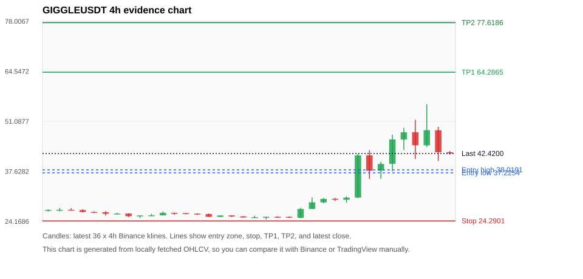
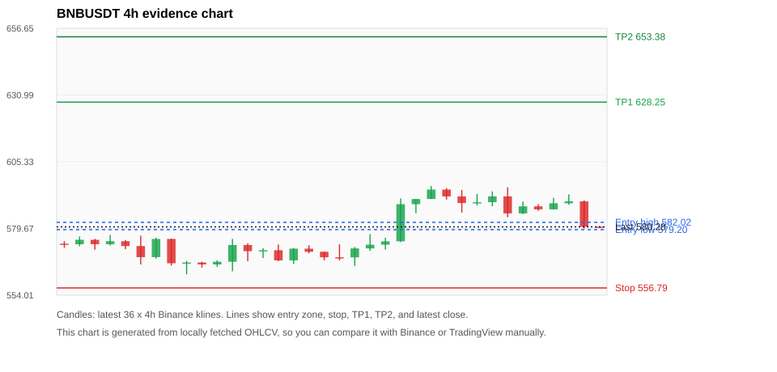
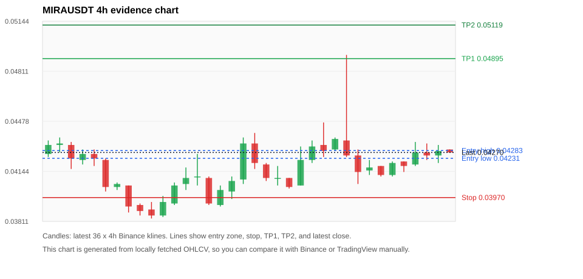
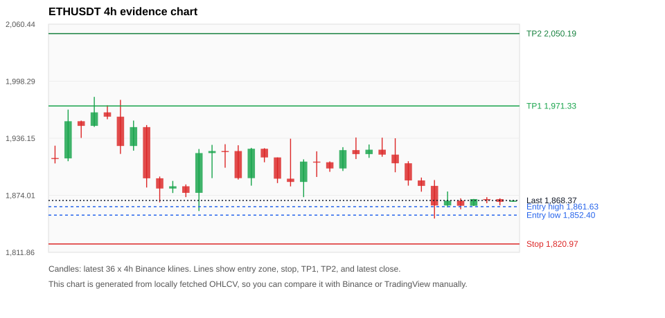
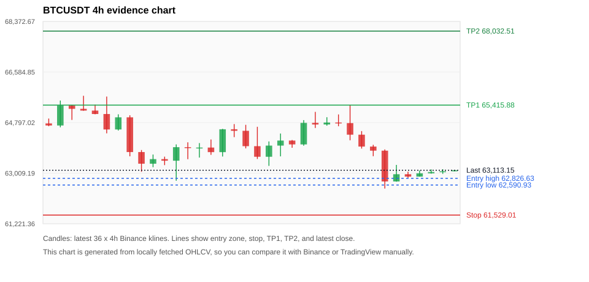

# Crypto 市场扫描报告 v1

- 报告时间：2026-08-01 20:05:40 CST
- Run ID：`20260801_120503_ca7e4bfc`
- Run type：`daily_full`
- 数据来源：SQLite
- 报告版本：v1
- 扫描 ID：3f882458ad8a
- 数据源：Binance public spot API + CoinGecko/CoinMarketCap cross-check
- 过滤条件：USDT spot; 24h quote volume >= 30,000,000; trades >= 30,000; exclude stables/leveraged tokens; analyze 1h/4h/1d klines
- 默认单笔风险：账户权益的 1.00%

## 限制说明

- 交易信号仍以 Binance 现货公开 K 线为主源；外部数据源用于一致性复核。
- 结果是研究和模拟盘计划，不是确定收益或实盘下单指令。
- 历史长度过滤：候选币至少需要 180 根 1d K 线。
- 数据质量验证池：先验证 score 排名前 min(top_n * 2, 10) 的候选，再按 action + score 补足最终名单。
- 大盘环境过滤：RISK_OFF; BTC/ETH 大盘偏弱，山寨币买入候选降级为观察。 BTC 7d=-1.9601553398058247; ETH 7d=-0.3584210273669397.
- 已启用数据交叉验证：Binance 主源 + CoinGecko 自动对照；CoinMarketCap 在配置 API Key 后自动对照。
- GIGGLEUSDT 交叉验证状态 DATA_WARNING：At least one external provider needs manual review.
- BNBUSDT 交叉验证状态 DATA_WARNING：At least one external provider needs manual review.
- MIRAUSDT 交叉验证状态 DATA_WARNING：At least one external provider needs manual review.
- ETHUSDT 交叉验证状态 DATA_WARNING：At least one external provider needs manual review.
- BTCUSDT 交叉验证状态 DATA_WARNING：At least one external provider needs manual review.
- SOLUSDT 交叉验证状态 DATA_WARNING：At least one external provider needs manual review.
- XRPUSDT 交叉验证状态 DATA_WARNING：At least one external provider needs manual review.

## 5 个候选交易计划

| Rank | Coin | Action | Setup | Entry Zone | Stop Loss | TP1 | TP2 / Exit Rule | R/R | Verdict |
|---:|---|---|---|---:|---:|---:|---|---:|---|
| 1 | `GIGGLE` | `WATCH_ONLY` | 涨幅较远，只等深回调 | 37.2254 - 38.0191 | 24.2901 | 64.2865 | 77.6186 或跌破 4h 关键支撑 | 2.00-3.00 | 只等回调 |
| 2 | `BNB` | `WATCH_ONLY` | 回踩支撑/4h EMA 附近 | 579.20 - 582.02 | 556.79 | 628.25 | 653.38 或跌破 4h 关键支撑 | 2.00-3.05 | 只观察 |
| 3 | `MIRA` | `REJECT` | 回踩支撑/4h EMA 附近 | 0.04231 - 0.04283 | 0.03970 | 0.04895 | 0.05119 或跌破 4h 关键支撑 | 2.22-3.00 | 只观察 |
| 4 | `ETH` | `REJECT` | 回踩支撑/4h EMA 附近 | 1,852.40 - 1,861.63 | 1,820.97 | 1,971.33 | 2,050.19 或跌破 4h 关键支撑 | 3.17-5.36 | 只观察 |
| 5 | `BTC` | `REJECT` | 回踩支撑/4h EMA 附近 | 62,590.93 - 62,826.63 | 61,529.01 | 65,415.88 | 68,032.51 或跌破 4h 关键支撑 | 2.29-4.51 | 只观察 |

## 数据交叉验证摘要

价格差异以 Binance 当前价为基准；成交量口径不同，Binance 是 USDT 现货成交额，CoinGecko/CoinMarketCap 通常是全市场成交量。

| Rank | Coin | Data Status | Max Price Diff | Max 24h Diff | Message |
|---:|---|---|---:|---:|---|
| 1 | `GIGGLE` | DATA_WARNING | 0.47% | 6.49 pts | At least one external provider needs manual review. |
| 2 | `BNB` | DATA_WARNING | 0.10% | 0.24 pts | At least one external provider needs manual review. |
| 3 | `MIRA` | DATA_WARNING | 0.14% | 0.29 pts | At least one external provider needs manual review. |
| 4 | `ETH` | DATA_WARNING | 0.13% | 0.50 pts | At least one external provider needs manual review. |
| 5 | `BTC` | DATA_WARNING | 0.11% | 0.03 pts | At least one external provider needs manual review. |

## 候选币说明

### 1. GIGGLE `GIGGLEUSDT`



- 入选原因：涨幅较远，只等深回调；24h +15.89%，7d +66.94%，4h RSI 69.03，24h 成交额 $55.2M。
- 交易失效条件：跌破 24.2901 或 4h 收盘重新失守关键支撑。
- 主要风险：距离支撑偏远，不能追市价；24h 振幅较大，回撤风险高；成交量突增，可能是事件驱动；BTC/ETH 大盘环境未确认强势，山寨币买入信号降级；数据交叉验证需要人工复核。
- 数据交叉验证：DATA_WARNING；At least one external provider needs manual review.

#### 可点击人工验证

- [Binance 交易页](https://www.binance.com/en/trade/GIGGLE_USDT)
- [TradingView 图表](https://www.tradingview.com/chart/?symbol=BINANCE%3AGIGGLEUSDT)
- [CoinGecko 搜索](https://www.coingecko.com/en/search?query=GIGGLE)
- [CoinMarketCap 搜索](https://coinmarketcap.com/search/?q=GIGGLE)

#### 多数据源对照

| Source | Status | Asset ID | Price | 24h Change | 24h Volume | Price Diff | 24h Diff | Updated | Message |
|---|---|---|---:|---:|---:|---:|---:|---|---|
| Binance | DATA_OK | GIGGLEUSDT | 42.4200 | +15.89% | $55.2M | 0.00% | 0.00 pts | 2026-08-01T12:05:16+00:00 | Primary market data source used by scanner. |
| CoinGecko | DATA_WARNING | giggle-fund | 42.2200 | +9.40% | $121.6M | 0.47% | 6.49 pts | 2026-08-01T12:02:20.000Z | 24h change diff 6.49 points exceeds warning threshold |
| CoinMarketCap | DATA_WARNING | 38470 | 42.2638 | +13.40% | $236.5M | 0.37% | 2.49 pts | 2026-08-01T12:04:02.000Z | CoinMarketCap symbol mapping has 3 matches; selected lowest cmc_rank |

#### 指标证据

| 指标 | 数值 | 人工核对用途 |
|---|---:|---|
| 当前价 | 42.4200 | 与 Binance/TradingView 当前价格对照 |
| 24h 涨跌 | +15.89% | 与交易所 24h 涨跌对照 |
| 7d 涨跌 | +66.94% | 判断短线趋势是否延续 |
| 4h EMA20 | 37.1510 | 判断短期趋势支撑 |
| 4h EMA50 | 31.8382 | 判断中期趋势支撑 |
| 1d EMA20 | 29.9466 | 判断日线趋势 |
| 1d EMA50 | 28.5090 | 判断日线趋势 |
| 4h RSI14 | 69.03 | 判断是否过热/过弱 |
| 4h ATR14 | 5.8679 | 推导止损和入场缓冲 |
| 最近 18 根 4h 最低点 | 24.6600 | 支撑/止损参考 |
| 最近 36 根 4h 最高点 | 55.7100 | TP/压力参考 |
| 支撑位 | 37.1510 | 入场区间推导基础 |

#### 交易计划推导

- 支撑位 = 最近低点、4h EMA20、4h EMA50、1d EMA20 中不高于当前价的最高有效支撑 = `37.1510`。
- 入场区间 = 支撑位附近 + ATR 缓冲 = `37.2254 - 38.0191`。
- 止损 = min(最近 18 根 4h 最低点 * 0.985, 入场中位价 - 1.15 * ATR14) = `24.2901`。
- TP1 = max(最近 36 根 4h 最高点 * 0.995, 入场中位价 + 2R) = `64.2865`。
- TP2 = max(入场中位价 + 3R, TP1 * 1.04) = `77.6186`。

#### 最近 10 根 4h K线

| UTC 开盘时间 | Open | High | Low | Close | Quote Volume | Trades |
|---|---:|---:|---:|---:|---:|---:|
| 2026-07-31T00:00+00:00 | 30.0000 | 30.8900 | 29.1600 | 30.5700 | $917,880 | 13792 |
| 2026-07-31T04:00+00:00 | 30.5800 | 42.3200 | 30.4400 | 41.9100 | $7.7M | 109858 |
| 2026-07-31T08:00+00:00 | 41.9300 | 43.3200 | 35.5900 | 37.7800 | $13.6M | 249595 |
| 2026-07-31T12:00+00:00 | 37.8000 | 40.2200 | 35.6200 | 39.6200 | $6.3M | 132094 |
| 2026-07-31T16:00+00:00 | 39.6400 | 47.4800 | 37.6600 | 46.2000 | $8.5M | 180333 |
| 2026-07-31T20:00+00:00 | 46.2000 | 49.3600 | 43.3300 | 48.1300 | $4.4M | 107041 |
| 2026-08-01T00:00+00:00 | 48.1400 | 51.5100 | 40.9600 | 44.6300 | $11.6M | 244264 |
| 2026-08-01T04:00+00:00 | 44.6300 | 55.7100 | 44.1500 | 48.7000 | $14.0M | 265731 |
| 2026-08-01T08:00+00:00 | 48.6700 | 49.5900 | 40.4500 | 42.7800 | $10.6M | 160600 |
| 2026-08-01T12:00+00:00 | 42.7600 | 43.1000 | 42.1100 | 42.4600 | $92,427 | 2089 |

### 2. BNB `BNBUSDT`



- 入选原因：回踩支撑/4h EMA 附近；24h -1.96%，7d +2.11%，4h RSI 55.46，24h 成交额 $60.1M。
- 交易失效条件：跌破 556.79095 或 4h 收盘重新失守关键支撑。
- 主要风险：BTC/ETH 大盘环境未确认强势，山寨币买入信号降级；24h 动量未确认；数据交叉验证需要人工复核。
- 数据交叉验证：DATA_WARNING；At least one external provider needs manual review.

#### 可点击人工验证

- [Binance 交易页](https://www.binance.com/en/trade/BNB_USDT)
- [TradingView 图表](https://www.tradingview.com/chart/?symbol=BINANCE%3ABNBUSDT)
- [CoinGecko 搜索](https://www.coingecko.com/en/search?query=BNB)
- [CoinMarketCap 搜索](https://coinmarketcap.com/search/?q=BNB)

#### 多数据源对照

| Source | Status | Asset ID | Price | 24h Change | 24h Volume | Price Diff | 24h Diff | Updated | Message |
|---|---|---|---:|---:|---:|---:|---:|---|---|
| Binance | DATA_OK | BNBUSDT | 580.28 | -1.96% | $60.1M | 0.00% | 0.00 pts | 2026-08-01T12:05:16+00:00 | Primary market data source used by scanner. |
| CoinGecko | DATA_OK | binancecoin | 579.70 | -2.20% | $614.7M | 0.10% | 0.24 pts | 2026-08-01T12:03:10.000Z | External source agrees with Binance within thresholds. |
| CoinMarketCap | DATA_WARNING | 1839 | 579.77 | -1.95% | $1.09B | 0.09% | 0.01 pts | 2026-08-01T12:04:02.000Z | CoinMarketCap symbol mapping has 4 matches; selected lowest cmc_rank |

#### 指标证据

| 指标 | 数值 | 人工核对用途 |
|---|---:|---|
| 当前价 | 580.28 | 与 Binance/TradingView 当前价格对照 |
| 24h 涨跌 | -1.96% | 与交易所 24h 涨跌对照 |
| 7d 涨跌 | +2.11% | 判断短线趋势是否延续 |
| 4h EMA20 | 583.22 | 判断短期趋势支撑 |
| 4h EMA50 | 578.05 | 判断中期趋势支撑 |
| 1d EMA20 | 575.38 | 判断日线趋势 |
| 1d EMA50 | 582.28 | 判断日线趋势 |
| 4h RSI14 | 55.46 | 判断是否过热/过弱 |
| 4h ATR14 | 6.3743 | 推导止损和入场缓冲 |
| 最近 18 根 4h 最低点 | 565.27 | 支撑/止损参考 |
| 最近 36 根 4h 最高点 | 596.00 | TP/压力参考 |
| 支撑位 | 578.05 | 入场区间推导基础 |

#### 交易计划推导

- 支撑位 = 最近低点、4h EMA20、4h EMA50、1d EMA20 中不高于当前价的最高有效支撑 = `578.05`。
- 入场区间 = 支撑位附近 + ATR 缓冲 = `579.20 - 582.02`。
- 止损 = min(最近 18 根 4h 最低点 * 0.985, 入场中位价 - 1.15 * ATR14) = `556.79`。
- TP1 = max(最近 36 根 4h 最高点 * 0.995, 入场中位价 + 2R) = `628.25`。
- TP2 = max(入场中位价 + 3R, TP1 * 1.04) = `653.38`。

#### 最近 10 根 4h K线

| UTC 开盘时间 | Open | High | Low | Close | Quote Volume | Trades |
|---|---:|---:|---:|---:|---:|---:|
| 2026-07-31T00:00+00:00 | 591.99 | 594.46 | 585.79 | 589.46 | $11.9M | 113936 |
| 2026-07-31T04:00+00:00 | 589.47 | 592.92 | 588.47 | 589.76 | $13.3M | 91636 |
| 2026-07-31T08:00+00:00 | 589.77 | 593.92 | 588.15 | 592.02 | $14.1M | 116449 |
| 2026-07-31T12:00+00:00 | 592.02 | 595.50 | 583.99 | 585.45 | $21.4M | 211242 |
| 2026-07-31T16:00+00:00 | 585.45 | 590.04 | 585.23 | 588.17 | $5.3M | 77917 |
| 2026-07-31T20:00+00:00 | 588.17 | 589.00 | 586.41 | 587.01 | $3.9M | 46641 |
| 2026-08-01T00:00+00:00 | 587.01 | 591.44 | 587.01 | 589.36 | $7.6M | 55289 |
| 2026-08-01T04:00+00:00 | 589.35 | 592.80 | 588.79 | 590.09 | $9.0M | 68228 |
| 2026-08-01T08:00+00:00 | 590.09 | 590.50 | 579.64 | 580.33 | $12.9M | 108418 |
| 2026-08-01T12:00+00:00 | 580.34 | 580.53 | 580.12 | 580.28 | $186,023 | 1678 |

### 3. MIRA `MIRAUSDT`



- 入选原因：回踩支撑/4h EMA 附近；24h +2.39%，7d -4.69%，4h RSI 62.37，24h 成交额 $96.8M。
- 交易失效条件：跌破 0.0396955 或 4h 收盘重新失守关键支撑。
- 主要风险：成交量突增，可能是事件驱动；日线趋势未完全确认；BTC/ETH 大盘环境未确认强势，山寨币买入信号降级；7d 趋势未确认；数据交叉验证需要人工复核。
- 数据交叉验证：DATA_WARNING；At least one external provider needs manual review.

#### 可点击人工验证

- [Binance 交易页](https://www.binance.com/en/trade/MIRA_USDT)
- [TradingView 图表](https://www.tradingview.com/chart/?symbol=BINANCE%3AMIRAUSDT)
- [CoinGecko 搜索](https://www.coingecko.com/en/search?query=MIRA)
- [CoinMarketCap 搜索](https://coinmarketcap.com/search/?q=MIRA)

#### 多数据源对照

| Source | Status | Asset ID | Price | 24h Change | 24h Volume | Price Diff | 24h Diff | Updated | Message |
|---|---|---|---:|---:|---:|---:|---:|---|---|
| Binance | DATA_OK | MIRAUSDT | 0.04270 | +2.39% | $96.8M | 0.00% | 0.00 pts | 2026-08-01T12:05:16+00:00 | Primary market data source used by scanner. |
| CoinGecko | DATA_WARNING | mira-3 | 0.04275 | +2.20% | $132.8M | 0.13% | 0.19 pts | 2026-08-01T12:03:10.000Z | CoinGecko symbol mapping has 2 exact matches; selected highest market-cap rank |
| CoinMarketCap | DATA_WARNING | 38495 | 0.04276 | +2.68% | $179.0M | 0.14% | 0.29 pts | 2026-08-01T12:04:02.000Z | CoinMarketCap symbol mapping has 2 matches; selected lowest cmc_rank |

#### 指标证据

| 指标 | 数值 | 人工核对用途 |
|---|---:|---|
| 当前价 | 0.04270 | 与 Binance/TradingView 当前价格对照 |
| 24h 涨跌 | +2.39% | 与交易所 24h 涨跌对照 |
| 7d 涨跌 | -4.69% | 判断短线趋势是否延续 |
| 4h EMA20 | 0.04207 | 判断短期趋势支撑 |
| 4h EMA50 | 0.04223 | 判断中期趋势支撑 |
| 1d EMA20 | 0.04294 | 判断日线趋势 |
| 1d EMA50 | 0.04778 | 判断日线趋势 |
| 4h RSI14 | 62.37 | 判断是否过热/过弱 |
| 4h ATR14 | 0.0017142857 | 推导止损和入场缓冲 |
| 最近 18 根 4h 最低点 | 0.04030 | 支撑/止损参考 |
| 最近 36 根 4h 最高点 | 0.04920 | TP/压力参考 |
| 支撑位 | 0.04223 | 入场区间推导基础 |

#### 交易计划推导

- 支撑位 = 最近低点、4h EMA20、4h EMA50、1d EMA20 中不高于当前价的最高有效支撑 = `0.04223`。
- 入场区间 = 支撑位附近 + ATR 缓冲 = `0.04231 - 0.04283`。
- 止损 = min(最近 18 根 4h 最低点 * 0.985, 入场中位价 - 1.15 * ATR14) = `0.03970`。
- TP1 = max(最近 36 根 4h 最高点 * 0.995, 入场中位价 + 2R) = `0.04895`。
- TP2 = max(入场中位价 + 3R, TP1 * 1.04) = `0.05119`。

#### 最近 10 根 4h K线

| UTC 开盘时间 | Open | High | Low | Close | Quote Volume | Trades |
|---|---:|---:|---:|---:|---:|---:|
| 2026-07-31T00:00+00:00 | 0.04350 | 0.04920 | 0.04240 | 0.04250 | $8.5M | 35552 |
| 2026-07-31T04:00+00:00 | 0.04250 | 0.04290 | 0.04060 | 0.04140 | $2.8M | 15511 |
| 2026-07-31T08:00+00:00 | 0.04150 | 0.04220 | 0.04120 | 0.04170 | $1.9M | 9181 |
| 2026-07-31T12:00+00:00 | 0.04180 | 0.04180 | 0.04110 | 0.04120 | $1.4M | 8181 |
| 2026-07-31T16:00+00:00 | 0.04120 | 0.04210 | 0.04110 | 0.04200 | $2.9M | 13021 |
| 2026-07-31T20:00+00:00 | 0.04210 | 0.04210 | 0.04140 | 0.04180 | $1.8M | 11098 |
| 2026-08-01T00:00+00:00 | 0.04190 | 0.04340 | 0.04180 | 0.04270 | $4.2M | 35875 |
| 2026-08-01T04:00+00:00 | 0.04270 | 0.04330 | 0.04220 | 0.04250 | $5.3M | 27801 |
| 2026-08-01T08:00+00:00 | 0.04250 | 0.04320 | 0.04200 | 0.04280 | $81.3M | 56911 |
| 2026-08-01T12:00+00:00 | 0.04290 | 0.04290 | 0.04270 | 0.04270 | $49,738 | 367 |

### 4. ETH `ETHUSDT`



- 入选原因：回踩支撑/4h EMA 附近；24h -0.70%，7d +0.06%，4h RSI 34.48，24h 成交额 $327.6M。
- 交易失效条件：跌破 1820.9695 或 4h 收盘重新失守关键支撑。
- 主要风险：日线趋势未完全确认；BTC/ETH 大盘环境未确认强势，山寨币买入信号降级；24h 动量未确认；数据交叉验证需要人工复核。
- 数据交叉验证：DATA_WARNING；At least one external provider needs manual review.

#### 可点击人工验证

- [Binance 交易页](https://www.binance.com/en/trade/ETH_USDT)
- [TradingView 图表](https://www.tradingview.com/chart/?symbol=BINANCE%3AETHUSDT)
- [CoinGecko 搜索](https://www.coingecko.com/en/search?query=ETH)
- [CoinMarketCap 搜索](https://coinmarketcap.com/search/?q=ETH)

#### 多数据源对照

| Source | Status | Asset ID | Price | 24h Change | 24h Volume | Price Diff | 24h Diff | Updated | Message |
|---|---|---|---:|---:|---:|---:|---:|---|---|
| Binance | DATA_OK | ETHUSDT | 1,868.37 | -0.70% | $327.6M | 0.00% | 0.00 pts | 2026-08-01T12:05:16+00:00 | Primary market data source used by scanner. |
| CoinGecko | DATA_OK | ethereum | 1,866.04 | -1.20% | $6.56B | 0.12% | 0.50 pts | 2026-08-01T12:03:10.000Z | External source agrees with Binance within thresholds. |
| CoinMarketCap | DATA_WARNING | 1027 | 1,865.85 | -0.80% | $7.36B | 0.13% | 0.09 pts | 2026-08-01T12:04:02.000Z | CoinMarketCap symbol mapping has 6 matches; selected lowest cmc_rank |

#### 指标证据

| 指标 | 数值 | 人工核对用途 |
|---|---:|---|
| 当前价 | 1,868.37 | 与 Binance/TradingView 当前价格对照 |
| 24h 涨跌 | -0.70% | 与交易所 24h 涨跌对照 |
| 7d 涨跌 | +0.06% | 判断短线趋势是否延续 |
| 4h EMA20 | 1,886.84 | 判断短期趋势支撑 |
| 4h EMA50 | 1,893.60 | 判断中期趋势支撑 |
| 1d EMA20 | 1,871.47 | 判断日线趋势 |
| 1d EMA50 | 1,848.88 | 判断日线趋势 |
| 4h RSI14 | 34.48 | 判断是否过热/过弱 |
| 4h ATR14 | 18.4736 | 推导止损和入场缓冲 |
| 最近 18 根 4h 最低点 | 1,848.70 | 支撑/止损参考 |
| 最近 36 根 4h 最高点 | 1,981.24 | TP/压力参考 |
| 支撑位 | 1,848.70 | 入场区间推导基础 |

#### 交易计划推导

- 支撑位 = 最近低点、4h EMA20、4h EMA50、1d EMA20 中不高于当前价的最高有效支撑 = `1,848.70`。
- 入场区间 = 支撑位附近 + ATR 缓冲 = `1,852.40 - 1,861.63`。
- 止损 = min(最近 18 根 4h 最低点 * 0.985, 入场中位价 - 1.15 * ATR14) = `1,820.97`。
- TP1 = max(最近 36 根 4h 最高点 * 0.995, 入场中位价 + 2R) = `1,971.33`。
- TP2 = max(入场中位价 + 3R, TP1 * 1.04) = `2,050.19`。

#### 最近 10 根 4h K线

| UTC 开盘时间 | Open | High | Low | Close | Quote Volume | Trades |
|---|---:|---:|---:|---:|---:|---:|
| 2026-07-31T00:00+00:00 | 1,918.32 | 1,936.15 | 1,899.09 | 1,908.90 | $74.6M | 376686 |
| 2026-07-31T04:00+00:00 | 1,908.90 | 1,911.16 | 1,884.53 | 1,890.20 | $54.2M | 278492 |
| 2026-07-31T08:00+00:00 | 1,890.20 | 1,893.33 | 1,877.93 | 1,884.26 | $67.2M | 225597 |
| 2026-07-31T12:00+00:00 | 1,884.27 | 1,890.61 | 1,848.70 | 1,862.94 | $168.7M | 847280 |
| 2026-07-31T16:00+00:00 | 1,862.93 | 1,878.14 | 1,860.83 | 1,868.19 | $57.5M | 299054 |
| 2026-07-31T20:00+00:00 | 1,868.19 | 1,870.73 | 1,858.80 | 1,862.60 | $34.7M | 182025 |
| 2026-08-01T00:00+00:00 | 1,862.60 | 1,870.00 | 1,862.38 | 1,869.88 | $19.8M | 87815 |
| 2026-08-01T04:00+00:00 | 1,869.88 | 1,871.98 | 1,865.34 | 1,869.80 | $16.9M | 54808 |
| 2026-08-01T08:00+00:00 | 1,869.81 | 1,870.74 | 1,863.10 | 1,866.90 | $31.1M | 92435 |
| 2026-08-01T12:00+00:00 | 1,866.90 | 1,868.63 | 1,866.89 | 1,868.37 | $645,192 | 4444 |

### 5. BTC `BTCUSDT`



- 入选原因：回踩支撑/4h EMA 附近；24h -1.02%，7d -1.65%，4h RSI 37.10，24h 成交额 $907.4M。
- 交易失效条件：跌破 61529.01 或 4h 收盘重新失守关键支撑。
- 主要风险：日线趋势未完全确认；BTC/ETH 大盘环境未确认强势，山寨币买入信号降级；24h 动量未确认；7d 趋势未确认；数据交叉验证需要人工复核。
- 数据交叉验证：DATA_WARNING；At least one external provider needs manual review.

#### 可点击人工验证

- [Binance 交易页](https://www.binance.com/en/trade/BTC_USDT)
- [TradingView 图表](https://www.tradingview.com/chart/?symbol=BINANCE%3ABTCUSDT)
- [CoinGecko 搜索](https://www.coingecko.com/en/search?query=BTC)
- [CoinMarketCap 搜索](https://coinmarketcap.com/search/?q=BTC)

#### 多数据源对照

| Source | Status | Asset ID | Price | 24h Change | 24h Volume | Price Diff | 24h Diff | Updated | Message |
|---|---|---|---:|---:|---:|---:|---:|---|---|
| Binance | DATA_OK | BTCUSDT | 63,113.15 | -1.02% | $907.4M | 0.00% | 0.00 pts | 2026-08-01T12:05:16+00:00 | Primary market data source used by scanner. |
| CoinGecko | DATA_WARNING | n/a | n/a | n/a | n/a | n/a | n/a | 2026-08-01T12:05:16+00:00 | Failed to fetch https://api.coingecko.com/api/v3/coins/markets?vs_currency=usd&ids=bitcoin&price_change_percentage=24h&per_page=1&page=1: HTTP Error 429: Too Many Requests |
| CoinMarketCap | DATA_WARNING | 1 | 63,041.36 | -1.05% | $22.60B | 0.11% | 0.03 pts | 2026-08-01T12:04:02.000Z | CoinMarketCap symbol mapping has 13 matches; selected lowest cmc_rank |

#### 指标证据

| 指标 | 数值 | 人工核对用途 |
|---|---:|---|
| 当前价 | 63,113.15 | 与 Binance/TradingView 当前价格对照 |
| 24h 涨跌 | -1.02% | 与交易所 24h 涨跌对照 |
| 7d 涨跌 | -1.65% | 判断短线趋势是否延续 |
| 4h EMA20 | 63,629.03 | 判断短期趋势支撑 |
| 4h EMA50 | 64,062.41 | 判断中期趋势支撑 |
| 1d EMA20 | 64,093.23 | 判断日线趋势 |
| 1d EMA50 | 64,775.93 | 判断日线趋势 |
| 4h RSI14 | 37.10 | 判断是否过热/过弱 |
| 4h ATR14 | 515.18 | 推导止损和入场缓冲 |
| 最近 18 根 4h 最低点 | 62,466.00 | 支撑/止损参考 |
| 最近 36 根 4h 最高点 | 65,744.60 | TP/压力参考 |
| 支撑位 | 62,466.00 | 入场区间推导基础 |

#### 交易计划推导

- 支撑位 = 最近低点、4h EMA20、4h EMA50、1d EMA20 中不高于当前价的最高有效支撑 = `62,466.00`。
- 入场区间 = 支撑位附近 + ATR 缓冲 = `62,590.93 - 62,826.63`。
- 止损 = min(最近 18 根 4h 最低点 * 0.985, 入场中位价 - 1.15 * ATR14) = `61,529.01`。
- TP1 = max(最近 36 根 4h 最高点 * 0.995, 入场中位价 + 2R) = `65,415.88`。
- TP2 = max(入场中位价 + 3R, TP1 * 1.04) = `68,032.51`。

#### 最近 10 根 4h K线

| UTC 开盘时间 | Open | High | Low | Close | Quote Volume | Trades |
|---|---:|---:|---:|---:|---:|---:|
| 2026-07-31T00:00+00:00 | 64,780.03 | 65,409.56 | 64,172.00 | 64,370.00 | $212.3M | 576077 |
| 2026-07-31T04:00+00:00 | 64,370.00 | 64,496.64 | 63,878.11 | 63,950.01 | $289.3M | 350769 |
| 2026-07-31T08:00+00:00 | 63,950.01 | 64,011.99 | 63,610.00 | 63,805.51 | $128.1M | 285681 |
| 2026-07-31T12:00+00:00 | 63,805.50 | 63,849.19 | 62,466.00 | 62,716.57 | $417.1M | 911977 |
| 2026-07-31T16:00+00:00 | 62,716.57 | 63,302.00 | 62,709.01 | 62,972.00 | $174.7M | 422083 |
| 2026-07-31T20:00+00:00 | 62,972.00 | 63,062.47 | 62,846.00 | 62,887.88 | $80.7M | 193651 |
| 2026-08-01T00:00+00:00 | 62,887.88 | 63,106.55 | 62,887.87 | 63,004.48 | $103.4M | 124285 |
| 2026-08-01T04:00+00:00 | 63,004.47 | 63,142.85 | 62,992.82 | 63,050.46 | $80.0M | 85782 |
| 2026-08-01T08:00+00:00 | 63,050.45 | 63,150.00 | 62,986.31 | 63,076.00 | $52.6M | 86193 |
| 2026-08-01T12:00+00:00 | 63,076.00 | 63,114.00 | 63,076.00 | 63,113.15 | $1.1M | 1805 |

## 组合风控

- 不要 5 个候选全部满仓买入。
- 同时持仓总风险建议控制在账户权益的 3% - 5% 以内。
- 如果 BTC/ETH 同时破位，暂停山寨币多头计划或降低仓位。
- 第一版报告用于模拟盘和人工复核，不自动下单。

## 原始数据

```json
[
  {
    "rank": 1,
    "symbol": "GIGGLEUSDT",
    "base_asset": "GIGGLE",
    "price": 42.42,
    "score": 59.433232735890044,
    "setup": "涨幅较远，只等深回调",
    "verdict": "只等回调",
    "entry_low": 37.22535208482826,
    "entry_high": 38.019107142857145,
    "stop_loss": 24.2901,
    "take_profit_1": 64.28648884152813,
    "take_profit_2": 77.61861845537082,
    "risk_reward_1": 2.0000000000000004,
    "risk_reward_2": 2.9999999999999996,
    "pct_24h": 15.89,
    "pct_3d": 65.962441314554,
    "pct_7d": 66.94214876033058,
    "quote_volume_24h": 55194155.69865,
    "trades_24h": 1085912,
    "high_low_range_24h": 56.4008983717013,
    "rsi_1h": 43.896551724137936,
    "rsi_4h": 69.03140786294752,
    "ema20_4h": 37.151049984858545,
    "ema50_4h": 31.83822661632771,
    "ema20_1d": 29.94658929438853,
    "ema50_1d": 28.50896909610675,
    "atr_4h": 5.867857142857143,
    "macd_hist_4h": 1.0181233245966483,
    "volume_ratio_24h": 8.15882206912713,
    "support_level": 37.151049984858545,
    "recent_low_4h_18": 24.66,
    "recent_high_4h_36": 55.71,
    "distance_to_support_pct": 14.182506328324207,
    "binance_trade_url": "https://www.binance.com/en/trade/GIGGLE_USDT",
    "tradingview_url": "https://www.tradingview.com/chart/?symbol=BINANCE%3AGIGGLEUSDT",
    "coingecko_search_url": "https://www.coingecko.com/en/search?query=GIGGLE",
    "coinmarketcap_search_url": "https://coinmarketcap.com/search/?q=GIGGLE",
    "invalidation": "跌破 24.2901 或 4h 收盘重新失守关键支撑",
    "recent_4h_klines": [
      {
        "open_time_utc": "2026-07-26T16:00+00:00",
        "open": 27.12,
        "high": 27.4,
        "low": 26.81,
        "close": 27.26,
        "quote_volume": 195340.95704,
        "trades": 1480
      },
      {
        "open_time_utc": "2026-07-26T20:00+00:00",
        "open": 27.29,
        "high": 27.77,
        "low": 26.86,
        "close": 27.29,
        "quote_volume": 499946.11819,
        "trades": 4866
      },
      {
        "open_time_utc": "2026-07-27T00:00+00:00",
        "open": 27.29,
        "high": 27.73,
        "low": 27.14,
        "close": 27.21,
        "quote_volume": 321772.57862,
        "trades": 3450
      },
      {
        "open_time_utc": "2026-07-27T04:00+00:00",
        "open": 27.21,
        "high": 27.44,
        "low": 26.59,
        "close": 26.68,
        "quote_volume": 308861.2108,
        "trades": 4522
      },
      {
        "open_time_utc": "2026-07-27T08:00+00:00",
        "open": 26.68,
        "high": 26.88,
        "low": 26.61,
        "close": 26.62,
        "quote_volume": 125825.62077,
        "trades": 2013
      },
      {
        "open_time_utc": "2026-07-27T12:00+00:00",
        "open": 26.63,
        "high": 26.89,
        "low": 25.75,
        "close": 26.21,
        "quote_volume": 564446.16606,
        "trades": 9816
      },
      {
        "open_time_utc": "2026-07-27T16:00+00:00",
        "open": 26.22,
        "high": 26.52,
        "low": 26.09,
        "close": 26.27,
        "quote_volume": 118694.42707,
        "trades": 1766
      },
      {
        "open_time_utc": "2026-07-27T20:00+00:00",
        "open": 26.28,
        "high": 26.36,
        "low": 25.33,
        "close": 25.55,
        "quote_volume": 235272.52609,
        "trades": 3215
      },
      {
        "open_time_utc": "2026-07-28T00:00+00:00",
        "open": 25.56,
        "high": 25.76,
        "low": 25.1,
        "close": 25.76,
        "quote_volume": 237116.23925,
        "trades": 2475
      },
      {
        "open_time_utc": "2026-07-28T04:00+00:00",
        "open": 25.76,
        "high": 26.21,
        "low": 25.65,
        "close": 25.79,
        "quote_volume": 127409.29108,
        "trades": 1443
      },
      {
        "open_time_utc": "2026-07-28T08:00+00:00",
        "open": 25.78,
        "high": 26.83,
        "low": 25.77,
        "close": 26.45,
        "quote_volume": 342208.85346,
        "trades": 2793
      },
      {
        "open_time_utc": "2026-07-28T12:00+00:00",
        "open": 26.45,
        "high": 26.52,
        "low": 25.95,
        "close": 26.39,
        "quote_volume": 215858.94523,
        "trades": 2788
      },
      {
        "open_time_utc": "2026-07-28T16:00+00:00",
        "open": 26.4,
        "high": 26.4,
        "low": 26.06,
        "close": 26.26,
        "quote_volume": 114763.71997,
        "trades": 1390
      },
      {
        "open_time_utc": "2026-07-28T20:00+00:00",
        "open": 26.26,
        "high": 26.35,
        "low": 25.9,
        "close": 26.13,
        "quote_volume": 48066.10626,
        "trades": 827
      },
      {
        "open_time_utc": "2026-07-29T00:00+00:00",
        "open": 26.12,
        "high": 26.3,
        "low": 25.38,
        "close": 25.39,
        "quote_volume": 299784.32662,
        "trades": 2443
      },
      {
        "open_time_utc": "2026-07-29T04:00+00:00",
        "open": 25.38,
        "high": 25.78,
        "low": 25.28,
        "close": 25.76,
        "quote_volume": 139141.7259,
        "trades": 1698
      },
      {
        "open_time_utc": "2026-07-29T08:00+00:00",
        "open": 25.77,
        "high": 25.77,
        "low": 25.32,
        "close": 25.5,
        "quote_volume": 224521.28328,
        "trades": 1490
      },
      {
        "open_time_utc": "2026-07-29T12:00+00:00",
        "open": 25.51,
        "high": 25.59,
        "low": 25.2,
        "close": 25.22,
        "quote_volume": 183884.83839,
        "trades": 1839
      },
      {
        "open_time_utc": "2026-07-29T16:00+00:00",
        "open": 25.23,
        "high": 25.73,
        "low": 25.19,
        "close": 25.29,
        "quote_volume": 149644.75493,
        "trades": 2185
      },
      {
        "open_time_utc": "2026-07-29T20:00+00:00",
        "open": 25.29,
        "high": 25.42,
        "low": 24.66,
        "close": 25.4,
        "quote_volume": 185461.35252,
        "trades": 2388
      },
      {
        "open_time_utc": "2026-07-30T00:00+00:00",
        "open": 25.39,
        "high": 25.56,
        "low": 25.21,
        "close": 25.38,
        "quote_volume": 81086.85007,
        "trades": 1204
      },
      {
        "open_time_utc": "2026-07-30T04:00+00:00",
        "open": 25.38,
        "high": 25.49,
        "low": 25.12,
        "close": 25.13,
        "quote_volume": 94916.48242,
        "trades": 1087
      },
      {
        "open_time_utc": "2026-07-30T08:00+00:00",
        "open": 25.13,
        "high": 27.82,
        "low": 25.04,
        "close": 27.51,
        "quote_volume": 2496598.30173,
        "trades": 24923
      },
      {
        "open_time_utc": "2026-07-30T12:00+00:00",
        "open": 27.51,
        "high": 30.59,
        "low": 27.5,
        "close": 29.3,
        "quote_volume": 4442056.51795,
        "trades": 43970
      },
      {
        "open_time_utc": "2026-07-30T16:00+00:00",
        "open": 29.28,
        "high": 30.45,
        "low": 29.04,
        "close": 30.22,
        "quote_volume": 1406365.70279,
        "trades": 15203
      },
      {
        "open_time_utc": "2026-07-30T20:00+00:00",
        "open": 30.24,
        "high": 30.49,
        "low": 29.65,
        "close": 29.99,
        "quote_volume": 585055.71063,
        "trades": 9234
      },
      {
        "open_time_utc": "2026-07-31T00:00+00:00",
        "open": 30.0,
        "high": 30.89,
        "low": 29.16,
        "close": 30.57,
        "quote_volume": 917879.82236,
        "trades": 13792
      },
      {
        "open_time_utc": "2026-07-31T04:00+00:00",
        "open": 30.58,
        "high": 42.32,
        "low": 30.44,
        "close": 41.91,
        "quote_volume": 7668107.73656,
        "trades": 109858
      },
      {
        "open_time_utc": "2026-07-31T08:00+00:00",
        "open": 41.93,
        "high": 43.32,
        "low": 35.59,
        "close": 37.78,
        "quote_volume": 13589783.19055,
        "trades": 249595
      },
      {
        "open_time_utc": "2026-07-31T12:00+00:00",
        "open": 37.8,
        "high": 40.22,
        "low": 35.62,
        "close": 39.62,
        "quote_volume": 6288063.81456,
        "trades": 132094
      },
      {
        "open_time_utc": "2026-07-31T16:00+00:00",
        "open": 39.64,
        "high": 47.48,
        "low": 37.66,
        "close": 46.2,
        "quote_volume": 8519074.32761,
        "trades": 180333
      },
      {
        "open_time_utc": "2026-07-31T20:00+00:00",
        "open": 46.2,
        "high": 49.36,
        "low": 43.33,
        "close": 48.13,
        "quote_volume": 4437848.58803,
        "trades": 107041
      },
      {
        "open_time_utc": "2026-08-01T00:00+00:00",
        "open": 48.14,
        "high": 51.51,
        "low": 40.96,
        "close": 44.63,
        "quote_volume": 11576826.27877,
        "trades": 244264
      },
      {
        "open_time_utc": "2026-08-01T04:00+00:00",
        "open": 44.63,
        "high": 55.71,
        "low": 44.15,
        "close": 48.7,
        "quote_volume": 14045737.85066,
        "trades": 265731
      },
      {
        "open_time_utc": "2026-08-01T08:00+00:00",
        "open": 48.67,
        "high": 49.59,
        "low": 40.45,
        "close": 42.78,
        "quote_volume": 10571832.87045,
        "trades": 160600
      },
      {
        "open_time_utc": "2026-08-01T12:00+00:00",
        "open": 42.76,
        "high": 43.1,
        "low": 42.11,
        "close": 42.46,
        "quote_volume": 92426.88406,
        "trades": 2089
      }
    ],
    "risks": [
      "距离支撑偏远，不能追市价",
      "24h 振幅较大，回撤风险高",
      "成交量突增，可能是事件驱动",
      "BTC/ETH 大盘环境未确认强势，山寨币买入信号降级",
      "数据交叉验证需要人工复核"
    ],
    "data_quality_status": "DATA_WARNING",
    "data_quality_message": "At least one external provider needs manual review.",
    "data_checks": [
      {
        "provider": "Binance",
        "status": "DATA_OK",
        "provider_asset_id": "GIGGLEUSDT",
        "provider_symbol": "GIGGLEUSDT",
        "price_usd": 42.42,
        "pct_24h": 15.89,
        "volume_24h": 55194155.69865,
        "last_updated": null,
        "fetched_at_utc": "2026-08-01T12:05:16+00:00",
        "price_diff_pct": 0.0,
        "pct_24h_diff": 0.0,
        "volume_note": "Binance USDT spot 24h quoteVolume.",
        "message": "Primary market data source used by scanner."
      },
      {
        "provider": "CoinGecko",
        "status": "DATA_WARNING",
        "provider_asset_id": "giggle-fund",
        "provider_symbol": "GIGGLE",
        "price_usd": 42.22,
        "pct_24h": 9.4,
        "volume_24h": 121622840.0,
        "last_updated": "2026-08-01T12:02:20.000Z",
        "fetched_at_utc": "2026-08-01T12:05:16+00:00",
        "price_diff_pct": 0.4714757190004782,
        "pct_24h_diff": 6.49,
        "volume_note": "CoinGecko total market volume; not the same venue scope as Binance quoteVolume.",
        "message": "24h change diff 6.49 points exceeds warning threshold"
      },
      {
        "provider": "CoinMarketCap",
        "status": "DATA_WARNING",
        "provider_asset_id": "38470",
        "provider_symbol": "GIGGLE",
        "price_usd": 42.26380390079154,
        "pct_24h": 13.39513101,
        "volume_24h": 236523534.75876725,
        "last_updated": "2026-08-01T12:04:02.000Z",
        "fetched_at_utc": "2026-08-01T12:05:16+00:00",
        "price_diff_pct": 0.36821334089690005,
        "pct_24h_diff": 2.4948689900000005,
        "volume_note": "CoinMarketCap total market volume; not the same venue scope as Binance quoteVolume.",
        "message": "CoinMarketCap symbol mapping has 3 matches; selected lowest cmc_rank"
      }
    ],
    "action": "WATCH_ONLY"
  },
  {
    "rank": 2,
    "symbol": "BNBUSDT",
    "base_asset": "BNB",
    "price": 580.28,
    "score": 30.003055791887675,
    "setup": "回踩支撑/4h EMA 附近",
    "verdict": "只观察",
    "entry_low": 579.2014886252672,
    "entry_high": 582.0208399999999,
    "stop_loss": 556.79095,
    "take_profit_1": 628.2515929379006,
    "take_profit_2": 653.3816566554166,
    "risk_reward_1": 2.0,
    "risk_reward_2": 3.0549889848886775,
    "pct_24h": -1.963,
    "pct_3d": 1.7606621773288422,
    "pct_7d": 2.109838286790189,
    "quote_volume_24h": 60110066.93311,
    "trades_24h": 566818,
    "high_low_range_24h": 2.7361810779104268,
    "rsi_1h": 33.98724865129962,
    "rsi_4h": 55.45525902668757,
    "ema20_4h": 583.223993922435,
    "ema50_4h": 578.045397829608,
    "ema20_1d": 575.3816395636795,
    "ema50_1d": 582.2776281951936,
    "atr_4h": 6.3742857142857146,
    "macd_hist_4h": -1.046233796732384,
    "volume_ratio_24h": 1.0715140260275002,
    "support_level": 578.045397829608,
    "recent_low_4h_18": 565.27,
    "recent_high_4h_36": 596.0,
    "distance_to_support_pct": 0.3865790089813581,
    "binance_trade_url": "https://www.binance.com/en/trade/BNB_USDT",
    "tradingview_url": "https://www.tradingview.com/chart/?symbol=BINANCE%3ABNBUSDT",
    "coingecko_search_url": "https://www.coingecko.com/en/search?query=BNB",
    "coinmarketcap_search_url": "https://coinmarketcap.com/search/?q=BNB",
    "invalidation": "跌破 556.79095 或 4h 收盘重新失守关键支撑",
    "recent_4h_klines": [
      {
        "open_time_utc": "2026-07-26T16:00+00:00",
        "open": 573.8,
        "high": 574.75,
        "low": 572.2,
        "close": 573.59,
        "quote_volume": 6221235.66545,
        "trades": 43799
      },
      {
        "open_time_utc": "2026-07-26T20:00+00:00",
        "open": 573.59,
        "high": 576.57,
        "low": 572.8,
        "close": 575.32,
        "quote_volume": 4929519.6945,
        "trades": 58594
      },
      {
        "open_time_utc": "2026-07-27T00:00+00:00",
        "open": 575.31,
        "high": 575.67,
        "low": 571.49,
        "close": 573.61,
        "quote_volume": 4391338.48893,
        "trades": 56836
      },
      {
        "open_time_utc": "2026-07-27T04:00+00:00",
        "open": 573.61,
        "high": 577.2,
        "low": 573.09,
        "close": 574.76,
        "quote_volume": 5599569.09944,
        "trades": 62124
      },
      {
        "open_time_utc": "2026-07-27T08:00+00:00",
        "open": 574.76,
        "high": 575.15,
        "low": 571.68,
        "close": 572.9,
        "quote_volume": 11459995.44214,
        "trades": 75781
      },
      {
        "open_time_utc": "2026-07-27T12:00+00:00",
        "open": 572.9,
        "high": 576.89,
        "low": 565.8,
        "close": 568.64,
        "quote_volume": 12567692.46647,
        "trades": 152214
      },
      {
        "open_time_utc": "2026-07-27T16:00+00:00",
        "open": 568.64,
        "high": 576.11,
        "low": 568.06,
        "close": 575.62,
        "quote_volume": 6984732.60631,
        "trades": 87544
      },
      {
        "open_time_utc": "2026-07-27T20:00+00:00",
        "open": 575.63,
        "high": 575.77,
        "low": 565.4,
        "close": 566.28,
        "quote_volume": 5038934.04506,
        "trades": 71729
      },
      {
        "open_time_utc": "2026-07-28T00:00+00:00",
        "open": 566.28,
        "high": 567.21,
        "low": 562.03,
        "close": 566.57,
        "quote_volume": 7600035.58643,
        "trades": 89467
      },
      {
        "open_time_utc": "2026-07-28T04:00+00:00",
        "open": 566.58,
        "high": 566.85,
        "low": 564.6,
        "close": 565.83,
        "quote_volume": 6846526.53585,
        "trades": 59171
      },
      {
        "open_time_utc": "2026-07-28T08:00+00:00",
        "open": 565.84,
        "high": 567.44,
        "low": 564.9,
        "close": 566.86,
        "quote_volume": 5243594.50486,
        "trades": 56281
      },
      {
        "open_time_utc": "2026-07-28T12:00+00:00",
        "open": 566.86,
        "high": 575.66,
        "low": 563.19,
        "close": 573.3,
        "quote_volume": 17323736.88458,
        "trades": 148347
      },
      {
        "open_time_utc": "2026-07-28T16:00+00:00",
        "open": 573.3,
        "high": 573.97,
        "low": 567.05,
        "close": 570.93,
        "quote_volume": 7243684.90121,
        "trades": 88417
      },
      {
        "open_time_utc": "2026-07-28T20:00+00:00",
        "open": 570.93,
        "high": 572.07,
        "low": 568.29,
        "close": 571.29,
        "quote_volume": 4076171.61659,
        "trades": 48932
      },
      {
        "open_time_utc": "2026-07-29T00:00+00:00",
        "open": 571.29,
        "high": 573.5,
        "low": 567.1,
        "close": 567.38,
        "quote_volume": 6840078.17237,
        "trades": 79350
      },
      {
        "open_time_utc": "2026-07-29T04:00+00:00",
        "open": 567.39,
        "high": 572.13,
        "low": 566.01,
        "close": 571.9,
        "quote_volume": 5356221.85459,
        "trades": 65122
      },
      {
        "open_time_utc": "2026-07-29T08:00+00:00",
        "open": 571.89,
        "high": 573.23,
        "low": 570.11,
        "close": 570.69,
        "quote_volume": 6704377.91709,
        "trades": 56292
      },
      {
        "open_time_utc": "2026-07-29T12:00+00:00",
        "open": 570.7,
        "high": 570.74,
        "low": 567.4,
        "close": 568.57,
        "quote_volume": 6654286.42429,
        "trades": 88668
      },
      {
        "open_time_utc": "2026-07-29T16:00+00:00",
        "open": 568.57,
        "high": 573.56,
        "low": 567.37,
        "close": 568.54,
        "quote_volume": 10649643.90124,
        "trades": 114464
      },
      {
        "open_time_utc": "2026-07-29T20:00+00:00",
        "open": 568.55,
        "high": 572.56,
        "low": 565.27,
        "close": 571.99,
        "quote_volume": 5672178.83379,
        "trades": 62627
      },
      {
        "open_time_utc": "2026-07-30T00:00+00:00",
        "open": 571.99,
        "high": 577.51,
        "low": 571.05,
        "close": 573.42,
        "quote_volume": 8506418.03834,
        "trades": 73778
      },
      {
        "open_time_utc": "2026-07-30T04:00+00:00",
        "open": 573.42,
        "high": 576.1,
        "low": 571.56,
        "close": 574.72,
        "quote_volume": 6572177.87838,
        "trades": 63304
      },
      {
        "open_time_utc": "2026-07-30T08:00+00:00",
        "open": 574.72,
        "high": 591.25,
        "low": 574.41,
        "close": 589.0,
        "quote_volume": 28142122.95862,
        "trades": 201224
      },
      {
        "open_time_utc": "2026-07-30T12:00+00:00",
        "open": 589.0,
        "high": 591.0,
        "low": 585.52,
        "close": 590.99,
        "quote_volume": 17249377.15884,
        "trades": 143015
      },
      {
        "open_time_utc": "2026-07-30T16:00+00:00",
        "open": 591.0,
        "high": 596.0,
        "low": 591.0,
        "close": 594.62,
        "quote_volume": 13762859.31738,
        "trades": 122399
      },
      {
        "open_time_utc": "2026-07-30T20:00+00:00",
        "open": 594.62,
        "high": 595.18,
        "low": 590.78,
        "close": 591.99,
        "quote_volume": 9622587.40278,
        "trades": 66995
      },
      {
        "open_time_utc": "2026-07-31T00:00+00:00",
        "open": 591.99,
        "high": 594.46,
        "low": 585.79,
        "close": 589.46,
        "quote_volume": 11857275.34371,
        "trades": 113936
      },
      {
        "open_time_utc": "2026-07-31T04:00+00:00",
        "open": 589.47,
        "high": 592.92,
        "low": 588.47,
        "close": 589.76,
        "quote_volume": 13273327.35596,
        "trades": 91636
      },
      {
        "open_time_utc": "2026-07-31T08:00+00:00",
        "open": 589.77,
        "high": 593.92,
        "low": 588.15,
        "close": 592.02,
        "quote_volume": 14135917.51286,
        "trades": 116449
      },
      {
        "open_time_utc": "2026-07-31T12:00+00:00",
        "open": 592.02,
        "high": 595.5,
        "low": 583.99,
        "close": 585.45,
        "quote_volume": 21376533.93513,
        "trades": 211242
      },
      {
        "open_time_utc": "2026-07-31T16:00+00:00",
        "open": 585.45,
        "high": 590.04,
        "low": 585.23,
        "close": 588.17,
        "quote_volume": 5309856.93839,
        "trades": 77917
      },
      {
        "open_time_utc": "2026-07-31T20:00+00:00",
        "open": 588.17,
        "high": 589.0,
        "low": 586.41,
        "close": 587.01,
        "quote_volume": 3925135.34459,
        "trades": 46641
      },
      {
        "open_time_utc": "2026-08-01T00:00+00:00",
        "open": 587.01,
        "high": 591.44,
        "low": 587.01,
        "close": 589.36,
        "quote_volume": 7636935.15965,
        "trades": 55289
      },
      {
        "open_time_utc": "2026-08-01T04:00+00:00",
        "open": 589.35,
        "high": 592.8,
        "low": 588.79,
        "close": 590.09,
        "quote_volume": 8963946.11569,
        "trades": 68228
      },
      {
        "open_time_utc": "2026-08-01T08:00+00:00",
        "open": 590.09,
        "high": 590.5,
        "low": 579.64,
        "close": 580.33,
        "quote_volume": 12863949.34825,
        "trades": 108418
      },
      {
        "open_time_utc": "2026-08-01T12:00+00:00",
        "open": 580.34,
        "high": 580.53,
        "low": 580.12,
        "close": 580.28,
        "quote_volume": 186022.77325,
        "trades": 1678
      }
    ],
    "risks": [
      "BTC/ETH 大盘环境未确认强势，山寨币买入信号降级",
      "24h 动量未确认",
      "数据交叉验证需要人工复核"
    ],
    "data_quality_status": "DATA_WARNING",
    "data_quality_message": "At least one external provider needs manual review.",
    "data_checks": [
      {
        "provider": "Binance",
        "status": "DATA_OK",
        "provider_asset_id": "BNBUSDT",
        "provider_symbol": "BNBUSDT",
        "price_usd": 580.28,
        "pct_24h": -1.963,
        "volume_24h": 60110066.93311,
        "last_updated": null,
        "fetched_at_utc": "2026-08-01T12:05:16+00:00",
        "price_diff_pct": 0.0,
        "pct_24h_diff": 0.0,
        "volume_note": "Binance USDT spot 24h quoteVolume.",
        "message": "Primary market data source used by scanner."
      },
      {
        "provider": "CoinGecko",
        "status": "DATA_OK",
        "provider_asset_id": "binancecoin",
        "provider_symbol": "BNB",
        "price_usd": 579.7,
        "pct_24h": -2.2,
        "volume_24h": 614736280.0,
        "last_updated": "2026-08-01T12:03:10.000Z",
        "fetched_at_utc": "2026-08-01T12:05:16+00:00",
        "price_diff_pct": 0.09995174743226154,
        "pct_24h_diff": 0.2370000000000001,
        "volume_note": "CoinGecko total market volume; not the same venue scope as Binance quoteVolume.",
        "message": "External source agrees with Binance within thresholds."
      },
      {
        "provider": "CoinMarketCap",
        "status": "DATA_WARNING",
        "provider_asset_id": "1839",
        "provider_symbol": "BNB",
        "price_usd": 579.7704841509026,
        "pct_24h": -1.95228362,
        "volume_24h": 1087141000.1797163,
        "last_updated": "2026-08-01T12:04:02.000Z",
        "fetched_at_utc": "2026-08-01T12:05:16+00:00",
        "price_diff_pct": 0.08780517148573055,
        "pct_24h_diff": 0.01071638000000008,
        "volume_note": "CoinMarketCap total market volume; not the same venue scope as Binance quoteVolume.",
        "message": "CoinMarketCap symbol mapping has 4 matches; selected lowest cmc_rank"
      }
    ],
    "action": "WATCH_ONLY"
  },
  {
    "rank": 3,
    "symbol": "MIRAUSDT",
    "base_asset": "MIRA",
    "price": 0.0427,
    "score": 18.225421842655138,
    "setup": "回踩支撑/4h EMA 附近",
    "verdict": "只观察",
    "entry_low": 0.04230958913633314,
    "entry_high": 0.042828099999999994,
    "stop_loss": 0.0396955,
    "take_profit_1": 0.048954,
    "take_profit_2": 0.05118887827266625,
    "risk_reward_1": 2.2222031783357274,
    "risk_reward_2": 3.0,
    "pct_24h": 2.392,
    "pct_3d": 0.9456264775413725,
    "pct_7d": -4.6875,
    "quote_volume_24h": 96833038.51577,
    "trades_24h": 152835,
    "high_low_range_24h": 5.596107055961075,
    "rsi_1h": 64.28571428571438,
    "rsi_4h": 62.365591397849464,
    "ema20_4h": 0.04207202939556805,
    "ema50_4h": 0.04222513885861591,
    "ema20_1d": 0.042942887762058055,
    "ema50_1d": 0.047783326551346955,
    "atr_4h": 0.0017142857142857144,
    "macd_hist_4h": 0.00013158809034754994,
    "volume_ratio_24h": 20.750123677204456,
    "support_level": 0.04222513885861591,
    "recent_low_4h_18": 0.0403,
    "recent_high_4h_36": 0.0492,
    "distance_to_support_pct": 1.124593439406052,
    "binance_trade_url": "https://www.binance.com/en/trade/MIRA_USDT",
    "tradingview_url": "https://www.tradingview.com/chart/?symbol=BINANCE%3AMIRAUSDT",
    "coingecko_search_url": "https://www.coingecko.com/en/search?query=MIRA",
    "coinmarketcap_search_url": "https://coinmarketcap.com/search/?q=MIRA",
    "invalidation": "跌破 0.0396955 或 4h 收盘重新失守关键支撑",
    "recent_4h_klines": [
      {
        "open_time_utc": "2026-07-26T16:00+00:00",
        "open": 0.0426,
        "high": 0.0435,
        "low": 0.0424,
        "close": 0.0432,
        "quote_volume": 186882.35985,
        "trades": 1665
      },
      {
        "open_time_utc": "2026-07-26T20:00+00:00",
        "open": 0.0432,
        "high": 0.0437,
        "low": 0.0427,
        "close": 0.0433,
        "quote_volume": 211010.4216,
        "trades": 2035
      },
      {
        "open_time_utc": "2026-07-27T00:00+00:00",
        "open": 0.0432,
        "high": 0.0434,
        "low": 0.0416,
        "close": 0.0423,
        "quote_volume": 210357.20516,
        "trades": 1804
      },
      {
        "open_time_utc": "2026-07-27T04:00+00:00",
        "open": 0.0422,
        "high": 0.0429,
        "low": 0.0419,
        "close": 0.0426,
        "quote_volume": 180987.28356,
        "trades": 1402
      },
      {
        "open_time_utc": "2026-07-27T08:00+00:00",
        "open": 0.0426,
        "high": 0.0429,
        "low": 0.0418,
        "close": 0.0423,
        "quote_volume": 180292.73095,
        "trades": 1590
      },
      {
        "open_time_utc": "2026-07-27T12:00+00:00",
        "open": 0.0422,
        "high": 0.0423,
        "low": 0.0401,
        "close": 0.0404,
        "quote_volume": 196370.02586,
        "trades": 1081
      },
      {
        "open_time_utc": "2026-07-27T16:00+00:00",
        "open": 0.0404,
        "high": 0.0407,
        "low": 0.0402,
        "close": 0.0406,
        "quote_volume": 94877.31515,
        "trades": 602
      },
      {
        "open_time_utc": "2026-07-27T20:00+00:00",
        "open": 0.0405,
        "high": 0.0405,
        "low": 0.0387,
        "close": 0.0391,
        "quote_volume": 110833.57425,
        "trades": 837
      },
      {
        "open_time_utc": "2026-07-28T00:00+00:00",
        "open": 0.0392,
        "high": 0.0393,
        "low": 0.0385,
        "close": 0.0388,
        "quote_volume": 123455.57652,
        "trades": 853
      },
      {
        "open_time_utc": "2026-07-28T04:00+00:00",
        "open": 0.0389,
        "high": 0.0394,
        "low": 0.0383,
        "close": 0.0385,
        "quote_volume": 166141.58124,
        "trades": 923
      },
      {
        "open_time_utc": "2026-07-28T08:00+00:00",
        "open": 0.0385,
        "high": 0.0398,
        "low": 0.0384,
        "close": 0.0394,
        "quote_volume": 131719.74588,
        "trades": 834
      },
      {
        "open_time_utc": "2026-07-28T12:00+00:00",
        "open": 0.0393,
        "high": 0.0407,
        "low": 0.0392,
        "close": 0.0405,
        "quote_volume": 187636.30292,
        "trades": 942
      },
      {
        "open_time_utc": "2026-07-28T16:00+00:00",
        "open": 0.0406,
        "high": 0.0417,
        "low": 0.0402,
        "close": 0.041,
        "quote_volume": 239348.136,
        "trades": 1451
      },
      {
        "open_time_utc": "2026-07-28T20:00+00:00",
        "open": 0.0411,
        "high": 0.0426,
        "low": 0.0405,
        "close": 0.0411,
        "quote_volume": 287024.58789,
        "trades": 1721
      },
      {
        "open_time_utc": "2026-07-29T00:00+00:00",
        "open": 0.041,
        "high": 0.0411,
        "low": 0.0392,
        "close": 0.0393,
        "quote_volume": 164094.36569,
        "trades": 991
      },
      {
        "open_time_utc": "2026-07-29T04:00+00:00",
        "open": 0.0392,
        "high": 0.0405,
        "low": 0.0391,
        "close": 0.0402,
        "quote_volume": 96059.42191,
        "trades": 619
      },
      {
        "open_time_utc": "2026-07-29T08:00+00:00",
        "open": 0.0401,
        "high": 0.0411,
        "low": 0.0396,
        "close": 0.0408,
        "quote_volume": 198568.92857,
        "trades": 1030
      },
      {
        "open_time_utc": "2026-07-29T12:00+00:00",
        "open": 0.0409,
        "high": 0.0437,
        "low": 0.0406,
        "close": 0.0433,
        "quote_volume": 649903.28856,
        "trades": 3814
      },
      {
        "open_time_utc": "2026-07-29T16:00+00:00",
        "open": 0.0433,
        "high": 0.044,
        "low": 0.0416,
        "close": 0.042,
        "quote_volume": 386068.85401,
        "trades": 2687
      },
      {
        "open_time_utc": "2026-07-29T20:00+00:00",
        "open": 0.0419,
        "high": 0.042,
        "low": 0.0408,
        "close": 0.041,
        "quote_volume": 186626.23096,
        "trades": 1630
      },
      {
        "open_time_utc": "2026-07-30T00:00+00:00",
        "open": 0.041,
        "high": 0.0418,
        "low": 0.0405,
        "close": 0.041,
        "quote_volume": 128735.38541,
        "trades": 819
      },
      {
        "open_time_utc": "2026-07-30T04:00+00:00",
        "open": 0.041,
        "high": 0.041,
        "low": 0.0403,
        "close": 0.0404,
        "quote_volume": 77204.3393,
        "trades": 499
      },
      {
        "open_time_utc": "2026-07-30T08:00+00:00",
        "open": 0.0405,
        "high": 0.0431,
        "low": 0.0405,
        "close": 0.0422,
        "quote_volume": 2005892.0462,
        "trades": 15126
      },
      {
        "open_time_utc": "2026-07-30T12:00+00:00",
        "open": 0.0422,
        "high": 0.0435,
        "low": 0.042,
        "close": 0.0431,
        "quote_volume": 3542436.87942,
        "trades": 12206
      },
      {
        "open_time_utc": "2026-07-30T16:00+00:00",
        "open": 0.0432,
        "high": 0.0447,
        "low": 0.0424,
        "close": 0.0428,
        "quote_volume": 2482339.08583,
        "trades": 11873
      },
      {
        "open_time_utc": "2026-07-30T20:00+00:00",
        "open": 0.0429,
        "high": 0.0437,
        "low": 0.0428,
        "close": 0.0436,
        "quote_volume": 647573.36301,
        "trades": 3273
      },
      {
        "open_time_utc": "2026-07-31T00:00+00:00",
        "open": 0.0435,
        "high": 0.0492,
        "low": 0.0424,
        "close": 0.0425,
        "quote_volume": 8539821.82339,
        "trades": 35552
      },
      {
        "open_time_utc": "2026-07-31T04:00+00:00",
        "open": 0.0425,
        "high": 0.0429,
        "low": 0.0406,
        "close": 0.0414,
        "quote_volume": 2842151.33503,
        "trades": 15511
      },
      {
        "open_time_utc": "2026-07-31T08:00+00:00",
        "open": 0.0415,
        "high": 0.0422,
        "low": 0.0412,
        "close": 0.0417,
        "quote_volume": 1923546.75573,
        "trades": 9181
      },
      {
        "open_time_utc": "2026-07-31T12:00+00:00",
        "open": 0.0418,
        "high": 0.0418,
        "low": 0.0411,
        "close": 0.0412,
        "quote_volume": 1431775.20429,
        "trades": 8181
      },
      {
        "open_time_utc": "2026-07-31T16:00+00:00",
        "open": 0.0412,
        "high": 0.0421,
        "low": 0.0411,
        "close": 0.042,
        "quote_volume": 2931224.44461,
        "trades": 13021
      },
      {
        "open_time_utc": "2026-07-31T20:00+00:00",
        "open": 0.0421,
        "high": 0.0421,
        "low": 0.0414,
        "close": 0.0418,
        "quote_volume": 1813730.73283,
        "trades": 11098
      },
      {
        "open_time_utc": "2026-08-01T00:00+00:00",
        "open": 0.0419,
        "high": 0.0434,
        "low": 0.0418,
        "close": 0.0427,
        "quote_volume": 4167010.18592,
        "trades": 35875
      },
      {
        "open_time_utc": "2026-08-01T04:00+00:00",
        "open": 0.0427,
        "high": 0.0433,
        "low": 0.0422,
        "close": 0.0425,
        "quote_volume": 5306054.35543,
        "trades": 27801
      },
      {
        "open_time_utc": "2026-08-01T08:00+00:00",
        "open": 0.0425,
        "high": 0.0432,
        "low": 0.042,
        "close": 0.0428,
        "quote_volume": 81257469.27514,
        "trades": 56911
      },
      {
        "open_time_utc": "2026-08-01T12:00+00:00",
        "open": 0.0429,
        "high": 0.0429,
        "low": 0.0427,
        "close": 0.0427,
        "quote_volume": 49738.41211,
        "trades": 367
      }
    ],
    "risks": [
      "成交量突增，可能是事件驱动",
      "日线趋势未完全确认",
      "BTC/ETH 大盘环境未确认强势，山寨币买入信号降级",
      "7d 趋势未确认",
      "数据交叉验证需要人工复核"
    ],
    "data_quality_status": "DATA_WARNING",
    "data_quality_message": "At least one external provider needs manual review.",
    "data_checks": [
      {
        "provider": "Binance",
        "status": "DATA_OK",
        "provider_asset_id": "MIRAUSDT",
        "provider_symbol": "MIRAUSDT",
        "price_usd": 0.0427,
        "pct_24h": 2.392,
        "volume_24h": 96833038.51577,
        "last_updated": null,
        "fetched_at_utc": "2026-08-01T12:05:16+00:00",
        "price_diff_pct": 0.0,
        "pct_24h_diff": 0.0,
        "volume_note": "Binance USDT spot 24h quoteVolume.",
        "message": "Primary market data source used by scanner."
      },
      {
        "provider": "CoinGecko",
        "status": "DATA_WARNING",
        "provider_asset_id": "mira-3",
        "provider_symbol": "MIRA",
        "price_usd": 0.0427539,
        "pct_24h": 2.2,
        "volume_24h": 132827493.0,
        "last_updated": "2026-08-01T12:03:10.000Z",
        "fetched_at_utc": "2026-08-01T12:05:16+00:00",
        "price_diff_pct": 0.12622950819671105,
        "pct_24h_diff": 0.19199999999999973,
        "volume_note": "CoinGecko total market volume; not the same venue scope as Binance quoteVolume.",
        "message": "CoinGecko symbol mapping has 2 exact matches; selected highest market-cap rank"
      },
      {
        "provider": "CoinMarketCap",
        "status": "DATA_WARNING",
        "provider_asset_id": "38495",
        "provider_symbol": "MIRA",
        "price_usd": 0.042760686047099705,
        "pct_24h": 2.67818631,
        "volume_24h": 178952160.36019212,
        "last_updated": "2026-08-01T12:04:02.000Z",
        "fetched_at_utc": "2026-08-01T12:05:16+00:00",
        "price_diff_pct": 0.14212189016323976,
        "pct_24h_diff": 0.28618631000000017,
        "volume_note": "CoinMarketCap total market volume; not the same venue scope as Binance quoteVolume.",
        "message": "CoinMarketCap symbol mapping has 2 matches; selected lowest cmc_rank"
      }
    ],
    "action": "REJECT"
  },
  {
    "rank": 4,
    "symbol": "ETHUSDT",
    "base_asset": "ETH",
    "price": 1868.37,
    "score": 8.223054301577434,
    "setup": "回踩支撑/4h EMA 附近",
    "verdict": "只观察",
    "entry_low": 1852.3974,
    "entry_high": 1861.6315,
    "stop_loss": 1820.9695,
    "take_profit_1": 1971.3338,
    "take_profit_2": 2050.187152,
    "risk_reward_1": 3.171577433177168,
    "risk_reward_2": 5.359216811231498,
    "pct_24h": -0.702,
    "pct_3d": -2.140642349835542,
    "pct_7d": 0.06051712688244226,
    "quote_volume_24h": 327570689.382381,
    "trades_24h": 1562107,
    "high_low_range_24h": 2.266998431330114,
    "rsi_1h": 68.43515541264698,
    "rsi_4h": 34.48122441715604,
    "ema20_4h": 1886.8375080226695,
    "ema50_4h": 1893.5951451946892,
    "ema20_1d": 1871.4676904370983,
    "ema50_1d": 1848.8795013777012,
    "atr_4h": 18.473571428571454,
    "macd_hist_4h": -3.74898543792521,
    "volume_ratio_24h": 0.6792040588505506,
    "support_level": 1848.7,
    "recent_low_4h_18": 1848.7,
    "recent_high_4h_36": 1981.24,
    "distance_to_support_pct": 1.0639909125331304,
    "binance_trade_url": "https://www.binance.com/en/trade/ETH_USDT",
    "tradingview_url": "https://www.tradingview.com/chart/?symbol=BINANCE%3AETHUSDT",
    "coingecko_search_url": "https://www.coingecko.com/en/search?query=ETH",
    "coinmarketcap_search_url": "https://coinmarketcap.com/search/?q=ETH",
    "invalidation": "跌破 1820.9695 或 4h 收盘重新失守关键支撑",
    "recent_4h_klines": [
      {
        "open_time_utc": "2026-07-26T16:00+00:00",
        "open": 1914.63,
        "high": 1928.08,
        "low": 1908.75,
        "close": 1914.2,
        "quote_volume": 54448948.144189,
        "trades": 295254
      },
      {
        "open_time_utc": "2026-07-26T20:00+00:00",
        "open": 1914.21,
        "high": 1967.36,
        "low": 1911.14,
        "close": 1954.72,
        "quote_volume": 115302944.890536,
        "trades": 531446
      },
      {
        "open_time_utc": "2026-07-27T00:00+00:00",
        "open": 1954.72,
        "high": 1955.42,
        "low": 1936.51,
        "close": 1949.64,
        "quote_volume": 66645251.541259,
        "trades": 362357
      },
      {
        "open_time_utc": "2026-07-27T04:00+00:00",
        "open": 1949.65,
        "high": 1981.24,
        "low": 1948.54,
        "close": 1964.36,
        "quote_volume": 137044174.517423,
        "trades": 477109
      },
      {
        "open_time_utc": "2026-07-27T08:00+00:00",
        "open": 1964.37,
        "high": 1972.0,
        "low": 1956.87,
        "close": 1959.67,
        "quote_volume": 63477420.78172,
        "trades": 308712
      },
      {
        "open_time_utc": "2026-07-27T12:00+00:00",
        "open": 1959.67,
        "high": 1977.99,
        "low": 1919.09,
        "close": 1927.75,
        "quote_volume": 193781812.568466,
        "trades": 1050482
      },
      {
        "open_time_utc": "2026-07-27T16:00+00:00",
        "open": 1927.74,
        "high": 1955.41,
        "low": 1922.65,
        "close": 1948.31,
        "quote_volume": 72633786.766492,
        "trades": 431754
      },
      {
        "open_time_utc": "2026-07-27T20:00+00:00",
        "open": 1948.32,
        "high": 1950.54,
        "low": 1882.49,
        "close": 1892.53,
        "quote_volume": 132530190.963395,
        "trades": 565329
      },
      {
        "open_time_utc": "2026-07-28T00:00+00:00",
        "open": 1892.53,
        "high": 1894.45,
        "low": 1866.31,
        "close": 1881.38,
        "quote_volume": 93967372.848415,
        "trades": 423354
      },
      {
        "open_time_utc": "2026-07-28T04:00+00:00",
        "open": 1881.37,
        "high": 1889.66,
        "low": 1876.48,
        "close": 1883.83,
        "quote_volume": 62649039.051836,
        "trades": 258640
      },
      {
        "open_time_utc": "2026-07-28T08:00+00:00",
        "open": 1883.84,
        "high": 1885.85,
        "low": 1872.0,
        "close": 1876.68,
        "quote_volume": 57023763.994646,
        "trades": 296306
      },
      {
        "open_time_utc": "2026-07-28T12:00+00:00",
        "open": 1876.69,
        "high": 1924.41,
        "low": 1856.88,
        "close": 1920.02,
        "quote_volume": 179069374.281921,
        "trades": 801789
      },
      {
        "open_time_utc": "2026-07-28T16:00+00:00",
        "open": 1920.02,
        "high": 1928.95,
        "low": 1892.71,
        "close": 1922.23,
        "quote_volume": 99019857.244445,
        "trades": 461899
      },
      {
        "open_time_utc": "2026-07-28T20:00+00:00",
        "open": 1922.24,
        "high": 1929.67,
        "low": 1904.06,
        "close": 1922.23,
        "quote_volume": 55839239.941337,
        "trades": 263208
      },
      {
        "open_time_utc": "2026-07-29T00:00+00:00",
        "open": 1922.22,
        "high": 1928.51,
        "low": 1891.17,
        "close": 1892.7,
        "quote_volume": 64441106.318646,
        "trades": 463804
      },
      {
        "open_time_utc": "2026-07-29T04:00+00:00",
        "open": 1892.7,
        "high": 1925.68,
        "low": 1884.51,
        "close": 1924.71,
        "quote_volume": 74396844.871569,
        "trades": 337978
      },
      {
        "open_time_utc": "2026-07-29T08:00+00:00",
        "open": 1924.71,
        "high": 1925.35,
        "low": 1910.0,
        "close": 1915.26,
        "quote_volume": 56626357.926624,
        "trades": 242025
      },
      {
        "open_time_utc": "2026-07-29T12:00+00:00",
        "open": 1915.26,
        "high": 1915.27,
        "low": 1887.31,
        "close": 1892.11,
        "quote_volume": 120129701.001717,
        "trades": 667071
      },
      {
        "open_time_utc": "2026-07-29T16:00+00:00",
        "open": 1892.11,
        "high": 1935.68,
        "low": 1883.7,
        "close": 1888.56,
        "quote_volume": 162125039.597002,
        "trades": 891662
      },
      {
        "open_time_utc": "2026-07-29T20:00+00:00",
        "open": 1888.57,
        "high": 1913.17,
        "low": 1872.0,
        "close": 1910.72,
        "quote_volume": 91213959.97501,
        "trades": 448329
      },
      {
        "open_time_utc": "2026-07-30T00:00+00:00",
        "open": 1910.72,
        "high": 1921.92,
        "low": 1893.99,
        "close": 1909.99,
        "quote_volume": 62688624.09683,
        "trades": 366831
      },
      {
        "open_time_utc": "2026-07-30T04:00+00:00",
        "open": 1910.0,
        "high": 1910.93,
        "low": 1899.59,
        "close": 1903.25,
        "quote_volume": 55466800.588396,
        "trades": 298425
      },
      {
        "open_time_utc": "2026-07-30T08:00+00:00",
        "open": 1903.26,
        "high": 1926.44,
        "low": 1900.51,
        "close": 1923.22,
        "quote_volume": 55345520.105829,
        "trades": 332450
      },
      {
        "open_time_utc": "2026-07-30T12:00+00:00",
        "open": 1923.25,
        "high": 1936.99,
        "low": 1913.49,
        "close": 1918.9,
        "quote_volume": 80375524.998735,
        "trades": 480095
      },
      {
        "open_time_utc": "2026-07-30T16:00+00:00",
        "open": 1918.9,
        "high": 1929.34,
        "low": 1914.81,
        "close": 1923.68,
        "quote_volume": 42445238.582868,
        "trades": 227765
      },
      {
        "open_time_utc": "2026-07-30T20:00+00:00",
        "open": 1923.69,
        "high": 1936.79,
        "low": 1916.0,
        "close": 1918.31,
        "quote_volume": 42078053.326291,
        "trades": 231583
      },
      {
        "open_time_utc": "2026-07-31T00:00+00:00",
        "open": 1918.32,
        "high": 1936.15,
        "low": 1899.09,
        "close": 1908.9,
        "quote_volume": 74599836.758693,
        "trades": 376686
      },
      {
        "open_time_utc": "2026-07-31T04:00+00:00",
        "open": 1908.9,
        "high": 1911.16,
        "low": 1884.53,
        "close": 1890.2,
        "quote_volume": 54184628.012895,
        "trades": 278492
      },
      {
        "open_time_utc": "2026-07-31T08:00+00:00",
        "open": 1890.2,
        "high": 1893.33,
        "low": 1877.93,
        "close": 1884.26,
        "quote_volume": 67185097.376898,
        "trades": 225597
      },
      {
        "open_time_utc": "2026-07-31T12:00+00:00",
        "open": 1884.27,
        "high": 1890.61,
        "low": 1848.7,
        "close": 1862.94,
        "quote_volume": 168679330.666989,
        "trades": 847280
      },
      {
        "open_time_utc": "2026-07-31T16:00+00:00",
        "open": 1862.93,
        "high": 1878.14,
        "low": 1860.83,
        "close": 1868.19,
        "quote_volume": 57502059.177436,
        "trades": 299054
      },
      {
        "open_time_utc": "2026-07-31T20:00+00:00",
        "open": 1868.19,
        "high": 1870.73,
        "low": 1858.8,
        "close": 1862.6,
        "quote_volume": 34669347.642427,
        "trades": 182025
      },
      {
        "open_time_utc": "2026-08-01T00:00+00:00",
        "open": 1862.6,
        "high": 1870.0,
        "low": 1862.38,
        "close": 1869.88,
        "quote_volume": 19829279.460203,
        "trades": 87815
      },
      {
        "open_time_utc": "2026-08-01T04:00+00:00",
        "open": 1869.88,
        "high": 1871.98,
        "low": 1865.34,
        "close": 1869.8,
        "quote_volume": 16935907.026054,
        "trades": 54808
      },
      {
        "open_time_utc": "2026-08-01T08:00+00:00",
        "open": 1869.81,
        "high": 1870.74,
        "low": 1863.1,
        "close": 1866.9,
        "quote_volume": 31092332.139798,
        "trades": 92435
      },
      {
        "open_time_utc": "2026-08-01T12:00+00:00",
        "open": 1866.9,
        "high": 1868.63,
        "low": 1866.89,
        "close": 1868.37,
        "quote_volume": 645191.821434,
        "trades": 4444
      }
    ],
    "risks": [
      "日线趋势未完全确认",
      "BTC/ETH 大盘环境未确认强势，山寨币买入信号降级",
      "24h 动量未确认",
      "数据交叉验证需要人工复核"
    ],
    "data_quality_status": "DATA_WARNING",
    "data_quality_message": "At least one external provider needs manual review.",
    "data_checks": [
      {
        "provider": "Binance",
        "status": "DATA_OK",
        "provider_asset_id": "ETHUSDT",
        "provider_symbol": "ETHUSDT",
        "price_usd": 1868.37,
        "pct_24h": -0.702,
        "volume_24h": 327570689.382381,
        "last_updated": null,
        "fetched_at_utc": "2026-08-01T12:05:16+00:00",
        "price_diff_pct": 0.0,
        "pct_24h_diff": 0.0,
        "volume_note": "Binance USDT spot 24h quoteVolume.",
        "message": "Primary market data source used by scanner."
      },
      {
        "provider": "CoinGecko",
        "status": "DATA_OK",
        "provider_asset_id": "ethereum",
        "provider_symbol": "ETH",
        "price_usd": 1866.04,
        "pct_24h": -1.2,
        "volume_24h": 6559887964.0,
        "last_updated": "2026-08-01T12:03:10.000Z",
        "fetched_at_utc": "2026-08-01T12:05:16+00:00",
        "price_diff_pct": 0.12470763285644317,
        "pct_24h_diff": 0.498,
        "volume_note": "CoinGecko total market volume; not the same venue scope as Binance quoteVolume.",
        "message": "External source agrees with Binance within thresholds."
      },
      {
        "provider": "CoinMarketCap",
        "status": "DATA_WARNING",
        "provider_asset_id": "1027",
        "provider_symbol": "ETH",
        "price_usd": 1865.8546266524602,
        "pct_24h": -0.79647766,
        "volume_24h": 7363238500.577133,
        "last_updated": "2026-08-01T12:04:02.000Z",
        "fetched_at_utc": "2026-08-01T12:05:16+00:00",
        "price_diff_pct": 0.13462929438707041,
        "pct_24h_diff": 0.09447766000000002,
        "volume_note": "CoinMarketCap total market volume; not the same venue scope as Binance quoteVolume.",
        "message": "CoinMarketCap symbol mapping has 6 matches; selected lowest cmc_rank"
      }
    ],
    "action": "REJECT"
  },
  {
    "rank": 5,
    "symbol": "BTCUSDT",
    "base_asset": "BTC",
    "price": 63113.15,
    "score": 8.052546100070614,
    "setup": "回踩支撑/4h EMA 附近",
    "verdict": "只观察",
    "entry_low": 62590.932,
    "entry_high": 62826.6275,
    "stop_loss": 61529.01,
    "take_profit_1": 65415.87700000001,
    "take_profit_2": 68032.51208000001,
    "risk_reward_1": 2.2945979501508726,
    "risk_reward_2": 4.5125180824478806,
    "pct_24h": -1.022,
    "pct_3d": -2.3993770944580217,
    "pct_7d": -1.6500186997444377,
    "quote_volume_24h": 907351630.029047,
    "trades_24h": 1819031,
    "high_low_range_24h": 2.2143085838696397,
    "rsi_1h": 59.886560579801476,
    "rsi_4h": 37.098073579918896,
    "ema20_4h": 63629.032167365076,
    "ema50_4h": 64062.411289163865,
    "ema20_1d": 64093.22682052439,
    "ema50_1d": 64775.9318085699,
    "atr_4h": 515.1821428571426,
    "macd_hist_4h": -90.96201459122068,
    "volume_ratio_24h": 0.9748652269333663,
    "support_level": 62466.0,
    "recent_low_4h_18": 62466.0,
    "recent_high_4h_36": 65744.6,
    "distance_to_support_pct": 1.036003585950751,
    "binance_trade_url": "https://www.binance.com/en/trade/BTC_USDT",
    "tradingview_url": "https://www.tradingview.com/chart/?symbol=BINANCE%3ABTCUSDT",
    "coingecko_search_url": "https://www.coingecko.com/en/search?query=BTC",
    "coinmarketcap_search_url": "https://coinmarketcap.com/search/?q=BTC",
    "invalidation": "跌破 61529.01 或 4h 收盘重新失守关键支撑",
    "recent_4h_klines": [
      {
        "open_time_utc": "2026-07-26T16:00+00:00",
        "open": 64768.0,
        "high": 64940.51,
        "low": 64668.91,
        "close": 64695.52,
        "quote_volume": 81070372.2607574,
        "trades": 163019
      },
      {
        "open_time_utc": "2026-07-26T20:00+00:00",
        "open": 64695.52,
        "high": 65577.0,
        "low": 64631.57,
        "close": 65399.99,
        "quote_volume": 153290484.9108912,
        "trades": 343704
      },
      {
        "open_time_utc": "2026-07-27T00:00+00:00",
        "open": 65400.0,
        "high": 65418.81,
        "low": 64892.03,
        "close": 65284.0,
        "quote_volume": 126419306.5771148,
        "trades": 391478
      },
      {
        "open_time_utc": "2026-07-27T04:00+00:00",
        "open": 65284.0,
        "high": 65744.6,
        "low": 65217.16,
        "close": 65221.99,
        "quote_volume": 166808532.2863038,
        "trades": 393601
      },
      {
        "open_time_utc": "2026-07-27T08:00+00:00",
        "open": 65221.99,
        "high": 65432.0,
        "low": 65092.0,
        "close": 65100.79,
        "quote_volume": 189351686.9026121,
        "trades": 299147
      },
      {
        "open_time_utc": "2026-07-27T12:00+00:00",
        "open": 65100.79,
        "high": 65718.0,
        "low": 64418.01,
        "close": 64554.01,
        "quote_volume": 220545627.3012243,
        "trades": 923086
      },
      {
        "open_time_utc": "2026-07-27T16:00+00:00",
        "open": 64554.0,
        "high": 65090.0,
        "low": 64517.78,
        "close": 64984.0,
        "quote_volume": 96859784.5391176,
        "trades": 436159
      },
      {
        "open_time_utc": "2026-07-27T20:00+00:00",
        "open": 64983.99,
        "high": 65056.0,
        "low": 63605.56,
        "close": 63755.86,
        "quote_volume": 161326260.3790142,
        "trades": 478165
      },
      {
        "open_time_utc": "2026-07-28T00:00+00:00",
        "open": 63755.86,
        "high": 63827.49,
        "low": 63059.39,
        "close": 63343.83,
        "quote_volume": 197223094.3713635,
        "trades": 495493
      },
      {
        "open_time_utc": "2026-07-28T04:00+00:00",
        "open": 63343.82,
        "high": 63668.71,
        "low": 63221.26,
        "close": 63505.99,
        "quote_volume": 138457131.9879771,
        "trades": 302891
      },
      {
        "open_time_utc": "2026-07-28T08:00+00:00",
        "open": 63506.0,
        "high": 63593.0,
        "low": 63294.0,
        "close": 63450.0,
        "quote_volume": 90006748.4715043,
        "trades": 272253
      },
      {
        "open_time_utc": "2026-07-28T12:00+00:00",
        "open": 63449.99,
        "high": 64026.62,
        "low": 62742.47,
        "close": 63928.47,
        "quote_volume": 245194835.7059056,
        "trades": 829250
      },
      {
        "open_time_utc": "2026-07-28T16:00+00:00",
        "open": 63928.46,
        "high": 64100.0,
        "low": 63504.0,
        "close": 63904.0,
        "quote_volume": 107805607.9087662,
        "trades": 448963
      },
      {
        "open_time_utc": "2026-07-28T20:00+00:00",
        "open": 63904.0,
        "high": 64073.3,
        "low": 63562.0,
        "close": 63915.0,
        "quote_volume": 103214086.0481072,
        "trades": 331093
      },
      {
        "open_time_utc": "2026-07-29T00:00+00:00",
        "open": 63915.0,
        "high": 64200.0,
        "low": 63658.0,
        "close": 63753.03,
        "quote_volume": 150025520.9286052,
        "trades": 530540
      },
      {
        "open_time_utc": "2026-07-29T04:00+00:00",
        "open": 63753.04,
        "high": 64575.99,
        "low": 63598.0,
        "close": 64561.0,
        "quote_volume": 174459408.0780022,
        "trades": 440332
      },
      {
        "open_time_utc": "2026-07-29T08:00+00:00",
        "open": 64561.01,
        "high": 64744.81,
        "low": 64283.83,
        "close": 64507.54,
        "quote_volume": 115369161.4944394,
        "trades": 303739
      },
      {
        "open_time_utc": "2026-07-29T12:00+00:00",
        "open": 64507.53,
        "high": 64718.87,
        "low": 63886.0,
        "close": 63964.01,
        "quote_volume": 175763704.9083919,
        "trades": 813636
      },
      {
        "open_time_utc": "2026-07-29T16:00+00:00",
        "open": 63964.01,
        "high": 64648.79,
        "low": 63511.0,
        "close": 63589.46,
        "quote_volume": 294567059.2168672,
        "trades": 988525
      },
      {
        "open_time_utc": "2026-07-29T20:00+00:00",
        "open": 63589.46,
        "high": 64131.44,
        "low": 63267.34,
        "close": 63984.28,
        "quote_volume": 165440053.0236322,
        "trades": 538522
      },
      {
        "open_time_utc": "2026-07-30T00:00+00:00",
        "open": 63984.29,
        "high": 64411.76,
        "low": 63603.92,
        "close": 64161.98,
        "quote_volume": 149574162.287137,
        "trades": 470648
      },
      {
        "open_time_utc": "2026-07-30T04:00+00:00",
        "open": 64161.98,
        "high": 64182.0,
        "low": 63907.85,
        "close": 64026.0,
        "quote_volume": 195108453.3282034,
        "trades": 613375
      },
      {
        "open_time_utc": "2026-07-30T08:00+00:00",
        "open": 64026.0,
        "high": 64885.18,
        "low": 63980.54,
        "close": 64788.0,
        "quote_volume": 308892349.1807747,
        "trades": 1000641
      },
      {
        "open_time_utc": "2026-07-30T12:00+00:00",
        "open": 64788.01,
        "high": 65176.6,
        "low": 64607.31,
        "close": 64730.3,
        "quote_volume": 242391046.5644398,
        "trades": 568667
      },
      {
        "open_time_utc": "2026-07-30T16:00+00:00",
        "open": 64730.29,
        "high": 64988.0,
        "low": 64688.0,
        "close": 64800.0,
        "quote_volume": 109487756.9421308,
        "trades": 299193
      },
      {
        "open_time_utc": "2026-07-30T20:00+00:00",
        "open": 64800.0,
        "high": 65086.4,
        "low": 64668.91,
        "close": 64780.02,
        "quote_volume": 99402988.6217281,
        "trades": 294167
      },
      {
        "open_time_utc": "2026-07-31T00:00+00:00",
        "open": 64780.03,
        "high": 65409.56,
        "low": 64172.0,
        "close": 64370.0,
        "quote_volume": 212266362.985716,
        "trades": 576077
      },
      {
        "open_time_utc": "2026-07-31T04:00+00:00",
        "open": 64370.0,
        "high": 64496.64,
        "low": 63878.11,
        "close": 63950.01,
        "quote_volume": 289329878.8396209,
        "trades": 350769
      },
      {
        "open_time_utc": "2026-07-31T08:00+00:00",
        "open": 63950.01,
        "high": 64011.99,
        "low": 63610.0,
        "close": 63805.51,
        "quote_volume": 128050427.5095636,
        "trades": 285681
      },
      {
        "open_time_utc": "2026-07-31T12:00+00:00",
        "open": 63805.5,
        "high": 63849.19,
        "low": 62466.0,
        "close": 62716.57,
        "quote_volume": 417058298.2413775,
        "trades": 911977
      },
      {
        "open_time_utc": "2026-07-31T16:00+00:00",
        "open": 62716.57,
        "high": 63302.0,
        "low": 62709.01,
        "close": 62972.0,
        "quote_volume": 174662192.1674103,
        "trades": 422083
      },
      {
        "open_time_utc": "2026-07-31T20:00+00:00",
        "open": 62972.0,
        "high": 63062.47,
        "low": 62846.0,
        "close": 62887.88,
        "quote_volume": 80656021.1529942,
        "trades": 193651
      },
      {
        "open_time_utc": "2026-08-01T00:00+00:00",
        "open": 62887.88,
        "high": 63106.55,
        "low": 62887.87,
        "close": 63004.48,
        "quote_volume": 103411707.7296509,
        "trades": 124285
      },
      {
        "open_time_utc": "2026-08-01T04:00+00:00",
        "open": 63004.47,
        "high": 63142.85,
        "low": 62992.82,
        "close": 63050.46,
        "quote_volume": 79950236.839771,
        "trades": 85782
      },
      {
        "open_time_utc": "2026-08-01T08:00+00:00",
        "open": 63050.45,
        "high": 63150.0,
        "low": 62986.31,
        "close": 63076.0,
        "quote_volume": 52640495.1477045,
        "trades": 86193
      },
      {
        "open_time_utc": "2026-08-01T12:00+00:00",
        "open": 63076.0,
        "high": 63114.0,
        "low": 63076.0,
        "close": 63113.15,
        "quote_volume": 1104087.1486706,
        "trades": 1805
      }
    ],
    "risks": [
      "日线趋势未完全确认",
      "BTC/ETH 大盘环境未确认强势，山寨币买入信号降级",
      "24h 动量未确认",
      "7d 趋势未确认",
      "数据交叉验证需要人工复核"
    ],
    "data_quality_status": "DATA_WARNING",
    "data_quality_message": "At least one external provider needs manual review.",
    "data_checks": [
      {
        "provider": "Binance",
        "status": "DATA_OK",
        "provider_asset_id": "BTCUSDT",
        "provider_symbol": "BTCUSDT",
        "price_usd": 63113.15,
        "pct_24h": -1.022,
        "volume_24h": 907351630.029047,
        "last_updated": null,
        "fetched_at_utc": "2026-08-01T12:05:16+00:00",
        "price_diff_pct": 0.0,
        "pct_24h_diff": 0.0,
        "volume_note": "Binance USDT spot 24h quoteVolume.",
        "message": "Primary market data source used by scanner."
      },
      {
        "provider": "CoinGecko",
        "status": "DATA_WARNING",
        "provider_asset_id": null,
        "provider_symbol": "BTC",
        "price_usd": null,
        "pct_24h": null,
        "volume_24h": null,
        "last_updated": null,
        "fetched_at_utc": "2026-08-01T12:05:16+00:00",
        "price_diff_pct": null,
        "pct_24h_diff": null,
        "volume_note": "External provider data unavailable.",
        "message": "Failed to fetch https://api.coingecko.com/api/v3/coins/markets?vs_currency=usd&ids=bitcoin&price_change_percentage=24h&per_page=1&page=1: HTTP Error 429: Too Many Requests"
      },
      {
        "provider": "CoinMarketCap",
        "status": "DATA_WARNING",
        "provider_asset_id": "1",
        "provider_symbol": "BTC",
        "price_usd": 63041.360818614965,
        "pct_24h": -1.0489587,
        "volume_24h": 22600398868.71068,
        "last_updated": "2026-08-01T12:04:02.000Z",
        "fetched_at_utc": "2026-08-01T12:05:16+00:00",
        "price_diff_pct": 0.11374678871999971,
        "pct_24h_diff": 0.026958700000000002,
        "volume_note": "CoinMarketCap total market volume; not the same venue scope as Binance quoteVolume.",
        "message": "CoinMarketCap symbol mapping has 13 matches; selected lowest cmc_rank"
      }
    ],
    "action": "REJECT"
  }
]
```
