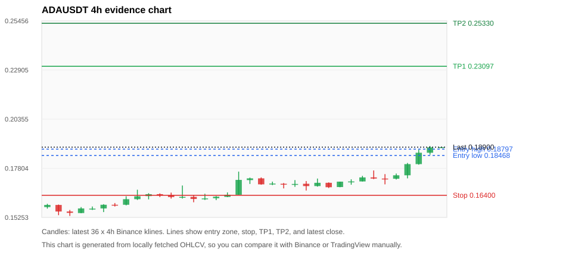
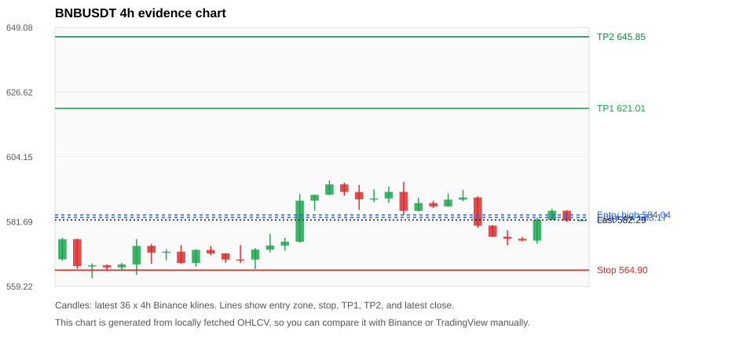
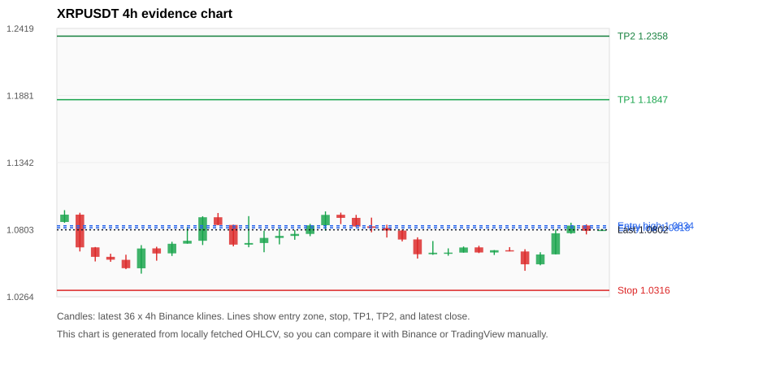
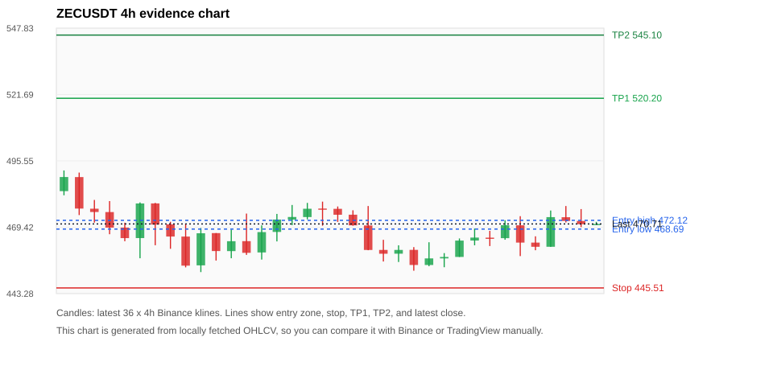
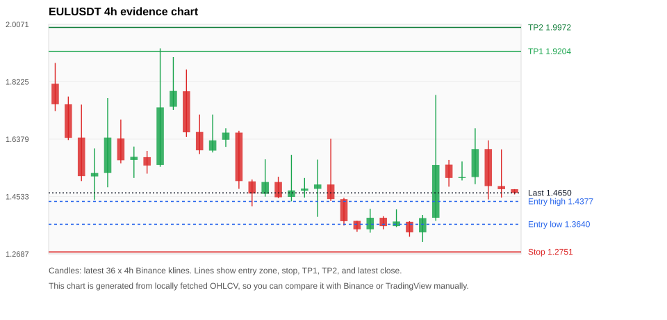

# Crypto 市场扫描报告 v1

- 报告时间：2026-08-02 20:05:56 CST
- Run ID：`20260802_120502_350dcb28`
- Run type：`daily_full`
- 数据来源：SQLite
- 报告版本：v1
- 扫描 ID：65af47840f77
- 数据源：Binance public spot API + CoinGecko/CoinMarketCap cross-check
- 过滤条件：USDT spot; 24h quote volume >= 30,000,000; trades >= 30,000; exclude stables/leveraged tokens; analyze 1h/4h/1d klines
- 默认单笔风险：账户权益的 1.00%

## 限制说明

- 交易信号仍以 Binance 现货公开 K 线为主源；外部数据源用于一致性复核。
- 结果是研究和模拟盘计划，不是确定收益或实盘下单指令。
- 历史长度过滤：候选币至少需要 180 根 1d K 线。
- 数据质量验证池：先验证 score 排名前 min(top_n * 2, 10) 的候选，再按 action + score 补足最终名单。
- 大盘环境过滤：RISK_OFF; BTC/ETH 大盘偏弱，山寨币买入候选降级为观察。 BTC 7d=-3.5061167440545438; ETH 7d=-5.118380126053856.
- 已启用数据交叉验证：Binance 主源 + CoinGecko 自动对照；CoinMarketCap 在配置 API Key 后自动对照。
- ADAUSDT 交叉验证状态 DATA_WARNING：At least one external provider needs manual review.
- BNBUSDT 交叉验证状态 DATA_WARNING：At least one external provider needs manual review.
- XRPUSDT 交叉验证状态 DATA_WARNING：At least one external provider needs manual review.
- ZECUSDT 交叉验证状态 DATA_WARNING：At least one external provider needs manual review.
- EULUSDT 交叉验证状态 DATA_WARNING：At least one external provider needs manual review.
- SOLUSDT 交叉验证状态 DATA_WARNING：At least one external provider needs manual review.
- BTCUSDT 交叉验证状态 DATA_WARNING：At least one external provider needs manual review.
- ETHUSDT 交叉验证状态 DATA_WARNING：At least one external provider needs manual review.
- ERAUSDT 交叉验证状态 DATA_WARNING：At least one external provider needs manual review.

## 5 个候选交易计划

| Rank | Coin | Action | Setup | Entry Zone | Stop Loss | TP1 | TP2 / Exit Rule | R/R | Verdict |
|---:|---|---|---|---:|---:|---:|---|---:|---|
| 1 | `ADA` | `WATCH_ONLY` | 趋势中，等回调入场 | 0.18468 - 0.18797 | 0.16400 | 0.23097 | 0.25330 或跌破 4h 关键支撑 | 2.00-3.00 | 只等回调 |
| 2 | `BNB` | `WATCH_ONLY` | 回踩支撑/4h EMA 附近 | 583.17 - 584.04 | 564.90 | 621.01 | 645.85 或跌破 4h 关键支撑 | 2.00-3.33 | 只观察 |
| 3 | `XRP` | `WATCH_ONLY` | 回踩支撑/4h EMA 附近 | 1.0818 - 1.0834 | 1.0316 | 1.1847 | 1.2358 或跌破 4h 关键支撑 | 2.00-3.00 | 只观察 |
| 4 | `ZEC` | `REJECT` | 回踩支撑/4h EMA 附近 | 468.69 - 472.12 | 445.51 | 520.20 | 545.10 或跌破 4h 关键支撑 | 2.00-3.00 | 只观察 |
| 5 | `EUL` | `REJECT` | 趋势中，等回调入场 | 1.3640 - 1.4377 | 1.2751 | 1.9204 | 1.9972 或跌破 4h 关键支撑 | 4.13-4.74 | 只观察 |

## 数据交叉验证摘要

价格差异以 Binance 当前价为基准；成交量口径不同，Binance 是 USDT 现货成交额，CoinGecko/CoinMarketCap 通常是全市场成交量。

| Rank | Coin | Data Status | Max Price Diff | Max 24h Diff | Message |
|---:|---|---|---:|---:|---|
| 1 | `ADA` | DATA_WARNING | 0.17% | 0.15 pts | At least one external provider needs manual review. |
| 2 | `BNB` | DATA_WARNING | 0.10% | 0.05 pts | At least one external provider needs manual review. |
| 3 | `XRP` | DATA_WARNING | 0.12% | 0.02 pts | At least one external provider needs manual review. |
| 4 | `ZEC` | DATA_WARNING | 0.05% | 0.50 pts | At least one external provider needs manual review. |
| 5 | `EUL` | DATA_WARNING | 0.34% | 5.28 pts | At least one external provider needs manual review. |

## 候选币说明

### 1. ADA `ADAUSDT`



- 入选原因：趋势中，等回调入场；24h +9.25%，7d +14.82%，4h RSI 84.98，24h 成交额 $35.5M。
- 交易失效条件：跌破 0.1640025 或 4h 收盘重新失守关键支撑。
- 主要风险：4h RSI 偏热；日线趋势未完全确认；BTC/ETH 大盘环境未确认强势，山寨币买入信号降级；数据交叉验证需要人工复核。
- 数据交叉验证：DATA_WARNING；At least one external provider needs manual review.

#### 可点击人工验证

- [Binance 交易页](https://www.binance.com/en/trade/ADA_USDT)
- [TradingView 图表](https://www.tradingview.com/chart/?symbol=BINANCE%3AADAUSDT)
- [CoinGecko 搜索](https://www.coingecko.com/en/search?query=ADA)
- [CoinMarketCap 搜索](https://coinmarketcap.com/search/?q=ADA)

#### 多数据源对照

| Source | Status | Asset ID | Price | 24h Change | 24h Volume | Price Diff | 24h Diff | Updated | Message |
|---|---|---|---:|---:|---:|---:|---:|---|---|
| Binance | DATA_OK | ADAUSDT | 0.18900 | +9.25% | $35.5M | 0.00% | 0.00 pts | 2026-08-02T12:05:17+00:00 | Primary market data source used by scanner. |
| CoinGecko | DATA_OK | cardano | 0.18880 | +9.30% | $555.9M | 0.10% | 0.05 pts | 2026-08-02T12:03:30.000Z | External source agrees with Binance within thresholds. |
| CoinMarketCap | DATA_WARNING | 2010 | 0.18867 | +9.10% | $559.1M | 0.17% | 0.15 pts | 2026-08-02T12:04:02.000Z | CoinMarketCap symbol mapping has 3 matches; selected lowest cmc_rank |

#### 指标证据

| 指标 | 数值 | 人工核对用途 |
|---|---:|---|
| 当前价 | 0.18900 | 与 Binance/TradingView 当前价格对照 |
| 24h 涨跌 | +9.25% | 与交易所 24h 涨跌对照 |
| 7d 涨跌 | +14.82% | 判断短线趋势是否延续 |
| 4h EMA20 | 0.17511 | 判断短期趋势支撑 |
| 4h EMA50 | 0.16994 | 判断中期趋势支撑 |
| 1d EMA20 | 0.16888 | 判断日线趋势 |
| 1d EMA50 | 0.17397 | 判断日线趋势 |
| 4h RSI14 | 84.98 | 判断是否过热/过弱 |
| 4h ATR14 | 0.0041142857 | 推导止损和入场缓冲 |
| 最近 18 根 4h 最低点 | 0.16650 | 支撑/止损参考 |
| 最近 36 根 4h 最高点 | 0.18960 | TP/压力参考 |
| 支撑位 | 0.17511 | 入场区间推导基础 |

#### 交易计划推导

- 支撑位 = 最近低点、4h EMA20、4h EMA50、1d EMA20 中不高于当前价的最高有效支撑 = `0.17511`。
- 入场区间 = 支撑位附近 + ATR 缓冲 = `0.18468 - 0.18797`。
- 止损 = min(最近 18 根 4h 最低点 * 0.985, 入场中位价 - 1.15 * ATR14) = `0.16400`。
- TP1 = max(最近 36 根 4h 最高点 * 0.995, 入场中位价 + 2R) = `0.23097`。
- TP2 = max(入场中位价 + 3R, TP1 * 1.04) = `0.25330`。

#### 最近 10 根 4h K线

| UTC 开盘时间 | Open | High | Low | Close | Quote Volume | Trades |
|---|---:|---:|---:|---:|---:|---:|
| 2026-08-01T00:00+00:00 | 0.16830 | 0.17110 | 0.16820 | 0.17110 | $1.3M | 6167 |
| 2026-08-01T04:00+00:00 | 0.17110 | 0.17230 | 0.16950 | 0.17120 | $1.5M | 8347 |
| 2026-08-01T08:00+00:00 | 0.17120 | 0.17410 | 0.17120 | 0.17330 | $3.6M | 15941 |
| 2026-08-01T12:00+00:00 | 0.17330 | 0.17690 | 0.17240 | 0.17270 | $3.9M | 17727 |
| 2026-08-01T16:00+00:00 | 0.17270 | 0.17500 | 0.16970 | 0.17260 | $4.5M | 21015 |
| 2026-08-01T20:00+00:00 | 0.17260 | 0.17530 | 0.17220 | 0.17440 | $2.3M | 11182 |
| 2026-08-02T00:00+00:00 | 0.17440 | 0.18080 | 0.17280 | 0.18020 | $7.9M | 31468 |
| 2026-08-02T04:00+00:00 | 0.18020 | 0.18770 | 0.17990 | 0.18610 | $10.4M | 44374 |
| 2026-08-02T08:00+00:00 | 0.18610 | 0.18960 | 0.18510 | 0.18890 | $6.5M | 30207 |
| 2026-08-02T12:00+00:00 | 0.18890 | 0.18910 | 0.18880 | 0.18900 | $102,157 | 631 |

### 2. BNB `BNBUSDT`



- 入选原因：回踩支撑/4h EMA 附近；24h +0.35%，7d +1.90%，4h RSI 41.65，24h 成交额 $58.7M。
- 交易失效条件：跌破 564.8975 或 4h 收盘重新失守关键支撑。
- 主要风险：BTC/ETH 大盘环境未确认强势，山寨币买入信号降级；数据交叉验证需要人工复核。
- 数据交叉验证：DATA_WARNING；At least one external provider needs manual review.

#### 可点击人工验证

- [Binance 交易页](https://www.binance.com/en/trade/BNB_USDT)
- [TradingView 图表](https://www.tradingview.com/chart/?symbol=BINANCE%3ABNBUSDT)
- [CoinGecko 搜索](https://www.coingecko.com/en/search?query=BNB)
- [CoinMarketCap 搜索](https://coinmarketcap.com/search/?q=BNB)

#### 多数据源对照

| Source | Status | Asset ID | Price | 24h Change | 24h Volume | Price Diff | 24h Diff | Updated | Message |
|---|---|---|---:|---:|---:|---:|---:|---|---|
| Binance | DATA_OK | BNBUSDT | 582.29 | +0.35% | $58.7M | 0.00% | 0.00 pts | 2026-08-02T12:05:17+00:00 | Primary market data source used by scanner. |
| CoinGecko | DATA_OK | binancecoin | 581.71 | +0.30% | $613.9M | 0.10% | 0.05 pts | 2026-08-02T12:03:30.000Z | External source agrees with Binance within thresholds. |
| CoinMarketCap | DATA_WARNING | 1839 | 581.70 | +0.35% | $1.06B | 0.10% | 0.00 pts | 2026-08-02T12:04:02.000Z | CoinMarketCap symbol mapping has 4 matches; selected lowest cmc_rank |

#### 指标证据

| 指标 | 数值 | 人工核对用途 |
|---|---:|---|
| 当前价 | 582.29 | 与 Binance/TradingView 当前价格对照 |
| 24h 涨跌 | +0.35% | 与交易所 24h 涨跌对照 |
| 7d 涨跌 | +1.90% | 判断短线趋势是否延续 |
| 4h EMA20 | 582.00 | 判断短期趋势支撑 |
| 4h EMA50 | 578.49 | 判断中期趋势支撑 |
| 1d EMA20 | 575.60 | 判断日线趋势 |
| 1d EMA50 | 582.07 | 判断日线趋势 |
| 4h RSI14 | 41.65 | 判断是否过热/过弱 |
| 4h ATR14 | 5.1893 | 推导止损和入场缓冲 |
| 最近 18 根 4h 最低点 | 573.50 | 支撑/止损参考 |
| 最近 36 根 4h 最高点 | 596.00 | TP/压力参考 |
| 支撑位 | 582.00 | 入场区间推导基础 |

#### 交易计划推导

- 支撑位 = 最近低点、4h EMA20、4h EMA50、1d EMA20 中不高于当前价的最高有效支撑 = `582.00`。
- 入场区间 = 支撑位附近 + ATR 缓冲 = `583.17 - 584.04`。
- 止损 = min(最近 18 根 4h 最低点 * 0.985, 入场中位价 - 1.15 * ATR14) = `564.90`。
- TP1 = max(最近 36 根 4h 最高点 * 0.995, 入场中位价 + 2R) = `621.01`。
- TP2 = max(入场中位价 + 3R, TP1 * 1.04) = `645.85`。

#### 最近 10 根 4h K线

| UTC 开盘时间 | Open | High | Low | Close | Quote Volume | Trades |
|---|---:|---:|---:|---:|---:|---:|
| 2026-08-01T00:00+00:00 | 587.01 | 591.44 | 587.01 | 589.36 | $7.6M | 55289 |
| 2026-08-01T04:00+00:00 | 589.35 | 592.80 | 588.79 | 590.09 | $9.0M | 68228 |
| 2026-08-01T08:00+00:00 | 590.09 | 590.50 | 579.64 | 580.33 | $12.9M | 108418 |
| 2026-08-01T12:00+00:00 | 580.34 | 580.53 | 576.36 | 576.47 | $13.3M | 107346 |
| 2026-08-01T16:00+00:00 | 576.47 | 578.73 | 573.50 | 575.74 | $10.3M | 88144 |
| 2026-08-01T20:00+00:00 | 575.74 | 576.52 | 574.85 | 575.13 | $8.3M | 57276 |
| 2026-08-02T00:00+00:00 | 575.14 | 583.10 | 574.03 | 582.31 | $9.6M | 85589 |
| 2026-08-02T04:00+00:00 | 582.32 | 586.15 | 582.32 | 585.49 | $12.0M | 82260 |
| 2026-08-02T08:00+00:00 | 585.49 | 585.70 | 581.59 | 582.11 | $5.3M | 61283 |
| 2026-08-02T12:00+00:00 | 582.11 | 582.68 | 582.10 | 582.30 | $174,736 | 2008 |

### 3. XRP `XRPUSDT`



- 入选原因：回踩支撑/4h EMA 附近；24h +1.48%，7d -1.59%，4h RSI 50.32，24h 成交额 $38.0M。
- 交易失效条件：跌破 1.0315905 或 4h 收盘重新失守关键支撑。
- 主要风险：日线趋势未完全确认；BTC/ETH 大盘环境未确认强势，山寨币买入信号降级；7d 趋势未确认；数据交叉验证需要人工复核。
- 数据交叉验证：DATA_WARNING；At least one external provider needs manual review.

#### 可点击人工验证

- [Binance 交易页](https://www.binance.com/en/trade/XRP_USDT)
- [TradingView 图表](https://www.tradingview.com/chart/?symbol=BINANCE%3AXRPUSDT)
- [CoinGecko 搜索](https://www.coingecko.com/en/search?query=XRP)
- [CoinMarketCap 搜索](https://coinmarketcap.com/search/?q=XRP)

#### 多数据源对照

| Source | Status | Asset ID | Price | 24h Change | 24h Volume | Price Diff | 24h Diff | Updated | Message |
|---|---|---|---:|---:|---:|---:|---:|---|---|
| Binance | DATA_OK | XRPUSDT | 1.0802 | +1.48% | $38.0M | 0.00% | 0.00 pts | 2026-08-02T12:05:17+00:00 | Primary market data source used by scanner. |
| CoinGecko | DATA_OK | ripple | 1.0790 | +1.50% | $816.0M | 0.11% | 0.02 pts | 2026-08-02T12:03:30.000Z | External source agrees with Binance within thresholds. |
| CoinMarketCap | DATA_WARNING | 52 | 1.0789 | +1.49% | $859.4M | 0.12% | 0.01 pts | 2026-08-02T12:04:02.000Z | CoinMarketCap symbol mapping has 3 matches; selected lowest cmc_rank |

#### 指标证据

| 指标 | 数值 | 人工核对用途 |
|---|---:|---|
| 当前价 | 1.0802 | 与 Binance/TradingView 当前价格对照 |
| 24h 涨跌 | +1.48% | 与交易所 24h 涨跌对照 |
| 7d 涨跌 | -1.59% | 判断短线趋势是否延续 |
| 4h EMA20 | 1.0726 | 判断短期趋势支撑 |
| 4h EMA50 | 1.0797 | 判断中期趋势支撑 |
| 1d EMA20 | 1.0890 | 判断日线趋势 |
| 1d EMA50 | 1.1225 | 判断日线趋势 |
| 4h RSI14 | 50.32 | 判断是否过热/过弱 |
| 4h ATR14 | 0.0091285714 | 推导止损和入场缓冲 |
| 最近 18 根 4h 最低点 | 1.0473 | 支撑/止损参考 |
| 最近 36 根 4h 最高点 | 1.0960 | TP/压力参考 |
| 支撑位 | 1.0797 | 入场区间推导基础 |

#### 交易计划推导

- 支撑位 = 最近低点、4h EMA20、4h EMA50、1d EMA20 中不高于当前价的最高有效支撑 = `1.0797`。
- 入场区间 = 支撑位附近 + ATR 缓冲 = `1.0818 - 1.0834`。
- 止损 = min(最近 18 根 4h 最低点 * 0.985, 入场中位价 - 1.15 * ATR14) = `1.0316`。
- TP1 = max(最近 36 根 4h 最高点 * 0.995, 入场中位价 + 2R) = `1.1847`。
- TP2 = max(入场中位价 + 3R, TP1 * 1.04) = `1.2358`。

#### 最近 10 根 4h K线

| UTC 开盘时间 | Open | High | Low | Close | Quote Volume | Trades |
|---|---:|---:|---:|---:|---:|---:|
| 2026-08-01T00:00+00:00 | 1.0619 | 1.0668 | 1.0619 | 1.0660 | $3.0M | 15863 |
| 2026-08-01T04:00+00:00 | 1.0661 | 1.0674 | 1.0615 | 1.0620 | $4.3M | 13045 |
| 2026-08-01T08:00+00:00 | 1.0620 | 1.0639 | 1.0600 | 1.0638 | $3.0M | 13152 |
| 2026-08-01T12:00+00:00 | 1.0638 | 1.0663 | 1.0629 | 1.0629 | $2.8M | 11797 |
| 2026-08-01T16:00+00:00 | 1.0628 | 1.0646 | 1.0473 | 1.0525 | $8.0M | 50396 |
| 2026-08-01T20:00+00:00 | 1.0525 | 1.0622 | 1.0517 | 1.0604 | $5.2M | 25253 |
| 2026-08-02T00:00+00:00 | 1.0605 | 1.0804 | 1.0605 | 1.0774 | $6.8M | 36273 |
| 2026-08-02T04:00+00:00 | 1.0775 | 1.0859 | 1.0770 | 1.0836 | $7.2M | 35706 |
| 2026-08-02T08:00+00:00 | 1.0837 | 1.0846 | 1.0765 | 1.0794 | $7.8M | 34366 |
| 2026-08-02T12:00+00:00 | 1.0795 | 1.0808 | 1.0795 | 1.0802 | $196,010 | 1332 |

### 4. ZEC `ZECUSDT`



- 入选原因：回踩支撑/4h EMA 附近；24h +1.00%，7d -3.65%，4h RSI 62.58，24h 成交额 $31.1M。
- 交易失效条件：跌破 445.50565 或 4h 收盘重新失守关键支撑。
- 主要风险：日线趋势未完全确认；BTC/ETH 大盘环境未确认强势，山寨币买入信号降级；7d 趋势未确认；数据交叉验证需要人工复核。
- 数据交叉验证：DATA_WARNING；At least one external provider needs manual review.

#### 可点击人工验证

- [Binance 交易页](https://www.binance.com/en/trade/ZEC_USDT)
- [TradingView 图表](https://www.tradingview.com/chart/?symbol=BINANCE%3AZECUSDT)
- [CoinGecko 搜索](https://www.coingecko.com/en/search?query=ZEC)
- [CoinMarketCap 搜索](https://coinmarketcap.com/search/?q=ZEC)

#### 多数据源对照

| Source | Status | Asset ID | Price | 24h Change | 24h Volume | Price Diff | 24h Diff | Updated | Message |
|---|---|---|---:|---:|---:|---:|---:|---|---|
| Binance | DATA_OK | ZECUSDT | 470.71 | +1.00% | $31.1M | 0.00% | 0.00 pts | 2026-08-02T12:05:17+00:00 | Primary market data source used by scanner. |
| CoinGecko | DATA_OK | zcash | 470.67 | +1.50% | $151.2M | 0.01% | 0.50 pts | 2026-08-02T12:03:30.000Z | External source agrees with Binance within thresholds. |
| CoinMarketCap | DATA_WARNING | 1437 | 470.48 | +1.28% | $265.9M | 0.05% | 0.28 pts | 2026-08-02T12:04:02.000Z | CoinMarketCap symbol mapping has 2 matches; selected lowest cmc_rank |

#### 指标证据

| 指标 | 数值 | 人工核对用途 |
|---|---:|---|
| 当前价 | 470.71 | 与 Binance/TradingView 当前价格对照 |
| 24h 涨跌 | +1.00% | 与交易所 24h 涨跌对照 |
| 7d 涨跌 | -3.65% | 判断短线趋势是否延续 |
| 4h EMA20 | 467.75 | 判断短期趋势支撑 |
| 4h EMA50 | 477.01 | 判断中期趋势支撑 |
| 1d EMA20 | 486.99 | 判断日线趋势 |
| 1d EMA50 | 483.87 | 判断日线趋势 |
| 4h RSI14 | 62.58 | 判断是否过热/过弱 |
| 4h ATR14 | 7.7479 | 推导止损和入场缓冲 |
| 最近 18 根 4h 最低点 | 452.29 | 支撑/止损参考 |
| 最近 36 根 4h 最高点 | 491.78 | TP/压力参考 |
| 支撑位 | 467.75 | 入场区间推导基础 |

#### 交易计划推导

- 支撑位 = 最近低点、4h EMA20、4h EMA50、1d EMA20 中不高于当前价的最高有效支撑 = `467.75`。
- 入场区间 = 支撑位附近 + ATR 缓冲 = `468.69 - 472.12`。
- 止损 = min(最近 18 根 4h 最低点 * 0.985, 入场中位价 - 1.15 * ATR14) = `445.51`。
- TP1 = max(最近 36 根 4h 最高点 * 0.995, 入场中位价 + 2R) = `520.20`。
- TP2 = max(入场中位价 + 3R, TP1 * 1.04) = `545.10`。

#### 最近 10 根 4h K线

| UTC 开盘时间 | Open | High | Low | Close | Quote Volume | Trades |
|---|---:|---:|---:|---:|---:|---:|
| 2026-08-01T00:00+00:00 | 457.72 | 465.00 | 457.72 | 464.16 | $2.6M | 28183 |
| 2026-08-01T04:00+00:00 | 464.17 | 468.91 | 462.30 | 465.34 | $3.6M | 27451 |
| 2026-08-01T08:00+00:00 | 465.31 | 468.00 | 462.00 | 465.10 | $2.8M | 14673 |
| 2026-08-01T12:00+00:00 | 465.11 | 472.17 | 464.49 | 470.23 | $4.9M | 26152 |
| 2026-08-01T16:00+00:00 | 470.18 | 473.77 | 458.05 | 463.36 | $9.3M | 73964 |
| 2026-08-01T20:00+00:00 | 463.36 | 465.84 | 460.35 | 461.71 | $2.1M | 12845 |
| 2026-08-02T00:00+00:00 | 461.72 | 476.00 | 461.68 | 473.40 | $7.2M | 35865 |
| 2026-08-02T04:00+00:00 | 473.36 | 477.77 | 471.30 | 471.89 | $4.5M | 27385 |
| 2026-08-02T08:00+00:00 | 471.89 | 476.57 | 469.47 | 470.62 | $3.2M | 21828 |
| 2026-08-02T12:00+00:00 | 470.70 | 471.53 | 470.70 | 470.71 | $29,246 | 289 |

### 5. EUL `EULUSDT`



- 入选原因：趋势中，等回调入场；24h +5.32%，7d -42.03%，4h RSI 51.42，24h 成交额 $54.3M。
- 交易失效条件：跌破 1.2750809 或 4h 收盘重新失守关键支撑。
- 主要风险：24h 振幅较大，回撤风险高；BTC/ETH 大盘环境未确认强势，山寨币买入信号降级；7d 趋势未确认；数据交叉验证需要人工复核。
- 数据交叉验证：DATA_WARNING；At least one external provider needs manual review.

#### 可点击人工验证

- [Binance 交易页](https://www.binance.com/en/trade/EUL_USDT)
- [TradingView 图表](https://www.tradingview.com/chart/?symbol=BINANCE%3AEULUSDT)
- [CoinGecko 搜索](https://www.coingecko.com/en/search?query=EUL)
- [CoinMarketCap 搜索](https://coinmarketcap.com/search/?q=EUL)

#### 多数据源对照

| Source | Status | Asset ID | Price | 24h Change | 24h Volume | Price Diff | 24h Diff | Updated | Message |
|---|---|---|---:|---:|---:|---:|---:|---|---|
| Binance | DATA_OK | EULUSDT | 1.4650 | +5.32% | $54.3M | 0.00% | 0.00 pts | 2026-08-02T12:05:17+00:00 | Primary market data source used by scanner. |
| CoinGecko | DATA_WARNING | euler | 1.4700 | +10.60% | $129.3M | 0.34% | 5.28 pts | 2026-08-02T12:03:30.000Z | 24h change diff 5.28 points exceeds warning threshold |
| CoinMarketCap | DATA_OK | 14280 | 1.4698 | +5.85% | $191.5M | 0.33% | 0.52 pts | 2026-08-02T12:04:02.000Z | External source agrees with Binance within thresholds. |

#### 指标证据

| 指标 | 数值 | 人工核对用途 |
|---|---:|---|
| 当前价 | 1.4650 | 与 Binance/TradingView 当前价格对照 |
| 24h 涨跌 | +5.32% | 与交易所 24h 涨跌对照 |
| 7d 涨跌 | -42.03% | 判断短线趋势是否延续 |
| 4h EMA20 | 1.4892 | 判断短期趋势支撑 |
| 4h EMA50 | 1.4922 | 判断中期趋势支撑 |
| 1d EMA20 | 1.3613 | 判断日线趋势 |
| 1d EMA50 | 1.2163 | 判断日线趋势 |
| 4h RSI14 | 51.42 | 判断是否过热/过弱 |
| 4h ATR14 | 0.10936 | 推导止损和入场缓冲 |
| 最近 18 根 4h 最低点 | 1.3070 | 支撑/止损参考 |
| 最近 36 根 4h 最高点 | 1.9300 | TP/压力参考 |
| 支撑位 | 1.3613 | 入场区间推导基础 |

#### 交易计划推导

- 支撑位 = 最近低点、4h EMA20、4h EMA50、1d EMA20 中不高于当前价的最高有效支撑 = `1.3613`。
- 入场区间 = 支撑位附近 + ATR 缓冲 = `1.3640 - 1.4377`。
- 止损 = min(最近 18 根 4h 最低点 * 0.985, 入场中位价 - 1.15 * ATR14) = `1.2751`。
- TP1 = max(最近 36 根 4h 最高点 * 0.995, 入场中位价 + 2R) = `1.9204`。
- TP2 = max(入场中位价 + 3R, TP1 * 1.04) = `1.9972`。

#### 最近 10 根 4h K线

| UTC 开盘时间 | Open | High | Low | Close | Quote Volume | Trades |
|---|---:|---:|---:|---:|---:|---:|
| 2026-08-01T00:00+00:00 | 1.3580 | 1.4120 | 1.3550 | 1.3730 | $1.3M | 22993 |
| 2026-08-01T04:00+00:00 | 1.3720 | 1.3740 | 1.3240 | 1.3380 | $2.7M | 24139 |
| 2026-08-01T08:00+00:00 | 1.3380 | 1.3940 | 1.3070 | 1.3840 | $4.7M | 33601 |
| 2026-08-01T12:00+00:00 | 1.3850 | 1.7800 | 1.3750 | 1.5550 | $9.9M | 115461 |
| 2026-08-01T16:00+00:00 | 1.5560 | 1.5710 | 1.4850 | 1.5130 | $2.6M | 60666 |
| 2026-08-01T20:00+00:00 | 1.5130 | 1.5660 | 1.5050 | 1.5160 | $880,266 | 22058 |
| 2026-08-02T00:00+00:00 | 1.5160 | 1.6730 | 1.4930 | 1.6060 | $3.3M | 44896 |
| 2026-08-02T04:00+00:00 | 1.6060 | 1.6340 | 1.4440 | 1.4870 | $9.3M | 44122 |
| 2026-08-02T08:00+00:00 | 1.4870 | 1.6050 | 1.4500 | 1.4770 | $28.5M | 67423 |
| 2026-08-02T12:00+00:00 | 1.4770 | 1.4770 | 1.4600 | 1.4650 | $37,726 | 846 |

## 组合风控

- 不要 5 个候选全部满仓买入。
- 同时持仓总风险建议控制在账户权益的 3% - 5% 以内。
- 如果 BTC/ETH 同时破位，暂停山寨币多头计划或降低仓位。
- 第一版报告用于模拟盘和人工复核，不自动下单。

## 原始数据

```json
[
  {
    "rank": 1,
    "symbol": "ADAUSDT",
    "base_asset": "ADA",
    "price": 0.189,
    "score": 38.552560614900436,
    "setup": "趋势中，等回调入场",
    "verdict": "只等回调",
    "entry_low": 0.18468,
    "entry_high": 0.18797142857142857,
    "stop_loss": 0.1640025,
    "take_profit_1": 0.23097214285714288,
    "take_profit_2": 0.25329535714285717,
    "risk_reward_1": 2.0,
    "risk_reward_2": 3.0,
    "pct_24h": 9.249,
    "pct_3d": 12.366230677764566,
    "pct_7d": 14.823815309842047,
    "quote_volume_24h": 35472300.24574,
    "trades_24h": 156135,
    "high_low_range_24h": 11.726576311137293,
    "rsi_1h": 84.51327433628317,
    "rsi_4h": 84.98168498168494,
    "ema20_4h": 0.1751085103264893,
    "ema50_4h": 0.16994395033988674,
    "ema20_1d": 0.16887852202451076,
    "ema50_1d": 0.17396984271486943,
    "atr_4h": 0.0041142857142857136,
    "macd_hist_4h": 0.0018782179631123934,
    "volume_ratio_24h": 1.9015098058855402,
    "support_level": 0.1751085103264893,
    "recent_low_4h_18": 0.1665,
    "recent_high_4h_36": 0.1896,
    "distance_to_support_pct": 7.933075124452871,
    "binance_trade_url": "https://www.binance.com/en/trade/ADA_USDT",
    "tradingview_url": "https://www.tradingview.com/chart/?symbol=BINANCE%3AADAUSDT",
    "coingecko_search_url": "https://www.coingecko.com/en/search?query=ADA",
    "coinmarketcap_search_url": "https://coinmarketcap.com/search/?q=ADA",
    "invalidation": "跌破 0.1640025 或 4h 收盘重新失守关键支撑",
    "recent_4h_klines": [
      {
        "open_time_utc": "2026-07-27T16:00+00:00",
        "open": 0.1579,
        "high": 0.1596,
        "low": 0.1571,
        "close": 0.159,
        "quote_volume": 3014066.4692,
        "trades": 12285
      },
      {
        "open_time_utc": "2026-07-27T20:00+00:00",
        "open": 0.159,
        "high": 0.1592,
        "low": 0.1537,
        "close": 0.1556,
        "quote_volume": 3606868.65666,
        "trades": 17021
      },
      {
        "open_time_utc": "2026-07-28T00:00+00:00",
        "open": 0.1556,
        "high": 0.1564,
        "low": 0.1533,
        "close": 0.1549,
        "quote_volume": 2906822.95516,
        "trades": 12885
      },
      {
        "open_time_utc": "2026-07-28T04:00+00:00",
        "open": 0.1548,
        "high": 0.1579,
        "low": 0.1547,
        "close": 0.1572,
        "quote_volume": 4336780.90335,
        "trades": 12978
      },
      {
        "open_time_utc": "2026-07-28T08:00+00:00",
        "open": 0.1571,
        "high": 0.1582,
        "low": 0.1564,
        "close": 0.1571,
        "quote_volume": 2298291.05455,
        "trades": 8259
      },
      {
        "open_time_utc": "2026-07-28T12:00+00:00",
        "open": 0.1572,
        "high": 0.1594,
        "low": 0.1553,
        "close": 0.1591,
        "quote_volume": 4239759.53123,
        "trades": 18277
      },
      {
        "open_time_utc": "2026-07-28T16:00+00:00",
        "open": 0.1591,
        "high": 0.16,
        "low": 0.1582,
        "close": 0.159,
        "quote_volume": 1881133.74031,
        "trades": 8880
      },
      {
        "open_time_utc": "2026-07-28T20:00+00:00",
        "open": 0.1591,
        "high": 0.1635,
        "low": 0.1588,
        "close": 0.162,
        "quote_volume": 3408785.14615,
        "trades": 20322
      },
      {
        "open_time_utc": "2026-07-29T00:00+00:00",
        "open": 0.162,
        "high": 0.1669,
        "low": 0.1616,
        "close": 0.1635,
        "quote_volume": 5963643.80527,
        "trades": 24353
      },
      {
        "open_time_utc": "2026-07-29T04:00+00:00",
        "open": 0.1636,
        "high": 0.1651,
        "low": 0.1619,
        "close": 0.1646,
        "quote_volume": 2493670.80219,
        "trades": 12217
      },
      {
        "open_time_utc": "2026-07-29T08:00+00:00",
        "open": 0.1646,
        "high": 0.165,
        "low": 0.1631,
        "close": 0.1639,
        "quote_volume": 1974349.51765,
        "trades": 8482
      },
      {
        "open_time_utc": "2026-07-29T12:00+00:00",
        "open": 0.164,
        "high": 0.1654,
        "low": 0.1623,
        "close": 0.1631,
        "quote_volume": 2874526.79545,
        "trades": 15241
      },
      {
        "open_time_utc": "2026-07-29T16:00+00:00",
        "open": 0.163,
        "high": 0.1691,
        "low": 0.1623,
        "close": 0.1632,
        "quote_volume": 5028988.21277,
        "trades": 24008
      },
      {
        "open_time_utc": "2026-07-29T20:00+00:00",
        "open": 0.1632,
        "high": 0.164,
        "low": 0.1604,
        "close": 0.1621,
        "quote_volume": 3144447.42267,
        "trades": 14126
      },
      {
        "open_time_utc": "2026-07-30T00:00+00:00",
        "open": 0.1621,
        "high": 0.1648,
        "low": 0.1616,
        "close": 0.1624,
        "quote_volume": 1623658.96043,
        "trades": 8363
      },
      {
        "open_time_utc": "2026-07-30T04:00+00:00",
        "open": 0.1625,
        "high": 0.1636,
        "low": 0.1615,
        "close": 0.1633,
        "quote_volume": 1692337.79968,
        "trades": 6807
      },
      {
        "open_time_utc": "2026-07-30T08:00+00:00",
        "open": 0.1632,
        "high": 0.1655,
        "low": 0.1631,
        "close": 0.1643,
        "quote_volume": 2119761.84709,
        "trades": 8013
      },
      {
        "open_time_utc": "2026-07-30T12:00+00:00",
        "open": 0.1643,
        "high": 0.1763,
        "low": 0.1643,
        "close": 0.172,
        "quote_volume": 12946551.31379,
        "trades": 51213
      },
      {
        "open_time_utc": "2026-07-30T16:00+00:00",
        "open": 0.1719,
        "high": 0.1732,
        "low": 0.1699,
        "close": 0.1728,
        "quote_volume": 4611449.02396,
        "trades": 18835
      },
      {
        "open_time_utc": "2026-07-30T20:00+00:00",
        "open": 0.1728,
        "high": 0.1733,
        "low": 0.1695,
        "close": 0.1697,
        "quote_volume": 2030478.86845,
        "trades": 10127
      },
      {
        "open_time_utc": "2026-07-31T00:00+00:00",
        "open": 0.1697,
        "high": 0.1711,
        "low": 0.1693,
        "close": 0.1701,
        "quote_volume": 2184040.14638,
        "trades": 11440
      },
      {
        "open_time_utc": "2026-07-31T04:00+00:00",
        "open": 0.17,
        "high": 0.1704,
        "low": 0.1676,
        "close": 0.1699,
        "quote_volume": 2512925.66936,
        "trades": 10578
      },
      {
        "open_time_utc": "2026-07-31T08:00+00:00",
        "open": 0.1699,
        "high": 0.1719,
        "low": 0.1684,
        "close": 0.1699,
        "quote_volume": 2877553.70372,
        "trades": 13608
      },
      {
        "open_time_utc": "2026-07-31T12:00+00:00",
        "open": 0.17,
        "high": 0.1714,
        "low": 0.1665,
        "close": 0.1688,
        "quote_volume": 4205318.8082,
        "trades": 21408
      },
      {
        "open_time_utc": "2026-07-31T16:00+00:00",
        "open": 0.1688,
        "high": 0.1727,
        "low": 0.1685,
        "close": 0.1705,
        "quote_volume": 3545666.40301,
        "trades": 16528
      },
      {
        "open_time_utc": "2026-07-31T20:00+00:00",
        "open": 0.1705,
        "high": 0.1707,
        "low": 0.1678,
        "close": 0.1682,
        "quote_volume": 1544218.99337,
        "trades": 7533
      },
      {
        "open_time_utc": "2026-08-01T00:00+00:00",
        "open": 0.1683,
        "high": 0.1711,
        "low": 0.1682,
        "close": 0.1711,
        "quote_volume": 1284872.09388,
        "trades": 6167
      },
      {
        "open_time_utc": "2026-08-01T04:00+00:00",
        "open": 0.1711,
        "high": 0.1723,
        "low": 0.1695,
        "close": 0.1712,
        "quote_volume": 1482176.26597,
        "trades": 8347
      },
      {
        "open_time_utc": "2026-08-01T08:00+00:00",
        "open": 0.1712,
        "high": 0.1741,
        "low": 0.1712,
        "close": 0.1733,
        "quote_volume": 3634512.34471,
        "trades": 15941
      },
      {
        "open_time_utc": "2026-08-01T12:00+00:00",
        "open": 0.1733,
        "high": 0.1769,
        "low": 0.1724,
        "close": 0.1727,
        "quote_volume": 3886229.02182,
        "trades": 17727
      },
      {
        "open_time_utc": "2026-08-01T16:00+00:00",
        "open": 0.1727,
        "high": 0.175,
        "low": 0.1697,
        "close": 0.1726,
        "quote_volume": 4509608.07167,
        "trades": 21015
      },
      {
        "open_time_utc": "2026-08-01T20:00+00:00",
        "open": 0.1726,
        "high": 0.1753,
        "low": 0.1722,
        "close": 0.1744,
        "quote_volume": 2305939.72768,
        "trades": 11182
      },
      {
        "open_time_utc": "2026-08-02T00:00+00:00",
        "open": 0.1744,
        "high": 0.1808,
        "low": 0.1728,
        "close": 0.1802,
        "quote_volume": 7889584.63091,
        "trades": 31468
      },
      {
        "open_time_utc": "2026-08-02T04:00+00:00",
        "open": 0.1802,
        "high": 0.1877,
        "low": 0.1799,
        "close": 0.1861,
        "quote_volume": 10384679.36093,
        "trades": 44374
      },
      {
        "open_time_utc": "2026-08-02T08:00+00:00",
        "open": 0.1861,
        "high": 0.1896,
        "low": 0.1851,
        "close": 0.1889,
        "quote_volume": 6494389.86549,
        "trades": 30207
      },
      {
        "open_time_utc": "2026-08-02T12:00+00:00",
        "open": 0.1889,
        "high": 0.1891,
        "low": 0.1888,
        "close": 0.189,
        "quote_volume": 102156.97201,
        "trades": 631
      }
    ],
    "risks": [
      "4h RSI 偏热",
      "日线趋势未完全确认",
      "BTC/ETH 大盘环境未确认强势，山寨币买入信号降级",
      "数据交叉验证需要人工复核"
    ],
    "data_quality_status": "DATA_WARNING",
    "data_quality_message": "At least one external provider needs manual review.",
    "data_checks": [
      {
        "provider": "Binance",
        "status": "DATA_OK",
        "provider_asset_id": "ADAUSDT",
        "provider_symbol": "ADAUSDT",
        "price_usd": 0.189,
        "pct_24h": 9.249,
        "volume_24h": 35472300.24574,
        "last_updated": null,
        "fetched_at_utc": "2026-08-02T12:05:17+00:00",
        "price_diff_pct": 0.0,
        "pct_24h_diff": 0.0,
        "volume_note": "Binance USDT spot 24h quoteVolume.",
        "message": "Primary market data source used by scanner."
      },
      {
        "provider": "CoinGecko",
        "status": "DATA_OK",
        "provider_asset_id": "cardano",
        "provider_symbol": "ADA",
        "price_usd": 0.188802,
        "pct_24h": 9.3,
        "volume_24h": 555932326.0,
        "last_updated": "2026-08-02T12:03:30.000Z",
        "fetched_at_utc": "2026-08-02T12:05:17+00:00",
        "price_diff_pct": 0.10476190476190674,
        "pct_24h_diff": 0.051000000000000156,
        "volume_note": "CoinGecko total market volume; not the same venue scope as Binance quoteVolume.",
        "message": "External source agrees with Binance within thresholds."
      },
      {
        "provider": "CoinMarketCap",
        "status": "DATA_WARNING",
        "provider_asset_id": "2010",
        "provider_symbol": "ADA",
        "price_usd": 0.1886702766959775,
        "pct_24h": 9.0996248,
        "volume_24h": 559071769.6364788,
        "last_updated": "2026-08-02T12:04:02.000Z",
        "fetched_at_utc": "2026-08-02T12:05:17+00:00",
        "price_diff_pct": 0.17445677461508233,
        "pct_24h_diff": 0.1493751999999997,
        "volume_note": "CoinMarketCap total market volume; not the same venue scope as Binance quoteVolume.",
        "message": "CoinMarketCap symbol mapping has 3 matches; selected lowest cmc_rank"
      }
    ],
    "action": "WATCH_ONLY"
  },
  {
    "rank": 2,
    "symbol": "BNBUSDT",
    "base_asset": "BNB",
    "price": 582.29,
    "score": 38.38778106928902,
    "setup": "回踩支撑/4h EMA 附近",
    "verdict": "只观察",
    "entry_low": 583.1685159252753,
    "entry_high": 584.0368699999999,
    "stop_loss": 564.8975,
    "take_profit_1": 621.0130788879126,
    "take_profit_2": 645.8536020434291,
    "risk_reward_1": 2.0,
    "risk_reward_2": 3.3280014381639336,
    "pct_24h": 0.346,
    "pct_3d": -0.96435131641609,
    "pct_7d": 1.8951457669827976,
    "quote_volume_24h": 58712686.23499,
    "trades_24h": 482162,
    "high_low_range_24h": 2.2057541412380033,
    "rsi_1h": 68.76498800959223,
    "rsi_4h": 41.65174574753797,
    "ema20_4h": 582.0045069114524,
    "ema50_4h": 578.4853760116755,
    "ema20_1d": 575.5967663764761,
    "ema50_1d": 582.0700397642876,
    "atr_4h": 5.189285714285712,
    "macd_hist_4h": -0.9185212536269836,
    "volume_ratio_24h": 0.9940132077324325,
    "support_level": 582.0045069114524,
    "recent_low_4h_18": 573.5,
    "recent_high_4h_36": 596.0,
    "distance_to_support_pct": 0.04905341542158492,
    "binance_trade_url": "https://www.binance.com/en/trade/BNB_USDT",
    "tradingview_url": "https://www.tradingview.com/chart/?symbol=BINANCE%3ABNBUSDT",
    "coingecko_search_url": "https://www.coingecko.com/en/search?query=BNB",
    "coinmarketcap_search_url": "https://coinmarketcap.com/search/?q=BNB",
    "invalidation": "跌破 564.8975 或 4h 收盘重新失守关键支撑",
    "recent_4h_klines": [
      {
        "open_time_utc": "2026-07-27T16:00+00:00",
        "open": 568.64,
        "high": 576.11,
        "low": 568.06,
        "close": 575.62,
        "quote_volume": 6984732.60631,
        "trades": 87544
      },
      {
        "open_time_utc": "2026-07-27T20:00+00:00",
        "open": 575.63,
        "high": 575.77,
        "low": 565.4,
        "close": 566.28,
        "quote_volume": 5038934.04506,
        "trades": 71729
      },
      {
        "open_time_utc": "2026-07-28T00:00+00:00",
        "open": 566.28,
        "high": 567.21,
        "low": 562.03,
        "close": 566.57,
        "quote_volume": 7600035.58643,
        "trades": 89467
      },
      {
        "open_time_utc": "2026-07-28T04:00+00:00",
        "open": 566.58,
        "high": 566.85,
        "low": 564.6,
        "close": 565.83,
        "quote_volume": 6846526.53585,
        "trades": 59171
      },
      {
        "open_time_utc": "2026-07-28T08:00+00:00",
        "open": 565.84,
        "high": 567.44,
        "low": 564.9,
        "close": 566.86,
        "quote_volume": 5243594.50486,
        "trades": 56281
      },
      {
        "open_time_utc": "2026-07-28T12:00+00:00",
        "open": 566.86,
        "high": 575.66,
        "low": 563.19,
        "close": 573.3,
        "quote_volume": 17323736.88458,
        "trades": 148347
      },
      {
        "open_time_utc": "2026-07-28T16:00+00:00",
        "open": 573.3,
        "high": 573.97,
        "low": 567.05,
        "close": 570.93,
        "quote_volume": 7243684.90121,
        "trades": 88417
      },
      {
        "open_time_utc": "2026-07-28T20:00+00:00",
        "open": 570.93,
        "high": 572.07,
        "low": 568.29,
        "close": 571.29,
        "quote_volume": 4076171.61659,
        "trades": 48932
      },
      {
        "open_time_utc": "2026-07-29T00:00+00:00",
        "open": 571.29,
        "high": 573.5,
        "low": 567.1,
        "close": 567.38,
        "quote_volume": 6840078.17237,
        "trades": 79350
      },
      {
        "open_time_utc": "2026-07-29T04:00+00:00",
        "open": 567.39,
        "high": 572.13,
        "low": 566.01,
        "close": 571.9,
        "quote_volume": 5356221.85459,
        "trades": 65122
      },
      {
        "open_time_utc": "2026-07-29T08:00+00:00",
        "open": 571.89,
        "high": 573.23,
        "low": 570.11,
        "close": 570.69,
        "quote_volume": 6704377.91709,
        "trades": 56292
      },
      {
        "open_time_utc": "2026-07-29T12:00+00:00",
        "open": 570.7,
        "high": 570.74,
        "low": 567.4,
        "close": 568.57,
        "quote_volume": 6654286.42429,
        "trades": 88668
      },
      {
        "open_time_utc": "2026-07-29T16:00+00:00",
        "open": 568.57,
        "high": 573.56,
        "low": 567.37,
        "close": 568.54,
        "quote_volume": 10649643.90124,
        "trades": 114464
      },
      {
        "open_time_utc": "2026-07-29T20:00+00:00",
        "open": 568.55,
        "high": 572.56,
        "low": 565.27,
        "close": 571.99,
        "quote_volume": 5672178.83379,
        "trades": 62627
      },
      {
        "open_time_utc": "2026-07-30T00:00+00:00",
        "open": 571.99,
        "high": 577.51,
        "low": 571.05,
        "close": 573.42,
        "quote_volume": 8506418.03834,
        "trades": 73778
      },
      {
        "open_time_utc": "2026-07-30T04:00+00:00",
        "open": 573.42,
        "high": 576.1,
        "low": 571.56,
        "close": 574.72,
        "quote_volume": 6572177.87838,
        "trades": 63304
      },
      {
        "open_time_utc": "2026-07-30T08:00+00:00",
        "open": 574.72,
        "high": 591.25,
        "low": 574.41,
        "close": 589.0,
        "quote_volume": 28142122.95862,
        "trades": 201224
      },
      {
        "open_time_utc": "2026-07-30T12:00+00:00",
        "open": 589.0,
        "high": 591.0,
        "low": 585.52,
        "close": 590.99,
        "quote_volume": 17249377.15884,
        "trades": 143015
      },
      {
        "open_time_utc": "2026-07-30T16:00+00:00",
        "open": 591.0,
        "high": 596.0,
        "low": 591.0,
        "close": 594.62,
        "quote_volume": 13762859.31738,
        "trades": 122399
      },
      {
        "open_time_utc": "2026-07-30T20:00+00:00",
        "open": 594.62,
        "high": 595.18,
        "low": 590.78,
        "close": 591.99,
        "quote_volume": 9622587.40278,
        "trades": 66995
      },
      {
        "open_time_utc": "2026-07-31T00:00+00:00",
        "open": 591.99,
        "high": 594.46,
        "low": 585.79,
        "close": 589.46,
        "quote_volume": 11857275.34371,
        "trades": 113936
      },
      {
        "open_time_utc": "2026-07-31T04:00+00:00",
        "open": 589.47,
        "high": 592.92,
        "low": 588.47,
        "close": 589.76,
        "quote_volume": 13273327.35596,
        "trades": 91636
      },
      {
        "open_time_utc": "2026-07-31T08:00+00:00",
        "open": 589.77,
        "high": 593.92,
        "low": 588.15,
        "close": 592.02,
        "quote_volume": 14135917.51286,
        "trades": 116449
      },
      {
        "open_time_utc": "2026-07-31T12:00+00:00",
        "open": 592.02,
        "high": 595.5,
        "low": 583.99,
        "close": 585.45,
        "quote_volume": 21376533.93513,
        "trades": 211242
      },
      {
        "open_time_utc": "2026-07-31T16:00+00:00",
        "open": 585.45,
        "high": 590.04,
        "low": 585.23,
        "close": 588.17,
        "quote_volume": 5309856.93839,
        "trades": 77917
      },
      {
        "open_time_utc": "2026-07-31T20:00+00:00",
        "open": 588.17,
        "high": 589.0,
        "low": 586.41,
        "close": 587.01,
        "quote_volume": 3925135.34459,
        "trades": 46641
      },
      {
        "open_time_utc": "2026-08-01T00:00+00:00",
        "open": 587.01,
        "high": 591.44,
        "low": 587.01,
        "close": 589.36,
        "quote_volume": 7636935.15965,
        "trades": 55289
      },
      {
        "open_time_utc": "2026-08-01T04:00+00:00",
        "open": 589.35,
        "high": 592.8,
        "low": 588.79,
        "close": 590.09,
        "quote_volume": 8963946.11569,
        "trades": 68228
      },
      {
        "open_time_utc": "2026-08-01T08:00+00:00",
        "open": 590.09,
        "high": 590.5,
        "low": 579.64,
        "close": 580.33,
        "quote_volume": 12863949.34825,
        "trades": 108418
      },
      {
        "open_time_utc": "2026-08-01T12:00+00:00",
        "open": 580.34,
        "high": 580.53,
        "low": 576.36,
        "close": 576.47,
        "quote_volume": 13250605.36106,
        "trades": 107346
      },
      {
        "open_time_utc": "2026-08-01T16:00+00:00",
        "open": 576.47,
        "high": 578.73,
        "low": 573.5,
        "close": 575.74,
        "quote_volume": 10267252.87046,
        "trades": 88144
      },
      {
        "open_time_utc": "2026-08-01T20:00+00:00",
        "open": 575.74,
        "high": 576.52,
        "low": 574.85,
        "close": 575.13,
        "quote_volume": 8282480.6281,
        "trades": 57276
      },
      {
        "open_time_utc": "2026-08-02T00:00+00:00",
        "open": 575.14,
        "high": 583.1,
        "low": 574.03,
        "close": 582.31,
        "quote_volume": 9582776.12471,
        "trades": 85589
      },
      {
        "open_time_utc": "2026-08-02T04:00+00:00",
        "open": 582.32,
        "high": 586.15,
        "low": 582.32,
        "close": 585.49,
        "quote_volume": 12017580.06864,
        "trades": 82260
      },
      {
        "open_time_utc": "2026-08-02T08:00+00:00",
        "open": 585.49,
        "high": 585.7,
        "low": 581.59,
        "close": 582.11,
        "quote_volume": 5341321.63315,
        "trades": 61283
      },
      {
        "open_time_utc": "2026-08-02T12:00+00:00",
        "open": 582.11,
        "high": 582.68,
        "low": 582.1,
        "close": 582.3,
        "quote_volume": 174736.42909,
        "trades": 2008
      }
    ],
    "risks": [
      "BTC/ETH 大盘环境未确认强势，山寨币买入信号降级",
      "数据交叉验证需要人工复核"
    ],
    "data_quality_status": "DATA_WARNING",
    "data_quality_message": "At least one external provider needs manual review.",
    "data_checks": [
      {
        "provider": "Binance",
        "status": "DATA_OK",
        "provider_asset_id": "BNBUSDT",
        "provider_symbol": "BNBUSDT",
        "price_usd": 582.29,
        "pct_24h": 0.346,
        "volume_24h": 58712686.23499,
        "last_updated": null,
        "fetched_at_utc": "2026-08-02T12:05:17+00:00",
        "price_diff_pct": 0.0,
        "pct_24h_diff": 0.0,
        "volume_note": "Binance USDT spot 24h quoteVolume.",
        "message": "Primary market data source used by scanner."
      },
      {
        "provider": "CoinGecko",
        "status": "DATA_OK",
        "provider_asset_id": "binancecoin",
        "provider_symbol": "BNB",
        "price_usd": 581.71,
        "pct_24h": 0.3,
        "volume_24h": 613933543.0,
        "last_updated": "2026-08-02T12:03:30.000Z",
        "fetched_at_utc": "2026-08-02T12:05:17+00:00",
        "price_diff_pct": 0.09960672517129392,
        "pct_24h_diff": 0.045999999999999985,
        "volume_note": "CoinGecko total market volume; not the same venue scope as Binance quoteVolume.",
        "message": "External source agrees with Binance within thresholds."
      },
      {
        "provider": "CoinMarketCap",
        "status": "DATA_WARNING",
        "provider_asset_id": "1839",
        "provider_symbol": "BNB",
        "price_usd": 581.7043024696791,
        "pct_24h": 0.34548584,
        "volume_24h": 1064737593.85377,
        "last_updated": "2026-08-02T12:04:02.000Z",
        "fetched_at_utc": "2026-08-02T12:05:17+00:00",
        "price_diff_pct": 0.10058519471756093,
        "pct_24h_diff": 0.0005141599999999857,
        "volume_note": "CoinMarketCap total market volume; not the same venue scope as Binance quoteVolume.",
        "message": "CoinMarketCap symbol mapping has 4 matches; selected lowest cmc_rank"
      }
    ],
    "action": "WATCH_ONLY"
  },
  {
    "rank": 3,
    "symbol": "XRPUSDT",
    "base_asset": "XRP",
    "price": 1.0802,
    "score": 20.887997303084987,
    "setup": "回踩支撑/4h EMA 附近",
    "verdict": "只观察",
    "entry_low": 1.0818223196332342,
    "entry_high": 1.0834405999999999,
    "stop_loss": 1.0315904999999999,
    "take_profit_1": 1.184713379449851,
    "take_profit_2": 1.235754339266468,
    "risk_reward_1": 2.0,
    "risk_reward_2": 3.0,
    "pct_24h": 1.475,
    "pct_3d": -0.4790860512253414,
    "pct_7d": -1.5942425070602062,
    "quote_volume_24h": 38012164.40383,
    "trades_24h": 194774,
    "high_low_range_24h": 3.6856679079537935,
    "rsi_1h": 77.62039660056695,
    "rsi_4h": 50.32175032175028,
    "ema20_4h": 1.0725783213448965,
    "ema50_4h": 1.0796629936459423,
    "ema20_1d": 1.0890283793577136,
    "ema50_1d": 1.1224737465514067,
    "atr_4h": 0.009128571428571439,
    "macd_hist_4h": 0.00248203962226966,
    "volume_ratio_24h": 0.6282090869133385,
    "support_level": 1.0796629936459423,
    "recent_low_4h_18": 1.0473,
    "recent_high_4h_36": 1.096,
    "distance_to_support_pct": 0.049738331054971496,
    "binance_trade_url": "https://www.binance.com/en/trade/XRP_USDT",
    "tradingview_url": "https://www.tradingview.com/chart/?symbol=BINANCE%3AXRPUSDT",
    "coingecko_search_url": "https://www.coingecko.com/en/search?query=XRP",
    "coinmarketcap_search_url": "https://coinmarketcap.com/search/?q=XRP",
    "invalidation": "跌破 1.0315905 或 4h 收盘重新失守关键支撑",
    "recent_4h_klines": [
      {
        "open_time_utc": "2026-07-27T16:00+00:00",
        "open": 1.0865,
        "high": 1.096,
        "low": 1.0858,
        "close": 1.0924,
        "quote_volume": 11785647.68203,
        "trades": 58231
      },
      {
        "open_time_utc": "2026-07-27T20:00+00:00",
        "open": 1.0924,
        "high": 1.0939,
        "low": 1.0628,
        "close": 1.0661,
        "quote_volume": 17997362.75373,
        "trades": 100650
      },
      {
        "open_time_utc": "2026-07-28T00:00+00:00",
        "open": 1.0661,
        "high": 1.0664,
        "low": 1.0548,
        "close": 1.0585,
        "quote_volume": 10769400.11737,
        "trades": 67946
      },
      {
        "open_time_utc": "2026-07-28T04:00+00:00",
        "open": 1.0585,
        "high": 1.061,
        "low": 1.0545,
        "close": 1.0562,
        "quote_volume": 7700637.16029,
        "trades": 37672
      },
      {
        "open_time_utc": "2026-07-28T08:00+00:00",
        "open": 1.0561,
        "high": 1.0602,
        "low": 1.0486,
        "close": 1.0494,
        "quote_volume": 11738884.75983,
        "trades": 47911
      },
      {
        "open_time_utc": "2026-07-28T12:00+00:00",
        "open": 1.0493,
        "high": 1.0679,
        "low": 1.045,
        "close": 1.0652,
        "quote_volume": 16433343.35709,
        "trades": 108838
      },
      {
        "open_time_utc": "2026-07-28T16:00+00:00",
        "open": 1.0653,
        "high": 1.0666,
        "low": 1.0554,
        "close": 1.0612,
        "quote_volume": 6576455.92839,
        "trades": 49854
      },
      {
        "open_time_utc": "2026-07-28T20:00+00:00",
        "open": 1.0613,
        "high": 1.0706,
        "low": 1.0592,
        "close": 1.069,
        "quote_volume": 8506118.62868,
        "trades": 47447
      },
      {
        "open_time_utc": "2026-07-29T00:00+00:00",
        "open": 1.0691,
        "high": 1.0825,
        "low": 1.0691,
        "close": 1.0714,
        "quote_volume": 20767922.30936,
        "trades": 107614
      },
      {
        "open_time_utc": "2026-07-29T04:00+00:00",
        "open": 1.0714,
        "high": 1.0911,
        "low": 1.068,
        "close": 1.0903,
        "quote_volume": 15812391.32979,
        "trades": 86520
      },
      {
        "open_time_utc": "2026-07-29T08:00+00:00",
        "open": 1.0903,
        "high": 1.0937,
        "low": 1.084,
        "close": 1.0841,
        "quote_volume": 10975823.1417,
        "trades": 53040
      },
      {
        "open_time_utc": "2026-07-29T12:00+00:00",
        "open": 1.0841,
        "high": 1.0843,
        "low": 1.0669,
        "close": 1.0683,
        "quote_volume": 12647899.86956,
        "trades": 88672
      },
      {
        "open_time_utc": "2026-07-29T16:00+00:00",
        "open": 1.0683,
        "high": 1.0912,
        "low": 1.0662,
        "close": 1.0696,
        "quote_volume": 19011088.09455,
        "trades": 125633
      },
      {
        "open_time_utc": "2026-07-29T20:00+00:00",
        "open": 1.0696,
        "high": 1.0795,
        "low": 1.0622,
        "close": 1.0737,
        "quote_volume": 11274097.5353,
        "trades": 80163
      },
      {
        "open_time_utc": "2026-07-30T00:00+00:00",
        "open": 1.0737,
        "high": 1.0811,
        "low": 1.0685,
        "close": 1.0753,
        "quote_volume": 9762049.85411,
        "trades": 53467
      },
      {
        "open_time_utc": "2026-07-30T04:00+00:00",
        "open": 1.0753,
        "high": 1.08,
        "low": 1.0722,
        "close": 1.0769,
        "quote_volume": 6487212.25584,
        "trades": 33802
      },
      {
        "open_time_utc": "2026-07-30T08:00+00:00",
        "open": 1.0769,
        "high": 1.085,
        "low": 1.0751,
        "close": 1.0838,
        "quote_volume": 7375930.34681,
        "trades": 31575
      },
      {
        "open_time_utc": "2026-07-30T12:00+00:00",
        "open": 1.0839,
        "high": 1.095,
        "low": 1.0795,
        "close": 1.0922,
        "quote_volume": 16731685.19724,
        "trades": 78275
      },
      {
        "open_time_utc": "2026-07-30T16:00+00:00",
        "open": 1.0923,
        "high": 1.094,
        "low": 1.0848,
        "close": 1.0898,
        "quote_volume": 8934151.38164,
        "trades": 45689
      },
      {
        "open_time_utc": "2026-07-30T20:00+00:00",
        "open": 1.0898,
        "high": 1.0922,
        "low": 1.0824,
        "close": 1.0829,
        "quote_volume": 6120492.13892,
        "trades": 36625
      },
      {
        "open_time_utc": "2026-07-31T00:00+00:00",
        "open": 1.083,
        "high": 1.09,
        "low": 1.0782,
        "close": 1.0817,
        "quote_volume": 7683341.00832,
        "trades": 53562
      },
      {
        "open_time_utc": "2026-07-31T04:00+00:00",
        "open": 1.0817,
        "high": 1.0843,
        "low": 1.074,
        "close": 1.0797,
        "quote_volume": 6440834.99441,
        "trades": 30474
      },
      {
        "open_time_utc": "2026-07-31T08:00+00:00",
        "open": 1.0796,
        "high": 1.0803,
        "low": 1.0709,
        "close": 1.0724,
        "quote_volume": 7760118.07191,
        "trades": 30584
      },
      {
        "open_time_utc": "2026-07-31T12:00+00:00",
        "open": 1.0725,
        "high": 1.0742,
        "low": 1.0571,
        "close": 1.0606,
        "quote_volume": 20518511.1494,
        "trades": 92644
      },
      {
        "open_time_utc": "2026-07-31T16:00+00:00",
        "open": 1.0606,
        "high": 1.0712,
        "low": 1.0601,
        "close": 1.0618,
        "quote_volume": 10247189.25068,
        "trades": 43605
      },
      {
        "open_time_utc": "2026-07-31T20:00+00:00",
        "open": 1.0618,
        "high": 1.0653,
        "low": 1.0594,
        "close": 1.0619,
        "quote_volume": 5288772.59908,
        "trades": 26488
      },
      {
        "open_time_utc": "2026-08-01T00:00+00:00",
        "open": 1.0619,
        "high": 1.0668,
        "low": 1.0619,
        "close": 1.066,
        "quote_volume": 3042926.79561,
        "trades": 15863
      },
      {
        "open_time_utc": "2026-08-01T04:00+00:00",
        "open": 1.0661,
        "high": 1.0674,
        "low": 1.0615,
        "close": 1.062,
        "quote_volume": 4296871.99495,
        "trades": 13045
      },
      {
        "open_time_utc": "2026-08-01T08:00+00:00",
        "open": 1.062,
        "high": 1.0639,
        "low": 1.06,
        "close": 1.0638,
        "quote_volume": 3020119.93448,
        "trades": 13152
      },
      {
        "open_time_utc": "2026-08-01T12:00+00:00",
        "open": 1.0638,
        "high": 1.0663,
        "low": 1.0629,
        "close": 1.0629,
        "quote_volume": 2844925.08161,
        "trades": 11797
      },
      {
        "open_time_utc": "2026-08-01T16:00+00:00",
        "open": 1.0628,
        "high": 1.0646,
        "low": 1.0473,
        "close": 1.0525,
        "quote_volume": 8012136.94882,
        "trades": 50396
      },
      {
        "open_time_utc": "2026-08-01T20:00+00:00",
        "open": 1.0525,
        "high": 1.0622,
        "low": 1.0517,
        "close": 1.0604,
        "quote_volume": 5204374.88701,
        "trades": 25253
      },
      {
        "open_time_utc": "2026-08-02T00:00+00:00",
        "open": 1.0605,
        "high": 1.0804,
        "low": 1.0605,
        "close": 1.0774,
        "quote_volume": 6795201.08039,
        "trades": 36273
      },
      {
        "open_time_utc": "2026-08-02T04:00+00:00",
        "open": 1.0775,
        "high": 1.0859,
        "low": 1.077,
        "close": 1.0836,
        "quote_volume": 7212272.96002,
        "trades": 35706
      },
      {
        "open_time_utc": "2026-08-02T08:00+00:00",
        "open": 1.0837,
        "high": 1.0846,
        "low": 1.0765,
        "close": 1.0794,
        "quote_volume": 7809063.29903,
        "trades": 34366
      },
      {
        "open_time_utc": "2026-08-02T12:00+00:00",
        "open": 1.0795,
        "high": 1.0808,
        "low": 1.0795,
        "close": 1.0802,
        "quote_volume": 196010.06027,
        "trades": 1332
      }
    ],
    "risks": [
      "日线趋势未完全确认",
      "BTC/ETH 大盘环境未确认强势，山寨币买入信号降级",
      "7d 趋势未确认",
      "数据交叉验证需要人工复核"
    ],
    "data_quality_status": "DATA_WARNING",
    "data_quality_message": "At least one external provider needs manual review.",
    "data_checks": [
      {
        "provider": "Binance",
        "status": "DATA_OK",
        "provider_asset_id": "XRPUSDT",
        "provider_symbol": "XRPUSDT",
        "price_usd": 1.0802,
        "pct_24h": 1.475,
        "volume_24h": 38012164.40383,
        "last_updated": null,
        "fetched_at_utc": "2026-08-02T12:05:17+00:00",
        "price_diff_pct": 0.0,
        "pct_24h_diff": 0.0,
        "volume_note": "Binance USDT spot 24h quoteVolume.",
        "message": "Primary market data source used by scanner."
      },
      {
        "provider": "CoinGecko",
        "status": "DATA_OK",
        "provider_asset_id": "ripple",
        "provider_symbol": "XRP",
        "price_usd": 1.079,
        "pct_24h": 1.5,
        "volume_24h": 815997101.0,
        "last_updated": "2026-08-02T12:03:30.000Z",
        "fetched_at_utc": "2026-08-02T12:05:17+00:00",
        "price_diff_pct": 0.11109053878912145,
        "pct_24h_diff": 0.02499999999999991,
        "volume_note": "CoinGecko total market volume; not the same venue scope as Binance quoteVolume.",
        "message": "External source agrees with Binance within thresholds."
      },
      {
        "provider": "CoinMarketCap",
        "status": "DATA_WARNING",
        "provider_asset_id": "52",
        "provider_symbol": "XRP",
        "price_usd": 1.0788981809426121,
        "pct_24h": 1.48953848,
        "volume_24h": 859395141.5420905,
        "last_updated": "2026-08-02T12:04:02.000Z",
        "fetched_at_utc": "2026-08-02T12:05:17+00:00",
        "price_diff_pct": 0.12051648374263187,
        "pct_24h_diff": 0.01453847999999991,
        "volume_note": "CoinMarketCap total market volume; not the same venue scope as Binance quoteVolume.",
        "message": "CoinMarketCap symbol mapping has 3 matches; selected lowest cmc_rank"
      }
    ],
    "action": "WATCH_ONLY"
  },
  {
    "rank": 4,
    "symbol": "ZECUSDT",
    "base_asset": "ZEC",
    "price": 470.71,
    "score": 19.091494513743974,
    "setup": "回踩支撑/4h EMA 附近",
    "verdict": "只观察",
    "entry_low": 468.68654723771493,
    "entry_high": 472.1221299999999,
    "stop_loss": 445.50565,
    "take_profit_1": 520.2017158565723,
    "take_profit_2": 545.1004044754297,
    "risk_reward_1": 2.0,
    "risk_reward_2": 3.000000000000002,
    "pct_24h": 0.997,
    "pct_3d": -0.9469497695755558,
    "pct_7d": -3.6457053958896313,
    "quote_volume_24h": 31121961.77352,
    "trades_24h": 197717,
    "high_low_range_24h": 4.305206855146815,
    "rsi_1h": 68.67023466447094,
    "rsi_4h": 62.580368624089125,
    "ema20_4h": 467.7510451474201,
    "ema50_4h": 477.006692565799,
    "ema20_1d": 486.98869965135395,
    "ema50_1d": 483.866326883816,
    "atr_4h": 7.747857142857129,
    "macd_hist_4h": 1.8780426505112628,
    "volume_ratio_24h": 0.7505894036290103,
    "support_level": 467.7510451474201,
    "recent_low_4h_18": 452.29,
    "recent_high_4h_36": 491.78,
    "distance_to_support_pct": 0.6325918206441017,
    "binance_trade_url": "https://www.binance.com/en/trade/ZEC_USDT",
    "tradingview_url": "https://www.tradingview.com/chart/?symbol=BINANCE%3AZECUSDT",
    "coingecko_search_url": "https://www.coingecko.com/en/search?query=ZEC",
    "coinmarketcap_search_url": "https://coinmarketcap.com/search/?q=ZEC",
    "invalidation": "跌破 445.50565 或 4h 收盘重新失守关键支撑",
    "recent_4h_klines": [
      {
        "open_time_utc": "2026-07-27T16:00+00:00",
        "open": 483.64,
        "high": 491.78,
        "low": 482.0,
        "close": 489.19,
        "quote_volume": 6107547.30767,
        "trades": 24750
      },
      {
        "open_time_utc": "2026-07-27T20:00+00:00",
        "open": 489.17,
        "high": 490.94,
        "low": 474.21,
        "close": 476.76,
        "quote_volume": 8380131.01081,
        "trades": 30773
      },
      {
        "open_time_utc": "2026-07-28T00:00+00:00",
        "open": 476.71,
        "high": 480.16,
        "low": 471.23,
        "close": 475.41,
        "quote_volume": 4451138.37869,
        "trades": 19398
      },
      {
        "open_time_utc": "2026-07-28T04:00+00:00",
        "open": 475.39,
        "high": 479.71,
        "low": 466.66,
        "close": 469.26,
        "quote_volume": 11256566.12464,
        "trades": 38053
      },
      {
        "open_time_utc": "2026-07-28T08:00+00:00",
        "open": 469.26,
        "high": 471.19,
        "low": 463.9,
        "close": 465.13,
        "quote_volume": 5800406.6291,
        "trades": 24769
      },
      {
        "open_time_utc": "2026-07-28T12:00+00:00",
        "open": 465.14,
        "high": 479.19,
        "low": 457.2,
        "close": 478.78,
        "quote_volume": 15244470.43343,
        "trades": 58861
      },
      {
        "open_time_utc": "2026-07-28T16:00+00:00",
        "open": 478.8,
        "high": 478.99,
        "low": 462.32,
        "close": 470.46,
        "quote_volume": 9021688.31122,
        "trades": 35316
      },
      {
        "open_time_utc": "2026-07-28T20:00+00:00",
        "open": 470.55,
        "high": 471.55,
        "low": 460.92,
        "close": 465.75,
        "quote_volume": 3881096.12692,
        "trades": 17396
      },
      {
        "open_time_utc": "2026-07-29T00:00+00:00",
        "open": 465.74,
        "high": 470.68,
        "low": 453.61,
        "close": 454.28,
        "quote_volume": 6837934.30777,
        "trades": 28122
      },
      {
        "open_time_utc": "2026-07-29T04:00+00:00",
        "open": 454.4,
        "high": 469.1,
        "low": 451.75,
        "close": 467.04,
        "quote_volume": 6206049.95341,
        "trades": 25787
      },
      {
        "open_time_utc": "2026-07-29T08:00+00:00",
        "open": 467.1,
        "high": 467.1,
        "low": 456.29,
        "close": 460.03,
        "quote_volume": 7737739.61019,
        "trades": 31827
      },
      {
        "open_time_utc": "2026-07-29T12:00+00:00",
        "open": 460.01,
        "high": 468.49,
        "low": 457.2,
        "close": 463.91,
        "quote_volume": 8175824.94071,
        "trades": 36767
      },
      {
        "open_time_utc": "2026-07-29T16:00+00:00",
        "open": 463.94,
        "high": 474.79,
        "low": 458.52,
        "close": 459.33,
        "quote_volume": 7801087.90628,
        "trades": 34096
      },
      {
        "open_time_utc": "2026-07-29T20:00+00:00",
        "open": 459.48,
        "high": 470.15,
        "low": 456.68,
        "close": 467.5,
        "quote_volume": 5478842.73161,
        "trades": 21366
      },
      {
        "open_time_utc": "2026-07-30T00:00+00:00",
        "open": 467.56,
        "high": 474.66,
        "low": 463.83,
        "close": 472.44,
        "quote_volume": 5695424.94232,
        "trades": 21451
      },
      {
        "open_time_utc": "2026-07-30T04:00+00:00",
        "open": 472.44,
        "high": 478.18,
        "low": 470.24,
        "close": 473.45,
        "quote_volume": 6630701.65055,
        "trades": 33911
      },
      {
        "open_time_utc": "2026-07-30T08:00+00:00",
        "open": 473.42,
        "high": 479.0,
        "low": 472.5,
        "close": 476.69,
        "quote_volume": 6333786.53896,
        "trades": 25402
      },
      {
        "open_time_utc": "2026-07-30T12:00+00:00",
        "open": 476.77,
        "high": 479.5,
        "low": 470.01,
        "close": 476.52,
        "quote_volume": 9525426.80062,
        "trades": 33674
      },
      {
        "open_time_utc": "2026-07-30T16:00+00:00",
        "open": 476.66,
        "high": 477.59,
        "low": 471.52,
        "close": 474.33,
        "quote_volume": 2781955.10827,
        "trades": 15170
      },
      {
        "open_time_utc": "2026-07-30T20:00+00:00",
        "open": 474.35,
        "high": 476.09,
        "low": 470.01,
        "close": 470.15,
        "quote_volume": 2853015.08762,
        "trades": 18893
      },
      {
        "open_time_utc": "2026-07-31T00:00+00:00",
        "open": 470.11,
        "high": 477.77,
        "low": 460.36,
        "close": 460.46,
        "quote_volume": 7863189.38576,
        "trades": 35015
      },
      {
        "open_time_utc": "2026-07-31T04:00+00:00",
        "open": 460.47,
        "high": 464.46,
        "low": 455.92,
        "close": 458.97,
        "quote_volume": 6436304.42998,
        "trades": 27528
      },
      {
        "open_time_utc": "2026-07-31T08:00+00:00",
        "open": 458.99,
        "high": 462.3,
        "low": 455.72,
        "close": 460.47,
        "quote_volume": 4001787.60948,
        "trades": 14326
      },
      {
        "open_time_utc": "2026-07-31T12:00+00:00",
        "open": 460.5,
        "high": 461.58,
        "low": 452.29,
        "close": 454.55,
        "quote_volume": 7324848.75916,
        "trades": 40794
      },
      {
        "open_time_utc": "2026-07-31T16:00+00:00",
        "open": 454.54,
        "high": 463.5,
        "low": 454.06,
        "close": 457.14,
        "quote_volume": 3761348.431,
        "trades": 30919
      },
      {
        "open_time_utc": "2026-07-31T20:00+00:00",
        "open": 457.14,
        "high": 459.22,
        "low": 453.66,
        "close": 457.7,
        "quote_volume": 2961410.16167,
        "trades": 25073
      },
      {
        "open_time_utc": "2026-08-01T00:00+00:00",
        "open": 457.72,
        "high": 465.0,
        "low": 457.72,
        "close": 464.16,
        "quote_volume": 2551029.29361,
        "trades": 28183
      },
      {
        "open_time_utc": "2026-08-01T04:00+00:00",
        "open": 464.17,
        "high": 468.91,
        "low": 462.3,
        "close": 465.34,
        "quote_volume": 3612893.64951,
        "trades": 27451
      },
      {
        "open_time_utc": "2026-08-01T08:00+00:00",
        "open": 465.31,
        "high": 468.0,
        "low": 462.0,
        "close": 465.1,
        "quote_volume": 2753049.17981,
        "trades": 14673
      },
      {
        "open_time_utc": "2026-08-01T12:00+00:00",
        "open": 465.11,
        "high": 472.17,
        "low": 464.49,
        "close": 470.23,
        "quote_volume": 4929259.53278,
        "trades": 26152
      },
      {
        "open_time_utc": "2026-08-01T16:00+00:00",
        "open": 470.18,
        "high": 473.77,
        "low": 458.05,
        "close": 463.36,
        "quote_volume": 9281479.46573,
        "trades": 73964
      },
      {
        "open_time_utc": "2026-08-01T20:00+00:00",
        "open": 463.36,
        "high": 465.84,
        "low": 460.35,
        "close": 461.71,
        "quote_volume": 2060165.80116,
        "trades": 12845
      },
      {
        "open_time_utc": "2026-08-02T00:00+00:00",
        "open": 461.72,
        "high": 476.0,
        "low": 461.68,
        "close": 473.4,
        "quote_volume": 7178116.23488,
        "trades": 35865
      },
      {
        "open_time_utc": "2026-08-02T04:00+00:00",
        "open": 473.36,
        "high": 477.77,
        "low": 471.3,
        "close": 471.89,
        "quote_volume": 4543851.50672,
        "trades": 27385
      },
      {
        "open_time_utc": "2026-08-02T08:00+00:00",
        "open": 471.89,
        "high": 476.57,
        "low": 469.47,
        "close": 470.62,
        "quote_volume": 3151004.5333,
        "trades": 21828
      },
      {
        "open_time_utc": "2026-08-02T12:00+00:00",
        "open": 470.7,
        "high": 471.53,
        "low": 470.7,
        "close": 470.71,
        "quote_volume": 29245.75517,
        "trades": 289
      }
    ],
    "risks": [
      "日线趋势未完全确认",
      "BTC/ETH 大盘环境未确认强势，山寨币买入信号降级",
      "7d 趋势未确认",
      "数据交叉验证需要人工复核"
    ],
    "data_quality_status": "DATA_WARNING",
    "data_quality_message": "At least one external provider needs manual review.",
    "data_checks": [
      {
        "provider": "Binance",
        "status": "DATA_OK",
        "provider_asset_id": "ZECUSDT",
        "provider_symbol": "ZECUSDT",
        "price_usd": 470.71,
        "pct_24h": 0.997,
        "volume_24h": 31121961.77352,
        "last_updated": null,
        "fetched_at_utc": "2026-08-02T12:05:17+00:00",
        "price_diff_pct": 0.0,
        "pct_24h_diff": 0.0,
        "volume_note": "Binance USDT spot 24h quoteVolume.",
        "message": "Primary market data source used by scanner."
      },
      {
        "provider": "CoinGecko",
        "status": "DATA_OK",
        "provider_asset_id": "zcash",
        "provider_symbol": "ZEC",
        "price_usd": 470.67,
        "pct_24h": 1.5,
        "volume_24h": 151154766.0,
        "last_updated": "2026-08-02T12:03:30.000Z",
        "fetched_at_utc": "2026-08-02T12:05:17+00:00",
        "price_diff_pct": 0.00849780119393334,
        "pct_24h_diff": 0.503,
        "volume_note": "CoinGecko total market volume; not the same venue scope as Binance quoteVolume.",
        "message": "External source agrees with Binance within thresholds."
      },
      {
        "provider": "CoinMarketCap",
        "status": "DATA_WARNING",
        "provider_asset_id": "1437",
        "provider_symbol": "ZEC",
        "price_usd": 470.48371382208086,
        "pct_24h": 1.28164639,
        "volume_24h": 265876229.90785554,
        "last_updated": "2026-08-02T12:04:02.000Z",
        "fetched_at_utc": "2026-08-02T12:05:17+00:00",
        "price_diff_pct": 0.04807337382233673,
        "pct_24h_diff": 0.2846463899999999,
        "volume_note": "CoinMarketCap total market volume; not the same venue scope as Binance quoteVolume.",
        "message": "CoinMarketCap symbol mapping has 2 matches; selected lowest cmc_rank"
      }
    ],
    "action": "REJECT"
  },
  {
    "rank": 5,
    "symbol": "EULUSDT",
    "base_asset": "EUL",
    "price": 1.465,
    "score": 18.991187782424106,
    "setup": "趋势中，等回调入场",
    "verdict": "只观察",
    "entry_low": 1.3640225208922074,
    "entry_high": 1.4376607142857143,
    "stop_loss": 1.2750809033032466,
    "take_profit_1": 1.92035,
    "take_profit_2": 1.9971640000000002,
    "risk_reward_1": 4.130927415303752,
    "risk_reward_2": 4.741722292195811,
    "pct_24h": 5.324,
    "pct_3d": -1.6778523489932806,
    "pct_7d": -42.02611792639493,
    "quote_volume_24h": 54292489.07214,
    "trades_24h": 353794,
    "high_low_range_24h": 29.454545454545467,
    "rsi_1h": 44.908180300500845,
    "rsi_4h": 51.42045454545454,
    "ema20_4h": 1.489154698473812,
    "ema50_4h": 1.492185113606857,
    "ema20_1d": 1.361299921050107,
    "ema50_1d": 1.216278319231498,
    "atr_4h": 0.10935714285714283,
    "macd_hist_4h": 0.014944974793067785,
    "volume_ratio_24h": 1.8485470528030183,
    "support_level": 1.361299921050107,
    "recent_low_4h_18": 1.307,
    "recent_high_4h_36": 1.93,
    "distance_to_support_pct": 7.61772459884511,
    "binance_trade_url": "https://www.binance.com/en/trade/EUL_USDT",
    "tradingview_url": "https://www.tradingview.com/chart/?symbol=BINANCE%3AEULUSDT",
    "coingecko_search_url": "https://www.coingecko.com/en/search?query=EUL",
    "coinmarketcap_search_url": "https://coinmarketcap.com/search/?q=EUL",
    "invalidation": "跌破 1.2750809 或 4h 收盘重新失守关键支撑",
    "recent_4h_klines": [
      {
        "open_time_utc": "2026-07-27T16:00+00:00",
        "open": 1.816,
        "high": 1.883,
        "low": 1.728,
        "close": 1.75,
        "quote_volume": 1449506.79133,
        "trades": 16302
      },
      {
        "open_time_utc": "2026-07-27T20:00+00:00",
        "open": 1.75,
        "high": 1.775,
        "low": 1.635,
        "close": 1.642,
        "quote_volume": 1435198.6009,
        "trades": 21631
      },
      {
        "open_time_utc": "2026-07-28T00:00+00:00",
        "open": 1.643,
        "high": 1.749,
        "low": 1.503,
        "close": 1.519,
        "quote_volume": 1925952.00377,
        "trades": 20930
      },
      {
        "open_time_utc": "2026-07-28T04:00+00:00",
        "open": 1.518,
        "high": 1.608,
        "low": 1.443,
        "close": 1.529,
        "quote_volume": 1887187.78279,
        "trades": 22616
      },
      {
        "open_time_utc": "2026-07-28T08:00+00:00",
        "open": 1.529,
        "high": 1.77,
        "low": 1.483,
        "close": 1.643,
        "quote_volume": 3264388.39341,
        "trades": 38430
      },
      {
        "open_time_utc": "2026-07-28T12:00+00:00",
        "open": 1.64,
        "high": 1.701,
        "low": 1.56,
        "close": 1.57,
        "quote_volume": 1805954.31232,
        "trades": 22291
      },
      {
        "open_time_utc": "2026-07-28T16:00+00:00",
        "open": 1.571,
        "high": 1.614,
        "low": 1.513,
        "close": 1.581,
        "quote_volume": 906932.77774,
        "trades": 10828
      },
      {
        "open_time_utc": "2026-07-28T20:00+00:00",
        "open": 1.58,
        "high": 1.6,
        "low": 1.527,
        "close": 1.553,
        "quote_volume": 606124.32935,
        "trades": 8284
      },
      {
        "open_time_utc": "2026-07-29T00:00+00:00",
        "open": 1.555,
        "high": 1.93,
        "low": 1.549,
        "close": 1.74,
        "quote_volume": 5241719.64744,
        "trades": 66625
      },
      {
        "open_time_utc": "2026-07-29T04:00+00:00",
        "open": 1.742,
        "high": 1.902,
        "low": 1.732,
        "close": 1.793,
        "quote_volume": 4245669.85482,
        "trades": 46406
      },
      {
        "open_time_utc": "2026-07-29T08:00+00:00",
        "open": 1.792,
        "high": 1.862,
        "low": 1.645,
        "close": 1.66,
        "quote_volume": 3807429.12176,
        "trades": 44726
      },
      {
        "open_time_utc": "2026-07-29T12:00+00:00",
        "open": 1.661,
        "high": 1.717,
        "low": 1.59,
        "close": 1.602,
        "quote_volume": 2907082.11059,
        "trades": 40307
      },
      {
        "open_time_utc": "2026-07-29T16:00+00:00",
        "open": 1.601,
        "high": 1.717,
        "low": 1.595,
        "close": 1.634,
        "quote_volume": 2081676.72493,
        "trades": 37913
      },
      {
        "open_time_utc": "2026-07-29T20:00+00:00",
        "open": 1.636,
        "high": 1.673,
        "low": 1.613,
        "close": 1.659,
        "quote_volume": 804967.44636,
        "trades": 13585
      },
      {
        "open_time_utc": "2026-07-30T00:00+00:00",
        "open": 1.659,
        "high": 1.665,
        "low": 1.478,
        "close": 1.503,
        "quote_volume": 2472180.18803,
        "trades": 28403
      },
      {
        "open_time_utc": "2026-07-30T04:00+00:00",
        "open": 1.502,
        "high": 1.508,
        "low": 1.422,
        "close": 1.463,
        "quote_volume": 2049237.93299,
        "trades": 28883
      },
      {
        "open_time_utc": "2026-07-30T08:00+00:00",
        "open": 1.462,
        "high": 1.573,
        "low": 1.453,
        "close": 1.5,
        "quote_volume": 3983640.73387,
        "trades": 51968
      },
      {
        "open_time_utc": "2026-07-30T12:00+00:00",
        "open": 1.5,
        "high": 1.517,
        "low": 1.448,
        "close": 1.451,
        "quote_volume": 3191033.07161,
        "trades": 29623
      },
      {
        "open_time_utc": "2026-07-30T16:00+00:00",
        "open": 1.452,
        "high": 1.587,
        "low": 1.438,
        "close": 1.473,
        "quote_volume": 5615013.82078,
        "trades": 35387
      },
      {
        "open_time_utc": "2026-07-30T20:00+00:00",
        "open": 1.472,
        "high": 1.513,
        "low": 1.45,
        "close": 1.479,
        "quote_volume": 1570029.98439,
        "trades": 10169
      },
      {
        "open_time_utc": "2026-07-31T00:00+00:00",
        "open": 1.478,
        "high": 1.572,
        "low": 1.388,
        "close": 1.492,
        "quote_volume": 6408320.22417,
        "trades": 41759
      },
      {
        "open_time_utc": "2026-07-31T04:00+00:00",
        "open": 1.492,
        "high": 1.639,
        "low": 1.439,
        "close": 1.445,
        "quote_volume": 14753533.50193,
        "trades": 114083
      },
      {
        "open_time_utc": "2026-07-31T08:00+00:00",
        "open": 1.445,
        "high": 1.449,
        "low": 1.36,
        "close": 1.374,
        "quote_volume": 63938049.76509,
        "trades": 104877
      },
      {
        "open_time_utc": "2026-07-31T12:00+00:00",
        "open": 1.375,
        "high": 1.375,
        "low": 1.34,
        "close": 1.348,
        "quote_volume": 1553730.04851,
        "trades": 45007
      },
      {
        "open_time_utc": "2026-07-31T16:00+00:00",
        "open": 1.348,
        "high": 1.414,
        "low": 1.337,
        "close": 1.385,
        "quote_volume": 2214969.18262,
        "trades": 26257
      },
      {
        "open_time_utc": "2026-07-31T20:00+00:00",
        "open": 1.385,
        "high": 1.39,
        "low": 1.348,
        "close": 1.358,
        "quote_volume": 1048382.166,
        "trades": 21473
      },
      {
        "open_time_utc": "2026-08-01T00:00+00:00",
        "open": 1.358,
        "high": 1.412,
        "low": 1.355,
        "close": 1.373,
        "quote_volume": 1314479.9387,
        "trades": 22993
      },
      {
        "open_time_utc": "2026-08-01T04:00+00:00",
        "open": 1.372,
        "high": 1.374,
        "low": 1.324,
        "close": 1.338,
        "quote_volume": 2714346.74264,
        "trades": 24139
      },
      {
        "open_time_utc": "2026-08-01T08:00+00:00",
        "open": 1.338,
        "high": 1.394,
        "low": 1.307,
        "close": 1.384,
        "quote_volume": 4692886.22792,
        "trades": 33601
      },
      {
        "open_time_utc": "2026-08-01T12:00+00:00",
        "open": 1.385,
        "high": 1.78,
        "low": 1.375,
        "close": 1.555,
        "quote_volume": 9875621.37235,
        "trades": 115461
      },
      {
        "open_time_utc": "2026-08-01T16:00+00:00",
        "open": 1.556,
        "high": 1.571,
        "low": 1.485,
        "close": 1.513,
        "quote_volume": 2622117.72297,
        "trades": 60666
      },
      {
        "open_time_utc": "2026-08-01T20:00+00:00",
        "open": 1.513,
        "high": 1.566,
        "low": 1.505,
        "close": 1.516,
        "quote_volume": 880266.49943,
        "trades": 22058
      },
      {
        "open_time_utc": "2026-08-02T00:00+00:00",
        "open": 1.516,
        "high": 1.673,
        "low": 1.493,
        "close": 1.606,
        "quote_volume": 3307530.84569,
        "trades": 44896
      },
      {
        "open_time_utc": "2026-08-02T04:00+00:00",
        "open": 1.606,
        "high": 1.634,
        "low": 1.444,
        "close": 1.487,
        "quote_volume": 9255740.88145,
        "trades": 44122
      },
      {
        "open_time_utc": "2026-08-02T08:00+00:00",
        "open": 1.487,
        "high": 1.605,
        "low": 1.45,
        "close": 1.477,
        "quote_volume": 28540214.84925,
        "trades": 67423
      },
      {
        "open_time_utc": "2026-08-02T12:00+00:00",
        "open": 1.477,
        "high": 1.477,
        "low": 1.46,
        "close": 1.465,
        "quote_volume": 37726.39109,
        "trades": 846
      }
    ],
    "risks": [
      "24h 振幅较大，回撤风险高",
      "BTC/ETH 大盘环境未确认强势，山寨币买入信号降级",
      "7d 趋势未确认",
      "数据交叉验证需要人工复核"
    ],
    "data_quality_status": "DATA_WARNING",
    "data_quality_message": "At least one external provider needs manual review.",
    "data_checks": [
      {
        "provider": "Binance",
        "status": "DATA_OK",
        "provider_asset_id": "EULUSDT",
        "provider_symbol": "EULUSDT",
        "price_usd": 1.465,
        "pct_24h": 5.324,
        "volume_24h": 54292489.07214,
        "last_updated": null,
        "fetched_at_utc": "2026-08-02T12:05:17+00:00",
        "price_diff_pct": 0.0,
        "pct_24h_diff": 0.0,
        "volume_note": "Binance USDT spot 24h quoteVolume.",
        "message": "Primary market data source used by scanner."
      },
      {
        "provider": "CoinGecko",
        "status": "DATA_WARNING",
        "provider_asset_id": "euler",
        "provider_symbol": "EUL",
        "price_usd": 1.47,
        "pct_24h": 10.6,
        "volume_24h": 129347475.0,
        "last_updated": "2026-08-02T12:03:30.000Z",
        "fetched_at_utc": "2026-08-02T12:05:17+00:00",
        "price_diff_pct": 0.34129692832763775,
        "pct_24h_diff": 5.276,
        "volume_note": "CoinGecko total market volume; not the same venue scope as Binance quoteVolume.",
        "message": "24h change diff 5.28 points exceeds warning threshold"
      },
      {
        "provider": "CoinMarketCap",
        "status": "DATA_OK",
        "provider_asset_id": "14280",
        "provider_symbol": "EUL",
        "price_usd": 1.4698343609783853,
        "pct_24h": 5.84747843,
        "volume_24h": 191534528.0711313,
        "last_updated": "2026-08-02T12:04:02.000Z",
        "fetched_at_utc": "2026-08-02T12:05:17+00:00",
        "price_diff_pct": 0.32999051046997874,
        "pct_24h_diff": 0.5234784299999999,
        "volume_note": "CoinMarketCap total market volume; not the same venue scope as Binance quoteVolume.",
        "message": "External source agrees with Binance within thresholds."
      }
    ],
    "action": "REJECT"
  }
]
```
