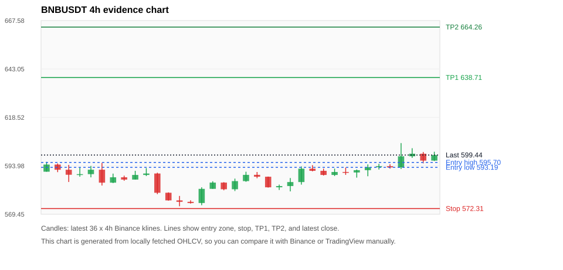
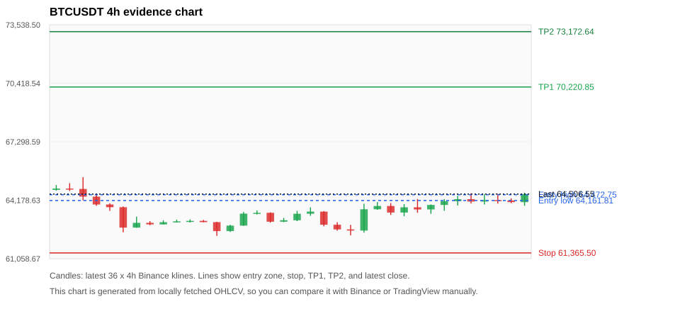
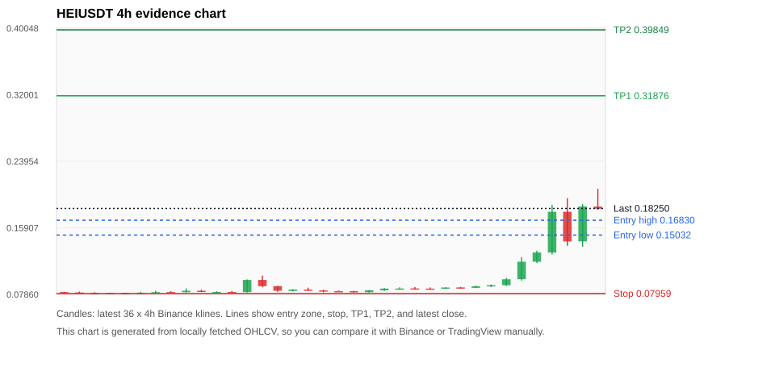
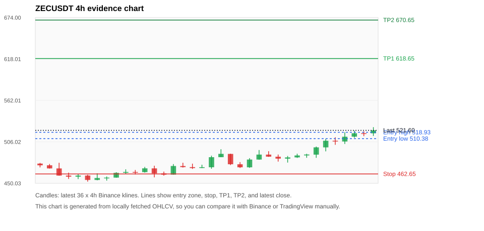
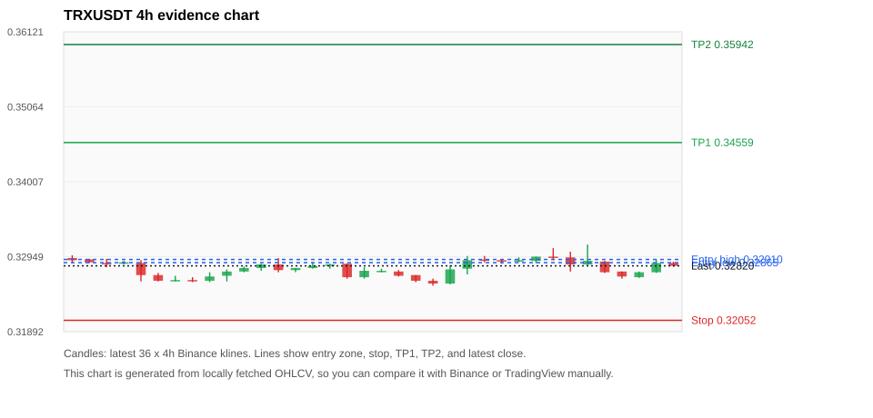

# Crypto 市场扫描报告 v1

- 报告时间：2026-08-05 22:23:11 CST
- Run ID：`20260805_142117_1c0e47c5`
- Run type：`daily_full`
- 数据来源：SQLite
- 报告版本：v1
- 扫描 ID：af613d2bf39b
- 数据源：Binance public spot API + CoinGecko/CoinMarketCap cross-check
- 过滤条件：USDT spot; 24h quote volume >= 30,000,000; trades >= 30,000; exclude stables/leveraged tokens; analyze 1h/4h/1d klines
- 默认单笔风险：账户权益的 1.00%

## 限制说明

- 交易信号仍以 Binance 现货公开 K 线为主源；外部数据源用于一致性复核。
- 结果是研究和模拟盘计划，不是确定收益或实盘下单指令。
- 历史长度过滤：候选币至少需要 180 根 1d K 线。
- 数据质量验证池：先验证 score 排名前 min(top_n * 2, 10) 的候选，再按 action + score 补足最终名单。
- 大盘环境过滤：NEUTRAL; BTC/ETH 大盘未完全确认强势，山寨币买入候选降级为观察。 BTC 7d=0.7872714985618368; ETH 7d=-1.7789105677440964.
- 已启用数据交叉验证：Binance 主源 + CoinGecko 自动对照；CoinMarketCap 在配置 API Key 后自动对照。
- BNBUSDT 交叉验证状态 DATA_WARNING：At least one external provider needs manual review.
- BTCUSDT 交叉验证状态 DATA_WARNING：At least one external provider needs manual review.
- HEIUSDT 交叉验证状态 DATA_WARNING：At least one external provider needs manual review.
- ZECUSDT 交叉验证状态 DATA_WARNING：At least one external provider needs manual review.
- ETHUSDT 交叉验证状态 DATA_WARNING：At least one external provider needs manual review.
- SOLUSDT 交叉验证状态 DATA_WARNING：At least one external provider needs manual review.
- EULUSDT 交叉验证状态 DATA_WARNING：At least one external provider needs manual review.
- XRPUSDT 交叉验证状态 DATA_WARNING：At least one external provider needs manual review.
- BANKUSDT 交叉验证状态 DATA_WARNING：At least one external provider needs manual review.

## 5 个候选交易计划

| Rank | Coin | Action | Setup | Entry Zone | Stop Loss | TP1 | TP2 / Exit Rule | R/R | Verdict |
|---:|---|---|---|---:|---:|---:|---|---:|---|
| 1 | `BNB` | `WATCH_ONLY` | 回踩支撑/4h EMA 附近 | 593.19 - 595.70 | 572.31 | 638.71 | 664.26 或跌破 4h 关键支撑 | 2.00-3.15 | 只等回调 |
| 2 | `BTC` | `WATCH_ONLY` | 回踩支撑/4h EMA 附近 | 64,161.81 - 64,472.75 | 61,365.50 | 70,220.85 | 73,172.64 或跌破 4h 关键支撑 | 2.00-3.00 | 只等回调 |
| 3 | `HEI` | `WATCH_ONLY` | 涨幅较远，只等深回调 | 0.15032 - 0.16830 | 0.07959 | 0.31876 | 0.39849 或跌破 4h 关键支撑 | 2.00-3.00 | 只等回调 |
| 4 | `ZEC` | `WATCH_ONLY` | 趋势中，等回调入场 | 510.38 - 518.93 | 462.65 | 618.65 | 670.65 或跌破 4h 关键支撑 | 2.00-3.00 | 只等回调 |
| 5 | `TRX` | `WATCH_ONLY` | 回踩支撑/4h EMA 附近 | 0.32865 - 0.32910 | 0.32052 | 0.34559 | 0.35942 或跌破 4h 关键支撑 | 2.00-3.65 | 只观察 |

## 数据交叉验证摘要

价格差异以 Binance 当前价为基准；成交量口径不同，Binance 是 USDT 现货成交额，CoinGecko/CoinMarketCap 通常是全市场成交量。

| Rank | Coin | Data Status | Max Price Diff | Max 24h Diff | Message |
|---:|---|---|---:|---:|---|
| 1 | `BNB` | DATA_WARNING | 0.04% | 0.13 pts | At least one external provider needs manual review. |
| 2 | `BTC` | DATA_WARNING | 0.01% | 0.45 pts | At least one external provider needs manual review. |
| 3 | `HEI` | DATA_WARNING | 1.03% | 24.07 pts | At least one external provider needs manual review. |
| 4 | `ZEC` | DATA_WARNING | 0.14% | 0.40 pts | At least one external provider needs manual review. |
| 5 | `TRX` | DATA_OK | 0.04% | 0.08 pts | External provider checks agree with Binance within configured thresholds. |

## 候选币说明

### 1. BNB `BNBUSDT`



- 入选原因：回踩支撑/4h EMA 附近；24h +1.63%，7d +5.43%，4h RSI 75.53，24h 成交额 $72.7M。
- 交易失效条件：跌破 572.31455 或 4h 收盘重新失守关键支撑。
- 主要风险：4h RSI 偏热；数据交叉验证需要人工复核。
- 数据交叉验证：DATA_WARNING；At least one external provider needs manual review.

#### 可点击人工验证

- [Binance 交易页](https://www.binance.com/en/trade/BNB_USDT)
- [TradingView 图表](https://www.tradingview.com/chart/?symbol=BINANCE%3ABNBUSDT)
- [CoinGecko 搜索](https://www.coingecko.com/en/search?query=BNB)
- [CoinMarketCap 搜索](https://coinmarketcap.com/search/?q=BNB)

#### 多数据源对照

| Source | Status | Asset ID | Price | 24h Change | 24h Volume | Price Diff | 24h Diff | Updated | Message |
|---|---|---|---:|---:|---:|---:|---:|---|---|
| Binance | DATA_OK | BNBUSDT | 599.44 | +1.63% | $72.7M | 0.00% | 0.00 pts | 2026-08-05T14:22:17+00:00 | Primary market data source used by scanner. |
| CoinGecko | DATA_OK | binancecoin | 599.66 | +1.50% | $703.6M | 0.04% | 0.13 pts | 2026-08-05T14:20:30.000Z | External source agrees with Binance within thresholds. |
| CoinMarketCap | DATA_WARNING | 1839 | 599.70 | +1.73% | $1.24B | 0.04% | 0.10 pts | 2026-08-05T14:21:02.000Z | CoinMarketCap symbol mapping has 4 matches; selected lowest cmc_rank |

#### 指标证据

| 指标 | 数值 | 人工核对用途 |
|---|---:|---|
| 当前价 | 599.44 | 与 Binance/TradingView 当前价格对照 |
| 24h 涨跌 | +1.63% | 与交易所 24h 涨跌对照 |
| 7d 涨跌 | +5.43% | 判断短线趋势是否延续 |
| 4h EMA20 | 592.01 | 判断短期趋势支撑 |
| 4h EMA50 | 585.80 | 判断中期趋势支撑 |
| 1d EMA20 | 580.89 | 判断日线趋势 |
| 1d EMA50 | 583.65 | 判断日线趋势 |
| 4h RSI14 | 75.53 | 判断是否过热/过弱 |
| 4h ATR14 | 5.2707 | 推导止损和入场缓冲 |
| 最近 18 根 4h 最低点 | 581.03 | 支撑/止损参考 |
| 最近 36 根 4h 最高点 | 605.50 | TP/压力参考 |
| 支撑位 | 592.01 | 入场区间推导基础 |

#### 交易计划推导

- 支撑位 = 最近低点、4h EMA20、4h EMA50、1d EMA20 中不高于当前价的最高有效支撑 = `592.01`。
- 入场区间 = 支撑位附近 + ATR 缓冲 = `593.19 - 595.70`。
- 止损 = min(最近 18 根 4h 最低点 * 0.985, 入场中位价 - 1.15 * ATR14) = `572.31`。
- TP1 = max(最近 36 根 4h 最高点 * 0.995, 入场中位价 + 2R) = `638.71`。
- TP2 = max(入场中位价 + 3R, TP1 * 1.04) = `664.26`。

#### 最近 10 根 4h K线

| UTC 开盘时间 | Open | High | Low | Close | Quote Volume | Trades |
|---|---:|---:|---:|---:|---:|---:|
| 2026-08-04T00:00+00:00 | 589.35 | 592.58 | 588.80 | 590.86 | $6.8M | 66120 |
| 2026-08-04T04:00+00:00 | 590.87 | 593.09 | 589.40 | 590.61 | $5.4M | 52024 |
| 2026-08-04T08:00+00:00 | 590.62 | 592.13 | 588.00 | 591.77 | $6.7M | 67090 |
| 2026-08-04T12:00+00:00 | 591.78 | 594.70 | 588.70 | 593.28 | $12.6M | 127759 |
| 2026-08-04T16:00+00:00 | 593.28 | 594.96 | 592.11 | 593.78 | $7.7M | 70916 |
| 2026-08-04T20:00+00:00 | 593.77 | 594.78 | 592.56 | 593.18 | $3.5M | 39448 |
| 2026-08-05T00:00+00:00 | 593.19 | 605.50 | 592.36 | 598.81 | $26.4M | 201357 |
| 2026-08-05T04:00+00:00 | 598.82 | 602.90 | 598.00 | 600.11 | $7.8M | 87304 |
| 2026-08-05T08:00+00:00 | 600.12 | 600.99 | 595.23 | 596.62 | $11.5M | 117178 |
| 2026-08-05T12:00+00:00 | 596.62 | 601.10 | 596.42 | 599.44 | $9.6M | 94790 |

### 2. BTC `BTCUSDT`



- 入选原因：回踩支撑/4h EMA 附近；24h +1.25%，7d +0.85%，4h RSI 77.70，24h 成交额 $827.4M。
- 交易失效条件：跌破 61365.5 或 4h 收盘重新失守关键支撑。
- 主要风险：4h RSI 偏热；数据交叉验证需要人工复核。
- 数据交叉验证：DATA_WARNING；At least one external provider needs manual review.

#### 可点击人工验证

- [Binance 交易页](https://www.binance.com/en/trade/BTC_USDT)
- [TradingView 图表](https://www.tradingview.com/chart/?symbol=BINANCE%3ABTCUSDT)
- [CoinGecko 搜索](https://www.coingecko.com/en/search?query=BTC)
- [CoinMarketCap 搜索](https://coinmarketcap.com/search/?q=BTC)

#### 多数据源对照

| Source | Status | Asset ID | Price | 24h Change | 24h Volume | Price Diff | 24h Diff | Updated | Message |
|---|---|---|---:|---:|---:|---:|---:|---|---|
| Binance | DATA_OK | BTCUSDT | 64,506.55 | +1.25% | $827.4M | 0.00% | 0.00 pts | 2026-08-05T14:22:17+00:00 | Primary market data source used by scanner. |
| CoinGecko | DATA_OK | bitcoin | 64,500.00 | +0.80% | $23.18B | 0.01% | 0.45 pts | 2026-08-05T14:19:30.000Z | External source agrees with Binance within thresholds. |
| CoinMarketCap | DATA_WARNING | 1 | 64,507.58 | +1.44% | $23.70B | 0.00% | 0.19 pts | 2026-08-05T14:21:02.000Z | CoinMarketCap symbol mapping has 13 matches; selected lowest cmc_rank |

#### 指标证据

| 指标 | 数值 | 人工核对用途 |
|---|---:|---|
| 当前价 | 64,506.55 | 与 Binance/TradingView 当前价格对照 |
| 24h 涨跌 | +1.25% | 与交易所 24h 涨跌对照 |
| 7d 涨跌 | +0.85% | 判断短线趋势是否延续 |
| 4h EMA20 | 63,840.31 | 判断短期趋势支撑 |
| 4h EMA50 | 63,830.39 | 判断中期趋势支撑 |
| 1d EMA20 | 64,033.75 | 判断日线趋势 |
| 1d EMA50 | 64,642.79 | 判断日线趋势 |
| 4h RSI14 | 77.70 | 判断是否过热/过弱 |
| 4h ATR14 | 627.16 | 推导止损和入场缓冲 |
| 最近 18 根 4h 最低点 | 62,300.00 | 支撑/止损参考 |
| 最近 36 根 4h 最高点 | 65,409.56 | TP/压力参考 |
| 支撑位 | 64,033.75 | 入场区间推导基础 |

#### 交易计划推导

- 支撑位 = 最近低点、4h EMA20、4h EMA50、1d EMA20 中不高于当前价的最高有效支撑 = `64,033.75`。
- 入场区间 = 支撑位附近 + ATR 缓冲 = `64,161.81 - 64,472.75`。
- 止损 = min(最近 18 根 4h 最低点 * 0.985, 入场中位价 - 1.15 * ATR14) = `61,365.50`。
- TP1 = max(最近 36 根 4h 最高点 * 0.995, 入场中位价 + 2R) = `70,220.85`。
- TP2 = max(入场中位价 + 3R, TP1 * 1.04) = `73,172.64`。

#### 最近 10 根 4h K线

| UTC 开盘时间 | Open | High | Low | Close | Quote Volume | Trades |
|---|---:|---:|---:|---:|---:|---:|
| 2026-08-04T00:00+00:00 | 63,520.00 | 63,972.00 | 63,322.01 | 63,800.01 | $145.4M | 371522 |
| 2026-08-04T04:00+00:00 | 63,800.01 | 64,243.81 | 63,506.78 | 63,685.74 | $140.6M | 253042 |
| 2026-08-04T08:00+00:00 | 63,685.73 | 63,950.00 | 63,451.80 | 63,926.00 | $117.2M | 278134 |
| 2026-08-04T12:00+00:00 | 63,926.00 | 64,238.00 | 63,615.38 | 64,125.14 | $214.6M | 680360 |
| 2026-08-04T16:00+00:00 | 64,125.14 | 64,413.21 | 63,892.00 | 64,233.36 | $160.1M | 498010 |
| 2026-08-04T20:00+00:00 | 64,233.35 | 64,549.16 | 64,001.68 | 64,106.56 | $97.2M | 306971 |
| 2026-08-05T00:00+00:00 | 64,106.55 | 64,504.00 | 63,950.00 | 64,183.27 | $131.7M | 373821 |
| 2026-08-05T04:00+00:00 | 64,183.27 | 64,525.97 | 63,995.89 | 64,163.99 | $105.2M | 240425 |
| 2026-08-05T08:00+00:00 | 64,164.00 | 64,280.00 | 64,020.00 | 64,075.28 | $74.8M | 238191 |
| 2026-08-05T12:00+00:00 | 64,075.28 | 64,581.43 | 63,880.00 | 64,507.36 | $168.1M | 472721 |

### 3. HEI `HEIUSDT`



- 入选原因：涨幅较远，只等深回调；24h +99.23%，7d +122.56%，4h RSI 77.60，24h 成交额 $34.0M。
- 交易失效条件：跌破 0.079588 或 4h 收盘重新失守关键支撑。
- 主要风险：距离支撑偏远，不能追市价；4h RSI 偏热；24h 振幅较大，回撤风险高；成交量突增，可能是事件驱动；数据交叉验证需要人工复核。
- 数据交叉验证：DATA_WARNING；At least one external provider needs manual review.

#### 可点击人工验证

- [Binance 交易页](https://www.binance.com/en/trade/HEI_USDT)
- [TradingView 图表](https://www.tradingview.com/chart/?symbol=BINANCE%3AHEIUSDT)
- [CoinGecko 搜索](https://www.coingecko.com/en/search?query=HEI)
- [CoinMarketCap 搜索](https://coinmarketcap.com/search/?q=HEI)

#### 多数据源对照

| Source | Status | Asset ID | Price | 24h Change | 24h Volume | Price Diff | 24h Diff | Updated | Message |
|---|---|---|---:|---:|---:|---:|---:|---|---|
| Binance | DATA_OK | HEIUSDT | 0.18250 | +99.23% | $34.0M | 0.00% | 0.00 pts | 2026-08-05T14:22:17+00:00 | Primary market data source used by scanner. |
| CoinGecko | DATA_WARNING | heima | 0.18384 | +123.30% | $144.2M | 0.73% | 24.07 pts | 2026-08-05T14:20:30.000Z | 24h change diff 24.07 points exceeds warning threshold |
| CoinMarketCap | DATA_WARNING | 35724 | 0.18438 | +102.70% | $150.9M | 1.03% | 3.47 pts | 2026-08-05T14:21:02.000Z | price diff 1.03% exceeds warning threshold; 24h change diff 3.47 points exceeds warning threshold; CoinMarketCap symbol mapping has 2 matches; selected lowest cmc_rank |

#### 指标证据

| 指标 | 数值 | 人工核对用途 |
|---|---:|---|
| 当前价 | 0.18250 | 与 Binance/TradingView 当前价格对照 |
| 24h 涨跌 | +99.23% | 与交易所 24h 涨跌对照 |
| 7d 涨跌 | +122.56% | 判断短线趋势是否延续 |
| 4h EMA20 | 0.11953 | 判断短期趋势支撑 |
| 4h EMA50 | 0.10204 | 判断中期趋势支撑 |
| 1d EMA20 | 0.10488 | 判断日线趋势 |
| 1d EMA50 | 0.10327 | 判断日线趋势 |
| 4h RSI14 | 77.60 | 判断是否过热/过弱 |
| 4h ATR14 | 0.01893 | 推导止损和入场缓冲 |
| 最近 18 根 4h 最低点 | 0.08080 | 支撑/止损参考 |
| 最近 36 根 4h 最高点 | 0.20630 | TP/压力参考 |
| 支撑位 | 0.11953 | 入场区间推导基础 |

#### 交易计划推导

- 支撑位 = 最近低点、4h EMA20、4h EMA50、1d EMA20 中不高于当前价的最高有效支撑 = `0.11953`。
- 入场区间 = 支撑位附近 + ATR 缓冲 = `0.15032 - 0.16830`。
- 止损 = min(最近 18 根 4h 最低点 * 0.985, 入场中位价 - 1.15 * ATR14) = `0.07959`。
- TP1 = max(最近 36 根 4h 最高点 * 0.995, 入场中位价 + 2R) = `0.31876`。
- TP2 = max(入场中位价 + 3R, TP1 * 1.04) = `0.39849`。

#### 最近 10 根 4h K线

| UTC 开盘时间 | Open | High | Low | Close | Quote Volume | Trades |
|---|---:|---:|---:|---:|---:|---:|
| 2026-08-04T00:00+00:00 | 0.08700 | 0.08750 | 0.08580 | 0.08650 | $77,890 | 2432 |
| 2026-08-04T04:00+00:00 | 0.08650 | 0.08930 | 0.08620 | 0.08840 | $118,836 | 4172 |
| 2026-08-04T08:00+00:00 | 0.08850 | 0.09060 | 0.08740 | 0.08970 | $176,660 | 4947 |
| 2026-08-04T12:00+00:00 | 0.08970 | 0.09850 | 0.08870 | 0.09690 | $533,818 | 15966 |
| 2026-08-04T16:00+00:00 | 0.09700 | 0.12350 | 0.09520 | 0.11810 | $4.7M | 107242 |
| 2026-08-04T20:00+00:00 | 0.11810 | 0.13150 | 0.11640 | 0.12930 | $3.1M | 52378 |
| 2026-08-05T00:00+00:00 | 0.12920 | 0.18680 | 0.12690 | 0.17850 | $6.1M | 115377 |
| 2026-08-05T04:00+00:00 | 0.17850 | 0.19500 | 0.13730 | 0.14260 | $7.5M | 149795 |
| 2026-08-05T08:00+00:00 | 0.14270 | 0.18780 | 0.13620 | 0.18490 | $6.3M | 128722 |
| 2026-08-05T12:00+00:00 | 0.18480 | 0.20630 | 0.18090 | 0.18220 | $5.8M | 100228 |

### 4. ZEC `ZECUSDT`



- 入选原因：趋势中，等回调入场；24h +7.10%，7d +12.44%，4h RSI 89.62，24h 成交额 $59.5M。
- 交易失效条件：跌破 462.6545 或 4h 收盘重新失守关键支撑。
- 主要风险：4h RSI 偏热；数据交叉验证需要人工复核。
- 数据交叉验证：DATA_WARNING；At least one external provider needs manual review.

#### 可点击人工验证

- [Binance 交易页](https://www.binance.com/en/trade/ZEC_USDT)
- [TradingView 图表](https://www.tradingview.com/chart/?symbol=BINANCE%3AZECUSDT)
- [CoinGecko 搜索](https://www.coingecko.com/en/search?query=ZEC)
- [CoinMarketCap 搜索](https://coinmarketcap.com/search/?q=ZEC)

#### 多数据源对照

| Source | Status | Asset ID | Price | 24h Change | 24h Volume | Price Diff | 24h Diff | Updated | Message |
|---|---|---|---:|---:|---:|---:|---:|---|---|
| Binance | DATA_OK | ZECUSDT | 521.60 | +7.10% | $59.5M | 0.00% | 0.00 pts | 2026-08-05T14:22:17+00:00 | Primary market data source used by scanner. |
| CoinGecko | DATA_OK | zcash | 522.35 | +6.70% | $262.5M | 0.14% | 0.40 pts | 2026-08-05T14:20:30.000Z | External source agrees with Binance within thresholds. |
| CoinMarketCap | DATA_WARNING | 1437 | 522.32 | +7.38% | $367.2M | 0.14% | 0.28 pts | 2026-08-05T14:21:02.000Z | CoinMarketCap symbol mapping has 2 matches; selected lowest cmc_rank |

#### 指标证据

| 指标 | 数值 | 人工核对用途 |
|---|---:|---|
| 当前价 | 521.60 | 与 Binance/TradingView 当前价格对照 |
| 24h 涨跌 | +7.10% | 与交易所 24h 涨跌对照 |
| 7d 涨跌 | +12.44% | 判断短线趋势是否延续 |
| 4h EMA20 | 496.27 | 判断短期趋势支撑 |
| 4h EMA50 | 488.01 | 判断中期趋势支撑 |
| 1d EMA20 | 493.04 | 判断日线趋势 |
| 1d EMA50 | 486.86 | 判断日线趋势 |
| 4h RSI14 | 89.62 | 判断是否过热/过弱 |
| 4h ATR14 | 10.6879 | 推导止损和入场缓冲 |
| 最近 18 根 4h 最低点 | 469.70 | 支撑/止损参考 |
| 最近 36 根 4h 最高点 | 525.90 | TP/压力参考 |
| 支撑位 | 496.27 | 入场区间推导基础 |

#### 交易计划推导

- 支撑位 = 最近低点、4h EMA20、4h EMA50、1d EMA20 中不高于当前价的最高有效支撑 = `496.27`。
- 入场区间 = 支撑位附近 + ATR 缓冲 = `510.38 - 518.93`。
- 止损 = min(最近 18 根 4h 最低点 * 0.985, 入场中位价 - 1.15 * ATR14) = `462.65`。
- TP1 = max(最近 36 根 4h 最高点 * 0.995, 入场中位价 + 2R) = `618.65`。
- TP2 = max(入场中位价 + 3R, TP1 * 1.04) = `670.65`。

#### 最近 10 根 4h K线

| UTC 开盘时间 | Open | High | Low | Close | Quote Volume | Trades |
|---|---:|---:|---:|---:|---:|---:|
| 2026-08-04T00:00+00:00 | 483.34 | 486.94 | 478.04 | 485.01 | $4.8M | 23396 |
| 2026-08-04T04:00+00:00 | 485.04 | 490.00 | 484.33 | 487.65 | $4.1M | 17028 |
| 2026-08-04T08:00+00:00 | 487.70 | 489.90 | 484.52 | 488.93 | $2.4M | 12524 |
| 2026-08-04T12:00+00:00 | 488.76 | 499.69 | 484.45 | 498.59 | $10.7M | 33771 |
| 2026-08-04T16:00+00:00 | 498.57 | 509.99 | 493.21 | 507.54 | $10.1M | 39740 |
| 2026-08-04T20:00+00:00 | 507.56 | 512.26 | 502.04 | 506.57 | $6.3M | 32313 |
| 2026-08-05T00:00+00:00 | 506.54 | 519.00 | 503.18 | 512.98 | $9.9M | 45253 |
| 2026-08-05T04:00+00:00 | 513.05 | 521.25 | 511.61 | 517.66 | $9.0M | 39979 |
| 2026-08-05T08:00+00:00 | 517.68 | 520.44 | 513.72 | 517.59 | $6.5M | 26124 |
| 2026-08-05T12:00+00:00 | 517.60 | 525.90 | 514.02 | 521.60 | $9.8M | 35468 |

### 5. TRX `TRXUSDT`



- 入选原因：回踩支撑/4h EMA 附近；24h -0.42%，7d +0.52%，4h RSI 62.14，24h 成交额 $36.4M。
- 交易失效条件：跌破 0.320519 或 4h 收盘重新失守关键支撑。
- 主要风险：24h 动量未确认。
- 数据交叉验证：DATA_OK；External provider checks agree with Binance within configured thresholds.

#### 可点击人工验证

- [Binance 交易页](https://www.binance.com/en/trade/TRX_USDT)
- [TradingView 图表](https://www.tradingview.com/chart/?symbol=BINANCE%3ATRXUSDT)
- [CoinGecko 搜索](https://www.coingecko.com/en/search?query=TRX)
- [CoinMarketCap 搜索](https://coinmarketcap.com/search/?q=TRX)

#### 多数据源对照

| Source | Status | Asset ID | Price | 24h Change | 24h Volume | Price Diff | 24h Diff | Updated | Message |
|---|---|---|---:|---:|---:|---:|---:|---|---|
| Binance | DATA_OK | TRXUSDT | 0.32820 | -0.42% | $36.4M | 0.00% | 0.00 pts | 2026-08-05T14:22:17+00:00 | Primary market data source used by scanner. |
| CoinGecko | DATA_OK | tron | 0.32812 | -0.50% | $449.1M | 0.02% | 0.08 pts | 2026-08-05T14:20:30.000Z | External source agrees with Binance within thresholds. |
| CoinMarketCap | DATA_OK | 1958 | 0.32808 | -0.38% | $550.2M | 0.04% | 0.04 pts | 2026-08-05T14:21:02.000Z | External source agrees with Binance within thresholds. |

#### 指标证据

| 指标 | 数值 | 人工核对用途 |
|---|---:|---|
| 当前价 | 0.32820 | 与 Binance/TradingView 当前价格对照 |
| 24h 涨跌 | -0.42% | 与交易所 24h 涨跌对照 |
| 7d 涨跌 | +0.52% | 判断短线趋势是否延续 |
| 4h EMA20 | 0.32800 | 判断短期趋势支撑 |
| 4h EMA50 | 0.32780 | 判断中期趋势支撑 |
| 1d EMA20 | 0.32756 | 判断日线趋势 |
| 1d EMA50 | 0.32795 | 判断日线趋势 |
| 4h RSI14 | 62.14 | 判断是否过热/过弱 |
| 4h ATR14 | 0.0015785714 | 推导止损和入场缓冲 |
| 最近 18 根 4h 最低点 | 0.32540 | 支撑/止损参考 |
| 最近 36 根 4h 最高点 | 0.33120 | TP/压力参考 |
| 支撑位 | 0.32800 | 入场区间推导基础 |

#### 交易计划推导

- 支撑位 = 最近低点、4h EMA20、4h EMA50、1d EMA20 中不高于当前价的最高有效支撑 = `0.32800`。
- 入场区间 = 支撑位附近 + ATR 缓冲 = `0.32865 - 0.32910`。
- 止损 = min(最近 18 根 4h 最低点 * 0.985, 入场中位价 - 1.15 * ATR14) = `0.32052`。
- TP1 = max(最近 36 根 4h 最高点 * 0.995, 入场中位价 + 2R) = `0.34559`。
- TP2 = max(入场中位价 + 3R, TP1 * 1.04) = `0.35942`。

#### 最近 10 根 4h K线

| UTC 开盘时间 | Open | High | Low | Close | Quote Volume | Trades |
|---|---:|---:|---:|---:|---:|---:|
| 2026-08-04T00:00+00:00 | 0.32890 | 0.32940 | 0.32870 | 0.32900 | $3.5M | 6335 |
| 2026-08-04T04:00+00:00 | 0.32890 | 0.32950 | 0.32860 | 0.32950 | $3.1M | 5806 |
| 2026-08-04T08:00+00:00 | 0.32950 | 0.33070 | 0.32900 | 0.32940 | $6.7M | 10343 |
| 2026-08-04T12:00+00:00 | 0.32940 | 0.33020 | 0.32740 | 0.32840 | $7.8M | 11243 |
| 2026-08-04T16:00+00:00 | 0.32840 | 0.33120 | 0.32820 | 0.32890 | $10.3M | 13176 |
| 2026-08-04T20:00+00:00 | 0.32880 | 0.32890 | 0.32720 | 0.32730 | $4.7M | 9578 |
| 2026-08-05T00:00+00:00 | 0.32740 | 0.32740 | 0.32640 | 0.32670 | $4.5M | 7595 |
| 2026-08-05T04:00+00:00 | 0.32660 | 0.32740 | 0.32650 | 0.32730 | $2.3M | 6844 |
| 2026-08-05T08:00+00:00 | 0.32730 | 0.32910 | 0.32720 | 0.32860 | $7.2M | 11151 |
| 2026-08-05T12:00+00:00 | 0.32860 | 0.32880 | 0.32810 | 0.32820 | $2.9M | 6432 |

## 组合风控

- 不要 5 个候选全部满仓买入。
- 同时持仓总风险建议控制在账户权益的 3% - 5% 以内。
- 如果 BTC/ETH 同时破位，暂停山寨币多头计划或降低仓位。
- 第一版报告用于模拟盘和人工复核，不自动下单。

## 原始数据

```json
[
  {
    "rank": 1,
    "symbol": "BNBUSDT",
    "base_asset": "BNB",
    "price": 599.44,
    "score": 59.698907935710636,
    "setup": "回踩支撑/4h EMA 附近",
    "verdict": "只等回调",
    "entry_low": 593.19341439316,
    "entry_high": 595.698895601956,
    "stop_loss": 572.3145499999999,
    "take_profit_1": 638.7093649926741,
    "take_profit_2": 664.2577395923811,
    "risk_reward_1": 2.0,
    "risk_reward_2": 3.1543841760471496,
    "pct_24h": 1.627,
    "pct_3d": 2.251637554585151,
    "pct_7d": 5.42941062665987,
    "quote_volume_24h": 72740160.76345,
    "trades_24h": 672412,
    "high_low_range_24h": 2.653216919555823,
    "rsi_1h": 56.215005599104195,
    "rsi_4h": 75.52811179720514,
    "ema20_4h": 592.009395601956,
    "ema50_4h": 585.7991151824832,
    "ema20_1d": 580.8893838600457,
    "ema50_1d": 583.645379251579,
    "atr_4h": 5.270714285714299,
    "macd_hist_4h": 0.6749514186919874,
    "volume_ratio_24h": 1.162627591640458,
    "support_level": 592.009395601956,
    "recent_low_4h_18": 581.03,
    "recent_high_4h_36": 605.5,
    "distance_to_support_pct": 1.255149741413919,
    "binance_trade_url": "https://www.binance.com/en/trade/BNB_USDT",
    "tradingview_url": "https://www.tradingview.com/chart/?symbol=BINANCE%3ABNBUSDT",
    "coingecko_search_url": "https://www.coingecko.com/en/search?query=BNB",
    "coinmarketcap_search_url": "https://coinmarketcap.com/search/?q=BNB",
    "invalidation": "跌破 572.31455 或 4h 收盘重新失守关键支撑",
    "recent_4h_klines": [
      {
        "open_time_utc": "2026-07-30T16:00+00:00",
        "open": 591.0,
        "high": 596.0,
        "low": 591.0,
        "close": 594.62,
        "quote_volume": 13762859.31738,
        "trades": 122399
      },
      {
        "open_time_utc": "2026-07-30T20:00+00:00",
        "open": 594.62,
        "high": 595.18,
        "low": 590.78,
        "close": 591.99,
        "quote_volume": 9622587.40278,
        "trades": 66995
      },
      {
        "open_time_utc": "2026-07-31T00:00+00:00",
        "open": 591.99,
        "high": 594.46,
        "low": 585.79,
        "close": 589.46,
        "quote_volume": 11857275.34371,
        "trades": 113936
      },
      {
        "open_time_utc": "2026-07-31T04:00+00:00",
        "open": 589.47,
        "high": 592.92,
        "low": 588.47,
        "close": 589.76,
        "quote_volume": 13273327.35596,
        "trades": 91636
      },
      {
        "open_time_utc": "2026-07-31T08:00+00:00",
        "open": 589.77,
        "high": 593.92,
        "low": 588.15,
        "close": 592.02,
        "quote_volume": 14135917.51286,
        "trades": 116449
      },
      {
        "open_time_utc": "2026-07-31T12:00+00:00",
        "open": 592.02,
        "high": 595.5,
        "low": 583.99,
        "close": 585.45,
        "quote_volume": 21376533.93513,
        "trades": 211242
      },
      {
        "open_time_utc": "2026-07-31T16:00+00:00",
        "open": 585.45,
        "high": 590.04,
        "low": 585.23,
        "close": 588.17,
        "quote_volume": 5309856.93839,
        "trades": 77917
      },
      {
        "open_time_utc": "2026-07-31T20:00+00:00",
        "open": 588.17,
        "high": 589.0,
        "low": 586.41,
        "close": 587.01,
        "quote_volume": 3925135.34459,
        "trades": 46641
      },
      {
        "open_time_utc": "2026-08-01T00:00+00:00",
        "open": 587.01,
        "high": 591.44,
        "low": 587.01,
        "close": 589.36,
        "quote_volume": 7636935.15965,
        "trades": 55289
      },
      {
        "open_time_utc": "2026-08-01T04:00+00:00",
        "open": 589.35,
        "high": 592.8,
        "low": 588.79,
        "close": 590.09,
        "quote_volume": 8963946.11569,
        "trades": 68228
      },
      {
        "open_time_utc": "2026-08-01T08:00+00:00",
        "open": 590.09,
        "high": 590.5,
        "low": 579.64,
        "close": 580.33,
        "quote_volume": 12863949.34825,
        "trades": 108418
      },
      {
        "open_time_utc": "2026-08-01T12:00+00:00",
        "open": 580.34,
        "high": 580.53,
        "low": 576.36,
        "close": 576.47,
        "quote_volume": 13250605.36106,
        "trades": 107346
      },
      {
        "open_time_utc": "2026-08-01T16:00+00:00",
        "open": 576.47,
        "high": 578.73,
        "low": 573.5,
        "close": 575.74,
        "quote_volume": 10267252.87046,
        "trades": 88144
      },
      {
        "open_time_utc": "2026-08-01T20:00+00:00",
        "open": 575.74,
        "high": 576.52,
        "low": 574.85,
        "close": 575.13,
        "quote_volume": 8282480.6281,
        "trades": 57276
      },
      {
        "open_time_utc": "2026-08-02T00:00+00:00",
        "open": 575.14,
        "high": 583.1,
        "low": 574.03,
        "close": 582.31,
        "quote_volume": 9582776.12471,
        "trades": 85589
      },
      {
        "open_time_utc": "2026-08-02T04:00+00:00",
        "open": 582.32,
        "high": 586.15,
        "low": 582.32,
        "close": 585.49,
        "quote_volume": 12017580.06864,
        "trades": 82260
      },
      {
        "open_time_utc": "2026-08-02T08:00+00:00",
        "open": 585.49,
        "high": 585.7,
        "low": 581.59,
        "close": 582.11,
        "quote_volume": 5341321.63315,
        "trades": 61283
      },
      {
        "open_time_utc": "2026-08-02T12:00+00:00",
        "open": 582.11,
        "high": 587.5,
        "low": 581.2,
        "close": 586.24,
        "quote_volume": 8018573.90255,
        "trades": 71506
      },
      {
        "open_time_utc": "2026-08-02T16:00+00:00",
        "open": 586.24,
        "high": 590.99,
        "low": 585.89,
        "close": 589.4,
        "quote_volume": 5371127.55564,
        "trades": 63071
      },
      {
        "open_time_utc": "2026-08-02T20:00+00:00",
        "open": 589.41,
        "high": 590.86,
        "low": 587.69,
        "close": 588.46,
        "quote_volume": 5076845.03676,
        "trades": 56201
      },
      {
        "open_time_utc": "2026-08-03T00:00+00:00",
        "open": 588.46,
        "high": 588.54,
        "low": 582.97,
        "close": 583.1,
        "quote_volume": 6499540.25216,
        "trades": 78732
      },
      {
        "open_time_utc": "2026-08-03T04:00+00:00",
        "open": 583.11,
        "high": 584.47,
        "low": 581.75,
        "close": 583.73,
        "quote_volume": 9176052.82363,
        "trades": 78022
      },
      {
        "open_time_utc": "2026-08-03T08:00+00:00",
        "open": 583.74,
        "high": 587.8,
        "low": 581.03,
        "close": 585.76,
        "quote_volume": 9064063.26266,
        "trades": 103876
      },
      {
        "open_time_utc": "2026-08-03T12:00+00:00",
        "open": 585.76,
        "high": 593.69,
        "low": 584.45,
        "close": 592.54,
        "quote_volume": 14827927.37267,
        "trades": 174913
      },
      {
        "open_time_utc": "2026-08-03T16:00+00:00",
        "open": 592.54,
        "high": 594.32,
        "low": 591.19,
        "close": 591.45,
        "quote_volume": 7338330.21922,
        "trades": 69851
      },
      {
        "open_time_utc": "2026-08-03T20:00+00:00",
        "open": 591.45,
        "high": 592.55,
        "low": 589.05,
        "close": 589.35,
        "quote_volume": 4092092.38641,
        "trades": 43404
      },
      {
        "open_time_utc": "2026-08-04T00:00+00:00",
        "open": 589.35,
        "high": 592.58,
        "low": 588.8,
        "close": 590.86,
        "quote_volume": 6765827.77278,
        "trades": 66120
      },
      {
        "open_time_utc": "2026-08-04T04:00+00:00",
        "open": 590.87,
        "high": 593.09,
        "low": 589.4,
        "close": 590.61,
        "quote_volume": 5427501.90872,
        "trades": 52024
      },
      {
        "open_time_utc": "2026-08-04T08:00+00:00",
        "open": 590.62,
        "high": 592.13,
        "low": 588.0,
        "close": 591.77,
        "quote_volume": 6660752.99497,
        "trades": 67090
      },
      {
        "open_time_utc": "2026-08-04T12:00+00:00",
        "open": 591.78,
        "high": 594.7,
        "low": 588.7,
        "close": 593.28,
        "quote_volume": 12638294.04224,
        "trades": 127759
      },
      {
        "open_time_utc": "2026-08-04T16:00+00:00",
        "open": 593.28,
        "high": 594.96,
        "low": 592.11,
        "close": 593.78,
        "quote_volume": 7714271.4677,
        "trades": 70916
      },
      {
        "open_time_utc": "2026-08-04T20:00+00:00",
        "open": 593.77,
        "high": 594.78,
        "low": 592.56,
        "close": 593.18,
        "quote_volume": 3526165.11125,
        "trades": 39448
      },
      {
        "open_time_utc": "2026-08-05T00:00+00:00",
        "open": 593.19,
        "high": 605.5,
        "low": 592.36,
        "close": 598.81,
        "quote_volume": 26414249.57498,
        "trades": 201357
      },
      {
        "open_time_utc": "2026-08-05T04:00+00:00",
        "open": 598.82,
        "high": 602.9,
        "low": 598.0,
        "close": 600.11,
        "quote_volume": 7788006.28702,
        "trades": 87304
      },
      {
        "open_time_utc": "2026-08-05T08:00+00:00",
        "open": 600.12,
        "high": 600.99,
        "low": 595.23,
        "close": 596.62,
        "quote_volume": 11511212.37978,
        "trades": 117178
      },
      {
        "open_time_utc": "2026-08-05T12:00+00:00",
        "open": 596.62,
        "high": 601.1,
        "low": 596.42,
        "close": 599.44,
        "quote_volume": 9615818.70519,
        "trades": 94790
      }
    ],
    "risks": [
      "4h RSI 偏热",
      "数据交叉验证需要人工复核"
    ],
    "data_quality_status": "DATA_WARNING",
    "data_quality_message": "At least one external provider needs manual review.",
    "data_checks": [
      {
        "provider": "Binance",
        "status": "DATA_OK",
        "provider_asset_id": "BNBUSDT",
        "provider_symbol": "BNBUSDT",
        "price_usd": 599.44,
        "pct_24h": 1.627,
        "volume_24h": 72740160.76345,
        "last_updated": null,
        "fetched_at_utc": "2026-08-05T14:22:17+00:00",
        "price_diff_pct": 0.0,
        "pct_24h_diff": 0.0,
        "volume_note": "Binance USDT spot 24h quoteVolume.",
        "message": "Primary market data source used by scanner."
      },
      {
        "provider": "CoinGecko",
        "status": "DATA_OK",
        "provider_asset_id": "binancecoin",
        "provider_symbol": "BNB",
        "price_usd": 599.66,
        "pct_24h": 1.5,
        "volume_24h": 703625947.0,
        "last_updated": "2026-08-05T14:20:30.000Z",
        "fetched_at_utc": "2026-08-05T14:22:17+00:00",
        "price_diff_pct": 0.03670092085945442,
        "pct_24h_diff": 0.127,
        "volume_note": "CoinGecko total market volume; not the same venue scope as Binance quoteVolume.",
        "message": "External source agrees with Binance within thresholds."
      },
      {
        "provider": "CoinMarketCap",
        "status": "DATA_WARNING",
        "provider_asset_id": "1839",
        "provider_symbol": "BNB",
        "price_usd": 599.6999730552959,
        "pct_24h": 1.7286226,
        "volume_24h": 1237912048.7063866,
        "last_updated": "2026-08-05T14:21:02.000Z",
        "fetched_at_utc": "2026-08-05T14:22:17+00:00",
        "price_diff_pct": 0.043369320581852895,
        "pct_24h_diff": 0.10162260000000001,
        "volume_note": "CoinMarketCap total market volume; not the same venue scope as Binance quoteVolume.",
        "message": "CoinMarketCap symbol mapping has 4 matches; selected lowest cmc_rank"
      }
    ],
    "action": "WATCH_ONLY"
  },
  {
    "rank": 2,
    "symbol": "BTCUSDT",
    "base_asset": "BTC",
    "price": 64506.55,
    "score": 58.97769447838157,
    "setup": "回踩支撑/4h EMA 附近",
    "verdict": "只等回调",
    "entry_low": 64161.81284029325,
    "entry_high": 64472.75484959406,
    "stop_loss": 61365.5,
    "take_profit_1": 70220.85153483096,
    "take_profit_2": 73172.63537977461,
    "risk_reward_1": 2.0,
    "risk_reward_2": 3.0,
    "pct_24h": 1.248,
    "pct_3d": 2.214275143030009,
    "pct_7d": 0.8481957275661811,
    "quote_volume_24h": 827410041.0307163,
    "trades_24h": 2434199,
    "high_low_range_24h": 1.4225222428109419,
    "rsi_1h": 67.19980363930648,
    "rsi_4h": 77.69578189421262,
    "ema20_4h": 63840.31238055178,
    "ema50_4h": 63830.391472422554,
    "ema20_1d": 64033.74534959406,
    "ema50_1d": 64642.79449691881,
    "atr_4h": 627.1564285714283,
    "macd_hist_4h": 105.83301711510175,
    "volume_ratio_24h": 0.8707011589429043,
    "support_level": 64033.74534959406,
    "recent_low_4h_18": 62300.0,
    "recent_high_4h_36": 65409.56,
    "distance_to_support_pct": 0.7383679461893999,
    "binance_trade_url": "https://www.binance.com/en/trade/BTC_USDT",
    "tradingview_url": "https://www.tradingview.com/chart/?symbol=BINANCE%3ABTCUSDT",
    "coingecko_search_url": "https://www.coingecko.com/en/search?query=BTC",
    "coinmarketcap_search_url": "https://coinmarketcap.com/search/?q=BTC",
    "invalidation": "跌破 61365.5 或 4h 收盘重新失守关键支撑",
    "recent_4h_klines": [
      {
        "open_time_utc": "2026-07-30T16:00+00:00",
        "open": 64730.29,
        "high": 64988.0,
        "low": 64688.0,
        "close": 64800.0,
        "quote_volume": 109487756.9421308,
        "trades": 299193
      },
      {
        "open_time_utc": "2026-07-30T20:00+00:00",
        "open": 64800.0,
        "high": 65086.4,
        "low": 64668.91,
        "close": 64780.02,
        "quote_volume": 99402988.6217281,
        "trades": 294167
      },
      {
        "open_time_utc": "2026-07-31T00:00+00:00",
        "open": 64780.03,
        "high": 65409.56,
        "low": 64172.0,
        "close": 64370.0,
        "quote_volume": 212266362.985716,
        "trades": 576077
      },
      {
        "open_time_utc": "2026-07-31T04:00+00:00",
        "open": 64370.0,
        "high": 64496.64,
        "low": 63878.11,
        "close": 63950.01,
        "quote_volume": 289329878.8396209,
        "trades": 350769
      },
      {
        "open_time_utc": "2026-07-31T08:00+00:00",
        "open": 63950.01,
        "high": 64011.99,
        "low": 63610.0,
        "close": 63805.51,
        "quote_volume": 128050427.5095636,
        "trades": 285681
      },
      {
        "open_time_utc": "2026-07-31T12:00+00:00",
        "open": 63805.5,
        "high": 63849.19,
        "low": 62466.0,
        "close": 62716.57,
        "quote_volume": 417058298.2413775,
        "trades": 911977
      },
      {
        "open_time_utc": "2026-07-31T16:00+00:00",
        "open": 62716.57,
        "high": 63302.0,
        "low": 62709.01,
        "close": 62972.0,
        "quote_volume": 174662192.1674103,
        "trades": 422083
      },
      {
        "open_time_utc": "2026-07-31T20:00+00:00",
        "open": 62972.0,
        "high": 63062.47,
        "low": 62846.0,
        "close": 62887.88,
        "quote_volume": 80656021.1529942,
        "trades": 193651
      },
      {
        "open_time_utc": "2026-08-01T00:00+00:00",
        "open": 62887.88,
        "high": 63106.55,
        "low": 62887.87,
        "close": 63004.48,
        "quote_volume": 103411707.7296509,
        "trades": 124285
      },
      {
        "open_time_utc": "2026-08-01T04:00+00:00",
        "open": 63004.47,
        "high": 63142.85,
        "low": 62992.82,
        "close": 63050.46,
        "quote_volume": 79950236.839771,
        "trades": 85782
      },
      {
        "open_time_utc": "2026-08-01T08:00+00:00",
        "open": 63050.45,
        "high": 63150.0,
        "low": 62986.31,
        "close": 63076.0,
        "quote_volume": 52640495.1477045,
        "trades": 86193
      },
      {
        "open_time_utc": "2026-08-01T12:00+00:00",
        "open": 63076.0,
        "high": 63127.07,
        "low": 63007.05,
        "close": 63007.06,
        "quote_volume": 66745617.1604201,
        "trades": 78748
      },
      {
        "open_time_utc": "2026-08-01T16:00+00:00",
        "open": 63007.06,
        "high": 63027.65,
        "low": 62275.0,
        "close": 62529.82,
        "quote_volume": 120963738.5006138,
        "trades": 310491
      },
      {
        "open_time_utc": "2026-08-01T20:00+00:00",
        "open": 62529.81,
        "high": 62866.62,
        "low": 62482.99,
        "close": 62823.64,
        "quote_volume": 52100274.3841957,
        "trades": 146484
      },
      {
        "open_time_utc": "2026-08-02T00:00+00:00",
        "open": 62823.65,
        "high": 63550.0,
        "low": 62806.58,
        "close": 63461.95,
        "quote_volume": 130972008.4458598,
        "trades": 259494
      },
      {
        "open_time_utc": "2026-08-02T04:00+00:00",
        "open": 63461.95,
        "high": 63634.0,
        "low": 63415.26,
        "close": 63506.24,
        "quote_volume": 72153523.5889385,
        "trades": 123416
      },
      {
        "open_time_utc": "2026-08-02T08:00+00:00",
        "open": 63506.23,
        "high": 63530.0,
        "low": 62982.38,
        "close": 63031.99,
        "quote_volume": 88150007.5082187,
        "trades": 197628
      },
      {
        "open_time_utc": "2026-08-02T12:00+00:00",
        "open": 63031.99,
        "high": 63231.67,
        "low": 63010.0,
        "close": 63109.14,
        "quote_volume": 64093788.7331829,
        "trades": 158461
      },
      {
        "open_time_utc": "2026-08-02T16:00+00:00",
        "open": 63109.13,
        "high": 63610.01,
        "low": 63064.01,
        "close": 63456.01,
        "quote_volume": 85648276.7447899,
        "trades": 217974
      },
      {
        "open_time_utc": "2026-08-02T20:00+00:00",
        "open": 63456.0,
        "high": 63796.33,
        "low": 63344.0,
        "close": 63570.0,
        "quote_volume": 90220771.4002839,
        "trades": 329091
      },
      {
        "open_time_utc": "2026-08-03T00:00+00:00",
        "open": 63570.01,
        "high": 63596.0,
        "low": 62786.04,
        "close": 62870.49,
        "quote_volume": 99839831.4040742,
        "trades": 326736
      },
      {
        "open_time_utc": "2026-08-03T04:00+00:00",
        "open": 62870.48,
        "high": 63001.77,
        "low": 62552.04,
        "close": 62621.1,
        "quote_volume": 158583910.2681163,
        "trades": 254042
      },
      {
        "open_time_utc": "2026-08-03T08:00+00:00",
        "open": 62621.1,
        "high": 62863.1,
        "low": 62300.0,
        "close": 62560.01,
        "quote_volume": 123258099.1263082,
        "trades": 280437
      },
      {
        "open_time_utc": "2026-08-03T12:00+00:00",
        "open": 62560.01,
        "high": 63992.71,
        "low": 62445.26,
        "close": 63694.91,
        "quote_volume": 337230182.5250796,
        "trades": 932553
      },
      {
        "open_time_utc": "2026-08-03T16:00+00:00",
        "open": 63694.9,
        "high": 64080.0,
        "low": 63664.0,
        "close": 63869.38,
        "quote_volume": 149567720.3755705,
        "trades": 440979
      },
      {
        "open_time_utc": "2026-08-03T20:00+00:00",
        "open": 63869.38,
        "high": 64023.61,
        "low": 63392.01,
        "close": 63520.0,
        "quote_volume": 115218772.2566304,
        "trades": 259617
      },
      {
        "open_time_utc": "2026-08-04T00:00+00:00",
        "open": 63520.0,
        "high": 63972.0,
        "low": 63322.01,
        "close": 63800.01,
        "quote_volume": 145406082.5199303,
        "trades": 371522
      },
      {
        "open_time_utc": "2026-08-04T04:00+00:00",
        "open": 63800.01,
        "high": 64243.81,
        "low": 63506.78,
        "close": 63685.74,
        "quote_volume": 140604655.7293184,
        "trades": 253042
      },
      {
        "open_time_utc": "2026-08-04T08:00+00:00",
        "open": 63685.73,
        "high": 63950.0,
        "low": 63451.8,
        "close": 63926.0,
        "quote_volume": 117165598.5897803,
        "trades": 278134
      },
      {
        "open_time_utc": "2026-08-04T12:00+00:00",
        "open": 63926.0,
        "high": 64238.0,
        "low": 63615.38,
        "close": 64125.14,
        "quote_volume": 214613426.2943327,
        "trades": 680360
      },
      {
        "open_time_utc": "2026-08-04T16:00+00:00",
        "open": 64125.14,
        "high": 64413.21,
        "low": 63892.0,
        "close": 64233.36,
        "quote_volume": 160051627.0726861,
        "trades": 498010
      },
      {
        "open_time_utc": "2026-08-04T20:00+00:00",
        "open": 64233.35,
        "high": 64549.16,
        "low": 64001.68,
        "close": 64106.56,
        "quote_volume": 97216293.0904245,
        "trades": 306971
      },
      {
        "open_time_utc": "2026-08-05T00:00+00:00",
        "open": 64106.55,
        "high": 64504.0,
        "low": 63950.0,
        "close": 64183.27,
        "quote_volume": 131673610.4579225,
        "trades": 373821
      },
      {
        "open_time_utc": "2026-08-05T04:00+00:00",
        "open": 64183.27,
        "high": 64525.97,
        "low": 63995.89,
        "close": 64163.99,
        "quote_volume": 105225246.9831986,
        "trades": 240425
      },
      {
        "open_time_utc": "2026-08-05T08:00+00:00",
        "open": 64164.0,
        "high": 64280.0,
        "low": 64020.0,
        "close": 64075.28,
        "quote_volume": 74783126.1741652,
        "trades": 238191
      },
      {
        "open_time_utc": "2026-08-05T12:00+00:00",
        "open": 64075.28,
        "high": 64581.43,
        "low": 63880.0,
        "close": 64507.36,
        "quote_volume": 168104419.1286087,
        "trades": 472721
      }
    ],
    "risks": [
      "4h RSI 偏热",
      "数据交叉验证需要人工复核"
    ],
    "data_quality_status": "DATA_WARNING",
    "data_quality_message": "At least one external provider needs manual review.",
    "data_checks": [
      {
        "provider": "Binance",
        "status": "DATA_OK",
        "provider_asset_id": "BTCUSDT",
        "provider_symbol": "BTCUSDT",
        "price_usd": 64506.55,
        "pct_24h": 1.248,
        "volume_24h": 827410041.0307163,
        "last_updated": null,
        "fetched_at_utc": "2026-08-05T14:22:17+00:00",
        "price_diff_pct": 0.0,
        "pct_24h_diff": 0.0,
        "volume_note": "Binance USDT spot 24h quoteVolume.",
        "message": "Primary market data source used by scanner."
      },
      {
        "provider": "CoinGecko",
        "status": "DATA_OK",
        "provider_asset_id": "bitcoin",
        "provider_symbol": "BTC",
        "price_usd": 64500.0,
        "pct_24h": 0.8,
        "volume_24h": 23177572639.0,
        "last_updated": "2026-08-05T14:19:30.000Z",
        "fetched_at_utc": "2026-08-05T14:22:17+00:00",
        "price_diff_pct": 0.010154007616285338,
        "pct_24h_diff": 0.44799999999999995,
        "volume_note": "CoinGecko total market volume; not the same venue scope as Binance quoteVolume.",
        "message": "External source agrees with Binance within thresholds."
      },
      {
        "provider": "CoinMarketCap",
        "status": "DATA_WARNING",
        "provider_asset_id": "1",
        "provider_symbol": "BTC",
        "price_usd": 64507.57996463424,
        "pct_24h": 1.43940731,
        "volume_24h": 23703170371.43925,
        "last_updated": "2026-08-05T14:21:02.000Z",
        "fetched_at_utc": "2026-08-05T14:22:17+00:00",
        "price_diff_pct": 0.0015966822504678202,
        "pct_24h_diff": 0.19140731,
        "volume_note": "CoinMarketCap total market volume; not the same venue scope as Binance quoteVolume.",
        "message": "CoinMarketCap symbol mapping has 13 matches; selected lowest cmc_rank"
      }
    ],
    "action": "WATCH_ONLY"
  },
  {
    "rank": 3,
    "symbol": "HEIUSDT",
    "base_asset": "HEI",
    "price": 0.1825,
    "score": 57.2776357530868,
    "setup": "涨幅较远，只等深回调",
    "verdict": "只等回调",
    "entry_low": 0.15032142857142858,
    "entry_high": 0.1683035714285714,
    "stop_loss": 0.07958799999999999,
    "take_profit_1": 0.31876150000000003,
    "take_profit_2": 0.398486,
    "risk_reward_1": 2.0000000000000004,
    "risk_reward_2": 3.0,
    "pct_24h": 99.234,
    "pct_3d": 121.21212121212119,
    "pct_7d": 122.5609756097561,
    "quote_volume_24h": 33966773.96845,
    "trades_24h": 665934,
    "high_low_range_24h": 128.20796460176993,
    "rsi_1h": 65.06772009029345,
    "rsi_4h": 77.6,
    "ema20_4h": 0.11953408614016629,
    "ema50_4h": 0.10204449822181309,
    "ema20_1d": 0.10487661758526068,
    "ema50_1d": 0.10327352582665443,
    "atr_4h": 0.018928571428571427,
    "macd_hist_4h": 0.010365938663091462,
    "volume_ratio_24h": 26.529715046608985,
    "support_level": 0.11953408614016629,
    "recent_low_4h_18": 0.0808,
    "recent_high_4h_36": 0.2063,
    "distance_to_support_pct": 52.676115987534764,
    "binance_trade_url": "https://www.binance.com/en/trade/HEI_USDT",
    "tradingview_url": "https://www.tradingview.com/chart/?symbol=BINANCE%3AHEIUSDT",
    "coingecko_search_url": "https://www.coingecko.com/en/search?query=HEI",
    "coinmarketcap_search_url": "https://coinmarketcap.com/search/?q=HEI",
    "invalidation": "跌破 0.079588 或 4h 收盘重新失守关键支撑",
    "recent_4h_klines": [
      {
        "open_time_utc": "2026-07-30T16:00+00:00",
        "open": 0.0814,
        "high": 0.0818,
        "low": 0.0792,
        "close": 0.0809,
        "quote_volume": 101292.17686,
        "trades": 3093
      },
      {
        "open_time_utc": "2026-07-30T20:00+00:00",
        "open": 0.0809,
        "high": 0.082,
        "low": 0.0802,
        "close": 0.0803,
        "quote_volume": 55040.17714,
        "trades": 1655
      },
      {
        "open_time_utc": "2026-07-31T00:00+00:00",
        "open": 0.0802,
        "high": 0.0813,
        "low": 0.079,
        "close": 0.08,
        "quote_volume": 107475.43304,
        "trades": 2751
      },
      {
        "open_time_utc": "2026-07-31T04:00+00:00",
        "open": 0.0799,
        "high": 0.0808,
        "low": 0.0795,
        "close": 0.0804,
        "quote_volume": 48061.6413,
        "trades": 2012
      },
      {
        "open_time_utc": "2026-07-31T08:00+00:00",
        "open": 0.0804,
        "high": 0.0806,
        "low": 0.079,
        "close": 0.0795,
        "quote_volume": 66102.50201,
        "trades": 2767
      },
      {
        "open_time_utc": "2026-07-31T12:00+00:00",
        "open": 0.0796,
        "high": 0.0818,
        "low": 0.0792,
        "close": 0.0806,
        "quote_volume": 88230.83695,
        "trades": 3344
      },
      {
        "open_time_utc": "2026-07-31T16:00+00:00",
        "open": 0.0806,
        "high": 0.083,
        "low": 0.0806,
        "close": 0.0813,
        "quote_volume": 91668.08184,
        "trades": 3833
      },
      {
        "open_time_utc": "2026-07-31T20:00+00:00",
        "open": 0.0814,
        "high": 0.0826,
        "low": 0.081,
        "close": 0.0812,
        "quote_volume": 58988.83511,
        "trades": 2447
      },
      {
        "open_time_utc": "2026-08-01T00:00+00:00",
        "open": 0.0813,
        "high": 0.0858,
        "low": 0.0808,
        "close": 0.083,
        "quote_volume": 271571.39866,
        "trades": 7380
      },
      {
        "open_time_utc": "2026-08-01T04:00+00:00",
        "open": 0.083,
        "high": 0.0843,
        "low": 0.0814,
        "close": 0.0815,
        "quote_volume": 86385.42994,
        "trades": 3077
      },
      {
        "open_time_utc": "2026-08-01T08:00+00:00",
        "open": 0.0815,
        "high": 0.0824,
        "low": 0.0808,
        "close": 0.0815,
        "quote_volume": 80501.8097,
        "trades": 2835
      },
      {
        "open_time_utc": "2026-08-01T12:00+00:00",
        "open": 0.0815,
        "high": 0.0826,
        "low": 0.0811,
        "close": 0.0813,
        "quote_volume": 59891.12619,
        "trades": 2205
      },
      {
        "open_time_utc": "2026-08-01T16:00+00:00",
        "open": 0.0813,
        "high": 0.0967,
        "low": 0.0809,
        "close": 0.0961,
        "quote_volume": 1352592.72102,
        "trades": 39089
      },
      {
        "open_time_utc": "2026-08-01T20:00+00:00",
        "open": 0.0961,
        "high": 0.1013,
        "low": 0.0875,
        "close": 0.0885,
        "quote_volume": 1636843.87652,
        "trades": 30866
      },
      {
        "open_time_utc": "2026-08-02T00:00+00:00",
        "open": 0.0886,
        "high": 0.0887,
        "low": 0.0818,
        "close": 0.083,
        "quote_volume": 380299.24809,
        "trades": 10701
      },
      {
        "open_time_utc": "2026-08-02T04:00+00:00",
        "open": 0.0828,
        "high": 0.0848,
        "low": 0.0821,
        "close": 0.0845,
        "quote_volume": 187862.15756,
        "trades": 5987
      },
      {
        "open_time_utc": "2026-08-02T08:00+00:00",
        "open": 0.0843,
        "high": 0.0867,
        "low": 0.0831,
        "close": 0.0834,
        "quote_volume": 291089.64556,
        "trades": 9848
      },
      {
        "open_time_utc": "2026-08-02T12:00+00:00",
        "open": 0.0834,
        "high": 0.0841,
        "low": 0.0811,
        "close": 0.0825,
        "quote_volume": 200369.71204,
        "trades": 6169
      },
      {
        "open_time_utc": "2026-08-02T16:00+00:00",
        "open": 0.0825,
        "high": 0.0832,
        "low": 0.0823,
        "close": 0.0824,
        "quote_volume": 96716.56511,
        "trades": 2449
      },
      {
        "open_time_utc": "2026-08-02T20:00+00:00",
        "open": 0.0825,
        "high": 0.0829,
        "low": 0.0808,
        "close": 0.0813,
        "quote_volume": 66801.43649,
        "trades": 1192
      },
      {
        "open_time_utc": "2026-08-03T00:00+00:00",
        "open": 0.0812,
        "high": 0.0839,
        "low": 0.0808,
        "close": 0.0836,
        "quote_volume": 107730.0007,
        "trades": 3726
      },
      {
        "open_time_utc": "2026-08-03T04:00+00:00",
        "open": 0.0835,
        "high": 0.0862,
        "low": 0.0828,
        "close": 0.0856,
        "quote_volume": 231631.93304,
        "trades": 7718
      },
      {
        "open_time_utc": "2026-08-03T08:00+00:00",
        "open": 0.0857,
        "high": 0.0871,
        "low": 0.0845,
        "close": 0.0857,
        "quote_volume": 271628.74412,
        "trades": 8785
      },
      {
        "open_time_utc": "2026-08-03T12:00+00:00",
        "open": 0.0858,
        "high": 0.0874,
        "low": 0.0847,
        "close": 0.0856,
        "quote_volume": 191247.18049,
        "trades": 6092
      },
      {
        "open_time_utc": "2026-08-03T16:00+00:00",
        "open": 0.0856,
        "high": 0.087,
        "low": 0.085,
        "close": 0.0855,
        "quote_volume": 103770.67572,
        "trades": 3404
      },
      {
        "open_time_utc": "2026-08-03T20:00+00:00",
        "open": 0.0854,
        "high": 0.0872,
        "low": 0.0853,
        "close": 0.0869,
        "quote_volume": 91770.32566,
        "trades": 2660
      },
      {
        "open_time_utc": "2026-08-04T00:00+00:00",
        "open": 0.087,
        "high": 0.0875,
        "low": 0.0858,
        "close": 0.0865,
        "quote_volume": 77890.46201,
        "trades": 2432
      },
      {
        "open_time_utc": "2026-08-04T04:00+00:00",
        "open": 0.0865,
        "high": 0.0893,
        "low": 0.0862,
        "close": 0.0884,
        "quote_volume": 118836.05595,
        "trades": 4172
      },
      {
        "open_time_utc": "2026-08-04T08:00+00:00",
        "open": 0.0885,
        "high": 0.0906,
        "low": 0.0874,
        "close": 0.0897,
        "quote_volume": 176659.69917,
        "trades": 4947
      },
      {
        "open_time_utc": "2026-08-04T12:00+00:00",
        "open": 0.0897,
        "high": 0.0985,
        "low": 0.0887,
        "close": 0.0969,
        "quote_volume": 533817.78964,
        "trades": 15966
      },
      {
        "open_time_utc": "2026-08-04T16:00+00:00",
        "open": 0.097,
        "high": 0.1235,
        "low": 0.0952,
        "close": 0.1181,
        "quote_volume": 4742020.76968,
        "trades": 107242
      },
      {
        "open_time_utc": "2026-08-04T20:00+00:00",
        "open": 0.1181,
        "high": 0.1315,
        "low": 0.1164,
        "close": 0.1293,
        "quote_volume": 3136280.00816,
        "trades": 52378
      },
      {
        "open_time_utc": "2026-08-05T00:00+00:00",
        "open": 0.1292,
        "high": 0.1868,
        "low": 0.1269,
        "close": 0.1785,
        "quote_volume": 6109772.15592,
        "trades": 115377
      },
      {
        "open_time_utc": "2026-08-05T04:00+00:00",
        "open": 0.1785,
        "high": 0.195,
        "low": 0.1373,
        "close": 0.1426,
        "quote_volume": 7503017.80957,
        "trades": 149795
      },
      {
        "open_time_utc": "2026-08-05T08:00+00:00",
        "open": 0.1427,
        "high": 0.1878,
        "low": 0.1362,
        "close": 0.1849,
        "quote_volume": 6315106.60868,
        "trades": 128722
      },
      {
        "open_time_utc": "2026-08-05T12:00+00:00",
        "open": 0.1848,
        "high": 0.2063,
        "low": 0.1809,
        "close": 0.1822,
        "quote_volume": 5751507.8851,
        "trades": 100228
      }
    ],
    "risks": [
      "距离支撑偏远，不能追市价",
      "4h RSI 偏热",
      "24h 振幅较大，回撤风险高",
      "成交量突增，可能是事件驱动",
      "数据交叉验证需要人工复核"
    ],
    "data_quality_status": "DATA_WARNING",
    "data_quality_message": "At least one external provider needs manual review.",
    "data_checks": [
      {
        "provider": "Binance",
        "status": "DATA_OK",
        "provider_asset_id": "HEIUSDT",
        "provider_symbol": "HEIUSDT",
        "price_usd": 0.1825,
        "pct_24h": 99.234,
        "volume_24h": 33966773.96845,
        "last_updated": null,
        "fetched_at_utc": "2026-08-05T14:22:17+00:00",
        "price_diff_pct": 0.0,
        "pct_24h_diff": 0.0,
        "volume_note": "Binance USDT spot 24h quoteVolume.",
        "message": "Primary market data source used by scanner."
      },
      {
        "provider": "CoinGecko",
        "status": "DATA_WARNING",
        "provider_asset_id": "heima",
        "provider_symbol": "HEI",
        "price_usd": 0.183839,
        "pct_24h": 123.3,
        "volume_24h": 144160741.0,
        "last_updated": "2026-08-05T14:20:30.000Z",
        "fetched_at_utc": "2026-08-05T14:22:17+00:00",
        "price_diff_pct": 0.7336986301369901,
        "pct_24h_diff": 24.066000000000003,
        "volume_note": "CoinGecko total market volume; not the same venue scope as Binance quoteVolume.",
        "message": "24h change diff 24.07 points exceeds warning threshold"
      },
      {
        "provider": "CoinMarketCap",
        "status": "DATA_WARNING",
        "provider_asset_id": "35724",
        "provider_symbol": "HEI",
        "price_usd": 0.18438454896643272,
        "pct_24h": 102.70338127,
        "volume_24h": 150877208.2191448,
        "last_updated": "2026-08-05T14:21:02.000Z",
        "fetched_at_utc": "2026-08-05T14:22:17+00:00",
        "price_diff_pct": 1.0326295706480688,
        "pct_24h_diff": 3.4693812699999995,
        "volume_note": "CoinMarketCap total market volume; not the same venue scope as Binance quoteVolume.",
        "message": "price diff 1.03% exceeds warning threshold; 24h change diff 3.47 points exceeds warning threshold; CoinMarketCap symbol mapping has 2 matches; selected lowest cmc_rank"
      }
    ],
    "action": "WATCH_ONLY"
  },
  {
    "rank": 4,
    "symbol": "ZECUSDT",
    "base_asset": "ZEC",
    "price": 521.6,
    "score": 53.40965706217494,
    "setup": "趋势中，等回调入场",
    "verdict": "只等回调",
    "entry_low": 510.37775000000005,
    "entry_high": 518.9280357142858,
    "stop_loss": 462.6545,
    "take_profit_1": 618.6496785714287,
    "take_profit_2": 670.6480714285716,
    "risk_reward_1": 2.0,
    "risk_reward_2": 3.0,
    "pct_24h": 7.096,
    "pct_3d": 10.550633716247738,
    "pct_7d": 12.43560173309477,
    "quote_volume_24h": 59459812.57549,
    "trades_24h": 240445,
    "high_low_range_24h": 8.152017439230042,
    "rsi_1h": 74.54853273137718,
    "rsi_4h": 89.62234211361476,
    "ema20_4h": 496.2705488883474,
    "ema50_4h": 488.01435236441506,
    "ema20_1d": 493.0443576627717,
    "ema50_1d": 486.85924328140345,
    "atr_4h": 10.687857142857135,
    "macd_hist_4h": 3.4423015512209663,
    "volume_ratio_24h": 1.6784635771462182,
    "support_level": 496.2705488883474,
    "recent_low_4h_18": 469.7,
    "recent_high_4h_36": 525.9,
    "distance_to_support_pct": 5.1039601621315045,
    "binance_trade_url": "https://www.binance.com/en/trade/ZEC_USDT",
    "tradingview_url": "https://www.tradingview.com/chart/?symbol=BINANCE%3AZECUSDT",
    "coingecko_search_url": "https://www.coingecko.com/en/search?query=ZEC",
    "coinmarketcap_search_url": "https://coinmarketcap.com/search/?q=ZEC",
    "invalidation": "跌破 462.6545 或 4h 收盘重新失守关键支撑",
    "recent_4h_klines": [
      {
        "open_time_utc": "2026-07-30T16:00+00:00",
        "open": 476.66,
        "high": 477.59,
        "low": 471.52,
        "close": 474.33,
        "quote_volume": 2781955.10827,
        "trades": 15170
      },
      {
        "open_time_utc": "2026-07-30T20:00+00:00",
        "open": 474.35,
        "high": 476.09,
        "low": 470.01,
        "close": 470.15,
        "quote_volume": 2853015.08762,
        "trades": 18893
      },
      {
        "open_time_utc": "2026-07-31T00:00+00:00",
        "open": 470.11,
        "high": 477.77,
        "low": 460.36,
        "close": 460.46,
        "quote_volume": 7863189.38576,
        "trades": 35015
      },
      {
        "open_time_utc": "2026-07-31T04:00+00:00",
        "open": 460.47,
        "high": 464.46,
        "low": 455.92,
        "close": 458.97,
        "quote_volume": 6436304.42998,
        "trades": 27528
      },
      {
        "open_time_utc": "2026-07-31T08:00+00:00",
        "open": 458.99,
        "high": 462.3,
        "low": 455.72,
        "close": 460.47,
        "quote_volume": 4001787.60948,
        "trades": 14326
      },
      {
        "open_time_utc": "2026-07-31T12:00+00:00",
        "open": 460.5,
        "high": 461.58,
        "low": 452.29,
        "close": 454.55,
        "quote_volume": 7324848.75916,
        "trades": 40794
      },
      {
        "open_time_utc": "2026-07-31T16:00+00:00",
        "open": 454.54,
        "high": 463.5,
        "low": 454.06,
        "close": 457.14,
        "quote_volume": 3761348.431,
        "trades": 30919
      },
      {
        "open_time_utc": "2026-07-31T20:00+00:00",
        "open": 457.14,
        "high": 459.22,
        "low": 453.66,
        "close": 457.7,
        "quote_volume": 2961410.16167,
        "trades": 25073
      },
      {
        "open_time_utc": "2026-08-01T00:00+00:00",
        "open": 457.72,
        "high": 465.0,
        "low": 457.72,
        "close": 464.16,
        "quote_volume": 2551029.29361,
        "trades": 28183
      },
      {
        "open_time_utc": "2026-08-01T04:00+00:00",
        "open": 464.17,
        "high": 468.91,
        "low": 462.3,
        "close": 465.34,
        "quote_volume": 3612893.64951,
        "trades": 27451
      },
      {
        "open_time_utc": "2026-08-01T08:00+00:00",
        "open": 465.31,
        "high": 468.0,
        "low": 462.0,
        "close": 465.1,
        "quote_volume": 2753049.17981,
        "trades": 14673
      },
      {
        "open_time_utc": "2026-08-01T12:00+00:00",
        "open": 465.11,
        "high": 472.17,
        "low": 464.49,
        "close": 470.23,
        "quote_volume": 4929259.53278,
        "trades": 26152
      },
      {
        "open_time_utc": "2026-08-01T16:00+00:00",
        "open": 470.18,
        "high": 473.77,
        "low": 458.05,
        "close": 463.36,
        "quote_volume": 9281479.46573,
        "trades": 73964
      },
      {
        "open_time_utc": "2026-08-01T20:00+00:00",
        "open": 463.36,
        "high": 465.84,
        "low": 460.35,
        "close": 461.71,
        "quote_volume": 2060165.80116,
        "trades": 12845
      },
      {
        "open_time_utc": "2026-08-02T00:00+00:00",
        "open": 461.72,
        "high": 476.0,
        "low": 461.68,
        "close": 473.4,
        "quote_volume": 7178116.23488,
        "trades": 35865
      },
      {
        "open_time_utc": "2026-08-02T04:00+00:00",
        "open": 473.36,
        "high": 477.77,
        "low": 471.3,
        "close": 471.89,
        "quote_volume": 4543851.50672,
        "trades": 27385
      },
      {
        "open_time_utc": "2026-08-02T08:00+00:00",
        "open": 471.89,
        "high": 476.57,
        "low": 469.47,
        "close": 470.62,
        "quote_volume": 3151004.5333,
        "trades": 21828
      },
      {
        "open_time_utc": "2026-08-02T12:00+00:00",
        "open": 470.7,
        "high": 475.12,
        "low": 470.61,
        "close": 471.82,
        "quote_volume": 2830829.71145,
        "trades": 18883
      },
      {
        "open_time_utc": "2026-08-02T16:00+00:00",
        "open": 471.72,
        "high": 487.4,
        "low": 469.7,
        "close": 485.31,
        "quote_volume": 7066476.14685,
        "trades": 34567
      },
      {
        "open_time_utc": "2026-08-02T20:00+00:00",
        "open": 485.34,
        "high": 496.04,
        "low": 485.34,
        "close": 489.82,
        "quote_volume": 10701086.03102,
        "trades": 49696
      },
      {
        "open_time_utc": "2026-08-03T00:00+00:00",
        "open": 489.72,
        "high": 489.98,
        "low": 474.67,
        "close": 475.77,
        "quote_volume": 4551513.99659,
        "trades": 24431
      },
      {
        "open_time_utc": "2026-08-03T04:00+00:00",
        "open": 475.74,
        "high": 478.64,
        "low": 470.74,
        "close": 471.66,
        "quote_volume": 4302584.70808,
        "trades": 19508
      },
      {
        "open_time_utc": "2026-08-03T08:00+00:00",
        "open": 471.64,
        "high": 484.02,
        "low": 470.92,
        "close": 482.13,
        "quote_volume": 10393150.94517,
        "trades": 30248
      },
      {
        "open_time_utc": "2026-08-03T12:00+00:00",
        "open": 482.11,
        "high": 494.99,
        "low": 481.86,
        "close": 488.84,
        "quote_volume": 9102822.33853,
        "trades": 40163
      },
      {
        "open_time_utc": "2026-08-03T16:00+00:00",
        "open": 488.83,
        "high": 493.4,
        "low": 485.79,
        "close": 486.02,
        "quote_volume": 5001431.13858,
        "trades": 16207
      },
      {
        "open_time_utc": "2026-08-03T20:00+00:00",
        "open": 485.94,
        "high": 488.9,
        "low": 479.36,
        "close": 483.34,
        "quote_volume": 4712062.93589,
        "trades": 17194
      },
      {
        "open_time_utc": "2026-08-04T00:00+00:00",
        "open": 483.34,
        "high": 486.94,
        "low": 478.04,
        "close": 485.01,
        "quote_volume": 4809151.34158,
        "trades": 23396
      },
      {
        "open_time_utc": "2026-08-04T04:00+00:00",
        "open": 485.04,
        "high": 490.0,
        "low": 484.33,
        "close": 487.65,
        "quote_volume": 4107998.8785,
        "trades": 17028
      },
      {
        "open_time_utc": "2026-08-04T08:00+00:00",
        "open": 487.7,
        "high": 489.9,
        "low": 484.52,
        "close": 488.93,
        "quote_volume": 2438907.13649,
        "trades": 12524
      },
      {
        "open_time_utc": "2026-08-04T12:00+00:00",
        "open": 488.76,
        "high": 499.69,
        "low": 484.45,
        "close": 498.59,
        "quote_volume": 10669970.68031,
        "trades": 33771
      },
      {
        "open_time_utc": "2026-08-04T16:00+00:00",
        "open": 498.57,
        "high": 509.99,
        "low": 493.21,
        "close": 507.54,
        "quote_volume": 10128624.98168,
        "trades": 39740
      },
      {
        "open_time_utc": "2026-08-04T20:00+00:00",
        "open": 507.56,
        "high": 512.26,
        "low": 502.04,
        "close": 506.57,
        "quote_volume": 6262742.44945,
        "trades": 32313
      },
      {
        "open_time_utc": "2026-08-05T00:00+00:00",
        "open": 506.54,
        "high": 519.0,
        "low": 503.18,
        "close": 512.98,
        "quote_volume": 9897926.8129,
        "trades": 45253
      },
      {
        "open_time_utc": "2026-08-05T04:00+00:00",
        "open": 513.05,
        "high": 521.25,
        "low": 511.61,
        "close": 517.66,
        "quote_volume": 9049028.22775,
        "trades": 39979
      },
      {
        "open_time_utc": "2026-08-05T08:00+00:00",
        "open": 517.68,
        "high": 520.44,
        "low": 513.72,
        "close": 517.59,
        "quote_volume": 6536561.80003,
        "trades": 26124
      },
      {
        "open_time_utc": "2026-08-05T12:00+00:00",
        "open": 517.6,
        "high": 525.9,
        "low": 514.02,
        "close": 521.6,
        "quote_volume": 9843851.65926,
        "trades": 35468
      }
    ],
    "risks": [
      "4h RSI 偏热",
      "数据交叉验证需要人工复核"
    ],
    "data_quality_status": "DATA_WARNING",
    "data_quality_message": "At least one external provider needs manual review.",
    "data_checks": [
      {
        "provider": "Binance",
        "status": "DATA_OK",
        "provider_asset_id": "ZECUSDT",
        "provider_symbol": "ZECUSDT",
        "price_usd": 521.6,
        "pct_24h": 7.096,
        "volume_24h": 59459812.57549,
        "last_updated": null,
        "fetched_at_utc": "2026-08-05T14:22:17+00:00",
        "price_diff_pct": 0.0,
        "pct_24h_diff": 0.0,
        "volume_note": "Binance USDT spot 24h quoteVolume.",
        "message": "Primary market data source used by scanner."
      },
      {
        "provider": "CoinGecko",
        "status": "DATA_OK",
        "provider_asset_id": "zcash",
        "provider_symbol": "ZEC",
        "price_usd": 522.35,
        "pct_24h": 6.7,
        "volume_24h": 262457873.0,
        "last_updated": "2026-08-05T14:20:30.000Z",
        "fetched_at_utc": "2026-08-05T14:22:17+00:00",
        "price_diff_pct": 0.1437883435582822,
        "pct_24h_diff": 0.3959999999999999,
        "volume_note": "CoinGecko total market volume; not the same venue scope as Binance quoteVolume.",
        "message": "External source agrees with Binance within thresholds."
      },
      {
        "provider": "CoinMarketCap",
        "status": "DATA_WARNING",
        "provider_asset_id": "1437",
        "provider_symbol": "ZEC",
        "price_usd": 522.3163521521585,
        "pct_24h": 7.37969192,
        "volume_24h": 367209861.23853445,
        "last_updated": "2026-08-05T14:21:02.000Z",
        "fetched_at_utc": "2026-08-05T14:22:17+00:00",
        "price_diff_pct": 0.13733745248437357,
        "pct_24h_diff": 0.2836919199999999,
        "volume_note": "CoinMarketCap total market volume; not the same venue scope as Binance quoteVolume.",
        "message": "CoinMarketCap symbol mapping has 2 matches; selected lowest cmc_rank"
      }
    ],
    "action": "WATCH_ONLY"
  },
  {
    "rank": 5,
    "symbol": "TRXUSDT",
    "base_asset": "TRX",
    "price": 0.3282,
    "score": 52.04014444037091,
    "setup": "回踩支撑/4h EMA 附近",
    "verdict": "只观察",
    "entry_low": 0.32865275742098543,
    "entry_high": 0.32910176389319906,
    "stop_loss": 0.320519,
    "take_profit_1": 0.34559378197127666,
    "take_profit_2": 0.35941753325012776,
    "risk_reward_1": 2.0,
    "risk_reward_2": 3.653902868789006,
    "pct_24h": -0.424,
    "pct_3d": 0.21374045801525465,
    "pct_7d": 0.5206738131699806,
    "quote_volume_24h": 36431689.01974,
    "trades_24h": 60378,
    "high_low_range_24h": 1.4705882352941124,
    "rsi_1h": 74.99999999999962,
    "rsi_4h": 62.135922330096925,
    "ema20_4h": 0.32799676389319904,
    "ema50_4h": 0.32780265426877775,
    "ema20_1d": 0.3275642338625008,
    "ema50_1d": 0.3279501967560706,
    "atr_4h": 0.0015785714285714292,
    "macd_hist_4h": -5.489340303435088e-05,
    "volume_ratio_24h": 1.5307767201654339,
    "support_level": 0.32799676389319904,
    "recent_low_4h_18": 0.3254,
    "recent_high_4h_36": 0.3312,
    "distance_to_support_pct": 0.06196283901969135,
    "binance_trade_url": "https://www.binance.com/en/trade/TRX_USDT",
    "tradingview_url": "https://www.tradingview.com/chart/?symbol=BINANCE%3ATRXUSDT",
    "coingecko_search_url": "https://www.coingecko.com/en/search?query=TRX",
    "coinmarketcap_search_url": "https://coinmarketcap.com/search/?q=TRX",
    "invalidation": "跌破 0.320519 或 4h 收盘重新失守关键支撑",
    "recent_4h_klines": [
      {
        "open_time_utc": "2026-07-30T16:00+00:00",
        "open": 0.3293,
        "high": 0.3297,
        "low": 0.3286,
        "close": 0.329,
        "quote_volume": 2914202.38318,
        "trades": 6936
      },
      {
        "open_time_utc": "2026-07-30T20:00+00:00",
        "open": 0.3291,
        "high": 0.3292,
        "low": 0.3286,
        "close": 0.3287,
        "quote_volume": 2003165.64807,
        "trades": 4631
      },
      {
        "open_time_utc": "2026-07-31T00:00+00:00",
        "open": 0.3286,
        "high": 0.3292,
        "low": 0.328,
        "close": 0.3285,
        "quote_volume": 4946336.62709,
        "trades": 6441
      },
      {
        "open_time_utc": "2026-07-31T04:00+00:00",
        "open": 0.3285,
        "high": 0.3289,
        "low": 0.3284,
        "close": 0.3287,
        "quote_volume": 2270773.98457,
        "trades": 6254
      },
      {
        "open_time_utc": "2026-07-31T08:00+00:00",
        "open": 0.3286,
        "high": 0.329,
        "low": 0.326,
        "close": 0.3269,
        "quote_volume": 8708840.46108,
        "trades": 9959
      },
      {
        "open_time_utc": "2026-07-31T12:00+00:00",
        "open": 0.3269,
        "high": 0.3272,
        "low": 0.326,
        "close": 0.3261,
        "quote_volume": 7319925.57418,
        "trades": 10911
      },
      {
        "open_time_utc": "2026-07-31T16:00+00:00",
        "open": 0.3261,
        "high": 0.3268,
        "low": 0.326,
        "close": 0.3262,
        "quote_volume": 2880390.2199,
        "trades": 9320
      },
      {
        "open_time_utc": "2026-07-31T20:00+00:00",
        "open": 0.3262,
        "high": 0.3266,
        "low": 0.3259,
        "close": 0.3261,
        "quote_volume": 2224930.80321,
        "trades": 5962
      },
      {
        "open_time_utc": "2026-08-01T00:00+00:00",
        "open": 0.3261,
        "high": 0.3273,
        "low": 0.3259,
        "close": 0.3267,
        "quote_volume": 2878747.50181,
        "trades": 5173
      },
      {
        "open_time_utc": "2026-08-01T04:00+00:00",
        "open": 0.3268,
        "high": 0.3277,
        "low": 0.326,
        "close": 0.3274,
        "quote_volume": 4548544.9323,
        "trades": 7548
      },
      {
        "open_time_utc": "2026-08-01T08:00+00:00",
        "open": 0.3274,
        "high": 0.3281,
        "low": 0.3273,
        "close": 0.3279,
        "quote_volume": 3575973.49798,
        "trades": 9558
      },
      {
        "open_time_utc": "2026-08-01T12:00+00:00",
        "open": 0.3279,
        "high": 0.3285,
        "low": 0.3275,
        "close": 0.3284,
        "quote_volume": 2650496.38714,
        "trades": 8906
      },
      {
        "open_time_utc": "2026-08-01T16:00+00:00",
        "open": 0.3284,
        "high": 0.3293,
        "low": 0.3273,
        "close": 0.3276,
        "quote_volume": 6314426.0949,
        "trades": 12008
      },
      {
        "open_time_utc": "2026-08-01T20:00+00:00",
        "open": 0.3276,
        "high": 0.3279,
        "low": 0.3273,
        "close": 0.3279,
        "quote_volume": 1437660.44672,
        "trades": 4778
      },
      {
        "open_time_utc": "2026-08-02T00:00+00:00",
        "open": 0.3279,
        "high": 0.3287,
        "low": 0.3278,
        "close": 0.3282,
        "quote_volume": 3042998.47785,
        "trades": 5140
      },
      {
        "open_time_utc": "2026-08-02T04:00+00:00",
        "open": 0.3282,
        "high": 0.3285,
        "low": 0.3278,
        "close": 0.3284,
        "quote_volume": 2251374.72038,
        "trades": 5275
      },
      {
        "open_time_utc": "2026-08-02T08:00+00:00",
        "open": 0.3285,
        "high": 0.3285,
        "low": 0.3264,
        "close": 0.3266,
        "quote_volume": 5966784.01214,
        "trades": 10647
      },
      {
        "open_time_utc": "2026-08-02T12:00+00:00",
        "open": 0.3266,
        "high": 0.328,
        "low": 0.3264,
        "close": 0.3275,
        "quote_volume": 2944831.0618,
        "trades": 7318
      },
      {
        "open_time_utc": "2026-08-02T16:00+00:00",
        "open": 0.3275,
        "high": 0.3278,
        "low": 0.3273,
        "close": 0.3275,
        "quote_volume": 1695084.43686,
        "trades": 6054
      },
      {
        "open_time_utc": "2026-08-02T20:00+00:00",
        "open": 0.3274,
        "high": 0.3276,
        "low": 0.3267,
        "close": 0.3268,
        "quote_volume": 1901763.5564,
        "trades": 4879
      },
      {
        "open_time_utc": "2026-08-03T00:00+00:00",
        "open": 0.3269,
        "high": 0.3269,
        "low": 0.3259,
        "close": 0.3261,
        "quote_volume": 2962397.53805,
        "trades": 6001
      },
      {
        "open_time_utc": "2026-08-03T04:00+00:00",
        "open": 0.3261,
        "high": 0.3264,
        "low": 0.3254,
        "close": 0.3257,
        "quote_volume": 2320193.92294,
        "trades": 6844
      },
      {
        "open_time_utc": "2026-08-03T08:00+00:00",
        "open": 0.3257,
        "high": 0.3283,
        "low": 0.3256,
        "close": 0.3277,
        "quote_volume": 7141656.84876,
        "trades": 12303
      },
      {
        "open_time_utc": "2026-08-03T12:00+00:00",
        "open": 0.3278,
        "high": 0.3296,
        "low": 0.327,
        "close": 0.329,
        "quote_volume": 8739038.83641,
        "trades": 14906
      },
      {
        "open_time_utc": "2026-08-03T16:00+00:00",
        "open": 0.3291,
        "high": 0.3296,
        "low": 0.3287,
        "close": 0.329,
        "quote_volume": 3697940.75124,
        "trades": 9431
      },
      {
        "open_time_utc": "2026-08-03T20:00+00:00",
        "open": 0.329,
        "high": 0.3291,
        "low": 0.3285,
        "close": 0.3288,
        "quote_volume": 1285529.95104,
        "trades": 5688
      },
      {
        "open_time_utc": "2026-08-04T00:00+00:00",
        "open": 0.3289,
        "high": 0.3294,
        "low": 0.3287,
        "close": 0.329,
        "quote_volume": 3523822.11414,
        "trades": 6335
      },
      {
        "open_time_utc": "2026-08-04T04:00+00:00",
        "open": 0.3289,
        "high": 0.3295,
        "low": 0.3286,
        "close": 0.3295,
        "quote_volume": 3110159.77929,
        "trades": 5806
      },
      {
        "open_time_utc": "2026-08-04T08:00+00:00",
        "open": 0.3295,
        "high": 0.3307,
        "low": 0.329,
        "close": 0.3294,
        "quote_volume": 6737818.46953,
        "trades": 10343
      },
      {
        "open_time_utc": "2026-08-04T12:00+00:00",
        "open": 0.3294,
        "high": 0.3302,
        "low": 0.3274,
        "close": 0.3284,
        "quote_volume": 7814054.10047,
        "trades": 11243
      },
      {
        "open_time_utc": "2026-08-04T16:00+00:00",
        "open": 0.3284,
        "high": 0.3312,
        "low": 0.3282,
        "close": 0.3289,
        "quote_volume": 10269509.71533,
        "trades": 13176
      },
      {
        "open_time_utc": "2026-08-04T20:00+00:00",
        "open": 0.3288,
        "high": 0.3289,
        "low": 0.3272,
        "close": 0.3273,
        "quote_volume": 4690679.73174,
        "trades": 9578
      },
      {
        "open_time_utc": "2026-08-05T00:00+00:00",
        "open": 0.3274,
        "high": 0.3274,
        "low": 0.3264,
        "close": 0.3267,
        "quote_volume": 4495126.57893,
        "trades": 7595
      },
      {
        "open_time_utc": "2026-08-05T04:00+00:00",
        "open": 0.3266,
        "high": 0.3274,
        "low": 0.3265,
        "close": 0.3273,
        "quote_volume": 2341140.37286,
        "trades": 6844
      },
      {
        "open_time_utc": "2026-08-05T08:00+00:00",
        "open": 0.3273,
        "high": 0.3291,
        "low": 0.3272,
        "close": 0.3286,
        "quote_volume": 7185980.88649,
        "trades": 11151
      },
      {
        "open_time_utc": "2026-08-05T12:00+00:00",
        "open": 0.3286,
        "high": 0.3288,
        "low": 0.3281,
        "close": 0.3282,
        "quote_volume": 2850879.10428,
        "trades": 6432
      }
    ],
    "risks": [
      "24h 动量未确认"
    ],
    "data_quality_status": "DATA_OK",
    "data_quality_message": "External provider checks agree with Binance within configured thresholds.",
    "data_checks": [
      {
        "provider": "Binance",
        "status": "DATA_OK",
        "provider_asset_id": "TRXUSDT",
        "provider_symbol": "TRXUSDT",
        "price_usd": 0.3282,
        "pct_24h": -0.424,
        "volume_24h": 36431689.01974,
        "last_updated": null,
        "fetched_at_utc": "2026-08-05T14:22:17+00:00",
        "price_diff_pct": 0.0,
        "pct_24h_diff": 0.0,
        "volume_note": "Binance USDT spot 24h quoteVolume.",
        "message": "Primary market data source used by scanner."
      },
      {
        "provider": "CoinGecko",
        "status": "DATA_OK",
        "provider_asset_id": "tron",
        "provider_symbol": "TRX",
        "price_usd": 0.328122,
        "pct_24h": -0.5,
        "volume_24h": 449065916.0,
        "last_updated": "2026-08-05T14:20:30.000Z",
        "fetched_at_utc": "2026-08-05T14:22:17+00:00",
        "price_diff_pct": 0.02376599634368281,
        "pct_24h_diff": 0.07600000000000001,
        "volume_note": "CoinGecko total market volume; not the same venue scope as Binance quoteVolume.",
        "message": "External source agrees with Binance within thresholds."
      },
      {
        "provider": "CoinMarketCap",
        "status": "DATA_OK",
        "provider_asset_id": "1958",
        "provider_symbol": "TRX",
        "price_usd": 0.3280846521843429,
        "pct_24h": -0.38476236,
        "volume_24h": 550159336.3812737,
        "last_updated": "2026-08-05T14:21:02.000Z",
        "fetched_at_utc": "2026-08-05T14:22:17+00:00",
        "price_diff_pct": 0.03514558673281088,
        "pct_24h_diff": 0.03923763999999996,
        "volume_note": "CoinMarketCap total market volume; not the same venue scope as Binance quoteVolume.",
        "message": "External source agrees with Binance within thresholds."
      }
    ],
    "action": "WATCH_ONLY"
  }
]
```
