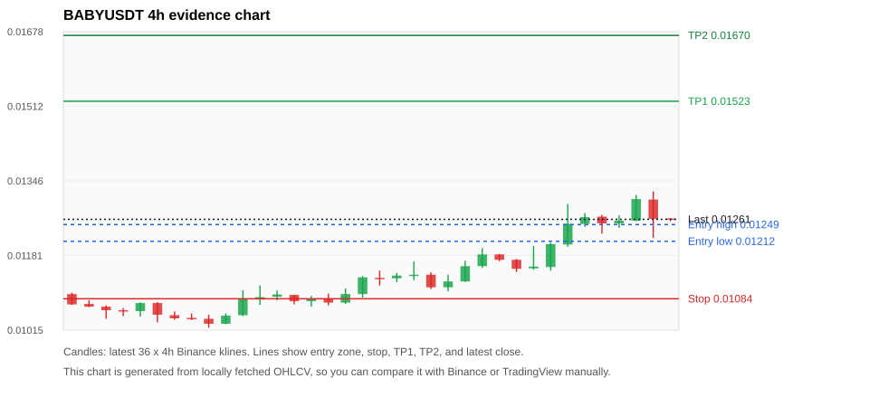
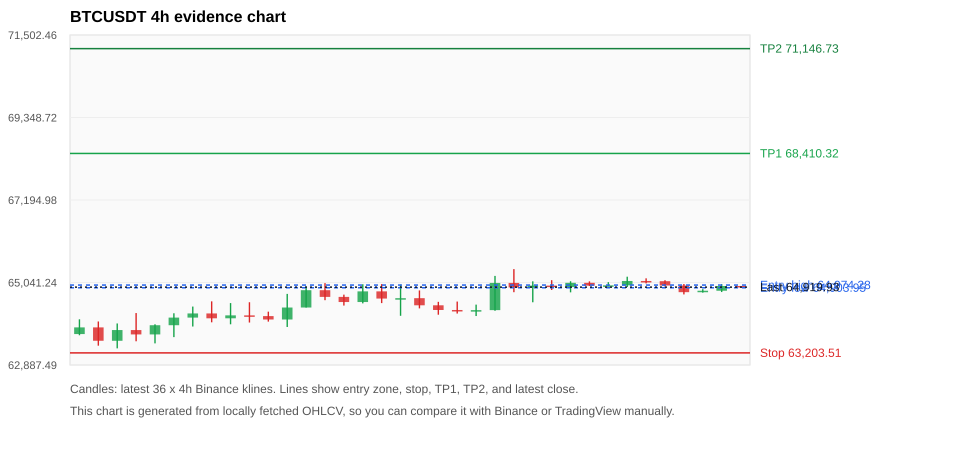
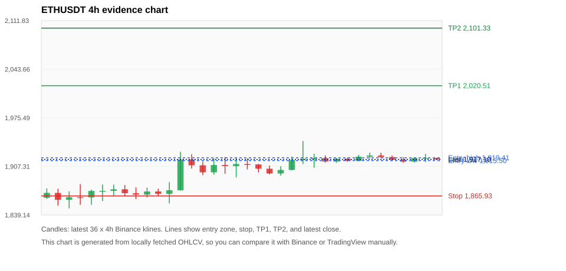
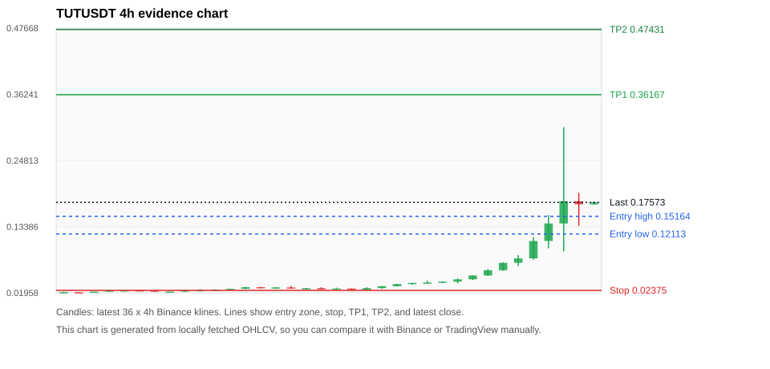
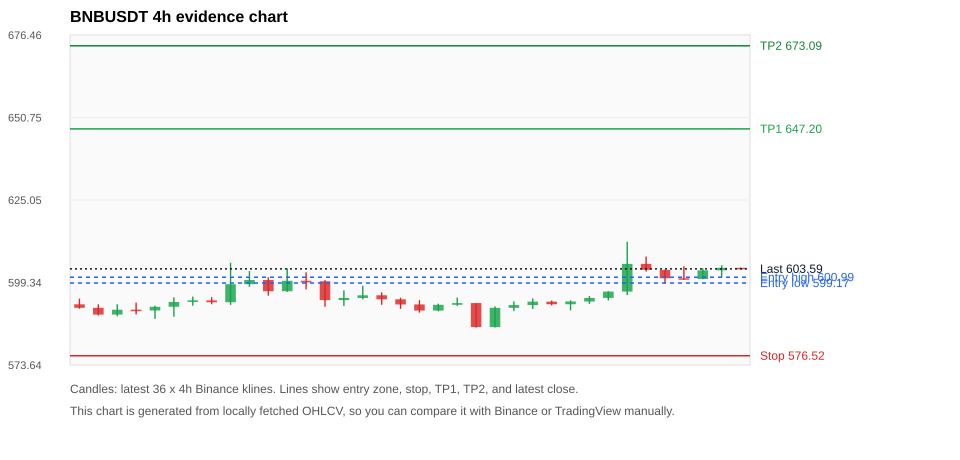

# Crypto 市场扫描报告 v1

- 报告时间：2026-08-09 20:05:57 CST
- Run ID：`20260809_120503_3b3edf94`
- Run type：`daily_full`
- 数据来源：SQLite
- 报告版本：v1
- 扫描 ID：e6059958bb9f
- 数据源：Binance public spot API + CoinGecko/CoinMarketCap cross-check
- 过滤条件：USDT spot; 24h quote volume >= 30,000,000; trades >= 30,000; exclude stables/leveraged tokens; analyze 1h/4h/1d klines
- 默认单笔风险：账户权益的 1.00%

## 限制说明

- 交易信号仍以 Binance 现货公开 K 线为主源；外部数据源用于一致性复核。
- 结果是研究和模拟盘计划，不是确定收益或实盘下单指令。
- 历史长度过滤：候选币至少需要 180 根 1d K 线。
- 数据质量验证池：先验证 score 排名前 min(top_n * 2, 10) 的候选，再按 action + score 补足最终名单。
- 大盘环境过滤：NEUTRAL; BTC/ETH 大盘未完全确认强势，山寨币买入候选降级为观察。 BTC 7d=2.123548843794243; ETH 7d=1.6829677090847373.
- 已启用数据交叉验证：Binance 主源 + CoinGecko 自动对照；CoinMarketCap 在配置 API Key 后自动对照。
- BABYUSDT 交叉验证状态 DATA_WARNING：At least one external provider needs manual review.
- BTCUSDT 交叉验证状态 DATA_WARNING：At least one external provider needs manual review.
- ETHUSDT 交叉验证状态 DATA_WARNING：At least one external provider needs manual review.
- TUTUSDT 交叉验证状态 DATA_WARNING：At least one external provider needs manual review.
- BNBUSDT 交叉验证状态 DATA_WARNING：At least one external provider needs manual review.
- SOLUSDT 交叉验证状态 DATA_WARNING：At least one external provider needs manual review.
- BICOUSDT 交叉验证状态 DATA_WARNING：At least one external provider needs manual review.
- XRPUSDT 交叉验证状态 DATA_WARNING：At least one external provider needs manual review.

## 5 个候选交易计划

| Rank | Coin | Action | Setup | Entry Zone | Stop Loss | TP1 | TP2 / Exit Rule | R/R | Verdict |
|---:|---|---|---|---:|---:|---:|---|---:|---|
| 1 | `BABY` | `WAIT_PULLBACK` | 趋势中，等回调入场 | 0.01212 - 0.01249 | 0.01084 | 0.01523 | 0.01670 或跌破 4h 关键支撑 | 2.00-3.00 | 只等回调 |
| 2 | `BTC` | `WATCH_ONLY` | 回踩支撑/4h EMA 附近 | 64,903.95 - 64,974.28 | 63,203.51 | 68,410.32 | 71,146.73 或跌破 4h 关键支撑 | 2.00-3.58 | 只观察 |
| 3 | `ETH` | `WATCH_ONLY` | 回踩支撑/4h EMA 附近 | 1,915.50 - 1,919.41 | 1,865.93 | 2,020.51 | 2,101.33 或跌破 4h 关键支撑 | 2.00-3.57 | 只观察 |
| 4 | `TUT` | `WATCH_ONLY` | 涨幅较远，只等深回调 | 0.12113 - 0.15164 | 0.02375 | 0.36167 | 0.47431 或跌破 4h 关键支撑 | 2.00-3.00 | 只等回调 |
| 5 | `BNB` | `WATCH_ONLY` | 回踩支撑/4h EMA 附近 | 599.17 - 600.99 | 576.52 | 647.20 | 673.09 或跌破 4h 关键支撑 | 2.00-3.10 | 只等回调 |

## 数据交叉验证摘要

价格差异以 Binance 当前价为基准；成交量口径不同，Binance 是 USDT 现货成交额，CoinGecko/CoinMarketCap 通常是全市场成交量。

| Rank | Coin | Data Status | Max Price Diff | Max 24h Diff | Message |
|---:|---|---|---:|---:|---|
| 1 | `BABY` | DATA_WARNING | 0.05% | 1.94 pts | At least one external provider needs manual review. |
| 2 | `BTC` | DATA_WARNING | 0.06% | 0.04 pts | At least one external provider needs manual review. |
| 3 | `ETH` | DATA_WARNING | 0.07% | 0.10 pts | At least one external provider needs manual review. |
| 4 | `TUT` | DATA_WARNING | 1.59% | 5.52 pts | At least one external provider needs manual review. |
| 5 | `BNB` | DATA_WARNING | 0.05% | 0.24 pts | At least one external provider needs manual review. |

## 候选币说明

### 1. BABY `BABYUSDT`



- 入选原因：趋势中，等回调入场；24h +4.56%，7d +11.89%，4h RSI 72.67，24h 成交额 $51.6M。
- 交易失效条件：跌破 0.01084485 或 4h 收盘重新失守关键支撑。
- 主要风险：日线趋势未完全确认；数据交叉验证需要人工复核。
- 数据交叉验证：DATA_WARNING；At least one external provider needs manual review.

#### 可点击人工验证

- [Binance 交易页](https://www.binance.com/en/trade/BABY_USDT)
- [TradingView 图表](https://www.tradingview.com/chart/?symbol=BINANCE%3ABABYUSDT)
- [CoinGecko 搜索](https://www.coingecko.com/en/search?query=BABY)
- [CoinMarketCap 搜索](https://coinmarketcap.com/search/?q=BABY)

#### 多数据源对照

| Source | Status | Asset ID | Price | 24h Change | 24h Volume | Price Diff | 24h Diff | Updated | Message |
|---|---|---|---:|---:|---:|---:|---:|---|---|
| Binance | DATA_OK | BABYUSDT | 0.01261 | +4.56% | $51.6M | 0.00% | 0.00 pts | 2026-08-09T12:05:22+00:00 | Primary market data source used by scanner. |
| CoinGecko | DATA_WARNING | babylon | 0.01260 | +6.50% | $138.3M | 0.05% | 1.94 pts | 2026-08-09T12:03:20.000Z | CoinGecko symbol mapping has 2 exact matches; selected highest market-cap rank |
| CoinMarketCap | DATA_WARNING | 32198 | 0.01261 | +4.60% | $171.9M | 0.00% | 0.04 pts | 2026-08-09T12:04:03.000Z | CoinMarketCap symbol mapping has 10 matches; selected lowest cmc_rank |

#### 指标证据

| 指标 | 数值 | 人工核对用途 |
|---|---:|---|
| 当前价 | 0.01261 | 与 Binance/TradingView 当前价格对照 |
| 24h 涨跌 | +4.56% | 与交易所 24h 涨跌对照 |
| 7d 涨跌 | +11.89% | 判断短线趋势是否延续 |
| 4h EMA20 | 0.01201 | 判断短期趋势支撑 |
| 4h EMA50 | 0.01165 | 判断中期趋势支撑 |
| 1d EMA20 | 0.01189 | 判断日线趋势 |
| 1d EMA50 | 0.01271 | 判断日线趋势 |
| 4h RSI14 | 72.67 | 判断是否过热/过弱 |
| 4h ATR14 | 0.000465 | 推导止损和入场缓冲 |
| 最近 18 根 4h 最低点 | 0.01101 | 支撑/止损参考 |
| 最近 36 根 4h 最高点 | 0.01323 | TP/压力参考 |
| 支撑位 | 0.01201 | 入场区间推导基础 |

#### 交易计划推导

- 支撑位 = 最近低点、4h EMA20、4h EMA50、1d EMA20 中不高于当前价的最高有效支撑 = `0.01201`。
- 入场区间 = 支撑位附近 + ATR 缓冲 = `0.01212 - 0.01249`。
- 止损 = min(最近 18 根 4h 最低点 * 0.985, 入场中位价 - 1.15 * ATR14) = `0.01084`。
- TP1 = max(最近 36 根 4h 最高点 * 0.995, 入场中位价 + 2R) = `0.01523`。
- TP2 = max(入场中位价 + 3R, TP1 * 1.04) = `0.01670`。

#### 最近 10 根 4h K线

| UTC 开盘时间 | Open | High | Low | Close | Quote Volume | Trades |
|---|---:|---:|---:|---:|---:|---:|
| 2026-08-08T00:00+00:00 | 0.01171 | 0.01173 | 0.01144 | 0.01151 | $2.0M | 20991 |
| 2026-08-08T04:00+00:00 | 0.01152 | 0.01202 | 0.01149 | 0.01156 | $4.6M | 41864 |
| 2026-08-08T08:00+00:00 | 0.01155 | 0.01209 | 0.01147 | 0.01206 | $35.8M | 64184 |
| 2026-08-08T12:00+00:00 | 0.01205 | 0.01295 | 0.01200 | 0.01251 | $5.1M | 72946 |
| 2026-08-08T16:00+00:00 | 0.01251 | 0.01275 | 0.01244 | 0.01266 | $2.8M | 44716 |
| 2026-08-08T20:00+00:00 | 0.01267 | 0.01271 | 0.01229 | 0.01252 | $998,056 | 18874 |
| 2026-08-09T00:00+00:00 | 0.01252 | 0.01270 | 0.01242 | 0.01258 | $3.0M | 38426 |
| 2026-08-09T04:00+00:00 | 0.01258 | 0.01315 | 0.01257 | 0.01306 | $17.8M | 59446 |
| 2026-08-09T08:00+00:00 | 0.01305 | 0.01323 | 0.01220 | 0.01262 | $21.9M | 63588 |
| 2026-08-09T12:00+00:00 | 0.01263 | 0.01263 | 0.01257 | 0.01261 | $56,680 | 1076 |

### 2. BTC `BTCUSDT`



- 入选原因：回踩支撑/4h EMA 附近；24h -0.06%，7d +2.84%，4h RSI 67.66，24h 成交额 $366.6M。
- 交易失效条件：跌破 63203.51 或 4h 收盘重新失守关键支撑。
- 主要风险：24h 动量未确认；数据交叉验证需要人工复核。
- 数据交叉验证：DATA_WARNING；At least one external provider needs manual review.

#### 可点击人工验证

- [Binance 交易页](https://www.binance.com/en/trade/BTC_USDT)
- [TradingView 图表](https://www.tradingview.com/chart/?symbol=BINANCE%3ABTCUSDT)
- [CoinGecko 搜索](https://www.coingecko.com/en/search?query=BTC)
- [CoinMarketCap 搜索](https://coinmarketcap.com/search/?q=BTC)

#### 多数据源对照

| Source | Status | Asset ID | Price | 24h Change | 24h Volume | Price Diff | 24h Diff | Updated | Message |
|---|---|---|---:|---:|---:|---:|---:|---|---|
| Binance | DATA_OK | BTCUSDT | 64,919.93 | -0.06% | $366.6M | 0.00% | 0.00 pts | 2026-08-09T12:05:22+00:00 | Primary market data source used by scanner. |
| CoinGecko | DATA_OK | bitcoin | 64,880.00 | -0.10% | $12.32B | 0.06% | 0.04 pts | 2026-08-09T12:03:20.000Z | External source agrees with Binance within thresholds. |
| CoinMarketCap | DATA_WARNING | 1 | 64,882.78 | -0.05% | $12.42B | 0.06% | 0.01 pts | 2026-08-09T12:04:03.000Z | CoinMarketCap symbol mapping has 13 matches; selected lowest cmc_rank |

#### 指标证据

| 指标 | 数值 | 人工核对用途 |
|---|---:|---|
| 当前价 | 64,919.93 | 与 Binance/TradingView 当前价格对照 |
| 24h 涨跌 | -0.06% | 与交易所 24h 涨跌对照 |
| 7d 涨跌 | +2.84% | 判断短线趋势是否延续 |
| 4h EMA20 | 64,774.40 | 判断短期趋势支撑 |
| 4h EMA50 | 64,467.48 | 判断中期趋势支撑 |
| 1d EMA20 | 64,298.05 | 判断日线趋势 |
| 1d EMA50 | 64,670.25 | 判断日线趋势 |
| 4h RSI14 | 67.66 | 判断是否过热/过弱 |
| 4h ATR14 | 285.54 | 推导止损和入场缓冲 |
| 最近 18 根 4h 最低点 | 64,166.00 | 支撑/止损参考 |
| 最近 36 根 4h 最高点 | 65,390.99 | TP/压力参考 |
| 支撑位 | 64,774.40 | 入场区间推导基础 |

#### 交易计划推导

- 支撑位 = 最近低点、4h EMA20、4h EMA50、1d EMA20 中不高于当前价的最高有效支撑 = `64,774.40`。
- 入场区间 = 支撑位附近 + ATR 缓冲 = `64,903.95 - 64,974.28`。
- 止损 = min(最近 18 根 4h 最低点 * 0.985, 入场中位价 - 1.15 * ATR14) = `63,203.51`。
- TP1 = max(最近 36 根 4h 最高点 * 0.995, 入场中位价 + 2R) = `68,410.32`。
- TP2 = max(入场中位价 + 3R, TP1 * 1.04) = `71,146.73`。

#### 最近 10 根 4h K线

| UTC 开盘时间 | Open | High | Low | Close | Quote Volume | Trades |
|---|---:|---:|---:|---:|---:|---:|
| 2026-08-08T00:00+00:00 | 64,923.20 | 65,074.18 | 64,784.19 | 65,033.00 | $85.1M | 96354 |
| 2026-08-08T04:00+00:00 | 65,033.00 | 65,071.15 | 64,951.34 | 64,960.00 | $51.1M | 75111 |
| 2026-08-08T08:00+00:00 | 64,959.99 | 65,050.00 | 64,948.56 | 64,967.35 | $50.5M | 75327 |
| 2026-08-08T12:00+00:00 | 64,967.36 | 65,192.54 | 64,924.00 | 65,080.82 | $62.8M | 112522 |
| 2026-08-08T16:00+00:00 | 65,080.83 | 65,150.00 | 65,017.39 | 65,075.41 | $44.9M | 83910 |
| 2026-08-08T20:00+00:00 | 65,075.40 | 65,100.61 | 64,936.01 | 64,962.60 | $80.0M | 97223 |
| 2026-08-09T00:00+00:00 | 64,962.60 | 65,002.00 | 64,730.08 | 64,788.80 | $61.9M | 103366 |
| 2026-08-09T04:00+00:00 | 64,788.80 | 64,867.11 | 64,777.00 | 64,826.14 | $58.7M | 68791 |
| 2026-08-09T08:00+00:00 | 64,826.15 | 65,000.00 | 64,792.10 | 64,950.00 | $57.0M | 106398 |
| 2026-08-09T12:00+00:00 | 64,950.01 | 64,950.01 | 64,914.73 | 64,919.93 | $1.9M | 2348 |

### 3. ETH `ETHUSDT`



- 入选原因：回踩支撑/4h EMA 附近；24h -0.20%，7d +3.35%，4h RSI 64.33，24h 成交额 $126.4M。
- 交易失效条件：跌破 1865.9347 或 4h 收盘重新失守关键支撑。
- 主要风险：24h 动量未确认；数据交叉验证需要人工复核。
- 数据交叉验证：DATA_WARNING；At least one external provider needs manual review.

#### 可点击人工验证

- [Binance 交易页](https://www.binance.com/en/trade/ETH_USDT)
- [TradingView 图表](https://www.tradingview.com/chart/?symbol=BINANCE%3AETHUSDT)
- [CoinGecko 搜索](https://www.coingecko.com/en/search?query=ETH)
- [CoinMarketCap 搜索](https://coinmarketcap.com/search/?q=ETH)

#### 多数据源对照

| Source | Status | Asset ID | Price | 24h Change | 24h Volume | Price Diff | 24h Diff | Updated | Message |
|---|---|---|---:|---:|---:|---:|---:|---|---|
| Binance | DATA_OK | ETHUSDT | 1,917.10 | -0.20% | $126.4M | 0.00% | 0.00 pts | 2026-08-09T12:05:22+00:00 | Primary market data source used by scanner. |
| CoinGecko | DATA_OK | ethereum | 1,916.18 | -0.10% | $3.49B | 0.05% | 0.10 pts | 2026-08-09T12:03:20.000Z | External source agrees with Binance within thresholds. |
| CoinMarketCap | DATA_WARNING | 1027 | 1,915.74 | -0.19% | $3.93B | 0.07% | 0.02 pts | 2026-08-09T12:04:03.000Z | CoinMarketCap symbol mapping has 6 matches; selected lowest cmc_rank |

#### 指标证据

| 指标 | 数值 | 人工核对用途 |
|---|---:|---|
| 当前价 | 1,917.10 | 与 Binance/TradingView 当前价格对照 |
| 24h 涨跌 | -0.20% | 与交易所 24h 涨跌对照 |
| 7d 涨跌 | +3.35% | 判断短线趋势是否延续 |
| 4h EMA20 | 1,911.68 | 判断短期趋势支撑 |
| 4h EMA50 | 1,900.35 | 判断中期趋势支撑 |
| 1d EMA20 | 1,886.72 | 判断日线趋势 |
| 1d EMA50 | 1,861.81 | 判断日线趋势 |
| 4h RSI14 | 64.33 | 判断是否过热/过弱 |
| 4h ATR14 | 11.0471 | 推导止损和入场缓冲 |
| 最近 18 根 4h 最低点 | 1,894.35 | 支撑/止损参考 |
| 最近 36 根 4h 最高点 | 1,943.02 | TP/压力参考 |
| 支撑位 | 1,911.68 | 入场区间推导基础 |

#### 交易计划推导

- 支撑位 = 最近低点、4h EMA20、4h EMA50、1d EMA20 中不高于当前价的最高有效支撑 = `1,911.68`。
- 入场区间 = 支撑位附近 + ATR 缓冲 = `1,915.50 - 1,919.41`。
- 止损 = min(最近 18 根 4h 最低点 * 0.985, 入场中位价 - 1.15 * ATR14) = `1,865.93`。
- TP1 = max(最近 36 根 4h 最高点 * 0.995, 入场中位价 + 2R) = `2,020.51`。
- TP2 = max(入场中位价 + 3R, TP1 * 1.04) = `2,101.33`。

#### 最近 10 根 4h K线

| UTC 开盘时间 | Open | High | Low | Close | Quote Volume | Trades |
|---|---:|---:|---:|---:|---:|---:|
| 2026-08-08T00:00+00:00 | 1,914.19 | 1,919.02 | 1,912.27 | 1,918.08 | $17.3M | 53841 |
| 2026-08-08T04:00+00:00 | 1,918.09 | 1,919.58 | 1,914.00 | 1,915.11 | $12.7M | 44960 |
| 2026-08-08T08:00+00:00 | 1,915.11 | 1,923.57 | 1,914.58 | 1,920.99 | $18.7M | 78512 |
| 2026-08-08T12:00+00:00 | 1,920.99 | 1,926.72 | 1,918.61 | 1,922.62 | $23.8M | 104669 |
| 2026-08-08T16:00+00:00 | 1,922.63 | 1,926.45 | 1,919.67 | 1,920.41 | $20.6M | 84910 |
| 2026-08-08T20:00+00:00 | 1,920.41 | 1,922.73 | 1,914.69 | 1,916.74 | $16.1M | 67063 |
| 2026-08-09T00:00+00:00 | 1,916.75 | 1,920.21 | 1,912.36 | 1,914.04 | $16.0M | 67255 |
| 2026-08-09T04:00+00:00 | 1,914.04 | 1,919.79 | 1,912.83 | 1,918.97 | $23.2M | 62540 |
| 2026-08-09T08:00+00:00 | 1,918.97 | 1,925.00 | 1,913.39 | 1,919.23 | $26.5M | 111765 |
| 2026-08-09T12:00+00:00 | 1,919.23 | 1,919.23 | 1,916.51 | 1,917.10 | $1.0M | 3847 |

### 4. TUT `TUTUSDT`



- 入选原因：涨幅较远，只等深回调；24h +200.10%，7d +901.88%，4h RSI 96.59，24h 成交额 $236.6M。
- 交易失效条件：跌破 0.02374835 或 4h 收盘重新失守关键支撑。
- 主要风险：距离支撑偏远，不能追市价；4h RSI 偏热；24h 振幅较大，回撤风险高；成交量突增，可能是事件驱动；数据交叉验证需要人工复核。
- 数据交叉验证：DATA_WARNING；At least one external provider needs manual review.

#### 可点击人工验证

- [Binance 交易页](https://www.binance.com/en/trade/TUT_USDT)
- [TradingView 图表](https://www.tradingview.com/chart/?symbol=BINANCE%3ATUTUSDT)
- [CoinGecko 搜索](https://www.coingecko.com/en/search?query=TUT)
- [CoinMarketCap 搜索](https://coinmarketcap.com/search/?q=TUT)

#### 多数据源对照

| Source | Status | Asset ID | Price | 24h Change | 24h Volume | Price Diff | 24h Diff | Updated | Message |
|---|---|---|---:|---:|---:|---:|---:|---|---|
| Binance | DATA_OK | TUTUSDT | 0.17573 | +200.10% | $236.6M | 0.00% | 0.00 pts | 2026-08-09T12:05:22+00:00 | Primary market data source used by scanner. |
| CoinGecko | DATA_WARNING | tutorial | 0.17575 | +196.70% | $666.7M | 0.01% | 3.40 pts | 2026-08-09T12:03:20.000Z | 24h change diff 3.40 points exceeds warning threshold |
| CoinMarketCap | DATA_WARNING | 35892 | 0.17293 | +194.58% | $820.3M | 1.59% | 5.52 pts | 2026-08-09T12:04:03.000Z | price diff 1.59% exceeds warning threshold; 24h change diff 5.52 points exceeds warning threshold; CoinMarketCap symbol mapping has 3 matches; selected lowest cmc_rank |

#### 指标证据

| 指标 | 数值 | 人工核对用途 |
|---|---:|---|
| 当前价 | 0.17573 | 与 Binance/TradingView 当前价格对照 |
| 24h 涨跌 | +200.10% | 与交易所 24h 涨跌对照 |
| 7d 涨跌 | +901.88% | 判断短线趋势是否延续 |
| 4h EMA20 | 0.08786 | 判断短期趋势支撑 |
| 4h EMA50 | 0.05352 | 判断中期趋势支撑 |
| 1d EMA20 | 0.04235 | 判断日线趋势 |
| 1d EMA50 | 0.02541 | 判断日线趋势 |
| 4h RSI14 | 96.59 | 判断是否过热/过弱 |
| 4h ATR14 | 0.03211 | 推导止损和入场缓冲 |
| 最近 18 根 4h 最低点 | 0.02411 | 支撑/止损参考 |
| 最近 36 根 4h 最高点 | 0.30563 | TP/压力参考 |
| 支撑位 | 0.08786 | 入场区间推导基础 |

#### 交易计划推导

- 支撑位 = 最近低点、4h EMA20、4h EMA50、1d EMA20 中不高于当前价的最高有效支撑 = `0.08786`。
- 入场区间 = 支撑位附近 + ATR 缓冲 = `0.12113 - 0.15164`。
- 止损 = min(最近 18 根 4h 最低点 * 0.985, 入场中位价 - 1.15 * ATR14) = `0.02375`。
- TP1 = max(最近 36 根 4h 最高点 * 0.995, 入场中位价 + 2R) = `0.36167`。
- TP2 = max(入场中位价 + 3R, TP1 * 1.04) = `0.47431`。

#### 最近 10 根 4h K线

| UTC 开盘时间 | Open | High | Low | Close | Quote Volume | Trades |
|---|---:|---:|---:|---:|---:|---:|
| 2026-08-08T00:00+00:00 | 0.03900 | 0.04412 | 0.03570 | 0.04283 | $2.8M | 101547 |
| 2026-08-08T04:00+00:00 | 0.04284 | 0.04950 | 0.04156 | 0.04947 | $4.2M | 169099 |
| 2026-08-08T08:00+00:00 | 0.04943 | 0.06029 | 0.04890 | 0.05857 | $11.0M | 354095 |
| 2026-08-08T12:00+00:00 | 0.05858 | 0.07218 | 0.05761 | 0.07133 | $12.4M | 425345 |
| 2026-08-08T16:00+00:00 | 0.07134 | 0.08462 | 0.06592 | 0.07901 | $18.5M | 559981 |
| 2026-08-08T20:00+00:00 | 0.07903 | 0.11537 | 0.07661 | 0.10904 | $24.6M | 760106 |
| 2026-08-09T00:00+00:00 | 0.10905 | 0.15397 | 0.09633 | 0.13924 | $39.5M | 1401065 |
| 2026-08-09T04:00+00:00 | 0.13923 | 0.30563 | 0.09128 | 0.17769 | $80.3M | 2677785 |
| 2026-08-09T08:00+00:00 | 0.17768 | 0.19200 | 0.13521 | 0.17239 | $61.1M | 2233927 |
| 2026-08-09T12:00+00:00 | 0.17237 | 0.17681 | 0.17130 | 0.17591 | $491,736 | 26892 |

### 5. BNB `BNBUSDT`



- 入选原因：回踩支撑/4h EMA 附近；24h +1.26%，7d +3.55%，4h RSI 80.41，24h 成交额 $65.1M。
- 交易失效条件：跌破 576.5205 或 4h 收盘重新失守关键支撑。
- 主要风险：4h RSI 偏热；数据交叉验证需要人工复核。
- 数据交叉验证：DATA_WARNING；At least one external provider needs manual review.

#### 可点击人工验证

- [Binance 交易页](https://www.binance.com/en/trade/BNB_USDT)
- [TradingView 图表](https://www.tradingview.com/chart/?symbol=BINANCE%3ABNBUSDT)
- [CoinGecko 搜索](https://www.coingecko.com/en/search?query=BNB)
- [CoinMarketCap 搜索](https://coinmarketcap.com/search/?q=BNB)

#### 多数据源对照

| Source | Status | Asset ID | Price | 24h Change | 24h Volume | Price Diff | 24h Diff | Updated | Message |
|---|---|---|---:|---:|---:|---:|---:|---|---|
| Binance | DATA_OK | BNBUSDT | 603.59 | +1.26% | $65.1M | 0.00% | 0.00 pts | 2026-08-09T12:05:22+00:00 | Primary market data source used by scanner. |
| CoinGecko | DATA_OK | binancecoin | 603.26 | +1.50% | $616.5M | 0.05% | 0.24 pts | 2026-08-09T12:03:20.000Z | External source agrees with Binance within thresholds. |
| CoinMarketCap | DATA_WARNING | 1839 | 603.36 | +1.28% | $1.11B | 0.04% | 0.02 pts | 2026-08-09T12:04:03.000Z | CoinMarketCap symbol mapping has 4 matches; selected lowest cmc_rank |

#### 指标证据

| 指标 | 数值 | 人工核对用途 |
|---|---:|---|
| 当前价 | 603.59 | 与 Binance/TradingView 当前价格对照 |
| 24h 涨跌 | +1.26% | 与交易所 24h 涨跌对照 |
| 7d 涨跌 | +3.55% | 判断短线趋势是否延续 |
| 4h EMA20 | 597.98 | 判断短期趋势支撑 |
| 4h EMA50 | 592.74 | 判断中期趋势支撑 |
| 1d EMA20 | 586.12 | 判断日线趋势 |
| 1d EMA50 | 585.51 | 判断日线趋势 |
| 4h RSI14 | 80.41 | 判断是否过热/过弱 |
| 4h ATR14 | 4.3021 | 推导止损和入场缓冲 |
| 最近 18 根 4h 最低点 | 585.30 | 支撑/止损参考 |
| 最近 36 根 4h 最高点 | 612.00 | TP/压力参考 |
| 支撑位 | 597.98 | 入场区间推导基础 |

#### 交易计划推导

- 支撑位 = 最近低点、4h EMA20、4h EMA50、1d EMA20 中不高于当前价的最高有效支撑 = `597.98`。
- 入场区间 = 支撑位附近 + ATR 缓冲 = `599.17 - 600.99`。
- 止损 = min(最近 18 根 4h 最低点 * 0.985, 入场中位价 - 1.15 * ATR14) = `576.52`。
- TP1 = max(最近 36 根 4h 最高点 * 0.995, 入场中位价 + 2R) = `647.20`。
- TP2 = max(入场中位价 + 3R, TP1 * 1.04) = `673.09`。

#### 最近 10 根 4h K线

| UTC 开盘时间 | Open | High | Low | Close | Quote Volume | Trades |
|---|---:|---:|---:|---:|---:|---:|
| 2026-08-08T00:00+00:00 | 592.57 | 593.78 | 590.65 | 593.43 | $6.7M | 38132 |
| 2026-08-08T04:00+00:00 | 593.42 | 595.15 | 592.67 | 594.52 | $6.1M | 44138 |
| 2026-08-08T08:00+00:00 | 594.53 | 596.61 | 593.74 | 596.51 | $6.3M | 62432 |
| 2026-08-08T12:00+00:00 | 596.51 | 612.00 | 595.42 | 605.14 | $32.3M | 227294 |
| 2026-08-08T16:00+00:00 | 605.15 | 607.42 | 602.75 | 603.29 | $6.1M | 74532 |
| 2026-08-08T20:00+00:00 | 603.28 | 603.29 | 599.04 | 600.66 | $4.9M | 57937 |
| 2026-08-09T00:00+00:00 | 600.66 | 604.41 | 600.21 | 600.44 | $6.6M | 64927 |
| 2026-08-09T04:00+00:00 | 600.44 | 603.76 | 600.35 | 603.14 | $8.7M | 69460 |
| 2026-08-09T08:00+00:00 | 603.14 | 604.71 | 601.00 | 603.92 | $6.6M | 66844 |
| 2026-08-09T12:00+00:00 | 603.92 | 604.02 | 603.58 | 603.59 | $63,827 | 1244 |

## 组合风控

- 不要 5 个候选全部满仓买入。
- 同时持仓总风险建议控制在账户权益的 3% - 5% 以内。
- 如果 BTC/ETH 同时破位，暂停山寨币多头计划或降低仓位。
- 第一版报告用于模拟盘和人工复核，不自动下单。

## 原始数据

```json
[
  {
    "rank": 1,
    "symbol": "BABYUSDT",
    "base_asset": "BABY",
    "price": 0.01261,
    "score": 55.85388001604907,
    "setup": "趋势中，等回调入场",
    "verdict": "只等回调",
    "entry_low": 0.01212175,
    "entry_high": 0.01249375,
    "stop_loss": 0.010844850000000001,
    "take_profit_1": 0.015233549999999995,
    "take_profit_2": 0.016696449999999995,
    "risk_reward_1": 2.0,
    "risk_reward_2": 3.0000000000000013,
    "pct_24h": 4.561,
    "pct_3d": 14.324569356300998,
    "pct_7d": 11.889973380656604,
    "quote_volume_24h": 51605689.52245,
    "trades_24h": 297955,
    "high_low_range_24h": 10.250000000000004,
    "rsi_1h": 53.801169590643276,
    "rsi_4h": 72.67267267267265,
    "ema20_4h": 0.012008398500177523,
    "ema50_4h": 0.011651724520140917,
    "ema20_1d": 0.011893415954361239,
    "ema50_1d": 0.012710740833070415,
    "atr_4h": 0.00046499999999999986,
    "macd_hist_4h": 9.777512981762614e-05,
    "volume_ratio_24h": 1.8853149434076832,
    "support_level": 0.012008398500177523,
    "recent_low_4h_18": 0.01101,
    "recent_high_4h_36": 0.01323,
    "distance_to_support_pct": 5.009839570310581,
    "binance_trade_url": "https://www.binance.com/en/trade/BABY_USDT",
    "tradingview_url": "https://www.tradingview.com/chart/?symbol=BINANCE%3ABABYUSDT",
    "coingecko_search_url": "https://www.coingecko.com/en/search?query=BABY",
    "coinmarketcap_search_url": "https://coinmarketcap.com/search/?q=BABY",
    "invalidation": "跌破 0.01084485 或 4h 收盘重新失守关键支撑",
    "recent_4h_klines": [
      {
        "open_time_utc": "2026-08-03T16:00+00:00",
        "open": 0.01095,
        "high": 0.01098,
        "low": 0.01071,
        "close": 0.01072,
        "quote_volume": 77400.2169,
        "trades": 2588
      },
      {
        "open_time_utc": "2026-08-03T20:00+00:00",
        "open": 0.01073,
        "high": 0.01081,
        "low": 0.01066,
        "close": 0.01067,
        "quote_volume": 86864.28363,
        "trades": 2010
      },
      {
        "open_time_utc": "2026-08-04T00:00+00:00",
        "open": 0.01067,
        "high": 0.0107,
        "low": 0.0104,
        "close": 0.01059,
        "quote_volume": 197207.76108,
        "trades": 3910
      },
      {
        "open_time_utc": "2026-08-04T04:00+00:00",
        "open": 0.01059,
        "high": 0.01064,
        "low": 0.01046,
        "close": 0.01058,
        "quote_volume": 131618.74441,
        "trades": 2822
      },
      {
        "open_time_utc": "2026-08-04T08:00+00:00",
        "open": 0.01057,
        "high": 0.01077,
        "low": 0.01045,
        "close": 0.01075,
        "quote_volume": 183777.90474,
        "trades": 3764
      },
      {
        "open_time_utc": "2026-08-04T12:00+00:00",
        "open": 0.01075,
        "high": 0.01077,
        "low": 0.01032,
        "close": 0.01049,
        "quote_volume": 247118.02742,
        "trades": 4309
      },
      {
        "open_time_utc": "2026-08-04T16:00+00:00",
        "open": 0.01048,
        "high": 0.01056,
        "low": 0.01038,
        "close": 0.01041,
        "quote_volume": 99167.80863,
        "trades": 2387
      },
      {
        "open_time_utc": "2026-08-04T20:00+00:00",
        "open": 0.01042,
        "high": 0.01052,
        "low": 0.01037,
        "close": 0.0104,
        "quote_volume": 35346.04059,
        "trades": 905
      },
      {
        "open_time_utc": "2026-08-05T00:00+00:00",
        "open": 0.0104,
        "high": 0.01049,
        "low": 0.0102,
        "close": 0.01029,
        "quote_volume": 134479.93286,
        "trades": 2405
      },
      {
        "open_time_utc": "2026-08-05T04:00+00:00",
        "open": 0.01029,
        "high": 0.01052,
        "low": 0.01028,
        "close": 0.01047,
        "quote_volume": 118176.90523,
        "trades": 2006
      },
      {
        "open_time_utc": "2026-08-05T08:00+00:00",
        "open": 0.01048,
        "high": 0.01103,
        "low": 0.01046,
        "close": 0.01084,
        "quote_volume": 1685546.36815,
        "trades": 16871
      },
      {
        "open_time_utc": "2026-08-05T12:00+00:00",
        "open": 0.01083,
        "high": 0.01114,
        "low": 0.01071,
        "close": 0.01088,
        "quote_volume": 4194954.94403,
        "trades": 16049
      },
      {
        "open_time_utc": "2026-08-05T16:00+00:00",
        "open": 0.01089,
        "high": 0.01103,
        "low": 0.01081,
        "close": 0.01094,
        "quote_volume": 2045703.74952,
        "trades": 11640
      },
      {
        "open_time_utc": "2026-08-05T20:00+00:00",
        "open": 0.01093,
        "high": 0.01093,
        "low": 0.01072,
        "close": 0.01079,
        "quote_volume": 842389.69179,
        "trades": 6356
      },
      {
        "open_time_utc": "2026-08-06T00:00+00:00",
        "open": 0.01079,
        "high": 0.01091,
        "low": 0.01067,
        "close": 0.01085,
        "quote_volume": 7483566.78422,
        "trades": 16772
      },
      {
        "open_time_utc": "2026-08-06T04:00+00:00",
        "open": 0.01085,
        "high": 0.01096,
        "low": 0.0107,
        "close": 0.01076,
        "quote_volume": 5607114.1911,
        "trades": 17003
      },
      {
        "open_time_utc": "2026-08-06T08:00+00:00",
        "open": 0.01076,
        "high": 0.01107,
        "low": 0.01073,
        "close": 0.01095,
        "quote_volume": 2647575.12393,
        "trades": 20691
      },
      {
        "open_time_utc": "2026-08-06T12:00+00:00",
        "open": 0.01095,
        "high": 0.01135,
        "low": 0.01087,
        "close": 0.01132,
        "quote_volume": 3000203.57549,
        "trades": 19720
      },
      {
        "open_time_utc": "2026-08-06T16:00+00:00",
        "open": 0.01131,
        "high": 0.01147,
        "low": 0.01114,
        "close": 0.0113,
        "quote_volume": 5552272.65381,
        "trades": 22786
      },
      {
        "open_time_utc": "2026-08-06T20:00+00:00",
        "open": 0.0113,
        "high": 0.01142,
        "low": 0.01121,
        "close": 0.01136,
        "quote_volume": 527768.35393,
        "trades": 7561
      },
      {
        "open_time_utc": "2026-08-07T00:00+00:00",
        "open": 0.01135,
        "high": 0.01167,
        "low": 0.01126,
        "close": 0.01138,
        "quote_volume": 5089697.18244,
        "trades": 29773
      },
      {
        "open_time_utc": "2026-08-07T04:00+00:00",
        "open": 0.01138,
        "high": 0.01143,
        "low": 0.01106,
        "close": 0.0111,
        "quote_volume": 46680400.19543,
        "trades": 48381
      },
      {
        "open_time_utc": "2026-08-07T08:00+00:00",
        "open": 0.0111,
        "high": 0.01138,
        "low": 0.01101,
        "close": 0.01123,
        "quote_volume": 21664423.32691,
        "trades": 36755
      },
      {
        "open_time_utc": "2026-08-07T12:00+00:00",
        "open": 0.01123,
        "high": 0.01169,
        "low": 0.01122,
        "close": 0.01157,
        "quote_volume": 3418855.28554,
        "trades": 33836
      },
      {
        "open_time_utc": "2026-08-07T16:00+00:00",
        "open": 0.01157,
        "high": 0.01197,
        "low": 0.01153,
        "close": 0.01183,
        "quote_volume": 3123313.3678,
        "trades": 31471
      },
      {
        "open_time_utc": "2026-08-07T20:00+00:00",
        "open": 0.01183,
        "high": 0.01184,
        "low": 0.01168,
        "close": 0.01171,
        "quote_volume": 579045.99483,
        "trades": 8493
      },
      {
        "open_time_utc": "2026-08-08T00:00+00:00",
        "open": 0.01171,
        "high": 0.01173,
        "low": 0.01144,
        "close": 0.01151,
        "quote_volume": 2040797.97481,
        "trades": 20991
      },
      {
        "open_time_utc": "2026-08-08T04:00+00:00",
        "open": 0.01152,
        "high": 0.01202,
        "low": 0.01149,
        "close": 0.01156,
        "quote_volume": 4613570.80622,
        "trades": 41864
      },
      {
        "open_time_utc": "2026-08-08T08:00+00:00",
        "open": 0.01155,
        "high": 0.01209,
        "low": 0.01147,
        "close": 0.01206,
        "quote_volume": 35777475.16408,
        "trades": 64184
      },
      {
        "open_time_utc": "2026-08-08T12:00+00:00",
        "open": 0.01205,
        "high": 0.01295,
        "low": 0.012,
        "close": 0.01251,
        "quote_volume": 5117153.54243,
        "trades": 72946
      },
      {
        "open_time_utc": "2026-08-08T16:00+00:00",
        "open": 0.01251,
        "high": 0.01275,
        "low": 0.01244,
        "close": 0.01266,
        "quote_volume": 2847590.43785,
        "trades": 44716
      },
      {
        "open_time_utc": "2026-08-08T20:00+00:00",
        "open": 0.01267,
        "high": 0.01271,
        "low": 0.01229,
        "close": 0.01252,
        "quote_volume": 998056.16996,
        "trades": 18874
      },
      {
        "open_time_utc": "2026-08-09T00:00+00:00",
        "open": 0.01252,
        "high": 0.0127,
        "low": 0.01242,
        "close": 0.01258,
        "quote_volume": 2969813.42355,
        "trades": 38426
      },
      {
        "open_time_utc": "2026-08-09T04:00+00:00",
        "open": 0.01258,
        "high": 0.01315,
        "low": 0.01257,
        "close": 0.01306,
        "quote_volume": 17782230.4249,
        "trades": 59446
      },
      {
        "open_time_utc": "2026-08-09T08:00+00:00",
        "open": 0.01305,
        "high": 0.01323,
        "low": 0.0122,
        "close": 0.01262,
        "quote_volume": 21941005.49039,
        "trades": 63588
      },
      {
        "open_time_utc": "2026-08-09T12:00+00:00",
        "open": 0.01263,
        "high": 0.01263,
        "low": 0.01257,
        "close": 0.01261,
        "quote_volume": 56679.86829,
        "trades": 1076
      }
    ],
    "risks": [
      "日线趋势未完全确认",
      "数据交叉验证需要人工复核"
    ],
    "data_quality_status": "DATA_WARNING",
    "data_quality_message": "At least one external provider needs manual review.",
    "data_checks": [
      {
        "provider": "Binance",
        "status": "DATA_OK",
        "provider_asset_id": "BABYUSDT",
        "provider_symbol": "BABYUSDT",
        "price_usd": 0.01261,
        "pct_24h": 4.561,
        "volume_24h": 51605689.52245,
        "last_updated": null,
        "fetched_at_utc": "2026-08-09T12:05:22+00:00",
        "price_diff_pct": 0.0,
        "pct_24h_diff": 0.0,
        "volume_note": "Binance USDT spot 24h quoteVolume.",
        "message": "Primary market data source used by scanner."
      },
      {
        "provider": "CoinGecko",
        "status": "DATA_WARNING",
        "provider_asset_id": "babylon",
        "provider_symbol": "BABY",
        "price_usd": 0.01260377,
        "pct_24h": 6.5,
        "volume_24h": 138340904.0,
        "last_updated": "2026-08-09T12:03:20.000Z",
        "fetched_at_utc": "2026-08-09T12:05:22+00:00",
        "price_diff_pct": 0.049405233941311896,
        "pct_24h_diff": 1.939,
        "volume_note": "CoinGecko total market volume; not the same venue scope as Binance quoteVolume.",
        "message": "CoinGecko symbol mapping has 2 exact matches; selected highest market-cap rank"
      },
      {
        "provider": "CoinMarketCap",
        "status": "DATA_WARNING",
        "provider_asset_id": "32198",
        "provider_symbol": "BABY",
        "price_usd": 0.012609767892490707,
        "pct_24h": 4.60357043,
        "volume_24h": 171910623.99634722,
        "last_updated": "2026-08-09T12:04:03.000Z",
        "fetched_at_utc": "2026-08-09T12:05:22+00:00",
        "price_diff_pct": 0.0018406622465697916,
        "pct_24h_diff": 0.04257043000000049,
        "volume_note": "CoinMarketCap total market volume; not the same venue scope as Binance quoteVolume.",
        "message": "CoinMarketCap symbol mapping has 10 matches; selected lowest cmc_rank"
      }
    ],
    "action": "WAIT_PULLBACK"
  },
  {
    "rank": 2,
    "symbol": "BTCUSDT",
    "base_asset": "BTC",
    "price": 64919.93,
    "score": 53.160512520303804,
    "setup": "回踩支撑/4h EMA 附近",
    "verdict": "只观察",
    "entry_low": 64903.94670110126,
    "entry_high": 64974.27840529068,
    "stop_loss": 63203.51,
    "take_profit_1": 68410.3176595879,
    "take_profit_2": 71146.73036597142,
    "risk_reward_1": 2.0,
    "risk_reward_2": 3.576635561721572,
    "pct_24h": -0.059,
    "pct_3d": 0.7541358981072221,
    "pct_7d": 2.840325490297957,
    "quote_volume_24h": 366587027.5543192,
    "trades_24h": 572605,
    "high_low_range_24h": 0.7144437331144893,
    "rsi_1h": 46.79173463839035,
    "rsi_4h": 67.65645688057211,
    "ema20_4h": 64774.39790529068,
    "ema50_4h": 64467.479141361066,
    "ema20_1d": 64298.04555487281,
    "ema50_1d": 64670.249595374386,
    "atr_4h": 285.54357142857145,
    "macd_hist_4h": -39.33074698004651,
    "volume_ratio_24h": 0.46846130168375044,
    "support_level": 64774.39790529068,
    "recent_low_4h_18": 64166.0,
    "recent_high_4h_36": 65390.99,
    "distance_to_support_pct": 0.22467533379795235,
    "binance_trade_url": "https://www.binance.com/en/trade/BTC_USDT",
    "tradingview_url": "https://www.tradingview.com/chart/?symbol=BINANCE%3ABTCUSDT",
    "coingecko_search_url": "https://www.coingecko.com/en/search?query=BTC",
    "coinmarketcap_search_url": "https://coinmarketcap.com/search/?q=BTC",
    "invalidation": "跌破 63203.51 或 4h 收盘重新失守关键支撑",
    "recent_4h_klines": [
      {
        "open_time_utc": "2026-08-03T16:00+00:00",
        "open": 63694.9,
        "high": 64080.0,
        "low": 63664.0,
        "close": 63869.38,
        "quote_volume": 149567720.3755705,
        "trades": 440979
      },
      {
        "open_time_utc": "2026-08-03T20:00+00:00",
        "open": 63869.38,
        "high": 64023.61,
        "low": 63392.01,
        "close": 63520.0,
        "quote_volume": 115218772.2566304,
        "trades": 259617
      },
      {
        "open_time_utc": "2026-08-04T00:00+00:00",
        "open": 63520.0,
        "high": 63972.0,
        "low": 63322.01,
        "close": 63800.01,
        "quote_volume": 145406082.5199303,
        "trades": 371522
      },
      {
        "open_time_utc": "2026-08-04T04:00+00:00",
        "open": 63800.01,
        "high": 64243.81,
        "low": 63506.78,
        "close": 63685.74,
        "quote_volume": 140604655.7293184,
        "trades": 253042
      },
      {
        "open_time_utc": "2026-08-04T08:00+00:00",
        "open": 63685.73,
        "high": 63950.0,
        "low": 63451.8,
        "close": 63926.0,
        "quote_volume": 117165598.5897803,
        "trades": 278134
      },
      {
        "open_time_utc": "2026-08-04T12:00+00:00",
        "open": 63926.0,
        "high": 64238.0,
        "low": 63615.38,
        "close": 64125.14,
        "quote_volume": 214613426.2943327,
        "trades": 680360
      },
      {
        "open_time_utc": "2026-08-04T16:00+00:00",
        "open": 64125.14,
        "high": 64413.21,
        "low": 63892.0,
        "close": 64233.36,
        "quote_volume": 160051627.0726861,
        "trades": 498010
      },
      {
        "open_time_utc": "2026-08-04T20:00+00:00",
        "open": 64233.35,
        "high": 64549.16,
        "low": 64001.68,
        "close": 64106.56,
        "quote_volume": 97216293.0904245,
        "trades": 306971
      },
      {
        "open_time_utc": "2026-08-05T00:00+00:00",
        "open": 64106.55,
        "high": 64504.0,
        "low": 63950.0,
        "close": 64183.27,
        "quote_volume": 131673610.4579225,
        "trades": 373821
      },
      {
        "open_time_utc": "2026-08-05T04:00+00:00",
        "open": 64183.27,
        "high": 64525.97,
        "low": 63995.89,
        "close": 64163.99,
        "quote_volume": 105225246.9831986,
        "trades": 240425
      },
      {
        "open_time_utc": "2026-08-05T08:00+00:00",
        "open": 64164.0,
        "high": 64280.0,
        "low": 64020.0,
        "close": 64075.28,
        "quote_volume": 74783126.1741652,
        "trades": 238191
      },
      {
        "open_time_utc": "2026-08-05T12:00+00:00",
        "open": 64075.28,
        "high": 64744.0,
        "low": 63880.0,
        "close": 64388.01,
        "quote_volume": 263646915.5928751,
        "trades": 820352
      },
      {
        "open_time_utc": "2026-08-05T16:00+00:00",
        "open": 64388.01,
        "high": 64936.18,
        "low": 64388.0,
        "close": 64840.28,
        "quote_volume": 129169021.5283286,
        "trades": 435800
      },
      {
        "open_time_utc": "2026-08-05T20:00+00:00",
        "open": 64840.27,
        "high": 65025.22,
        "low": 64579.15,
        "close": 64665.23,
        "quote_volume": 116432053.5187597,
        "trades": 293638
      },
      {
        "open_time_utc": "2026-08-06T00:00+00:00",
        "open": 64665.24,
        "high": 64724.38,
        "low": 64439.34,
        "close": 64531.03,
        "quote_volume": 96962499.1712507,
        "trades": 246620
      },
      {
        "open_time_utc": "2026-08-06T04:00+00:00",
        "open": 64531.03,
        "high": 64996.0,
        "low": 64496.27,
        "close": 64809.7,
        "quote_volume": 115578918.4334583,
        "trades": 274759
      },
      {
        "open_time_utc": "2026-08-06T08:00+00:00",
        "open": 64809.7,
        "high": 64999.0,
        "low": 64503.54,
        "close": 64622.09,
        "quote_volume": 84640438.2078766,
        "trades": 244217
      },
      {
        "open_time_utc": "2026-08-06T12:00+00:00",
        "open": 64622.08,
        "high": 64987.26,
        "low": 64172.0,
        "close": 64631.87,
        "quote_volume": 178194039.9909075,
        "trades": 741438
      },
      {
        "open_time_utc": "2026-08-06T16:00+00:00",
        "open": 64631.88,
        "high": 64834.0,
        "low": 64365.0,
        "close": 64446.0,
        "quote_volume": 94317559.2202549,
        "trades": 388523
      },
      {
        "open_time_utc": "2026-08-06T20:00+00:00",
        "open": 64446.01,
        "high": 64536.32,
        "low": 64200.0,
        "close": 64323.61,
        "quote_volume": 67673191.6929597,
        "trades": 192394
      },
      {
        "open_time_utc": "2026-08-07T00:00+00:00",
        "open": 64323.61,
        "high": 64544.0,
        "low": 64230.59,
        "close": 64289.99,
        "quote_volume": 78853170.6655183,
        "trades": 345867
      },
      {
        "open_time_utc": "2026-08-07T04:00+00:00",
        "open": 64289.99,
        "high": 64463.75,
        "low": 64166.0,
        "close": 64319.84,
        "quote_volume": 88693539.6020364,
        "trades": 221813
      },
      {
        "open_time_utc": "2026-08-07T08:00+00:00",
        "open": 64319.84,
        "high": 65213.33,
        "low": 64304.22,
        "close": 65029.98,
        "quote_volume": 153395685.6282665,
        "trades": 319893
      },
      {
        "open_time_utc": "2026-08-07T12:00+00:00",
        "open": 65029.98,
        "high": 65390.99,
        "low": 64788.0,
        "close": 64912.72,
        "quote_volume": 269309422.5987435,
        "trades": 828497
      },
      {
        "open_time_utc": "2026-08-07T16:00+00:00",
        "open": 64912.71,
        "high": 65072.31,
        "low": 64525.0,
        "close": 64960.47,
        "quote_volume": 111056163.2314036,
        "trades": 440108
      },
      {
        "open_time_utc": "2026-08-07T20:00+00:00",
        "open": 64960.46,
        "high": 65102.0,
        "low": 64846.0,
        "close": 64923.19,
        "quote_volume": 64296131.8095905,
        "trades": 127205
      },
      {
        "open_time_utc": "2026-08-08T00:00+00:00",
        "open": 64923.2,
        "high": 65074.18,
        "low": 64784.19,
        "close": 65033.0,
        "quote_volume": 85086476.429228,
        "trades": 96354
      },
      {
        "open_time_utc": "2026-08-08T04:00+00:00",
        "open": 65033.0,
        "high": 65071.15,
        "low": 64951.34,
        "close": 64960.0,
        "quote_volume": 51095645.8592078,
        "trades": 75111
      },
      {
        "open_time_utc": "2026-08-08T08:00+00:00",
        "open": 64959.99,
        "high": 65050.0,
        "low": 64948.56,
        "close": 64967.35,
        "quote_volume": 50492698.2832328,
        "trades": 75327
      },
      {
        "open_time_utc": "2026-08-08T12:00+00:00",
        "open": 64967.36,
        "high": 65192.54,
        "low": 64924.0,
        "close": 65080.82,
        "quote_volume": 62803848.3122463,
        "trades": 112522
      },
      {
        "open_time_utc": "2026-08-08T16:00+00:00",
        "open": 65080.83,
        "high": 65150.0,
        "low": 65017.39,
        "close": 65075.41,
        "quote_volume": 44931091.3033993,
        "trades": 83910
      },
      {
        "open_time_utc": "2026-08-08T20:00+00:00",
        "open": 65075.4,
        "high": 65100.61,
        "low": 64936.01,
        "close": 64962.6,
        "quote_volume": 80041598.6433057,
        "trades": 97223
      },
      {
        "open_time_utc": "2026-08-09T00:00+00:00",
        "open": 64962.6,
        "high": 65002.0,
        "low": 64730.08,
        "close": 64788.8,
        "quote_volume": 61890284.2974632,
        "trades": 103366
      },
      {
        "open_time_utc": "2026-08-09T04:00+00:00",
        "open": 64788.8,
        "high": 64867.11,
        "low": 64777.0,
        "close": 64826.14,
        "quote_volume": 58695686.4279705,
        "trades": 68791
      },
      {
        "open_time_utc": "2026-08-09T08:00+00:00",
        "open": 64826.15,
        "high": 65000.0,
        "low": 64792.1,
        "close": 64950.0,
        "quote_volume": 57018145.0607128,
        "trades": 106398
      },
      {
        "open_time_utc": "2026-08-09T12:00+00:00",
        "open": 64950.01,
        "high": 64950.01,
        "low": 64914.73,
        "close": 64919.93,
        "quote_volume": 1897733.1241637,
        "trades": 2348
      }
    ],
    "risks": [
      "24h 动量未确认",
      "数据交叉验证需要人工复核"
    ],
    "data_quality_status": "DATA_WARNING",
    "data_quality_message": "At least one external provider needs manual review.",
    "data_checks": [
      {
        "provider": "Binance",
        "status": "DATA_OK",
        "provider_asset_id": "BTCUSDT",
        "provider_symbol": "BTCUSDT",
        "price_usd": 64919.93,
        "pct_24h": -0.059,
        "volume_24h": 366587027.5543192,
        "last_updated": null,
        "fetched_at_utc": "2026-08-09T12:05:22+00:00",
        "price_diff_pct": 0.0,
        "pct_24h_diff": 0.0,
        "volume_note": "Binance USDT spot 24h quoteVolume.",
        "message": "Primary market data source used by scanner."
      },
      {
        "provider": "CoinGecko",
        "status": "DATA_OK",
        "provider_asset_id": "bitcoin",
        "provider_symbol": "BTC",
        "price_usd": 64880.0,
        "pct_24h": -0.1,
        "volume_24h": 12323041313.0,
        "last_updated": "2026-08-09T12:03:20.000Z",
        "fetched_at_utc": "2026-08-09T12:05:22+00:00",
        "price_diff_pct": 0.06150653582035639,
        "pct_24h_diff": 0.04100000000000001,
        "volume_note": "CoinGecko total market volume; not the same venue scope as Binance quoteVolume.",
        "message": "External source agrees with Binance within thresholds."
      },
      {
        "provider": "CoinMarketCap",
        "status": "DATA_WARNING",
        "provider_asset_id": "1",
        "provider_symbol": "BTC",
        "price_usd": 64882.78452019336,
        "pct_24h": -0.04848633,
        "volume_24h": 12420290949.821388,
        "last_updated": "2026-08-09T12:04:03.000Z",
        "fetched_at_utc": "2026-08-09T12:05:22+00:00",
        "price_diff_pct": 0.057217375013560015,
        "pct_24h_diff": 0.010513669999999996,
        "volume_note": "CoinMarketCap total market volume; not the same venue scope as Binance quoteVolume.",
        "message": "CoinMarketCap symbol mapping has 13 matches; selected lowest cmc_rank"
      }
    ],
    "action": "WATCH_ONLY"
  },
  {
    "rank": 3,
    "symbol": "ETHUSDT",
    "base_asset": "ETH",
    "price": 1917.1,
    "score": 52.11946147687,
    "setup": "回踩支撑/4h EMA 附近",
    "verdict": "只观察",
    "entry_low": 1915.5035796697002,
    "entry_high": 1919.4132192312377,
    "stop_loss": 1865.93475,
    "take_profit_1": 2020.505698351407,
    "take_profit_2": 2101.3259262854635,
    "risk_reward_1": 2.0,
    "risk_reward_2": 3.5686044912589296,
    "pct_24h": -0.203,
    "pct_3d": 0.5069648689598028,
    "pct_7d": 3.3538376938794023,
    "quote_volume_24h": 126440007.759378,
    "trades_24h": 499633,
    "high_low_range_24h": 0.7509046413855192,
    "rsi_1h": 50.68066900038878,
    "rsi_4h": 64.3273716951789,
    "ema20_4h": 1911.6802192312377,
    "ema50_4h": 1900.3534849343446,
    "ema20_1d": 1886.7177059589146,
    "ema50_1d": 1861.8096261357448,
    "atr_4h": 11.047142857142846,
    "macd_hist_4h": -1.1828849235324697,
    "volume_ratio_24h": 0.3649973117533395,
    "support_level": 1911.6802192312377,
    "recent_low_4h_18": 1894.35,
    "recent_high_4h_36": 1943.02,
    "distance_to_support_pct": 0.2835087539348802,
    "binance_trade_url": "https://www.binance.com/en/trade/ETH_USDT",
    "tradingview_url": "https://www.tradingview.com/chart/?symbol=BINANCE%3AETHUSDT",
    "coingecko_search_url": "https://www.coingecko.com/en/search?query=ETH",
    "coinmarketcap_search_url": "https://coinmarketcap.com/search/?q=ETH",
    "invalidation": "跌破 1865.9347 或 4h 收盘重新失守关键支撑",
    "recent_4h_klines": [
      {
        "open_time_utc": "2026-08-03T16:00+00:00",
        "open": 1863.34,
        "high": 1876.5,
        "low": 1861.68,
        "close": 1870.2,
        "quote_volume": 42748563.836684,
        "trades": 261210
      },
      {
        "open_time_utc": "2026-08-03T20:00+00:00",
        "open": 1870.2,
        "high": 1875.99,
        "low": 1852.45,
        "close": 1860.5,
        "quote_volume": 39236434.133828,
        "trades": 146468
      },
      {
        "open_time_utc": "2026-08-04T00:00+00:00",
        "open": 1860.5,
        "high": 1872.5,
        "low": 1848.38,
        "close": 1864.19,
        "quote_volume": 53665590.578406,
        "trades": 256826
      },
      {
        "open_time_utc": "2026-08-04T04:00+00:00",
        "open": 1864.2,
        "high": 1882.44,
        "low": 1853.54,
        "close": 1863.87,
        "quote_volume": 61192381.131987,
        "trades": 219694
      },
      {
        "open_time_utc": "2026-08-04T08:00+00:00",
        "open": 1863.88,
        "high": 1874.78,
        "low": 1853.48,
        "close": 1872.89,
        "quote_volume": 47527100.999299,
        "trades": 314458
      },
      {
        "open_time_utc": "2026-08-04T12:00+00:00",
        "open": 1872.88,
        "high": 1882.0,
        "low": 1858.72,
        "close": 1873.07,
        "quote_volume": 84518963.298178,
        "trades": 505483
      },
      {
        "open_time_utc": "2026-08-04T16:00+00:00",
        "open": 1873.08,
        "high": 1881.81,
        "low": 1865.65,
        "close": 1875.26,
        "quote_volume": 66931105.2972,
        "trades": 302466
      },
      {
        "open_time_utc": "2026-08-04T20:00+00:00",
        "open": 1875.26,
        "high": 1881.28,
        "low": 1866.17,
        "close": 1869.75,
        "quote_volume": 32173769.328115,
        "trades": 210879
      },
      {
        "open_time_utc": "2026-08-05T00:00+00:00",
        "open": 1869.74,
        "high": 1878.0,
        "low": 1861.34,
        "close": 1867.75,
        "quote_volume": 46208715.264332,
        "trades": 310021
      },
      {
        "open_time_utc": "2026-08-05T04:00+00:00",
        "open": 1867.75,
        "high": 1877.69,
        "low": 1863.53,
        "close": 1872.2,
        "quote_volume": 57624625.53431,
        "trades": 181808
      },
      {
        "open_time_utc": "2026-08-05T08:00+00:00",
        "open": 1872.2,
        "high": 1876.06,
        "low": 1866.16,
        "close": 1868.92,
        "quote_volume": 47765473.359922,
        "trades": 222612
      },
      {
        "open_time_utc": "2026-08-05T12:00+00:00",
        "open": 1868.92,
        "high": 1885.29,
        "low": 1855.5,
        "close": 1873.91,
        "quote_volume": 112028344.630016,
        "trades": 626689
      },
      {
        "open_time_utc": "2026-08-05T16:00+00:00",
        "open": 1873.91,
        "high": 1928.0,
        "low": 1873.4,
        "close": 1917.03,
        "quote_volume": 142034905.049845,
        "trades": 641288
      },
      {
        "open_time_utc": "2026-08-05T20:00+00:00",
        "open": 1917.02,
        "high": 1924.56,
        "low": 1904.34,
        "close": 1908.9,
        "quote_volume": 43944209.213531,
        "trades": 288187
      },
      {
        "open_time_utc": "2026-08-06T00:00+00:00",
        "open": 1908.91,
        "high": 1914.02,
        "low": 1895.1,
        "close": 1899.03,
        "quote_volume": 47630152.41323,
        "trades": 262589
      },
      {
        "open_time_utc": "2026-08-06T04:00+00:00",
        "open": 1899.04,
        "high": 1918.7,
        "low": 1895.73,
        "close": 1909.33,
        "quote_volume": 47556383.873277,
        "trades": 277703
      },
      {
        "open_time_utc": "2026-08-06T08:00+00:00",
        "open": 1909.33,
        "high": 1920.51,
        "low": 1897.0,
        "close": 1907.77,
        "quote_volume": 57205179.569922,
        "trades": 228987
      },
      {
        "open_time_utc": "2026-08-06T12:00+00:00",
        "open": 1907.77,
        "high": 1919.68,
        "low": 1892.04,
        "close": 1910.69,
        "quote_volume": 101071314.429556,
        "trades": 586207
      },
      {
        "open_time_utc": "2026-08-06T16:00+00:00",
        "open": 1910.7,
        "high": 1918.47,
        "low": 1903.08,
        "close": 1910.06,
        "quote_volume": 60018240.019852,
        "trades": 285273
      },
      {
        "open_time_utc": "2026-08-06T20:00+00:00",
        "open": 1910.07,
        "high": 1910.85,
        "low": 1898.94,
        "close": 1904.1,
        "quote_volume": 25217015.920247,
        "trades": 141612
      },
      {
        "open_time_utc": "2026-08-07T00:00+00:00",
        "open": 1904.1,
        "high": 1908.61,
        "low": 1896.16,
        "close": 1897.43,
        "quote_volume": 34832750.755252,
        "trades": 245658
      },
      {
        "open_time_utc": "2026-08-07T04:00+00:00",
        "open": 1897.43,
        "high": 1907.58,
        "low": 1894.35,
        "close": 1902.36,
        "quote_volume": 39566329.191578,
        "trades": 163458
      },
      {
        "open_time_utc": "2026-08-07T08:00+00:00",
        "open": 1902.35,
        "high": 1921.0,
        "low": 1901.91,
        "close": 1916.33,
        "quote_volume": 100501238.781069,
        "trades": 202720
      },
      {
        "open_time_utc": "2026-08-07T12:00+00:00",
        "open": 1916.33,
        "high": 1943.02,
        "low": 1910.53,
        "close": 1917.88,
        "quote_volume": 138144154.990794,
        "trades": 565434
      },
      {
        "open_time_utc": "2026-08-07T16:00+00:00",
        "open": 1917.87,
        "high": 1925.0,
        "low": 1905.4,
        "close": 1918.85,
        "quote_volume": 60998280.617499,
        "trades": 286150
      },
      {
        "open_time_utc": "2026-08-07T20:00+00:00",
        "open": 1918.84,
        "high": 1922.81,
        "low": 1912.72,
        "close": 1914.18,
        "quote_volume": 28770985.671392,
        "trades": 116516
      },
      {
        "open_time_utc": "2026-08-08T00:00+00:00",
        "open": 1914.19,
        "high": 1919.02,
        "low": 1912.27,
        "close": 1918.08,
        "quote_volume": 17293605.202501,
        "trades": 53841
      },
      {
        "open_time_utc": "2026-08-08T04:00+00:00",
        "open": 1918.09,
        "high": 1919.58,
        "low": 1914.0,
        "close": 1915.11,
        "quote_volume": 12711790.341542,
        "trades": 44960
      },
      {
        "open_time_utc": "2026-08-08T08:00+00:00",
        "open": 1915.11,
        "high": 1923.57,
        "low": 1914.58,
        "close": 1920.99,
        "quote_volume": 18655110.813172,
        "trades": 78512
      },
      {
        "open_time_utc": "2026-08-08T12:00+00:00",
        "open": 1920.99,
        "high": 1926.72,
        "low": 1918.61,
        "close": 1922.62,
        "quote_volume": 23760421.598669,
        "trades": 104669
      },
      {
        "open_time_utc": "2026-08-08T16:00+00:00",
        "open": 1922.63,
        "high": 1926.45,
        "low": 1919.67,
        "close": 1920.41,
        "quote_volume": 20623665.792354,
        "trades": 84910
      },
      {
        "open_time_utc": "2026-08-08T20:00+00:00",
        "open": 1920.41,
        "high": 1922.73,
        "low": 1914.69,
        "close": 1916.74,
        "quote_volume": 16122544.546207,
        "trades": 67063
      },
      {
        "open_time_utc": "2026-08-09T00:00+00:00",
        "open": 1916.75,
        "high": 1920.21,
        "low": 1912.36,
        "close": 1914.04,
        "quote_volume": 15989496.840068,
        "trades": 67255
      },
      {
        "open_time_utc": "2026-08-09T04:00+00:00",
        "open": 1914.04,
        "high": 1919.79,
        "low": 1912.83,
        "close": 1918.97,
        "quote_volume": 23218818.191884,
        "trades": 62540
      },
      {
        "open_time_utc": "2026-08-09T08:00+00:00",
        "open": 1918.97,
        "high": 1925.0,
        "low": 1913.39,
        "close": 1919.23,
        "quote_volume": 26474574.238793,
        "trades": 111765
      },
      {
        "open_time_utc": "2026-08-09T12:00+00:00",
        "open": 1919.23,
        "high": 1919.23,
        "low": 1916.51,
        "close": 1917.1,
        "quote_volume": 1017245.80808,
        "trades": 3847
      }
    ],
    "risks": [
      "24h 动量未确认",
      "数据交叉验证需要人工复核"
    ],
    "data_quality_status": "DATA_WARNING",
    "data_quality_message": "At least one external provider needs manual review.",
    "data_checks": [
      {
        "provider": "Binance",
        "status": "DATA_OK",
        "provider_asset_id": "ETHUSDT",
        "provider_symbol": "ETHUSDT",
        "price_usd": 1917.1,
        "pct_24h": -0.203,
        "volume_24h": 126440007.759378,
        "last_updated": null,
        "fetched_at_utc": "2026-08-09T12:05:22+00:00",
        "price_diff_pct": 0.0,
        "pct_24h_diff": 0.0,
        "volume_note": "Binance USDT spot 24h quoteVolume.",
        "message": "Primary market data source used by scanner."
      },
      {
        "provider": "CoinGecko",
        "status": "DATA_OK",
        "provider_asset_id": "ethereum",
        "provider_symbol": "ETH",
        "price_usd": 1916.18,
        "pct_24h": -0.1,
        "volume_24h": 3488548511.0,
        "last_updated": "2026-08-09T12:03:20.000Z",
        "fetched_at_utc": "2026-08-09T12:05:22+00:00",
        "price_diff_pct": 0.04798915027905928,
        "pct_24h_diff": 0.10300000000000001,
        "volume_note": "CoinGecko total market volume; not the same venue scope as Binance quoteVolume.",
        "message": "External source agrees with Binance within thresholds."
      },
      {
        "provider": "CoinMarketCap",
        "status": "DATA_WARNING",
        "provider_asset_id": "1027",
        "provider_symbol": "ETH",
        "price_usd": 1915.7368300795804,
        "pct_24h": -0.18680079,
        "volume_24h": 3926804720.1601505,
        "last_updated": "2026-08-09T12:04:03.000Z",
        "fetched_at_utc": "2026-08-09T12:05:22+00:00",
        "price_diff_pct": 0.0711058327901269,
        "pct_24h_diff": 0.01619921000000002,
        "volume_note": "CoinMarketCap total market volume; not the same venue scope as Binance quoteVolume.",
        "message": "CoinMarketCap symbol mapping has 6 matches; selected lowest cmc_rank"
      }
    ],
    "action": "WATCH_ONLY"
  },
  {
    "rank": 4,
    "symbol": "TUTUSDT",
    "base_asset": "TUT",
    "price": 0.17573,
    "score": 48.38521670812045,
    "setup": "涨幅较远，只等深回调",
    "verdict": "只等回调",
    "entry_low": 0.1211345,
    "entry_high": 0.15164375,
    "stop_loss": 0.023748349999999998,
    "take_profit_1": 0.361670675,
    "take_profit_2": 0.47431144999999997,
    "risk_reward_1": 2.0,
    "risk_reward_2": 2.9999999999999996,
    "pct_24h": 200.102,
    "pct_3d": 559.152288072018,
    "pct_7d": 901.8814139110605,
    "quote_volume_24h": 236639197.16714,
    "trades_24h": 8078945,
    "high_low_range_24h": 424.2367066895369,
    "rsi_1h": 71.37801118849184,
    "rsi_4h": 96.59426808893458,
    "ema20_4h": 0.08785920485558545,
    "ema50_4h": 0.053522023921882746,
    "ema20_1d": 0.042349110607183854,
    "ema50_1d": 0.02540846735667016,
    "atr_4h": 0.032115,
    "macd_hist_4h": 0.014483903497996824,
    "volume_ratio_24h": 24.017283220485176,
    "support_level": 0.08785920485558545,
    "recent_low_4h_18": 0.02411,
    "recent_high_4h_36": 0.30563,
    "distance_to_support_pct": 100.01319188905495,
    "binance_trade_url": "https://www.binance.com/en/trade/TUT_USDT",
    "tradingview_url": "https://www.tradingview.com/chart/?symbol=BINANCE%3ATUTUSDT",
    "coingecko_search_url": "https://www.coingecko.com/en/search?query=TUT",
    "coinmarketcap_search_url": "https://coinmarketcap.com/search/?q=TUT",
    "invalidation": "跌破 0.02374835 或 4h 收盘重新失守关键支撑",
    "recent_4h_klines": [
      {
        "open_time_utc": "2026-08-03T16:00+00:00",
        "open": 0.01975,
        "high": 0.0215,
        "low": 0.01968,
        "close": 0.02048,
        "quote_volume": 923721.45077,
        "trades": 28921
      },
      {
        "open_time_utc": "2026-08-03T20:00+00:00",
        "open": 0.02048,
        "high": 0.02071,
        "low": 0.02013,
        "close": 0.02039,
        "quote_volume": 198298.73503,
        "trades": 5606
      },
      {
        "open_time_utc": "2026-08-04T00:00+00:00",
        "open": 0.02038,
        "high": 0.02162,
        "low": 0.02035,
        "close": 0.02148,
        "quote_volume": 795265.26641,
        "trades": 18607
      },
      {
        "open_time_utc": "2026-08-04T04:00+00:00",
        "open": 0.02152,
        "high": 0.02399,
        "low": 0.02129,
        "close": 0.02347,
        "quote_volume": 2113257.95237,
        "trades": 45380
      },
      {
        "open_time_utc": "2026-08-04T08:00+00:00",
        "open": 0.02348,
        "high": 0.02396,
        "low": 0.0216,
        "close": 0.02394,
        "quote_volume": 1664600.7772,
        "trades": 24738
      },
      {
        "open_time_utc": "2026-08-04T12:00+00:00",
        "open": 0.02394,
        "high": 0.02435,
        "low": 0.02308,
        "close": 0.02357,
        "quote_volume": 1159009.58022,
        "trades": 17927
      },
      {
        "open_time_utc": "2026-08-04T16:00+00:00",
        "open": 0.02354,
        "high": 0.0237,
        "low": 0.02121,
        "close": 0.02147,
        "quote_volume": 1106174.0302,
        "trades": 19219
      },
      {
        "open_time_utc": "2026-08-04T20:00+00:00",
        "open": 0.02146,
        "high": 0.02184,
        "low": 0.02085,
        "close": 0.02157,
        "quote_volume": 317866.93865,
        "trades": 7900
      },
      {
        "open_time_utc": "2026-08-05T00:00+00:00",
        "open": 0.0216,
        "high": 0.02448,
        "low": 0.02113,
        "close": 0.02414,
        "quote_volume": 1167109.64617,
        "trades": 38840
      },
      {
        "open_time_utc": "2026-08-05T04:00+00:00",
        "open": 0.02412,
        "high": 0.02597,
        "low": 0.02386,
        "close": 0.02427,
        "quote_volume": 1297218.94902,
        "trades": 38240
      },
      {
        "open_time_utc": "2026-08-05T08:00+00:00",
        "open": 0.02428,
        "high": 0.02565,
        "low": 0.02388,
        "close": 0.02498,
        "quote_volume": 762640.25843,
        "trades": 26763
      },
      {
        "open_time_utc": "2026-08-05T12:00+00:00",
        "open": 0.02499,
        "high": 0.02675,
        "low": 0.02479,
        "close": 0.02643,
        "quote_volume": 832682.28238,
        "trades": 18056
      },
      {
        "open_time_utc": "2026-08-05T16:00+00:00",
        "open": 0.02643,
        "high": 0.02961,
        "low": 0.02616,
        "close": 0.02934,
        "quote_volume": 2112064.8286,
        "trades": 42140
      },
      {
        "open_time_utc": "2026-08-05T20:00+00:00",
        "open": 0.02931,
        "high": 0.02976,
        "low": 0.0276,
        "close": 0.0287,
        "quote_volume": 669815.09477,
        "trades": 20736
      },
      {
        "open_time_utc": "2026-08-06T00:00+00:00",
        "open": 0.0287,
        "high": 0.02926,
        "low": 0.02661,
        "close": 0.02889,
        "quote_volume": 1198540.69762,
        "trades": 25726
      },
      {
        "open_time_utc": "2026-08-06T04:00+00:00",
        "open": 0.02885,
        "high": 0.03134,
        "low": 0.0268,
        "close": 0.02735,
        "quote_volume": 1313562.3892,
        "trades": 34911
      },
      {
        "open_time_utc": "2026-08-06T08:00+00:00",
        "open": 0.02736,
        "high": 0.02786,
        "low": 0.02506,
        "close": 0.02757,
        "quote_volume": 1734703.44364,
        "trades": 37023
      },
      {
        "open_time_utc": "2026-08-06T12:00+00:00",
        "open": 0.0276,
        "high": 0.02914,
        "low": 0.02571,
        "close": 0.0264,
        "quote_volume": 1261738.27779,
        "trades": 31758
      },
      {
        "open_time_utc": "2026-08-06T16:00+00:00",
        "open": 0.02643,
        "high": 0.02849,
        "low": 0.02643,
        "close": 0.02688,
        "quote_volume": 567590.69709,
        "trades": 12219
      },
      {
        "open_time_utc": "2026-08-06T20:00+00:00",
        "open": 0.02688,
        "high": 0.02699,
        "low": 0.02434,
        "close": 0.0245,
        "quote_volume": 690996.87984,
        "trades": 11457
      },
      {
        "open_time_utc": "2026-08-07T00:00+00:00",
        "open": 0.02452,
        "high": 0.02914,
        "low": 0.02411,
        "close": 0.02763,
        "quote_volume": 1019952.50048,
        "trades": 23565
      },
      {
        "open_time_utc": "2026-08-07T04:00+00:00",
        "open": 0.02766,
        "high": 0.03158,
        "low": 0.02657,
        "close": 0.03089,
        "quote_volume": 1574078.61401,
        "trades": 43917
      },
      {
        "open_time_utc": "2026-08-07T08:00+00:00",
        "open": 0.03086,
        "high": 0.03498,
        "low": 0.03045,
        "close": 0.03468,
        "quote_volume": 2456886.50152,
        "trades": 54846
      },
      {
        "open_time_utc": "2026-08-07T12:00+00:00",
        "open": 0.03469,
        "high": 0.0366,
        "low": 0.03327,
        "close": 0.03658,
        "quote_volume": 1960674.10148,
        "trades": 56299
      },
      {
        "open_time_utc": "2026-08-07T16:00+00:00",
        "open": 0.03661,
        "high": 0.04048,
        "low": 0.03565,
        "close": 0.03734,
        "quote_volume": 3230375.45763,
        "trades": 97724
      },
      {
        "open_time_utc": "2026-08-07T20:00+00:00",
        "open": 0.03735,
        "high": 0.0393,
        "low": 0.03645,
        "close": 0.03898,
        "quote_volume": 1285571.16953,
        "trades": 37907
      },
      {
        "open_time_utc": "2026-08-08T00:00+00:00",
        "open": 0.039,
        "high": 0.04412,
        "low": 0.0357,
        "close": 0.04283,
        "quote_volume": 2803708.66316,
        "trades": 101547
      },
      {
        "open_time_utc": "2026-08-08T04:00+00:00",
        "open": 0.04284,
        "high": 0.0495,
        "low": 0.04156,
        "close": 0.04947,
        "quote_volume": 4213525.25868,
        "trades": 169099
      },
      {
        "open_time_utc": "2026-08-08T08:00+00:00",
        "open": 0.04943,
        "high": 0.06029,
        "low": 0.0489,
        "close": 0.05857,
        "quote_volume": 10976616.46118,
        "trades": 354095
      },
      {
        "open_time_utc": "2026-08-08T12:00+00:00",
        "open": 0.05858,
        "high": 0.07218,
        "low": 0.05761,
        "close": 0.07133,
        "quote_volume": 12359360.51112,
        "trades": 425345
      },
      {
        "open_time_utc": "2026-08-08T16:00+00:00",
        "open": 0.07134,
        "high": 0.08462,
        "low": 0.06592,
        "close": 0.07901,
        "quote_volume": 18470121.15884,
        "trades": 559981
      },
      {
        "open_time_utc": "2026-08-08T20:00+00:00",
        "open": 0.07903,
        "high": 0.11537,
        "low": 0.07661,
        "close": 0.10904,
        "quote_volume": 24571411.93502,
        "trades": 760106
      },
      {
        "open_time_utc": "2026-08-09T00:00+00:00",
        "open": 0.10905,
        "high": 0.15397,
        "low": 0.09633,
        "close": 0.13924,
        "quote_volume": 39488253.49747,
        "trades": 1401065
      },
      {
        "open_time_utc": "2026-08-09T04:00+00:00",
        "open": 0.13923,
        "high": 0.30563,
        "low": 0.09128,
        "close": 0.17769,
        "quote_volume": 80324635.62302,
        "trades": 2677785
      },
      {
        "open_time_utc": "2026-08-09T08:00+00:00",
        "open": 0.17768,
        "high": 0.192,
        "low": 0.13521,
        "close": 0.17239,
        "quote_volume": 61059425.89002,
        "trades": 2233927
      },
      {
        "open_time_utc": "2026-08-09T12:00+00:00",
        "open": 0.17237,
        "high": 0.17681,
        "low": 0.1713,
        "close": 0.17591,
        "quote_volume": 491736.21285,
        "trades": 26892
      }
    ],
    "risks": [
      "距离支撑偏远，不能追市价",
      "4h RSI 偏热",
      "24h 振幅较大，回撤风险高",
      "成交量突增，可能是事件驱动",
      "数据交叉验证需要人工复核"
    ],
    "data_quality_status": "DATA_WARNING",
    "data_quality_message": "At least one external provider needs manual review.",
    "data_checks": [
      {
        "provider": "Binance",
        "status": "DATA_OK",
        "provider_asset_id": "TUTUSDT",
        "provider_symbol": "TUTUSDT",
        "price_usd": 0.17573,
        "pct_24h": 200.102,
        "volume_24h": 236639197.16714,
        "last_updated": null,
        "fetched_at_utc": "2026-08-09T12:05:22+00:00",
        "price_diff_pct": 0.0,
        "pct_24h_diff": 0.0,
        "volume_note": "Binance USDT spot 24h quoteVolume.",
        "message": "Primary market data source used by scanner."
      },
      {
        "provider": "CoinGecko",
        "status": "DATA_WARNING",
        "provider_asset_id": "tutorial",
        "provider_symbol": "TUT",
        "price_usd": 0.175748,
        "pct_24h": 196.7,
        "volume_24h": 666683966.0,
        "last_updated": "2026-08-09T12:03:20.000Z",
        "fetched_at_utc": "2026-08-09T12:05:22+00:00",
        "price_diff_pct": 0.010242986399584729,
        "pct_24h_diff": 3.4020000000000152,
        "volume_note": "CoinGecko total market volume; not the same venue scope as Binance quoteVolume.",
        "message": "24h change diff 3.40 points exceeds warning threshold"
      },
      {
        "provider": "CoinMarketCap",
        "status": "DATA_WARNING",
        "provider_asset_id": "35892",
        "provider_symbol": "TUT",
        "price_usd": 0.17293282060349205,
        "pct_24h": 194.58251653,
        "volume_24h": 820326829.2891142,
        "last_updated": "2026-08-09T12:04:03.000Z",
        "fetched_at_utc": "2026-08-09T12:05:22+00:00",
        "price_diff_pct": 1.5917483619802812,
        "pct_24h_diff": 5.5194834700000115,
        "volume_note": "CoinMarketCap total market volume; not the same venue scope as Binance quoteVolume.",
        "message": "price diff 1.59% exceeds warning threshold; 24h change diff 5.52 points exceeds warning threshold; CoinMarketCap symbol mapping has 3 matches; selected lowest cmc_rank"
      }
    ],
    "action": "WATCH_ONLY"
  },
  {
    "rank": 5,
    "symbol": "BNBUSDT",
    "base_asset": "BNB",
    "price": 603.59,
    "score": 47.26414847389264,
    "setup": "回踩支撑/4h EMA 附近",
    "verdict": "只等回调",
    "entry_low": 599.1737904955119,
    "entry_high": 600.98933482586,
    "stop_loss": 576.5205,
    "take_profit_1": 647.2036879820578,
    "take_profit_2": 673.0918355013401,
    "risk_reward_1": 2.0,
    "risk_reward_2": 3.098768247090969,
    "pct_24h": 1.262,
    "pct_3d": 1.7772531826996119,
    "pct_7d": 3.5494939097615363,
    "quote_volume_24h": 65117496.76511,
    "trades_24h": 560530,
    "high_low_range_24h": 2.7845890295925546,
    "rsi_1h": 61.82456140350888,
    "rsi_4h": 80.40925863804132,
    "ema20_4h": 597.9778348258601,
    "ema50_4h": 592.7369641007431,
    "ema20_1d": 586.1200400721749,
    "ema50_1d": 585.5145294463159,
    "atr_4h": 4.30214285714285,
    "macd_hist_4h": 0.7502426208032089,
    "volume_ratio_24h": 1.2121033129406291,
    "support_level": 597.9778348258601,
    "recent_low_4h_18": 585.3,
    "recent_high_4h_36": 612.0,
    "distance_to_support_pct": 0.9385239464225759,
    "binance_trade_url": "https://www.binance.com/en/trade/BNB_USDT",
    "tradingview_url": "https://www.tradingview.com/chart/?symbol=BINANCE%3ABNBUSDT",
    "coingecko_search_url": "https://www.coingecko.com/en/search?query=BNB",
    "coinmarketcap_search_url": "https://coinmarketcap.com/search/?q=BNB",
    "invalidation": "跌破 576.5205 或 4h 收盘重新失守关键支撑",
    "recent_4h_klines": [
      {
        "open_time_utc": "2026-08-03T16:00+00:00",
        "open": 592.54,
        "high": 594.32,
        "low": 591.19,
        "close": 591.45,
        "quote_volume": 7338330.21922,
        "trades": 69851
      },
      {
        "open_time_utc": "2026-08-03T20:00+00:00",
        "open": 591.45,
        "high": 592.55,
        "low": 589.05,
        "close": 589.35,
        "quote_volume": 4092092.38641,
        "trades": 43404
      },
      {
        "open_time_utc": "2026-08-04T00:00+00:00",
        "open": 589.35,
        "high": 592.58,
        "low": 588.8,
        "close": 590.86,
        "quote_volume": 6765827.77278,
        "trades": 66120
      },
      {
        "open_time_utc": "2026-08-04T04:00+00:00",
        "open": 590.87,
        "high": 593.09,
        "low": 589.4,
        "close": 590.61,
        "quote_volume": 5427501.90872,
        "trades": 52024
      },
      {
        "open_time_utc": "2026-08-04T08:00+00:00",
        "open": 590.62,
        "high": 592.13,
        "low": 588.0,
        "close": 591.77,
        "quote_volume": 6660752.99497,
        "trades": 67090
      },
      {
        "open_time_utc": "2026-08-04T12:00+00:00",
        "open": 591.78,
        "high": 594.7,
        "low": 588.7,
        "close": 593.28,
        "quote_volume": 12638294.04224,
        "trades": 127759
      },
      {
        "open_time_utc": "2026-08-04T16:00+00:00",
        "open": 593.28,
        "high": 594.96,
        "low": 592.11,
        "close": 593.78,
        "quote_volume": 7714271.4677,
        "trades": 70916
      },
      {
        "open_time_utc": "2026-08-04T20:00+00:00",
        "open": 593.77,
        "high": 594.78,
        "low": 592.56,
        "close": 593.18,
        "quote_volume": 3526165.11125,
        "trades": 39448
      },
      {
        "open_time_utc": "2026-08-05T00:00+00:00",
        "open": 593.19,
        "high": 605.5,
        "low": 592.36,
        "close": 598.81,
        "quote_volume": 26414249.57498,
        "trades": 201357
      },
      {
        "open_time_utc": "2026-08-05T04:00+00:00",
        "open": 598.82,
        "high": 602.9,
        "low": 598.0,
        "close": 600.11,
        "quote_volume": 7788006.28702,
        "trades": 87304
      },
      {
        "open_time_utc": "2026-08-05T08:00+00:00",
        "open": 600.12,
        "high": 600.99,
        "low": 595.23,
        "close": 596.62,
        "quote_volume": 11511212.37978,
        "trades": 117178
      },
      {
        "open_time_utc": "2026-08-05T12:00+00:00",
        "open": 596.62,
        "high": 603.71,
        "low": 596.42,
        "close": 599.88,
        "quote_volume": 14766338.99566,
        "trades": 153366
      },
      {
        "open_time_utc": "2026-08-05T16:00+00:00",
        "open": 599.88,
        "high": 602.52,
        "low": 597.19,
        "close": 599.73,
        "quote_volume": 9830793.35545,
        "trades": 111994
      },
      {
        "open_time_utc": "2026-08-05T20:00+00:00",
        "open": 599.73,
        "high": 600.08,
        "low": 591.79,
        "close": 593.85,
        "quote_volume": 10296017.41537,
        "trades": 101476
      },
      {
        "open_time_utc": "2026-08-06T00:00+00:00",
        "open": 593.86,
        "high": 596.91,
        "low": 592.0,
        "close": 594.52,
        "quote_volume": 9593019.99816,
        "trades": 95310
      },
      {
        "open_time_utc": "2026-08-06T04:00+00:00",
        "open": 594.53,
        "high": 598.32,
        "low": 594.07,
        "close": 595.35,
        "quote_volume": 7336285.86361,
        "trades": 73399
      },
      {
        "open_time_utc": "2026-08-06T08:00+00:00",
        "open": 595.36,
        "high": 596.27,
        "low": 592.4,
        "close": 594.1,
        "quote_volume": 8156848.49311,
        "trades": 82702
      },
      {
        "open_time_utc": "2026-08-06T12:00+00:00",
        "open": 594.1,
        "high": 594.6,
        "low": 591.14,
        "close": 592.5,
        "quote_volume": 10187710.08117,
        "trades": 117364
      },
      {
        "open_time_utc": "2026-08-06T16:00+00:00",
        "open": 592.51,
        "high": 593.83,
        "low": 589.95,
        "close": 590.6,
        "quote_volume": 7218797.0205,
        "trades": 75292
      },
      {
        "open_time_utc": "2026-08-06T20:00+00:00",
        "open": 590.6,
        "high": 592.74,
        "low": 590.37,
        "close": 592.39,
        "quote_volume": 2425184.90607,
        "trades": 38147
      },
      {
        "open_time_utc": "2026-08-07T00:00+00:00",
        "open": 592.4,
        "high": 594.68,
        "low": 592.06,
        "close": 592.93,
        "quote_volume": 6407678.20776,
        "trades": 69140
      },
      {
        "open_time_utc": "2026-08-07T04:00+00:00",
        "open": 592.94,
        "high": 592.95,
        "low": 585.3,
        "close": 585.46,
        "quote_volume": 17690687.35255,
        "trades": 128757
      },
      {
        "open_time_utc": "2026-08-07T08:00+00:00",
        "open": 585.46,
        "high": 591.9,
        "low": 585.32,
        "close": 591.45,
        "quote_volume": 10268000.49709,
        "trades": 97947
      },
      {
        "open_time_utc": "2026-08-07T12:00+00:00",
        "open": 591.45,
        "high": 593.45,
        "low": 590.4,
        "close": 592.31,
        "quote_volume": 14328627.45081,
        "trades": 148610
      },
      {
        "open_time_utc": "2026-08-07T16:00+00:00",
        "open": 592.32,
        "high": 594.4,
        "low": 591.05,
        "close": 593.38,
        "quote_volume": 4600794.34364,
        "trades": 60957
      },
      {
        "open_time_utc": "2026-08-07T20:00+00:00",
        "open": 593.38,
        "high": 593.73,
        "low": 592.22,
        "close": 592.57,
        "quote_volume": 1921222.04839,
        "trades": 24558
      },
      {
        "open_time_utc": "2026-08-08T00:00+00:00",
        "open": 592.57,
        "high": 593.78,
        "low": 590.65,
        "close": 593.43,
        "quote_volume": 6678727.72998,
        "trades": 38132
      },
      {
        "open_time_utc": "2026-08-08T04:00+00:00",
        "open": 593.42,
        "high": 595.15,
        "low": 592.67,
        "close": 594.52,
        "quote_volume": 6126173.29403,
        "trades": 44138
      },
      {
        "open_time_utc": "2026-08-08T08:00+00:00",
        "open": 594.53,
        "high": 596.61,
        "low": 593.74,
        "close": 596.51,
        "quote_volume": 6323849.50779,
        "trades": 62432
      },
      {
        "open_time_utc": "2026-08-08T12:00+00:00",
        "open": 596.51,
        "high": 612.0,
        "low": 595.42,
        "close": 605.14,
        "quote_volume": 32276029.60998,
        "trades": 227294
      },
      {
        "open_time_utc": "2026-08-08T16:00+00:00",
        "open": 605.15,
        "high": 607.42,
        "low": 602.75,
        "close": 603.29,
        "quote_volume": 6130563.61169,
        "trades": 74532
      },
      {
        "open_time_utc": "2026-08-08T20:00+00:00",
        "open": 603.28,
        "high": 603.29,
        "low": 599.04,
        "close": 600.66,
        "quote_volume": 4943728.22127,
        "trades": 57937
      },
      {
        "open_time_utc": "2026-08-09T00:00+00:00",
        "open": 600.66,
        "high": 604.41,
        "low": 600.21,
        "close": 600.44,
        "quote_volume": 6575318.36993,
        "trades": 64927
      },
      {
        "open_time_utc": "2026-08-09T04:00+00:00",
        "open": 600.44,
        "high": 603.76,
        "low": 600.35,
        "close": 603.14,
        "quote_volume": 8667321.90496,
        "trades": 69460
      },
      {
        "open_time_utc": "2026-08-09T08:00+00:00",
        "open": 603.14,
        "high": 604.71,
        "low": 601.0,
        "close": 603.92,
        "quote_volume": 6554989.80579,
        "trades": 66844
      },
      {
        "open_time_utc": "2026-08-09T12:00+00:00",
        "open": 603.92,
        "high": 604.02,
        "low": 603.58,
        "close": 603.59,
        "quote_volume": 63827.15328,
        "trades": 1244
      }
    ],
    "risks": [
      "4h RSI 偏热",
      "数据交叉验证需要人工复核"
    ],
    "data_quality_status": "DATA_WARNING",
    "data_quality_message": "At least one external provider needs manual review.",
    "data_checks": [
      {
        "provider": "Binance",
        "status": "DATA_OK",
        "provider_asset_id": "BNBUSDT",
        "provider_symbol": "BNBUSDT",
        "price_usd": 603.59,
        "pct_24h": 1.262,
        "volume_24h": 65117496.76511,
        "last_updated": null,
        "fetched_at_utc": "2026-08-09T12:05:22+00:00",
        "price_diff_pct": 0.0,
        "pct_24h_diff": 0.0,
        "volume_note": "Binance USDT spot 24h quoteVolume.",
        "message": "Primary market data source used by scanner."
      },
      {
        "provider": "CoinGecko",
        "status": "DATA_OK",
        "provider_asset_id": "binancecoin",
        "provider_symbol": "BNB",
        "price_usd": 603.26,
        "pct_24h": 1.5,
        "volume_24h": 616504006.0,
        "last_updated": "2026-08-09T12:03:20.000Z",
        "fetched_at_utc": "2026-08-09T12:05:22+00:00",
        "price_diff_pct": 0.054672873970748506,
        "pct_24h_diff": 0.238,
        "volume_note": "CoinGecko total market volume; not the same venue scope as Binance quoteVolume.",
        "message": "External source agrees with Binance within thresholds."
      },
      {
        "provider": "CoinMarketCap",
        "status": "DATA_WARNING",
        "provider_asset_id": "1839",
        "provider_symbol": "BNB",
        "price_usd": 603.3596239069451,
        "pct_24h": 1.27702521,
        "volume_24h": 1110594976.439451,
        "last_updated": "2026-08-09T12:04:03.000Z",
        "fetched_at_utc": "2026-08-09T12:05:22+00:00",
        "price_diff_pct": 0.03816764576201209,
        "pct_24h_diff": 0.0150252099999999,
        "volume_note": "CoinMarketCap total market volume; not the same venue scope as Binance quoteVolume.",
        "message": "CoinMarketCap symbol mapping has 4 matches; selected lowest cmc_rank"
      }
    ],
    "action": "WATCH_ONLY"
  }
]
```
