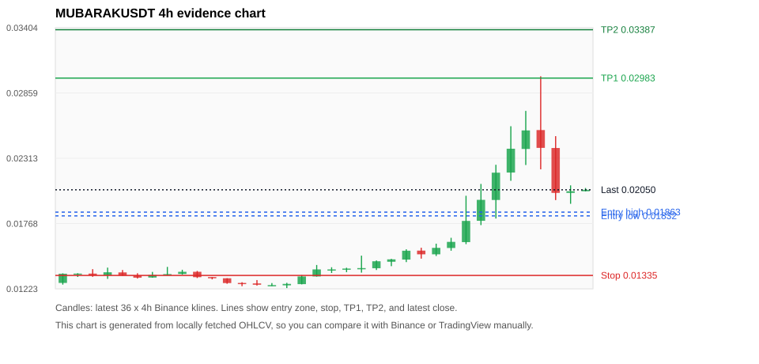
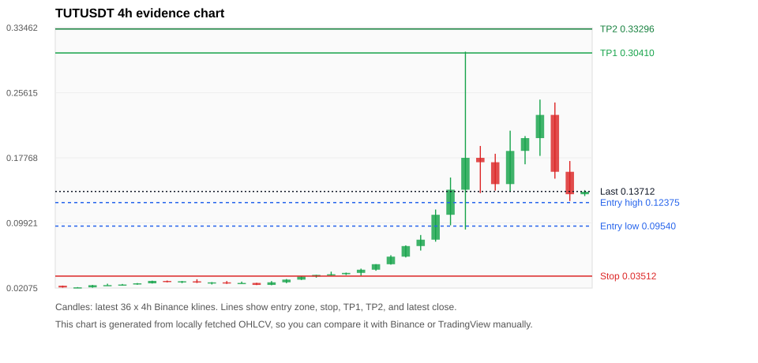
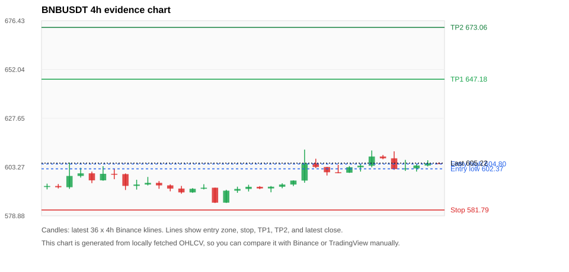
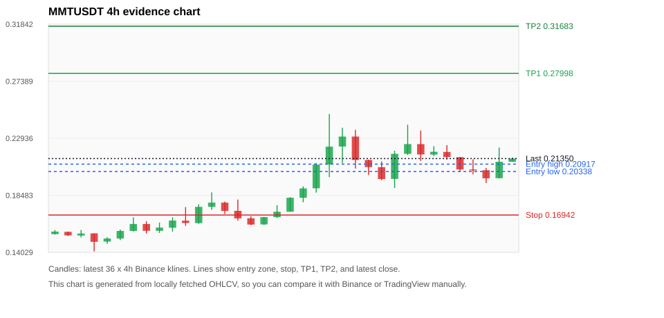
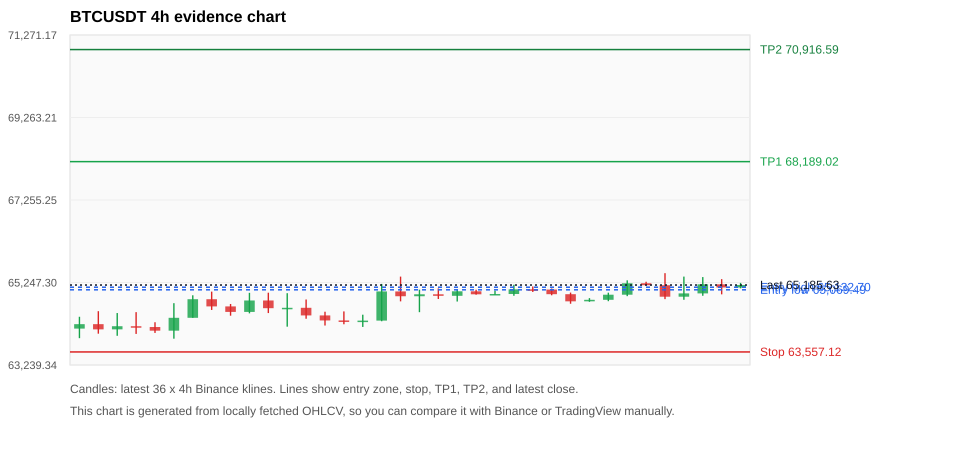

# Crypto 市场扫描报告 v1

- 报告时间：2026-08-10 20:06:38 CST
- Run ID：`20260810_120503_f66b7c3d`
- Run type：`daily_full`
- 数据来源：SQLite
- 报告版本：v1
- 扫描 ID：5b204540bee0
- 数据源：Binance public spot API + CoinGecko/CoinMarketCap cross-check
- 过滤条件：USDT spot; 24h quote volume >= 30,000,000; trades >= 30,000; exclude stables/leveraged tokens; analyze 1h/4h/1d klines
- 默认单笔风险：账户权益的 1.00%

## 限制说明

- 交易信号仍以 Binance 现货公开 K 线为主源；外部数据源用于一致性复核。
- 结果是研究和模拟盘计划，不是确定收益或实盘下单指令。
- 历史长度过滤：候选币至少需要 180 根 1d K 线。
- 数据质量验证池：先验证 score 排名前 min(top_n * 2, 10) 的候选，再按 action + score 补足最终名单。
- 大盘环境过滤：NEUTRAL; BTC/ETH 大盘未完全确认强势，山寨币买入候选降级为观察。 BTC 7d=2.622213476070523; ETH 7d=3.3550120935232464.
- 已启用数据交叉验证：Binance 主源 + CoinGecko 自动对照；CoinMarketCap 在配置 API Key 后自动对照。
- MUBARAKUSDT 交叉验证状态 DATA_WARNING：At least one external provider needs manual review.
- TUTUSDT 交叉验证状态 DATA_WARNING：At least one external provider needs manual review.
- BNBUSDT 交叉验证状态 DATA_WARNING：At least one external provider needs manual review.
- MMTUSDT 交叉验证状态 DATA_WARNING：At least one external provider needs manual review.
- BTCUSDT 交叉验证状态 DATA_WARNING：At least one external provider needs manual review.
- SOLUSDT 交叉验证状态 DATA_WARNING：At least one external provider needs manual review.
- BMTUSDT 交叉验证状态 DATA_WARNING：At least one external provider needs manual review.
- ETHUSDT 交叉验证状态 DATA_WARNING：At least one external provider needs manual review.
- ZECUSDT 交叉验证状态 DATA_WARNING：At least one external provider needs manual review.
- BICOUSDT 交叉验证状态 DATA_WARNING：At least one external provider needs manual review.

## 5 个候选交易计划

| Rank | Coin | Action | Setup | Entry Zone | Stop Loss | TP1 | TP2 / Exit Rule | R/R | Verdict |
|---:|---|---|---|---:|---:|---:|---|---:|---|
| 1 | `MUBARAK` | `WATCH_ONLY` | 涨幅较远，只等深回调 | 0.01832 - 0.01863 | 0.01335 | 0.02983 | 0.03387 或跌破 4h 关键支撑 | 2.21-3.00 | 只等回调 |
| 2 | `TUT` | `WATCH_ONLY` | 涨幅较远，只等深回调 | 0.09540 - 0.12375 | 0.03512 | 0.30410 | 0.33296 或跌破 4h 关键支撑 | 2.61-3.00 | 只等回调 |
| 3 | `BNB` | `WATCH_ONLY` | 回踩支撑/4h EMA 附近 | 602.37 - 604.80 | 581.79 | 647.18 | 673.06 或跌破 4h 关键支撑 | 2.00-3.19 | 只观察 |
| 4 | `MMT` | `WATCH_ONLY` | 趋势中，等回调入场 | 0.20338 - 0.20917 | 0.16942 | 0.27998 | 0.31683 或跌破 4h 关键支撑 | 2.00-3.00 | 只观察 |
| 5 | `BTC` | `WATCH_ONLY` | 回踩支撑/4h EMA 附近 | 65,069.49 - 65,132.70 | 63,557.12 | 68,189.02 | 70,916.59 或跌破 4h 关键支撑 | 2.00-3.77 | 只观察 |

## 数据交叉验证摘要

价格差异以 Binance 当前价为基准；成交量口径不同，Binance 是 USDT 现货成交额，CoinGecko/CoinMarketCap 通常是全市场成交量。

| Rank | Coin | Data Status | Max Price Diff | Max 24h Diff | Message |
|---:|---|---|---:|---:|---|
| 1 | `MUBARAK` | DATA_WARNING | 0.46% | 1.80 pts | At least one external provider needs manual review. |
| 2 | `TUT` | DATA_WARNING | 1.46% | 1.23 pts | At least one external provider needs manual review. |
| 3 | `BNB` | DATA_WARNING | 0.07% | 0.07 pts | At least one external provider needs manual review. |
| 4 | `MMT` | DATA_WARNING | 0.29% | 0.23 pts | At least one external provider needs manual review. |
| 5 | `BTC` | DATA_WARNING | 0.08% | 0.21 pts | At least one external provider needs manual review. |

## 候选币说明

### 1. MUBARAK `MUBARAKUSDT`



- 入选原因：涨幅较远，只等深回调；24h +3.90%，7d +60.91%，4h RSI 67.55，24h 成交额 $30.5M。
- 交易失效条件：跌破 0.01334675 或 4h 收盘重新失守关键支撑。
- 主要风险：距离支撑偏远，不能追市价；24h 振幅较大，回撤风险高；成交量突增，可能是事件驱动；数据交叉验证需要人工复核。
- 数据交叉验证：DATA_WARNING；At least one external provider needs manual review.

#### 可点击人工验证

- [Binance 交易页](https://www.binance.com/en/trade/MUBARAK_USDT)
- [TradingView 图表](https://www.tradingview.com/chart/?symbol=BINANCE%3AMUBARAKUSDT)
- [CoinGecko 搜索](https://www.coingecko.com/en/search?query=MUBARAK)
- [CoinMarketCap 搜索](https://coinmarketcap.com/search/?q=MUBARAK)

#### 多数据源对照

| Source | Status | Asset ID | Price | 24h Change | 24h Volume | Price Diff | 24h Diff | Updated | Message |
|---|---|---|---:|---:|---:|---:|---:|---|---|
| Binance | DATA_OK | MUBARAKUSDT | 0.02050 | +3.90% | $30.5M | 0.00% | 0.00 pts | 2026-08-10T12:05:51+00:00 | Primary market data source used by scanner. |
| CoinGecko | DATA_WARNING | mubarak | 0.02051 | +2.10% | $97.9M | 0.07% | 1.80 pts | 2026-08-10T12:03:10.000Z | CoinGecko symbol mapping has 2 exact matches; selected highest market-cap rank |
| CoinMarketCap | DATA_WARNING | 36041 | 0.02041 | +3.99% | $144.5M | 0.46% | 0.09 pts | 2026-08-10T12:05:03.000Z | CoinMarketCap symbol mapping has 3 matches; selected lowest cmc_rank |

#### 指标证据

| 指标 | 数值 | 人工核对用途 |
|---|---:|---|
| 当前价 | 0.02050 | 与 Binance/TradingView 当前价格对照 |
| 24h 涨跌 | +3.90% | 与交易所 24h 涨跌对照 |
| 7d 涨跌 | +60.91% | 判断短线趋势是否延续 |
| 4h EMA20 | 0.01860 | 判断短期趋势支撑 |
| 4h EMA50 | 0.01583 | 判断中期趋势支撑 |
| 1d EMA20 | 0.01447 | 判断日线趋势 |
| 1d EMA50 | 0.01292 | 判断日线趋势 |
| 4h RSI14 | 67.55 | 判断是否过热/过弱 |
| 4h ATR14 | 0.0029057143 | 推导止损和入场缓冲 |
| 最近 18 根 4h 最低点 | 0.01355 | 支撑/止损参考 |
| 最近 36 根 4h 最高点 | 0.02998 | TP/压力参考 |
| 支撑位 | 0.01860 | 入场区间推导基础 |

#### 交易计划推导

- 支撑位 = 最近低点、4h EMA20、4h EMA50、1d EMA20 中不高于当前价的最高有效支撑 = `0.01860`。
- 入场区间 = 支撑位附近 + ATR 缓冲 = `0.01832 - 0.01863`。
- 止损 = min(最近 18 根 4h 最低点 * 0.985, 入场中位价 - 1.15 * ATR14) = `0.01335`。
- TP1 = max(最近 36 根 4h 最高点 * 0.995, 入场中位价 + 2R) = `0.02983`。
- TP2 = max(入场中位价 + 3R, TP1 * 1.04) = `0.03387`。

#### 最近 10 根 4h K线

| UTC 开盘时间 | Open | High | Low | Close | Quote Volume | Trades |
|---|---:|---:|---:|---:|---:|---:|
| 2026-08-09T00:00+00:00 | 0.01564 | 0.01649 | 0.01541 | 0.01615 | $680,208 | 11877 |
| 2026-08-09T04:00+00:00 | 0.01613 | 0.02000 | 0.01596 | 0.01790 | $4.6M | 65416 |
| 2026-08-09T08:00+00:00 | 0.01791 | 0.02099 | 0.01755 | 0.01966 | $5.6M | 104831 |
| 2026-08-09T12:00+00:00 | 0.01965 | 0.02259 | 0.01810 | 0.02193 | $4.1M | 84393 |
| 2026-08-09T16:00+00:00 | 0.02194 | 0.02581 | 0.02125 | 0.02393 | $7.5M | 141706 |
| 2026-08-09T20:00+00:00 | 0.02391 | 0.02709 | 0.02257 | 0.02546 | $3.2M | 85139 |
| 2026-08-10T00:00+00:00 | 0.02549 | 0.02998 | 0.02221 | 0.02400 | $9.4M | 222140 |
| 2026-08-10T04:00+00:00 | 0.02399 | 0.02498 | 0.01964 | 0.02024 | $3.9M | 100542 |
| 2026-08-10T08:00+00:00 | 0.02024 | 0.02087 | 0.01933 | 0.02038 | $2.5M | 50837 |
| 2026-08-10T12:00+00:00 | 0.02038 | 0.02065 | 0.02037 | 0.02050 | $19,304 | 697 |

### 2. TUT `TUTUSDT`



- 入选原因：涨幅较远，只等深回调；24h -21.35%，7d +575.47%，4h RSI 62.77，24h 成交额 $158.7M。
- 交易失效条件：跌破 0.03511525 或 4h 收盘重新失守关键支撑。
- 主要风险：距离支撑偏远，不能追市价；24h 振幅较大，回撤风险高；成交量突增，可能是事件驱动；24h 动量未确认；数据交叉验证需要人工复核。
- 数据交叉验证：DATA_WARNING；At least one external provider needs manual review.

#### 可点击人工验证

- [Binance 交易页](https://www.binance.com/en/trade/TUT_USDT)
- [TradingView 图表](https://www.tradingview.com/chart/?symbol=BINANCE%3ATUTUSDT)
- [CoinGecko 搜索](https://www.coingecko.com/en/search?query=TUT)
- [CoinMarketCap 搜索](https://coinmarketcap.com/search/?q=TUT)

#### 多数据源对照

| Source | Status | Asset ID | Price | 24h Change | 24h Volume | Price Diff | 24h Diff | Updated | Message |
|---|---|---|---:|---:|---:|---:|---:|---|---|
| Binance | DATA_OK | TUTUSDT | 0.13712 | -21.35% | $158.7M | 0.00% | 0.00 pts | 2026-08-10T12:05:51+00:00 | Primary market data source used by scanner. |
| CoinGecko | DATA_WARNING | tutorial | 0.13512 | -20.20% | $254.5M | 1.46% | 1.15 pts | 2026-08-10T12:03:10.000Z | price diff 1.46% exceeds warning threshold |
| CoinMarketCap | DATA_WARNING | 35892 | 0.13536 | -22.58% | $518.6M | 1.29% | 1.23 pts | 2026-08-10T12:05:03.000Z | price diff 1.29% exceeds warning threshold; CoinMarketCap symbol mapping has 3 matches; selected lowest cmc_rank |

#### 指标证据

| 指标 | 数值 | 人工核对用途 |
|---|---:|---|
| 当前价 | 0.13712 | 与 Binance/TradingView 当前价格对照 |
| 24h 涨跌 | -21.35% | 与交易所 24h 涨跌对照 |
| 7d 涨跌 | +575.47% | 判断短线趋势是否延续 |
| 4h EMA20 | 0.12350 | 判断短期趋势支撑 |
| 4h EMA50 | 0.07809 | 判断中期趋势支撑 |
| 1d EMA20 | 0.05355 | 判断日线趋势 |
| 1d EMA50 | 0.03074 | 判断日线趋势 |
| 4h RSI14 | 62.77 | 判断是否过热/过弱 |
| 4h ATR14 | 0.05562 | 推导止损和入场缓冲 |
| 最近 18 根 4h 最低点 | 0.03565 | 支撑/止损参考 |
| 最近 36 根 4h 最高点 | 0.30563 | TP/压力参考 |
| 支撑位 | 0.12350 | 入场区间推导基础 |

#### 交易计划推导

- 支撑位 = 最近低点、4h EMA20、4h EMA50、1d EMA20 中不高于当前价的最高有效支撑 = `0.12350`。
- 入场区间 = 支撑位附近 + ATR 缓冲 = `0.09540 - 0.12375`。
- 止损 = min(最近 18 根 4h 最低点 * 0.985, 入场中位价 - 1.15 * ATR14) = `0.03512`。
- TP1 = max(最近 36 根 4h 最高点 * 0.995, 入场中位价 + 2R) = `0.30410`。
- TP2 = max(入场中位价 + 3R, TP1 * 1.04) = `0.33296`。

#### 最近 10 根 4h K线

| UTC 开盘时间 | Open | High | Low | Close | Quote Volume | Trades |
|---|---:|---:|---:|---:|---:|---:|
| 2026-08-09T00:00+00:00 | 0.10905 | 0.15397 | 0.09633 | 0.13924 | $39.5M | 1401065 |
| 2026-08-09T04:00+00:00 | 0.13923 | 0.30563 | 0.09128 | 0.17769 | $80.3M | 2677785 |
| 2026-08-09T08:00+00:00 | 0.17768 | 0.19200 | 0.13521 | 0.17239 | $61.1M | 2233927 |
| 2026-08-09T12:00+00:00 | 0.17237 | 0.18257 | 0.13818 | 0.14598 | $38.8M | 1460910 |
| 2026-08-09T16:00+00:00 | 0.14603 | 0.21039 | 0.13736 | 0.18597 | $31.2M | 1374852 |
| 2026-08-09T20:00+00:00 | 0.18607 | 0.20392 | 0.16990 | 0.20144 | $15.3M | 683815 |
| 2026-08-10T00:00+00:00 | 0.20145 | 0.24785 | 0.18001 | 0.22939 | $32.2M | 1508266 |
| 2026-08-10T04:00+00:00 | 0.22942 | 0.24440 | 0.15256 | 0.16086 | $23.2M | 1243384 |
| 2026-08-10T08:00+00:00 | 0.16085 | 0.17382 | 0.12563 | 0.13382 | $18.3M | 899473 |
| 2026-08-10T12:00+00:00 | 0.13382 | 0.13882 | 0.13160 | 0.13677 | $330,563 | 20906 |

### 3. BNB `BNBUSDT`



- 入选原因：回踩支撑/4h EMA 附近；24h +0.27%，7d +2.89%，4h RSI 66.30，24h 成交额 $53.8M。
- 交易失效条件：跌破 581.79025 或 4h 收盘重新失守关键支撑。
- 主要风险：主要风险是大盘同步回撤；数据交叉验证需要人工复核；数据交叉验证状态为 DATA_WARNING，买入候选降级为观察。
- 数据交叉验证：DATA_WARNING；At least one external provider needs manual review.

#### 可点击人工验证

- [Binance 交易页](https://www.binance.com/en/trade/BNB_USDT)
- [TradingView 图表](https://www.tradingview.com/chart/?symbol=BINANCE%3ABNBUSDT)
- [CoinGecko 搜索](https://www.coingecko.com/en/search?query=BNB)
- [CoinMarketCap 搜索](https://coinmarketcap.com/search/?q=BNB)

#### 多数据源对照

| Source | Status | Asset ID | Price | 24h Change | 24h Volume | Price Diff | 24h Diff | Updated | Message |
|---|---|---|---:|---:|---:|---:|---:|---|---|
| Binance | DATA_OK | BNBUSDT | 605.22 | +0.27% | $53.8M | 0.00% | 0.00 pts | 2026-08-10T12:05:51+00:00 | Primary market data source used by scanner. |
| CoinGecko | DATA_OK | binancecoin | 604.85 | +0.20% | $516.6M | 0.06% | 0.07 pts | 2026-08-10T12:03:10.000Z | External source agrees with Binance within thresholds. |
| CoinMarketCap | DATA_WARNING | 1839 | 604.77 | +0.21% | $1.06B | 0.07% | 0.06 pts | 2026-08-10T12:05:03.000Z | CoinMarketCap symbol mapping has 4 matches; selected lowest cmc_rank |

#### 指标证据

| 指标 | 数值 | 人工核对用途 |
|---|---:|---|
| 当前价 | 605.22 | 与 Binance/TradingView 当前价格对照 |
| 24h 涨跌 | +0.27% | 与交易所 24h 涨跌对照 |
| 7d 涨跌 | +2.89% | 判断短线趋势是否延续 |
| 4h EMA20 | 601.17 | 判断短期趋势支撑 |
| 4h EMA50 | 595.36 | 判断中期趋势支撑 |
| 1d EMA20 | 587.81 | 判断日线趋势 |
| 1d EMA50 | 586.24 | 判断日线趋势 |
| 4h RSI14 | 66.30 | 判断是否过热/过弱 |
| 4h ATR14 | 5.1893 | 推导止损和入场缓冲 |
| 最近 18 根 4h 最低点 | 590.65 | 支撑/止损参考 |
| 最近 36 根 4h 最高点 | 612.00 | TP/压力参考 |
| 支撑位 | 601.17 | 入场区间推导基础 |

#### 交易计划推导

- 支撑位 = 最近低点、4h EMA20、4h EMA50、1d EMA20 中不高于当前价的最高有效支撑 = `601.17`。
- 入场区间 = 支撑位附近 + ATR 缓冲 = `602.37 - 604.80`。
- 止损 = min(最近 18 根 4h 最低点 * 0.985, 入场中位价 - 1.15 * ATR14) = `581.79`。
- TP1 = max(最近 36 根 4h 最高点 * 0.995, 入场中位价 + 2R) = `647.18`。
- TP2 = max(入场中位价 + 3R, TP1 * 1.04) = `673.06`。

#### 最近 10 根 4h K线

| UTC 开盘时间 | Open | High | Low | Close | Quote Volume | Trades |
|---|---:|---:|---:|---:|---:|---:|
| 2026-08-09T00:00+00:00 | 600.66 | 604.41 | 600.21 | 600.44 | $6.6M | 64927 |
| 2026-08-09T04:00+00:00 | 600.44 | 603.76 | 600.35 | 603.14 | $8.7M | 69460 |
| 2026-08-09T08:00+00:00 | 603.14 | 604.71 | 601.00 | 603.92 | $6.6M | 66844 |
| 2026-08-09T12:00+00:00 | 603.92 | 611.55 | 603.14 | 608.53 | $14.8M | 104033 |
| 2026-08-09T16:00+00:00 | 608.54 | 609.30 | 607.17 | 607.63 | $6.3M | 50043 |
| 2026-08-09T20:00+00:00 | 607.63 | 611.12 | 601.86 | 602.23 | $8.2M | 84838 |
| 2026-08-10T00:00+00:00 | 602.22 | 606.84 | 601.33 | 602.59 | $9.3M | 118891 |
| 2026-08-10T04:00+00:00 | 602.59 | 604.90 | 601.00 | 604.04 | $6.7M | 63103 |
| 2026-08-10T08:00+00:00 | 604.04 | 606.66 | 603.59 | 605.18 | $8.3M | 85861 |
| 2026-08-10T12:00+00:00 | 605.19 | 605.63 | 604.95 | 605.17 | $232,574 | 3783 |

### 4. MMT `MMTUSDT`



- 入选原因：趋势中，等回调入场；24h -1.92%，7d +38.37%，4h RSI 45.95，24h 成交额 $104.8M。
- 交易失效条件：跌破 0.16942 或 4h 收盘重新失守关键支撑。
- 主要风险：成交量突增，可能是事件驱动；24h 动量未确认；数据交叉验证需要人工复核。
- 数据交叉验证：DATA_WARNING；At least one external provider needs manual review.

#### 可点击人工验证

- [Binance 交易页](https://www.binance.com/en/trade/MMT_USDT)
- [TradingView 图表](https://www.tradingview.com/chart/?symbol=BINANCE%3AMMTUSDT)
- [CoinGecko 搜索](https://www.coingecko.com/en/search?query=MMT)
- [CoinMarketCap 搜索](https://coinmarketcap.com/search/?q=MMT)

#### 多数据源对照

| Source | Status | Asset ID | Price | 24h Change | 24h Volume | Price Diff | 24h Diff | Updated | Message |
|---|---|---|---:|---:|---:|---:|---:|---|---|
| Binance | DATA_OK | MMTUSDT | 0.21350 | -1.92% | $104.8M | 0.00% | 0.00 pts | 2026-08-10T12:05:51+00:00 | Primary market data source used by scanner. |
| CoinGecko | DATA_OK | momentum-3 | 0.21350 | -1.80% | $212.2M | 0.00% | 0.12 pts | 2026-08-10T12:04:10.000Z | External source agrees with Binance within thresholds. |
| CoinMarketCap | DATA_WARNING | 38231 | 0.21289 | -2.15% | $267.8M | 0.29% | 0.23 pts | 2026-08-10T12:05:03.000Z | CoinMarketCap symbol mapping has 6 matches; selected lowest cmc_rank |

#### 指标证据

| 指标 | 数值 | 人工核对用途 |
|---|---:|---|
| 当前价 | 0.21350 | 与 Binance/TradingView 当前价格对照 |
| 24h 涨跌 | -1.92% | 与交易所 24h 涨跌对照 |
| 7d 涨跌 | +38.37% | 判断短线趋势是否延续 |
| 4h EMA20 | 0.20298 | 判断短期趋势支撑 |
| 4h EMA50 | 0.19127 | 判断中期趋势支撑 |
| 1d EMA20 | 0.18496 | 判断日线趋势 |
| 1d EMA50 | 0.17311 | 判断日线趋势 |
| 4h RSI14 | 45.95 | 判断是否过热/过弱 |
| 4h ATR14 | 0.01734 | 推导止损和入场缓冲 |
| 最近 18 根 4h 最低点 | 0.17200 | 支撑/止损参考 |
| 最近 36 根 4h 最高点 | 0.24830 | TP/压力参考 |
| 支撑位 | 0.20298 | 入场区间推导基础 |

#### 交易计划推导

- 支撑位 = 最近低点、4h EMA20、4h EMA50、1d EMA20 中不高于当前价的最高有效支撑 = `0.20298`。
- 入场区间 = 支撑位附近 + ATR 缓冲 = `0.20338 - 0.20917`。
- 止损 = min(最近 18 根 4h 最低点 * 0.985, 入场中位价 - 1.15 * ATR14) = `0.16942`。
- TP1 = max(最近 36 根 4h 最高点 * 0.995, 入场中位价 + 2R) = `0.27998`。
- TP2 = max(入场中位价 + 3R, TP1 * 1.04) = `0.31683`。

#### 最近 10 根 4h K线

| UTC 开盘时间 | Open | High | Low | Close | Quote Volume | Trades |
|---|---:|---:|---:|---:|---:|---:|
| 2026-08-09T00:00+00:00 | 0.19760 | 0.21960 | 0.19050 | 0.21720 | $5.3M | 101769 |
| 2026-08-09T04:00+00:00 | 0.21720 | 0.23990 | 0.21630 | 0.22480 | $6.1M | 145653 |
| 2026-08-09T08:00+00:00 | 0.22480 | 0.23540 | 0.21160 | 0.21670 | $5.0M | 109033 |
| 2026-08-09T12:00+00:00 | 0.21660 | 0.22320 | 0.21540 | 0.21880 | $11.2M | 82508 |
| 2026-08-09T16:00+00:00 | 0.21870 | 0.22400 | 0.21270 | 0.21470 | $36.4M | 74040 |
| 2026-08-09T20:00+00:00 | 0.21460 | 0.21460 | 0.20300 | 0.20500 | $1.8M | 24576 |
| 2026-08-10T00:00+00:00 | 0.20500 | 0.21290 | 0.20120 | 0.20440 | $9.7M | 60654 |
| 2026-08-10T04:00+00:00 | 0.20440 | 0.20620 | 0.19440 | 0.19810 | $33.0M | 60658 |
| 2026-08-10T08:00+00:00 | 0.19820 | 0.22210 | 0.19800 | 0.21100 | $12.6M | 139862 |
| 2026-08-10T12:00+00:00 | 0.21100 | 0.21430 | 0.21100 | 0.21350 | $123,600 | 2860 |

### 5. BTC `BTCUSDT`



- 入选原因：回踩支撑/4h EMA 附近；24h +0.41%，7d +2.90%，4h RSI 56.98，24h 成交额 $584.4M。
- 交易失效条件：跌破 63557.125 或 4h 收盘重新失守关键支撑。
- 主要风险：主要风险是大盘同步回撤；数据交叉验证需要人工复核；数据交叉验证状态为 DATA_WARNING，买入候选降级为观察。
- 数据交叉验证：DATA_WARNING；At least one external provider needs manual review.

#### 可点击人工验证

- [Binance 交易页](https://www.binance.com/en/trade/BTC_USDT)
- [TradingView 图表](https://www.tradingview.com/chart/?symbol=BINANCE%3ABTCUSDT)
- [CoinGecko 搜索](https://www.coingecko.com/en/search?query=BTC)
- [CoinMarketCap 搜索](https://coinmarketcap.com/search/?q=BTC)

#### 多数据源对照

| Source | Status | Asset ID | Price | 24h Change | 24h Volume | Price Diff | 24h Diff | Updated | Message |
|---|---|---|---:|---:|---:|---:|---:|---|---|
| Binance | DATA_OK | BTCUSDT | 65,185.63 | +0.41% | $584.4M | 0.00% | 0.00 pts | 2026-08-10T12:05:51+00:00 | Primary market data source used by scanner. |
| CoinGecko | DATA_OK | bitcoin | 65,133.00 | +0.20% | $14.82B | 0.08% | 0.21 pts | 2026-08-10T12:04:10.000Z | External source agrees with Binance within thresholds. |
| CoinMarketCap | DATA_WARNING | 1 | 65,135.70 | +0.41% | $15.48B | 0.08% | 0.00 pts | 2026-08-10T12:05:03.000Z | CoinMarketCap symbol mapping has 13 matches; selected lowest cmc_rank |

#### 指标证据

| 指标 | 数值 | 人工核对用途 |
|---|---:|---|
| 当前价 | 65,185.63 | 与 Binance/TradingView 当前价格对照 |
| 24h 涨跌 | +0.41% | 与交易所 24h 涨跌对照 |
| 7d 涨跌 | +2.90% | 判断短线趋势是否延续 |
| 4h EMA20 | 64,939.61 | 判断短期趋势支撑 |
| 4h EMA50 | 64,610.72 | 判断中期趋势支撑 |
| 1d EMA20 | 64,381.00 | 判断日线趋势 |
| 1d EMA50 | 64,690.13 | 判断日线趋势 |
| 4h RSI14 | 56.98 | 判断是否过热/过弱 |
| 4h ATR14 | 275.84 | 推导止损和入场缓冲 |
| 最近 18 根 4h 最低点 | 64,525.00 | 支撑/止损参考 |
| 最近 36 根 4h 最高点 | 65,474.46 | TP/压力参考 |
| 支撑位 | 64,939.61 | 入场区间推导基础 |

#### 交易计划推导

- 支撑位 = 最近低点、4h EMA20、4h EMA50、1d EMA20 中不高于当前价的最高有效支撑 = `64,939.61`。
- 入场区间 = 支撑位附近 + ATR 缓冲 = `65,069.49 - 65,132.70`。
- 止损 = min(最近 18 根 4h 最低点 * 0.985, 入场中位价 - 1.15 * ATR14) = `63,557.12`。
- TP1 = max(最近 36 根 4h 最高点 * 0.995, 入场中位价 + 2R) = `68,189.02`。
- TP2 = max(入场中位价 + 3R, TP1 * 1.04) = `70,916.59`。

#### 最近 10 根 4h K线

| UTC 开盘时间 | Open | High | Low | Close | Quote Volume | Trades |
|---|---:|---:|---:|---:|---:|---:|
| 2026-08-09T00:00+00:00 | 64,962.60 | 65,002.00 | 64,730.08 | 64,788.80 | $61.9M | 103366 |
| 2026-08-09T04:00+00:00 | 64,788.80 | 64,867.11 | 64,777.00 | 64,826.14 | $58.7M | 68791 |
| 2026-08-09T08:00+00:00 | 64,826.15 | 65,000.00 | 64,792.10 | 64,950.00 | $57.0M | 106398 |
| 2026-08-09T12:00+00:00 | 64,950.01 | 65,300.00 | 64,914.73 | 65,228.68 | $79.4M | 137348 |
| 2026-08-09T16:00+00:00 | 65,228.68 | 65,266.06 | 65,179.72 | 65,180.66 | $49.6M | 79419 |
| 2026-08-09T20:00+00:00 | 65,180.66 | 65,474.46 | 64,842.59 | 64,901.59 | $150.8M | 308659 |
| 2026-08-10T00:00+00:00 | 64,901.59 | 65,391.14 | 64,826.78 | 64,982.01 | $112.9M | 339541 |
| 2026-08-10T04:00+00:00 | 64,982.00 | 65,379.13 | 64,924.00 | 65,202.73 | $105.7M | 211476 |
| 2026-08-10T08:00+00:00 | 65,202.72 | 65,328.73 | 64,958.87 | 65,125.98 | $84.3M | 219964 |
| 2026-08-10T12:00+00:00 | 65,125.99 | 65,237.80 | 65,106.00 | 65,185.63 | $3.7M | 14220 |

## 组合风控

- 不要 5 个候选全部满仓买入。
- 同时持仓总风险建议控制在账户权益的 3% - 5% 以内。
- 如果 BTC/ETH 同时破位，暂停山寨币多头计划或降低仓位。
- 第一版报告用于模拟盘和人工复核，不自动下单。

## 原始数据

```json
[
  {
    "rank": 1,
    "symbol": "MUBARAKUSDT",
    "base_asset": "MUBARAK",
    "price": 0.0205,
    "score": 70.99672586442811,
    "setup": "涨幅较远，只等深回调",
    "verdict": "只等回调",
    "entry_low": 0.018320714285714287,
    "entry_high": 0.01863415010917061,
    "stop_loss": 0.01334675,
    "take_profit_1": 0.0298301,
    "take_profit_2": 0.033869478789769786,
    "risk_reward_1": 2.2127014236462847,
    "risk_reward_2": 2.9999999999999996,
    "pct_24h": 3.899,
    "pct_3d": 51.17994100294987,
    "pct_7d": 60.91051805337522,
    "quote_volume_24h": 30545718.546206,
    "trades_24h": 684440,
    "high_low_range_24h": 65.63535911602207,
    "rsi_1h": 33.76854599406528,
    "rsi_4h": 67.54850088183422,
    "ema20_4h": 0.018596956196777054,
    "ema50_4h": 0.01582888958003574,
    "ema20_1d": 0.014465005484465908,
    "ema50_1d": 0.012922574706635754,
    "atr_4h": 0.0029057142857142858,
    "macd_hist_4h": 0.00025813103513218794,
    "volume_ratio_24h": 8.511020996429195,
    "support_level": 0.018596956196777054,
    "recent_low_4h_18": 0.01355,
    "recent_high_4h_36": 0.02998,
    "distance_to_support_pct": 10.233092894807982,
    "binance_trade_url": "https://www.binance.com/en/trade/MUBARAK_USDT",
    "tradingview_url": "https://www.tradingview.com/chart/?symbol=BINANCE%3AMUBARAKUSDT",
    "coingecko_search_url": "https://www.coingecko.com/en/search?query=MUBARAK",
    "coinmarketcap_search_url": "https://coinmarketcap.com/search/?q=MUBARAK",
    "invalidation": "跌破 0.01334675 或 4h 收盘重新失守关键支撑",
    "recent_4h_klines": [
      {
        "open_time_utc": "2026-08-04T16:00+00:00",
        "open": 0.01272,
        "high": 0.01352,
        "low": 0.01258,
        "close": 0.01349,
        "quote_volume": 381595.822446,
        "trades": 6246
      },
      {
        "open_time_utc": "2026-08-04T20:00+00:00",
        "open": 0.01348,
        "high": 0.01353,
        "low": 0.01322,
        "close": 0.0135,
        "quote_volume": 240648.268966,
        "trades": 2855
      },
      {
        "open_time_utc": "2026-08-05T00:00+00:00",
        "open": 0.0135,
        "high": 0.01387,
        "low": 0.01323,
        "close": 0.01336,
        "quote_volume": 202621.452442,
        "trades": 3558
      },
      {
        "open_time_utc": "2026-08-05T04:00+00:00",
        "open": 0.01336,
        "high": 0.014,
        "low": 0.01306,
        "close": 0.01361,
        "quote_volume": 361415.920662,
        "trades": 5793
      },
      {
        "open_time_utc": "2026-08-05T08:00+00:00",
        "open": 0.0136,
        "high": 0.0138,
        "low": 0.01332,
        "close": 0.01335,
        "quote_volume": 252796.779947,
        "trades": 3177
      },
      {
        "open_time_utc": "2026-08-05T12:00+00:00",
        "open": 0.01335,
        "high": 0.01353,
        "low": 0.01309,
        "close": 0.01316,
        "quote_volume": 193252.650326,
        "trades": 2539
      },
      {
        "open_time_utc": "2026-08-05T16:00+00:00",
        "open": 0.01317,
        "high": 0.01364,
        "low": 0.01316,
        "close": 0.01338,
        "quote_volume": 166534.972859,
        "trades": 1855
      },
      {
        "open_time_utc": "2026-08-05T20:00+00:00",
        "open": 0.01338,
        "high": 0.01406,
        "low": 0.01335,
        "close": 0.01346,
        "quote_volume": 308881.348057,
        "trades": 4121
      },
      {
        "open_time_utc": "2026-08-06T00:00+00:00",
        "open": 0.01347,
        "high": 0.01382,
        "low": 0.01342,
        "close": 0.01365,
        "quote_volume": 48687.577337,
        "trades": 991
      },
      {
        "open_time_utc": "2026-08-06T04:00+00:00",
        "open": 0.01365,
        "high": 0.01372,
        "low": 0.01313,
        "close": 0.0132,
        "quote_volume": 120591.530261,
        "trades": 1890
      },
      {
        "open_time_utc": "2026-08-06T08:00+00:00",
        "open": 0.01321,
        "high": 0.01321,
        "low": 0.01302,
        "close": 0.01311,
        "quote_volume": 114747.038463,
        "trades": 1310
      },
      {
        "open_time_utc": "2026-08-06T12:00+00:00",
        "open": 0.01311,
        "high": 0.01311,
        "low": 0.01265,
        "close": 0.01271,
        "quote_volume": 189839.351352,
        "trades": 1929
      },
      {
        "open_time_utc": "2026-08-06T16:00+00:00",
        "open": 0.01272,
        "high": 0.01278,
        "low": 0.01245,
        "close": 0.01266,
        "quote_volume": 164568.562961,
        "trades": 2405
      },
      {
        "open_time_utc": "2026-08-06T20:00+00:00",
        "open": 0.01268,
        "high": 0.01296,
        "low": 0.0125,
        "close": 0.01257,
        "quote_volume": 229746.282607,
        "trades": 3699
      },
      {
        "open_time_utc": "2026-08-07T00:00+00:00",
        "open": 0.01254,
        "high": 0.01271,
        "low": 0.01247,
        "close": 0.01254,
        "quote_volume": 62364.161581,
        "trades": 1226
      },
      {
        "open_time_utc": "2026-08-07T04:00+00:00",
        "open": 0.01252,
        "high": 0.01273,
        "low": 0.01229,
        "close": 0.01264,
        "quote_volume": 197287.621944,
        "trades": 2148
      },
      {
        "open_time_utc": "2026-08-07T08:00+00:00",
        "open": 0.01262,
        "high": 0.01337,
        "low": 0.0126,
        "close": 0.01326,
        "quote_volume": 247320.779751,
        "trades": 3754
      },
      {
        "open_time_utc": "2026-08-07T12:00+00:00",
        "open": 0.01326,
        "high": 0.01422,
        "low": 0.01325,
        "close": 0.01385,
        "quote_volume": 844781.099985,
        "trades": 10872
      },
      {
        "open_time_utc": "2026-08-07T16:00+00:00",
        "open": 0.01385,
        "high": 0.01403,
        "low": 0.01355,
        "close": 0.01385,
        "quote_volume": 290019.006829,
        "trades": 4075
      },
      {
        "open_time_utc": "2026-08-07T20:00+00:00",
        "open": 0.01384,
        "high": 0.01399,
        "low": 0.01362,
        "close": 0.01392,
        "quote_volume": 83460.651146,
        "trades": 1476
      },
      {
        "open_time_utc": "2026-08-08T00:00+00:00",
        "open": 0.0139,
        "high": 0.015,
        "low": 0.01358,
        "close": 0.01396,
        "quote_volume": 491844.058315,
        "trades": 5882
      },
      {
        "open_time_utc": "2026-08-08T04:00+00:00",
        "open": 0.01395,
        "high": 0.0146,
        "low": 0.0138,
        "close": 0.01453,
        "quote_volume": 406119.65899,
        "trades": 5420
      },
      {
        "open_time_utc": "2026-08-08T08:00+00:00",
        "open": 0.01449,
        "high": 0.01473,
        "low": 0.01412,
        "close": 0.01469,
        "quote_volume": 524436.084258,
        "trades": 5149
      },
      {
        "open_time_utc": "2026-08-08T12:00+00:00",
        "open": 0.01467,
        "high": 0.01553,
        "low": 0.01446,
        "close": 0.01541,
        "quote_volume": 943821.073166,
        "trades": 9958
      },
      {
        "open_time_utc": "2026-08-08T16:00+00:00",
        "open": 0.01542,
        "high": 0.01566,
        "low": 0.01475,
        "close": 0.01511,
        "quote_volume": 721193.783106,
        "trades": 8440
      },
      {
        "open_time_utc": "2026-08-08T20:00+00:00",
        "open": 0.01511,
        "high": 0.016,
        "low": 0.01497,
        "close": 0.01565,
        "quote_volume": 480407.997759,
        "trades": 6388
      },
      {
        "open_time_utc": "2026-08-09T00:00+00:00",
        "open": 0.01564,
        "high": 0.01649,
        "low": 0.01541,
        "close": 0.01615,
        "quote_volume": 680208.270518,
        "trades": 11877
      },
      {
        "open_time_utc": "2026-08-09T04:00+00:00",
        "open": 0.01613,
        "high": 0.02,
        "low": 0.01596,
        "close": 0.0179,
        "quote_volume": 4594154.161218,
        "trades": 65416
      },
      {
        "open_time_utc": "2026-08-09T08:00+00:00",
        "open": 0.01791,
        "high": 0.02099,
        "low": 0.01755,
        "close": 0.01966,
        "quote_volume": 5566242.130704,
        "trades": 104831
      },
      {
        "open_time_utc": "2026-08-09T12:00+00:00",
        "open": 0.01965,
        "high": 0.02259,
        "low": 0.0181,
        "close": 0.02193,
        "quote_volume": 4137099.167446,
        "trades": 84393
      },
      {
        "open_time_utc": "2026-08-09T16:00+00:00",
        "open": 0.02194,
        "high": 0.02581,
        "low": 0.02125,
        "close": 0.02393,
        "quote_volume": 7476134.382667,
        "trades": 141706
      },
      {
        "open_time_utc": "2026-08-09T20:00+00:00",
        "open": 0.02391,
        "high": 0.02709,
        "low": 0.02257,
        "close": 0.02546,
        "quote_volume": 3196897.038337,
        "trades": 85139
      },
      {
        "open_time_utc": "2026-08-10T00:00+00:00",
        "open": 0.02549,
        "high": 0.02998,
        "low": 0.02221,
        "close": 0.024,
        "quote_volume": 9352497.956589,
        "trades": 222140
      },
      {
        "open_time_utc": "2026-08-10T04:00+00:00",
        "open": 0.02399,
        "high": 0.02498,
        "low": 0.01964,
        "close": 0.02024,
        "quote_volume": 3936349.936203,
        "trades": 100542
      },
      {
        "open_time_utc": "2026-08-10T08:00+00:00",
        "open": 0.02024,
        "high": 0.02087,
        "low": 0.01933,
        "close": 0.02038,
        "quote_volume": 2464121.550413,
        "trades": 50837
      },
      {
        "open_time_utc": "2026-08-10T12:00+00:00",
        "open": 0.02038,
        "high": 0.02065,
        "low": 0.02037,
        "close": 0.0205,
        "quote_volume": 19303.927711,
        "trades": 697
      }
    ],
    "risks": [
      "距离支撑偏远，不能追市价",
      "24h 振幅较大，回撤风险高",
      "成交量突增，可能是事件驱动",
      "数据交叉验证需要人工复核"
    ],
    "data_quality_status": "DATA_WARNING",
    "data_quality_message": "At least one external provider needs manual review.",
    "data_checks": [
      {
        "provider": "Binance",
        "status": "DATA_OK",
        "provider_asset_id": "MUBARAKUSDT",
        "provider_symbol": "MUBARAKUSDT",
        "price_usd": 0.0205,
        "pct_24h": 3.899,
        "volume_24h": 30545718.546206,
        "last_updated": null,
        "fetched_at_utc": "2026-08-10T12:05:51+00:00",
        "price_diff_pct": 0.0,
        "pct_24h_diff": 0.0,
        "volume_note": "Binance USDT spot 24h quoteVolume.",
        "message": "Primary market data source used by scanner."
      },
      {
        "provider": "CoinGecko",
        "status": "DATA_WARNING",
        "provider_asset_id": "mubarak",
        "provider_symbol": "MUBARAK",
        "price_usd": 0.02051375,
        "pct_24h": 2.1,
        "volume_24h": 97933928.0,
        "last_updated": "2026-08-10T12:03:10.000Z",
        "fetched_at_utc": "2026-08-10T12:05:51+00:00",
        "price_diff_pct": 0.0670731707317067,
        "pct_24h_diff": 1.799,
        "volume_note": "CoinGecko total market volume; not the same venue scope as Binance quoteVolume.",
        "message": "CoinGecko symbol mapping has 2 exact matches; selected highest market-cap rank"
      },
      {
        "provider": "CoinMarketCap",
        "status": "DATA_WARNING",
        "provider_asset_id": "36041",
        "provider_symbol": "MUBARAK",
        "price_usd": 0.020405560435179312,
        "pct_24h": 3.98589219,
        "volume_24h": 144511702.68036082,
        "last_updated": "2026-08-10T12:05:03.000Z",
        "fetched_at_utc": "2026-08-10T12:05:51+00:00",
        "price_diff_pct": 0.46068080400335837,
        "pct_24h_diff": 0.08689218999999992,
        "volume_note": "CoinMarketCap total market volume; not the same venue scope as Binance quoteVolume.",
        "message": "CoinMarketCap symbol mapping has 3 matches; selected lowest cmc_rank"
      }
    ],
    "action": "WATCH_ONLY"
  },
  {
    "rank": 2,
    "symbol": "TUTUSDT",
    "base_asset": "TUT",
    "price": 0.13712,
    "score": 62.751348220279226,
    "setup": "涨幅较远，只等深回调",
    "verdict": "只等回调",
    "entry_low": 0.09540232142857141,
    "entry_high": 0.12374901009934483,
    "stop_loss": 0.03511525,
    "take_profit_1": 0.30410185,
    "take_profit_2": 0.33295691305583247,
    "risk_reward_1": 2.612477814422848,
    "risk_reward_2": 3.0,
    "pct_24h": -21.353,
    "pct_3d": 294.2495687176538,
    "pct_7d": 575.4679802955665,
    "quote_volume_24h": 158686246.67343,
    "trades_24h": 7161743,
    "high_low_range_24h": 97.28568017193346,
    "rsi_1h": 35.42974546284671,
    "rsi_4h": 62.76838471889077,
    "ema20_4h": 0.12350200608717049,
    "ema50_4h": 0.07808656457470965,
    "ema20_1d": 0.053550238397054827,
    "ema50_1d": 0.030741387804646948,
    "atr_4h": 0.05562357142857143,
    "macd_hist_4h": 0.0005071329815358946,
    "volume_ratio_24h": 3.050515719495816,
    "support_level": 0.12350200608717049,
    "recent_low_4h_18": 0.03565,
    "recent_high_4h_36": 0.30563,
    "distance_to_support_pct": 11.02653660801074,
    "binance_trade_url": "https://www.binance.com/en/trade/TUT_USDT",
    "tradingview_url": "https://www.tradingview.com/chart/?symbol=BINANCE%3ATUTUSDT",
    "coingecko_search_url": "https://www.coingecko.com/en/search?query=TUT",
    "coinmarketcap_search_url": "https://coinmarketcap.com/search/?q=TUT",
    "invalidation": "跌破 0.03511525 或 4h 收盘重新失守关键支撑",
    "recent_4h_klines": [
      {
        "open_time_utc": "2026-08-04T16:00+00:00",
        "open": 0.02354,
        "high": 0.0237,
        "low": 0.02121,
        "close": 0.02147,
        "quote_volume": 1106174.0302,
        "trades": 19219
      },
      {
        "open_time_utc": "2026-08-04T20:00+00:00",
        "open": 0.02146,
        "high": 0.02184,
        "low": 0.02085,
        "close": 0.02157,
        "quote_volume": 317866.93865,
        "trades": 7900
      },
      {
        "open_time_utc": "2026-08-05T00:00+00:00",
        "open": 0.0216,
        "high": 0.02448,
        "low": 0.02113,
        "close": 0.02414,
        "quote_volume": 1167109.64617,
        "trades": 38840
      },
      {
        "open_time_utc": "2026-08-05T04:00+00:00",
        "open": 0.02412,
        "high": 0.02597,
        "low": 0.02386,
        "close": 0.02427,
        "quote_volume": 1297218.94902,
        "trades": 38240
      },
      {
        "open_time_utc": "2026-08-05T08:00+00:00",
        "open": 0.02428,
        "high": 0.02565,
        "low": 0.02388,
        "close": 0.02498,
        "quote_volume": 762640.25843,
        "trades": 26763
      },
      {
        "open_time_utc": "2026-08-05T12:00+00:00",
        "open": 0.02499,
        "high": 0.02675,
        "low": 0.02479,
        "close": 0.02643,
        "quote_volume": 832682.28238,
        "trades": 18056
      },
      {
        "open_time_utc": "2026-08-05T16:00+00:00",
        "open": 0.02643,
        "high": 0.02961,
        "low": 0.02616,
        "close": 0.02934,
        "quote_volume": 2112064.8286,
        "trades": 42140
      },
      {
        "open_time_utc": "2026-08-05T20:00+00:00",
        "open": 0.02931,
        "high": 0.02976,
        "low": 0.0276,
        "close": 0.0287,
        "quote_volume": 669815.09477,
        "trades": 20736
      },
      {
        "open_time_utc": "2026-08-06T00:00+00:00",
        "open": 0.0287,
        "high": 0.02926,
        "low": 0.02661,
        "close": 0.02889,
        "quote_volume": 1198540.69762,
        "trades": 25726
      },
      {
        "open_time_utc": "2026-08-06T04:00+00:00",
        "open": 0.02885,
        "high": 0.03134,
        "low": 0.0268,
        "close": 0.02735,
        "quote_volume": 1313562.3892,
        "trades": 34911
      },
      {
        "open_time_utc": "2026-08-06T08:00+00:00",
        "open": 0.02736,
        "high": 0.02786,
        "low": 0.02506,
        "close": 0.02757,
        "quote_volume": 1734703.44364,
        "trades": 37023
      },
      {
        "open_time_utc": "2026-08-06T12:00+00:00",
        "open": 0.0276,
        "high": 0.02914,
        "low": 0.02571,
        "close": 0.0264,
        "quote_volume": 1261738.27779,
        "trades": 31758
      },
      {
        "open_time_utc": "2026-08-06T16:00+00:00",
        "open": 0.02643,
        "high": 0.02849,
        "low": 0.02643,
        "close": 0.02688,
        "quote_volume": 567590.69709,
        "trades": 12219
      },
      {
        "open_time_utc": "2026-08-06T20:00+00:00",
        "open": 0.02688,
        "high": 0.02699,
        "low": 0.02434,
        "close": 0.0245,
        "quote_volume": 690996.87984,
        "trades": 11457
      },
      {
        "open_time_utc": "2026-08-07T00:00+00:00",
        "open": 0.02452,
        "high": 0.02914,
        "low": 0.02411,
        "close": 0.02763,
        "quote_volume": 1019952.50048,
        "trades": 23565
      },
      {
        "open_time_utc": "2026-08-07T04:00+00:00",
        "open": 0.02766,
        "high": 0.03158,
        "low": 0.02657,
        "close": 0.03089,
        "quote_volume": 1574078.61401,
        "trades": 43917
      },
      {
        "open_time_utc": "2026-08-07T08:00+00:00",
        "open": 0.03086,
        "high": 0.03498,
        "low": 0.03045,
        "close": 0.03468,
        "quote_volume": 2456886.50152,
        "trades": 54846
      },
      {
        "open_time_utc": "2026-08-07T12:00+00:00",
        "open": 0.03469,
        "high": 0.0366,
        "low": 0.03327,
        "close": 0.03658,
        "quote_volume": 1960674.10148,
        "trades": 56299
      },
      {
        "open_time_utc": "2026-08-07T16:00+00:00",
        "open": 0.03661,
        "high": 0.04048,
        "low": 0.03565,
        "close": 0.03734,
        "quote_volume": 3230375.45763,
        "trades": 97724
      },
      {
        "open_time_utc": "2026-08-07T20:00+00:00",
        "open": 0.03735,
        "high": 0.0393,
        "low": 0.03645,
        "close": 0.03898,
        "quote_volume": 1285571.16953,
        "trades": 37907
      },
      {
        "open_time_utc": "2026-08-08T00:00+00:00",
        "open": 0.039,
        "high": 0.04412,
        "low": 0.0357,
        "close": 0.04283,
        "quote_volume": 2803708.66316,
        "trades": 101547
      },
      {
        "open_time_utc": "2026-08-08T04:00+00:00",
        "open": 0.04284,
        "high": 0.0495,
        "low": 0.04156,
        "close": 0.04947,
        "quote_volume": 4213525.25868,
        "trades": 169099
      },
      {
        "open_time_utc": "2026-08-08T08:00+00:00",
        "open": 0.04943,
        "high": 0.06029,
        "low": 0.0489,
        "close": 0.05857,
        "quote_volume": 10976616.46118,
        "trades": 354095
      },
      {
        "open_time_utc": "2026-08-08T12:00+00:00",
        "open": 0.05858,
        "high": 0.07218,
        "low": 0.05761,
        "close": 0.07133,
        "quote_volume": 12359360.51112,
        "trades": 425345
      },
      {
        "open_time_utc": "2026-08-08T16:00+00:00",
        "open": 0.07134,
        "high": 0.08462,
        "low": 0.06592,
        "close": 0.07901,
        "quote_volume": 18470121.15884,
        "trades": 559981
      },
      {
        "open_time_utc": "2026-08-08T20:00+00:00",
        "open": 0.07903,
        "high": 0.11537,
        "low": 0.07661,
        "close": 0.10904,
        "quote_volume": 24571411.93502,
        "trades": 760106
      },
      {
        "open_time_utc": "2026-08-09T00:00+00:00",
        "open": 0.10905,
        "high": 0.15397,
        "low": 0.09633,
        "close": 0.13924,
        "quote_volume": 39488253.49747,
        "trades": 1401065
      },
      {
        "open_time_utc": "2026-08-09T04:00+00:00",
        "open": 0.13923,
        "high": 0.30563,
        "low": 0.09128,
        "close": 0.17769,
        "quote_volume": 80324635.62302,
        "trades": 2677785
      },
      {
        "open_time_utc": "2026-08-09T08:00+00:00",
        "open": 0.17768,
        "high": 0.192,
        "low": 0.13521,
        "close": 0.17239,
        "quote_volume": 61059425.89002,
        "trades": 2233927
      },
      {
        "open_time_utc": "2026-08-09T12:00+00:00",
        "open": 0.17237,
        "high": 0.18257,
        "low": 0.13818,
        "close": 0.14598,
        "quote_volume": 38762585.19146,
        "trades": 1460910
      },
      {
        "open_time_utc": "2026-08-09T16:00+00:00",
        "open": 0.14603,
        "high": 0.21039,
        "low": 0.13736,
        "close": 0.18597,
        "quote_volume": 31181292.61788,
        "trades": 1374852
      },
      {
        "open_time_utc": "2026-08-09T20:00+00:00",
        "open": 0.18607,
        "high": 0.20392,
        "low": 0.1699,
        "close": 0.20144,
        "quote_volume": 15280526.01449,
        "trades": 683815
      },
      {
        "open_time_utc": "2026-08-10T00:00+00:00",
        "open": 0.20145,
        "high": 0.24785,
        "low": 0.18001,
        "close": 0.22939,
        "quote_volume": 32196818.52317,
        "trades": 1508266
      },
      {
        "open_time_utc": "2026-08-10T04:00+00:00",
        "open": 0.22942,
        "high": 0.2444,
        "low": 0.15256,
        "close": 0.16086,
        "quote_volume": 23159704.0934,
        "trades": 1243384
      },
      {
        "open_time_utc": "2026-08-10T08:00+00:00",
        "open": 0.16085,
        "high": 0.17382,
        "low": 0.12563,
        "close": 0.13382,
        "quote_volume": 18329659.71395,
        "trades": 899473
      },
      {
        "open_time_utc": "2026-08-10T12:00+00:00",
        "open": 0.13382,
        "high": 0.13882,
        "low": 0.1316,
        "close": 0.13677,
        "quote_volume": 330563.39864,
        "trades": 20906
      }
    ],
    "risks": [
      "距离支撑偏远，不能追市价",
      "24h 振幅较大，回撤风险高",
      "成交量突增，可能是事件驱动",
      "24h 动量未确认",
      "数据交叉验证需要人工复核"
    ],
    "data_quality_status": "DATA_WARNING",
    "data_quality_message": "At least one external provider needs manual review.",
    "data_checks": [
      {
        "provider": "Binance",
        "status": "DATA_OK",
        "provider_asset_id": "TUTUSDT",
        "provider_symbol": "TUTUSDT",
        "price_usd": 0.13712,
        "pct_24h": -21.353,
        "volume_24h": 158686246.67343,
        "last_updated": null,
        "fetched_at_utc": "2026-08-10T12:05:51+00:00",
        "price_diff_pct": 0.0,
        "pct_24h_diff": 0.0,
        "volume_note": "Binance USDT spot 24h quoteVolume.",
        "message": "Primary market data source used by scanner."
      },
      {
        "provider": "CoinGecko",
        "status": "DATA_WARNING",
        "provider_asset_id": "tutorial",
        "provider_symbol": "TUT",
        "price_usd": 0.135119,
        "pct_24h": -20.2,
        "volume_24h": 254513405.0,
        "last_updated": "2026-08-10T12:03:10.000Z",
        "fetched_at_utc": "2026-08-10T12:05:51+00:00",
        "price_diff_pct": 1.4593057176196054,
        "pct_24h_diff": 1.1530000000000022,
        "volume_note": "CoinGecko total market volume; not the same venue scope as Binance quoteVolume.",
        "message": "price diff 1.46% exceeds warning threshold"
      },
      {
        "provider": "CoinMarketCap",
        "status": "DATA_WARNING",
        "provider_asset_id": "35892",
        "provider_symbol": "TUT",
        "price_usd": 0.1353552690364151,
        "pct_24h": -22.58378565,
        "volume_24h": 518567595.6677195,
        "last_updated": "2026-08-10T12:05:03.000Z",
        "fetched_at_utc": "2026-08-10T12:05:51+00:00",
        "price_diff_pct": 1.2869974938629658,
        "pct_24h_diff": 1.2307856499999978,
        "volume_note": "CoinMarketCap total market volume; not the same venue scope as Binance quoteVolume.",
        "message": "price diff 1.29% exceeds warning threshold; CoinMarketCap symbol mapping has 3 matches; selected lowest cmc_rank"
      }
    ],
    "action": "WATCH_ONLY"
  },
  {
    "rank": 3,
    "symbol": "BNBUSDT",
    "base_asset": "BNB",
    "price": 605.22,
    "score": 61.604959637544084,
    "setup": "回踩支撑/4h EMA 附近",
    "verdict": "只观察",
    "entry_low": 602.3704408506478,
    "entry_high": 604.800604641365,
    "stop_loss": 581.79025,
    "take_profit_1": 647.1760682380192,
    "take_profit_2": 673.06311096754,
    "risk_reward_1": 2.0,
    "risk_reward_2": 3.1877365808264146,
    "pct_24h": 0.268,
    "pct_3d": 2.1158129175946616,
    "pct_7d": 2.891824348446992,
    "quote_volume_24h": 53839150.63693,
    "trades_24h": 509214,
    "high_low_range_24h": 1.7554076539101349,
    "rsi_1h": 50.38560411311054,
    "rsi_4h": 66.29935720844821,
    "ema20_4h": 601.1681046413651,
    "ema50_4h": 595.3635634638358,
    "ema20_1d": 587.809514677482,
    "ema50_1d": 586.2381292239712,
    "atr_4h": 5.189285714285696,
    "macd_hist_4h": 0.0931529639887212,
    "volume_ratio_24h": 0.9388834354756632,
    "support_level": 601.1681046413651,
    "recent_low_4h_18": 590.65,
    "recent_high_4h_36": 612.0,
    "distance_to_support_pct": 0.6740037149928657,
    "binance_trade_url": "https://www.binance.com/en/trade/BNB_USDT",
    "tradingview_url": "https://www.tradingview.com/chart/?symbol=BINANCE%3ABNBUSDT",
    "coingecko_search_url": "https://www.coingecko.com/en/search?query=BNB",
    "coinmarketcap_search_url": "https://coinmarketcap.com/search/?q=BNB",
    "invalidation": "跌破 581.79025 或 4h 收盘重新失守关键支撑",
    "recent_4h_klines": [
      {
        "open_time_utc": "2026-08-04T16:00+00:00",
        "open": 593.28,
        "high": 594.96,
        "low": 592.11,
        "close": 593.78,
        "quote_volume": 7714271.4677,
        "trades": 70916
      },
      {
        "open_time_utc": "2026-08-04T20:00+00:00",
        "open": 593.77,
        "high": 594.78,
        "low": 592.56,
        "close": 593.18,
        "quote_volume": 3526165.11125,
        "trades": 39448
      },
      {
        "open_time_utc": "2026-08-05T00:00+00:00",
        "open": 593.19,
        "high": 605.5,
        "low": 592.36,
        "close": 598.81,
        "quote_volume": 26414249.57498,
        "trades": 201357
      },
      {
        "open_time_utc": "2026-08-05T04:00+00:00",
        "open": 598.82,
        "high": 602.9,
        "low": 598.0,
        "close": 600.11,
        "quote_volume": 7788006.28702,
        "trades": 87304
      },
      {
        "open_time_utc": "2026-08-05T08:00+00:00",
        "open": 600.12,
        "high": 600.99,
        "low": 595.23,
        "close": 596.62,
        "quote_volume": 11511212.37978,
        "trades": 117178
      },
      {
        "open_time_utc": "2026-08-05T12:00+00:00",
        "open": 596.62,
        "high": 603.71,
        "low": 596.42,
        "close": 599.88,
        "quote_volume": 14766338.99566,
        "trades": 153366
      },
      {
        "open_time_utc": "2026-08-05T16:00+00:00",
        "open": 599.88,
        "high": 602.52,
        "low": 597.19,
        "close": 599.73,
        "quote_volume": 9830793.35545,
        "trades": 111994
      },
      {
        "open_time_utc": "2026-08-05T20:00+00:00",
        "open": 599.73,
        "high": 600.08,
        "low": 591.79,
        "close": 593.85,
        "quote_volume": 10296017.41537,
        "trades": 101476
      },
      {
        "open_time_utc": "2026-08-06T00:00+00:00",
        "open": 593.86,
        "high": 596.91,
        "low": 592.0,
        "close": 594.52,
        "quote_volume": 9593019.99816,
        "trades": 95310
      },
      {
        "open_time_utc": "2026-08-06T04:00+00:00",
        "open": 594.53,
        "high": 598.32,
        "low": 594.07,
        "close": 595.35,
        "quote_volume": 7336285.86361,
        "trades": 73399
      },
      {
        "open_time_utc": "2026-08-06T08:00+00:00",
        "open": 595.36,
        "high": 596.27,
        "low": 592.4,
        "close": 594.1,
        "quote_volume": 8156848.49311,
        "trades": 82702
      },
      {
        "open_time_utc": "2026-08-06T12:00+00:00",
        "open": 594.1,
        "high": 594.6,
        "low": 591.14,
        "close": 592.5,
        "quote_volume": 10187710.08117,
        "trades": 117364
      },
      {
        "open_time_utc": "2026-08-06T16:00+00:00",
        "open": 592.51,
        "high": 593.83,
        "low": 589.95,
        "close": 590.6,
        "quote_volume": 7218797.0205,
        "trades": 75292
      },
      {
        "open_time_utc": "2026-08-06T20:00+00:00",
        "open": 590.6,
        "high": 592.74,
        "low": 590.37,
        "close": 592.39,
        "quote_volume": 2425184.90607,
        "trades": 38147
      },
      {
        "open_time_utc": "2026-08-07T00:00+00:00",
        "open": 592.4,
        "high": 594.68,
        "low": 592.06,
        "close": 592.93,
        "quote_volume": 6407678.20776,
        "trades": 69140
      },
      {
        "open_time_utc": "2026-08-07T04:00+00:00",
        "open": 592.94,
        "high": 592.95,
        "low": 585.3,
        "close": 585.46,
        "quote_volume": 17690687.35255,
        "trades": 128757
      },
      {
        "open_time_utc": "2026-08-07T08:00+00:00",
        "open": 585.46,
        "high": 591.9,
        "low": 585.32,
        "close": 591.45,
        "quote_volume": 10268000.49709,
        "trades": 97947
      },
      {
        "open_time_utc": "2026-08-07T12:00+00:00",
        "open": 591.45,
        "high": 593.45,
        "low": 590.4,
        "close": 592.31,
        "quote_volume": 14328627.45081,
        "trades": 148610
      },
      {
        "open_time_utc": "2026-08-07T16:00+00:00",
        "open": 592.32,
        "high": 594.4,
        "low": 591.05,
        "close": 593.38,
        "quote_volume": 4600794.34364,
        "trades": 60957
      },
      {
        "open_time_utc": "2026-08-07T20:00+00:00",
        "open": 593.38,
        "high": 593.73,
        "low": 592.22,
        "close": 592.57,
        "quote_volume": 1921222.04839,
        "trades": 24558
      },
      {
        "open_time_utc": "2026-08-08T00:00+00:00",
        "open": 592.57,
        "high": 593.78,
        "low": 590.65,
        "close": 593.43,
        "quote_volume": 6678727.72998,
        "trades": 38132
      },
      {
        "open_time_utc": "2026-08-08T04:00+00:00",
        "open": 593.42,
        "high": 595.15,
        "low": 592.67,
        "close": 594.52,
        "quote_volume": 6126173.29403,
        "trades": 44138
      },
      {
        "open_time_utc": "2026-08-08T08:00+00:00",
        "open": 594.53,
        "high": 596.61,
        "low": 593.74,
        "close": 596.51,
        "quote_volume": 6323849.50779,
        "trades": 62432
      },
      {
        "open_time_utc": "2026-08-08T12:00+00:00",
        "open": 596.51,
        "high": 612.0,
        "low": 595.42,
        "close": 605.14,
        "quote_volume": 32276029.60998,
        "trades": 227294
      },
      {
        "open_time_utc": "2026-08-08T16:00+00:00",
        "open": 605.15,
        "high": 607.42,
        "low": 602.75,
        "close": 603.29,
        "quote_volume": 6130563.61169,
        "trades": 74532
      },
      {
        "open_time_utc": "2026-08-08T20:00+00:00",
        "open": 603.28,
        "high": 603.29,
        "low": 599.04,
        "close": 600.66,
        "quote_volume": 4943728.22127,
        "trades": 57937
      },
      {
        "open_time_utc": "2026-08-09T00:00+00:00",
        "open": 600.66,
        "high": 604.41,
        "low": 600.21,
        "close": 600.44,
        "quote_volume": 6575318.36993,
        "trades": 64927
      },
      {
        "open_time_utc": "2026-08-09T04:00+00:00",
        "open": 600.44,
        "high": 603.76,
        "low": 600.35,
        "close": 603.14,
        "quote_volume": 8667321.90496,
        "trades": 69460
      },
      {
        "open_time_utc": "2026-08-09T08:00+00:00",
        "open": 603.14,
        "high": 604.71,
        "low": 601.0,
        "close": 603.92,
        "quote_volume": 6554989.80579,
        "trades": 66844
      },
      {
        "open_time_utc": "2026-08-09T12:00+00:00",
        "open": 603.92,
        "high": 611.55,
        "low": 603.14,
        "close": 608.53,
        "quote_volume": 14845019.50062,
        "trades": 104033
      },
      {
        "open_time_utc": "2026-08-09T16:00+00:00",
        "open": 608.54,
        "high": 609.3,
        "low": 607.17,
        "close": 607.63,
        "quote_volume": 6310151.49059,
        "trades": 50043
      },
      {
        "open_time_utc": "2026-08-09T20:00+00:00",
        "open": 607.63,
        "high": 611.12,
        "low": 601.86,
        "close": 602.23,
        "quote_volume": 8158215.19272,
        "trades": 84838
      },
      {
        "open_time_utc": "2026-08-10T00:00+00:00",
        "open": 602.22,
        "high": 606.84,
        "low": 601.33,
        "close": 602.59,
        "quote_volume": 9301426.32439,
        "trades": 118891
      },
      {
        "open_time_utc": "2026-08-10T04:00+00:00",
        "open": 602.59,
        "high": 604.9,
        "low": 601.0,
        "close": 604.04,
        "quote_volume": 6741792.61662,
        "trades": 63103
      },
      {
        "open_time_utc": "2026-08-10T08:00+00:00",
        "open": 604.04,
        "high": 606.66,
        "low": 603.59,
        "close": 605.18,
        "quote_volume": 8327536.30446,
        "trades": 85861
      },
      {
        "open_time_utc": "2026-08-10T12:00+00:00",
        "open": 605.19,
        "high": 605.63,
        "low": 604.95,
        "close": 605.17,
        "quote_volume": 232573.64346,
        "trades": 3783
      }
    ],
    "risks": [
      "主要风险是大盘同步回撤",
      "数据交叉验证需要人工复核",
      "数据交叉验证状态为 DATA_WARNING，买入候选降级为观察"
    ],
    "data_quality_status": "DATA_WARNING",
    "data_quality_message": "At least one external provider needs manual review.",
    "data_checks": [
      {
        "provider": "Binance",
        "status": "DATA_OK",
        "provider_asset_id": "BNBUSDT",
        "provider_symbol": "BNBUSDT",
        "price_usd": 605.22,
        "pct_24h": 0.268,
        "volume_24h": 53839150.63693,
        "last_updated": null,
        "fetched_at_utc": "2026-08-10T12:05:51+00:00",
        "price_diff_pct": 0.0,
        "pct_24h_diff": 0.0,
        "volume_note": "Binance USDT spot 24h quoteVolume.",
        "message": "Primary market data source used by scanner."
      },
      {
        "provider": "CoinGecko",
        "status": "DATA_OK",
        "provider_asset_id": "binancecoin",
        "provider_symbol": "BNB",
        "price_usd": 604.85,
        "pct_24h": 0.2,
        "volume_24h": 516649612.0,
        "last_updated": "2026-08-10T12:03:10.000Z",
        "fetched_at_utc": "2026-08-10T12:05:51+00:00",
        "price_diff_pct": 0.06113479395922219,
        "pct_24h_diff": 0.068,
        "volume_note": "CoinGecko total market volume; not the same venue scope as Binance quoteVolume.",
        "message": "External source agrees with Binance within thresholds."
      },
      {
        "provider": "CoinMarketCap",
        "status": "DATA_WARNING",
        "provider_asset_id": "1839",
        "provider_symbol": "BNB",
        "price_usd": 604.7743317842865,
        "pct_24h": 0.21144925,
        "volume_24h": 1060894428.4241921,
        "last_updated": "2026-08-10T12:05:03.000Z",
        "fetched_at_utc": "2026-08-10T12:05:51+00:00",
        "price_diff_pct": 0.07363739065357514,
        "pct_24h_diff": 0.05655075000000001,
        "volume_note": "CoinMarketCap total market volume; not the same venue scope as Binance quoteVolume.",
        "message": "CoinMarketCap symbol mapping has 4 matches; selected lowest cmc_rank"
      }
    ],
    "action": "WATCH_ONLY"
  },
  {
    "rank": 4,
    "symbol": "MMTUSDT",
    "base_asset": "MMT",
    "price": 0.2135,
    "score": 61.54979695904383,
    "setup": "趋势中，等回调入场",
    "verdict": "只观察",
    "entry_low": 0.2033811287095792,
    "entry_high": 0.2091660714285714,
    "stop_loss": 0.16942,
    "take_profit_1": 0.27998080020722593,
    "take_profit_2": 0.3168344002763013,
    "risk_reward_1": 2.0,
    "risk_reward_2": 3.000000000000001,
    "pct_24h": -1.924,
    "pct_3d": 25.36699941280094,
    "pct_7d": 38.36681788723266,
    "quote_volume_24h": 104751146.16364,
    "trades_24h": 443105,
    "high_low_range_24h": 15.22633744855968,
    "rsi_1h": 60.421545667447305,
    "rsi_4h": 45.945945945945944,
    "ema20_4h": 0.20297517835287346,
    "ema50_4h": 0.19126789631051563,
    "ema20_1d": 0.18496207201130477,
    "ema50_1d": 0.1731054739374155,
    "atr_4h": 0.017335714285714288,
    "macd_hist_4h": -0.0014674288123844234,
    "volume_ratio_24h": 3.8303915952097167,
    "support_level": 0.20297517835287346,
    "recent_low_4h_18": 0.172,
    "recent_high_4h_36": 0.2483,
    "distance_to_support_pct": 5.185275230466391,
    "binance_trade_url": "https://www.binance.com/en/trade/MMT_USDT",
    "tradingview_url": "https://www.tradingview.com/chart/?symbol=BINANCE%3AMMTUSDT",
    "coingecko_search_url": "https://www.coingecko.com/en/search?query=MMT",
    "coinmarketcap_search_url": "https://coinmarketcap.com/search/?q=MMT",
    "invalidation": "跌破 0.16942 或 4h 收盘重新失守关键支撑",
    "recent_4h_klines": [
      {
        "open_time_utc": "2026-08-04T16:00+00:00",
        "open": 0.1545,
        "high": 0.1577,
        "low": 0.1542,
        "close": 0.1565,
        "quote_volume": 89887.03325,
        "trades": 2134
      },
      {
        "open_time_utc": "2026-08-04T20:00+00:00",
        "open": 0.1563,
        "high": 0.1565,
        "low": 0.1531,
        "close": 0.1535,
        "quote_volume": 105209.28466,
        "trades": 1718
      },
      {
        "open_time_utc": "2026-08-05T00:00+00:00",
        "open": 0.1534,
        "high": 0.1577,
        "low": 0.152,
        "close": 0.155,
        "quote_volume": 227341.38526,
        "trades": 4170
      },
      {
        "open_time_utc": "2026-08-05T04:00+00:00",
        "open": 0.1551,
        "high": 0.1551,
        "low": 0.141,
        "close": 0.1485,
        "quote_volume": 749209.95935,
        "trades": 12774
      },
      {
        "open_time_utc": "2026-08-05T08:00+00:00",
        "open": 0.1487,
        "high": 0.1521,
        "low": 0.147,
        "close": 0.1511,
        "quote_volume": 167953.47923,
        "trades": 3482
      },
      {
        "open_time_utc": "2026-08-05T12:00+00:00",
        "open": 0.1511,
        "high": 0.1581,
        "low": 0.1498,
        "close": 0.157,
        "quote_volume": 442288.4563,
        "trades": 7856
      },
      {
        "open_time_utc": "2026-08-05T16:00+00:00",
        "open": 0.157,
        "high": 0.1676,
        "low": 0.1566,
        "close": 0.1624,
        "quote_volume": 1128796.00195,
        "trades": 17625
      },
      {
        "open_time_utc": "2026-08-05T20:00+00:00",
        "open": 0.1624,
        "high": 0.1646,
        "low": 0.1549,
        "close": 0.1571,
        "quote_volume": 389190.23797,
        "trades": 5830
      },
      {
        "open_time_utc": "2026-08-06T00:00+00:00",
        "open": 0.1571,
        "high": 0.1636,
        "low": 0.1554,
        "close": 0.1596,
        "quote_volume": 457520.09413,
        "trades": 9156
      },
      {
        "open_time_utc": "2026-08-06T04:00+00:00",
        "open": 0.1595,
        "high": 0.1676,
        "low": 0.1565,
        "close": 0.1651,
        "quote_volume": 514656.13478,
        "trades": 11071
      },
      {
        "open_time_utc": "2026-08-06T08:00+00:00",
        "open": 0.165,
        "high": 0.1756,
        "low": 0.161,
        "close": 0.1632,
        "quote_volume": 2286452.61142,
        "trades": 39237
      },
      {
        "open_time_utc": "2026-08-06T12:00+00:00",
        "open": 0.1631,
        "high": 0.1778,
        "low": 0.1626,
        "close": 0.1758,
        "quote_volume": 2923509.23763,
        "trades": 41736
      },
      {
        "open_time_utc": "2026-08-06T16:00+00:00",
        "open": 0.1758,
        "high": 0.1871,
        "low": 0.1735,
        "close": 0.1791,
        "quote_volume": 3150320.99434,
        "trades": 46769
      },
      {
        "open_time_utc": "2026-08-06T20:00+00:00",
        "open": 0.1791,
        "high": 0.1799,
        "low": 0.1702,
        "close": 0.1726,
        "quote_volume": 1358061.73713,
        "trades": 17155
      },
      {
        "open_time_utc": "2026-08-07T00:00+00:00",
        "open": 0.1727,
        "high": 0.1815,
        "low": 0.165,
        "close": 0.1668,
        "quote_volume": 2780403.19186,
        "trades": 33413
      },
      {
        "open_time_utc": "2026-08-07T04:00+00:00",
        "open": 0.1669,
        "high": 0.1685,
        "low": 0.1615,
        "close": 0.162,
        "quote_volume": 2446683.41581,
        "trades": 23496
      },
      {
        "open_time_utc": "2026-08-07T08:00+00:00",
        "open": 0.1621,
        "high": 0.1679,
        "low": 0.1616,
        "close": 0.1678,
        "quote_volume": 2716209.9007,
        "trades": 37266
      },
      {
        "open_time_utc": "2026-08-07T12:00+00:00",
        "open": 0.1678,
        "high": 0.1771,
        "low": 0.167,
        "close": 0.172,
        "quote_volume": 2819248.24063,
        "trades": 34262
      },
      {
        "open_time_utc": "2026-08-07T16:00+00:00",
        "open": 0.172,
        "high": 0.1834,
        "low": 0.172,
        "close": 0.1829,
        "quote_volume": 2817804.10708,
        "trades": 34482
      },
      {
        "open_time_utc": "2026-08-07T20:00+00:00",
        "open": 0.1829,
        "high": 0.1918,
        "low": 0.1794,
        "close": 0.1902,
        "quote_volume": 2401753.00587,
        "trades": 27907
      },
      {
        "open_time_utc": "2026-08-08T00:00+00:00",
        "open": 0.1903,
        "high": 0.21,
        "low": 0.1869,
        "close": 0.2088,
        "quote_volume": 7160504.41431,
        "trades": 69046
      },
      {
        "open_time_utc": "2026-08-08T04:00+00:00",
        "open": 0.2089,
        "high": 0.2483,
        "low": 0.199,
        "close": 0.2228,
        "quote_volume": 40938105.2061,
        "trades": 270596
      },
      {
        "open_time_utc": "2026-08-08T08:00+00:00",
        "open": 0.2229,
        "high": 0.2376,
        "low": 0.2098,
        "close": 0.2307,
        "quote_volume": 53733732.72497,
        "trades": 287167
      },
      {
        "open_time_utc": "2026-08-08T12:00+00:00",
        "open": 0.2307,
        "high": 0.2359,
        "low": 0.2057,
        "close": 0.2124,
        "quote_volume": 5048041.41437,
        "trades": 144270
      },
      {
        "open_time_utc": "2026-08-08T16:00+00:00",
        "open": 0.2124,
        "high": 0.2126,
        "low": 0.2007,
        "close": 0.2068,
        "quote_volume": 2407470.42421,
        "trades": 69979
      },
      {
        "open_time_utc": "2026-08-08T20:00+00:00",
        "open": 0.2068,
        "high": 0.2112,
        "low": 0.1966,
        "close": 0.1975,
        "quote_volume": 1674498.43063,
        "trades": 35868
      },
      {
        "open_time_utc": "2026-08-09T00:00+00:00",
        "open": 0.1976,
        "high": 0.2196,
        "low": 0.1905,
        "close": 0.2172,
        "quote_volume": 5341737.70194,
        "trades": 101769
      },
      {
        "open_time_utc": "2026-08-09T04:00+00:00",
        "open": 0.2172,
        "high": 0.2399,
        "low": 0.2163,
        "close": 0.2248,
        "quote_volume": 6139112.30698,
        "trades": 145653
      },
      {
        "open_time_utc": "2026-08-09T08:00+00:00",
        "open": 0.2248,
        "high": 0.2354,
        "low": 0.2116,
        "close": 0.2167,
        "quote_volume": 5044670.15894,
        "trades": 109033
      },
      {
        "open_time_utc": "2026-08-09T12:00+00:00",
        "open": 0.2166,
        "high": 0.2232,
        "low": 0.2154,
        "close": 0.2188,
        "quote_volume": 11172933.7463,
        "trades": 82508
      },
      {
        "open_time_utc": "2026-08-09T16:00+00:00",
        "open": 0.2187,
        "high": 0.224,
        "low": 0.2127,
        "close": 0.2147,
        "quote_volume": 36409581.22203,
        "trades": 74040
      },
      {
        "open_time_utc": "2026-08-09T20:00+00:00",
        "open": 0.2146,
        "high": 0.2146,
        "low": 0.203,
        "close": 0.205,
        "quote_volume": 1845172.27195,
        "trades": 24576
      },
      {
        "open_time_utc": "2026-08-10T00:00+00:00",
        "open": 0.205,
        "high": 0.2129,
        "low": 0.2012,
        "close": 0.2044,
        "quote_volume": 9702627.01907,
        "trades": 60654
      },
      {
        "open_time_utc": "2026-08-10T04:00+00:00",
        "open": 0.2044,
        "high": 0.2062,
        "low": 0.1944,
        "close": 0.1981,
        "quote_volume": 33010546.82322,
        "trades": 60658
      },
      {
        "open_time_utc": "2026-08-10T08:00+00:00",
        "open": 0.1982,
        "high": 0.2221,
        "low": 0.198,
        "close": 0.211,
        "quote_volume": 12590923.65209,
        "trades": 139862
      },
      {
        "open_time_utc": "2026-08-10T12:00+00:00",
        "open": 0.211,
        "high": 0.2143,
        "low": 0.211,
        "close": 0.2135,
        "quote_volume": 123600.17078,
        "trades": 2860
      }
    ],
    "risks": [
      "成交量突增，可能是事件驱动",
      "24h 动量未确认",
      "数据交叉验证需要人工复核"
    ],
    "data_quality_status": "DATA_WARNING",
    "data_quality_message": "At least one external provider needs manual review.",
    "data_checks": [
      {
        "provider": "Binance",
        "status": "DATA_OK",
        "provider_asset_id": "MMTUSDT",
        "provider_symbol": "MMTUSDT",
        "price_usd": 0.2135,
        "pct_24h": -1.924,
        "volume_24h": 104751146.16364,
        "last_updated": null,
        "fetched_at_utc": "2026-08-10T12:05:51+00:00",
        "price_diff_pct": 0.0,
        "pct_24h_diff": 0.0,
        "volume_note": "Binance USDT spot 24h quoteVolume.",
        "message": "Primary market data source used by scanner."
      },
      {
        "provider": "CoinGecko",
        "status": "DATA_OK",
        "provider_asset_id": "momentum-3",
        "provider_symbol": "MMT",
        "price_usd": 0.213503,
        "pct_24h": -1.8,
        "volume_24h": 212229540.0,
        "last_updated": "2026-08-10T12:04:10.000Z",
        "fetched_at_utc": "2026-08-10T12:05:51+00:00",
        "price_diff_pct": 0.0014051522248257613,
        "pct_24h_diff": 0.12399999999999989,
        "volume_note": "CoinGecko total market volume; not the same venue scope as Binance quoteVolume.",
        "message": "External source agrees with Binance within thresholds."
      },
      {
        "provider": "CoinMarketCap",
        "status": "DATA_WARNING",
        "provider_asset_id": "38231",
        "provider_symbol": "MMT",
        "price_usd": 0.2128914593650027,
        "pct_24h": -2.151103,
        "volume_24h": 267751583.03155056,
        "last_updated": "2026-08-10T12:05:03.000Z",
        "fetched_at_utc": "2026-08-10T12:05:51+00:00",
        "price_diff_pct": 0.28503074238749204,
        "pct_24h_diff": 0.22710300000000005,
        "volume_note": "CoinMarketCap total market volume; not the same venue scope as Binance quoteVolume.",
        "message": "CoinMarketCap symbol mapping has 6 matches; selected lowest cmc_rank"
      }
    ],
    "action": "WATCH_ONLY"
  },
  {
    "rank": 5,
    "symbol": "BTCUSDT",
    "base_asset": "BTC",
    "price": 65185.63,
    "score": 59.4867673914077,
    "setup": "回踩支撑/4h EMA 附近",
    "verdict": "只观察",
    "entry_low": 65069.487513455926,
    "entry_high": 65132.6957968622,
    "stop_loss": 63557.125,
    "take_profit_1": 68189.02496547719,
    "take_profit_2": 70916.58596409627,
    "risk_reward_1": 2.0,
    "risk_reward_2": 3.7665932029717846,
    "pct_24h": 0.409,
    "pct_3d": 0.271330660072322,
    "pct_7d": 2.8958302059206797,
    "quote_volume_24h": 584405397.2545683,
    "trades_24h": 1308275,
    "high_low_range_24h": 0.999093275957863,
    "rsi_1h": 53.33731144959276,
    "rsi_4h": 56.975299100380184,
    "ema20_4h": 64939.6082968622,
    "ema50_4h": 64610.71543244071,
    "ema20_1d": 64380.99622364644,
    "ema50_1d": 64690.13449180359,
    "atr_4h": 275.8392857142857,
    "macd_hist_4h": -17.78116355840217,
    "volume_ratio_24h": 0.815013017325429,
    "support_level": 64939.6082968622,
    "recent_low_4h_18": 64525.0,
    "recent_high_4h_36": 65474.46,
    "distance_to_support_pct": 0.37884691575771345,
    "binance_trade_url": "https://www.binance.com/en/trade/BTC_USDT",
    "tradingview_url": "https://www.tradingview.com/chart/?symbol=BINANCE%3ABTCUSDT",
    "coingecko_search_url": "https://www.coingecko.com/en/search?query=BTC",
    "coinmarketcap_search_url": "https://coinmarketcap.com/search/?q=BTC",
    "invalidation": "跌破 63557.125 或 4h 收盘重新失守关键支撑",
    "recent_4h_klines": [
      {
        "open_time_utc": "2026-08-04T16:00+00:00",
        "open": 64125.14,
        "high": 64413.21,
        "low": 63892.0,
        "close": 64233.36,
        "quote_volume": 160051627.0726861,
        "trades": 498010
      },
      {
        "open_time_utc": "2026-08-04T20:00+00:00",
        "open": 64233.35,
        "high": 64549.16,
        "low": 64001.68,
        "close": 64106.56,
        "quote_volume": 97216293.0904245,
        "trades": 306971
      },
      {
        "open_time_utc": "2026-08-05T00:00+00:00",
        "open": 64106.55,
        "high": 64504.0,
        "low": 63950.0,
        "close": 64183.27,
        "quote_volume": 131673610.4579225,
        "trades": 373821
      },
      {
        "open_time_utc": "2026-08-05T04:00+00:00",
        "open": 64183.27,
        "high": 64525.97,
        "low": 63995.89,
        "close": 64163.99,
        "quote_volume": 105225246.9831986,
        "trades": 240425
      },
      {
        "open_time_utc": "2026-08-05T08:00+00:00",
        "open": 64164.0,
        "high": 64280.0,
        "low": 64020.0,
        "close": 64075.28,
        "quote_volume": 74783126.1741652,
        "trades": 238191
      },
      {
        "open_time_utc": "2026-08-05T12:00+00:00",
        "open": 64075.28,
        "high": 64744.0,
        "low": 63880.0,
        "close": 64388.01,
        "quote_volume": 263646915.5928751,
        "trades": 820352
      },
      {
        "open_time_utc": "2026-08-05T16:00+00:00",
        "open": 64388.01,
        "high": 64936.18,
        "low": 64388.0,
        "close": 64840.28,
        "quote_volume": 129169021.5283286,
        "trades": 435800
      },
      {
        "open_time_utc": "2026-08-05T20:00+00:00",
        "open": 64840.27,
        "high": 65025.22,
        "low": 64579.15,
        "close": 64665.23,
        "quote_volume": 116432053.5187597,
        "trades": 293638
      },
      {
        "open_time_utc": "2026-08-06T00:00+00:00",
        "open": 64665.24,
        "high": 64724.38,
        "low": 64439.34,
        "close": 64531.03,
        "quote_volume": 96962499.1712507,
        "trades": 246620
      },
      {
        "open_time_utc": "2026-08-06T04:00+00:00",
        "open": 64531.03,
        "high": 64996.0,
        "low": 64496.27,
        "close": 64809.7,
        "quote_volume": 115578918.4334583,
        "trades": 274759
      },
      {
        "open_time_utc": "2026-08-06T08:00+00:00",
        "open": 64809.7,
        "high": 64999.0,
        "low": 64503.54,
        "close": 64622.09,
        "quote_volume": 84640438.2078766,
        "trades": 244217
      },
      {
        "open_time_utc": "2026-08-06T12:00+00:00",
        "open": 64622.08,
        "high": 64987.26,
        "low": 64172.0,
        "close": 64631.87,
        "quote_volume": 178194039.9909075,
        "trades": 741438
      },
      {
        "open_time_utc": "2026-08-06T16:00+00:00",
        "open": 64631.88,
        "high": 64834.0,
        "low": 64365.0,
        "close": 64446.0,
        "quote_volume": 94317559.2202549,
        "trades": 388523
      },
      {
        "open_time_utc": "2026-08-06T20:00+00:00",
        "open": 64446.01,
        "high": 64536.32,
        "low": 64200.0,
        "close": 64323.61,
        "quote_volume": 67673191.6929597,
        "trades": 192394
      },
      {
        "open_time_utc": "2026-08-07T00:00+00:00",
        "open": 64323.61,
        "high": 64544.0,
        "low": 64230.59,
        "close": 64289.99,
        "quote_volume": 78853170.6655183,
        "trades": 345867
      },
      {
        "open_time_utc": "2026-08-07T04:00+00:00",
        "open": 64289.99,
        "high": 64463.75,
        "low": 64166.0,
        "close": 64319.84,
        "quote_volume": 88693539.6020364,
        "trades": 221813
      },
      {
        "open_time_utc": "2026-08-07T08:00+00:00",
        "open": 64319.84,
        "high": 65213.33,
        "low": 64304.22,
        "close": 65029.98,
        "quote_volume": 153395685.6282665,
        "trades": 319893
      },
      {
        "open_time_utc": "2026-08-07T12:00+00:00",
        "open": 65029.98,
        "high": 65390.99,
        "low": 64788.0,
        "close": 64912.72,
        "quote_volume": 269309422.5987435,
        "trades": 828497
      },
      {
        "open_time_utc": "2026-08-07T16:00+00:00",
        "open": 64912.71,
        "high": 65072.31,
        "low": 64525.0,
        "close": 64960.47,
        "quote_volume": 111056163.2314036,
        "trades": 440108
      },
      {
        "open_time_utc": "2026-08-07T20:00+00:00",
        "open": 64960.46,
        "high": 65102.0,
        "low": 64846.0,
        "close": 64923.19,
        "quote_volume": 64296131.8095905,
        "trades": 127205
      },
      {
        "open_time_utc": "2026-08-08T00:00+00:00",
        "open": 64923.2,
        "high": 65074.18,
        "low": 64784.19,
        "close": 65033.0,
        "quote_volume": 85086476.429228,
        "trades": 96354
      },
      {
        "open_time_utc": "2026-08-08T04:00+00:00",
        "open": 65033.0,
        "high": 65071.15,
        "low": 64951.34,
        "close": 64960.0,
        "quote_volume": 51095645.8592078,
        "trades": 75111
      },
      {
        "open_time_utc": "2026-08-08T08:00+00:00",
        "open": 64959.99,
        "high": 65050.0,
        "low": 64948.56,
        "close": 64967.35,
        "quote_volume": 50492698.2832328,
        "trades": 75327
      },
      {
        "open_time_utc": "2026-08-08T12:00+00:00",
        "open": 64967.36,
        "high": 65192.54,
        "low": 64924.0,
        "close": 65080.82,
        "quote_volume": 62803848.3122463,
        "trades": 112522
      },
      {
        "open_time_utc": "2026-08-08T16:00+00:00",
        "open": 65080.83,
        "high": 65150.0,
        "low": 65017.39,
        "close": 65075.41,
        "quote_volume": 44931091.3033993,
        "trades": 83910
      },
      {
        "open_time_utc": "2026-08-08T20:00+00:00",
        "open": 65075.4,
        "high": 65100.61,
        "low": 64936.01,
        "close": 64962.6,
        "quote_volume": 80041598.6433057,
        "trades": 97223
      },
      {
        "open_time_utc": "2026-08-09T00:00+00:00",
        "open": 64962.6,
        "high": 65002.0,
        "low": 64730.08,
        "close": 64788.8,
        "quote_volume": 61890284.2974632,
        "trades": 103366
      },
      {
        "open_time_utc": "2026-08-09T04:00+00:00",
        "open": 64788.8,
        "high": 64867.11,
        "low": 64777.0,
        "close": 64826.14,
        "quote_volume": 58695686.4279705,
        "trades": 68791
      },
      {
        "open_time_utc": "2026-08-09T08:00+00:00",
        "open": 64826.15,
        "high": 65000.0,
        "low": 64792.1,
        "close": 64950.0,
        "quote_volume": 57018145.0607128,
        "trades": 106398
      },
      {
        "open_time_utc": "2026-08-09T12:00+00:00",
        "open": 64950.01,
        "high": 65300.0,
        "low": 64914.73,
        "close": 65228.68,
        "quote_volume": 79419975.9820366,
        "trades": 137348
      },
      {
        "open_time_utc": "2026-08-09T16:00+00:00",
        "open": 65228.68,
        "high": 65266.06,
        "low": 65179.72,
        "close": 65180.66,
        "quote_volume": 49586659.2239567,
        "trades": 79419
      },
      {
        "open_time_utc": "2026-08-09T20:00+00:00",
        "open": 65180.66,
        "high": 65474.46,
        "low": 64842.59,
        "close": 64901.59,
        "quote_volume": 150755456.4120837,
        "trades": 308659
      },
      {
        "open_time_utc": "2026-08-10T00:00+00:00",
        "open": 64901.59,
        "high": 65391.14,
        "low": 64826.78,
        "close": 64982.01,
        "quote_volume": 112891375.3746495,
        "trades": 339541
      },
      {
        "open_time_utc": "2026-08-10T04:00+00:00",
        "open": 64982.0,
        "high": 65379.13,
        "low": 64924.0,
        "close": 65202.73,
        "quote_volume": 105654380.0600148,
        "trades": 211476
      },
      {
        "open_time_utc": "2026-08-10T08:00+00:00",
        "open": 65202.72,
        "high": 65328.73,
        "low": 64958.87,
        "close": 65125.98,
        "quote_volume": 84303871.0445741,
        "trades": 219964
      },
      {
        "open_time_utc": "2026-08-10T12:00+00:00",
        "open": 65125.99,
        "high": 65237.8,
        "low": 65106.0,
        "close": 65185.63,
        "quote_volume": 3691842.5126746,
        "trades": 14220
      }
    ],
    "risks": [
      "主要风险是大盘同步回撤",
      "数据交叉验证需要人工复核",
      "数据交叉验证状态为 DATA_WARNING，买入候选降级为观察"
    ],
    "data_quality_status": "DATA_WARNING",
    "data_quality_message": "At least one external provider needs manual review.",
    "data_checks": [
      {
        "provider": "Binance",
        "status": "DATA_OK",
        "provider_asset_id": "BTCUSDT",
        "provider_symbol": "BTCUSDT",
        "price_usd": 65185.63,
        "pct_24h": 0.409,
        "volume_24h": 584405397.2545683,
        "last_updated": null,
        "fetched_at_utc": "2026-08-10T12:05:51+00:00",
        "price_diff_pct": 0.0,
        "pct_24h_diff": 0.0,
        "volume_note": "Binance USDT spot 24h quoteVolume.",
        "message": "Primary market data source used by scanner."
      },
      {
        "provider": "CoinGecko",
        "status": "DATA_OK",
        "provider_asset_id": "bitcoin",
        "provider_symbol": "BTC",
        "price_usd": 65133.0,
        "pct_24h": 0.2,
        "volume_24h": 14817100633.0,
        "last_updated": "2026-08-10T12:04:10.000Z",
        "fetched_at_utc": "2026-08-10T12:05:51+00:00",
        "price_diff_pct": 0.08073865359588821,
        "pct_24h_diff": 0.20899999999999996,
        "volume_note": "CoinGecko total market volume; not the same venue scope as Binance quoteVolume.",
        "message": "External source agrees with Binance within thresholds."
      },
      {
        "provider": "CoinMarketCap",
        "status": "DATA_WARNING",
        "provider_asset_id": "1",
        "provider_symbol": "BTC",
        "price_usd": 65135.70118398051,
        "pct_24h": 0.40608701,
        "volume_24h": 15476619610.761848,
        "last_updated": "2026-08-10T12:05:03.000Z",
        "fetched_at_utc": "2026-08-10T12:05:51+00:00",
        "price_diff_pct": 0.07659482008455645,
        "pct_24h_diff": 0.0029129899999999487,
        "volume_note": "CoinMarketCap total market volume; not the same venue scope as Binance quoteVolume.",
        "message": "CoinMarketCap symbol mapping has 13 matches; selected lowest cmc_rank"
      }
    ],
    "action": "WATCH_ONLY"
  }
]
```
