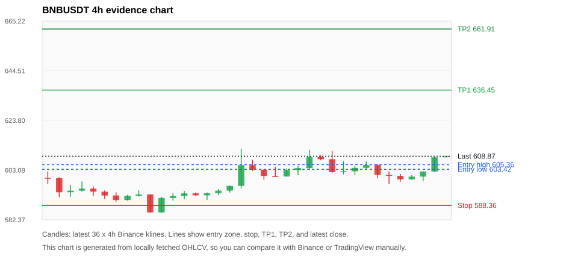
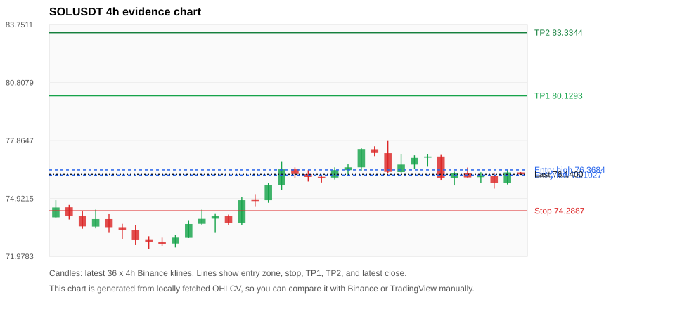
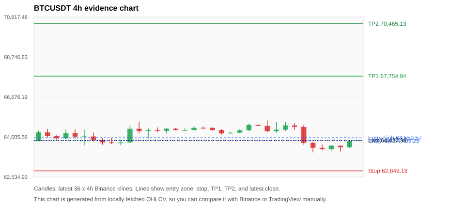
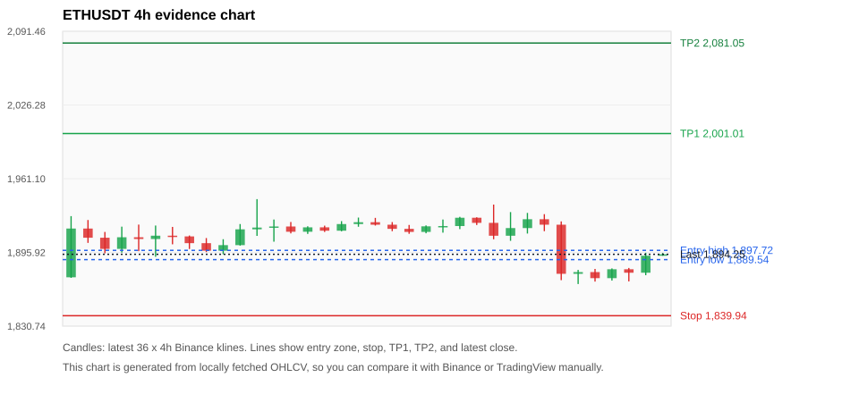
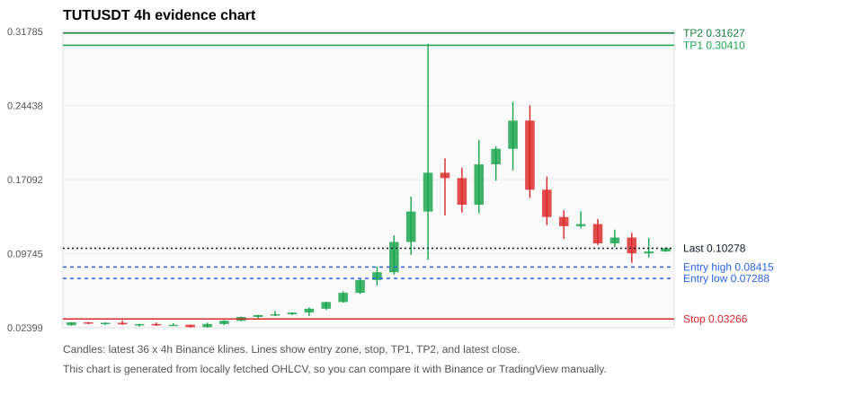

# Crypto 市场扫描报告 v1

- 报告时间：2026-08-11 20:06:13 CST
- Run ID：`20260811_120503_33d6fb66`
- Run type：`daily_full`
- 数据来源：SQLite
- 报告版本：v1
- 扫描 ID：c453a9b4f0d0
- 数据源：Binance public spot API + CoinGecko/CoinMarketCap cross-check
- 过滤条件：USDT spot; 24h quote volume >= 30,000,000; trades >= 30,000; exclude stables/leveraged tokens; analyze 1h/4h/1d klines
- 默认单笔风险：账户权益的 1.00%

## 限制说明

- 交易信号仍以 Binance 现货公开 K 线为主源；外部数据源用于一致性复核。
- 结果是研究和模拟盘计划，不是确定收益或实盘下单指令。
- 历史长度过滤：候选币至少需要 180 根 1d K 线。
- 数据质量验证池：先验证 score 排名前 min(top_n * 2, 10) 的候选，再按 action + score 补足最终名单。
- 大盘环境过滤：NEUTRAL; BTC/ETH 大盘未完全确认强势，山寨币买入候选降级为观察。 BTC 7d=0.4898250662646708; ETH 7d=1.307661452065778.
- 已启用数据交叉验证：Binance 主源 + CoinGecko 自动对照；CoinMarketCap 在配置 API Key 后自动对照。
- BNBUSDT 交叉验证状态 DATA_WARNING：At least one external provider needs manual review.
- SOLUSDT 交叉验证状态 DATA_WARNING：At least one external provider needs manual review.
- BTCUSDT 交叉验证状态 DATA_WARNING：At least one external provider needs manual review.
- ETHUSDT 交叉验证状态 DATA_WARNING：At least one external provider needs manual review.
- TUTUSDT 交叉验证状态 DATA_ERROR：At least one external provider disagrees materially or symbol mapping failed.
- ZECUSDT 交叉验证状态 DATA_WARNING：At least one external provider needs manual review.
- XRPUSDT 交叉验证状态 DATA_WARNING：At least one external provider needs manual review.

## 5 个候选交易计划

| Rank | Coin | Action | Setup | Entry Zone | Stop Loss | TP1 | TP2 / Exit Rule | R/R | Verdict |
|---:|---|---|---|---:|---:|---:|---|---:|---|
| 1 | `BNB` | `WATCH_ONLY` | 回踩支撑/4h EMA 附近 | 603.42 - 605.36 | 588.36 | 636.45 | 661.91 或跌破 4h 关键支撑 | 2.00-3.59 | 只观察 |
| 2 | `SOL` | `WATCH_ONLY` | 回踩支撑/4h EMA 附近 | 76.1027 - 76.3684 | 74.2887 | 80.1293 | 83.3344 或跌破 4h 关键支撑 | 2.00-3.65 | 只观察 |
| 3 | `BTC` | `WATCH_ONLY` | 回踩支撑/4h EMA 附近 | 64,409.29 - 64,559.57 | 62,849.18 | 67,754.94 | 70,465.13 或跌破 4h 关键支撑 | 2.00-3.66 | 只观察 |
| 4 | `ETH` | `WATCH_ONLY` | 回踩支撑/4h EMA 附近 | 1,889.54 - 1,897.72 | 1,839.94 | 2,001.01 | 2,081.05 或跌破 4h 关键支撑 | 2.00-3.49 | 只观察 |
| 5 | `TUT` | `WATCH_ONLY` | 涨幅较远，只等深回调 | 0.07288 - 0.08415 | 0.03266 | 0.30410 | 0.31627 或跌破 4h 关键支撑 | 4.92-5.19 | 只观察 |

## 数据交叉验证摘要

价格差异以 Binance 当前价为基准；成交量口径不同，Binance 是 USDT 现货成交额，CoinGecko/CoinMarketCap 通常是全市场成交量。

| Rank | Coin | Data Status | Max Price Diff | Max 24h Diff | Message |
|---:|---|---|---:|---:|---|
| 1 | `BNB` | DATA_WARNING | 0.13% | 0.30 pts | At least one external provider needs manual review. |
| 2 | `SOL` | DATA_WARNING | 0.03% | 0.43 pts | At least one external provider needs manual review. |
| 3 | `BTC` | DATA_WARNING | 0.11% | 0.28 pts | At least one external provider needs manual review. |
| 4 | `ETH` | DATA_WARNING | 0.11% | 0.28 pts | At least one external provider needs manual review. |
| 5 | `TUT` | DATA_ERROR | 2.33% | 4.65 pts | At least one external provider disagrees materially or symbol mapping failed. |

## 候选币说明

### 1. BNB `BNBUSDT`



- 入选原因：回踩支撑/4h EMA 附近；24h +0.60%，7d +3.34%，4h RSI 59.48，24h 成交额 $64.3M。
- 交易失效条件：跌破 588.3602 或 4h 收盘重新失守关键支撑。
- 主要风险：主要风险是大盘同步回撤；数据交叉验证需要人工复核；数据交叉验证状态为 DATA_WARNING，买入候选降级为观察。
- 数据交叉验证：DATA_WARNING；At least one external provider needs manual review.

#### 可点击人工验证

- [Binance 交易页](https://www.binance.com/en/trade/BNB_USDT)
- [TradingView 图表](https://www.tradingview.com/chart/?symbol=BINANCE%3ABNBUSDT)
- [CoinGecko 搜索](https://www.coingecko.com/en/search?query=BNB)
- [CoinMarketCap 搜索](https://coinmarketcap.com/search/?q=BNB)

#### 多数据源对照

| Source | Status | Asset ID | Price | 24h Change | 24h Volume | Price Diff | 24h Diff | Updated | Message |
|---|---|---|---:|---:|---:|---:|---:|---|---|
| Binance | DATA_OK | BNBUSDT | 608.87 | +0.60% | $64.3M | 0.00% | 0.00 pts | 2026-08-11T12:05:45+00:00 | Primary market data source used by scanner. |
| CoinGecko | DATA_OK | binancecoin | 608.12 | +0.30% | $618.3M | 0.12% | 0.30 pts | 2026-08-11T12:03:20.000Z | External source agrees with Binance within thresholds. |
| CoinMarketCap | DATA_WARNING | 1839 | 608.07 | +0.52% | $1.14B | 0.13% | 0.08 pts | 2026-08-11T12:05:03.000Z | CoinMarketCap symbol mapping has 4 matches; selected lowest cmc_rank |

#### 指标证据

| 指标 | 数值 | 人工核对用途 |
|---|---:|---|
| 当前价 | 608.87 | 与 Binance/TradingView 当前价格对照 |
| 24h 涨跌 | +0.60% | 与交易所 24h 涨跌对照 |
| 7d 涨跌 | +3.34% | 判断短线趋势是否延续 |
| 4h EMA20 | 602.21 | 判断短期趋势支撑 |
| 4h EMA50 | 596.88 | 判断中期趋势支撑 |
| 1d EMA20 | 589.31 | 判断日线趋势 |
| 1d EMA50 | 586.91 | 判断日线趋势 |
| 4h RSI14 | 59.48 | 判断是否过热/过弱 |
| 4h ATR14 | 4.5036 | 推导止损和入场缓冲 |
| 最近 18 根 4h 最低点 | 597.32 | 支撑/止损参考 |
| 最近 36 根 4h 最高点 | 612.00 | TP/压力参考 |
| 支撑位 | 602.21 | 入场区间推导基础 |

#### 交易计划推导

- 支撑位 = 最近低点、4h EMA20、4h EMA50、1d EMA20 中不高于当前价的最高有效支撑 = `602.21`。
- 入场区间 = 支撑位附近 + ATR 缓冲 = `603.42 - 605.36`。
- 止损 = min(最近 18 根 4h 最低点 * 0.985, 入场中位价 - 1.15 * ATR14) = `588.36`。
- TP1 = max(最近 36 根 4h 最高点 * 0.995, 入场中位价 + 2R) = `636.45`。
- TP2 = max(入场中位价 + 3R, TP1 * 1.04) = `661.91`。

#### 最近 10 根 4h K线

| UTC 开盘时间 | Open | High | Low | Close | Quote Volume | Trades |
|---|---:|---:|---:|---:|---:|---:|
| 2026-08-10T00:00+00:00 | 602.22 | 606.84 | 601.33 | 602.59 | $9.3M | 118891 |
| 2026-08-10T04:00+00:00 | 602.59 | 604.90 | 601.00 | 604.04 | $6.7M | 63103 |
| 2026-08-10T08:00+00:00 | 604.04 | 606.66 | 603.59 | 605.18 | $8.3M | 85861 |
| 2026-08-10T12:00+00:00 | 605.19 | 605.63 | 599.64 | 601.11 | $16.9M | 142105 |
| 2026-08-10T16:00+00:00 | 601.11 | 602.50 | 597.32 | 600.69 | $8.5M | 75200 |
| 2026-08-10T20:00+00:00 | 600.68 | 601.54 | 598.29 | 599.23 | $3.4M | 40134 |
| 2026-08-11T00:00+00:00 | 599.24 | 601.00 | 599.05 | 600.38 | $5.5M | 50987 |
| 2026-08-11T04:00+00:00 | 600.38 | 602.50 | 598.46 | 602.50 | $11.4M | 73386 |
| 2026-08-11T08:00+00:00 | 602.50 | 608.54 | 602.33 | 608.43 | $18.5M | 135479 |
| 2026-08-11T12:00+00:00 | 608.44 | 608.87 | 608.43 | 608.87 | $226,260 | 2436 |

### 2. SOL `SOLUSDT`



- 入选原因：回踩支撑/4h EMA 附近；24h -1.13%，7d +3.41%，4h RSI 48.06，24h 成交额 $98.3M。
- 交易失效条件：跌破 74.2887 或 4h 收盘重新失守关键支撑。
- 主要风险：24h 动量未确认；数据交叉验证需要人工复核。
- 数据交叉验证：DATA_WARNING；At least one external provider needs manual review.

#### 可点击人工验证

- [Binance 交易页](https://www.binance.com/en/trade/SOL_USDT)
- [TradingView 图表](https://www.tradingview.com/chart/?symbol=BINANCE%3ASOLUSDT)
- [CoinGecko 搜索](https://www.coingecko.com/en/search?query=SOL)
- [CoinMarketCap 搜索](https://coinmarketcap.com/search/?q=SOL)

#### 多数据源对照

| Source | Status | Asset ID | Price | 24h Change | 24h Volume | Price Diff | 24h Diff | Updated | Message |
|---|---|---|---:|---:|---:|---:|---:|---|---|
| Binance | DATA_OK | SOLUSDT | 76.1400 | -1.13% | $98.3M | 0.00% | 0.00 pts | 2026-08-11T12:05:45+00:00 | Primary market data source used by scanner. |
| CoinGecko | DATA_OK | solana | 76.1200 | -0.70% | $1.38B | 0.03% | 0.43 pts | 2026-08-11T12:03:20.000Z | External source agrees with Binance within thresholds. |
| CoinMarketCap | DATA_WARNING | 5426 | 76.1558 | -1.05% | $1.46B | 0.02% | 0.08 pts | 2026-08-11T12:05:03.000Z | CoinMarketCap symbol mapping has 8 matches; selected lowest cmc_rank |

#### 指标证据

| 指标 | 数值 | 人工核对用途 |
|---|---:|---|
| 当前价 | 76.1400 | 与 Binance/TradingView 当前价格对照 |
| 24h 涨跌 | -1.13% | 与交易所 24h 涨跌对照 |
| 7d 涨跌 | +3.41% | 判断短线趋势是否延续 |
| 4h EMA20 | 75.9508 | 判断短期趋势支撑 |
| 4h EMA50 | 75.1794 | 判断中期趋势支撑 |
| 1d EMA20 | 74.9241 | 判断日线趋势 |
| 1d EMA50 | 75.4714 | 判断日线趋势 |
| 4h RSI14 | 48.06 | 判断是否过热/过弱 |
| 4h ATR14 | 0.77429 | 推导止损和入场缓冲 |
| 最近 18 根 4h 最低点 | 75.4200 | 支撑/止损参考 |
| 最近 36 根 4h 最高点 | 77.8400 | TP/压力参考 |
| 支撑位 | 75.9508 | 入场区间推导基础 |

#### 交易计划推导

- 支撑位 = 最近低点、4h EMA20、4h EMA50、1d EMA20 中不高于当前价的最高有效支撑 = `75.9508`。
- 入场区间 = 支撑位附近 + ATR 缓冲 = `76.1027 - 76.3684`。
- 止损 = min(最近 18 根 4h 最低点 * 0.985, 入场中位价 - 1.15 * ATR14) = `74.2887`。
- TP1 = max(最近 36 根 4h 最高点 * 0.995, 入场中位价 + 2R) = `80.1293`。
- TP2 = max(入场中位价 + 3R, TP1 * 1.04) = `83.3344`。

#### 最近 10 根 4h K线

| UTC 开盘时间 | Open | High | Low | Close | Quote Volume | Trades |
|---|---:|---:|---:|---:|---:|---:|
| 2026-08-10T00:00+00:00 | 76.2600 | 77.1700 | 76.2100 | 76.6400 | $13.9M | 85535 |
| 2026-08-10T04:00+00:00 | 76.6400 | 77.1100 | 76.4300 | 76.9800 | $9.3M | 41438 |
| 2026-08-10T08:00+00:00 | 76.9900 | 77.1600 | 76.5300 | 77.0500 | $16.4M | 57059 |
| 2026-08-10T12:00+00:00 | 77.0500 | 77.1300 | 75.8300 | 75.9600 | $29.3M | 104323 |
| 2026-08-10T16:00+00:00 | 75.9600 | 76.2800 | 75.5800 | 76.1900 | $18.4M | 61699 |
| 2026-08-10T20:00+00:00 | 76.1900 | 76.4900 | 75.9800 | 75.9900 | $10.4M | 44904 |
| 2026-08-11T00:00+00:00 | 76.0000 | 76.2500 | 75.7100 | 76.0800 | $8.3M | 34946 |
| 2026-08-11T04:00+00:00 | 76.0800 | 76.2300 | 75.4200 | 75.6900 | $13.7M | 52015 |
| 2026-08-11T08:00+00:00 | 75.7000 | 76.3700 | 75.6300 | 76.2400 | $19.1M | 57885 |
| 2026-08-11T12:00+00:00 | 76.2400 | 76.2600 | 76.1400 | 76.1400 | $472,559 | 1692 |

### 3. BTC `BTCUSDT`



- 入选原因：回踩支撑/4h EMA 附近；24h -1.18%，7d +1.17%，4h RSI 43.13，24h 成交额 $900.5M。
- 交易失效条件：跌破 62849.176 或 4h 收盘重新失守关键支撑。
- 主要风险：24h 动量未确认；数据交叉验证需要人工复核。
- 数据交叉验证：DATA_WARNING；At least one external provider needs manual review.

#### 可点击人工验证

- [Binance 交易页](https://www.binance.com/en/trade/BTC_USDT)
- [TradingView 图表](https://www.tradingview.com/chart/?symbol=BINANCE%3ABTCUSDT)
- [CoinGecko 搜索](https://www.coingecko.com/en/search?query=BTC)
- [CoinMarketCap 搜索](https://coinmarketcap.com/search/?q=BTC)

#### 多数据源对照

| Source | Status | Asset ID | Price | 24h Change | 24h Volume | Price Diff | 24h Diff | Updated | Message |
|---|---|---|---:|---:|---:|---:|---:|---|---|
| Binance | DATA_OK | BTCUSDT | 64,427.99 | -1.18% | $900.5M | 0.00% | 0.00 pts | 2026-08-11T12:05:45+00:00 | Primary market data source used by scanner. |
| CoinGecko | DATA_OK | bitcoin | 64,376.00 | -0.90% | $21.19B | 0.08% | 0.28 pts | 2026-08-11T12:03:20.000Z | External source agrees with Binance within thresholds. |
| CoinMarketCap | DATA_WARNING | 1 | 64,357.32 | -1.19% | $22.19B | 0.11% | 0.02 pts | 2026-08-11T12:05:03.000Z | CoinMarketCap symbol mapping has 13 matches; selected lowest cmc_rank |

#### 指标证据

| 指标 | 数值 | 人工核对用途 |
|---|---:|---|
| 当前价 | 64,427.99 | 与 Binance/TradingView 当前价格对照 |
| 24h 涨跌 | -1.18% | 与交易所 24h 涨跌对照 |
| 7d 涨跌 | +1.17% | 判断短线趋势是否延续 |
| 4h EMA20 | 64,560.27 | 判断短期趋势支撑 |
| 4h EMA50 | 64,483.33 | 判断中期趋势支撑 |
| 1d EMA20 | 64,280.73 | 判断日线趋势 |
| 1d EMA50 | 64,634.50 | 判断日线趋势 |
| 4h RSI14 | 43.13 | 判断是否过热/过弱 |
| 4h ATR14 | 398.35 | 推导止损和入场缓冲 |
| 最近 18 根 4h 最低点 | 63,806.27 | 支撑/止损参考 |
| 最近 36 根 4h 最高点 | 65,474.46 | TP/压力参考 |
| 支撑位 | 64,280.73 | 入场区间推导基础 |

#### 交易计划推导

- 支撑位 = 最近低点、4h EMA20、4h EMA50、1d EMA20 中不高于当前价的最高有效支撑 = `64,280.73`。
- 入场区间 = 支撑位附近 + ATR 缓冲 = `64,409.29 - 64,559.57`。
- 止损 = min(最近 18 根 4h 最低点 * 0.985, 入场中位价 - 1.15 * ATR14) = `62,849.18`。
- TP1 = max(最近 36 根 4h 最高点 * 0.995, 入场中位价 + 2R) = `67,754.94`。
- TP2 = max(入场中位价 + 3R, TP1 * 1.04) = `70,465.13`。

#### 最近 10 根 4h K线

| UTC 开盘时间 | Open | High | Low | Close | Quote Volume | Trades |
|---|---:|---:|---:|---:|---:|---:|
| 2026-08-10T00:00+00:00 | 64,901.59 | 65,391.14 | 64,826.78 | 64,982.01 | $112.9M | 339541 |
| 2026-08-10T04:00+00:00 | 64,982.00 | 65,379.13 | 64,924.00 | 65,202.73 | $105.7M | 211476 |
| 2026-08-10T08:00+00:00 | 65,202.72 | 65,328.73 | 64,958.87 | 65,125.98 | $84.3M | 219964 |
| 2026-08-10T12:00+00:00 | 65,125.99 | 65,237.80 | 64,203.15 | 64,299.99 | $235.4M | 597064 |
| 2026-08-10T16:00+00:00 | 64,299.99 | 64,354.00 | 63,806.27 | 64,045.70 | $273.6M | 503118 |
| 2026-08-10T20:00+00:00 | 64,045.70 | 64,215.21 | 63,920.69 | 63,970.01 | $68.6M | 183184 |
| 2026-08-11T00:00+00:00 | 63,970.01 | 64,176.00 | 63,895.64 | 64,155.01 | $117.4M | 177239 |
| 2026-08-11T04:00+00:00 | 64,155.00 | 64,159.65 | 63,852.00 | 64,065.99 | $105.0M | 159630 |
| 2026-08-11T08:00+00:00 | 64,066.00 | 64,400.00 | 64,044.72 | 64,389.57 | $100.8M | 168286 |
| 2026-08-11T12:00+00:00 | 64,389.58 | 64,436.00 | 64,380.00 | 64,427.99 | $3.8M | 10154 |

### 4. ETH `ETHUSDT`



- 入选原因：回踩支撑/4h EMA 附近；24h -1.48%，7d +1.73%，4h RSI 39.74，24h 成交额 $401.3M。
- 交易失效条件：跌破 1839.9406 或 4h 收盘重新失守关键支撑。
- 主要风险：24h 动量未确认；数据交叉验证需要人工复核。
- 数据交叉验证：DATA_WARNING；At least one external provider needs manual review.

#### 可点击人工验证

- [Binance 交易页](https://www.binance.com/en/trade/ETH_USDT)
- [TradingView 图表](https://www.tradingview.com/chart/?symbol=BINANCE%3AETHUSDT)
- [CoinGecko 搜索](https://www.coingecko.com/en/search?query=ETH)
- [CoinMarketCap 搜索](https://coinmarketcap.com/search/?q=ETH)

#### 多数据源对照

| Source | Status | Asset ID | Price | 24h Change | 24h Volume | Price Diff | 24h Diff | Updated | Message |
|---|---|---|---:|---:|---:|---:|---:|---|---|
| Binance | DATA_OK | ETHUSDT | 1,894.25 | -1.48% | $401.3M | 0.00% | 0.00 pts | 2026-08-11T12:05:45+00:00 | Primary market data source used by scanner. |
| CoinGecko | DATA_OK | ethereum | 1,892.62 | -1.20% | $7.44B | 0.09% | 0.28 pts | 2026-08-11T12:03:20.000Z | External source agrees with Binance within thresholds. |
| CoinMarketCap | DATA_WARNING | 1027 | 1,892.26 | -1.44% | $8.50B | 0.11% | 0.04 pts | 2026-08-11T12:05:03.000Z | CoinMarketCap symbol mapping has 6 matches; selected lowest cmc_rank |

#### 指标证据

| 指标 | 数值 | 人工核对用途 |
|---|---:|---|
| 当前价 | 1,894.25 | 与 Binance/TradingView 当前价格对照 |
| 24h 涨跌 | -1.48% | 与交易所 24h 涨跌对照 |
| 7d 涨跌 | +1.73% | 判断短线趋势是否延续 |
| 4h EMA20 | 1,899.21 | 判断短期趋势支撑 |
| 4h EMA50 | 1,898.51 | 判断中期趋势支撑 |
| 1d EMA20 | 1,885.76 | 判断日线趋势 |
| 1d EMA50 | 1,863.29 | 判断日线趋势 |
| 4h RSI14 | 39.74 | 判断是否过热/过弱 |
| 4h ATR14 | 17.0871 | 推导止损和入场缓冲 |
| 最近 18 根 4h 最低点 | 1,867.96 | 支撑/止损参考 |
| 最近 36 根 4h 最高点 | 1,943.02 | TP/压力参考 |
| 支撑位 | 1,885.76 | 入场区间推导基础 |

#### 交易计划推导

- 支撑位 = 最近低点、4h EMA20、4h EMA50、1d EMA20 中不高于当前价的最高有效支撑 = `1,885.76`。
- 入场区间 = 支撑位附近 + ATR 缓冲 = `1,889.54 - 1,897.72`。
- 止损 = min(最近 18 根 4h 最低点 * 0.985, 入场中位价 - 1.15 * ATR14) = `1,839.94`。
- TP1 = max(最近 36 根 4h 最高点 * 0.995, 入场中位价 + 2R) = `2,001.01`。
- TP2 = max(入场中位价 + 3R, TP1 * 1.04) = `2,081.05`。

#### 最近 10 根 4h K线

| UTC 开盘时间 | Open | High | Low | Close | Quote Volume | Trades |
|---|---:|---:|---:|---:|---:|---:|
| 2026-08-10T00:00+00:00 | 1,910.65 | 1,931.57 | 1,906.17 | 1,917.44 | $60.5M | 395106 |
| 2026-08-10T04:00+00:00 | 1,917.44 | 1,930.84 | 1,912.60 | 1,925.26 | $50.0M | 243271 |
| 2026-08-10T08:00+00:00 | 1,925.26 | 1,929.74 | 1,914.68 | 1,920.42 | $39.5M | 187296 |
| 2026-08-10T12:00+00:00 | 1,920.42 | 1,923.34 | 1,871.37 | 1,877.00 | $137.8M | 521786 |
| 2026-08-10T16:00+00:00 | 1,876.99 | 1,880.47 | 1,867.96 | 1,878.51 | $77.8M | 328146 |
| 2026-08-10T20:00+00:00 | 1,878.52 | 1,881.31 | 1,870.12 | 1,873.16 | $32.7M | 190982 |
| 2026-08-11T00:00+00:00 | 1,873.16 | 1,881.78 | 1,871.00 | 1,881.03 | $36.0M | 135822 |
| 2026-08-11T04:00+00:00 | 1,881.02 | 1,882.18 | 1,870.29 | 1,877.95 | $53.6M | 143631 |
| 2026-08-11T08:00+00:00 | 1,877.95 | 1,895.60 | 1,875.75 | 1,892.97 | $62.7M | 201628 |
| 2026-08-11T12:00+00:00 | 1,892.96 | 1,895.37 | 1,892.96 | 1,894.25 | $2.6M | 12799 |

### 5. TUT `TUTUSDT`



- 入选原因：涨幅较远，只等深回调；24h -25.35%，7d +334.40%，4h RSI 36.00，24h 成交额 $54.7M。
- 交易失效条件：跌破 0.032659838 或 4h 收盘重新失守关键支撑。
- 主要风险：距离支撑偏远，不能追市价；24h 振幅较大，回撤风险高；24h 动量未确认；数据交叉验证出现重大差异或映射失败，先不要直接执行计划。
- 数据交叉验证：DATA_ERROR；At least one external provider disagrees materially or symbol mapping failed.

#### 可点击人工验证

- [Binance 交易页](https://www.binance.com/en/trade/TUT_USDT)
- [TradingView 图表](https://www.tradingview.com/chart/?symbol=BINANCE%3ATUTUSDT)
- [CoinGecko 搜索](https://www.coingecko.com/en/search?query=TUT)
- [CoinMarketCap 搜索](https://coinmarketcap.com/search/?q=TUT)

#### 多数据源对照

| Source | Status | Asset ID | Price | 24h Change | 24h Volume | Price Diff | 24h Diff | Updated | Message |
|---|---|---|---:|---:|---:|---:|---:|---|---|
| Binance | DATA_OK | TUTUSDT | 0.10278 | -25.35% | $54.7M | 0.00% | 0.00 pts | 2026-08-11T12:05:45+00:00 | Primary market data source used by scanner. |
| CoinGecko | DATA_WARNING | tutorial | 0.10277 | -30.00% | $96.1M | 0.01% | 4.65 pts | 2026-08-11T12:03:20.000Z | 24h change diff 4.65 points exceeds warning threshold |
| CoinMarketCap | DATA_ERROR | 35892 | 0.10038 | -25.00% | $178.5M | 2.33% | 0.35 pts | 2026-08-11T12:05:03.000Z | price diff 2.33% exceeds error threshold; CoinMarketCap symbol mapping has 3 matches; selected lowest cmc_rank |

#### 指标证据

| 指标 | 数值 | 人工核对用途 |
|---|---:|---|
| 当前价 | 0.10278 | 与 Binance/TradingView 当前价格对照 |
| 24h 涨跌 | -25.35% | 与交易所 24h 涨跌对照 |
| 7d 涨跌 | +334.40% | 判断短线趋势是否延续 |
| 4h EMA20 | 0.11529 | 判断短期趋势支撑 |
| 4h EMA50 | 0.08398 | 判断中期趋势支撑 |
| 1d EMA20 | 0.05573 | 判断日线趋势 |
| 1d EMA50 | 0.03247 | 判断日线趋势 |
| 4h RSI14 | 36.00 | 判断是否过热/过弱 |
| 4h ATR14 | 0.03987 | 推导止损和入场缓冲 |
| 最近 18 根 4h 最低点 | 0.06592 | 支撑/止损参考 |
| 最近 36 根 4h 最高点 | 0.30563 | TP/压力参考 |
| 支撑位 | 0.08398 | 入场区间推导基础 |

#### 交易计划推导

- 支撑位 = 最近低点、4h EMA20、4h EMA50、1d EMA20 中不高于当前价的最高有效支撑 = `0.08398`。
- 入场区间 = 支撑位附近 + ATR 缓冲 = `0.07288 - 0.08415`。
- 止损 = min(最近 18 根 4h 最低点 * 0.985, 入场中位价 - 1.15 * ATR14) = `0.03266`。
- TP1 = max(最近 36 根 4h 最高点 * 0.995, 入场中位价 + 2R) = `0.30410`。
- TP2 = max(入场中位价 + 3R, TP1 * 1.04) = `0.31627`。

#### 最近 10 根 4h K线

| UTC 开盘时间 | Open | High | Low | Close | Quote Volume | Trades |
|---|---:|---:|---:|---:|---:|---:|
| 2026-08-10T00:00+00:00 | 0.20145 | 0.24785 | 0.18001 | 0.22939 | $32.2M | 1508266 |
| 2026-08-10T04:00+00:00 | 0.22942 | 0.24440 | 0.15256 | 0.16086 | $23.2M | 1243384 |
| 2026-08-10T08:00+00:00 | 0.16085 | 0.17382 | 0.12563 | 0.13382 | $18.3M | 899473 |
| 2026-08-10T12:00+00:00 | 0.13382 | 0.14059 | 0.11199 | 0.12466 | $12.3M | 638600 |
| 2026-08-10T16:00+00:00 | 0.12466 | 0.13950 | 0.12254 | 0.12672 | $10.6M | 488291 |
| 2026-08-10T20:00+00:00 | 0.12674 | 0.13180 | 0.10591 | 0.10766 | $5.0M | 269462 |
| 2026-08-11T00:00+00:00 | 0.10765 | 0.12121 | 0.10401 | 0.11343 | $8.3M | 488849 |
| 2026-08-11T04:00+00:00 | 0.11343 | 0.11811 | 0.08830 | 0.09776 | $9.4M | 466523 |
| 2026-08-11T08:00+00:00 | 0.09777 | 0.11303 | 0.09360 | 0.09957 | $9.1M | 357230 |
| 2026-08-11T12:00+00:00 | 0.09956 | 0.10364 | 0.09942 | 0.10280 | $226,252 | 10049 |

## 组合风控

- 不要 5 个候选全部满仓买入。
- 同时持仓总风险建议控制在账户权益的 3% - 5% 以内。
- 如果 BTC/ETH 同时破位，暂停山寨币多头计划或降低仓位。
- 第一版报告用于模拟盘和人工复核，不自动下单。

## 原始数据

```json
[
  {
    "rank": 1,
    "symbol": "BNBUSDT",
    "base_asset": "BNB",
    "price": 608.87,
    "score": 62.463835180876856,
    "setup": "回踩支撑/4h EMA 附近",
    "verdict": "只观察",
    "entry_low": 603.4166106585282,
    "entry_high": 605.3646862859563,
    "stop_loss": 588.3602000000001,
    "take_profit_1": 636.4515454167265,
    "take_profit_2": 661.9096072333956,
    "risk_reward_1": 2.0,
    "risk_reward_2": 3.5881066497142324,
    "pct_24h": 0.601,
    "pct_3d": 1.7870874987462093,
    "pct_7d": 3.3419328558335515,
    "quote_volume_24h": 64280688.05447,
    "trades_24h": 516005,
    "high_low_range_24h": 1.931962767026052,
    "rsi_1h": 86.60105980317947,
    "rsi_4h": 59.477340390340814,
    "ema20_4h": 602.2121862859562,
    "ema50_4h": 596.8807650571047,
    "ema20_1d": 589.3093793128579,
    "ema50_1d": 586.9103503992342,
    "atr_4h": 4.5035714285714175,
    "macd_hist_4h": 0.10081683002682595,
    "volume_ratio_24h": 1.0893972843176674,
    "support_level": 602.2121862859562,
    "recent_low_4h_18": 597.32,
    "recent_high_4h_36": 612.0,
    "distance_to_support_pct": 1.1055594465971819,
    "binance_trade_url": "https://www.binance.com/en/trade/BNB_USDT",
    "tradingview_url": "https://www.tradingview.com/chart/?symbol=BINANCE%3ABNBUSDT",
    "coingecko_search_url": "https://www.coingecko.com/en/search?query=BNB",
    "coinmarketcap_search_url": "https://coinmarketcap.com/search/?q=BNB",
    "invalidation": "跌破 588.3602 或 4h 收盘重新失守关键支撑",
    "recent_4h_klines": [
      {
        "open_time_utc": "2026-08-05T16:00+00:00",
        "open": 599.88,
        "high": 602.52,
        "low": 597.19,
        "close": 599.73,
        "quote_volume": 9830793.35545,
        "trades": 111994
      },
      {
        "open_time_utc": "2026-08-05T20:00+00:00",
        "open": 599.73,
        "high": 600.08,
        "low": 591.79,
        "close": 593.85,
        "quote_volume": 10296017.41537,
        "trades": 101476
      },
      {
        "open_time_utc": "2026-08-06T00:00+00:00",
        "open": 593.86,
        "high": 596.91,
        "low": 592.0,
        "close": 594.52,
        "quote_volume": 9593019.99816,
        "trades": 95310
      },
      {
        "open_time_utc": "2026-08-06T04:00+00:00",
        "open": 594.53,
        "high": 598.32,
        "low": 594.07,
        "close": 595.35,
        "quote_volume": 7336285.86361,
        "trades": 73399
      },
      {
        "open_time_utc": "2026-08-06T08:00+00:00",
        "open": 595.36,
        "high": 596.27,
        "low": 592.4,
        "close": 594.1,
        "quote_volume": 8156848.49311,
        "trades": 82702
      },
      {
        "open_time_utc": "2026-08-06T12:00+00:00",
        "open": 594.1,
        "high": 594.6,
        "low": 591.14,
        "close": 592.5,
        "quote_volume": 10187710.08117,
        "trades": 117364
      },
      {
        "open_time_utc": "2026-08-06T16:00+00:00",
        "open": 592.51,
        "high": 593.83,
        "low": 589.95,
        "close": 590.6,
        "quote_volume": 7218797.0205,
        "trades": 75292
      },
      {
        "open_time_utc": "2026-08-06T20:00+00:00",
        "open": 590.6,
        "high": 592.74,
        "low": 590.37,
        "close": 592.39,
        "quote_volume": 2425184.90607,
        "trades": 38147
      },
      {
        "open_time_utc": "2026-08-07T00:00+00:00",
        "open": 592.4,
        "high": 594.68,
        "low": 592.06,
        "close": 592.93,
        "quote_volume": 6407678.20776,
        "trades": 69140
      },
      {
        "open_time_utc": "2026-08-07T04:00+00:00",
        "open": 592.94,
        "high": 592.95,
        "low": 585.3,
        "close": 585.46,
        "quote_volume": 17690687.35255,
        "trades": 128757
      },
      {
        "open_time_utc": "2026-08-07T08:00+00:00",
        "open": 585.46,
        "high": 591.9,
        "low": 585.32,
        "close": 591.45,
        "quote_volume": 10268000.49709,
        "trades": 97947
      },
      {
        "open_time_utc": "2026-08-07T12:00+00:00",
        "open": 591.45,
        "high": 593.45,
        "low": 590.4,
        "close": 592.31,
        "quote_volume": 14328627.45081,
        "trades": 148610
      },
      {
        "open_time_utc": "2026-08-07T16:00+00:00",
        "open": 592.32,
        "high": 594.4,
        "low": 591.05,
        "close": 593.38,
        "quote_volume": 4600794.34364,
        "trades": 60957
      },
      {
        "open_time_utc": "2026-08-07T20:00+00:00",
        "open": 593.38,
        "high": 593.73,
        "low": 592.22,
        "close": 592.57,
        "quote_volume": 1921222.04839,
        "trades": 24558
      },
      {
        "open_time_utc": "2026-08-08T00:00+00:00",
        "open": 592.57,
        "high": 593.78,
        "low": 590.65,
        "close": 593.43,
        "quote_volume": 6678727.72998,
        "trades": 38132
      },
      {
        "open_time_utc": "2026-08-08T04:00+00:00",
        "open": 593.42,
        "high": 595.15,
        "low": 592.67,
        "close": 594.52,
        "quote_volume": 6126173.29403,
        "trades": 44138
      },
      {
        "open_time_utc": "2026-08-08T08:00+00:00",
        "open": 594.53,
        "high": 596.61,
        "low": 593.74,
        "close": 596.51,
        "quote_volume": 6323849.50779,
        "trades": 62432
      },
      {
        "open_time_utc": "2026-08-08T12:00+00:00",
        "open": 596.51,
        "high": 612.0,
        "low": 595.42,
        "close": 605.14,
        "quote_volume": 32276029.60998,
        "trades": 227294
      },
      {
        "open_time_utc": "2026-08-08T16:00+00:00",
        "open": 605.15,
        "high": 607.42,
        "low": 602.75,
        "close": 603.29,
        "quote_volume": 6130563.61169,
        "trades": 74532
      },
      {
        "open_time_utc": "2026-08-08T20:00+00:00",
        "open": 603.28,
        "high": 603.29,
        "low": 599.04,
        "close": 600.66,
        "quote_volume": 4943728.22127,
        "trades": 57937
      },
      {
        "open_time_utc": "2026-08-09T00:00+00:00",
        "open": 600.66,
        "high": 604.41,
        "low": 600.21,
        "close": 600.44,
        "quote_volume": 6575318.36993,
        "trades": 64927
      },
      {
        "open_time_utc": "2026-08-09T04:00+00:00",
        "open": 600.44,
        "high": 603.76,
        "low": 600.35,
        "close": 603.14,
        "quote_volume": 8667321.90496,
        "trades": 69460
      },
      {
        "open_time_utc": "2026-08-09T08:00+00:00",
        "open": 603.14,
        "high": 604.71,
        "low": 601.0,
        "close": 603.92,
        "quote_volume": 6554989.80579,
        "trades": 66844
      },
      {
        "open_time_utc": "2026-08-09T12:00+00:00",
        "open": 603.92,
        "high": 611.55,
        "low": 603.14,
        "close": 608.53,
        "quote_volume": 14845019.50062,
        "trades": 104033
      },
      {
        "open_time_utc": "2026-08-09T16:00+00:00",
        "open": 608.54,
        "high": 609.3,
        "low": 607.17,
        "close": 607.63,
        "quote_volume": 6310151.49059,
        "trades": 50043
      },
      {
        "open_time_utc": "2026-08-09T20:00+00:00",
        "open": 607.63,
        "high": 611.12,
        "low": 601.86,
        "close": 602.23,
        "quote_volume": 8158215.19272,
        "trades": 84838
      },
      {
        "open_time_utc": "2026-08-10T00:00+00:00",
        "open": 602.22,
        "high": 606.84,
        "low": 601.33,
        "close": 602.59,
        "quote_volume": 9301426.32439,
        "trades": 118891
      },
      {
        "open_time_utc": "2026-08-10T04:00+00:00",
        "open": 602.59,
        "high": 604.9,
        "low": 601.0,
        "close": 604.04,
        "quote_volume": 6741792.61662,
        "trades": 63103
      },
      {
        "open_time_utc": "2026-08-10T08:00+00:00",
        "open": 604.04,
        "high": 606.66,
        "low": 603.59,
        "close": 605.18,
        "quote_volume": 8327536.30446,
        "trades": 85861
      },
      {
        "open_time_utc": "2026-08-10T12:00+00:00",
        "open": 605.19,
        "high": 605.63,
        "low": 599.64,
        "close": 601.11,
        "quote_volume": 16864963.89663,
        "trades": 142105
      },
      {
        "open_time_utc": "2026-08-10T16:00+00:00",
        "open": 601.11,
        "high": 602.5,
        "low": 597.32,
        "close": 600.69,
        "quote_volume": 8475402.17493,
        "trades": 75200
      },
      {
        "open_time_utc": "2026-08-10T20:00+00:00",
        "open": 600.68,
        "high": 601.54,
        "low": 598.29,
        "close": 599.23,
        "quote_volume": 3440213.35747,
        "trades": 40134
      },
      {
        "open_time_utc": "2026-08-11T00:00+00:00",
        "open": 599.24,
        "high": 601.0,
        "low": 599.05,
        "close": 600.38,
        "quote_volume": 5536013.00905,
        "trades": 50987
      },
      {
        "open_time_utc": "2026-08-11T04:00+00:00",
        "open": 600.38,
        "high": 602.5,
        "low": 598.46,
        "close": 602.5,
        "quote_volume": 11445268.79686,
        "trades": 73386
      },
      {
        "open_time_utc": "2026-08-11T08:00+00:00",
        "open": 602.5,
        "high": 608.54,
        "low": 602.33,
        "close": 608.43,
        "quote_volume": 18517758.1268,
        "trades": 135479
      },
      {
        "open_time_utc": "2026-08-11T12:00+00:00",
        "open": 608.44,
        "high": 608.87,
        "low": 608.43,
        "close": 608.87,
        "quote_volume": 226260.47363,
        "trades": 2436
      }
    ],
    "risks": [
      "主要风险是大盘同步回撤",
      "数据交叉验证需要人工复核",
      "数据交叉验证状态为 DATA_WARNING，买入候选降级为观察"
    ],
    "data_quality_status": "DATA_WARNING",
    "data_quality_message": "At least one external provider needs manual review.",
    "data_checks": [
      {
        "provider": "Binance",
        "status": "DATA_OK",
        "provider_asset_id": "BNBUSDT",
        "provider_symbol": "BNBUSDT",
        "price_usd": 608.87,
        "pct_24h": 0.601,
        "volume_24h": 64280688.05447,
        "last_updated": null,
        "fetched_at_utc": "2026-08-11T12:05:45+00:00",
        "price_diff_pct": 0.0,
        "pct_24h_diff": 0.0,
        "volume_note": "Binance USDT spot 24h quoteVolume.",
        "message": "Primary market data source used by scanner."
      },
      {
        "provider": "CoinGecko",
        "status": "DATA_OK",
        "provider_asset_id": "binancecoin",
        "provider_symbol": "BNB",
        "price_usd": 608.12,
        "pct_24h": 0.3,
        "volume_24h": 618304906.0,
        "last_updated": "2026-08-11T12:03:20.000Z",
        "fetched_at_utc": "2026-08-11T12:05:45+00:00",
        "price_diff_pct": 0.12317900372821784,
        "pct_24h_diff": 0.301,
        "volume_note": "CoinGecko total market volume; not the same venue scope as Binance quoteVolume.",
        "message": "External source agrees with Binance within thresholds."
      },
      {
        "provider": "CoinMarketCap",
        "status": "DATA_WARNING",
        "provider_asset_id": "1839",
        "provider_symbol": "BNB",
        "price_usd": 608.0739030621561,
        "pct_24h": 0.5245171,
        "volume_24h": 1139833946.448286,
        "last_updated": "2026-08-11T12:05:03.000Z",
        "fetched_at_utc": "2026-08-11T12:05:45+00:00",
        "price_diff_pct": 0.13074990356626426,
        "pct_24h_diff": 0.07648290000000002,
        "volume_note": "CoinMarketCap total market volume; not the same venue scope as Binance quoteVolume.",
        "message": "CoinMarketCap symbol mapping has 4 matches; selected lowest cmc_rank"
      }
    ],
    "action": "WATCH_ONLY"
  },
  {
    "rank": 2,
    "symbol": "SOLUSDT",
    "base_asset": "SOL",
    "price": 76.14,
    "score": 53.30980603585105,
    "setup": "回踩支撑/4h EMA 附近",
    "verdict": "只观察",
    "entry_low": 76.10268030789672,
    "entry_high": 76.36841999999999,
    "stop_loss": 74.2887,
    "take_profit_1": 80.12925046184505,
    "take_profit_2": 83.33442048031885,
    "risk_reward_1": 2.0,
    "risk_reward_2": 3.646336268856389,
    "pct_24h": -1.13,
    "pct_3d": 0.820974576271194,
    "pct_7d": 3.4089365747657308,
    "quote_volume_24h": 98284335.04364,
    "trades_24h": 354347,
    "high_low_range_24h": 2.227525855210799,
    "rsi_1h": 47.95321637426915,
    "rsi_4h": 48.05653710247351,
    "ema20_4h": 75.95077875039593,
    "ema50_4h": 75.17938589761576,
    "ema20_1d": 74.92405428351947,
    "ema50_1d": 75.47141222570096,
    "atr_4h": 0.7742857142857166,
    "macd_hist_4h": -0.1559782191704594,
    "volume_ratio_24h": 0.970943893761754,
    "support_level": 75.95077875039593,
    "recent_low_4h_18": 75.42,
    "recent_high_4h_36": 77.84,
    "distance_to_support_pct": 0.24913668130503996,
    "binance_trade_url": "https://www.binance.com/en/trade/SOL_USDT",
    "tradingview_url": "https://www.tradingview.com/chart/?symbol=BINANCE%3ASOLUSDT",
    "coingecko_search_url": "https://www.coingecko.com/en/search?query=SOL",
    "coinmarketcap_search_url": "https://coinmarketcap.com/search/?q=SOL",
    "invalidation": "跌破 74.2887 或 4h 收盘重新失守关键支撑",
    "recent_4h_klines": [
      {
        "open_time_utc": "2026-08-05T16:00+00:00",
        "open": 73.96,
        "high": 74.83,
        "low": 73.94,
        "close": 74.46,
        "quote_volume": 17904498.29193,
        "trades": 70865
      },
      {
        "open_time_utc": "2026-08-05T20:00+00:00",
        "open": 74.47,
        "high": 74.59,
        "low": 73.85,
        "close": 74.04,
        "quote_volume": 12854030.33316,
        "trades": 48793
      },
      {
        "open_time_utc": "2026-08-06T00:00+00:00",
        "open": 74.04,
        "high": 74.26,
        "low": 73.38,
        "close": 73.5,
        "quote_volume": 15804810.38041,
        "trades": 67362
      },
      {
        "open_time_utc": "2026-08-06T04:00+00:00",
        "open": 73.49,
        "high": 74.35,
        "low": 73.4,
        "close": 73.87,
        "quote_volume": 16740189.76165,
        "trades": 72304
      },
      {
        "open_time_utc": "2026-08-06T08:00+00:00",
        "open": 73.87,
        "high": 74.12,
        "low": 73.17,
        "close": 73.46,
        "quote_volume": 19789978.2195,
        "trades": 74497
      },
      {
        "open_time_utc": "2026-08-06T12:00+00:00",
        "open": 73.46,
        "high": 73.63,
        "low": 72.85,
        "close": 73.3,
        "quote_volume": 17570219.34092,
        "trades": 83752
      },
      {
        "open_time_utc": "2026-08-06T16:00+00:00",
        "open": 73.31,
        "high": 73.55,
        "low": 72.55,
        "close": 72.8,
        "quote_volume": 11051613.04398,
        "trades": 51623
      },
      {
        "open_time_utc": "2026-08-06T20:00+00:00",
        "open": 72.81,
        "high": 73.0,
        "low": 72.34,
        "close": 72.7,
        "quote_volume": 12761122.32914,
        "trades": 36463
      },
      {
        "open_time_utc": "2026-08-07T00:00+00:00",
        "open": 72.7,
        "high": 72.93,
        "low": 72.49,
        "close": 72.62,
        "quote_volume": 12046752.31013,
        "trades": 42968
      },
      {
        "open_time_utc": "2026-08-07T04:00+00:00",
        "open": 72.63,
        "high": 73.07,
        "low": 72.43,
        "close": 72.93,
        "quote_volume": 11336974.04005,
        "trades": 34778
      },
      {
        "open_time_utc": "2026-08-07T08:00+00:00",
        "open": 72.92,
        "high": 73.78,
        "low": 72.91,
        "close": 73.62,
        "quote_volume": 21999088.38559,
        "trades": 56726
      },
      {
        "open_time_utc": "2026-08-07T12:00+00:00",
        "open": 73.63,
        "high": 74.35,
        "low": 73.58,
        "close": 73.88,
        "quote_volume": 34828532.28036,
        "trades": 114151
      },
      {
        "open_time_utc": "2026-08-07T16:00+00:00",
        "open": 73.89,
        "high": 74.13,
        "low": 73.17,
        "close": 74.02,
        "quote_volume": 22233949.75449,
        "trades": 88830
      },
      {
        "open_time_utc": "2026-08-07T20:00+00:00",
        "open": 74.02,
        "high": 74.1,
        "low": 73.58,
        "close": 73.66,
        "quote_volume": 11724432.74905,
        "trades": 46632
      },
      {
        "open_time_utc": "2026-08-08T00:00+00:00",
        "open": 73.67,
        "high": 74.99,
        "low": 73.57,
        "close": 74.83,
        "quote_volume": 17356248.95327,
        "trades": 47425
      },
      {
        "open_time_utc": "2026-08-08T04:00+00:00",
        "open": 74.84,
        "high": 75.14,
        "low": 74.49,
        "close": 74.82,
        "quote_volume": 15415999.75276,
        "trades": 44879
      },
      {
        "open_time_utc": "2026-08-08T08:00+00:00",
        "open": 74.83,
        "high": 75.71,
        "low": 74.7,
        "close": 75.6,
        "quote_volume": 16386483.74124,
        "trades": 54908
      },
      {
        "open_time_utc": "2026-08-08T12:00+00:00",
        "open": 75.61,
        "high": 76.81,
        "low": 75.35,
        "close": 76.4,
        "quote_volume": 32854092.34545,
        "trades": 89434
      },
      {
        "open_time_utc": "2026-08-08T16:00+00:00",
        "open": 76.4,
        "high": 76.5,
        "low": 75.97,
        "close": 76.16,
        "quote_volume": 13184934.85784,
        "trades": 48233
      },
      {
        "open_time_utc": "2026-08-08T20:00+00:00",
        "open": 76.15,
        "high": 76.36,
        "low": 75.78,
        "close": 76.01,
        "quote_volume": 9158232.08597,
        "trades": 35771
      },
      {
        "open_time_utc": "2026-08-09T00:00+00:00",
        "open": 76.02,
        "high": 76.1,
        "low": 75.73,
        "close": 75.99,
        "quote_volume": 7311495.69433,
        "trades": 27097
      },
      {
        "open_time_utc": "2026-08-09T04:00+00:00",
        "open": 75.98,
        "high": 76.5,
        "low": 75.88,
        "close": 76.36,
        "quote_volume": 9240609.52631,
        "trades": 33860
      },
      {
        "open_time_utc": "2026-08-09T08:00+00:00",
        "open": 76.36,
        "high": 76.65,
        "low": 76.1,
        "close": 76.5,
        "quote_volume": 11146377.22023,
        "trades": 38691
      },
      {
        "open_time_utc": "2026-08-09T12:00+00:00",
        "open": 76.5,
        "high": 77.47,
        "low": 76.3,
        "close": 77.43,
        "quote_volume": 20890385.31712,
        "trades": 61040
      },
      {
        "open_time_utc": "2026-08-09T16:00+00:00",
        "open": 77.42,
        "high": 77.57,
        "low": 77.07,
        "close": 77.23,
        "quote_volume": 12629692.26529,
        "trades": 43948
      },
      {
        "open_time_utc": "2026-08-09T20:00+00:00",
        "open": 77.22,
        "high": 77.84,
        "low": 76.21,
        "close": 76.27,
        "quote_volume": 14034329.73599,
        "trades": 62293
      },
      {
        "open_time_utc": "2026-08-10T00:00+00:00",
        "open": 76.26,
        "high": 77.17,
        "low": 76.21,
        "close": 76.64,
        "quote_volume": 13888105.76735,
        "trades": 85535
      },
      {
        "open_time_utc": "2026-08-10T04:00+00:00",
        "open": 76.64,
        "high": 77.11,
        "low": 76.43,
        "close": 76.98,
        "quote_volume": 9326921.5671,
        "trades": 41438
      },
      {
        "open_time_utc": "2026-08-10T08:00+00:00",
        "open": 76.99,
        "high": 77.16,
        "low": 76.53,
        "close": 77.05,
        "quote_volume": 16369024.57259,
        "trades": 57059
      },
      {
        "open_time_utc": "2026-08-10T12:00+00:00",
        "open": 77.05,
        "high": 77.13,
        "low": 75.83,
        "close": 75.96,
        "quote_volume": 29312515.4774,
        "trades": 104323
      },
      {
        "open_time_utc": "2026-08-10T16:00+00:00",
        "open": 75.96,
        "high": 76.28,
        "low": 75.58,
        "close": 76.19,
        "quote_volume": 18399718.99996,
        "trades": 61699
      },
      {
        "open_time_utc": "2026-08-10T20:00+00:00",
        "open": 76.19,
        "high": 76.49,
        "low": 75.98,
        "close": 75.99,
        "quote_volume": 10401240.97977,
        "trades": 44904
      },
      {
        "open_time_utc": "2026-08-11T00:00+00:00",
        "open": 76.0,
        "high": 76.25,
        "low": 75.71,
        "close": 76.08,
        "quote_volume": 8269441.73668,
        "trades": 34946
      },
      {
        "open_time_utc": "2026-08-11T04:00+00:00",
        "open": 76.08,
        "high": 76.23,
        "low": 75.42,
        "close": 75.69,
        "quote_volume": 13684318.33894,
        "trades": 52015
      },
      {
        "open_time_utc": "2026-08-11T08:00+00:00",
        "open": 75.7,
        "high": 76.37,
        "low": 75.63,
        "close": 76.24,
        "quote_volume": 19123626.41488,
        "trades": 57885
      },
      {
        "open_time_utc": "2026-08-11T12:00+00:00",
        "open": 76.24,
        "high": 76.26,
        "low": 76.14,
        "close": 76.14,
        "quote_volume": 472558.6348,
        "trades": 1692
      }
    ],
    "risks": [
      "24h 动量未确认",
      "数据交叉验证需要人工复核"
    ],
    "data_quality_status": "DATA_WARNING",
    "data_quality_message": "At least one external provider needs manual review.",
    "data_checks": [
      {
        "provider": "Binance",
        "status": "DATA_OK",
        "provider_asset_id": "SOLUSDT",
        "provider_symbol": "SOLUSDT",
        "price_usd": 76.14,
        "pct_24h": -1.13,
        "volume_24h": 98284335.04364,
        "last_updated": null,
        "fetched_at_utc": "2026-08-11T12:05:45+00:00",
        "price_diff_pct": 0.0,
        "pct_24h_diff": 0.0,
        "volume_note": "Binance USDT spot 24h quoteVolume.",
        "message": "Primary market data source used by scanner."
      },
      {
        "provider": "CoinGecko",
        "status": "DATA_OK",
        "provider_asset_id": "solana",
        "provider_symbol": "SOL",
        "price_usd": 76.12,
        "pct_24h": -0.7,
        "volume_24h": 1382531988.0,
        "last_updated": "2026-08-11T12:03:20.000Z",
        "fetched_at_utc": "2026-08-11T12:05:45+00:00",
        "price_diff_pct": 0.026267402153921753,
        "pct_24h_diff": 0.42999999999999994,
        "volume_note": "CoinGecko total market volume; not the same venue scope as Binance quoteVolume.",
        "message": "External source agrees with Binance within thresholds."
      },
      {
        "provider": "CoinMarketCap",
        "status": "DATA_WARNING",
        "provider_asset_id": "5426",
        "provider_symbol": "SOL",
        "price_usd": 76.1558299382774,
        "pct_24h": -1.05376684,
        "volume_24h": 1461996838.1940374,
        "last_updated": "2026-08-11T12:05:03.000Z",
        "fetched_at_utc": "2026-08-11T12:05:45+00:00",
        "price_diff_pct": 0.020790567740223385,
        "pct_24h_diff": 0.07623315999999991,
        "volume_note": "CoinMarketCap total market volume; not the same venue scope as Binance quoteVolume.",
        "message": "CoinMarketCap symbol mapping has 8 matches; selected lowest cmc_rank"
      }
    ],
    "action": "WATCH_ONLY"
  },
  {
    "rank": 3,
    "symbol": "BTCUSDT",
    "base_asset": "BTC",
    "price": 64427.99,
    "score": 34.70302447594253,
    "setup": "回踩支撑/4h EMA 附近",
    "verdict": "只观察",
    "entry_low": 64409.28690250446,
    "entry_high": 64559.57145160125,
    "stop_loss": 62849.17595,
    "take_profit_1": 67754.93563115856,
    "take_profit_2": 70465.1330564049,
    "risk_reward_1": 2.0,
    "risk_reward_2": 3.657356414535755,
    "pct_24h": -1.176,
    "pct_3d": -0.903295487352429,
    "pct_7d": 1.168347938271408,
    "quote_volume_24h": 900489380.3456415,
    "trades_24h": 1783877,
    "high_low_range_24h": 2.1851927718075315,
    "rsi_1h": 69.78077377351403,
    "rsi_4h": 43.1341847415598,
    "ema20_4h": 64560.27369983954,
    "ema50_4h": 64483.33286567178,
    "ema20_1d": 64280.725451601254,
    "ema50_1d": 64634.500052800395,
    "atr_4h": 398.35142857142847,
    "macd_hist_4h": -94.06742576869716,
    "volume_ratio_24h": 1.3548126337212114,
    "support_level": 64280.725451601254,
    "recent_low_4h_18": 63806.27,
    "recent_high_4h_36": 65474.46,
    "distance_to_support_pct": 0.22909596518108089,
    "binance_trade_url": "https://www.binance.com/en/trade/BTC_USDT",
    "tradingview_url": "https://www.tradingview.com/chart/?symbol=BINANCE%3ABTCUSDT",
    "coingecko_search_url": "https://www.coingecko.com/en/search?query=BTC",
    "coinmarketcap_search_url": "https://coinmarketcap.com/search/?q=BTC",
    "invalidation": "跌破 62849.176 或 4h 收盘重新失守关键支撑",
    "recent_4h_klines": [
      {
        "open_time_utc": "2026-08-05T16:00+00:00",
        "open": 64388.01,
        "high": 64936.18,
        "low": 64388.0,
        "close": 64840.28,
        "quote_volume": 129169021.5283286,
        "trades": 435800
      },
      {
        "open_time_utc": "2026-08-05T20:00+00:00",
        "open": 64840.27,
        "high": 65025.22,
        "low": 64579.15,
        "close": 64665.23,
        "quote_volume": 116432053.5187597,
        "trades": 293638
      },
      {
        "open_time_utc": "2026-08-06T00:00+00:00",
        "open": 64665.24,
        "high": 64724.38,
        "low": 64439.34,
        "close": 64531.03,
        "quote_volume": 96962499.1712507,
        "trades": 246620
      },
      {
        "open_time_utc": "2026-08-06T04:00+00:00",
        "open": 64531.03,
        "high": 64996.0,
        "low": 64496.27,
        "close": 64809.7,
        "quote_volume": 115578918.4334583,
        "trades": 274759
      },
      {
        "open_time_utc": "2026-08-06T08:00+00:00",
        "open": 64809.7,
        "high": 64999.0,
        "low": 64503.54,
        "close": 64622.09,
        "quote_volume": 84640438.2078766,
        "trades": 244217
      },
      {
        "open_time_utc": "2026-08-06T12:00+00:00",
        "open": 64622.08,
        "high": 64987.26,
        "low": 64172.0,
        "close": 64631.87,
        "quote_volume": 178194039.9909075,
        "trades": 741438
      },
      {
        "open_time_utc": "2026-08-06T16:00+00:00",
        "open": 64631.88,
        "high": 64834.0,
        "low": 64365.0,
        "close": 64446.0,
        "quote_volume": 94317559.2202549,
        "trades": 388523
      },
      {
        "open_time_utc": "2026-08-06T20:00+00:00",
        "open": 64446.01,
        "high": 64536.32,
        "low": 64200.0,
        "close": 64323.61,
        "quote_volume": 67673191.6929597,
        "trades": 192394
      },
      {
        "open_time_utc": "2026-08-07T00:00+00:00",
        "open": 64323.61,
        "high": 64544.0,
        "low": 64230.59,
        "close": 64289.99,
        "quote_volume": 78853170.6655183,
        "trades": 345867
      },
      {
        "open_time_utc": "2026-08-07T04:00+00:00",
        "open": 64289.99,
        "high": 64463.75,
        "low": 64166.0,
        "close": 64319.84,
        "quote_volume": 88693539.6020364,
        "trades": 221813
      },
      {
        "open_time_utc": "2026-08-07T08:00+00:00",
        "open": 64319.84,
        "high": 65213.33,
        "low": 64304.22,
        "close": 65029.98,
        "quote_volume": 153395685.6282665,
        "trades": 319893
      },
      {
        "open_time_utc": "2026-08-07T12:00+00:00",
        "open": 65029.98,
        "high": 65390.99,
        "low": 64788.0,
        "close": 64912.72,
        "quote_volume": 269309422.5987435,
        "trades": 828497
      },
      {
        "open_time_utc": "2026-08-07T16:00+00:00",
        "open": 64912.71,
        "high": 65072.31,
        "low": 64525.0,
        "close": 64960.47,
        "quote_volume": 111056163.2314036,
        "trades": 440108
      },
      {
        "open_time_utc": "2026-08-07T20:00+00:00",
        "open": 64960.46,
        "high": 65102.0,
        "low": 64846.0,
        "close": 64923.19,
        "quote_volume": 64296131.8095905,
        "trades": 127205
      },
      {
        "open_time_utc": "2026-08-08T00:00+00:00",
        "open": 64923.2,
        "high": 65074.18,
        "low": 64784.19,
        "close": 65033.0,
        "quote_volume": 85086476.429228,
        "trades": 96354
      },
      {
        "open_time_utc": "2026-08-08T04:00+00:00",
        "open": 65033.0,
        "high": 65071.15,
        "low": 64951.34,
        "close": 64960.0,
        "quote_volume": 51095645.8592078,
        "trades": 75111
      },
      {
        "open_time_utc": "2026-08-08T08:00+00:00",
        "open": 64959.99,
        "high": 65050.0,
        "low": 64948.56,
        "close": 64967.35,
        "quote_volume": 50492698.2832328,
        "trades": 75327
      },
      {
        "open_time_utc": "2026-08-08T12:00+00:00",
        "open": 64967.36,
        "high": 65192.54,
        "low": 64924.0,
        "close": 65080.82,
        "quote_volume": 62803848.3122463,
        "trades": 112522
      },
      {
        "open_time_utc": "2026-08-08T16:00+00:00",
        "open": 65080.83,
        "high": 65150.0,
        "low": 65017.39,
        "close": 65075.41,
        "quote_volume": 44931091.3033993,
        "trades": 83910
      },
      {
        "open_time_utc": "2026-08-08T20:00+00:00",
        "open": 65075.4,
        "high": 65100.61,
        "low": 64936.01,
        "close": 64962.6,
        "quote_volume": 80041598.6433057,
        "trades": 97223
      },
      {
        "open_time_utc": "2026-08-09T00:00+00:00",
        "open": 64962.6,
        "high": 65002.0,
        "low": 64730.08,
        "close": 64788.8,
        "quote_volume": 61890284.2974632,
        "trades": 103366
      },
      {
        "open_time_utc": "2026-08-09T04:00+00:00",
        "open": 64788.8,
        "high": 64867.11,
        "low": 64777.0,
        "close": 64826.14,
        "quote_volume": 58695686.4279705,
        "trades": 68791
      },
      {
        "open_time_utc": "2026-08-09T08:00+00:00",
        "open": 64826.15,
        "high": 65000.0,
        "low": 64792.1,
        "close": 64950.0,
        "quote_volume": 57018145.0607128,
        "trades": 106398
      },
      {
        "open_time_utc": "2026-08-09T12:00+00:00",
        "open": 64950.01,
        "high": 65300.0,
        "low": 64914.73,
        "close": 65228.68,
        "quote_volume": 79419975.9820366,
        "trades": 137348
      },
      {
        "open_time_utc": "2026-08-09T16:00+00:00",
        "open": 65228.68,
        "high": 65266.06,
        "low": 65179.72,
        "close": 65180.66,
        "quote_volume": 49586659.2239567,
        "trades": 79419
      },
      {
        "open_time_utc": "2026-08-09T20:00+00:00",
        "open": 65180.66,
        "high": 65474.46,
        "low": 64842.59,
        "close": 64901.59,
        "quote_volume": 150755456.4120837,
        "trades": 308659
      },
      {
        "open_time_utc": "2026-08-10T00:00+00:00",
        "open": 64901.59,
        "high": 65391.14,
        "low": 64826.78,
        "close": 64982.01,
        "quote_volume": 112891375.3746495,
        "trades": 339541
      },
      {
        "open_time_utc": "2026-08-10T04:00+00:00",
        "open": 64982.0,
        "high": 65379.13,
        "low": 64924.0,
        "close": 65202.73,
        "quote_volume": 105654380.0600148,
        "trades": 211476
      },
      {
        "open_time_utc": "2026-08-10T08:00+00:00",
        "open": 65202.72,
        "high": 65328.73,
        "low": 64958.87,
        "close": 65125.98,
        "quote_volume": 84303871.0445741,
        "trades": 219964
      },
      {
        "open_time_utc": "2026-08-10T12:00+00:00",
        "open": 65125.99,
        "high": 65237.8,
        "low": 64203.15,
        "close": 64299.99,
        "quote_volume": 235448632.2562785,
        "trades": 597064
      },
      {
        "open_time_utc": "2026-08-10T16:00+00:00",
        "open": 64299.99,
        "high": 64354.0,
        "low": 63806.27,
        "close": 64045.7,
        "quote_volume": 273599521.6348895,
        "trades": 503118
      },
      {
        "open_time_utc": "2026-08-10T20:00+00:00",
        "open": 64045.7,
        "high": 64215.21,
        "low": 63920.69,
        "close": 63970.01,
        "quote_volume": 68604779.2827061,
        "trades": 183184
      },
      {
        "open_time_utc": "2026-08-11T00:00+00:00",
        "open": 63970.01,
        "high": 64176.0,
        "low": 63895.64,
        "close": 64155.01,
        "quote_volume": 117375881.6617904,
        "trades": 177239
      },
      {
        "open_time_utc": "2026-08-11T04:00+00:00",
        "open": 64155.0,
        "high": 64159.65,
        "low": 63852.0,
        "close": 64065.99,
        "quote_volume": 104971889.8142792,
        "trades": 159630
      },
      {
        "open_time_utc": "2026-08-11T08:00+00:00",
        "open": 64066.0,
        "high": 64400.0,
        "low": 64044.72,
        "close": 64389.57,
        "quote_volume": 100757929.9404529,
        "trades": 168286
      },
      {
        "open_time_utc": "2026-08-11T12:00+00:00",
        "open": 64389.58,
        "high": 64436.0,
        "low": 64380.0,
        "close": 64427.99,
        "quote_volume": 3788350.4590047,
        "trades": 10154
      }
    ],
    "risks": [
      "24h 动量未确认",
      "数据交叉验证需要人工复核"
    ],
    "data_quality_status": "DATA_WARNING",
    "data_quality_message": "At least one external provider needs manual review.",
    "data_checks": [
      {
        "provider": "Binance",
        "status": "DATA_OK",
        "provider_asset_id": "BTCUSDT",
        "provider_symbol": "BTCUSDT",
        "price_usd": 64427.99,
        "pct_24h": -1.176,
        "volume_24h": 900489380.3456415,
        "last_updated": null,
        "fetched_at_utc": "2026-08-11T12:05:45+00:00",
        "price_diff_pct": 0.0,
        "pct_24h_diff": 0.0,
        "volume_note": "Binance USDT spot 24h quoteVolume.",
        "message": "Primary market data source used by scanner."
      },
      {
        "provider": "CoinGecko",
        "status": "DATA_OK",
        "provider_asset_id": "bitcoin",
        "provider_symbol": "BTC",
        "price_usd": 64376.0,
        "pct_24h": -0.9,
        "volume_24h": 21190193654.0,
        "last_updated": "2026-08-11T12:03:20.000Z",
        "fetched_at_utc": "2026-08-11T12:05:45+00:00",
        "price_diff_pct": 0.0806947415246044,
        "pct_24h_diff": 0.2759999999999999,
        "volume_note": "CoinGecko total market volume; not the same venue scope as Binance quoteVolume.",
        "message": "External source agrees with Binance within thresholds."
      },
      {
        "provider": "CoinMarketCap",
        "status": "DATA_WARNING",
        "provider_asset_id": "1",
        "provider_symbol": "BTC",
        "price_usd": 64357.316047287335,
        "pct_24h": -1.19237839,
        "volume_24h": 22188616072.94115,
        "last_updated": "2026-08-11T12:05:03.000Z",
        "fetched_at_utc": "2026-08-11T12:05:45+00:00",
        "price_diff_pct": 0.109694486375662,
        "pct_24h_diff": 0.016378390000000076,
        "volume_note": "CoinMarketCap total market volume; not the same venue scope as Binance quoteVolume.",
        "message": "CoinMarketCap symbol mapping has 13 matches; selected lowest cmc_rank"
      }
    ],
    "action": "WATCH_ONLY"
  },
  {
    "rank": 4,
    "symbol": "ETHUSDT",
    "base_asset": "ETH",
    "price": 1894.25,
    "score": 33.6021256040009,
    "setup": "回踩支撑/4h EMA 附近",
    "verdict": "只观察",
    "entry_low": 1889.535506369802,
    "entry_high": 1897.724978412976,
    "stop_loss": 1839.9406,
    "take_profit_1": 2001.009527174167,
    "take_profit_2": 2081.0499082611336,
    "risk_reward_1": 2.0,
    "risk_reward_2": 3.4907974335810397,
    "pct_24h": -1.476,
    "pct_3d": -1.3411458333333348,
    "pct_7d": 1.7287305457396762,
    "quote_volume_24h": 401293214.596797,
    "trades_24h": 1523944,
    "high_low_range_24h": 2.9374290670035608,
    "rsi_1h": 73.78513265038077,
    "rsi_4h": 39.741035856573646,
    "ema20_4h": 1899.2109563334182,
    "ema50_4h": 1898.5061328704421,
    "ema20_1d": 1885.763978412976,
    "ema50_1d": 1863.2948076031737,
    "atr_4h": 17.087142857142826,
    "macd_hist_4h": -3.5327882454159543,
    "volume_ratio_24h": 1.2522065064476224,
    "support_level": 1885.763978412976,
    "recent_low_4h_18": 1867.96,
    "recent_high_4h_36": 1943.02,
    "distance_to_support_pct": 0.45000443767970744,
    "binance_trade_url": "https://www.binance.com/en/trade/ETH_USDT",
    "tradingview_url": "https://www.tradingview.com/chart/?symbol=BINANCE%3AETHUSDT",
    "coingecko_search_url": "https://www.coingecko.com/en/search?query=ETH",
    "coinmarketcap_search_url": "https://coinmarketcap.com/search/?q=ETH",
    "invalidation": "跌破 1839.9406 或 4h 收盘重新失守关键支撑",
    "recent_4h_klines": [
      {
        "open_time_utc": "2026-08-05T16:00+00:00",
        "open": 1873.91,
        "high": 1928.0,
        "low": 1873.4,
        "close": 1917.03,
        "quote_volume": 142034905.049845,
        "trades": 641288
      },
      {
        "open_time_utc": "2026-08-05T20:00+00:00",
        "open": 1917.02,
        "high": 1924.56,
        "low": 1904.34,
        "close": 1908.9,
        "quote_volume": 43944209.213531,
        "trades": 288187
      },
      {
        "open_time_utc": "2026-08-06T00:00+00:00",
        "open": 1908.91,
        "high": 1914.02,
        "low": 1895.1,
        "close": 1899.03,
        "quote_volume": 47630152.41323,
        "trades": 262589
      },
      {
        "open_time_utc": "2026-08-06T04:00+00:00",
        "open": 1899.04,
        "high": 1918.7,
        "low": 1895.73,
        "close": 1909.33,
        "quote_volume": 47556383.873277,
        "trades": 277703
      },
      {
        "open_time_utc": "2026-08-06T08:00+00:00",
        "open": 1909.33,
        "high": 1920.51,
        "low": 1897.0,
        "close": 1907.77,
        "quote_volume": 57205179.569922,
        "trades": 228987
      },
      {
        "open_time_utc": "2026-08-06T12:00+00:00",
        "open": 1907.77,
        "high": 1919.68,
        "low": 1892.04,
        "close": 1910.69,
        "quote_volume": 101071314.429556,
        "trades": 586207
      },
      {
        "open_time_utc": "2026-08-06T16:00+00:00",
        "open": 1910.7,
        "high": 1918.47,
        "low": 1903.08,
        "close": 1910.06,
        "quote_volume": 60018240.019852,
        "trades": 285273
      },
      {
        "open_time_utc": "2026-08-06T20:00+00:00",
        "open": 1910.07,
        "high": 1910.85,
        "low": 1898.94,
        "close": 1904.1,
        "quote_volume": 25217015.920247,
        "trades": 141612
      },
      {
        "open_time_utc": "2026-08-07T00:00+00:00",
        "open": 1904.1,
        "high": 1908.61,
        "low": 1896.16,
        "close": 1897.43,
        "quote_volume": 34832750.755252,
        "trades": 245658
      },
      {
        "open_time_utc": "2026-08-07T04:00+00:00",
        "open": 1897.43,
        "high": 1907.58,
        "low": 1894.35,
        "close": 1902.36,
        "quote_volume": 39566329.191578,
        "trades": 163458
      },
      {
        "open_time_utc": "2026-08-07T08:00+00:00",
        "open": 1902.35,
        "high": 1921.0,
        "low": 1901.91,
        "close": 1916.33,
        "quote_volume": 100501238.781069,
        "trades": 202720
      },
      {
        "open_time_utc": "2026-08-07T12:00+00:00",
        "open": 1916.33,
        "high": 1943.02,
        "low": 1910.53,
        "close": 1917.88,
        "quote_volume": 138144154.990794,
        "trades": 565434
      },
      {
        "open_time_utc": "2026-08-07T16:00+00:00",
        "open": 1917.87,
        "high": 1925.0,
        "low": 1905.4,
        "close": 1918.85,
        "quote_volume": 60998280.617499,
        "trades": 286150
      },
      {
        "open_time_utc": "2026-08-07T20:00+00:00",
        "open": 1918.84,
        "high": 1922.81,
        "low": 1912.72,
        "close": 1914.18,
        "quote_volume": 28770985.671392,
        "trades": 116516
      },
      {
        "open_time_utc": "2026-08-08T00:00+00:00",
        "open": 1914.19,
        "high": 1919.02,
        "low": 1912.27,
        "close": 1918.08,
        "quote_volume": 17293605.202501,
        "trades": 53841
      },
      {
        "open_time_utc": "2026-08-08T04:00+00:00",
        "open": 1918.09,
        "high": 1919.58,
        "low": 1914.0,
        "close": 1915.11,
        "quote_volume": 12711790.341542,
        "trades": 44960
      },
      {
        "open_time_utc": "2026-08-08T08:00+00:00",
        "open": 1915.11,
        "high": 1923.57,
        "low": 1914.58,
        "close": 1920.99,
        "quote_volume": 18655110.813172,
        "trades": 78512
      },
      {
        "open_time_utc": "2026-08-08T12:00+00:00",
        "open": 1920.99,
        "high": 1926.72,
        "low": 1918.61,
        "close": 1922.62,
        "quote_volume": 23760421.598669,
        "trades": 104669
      },
      {
        "open_time_utc": "2026-08-08T16:00+00:00",
        "open": 1922.63,
        "high": 1926.45,
        "low": 1919.67,
        "close": 1920.41,
        "quote_volume": 20623665.792354,
        "trades": 84910
      },
      {
        "open_time_utc": "2026-08-08T20:00+00:00",
        "open": 1920.41,
        "high": 1922.73,
        "low": 1914.69,
        "close": 1916.74,
        "quote_volume": 16122544.546207,
        "trades": 67063
      },
      {
        "open_time_utc": "2026-08-09T00:00+00:00",
        "open": 1916.75,
        "high": 1920.21,
        "low": 1912.36,
        "close": 1914.04,
        "quote_volume": 15989496.840068,
        "trades": 67255
      },
      {
        "open_time_utc": "2026-08-09T04:00+00:00",
        "open": 1914.04,
        "high": 1919.79,
        "low": 1912.83,
        "close": 1918.97,
        "quote_volume": 23218818.191884,
        "trades": 62540
      },
      {
        "open_time_utc": "2026-08-09T08:00+00:00",
        "open": 1918.97,
        "high": 1925.0,
        "low": 1913.39,
        "close": 1919.23,
        "quote_volume": 26474574.238793,
        "trades": 111765
      },
      {
        "open_time_utc": "2026-08-09T12:00+00:00",
        "open": 1919.23,
        "high": 1927.36,
        "low": 1916.51,
        "close": 1926.56,
        "quote_volume": 29778267.627061,
        "trades": 108028
      },
      {
        "open_time_utc": "2026-08-09T16:00+00:00",
        "open": 1926.57,
        "high": 1926.95,
        "low": 1920.15,
        "close": 1922.04,
        "quote_volume": 15252358.527552,
        "trades": 59388
      },
      {
        "open_time_utc": "2026-08-09T20:00+00:00",
        "open": 1922.04,
        "high": 1938.22,
        "low": 1907.56,
        "close": 1910.65,
        "quote_volume": 57994978.994401,
        "trades": 272215
      },
      {
        "open_time_utc": "2026-08-10T00:00+00:00",
        "open": 1910.65,
        "high": 1931.57,
        "low": 1906.17,
        "close": 1917.44,
        "quote_volume": 60453021.250594,
        "trades": 395106
      },
      {
        "open_time_utc": "2026-08-10T04:00+00:00",
        "open": 1917.44,
        "high": 1930.84,
        "low": 1912.6,
        "close": 1925.26,
        "quote_volume": 50045409.880406,
        "trades": 243271
      },
      {
        "open_time_utc": "2026-08-10T08:00+00:00",
        "open": 1925.26,
        "high": 1929.74,
        "low": 1914.68,
        "close": 1920.42,
        "quote_volume": 39517042.290716,
        "trades": 187296
      },
      {
        "open_time_utc": "2026-08-10T12:00+00:00",
        "open": 1920.42,
        "high": 1923.34,
        "low": 1871.37,
        "close": 1877.0,
        "quote_volume": 137805156.799702,
        "trades": 521786
      },
      {
        "open_time_utc": "2026-08-10T16:00+00:00",
        "open": 1876.99,
        "high": 1880.47,
        "low": 1867.96,
        "close": 1878.51,
        "quote_volume": 77822006.093602,
        "trades": 328146
      },
      {
        "open_time_utc": "2026-08-10T20:00+00:00",
        "open": 1878.52,
        "high": 1881.31,
        "low": 1870.12,
        "close": 1873.16,
        "quote_volume": 32731982.488079,
        "trades": 190982
      },
      {
        "open_time_utc": "2026-08-11T00:00+00:00",
        "open": 1873.16,
        "high": 1881.78,
        "low": 1871.0,
        "close": 1881.03,
        "quote_volume": 35996365.984435,
        "trades": 135822
      },
      {
        "open_time_utc": "2026-08-11T04:00+00:00",
        "open": 1881.02,
        "high": 1882.18,
        "low": 1870.29,
        "close": 1877.95,
        "quote_volume": 53612628.336899,
        "trades": 143631
      },
      {
        "open_time_utc": "2026-08-11T08:00+00:00",
        "open": 1877.95,
        "high": 1895.6,
        "low": 1875.75,
        "close": 1892.97,
        "quote_volume": 62706287.639738,
        "trades": 201628
      },
      {
        "open_time_utc": "2026-08-11T12:00+00:00",
        "open": 1892.96,
        "high": 1895.37,
        "low": 1892.96,
        "close": 1894.25,
        "quote_volume": 2557622.836274,
        "trades": 12799
      }
    ],
    "risks": [
      "24h 动量未确认",
      "数据交叉验证需要人工复核"
    ],
    "data_quality_status": "DATA_WARNING",
    "data_quality_message": "At least one external provider needs manual review.",
    "data_checks": [
      {
        "provider": "Binance",
        "status": "DATA_OK",
        "provider_asset_id": "ETHUSDT",
        "provider_symbol": "ETHUSDT",
        "price_usd": 1894.25,
        "pct_24h": -1.476,
        "volume_24h": 401293214.596797,
        "last_updated": null,
        "fetched_at_utc": "2026-08-11T12:05:45+00:00",
        "price_diff_pct": 0.0,
        "pct_24h_diff": 0.0,
        "volume_note": "Binance USDT spot 24h quoteVolume.",
        "message": "Primary market data source used by scanner."
      },
      {
        "provider": "CoinGecko",
        "status": "DATA_OK",
        "provider_asset_id": "ethereum",
        "provider_symbol": "ETH",
        "price_usd": 1892.62,
        "pct_24h": -1.2,
        "volume_24h": 7440128094.0,
        "last_updated": "2026-08-11T12:03:20.000Z",
        "fetched_at_utc": "2026-08-11T12:05:45+00:00",
        "price_diff_pct": 0.08604988781840354,
        "pct_24h_diff": 0.276,
        "volume_note": "CoinGecko total market volume; not the same venue scope as Binance quoteVolume.",
        "message": "External source agrees with Binance within thresholds."
      },
      {
        "provider": "CoinMarketCap",
        "status": "DATA_WARNING",
        "provider_asset_id": "1027",
        "provider_symbol": "ETH",
        "price_usd": 1892.2602457431972,
        "pct_24h": -1.43946774,
        "volume_24h": 8497035074.383927,
        "last_updated": "2026-08-11T12:05:03.000Z",
        "fetched_at_utc": "2026-08-11T12:05:45+00:00",
        "price_diff_pct": 0.10504179790433289,
        "pct_24h_diff": 0.03653225999999998,
        "volume_note": "CoinMarketCap total market volume; not the same venue scope as Binance quoteVolume.",
        "message": "CoinMarketCap symbol mapping has 6 matches; selected lowest cmc_rank"
      }
    ],
    "action": "WATCH_ONLY"
  },
  {
    "rank": 5,
    "symbol": "TUTUSDT",
    "base_asset": "TUT",
    "price": 0.10278,
    "score": 27.594390155414672,
    "setup": "涨幅较远，只等深回调",
    "verdict": "只观察",
    "entry_low": 0.07287589285714285,
    "entry_high": 0.0841497124583484,
    "stop_loss": 0.03265983837203135,
    "take_profit_1": 0.30410185,
    "take_profit_2": 0.31626592400000003,
    "risk_reward_1": 4.919835627999688,
    "risk_reward_2": 5.1851199817920515,
    "pct_24h": -25.35,
    "pct_3d": 51.68240850059031,
    "pct_7d": 334.40405748098055,
    "quote_volume_24h": 54670879.70731,
    "trades_24h": 2699238,
    "high_low_range_24h": 59.21857304643261,
    "rsi_1h": 37.14479025710419,
    "rsi_4h": 35.99925219667227,
    "ema20_4h": 0.11529302574807504,
    "ema50_4h": 0.08398174896042755,
    "ema20_1d": 0.055727766713113774,
    "ema50_1d": 0.03246850596554446,
    "atr_4h": 0.039872142857142856,
    "macd_hist_4h": -0.010751488831762027,
    "volume_ratio_24h": 0.6859338115510968,
    "support_level": 0.08398174896042755,
    "recent_low_4h_18": 0.06592,
    "recent_high_4h_36": 0.30563,
    "distance_to_support_pct": 22.383733694841524,
    "binance_trade_url": "https://www.binance.com/en/trade/TUT_USDT",
    "tradingview_url": "https://www.tradingview.com/chart/?symbol=BINANCE%3ATUTUSDT",
    "coingecko_search_url": "https://www.coingecko.com/en/search?query=TUT",
    "coinmarketcap_search_url": "https://coinmarketcap.com/search/?q=TUT",
    "invalidation": "跌破 0.032659838 或 4h 收盘重新失守关键支撑",
    "recent_4h_klines": [
      {
        "open_time_utc": "2026-08-05T16:00+00:00",
        "open": 0.02643,
        "high": 0.02961,
        "low": 0.02616,
        "close": 0.02934,
        "quote_volume": 2112064.8286,
        "trades": 42140
      },
      {
        "open_time_utc": "2026-08-05T20:00+00:00",
        "open": 0.02931,
        "high": 0.02976,
        "low": 0.0276,
        "close": 0.0287,
        "quote_volume": 669815.09477,
        "trades": 20736
      },
      {
        "open_time_utc": "2026-08-06T00:00+00:00",
        "open": 0.0287,
        "high": 0.02926,
        "low": 0.02661,
        "close": 0.02889,
        "quote_volume": 1198540.69762,
        "trades": 25726
      },
      {
        "open_time_utc": "2026-08-06T04:00+00:00",
        "open": 0.02885,
        "high": 0.03134,
        "low": 0.0268,
        "close": 0.02735,
        "quote_volume": 1313562.3892,
        "trades": 34911
      },
      {
        "open_time_utc": "2026-08-06T08:00+00:00",
        "open": 0.02736,
        "high": 0.02786,
        "low": 0.02506,
        "close": 0.02757,
        "quote_volume": 1734703.44364,
        "trades": 37023
      },
      {
        "open_time_utc": "2026-08-06T12:00+00:00",
        "open": 0.0276,
        "high": 0.02914,
        "low": 0.02571,
        "close": 0.0264,
        "quote_volume": 1261738.27779,
        "trades": 31758
      },
      {
        "open_time_utc": "2026-08-06T16:00+00:00",
        "open": 0.02643,
        "high": 0.02849,
        "low": 0.02643,
        "close": 0.02688,
        "quote_volume": 567590.69709,
        "trades": 12219
      },
      {
        "open_time_utc": "2026-08-06T20:00+00:00",
        "open": 0.02688,
        "high": 0.02699,
        "low": 0.02434,
        "close": 0.0245,
        "quote_volume": 690996.87984,
        "trades": 11457
      },
      {
        "open_time_utc": "2026-08-07T00:00+00:00",
        "open": 0.02452,
        "high": 0.02914,
        "low": 0.02411,
        "close": 0.02763,
        "quote_volume": 1019952.50048,
        "trades": 23565
      },
      {
        "open_time_utc": "2026-08-07T04:00+00:00",
        "open": 0.02766,
        "high": 0.03158,
        "low": 0.02657,
        "close": 0.03089,
        "quote_volume": 1574078.61401,
        "trades": 43917
      },
      {
        "open_time_utc": "2026-08-07T08:00+00:00",
        "open": 0.03086,
        "high": 0.03498,
        "low": 0.03045,
        "close": 0.03468,
        "quote_volume": 2456886.50152,
        "trades": 54846
      },
      {
        "open_time_utc": "2026-08-07T12:00+00:00",
        "open": 0.03469,
        "high": 0.0366,
        "low": 0.03327,
        "close": 0.03658,
        "quote_volume": 1960674.10148,
        "trades": 56299
      },
      {
        "open_time_utc": "2026-08-07T16:00+00:00",
        "open": 0.03661,
        "high": 0.04048,
        "low": 0.03565,
        "close": 0.03734,
        "quote_volume": 3230375.45763,
        "trades": 97724
      },
      {
        "open_time_utc": "2026-08-07T20:00+00:00",
        "open": 0.03735,
        "high": 0.0393,
        "low": 0.03645,
        "close": 0.03898,
        "quote_volume": 1285571.16953,
        "trades": 37907
      },
      {
        "open_time_utc": "2026-08-08T00:00+00:00",
        "open": 0.039,
        "high": 0.04412,
        "low": 0.0357,
        "close": 0.04283,
        "quote_volume": 2803708.66316,
        "trades": 101547
      },
      {
        "open_time_utc": "2026-08-08T04:00+00:00",
        "open": 0.04284,
        "high": 0.0495,
        "low": 0.04156,
        "close": 0.04947,
        "quote_volume": 4213525.25868,
        "trades": 169099
      },
      {
        "open_time_utc": "2026-08-08T08:00+00:00",
        "open": 0.04943,
        "high": 0.06029,
        "low": 0.0489,
        "close": 0.05857,
        "quote_volume": 10976616.46118,
        "trades": 354095
      },
      {
        "open_time_utc": "2026-08-08T12:00+00:00",
        "open": 0.05858,
        "high": 0.07218,
        "low": 0.05761,
        "close": 0.07133,
        "quote_volume": 12359360.51112,
        "trades": 425345
      },
      {
        "open_time_utc": "2026-08-08T16:00+00:00",
        "open": 0.07134,
        "high": 0.08462,
        "low": 0.06592,
        "close": 0.07901,
        "quote_volume": 18470121.15884,
        "trades": 559981
      },
      {
        "open_time_utc": "2026-08-08T20:00+00:00",
        "open": 0.07903,
        "high": 0.11537,
        "low": 0.07661,
        "close": 0.10904,
        "quote_volume": 24571411.93502,
        "trades": 760106
      },
      {
        "open_time_utc": "2026-08-09T00:00+00:00",
        "open": 0.10905,
        "high": 0.15397,
        "low": 0.09633,
        "close": 0.13924,
        "quote_volume": 39488253.49747,
        "trades": 1401065
      },
      {
        "open_time_utc": "2026-08-09T04:00+00:00",
        "open": 0.13923,
        "high": 0.30563,
        "low": 0.09128,
        "close": 0.17769,
        "quote_volume": 80324635.62302,
        "trades": 2677785
      },
      {
        "open_time_utc": "2026-08-09T08:00+00:00",
        "open": 0.17768,
        "high": 0.192,
        "low": 0.13521,
        "close": 0.17239,
        "quote_volume": 61059425.89002,
        "trades": 2233927
      },
      {
        "open_time_utc": "2026-08-09T12:00+00:00",
        "open": 0.17237,
        "high": 0.18257,
        "low": 0.13818,
        "close": 0.14598,
        "quote_volume": 38762585.19146,
        "trades": 1460910
      },
      {
        "open_time_utc": "2026-08-09T16:00+00:00",
        "open": 0.14603,
        "high": 0.21039,
        "low": 0.13736,
        "close": 0.18597,
        "quote_volume": 31181292.61788,
        "trades": 1374852
      },
      {
        "open_time_utc": "2026-08-09T20:00+00:00",
        "open": 0.18607,
        "high": 0.20392,
        "low": 0.1699,
        "close": 0.20144,
        "quote_volume": 15280526.01449,
        "trades": 683815
      },
      {
        "open_time_utc": "2026-08-10T00:00+00:00",
        "open": 0.20145,
        "high": 0.24785,
        "low": 0.18001,
        "close": 0.22939,
        "quote_volume": 32196818.52317,
        "trades": 1508266
      },
      {
        "open_time_utc": "2026-08-10T04:00+00:00",
        "open": 0.22942,
        "high": 0.2444,
        "low": 0.15256,
        "close": 0.16086,
        "quote_volume": 23159704.0934,
        "trades": 1243384
      },
      {
        "open_time_utc": "2026-08-10T08:00+00:00",
        "open": 0.16085,
        "high": 0.17382,
        "low": 0.12563,
        "close": 0.13382,
        "quote_volume": 18329659.71395,
        "trades": 899473
      },
      {
        "open_time_utc": "2026-08-10T12:00+00:00",
        "open": 0.13382,
        "high": 0.14059,
        "low": 0.11199,
        "close": 0.12466,
        "quote_volume": 12287991.1705,
        "trades": 638600
      },
      {
        "open_time_utc": "2026-08-10T16:00+00:00",
        "open": 0.12466,
        "high": 0.1395,
        "low": 0.12254,
        "close": 0.12672,
        "quote_volume": 10635265.32966,
        "trades": 488291
      },
      {
        "open_time_utc": "2026-08-10T20:00+00:00",
        "open": 0.12674,
        "high": 0.1318,
        "low": 0.10591,
        "close": 0.10766,
        "quote_volume": 5020550.9287,
        "trades": 269462
      },
      {
        "open_time_utc": "2026-08-11T00:00+00:00",
        "open": 0.10765,
        "high": 0.12121,
        "low": 0.10401,
        "close": 0.11343,
        "quote_volume": 8267416.01894,
        "trades": 488849
      },
      {
        "open_time_utc": "2026-08-11T04:00+00:00",
        "open": 0.11343,
        "high": 0.11811,
        "low": 0.0883,
        "close": 0.09776,
        "quote_volume": 9420306.70586,
        "trades": 466523
      },
      {
        "open_time_utc": "2026-08-11T08:00+00:00",
        "open": 0.09777,
        "high": 0.11303,
        "low": 0.0936,
        "close": 0.09957,
        "quote_volume": 9106813.43572,
        "trades": 357230
      },
      {
        "open_time_utc": "2026-08-11T12:00+00:00",
        "open": 0.09956,
        "high": 0.10364,
        "low": 0.09942,
        "close": 0.1028,
        "quote_volume": 226251.52093,
        "trades": 10049
      }
    ],
    "risks": [
      "距离支撑偏远，不能追市价",
      "24h 振幅较大，回撤风险高",
      "24h 动量未确认",
      "数据交叉验证出现重大差异或映射失败，先不要直接执行计划"
    ],
    "data_quality_status": "DATA_ERROR",
    "data_quality_message": "At least one external provider disagrees materially or symbol mapping failed.",
    "data_checks": [
      {
        "provider": "Binance",
        "status": "DATA_OK",
        "provider_asset_id": "TUTUSDT",
        "provider_symbol": "TUTUSDT",
        "price_usd": 0.10278,
        "pct_24h": -25.35,
        "volume_24h": 54670879.70731,
        "last_updated": null,
        "fetched_at_utc": "2026-08-11T12:05:45+00:00",
        "price_diff_pct": 0.0,
        "pct_24h_diff": 0.0,
        "volume_note": "Binance USDT spot 24h quoteVolume.",
        "message": "Primary market data source used by scanner."
      },
      {
        "provider": "CoinGecko",
        "status": "DATA_WARNING",
        "provider_asset_id": "tutorial",
        "provider_symbol": "TUT",
        "price_usd": 0.102772,
        "pct_24h": -30.0,
        "volume_24h": 96087285.0,
        "last_updated": "2026-08-11T12:03:20.000Z",
        "fetched_at_utc": "2026-08-11T12:05:45+00:00",
        "price_diff_pct": 0.007783615489389106,
        "pct_24h_diff": 4.649999999999999,
        "volume_note": "CoinGecko total market volume; not the same venue scope as Binance quoteVolume.",
        "message": "24h change diff 4.65 points exceeds warning threshold"
      },
      {
        "provider": "CoinMarketCap",
        "status": "DATA_ERROR",
        "provider_asset_id": "35892",
        "provider_symbol": "TUT",
        "price_usd": 0.1003848078657807,
        "pct_24h": -25.00436485,
        "volume_24h": 178459442.16252548,
        "last_updated": "2026-08-11T12:05:03.000Z",
        "fetched_at_utc": "2026-08-11T12:05:45+00:00",
        "price_diff_pct": 2.3304068244982417,
        "pct_24h_diff": 0.34563514999999967,
        "volume_note": "CoinMarketCap total market volume; not the same venue scope as Binance quoteVolume.",
        "message": "price diff 2.33% exceeds error threshold; CoinMarketCap symbol mapping has 3 matches; selected lowest cmc_rank"
      }
    ],
    "action": "WATCH_ONLY"
  }
]
```
