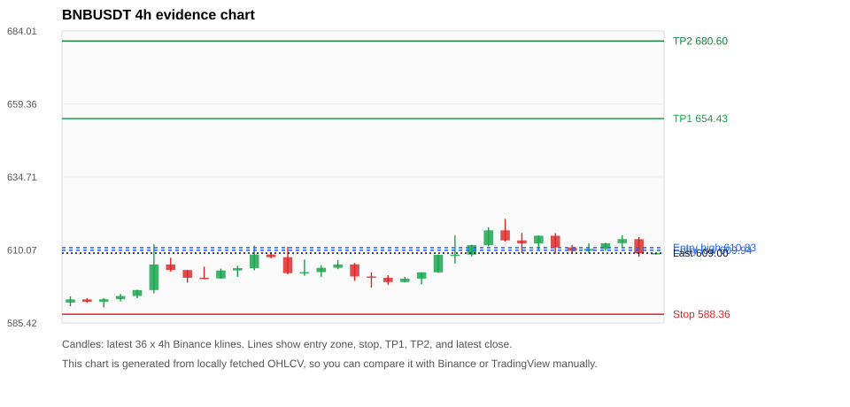
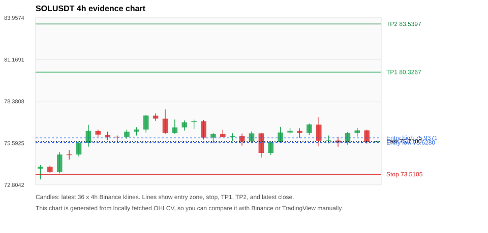
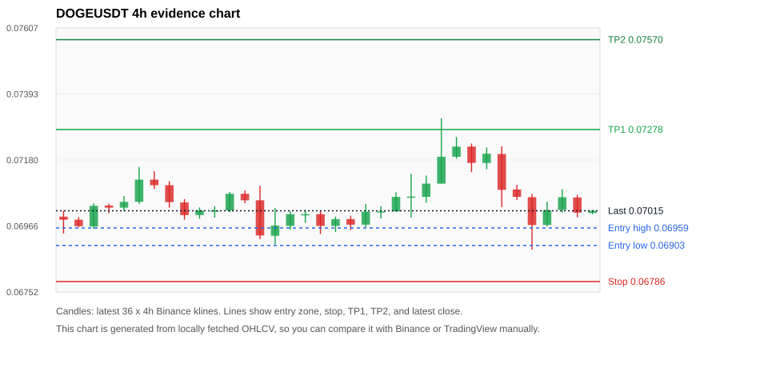
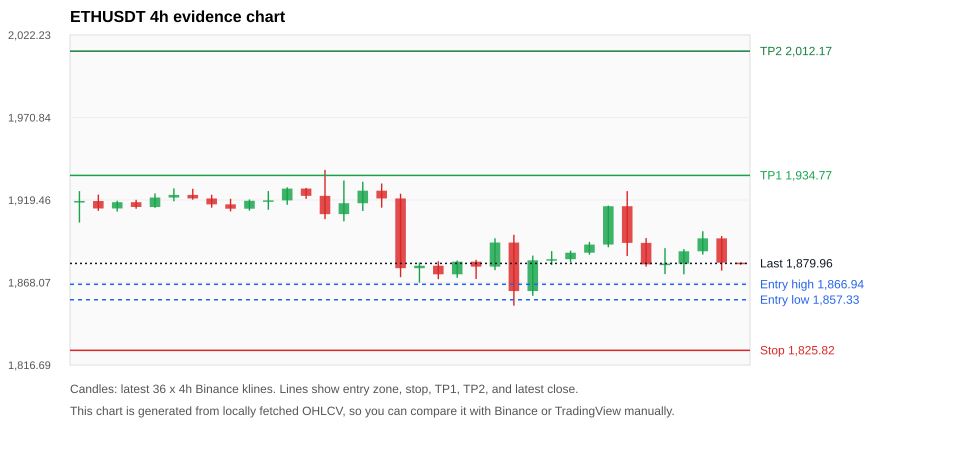
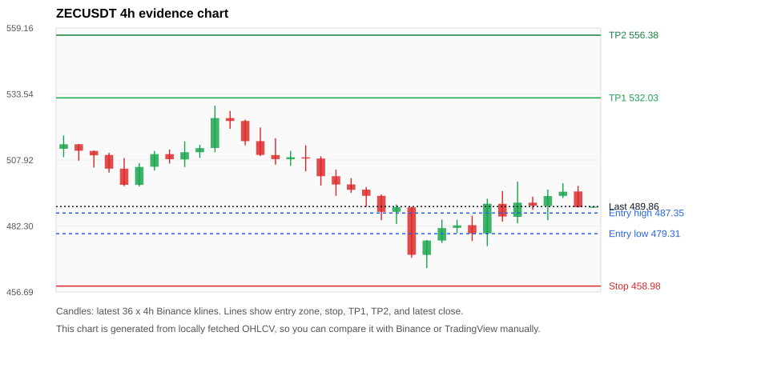

# Crypto 市场扫描报告 v1

- 报告时间：2026-08-13 20:06:23 CST
- Run ID：`20260813_120503_202d006a`
- Run type：`daily_full`
- 数据来源：SQLite
- 报告版本：v1
- 扫描 ID：4ac624d4005e
- 数据源：Binance public spot API + CoinGecko/CoinMarketCap cross-check
- 过滤条件：USDT spot; 24h quote volume >= 30,000,000; trades >= 30,000; exclude stables/leveraged tokens; analyze 1h/4h/1d klines
- 默认单笔风险：账户权益的 1.00%

## 限制说明

- 交易信号仍以 Binance 现货公开 K 线为主源；外部数据源用于一致性复核。
- 结果是研究和模拟盘计划，不是确定收益或实盘下单指令。
- 历史长度过滤：候选币至少需要 180 根 1d K 线。
- 数据质量验证池：先验证 score 排名前 min(top_n * 2, 10) 的候选，再按 action + score 补足最终名单。
- 大盘环境过滤：RISK_OFF; BTC/ETH 大盘偏弱，山寨币买入候选降级为观察。 BTC 7d=-1.3311441941769142; ETH 7d=-1.2788193897379285.
- 已启用数据交叉验证：Binance 主源 + CoinGecko 自动对照；CoinMarketCap 在配置 API Key 后自动对照。
- BNBUSDT 交叉验证状态 DATA_WARNING：At least one external provider needs manual review.
- SOLUSDT 交叉验证状态 DATA_WARNING：At least one external provider needs manual review.
- DOGEUSDT 交叉验证状态 DATA_WARNING：At least one external provider needs manual review.
- ETHUSDT 交叉验证状态 DATA_WARNING：At least one external provider needs manual review.
- ZECUSDT 交叉验证状态 DATA_WARNING：At least one external provider needs manual review.
- TUTUSDT 交叉验证状态 DATA_WARNING：At least one external provider needs manual review.
- ALLOUSDT 交叉验证状态 DATA_WARNING：At least one external provider needs manual review.
- XRPUSDT 交叉验证状态 DATA_WARNING：At least one external provider needs manual review.
- BTCUSDT 交叉验证状态 DATA_WARNING：At least one external provider needs manual review.
- MMTUSDT 交叉验证状态 DATA_WARNING：At least one external provider needs manual review.

## 5 个候选交易计划

| Rank | Coin | Action | Setup | Entry Zone | Stop Loss | TP1 | TP2 / Exit Rule | R/R | Verdict |
|---:|---|---|---|---:|---:|---:|---|---:|---|
| 1 | `BNB` | `WATCH_ONLY` | 回踩支撑/4h EMA 附近 | 609.94 - 610.83 | 588.36 | 654.43 | 680.60 或跌破 4h 关键支撑 | 2.00-3.19 | 只观察 |
| 2 | `SOL` | `WATCH_ONLY` | 回踩支撑/4h EMA 附近 | 75.6280 - 75.9371 | 73.5105 | 80.3267 | 83.5397 或跌破 4h 关键支撑 | 2.00-3.41 | 只观察 |
| 3 | `DOGE` | `WATCH_ONLY` | 回踩支撑/4h EMA 附近 | 0.06903 - 0.06959 | 0.06786 | 0.07278 | 0.07570 或跌破 4h 关键支撑 | 2.39-4.39 | 只观察 |
| 4 | `ETH` | `REJECT` | 回踩支撑/4h EMA 附近 | 1,857.33 - 1,866.94 | 1,825.82 | 1,934.77 | 2,012.17 或跌破 4h 关键支撑 | 2.00-4.13 | 只观察 |
| 5 | `ZEC` | `REJECT` | 趋势中，等回调入场 | 479.31 - 487.35 | 458.98 | 532.03 | 556.38 或跌破 4h 关键支撑 | 2.00-3.00 | 只观察 |

## 数据交叉验证摘要

价格差异以 Binance 当前价为基准；成交量口径不同，Binance 是 USDT 现货成交额，CoinGecko/CoinMarketCap 通常是全市场成交量。

| Rank | Coin | Data Status | Max Price Diff | Max 24h Diff | Message |
|---:|---|---|---:|---:|---|
| 1 | `BNB` | DATA_WARNING | 0.14% | 0.14 pts | At least one external provider needs manual review. |
| 2 | `SOL` | DATA_WARNING | 0.16% | 0.26 pts | At least one external provider needs manual review. |
| 3 | `DOGE` | DATA_WARNING | 0.21% | 0.08 pts | At least one external provider needs manual review. |
| 4 | `ETH` | DATA_WARNING | 0.14% | 0.34 pts | At least one external provider needs manual review. |
| 5 | `ZEC` | DATA_WARNING | 0.15% | 1.15 pts | At least one external provider needs manual review. |

## 候选币说明

### 1. BNB `BNBUSDT`



- 入选原因：回踩支撑/4h EMA 附近；24h -0.94%，7d +2.69%，4h RSI 59.28，24h 成交额 $45.9M。
- 交易失效条件：跌破 588.3602 或 4h 收盘重新失守关键支撑。
- 主要风险：BTC/ETH 大盘环境未确认强势，山寨币买入信号降级；24h 动量未确认；数据交叉验证需要人工复核。
- 数据交叉验证：DATA_WARNING；At least one external provider needs manual review.

#### 可点击人工验证

- [Binance 交易页](https://www.binance.com/en/trade/BNB_USDT)
- [TradingView 图表](https://www.tradingview.com/chart/?symbol=BINANCE%3ABNBUSDT)
- [CoinGecko 搜索](https://www.coingecko.com/en/search?query=BNB)
- [CoinMarketCap 搜索](https://coinmarketcap.com/search/?q=BNB)

#### 多数据源对照

| Source | Status | Asset ID | Price | 24h Change | 24h Volume | Price Diff | 24h Diff | Updated | Message |
|---|---|---|---:|---:|---:|---:|---:|---|---|
| Binance | DATA_OK | BNBUSDT | 609.00 | -0.94% | $45.9M | 0.00% | 0.00 pts | 2026-08-13T12:05:38+00:00 | Primary market data source used by scanner. |
| CoinGecko | DATA_OK | binancecoin | 608.25 | -0.80% | $523.8M | 0.12% | 0.14 pts | 2026-08-13T12:03:30.000Z | External source agrees with Binance within thresholds. |
| CoinMarketCap | DATA_WARNING | 1839 | 608.17 | -0.98% | $1.01B | 0.14% | 0.04 pts | 2026-08-13T12:04:04.000Z | CoinMarketCap symbol mapping has 4 matches; selected lowest cmc_rank |

#### 指标证据

| 指标 | 数值 | 人工核对用途 |
|---|---:|---|
| 当前价 | 609.00 | 与 Binance/TradingView 当前价格对照 |
| 24h 涨跌 | -0.94% | 与交易所 24h 涨跌对照 |
| 7d 涨跌 | +2.69% | 判断短线趋势是否延续 |
| 4h EMA20 | 608.72 | 判断短期趋势支撑 |
| 4h EMA50 | 602.51 | 判断中期趋势支撑 |
| 1d EMA20 | 593.62 | 判断日线趋势 |
| 1d EMA50 | 588.95 | 判断日线趋势 |
| 4h RSI14 | 59.28 | 判断是否过热/过弱 |
| 4h ATR14 | 5.1686 | 推导止损和入场缓冲 |
| 最近 18 根 4h 最低点 | 597.32 | 支撑/止损参考 |
| 最近 36 根 4h 最高点 | 620.55 | TP/压力参考 |
| 支撑位 | 608.72 | 入场区间推导基础 |

#### 交易计划推导

- 支撑位 = 最近低点、4h EMA20、4h EMA50、1d EMA20 中不高于当前价的最高有效支撑 = `608.72`。
- 入场区间 = 支撑位附近 + ATR 缓冲 = `609.94 - 610.83`。
- 止损 = min(最近 18 根 4h 最低点 * 0.985, 入场中位价 - 1.15 * ATR14) = `588.36`。
- TP1 = max(最近 36 根 4h 最高点 * 0.995, 入场中位价 + 2R) = `654.43`。
- TP2 = max(入场中位价 + 3R, TP1 * 1.04) = `680.60`。

#### 最近 10 根 4h K线

| UTC 开盘时间 | Open | High | Low | Close | Quote Volume | Trades |
|---|---:|---:|---:|---:|---:|---:|
| 2026-08-12T00:00+00:00 | 616.69 | 620.55 | 612.90 | 613.28 | $16.7M | 123519 |
| 2026-08-12T04:00+00:00 | 613.28 | 615.81 | 609.02 | 612.29 | $14.7M | 96613 |
| 2026-08-12T08:00+00:00 | 612.29 | 614.88 | 610.00 | 614.87 | $9.3M | 89719 |
| 2026-08-12T12:00+00:00 | 614.87 | 615.71 | 608.83 | 610.91 | $14.9M | 143398 |
| 2026-08-12T16:00+00:00 | 610.91 | 611.72 | 609.10 | 609.79 | $5.4M | 62084 |
| 2026-08-12T20:00+00:00 | 609.78 | 612.27 | 608.93 | 610.44 | $3.8M | 50271 |
| 2026-08-13T00:00+00:00 | 610.44 | 612.48 | 609.79 | 612.34 | $5.4M | 54931 |
| 2026-08-13T04:00+00:00 | 612.35 | 614.99 | 610.83 | 613.71 | $6.8M | 66194 |
| 2026-08-13T08:00+00:00 | 613.70 | 614.40 | 607.77 | 608.93 | $9.7M | 75583 |
| 2026-08-13T12:00+00:00 | 608.93 | 609.04 | 608.49 | 609.00 | $110,809 | 1744 |

### 2. SOL `SOLUSDT`



- 入选原因：回踩支撑/4h EMA 附近；24h -1.76%，7d +3.34%，4h RSI 50.14，24h 成交额 $86.7M。
- 交易失效条件：跌破 73.51055 或 4h 收盘重新失守关键支撑。
- 主要风险：BTC/ETH 大盘环境未确认强势，山寨币买入信号降级；24h 动量未确认；数据交叉验证需要人工复核。
- 数据交叉验证：DATA_WARNING；At least one external provider needs manual review.

#### 可点击人工验证

- [Binance 交易页](https://www.binance.com/en/trade/SOL_USDT)
- [TradingView 图表](https://www.tradingview.com/chart/?symbol=BINANCE%3ASOLUSDT)
- [CoinGecko 搜索](https://www.coingecko.com/en/search?query=SOL)
- [CoinMarketCap 搜索](https://coinmarketcap.com/search/?q=SOL)

#### 多数据源对照

| Source | Status | Asset ID | Price | 24h Change | 24h Volume | Price Diff | 24h Diff | Updated | Message |
|---|---|---|---:|---:|---:|---:|---:|---|---|
| Binance | DATA_OK | SOLUSDT | 75.7100 | -1.76% | $86.7M | 0.00% | 0.00 pts | 2026-08-13T12:05:38+00:00 | Primary market data source used by scanner. |
| CoinGecko | DATA_OK | solana | 75.6000 | -1.50% | $1.23B | 0.15% | 0.26 pts | 2026-08-13T12:03:30.000Z | External source agrees with Binance within thresholds. |
| CoinMarketCap | DATA_WARNING | 5426 | 75.5896 | -1.62% | $1.32B | 0.16% | 0.15 pts | 2026-08-13T12:04:04.000Z | CoinMarketCap symbol mapping has 8 matches; selected lowest cmc_rank |

#### 指标证据

| 指标 | 数值 | 人工核对用途 |
|---|---:|---|
| 当前价 | 75.7100 | 与 Binance/TradingView 当前价格对照 |
| 24h 涨跌 | -1.76% | 与交易所 24h 涨跌对照 |
| 7d 涨跌 | +3.34% | 判断短线趋势是否延续 |
| 4h EMA20 | 75.9647 | 判断短期趋势支撑 |
| 4h EMA50 | 75.4771 | 判断中期趋势支撑 |
| 1d EMA20 | 75.0722 | 判断日线趋势 |
| 1d EMA50 | 75.4933 | 判断日线趋势 |
| 4h RSI14 | 50.14 | 判断是否过热/过弱 |
| 4h ATR14 | 0.83143 | 推导止损和入场缓冲 |
| 最近 18 根 4h 最低点 | 74.6300 | 支撑/止损参考 |
| 最近 36 根 4h 最高点 | 77.8400 | TP/压力参考 |
| 支撑位 | 75.4771 | 入场区间推导基础 |

#### 交易计划推导

- 支撑位 = 最近低点、4h EMA20、4h EMA50、1d EMA20 中不高于当前价的最高有效支撑 = `75.4771`。
- 入场区间 = 支撑位附近 + ATR 缓冲 = `75.6280 - 75.9371`。
- 止损 = min(最近 18 根 4h 最低点 * 0.985, 入场中位价 - 1.15 * ATR14) = `73.5105`。
- TP1 = max(最近 36 根 4h 最高点 * 0.995, 入场中位价 + 2R) = `80.3267`。
- TP2 = max(入场中位价 + 3R, TP1 * 1.04) = `83.5397`。

#### 最近 10 根 4h K线

| UTC 开盘时间 | Open | High | Low | Close | Quote Volume | Trades |
|---|---:|---:|---:|---:|---:|---:|
| 2026-08-12T00:00+00:00 | 76.3000 | 76.6000 | 76.2400 | 76.4200 | $8.9M | 33457 |
| 2026-08-12T04:00+00:00 | 76.4200 | 76.5800 | 75.9400 | 76.2700 | $9.7M | 36159 |
| 2026-08-12T08:00+00:00 | 76.2600 | 76.9000 | 76.1400 | 76.8400 | $18.1M | 59279 |
| 2026-08-12T12:00+00:00 | 76.8300 | 77.3300 | 75.3800 | 75.7500 | $34.3M | 147768 |
| 2026-08-12T16:00+00:00 | 75.7500 | 76.1000 | 75.5700 | 75.7700 | $8.7M | 41794 |
| 2026-08-12T20:00+00:00 | 75.7600 | 76.0200 | 75.3500 | 75.6300 | $8.5M | 55868 |
| 2026-08-13T00:00+00:00 | 75.6400 | 76.3300 | 75.4800 | 76.2600 | $12.7M | 56663 |
| 2026-08-13T04:00+00:00 | 76.2600 | 76.6200 | 76.0300 | 76.4400 | $10.5M | 32420 |
| 2026-08-13T08:00+00:00 | 76.4400 | 76.4900 | 75.5600 | 75.6700 | $13.6M | 49629 |
| 2026-08-13T12:00+00:00 | 75.6600 | 75.7100 | 75.6500 | 75.7100 | $136,133 | 557 |

### 3. DOGE `DOGEUSDT`



- 入选原因：回踩支撑/4h EMA 附近；24h -2.68%，7d +1.96%，4h RSI 50.15，24h 成交额 $31.9M。
- 交易失效条件：跌破 0.06785665 或 4h 收盘重新失守关键支撑。
- 主要风险：日线趋势未完全确认；BTC/ETH 大盘环境未确认强势，山寨币买入信号降级；24h 动量未确认；数据交叉验证需要人工复核。
- 数据交叉验证：DATA_WARNING；At least one external provider needs manual review.

#### 可点击人工验证

- [Binance 交易页](https://www.binance.com/en/trade/DOGE_USDT)
- [TradingView 图表](https://www.tradingview.com/chart/?symbol=BINANCE%3ADOGEUSDT)
- [CoinGecko 搜索](https://www.coingecko.com/en/search?query=DOGE)
- [CoinMarketCap 搜索](https://coinmarketcap.com/search/?q=DOGE)

#### 多数据源对照

| Source | Status | Asset ID | Price | 24h Change | 24h Volume | Price Diff | 24h Diff | Updated | Message |
|---|---|---|---:|---:|---:|---:|---:|---|---|
| Binance | DATA_OK | DOGEUSDT | 0.07015 | -2.68% | $31.9M | 0.00% | 0.00 pts | 2026-08-13T12:05:38+00:00 | Primary market data source used by scanner. |
| CoinGecko | DATA_OK | dogecoin | 0.07001 | -2.60% | $405.8M | 0.20% | 0.08 pts | 2026-08-13T12:03:30.000Z | External source agrees with Binance within thresholds. |
| CoinMarketCap | DATA_WARNING | 74 | 0.07000 | -2.70% | $454.0M | 0.21% | 0.02 pts | 2026-08-13T12:04:04.000Z | CoinMarketCap symbol mapping has 23 matches; selected lowest cmc_rank |

#### 指标证据

| 指标 | 数值 | 人工核对用途 |
|---|---:|---|
| 当前价 | 0.07015 | 与 Binance/TradingView 当前价格对照 |
| 24h 涨跌 | -2.68% | 与交易所 24h 涨跌对照 |
| 7d 涨跌 | +1.96% | 判断短线趋势是否延续 |
| 4h EMA20 | 0.07053 | 判断短期趋势支撑 |
| 4h EMA50 | 0.07038 | 判断中期趋势支撑 |
| 1d EMA20 | 0.07059 | 判断日线趋势 |
| 1d EMA50 | 0.07408 | 判断日线趋势 |
| 4h RSI14 | 50.15 | 判断是否过热/过弱 |
| 4h ATR14 | 0.0010035714 | 推导止损和入场缓冲 |
| 最近 18 根 4h 最低点 | 0.06889 | 支撑/止损参考 |
| 最近 36 根 4h 最高点 | 0.07315 | TP/压力参考 |
| 支撑位 | 0.06889 | 入场区间推导基础 |

#### 交易计划推导

- 支撑位 = 最近低点、4h EMA20、4h EMA50、1d EMA20 中不高于当前价的最高有效支撑 = `0.06889`。
- 入场区间 = 支撑位附近 + ATR 缓冲 = `0.06903 - 0.06959`。
- 止损 = min(最近 18 根 4h 最低点 * 0.985, 入场中位价 - 1.15 * ATR14) = `0.06786`。
- TP1 = max(最近 36 根 4h 最高点 * 0.995, 入场中位价 + 2R) = `0.07278`。
- TP2 = max(入场中位价 + 3R, TP1 * 1.04) = `0.07570`。

#### 最近 10 根 4h K线

| UTC 开盘时间 | Open | High | Low | Close | Quote Volume | Trades |
|---|---:|---:|---:|---:|---:|---:|
| 2026-08-12T00:00+00:00 | 0.07190 | 0.07254 | 0.07184 | 0.07223 | $4.8M | 48857 |
| 2026-08-12T04:00+00:00 | 0.07223 | 0.07233 | 0.07140 | 0.07170 | $4.7M | 37415 |
| 2026-08-12T08:00+00:00 | 0.07170 | 0.07220 | 0.07150 | 0.07200 | $4.2M | 32547 |
| 2026-08-12T12:00+00:00 | 0.07199 | 0.07224 | 0.07027 | 0.07083 | $10.2M | 95036 |
| 2026-08-12T16:00+00:00 | 0.07084 | 0.07099 | 0.07050 | 0.07060 | $2.1M | 27708 |
| 2026-08-12T20:00+00:00 | 0.07059 | 0.07070 | 0.06889 | 0.06969 | $9.9M | 70520 |
| 2026-08-13T00:00+00:00 | 0.06969 | 0.07044 | 0.06964 | 0.07017 | $2.9M | 26767 |
| 2026-08-13T04:00+00:00 | 0.07018 | 0.07085 | 0.07009 | 0.07059 | $3.7M | 24545 |
| 2026-08-13T08:00+00:00 | 0.07058 | 0.07067 | 0.06994 | 0.07009 | $3.0M | 25287 |
| 2026-08-13T12:00+00:00 | 0.07008 | 0.07015 | 0.07004 | 0.07015 | $210,611 | 758 |

### 4. ETH `ETHUSDT`



- 入选原因：回踩支撑/4h EMA 附近；24h -1.94%，7d -1.44%，4h RSI 50.61，24h 成交额 $328.0M。
- 交易失效条件：跌破 1825.8157 或 4h 收盘重新失守关键支撑。
- 主要风险：日线趋势未完全确认；BTC/ETH 大盘环境未确认强势，山寨币买入信号降级；24h 动量未确认；7d 趋势未确认；数据交叉验证需要人工复核。
- 数据交叉验证：DATA_WARNING；At least one external provider needs manual review.

#### 可点击人工验证

- [Binance 交易页](https://www.binance.com/en/trade/ETH_USDT)
- [TradingView 图表](https://www.tradingview.com/chart/?symbol=BINANCE%3AETHUSDT)
- [CoinGecko 搜索](https://www.coingecko.com/en/search?query=ETH)
- [CoinMarketCap 搜索](https://coinmarketcap.com/search/?q=ETH)

#### 多数据源对照

| Source | Status | Asset ID | Price | 24h Change | 24h Volume | Price Diff | 24h Diff | Updated | Message |
|---|---|---|---:|---:|---:|---:|---:|---|---|
| Binance | DATA_OK | ETHUSDT | 1,879.96 | -1.94% | $328.0M | 0.00% | 0.00 pts | 2026-08-13T12:05:38+00:00 | Primary market data source used by scanner. |
| CoinGecko | DATA_OK | ethereum | 1,877.55 | -1.60% | $6.76B | 0.13% | 0.34 pts | 2026-08-13T12:03:30.000Z | External source agrees with Binance within thresholds. |
| CoinMarketCap | DATA_WARNING | 1027 | 1,877.36 | -1.91% | $7.73B | 0.14% | 0.03 pts | 2026-08-13T12:04:04.000Z | CoinMarketCap symbol mapping has 6 matches; selected lowest cmc_rank |

#### 指标证据

| 指标 | 数值 | 人工核对用途 |
|---|---:|---|
| 当前价 | 1,879.96 | 与 Binance/TradingView 当前价格对照 |
| 24h 涨跌 | -1.94% | 与交易所 24h 涨跌对照 |
| 7d 涨跌 | -1.44% | 判断短线趋势是否延续 |
| 4h EMA20 | 1,889.86 | 判断短期趋势支撑 |
| 4h EMA50 | 1,893.94 | 判断中期趋势支撑 |
| 1d EMA20 | 1,883.79 | 判断日线趋势 |
| 1d EMA50 | 1,864.14 | 判断日线趋势 |
| 4h RSI14 | 50.61 | 判断是否过热/过弱 |
| 4h ATR14 | 19.0336 | 推导止损和入场缓冲 |
| 最近 18 根 4h 最低点 | 1,853.62 | 支撑/止损参考 |
| 最近 36 根 4h 最高点 | 1,938.22 | TP/压力参考 |
| 支撑位 | 1,853.62 | 入场区间推导基础 |

#### 交易计划推导

- 支撑位 = 最近低点、4h EMA20、4h EMA50、1d EMA20 中不高于当前价的最高有效支撑 = `1,853.62`。
- 入场区间 = 支撑位附近 + ATR 缓冲 = `1,857.33 - 1,866.94`。
- 止损 = min(最近 18 根 4h 最低点 * 0.985, 入场中位价 - 1.15 * ATR14) = `1,825.82`。
- TP1 = max(最近 36 根 4h 最高点 * 0.995, 入场中位价 + 2R) = `1,934.77`。
- TP2 = max(入场中位价 + 3R, TP1 * 1.04) = `2,012.17`。

#### 最近 10 根 4h K线

| UTC 开盘时间 | Open | High | Low | Close | Quote Volume | Trades |
|---|---:|---:|---:|---:|---:|---:|
| 2026-08-12T00:00+00:00 | 1,882.58 | 1,887.91 | 1,880.65 | 1,886.62 | $27.5M | 133387 |
| 2026-08-12T04:00+00:00 | 1,886.63 | 1,893.37 | 1,885.38 | 1,891.69 | $34.9M | 133915 |
| 2026-08-12T08:00+00:00 | 1,891.70 | 1,915.99 | 1,890.00 | 1,915.57 | $72.3M | 288553 |
| 2026-08-12T12:00+00:00 | 1,915.58 | 1,925.00 | 1,884.54 | 1,892.75 | $109.4M | 605501 |
| 2026-08-12T16:00+00:00 | 1,892.75 | 1,895.77 | 1,877.98 | 1,879.38 | $40.8M | 220776 |
| 2026-08-12T20:00+00:00 | 1,879.37 | 1,889.47 | 1,873.29 | 1,879.81 | $39.9M | 182412 |
| 2026-08-13T00:00+00:00 | 1,879.80 | 1,888.89 | 1,873.17 | 1,887.52 | $47.1M | 197076 |
| 2026-08-13T04:00+00:00 | 1,887.52 | 1,900.00 | 1,885.46 | 1,895.57 | $37.5M | 182258 |
| 2026-08-13T08:00+00:00 | 1,895.57 | 1,897.00 | 1,875.49 | 1,880.39 | $55.5M | 239420 |
| 2026-08-13T12:00+00:00 | 1,880.40 | 1,880.40 | 1,879.17 | 1,879.96 | $487,556 | 5286 |

### 5. ZEC `ZECUSDT`



- 入选原因：趋势中，等回调入场；24h -0.35%，7d -0.66%，4h RSI 51.50，24h 成交额 $43.2M。
- 交易失效条件：跌破 458.98045 或 4h 收盘重新失守关键支撑。
- 主要风险：日线趋势未完全确认；BTC/ETH 大盘环境未确认强势，山寨币买入信号降级；24h 动量未确认；7d 趋势未确认；数据交叉验证需要人工复核。
- 数据交叉验证：DATA_WARNING；At least one external provider needs manual review.

#### 可点击人工验证

- [Binance 交易页](https://www.binance.com/en/trade/ZEC_USDT)
- [TradingView 图表](https://www.tradingview.com/chart/?symbol=BINANCE%3AZECUSDT)
- [CoinGecko 搜索](https://www.coingecko.com/en/search?query=ZEC)
- [CoinMarketCap 搜索](https://coinmarketcap.com/search/?q=ZEC)

#### 多数据源对照

| Source | Status | Asset ID | Price | 24h Change | 24h Volume | Price Diff | 24h Diff | Updated | Message |
|---|---|---|---:|---:|---:|---:|---:|---|---|
| Binance | DATA_OK | ZECUSDT | 489.86 | -0.35% | $43.2M | 0.00% | 0.00 pts | 2026-08-13T12:05:38+00:00 | Primary market data source used by scanner. |
| CoinGecko | DATA_OK | zcash | 489.12 | +0.80% | $180.3M | 0.15% | 1.15 pts | 2026-08-13T12:03:30.000Z | External source agrees with Binance within thresholds. |
| CoinMarketCap | DATA_WARNING | 1437 | 489.21 | -0.24% | $299.1M | 0.13% | 0.11 pts | 2026-08-13T12:04:04.000Z | CoinMarketCap symbol mapping has 2 matches; selected lowest cmc_rank |

#### 指标证据

| 指标 | 数值 | 人工核对用途 |
|---|---:|---|
| 当前价 | 489.86 | 与 Binance/TradingView 当前价格对照 |
| 24h 涨跌 | -0.35% | 与交易所 24h 涨跌对照 |
| 7d 涨跌 | -0.66% | 判断短线趋势是否延续 |
| 4h EMA20 | 492.00 | 判断短期趋势支撑 |
| 4h EMA50 | 494.98 | 判断中期趋势支撑 |
| 1d EMA20 | 494.79 | 判断日线趋势 |
| 1d EMA50 | 489.64 | 判断日线趋势 |
| 4h RSI14 | 51.50 | 判断是否过热/过弱 |
| 4h ATR14 | 10.0471 | 推导止损和入场缓冲 |
| 最近 18 根 4h 最低点 | 465.97 | 支撑/止损参考 |
| 最近 36 根 4h 最高点 | 529.00 | TP/压力参考 |
| 支撑位 | 465.97 | 入场区间推导基础 |

#### 交易计划推导

- 支撑位 = 最近低点、4h EMA20、4h EMA50、1d EMA20 中不高于当前价的最高有效支撑 = `465.97`。
- 入场区间 = 支撑位附近 + ATR 缓冲 = `479.31 - 487.35`。
- 止损 = min(最近 18 根 4h 最低点 * 0.985, 入场中位价 - 1.15 * ATR14) = `458.98`。
- TP1 = max(最近 36 根 4h 最高点 * 0.995, 入场中位价 + 2R) = `532.03`。
- TP2 = max(入场中位价 + 3R, TP1 * 1.04) = `556.38`。

#### 最近 10 根 4h K线

| UTC 开盘时间 | Open | High | Low | Close | Quote Volume | Trades |
|---|---:|---:|---:|---:|---:|---:|
| 2026-08-12T00:00+00:00 | 481.59 | 484.77 | 479.50 | 482.54 | $3.5M | 13418 |
| 2026-08-12T04:00+00:00 | 482.63 | 486.29 | 476.49 | 479.43 | $3.3M | 16033 |
| 2026-08-12T08:00+00:00 | 479.43 | 492.88 | 474.50 | 490.94 | $14.0M | 61981 |
| 2026-08-12T12:00+00:00 | 490.89 | 495.85 | 484.00 | 485.99 | $10.7M | 60780 |
| 2026-08-12T16:00+00:00 | 485.87 | 499.55 | 483.30 | 491.38 | $12.1M | 49076 |
| 2026-08-12T20:00+00:00 | 491.36 | 493.72 | 488.56 | 490.20 | $3.0M | 13938 |
| 2026-08-13T00:00+00:00 | 490.10 | 496.42 | 484.54 | 493.92 | $8.8M | 34663 |
| 2026-08-13T04:00+00:00 | 494.00 | 498.87 | 493.17 | 495.62 | $5.3M | 27927 |
| 2026-08-13T08:00+00:00 | 495.72 | 497.86 | 489.44 | 489.63 | $3.4M | 16105 |
| 2026-08-13T12:00+00:00 | 489.60 | 489.96 | 489.31 | 489.86 | $120,269 | 455 |

## 组合风控

- 不要 5 个候选全部满仓买入。
- 同时持仓总风险建议控制在账户权益的 3% - 5% 以内。
- 如果 BTC/ETH 同时破位，暂停山寨币多头计划或降低仓位。
- 第一版报告用于模拟盘和人工复核，不自动下单。

## 原始数据

```json
[
  {
    "rank": 1,
    "symbol": "BNBUSDT",
    "base_asset": "BNB",
    "price": 609.0,
    "score": 40.462009427242464,
    "setup": "回踩支撑/4h EMA 附近",
    "verdict": "只观察",
    "entry_low": 609.9369495791018,
    "entry_high": 610.8269999999999,
    "stop_loss": 588.3602000000001,
    "take_profit_1": 654.4255243686525,
    "take_profit_2": 680.6025453433987,
    "risk_reward_1": 2.0,
    "risk_reward_2": 3.1886880700990075,
    "pct_24h": -0.94,
    "pct_3d": 1.4611065758125985,
    "pct_7d": 2.689486552567244,
    "quote_volume_24h": 45939254.18566,
    "trades_24h": 452250,
    "high_low_range_24h": 1.3064152557711095,
    "rsi_1h": 45.97798475867895,
    "rsi_4h": 59.280411193603534,
    "ema20_4h": 608.7195105579858,
    "ema50_4h": 602.5070787186295,
    "ema20_1d": 593.6158927366054,
    "ema50_1d": 588.9533641828386,
    "atr_4h": 5.168571428571421,
    "macd_hist_4h": -0.5576433317667577,
    "volume_ratio_24h": 0.6534692150017718,
    "support_level": 608.7195105579858,
    "recent_low_4h_18": 597.32,
    "recent_high_4h_36": 620.55,
    "distance_to_support_pct": 0.046078602237842325,
    "binance_trade_url": "https://www.binance.com/en/trade/BNB_USDT",
    "tradingview_url": "https://www.tradingview.com/chart/?symbol=BINANCE%3ABNBUSDT",
    "coingecko_search_url": "https://www.coingecko.com/en/search?query=BNB",
    "coinmarketcap_search_url": "https://coinmarketcap.com/search/?q=BNB",
    "invalidation": "跌破 588.3602 或 4h 收盘重新失守关键支撑",
    "recent_4h_klines": [
      {
        "open_time_utc": "2026-08-07T16:00+00:00",
        "open": 592.32,
        "high": 594.4,
        "low": 591.05,
        "close": 593.38,
        "quote_volume": 4600794.34364,
        "trades": 60957
      },
      {
        "open_time_utc": "2026-08-07T20:00+00:00",
        "open": 593.38,
        "high": 593.73,
        "low": 592.22,
        "close": 592.57,
        "quote_volume": 1921222.04839,
        "trades": 24558
      },
      {
        "open_time_utc": "2026-08-08T00:00+00:00",
        "open": 592.57,
        "high": 593.78,
        "low": 590.65,
        "close": 593.43,
        "quote_volume": 6678727.72998,
        "trades": 38132
      },
      {
        "open_time_utc": "2026-08-08T04:00+00:00",
        "open": 593.42,
        "high": 595.15,
        "low": 592.67,
        "close": 594.52,
        "quote_volume": 6126173.29403,
        "trades": 44138
      },
      {
        "open_time_utc": "2026-08-08T08:00+00:00",
        "open": 594.53,
        "high": 596.61,
        "low": 593.74,
        "close": 596.51,
        "quote_volume": 6323849.50779,
        "trades": 62432
      },
      {
        "open_time_utc": "2026-08-08T12:00+00:00",
        "open": 596.51,
        "high": 612.0,
        "low": 595.42,
        "close": 605.14,
        "quote_volume": 32276029.60998,
        "trades": 227294
      },
      {
        "open_time_utc": "2026-08-08T16:00+00:00",
        "open": 605.15,
        "high": 607.42,
        "low": 602.75,
        "close": 603.29,
        "quote_volume": 6130563.61169,
        "trades": 74532
      },
      {
        "open_time_utc": "2026-08-08T20:00+00:00",
        "open": 603.28,
        "high": 603.29,
        "low": 599.04,
        "close": 600.66,
        "quote_volume": 4943728.22127,
        "trades": 57937
      },
      {
        "open_time_utc": "2026-08-09T00:00+00:00",
        "open": 600.66,
        "high": 604.41,
        "low": 600.21,
        "close": 600.44,
        "quote_volume": 6575318.36993,
        "trades": 64927
      },
      {
        "open_time_utc": "2026-08-09T04:00+00:00",
        "open": 600.44,
        "high": 603.76,
        "low": 600.35,
        "close": 603.14,
        "quote_volume": 8667321.90496,
        "trades": 69460
      },
      {
        "open_time_utc": "2026-08-09T08:00+00:00",
        "open": 603.14,
        "high": 604.71,
        "low": 601.0,
        "close": 603.92,
        "quote_volume": 6554989.80579,
        "trades": 66844
      },
      {
        "open_time_utc": "2026-08-09T12:00+00:00",
        "open": 603.92,
        "high": 611.55,
        "low": 603.14,
        "close": 608.53,
        "quote_volume": 14845019.50062,
        "trades": 104033
      },
      {
        "open_time_utc": "2026-08-09T16:00+00:00",
        "open": 608.54,
        "high": 609.3,
        "low": 607.17,
        "close": 607.63,
        "quote_volume": 6310151.49059,
        "trades": 50043
      },
      {
        "open_time_utc": "2026-08-09T20:00+00:00",
        "open": 607.63,
        "high": 611.12,
        "low": 601.86,
        "close": 602.23,
        "quote_volume": 8158215.19272,
        "trades": 84838
      },
      {
        "open_time_utc": "2026-08-10T00:00+00:00",
        "open": 602.22,
        "high": 606.84,
        "low": 601.33,
        "close": 602.59,
        "quote_volume": 9301426.32439,
        "trades": 118891
      },
      {
        "open_time_utc": "2026-08-10T04:00+00:00",
        "open": 602.59,
        "high": 604.9,
        "low": 601.0,
        "close": 604.04,
        "quote_volume": 6741792.61662,
        "trades": 63103
      },
      {
        "open_time_utc": "2026-08-10T08:00+00:00",
        "open": 604.04,
        "high": 606.66,
        "low": 603.59,
        "close": 605.18,
        "quote_volume": 8327536.30446,
        "trades": 85861
      },
      {
        "open_time_utc": "2026-08-10T12:00+00:00",
        "open": 605.19,
        "high": 605.63,
        "low": 599.64,
        "close": 601.11,
        "quote_volume": 16864963.89663,
        "trades": 142105
      },
      {
        "open_time_utc": "2026-08-10T16:00+00:00",
        "open": 601.11,
        "high": 602.5,
        "low": 597.32,
        "close": 600.69,
        "quote_volume": 8475402.17493,
        "trades": 75200
      },
      {
        "open_time_utc": "2026-08-10T20:00+00:00",
        "open": 600.68,
        "high": 601.54,
        "low": 598.29,
        "close": 599.23,
        "quote_volume": 3440213.35747,
        "trades": 40134
      },
      {
        "open_time_utc": "2026-08-11T00:00+00:00",
        "open": 599.24,
        "high": 601.0,
        "low": 599.05,
        "close": 600.38,
        "quote_volume": 5536013.00905,
        "trades": 50987
      },
      {
        "open_time_utc": "2026-08-11T04:00+00:00",
        "open": 600.38,
        "high": 602.5,
        "low": 598.46,
        "close": 602.5,
        "quote_volume": 11445268.79686,
        "trades": 73386
      },
      {
        "open_time_utc": "2026-08-11T08:00+00:00",
        "open": 602.5,
        "high": 608.54,
        "low": 602.33,
        "close": 608.43,
        "quote_volume": 18517758.1268,
        "trades": 135479
      },
      {
        "open_time_utc": "2026-08-11T12:00+00:00",
        "open": 608.44,
        "high": 614.98,
        "low": 605.48,
        "close": 608.49,
        "quote_volume": 26249216.16066,
        "trades": 213848
      },
      {
        "open_time_utc": "2026-08-11T16:00+00:00",
        "open": 608.49,
        "high": 611.84,
        "low": 607.83,
        "close": 611.71,
        "quote_volume": 12295880.53632,
        "trades": 102930
      },
      {
        "open_time_utc": "2026-08-11T20:00+00:00",
        "open": 611.71,
        "high": 617.73,
        "low": 611.28,
        "close": 616.69,
        "quote_volume": 12580204.313,
        "trades": 93484
      },
      {
        "open_time_utc": "2026-08-12T00:00+00:00",
        "open": 616.69,
        "high": 620.55,
        "low": 612.9,
        "close": 613.28,
        "quote_volume": 16706014.03552,
        "trades": 123519
      },
      {
        "open_time_utc": "2026-08-12T04:00+00:00",
        "open": 613.28,
        "high": 615.81,
        "low": 609.02,
        "close": 612.29,
        "quote_volume": 14692784.65498,
        "trades": 96613
      },
      {
        "open_time_utc": "2026-08-12T08:00+00:00",
        "open": 612.29,
        "high": 614.88,
        "low": 610.0,
        "close": 614.87,
        "quote_volume": 9296690.11847,
        "trades": 89719
      },
      {
        "open_time_utc": "2026-08-12T12:00+00:00",
        "open": 614.87,
        "high": 615.71,
        "low": 608.83,
        "close": 610.91,
        "quote_volume": 14858453.15496,
        "trades": 143398
      },
      {
        "open_time_utc": "2026-08-12T16:00+00:00",
        "open": 610.91,
        "high": 611.72,
        "low": 609.1,
        "close": 609.79,
        "quote_volume": 5355002.96773,
        "trades": 62084
      },
      {
        "open_time_utc": "2026-08-12T20:00+00:00",
        "open": 609.78,
        "high": 612.27,
        "low": 608.93,
        "close": 610.44,
        "quote_volume": 3826215.73622,
        "trades": 50271
      },
      {
        "open_time_utc": "2026-08-13T00:00+00:00",
        "open": 610.44,
        "high": 612.48,
        "low": 609.79,
        "close": 612.34,
        "quote_volume": 5378600.25579,
        "trades": 54931
      },
      {
        "open_time_utc": "2026-08-13T04:00+00:00",
        "open": 612.35,
        "high": 614.99,
        "low": 610.83,
        "close": 613.71,
        "quote_volume": 6837212.20386,
        "trades": 66194
      },
      {
        "open_time_utc": "2026-08-13T08:00+00:00",
        "open": 613.7,
        "high": 614.4,
        "low": 607.77,
        "close": 608.93,
        "quote_volume": 9730373.85465,
        "trades": 75583
      },
      {
        "open_time_utc": "2026-08-13T12:00+00:00",
        "open": 608.93,
        "high": 609.04,
        "low": 608.49,
        "close": 609.0,
        "quote_volume": 110808.88851,
        "trades": 1744
      }
    ],
    "risks": [
      "BTC/ETH 大盘环境未确认强势，山寨币买入信号降级",
      "24h 动量未确认",
      "数据交叉验证需要人工复核"
    ],
    "data_quality_status": "DATA_WARNING",
    "data_quality_message": "At least one external provider needs manual review.",
    "data_checks": [
      {
        "provider": "Binance",
        "status": "DATA_OK",
        "provider_asset_id": "BNBUSDT",
        "provider_symbol": "BNBUSDT",
        "price_usd": 609.0,
        "pct_24h": -0.94,
        "volume_24h": 45939254.18566,
        "last_updated": null,
        "fetched_at_utc": "2026-08-13T12:05:38+00:00",
        "price_diff_pct": 0.0,
        "pct_24h_diff": 0.0,
        "volume_note": "Binance USDT spot 24h quoteVolume.",
        "message": "Primary market data source used by scanner."
      },
      {
        "provider": "CoinGecko",
        "status": "DATA_OK",
        "provider_asset_id": "binancecoin",
        "provider_symbol": "BNB",
        "price_usd": 608.25,
        "pct_24h": -0.8,
        "volume_24h": 523829952.0,
        "last_updated": "2026-08-13T12:03:30.000Z",
        "fetched_at_utc": "2026-08-13T12:05:38+00:00",
        "price_diff_pct": 0.12315270935960591,
        "pct_24h_diff": 0.1399999999999999,
        "volume_note": "CoinGecko total market volume; not the same venue scope as Binance quoteVolume.",
        "message": "External source agrees with Binance within thresholds."
      },
      {
        "provider": "CoinMarketCap",
        "status": "DATA_WARNING",
        "provider_asset_id": "1839",
        "provider_symbol": "BNB",
        "price_usd": 608.1737113240129,
        "pct_24h": -0.97730233,
        "volume_24h": 1012158370.1605018,
        "last_updated": "2026-08-13T12:04:04.000Z",
        "fetched_at_utc": "2026-08-13T12:05:38+00:00",
        "price_diff_pct": 0.13567958554797102,
        "pct_24h_diff": 0.03730233000000005,
        "volume_note": "CoinMarketCap total market volume; not the same venue scope as Binance quoteVolume.",
        "message": "CoinMarketCap symbol mapping has 4 matches; selected lowest cmc_rank"
      }
    ],
    "action": "WATCH_ONLY"
  },
  {
    "rank": 2,
    "symbol": "SOLUSDT",
    "base_asset": "SOL",
    "price": 75.71,
    "score": 28.301346506702664,
    "setup": "回踩支撑/4h EMA 附近",
    "verdict": "只观察",
    "entry_low": 75.62803798535123,
    "entry_high": 75.93712999999998,
    "stop_loss": 73.51055,
    "take_profit_1": 80.3266519780268,
    "take_profit_2": 83.53971805714788,
    "risk_reward_1": 2.0,
    "risk_reward_2": 3.4141804609786197,
    "pct_24h": -1.765,
    "pct_3d": -0.7862665443585493,
    "pct_7d": 3.344253344253323,
    "quote_volume_24h": 86707138.17057,
    "trades_24h": 381471,
    "high_low_range_24h": 2.6277372262773824,
    "rsi_1h": 54.16666666666648,
    "rsi_4h": 50.144092219020145,
    "ema20_4h": 75.96467463656218,
    "ema50_4h": 75.4770838177158,
    "ema20_1d": 75.0722098260477,
    "ema50_1d": 75.49334511821127,
    "atr_4h": 0.8314285714285715,
    "macd_hist_4h": -0.10023316379964736,
    "volume_ratio_24h": 0.7900912316843708,
    "support_level": 75.4770838177158,
    "recent_low_4h_18": 74.63,
    "recent_high_4h_36": 77.84,
    "distance_to_support_pct": 0.30859192022669735,
    "binance_trade_url": "https://www.binance.com/en/trade/SOL_USDT",
    "tradingview_url": "https://www.tradingview.com/chart/?symbol=BINANCE%3ASOLUSDT",
    "coingecko_search_url": "https://www.coingecko.com/en/search?query=SOL",
    "coinmarketcap_search_url": "https://coinmarketcap.com/search/?q=SOL",
    "invalidation": "跌破 73.51055 或 4h 收盘重新失守关键支撑",
    "recent_4h_klines": [
      {
        "open_time_utc": "2026-08-07T16:00+00:00",
        "open": 73.89,
        "high": 74.13,
        "low": 73.17,
        "close": 74.02,
        "quote_volume": 22233949.75449,
        "trades": 88830
      },
      {
        "open_time_utc": "2026-08-07T20:00+00:00",
        "open": 74.02,
        "high": 74.1,
        "low": 73.58,
        "close": 73.66,
        "quote_volume": 11724432.74905,
        "trades": 46632
      },
      {
        "open_time_utc": "2026-08-08T00:00+00:00",
        "open": 73.67,
        "high": 74.99,
        "low": 73.57,
        "close": 74.83,
        "quote_volume": 17356248.95327,
        "trades": 47425
      },
      {
        "open_time_utc": "2026-08-08T04:00+00:00",
        "open": 74.84,
        "high": 75.14,
        "low": 74.49,
        "close": 74.82,
        "quote_volume": 15415999.75276,
        "trades": 44879
      },
      {
        "open_time_utc": "2026-08-08T08:00+00:00",
        "open": 74.83,
        "high": 75.71,
        "low": 74.7,
        "close": 75.6,
        "quote_volume": 16386483.74124,
        "trades": 54908
      },
      {
        "open_time_utc": "2026-08-08T12:00+00:00",
        "open": 75.61,
        "high": 76.81,
        "low": 75.35,
        "close": 76.4,
        "quote_volume": 32854092.34545,
        "trades": 89434
      },
      {
        "open_time_utc": "2026-08-08T16:00+00:00",
        "open": 76.4,
        "high": 76.5,
        "low": 75.97,
        "close": 76.16,
        "quote_volume": 13184934.85784,
        "trades": 48233
      },
      {
        "open_time_utc": "2026-08-08T20:00+00:00",
        "open": 76.15,
        "high": 76.36,
        "low": 75.78,
        "close": 76.01,
        "quote_volume": 9158232.08597,
        "trades": 35771
      },
      {
        "open_time_utc": "2026-08-09T00:00+00:00",
        "open": 76.02,
        "high": 76.1,
        "low": 75.73,
        "close": 75.99,
        "quote_volume": 7311495.69433,
        "trades": 27097
      },
      {
        "open_time_utc": "2026-08-09T04:00+00:00",
        "open": 75.98,
        "high": 76.5,
        "low": 75.88,
        "close": 76.36,
        "quote_volume": 9240609.52631,
        "trades": 33860
      },
      {
        "open_time_utc": "2026-08-09T08:00+00:00",
        "open": 76.36,
        "high": 76.65,
        "low": 76.1,
        "close": 76.5,
        "quote_volume": 11146377.22023,
        "trades": 38691
      },
      {
        "open_time_utc": "2026-08-09T12:00+00:00",
        "open": 76.5,
        "high": 77.47,
        "low": 76.3,
        "close": 77.43,
        "quote_volume": 20890385.31712,
        "trades": 61040
      },
      {
        "open_time_utc": "2026-08-09T16:00+00:00",
        "open": 77.42,
        "high": 77.57,
        "low": 77.07,
        "close": 77.23,
        "quote_volume": 12629692.26529,
        "trades": 43948
      },
      {
        "open_time_utc": "2026-08-09T20:00+00:00",
        "open": 77.22,
        "high": 77.84,
        "low": 76.21,
        "close": 76.27,
        "quote_volume": 14034329.73599,
        "trades": 62293
      },
      {
        "open_time_utc": "2026-08-10T00:00+00:00",
        "open": 76.26,
        "high": 77.17,
        "low": 76.21,
        "close": 76.64,
        "quote_volume": 13888105.76735,
        "trades": 85535
      },
      {
        "open_time_utc": "2026-08-10T04:00+00:00",
        "open": 76.64,
        "high": 77.11,
        "low": 76.43,
        "close": 76.98,
        "quote_volume": 9326921.5671,
        "trades": 41438
      },
      {
        "open_time_utc": "2026-08-10T08:00+00:00",
        "open": 76.99,
        "high": 77.16,
        "low": 76.53,
        "close": 77.05,
        "quote_volume": 16369024.57259,
        "trades": 57059
      },
      {
        "open_time_utc": "2026-08-10T12:00+00:00",
        "open": 77.05,
        "high": 77.13,
        "low": 75.83,
        "close": 75.96,
        "quote_volume": 29312515.4774,
        "trades": 104323
      },
      {
        "open_time_utc": "2026-08-10T16:00+00:00",
        "open": 75.96,
        "high": 76.28,
        "low": 75.58,
        "close": 76.19,
        "quote_volume": 18399718.99996,
        "trades": 61699
      },
      {
        "open_time_utc": "2026-08-10T20:00+00:00",
        "open": 76.19,
        "high": 76.49,
        "low": 75.98,
        "close": 75.99,
        "quote_volume": 10401240.97977,
        "trades": 44904
      },
      {
        "open_time_utc": "2026-08-11T00:00+00:00",
        "open": 76.0,
        "high": 76.25,
        "low": 75.71,
        "close": 76.08,
        "quote_volume": 8269441.73668,
        "trades": 34946
      },
      {
        "open_time_utc": "2026-08-11T04:00+00:00",
        "open": 76.08,
        "high": 76.23,
        "low": 75.42,
        "close": 75.69,
        "quote_volume": 13684318.33894,
        "trades": 52015
      },
      {
        "open_time_utc": "2026-08-11T08:00+00:00",
        "open": 75.7,
        "high": 76.37,
        "low": 75.63,
        "close": 76.24,
        "quote_volume": 19123626.41488,
        "trades": 57885
      },
      {
        "open_time_utc": "2026-08-11T12:00+00:00",
        "open": 76.24,
        "high": 76.26,
        "low": 74.63,
        "close": 74.93,
        "quote_volume": 27245143.79517,
        "trades": 131666
      },
      {
        "open_time_utc": "2026-08-11T16:00+00:00",
        "open": 74.93,
        "high": 75.71,
        "low": 74.79,
        "close": 75.67,
        "quote_volume": 12599911.63904,
        "trades": 57079
      },
      {
        "open_time_utc": "2026-08-11T20:00+00:00",
        "open": 75.67,
        "high": 76.67,
        "low": 75.66,
        "close": 76.3,
        "quote_volume": 18766320.61381,
        "trades": 64269
      },
      {
        "open_time_utc": "2026-08-12T00:00+00:00",
        "open": 76.3,
        "high": 76.6,
        "low": 76.24,
        "close": 76.42,
        "quote_volume": 8855658.03462,
        "trades": 33457
      },
      {
        "open_time_utc": "2026-08-12T04:00+00:00",
        "open": 76.42,
        "high": 76.58,
        "low": 75.94,
        "close": 76.27,
        "quote_volume": 9659647.14988,
        "trades": 36159
      },
      {
        "open_time_utc": "2026-08-12T08:00+00:00",
        "open": 76.26,
        "high": 76.9,
        "low": 76.14,
        "close": 76.84,
        "quote_volume": 18108123.12532,
        "trades": 59279
      },
      {
        "open_time_utc": "2026-08-12T12:00+00:00",
        "open": 76.83,
        "high": 77.33,
        "low": 75.38,
        "close": 75.75,
        "quote_volume": 34279459.67904,
        "trades": 147768
      },
      {
        "open_time_utc": "2026-08-12T16:00+00:00",
        "open": 75.75,
        "high": 76.1,
        "low": 75.57,
        "close": 75.77,
        "quote_volume": 8659260.36711,
        "trades": 41794
      },
      {
        "open_time_utc": "2026-08-12T20:00+00:00",
        "open": 75.76,
        "high": 76.02,
        "low": 75.35,
        "close": 75.63,
        "quote_volume": 8454598.11194,
        "trades": 55868
      },
      {
        "open_time_utc": "2026-08-13T00:00+00:00",
        "open": 75.64,
        "high": 76.33,
        "low": 75.48,
        "close": 76.26,
        "quote_volume": 12738818.26297,
        "trades": 56663
      },
      {
        "open_time_utc": "2026-08-13T04:00+00:00",
        "open": 76.26,
        "high": 76.62,
        "low": 76.03,
        "close": 76.44,
        "quote_volume": 10484311.07962,
        "trades": 32420
      },
      {
        "open_time_utc": "2026-08-13T08:00+00:00",
        "open": 76.44,
        "high": 76.49,
        "low": 75.56,
        "close": 75.67,
        "quote_volume": 13635530.46345,
        "trades": 49629
      },
      {
        "open_time_utc": "2026-08-13T12:00+00:00",
        "open": 75.66,
        "high": 75.71,
        "low": 75.65,
        "close": 75.71,
        "quote_volume": 136133.01318,
        "trades": 557
      }
    ],
    "risks": [
      "BTC/ETH 大盘环境未确认强势，山寨币买入信号降级",
      "24h 动量未确认",
      "数据交叉验证需要人工复核"
    ],
    "data_quality_status": "DATA_WARNING",
    "data_quality_message": "At least one external provider needs manual review.",
    "data_checks": [
      {
        "provider": "Binance",
        "status": "DATA_OK",
        "provider_asset_id": "SOLUSDT",
        "provider_symbol": "SOLUSDT",
        "price_usd": 75.71,
        "pct_24h": -1.765,
        "volume_24h": 86707138.17057,
        "last_updated": null,
        "fetched_at_utc": "2026-08-13T12:05:38+00:00",
        "price_diff_pct": 0.0,
        "pct_24h_diff": 0.0,
        "volume_note": "Binance USDT spot 24h quoteVolume.",
        "message": "Primary market data source used by scanner."
      },
      {
        "provider": "CoinGecko",
        "status": "DATA_OK",
        "provider_asset_id": "solana",
        "provider_symbol": "SOL",
        "price_usd": 75.6,
        "pct_24h": -1.5,
        "volume_24h": 1233741732.0,
        "last_updated": "2026-08-13T12:03:30.000Z",
        "fetched_at_utc": "2026-08-13T12:05:38+00:00",
        "price_diff_pct": 0.1452912429005408,
        "pct_24h_diff": 0.2649999999999999,
        "volume_note": "CoinGecko total market volume; not the same venue scope as Binance quoteVolume.",
        "message": "External source agrees with Binance within thresholds."
      },
      {
        "provider": "CoinMarketCap",
        "status": "DATA_WARNING",
        "provider_asset_id": "5426",
        "provider_symbol": "SOL",
        "price_usd": 75.58962256445596,
        "pct_24h": -1.6155209,
        "volume_24h": 1322057466.1803465,
        "last_updated": "2026-08-13T12:04:04.000Z",
        "fetched_at_utc": "2026-08-13T12:05:38+00:00",
        "price_diff_pct": 0.15899806570337977,
        "pct_24h_diff": 0.14947909999999998,
        "volume_note": "CoinMarketCap total market volume; not the same venue scope as Binance quoteVolume.",
        "message": "CoinMarketCap symbol mapping has 8 matches; selected lowest cmc_rank"
      }
    ],
    "action": "WATCH_ONLY"
  },
  {
    "rank": 3,
    "symbol": "DOGEUSDT",
    "base_asset": "DOGE",
    "price": 0.07015,
    "score": 20.735735699470354,
    "setup": "回踩支撑/4h EMA 附近",
    "verdict": "只观察",
    "entry_low": 0.06902778000000001,
    "entry_high": 0.0695925,
    "stop_loss": 0.06785665,
    "take_profit_1": 0.07278425000000001,
    "take_profit_2": 0.07569562,
    "risk_reward_1": 2.3901850029927956,
    "risk_reward_2": 4.393205319610036,
    "pct_24h": -2.679,
    "pct_3d": 0.5302378905130523,
    "pct_7d": 1.9622093023255793,
    "quote_volume_24h": 31864590.23724,
    "trades_24h": 269932,
    "high_low_range_24h": 4.862824793148479,
    "rsi_1h": 66.04651162790701,
    "rsi_4h": 50.14925373134333,
    "ema20_4h": 0.07052509134008668,
    "ema50_4h": 0.07038437379867414,
    "ema20_1d": 0.07059085852546576,
    "ema50_1d": 0.07407734729663032,
    "atr_4h": 0.001003571428571428,
    "macd_hist_4h": -0.0001331733221590181,
    "volume_ratio_24h": 1.2402641854673566,
    "support_level": 0.06889,
    "recent_low_4h_18": 0.06889,
    "recent_high_4h_36": 0.07315,
    "distance_to_support_pct": 1.8290027580200263,
    "binance_trade_url": "https://www.binance.com/en/trade/DOGE_USDT",
    "tradingview_url": "https://www.tradingview.com/chart/?symbol=BINANCE%3ADOGEUSDT",
    "coingecko_search_url": "https://www.coingecko.com/en/search?query=DOGE",
    "coinmarketcap_search_url": "https://coinmarketcap.com/search/?q=DOGE",
    "invalidation": "跌破 0.06785665 或 4h 收盘重新失守关键支撑",
    "recent_4h_klines": [
      {
        "open_time_utc": "2026-08-07T16:00+00:00",
        "open": 0.06996,
        "high": 0.07015,
        "low": 0.06941,
        "close": 0.06986,
        "quote_volume": 1771080.98613,
        "trades": 27559
      },
      {
        "open_time_utc": "2026-08-07T20:00+00:00",
        "open": 0.06986,
        "high": 0.06994,
        "low": 0.06962,
        "close": 0.06965,
        "quote_volume": 1066671.27701,
        "trades": 12651
      },
      {
        "open_time_utc": "2026-08-08T00:00+00:00",
        "open": 0.06964,
        "high": 0.07039,
        "low": 0.06956,
        "close": 0.07031,
        "quote_volume": 1921480.14177,
        "trades": 16842
      },
      {
        "open_time_utc": "2026-08-08T04:00+00:00",
        "open": 0.07032,
        "high": 0.07038,
        "low": 0.07007,
        "close": 0.07025,
        "quote_volume": 2228992.38005,
        "trades": 15286
      },
      {
        "open_time_utc": "2026-08-08T08:00+00:00",
        "open": 0.07025,
        "high": 0.07063,
        "low": 0.07014,
        "close": 0.07044,
        "quote_volume": 2034724.18728,
        "trades": 18196
      },
      {
        "open_time_utc": "2026-08-08T12:00+00:00",
        "open": 0.07044,
        "high": 0.07157,
        "low": 0.07037,
        "close": 0.07116,
        "quote_volume": 5473555.76166,
        "trades": 50921
      },
      {
        "open_time_utc": "2026-08-08T16:00+00:00",
        "open": 0.07116,
        "high": 0.07143,
        "low": 0.07086,
        "close": 0.07098,
        "quote_volume": 3964311.21118,
        "trades": 29108
      },
      {
        "open_time_utc": "2026-08-08T20:00+00:00",
        "open": 0.07098,
        "high": 0.07111,
        "low": 0.07025,
        "close": 0.07043,
        "quote_volume": 2166414.33429,
        "trades": 18203
      },
      {
        "open_time_utc": "2026-08-09T00:00+00:00",
        "open": 0.07042,
        "high": 0.07053,
        "low": 0.06986,
        "close": 0.07001,
        "quote_volume": 3067521.73426,
        "trades": 19602
      },
      {
        "open_time_utc": "2026-08-09T04:00+00:00",
        "open": 0.07001,
        "high": 0.07026,
        "low": 0.06989,
        "close": 0.07016,
        "quote_volume": 1655355.32299,
        "trades": 12026
      },
      {
        "open_time_utc": "2026-08-09T08:00+00:00",
        "open": 0.07016,
        "high": 0.0703,
        "low": 0.06993,
        "close": 0.07016,
        "quote_volume": 1959813.2804,
        "trades": 14259
      },
      {
        "open_time_utc": "2026-08-09T12:00+00:00",
        "open": 0.07016,
        "high": 0.07076,
        "low": 0.0701,
        "close": 0.0707,
        "quote_volume": 1524974.91958,
        "trades": 16338
      },
      {
        "open_time_utc": "2026-08-09T16:00+00:00",
        "open": 0.0707,
        "high": 0.07081,
        "low": 0.07039,
        "close": 0.07049,
        "quote_volume": 2697547.8559,
        "trades": 19687
      },
      {
        "open_time_utc": "2026-08-09T20:00+00:00",
        "open": 0.07049,
        "high": 0.07096,
        "low": 0.06923,
        "close": 0.06935,
        "quote_volume": 5459055.80446,
        "trades": 40184
      },
      {
        "open_time_utc": "2026-08-10T00:00+00:00",
        "open": 0.06934,
        "high": 0.07024,
        "low": 0.06906,
        "close": 0.06967,
        "quote_volume": 4450723.53746,
        "trades": 53810
      },
      {
        "open_time_utc": "2026-08-10T04:00+00:00",
        "open": 0.06966,
        "high": 0.07014,
        "low": 0.06954,
        "close": 0.07004,
        "quote_volume": 1256607.84859,
        "trades": 20438
      },
      {
        "open_time_utc": "2026-08-10T08:00+00:00",
        "open": 0.07004,
        "high": 0.07018,
        "low": 0.06976,
        "close": 0.07004,
        "quote_volume": 2855554.773,
        "trades": 22900
      },
      {
        "open_time_utc": "2026-08-10T12:00+00:00",
        "open": 0.07004,
        "high": 0.07015,
        "low": 0.0694,
        "close": 0.06966,
        "quote_volume": 3842210.47279,
        "trades": 47638
      },
      {
        "open_time_utc": "2026-08-10T16:00+00:00",
        "open": 0.06966,
        "high": 0.06996,
        "low": 0.06946,
        "close": 0.06988,
        "quote_volume": 2050328.23285,
        "trades": 29237
      },
      {
        "open_time_utc": "2026-08-10T20:00+00:00",
        "open": 0.06988,
        "high": 0.06999,
        "low": 0.06952,
        "close": 0.0697,
        "quote_volume": 1900478.61379,
        "trades": 19247
      },
      {
        "open_time_utc": "2026-08-11T00:00+00:00",
        "open": 0.0697,
        "high": 0.07037,
        "low": 0.06961,
        "close": 0.07012,
        "quote_volume": 2215022.06242,
        "trades": 20160
      },
      {
        "open_time_utc": "2026-08-11T04:00+00:00",
        "open": 0.07011,
        "high": 0.0703,
        "low": 0.0699,
        "close": 0.07013,
        "quote_volume": 3445247.63295,
        "trades": 27862
      },
      {
        "open_time_utc": "2026-08-11T08:00+00:00",
        "open": 0.07013,
        "high": 0.07075,
        "low": 0.07012,
        "close": 0.0706,
        "quote_volume": 4618687.50658,
        "trades": 34974
      },
      {
        "open_time_utc": "2026-08-11T12:00+00:00",
        "open": 0.07061,
        "high": 0.07135,
        "low": 0.06993,
        "close": 0.07061,
        "quote_volume": 9243264.7886,
        "trades": 90665
      },
      {
        "open_time_utc": "2026-08-11T16:00+00:00",
        "open": 0.0706,
        "high": 0.07129,
        "low": 0.07041,
        "close": 0.07103,
        "quote_volume": 6455604.48763,
        "trades": 63242
      },
      {
        "open_time_utc": "2026-08-11T20:00+00:00",
        "open": 0.07103,
        "high": 0.07315,
        "low": 0.07103,
        "close": 0.0719,
        "quote_volume": 12262532.10261,
        "trades": 92819
      },
      {
        "open_time_utc": "2026-08-12T00:00+00:00",
        "open": 0.0719,
        "high": 0.07254,
        "low": 0.07184,
        "close": 0.07223,
        "quote_volume": 4773094.09636,
        "trades": 48857
      },
      {
        "open_time_utc": "2026-08-12T04:00+00:00",
        "open": 0.07223,
        "high": 0.07233,
        "low": 0.0714,
        "close": 0.0717,
        "quote_volume": 4668504.21564,
        "trades": 37415
      },
      {
        "open_time_utc": "2026-08-12T08:00+00:00",
        "open": 0.0717,
        "high": 0.0722,
        "low": 0.0715,
        "close": 0.072,
        "quote_volume": 4237209.64914,
        "trades": 32547
      },
      {
        "open_time_utc": "2026-08-12T12:00+00:00",
        "open": 0.07199,
        "high": 0.07224,
        "low": 0.07027,
        "close": 0.07083,
        "quote_volume": 10191848.64262,
        "trades": 95036
      },
      {
        "open_time_utc": "2026-08-12T16:00+00:00",
        "open": 0.07084,
        "high": 0.07099,
        "low": 0.0705,
        "close": 0.0706,
        "quote_volume": 2051239.97843,
        "trades": 27708
      },
      {
        "open_time_utc": "2026-08-12T20:00+00:00",
        "open": 0.07059,
        "high": 0.0707,
        "low": 0.06889,
        "close": 0.06969,
        "quote_volume": 9882467.59317,
        "trades": 70520
      },
      {
        "open_time_utc": "2026-08-13T00:00+00:00",
        "open": 0.06969,
        "high": 0.07044,
        "low": 0.06964,
        "close": 0.07017,
        "quote_volume": 2895127.4676,
        "trades": 26767
      },
      {
        "open_time_utc": "2026-08-13T04:00+00:00",
        "open": 0.07018,
        "high": 0.07085,
        "low": 0.07009,
        "close": 0.07059,
        "quote_volume": 3725374.9515,
        "trades": 24545
      },
      {
        "open_time_utc": "2026-08-13T08:00+00:00",
        "open": 0.07058,
        "high": 0.07067,
        "low": 0.06994,
        "close": 0.07009,
        "quote_volume": 2978062.9972,
        "trades": 25287
      },
      {
        "open_time_utc": "2026-08-13T12:00+00:00",
        "open": 0.07008,
        "high": 0.07015,
        "low": 0.07004,
        "close": 0.07015,
        "quote_volume": 210611.3096,
        "trades": 758
      }
    ],
    "risks": [
      "日线趋势未完全确认",
      "BTC/ETH 大盘环境未确认强势，山寨币买入信号降级",
      "24h 动量未确认",
      "数据交叉验证需要人工复核"
    ],
    "data_quality_status": "DATA_WARNING",
    "data_quality_message": "At least one external provider needs manual review.",
    "data_checks": [
      {
        "provider": "Binance",
        "status": "DATA_OK",
        "provider_asset_id": "DOGEUSDT",
        "provider_symbol": "DOGEUSDT",
        "price_usd": 0.07015,
        "pct_24h": -2.679,
        "volume_24h": 31864590.23724,
        "last_updated": null,
        "fetched_at_utc": "2026-08-13T12:05:38+00:00",
        "price_diff_pct": 0.0,
        "pct_24h_diff": 0.0,
        "volume_note": "Binance USDT spot 24h quoteVolume.",
        "message": "Primary market data source used by scanner."
      },
      {
        "provider": "CoinGecko",
        "status": "DATA_OK",
        "provider_asset_id": "dogecoin",
        "provider_symbol": "DOGE",
        "price_usd": 0.070013,
        "pct_24h": -2.6,
        "volume_24h": 405842533.0,
        "last_updated": "2026-08-13T12:03:30.000Z",
        "fetched_at_utc": "2026-08-13T12:05:38+00:00",
        "price_diff_pct": 0.19529579472558548,
        "pct_24h_diff": 0.07899999999999974,
        "volume_note": "CoinGecko total market volume; not the same venue scope as Binance quoteVolume.",
        "message": "External source agrees with Binance within thresholds."
      },
      {
        "provider": "CoinMarketCap",
        "status": "DATA_WARNING",
        "provider_asset_id": "74",
        "provider_symbol": "DOGE",
        "price_usd": 0.07000220003546968,
        "pct_24h": -2.6977205,
        "volume_24h": 453977896.5527754,
        "last_updated": "2026-08-13T12:04:04.000Z",
        "fetched_at_utc": "2026-08-13T12:05:38+00:00",
        "price_diff_pct": 0.21069132506104168,
        "pct_24h_diff": 0.01872050000000014,
        "volume_note": "CoinMarketCap total market volume; not the same venue scope as Binance quoteVolume.",
        "message": "CoinMarketCap symbol mapping has 23 matches; selected lowest cmc_rank"
      }
    ],
    "action": "WATCH_ONLY"
  },
  {
    "rank": 4,
    "symbol": "ETHUSDT",
    "base_asset": "ETH",
    "price": 1879.96,
    "score": 14.878282394149615,
    "setup": "回踩支撑/4h EMA 附近",
    "verdict": "只观察",
    "entry_low": 1857.3272399999998,
    "entry_high": 1866.9434999999999,
    "stop_loss": 1825.8156999999999,
    "take_profit_1": 1934.7747100000001,
    "take_profit_2": 2012.1656984,
    "risk_reward_1": 2.0,
    "risk_reward_2": 4.130828512483725,
    "pct_24h": -1.941,
    "pct_3d": -0.929595278246198,
    "pct_7d": -1.440157699102984,
    "quote_volume_24h": 328044566.136033,
    "trades_24h": 1624941,
    "high_low_range_24h": 2.766967226679906,
    "rsi_1h": 51.74647235715938,
    "rsi_4h": 50.60516649605588,
    "ema20_4h": 1889.8571930953235,
    "ema50_4h": 1893.943617842513,
    "ema20_1d": 1883.789146800431,
    "ema50_1d": 1864.1352966501045,
    "atr_4h": 19.033571428571413,
    "macd_hist_4h": -0.13315414056565889,
    "volume_ratio_24h": 0.9605327956625587,
    "support_level": 1853.62,
    "recent_low_4h_18": 1853.62,
    "recent_high_4h_36": 1938.22,
    "distance_to_support_pct": 1.4210032261197103,
    "binance_trade_url": "https://www.binance.com/en/trade/ETH_USDT",
    "tradingview_url": "https://www.tradingview.com/chart/?symbol=BINANCE%3AETHUSDT",
    "coingecko_search_url": "https://www.coingecko.com/en/search?query=ETH",
    "coinmarketcap_search_url": "https://coinmarketcap.com/search/?q=ETH",
    "invalidation": "跌破 1825.8157 或 4h 收盘重新失守关键支撑",
    "recent_4h_klines": [
      {
        "open_time_utc": "2026-08-07T16:00+00:00",
        "open": 1917.87,
        "high": 1925.0,
        "low": 1905.4,
        "close": 1918.85,
        "quote_volume": 60998280.617499,
        "trades": 286150
      },
      {
        "open_time_utc": "2026-08-07T20:00+00:00",
        "open": 1918.84,
        "high": 1922.81,
        "low": 1912.72,
        "close": 1914.18,
        "quote_volume": 28770985.671392,
        "trades": 116516
      },
      {
        "open_time_utc": "2026-08-08T00:00+00:00",
        "open": 1914.19,
        "high": 1919.02,
        "low": 1912.27,
        "close": 1918.08,
        "quote_volume": 17293605.202501,
        "trades": 53841
      },
      {
        "open_time_utc": "2026-08-08T04:00+00:00",
        "open": 1918.09,
        "high": 1919.58,
        "low": 1914.0,
        "close": 1915.11,
        "quote_volume": 12711790.341542,
        "trades": 44960
      },
      {
        "open_time_utc": "2026-08-08T08:00+00:00",
        "open": 1915.11,
        "high": 1923.57,
        "low": 1914.58,
        "close": 1920.99,
        "quote_volume": 18655110.813172,
        "trades": 78512
      },
      {
        "open_time_utc": "2026-08-08T12:00+00:00",
        "open": 1920.99,
        "high": 1926.72,
        "low": 1918.61,
        "close": 1922.62,
        "quote_volume": 23760421.598669,
        "trades": 104669
      },
      {
        "open_time_utc": "2026-08-08T16:00+00:00",
        "open": 1922.63,
        "high": 1926.45,
        "low": 1919.67,
        "close": 1920.41,
        "quote_volume": 20623665.792354,
        "trades": 84910
      },
      {
        "open_time_utc": "2026-08-08T20:00+00:00",
        "open": 1920.41,
        "high": 1922.73,
        "low": 1914.69,
        "close": 1916.74,
        "quote_volume": 16122544.546207,
        "trades": 67063
      },
      {
        "open_time_utc": "2026-08-09T00:00+00:00",
        "open": 1916.75,
        "high": 1920.21,
        "low": 1912.36,
        "close": 1914.04,
        "quote_volume": 15989496.840068,
        "trades": 67255
      },
      {
        "open_time_utc": "2026-08-09T04:00+00:00",
        "open": 1914.04,
        "high": 1919.79,
        "low": 1912.83,
        "close": 1918.97,
        "quote_volume": 23218818.191884,
        "trades": 62540
      },
      {
        "open_time_utc": "2026-08-09T08:00+00:00",
        "open": 1918.97,
        "high": 1925.0,
        "low": 1913.39,
        "close": 1919.23,
        "quote_volume": 26474574.238793,
        "trades": 111765
      },
      {
        "open_time_utc": "2026-08-09T12:00+00:00",
        "open": 1919.23,
        "high": 1927.36,
        "low": 1916.51,
        "close": 1926.56,
        "quote_volume": 29778267.627061,
        "trades": 108028
      },
      {
        "open_time_utc": "2026-08-09T16:00+00:00",
        "open": 1926.57,
        "high": 1926.95,
        "low": 1920.15,
        "close": 1922.04,
        "quote_volume": 15252358.527552,
        "trades": 59388
      },
      {
        "open_time_utc": "2026-08-09T20:00+00:00",
        "open": 1922.04,
        "high": 1938.22,
        "low": 1907.56,
        "close": 1910.65,
        "quote_volume": 57994978.994401,
        "trades": 272215
      },
      {
        "open_time_utc": "2026-08-10T00:00+00:00",
        "open": 1910.65,
        "high": 1931.57,
        "low": 1906.17,
        "close": 1917.44,
        "quote_volume": 60453021.250594,
        "trades": 395106
      },
      {
        "open_time_utc": "2026-08-10T04:00+00:00",
        "open": 1917.44,
        "high": 1930.84,
        "low": 1912.6,
        "close": 1925.26,
        "quote_volume": 50045409.880406,
        "trades": 243271
      },
      {
        "open_time_utc": "2026-08-10T08:00+00:00",
        "open": 1925.26,
        "high": 1929.74,
        "low": 1914.68,
        "close": 1920.42,
        "quote_volume": 39517042.290716,
        "trades": 187296
      },
      {
        "open_time_utc": "2026-08-10T12:00+00:00",
        "open": 1920.42,
        "high": 1923.34,
        "low": 1871.37,
        "close": 1877.0,
        "quote_volume": 137805156.799702,
        "trades": 521786
      },
      {
        "open_time_utc": "2026-08-10T16:00+00:00",
        "open": 1876.99,
        "high": 1880.47,
        "low": 1867.96,
        "close": 1878.51,
        "quote_volume": 77822006.093602,
        "trades": 328146
      },
      {
        "open_time_utc": "2026-08-10T20:00+00:00",
        "open": 1878.52,
        "high": 1881.31,
        "low": 1870.12,
        "close": 1873.16,
        "quote_volume": 32731982.488079,
        "trades": 190982
      },
      {
        "open_time_utc": "2026-08-11T00:00+00:00",
        "open": 1873.16,
        "high": 1881.78,
        "low": 1871.0,
        "close": 1881.03,
        "quote_volume": 35996365.984435,
        "trades": 135822
      },
      {
        "open_time_utc": "2026-08-11T04:00+00:00",
        "open": 1881.02,
        "high": 1882.18,
        "low": 1870.29,
        "close": 1877.95,
        "quote_volume": 53612628.336899,
        "trades": 143631
      },
      {
        "open_time_utc": "2026-08-11T08:00+00:00",
        "open": 1877.95,
        "high": 1895.6,
        "low": 1875.75,
        "close": 1892.97,
        "quote_volume": 62706287.639738,
        "trades": 201628
      },
      {
        "open_time_utc": "2026-08-11T12:00+00:00",
        "open": 1892.96,
        "high": 1897.8,
        "low": 1853.62,
        "close": 1862.74,
        "quote_volume": 105138422.367793,
        "trades": 494946
      },
      {
        "open_time_utc": "2026-08-11T16:00+00:00",
        "open": 1862.75,
        "high": 1884.83,
        "low": 1859.78,
        "close": 1881.9,
        "quote_volume": 61138160.799156,
        "trades": 282395
      },
      {
        "open_time_utc": "2026-08-11T20:00+00:00",
        "open": 1881.9,
        "high": 1887.64,
        "low": 1878.92,
        "close": 1882.59,
        "quote_volume": 44251638.809868,
        "trades": 182717
      },
      {
        "open_time_utc": "2026-08-12T00:00+00:00",
        "open": 1882.58,
        "high": 1887.91,
        "low": 1880.65,
        "close": 1886.62,
        "quote_volume": 27526971.003589,
        "trades": 133387
      },
      {
        "open_time_utc": "2026-08-12T04:00+00:00",
        "open": 1886.63,
        "high": 1893.37,
        "low": 1885.38,
        "close": 1891.69,
        "quote_volume": 34887735.737548,
        "trades": 133915
      },
      {
        "open_time_utc": "2026-08-12T08:00+00:00",
        "open": 1891.7,
        "high": 1915.99,
        "low": 1890.0,
        "close": 1915.57,
        "quote_volume": 72258928.726657,
        "trades": 288553
      },
      {
        "open_time_utc": "2026-08-12T12:00+00:00",
        "open": 1915.58,
        "high": 1925.0,
        "low": 1884.54,
        "close": 1892.75,
        "quote_volume": 109379555.745029,
        "trades": 605501
      },
      {
        "open_time_utc": "2026-08-12T16:00+00:00",
        "open": 1892.75,
        "high": 1895.77,
        "low": 1877.98,
        "close": 1879.38,
        "quote_volume": 40782341.372692,
        "trades": 220776
      },
      {
        "open_time_utc": "2026-08-12T20:00+00:00",
        "open": 1879.37,
        "high": 1889.47,
        "low": 1873.29,
        "close": 1879.81,
        "quote_volume": 39887190.955583,
        "trades": 182412
      },
      {
        "open_time_utc": "2026-08-13T00:00+00:00",
        "open": 1879.8,
        "high": 1888.89,
        "low": 1873.17,
        "close": 1887.52,
        "quote_volume": 47081650.88176,
        "trades": 197076
      },
      {
        "open_time_utc": "2026-08-13T04:00+00:00",
        "open": 1887.52,
        "high": 1900.0,
        "low": 1885.46,
        "close": 1895.57,
        "quote_volume": 37478423.896904,
        "trades": 182258
      },
      {
        "open_time_utc": "2026-08-13T08:00+00:00",
        "open": 1895.57,
        "high": 1897.0,
        "low": 1875.49,
        "close": 1880.39,
        "quote_volume": 55456551.829769,
        "trades": 239420
      },
      {
        "open_time_utc": "2026-08-13T12:00+00:00",
        "open": 1880.4,
        "high": 1880.4,
        "low": 1879.17,
        "close": 1879.96,
        "quote_volume": 487556.133623,
        "trades": 5286
      }
    ],
    "risks": [
      "日线趋势未完全确认",
      "BTC/ETH 大盘环境未确认强势，山寨币买入信号降级",
      "24h 动量未确认",
      "7d 趋势未确认",
      "数据交叉验证需要人工复核"
    ],
    "data_quality_status": "DATA_WARNING",
    "data_quality_message": "At least one external provider needs manual review.",
    "data_checks": [
      {
        "provider": "Binance",
        "status": "DATA_OK",
        "provider_asset_id": "ETHUSDT",
        "provider_symbol": "ETHUSDT",
        "price_usd": 1879.96,
        "pct_24h": -1.941,
        "volume_24h": 328044566.136033,
        "last_updated": null,
        "fetched_at_utc": "2026-08-13T12:05:38+00:00",
        "price_diff_pct": 0.0,
        "pct_24h_diff": 0.0,
        "volume_note": "Binance USDT spot 24h quoteVolume.",
        "message": "Primary market data source used by scanner."
      },
      {
        "provider": "CoinGecko",
        "status": "DATA_OK",
        "provider_asset_id": "ethereum",
        "provider_symbol": "ETH",
        "price_usd": 1877.55,
        "pct_24h": -1.6,
        "volume_24h": 6761336505.0,
        "last_updated": "2026-08-13T12:03:30.000Z",
        "fetched_at_utc": "2026-08-13T12:05:38+00:00",
        "price_diff_pct": 0.12819421689823624,
        "pct_24h_diff": 0.34099999999999997,
        "volume_note": "CoinGecko total market volume; not the same venue scope as Binance quoteVolume.",
        "message": "External source agrees with Binance within thresholds."
      },
      {
        "provider": "CoinMarketCap",
        "status": "DATA_WARNING",
        "provider_asset_id": "1027",
        "provider_symbol": "ETH",
        "price_usd": 1877.3647294633233,
        "pct_24h": -1.91242679,
        "volume_24h": 7733049807.619761,
        "last_updated": "2026-08-13T12:04:04.000Z",
        "fetched_at_utc": "2026-08-13T12:05:38+00:00",
        "price_diff_pct": 0.13804924236030064,
        "pct_24h_diff": 0.028573210000000016,
        "volume_note": "CoinMarketCap total market volume; not the same venue scope as Binance quoteVolume.",
        "message": "CoinMarketCap symbol mapping has 6 matches; selected lowest cmc_rank"
      }
    ],
    "action": "REJECT"
  },
  {
    "rank": 5,
    "symbol": "ZECUSDT",
    "base_asset": "ZEC",
    "price": 489.86,
    "score": 11.442907603489068,
    "setup": "趋势中，等回调入场",
    "verdict": "只观察",
    "entry_low": 479.31050000000005,
    "entry_high": 487.3482142857143,
    "stop_loss": 458.98045,
    "take_profit_1": 532.0271714285714,
    "take_profit_2": 556.3760785714285,
    "risk_reward_1": 2.0,
    "risk_reward_2": 3.0,
    "pct_24h": -0.35,
    "pct_3d": -3.304382155546781,
    "pct_7d": -0.6631111471619988,
    "quote_volume_24h": 43195248.90993,
    "trades_24h": 202173,
    "high_low_range_24h": 3.3623008483343764,
    "rsi_1h": 48.97260273972608,
    "rsi_4h": 51.49726461272678,
    "ema20_4h": 491.9958988778991,
    "ema50_4h": 494.97778727142594,
    "ema20_1d": 494.78921988510825,
    "ema50_1d": 489.6357443085454,
    "atr_4h": 10.04714285714285,
    "macd_hist_4h": 1.0686270158626332,
    "volume_ratio_24h": 0.9689217143675202,
    "support_level": 465.97,
    "recent_low_4h_18": 465.97,
    "recent_high_4h_36": 529.0,
    "distance_to_support_pct": 5.126939502543082,
    "binance_trade_url": "https://www.binance.com/en/trade/ZEC_USDT",
    "tradingview_url": "https://www.tradingview.com/chart/?symbol=BINANCE%3AZECUSDT",
    "coingecko_search_url": "https://www.coingecko.com/en/search?query=ZEC",
    "coinmarketcap_search_url": "https://coinmarketcap.com/search/?q=ZEC",
    "invalidation": "跌破 458.98045 或 4h 收盘重新失守关键支撑",
    "recent_4h_klines": [
      {
        "open_time_utc": "2026-08-07T16:00+00:00",
        "open": 512.28,
        "high": 517.45,
        "low": 509.0,
        "close": 514.03,
        "quote_volume": 9250761.25059,
        "trades": 29559
      },
      {
        "open_time_utc": "2026-08-07T20:00+00:00",
        "open": 514.03,
        "high": 514.15,
        "low": 507.67,
        "close": 511.53,
        "quote_volume": 3651867.57226,
        "trades": 13718
      },
      {
        "open_time_utc": "2026-08-08T00:00+00:00",
        "open": 511.44,
        "high": 511.62,
        "low": 505.01,
        "close": 509.73,
        "quote_volume": 2389299.26489,
        "trades": 10202
      },
      {
        "open_time_utc": "2026-08-08T04:00+00:00",
        "open": 509.88,
        "high": 510.71,
        "low": 503.03,
        "close": 504.57,
        "quote_volume": 2890203.97433,
        "trades": 10938
      },
      {
        "open_time_utc": "2026-08-08T08:00+00:00",
        "open": 504.56,
        "high": 508.65,
        "low": 497.74,
        "close": 498.3,
        "quote_volume": 5973307.99526,
        "trades": 21103
      },
      {
        "open_time_utc": "2026-08-08T12:00+00:00",
        "open": 498.27,
        "high": 506.74,
        "low": 497.65,
        "close": 505.22,
        "quote_volume": 5295300.6628,
        "trades": 19424
      },
      {
        "open_time_utc": "2026-08-08T16:00+00:00",
        "open": 505.3,
        "high": 511.43,
        "low": 503.8,
        "close": 510.2,
        "quote_volume": 2998949.87559,
        "trades": 13291
      },
      {
        "open_time_utc": "2026-08-08T20:00+00:00",
        "open": 510.2,
        "high": 512.0,
        "low": 506.56,
        "close": 508.23,
        "quote_volume": 2927682.02567,
        "trades": 10464
      },
      {
        "open_time_utc": "2026-08-09T00:00+00:00",
        "open": 508.14,
        "high": 515.17,
        "low": 505.16,
        "close": 510.95,
        "quote_volume": 3332358.65586,
        "trades": 16959
      },
      {
        "open_time_utc": "2026-08-09T04:00+00:00",
        "open": 510.94,
        "high": 513.79,
        "low": 508.76,
        "close": 512.54,
        "quote_volume": 2765072.17155,
        "trades": 14081
      },
      {
        "open_time_utc": "2026-08-09T08:00+00:00",
        "open": 512.59,
        "high": 529.0,
        "low": 510.93,
        "close": 524.2,
        "quote_volume": 11434615.66937,
        "trades": 53355
      },
      {
        "open_time_utc": "2026-08-09T12:00+00:00",
        "open": 524.19,
        "high": 526.97,
        "low": 520.01,
        "close": 523.07,
        "quote_volume": 5183593.22578,
        "trades": 26963
      },
      {
        "open_time_utc": "2026-08-09T16:00+00:00",
        "open": 523.08,
        "high": 523.56,
        "low": 513.6,
        "close": 515.23,
        "quote_volume": 5226513.41898,
        "trades": 20555
      },
      {
        "open_time_utc": "2026-08-09T20:00+00:00",
        "open": 515.24,
        "high": 520.54,
        "low": 509.41,
        "close": 509.89,
        "quote_volume": 4234136.15105,
        "trades": 17035
      },
      {
        "open_time_utc": "2026-08-10T00:00+00:00",
        "open": 509.84,
        "high": 516.39,
        "low": 506.1,
        "close": 508.25,
        "quote_volume": 6498147.49586,
        "trades": 24353
      },
      {
        "open_time_utc": "2026-08-10T04:00+00:00",
        "open": 508.24,
        "high": 511.48,
        "low": 505.66,
        "close": 509.0,
        "quote_volume": 3972581.94242,
        "trades": 15149
      },
      {
        "open_time_utc": "2026-08-10T08:00+00:00",
        "open": 508.95,
        "high": 513.64,
        "low": 503.54,
        "close": 508.5,
        "quote_volume": 4944119.19634,
        "trades": 17549
      },
      {
        "open_time_utc": "2026-08-10T12:00+00:00",
        "open": 508.5,
        "high": 509.38,
        "low": 498.0,
        "close": 501.63,
        "quote_volume": 11355274.58845,
        "trades": 38890
      },
      {
        "open_time_utc": "2026-08-10T16:00+00:00",
        "open": 501.62,
        "high": 504.15,
        "low": 494.0,
        "close": 498.4,
        "quote_volume": 11409521.04679,
        "trades": 34771
      },
      {
        "open_time_utc": "2026-08-10T20:00+00:00",
        "open": 498.45,
        "high": 500.82,
        "low": 495.2,
        "close": 496.35,
        "quote_volume": 3422967.56471,
        "trades": 17613
      },
      {
        "open_time_utc": "2026-08-11T00:00+00:00",
        "open": 496.42,
        "high": 497.44,
        "low": 489.72,
        "close": 494.01,
        "quote_volume": 10260385.80023,
        "trades": 34277
      },
      {
        "open_time_utc": "2026-08-11T04:00+00:00",
        "open": 494.01,
        "high": 494.62,
        "low": 484.53,
        "close": 487.78,
        "quote_volume": 5833787.47954,
        "trades": 22521
      },
      {
        "open_time_utc": "2026-08-11T08:00+00:00",
        "open": 487.8,
        "high": 490.68,
        "low": 483.1,
        "close": 489.57,
        "quote_volume": 7579690.10835,
        "trades": 29246
      },
      {
        "open_time_utc": "2026-08-11T12:00+00:00",
        "open": 489.55,
        "high": 489.78,
        "low": 470.0,
        "close": 471.11,
        "quote_volume": 12456094.11898,
        "trades": 48472
      },
      {
        "open_time_utc": "2026-08-11T16:00+00:00",
        "open": 471.09,
        "high": 476.87,
        "low": 465.97,
        "close": 476.65,
        "quote_volume": 12772632.4121,
        "trades": 50101
      },
      {
        "open_time_utc": "2026-08-11T20:00+00:00",
        "open": 476.67,
        "high": 484.77,
        "low": 475.73,
        "close": 481.49,
        "quote_volume": 5374883.49,
        "trades": 25164
      },
      {
        "open_time_utc": "2026-08-12T00:00+00:00",
        "open": 481.59,
        "high": 484.77,
        "low": 479.5,
        "close": 482.54,
        "quote_volume": 3548883.8845,
        "trades": 13418
      },
      {
        "open_time_utc": "2026-08-12T04:00+00:00",
        "open": 482.63,
        "high": 486.29,
        "low": 476.49,
        "close": 479.43,
        "quote_volume": 3311848.17705,
        "trades": 16033
      },
      {
        "open_time_utc": "2026-08-12T08:00+00:00",
        "open": 479.43,
        "high": 492.88,
        "low": 474.5,
        "close": 490.94,
        "quote_volume": 13987126.89789,
        "trades": 61981
      },
      {
        "open_time_utc": "2026-08-12T12:00+00:00",
        "open": 490.89,
        "high": 495.85,
        "low": 484.0,
        "close": 485.99,
        "quote_volume": 10679997.18832,
        "trades": 60780
      },
      {
        "open_time_utc": "2026-08-12T16:00+00:00",
        "open": 485.87,
        "high": 499.55,
        "low": 483.3,
        "close": 491.38,
        "quote_volume": 12066928.57233,
        "trades": 49076
      },
      {
        "open_time_utc": "2026-08-12T20:00+00:00",
        "open": 491.36,
        "high": 493.72,
        "low": 488.56,
        "close": 490.2,
        "quote_volume": 2964459.03115,
        "trades": 13938
      },
      {
        "open_time_utc": "2026-08-13T00:00+00:00",
        "open": 490.1,
        "high": 496.42,
        "low": 484.54,
        "close": 493.92,
        "quote_volume": 8812162.2802,
        "trades": 34663
      },
      {
        "open_time_utc": "2026-08-13T04:00+00:00",
        "open": 494.0,
        "high": 498.87,
        "low": 493.17,
        "close": 495.62,
        "quote_volume": 5330768.22148,
        "trades": 27927
      },
      {
        "open_time_utc": "2026-08-13T08:00+00:00",
        "open": 495.72,
        "high": 497.86,
        "low": 489.44,
        "close": 489.63,
        "quote_volume": 3416886.08539,
        "trades": 16105
      },
      {
        "open_time_utc": "2026-08-13T12:00+00:00",
        "open": 489.6,
        "high": 489.96,
        "low": 489.31,
        "close": 489.86,
        "quote_volume": 120268.54395,
        "trades": 455
      }
    ],
    "risks": [
      "日线趋势未完全确认",
      "BTC/ETH 大盘环境未确认强势，山寨币买入信号降级",
      "24h 动量未确认",
      "7d 趋势未确认",
      "数据交叉验证需要人工复核"
    ],
    "data_quality_status": "DATA_WARNING",
    "data_quality_message": "At least one external provider needs manual review.",
    "data_checks": [
      {
        "provider": "Binance",
        "status": "DATA_OK",
        "provider_asset_id": "ZECUSDT",
        "provider_symbol": "ZECUSDT",
        "price_usd": 489.86,
        "pct_24h": -0.35,
        "volume_24h": 43195248.90993,
        "last_updated": null,
        "fetched_at_utc": "2026-08-13T12:05:38+00:00",
        "price_diff_pct": 0.0,
        "pct_24h_diff": 0.0,
        "volume_note": "Binance USDT spot 24h quoteVolume.",
        "message": "Primary market data source used by scanner."
      },
      {
        "provider": "CoinGecko",
        "status": "DATA_OK",
        "provider_asset_id": "zcash",
        "provider_symbol": "ZEC",
        "price_usd": 489.12,
        "pct_24h": 0.8,
        "volume_24h": 180252713.0,
        "last_updated": "2026-08-13T12:03:30.000Z",
        "fetched_at_utc": "2026-08-13T12:05:38+00:00",
        "price_diff_pct": 0.15106356918303374,
        "pct_24h_diff": 1.15,
        "volume_note": "CoinGecko total market volume; not the same venue scope as Binance quoteVolume.",
        "message": "External source agrees with Binance within thresholds."
      },
      {
        "provider": "CoinMarketCap",
        "status": "DATA_WARNING",
        "provider_asset_id": "1437",
        "provider_symbol": "ZEC",
        "price_usd": 489.2138235756153,
        "pct_24h": -0.24036091,
        "volume_24h": 299113432.4906324,
        "last_updated": "2026-08-13T12:04:04.000Z",
        "fetched_at_utc": "2026-08-13T12:05:38+00:00",
        "price_diff_pct": 0.13191042836416353,
        "pct_24h_diff": 0.10963908999999997,
        "volume_note": "CoinMarketCap total market volume; not the same venue scope as Binance quoteVolume.",
        "message": "CoinMarketCap symbol mapping has 2 matches; selected lowest cmc_rank"
      }
    ],
    "action": "REJECT"
  }
]
```
