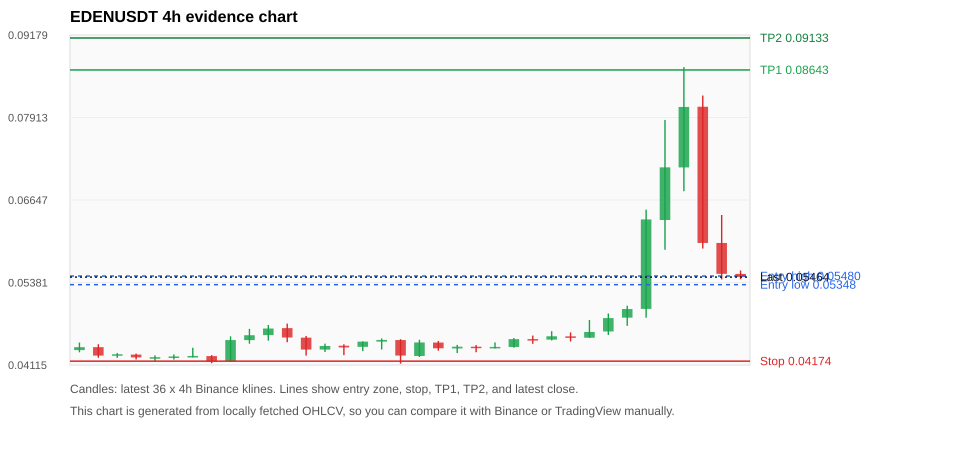
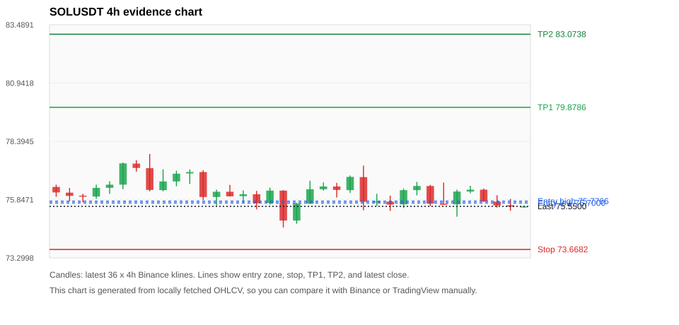
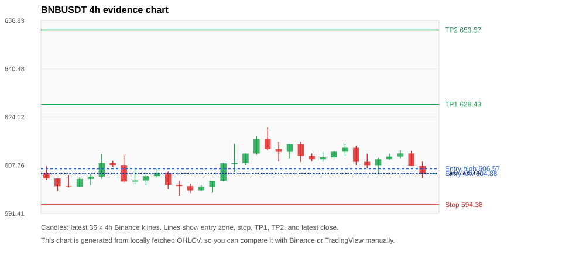
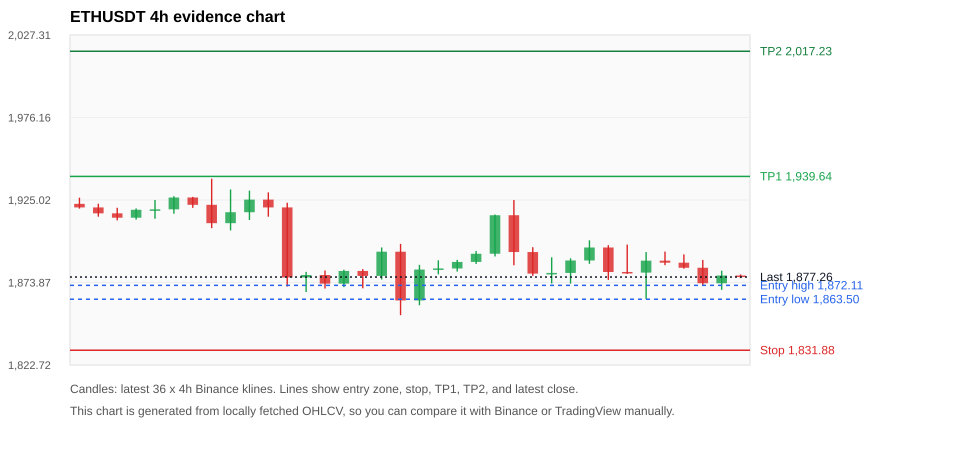
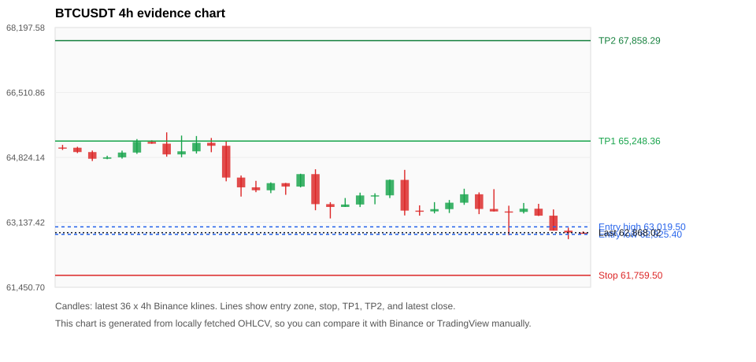

# Crypto 市场扫描报告 v1

- 报告时间：2026-08-14 20:06:05 CST
- Run ID：`20260814_120503_c96b7b47`
- Run type：`daily_full`
- 数据来源：SQLite
- 报告版本：v1
- 扫描 ID：0bd63f946d48
- 数据源：Binance public spot API + CoinGecko/CoinMarketCap cross-check
- 过滤条件：USDT spot; 24h quote volume >= 30,000,000; trades >= 30,000; exclude stables/leveraged tokens; analyze 1h/4h/1d klines
- 默认单笔风险：账户权益的 1.00%

## 限制说明

- 交易信号仍以 Binance 现货公开 K 线为主源；外部数据源用于一致性复核。
- 结果是研究和模拟盘计划，不是确定收益或实盘下单指令。
- 历史长度过滤：候选币至少需要 180 根 1d K 线。
- 数据质量验证池：先验证 score 排名前 min(top_n * 2, 10) 的候选，再按 action + score 补足最终名单。
- 大盘环境过滤：RISK_OFF; BTC/ETH 大盘偏弱，山寨币买入候选降级为观察。 BTC 7d=-3.165556097905853; ETH 7d=-1.9224942272931478.
- 已启用数据交叉验证：Binance 主源 + CoinGecko 自动对照；CoinMarketCap 在配置 API Key 后自动对照。
- EDENUSDT 交叉验证状态 DATA_WARNING：At least one external provider needs manual review.
- SOLUSDT 交叉验证状态 DATA_WARNING：At least one external provider needs manual review.
- BNBUSDT 交叉验证状态 DATA_WARNING：At least one external provider needs manual review.
- ETHUSDT 交叉验证状态 DATA_WARNING：At least one external provider needs manual review.
- BTCUSDT 交叉验证状态 DATA_WARNING：At least one external provider needs manual review.
- XRPUSDT 交叉验证状态 DATA_WARNING：At least one external provider needs manual review.
- ALLOUSDT 交叉验证状态 DATA_WARNING：At least one external provider needs manual review.
- TUTUSDT 交叉验证状态 DATA_WARNING：At least one external provider needs manual review.

## 5 个候选交易计划

| Rank | Coin | Action | Setup | Entry Zone | Stop Loss | TP1 | TP2 / Exit Rule | R/R | Verdict |
|---:|---|---|---|---:|---:|---:|---|---:|---|
| 1 | `EDEN` | `WATCH_ONLY` | 回踩支撑/4h EMA 附近 | 0.05348 - 0.05480 | 0.04174 | 0.08643 | 0.09133 或跌破 4h 关键支撑 | 2.60-3.00 | 只观察 |
| 2 | `SOL` | `WATCH_ONLY` | 回踩支撑/4h EMA 附近 | 75.7000 - 75.7766 | 73.6682 | 79.8786 | 83.0738 或跌破 4h 关键支撑 | 2.00-3.54 | 只观察 |
| 3 | `BNB` | `REJECT` | 回踩支撑/4h EMA 附近 | 604.88 - 606.57 | 594.38 | 628.43 | 653.57 或跌破 4h 关键支撑 | 2.00-4.21 | 只观察 |
| 4 | `ETH` | `REJECT` | 回踩支撑/4h EMA 附近 | 1,863.50 - 1,872.11 | 1,831.88 | 1,939.64 | 2,017.23 或跌破 4h 关键支撑 | 2.00-4.16 | 只观察 |
| 5 | `BTC` | `REJECT` | 回踩支撑/4h EMA 附近 | 62,825.40 - 63,019.50 | 61,759.50 | 65,248.36 | 67,858.29 或跌破 4h 关键支撑 | 2.00-4.24 | 只观察 |

## 数据交叉验证摘要

价格差异以 Binance 当前价为基准；成交量口径不同，Binance 是 USDT 现货成交额，CoinGecko/CoinMarketCap 通常是全市场成交量。

| Rank | Coin | Data Status | Max Price Diff | Max 24h Diff | Message |
|---:|---|---|---:|---:|---|
| 1 | `EDEN` | DATA_WARNING | 0.48% | 3.68 pts | At least one external provider needs manual review. |
| 2 | `SOL` | DATA_WARNING | 0.13% | 0.11 pts | At least one external provider needs manual review. |
| 3 | `BNB` | DATA_WARNING | 0.09% | 0.24 pts | At least one external provider needs manual review. |
| 4 | `ETH` | DATA_WARNING | 0.11% | 0.17 pts | At least one external provider needs manual review. |
| 5 | `BTC` | DATA_WARNING | 0.11% | 0.26 pts | At least one external provider needs manual review. |

## 候选币说明

### 1. EDEN `EDENUSDT`



- 入选原因：回踩支撑/4h EMA 附近；24h +12.72%，7d +33.30%，4h RSI 58.48，24h 成交额 $30.8M。
- 交易失效条件：跌破 0.0417443 或 4h 收盘重新失守关键支撑。
- 主要风险：24h 振幅较大，回撤风险高；成交量突增，可能是事件驱动；BTC/ETH 大盘环境未确认强势，山寨币买入信号降级；数据交叉验证需要人工复核。
- 数据交叉验证：DATA_WARNING；At least one external provider needs manual review.

#### 可点击人工验证

- [Binance 交易页](https://www.binance.com/en/trade/EDEN_USDT)
- [TradingView 图表](https://www.tradingview.com/chart/?symbol=BINANCE%3AEDENUSDT)
- [CoinGecko 搜索](https://www.coingecko.com/en/search?query=EDEN)
- [CoinMarketCap 搜索](https://coinmarketcap.com/search/?q=EDEN)

#### 多数据源对照

| Source | Status | Asset ID | Price | 24h Change | 24h Volume | Price Diff | 24h Diff | Updated | Message |
|---|---|---|---:|---:|---:|---:|---:|---|---|
| Binance | DATA_OK | EDENUSDT | 0.05464 | +12.72% | $30.8M | 0.00% | 0.00 pts | 2026-08-14T12:05:32+00:00 | Primary market data source used by scanner. |
| CoinGecko | DATA_WARNING | openeden | 0.05476 | +16.40% | $77.6M | 0.22% | 3.68 pts | 2026-08-14T12:03:20.000Z | 24h change diff 3.68 points exceeds warning threshold; CoinGecko symbol mapping has 3 exact matches; selected highest market-cap rank |
| CoinMarketCap | DATA_WARNING | 38513 | 0.05490 | +13.28% | $110.6M | 0.48% | 0.56 pts | 2026-08-14T12:04:04.000Z | CoinMarketCap symbol mapping has 3 matches; selected lowest cmc_rank |

#### 指标证据

| 指标 | 数值 | 人工核对用途 |
|---|---:|---|
| 当前价 | 0.05464 | 与 Binance/TradingView 当前价格对照 |
| 24h 涨跌 | +12.72% | 与交易所 24h 涨跌对照 |
| 7d 涨跌 | +33.30% | 判断短线趋势是否延续 |
| 4h EMA20 | 0.05337 | 判断短期趋势支撑 |
| 4h EMA50 | 0.04778 | 判断中期趋势支撑 |
| 1d EMA20 | 0.04564 | 判断日线趋势 |
| 1d EMA50 | 0.04444 | 判断日线趋势 |
| 4h RSI14 | 58.48 | 判断是否过热/过弱 |
| 4h ATR14 | 0.0075614286 | 推导止损和入场缓冲 |
| 最近 18 根 4h 最低点 | 0.04238 | 支撑/止损参考 |
| 最近 36 根 4h 最高点 | 0.08686 | TP/压力参考 |
| 支撑位 | 0.05337 | 入场区间推导基础 |

#### 交易计划推导

- 支撑位 = 最近低点、4h EMA20、4h EMA50、1d EMA20 中不高于当前价的最高有效支撑 = `0.05337`。
- 入场区间 = 支撑位附近 + ATR 缓冲 = `0.05348 - 0.05480`。
- 止损 = min(最近 18 根 4h 最低点 * 0.985, 入场中位价 - 1.15 * ATR14) = `0.04174`。
- TP1 = max(最近 36 根 4h 最高点 * 0.995, 入场中位价 + 2R) = `0.08643`。
- TP2 = max(入场中位价 + 3R, TP1 * 1.04) = `0.09133`。

#### 最近 10 根 4h K线

| UTC 开盘时间 | Open | High | Low | Close | Quote Volume | Trades |
|---|---:|---:|---:|---:|---:|---:|
| 2026-08-13T00:00+00:00 | 0.04555 | 0.04615 | 0.04476 | 0.04533 | $62,618 | 1519 |
| 2026-08-13T04:00+00:00 | 0.04534 | 0.04806 | 0.04531 | 0.04622 | $493,575 | 6606 |
| 2026-08-13T08:00+00:00 | 0.04630 | 0.04906 | 0.04576 | 0.04835 | $309,853 | 4310 |
| 2026-08-13T12:00+00:00 | 0.04842 | 0.05025 | 0.04716 | 0.04974 | $555,733 | 8064 |
| 2026-08-13T16:00+00:00 | 0.04976 | 0.06499 | 0.04841 | 0.06349 | $4.3M | 57620 |
| 2026-08-13T20:00+00:00 | 0.06340 | 0.07875 | 0.05884 | 0.07148 | $8.1M | 76942 |
| 2026-08-14T00:00+00:00 | 0.07147 | 0.08686 | 0.06781 | 0.08075 | $8.6M | 95365 |
| 2026-08-14T04:00+00:00 | 0.08078 | 0.08250 | 0.05902 | 0.05988 | $6.3M | 92888 |
| 2026-08-14T08:00+00:00 | 0.05988 | 0.06417 | 0.05428 | 0.05514 | $2.9M | 42711 |
| 2026-08-14T12:00+00:00 | 0.05513 | 0.05566 | 0.05432 | 0.05468 | $51,542 | 790 |

### 2. SOL `SOLUSDT`



- 入选原因：回踩支撑/4h EMA 附近；24h -0.18%，7d +1.92%，4h RSI 42.53，24h 成交额 $79.7M。
- 交易失效条件：跌破 73.66815 或 4h 收盘重新失守关键支撑。
- 主要风险：BTC/ETH 大盘环境未确认强势，山寨币买入信号降级；24h 动量未确认；数据交叉验证需要人工复核。
- 数据交叉验证：DATA_WARNING；At least one external provider needs manual review.

#### 可点击人工验证

- [Binance 交易页](https://www.binance.com/en/trade/SOL_USDT)
- [TradingView 图表](https://www.tradingview.com/chart/?symbol=BINANCE%3ASOLUSDT)
- [CoinGecko 搜索](https://www.coingecko.com/en/search?query=SOL)
- [CoinMarketCap 搜索](https://coinmarketcap.com/search/?q=SOL)

#### 多数据源对照

| Source | Status | Asset ID | Price | 24h Change | 24h Volume | Price Diff | 24h Diff | Updated | Message |
|---|---|---|---:|---:|---:|---:|---:|---|---|
| Binance | DATA_OK | SOLUSDT | 75.5500 | -0.18% | $79.7M | 0.00% | 0.00 pts | 2026-08-14T12:05:32+00:00 | Primary market data source used by scanner. |
| CoinGecko | DATA_OK | solana | 75.4500 | -0.30% | $1.10B | 0.13% | 0.11 pts | 2026-08-14T12:03:20.000Z | External source agrees with Binance within thresholds. |
| CoinMarketCap | DATA_WARNING | 5426 | 75.4561 | -0.18% | $1.17B | 0.12% | 0.01 pts | 2026-08-14T12:04:04.000Z | CoinMarketCap symbol mapping has 8 matches; selected lowest cmc_rank |

#### 指标证据

| 指标 | 数值 | 人工核对用途 |
|---|---:|---|
| 当前价 | 75.5500 | 与 Binance/TradingView 当前价格对照 |
| 24h 涨跌 | -0.18% | 与交易所 24h 涨跌对照 |
| 7d 涨跌 | +1.92% | 判断短线趋势是否延续 |
| 4h EMA20 | 75.8750 | 判断短期趋势支撑 |
| 4h EMA50 | 75.5489 | 判断中期趋势支撑 |
| 1d EMA20 | 75.1668 | 判断日线趋势 |
| 1d EMA50 | 75.5176 | 判断日线趋势 |
| 4h RSI14 | 42.53 | 判断是否过热/过弱 |
| 4h ATR14 | 0.74643 | 推导止损和入场缓冲 |
| 最近 18 根 4h 最低点 | 74.7900 | 支撑/止损参考 |
| 最近 36 根 4h 最高点 | 77.8400 | TP/压力参考 |
| 支撑位 | 75.5489 | 入场区间推导基础 |

#### 交易计划推导

- 支撑位 = 最近低点、4h EMA20、4h EMA50、1d EMA20 中不高于当前价的最高有效支撑 = `75.5489`。
- 入场区间 = 支撑位附近 + ATR 缓冲 = `75.7000 - 75.7766`。
- 止损 = min(最近 18 根 4h 最低点 * 0.985, 入场中位价 - 1.15 * ATR14) = `73.6682`。
- TP1 = max(最近 36 根 4h 最高点 * 0.995, 入场中位价 + 2R) = `79.8786`。
- TP2 = max(入场中位价 + 3R, TP1 * 1.04) = `83.0738`。

#### 最近 10 根 4h K线

| UTC 开盘时间 | Open | High | Low | Close | Quote Volume | Trades |
|---|---:|---:|---:|---:|---:|---:|
| 2026-08-13T00:00+00:00 | 75.6400 | 76.3300 | 75.4800 | 76.2600 | $12.7M | 56663 |
| 2026-08-13T04:00+00:00 | 76.2600 | 76.6200 | 76.0300 | 76.4400 | $10.5M | 32420 |
| 2026-08-13T08:00+00:00 | 76.4400 | 76.4900 | 75.5600 | 75.6700 | $13.6M | 49629 |
| 2026-08-13T12:00+00:00 | 75.6600 | 76.5900 | 75.6300 | 75.6400 | $17.2M | 75249 |
| 2026-08-13T16:00+00:00 | 75.6400 | 76.2800 | 75.1000 | 76.2000 | $18.6M | 85599 |
| 2026-08-13T20:00+00:00 | 76.2000 | 76.4500 | 76.1200 | 76.2800 | $10.5M | 48914 |
| 2026-08-14T00:00+00:00 | 76.2800 | 76.3300 | 75.7500 | 75.7600 | $10.4M | 44465 |
| 2026-08-14T04:00+00:00 | 75.7600 | 76.0400 | 75.5000 | 75.5900 | $10.7M | 38057 |
| 2026-08-14T08:00+00:00 | 75.6000 | 75.8800 | 75.3600 | 75.5400 | $12.2M | 36441 |
| 2026-08-14T12:00+00:00 | 75.5400 | 75.5600 | 75.5000 | 75.5500 | $186,577 | 780 |

### 3. BNB `BNBUSDT`



- 入选原因：回踩支撑/4h EMA 附近；24h -0.66%，7d +2.09%，4h RSI 37.55，24h 成交额 $42.3M。
- 交易失效条件：跌破 594.37855 或 4h 收盘重新失守关键支撑。
- 主要风险：BTC/ETH 大盘环境未确认强势，山寨币买入信号降级；24h 动量未确认；数据交叉验证需要人工复核。
- 数据交叉验证：DATA_WARNING；At least one external provider needs manual review.

#### 可点击人工验证

- [Binance 交易页](https://www.binance.com/en/trade/BNB_USDT)
- [TradingView 图表](https://www.tradingview.com/chart/?symbol=BINANCE%3ABNBUSDT)
- [CoinGecko 搜索](https://www.coingecko.com/en/search?query=BNB)
- [CoinMarketCap 搜索](https://coinmarketcap.com/search/?q=BNB)

#### 多数据源对照

| Source | Status | Asset ID | Price | 24h Change | 24h Volume | Price Diff | 24h Diff | Updated | Message |
|---|---|---|---:|---:|---:|---:|---:|---|---|
| Binance | DATA_OK | BNBUSDT | 605.09 | -0.66% | $42.3M | 0.00% | 0.00 pts | 2026-08-14T12:05:32+00:00 | Primary market data source used by scanner. |
| CoinGecko | DATA_OK | binancecoin | 604.52 | -0.90% | $482.7M | 0.09% | 0.24 pts | 2026-08-14T12:03:20.000Z | External source agrees with Binance within thresholds. |
| CoinMarketCap | DATA_WARNING | 1839 | 604.56 | -0.59% | $947.1M | 0.09% | 0.06 pts | 2026-08-14T12:04:04.000Z | CoinMarketCap symbol mapping has 4 matches; selected lowest cmc_rank |

#### 指标证据

| 指标 | 数值 | 人工核对用途 |
|---|---:|---|
| 当前价 | 605.09 | 与 Binance/TradingView 当前价格对照 |
| 24h 涨跌 | -0.66% | 与交易所 24h 涨跌对照 |
| 7d 涨跌 | +2.09% | 判断短线趋势是否延续 |
| 4h EMA20 | 608.28 | 判断短期趋势支撑 |
| 4h EMA50 | 603.68 | 判断中期趋势支撑 |
| 1d EMA20 | 594.86 | 判断日线趋势 |
| 1d EMA50 | 589.66 | 判断日线趋势 |
| 4h RSI14 | 37.55 | 判断是否过热/过弱 |
| 4h ATR14 | 4.1400 | 推导止损和入场缓冲 |
| 最近 18 根 4h 最低点 | 603.43 | 支撑/止损参考 |
| 最近 36 根 4h 最高点 | 620.55 | TP/压力参考 |
| 支撑位 | 603.68 | 入场区间推导基础 |

#### 交易计划推导

- 支撑位 = 最近低点、4h EMA20、4h EMA50、1d EMA20 中不高于当前价的最高有效支撑 = `603.68`。
- 入场区间 = 支撑位附近 + ATR 缓冲 = `604.88 - 606.57`。
- 止损 = min(最近 18 根 4h 最低点 * 0.985, 入场中位价 - 1.15 * ATR14) = `594.38`。
- TP1 = max(最近 36 根 4h 最高点 * 0.995, 入场中位价 + 2R) = `628.43`。
- TP2 = max(入场中位价 + 3R, TP1 * 1.04) = `653.57`。

#### 最近 10 根 4h K线

| UTC 开盘时间 | Open | High | Low | Close | Quote Volume | Trades |
|---|---:|---:|---:|---:|---:|---:|
| 2026-08-13T00:00+00:00 | 610.44 | 612.48 | 609.79 | 612.34 | $5.4M | 54931 |
| 2026-08-13T04:00+00:00 | 612.35 | 614.99 | 610.83 | 613.71 | $6.8M | 66194 |
| 2026-08-13T08:00+00:00 | 613.70 | 614.40 | 607.77 | 608.93 | $9.7M | 75583 |
| 2026-08-13T12:00+00:00 | 608.93 | 611.64 | 606.62 | 607.60 | $10.1M | 98854 |
| 2026-08-13T16:00+00:00 | 607.59 | 610.26 | 605.00 | 609.79 | $9.0M | 89175 |
| 2026-08-13T20:00+00:00 | 609.79 | 611.80 | 609.54 | 610.71 | $3.3M | 38832 |
| 2026-08-14T00:00+00:00 | 610.71 | 612.90 | 609.92 | 611.76 | $5.6M | 47748 |
| 2026-08-14T04:00+00:00 | 611.76 | 612.65 | 607.46 | 607.47 | $5.9M | 46029 |
| 2026-08-14T08:00+00:00 | 607.47 | 609.00 | 603.43 | 604.92 | $8.4M | 72236 |
| 2026-08-14T12:00+00:00 | 604.93 | 605.33 | 604.85 | 605.10 | $141,849 | 2034 |

### 4. ETH `ETHUSDT`



- 入选原因：回踩支撑/4h EMA 附近；24h -0.13%，7d -2.40%，4h RSI 43.94，24h 成交额 $244.2M。
- 交易失效条件：跌破 1831.8833 或 4h 收盘重新失守关键支撑。
- 主要风险：日线趋势未完全确认；BTC/ETH 大盘环境未确认强势，山寨币买入信号降级；24h 动量未确认；7d 趋势未确认；数据交叉验证需要人工复核。
- 数据交叉验证：DATA_WARNING；At least one external provider needs manual review.

#### 可点击人工验证

- [Binance 交易页](https://www.binance.com/en/trade/ETH_USDT)
- [TradingView 图表](https://www.tradingview.com/chart/?symbol=BINANCE%3AETHUSDT)
- [CoinGecko 搜索](https://www.coingecko.com/en/search?query=ETH)
- [CoinMarketCap 搜索](https://coinmarketcap.com/search/?q=ETH)

#### 多数据源对照

| Source | Status | Asset ID | Price | 24h Change | 24h Volume | Price Diff | 24h Diff | Updated | Message |
|---|---|---|---:|---:|---:|---:|---:|---|---|
| Binance | DATA_OK | ETHUSDT | 1,877.26 | -0.13% | $244.2M | 0.00% | 0.00 pts | 2026-08-14T12:05:32+00:00 | Primary market data source used by scanner. |
| CoinGecko | DATA_OK | ethereum | 1,875.25 | -0.30% | $5.47B | 0.11% | 0.17 pts | 2026-08-14T12:03:20.000Z | External source agrees with Binance within thresholds. |
| CoinMarketCap | DATA_WARNING | 1027 | 1,875.22 | -0.11% | $6.22B | 0.11% | 0.01 pts | 2026-08-14T12:04:04.000Z | CoinMarketCap symbol mapping has 6 matches; selected lowest cmc_rank |

#### 指标证据

| 指标 | 数值 | 人工核对用途 |
|---|---:|---|
| 当前价 | 1,877.26 | 与 Binance/TradingView 当前价格对照 |
| 24h 涨跌 | -0.13% | 与交易所 24h 涨跌对照 |
| 7d 涨跌 | -2.40% | 判断短线趋势是否延续 |
| 4h EMA20 | 1,885.51 | 判断短期趋势支撑 |
| 4h EMA50 | 1,891.48 | 判断中期趋势支撑 |
| 1d EMA20 | 1,883.70 | 判断日线趋势 |
| 1d EMA50 | 1,864.89 | 判断日线趋势 |
| 4h RSI14 | 43.94 | 判断是否过热/过弱 |
| 4h ATR14 | 17.6071 | 推导止损和入场缓冲 |
| 最近 18 根 4h 最低点 | 1,859.78 | 支撑/止损参考 |
| 最近 36 根 4h 最高点 | 1,938.22 | TP/压力参考 |
| 支撑位 | 1,859.78 | 入场区间推导基础 |

#### 交易计划推导

- 支撑位 = 最近低点、4h EMA20、4h EMA50、1d EMA20 中不高于当前价的最高有效支撑 = `1,859.78`。
- 入场区间 = 支撑位附近 + ATR 缓冲 = `1,863.50 - 1,872.11`。
- 止损 = min(最近 18 根 4h 最低点 * 0.985, 入场中位价 - 1.15 * ATR14) = `1,831.88`。
- TP1 = max(最近 36 根 4h 最高点 * 0.995, 入场中位价 + 2R) = `1,939.64`。
- TP2 = max(入场中位价 + 3R, TP1 * 1.04) = `2,017.23`。

#### 最近 10 根 4h K线

| UTC 开盘时间 | Open | High | Low | Close | Quote Volume | Trades |
|---|---:|---:|---:|---:|---:|---:|
| 2026-08-13T00:00+00:00 | 1,879.80 | 1,888.89 | 1,873.17 | 1,887.52 | $47.1M | 197076 |
| 2026-08-13T04:00+00:00 | 1,887.52 | 1,900.00 | 1,885.46 | 1,895.57 | $37.5M | 182258 |
| 2026-08-13T08:00+00:00 | 1,895.57 | 1,897.00 | 1,875.49 | 1,880.39 | $55.5M | 239420 |
| 2026-08-13T12:00+00:00 | 1,880.40 | 1,897.36 | 1,879.17 | 1,880.01 | $62.3M | 338332 |
| 2026-08-13T16:00+00:00 | 1,880.01 | 1,892.73 | 1,863.67 | 1,887.41 | $68.9M | 438720 |
| 2026-08-13T20:00+00:00 | 1,887.41 | 1,893.03 | 1,884.60 | 1,886.15 | $19.5M | 119051 |
| 2026-08-14T00:00+00:00 | 1,886.16 | 1,891.30 | 1,882.44 | 1,883.00 | $22.6M | 143870 |
| 2026-08-14T04:00+00:00 | 1,883.00 | 1,887.87 | 1,872.28 | 1,873.40 | $32.2M | 152994 |
| 2026-08-14T08:00+00:00 | 1,873.40 | 1,881.19 | 1,869.32 | 1,878.20 | $38.4M | 219654 |
| 2026-08-14T12:00+00:00 | 1,878.20 | 1,878.89 | 1,876.58 | 1,877.26 | $895,575 | 5819 |

### 5. BTC `BTCUSDT`



- 入选原因：回踩支撑/4h EMA 附近；24h -0.94%，7d -3.29%，4h RSI 32.86，24h 成交额 $776.5M。
- 交易失效条件：跌破 61759.5 或 4h 收盘重新失守关键支撑。
- 主要风险：日线趋势未完全确认；BTC/ETH 大盘环境未确认强势，山寨币买入信号降级；24h 动量未确认；7d 趋势未确认；数据交叉验证需要人工复核。
- 数据交叉验证：DATA_WARNING；At least one external provider needs manual review.

#### 可点击人工验证

- [Binance 交易页](https://www.binance.com/en/trade/BTC_USDT)
- [TradingView 图表](https://www.tradingview.com/chart/?symbol=BINANCE%3ABTCUSDT)
- [CoinGecko 搜索](https://www.coingecko.com/en/search?query=BTC)
- [CoinMarketCap 搜索](https://coinmarketcap.com/search/?q=BTC)

#### 多数据源对照

| Source | Status | Asset ID | Price | 24h Change | 24h Volume | Price Diff | 24h Diff | Updated | Message |
|---|---|---|---:|---:|---:|---:|---:|---|---|
| Binance | DATA_OK | BTCUSDT | 62,868.02 | -0.94% | $776.5M | 0.00% | 0.00 pts | 2026-08-14T12:05:32+00:00 | Primary market data source used by scanner. |
| CoinGecko | DATA_OK | bitcoin | 62,799.00 | -1.20% | $20.17B | 0.11% | 0.26 pts | 2026-08-14T12:03:20.000Z | External source agrees with Binance within thresholds. |
| CoinMarketCap | DATA_WARNING | 1 | 62,800.57 | -0.93% | $20.36B | 0.11% | 0.01 pts | 2026-08-14T12:04:04.000Z | CoinMarketCap symbol mapping has 13 matches; selected lowest cmc_rank |

#### 指标证据

| 指标 | 数值 | 人工核对用途 |
|---|---:|---|
| 当前价 | 62,868.02 | 与 Binance/TradingView 当前价格对照 |
| 24h 涨跌 | -0.94% | 与交易所 24h 涨跌对照 |
| 7d 涨跌 | -3.29% | 判断短线趋势是否延续 |
| 4h EMA20 | 63,531.43 | 判断短期趋势支撑 |
| 4h EMA50 | 63,931.10 | 判断中期趋势支撑 |
| 1d EMA20 | 63,957.29 | 判断日线趋势 |
| 1d EMA50 | 64,451.46 | 判断日线趋势 |
| 4h RSI14 | 32.86 | 判断是否过热/过弱 |
| 4h ATR14 | 456.44 | 推导止损和入场缓冲 |
| 最近 18 根 4h 最低点 | 62,700.00 | 支撑/止损参考 |
| 最近 36 根 4h 最高点 | 65,474.46 | TP/压力参考 |
| 支撑位 | 62,700.00 | 入场区间推导基础 |

#### 交易计划推导

- 支撑位 = 最近低点、4h EMA20、4h EMA50、1d EMA20 中不高于当前价的最高有效支撑 = `62,700.00`。
- 入场区间 = 支撑位附近 + ATR 缓冲 = `62,825.40 - 63,019.50`。
- 止损 = min(最近 18 根 4h 最低点 * 0.985, 入场中位价 - 1.15 * ATR14) = `61,759.50`。
- TP1 = max(最近 36 根 4h 最高点 * 0.995, 入场中位价 + 2R) = `65,248.36`。
- TP2 = max(入场中位价 + 3R, TP1 * 1.04) = `67,858.29`。

#### 最近 10 根 4h K线

| UTC 开盘时间 | Open | High | Low | Close | Quote Volume | Trades |
|---|---:|---:|---:|---:|---:|---:|
| 2026-08-13T00:00+00:00 | 63,479.99 | 63,717.31 | 63,380.00 | 63,646.99 | $100.7M | 258695 |
| 2026-08-13T04:00+00:00 | 63,647.00 | 64,010.00 | 63,591.56 | 63,865.84 | $96.6M | 247721 |
| 2026-08-13T08:00+00:00 | 63,865.84 | 63,915.00 | 63,350.00 | 63,484.30 | $92.4M | 209860 |
| 2026-08-13T12:00+00:00 | 63,484.31 | 63,999.00 | 63,420.00 | 63,420.01 | $135.2M | 524821 |
| 2026-08-13T16:00+00:00 | 63,420.01 | 63,568.97 | 62,802.27 | 63,407.99 | $194.2M | 630580 |
| 2026-08-13T20:00+00:00 | 63,408.00 | 63,640.00 | 63,368.00 | 63,490.86 | $66.8M | 207100 |
| 2026-08-14T00:00+00:00 | 63,490.86 | 63,617.45 | 63,301.58 | 63,310.00 | $93.7M | 273190 |
| 2026-08-14T04:00+00:00 | 63,310.00 | 63,472.50 | 62,920.00 | 62,920.78 | $132.1M | 278676 |
| 2026-08-14T08:00+00:00 | 62,920.78 | 62,997.83 | 62,700.00 | 62,868.83 | $153.2M | 335711 |
| 2026-08-14T12:00+00:00 | 62,868.83 | 62,902.00 | 62,840.95 | 62,868.02 | $3.2M | 9270 |

## 组合风控

- 不要 5 个候选全部满仓买入。
- 同时持仓总风险建议控制在账户权益的 3% - 5% 以内。
- 如果 BTC/ETH 同时破位，暂停山寨币多头计划或降低仓位。
- 第一版报告用于模拟盘和人工复核，不自动下单。

## 原始数据

```json
[
  {
    "rank": 1,
    "symbol": "EDENUSDT",
    "base_asset": "EDEN",
    "price": 0.05464,
    "score": 71.0257139475992,
    "setup": "回踩支撑/4h EMA 附近",
    "verdict": "只观察",
    "entry_low": 0.05347833238915132,
    "entry_high": 0.05480391999999999,
    "stop_loss": 0.0417443,
    "take_profit_1": 0.08642570000000001,
    "take_profit_2": 0.09133160477830264,
    "risk_reward_1": 2.604261227728654,
    "risk_reward_2": 3.0,
    "pct_24h": 12.72,
    "pct_3d": 22.401433691756267,
    "pct_7d": 33.3008050744084,
    "quote_volume_24h": 30813172.813733,
    "trades_24h": 374163,
    "high_low_range_24h": 84.18150975402885,
    "rsi_1h": 29.214437367303617,
    "rsi_4h": 58.47631040453329,
    "ema20_4h": 0.05337158921072986,
    "ema50_4h": 0.04778160999179548,
    "ema20_1d": 0.045642326221938326,
    "ema50_1d": 0.04443969374151936,
    "atr_4h": 0.007561428571428572,
    "macd_hist_4h": 0.0008396134269294244,
    "volume_ratio_24h": 27.75180703432527,
    "support_level": 0.05337158921072986,
    "recent_low_4h_18": 0.04238,
    "recent_high_4h_36": 0.08686,
    "distance_to_support_pct": 2.376565524893781,
    "binance_trade_url": "https://www.binance.com/en/trade/EDEN_USDT",
    "tradingview_url": "https://www.tradingview.com/chart/?symbol=BINANCE%3AEDENUSDT",
    "coingecko_search_url": "https://www.coingecko.com/en/search?query=EDEN",
    "coinmarketcap_search_url": "https://coinmarketcap.com/search/?q=EDEN",
    "invalidation": "跌破 0.0417443 或 4h 收盘重新失守关键支撑",
    "recent_4h_klines": [
      {
        "open_time_utc": "2026-08-08T16:00+00:00",
        "open": 0.04344,
        "high": 0.0446,
        "low": 0.0431,
        "close": 0.04389,
        "quote_volume": 82142.980244,
        "trades": 2209
      },
      {
        "open_time_utc": "2026-08-08T20:00+00:00",
        "open": 0.04389,
        "high": 0.04434,
        "low": 0.04226,
        "close": 0.0426,
        "quote_volume": 133668.466368,
        "trades": 2371
      },
      {
        "open_time_utc": "2026-08-09T00:00+00:00",
        "open": 0.04258,
        "high": 0.043,
        "low": 0.04224,
        "close": 0.0428,
        "quote_volume": 46481.521047,
        "trades": 1018
      },
      {
        "open_time_utc": "2026-08-09T04:00+00:00",
        "open": 0.04275,
        "high": 0.0429,
        "low": 0.042,
        "close": 0.04232,
        "quote_volume": 89599.397437,
        "trades": 1692
      },
      {
        "open_time_utc": "2026-08-09T08:00+00:00",
        "open": 0.04229,
        "high": 0.04263,
        "low": 0.04167,
        "close": 0.04235,
        "quote_volume": 93845.413967,
        "trades": 1401
      },
      {
        "open_time_utc": "2026-08-09T12:00+00:00",
        "open": 0.04231,
        "high": 0.04277,
        "low": 0.04198,
        "close": 0.04246,
        "quote_volume": 116138.098015,
        "trades": 1921
      },
      {
        "open_time_utc": "2026-08-09T16:00+00:00",
        "open": 0.04239,
        "high": 0.0438,
        "low": 0.04232,
        "close": 0.04254,
        "quote_volume": 83497.324349,
        "trades": 2870
      },
      {
        "open_time_utc": "2026-08-09T20:00+00:00",
        "open": 0.04252,
        "high": 0.04267,
        "low": 0.04142,
        "close": 0.04169,
        "quote_volume": 63181.554465,
        "trades": 2283
      },
      {
        "open_time_utc": "2026-08-10T00:00+00:00",
        "open": 0.04172,
        "high": 0.04555,
        "low": 0.04163,
        "close": 0.04498,
        "quote_volume": 338841.107623,
        "trades": 15862
      },
      {
        "open_time_utc": "2026-08-10T04:00+00:00",
        "open": 0.04497,
        "high": 0.0467,
        "low": 0.04442,
        "close": 0.04572,
        "quote_volume": 378784.957053,
        "trades": 14959
      },
      {
        "open_time_utc": "2026-08-10T08:00+00:00",
        "open": 0.04574,
        "high": 0.0473,
        "low": 0.04489,
        "close": 0.04675,
        "quote_volume": 473752.38979,
        "trades": 18145
      },
      {
        "open_time_utc": "2026-08-10T12:00+00:00",
        "open": 0.04681,
        "high": 0.04751,
        "low": 0.04465,
        "close": 0.04537,
        "quote_volume": 540870.363055,
        "trades": 20579
      },
      {
        "open_time_utc": "2026-08-10T16:00+00:00",
        "open": 0.04535,
        "high": 0.04561,
        "low": 0.04259,
        "close": 0.04352,
        "quote_volume": 269083.256466,
        "trades": 9820
      },
      {
        "open_time_utc": "2026-08-10T20:00+00:00",
        "open": 0.04352,
        "high": 0.04443,
        "low": 0.04315,
        "close": 0.04407,
        "quote_volume": 109124.561626,
        "trades": 3515
      },
      {
        "open_time_utc": "2026-08-11T00:00+00:00",
        "open": 0.04411,
        "high": 0.04433,
        "low": 0.04267,
        "close": 0.04385,
        "quote_volume": 105494.775072,
        "trades": 3088
      },
      {
        "open_time_utc": "2026-08-11T04:00+00:00",
        "open": 0.04394,
        "high": 0.04477,
        "low": 0.04328,
        "close": 0.04474,
        "quote_volume": 80914.135647,
        "trades": 2181
      },
      {
        "open_time_utc": "2026-08-11T08:00+00:00",
        "open": 0.04474,
        "high": 0.04523,
        "low": 0.04353,
        "close": 0.045,
        "quote_volume": 218325.200557,
        "trades": 3982
      },
      {
        "open_time_utc": "2026-08-11T12:00+00:00",
        "open": 0.04498,
        "high": 0.04512,
        "low": 0.04136,
        "close": 0.0426,
        "quote_volume": 177126.51275,
        "trades": 3827
      },
      {
        "open_time_utc": "2026-08-11T16:00+00:00",
        "open": 0.04254,
        "high": 0.04502,
        "low": 0.04238,
        "close": 0.04461,
        "quote_volume": 139039.360985,
        "trades": 3641
      },
      {
        "open_time_utc": "2026-08-11T20:00+00:00",
        "open": 0.0446,
        "high": 0.04484,
        "low": 0.04335,
        "close": 0.04372,
        "quote_volume": 95639.210574,
        "trades": 4007
      },
      {
        "open_time_utc": "2026-08-12T00:00+00:00",
        "open": 0.04369,
        "high": 0.04424,
        "low": 0.04299,
        "close": 0.04396,
        "quote_volume": 128493.616747,
        "trades": 4954
      },
      {
        "open_time_utc": "2026-08-12T04:00+00:00",
        "open": 0.04396,
        "high": 0.04421,
        "low": 0.04311,
        "close": 0.04391,
        "quote_volume": 103522.328469,
        "trades": 4011
      },
      {
        "open_time_utc": "2026-08-12T08:00+00:00",
        "open": 0.04391,
        "high": 0.04462,
        "low": 0.0437,
        "close": 0.04393,
        "quote_volume": 82899.355747,
        "trades": 4350
      },
      {
        "open_time_utc": "2026-08-12T12:00+00:00",
        "open": 0.04392,
        "high": 0.04529,
        "low": 0.04381,
        "close": 0.04512,
        "quote_volume": 185959.431638,
        "trades": 5991
      },
      {
        "open_time_utc": "2026-08-12T16:00+00:00",
        "open": 0.04513,
        "high": 0.04567,
        "low": 0.0444,
        "close": 0.04504,
        "quote_volume": 263212.46775,
        "trades": 7214
      },
      {
        "open_time_utc": "2026-08-12T20:00+00:00",
        "open": 0.04505,
        "high": 0.04634,
        "low": 0.04493,
        "close": 0.04556,
        "quote_volume": 167098.541738,
        "trades": 3032
      },
      {
        "open_time_utc": "2026-08-13T00:00+00:00",
        "open": 0.04555,
        "high": 0.04615,
        "low": 0.04476,
        "close": 0.04533,
        "quote_volume": 62617.95193,
        "trades": 1519
      },
      {
        "open_time_utc": "2026-08-13T04:00+00:00",
        "open": 0.04534,
        "high": 0.04806,
        "low": 0.04531,
        "close": 0.04622,
        "quote_volume": 493575.209753,
        "trades": 6606
      },
      {
        "open_time_utc": "2026-08-13T08:00+00:00",
        "open": 0.0463,
        "high": 0.04906,
        "low": 0.04576,
        "close": 0.04835,
        "quote_volume": 309852.629054,
        "trades": 4310
      },
      {
        "open_time_utc": "2026-08-13T12:00+00:00",
        "open": 0.04842,
        "high": 0.05025,
        "low": 0.04716,
        "close": 0.04974,
        "quote_volume": 555733.139213,
        "trades": 8064
      },
      {
        "open_time_utc": "2026-08-13T16:00+00:00",
        "open": 0.04976,
        "high": 0.06499,
        "low": 0.04841,
        "close": 0.06349,
        "quote_volume": 4300134.740633,
        "trades": 57620
      },
      {
        "open_time_utc": "2026-08-13T20:00+00:00",
        "open": 0.0634,
        "high": 0.07875,
        "low": 0.05884,
        "close": 0.07148,
        "quote_volume": 8147541.394008,
        "trades": 76942
      },
      {
        "open_time_utc": "2026-08-14T00:00+00:00",
        "open": 0.07147,
        "high": 0.08686,
        "low": 0.06781,
        "close": 0.08075,
        "quote_volume": 8573021.973511,
        "trades": 95365
      },
      {
        "open_time_utc": "2026-08-14T04:00+00:00",
        "open": 0.08078,
        "high": 0.0825,
        "low": 0.05902,
        "close": 0.05988,
        "quote_volume": 6265055.7976,
        "trades": 92888
      },
      {
        "open_time_utc": "2026-08-14T08:00+00:00",
        "open": 0.05988,
        "high": 0.06417,
        "low": 0.05428,
        "close": 0.05514,
        "quote_volume": 2936579.677313,
        "trades": 42711
      },
      {
        "open_time_utc": "2026-08-14T12:00+00:00",
        "open": 0.05513,
        "high": 0.05566,
        "low": 0.05432,
        "close": 0.05468,
        "quote_volume": 51542.380474,
        "trades": 790
      }
    ],
    "risks": [
      "24h 振幅较大，回撤风险高",
      "成交量突增，可能是事件驱动",
      "BTC/ETH 大盘环境未确认强势，山寨币买入信号降级",
      "数据交叉验证需要人工复核"
    ],
    "data_quality_status": "DATA_WARNING",
    "data_quality_message": "At least one external provider needs manual review.",
    "data_checks": [
      {
        "provider": "Binance",
        "status": "DATA_OK",
        "provider_asset_id": "EDENUSDT",
        "provider_symbol": "EDENUSDT",
        "price_usd": 0.05464,
        "pct_24h": 12.72,
        "volume_24h": 30813172.813733,
        "last_updated": null,
        "fetched_at_utc": "2026-08-14T12:05:32+00:00",
        "price_diff_pct": 0.0,
        "pct_24h_diff": 0.0,
        "volume_note": "Binance USDT spot 24h quoteVolume.",
        "message": "Primary market data source used by scanner."
      },
      {
        "provider": "CoinGecko",
        "status": "DATA_WARNING",
        "provider_asset_id": "openeden",
        "provider_symbol": "EDEN",
        "price_usd": 0.054758,
        "pct_24h": 16.4,
        "volume_24h": 77582315.0,
        "last_updated": "2026-08-14T12:03:20.000Z",
        "fetched_at_utc": "2026-08-14T12:05:32+00:00",
        "price_diff_pct": 0.2159590043923866,
        "pct_24h_diff": 3.679999999999998,
        "volume_note": "CoinGecko total market volume; not the same venue scope as Binance quoteVolume.",
        "message": "24h change diff 3.68 points exceeds warning threshold; CoinGecko symbol mapping has 3 exact matches; selected highest market-cap rank"
      },
      {
        "provider": "CoinMarketCap",
        "status": "DATA_WARNING",
        "provider_asset_id": "38513",
        "provider_symbol": "EDEN",
        "price_usd": 0.054901152839050726,
        "pct_24h": 13.27669338,
        "volume_24h": 110594489.0460196,
        "last_updated": "2026-08-14T12:04:04.000Z",
        "fetched_at_utc": "2026-08-14T12:05:32+00:00",
        "price_diff_pct": 0.4779517552172865,
        "pct_24h_diff": 0.5566933799999987,
        "volume_note": "CoinMarketCap total market volume; not the same venue scope as Binance quoteVolume.",
        "message": "CoinMarketCap symbol mapping has 3 matches; selected lowest cmc_rank"
      }
    ],
    "action": "WATCH_ONLY"
  },
  {
    "rank": 2,
    "symbol": "SOLUSDT",
    "base_asset": "SOL",
    "price": 75.55,
    "score": 22.15704162280207,
    "setup": "回踩支撑/4h EMA 附近",
    "verdict": "只观察",
    "entry_low": 75.69996576487345,
    "entry_high": 75.77664999999999,
    "stop_loss": 73.66815000000001,
    "take_profit_1": 79.87862364731012,
    "take_profit_2": 83.07376859320253,
    "risk_reward_1": 2.0,
    "risk_reward_2": 3.5434305629537426,
    "pct_24h": -0.185,
    "pct_3d": -0.6182583530649821,
    "pct_7d": 1.915553756913524,
    "quote_volume_24h": 79712064.00787,
    "trades_24h": 329004,
    "high_low_range_24h": 1.9840213049267863,
    "rsi_1h": 32.84313725490193,
    "rsi_4h": 42.531120331950206,
    "ema20_4h": 75.87501750745871,
    "ema50_4h": 75.54886802881582,
    "ema20_1d": 75.16682929720716,
    "ema50_1d": 75.51757182963136,
    "atr_4h": 0.7464285714285727,
    "macd_hist_4h": -0.09898336280989337,
    "volume_ratio_24h": 0.827702212972033,
    "support_level": 75.54886802881582,
    "recent_low_4h_18": 74.79,
    "recent_high_4h_36": 77.84,
    "distance_to_support_pct": 0.00149832977476283,
    "binance_trade_url": "https://www.binance.com/en/trade/SOL_USDT",
    "tradingview_url": "https://www.tradingview.com/chart/?symbol=BINANCE%3ASOLUSDT",
    "coingecko_search_url": "https://www.coingecko.com/en/search?query=SOL",
    "coinmarketcap_search_url": "https://coinmarketcap.com/search/?q=SOL",
    "invalidation": "跌破 73.66815 或 4h 收盘重新失守关键支撑",
    "recent_4h_klines": [
      {
        "open_time_utc": "2026-08-08T16:00+00:00",
        "open": 76.4,
        "high": 76.5,
        "low": 75.97,
        "close": 76.16,
        "quote_volume": 13184934.85784,
        "trades": 48233
      },
      {
        "open_time_utc": "2026-08-08T20:00+00:00",
        "open": 76.15,
        "high": 76.36,
        "low": 75.78,
        "close": 76.01,
        "quote_volume": 9158232.08597,
        "trades": 35771
      },
      {
        "open_time_utc": "2026-08-09T00:00+00:00",
        "open": 76.02,
        "high": 76.1,
        "low": 75.73,
        "close": 75.99,
        "quote_volume": 7311495.69433,
        "trades": 27097
      },
      {
        "open_time_utc": "2026-08-09T04:00+00:00",
        "open": 75.98,
        "high": 76.5,
        "low": 75.88,
        "close": 76.36,
        "quote_volume": 9240609.52631,
        "trades": 33860
      },
      {
        "open_time_utc": "2026-08-09T08:00+00:00",
        "open": 76.36,
        "high": 76.65,
        "low": 76.1,
        "close": 76.5,
        "quote_volume": 11146377.22023,
        "trades": 38691
      },
      {
        "open_time_utc": "2026-08-09T12:00+00:00",
        "open": 76.5,
        "high": 77.47,
        "low": 76.3,
        "close": 77.43,
        "quote_volume": 20890385.31712,
        "trades": 61040
      },
      {
        "open_time_utc": "2026-08-09T16:00+00:00",
        "open": 77.42,
        "high": 77.57,
        "low": 77.07,
        "close": 77.23,
        "quote_volume": 12629692.26529,
        "trades": 43948
      },
      {
        "open_time_utc": "2026-08-09T20:00+00:00",
        "open": 77.22,
        "high": 77.84,
        "low": 76.21,
        "close": 76.27,
        "quote_volume": 14034329.73599,
        "trades": 62293
      },
      {
        "open_time_utc": "2026-08-10T00:00+00:00",
        "open": 76.26,
        "high": 77.17,
        "low": 76.21,
        "close": 76.64,
        "quote_volume": 13888105.76735,
        "trades": 85535
      },
      {
        "open_time_utc": "2026-08-10T04:00+00:00",
        "open": 76.64,
        "high": 77.11,
        "low": 76.43,
        "close": 76.98,
        "quote_volume": 9326921.5671,
        "trades": 41438
      },
      {
        "open_time_utc": "2026-08-10T08:00+00:00",
        "open": 76.99,
        "high": 77.16,
        "low": 76.53,
        "close": 77.05,
        "quote_volume": 16369024.57259,
        "trades": 57059
      },
      {
        "open_time_utc": "2026-08-10T12:00+00:00",
        "open": 77.05,
        "high": 77.13,
        "low": 75.83,
        "close": 75.96,
        "quote_volume": 29312515.4774,
        "trades": 104323
      },
      {
        "open_time_utc": "2026-08-10T16:00+00:00",
        "open": 75.96,
        "high": 76.28,
        "low": 75.58,
        "close": 76.19,
        "quote_volume": 18399718.99996,
        "trades": 61699
      },
      {
        "open_time_utc": "2026-08-10T20:00+00:00",
        "open": 76.19,
        "high": 76.49,
        "low": 75.98,
        "close": 75.99,
        "quote_volume": 10401240.97977,
        "trades": 44904
      },
      {
        "open_time_utc": "2026-08-11T00:00+00:00",
        "open": 76.0,
        "high": 76.25,
        "low": 75.71,
        "close": 76.08,
        "quote_volume": 8269441.73668,
        "trades": 34946
      },
      {
        "open_time_utc": "2026-08-11T04:00+00:00",
        "open": 76.08,
        "high": 76.23,
        "low": 75.42,
        "close": 75.69,
        "quote_volume": 13684318.33894,
        "trades": 52015
      },
      {
        "open_time_utc": "2026-08-11T08:00+00:00",
        "open": 75.7,
        "high": 76.37,
        "low": 75.63,
        "close": 76.24,
        "quote_volume": 19123626.41488,
        "trades": 57885
      },
      {
        "open_time_utc": "2026-08-11T12:00+00:00",
        "open": 76.24,
        "high": 76.26,
        "low": 74.63,
        "close": 74.93,
        "quote_volume": 27245143.79517,
        "trades": 131666
      },
      {
        "open_time_utc": "2026-08-11T16:00+00:00",
        "open": 74.93,
        "high": 75.71,
        "low": 74.79,
        "close": 75.67,
        "quote_volume": 12599911.63904,
        "trades": 57079
      },
      {
        "open_time_utc": "2026-08-11T20:00+00:00",
        "open": 75.67,
        "high": 76.67,
        "low": 75.66,
        "close": 76.3,
        "quote_volume": 18766320.61381,
        "trades": 64269
      },
      {
        "open_time_utc": "2026-08-12T00:00+00:00",
        "open": 76.3,
        "high": 76.6,
        "low": 76.24,
        "close": 76.42,
        "quote_volume": 8855658.03462,
        "trades": 33457
      },
      {
        "open_time_utc": "2026-08-12T04:00+00:00",
        "open": 76.42,
        "high": 76.58,
        "low": 75.94,
        "close": 76.27,
        "quote_volume": 9659647.14988,
        "trades": 36159
      },
      {
        "open_time_utc": "2026-08-12T08:00+00:00",
        "open": 76.26,
        "high": 76.9,
        "low": 76.14,
        "close": 76.84,
        "quote_volume": 18108123.12532,
        "trades": 59279
      },
      {
        "open_time_utc": "2026-08-12T12:00+00:00",
        "open": 76.83,
        "high": 77.33,
        "low": 75.38,
        "close": 75.75,
        "quote_volume": 34279459.67904,
        "trades": 147768
      },
      {
        "open_time_utc": "2026-08-12T16:00+00:00",
        "open": 75.75,
        "high": 76.1,
        "low": 75.57,
        "close": 75.77,
        "quote_volume": 8659260.36711,
        "trades": 41794
      },
      {
        "open_time_utc": "2026-08-12T20:00+00:00",
        "open": 75.76,
        "high": 76.02,
        "low": 75.35,
        "close": 75.63,
        "quote_volume": 8454598.11194,
        "trades": 55868
      },
      {
        "open_time_utc": "2026-08-13T00:00+00:00",
        "open": 75.64,
        "high": 76.33,
        "low": 75.48,
        "close": 76.26,
        "quote_volume": 12738818.26297,
        "trades": 56663
      },
      {
        "open_time_utc": "2026-08-13T04:00+00:00",
        "open": 76.26,
        "high": 76.62,
        "low": 76.03,
        "close": 76.44,
        "quote_volume": 10484311.07962,
        "trades": 32420
      },
      {
        "open_time_utc": "2026-08-13T08:00+00:00",
        "open": 76.44,
        "high": 76.49,
        "low": 75.56,
        "close": 75.67,
        "quote_volume": 13635530.46345,
        "trades": 49629
      },
      {
        "open_time_utc": "2026-08-13T12:00+00:00",
        "open": 75.66,
        "high": 76.59,
        "low": 75.63,
        "close": 75.64,
        "quote_volume": 17192915.20553,
        "trades": 75249
      },
      {
        "open_time_utc": "2026-08-13T16:00+00:00",
        "open": 75.64,
        "high": 76.28,
        "low": 75.1,
        "close": 76.2,
        "quote_volume": 18564726.89467,
        "trades": 85599
      },
      {
        "open_time_utc": "2026-08-13T20:00+00:00",
        "open": 76.2,
        "high": 76.45,
        "low": 76.12,
        "close": 76.28,
        "quote_volume": 10529835.40909,
        "trades": 48914
      },
      {
        "open_time_utc": "2026-08-14T00:00+00:00",
        "open": 76.28,
        "high": 76.33,
        "low": 75.75,
        "close": 75.76,
        "quote_volume": 10408997.29365,
        "trades": 44465
      },
      {
        "open_time_utc": "2026-08-14T04:00+00:00",
        "open": 75.76,
        "high": 76.04,
        "low": 75.5,
        "close": 75.59,
        "quote_volume": 10728707.18409,
        "trades": 38057
      },
      {
        "open_time_utc": "2026-08-14T08:00+00:00",
        "open": 75.6,
        "high": 75.88,
        "low": 75.36,
        "close": 75.54,
        "quote_volume": 12231701.90034,
        "trades": 36441
      },
      {
        "open_time_utc": "2026-08-14T12:00+00:00",
        "open": 75.54,
        "high": 75.56,
        "low": 75.5,
        "close": 75.55,
        "quote_volume": 186576.76507,
        "trades": 780
      }
    ],
    "risks": [
      "BTC/ETH 大盘环境未确认强势，山寨币买入信号降级",
      "24h 动量未确认",
      "数据交叉验证需要人工复核"
    ],
    "data_quality_status": "DATA_WARNING",
    "data_quality_message": "At least one external provider needs manual review.",
    "data_checks": [
      {
        "provider": "Binance",
        "status": "DATA_OK",
        "provider_asset_id": "SOLUSDT",
        "provider_symbol": "SOLUSDT",
        "price_usd": 75.55,
        "pct_24h": -0.185,
        "volume_24h": 79712064.00787,
        "last_updated": null,
        "fetched_at_utc": "2026-08-14T12:05:32+00:00",
        "price_diff_pct": 0.0,
        "pct_24h_diff": 0.0,
        "volume_note": "Binance USDT spot 24h quoteVolume.",
        "message": "Primary market data source used by scanner."
      },
      {
        "provider": "CoinGecko",
        "status": "DATA_OK",
        "provider_asset_id": "solana",
        "provider_symbol": "SOL",
        "price_usd": 75.45,
        "pct_24h": -0.3,
        "volume_24h": 1099594089.0,
        "last_updated": "2026-08-14T12:03:20.000Z",
        "fetched_at_utc": "2026-08-14T12:05:32+00:00",
        "price_diff_pct": 0.13236267372600174,
        "pct_24h_diff": 0.11499999999999999,
        "volume_note": "CoinGecko total market volume; not the same venue scope as Binance quoteVolume.",
        "message": "External source agrees with Binance within thresholds."
      },
      {
        "provider": "CoinMarketCap",
        "status": "DATA_WARNING",
        "provider_asset_id": "5426",
        "provider_symbol": "SOL",
        "price_usd": 75.45606966092849,
        "pct_24h": -0.17668153,
        "volume_24h": 1166403541.0221155,
        "last_updated": "2026-08-14T12:04:04.000Z",
        "fetched_at_utc": "2026-08-14T12:05:32+00:00",
        "price_diff_pct": 0.12432870823495087,
        "pct_24h_diff": 0.008318469999999994,
        "volume_note": "CoinMarketCap total market volume; not the same venue scope as Binance quoteVolume.",
        "message": "CoinMarketCap symbol mapping has 8 matches; selected lowest cmc_rank"
      }
    ],
    "action": "WATCH_ONLY"
  },
  {
    "rank": 3,
    "symbol": "BNBUSDT",
    "base_asset": "BNB",
    "price": 605.09,
    "score": 19.465122857127866,
    "setup": "回踩支撑/4h EMA 附近",
    "verdict": "只观察",
    "entry_low": 604.883620596938,
    "entry_high": 606.5742680608164,
    "stop_loss": 594.3785499999999,
    "take_profit_1": 628.4297329866318,
    "take_profit_2": 653.5669223060971,
    "risk_reward_1": 2.0,
    "risk_reward_2": 4.214653393628099,
    "pct_24h": -0.658,
    "pct_3d": -1.0822121593565548,
    "pct_7d": 2.0938786528987174,
    "quote_volume_24h": 42300090.67511,
    "trades_24h": 393099,
    "high_low_range_24h": 1.569361814957837,
    "rsi_1h": 25.660699062233718,
    "rsi_4h": 37.54762729476986,
    "ema20_4h": 608.2802111419472,
    "ema50_4h": 603.6762680608164,
    "ema20_1d": 594.8569642169439,
    "ema50_1d": 589.6551716022369,
    "atr_4h": 4.140000000000002,
    "macd_hist_4h": -1.1643351124515808,
    "volume_ratio_24h": 0.6742273989158227,
    "support_level": 603.6762680608164,
    "recent_low_4h_18": 603.43,
    "recent_high_4h_36": 620.55,
    "distance_to_support_pct": 0.2341870989437833,
    "binance_trade_url": "https://www.binance.com/en/trade/BNB_USDT",
    "tradingview_url": "https://www.tradingview.com/chart/?symbol=BINANCE%3ABNBUSDT",
    "coingecko_search_url": "https://www.coingecko.com/en/search?query=BNB",
    "coinmarketcap_search_url": "https://coinmarketcap.com/search/?q=BNB",
    "invalidation": "跌破 594.37855 或 4h 收盘重新失守关键支撑",
    "recent_4h_klines": [
      {
        "open_time_utc": "2026-08-08T16:00+00:00",
        "open": 605.15,
        "high": 607.42,
        "low": 602.75,
        "close": 603.29,
        "quote_volume": 6130563.61169,
        "trades": 74532
      },
      {
        "open_time_utc": "2026-08-08T20:00+00:00",
        "open": 603.28,
        "high": 603.29,
        "low": 599.04,
        "close": 600.66,
        "quote_volume": 4943728.22127,
        "trades": 57937
      },
      {
        "open_time_utc": "2026-08-09T00:00+00:00",
        "open": 600.66,
        "high": 604.41,
        "low": 600.21,
        "close": 600.44,
        "quote_volume": 6575318.36993,
        "trades": 64927
      },
      {
        "open_time_utc": "2026-08-09T04:00+00:00",
        "open": 600.44,
        "high": 603.76,
        "low": 600.35,
        "close": 603.14,
        "quote_volume": 8667321.90496,
        "trades": 69460
      },
      {
        "open_time_utc": "2026-08-09T08:00+00:00",
        "open": 603.14,
        "high": 604.71,
        "low": 601.0,
        "close": 603.92,
        "quote_volume": 6554989.80579,
        "trades": 66844
      },
      {
        "open_time_utc": "2026-08-09T12:00+00:00",
        "open": 603.92,
        "high": 611.55,
        "low": 603.14,
        "close": 608.53,
        "quote_volume": 14845019.50062,
        "trades": 104033
      },
      {
        "open_time_utc": "2026-08-09T16:00+00:00",
        "open": 608.54,
        "high": 609.3,
        "low": 607.17,
        "close": 607.63,
        "quote_volume": 6310151.49059,
        "trades": 50043
      },
      {
        "open_time_utc": "2026-08-09T20:00+00:00",
        "open": 607.63,
        "high": 611.12,
        "low": 601.86,
        "close": 602.23,
        "quote_volume": 8158215.19272,
        "trades": 84838
      },
      {
        "open_time_utc": "2026-08-10T00:00+00:00",
        "open": 602.22,
        "high": 606.84,
        "low": 601.33,
        "close": 602.59,
        "quote_volume": 9301426.32439,
        "trades": 118891
      },
      {
        "open_time_utc": "2026-08-10T04:00+00:00",
        "open": 602.59,
        "high": 604.9,
        "low": 601.0,
        "close": 604.04,
        "quote_volume": 6741792.61662,
        "trades": 63103
      },
      {
        "open_time_utc": "2026-08-10T08:00+00:00",
        "open": 604.04,
        "high": 606.66,
        "low": 603.59,
        "close": 605.18,
        "quote_volume": 8327536.30446,
        "trades": 85861
      },
      {
        "open_time_utc": "2026-08-10T12:00+00:00",
        "open": 605.19,
        "high": 605.63,
        "low": 599.64,
        "close": 601.11,
        "quote_volume": 16864963.89663,
        "trades": 142105
      },
      {
        "open_time_utc": "2026-08-10T16:00+00:00",
        "open": 601.11,
        "high": 602.5,
        "low": 597.32,
        "close": 600.69,
        "quote_volume": 8475402.17493,
        "trades": 75200
      },
      {
        "open_time_utc": "2026-08-10T20:00+00:00",
        "open": 600.68,
        "high": 601.54,
        "low": 598.29,
        "close": 599.23,
        "quote_volume": 3440213.35747,
        "trades": 40134
      },
      {
        "open_time_utc": "2026-08-11T00:00+00:00",
        "open": 599.24,
        "high": 601.0,
        "low": 599.05,
        "close": 600.38,
        "quote_volume": 5536013.00905,
        "trades": 50987
      },
      {
        "open_time_utc": "2026-08-11T04:00+00:00",
        "open": 600.38,
        "high": 602.5,
        "low": 598.46,
        "close": 602.5,
        "quote_volume": 11445268.79686,
        "trades": 73386
      },
      {
        "open_time_utc": "2026-08-11T08:00+00:00",
        "open": 602.5,
        "high": 608.54,
        "low": 602.33,
        "close": 608.43,
        "quote_volume": 18517758.1268,
        "trades": 135479
      },
      {
        "open_time_utc": "2026-08-11T12:00+00:00",
        "open": 608.44,
        "high": 614.98,
        "low": 605.48,
        "close": 608.49,
        "quote_volume": 26249216.16066,
        "trades": 213848
      },
      {
        "open_time_utc": "2026-08-11T16:00+00:00",
        "open": 608.49,
        "high": 611.84,
        "low": 607.83,
        "close": 611.71,
        "quote_volume": 12295880.53632,
        "trades": 102930
      },
      {
        "open_time_utc": "2026-08-11T20:00+00:00",
        "open": 611.71,
        "high": 617.73,
        "low": 611.28,
        "close": 616.69,
        "quote_volume": 12580204.313,
        "trades": 93484
      },
      {
        "open_time_utc": "2026-08-12T00:00+00:00",
        "open": 616.69,
        "high": 620.55,
        "low": 612.9,
        "close": 613.28,
        "quote_volume": 16706014.03552,
        "trades": 123519
      },
      {
        "open_time_utc": "2026-08-12T04:00+00:00",
        "open": 613.28,
        "high": 615.81,
        "low": 609.02,
        "close": 612.29,
        "quote_volume": 14692784.65498,
        "trades": 96613
      },
      {
        "open_time_utc": "2026-08-12T08:00+00:00",
        "open": 612.29,
        "high": 614.88,
        "low": 610.0,
        "close": 614.87,
        "quote_volume": 9296690.11847,
        "trades": 89719
      },
      {
        "open_time_utc": "2026-08-12T12:00+00:00",
        "open": 614.87,
        "high": 615.71,
        "low": 608.83,
        "close": 610.91,
        "quote_volume": 14858453.15496,
        "trades": 143398
      },
      {
        "open_time_utc": "2026-08-12T16:00+00:00",
        "open": 610.91,
        "high": 611.72,
        "low": 609.1,
        "close": 609.79,
        "quote_volume": 5355002.96773,
        "trades": 62084
      },
      {
        "open_time_utc": "2026-08-12T20:00+00:00",
        "open": 609.78,
        "high": 612.27,
        "low": 608.93,
        "close": 610.44,
        "quote_volume": 3826215.73622,
        "trades": 50271
      },
      {
        "open_time_utc": "2026-08-13T00:00+00:00",
        "open": 610.44,
        "high": 612.48,
        "low": 609.79,
        "close": 612.34,
        "quote_volume": 5378600.25579,
        "trades": 54931
      },
      {
        "open_time_utc": "2026-08-13T04:00+00:00",
        "open": 612.35,
        "high": 614.99,
        "low": 610.83,
        "close": 613.71,
        "quote_volume": 6837212.20386,
        "trades": 66194
      },
      {
        "open_time_utc": "2026-08-13T08:00+00:00",
        "open": 613.7,
        "high": 614.4,
        "low": 607.77,
        "close": 608.93,
        "quote_volume": 9730373.85465,
        "trades": 75583
      },
      {
        "open_time_utc": "2026-08-13T12:00+00:00",
        "open": 608.93,
        "high": 611.64,
        "low": 606.62,
        "close": 607.6,
        "quote_volume": 10069648.10695,
        "trades": 98854
      },
      {
        "open_time_utc": "2026-08-13T16:00+00:00",
        "open": 607.59,
        "high": 610.26,
        "low": 605.0,
        "close": 609.79,
        "quote_volume": 8959050.70499,
        "trades": 89175
      },
      {
        "open_time_utc": "2026-08-13T20:00+00:00",
        "open": 609.79,
        "high": 611.8,
        "low": 609.54,
        "close": 610.71,
        "quote_volume": 3280260.93336,
        "trades": 38832
      },
      {
        "open_time_utc": "2026-08-14T00:00+00:00",
        "open": 610.71,
        "high": 612.9,
        "low": 609.92,
        "close": 611.76,
        "quote_volume": 5623719.09848,
        "trades": 47748
      },
      {
        "open_time_utc": "2026-08-14T04:00+00:00",
        "open": 611.76,
        "high": 612.65,
        "low": 607.46,
        "close": 607.47,
        "quote_volume": 5949103.05055,
        "trades": 46029
      },
      {
        "open_time_utc": "2026-08-14T08:00+00:00",
        "open": 607.47,
        "high": 609.0,
        "low": 603.43,
        "close": 604.92,
        "quote_volume": 8399513.22206,
        "trades": 72236
      },
      {
        "open_time_utc": "2026-08-14T12:00+00:00",
        "open": 604.93,
        "high": 605.33,
        "low": 604.85,
        "close": 605.1,
        "quote_volume": 141849.18935,
        "trades": 2034
      }
    ],
    "risks": [
      "BTC/ETH 大盘环境未确认强势，山寨币买入信号降级",
      "24h 动量未确认",
      "数据交叉验证需要人工复核"
    ],
    "data_quality_status": "DATA_WARNING",
    "data_quality_message": "At least one external provider needs manual review.",
    "data_checks": [
      {
        "provider": "Binance",
        "status": "DATA_OK",
        "provider_asset_id": "BNBUSDT",
        "provider_symbol": "BNBUSDT",
        "price_usd": 605.09,
        "pct_24h": -0.658,
        "volume_24h": 42300090.67511,
        "last_updated": null,
        "fetched_at_utc": "2026-08-14T12:05:32+00:00",
        "price_diff_pct": 0.0,
        "pct_24h_diff": 0.0,
        "volume_note": "Binance USDT spot 24h quoteVolume.",
        "message": "Primary market data source used by scanner."
      },
      {
        "provider": "CoinGecko",
        "status": "DATA_OK",
        "provider_asset_id": "binancecoin",
        "provider_symbol": "BNB",
        "price_usd": 604.52,
        "pct_24h": -0.9,
        "volume_24h": 482653569.0,
        "last_updated": "2026-08-14T12:03:20.000Z",
        "fetched_at_utc": "2026-08-14T12:05:32+00:00",
        "price_diff_pct": 0.09420086268159282,
        "pct_24h_diff": 0.242,
        "volume_note": "CoinGecko total market volume; not the same venue scope as Binance quoteVolume.",
        "message": "External source agrees with Binance within thresholds."
      },
      {
        "provider": "CoinMarketCap",
        "status": "DATA_WARNING",
        "provider_asset_id": "1839",
        "provider_symbol": "BNB",
        "price_usd": 604.5589276640828,
        "pct_24h": -0.59436697,
        "volume_24h": 947145714.4008329,
        "last_updated": "2026-08-14T12:04:04.000Z",
        "fetched_at_utc": "2026-08-14T12:05:32+00:00",
        "price_diff_pct": 0.08776749506969236,
        "pct_24h_diff": 0.06363302999999998,
        "volume_note": "CoinMarketCap total market volume; not the same venue scope as Binance quoteVolume.",
        "message": "CoinMarketCap symbol mapping has 4 matches; selected lowest cmc_rank"
      }
    ],
    "action": "REJECT"
  },
  {
    "rank": 4,
    "symbol": "ETHUSDT",
    "base_asset": "ETH",
    "price": 1877.26,
    "score": 7.0150735749086515,
    "setup": "回踩支撑/4h EMA 附近",
    "verdict": "只观察",
    "entry_low": 1863.49956,
    "entry_high": 1872.105,
    "stop_loss": 1831.8833,
    "take_profit_1": 1939.6402399999997,
    "take_profit_2": 2017.2258495999997,
    "risk_reward_1": 2.0,
    "risk_reward_2": 4.160017060618096,
    "pct_24h": -0.126,
    "pct_3d": -0.6756506510478655,
    "pct_7d": -2.4039511307512362,
    "quote_volume_24h": 244196710.960504,
    "trades_24h": 1413238,
    "high_low_range_24h": 1.80772347035687,
    "rsi_1h": 36.16681859617137,
    "rsi_4h": 43.93544591073375,
    "ema20_4h": 1885.5114494896966,
    "ema50_4h": 1891.4799035218393,
    "ema20_1d": 1883.7016544765781,
    "ema50_1d": 1864.8861965266663,
    "atr_4h": 17.607142857142858,
    "macd_hist_4h": -0.45284546550409743,
    "volume_ratio_24h": 0.8262461832959769,
    "support_level": 1859.78,
    "recent_low_4h_18": 1859.78,
    "recent_high_4h_36": 1938.22,
    "distance_to_support_pct": 0.9398961167449871,
    "binance_trade_url": "https://www.binance.com/en/trade/ETH_USDT",
    "tradingview_url": "https://www.tradingview.com/chart/?symbol=BINANCE%3AETHUSDT",
    "coingecko_search_url": "https://www.coingecko.com/en/search?query=ETH",
    "coinmarketcap_search_url": "https://coinmarketcap.com/search/?q=ETH",
    "invalidation": "跌破 1831.8833 或 4h 收盘重新失守关键支撑",
    "recent_4h_klines": [
      {
        "open_time_utc": "2026-08-08T16:00+00:00",
        "open": 1922.63,
        "high": 1926.45,
        "low": 1919.67,
        "close": 1920.41,
        "quote_volume": 20623665.792354,
        "trades": 84910
      },
      {
        "open_time_utc": "2026-08-08T20:00+00:00",
        "open": 1920.41,
        "high": 1922.73,
        "low": 1914.69,
        "close": 1916.74,
        "quote_volume": 16122544.546207,
        "trades": 67063
      },
      {
        "open_time_utc": "2026-08-09T00:00+00:00",
        "open": 1916.75,
        "high": 1920.21,
        "low": 1912.36,
        "close": 1914.04,
        "quote_volume": 15989496.840068,
        "trades": 67255
      },
      {
        "open_time_utc": "2026-08-09T04:00+00:00",
        "open": 1914.04,
        "high": 1919.79,
        "low": 1912.83,
        "close": 1918.97,
        "quote_volume": 23218818.191884,
        "trades": 62540
      },
      {
        "open_time_utc": "2026-08-09T08:00+00:00",
        "open": 1918.97,
        "high": 1925.0,
        "low": 1913.39,
        "close": 1919.23,
        "quote_volume": 26474574.238793,
        "trades": 111765
      },
      {
        "open_time_utc": "2026-08-09T12:00+00:00",
        "open": 1919.23,
        "high": 1927.36,
        "low": 1916.51,
        "close": 1926.56,
        "quote_volume": 29778267.627061,
        "trades": 108028
      },
      {
        "open_time_utc": "2026-08-09T16:00+00:00",
        "open": 1926.57,
        "high": 1926.95,
        "low": 1920.15,
        "close": 1922.04,
        "quote_volume": 15252358.527552,
        "trades": 59388
      },
      {
        "open_time_utc": "2026-08-09T20:00+00:00",
        "open": 1922.04,
        "high": 1938.22,
        "low": 1907.56,
        "close": 1910.65,
        "quote_volume": 57994978.994401,
        "trades": 272215
      },
      {
        "open_time_utc": "2026-08-10T00:00+00:00",
        "open": 1910.65,
        "high": 1931.57,
        "low": 1906.17,
        "close": 1917.44,
        "quote_volume": 60453021.250594,
        "trades": 395106
      },
      {
        "open_time_utc": "2026-08-10T04:00+00:00",
        "open": 1917.44,
        "high": 1930.84,
        "low": 1912.6,
        "close": 1925.26,
        "quote_volume": 50045409.880406,
        "trades": 243271
      },
      {
        "open_time_utc": "2026-08-10T08:00+00:00",
        "open": 1925.26,
        "high": 1929.74,
        "low": 1914.68,
        "close": 1920.42,
        "quote_volume": 39517042.290716,
        "trades": 187296
      },
      {
        "open_time_utc": "2026-08-10T12:00+00:00",
        "open": 1920.42,
        "high": 1923.34,
        "low": 1871.37,
        "close": 1877.0,
        "quote_volume": 137805156.799702,
        "trades": 521786
      },
      {
        "open_time_utc": "2026-08-10T16:00+00:00",
        "open": 1876.99,
        "high": 1880.47,
        "low": 1867.96,
        "close": 1878.51,
        "quote_volume": 77822006.093602,
        "trades": 328146
      },
      {
        "open_time_utc": "2026-08-10T20:00+00:00",
        "open": 1878.52,
        "high": 1881.31,
        "low": 1870.12,
        "close": 1873.16,
        "quote_volume": 32731982.488079,
        "trades": 190982
      },
      {
        "open_time_utc": "2026-08-11T00:00+00:00",
        "open": 1873.16,
        "high": 1881.78,
        "low": 1871.0,
        "close": 1881.03,
        "quote_volume": 35996365.984435,
        "trades": 135822
      },
      {
        "open_time_utc": "2026-08-11T04:00+00:00",
        "open": 1881.02,
        "high": 1882.18,
        "low": 1870.29,
        "close": 1877.95,
        "quote_volume": 53612628.336899,
        "trades": 143631
      },
      {
        "open_time_utc": "2026-08-11T08:00+00:00",
        "open": 1877.95,
        "high": 1895.6,
        "low": 1875.75,
        "close": 1892.97,
        "quote_volume": 62706287.639738,
        "trades": 201628
      },
      {
        "open_time_utc": "2026-08-11T12:00+00:00",
        "open": 1892.96,
        "high": 1897.8,
        "low": 1853.62,
        "close": 1862.74,
        "quote_volume": 105138422.367793,
        "trades": 494946
      },
      {
        "open_time_utc": "2026-08-11T16:00+00:00",
        "open": 1862.75,
        "high": 1884.83,
        "low": 1859.78,
        "close": 1881.9,
        "quote_volume": 61138160.799156,
        "trades": 282395
      },
      {
        "open_time_utc": "2026-08-11T20:00+00:00",
        "open": 1881.9,
        "high": 1887.64,
        "low": 1878.92,
        "close": 1882.59,
        "quote_volume": 44251638.809868,
        "trades": 182717
      },
      {
        "open_time_utc": "2026-08-12T00:00+00:00",
        "open": 1882.58,
        "high": 1887.91,
        "low": 1880.65,
        "close": 1886.62,
        "quote_volume": 27526971.003589,
        "trades": 133387
      },
      {
        "open_time_utc": "2026-08-12T04:00+00:00",
        "open": 1886.63,
        "high": 1893.37,
        "low": 1885.38,
        "close": 1891.69,
        "quote_volume": 34887735.737548,
        "trades": 133915
      },
      {
        "open_time_utc": "2026-08-12T08:00+00:00",
        "open": 1891.7,
        "high": 1915.99,
        "low": 1890.0,
        "close": 1915.57,
        "quote_volume": 72258928.726657,
        "trades": 288553
      },
      {
        "open_time_utc": "2026-08-12T12:00+00:00",
        "open": 1915.58,
        "high": 1925.0,
        "low": 1884.54,
        "close": 1892.75,
        "quote_volume": 109379555.745029,
        "trades": 605501
      },
      {
        "open_time_utc": "2026-08-12T16:00+00:00",
        "open": 1892.75,
        "high": 1895.77,
        "low": 1877.98,
        "close": 1879.38,
        "quote_volume": 40782341.372692,
        "trades": 220776
      },
      {
        "open_time_utc": "2026-08-12T20:00+00:00",
        "open": 1879.37,
        "high": 1889.47,
        "low": 1873.29,
        "close": 1879.81,
        "quote_volume": 39887190.955583,
        "trades": 182412
      },
      {
        "open_time_utc": "2026-08-13T00:00+00:00",
        "open": 1879.8,
        "high": 1888.89,
        "low": 1873.17,
        "close": 1887.52,
        "quote_volume": 47081650.88176,
        "trades": 197076
      },
      {
        "open_time_utc": "2026-08-13T04:00+00:00",
        "open": 1887.52,
        "high": 1900.0,
        "low": 1885.46,
        "close": 1895.57,
        "quote_volume": 37478423.896904,
        "trades": 182258
      },
      {
        "open_time_utc": "2026-08-13T08:00+00:00",
        "open": 1895.57,
        "high": 1897.0,
        "low": 1875.49,
        "close": 1880.39,
        "quote_volume": 55456551.829769,
        "trades": 239420
      },
      {
        "open_time_utc": "2026-08-13T12:00+00:00",
        "open": 1880.4,
        "high": 1897.36,
        "low": 1879.17,
        "close": 1880.01,
        "quote_volume": 62252518.351921,
        "trades": 338332
      },
      {
        "open_time_utc": "2026-08-13T16:00+00:00",
        "open": 1880.01,
        "high": 1892.73,
        "low": 1863.67,
        "close": 1887.41,
        "quote_volume": 68887909.757381,
        "trades": 438720
      },
      {
        "open_time_utc": "2026-08-13T20:00+00:00",
        "open": 1887.41,
        "high": 1893.03,
        "low": 1884.6,
        "close": 1886.15,
        "quote_volume": 19454239.955537,
        "trades": 119051
      },
      {
        "open_time_utc": "2026-08-14T00:00+00:00",
        "open": 1886.16,
        "high": 1891.3,
        "low": 1882.44,
        "close": 1883.0,
        "quote_volume": 22572695.319477,
        "trades": 143870
      },
      {
        "open_time_utc": "2026-08-14T04:00+00:00",
        "open": 1883.0,
        "high": 1887.87,
        "low": 1872.28,
        "close": 1873.4,
        "quote_volume": 32175421.368296,
        "trades": 152994
      },
      {
        "open_time_utc": "2026-08-14T08:00+00:00",
        "open": 1873.4,
        "high": 1881.19,
        "low": 1869.32,
        "close": 1878.2,
        "quote_volume": 38446962.265147,
        "trades": 219654
      },
      {
        "open_time_utc": "2026-08-14T12:00+00:00",
        "open": 1878.2,
        "high": 1878.89,
        "low": 1876.58,
        "close": 1877.26,
        "quote_volume": 895575.126419,
        "trades": 5819
      }
    ],
    "risks": [
      "日线趋势未完全确认",
      "BTC/ETH 大盘环境未确认强势，山寨币买入信号降级",
      "24h 动量未确认",
      "7d 趋势未确认",
      "数据交叉验证需要人工复核"
    ],
    "data_quality_status": "DATA_WARNING",
    "data_quality_message": "At least one external provider needs manual review.",
    "data_checks": [
      {
        "provider": "Binance",
        "status": "DATA_OK",
        "provider_asset_id": "ETHUSDT",
        "provider_symbol": "ETHUSDT",
        "price_usd": 1877.26,
        "pct_24h": -0.126,
        "volume_24h": 244196710.960504,
        "last_updated": null,
        "fetched_at_utc": "2026-08-14T12:05:32+00:00",
        "price_diff_pct": 0.0,
        "pct_24h_diff": 0.0,
        "volume_note": "Binance USDT spot 24h quoteVolume.",
        "message": "Primary market data source used by scanner."
      },
      {
        "provider": "CoinGecko",
        "status": "DATA_OK",
        "provider_asset_id": "ethereum",
        "provider_symbol": "ETH",
        "price_usd": 1875.25,
        "pct_24h": -0.3,
        "volume_24h": 5471379689.0,
        "last_updated": "2026-08-14T12:03:20.000Z",
        "fetched_at_utc": "2026-08-14T12:05:32+00:00",
        "price_diff_pct": 0.10707094382237894,
        "pct_24h_diff": 0.174,
        "volume_note": "CoinGecko total market volume; not the same venue scope as Binance quoteVolume.",
        "message": "External source agrees with Binance within thresholds."
      },
      {
        "provider": "CoinMarketCap",
        "status": "DATA_WARNING",
        "provider_asset_id": "1027",
        "provider_symbol": "ETH",
        "price_usd": 1875.222396889326,
        "pct_24h": -0.11411382,
        "volume_24h": 6221831098.95134,
        "last_updated": "2026-08-14T12:04:04.000Z",
        "fetched_at_utc": "2026-08-14T12:05:32+00:00",
        "price_diff_pct": 0.10854133741058239,
        "pct_24h_diff": 0.011886179999999996,
        "volume_note": "CoinMarketCap total market volume; not the same venue scope as Binance quoteVolume.",
        "message": "CoinMarketCap symbol mapping has 6 matches; selected lowest cmc_rank"
      }
    ],
    "action": "REJECT"
  },
  {
    "rank": 5,
    "symbol": "BTCUSDT",
    "base_asset": "BTC",
    "price": 62868.02,
    "score": 3.3994223070957155,
    "setup": "回踩支撑/4h EMA 附近",
    "verdict": "只观察",
    "entry_low": 62825.4,
    "entry_high": 63019.5045,
    "stop_loss": 61759.5,
    "take_profit_1": 65248.356750000006,
    "take_profit_2": 67858.29102,
    "risk_reward_1": 2.0,
    "risk_reward_2": 4.24423166987294,
    "pct_24h": -0.944,
    "pct_3d": -2.0751622890118226,
    "pct_7d": -3.29371640093008,
    "quote_volume_24h": 776543387.4909656,
    "trades_24h": 2254487,
    "high_low_range_24h": 2.0717703349282246,
    "rsi_1h": 21.521677407143144,
    "rsi_4h": 32.85829913723329,
    "ema20_4h": 63531.432646852256,
    "ema50_4h": 63931.10191417667,
    "ema20_1d": 63957.29047743389,
    "ema50_1d": 64451.46153711987,
    "atr_4h": 456.4350000000003,
    "macd_hist_4h": -54.22243162091422,
    "volume_ratio_24h": 1.1108503497799336,
    "support_level": 62700.0,
    "recent_low_4h_18": 62700.0,
    "recent_high_4h_36": 65474.46,
    "distance_to_support_pct": 0.26797448165869486,
    "binance_trade_url": "https://www.binance.com/en/trade/BTC_USDT",
    "tradingview_url": "https://www.tradingview.com/chart/?symbol=BINANCE%3ABTCUSDT",
    "coingecko_search_url": "https://www.coingecko.com/en/search?query=BTC",
    "coinmarketcap_search_url": "https://coinmarketcap.com/search/?q=BTC",
    "invalidation": "跌破 61759.5 或 4h 收盘重新失守关键支撑",
    "recent_4h_klines": [
      {
        "open_time_utc": "2026-08-08T16:00+00:00",
        "open": 65080.83,
        "high": 65150.0,
        "low": 65017.39,
        "close": 65075.41,
        "quote_volume": 44931091.3033993,
        "trades": 83910
      },
      {
        "open_time_utc": "2026-08-08T20:00+00:00",
        "open": 65075.4,
        "high": 65100.61,
        "low": 64936.01,
        "close": 64962.6,
        "quote_volume": 80041598.6433057,
        "trades": 97223
      },
      {
        "open_time_utc": "2026-08-09T00:00+00:00",
        "open": 64962.6,
        "high": 65002.0,
        "low": 64730.08,
        "close": 64788.8,
        "quote_volume": 61890284.2974632,
        "trades": 103366
      },
      {
        "open_time_utc": "2026-08-09T04:00+00:00",
        "open": 64788.8,
        "high": 64867.11,
        "low": 64777.0,
        "close": 64826.14,
        "quote_volume": 58695686.4279705,
        "trades": 68791
      },
      {
        "open_time_utc": "2026-08-09T08:00+00:00",
        "open": 64826.15,
        "high": 65000.0,
        "low": 64792.1,
        "close": 64950.0,
        "quote_volume": 57018145.0607128,
        "trades": 106398
      },
      {
        "open_time_utc": "2026-08-09T12:00+00:00",
        "open": 64950.01,
        "high": 65300.0,
        "low": 64914.73,
        "close": 65228.68,
        "quote_volume": 79419975.9820366,
        "trades": 137348
      },
      {
        "open_time_utc": "2026-08-09T16:00+00:00",
        "open": 65228.68,
        "high": 65266.06,
        "low": 65179.72,
        "close": 65180.66,
        "quote_volume": 49586659.2239567,
        "trades": 79419
      },
      {
        "open_time_utc": "2026-08-09T20:00+00:00",
        "open": 65180.66,
        "high": 65474.46,
        "low": 64842.59,
        "close": 64901.59,
        "quote_volume": 150755456.4120837,
        "trades": 308659
      },
      {
        "open_time_utc": "2026-08-10T00:00+00:00",
        "open": 64901.59,
        "high": 65391.14,
        "low": 64826.78,
        "close": 64982.01,
        "quote_volume": 112891375.3746495,
        "trades": 339541
      },
      {
        "open_time_utc": "2026-08-10T04:00+00:00",
        "open": 64982.0,
        "high": 65379.13,
        "low": 64924.0,
        "close": 65202.73,
        "quote_volume": 105654380.0600148,
        "trades": 211476
      },
      {
        "open_time_utc": "2026-08-10T08:00+00:00",
        "open": 65202.72,
        "high": 65328.73,
        "low": 64958.87,
        "close": 65125.98,
        "quote_volume": 84303871.0445741,
        "trades": 219964
      },
      {
        "open_time_utc": "2026-08-10T12:00+00:00",
        "open": 65125.99,
        "high": 65237.8,
        "low": 64203.15,
        "close": 64299.99,
        "quote_volume": 235448632.2562785,
        "trades": 597064
      },
      {
        "open_time_utc": "2026-08-10T16:00+00:00",
        "open": 64299.99,
        "high": 64354.0,
        "low": 63806.27,
        "close": 64045.7,
        "quote_volume": 273599521.6348895,
        "trades": 503118
      },
      {
        "open_time_utc": "2026-08-10T20:00+00:00",
        "open": 64045.7,
        "high": 64215.21,
        "low": 63920.69,
        "close": 63970.01,
        "quote_volume": 68604779.2827061,
        "trades": 183184
      },
      {
        "open_time_utc": "2026-08-11T00:00+00:00",
        "open": 63970.01,
        "high": 64176.0,
        "low": 63895.64,
        "close": 64155.01,
        "quote_volume": 117375881.6617904,
        "trades": 177239
      },
      {
        "open_time_utc": "2026-08-11T04:00+00:00",
        "open": 64155.0,
        "high": 64159.65,
        "low": 63852.0,
        "close": 64065.99,
        "quote_volume": 104971889.8142792,
        "trades": 159630
      },
      {
        "open_time_utc": "2026-08-11T08:00+00:00",
        "open": 64066.0,
        "high": 64400.0,
        "low": 64044.72,
        "close": 64389.57,
        "quote_volume": 100757929.9404529,
        "trades": 168286
      },
      {
        "open_time_utc": "2026-08-11T12:00+00:00",
        "open": 64389.58,
        "high": 64515.43,
        "low": 63451.0,
        "close": 63609.87,
        "quote_volume": 280160653.2282482,
        "trades": 604121
      },
      {
        "open_time_utc": "2026-08-11T16:00+00:00",
        "open": 63609.86,
        "high": 63660.0,
        "low": 63238.0,
        "close": 63536.0,
        "quote_volume": 153931196.1930782,
        "trades": 358187
      },
      {
        "open_time_utc": "2026-08-11T20:00+00:00",
        "open": 63536.0,
        "high": 63768.58,
        "low": 63536.0,
        "close": 63600.0,
        "quote_volume": 66794644.8280692,
        "trades": 193054
      },
      {
        "open_time_utc": "2026-08-12T00:00+00:00",
        "open": 63600.01,
        "high": 63908.01,
        "low": 63534.01,
        "close": 63835.59,
        "quote_volume": 121087078.4571159,
        "trades": 219268
      },
      {
        "open_time_utc": "2026-08-12T04:00+00:00",
        "open": 63835.58,
        "high": 63891.42,
        "low": 63606.15,
        "close": 63837.99,
        "quote_volume": 135859656.6182127,
        "trades": 207376
      },
      {
        "open_time_utc": "2026-08-12T08:00+00:00",
        "open": 63838.0,
        "high": 64249.5,
        "low": 63768.01,
        "close": 64240.04,
        "quote_volume": 145242071.6115839,
        "trades": 301323
      },
      {
        "open_time_utc": "2026-08-12T12:00+00:00",
        "open": 64240.04,
        "high": 64500.0,
        "low": 63316.0,
        "close": 63441.47,
        "quote_volume": 252858381.7954022,
        "trades": 749720
      },
      {
        "open_time_utc": "2026-08-12T16:00+00:00",
        "open": 63441.48,
        "high": 63578.0,
        "low": 63310.34,
        "close": 63421.11,
        "quote_volume": 98881340.6963685,
        "trades": 266873
      },
      {
        "open_time_utc": "2026-08-12T20:00+00:00",
        "open": 63421.11,
        "high": 63661.24,
        "low": 63370.0,
        "close": 63479.99,
        "quote_volume": 115034605.0498774,
        "trades": 245939
      },
      {
        "open_time_utc": "2026-08-13T00:00+00:00",
        "open": 63479.99,
        "high": 63717.31,
        "low": 63380.0,
        "close": 63646.99,
        "quote_volume": 100664999.4513205,
        "trades": 258695
      },
      {
        "open_time_utc": "2026-08-13T04:00+00:00",
        "open": 63647.0,
        "high": 64010.0,
        "low": 63591.56,
        "close": 63865.84,
        "quote_volume": 96599906.2448171,
        "trades": 247721
      },
      {
        "open_time_utc": "2026-08-13T08:00+00:00",
        "open": 63865.84,
        "high": 63915.0,
        "low": 63350.0,
        "close": 63484.3,
        "quote_volume": 92398073.0706358,
        "trades": 209860
      },
      {
        "open_time_utc": "2026-08-13T12:00+00:00",
        "open": 63484.31,
        "high": 63999.0,
        "low": 63420.0,
        "close": 63420.01,
        "quote_volume": 135187139.4762135,
        "trades": 524821
      },
      {
        "open_time_utc": "2026-08-13T16:00+00:00",
        "open": 63420.01,
        "high": 63568.97,
        "low": 62802.27,
        "close": 63407.99,
        "quote_volume": 194166446.6382577,
        "trades": 630580
      },
      {
        "open_time_utc": "2026-08-13T20:00+00:00",
        "open": 63408.0,
        "high": 63640.0,
        "low": 63368.0,
        "close": 63490.86,
        "quote_volume": 66828129.3682402,
        "trades": 207100
      },
      {
        "open_time_utc": "2026-08-14T00:00+00:00",
        "open": 63490.86,
        "high": 63617.45,
        "low": 63301.58,
        "close": 63310.0,
        "quote_volume": 93667595.2155066,
        "trades": 273190
      },
      {
        "open_time_utc": "2026-08-14T04:00+00:00",
        "open": 63310.0,
        "high": 63472.5,
        "low": 62920.0,
        "close": 62920.78,
        "quote_volume": 132100109.4740859,
        "trades": 278676
      },
      {
        "open_time_utc": "2026-08-14T08:00+00:00",
        "open": 62920.78,
        "high": 62997.83,
        "low": 62700.0,
        "close": 62868.83,
        "quote_volume": 153184955.4967872,
        "trades": 335711
      },
      {
        "open_time_utc": "2026-08-14T12:00+00:00",
        "open": 62868.83,
        "high": 62902.0,
        "low": 62840.95,
        "close": 62868.02,
        "quote_volume": 3191809.5242415,
        "trades": 9270
      }
    ],
    "risks": [
      "日线趋势未完全确认",
      "BTC/ETH 大盘环境未确认强势，山寨币买入信号降级",
      "24h 动量未确认",
      "7d 趋势未确认",
      "数据交叉验证需要人工复核"
    ],
    "data_quality_status": "DATA_WARNING",
    "data_quality_message": "At least one external provider needs manual review.",
    "data_checks": [
      {
        "provider": "Binance",
        "status": "DATA_OK",
        "provider_asset_id": "BTCUSDT",
        "provider_symbol": "BTCUSDT",
        "price_usd": 62868.02,
        "pct_24h": -0.944,
        "volume_24h": 776543387.4909656,
        "last_updated": null,
        "fetched_at_utc": "2026-08-14T12:05:32+00:00",
        "price_diff_pct": 0.0,
        "pct_24h_diff": 0.0,
        "volume_note": "Binance USDT spot 24h quoteVolume.",
        "message": "Primary market data source used by scanner."
      },
      {
        "provider": "CoinGecko",
        "status": "DATA_OK",
        "provider_asset_id": "bitcoin",
        "provider_symbol": "BTC",
        "price_usd": 62799.0,
        "pct_24h": -1.2,
        "volume_24h": 20168033668.0,
        "last_updated": "2026-08-14T12:03:20.000Z",
        "fetched_at_utc": "2026-08-14T12:05:32+00:00",
        "price_diff_pct": 0.10978554756455954,
        "pct_24h_diff": 0.256,
        "volume_note": "CoinGecko total market volume; not the same venue scope as Binance quoteVolume.",
        "message": "External source agrees with Binance within thresholds."
      },
      {
        "provider": "CoinMarketCap",
        "status": "DATA_WARNING",
        "provider_asset_id": "1",
        "provider_symbol": "BTC",
        "price_usd": 62800.5660065327,
        "pct_24h": -0.93072275,
        "volume_24h": 20364913813.375214,
        "last_updated": "2026-08-14T12:04:04.000Z",
        "fetched_at_utc": "2026-08-14T12:05:32+00:00",
        "price_diff_pct": 0.10729460458162021,
        "pct_24h_diff": 0.013277249999999907,
        "volume_note": "CoinMarketCap total market volume; not the same venue scope as Binance quoteVolume.",
        "message": "CoinMarketCap symbol mapping has 13 matches; selected lowest cmc_rank"
      }
    ],
    "action": "REJECT"
  }
]
```
