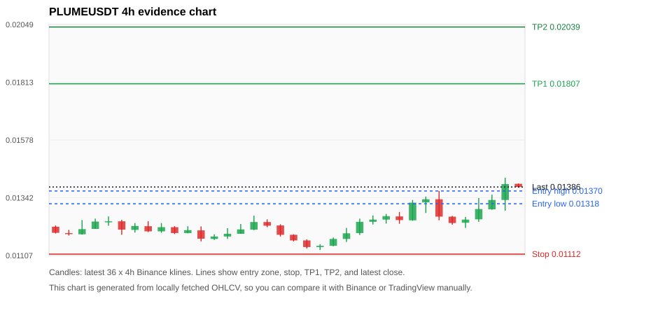
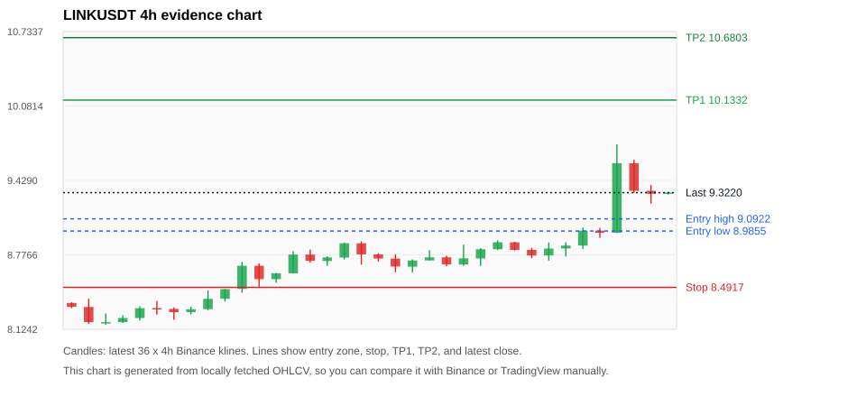
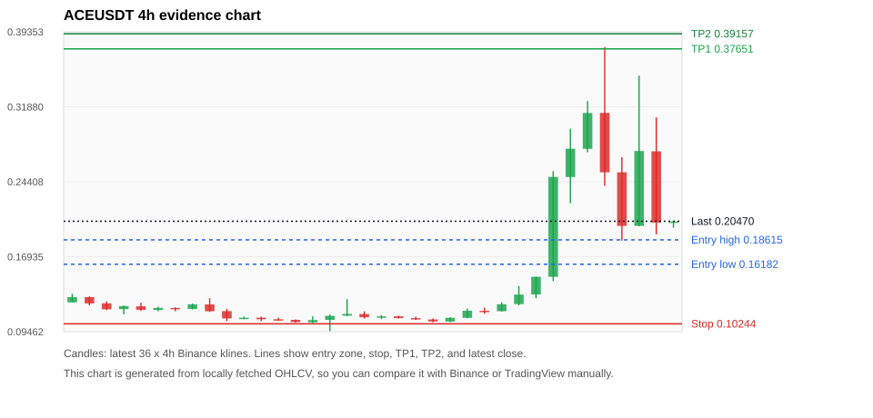
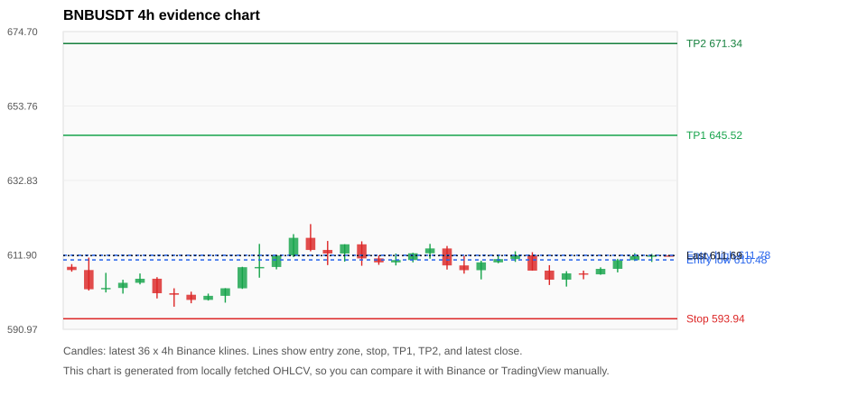
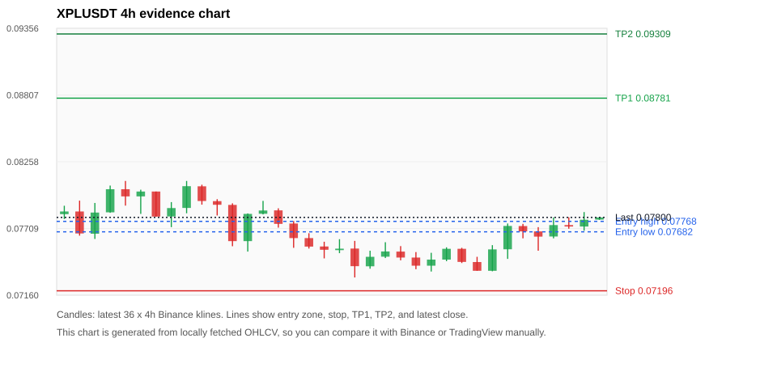

# Crypto 市场扫描报告 v1

- 报告时间：2026-08-15 20:06:00 CST
- Run ID：`20260815_120503_65ed86f9`
- Run type：`daily_full`
- Data validation mode：`paper`
- 数据来源：SQLite
- 报告版本：v1
- 扫描 ID：b36a978be600
- 数据源：Binance public spot API + CoinGecko/CoinMarketCap cross-check
- 过滤条件：USDT spot; 24h quote volume >= 30,000,000; trades >= 30,000; exclude stables/leveraged tokens; analyze 1h/4h/1d klines
- 默认单笔风险：账户权益的 1.00%

## 限制说明

- 交易信号仍以 Binance 现货公开 K 线为主源；外部数据源用于一致性复核。
- 结果是研究和模拟盘计划，不是确定收益或实盘下单指令。
- 历史长度过滤：候选币至少需要 180 根 1d K 线。
- 数据质量验证池：先验证 score 排名前 min(top_n * 2, 10) 的候选，再按 action + score 补足最终名单。
- 大盘环境过滤：RISK_OFF; BTC/ETH 大盘偏弱，山寨币买入候选降级为观察。 BTC 7d=-3.0211075295631606; ETH 7d=-1.9731418971795867.
- Data cross-validation enabled: Binance primary source plus CoinGecko; CoinMarketCap is checked when an API key is configured.
- ACEUSDT validation state BLOCKED: BLOCKED: [BINANCE_KLINE_EXTREME_RANGE] Binance candle range exceeds 40%.; [BINANCE_KLINE_EXTREME_RANGE] Binance candle range exceeds 40%.; [BINANCE_KLINE_EXTREME_RANGE] Binance candle range exceeds 40%.; [BINANCE_KLINE_EXTREME_RANGE] Binance candle range exceeds 40%.; [BINANCE_KLINE_EXTREME_RANGE] Binance candle range exceeds 40%.; [BINANCE_KLINE_EXTREME_RANGE] Binance candle range exceeds 40%.; [BINANCE_KLINE_EXTREME_RANGE] Binance candle range exceeds 40%.; [BINANCE_KLINE_EXTREME_RANGE] Binance candle range exceeds 40%.; [BINANCE_KLINE_EXTREME_RANGE] Binance candle range exceeds 40%.; [BINANCE_KLINE_EXTREME_RANGE] Binance candle range exceeds 40%.; [BINANCE_KLINE_EXTREME_RANGE] Binance candle range exceeds 40%.; [BINANCE_KLINE_EXTREME_RANGE] Binance candle range exceeds 40%.; [BINANCE_KLINE_EXTREME_RANGE] Binance candle range exceeds 40%.; [BINANCE_KLINE_EXTREME_RANGE] Binance candle range exceeds 40%.; [BINANCE_KLINE_EXTREME_RANGE] Binance candle range exceeds 40%.; [BINANCE_KLINE_EXTREME_RANGE] Binance candle range exceeds 40%.; [BINANCE_KLINE_EXTREME_RANGE] Binance candle range exceeds 40%.; [BINANCE_KLINE_EXTREME_RANGE] Binance candle range exceeds 40%.; [BINANCE_KLINE_EXTREME_RANGE] Binance candle range exceeds 40%.; [BINANCE_KLINE_EXTREME_RANGE] Binance candle range exceeds 40%.; [EXTERNAL_PRICE_DIFF_ERROR] price diff 2.62% exceeds error threshold; [EXTERNAL_24H_DIFF_WARNING] 24h change diff 10.34 points exceeds warning threshold; [EXTERNAL_PRICE_DIFF_WARNING] price diff 1.92% exceeds warning threshold; [EXTERNAL_IDENTITY_AMBIGUOUS] CoinMarketCap symbol mapping has 8 matches; selected lowest cmc_rank
- PLUMEUSDT validation state BLOCKED: BLOCKED: [EXTERNAL_24H_DIFF_WARNING] 24h change diff 3.53 points exceeds warning threshold
- BNBUSDT validation state DEGRADED: DEGRADED: [EXTERNAL_IDENTITY_AMBIGUOUS] CoinMarketCap symbol mapping has 4 matches; selected lowest cmc_rank
- XPLUSDT validation state BLOCKED: BLOCKED: [BINANCE_KLINE_EXTREME_RANGE] Binance candle range exceeds 40%.; [EXTERNAL_IDENTITY_AMBIGUOUS] CoinGecko symbol mapping has 2 exact matches; selected highest market-cap rank; [EXTERNAL_IDENTITY_AMBIGUOUS] CoinMarketCap symbol mapping has 3 matches; selected lowest cmc_rank
- BTCUSDT validation state DEGRADED: DEGRADED: [EXTERNAL_PROVIDER_RATE_LIMITED] Provider rate limited request for https://api.coingecko.com/api/v3/coins/markets?vs_currency=usd&ids=bitcoin&price_change_percentage=24h&per_page=1&page=1: HTTP 429; [EXTERNAL_IDENTITY_AMBIGUOUS] CoinMarketCap symbol mapping has 13 matches; selected lowest cmc_rank
- XRPUSDT validation state DEGRADED: DEGRADED: [EXTERNAL_PROVIDER_RATE_LIMITED] Provider rate limited request for https://api.coingecko.com/api/v3/coins/markets?vs_currency=usd&ids=ripple&price_change_percentage=24h&per_page=1&page=1: HTTP 429; [EXTERNAL_IDENTITY_AMBIGUOUS] CoinMarketCap symbol mapping has 3 matches; selected lowest cmc_rank
- ETHUSDT validation state DEGRADED: DEGRADED: [EXTERNAL_PROVIDER_RATE_LIMITED] Provider rate limited request for https://api.coingecko.com/api/v3/coins/markets?vs_currency=usd&ids=ethereum&price_change_percentage=24h&per_page=1&page=1: HTTP 429; [EXTERNAL_IDENTITY_AMBIGUOUS] CoinMarketCap symbol mapping has 6 matches; selected lowest cmc_rank
- SOLUSDT validation state DEGRADED: DEGRADED: [EXTERNAL_PROVIDER_RATE_LIMITED] Provider rate limited request for https://api.coingecko.com/api/v3/coins/markets?vs_currency=usd&ids=solana&price_change_percentage=24h&per_page=1&page=1: HTTP 429; [EXTERNAL_IDENTITY_AMBIGUOUS] CoinMarketCap symbol mapping has 8 matches; selected lowest cmc_rank
- ALLOUSDT validation state BLOCKED: BLOCKED: [BINANCE_KLINE_EXTREME_RANGE] Binance candle range exceeds 40%.; [BINANCE_KLINE_EXTREME_RANGE] Binance candle range exceeds 40%.; [BINANCE_KLINE_EXTREME_RANGE] Binance candle range exceeds 40%.; [BINANCE_KLINE_EXTREME_RANGE] Binance candle range exceeds 40%.; [BINANCE_KLINE_EXTREME_RANGE] Binance candle range exceeds 40%.; [BINANCE_KLINE_EXTREME_RANGE] Binance candle range exceeds 40%.; [BINANCE_KLINE_EXTREME_RANGE] Binance candle range exceeds 40%.; [BINANCE_KLINE_EXTREME_RANGE] Binance candle range exceeds 40%.; [BINANCE_KLINE_EXTREME_RANGE] Binance candle range exceeds 40%.; [BINANCE_KLINE_EXTREME_RANGE] Binance candle range exceeds 40%.; [BINANCE_KLINE_EXTREME_RANGE] Binance candle range exceeds 40%.; [BINANCE_KLINE_EXTREME_RANGE] Binance candle range exceeds 40%.; [EXTERNAL_PROVIDER_RATE_LIMITED] Provider rate limited request for https://api.coingecko.com/api/v3/coins/markets?vs_currency=usd&ids=allora&price_change_percentage=24h&per_page=1&page=1: HTTP 429

## 5 个候选交易计划

| Rank | Coin | Action | Setup | Entry Zone | Stop Loss | TP1 | TP2 / Exit Rule | R/R | Verdict |
|---:|---|---|---|---:|---:|---:|---|---:|---|
| 1 | `PLUME` | `WAIT_PULLBACK` | 趋势中，等回调入场 | 0.01318 - 0.01370 | 0.01112 | 0.01807 | 0.02039 或跌破 4h 关键支撑 | 2.00-3.00 | 只观察 |
| 2 | `LINK` | `WATCH_ONLY` | 回踩支撑/4h EMA 附近 | 8.9855 - 9.0922 | 8.4917 | 10.1332 | 10.6803 或跌破 4h 关键支撑 | 2.00-3.00 | 只观察 |
| 3 | `ACE` | `WATCH_ONLY` | 涨幅较远，只等深回调 | 0.16182 - 0.18615 | 0.10244 | 0.37651 | 0.39157 或跌破 4h 关键支撑 | 2.83-3.04 | 只观察 |
| 4 | `BNB` | `WATCH_ONLY` | 回踩支撑/4h EMA 附近 | 610.48 - 611.78 | 593.94 | 645.52 | 671.34 或跌破 4h 关键支撑 | 2.00-3.50 | 只观察 |
| 5 | `XPL` | `WATCH_ONLY` | 回踩支撑/4h EMA 附近 | 0.07682 - 0.07768 | 0.07196 | 0.08781 | 0.09309 或跌破 4h 关键支撑 | 2.00-3.00 | 只观察 |

## 数据交叉验证摘要

价格差异以 Binance 当前价为基准；成交量口径不同，Binance 是 USDT 现货成交额，CoinGecko/CoinMarketCap 通常是全市场成交量。

| Rank | Coin | State | Identity | Max Price Diff | Max 24h Diff | Issue Codes | Message |
|---:|---|---|---|---:|---:|---|---|
| 1 | `PLUME` | BLOCKED (DATA_WARNING) | CONFIRMED | 0.25% | 3.53 pts | EXTERNAL_24H_DIFF_WARNING | BLOCKED: [EXTERNAL_24H_DIFF_WARNING] 24h change diff 3.53 points exceeds warning threshold |
| 2 | `LINK` | CLEAN (DATA_OK) | CONFIRMED | 0.24% | 0.36 pts | none | CLEAN: External provider checks agree with Binance within configured thresholds. |
| 3 | `ACE` | BLOCKED (DATA_ERROR) | UNCONFIRMED | 2.62% | 10.34 pts | BINANCE_KLINE_EXTREME_RANGE, EXTERNAL_24H_DIFF_WARNING, EXTERNAL_IDENTITY_AMBIGUOUS, EXTERNAL_PRICE_DIFF_ERROR, EXTERNAL_PRICE_DIFF_WARNING | BLOCKED: [BINANCE_KLINE_EXTREME_RANGE] Binance candle range exceeds 40%.; [BINANCE_KLINE_EXTREME_RANGE] Binance candle range exceeds 40%.; [BINANCE_KLINE_EXTREME_RANGE] Binance candle range exceeds 40%.; [BINANCE_KLINE_EXTREME_RANGE] Binance candle range exceeds 40%.; [BINANCE_KLINE_EXTREME_RANGE] Binance candle range exceeds 40%.; [BINANCE_KLINE_EXTREME_RANGE] Binance candle range exceeds 40%.; [BINANCE_KLINE_EXTREME_RANGE] Binance candle range exceeds 40%.; [BINANCE_KLINE_EXTREME_RANGE] Binance candle range exceeds 40%.; [BINANCE_KLINE_EXTREME_RANGE] Binance candle range exceeds 40%.; [BINANCE_KLINE_EXTREME_RANGE] Binance candle range exceeds 40%.; [BINANCE_KLINE_EXTREME_RANGE] Binance candle range exceeds 40%.; [BINANCE_KLINE_EXTREME_RANGE] Binance candle range exceeds 40%.; [BINANCE_KLINE_EXTREME_RANGE] Binance candle range exceeds 40%.; [BINANCE_KLINE_EXTREME_RANGE] Binance candle range exceeds 40%.; [BINANCE_KLINE_EXTREME_RANGE] Binance candle range exceeds 40%.; [BINANCE_KLINE_EXTREME_RANGE] Binance candle range exceeds 40%.; [BINANCE_KLINE_EXTREME_RANGE] Binance candle range exceeds 40%.; [BINANCE_KLINE_EXTREME_RANGE] Binance candle range exceeds 40%.; [BINANCE_KLINE_EXTREME_RANGE] Binance candle range exceeds 40%.; [BINANCE_KLINE_EXTREME_RANGE] Binance candle range exceeds 40%.; [EXTERNAL_PRICE_DIFF_ERROR] price diff 2.62% exceeds error threshold; [EXTERNAL_24H_DIFF_WARNING] 24h change diff 10.34 points exceeds warning threshold; [EXTERNAL_PRICE_DIFF_WARNING] price diff 1.92% exceeds warning threshold; [EXTERNAL_IDENTITY_AMBIGUOUS] CoinMarketCap symbol mapping has 8 matches; selected lowest cmc_rank |
| 4 | `BNB` | DEGRADED (DATA_WARNING) | UNCONFIRMED | 0.11% | 0.10 pts | EXTERNAL_IDENTITY_AMBIGUOUS | DEGRADED: [EXTERNAL_IDENTITY_AMBIGUOUS] CoinMarketCap symbol mapping has 4 matches; selected lowest cmc_rank |
| 5 | `XPL` | BLOCKED (DATA_ERROR) | UNCONFIRMED | 0.22% | 0.90 pts | BINANCE_KLINE_EXTREME_RANGE, EXTERNAL_IDENTITY_AMBIGUOUS | BLOCKED: [BINANCE_KLINE_EXTREME_RANGE] Binance candle range exceeds 40%.; [EXTERNAL_IDENTITY_AMBIGUOUS] CoinGecko symbol mapping has 2 exact matches; selected highest market-cap rank; [EXTERNAL_IDENTITY_AMBIGUOUS] CoinMarketCap symbol mapping has 3 matches; selected lowest cmc_rank |

## 候选币说明

### 1. PLUME `PLUMEUSDT`



- 入选原因：趋势中，等回调入场；24h +2.67%，7d +16.96%，4h RSI 72.94，24h 成交额 $96.6M。
- 交易失效条件：跌破 0.01112065 或 4h 收盘重新失守关键支撑。
- 主要风险：距离支撑偏远，不能追市价；成交量突增，可能是事件驱动；BTC/ETH 大盘环境未确认强势，山寨币买入信号降级；Blocking data-quality issue detected; paper plan creation is not allowed.。
- 数据交叉验证：BLOCKED / DATA_WARNING；身份=CONFIRMED；BLOCKED: [EXTERNAL_24H_DIFF_WARNING] 24h change diff 3.53 points exceeds warning threshold

#### 可点击人工验证

- [Binance 交易页](https://www.binance.com/en/trade/PLUME_USDT)
- [TradingView 图表](https://www.tradingview.com/chart/?symbol=BINANCE%3APLUMEUSDT)
- [CoinGecko 搜索](https://www.coingecko.com/en/search?query=PLUME)
- [CoinMarketCap 搜索](https://coinmarketcap.com/search/?q=PLUME)

#### 多数据源对照

| Source | Status | Identity | Blocking | Asset ID | Price | 24h Change | 24h Volume | Price Diff | 24h Diff | Updated | Issue Codes | Message |
|---|---|---|---:|---|---:|---:|---:|---:|---:|---|---|---|
| Binance | DATA_OK | CONFIRMED | no | PLUMEUSDT | 0.01386 | +2.67% | $96.6M | 0.00% | 0.00 pts | 2026-08-15T12:05:22+00:00 | none | Primary market data source passed health checks. |
| CoinGecko | DATA_WARNING | CONFIRMED | yes | plume | 0.01388 | +6.20% | $243.2M | 0.16% | 3.53 pts | 2026-08-15T12:03:20.000Z | EXTERNAL_24H_DIFF_WARNING | [EXTERNAL_24H_DIFF_WARNING] 24h change diff 3.53 points exceeds warning threshold |
| CoinMarketCap | DATA_OK | CONFIRMED | no | 35364 | 0.01390 | +3.97% | $241.0M | 0.25% | 1.30 pts | 2026-08-15T12:04:04.000Z | none | External source agrees with Binance within thresholds. |

#### 指标证据

| 指标 | 数值 | 人工核对用途 |
|---|---:|---|
| 当前价 | 0.01386 | 与 Binance/TradingView 当前价格对照 |
| 24h 涨跌 | +2.67% | 与交易所 24h 涨跌对照 |
| 7d 涨跌 | +16.96% | 判断短线趋势是否延续 |
| 4h EMA20 | 0.01277 | 判断短期趋势支撑 |
| 4h EMA50 | 0.01232 | 判断中期趋势支撑 |
| 1d EMA20 | 0.01190 | 判断日线趋势 |
| 1d EMA50 | 0.01144 | 判断日线趋势 |
| 4h RSI14 | 72.94 | 判断是否过热/过弱 |
| 4h ATR14 | 0.00065071429 | 推导止损和入场缓冲 |
| 最近 18 根 4h 最低点 | 0.01129 | 支撑/止损参考 |
| 最近 36 根 4h 最高点 | 0.01424 | TP/压力参考 |
| 支撑位 | 0.01277 | 入场区间推导基础 |

#### 交易计划推导

- 支撑位 = 最近低点、4h EMA20、4h EMA50、1d EMA20 中不高于当前价的最高有效支撑 = `0.01277`。
- 入场区间 = 支撑位附近 + ATR 缓冲 = `0.01318 - 0.01370`。
- 止损 = min(最近 18 根 4h 最低点 * 0.985, 入场中位价 - 1.15 * ATR14) = `0.01112`。
- TP1 = max(最近 36 根 4h 最高点 * 0.995, 入场中位价 + 2R) = `0.01807`。
- TP2 = max(入场中位价 + 3R, TP1 * 1.04) = `0.02039`。

#### 最近 10 根 4h K线

| UTC 开盘时间 | Open | High | Low | Close | Quote Volume | Trades |
|---|---:|---:|---:|---:|---:|---:|
| 2026-08-14T00:00+00:00 | 0.01266 | 0.01284 | 0.01236 | 0.01251 | $2.1M | 28076 |
| 2026-08-14T04:00+00:00 | 0.01250 | 0.01333 | 0.01248 | 0.01322 | $3.0M | 47012 |
| 2026-08-14T08:00+00:00 | 0.01323 | 0.01347 | 0.01280 | 0.01336 | $3.4M | 40316 |
| 2026-08-14T12:00+00:00 | 0.01336 | 0.01370 | 0.01250 | 0.01265 | $5.1M | 42907 |
| 2026-08-14T16:00+00:00 | 0.01265 | 0.01268 | 0.01232 | 0.01239 | $2.2M | 20333 |
| 2026-08-14T20:00+00:00 | 0.01240 | 0.01264 | 0.01219 | 0.01253 | $2.1M | 12464 |
| 2026-08-15T00:00+00:00 | 0.01254 | 0.01341 | 0.01244 | 0.01296 | $28.0M | 77061 |
| 2026-08-15T04:00+00:00 | 0.01295 | 0.01355 | 0.01293 | 0.01333 | $39.5M | 83662 |
| 2026-08-15T08:00+00:00 | 0.01333 | 0.01424 | 0.01289 | 0.01398 | $19.6M | 82265 |
| 2026-08-15T12:00+00:00 | 0.01399 | 0.01400 | 0.01384 | 0.01386 | $161,961 | 1517 |

### 2. LINK `LINKUSDT`



- 入选原因：回踩支撑/4h EMA 附近；24h +5.44%，7d +11.92%，4h RSI 68.96，24h 成交额 $36.1M。
- 交易失效条件：跌破 8.491685 或 4h 收盘重新失守关键支撑。
- 主要风险：BTC/ETH 大盘环境未确认强势，山寨币买入信号降级。
- 数据交叉验证：CLEAN / DATA_OK；身份=CONFIRMED；CLEAN: External provider checks agree with Binance within configured thresholds.

#### 可点击人工验证

- [Binance 交易页](https://www.binance.com/en/trade/LINK_USDT)
- [TradingView 图表](https://www.tradingview.com/chart/?symbol=BINANCE%3ALINKUSDT)
- [CoinGecko 搜索](https://www.coingecko.com/en/search?query=LINK)
- [CoinMarketCap 搜索](https://coinmarketcap.com/search/?q=LINK)

#### 多数据源对照

| Source | Status | Identity | Blocking | Asset ID | Price | 24h Change | 24h Volume | Price Diff | 24h Diff | Updated | Issue Codes | Message |
|---|---|---|---:|---|---:|---:|---:|---:|---:|---|---|---|
| Binance | DATA_OK | CONFIRMED | no | LINKUSDT | 9.3220 | +5.44% | $36.1M | 0.00% | 0.00 pts | 2026-08-15T12:05:22+00:00 | none | Primary market data source passed health checks. |
| CoinGecko | DATA_OK | CONFIRMED | no | chainlink | 9.3000 | +5.80% | $476.3M | 0.24% | 0.36 pts | 2026-08-15T12:03:20.000Z | none | External source agrees with Binance within thresholds. |
| CoinMarketCap | DATA_OK | CONFIRMED | no | 1975 | 9.3031 | +5.44% | $486.9M | 0.20% | 0.01 pts | 2026-08-15T12:04:04.000Z | none | External source agrees with Binance within thresholds. |

#### 指标证据

| 指标 | 数值 | 人工核对用途 |
|---|---:|---|
| 当前价 | 9.3220 | 与 Binance/TradingView 当前价格对照 |
| 24h 涨跌 | +5.44% | 与交易所 24h 涨跌对照 |
| 7d 涨跌 | +11.92% | 判断短线趋势是否延续 |
| 4h EMA20 | 8.9676 | 判断短期趋势支撑 |
| 4h EMA50 | 8.7005 | 判断中期趋势支撑 |
| 1d EMA20 | 8.5338 | 判断日线趋势 |
| 1d EMA50 | 8.3772 | 判断日线趋势 |
| 4h RSI14 | 68.96 | 判断是否过热/过弱 |
| 4h ATR14 | 0.17793 | 推导止损和入场缓冲 |
| 最近 18 根 4h 最低点 | 8.6210 | 支撑/止损参考 |
| 最近 36 根 4h 最高点 | 9.7460 | TP/压力参考 |
| 支撑位 | 8.9676 | 入场区间推导基础 |

#### 交易计划推导

- 支撑位 = 最近低点、4h EMA20、4h EMA50、1d EMA20 中不高于当前价的最高有效支撑 = `8.9676`。
- 入场区间 = 支撑位附近 + ATR 缓冲 = `8.9855 - 9.0922`。
- 止损 = min(最近 18 根 4h 最低点 * 0.985, 入场中位价 - 1.15 * ATR14) = `8.4917`。
- TP1 = max(最近 36 根 4h 最高点 * 0.995, 入场中位价 + 2R) = `10.1332`。
- TP2 = max(入场中位价 + 3R, TP1 * 1.04) = `10.6803`。

#### 最近 10 根 4h K线

| UTC 开盘时间 | Open | High | Low | Close | Quote Volume | Trades |
|---|---:|---:|---:|---:|---:|---:|
| 2026-08-14T00:00+00:00 | 8.8870 | 8.8910 | 8.8140 | 8.8200 | $1.1M | 12248 |
| 2026-08-14T04:00+00:00 | 8.8200 | 8.8380 | 8.7480 | 8.7710 | $1.3M | 11299 |
| 2026-08-14T08:00+00:00 | 8.7710 | 8.8850 | 8.7260 | 8.8320 | $3.8M | 27262 |
| 2026-08-14T12:00+00:00 | 8.8330 | 8.8870 | 8.7620 | 8.8580 | $2.5M | 25013 |
| 2026-08-14T16:00+00:00 | 8.8580 | 9.0170 | 8.8290 | 8.9890 | $5.5M | 44264 |
| 2026-08-14T20:00+00:00 | 8.9890 | 9.0130 | 8.9260 | 8.9700 | $1.8M | 17371 |
| 2026-08-15T00:00+00:00 | 8.9710 | 9.7460 | 8.9680 | 9.5800 | $15.2M | 129567 |
| 2026-08-15T04:00+00:00 | 9.5800 | 9.6100 | 9.3200 | 9.3380 | $7.1M | 60909 |
| 2026-08-15T08:00+00:00 | 9.3380 | 9.3880 | 9.2260 | 9.3120 | $4.1M | 55398 |
| 2026-08-15T12:00+00:00 | 9.3110 | 9.3230 | 9.3050 | 9.3230 | $53,567 | 1039 |

### 3. ACE `ACEUSDT`



- 入选原因：涨幅较远，只等深回调；24h -19.34%，7d +74.96%，4h RSI 60.64，24h 成交额 $128.7M。
- 交易失效条件：跌破 0.10244 或 4h 收盘重新失守关键支撑。
- 主要风险：距离支撑偏远，不能追市价；24h 振幅较大，回撤风险高；成交量突增，可能是事件驱动；BTC/ETH 大盘环境未确认强势，山寨币买入信号降级；24h 动量未确认；Blocking data-quality issue detected; paper plan creation is not allowed.。
- 数据交叉验证：BLOCKED / DATA_ERROR；身份=UNCONFIRMED；BLOCKED: [BINANCE_KLINE_EXTREME_RANGE] Binance candle range exceeds 40%.; [BINANCE_KLINE_EXTREME_RANGE] Binance candle range exceeds 40%.; [BINANCE_KLINE_EXTREME_RANGE] Binance candle range exceeds 40%.; [BINANCE_KLINE_EXTREME_RANGE] Binance candle range exceeds 40%.; [BINANCE_KLINE_EXTREME_RANGE] Binance candle range exceeds 40%.; [BINANCE_KLINE_EXTREME_RANGE] Binance candle range exceeds 40%.; [BINANCE_KLINE_EXTREME_RANGE] Binance candle range exceeds 40%.; [BINANCE_KLINE_EXTREME_RANGE] Binance candle range exceeds 40%.; [BINANCE_KLINE_EXTREME_RANGE] Binance candle range exceeds 40%.; [BINANCE_KLINE_EXTREME_RANGE] Binance candle range exceeds 40%.; [BINANCE_KLINE_EXTREME_RANGE] Binance candle range exceeds 40%.; [BINANCE_KLINE_EXTREME_RANGE] Binance candle range exceeds 40%.; [BINANCE_KLINE_EXTREME_RANGE] Binance candle range exceeds 40%.; [BINANCE_KLINE_EXTREME_RANGE] Binance candle range exceeds 40%.; [BINANCE_KLINE_EXTREME_RANGE] Binance candle range exceeds 40%.; [BINANCE_KLINE_EXTREME_RANGE] Binance candle range exceeds 40%.; [BINANCE_KLINE_EXTREME_RANGE] Binance candle range exceeds 40%.; [BINANCE_KLINE_EXTREME_RANGE] Binance candle range exceeds 40%.; [BINANCE_KLINE_EXTREME_RANGE] Binance candle range exceeds 40%.; [BINANCE_KLINE_EXTREME_RANGE] Binance candle range exceeds 40%.; [EXTERNAL_PRICE_DIFF_ERROR] price diff 2.62% exceeds error threshold; [EXTERNAL_24H_DIFF_WARNING] 24h change diff 10.34 points exceeds warning threshold; [EXTERNAL_PRICE_DIFF_WARNING] price diff 1.92% exceeds warning threshold; [EXTERNAL_IDENTITY_AMBIGUOUS] CoinMarketCap symbol mapping has 8 matches; selected lowest cmc_rank

#### 可点击人工验证

- [Binance 交易页](https://www.binance.com/en/trade/ACE_USDT)
- [TradingView 图表](https://www.tradingview.com/chart/?symbol=BINANCE%3AACEUSDT)
- [CoinGecko 搜索](https://www.coingecko.com/en/search?query=ACE)
- [CoinMarketCap 搜索](https://coinmarketcap.com/search/?q=ACE)

#### 多数据源对照

| Source | Status | Identity | Blocking | Asset ID | Price | 24h Change | 24h Volume | Price Diff | 24h Diff | Updated | Issue Codes | Message |
|---|---|---|---:|---|---:|---:|---:|---:|---:|---|---|---|
| Binance | DATA_ERROR | CONFIRMED | yes | ACEUSDT | 0.20470 | -19.34% | $128.7M | 0.00% | 0.00 pts | 2026-08-15T12:05:22+00:00 | BINANCE_KLINE_EXTREME_RANGE | [BINANCE_KLINE_EXTREME_RANGE] Binance candle range exceeds 40%.; [BINANCE_KLINE_EXTREME_RANGE] Binance candle range exceeds 40%.; [BINANCE_KLINE_EXTREME_RANGE] Binance candle range exceeds 40%.; [BINANCE_KLINE_EXTREME_RANGE] Binance candle range exceeds 40%.; [BINANCE_KLINE_EXTREME_RANGE] Binance candle range exceeds 40%.; [BINANCE_KLINE_EXTREME_RANGE] Binance candle range exceeds 40%.; [BINANCE_KLINE_EXTREME_RANGE] Binance candle range exceeds 40%.; [BINANCE_KLINE_EXTREME_RANGE] Binance candle range exceeds 40%.; [BINANCE_KLINE_EXTREME_RANGE] Binance candle range exceeds 40%.; [BINANCE_KLINE_EXTREME_RANGE] Binance candle range exceeds 40%.; [BINANCE_KLINE_EXTREME_RANGE] Binance candle range exceeds 40%.; [BINANCE_KLINE_EXTREME_RANGE] Binance candle range exceeds 40%.; [BINANCE_KLINE_EXTREME_RANGE] Binance candle range exceeds 40%.; [BINANCE_KLINE_EXTREME_RANGE] Binance candle range exceeds 40%.; [BINANCE_KLINE_EXTREME_RANGE] Binance candle range exceeds 40%.; [BINANCE_KLINE_EXTREME_RANGE] Binance candle range exceeds 40%.; [BINANCE_KLINE_EXTREME_RANGE] Binance candle range exceeds 40%.; [BINANCE_KLINE_EXTREME_RANGE] Binance candle range exceeds 40%.; [BINANCE_KLINE_EXTREME_RANGE] Binance candle range exceeds 40%.; [BINANCE_KLINE_EXTREME_RANGE] Binance candle range exceeds 40%. |
| CoinGecko | DATA_ERROR | CONFIRMED | yes | endurance | 0.19934 | -9.00% | $324.3M | 2.62% | 10.34 pts | 2026-08-15T12:03:20.000Z | EXTERNAL_24H_DIFF_WARNING, EXTERNAL_PRICE_DIFF_ERROR | [EXTERNAL_PRICE_DIFF_ERROR] price diff 2.62% exceeds error threshold; [EXTERNAL_24H_DIFF_WARNING] 24h change diff 10.34 points exceeds warning threshold |
| CoinMarketCap | DATA_WARNING | UNCONFIRMED | yes | 28674 | 0.20077 | -17.34% | $524.6M | 1.92% | 1.99 pts | 2026-08-15T12:04:04.000Z | EXTERNAL_IDENTITY_AMBIGUOUS, EXTERNAL_PRICE_DIFF_WARNING | [EXTERNAL_PRICE_DIFF_WARNING] price diff 1.92% exceeds warning threshold; [EXTERNAL_IDENTITY_AMBIGUOUS] CoinMarketCap symbol mapping has 8 matches; selected lowest cmc_rank |

#### 指标证据

| 指标 | 数值 | 人工核对用途 |
|---|---:|---|
| 当前价 | 0.20470 | 与 Binance/TradingView 当前价格对照 |
| 24h 涨跌 | -19.34% | 与交易所 24h 涨跌对照 |
| 7d 涨跌 | +74.96% | 判断短线趋势是否延续 |
| 4h EMA20 | 0.18578 | 判断短期趋势支撑 |
| 4h EMA50 | 0.14721 | 判断中期趋势支撑 |
| 1d EMA20 | 0.12154 | 判断日线趋势 |
| 1d EMA50 | 0.10093 | 判断日线趋势 |
| 4h RSI14 | 60.64 | 判断是否过热/过弱 |
| 4h ATR14 | 0.05718 | 推导止损和入场缓冲 |
| 最近 18 根 4h 最低点 | 0.10400 | 支撑/止损参考 |
| 最近 36 根 4h 最高点 | 0.37840 | TP/压力参考 |
| 支撑位 | 0.18578 | 入场区间推导基础 |

#### 交易计划推导

- 支撑位 = 最近低点、4h EMA20、4h EMA50、1d EMA20 中不高于当前价的最高有效支撑 = `0.18578`。
- 入场区间 = 支撑位附近 + ATR 缓冲 = `0.16182 - 0.18615`。
- 止损 = min(最近 18 根 4h 最低点 * 0.985, 入场中位价 - 1.15 * ATR14) = `0.10244`。
- TP1 = max(最近 36 根 4h 最高点 * 0.995, 入场中位价 + 2R) = `0.37651`。
- TP2 = max(入场中位价 + 3R, TP1 * 1.04) = `0.39157`。

#### 最近 10 根 4h K线

| UTC 开盘时间 | Open | High | Low | Close | Quote Volume | Trades |
|---|---:|---:|---:|---:|---:|---:|
| 2026-08-14T00:00+00:00 | 0.12210 | 0.14000 | 0.12090 | 0.13160 | $1.9M | 35963 |
| 2026-08-14T04:00+00:00 | 0.13170 | 0.14960 | 0.12800 | 0.14930 | $3.6M | 61077 |
| 2026-08-14T08:00+00:00 | 0.14930 | 0.25470 | 0.14510 | 0.24890 | $18.0M | 210673 |
| 2026-08-14T12:00+00:00 | 0.24880 | 0.29700 | 0.22270 | 0.27700 | $23.4M | 310099 |
| 2026-08-14T16:00+00:00 | 0.27690 | 0.32450 | 0.27350 | 0.31260 | $18.4M | 266599 |
| 2026-08-14T20:00+00:00 | 0.31270 | 0.37840 | 0.24000 | 0.25350 | $21.0M | 343703 |
| 2026-08-15T00:00+00:00 | 0.25350 | 0.26860 | 0.18540 | 0.20010 | $14.9M | 257847 |
| 2026-08-15T04:00+00:00 | 0.20010 | 0.34980 | 0.19970 | 0.27470 | $32.6M | 416279 |
| 2026-08-15T08:00+00:00 | 0.27440 | 0.30820 | 0.19160 | 0.20330 | $18.7M | 353299 |
| 2026-08-15T12:00+00:00 | 0.20330 | 0.20490 | 0.19830 | 0.20440 | $403,564 | 10756 |

### 4. BNB `BNBUSDT`



- 入选原因：回踩支撑/4h EMA 附近；24h +1.10%，7d +2.26%，4h RSI 45.87，24h 成交额 $37.5M。
- 交易失效条件：跌破 593.9353 或 4h 收盘重新失守关键支撑。
- 主要风险：BTC/ETH 大盘环境未确认强势，山寨币买入信号降级；External validation is degraded; this candidate is not a clean data sample.；Paper mode allows degraded validation; candidate is excluded from clean-data samples.。
- 数据交叉验证：DEGRADED / DATA_WARNING；身份=UNCONFIRMED；DEGRADED: [EXTERNAL_IDENTITY_AMBIGUOUS] CoinMarketCap symbol mapping has 4 matches; selected lowest cmc_rank

#### 可点击人工验证

- [Binance 交易页](https://www.binance.com/en/trade/BNB_USDT)
- [TradingView 图表](https://www.tradingview.com/chart/?symbol=BINANCE%3ABNBUSDT)
- [CoinGecko 搜索](https://www.coingecko.com/en/search?query=BNB)
- [CoinMarketCap 搜索](https://coinmarketcap.com/search/?q=BNB)

#### 多数据源对照

| Source | Status | Identity | Blocking | Asset ID | Price | 24h Change | 24h Volume | Price Diff | 24h Diff | Updated | Issue Codes | Message |
|---|---|---|---:|---|---:|---:|---:|---:|---:|---|---|---|
| Binance | DATA_OK | CONFIRMED | no | BNBUSDT | 611.69 | +1.10% | $37.5M | 0.00% | 0.00 pts | 2026-08-15T12:05:22+00:00 | none | Primary market data source passed health checks. |
| CoinGecko | DATA_OK | CONFIRMED | no | binancecoin | 611.02 | +1.00% | $445.0M | 0.11% | 0.10 pts | 2026-08-15T12:03:20.000Z | none | External source agrees with Binance within thresholds. |
| CoinMarketCap | DATA_WARNING | UNCONFIRMED | no | 1839 | 611.01 | +1.07% | $916.5M | 0.11% | 0.03 pts | 2026-08-15T12:04:04.000Z | EXTERNAL_IDENTITY_AMBIGUOUS | [EXTERNAL_IDENTITY_AMBIGUOUS] CoinMarketCap symbol mapping has 4 matches; selected lowest cmc_rank |

#### 指标证据

| 指标 | 数值 | 人工核对用途 |
|---|---:|---|
| 当前价 | 611.69 | 与 Binance/TradingView 当前价格对照 |
| 24h 涨跌 | +1.10% | 与交易所 24h 涨跌对照 |
| 7d 涨跌 | +2.26% | 判断短线趋势是否延续 |
| 4h EMA20 | 609.26 | 判断短期趋势支撑 |
| 4h EMA50 | 605.09 | 判断中期趋势支撑 |
| 1d EMA20 | 596.71 | 判断日线趋势 |
| 1d EMA50 | 590.63 | 判断日线趋势 |
| 4h RSI14 | 45.87 | 判断是否过热/过弱 |
| 4h ATR14 | 3.5921 | 推导止损和入场缓冲 |
| 最近 18 根 4h 最低点 | 602.98 | 支撑/止损参考 |
| 最近 36 根 4h 最高点 | 620.55 | TP/压力参考 |
| 支撑位 | 609.26 | 入场区间推导基础 |

#### 交易计划推导

- 支撑位 = 最近低点、4h EMA20、4h EMA50、1d EMA20 中不高于当前价的最高有效支撑 = `609.26`。
- 入场区间 = 支撑位附近 + ATR 缓冲 = `610.48 - 611.78`。
- 止损 = min(最近 18 根 4h 最低点 * 0.985, 入场中位价 - 1.15 * ATR14) = `593.94`。
- TP1 = max(最近 36 根 4h 最高点 * 0.995, 入场中位价 + 2R) = `645.52`。
- TP2 = max(入场中位价 + 3R, TP1 * 1.04) = `671.34`。

#### 最近 10 根 4h K线

| UTC 开盘时间 | Open | High | Low | Close | Quote Volume | Trades |
|---|---:|---:|---:|---:|---:|---:|
| 2026-08-14T00:00+00:00 | 610.71 | 612.90 | 609.92 | 611.76 | $5.6M | 47748 |
| 2026-08-14T04:00+00:00 | 611.76 | 612.65 | 607.46 | 607.47 | $5.9M | 46029 |
| 2026-08-14T08:00+00:00 | 607.47 | 609.00 | 603.43 | 604.92 | $8.4M | 72236 |
| 2026-08-14T12:00+00:00 | 604.93 | 607.31 | 602.98 | 606.69 | $9.0M | 85774 |
| 2026-08-14T16:00+00:00 | 606.70 | 607.47 | 605.04 | 606.41 | $5.5M | 58790 |
| 2026-08-14T20:00+00:00 | 606.42 | 608.39 | 606.30 | 607.96 | $4.2M | 36994 |
| 2026-08-15T00:00+00:00 | 607.97 | 610.79 | 606.97 | 610.41 | $5.8M | 47005 |
| 2026-08-15T04:00+00:00 | 610.42 | 612.35 | 610.17 | 611.57 | $6.4M | 56586 |
| 2026-08-15T08:00+00:00 | 611.57 | 612.15 | 609.91 | 611.74 | $6.7M | 58461 |
| 2026-08-15T12:00+00:00 | 611.74 | 611.85 | 611.56 | 611.68 | $125,215 | 1288 |

### 5. XPL `XPLUSDT`



- 入选原因：回踩支撑/4h EMA 附近；24h +3.30%，7d +1.93%，4h RSI 63.01，24h 成交额 $36.8M。
- 交易失效条件：跌破 0.0719641 或 4h 收盘重新失守关键支撑。
- 主要风险：成交量突增，可能是事件驱动；日线趋势未完全确认；BTC/ETH 大盘环境未确认强势，山寨币买入信号降级；Blocking data-quality issue detected; paper plan creation is not allowed.。
- 数据交叉验证：BLOCKED / DATA_ERROR；身份=UNCONFIRMED；BLOCKED: [BINANCE_KLINE_EXTREME_RANGE] Binance candle range exceeds 40%.; [EXTERNAL_IDENTITY_AMBIGUOUS] CoinGecko symbol mapping has 2 exact matches; selected highest market-cap rank; [EXTERNAL_IDENTITY_AMBIGUOUS] CoinMarketCap symbol mapping has 3 matches; selected lowest cmc_rank

#### 可点击人工验证

- [Binance 交易页](https://www.binance.com/en/trade/XPL_USDT)
- [TradingView 图表](https://www.tradingview.com/chart/?symbol=BINANCE%3AXPLUSDT)
- [CoinGecko 搜索](https://www.coingecko.com/en/search?query=XPL)
- [CoinMarketCap 搜索](https://coinmarketcap.com/search/?q=XPL)

#### 多数据源对照

| Source | Status | Identity | Blocking | Asset ID | Price | 24h Change | 24h Volume | Price Diff | 24h Diff | Updated | Issue Codes | Message |
|---|---|---|---:|---|---:|---:|---:|---:|---:|---|---|---|
| Binance | DATA_ERROR | CONFIRMED | yes | XPLUSDT | 0.07800 | +3.30% | $36.8M | 0.00% | 0.00 pts | 2026-08-15T12:05:22+00:00 | BINANCE_KLINE_EXTREME_RANGE | [BINANCE_KLINE_EXTREME_RANGE] Binance candle range exceeds 40%. |
| CoinGecko | DATA_WARNING | UNCONFIRMED | no | plasma | 0.07788 | +4.20% | $103.4M | 0.15% | 0.90 pts | 2026-08-15T12:03:20.000Z | EXTERNAL_IDENTITY_AMBIGUOUS | [EXTERNAL_IDENTITY_AMBIGUOUS] CoinGecko symbol mapping has 2 exact matches; selected highest market-cap rank |
| CoinMarketCap | DATA_WARNING | UNCONFIRMED | no | 36645 | 0.07783 | +3.32% | $146.1M | 0.22% | 0.03 pts | 2026-08-15T12:04:04.000Z | EXTERNAL_IDENTITY_AMBIGUOUS | [EXTERNAL_IDENTITY_AMBIGUOUS] CoinMarketCap symbol mapping has 3 matches; selected lowest cmc_rank |

#### 指标证据

| 指标 | 数值 | 人工核对用途 |
|---|---:|---|
| 当前价 | 0.07800 | 与 Binance/TradingView 当前价格对照 |
| 24h 涨跌 | +3.30% | 与交易所 24h 涨跌对照 |
| 7d 涨跌 | +1.93% | 判断短线趋势是否延续 |
| 4h EMA20 | 0.07648 | 判断短期趋势支撑 |
| 4h EMA50 | 0.07666 | 判断中期趋势支撑 |
| 1d EMA20 | 0.07814 | 判断日线趋势 |
| 1d EMA50 | 0.08281 | 判断日线趋势 |
| 4h RSI14 | 63.01 | 判断是否过热/过弱 |
| 4h ATR14 | 0.0014457143 | 推导止损和入场缓冲 |
| 最近 18 根 4h 最低点 | 0.07306 | 支撑/止损参考 |
| 最近 36 根 4h 最高点 | 0.08100 | TP/压力参考 |
| 支撑位 | 0.07666 | 入场区间推导基础 |

#### 交易计划推导

- 支撑位 = 最近低点、4h EMA20、4h EMA50、1d EMA20 中不高于当前价的最高有效支撑 = `0.07666`。
- 入场区间 = 支撑位附近 + ATR 缓冲 = `0.07682 - 0.07768`。
- 止损 = min(最近 18 根 4h 最低点 * 0.985, 入场中位价 - 1.15 * ATR14) = `0.07196`。
- TP1 = max(最近 36 根 4h 最高点 * 0.995, 入场中位价 + 2R) = `0.08781`。
- TP2 = max(入场中位价 + 3R, TP1 * 1.04) = `0.09309`。

#### 最近 10 根 4h K线

| UTC 开盘时间 | Open | High | Low | Close | Quote Volume | Trades |
|---|---:|---:|---:|---:|---:|---:|
| 2026-08-14T00:00+00:00 | 0.07542 | 0.07550 | 0.07425 | 0.07434 | $173,614 | 4233 |
| 2026-08-14T04:00+00:00 | 0.07433 | 0.07476 | 0.07361 | 0.07361 | $213,071 | 4272 |
| 2026-08-14T08:00+00:00 | 0.07361 | 0.07572 | 0.07357 | 0.07537 | $2.5M | 53377 |
| 2026-08-14T12:00+00:00 | 0.07538 | 0.07750 | 0.07459 | 0.07730 | $4.5M | 89939 |
| 2026-08-14T16:00+00:00 | 0.07729 | 0.07747 | 0.07628 | 0.07685 | $4.7M | 73028 |
| 2026-08-14T20:00+00:00 | 0.07685 | 0.07720 | 0.07526 | 0.07642 | $1.5M | 24138 |
| 2026-08-15T00:00+00:00 | 0.07643 | 0.07800 | 0.07628 | 0.07737 | $13.3M | 119597 |
| 2026-08-15T04:00+00:00 | 0.07737 | 0.07801 | 0.07707 | 0.07725 | $6.8M | 92404 |
| 2026-08-15T08:00+00:00 | 0.07725 | 0.07844 | 0.07691 | 0.07781 | $6.0M | 98113 |
| 2026-08-15T12:00+00:00 | 0.07782 | 0.07800 | 0.07780 | 0.07800 | $108,060 | 2400 |

## 组合风控

- 不要 5 个候选全部满仓买入。
- 同时持仓总风险建议控制在账户权益的 3% - 5% 以内。
- 如果 BTC/ETH 同时破位，暂停山寨币多头计划或降低仓位。
- 第一版报告用于模拟盘和人工复核，不自动下单。

## 原始数据

```json
[
  {
    "rank": 1,
    "symbol": "PLUMEUSDT",
    "base_asset": "PLUME",
    "price": 0.01386,
    "score": 49.39013937918312,
    "setup": "趋势中，等回调入场",
    "verdict": "只观察",
    "entry_low": 0.013176750000000001,
    "entry_high": 0.01369732142857143,
    "stop_loss": 0.01112065,
    "take_profit_1": 0.01806980714285715,
    "take_profit_2": 0.020386192857142865,
    "risk_reward_1": 2.000000000000001,
    "risk_reward_2": 3.0,
    "pct_24h": 2.669,
    "pct_3d": 14.54545454545455,
    "pct_7d": 16.962025316455698,
    "quote_volume_24h": 96608566.189,
    "trades_24h": 319176,
    "high_low_range_24h": 16.817063166529934,
    "rsi_1h": 78.0590717299578,
    "rsi_4h": 72.94372294372295,
    "ema20_4h": 0.012773357751140637,
    "ema50_4h": 0.012323610552477278,
    "ema20_1d": 0.011897908830767965,
    "ema50_1d": 0.011443317525109247,
    "atr_4h": 0.0006507142857142855,
    "macd_hist_4h": 0.00014109263556927342,
    "volume_ratio_24h": 22.71759245380225,
    "support_level": 0.012773357751140637,
    "recent_low_4h_18": 0.01129,
    "recent_high_4h_36": 0.01424,
    "distance_to_support_pct": 8.507099464604973,
    "binance_trade_url": "https://www.binance.com/en/trade/PLUME_USDT",
    "tradingview_url": "https://www.tradingview.com/chart/?symbol=BINANCE%3APLUMEUSDT",
    "coingecko_search_url": "https://www.coingecko.com/en/search?query=PLUME",
    "coinmarketcap_search_url": "https://coinmarketcap.com/search/?q=PLUME",
    "invalidation": "跌破 0.01112065 或 4h 收盘重新失守关键支撑",
    "recent_4h_klines": [
      {
        "open_time_utc": "2026-08-09T16:00+00:00",
        "open": 0.01224,
        "high": 0.01229,
        "low": 0.01196,
        "close": 0.01199,
        "quote_volume": 137720.63699,
        "trades": 2128
      },
      {
        "open_time_utc": "2026-08-09T20:00+00:00",
        "open": 0.01198,
        "high": 0.01211,
        "low": 0.01188,
        "close": 0.01194,
        "quote_volume": 129306.16289,
        "trades": 2131
      },
      {
        "open_time_utc": "2026-08-10T00:00+00:00",
        "open": 0.01193,
        "high": 0.01251,
        "low": 0.01192,
        "close": 0.01214,
        "quote_volume": 413763.61599,
        "trades": 5346
      },
      {
        "open_time_utc": "2026-08-10T04:00+00:00",
        "open": 0.01215,
        "high": 0.01257,
        "low": 0.01215,
        "close": 0.01245,
        "quote_volume": 190433.91153,
        "trades": 3054
      },
      {
        "open_time_utc": "2026-08-10T08:00+00:00",
        "open": 0.01244,
        "high": 0.01266,
        "low": 0.01228,
        "close": 0.01246,
        "quote_volume": 367730.80681,
        "trades": 5274
      },
      {
        "open_time_utc": "2026-08-10T12:00+00:00",
        "open": 0.01246,
        "high": 0.01252,
        "low": 0.01191,
        "close": 0.01212,
        "quote_volume": 368271.34957,
        "trades": 5651
      },
      {
        "open_time_utc": "2026-08-10T16:00+00:00",
        "open": 0.01211,
        "high": 0.01239,
        "low": 0.012,
        "close": 0.01227,
        "quote_volume": 175582.59309,
        "trades": 2850
      },
      {
        "open_time_utc": "2026-08-10T20:00+00:00",
        "open": 0.01226,
        "high": 0.01246,
        "low": 0.01202,
        "close": 0.01205,
        "quote_volume": 130606.83346,
        "trades": 1800
      },
      {
        "open_time_utc": "2026-08-11T00:00+00:00",
        "open": 0.01205,
        "high": 0.01239,
        "low": 0.01199,
        "close": 0.01222,
        "quote_volume": 111918.04148,
        "trades": 1822
      },
      {
        "open_time_utc": "2026-08-11T04:00+00:00",
        "open": 0.01222,
        "high": 0.01226,
        "low": 0.01194,
        "close": 0.01198,
        "quote_volume": 115086.8003,
        "trades": 1498
      },
      {
        "open_time_utc": "2026-08-11T08:00+00:00",
        "open": 0.01198,
        "high": 0.01226,
        "low": 0.01197,
        "close": 0.0121,
        "quote_volume": 114785.2051,
        "trades": 1787
      },
      {
        "open_time_utc": "2026-08-11T12:00+00:00",
        "open": 0.01209,
        "high": 0.01225,
        "low": 0.01164,
        "close": 0.01175,
        "quote_volume": 251607.27752,
        "trades": 4036
      },
      {
        "open_time_utc": "2026-08-11T16:00+00:00",
        "open": 0.01174,
        "high": 0.01193,
        "low": 0.0117,
        "close": 0.01184,
        "quote_volume": 119321.31348,
        "trades": 2169
      },
      {
        "open_time_utc": "2026-08-11T20:00+00:00",
        "open": 0.01184,
        "high": 0.01218,
        "low": 0.01174,
        "close": 0.01195,
        "quote_volume": 172763.05007,
        "trades": 2197
      },
      {
        "open_time_utc": "2026-08-12T00:00+00:00",
        "open": 0.01195,
        "high": 0.01235,
        "low": 0.01195,
        "close": 0.01213,
        "quote_volume": 208519.51173,
        "trades": 3288
      },
      {
        "open_time_utc": "2026-08-12T04:00+00:00",
        "open": 0.01212,
        "high": 0.01269,
        "low": 0.0121,
        "close": 0.01243,
        "quote_volume": 381382.41824,
        "trades": 5268
      },
      {
        "open_time_utc": "2026-08-12T08:00+00:00",
        "open": 0.01243,
        "high": 0.01254,
        "low": 0.01222,
        "close": 0.01228,
        "quote_volume": 249352.68981,
        "trades": 3024
      },
      {
        "open_time_utc": "2026-08-12T12:00+00:00",
        "open": 0.01229,
        "high": 0.01234,
        "low": 0.01184,
        "close": 0.01191,
        "quote_volume": 288117.9961,
        "trades": 3971
      },
      {
        "open_time_utc": "2026-08-12T16:00+00:00",
        "open": 0.01191,
        "high": 0.01193,
        "low": 0.01164,
        "close": 0.01168,
        "quote_volume": 232679.96381,
        "trades": 2541
      },
      {
        "open_time_utc": "2026-08-12T20:00+00:00",
        "open": 0.01168,
        "high": 0.01172,
        "low": 0.01135,
        "close": 0.01141,
        "quote_volume": 303070.86427,
        "trades": 2972
      },
      {
        "open_time_utc": "2026-08-13T00:00+00:00",
        "open": 0.01141,
        "high": 0.01152,
        "low": 0.01129,
        "close": 0.01146,
        "quote_volume": 213799.63019,
        "trades": 2278
      },
      {
        "open_time_utc": "2026-08-13T04:00+00:00",
        "open": 0.01146,
        "high": 0.0118,
        "low": 0.01144,
        "close": 0.01174,
        "quote_volume": 239253.20838,
        "trades": 2054
      },
      {
        "open_time_utc": "2026-08-13T08:00+00:00",
        "open": 0.01174,
        "high": 0.01219,
        "low": 0.01162,
        "close": 0.01197,
        "quote_volume": 1996425.90432,
        "trades": 33418
      },
      {
        "open_time_utc": "2026-08-13T12:00+00:00",
        "open": 0.01198,
        "high": 0.01257,
        "low": 0.0119,
        "close": 0.01244,
        "quote_volume": 3163390.26653,
        "trades": 48254
      },
      {
        "open_time_utc": "2026-08-13T16:00+00:00",
        "open": 0.01244,
        "high": 0.0127,
        "low": 0.01233,
        "close": 0.01253,
        "quote_volume": 2773052.86593,
        "trades": 37213
      },
      {
        "open_time_utc": "2026-08-13T20:00+00:00",
        "open": 0.01253,
        "high": 0.01276,
        "low": 0.01237,
        "close": 0.01267,
        "quote_volume": 1045863.84024,
        "trades": 16449
      },
      {
        "open_time_utc": "2026-08-14T00:00+00:00",
        "open": 0.01266,
        "high": 0.01284,
        "low": 0.01236,
        "close": 0.01251,
        "quote_volume": 2115085.91634,
        "trades": 28076
      },
      {
        "open_time_utc": "2026-08-14T04:00+00:00",
        "open": 0.0125,
        "high": 0.01333,
        "low": 0.01248,
        "close": 0.01322,
        "quote_volume": 3027226.65787,
        "trades": 47012
      },
      {
        "open_time_utc": "2026-08-14T08:00+00:00",
        "open": 0.01323,
        "high": 0.01347,
        "low": 0.0128,
        "close": 0.01336,
        "quote_volume": 3392914.38194,
        "trades": 40316
      },
      {
        "open_time_utc": "2026-08-14T12:00+00:00",
        "open": 0.01336,
        "high": 0.0137,
        "low": 0.0125,
        "close": 0.01265,
        "quote_volume": 5142750.42605,
        "trades": 42907
      },
      {
        "open_time_utc": "2026-08-14T16:00+00:00",
        "open": 0.01265,
        "high": 0.01268,
        "low": 0.01232,
        "close": 0.01239,
        "quote_volume": 2223010.10079,
        "trades": 20333
      },
      {
        "open_time_utc": "2026-08-14T20:00+00:00",
        "open": 0.0124,
        "high": 0.01264,
        "low": 0.01219,
        "close": 0.01253,
        "quote_volume": 2129582.09951,
        "trades": 12464
      },
      {
        "open_time_utc": "2026-08-15T00:00+00:00",
        "open": 0.01254,
        "high": 0.01341,
        "low": 0.01244,
        "close": 0.01296,
        "quote_volume": 27955547.86965,
        "trades": 77061
      },
      {
        "open_time_utc": "2026-08-15T04:00+00:00",
        "open": 0.01295,
        "high": 0.01355,
        "low": 0.01293,
        "close": 0.01333,
        "quote_volume": 39534556.4902,
        "trades": 83662
      },
      {
        "open_time_utc": "2026-08-15T08:00+00:00",
        "open": 0.01333,
        "high": 0.01424,
        "low": 0.01289,
        "close": 0.01398,
        "quote_volume": 19594037.40824,
        "trades": 82265
      },
      {
        "open_time_utc": "2026-08-15T12:00+00:00",
        "open": 0.01399,
        "high": 0.014,
        "low": 0.01384,
        "close": 0.01386,
        "quote_volume": 161961.02455,
        "trades": 1517
      }
    ],
    "risks": [
      "距离支撑偏远，不能追市价",
      "成交量突增，可能是事件驱动",
      "BTC/ETH 大盘环境未确认强势，山寨币买入信号降级",
      "Blocking data-quality issue detected; paper plan creation is not allowed."
    ],
    "data_quality_status": "DATA_WARNING",
    "data_quality_message": "BLOCKED: [EXTERNAL_24H_DIFF_WARNING] 24h change diff 3.53 points exceeds warning threshold",
    "data_checks": [
      {
        "provider": "Binance",
        "status": "DATA_OK",
        "provider_asset_id": "PLUMEUSDT",
        "provider_symbol": "PLUMEUSDT",
        "price_usd": 0.01386,
        "pct_24h": 2.669,
        "volume_24h": 96608566.189,
        "last_updated": null,
        "fetched_at_utc": "2026-08-15T12:05:22+00:00",
        "price_diff_pct": 0.0,
        "pct_24h_diff": 0.0,
        "volume_note": "Binance USDT spot 24h quoteVolume.",
        "message": "Primary market data source passed health checks.",
        "blocking": false,
        "identity_status": "CONFIRMED",
        "issues": []
      },
      {
        "provider": "CoinGecko",
        "status": "DATA_WARNING",
        "provider_asset_id": "plume",
        "provider_symbol": "PLUME",
        "price_usd": 0.01388152,
        "pct_24h": 6.2,
        "volume_24h": 243221143.0,
        "last_updated": "2026-08-15T12:03:20.000Z",
        "fetched_at_utc": "2026-08-15T12:05:22+00:00",
        "price_diff_pct": 0.15526695526694684,
        "pct_24h_diff": 3.531,
        "volume_note": "CoinGecko total market volume; not the same venue scope as Binance quoteVolume.",
        "message": "[EXTERNAL_24H_DIFF_WARNING] 24h change diff 3.53 points exceeds warning threshold",
        "blocking": true,
        "identity_status": "CONFIRMED",
        "issues": [
          {
            "provider": "CoinGecko",
            "code": "EXTERNAL_24H_DIFF_WARNING",
            "severity": "WARNING",
            "blocking": true,
            "message": "24h change diff 3.53 points exceeds warning threshold",
            "context": {
              "pct_24h_diff": 3.531
            }
          }
        ]
      },
      {
        "provider": "CoinMarketCap",
        "status": "DATA_OK",
        "provider_asset_id": "35364",
        "provider_symbol": "PLUME",
        "price_usd": 0.013895330467544938,
        "pct_24h": 3.9731699,
        "volume_24h": 240989219.33040985,
        "last_updated": "2026-08-15T12:04:04.000Z",
        "fetched_at_utc": "2026-08-15T12:05:22+00:00",
        "price_diff_pct": 0.2549095782462978,
        "pct_24h_diff": 1.3041698999999998,
        "volume_note": "CoinMarketCap total market volume; not the same venue scope as Binance quoteVolume.",
        "message": "External source agrees with Binance within thresholds.",
        "blocking": false,
        "identity_status": "CONFIRMED",
        "issues": []
      }
    ],
    "action": "WAIT_PULLBACK",
    "data_quality_state": "BLOCKED",
    "data_quality_issues": [
      {
        "provider": "CoinGecko",
        "code": "EXTERNAL_24H_DIFF_WARNING",
        "severity": "WARNING",
        "blocking": true,
        "message": "24h change diff 3.53 points exceeds warning threshold",
        "context": {
          "pct_24h_diff": 3.531
        }
      }
    ],
    "external_identity_status": "CONFIRMED"
  },
  {
    "rank": 2,
    "symbol": "LINKUSDT",
    "base_asset": "LINK",
    "price": 9.322,
    "score": 63.29778479862911,
    "setup": "回踩支撑/4h EMA 附近",
    "verdict": "只观察",
    "entry_low": 8.985542705768404,
    "entry_high": 9.09215749078683,
    "stop_loss": 8.491685,
    "take_profit_1": 10.13318029483285,
    "take_profit_2": 10.680345393110468,
    "risk_reward_1": 2.0,
    "risk_reward_2": 3.0,
    "pct_24h": 5.441,
    "pct_3d": 5.607794267588062,
    "pct_7d": 11.922199543762746,
    "quote_volume_24h": 36055931.48001,
    "trades_24h": 333026,
    "high_low_range_24h": 11.230312713992241,
    "rsi_1h": 63.7290604515659,
    "rsi_4h": 68.95861148197592,
    "ema20_4h": 8.96760749078683,
    "ema50_4h": 8.70049964609045,
    "ema20_1d": 8.533792376068405,
    "ema50_1d": 8.3772140780123,
    "atr_4h": 0.17792857142857127,
    "macd_hist_4h": 0.04355703307848677,
    "volume_ratio_24h": 2.314572484967928,
    "support_level": 8.96760749078683,
    "recent_low_4h_18": 8.621,
    "recent_high_4h_36": 9.746,
    "distance_to_support_pct": 3.951918162980106,
    "binance_trade_url": "https://www.binance.com/en/trade/LINK_USDT",
    "tradingview_url": "https://www.tradingview.com/chart/?symbol=BINANCE%3ALINKUSDT",
    "coingecko_search_url": "https://www.coingecko.com/en/search?query=LINK",
    "coinmarketcap_search_url": "https://coinmarketcap.com/search/?q=LINK",
    "invalidation": "跌破 8.491685 或 4h 收盘重新失守关键支撑",
    "recent_4h_klines": [
      {
        "open_time_utc": "2026-08-09T16:00+00:00",
        "open": 8.355,
        "high": 8.361,
        "low": 8.309,
        "close": 8.321,
        "quote_volume": 892481.44251,
        "trades": 6398
      },
      {
        "open_time_utc": "2026-08-09T20:00+00:00",
        "open": 8.32,
        "high": 8.392,
        "low": 8.173,
        "close": 8.187,
        "quote_volume": 2597457.76749,
        "trades": 19822
      },
      {
        "open_time_utc": "2026-08-10T00:00+00:00",
        "open": 8.186,
        "high": 8.262,
        "low": 8.165,
        "close": 8.187,
        "quote_volume": 1911828.1242,
        "trades": 20769
      },
      {
        "open_time_utc": "2026-08-10T04:00+00:00",
        "open": 8.187,
        "high": 8.247,
        "low": 8.179,
        "close": 8.223,
        "quote_volume": 925935.92127,
        "trades": 9384
      },
      {
        "open_time_utc": "2026-08-10T08:00+00:00",
        "open": 8.223,
        "high": 8.325,
        "low": 8.201,
        "close": 8.309,
        "quote_volume": 2038395.045,
        "trades": 17631
      },
      {
        "open_time_utc": "2026-08-10T12:00+00:00",
        "open": 8.31,
        "high": 8.372,
        "low": 8.252,
        "close": 8.303,
        "quote_volume": 2979498.20357,
        "trades": 29302
      },
      {
        "open_time_utc": "2026-08-10T16:00+00:00",
        "open": 8.303,
        "high": 8.316,
        "low": 8.208,
        "close": 8.274,
        "quote_volume": 1443287.51055,
        "trades": 15920
      },
      {
        "open_time_utc": "2026-08-10T20:00+00:00",
        "open": 8.275,
        "high": 8.322,
        "low": 8.255,
        "close": 8.3,
        "quote_volume": 856515.89192,
        "trades": 9335
      },
      {
        "open_time_utc": "2026-08-11T00:00+00:00",
        "open": 8.301,
        "high": 8.466,
        "low": 8.291,
        "close": 8.391,
        "quote_volume": 5087842.69473,
        "trades": 35535
      },
      {
        "open_time_utc": "2026-08-11T04:00+00:00",
        "open": 8.392,
        "high": 8.477,
        "low": 8.368,
        "close": 8.476,
        "quote_volume": 2176405.05819,
        "trades": 19434
      },
      {
        "open_time_utc": "2026-08-11T08:00+00:00",
        "open": 8.478,
        "high": 8.715,
        "low": 8.445,
        "close": 8.681,
        "quote_volume": 10470371.42011,
        "trades": 92357
      },
      {
        "open_time_utc": "2026-08-11T12:00+00:00",
        "open": 8.681,
        "high": 8.702,
        "low": 8.497,
        "close": 8.564,
        "quote_volume": 6811213.43909,
        "trades": 80848
      },
      {
        "open_time_utc": "2026-08-11T16:00+00:00",
        "open": 8.564,
        "high": 8.618,
        "low": 8.532,
        "close": 8.615,
        "quote_volume": 2750678.15611,
        "trades": 30406
      },
      {
        "open_time_utc": "2026-08-11T20:00+00:00",
        "open": 8.615,
        "high": 8.81,
        "low": 8.615,
        "close": 8.779,
        "quote_volume": 4425546.11645,
        "trades": 51292
      },
      {
        "open_time_utc": "2026-08-12T00:00+00:00",
        "open": 8.779,
        "high": 8.823,
        "low": 8.708,
        "close": 8.724,
        "quote_volume": 3127730.9253,
        "trades": 29149
      },
      {
        "open_time_utc": "2026-08-12T04:00+00:00",
        "open": 8.723,
        "high": 8.765,
        "low": 8.681,
        "close": 8.754,
        "quote_volume": 2210586.80464,
        "trades": 18858
      },
      {
        "open_time_utc": "2026-08-12T08:00+00:00",
        "open": 8.753,
        "high": 8.883,
        "low": 8.736,
        "close": 8.878,
        "quote_volume": 3849612.66834,
        "trades": 26340
      },
      {
        "open_time_utc": "2026-08-12T12:00+00:00",
        "open": 8.878,
        "high": 8.896,
        "low": 8.69,
        "close": 8.781,
        "quote_volume": 5290064.48696,
        "trades": 44749
      },
      {
        "open_time_utc": "2026-08-12T16:00+00:00",
        "open": 8.781,
        "high": 8.792,
        "low": 8.718,
        "close": 8.744,
        "quote_volume": 2245936.72205,
        "trades": 16594
      },
      {
        "open_time_utc": "2026-08-12T20:00+00:00",
        "open": 8.744,
        "high": 8.782,
        "low": 8.624,
        "close": 8.674,
        "quote_volume": 2265114.88618,
        "trades": 19261
      },
      {
        "open_time_utc": "2026-08-13T00:00+00:00",
        "open": 8.673,
        "high": 8.737,
        "low": 8.621,
        "close": 8.727,
        "quote_volume": 1556707.71707,
        "trades": 13315
      },
      {
        "open_time_utc": "2026-08-13T04:00+00:00",
        "open": 8.728,
        "high": 8.816,
        "low": 8.727,
        "close": 8.755,
        "quote_volume": 1473428.97101,
        "trades": 14624
      },
      {
        "open_time_utc": "2026-08-13T08:00+00:00",
        "open": 8.755,
        "high": 8.769,
        "low": 8.677,
        "close": 8.693,
        "quote_volume": 1795609.0259,
        "trades": 17672
      },
      {
        "open_time_utc": "2026-08-13T12:00+00:00",
        "open": 8.692,
        "high": 8.866,
        "low": 8.681,
        "close": 8.746,
        "quote_volume": 3367524.22257,
        "trades": 32814
      },
      {
        "open_time_utc": "2026-08-13T16:00+00:00",
        "open": 8.745,
        "high": 8.835,
        "low": 8.68,
        "close": 8.826,
        "quote_volume": 2239444.26558,
        "trades": 21664
      },
      {
        "open_time_utc": "2026-08-13T20:00+00:00",
        "open": 8.826,
        "high": 8.904,
        "low": 8.819,
        "close": 8.887,
        "quote_volume": 2506353.7468,
        "trades": 20459
      },
      {
        "open_time_utc": "2026-08-14T00:00+00:00",
        "open": 8.887,
        "high": 8.891,
        "low": 8.814,
        "close": 8.82,
        "quote_volume": 1069397.83277,
        "trades": 12248
      },
      {
        "open_time_utc": "2026-08-14T04:00+00:00",
        "open": 8.82,
        "high": 8.838,
        "low": 8.748,
        "close": 8.771,
        "quote_volume": 1265524.57479,
        "trades": 11299
      },
      {
        "open_time_utc": "2026-08-14T08:00+00:00",
        "open": 8.771,
        "high": 8.885,
        "low": 8.726,
        "close": 8.832,
        "quote_volume": 3763066.06806,
        "trades": 27262
      },
      {
        "open_time_utc": "2026-08-14T12:00+00:00",
        "open": 8.833,
        "high": 8.887,
        "low": 8.762,
        "close": 8.858,
        "quote_volume": 2505817.93103,
        "trades": 25013
      },
      {
        "open_time_utc": "2026-08-14T16:00+00:00",
        "open": 8.858,
        "high": 9.017,
        "low": 8.829,
        "close": 8.989,
        "quote_volume": 5454741.17241,
        "trades": 44264
      },
      {
        "open_time_utc": "2026-08-14T20:00+00:00",
        "open": 8.989,
        "high": 9.013,
        "low": 8.926,
        "close": 8.97,
        "quote_volume": 1805472.75444,
        "trades": 17371
      },
      {
        "open_time_utc": "2026-08-15T00:00+00:00",
        "open": 8.971,
        "high": 9.746,
        "low": 8.968,
        "close": 9.58,
        "quote_volume": 15153888.94853,
        "trades": 129567
      },
      {
        "open_time_utc": "2026-08-15T04:00+00:00",
        "open": 9.58,
        "high": 9.61,
        "low": 9.32,
        "close": 9.338,
        "quote_volume": 7054377.05433,
        "trades": 60909
      },
      {
        "open_time_utc": "2026-08-15T08:00+00:00",
        "open": 9.338,
        "high": 9.388,
        "low": 9.226,
        "close": 9.312,
        "quote_volume": 4087497.0012,
        "trades": 55398
      },
      {
        "open_time_utc": "2026-08-15T12:00+00:00",
        "open": 9.311,
        "high": 9.323,
        "low": 9.305,
        "close": 9.323,
        "quote_volume": 53566.75427,
        "trades": 1039
      }
    ],
    "risks": [
      "BTC/ETH 大盘环境未确认强势，山寨币买入信号降级"
    ],
    "data_quality_status": "DATA_OK",
    "data_quality_message": "CLEAN: External provider checks agree with Binance within configured thresholds.",
    "data_checks": [
      {
        "provider": "Binance",
        "status": "DATA_OK",
        "provider_asset_id": "LINKUSDT",
        "provider_symbol": "LINKUSDT",
        "price_usd": 9.322,
        "pct_24h": 5.441,
        "volume_24h": 36055931.48001,
        "last_updated": null,
        "fetched_at_utc": "2026-08-15T12:05:22+00:00",
        "price_diff_pct": 0.0,
        "pct_24h_diff": 0.0,
        "volume_note": "Binance USDT spot 24h quoteVolume.",
        "message": "Primary market data source passed health checks.",
        "blocking": false,
        "identity_status": "CONFIRMED",
        "issues": []
      },
      {
        "provider": "CoinGecko",
        "status": "DATA_OK",
        "provider_asset_id": "chainlink",
        "provider_symbol": "LINK",
        "price_usd": 9.3,
        "pct_24h": 5.8,
        "volume_24h": 476346335.0,
        "last_updated": "2026-08-15T12:03:20.000Z",
        "fetched_at_utc": "2026-08-15T12:05:22+00:00",
        "price_diff_pct": 0.2360008581849224,
        "pct_24h_diff": 0.359,
        "volume_note": "CoinGecko total market volume; not the same venue scope as Binance quoteVolume.",
        "message": "External source agrees with Binance within thresholds.",
        "blocking": false,
        "identity_status": "CONFIRMED",
        "issues": []
      },
      {
        "provider": "CoinMarketCap",
        "status": "DATA_OK",
        "provider_asset_id": "1975",
        "provider_symbol": "LINK",
        "price_usd": 9.303059551813336,
        "pct_24h": 5.43519615,
        "volume_24h": 486909850.09034705,
        "last_updated": "2026-08-15T12:04:04.000Z",
        "fetched_at_utc": "2026-08-15T12:05:22+00:00",
        "price_diff_pct": 0.20318009211181634,
        "pct_24h_diff": 0.0058038499999995,
        "volume_note": "CoinMarketCap total market volume; not the same venue scope as Binance quoteVolume.",
        "message": "External source agrees with Binance within thresholds.",
        "blocking": false,
        "identity_status": "CONFIRMED",
        "issues": []
      }
    ],
    "action": "WATCH_ONLY",
    "data_quality_state": "CLEAN",
    "data_quality_issues": [],
    "external_identity_status": "CONFIRMED"
  },
  {
    "rank": 3,
    "symbol": "ACEUSDT",
    "base_asset": "ACE",
    "price": 0.2047,
    "score": 49.52394390400718,
    "setup": "涨幅较远，只等深回调",
    "verdict": "只观察",
    "entry_low": 0.1618160714285714,
    "entry_high": 0.18614984655124997,
    "stop_loss": 0.10243999999999999,
    "take_profit_1": 0.376508,
    "take_profit_2": 0.39156832,
    "risk_reward_1": 2.8308172302273706,
    "risk_reward_2": 3.0413245982847066,
    "pct_24h": -19.339,
    "pct_3d": 82.27960819234195,
    "pct_7d": 74.95726495726494,
    "quote_volume_24h": 128699708.01342,
    "trades_24h": 1951570,
    "high_low_range_24h": 104.09924487594391,
    "rsi_1h": 27.221526908635795,
    "rsi_4h": 60.63648013669372,
    "ema20_4h": 0.18577828997130735,
    "ema50_4h": 0.14721481473469916,
    "ema20_1d": 0.12154367579088574,
    "ema50_1d": 0.10093300719921655,
    "atr_4h": 0.057178571428571426,
    "macd_hist_4h": 0.004534863526770627,
    "volume_ratio_24h": 10.930135049365418,
    "support_level": 0.18577828997130735,
    "recent_low_4h_18": 0.104,
    "recent_high_4h_36": 0.3784,
    "distance_to_support_pct": 10.185102915747057,
    "binance_trade_url": "https://www.binance.com/en/trade/ACE_USDT",
    "tradingview_url": "https://www.tradingview.com/chart/?symbol=BINANCE%3AACEUSDT",
    "coingecko_search_url": "https://www.coingecko.com/en/search?query=ACE",
    "coinmarketcap_search_url": "https://coinmarketcap.com/search/?q=ACE",
    "invalidation": "跌破 0.10244 或 4h 收盘重新失守关键支撑",
    "recent_4h_klines": [
      {
        "open_time_utc": "2026-08-09T16:00+00:00",
        "open": 0.1238,
        "high": 0.1325,
        "low": 0.1237,
        "close": 0.1291,
        "quote_volume": 1159097.04891,
        "trades": 23753
      },
      {
        "open_time_utc": "2026-08-09T20:00+00:00",
        "open": 0.1291,
        "high": 0.1298,
        "low": 0.1208,
        "close": 0.1228,
        "quote_volume": 608577.95924,
        "trades": 18434
      },
      {
        "open_time_utc": "2026-08-10T00:00+00:00",
        "open": 0.1229,
        "high": 0.1248,
        "low": 0.1162,
        "close": 0.1169,
        "quote_volume": 915621.05699,
        "trades": 19263
      },
      {
        "open_time_utc": "2026-08-10T04:00+00:00",
        "open": 0.1171,
        "high": 0.1206,
        "low": 0.1119,
        "close": 0.1201,
        "quote_volume": 657771.42194,
        "trades": 10710
      },
      {
        "open_time_utc": "2026-08-10T08:00+00:00",
        "open": 0.1199,
        "high": 0.1235,
        "low": 0.1153,
        "close": 0.1164,
        "quote_volume": 628522.57637,
        "trades": 10255
      },
      {
        "open_time_utc": "2026-08-10T12:00+00:00",
        "open": 0.1163,
        "high": 0.1195,
        "low": 0.1149,
        "close": 0.1183,
        "quote_volume": 452059.98161,
        "trades": 9631
      },
      {
        "open_time_utc": "2026-08-10T16:00+00:00",
        "open": 0.1183,
        "high": 0.1188,
        "low": 0.115,
        "close": 0.1173,
        "quote_volume": 358001.97253,
        "trades": 9176
      },
      {
        "open_time_utc": "2026-08-10T20:00+00:00",
        "open": 0.1173,
        "high": 0.1226,
        "low": 0.1168,
        "close": 0.1219,
        "quote_volume": 352456.33193,
        "trades": 9060
      },
      {
        "open_time_utc": "2026-08-11T00:00+00:00",
        "open": 0.1218,
        "high": 0.128,
        "low": 0.1143,
        "close": 0.115,
        "quote_volume": 600627.85542,
        "trades": 12215
      },
      {
        "open_time_utc": "2026-08-11T04:00+00:00",
        "open": 0.1151,
        "high": 0.1174,
        "low": 0.1051,
        "close": 0.1078,
        "quote_volume": 787203.77731,
        "trades": 12843
      },
      {
        "open_time_utc": "2026-08-11T08:00+00:00",
        "open": 0.1079,
        "high": 0.1097,
        "low": 0.1071,
        "close": 0.1085,
        "quote_volume": 189875.70868,
        "trades": 4187
      },
      {
        "open_time_utc": "2026-08-11T12:00+00:00",
        "open": 0.1086,
        "high": 0.1095,
        "low": 0.1052,
        "close": 0.107,
        "quote_volume": 283774.41926,
        "trades": 4663
      },
      {
        "open_time_utc": "2026-08-11T16:00+00:00",
        "open": 0.107,
        "high": 0.1086,
        "low": 0.1056,
        "close": 0.1064,
        "quote_volume": 189026.26804,
        "trades": 3646
      },
      {
        "open_time_utc": "2026-08-11T20:00+00:00",
        "open": 0.1064,
        "high": 0.1068,
        "low": 0.1037,
        "close": 0.1042,
        "quote_volume": 125307.40104,
        "trades": 1738
      },
      {
        "open_time_utc": "2026-08-12T00:00+00:00",
        "open": 0.104,
        "high": 0.11,
        "low": 0.1031,
        "close": 0.1062,
        "quote_volume": 277200.40992,
        "trades": 5251
      },
      {
        "open_time_utc": "2026-08-12T04:00+00:00",
        "open": 0.1064,
        "high": 0.1117,
        "low": 0.0951,
        "close": 0.1104,
        "quote_volume": 1733981.67808,
        "trades": 26615
      },
      {
        "open_time_utc": "2026-08-12T08:00+00:00",
        "open": 0.1106,
        "high": 0.1271,
        "low": 0.1101,
        "close": 0.1123,
        "quote_volume": 2609863.82784,
        "trades": 54510
      },
      {
        "open_time_utc": "2026-08-12T12:00+00:00",
        "open": 0.1122,
        "high": 0.1149,
        "low": 0.1077,
        "close": 0.109,
        "quote_volume": 612693.41459,
        "trades": 12129
      },
      {
        "open_time_utc": "2026-08-12T16:00+00:00",
        "open": 0.109,
        "high": 0.1111,
        "low": 0.1071,
        "close": 0.1099,
        "quote_volume": 271791.87995,
        "trades": 4807
      },
      {
        "open_time_utc": "2026-08-12T20:00+00:00",
        "open": 0.1099,
        "high": 0.1106,
        "low": 0.1078,
        "close": 0.1082,
        "quote_volume": 167998.17013,
        "trades": 4231
      },
      {
        "open_time_utc": "2026-08-13T00:00+00:00",
        "open": 0.1081,
        "high": 0.1096,
        "low": 0.1064,
        "close": 0.1069,
        "quote_volume": 150928.5251,
        "trades": 3126
      },
      {
        "open_time_utc": "2026-08-13T04:00+00:00",
        "open": 0.1068,
        "high": 0.1078,
        "low": 0.104,
        "close": 0.1048,
        "quote_volume": 171614.63054,
        "trades": 3280
      },
      {
        "open_time_utc": "2026-08-13T08:00+00:00",
        "open": 0.1047,
        "high": 0.1092,
        "low": 0.1042,
        "close": 0.1084,
        "quote_volume": 308880.54251,
        "trades": 6214
      },
      {
        "open_time_utc": "2026-08-13T12:00+00:00",
        "open": 0.1084,
        "high": 0.1176,
        "low": 0.108,
        "close": 0.1155,
        "quote_volume": 753760.23882,
        "trades": 14872
      },
      {
        "open_time_utc": "2026-08-13T16:00+00:00",
        "open": 0.1154,
        "high": 0.1186,
        "low": 0.1124,
        "close": 0.1151,
        "quote_volume": 515096.67523,
        "trades": 10512
      },
      {
        "open_time_utc": "2026-08-13T20:00+00:00",
        "open": 0.115,
        "high": 0.124,
        "low": 0.1148,
        "close": 0.122,
        "quote_volume": 846275.81879,
        "trades": 19175
      },
      {
        "open_time_utc": "2026-08-14T00:00+00:00",
        "open": 0.1221,
        "high": 0.14,
        "low": 0.1209,
        "close": 0.1316,
        "quote_volume": 1942677.63952,
        "trades": 35963
      },
      {
        "open_time_utc": "2026-08-14T04:00+00:00",
        "open": 0.1317,
        "high": 0.1496,
        "low": 0.128,
        "close": 0.1493,
        "quote_volume": 3615100.63886,
        "trades": 61077
      },
      {
        "open_time_utc": "2026-08-14T08:00+00:00",
        "open": 0.1493,
        "high": 0.2547,
        "low": 0.1451,
        "close": 0.2489,
        "quote_volume": 18023152.55868,
        "trades": 210673
      },
      {
        "open_time_utc": "2026-08-14T12:00+00:00",
        "open": 0.2488,
        "high": 0.297,
        "low": 0.2227,
        "close": 0.277,
        "quote_volume": 23374389.81336,
        "trades": 310099
      },
      {
        "open_time_utc": "2026-08-14T16:00+00:00",
        "open": 0.2769,
        "high": 0.3245,
        "low": 0.2735,
        "close": 0.3126,
        "quote_volume": 18410712.48121,
        "trades": 266599
      },
      {
        "open_time_utc": "2026-08-14T20:00+00:00",
        "open": 0.3127,
        "high": 0.3784,
        "low": 0.24,
        "close": 0.2535,
        "quote_volume": 20973516.67551,
        "trades": 343703
      },
      {
        "open_time_utc": "2026-08-15T00:00+00:00",
        "open": 0.2535,
        "high": 0.2686,
        "low": 0.1854,
        "close": 0.2001,
        "quote_volume": 14901705.02842,
        "trades": 257847
      },
      {
        "open_time_utc": "2026-08-15T04:00+00:00",
        "open": 0.2001,
        "high": 0.3498,
        "low": 0.1997,
        "close": 0.2747,
        "quote_volume": 32589901.73803,
        "trades": 416279
      },
      {
        "open_time_utc": "2026-08-15T08:00+00:00",
        "open": 0.2744,
        "high": 0.3082,
        "low": 0.1916,
        "close": 0.2033,
        "quote_volume": 18732908.20707,
        "trades": 353299
      },
      {
        "open_time_utc": "2026-08-15T12:00+00:00",
        "open": 0.2033,
        "high": 0.2049,
        "low": 0.1983,
        "close": 0.2044,
        "quote_volume": 403564.1875,
        "trades": 10756
      }
    ],
    "risks": [
      "距离支撑偏远，不能追市价",
      "24h 振幅较大，回撤风险高",
      "成交量突增，可能是事件驱动",
      "BTC/ETH 大盘环境未确认强势，山寨币买入信号降级",
      "24h 动量未确认",
      "Blocking data-quality issue detected; paper plan creation is not allowed."
    ],
    "data_quality_status": "DATA_ERROR",
    "data_quality_message": "BLOCKED: [BINANCE_KLINE_EXTREME_RANGE] Binance candle range exceeds 40%.; [BINANCE_KLINE_EXTREME_RANGE] Binance candle range exceeds 40%.; [BINANCE_KLINE_EXTREME_RANGE] Binance candle range exceeds 40%.; [BINANCE_KLINE_EXTREME_RANGE] Binance candle range exceeds 40%.; [BINANCE_KLINE_EXTREME_RANGE] Binance candle range exceeds 40%.; [BINANCE_KLINE_EXTREME_RANGE] Binance candle range exceeds 40%.; [BINANCE_KLINE_EXTREME_RANGE] Binance candle range exceeds 40%.; [BINANCE_KLINE_EXTREME_RANGE] Binance candle range exceeds 40%.; [BINANCE_KLINE_EXTREME_RANGE] Binance candle range exceeds 40%.; [BINANCE_KLINE_EXTREME_RANGE] Binance candle range exceeds 40%.; [BINANCE_KLINE_EXTREME_RANGE] Binance candle range exceeds 40%.; [BINANCE_KLINE_EXTREME_RANGE] Binance candle range exceeds 40%.; [BINANCE_KLINE_EXTREME_RANGE] Binance candle range exceeds 40%.; [BINANCE_KLINE_EXTREME_RANGE] Binance candle range exceeds 40%.; [BINANCE_KLINE_EXTREME_RANGE] Binance candle range exceeds 40%.; [BINANCE_KLINE_EXTREME_RANGE] Binance candle range exceeds 40%.; [BINANCE_KLINE_EXTREME_RANGE] Binance candle range exceeds 40%.; [BINANCE_KLINE_EXTREME_RANGE] Binance candle range exceeds 40%.; [BINANCE_KLINE_EXTREME_RANGE] Binance candle range exceeds 40%.; [BINANCE_KLINE_EXTREME_RANGE] Binance candle range exceeds 40%.; [EXTERNAL_PRICE_DIFF_ERROR] price diff 2.62% exceeds error threshold; [EXTERNAL_24H_DIFF_WARNING] 24h change diff 10.34 points exceeds warning threshold; [EXTERNAL_PRICE_DIFF_WARNING] price diff 1.92% exceeds warning threshold; [EXTERNAL_IDENTITY_AMBIGUOUS] CoinMarketCap symbol mapping has 8 matches; selected lowest cmc_rank",
    "data_checks": [
      {
        "provider": "Binance",
        "status": "DATA_ERROR",
        "provider_asset_id": "ACEUSDT",
        "provider_symbol": "ACEUSDT",
        "price_usd": 0.2047,
        "pct_24h": -19.339,
        "volume_24h": 128699708.01342,
        "last_updated": null,
        "fetched_at_utc": "2026-08-15T12:05:22+00:00",
        "price_diff_pct": 0.0,
        "pct_24h_diff": 0.0,
        "volume_note": "Binance USDT spot 24h quoteVolume.",
        "message": "[BINANCE_KLINE_EXTREME_RANGE] Binance candle range exceeds 40%.; [BINANCE_KLINE_EXTREME_RANGE] Binance candle range exceeds 40%.; [BINANCE_KLINE_EXTREME_RANGE] Binance candle range exceeds 40%.; [BINANCE_KLINE_EXTREME_RANGE] Binance candle range exceeds 40%.; [BINANCE_KLINE_EXTREME_RANGE] Binance candle range exceeds 40%.; [BINANCE_KLINE_EXTREME_RANGE] Binance candle range exceeds 40%.; [BINANCE_KLINE_EXTREME_RANGE] Binance candle range exceeds 40%.; [BINANCE_KLINE_EXTREME_RANGE] Binance candle range exceeds 40%.; [BINANCE_KLINE_EXTREME_RANGE] Binance candle range exceeds 40%.; [BINANCE_KLINE_EXTREME_RANGE] Binance candle range exceeds 40%.; [BINANCE_KLINE_EXTREME_RANGE] Binance candle range exceeds 40%.; [BINANCE_KLINE_EXTREME_RANGE] Binance candle range exceeds 40%.; [BINANCE_KLINE_EXTREME_RANGE] Binance candle range exceeds 40%.; [BINANCE_KLINE_EXTREME_RANGE] Binance candle range exceeds 40%.; [BINANCE_KLINE_EXTREME_RANGE] Binance candle range exceeds 40%.; [BINANCE_KLINE_EXTREME_RANGE] Binance candle range exceeds 40%.; [BINANCE_KLINE_EXTREME_RANGE] Binance candle range exceeds 40%.; [BINANCE_KLINE_EXTREME_RANGE] Binance candle range exceeds 40%.; [BINANCE_KLINE_EXTREME_RANGE] Binance candle range exceeds 40%.; [BINANCE_KLINE_EXTREME_RANGE] Binance candle range exceeds 40%.",
        "blocking": true,
        "identity_status": "CONFIRMED",
        "issues": [
          {
            "provider": "Binance",
            "code": "BINANCE_KLINE_EXTREME_RANGE",
            "severity": "ERROR",
            "blocking": true,
            "message": "Binance candle range exceeds 40%.",
            "context": {
              "symbol": "ACEUSDT",
              "interval": "1h",
              "row_index": 154,
              "open_time": 1786748400000,
              "range_pct": 46.62500000000001
            }
          },
          {
            "provider": "Binance",
            "code": "BINANCE_KLINE_EXTREME_RANGE",
            "severity": "ERROR",
            "blocking": true,
            "message": "Binance candle range exceeds 40%.",
            "context": {
              "symbol": "ACEUSDT",
              "interval": "1h",
              "row_index": 160,
              "open_time": 1786770000000,
              "range_pct": 61.49584487534627
            }
          },
          {
            "provider": "Binance",
            "code": "BINANCE_KLINE_EXTREME_RANGE",
            "severity": "ERROR",
            "blocking": true,
            "message": "Binance candle range exceeds 40%.",
            "context": {
              "symbol": "ACEUSDT",
              "interval": "1h",
              "row_index": 164,
              "open_time": 1786784400000,
              "range_pct": 41.37752459865356
            }
          },
          {
            "provider": "Binance",
            "code": "BINANCE_KLINE_EXTREME_RANGE",
            "severity": "ERROR",
            "blocking": true,
            "message": "Binance candle range exceeds 40%.",
            "context": {
              "symbol": "ACEUSDT",
              "interval": "4h",
              "row_index": 65,
              "open_time": 1786017600000,
              "range_pct": 64.91458607095926
            }
          },
          {
            "provider": "Binance",
            "code": "BINANCE_KLINE_EXTREME_RANGE",
            "severity": "ERROR",
            "blocking": true,
            "message": "Binance candle range exceeds 40%.",
            "context": {
              "symbol": "ACEUSDT",
              "interval": "4h",
              "row_index": 66,
              "open_time": 1786032000000,
              "range_pct": 42.85714285714284
            }
          },
          {
            "provider": "Binance",
            "code": "BINANCE_KLINE_EXTREME_RANGE",
            "severity": "ERROR",
            "blocking": true,
            "message": "Binance candle range exceeds 40%.",
            "context": {
              "symbol": "ACEUSDT",
              "interval": "4h",
              "row_index": 112,
              "open_time": 1786694400000,
              "range_pct": 75.53411440385938
            }
          },
          {
            "provider": "Binance",
            "code": "BINANCE_KLINE_EXTREME_RANGE",
            "severity": "ERROR",
            "blocking": true,
            "message": "Binance candle range exceeds 40%.",
            "context": {
              "symbol": "ACEUSDT",
              "interval": "4h",
              "row_index": 115,
              "open_time": 1786737600000,
              "range_pct": 57.666666666666686
            }
          },
          {
            "provider": "Binance",
            "code": "BINANCE_KLINE_EXTREME_RANGE",
            "severity": "ERROR",
            "blocking": true,
            "message": "Binance candle range exceeds 40%.",
            "context": {
              "symbol": "ACEUSDT",
              "interval": "4h",
              "row_index": 116,
              "open_time": 1786752000000,
              "range_pct": 44.8759439050701
            }
          },
          {
            "provider": "Binance",
            "code": "BINANCE_KLINE_EXTREME_RANGE",
            "severity": "ERROR",
            "blocking": true,
            "message": "Binance candle range exceeds 40%.",
            "context": {
              "symbol": "ACEUSDT",
              "interval": "4h",
              "row_index": 117,
              "open_time": 1786766400000,
              "range_pct": 75.16274411617428
            }
          },
          {
            "provider": "Binance",
            "code": "BINANCE_KLINE_EXTREME_RANGE",
            "severity": "ERROR",
            "blocking": true,
            "message": "Binance candle range exceeds 40%.",
            "context": {
              "symbol": "ACEUSDT",
              "interval": "4h",
              "row_index": 118,
              "open_time": 1786780800000,
              "range_pct": 60.855949895615865
            }
          },
          {
            "provider": "Binance",
            "code": "BINANCE_KLINE_EXTREME_RANGE",
            "severity": "ERROR",
            "blocking": true,
            "message": "Binance candle range exceeds 40%.",
            "context": {
              "symbol": "ACEUSDT",
              "interval": "1d",
              "row_index": 60,
              "open_time": 1776470400000,
              "range_pct": 57.258064516129046
            }
          },
          {
            "provider": "Binance",
            "code": "BINANCE_KLINE_EXTREME_RANGE",
            "severity": "ERROR",
            "blocking": true,
            "message": "Binance candle range exceeds 40%.",
            "context": {
              "symbol": "ACEUSDT",
              "interval": "1d",
              "row_index": 124,
              "open_time": 1782000000000,
              "range_pct": 49.68553459119496
            }
          },
          {
            "provider": "Binance",
            "code": "BINANCE_KLINE_EXTREME_RANGE",
            "severity": "ERROR",
            "blocking": true,
            "message": "Binance candle range exceeds 40%.",
            "context": {
              "symbol": "ACEUSDT",
              "interval": "1d",
              "row_index": 152,
              "open_time": 1784419200000,
              "range_pct": 58.57605177993528
            }
          },
          {
            "provider": "Binance",
            "code": "BINANCE_KLINE_EXTREME_RANGE",
            "severity": "ERROR",
            "blocking": true,
            "message": "Binance candle range exceeds 40%.",
            "context": {
              "symbol": "ACEUSDT",
              "interval": "1d",
              "row_index": 153,
              "open_time": 1784505600000,
              "range_pct": 84.19161676646705
            }
          },
          {
            "provider": "Binance",
            "code": "BINANCE_KLINE_EXTREME_RANGE",
            "severity": "ERROR",
            "blocking": true,
            "message": "Binance candle range exceeds 40%.",
            "context": {
              "symbol": "ACEUSDT",
              "interval": "1d",
              "row_index": 157,
              "open_time": 1784851200000,
              "range_pct": 44.54428754813866
            }
          },
          {
            "provider": "Binance",
            "code": "BINANCE_KLINE_EXTREME_RANGE",
            "severity": "ERROR",
            "blocking": true,
            "message": "Binance candle range exceeds 40%.",
            "context": {
              "symbol": "ACEUSDT",
              "interval": "1d",
              "row_index": 170,
              "open_time": 1785974400000,
              "range_pct": 103.43839541547277
            }
          },
          {
            "provider": "Binance",
            "code": "BINANCE_KLINE_EXTREME_RANGE",
            "severity": "ERROR",
            "blocking": true,
            "message": "Binance candle range exceeds 40%.",
            "context": {
              "symbol": "ACEUSDT",
              "interval": "1d",
              "row_index": 171,
              "open_time": 1786060800000,
              "range_pct": 54.75966069745524
            }
          },
          {
            "provider": "Binance",
            "code": "BINANCE_KLINE_EXTREME_RANGE",
            "severity": "ERROR",
            "blocking": true,
            "message": "Binance candle range exceeds 40%.",
            "context": {
              "symbol": "ACEUSDT",
              "interval": "1d",
              "row_index": 172,
              "open_time": 1786147200000,
              "range_pct": 61.1984282907662
            }
          },
          {
            "provider": "Binance",
            "code": "BINANCE_KLINE_EXTREME_RANGE",
            "severity": "ERROR",
            "blocking": true,
            "message": "Binance candle range exceeds 40%.",
            "context": {
              "symbol": "ACEUSDT",
              "interval": "1d",
              "row_index": 178,
              "open_time": 1786665600000,
              "range_pct": 212.9859387923904
            }
          },
          {
            "provider": "Binance",
            "code": "BINANCE_KLINE_EXTREME_RANGE",
            "severity": "ERROR",
            "blocking": true,
            "message": "Binance candle range exceeds 40%.",
            "context": {
              "symbol": "ACEUSDT",
              "interval": "1d",
              "row_index": 179,
              "open_time": 1786752000000,
              "range_pct": 88.67313915857605
            }
          }
        ]
      },
      {
        "provider": "CoinGecko",
        "status": "DATA_ERROR",
        "provider_asset_id": "endurance",
        "provider_symbol": "ACE",
        "price_usd": 0.199336,
        "pct_24h": -9.0,
        "volume_24h": 324313065.0,
        "last_updated": "2026-08-15T12:03:20.000Z",
        "fetched_at_utc": "2026-08-15T12:05:22+00:00",
        "price_diff_pct": 2.620420127015134,
        "pct_24h_diff": 10.338999999999999,
        "volume_note": "CoinGecko total market volume; not the same venue scope as Binance quoteVolume.",
        "message": "[EXTERNAL_PRICE_DIFF_ERROR] price diff 2.62% exceeds error threshold; [EXTERNAL_24H_DIFF_WARNING] 24h change diff 10.34 points exceeds warning threshold",
        "blocking": true,
        "identity_status": "CONFIRMED",
        "issues": [
          {
            "provider": "CoinGecko",
            "code": "EXTERNAL_PRICE_DIFF_ERROR",
            "severity": "ERROR",
            "blocking": true,
            "message": "price diff 2.62% exceeds error threshold",
            "context": {
              "price_diff_pct": 2.620420127015134
            }
          },
          {
            "provider": "CoinGecko",
            "code": "EXTERNAL_24H_DIFF_WARNING",
            "severity": "WARNING",
            "blocking": true,
            "message": "24h change diff 10.34 points exceeds warning threshold",
            "context": {
              "pct_24h_diff": 10.338999999999999
            }
          }
        ]
      },
      {
        "provider": "CoinMarketCap",
        "status": "DATA_WARNING",
        "provider_asset_id": "28674",
        "provider_symbol": "ACE",
        "price_usd": 0.20076792206083205,
        "pct_24h": -17.34427439,
        "volume_24h": 524571514.48749673,
        "last_updated": "2026-08-15T12:04:04.000Z",
        "fetched_at_utc": "2026-08-15T12:05:22+00:00",
        "price_diff_pct": 1.9208978696472614,
        "pct_24h_diff": 1.9947256099999997,
        "volume_note": "CoinMarketCap total market volume; not the same venue scope as Binance quoteVolume.",
        "message": "[EXTERNAL_PRICE_DIFF_WARNING] price diff 1.92% exceeds warning threshold; [EXTERNAL_IDENTITY_AMBIGUOUS] CoinMarketCap symbol mapping has 8 matches; selected lowest cmc_rank",
        "blocking": true,
        "identity_status": "UNCONFIRMED",
        "issues": [
          {
            "provider": "CoinMarketCap",
            "code": "EXTERNAL_PRICE_DIFF_WARNING",
            "severity": "WARNING",
            "blocking": true,
            "message": "price diff 1.92% exceeds warning threshold",
            "context": {
              "price_diff_pct": 1.9208978696472614
            }
          },
          {
            "provider": "CoinMarketCap",
            "code": "EXTERNAL_IDENTITY_AMBIGUOUS",
            "severity": "WARNING",
            "blocking": false,
            "message": "CoinMarketCap symbol mapping has 8 matches; selected lowest cmc_rank",
            "context": {}
          }
        ]
      }
    ],
    "action": "WATCH_ONLY",
    "data_quality_state": "BLOCKED",
    "data_quality_issues": [
      {
        "provider": "Binance",
        "code": "BINANCE_KLINE_EXTREME_RANGE",
        "severity": "ERROR",
        "blocking": true,
        "message": "Binance candle range exceeds 40%.",
        "context": {
          "symbol": "ACEUSDT",
          "interval": "1h",
          "row_index": 154,
          "open_time": 1786748400000,
          "range_pct": 46.62500000000001
        }
      },
      {
        "provider": "Binance",
        "code": "BINANCE_KLINE_EXTREME_RANGE",
        "severity": "ERROR",
        "blocking": true,
        "message": "Binance candle range exceeds 40%.",
        "context": {
          "symbol": "ACEUSDT",
          "interval": "1h",
          "row_index": 160,
          "open_time": 1786770000000,
          "range_pct": 61.49584487534627
        }
      },
      {
        "provider": "Binance",
        "code": "BINANCE_KLINE_EXTREME_RANGE",
        "severity": "ERROR",
        "blocking": true,
        "message": "Binance candle range exceeds 40%.",
        "context": {
          "symbol": "ACEUSDT",
          "interval": "1h",
          "row_index": 164,
          "open_time": 1786784400000,
          "range_pct": 41.37752459865356
        }
      },
      {
        "provider": "Binance",
        "code": "BINANCE_KLINE_EXTREME_RANGE",
        "severity": "ERROR",
        "blocking": true,
        "message": "Binance candle range exceeds 40%.",
        "context": {
          "symbol": "ACEUSDT",
          "interval": "4h",
          "row_index": 65,
          "open_time": 1786017600000,
          "range_pct": 64.91458607095926
        }
      },
      {
        "provider": "Binance",
        "code": "BINANCE_KLINE_EXTREME_RANGE",
        "severity": "ERROR",
        "blocking": true,
        "message": "Binance candle range exceeds 40%.",
        "context": {
          "symbol": "ACEUSDT",
          "interval": "4h",
          "row_index": 66,
          "open_time": 1786032000000,
          "range_pct": 42.85714285714284
        }
      },
      {
        "provider": "Binance",
        "code": "BINANCE_KLINE_EXTREME_RANGE",
        "severity": "ERROR",
        "blocking": true,
        "message": "Binance candle range exceeds 40%.",
        "context": {
          "symbol": "ACEUSDT",
          "interval": "4h",
          "row_index": 112,
          "open_time": 1786694400000,
          "range_pct": 75.53411440385938
        }
      },
      {
        "provider": "Binance",
        "code": "BINANCE_KLINE_EXTREME_RANGE",
        "severity": "ERROR",
        "blocking": true,
        "message": "Binance candle range exceeds 40%.",
        "context": {
          "symbol": "ACEUSDT",
          "interval": "4h",
          "row_index": 115,
          "open_time": 1786737600000,
          "range_pct": 57.666666666666686
        }
      },
      {
        "provider": "Binance",
        "code": "BINANCE_KLINE_EXTREME_RANGE",
        "severity": "ERROR",
        "blocking": true,
        "message": "Binance candle range exceeds 40%.",
        "context": {
          "symbol": "ACEUSDT",
          "interval": "4h",
          "row_index": 116,
          "open_time": 1786752000000,
          "range_pct": 44.8759439050701
        }
      },
      {
        "provider": "Binance",
        "code": "BINANCE_KLINE_EXTREME_RANGE",
        "severity": "ERROR",
        "blocking": true,
        "message": "Binance candle range exceeds 40%.",
        "context": {
          "symbol": "ACEUSDT",
          "interval": "4h",
          "row_index": 117,
          "open_time": 1786766400000,
          "range_pct": 75.16274411617428
        }
      },
      {
        "provider": "Binance",
        "code": "BINANCE_KLINE_EXTREME_RANGE",
        "severity": "ERROR",
        "blocking": true,
        "message": "Binance candle range exceeds 40%.",
        "context": {
          "symbol": "ACEUSDT",
          "interval": "4h",
          "row_index": 118,
          "open_time": 1786780800000,
          "range_pct": 60.855949895615865
        }
      },
      {
        "provider": "Binance",
        "code": "BINANCE_KLINE_EXTREME_RANGE",
        "severity": "ERROR",
        "blocking": true,
        "message": "Binance candle range exceeds 40%.",
        "context": {
          "symbol": "ACEUSDT",
          "interval": "1d",
          "row_index": 60,
          "open_time": 1776470400000,
          "range_pct": 57.258064516129046
        }
      },
      {
        "provider": "Binance",
        "code": "BINANCE_KLINE_EXTREME_RANGE",
        "severity": "ERROR",
        "blocking": true,
        "message": "Binance candle range exceeds 40%.",
        "context": {
          "symbol": "ACEUSDT",
          "interval": "1d",
          "row_index": 124,
          "open_time": 1782000000000,
          "range_pct": 49.68553459119496
        }
      },
      {
        "provider": "Binance",
        "code": "BINANCE_KLINE_EXTREME_RANGE",
        "severity": "ERROR",
        "blocking": true,
        "message": "Binance candle range exceeds 40%.",
        "context": {
          "symbol": "ACEUSDT",
          "interval": "1d",
          "row_index": 152,
          "open_time": 1784419200000,
          "range_pct": 58.57605177993528
        }
      },
      {
        "provider": "Binance",
        "code": "BINANCE_KLINE_EXTREME_RANGE",
        "severity": "ERROR",
        "blocking": true,
        "message": "Binance candle range exceeds 40%.",
        "context": {
          "symbol": "ACEUSDT",
          "interval": "1d",
          "row_index": 153,
          "open_time": 1784505600000,
          "range_pct": 84.19161676646705
        }
      },
      {
        "provider": "Binance",
        "code": "BINANCE_KLINE_EXTREME_RANGE",
        "severity": "ERROR",
        "blocking": true,
        "message": "Binance candle range exceeds 40%.",
        "context": {
          "symbol": "ACEUSDT",
          "interval": "1d",
          "row_index": 157,
          "open_time": 1784851200000,
          "range_pct": 44.54428754813866
        }
      },
      {
        "provider": "Binance",
        "code": "BINANCE_KLINE_EXTREME_RANGE",
        "severity": "ERROR",
        "blocking": true,
        "message": "Binance candle range exceeds 40%.",
        "context": {
          "symbol": "ACEUSDT",
          "interval": "1d",
          "row_index": 170,
          "open_time": 1785974400000,
          "range_pct": 103.43839541547277
        }
      },
      {
        "provider": "Binance",
        "code": "BINANCE_KLINE_EXTREME_RANGE",
        "severity": "ERROR",
        "blocking": true,
        "message": "Binance candle range exceeds 40%.",
        "context": {
          "symbol": "ACEUSDT",
          "interval": "1d",
          "row_index": 171,
          "open_time": 1786060800000,
          "range_pct": 54.75966069745524
        }
      },
      {
        "provider": "Binance",
        "code": "BINANCE_KLINE_EXTREME_RANGE",
        "severity": "ERROR",
        "blocking": true,
        "message": "Binance candle range exceeds 40%.",
        "context": {
          "symbol": "ACEUSDT",
          "interval": "1d",
          "row_index": 172,
          "open_time": 1786147200000,
          "range_pct": 61.1984282907662
        }
      },
      {
        "provider": "Binance",
        "code": "BINANCE_KLINE_EXTREME_RANGE",
        "severity": "ERROR",
        "blocking": true,
        "message": "Binance candle range exceeds 40%.",
        "context": {
          "symbol": "ACEUSDT",
          "interval": "1d",
          "row_index": 178,
          "open_time": 1786665600000,
          "range_pct": 212.9859387923904
        }
      },
      {
        "provider": "Binance",
        "code": "BINANCE_KLINE_EXTREME_RANGE",
        "severity": "ERROR",
        "blocking": true,
        "message": "Binance candle range exceeds 40%.",
        "context": {
          "symbol": "ACEUSDT",
          "interval": "1d",
          "row_index": 179,
          "open_time": 1786752000000,
          "range_pct": 88.67313915857605
        }
      },
      {
        "provider": "CoinGecko",
        "code": "EXTERNAL_PRICE_DIFF_ERROR",
        "severity": "ERROR",
        "blocking": true,
        "message": "price diff 2.62% exceeds error threshold",
        "context": {
          "price_diff_pct": 2.620420127015134
        }
      },
      {
        "provider": "CoinGecko",
        "code": "EXTERNAL_24H_DIFF_WARNING",
        "severity": "WARNING",
        "blocking": true,
        "message": "24h change diff 10.34 points exceeds warning threshold",
        "context": {
          "pct_24h_diff": 10.338999999999999
        }
      },
      {
        "provider": "CoinMarketCap",
        "code": "EXTERNAL_PRICE_DIFF_WARNING",
        "severity": "WARNING",
        "blocking": true,
        "message": "price diff 1.92% exceeds warning threshold",
        "context": {
          "price_diff_pct": 1.9208978696472614
        }
      },
      {
        "provider": "CoinMarketCap",
        "code": "EXTERNAL_IDENTITY_AMBIGUOUS",
        "severity": "WARNING",
        "blocking": false,
        "message": "CoinMarketCap symbol mapping has 8 matches; selected lowest cmc_rank",
        "context": {}
      }
    ],
    "external_identity_status": "UNCONFIRMED"
  },
  {
    "rank": 4,
    "symbol": "BNBUSDT",
    "base_asset": "BNB",
    "price": 611.69,
    "score": 36.86033715268452,
    "setup": "回踩支撑/4h EMA 附近",
    "verdict": "只观察",
    "entry_low": 610.4820053053463,
    "entry_high": 611.7779783486491,
    "stop_loss": 593.9353,
    "take_profit_1": 645.519375480993,
    "take_profit_2": 671.3401505002327,
    "risk_reward_1": 2.0,
    "risk_reward_2": 3.501671287803955,
    "pct_24h": 1.101,
    "pct_3d": -0.11104397668075805,
    "pct_7d": 2.2585175030927385,
    "quote_volume_24h": 37525482.71741,
    "trades_24h": 342965,
    "high_low_range_24h": 1.5539487213506176,
    "rsi_1h": 73.13150425733318,
    "rsi_4h": 45.865580448065046,
    "ema20_4h": 609.2634783486491,
    "ema50_4h": 605.0863240914559,
    "ema20_1d": 596.7055980281267,
    "ema50_1d": 590.6273168668574,
    "atr_4h": 3.592142857142863,
    "macd_hist_4h": -0.08234608159451118,
    "volume_ratio_24h": 0.5924775782493941,
    "support_level": 609.2634783486491,
    "recent_low_4h_18": 602.98,
    "recent_high_4h_36": 620.55,
    "distance_to_support_pct": 0.39827131242591296,
    "binance_trade_url": "https://www.binance.com/en/trade/BNB_USDT",
    "tradingview_url": "https://www.tradingview.com/chart/?symbol=BINANCE%3ABNBUSDT",
    "coingecko_search_url": "https://www.coingecko.com/en/search?query=BNB",
    "coinmarketcap_search_url": "https://coinmarketcap.com/search/?q=BNB",
    "invalidation": "跌破 593.9353 或 4h 收盘重新失守关键支撑",
    "recent_4h_klines": [
      {
        "open_time_utc": "2026-08-09T16:00+00:00",
        "open": 608.54,
        "high": 609.3,
        "low": 607.17,
        "close": 607.63,
        "quote_volume": 6310151.49059,
        "trades": 50043
      },
      {
        "open_time_utc": "2026-08-09T20:00+00:00",
        "open": 607.63,
        "high": 611.12,
        "low": 601.86,
        "close": 602.23,
        "quote_volume": 8158215.19272,
        "trades": 84838
      },
      {
        "open_time_utc": "2026-08-10T00:00+00:00",
        "open": 602.22,
        "high": 606.84,
        "low": 601.33,
        "close": 602.59,
        "quote_volume": 9301426.32439,
        "trades": 118891
      },
      {
        "open_time_utc": "2026-08-10T04:00+00:00",
        "open": 602.59,
        "high": 604.9,
        "low": 601.0,
        "close": 604.04,
        "quote_volume": 6741792.61662,
        "trades": 63103
      },
      {
        "open_time_utc": "2026-08-10T08:00+00:00",
        "open": 604.04,
        "high": 606.66,
        "low": 603.59,
        "close": 605.18,
        "quote_volume": 8327536.30446,
        "trades": 85861
      },
      {
        "open_time_utc": "2026-08-10T12:00+00:00",
        "open": 605.19,
        "high": 605.63,
        "low": 599.64,
        "close": 601.11,
        "quote_volume": 16864963.89663,
        "trades": 142105
      },
      {
        "open_time_utc": "2026-08-10T16:00+00:00",
        "open": 601.11,
        "high": 602.5,
        "low": 597.32,
        "close": 600.69,
        "quote_volume": 8475402.17493,
        "trades": 75200
      },
      {
        "open_time_utc": "2026-08-10T20:00+00:00",
        "open": 600.68,
        "high": 601.54,
        "low": 598.29,
        "close": 599.23,
        "quote_volume": 3440213.35747,
        "trades": 40134
      },
      {
        "open_time_utc": "2026-08-11T00:00+00:00",
        "open": 599.24,
        "high": 601.0,
        "low": 599.05,
        "close": 600.38,
        "quote_volume": 5536013.00905,
        "trades": 50987
      },
      {
        "open_time_utc": "2026-08-11T04:00+00:00",
        "open": 600.38,
        "high": 602.5,
        "low": 598.46,
        "close": 602.5,
        "quote_volume": 11445268.79686,
        "trades": 73386
      },
      {
        "open_time_utc": "2026-08-11T08:00+00:00",
        "open": 602.5,
        "high": 608.54,
        "low": 602.33,
        "close": 608.43,
        "quote_volume": 18517758.1268,
        "trades": 135479
      },
      {
        "open_time_utc": "2026-08-11T12:00+00:00",
        "open": 608.44,
        "high": 614.98,
        "low": 605.48,
        "close": 608.49,
        "quote_volume": 26249216.16066,
        "trades": 213848
      },
      {
        "open_time_utc": "2026-08-11T16:00+00:00",
        "open": 608.49,
        "high": 611.84,
        "low": 607.83,
        "close": 611.71,
        "quote_volume": 12295880.53632,
        "trades": 102930
      },
      {
        "open_time_utc": "2026-08-11T20:00+00:00",
        "open": 611.71,
        "high": 617.73,
        "low": 611.28,
        "close": 616.69,
        "quote_volume": 12580204.313,
        "trades": 93484
      },
      {
        "open_time_utc": "2026-08-12T00:00+00:00",
        "open": 616.69,
        "high": 620.55,
        "low": 612.9,
        "close": 613.28,
        "quote_volume": 16706014.03552,
        "trades": 123519
      },
      {
        "open_time_utc": "2026-08-12T04:00+00:00",
        "open": 613.28,
        "high": 615.81,
        "low": 609.02,
        "close": 612.29,
        "quote_volume": 14692784.65498,
        "trades": 96613
      },
      {
        "open_time_utc": "2026-08-12T08:00+00:00",
        "open": 612.29,
        "high": 614.88,
        "low": 610.0,
        "close": 614.87,
        "quote_volume": 9296690.11847,
        "trades": 89719
      },
      {
        "open_time_utc": "2026-08-12T12:00+00:00",
        "open": 614.87,
        "high": 615.71,
        "low": 608.83,
        "close": 610.91,
        "quote_volume": 14858453.15496,
        "trades": 143398
      },
      {
        "open_time_utc": "2026-08-12T16:00+00:00",
        "open": 610.91,
        "high": 611.72,
        "low": 609.1,
        "close": 609.79,
        "quote_volume": 5355002.96773,
        "trades": 62084
      },
      {
        "open_time_utc": "2026-08-12T20:00+00:00",
        "open": 609.78,
        "high": 612.27,
        "low": 608.93,
        "close": 610.44,
        "quote_volume": 3826215.73622,
        "trades": 50271
      },
      {
        "open_time_utc": "2026-08-13T00:00+00:00",
        "open": 610.44,
        "high": 612.48,
        "low": 609.79,
        "close": 612.34,
        "quote_volume": 5378600.25579,
        "trades": 54931
      },
      {
        "open_time_utc": "2026-08-13T04:00+00:00",
        "open": 612.35,
        "high": 614.99,
        "low": 610.83,
        "close": 613.71,
        "quote_volume": 6837212.20386,
        "trades": 66194
      },
      {
        "open_time_utc": "2026-08-13T08:00+00:00",
        "open": 613.7,
        "high": 614.4,
        "low": 607.77,
        "close": 608.93,
        "quote_volume": 9730373.85465,
        "trades": 75583
      },
      {
        "open_time_utc": "2026-08-13T12:00+00:00",
        "open": 608.93,
        "high": 611.64,
        "low": 606.62,
        "close": 607.6,
        "quote_volume": 10069648.10695,
        "trades": 98854
      },
      {
        "open_time_utc": "2026-08-13T16:00+00:00",
        "open": 607.59,
        "high": 610.26,
        "low": 605.0,
        "close": 609.79,
        "quote_volume": 8959050.70499,
        "trades": 89175
      },
      {
        "open_time_utc": "2026-08-13T20:00+00:00",
        "open": 609.79,
        "high": 611.8,
        "low": 609.54,
        "close": 610.71,
        "quote_volume": 3280260.93336,
        "trades": 38832
      },
      {
        "open_time_utc": "2026-08-14T00:00+00:00",
        "open": 610.71,
        "high": 612.9,
        "low": 609.92,
        "close": 611.76,
        "quote_volume": 5623719.09848,
        "trades": 47748
      },
      {
        "open_time_utc": "2026-08-14T04:00+00:00",
        "open": 611.76,
        "high": 612.65,
        "low": 607.46,
        "close": 607.47,
        "quote_volume": 5949103.05055,
        "trades": 46029
      },
      {
        "open_time_utc": "2026-08-14T08:00+00:00",
        "open": 607.47,
        "high": 609.0,
        "low": 603.43,
        "close": 604.92,
        "quote_volume": 8399513.22206,
        "trades": 72236
      },
      {
        "open_time_utc": "2026-08-14T12:00+00:00",
        "open": 604.93,
        "high": 607.31,
        "low": 602.98,
        "close": 606.69,
        "quote_volume": 9027986.50056,
        "trades": 85774
      },
      {
        "open_time_utc": "2026-08-14T16:00+00:00",
        "open": 606.7,
        "high": 607.47,
        "low": 605.04,
        "close": 606.41,
        "quote_volume": 5485581.55177,
        "trades": 58790
      },
      {
        "open_time_utc": "2026-08-14T20:00+00:00",
        "open": 606.42,
        "high": 608.39,
        "low": 606.3,
        "close": 607.96,
        "quote_volume": 4164062.4512,
        "trades": 36994
      },
      {
        "open_time_utc": "2026-08-15T00:00+00:00",
        "open": 607.97,
        "high": 610.79,
        "low": 606.97,
        "close": 610.41,
        "quote_volume": 5780365.94957,
        "trades": 47005
      },
      {
        "open_time_utc": "2026-08-15T04:00+00:00",
        "open": 610.42,
        "high": 612.35,
        "low": 610.17,
        "close": 611.57,
        "quote_volume": 6400738.31461,
        "trades": 56586
      },
      {
        "open_time_utc": "2026-08-15T08:00+00:00",
        "open": 611.57,
        "high": 612.15,
        "low": 609.91,
        "close": 611.74,
        "quote_volume": 6668181.55537,
        "trades": 58461
      },
      {
        "open_time_utc": "2026-08-15T12:00+00:00",
        "open": 611.74,
        "high": 611.85,
        "low": 611.56,
        "close": 611.68,
        "quote_volume": 125215.25715,
        "trades": 1288
      }
    ],
    "risks": [
      "BTC/ETH 大盘环境未确认强势，山寨币买入信号降级",
      "External validation is degraded; this candidate is not a clean data sample.",
      "Paper mode allows degraded validation; candidate is excluded from clean-data samples."
    ],
    "data_quality_status": "DATA_WARNING",
    "data_quality_message": "DEGRADED: [EXTERNAL_IDENTITY_AMBIGUOUS] CoinMarketCap symbol mapping has 4 matches; selected lowest cmc_rank",
    "data_checks": [
      {
        "provider": "Binance",
        "status": "DATA_OK",
        "provider_asset_id": "BNBUSDT",
        "provider_symbol": "BNBUSDT",
        "price_usd": 611.69,
        "pct_24h": 1.101,
        "volume_24h": 37525482.71741,
        "last_updated": null,
        "fetched_at_utc": "2026-08-15T12:05:22+00:00",
        "price_diff_pct": 0.0,
        "pct_24h_diff": 0.0,
        "volume_note": "Binance USDT spot 24h quoteVolume.",
        "message": "Primary market data source passed health checks.",
        "blocking": false,
        "identity_status": "CONFIRMED",
        "issues": []
      },
      {
        "provider": "CoinGecko",
        "status": "DATA_OK",
        "provider_asset_id": "binancecoin",
        "provider_symbol": "BNB",
        "price_usd": 611.02,
        "pct_24h": 1.0,
        "volume_24h": 445005517.0,
        "last_updated": "2026-08-15T12:03:20.000Z",
        "fetched_at_utc": "2026-08-15T12:05:22+00:00",
        "price_diff_pct": 0.10953260638559936,
        "pct_24h_diff": 0.10099999999999998,
        "volume_note": "CoinGecko total market volume; not the same venue scope as Binance quoteVolume.",
        "message": "External source agrees with Binance within thresholds.",
        "blocking": false,
        "identity_status": "CONFIRMED",
        "issues": []
      },
      {
        "provider": "CoinMarketCap",
        "status": "DATA_WARNING",
        "provider_asset_id": "1839",
        "provider_symbol": "BNB",
        "price_usd": 611.0070260670688,
        "pct_24h": 1.06657897,
        "volume_24h": 916487678.6297885,
        "last_updated": "2026-08-15T12:04:04.000Z",
        "fetched_at_utc": "2026-08-15T12:05:22+00:00",
        "price_diff_pct": 0.1116536044289271,
        "pct_24h_diff": 0.034421030000000075,
        "volume_note": "CoinMarketCap total market volume; not the same venue scope as Binance quoteVolume.",
        "message": "[EXTERNAL_IDENTITY_AMBIGUOUS] CoinMarketCap symbol mapping has 4 matches; selected lowest cmc_rank",
        "blocking": false,
        "identity_status": "UNCONFIRMED",
        "issues": [
          {
            "provider": "CoinMarketCap",
            "code": "EXTERNAL_IDENTITY_AMBIGUOUS",
            "severity": "WARNING",
            "blocking": false,
            "message": "CoinMarketCap symbol mapping has 4 matches; selected lowest cmc_rank",
            "context": {}
          }
        ]
      }
    ],
    "action": "WATCH_ONLY",
    "data_quality_state": "DEGRADED",
    "data_quality_issues": [
      {
        "provider": "CoinMarketCap",
        "code": "EXTERNAL_IDENTITY_AMBIGUOUS",
        "severity": "WARNING",
        "blocking": false,
        "message": "CoinMarketCap symbol mapping has 4 matches; selected lowest cmc_rank",
        "context": {}
      }
    ],
    "external_identity_status": "UNCONFIRMED"
  },
  {
    "rank": 5,
    "symbol": "XPLUSDT",
    "base_asset": "XPL",
    "price": 0.078,
    "score": 28.272184684162212,
    "setup": "回踩支撑/4h EMA 附近",
    "verdict": "只观察",
    "entry_low": 0.07681637354453172,
    "entry_high": 0.07767504744963245,
    "stop_loss": 0.0719641,
    "take_profit_1": 0.08780893149124627,
    "take_profit_2": 0.09309054198832836,
    "risk_reward_1": 2.0,
    "risk_reward_2": 3.0,
    "pct_24h": 3.298,
    "pct_3d": 3.833865814696469,
    "pct_7d": 1.934134866701509,
    "quote_volume_24h": 36797668.718338,
    "trades_24h": 497694,
    "high_low_range_24h": 5.161549805603949,
    "rsi_1h": 82.53164556962032,
    "rsi_4h": 63.01115241635688,
    "ema20_4h": 0.0764767039208313,
    "ema50_4h": 0.07666304744963245,
    "ema20_1d": 0.07814491941702621,
    "ema50_1d": 0.08280812002326901,
    "atr_4h": 0.0014457142857142852,
    "macd_hist_4h": 0.00039887935464320243,
    "volume_ratio_24h": 12.065950267073976,
    "support_level": 0.07666304744963245,
    "recent_low_4h_18": 0.07306,
    "recent_high_4h_36": 0.081,
    "distance_to_support_pct": 1.7439334788327043,
    "binance_trade_url": "https://www.binance.com/en/trade/XPL_USDT",
    "tradingview_url": "https://www.tradingview.com/chart/?symbol=BINANCE%3AXPLUSDT",
    "coingecko_search_url": "https://www.coingecko.com/en/search?query=XPL",
    "coinmarketcap_search_url": "https://coinmarketcap.com/search/?q=XPL",
    "invalidation": "跌破 0.0719641 或 4h 收盘重新失守关键支撑",
    "recent_4h_klines": [
      {
        "open_time_utc": "2026-08-09T16:00+00:00",
        "open": 0.07827,
        "high": 0.07896,
        "low": 0.07787,
        "close": 0.07849,
        "quote_volume": 346675.213039,
        "trades": 7367
      },
      {
        "open_time_utc": "2026-08-09T20:00+00:00",
        "open": 0.07849,
        "high": 0.07938,
        "low": 0.0765,
        "close": 0.07668,
        "quote_volume": 496829.879551,
        "trades": 10776
      },
      {
        "open_time_utc": "2026-08-10T00:00+00:00",
        "open": 0.07666,
        "high": 0.07919,
        "low": 0.07623,
        "close": 0.0784,
        "quote_volume": 541817.121723,
        "trades": 12584
      },
      {
        "open_time_utc": "2026-08-10T04:00+00:00",
        "open": 0.07842,
        "high": 0.08062,
        "low": 0.07838,
        "close": 0.08032,
        "quote_volume": 582603.617341,
        "trades": 11687
      },
      {
        "open_time_utc": "2026-08-10T08:00+00:00",
        "open": 0.08032,
        "high": 0.081,
        "low": 0.07897,
        "close": 0.07973,
        "quote_volume": 486850.094661,
        "trades": 11064
      },
      {
        "open_time_utc": "2026-08-10T12:00+00:00",
        "open": 0.07973,
        "high": 0.08028,
        "low": 0.07829,
        "close": 0.08013,
        "quote_volume": 612397.340358,
        "trades": 15316
      },
      {
        "open_time_utc": "2026-08-10T16:00+00:00",
        "open": 0.08013,
        "high": 0.08013,
        "low": 0.07806,
        "close": 0.07807,
        "quote_volume": 573984.543743,
        "trades": 12700
      },
      {
        "open_time_utc": "2026-08-10T20:00+00:00",
        "open": 0.07808,
        "high": 0.07926,
        "low": 0.0772,
        "close": 0.07877,
        "quote_volume": 413376.228903,
        "trades": 10711
      },
      {
        "open_time_utc": "2026-08-11T00:00+00:00",
        "open": 0.07878,
        "high": 0.081,
        "low": 0.07834,
        "close": 0.08057,
        "quote_volume": 608188.757413,
        "trades": 13913
      },
      {
        "open_time_utc": "2026-08-11T04:00+00:00",
        "open": 0.08056,
        "high": 0.08069,
        "low": 0.07905,
        "close": 0.07935,
        "quote_volume": 273443.734938,
        "trades": 7705
      },
      {
        "open_time_utc": "2026-08-11T08:00+00:00",
        "open": 0.07934,
        "high": 0.0795,
        "low": 0.07816,
        "close": 0.07904,
        "quote_volume": 272363.635227,
        "trades": 7008
      },
      {
        "open_time_utc": "2026-08-11T12:00+00:00",
        "open": 0.07903,
        "high": 0.07916,
        "low": 0.07563,
        "close": 0.07605,
        "quote_volume": 736956.394459,
        "trades": 17644
      },
      {
        "open_time_utc": "2026-08-11T16:00+00:00",
        "open": 0.07605,
        "high": 0.07833,
        "low": 0.07519,
        "close": 0.07829,
        "quote_volume": 426192.444196,
        "trades": 10399
      },
      {
        "open_time_utc": "2026-08-11T20:00+00:00",
        "open": 0.0783,
        "high": 0.07936,
        "low": 0.07825,
        "close": 0.07857,
        "quote_volume": 352226.828353,
        "trades": 7936
      },
      {
        "open_time_utc": "2026-08-12T00:00+00:00",
        "open": 0.07858,
        "high": 0.07875,
        "low": 0.07716,
        "close": 0.07747,
        "quote_volume": 348887.635922,
        "trades": 6832
      },
      {
        "open_time_utc": "2026-08-12T04:00+00:00",
        "open": 0.0775,
        "high": 0.0777,
        "low": 0.0755,
        "close": 0.0763,
        "quote_volume": 1207770.990246,
        "trades": 29832
      },
      {
        "open_time_utc": "2026-08-12T08:00+00:00",
        "open": 0.0763,
        "high": 0.0767,
        "low": 0.07544,
        "close": 0.0756,
        "quote_volume": 790780.935303,
        "trades": 13259
      },
      {
        "open_time_utc": "2026-08-12T12:00+00:00",
        "open": 0.07561,
        "high": 0.076,
        "low": 0.07463,
        "close": 0.07534,
        "quote_volume": 929148.982874,
        "trades": 19848
      },
      {
        "open_time_utc": "2026-08-12T16:00+00:00",
        "open": 0.07531,
        "high": 0.07621,
        "low": 0.07506,
        "close": 0.07543,
        "quote_volume": 214167.334598,
        "trades": 6403
      },
      {
        "open_time_utc": "2026-08-12T20:00+00:00",
        "open": 0.07544,
        "high": 0.07607,
        "low": 0.07306,
        "close": 0.07399,
        "quote_volume": 491530.818666,
        "trades": 10779
      },
      {
        "open_time_utc": "2026-08-13T00:00+00:00",
        "open": 0.07398,
        "high": 0.07526,
        "low": 0.07378,
        "close": 0.07476,
        "quote_volume": 243726.669977,
        "trades": 6401
      },
      {
        "open_time_utc": "2026-08-13T04:00+00:00",
        "open": 0.07477,
        "high": 0.07596,
        "low": 0.07466,
        "close": 0.0752,
        "quote_volume": 234341.106207,
        "trades": 6712
      },
      {
        "open_time_utc": "2026-08-13T08:00+00:00",
        "open": 0.07519,
        "high": 0.07564,
        "low": 0.07447,
        "close": 0.0747,
        "quote_volume": 209301.654763,
        "trades": 4761
      },
      {
        "open_time_utc": "2026-08-13T12:00+00:00",
        "open": 0.0747,
        "high": 0.07515,
        "low": 0.07374,
        "close": 0.07403,
        "quote_volume": 280502.718062,
        "trades": 7453
      },
      {
        "open_time_utc": "2026-08-13T16:00+00:00",
        "open": 0.07403,
        "high": 0.07509,
        "low": 0.07355,
        "close": 0.07453,
        "quote_volume": 407958.111095,
        "trades": 7993
      },
      {
        "open_time_utc": "2026-08-13T20:00+00:00",
        "open": 0.07453,
        "high": 0.07554,
        "low": 0.0744,
        "close": 0.07542,
        "quote_volume": 170085.293249,
        "trades": 3796
      },
      {
        "open_time_utc": "2026-08-14T00:00+00:00",
        "open": 0.07542,
        "high": 0.0755,
        "low": 0.07425,
        "close": 0.07434,
        "quote_volume": 173614.279739,
        "trades": 4233
      },
      {
        "open_time_utc": "2026-08-14T04:00+00:00",
        "open": 0.07433,
        "high": 0.07476,
        "low": 0.07361,
        "close": 0.07361,
        "quote_volume": 213070.661855,
        "trades": 4272
      },
      {
        "open_time_utc": "2026-08-14T08:00+00:00",
        "open": 0.07361,
        "high": 0.07572,
        "low": 0.07357,
        "close": 0.07537,
        "quote_volume": 2470019.228803,
        "trades": 53377
      },
      {
        "open_time_utc": "2026-08-14T12:00+00:00",
        "open": 0.07538,
        "high": 0.0775,
        "low": 0.07459,
        "close": 0.0773,
        "quote_volume": 4500288.649571,
        "trades": 89939
      },
      {
        "open_time_utc": "2026-08-14T16:00+00:00",
        "open": 0.07729,
        "high": 0.07747,
        "low": 0.07628,
        "close": 0.07685,
        "quote_volume": 4699544.890146,
        "trades": 73028
      },
      {
        "open_time_utc": "2026-08-14T20:00+00:00",
        "open": 0.07685,
        "high": 0.0772,
        "low": 0.07526,
        "close": 0.07642,
        "quote_volume": 1504791.460849,
        "trades": 24138
      },
      {
        "open_time_utc": "2026-08-15T00:00+00:00",
        "open": 0.07643,
        "high": 0.078,
        "low": 0.07628,
        "close": 0.07737,
        "quote_volume": 13291743.156082,
        "trades": 119597
      },
      {
        "open_time_utc": "2026-08-15T04:00+00:00",
        "open": 0.07737,
        "high": 0.07801,
        "low": 0.07707,
        "close": 0.07725,
        "quote_volume": 6770262.103069,
        "trades": 92404
      },
      {
        "open_time_utc": "2026-08-15T08:00+00:00",
        "open": 0.07725,
        "high": 0.07844,
        "low": 0.07691,
        "close": 0.07781,
        "quote_volume": 6005415.632356,
        "trades": 98113
      },
      {
        "open_time_utc": "2026-08-15T12:00+00:00",
        "open": 0.07782,
        "high": 0.078,
        "low": 0.0778,
        "close": 0.078,
        "quote_volume": 108059.555423,
        "trades": 2400
      }
    ],
    "risks": [
      "成交量突增，可能是事件驱动",
      "日线趋势未完全确认",
      "BTC/ETH 大盘环境未确认强势，山寨币买入信号降级",
      "Blocking data-quality issue detected; paper plan creation is not allowed."
    ],
    "data_quality_status": "DATA_ERROR",
    "data_quality_message": "BLOCKED: [BINANCE_KLINE_EXTREME_RANGE] Binance candle range exceeds 40%.; [EXTERNAL_IDENTITY_AMBIGUOUS] CoinGecko symbol mapping has 2 exact matches; selected highest market-cap rank; [EXTERNAL_IDENTITY_AMBIGUOUS] CoinMarketCap symbol mapping has 3 matches; selected lowest cmc_rank",
    "data_checks": [
      {
        "provider": "Binance",
        "status": "DATA_ERROR",
        "provider_asset_id": "XPLUSDT",
        "provider_symbol": "XPLUSDT",
        "price_usd": 0.078,
        "pct_24h": 3.298,
        "volume_24h": 36797668.718338,
        "last_updated": null,
        "fetched_at_utc": "2026-08-15T12:05:22+00:00",
        "price_diff_pct": 0.0,
        "pct_24h_diff": 0.0,
        "volume_note": "Binance USDT spot 24h quoteVolume.",
        "message": "[BINANCE_KLINE_EXTREME_RANGE] Binance candle range exceeds 40%.",
        "blocking": true,
        "identity_status": "CONFIRMED",
        "issues": [
          {
            "provider": "Binance",
            "code": "BINANCE_KLINE_EXTREME_RANGE",
            "severity": "ERROR",
            "blocking": true,
            "message": "Binance candle range exceeds 40%.",
            "context": {
              "symbol": "XPLUSDT",
              "interval": "1d",
              "row_index": 44,
              "open_time": 1775088000000,
              "range_pct": 62.2568093385214
            }
          }
        ]
      },
      {
        "provider": "CoinGecko",
        "status": "DATA_WARNING",
        "provider_asset_id": "plasma",
        "provider_symbol": "XPL",
        "price_usd": 0.07788,
        "pct_24h": 4.2,
        "volume_24h": 103418172.0,
        "last_updated": "2026-08-15T12:03:20.000Z",
        "fetched_at_utc": "2026-08-15T12:05:22+00:00",
        "price_diff_pct": 0.15384615384614758,
        "pct_24h_diff": 0.9020000000000001,
        "volume_note": "CoinGecko total market volume; not the same venue scope as Binance quoteVolume.",
        "message": "[EXTERNAL_IDENTITY_AMBIGUOUS] CoinGecko symbol mapping has 2 exact matches; selected highest market-cap rank",
        "blocking": false,
        "identity_status": "UNCONFIRMED",
        "issues": [
          {
            "provider": "CoinGecko",
            "code": "EXTERNAL_IDENTITY_AMBIGUOUS",
            "severity": "WARNING",
            "blocking": false,
            "message": "CoinGecko symbol mapping has 2 exact matches; selected highest market-cap rank",
            "context": {}
          }
        ]
      },
      {
        "provider": "CoinMarketCap",
        "status": "DATA_WARNING",
        "provider_asset_id": "36645",
        "provider_symbol": "XPL",
        "price_usd": 0.07783228144843336,
        "pct_24h": 3.32383356,
        "volume_24h": 146094476.93698955,
        "last_updated": "2026-08-15T12:04:04.000Z",
        "fetched_at_utc": "2026-08-15T12:05:22+00:00",
        "price_diff_pct": 0.21502378405979083,
        "pct_24h_diff": 0.025833560000000144,
        "volume_note": "CoinMarketCap total market volume; not the same venue scope as Binance quoteVolume.",
        "message": "[EXTERNAL_IDENTITY_AMBIGUOUS] CoinMarketCap symbol mapping has 3 matches; selected lowest cmc_rank",
        "blocking": false,
        "identity_status": "UNCONFIRMED",
        "issues": [
          {
            "provider": "CoinMarketCap",
            "code": "EXTERNAL_IDENTITY_AMBIGUOUS",
            "severity": "WARNING",
            "blocking": false,
            "message": "CoinMarketCap symbol mapping has 3 matches; selected lowest cmc_rank",
            "context": {}
          }
        ]
      }
    ],
    "action": "WATCH_ONLY",
    "data_quality_state": "BLOCKED",
    "data_quality_issues": [
      {
        "provider": "Binance",
        "code": "BINANCE_KLINE_EXTREME_RANGE",
        "severity": "ERROR",
        "blocking": true,
        "message": "Binance candle range exceeds 40%.",
        "context": {
          "symbol": "XPLUSDT",
          "interval": "1d",
          "row_index": 44,
          "open_time": 1775088000000,
          "range_pct": 62.2568093385214
        }
      },
      {
        "provider": "CoinGecko",
        "code": "EXTERNAL_IDENTITY_AMBIGUOUS",
        "severity": "WARNING",
        "blocking": false,
        "message": "CoinGecko symbol mapping has 2 exact matches; selected highest market-cap rank",
        "context": {}
      },
      {
        "provider": "CoinMarketCap",
        "code": "EXTERNAL_IDENTITY_AMBIGUOUS",
        "severity": "WARNING",
        "blocking": false,
        "message": "CoinMarketCap symbol mapping has 3 matches; selected lowest cmc_rank",
        "context": {}
      }
    ],
    "external_identity_status": "UNCONFIRMED"
  }
]
```
