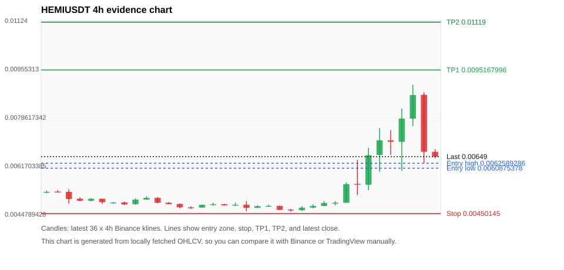
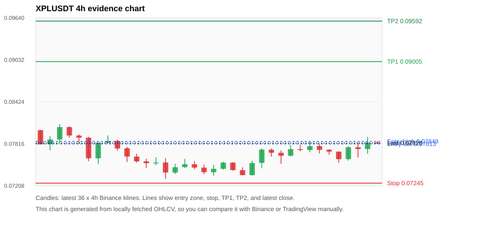
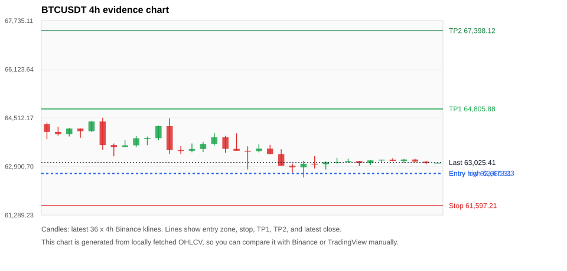
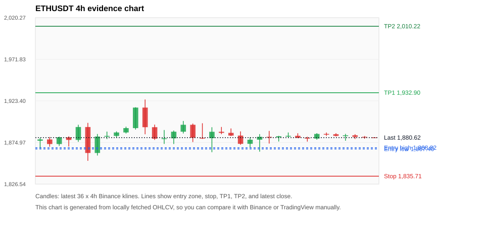
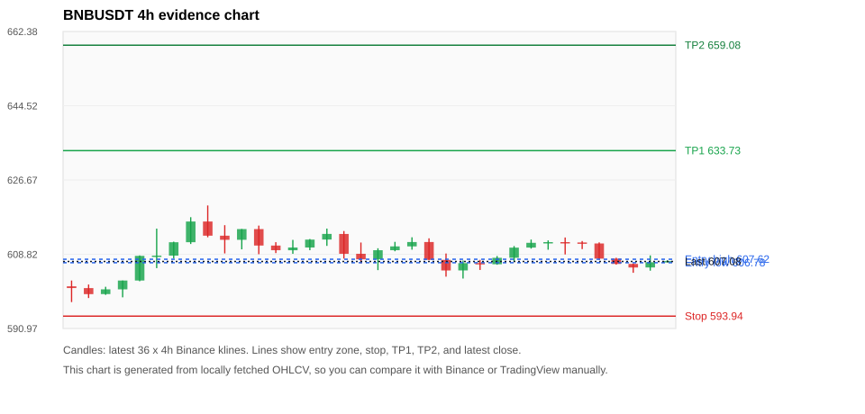

# Crypto 市场扫描报告 v1

- 报告时间：2026-08-16 20:05:55 CST
- Run ID：`20260816_120503_877c3feb`
- Run type：`daily_full`
- Data validation mode：`paper`
- 数据来源：SQLite
- 报告版本：v1
- 扫描 ID：6ccdb7972935
- 数据源：Binance public spot API + CoinGecko/CoinMarketCap cross-check
- 过滤条件：USDT spot; 24h quote volume >= 30,000,000; trades >= 30,000; exclude stables/leveraged tokens; analyze 1h/4h/1d klines
- 默认单笔风险：账户权益的 1.00%

## 限制说明

- 交易信号仍以 Binance 现货公开 K 线为主源；外部数据源用于一致性复核。
- 结果是研究和模拟盘计划，不是确定收益或实盘下单指令。
- 历史长度过滤：候选币至少需要 180 根 1d K 线。
- 数据质量验证池：先验证 score 排名前 min(top_n * 2, 10) 的候选，再按 action + score 补足最终名单。
- 大盘环境过滤：RISK_OFF; BTC/ETH 大盘偏弱，山寨币买入候选降级为观察。 BTC 7d=-2.8944591342061066; ETH 7d=-1.5732865778661842.
- Data cross-validation enabled: Binance primary source plus CoinGecko; CoinMarketCap is checked when an API key is configured.
- HEMIUSDT validation state BLOCKED: BLOCKED: [BINANCE_KLINE_EXTREME_RANGE] Binance candle range exceeds 40%.; [BINANCE_KLINE_EXTREME_RANGE] Binance candle range exceeds 40%.; [BINANCE_KLINE_EXTREME_RANGE] Binance candle range exceeds 40%.; [BINANCE_KLINE_EXTREME_RANGE] Binance candle range exceeds 40%.; [BINANCE_KLINE_EXTREME_RANGE] Binance candle range exceeds 40%.; [BINANCE_KLINE_EXTREME_RANGE] Binance candle range exceeds 40%.; [BINANCE_KLINE_EXTREME_RANGE] Binance candle range exceeds 40%.; [BINANCE_KLINE_EXTREME_RANGE] Binance candle range exceeds 40%.; [EXTERNAL_24H_DIFF_WARNING] 24h change diff 6.58 points exceeds warning threshold
- XPLUSDT validation state BLOCKED: BLOCKED: [BINANCE_KLINE_EXTREME_RANGE] Binance candle range exceeds 40%.; [EXTERNAL_IDENTITY_AMBIGUOUS] CoinGecko symbol mapping has 2 exact matches; selected highest market-cap rank; [EXTERNAL_IDENTITY_AMBIGUOUS] CoinMarketCap symbol mapping has 3 matches; selected lowest cmc_rank
- BTCUSDT validation state DEGRADED: DEGRADED: [EXTERNAL_IDENTITY_AMBIGUOUS] CoinMarketCap symbol mapping has 13 matches; selected lowest cmc_rank
- ETHUSDT validation state DEGRADED: DEGRADED: [EXTERNAL_IDENTITY_AMBIGUOUS] CoinMarketCap symbol mapping has 6 matches; selected lowest cmc_rank
- BNBUSDT validation state DEGRADED: DEGRADED: [EXTERNAL_IDENTITY_AMBIGUOUS] CoinMarketCap symbol mapping has 4 matches; selected lowest cmc_rank
- ALLOUSDT validation state BLOCKED: BLOCKED: [BINANCE_KLINE_EXTREME_RANGE] Binance candle range exceeds 40%.; [BINANCE_KLINE_EXTREME_RANGE] Binance candle range exceeds 40%.; [BINANCE_KLINE_EXTREME_RANGE] Binance candle range exceeds 40%.; [BINANCE_KLINE_EXTREME_RANGE] Binance candle range exceeds 40%.; [BINANCE_KLINE_EXTREME_RANGE] Binance candle range exceeds 40%.; [BINANCE_KLINE_EXTREME_RANGE] Binance candle range exceeds 40%.; [BINANCE_KLINE_EXTREME_RANGE] Binance candle range exceeds 40%.; [BINANCE_KLINE_EXTREME_RANGE] Binance candle range exceeds 40%.; [BINANCE_KLINE_EXTREME_RANGE] Binance candle range exceeds 40%.; [BINANCE_KLINE_EXTREME_RANGE] Binance candle range exceeds 40%.; [BINANCE_KLINE_EXTREME_RANGE] Binance candle range exceeds 40%.; [BINANCE_KLINE_EXTREME_RANGE] Binance candle range exceeds 40%.; [EXTERNAL_PROVIDER_RATE_LIMITED] Provider rate limited request for https://api.coingecko.com/api/v3/coins/markets?vs_currency=usd&ids=allora&price_change_percentage=24h&per_page=1&page=1: HTTP 429
- SOLUSDT validation state DEGRADED: DEGRADED: [EXTERNAL_PROVIDER_RATE_LIMITED] Provider rate limited request for https://api.coingecko.com/api/v3/coins/markets?vs_currency=usd&ids=solana&price_change_percentage=24h&per_page=1&page=1: HTTP 429; [EXTERNAL_IDENTITY_AMBIGUOUS] CoinMarketCap symbol mapping has 8 matches; selected lowest cmc_rank

## 5 个候选交易计划

| Rank | Coin | Action | Setup | Entry Zone | Stop Loss | TP1 | TP2 / Exit Rule | R/R | Verdict |
|---:|---|---|---|---:|---:|---:|---|---:|---|
| 1 | `HEMI` | `WAIT_PULLBACK` | 趋势中，等回调入场 | 0.0060875378 - 0.0062589286 | 0.00450145 | 0.0095167996 | 0.01119 或跌破 4h 关键支撑 | 2.00-3.00 | 只观察 |
| 2 | `XPL` | `WAIT_PULLBACK` | 回踩支撑/4h EMA 附近 | 0.07813 - 0.07849 | 0.07245 | 0.09005 | 0.09592 或跌破 4h 关键支撑 | 2.00-3.00 | 只观察 |
| 3 | `BTC` | `WATCH_ONLY` | 回踩支撑/4h EMA 附近 | 62,660.31 - 62,673.23 | 61,597.21 | 64,805.88 | 67,398.12 或跌破 4h 关键支撑 | 2.00-4.42 | 只观察 |
| 4 | `ETH` | `WATCH_ONLY` | 回踩支撑/4h EMA 附近 | 1,867.40 - 1,868.82 | 1,835.71 | 1,932.90 | 2,010.22 或跌破 4h 关键支撑 | 2.00-4.39 | 只观察 |
| 5 | `BNB` | `WATCH_ONLY` | 回踩支撑/4h EMA 附近 | 606.78 - 607.62 | 593.94 | 633.73 | 659.08 或跌破 4h 关键支撑 | 2.00-3.91 | 只观察 |

## 数据交叉验证摘要

价格差异以 Binance 当前价为基准；成交量口径不同，Binance 是 USDT 现货成交额，CoinGecko/CoinMarketCap 通常是全市场成交量。

| Rank | Coin | State | Identity | Max Price Diff | Max 24h Diff | Issue Codes | Message |
|---:|---|---|---|---:|---:|---|---|
| 1 | `HEMI` | BLOCKED (DATA_ERROR) | CONFIRMED | 0.69% | 6.58 pts | BINANCE_KLINE_EXTREME_RANGE, EXTERNAL_24H_DIFF_WARNING | BLOCKED: [BINANCE_KLINE_EXTREME_RANGE] Binance candle range exceeds 40%.; [BINANCE_KLINE_EXTREME_RANGE] Binance candle range exceeds 40%.; [BINANCE_KLINE_EXTREME_RANGE] Binance candle range exceeds 40%.; [BINANCE_KLINE_EXTREME_RANGE] Binance candle range exceeds 40%.; [BINANCE_KLINE_EXTREME_RANGE] Binance candle range exceeds 40%.; [BINANCE_KLINE_EXTREME_RANGE] Binance candle range exceeds 40%.; [BINANCE_KLINE_EXTREME_RANGE] Binance candle range exceeds 40%.; [BINANCE_KLINE_EXTREME_RANGE] Binance candle range exceeds 40%.; [EXTERNAL_24H_DIFF_WARNING] 24h change diff 6.58 points exceeds warning threshold |
| 2 | `XPL` | BLOCKED (DATA_ERROR) | UNCONFIRMED | 0.12% | 0.27 pts | BINANCE_KLINE_EXTREME_RANGE, EXTERNAL_IDENTITY_AMBIGUOUS | BLOCKED: [BINANCE_KLINE_EXTREME_RANGE] Binance candle range exceeds 40%.; [EXTERNAL_IDENTITY_AMBIGUOUS] CoinGecko symbol mapping has 2 exact matches; selected highest market-cap rank; [EXTERNAL_IDENTITY_AMBIGUOUS] CoinMarketCap symbol mapping has 3 matches; selected lowest cmc_rank |
| 3 | `BTC` | DEGRADED (DATA_WARNING) | UNCONFIRMED | 0.13% | 0.04 pts | EXTERNAL_IDENTITY_AMBIGUOUS | DEGRADED: [EXTERNAL_IDENTITY_AMBIGUOUS] CoinMarketCap symbol mapping has 13 matches; selected lowest cmc_rank |
| 4 | `ETH` | DEGRADED (DATA_WARNING) | UNCONFIRMED | 0.11% | 0.10 pts | EXTERNAL_IDENTITY_AMBIGUOUS | DEGRADED: [EXTERNAL_IDENTITY_AMBIGUOUS] CoinMarketCap symbol mapping has 6 matches; selected lowest cmc_rank |
| 5 | `BNB` | DEGRADED (DATA_WARNING) | UNCONFIRMED | 0.11% | 0.05 pts | EXTERNAL_IDENTITY_AMBIGUOUS | DEGRADED: [EXTERNAL_IDENTITY_AMBIGUOUS] CoinMarketCap symbol mapping has 4 matches; selected lowest cmc_rank |

## 候选币说明

### 1. HEMI `HEMIUSDT`



- 入选原因：趋势中，等回调入场；24h +20.82%，7d +16.73%，4h RSI 64.72，24h 成交额 $39.5M。
- 交易失效条件：跌破 0.00450145 或 4h 收盘重新失守关键支撑。
- 主要风险：24h 振幅较大，回撤风险高；成交量突增，可能是事件驱动；BTC/ETH 大盘环境未确认强势，山寨币买入信号降级；Blocking data-quality issue detected; paper plan creation is not allowed.。
- 数据交叉验证：BLOCKED / DATA_ERROR；身份=CONFIRMED；BLOCKED: [BINANCE_KLINE_EXTREME_RANGE] Binance candle range exceeds 40%.; [BINANCE_KLINE_EXTREME_RANGE] Binance candle range exceeds 40%.; [BINANCE_KLINE_EXTREME_RANGE] Binance candle range exceeds 40%.; [BINANCE_KLINE_EXTREME_RANGE] Binance candle range exceeds 40%.; [BINANCE_KLINE_EXTREME_RANGE] Binance candle range exceeds 40%.; [BINANCE_KLINE_EXTREME_RANGE] Binance candle range exceeds 40%.; [BINANCE_KLINE_EXTREME_RANGE] Binance candle range exceeds 40%.; [BINANCE_KLINE_EXTREME_RANGE] Binance candle range exceeds 40%.; [EXTERNAL_24H_DIFF_WARNING] 24h change diff 6.58 points exceeds warning threshold

#### 可点击人工验证

- [Binance 交易页](https://www.binance.com/en/trade/HEMI_USDT)
- [TradingView 图表](https://www.tradingview.com/chart/?symbol=BINANCE%3AHEMIUSDT)
- [CoinGecko 搜索](https://www.coingecko.com/en/search?query=HEMI)
- [CoinMarketCap 搜索](https://coinmarketcap.com/search/?q=HEMI)

#### 多数据源对照

| Source | Status | Identity | Blocking | Asset ID | Price | 24h Change | 24h Volume | Price Diff | 24h Diff | Updated | Issue Codes | Message |
|---|---|---|---:|---|---:|---:|---:|---:|---:|---|---|---|
| Binance | DATA_ERROR | CONFIRMED | yes | HEMIUSDT | 0.00649 | +20.82% | $39.5M | 0.00% | 0.00 pts | 2026-08-16T12:05:30+00:00 | BINANCE_KLINE_EXTREME_RANGE | [BINANCE_KLINE_EXTREME_RANGE] Binance candle range exceeds 40%.; [BINANCE_KLINE_EXTREME_RANGE] Binance candle range exceeds 40%.; [BINANCE_KLINE_EXTREME_RANGE] Binance candle range exceeds 40%.; [BINANCE_KLINE_EXTREME_RANGE] Binance candle range exceeds 40%.; [BINANCE_KLINE_EXTREME_RANGE] Binance candle range exceeds 40%.; [BINANCE_KLINE_EXTREME_RANGE] Binance candle range exceeds 40%.; [BINANCE_KLINE_EXTREME_RANGE] Binance candle range exceeds 40%.; [BINANCE_KLINE_EXTREME_RANGE] Binance candle range exceeds 40%. |
| CoinGecko | DATA_WARNING | CONFIRMED | yes | hemi | 0.00649835 | +27.40% | $114.5M | 0.13% | 6.58 pts | 2026-08-16T12:03:20.000Z | EXTERNAL_24H_DIFF_WARNING | [EXTERNAL_24H_DIFF_WARNING] 24h change diff 6.58 points exceeds warning threshold |
| CoinMarketCap | DATA_OK | CONFIRMED | no | 38159 | 0.0065345509 | +21.50% | $150.8M | 0.69% | 0.68 pts | 2026-08-16T12:04:04.000Z | none | External source agrees with Binance within thresholds. |

#### 指标证据

| 指标 | 数值 | 人工核对用途 |
|---|---:|---|
| 当前价 | 0.00649 | 与 Binance/TradingView 当前价格对照 |
| 24h 涨跌 | +20.82% | 与交易所 24h 涨跌对照 |
| 7d 涨跌 | +16.73% | 判断短线趋势是否延续 |
| 4h EMA20 | 0.0060753871 | 判断短期趋势支撑 |
| 4h EMA50 | 0.0055143636 | 判断中期趋势支撑 |
| 1d EMA20 | 0.0052473302 | 判断日线趋势 |
| 1d EMA50 | 0.0051761847 | 判断日线趋势 |
| 4h RSI14 | 64.72 | 判断是否过热/过弱 |
| 4h ATR14 | 0.00092428571 | 推导止损和入场缓冲 |
| 最近 18 根 4h 最低点 | 0.00457 | 支撑/止损参考 |
| 最近 36 根 4h 最高点 | 0.009 | TP/压力参考 |
| 支撑位 | 0.0060753871 | 入场区间推导基础 |

#### 交易计划推导

- 支撑位 = 最近低点、4h EMA20、4h EMA50、1d EMA20 中不高于当前价的最高有效支撑 = `0.0060753871`。
- 入场区间 = 支撑位附近 + ATR 缓冲 = `0.0060875378 - 0.0062589286`。
- 止损 = min(最近 18 根 4h 最低点 * 0.985, 入场中位价 - 1.15 * ATR14) = `0.00450145`。
- TP1 = max(最近 36 根 4h 最高点 * 0.995, 入场中位价 + 2R) = `0.0095167996`。
- TP2 = max(入场中位价 + 3R, TP1 * 1.04) = `0.01119`。

#### 最近 10 根 4h K线

| UTC 开盘时间 | Open | High | Low | Close | Quote Volume | Trades |
|---|---:|---:|---:|---:|---:|---:|
| 2026-08-15T00:00+00:00 | 0.00487 | 0.00494 | 0.00479 | 0.00488 | $93,313 | 2457 |
| 2026-08-15T04:00+00:00 | 0.00488 | 0.00559 | 0.00488 | 0.00553 | $1.5M | 40357 |
| 2026-08-15T08:00+00:00 | 0.00554 | 0.00638 | 0.00515 | 0.00551 | $4.2M | 91744 |
| 2026-08-15T12:00+00:00 | 0.00551 | 0.0068 | 0.00532 | 0.00654 | $4.7M | 112182 |
| 2026-08-15T16:00+00:00 | 0.00655 | 0.00749 | 0.00596 | 0.00706 | $7.2M | 118107 |
| 2026-08-15T20:00+00:00 | 0.00706 | 0.00742 | 0.00655 | 0.00701 | $3.9M | 82705 |
| 2026-08-16T00:00+00:00 | 0.00701 | 0.00817 | 0.00599 | 0.00782 | $7.4M | 142611 |
| 2026-08-16T04:00+00:00 | 0.00782 | 0.009 | 0.00756 | 0.00864 | $7.2M | 152229 |
| 2026-08-16T08:00+00:00 | 0.00865 | 0.00874 | 0.00627 | 0.00666 | $9.1M | 210005 |
| 2026-08-16T12:00+00:00 | 0.00666 | 0.00675 | 0.00643 | 0.00649 | $202,006 | 4398 |

### 2. XPL `XPLUSDT`



- 入选原因：回踩支撑/4h EMA 附近；24h +0.33%，7d +0.38%，4h RSI 70.93，24h 成交额 $213.2M。
- 交易失效条件：跌破 0.07244675 或 4h 收盘重新失守关键支撑。
- 主要风险：成交量突增，可能是事件驱动；日线趋势未完全确认；BTC/ETH 大盘环境未确认强势，山寨币买入信号降级；Blocking data-quality issue detected; paper plan creation is not allowed.。
- 数据交叉验证：BLOCKED / DATA_ERROR；身份=UNCONFIRMED；BLOCKED: [BINANCE_KLINE_EXTREME_RANGE] Binance candle range exceeds 40%.; [EXTERNAL_IDENTITY_AMBIGUOUS] CoinGecko symbol mapping has 2 exact matches; selected highest market-cap rank; [EXTERNAL_IDENTITY_AMBIGUOUS] CoinMarketCap symbol mapping has 3 matches; selected lowest cmc_rank

#### 可点击人工验证

- [Binance 交易页](https://www.binance.com/en/trade/XPL_USDT)
- [TradingView 图表](https://www.tradingview.com/chart/?symbol=BINANCE%3AXPLUSDT)
- [CoinGecko 搜索](https://www.coingecko.com/en/search?query=XPL)
- [CoinMarketCap 搜索](https://coinmarketcap.com/search/?q=XPL)

#### 多数据源对照

| Source | Status | Identity | Blocking | Asset ID | Price | 24h Change | 24h Volume | Price Diff | 24h Diff | Updated | Issue Codes | Message |
|---|---|---|---:|---|---:|---:|---:|---:|---:|---|---|---|
| Binance | DATA_ERROR | CONFIRMED | yes | XPLUSDT | 0.07826 | +0.33% | $213.2M | 0.00% | 0.00 pts | 2026-08-16T12:05:30+00:00 | BINANCE_KLINE_EXTREME_RANGE | [BINANCE_KLINE_EXTREME_RANGE] Binance candle range exceeds 40%. |
| CoinGecko | DATA_WARNING | UNCONFIRMED | no | plasma | 0.07820 | +0.60% | $496.4M | 0.07% | 0.27 pts | 2026-08-16T12:03:20.000Z | EXTERNAL_IDENTITY_AMBIGUOUS | [EXTERNAL_IDENTITY_AMBIGUOUS] CoinGecko symbol mapping has 2 exact matches; selected highest market-cap rank |
| CoinMarketCap | DATA_WARNING | UNCONFIRMED | no | 36645 | 0.07817 | +0.43% | $681.8M | 0.12% | 0.10 pts | 2026-08-16T12:04:04.000Z | EXTERNAL_IDENTITY_AMBIGUOUS | [EXTERNAL_IDENTITY_AMBIGUOUS] CoinMarketCap symbol mapping has 3 matches; selected lowest cmc_rank |

#### 指标证据

| 指标 | 数值 | 人工核对用途 |
|---|---:|---|
| 当前价 | 0.07826 | 与 Binance/TradingView 当前价格对照 |
| 24h 涨跌 | +0.33% | 与交易所 24h 涨跌对照 |
| 7d 涨跌 | +0.38% | 判断短线趋势是否延续 |
| 4h EMA20 | 0.07692 | 判断短期趋势支撑 |
| 4h EMA50 | 0.07677 | 判断中期趋势支撑 |
| 1d EMA20 | 0.07798 | 判断日线趋势 |
| 1d EMA50 | 0.08255 | 判断日线趋势 |
| 4h RSI14 | 70.93 | 判断是否过热/过弱 |
| 4h ATR14 | 0.0016707143 | 推导止损和入场缓冲 |
| 最近 18 根 4h 最低点 | 0.07355 | 支撑/止损参考 |
| 最近 36 根 4h 最高点 | 0.08100 | TP/压力参考 |
| 支撑位 | 0.07798 | 入场区间推导基础 |

#### 交易计划推导

- 支撑位 = 最近低点、4h EMA20、4h EMA50、1d EMA20 中不高于当前价的最高有效支撑 = `0.07798`。
- 入场区间 = 支撑位附近 + ATR 缓冲 = `0.07813 - 0.07849`。
- 止损 = min(最近 18 根 4h 最低点 * 0.985, 入场中位价 - 1.15 * ATR14) = `0.07245`。
- TP1 = max(最近 36 根 4h 最高点 * 0.995, 入场中位价 + 2R) = `0.09005`。
- TP2 = max(入场中位价 + 3R, TP1 * 1.04) = `0.09592`。

#### 最近 10 根 4h K线

| UTC 开盘时间 | Open | High | Low | Close | Quote Volume | Trades |
|---|---:|---:|---:|---:|---:|---:|
| 2026-08-15T00:00+00:00 | 0.07643 | 0.07800 | 0.07628 | 0.07737 | $13.3M | 119597 |
| 2026-08-15T04:00+00:00 | 0.07737 | 0.07801 | 0.07707 | 0.07725 | $6.8M | 92404 |
| 2026-08-15T08:00+00:00 | 0.07725 | 0.07844 | 0.07691 | 0.07781 | $6.0M | 98113 |
| 2026-08-15T12:00+00:00 | 0.07782 | 0.07813 | 0.07675 | 0.07728 | $4.0M | 101027 |
| 2026-08-15T16:00+00:00 | 0.07729 | 0.07737 | 0.07656 | 0.07702 | $3.0M | 79267 |
| 2026-08-15T20:00+00:00 | 0.07701 | 0.07708 | 0.07540 | 0.07592 | $2.1M | 39926 |
| 2026-08-16T00:00+00:00 | 0.07593 | 0.07779 | 0.07569 | 0.07766 | $24.3M | 201112 |
| 2026-08-16T04:00+00:00 | 0.07765 | 0.07832 | 0.07615 | 0.07739 | $60.1M | 356620 |
| 2026-08-16T08:00+00:00 | 0.07739 | 0.07916 | 0.07669 | 0.07833 | $119.6M | 395416 |
| 2026-08-16T12:00+00:00 | 0.07834 | 0.07850 | 0.07810 | 0.07826 | $265,906 | 6821 |

### 3. BTC `BTCUSDT`



- 入选原因：回踩支撑/4h EMA 附近；24h +0.04%，7d -3.36%，4h RSI 57.76，24h 成交额 $276.8M。
- 交易失效条件：跌破 61597.211 或 4h 收盘重新失守关键支撑。
- 主要风险：日线趋势未完全确认；BTC/ETH 大盘环境未确认强势，山寨币买入信号降级；7d 趋势未确认；External validation is degraded; this candidate is not a clean data sample.；Paper mode allows degraded validation; candidate is excluded from clean-data samples.。
- 数据交叉验证：DEGRADED / DATA_WARNING；身份=UNCONFIRMED；DEGRADED: [EXTERNAL_IDENTITY_AMBIGUOUS] CoinMarketCap symbol mapping has 13 matches; selected lowest cmc_rank

#### 可点击人工验证

- [Binance 交易页](https://www.binance.com/en/trade/BTC_USDT)
- [TradingView 图表](https://www.tradingview.com/chart/?symbol=BINANCE%3ABTCUSDT)
- [CoinGecko 搜索](https://www.coingecko.com/en/search?query=BTC)
- [CoinMarketCap 搜索](https://coinmarketcap.com/search/?q=BTC)

#### 多数据源对照

| Source | Status | Identity | Blocking | Asset ID | Price | 24h Change | 24h Volume | Price Diff | 24h Diff | Updated | Issue Codes | Message |
|---|---|---|---:|---|---:|---:|---:|---:|---:|---|---|---|
| Binance | DATA_OK | CONFIRMED | no | BTCUSDT | 63,025.41 | +0.04% | $276.8M | 0.00% | 0.00 pts | 2026-08-16T12:05:30+00:00 | none | Primary market data source passed health checks. |
| CoinGecko | DATA_OK | CONFIRMED | no | bitcoin | 62,959.00 | +0.00% | $8.84B | 0.11% | 0.04 pts | 2026-08-16T12:02:20.000Z | none | External source agrees with Binance within thresholds. |
| CoinMarketCap | DATA_WARNING | UNCONFIRMED | no | 1 | 62,941.78 | -0.00% | $8.43B | 0.13% | 0.04 pts | 2026-08-16T12:04:04.000Z | EXTERNAL_IDENTITY_AMBIGUOUS | [EXTERNAL_IDENTITY_AMBIGUOUS] CoinMarketCap symbol mapping has 13 matches; selected lowest cmc_rank |

#### 指标证据

| 指标 | 数值 | 人工核对用途 |
|---|---:|---|
| 当前价 | 63,025.41 | 与 Binance/TradingView 当前价格对照 |
| 24h 涨跌 | +0.04% | 与交易所 24h 涨跌对照 |
| 7d 涨跌 | -3.36% | 判断短线趋势是否延续 |
| 4h EMA20 | 63,205.72 | 判断短期趋势支撑 |
| 4h EMA50 | 63,591.81 | 判断中期趋势支撑 |
| 1d EMA20 | 63,807.15 | 判断日线趋势 |
| 1d EMA50 | 64,349.97 | 判断日线趋势 |
| 4h RSI14 | 57.76 | 判断是否过热/过弱 |
| 4h ATR14 | 197.12 | 推导止损和入场缓冲 |
| 最近 18 根 4h 最低点 | 62,535.24 | 支撑/止损参考 |
| 最近 36 根 4h 最高点 | 64,515.43 | TP/压力参考 |
| 支撑位 | 62,535.24 | 入场区间推导基础 |

#### 交易计划推导

- 支撑位 = 最近低点、4h EMA20、4h EMA50、1d EMA20 中不高于当前价的最高有效支撑 = `62,535.24`。
- 入场区间 = 支撑位附近 + ATR 缓冲 = `62,660.31 - 62,673.23`。
- 止损 = min(最近 18 根 4h 最低点 * 0.985, 入场中位价 - 1.15 * ATR14) = `61,597.21`。
- TP1 = max(最近 36 根 4h 最高点 * 0.995, 入场中位价 + 2R) = `64,805.88`。
- TP2 = max(入场中位价 + 3R, TP1 * 1.04) = `67,398.12`。

#### 最近 10 根 4h K线

| UTC 开盘时间 | Open | High | Low | Close | Quote Volume | Trades |
|---|---:|---:|---:|---:|---:|---:|
| 2026-08-15T00:00+00:00 | 63,043.56 | 63,187.98 | 62,992.91 | 63,051.25 | $70.7M | 110386 |
| 2026-08-15T04:00+00:00 | 63,051.25 | 63,155.76 | 63,027.89 | 63,075.43 | $91.4M | 93334 |
| 2026-08-15T08:00+00:00 | 63,075.43 | 63,085.80 | 62,920.00 | 63,022.01 | $38.9M | 76132 |
| 2026-08-15T12:00+00:00 | 63,022.01 | 63,120.09 | 62,946.58 | 63,100.55 | $44.2M | 88246 |
| 2026-08-15T16:00+00:00 | 63,100.55 | 63,127.40 | 63,044.37 | 63,126.08 | $70.0M | 104954 |
| 2026-08-15T20:00+00:00 | 63,126.07 | 63,175.00 | 63,076.96 | 63,086.01 | $25.7M | 67261 |
| 2026-08-16T00:00+00:00 | 63,086.01 | 63,151.59 | 63,012.00 | 63,130.00 | $39.5M | 68806 |
| 2026-08-16T04:00+00:00 | 63,130.01 | 63,158.80 | 63,040.00 | 63,061.02 | $50.0M | 53001 |
| 2026-08-16T08:00+00:00 | 63,061.03 | 63,079.76 | 62,968.45 | 63,013.66 | $47.1M | 60667 |
| 2026-08-16T12:00+00:00 | 63,013.66 | 63,025.42 | 63,013.65 | 63,025.41 | $765,485 | 2199 |

### 4. ETH `ETHUSDT`



- 入选原因：回踩支撑/4h EMA 附近；24h +0.10%，7d -2.22%，4h RSI 64.53，24h 成交额 $92.0M。
- 交易失效条件：跌破 1835.715 或 4h 收盘重新失守关键支撑。
- 主要风险：日线趋势未完全确认；BTC/ETH 大盘环境未确认强势，山寨币买入信号降级；7d 趋势未确认；External validation is degraded; this candidate is not a clean data sample.；Paper mode allows degraded validation; candidate is excluded from clean-data samples.。
- 数据交叉验证：DEGRADED / DATA_WARNING；身份=UNCONFIRMED；DEGRADED: [EXTERNAL_IDENTITY_AMBIGUOUS] CoinMarketCap symbol mapping has 6 matches; selected lowest cmc_rank

#### 可点击人工验证

- [Binance 交易页](https://www.binance.com/en/trade/ETH_USDT)
- [TradingView 图表](https://www.tradingview.com/chart/?symbol=BINANCE%3AETHUSDT)
- [CoinGecko 搜索](https://www.coingecko.com/en/search?query=ETH)
- [CoinMarketCap 搜索](https://coinmarketcap.com/search/?q=ETH)

#### 多数据源对照

| Source | Status | Identity | Blocking | Asset ID | Price | 24h Change | 24h Volume | Price Diff | 24h Diff | Updated | Issue Codes | Message |
|---|---|---|---:|---|---:|---:|---:|---:|---:|---|---|---|
| Binance | DATA_OK | CONFIRMED | no | ETHUSDT | 1,880.62 | +0.10% | $92.0M | 0.00% | 0.00 pts | 2026-08-16T12:05:30+00:00 | none | Primary market data source passed health checks. |
| CoinGecko | DATA_OK | CONFIRMED | no | ethereum | 1,878.90 | +0.00% | $2.63B | 0.09% | 0.10 pts | 2026-08-16T12:02:20.000Z | none | External source agrees with Binance within thresholds. |
| CoinMarketCap | DATA_WARNING | UNCONFIRMED | no | 1027 | 1,878.48 | +0.06% | $2.94B | 0.11% | 0.04 pts | 2026-08-16T12:04:04.000Z | EXTERNAL_IDENTITY_AMBIGUOUS | [EXTERNAL_IDENTITY_AMBIGUOUS] CoinMarketCap symbol mapping has 6 matches; selected lowest cmc_rank |

#### 指标证据

| 指标 | 数值 | 人工核对用途 |
|---|---:|---|
| 当前价 | 1,880.62 | 与 Binance/TradingView 当前价格对照 |
| 24h 涨跌 | +0.10% | 与交易所 24h 涨跌对照 |
| 7d 涨跌 | -2.22% | 判断短线趋势是否延续 |
| 4h EMA20 | 1,883.16 | 判断短期趋势支撑 |
| 4h EMA50 | 1,887.96 | 判断中期趋势支撑 |
| 1d EMA20 | 1,883.70 | 判断日线趋势 |
| 1d EMA50 | 1,866.33 | 判断日线趋势 |
| 4h RSI14 | 64.53 | 判断是否过热/过弱 |
| 4h ATR14 | 7.3600 | 推导止损和入场缓冲 |
| 最近 18 根 4h 最低点 | 1,863.67 | 支撑/止损参考 |
| 最近 36 根 4h 最高点 | 1,925.00 | TP/压力参考 |
| 支撑位 | 1,863.67 | 入场区间推导基础 |

#### 交易计划推导

- 支撑位 = 最近低点、4h EMA20、4h EMA50、1d EMA20 中不高于当前价的最高有效支撑 = `1,863.67`。
- 入场区间 = 支撑位附近 + ATR 缓冲 = `1,867.40 - 1,868.82`。
- 止损 = min(最近 18 根 4h 最低点 * 0.985, 入场中位价 - 1.15 * ATR14) = `1,835.71`。
- TP1 = max(最近 36 根 4h 最高点 * 0.995, 入场中位价 + 2R) = `1,932.90`。
- TP2 = max(入场中位价 + 3R, TP1 * 1.04) = `2,010.22`。

#### 最近 10 根 4h K线

| UTC 开盘时间 | Open | High | Low | Close | Quote Volume | Trades |
|---|---:|---:|---:|---:|---:|---:|
| 2026-08-15T00:00+00:00 | 1,882.20 | 1,886.59 | 1,881.12 | 1,882.68 | $13.5M | 64114 |
| 2026-08-15T04:00+00:00 | 1,882.69 | 1,885.69 | 1,880.00 | 1,880.40 | $13.3M | 77356 |
| 2026-08-15T08:00+00:00 | 1,880.40 | 1,881.69 | 1,876.01 | 1,879.49 | $15.2M | 64670 |
| 2026-08-15T12:00+00:00 | 1,879.49 | 1,885.83 | 1,878.19 | 1,884.91 | $19.5M | 89247 |
| 2026-08-15T16:00+00:00 | 1,884.92 | 1,886.58 | 1,882.59 | 1,884.55 | $15.5M | 57032 |
| 2026-08-15T20:00+00:00 | 1,884.55 | 1,885.80 | 1,881.98 | 1,882.64 | $13.7M | 57211 |
| 2026-08-16T00:00+00:00 | 1,882.64 | 1,885.00 | 1,877.01 | 1,883.30 | $16.7M | 87754 |
| 2026-08-16T04:00+00:00 | 1,883.31 | 1,884.56 | 1,879.00 | 1,881.54 | $11.9M | 55926 |
| 2026-08-16T08:00+00:00 | 1,881.54 | 1,882.52 | 1,879.27 | 1,880.94 | $14.5M | 50386 |
| 2026-08-16T12:00+00:00 | 1,880.94 | 1,880.95 | 1,880.59 | 1,880.62 | $278,307 | 906 |

### 5. BNB `BNBUSDT`



- 入选原因：回踩支撑/4h EMA 附近；24h -0.75%，7d -0.06%，4h RSI 49.18，24h 成交额 $42.6M。
- 交易失效条件：跌破 593.9353 或 4h 收盘重新失守关键支撑。
- 主要风险：BTC/ETH 大盘环境未确认强势，山寨币买入信号降级；24h 动量未确认；7d 趋势未确认；External validation is degraded; this candidate is not a clean data sample.；Paper mode allows degraded validation; candidate is excluded from clean-data samples.。
- 数据交叉验证：DEGRADED / DATA_WARNING；身份=UNCONFIRMED；DEGRADED: [EXTERNAL_IDENTITY_AMBIGUOUS] CoinMarketCap symbol mapping has 4 matches; selected lowest cmc_rank

#### 可点击人工验证

- [Binance 交易页](https://www.binance.com/en/trade/BNB_USDT)
- [TradingView 图表](https://www.tradingview.com/chart/?symbol=BINANCE%3ABNBUSDT)
- [CoinGecko 搜索](https://www.coingecko.com/en/search?query=BNB)
- [CoinMarketCap 搜索](https://coinmarketcap.com/search/?q=BNB)

#### 多数据源对照

| Source | Status | Identity | Blocking | Asset ID | Price | 24h Change | 24h Volume | Price Diff | 24h Diff | Updated | Issue Codes | Message |
|---|---|---|---:|---|---:|---:|---:|---:|---:|---|---|---|
| Binance | DATA_OK | CONFIRMED | no | BNBUSDT | 607.08 | -0.75% | $42.6M | 0.00% | 0.00 pts | 2026-08-16T12:05:30+00:00 | none | Primary market data source passed health checks. |
| CoinGecko | DATA_OK | CONFIRMED | no | binancecoin | 606.57 | -0.70% | $451.4M | 0.08% | 0.05 pts | 2026-08-16T12:03:20.000Z | none | External source agrees with Binance within thresholds. |
| CoinMarketCap | DATA_WARNING | UNCONFIRMED | no | 1839 | 606.41 | -0.75% | $579.9M | 0.11% | 0.00 pts | 2026-08-16T12:04:04.000Z | EXTERNAL_IDENTITY_AMBIGUOUS | [EXTERNAL_IDENTITY_AMBIGUOUS] CoinMarketCap symbol mapping has 4 matches; selected lowest cmc_rank |

#### 指标证据

| 指标 | 数值 | 人工核对用途 |
|---|---:|---|
| 当前价 | 607.08 | 与 Binance/TradingView 当前价格对照 |
| 24h 涨跌 | -0.75% | 与交易所 24h 涨跌对照 |
| 7d 涨跌 | -0.06% | 判断短线趋势是否延续 |
| 4h EMA20 | 608.41 | 判断短期趋势支撑 |
| 4h EMA50 | 605.57 | 判断中期趋势支撑 |
| 1d EMA20 | 597.37 | 判断日线趋势 |
| 1d EMA50 | 591.13 | 判断日线趋势 |
| 4h RSI14 | 49.18 | 判断是否过热/过弱 |
| 4h ATR14 | 2.9200 | 推导止损和入场缓冲 |
| 最近 18 根 4h 最低点 | 602.98 | 支撑/止损参考 |
| 最近 36 根 4h 最高点 | 620.55 | TP/压力参考 |
| 支撑位 | 605.57 | 入场区间推导基础 |

#### 交易计划推导

- 支撑位 = 最近低点、4h EMA20、4h EMA50、1d EMA20 中不高于当前价的最高有效支撑 = `605.57`。
- 入场区间 = 支撑位附近 + ATR 缓冲 = `606.78 - 607.62`。
- 止损 = min(最近 18 根 4h 最低点 * 0.985, 入场中位价 - 1.15 * ATR14) = `593.94`。
- TP1 = max(最近 36 根 4h 最高点 * 0.995, 入场中位价 + 2R) = `633.73`。
- TP2 = max(入场中位价 + 3R, TP1 * 1.04) = `659.08`。

#### 最近 10 根 4h K线

| UTC 开盘时间 | Open | High | Low | Close | Quote Volume | Trades |
|---|---:|---:|---:|---:|---:|---:|
| 2026-08-15T00:00+00:00 | 607.97 | 610.79 | 606.97 | 610.41 | $5.8M | 47005 |
| 2026-08-15T04:00+00:00 | 610.42 | 612.35 | 610.17 | 611.57 | $6.4M | 56586 |
| 2026-08-15T08:00+00:00 | 611.57 | 612.15 | 609.91 | 611.74 | $6.7M | 58461 |
| 2026-08-15T12:00+00:00 | 611.74 | 612.85 | 608.77 | 611.65 | $8.1M | 69855 |
| 2026-08-15T16:00+00:00 | 611.65 | 612.00 | 610.06 | 611.41 | $5.5M | 47460 |
| 2026-08-15T20:00+00:00 | 611.41 | 611.67 | 607.50 | 607.76 | $4.6M | 43452 |
| 2026-08-16T00:00+00:00 | 607.76 | 607.97 | 606.32 | 606.49 | $7.9M | 50901 |
| 2026-08-16T04:00+00:00 | 606.49 | 606.59 | 604.36 | 605.63 | $7.8M | 45355 |
| 2026-08-16T08:00+00:00 | 605.64 | 608.54 | 604.87 | 606.90 | $8.6M | 58822 |
| 2026-08-16T12:00+00:00 | 606.90 | 607.38 | 606.90 | 607.18 | $199,188 | 1549 |

## 组合风控

- 不要 5 个候选全部满仓买入。
- 同时持仓总风险建议控制在账户权益的 3% - 5% 以内。
- 如果 BTC/ETH 同时破位，暂停山寨币多头计划或降低仓位。
- 第一版报告用于模拟盘和人工复核，不自动下单。

## 原始数据

```json
[
  {
    "rank": 1,
    "symbol": "HEMIUSDT",
    "base_asset": "HEMI",
    "price": 0.00649,
    "score": 60.39153383038041,
    "setup": "趋势中，等回调入场",
    "verdict": "只观察",
    "entry_low": 0.006087537831826903,
    "entry_high": 0.0062589285714285715,
    "stop_loss": 0.004501450000000001,
    "take_profit_1": 0.00951679960488321,
    "take_profit_2": 0.011188582806510947,
    "risk_reward_1": 2.0,
    "risk_reward_2": 3.0,
    "pct_24h": 20.818,
    "pct_3d": 34.64730290456433,
    "pct_7d": 16.72661870503598,
    "quote_volume_24h": 39514584.263166,
    "trades_24h": 817940,
    "high_low_range_24h": 69.17293233082704,
    "rsi_1h": 48.367029548989116,
    "rsi_4h": 64.71518987341773,
    "ema20_4h": 0.00607538705771148,
    "ema50_4h": 0.005514363557264571,
    "ema20_1d": 0.0052473301859467395,
    "ema50_1d": 0.005176184701678696,
    "atr_4h": 0.0009242857142857143,
    "macd_hist_4h": 0.0001927479749941599,
    "volume_ratio_24h": 20.062030530368496,
    "support_level": 0.00607538705771148,
    "recent_low_4h_18": 0.00457,
    "recent_high_4h_36": 0.009,
    "distance_to_support_pct": 6.824469590990945,
    "binance_trade_url": "https://www.binance.com/en/trade/HEMI_USDT",
    "tradingview_url": "https://www.tradingview.com/chart/?symbol=BINANCE%3AHEMIUSDT",
    "coingecko_search_url": "https://www.coingecko.com/en/search?query=HEMI",
    "coinmarketcap_search_url": "https://coinmarketcap.com/search/?q=HEMI",
    "invalidation": "跌破 0.00450145 或 4h 收盘重新失守关键支撑",
    "recent_4h_klines": [
      {
        "open_time_utc": "2026-08-10T16:00+00:00",
        "open": 0.00525,
        "high": 0.00531,
        "low": 0.00522,
        "close": 0.00526,
        "quote_volume": 121770.37642,
        "trades": 2621
      },
      {
        "open_time_utc": "2026-08-10T20:00+00:00",
        "open": 0.00527,
        "high": 0.00532,
        "low": 0.00525,
        "close": 0.00526,
        "quote_volume": 59081.993262,
        "trades": 1634
      },
      {
        "open_time_utc": "2026-08-11T00:00+00:00",
        "open": 0.00526,
        "high": 0.00535,
        "low": 0.00485,
        "close": 0.00501,
        "quote_volume": 727543.382145,
        "trades": 14428
      },
      {
        "open_time_utc": "2026-08-11T04:00+00:00",
        "open": 0.00502,
        "high": 0.00507,
        "low": 0.00493,
        "close": 0.00495,
        "quote_volume": 152673.918337,
        "trades": 4017
      },
      {
        "open_time_utc": "2026-08-11T08:00+00:00",
        "open": 0.00495,
        "high": 0.00504,
        "low": 0.00493,
        "close": 0.00502,
        "quote_volume": 180402.865707,
        "trades": 4220
      },
      {
        "open_time_utc": "2026-08-11T12:00+00:00",
        "open": 0.00502,
        "high": 0.00502,
        "low": 0.00484,
        "close": 0.0049,
        "quote_volume": 126172.391887,
        "trades": 2876
      },
      {
        "open_time_utc": "2026-08-11T16:00+00:00",
        "open": 0.00489,
        "high": 0.00491,
        "low": 0.00485,
        "close": 0.00489,
        "quote_volume": 70712.210502,
        "trades": 2111
      },
      {
        "open_time_utc": "2026-08-11T20:00+00:00",
        "open": 0.00489,
        "high": 0.00492,
        "low": 0.00481,
        "close": 0.00482,
        "quote_volume": 66166.046713,
        "trades": 1449
      },
      {
        "open_time_utc": "2026-08-12T00:00+00:00",
        "open": 0.00483,
        "high": 0.00504,
        "low": 0.00481,
        "close": 0.00499,
        "quote_volume": 148732.584497,
        "trades": 4116
      },
      {
        "open_time_utc": "2026-08-12T04:00+00:00",
        "open": 0.00499,
        "high": 0.00511,
        "low": 0.00499,
        "close": 0.00505,
        "quote_volume": 148781.367253,
        "trades": 4978
      },
      {
        "open_time_utc": "2026-08-12T08:00+00:00",
        "open": 0.00505,
        "high": 0.00508,
        "low": 0.00486,
        "close": 0.00488,
        "quote_volume": 183861.015529,
        "trades": 5018
      },
      {
        "open_time_utc": "2026-08-12T12:00+00:00",
        "open": 0.00488,
        "high": 0.0049,
        "low": 0.00483,
        "close": 0.00483,
        "quote_volume": 134806.661637,
        "trades": 4359
      },
      {
        "open_time_utc": "2026-08-12T16:00+00:00",
        "open": 0.00484,
        "high": 0.00485,
        "low": 0.00469,
        "close": 0.00472,
        "quote_volume": 91262.95773,
        "trades": 2177
      },
      {
        "open_time_utc": "2026-08-12T20:00+00:00",
        "open": 0.00472,
        "high": 0.00476,
        "low": 0.00466,
        "close": 0.00471,
        "quote_volume": 112640.023316,
        "trades": 2383
      },
      {
        "open_time_utc": "2026-08-13T00:00+00:00",
        "open": 0.00471,
        "high": 0.00481,
        "low": 0.00471,
        "close": 0.00481,
        "quote_volume": 41256.349056,
        "trades": 1232
      },
      {
        "open_time_utc": "2026-08-13T04:00+00:00",
        "open": 0.0048,
        "high": 0.00488,
        "low": 0.00478,
        "close": 0.00483,
        "quote_volume": 61867.952663,
        "trades": 1550
      },
      {
        "open_time_utc": "2026-08-13T08:00+00:00",
        "open": 0.00483,
        "high": 0.00484,
        "low": 0.00478,
        "close": 0.00479,
        "quote_volume": 62861.212163,
        "trades": 1263
      },
      {
        "open_time_utc": "2026-08-13T12:00+00:00",
        "open": 0.00479,
        "high": 0.00489,
        "low": 0.00477,
        "close": 0.00481,
        "quote_volume": 87991.375824,
        "trades": 1643
      },
      {
        "open_time_utc": "2026-08-13T16:00+00:00",
        "open": 0.00481,
        "high": 0.00493,
        "low": 0.00458,
        "close": 0.0047,
        "quote_volume": 429978.776124,
        "trades": 6306
      },
      {
        "open_time_utc": "2026-08-13T20:00+00:00",
        "open": 0.0047,
        "high": 0.00479,
        "low": 0.0047,
        "close": 0.00476,
        "quote_volume": 56233.042714,
        "trades": 1130
      },
      {
        "open_time_utc": "2026-08-14T00:00+00:00",
        "open": 0.00475,
        "high": 0.00481,
        "low": 0.00474,
        "close": 0.00477,
        "quote_volume": 41639.928619,
        "trades": 1277
      },
      {
        "open_time_utc": "2026-08-14T04:00+00:00",
        "open": 0.00477,
        "high": 0.00478,
        "low": 0.00462,
        "close": 0.00463,
        "quote_volume": 115571.945639,
        "trades": 2108
      },
      {
        "open_time_utc": "2026-08-14T08:00+00:00",
        "open": 0.00464,
        "high": 0.00467,
        "low": 0.00457,
        "close": 0.00462,
        "quote_volume": 84844.154589,
        "trades": 2219
      },
      {
        "open_time_utc": "2026-08-14T12:00+00:00",
        "open": 0.00462,
        "high": 0.00476,
        "low": 0.0046,
        "close": 0.00471,
        "quote_volume": 123731.347979,
        "trades": 3383
      },
      {
        "open_time_utc": "2026-08-14T16:00+00:00",
        "open": 0.00471,
        "high": 0.00482,
        "low": 0.00469,
        "close": 0.00477,
        "quote_volume": 134567.769453,
        "trades": 3180
      },
      {
        "open_time_utc": "2026-08-14T20:00+00:00",
        "open": 0.00477,
        "high": 0.00494,
        "low": 0.00477,
        "close": 0.00487,
        "quote_volume": 125288.336061,
        "trades": 3335
      },
      {
        "open_time_utc": "2026-08-15T00:00+00:00",
        "open": 0.00487,
        "high": 0.00494,
        "low": 0.00479,
        "close": 0.00488,
        "quote_volume": 93312.773536,
        "trades": 2457
      },
      {
        "open_time_utc": "2026-08-15T04:00+00:00",
        "open": 0.00488,
        "high": 0.00559,
        "low": 0.00488,
        "close": 0.00553,
        "quote_volume": 1479605.264011,
        "trades": 40357
      },
      {
        "open_time_utc": "2026-08-15T08:00+00:00",
        "open": 0.00554,
        "high": 0.00638,
        "low": 0.00515,
        "close": 0.00551,
        "quote_volume": 4203202.688497,
        "trades": 91744
      },
      {
        "open_time_utc": "2026-08-15T12:00+00:00",
        "open": 0.00551,
        "high": 0.0068,
        "low": 0.00532,
        "close": 0.00654,
        "quote_volume": 4730278.670487,
        "trades": 112182
      },
      {
        "open_time_utc": "2026-08-15T16:00+00:00",
        "open": 0.00655,
        "high": 0.00749,
        "low": 0.00596,
        "close": 0.00706,
        "quote_volume": 7178915.245466,
        "trades": 118107
      },
      {
        "open_time_utc": "2026-08-15T20:00+00:00",
        "open": 0.00706,
        "high": 0.00742,
        "low": 0.00655,
        "close": 0.00701,
        "quote_volume": 3930278.974053,
        "trades": 82705
      },
      {
        "open_time_utc": "2026-08-16T00:00+00:00",
        "open": 0.00701,
        "high": 0.00817,
        "low": 0.00599,
        "close": 0.00782,
        "quote_volume": 7391541.221575,
        "trades": 142611
      },
      {
        "open_time_utc": "2026-08-16T04:00+00:00",
        "open": 0.00782,
        "high": 0.009,
        "low": 0.00756,
        "close": 0.00864,
        "quote_volume": 7181492.220818,
        "trades": 152229
      },
      {
        "open_time_utc": "2026-08-16T08:00+00:00",
        "open": 0.00865,
        "high": 0.00874,
        "low": 0.00627,
        "close": 0.00666,
        "quote_volume": 9085010.450218,
        "trades": 210005
      },
      {
        "open_time_utc": "2026-08-16T12:00+00:00",
        "open": 0.00666,
        "high": 0.00675,
        "low": 0.00643,
        "close": 0.00649,
        "quote_volume": 202006.328798,
        "trades": 4398
      }
    ],
    "risks": [
      "24h 振幅较大，回撤风险高",
      "成交量突增，可能是事件驱动",
      "BTC/ETH 大盘环境未确认强势，山寨币买入信号降级",
      "Blocking data-quality issue detected; paper plan creation is not allowed."
    ],
    "data_quality_status": "DATA_ERROR",
    "data_quality_message": "BLOCKED: [BINANCE_KLINE_EXTREME_RANGE] Binance candle range exceeds 40%.; [BINANCE_KLINE_EXTREME_RANGE] Binance candle range exceeds 40%.; [BINANCE_KLINE_EXTREME_RANGE] Binance candle range exceeds 40%.; [BINANCE_KLINE_EXTREME_RANGE] Binance candle range exceeds 40%.; [BINANCE_KLINE_EXTREME_RANGE] Binance candle range exceeds 40%.; [BINANCE_KLINE_EXTREME_RANGE] Binance candle range exceeds 40%.; [BINANCE_KLINE_EXTREME_RANGE] Binance candle range exceeds 40%.; [BINANCE_KLINE_EXTREME_RANGE] Binance candle range exceeds 40%.; [EXTERNAL_24H_DIFF_WARNING] 24h change diff 6.58 points exceeds warning threshold",
    "data_checks": [
      {
        "provider": "Binance",
        "status": "DATA_ERROR",
        "provider_asset_id": "HEMIUSDT",
        "provider_symbol": "HEMIUSDT",
        "price_usd": 0.00649,
        "pct_24h": 20.818,
        "volume_24h": 39514584.263166,
        "last_updated": null,
        "fetched_at_utc": "2026-08-16T12:05:30+00:00",
        "price_diff_pct": 0.0,
        "pct_24h_diff": 0.0,
        "volume_note": "Binance USDT spot 24h quoteVolume.",
        "message": "[BINANCE_KLINE_EXTREME_RANGE] Binance candle range exceeds 40%.; [BINANCE_KLINE_EXTREME_RANGE] Binance candle range exceeds 40%.; [BINANCE_KLINE_EXTREME_RANGE] Binance candle range exceeds 40%.; [BINANCE_KLINE_EXTREME_RANGE] Binance candle range exceeds 40%.; [BINANCE_KLINE_EXTREME_RANGE] Binance candle range exceeds 40%.; [BINANCE_KLINE_EXTREME_RANGE] Binance candle range exceeds 40%.; [BINANCE_KLINE_EXTREME_RANGE] Binance candle range exceeds 40%.; [BINANCE_KLINE_EXTREME_RANGE] Binance candle range exceeds 40%.",
        "blocking": true,
        "identity_status": "CONFIRMED",
        "issues": [
          {
            "provider": "Binance",
            "code": "BINANCE_KLINE_EXTREME_RANGE",
            "severity": "ERROR",
            "blocking": true,
            "message": "Binance candle range exceeds 40%.",
            "context": {
              "symbol": "HEMIUSDT",
              "interval": "1d",
              "row_index": 43,
              "open_time": 1775088000000,
              "range_pct": 73.36523125996808
            }
          },
          {
            "provider": "Binance",
            "code": "BINANCE_KLINE_EXTREME_RANGE",
            "severity": "ERROR",
            "blocking": true,
            "message": "Binance candle range exceeds 40%.",
            "context": {
              "symbol": "HEMIUSDT",
              "interval": "1d",
              "row_index": 44,
              "open_time": 1775174400000,
              "range_pct": 44.527736131934034
            }
          },
          {
            "provider": "Binance",
            "code": "BINANCE_KLINE_EXTREME_RANGE",
            "severity": "ERROR",
            "blocking": true,
            "message": "Binance candle range exceeds 40%.",
            "context": {
              "symbol": "HEMIUSDT",
              "interval": "1d",
              "row_index": 55,
              "open_time": 1776124800000,
              "range_pct": 43.10595065312046
            }
          },
          {
            "provider": "Binance",
            "code": "BINANCE_KLINE_EXTREME_RANGE",
            "severity": "ERROR",
            "blocking": true,
            "message": "Binance candle range exceeds 40%.",
            "context": {
              "symbol": "HEMIUSDT",
              "interval": "1d",
              "row_index": 100,
              "open_time": 1780012800000,
              "range_pct": 40.813008130081286
            }
          },
          {
            "provider": "Binance",
            "code": "BINANCE_KLINE_EXTREME_RANGE",
            "severity": "ERROR",
            "blocking": true,
            "message": "Binance candle range exceeds 40%.",
            "context": {
              "symbol": "HEMIUSDT",
              "interval": "1d",
              "row_index": 152,
              "open_time": 1784505600000,
              "range_pct": 79.10112359550561
            }
          },
          {
            "provider": "Binance",
            "code": "BINANCE_KLINE_EXTREME_RANGE",
            "severity": "ERROR",
            "blocking": true,
            "message": "Binance candle range exceeds 40%.",
            "context": {
              "symbol": "HEMIUSDT",
              "interval": "1d",
              "row_index": 153,
              "open_time": 1784592000000,
              "range_pct": 47.14003944773175
            }
          },
          {
            "provider": "Binance",
            "code": "BINANCE_KLINE_EXTREME_RANGE",
            "severity": "ERROR",
            "blocking": true,
            "message": "Binance candle range exceeds 40%.",
            "context": {
              "symbol": "HEMIUSDT",
              "interval": "1d",
              "row_index": 178,
              "open_time": 1786752000000,
              "range_pct": 56.36743215031315
            }
          },
          {
            "provider": "Binance",
            "code": "BINANCE_KLINE_EXTREME_RANGE",
            "severity": "ERROR",
            "blocking": true,
            "message": "Binance candle range exceeds 40%.",
            "context": {
              "symbol": "HEMIUSDT",
              "interval": "1d",
              "row_index": 179,
              "open_time": 1786838400000,
              "range_pct": 50.25041736227045
            }
          }
        ]
      },
      {
        "provider": "CoinGecko",
        "status": "DATA_WARNING",
        "provider_asset_id": "hemi",
        "provider_symbol": "HEMI",
        "price_usd": 0.00649835,
        "pct_24h": 27.4,
        "volume_24h": 114505614.0,
        "last_updated": "2026-08-16T12:03:20.000Z",
        "fetched_at_utc": "2026-08-16T12:05:30+00:00",
        "price_diff_pct": 0.12865947611710093,
        "pct_24h_diff": 6.581999999999997,
        "volume_note": "CoinGecko total market volume; not the same venue scope as Binance quoteVolume.",
        "message": "[EXTERNAL_24H_DIFF_WARNING] 24h change diff 6.58 points exceeds warning threshold",
        "blocking": true,
        "identity_status": "CONFIRMED",
        "issues": [
          {
            "provider": "CoinGecko",
            "code": "EXTERNAL_24H_DIFF_WARNING",
            "severity": "WARNING",
            "blocking": true,
            "message": "24h change diff 6.58 points exceeds warning threshold",
            "context": {
              "pct_24h_diff": 6.581999999999997
            }
          }
        ]
      },
      {
        "provider": "CoinMarketCap",
        "status": "DATA_OK",
        "provider_asset_id": "38159",
        "provider_symbol": "HEMI",
        "price_usd": 0.006534550858171576,
        "pct_24h": 21.49584954,
        "volume_24h": 150798818.78020263,
        "last_updated": "2026-08-16T12:04:04.000Z",
        "fetched_at_utc": "2026-08-16T12:05:30+00:00",
        "price_diff_pct": 0.6864539009487874,
        "pct_24h_diff": 0.6778495399999969,
        "volume_note": "CoinMarketCap total market volume; not the same venue scope as Binance quoteVolume.",
        "message": "External source agrees with Binance within thresholds.",
        "blocking": false,
        "identity_status": "CONFIRMED",
        "issues": []
      }
    ],
    "action": "WAIT_PULLBACK",
    "data_quality_state": "BLOCKED",
    "data_quality_issues": [
      {
        "provider": "Binance",
        "code": "BINANCE_KLINE_EXTREME_RANGE",
        "severity": "ERROR",
        "blocking": true,
        "message": "Binance candle range exceeds 40%.",
        "context": {
          "symbol": "HEMIUSDT",
          "interval": "1d",
          "row_index": 43,
          "open_time": 1775088000000,
          "range_pct": 73.36523125996808
        }
      },
      {
        "provider": "Binance",
        "code": "BINANCE_KLINE_EXTREME_RANGE",
        "severity": "ERROR",
        "blocking": true,
        "message": "Binance candle range exceeds 40%.",
        "context": {
          "symbol": "HEMIUSDT",
          "interval": "1d",
          "row_index": 44,
          "open_time": 1775174400000,
          "range_pct": 44.527736131934034
        }
      },
      {
        "provider": "Binance",
        "code": "BINANCE_KLINE_EXTREME_RANGE",
        "severity": "ERROR",
        "blocking": true,
        "message": "Binance candle range exceeds 40%.",
        "context": {
          "symbol": "HEMIUSDT",
          "interval": "1d",
          "row_index": 55,
          "open_time": 1776124800000,
          "range_pct": 43.10595065312046
        }
      },
      {
        "provider": "Binance",
        "code": "BINANCE_KLINE_EXTREME_RANGE",
        "severity": "ERROR",
        "blocking": true,
        "message": "Binance candle range exceeds 40%.",
        "context": {
          "symbol": "HEMIUSDT",
          "interval": "1d",
          "row_index": 100,
          "open_time": 1780012800000,
          "range_pct": 40.813008130081286
        }
      },
      {
        "provider": "Binance",
        "code": "BINANCE_KLINE_EXTREME_RANGE",
        "severity": "ERROR",
        "blocking": true,
        "message": "Binance candle range exceeds 40%.",
        "context": {
          "symbol": "HEMIUSDT",
          "interval": "1d",
          "row_index": 152,
          "open_time": 1784505600000,
          "range_pct": 79.10112359550561
        }
      },
      {
        "provider": "Binance",
        "code": "BINANCE_KLINE_EXTREME_RANGE",
        "severity": "ERROR",
        "blocking": true,
        "message": "Binance candle range exceeds 40%.",
        "context": {
          "symbol": "HEMIUSDT",
          "interval": "1d",
          "row_index": 153,
          "open_time": 1784592000000,
          "range_pct": 47.14003944773175
        }
      },
      {
        "provider": "Binance",
        "code": "BINANCE_KLINE_EXTREME_RANGE",
        "severity": "ERROR",
        "blocking": true,
        "message": "Binance candle range exceeds 40%.",
        "context": {
          "symbol": "HEMIUSDT",
          "interval": "1d",
          "row_index": 178,
          "open_time": 1786752000000,
          "range_pct": 56.36743215031315
        }
      },
      {
        "provider": "Binance",
        "code": "BINANCE_KLINE_EXTREME_RANGE",
        "severity": "ERROR",
        "blocking": true,
        "message": "Binance candle range exceeds 40%.",
        "context": {
          "symbol": "HEMIUSDT",
          "interval": "1d",
          "row_index": 179,
          "open_time": 1786838400000,
          "range_pct": 50.25041736227045
        }
      },
      {
        "provider": "CoinGecko",
        "code": "EXTERNAL_24H_DIFF_WARNING",
        "severity": "WARNING",
        "blocking": true,
        "message": "24h change diff 6.58 points exceeds warning threshold",
        "context": {
          "pct_24h_diff": 6.581999999999997
        }
      }
    ],
    "external_identity_status": "CONFIRMED"
  },
  {
    "rank": 2,
    "symbol": "XPLUSDT",
    "base_asset": "XPL",
    "price": 0.07826,
    "score": 34.69257400562903,
    "setup": "回踩支撑/4h EMA 附近",
    "verdict": "只观察",
    "entry_low": 0.07813355808176604,
    "entry_high": 0.07849477999999999,
    "stop_loss": 0.07244675,
    "take_profit_1": 0.09004900712264902,
    "take_profit_2": 0.09591642616353202,
    "risk_reward_1": 2.0,
    "risk_reward_2": 3.0,
    "pct_24h": 0.333,
    "pct_3d": 4.807821079416086,
    "pct_7d": 0.38481272447408177,
    "quote_volume_24h": 213231947.445692,
    "trades_24h": 1177622,
    "high_low_range_24h": 4.986737400530505,
    "rsi_1h": 66.72473867595801,
    "rsi_4h": 70.92709270927094,
    "ema20_4h": 0.07691913064894551,
    "ema50_4h": 0.0767710911663899,
    "ema20_1d": 0.07797760287601402,
    "ema50_1d": 0.08254987510451083,
    "atr_4h": 0.0016707142857142854,
    "macd_hist_4h": 0.00025539447437176923,
    "volume_ratio_24h": 24.02355407861163,
    "support_level": 0.07797760287601402,
    "recent_low_4h_18": 0.07355,
    "recent_high_4h_36": 0.081,
    "distance_to_support_pct": 0.3621515840067424,
    "binance_trade_url": "https://www.binance.com/en/trade/XPL_USDT",
    "tradingview_url": "https://www.tradingview.com/chart/?symbol=BINANCE%3AXPLUSDT",
    "coingecko_search_url": "https://www.coingecko.com/en/search?query=XPL",
    "coinmarketcap_search_url": "https://coinmarketcap.com/search/?q=XPL",
    "invalidation": "跌破 0.07244675 或 4h 收盘重新失守关键支撑",
    "recent_4h_klines": [
      {
        "open_time_utc": "2026-08-10T16:00+00:00",
        "open": 0.08013,
        "high": 0.08013,
        "low": 0.07806,
        "close": 0.07807,
        "quote_volume": 573984.543743,
        "trades": 12700
      },
      {
        "open_time_utc": "2026-08-10T20:00+00:00",
        "open": 0.07808,
        "high": 0.07926,
        "low": 0.0772,
        "close": 0.07877,
        "quote_volume": 413376.228903,
        "trades": 10711
      },
      {
        "open_time_utc": "2026-08-11T00:00+00:00",
        "open": 0.07878,
        "high": 0.081,
        "low": 0.07834,
        "close": 0.08057,
        "quote_volume": 608188.757413,
        "trades": 13913
      },
      {
        "open_time_utc": "2026-08-11T04:00+00:00",
        "open": 0.08056,
        "high": 0.08069,
        "low": 0.07905,
        "close": 0.07935,
        "quote_volume": 273443.734938,
        "trades": 7705
      },
      {
        "open_time_utc": "2026-08-11T08:00+00:00",
        "open": 0.07934,
        "high": 0.0795,
        "low": 0.07816,
        "close": 0.07904,
        "quote_volume": 272363.635227,
        "trades": 7008
      },
      {
        "open_time_utc": "2026-08-11T12:00+00:00",
        "open": 0.07903,
        "high": 0.07916,
        "low": 0.07563,
        "close": 0.07605,
        "quote_volume": 736956.394459,
        "trades": 17644
      },
      {
        "open_time_utc": "2026-08-11T16:00+00:00",
        "open": 0.07605,
        "high": 0.07833,
        "low": 0.07519,
        "close": 0.07829,
        "quote_volume": 426192.444196,
        "trades": 10399
      },
      {
        "open_time_utc": "2026-08-11T20:00+00:00",
        "open": 0.0783,
        "high": 0.07936,
        "low": 0.07825,
        "close": 0.07857,
        "quote_volume": 352226.828353,
        "trades": 7936
      },
      {
        "open_time_utc": "2026-08-12T00:00+00:00",
        "open": 0.07858,
        "high": 0.07875,
        "low": 0.07716,
        "close": 0.07747,
        "quote_volume": 348887.635922,
        "trades": 6832
      },
      {
        "open_time_utc": "2026-08-12T04:00+00:00",
        "open": 0.0775,
        "high": 0.0777,
        "low": 0.0755,
        "close": 0.0763,
        "quote_volume": 1207770.990246,
        "trades": 29832
      },
      {
        "open_time_utc": "2026-08-12T08:00+00:00",
        "open": 0.0763,
        "high": 0.0767,
        "low": 0.07544,
        "close": 0.0756,
        "quote_volume": 790780.935303,
        "trades": 13259
      },
      {
        "open_time_utc": "2026-08-12T12:00+00:00",
        "open": 0.07561,
        "high": 0.076,
        "low": 0.07463,
        "close": 0.07534,
        "quote_volume": 929148.982874,
        "trades": 19848
      },
      {
        "open_time_utc": "2026-08-12T16:00+00:00",
        "open": 0.07531,
        "high": 0.07621,
        "low": 0.07506,
        "close": 0.07543,
        "quote_volume": 214167.334598,
        "trades": 6403
      },
      {
        "open_time_utc": "2026-08-12T20:00+00:00",
        "open": 0.07544,
        "high": 0.07607,
        "low": 0.07306,
        "close": 0.07399,
        "quote_volume": 491530.818666,
        "trades": 10779
      },
      {
        "open_time_utc": "2026-08-13T00:00+00:00",
        "open": 0.07398,
        "high": 0.07526,
        "low": 0.07378,
        "close": 0.07476,
        "quote_volume": 243726.669977,
        "trades": 6401
      },
      {
        "open_time_utc": "2026-08-13T04:00+00:00",
        "open": 0.07477,
        "high": 0.07596,
        "low": 0.07466,
        "close": 0.0752,
        "quote_volume": 234341.106207,
        "trades": 6712
      },
      {
        "open_time_utc": "2026-08-13T08:00+00:00",
        "open": 0.07519,
        "high": 0.07564,
        "low": 0.07447,
        "close": 0.0747,
        "quote_volume": 209301.654763,
        "trades": 4761
      },
      {
        "open_time_utc": "2026-08-13T12:00+00:00",
        "open": 0.0747,
        "high": 0.07515,
        "low": 0.07374,
        "close": 0.07403,
        "quote_volume": 280502.718062,
        "trades": 7453
      },
      {
        "open_time_utc": "2026-08-13T16:00+00:00",
        "open": 0.07403,
        "high": 0.07509,
        "low": 0.07355,
        "close": 0.07453,
        "quote_volume": 407958.111095,
        "trades": 7993
      },
      {
        "open_time_utc": "2026-08-13T20:00+00:00",
        "open": 0.07453,
        "high": 0.07554,
        "low": 0.0744,
        "close": 0.07542,
        "quote_volume": 170085.293249,
        "trades": 3796
      },
      {
        "open_time_utc": "2026-08-14T00:00+00:00",
        "open": 0.07542,
        "high": 0.0755,
        "low": 0.07425,
        "close": 0.07434,
        "quote_volume": 173614.279739,
        "trades": 4233
      },
      {
        "open_time_utc": "2026-08-14T04:00+00:00",
        "open": 0.07433,
        "high": 0.07476,
        "low": 0.07361,
        "close": 0.07361,
        "quote_volume": 213070.661855,
        "trades": 4272
      },
      {
        "open_time_utc": "2026-08-14T08:00+00:00",
        "open": 0.07361,
        "high": 0.07572,
        "low": 0.07357,
        "close": 0.07537,
        "quote_volume": 2470019.228803,
        "trades": 53377
      },
      {
        "open_time_utc": "2026-08-14T12:00+00:00",
        "open": 0.07538,
        "high": 0.0775,
        "low": 0.07459,
        "close": 0.0773,
        "quote_volume": 4500288.649571,
        "trades": 89939
      },
      {
        "open_time_utc": "2026-08-14T16:00+00:00",
        "open": 0.07729,
        "high": 0.07747,
        "low": 0.07628,
        "close": 0.07685,
        "quote_volume": 4699544.890146,
        "trades": 73028
      },
      {
        "open_time_utc": "2026-08-14T20:00+00:00",
        "open": 0.07685,
        "high": 0.0772,
        "low": 0.07526,
        "close": 0.07642,
        "quote_volume": 1504791.460849,
        "trades": 24138
      },
      {
        "open_time_utc": "2026-08-15T00:00+00:00",
        "open": 0.07643,
        "high": 0.078,
        "low": 0.07628,
        "close": 0.07737,
        "quote_volume": 13291743.156082,
        "trades": 119597
      },
      {
        "open_time_utc": "2026-08-15T04:00+00:00",
        "open": 0.07737,
        "high": 0.07801,
        "low": 0.07707,
        "close": 0.07725,
        "quote_volume": 6770262.103069,
        "trades": 92404
      },
      {
        "open_time_utc": "2026-08-15T08:00+00:00",
        "open": 0.07725,
        "high": 0.07844,
        "low": 0.07691,
        "close": 0.07781,
        "quote_volume": 6005415.632356,
        "trades": 98113
      },
      {
        "open_time_utc": "2026-08-15T12:00+00:00",
        "open": 0.07782,
        "high": 0.07813,
        "low": 0.07675,
        "close": 0.07728,
        "quote_volume": 4003250.031252,
        "trades": 101027
      },
      {
        "open_time_utc": "2026-08-15T16:00+00:00",
        "open": 0.07729,
        "high": 0.07737,
        "low": 0.07656,
        "close": 0.07702,
        "quote_volume": 3025504.857707,
        "trades": 79267
      },
      {
        "open_time_utc": "2026-08-15T20:00+00:00",
        "open": 0.07701,
        "high": 0.07708,
        "low": 0.0754,
        "close": 0.07592,
        "quote_volume": 2050644.206195,
        "trades": 39926
      },
      {
        "open_time_utc": "2026-08-16T00:00+00:00",
        "open": 0.07593,
        "high": 0.07779,
        "low": 0.07569,
        "close": 0.07766,
        "quote_volume": 24283920.654877,
        "trades": 201112
      },
      {
        "open_time_utc": "2026-08-16T04:00+00:00",
        "open": 0.07765,
        "high": 0.07832,
        "low": 0.07615,
        "close": 0.07739,
        "quote_volume": 60136882.664493,
        "trades": 356620
      },
      {
        "open_time_utc": "2026-08-16T08:00+00:00",
        "open": 0.07739,
        "high": 0.07916,
        "low": 0.07669,
        "close": 0.07833,
        "quote_volume": 119583610.018743,
        "trades": 395416
      },
      {
        "open_time_utc": "2026-08-16T12:00+00:00",
        "open": 0.07834,
        "high": 0.0785,
        "low": 0.0781,
        "close": 0.07826,
        "quote_volume": 265906.078054,
        "trades": 6821
      }
    ],
    "risks": [
      "成交量突增，可能是事件驱动",
      "日线趋势未完全确认",
      "BTC/ETH 大盘环境未确认强势，山寨币买入信号降级",
      "Blocking data-quality issue detected; paper plan creation is not allowed."
    ],
    "data_quality_status": "DATA_ERROR",
    "data_quality_message": "BLOCKED: [BINANCE_KLINE_EXTREME_RANGE] Binance candle range exceeds 40%.; [EXTERNAL_IDENTITY_AMBIGUOUS] CoinGecko symbol mapping has 2 exact matches; selected highest market-cap rank; [EXTERNAL_IDENTITY_AMBIGUOUS] CoinMarketCap symbol mapping has 3 matches; selected lowest cmc_rank",
    "data_checks": [
      {
        "provider": "Binance",
        "status": "DATA_ERROR",
        "provider_asset_id": "XPLUSDT",
        "provider_symbol": "XPLUSDT",
        "price_usd": 0.07826,
        "pct_24h": 0.333,
        "volume_24h": 213231947.445692,
        "last_updated": null,
        "fetched_at_utc": "2026-08-16T12:05:30+00:00",
        "price_diff_pct": 0.0,
        "pct_24h_diff": 0.0,
        "volume_note": "Binance USDT spot 24h quoteVolume.",
        "message": "[BINANCE_KLINE_EXTREME_RANGE] Binance candle range exceeds 40%.",
        "blocking": true,
        "identity_status": "CONFIRMED",
        "issues": [
          {
            "provider": "Binance",
            "code": "BINANCE_KLINE_EXTREME_RANGE",
            "severity": "ERROR",
            "blocking": true,
            "message": "Binance candle range exceeds 40%.",
            "context": {
              "symbol": "XPLUSDT",
              "interval": "1d",
              "row_index": 43,
              "open_time": 1775088000000,
              "range_pct": 62.2568093385214
            }
          }
        ]
      },
      {
        "provider": "CoinGecko",
        "status": "DATA_WARNING",
        "provider_asset_id": "plasma",
        "provider_symbol": "XPL",
        "price_usd": 0.078204,
        "pct_24h": 0.6,
        "volume_24h": 496385653.0,
        "last_updated": "2026-08-16T12:03:20.000Z",
        "fetched_at_utc": "2026-08-16T12:05:30+00:00",
        "price_diff_pct": 0.0715563506261187,
        "pct_24h_diff": 0.26699999999999996,
        "volume_note": "CoinGecko total market volume; not the same venue scope as Binance quoteVolume.",
        "message": "[EXTERNAL_IDENTITY_AMBIGUOUS] CoinGecko symbol mapping has 2 exact matches; selected highest market-cap rank",
        "blocking": false,
        "identity_status": "UNCONFIRMED",
        "issues": [
          {
            "provider": "CoinGecko",
            "code": "EXTERNAL_IDENTITY_AMBIGUOUS",
            "severity": "WARNING",
            "blocking": false,
            "message": "CoinGecko symbol mapping has 2 exact matches; selected highest market-cap rank",
            "context": {}
          }
        ]
      },
      {
        "provider": "CoinMarketCap",
        "status": "DATA_WARNING",
        "provider_asset_id": "36645",
        "provider_symbol": "XPL",
        "price_usd": 0.07816693170677941,
        "pct_24h": 0.42996332,
        "volume_24h": 681829482.8055996,
        "last_updated": "2026-08-16T12:04:04.000Z",
        "fetched_at_utc": "2026-08-16T12:05:30+00:00",
        "price_diff_pct": 0.11892191824762127,
        "pct_24h_diff": 0.09696331999999996,
        "volume_note": "CoinMarketCap total market volume; not the same venue scope as Binance quoteVolume.",
        "message": "[EXTERNAL_IDENTITY_AMBIGUOUS] CoinMarketCap symbol mapping has 3 matches; selected lowest cmc_rank",
        "blocking": false,
        "identity_status": "UNCONFIRMED",
        "issues": [
          {
            "provider": "CoinMarketCap",
            "code": "EXTERNAL_IDENTITY_AMBIGUOUS",
            "severity": "WARNING",
            "blocking": false,
            "message": "CoinMarketCap symbol mapping has 3 matches; selected lowest cmc_rank",
            "context": {}
          }
        ]
      }
    ],
    "action": "WAIT_PULLBACK",
    "data_quality_state": "BLOCKED",
    "data_quality_issues": [
      {
        "provider": "Binance",
        "code": "BINANCE_KLINE_EXTREME_RANGE",
        "severity": "ERROR",
        "blocking": true,
        "message": "Binance candle range exceeds 40%.",
        "context": {
          "symbol": "XPLUSDT",
          "interval": "1d",
          "row_index": 43,
          "open_time": 1775088000000,
          "range_pct": 62.2568093385214
        }
      },
      {
        "provider": "CoinGecko",
        "code": "EXTERNAL_IDENTITY_AMBIGUOUS",
        "severity": "WARNING",
        "blocking": false,
        "message": "CoinGecko symbol mapping has 2 exact matches; selected highest market-cap rank",
        "context": {}
      },
      {
        "provider": "CoinMarketCap",
        "code": "EXTERNAL_IDENTITY_AMBIGUOUS",
        "severity": "WARNING",
        "blocking": false,
        "message": "CoinMarketCap symbol mapping has 3 matches; selected lowest cmc_rank",
        "context": {}
      }
    ],
    "external_identity_status": "UNCONFIRMED"
  },
  {
    "rank": 3,
    "symbol": "BTCUSDT",
    "base_asset": "BTC",
    "price": 63025.41,
    "score": 20.950127976946476,
    "setup": "回踩支撑/4h EMA 附近",
    "verdict": "只观察",
    "entry_low": 62660.31048,
    "entry_high": 62673.227,
    "stop_loss": 61597.2114,
    "take_profit_1": 64805.88342,
    "take_profit_2": 67398.1187568,
    "risk_reward_1": 2.0,
    "risk_reward_2": 4.423652514787104,
    "pct_24h": 0.037,
    "pct_3d": -1.096274559035837,
    "pct_7d": -3.3645774334105316,
    "quote_volume_24h": 276815990.0737131,
    "trades_24h": 443241,
    "high_low_range_24h": 0.3628791270312126,
    "rsi_1h": 30.93597423733631,
    "rsi_4h": 57.761984599178646,
    "ema20_4h": 63205.7224148731,
    "ema50_4h": 63591.80933519223,
    "ema20_1d": 63807.14896378803,
    "ema50_1d": 64349.96852152482,
    "atr_4h": 197.1242857142861,
    "macd_hist_4h": 40.65494069500542,
    "volume_ratio_24h": 0.3593786837627812,
    "support_level": 62535.24,
    "recent_low_4h_18": 62535.24,
    "recent_high_4h_36": 64515.43,
    "distance_to_support_pct": 0.7838300452672753,
    "binance_trade_url": "https://www.binance.com/en/trade/BTC_USDT",
    "tradingview_url": "https://www.tradingview.com/chart/?symbol=BINANCE%3ABTCUSDT",
    "coingecko_search_url": "https://www.coingecko.com/en/search?query=BTC",
    "coinmarketcap_search_url": "https://coinmarketcap.com/search/?q=BTC",
    "invalidation": "跌破 61597.211 或 4h 收盘重新失守关键支撑",
    "recent_4h_klines": [
      {
        "open_time_utc": "2026-08-10T16:00+00:00",
        "open": 64299.99,
        "high": 64354.0,
        "low": 63806.27,
        "close": 64045.7,
        "quote_volume": 273599521.6348895,
        "trades": 503118
      },
      {
        "open_time_utc": "2026-08-10T20:00+00:00",
        "open": 64045.7,
        "high": 64215.21,
        "low": 63920.69,
        "close": 63970.01,
        "quote_volume": 68604779.2827061,
        "trades": 183184
      },
      {
        "open_time_utc": "2026-08-11T00:00+00:00",
        "open": 63970.01,
        "high": 64176.0,
        "low": 63895.64,
        "close": 64155.01,
        "quote_volume": 117375881.6617904,
        "trades": 177239
      },
      {
        "open_time_utc": "2026-08-11T04:00+00:00",
        "open": 64155.0,
        "high": 64159.65,
        "low": 63852.0,
        "close": 64065.99,
        "quote_volume": 104971889.8142792,
        "trades": 159630
      },
      {
        "open_time_utc": "2026-08-11T08:00+00:00",
        "open": 64066.0,
        "high": 64400.0,
        "low": 64044.72,
        "close": 64389.57,
        "quote_volume": 100757929.9404529,
        "trades": 168286
      },
      {
        "open_time_utc": "2026-08-11T12:00+00:00",
        "open": 64389.58,
        "high": 64515.43,
        "low": 63451.0,
        "close": 63609.87,
        "quote_volume": 280160653.2282482,
        "trades": 604121
      },
      {
        "open_time_utc": "2026-08-11T16:00+00:00",
        "open": 63609.86,
        "high": 63660.0,
        "low": 63238.0,
        "close": 63536.0,
        "quote_volume": 153931196.1930782,
        "trades": 358187
      },
      {
        "open_time_utc": "2026-08-11T20:00+00:00",
        "open": 63536.0,
        "high": 63768.58,
        "low": 63536.0,
        "close": 63600.0,
        "quote_volume": 66794644.8280692,
        "trades": 193054
      },
      {
        "open_time_utc": "2026-08-12T00:00+00:00",
        "open": 63600.01,
        "high": 63908.01,
        "low": 63534.01,
        "close": 63835.59,
        "quote_volume": 121087078.4571159,
        "trades": 219268
      },
      {
        "open_time_utc": "2026-08-12T04:00+00:00",
        "open": 63835.58,
        "high": 63891.42,
        "low": 63606.15,
        "close": 63837.99,
        "quote_volume": 135859656.6182127,
        "trades": 207376
      },
      {
        "open_time_utc": "2026-08-12T08:00+00:00",
        "open": 63838.0,
        "high": 64249.5,
        "low": 63768.01,
        "close": 64240.04,
        "quote_volume": 145242071.6115839,
        "trades": 301323
      },
      {
        "open_time_utc": "2026-08-12T12:00+00:00",
        "open": 64240.04,
        "high": 64500.0,
        "low": 63316.0,
        "close": 63441.47,
        "quote_volume": 252858381.7954022,
        "trades": 749720
      },
      {
        "open_time_utc": "2026-08-12T16:00+00:00",
        "open": 63441.48,
        "high": 63578.0,
        "low": 63310.34,
        "close": 63421.11,
        "quote_volume": 98881340.6963685,
        "trades": 266873
      },
      {
        "open_time_utc": "2026-08-12T20:00+00:00",
        "open": 63421.11,
        "high": 63661.24,
        "low": 63370.0,
        "close": 63479.99,
        "quote_volume": 115034605.0498774,
        "trades": 245939
      },
      {
        "open_time_utc": "2026-08-13T00:00+00:00",
        "open": 63479.99,
        "high": 63717.31,
        "low": 63380.0,
        "close": 63646.99,
        "quote_volume": 100664999.4513205,
        "trades": 258695
      },
      {
        "open_time_utc": "2026-08-13T04:00+00:00",
        "open": 63647.0,
        "high": 64010.0,
        "low": 63591.56,
        "close": 63865.84,
        "quote_volume": 96599906.2448171,
        "trades": 247721
      },
      {
        "open_time_utc": "2026-08-13T08:00+00:00",
        "open": 63865.84,
        "high": 63915.0,
        "low": 63350.0,
        "close": 63484.3,
        "quote_volume": 92398073.0706358,
        "trades": 209860
      },
      {
        "open_time_utc": "2026-08-13T12:00+00:00",
        "open": 63484.31,
        "high": 63999.0,
        "low": 63420.0,
        "close": 63420.01,
        "quote_volume": 135187139.4762135,
        "trades": 524821
      },
      {
        "open_time_utc": "2026-08-13T16:00+00:00",
        "open": 63420.01,
        "high": 63568.97,
        "low": 62802.27,
        "close": 63407.99,
        "quote_volume": 194166446.6382577,
        "trades": 630580
      },
      {
        "open_time_utc": "2026-08-13T20:00+00:00",
        "open": 63408.0,
        "high": 63640.0,
        "low": 63368.0,
        "close": 63490.86,
        "quote_volume": 66828129.3682402,
        "trades": 207100
      },
      {
        "open_time_utc": "2026-08-14T00:00+00:00",
        "open": 63490.86,
        "high": 63617.45,
        "low": 63301.58,
        "close": 63310.0,
        "quote_volume": 93667595.2155066,
        "trades": 273190
      },
      {
        "open_time_utc": "2026-08-14T04:00+00:00",
        "open": 63310.0,
        "high": 63472.5,
        "low": 62920.0,
        "close": 62920.78,
        "quote_volume": 132100109.4740859,
        "trades": 278676
      },
      {
        "open_time_utc": "2026-08-14T08:00+00:00",
        "open": 62920.78,
        "high": 62997.83,
        "low": 62700.0,
        "close": 62868.83,
        "quote_volume": 153184955.4967872,
        "trades": 335711
      },
      {
        "open_time_utc": "2026-08-14T12:00+00:00",
        "open": 62868.83,
        "high": 63089.18,
        "low": 62535.24,
        "close": 62990.95,
        "quote_volume": 217135899.8582521,
        "trades": 674396
      },
      {
        "open_time_utc": "2026-08-14T16:00+00:00",
        "open": 62990.94,
        "high": 63247.05,
        "low": 62830.0,
        "close": 62968.05,
        "quote_volume": 112422975.4445028,
        "trades": 427098
      },
      {
        "open_time_utc": "2026-08-14T20:00+00:00",
        "open": 62968.06,
        "high": 63066.13,
        "low": 62800.0,
        "close": 63043.56,
        "quote_volume": 68897309.2166631,
        "trades": 195459
      },
      {
        "open_time_utc": "2026-08-15T00:00+00:00",
        "open": 63043.56,
        "high": 63187.98,
        "low": 62992.91,
        "close": 63051.25,
        "quote_volume": 70728949.7345978,
        "trades": 110386
      },
      {
        "open_time_utc": "2026-08-15T04:00+00:00",
        "open": 63051.25,
        "high": 63155.76,
        "low": 63027.89,
        "close": 63075.43,
        "quote_volume": 91353412.07291,
        "trades": 93334
      },
      {
        "open_time_utc": "2026-08-15T08:00+00:00",
        "open": 63075.43,
        "high": 63085.8,
        "low": 62920.0,
        "close": 63022.01,
        "quote_volume": 38899181.7952311,
        "trades": 76132
      },
      {
        "open_time_utc": "2026-08-15T12:00+00:00",
        "open": 63022.01,
        "high": 63120.09,
        "low": 62946.58,
        "close": 63100.55,
        "quote_volume": 44159868.8847232,
        "trades": 88246
      },
      {
        "open_time_utc": "2026-08-15T16:00+00:00",
        "open": 63100.55,
        "high": 63127.4,
        "low": 63044.37,
        "close": 63126.08,
        "quote_volume": 70040082.2126242,
        "trades": 104954
      },
      {
        "open_time_utc": "2026-08-15T20:00+00:00",
        "open": 63126.07,
        "high": 63175.0,
        "low": 63076.96,
        "close": 63086.01,
        "quote_volume": 25709137.6577973,
        "trades": 67261
      },
      {
        "open_time_utc": "2026-08-16T00:00+00:00",
        "open": 63086.01,
        "high": 63151.59,
        "low": 63012.0,
        "close": 63130.0,
        "quote_volume": 39524860.8942565,
        "trades": 68806
      },
      {
        "open_time_utc": "2026-08-16T04:00+00:00",
        "open": 63130.01,
        "high": 63158.8,
        "low": 63040.0,
        "close": 63061.02,
        "quote_volume": 49997624.3726233,
        "trades": 53001
      },
      {
        "open_time_utc": "2026-08-16T08:00+00:00",
        "open": 63061.03,
        "high": 63079.76,
        "low": 62968.45,
        "close": 63013.66,
        "quote_volume": 47059525.419208,
        "trades": 60667
      },
      {
        "open_time_utc": "2026-08-16T12:00+00:00",
        "open": 63013.66,
        "high": 63025.42,
        "low": 63013.65,
        "close": 63025.41,
        "quote_volume": 765485.1828375,
        "trades": 2199
      }
    ],
    "risks": [
      "日线趋势未完全确认",
      "BTC/ETH 大盘环境未确认强势，山寨币买入信号降级",
      "7d 趋势未确认",
      "External validation is degraded; this candidate is not a clean data sample.",
      "Paper mode allows degraded validation; candidate is excluded from clean-data samples."
    ],
    "data_quality_status": "DATA_WARNING",
    "data_quality_message": "DEGRADED: [EXTERNAL_IDENTITY_AMBIGUOUS] CoinMarketCap symbol mapping has 13 matches; selected lowest cmc_rank",
    "data_checks": [
      {
        "provider": "Binance",
        "status": "DATA_OK",
        "provider_asset_id": "BTCUSDT",
        "provider_symbol": "BTCUSDT",
        "price_usd": 63025.41,
        "pct_24h": 0.037,
        "volume_24h": 276815990.0737131,
        "last_updated": null,
        "fetched_at_utc": "2026-08-16T12:05:30+00:00",
        "price_diff_pct": 0.0,
        "pct_24h_diff": 0.0,
        "volume_note": "Binance USDT spot 24h quoteVolume.",
        "message": "Primary market data source passed health checks.",
        "blocking": false,
        "identity_status": "CONFIRMED",
        "issues": []
      },
      {
        "provider": "CoinGecko",
        "status": "DATA_OK",
        "provider_asset_id": "bitcoin",
        "provider_symbol": "BTC",
        "price_usd": 62959.0,
        "pct_24h": 0.0,
        "volume_24h": 8835593840.0,
        "last_updated": "2026-08-16T12:02:20.000Z",
        "fetched_at_utc": "2026-08-16T12:05:30+00:00",
        "price_diff_pct": 0.10537019909906732,
        "pct_24h_diff": 0.037,
        "volume_note": "CoinGecko total market volume; not the same venue scope as Binance quoteVolume.",
        "message": "External source agrees with Binance within thresholds.",
        "blocking": false,
        "identity_status": "CONFIRMED",
        "issues": []
      },
      {
        "provider": "CoinMarketCap",
        "status": "DATA_WARNING",
        "provider_asset_id": "1",
        "provider_symbol": "BTC",
        "price_usd": 62941.78000292955,
        "pct_24h": -0.00173892,
        "volume_24h": 8429723666.2001095,
        "last_updated": "2026-08-16T12:04:04.000Z",
        "fetched_at_utc": "2026-08-16T12:05:30+00:00",
        "price_diff_pct": 0.13269250778449,
        "pct_24h_diff": 0.038738919999999996,
        "volume_note": "CoinMarketCap total market volume; not the same venue scope as Binance quoteVolume.",
        "message": "[EXTERNAL_IDENTITY_AMBIGUOUS] CoinMarketCap symbol mapping has 13 matches; selected lowest cmc_rank",
        "blocking": false,
        "identity_status": "UNCONFIRMED",
        "issues": [
          {
            "provider": "CoinMarketCap",
            "code": "EXTERNAL_IDENTITY_AMBIGUOUS",
            "severity": "WARNING",
            "blocking": false,
            "message": "CoinMarketCap symbol mapping has 13 matches; selected lowest cmc_rank",
            "context": {}
          }
        ]
      }
    ],
    "action": "WATCH_ONLY",
    "data_quality_state": "DEGRADED",
    "data_quality_issues": [
      {
        "provider": "CoinMarketCap",
        "code": "EXTERNAL_IDENTITY_AMBIGUOUS",
        "severity": "WARNING",
        "blocking": false,
        "message": "CoinMarketCap symbol mapping has 13 matches; selected lowest cmc_rank",
        "context": {}
      }
    ],
    "external_identity_status": "UNCONFIRMED"
  },
  {
    "rank": 4,
    "symbol": "ETHUSDT",
    "base_asset": "ETH",
    "price": 1880.62,
    "score": 20.596065294349216,
    "setup": "回踩支撑/4h EMA 附近",
    "verdict": "只观察",
    "entry_low": 1867.39734,
    "entry_high": 1868.8220000000001,
    "stop_loss": 1835.71495,
    "take_profit_1": 1932.89911,
    "take_profit_2": 2010.2150744,
    "risk_reward_1": 2.0,
    "risk_reward_2": 4.386684138649755,
    "pct_24h": 0.098,
    "pct_3d": -0.5168245705912677,
    "pct_7d": -2.222152899093255,
    "quote_volume_24h": 92010778.233676,
    "trades_24h": 397017,
    "high_low_range_24h": 0.509853437115404,
    "rsi_1h": 35.970744680851155,
    "rsi_4h": 64.5330112721415,
    "ema20_4h": 1883.163896386816,
    "ema50_4h": 1887.9595321123684,
    "ema20_1d": 1883.7010324867629,
    "ema50_1d": 1866.3294862017842,
    "atr_4h": 7.36000000000003,
    "macd_hist_4h": 0.538554838430569,
    "volume_ratio_24h": 0.3063318615942264,
    "support_level": 1863.67,
    "recent_low_4h_18": 1863.67,
    "recent_high_4h_36": 1925.0,
    "distance_to_support_pct": 0.9094957798322589,
    "binance_trade_url": "https://www.binance.com/en/trade/ETH_USDT",
    "tradingview_url": "https://www.tradingview.com/chart/?symbol=BINANCE%3AETHUSDT",
    "coingecko_search_url": "https://www.coingecko.com/en/search?query=ETH",
    "coinmarketcap_search_url": "https://coinmarketcap.com/search/?q=ETH",
    "invalidation": "跌破 1835.715 或 4h 收盘重新失守关键支撑",
    "recent_4h_klines": [
      {
        "open_time_utc": "2026-08-10T16:00+00:00",
        "open": 1876.99,
        "high": 1880.47,
        "low": 1867.96,
        "close": 1878.51,
        "quote_volume": 77822006.093602,
        "trades": 328146
      },
      {
        "open_time_utc": "2026-08-10T20:00+00:00",
        "open": 1878.52,
        "high": 1881.31,
        "low": 1870.12,
        "close": 1873.16,
        "quote_volume": 32731982.488079,
        "trades": 190982
      },
      {
        "open_time_utc": "2026-08-11T00:00+00:00",
        "open": 1873.16,
        "high": 1881.78,
        "low": 1871.0,
        "close": 1881.03,
        "quote_volume": 35996365.984435,
        "trades": 135822
      },
      {
        "open_time_utc": "2026-08-11T04:00+00:00",
        "open": 1881.02,
        "high": 1882.18,
        "low": 1870.29,
        "close": 1877.95,
        "quote_volume": 53612628.336899,
        "trades": 143631
      },
      {
        "open_time_utc": "2026-08-11T08:00+00:00",
        "open": 1877.95,
        "high": 1895.6,
        "low": 1875.75,
        "close": 1892.97,
        "quote_volume": 62706287.639738,
        "trades": 201628
      },
      {
        "open_time_utc": "2026-08-11T12:00+00:00",
        "open": 1892.96,
        "high": 1897.8,
        "low": 1853.62,
        "close": 1862.74,
        "quote_volume": 105138422.367793,
        "trades": 494946
      },
      {
        "open_time_utc": "2026-08-11T16:00+00:00",
        "open": 1862.75,
        "high": 1884.83,
        "low": 1859.78,
        "close": 1881.9,
        "quote_volume": 61138160.799156,
        "trades": 282395
      },
      {
        "open_time_utc": "2026-08-11T20:00+00:00",
        "open": 1881.9,
        "high": 1887.64,
        "low": 1878.92,
        "close": 1882.59,
        "quote_volume": 44251638.809868,
        "trades": 182717
      },
      {
        "open_time_utc": "2026-08-12T00:00+00:00",
        "open": 1882.58,
        "high": 1887.91,
        "low": 1880.65,
        "close": 1886.62,
        "quote_volume": 27526971.003589,
        "trades": 133387
      },
      {
        "open_time_utc": "2026-08-12T04:00+00:00",
        "open": 1886.63,
        "high": 1893.37,
        "low": 1885.38,
        "close": 1891.69,
        "quote_volume": 34887735.737548,
        "trades": 133915
      },
      {
        "open_time_utc": "2026-08-12T08:00+00:00",
        "open": 1891.7,
        "high": 1915.99,
        "low": 1890.0,
        "close": 1915.57,
        "quote_volume": 72258928.726657,
        "trades": 288553
      },
      {
        "open_time_utc": "2026-08-12T12:00+00:00",
        "open": 1915.58,
        "high": 1925.0,
        "low": 1884.54,
        "close": 1892.75,
        "quote_volume": 109379555.745029,
        "trades": 605501
      },
      {
        "open_time_utc": "2026-08-12T16:00+00:00",
        "open": 1892.75,
        "high": 1895.77,
        "low": 1877.98,
        "close": 1879.38,
        "quote_volume": 40782341.372692,
        "trades": 220776
      },
      {
        "open_time_utc": "2026-08-12T20:00+00:00",
        "open": 1879.37,
        "high": 1889.47,
        "low": 1873.29,
        "close": 1879.81,
        "quote_volume": 39887190.955583,
        "trades": 182412
      },
      {
        "open_time_utc": "2026-08-13T00:00+00:00",
        "open": 1879.8,
        "high": 1888.89,
        "low": 1873.17,
        "close": 1887.52,
        "quote_volume": 47081650.88176,
        "trades": 197076
      },
      {
        "open_time_utc": "2026-08-13T04:00+00:00",
        "open": 1887.52,
        "high": 1900.0,
        "low": 1885.46,
        "close": 1895.57,
        "quote_volume": 37478423.896904,
        "trades": 182258
      },
      {
        "open_time_utc": "2026-08-13T08:00+00:00",
        "open": 1895.57,
        "high": 1897.0,
        "low": 1875.49,
        "close": 1880.39,
        "quote_volume": 55456551.829769,
        "trades": 239420
      },
      {
        "open_time_utc": "2026-08-13T12:00+00:00",
        "open": 1880.4,
        "high": 1897.36,
        "low": 1879.17,
        "close": 1880.01,
        "quote_volume": 62252518.351921,
        "trades": 338332
      },
      {
        "open_time_utc": "2026-08-13T16:00+00:00",
        "open": 1880.01,
        "high": 1892.73,
        "low": 1863.67,
        "close": 1887.41,
        "quote_volume": 68887909.757381,
        "trades": 438720
      },
      {
        "open_time_utc": "2026-08-13T20:00+00:00",
        "open": 1887.41,
        "high": 1893.03,
        "low": 1884.6,
        "close": 1886.15,
        "quote_volume": 19454239.955537,
        "trades": 119051
      },
      {
        "open_time_utc": "2026-08-14T00:00+00:00",
        "open": 1886.16,
        "high": 1891.3,
        "low": 1882.44,
        "close": 1883.0,
        "quote_volume": 22572695.319477,
        "trades": 143870
      },
      {
        "open_time_utc": "2026-08-14T04:00+00:00",
        "open": 1883.0,
        "high": 1887.87,
        "low": 1872.28,
        "close": 1873.4,
        "quote_volume": 32175421.368296,
        "trades": 152994
      },
      {
        "open_time_utc": "2026-08-14T08:00+00:00",
        "open": 1873.4,
        "high": 1881.19,
        "low": 1869.32,
        "close": 1878.2,
        "quote_volume": 38446962.265147,
        "trades": 219654
      },
      {
        "open_time_utc": "2026-08-14T12:00+00:00",
        "open": 1878.2,
        "high": 1884.71,
        "low": 1864.28,
        "close": 1881.56,
        "quote_volume": 58112694.481263,
        "trades": 412310
      },
      {
        "open_time_utc": "2026-08-14T16:00+00:00",
        "open": 1881.56,
        "high": 1888.42,
        "low": 1873.7,
        "close": 1880.89,
        "quote_volume": 36585068.358942,
        "trades": 229494
      },
      {
        "open_time_utc": "2026-08-14T20:00+00:00",
        "open": 1880.89,
        "high": 1882.67,
        "low": 1876.1,
        "close": 1882.2,
        "quote_volume": 15137845.670834,
        "trades": 160906
      },
      {
        "open_time_utc": "2026-08-15T00:00+00:00",
        "open": 1882.2,
        "high": 1886.59,
        "low": 1881.12,
        "close": 1882.68,
        "quote_volume": 13457791.020148,
        "trades": 64114
      },
      {
        "open_time_utc": "2026-08-15T04:00+00:00",
        "open": 1882.69,
        "high": 1885.69,
        "low": 1880.0,
        "close": 1880.4,
        "quote_volume": 13260653.231523,
        "trades": 77356
      },
      {
        "open_time_utc": "2026-08-15T08:00+00:00",
        "open": 1880.4,
        "high": 1881.69,
        "low": 1876.01,
        "close": 1879.49,
        "quote_volume": 15240463.677746,
        "trades": 64670
      },
      {
        "open_time_utc": "2026-08-15T12:00+00:00",
        "open": 1879.49,
        "high": 1885.83,
        "low": 1878.19,
        "close": 1884.91,
        "quote_volume": 19533370.032693,
        "trades": 89247
      },
      {
        "open_time_utc": "2026-08-15T16:00+00:00",
        "open": 1884.92,
        "high": 1886.58,
        "low": 1882.59,
        "close": 1884.55,
        "quote_volume": 15507582.450546,
        "trades": 57032
      },
      {
        "open_time_utc": "2026-08-15T20:00+00:00",
        "open": 1884.55,
        "high": 1885.8,
        "low": 1881.98,
        "close": 1882.64,
        "quote_volume": 13746382.809163,
        "trades": 57211
      },
      {
        "open_time_utc": "2026-08-16T00:00+00:00",
        "open": 1882.64,
        "high": 1885.0,
        "low": 1877.01,
        "close": 1883.3,
        "quote_volume": 16745876.276271,
        "trades": 87754
      },
      {
        "open_time_utc": "2026-08-16T04:00+00:00",
        "open": 1883.31,
        "high": 1884.56,
        "low": 1879.0,
        "close": 1881.54,
        "quote_volume": 11903447.578809,
        "trades": 55926
      },
      {
        "open_time_utc": "2026-08-16T08:00+00:00",
        "open": 1881.54,
        "high": 1882.52,
        "low": 1879.27,
        "close": 1880.94,
        "quote_volume": 14515859.400908,
        "trades": 50386
      },
      {
        "open_time_utc": "2026-08-16T12:00+00:00",
        "open": 1880.94,
        "high": 1880.95,
        "low": 1880.59,
        "close": 1880.62,
        "quote_volume": 278306.529383,
        "trades": 906
      }
    ],
    "risks": [
      "日线趋势未完全确认",
      "BTC/ETH 大盘环境未确认强势，山寨币买入信号降级",
      "7d 趋势未确认",
      "External validation is degraded; this candidate is not a clean data sample.",
      "Paper mode allows degraded validation; candidate is excluded from clean-data samples."
    ],
    "data_quality_status": "DATA_WARNING",
    "data_quality_message": "DEGRADED: [EXTERNAL_IDENTITY_AMBIGUOUS] CoinMarketCap symbol mapping has 6 matches; selected lowest cmc_rank",
    "data_checks": [
      {
        "provider": "Binance",
        "status": "DATA_OK",
        "provider_asset_id": "ETHUSDT",
        "provider_symbol": "ETHUSDT",
        "price_usd": 1880.62,
        "pct_24h": 0.098,
        "volume_24h": 92010778.233676,
        "last_updated": null,
        "fetched_at_utc": "2026-08-16T12:05:30+00:00",
        "price_diff_pct": 0.0,
        "pct_24h_diff": 0.0,
        "volume_note": "Binance USDT spot 24h quoteVolume.",
        "message": "Primary market data source passed health checks.",
        "blocking": false,
        "identity_status": "CONFIRMED",
        "issues": []
      },
      {
        "provider": "CoinGecko",
        "status": "DATA_OK",
        "provider_asset_id": "ethereum",
        "provider_symbol": "ETH",
        "price_usd": 1878.9,
        "pct_24h": 0.0,
        "volume_24h": 2631044419.0,
        "last_updated": "2026-08-16T12:02:20.000Z",
        "fetched_at_utc": "2026-08-16T12:05:30+00:00",
        "price_diff_pct": 0.09145919962564474,
        "pct_24h_diff": 0.098,
        "volume_note": "CoinGecko total market volume; not the same venue scope as Binance quoteVolume.",
        "message": "External source agrees with Binance within thresholds.",
        "blocking": false,
        "identity_status": "CONFIRMED",
        "issues": []
      },
      {
        "provider": "CoinMarketCap",
        "status": "DATA_WARNING",
        "provider_asset_id": "1027",
        "provider_symbol": "ETH",
        "price_usd": 1878.4834979993661,
        "pct_24h": 0.05767631,
        "volume_24h": 2940724538.877412,
        "last_updated": "2026-08-16T12:04:04.000Z",
        "fetched_at_utc": "2026-08-16T12:05:30+00:00",
        "price_diff_pct": 0.11360625754452014,
        "pct_24h_diff": 0.04032369,
        "volume_note": "CoinMarketCap total market volume; not the same venue scope as Binance quoteVolume.",
        "message": "[EXTERNAL_IDENTITY_AMBIGUOUS] CoinMarketCap symbol mapping has 6 matches; selected lowest cmc_rank",
        "blocking": false,
        "identity_status": "UNCONFIRMED",
        "issues": [
          {
            "provider": "CoinMarketCap",
            "code": "EXTERNAL_IDENTITY_AMBIGUOUS",
            "severity": "WARNING",
            "blocking": false,
            "message": "CoinMarketCap symbol mapping has 6 matches; selected lowest cmc_rank",
            "context": {}
          }
        ]
      }
    ],
    "action": "WATCH_ONLY",
    "data_quality_state": "DEGRADED",
    "data_quality_issues": [
      {
        "provider": "CoinMarketCap",
        "code": "EXTERNAL_IDENTITY_AMBIGUOUS",
        "severity": "WARNING",
        "blocking": false,
        "message": "CoinMarketCap symbol mapping has 6 matches; selected lowest cmc_rank",
        "context": {}
      }
    ],
    "external_identity_status": "UNCONFIRMED"
  },
  {
    "rank": 5,
    "symbol": "BNBUSDT",
    "base_asset": "BNB",
    "price": 607.08,
    "score": 20.376785169933143,
    "setup": "回踩支撑/4h EMA 附近",
    "verdict": "只观察",
    "entry_low": 606.7843747671092,
    "entry_high": 607.6172283104881,
    "stop_loss": 593.9353,
    "take_profit_1": 633.7318046163962,
    "take_profit_2": 659.0810768010521,
    "risk_reward_1": 2.0,
    "risk_reward_2": 3.9109169834638164,
    "pct_24h": -0.75,
    "pct_3d": -0.5895067793279529,
    "pct_7d": -0.05926511260371248,
    "quote_volume_24h": 42608201.82649,
    "trades_24h": 315987,
    "high_low_range_24h": 1.4047918459196618,
    "rsi_1h": 36.13550815558417,
    "rsi_4h": 49.17566799317773,
    "ema20_4h": 608.4087578125575,
    "ema50_4h": 605.5732283104882,
    "ema20_1d": 597.3653822912895,
    "ema50_1d": 591.1324301929376,
    "atr_4h": 2.920000000000008,
    "macd_hist_4h": -0.6004476664180303,
    "volume_ratio_24h": 0.7265540205410762,
    "support_level": 605.5732283104882,
    "recent_low_4h_18": 602.98,
    "recent_high_4h_36": 620.55,
    "distance_to_support_pct": 0.2488174210930172,
    "binance_trade_url": "https://www.binance.com/en/trade/BNB_USDT",
    "tradingview_url": "https://www.tradingview.com/chart/?symbol=BINANCE%3ABNBUSDT",
    "coingecko_search_url": "https://www.coingecko.com/en/search?query=BNB",
    "coinmarketcap_search_url": "https://coinmarketcap.com/search/?q=BNB",
    "invalidation": "跌破 593.9353 或 4h 收盘重新失守关键支撑",
    "recent_4h_klines": [
      {
        "open_time_utc": "2026-08-10T16:00+00:00",
        "open": 601.11,
        "high": 602.5,
        "low": 597.32,
        "close": 600.69,
        "quote_volume": 8475402.17493,
        "trades": 75200
      },
      {
        "open_time_utc": "2026-08-10T20:00+00:00",
        "open": 600.68,
        "high": 601.54,
        "low": 598.29,
        "close": 599.23,
        "quote_volume": 3440213.35747,
        "trades": 40134
      },
      {
        "open_time_utc": "2026-08-11T00:00+00:00",
        "open": 599.24,
        "high": 601.0,
        "low": 599.05,
        "close": 600.38,
        "quote_volume": 5536013.00905,
        "trades": 50987
      },
      {
        "open_time_utc": "2026-08-11T04:00+00:00",
        "open": 600.38,
        "high": 602.5,
        "low": 598.46,
        "close": 602.5,
        "quote_volume": 11445268.79686,
        "trades": 73386
      },
      {
        "open_time_utc": "2026-08-11T08:00+00:00",
        "open": 602.5,
        "high": 608.54,
        "low": 602.33,
        "close": 608.43,
        "quote_volume": 18517758.1268,
        "trades": 135479
      },
      {
        "open_time_utc": "2026-08-11T12:00+00:00",
        "open": 608.44,
        "high": 614.98,
        "low": 605.48,
        "close": 608.49,
        "quote_volume": 26249216.16066,
        "trades": 213848
      },
      {
        "open_time_utc": "2026-08-11T16:00+00:00",
        "open": 608.49,
        "high": 611.84,
        "low": 607.83,
        "close": 611.71,
        "quote_volume": 12295880.53632,
        "trades": 102930
      },
      {
        "open_time_utc": "2026-08-11T20:00+00:00",
        "open": 611.71,
        "high": 617.73,
        "low": 611.28,
        "close": 616.69,
        "quote_volume": 12580204.313,
        "trades": 93484
      },
      {
        "open_time_utc": "2026-08-12T00:00+00:00",
        "open": 616.69,
        "high": 620.55,
        "low": 612.9,
        "close": 613.28,
        "quote_volume": 16706014.03552,
        "trades": 123519
      },
      {
        "open_time_utc": "2026-08-12T04:00+00:00",
        "open": 613.28,
        "high": 615.81,
        "low": 609.02,
        "close": 612.29,
        "quote_volume": 14692784.65498,
        "trades": 96613
      },
      {
        "open_time_utc": "2026-08-12T08:00+00:00",
        "open": 612.29,
        "high": 614.88,
        "low": 610.0,
        "close": 614.87,
        "quote_volume": 9296690.11847,
        "trades": 89719
      },
      {
        "open_time_utc": "2026-08-12T12:00+00:00",
        "open": 614.87,
        "high": 615.71,
        "low": 608.83,
        "close": 610.91,
        "quote_volume": 14858453.15496,
        "trades": 143398
      },
      {
        "open_time_utc": "2026-08-12T16:00+00:00",
        "open": 610.91,
        "high": 611.72,
        "low": 609.1,
        "close": 609.79,
        "quote_volume": 5355002.96773,
        "trades": 62084
      },
      {
        "open_time_utc": "2026-08-12T20:00+00:00",
        "open": 609.78,
        "high": 612.27,
        "low": 608.93,
        "close": 610.44,
        "quote_volume": 3826215.73622,
        "trades": 50271
      },
      {
        "open_time_utc": "2026-08-13T00:00+00:00",
        "open": 610.44,
        "high": 612.48,
        "low": 609.79,
        "close": 612.34,
        "quote_volume": 5378600.25579,
        "trades": 54931
      },
      {
        "open_time_utc": "2026-08-13T04:00+00:00",
        "open": 612.35,
        "high": 614.99,
        "low": 610.83,
        "close": 613.71,
        "quote_volume": 6837212.20386,
        "trades": 66194
      },
      {
        "open_time_utc": "2026-08-13T08:00+00:00",
        "open": 613.7,
        "high": 614.4,
        "low": 607.77,
        "close": 608.93,
        "quote_volume": 9730373.85465,
        "trades": 75583
      },
      {
        "open_time_utc": "2026-08-13T12:00+00:00",
        "open": 608.93,
        "high": 611.64,
        "low": 606.62,
        "close": 607.6,
        "quote_volume": 10069648.10695,
        "trades": 98854
      },
      {
        "open_time_utc": "2026-08-13T16:00+00:00",
        "open": 607.59,
        "high": 610.26,
        "low": 605.0,
        "close": 609.79,
        "quote_volume": 8959050.70499,
        "trades": 89175
      },
      {
        "open_time_utc": "2026-08-13T20:00+00:00",
        "open": 609.79,
        "high": 611.8,
        "low": 609.54,
        "close": 610.71,
        "quote_volume": 3280260.93336,
        "trades": 38832
      },
      {
        "open_time_utc": "2026-08-14T00:00+00:00",
        "open": 610.71,
        "high": 612.9,
        "low": 609.92,
        "close": 611.76,
        "quote_volume": 5623719.09848,
        "trades": 47748
      },
      {
        "open_time_utc": "2026-08-14T04:00+00:00",
        "open": 611.76,
        "high": 612.65,
        "low": 607.46,
        "close": 607.47,
        "quote_volume": 5949103.05055,
        "trades": 46029
      },
      {
        "open_time_utc": "2026-08-14T08:00+00:00",
        "open": 607.47,
        "high": 609.0,
        "low": 603.43,
        "close": 604.92,
        "quote_volume": 8399513.22206,
        "trades": 72236
      },
      {
        "open_time_utc": "2026-08-14T12:00+00:00",
        "open": 604.93,
        "high": 607.31,
        "low": 602.98,
        "close": 606.69,
        "quote_volume": 9027986.50056,
        "trades": 85774
      },
      {
        "open_time_utc": "2026-08-14T16:00+00:00",
        "open": 606.7,
        "high": 607.47,
        "low": 605.04,
        "close": 606.41,
        "quote_volume": 5485581.55177,
        "trades": 58790
      },
      {
        "open_time_utc": "2026-08-14T20:00+00:00",
        "open": 606.42,
        "high": 608.39,
        "low": 606.3,
        "close": 607.96,
        "quote_volume": 4164062.4512,
        "trades": 36994
      },
      {
        "open_time_utc": "2026-08-15T00:00+00:00",
        "open": 607.97,
        "high": 610.79,
        "low": 606.97,
        "close": 610.41,
        "quote_volume": 5780365.94957,
        "trades": 47005
      },
      {
        "open_time_utc": "2026-08-15T04:00+00:00",
        "open": 610.42,
        "high": 612.35,
        "low": 610.17,
        "close": 611.57,
        "quote_volume": 6400738.31461,
        "trades": 56586
      },
      {
        "open_time_utc": "2026-08-15T08:00+00:00",
        "open": 611.57,
        "high": 612.15,
        "low": 609.91,
        "close": 611.74,
        "quote_volume": 6668181.55537,
        "trades": 58461
      },
      {
        "open_time_utc": "2026-08-15T12:00+00:00",
        "open": 611.74,
        "high": 612.85,
        "low": 608.77,
        "close": 611.65,
        "quote_volume": 8128139.09573,
        "trades": 69855
      },
      {
        "open_time_utc": "2026-08-15T16:00+00:00",
        "open": 611.65,
        "high": 612.0,
        "low": 610.06,
        "close": 611.41,
        "quote_volume": 5497050.90337,
        "trades": 47460
      },
      {
        "open_time_utc": "2026-08-15T20:00+00:00",
        "open": 611.41,
        "high": 611.67,
        "low": 607.5,
        "close": 607.76,
        "quote_volume": 4621268.47003,
        "trades": 43452
      },
      {
        "open_time_utc": "2026-08-16T00:00+00:00",
        "open": 607.76,
        "high": 607.97,
        "low": 606.32,
        "close": 606.49,
        "quote_volume": 7914850.54151,
        "trades": 50901
      },
      {
        "open_time_utc": "2026-08-16T04:00+00:00",
        "open": 606.49,
        "high": 606.59,
        "low": 604.36,
        "close": 605.63,
        "quote_volume": 7831045.76349,
        "trades": 45355
      },
      {
        "open_time_utc": "2026-08-16T08:00+00:00",
        "open": 605.64,
        "high": 608.54,
        "low": 604.87,
        "close": 606.9,
        "quote_volume": 8558160.50965,
        "trades": 58822
      },
      {
        "open_time_utc": "2026-08-16T12:00+00:00",
        "open": 606.9,
        "high": 607.38,
        "low": 606.9,
        "close": 607.18,
        "quote_volume": 199188.18639,
        "trades": 1549
      }
    ],
    "risks": [
      "BTC/ETH 大盘环境未确认强势，山寨币买入信号降级",
      "24h 动量未确认",
      "7d 趋势未确认",
      "External validation is degraded; this candidate is not a clean data sample.",
      "Paper mode allows degraded validation; candidate is excluded from clean-data samples."
    ],
    "data_quality_status": "DATA_WARNING",
    "data_quality_message": "DEGRADED: [EXTERNAL_IDENTITY_AMBIGUOUS] CoinMarketCap symbol mapping has 4 matches; selected lowest cmc_rank",
    "data_checks": [
      {
        "provider": "Binance",
        "status": "DATA_OK",
        "provider_asset_id": "BNBUSDT",
        "provider_symbol": "BNBUSDT",
        "price_usd": 607.08,
        "pct_24h": -0.75,
        "volume_24h": 42608201.82649,
        "last_updated": null,
        "fetched_at_utc": "2026-08-16T12:05:30+00:00",
        "price_diff_pct": 0.0,
        "pct_24h_diff": 0.0,
        "volume_note": "Binance USDT spot 24h quoteVolume.",
        "message": "Primary market data source passed health checks.",
        "blocking": false,
        "identity_status": "CONFIRMED",
        "issues": []
      },
      {
        "provider": "CoinGecko",
        "status": "DATA_OK",
        "provider_asset_id": "binancecoin",
        "provider_symbol": "BNB",
        "price_usd": 606.57,
        "pct_24h": -0.7,
        "volume_24h": 451426866.0,
        "last_updated": "2026-08-16T12:03:20.000Z",
        "fetched_at_utc": "2026-08-16T12:05:30+00:00",
        "price_diff_pct": 0.08400869737102043,
        "pct_24h_diff": 0.050000000000000044,
        "volume_note": "CoinGecko total market volume; not the same venue scope as Binance quoteVolume.",
        "message": "External source agrees with Binance within thresholds.",
        "blocking": false,
        "identity_status": "CONFIRMED",
        "issues": []
      },
      {
        "provider": "CoinMarketCap",
        "status": "DATA_WARNING",
        "provider_asset_id": "1839",
        "provider_symbol": "BNB",
        "price_usd": 606.4062899193855,
        "pct_24h": -0.75297598,
        "volume_24h": 579852010.6392088,
        "last_updated": "2026-08-16T12:04:04.000Z",
        "fetched_at_utc": "2026-08-16T12:05:30+00:00",
        "price_diff_pct": 0.11097550250618847,
        "pct_24h_diff": 0.002975979999999989,
        "volume_note": "CoinMarketCap total market volume; not the same venue scope as Binance quoteVolume.",
        "message": "[EXTERNAL_IDENTITY_AMBIGUOUS] CoinMarketCap symbol mapping has 4 matches; selected lowest cmc_rank",
        "blocking": false,
        "identity_status": "UNCONFIRMED",
        "issues": [
          {
            "provider": "CoinMarketCap",
            "code": "EXTERNAL_IDENTITY_AMBIGUOUS",
            "severity": "WARNING",
            "blocking": false,
            "message": "CoinMarketCap symbol mapping has 4 matches; selected lowest cmc_rank",
            "context": {}
          }
        ]
      }
    ],
    "action": "WATCH_ONLY",
    "data_quality_state": "DEGRADED",
    "data_quality_issues": [
      {
        "provider": "CoinMarketCap",
        "code": "EXTERNAL_IDENTITY_AMBIGUOUS",
        "severity": "WARNING",
        "blocking": false,
        "message": "CoinMarketCap symbol mapping has 4 matches; selected lowest cmc_rank",
        "context": {}
      }
    ],
    "external_identity_status": "UNCONFIRMED"
  }
]
```
