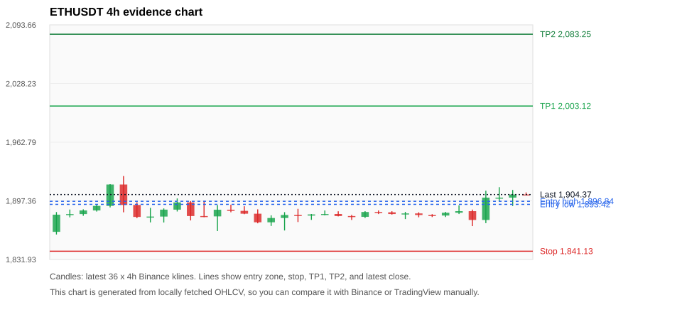
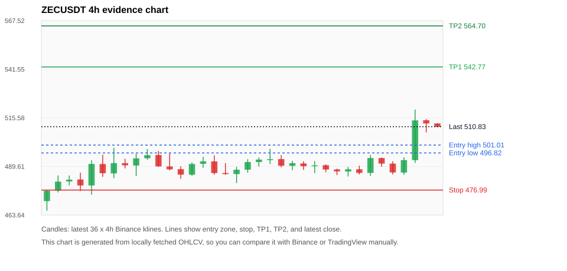
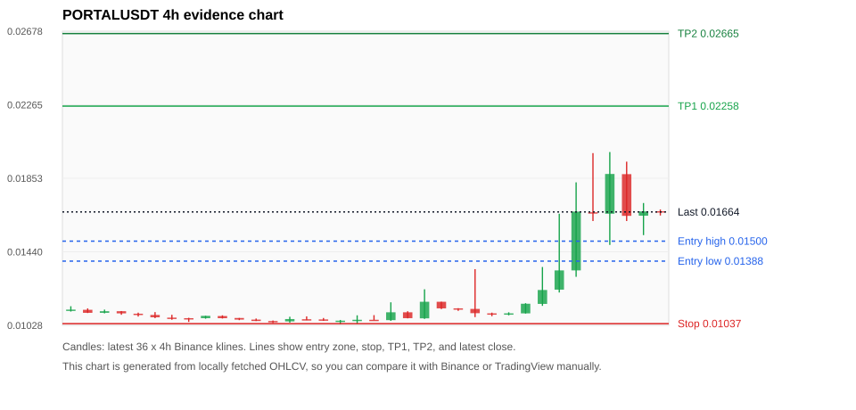
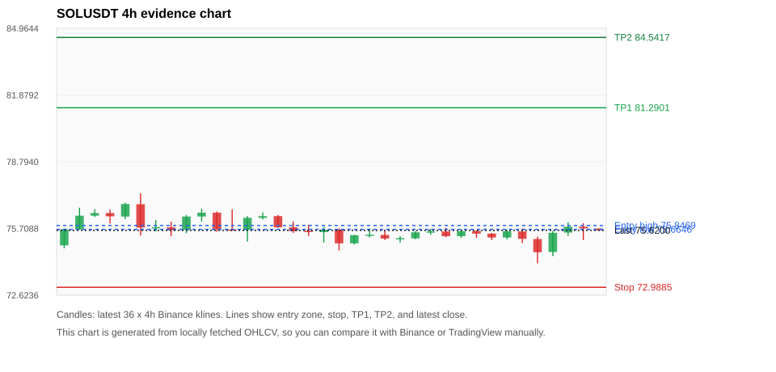
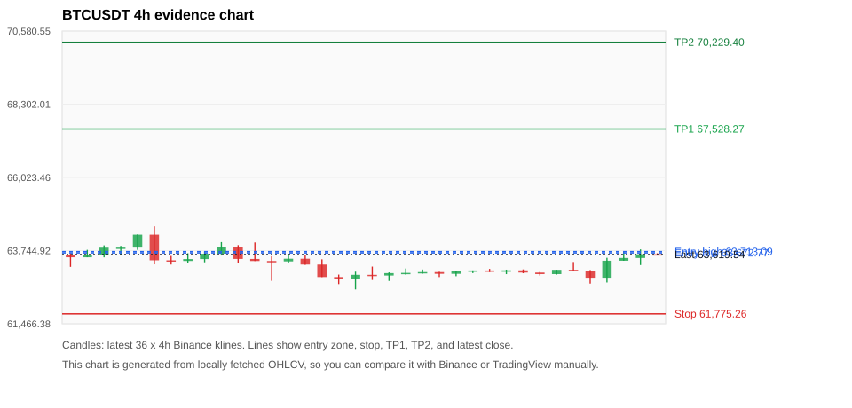

# Crypto 市场扫描报告 v1

- 报告时间：2026-08-17 20:05:55 CST
- Run ID：`20260817_120505_a5050b19`
- Run type：`daily_full`
- Data validation mode：`paper`
- 数据来源：SQLite
- 报告版本：v1
- 扫描 ID：d889ad7bd72e
- 数据源：Binance public spot API + CoinGecko/CoinMarketCap cross-check
- 过滤条件：USDT spot; 24h quote volume >= 30,000,000; trades >= 30,000; exclude stables/leveraged tokens; analyze 1h/4h/1d klines
- 默认单笔风险：账户权益的 1.00%

## 限制说明

- 交易信号仍以 Binance 现货公开 K 线为主源；外部数据源用于一致性复核。
- 结果是研究和模拟盘计划，不是确定收益或实盘下单指令。
- 历史长度过滤：候选币至少需要 180 根 1d K 线。
- 数据质量验证池：先验证 score 排名前 min(top_n * 2, 10) 的候选，再按 action + score 补足最终名单。
- 大盘环境过滤：NEUTRAL; BTC/ETH 大盘未完全确认强势，山寨币买入候选降级为观察。 BTC 7d=-0.5510707282990968; ETH 7d=1.6640329710222224.
- Data cross-validation enabled: Binance primary source plus CoinGecko; CoinMarketCap is checked when an API key is configured.
- ZECUSDT validation state BLOCKED: BLOCKED: [BINANCE_KLINE_EXTREME_RANGE] Binance candle range exceeds 40%.; [BINANCE_KLINE_EXTREME_RANGE] Binance candle range exceeds 40%.; [EXTERNAL_IDENTITY_AMBIGUOUS] CoinMarketCap symbol mapping has 2 matches; selected lowest cmc_rank
- PORTALUSDT validation state BLOCKED: BLOCKED: [BINANCE_KLINE_EXTREME_RANGE] Binance candle range exceeds 40%.; [BINANCE_KLINE_EXTREME_RANGE] Binance candle range exceeds 40%.; [BINANCE_KLINE_EXTREME_RANGE] Binance candle range exceeds 40%.; [BINANCE_KLINE_EXTREME_RANGE] Binance candle range exceeds 40%.; [BINANCE_KLINE_EXTREME_RANGE] Binance candle range exceeds 40%.; [BINANCE_KLINE_EXTREME_RANGE] Binance candle range exceeds 40%.; [BINANCE_KLINE_EXTREME_RANGE] Binance candle range exceeds 40%.; [BINANCE_KLINE_EXTREME_RANGE] Binance candle range exceeds 40%.; [BINANCE_KLINE_EXTREME_RANGE] Binance candle range exceeds 40%.; [BINANCE_KLINE_EXTREME_RANGE] Binance candle range exceeds 40%.; [BINANCE_KLINE_EXTREME_RANGE] Binance candle range exceeds 40%.; [BINANCE_KLINE_EXTREME_RANGE] Binance candle range exceeds 40%.; [EXTERNAL_24H_DIFF_WARNING] 24h change diff 8.88 points exceeds warning threshold; [EXTERNAL_IDENTITY_AMBIGUOUS] CoinMarketCap symbol mapping has 3 matches; selected lowest cmc_rank
- SOLUSDT validation state DEGRADED: DEGRADED: [EXTERNAL_IDENTITY_AMBIGUOUS] CoinMarketCap symbol mapping has 8 matches; selected lowest cmc_rank
- ETHUSDT validation state DEGRADED: DEGRADED: [EXTERNAL_IDENTITY_AMBIGUOUS] CoinMarketCap symbol mapping has 6 matches; selected lowest cmc_rank
- BTCUSDT validation state DEGRADED: DEGRADED: [EXTERNAL_IDENTITY_AMBIGUOUS] CoinMarketCap symbol mapping has 13 matches; selected lowest cmc_rank
- BNBUSDT validation state DEGRADED: DEGRADED: [EXTERNAL_PROVIDER_RATE_LIMITED] Provider rate limited request for https://api.coingecko.com/api/v3/coins/markets?vs_currency=usd&ids=binancecoin&price_change_percentage=24h&per_page=1&page=1: HTTP 429; [EXTERNAL_IDENTITY_AMBIGUOUS] CoinMarketCap symbol mapping has 4 matches; selected lowest cmc_rank
- PLUMEUSDT validation state DEGRADED: DEGRADED: [EXTERNAL_PROVIDER_RATE_LIMITED] Provider rate limited request for https://api.coingecko.com/api/v3/search?query=PLUME: HTTP 429
- XRPUSDT validation state DEGRADED: DEGRADED: [EXTERNAL_PROVIDER_RATE_LIMITED] Provider rate limited request for https://api.coingecko.com/api/v3/coins/markets?vs_currency=usd&ids=ripple&price_change_percentage=24h&per_page=1&page=1: HTTP 429; [EXTERNAL_IDENTITY_AMBIGUOUS] CoinMarketCap symbol mapping has 3 matches; selected lowest cmc_rank

## 5 个候选交易计划

| Rank | Coin | Action | Setup | Entry Zone | Stop Loss | TP1 | TP2 / Exit Rule | R/R | Verdict |
|---:|---|---|---|---:|---:|---:|---|---:|---|
| 1 | `ETH` | `BUY_CANDIDATE` | 回踩支撑/4h EMA 附近 | 1,893.42 - 1,896.84 | 1,841.13 | 2,003.12 | 2,083.25 或跌破 4h 关键支撑 | 2.00-3.48 | 可考虑 |
| 2 | `ZEC` | `WATCH_ONLY` | 回踩支撑/4h EMA 附近 | 496.82 - 501.01 | 476.99 | 542.77 | 564.70 或跌破 4h 关键支撑 | 2.00-3.00 | 只观察 |
| 3 | `PORTAL` | `WATCH_ONLY` | 涨幅较远，只等深回调 | 0.01388 - 0.01500 | 0.01037 | 0.02258 | 0.02665 或跌破 4h 关键支撑 | 2.00-3.00 | 只观察 |
| 4 | `SOL` | `WATCH_ONLY` | 回踩支撑/4h EMA 附近 | 75.6646 - 75.8469 | 72.9885 | 81.2901 | 84.5417 或跌破 4h 关键支撑 | 2.00-3.18 | 只观察 |
| 5 | `BTC` | `WATCH_ONLY` | 回踩支撑/4h EMA 附近 | 63,672.77 - 63,713.09 | 61,775.26 | 67,528.27 | 70,229.40 或跌破 4h 关键支撑 | 2.00-3.41 | 只观察 |

## 数据交叉验证摘要

价格差异以 Binance 当前价为基准；成交量口径不同，Binance 是 USDT 现货成交额，CoinGecko/CoinMarketCap 通常是全市场成交量。

| Rank | Coin | State | Identity | Max Price Diff | Max 24h Diff | Issue Codes | Message |
|---:|---|---|---|---:|---:|---|---|
| 1 | `ETH` | DEGRADED (DATA_WARNING) | UNCONFIRMED | 0.04% | 0.14 pts | EXTERNAL_IDENTITY_AMBIGUOUS | DEGRADED: [EXTERNAL_IDENTITY_AMBIGUOUS] CoinMarketCap symbol mapping has 6 matches; selected lowest cmc_rank |
| 2 | `ZEC` | BLOCKED (DATA_ERROR) | UNCONFIRMED | 0.18% | 0.33 pts | BINANCE_KLINE_EXTREME_RANGE, EXTERNAL_IDENTITY_AMBIGUOUS | BLOCKED: [BINANCE_KLINE_EXTREME_RANGE] Binance candle range exceeds 40%.; [BINANCE_KLINE_EXTREME_RANGE] Binance candle range exceeds 40%.; [EXTERNAL_IDENTITY_AMBIGUOUS] CoinMarketCap symbol mapping has 2 matches; selected lowest cmc_rank |
| 3 | `PORTAL` | BLOCKED (DATA_ERROR) | UNCONFIRMED | 0.39% | 8.88 pts | BINANCE_KLINE_EXTREME_RANGE, EXTERNAL_24H_DIFF_WARNING, EXTERNAL_IDENTITY_AMBIGUOUS | BLOCKED: [BINANCE_KLINE_EXTREME_RANGE] Binance candle range exceeds 40%.; [BINANCE_KLINE_EXTREME_RANGE] Binance candle range exceeds 40%.; [BINANCE_KLINE_EXTREME_RANGE] Binance candle range exceeds 40%.; [BINANCE_KLINE_EXTREME_RANGE] Binance candle range exceeds 40%.; [BINANCE_KLINE_EXTREME_RANGE] Binance candle range exceeds 40%.; [BINANCE_KLINE_EXTREME_RANGE] Binance candle range exceeds 40%.; [BINANCE_KLINE_EXTREME_RANGE] Binance candle range exceeds 40%.; [BINANCE_KLINE_EXTREME_RANGE] Binance candle range exceeds 40%.; [BINANCE_KLINE_EXTREME_RANGE] Binance candle range exceeds 40%.; [BINANCE_KLINE_EXTREME_RANGE] Binance candle range exceeds 40%.; [BINANCE_KLINE_EXTREME_RANGE] Binance candle range exceeds 40%.; [BINANCE_KLINE_EXTREME_RANGE] Binance candle range exceeds 40%.; [EXTERNAL_24H_DIFF_WARNING] 24h change diff 8.88 points exceeds warning threshold; [EXTERNAL_IDENTITY_AMBIGUOUS] CoinMarketCap symbol mapping has 3 matches; selected lowest cmc_rank |
| 4 | `SOL` | DEGRADED (DATA_WARNING) | UNCONFIRMED | 0.00% | 0.16 pts | EXTERNAL_IDENTITY_AMBIGUOUS | DEGRADED: [EXTERNAL_IDENTITY_AMBIGUOUS] CoinMarketCap symbol mapping has 8 matches; selected lowest cmc_rank |
| 5 | `BTC` | DEGRADED (DATA_WARNING) | UNCONFIRMED | 0.08% | 0.08 pts | EXTERNAL_IDENTITY_AMBIGUOUS | DEGRADED: [EXTERNAL_IDENTITY_AMBIGUOUS] CoinMarketCap symbol mapping has 13 matches; selected lowest cmc_rank |

## 候选币说明

### 1. ETH `ETHUSDT`



- 入选原因：回踩支撑/4h EMA 附近；24h +1.25%，7d +0.36%，4h RSI 71.83，24h 成交额 $267.6M。
- 交易失效条件：跌破 1841.1325 或 4h 收盘重新失守关键支撑。
- 主要风险：主要风险是大盘同步回撤；External validation is degraded; this candidate is not a clean data sample.；Paper mode allows degraded validation; candidate is excluded from clean-data samples.。
- 数据交叉验证：DEGRADED / DATA_WARNING；身份=UNCONFIRMED；DEGRADED: [EXTERNAL_IDENTITY_AMBIGUOUS] CoinMarketCap symbol mapping has 6 matches; selected lowest cmc_rank

#### 可点击人工验证

- [Binance 交易页](https://www.binance.com/en/trade/ETH_USDT)
- [TradingView 图表](https://www.tradingview.com/chart/?symbol=BINANCE%3AETHUSDT)
- [CoinGecko 搜索](https://www.coingecko.com/en/search?query=ETH)
- [CoinMarketCap 搜索](https://coinmarketcap.com/search/?q=ETH)

#### 多数据源对照

| Source | Status | Identity | Blocking | Asset ID | Price | 24h Change | 24h Volume | Price Diff | 24h Diff | Updated | Issue Codes | Message |
|---|---|---|---:|---|---:|---:|---:|---:|---:|---|---|---|
| Binance | DATA_OK | CONFIRMED | no | ETHUSDT | 1,904.37 | +1.25% | $267.6M | 0.00% | 0.00 pts | 2026-08-17T12:05:29+00:00 | none | Primary market data source passed health checks. |
| CoinGecko | DATA_OK | CONFIRMED | no | ethereum | 1,903.58 | +1.20% | $5.51B | 0.04% | 0.05 pts | 2026-08-17T12:02:20.000Z | none | External source agrees with Binance within thresholds. |
| CoinMarketCap | DATA_WARNING | UNCONFIRMED | no | 1027 | 1,904.46 | +1.38% | $6.32B | 0.00% | 0.14 pts | 2026-08-17T12:04:04.000Z | EXTERNAL_IDENTITY_AMBIGUOUS | [EXTERNAL_IDENTITY_AMBIGUOUS] CoinMarketCap symbol mapping has 6 matches; selected lowest cmc_rank |

#### 指标证据

| 指标 | 数值 | 人工核对用途 |
|---|---:|---|
| 当前价 | 1,904.37 | 与 Binance/TradingView 当前价格对照 |
| 24h 涨跌 | +1.25% | 与交易所 24h 涨跌对照 |
| 7d 涨跌 | +0.36% | 判断短线趋势是否延续 |
| 4h EMA20 | 1,889.53 | 判断短期趋势支撑 |
| 4h EMA50 | 1,889.64 | 判断中期趋势支撑 |
| 1d EMA20 | 1,885.27 | 判断日线趋势 |
| 1d EMA50 | 1,867.64 | 判断日线趋势 |
| 4h RSI14 | 71.83 | 判断是否过热/过弱 |
| 4h ATR14 | 10.2800 | 推导止损和入场缓冲 |
| 最近 18 根 4h 最低点 | 1,869.17 | 支撑/止损参考 |
| 最近 36 根 4h 最高点 | 1,925.00 | TP/压力参考 |
| 支撑位 | 1,889.64 | 入场区间推导基础 |

#### 交易计划推导

- 支撑位 = 最近低点、4h EMA20、4h EMA50、1d EMA20 中不高于当前价的最高有效支撑 = `1,889.64`。
- 入场区间 = 支撑位附近 + ATR 缓冲 = `1,893.42 - 1,896.84`。
- 止损 = min(最近 18 根 4h 最低点 * 0.985, 入场中位价 - 1.15 * ATR14) = `1,841.13`。
- TP1 = max(最近 36 根 4h 最高点 * 0.995, 入场中位价 + 2R) = `2,003.12`。
- TP2 = max(入场中位价 + 3R, TP1 * 1.04) = `2,083.25`。

#### 最近 10 根 4h K线

| UTC 开盘时间 | Open | High | Low | Close | Quote Volume | Trades |
|---|---:|---:|---:|---:|---:|---:|
| 2026-08-16T00:00+00:00 | 1,882.64 | 1,885.00 | 1,877.01 | 1,883.30 | $16.7M | 87754 |
| 2026-08-16T04:00+00:00 | 1,883.31 | 1,884.56 | 1,879.00 | 1,881.54 | $11.9M | 55926 |
| 2026-08-16T08:00+00:00 | 1,881.54 | 1,882.52 | 1,879.27 | 1,880.94 | $14.5M | 50386 |
| 2026-08-16T12:00+00:00 | 1,880.94 | 1,885.00 | 1,879.32 | 1,884.06 | $17.2M | 56739 |
| 2026-08-16T16:00+00:00 | 1,884.06 | 1,892.31 | 1,882.63 | 1,885.83 | $28.1M | 123385 |
| 2026-08-16T20:00+00:00 | 1,885.83 | 1,887.58 | 1,869.17 | 1,876.00 | $40.5M | 199302 |
| 2026-08-17T00:00+00:00 | 1,876.01 | 1,908.62 | 1,872.46 | 1,900.92 | $79.9M | 347690 |
| 2026-08-17T04:00+00:00 | 1,900.93 | 1,912.60 | 1,897.13 | 1,900.93 | $57.4M | 159406 |
| 2026-08-17T08:00+00:00 | 1,900.93 | 1,909.49 | 1,891.57 | 1,904.46 | $44.0M | 227076 |
| 2026-08-17T12:00+00:00 | 1,904.46 | 1,906.71 | 1,904.04 | 1,904.37 | $684,602 | 5433 |

### 2. ZEC `ZECUSDT`



- 入选原因：回踩支撑/4h EMA 附近；24h +5.17%，7d +0.83%，4h RSI 68.36，24h 成交额 $54.4M。
- 交易失效条件：跌破 476.98625 或 4h 收盘重新失守关键支撑。
- 主要风险：主要风险是大盘同步回撤；Blocking data-quality issue detected; paper plan creation is not allowed.；数据质量状态为 BLOCKED，买入候选降级为观察。
- 数据交叉验证：BLOCKED / DATA_ERROR；身份=UNCONFIRMED；BLOCKED: [BINANCE_KLINE_EXTREME_RANGE] Binance candle range exceeds 40%.; [BINANCE_KLINE_EXTREME_RANGE] Binance candle range exceeds 40%.; [EXTERNAL_IDENTITY_AMBIGUOUS] CoinMarketCap symbol mapping has 2 matches; selected lowest cmc_rank

#### 可点击人工验证

- [Binance 交易页](https://www.binance.com/en/trade/ZEC_USDT)
- [TradingView 图表](https://www.tradingview.com/chart/?symbol=BINANCE%3AZECUSDT)
- [CoinGecko 搜索](https://www.coingecko.com/en/search?query=ZEC)
- [CoinMarketCap 搜索](https://coinmarketcap.com/search/?q=ZEC)

#### 多数据源对照

| Source | Status | Identity | Blocking | Asset ID | Price | 24h Change | 24h Volume | Price Diff | 24h Diff | Updated | Issue Codes | Message |
|---|---|---|---:|---|---:|---:|---:|---:|---:|---|---|---|
| Binance | DATA_ERROR | CONFIRMED | yes | ZECUSDT | 510.83 | +5.17% | $54.4M | 0.00% | 0.00 pts | 2026-08-17T12:05:29+00:00 | BINANCE_KLINE_EXTREME_RANGE | [BINANCE_KLINE_EXTREME_RANGE] Binance candle range exceeds 40%.; [BINANCE_KLINE_EXTREME_RANGE] Binance candle range exceeds 40%. |
| CoinGecko | DATA_OK | CONFIRMED | no | zcash | 511.75 | +5.50% | $212.9M | 0.18% | 0.33 pts | 2026-08-17T12:03:20.000Z | none | External source agrees with Binance within thresholds. |
| CoinMarketCap | DATA_WARNING | UNCONFIRMED | no | 1437 | 511.72 | +5.45% | $334.8M | 0.17% | 0.27 pts | 2026-08-17T12:04:04.000Z | EXTERNAL_IDENTITY_AMBIGUOUS | [EXTERNAL_IDENTITY_AMBIGUOUS] CoinMarketCap symbol mapping has 2 matches; selected lowest cmc_rank |

#### 指标证据

| 指标 | 数值 | 人工核对用途 |
|---|---:|---|
| 当前价 | 510.83 | 与 Binance/TradingView 当前价格对照 |
| 24h 涨跌 | +5.17% | 与交易所 24h 涨跌对照 |
| 7d 涨跌 | +0.83% | 判断短线趋势是否延续 |
| 4h EMA20 | 495.83 | 判断短期趋势支撑 |
| 4h EMA50 | 493.63 | 判断中期趋势支撑 |
| 1d EMA20 | 495.02 | 判断日线趋势 |
| 1d EMA50 | 490.39 | 判断日线趋势 |
| 4h RSI14 | 68.36 | 判断是否过热/过弱 |
| 4h ATR14 | 7.3979 | 推导止损和入场缓冲 |
| 最近 18 根 4h 最低点 | 484.25 | 支撑/止损参考 |
| 最近 36 根 4h 最高点 | 520.00 | TP/压力参考 |
| 支撑位 | 495.83 | 入场区间推导基础 |

#### 交易计划推导

- 支撑位 = 最近低点、4h EMA20、4h EMA50、1d EMA20 中不高于当前价的最高有效支撑 = `495.83`。
- 入场区间 = 支撑位附近 + ATR 缓冲 = `496.82 - 501.01`。
- 止损 = min(最近 18 根 4h 最低点 * 0.985, 入场中位价 - 1.15 * ATR14) = `476.99`。
- TP1 = max(最近 36 根 4h 最高点 * 0.995, 入场中位价 + 2R) = `542.77`。
- TP2 = max(入场中位价 + 3R, TP1 * 1.04) = `564.70`。

#### 最近 10 根 4h K线

| UTC 开盘时间 | Open | High | Low | Close | Quote Volume | Trades |
|---|---:|---:|---:|---:|---:|---:|
| 2026-08-16T00:00+00:00 | 488.01 | 488.37 | 485.00 | 486.96 | $2.6M | 14187 |
| 2026-08-16T04:00+00:00 | 486.90 | 489.37 | 484.25 | 488.08 | $1.9M | 11382 |
| 2026-08-16T08:00+00:00 | 488.09 | 490.00 | 485.32 | 486.14 | $1.8M | 13779 |
| 2026-08-16T12:00+00:00 | 486.14 | 495.76 | 484.50 | 494.09 | $5.6M | 19146 |
| 2026-08-16T16:00+00:00 | 494.09 | 494.38 | 489.49 | 491.13 | $2.0M | 12881 |
| 2026-08-16T20:00+00:00 | 491.11 | 492.36 | 485.30 | 486.40 | $2.7M | 13910 |
| 2026-08-17T00:00+00:00 | 486.33 | 494.50 | 485.10 | 492.98 | $4.2M | 34676 |
| 2026-08-17T04:00+00:00 | 492.98 | 520.00 | 491.49 | 514.22 | $30.5M | 95109 |
| 2026-08-17T08:00+00:00 | 514.28 | 514.89 | 507.82 | 512.57 | $9.3M | 39221 |
| 2026-08-17T12:00+00:00 | 512.57 | 512.76 | 510.71 | 510.77 | $192,086 | 1093 |

### 3. PORTAL `PORTALUSDT`



- 入选原因：涨幅较远，只等深回调；24h +31.02%，7d +43.57%，4h RSI 71.99，24h 成交额 $32.9M。
- 交易失效条件：跌破 0.01037205 或 4h 收盘重新失守关键支撑。
- 主要风险：距离支撑偏远，不能追市价；24h 振幅较大，回撤风险高；成交量突增，可能是事件驱动；Blocking data-quality issue detected; paper plan creation is not allowed.。
- 数据交叉验证：BLOCKED / DATA_ERROR；身份=UNCONFIRMED；BLOCKED: [BINANCE_KLINE_EXTREME_RANGE] Binance candle range exceeds 40%.; [BINANCE_KLINE_EXTREME_RANGE] Binance candle range exceeds 40%.; [BINANCE_KLINE_EXTREME_RANGE] Binance candle range exceeds 40%.; [BINANCE_KLINE_EXTREME_RANGE] Binance candle range exceeds 40%.; [BINANCE_KLINE_EXTREME_RANGE] Binance candle range exceeds 40%.; [BINANCE_KLINE_EXTREME_RANGE] Binance candle range exceeds 40%.; [BINANCE_KLINE_EXTREME_RANGE] Binance candle range exceeds 40%.; [BINANCE_KLINE_EXTREME_RANGE] Binance candle range exceeds 40%.; [BINANCE_KLINE_EXTREME_RANGE] Binance candle range exceeds 40%.; [BINANCE_KLINE_EXTREME_RANGE] Binance candle range exceeds 40%.; [BINANCE_KLINE_EXTREME_RANGE] Binance candle range exceeds 40%.; [BINANCE_KLINE_EXTREME_RANGE] Binance candle range exceeds 40%.; [EXTERNAL_24H_DIFF_WARNING] 24h change diff 8.88 points exceeds warning threshold; [EXTERNAL_IDENTITY_AMBIGUOUS] CoinMarketCap symbol mapping has 3 matches; selected lowest cmc_rank

#### 可点击人工验证

- [Binance 交易页](https://www.binance.com/en/trade/PORTAL_USDT)
- [TradingView 图表](https://www.tradingview.com/chart/?symbol=BINANCE%3APORTALUSDT)
- [CoinGecko 搜索](https://www.coingecko.com/en/search?query=PORTAL)
- [CoinMarketCap 搜索](https://coinmarketcap.com/search/?q=PORTAL)

#### 多数据源对照

| Source | Status | Identity | Blocking | Asset ID | Price | 24h Change | 24h Volume | Price Diff | 24h Diff | Updated | Issue Codes | Message |
|---|---|---|---:|---|---:|---:|---:|---:|---:|---|---|---|
| Binance | DATA_ERROR | CONFIRMED | yes | PORTALUSDT | 0.01664 | +31.02% | $32.9M | 0.00% | 0.00 pts | 2026-08-17T12:05:29+00:00 | BINANCE_KLINE_EXTREME_RANGE | [BINANCE_KLINE_EXTREME_RANGE] Binance candle range exceeds 40%.; [BINANCE_KLINE_EXTREME_RANGE] Binance candle range exceeds 40%.; [BINANCE_KLINE_EXTREME_RANGE] Binance candle range exceeds 40%.; [BINANCE_KLINE_EXTREME_RANGE] Binance candle range exceeds 40%.; [BINANCE_KLINE_EXTREME_RANGE] Binance candle range exceeds 40%.; [BINANCE_KLINE_EXTREME_RANGE] Binance candle range exceeds 40%.; [BINANCE_KLINE_EXTREME_RANGE] Binance candle range exceeds 40%.; [BINANCE_KLINE_EXTREME_RANGE] Binance candle range exceeds 40%.; [BINANCE_KLINE_EXTREME_RANGE] Binance candle range exceeds 40%.; [BINANCE_KLINE_EXTREME_RANGE] Binance candle range exceeds 40%.; [BINANCE_KLINE_EXTREME_RANGE] Binance candle range exceeds 40%.; [BINANCE_KLINE_EXTREME_RANGE] Binance candle range exceeds 40%. |
| CoinGecko | DATA_WARNING | CONFIRMED | yes | portal-2 | 0.01658 | +39.90% | $132.9M | 0.39% | 8.88 pts | 2026-08-17T12:03:20.000Z | EXTERNAL_24H_DIFF_WARNING | [EXTERNAL_24H_DIFF_WARNING] 24h change diff 8.88 points exceeds warning threshold |
| CoinMarketCap | DATA_WARNING | UNCONFIRMED | no | 29555 | 0.01661 | +33.14% | $173.0M | 0.20% | 2.13 pts | 2026-08-17T12:04:04.000Z | EXTERNAL_IDENTITY_AMBIGUOUS | [EXTERNAL_IDENTITY_AMBIGUOUS] CoinMarketCap symbol mapping has 3 matches; selected lowest cmc_rank |

#### 指标证据

| 指标 | 数值 | 人工核对用途 |
|---|---:|---|
| 当前价 | 0.01664 | 与 Binance/TradingView 当前价格对照 |
| 24h 涨跌 | +31.02% | 与交易所 24h 涨跌对照 |
| 7d 涨跌 | +43.57% | 判断短线趋势是否延续 |
| 4h EMA20 | 0.01385 | 判断短期趋势支撑 |
| 4h EMA50 | 0.01236 | 判断中期趋势支撑 |
| 1d EMA20 | 0.01192 | 判断日线趋势 |
| 1d EMA50 | 0.01171 | 判断日线趋势 |
| 4h RSI14 | 71.99 | 判断是否过热/过弱 |
| 4h ATR14 | 0.002185 | 推导止损和入场缓冲 |
| 最近 18 根 4h 最低点 | 0.01053 | 支撑/止损参考 |
| 最近 36 根 4h 最高点 | 0.02000 | TP/压力参考 |
| 支撑位 | 0.01385 | 入场区间推导基础 |

#### 交易计划推导

- 支撑位 = 最近低点、4h EMA20、4h EMA50、1d EMA20 中不高于当前价的最高有效支撑 = `0.01385`。
- 入场区间 = 支撑位附近 + ATR 缓冲 = `0.01388 - 0.01500`。
- 止损 = min(最近 18 根 4h 最低点 * 0.985, 入场中位价 - 1.15 * ATR14) = `0.01037`。
- TP1 = max(最近 36 根 4h 最高点 * 0.995, 入场中位价 + 2R) = `0.02258`。
- TP2 = max(入场中位价 + 3R, TP1 * 1.04) = `0.02665`。

#### 最近 10 根 4h K线

| UTC 开盘时间 | Open | High | Low | Close | Quote Volume | Trades |
|---|---:|---:|---:|---:|---:|---:|
| 2026-08-16T00:00+00:00 | 0.01088 | 0.01101 | 0.01084 | 0.01095 | $62,632 | 1395 |
| 2026-08-16T04:00+00:00 | 0.01095 | 0.01152 | 0.01094 | 0.01149 | $354,973 | 9036 |
| 2026-08-16T08:00+00:00 | 0.01148 | 0.01355 | 0.01137 | 0.01226 | $2.3M | 41861 |
| 2026-08-16T12:00+00:00 | 0.01228 | 0.01654 | 0.01212 | 0.01336 | $7.5M | 88918 |
| 2026-08-16T16:00+00:00 | 0.01336 | 0.01830 | 0.01300 | 0.01666 | $7.0M | 68916 |
| 2026-08-16T20:00+00:00 | 0.01662 | 0.01994 | 0.01613 | 0.01655 | $4.8M | 55538 |
| 2026-08-17T00:00+00:00 | 0.01654 | 0.02000 | 0.01479 | 0.01877 | $5.8M | 123774 |
| 2026-08-17T04:00+00:00 | 0.01876 | 0.01946 | 0.01613 | 0.01642 | $4.2M | 86623 |
| 2026-08-17T08:00+00:00 | 0.01643 | 0.01714 | 0.01534 | 0.01667 | $3.5M | 53979 |
| 2026-08-17T12:00+00:00 | 0.01668 | 0.01678 | 0.01644 | 0.01664 | $67,528 | 900 |

### 4. SOL `SOLUSDT`



- 入选原因：回踩支撑/4h EMA 附近；24h +0.44%，7d -0.90%，4h RSI 55.16，24h 成交额 $84.4M。
- 交易失效条件：跌破 72.9885 或 4h 收盘重新失守关键支撑。
- 主要风险：7d 趋势未确认；External validation is degraded; this candidate is not a clean data sample.；Paper mode allows degraded validation; candidate is excluded from clean-data samples.。
- 数据交叉验证：DEGRADED / DATA_WARNING；身份=UNCONFIRMED；DEGRADED: [EXTERNAL_IDENTITY_AMBIGUOUS] CoinMarketCap symbol mapping has 8 matches; selected lowest cmc_rank

#### 可点击人工验证

- [Binance 交易页](https://www.binance.com/en/trade/SOL_USDT)
- [TradingView 图表](https://www.tradingview.com/chart/?symbol=BINANCE%3ASOLUSDT)
- [CoinGecko 搜索](https://www.coingecko.com/en/search?query=SOL)
- [CoinMarketCap 搜索](https://coinmarketcap.com/search/?q=SOL)

#### 多数据源对照

| Source | Status | Identity | Blocking | Asset ID | Price | 24h Change | 24h Volume | Price Diff | 24h Diff | Updated | Issue Codes | Message |
|---|---|---|---:|---|---:|---:|---:|---:|---:|---|---|---|
| Binance | DATA_OK | CONFIRMED | no | SOLUSDT | 75.6200 | +0.44% | $84.4M | 0.00% | 0.00 pts | 2026-08-17T12:05:29+00:00 | none | Primary market data source passed health checks. |
| CoinGecko | DATA_OK | CONFIRMED | no | solana | 75.6200 | +0.60% | $1.11B | 0.00% | 0.16 pts | 2026-08-17T12:03:20.000Z | none | External source agrees with Binance within thresholds. |
| CoinMarketCap | DATA_WARNING | UNCONFIRMED | no | 5426 | 75.6212 | +0.56% | $1.20B | 0.00% | 0.12 pts | 2026-08-17T12:04:04.000Z | EXTERNAL_IDENTITY_AMBIGUOUS | [EXTERNAL_IDENTITY_AMBIGUOUS] CoinMarketCap symbol mapping has 8 matches; selected lowest cmc_rank |

#### 指标证据

| 指标 | 数值 | 人工核对用途 |
|---|---:|---|
| 当前价 | 75.6200 | 与 Binance/TradingView 当前价格对照 |
| 24h 涨跌 | +0.44% | 与交易所 24h 涨跌对照 |
| 7d 涨跌 | -0.90% | 判断短线趋势是否延续 |
| 4h EMA20 | 75.5135 | 判断短期趋势支撑 |
| 4h EMA50 | 75.4603 | 判断中期趋势支撑 |
| 1d EMA20 | 75.1657 | 判断日线趋势 |
| 1d EMA50 | 75.4770 | 判断日线趋势 |
| 4h RSI14 | 55.16 | 判断是否过热/过弱 |
| 4h ATR14 | 0.53500 | 推导止损和入场缓冲 |
| 最近 18 根 4h 最低点 | 74.1000 | 支撑/止损参考 |
| 最近 36 根 4h 最高点 | 77.3300 | TP/压力参考 |
| 支撑位 | 75.5135 | 入场区间推导基础 |

#### 交易计划推导

- 支撑位 = 最近低点、4h EMA20、4h EMA50、1d EMA20 中不高于当前价的最高有效支撑 = `75.5135`。
- 入场区间 = 支撑位附近 + ATR 缓冲 = `75.6646 - 75.8469`。
- 止损 = min(最近 18 根 4h 最低点 * 0.985, 入场中位价 - 1.15 * ATR14) = `72.9885`。
- TP1 = max(最近 36 根 4h 最高点 * 0.995, 入场中位价 + 2R) = `81.2901`。
- TP2 = max(入场中位价 + 3R, TP1 * 1.04) = `84.5417`。

#### 最近 10 根 4h K线

| UTC 开盘时间 | Open | High | Low | Close | Quote Volume | Trades |
|---|---:|---:|---:|---:|---:|---:|
| 2026-08-16T00:00+00:00 | 75.3500 | 75.6600 | 75.2700 | 75.5800 | $6.7M | 24215 |
| 2026-08-16T04:00+00:00 | 75.5900 | 75.6200 | 75.2800 | 75.4700 | $4.7M | 16014 |
| 2026-08-16T08:00+00:00 | 75.4700 | 75.4900 | 75.1700 | 75.2900 | $5.9M | 16386 |
| 2026-08-16T12:00+00:00 | 75.2900 | 75.6400 | 75.2000 | 75.5800 | $6.0M | 21533 |
| 2026-08-16T16:00+00:00 | 75.5700 | 75.7100 | 75.0300 | 75.2300 | $13.9M | 39014 |
| 2026-08-16T20:00+00:00 | 75.2200 | 75.3300 | 74.1000 | 74.6100 | $14.0M | 57690 |
| 2026-08-17T00:00+00:00 | 74.6200 | 75.6000 | 74.4300 | 75.5100 | $16.6M | 66835 |
| 2026-08-17T04:00+00:00 | 75.5200 | 76.0000 | 75.3600 | 75.7900 | $13.1M | 44482 |
| 2026-08-17T08:00+00:00 | 75.7900 | 75.9500 | 75.1700 | 75.7100 | $20.6M | 70867 |
| 2026-08-17T12:00+00:00 | 75.7000 | 75.7100 | 75.6100 | 75.6200 | $230,702 | 1195 |

### 5. BTC `BTCUSDT`



- 入选原因：回踩支撑/4h EMA 附近；24h +0.94%，7d -1.46%，4h RSI 68.39，24h 成交额 $582.8M。
- 交易失效条件：跌破 61775.26 或 4h 收盘重新失守关键支撑。
- 主要风险：日线趋势未完全确认；7d 趋势未确认；External validation is degraded; this candidate is not a clean data sample.；Paper mode allows degraded validation; candidate is excluded from clean-data samples.。
- 数据交叉验证：DEGRADED / DATA_WARNING；身份=UNCONFIRMED；DEGRADED: [EXTERNAL_IDENTITY_AMBIGUOUS] CoinMarketCap symbol mapping has 13 matches; selected lowest cmc_rank

#### 可点击人工验证

- [Binance 交易页](https://www.binance.com/en/trade/BTC_USDT)
- [TradingView 图表](https://www.tradingview.com/chart/?symbol=BINANCE%3ABTCUSDT)
- [CoinGecko 搜索](https://www.coingecko.com/en/search?query=BTC)
- [CoinMarketCap 搜索](https://coinmarketcap.com/search/?q=BTC)

#### 多数据源对照

| Source | Status | Identity | Blocking | Asset ID | Price | 24h Change | 24h Volume | Price Diff | 24h Diff | Updated | Issue Codes | Message |
|---|---|---|---:|---|---:|---:|---:|---:|---:|---|---|---|
| Binance | DATA_OK | CONFIRMED | no | BTCUSDT | 63,619.54 | +0.94% | $582.8M | 0.00% | 0.00 pts | 2026-08-17T12:05:29+00:00 | none | Primary market data source passed health checks. |
| CoinGecko | DATA_OK | CONFIRMED | no | bitcoin | 63,566.00 | +0.90% | $14.95B | 0.08% | 0.04 pts | 2026-08-17T12:02:20.000Z | none | External source agrees with Binance within thresholds. |
| CoinMarketCap | DATA_WARNING | UNCONFIRMED | no | 1 | 63,587.07 | +1.03% | $14.58B | 0.05% | 0.08 pts | 2026-08-17T12:04:04.000Z | EXTERNAL_IDENTITY_AMBIGUOUS | [EXTERNAL_IDENTITY_AMBIGUOUS] CoinMarketCap symbol mapping has 13 matches; selected lowest cmc_rank |

#### 指标证据

| 指标 | 数值 | 人工核对用途 |
|---|---:|---|
| 当前价 | 63,619.54 | 与 Binance/TradingView 当前价格对照 |
| 24h 涨跌 | +0.94% | 与交易所 24h 涨跌对照 |
| 7d 涨跌 | -1.46% | 判断短线趋势是否延续 |
| 4h EMA20 | 63,302.84 | 判断短期趋势支撑 |
| 4h EMA50 | 63,545.67 | 判断中期趋势支撑 |
| 1d EMA20 | 63,778.48 | 判断日线趋势 |
| 1d EMA50 | 64,316.54 | 判断日线趋势 |
| 4h RSI14 | 68.39 | 判断是否过热/过弱 |
| 4h ATR14 | 239.17 | 推导止损和入场缓冲 |
| 最近 18 根 4h 最低点 | 62,716.00 | 支撑/止损参考 |
| 最近 36 根 4h 最高点 | 64,500.00 | TP/压力参考 |
| 支撑位 | 63,545.67 | 入场区间推导基础 |

#### 交易计划推导

- 支撑位 = 最近低点、4h EMA20、4h EMA50、1d EMA20 中不高于当前价的最高有效支撑 = `63,545.67`。
- 入场区间 = 支撑位附近 + ATR 缓冲 = `63,672.77 - 63,713.09`。
- 止损 = min(最近 18 根 4h 最低点 * 0.985, 入场中位价 - 1.15 * ATR14) = `61,775.26`。
- TP1 = max(最近 36 根 4h 最高点 * 0.995, 入场中位价 + 2R) = `67,528.27`。
- TP2 = max(入场中位价 + 3R, TP1 * 1.04) = `70,229.40`。

#### 最近 10 根 4h K线

| UTC 开盘时间 | Open | High | Low | Close | Quote Volume | Trades |
|---|---:|---:|---:|---:|---:|---:|
| 2026-08-16T00:00+00:00 | 63,086.01 | 63,151.59 | 63,012.00 | 63,130.00 | $39.5M | 68806 |
| 2026-08-16T04:00+00:00 | 63,130.01 | 63,158.80 | 63,040.00 | 63,061.02 | $50.0M | 53001 |
| 2026-08-16T08:00+00:00 | 63,061.03 | 63,079.76 | 62,968.45 | 63,013.66 | $47.1M | 60667 |
| 2026-08-16T12:00+00:00 | 63,013.66 | 63,146.40 | 62,997.77 | 63,146.39 | $35.2M | 69439 |
| 2026-08-16T16:00+00:00 | 63,146.39 | 63,390.00 | 63,100.89 | 63,108.81 | $54.4M | 147074 |
| 2026-08-16T20:00+00:00 | 63,108.80 | 63,140.00 | 62,716.00 | 62,900.00 | $72.5M | 241307 |
| 2026-08-17T00:00+00:00 | 62,900.00 | 63,520.00 | 62,751.10 | 63,429.21 | $137.1M | 399339 |
| 2026-08-17T04:00+00:00 | 63,429.21 | 63,717.17 | 63,429.21 | 63,514.45 | $158.5M | 212748 |
| 2026-08-17T08:00+00:00 | 63,514.45 | 63,781.69 | 63,295.00 | 63,631.10 | $123.4M | 231054 |
| 2026-08-17T12:00+00:00 | 63,631.11 | 63,661.44 | 63,608.45 | 63,619.54 | $2.6M | 9168 |

## 组合风控

- 不要 5 个候选全部满仓买入。
- 同时持仓总风险建议控制在账户权益的 3% - 5% 以内。
- 如果 BTC/ETH 同时破位，暂停山寨币多头计划或降低仓位。
- 第一版报告用于模拟盘和人工复核，不自动下单。

## 原始数据

```json
[
  {
    "rank": 1,
    "symbol": "ETHUSDT",
    "base_asset": "ETH",
    "price": 1904.37,
    "score": 45.69818452830391,
    "setup": "回踩支撑/4h EMA 附近",
    "verdict": "可考虑",
    "entry_low": 1893.4206331314404,
    "entry_high": 1896.8373504305791,
    "stop_loss": 1841.13245,
    "take_profit_1": 2003.122075343029,
    "take_profit_2": 2083.2469583567504,
    "risk_reward_1": 2.0,
    "risk_reward_2": 3.483889159766539,
    "pct_24h": 1.247,
    "pct_3d": 1.839601704840188,
    "pct_7d": 0.3567664418212546,
    "quote_volume_24h": 267605404.189253,
    "trades_24h": 1117979,
    "high_low_range_24h": 2.323491175227499,
    "rsi_1h": 70.13651877133117,
    "rsi_4h": 71.83457824740377,
    "ema20_4h": 1889.5329063030995,
    "ema50_4h": 1889.6413504305792,
    "ema20_1d": 1885.2714101533488,
    "ema50_1d": 1867.6446775860059,
    "atr_4h": 10.279999999999957,
    "macd_hist_4h": 3.107509719263893,
    "volume_ratio_24h": 1.0353976374300093,
    "support_level": 1889.6413504305792,
    "recent_low_4h_18": 1869.17,
    "recent_high_4h_36": 1925.0,
    "distance_to_support_pct": 0.7794415361446427,
    "binance_trade_url": "https://www.binance.com/en/trade/ETH_USDT",
    "tradingview_url": "https://www.tradingview.com/chart/?symbol=BINANCE%3AETHUSDT",
    "coingecko_search_url": "https://www.coingecko.com/en/search?query=ETH",
    "coinmarketcap_search_url": "https://coinmarketcap.com/search/?q=ETH",
    "invalidation": "跌破 1841.1325 或 4h 收盘重新失守关键支撑",
    "recent_4h_klines": [
      {
        "open_time_utc": "2026-08-11T16:00+00:00",
        "open": 1862.75,
        "high": 1884.83,
        "low": 1859.78,
        "close": 1881.9,
        "quote_volume": 61138160.799156,
        "trades": 282395
      },
      {
        "open_time_utc": "2026-08-11T20:00+00:00",
        "open": 1881.9,
        "high": 1887.64,
        "low": 1878.92,
        "close": 1882.59,
        "quote_volume": 44251638.809868,
        "trades": 182717
      },
      {
        "open_time_utc": "2026-08-12T00:00+00:00",
        "open": 1882.58,
        "high": 1887.91,
        "low": 1880.65,
        "close": 1886.62,
        "quote_volume": 27526971.003589,
        "trades": 133387
      },
      {
        "open_time_utc": "2026-08-12T04:00+00:00",
        "open": 1886.63,
        "high": 1893.37,
        "low": 1885.38,
        "close": 1891.69,
        "quote_volume": 34887735.737548,
        "trades": 133915
      },
      {
        "open_time_utc": "2026-08-12T08:00+00:00",
        "open": 1891.7,
        "high": 1915.99,
        "low": 1890.0,
        "close": 1915.57,
        "quote_volume": 72258928.726657,
        "trades": 288553
      },
      {
        "open_time_utc": "2026-08-12T12:00+00:00",
        "open": 1915.58,
        "high": 1925.0,
        "low": 1884.54,
        "close": 1892.75,
        "quote_volume": 109379555.745029,
        "trades": 605501
      },
      {
        "open_time_utc": "2026-08-12T16:00+00:00",
        "open": 1892.75,
        "high": 1895.77,
        "low": 1877.98,
        "close": 1879.38,
        "quote_volume": 40782341.372692,
        "trades": 220776
      },
      {
        "open_time_utc": "2026-08-12T20:00+00:00",
        "open": 1879.37,
        "high": 1889.47,
        "low": 1873.29,
        "close": 1879.81,
        "quote_volume": 39887190.955583,
        "trades": 182412
      },
      {
        "open_time_utc": "2026-08-13T00:00+00:00",
        "open": 1879.8,
        "high": 1888.89,
        "low": 1873.17,
        "close": 1887.52,
        "quote_volume": 47081650.88176,
        "trades": 197076
      },
      {
        "open_time_utc": "2026-08-13T04:00+00:00",
        "open": 1887.52,
        "high": 1900.0,
        "low": 1885.46,
        "close": 1895.57,
        "quote_volume": 37478423.896904,
        "trades": 182258
      },
      {
        "open_time_utc": "2026-08-13T08:00+00:00",
        "open": 1895.57,
        "high": 1897.0,
        "low": 1875.49,
        "close": 1880.39,
        "quote_volume": 55456551.829769,
        "trades": 239420
      },
      {
        "open_time_utc": "2026-08-13T12:00+00:00",
        "open": 1880.4,
        "high": 1897.36,
        "low": 1879.17,
        "close": 1880.01,
        "quote_volume": 62252518.351921,
        "trades": 338332
      },
      {
        "open_time_utc": "2026-08-13T16:00+00:00",
        "open": 1880.01,
        "high": 1892.73,
        "low": 1863.67,
        "close": 1887.41,
        "quote_volume": 68887909.757381,
        "trades": 438720
      },
      {
        "open_time_utc": "2026-08-13T20:00+00:00",
        "open": 1887.41,
        "high": 1893.03,
        "low": 1884.6,
        "close": 1886.15,
        "quote_volume": 19454239.955537,
        "trades": 119051
      },
      {
        "open_time_utc": "2026-08-14T00:00+00:00",
        "open": 1886.16,
        "high": 1891.3,
        "low": 1882.44,
        "close": 1883.0,
        "quote_volume": 22572695.319477,
        "trades": 143870
      },
      {
        "open_time_utc": "2026-08-14T04:00+00:00",
        "open": 1883.0,
        "high": 1887.87,
        "low": 1872.28,
        "close": 1873.4,
        "quote_volume": 32175421.368296,
        "trades": 152994
      },
      {
        "open_time_utc": "2026-08-14T08:00+00:00",
        "open": 1873.4,
        "high": 1881.19,
        "low": 1869.32,
        "close": 1878.2,
        "quote_volume": 38446962.265147,
        "trades": 219654
      },
      {
        "open_time_utc": "2026-08-14T12:00+00:00",
        "open": 1878.2,
        "high": 1884.71,
        "low": 1864.28,
        "close": 1881.56,
        "quote_volume": 58112694.481263,
        "trades": 412310
      },
      {
        "open_time_utc": "2026-08-14T16:00+00:00",
        "open": 1881.56,
        "high": 1888.42,
        "low": 1873.7,
        "close": 1880.89,
        "quote_volume": 36585068.358942,
        "trades": 229494
      },
      {
        "open_time_utc": "2026-08-14T20:00+00:00",
        "open": 1880.89,
        "high": 1882.67,
        "low": 1876.1,
        "close": 1882.2,
        "quote_volume": 15137845.670834,
        "trades": 160906
      },
      {
        "open_time_utc": "2026-08-15T00:00+00:00",
        "open": 1882.2,
        "high": 1886.59,
        "low": 1881.12,
        "close": 1882.68,
        "quote_volume": 13457791.020148,
        "trades": 64114
      },
      {
        "open_time_utc": "2026-08-15T04:00+00:00",
        "open": 1882.69,
        "high": 1885.69,
        "low": 1880.0,
        "close": 1880.4,
        "quote_volume": 13260653.231523,
        "trades": 77356
      },
      {
        "open_time_utc": "2026-08-15T08:00+00:00",
        "open": 1880.4,
        "high": 1881.69,
        "low": 1876.01,
        "close": 1879.49,
        "quote_volume": 15240463.677746,
        "trades": 64670
      },
      {
        "open_time_utc": "2026-08-15T12:00+00:00",
        "open": 1879.49,
        "high": 1885.83,
        "low": 1878.19,
        "close": 1884.91,
        "quote_volume": 19533370.032693,
        "trades": 89247
      },
      {
        "open_time_utc": "2026-08-15T16:00+00:00",
        "open": 1884.92,
        "high": 1886.58,
        "low": 1882.59,
        "close": 1884.55,
        "quote_volume": 15507582.450546,
        "trades": 57032
      },
      {
        "open_time_utc": "2026-08-15T20:00+00:00",
        "open": 1884.55,
        "high": 1885.8,
        "low": 1881.98,
        "close": 1882.64,
        "quote_volume": 13746382.809163,
        "trades": 57211
      },
      {
        "open_time_utc": "2026-08-16T00:00+00:00",
        "open": 1882.64,
        "high": 1885.0,
        "low": 1877.01,
        "close": 1883.3,
        "quote_volume": 16745876.276271,
        "trades": 87754
      },
      {
        "open_time_utc": "2026-08-16T04:00+00:00",
        "open": 1883.31,
        "high": 1884.56,
        "low": 1879.0,
        "close": 1881.54,
        "quote_volume": 11903447.578809,
        "trades": 55926
      },
      {
        "open_time_utc": "2026-08-16T08:00+00:00",
        "open": 1881.54,
        "high": 1882.52,
        "low": 1879.27,
        "close": 1880.94,
        "quote_volume": 14515859.400908,
        "trades": 50386
      },
      {
        "open_time_utc": "2026-08-16T12:00+00:00",
        "open": 1880.94,
        "high": 1885.0,
        "low": 1879.32,
        "close": 1884.06,
        "quote_volume": 17194043.813509,
        "trades": 56739
      },
      {
        "open_time_utc": "2026-08-16T16:00+00:00",
        "open": 1884.06,
        "high": 1892.31,
        "low": 1882.63,
        "close": 1885.83,
        "quote_volume": 28146184.506166,
        "trades": 123385
      },
      {
        "open_time_utc": "2026-08-16T20:00+00:00",
        "open": 1885.83,
        "high": 1887.58,
        "low": 1869.17,
        "close": 1876.0,
        "quote_volume": 40510450.35534,
        "trades": 199302
      },
      {
        "open_time_utc": "2026-08-17T00:00+00:00",
        "open": 1876.01,
        "high": 1908.62,
        "low": 1872.46,
        "close": 1900.92,
        "quote_volume": 79931407.901019,
        "trades": 347690
      },
      {
        "open_time_utc": "2026-08-17T04:00+00:00",
        "open": 1900.93,
        "high": 1912.6,
        "low": 1897.13,
        "close": 1900.93,
        "quote_volume": 57415991.798935,
        "trades": 159406
      },
      {
        "open_time_utc": "2026-08-17T08:00+00:00",
        "open": 1900.93,
        "high": 1909.49,
        "low": 1891.57,
        "close": 1904.46,
        "quote_volume": 44049503.361459,
        "trades": 227076
      },
      {
        "open_time_utc": "2026-08-17T12:00+00:00",
        "open": 1904.46,
        "high": 1906.71,
        "low": 1904.04,
        "close": 1904.37,
        "quote_volume": 684602.264251,
        "trades": 5433
      }
    ],
    "risks": [
      "主要风险是大盘同步回撤",
      "External validation is degraded; this candidate is not a clean data sample.",
      "Paper mode allows degraded validation; candidate is excluded from clean-data samples."
    ],
    "data_quality_status": "DATA_WARNING",
    "data_quality_message": "DEGRADED: [EXTERNAL_IDENTITY_AMBIGUOUS] CoinMarketCap symbol mapping has 6 matches; selected lowest cmc_rank",
    "data_checks": [
      {
        "provider": "Binance",
        "status": "DATA_OK",
        "provider_asset_id": "ETHUSDT",
        "provider_symbol": "ETHUSDT",
        "price_usd": 1904.37,
        "pct_24h": 1.247,
        "volume_24h": 267605404.189253,
        "last_updated": null,
        "fetched_at_utc": "2026-08-17T12:05:29+00:00",
        "price_diff_pct": 0.0,
        "pct_24h_diff": 0.0,
        "volume_note": "Binance USDT spot 24h quoteVolume.",
        "message": "Primary market data source passed health checks.",
        "blocking": false,
        "identity_status": "CONFIRMED",
        "issues": []
      },
      {
        "provider": "CoinGecko",
        "status": "DATA_OK",
        "provider_asset_id": "ethereum",
        "provider_symbol": "ETH",
        "price_usd": 1903.58,
        "pct_24h": 1.2,
        "volume_24h": 5512374840.0,
        "last_updated": "2026-08-17T12:02:20.000Z",
        "fetched_at_utc": "2026-08-17T12:05:29+00:00",
        "price_diff_pct": 0.04148353523737318,
        "pct_24h_diff": 0.04700000000000015,
        "volume_note": "CoinGecko total market volume; not the same venue scope as Binance quoteVolume.",
        "message": "External source agrees with Binance within thresholds.",
        "blocking": false,
        "identity_status": "CONFIRMED",
        "issues": []
      },
      {
        "provider": "CoinMarketCap",
        "status": "DATA_WARNING",
        "provider_asset_id": "1027",
        "provider_symbol": "ETH",
        "price_usd": 1904.4603928616855,
        "pct_24h": 1.38286521,
        "volume_24h": 6321171328.241434,
        "last_updated": "2026-08-17T12:04:04.000Z",
        "fetched_at_utc": "2026-08-17T12:05:29+00:00",
        "price_diff_pct": 0.0047466018518243025,
        "pct_24h_diff": 0.13586520999999996,
        "volume_note": "CoinMarketCap total market volume; not the same venue scope as Binance quoteVolume.",
        "message": "[EXTERNAL_IDENTITY_AMBIGUOUS] CoinMarketCap symbol mapping has 6 matches; selected lowest cmc_rank",
        "blocking": false,
        "identity_status": "UNCONFIRMED",
        "issues": [
          {
            "provider": "CoinMarketCap",
            "code": "EXTERNAL_IDENTITY_AMBIGUOUS",
            "severity": "WARNING",
            "blocking": false,
            "message": "CoinMarketCap symbol mapping has 6 matches; selected lowest cmc_rank",
            "context": {}
          }
        ]
      }
    ],
    "action": "BUY_CANDIDATE",
    "data_quality_state": "DEGRADED",
    "data_quality_issues": [
      {
        "provider": "CoinMarketCap",
        "code": "EXTERNAL_IDENTITY_AMBIGUOUS",
        "severity": "WARNING",
        "blocking": false,
        "message": "CoinMarketCap symbol mapping has 6 matches; selected lowest cmc_rank",
        "context": {}
      }
    ],
    "external_identity_status": "UNCONFIRMED"
  },
  {
    "rank": 2,
    "symbol": "ZECUSDT",
    "base_asset": "ZEC",
    "price": 510.83,
    "score": 66.01126066034573,
    "setup": "回踩支撑/4h EMA 附近",
    "verdict": "只观察",
    "entry_low": 496.8204344813695,
    "entry_high": 501.00727692751445,
    "stop_loss": 476.98625,
    "take_profit_1": 542.769067113326,
    "take_profit_2": 564.6966728177679,
    "risk_reward_1": 2.0,
    "risk_reward_2": 2.9999999999999973,
    "pct_24h": 5.173,
    "pct_3d": 5.560836501901134,
    "pct_7d": 0.83497828661665,
    "quote_volume_24h": 54376372.84275,
    "trades_24h": 215889,
    "high_low_range_24h": 7.32714138286894,
    "rsi_1h": 74.9788494077835,
    "rsi_4h": 68.35599505562416,
    "ema20_4h": 495.82877692751447,
    "ema50_4h": 493.62605552397457,
    "ema20_1d": 495.01702835145556,
    "ema50_1d": 490.38980353358,
    "atr_4h": 7.397857142857142,
    "macd_hist_4h": 2.8780754074528354,
    "volume_ratio_24h": 1.5913980326261403,
    "support_level": 495.82877692751447,
    "recent_low_4h_18": 484.25,
    "recent_high_4h_36": 520.0,
    "distance_to_support_pct": 3.0254845564719135,
    "binance_trade_url": "https://www.binance.com/en/trade/ZEC_USDT",
    "tradingview_url": "https://www.tradingview.com/chart/?symbol=BINANCE%3AZECUSDT",
    "coingecko_search_url": "https://www.coingecko.com/en/search?query=ZEC",
    "coinmarketcap_search_url": "https://coinmarketcap.com/search/?q=ZEC",
    "invalidation": "跌破 476.98625 或 4h 收盘重新失守关键支撑",
    "recent_4h_klines": [
      {
        "open_time_utc": "2026-08-11T16:00+00:00",
        "open": 471.09,
        "high": 476.87,
        "low": 465.97,
        "close": 476.65,
        "quote_volume": 12772632.4121,
        "trades": 50101
      },
      {
        "open_time_utc": "2026-08-11T20:00+00:00",
        "open": 476.67,
        "high": 484.77,
        "low": 475.73,
        "close": 481.49,
        "quote_volume": 5374883.49,
        "trades": 25164
      },
      {
        "open_time_utc": "2026-08-12T00:00+00:00",
        "open": 481.59,
        "high": 484.77,
        "low": 479.5,
        "close": 482.54,
        "quote_volume": 3548883.8845,
        "trades": 13418
      },
      {
        "open_time_utc": "2026-08-12T04:00+00:00",
        "open": 482.63,
        "high": 486.29,
        "low": 476.49,
        "close": 479.43,
        "quote_volume": 3311848.17705,
        "trades": 16033
      },
      {
        "open_time_utc": "2026-08-12T08:00+00:00",
        "open": 479.43,
        "high": 492.88,
        "low": 474.5,
        "close": 490.94,
        "quote_volume": 13987126.89789,
        "trades": 61981
      },
      {
        "open_time_utc": "2026-08-12T12:00+00:00",
        "open": 490.89,
        "high": 495.85,
        "low": 484.0,
        "close": 485.99,
        "quote_volume": 10679997.18832,
        "trades": 60780
      },
      {
        "open_time_utc": "2026-08-12T16:00+00:00",
        "open": 485.87,
        "high": 499.55,
        "low": 483.3,
        "close": 491.38,
        "quote_volume": 12066928.57233,
        "trades": 49076
      },
      {
        "open_time_utc": "2026-08-12T20:00+00:00",
        "open": 491.36,
        "high": 493.72,
        "low": 488.56,
        "close": 490.2,
        "quote_volume": 2964459.03115,
        "trades": 13938
      },
      {
        "open_time_utc": "2026-08-13T00:00+00:00",
        "open": 490.1,
        "high": 496.42,
        "low": 484.54,
        "close": 493.92,
        "quote_volume": 8812162.2802,
        "trades": 34663
      },
      {
        "open_time_utc": "2026-08-13T04:00+00:00",
        "open": 494.0,
        "high": 498.87,
        "low": 493.17,
        "close": 495.62,
        "quote_volume": 5330768.22148,
        "trades": 27927
      },
      {
        "open_time_utc": "2026-08-13T08:00+00:00",
        "open": 495.72,
        "high": 497.86,
        "low": 489.44,
        "close": 489.63,
        "quote_volume": 3416886.08539,
        "trades": 16105
      },
      {
        "open_time_utc": "2026-08-13T12:00+00:00",
        "open": 489.6,
        "high": 496.54,
        "low": 487.56,
        "close": 488.03,
        "quote_volume": 7522500.77127,
        "trades": 26479
      },
      {
        "open_time_utc": "2026-08-13T16:00+00:00",
        "open": 488.14,
        "high": 489.66,
        "low": 483.0,
        "close": 485.22,
        "quote_volume": 5405053.67993,
        "trades": 19989
      },
      {
        "open_time_utc": "2026-08-13T20:00+00:00",
        "open": 485.19,
        "high": 491.77,
        "low": 484.59,
        "close": 490.93,
        "quote_volume": 2892294.83962,
        "trades": 14499
      },
      {
        "open_time_utc": "2026-08-14T00:00+00:00",
        "open": 491.0,
        "high": 494.77,
        "low": 488.87,
        "close": 492.31,
        "quote_volume": 4495374.66385,
        "trades": 17115
      },
      {
        "open_time_utc": "2026-08-14T04:00+00:00",
        "open": 492.3,
        "high": 495.5,
        "low": 485.2,
        "close": 486.06,
        "quote_volume": 3999022.66133,
        "trades": 17726
      },
      {
        "open_time_utc": "2026-08-14T08:00+00:00",
        "open": 486.09,
        "high": 491.38,
        "low": 485.11,
        "close": 485.53,
        "quote_volume": 3259388.32798,
        "trades": 15551
      },
      {
        "open_time_utc": "2026-08-14T12:00+00:00",
        "open": 485.51,
        "high": 489.39,
        "low": 480.72,
        "close": 487.87,
        "quote_volume": 6543210.0014,
        "trades": 29601
      },
      {
        "open_time_utc": "2026-08-14T16:00+00:00",
        "open": 487.88,
        "high": 493.5,
        "low": 486.28,
        "close": 491.95,
        "quote_volume": 4531800.31033,
        "trades": 22439
      },
      {
        "open_time_utc": "2026-08-14T20:00+00:00",
        "open": 491.95,
        "high": 494.39,
        "low": 489.53,
        "close": 493.27,
        "quote_volume": 3427732.87276,
        "trades": 14571
      },
      {
        "open_time_utc": "2026-08-15T00:00+00:00",
        "open": 493.33,
        "high": 499.0,
        "low": 490.88,
        "close": 493.48,
        "quote_volume": 4657311.09775,
        "trades": 19711
      },
      {
        "open_time_utc": "2026-08-15T04:00+00:00",
        "open": 493.52,
        "high": 495.63,
        "low": 489.17,
        "close": 489.98,
        "quote_volume": 2438392.91403,
        "trades": 12254
      },
      {
        "open_time_utc": "2026-08-15T08:00+00:00",
        "open": 489.94,
        "high": 492.64,
        "low": 487.64,
        "close": 491.35,
        "quote_volume": 1513581.85794,
        "trades": 8400
      },
      {
        "open_time_utc": "2026-08-15T12:00+00:00",
        "open": 491.22,
        "high": 492.34,
        "low": 487.8,
        "close": 489.74,
        "quote_volume": 1391873.06742,
        "trades": 7037
      },
      {
        "open_time_utc": "2026-08-15T16:00+00:00",
        "open": 489.73,
        "high": 492.5,
        "low": 486.03,
        "close": 490.19,
        "quote_volume": 2306562.12285,
        "trades": 10389
      },
      {
        "open_time_utc": "2026-08-15T20:00+00:00",
        "open": 490.26,
        "high": 490.68,
        "low": 486.53,
        "close": 487.96,
        "quote_volume": 1162567.38435,
        "trades": 6774
      },
      {
        "open_time_utc": "2026-08-16T00:00+00:00",
        "open": 488.01,
        "high": 488.37,
        "low": 485.0,
        "close": 486.96,
        "quote_volume": 2573938.11367,
        "trades": 14187
      },
      {
        "open_time_utc": "2026-08-16T04:00+00:00",
        "open": 486.9,
        "high": 489.37,
        "low": 484.25,
        "close": 488.08,
        "quote_volume": 1880245.99615,
        "trades": 11382
      },
      {
        "open_time_utc": "2026-08-16T08:00+00:00",
        "open": 488.09,
        "high": 490.0,
        "low": 485.32,
        "close": 486.14,
        "quote_volume": 1782590.69017,
        "trades": 13779
      },
      {
        "open_time_utc": "2026-08-16T12:00+00:00",
        "open": 486.14,
        "high": 495.76,
        "low": 484.5,
        "close": 494.09,
        "quote_volume": 5583819.83845,
        "trades": 19146
      },
      {
        "open_time_utc": "2026-08-16T16:00+00:00",
        "open": 494.09,
        "high": 494.38,
        "low": 489.49,
        "close": 491.13,
        "quote_volume": 1954447.17057,
        "trades": 12881
      },
      {
        "open_time_utc": "2026-08-16T20:00+00:00",
        "open": 491.11,
        "high": 492.36,
        "low": 485.3,
        "close": 486.4,
        "quote_volume": 2666994.26638,
        "trades": 13910
      },
      {
        "open_time_utc": "2026-08-17T00:00+00:00",
        "open": 486.33,
        "high": 494.5,
        "low": 485.1,
        "close": 492.98,
        "quote_volume": 4158637.54341,
        "trades": 34676
      },
      {
        "open_time_utc": "2026-08-17T04:00+00:00",
        "open": 492.98,
        "high": 520.0,
        "low": 491.49,
        "close": 514.22,
        "quote_volume": 30511255.29607,
        "trades": 95109
      },
      {
        "open_time_utc": "2026-08-17T08:00+00:00",
        "open": 514.28,
        "high": 514.89,
        "low": 507.82,
        "close": 512.57,
        "quote_volume": 9326324.97023,
        "trades": 39221
      },
      {
        "open_time_utc": "2026-08-17T12:00+00:00",
        "open": 512.57,
        "high": 512.76,
        "low": 510.71,
        "close": 510.77,
        "quote_volume": 192085.87912,
        "trades": 1093
      }
    ],
    "risks": [
      "主要风险是大盘同步回撤",
      "Blocking data-quality issue detected; paper plan creation is not allowed.",
      "数据质量状态为 BLOCKED，买入候选降级为观察"
    ],
    "data_quality_status": "DATA_ERROR",
    "data_quality_message": "BLOCKED: [BINANCE_KLINE_EXTREME_RANGE] Binance candle range exceeds 40%.; [BINANCE_KLINE_EXTREME_RANGE] Binance candle range exceeds 40%.; [EXTERNAL_IDENTITY_AMBIGUOUS] CoinMarketCap symbol mapping has 2 matches; selected lowest cmc_rank",
    "data_checks": [
      {
        "provider": "Binance",
        "status": "DATA_ERROR",
        "provider_asset_id": "ZECUSDT",
        "provider_symbol": "ZECUSDT",
        "price_usd": 510.83,
        "pct_24h": 5.173,
        "volume_24h": 54376372.84275,
        "last_updated": null,
        "fetched_at_utc": "2026-08-17T12:05:29+00:00",
        "price_diff_pct": 0.0,
        "pct_24h_diff": 0.0,
        "volume_note": "Binance USDT spot 24h quoteVolume.",
        "message": "[BINANCE_KLINE_EXTREME_RANGE] Binance candle range exceeds 40%.; [BINANCE_KLINE_EXTREME_RANGE] Binance candle range exceeds 40%.",
        "blocking": true,
        "identity_status": "CONFIRMED",
        "issues": [
          {
            "provider": "Binance",
            "code": "BINANCE_KLINE_EXTREME_RANGE",
            "severity": "ERROR",
            "blocking": true,
            "message": "Binance candle range exceeds 40%.",
            "context": {
              "symbol": "ZECUSDT",
              "interval": "1d",
              "row_index": 105,
              "open_time": 1780531200000,
              "range_pct": 42.369663962396345
            }
          },
          {
            "provider": "Binance",
            "code": "BINANCE_KLINE_EXTREME_RANGE",
            "severity": "ERROR",
            "blocking": true,
            "message": "Binance candle range exceeds 40%.",
            "context": {
              "symbol": "ZECUSDT",
              "interval": "1d",
              "row_index": 106,
              "open_time": 1780617600000,
              "range_pct": 83.68383176075484
            }
          }
        ]
      },
      {
        "provider": "CoinGecko",
        "status": "DATA_OK",
        "provider_asset_id": "zcash",
        "provider_symbol": "ZEC",
        "price_usd": 511.75,
        "pct_24h": 5.5,
        "volume_24h": 212872258.0,
        "last_updated": "2026-08-17T12:03:20.000Z",
        "fetched_at_utc": "2026-08-17T12:05:29+00:00",
        "price_diff_pct": 0.1800990544799671,
        "pct_24h_diff": 0.32699999999999996,
        "volume_note": "CoinGecko total market volume; not the same venue scope as Binance quoteVolume.",
        "message": "External source agrees with Binance within thresholds.",
        "blocking": false,
        "identity_status": "CONFIRMED",
        "issues": []
      },
      {
        "provider": "CoinMarketCap",
        "status": "DATA_WARNING",
        "provider_asset_id": "1437",
        "provider_symbol": "ZEC",
        "price_usd": 511.72105479877007,
        "pct_24h": 5.44776057,
        "volume_24h": 334788648.92563635,
        "last_updated": "2026-08-17T12:04:04.000Z",
        "fetched_at_utc": "2026-08-17T12:05:29+00:00",
        "price_diff_pct": 0.17443274646557275,
        "pct_24h_diff": 0.27476056999999976,
        "volume_note": "CoinMarketCap total market volume; not the same venue scope as Binance quoteVolume.",
        "message": "[EXTERNAL_IDENTITY_AMBIGUOUS] CoinMarketCap symbol mapping has 2 matches; selected lowest cmc_rank",
        "blocking": false,
        "identity_status": "UNCONFIRMED",
        "issues": [
          {
            "provider": "CoinMarketCap",
            "code": "EXTERNAL_IDENTITY_AMBIGUOUS",
            "severity": "WARNING",
            "blocking": false,
            "message": "CoinMarketCap symbol mapping has 2 matches; selected lowest cmc_rank",
            "context": {}
          }
        ]
      }
    ],
    "action": "WATCH_ONLY",
    "data_quality_state": "BLOCKED",
    "data_quality_issues": [
      {
        "provider": "Binance",
        "code": "BINANCE_KLINE_EXTREME_RANGE",
        "severity": "ERROR",
        "blocking": true,
        "message": "Binance candle range exceeds 40%.",
        "context": {
          "symbol": "ZECUSDT",
          "interval": "1d",
          "row_index": 105,
          "open_time": 1780531200000,
          "range_pct": 42.369663962396345
        }
      },
      {
        "provider": "Binance",
        "code": "BINANCE_KLINE_EXTREME_RANGE",
        "severity": "ERROR",
        "blocking": true,
        "message": "Binance candle range exceeds 40%.",
        "context": {
          "symbol": "ZECUSDT",
          "interval": "1d",
          "row_index": 106,
          "open_time": 1780617600000,
          "range_pct": 83.68383176075484
        }
      },
      {
        "provider": "CoinMarketCap",
        "code": "EXTERNAL_IDENTITY_AMBIGUOUS",
        "severity": "WARNING",
        "blocking": false,
        "message": "CoinMarketCap symbol mapping has 2 matches; selected lowest cmc_rank",
        "context": {}
      }
    ],
    "external_identity_status": "UNCONFIRMED"
  },
  {
    "rank": 3,
    "symbol": "PORTALUSDT",
    "base_asset": "PORTAL",
    "price": 0.01664,
    "score": 57.24211499007859,
    "setup": "涨幅较远，只等深回调",
    "verdict": "只观察",
    "entry_low": 0.013880115277938023,
    "entry_high": 0.015001249999999999,
    "stop_loss": 0.010372049999999999,
    "take_profit_1": 0.022577947916907037,
    "take_profit_2": 0.02664658055587605,
    "risk_reward_1": 2.0000000000000004,
    "risk_reward_2": 3.0000000000000004,
    "pct_24h": 31.018,
    "pct_3d": 54.64684014869887,
    "pct_7d": 43.572044866264,
    "quote_volume_24h": 32873503.837953,
    "trades_24h": 477449,
    "high_low_range_24h": 61.290322580645174,
    "rsi_1h": 38.600451467268606,
    "rsi_4h": 71.98952879581151,
    "ema20_4h": 0.013852410457023975,
    "ema50_4h": 0.012357398042722581,
    "ema20_1d": 0.011923503491434919,
    "ema50_1d": 0.011714987090883658,
    "atr_4h": 0.0021850000000000003,
    "macd_hist_4h": 0.0005597513006965554,
    "volume_ratio_24h": 15.030815934254992,
    "support_level": 0.013852410457023975,
    "recent_low_4h_18": 0.01053,
    "recent_high_4h_36": 0.02,
    "distance_to_support_pct": 20.123498012308417,
    "binance_trade_url": "https://www.binance.com/en/trade/PORTAL_USDT",
    "tradingview_url": "https://www.tradingview.com/chart/?symbol=BINANCE%3APORTALUSDT",
    "coingecko_search_url": "https://www.coingecko.com/en/search?query=PORTAL",
    "coinmarketcap_search_url": "https://coinmarketcap.com/search/?q=PORTAL",
    "invalidation": "跌破 0.01037205 或 4h 收盘重新失守关键支撑",
    "recent_4h_klines": [
      {
        "open_time_utc": "2026-08-11T16:00+00:00",
        "open": 0.01114,
        "high": 0.01135,
        "low": 0.01105,
        "close": 0.01116,
        "quote_volume": 58985.791126,
        "trades": 1950
      },
      {
        "open_time_utc": "2026-08-11T20:00+00:00",
        "open": 0.01115,
        "high": 0.01123,
        "low": 0.01097,
        "close": 0.01098,
        "quote_volume": 50666.052665,
        "trades": 1194
      },
      {
        "open_time_utc": "2026-08-12T00:00+00:00",
        "open": 0.01098,
        "high": 0.01116,
        "low": 0.01095,
        "close": 0.01107,
        "quote_volume": 29041.614712,
        "trades": 728
      },
      {
        "open_time_utc": "2026-08-12T04:00+00:00",
        "open": 0.01107,
        "high": 0.01108,
        "low": 0.01087,
        "close": 0.01095,
        "quote_volume": 56829.399156,
        "trades": 1235
      },
      {
        "open_time_utc": "2026-08-12T08:00+00:00",
        "open": 0.01093,
        "high": 0.01099,
        "low": 0.01077,
        "close": 0.01086,
        "quote_volume": 49280.374822,
        "trades": 1687
      },
      {
        "open_time_utc": "2026-08-12T12:00+00:00",
        "open": 0.01086,
        "high": 0.01102,
        "low": 0.01068,
        "close": 0.01073,
        "quote_volume": 59928.712849,
        "trades": 1813
      },
      {
        "open_time_utc": "2026-08-12T16:00+00:00",
        "open": 0.01071,
        "high": 0.01087,
        "low": 0.01059,
        "close": 0.01069,
        "quote_volume": 44062.561412,
        "trades": 1355
      },
      {
        "open_time_utc": "2026-08-12T20:00+00:00",
        "open": 0.01068,
        "high": 0.0107,
        "low": 0.01047,
        "close": 0.01064,
        "quote_volume": 51162.446804,
        "trades": 1052
      },
      {
        "open_time_utc": "2026-08-13T00:00+00:00",
        "open": 0.01068,
        "high": 0.01081,
        "low": 0.01065,
        "close": 0.01081,
        "quote_volume": 14574.542199,
        "trades": 310
      },
      {
        "open_time_utc": "2026-08-13T04:00+00:00",
        "open": 0.0108,
        "high": 0.01084,
        "low": 0.01066,
        "close": 0.01068,
        "quote_volume": 16940.232932,
        "trades": 307
      },
      {
        "open_time_utc": "2026-08-13T08:00+00:00",
        "open": 0.01069,
        "high": 0.01069,
        "low": 0.01057,
        "close": 0.0106,
        "quote_volume": 23515.334545,
        "trades": 714
      },
      {
        "open_time_utc": "2026-08-13T12:00+00:00",
        "open": 0.0106,
        "high": 0.01066,
        "low": 0.01052,
        "close": 0.01052,
        "quote_volume": 22174.108055,
        "trades": 911
      },
      {
        "open_time_utc": "2026-08-13T16:00+00:00",
        "open": 0.01052,
        "high": 0.01055,
        "low": 0.0104,
        "close": 0.01051,
        "quote_volume": 40193.076977,
        "trades": 1098
      },
      {
        "open_time_utc": "2026-08-13T20:00+00:00",
        "open": 0.0105,
        "high": 0.01076,
        "low": 0.01043,
        "close": 0.01063,
        "quote_volume": 40534.110193,
        "trades": 912
      },
      {
        "open_time_utc": "2026-08-14T00:00+00:00",
        "open": 0.01062,
        "high": 0.01078,
        "low": 0.01057,
        "close": 0.01061,
        "quote_volume": 22208.341147,
        "trades": 612
      },
      {
        "open_time_utc": "2026-08-14T04:00+00:00",
        "open": 0.01061,
        "high": 0.01069,
        "low": 0.01053,
        "close": 0.01054,
        "quote_volume": 22090.947942,
        "trades": 679
      },
      {
        "open_time_utc": "2026-08-14T08:00+00:00",
        "open": 0.01054,
        "high": 0.01058,
        "low": 0.01033,
        "close": 0.01054,
        "quote_volume": 47529.942693,
        "trades": 1950
      },
      {
        "open_time_utc": "2026-08-14T12:00+00:00",
        "open": 0.01054,
        "high": 0.01084,
        "low": 0.01036,
        "close": 0.01059,
        "quote_volume": 143640.897145,
        "trades": 3341
      },
      {
        "open_time_utc": "2026-08-14T16:00+00:00",
        "open": 0.01059,
        "high": 0.01085,
        "low": 0.01057,
        "close": 0.01057,
        "quote_volume": 98222.708002,
        "trades": 2919
      },
      {
        "open_time_utc": "2026-08-14T20:00+00:00",
        "open": 0.01057,
        "high": 0.01157,
        "low": 0.01053,
        "close": 0.01101,
        "quote_volume": 313514.975323,
        "trades": 7300
      },
      {
        "open_time_utc": "2026-08-15T00:00+00:00",
        "open": 0.01101,
        "high": 0.01107,
        "low": 0.01067,
        "close": 0.01068,
        "quote_volume": 50487.769666,
        "trades": 1417
      },
      {
        "open_time_utc": "2026-08-15T04:00+00:00",
        "open": 0.01067,
        "high": 0.0123,
        "low": 0.01064,
        "close": 0.0116,
        "quote_volume": 762447.558056,
        "trades": 18915
      },
      {
        "open_time_utc": "2026-08-15T08:00+00:00",
        "open": 0.0116,
        "high": 0.0116,
        "low": 0.01119,
        "close": 0.01123,
        "quote_volume": 211187.809664,
        "trades": 5219
      },
      {
        "open_time_utc": "2026-08-15T12:00+00:00",
        "open": 0.01123,
        "high": 0.01124,
        "low": 0.01109,
        "close": 0.0112,
        "quote_volume": 59905.909772,
        "trades": 2005
      },
      {
        "open_time_utc": "2026-08-15T16:00+00:00",
        "open": 0.0112,
        "high": 0.01343,
        "low": 0.01074,
        "close": 0.01096,
        "quote_volume": 2910396.615918,
        "trades": 78749
      },
      {
        "open_time_utc": "2026-08-15T20:00+00:00",
        "open": 0.01095,
        "high": 0.01099,
        "low": 0.01079,
        "close": 0.01088,
        "quote_volume": 70614.176274,
        "trades": 2773
      },
      {
        "open_time_utc": "2026-08-16T00:00+00:00",
        "open": 0.01088,
        "high": 0.01101,
        "low": 0.01084,
        "close": 0.01095,
        "quote_volume": 62632.188612,
        "trades": 1395
      },
      {
        "open_time_utc": "2026-08-16T04:00+00:00",
        "open": 0.01095,
        "high": 0.01152,
        "low": 0.01094,
        "close": 0.01149,
        "quote_volume": 354973.222556,
        "trades": 9036
      },
      {
        "open_time_utc": "2026-08-16T08:00+00:00",
        "open": 0.01148,
        "high": 0.01355,
        "low": 0.01137,
        "close": 0.01226,
        "quote_volume": 2323051.519443,
        "trades": 41861
      },
      {
        "open_time_utc": "2026-08-16T12:00+00:00",
        "open": 0.01228,
        "high": 0.01654,
        "low": 0.01212,
        "close": 0.01336,
        "quote_volume": 7541261.931118,
        "trades": 88918
      },
      {
        "open_time_utc": "2026-08-16T16:00+00:00",
        "open": 0.01336,
        "high": 0.0183,
        "low": 0.013,
        "close": 0.01666,
        "quote_volume": 7040358.943926,
        "trades": 68916
      },
      {
        "open_time_utc": "2026-08-16T20:00+00:00",
        "open": 0.01662,
        "high": 0.01994,
        "low": 0.01613,
        "close": 0.01655,
        "quote_volume": 4788632.399189,
        "trades": 55538
      },
      {
        "open_time_utc": "2026-08-17T00:00+00:00",
        "open": 0.01654,
        "high": 0.02,
        "low": 0.01479,
        "close": 0.01877,
        "quote_volume": 5802649.432977,
        "trades": 123774
      },
      {
        "open_time_utc": "2026-08-17T04:00+00:00",
        "open": 0.01876,
        "high": 0.01946,
        "low": 0.01613,
        "close": 0.01642,
        "quote_volume": 4212665.233743,
        "trades": 86623
      },
      {
        "open_time_utc": "2026-08-17T08:00+00:00",
        "open": 0.01643,
        "high": 0.01714,
        "low": 0.01534,
        "close": 0.01667,
        "quote_volume": 3514552.103929,
        "trades": 53979
      },
      {
        "open_time_utc": "2026-08-17T12:00+00:00",
        "open": 0.01668,
        "high": 0.01678,
        "low": 0.01644,
        "close": 0.01664,
        "quote_volume": 67527.750884,
        "trades": 900
      }
    ],
    "risks": [
      "距离支撑偏远，不能追市价",
      "24h 振幅较大，回撤风险高",
      "成交量突增，可能是事件驱动",
      "Blocking data-quality issue detected; paper plan creation is not allowed."
    ],
    "data_quality_status": "DATA_ERROR",
    "data_quality_message": "BLOCKED: [BINANCE_KLINE_EXTREME_RANGE] Binance candle range exceeds 40%.; [BINANCE_KLINE_EXTREME_RANGE] Binance candle range exceeds 40%.; [BINANCE_KLINE_EXTREME_RANGE] Binance candle range exceeds 40%.; [BINANCE_KLINE_EXTREME_RANGE] Binance candle range exceeds 40%.; [BINANCE_KLINE_EXTREME_RANGE] Binance candle range exceeds 40%.; [BINANCE_KLINE_EXTREME_RANGE] Binance candle range exceeds 40%.; [BINANCE_KLINE_EXTREME_RANGE] Binance candle range exceeds 40%.; [BINANCE_KLINE_EXTREME_RANGE] Binance candle range exceeds 40%.; [BINANCE_KLINE_EXTREME_RANGE] Binance candle range exceeds 40%.; [BINANCE_KLINE_EXTREME_RANGE] Binance candle range exceeds 40%.; [BINANCE_KLINE_EXTREME_RANGE] Binance candle range exceeds 40%.; [BINANCE_KLINE_EXTREME_RANGE] Binance candle range exceeds 40%.; [EXTERNAL_24H_DIFF_WARNING] 24h change diff 8.88 points exceeds warning threshold; [EXTERNAL_IDENTITY_AMBIGUOUS] CoinMarketCap symbol mapping has 3 matches; selected lowest cmc_rank",
    "data_checks": [
      {
        "provider": "Binance",
        "status": "DATA_ERROR",
        "provider_asset_id": "PORTALUSDT",
        "provider_symbol": "PORTALUSDT",
        "price_usd": 0.01664,
        "pct_24h": 31.018,
        "volume_24h": 32873503.837953,
        "last_updated": null,
        "fetched_at_utc": "2026-08-17T12:05:29+00:00",
        "price_diff_pct": 0.0,
        "pct_24h_diff": 0.0,
        "volume_note": "Binance USDT spot 24h quoteVolume.",
        "message": "[BINANCE_KLINE_EXTREME_RANGE] Binance candle range exceeds 40%.; [BINANCE_KLINE_EXTREME_RANGE] Binance candle range exceeds 40%.; [BINANCE_KLINE_EXTREME_RANGE] Binance candle range exceeds 40%.; [BINANCE_KLINE_EXTREME_RANGE] Binance candle range exceeds 40%.; [BINANCE_KLINE_EXTREME_RANGE] Binance candle range exceeds 40%.; [BINANCE_KLINE_EXTREME_RANGE] Binance candle range exceeds 40%.; [BINANCE_KLINE_EXTREME_RANGE] Binance candle range exceeds 40%.; [BINANCE_KLINE_EXTREME_RANGE] Binance candle range exceeds 40%.; [BINANCE_KLINE_EXTREME_RANGE] Binance candle range exceeds 40%.; [BINANCE_KLINE_EXTREME_RANGE] Binance candle range exceeds 40%.; [BINANCE_KLINE_EXTREME_RANGE] Binance candle range exceeds 40%.; [BINANCE_KLINE_EXTREME_RANGE] Binance candle range exceeds 40%.",
        "blocking": true,
        "identity_status": "CONFIRMED",
        "issues": [
          {
            "provider": "Binance",
            "code": "BINANCE_KLINE_EXTREME_RANGE",
            "severity": "ERROR",
            "blocking": true,
            "message": "Binance candle range exceeds 40%.",
            "context": {
              "symbol": "PORTALUSDT",
              "interval": "4h",
              "row_index": 114,
              "open_time": 1786896000000,
              "range_pct": 40.76923076923078
            }
          },
          {
            "provider": "Binance",
            "code": "BINANCE_KLINE_EXTREME_RANGE",
            "severity": "ERROR",
            "blocking": true,
            "message": "Binance candle range exceeds 40%.",
            "context": {
              "symbol": "PORTALUSDT",
              "interval": "1d",
              "row_index": 58,
              "open_time": 1776470400000,
              "range_pct": 107.70031217481785
            }
          },
          {
            "provider": "Binance",
            "code": "BINANCE_KLINE_EXTREME_RANGE",
            "severity": "ERROR",
            "blocking": true,
            "message": "Binance candle range exceeds 40%.",
            "context": {
              "symbol": "PORTALUSDT",
              "interval": "1d",
              "row_index": 59,
              "open_time": 1776556800000,
              "range_pct": 59.58702064896757
            }
          },
          {
            "provider": "Binance",
            "code": "BINANCE_KLINE_EXTREME_RANGE",
            "severity": "ERROR",
            "blocking": true,
            "message": "Binance candle range exceeds 40%.",
            "context": {
              "symbol": "PORTALUSDT",
              "interval": "1d",
              "row_index": 61,
              "open_time": 1776729600000,
              "range_pct": 41.154138192862554
            }
          },
          {
            "provider": "Binance",
            "code": "BINANCE_KLINE_EXTREME_RANGE",
            "severity": "ERROR",
            "blocking": true,
            "message": "Binance candle range exceeds 40%.",
            "context": {
              "symbol": "PORTALUSDT",
              "interval": "1d",
              "row_index": 100,
              "open_time": 1780099200000,
              "range_pct": 77.37789203084833
            }
          },
          {
            "provider": "Binance",
            "code": "BINANCE_KLINE_EXTREME_RANGE",
            "severity": "ERROR",
            "blocking": true,
            "message": "Binance candle range exceeds 40%.",
            "context": {
              "symbol": "PORTALUSDT",
              "interval": "1d",
              "row_index": 101,
              "open_time": 1780185600000,
              "range_pct": 190.47619047619045
            }
          },
          {
            "provider": "Binance",
            "code": "BINANCE_KLINE_EXTREME_RANGE",
            "severity": "ERROR",
            "blocking": true,
            "message": "Binance candle range exceeds 40%.",
            "context": {
              "symbol": "PORTALUSDT",
              "interval": "1d",
              "row_index": 102,
              "open_time": 1780272000000,
              "range_pct": 169.37772925764193
            }
          },
          {
            "provider": "Binance",
            "code": "BINANCE_KLINE_EXTREME_RANGE",
            "severity": "ERROR",
            "blocking": true,
            "message": "Binance candle range exceeds 40%.",
            "context": {
              "symbol": "PORTALUSDT",
              "interval": "1d",
              "row_index": 103,
              "open_time": 1780358400000,
              "range_pct": 58.50081477457905
            }
          },
          {
            "provider": "Binance",
            "code": "BINANCE_KLINE_EXTREME_RANGE",
            "severity": "ERROR",
            "blocking": true,
            "message": "Binance candle range exceeds 40%.",
            "context": {
              "symbol": "PORTALUSDT",
              "interval": "1d",
              "row_index": 107,
              "open_time": 1780704000000,
              "range_pct": 70.9912536443149
            }
          },
          {
            "provider": "Binance",
            "code": "BINANCE_KLINE_EXTREME_RANGE",
            "severity": "ERROR",
            "blocking": true,
            "message": "Binance candle range exceeds 40%.",
            "context": {
              "symbol": "PORTALUSDT",
              "interval": "1d",
              "row_index": 117,
              "open_time": 1781568000000,
              "range_pct": 59.896283491789106
            }
          },
          {
            "provider": "Binance",
            "code": "BINANCE_KLINE_EXTREME_RANGE",
            "severity": "ERROR",
            "blocking": true,
            "message": "Binance candle range exceeds 40%.",
            "context": {
              "symbol": "PORTALUSDT",
              "interval": "1d",
              "row_index": 128,
              "open_time": 1782518400000,
              "range_pct": 41.80118946474087
            }
          },
          {
            "provider": "Binance",
            "code": "BINANCE_KLINE_EXTREME_RANGE",
            "severity": "ERROR",
            "blocking": true,
            "message": "Binance candle range exceeds 40%.",
            "context": {
              "symbol": "PORTALUSDT",
              "interval": "1d",
              "row_index": 178,
              "open_time": 1786838400000,
              "range_pct": 83.94833948339482
            }
          }
        ]
      },
      {
        "provider": "CoinGecko",
        "status": "DATA_WARNING",
        "provider_asset_id": "portal-2",
        "provider_symbol": "PORTAL",
        "price_usd": 0.01657536,
        "pct_24h": 39.9,
        "volume_24h": 132933881.0,
        "last_updated": "2026-08-17T12:03:20.000Z",
        "fetched_at_utc": "2026-08-17T12:05:29+00:00",
        "price_diff_pct": 0.388461538461525,
        "pct_24h_diff": 8.881999999999998,
        "volume_note": "CoinGecko total market volume; not the same venue scope as Binance quoteVolume.",
        "message": "[EXTERNAL_24H_DIFF_WARNING] 24h change diff 8.88 points exceeds warning threshold",
        "blocking": true,
        "identity_status": "CONFIRMED",
        "issues": [
          {
            "provider": "CoinGecko",
            "code": "EXTERNAL_24H_DIFF_WARNING",
            "severity": "WARNING",
            "blocking": true,
            "message": "24h change diff 8.88 points exceeds warning threshold",
            "context": {
              "pct_24h_diff": 8.881999999999998
            }
          }
        ]
      },
      {
        "provider": "CoinMarketCap",
        "status": "DATA_WARNING",
        "provider_asset_id": "29555",
        "provider_symbol": "PORTAL",
        "price_usd": 0.016606245345333354,
        "pct_24h": 33.1445406,
        "volume_24h": 173032710.42561466,
        "last_updated": "2026-08-17T12:04:04.000Z",
        "fetched_at_utc": "2026-08-17T12:05:29+00:00",
        "price_diff_pct": 0.2028524919870447,
        "pct_24h_diff": 2.1265405999999984,
        "volume_note": "CoinMarketCap total market volume; not the same venue scope as Binance quoteVolume.",
        "message": "[EXTERNAL_IDENTITY_AMBIGUOUS] CoinMarketCap symbol mapping has 3 matches; selected lowest cmc_rank",
        "blocking": false,
        "identity_status": "UNCONFIRMED",
        "issues": [
          {
            "provider": "CoinMarketCap",
            "code": "EXTERNAL_IDENTITY_AMBIGUOUS",
            "severity": "WARNING",
            "blocking": false,
            "message": "CoinMarketCap symbol mapping has 3 matches; selected lowest cmc_rank",
            "context": {}
          }
        ]
      }
    ],
    "action": "WATCH_ONLY",
    "data_quality_state": "BLOCKED",
    "data_quality_issues": [
      {
        "provider": "Binance",
        "code": "BINANCE_KLINE_EXTREME_RANGE",
        "severity": "ERROR",
        "blocking": true,
        "message": "Binance candle range exceeds 40%.",
        "context": {
          "symbol": "PORTALUSDT",
          "interval": "4h",
          "row_index": 114,
          "open_time": 1786896000000,
          "range_pct": 40.76923076923078
        }
      },
      {
        "provider": "Binance",
        "code": "BINANCE_KLINE_EXTREME_RANGE",
        "severity": "ERROR",
        "blocking": true,
        "message": "Binance candle range exceeds 40%.",
        "context": {
          "symbol": "PORTALUSDT",
          "interval": "1d",
          "row_index": 58,
          "open_time": 1776470400000,
          "range_pct": 107.70031217481785
        }
      },
      {
        "provider": "Binance",
        "code": "BINANCE_KLINE_EXTREME_RANGE",
        "severity": "ERROR",
        "blocking": true,
        "message": "Binance candle range exceeds 40%.",
        "context": {
          "symbol": "PORTALUSDT",
          "interval": "1d",
          "row_index": 59,
          "open_time": 1776556800000,
          "range_pct": 59.58702064896757
        }
      },
      {
        "provider": "Binance",
        "code": "BINANCE_KLINE_EXTREME_RANGE",
        "severity": "ERROR",
        "blocking": true,
        "message": "Binance candle range exceeds 40%.",
        "context": {
          "symbol": "PORTALUSDT",
          "interval": "1d",
          "row_index": 61,
          "open_time": 1776729600000,
          "range_pct": 41.154138192862554
        }
      },
      {
        "provider": "Binance",
        "code": "BINANCE_KLINE_EXTREME_RANGE",
        "severity": "ERROR",
        "blocking": true,
        "message": "Binance candle range exceeds 40%.",
        "context": {
          "symbol": "PORTALUSDT",
          "interval": "1d",
          "row_index": 100,
          "open_time": 1780099200000,
          "range_pct": 77.37789203084833
        }
      },
      {
        "provider": "Binance",
        "code": "BINANCE_KLINE_EXTREME_RANGE",
        "severity": "ERROR",
        "blocking": true,
        "message": "Binance candle range exceeds 40%.",
        "context": {
          "symbol": "PORTALUSDT",
          "interval": "1d",
          "row_index": 101,
          "open_time": 1780185600000,
          "range_pct": 190.47619047619045
        }
      },
      {
        "provider": "Binance",
        "code": "BINANCE_KLINE_EXTREME_RANGE",
        "severity": "ERROR",
        "blocking": true,
        "message": "Binance candle range exceeds 40%.",
        "context": {
          "symbol": "PORTALUSDT",
          "interval": "1d",
          "row_index": 102,
          "open_time": 1780272000000,
          "range_pct": 169.37772925764193
        }
      },
      {
        "provider": "Binance",
        "code": "BINANCE_KLINE_EXTREME_RANGE",
        "severity": "ERROR",
        "blocking": true,
        "message": "Binance candle range exceeds 40%.",
        "context": {
          "symbol": "PORTALUSDT",
          "interval": "1d",
          "row_index": 103,
          "open_time": 1780358400000,
          "range_pct": 58.50081477457905
        }
      },
      {
        "provider": "Binance",
        "code": "BINANCE_KLINE_EXTREME_RANGE",
        "severity": "ERROR",
        "blocking": true,
        "message": "Binance candle range exceeds 40%.",
        "context": {
          "symbol": "PORTALUSDT",
          "interval": "1d",
          "row_index": 107,
          "open_time": 1780704000000,
          "range_pct": 70.9912536443149
        }
      },
      {
        "provider": "Binance",
        "code": "BINANCE_KLINE_EXTREME_RANGE",
        "severity": "ERROR",
        "blocking": true,
        "message": "Binance candle range exceeds 40%.",
        "context": {
          "symbol": "PORTALUSDT",
          "interval": "1d",
          "row_index": 117,
          "open_time": 1781568000000,
          "range_pct": 59.896283491789106
        }
      },
      {
        "provider": "Binance",
        "code": "BINANCE_KLINE_EXTREME_RANGE",
        "severity": "ERROR",
        "blocking": true,
        "message": "Binance candle range exceeds 40%.",
        "context": {
          "symbol": "PORTALUSDT",
          "interval": "1d",
          "row_index": 128,
          "open_time": 1782518400000,
          "range_pct": 41.80118946474087
        }
      },
      {
        "provider": "Binance",
        "code": "BINANCE_KLINE_EXTREME_RANGE",
        "severity": "ERROR",
        "blocking": true,
        "message": "Binance candle range exceeds 40%.",
        "context": {
          "symbol": "PORTALUSDT",
          "interval": "1d",
          "row_index": 178,
          "open_time": 1786838400000,
          "range_pct": 83.94833948339482
        }
      },
      {
        "provider": "CoinGecko",
        "code": "EXTERNAL_24H_DIFF_WARNING",
        "severity": "WARNING",
        "blocking": true,
        "message": "24h change diff 8.88 points exceeds warning threshold",
        "context": {
          "pct_24h_diff": 8.881999999999998
        }
      },
      {
        "provider": "CoinMarketCap",
        "code": "EXTERNAL_IDENTITY_AMBIGUOUS",
        "severity": "WARNING",
        "blocking": false,
        "message": "CoinMarketCap symbol mapping has 3 matches; selected lowest cmc_rank",
        "context": {}
      }
    ],
    "external_identity_status": "UNCONFIRMED"
  },
  {
    "rank": 4,
    "symbol": "SOLUSDT",
    "base_asset": "SOL",
    "price": 75.62,
    "score": 53.83723151253586,
    "setup": "回踩支撑/4h EMA 附近",
    "verdict": "只观察",
    "entry_low": 75.66455252133908,
    "entry_high": 75.84685999999999,
    "stop_loss": 72.98849999999999,
    "take_profit_1": 81.29011878200865,
    "take_profit_2": 84.541723533289,
    "risk_reward_1": 2.0,
    "risk_reward_2": 3.175049651157408,
    "pct_24h": 0.438,
    "pct_3d": 0.3316969616558252,
    "pct_7d": -0.9042065260123189,
    "quote_volume_24h": 84404179.57706,
    "trades_24h": 301191,
    "high_low_range_24h": 2.564102564102577,
    "rsi_1h": 68.70748299319735,
    "rsi_4h": 55.16304347826102,
    "ema20_4h": 75.51352547039828,
    "ema50_4h": 75.46032388601584,
    "ema20_1d": 75.16570742438208,
    "ema50_1d": 75.47697734626593,
    "atr_4h": 0.5349999999999986,
    "macd_hist_4h": 0.045288724229297195,
    "volume_ratio_24h": 1.0672130656552279,
    "support_level": 75.51352547039828,
    "recent_low_4h_18": 74.1,
    "recent_high_4h_36": 77.33,
    "distance_to_support_pct": 0.14100060742556764,
    "binance_trade_url": "https://www.binance.com/en/trade/SOL_USDT",
    "tradingview_url": "https://www.tradingview.com/chart/?symbol=BINANCE%3ASOLUSDT",
    "coingecko_search_url": "https://www.coingecko.com/en/search?query=SOL",
    "coinmarketcap_search_url": "https://coinmarketcap.com/search/?q=SOL",
    "invalidation": "跌破 72.9885 或 4h 收盘重新失守关键支撑",
    "recent_4h_klines": [
      {
        "open_time_utc": "2026-08-11T16:00+00:00",
        "open": 74.93,
        "high": 75.71,
        "low": 74.79,
        "close": 75.67,
        "quote_volume": 12599911.63904,
        "trades": 57079
      },
      {
        "open_time_utc": "2026-08-11T20:00+00:00",
        "open": 75.67,
        "high": 76.67,
        "low": 75.66,
        "close": 76.3,
        "quote_volume": 18766320.61381,
        "trades": 64269
      },
      {
        "open_time_utc": "2026-08-12T00:00+00:00",
        "open": 76.3,
        "high": 76.6,
        "low": 76.24,
        "close": 76.42,
        "quote_volume": 8855658.03462,
        "trades": 33457
      },
      {
        "open_time_utc": "2026-08-12T04:00+00:00",
        "open": 76.42,
        "high": 76.58,
        "low": 75.94,
        "close": 76.27,
        "quote_volume": 9659647.14988,
        "trades": 36159
      },
      {
        "open_time_utc": "2026-08-12T08:00+00:00",
        "open": 76.26,
        "high": 76.9,
        "low": 76.14,
        "close": 76.84,
        "quote_volume": 18108123.12532,
        "trades": 59279
      },
      {
        "open_time_utc": "2026-08-12T12:00+00:00",
        "open": 76.83,
        "high": 77.33,
        "low": 75.38,
        "close": 75.75,
        "quote_volume": 34279459.67904,
        "trades": 147768
      },
      {
        "open_time_utc": "2026-08-12T16:00+00:00",
        "open": 75.75,
        "high": 76.1,
        "low": 75.57,
        "close": 75.77,
        "quote_volume": 8659260.36711,
        "trades": 41794
      },
      {
        "open_time_utc": "2026-08-12T20:00+00:00",
        "open": 75.76,
        "high": 76.02,
        "low": 75.35,
        "close": 75.63,
        "quote_volume": 8454598.11194,
        "trades": 55868
      },
      {
        "open_time_utc": "2026-08-13T00:00+00:00",
        "open": 75.64,
        "high": 76.33,
        "low": 75.48,
        "close": 76.26,
        "quote_volume": 12738818.26297,
        "trades": 56663
      },
      {
        "open_time_utc": "2026-08-13T04:00+00:00",
        "open": 76.26,
        "high": 76.62,
        "low": 76.03,
        "close": 76.44,
        "quote_volume": 10484311.07962,
        "trades": 32420
      },
      {
        "open_time_utc": "2026-08-13T08:00+00:00",
        "open": 76.44,
        "high": 76.49,
        "low": 75.56,
        "close": 75.67,
        "quote_volume": 13635530.46345,
        "trades": 49629
      },
      {
        "open_time_utc": "2026-08-13T12:00+00:00",
        "open": 75.66,
        "high": 76.59,
        "low": 75.63,
        "close": 75.64,
        "quote_volume": 17192915.20553,
        "trades": 75249
      },
      {
        "open_time_utc": "2026-08-13T16:00+00:00",
        "open": 75.64,
        "high": 76.28,
        "low": 75.1,
        "close": 76.2,
        "quote_volume": 18564726.89467,
        "trades": 85599
      },
      {
        "open_time_utc": "2026-08-13T20:00+00:00",
        "open": 76.2,
        "high": 76.45,
        "low": 76.12,
        "close": 76.28,
        "quote_volume": 10529835.40909,
        "trades": 48914
      },
      {
        "open_time_utc": "2026-08-14T00:00+00:00",
        "open": 76.28,
        "high": 76.33,
        "low": 75.75,
        "close": 75.76,
        "quote_volume": 10408997.29365,
        "trades": 44465
      },
      {
        "open_time_utc": "2026-08-14T04:00+00:00",
        "open": 75.76,
        "high": 76.04,
        "low": 75.5,
        "close": 75.59,
        "quote_volume": 10728707.18409,
        "trades": 38057
      },
      {
        "open_time_utc": "2026-08-14T08:00+00:00",
        "open": 75.6,
        "high": 75.88,
        "low": 75.36,
        "close": 75.54,
        "quote_volume": 12231701.90034,
        "trades": 36441
      },
      {
        "open_time_utc": "2026-08-14T12:00+00:00",
        "open": 75.54,
        "high": 75.78,
        "low": 75.06,
        "close": 75.65,
        "quote_volume": 16767789.23289,
        "trades": 67079
      },
      {
        "open_time_utc": "2026-08-14T16:00+00:00",
        "open": 75.65,
        "high": 75.71,
        "low": 74.69,
        "close": 75.02,
        "quote_volume": 20020666.36831,
        "trades": 71033
      },
      {
        "open_time_utc": "2026-08-14T20:00+00:00",
        "open": 75.02,
        "high": 75.41,
        "low": 74.97,
        "close": 75.4,
        "quote_volume": 10128519.65997,
        "trades": 32935
      },
      {
        "open_time_utc": "2026-08-15T00:00+00:00",
        "open": 75.4,
        "high": 75.71,
        "low": 75.29,
        "close": 75.42,
        "quote_volume": 7944462.15443,
        "trades": 25935
      },
      {
        "open_time_utc": "2026-08-15T04:00+00:00",
        "open": 75.41,
        "high": 75.6,
        "low": 75.17,
        "close": 75.24,
        "quote_volume": 9193582.3573,
        "trades": 22288
      },
      {
        "open_time_utc": "2026-08-15T08:00+00:00",
        "open": 75.23,
        "high": 75.36,
        "low": 75.05,
        "close": 75.26,
        "quote_volume": 5120270.29849,
        "trades": 17731
      },
      {
        "open_time_utc": "2026-08-15T12:00+00:00",
        "open": 75.25,
        "high": 75.59,
        "low": 75.21,
        "close": 75.53,
        "quote_volume": 10857402.90944,
        "trades": 29157
      },
      {
        "open_time_utc": "2026-08-15T16:00+00:00",
        "open": 75.52,
        "high": 75.69,
        "low": 75.41,
        "close": 75.57,
        "quote_volume": 5893212.87109,
        "trades": 23647
      },
      {
        "open_time_utc": "2026-08-15T20:00+00:00",
        "open": 75.57,
        "high": 75.74,
        "low": 75.31,
        "close": 75.35,
        "quote_volume": 6426763.16496,
        "trades": 20716
      },
      {
        "open_time_utc": "2026-08-16T00:00+00:00",
        "open": 75.35,
        "high": 75.66,
        "low": 75.27,
        "close": 75.58,
        "quote_volume": 6698376.03602,
        "trades": 24215
      },
      {
        "open_time_utc": "2026-08-16T04:00+00:00",
        "open": 75.59,
        "high": 75.62,
        "low": 75.28,
        "close": 75.47,
        "quote_volume": 4693217.74332,
        "trades": 16014
      },
      {
        "open_time_utc": "2026-08-16T08:00+00:00",
        "open": 75.47,
        "high": 75.49,
        "low": 75.17,
        "close": 75.29,
        "quote_volume": 5868252.07975,
        "trades": 16386
      },
      {
        "open_time_utc": "2026-08-16T12:00+00:00",
        "open": 75.29,
        "high": 75.64,
        "low": 75.2,
        "close": 75.58,
        "quote_volume": 6026259.27041,
        "trades": 21533
      },
      {
        "open_time_utc": "2026-08-16T16:00+00:00",
        "open": 75.57,
        "high": 75.71,
        "low": 75.03,
        "close": 75.23,
        "quote_volume": 13933524.39907,
        "trades": 39014
      },
      {
        "open_time_utc": "2026-08-16T20:00+00:00",
        "open": 75.22,
        "high": 75.33,
        "low": 74.1,
        "close": 74.61,
        "quote_volume": 14015678.60918,
        "trades": 57690
      },
      {
        "open_time_utc": "2026-08-17T00:00+00:00",
        "open": 74.62,
        "high": 75.6,
        "low": 74.43,
        "close": 75.51,
        "quote_volume": 16607586.10997,
        "trades": 66835
      },
      {
        "open_time_utc": "2026-08-17T04:00+00:00",
        "open": 75.52,
        "high": 76.0,
        "low": 75.36,
        "close": 75.79,
        "quote_volume": 13128266.70185,
        "trades": 44482
      },
      {
        "open_time_utc": "2026-08-17T08:00+00:00",
        "open": 75.79,
        "high": 75.95,
        "low": 75.17,
        "close": 75.71,
        "quote_volume": 20647989.8542,
        "trades": 70867
      },
      {
        "open_time_utc": "2026-08-17T12:00+00:00",
        "open": 75.7,
        "high": 75.71,
        "low": 75.61,
        "close": 75.62,
        "quote_volume": 230701.50432,
        "trades": 1195
      }
    ],
    "risks": [
      "7d 趋势未确认",
      "External validation is degraded; this candidate is not a clean data sample.",
      "Paper mode allows degraded validation; candidate is excluded from clean-data samples."
    ],
    "data_quality_status": "DATA_WARNING",
    "data_quality_message": "DEGRADED: [EXTERNAL_IDENTITY_AMBIGUOUS] CoinMarketCap symbol mapping has 8 matches; selected lowest cmc_rank",
    "data_checks": [
      {
        "provider": "Binance",
        "status": "DATA_OK",
        "provider_asset_id": "SOLUSDT",
        "provider_symbol": "SOLUSDT",
        "price_usd": 75.62,
        "pct_24h": 0.438,
        "volume_24h": 84404179.57706,
        "last_updated": null,
        "fetched_at_utc": "2026-08-17T12:05:29+00:00",
        "price_diff_pct": 0.0,
        "pct_24h_diff": 0.0,
        "volume_note": "Binance USDT spot 24h quoteVolume.",
        "message": "Primary market data source passed health checks.",
        "blocking": false,
        "identity_status": "CONFIRMED",
        "issues": []
      },
      {
        "provider": "CoinGecko",
        "status": "DATA_OK",
        "provider_asset_id": "solana",
        "provider_symbol": "SOL",
        "price_usd": 75.62,
        "pct_24h": 0.6,
        "volume_24h": 1113317298.0,
        "last_updated": "2026-08-17T12:03:20.000Z",
        "fetched_at_utc": "2026-08-17T12:05:29+00:00",
        "price_diff_pct": 0.0,
        "pct_24h_diff": 0.16199999999999998,
        "volume_note": "CoinGecko total market volume; not the same venue scope as Binance quoteVolume.",
        "message": "External source agrees with Binance within thresholds.",
        "blocking": false,
        "identity_status": "CONFIRMED",
        "issues": []
      },
      {
        "provider": "CoinMarketCap",
        "status": "DATA_WARNING",
        "provider_asset_id": "5426",
        "provider_symbol": "SOL",
        "price_usd": 75.62116491382258,
        "pct_24h": 0.55928854,
        "volume_24h": 1195592197.9831464,
        "last_updated": "2026-08-17T12:04:04.000Z",
        "fetched_at_utc": "2026-08-17T12:05:29+00:00",
        "price_diff_pct": 0.0015404837643186635,
        "pct_24h_diff": 0.12128853999999994,
        "volume_note": "CoinMarketCap total market volume; not the same venue scope as Binance quoteVolume.",
        "message": "[EXTERNAL_IDENTITY_AMBIGUOUS] CoinMarketCap symbol mapping has 8 matches; selected lowest cmc_rank",
        "blocking": false,
        "identity_status": "UNCONFIRMED",
        "issues": [
          {
            "provider": "CoinMarketCap",
            "code": "EXTERNAL_IDENTITY_AMBIGUOUS",
            "severity": "WARNING",
            "blocking": false,
            "message": "CoinMarketCap symbol mapping has 8 matches; selected lowest cmc_rank",
            "context": {}
          }
        ]
      }
    ],
    "action": "WATCH_ONLY",
    "data_quality_state": "DEGRADED",
    "data_quality_issues": [
      {
        "provider": "CoinMarketCap",
        "code": "EXTERNAL_IDENTITY_AMBIGUOUS",
        "severity": "WARNING",
        "blocking": false,
        "message": "CoinMarketCap symbol mapping has 8 matches; selected lowest cmc_rank",
        "context": {}
      }
    ],
    "external_identity_status": "UNCONFIRMED"
  },
  {
    "rank": 5,
    "symbol": "BTCUSDT",
    "base_asset": "BTC",
    "price": 63619.54,
    "score": 35.841731713001884,
    "setup": "回踩支撑/4h EMA 附近",
    "verdict": "只观察",
    "entry_low": 63672.765992825196,
    "entry_high": 63713.09264353812,
    "stop_loss": 61775.26,
    "take_profit_1": 67528.26795454498,
    "take_profit_2": 70229.39867272678,
    "risk_reward_1": 2.0,
    "risk_reward_2": 3.4085487485105195,
    "pct_24h": 0.943,
    "pct_3d": 1.5183825876045276,
    "pct_7d": -1.4597445741286186,
    "quote_volume_24h": 582846237.9121869,
    "trades_24h": 1307870,
    "high_low_range_24h": 1.6992314560877686,
    "rsi_1h": 72.1800447472286,
    "rsi_4h": 68.38619421898149,
    "ema20_4h": 63302.844326043225,
    "ema50_4h": 63545.67464353812,
    "ema20_1d": 63778.47513326235,
    "ema50_1d": 64316.53603178046,
    "atr_4h": 239.1685714285725,
    "macd_hist_4h": 107.08383723570651,
    "volume_ratio_24h": 0.8311207292675455,
    "support_level": 63545.67464353812,
    "recent_low_4h_18": 62716.0,
    "recent_high_4h_36": 64500.0,
    "distance_to_support_pct": 0.11623978638393151,
    "binance_trade_url": "https://www.binance.com/en/trade/BTC_USDT",
    "tradingview_url": "https://www.tradingview.com/chart/?symbol=BINANCE%3ABTCUSDT",
    "coingecko_search_url": "https://www.coingecko.com/en/search?query=BTC",
    "coinmarketcap_search_url": "https://coinmarketcap.com/search/?q=BTC",
    "invalidation": "跌破 61775.26 或 4h 收盘重新失守关键支撑",
    "recent_4h_klines": [
      {
        "open_time_utc": "2026-08-11T16:00+00:00",
        "open": 63609.86,
        "high": 63660.0,
        "low": 63238.0,
        "close": 63536.0,
        "quote_volume": 153931196.1930782,
        "trades": 358187
      },
      {
        "open_time_utc": "2026-08-11T20:00+00:00",
        "open": 63536.0,
        "high": 63768.58,
        "low": 63536.0,
        "close": 63600.0,
        "quote_volume": 66794644.8280692,
        "trades": 193054
      },
      {
        "open_time_utc": "2026-08-12T00:00+00:00",
        "open": 63600.01,
        "high": 63908.01,
        "low": 63534.01,
        "close": 63835.59,
        "quote_volume": 121087078.4571159,
        "trades": 219268
      },
      {
        "open_time_utc": "2026-08-12T04:00+00:00",
        "open": 63835.58,
        "high": 63891.42,
        "low": 63606.15,
        "close": 63837.99,
        "quote_volume": 135859656.6182127,
        "trades": 207376
      },
      {
        "open_time_utc": "2026-08-12T08:00+00:00",
        "open": 63838.0,
        "high": 64249.5,
        "low": 63768.01,
        "close": 64240.04,
        "quote_volume": 145242071.6115839,
        "trades": 301323
      },
      {
        "open_time_utc": "2026-08-12T12:00+00:00",
        "open": 64240.04,
        "high": 64500.0,
        "low": 63316.0,
        "close": 63441.47,
        "quote_volume": 252858381.7954022,
        "trades": 749720
      },
      {
        "open_time_utc": "2026-08-12T16:00+00:00",
        "open": 63441.48,
        "high": 63578.0,
        "low": 63310.34,
        "close": 63421.11,
        "quote_volume": 98881340.6963685,
        "trades": 266873
      },
      {
        "open_time_utc": "2026-08-12T20:00+00:00",
        "open": 63421.11,
        "high": 63661.24,
        "low": 63370.0,
        "close": 63479.99,
        "quote_volume": 115034605.0498774,
        "trades": 245939
      },
      {
        "open_time_utc": "2026-08-13T00:00+00:00",
        "open": 63479.99,
        "high": 63717.31,
        "low": 63380.0,
        "close": 63646.99,
        "quote_volume": 100664999.4513205,
        "trades": 258695
      },
      {
        "open_time_utc": "2026-08-13T04:00+00:00",
        "open": 63647.0,
        "high": 64010.0,
        "low": 63591.56,
        "close": 63865.84,
        "quote_volume": 96599906.2448171,
        "trades": 247721
      },
      {
        "open_time_utc": "2026-08-13T08:00+00:00",
        "open": 63865.84,
        "high": 63915.0,
        "low": 63350.0,
        "close": 63484.3,
        "quote_volume": 92398073.0706358,
        "trades": 209860
      },
      {
        "open_time_utc": "2026-08-13T12:00+00:00",
        "open": 63484.31,
        "high": 63999.0,
        "low": 63420.0,
        "close": 63420.01,
        "quote_volume": 135187139.4762135,
        "trades": 524821
      },
      {
        "open_time_utc": "2026-08-13T16:00+00:00",
        "open": 63420.01,
        "high": 63568.97,
        "low": 62802.27,
        "close": 63407.99,
        "quote_volume": 194166446.6382577,
        "trades": 630580
      },
      {
        "open_time_utc": "2026-08-13T20:00+00:00",
        "open": 63408.0,
        "high": 63640.0,
        "low": 63368.0,
        "close": 63490.86,
        "quote_volume": 66828129.3682402,
        "trades": 207100
      },
      {
        "open_time_utc": "2026-08-14T00:00+00:00",
        "open": 63490.86,
        "high": 63617.45,
        "low": 63301.58,
        "close": 63310.0,
        "quote_volume": 93667595.2155066,
        "trades": 273190
      },
      {
        "open_time_utc": "2026-08-14T04:00+00:00",
        "open": 63310.0,
        "high": 63472.5,
        "low": 62920.0,
        "close": 62920.78,
        "quote_volume": 132100109.4740859,
        "trades": 278676
      },
      {
        "open_time_utc": "2026-08-14T08:00+00:00",
        "open": 62920.78,
        "high": 62997.83,
        "low": 62700.0,
        "close": 62868.83,
        "quote_volume": 153184955.4967872,
        "trades": 335711
      },
      {
        "open_time_utc": "2026-08-14T12:00+00:00",
        "open": 62868.83,
        "high": 63089.18,
        "low": 62535.24,
        "close": 62990.95,
        "quote_volume": 217135899.8582521,
        "trades": 674396
      },
      {
        "open_time_utc": "2026-08-14T16:00+00:00",
        "open": 62990.94,
        "high": 63247.05,
        "low": 62830.0,
        "close": 62968.05,
        "quote_volume": 112422975.4445028,
        "trades": 427098
      },
      {
        "open_time_utc": "2026-08-14T20:00+00:00",
        "open": 62968.06,
        "high": 63066.13,
        "low": 62800.0,
        "close": 63043.56,
        "quote_volume": 68897309.2166631,
        "trades": 195459
      },
      {
        "open_time_utc": "2026-08-15T00:00+00:00",
        "open": 63043.56,
        "high": 63187.98,
        "low": 62992.91,
        "close": 63051.25,
        "quote_volume": 70728949.7345978,
        "trades": 110386
      },
      {
        "open_time_utc": "2026-08-15T04:00+00:00",
        "open": 63051.25,
        "high": 63155.76,
        "low": 63027.89,
        "close": 63075.43,
        "quote_volume": 91353412.07291,
        "trades": 93334
      },
      {
        "open_time_utc": "2026-08-15T08:00+00:00",
        "open": 63075.43,
        "high": 63085.8,
        "low": 62920.0,
        "close": 63022.01,
        "quote_volume": 38899181.7952311,
        "trades": 76132
      },
      {
        "open_time_utc": "2026-08-15T12:00+00:00",
        "open": 63022.01,
        "high": 63120.09,
        "low": 62946.58,
        "close": 63100.55,
        "quote_volume": 44159868.8847232,
        "trades": 88246
      },
      {
        "open_time_utc": "2026-08-15T16:00+00:00",
        "open": 63100.55,
        "high": 63127.4,
        "low": 63044.37,
        "close": 63126.08,
        "quote_volume": 70040082.2126242,
        "trades": 104954
      },
      {
        "open_time_utc": "2026-08-15T20:00+00:00",
        "open": 63126.07,
        "high": 63175.0,
        "low": 63076.96,
        "close": 63086.01,
        "quote_volume": 25709137.6577973,
        "trades": 67261
      },
      {
        "open_time_utc": "2026-08-16T00:00+00:00",
        "open": 63086.01,
        "high": 63151.59,
        "low": 63012.0,
        "close": 63130.0,
        "quote_volume": 39524860.8942565,
        "trades": 68806
      },
      {
        "open_time_utc": "2026-08-16T04:00+00:00",
        "open": 63130.01,
        "high": 63158.8,
        "low": 63040.0,
        "close": 63061.02,
        "quote_volume": 49997624.3726233,
        "trades": 53001
      },
      {
        "open_time_utc": "2026-08-16T08:00+00:00",
        "open": 63061.03,
        "high": 63079.76,
        "low": 62968.45,
        "close": 63013.66,
        "quote_volume": 47059525.419208,
        "trades": 60667
      },
      {
        "open_time_utc": "2026-08-16T12:00+00:00",
        "open": 63013.66,
        "high": 63146.4,
        "low": 62997.77,
        "close": 63146.39,
        "quote_volume": 35207338.3835387,
        "trades": 69439
      },
      {
        "open_time_utc": "2026-08-16T16:00+00:00",
        "open": 63146.39,
        "high": 63390.0,
        "low": 63100.89,
        "close": 63108.81,
        "quote_volume": 54437166.0189559,
        "trades": 147074
      },
      {
        "open_time_utc": "2026-08-16T20:00+00:00",
        "open": 63108.8,
        "high": 63140.0,
        "low": 62716.0,
        "close": 62900.0,
        "quote_volume": 72471533.4665491,
        "trades": 241307
      },
      {
        "open_time_utc": "2026-08-17T00:00+00:00",
        "open": 62900.0,
        "high": 63520.0,
        "low": 62751.1,
        "close": 63429.21,
        "quote_volume": 137088004.7754655,
        "trades": 399339
      },
      {
        "open_time_utc": "2026-08-17T04:00+00:00",
        "open": 63429.21,
        "high": 63717.17,
        "low": 63429.21,
        "close": 63514.45,
        "quote_volume": 158451731.9044864,
        "trades": 212748
      },
      {
        "open_time_utc": "2026-08-17T08:00+00:00",
        "open": 63514.45,
        "high": 63781.69,
        "low": 63295.0,
        "close": 63631.1,
        "quote_volume": 123380500.1117957,
        "trades": 231054
      },
      {
        "open_time_utc": "2026-08-17T12:00+00:00",
        "open": 63631.11,
        "high": 63661.44,
        "low": 63608.45,
        "close": 63619.54,
        "quote_volume": 2598516.6710822,
        "trades": 9168
      }
    ],
    "risks": [
      "日线趋势未完全确认",
      "7d 趋势未确认",
      "External validation is degraded; this candidate is not a clean data sample.",
      "Paper mode allows degraded validation; candidate is excluded from clean-data samples."
    ],
    "data_quality_status": "DATA_WARNING",
    "data_quality_message": "DEGRADED: [EXTERNAL_IDENTITY_AMBIGUOUS] CoinMarketCap symbol mapping has 13 matches; selected lowest cmc_rank",
    "data_checks": [
      {
        "provider": "Binance",
        "status": "DATA_OK",
        "provider_asset_id": "BTCUSDT",
        "provider_symbol": "BTCUSDT",
        "price_usd": 63619.54,
        "pct_24h": 0.943,
        "volume_24h": 582846237.9121869,
        "last_updated": null,
        "fetched_at_utc": "2026-08-17T12:05:29+00:00",
        "price_diff_pct": 0.0,
        "pct_24h_diff": 0.0,
        "volume_note": "Binance USDT spot 24h quoteVolume.",
        "message": "Primary market data source passed health checks.",
        "blocking": false,
        "identity_status": "CONFIRMED",
        "issues": []
      },
      {
        "provider": "CoinGecko",
        "status": "DATA_OK",
        "provider_asset_id": "bitcoin",
        "provider_symbol": "BTC",
        "price_usd": 63566.0,
        "pct_24h": 0.9,
        "volume_24h": 14947976984.0,
        "last_updated": "2026-08-17T12:02:20.000Z",
        "fetched_at_utc": "2026-08-17T12:05:29+00:00",
        "price_diff_pct": 0.08415653429748293,
        "pct_24h_diff": 0.04299999999999993,
        "volume_note": "CoinGecko total market volume; not the same venue scope as Binance quoteVolume.",
        "message": "External source agrees with Binance within thresholds.",
        "blocking": false,
        "identity_status": "CONFIRMED",
        "issues": []
      },
      {
        "provider": "CoinMarketCap",
        "status": "DATA_WARNING",
        "provider_asset_id": "1",
        "provider_symbol": "BTC",
        "price_usd": 63587.07427207915,
        "pct_24h": 1.02522405,
        "volume_24h": 14575996853.420929,
        "last_updated": "2026-08-17T12:04:04.000Z",
        "fetched_at_utc": "2026-08-17T12:05:29+00:00",
        "price_diff_pct": 0.051031063602232446,
        "pct_24h_diff": 0.0822240500000001,
        "volume_note": "CoinMarketCap total market volume; not the same venue scope as Binance quoteVolume.",
        "message": "[EXTERNAL_IDENTITY_AMBIGUOUS] CoinMarketCap symbol mapping has 13 matches; selected lowest cmc_rank",
        "blocking": false,
        "identity_status": "UNCONFIRMED",
        "issues": [
          {
            "provider": "CoinMarketCap",
            "code": "EXTERNAL_IDENTITY_AMBIGUOUS",
            "severity": "WARNING",
            "blocking": false,
            "message": "CoinMarketCap symbol mapping has 13 matches; selected lowest cmc_rank",
            "context": {}
          }
        ]
      }
    ],
    "action": "WATCH_ONLY",
    "data_quality_state": "DEGRADED",
    "data_quality_issues": [
      {
        "provider": "CoinMarketCap",
        "code": "EXTERNAL_IDENTITY_AMBIGUOUS",
        "severity": "WARNING",
        "blocking": false,
        "message": "CoinMarketCap symbol mapping has 13 matches; selected lowest cmc_rank",
        "context": {}
      }
    ],
    "external_identity_status": "UNCONFIRMED"
  }
]
```
