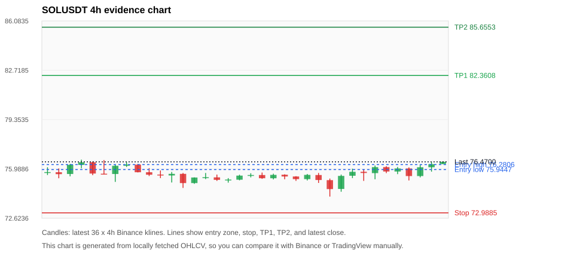
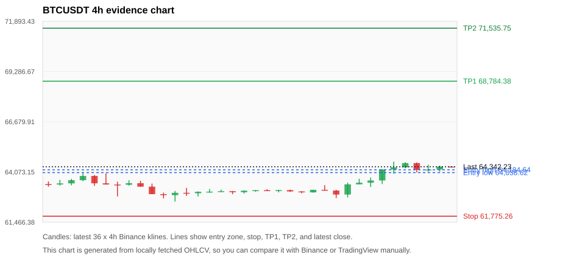
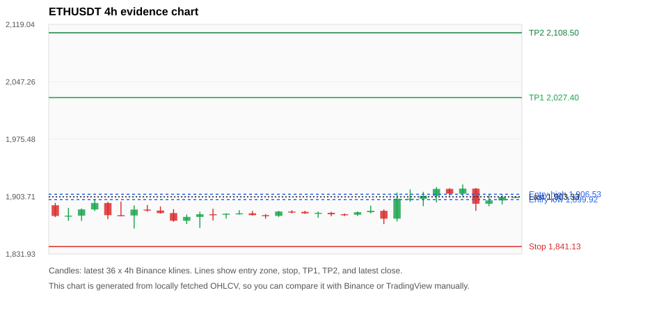
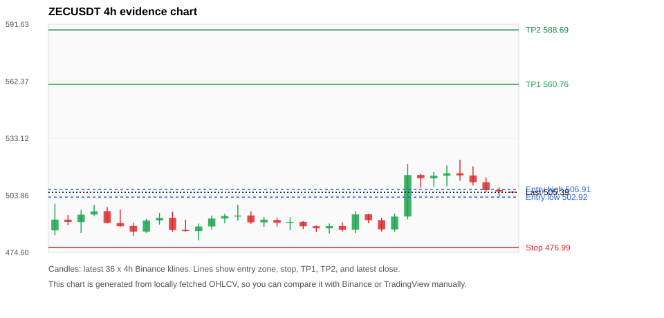
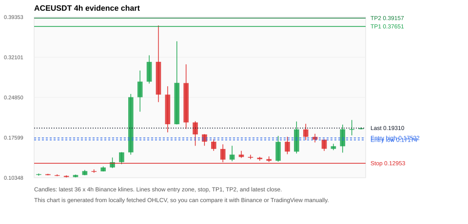

# Crypto 市场扫描报告 v1

- 报告时间：2026-08-18 20:06:23 CST
- Run ID：`20260818_120504_a5fbee24`
- Run type：`daily_full`
- Data validation mode：`paper`
- 数据来源：SQLite
- 报告版本：v1
- 扫描 ID：741093cc2c86
- 数据源：Binance public spot API + CoinGecko/CoinMarketCap cross-check
- 过滤条件：USDT spot; 24h quote volume >= 30,000,000; trades >= 30,000; exclude stables/leveraged tokens; analyze 1h/4h/1d klines
- 默认单笔风险：账户权益的 1.00%

## 限制说明

- 交易信号仍以 Binance 现货公开 K 线为主源；外部数据源用于一致性复核。
- 结果是研究和模拟盘计划，不是确定收益或实盘下单指令。
- 历史长度过滤：候选币至少需要 180 根 1d K 线。
- 数据质量验证池：先验证 score 排名前 min(top_n * 2, 10) 的候选，再按 action + score 补足最终名单。
- 大盘环境过滤：NEUTRAL; BTC/ETH 大盘未完全确认强势，山寨币买入候选降级为观察。 BTC 7d=1.1670283018867966; ETH 7d=1.093706011399198.
- Data cross-validation enabled: Binance primary source plus CoinGecko; CoinMarketCap is checked when an API key is configured.
- SOLUSDT validation state DEGRADED: DEGRADED: [EXTERNAL_IDENTITY_AMBIGUOUS] CoinMarketCap symbol mapping has 8 matches; selected lowest cmc_rank
- BTCUSDT validation state DEGRADED: DEGRADED: [EXTERNAL_IDENTITY_AMBIGUOUS] CoinMarketCap symbol mapping has 13 matches; selected lowest cmc_rank
- ETHUSDT validation state DEGRADED: DEGRADED: [EXTERNAL_IDENTITY_AMBIGUOUS] CoinMarketCap symbol mapping has 6 matches; selected lowest cmc_rank
- ZECUSDT validation state BLOCKED: BLOCKED: [BINANCE_KLINE_EXTREME_RANGE] Binance candle range exceeds 40%.; [BINANCE_KLINE_EXTREME_RANGE] Binance candle range exceeds 40%.; [EXTERNAL_IDENTITY_AMBIGUOUS] CoinMarketCap symbol mapping has 2 matches; selected lowest cmc_rank
- ACEUSDT validation state BLOCKED: BLOCKED: [BINANCE_KLINE_EXTREME_RANGE] Binance candle range exceeds 40%.; [BINANCE_KLINE_EXTREME_RANGE] Binance candle range exceeds 40%.; [BINANCE_KLINE_EXTREME_RANGE] Binance candle range exceeds 40%.; [BINANCE_KLINE_EXTREME_RANGE] Binance candle range exceeds 40%.; [BINANCE_KLINE_EXTREME_RANGE] Binance candle range exceeds 40%.; [BINANCE_KLINE_EXTREME_RANGE] Binance candle range exceeds 40%.; [BINANCE_KLINE_EXTREME_RANGE] Binance candle range exceeds 40%.; [BINANCE_KLINE_EXTREME_RANGE] Binance candle range exceeds 40%.; [BINANCE_KLINE_EXTREME_RANGE] Binance candle range exceeds 40%.; [BINANCE_KLINE_EXTREME_RANGE] Binance candle range exceeds 40%.; [BINANCE_KLINE_EXTREME_RANGE] Binance candle range exceeds 40%.; [BINANCE_KLINE_EXTREME_RANGE] Binance candle range exceeds 40%.; [BINANCE_KLINE_EXTREME_RANGE] Binance candle range exceeds 40%.; [BINANCE_KLINE_EXTREME_RANGE] Binance candle range exceeds 40%.; [BINANCE_KLINE_EXTREME_RANGE] Binance candle range exceeds 40%.; [BINANCE_KLINE_EXTREME_RANGE] Binance candle range exceeds 40%.; [BINANCE_KLINE_EXTREME_RANGE] Binance candle range exceeds 40%.; [BINANCE_KLINE_EXTREME_RANGE] Binance candle range exceeds 40%.; [BINANCE_KLINE_EXTREME_RANGE] Binance candle range exceeds 40%.; [BINANCE_KLINE_EXTREME_RANGE] Binance candle range exceeds 40%.; [BINANCE_KLINE_EXTREME_RANGE] Binance candle range exceeds 40%.; [EXTERNAL_IDENTITY_AMBIGUOUS] CoinMarketCap symbol mapping has 8 matches; selected lowest cmc_rank
- TRXUSDT validation state DEGRADED: DEGRADED: [EXTERNAL_PROVIDER_RATE_LIMITED] Provider rate limited request for https://api.coingecko.com/api/v3/coins/markets?vs_currency=usd&ids=tron&price_change_percentage=24h&per_page=1&page=1: HTTP 429
- TUTUSDT validation state BLOCKED: BLOCKED: [BINANCE_KLINE_EXTREME_RANGE] Binance candle range exceeds 40%.; [BINANCE_KLINE_EXTREME_RANGE] Binance candle range exceeds 40%.; [BINANCE_KLINE_EXTREME_RANGE] Binance candle range exceeds 40%.; [BINANCE_KLINE_EXTREME_RANGE] Binance candle range exceeds 40%.; [BINANCE_KLINE_EXTREME_RANGE] Binance candle range exceeds 40%.; [BINANCE_KLINE_EXTREME_RANGE] Binance candle range exceeds 40%.; [BINANCE_KLINE_EXTREME_RANGE] Binance candle range exceeds 40%.; [BINANCE_KLINE_EXTREME_RANGE] Binance candle range exceeds 40%.; [BINANCE_KLINE_EXTREME_RANGE] Binance candle range exceeds 40%.; [BINANCE_KLINE_EXTREME_RANGE] Binance candle range exceeds 40%.; [BINANCE_KLINE_EXTREME_RANGE] Binance candle range exceeds 40%.; [BINANCE_KLINE_EXTREME_RANGE] Binance candle range exceeds 40%.; [BINANCE_KLINE_EXTREME_RANGE] Binance candle range exceeds 40%.; [BINANCE_KLINE_EXTREME_RANGE] Binance candle range exceeds 40%.; [BINANCE_KLINE_EXTREME_RANGE] Binance candle range exceeds 40%.; [BINANCE_KLINE_EXTREME_RANGE] Binance candle range exceeds 40%.; [BINANCE_KLINE_EXTREME_RANGE] Binance candle range exceeds 40%.; [BINANCE_KLINE_EXTREME_RANGE] Binance candle range exceeds 40%.; [BINANCE_KLINE_EXTREME_RANGE] Binance candle range exceeds 40%.; [EXTERNAL_PROVIDER_RATE_LIMITED] Provider rate limited request for https://api.coingecko.com/api/v3/coins/markets?vs_currency=usd&ids=tutorial&price_change_percentage=24h&per_page=1&page=1: HTTP 429; [EXTERNAL_IDENTITY_AMBIGUOUS] CoinMarketCap symbol mapping has 3 matches; selected lowest cmc_rank
- ALLOUSDT validation state BLOCKED: BLOCKED: [BINANCE_KLINE_EXTREME_RANGE] Binance candle range exceeds 40%.; [BINANCE_KLINE_EXTREME_RANGE] Binance candle range exceeds 40%.; [BINANCE_KLINE_EXTREME_RANGE] Binance candle range exceeds 40%.; [BINANCE_KLINE_EXTREME_RANGE] Binance candle range exceeds 40%.; [BINANCE_KLINE_EXTREME_RANGE] Binance candle range exceeds 40%.; [BINANCE_KLINE_EXTREME_RANGE] Binance candle range exceeds 40%.; [BINANCE_KLINE_EXTREME_RANGE] Binance candle range exceeds 40%.; [BINANCE_KLINE_EXTREME_RANGE] Binance candle range exceeds 40%.; [BINANCE_KLINE_EXTREME_RANGE] Binance candle range exceeds 40%.; [BINANCE_KLINE_EXTREME_RANGE] Binance candle range exceeds 40%.; [BINANCE_KLINE_EXTREME_RANGE] Binance candle range exceeds 40%.; [BINANCE_KLINE_EXTREME_RANGE] Binance candle range exceeds 40%.; [EXTERNAL_PROVIDER_RATE_LIMITED] Provider rate limited request for https://api.coingecko.com/api/v3/coins/markets?vs_currency=usd&ids=allora&price_change_percentage=24h&per_page=1&page=1: HTTP 429
- BNBUSDT validation state DEGRADED: DEGRADED: [EXTERNAL_PROVIDER_RATE_LIMITED] Provider rate limited request for https://api.coingecko.com/api/v3/coins/markets?vs_currency=usd&ids=binancecoin&price_change_percentage=24h&per_page=1&page=1: HTTP 429; [EXTERNAL_IDENTITY_AMBIGUOUS] CoinMarketCap symbol mapping has 4 matches; selected lowest cmc_rank
- XRPUSDT validation state DEGRADED: DEGRADED: [EXTERNAL_PROVIDER_RATE_LIMITED] Provider rate limited request for https://api.coingecko.com/api/v3/coins/markets?vs_currency=usd&ids=ripple&price_change_percentage=24h&per_page=1&page=1: HTTP 429; [EXTERNAL_IDENTITY_AMBIGUOUS] CoinMarketCap symbol mapping has 3 matches; selected lowest cmc_rank

## 5 个候选交易计划

| Rank | Coin | Action | Setup | Entry Zone | Stop Loss | TP1 | TP2 / Exit Rule | R/R | Verdict |
|---:|---|---|---|---:|---:|---:|---|---:|---|
| 1 | `SOL` | `BUY_CANDIDATE` | 回踩支撑/4h EMA 附近 | 75.9447 - 76.2806 | 72.9885 | 82.3608 | 85.6553 或跌破 4h 关键支撑 | 2.00-3.05 | 可考虑 |
| 2 | `BTC` | `BUY_CANDIDATE` | 回踩支撑/4h EMA 附近 | 64,038.62 - 64,184.64 | 61,775.26 | 68,784.38 | 71,535.75 或跌破 4h 关键支撑 | 2.00-3.18 | 可考虑 |
| 3 | `ETH` | `WATCH_ONLY` | 回踩支撑/4h EMA 附近 | 1,899.92 - 1,906.53 | 1,841.13 | 2,027.40 | 2,108.50 或跌破 4h 关键支撑 | 2.00-3.31 | 只观察 |
| 4 | `ZEC` | `WATCH_ONLY` | 回踩支撑/4h EMA 附近 | 502.92 - 506.91 | 476.99 | 560.76 | 588.69 或跌破 4h 关键支撑 | 2.00-3.00 | 只观察 |
| 5 | `ACE` | `WATCH_ONLY` | 涨幅较远，只等深回调 | 0.17174 - 0.17522 | 0.12953 | 0.37651 | 0.39157 或跌破 4h 关键支撑 | 4.62-4.96 | 只观察 |

## 数据交叉验证摘要

价格差异以 Binance 当前价为基准；成交量口径不同，Binance 是 USDT 现货成交额，CoinGecko/CoinMarketCap 通常是全市场成交量。

| Rank | Coin | State | Identity | Max Price Diff | Max 24h Diff | Issue Codes | Message |
|---:|---|---|---|---:|---:|---|---|
| 1 | `SOL` | DEGRADED (DATA_WARNING) | UNCONFIRMED | 0.23% | 0.41 pts | EXTERNAL_IDENTITY_AMBIGUOUS | DEGRADED: [EXTERNAL_IDENTITY_AMBIGUOUS] CoinMarketCap symbol mapping has 8 matches; selected lowest cmc_rank |
| 2 | `BTC` | DEGRADED (DATA_WARNING) | UNCONFIRMED | 0.15% | 0.14 pts | EXTERNAL_IDENTITY_AMBIGUOUS | DEGRADED: [EXTERNAL_IDENTITY_AMBIGUOUS] CoinMarketCap symbol mapping has 13 matches; selected lowest cmc_rank |
| 3 | `ETH` | DEGRADED (DATA_WARNING) | UNCONFIRMED | 0.16% | 0.15 pts | EXTERNAL_IDENTITY_AMBIGUOUS | DEGRADED: [EXTERNAL_IDENTITY_AMBIGUOUS] CoinMarketCap symbol mapping has 6 matches; selected lowest cmc_rank |
| 4 | `ZEC` | BLOCKED (DATA_ERROR) | UNCONFIRMED | 0.12% | 0.44 pts | BINANCE_KLINE_EXTREME_RANGE, EXTERNAL_IDENTITY_AMBIGUOUS | BLOCKED: [BINANCE_KLINE_EXTREME_RANGE] Binance candle range exceeds 40%.; [BINANCE_KLINE_EXTREME_RANGE] Binance candle range exceeds 40%.; [EXTERNAL_IDENTITY_AMBIGUOUS] CoinMarketCap symbol mapping has 2 matches; selected lowest cmc_rank |
| 5 | `ACE` | BLOCKED (DATA_ERROR) | UNCONFIRMED | 0.88% | 2.32 pts | BINANCE_KLINE_EXTREME_RANGE, EXTERNAL_IDENTITY_AMBIGUOUS | BLOCKED: [BINANCE_KLINE_EXTREME_RANGE] Binance candle range exceeds 40%.; [BINANCE_KLINE_EXTREME_RANGE] Binance candle range exceeds 40%.; [BINANCE_KLINE_EXTREME_RANGE] Binance candle range exceeds 40%.; [BINANCE_KLINE_EXTREME_RANGE] Binance candle range exceeds 40%.; [BINANCE_KLINE_EXTREME_RANGE] Binance candle range exceeds 40%.; [BINANCE_KLINE_EXTREME_RANGE] Binance candle range exceeds 40%.; [BINANCE_KLINE_EXTREME_RANGE] Binance candle range exceeds 40%.; [BINANCE_KLINE_EXTREME_RANGE] Binance candle range exceeds 40%.; [BINANCE_KLINE_EXTREME_RANGE] Binance candle range exceeds 40%.; [BINANCE_KLINE_EXTREME_RANGE] Binance candle range exceeds 40%.; [BINANCE_KLINE_EXTREME_RANGE] Binance candle range exceeds 40%.; [BINANCE_KLINE_EXTREME_RANGE] Binance candle range exceeds 40%.; [BINANCE_KLINE_EXTREME_RANGE] Binance candle range exceeds 40%.; [BINANCE_KLINE_EXTREME_RANGE] Binance candle range exceeds 40%.; [BINANCE_KLINE_EXTREME_RANGE] Binance candle range exceeds 40%.; [BINANCE_KLINE_EXTREME_RANGE] Binance candle range exceeds 40%.; [BINANCE_KLINE_EXTREME_RANGE] Binance candle range exceeds 40%.; [BINANCE_KLINE_EXTREME_RANGE] Binance candle range exceeds 40%.; [BINANCE_KLINE_EXTREME_RANGE] Binance candle range exceeds 40%.; [BINANCE_KLINE_EXTREME_RANGE] Binance candle range exceeds 40%.; [BINANCE_KLINE_EXTREME_RANGE] Binance candle range exceeds 40%.; [EXTERNAL_IDENTITY_AMBIGUOUS] CoinMarketCap symbol mapping has 8 matches; selected lowest cmc_rank |

## 候选币说明

### 1. SOL `SOLUSDT`



- 入选原因：回踩支撑/4h EMA 附近；24h +1.11%，7d +0.59%，4h RSI 59.80，24h 成交额 $100.3M。
- 交易失效条件：跌破 72.9885 或 4h 收盘重新失守关键支撑。
- 主要风险：主要风险是大盘同步回撤；External validation is degraded; this candidate is not a clean data sample.；Paper mode allows degraded validation; candidate is excluded from clean-data samples.。
- 数据交叉验证：DEGRADED / DATA_WARNING；身份=UNCONFIRMED；DEGRADED: [EXTERNAL_IDENTITY_AMBIGUOUS] CoinMarketCap symbol mapping has 8 matches; selected lowest cmc_rank

#### 可点击人工验证

- [Binance 交易页](https://www.binance.com/en/trade/SOL_USDT)
- [TradingView 图表](https://www.tradingview.com/chart/?symbol=BINANCE%3ASOLUSDT)
- [CoinGecko 搜索](https://www.coingecko.com/en/search?query=SOL)
- [CoinMarketCap 搜索](https://coinmarketcap.com/search/?q=SOL)

#### 多数据源对照

| Source | Status | Identity | Blocking | Asset ID | Price | 24h Change | 24h Volume | Price Diff | 24h Diff | Updated | Issue Codes | Message |
|---|---|---|---:|---|---:|---:|---:|---:|---:|---|---|---|
| Binance | DATA_OK | CONFIRMED | no | SOLUSDT | 76.4700 | +1.11% | $100.3M | 0.00% | 0.00 pts | 2026-08-18T12:05:40+00:00 | none | Primary market data source passed health checks. |
| CoinGecko | DATA_OK | CONFIRMED | no | solana | 76.3300 | +0.70% | $1.30B | 0.18% | 0.41 pts | 2026-08-18T12:03:30.000Z | none | External source agrees with Binance within thresholds. |
| CoinMarketCap | DATA_WARNING | UNCONFIRMED | no | 5426 | 76.2976 | +0.89% | $1.39B | 0.23% | 0.22 pts | 2026-08-18T12:03:59.000Z | EXTERNAL_IDENTITY_AMBIGUOUS | [EXTERNAL_IDENTITY_AMBIGUOUS] CoinMarketCap symbol mapping has 8 matches; selected lowest cmc_rank |

#### 指标证据

| 指标 | 数值 | 人工核对用途 |
|---|---:|---|
| 当前价 | 76.4700 | 与 Binance/TradingView 当前价格对照 |
| 24h 涨跌 | +1.11% | 与交易所 24h 涨跌对照 |
| 7d 涨跌 | +0.59% | 判断短线趋势是否延续 |
| 4h EMA20 | 75.7931 | 判断短期趋势支撑 |
| 4h EMA50 | 75.6015 | 判断中期趋势支撑 |
| 1d EMA20 | 75.3244 | 判断日线趋势 |
| 1d EMA50 | 75.5314 | 判断日线趋势 |
| 4h RSI14 | 59.80 | 判断是否过热/过弱 |
| 4h ATR14 | 0.69643 | 推导止损和入场缓冲 |
| 最近 18 根 4h 最低点 | 74.1000 | 支撑/止损参考 |
| 最近 36 根 4h 最高点 | 76.6200 | TP/压力参考 |
| 支撑位 | 75.7931 | 入场区间推导基础 |

#### 交易计划推导

- 支撑位 = 最近低点、4h EMA20、4h EMA50、1d EMA20 中不高于当前价的最高有效支撑 = `75.7931`。
- 入场区间 = 支撑位附近 + ATR 缓冲 = `75.9447 - 76.2806`。
- 止损 = min(最近 18 根 4h 最低点 * 0.985, 入场中位价 - 1.15 * ATR14) = `72.9885`。
- TP1 = max(最近 36 根 4h 最高点 * 0.995, 入场中位价 + 2R) = `82.3608`。
- TP2 = max(入场中位价 + 3R, TP1 * 1.04) = `85.6553`。

#### 最近 10 根 4h K线

| UTC 开盘时间 | Open | High | Low | Close | Quote Volume | Trades |
|---|---:|---:|---:|---:|---:|---:|
| 2026-08-17T00:00+00:00 | 74.6200 | 75.6000 | 74.4300 | 75.5100 | $16.6M | 66835 |
| 2026-08-17T04:00+00:00 | 75.5200 | 76.0000 | 75.3600 | 75.7900 | $13.1M | 44482 |
| 2026-08-17T08:00+00:00 | 75.7900 | 75.9500 | 75.1700 | 75.7100 | $20.6M | 70867 |
| 2026-08-17T12:00+00:00 | 75.7000 | 76.2200 | 75.2800 | 76.1100 | $22.8M | 94999 |
| 2026-08-17T16:00+00:00 | 76.1100 | 76.1700 | 75.7000 | 75.8100 | $12.8M | 51775 |
| 2026-08-17T20:00+00:00 | 75.8100 | 76.1200 | 75.6300 | 76.0200 | $10.1M | 45706 |
| 2026-08-18T00:00+00:00 | 76.0200 | 76.0900 | 75.2000 | 75.5000 | $16.9M | 63050 |
| 2026-08-18T04:00+00:00 | 75.5000 | 76.2700 | 75.4100 | 76.1000 | $19.7M | 63130 |
| 2026-08-18T08:00+00:00 | 76.1000 | 76.4500 | 75.8000 | 76.3100 | $17.0M | 50654 |
| 2026-08-18T12:00+00:00 | 76.3200 | 76.5000 | 76.3200 | 76.4700 | $1.4M | 2894 |

### 2. BTC `BTCUSDT`



- 入选原因：回踩支撑/4h EMA 附近；24h +1.14%，7d +0.22%，4h RSI 74.82，24h 成交额 $880.2M。
- 交易失效条件：跌破 61775.26 或 4h 收盘重新失守关键支撑。
- 主要风险：主要风险是大盘同步回撤；External validation is degraded; this candidate is not a clean data sample.；Paper mode allows degraded validation; candidate is excluded from clean-data samples.。
- 数据交叉验证：DEGRADED / DATA_WARNING；身份=UNCONFIRMED；DEGRADED: [EXTERNAL_IDENTITY_AMBIGUOUS] CoinMarketCap symbol mapping has 13 matches; selected lowest cmc_rank

#### 可点击人工验证

- [Binance 交易页](https://www.binance.com/en/trade/BTC_USDT)
- [TradingView 图表](https://www.tradingview.com/chart/?symbol=BINANCE%3ABTCUSDT)
- [CoinGecko 搜索](https://www.coingecko.com/en/search?query=BTC)
- [CoinMarketCap 搜索](https://coinmarketcap.com/search/?q=BTC)

#### 多数据源对照

| Source | Status | Identity | Blocking | Asset ID | Price | 24h Change | 24h Volume | Price Diff | 24h Diff | Updated | Issue Codes | Message |
|---|---|---|---:|---|---:|---:|---:|---:|---:|---|---|---|
| Binance | DATA_OK | CONFIRMED | no | BTCUSDT | 64,342.23 | +1.14% | $880.2M | 0.00% | 0.00 pts | 2026-08-18T12:05:40+00:00 | none | Primary market data source passed health checks. |
| CoinGecko | DATA_OK | CONFIRMED | no | bitcoin | 64,257.00 | +1.00% | $20.68B | 0.13% | 0.14 pts | 2026-08-18T12:03:30.000Z | none | External source agrees with Binance within thresholds. |
| CoinMarketCap | DATA_WARNING | UNCONFIRMED | no | 1 | 64,247.16 | +1.04% | $20.82B | 0.15% | 0.10 pts | 2026-08-18T12:03:59.000Z | EXTERNAL_IDENTITY_AMBIGUOUS | [EXTERNAL_IDENTITY_AMBIGUOUS] CoinMarketCap symbol mapping has 13 matches; selected lowest cmc_rank |

#### 指标证据

| 指标 | 数值 | 人工核对用途 |
|---|---:|---|
| 当前价 | 64,342.23 | 与 Binance/TradingView 当前价格对照 |
| 24h 涨跌 | +1.14% | 与交易所 24h 涨跌对照 |
| 7d 涨跌 | +0.22% | 判断短线趋势是否延续 |
| 4h EMA20 | 63,791.19 | 判断短期趋势支撑 |
| 4h EMA50 | 63,721.39 | 判断中期趋势支撑 |
| 1d EMA20 | 63,910.80 | 判断日线趋势 |
| 1d EMA50 | 64,351.70 | 判断日线趋势 |
| 4h RSI14 | 74.82 | 判断是否过热/过弱 |
| 4h ATR14 | 391.21 | 推导止损和入场缓冲 |
| 最近 18 根 4h 最低点 | 62,716.00 | 支撑/止损参考 |
| 最近 36 根 4h 最高点 | 64,610.01 | TP/压力参考 |
| 支撑位 | 63,910.80 | 入场区间推导基础 |

#### 交易计划推导

- 支撑位 = 最近低点、4h EMA20、4h EMA50、1d EMA20 中不高于当前价的最高有效支撑 = `63,910.80`。
- 入场区间 = 支撑位附近 + ATR 缓冲 = `64,038.62 - 64,184.64`。
- 止损 = min(最近 18 根 4h 最低点 * 0.985, 入场中位价 - 1.15 * ATR14) = `61,775.26`。
- TP1 = max(最近 36 根 4h 最高点 * 0.995, 入场中位价 + 2R) = `68,784.38`。
- TP2 = max(入场中位价 + 3R, TP1 * 1.04) = `71,535.75`。

#### 最近 10 根 4h K线

| UTC 开盘时间 | Open | High | Low | Close | Quote Volume | Trades |
|---|---:|---:|---:|---:|---:|---:|
| 2026-08-17T00:00+00:00 | 62,900.00 | 63,520.00 | 62,751.10 | 63,429.21 | $137.1M | 399339 |
| 2026-08-17T04:00+00:00 | 63,429.21 | 63,717.17 | 63,429.21 | 63,514.45 | $158.5M | 212748 |
| 2026-08-17T08:00+00:00 | 63,514.45 | 63,781.69 | 63,295.00 | 63,631.10 | $123.4M | 231054 |
| 2026-08-17T12:00+00:00 | 63,631.11 | 64,227.27 | 63,444.17 | 64,200.00 | $187.0M | 524760 |
| 2026-08-17T16:00+00:00 | 64,200.00 | 64,610.01 | 63,979.30 | 64,309.96 | $230.4M | 541032 |
| 2026-08-17T20:00+00:00 | 64,309.95 | 64,578.00 | 64,266.00 | 64,532.10 | $73.0M | 202323 |
| 2026-08-18T00:00+00:00 | 64,532.11 | 64,568.46 | 64,047.73 | 64,185.01 | $111.2M | 246058 |
| 2026-08-18T04:00+00:00 | 64,185.00 | 64,446.00 | 64,090.00 | 64,198.97 | $202.5M | 253329 |
| 2026-08-18T08:00+00:00 | 64,198.97 | 64,402.35 | 64,087.98 | 64,351.19 | $77.2M | 197005 |
| 2026-08-18T12:00+00:00 | 64,351.18 | 64,351.19 | 64,307.82 | 64,342.23 | $1.5M | 4898 |

### 3. ETH `ETHUSDT`



- 入选原因：回踩支撑/4h EMA 附近；24h -0.06%，7d +0.70%，4h RSI 61.79，24h 成交额 $278.4M。
- 交易失效条件：跌破 1841.1325 或 4h 收盘重新失守关键支撑。
- 主要风险：24h 动量未确认；External validation is degraded; this candidate is not a clean data sample.；Paper mode allows degraded validation; candidate is excluded from clean-data samples.。
- 数据交叉验证：DEGRADED / DATA_WARNING；身份=UNCONFIRMED；DEGRADED: [EXTERNAL_IDENTITY_AMBIGUOUS] CoinMarketCap symbol mapping has 6 matches; selected lowest cmc_rank

#### 可点击人工验证

- [Binance 交易页](https://www.binance.com/en/trade/ETH_USDT)
- [TradingView 图表](https://www.tradingview.com/chart/?symbol=BINANCE%3AETHUSDT)
- [CoinGecko 搜索](https://www.coingecko.com/en/search?query=ETH)
- [CoinMarketCap 搜索](https://coinmarketcap.com/search/?q=ETH)

#### 多数据源对照

| Source | Status | Identity | Blocking | Asset ID | Price | 24h Change | 24h Volume | Price Diff | 24h Diff | Updated | Issue Codes | Message |
|---|---|---|---:|---|---:|---:|---:|---:|---:|---|---|---|
| Binance | DATA_OK | CONFIRMED | no | ETHUSDT | 1,903.33 | -0.06% | $278.4M | 0.00% | 0.00 pts | 2026-08-18T12:05:40+00:00 | none | Primary market data source passed health checks. |
| CoinGecko | DATA_OK | CONFIRMED | no | ethereum | 1,900.25 | -0.20% | $6.09B | 0.16% | 0.14 pts | 2026-08-18T12:03:30.000Z | none | External source agrees with Binance within thresholds. |
| CoinMarketCap | DATA_WARNING | UNCONFIRMED | no | 1027 | 1,900.33 | -0.22% | $6.93B | 0.16% | 0.15 pts | 2026-08-18T12:03:59.000Z | EXTERNAL_IDENTITY_AMBIGUOUS | [EXTERNAL_IDENTITY_AMBIGUOUS] CoinMarketCap symbol mapping has 6 matches; selected lowest cmc_rank |

#### 指标证据

| 指标 | 数值 | 人工核对用途 |
|---|---:|---|
| 当前价 | 1,903.33 | 与 Binance/TradingView 当前价格对照 |
| 24h 涨跌 | -0.06% | 与交易所 24h 涨跌对照 |
| 7d 涨跌 | +0.70% | 判断短线趋势是否延续 |
| 4h EMA20 | 1,896.13 | 判断短期趋势支撑 |
| 4h EMA50 | 1,892.47 | 判断中期趋势支撑 |
| 1d EMA20 | 1,887.79 | 判断日线趋势 |
| 1d EMA50 | 1,869.39 | 判断日线趋势 |
| 4h RSI14 | 61.79 | 判断是否过热/过弱 |
| 4h ATR14 | 14.8543 | 推导止损和入场缓冲 |
| 最近 18 根 4h 最低点 | 1,869.17 | 支撑/止损参考 |
| 最近 36 根 4h 最高点 | 1,918.71 | TP/压力参考 |
| 支撑位 | 1,896.13 | 入场区间推导基础 |

#### 交易计划推导

- 支撑位 = 最近低点、4h EMA20、4h EMA50、1d EMA20 中不高于当前价的最高有效支撑 = `1,896.13`。
- 入场区间 = 支撑位附近 + ATR 缓冲 = `1,899.92 - 1,906.53`。
- 止损 = min(最近 18 根 4h 最低点 * 0.985, 入场中位价 - 1.15 * ATR14) = `1,841.13`。
- TP1 = max(最近 36 根 4h 最高点 * 0.995, 入场中位价 + 2R) = `2,027.40`。
- TP2 = max(入场中位价 + 3R, TP1 * 1.04) = `2,108.50`。

#### 最近 10 根 4h K线

| UTC 开盘时间 | Open | High | Low | Close | Quote Volume | Trades |
|---|---:|---:|---:|---:|---:|---:|
| 2026-08-17T00:00+00:00 | 1,876.01 | 1,908.62 | 1,872.46 | 1,900.92 | $79.9M | 347690 |
| 2026-08-17T04:00+00:00 | 1,900.93 | 1,912.60 | 1,897.13 | 1,900.93 | $57.4M | 159406 |
| 2026-08-17T08:00+00:00 | 1,900.93 | 1,909.49 | 1,891.57 | 1,904.46 | $44.0M | 227076 |
| 2026-08-17T12:00+00:00 | 1,904.46 | 1,915.50 | 1,896.28 | 1,913.22 | $75.8M | 332198 |
| 2026-08-17T16:00+00:00 | 1,913.22 | 1,914.19 | 1,904.59 | 1,907.25 | $45.3M | 241412 |
| 2026-08-17T20:00+00:00 | 1,907.24 | 1,918.71 | 1,903.59 | 1,913.60 | $31.8M | 133703 |
| 2026-08-18T00:00+00:00 | 1,913.59 | 1,914.38 | 1,885.78 | 1,894.69 | $52.7M | 261227 |
| 2026-08-18T04:00+00:00 | 1,894.68 | 1,906.94 | 1,891.53 | 1,898.84 | $37.1M | 140792 |
| 2026-08-18T08:00+00:00 | 1,898.83 | 1,905.65 | 1,893.80 | 1,903.11 | $35.8M | 178744 |
| 2026-08-18T12:00+00:00 | 1,903.12 | 1,903.33 | 1,901.74 | 1,903.33 | $437,771 | 3576 |

### 4. ZEC `ZECUSDT`



- 入选原因：回踩支撑/4h EMA 附近；24h -1.06%，7d +4.04%，4h RSI 64.56，24h 成交额 $38.4M。
- 交易失效条件：跌破 476.98625 或 4h 收盘重新失守关键支撑。
- 主要风险：24h 动量未确认；Blocking data-quality issue detected; paper plan creation is not allowed.。
- 数据交叉验证：BLOCKED / DATA_ERROR；身份=UNCONFIRMED；BLOCKED: [BINANCE_KLINE_EXTREME_RANGE] Binance candle range exceeds 40%.; [BINANCE_KLINE_EXTREME_RANGE] Binance candle range exceeds 40%.; [EXTERNAL_IDENTITY_AMBIGUOUS] CoinMarketCap symbol mapping has 2 matches; selected lowest cmc_rank

#### 可点击人工验证

- [Binance 交易页](https://www.binance.com/en/trade/ZEC_USDT)
- [TradingView 图表](https://www.tradingview.com/chart/?symbol=BINANCE%3AZECUSDT)
- [CoinGecko 搜索](https://www.coingecko.com/en/search?query=ZEC)
- [CoinMarketCap 搜索](https://coinmarketcap.com/search/?q=ZEC)

#### 多数据源对照

| Source | Status | Identity | Blocking | Asset ID | Price | 24h Change | 24h Volume | Price Diff | 24h Diff | Updated | Issue Codes | Message |
|---|---|---|---:|---|---:|---:|---:|---:|---:|---|---|---|
| Binance | DATA_ERROR | CONFIRMED | yes | ZECUSDT | 505.39 | -1.06% | $38.4M | 0.00% | 0.00 pts | 2026-08-18T12:05:40+00:00 | BINANCE_KLINE_EXTREME_RANGE | [BINANCE_KLINE_EXTREME_RANGE] Binance candle range exceeds 40%.; [BINANCE_KLINE_EXTREME_RANGE] Binance candle range exceeds 40%. |
| CoinGecko | DATA_OK | CONFIRMED | no | zcash | 504.80 | -1.50% | $176.0M | 0.12% | 0.44 pts | 2026-08-18T12:03:30.000Z | none | External source agrees with Binance within thresholds. |
| CoinMarketCap | DATA_WARNING | UNCONFIRMED | no | 1437 | 504.92 | -1.33% | $288.8M | 0.09% | 0.27 pts | 2026-08-18T12:03:59.000Z | EXTERNAL_IDENTITY_AMBIGUOUS | [EXTERNAL_IDENTITY_AMBIGUOUS] CoinMarketCap symbol mapping has 2 matches; selected lowest cmc_rank |

#### 指标证据

| 指标 | 数值 | 人工核对用途 |
|---|---:|---|
| 当前价 | 505.39 | 与 Binance/TradingView 当前价格对照 |
| 24h 涨跌 | -1.06% | 与交易所 24h 涨跌对照 |
| 7d 涨跌 | +4.04% | 判断短线趋势是否延续 |
| 4h EMA20 | 501.91 | 判断短期趋势支撑 |
| 4h EMA50 | 497.06 | 判断中期趋势支撑 |
| 1d EMA20 | 496.29 | 判断日线趋势 |
| 1d EMA50 | 491.09 | 判断日线趋势 |
| 4h RSI14 | 64.56 | 判断是否过热/过弱 |
| 4h ATR14 | 8.9321 | 推导止损和入场缓冲 |
| 最近 18 根 4h 最低点 | 484.25 | 支撑/止损参考 |
| 最近 36 根 4h 最高点 | 522.09 | TP/压力参考 |
| 支撑位 | 501.91 | 入场区间推导基础 |

#### 交易计划推导

- 支撑位 = 最近低点、4h EMA20、4h EMA50、1d EMA20 中不高于当前价的最高有效支撑 = `501.91`。
- 入场区间 = 支撑位附近 + ATR 缓冲 = `502.92 - 506.91`。
- 止损 = min(最近 18 根 4h 最低点 * 0.985, 入场中位价 - 1.15 * ATR14) = `476.99`。
- TP1 = max(最近 36 根 4h 最高点 * 0.995, 入场中位价 + 2R) = `560.76`。
- TP2 = max(入场中位价 + 3R, TP1 * 1.04) = `588.69`。

#### 最近 10 根 4h K线

| UTC 开盘时间 | Open | High | Low | Close | Quote Volume | Trades |
|---|---:|---:|---:|---:|---:|---:|
| 2026-08-17T00:00+00:00 | 486.33 | 494.50 | 485.10 | 492.98 | $4.2M | 34676 |
| 2026-08-17T04:00+00:00 | 492.98 | 520.00 | 491.49 | 514.22 | $30.5M | 95109 |
| 2026-08-17T08:00+00:00 | 514.28 | 514.89 | 507.82 | 512.57 | $9.3M | 39221 |
| 2026-08-17T12:00+00:00 | 512.57 | 515.90 | 508.24 | 513.92 | $8.1M | 41097 |
| 2026-08-17T16:00+00:00 | 513.90 | 519.20 | 508.50 | 515.17 | $7.7M | 33760 |
| 2026-08-17T20:00+00:00 | 515.17 | 522.09 | 511.35 | 514.08 | $4.6M | 28433 |
| 2026-08-18T00:00+00:00 | 514.03 | 518.77 | 508.89 | 510.59 | $5.1M | 27456 |
| 2026-08-18T04:00+00:00 | 510.59 | 512.99 | 505.58 | 506.50 | $5.3M | 27032 |
| 2026-08-18T08:00+00:00 | 506.53 | 507.86 | 503.20 | 505.75 | $7.7M | 38923 |
| 2026-08-18T12:00+00:00 | 505.74 | 506.02 | 504.89 | 505.39 | $120,623 | 647 |

### 5. ACE `ACEUSDT`



- 入选原因：涨幅较远，只等深回调；24h -1.28%，7d +82.51%，4h RSI 63.61，24h 成交额 $38.2M。
- 交易失效条件：跌破 0.1295275 或 4h 收盘重新失守关键支撑。
- 主要风险：距离支撑偏远，不能追市价；24h 振幅较大，回撤风险高；24h 动量未确认；Blocking data-quality issue detected; paper plan creation is not allowed.。
- 数据交叉验证：BLOCKED / DATA_ERROR；身份=UNCONFIRMED；BLOCKED: [BINANCE_KLINE_EXTREME_RANGE] Binance candle range exceeds 40%.; [BINANCE_KLINE_EXTREME_RANGE] Binance candle range exceeds 40%.; [BINANCE_KLINE_EXTREME_RANGE] Binance candle range exceeds 40%.; [BINANCE_KLINE_EXTREME_RANGE] Binance candle range exceeds 40%.; [BINANCE_KLINE_EXTREME_RANGE] Binance candle range exceeds 40%.; [BINANCE_KLINE_EXTREME_RANGE] Binance candle range exceeds 40%.; [BINANCE_KLINE_EXTREME_RANGE] Binance candle range exceeds 40%.; [BINANCE_KLINE_EXTREME_RANGE] Binance candle range exceeds 40%.; [BINANCE_KLINE_EXTREME_RANGE] Binance candle range exceeds 40%.; [BINANCE_KLINE_EXTREME_RANGE] Binance candle range exceeds 40%.; [BINANCE_KLINE_EXTREME_RANGE] Binance candle range exceeds 40%.; [BINANCE_KLINE_EXTREME_RANGE] Binance candle range exceeds 40%.; [BINANCE_KLINE_EXTREME_RANGE] Binance candle range exceeds 40%.; [BINANCE_KLINE_EXTREME_RANGE] Binance candle range exceeds 40%.; [BINANCE_KLINE_EXTREME_RANGE] Binance candle range exceeds 40%.; [BINANCE_KLINE_EXTREME_RANGE] Binance candle range exceeds 40%.; [BINANCE_KLINE_EXTREME_RANGE] Binance candle range exceeds 40%.; [BINANCE_KLINE_EXTREME_RANGE] Binance candle range exceeds 40%.; [BINANCE_KLINE_EXTREME_RANGE] Binance candle range exceeds 40%.; [BINANCE_KLINE_EXTREME_RANGE] Binance candle range exceeds 40%.; [BINANCE_KLINE_EXTREME_RANGE] Binance candle range exceeds 40%.; [EXTERNAL_IDENTITY_AMBIGUOUS] CoinMarketCap symbol mapping has 8 matches; selected lowest cmc_rank

#### 可点击人工验证

- [Binance 交易页](https://www.binance.com/en/trade/ACE_USDT)
- [TradingView 图表](https://www.tradingview.com/chart/?symbol=BINANCE%3AACEUSDT)
- [CoinGecko 搜索](https://www.coingecko.com/en/search?query=ACE)
- [CoinMarketCap 搜索](https://coinmarketcap.com/search/?q=ACE)

#### 多数据源对照

| Source | Status | Identity | Blocking | Asset ID | Price | 24h Change | 24h Volume | Price Diff | 24h Diff | Updated | Issue Codes | Message |
|---|---|---|---:|---|---:|---:|---:|---:|---:|---|---|---|
| Binance | DATA_ERROR | CONFIRMED | yes | ACEUSDT | 0.19310 | -1.28% | $38.2M | 0.00% | 0.00 pts | 2026-08-18T12:05:40+00:00 | BINANCE_KLINE_EXTREME_RANGE | [BINANCE_KLINE_EXTREME_RANGE] Binance candle range exceeds 40%.; [BINANCE_KLINE_EXTREME_RANGE] Binance candle range exceeds 40%.; [BINANCE_KLINE_EXTREME_RANGE] Binance candle range exceeds 40%.; [BINANCE_KLINE_EXTREME_RANGE] Binance candle range exceeds 40%.; [BINANCE_KLINE_EXTREME_RANGE] Binance candle range exceeds 40%.; [BINANCE_KLINE_EXTREME_RANGE] Binance candle range exceeds 40%.; [BINANCE_KLINE_EXTREME_RANGE] Binance candle range exceeds 40%.; [BINANCE_KLINE_EXTREME_RANGE] Binance candle range exceeds 40%.; [BINANCE_KLINE_EXTREME_RANGE] Binance candle range exceeds 40%.; [BINANCE_KLINE_EXTREME_RANGE] Binance candle range exceeds 40%.; [BINANCE_KLINE_EXTREME_RANGE] Binance candle range exceeds 40%.; [BINANCE_KLINE_EXTREME_RANGE] Binance candle range exceeds 40%.; [BINANCE_KLINE_EXTREME_RANGE] Binance candle range exceeds 40%.; [BINANCE_KLINE_EXTREME_RANGE] Binance candle range exceeds 40%.; [BINANCE_KLINE_EXTREME_RANGE] Binance candle range exceeds 40%.; [BINANCE_KLINE_EXTREME_RANGE] Binance candle range exceeds 40%.; [BINANCE_KLINE_EXTREME_RANGE] Binance candle range exceeds 40%.; [BINANCE_KLINE_EXTREME_RANGE] Binance candle range exceeds 40%.; [BINANCE_KLINE_EXTREME_RANGE] Binance candle range exceeds 40%.; [BINANCE_KLINE_EXTREME_RANGE] Binance candle range exceeds 40%.; [BINANCE_KLINE_EXTREME_RANGE] Binance candle range exceeds 40%. |
| CoinGecko | DATA_OK | CONFIRMED | no | endurance | 0.19146 | -3.60% | $143.8M | 0.85% | 2.32 pts | 2026-08-18T12:03:30.000Z | none | External source agrees with Binance within thresholds. |
| CoinMarketCap | DATA_WARNING | UNCONFIRMED | no | 28674 | 0.19140 | -1.38% | $181.0M | 0.88% | 0.10 pts | 2026-08-18T12:03:59.000Z | EXTERNAL_IDENTITY_AMBIGUOUS | [EXTERNAL_IDENTITY_AMBIGUOUS] CoinMarketCap symbol mapping has 8 matches; selected lowest cmc_rank |

#### 指标证据

| 指标 | 数值 | 人工核对用途 |
|---|---:|---|
| 当前价 | 0.19310 | 与 Binance/TradingView 当前价格对照 |
| 24h 涨跌 | -1.28% | 与交易所 24h 涨跌对照 |
| 7d 涨跌 | +82.51% | 判断短线趋势是否延续 |
| 4h EMA20 | 0.17139 | 判断短期趋势支撑 |
| 4h EMA50 | 0.15534 | 判断中期趋势支撑 |
| 1d EMA20 | 0.12880 | 判断日线趋势 |
| 1d EMA50 | 0.10609 | 判断日线趋势 |
| 4h RSI14 | 63.61 | 判断是否过热/过弱 |
| 4h ATR14 | 0.02384 | 推导止损和入场缓冲 |
| 最近 18 根 4h 最低点 | 0.13150 | 支撑/止损参考 |
| 最近 36 根 4h 最高点 | 0.37840 | TP/压力参考 |
| 支撑位 | 0.17139 | 入场区间推导基础 |

#### 交易计划推导

- 支撑位 = 最近低点、4h EMA20、4h EMA50、1d EMA20 中不高于当前价的最高有效支撑 = `0.17139`。
- 入场区间 = 支撑位附近 + ATR 缓冲 = `0.17174 - 0.17522`。
- 止损 = min(最近 18 根 4h 最低点 * 0.985, 入场中位价 - 1.15 * ATR14) = `0.12953`。
- TP1 = max(最近 36 根 4h 最高点 * 0.995, 入场中位价 + 2R) = `0.37651`。
- TP2 = max(入场中位价 + 3R, TP1 * 1.04) = `0.39157`。

#### 最近 10 根 4h K线

| UTC 开盘时间 | Open | High | Low | Close | Quote Volume | Trades |
|---|---:|---:|---:|---:|---:|---:|
| 2026-08-17T00:00+00:00 | 0.13410 | 0.17900 | 0.13250 | 0.16830 | $5.2M | 100925 |
| 2026-08-17T04:00+00:00 | 0.16840 | 0.17750 | 0.14600 | 0.15070 | $4.6M | 94514 |
| 2026-08-17T08:00+00:00 | 0.15060 | 0.20500 | 0.14730 | 0.19080 | $13.0M | 203933 |
| 2026-08-17T12:00+00:00 | 0.19070 | 0.20080 | 0.17150 | 0.17740 | $11.3M | 117970 |
| 2026-08-17T16:00+00:00 | 0.17730 | 0.18280 | 0.16720 | 0.17230 | $3.8M | 48720 |
| 2026-08-17T20:00+00:00 | 0.17220 | 0.17310 | 0.15180 | 0.15570 | $2.6M | 30920 |
| 2026-08-18T00:00+00:00 | 0.15560 | 0.16480 | 0.15330 | 0.16040 | $2.7M | 36858 |
| 2026-08-18T04:00+00:00 | 0.16030 | 0.19940 | 0.14880 | 0.19100 | $9.2M | 101682 |
| 2026-08-18T08:00+00:00 | 0.19080 | 0.20770 | 0.17990 | 0.19130 | $8.8M | 91177 |
| 2026-08-18T12:00+00:00 | 0.19120 | 0.19460 | 0.19060 | 0.19290 | $206,182 | 2774 |

## 组合风控

- 不要 5 个候选全部满仓买入。
- 同时持仓总风险建议控制在账户权益的 3% - 5% 以内。
- 如果 BTC/ETH 同时破位，暂停山寨币多头计划或降低仓位。
- 第一版报告用于模拟盘和人工复核，不自动下单。

## 原始数据

```json
[
  {
    "rank": 1,
    "symbol": "SOLUSDT",
    "base_asset": "SOL",
    "price": 76.47,
    "score": 61.90217381526235,
    "setup": "回踩支撑/4h EMA 附近",
    "verdict": "可考虑",
    "entry_low": 75.94465274308294,
    "entry_high": 76.28056660986321,
    "stop_loss": 72.98849999999999,
    "take_profit_1": 82.36082902941928,
    "take_profit_2": 85.65526219059605,
    "risk_reward_1": 2.0,
    "risk_reward_2": 3.0545190477742623,
    "pct_24h": 1.111,
    "pct_3d": 1.1909487892020731,
    "pct_7d": 0.5919494869771169,
    "quote_volume_24h": 100306875.88565,
    "trades_24h": 370933,
    "high_low_range_24h": 1.7287234042553168,
    "rsi_1h": 61.587301587301475,
    "rsi_4h": 59.803921568627466,
    "ema20_4h": 75.79306660986322,
    "ema50_4h": 75.6014657677373,
    "ema20_1d": 75.32439288542106,
    "ema50_1d": 75.53138042884764,
    "atr_4h": 0.6964285714285704,
    "macd_hist_4h": 0.11121084581394478,
    "volume_ratio_24h": 1.246920099988277,
    "support_level": 75.79306660986322,
    "recent_low_4h_18": 74.1,
    "recent_high_4h_36": 76.62,
    "distance_to_support_pct": 0.8931336603930085,
    "binance_trade_url": "https://www.binance.com/en/trade/SOL_USDT",
    "tradingview_url": "https://www.tradingview.com/chart/?symbol=BINANCE%3ASOLUSDT",
    "coingecko_search_url": "https://www.coingecko.com/en/search?query=SOL",
    "coinmarketcap_search_url": "https://coinmarketcap.com/search/?q=SOL",
    "invalidation": "跌破 72.9885 或 4h 收盘重新失守关键支撑",
    "recent_4h_klines": [
      {
        "open_time_utc": "2026-08-12T16:00+00:00",
        "open": 75.75,
        "high": 76.1,
        "low": 75.57,
        "close": 75.77,
        "quote_volume": 8659260.36711,
        "trades": 41794
      },
      {
        "open_time_utc": "2026-08-12T20:00+00:00",
        "open": 75.76,
        "high": 76.02,
        "low": 75.35,
        "close": 75.63,
        "quote_volume": 8454598.11194,
        "trades": 55868
      },
      {
        "open_time_utc": "2026-08-13T00:00+00:00",
        "open": 75.64,
        "high": 76.33,
        "low": 75.48,
        "close": 76.26,
        "quote_volume": 12738818.26297,
        "trades": 56663
      },
      {
        "open_time_utc": "2026-08-13T04:00+00:00",
        "open": 76.26,
        "high": 76.62,
        "low": 76.03,
        "close": 76.44,
        "quote_volume": 10484311.07962,
        "trades": 32420
      },
      {
        "open_time_utc": "2026-08-13T08:00+00:00",
        "open": 76.44,
        "high": 76.49,
        "low": 75.56,
        "close": 75.67,
        "quote_volume": 13635530.46345,
        "trades": 49629
      },
      {
        "open_time_utc": "2026-08-13T12:00+00:00",
        "open": 75.66,
        "high": 76.59,
        "low": 75.63,
        "close": 75.64,
        "quote_volume": 17192915.20553,
        "trades": 75249
      },
      {
        "open_time_utc": "2026-08-13T16:00+00:00",
        "open": 75.64,
        "high": 76.28,
        "low": 75.1,
        "close": 76.2,
        "quote_volume": 18564726.89467,
        "trades": 85599
      },
      {
        "open_time_utc": "2026-08-13T20:00+00:00",
        "open": 76.2,
        "high": 76.45,
        "low": 76.12,
        "close": 76.28,
        "quote_volume": 10529835.40909,
        "trades": 48914
      },
      {
        "open_time_utc": "2026-08-14T00:00+00:00",
        "open": 76.28,
        "high": 76.33,
        "low": 75.75,
        "close": 75.76,
        "quote_volume": 10408997.29365,
        "trades": 44465
      },
      {
        "open_time_utc": "2026-08-14T04:00+00:00",
        "open": 75.76,
        "high": 76.04,
        "low": 75.5,
        "close": 75.59,
        "quote_volume": 10728707.18409,
        "trades": 38057
      },
      {
        "open_time_utc": "2026-08-14T08:00+00:00",
        "open": 75.6,
        "high": 75.88,
        "low": 75.36,
        "close": 75.54,
        "quote_volume": 12231701.90034,
        "trades": 36441
      },
      {
        "open_time_utc": "2026-08-14T12:00+00:00",
        "open": 75.54,
        "high": 75.78,
        "low": 75.06,
        "close": 75.65,
        "quote_volume": 16767789.23289,
        "trades": 67079
      },
      {
        "open_time_utc": "2026-08-14T16:00+00:00",
        "open": 75.65,
        "high": 75.71,
        "low": 74.69,
        "close": 75.02,
        "quote_volume": 20020666.36831,
        "trades": 71033
      },
      {
        "open_time_utc": "2026-08-14T20:00+00:00",
        "open": 75.02,
        "high": 75.41,
        "low": 74.97,
        "close": 75.4,
        "quote_volume": 10128519.65997,
        "trades": 32935
      },
      {
        "open_time_utc": "2026-08-15T00:00+00:00",
        "open": 75.4,
        "high": 75.71,
        "low": 75.29,
        "close": 75.42,
        "quote_volume": 7944462.15443,
        "trades": 25935
      },
      {
        "open_time_utc": "2026-08-15T04:00+00:00",
        "open": 75.41,
        "high": 75.6,
        "low": 75.17,
        "close": 75.24,
        "quote_volume": 9193582.3573,
        "trades": 22288
      },
      {
        "open_time_utc": "2026-08-15T08:00+00:00",
        "open": 75.23,
        "high": 75.36,
        "low": 75.05,
        "close": 75.26,
        "quote_volume": 5120270.29849,
        "trades": 17731
      },
      {
        "open_time_utc": "2026-08-15T12:00+00:00",
        "open": 75.25,
        "high": 75.59,
        "low": 75.21,
        "close": 75.53,
        "quote_volume": 10857402.90944,
        "trades": 29157
      },
      {
        "open_time_utc": "2026-08-15T16:00+00:00",
        "open": 75.52,
        "high": 75.69,
        "low": 75.41,
        "close": 75.57,
        "quote_volume": 5893212.87109,
        "trades": 23647
      },
      {
        "open_time_utc": "2026-08-15T20:00+00:00",
        "open": 75.57,
        "high": 75.74,
        "low": 75.31,
        "close": 75.35,
        "quote_volume": 6426763.16496,
        "trades": 20716
      },
      {
        "open_time_utc": "2026-08-16T00:00+00:00",
        "open": 75.35,
        "high": 75.66,
        "low": 75.27,
        "close": 75.58,
        "quote_volume": 6698376.03602,
        "trades": 24215
      },
      {
        "open_time_utc": "2026-08-16T04:00+00:00",
        "open": 75.59,
        "high": 75.62,
        "low": 75.28,
        "close": 75.47,
        "quote_volume": 4693217.74332,
        "trades": 16014
      },
      {
        "open_time_utc": "2026-08-16T08:00+00:00",
        "open": 75.47,
        "high": 75.49,
        "low": 75.17,
        "close": 75.29,
        "quote_volume": 5868252.07975,
        "trades": 16386
      },
      {
        "open_time_utc": "2026-08-16T12:00+00:00",
        "open": 75.29,
        "high": 75.64,
        "low": 75.2,
        "close": 75.58,
        "quote_volume": 6026259.27041,
        "trades": 21533
      },
      {
        "open_time_utc": "2026-08-16T16:00+00:00",
        "open": 75.57,
        "high": 75.71,
        "low": 75.03,
        "close": 75.23,
        "quote_volume": 13933524.39907,
        "trades": 39014
      },
      {
        "open_time_utc": "2026-08-16T20:00+00:00",
        "open": 75.22,
        "high": 75.33,
        "low": 74.1,
        "close": 74.61,
        "quote_volume": 14015678.60918,
        "trades": 57690
      },
      {
        "open_time_utc": "2026-08-17T00:00+00:00",
        "open": 74.62,
        "high": 75.6,
        "low": 74.43,
        "close": 75.51,
        "quote_volume": 16607586.10997,
        "trades": 66835
      },
      {
        "open_time_utc": "2026-08-17T04:00+00:00",
        "open": 75.52,
        "high": 76.0,
        "low": 75.36,
        "close": 75.79,
        "quote_volume": 13128266.70185,
        "trades": 44482
      },
      {
        "open_time_utc": "2026-08-17T08:00+00:00",
        "open": 75.79,
        "high": 75.95,
        "low": 75.17,
        "close": 75.71,
        "quote_volume": 20647989.8542,
        "trades": 70867
      },
      {
        "open_time_utc": "2026-08-17T12:00+00:00",
        "open": 75.7,
        "high": 76.22,
        "low": 75.28,
        "close": 76.11,
        "quote_volume": 22813178.47937,
        "trades": 94999
      },
      {
        "open_time_utc": "2026-08-17T16:00+00:00",
        "open": 76.11,
        "high": 76.17,
        "low": 75.7,
        "close": 75.81,
        "quote_volume": 12777800.40163,
        "trades": 51775
      },
      {
        "open_time_utc": "2026-08-17T20:00+00:00",
        "open": 75.81,
        "high": 76.12,
        "low": 75.63,
        "close": 76.02,
        "quote_volume": 10065218.8457,
        "trades": 45706
      },
      {
        "open_time_utc": "2026-08-18T00:00+00:00",
        "open": 76.02,
        "high": 76.09,
        "low": 75.2,
        "close": 75.5,
        "quote_volume": 16908053.0078,
        "trades": 63050
      },
      {
        "open_time_utc": "2026-08-18T04:00+00:00",
        "open": 75.5,
        "high": 76.27,
        "low": 75.41,
        "close": 76.1,
        "quote_volume": 19706792.69624,
        "trades": 63130
      },
      {
        "open_time_utc": "2026-08-18T08:00+00:00",
        "open": 76.1,
        "high": 76.45,
        "low": 75.8,
        "close": 76.31,
        "quote_volume": 16990454.33187,
        "trades": 50654
      },
      {
        "open_time_utc": "2026-08-18T12:00+00:00",
        "open": 76.32,
        "high": 76.5,
        "low": 76.32,
        "close": 76.47,
        "quote_volume": 1360237.1516,
        "trades": 2894
      }
    ],
    "risks": [
      "主要风险是大盘同步回撤",
      "External validation is degraded; this candidate is not a clean data sample.",
      "Paper mode allows degraded validation; candidate is excluded from clean-data samples."
    ],
    "data_quality_status": "DATA_WARNING",
    "data_quality_message": "DEGRADED: [EXTERNAL_IDENTITY_AMBIGUOUS] CoinMarketCap symbol mapping has 8 matches; selected lowest cmc_rank",
    "data_checks": [
      {
        "provider": "Binance",
        "status": "DATA_OK",
        "provider_asset_id": "SOLUSDT",
        "provider_symbol": "SOLUSDT",
        "price_usd": 76.47,
        "pct_24h": 1.111,
        "volume_24h": 100306875.88565,
        "last_updated": null,
        "fetched_at_utc": "2026-08-18T12:05:40+00:00",
        "price_diff_pct": 0.0,
        "pct_24h_diff": 0.0,
        "volume_note": "Binance USDT spot 24h quoteVolume.",
        "message": "Primary market data source passed health checks.",
        "blocking": false,
        "identity_status": "CONFIRMED",
        "issues": []
      },
      {
        "provider": "CoinGecko",
        "status": "DATA_OK",
        "provider_asset_id": "solana",
        "provider_symbol": "SOL",
        "price_usd": 76.33,
        "pct_24h": 0.7,
        "volume_24h": 1296423142.0,
        "last_updated": "2026-08-18T12:03:30.000Z",
        "fetched_at_utc": "2026-08-18T12:05:40+00:00",
        "price_diff_pct": 0.18307833137178053,
        "pct_24h_diff": 0.41100000000000003,
        "volume_note": "CoinGecko total market volume; not the same venue scope as Binance quoteVolume.",
        "message": "External source agrees with Binance within thresholds.",
        "blocking": false,
        "identity_status": "CONFIRMED",
        "issues": []
      },
      {
        "provider": "CoinMarketCap",
        "status": "DATA_WARNING",
        "provider_asset_id": "5426",
        "provider_symbol": "SOL",
        "price_usd": 76.29756593045632,
        "pct_24h": 0.89445993,
        "volume_24h": 1385419054.5422068,
        "last_updated": "2026-08-18T12:03:59.000Z",
        "fetched_at_utc": "2026-08-18T12:05:40+00:00",
        "price_diff_pct": 0.22549244088359313,
        "pct_24h_diff": 0.21654006999999997,
        "volume_note": "CoinMarketCap total market volume; not the same venue scope as Binance quoteVolume.",
        "message": "[EXTERNAL_IDENTITY_AMBIGUOUS] CoinMarketCap symbol mapping has 8 matches; selected lowest cmc_rank",
        "blocking": false,
        "identity_status": "UNCONFIRMED",
        "issues": [
          {
            "provider": "CoinMarketCap",
            "code": "EXTERNAL_IDENTITY_AMBIGUOUS",
            "severity": "WARNING",
            "blocking": false,
            "message": "CoinMarketCap symbol mapping has 8 matches; selected lowest cmc_rank",
            "context": {}
          }
        ]
      }
    ],
    "action": "BUY_CANDIDATE",
    "data_quality_state": "DEGRADED",
    "data_quality_issues": [
      {
        "provider": "CoinMarketCap",
        "code": "EXTERNAL_IDENTITY_AMBIGUOUS",
        "severity": "WARNING",
        "blocking": false,
        "message": "CoinMarketCap symbol mapping has 8 matches; selected lowest cmc_rank",
        "context": {}
      }
    ],
    "external_identity_status": "UNCONFIRMED"
  },
  {
    "rank": 2,
    "symbol": "BTCUSDT",
    "base_asset": "BTC",
    "price": 64342.23,
    "score": 59.48776583385587,
    "setup": "回踩支撑/4h EMA 附近",
    "verdict": "可考虑",
    "entry_low": 64038.62190522268,
    "entry_high": 64184.64430461345,
    "stop_loss": 61775.26,
    "take_profit_1": 68784.37931475419,
    "take_profit_2": 71535.75448734435,
    "risk_reward_1": 1.999999999999997,
    "risk_reward_2": 3.1776266242744007,
    "pct_24h": 1.136,
    "pct_3d": 2.032782881794981,
    "pct_7d": 0.2211049546824384,
    "quote_volume_24h": 880207858.3496689,
    "trades_24h": 1960236,
    "high_low_range_24h": 1.8375841310557028,
    "rsi_1h": 51.80406533986367,
    "rsi_4h": 74.82185825380432,
    "ema20_4h": 63791.18696537944,
    "ema50_4h": 63721.38944704393,
    "ema20_1d": 63910.800304613455,
    "ema50_1d": 64351.702992748345,
    "atr_4h": 391.20571428571463,
    "macd_hist_4h": 131.0096809567511,
    "volume_ratio_24h": 1.3282300701794039,
    "support_level": 63910.800304613455,
    "recent_low_4h_18": 62716.0,
    "recent_high_4h_36": 64610.01,
    "distance_to_support_pct": 0.6750497464125926,
    "binance_trade_url": "https://www.binance.com/en/trade/BTC_USDT",
    "tradingview_url": "https://www.tradingview.com/chart/?symbol=BINANCE%3ABTCUSDT",
    "coingecko_search_url": "https://www.coingecko.com/en/search?query=BTC",
    "coinmarketcap_search_url": "https://coinmarketcap.com/search/?q=BTC",
    "invalidation": "跌破 61775.26 或 4h 收盘重新失守关键支撑",
    "recent_4h_klines": [
      {
        "open_time_utc": "2026-08-12T16:00+00:00",
        "open": 63441.48,
        "high": 63578.0,
        "low": 63310.34,
        "close": 63421.11,
        "quote_volume": 98881340.6963685,
        "trades": 266873
      },
      {
        "open_time_utc": "2026-08-12T20:00+00:00",
        "open": 63421.11,
        "high": 63661.24,
        "low": 63370.0,
        "close": 63479.99,
        "quote_volume": 115034605.0498774,
        "trades": 245939
      },
      {
        "open_time_utc": "2026-08-13T00:00+00:00",
        "open": 63479.99,
        "high": 63717.31,
        "low": 63380.0,
        "close": 63646.99,
        "quote_volume": 100664999.4513205,
        "trades": 258695
      },
      {
        "open_time_utc": "2026-08-13T04:00+00:00",
        "open": 63647.0,
        "high": 64010.0,
        "low": 63591.56,
        "close": 63865.84,
        "quote_volume": 96599906.2448171,
        "trades": 247721
      },
      {
        "open_time_utc": "2026-08-13T08:00+00:00",
        "open": 63865.84,
        "high": 63915.0,
        "low": 63350.0,
        "close": 63484.3,
        "quote_volume": 92398073.0706358,
        "trades": 209860
      },
      {
        "open_time_utc": "2026-08-13T12:00+00:00",
        "open": 63484.31,
        "high": 63999.0,
        "low": 63420.0,
        "close": 63420.01,
        "quote_volume": 135187139.4762135,
        "trades": 524821
      },
      {
        "open_time_utc": "2026-08-13T16:00+00:00",
        "open": 63420.01,
        "high": 63568.97,
        "low": 62802.27,
        "close": 63407.99,
        "quote_volume": 194166446.6382577,
        "trades": 630580
      },
      {
        "open_time_utc": "2026-08-13T20:00+00:00",
        "open": 63408.0,
        "high": 63640.0,
        "low": 63368.0,
        "close": 63490.86,
        "quote_volume": 66828129.3682402,
        "trades": 207100
      },
      {
        "open_time_utc": "2026-08-14T00:00+00:00",
        "open": 63490.86,
        "high": 63617.45,
        "low": 63301.58,
        "close": 63310.0,
        "quote_volume": 93667595.2155066,
        "trades": 273190
      },
      {
        "open_time_utc": "2026-08-14T04:00+00:00",
        "open": 63310.0,
        "high": 63472.5,
        "low": 62920.0,
        "close": 62920.78,
        "quote_volume": 132100109.4740859,
        "trades": 278676
      },
      {
        "open_time_utc": "2026-08-14T08:00+00:00",
        "open": 62920.78,
        "high": 62997.83,
        "low": 62700.0,
        "close": 62868.83,
        "quote_volume": 153184955.4967872,
        "trades": 335711
      },
      {
        "open_time_utc": "2026-08-14T12:00+00:00",
        "open": 62868.83,
        "high": 63089.18,
        "low": 62535.24,
        "close": 62990.95,
        "quote_volume": 217135899.8582521,
        "trades": 674396
      },
      {
        "open_time_utc": "2026-08-14T16:00+00:00",
        "open": 62990.94,
        "high": 63247.05,
        "low": 62830.0,
        "close": 62968.05,
        "quote_volume": 112422975.4445028,
        "trades": 427098
      },
      {
        "open_time_utc": "2026-08-14T20:00+00:00",
        "open": 62968.06,
        "high": 63066.13,
        "low": 62800.0,
        "close": 63043.56,
        "quote_volume": 68897309.2166631,
        "trades": 195459
      },
      {
        "open_time_utc": "2026-08-15T00:00+00:00",
        "open": 63043.56,
        "high": 63187.98,
        "low": 62992.91,
        "close": 63051.25,
        "quote_volume": 70728949.7345978,
        "trades": 110386
      },
      {
        "open_time_utc": "2026-08-15T04:00+00:00",
        "open": 63051.25,
        "high": 63155.76,
        "low": 63027.89,
        "close": 63075.43,
        "quote_volume": 91353412.07291,
        "trades": 93334
      },
      {
        "open_time_utc": "2026-08-15T08:00+00:00",
        "open": 63075.43,
        "high": 63085.8,
        "low": 62920.0,
        "close": 63022.01,
        "quote_volume": 38899181.7952311,
        "trades": 76132
      },
      {
        "open_time_utc": "2026-08-15T12:00+00:00",
        "open": 63022.01,
        "high": 63120.09,
        "low": 62946.58,
        "close": 63100.55,
        "quote_volume": 44159868.8847232,
        "trades": 88246
      },
      {
        "open_time_utc": "2026-08-15T16:00+00:00",
        "open": 63100.55,
        "high": 63127.4,
        "low": 63044.37,
        "close": 63126.08,
        "quote_volume": 70040082.2126242,
        "trades": 104954
      },
      {
        "open_time_utc": "2026-08-15T20:00+00:00",
        "open": 63126.07,
        "high": 63175.0,
        "low": 63076.96,
        "close": 63086.01,
        "quote_volume": 25709137.6577973,
        "trades": 67261
      },
      {
        "open_time_utc": "2026-08-16T00:00+00:00",
        "open": 63086.01,
        "high": 63151.59,
        "low": 63012.0,
        "close": 63130.0,
        "quote_volume": 39524860.8942565,
        "trades": 68806
      },
      {
        "open_time_utc": "2026-08-16T04:00+00:00",
        "open": 63130.01,
        "high": 63158.8,
        "low": 63040.0,
        "close": 63061.02,
        "quote_volume": 49997624.3726233,
        "trades": 53001
      },
      {
        "open_time_utc": "2026-08-16T08:00+00:00",
        "open": 63061.03,
        "high": 63079.76,
        "low": 62968.45,
        "close": 63013.66,
        "quote_volume": 47059525.419208,
        "trades": 60667
      },
      {
        "open_time_utc": "2026-08-16T12:00+00:00",
        "open": 63013.66,
        "high": 63146.4,
        "low": 62997.77,
        "close": 63146.39,
        "quote_volume": 35207338.3835387,
        "trades": 69439
      },
      {
        "open_time_utc": "2026-08-16T16:00+00:00",
        "open": 63146.39,
        "high": 63390.0,
        "low": 63100.89,
        "close": 63108.81,
        "quote_volume": 54437166.0189559,
        "trades": 147074
      },
      {
        "open_time_utc": "2026-08-16T20:00+00:00",
        "open": 63108.8,
        "high": 63140.0,
        "low": 62716.0,
        "close": 62900.0,
        "quote_volume": 72471533.4665491,
        "trades": 241307
      },
      {
        "open_time_utc": "2026-08-17T00:00+00:00",
        "open": 62900.0,
        "high": 63520.0,
        "low": 62751.1,
        "close": 63429.21,
        "quote_volume": 137088004.7754655,
        "trades": 399339
      },
      {
        "open_time_utc": "2026-08-17T04:00+00:00",
        "open": 63429.21,
        "high": 63717.17,
        "low": 63429.21,
        "close": 63514.45,
        "quote_volume": 158451731.9044864,
        "trades": 212748
      },
      {
        "open_time_utc": "2026-08-17T08:00+00:00",
        "open": 63514.45,
        "high": 63781.69,
        "low": 63295.0,
        "close": 63631.1,
        "quote_volume": 123380500.1117957,
        "trades": 231054
      },
      {
        "open_time_utc": "2026-08-17T12:00+00:00",
        "open": 63631.11,
        "high": 64227.27,
        "low": 63444.17,
        "close": 64200.0,
        "quote_volume": 187024847.2383412,
        "trades": 524760
      },
      {
        "open_time_utc": "2026-08-17T16:00+00:00",
        "open": 64200.0,
        "high": 64610.01,
        "low": 63979.3,
        "close": 64309.96,
        "quote_volume": 230413977.46563,
        "trades": 541032
      },
      {
        "open_time_utc": "2026-08-17T20:00+00:00",
        "open": 64309.95,
        "high": 64578.0,
        "low": 64266.0,
        "close": 64532.1,
        "quote_volume": 73006989.5728039,
        "trades": 202323
      },
      {
        "open_time_utc": "2026-08-18T00:00+00:00",
        "open": 64532.11,
        "high": 64568.46,
        "low": 64047.73,
        "close": 64185.01,
        "quote_volume": 111202818.3351658,
        "trades": 246058
      },
      {
        "open_time_utc": "2026-08-18T04:00+00:00",
        "open": 64185.0,
        "high": 64446.0,
        "low": 64090.0,
        "close": 64198.97,
        "quote_volume": 202472655.3705193,
        "trades": 253329
      },
      {
        "open_time_utc": "2026-08-18T08:00+00:00",
        "open": 64198.97,
        "high": 64402.35,
        "low": 64087.98,
        "close": 64351.19,
        "quote_volume": 77227074.7347002,
        "trades": 197005
      },
      {
        "open_time_utc": "2026-08-18T12:00+00:00",
        "open": 64351.18,
        "high": 64351.19,
        "low": 64307.82,
        "close": 64342.23,
        "quote_volume": 1473239.295851,
        "trades": 4898
      }
    ],
    "risks": [
      "主要风险是大盘同步回撤",
      "External validation is degraded; this candidate is not a clean data sample.",
      "Paper mode allows degraded validation; candidate is excluded from clean-data samples."
    ],
    "data_quality_status": "DATA_WARNING",
    "data_quality_message": "DEGRADED: [EXTERNAL_IDENTITY_AMBIGUOUS] CoinMarketCap symbol mapping has 13 matches; selected lowest cmc_rank",
    "data_checks": [
      {
        "provider": "Binance",
        "status": "DATA_OK",
        "provider_asset_id": "BTCUSDT",
        "provider_symbol": "BTCUSDT",
        "price_usd": 64342.23,
        "pct_24h": 1.136,
        "volume_24h": 880207858.3496689,
        "last_updated": null,
        "fetched_at_utc": "2026-08-18T12:05:40+00:00",
        "price_diff_pct": 0.0,
        "pct_24h_diff": 0.0,
        "volume_note": "Binance USDT spot 24h quoteVolume.",
        "message": "Primary market data source passed health checks.",
        "blocking": false,
        "identity_status": "CONFIRMED",
        "issues": []
      },
      {
        "provider": "CoinGecko",
        "status": "DATA_OK",
        "provider_asset_id": "bitcoin",
        "provider_symbol": "BTC",
        "price_usd": 64257.0,
        "pct_24h": 1.0,
        "volume_24h": 20679851989.0,
        "last_updated": "2026-08-18T12:03:30.000Z",
        "fetched_at_utc": "2026-08-18T12:05:40+00:00",
        "price_diff_pct": 0.13246354688049078,
        "pct_24h_diff": 0.1359999999999999,
        "volume_note": "CoinGecko total market volume; not the same venue scope as Binance quoteVolume.",
        "message": "External source agrees with Binance within thresholds.",
        "blocking": false,
        "identity_status": "CONFIRMED",
        "issues": []
      },
      {
        "provider": "CoinMarketCap",
        "status": "DATA_WARNING",
        "provider_asset_id": "1",
        "provider_symbol": "BTC",
        "price_usd": 64247.1573727757,
        "pct_24h": 1.03807748,
        "volume_24h": 20820610968.88193,
        "last_updated": "2026-08-18T12:03:59.000Z",
        "fetched_at_utc": "2026-08-18T12:05:40+00:00",
        "price_diff_pct": 0.14776085196970107,
        "pct_24h_diff": 0.09792251999999979,
        "volume_note": "CoinMarketCap total market volume; not the same venue scope as Binance quoteVolume.",
        "message": "[EXTERNAL_IDENTITY_AMBIGUOUS] CoinMarketCap symbol mapping has 13 matches; selected lowest cmc_rank",
        "blocking": false,
        "identity_status": "UNCONFIRMED",
        "issues": [
          {
            "provider": "CoinMarketCap",
            "code": "EXTERNAL_IDENTITY_AMBIGUOUS",
            "severity": "WARNING",
            "blocking": false,
            "message": "CoinMarketCap symbol mapping has 13 matches; selected lowest cmc_rank",
            "context": {}
          }
        ]
      }
    ],
    "action": "BUY_CANDIDATE",
    "data_quality_state": "DEGRADED",
    "data_quality_issues": [
      {
        "provider": "CoinMarketCap",
        "code": "EXTERNAL_IDENTITY_AMBIGUOUS",
        "severity": "WARNING",
        "blocking": false,
        "message": "CoinMarketCap symbol mapping has 13 matches; selected lowest cmc_rank",
        "context": {}
      }
    ],
    "external_identity_status": "UNCONFIRMED"
  },
  {
    "rank": 3,
    "symbol": "ETHUSDT",
    "base_asset": "ETH",
    "price": 1903.33,
    "score": 58.02013162902065,
    "setup": "回踩支撑/4h EMA 附近",
    "verdict": "只观察",
    "entry_low": 1899.9199016250855,
    "entry_high": 1906.5256463324206,
    "stop_loss": 1841.13245,
    "take_profit_1": 2027.4034219362593,
    "take_profit_2": 2108.49955881371,
    "risk_reward_1": 2.0,
    "risk_reward_2": 3.3060994319372723,
    "pct_24h": -0.063,
    "pct_3d": 1.0335162910195095,
    "pct_7d": 0.7036925339809486,
    "quote_volume_24h": 278373689.887512,
    "trades_24h": 1286106,
    "high_low_range_24h": 1.7462270254218426,
    "rsi_1h": 48.918056048244026,
    "rsi_4h": 61.78984958337848,
    "ema20_4h": 1896.1276463324207,
    "ema50_4h": 1892.4747855606925,
    "ema20_1d": 1887.786604462277,
    "ema50_1d": 1869.3853020027148,
    "atr_4h": 14.854285714285718,
    "macd_hist_4h": 1.1060520218690266,
    "volume_ratio_24h": 1.1262126913588215,
    "support_level": 1896.1276463324207,
    "recent_low_4h_18": 1869.17,
    "recent_high_4h_36": 1918.71,
    "distance_to_support_pct": 0.379845401310952,
    "binance_trade_url": "https://www.binance.com/en/trade/ETH_USDT",
    "tradingview_url": "https://www.tradingview.com/chart/?symbol=BINANCE%3AETHUSDT",
    "coingecko_search_url": "https://www.coingecko.com/en/search?query=ETH",
    "coinmarketcap_search_url": "https://coinmarketcap.com/search/?q=ETH",
    "invalidation": "跌破 1841.1325 或 4h 收盘重新失守关键支撑",
    "recent_4h_klines": [
      {
        "open_time_utc": "2026-08-12T16:00+00:00",
        "open": 1892.75,
        "high": 1895.77,
        "low": 1877.98,
        "close": 1879.38,
        "quote_volume": 40782341.372692,
        "trades": 220776
      },
      {
        "open_time_utc": "2026-08-12T20:00+00:00",
        "open": 1879.37,
        "high": 1889.47,
        "low": 1873.29,
        "close": 1879.81,
        "quote_volume": 39887190.955583,
        "trades": 182412
      },
      {
        "open_time_utc": "2026-08-13T00:00+00:00",
        "open": 1879.8,
        "high": 1888.89,
        "low": 1873.17,
        "close": 1887.52,
        "quote_volume": 47081650.88176,
        "trades": 197076
      },
      {
        "open_time_utc": "2026-08-13T04:00+00:00",
        "open": 1887.52,
        "high": 1900.0,
        "low": 1885.46,
        "close": 1895.57,
        "quote_volume": 37478423.896904,
        "trades": 182258
      },
      {
        "open_time_utc": "2026-08-13T08:00+00:00",
        "open": 1895.57,
        "high": 1897.0,
        "low": 1875.49,
        "close": 1880.39,
        "quote_volume": 55456551.829769,
        "trades": 239420
      },
      {
        "open_time_utc": "2026-08-13T12:00+00:00",
        "open": 1880.4,
        "high": 1897.36,
        "low": 1879.17,
        "close": 1880.01,
        "quote_volume": 62252518.351921,
        "trades": 338332
      },
      {
        "open_time_utc": "2026-08-13T16:00+00:00",
        "open": 1880.01,
        "high": 1892.73,
        "low": 1863.67,
        "close": 1887.41,
        "quote_volume": 68887909.757381,
        "trades": 438720
      },
      {
        "open_time_utc": "2026-08-13T20:00+00:00",
        "open": 1887.41,
        "high": 1893.03,
        "low": 1884.6,
        "close": 1886.15,
        "quote_volume": 19454239.955537,
        "trades": 119051
      },
      {
        "open_time_utc": "2026-08-14T00:00+00:00",
        "open": 1886.16,
        "high": 1891.3,
        "low": 1882.44,
        "close": 1883.0,
        "quote_volume": 22572695.319477,
        "trades": 143870
      },
      {
        "open_time_utc": "2026-08-14T04:00+00:00",
        "open": 1883.0,
        "high": 1887.87,
        "low": 1872.28,
        "close": 1873.4,
        "quote_volume": 32175421.368296,
        "trades": 152994
      },
      {
        "open_time_utc": "2026-08-14T08:00+00:00",
        "open": 1873.4,
        "high": 1881.19,
        "low": 1869.32,
        "close": 1878.2,
        "quote_volume": 38446962.265147,
        "trades": 219654
      },
      {
        "open_time_utc": "2026-08-14T12:00+00:00",
        "open": 1878.2,
        "high": 1884.71,
        "low": 1864.28,
        "close": 1881.56,
        "quote_volume": 58112694.481263,
        "trades": 412310
      },
      {
        "open_time_utc": "2026-08-14T16:00+00:00",
        "open": 1881.56,
        "high": 1888.42,
        "low": 1873.7,
        "close": 1880.89,
        "quote_volume": 36585068.358942,
        "trades": 229494
      },
      {
        "open_time_utc": "2026-08-14T20:00+00:00",
        "open": 1880.89,
        "high": 1882.67,
        "low": 1876.1,
        "close": 1882.2,
        "quote_volume": 15137845.670834,
        "trades": 160906
      },
      {
        "open_time_utc": "2026-08-15T00:00+00:00",
        "open": 1882.2,
        "high": 1886.59,
        "low": 1881.12,
        "close": 1882.68,
        "quote_volume": 13457791.020148,
        "trades": 64114
      },
      {
        "open_time_utc": "2026-08-15T04:00+00:00",
        "open": 1882.69,
        "high": 1885.69,
        "low": 1880.0,
        "close": 1880.4,
        "quote_volume": 13260653.231523,
        "trades": 77356
      },
      {
        "open_time_utc": "2026-08-15T08:00+00:00",
        "open": 1880.4,
        "high": 1881.69,
        "low": 1876.01,
        "close": 1879.49,
        "quote_volume": 15240463.677746,
        "trades": 64670
      },
      {
        "open_time_utc": "2026-08-15T12:00+00:00",
        "open": 1879.49,
        "high": 1885.83,
        "low": 1878.19,
        "close": 1884.91,
        "quote_volume": 19533370.032693,
        "trades": 89247
      },
      {
        "open_time_utc": "2026-08-15T16:00+00:00",
        "open": 1884.92,
        "high": 1886.58,
        "low": 1882.59,
        "close": 1884.55,
        "quote_volume": 15507582.450546,
        "trades": 57032
      },
      {
        "open_time_utc": "2026-08-15T20:00+00:00",
        "open": 1884.55,
        "high": 1885.8,
        "low": 1881.98,
        "close": 1882.64,
        "quote_volume": 13746382.809163,
        "trades": 57211
      },
      {
        "open_time_utc": "2026-08-16T00:00+00:00",
        "open": 1882.64,
        "high": 1885.0,
        "low": 1877.01,
        "close": 1883.3,
        "quote_volume": 16745876.276271,
        "trades": 87754
      },
      {
        "open_time_utc": "2026-08-16T04:00+00:00",
        "open": 1883.31,
        "high": 1884.56,
        "low": 1879.0,
        "close": 1881.54,
        "quote_volume": 11903447.578809,
        "trades": 55926
      },
      {
        "open_time_utc": "2026-08-16T08:00+00:00",
        "open": 1881.54,
        "high": 1882.52,
        "low": 1879.27,
        "close": 1880.94,
        "quote_volume": 14515859.400908,
        "trades": 50386
      },
      {
        "open_time_utc": "2026-08-16T12:00+00:00",
        "open": 1880.94,
        "high": 1885.0,
        "low": 1879.32,
        "close": 1884.06,
        "quote_volume": 17194043.813509,
        "trades": 56739
      },
      {
        "open_time_utc": "2026-08-16T16:00+00:00",
        "open": 1884.06,
        "high": 1892.31,
        "low": 1882.63,
        "close": 1885.83,
        "quote_volume": 28146184.506166,
        "trades": 123385
      },
      {
        "open_time_utc": "2026-08-16T20:00+00:00",
        "open": 1885.83,
        "high": 1887.58,
        "low": 1869.17,
        "close": 1876.0,
        "quote_volume": 40510450.35534,
        "trades": 199302
      },
      {
        "open_time_utc": "2026-08-17T00:00+00:00",
        "open": 1876.01,
        "high": 1908.62,
        "low": 1872.46,
        "close": 1900.92,
        "quote_volume": 79931407.901019,
        "trades": 347690
      },
      {
        "open_time_utc": "2026-08-17T04:00+00:00",
        "open": 1900.93,
        "high": 1912.6,
        "low": 1897.13,
        "close": 1900.93,
        "quote_volume": 57415991.798935,
        "trades": 159406
      },
      {
        "open_time_utc": "2026-08-17T08:00+00:00",
        "open": 1900.93,
        "high": 1909.49,
        "low": 1891.57,
        "close": 1904.46,
        "quote_volume": 44049503.361459,
        "trades": 227076
      },
      {
        "open_time_utc": "2026-08-17T12:00+00:00",
        "open": 1904.46,
        "high": 1915.5,
        "low": 1896.28,
        "close": 1913.22,
        "quote_volume": 75794265.12366,
        "trades": 332198
      },
      {
        "open_time_utc": "2026-08-17T16:00+00:00",
        "open": 1913.22,
        "high": 1914.19,
        "low": 1904.59,
        "close": 1907.25,
        "quote_volume": 45344967.243363,
        "trades": 241412
      },
      {
        "open_time_utc": "2026-08-17T20:00+00:00",
        "open": 1907.24,
        "high": 1918.71,
        "low": 1903.59,
        "close": 1913.6,
        "quote_volume": 31811728.604936,
        "trades": 133703
      },
      {
        "open_time_utc": "2026-08-18T00:00+00:00",
        "open": 1913.59,
        "high": 1914.38,
        "low": 1885.78,
        "close": 1894.69,
        "quote_volume": 52706771.157688,
        "trades": 261227
      },
      {
        "open_time_utc": "2026-08-18T04:00+00:00",
        "open": 1894.68,
        "high": 1906.94,
        "low": 1891.53,
        "close": 1898.84,
        "quote_volume": 37117512.077172,
        "trades": 140792
      },
      {
        "open_time_utc": "2026-08-18T08:00+00:00",
        "open": 1898.83,
        "high": 1905.65,
        "low": 1893.8,
        "close": 1903.11,
        "quote_volume": 35849366.842787,
        "trades": 178744
      },
      {
        "open_time_utc": "2026-08-18T12:00+00:00",
        "open": 1903.12,
        "high": 1903.33,
        "low": 1901.74,
        "close": 1903.33,
        "quote_volume": 437770.713031,
        "trades": 3576
      }
    ],
    "risks": [
      "24h 动量未确认",
      "External validation is degraded; this candidate is not a clean data sample.",
      "Paper mode allows degraded validation; candidate is excluded from clean-data samples."
    ],
    "data_quality_status": "DATA_WARNING",
    "data_quality_message": "DEGRADED: [EXTERNAL_IDENTITY_AMBIGUOUS] CoinMarketCap symbol mapping has 6 matches; selected lowest cmc_rank",
    "data_checks": [
      {
        "provider": "Binance",
        "status": "DATA_OK",
        "provider_asset_id": "ETHUSDT",
        "provider_symbol": "ETHUSDT",
        "price_usd": 1903.33,
        "pct_24h": -0.063,
        "volume_24h": 278373689.887512,
        "last_updated": null,
        "fetched_at_utc": "2026-08-18T12:05:40+00:00",
        "price_diff_pct": 0.0,
        "pct_24h_diff": 0.0,
        "volume_note": "Binance USDT spot 24h quoteVolume.",
        "message": "Primary market data source passed health checks.",
        "blocking": false,
        "identity_status": "CONFIRMED",
        "issues": []
      },
      {
        "provider": "CoinGecko",
        "status": "DATA_OK",
        "provider_asset_id": "ethereum",
        "provider_symbol": "ETH",
        "price_usd": 1900.25,
        "pct_24h": -0.2,
        "volume_24h": 6087945578.0,
        "last_updated": "2026-08-18T12:03:30.000Z",
        "fetched_at_utc": "2026-08-18T12:05:40+00:00",
        "price_diff_pct": 0.1618216494249514,
        "pct_24h_diff": 0.137,
        "volume_note": "CoinGecko total market volume; not the same venue scope as Binance quoteVolume.",
        "message": "External source agrees with Binance within thresholds.",
        "blocking": false,
        "identity_status": "CONFIRMED",
        "issues": []
      },
      {
        "provider": "CoinMarketCap",
        "status": "DATA_WARNING",
        "provider_asset_id": "1027",
        "provider_symbol": "ETH",
        "price_usd": 1900.3276912837878,
        "pct_24h": -0.21700118,
        "volume_24h": 6931190341.872249,
        "last_updated": "2026-08-18T12:03:59.000Z",
        "fetched_at_utc": "2026-08-18T12:05:40+00:00",
        "price_diff_pct": 0.15773978848713338,
        "pct_24h_diff": 0.15400118,
        "volume_note": "CoinMarketCap total market volume; not the same venue scope as Binance quoteVolume.",
        "message": "[EXTERNAL_IDENTITY_AMBIGUOUS] CoinMarketCap symbol mapping has 6 matches; selected lowest cmc_rank",
        "blocking": false,
        "identity_status": "UNCONFIRMED",
        "issues": [
          {
            "provider": "CoinMarketCap",
            "code": "EXTERNAL_IDENTITY_AMBIGUOUS",
            "severity": "WARNING",
            "blocking": false,
            "message": "CoinMarketCap symbol mapping has 6 matches; selected lowest cmc_rank",
            "context": {}
          }
        ]
      }
    ],
    "action": "WATCH_ONLY",
    "data_quality_state": "DEGRADED",
    "data_quality_issues": [
      {
        "provider": "CoinMarketCap",
        "code": "EXTERNAL_IDENTITY_AMBIGUOUS",
        "severity": "WARNING",
        "blocking": false,
        "message": "CoinMarketCap symbol mapping has 6 matches; selected lowest cmc_rank",
        "context": {}
      }
    ],
    "external_identity_status": "UNCONFIRMED"
  },
  {
    "rank": 4,
    "symbol": "ZECUSDT",
    "base_asset": "ZEC",
    "price": 505.39,
    "score": 57.54709014252165,
    "setup": "回踩支撑/4h EMA 附近",
    "verdict": "只观察",
    "entry_low": 502.91736358356343,
    "entry_high": 506.9061699999999,
    "stop_loss": 476.98625,
    "take_profit_1": 560.7628003753451,
    "take_profit_2": 588.6883171671268,
    "risk_reward_1": 2.0,
    "risk_reward_2": 2.999999999999998,
    "pct_24h": -1.059,
    "pct_3d": 3.2377333823589316,
    "pct_7d": 4.043232115285633,
    "quote_volume_24h": 38447268.85558,
    "trades_24h": 196262,
    "high_low_range_24h": 3.7539745627980903,
    "rsi_1h": 36.091177712114714,
    "rsi_4h": 64.5633518425038,
    "ema20_4h": 501.9135365105423,
    "ema50_4h": 497.05869178706934,
    "ema20_1d": 496.29014573984387,
    "ema50_1d": 491.08555514505275,
    "atr_4h": 8.932142857142859,
    "macd_hist_4h": 0.6774395321972957,
    "volume_ratio_24h": 1.0390893639002363,
    "support_level": 501.9135365105423,
    "recent_low_4h_18": 484.25,
    "recent_high_4h_36": 522.09,
    "distance_to_support_pct": 0.6926419067369904,
    "binance_trade_url": "https://www.binance.com/en/trade/ZEC_USDT",
    "tradingview_url": "https://www.tradingview.com/chart/?symbol=BINANCE%3AZECUSDT",
    "coingecko_search_url": "https://www.coingecko.com/en/search?query=ZEC",
    "coinmarketcap_search_url": "https://coinmarketcap.com/search/?q=ZEC",
    "invalidation": "跌破 476.98625 或 4h 收盘重新失守关键支撑",
    "recent_4h_klines": [
      {
        "open_time_utc": "2026-08-12T16:00+00:00",
        "open": 485.87,
        "high": 499.55,
        "low": 483.3,
        "close": 491.38,
        "quote_volume": 12066928.57233,
        "trades": 49076
      },
      {
        "open_time_utc": "2026-08-12T20:00+00:00",
        "open": 491.36,
        "high": 493.72,
        "low": 488.56,
        "close": 490.2,
        "quote_volume": 2964459.03115,
        "trades": 13938
      },
      {
        "open_time_utc": "2026-08-13T00:00+00:00",
        "open": 490.1,
        "high": 496.42,
        "low": 484.54,
        "close": 493.92,
        "quote_volume": 8812162.2802,
        "trades": 34663
      },
      {
        "open_time_utc": "2026-08-13T04:00+00:00",
        "open": 494.0,
        "high": 498.87,
        "low": 493.17,
        "close": 495.62,
        "quote_volume": 5330768.22148,
        "trades": 27927
      },
      {
        "open_time_utc": "2026-08-13T08:00+00:00",
        "open": 495.72,
        "high": 497.86,
        "low": 489.44,
        "close": 489.63,
        "quote_volume": 3416886.08539,
        "trades": 16105
      },
      {
        "open_time_utc": "2026-08-13T12:00+00:00",
        "open": 489.6,
        "high": 496.54,
        "low": 487.56,
        "close": 488.03,
        "quote_volume": 7522500.77127,
        "trades": 26479
      },
      {
        "open_time_utc": "2026-08-13T16:00+00:00",
        "open": 488.14,
        "high": 489.66,
        "low": 483.0,
        "close": 485.22,
        "quote_volume": 5405053.67993,
        "trades": 19989
      },
      {
        "open_time_utc": "2026-08-13T20:00+00:00",
        "open": 485.19,
        "high": 491.77,
        "low": 484.59,
        "close": 490.93,
        "quote_volume": 2892294.83962,
        "trades": 14499
      },
      {
        "open_time_utc": "2026-08-14T00:00+00:00",
        "open": 491.0,
        "high": 494.77,
        "low": 488.87,
        "close": 492.31,
        "quote_volume": 4495374.66385,
        "trades": 17115
      },
      {
        "open_time_utc": "2026-08-14T04:00+00:00",
        "open": 492.3,
        "high": 495.5,
        "low": 485.2,
        "close": 486.06,
        "quote_volume": 3999022.66133,
        "trades": 17726
      },
      {
        "open_time_utc": "2026-08-14T08:00+00:00",
        "open": 486.09,
        "high": 491.38,
        "low": 485.11,
        "close": 485.53,
        "quote_volume": 3259388.32798,
        "trades": 15551
      },
      {
        "open_time_utc": "2026-08-14T12:00+00:00",
        "open": 485.51,
        "high": 489.39,
        "low": 480.72,
        "close": 487.87,
        "quote_volume": 6543210.0014,
        "trades": 29601
      },
      {
        "open_time_utc": "2026-08-14T16:00+00:00",
        "open": 487.88,
        "high": 493.5,
        "low": 486.28,
        "close": 491.95,
        "quote_volume": 4531800.31033,
        "trades": 22439
      },
      {
        "open_time_utc": "2026-08-14T20:00+00:00",
        "open": 491.95,
        "high": 494.39,
        "low": 489.53,
        "close": 493.27,
        "quote_volume": 3427732.87276,
        "trades": 14571
      },
      {
        "open_time_utc": "2026-08-15T00:00+00:00",
        "open": 493.33,
        "high": 499.0,
        "low": 490.88,
        "close": 493.48,
        "quote_volume": 4657311.09775,
        "trades": 19711
      },
      {
        "open_time_utc": "2026-08-15T04:00+00:00",
        "open": 493.52,
        "high": 495.63,
        "low": 489.17,
        "close": 489.98,
        "quote_volume": 2438392.91403,
        "trades": 12254
      },
      {
        "open_time_utc": "2026-08-15T08:00+00:00",
        "open": 489.94,
        "high": 492.64,
        "low": 487.64,
        "close": 491.35,
        "quote_volume": 1513581.85794,
        "trades": 8400
      },
      {
        "open_time_utc": "2026-08-15T12:00+00:00",
        "open": 491.22,
        "high": 492.34,
        "low": 487.8,
        "close": 489.74,
        "quote_volume": 1391873.06742,
        "trades": 7037
      },
      {
        "open_time_utc": "2026-08-15T16:00+00:00",
        "open": 489.73,
        "high": 492.5,
        "low": 486.03,
        "close": 490.19,
        "quote_volume": 2306562.12285,
        "trades": 10389
      },
      {
        "open_time_utc": "2026-08-15T20:00+00:00",
        "open": 490.26,
        "high": 490.68,
        "low": 486.53,
        "close": 487.96,
        "quote_volume": 1162567.38435,
        "trades": 6774
      },
      {
        "open_time_utc": "2026-08-16T00:00+00:00",
        "open": 488.01,
        "high": 488.37,
        "low": 485.0,
        "close": 486.96,
        "quote_volume": 2573938.11367,
        "trades": 14187
      },
      {
        "open_time_utc": "2026-08-16T04:00+00:00",
        "open": 486.9,
        "high": 489.37,
        "low": 484.25,
        "close": 488.08,
        "quote_volume": 1880245.99615,
        "trades": 11382
      },
      {
        "open_time_utc": "2026-08-16T08:00+00:00",
        "open": 488.09,
        "high": 490.0,
        "low": 485.32,
        "close": 486.14,
        "quote_volume": 1782590.69017,
        "trades": 13779
      },
      {
        "open_time_utc": "2026-08-16T12:00+00:00",
        "open": 486.14,
        "high": 495.76,
        "low": 484.5,
        "close": 494.09,
        "quote_volume": 5583819.83845,
        "trades": 19146
      },
      {
        "open_time_utc": "2026-08-16T16:00+00:00",
        "open": 494.09,
        "high": 494.38,
        "low": 489.49,
        "close": 491.13,
        "quote_volume": 1954447.17057,
        "trades": 12881
      },
      {
        "open_time_utc": "2026-08-16T20:00+00:00",
        "open": 491.11,
        "high": 492.36,
        "low": 485.3,
        "close": 486.4,
        "quote_volume": 2666994.26638,
        "trades": 13910
      },
      {
        "open_time_utc": "2026-08-17T00:00+00:00",
        "open": 486.33,
        "high": 494.5,
        "low": 485.1,
        "close": 492.98,
        "quote_volume": 4158637.54341,
        "trades": 34676
      },
      {
        "open_time_utc": "2026-08-17T04:00+00:00",
        "open": 492.98,
        "high": 520.0,
        "low": 491.49,
        "close": 514.22,
        "quote_volume": 30511255.29607,
        "trades": 95109
      },
      {
        "open_time_utc": "2026-08-17T08:00+00:00",
        "open": 514.28,
        "high": 514.89,
        "low": 507.82,
        "close": 512.57,
        "quote_volume": 9326324.97023,
        "trades": 39221
      },
      {
        "open_time_utc": "2026-08-17T12:00+00:00",
        "open": 512.57,
        "high": 515.9,
        "low": 508.24,
        "close": 513.92,
        "quote_volume": 8082456.34688,
        "trades": 41097
      },
      {
        "open_time_utc": "2026-08-17T16:00+00:00",
        "open": 513.9,
        "high": 519.2,
        "low": 508.5,
        "close": 515.17,
        "quote_volume": 7738778.98614,
        "trades": 33760
      },
      {
        "open_time_utc": "2026-08-17T20:00+00:00",
        "open": 515.17,
        "high": 522.09,
        "low": 511.35,
        "close": 514.08,
        "quote_volume": 4628529.29002,
        "trades": 28433
      },
      {
        "open_time_utc": "2026-08-18T00:00+00:00",
        "open": 514.03,
        "high": 518.77,
        "low": 508.89,
        "close": 510.59,
        "quote_volume": 5098227.73051,
        "trades": 27456
      },
      {
        "open_time_utc": "2026-08-18T04:00+00:00",
        "open": 510.59,
        "high": 512.99,
        "low": 505.58,
        "close": 506.5,
        "quote_volume": 5320006.09633,
        "trades": 27032
      },
      {
        "open_time_utc": "2026-08-18T08:00+00:00",
        "open": 506.53,
        "high": 507.86,
        "low": 503.2,
        "close": 505.75,
        "quote_volume": 7651450.61121,
        "trades": 38923
      },
      {
        "open_time_utc": "2026-08-18T12:00+00:00",
        "open": 505.74,
        "high": 506.02,
        "low": 504.89,
        "close": 505.39,
        "quote_volume": 120623.40655,
        "trades": 647
      }
    ],
    "risks": [
      "24h 动量未确认",
      "Blocking data-quality issue detected; paper plan creation is not allowed."
    ],
    "data_quality_status": "DATA_ERROR",
    "data_quality_message": "BLOCKED: [BINANCE_KLINE_EXTREME_RANGE] Binance candle range exceeds 40%.; [BINANCE_KLINE_EXTREME_RANGE] Binance candle range exceeds 40%.; [EXTERNAL_IDENTITY_AMBIGUOUS] CoinMarketCap symbol mapping has 2 matches; selected lowest cmc_rank",
    "data_checks": [
      {
        "provider": "Binance",
        "status": "DATA_ERROR",
        "provider_asset_id": "ZECUSDT",
        "provider_symbol": "ZECUSDT",
        "price_usd": 505.39,
        "pct_24h": -1.059,
        "volume_24h": 38447268.85558,
        "last_updated": null,
        "fetched_at_utc": "2026-08-18T12:05:40+00:00",
        "price_diff_pct": 0.0,
        "pct_24h_diff": 0.0,
        "volume_note": "Binance USDT spot 24h quoteVolume.",
        "message": "[BINANCE_KLINE_EXTREME_RANGE] Binance candle range exceeds 40%.; [BINANCE_KLINE_EXTREME_RANGE] Binance candle range exceeds 40%.",
        "blocking": true,
        "identity_status": "CONFIRMED",
        "issues": [
          {
            "provider": "Binance",
            "code": "BINANCE_KLINE_EXTREME_RANGE",
            "severity": "ERROR",
            "blocking": true,
            "message": "Binance candle range exceeds 40%.",
            "context": {
              "symbol": "ZECUSDT",
              "interval": "1d",
              "row_index": 104,
              "open_time": 1780531200000,
              "range_pct": 42.369663962396345
            }
          },
          {
            "provider": "Binance",
            "code": "BINANCE_KLINE_EXTREME_RANGE",
            "severity": "ERROR",
            "blocking": true,
            "message": "Binance candle range exceeds 40%.",
            "context": {
              "symbol": "ZECUSDT",
              "interval": "1d",
              "row_index": 105,
              "open_time": 1780617600000,
              "range_pct": 83.68383176075484
            }
          }
        ]
      },
      {
        "provider": "CoinGecko",
        "status": "DATA_OK",
        "provider_asset_id": "zcash",
        "provider_symbol": "ZEC",
        "price_usd": 504.8,
        "pct_24h": -1.5,
        "volume_24h": 176004240.0,
        "last_updated": "2026-08-18T12:03:30.000Z",
        "fetched_at_utc": "2026-08-18T12:05:40+00:00",
        "price_diff_pct": 0.1167415263459853,
        "pct_24h_diff": 0.44100000000000006,
        "volume_note": "CoinGecko total market volume; not the same venue scope as Binance quoteVolume.",
        "message": "External source agrees with Binance within thresholds.",
        "blocking": false,
        "identity_status": "CONFIRMED",
        "issues": []
      },
      {
        "provider": "CoinMarketCap",
        "status": "DATA_WARNING",
        "provider_asset_id": "1437",
        "provider_symbol": "ZEC",
        "price_usd": 504.92285471647375,
        "pct_24h": -1.32849724,
        "volume_24h": 288785165.88911605,
        "last_updated": "2026-08-18T12:03:59.000Z",
        "fetched_at_utc": "2026-08-18T12:05:40+00:00",
        "price_diff_pct": 0.09243263292234428,
        "pct_24h_diff": 0.26949723999999997,
        "volume_note": "CoinMarketCap total market volume; not the same venue scope as Binance quoteVolume.",
        "message": "[EXTERNAL_IDENTITY_AMBIGUOUS] CoinMarketCap symbol mapping has 2 matches; selected lowest cmc_rank",
        "blocking": false,
        "identity_status": "UNCONFIRMED",
        "issues": [
          {
            "provider": "CoinMarketCap",
            "code": "EXTERNAL_IDENTITY_AMBIGUOUS",
            "severity": "WARNING",
            "blocking": false,
            "message": "CoinMarketCap symbol mapping has 2 matches; selected lowest cmc_rank",
            "context": {}
          }
        ]
      }
    ],
    "action": "WATCH_ONLY",
    "data_quality_state": "BLOCKED",
    "data_quality_issues": [
      {
        "provider": "Binance",
        "code": "BINANCE_KLINE_EXTREME_RANGE",
        "severity": "ERROR",
        "blocking": true,
        "message": "Binance candle range exceeds 40%.",
        "context": {
          "symbol": "ZECUSDT",
          "interval": "1d",
          "row_index": 104,
          "open_time": 1780531200000,
          "range_pct": 42.369663962396345
        }
      },
      {
        "provider": "Binance",
        "code": "BINANCE_KLINE_EXTREME_RANGE",
        "severity": "ERROR",
        "blocking": true,
        "message": "Binance candle range exceeds 40%.",
        "context": {
          "symbol": "ZECUSDT",
          "interval": "1d",
          "row_index": 105,
          "open_time": 1780617600000,
          "range_pct": 83.68383176075484
        }
      },
      {
        "provider": "CoinMarketCap",
        "code": "EXTERNAL_IDENTITY_AMBIGUOUS",
        "severity": "WARNING",
        "blocking": false,
        "message": "CoinMarketCap symbol mapping has 2 matches; selected lowest cmc_rank",
        "context": {}
      }
    ],
    "external_identity_status": "UNCONFIRMED"
  },
  {
    "rank": 5,
    "symbol": "ACEUSDT",
    "base_asset": "ACE",
    "price": 0.1931,
    "score": 53.44939606372425,
    "setup": "涨幅较远，只等深回调",
    "verdict": "只观察",
    "entry_low": 0.17173580693936694,
    "entry_high": 0.17521785714285715,
    "stop_loss": 0.12952750000000002,
    "take_profit_1": 0.376508,
    "take_profit_2": 0.39156832,
    "risk_reward_1": 4.619664475650376,
    "risk_reward_2": 4.962339080714043,
    "pct_24h": -1.276,
    "pct_3d": 7.218212104386446,
    "pct_7d": 82.5141776937618,
    "quote_volume_24h": 38177315.70456,
    "trades_24h": 424445,
    "high_low_range_24h": 39.58333333333335,
    "rsi_1h": 70.65934065934066,
    "rsi_4h": 63.60524814603537,
    "ema20_4h": 0.1713930208975718,
    "ema50_4h": 0.15534330732539364,
    "ema20_1d": 0.12879825941029713,
    "ema50_1d": 0.10609348468050045,
    "atr_4h": 0.02384285714285714,
    "macd_hist_4h": 0.0021415219090866605,
    "volume_ratio_24h": 0.9544094795344019,
    "support_level": 0.1713930208975718,
    "recent_low_4h_18": 0.1315,
    "recent_high_4h_36": 0.3784,
    "distance_to_support_pct": 12.665030926434717,
    "binance_trade_url": "https://www.binance.com/en/trade/ACE_USDT",
    "tradingview_url": "https://www.tradingview.com/chart/?symbol=BINANCE%3AACEUSDT",
    "coingecko_search_url": "https://www.coingecko.com/en/search?query=ACE",
    "coinmarketcap_search_url": "https://coinmarketcap.com/search/?q=ACE",
    "invalidation": "跌破 0.1295275 或 4h 收盘重新失守关键支撑",
    "recent_4h_klines": [
      {
        "open_time_utc": "2026-08-12T16:00+00:00",
        "open": 0.109,
        "high": 0.1111,
        "low": 0.1071,
        "close": 0.1099,
        "quote_volume": 271791.87995,
        "trades": 4807
      },
      {
        "open_time_utc": "2026-08-12T20:00+00:00",
        "open": 0.1099,
        "high": 0.1106,
        "low": 0.1078,
        "close": 0.1082,
        "quote_volume": 167998.17013,
        "trades": 4231
      },
      {
        "open_time_utc": "2026-08-13T00:00+00:00",
        "open": 0.1081,
        "high": 0.1096,
        "low": 0.1064,
        "close": 0.1069,
        "quote_volume": 150928.5251,
        "trades": 3126
      },
      {
        "open_time_utc": "2026-08-13T04:00+00:00",
        "open": 0.1068,
        "high": 0.1078,
        "low": 0.104,
        "close": 0.1048,
        "quote_volume": 171614.63054,
        "trades": 3280
      },
      {
        "open_time_utc": "2026-08-13T08:00+00:00",
        "open": 0.1047,
        "high": 0.1092,
        "low": 0.1042,
        "close": 0.1084,
        "quote_volume": 308880.54251,
        "trades": 6214
      },
      {
        "open_time_utc": "2026-08-13T12:00+00:00",
        "open": 0.1084,
        "high": 0.1176,
        "low": 0.108,
        "close": 0.1155,
        "quote_volume": 753760.23882,
        "trades": 14872
      },
      {
        "open_time_utc": "2026-08-13T16:00+00:00",
        "open": 0.1154,
        "high": 0.1186,
        "low": 0.1124,
        "close": 0.1151,
        "quote_volume": 515096.67523,
        "trades": 10512
      },
      {
        "open_time_utc": "2026-08-13T20:00+00:00",
        "open": 0.115,
        "high": 0.124,
        "low": 0.1148,
        "close": 0.122,
        "quote_volume": 846275.81879,
        "trades": 19175
      },
      {
        "open_time_utc": "2026-08-14T00:00+00:00",
        "open": 0.1221,
        "high": 0.14,
        "low": 0.1209,
        "close": 0.1316,
        "quote_volume": 1942677.63952,
        "trades": 35963
      },
      {
        "open_time_utc": "2026-08-14T04:00+00:00",
        "open": 0.1317,
        "high": 0.1496,
        "low": 0.128,
        "close": 0.1493,
        "quote_volume": 3615100.63886,
        "trades": 61077
      },
      {
        "open_time_utc": "2026-08-14T08:00+00:00",
        "open": 0.1493,
        "high": 0.2547,
        "low": 0.1451,
        "close": 0.2489,
        "quote_volume": 18023152.55868,
        "trades": 210673
      },
      {
        "open_time_utc": "2026-08-14T12:00+00:00",
        "open": 0.2488,
        "high": 0.297,
        "low": 0.2227,
        "close": 0.277,
        "quote_volume": 23374389.81336,
        "trades": 310099
      },
      {
        "open_time_utc": "2026-08-14T16:00+00:00",
        "open": 0.2769,
        "high": 0.3245,
        "low": 0.2735,
        "close": 0.3126,
        "quote_volume": 18410712.48121,
        "trades": 266599
      },
      {
        "open_time_utc": "2026-08-14T20:00+00:00",
        "open": 0.3127,
        "high": 0.3784,
        "low": 0.24,
        "close": 0.2535,
        "quote_volume": 20973516.67551,
        "trades": 343703
      },
      {
        "open_time_utc": "2026-08-15T00:00+00:00",
        "open": 0.2535,
        "high": 0.2686,
        "low": 0.1854,
        "close": 0.2001,
        "quote_volume": 14901705.02842,
        "trades": 257847
      },
      {
        "open_time_utc": "2026-08-15T04:00+00:00",
        "open": 0.2001,
        "high": 0.3498,
        "low": 0.1997,
        "close": 0.2747,
        "quote_volume": 32589901.73803,
        "trades": 416279
      },
      {
        "open_time_utc": "2026-08-15T08:00+00:00",
        "open": 0.2744,
        "high": 0.3082,
        "low": 0.1916,
        "close": 0.2033,
        "quote_volume": 18732908.20707,
        "trades": 353299
      },
      {
        "open_time_utc": "2026-08-15T12:00+00:00",
        "open": 0.2033,
        "high": 0.2056,
        "low": 0.1611,
        "close": 0.1817,
        "quote_volume": 10310456.90219,
        "trades": 246434
      },
      {
        "open_time_utc": "2026-08-15T16:00+00:00",
        "open": 0.1817,
        "high": 0.1822,
        "low": 0.1612,
        "close": 0.1686,
        "quote_volume": 3632798.37154,
        "trades": 96092
      },
      {
        "open_time_utc": "2026-08-15T20:00+00:00",
        "open": 0.1685,
        "high": 0.1731,
        "low": 0.152,
        "close": 0.1555,
        "quote_volume": 2315999.73768,
        "trades": 60195
      },
      {
        "open_time_utc": "2026-08-16T00:00+00:00",
        "open": 0.1554,
        "high": 0.1638,
        "low": 0.1315,
        "close": 0.1362,
        "quote_volume": 3147061.23719,
        "trades": 88924
      },
      {
        "open_time_utc": "2026-08-16T04:00+00:00",
        "open": 0.1362,
        "high": 0.1612,
        "low": 0.1333,
        "close": 0.1452,
        "quote_volume": 4416181.37794,
        "trades": 118320
      },
      {
        "open_time_utc": "2026-08-16T08:00+00:00",
        "open": 0.1452,
        "high": 0.152,
        "low": 0.1392,
        "close": 0.1409,
        "quote_volume": 2326332.52086,
        "trades": 60156
      },
      {
        "open_time_utc": "2026-08-16T12:00+00:00",
        "open": 0.141,
        "high": 0.145,
        "low": 0.137,
        "close": 0.1396,
        "quote_volume": 1680830.37068,
        "trades": 38978
      },
      {
        "open_time_utc": "2026-08-16T16:00+00:00",
        "open": 0.1396,
        "high": 0.1413,
        "low": 0.1341,
        "close": 0.137,
        "quote_volume": 1309365.80194,
        "trades": 26174
      },
      {
        "open_time_utc": "2026-08-16T20:00+00:00",
        "open": 0.1371,
        "high": 0.142,
        "low": 0.132,
        "close": 0.1341,
        "quote_volume": 894700.25186,
        "trades": 20073
      },
      {
        "open_time_utc": "2026-08-17T00:00+00:00",
        "open": 0.1341,
        "high": 0.179,
        "low": 0.1325,
        "close": 0.1683,
        "quote_volume": 5202327.35695,
        "trades": 100925
      },
      {
        "open_time_utc": "2026-08-17T04:00+00:00",
        "open": 0.1684,
        "high": 0.1775,
        "low": 0.146,
        "close": 0.1507,
        "quote_volume": 4626931.00947,
        "trades": 94514
      },
      {
        "open_time_utc": "2026-08-17T08:00+00:00",
        "open": 0.1506,
        "high": 0.205,
        "low": 0.1473,
        "close": 0.1908,
        "quote_volume": 13025297.37586,
        "trades": 203933
      },
      {
        "open_time_utc": "2026-08-17T12:00+00:00",
        "open": 0.1907,
        "high": 0.2008,
        "low": 0.1715,
        "close": 0.1774,
        "quote_volume": 11261968.38201,
        "trades": 117970
      },
      {
        "open_time_utc": "2026-08-17T16:00+00:00",
        "open": 0.1773,
        "high": 0.1828,
        "low": 0.1672,
        "close": 0.1723,
        "quote_volume": 3788618.65691,
        "trades": 48720
      },
      {
        "open_time_utc": "2026-08-17T20:00+00:00",
        "open": 0.1722,
        "high": 0.1731,
        "low": 0.1518,
        "close": 0.1557,
        "quote_volume": 2597197.21782,
        "trades": 30920
      },
      {
        "open_time_utc": "2026-08-18T00:00+00:00",
        "open": 0.1556,
        "high": 0.1648,
        "low": 0.1533,
        "close": 0.1604,
        "quote_volume": 2670427.65578,
        "trades": 36858
      },
      {
        "open_time_utc": "2026-08-18T04:00+00:00",
        "open": 0.1603,
        "high": 0.1994,
        "low": 0.1488,
        "close": 0.191,
        "quote_volume": 9212255.95829,
        "trades": 101682
      },
      {
        "open_time_utc": "2026-08-18T08:00+00:00",
        "open": 0.1908,
        "high": 0.2077,
        "low": 0.1799,
        "close": 0.1913,
        "quote_volume": 8784877.2865,
        "trades": 91177
      },
      {
        "open_time_utc": "2026-08-18T12:00+00:00",
        "open": 0.1912,
        "high": 0.1946,
        "low": 0.1906,
        "close": 0.1929,
        "quote_volume": 206182.07831,
        "trades": 2774
      }
    ],
    "risks": [
      "距离支撑偏远，不能追市价",
      "24h 振幅较大，回撤风险高",
      "24h 动量未确认",
      "Blocking data-quality issue detected; paper plan creation is not allowed."
    ],
    "data_quality_status": "DATA_ERROR",
    "data_quality_message": "BLOCKED: [BINANCE_KLINE_EXTREME_RANGE] Binance candle range exceeds 40%.; [BINANCE_KLINE_EXTREME_RANGE] Binance candle range exceeds 40%.; [BINANCE_KLINE_EXTREME_RANGE] Binance candle range exceeds 40%.; [BINANCE_KLINE_EXTREME_RANGE] Binance candle range exceeds 40%.; [BINANCE_KLINE_EXTREME_RANGE] Binance candle range exceeds 40%.; [BINANCE_KLINE_EXTREME_RANGE] Binance candle range exceeds 40%.; [BINANCE_KLINE_EXTREME_RANGE] Binance candle range exceeds 40%.; [BINANCE_KLINE_EXTREME_RANGE] Binance candle range exceeds 40%.; [BINANCE_KLINE_EXTREME_RANGE] Binance candle range exceeds 40%.; [BINANCE_KLINE_EXTREME_RANGE] Binance candle range exceeds 40%.; [BINANCE_KLINE_EXTREME_RANGE] Binance candle range exceeds 40%.; [BINANCE_KLINE_EXTREME_RANGE] Binance candle range exceeds 40%.; [BINANCE_KLINE_EXTREME_RANGE] Binance candle range exceeds 40%.; [BINANCE_KLINE_EXTREME_RANGE] Binance candle range exceeds 40%.; [BINANCE_KLINE_EXTREME_RANGE] Binance candle range exceeds 40%.; [BINANCE_KLINE_EXTREME_RANGE] Binance candle range exceeds 40%.; [BINANCE_KLINE_EXTREME_RANGE] Binance candle range exceeds 40%.; [BINANCE_KLINE_EXTREME_RANGE] Binance candle range exceeds 40%.; [BINANCE_KLINE_EXTREME_RANGE] Binance candle range exceeds 40%.; [BINANCE_KLINE_EXTREME_RANGE] Binance candle range exceeds 40%.; [BINANCE_KLINE_EXTREME_RANGE] Binance candle range exceeds 40%.; [EXTERNAL_IDENTITY_AMBIGUOUS] CoinMarketCap symbol mapping has 8 matches; selected lowest cmc_rank",
    "data_checks": [
      {
        "provider": "Binance",
        "status": "DATA_ERROR",
        "provider_asset_id": "ACEUSDT",
        "provider_symbol": "ACEUSDT",
        "price_usd": 0.1931,
        "pct_24h": -1.276,
        "volume_24h": 38177315.70456,
        "last_updated": null,
        "fetched_at_utc": "2026-08-18T12:05:40+00:00",
        "price_diff_pct": 0.0,
        "pct_24h_diff": 0.0,
        "volume_note": "Binance USDT spot 24h quoteVolume.",
        "message": "[BINANCE_KLINE_EXTREME_RANGE] Binance candle range exceeds 40%.; [BINANCE_KLINE_EXTREME_RANGE] Binance candle range exceeds 40%.; [BINANCE_KLINE_EXTREME_RANGE] Binance candle range exceeds 40%.; [BINANCE_KLINE_EXTREME_RANGE] Binance candle range exceeds 40%.; [BINANCE_KLINE_EXTREME_RANGE] Binance candle range exceeds 40%.; [BINANCE_KLINE_EXTREME_RANGE] Binance candle range exceeds 40%.; [BINANCE_KLINE_EXTREME_RANGE] Binance candle range exceeds 40%.; [BINANCE_KLINE_EXTREME_RANGE] Binance candle range exceeds 40%.; [BINANCE_KLINE_EXTREME_RANGE] Binance candle range exceeds 40%.; [BINANCE_KLINE_EXTREME_RANGE] Binance candle range exceeds 40%.; [BINANCE_KLINE_EXTREME_RANGE] Binance candle range exceeds 40%.; [BINANCE_KLINE_EXTREME_RANGE] Binance candle range exceeds 40%.; [BINANCE_KLINE_EXTREME_RANGE] Binance candle range exceeds 40%.; [BINANCE_KLINE_EXTREME_RANGE] Binance candle range exceeds 40%.; [BINANCE_KLINE_EXTREME_RANGE] Binance candle range exceeds 40%.; [BINANCE_KLINE_EXTREME_RANGE] Binance candle range exceeds 40%.; [BINANCE_KLINE_EXTREME_RANGE] Binance candle range exceeds 40%.; [BINANCE_KLINE_EXTREME_RANGE] Binance candle range exceeds 40%.; [BINANCE_KLINE_EXTREME_RANGE] Binance candle range exceeds 40%.; [BINANCE_KLINE_EXTREME_RANGE] Binance candle range exceeds 40%.; [BINANCE_KLINE_EXTREME_RANGE] Binance candle range exceeds 40%.",
        "blocking": true,
        "identity_status": "CONFIRMED",
        "issues": [
          {
            "provider": "Binance",
            "code": "BINANCE_KLINE_EXTREME_RANGE",
            "severity": "ERROR",
            "blocking": true,
            "message": "Binance candle range exceeds 40%.",
            "context": {
              "symbol": "ACEUSDT",
              "interval": "1h",
              "row_index": 82,
              "open_time": 1786748400000,
              "range_pct": 46.62500000000001
            }
          },
          {
            "provider": "Binance",
            "code": "BINANCE_KLINE_EXTREME_RANGE",
            "severity": "ERROR",
            "blocking": true,
            "message": "Binance candle range exceeds 40%.",
            "context": {
              "symbol": "ACEUSDT",
              "interval": "1h",
              "row_index": 88,
              "open_time": 1786770000000,
              "range_pct": 61.49584487534627
            }
          },
          {
            "provider": "Binance",
            "code": "BINANCE_KLINE_EXTREME_RANGE",
            "severity": "ERROR",
            "blocking": true,
            "message": "Binance candle range exceeds 40%.",
            "context": {
              "symbol": "ACEUSDT",
              "interval": "1h",
              "row_index": 92,
              "open_time": 1786784400000,
              "range_pct": 41.37752459865356
            }
          },
          {
            "provider": "Binance",
            "code": "BINANCE_KLINE_EXTREME_RANGE",
            "severity": "ERROR",
            "blocking": true,
            "message": "Binance candle range exceeds 40%.",
            "context": {
              "symbol": "ACEUSDT",
              "interval": "4h",
              "row_index": 47,
              "open_time": 1786017600000,
              "range_pct": 64.91458607095926
            }
          },
          {
            "provider": "Binance",
            "code": "BINANCE_KLINE_EXTREME_RANGE",
            "severity": "ERROR",
            "blocking": true,
            "message": "Binance candle range exceeds 40%.",
            "context": {
              "symbol": "ACEUSDT",
              "interval": "4h",
              "row_index": 48,
              "open_time": 1786032000000,
              "range_pct": 42.85714285714284
            }
          },
          {
            "provider": "Binance",
            "code": "BINANCE_KLINE_EXTREME_RANGE",
            "severity": "ERROR",
            "blocking": true,
            "message": "Binance candle range exceeds 40%.",
            "context": {
              "symbol": "ACEUSDT",
              "interval": "4h",
              "row_index": 94,
              "open_time": 1786694400000,
              "range_pct": 75.53411440385938
            }
          },
          {
            "provider": "Binance",
            "code": "BINANCE_KLINE_EXTREME_RANGE",
            "severity": "ERROR",
            "blocking": true,
            "message": "Binance candle range exceeds 40%.",
            "context": {
              "symbol": "ACEUSDT",
              "interval": "4h",
              "row_index": 97,
              "open_time": 1786737600000,
              "range_pct": 57.666666666666686
            }
          },
          {
            "provider": "Binance",
            "code": "BINANCE_KLINE_EXTREME_RANGE",
            "severity": "ERROR",
            "blocking": true,
            "message": "Binance candle range exceeds 40%.",
            "context": {
              "symbol": "ACEUSDT",
              "interval": "4h",
              "row_index": 98,
              "open_time": 1786752000000,
              "range_pct": 44.8759439050701
            }
          },
          {
            "provider": "Binance",
            "code": "BINANCE_KLINE_EXTREME_RANGE",
            "severity": "ERROR",
            "blocking": true,
            "message": "Binance candle range exceeds 40%.",
            "context": {
              "symbol": "ACEUSDT",
              "interval": "4h",
              "row_index": 99,
              "open_time": 1786766400000,
              "range_pct": 75.16274411617428
            }
          },
          {
            "provider": "Binance",
            "code": "BINANCE_KLINE_EXTREME_RANGE",
            "severity": "ERROR",
            "blocking": true,
            "message": "Binance candle range exceeds 40%.",
            "context": {
              "symbol": "ACEUSDT",
              "interval": "4h",
              "row_index": 100,
              "open_time": 1786780800000,
              "range_pct": 60.855949895615865
            }
          },
          {
            "provider": "Binance",
            "code": "BINANCE_KLINE_EXTREME_RANGE",
            "severity": "ERROR",
            "blocking": true,
            "message": "Binance candle range exceeds 40%.",
            "context": {
              "symbol": "ACEUSDT",
              "interval": "1d",
              "row_index": 57,
              "open_time": 1776470400000,
              "range_pct": 57.258064516129046
            }
          },
          {
            "provider": "Binance",
            "code": "BINANCE_KLINE_EXTREME_RANGE",
            "severity": "ERROR",
            "blocking": true,
            "message": "Binance candle range exceeds 40%.",
            "context": {
              "symbol": "ACEUSDT",
              "interval": "1d",
              "row_index": 121,
              "open_time": 1782000000000,
              "range_pct": 49.68553459119496
            }
          },
          {
            "provider": "Binance",
            "code": "BINANCE_KLINE_EXTREME_RANGE",
            "severity": "ERROR",
            "blocking": true,
            "message": "Binance candle range exceeds 40%.",
            "context": {
              "symbol": "ACEUSDT",
              "interval": "1d",
              "row_index": 149,
              "open_time": 1784419200000,
              "range_pct": 58.57605177993528
            }
          },
          {
            "provider": "Binance",
            "code": "BINANCE_KLINE_EXTREME_RANGE",
            "severity": "ERROR",
            "blocking": true,
            "message": "Binance candle range exceeds 40%.",
            "context": {
              "symbol": "ACEUSDT",
              "interval": "1d",
              "row_index": 150,
              "open_time": 1784505600000,
              "range_pct": 84.19161676646705
            }
          },
          {
            "provider": "Binance",
            "code": "BINANCE_KLINE_EXTREME_RANGE",
            "severity": "ERROR",
            "blocking": true,
            "message": "Binance candle range exceeds 40%.",
            "context": {
              "symbol": "ACEUSDT",
              "interval": "1d",
              "row_index": 154,
              "open_time": 1784851200000,
              "range_pct": 44.54428754813866
            }
          },
          {
            "provider": "Binance",
            "code": "BINANCE_KLINE_EXTREME_RANGE",
            "severity": "ERROR",
            "blocking": true,
            "message": "Binance candle range exceeds 40%.",
            "context": {
              "symbol": "ACEUSDT",
              "interval": "1d",
              "row_index": 167,
              "open_time": 1785974400000,
              "range_pct": 103.43839541547277
            }
          },
          {
            "provider": "Binance",
            "code": "BINANCE_KLINE_EXTREME_RANGE",
            "severity": "ERROR",
            "blocking": true,
            "message": "Binance candle range exceeds 40%.",
            "context": {
              "symbol": "ACEUSDT",
              "interval": "1d",
              "row_index": 168,
              "open_time": 1786060800000,
              "range_pct": 54.75966069745524
            }
          },
          {
            "provider": "Binance",
            "code": "BINANCE_KLINE_EXTREME_RANGE",
            "severity": "ERROR",
            "blocking": true,
            "message": "Binance candle range exceeds 40%.",
            "context": {
              "symbol": "ACEUSDT",
              "interval": "1d",
              "row_index": 169,
              "open_time": 1786147200000,
              "range_pct": 61.1984282907662
            }
          },
          {
            "provider": "Binance",
            "code": "BINANCE_KLINE_EXTREME_RANGE",
            "severity": "ERROR",
            "blocking": true,
            "message": "Binance candle range exceeds 40%.",
            "context": {
              "symbol": "ACEUSDT",
              "interval": "1d",
              "row_index": 175,
              "open_time": 1786665600000,
              "range_pct": 212.9859387923904
            }
          },
          {
            "provider": "Binance",
            "code": "BINANCE_KLINE_EXTREME_RANGE",
            "severity": "ERROR",
            "blocking": true,
            "message": "Binance candle range exceeds 40%.",
            "context": {
              "symbol": "ACEUSDT",
              "interval": "1d",
              "row_index": 176,
              "open_time": 1786752000000,
              "range_pct": 130.13157894736844
            }
          },
          {
            "provider": "Binance",
            "code": "BINANCE_KLINE_EXTREME_RANGE",
            "severity": "ERROR",
            "blocking": true,
            "message": "Binance candle range exceeds 40%.",
            "context": {
              "symbol": "ACEUSDT",
              "interval": "1d",
              "row_index": 178,
              "open_time": 1786924800000,
              "range_pct": 54.71698113207546
            }
          }
        ]
      },
      {
        "provider": "CoinGecko",
        "status": "DATA_OK",
        "provider_asset_id": "endurance",
        "provider_symbol": "ACE",
        "price_usd": 0.191464,
        "pct_24h": -3.6,
        "volume_24h": 143824685.0,
        "last_updated": "2026-08-18T12:03:30.000Z",
        "fetched_at_utc": "2026-08-18T12:05:40+00:00",
        "price_diff_pct": 0.847229414810978,
        "pct_24h_diff": 2.324,
        "volume_note": "CoinGecko total market volume; not the same venue scope as Binance quoteVolume.",
        "message": "External source agrees with Binance within thresholds.",
        "blocking": false,
        "identity_status": "CONFIRMED",
        "issues": []
      },
      {
        "provider": "CoinMarketCap",
        "status": "DATA_WARNING",
        "provider_asset_id": "28674",
        "provider_symbol": "ACE",
        "price_usd": 0.1913953141017518,
        "pct_24h": -1.37666919,
        "volume_24h": 181043701.51363164,
        "last_updated": "2026-08-18T12:03:59.000Z",
        "fetched_at_utc": "2026-08-18T12:05:40+00:00",
        "price_diff_pct": 0.8827995330130407,
        "pct_24h_diff": 0.10066919000000008,
        "volume_note": "CoinMarketCap total market volume; not the same venue scope as Binance quoteVolume.",
        "message": "[EXTERNAL_IDENTITY_AMBIGUOUS] CoinMarketCap symbol mapping has 8 matches; selected lowest cmc_rank",
        "blocking": false,
        "identity_status": "UNCONFIRMED",
        "issues": [
          {
            "provider": "CoinMarketCap",
            "code": "EXTERNAL_IDENTITY_AMBIGUOUS",
            "severity": "WARNING",
            "blocking": false,
            "message": "CoinMarketCap symbol mapping has 8 matches; selected lowest cmc_rank",
            "context": {}
          }
        ]
      }
    ],
    "action": "WATCH_ONLY",
    "data_quality_state": "BLOCKED",
    "data_quality_issues": [
      {
        "provider": "Binance",
        "code": "BINANCE_KLINE_EXTREME_RANGE",
        "severity": "ERROR",
        "blocking": true,
        "message": "Binance candle range exceeds 40%.",
        "context": {
          "symbol": "ACEUSDT",
          "interval": "1h",
          "row_index": 82,
          "open_time": 1786748400000,
          "range_pct": 46.62500000000001
        }
      },
      {
        "provider": "Binance",
        "code": "BINANCE_KLINE_EXTREME_RANGE",
        "severity": "ERROR",
        "blocking": true,
        "message": "Binance candle range exceeds 40%.",
        "context": {
          "symbol": "ACEUSDT",
          "interval": "1h",
          "row_index": 88,
          "open_time": 1786770000000,
          "range_pct": 61.49584487534627
        }
      },
      {
        "provider": "Binance",
        "code": "BINANCE_KLINE_EXTREME_RANGE",
        "severity": "ERROR",
        "blocking": true,
        "message": "Binance candle range exceeds 40%.",
        "context": {
          "symbol": "ACEUSDT",
          "interval": "1h",
          "row_index": 92,
          "open_time": 1786784400000,
          "range_pct": 41.37752459865356
        }
      },
      {
        "provider": "Binance",
        "code": "BINANCE_KLINE_EXTREME_RANGE",
        "severity": "ERROR",
        "blocking": true,
        "message": "Binance candle range exceeds 40%.",
        "context": {
          "symbol": "ACEUSDT",
          "interval": "4h",
          "row_index": 47,
          "open_time": 1786017600000,
          "range_pct": 64.91458607095926
        }
      },
      {
        "provider": "Binance",
        "code": "BINANCE_KLINE_EXTREME_RANGE",
        "severity": "ERROR",
        "blocking": true,
        "message": "Binance candle range exceeds 40%.",
        "context": {
          "symbol": "ACEUSDT",
          "interval": "4h",
          "row_index": 48,
          "open_time": 1786032000000,
          "range_pct": 42.85714285714284
        }
      },
      {
        "provider": "Binance",
        "code": "BINANCE_KLINE_EXTREME_RANGE",
        "severity": "ERROR",
        "blocking": true,
        "message": "Binance candle range exceeds 40%.",
        "context": {
          "symbol": "ACEUSDT",
          "interval": "4h",
          "row_index": 94,
          "open_time": 1786694400000,
          "range_pct": 75.53411440385938
        }
      },
      {
        "provider": "Binance",
        "code": "BINANCE_KLINE_EXTREME_RANGE",
        "severity": "ERROR",
        "blocking": true,
        "message": "Binance candle range exceeds 40%.",
        "context": {
          "symbol": "ACEUSDT",
          "interval": "4h",
          "row_index": 97,
          "open_time": 1786737600000,
          "range_pct": 57.666666666666686
        }
      },
      {
        "provider": "Binance",
        "code": "BINANCE_KLINE_EXTREME_RANGE",
        "severity": "ERROR",
        "blocking": true,
        "message": "Binance candle range exceeds 40%.",
        "context": {
          "symbol": "ACEUSDT",
          "interval": "4h",
          "row_index": 98,
          "open_time": 1786752000000,
          "range_pct": 44.8759439050701
        }
      },
      {
        "provider": "Binance",
        "code": "BINANCE_KLINE_EXTREME_RANGE",
        "severity": "ERROR",
        "blocking": true,
        "message": "Binance candle range exceeds 40%.",
        "context": {
          "symbol": "ACEUSDT",
          "interval": "4h",
          "row_index": 99,
          "open_time": 1786766400000,
          "range_pct": 75.16274411617428
        }
      },
      {
        "provider": "Binance",
        "code": "BINANCE_KLINE_EXTREME_RANGE",
        "severity": "ERROR",
        "blocking": true,
        "message": "Binance candle range exceeds 40%.",
        "context": {
          "symbol": "ACEUSDT",
          "interval": "4h",
          "row_index": 100,
          "open_time": 1786780800000,
          "range_pct": 60.855949895615865
        }
      },
      {
        "provider": "Binance",
        "code": "BINANCE_KLINE_EXTREME_RANGE",
        "severity": "ERROR",
        "blocking": true,
        "message": "Binance candle range exceeds 40%.",
        "context": {
          "symbol": "ACEUSDT",
          "interval": "1d",
          "row_index": 57,
          "open_time": 1776470400000,
          "range_pct": 57.258064516129046
        }
      },
      {
        "provider": "Binance",
        "code": "BINANCE_KLINE_EXTREME_RANGE",
        "severity": "ERROR",
        "blocking": true,
        "message": "Binance candle range exceeds 40%.",
        "context": {
          "symbol": "ACEUSDT",
          "interval": "1d",
          "row_index": 121,
          "open_time": 1782000000000,
          "range_pct": 49.68553459119496
        }
      },
      {
        "provider": "Binance",
        "code": "BINANCE_KLINE_EXTREME_RANGE",
        "severity": "ERROR",
        "blocking": true,
        "message": "Binance candle range exceeds 40%.",
        "context": {
          "symbol": "ACEUSDT",
          "interval": "1d",
          "row_index": 149,
          "open_time": 1784419200000,
          "range_pct": 58.57605177993528
        }
      },
      {
        "provider": "Binance",
        "code": "BINANCE_KLINE_EXTREME_RANGE",
        "severity": "ERROR",
        "blocking": true,
        "message": "Binance candle range exceeds 40%.",
        "context": {
          "symbol": "ACEUSDT",
          "interval": "1d",
          "row_index": 150,
          "open_time": 1784505600000,
          "range_pct": 84.19161676646705
        }
      },
      {
        "provider": "Binance",
        "code": "BINANCE_KLINE_EXTREME_RANGE",
        "severity": "ERROR",
        "blocking": true,
        "message": "Binance candle range exceeds 40%.",
        "context": {
          "symbol": "ACEUSDT",
          "interval": "1d",
          "row_index": 154,
          "open_time": 1784851200000,
          "range_pct": 44.54428754813866
        }
      },
      {
        "provider": "Binance",
        "code": "BINANCE_KLINE_EXTREME_RANGE",
        "severity": "ERROR",
        "blocking": true,
        "message": "Binance candle range exceeds 40%.",
        "context": {
          "symbol": "ACEUSDT",
          "interval": "1d",
          "row_index": 167,
          "open_time": 1785974400000,
          "range_pct": 103.43839541547277
        }
      },
      {
        "provider": "Binance",
        "code": "BINANCE_KLINE_EXTREME_RANGE",
        "severity": "ERROR",
        "blocking": true,
        "message": "Binance candle range exceeds 40%.",
        "context": {
          "symbol": "ACEUSDT",
          "interval": "1d",
          "row_index": 168,
          "open_time": 1786060800000,
          "range_pct": 54.75966069745524
        }
      },
      {
        "provider": "Binance",
        "code": "BINANCE_KLINE_EXTREME_RANGE",
        "severity": "ERROR",
        "blocking": true,
        "message": "Binance candle range exceeds 40%.",
        "context": {
          "symbol": "ACEUSDT",
          "interval": "1d",
          "row_index": 169,
          "open_time": 1786147200000,
          "range_pct": 61.1984282907662
        }
      },
      {
        "provider": "Binance",
        "code": "BINANCE_KLINE_EXTREME_RANGE",
        "severity": "ERROR",
        "blocking": true,
        "message": "Binance candle range exceeds 40%.",
        "context": {
          "symbol": "ACEUSDT",
          "interval": "1d",
          "row_index": 175,
          "open_time": 1786665600000,
          "range_pct": 212.9859387923904
        }
      },
      {
        "provider": "Binance",
        "code": "BINANCE_KLINE_EXTREME_RANGE",
        "severity": "ERROR",
        "blocking": true,
        "message": "Binance candle range exceeds 40%.",
        "context": {
          "symbol": "ACEUSDT",
          "interval": "1d",
          "row_index": 176,
          "open_time": 1786752000000,
          "range_pct": 130.13157894736844
        }
      },
      {
        "provider": "Binance",
        "code": "BINANCE_KLINE_EXTREME_RANGE",
        "severity": "ERROR",
        "blocking": true,
        "message": "Binance candle range exceeds 40%.",
        "context": {
          "symbol": "ACEUSDT",
          "interval": "1d",
          "row_index": 178,
          "open_time": 1786924800000,
          "range_pct": 54.71698113207546
        }
      },
      {
        "provider": "CoinMarketCap",
        "code": "EXTERNAL_IDENTITY_AMBIGUOUS",
        "severity": "WARNING",
        "blocking": false,
        "message": "CoinMarketCap symbol mapping has 8 matches; selected lowest cmc_rank",
        "context": {}
      }
    ],
    "external_identity_status": "UNCONFIRMED"
  }
]
```
