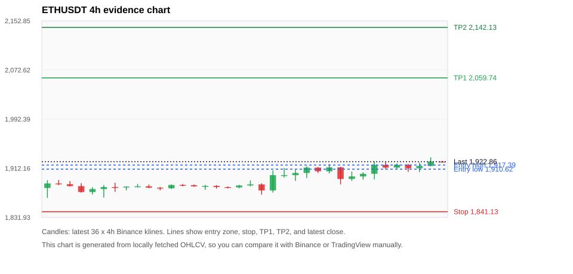
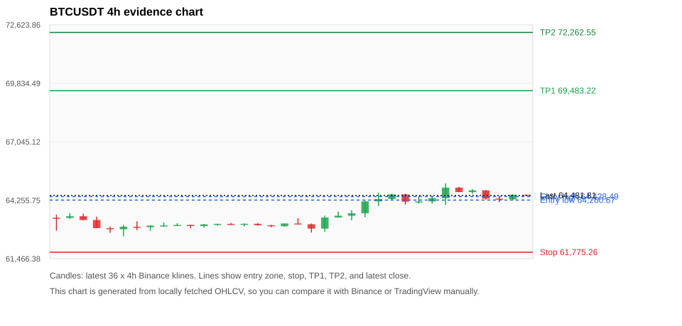
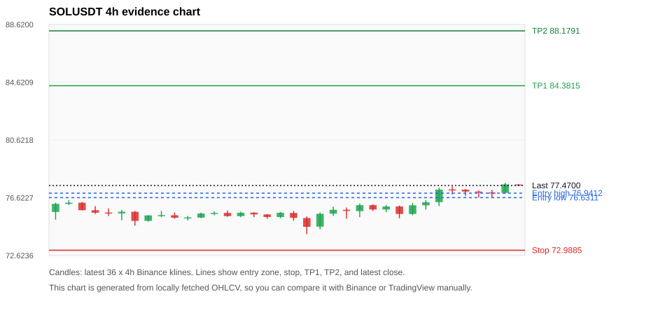
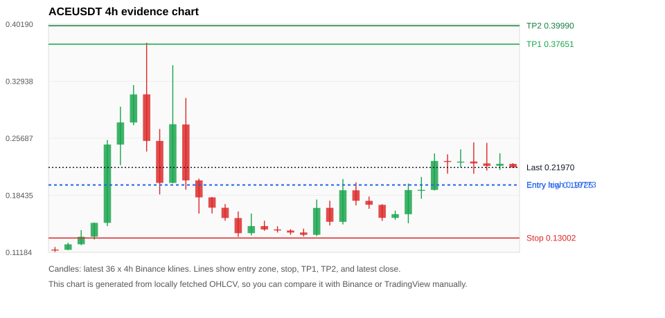
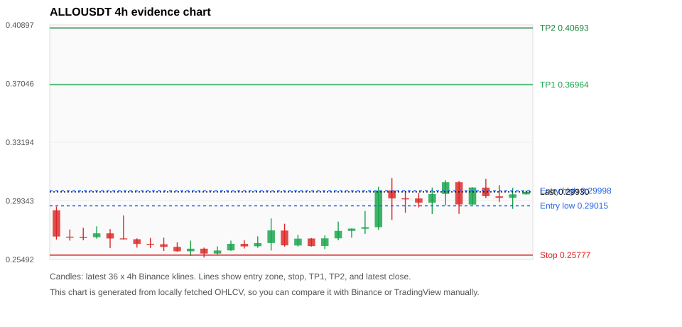

# Crypto 市场扫描报告 v1

- 报告时间：2026-08-19 20:06:47 CST
- Run ID：`20260819_120504_2b859bce`
- Run type：`daily_full`
- Data validation mode：`paper`
- 数据来源：SQLite
- 报告版本：v1
- 扫描 ID：110604e1204a
- 数据源：Binance public spot API + CoinGecko/CoinMarketCap cross-check
- 过滤条件：USDT spot; 24h quote volume >= 30,000,000; trades >= 30,000; exclude stables/leveraged tokens; analyze 1h/4h/1d klines
- 默认单笔风险：账户权益的 1.00%

## 限制说明

- 交易信号仍以 Binance 现货公开 K 线为主源；外部数据源用于一致性复核。
- 结果是研究和模拟盘计划，不是确定收益或实盘下单指令。
- 历史长度过滤：候选币至少需要 180 根 1d K 线。
- 数据质量验证池：先验证 score 排名前 min(top_n * 2, 10) 的候选，再按 action + score 补足最终名单。
- 大盘环境过滤：NEUTRAL; BTC/ETH 大盘未完全确认强势，山寨币买入候选降级为观察。 BTC 7d=1.5781666002152805; ETH 7d=2.2895930971747136.
- Data cross-validation enabled: Binance primary source plus CoinGecko; CoinMarketCap is checked when an API key is configured.
- ACEUSDT validation state BLOCKED: BLOCKED: [BINANCE_KLINE_EXTREME_RANGE] Binance candle range exceeds 40%.; [BINANCE_KLINE_EXTREME_RANGE] Binance candle range exceeds 40%.; [BINANCE_KLINE_EXTREME_RANGE] Binance candle range exceeds 40%.; [BINANCE_KLINE_EXTREME_RANGE] Binance candle range exceeds 40%.; [BINANCE_KLINE_EXTREME_RANGE] Binance candle range exceeds 40%.; [BINANCE_KLINE_EXTREME_RANGE] Binance candle range exceeds 40%.; [BINANCE_KLINE_EXTREME_RANGE] Binance candle range exceeds 40%.; [BINANCE_KLINE_EXTREME_RANGE] Binance candle range exceeds 40%.; [BINANCE_KLINE_EXTREME_RANGE] Binance candle range exceeds 40%.; [BINANCE_KLINE_EXTREME_RANGE] Binance candle range exceeds 40%.; [BINANCE_KLINE_EXTREME_RANGE] Binance candle range exceeds 40%.; [BINANCE_KLINE_EXTREME_RANGE] Binance candle range exceeds 40%.; [BINANCE_KLINE_EXTREME_RANGE] Binance candle range exceeds 40%.; [BINANCE_KLINE_EXTREME_RANGE] Binance candle range exceeds 40%.; [BINANCE_KLINE_EXTREME_RANGE] Binance candle range exceeds 40%.; [BINANCE_KLINE_EXTREME_RANGE] Binance candle range exceeds 40%.; [BINANCE_KLINE_EXTREME_RANGE] Binance candle range exceeds 40%.; [BINANCE_KLINE_EXTREME_RANGE] Binance candle range exceeds 40%.; [BINANCE_KLINE_EXTREME_RANGE] Binance candle range exceeds 40%.; [BINANCE_KLINE_EXTREME_RANGE] Binance candle range exceeds 40%.; [BINANCE_KLINE_EXTREME_RANGE] Binance candle range exceeds 40%.; [BINANCE_KLINE_EXTREME_RANGE] Binance candle range exceeds 40%.; [EXTERNAL_24H_DIFF_WARNING] 24h change diff 9.10 points exceeds warning threshold; [EXTERNAL_IDENTITY_AMBIGUOUS] CoinMarketCap symbol mapping has 8 matches; selected lowest cmc_rank
- ETHUSDT validation state DEGRADED: DEGRADED: [EXTERNAL_IDENTITY_AMBIGUOUS] CoinMarketCap symbol mapping has 6 matches; selected lowest cmc_rank
- BTCUSDT validation state DEGRADED: DEGRADED: [EXTERNAL_IDENTITY_AMBIGUOUS] CoinMarketCap symbol mapping has 13 matches; selected lowest cmc_rank
- ALLOUSDT validation state BLOCKED: BLOCKED: [BINANCE_KLINE_EXTREME_RANGE] Binance candle range exceeds 40%.; [BINANCE_KLINE_EXTREME_RANGE] Binance candle range exceeds 40%.; [BINANCE_KLINE_EXTREME_RANGE] Binance candle range exceeds 40%.; [BINANCE_KLINE_EXTREME_RANGE] Binance candle range exceeds 40%.; [BINANCE_KLINE_EXTREME_RANGE] Binance candle range exceeds 40%.; [BINANCE_KLINE_EXTREME_RANGE] Binance candle range exceeds 40%.; [BINANCE_KLINE_EXTREME_RANGE] Binance candle range exceeds 40%.; [BINANCE_KLINE_EXTREME_RANGE] Binance candle range exceeds 40%.; [BINANCE_KLINE_EXTREME_RANGE] Binance candle range exceeds 40%.; [BINANCE_KLINE_EXTREME_RANGE] Binance candle range exceeds 40%.; [BINANCE_KLINE_EXTREME_RANGE] Binance candle range exceeds 40%.
- SOLUSDT validation state DEGRADED: DEGRADED: [EXTERNAL_IDENTITY_AMBIGUOUS] CoinMarketCap symbol mapping has 8 matches; selected lowest cmc_rank
- ZECUSDT validation state BLOCKED: BLOCKED: [BINANCE_KLINE_EXTREME_RANGE] Binance candle range exceeds 40%.; [BINANCE_KLINE_EXTREME_RANGE] Binance candle range exceeds 40%.; [EXTERNAL_PROVIDER_RATE_LIMITED] Provider rate limited request for https://api.coingecko.com/api/v3/coins/markets?vs_currency=usd&ids=zcash&price_change_percentage=24h&per_page=1&page=1: HTTP 429; [EXTERNAL_IDENTITY_AMBIGUOUS] CoinMarketCap symbol mapping has 2 matches; selected lowest cmc_rank
- XRPUSDT validation state DEGRADED: DEGRADED: [EXTERNAL_PROVIDER_RATE_LIMITED] Provider rate limited request for https://api.coingecko.com/api/v3/coins/markets?vs_currency=usd&ids=ripple&price_change_percentage=24h&per_page=1&page=1: HTTP 429; [EXTERNAL_IDENTITY_AMBIGUOUS] CoinMarketCap symbol mapping has 3 matches; selected lowest cmc_rank
- BNBUSDT validation state DEGRADED: DEGRADED: [EXTERNAL_PROVIDER_RATE_LIMITED] Provider rate limited request for https://api.coingecko.com/api/v3/coins/markets?vs_currency=usd&ids=binancecoin&price_change_percentage=24h&per_page=1&page=1: HTTP 429; [EXTERNAL_IDENTITY_AMBIGUOUS] CoinMarketCap symbol mapping has 4 matches; selected lowest cmc_rank

## 5 个候选交易计划

| Rank | Coin | Action | Setup | Entry Zone | Stop Loss | TP1 | TP2 / Exit Rule | R/R | Verdict |
|---:|---|---|---|---:|---:|---:|---|---:|---|
| 1 | `ETH` | `BUY_CANDIDATE` | 回踩支撑/4h EMA 附近 | 1,910.62 - 1,917.39 | 1,841.13 | 2,059.74 | 2,142.13 或跌破 4h 关键支撑 | 2.00-3.13 | 可考虑 |
| 2 | `BTC` | `BUY_CANDIDATE` | 回踩支撑/4h EMA 附近 | 64,260.67 - 64,428.49 | 61,775.26 | 69,483.22 | 72,262.55 或跌破 4h 关键支撑 | 2.00-3.08 | 可考虑 |
| 3 | `SOL` | `BUY_CANDIDATE` | 回踩支撑/4h EMA 附近 | 76.6311 - 76.9412 | 72.9885 | 84.3815 | 88.1791 或跌破 4h 关键支撑 | 2.00-3.00 | 可考虑 |
| 4 | `ACE` | `WATCH_ONLY` | 涨幅较远，只等深回调 | 0.19725 - 0.19773 | 0.13002 | 0.37651 | 0.39990 或跌破 4h 关键支撑 | 2.65-3.00 | 只观察 |
| 5 | `ALLO` | `WATCH_ONLY` | 回踩支撑/4h EMA 附近 | 0.29015 - 0.29998 | 0.25777 | 0.36964 | 0.40693 或跌破 4h 关键支撑 | 2.00-3.00 | 只观察 |

## 数据交叉验证摘要

价格差异以 Binance 当前价为基准；成交量口径不同，Binance 是 USDT 现货成交额，CoinGecko/CoinMarketCap 通常是全市场成交量。

| Rank | Coin | State | Identity | Max Price Diff | Max 24h Diff | Issue Codes | Message |
|---:|---|---|---|---:|---:|---|---|
| 1 | `ETH` | DEGRADED (DATA_WARNING) | UNCONFIRMED | 0.07% | 0.17 pts | EXTERNAL_IDENTITY_AMBIGUOUS | DEGRADED: [EXTERNAL_IDENTITY_AMBIGUOUS] CoinMarketCap symbol mapping has 6 matches; selected lowest cmc_rank |
| 2 | `BTC` | DEGRADED (DATA_WARNING) | UNCONFIRMED | 0.07% | 0.18 pts | EXTERNAL_IDENTITY_AMBIGUOUS | DEGRADED: [EXTERNAL_IDENTITY_AMBIGUOUS] CoinMarketCap symbol mapping has 13 matches; selected lowest cmc_rank |
| 3 | `SOL` | DEGRADED (DATA_WARNING) | UNCONFIRMED | 0.06% | 0.87 pts | EXTERNAL_IDENTITY_AMBIGUOUS | DEGRADED: [EXTERNAL_IDENTITY_AMBIGUOUS] CoinMarketCap symbol mapping has 8 matches; selected lowest cmc_rank |
| 4 | `ACE` | BLOCKED (DATA_ERROR) | UNCONFIRMED | 0.64% | 9.10 pts | BINANCE_KLINE_EXTREME_RANGE, EXTERNAL_24H_DIFF_WARNING, EXTERNAL_IDENTITY_AMBIGUOUS | BLOCKED: [BINANCE_KLINE_EXTREME_RANGE] Binance candle range exceeds 40%.; [BINANCE_KLINE_EXTREME_RANGE] Binance candle range exceeds 40%.; [BINANCE_KLINE_EXTREME_RANGE] Binance candle range exceeds 40%.; [BINANCE_KLINE_EXTREME_RANGE] Binance candle range exceeds 40%.; [BINANCE_KLINE_EXTREME_RANGE] Binance candle range exceeds 40%.; [BINANCE_KLINE_EXTREME_RANGE] Binance candle range exceeds 40%.; [BINANCE_KLINE_EXTREME_RANGE] Binance candle range exceeds 40%.; [BINANCE_KLINE_EXTREME_RANGE] Binance candle range exceeds 40%.; [BINANCE_KLINE_EXTREME_RANGE] Binance candle range exceeds 40%.; [BINANCE_KLINE_EXTREME_RANGE] Binance candle range exceeds 40%.; [BINANCE_KLINE_EXTREME_RANGE] Binance candle range exceeds 40%.; [BINANCE_KLINE_EXTREME_RANGE] Binance candle range exceeds 40%.; [BINANCE_KLINE_EXTREME_RANGE] Binance candle range exceeds 40%.; [BINANCE_KLINE_EXTREME_RANGE] Binance candle range exceeds 40%.; [BINANCE_KLINE_EXTREME_RANGE] Binance candle range exceeds 40%.; [BINANCE_KLINE_EXTREME_RANGE] Binance candle range exceeds 40%.; [BINANCE_KLINE_EXTREME_RANGE] Binance candle range exceeds 40%.; [BINANCE_KLINE_EXTREME_RANGE] Binance candle range exceeds 40%.; [BINANCE_KLINE_EXTREME_RANGE] Binance candle range exceeds 40%.; [BINANCE_KLINE_EXTREME_RANGE] Binance candle range exceeds 40%.; [BINANCE_KLINE_EXTREME_RANGE] Binance candle range exceeds 40%.; [BINANCE_KLINE_EXTREME_RANGE] Binance candle range exceeds 40%.; [EXTERNAL_24H_DIFF_WARNING] 24h change diff 9.10 points exceeds warning threshold; [EXTERNAL_IDENTITY_AMBIGUOUS] CoinMarketCap symbol mapping has 8 matches; selected lowest cmc_rank |
| 5 | `ALLO` | BLOCKED (DATA_ERROR) | CONFIRMED | 0.37% | 2.19 pts | BINANCE_KLINE_EXTREME_RANGE | BLOCKED: [BINANCE_KLINE_EXTREME_RANGE] Binance candle range exceeds 40%.; [BINANCE_KLINE_EXTREME_RANGE] Binance candle range exceeds 40%.; [BINANCE_KLINE_EXTREME_RANGE] Binance candle range exceeds 40%.; [BINANCE_KLINE_EXTREME_RANGE] Binance candle range exceeds 40%.; [BINANCE_KLINE_EXTREME_RANGE] Binance candle range exceeds 40%.; [BINANCE_KLINE_EXTREME_RANGE] Binance candle range exceeds 40%.; [BINANCE_KLINE_EXTREME_RANGE] Binance candle range exceeds 40%.; [BINANCE_KLINE_EXTREME_RANGE] Binance candle range exceeds 40%.; [BINANCE_KLINE_EXTREME_RANGE] Binance candle range exceeds 40%.; [BINANCE_KLINE_EXTREME_RANGE] Binance candle range exceeds 40%.; [BINANCE_KLINE_EXTREME_RANGE] Binance candle range exceeds 40%. |

## 候选币说明

### 1. ETH `ETHUSDT`



- 入选原因：回踩支撑/4h EMA 附近；24h +1.03%，7d +1.13%，4h RSI 61.88，24h 成交额 $286.7M。
- 交易失效条件：跌破 1841.1325 或 4h 收盘重新失守关键支撑。
- 主要风险：主要风险是大盘同步回撤；External validation is degraded; this candidate is not a clean data sample.；Paper mode allows degraded validation; candidate is excluded from clean-data samples.。
- 数据交叉验证：DEGRADED / DATA_WARNING；身份=UNCONFIRMED；DEGRADED: [EXTERNAL_IDENTITY_AMBIGUOUS] CoinMarketCap symbol mapping has 6 matches; selected lowest cmc_rank

#### 可点击人工验证

- [Binance 交易页](https://www.binance.com/en/trade/ETH_USDT)
- [TradingView 图表](https://www.tradingview.com/chart/?symbol=BINANCE%3AETHUSDT)
- [CoinGecko 搜索](https://www.coingecko.com/en/search?query=ETH)
- [CoinMarketCap 搜索](https://coinmarketcap.com/search/?q=ETH)

#### 多数据源对照

| Source | Status | Identity | Blocking | Asset ID | Price | 24h Change | 24h Volume | Price Diff | 24h Diff | Updated | Issue Codes | Message |
|---|---|---|---:|---|---:|---:|---:|---:|---:|---|---|---|
| Binance | DATA_OK | CONFIRMED | no | ETHUSDT | 1,922.86 | +1.03% | $286.7M | 0.00% | 0.00 pts | 2026-08-19T12:05:50+00:00 | none | Primary market data source passed health checks. |
| CoinGecko | DATA_OK | CONFIRMED | no | ethereum | 1,921.61 | +1.20% | $6.06B | 0.07% | 0.17 pts | 2026-08-19T12:04:30.000Z | none | External source agrees with Binance within thresholds. |
| CoinMarketCap | DATA_WARNING | UNCONFIRMED | no | 1027 | 1,921.52 | +1.09% | $6.85B | 0.07% | 0.06 pts | 2026-08-19T12:05:00.000Z | EXTERNAL_IDENTITY_AMBIGUOUS | [EXTERNAL_IDENTITY_AMBIGUOUS] CoinMarketCap symbol mapping has 6 matches; selected lowest cmc_rank |

#### 指标证据

| 指标 | 数值 | 人工核对用途 |
|---|---:|---|
| 当前价 | 1,922.86 | 与 Binance/TradingView 当前价格对照 |
| 24h 涨跌 | +1.03% | 与交易所 24h 涨跌对照 |
| 7d 涨跌 | +1.13% | 判断短线趋势是否延续 |
| 4h EMA20 | 1,906.80 | 判断短期趋势支撑 |
| 4h EMA50 | 1,897.94 | 判断中期趋势支撑 |
| 1d EMA20 | 1,892.38 | 判断日线趋势 |
| 1d EMA50 | 1,872.02 | 判断日线趋势 |
| 4h RSI14 | 61.88 | 判断是否过热/过弱 |
| 4h ATR14 | 15.1279 | 推导止损和入场缓冲 |
| 最近 18 根 4h 最低点 | 1,869.17 | 支撑/止损参考 |
| 最近 36 根 4h 最高点 | 1,929.94 | TP/压力参考 |
| 支撑位 | 1,906.80 | 入场区间推导基础 |

#### 交易计划推导

- 支撑位 = 最近低点、4h EMA20、4h EMA50、1d EMA20 中不高于当前价的最高有效支撑 = `1,906.80`。
- 入场区间 = 支撑位附近 + ATR 缓冲 = `1,910.62 - 1,917.39`。
- 止损 = min(最近 18 根 4h 最低点 * 0.985, 入场中位价 - 1.15 * ATR14) = `1,841.13`。
- TP1 = max(最近 36 根 4h 最高点 * 0.995, 入场中位价 + 2R) = `2,059.74`。
- TP2 = max(入场中位价 + 3R, TP1 * 1.04) = `2,142.13`。

#### 最近 10 根 4h K线

| UTC 开盘时间 | Open | High | Low | Close | Quote Volume | Trades |
|---|---:|---:|---:|---:|---:|---:|
| 2026-08-18T00:00+00:00 | 1,913.59 | 1,914.38 | 1,885.78 | 1,894.69 | $52.7M | 261227 |
| 2026-08-18T04:00+00:00 | 1,894.68 | 1,906.94 | 1,891.53 | 1,898.84 | $37.1M | 140792 |
| 2026-08-18T08:00+00:00 | 1,898.83 | 1,905.65 | 1,893.80 | 1,903.11 | $35.8M | 178744 |
| 2026-08-18T12:00+00:00 | 1,903.12 | 1,923.27 | 1,894.00 | 1,917.70 | $81.5M | 348899 |
| 2026-08-18T16:00+00:00 | 1,917.71 | 1,922.30 | 1,910.81 | 1,913.28 | $39.5M | 189159 |
| 2026-08-18T20:00+00:00 | 1,913.28 | 1,920.10 | 1,910.87 | 1,917.85 | $28.6M | 110457 |
| 2026-08-19T00:00+00:00 | 1,917.85 | 1,919.15 | 1,906.19 | 1,912.15 | $42.6M | 209935 |
| 2026-08-19T04:00+00:00 | 1,912.15 | 1,921.32 | 1,906.00 | 1,916.01 | $47.2M | 148550 |
| 2026-08-19T08:00+00:00 | 1,916.01 | 1,929.94 | 1,915.32 | 1,923.06 | $45.8M | 189484 |
| 2026-08-19T12:00+00:00 | 1,923.06 | 1,924.03 | 1,922.85 | 1,922.86 | $1.8M | 4404 |

### 2. BTC `BTCUSDT`



- 入选原因：回踩支撑/4h EMA 附近；24h +0.22%，7d +1.01%，4h RSI 66.06，24h 成交额 $648.5M。
- 交易失效条件：跌破 61775.26 或 4h 收盘重新失守关键支撑。
- 主要风险：主要风险是大盘同步回撤；External validation is degraded; this candidate is not a clean data sample.；Paper mode allows degraded validation; candidate is excluded from clean-data samples.。
- 数据交叉验证：DEGRADED / DATA_WARNING；身份=UNCONFIRMED；DEGRADED: [EXTERNAL_IDENTITY_AMBIGUOUS] CoinMarketCap symbol mapping has 13 matches; selected lowest cmc_rank

#### 可点击人工验证

- [Binance 交易页](https://www.binance.com/en/trade/BTC_USDT)
- [TradingView 图表](https://www.tradingview.com/chart/?symbol=BINANCE%3ABTCUSDT)
- [CoinGecko 搜索](https://www.coingecko.com/en/search?query=BTC)
- [CoinMarketCap 搜索](https://coinmarketcap.com/search/?q=BTC)

#### 多数据源对照

| Source | Status | Identity | Blocking | Asset ID | Price | 24h Change | 24h Volume | Price Diff | 24h Diff | Updated | Issue Codes | Message |
|---|---|---|---:|---|---:|---:|---:|---:|---:|---|---|---|
| Binance | DATA_OK | CONFIRMED | no | BTCUSDT | 64,481.81 | +0.22% | $648.5M | 0.00% | 0.00 pts | 2026-08-19T12:05:50+00:00 | none | Primary market data source passed health checks. |
| CoinGecko | DATA_OK | CONFIRMED | no | bitcoin | 64,435.00 | +0.40% | $16.63B | 0.07% | 0.18 pts | 2026-08-19T12:04:30.000Z | none | External source agrees with Binance within thresholds. |
| CoinMarketCap | DATA_WARNING | UNCONFIRMED | no | 1 | 64,437.06 | +0.30% | $16.99B | 0.07% | 0.08 pts | 2026-08-19T12:05:00.000Z | EXTERNAL_IDENTITY_AMBIGUOUS | [EXTERNAL_IDENTITY_AMBIGUOUS] CoinMarketCap symbol mapping has 13 matches; selected lowest cmc_rank |

#### 指标证据

| 指标 | 数值 | 人工核对用途 |
|---|---:|---|
| 当前价 | 64,481.81 | 与 Binance/TradingView 当前价格对照 |
| 24h 涨跌 | +0.22% | 与交易所 24h 涨跌对照 |
| 7d 涨跌 | +1.01% | 判断短线趋势是否延续 |
| 4h EMA20 | 64,132.40 | 判断短期趋势支撑 |
| 4h EMA50 | 63,893.51 | 判断中期趋势支撑 |
| 1d EMA20 | 63,998.20 | 判断日线趋势 |
| 1d EMA50 | 64,370.92 | 判断日线趋势 |
| 4h RSI14 | 66.06 | 判断是否过热/过弱 |
| 4h ATR14 | 422.99 | 推导止损和入场缓冲 |
| 最近 18 根 4h 最低点 | 62,716.00 | 支撑/止损参考 |
| 最近 36 根 4h 最高点 | 65,058.81 | TP/压力参考 |
| 支撑位 | 64,132.40 | 入场区间推导基础 |

#### 交易计划推导

- 支撑位 = 最近低点、4h EMA20、4h EMA50、1d EMA20 中不高于当前价的最高有效支撑 = `64,132.40`。
- 入场区间 = 支撑位附近 + ATR 缓冲 = `64,260.67 - 64,428.49`。
- 止损 = min(最近 18 根 4h 最低点 * 0.985, 入场中位价 - 1.15 * ATR14) = `61,775.26`。
- TP1 = max(最近 36 根 4h 最高点 * 0.995, 入场中位价 + 2R) = `69,483.22`。
- TP2 = max(入场中位价 + 3R, TP1 * 1.04) = `72,262.55`。

#### 最近 10 根 4h K线

| UTC 开盘时间 | Open | High | Low | Close | Quote Volume | Trades |
|---|---:|---:|---:|---:|---:|---:|
| 2026-08-18T00:00+00:00 | 64,532.11 | 64,568.46 | 64,047.73 | 64,185.01 | $111.2M | 246058 |
| 2026-08-18T04:00+00:00 | 64,185.00 | 64,446.00 | 64,090.00 | 64,198.97 | $202.5M | 253329 |
| 2026-08-18T08:00+00:00 | 64,198.97 | 64,402.35 | 64,087.98 | 64,351.19 | $77.2M | 197005 |
| 2026-08-18T12:00+00:00 | 64,351.18 | 65,058.81 | 64,027.85 | 64,855.06 | $238.0M | 541934 |
| 2026-08-18T16:00+00:00 | 64,855.06 | 64,891.81 | 64,642.36 | 64,643.26 | $79.3M | 211297 |
| 2026-08-18T20:00+00:00 | 64,643.27 | 64,780.00 | 64,562.25 | 64,725.42 | $51.3M | 158396 |
| 2026-08-19T00:00+00:00 | 64,725.42 | 64,736.27 | 64,278.00 | 64,330.71 | $88.2M | 258329 |
| 2026-08-19T04:00+00:00 | 64,330.70 | 64,409.93 | 64,166.00 | 64,296.00 | $117.2M | 184917 |
| 2026-08-19T08:00+00:00 | 64,296.01 | 64,539.05 | 64,255.00 | 64,515.63 | $74.6M | 150786 |
| 2026-08-19T12:00+00:00 | 64,515.62 | 64,515.63 | 64,481.80 | 64,481.81 | $1.5M | 4920 |

### 3. SOL `SOLUSDT`



- 入选原因：回踩支撑/4h EMA 附近；24h +1.33%，7d +1.63%，4h RSI 70.49，24h 成交额 $99.2M。
- 交易失效条件：跌破 72.9885 或 4h 收盘重新失守关键支撑。
- 主要风险：主要风险是大盘同步回撤；External validation is degraded; this candidate is not a clean data sample.；Paper mode allows degraded validation; candidate is excluded from clean-data samples.。
- 数据交叉验证：DEGRADED / DATA_WARNING；身份=UNCONFIRMED；DEGRADED: [EXTERNAL_IDENTITY_AMBIGUOUS] CoinMarketCap symbol mapping has 8 matches; selected lowest cmc_rank

#### 可点击人工验证

- [Binance 交易页](https://www.binance.com/en/trade/SOL_USDT)
- [TradingView 图表](https://www.tradingview.com/chart/?symbol=BINANCE%3ASOLUSDT)
- [CoinGecko 搜索](https://www.coingecko.com/en/search?query=SOL)
- [CoinMarketCap 搜索](https://coinmarketcap.com/search/?q=SOL)

#### 多数据源对照

| Source | Status | Identity | Blocking | Asset ID | Price | 24h Change | 24h Volume | Price Diff | 24h Diff | Updated | Issue Codes | Message |
|---|---|---|---:|---|---:|---:|---:|---:|---:|---|---|---|
| Binance | DATA_OK | CONFIRMED | no | SOLUSDT | 77.4700 | +1.33% | $99.2M | 0.00% | 0.00 pts | 2026-08-19T12:05:50+00:00 | none | Primary market data source passed health checks. |
| CoinGecko | DATA_OK | CONFIRMED | no | solana | 77.4200 | +2.20% | $1.37B | 0.06% | 0.87 pts | 2026-08-19T12:04:30.000Z | none | External source agrees with Binance within thresholds. |
| CoinMarketCap | DATA_WARNING | UNCONFIRMED | no | 5426 | 77.4443 | +1.50% | $1.43B | 0.03% | 0.17 pts | 2026-08-19T12:05:00.000Z | EXTERNAL_IDENTITY_AMBIGUOUS | [EXTERNAL_IDENTITY_AMBIGUOUS] CoinMarketCap symbol mapping has 8 matches; selected lowest cmc_rank |

#### 指标证据

| 指标 | 数值 | 人工核对用途 |
|---|---:|---|
| 当前价 | 77.4700 | 与 Binance/TradingView 当前价格对照 |
| 24h 涨跌 | +1.33% | 与交易所 24h 涨跌对照 |
| 7d 涨跌 | +1.63% | 判断短线趋势是否延续 |
| 4h EMA20 | 76.4782 | 判断短期趋势支撑 |
| 4h EMA50 | 75.9649 | 判断中期趋势支撑 |
| 1d EMA20 | 75.5787 | 判断日线趋势 |
| 1d EMA50 | 75.6294 | 判断日线趋势 |
| 4h RSI14 | 70.49 | 判断是否过热/过弱 |
| 4h ATR14 | 0.66143 | 推导止损和入场缓冲 |
| 最近 18 根 4h 最低点 | 74.1000 | 支撑/止损参考 |
| 最近 36 根 4h 最高点 | 77.6500 | TP/压力参考 |
| 支撑位 | 76.4782 | 入场区间推导基础 |

#### 交易计划推导

- 支撑位 = 最近低点、4h EMA20、4h EMA50、1d EMA20 中不高于当前价的最高有效支撑 = `76.4782`。
- 入场区间 = 支撑位附近 + ATR 缓冲 = `76.6311 - 76.9412`。
- 止损 = min(最近 18 根 4h 最低点 * 0.985, 入场中位价 - 1.15 * ATR14) = `72.9885`。
- TP1 = max(最近 36 根 4h 最高点 * 0.995, 入场中位价 + 2R) = `84.3815`。
- TP2 = max(入场中位价 + 3R, TP1 * 1.04) = `88.1791`。

#### 最近 10 根 4h K线

| UTC 开盘时间 | Open | High | Low | Close | Quote Volume | Trades |
|---|---:|---:|---:|---:|---:|---:|
| 2026-08-18T00:00+00:00 | 76.0200 | 76.0900 | 75.2000 | 75.5000 | $16.9M | 63050 |
| 2026-08-18T04:00+00:00 | 75.5000 | 76.2700 | 75.4100 | 76.1000 | $19.7M | 63130 |
| 2026-08-18T08:00+00:00 | 76.1000 | 76.4500 | 75.8000 | 76.3100 | $17.0M | 50654 |
| 2026-08-18T12:00+00:00 | 76.3200 | 77.3300 | 76.0500 | 77.1900 | $31.1M | 101149 |
| 2026-08-18T16:00+00:00 | 77.2000 | 77.4100 | 76.8500 | 77.1800 | $12.6M | 49874 |
| 2026-08-18T20:00+00:00 | 77.1800 | 77.2300 | 76.7500 | 77.0500 | $13.9M | 44049 |
| 2026-08-19T00:00+00:00 | 77.0500 | 77.1200 | 76.6400 | 77.0000 | $12.9M | 48472 |
| 2026-08-19T04:00+00:00 | 76.9900 | 77.1700 | 76.6300 | 76.9600 | $12.0M | 36336 |
| 2026-08-19T08:00+00:00 | 76.9600 | 77.6500 | 76.9200 | 77.5500 | $17.6M | 38823 |
| 2026-08-19T12:00+00:00 | 77.5400 | 77.5600 | 77.4500 | 77.4700 | $449,653 | 975 |

### 4. ACE `ACEUSDT`



- 入选原因：涨幅较远，只等深回调；24h +14.10%，7d +95.64%，4h RSI 71.32，24h 成交额 $53.7M。
- 交易失效条件：跌破 0.13002 或 4h 收盘重新失守关键支撑。
- 主要风险：距离支撑偏远，不能追市价；24h 振幅较大，回撤风险高；Blocking data-quality issue detected; paper plan creation is not allowed.。
- 数据交叉验证：BLOCKED / DATA_ERROR；身份=UNCONFIRMED；BLOCKED: [BINANCE_KLINE_EXTREME_RANGE] Binance candle range exceeds 40%.; [BINANCE_KLINE_EXTREME_RANGE] Binance candle range exceeds 40%.; [BINANCE_KLINE_EXTREME_RANGE] Binance candle range exceeds 40%.; [BINANCE_KLINE_EXTREME_RANGE] Binance candle range exceeds 40%.; [BINANCE_KLINE_EXTREME_RANGE] Binance candle range exceeds 40%.; [BINANCE_KLINE_EXTREME_RANGE] Binance candle range exceeds 40%.; [BINANCE_KLINE_EXTREME_RANGE] Binance candle range exceeds 40%.; [BINANCE_KLINE_EXTREME_RANGE] Binance candle range exceeds 40%.; [BINANCE_KLINE_EXTREME_RANGE] Binance candle range exceeds 40%.; [BINANCE_KLINE_EXTREME_RANGE] Binance candle range exceeds 40%.; [BINANCE_KLINE_EXTREME_RANGE] Binance candle range exceeds 40%.; [BINANCE_KLINE_EXTREME_RANGE] Binance candle range exceeds 40%.; [BINANCE_KLINE_EXTREME_RANGE] Binance candle range exceeds 40%.; [BINANCE_KLINE_EXTREME_RANGE] Binance candle range exceeds 40%.; [BINANCE_KLINE_EXTREME_RANGE] Binance candle range exceeds 40%.; [BINANCE_KLINE_EXTREME_RANGE] Binance candle range exceeds 40%.; [BINANCE_KLINE_EXTREME_RANGE] Binance candle range exceeds 40%.; [BINANCE_KLINE_EXTREME_RANGE] Binance candle range exceeds 40%.; [BINANCE_KLINE_EXTREME_RANGE] Binance candle range exceeds 40%.; [BINANCE_KLINE_EXTREME_RANGE] Binance candle range exceeds 40%.; [BINANCE_KLINE_EXTREME_RANGE] Binance candle range exceeds 40%.; [BINANCE_KLINE_EXTREME_RANGE] Binance candle range exceeds 40%.; [EXTERNAL_24H_DIFF_WARNING] 24h change diff 9.10 points exceeds warning threshold; [EXTERNAL_IDENTITY_AMBIGUOUS] CoinMarketCap symbol mapping has 8 matches; selected lowest cmc_rank

#### 可点击人工验证

- [Binance 交易页](https://www.binance.com/en/trade/ACE_USDT)
- [TradingView 图表](https://www.tradingview.com/chart/?symbol=BINANCE%3AACEUSDT)
- [CoinGecko 搜索](https://www.coingecko.com/en/search?query=ACE)
- [CoinMarketCap 搜索](https://coinmarketcap.com/search/?q=ACE)

#### 多数据源对照

| Source | Status | Identity | Blocking | Asset ID | Price | 24h Change | 24h Volume | Price Diff | 24h Diff | Updated | Issue Codes | Message |
|---|---|---|---:|---|---:|---:|---:|---:|---:|---|---|---|
| Binance | DATA_ERROR | CONFIRMED | yes | ACEUSDT | 0.21970 | +14.10% | $53.7M | 0.00% | 0.00 pts | 2026-08-19T12:05:50+00:00 | BINANCE_KLINE_EXTREME_RANGE | [BINANCE_KLINE_EXTREME_RANGE] Binance candle range exceeds 40%.; [BINANCE_KLINE_EXTREME_RANGE] Binance candle range exceeds 40%.; [BINANCE_KLINE_EXTREME_RANGE] Binance candle range exceeds 40%.; [BINANCE_KLINE_EXTREME_RANGE] Binance candle range exceeds 40%.; [BINANCE_KLINE_EXTREME_RANGE] Binance candle range exceeds 40%.; [BINANCE_KLINE_EXTREME_RANGE] Binance candle range exceeds 40%.; [BINANCE_KLINE_EXTREME_RANGE] Binance candle range exceeds 40%.; [BINANCE_KLINE_EXTREME_RANGE] Binance candle range exceeds 40%.; [BINANCE_KLINE_EXTREME_RANGE] Binance candle range exceeds 40%.; [BINANCE_KLINE_EXTREME_RANGE] Binance candle range exceeds 40%.; [BINANCE_KLINE_EXTREME_RANGE] Binance candle range exceeds 40%.; [BINANCE_KLINE_EXTREME_RANGE] Binance candle range exceeds 40%.; [BINANCE_KLINE_EXTREME_RANGE] Binance candle range exceeds 40%.; [BINANCE_KLINE_EXTREME_RANGE] Binance candle range exceeds 40%.; [BINANCE_KLINE_EXTREME_RANGE] Binance candle range exceeds 40%.; [BINANCE_KLINE_EXTREME_RANGE] Binance candle range exceeds 40%.; [BINANCE_KLINE_EXTREME_RANGE] Binance candle range exceeds 40%.; [BINANCE_KLINE_EXTREME_RANGE] Binance candle range exceeds 40%.; [BINANCE_KLINE_EXTREME_RANGE] Binance candle range exceeds 40%.; [BINANCE_KLINE_EXTREME_RANGE] Binance candle range exceeds 40%.; [BINANCE_KLINE_EXTREME_RANGE] Binance candle range exceeds 40%.; [BINANCE_KLINE_EXTREME_RANGE] Binance candle range exceeds 40%. |
| CoinGecko | DATA_WARNING | CONFIRMED | yes | endurance | 0.22111 | +23.20% | $186.4M | 0.64% | 9.10 pts | 2026-08-19T12:03:20.000Z | EXTERNAL_24H_DIFF_WARNING | [EXTERNAL_24H_DIFF_WARNING] 24h change diff 9.10 points exceeds warning threshold |
| CoinMarketCap | DATA_WARNING | UNCONFIRMED | no | 28674 | 0.22024 | +14.94% | $253.4M | 0.25% | 0.84 pts | 2026-08-19T12:05:00.000Z | EXTERNAL_IDENTITY_AMBIGUOUS | [EXTERNAL_IDENTITY_AMBIGUOUS] CoinMarketCap symbol mapping has 8 matches; selected lowest cmc_rank |

#### 指标证据

| 指标 | 数值 | 人工核对用途 |
|---|---:|---|
| 当前价 | 0.21970 | 与 Binance/TradingView 当前价格对照 |
| 24h 涨跌 | +14.10% | 与交易所 24h 涨跌对照 |
| 7d 涨跌 | +95.64% | 判断短线趋势是否延续 |
| 4h EMA20 | 0.19686 | 判断短期趋势支撑 |
| 4h EMA50 | 0.17077 | 判断中期趋势支撑 |
| 1d EMA20 | 0.14041 | 判断日线趋势 |
| 1d EMA50 | 0.11184 | 判断日线趋势 |
| 4h RSI14 | 71.32 | 判断是否过热/过弱 |
| 4h ATR14 | 0.02930 | 推导止损和入场缓冲 |
| 最近 18 根 4h 最低点 | 0.13200 | 支撑/止损参考 |
| 最近 36 根 4h 最高点 | 0.37840 | TP/压力参考 |
| 支撑位 | 0.19686 | 入场区间推导基础 |

#### 交易计划推导

- 支撑位 = 最近低点、4h EMA20、4h EMA50、1d EMA20 中不高于当前价的最高有效支撑 = `0.19686`。
- 入场区间 = 支撑位附近 + ATR 缓冲 = `0.19725 - 0.19773`。
- 止损 = min(最近 18 根 4h 最低点 * 0.985, 入场中位价 - 1.15 * ATR14) = `0.13002`。
- TP1 = max(最近 36 根 4h 最高点 * 0.995, 入场中位价 + 2R) = `0.37651`。
- TP2 = max(入场中位价 + 3R, TP1 * 1.04) = `0.39990`。

#### 最近 10 根 4h K线

| UTC 开盘时间 | Open | High | Low | Close | Quote Volume | Trades |
|---|---:|---:|---:|---:|---:|---:|
| 2026-08-18T00:00+00:00 | 0.15560 | 0.16480 | 0.15330 | 0.16040 | $2.7M | 36858 |
| 2026-08-18T04:00+00:00 | 0.16030 | 0.19940 | 0.14880 | 0.19100 | $9.2M | 101682 |
| 2026-08-18T08:00+00:00 | 0.19080 | 0.20770 | 0.17990 | 0.19130 | $8.8M | 91177 |
| 2026-08-18T12:00+00:00 | 0.19120 | 0.23760 | 0.19060 | 0.22800 | $15.4M | 131968 |
| 2026-08-18T16:00+00:00 | 0.22800 | 0.23650 | 0.21180 | 0.22680 | $7.9M | 83163 |
| 2026-08-18T20:00+00:00 | 0.22710 | 0.24270 | 0.21990 | 0.22720 | $6.3M | 60346 |
| 2026-08-19T00:00+00:00 | 0.22730 | 0.25160 | 0.21180 | 0.22490 | $9.2M | 85781 |
| 2026-08-19T04:00+00:00 | 0.22490 | 0.25100 | 0.21570 | 0.22180 | $7.8M | 81331 |
| 2026-08-19T08:00+00:00 | 0.22190 | 0.23780 | 0.21650 | 0.22440 | $7.1M | 72647 |
| 2026-08-19T12:00+00:00 | 0.22430 | 0.22520 | 0.21970 | 0.21970 | $208,802 | 2222 |

### 5. ALLO `ALLOUSDT`



- 入选原因：回踩支撑/4h EMA 附近；24h +0.81%，7d +5.72%，4h RSI 65.17，24h 成交额 $127.3M。
- 交易失效条件：跌破 0.2577745 或 4h 收盘重新失守关键支撑。
- 主要风险：日线趋势未完全确认；Blocking data-quality issue detected; paper plan creation is not allowed.；数据质量状态为 BLOCKED，买入候选降级为观察。
- 数据交叉验证：BLOCKED / DATA_ERROR；身份=CONFIRMED；BLOCKED: [BINANCE_KLINE_EXTREME_RANGE] Binance candle range exceeds 40%.; [BINANCE_KLINE_EXTREME_RANGE] Binance candle range exceeds 40%.; [BINANCE_KLINE_EXTREME_RANGE] Binance candle range exceeds 40%.; [BINANCE_KLINE_EXTREME_RANGE] Binance candle range exceeds 40%.; [BINANCE_KLINE_EXTREME_RANGE] Binance candle range exceeds 40%.; [BINANCE_KLINE_EXTREME_RANGE] Binance candle range exceeds 40%.; [BINANCE_KLINE_EXTREME_RANGE] Binance candle range exceeds 40%.; [BINANCE_KLINE_EXTREME_RANGE] Binance candle range exceeds 40%.; [BINANCE_KLINE_EXTREME_RANGE] Binance candle range exceeds 40%.; [BINANCE_KLINE_EXTREME_RANGE] Binance candle range exceeds 40%.; [BINANCE_KLINE_EXTREME_RANGE] Binance candle range exceeds 40%.

#### 可点击人工验证

- [Binance 交易页](https://www.binance.com/en/trade/ALLO_USDT)
- [TradingView 图表](https://www.tradingview.com/chart/?symbol=BINANCE%3AALLOUSDT)
- [CoinGecko 搜索](https://www.coingecko.com/en/search?query=ALLO)
- [CoinMarketCap 搜索](https://coinmarketcap.com/search/?q=ALLO)

#### 多数据源对照

| Source | Status | Identity | Blocking | Asset ID | Price | 24h Change | 24h Volume | Price Diff | 24h Diff | Updated | Issue Codes | Message |
|---|---|---|---:|---|---:|---:|---:|---:|---:|---|---|---|
| Binance | DATA_ERROR | CONFIRMED | yes | ALLOUSDT | 0.29930 | +0.81% | $127.3M | 0.00% | 0.00 pts | 2026-08-19T12:05:50+00:00 | BINANCE_KLINE_EXTREME_RANGE | [BINANCE_KLINE_EXTREME_RANGE] Binance candle range exceeds 40%.; [BINANCE_KLINE_EXTREME_RANGE] Binance candle range exceeds 40%.; [BINANCE_KLINE_EXTREME_RANGE] Binance candle range exceeds 40%.; [BINANCE_KLINE_EXTREME_RANGE] Binance candle range exceeds 40%.; [BINANCE_KLINE_EXTREME_RANGE] Binance candle range exceeds 40%.; [BINANCE_KLINE_EXTREME_RANGE] Binance candle range exceeds 40%.; [BINANCE_KLINE_EXTREME_RANGE] Binance candle range exceeds 40%.; [BINANCE_KLINE_EXTREME_RANGE] Binance candle range exceeds 40%.; [BINANCE_KLINE_EXTREME_RANGE] Binance candle range exceeds 40%.; [BINANCE_KLINE_EXTREME_RANGE] Binance candle range exceeds 40%.; [BINANCE_KLINE_EXTREME_RANGE] Binance candle range exceeds 40%. |
| CoinGecko | DATA_OK | CONFIRMED | no | allora | 0.29941 | +3.00% | $222.3M | 0.04% | 2.19 pts | 2026-08-19T12:04:30.000Z | none | External source agrees with Binance within thresholds. |
| CoinMarketCap | DATA_OK | CONFIRMED | no | 38908 | 0.29820 | +0.26% | $325.7M | 0.37% | 0.55 pts | 2026-08-19T12:05:00.000Z | none | External source agrees with Binance within thresholds. |

#### 指标证据

| 指标 | 数值 | 人工核对用途 |
|---|---:|---|
| 当前价 | 0.29930 | 与 Binance/TradingView 当前价格对照 |
| 24h 涨跌 | +0.81% | 与交易所 24h 涨跌对照 |
| 7d 涨跌 | +5.72% | 判断短线趋势是否延续 |
| 4h EMA20 | 0.28957 | 判断短期趋势支撑 |
| 4h EMA50 | 0.28553 | 判断中期趋势支撑 |
| 1d EMA20 | 0.29970 | 判断日线趋势 |
| 1d EMA50 | 0.31854 | 判断日线趋势 |
| 4h RSI14 | 65.17 | 判断是否过热/过弱 |
| 4h ATR14 | 0.01488 | 推导止损和入场缓冲 |
| 最近 18 根 4h 最低点 | 0.26170 | 支撑/止损参考 |
| 最近 36 根 4h 最高点 | 0.30840 | TP/压力参考 |
| 支撑位 | 0.28957 | 入场区间推导基础 |

#### 交易计划推导

- 支撑位 = 最近低点、4h EMA20、4h EMA50、1d EMA20 中不高于当前价的最高有效支撑 = `0.28957`。
- 入场区间 = 支撑位附近 + ATR 缓冲 = `0.29015 - 0.29998`。
- 止损 = min(最近 18 根 4h 最低点 * 0.985, 入场中位价 - 1.15 * ATR14) = `0.25777`。
- TP1 = max(最近 36 根 4h 最高点 * 0.995, 入场中位价 + 2R) = `0.36964`。
- TP2 = max(入场中位价 + 3R, TP1 * 1.04) = `0.40693`。

#### 最近 10 根 4h K线

| UTC 开盘时间 | Open | High | Low | Close | Quote Volume | Trades |
|---|---:|---:|---:|---:|---:|---:|
| 2026-08-18T00:00+00:00 | 0.29510 | 0.30000 | 0.28560 | 0.29500 | $3.8M | 92958 |
| 2026-08-18T04:00+00:00 | 0.29500 | 0.29860 | 0.28910 | 0.29220 | $6.7M | 114314 |
| 2026-08-18T08:00+00:00 | 0.29220 | 0.30220 | 0.28480 | 0.29790 | $15.8M | 263504 |
| 2026-08-18T12:00+00:00 | 0.29800 | 0.30700 | 0.29030 | 0.30570 | $9.6M | 167035 |
| 2026-08-18T16:00+00:00 | 0.30570 | 0.30640 | 0.28490 | 0.29110 | $6.7M | 139382 |
| 2026-08-18T20:00+00:00 | 0.29100 | 0.30230 | 0.29090 | 0.30220 | $2.9M | 57364 |
| 2026-08-19T00:00+00:00 | 0.30210 | 0.30780 | 0.29520 | 0.29650 | $12.9M | 187018 |
| 2026-08-19T04:00+00:00 | 0.29640 | 0.30380 | 0.29260 | 0.29540 | $42.5M | 413472 |
| 2026-08-19T08:00+00:00 | 0.29540 | 0.30200 | 0.28820 | 0.29770 | $52.9M | 511217 |
| 2026-08-19T12:00+00:00 | 0.29770 | 0.30030 | 0.29750 | 0.29930 | $54,534 | 896 |

## 组合风控

- 不要 5 个候选全部满仓买入。
- 同时持仓总风险建议控制在账户权益的 3% - 5% 以内。
- 如果 BTC/ETH 同时破位，暂停山寨币多头计划或降低仓位。
- 第一版报告用于模拟盘和人工复核，不自动下单。

## 原始数据

```json
[
  {
    "rank": 1,
    "symbol": "ETHUSDT",
    "base_asset": "ETH",
    "price": 1922.86,
    "score": 63.64383703435305,
    "setup": "回踩支撑/4h EMA 附近",
    "verdict": "可考虑",
    "entry_low": 1910.6152808344302,
    "entry_high": 1917.3911774794713,
    "stop_loss": 1841.13245,
    "take_profit_1": 2059.7447874708523,
    "take_profit_2": 2142.1345789696866,
    "risk_reward_1": 2.000000000000003,
    "risk_reward_2": 3.1306286614746024,
    "pct_24h": 1.034,
    "pct_3d": 2.1732661693128374,
    "pct_7d": 1.132897145141265,
    "quote_volume_24h": 286683723.088609,
    "trades_24h": 1197388,
    "high_low_range_24h": 1.8975712777191234,
    "rsi_1h": 61.31894484412435,
    "rsi_4h": 61.87587999566769,
    "ema20_4h": 1906.8016774794712,
    "ema50_4h": 1897.9371430962203,
    "ema20_1d": 1892.3780839566884,
    "ema50_1d": 1872.017730397377,
    "atr_4h": 15.127857142857206,
    "macd_hist_4h": 1.712189623092355,
    "volume_ratio_24h": 1.276578081983097,
    "support_level": 1906.8016774794712,
    "recent_low_4h_18": 1869.17,
    "recent_high_4h_36": 1929.94,
    "distance_to_support_pct": 0.8421600793720563,
    "binance_trade_url": "https://www.binance.com/en/trade/ETH_USDT",
    "tradingview_url": "https://www.tradingview.com/chart/?symbol=BINANCE%3AETHUSDT",
    "coingecko_search_url": "https://www.coingecko.com/en/search?query=ETH",
    "coinmarketcap_search_url": "https://coinmarketcap.com/search/?q=ETH",
    "invalidation": "跌破 1841.1325 或 4h 收盘重新失守关键支撑",
    "recent_4h_klines": [
      {
        "open_time_utc": "2026-08-13T16:00+00:00",
        "open": 1880.01,
        "high": 1892.73,
        "low": 1863.67,
        "close": 1887.41,
        "quote_volume": 68887909.757381,
        "trades": 438720
      },
      {
        "open_time_utc": "2026-08-13T20:00+00:00",
        "open": 1887.41,
        "high": 1893.03,
        "low": 1884.6,
        "close": 1886.15,
        "quote_volume": 19454239.955537,
        "trades": 119051
      },
      {
        "open_time_utc": "2026-08-14T00:00+00:00",
        "open": 1886.16,
        "high": 1891.3,
        "low": 1882.44,
        "close": 1883.0,
        "quote_volume": 22572695.319477,
        "trades": 143870
      },
      {
        "open_time_utc": "2026-08-14T04:00+00:00",
        "open": 1883.0,
        "high": 1887.87,
        "low": 1872.28,
        "close": 1873.4,
        "quote_volume": 32175421.368296,
        "trades": 152994
      },
      {
        "open_time_utc": "2026-08-14T08:00+00:00",
        "open": 1873.4,
        "high": 1881.19,
        "low": 1869.32,
        "close": 1878.2,
        "quote_volume": 38446962.265147,
        "trades": 219654
      },
      {
        "open_time_utc": "2026-08-14T12:00+00:00",
        "open": 1878.2,
        "high": 1884.71,
        "low": 1864.28,
        "close": 1881.56,
        "quote_volume": 58112694.481263,
        "trades": 412310
      },
      {
        "open_time_utc": "2026-08-14T16:00+00:00",
        "open": 1881.56,
        "high": 1888.42,
        "low": 1873.7,
        "close": 1880.89,
        "quote_volume": 36585068.358942,
        "trades": 229494
      },
      {
        "open_time_utc": "2026-08-14T20:00+00:00",
        "open": 1880.89,
        "high": 1882.67,
        "low": 1876.1,
        "close": 1882.2,
        "quote_volume": 15137845.670834,
        "trades": 160906
      },
      {
        "open_time_utc": "2026-08-15T00:00+00:00",
        "open": 1882.2,
        "high": 1886.59,
        "low": 1881.12,
        "close": 1882.68,
        "quote_volume": 13457791.020148,
        "trades": 64114
      },
      {
        "open_time_utc": "2026-08-15T04:00+00:00",
        "open": 1882.69,
        "high": 1885.69,
        "low": 1880.0,
        "close": 1880.4,
        "quote_volume": 13260653.231523,
        "trades": 77356
      },
      {
        "open_time_utc": "2026-08-15T08:00+00:00",
        "open": 1880.4,
        "high": 1881.69,
        "low": 1876.01,
        "close": 1879.49,
        "quote_volume": 15240463.677746,
        "trades": 64670
      },
      {
        "open_time_utc": "2026-08-15T12:00+00:00",
        "open": 1879.49,
        "high": 1885.83,
        "low": 1878.19,
        "close": 1884.91,
        "quote_volume": 19533370.032693,
        "trades": 89247
      },
      {
        "open_time_utc": "2026-08-15T16:00+00:00",
        "open": 1884.92,
        "high": 1886.58,
        "low": 1882.59,
        "close": 1884.55,
        "quote_volume": 15507582.450546,
        "trades": 57032
      },
      {
        "open_time_utc": "2026-08-15T20:00+00:00",
        "open": 1884.55,
        "high": 1885.8,
        "low": 1881.98,
        "close": 1882.64,
        "quote_volume": 13746382.809163,
        "trades": 57211
      },
      {
        "open_time_utc": "2026-08-16T00:00+00:00",
        "open": 1882.64,
        "high": 1885.0,
        "low": 1877.01,
        "close": 1883.3,
        "quote_volume": 16745876.276271,
        "trades": 87754
      },
      {
        "open_time_utc": "2026-08-16T04:00+00:00",
        "open": 1883.31,
        "high": 1884.56,
        "low": 1879.0,
        "close": 1881.54,
        "quote_volume": 11903447.578809,
        "trades": 55926
      },
      {
        "open_time_utc": "2026-08-16T08:00+00:00",
        "open": 1881.54,
        "high": 1882.52,
        "low": 1879.27,
        "close": 1880.94,
        "quote_volume": 14515859.400908,
        "trades": 50386
      },
      {
        "open_time_utc": "2026-08-16T12:00+00:00",
        "open": 1880.94,
        "high": 1885.0,
        "low": 1879.32,
        "close": 1884.06,
        "quote_volume": 17194043.813509,
        "trades": 56739
      },
      {
        "open_time_utc": "2026-08-16T16:00+00:00",
        "open": 1884.06,
        "high": 1892.31,
        "low": 1882.63,
        "close": 1885.83,
        "quote_volume": 28146184.506166,
        "trades": 123385
      },
      {
        "open_time_utc": "2026-08-16T20:00+00:00",
        "open": 1885.83,
        "high": 1887.58,
        "low": 1869.17,
        "close": 1876.0,
        "quote_volume": 40510450.35534,
        "trades": 199302
      },
      {
        "open_time_utc": "2026-08-17T00:00+00:00",
        "open": 1876.01,
        "high": 1908.62,
        "low": 1872.46,
        "close": 1900.92,
        "quote_volume": 79931407.901019,
        "trades": 347690
      },
      {
        "open_time_utc": "2026-08-17T04:00+00:00",
        "open": 1900.93,
        "high": 1912.6,
        "low": 1897.13,
        "close": 1900.93,
        "quote_volume": 57415991.798935,
        "trades": 159406
      },
      {
        "open_time_utc": "2026-08-17T08:00+00:00",
        "open": 1900.93,
        "high": 1909.49,
        "low": 1891.57,
        "close": 1904.46,
        "quote_volume": 44049503.361459,
        "trades": 227076
      },
      {
        "open_time_utc": "2026-08-17T12:00+00:00",
        "open": 1904.46,
        "high": 1915.5,
        "low": 1896.28,
        "close": 1913.22,
        "quote_volume": 75794265.12366,
        "trades": 332198
      },
      {
        "open_time_utc": "2026-08-17T16:00+00:00",
        "open": 1913.22,
        "high": 1914.19,
        "low": 1904.59,
        "close": 1907.25,
        "quote_volume": 45344967.243363,
        "trades": 241412
      },
      {
        "open_time_utc": "2026-08-17T20:00+00:00",
        "open": 1907.24,
        "high": 1918.71,
        "low": 1903.59,
        "close": 1913.6,
        "quote_volume": 31811728.604936,
        "trades": 133703
      },
      {
        "open_time_utc": "2026-08-18T00:00+00:00",
        "open": 1913.59,
        "high": 1914.38,
        "low": 1885.78,
        "close": 1894.69,
        "quote_volume": 52706771.157688,
        "trades": 261227
      },
      {
        "open_time_utc": "2026-08-18T04:00+00:00",
        "open": 1894.68,
        "high": 1906.94,
        "low": 1891.53,
        "close": 1898.84,
        "quote_volume": 37117512.077172,
        "trades": 140792
      },
      {
        "open_time_utc": "2026-08-18T08:00+00:00",
        "open": 1898.83,
        "high": 1905.65,
        "low": 1893.8,
        "close": 1903.11,
        "quote_volume": 35849366.842787,
        "trades": 178744
      },
      {
        "open_time_utc": "2026-08-18T12:00+00:00",
        "open": 1903.12,
        "high": 1923.27,
        "low": 1894.0,
        "close": 1917.7,
        "quote_volume": 81475553.420661,
        "trades": 348899
      },
      {
        "open_time_utc": "2026-08-18T16:00+00:00",
        "open": 1917.71,
        "high": 1922.3,
        "low": 1910.81,
        "close": 1913.28,
        "quote_volume": 39538242.605256,
        "trades": 189159
      },
      {
        "open_time_utc": "2026-08-18T20:00+00:00",
        "open": 1913.28,
        "high": 1920.1,
        "low": 1910.87,
        "close": 1917.85,
        "quote_volume": 28630825.027226,
        "trades": 110457
      },
      {
        "open_time_utc": "2026-08-19T00:00+00:00",
        "open": 1917.85,
        "high": 1919.15,
        "low": 1906.19,
        "close": 1912.15,
        "quote_volume": 42648897.717523,
        "trades": 209935
      },
      {
        "open_time_utc": "2026-08-19T04:00+00:00",
        "open": 1912.15,
        "high": 1921.32,
        "low": 1906.0,
        "close": 1916.01,
        "quote_volume": 47226795.151042,
        "trades": 148550
      },
      {
        "open_time_utc": "2026-08-19T08:00+00:00",
        "open": 1916.01,
        "high": 1929.94,
        "low": 1915.32,
        "close": 1923.06,
        "quote_volume": 45845053.825589,
        "trades": 189484
      },
      {
        "open_time_utc": "2026-08-19T12:00+00:00",
        "open": 1923.06,
        "high": 1924.03,
        "low": 1922.85,
        "close": 1922.86,
        "quote_volume": 1753101.819294,
        "trades": 4404
      }
    ],
    "risks": [
      "主要风险是大盘同步回撤",
      "External validation is degraded; this candidate is not a clean data sample.",
      "Paper mode allows degraded validation; candidate is excluded from clean-data samples."
    ],
    "data_quality_status": "DATA_WARNING",
    "data_quality_message": "DEGRADED: [EXTERNAL_IDENTITY_AMBIGUOUS] CoinMarketCap symbol mapping has 6 matches; selected lowest cmc_rank",
    "data_checks": [
      {
        "provider": "Binance",
        "status": "DATA_OK",
        "provider_asset_id": "ETHUSDT",
        "provider_symbol": "ETHUSDT",
        "price_usd": 1922.86,
        "pct_24h": 1.034,
        "volume_24h": 286683723.088609,
        "last_updated": null,
        "fetched_at_utc": "2026-08-19T12:05:50+00:00",
        "price_diff_pct": 0.0,
        "pct_24h_diff": 0.0,
        "volume_note": "Binance USDT spot 24h quoteVolume.",
        "message": "Primary market data source passed health checks.",
        "blocking": false,
        "identity_status": "CONFIRMED",
        "issues": []
      },
      {
        "provider": "CoinGecko",
        "status": "DATA_OK",
        "provider_asset_id": "ethereum",
        "provider_symbol": "ETH",
        "price_usd": 1921.61,
        "pct_24h": 1.2,
        "volume_24h": 6062697884.0,
        "last_updated": "2026-08-19T12:04:30.000Z",
        "fetched_at_utc": "2026-08-19T12:05:50+00:00",
        "price_diff_pct": 0.06500733282714291,
        "pct_24h_diff": 0.16599999999999993,
        "volume_note": "CoinGecko total market volume; not the same venue scope as Binance quoteVolume.",
        "message": "External source agrees with Binance within thresholds.",
        "blocking": false,
        "identity_status": "CONFIRMED",
        "issues": []
      },
      {
        "provider": "CoinMarketCap",
        "status": "DATA_WARNING",
        "provider_asset_id": "1027",
        "provider_symbol": "ETH",
        "price_usd": 1921.5198567310724,
        "pct_24h": 1.090147,
        "volume_24h": 6847753772.612071,
        "last_updated": "2026-08-19T12:05:00.000Z",
        "fetched_at_utc": "2026-08-19T12:05:50+00:00",
        "price_diff_pct": 0.06969531161537902,
        "pct_24h_diff": 0.05614699999999995,
        "volume_note": "CoinMarketCap total market volume; not the same venue scope as Binance quoteVolume.",
        "message": "[EXTERNAL_IDENTITY_AMBIGUOUS] CoinMarketCap symbol mapping has 6 matches; selected lowest cmc_rank",
        "blocking": false,
        "identity_status": "UNCONFIRMED",
        "issues": [
          {
            "provider": "CoinMarketCap",
            "code": "EXTERNAL_IDENTITY_AMBIGUOUS",
            "severity": "WARNING",
            "blocking": false,
            "message": "CoinMarketCap symbol mapping has 6 matches; selected lowest cmc_rank",
            "context": {}
          }
        ]
      }
    ],
    "action": "BUY_CANDIDATE",
    "data_quality_state": "DEGRADED",
    "data_quality_issues": [
      {
        "provider": "CoinMarketCap",
        "code": "EXTERNAL_IDENTITY_AMBIGUOUS",
        "severity": "WARNING",
        "blocking": false,
        "message": "CoinMarketCap symbol mapping has 6 matches; selected lowest cmc_rank",
        "context": {}
      }
    ],
    "external_identity_status": "UNCONFIRMED"
  },
  {
    "rank": 2,
    "symbol": "BTCUSDT",
    "base_asset": "BTC",
    "price": 64481.81,
    "score": 63.40376361137742,
    "setup": "回踩支撑/4h EMA 附近",
    "verdict": "可考虑",
    "entry_low": 64260.66724337454,
    "entry_high": 64428.49443849754,
    "stop_loss": 61775.26,
    "take_profit_1": 69483.22252280812,
    "take_profit_2": 72262.55142372045,
    "risk_reward_1": 2.0000000000000027,
    "risk_reward_2": 3.0817367985462596,
    "pct_24h": 0.217,
    "pct_3d": 2.2546777268192653,
    "pct_7d": 1.0053414786967307,
    "quote_volume_24h": 648521867.6577992,
    "trades_24h": 1505680,
    "high_low_range_24h": 1.6101743225799492,
    "rsi_1h": 42.2499923615141,
    "rsi_4h": 66.06045915487357,
    "ema20_4h": 64132.40243849754,
    "ema50_4h": 63893.50708408221,
    "ema20_1d": 63998.1989913481,
    "ema50_1d": 64370.923107971765,
    "atr_4h": 422.98857142857014,
    "macd_hist_4h": 31.76812975916056,
    "volume_ratio_24h": 1.0017804590962505,
    "support_level": 64132.40243849754,
    "recent_low_4h_18": 62716.0,
    "recent_high_4h_36": 65058.81,
    "distance_to_support_pct": 0.544822193176886,
    "binance_trade_url": "https://www.binance.com/en/trade/BTC_USDT",
    "tradingview_url": "https://www.tradingview.com/chart/?symbol=BINANCE%3ABTCUSDT",
    "coingecko_search_url": "https://www.coingecko.com/en/search?query=BTC",
    "coinmarketcap_search_url": "https://coinmarketcap.com/search/?q=BTC",
    "invalidation": "跌破 61775.26 或 4h 收盘重新失守关键支撑",
    "recent_4h_klines": [
      {
        "open_time_utc": "2026-08-13T16:00+00:00",
        "open": 63420.01,
        "high": 63568.97,
        "low": 62802.27,
        "close": 63407.99,
        "quote_volume": 194166446.6382577,
        "trades": 630580
      },
      {
        "open_time_utc": "2026-08-13T20:00+00:00",
        "open": 63408.0,
        "high": 63640.0,
        "low": 63368.0,
        "close": 63490.86,
        "quote_volume": 66828129.3682402,
        "trades": 207100
      },
      {
        "open_time_utc": "2026-08-14T00:00+00:00",
        "open": 63490.86,
        "high": 63617.45,
        "low": 63301.58,
        "close": 63310.0,
        "quote_volume": 93667595.2155066,
        "trades": 273190
      },
      {
        "open_time_utc": "2026-08-14T04:00+00:00",
        "open": 63310.0,
        "high": 63472.5,
        "low": 62920.0,
        "close": 62920.78,
        "quote_volume": 132100109.4740859,
        "trades": 278676
      },
      {
        "open_time_utc": "2026-08-14T08:00+00:00",
        "open": 62920.78,
        "high": 62997.83,
        "low": 62700.0,
        "close": 62868.83,
        "quote_volume": 153184955.4967872,
        "trades": 335711
      },
      {
        "open_time_utc": "2026-08-14T12:00+00:00",
        "open": 62868.83,
        "high": 63089.18,
        "low": 62535.24,
        "close": 62990.95,
        "quote_volume": 217135899.8582521,
        "trades": 674396
      },
      {
        "open_time_utc": "2026-08-14T16:00+00:00",
        "open": 62990.94,
        "high": 63247.05,
        "low": 62830.0,
        "close": 62968.05,
        "quote_volume": 112422975.4445028,
        "trades": 427098
      },
      {
        "open_time_utc": "2026-08-14T20:00+00:00",
        "open": 62968.06,
        "high": 63066.13,
        "low": 62800.0,
        "close": 63043.56,
        "quote_volume": 68897309.2166631,
        "trades": 195459
      },
      {
        "open_time_utc": "2026-08-15T00:00+00:00",
        "open": 63043.56,
        "high": 63187.98,
        "low": 62992.91,
        "close": 63051.25,
        "quote_volume": 70728949.7345978,
        "trades": 110386
      },
      {
        "open_time_utc": "2026-08-15T04:00+00:00",
        "open": 63051.25,
        "high": 63155.76,
        "low": 63027.89,
        "close": 63075.43,
        "quote_volume": 91353412.07291,
        "trades": 93334
      },
      {
        "open_time_utc": "2026-08-15T08:00+00:00",
        "open": 63075.43,
        "high": 63085.8,
        "low": 62920.0,
        "close": 63022.01,
        "quote_volume": 38899181.7952311,
        "trades": 76132
      },
      {
        "open_time_utc": "2026-08-15T12:00+00:00",
        "open": 63022.01,
        "high": 63120.09,
        "low": 62946.58,
        "close": 63100.55,
        "quote_volume": 44159868.8847232,
        "trades": 88246
      },
      {
        "open_time_utc": "2026-08-15T16:00+00:00",
        "open": 63100.55,
        "high": 63127.4,
        "low": 63044.37,
        "close": 63126.08,
        "quote_volume": 70040082.2126242,
        "trades": 104954
      },
      {
        "open_time_utc": "2026-08-15T20:00+00:00",
        "open": 63126.07,
        "high": 63175.0,
        "low": 63076.96,
        "close": 63086.01,
        "quote_volume": 25709137.6577973,
        "trades": 67261
      },
      {
        "open_time_utc": "2026-08-16T00:00+00:00",
        "open": 63086.01,
        "high": 63151.59,
        "low": 63012.0,
        "close": 63130.0,
        "quote_volume": 39524860.8942565,
        "trades": 68806
      },
      {
        "open_time_utc": "2026-08-16T04:00+00:00",
        "open": 63130.01,
        "high": 63158.8,
        "low": 63040.0,
        "close": 63061.02,
        "quote_volume": 49997624.3726233,
        "trades": 53001
      },
      {
        "open_time_utc": "2026-08-16T08:00+00:00",
        "open": 63061.03,
        "high": 63079.76,
        "low": 62968.45,
        "close": 63013.66,
        "quote_volume": 47059525.419208,
        "trades": 60667
      },
      {
        "open_time_utc": "2026-08-16T12:00+00:00",
        "open": 63013.66,
        "high": 63146.4,
        "low": 62997.77,
        "close": 63146.39,
        "quote_volume": 35207338.3835387,
        "trades": 69439
      },
      {
        "open_time_utc": "2026-08-16T16:00+00:00",
        "open": 63146.39,
        "high": 63390.0,
        "low": 63100.89,
        "close": 63108.81,
        "quote_volume": 54437166.0189559,
        "trades": 147074
      },
      {
        "open_time_utc": "2026-08-16T20:00+00:00",
        "open": 63108.8,
        "high": 63140.0,
        "low": 62716.0,
        "close": 62900.0,
        "quote_volume": 72471533.4665491,
        "trades": 241307
      },
      {
        "open_time_utc": "2026-08-17T00:00+00:00",
        "open": 62900.0,
        "high": 63520.0,
        "low": 62751.1,
        "close": 63429.21,
        "quote_volume": 137088004.7754655,
        "trades": 399339
      },
      {
        "open_time_utc": "2026-08-17T04:00+00:00",
        "open": 63429.21,
        "high": 63717.17,
        "low": 63429.21,
        "close": 63514.45,
        "quote_volume": 158451731.9044864,
        "trades": 212748
      },
      {
        "open_time_utc": "2026-08-17T08:00+00:00",
        "open": 63514.45,
        "high": 63781.69,
        "low": 63295.0,
        "close": 63631.1,
        "quote_volume": 123380500.1117957,
        "trades": 231054
      },
      {
        "open_time_utc": "2026-08-17T12:00+00:00",
        "open": 63631.11,
        "high": 64227.27,
        "low": 63444.17,
        "close": 64200.0,
        "quote_volume": 187024847.2383412,
        "trades": 524760
      },
      {
        "open_time_utc": "2026-08-17T16:00+00:00",
        "open": 64200.0,
        "high": 64610.01,
        "low": 63979.3,
        "close": 64309.96,
        "quote_volume": 230413977.46563,
        "trades": 541032
      },
      {
        "open_time_utc": "2026-08-17T20:00+00:00",
        "open": 64309.95,
        "high": 64578.0,
        "low": 64266.0,
        "close": 64532.1,
        "quote_volume": 73006989.5728039,
        "trades": 202323
      },
      {
        "open_time_utc": "2026-08-18T00:00+00:00",
        "open": 64532.11,
        "high": 64568.46,
        "low": 64047.73,
        "close": 64185.01,
        "quote_volume": 111202818.3351658,
        "trades": 246058
      },
      {
        "open_time_utc": "2026-08-18T04:00+00:00",
        "open": 64185.0,
        "high": 64446.0,
        "low": 64090.0,
        "close": 64198.97,
        "quote_volume": 202472655.3705193,
        "trades": 253329
      },
      {
        "open_time_utc": "2026-08-18T08:00+00:00",
        "open": 64198.97,
        "high": 64402.35,
        "low": 64087.98,
        "close": 64351.19,
        "quote_volume": 77227074.7347002,
        "trades": 197005
      },
      {
        "open_time_utc": "2026-08-18T12:00+00:00",
        "open": 64351.18,
        "high": 65058.81,
        "low": 64027.85,
        "close": 64855.06,
        "quote_volume": 237954220.3227694,
        "trades": 541934
      },
      {
        "open_time_utc": "2026-08-18T16:00+00:00",
        "open": 64855.06,
        "high": 64891.81,
        "low": 64642.36,
        "close": 64643.26,
        "quote_volume": 79255097.0914884,
        "trades": 211297
      },
      {
        "open_time_utc": "2026-08-18T20:00+00:00",
        "open": 64643.27,
        "high": 64780.0,
        "low": 64562.25,
        "close": 64725.42,
        "quote_volume": 51293463.9747784,
        "trades": 158396
      },
      {
        "open_time_utc": "2026-08-19T00:00+00:00",
        "open": 64725.42,
        "high": 64736.27,
        "low": 64278.0,
        "close": 64330.71,
        "quote_volume": 88199811.0086489,
        "trades": 258329
      },
      {
        "open_time_utc": "2026-08-19T04:00+00:00",
        "open": 64330.7,
        "high": 64409.93,
        "low": 64166.0,
        "close": 64296.0,
        "quote_volume": 117221863.8378684,
        "trades": 184917
      },
      {
        "open_time_utc": "2026-08-19T08:00+00:00",
        "open": 64296.01,
        "high": 64539.05,
        "low": 64255.0,
        "close": 64515.63,
        "quote_volume": 74611199.1198357,
        "trades": 150786
      },
      {
        "open_time_utc": "2026-08-19T12:00+00:00",
        "open": 64515.62,
        "high": 64515.63,
        "low": 64481.8,
        "close": 64481.81,
        "quote_volume": 1457407.4381638,
        "trades": 4920
      }
    ],
    "risks": [
      "主要风险是大盘同步回撤",
      "External validation is degraded; this candidate is not a clean data sample.",
      "Paper mode allows degraded validation; candidate is excluded from clean-data samples."
    ],
    "data_quality_status": "DATA_WARNING",
    "data_quality_message": "DEGRADED: [EXTERNAL_IDENTITY_AMBIGUOUS] CoinMarketCap symbol mapping has 13 matches; selected lowest cmc_rank",
    "data_checks": [
      {
        "provider": "Binance",
        "status": "DATA_OK",
        "provider_asset_id": "BTCUSDT",
        "provider_symbol": "BTCUSDT",
        "price_usd": 64481.81,
        "pct_24h": 0.217,
        "volume_24h": 648521867.6577992,
        "last_updated": null,
        "fetched_at_utc": "2026-08-19T12:05:50+00:00",
        "price_diff_pct": 0.0,
        "pct_24h_diff": 0.0,
        "volume_note": "Binance USDT spot 24h quoteVolume.",
        "message": "Primary market data source passed health checks.",
        "blocking": false,
        "identity_status": "CONFIRMED",
        "issues": []
      },
      {
        "provider": "CoinGecko",
        "status": "DATA_OK",
        "provider_asset_id": "bitcoin",
        "provider_symbol": "BTC",
        "price_usd": 64435.0,
        "pct_24h": 0.4,
        "volume_24h": 16633878618.0,
        "last_updated": "2026-08-19T12:04:30.000Z",
        "fetched_at_utc": "2026-08-19T12:05:50+00:00",
        "price_diff_pct": 0.07259411607707301,
        "pct_24h_diff": 0.18300000000000002,
        "volume_note": "CoinGecko total market volume; not the same venue scope as Binance quoteVolume.",
        "message": "External source agrees with Binance within thresholds.",
        "blocking": false,
        "identity_status": "CONFIRMED",
        "issues": []
      },
      {
        "provider": "CoinMarketCap",
        "status": "DATA_WARNING",
        "provider_asset_id": "1",
        "provider_symbol": "BTC",
        "price_usd": 64437.06170335602,
        "pct_24h": 0.29558402,
        "volume_24h": 16991992588.620457,
        "last_updated": "2026-08-19T12:05:00.000Z",
        "fetched_at_utc": "2026-08-19T12:05:50+00:00",
        "price_diff_pct": 0.06939677506567882,
        "pct_24h_diff": 0.07858402,
        "volume_note": "CoinMarketCap total market volume; not the same venue scope as Binance quoteVolume.",
        "message": "[EXTERNAL_IDENTITY_AMBIGUOUS] CoinMarketCap symbol mapping has 13 matches; selected lowest cmc_rank",
        "blocking": false,
        "identity_status": "UNCONFIRMED",
        "issues": [
          {
            "provider": "CoinMarketCap",
            "code": "EXTERNAL_IDENTITY_AMBIGUOUS",
            "severity": "WARNING",
            "blocking": false,
            "message": "CoinMarketCap symbol mapping has 13 matches; selected lowest cmc_rank",
            "context": {}
          }
        ]
      }
    ],
    "action": "BUY_CANDIDATE",
    "data_quality_state": "DEGRADED",
    "data_quality_issues": [
      {
        "provider": "CoinMarketCap",
        "code": "EXTERNAL_IDENTITY_AMBIGUOUS",
        "severity": "WARNING",
        "blocking": false,
        "message": "CoinMarketCap symbol mapping has 13 matches; selected lowest cmc_rank",
        "context": {}
      }
    ],
    "external_identity_status": "UNCONFIRMED"
  },
  {
    "rank": 3,
    "symbol": "SOLUSDT",
    "base_asset": "SOL",
    "price": 77.47,
    "score": 58.1503020848418,
    "setup": "回踩支撑/4h EMA 附近",
    "verdict": "可考虑",
    "entry_low": 76.63113721248224,
    "entry_high": 76.9411808507807,
    "stop_loss": 72.98849999999999,
    "take_profit_1": 84.38147709489444,
    "take_profit_2": 88.17913612652592,
    "risk_reward_1": 2.0,
    "risk_reward_2": 3.0,
    "pct_24h": 1.334,
    "pct_3d": 2.868145000663924,
    "pct_7d": 1.6266561721107076,
    "quote_volume_24h": 99190228.14416,
    "trades_24h": 316861,
    "high_low_range_24h": 2.103879026955968,
    "rsi_1h": 63.73056994818651,
    "rsi_4h": 70.48780487804865,
    "ema20_4h": 76.47818085078069,
    "ema50_4h": 75.96490866850762,
    "ema20_1d": 75.5787137335317,
    "ema50_1d": 75.62940797864277,
    "atr_4h": 0.6614285714285738,
    "macd_hist_4h": 0.1572182313076571,
    "volume_ratio_24h": 1.268462733529334,
    "support_level": 76.47818085078069,
    "recent_low_4h_18": 74.1,
    "recent_high_4h_36": 77.65,
    "distance_to_support_pct": 1.2968655088102743,
    "binance_trade_url": "https://www.binance.com/en/trade/SOL_USDT",
    "tradingview_url": "https://www.tradingview.com/chart/?symbol=BINANCE%3ASOLUSDT",
    "coingecko_search_url": "https://www.coingecko.com/en/search?query=SOL",
    "coinmarketcap_search_url": "https://coinmarketcap.com/search/?q=SOL",
    "invalidation": "跌破 72.9885 或 4h 收盘重新失守关键支撑",
    "recent_4h_klines": [
      {
        "open_time_utc": "2026-08-13T16:00+00:00",
        "open": 75.64,
        "high": 76.28,
        "low": 75.1,
        "close": 76.2,
        "quote_volume": 18564726.89467,
        "trades": 85599
      },
      {
        "open_time_utc": "2026-08-13T20:00+00:00",
        "open": 76.2,
        "high": 76.45,
        "low": 76.12,
        "close": 76.28,
        "quote_volume": 10529835.40909,
        "trades": 48914
      },
      {
        "open_time_utc": "2026-08-14T00:00+00:00",
        "open": 76.28,
        "high": 76.33,
        "low": 75.75,
        "close": 75.76,
        "quote_volume": 10408997.29365,
        "trades": 44465
      },
      {
        "open_time_utc": "2026-08-14T04:00+00:00",
        "open": 75.76,
        "high": 76.04,
        "low": 75.5,
        "close": 75.59,
        "quote_volume": 10728707.18409,
        "trades": 38057
      },
      {
        "open_time_utc": "2026-08-14T08:00+00:00",
        "open": 75.6,
        "high": 75.88,
        "low": 75.36,
        "close": 75.54,
        "quote_volume": 12231701.90034,
        "trades": 36441
      },
      {
        "open_time_utc": "2026-08-14T12:00+00:00",
        "open": 75.54,
        "high": 75.78,
        "low": 75.06,
        "close": 75.65,
        "quote_volume": 16767789.23289,
        "trades": 67079
      },
      {
        "open_time_utc": "2026-08-14T16:00+00:00",
        "open": 75.65,
        "high": 75.71,
        "low": 74.69,
        "close": 75.02,
        "quote_volume": 20020666.36831,
        "trades": 71033
      },
      {
        "open_time_utc": "2026-08-14T20:00+00:00",
        "open": 75.02,
        "high": 75.41,
        "low": 74.97,
        "close": 75.4,
        "quote_volume": 10128519.65997,
        "trades": 32935
      },
      {
        "open_time_utc": "2026-08-15T00:00+00:00",
        "open": 75.4,
        "high": 75.71,
        "low": 75.29,
        "close": 75.42,
        "quote_volume": 7944462.15443,
        "trades": 25935
      },
      {
        "open_time_utc": "2026-08-15T04:00+00:00",
        "open": 75.41,
        "high": 75.6,
        "low": 75.17,
        "close": 75.24,
        "quote_volume": 9193582.3573,
        "trades": 22288
      },
      {
        "open_time_utc": "2026-08-15T08:00+00:00",
        "open": 75.23,
        "high": 75.36,
        "low": 75.05,
        "close": 75.26,
        "quote_volume": 5120270.29849,
        "trades": 17731
      },
      {
        "open_time_utc": "2026-08-15T12:00+00:00",
        "open": 75.25,
        "high": 75.59,
        "low": 75.21,
        "close": 75.53,
        "quote_volume": 10857402.90944,
        "trades": 29157
      },
      {
        "open_time_utc": "2026-08-15T16:00+00:00",
        "open": 75.52,
        "high": 75.69,
        "low": 75.41,
        "close": 75.57,
        "quote_volume": 5893212.87109,
        "trades": 23647
      },
      {
        "open_time_utc": "2026-08-15T20:00+00:00",
        "open": 75.57,
        "high": 75.74,
        "low": 75.31,
        "close": 75.35,
        "quote_volume": 6426763.16496,
        "trades": 20716
      },
      {
        "open_time_utc": "2026-08-16T00:00+00:00",
        "open": 75.35,
        "high": 75.66,
        "low": 75.27,
        "close": 75.58,
        "quote_volume": 6698376.03602,
        "trades": 24215
      },
      {
        "open_time_utc": "2026-08-16T04:00+00:00",
        "open": 75.59,
        "high": 75.62,
        "low": 75.28,
        "close": 75.47,
        "quote_volume": 4693217.74332,
        "trades": 16014
      },
      {
        "open_time_utc": "2026-08-16T08:00+00:00",
        "open": 75.47,
        "high": 75.49,
        "low": 75.17,
        "close": 75.29,
        "quote_volume": 5868252.07975,
        "trades": 16386
      },
      {
        "open_time_utc": "2026-08-16T12:00+00:00",
        "open": 75.29,
        "high": 75.64,
        "low": 75.2,
        "close": 75.58,
        "quote_volume": 6026259.27041,
        "trades": 21533
      },
      {
        "open_time_utc": "2026-08-16T16:00+00:00",
        "open": 75.57,
        "high": 75.71,
        "low": 75.03,
        "close": 75.23,
        "quote_volume": 13933524.39907,
        "trades": 39014
      },
      {
        "open_time_utc": "2026-08-16T20:00+00:00",
        "open": 75.22,
        "high": 75.33,
        "low": 74.1,
        "close": 74.61,
        "quote_volume": 14015678.60918,
        "trades": 57690
      },
      {
        "open_time_utc": "2026-08-17T00:00+00:00",
        "open": 74.62,
        "high": 75.6,
        "low": 74.43,
        "close": 75.51,
        "quote_volume": 16607586.10997,
        "trades": 66835
      },
      {
        "open_time_utc": "2026-08-17T04:00+00:00",
        "open": 75.52,
        "high": 76.0,
        "low": 75.36,
        "close": 75.79,
        "quote_volume": 13128266.70185,
        "trades": 44482
      },
      {
        "open_time_utc": "2026-08-17T08:00+00:00",
        "open": 75.79,
        "high": 75.95,
        "low": 75.17,
        "close": 75.71,
        "quote_volume": 20647989.8542,
        "trades": 70867
      },
      {
        "open_time_utc": "2026-08-17T12:00+00:00",
        "open": 75.7,
        "high": 76.22,
        "low": 75.28,
        "close": 76.11,
        "quote_volume": 22813178.47937,
        "trades": 94999
      },
      {
        "open_time_utc": "2026-08-17T16:00+00:00",
        "open": 76.11,
        "high": 76.17,
        "low": 75.7,
        "close": 75.81,
        "quote_volume": 12777800.40163,
        "trades": 51775
      },
      {
        "open_time_utc": "2026-08-17T20:00+00:00",
        "open": 75.81,
        "high": 76.12,
        "low": 75.63,
        "close": 76.02,
        "quote_volume": 10065218.8457,
        "trades": 45706
      },
      {
        "open_time_utc": "2026-08-18T00:00+00:00",
        "open": 76.02,
        "high": 76.09,
        "low": 75.2,
        "close": 75.5,
        "quote_volume": 16908053.0078,
        "trades": 63050
      },
      {
        "open_time_utc": "2026-08-18T04:00+00:00",
        "open": 75.5,
        "high": 76.27,
        "low": 75.41,
        "close": 76.1,
        "quote_volume": 19706792.69624,
        "trades": 63130
      },
      {
        "open_time_utc": "2026-08-18T08:00+00:00",
        "open": 76.1,
        "high": 76.45,
        "low": 75.8,
        "close": 76.31,
        "quote_volume": 16990454.33187,
        "trades": 50654
      },
      {
        "open_time_utc": "2026-08-18T12:00+00:00",
        "open": 76.32,
        "high": 77.33,
        "low": 76.05,
        "close": 77.19,
        "quote_volume": 31098376.95388,
        "trades": 101149
      },
      {
        "open_time_utc": "2026-08-18T16:00+00:00",
        "open": 77.2,
        "high": 77.41,
        "low": 76.85,
        "close": 77.18,
        "quote_volume": 12582121.58141,
        "trades": 49874
      },
      {
        "open_time_utc": "2026-08-18T20:00+00:00",
        "open": 77.18,
        "high": 77.23,
        "low": 76.75,
        "close": 77.05,
        "quote_volume": 13856508.33148,
        "trades": 44049
      },
      {
        "open_time_utc": "2026-08-19T00:00+00:00",
        "open": 77.05,
        "high": 77.12,
        "low": 76.64,
        "close": 77.0,
        "quote_volume": 12863201.8415,
        "trades": 48472
      },
      {
        "open_time_utc": "2026-08-19T04:00+00:00",
        "open": 76.99,
        "high": 77.17,
        "low": 76.63,
        "close": 76.96,
        "quote_volume": 12028046.2579,
        "trades": 36336
      },
      {
        "open_time_utc": "2026-08-19T08:00+00:00",
        "open": 76.96,
        "high": 77.65,
        "low": 76.92,
        "close": 77.55,
        "quote_volume": 17590073.68221,
        "trades": 38823
      },
      {
        "open_time_utc": "2026-08-19T12:00+00:00",
        "open": 77.54,
        "high": 77.56,
        "low": 77.45,
        "close": 77.47,
        "quote_volume": 449653.41362,
        "trades": 975
      }
    ],
    "risks": [
      "主要风险是大盘同步回撤",
      "External validation is degraded; this candidate is not a clean data sample.",
      "Paper mode allows degraded validation; candidate is excluded from clean-data samples."
    ],
    "data_quality_status": "DATA_WARNING",
    "data_quality_message": "DEGRADED: [EXTERNAL_IDENTITY_AMBIGUOUS] CoinMarketCap symbol mapping has 8 matches; selected lowest cmc_rank",
    "data_checks": [
      {
        "provider": "Binance",
        "status": "DATA_OK",
        "provider_asset_id": "SOLUSDT",
        "provider_symbol": "SOLUSDT",
        "price_usd": 77.47,
        "pct_24h": 1.334,
        "volume_24h": 99190228.14416,
        "last_updated": null,
        "fetched_at_utc": "2026-08-19T12:05:50+00:00",
        "price_diff_pct": 0.0,
        "pct_24h_diff": 0.0,
        "volume_note": "Binance USDT spot 24h quoteVolume.",
        "message": "Primary market data source passed health checks.",
        "blocking": false,
        "identity_status": "CONFIRMED",
        "issues": []
      },
      {
        "provider": "CoinGecko",
        "status": "DATA_OK",
        "provider_asset_id": "solana",
        "provider_symbol": "SOL",
        "price_usd": 77.42,
        "pct_24h": 2.2,
        "volume_24h": 1374905202.0,
        "last_updated": "2026-08-19T12:04:30.000Z",
        "fetched_at_utc": "2026-08-19T12:05:50+00:00",
        "price_diff_pct": 0.06454111268877909,
        "pct_24h_diff": 0.8660000000000001,
        "volume_note": "CoinGecko total market volume; not the same venue scope as Binance quoteVolume.",
        "message": "External source agrees with Binance within thresholds.",
        "blocking": false,
        "identity_status": "CONFIRMED",
        "issues": []
      },
      {
        "provider": "CoinMarketCap",
        "status": "DATA_WARNING",
        "provider_asset_id": "5426",
        "provider_symbol": "SOL",
        "price_usd": 77.44429329066563,
        "pct_24h": 1.50296716,
        "volume_24h": 1425603705.3598502,
        "last_updated": "2026-08-19T12:05:00.000Z",
        "fetched_at_utc": "2026-08-19T12:05:50+00:00",
        "price_diff_pct": 0.03318279248014991,
        "pct_24h_diff": 0.16896716,
        "volume_note": "CoinMarketCap total market volume; not the same venue scope as Binance quoteVolume.",
        "message": "[EXTERNAL_IDENTITY_AMBIGUOUS] CoinMarketCap symbol mapping has 8 matches; selected lowest cmc_rank",
        "blocking": false,
        "identity_status": "UNCONFIRMED",
        "issues": [
          {
            "provider": "CoinMarketCap",
            "code": "EXTERNAL_IDENTITY_AMBIGUOUS",
            "severity": "WARNING",
            "blocking": false,
            "message": "CoinMarketCap symbol mapping has 8 matches; selected lowest cmc_rank",
            "context": {}
          }
        ]
      }
    ],
    "action": "BUY_CANDIDATE",
    "data_quality_state": "DEGRADED",
    "data_quality_issues": [
      {
        "provider": "CoinMarketCap",
        "code": "EXTERNAL_IDENTITY_AMBIGUOUS",
        "severity": "WARNING",
        "blocking": false,
        "message": "CoinMarketCap symbol mapping has 8 matches; selected lowest cmc_rank",
        "context": {}
      }
    ],
    "external_identity_status": "UNCONFIRMED"
  },
  {
    "rank": 4,
    "symbol": "ACEUSDT",
    "base_asset": "ACE",
    "price": 0.2197,
    "score": 84.60069771121717,
    "setup": "涨幅较远，只等深回调",
    "verdict": "只观察",
    "entry_low": 0.19725330771797234,
    "entry_high": 0.197725,
    "stop_loss": 0.13002,
    "take_profit_1": 0.376508,
    "take_profit_2": 0.3998966154359448,
    "risk_reward_1": 2.6533435785362287,
    "risk_reward_2": 3.0000000000000004,
    "pct_24h": 14.101,
    "pct_3d": 56.48148148148149,
    "pct_7d": 95.63668744434553,
    "quote_volume_24h": 53720721.77264,
    "trades_24h": 514723,
    "high_low_range_24h": 31.246739697443914,
    "rsi_1h": 46.16977225672878,
    "rsi_4h": 71.32262051915946,
    "ema20_4h": 0.19685958854089056,
    "ema50_4h": 0.17077328590692945,
    "ema20_1d": 0.1404111235524635,
    "ema50_1d": 0.11184064318124028,
    "atr_4h": 0.0293,
    "macd_hist_4h": 0.0038575187789838296,
    "volume_ratio_24h": 1.179846556779688,
    "support_level": 0.19685958854089056,
    "recent_low_4h_18": 0.132,
    "recent_high_4h_36": 0.3784,
    "distance_to_support_pct": 11.60238707619019,
    "binance_trade_url": "https://www.binance.com/en/trade/ACE_USDT",
    "tradingview_url": "https://www.tradingview.com/chart/?symbol=BINANCE%3AACEUSDT",
    "coingecko_search_url": "https://www.coingecko.com/en/search?query=ACE",
    "coinmarketcap_search_url": "https://coinmarketcap.com/search/?q=ACE",
    "invalidation": "跌破 0.13002 或 4h 收盘重新失守关键支撑",
    "recent_4h_klines": [
      {
        "open_time_utc": "2026-08-13T16:00+00:00",
        "open": 0.1154,
        "high": 0.1186,
        "low": 0.1124,
        "close": 0.1151,
        "quote_volume": 515096.67523,
        "trades": 10512
      },
      {
        "open_time_utc": "2026-08-13T20:00+00:00",
        "open": 0.115,
        "high": 0.124,
        "low": 0.1148,
        "close": 0.122,
        "quote_volume": 846275.81879,
        "trades": 19175
      },
      {
        "open_time_utc": "2026-08-14T00:00+00:00",
        "open": 0.1221,
        "high": 0.14,
        "low": 0.1209,
        "close": 0.1316,
        "quote_volume": 1942677.63952,
        "trades": 35963
      },
      {
        "open_time_utc": "2026-08-14T04:00+00:00",
        "open": 0.1317,
        "high": 0.1496,
        "low": 0.128,
        "close": 0.1493,
        "quote_volume": 3615100.63886,
        "trades": 61077
      },
      {
        "open_time_utc": "2026-08-14T08:00+00:00",
        "open": 0.1493,
        "high": 0.2547,
        "low": 0.1451,
        "close": 0.2489,
        "quote_volume": 18023152.55868,
        "trades": 210673
      },
      {
        "open_time_utc": "2026-08-14T12:00+00:00",
        "open": 0.2488,
        "high": 0.297,
        "low": 0.2227,
        "close": 0.277,
        "quote_volume": 23374389.81336,
        "trades": 310099
      },
      {
        "open_time_utc": "2026-08-14T16:00+00:00",
        "open": 0.2769,
        "high": 0.3245,
        "low": 0.2735,
        "close": 0.3126,
        "quote_volume": 18410712.48121,
        "trades": 266599
      },
      {
        "open_time_utc": "2026-08-14T20:00+00:00",
        "open": 0.3127,
        "high": 0.3784,
        "low": 0.24,
        "close": 0.2535,
        "quote_volume": 20973516.67551,
        "trades": 343703
      },
      {
        "open_time_utc": "2026-08-15T00:00+00:00",
        "open": 0.2535,
        "high": 0.2686,
        "low": 0.1854,
        "close": 0.2001,
        "quote_volume": 14901705.02842,
        "trades": 257847
      },
      {
        "open_time_utc": "2026-08-15T04:00+00:00",
        "open": 0.2001,
        "high": 0.3498,
        "low": 0.1997,
        "close": 0.2747,
        "quote_volume": 32589901.73803,
        "trades": 416279
      },
      {
        "open_time_utc": "2026-08-15T08:00+00:00",
        "open": 0.2744,
        "high": 0.3082,
        "low": 0.1916,
        "close": 0.2033,
        "quote_volume": 18732908.20707,
        "trades": 353299
      },
      {
        "open_time_utc": "2026-08-15T12:00+00:00",
        "open": 0.2033,
        "high": 0.2056,
        "low": 0.1611,
        "close": 0.1817,
        "quote_volume": 10310456.90219,
        "trades": 246434
      },
      {
        "open_time_utc": "2026-08-15T16:00+00:00",
        "open": 0.1817,
        "high": 0.1822,
        "low": 0.1612,
        "close": 0.1686,
        "quote_volume": 3632798.37154,
        "trades": 96092
      },
      {
        "open_time_utc": "2026-08-15T20:00+00:00",
        "open": 0.1685,
        "high": 0.1731,
        "low": 0.152,
        "close": 0.1555,
        "quote_volume": 2315999.73768,
        "trades": 60195
      },
      {
        "open_time_utc": "2026-08-16T00:00+00:00",
        "open": 0.1554,
        "high": 0.1638,
        "low": 0.1315,
        "close": 0.1362,
        "quote_volume": 3147061.23719,
        "trades": 88924
      },
      {
        "open_time_utc": "2026-08-16T04:00+00:00",
        "open": 0.1362,
        "high": 0.1612,
        "low": 0.1333,
        "close": 0.1452,
        "quote_volume": 4416181.37794,
        "trades": 118320
      },
      {
        "open_time_utc": "2026-08-16T08:00+00:00",
        "open": 0.1452,
        "high": 0.152,
        "low": 0.1392,
        "close": 0.1409,
        "quote_volume": 2326332.52086,
        "trades": 60156
      },
      {
        "open_time_utc": "2026-08-16T12:00+00:00",
        "open": 0.141,
        "high": 0.145,
        "low": 0.137,
        "close": 0.1396,
        "quote_volume": 1680830.37068,
        "trades": 38978
      },
      {
        "open_time_utc": "2026-08-16T16:00+00:00",
        "open": 0.1396,
        "high": 0.1413,
        "low": 0.1341,
        "close": 0.137,
        "quote_volume": 1309365.80194,
        "trades": 26174
      },
      {
        "open_time_utc": "2026-08-16T20:00+00:00",
        "open": 0.1371,
        "high": 0.142,
        "low": 0.132,
        "close": 0.1341,
        "quote_volume": 894700.25186,
        "trades": 20073
      },
      {
        "open_time_utc": "2026-08-17T00:00+00:00",
        "open": 0.1341,
        "high": 0.179,
        "low": 0.1325,
        "close": 0.1683,
        "quote_volume": 5202327.35695,
        "trades": 100925
      },
      {
        "open_time_utc": "2026-08-17T04:00+00:00",
        "open": 0.1684,
        "high": 0.1775,
        "low": 0.146,
        "close": 0.1507,
        "quote_volume": 4626931.00947,
        "trades": 94514
      },
      {
        "open_time_utc": "2026-08-17T08:00+00:00",
        "open": 0.1506,
        "high": 0.205,
        "low": 0.1473,
        "close": 0.1908,
        "quote_volume": 13025297.37586,
        "trades": 203933
      },
      {
        "open_time_utc": "2026-08-17T12:00+00:00",
        "open": 0.1907,
        "high": 0.2008,
        "low": 0.1715,
        "close": 0.1774,
        "quote_volume": 11261968.38201,
        "trades": 117970
      },
      {
        "open_time_utc": "2026-08-17T16:00+00:00",
        "open": 0.1773,
        "high": 0.1828,
        "low": 0.1672,
        "close": 0.1723,
        "quote_volume": 3788618.65691,
        "trades": 48720
      },
      {
        "open_time_utc": "2026-08-17T20:00+00:00",
        "open": 0.1722,
        "high": 0.1731,
        "low": 0.1518,
        "close": 0.1557,
        "quote_volume": 2597197.21782,
        "trades": 30920
      },
      {
        "open_time_utc": "2026-08-18T00:00+00:00",
        "open": 0.1556,
        "high": 0.1648,
        "low": 0.1533,
        "close": 0.1604,
        "quote_volume": 2670427.65578,
        "trades": 36858
      },
      {
        "open_time_utc": "2026-08-18T04:00+00:00",
        "open": 0.1603,
        "high": 0.1994,
        "low": 0.1488,
        "close": 0.191,
        "quote_volume": 9212255.95829,
        "trades": 101682
      },
      {
        "open_time_utc": "2026-08-18T08:00+00:00",
        "open": 0.1908,
        "high": 0.2077,
        "low": 0.1799,
        "close": 0.1913,
        "quote_volume": 8784877.2865,
        "trades": 91177
      },
      {
        "open_time_utc": "2026-08-18T12:00+00:00",
        "open": 0.1912,
        "high": 0.2376,
        "low": 0.1906,
        "close": 0.228,
        "quote_volume": 15417516.86902,
        "trades": 131968
      },
      {
        "open_time_utc": "2026-08-18T16:00+00:00",
        "open": 0.228,
        "high": 0.2365,
        "low": 0.2118,
        "close": 0.2268,
        "quote_volume": 7857873.21718,
        "trades": 83163
      },
      {
        "open_time_utc": "2026-08-18T20:00+00:00",
        "open": 0.2271,
        "high": 0.2427,
        "low": 0.2199,
        "close": 0.2272,
        "quote_volume": 6318790.24159,
        "trades": 60346
      },
      {
        "open_time_utc": "2026-08-19T00:00+00:00",
        "open": 0.2273,
        "high": 0.2516,
        "low": 0.2118,
        "close": 0.2249,
        "quote_volume": 9156837.22284,
        "trades": 85781
      },
      {
        "open_time_utc": "2026-08-19T04:00+00:00",
        "open": 0.2249,
        "high": 0.251,
        "low": 0.2157,
        "close": 0.2218,
        "quote_volume": 7825442.63271,
        "trades": 81331
      },
      {
        "open_time_utc": "2026-08-19T08:00+00:00",
        "open": 0.2219,
        "high": 0.2378,
        "low": 0.2165,
        "close": 0.2244,
        "quote_volume": 7140732.55137,
        "trades": 72647
      },
      {
        "open_time_utc": "2026-08-19T12:00+00:00",
        "open": 0.2243,
        "high": 0.2252,
        "low": 0.2197,
        "close": 0.2197,
        "quote_volume": 208802.15438,
        "trades": 2222
      }
    ],
    "risks": [
      "距离支撑偏远，不能追市价",
      "24h 振幅较大，回撤风险高",
      "Blocking data-quality issue detected; paper plan creation is not allowed."
    ],
    "data_quality_status": "DATA_ERROR",
    "data_quality_message": "BLOCKED: [BINANCE_KLINE_EXTREME_RANGE] Binance candle range exceeds 40%.; [BINANCE_KLINE_EXTREME_RANGE] Binance candle range exceeds 40%.; [BINANCE_KLINE_EXTREME_RANGE] Binance candle range exceeds 40%.; [BINANCE_KLINE_EXTREME_RANGE] Binance candle range exceeds 40%.; [BINANCE_KLINE_EXTREME_RANGE] Binance candle range exceeds 40%.; [BINANCE_KLINE_EXTREME_RANGE] Binance candle range exceeds 40%.; [BINANCE_KLINE_EXTREME_RANGE] Binance candle range exceeds 40%.; [BINANCE_KLINE_EXTREME_RANGE] Binance candle range exceeds 40%.; [BINANCE_KLINE_EXTREME_RANGE] Binance candle range exceeds 40%.; [BINANCE_KLINE_EXTREME_RANGE] Binance candle range exceeds 40%.; [BINANCE_KLINE_EXTREME_RANGE] Binance candle range exceeds 40%.; [BINANCE_KLINE_EXTREME_RANGE] Binance candle range exceeds 40%.; [BINANCE_KLINE_EXTREME_RANGE] Binance candle range exceeds 40%.; [BINANCE_KLINE_EXTREME_RANGE] Binance candle range exceeds 40%.; [BINANCE_KLINE_EXTREME_RANGE] Binance candle range exceeds 40%.; [BINANCE_KLINE_EXTREME_RANGE] Binance candle range exceeds 40%.; [BINANCE_KLINE_EXTREME_RANGE] Binance candle range exceeds 40%.; [BINANCE_KLINE_EXTREME_RANGE] Binance candle range exceeds 40%.; [BINANCE_KLINE_EXTREME_RANGE] Binance candle range exceeds 40%.; [BINANCE_KLINE_EXTREME_RANGE] Binance candle range exceeds 40%.; [BINANCE_KLINE_EXTREME_RANGE] Binance candle range exceeds 40%.; [BINANCE_KLINE_EXTREME_RANGE] Binance candle range exceeds 40%.; [EXTERNAL_24H_DIFF_WARNING] 24h change diff 9.10 points exceeds warning threshold; [EXTERNAL_IDENTITY_AMBIGUOUS] CoinMarketCap symbol mapping has 8 matches; selected lowest cmc_rank",
    "data_checks": [
      {
        "provider": "Binance",
        "status": "DATA_ERROR",
        "provider_asset_id": "ACEUSDT",
        "provider_symbol": "ACEUSDT",
        "price_usd": 0.2197,
        "pct_24h": 14.101,
        "volume_24h": 53720721.77264,
        "last_updated": null,
        "fetched_at_utc": "2026-08-19T12:05:50+00:00",
        "price_diff_pct": 0.0,
        "pct_24h_diff": 0.0,
        "volume_note": "Binance USDT spot 24h quoteVolume.",
        "message": "[BINANCE_KLINE_EXTREME_RANGE] Binance candle range exceeds 40%.; [BINANCE_KLINE_EXTREME_RANGE] Binance candle range exceeds 40%.; [BINANCE_KLINE_EXTREME_RANGE] Binance candle range exceeds 40%.; [BINANCE_KLINE_EXTREME_RANGE] Binance candle range exceeds 40%.; [BINANCE_KLINE_EXTREME_RANGE] Binance candle range exceeds 40%.; [BINANCE_KLINE_EXTREME_RANGE] Binance candle range exceeds 40%.; [BINANCE_KLINE_EXTREME_RANGE] Binance candle range exceeds 40%.; [BINANCE_KLINE_EXTREME_RANGE] Binance candle range exceeds 40%.; [BINANCE_KLINE_EXTREME_RANGE] Binance candle range exceeds 40%.; [BINANCE_KLINE_EXTREME_RANGE] Binance candle range exceeds 40%.; [BINANCE_KLINE_EXTREME_RANGE] Binance candle range exceeds 40%.; [BINANCE_KLINE_EXTREME_RANGE] Binance candle range exceeds 40%.; [BINANCE_KLINE_EXTREME_RANGE] Binance candle range exceeds 40%.; [BINANCE_KLINE_EXTREME_RANGE] Binance candle range exceeds 40%.; [BINANCE_KLINE_EXTREME_RANGE] Binance candle range exceeds 40%.; [BINANCE_KLINE_EXTREME_RANGE] Binance candle range exceeds 40%.; [BINANCE_KLINE_EXTREME_RANGE] Binance candle range exceeds 40%.; [BINANCE_KLINE_EXTREME_RANGE] Binance candle range exceeds 40%.; [BINANCE_KLINE_EXTREME_RANGE] Binance candle range exceeds 40%.; [BINANCE_KLINE_EXTREME_RANGE] Binance candle range exceeds 40%.; [BINANCE_KLINE_EXTREME_RANGE] Binance candle range exceeds 40%.; [BINANCE_KLINE_EXTREME_RANGE] Binance candle range exceeds 40%.",
        "blocking": true,
        "identity_status": "CONFIRMED",
        "issues": [
          {
            "provider": "Binance",
            "code": "BINANCE_KLINE_EXTREME_RANGE",
            "severity": "ERROR",
            "blocking": true,
            "message": "Binance candle range exceeds 40%.",
            "context": {
              "symbol": "ACEUSDT",
              "interval": "1h",
              "row_index": 58,
              "open_time": 1786748400000,
              "range_pct": 46.62500000000001
            }
          },
          {
            "provider": "Binance",
            "code": "BINANCE_KLINE_EXTREME_RANGE",
            "severity": "ERROR",
            "blocking": true,
            "message": "Binance candle range exceeds 40%.",
            "context": {
              "symbol": "ACEUSDT",
              "interval": "1h",
              "row_index": 64,
              "open_time": 1786770000000,
              "range_pct": 61.49584487534627
            }
          },
          {
            "provider": "Binance",
            "code": "BINANCE_KLINE_EXTREME_RANGE",
            "severity": "ERROR",
            "blocking": true,
            "message": "Binance candle range exceeds 40%.",
            "context": {
              "symbol": "ACEUSDT",
              "interval": "1h",
              "row_index": 68,
              "open_time": 1786784400000,
              "range_pct": 41.37752459865356
            }
          },
          {
            "provider": "Binance",
            "code": "BINANCE_KLINE_EXTREME_RANGE",
            "severity": "ERROR",
            "blocking": true,
            "message": "Binance candle range exceeds 40%.",
            "context": {
              "symbol": "ACEUSDT",
              "interval": "4h",
              "row_index": 41,
              "open_time": 1786017600000,
              "range_pct": 64.91458607095926
            }
          },
          {
            "provider": "Binance",
            "code": "BINANCE_KLINE_EXTREME_RANGE",
            "severity": "ERROR",
            "blocking": true,
            "message": "Binance candle range exceeds 40%.",
            "context": {
              "symbol": "ACEUSDT",
              "interval": "4h",
              "row_index": 42,
              "open_time": 1786032000000,
              "range_pct": 42.85714285714284
            }
          },
          {
            "provider": "Binance",
            "code": "BINANCE_KLINE_EXTREME_RANGE",
            "severity": "ERROR",
            "blocking": true,
            "message": "Binance candle range exceeds 40%.",
            "context": {
              "symbol": "ACEUSDT",
              "interval": "4h",
              "row_index": 88,
              "open_time": 1786694400000,
              "range_pct": 75.53411440385938
            }
          },
          {
            "provider": "Binance",
            "code": "BINANCE_KLINE_EXTREME_RANGE",
            "severity": "ERROR",
            "blocking": true,
            "message": "Binance candle range exceeds 40%.",
            "context": {
              "symbol": "ACEUSDT",
              "interval": "4h",
              "row_index": 91,
              "open_time": 1786737600000,
              "range_pct": 57.666666666666686
            }
          },
          {
            "provider": "Binance",
            "code": "BINANCE_KLINE_EXTREME_RANGE",
            "severity": "ERROR",
            "blocking": true,
            "message": "Binance candle range exceeds 40%.",
            "context": {
              "symbol": "ACEUSDT",
              "interval": "4h",
              "row_index": 92,
              "open_time": 1786752000000,
              "range_pct": 44.8759439050701
            }
          },
          {
            "provider": "Binance",
            "code": "BINANCE_KLINE_EXTREME_RANGE",
            "severity": "ERROR",
            "blocking": true,
            "message": "Binance candle range exceeds 40%.",
            "context": {
              "symbol": "ACEUSDT",
              "interval": "4h",
              "row_index": 93,
              "open_time": 1786766400000,
              "range_pct": 75.16274411617428
            }
          },
          {
            "provider": "Binance",
            "code": "BINANCE_KLINE_EXTREME_RANGE",
            "severity": "ERROR",
            "blocking": true,
            "message": "Binance candle range exceeds 40%.",
            "context": {
              "symbol": "ACEUSDT",
              "interval": "4h",
              "row_index": 94,
              "open_time": 1786780800000,
              "range_pct": 60.855949895615865
            }
          },
          {
            "provider": "Binance",
            "code": "BINANCE_KLINE_EXTREME_RANGE",
            "severity": "ERROR",
            "blocking": true,
            "message": "Binance candle range exceeds 40%.",
            "context": {
              "symbol": "ACEUSDT",
              "interval": "1d",
              "row_index": 56,
              "open_time": 1776470400000,
              "range_pct": 57.258064516129046
            }
          },
          {
            "provider": "Binance",
            "code": "BINANCE_KLINE_EXTREME_RANGE",
            "severity": "ERROR",
            "blocking": true,
            "message": "Binance candle range exceeds 40%.",
            "context": {
              "symbol": "ACEUSDT",
              "interval": "1d",
              "row_index": 120,
              "open_time": 1782000000000,
              "range_pct": 49.68553459119496
            }
          },
          {
            "provider": "Binance",
            "code": "BINANCE_KLINE_EXTREME_RANGE",
            "severity": "ERROR",
            "blocking": true,
            "message": "Binance candle range exceeds 40%.",
            "context": {
              "symbol": "ACEUSDT",
              "interval": "1d",
              "row_index": 148,
              "open_time": 1784419200000,
              "range_pct": 58.57605177993528
            }
          },
          {
            "provider": "Binance",
            "code": "BINANCE_KLINE_EXTREME_RANGE",
            "severity": "ERROR",
            "blocking": true,
            "message": "Binance candle range exceeds 40%.",
            "context": {
              "symbol": "ACEUSDT",
              "interval": "1d",
              "row_index": 149,
              "open_time": 1784505600000,
              "range_pct": 84.19161676646705
            }
          },
          {
            "provider": "Binance",
            "code": "BINANCE_KLINE_EXTREME_RANGE",
            "severity": "ERROR",
            "blocking": true,
            "message": "Binance candle range exceeds 40%.",
            "context": {
              "symbol": "ACEUSDT",
              "interval": "1d",
              "row_index": 153,
              "open_time": 1784851200000,
              "range_pct": 44.54428754813866
            }
          },
          {
            "provider": "Binance",
            "code": "BINANCE_KLINE_EXTREME_RANGE",
            "severity": "ERROR",
            "blocking": true,
            "message": "Binance candle range exceeds 40%.",
            "context": {
              "symbol": "ACEUSDT",
              "interval": "1d",
              "row_index": 166,
              "open_time": 1785974400000,
              "range_pct": 103.43839541547277
            }
          },
          {
            "provider": "Binance",
            "code": "BINANCE_KLINE_EXTREME_RANGE",
            "severity": "ERROR",
            "blocking": true,
            "message": "Binance candle range exceeds 40%.",
            "context": {
              "symbol": "ACEUSDT",
              "interval": "1d",
              "row_index": 167,
              "open_time": 1786060800000,
              "range_pct": 54.75966069745524
            }
          },
          {
            "provider": "Binance",
            "code": "BINANCE_KLINE_EXTREME_RANGE",
            "severity": "ERROR",
            "blocking": true,
            "message": "Binance candle range exceeds 40%.",
            "context": {
              "symbol": "ACEUSDT",
              "interval": "1d",
              "row_index": 168,
              "open_time": 1786147200000,
              "range_pct": 61.1984282907662
            }
          },
          {
            "provider": "Binance",
            "code": "BINANCE_KLINE_EXTREME_RANGE",
            "severity": "ERROR",
            "blocking": true,
            "message": "Binance candle range exceeds 40%.",
            "context": {
              "symbol": "ACEUSDT",
              "interval": "1d",
              "row_index": 174,
              "open_time": 1786665600000,
              "range_pct": 212.9859387923904
            }
          },
          {
            "provider": "Binance",
            "code": "BINANCE_KLINE_EXTREME_RANGE",
            "severity": "ERROR",
            "blocking": true,
            "message": "Binance candle range exceeds 40%.",
            "context": {
              "symbol": "ACEUSDT",
              "interval": "1d",
              "row_index": 175,
              "open_time": 1786752000000,
              "range_pct": 130.13157894736844
            }
          },
          {
            "provider": "Binance",
            "code": "BINANCE_KLINE_EXTREME_RANGE",
            "severity": "ERROR",
            "blocking": true,
            "message": "Binance candle range exceeds 40%.",
            "context": {
              "symbol": "ACEUSDT",
              "interval": "1d",
              "row_index": 177,
              "open_time": 1786924800000,
              "range_pct": 54.71698113207546
            }
          },
          {
            "provider": "Binance",
            "code": "BINANCE_KLINE_EXTREME_RANGE",
            "severity": "ERROR",
            "blocking": true,
            "message": "Binance candle range exceeds 40%.",
            "context": {
              "symbol": "ACEUSDT",
              "interval": "1d",
              "row_index": 178,
              "open_time": 1787011200000,
              "range_pct": 63.10483870967742
            }
          }
        ]
      },
      {
        "provider": "CoinGecko",
        "status": "DATA_WARNING",
        "provider_asset_id": "endurance",
        "provider_symbol": "ACE",
        "price_usd": 0.221109,
        "pct_24h": 23.2,
        "volume_24h": 186412730.0,
        "last_updated": "2026-08-19T12:03:20.000Z",
        "fetched_at_utc": "2026-08-19T12:05:50+00:00",
        "price_diff_pct": 0.6413290851160645,
        "pct_24h_diff": 9.098999999999998,
        "volume_note": "CoinGecko total market volume; not the same venue scope as Binance quoteVolume.",
        "message": "[EXTERNAL_24H_DIFF_WARNING] 24h change diff 9.10 points exceeds warning threshold",
        "blocking": true,
        "identity_status": "CONFIRMED",
        "issues": [
          {
            "provider": "CoinGecko",
            "code": "EXTERNAL_24H_DIFF_WARNING",
            "severity": "WARNING",
            "blocking": true,
            "message": "24h change diff 9.10 points exceeds warning threshold",
            "context": {
              "pct_24h_diff": 9.098999999999998
            }
          }
        ]
      },
      {
        "provider": "CoinMarketCap",
        "status": "DATA_WARNING",
        "provider_asset_id": "28674",
        "provider_symbol": "ACE",
        "price_usd": 0.2202405444352873,
        "pct_24h": 14.9412562,
        "volume_24h": 253388601.83229235,
        "last_updated": "2026-08-19T12:05:00.000Z",
        "fetched_at_utc": "2026-08-19T12:05:50+00:00",
        "price_diff_pct": 0.24603752175115265,
        "pct_24h_diff": 0.8402561999999989,
        "volume_note": "CoinMarketCap total market volume; not the same venue scope as Binance quoteVolume.",
        "message": "[EXTERNAL_IDENTITY_AMBIGUOUS] CoinMarketCap symbol mapping has 8 matches; selected lowest cmc_rank",
        "blocking": false,
        "identity_status": "UNCONFIRMED",
        "issues": [
          {
            "provider": "CoinMarketCap",
            "code": "EXTERNAL_IDENTITY_AMBIGUOUS",
            "severity": "WARNING",
            "blocking": false,
            "message": "CoinMarketCap symbol mapping has 8 matches; selected lowest cmc_rank",
            "context": {}
          }
        ]
      }
    ],
    "action": "WATCH_ONLY",
    "data_quality_state": "BLOCKED",
    "data_quality_issues": [
      {
        "provider": "Binance",
        "code": "BINANCE_KLINE_EXTREME_RANGE",
        "severity": "ERROR",
        "blocking": true,
        "message": "Binance candle range exceeds 40%.",
        "context": {
          "symbol": "ACEUSDT",
          "interval": "1h",
          "row_index": 58,
          "open_time": 1786748400000,
          "range_pct": 46.62500000000001
        }
      },
      {
        "provider": "Binance",
        "code": "BINANCE_KLINE_EXTREME_RANGE",
        "severity": "ERROR",
        "blocking": true,
        "message": "Binance candle range exceeds 40%.",
        "context": {
          "symbol": "ACEUSDT",
          "interval": "1h",
          "row_index": 64,
          "open_time": 1786770000000,
          "range_pct": 61.49584487534627
        }
      },
      {
        "provider": "Binance",
        "code": "BINANCE_KLINE_EXTREME_RANGE",
        "severity": "ERROR",
        "blocking": true,
        "message": "Binance candle range exceeds 40%.",
        "context": {
          "symbol": "ACEUSDT",
          "interval": "1h",
          "row_index": 68,
          "open_time": 1786784400000,
          "range_pct": 41.37752459865356
        }
      },
      {
        "provider": "Binance",
        "code": "BINANCE_KLINE_EXTREME_RANGE",
        "severity": "ERROR",
        "blocking": true,
        "message": "Binance candle range exceeds 40%.",
        "context": {
          "symbol": "ACEUSDT",
          "interval": "4h",
          "row_index": 41,
          "open_time": 1786017600000,
          "range_pct": 64.91458607095926
        }
      },
      {
        "provider": "Binance",
        "code": "BINANCE_KLINE_EXTREME_RANGE",
        "severity": "ERROR",
        "blocking": true,
        "message": "Binance candle range exceeds 40%.",
        "context": {
          "symbol": "ACEUSDT",
          "interval": "4h",
          "row_index": 42,
          "open_time": 1786032000000,
          "range_pct": 42.85714285714284
        }
      },
      {
        "provider": "Binance",
        "code": "BINANCE_KLINE_EXTREME_RANGE",
        "severity": "ERROR",
        "blocking": true,
        "message": "Binance candle range exceeds 40%.",
        "context": {
          "symbol": "ACEUSDT",
          "interval": "4h",
          "row_index": 88,
          "open_time": 1786694400000,
          "range_pct": 75.53411440385938
        }
      },
      {
        "provider": "Binance",
        "code": "BINANCE_KLINE_EXTREME_RANGE",
        "severity": "ERROR",
        "blocking": true,
        "message": "Binance candle range exceeds 40%.",
        "context": {
          "symbol": "ACEUSDT",
          "interval": "4h",
          "row_index": 91,
          "open_time": 1786737600000,
          "range_pct": 57.666666666666686
        }
      },
      {
        "provider": "Binance",
        "code": "BINANCE_KLINE_EXTREME_RANGE",
        "severity": "ERROR",
        "blocking": true,
        "message": "Binance candle range exceeds 40%.",
        "context": {
          "symbol": "ACEUSDT",
          "interval": "4h",
          "row_index": 92,
          "open_time": 1786752000000,
          "range_pct": 44.8759439050701
        }
      },
      {
        "provider": "Binance",
        "code": "BINANCE_KLINE_EXTREME_RANGE",
        "severity": "ERROR",
        "blocking": true,
        "message": "Binance candle range exceeds 40%.",
        "context": {
          "symbol": "ACEUSDT",
          "interval": "4h",
          "row_index": 93,
          "open_time": 1786766400000,
          "range_pct": 75.16274411617428
        }
      },
      {
        "provider": "Binance",
        "code": "BINANCE_KLINE_EXTREME_RANGE",
        "severity": "ERROR",
        "blocking": true,
        "message": "Binance candle range exceeds 40%.",
        "context": {
          "symbol": "ACEUSDT",
          "interval": "4h",
          "row_index": 94,
          "open_time": 1786780800000,
          "range_pct": 60.855949895615865
        }
      },
      {
        "provider": "Binance",
        "code": "BINANCE_KLINE_EXTREME_RANGE",
        "severity": "ERROR",
        "blocking": true,
        "message": "Binance candle range exceeds 40%.",
        "context": {
          "symbol": "ACEUSDT",
          "interval": "1d",
          "row_index": 56,
          "open_time": 1776470400000,
          "range_pct": 57.258064516129046
        }
      },
      {
        "provider": "Binance",
        "code": "BINANCE_KLINE_EXTREME_RANGE",
        "severity": "ERROR",
        "blocking": true,
        "message": "Binance candle range exceeds 40%.",
        "context": {
          "symbol": "ACEUSDT",
          "interval": "1d",
          "row_index": 120,
          "open_time": 1782000000000,
          "range_pct": 49.68553459119496
        }
      },
      {
        "provider": "Binance",
        "code": "BINANCE_KLINE_EXTREME_RANGE",
        "severity": "ERROR",
        "blocking": true,
        "message": "Binance candle range exceeds 40%.",
        "context": {
          "symbol": "ACEUSDT",
          "interval": "1d",
          "row_index": 148,
          "open_time": 1784419200000,
          "range_pct": 58.57605177993528
        }
      },
      {
        "provider": "Binance",
        "code": "BINANCE_KLINE_EXTREME_RANGE",
        "severity": "ERROR",
        "blocking": true,
        "message": "Binance candle range exceeds 40%.",
        "context": {
          "symbol": "ACEUSDT",
          "interval": "1d",
          "row_index": 149,
          "open_time": 1784505600000,
          "range_pct": 84.19161676646705
        }
      },
      {
        "provider": "Binance",
        "code": "BINANCE_KLINE_EXTREME_RANGE",
        "severity": "ERROR",
        "blocking": true,
        "message": "Binance candle range exceeds 40%.",
        "context": {
          "symbol": "ACEUSDT",
          "interval": "1d",
          "row_index": 153,
          "open_time": 1784851200000,
          "range_pct": 44.54428754813866
        }
      },
      {
        "provider": "Binance",
        "code": "BINANCE_KLINE_EXTREME_RANGE",
        "severity": "ERROR",
        "blocking": true,
        "message": "Binance candle range exceeds 40%.",
        "context": {
          "symbol": "ACEUSDT",
          "interval": "1d",
          "row_index": 166,
          "open_time": 1785974400000,
          "range_pct": 103.43839541547277
        }
      },
      {
        "provider": "Binance",
        "code": "BINANCE_KLINE_EXTREME_RANGE",
        "severity": "ERROR",
        "blocking": true,
        "message": "Binance candle range exceeds 40%.",
        "context": {
          "symbol": "ACEUSDT",
          "interval": "1d",
          "row_index": 167,
          "open_time": 1786060800000,
          "range_pct": 54.75966069745524
        }
      },
      {
        "provider": "Binance",
        "code": "BINANCE_KLINE_EXTREME_RANGE",
        "severity": "ERROR",
        "blocking": true,
        "message": "Binance candle range exceeds 40%.",
        "context": {
          "symbol": "ACEUSDT",
          "interval": "1d",
          "row_index": 168,
          "open_time": 1786147200000,
          "range_pct": 61.1984282907662
        }
      },
      {
        "provider": "Binance",
        "code": "BINANCE_KLINE_EXTREME_RANGE",
        "severity": "ERROR",
        "blocking": true,
        "message": "Binance candle range exceeds 40%.",
        "context": {
          "symbol": "ACEUSDT",
          "interval": "1d",
          "row_index": 174,
          "open_time": 1786665600000,
          "range_pct": 212.9859387923904
        }
      },
      {
        "provider": "Binance",
        "code": "BINANCE_KLINE_EXTREME_RANGE",
        "severity": "ERROR",
        "blocking": true,
        "message": "Binance candle range exceeds 40%.",
        "context": {
          "symbol": "ACEUSDT",
          "interval": "1d",
          "row_index": 175,
          "open_time": 1786752000000,
          "range_pct": 130.13157894736844
        }
      },
      {
        "provider": "Binance",
        "code": "BINANCE_KLINE_EXTREME_RANGE",
        "severity": "ERROR",
        "blocking": true,
        "message": "Binance candle range exceeds 40%.",
        "context": {
          "symbol": "ACEUSDT",
          "interval": "1d",
          "row_index": 177,
          "open_time": 1786924800000,
          "range_pct": 54.71698113207546
        }
      },
      {
        "provider": "Binance",
        "code": "BINANCE_KLINE_EXTREME_RANGE",
        "severity": "ERROR",
        "blocking": true,
        "message": "Binance candle range exceeds 40%.",
        "context": {
          "symbol": "ACEUSDT",
          "interval": "1d",
          "row_index": 178,
          "open_time": 1787011200000,
          "range_pct": 63.10483870967742
        }
      },
      {
        "provider": "CoinGecko",
        "code": "EXTERNAL_24H_DIFF_WARNING",
        "severity": "WARNING",
        "blocking": true,
        "message": "24h change diff 9.10 points exceeds warning threshold",
        "context": {
          "pct_24h_diff": 9.098999999999998
        }
      },
      {
        "provider": "CoinMarketCap",
        "code": "EXTERNAL_IDENTITY_AMBIGUOUS",
        "severity": "WARNING",
        "blocking": false,
        "message": "CoinMarketCap symbol mapping has 8 matches; selected lowest cmc_rank",
        "context": {}
      }
    ],
    "external_identity_status": "UNCONFIRMED"
  },
  {
    "rank": 5,
    "symbol": "ALLOUSDT",
    "base_asset": "ALLO",
    "price": 0.2993,
    "score": 61.03454931329196,
    "setup": "回踩支撑/4h EMA 附近",
    "verdict": "只观察",
    "entry_low": 0.2901460666258422,
    "entry_high": 0.29998193276032153,
    "stop_loss": 0.25777449999999996,
    "take_profit_1": 0.3696429990792456,
    "take_profit_2": 0.40693249877232746,
    "risk_reward_1": 2.0,
    "risk_reward_2": 3.0,
    "pct_24h": 0.807,
    "pct_3d": 10.52437223042837,
    "pct_7d": 5.722359590250781,
    "quote_volume_24h": 127323760.95258,
    "trades_24h": 1473788,
    "high_low_range_24h": 8.037908037908048,
    "rsi_1h": 53.64077669902914,
    "rsi_4h": 65.16587677725119,
    "ema20_4h": 0.2895669327603215,
    "ema50_4h": 0.2855255026022657,
    "ema20_1d": 0.2996959375801221,
    "ema50_1d": 0.31853963653289025,
    "atr_4h": 0.014878571428571432,
    "macd_hist_4h": 0.001321170094918036,
    "volume_ratio_24h": 1.971558111581692,
    "support_level": 0.2895669327603215,
    "recent_low_4h_18": 0.2617,
    "recent_high_4h_36": 0.3084,
    "distance_to_support_pct": 3.361249555291823,
    "binance_trade_url": "https://www.binance.com/en/trade/ALLO_USDT",
    "tradingview_url": "https://www.tradingview.com/chart/?symbol=BINANCE%3AALLOUSDT",
    "coingecko_search_url": "https://www.coingecko.com/en/search?query=ALLO",
    "coinmarketcap_search_url": "https://coinmarketcap.com/search/?q=ALLO",
    "invalidation": "跌破 0.2577745 或 4h 收盘重新失守关键支撑",
    "recent_4h_klines": [
      {
        "open_time_utc": "2026-08-13T16:00+00:00",
        "open": 0.2872,
        "high": 0.2897,
        "low": 0.268,
        "close": 0.27,
        "quote_volume": 8171667.07989,
        "trades": 88457
      },
      {
        "open_time_utc": "2026-08-13T20:00+00:00",
        "open": 0.2699,
        "high": 0.2746,
        "low": 0.2673,
        "close": 0.2697,
        "quote_volume": 4379176.2103,
        "trades": 42702
      },
      {
        "open_time_utc": "2026-08-14T00:00+00:00",
        "open": 0.2697,
        "high": 0.2757,
        "low": 0.2675,
        "close": 0.2696,
        "quote_volume": 6536730.45123,
        "trades": 66884
      },
      {
        "open_time_utc": "2026-08-14T04:00+00:00",
        "open": 0.2695,
        "high": 0.2767,
        "low": 0.2686,
        "close": 0.2721,
        "quote_volume": 38786430.76773,
        "trades": 87988
      },
      {
        "open_time_utc": "2026-08-14T08:00+00:00",
        "open": 0.2721,
        "high": 0.2749,
        "low": 0.2624,
        "close": 0.2687,
        "quote_volume": 35929625.19203,
        "trades": 129868
      },
      {
        "open_time_utc": "2026-08-14T12:00+00:00",
        "open": 0.2688,
        "high": 0.2838,
        "low": 0.2681,
        "close": 0.2681,
        "quote_volume": 4015738.94575,
        "trades": 72424
      },
      {
        "open_time_utc": "2026-08-14T16:00+00:00",
        "open": 0.2682,
        "high": 0.2688,
        "low": 0.2627,
        "close": 0.2651,
        "quote_volume": 2515975.00086,
        "trades": 46407
      },
      {
        "open_time_utc": "2026-08-14T20:00+00:00",
        "open": 0.2652,
        "high": 0.2691,
        "low": 0.2625,
        "close": 0.2648,
        "quote_volume": 814302.57852,
        "trades": 22947
      },
      {
        "open_time_utc": "2026-08-15T00:00+00:00",
        "open": 0.2649,
        "high": 0.2692,
        "low": 0.2605,
        "close": 0.2632,
        "quote_volume": 7484515.76632,
        "trades": 57037
      },
      {
        "open_time_utc": "2026-08-15T04:00+00:00",
        "open": 0.2632,
        "high": 0.2662,
        "low": 0.2599,
        "close": 0.2603,
        "quote_volume": 5565920.36839,
        "trades": 58206
      },
      {
        "open_time_utc": "2026-08-15T08:00+00:00",
        "open": 0.2603,
        "high": 0.2673,
        "low": 0.2572,
        "close": 0.262,
        "quote_volume": 13120528.20902,
        "trades": 203110
      },
      {
        "open_time_utc": "2026-08-15T12:00+00:00",
        "open": 0.262,
        "high": 0.2627,
        "low": 0.2562,
        "close": 0.2588,
        "quote_volume": 4619306.78625,
        "trades": 75160
      },
      {
        "open_time_utc": "2026-08-15T16:00+00:00",
        "open": 0.2588,
        "high": 0.2635,
        "low": 0.2579,
        "close": 0.2608,
        "quote_volume": 20825426.47483,
        "trades": 132632
      },
      {
        "open_time_utc": "2026-08-15T20:00+00:00",
        "open": 0.2609,
        "high": 0.2673,
        "low": 0.2606,
        "close": 0.2652,
        "quote_volume": 2340345.94174,
        "trades": 37205
      },
      {
        "open_time_utc": "2026-08-16T00:00+00:00",
        "open": 0.2652,
        "high": 0.2675,
        "low": 0.2621,
        "close": 0.2635,
        "quote_volume": 6366810.28767,
        "trades": 65993
      },
      {
        "open_time_utc": "2026-08-16T04:00+00:00",
        "open": 0.2636,
        "high": 0.2701,
        "low": 0.2626,
        "close": 0.2657,
        "quote_volume": 35252125.40578,
        "trades": 109477
      },
      {
        "open_time_utc": "2026-08-16T08:00+00:00",
        "open": 0.2657,
        "high": 0.2819,
        "low": 0.2608,
        "close": 0.274,
        "quote_volume": 57843095.38937,
        "trades": 166925
      },
      {
        "open_time_utc": "2026-08-16T12:00+00:00",
        "open": 0.2739,
        "high": 0.2784,
        "low": 0.2634,
        "close": 0.2642,
        "quote_volume": 3484020.13417,
        "trades": 95773
      },
      {
        "open_time_utc": "2026-08-16T16:00+00:00",
        "open": 0.2641,
        "high": 0.2712,
        "low": 0.2634,
        "close": 0.2686,
        "quote_volume": 6362681.21338,
        "trades": 73389
      },
      {
        "open_time_utc": "2026-08-16T20:00+00:00",
        "open": 0.2687,
        "high": 0.269,
        "low": 0.2634,
        "close": 0.2637,
        "quote_volume": 684764.4142,
        "trades": 19229
      },
      {
        "open_time_utc": "2026-08-17T00:00+00:00",
        "open": 0.2638,
        "high": 0.2707,
        "low": 0.2617,
        "close": 0.2688,
        "quote_volume": 1513364.64341,
        "trades": 40026
      },
      {
        "open_time_utc": "2026-08-17T04:00+00:00",
        "open": 0.2688,
        "high": 0.2798,
        "low": 0.2675,
        "close": 0.2737,
        "quote_volume": 4722972.85126,
        "trades": 102928
      },
      {
        "open_time_utc": "2026-08-17T08:00+00:00",
        "open": 0.2737,
        "high": 0.2753,
        "low": 0.2692,
        "close": 0.2752,
        "quote_volume": 4666091.35147,
        "trades": 98077
      },
      {
        "open_time_utc": "2026-08-17T12:00+00:00",
        "open": 0.2751,
        "high": 0.2868,
        "low": 0.2717,
        "close": 0.2761,
        "quote_volume": 6456747.50345,
        "trades": 126285
      },
      {
        "open_time_utc": "2026-08-17T16:00+00:00",
        "open": 0.2761,
        "high": 0.3027,
        "low": 0.2744,
        "close": 0.3002,
        "quote_volume": 9104994.79739,
        "trades": 173945
      },
      {
        "open_time_utc": "2026-08-17T20:00+00:00",
        "open": 0.3003,
        "high": 0.3084,
        "low": 0.2809,
        "close": 0.295,
        "quote_volume": 6026159.90166,
        "trades": 124683
      },
      {
        "open_time_utc": "2026-08-18T00:00+00:00",
        "open": 0.2951,
        "high": 0.3,
        "low": 0.2856,
        "close": 0.295,
        "quote_volume": 3809016.97685,
        "trades": 92958
      },
      {
        "open_time_utc": "2026-08-18T04:00+00:00",
        "open": 0.295,
        "high": 0.2986,
        "low": 0.2891,
        "close": 0.2922,
        "quote_volume": 6650341.29111,
        "trades": 114314
      },
      {
        "open_time_utc": "2026-08-18T08:00+00:00",
        "open": 0.2922,
        "high": 0.3022,
        "low": 0.2848,
        "close": 0.2979,
        "quote_volume": 15842016.47552,
        "trades": 263504
      },
      {
        "open_time_utc": "2026-08-18T12:00+00:00",
        "open": 0.298,
        "high": 0.307,
        "low": 0.2903,
        "close": 0.3057,
        "quote_volume": 9563752.27721,
        "trades": 167035
      },
      {
        "open_time_utc": "2026-08-18T16:00+00:00",
        "open": 0.3057,
        "high": 0.3064,
        "low": 0.2849,
        "close": 0.2911,
        "quote_volume": 6664214.09021,
        "trades": 139382
      },
      {
        "open_time_utc": "2026-08-18T20:00+00:00",
        "open": 0.291,
        "high": 0.3023,
        "low": 0.2909,
        "close": 0.3022,
        "quote_volume": 2892719.45785,
        "trades": 57364
      },
      {
        "open_time_utc": "2026-08-19T00:00+00:00",
        "open": 0.3021,
        "high": 0.3078,
        "low": 0.2952,
        "close": 0.2965,
        "quote_volume": 12930485.75779,
        "trades": 187018
      },
      {
        "open_time_utc": "2026-08-19T04:00+00:00",
        "open": 0.2964,
        "high": 0.3038,
        "low": 0.2926,
        "close": 0.2954,
        "quote_volume": 42523148.39626,
        "trades": 413472
      },
      {
        "open_time_utc": "2026-08-19T08:00+00:00",
        "open": 0.2954,
        "high": 0.302,
        "low": 0.2882,
        "close": 0.2977,
        "quote_volume": 52876119.97356,
        "trades": 511217
      },
      {
        "open_time_utc": "2026-08-19T12:00+00:00",
        "open": 0.2977,
        "high": 0.3003,
        "low": 0.2975,
        "close": 0.2993,
        "quote_volume": 54533.86845,
        "trades": 896
      }
    ],
    "risks": [
      "日线趋势未完全确认",
      "Blocking data-quality issue detected; paper plan creation is not allowed.",
      "数据质量状态为 BLOCKED，买入候选降级为观察"
    ],
    "data_quality_status": "DATA_ERROR",
    "data_quality_message": "BLOCKED: [BINANCE_KLINE_EXTREME_RANGE] Binance candle range exceeds 40%.; [BINANCE_KLINE_EXTREME_RANGE] Binance candle range exceeds 40%.; [BINANCE_KLINE_EXTREME_RANGE] Binance candle range exceeds 40%.; [BINANCE_KLINE_EXTREME_RANGE] Binance candle range exceeds 40%.; [BINANCE_KLINE_EXTREME_RANGE] Binance candle range exceeds 40%.; [BINANCE_KLINE_EXTREME_RANGE] Binance candle range exceeds 40%.; [BINANCE_KLINE_EXTREME_RANGE] Binance candle range exceeds 40%.; [BINANCE_KLINE_EXTREME_RANGE] Binance candle range exceeds 40%.; [BINANCE_KLINE_EXTREME_RANGE] Binance candle range exceeds 40%.; [BINANCE_KLINE_EXTREME_RANGE] Binance candle range exceeds 40%.; [BINANCE_KLINE_EXTREME_RANGE] Binance candle range exceeds 40%.",
    "data_checks": [
      {
        "provider": "Binance",
        "status": "DATA_ERROR",
        "provider_asset_id": "ALLOUSDT",
        "provider_symbol": "ALLOUSDT",
        "price_usd": 0.2993,
        "pct_24h": 0.807,
        "volume_24h": 127323760.95258,
        "last_updated": null,
        "fetched_at_utc": "2026-08-19T12:05:50+00:00",
        "price_diff_pct": 0.0,
        "pct_24h_diff": 0.0,
        "volume_note": "Binance USDT spot 24h quoteVolume.",
        "message": "[BINANCE_KLINE_EXTREME_RANGE] Binance candle range exceeds 40%.; [BINANCE_KLINE_EXTREME_RANGE] Binance candle range exceeds 40%.; [BINANCE_KLINE_EXTREME_RANGE] Binance candle range exceeds 40%.; [BINANCE_KLINE_EXTREME_RANGE] Binance candle range exceeds 40%.; [BINANCE_KLINE_EXTREME_RANGE] Binance candle range exceeds 40%.; [BINANCE_KLINE_EXTREME_RANGE] Binance candle range exceeds 40%.; [BINANCE_KLINE_EXTREME_RANGE] Binance candle range exceeds 40%.; [BINANCE_KLINE_EXTREME_RANGE] Binance candle range exceeds 40%.; [BINANCE_KLINE_EXTREME_RANGE] Binance candle range exceeds 40%.; [BINANCE_KLINE_EXTREME_RANGE] Binance candle range exceeds 40%.; [BINANCE_KLINE_EXTREME_RANGE] Binance candle range exceeds 40%.",
        "blocking": true,
        "identity_status": "CONFIRMED",
        "issues": [
          {
            "provider": "Binance",
            "code": "BINANCE_KLINE_EXTREME_RANGE",
            "severity": "ERROR",
            "blocking": true,
            "message": "Binance candle range exceeds 40%.",
            "context": {
              "symbol": "ALLOUSDT",
              "interval": "1d",
              "row_index": 96,
              "open_time": 1779926400000,
              "range_pct": 88.31460674157303
            }
          },
          {
            "provider": "Binance",
            "code": "BINANCE_KLINE_EXTREME_RANGE",
            "severity": "ERROR",
            "blocking": true,
            "message": "Binance candle range exceeds 40%.",
            "context": {
              "symbol": "ALLOUSDT",
              "interval": "1d",
              "row_index": 97,
              "open_time": 1780012800000,
              "range_pct": 126.79269882659709
            }
          },
          {
            "provider": "Binance",
            "code": "BINANCE_KLINE_EXTREME_RANGE",
            "severity": "ERROR",
            "blocking": true,
            "message": "Binance candle range exceeds 40%.",
            "context": {
              "symbol": "ALLOUSDT",
              "interval": "1d",
              "row_index": 98,
              "open_time": 1780099200000,
              "range_pct": 46.69100867183935
            }
          },
          {
            "provider": "Binance",
            "code": "BINANCE_KLINE_EXTREME_RANGE",
            "severity": "ERROR",
            "blocking": true,
            "message": "Binance candle range exceeds 40%.",
            "context": {
              "symbol": "ALLOUSDT",
              "interval": "1d",
              "row_index": 99,
              "open_time": 1780185600000,
              "range_pct": 58.22339489885664
            }
          },
          {
            "provider": "Binance",
            "code": "BINANCE_KLINE_EXTREME_RANGE",
            "severity": "ERROR",
            "blocking": true,
            "message": "Binance candle range exceeds 40%.",
            "context": {
              "symbol": "ALLOUSDT",
              "interval": "1d",
              "row_index": 100,
              "open_time": 1780272000000,
              "range_pct": 80.58076225045372
            }
          },
          {
            "provider": "Binance",
            "code": "BINANCE_KLINE_EXTREME_RANGE",
            "severity": "ERROR",
            "blocking": true,
            "message": "Binance candle range exceeds 40%.",
            "context": {
              "symbol": "ALLOUSDT",
              "interval": "1d",
              "row_index": 105,
              "open_time": 1780704000000,
              "range_pct": 130.73217726396916
            }
          },
          {
            "provider": "Binance",
            "code": "BINANCE_KLINE_EXTREME_RANGE",
            "severity": "ERROR",
            "blocking": true,
            "message": "Binance candle range exceeds 40%.",
            "context": {
              "symbol": "ALLOUSDT",
              "interval": "1d",
              "row_index": 106,
              "open_time": 1780790400000,
              "range_pct": 68.73475078424538
            }
          },
          {
            "provider": "Binance",
            "code": "BINANCE_KLINE_EXTREME_RANGE",
            "severity": "ERROR",
            "blocking": true,
            "message": "Binance candle range exceeds 40%.",
            "context": {
              "symbol": "ALLOUSDT",
              "interval": "1d",
              "row_index": 107,
              "open_time": 1780876800000,
              "range_pct": 72.67675208397652
            }
          },
          {
            "provider": "Binance",
            "code": "BINANCE_KLINE_EXTREME_RANGE",
            "severity": "ERROR",
            "blocking": true,
            "message": "Binance candle range exceeds 40%.",
            "context": {
              "symbol": "ALLOUSDT",
              "interval": "1d",
              "row_index": 131,
              "open_time": 1782950400000,
              "range_pct": 64.57960644007157
            }
          },
          {
            "provider": "Binance",
            "code": "BINANCE_KLINE_EXTREME_RANGE",
            "severity": "ERROR",
            "blocking": true,
            "message": "Binance candle range exceeds 40%.",
            "context": {
              "symbol": "ALLOUSDT",
              "interval": "1d",
              "row_index": 142,
              "open_time": 1783900800000,
              "range_pct": 42.818791946308735
            }
          },
          {
            "provider": "Binance",
            "code": "BINANCE_KLINE_EXTREME_RANGE",
            "severity": "ERROR",
            "blocking": true,
            "message": "Binance candle range exceeds 40%.",
            "context": {
              "symbol": "ALLOUSDT",
              "interval": "1d",
              "row_index": 154,
              "open_time": 1784937600000,
              "range_pct": 66.09029779058598
            }
          }
        ]
      },
      {
        "provider": "CoinGecko",
        "status": "DATA_OK",
        "provider_asset_id": "allora",
        "provider_symbol": "ALLO",
        "price_usd": 0.299413,
        "pct_24h": 3.0,
        "volume_24h": 222271884.0,
        "last_updated": "2026-08-19T12:04:30.000Z",
        "fetched_at_utc": "2026-08-19T12:05:50+00:00",
        "price_diff_pct": 0.03775476110924632,
        "pct_24h_diff": 2.193,
        "volume_note": "CoinGecko total market volume; not the same venue scope as Binance quoteVolume.",
        "message": "External source agrees with Binance within thresholds.",
        "blocking": false,
        "identity_status": "CONFIRMED",
        "issues": []
      },
      {
        "provider": "CoinMarketCap",
        "status": "DATA_OK",
        "provider_asset_id": "38908",
        "provider_symbol": "ALLO",
        "price_usd": 0.2981998998183688,
        "pct_24h": 0.26114441,
        "volume_24h": 325705956.1295314,
        "last_updated": "2026-08-19T12:05:00.000Z",
        "fetched_at_utc": "2026-08-19T12:05:50+00:00",
        "price_diff_pct": 0.3675576951657878,
        "pct_24h_diff": 0.5458555900000001,
        "volume_note": "CoinMarketCap total market volume; not the same venue scope as Binance quoteVolume.",
        "message": "External source agrees with Binance within thresholds.",
        "blocking": false,
        "identity_status": "CONFIRMED",
        "issues": []
      }
    ],
    "action": "WATCH_ONLY",
    "data_quality_state": "BLOCKED",
    "data_quality_issues": [
      {
        "provider": "Binance",
        "code": "BINANCE_KLINE_EXTREME_RANGE",
        "severity": "ERROR",
        "blocking": true,
        "message": "Binance candle range exceeds 40%.",
        "context": {
          "symbol": "ALLOUSDT",
          "interval": "1d",
          "row_index": 96,
          "open_time": 1779926400000,
          "range_pct": 88.31460674157303
        }
      },
      {
        "provider": "Binance",
        "code": "BINANCE_KLINE_EXTREME_RANGE",
        "severity": "ERROR",
        "blocking": true,
        "message": "Binance candle range exceeds 40%.",
        "context": {
          "symbol": "ALLOUSDT",
          "interval": "1d",
          "row_index": 97,
          "open_time": 1780012800000,
          "range_pct": 126.79269882659709
        }
      },
      {
        "provider": "Binance",
        "code": "BINANCE_KLINE_EXTREME_RANGE",
        "severity": "ERROR",
        "blocking": true,
        "message": "Binance candle range exceeds 40%.",
        "context": {
          "symbol": "ALLOUSDT",
          "interval": "1d",
          "row_index": 98,
          "open_time": 1780099200000,
          "range_pct": 46.69100867183935
        }
      },
      {
        "provider": "Binance",
        "code": "BINANCE_KLINE_EXTREME_RANGE",
        "severity": "ERROR",
        "blocking": true,
        "message": "Binance candle range exceeds 40%.",
        "context": {
          "symbol": "ALLOUSDT",
          "interval": "1d",
          "row_index": 99,
          "open_time": 1780185600000,
          "range_pct": 58.22339489885664
        }
      },
      {
        "provider": "Binance",
        "code": "BINANCE_KLINE_EXTREME_RANGE",
        "severity": "ERROR",
        "blocking": true,
        "message": "Binance candle range exceeds 40%.",
        "context": {
          "symbol": "ALLOUSDT",
          "interval": "1d",
          "row_index": 100,
          "open_time": 1780272000000,
          "range_pct": 80.58076225045372
        }
      },
      {
        "provider": "Binance",
        "code": "BINANCE_KLINE_EXTREME_RANGE",
        "severity": "ERROR",
        "blocking": true,
        "message": "Binance candle range exceeds 40%.",
        "context": {
          "symbol": "ALLOUSDT",
          "interval": "1d",
          "row_index": 105,
          "open_time": 1780704000000,
          "range_pct": 130.73217726396916
        }
      },
      {
        "provider": "Binance",
        "code": "BINANCE_KLINE_EXTREME_RANGE",
        "severity": "ERROR",
        "blocking": true,
        "message": "Binance candle range exceeds 40%.",
        "context": {
          "symbol": "ALLOUSDT",
          "interval": "1d",
          "row_index": 106,
          "open_time": 1780790400000,
          "range_pct": 68.73475078424538
        }
      },
      {
        "provider": "Binance",
        "code": "BINANCE_KLINE_EXTREME_RANGE",
        "severity": "ERROR",
        "blocking": true,
        "message": "Binance candle range exceeds 40%.",
        "context": {
          "symbol": "ALLOUSDT",
          "interval": "1d",
          "row_index": 107,
          "open_time": 1780876800000,
          "range_pct": 72.67675208397652
        }
      },
      {
        "provider": "Binance",
        "code": "BINANCE_KLINE_EXTREME_RANGE",
        "severity": "ERROR",
        "blocking": true,
        "message": "Binance candle range exceeds 40%.",
        "context": {
          "symbol": "ALLOUSDT",
          "interval": "1d",
          "row_index": 131,
          "open_time": 1782950400000,
          "range_pct": 64.57960644007157
        }
      },
      {
        "provider": "Binance",
        "code": "BINANCE_KLINE_EXTREME_RANGE",
        "severity": "ERROR",
        "blocking": true,
        "message": "Binance candle range exceeds 40%.",
        "context": {
          "symbol": "ALLOUSDT",
          "interval": "1d",
          "row_index": 142,
          "open_time": 1783900800000,
          "range_pct": 42.818791946308735
        }
      },
      {
        "provider": "Binance",
        "code": "BINANCE_KLINE_EXTREME_RANGE",
        "severity": "ERROR",
        "blocking": true,
        "message": "Binance candle range exceeds 40%.",
        "context": {
          "symbol": "ALLOUSDT",
          "interval": "1d",
          "row_index": 154,
          "open_time": 1784937600000,
          "range_pct": 66.09029779058598
        }
      }
    ],
    "external_identity_status": "CONFIRMED"
  }
]
```
