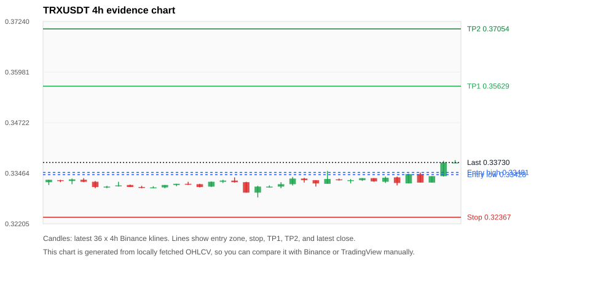
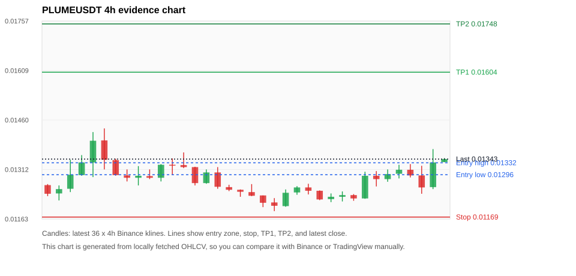
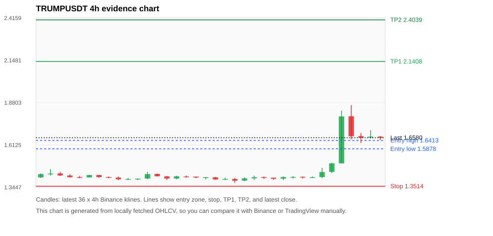
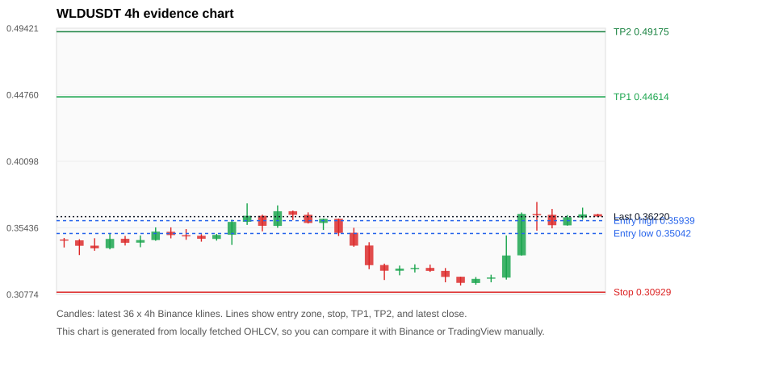
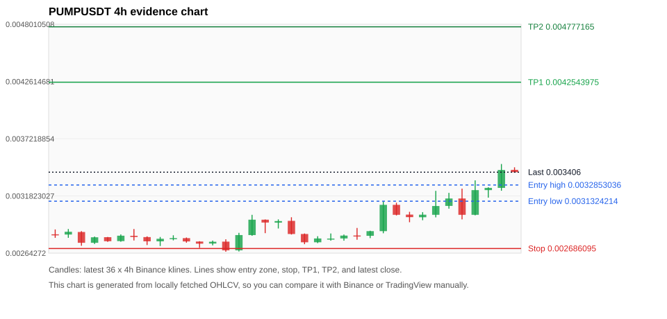

# Crypto 市场扫描报告 v1

- 报告时间：2026-08-20 20:07:43 CST
- Run ID：`20260820_120503_19950d20`
- Run type：`daily_full`
- Data validation mode：`paper`
- 数据来源：SQLite
- 报告版本：v1
- 扫描 ID：6a84e67a5013
- 数据源：Binance public spot API + CoinGecko/CoinMarketCap cross-check
- 过滤条件：USDT spot; 24h quote volume >= 30,000,000; trades >= 30,000; exclude stables/leveraged tokens; analyze 1h/4h/1d klines
- 默认单笔风险：账户权益的 1.00%

## 限制说明

- 交易信号仍以 Binance 现货公开 K 线为主源；外部数据源用于一致性复核。
- 结果是研究和模拟盘计划，不是确定收益或实盘下单指令。
- 历史长度过滤：候选币至少需要 180 根 1d K 线。
- 数据质量验证池：先验证 score 排名前 min(top_n * 2, 10) 的候选，再按 action + score 补足最终名单。
- 大盘环境过滤：RISK_ON; BTC/ETH 日线趋势均较强，允许山寨币买入候选。 BTC 7d=13.144191148143204; ETH 7d=21.43678922673169.
- Data cross-validation enabled: Binance primary source plus CoinGecko; CoinMarketCap is checked when an API key is configured.
- PUMPUSDT validation state DEGRADED: DEGRADED: [EXTERNAL_IDENTITY_AMBIGUOUS] CoinGecko symbol mapping has 3 exact matches; selected highest market-cap rank; [EXTERNAL_IDENTITY_AMBIGUOUS] CoinMarketCap symbol mapping has 15 matches; selected lowest cmc_rank
- ETHUSDT validation state DEGRADED: DEGRADED: [EXTERNAL_IDENTITY_AMBIGUOUS] CoinMarketCap symbol mapping has 6 matches; selected lowest cmc_rank
- TRUMPUSDT validation state BLOCKED: BLOCKED: [BINANCE_KLINE_EXTREME_RANGE] Binance candle range exceeds 40%.; [EXTERNAL_IDENTITY_AMBIGUOUS] CoinGecko symbol mapping has 2 exact matches; selected highest market-cap rank; [EXTERNAL_IDENTITY_AMBIGUOUS] CoinMarketCap symbol mapping has 61 matches; selected lowest cmc_rank
- ADAUSDT validation state DEGRADED: DEGRADED: [EXTERNAL_PROVIDER_RATE_LIMITED] Provider rate limited request for https://api.coingecko.com/api/v3/coins/markets?vs_currency=usd&ids=cardano&price_change_percentage=24h&per_page=1&page=1: HTTP 429; [EXTERNAL_IDENTITY_AMBIGUOUS] CoinMarketCap symbol mapping has 3 matches; selected lowest cmc_rank
- BTCUSDT validation state DEGRADED: DEGRADED: [EXTERNAL_PROVIDER_UNAVAILABLE] Failed to fetch https://api.coingecko.com/api/v3/coins/markets?vs_currency=usd&ids=bitcoin&price_change_percentage=24h&per_page=1&page=1: <urlopen error [SSL: UNEXPECTED_EOF_WHILE_READING] EOF occurred in violation of protocol (_ssl.c:1010)>; [EXTERNAL_IDENTITY_AMBIGUOUS] CoinMarketCap symbol mapping has 13 matches; selected lowest cmc_rank
- LINKUSDT validation state DEGRADED: DEGRADED: [EXTERNAL_PROVIDER_RATE_LIMITED] Provider rate limited request for https://api.coingecko.com/api/v3/coins/markets?vs_currency=usd&ids=chainlink&price_change_percentage=24h&per_page=1&page=1: HTTP 429
- SOLUSDT validation state DEGRADED: DEGRADED: [EXTERNAL_PROVIDER_UNAVAILABLE] Failed to fetch https://api.coingecko.com/api/v3/coins/markets?vs_currency=usd&ids=solana&price_change_percentage=24h&per_page=1&page=1: <urlopen error [SSL: UNEXPECTED_EOF_WHILE_READING] EOF occurred in violation of protocol (_ssl.c:1010)>; [EXTERNAL_IDENTITY_AMBIGUOUS] CoinMarketCap symbol mapping has 8 matches; selected lowest cmc_rank
- WLDUSDT validation state BLOCKED: BLOCKED: [BINANCE_KLINE_EXTREME_RANGE] Binance candle range exceeds 40%.; [EXTERNAL_PROVIDER_RATE_LIMITED] Provider rate limited request for https://api.coingecko.com/api/v3/coins/markets?vs_currency=usd&ids=worldcoin-wld&price_change_percentage=24h&per_page=1&page=1: HTTP 429; [EXTERNAL_IDENTITY_AMBIGUOUS] CoinMarketCap symbol mapping has 2 matches; selected lowest cmc_rank

## 5 个候选交易计划

| Rank | Coin | Action | Setup | Entry Zone | Stop Loss | TP1 | TP2 / Exit Rule | R/R | Verdict |
|---:|---|---|---|---:|---:|---:|---|---:|---|
| 1 | `TRX` | `BUY_CANDIDATE` | 回踩支撑/4h EMA 附近 | 0.33428 - 0.33481 | 0.32367 | 0.35629 | 0.37054 或跌破 4h 关键支撑 | 2.00-3.31 | 可考虑 |
| 2 | `PLUME` | `WAIT_PULLBACK` | 趋势中，等回调入场 | 0.01296 - 0.01332 | 0.01169 | 0.01604 | 0.01748 或跌破 4h 关键支撑 | 2.00-3.00 | 只等回调 |
| 3 | `TRUMP` | `WAIT_PULLBACK` | 趋势中，等回调入场 | 1.5878 - 1.6413 | 1.3514 | 2.1408 | 2.4039 或跌破 4h 关键支撑 | 2.00-3.00 | 只观察 |
| 4 | `WLD` | `WAIT_PULLBACK` | 趋势中，等回调入场 | 0.35042 - 0.35939 | 0.30929 | 0.44614 | 0.49175 或跌破 4h 关键支撑 | 2.00-3.00 | 只观察 |
| 5 | `PUMP` | `WATCH_ONLY` | 涨幅较远，只等深回调 | 0.0031324214 - 0.0032853036 | 0.002686095 | 0.0042543975 | 0.004777165 或跌破 4h 关键支撑 | 2.00-3.00 | 只等回调 |

## 数据交叉验证摘要

价格差异以 Binance 当前价为基准；成交量口径不同，Binance 是 USDT 现货成交额，CoinGecko/CoinMarketCap 通常是全市场成交量。

| Rank | Coin | State | Identity | Max Price Diff | Max 24h Diff | Issue Codes | Message |
|---:|---|---|---|---:|---:|---|---|
| 1 | `TRX` | CLEAN (DATA_OK) | CONFIRMED | 0.03% | 0.08 pts | none | CLEAN: External provider checks agree with Binance within configured thresholds. |
| 2 | `PLUME` | CLEAN (DATA_OK) | CONFIRMED | 0.35% | 2.55 pts | none | CLEAN: External provider checks agree with Binance within configured thresholds. |
| 3 | `TRUMP` | BLOCKED (DATA_ERROR) | UNCONFIRMED | 0.48% | 0.36 pts | BINANCE_KLINE_EXTREME_RANGE, EXTERNAL_IDENTITY_AMBIGUOUS | BLOCKED: [BINANCE_KLINE_EXTREME_RANGE] Binance candle range exceeds 40%.; [EXTERNAL_IDENTITY_AMBIGUOUS] CoinGecko symbol mapping has 2 exact matches; selected highest market-cap rank; [EXTERNAL_IDENTITY_AMBIGUOUS] CoinMarketCap symbol mapping has 61 matches; selected lowest cmc_rank |
| 4 | `WLD` | BLOCKED (DATA_ERROR) | UNCONFIRMED | 0.18% | 0.06 pts | BINANCE_KLINE_EXTREME_RANGE, EXTERNAL_IDENTITY_AMBIGUOUS, EXTERNAL_PROVIDER_RATE_LIMITED | BLOCKED: [BINANCE_KLINE_EXTREME_RANGE] Binance candle range exceeds 40%.; [EXTERNAL_PROVIDER_RATE_LIMITED] Provider rate limited request for https://api.coingecko.com/api/v3/coins/markets?vs_currency=usd&ids=worldcoin-wld&price_change_percentage=24h&per_page=1&page=1: HTTP 429; [EXTERNAL_IDENTITY_AMBIGUOUS] CoinMarketCap symbol mapping has 2 matches; selected lowest cmc_rank |
| 5 | `PUMP` | DEGRADED (DATA_WARNING) | UNCONFIRMED | 0.77% | 0.94 pts | EXTERNAL_IDENTITY_AMBIGUOUS | DEGRADED: [EXTERNAL_IDENTITY_AMBIGUOUS] CoinGecko symbol mapping has 3 exact matches; selected highest market-cap rank; [EXTERNAL_IDENTITY_AMBIGUOUS] CoinMarketCap symbol mapping has 15 matches; selected lowest cmc_rank |

## 候选币说明

### 1. TRX `TRXUSDT`



- 入选原因：回踩支撑/4h EMA 附近；24h +1.47%，7d +0.87%，4h RSI 62.99，24h 成交额 $44.4M。
- 交易失效条件：跌破 0.323671 或 4h 收盘重新失守关键支撑。
- 主要风险：主要风险是大盘同步回撤。
- 数据交叉验证：CLEAN / DATA_OK；身份=CONFIRMED；CLEAN: External provider checks agree with Binance within configured thresholds.

#### 可点击人工验证

- [Binance 交易页](https://www.binance.com/en/trade/TRX_USDT)
- [TradingView 图表](https://www.tradingview.com/chart/?symbol=BINANCE%3ATRXUSDT)
- [CoinGecko 搜索](https://www.coingecko.com/en/search?query=TRX)
- [CoinMarketCap 搜索](https://coinmarketcap.com/search/?q=TRX)

#### 多数据源对照

| Source | Status | Identity | Blocking | Asset ID | Price | 24h Change | 24h Volume | Price Diff | 24h Diff | Updated | Issue Codes | Message |
|---|---|---|---:|---|---:|---:|---:|---:|---:|---|---|---|
| Binance | DATA_OK | CONFIRMED | no | TRXUSDT | 0.33730 | +1.47% | $44.4M | 0.00% | 0.00 pts | 2026-08-20T12:06:23+00:00 | none | Primary market data source passed health checks. |
| CoinGecko | DATA_OK | CONFIRMED | no | tron | 0.33731 | +1.40% | $541.5M | 0.00% | 0.07 pts | 2026-08-20T12:04:30.000Z | none | External source agrees with Binance within thresholds. |
| CoinMarketCap | DATA_OK | CONFIRMED | no | 1958 | 0.33739 | +1.55% | $672.5M | 0.03% | 0.08 pts | 2026-08-20T12:05:00.000Z | none | External source agrees with Binance within thresholds. |

#### 指标证据

| 指标 | 数值 | 人工核对用途 |
|---|---:|---|
| 当前价 | 0.33730 | 与 Binance/TradingView 当前价格对照 |
| 24h 涨跌 | +1.47% | 与交易所 24h 涨跌对照 |
| 7d 涨跌 | +0.87% | 判断短线趋势是否延续 |
| 4h EMA20 | 0.33361 | 判断短期趋势支撑 |
| 4h EMA50 | 0.33278 | 判断中期趋势支撑 |
| 1d EMA20 | 0.33167 | 判断日线趋势 |
| 1d EMA50 | 0.32995 | 判断日线趋势 |
| 4h RSI14 | 62.99 | 判断是否过热/过弱 |
| 4h ATR14 | 0.0017214286 | 推导止损和入场缓冲 |
| 最近 18 根 4h 最低点 | 0.32860 | 支撑/止损参考 |
| 最近 36 根 4h 最高点 | 0.33790 | TP/压力参考 |
| 支撑位 | 0.33361 | 入场区间推导基础 |

#### 交易计划推导

- 支撑位 = 最近低点、4h EMA20、4h EMA50、1d EMA20 中不高于当前价的最高有效支撑 = `0.33361`。
- 入场区间 = 支撑位附近 + ATR 缓冲 = `0.33428 - 0.33481`。
- 止损 = min(最近 18 根 4h 最低点 * 0.985, 入场中位价 - 1.15 * ATR14) = `0.32367`。
- TP1 = max(最近 36 根 4h 最高点 * 0.995, 入场中位价 + 2R) = `0.35629`。
- TP2 = max(入场中位价 + 3R, TP1 * 1.04) = `0.37054`。

#### 最近 10 根 4h K线

| UTC 开盘时间 | Open | High | Low | Close | Quote Volume | Trades |
|---|---:|---:|---:|---:|---:|---:|
| 2026-08-19T00:00+00:00 | 0.33280 | 0.33320 | 0.33210 | 0.33290 | $3.8M | 5020 |
| 2026-08-19T04:00+00:00 | 0.33290 | 0.33340 | 0.33270 | 0.33340 | $1.5M | 4885 |
| 2026-08-19T08:00+00:00 | 0.33340 | 0.33340 | 0.33250 | 0.33260 | $2.1M | 7701 |
| 2026-08-19T12:00+00:00 | 0.33250 | 0.33380 | 0.33220 | 0.33350 | $7.3M | 13312 |
| 2026-08-19T16:00+00:00 | 0.33360 | 0.33380 | 0.33160 | 0.33220 | $6.9M | 10427 |
| 2026-08-19T20:00+00:00 | 0.33210 | 0.33450 | 0.33210 | 0.33440 | $8.3M | 15805 |
| 2026-08-20T00:00+00:00 | 0.33440 | 0.33480 | 0.33230 | 0.33230 | $6.3M | 10693 |
| 2026-08-20T04:00+00:00 | 0.33230 | 0.33390 | 0.33230 | 0.33390 | $3.5M | 9167 |
| 2026-08-20T08:00+00:00 | 0.33390 | 0.33770 | 0.33380 | 0.33730 | $11.6M | 22270 |
| 2026-08-20T12:00+00:00 | 0.33730 | 0.33790 | 0.33720 | 0.33730 | $891,735 | 1001 |

### 2. PLUME `PLUMEUSDT`



- 入选原因：趋势中，等回调入场；24h +4.75%，7d +10.35%，4h RSI 65.83，24h 成交额 $126.1M。
- 交易失效条件：跌破 0.01169195 或 4h 收盘重新失守关键支撑。
- 主要风险：成交量突增，可能是事件驱动。
- 数据交叉验证：CLEAN / DATA_OK；身份=CONFIRMED；CLEAN: External provider checks agree with Binance within configured thresholds.

#### 可点击人工验证

- [Binance 交易页](https://www.binance.com/en/trade/PLUME_USDT)
- [TradingView 图表](https://www.tradingview.com/chart/?symbol=BINANCE%3APLUMEUSDT)
- [CoinGecko 搜索](https://www.coingecko.com/en/search?query=PLUME)
- [CoinMarketCap 搜索](https://coinmarketcap.com/search/?q=PLUME)

#### 多数据源对照

| Source | Status | Identity | Blocking | Asset ID | Price | 24h Change | 24h Volume | Price Diff | 24h Diff | Updated | Issue Codes | Message |
|---|---|---|---:|---|---:|---:|---:|---:|---:|---|---|---|
| Binance | DATA_OK | CONFIRMED | no | PLUMEUSDT | 0.01343 | +4.75% | $126.1M | 0.00% | 0.00 pts | 2026-08-20T12:06:23+00:00 | none | Primary market data source passed health checks. |
| CoinGecko | DATA_OK | CONFIRMED | no | plume | 0.01344 | +2.20% | $287.6M | 0.04% | 2.55 pts | 2026-08-20T12:04:30.000Z | none | External source agrees with Binance within thresholds. |
| CoinMarketCap | DATA_OK | CONFIRMED | no | 35364 | 0.01338 | +3.95% | $284.1M | 0.35% | 0.80 pts | 2026-08-20T12:05:00.000Z | none | External source agrees with Binance within thresholds. |

#### 指标证据

| 指标 | 数值 | 人工核对用途 |
|---|---:|---|
| 当前价 | 0.01343 | 与 Binance/TradingView 当前价格对照 |
| 24h 涨跌 | +4.75% | 与交易所 24h 涨跌对照 |
| 7d 涨跌 | +10.35% | 判断短线趋势是否延续 |
| 4h EMA20 | 0.01280 | 判断短期趋势支撑 |
| 4h EMA50 | 0.01259 | 判断中期趋势支撑 |
| 1d EMA20 | 0.01219 | 判断日线趋势 |
| 1d EMA50 | 0.01165 | 判断日线趋势 |
| 4h RSI14 | 65.83 | 判断是否过热/过弱 |
| 4h ATR14 | 0.00044642857 | 推导止损和入场缓冲 |
| 最近 18 根 4h 最低点 | 0.01187 | 支撑/止损参考 |
| 最近 36 根 4h 最高点 | 0.01435 | TP/压力参考 |
| 支撑位 | 0.01280 | 入场区间推导基础 |

#### 交易计划推导

- 支撑位 = 最近低点、4h EMA20、4h EMA50、1d EMA20 中不高于当前价的最高有效支撑 = `0.01280`。
- 入场区间 = 支撑位附近 + ATR 缓冲 = `0.01296 - 0.01332`。
- 止损 = min(最近 18 根 4h 最低点 * 0.985, 入场中位价 - 1.15 * ATR14) = `0.01169`。
- TP1 = max(最近 36 根 4h 最高点 * 0.995, 入场中位价 + 2R) = `0.01604`。
- TP2 = max(入场中位价 + 3R, TP1 * 1.04) = `0.01748`。

#### 最近 10 根 4h K线

| UTC 开盘时间 | Open | High | Low | Close | Quote Volume | Trades |
|---|---:|---:|---:|---:|---:|---:|
| 2026-08-19T00:00+00:00 | 0.01230 | 0.01246 | 0.01216 | 0.01235 | $3.6M | 46549 |
| 2026-08-19T04:00+00:00 | 0.01235 | 0.01238 | 0.01218 | 0.01225 | $5.9M | 62301 |
| 2026-08-19T08:00+00:00 | 0.01225 | 0.01305 | 0.01224 | 0.01293 | $7.4M | 76677 |
| 2026-08-19T12:00+00:00 | 0.01293 | 0.01307 | 0.01261 | 0.01283 | $8.1M | 101785 |
| 2026-08-19T16:00+00:00 | 0.01283 | 0.01312 | 0.01275 | 0.01298 | $5.1M | 74866 |
| 2026-08-19T20:00+00:00 | 0.01299 | 0.01326 | 0.01285 | 0.01311 | $1.8M | 24041 |
| 2026-08-20T00:00+00:00 | 0.01311 | 0.01328 | 0.01288 | 0.01294 | $11.1M | 98910 |
| 2026-08-20T04:00+00:00 | 0.01294 | 0.01323 | 0.01239 | 0.01258 | $42.5M | 297840 |
| 2026-08-20T08:00+00:00 | 0.01259 | 0.01373 | 0.01253 | 0.01333 | $57.5M | 480876 |
| 2026-08-20T12:00+00:00 | 0.01334 | 0.01346 | 0.01334 | 0.01343 | $37,172 | 814 |

### 3. TRUMP `TRUMPUSDT`



- 入选原因：趋势中，等回调入场；24h +17.74%，7d +18.51%，4h RSI 72.74，24h 成交额 $49.2M。
- 交易失效条件：跌破 1.35142 或 4h 收盘重新失守关键支撑。
- 主要风险：距离支撑偏远，不能追市价；24h 振幅较大，回撤风险高；成交量突增，可能是事件驱动；日线趋势未完全确认；Blocking data-quality issue detected; paper plan creation is not allowed.。
- 数据交叉验证：BLOCKED / DATA_ERROR；身份=UNCONFIRMED；BLOCKED: [BINANCE_KLINE_EXTREME_RANGE] Binance candle range exceeds 40%.; [EXTERNAL_IDENTITY_AMBIGUOUS] CoinGecko symbol mapping has 2 exact matches; selected highest market-cap rank; [EXTERNAL_IDENTITY_AMBIGUOUS] CoinMarketCap symbol mapping has 61 matches; selected lowest cmc_rank

#### 可点击人工验证

- [Binance 交易页](https://www.binance.com/en/trade/TRUMP_USDT)
- [TradingView 图表](https://www.tradingview.com/chart/?symbol=BINANCE%3ATRUMPUSDT)
- [CoinGecko 搜索](https://www.coingecko.com/en/search?query=TRUMP)
- [CoinMarketCap 搜索](https://coinmarketcap.com/search/?q=TRUMP)

#### 多数据源对照

| Source | Status | Identity | Blocking | Asset ID | Price | 24h Change | 24h Volume | Price Diff | 24h Diff | Updated | Issue Codes | Message |
|---|---|---|---:|---|---:|---:|---:|---:|---:|---|---|---|
| Binance | DATA_ERROR | CONFIRMED | yes | TRUMPUSDT | 1.6580 | +17.74% | $49.2M | 0.00% | 0.00 pts | 2026-08-20T12:06:23+00:00 | BINANCE_KLINE_EXTREME_RANGE | [BINANCE_KLINE_EXTREME_RANGE] Binance candle range exceeds 40%. |
| CoinGecko | DATA_WARNING | UNCONFIRMED | no | official-trump | 1.6500 | +18.10% | $409.3M | 0.48% | 0.36 pts | 2026-08-20T12:04:30.000Z | EXTERNAL_IDENTITY_AMBIGUOUS | [EXTERNAL_IDENTITY_AMBIGUOUS] CoinGecko symbol mapping has 2 exact matches; selected highest market-cap rank |
| CoinMarketCap | DATA_WARNING | UNCONFIRMED | no | 35336 | 1.6606 | +17.94% | $499.3M | 0.16% | 0.20 pts | 2026-08-20T12:05:00.000Z | EXTERNAL_IDENTITY_AMBIGUOUS | [EXTERNAL_IDENTITY_AMBIGUOUS] CoinMarketCap symbol mapping has 61 matches; selected lowest cmc_rank |

#### 指标证据

| 指标 | 数值 | 人工核对用途 |
|---|---:|---|
| 当前价 | 1.6580 | 与 Binance/TradingView 当前价格对照 |
| 24h 涨跌 | +17.74% | 与交易所 24h 涨跌对照 |
| 7d 涨跌 | +18.51% | 判断短线趋势是否延续 |
| 4h EMA20 | 1.5223 | 判断短期趋势支撑 |
| 4h EMA50 | 1.4706 | 判断中期趋势支撑 |
| 1d EMA20 | 1.5019 | 判断日线趋势 |
| 1d EMA50 | 1.5733 | 判断日线趋势 |
| 4h RSI14 | 72.74 | 判断是否过热/过弱 |
| 4h ATR14 | 0.06686 | 推导止损和入场缓冲 |
| 最近 18 根 4h 最低点 | 1.3720 | 支撑/止损参考 |
| 最近 36 根 4h 最高点 | 1.8650 | TP/压力参考 |
| 支撑位 | 1.5223 | 入场区间推导基础 |

#### 交易计划推导

- 支撑位 = 最近低点、4h EMA20、4h EMA50、1d EMA20 中不高于当前价的最高有效支撑 = `1.5223`。
- 入场区间 = 支撑位附近 + ATR 缓冲 = `1.5878 - 1.6413`。
- 止损 = min(最近 18 根 4h 最低点 * 0.985, 入场中位价 - 1.15 * ATR14) = `1.3514`。
- TP1 = max(最近 36 根 4h 最高点 * 0.995, 入场中位价 + 2R) = `2.1408`。
- TP2 = max(入场中位价 + 3R, TP1 * 1.04) = `2.4039`。

#### 最近 10 根 4h K线

| UTC 开盘时间 | Open | High | Low | Close | Quote Volume | Trades |
|---|---:|---:|---:|---:|---:|---:|
| 2026-08-19T00:00+00:00 | 1.4090 | 1.4150 | 1.4010 | 1.4100 | $461,968 | 5074 |
| 2026-08-19T04:00+00:00 | 1.4110 | 1.4130 | 1.4000 | 1.4070 | $272,008 | 4030 |
| 2026-08-19T08:00+00:00 | 1.4070 | 1.4140 | 1.4060 | 1.4080 | $214,346 | 2462 |
| 2026-08-19T12:00+00:00 | 1.4090 | 1.4670 | 1.4040 | 1.4410 | $1.8M | 18131 |
| 2026-08-19T16:00+00:00 | 1.4420 | 1.5000 | 1.4340 | 1.4960 | $1.9M | 18670 |
| 2026-08-19T20:00+00:00 | 1.4960 | 1.8300 | 1.4960 | 1.7930 | $18.7M | 228238 |
| 2026-08-20T00:00+00:00 | 1.7940 | 1.8650 | 1.6480 | 1.6670 | $14.6M | 171137 |
| 2026-08-20T04:00+00:00 | 1.6680 | 1.6880 | 1.6250 | 1.6590 | $5.1M | 63016 |
| 2026-08-20T08:00+00:00 | 1.6590 | 1.7060 | 1.6530 | 1.6650 | $6.8M | 61215 |
| 2026-08-20T12:00+00:00 | 1.6650 | 1.6690 | 1.6430 | 1.6580 | $267,710 | 2571 |

### 4. WLD `WLDUSDT`



- 入选原因：趋势中，等回调入场；24h +13.61%，7d +3.87%，4h RSI 74.42，24h 成交额 $35.0M。
- 交易失效条件：跌破 0.30929 或 4h 收盘重新失守关键支撑。
- 主要风险：日线趋势未完全确认；Blocking data-quality issue detected; paper plan creation is not allowed.。
- 数据交叉验证：BLOCKED / DATA_ERROR；身份=UNCONFIRMED；BLOCKED: [BINANCE_KLINE_EXTREME_RANGE] Binance candle range exceeds 40%.; [EXTERNAL_PROVIDER_RATE_LIMITED] Provider rate limited request for https://api.coingecko.com/api/v3/coins/markets?vs_currency=usd&ids=worldcoin-wld&price_change_percentage=24h&per_page=1&page=1: HTTP 429; [EXTERNAL_IDENTITY_AMBIGUOUS] CoinMarketCap symbol mapping has 2 matches; selected lowest cmc_rank

#### 可点击人工验证

- [Binance 交易页](https://www.binance.com/en/trade/WLD_USDT)
- [TradingView 图表](https://www.tradingview.com/chart/?symbol=BINANCE%3AWLDUSDT)
- [CoinGecko 搜索](https://www.coingecko.com/en/search?query=WLD)
- [CoinMarketCap 搜索](https://coinmarketcap.com/search/?q=WLD)

#### 多数据源对照

| Source | Status | Identity | Blocking | Asset ID | Price | 24h Change | 24h Volume | Price Diff | 24h Diff | Updated | Issue Codes | Message |
|---|---|---|---:|---|---:|---:|---:|---:|---:|---|---|---|
| Binance | DATA_ERROR | CONFIRMED | yes | WLDUSDT | 0.36220 | +13.61% | $35.0M | 0.00% | 0.00 pts | 2026-08-20T12:06:23+00:00 | BINANCE_KLINE_EXTREME_RANGE | [BINANCE_KLINE_EXTREME_RANGE] Binance candle range exceeds 40%. |
| CoinGecko | DATA_WARNING | UNCONFIRMED | no | n/a | n/a | n/a | n/a | n/a | n/a | 2026-08-20T12:06:23+00:00 | EXTERNAL_PROVIDER_RATE_LIMITED | Provider rate limited request for https://api.coingecko.com/api/v3/coins/markets?vs_currency=usd&ids=worldcoin-wld&price_change_percentage=24h&per_page=1&page=1: HTTP 429 |
| CoinMarketCap | DATA_WARNING | UNCONFIRMED | no | 13502 | 0.36286 | +13.67% | $322.1M | 0.18% | 0.06 pts | 2026-08-20T12:06:03.000Z | EXTERNAL_IDENTITY_AMBIGUOUS | [EXTERNAL_IDENTITY_AMBIGUOUS] CoinMarketCap symbol mapping has 2 matches; selected lowest cmc_rank |

#### 指标证据

| 指标 | 数值 | 人工核对用途 |
|---|---:|---|
| 当前价 | 0.36220 | 与 Binance/TradingView 当前价格对照 |
| 24h 涨跌 | +13.61% | 与交易所 24h 涨跌对照 |
| 7d 涨跌 | +3.87% | 判断短线趋势是否延续 |
| 4h EMA20 | 0.34649 | 判断短期趋势支撑 |
| 4h EMA50 | 0.34157 | 判断中期趋势支撑 |
| 1d EMA20 | 0.34040 | 判断日线趋势 |
| 1d EMA50 | 0.35840 | 判断日线趋势 |
| 4h RSI14 | 74.42 | 判断是否过热/过弱 |
| 4h ATR14 | 0.01122 | 推导止损和入场缓冲 |
| 最近 18 根 4h 最低点 | 0.31400 | 支撑/止损参考 |
| 最近 36 根 4h 最高点 | 0.37250 | TP/压力参考 |
| 支撑位 | 0.34649 | 入场区间推导基础 |

#### 交易计划推导

- 支撑位 = 最近低点、4h EMA20、4h EMA50、1d EMA20 中不高于当前价的最高有效支撑 = `0.34649`。
- 入场区间 = 支撑位附近 + ATR 缓冲 = `0.35042 - 0.35939`。
- 止损 = min(最近 18 根 4h 最低点 * 0.985, 入场中位价 - 1.15 * ATR14) = `0.30929`。
- TP1 = max(最近 36 根 4h 最高点 * 0.995, 入场中位价 + 2R) = `0.44614`。
- TP2 = max(入场中位价 + 3R, TP1 * 1.04) = `0.49175`。

#### 最近 10 根 4h K线

| UTC 开盘时间 | Open | High | Low | Close | Quote Volume | Trades |
|---|---:|---:|---:|---:|---:|---:|
| 2026-08-19T00:00+00:00 | 0.32010 | 0.32010 | 0.31400 | 0.31580 | $2.4M | 20957 |
| 2026-08-19T04:00+00:00 | 0.31570 | 0.31990 | 0.31450 | 0.31860 | $4.2M | 24604 |
| 2026-08-19T08:00+00:00 | 0.31870 | 0.32150 | 0.31620 | 0.31960 | $2.3M | 15951 |
| 2026-08-19T12:00+00:00 | 0.31950 | 0.34900 | 0.31810 | 0.33500 | $8.5M | 67513 |
| 2026-08-19T16:00+00:00 | 0.33510 | 0.36510 | 0.33490 | 0.36410 | $7.0M | 89113 |
| 2026-08-19T20:00+00:00 | 0.36410 | 0.37250 | 0.35240 | 0.36340 | $8.8M | 84280 |
| 2026-08-20T00:00+00:00 | 0.36350 | 0.36760 | 0.35400 | 0.35620 | $4.1M | 33994 |
| 2026-08-20T04:00+00:00 | 0.35610 | 0.36330 | 0.35590 | 0.36180 | $2.4M | 21191 |
| 2026-08-20T08:00+00:00 | 0.36160 | 0.36850 | 0.36010 | 0.36380 | $4.0M | 38300 |
| 2026-08-20T12:00+00:00 | 0.36390 | 0.36420 | 0.36210 | 0.36230 | $74,464 | 680 |

### 5. PUMP `PUMPUSDT`



- 入选原因：涨幅较远，只等深回调；24h +13.86%，7d +20.57%，4h RSI 75.87，24h 成交额 $32.9M。
- 交易失效条件：跌破 0.002686095 或 4h 收盘重新失守关键支撑。
- 主要风险：距离支撑偏远，不能追市价；4h RSI 偏热；成交量突增，可能是事件驱动；External validation is degraded; this candidate is not a clean data sample.；Paper mode allows degraded validation; candidate is excluded from clean-data samples.。
- 数据交叉验证：DEGRADED / DATA_WARNING；身份=UNCONFIRMED；DEGRADED: [EXTERNAL_IDENTITY_AMBIGUOUS] CoinGecko symbol mapping has 3 exact matches; selected highest market-cap rank; [EXTERNAL_IDENTITY_AMBIGUOUS] CoinMarketCap symbol mapping has 15 matches; selected lowest cmc_rank

#### 可点击人工验证

- [Binance 交易页](https://www.binance.com/en/trade/PUMP_USDT)
- [TradingView 图表](https://www.tradingview.com/chart/?symbol=BINANCE%3APUMPUSDT)
- [CoinGecko 搜索](https://www.coingecko.com/en/search?query=PUMP)
- [CoinMarketCap 搜索](https://coinmarketcap.com/search/?q=PUMP)

#### 多数据源对照

| Source | Status | Identity | Blocking | Asset ID | Price | 24h Change | 24h Volume | Price Diff | 24h Diff | Updated | Issue Codes | Message |
|---|---|---|---:|---|---:|---:|---:|---:|---:|---|---|---|
| Binance | DATA_OK | CONFIRMED | no | PUMPUSDT | 0.003406 | +13.86% | $32.9M | 0.00% | 0.00 pts | 2026-08-20T12:06:23+00:00 | none | Primary market data source passed health checks. |
| CoinGecko | DATA_WARNING | UNCONFIRMED | no | pump-fun | 0.00341678 | +14.80% | $232.5M | 0.32% | 0.94 pts | 2026-08-20T12:04:30.000Z | EXTERNAL_IDENTITY_AMBIGUOUS | [EXTERNAL_IDENTITY_AMBIGUOUS] CoinGecko symbol mapping has 3 exact matches; selected highest market-cap rank |
| CoinMarketCap | DATA_WARNING | UNCONFIRMED | no | 36507 | 0.003432144 | +14.49% | $247.9M | 0.77% | 0.64 pts | 2026-08-20T12:05:00.000Z | EXTERNAL_IDENTITY_AMBIGUOUS | [EXTERNAL_IDENTITY_AMBIGUOUS] CoinMarketCap symbol mapping has 15 matches; selected lowest cmc_rank |

#### 指标证据

| 指标 | 数值 | 人工核对用途 |
|---|---:|---|
| 当前价 | 0.003406 | 与 Binance/TradingView 当前价格对照 |
| 24h 涨跌 | +13.86% | 与交易所 24h 涨跌对照 |
| 7d 涨跌 | +20.57% | 判断短线趋势是否延续 |
| 4h EMA20 | 0.0030659559 | 判断短期趋势支撑 |
| 4h EMA50 | 0.0028972661 | 判断中期趋势支撑 |
| 1d EMA20 | 0.0026702443 | 判断日线趋势 |
| 1d EMA50 | 0.0022610066 | 判断日线趋势 |
| 4h RSI14 | 75.87 | 判断是否过热/过弱 |
| 4h ATR14 | 0.00016092857 | 推导止损和入场缓冲 |
| 最近 18 根 4h 最低点 | 0.002727 | 支撑/止损参考 |
| 最近 36 根 4h 最高点 | 0.003483 | TP/压力参考 |
| 支撑位 | 0.0030659559 | 入场区间推导基础 |

#### 交易计划推导

- 支撑位 = 最近低点、4h EMA20、4h EMA50、1d EMA20 中不高于当前价的最高有效支撑 = `0.0030659559`。
- 入场区间 = 支撑位附近 + ATR 缓冲 = `0.0031324214 - 0.0032853036`。
- 止损 = min(最近 18 根 4h 最低点 * 0.985, 入场中位价 - 1.15 * ATR14) = `0.002686095`。
- TP1 = max(最近 36 根 4h 最高点 * 0.995, 入场中位价 + 2R) = `0.0042543975`。
- TP2 = max(入场中位价 + 3R, TP1 * 1.04) = `0.004777165`。

#### 最近 10 根 4h K线

| UTC 开盘时间 | Open | High | Low | Close | Quote Volume | Trades |
|---|---:|---:|---:|---:|---:|---:|
| 2026-08-19T00:00+00:00 | 0.003098 | 0.003118 | 0.002998 | 0.003004 | $3.0M | 33865 |
| 2026-08-19T04:00+00:00 | 0.003006 | 0.003032 | 0.002934 | 0.002982 | $2.3M | 24155 |
| 2026-08-19T08:00+00:00 | 0.002981 | 0.003029 | 0.002953 | 0.003005 | $1.4M | 15366 |
| 2026-08-19T12:00+00:00 | 0.003004 | 0.00323 | 0.00298 | 0.003087 | $5.0M | 44899 |
| 2026-08-19T16:00+00:00 | 0.003088 | 0.003211 | 0.003062 | 0.003158 | $4.5M | 59084 |
| 2026-08-19T20:00+00:00 | 0.003158 | 0.003251 | 0.002961 | 0.003004 | $5.9M | 49174 |
| 2026-08-20T00:00+00:00 | 0.003004 | 0.003329 | 0.002999 | 0.003237 | $7.4M | 76260 |
| 2026-08-20T04:00+00:00 | 0.003237 | 0.003264 | 0.003166 | 0.003258 | $4.1M | 34817 |
| 2026-08-20T08:00+00:00 | 0.003258 | 0.003483 | 0.003231 | 0.003427 | $5.8M | 54362 |
| 2026-08-20T12:00+00:00 | 0.003428 | 0.003452 | 0.003401 | 0.003406 | $283,699 | 1902 |

## 组合风控

- 不要 5 个候选全部满仓买入。
- 同时持仓总风险建议控制在账户权益的 3% - 5% 以内。
- 如果 BTC/ETH 同时破位，暂停山寨币多头计划或降低仓位。
- 第一版报告用于模拟盘和人工复核，不自动下单。

## 原始数据

```json
[
  {
    "rank": 1,
    "symbol": "TRXUSDT",
    "base_asset": "TRX",
    "price": 0.3373,
    "score": 63.267309769665204,
    "setup": "回踩支撑/4h EMA 附近",
    "verdict": "可考虑",
    "entry_low": 0.3342760165260081,
    "entry_high": 0.3348137989281518,
    "stop_loss": 0.323671,
    "take_profit_1": 0.3562927231812397,
    "take_profit_2": 0.3705444321084893,
    "risk_reward_1": 2.0,
    "risk_reward_2": 3.3106336089056323,
    "pct_24h": 1.474,
    "pct_3d": 1.5657934357121261,
    "pct_7d": 0.8672248803827776,
    "quote_volume_24h": 44396325.63394,
    "trades_24h": 82303,
    "high_low_range_24h": 1.8998793727382335,
    "rsi_1h": 72.72727272727279,
    "rsi_4h": 62.987012987013024,
    "ema20_4h": 0.33360879892815176,
    "ema50_4h": 0.33277706361612214,
    "ema20_1d": 0.33167465383172307,
    "ema50_1d": 0.3299481304131273,
    "atr_4h": 0.0017214285714285643,
    "macd_hist_4h": 0.0004887146204440381,
    "volume_ratio_24h": 2.122065242174797,
    "support_level": 0.33360879892815176,
    "recent_low_4h_18": 0.3286,
    "recent_high_4h_36": 0.3379,
    "distance_to_support_pct": 1.106445958172464,
    "binance_trade_url": "https://www.binance.com/en/trade/TRX_USDT",
    "tradingview_url": "https://www.tradingview.com/chart/?symbol=BINANCE%3ATRXUSDT",
    "coingecko_search_url": "https://www.coingecko.com/en/search?query=TRX",
    "coinmarketcap_search_url": "https://coinmarketcap.com/search/?q=TRX",
    "invalidation": "跌破 0.323671 或 4h 收盘重新失守关键支撑",
    "recent_4h_klines": [
      {
        "open_time_utc": "2026-08-14T16:00+00:00",
        "open": 0.3324,
        "high": 0.333,
        "low": 0.3317,
        "close": 0.333,
        "quote_volume": 3631846.66168,
        "trades": 7761
      },
      {
        "open_time_utc": "2026-08-14T20:00+00:00",
        "open": 0.3329,
        "high": 0.333,
        "low": 0.3324,
        "close": 0.3327,
        "quote_volume": 1835139.59946,
        "trades": 4877
      },
      {
        "open_time_utc": "2026-08-15T00:00+00:00",
        "open": 0.3327,
        "high": 0.3333,
        "low": 0.3319,
        "close": 0.3331,
        "quote_volume": 3503935.79391,
        "trades": 6632
      },
      {
        "open_time_utc": "2026-08-15T04:00+00:00",
        "open": 0.333,
        "high": 0.3334,
        "low": 0.3324,
        "close": 0.3325,
        "quote_volume": 2724342.60408,
        "trades": 9640
      },
      {
        "open_time_utc": "2026-08-15T08:00+00:00",
        "open": 0.3325,
        "high": 0.3327,
        "low": 0.3309,
        "close": 0.3312,
        "quote_volume": 4221540.36046,
        "trades": 12681
      },
      {
        "open_time_utc": "2026-08-15T12:00+00:00",
        "open": 0.3311,
        "high": 0.3315,
        "low": 0.3309,
        "close": 0.3313,
        "quote_volume": 2409406.74082,
        "trades": 10415
      },
      {
        "open_time_utc": "2026-08-15T16:00+00:00",
        "open": 0.3314,
        "high": 0.3325,
        "low": 0.3313,
        "close": 0.3316,
        "quote_volume": 3898474.8434,
        "trades": 9268
      },
      {
        "open_time_utc": "2026-08-15T20:00+00:00",
        "open": 0.3317,
        "high": 0.3318,
        "low": 0.3312,
        "close": 0.3312,
        "quote_volume": 1703051.51757,
        "trades": 8037
      },
      {
        "open_time_utc": "2026-08-16T00:00+00:00",
        "open": 0.3312,
        "high": 0.3315,
        "low": 0.3309,
        "close": 0.331,
        "quote_volume": 1821204.29676,
        "trades": 4349
      },
      {
        "open_time_utc": "2026-08-16T04:00+00:00",
        "open": 0.3309,
        "high": 0.3314,
        "low": 0.3309,
        "close": 0.3311,
        "quote_volume": 944412.52746,
        "trades": 5094
      },
      {
        "open_time_utc": "2026-08-16T08:00+00:00",
        "open": 0.3311,
        "high": 0.3317,
        "low": 0.3309,
        "close": 0.3317,
        "quote_volume": 1793274.07591,
        "trades": 7094
      },
      {
        "open_time_utc": "2026-08-16T12:00+00:00",
        "open": 0.3317,
        "high": 0.332,
        "low": 0.3314,
        "close": 0.332,
        "quote_volume": 2669230.31935,
        "trades": 7220
      },
      {
        "open_time_utc": "2026-08-16T16:00+00:00",
        "open": 0.332,
        "high": 0.3325,
        "low": 0.3317,
        "close": 0.3318,
        "quote_volume": 2654438.61941,
        "trades": 6468
      },
      {
        "open_time_utc": "2026-08-16T20:00+00:00",
        "open": 0.3319,
        "high": 0.332,
        "low": 0.3311,
        "close": 0.3312,
        "quote_volume": 3095843.04276,
        "trades": 6288
      },
      {
        "open_time_utc": "2026-08-17T00:00+00:00",
        "open": 0.3313,
        "high": 0.3326,
        "low": 0.3312,
        "close": 0.3325,
        "quote_volume": 3376218.24137,
        "trades": 5541
      },
      {
        "open_time_utc": "2026-08-17T04:00+00:00",
        "open": 0.3325,
        "high": 0.333,
        "low": 0.3322,
        "close": 0.3328,
        "quote_volume": 2230630.27092,
        "trades": 6703
      },
      {
        "open_time_utc": "2026-08-17T08:00+00:00",
        "open": 0.3328,
        "high": 0.3336,
        "low": 0.3323,
        "close": 0.3324,
        "quote_volume": 4043315.63336,
        "trades": 8754
      },
      {
        "open_time_utc": "2026-08-17T12:00+00:00",
        "open": 0.3324,
        "high": 0.3325,
        "low": 0.3298,
        "close": 0.3298,
        "quote_volume": 4999489.42498,
        "trades": 11275
      },
      {
        "open_time_utc": "2026-08-17T16:00+00:00",
        "open": 0.3298,
        "high": 0.3315,
        "low": 0.3286,
        "close": 0.3313,
        "quote_volume": 9388776.07141,
        "trades": 12643
      },
      {
        "open_time_utc": "2026-08-17T20:00+00:00",
        "open": 0.3313,
        "high": 0.3316,
        "low": 0.3311,
        "close": 0.3313,
        "quote_volume": 1306965.99676,
        "trades": 4530
      },
      {
        "open_time_utc": "2026-08-18T00:00+00:00",
        "open": 0.3313,
        "high": 0.3324,
        "low": 0.3309,
        "close": 0.3319,
        "quote_volume": 3601168.06866,
        "trades": 5798
      },
      {
        "open_time_utc": "2026-08-18T04:00+00:00",
        "open": 0.3319,
        "high": 0.3337,
        "low": 0.3316,
        "close": 0.3333,
        "quote_volume": 5576585.35154,
        "trades": 8308
      },
      {
        "open_time_utc": "2026-08-18T08:00+00:00",
        "open": 0.3333,
        "high": 0.3335,
        "low": 0.3323,
        "close": 0.3329,
        "quote_volume": 5881258.94667,
        "trades": 12158
      },
      {
        "open_time_utc": "2026-08-18T12:00+00:00",
        "open": 0.3329,
        "high": 0.3329,
        "low": 0.3313,
        "close": 0.3321,
        "quote_volume": 5907260.7762,
        "trades": 11097
      },
      {
        "open_time_utc": "2026-08-18T16:00+00:00",
        "open": 0.332,
        "high": 0.3352,
        "low": 0.332,
        "close": 0.3332,
        "quote_volume": 9060983.49125,
        "trades": 12518
      },
      {
        "open_time_utc": "2026-08-18T20:00+00:00",
        "open": 0.3331,
        "high": 0.3333,
        "low": 0.3328,
        "close": 0.3329,
        "quote_volume": 1482089.21003,
        "trades": 4634
      },
      {
        "open_time_utc": "2026-08-19T00:00+00:00",
        "open": 0.3328,
        "high": 0.3332,
        "low": 0.3321,
        "close": 0.3329,
        "quote_volume": 3777874.8411,
        "trades": 5020
      },
      {
        "open_time_utc": "2026-08-19T04:00+00:00",
        "open": 0.3329,
        "high": 0.3334,
        "low": 0.3327,
        "close": 0.3334,
        "quote_volume": 1465384.67577,
        "trades": 4885
      },
      {
        "open_time_utc": "2026-08-19T08:00+00:00",
        "open": 0.3334,
        "high": 0.3334,
        "low": 0.3325,
        "close": 0.3326,
        "quote_volume": 2138432.01645,
        "trades": 7701
      },
      {
        "open_time_utc": "2026-08-19T12:00+00:00",
        "open": 0.3325,
        "high": 0.3338,
        "low": 0.3322,
        "close": 0.3335,
        "quote_volume": 7292384.02563,
        "trades": 13312
      },
      {
        "open_time_utc": "2026-08-19T16:00+00:00",
        "open": 0.3336,
        "high": 0.3338,
        "low": 0.3316,
        "close": 0.3322,
        "quote_volume": 6903650.26768,
        "trades": 10427
      },
      {
        "open_time_utc": "2026-08-19T20:00+00:00",
        "open": 0.3321,
        "high": 0.3345,
        "low": 0.3321,
        "close": 0.3344,
        "quote_volume": 8260600.80602,
        "trades": 15805
      },
      {
        "open_time_utc": "2026-08-20T00:00+00:00",
        "open": 0.3344,
        "high": 0.3348,
        "low": 0.3323,
        "close": 0.3323,
        "quote_volume": 6250881.70381,
        "trades": 10693
      },
      {
        "open_time_utc": "2026-08-20T04:00+00:00",
        "open": 0.3323,
        "high": 0.3339,
        "low": 0.3323,
        "close": 0.3339,
        "quote_volume": 3519060.17744,
        "trades": 9167
      },
      {
        "open_time_utc": "2026-08-20T08:00+00:00",
        "open": 0.3339,
        "high": 0.3377,
        "low": 0.3338,
        "close": 0.3373,
        "quote_volume": 11575001.83955,
        "trades": 22270
      },
      {
        "open_time_utc": "2026-08-20T12:00+00:00",
        "open": 0.3373,
        "high": 0.3379,
        "low": 0.3372,
        "close": 0.3373,
        "quote_volume": 891735.26163,
        "trades": 1001
      }
    ],
    "risks": [
      "主要风险是大盘同步回撤"
    ],
    "data_quality_status": "DATA_OK",
    "data_quality_message": "CLEAN: External provider checks agree with Binance within configured thresholds.",
    "data_checks": [
      {
        "provider": "Binance",
        "status": "DATA_OK",
        "provider_asset_id": "TRXUSDT",
        "provider_symbol": "TRXUSDT",
        "price_usd": 0.3373,
        "pct_24h": 1.474,
        "volume_24h": 44396325.63394,
        "last_updated": null,
        "fetched_at_utc": "2026-08-20T12:06:23+00:00",
        "price_diff_pct": 0.0,
        "pct_24h_diff": 0.0,
        "volume_note": "Binance USDT spot 24h quoteVolume.",
        "message": "Primary market data source passed health checks.",
        "blocking": false,
        "identity_status": "CONFIRMED",
        "issues": []
      },
      {
        "provider": "CoinGecko",
        "status": "DATA_OK",
        "provider_asset_id": "tron",
        "provider_symbol": "TRX",
        "price_usd": 0.337309,
        "pct_24h": 1.4,
        "volume_24h": 541539031.0,
        "last_updated": "2026-08-20T12:04:30.000Z",
        "fetched_at_utc": "2026-08-20T12:06:23+00:00",
        "price_diff_pct": 0.002668247850589018,
        "pct_24h_diff": 0.07400000000000007,
        "volume_note": "CoinGecko total market volume; not the same venue scope as Binance quoteVolume.",
        "message": "External source agrees with Binance within thresholds.",
        "blocking": false,
        "identity_status": "CONFIRMED",
        "issues": []
      },
      {
        "provider": "CoinMarketCap",
        "status": "DATA_OK",
        "provider_asset_id": "1958",
        "provider_symbol": "TRX",
        "price_usd": 0.33739381419891346,
        "pct_24h": 1.55002016,
        "volume_24h": 672458948.7538608,
        "last_updated": "2026-08-20T12:05:00.000Z",
        "fetched_at_utc": "2026-08-20T12:06:23+00:00",
        "price_diff_pct": 0.027813281622729516,
        "pct_24h_diff": 0.07602016000000011,
        "volume_note": "CoinMarketCap total market volume; not the same venue scope as Binance quoteVolume.",
        "message": "External source agrees with Binance within thresholds.",
        "blocking": false,
        "identity_status": "CONFIRMED",
        "issues": []
      }
    ],
    "action": "BUY_CANDIDATE",
    "data_quality_state": "CLEAN",
    "data_quality_issues": [],
    "external_identity_status": "CONFIRMED"
  },
  {
    "rank": 2,
    "symbol": "PLUMEUSDT",
    "base_asset": "PLUME",
    "price": 0.01343,
    "score": 63.473779806786354,
    "setup": "趋势中，等回调入场",
    "verdict": "只等回调",
    "entry_low": 0.012961249999999999,
    "entry_high": 0.013318392857142857,
    "stop_loss": 0.01169195,
    "take_profit_1": 0.016035564285714284,
    "take_profit_2": 0.017483435714285712,
    "risk_reward_1": 2.0,
    "risk_reward_2": 3.0,
    "pct_24h": 4.751,
    "pct_3d": 8.13204508856682,
    "pct_7d": 10.353327855382076,
    "quote_volume_24h": 126088182.28997,
    "trades_24h": 1077500,
    "high_low_range_24h": 10.815173527037935,
    "rsi_1h": 58.496732026143796,
    "rsi_4h": 65.83072100313478,
    "ema20_4h": 0.012797896542720117,
    "ema50_4h": 0.012588382094653601,
    "ema20_1d": 0.01218994183703623,
    "ema50_1d": 0.011649570486053777,
    "atr_4h": 0.0004464285714285713,
    "macd_hist_4h": 9.198038566801358e-05,
    "volume_ratio_24h": 3.067154776807013,
    "support_level": 0.012797896542720117,
    "recent_low_4h_18": 0.01187,
    "recent_high_4h_36": 0.01435,
    "distance_to_support_pct": 4.939119918416934,
    "binance_trade_url": "https://www.binance.com/en/trade/PLUME_USDT",
    "tradingview_url": "https://www.tradingview.com/chart/?symbol=BINANCE%3APLUMEUSDT",
    "coingecko_search_url": "https://www.coingecko.com/en/search?query=PLUME",
    "coinmarketcap_search_url": "https://coinmarketcap.com/search/?q=PLUME",
    "invalidation": "跌破 0.01169195 或 4h 收盘重新失守关键支撑",
    "recent_4h_klines": [
      {
        "open_time_utc": "2026-08-14T16:00+00:00",
        "open": 0.01265,
        "high": 0.01268,
        "low": 0.01232,
        "close": 0.01239,
        "quote_volume": 2223010.10079,
        "trades": 20333
      },
      {
        "open_time_utc": "2026-08-14T20:00+00:00",
        "open": 0.0124,
        "high": 0.01264,
        "low": 0.01219,
        "close": 0.01253,
        "quote_volume": 2129582.09951,
        "trades": 12464
      },
      {
        "open_time_utc": "2026-08-15T00:00+00:00",
        "open": 0.01254,
        "high": 0.01341,
        "low": 0.01244,
        "close": 0.01296,
        "quote_volume": 27955547.86965,
        "trades": 77061
      },
      {
        "open_time_utc": "2026-08-15T04:00+00:00",
        "open": 0.01295,
        "high": 0.01355,
        "low": 0.01293,
        "close": 0.01333,
        "quote_volume": 39534556.4902,
        "trades": 83662
      },
      {
        "open_time_utc": "2026-08-15T08:00+00:00",
        "open": 0.01333,
        "high": 0.01424,
        "low": 0.01289,
        "close": 0.01398,
        "quote_volume": 19594037.40824,
        "trades": 82265
      },
      {
        "open_time_utc": "2026-08-15T12:00+00:00",
        "open": 0.01399,
        "high": 0.01435,
        "low": 0.01312,
        "close": 0.01341,
        "quote_volume": 2556387.8299,
        "trades": 50042
      },
      {
        "open_time_utc": "2026-08-15T16:00+00:00",
        "open": 0.0134,
        "high": 0.01344,
        "low": 0.01293,
        "close": 0.01295,
        "quote_volume": 2075525.11363,
        "trades": 32945
      },
      {
        "open_time_utc": "2026-08-15T20:00+00:00",
        "open": 0.01294,
        "high": 0.01312,
        "low": 0.01276,
        "close": 0.01287,
        "quote_volume": 867916.24583,
        "trades": 18866
      },
      {
        "open_time_utc": "2026-08-16T00:00+00:00",
        "open": 0.01287,
        "high": 0.01322,
        "low": 0.01264,
        "close": 0.01293,
        "quote_volume": 1816941.93075,
        "trades": 32608
      },
      {
        "open_time_utc": "2026-08-16T04:00+00:00",
        "open": 0.01292,
        "high": 0.01312,
        "low": 0.01283,
        "close": 0.01287,
        "quote_volume": 1961508.59515,
        "trades": 32404
      },
      {
        "open_time_utc": "2026-08-16T08:00+00:00",
        "open": 0.01287,
        "high": 0.01328,
        "low": 0.01276,
        "close": 0.01326,
        "quote_volume": 3914918.73256,
        "trades": 47975
      },
      {
        "open_time_utc": "2026-08-16T12:00+00:00",
        "open": 0.01326,
        "high": 0.01345,
        "low": 0.01295,
        "close": 0.01325,
        "quote_volume": 37860581.70357,
        "trades": 55187
      },
      {
        "open_time_utc": "2026-08-16T16:00+00:00",
        "open": 0.01325,
        "high": 0.01363,
        "low": 0.01316,
        "close": 0.01319,
        "quote_volume": 12141479.6993,
        "trades": 34118
      },
      {
        "open_time_utc": "2026-08-16T20:00+00:00",
        "open": 0.01319,
        "high": 0.0132,
        "low": 0.01264,
        "close": 0.01271,
        "quote_volume": 959909.1073,
        "trades": 12807
      },
      {
        "open_time_utc": "2026-08-17T00:00+00:00",
        "open": 0.01271,
        "high": 0.01312,
        "low": 0.01269,
        "close": 0.01303,
        "quote_volume": 12318398.94849,
        "trades": 29870
      },
      {
        "open_time_utc": "2026-08-17T04:00+00:00",
        "open": 0.01303,
        "high": 0.01319,
        "low": 0.01254,
        "close": 0.0126,
        "quote_volume": 14748596.49049,
        "trades": 53277
      },
      {
        "open_time_utc": "2026-08-17T08:00+00:00",
        "open": 0.01259,
        "high": 0.01266,
        "low": 0.01247,
        "close": 0.01251,
        "quote_volume": 2712251.30517,
        "trades": 31379
      },
      {
        "open_time_utc": "2026-08-17T12:00+00:00",
        "open": 0.01251,
        "high": 0.01252,
        "low": 0.0123,
        "close": 0.01245,
        "quote_volume": 2346048.34187,
        "trades": 41459
      },
      {
        "open_time_utc": "2026-08-17T16:00+00:00",
        "open": 0.01244,
        "high": 0.01268,
        "low": 0.01232,
        "close": 0.01233,
        "quote_volume": 2184544.9635,
        "trades": 36399
      },
      {
        "open_time_utc": "2026-08-17T20:00+00:00",
        "open": 0.01234,
        "high": 0.01234,
        "low": 0.01199,
        "close": 0.01212,
        "quote_volume": 739465.59135,
        "trades": 13625
      },
      {
        "open_time_utc": "2026-08-18T00:00+00:00",
        "open": 0.01213,
        "high": 0.01226,
        "low": 0.01187,
        "close": 0.01203,
        "quote_volume": 1191460.93549,
        "trades": 17571
      },
      {
        "open_time_utc": "2026-08-18T04:00+00:00",
        "open": 0.01202,
        "high": 0.01252,
        "low": 0.012,
        "close": 0.01242,
        "quote_volume": 1951433.37295,
        "trades": 29235
      },
      {
        "open_time_utc": "2026-08-18T08:00+00:00",
        "open": 0.01243,
        "high": 0.01262,
        "low": 0.01236,
        "close": 0.01258,
        "quote_volume": 2363248.14499,
        "trades": 28223
      },
      {
        "open_time_utc": "2026-08-18T12:00+00:00",
        "open": 0.01258,
        "high": 0.01269,
        "low": 0.01237,
        "close": 0.01248,
        "quote_volume": 3068219.22914,
        "trades": 31931
      },
      {
        "open_time_utc": "2026-08-18T16:00+00:00",
        "open": 0.01248,
        "high": 0.01249,
        "low": 0.0122,
        "close": 0.01222,
        "quote_volume": 3243044.56966,
        "trades": 22591
      },
      {
        "open_time_utc": "2026-08-18T20:00+00:00",
        "open": 0.01223,
        "high": 0.0124,
        "low": 0.01214,
        "close": 0.0123,
        "quote_volume": 527290.61972,
        "trades": 9486
      },
      {
        "open_time_utc": "2026-08-19T00:00+00:00",
        "open": 0.0123,
        "high": 0.01246,
        "low": 0.01216,
        "close": 0.01235,
        "quote_volume": 3621098.94157,
        "trades": 46549
      },
      {
        "open_time_utc": "2026-08-19T04:00+00:00",
        "open": 0.01235,
        "high": 0.01238,
        "low": 0.01218,
        "close": 0.01225,
        "quote_volume": 5908864.27664,
        "trades": 62301
      },
      {
        "open_time_utc": "2026-08-19T08:00+00:00",
        "open": 0.01225,
        "high": 0.01305,
        "low": 0.01224,
        "close": 0.01293,
        "quote_volume": 7398697.37658,
        "trades": 76677
      },
      {
        "open_time_utc": "2026-08-19T12:00+00:00",
        "open": 0.01293,
        "high": 0.01307,
        "low": 0.01261,
        "close": 0.01283,
        "quote_volume": 8123025.66328,
        "trades": 101785
      },
      {
        "open_time_utc": "2026-08-19T16:00+00:00",
        "open": 0.01283,
        "high": 0.01312,
        "low": 0.01275,
        "close": 0.01298,
        "quote_volume": 5056560.51288,
        "trades": 74866
      },
      {
        "open_time_utc": "2026-08-19T20:00+00:00",
        "open": 0.01299,
        "high": 0.01326,
        "low": 0.01285,
        "close": 0.01311,
        "quote_volume": 1770055.05897,
        "trades": 24041
      },
      {
        "open_time_utc": "2026-08-20T00:00+00:00",
        "open": 0.01311,
        "high": 0.01328,
        "low": 0.01288,
        "close": 0.01294,
        "quote_volume": 11148250.02014,
        "trades": 98910
      },
      {
        "open_time_utc": "2026-08-20T04:00+00:00",
        "open": 0.01294,
        "high": 0.01323,
        "low": 0.01239,
        "close": 0.01258,
        "quote_volume": 42536048.42984,
        "trades": 297840
      },
      {
        "open_time_utc": "2026-08-20T08:00+00:00",
        "open": 0.01259,
        "high": 0.01373,
        "low": 0.01253,
        "close": 0.01333,
        "quote_volume": 57539684.47002,
        "trades": 480876
      },
      {
        "open_time_utc": "2026-08-20T12:00+00:00",
        "open": 0.01334,
        "high": 0.01346,
        "low": 0.01334,
        "close": 0.01343,
        "quote_volume": 37171.9085,
        "trades": 814
      }
    ],
    "risks": [
      "成交量突增，可能是事件驱动"
    ],
    "data_quality_status": "DATA_OK",
    "data_quality_message": "CLEAN: External provider checks agree with Binance within configured thresholds.",
    "data_checks": [
      {
        "provider": "Binance",
        "status": "DATA_OK",
        "provider_asset_id": "PLUMEUSDT",
        "provider_symbol": "PLUMEUSDT",
        "price_usd": 0.01343,
        "pct_24h": 4.751,
        "volume_24h": 126088182.28997,
        "last_updated": null,
        "fetched_at_utc": "2026-08-20T12:06:23+00:00",
        "price_diff_pct": 0.0,
        "pct_24h_diff": 0.0,
        "volume_note": "Binance USDT spot 24h quoteVolume.",
        "message": "Primary market data source passed health checks.",
        "blocking": false,
        "identity_status": "CONFIRMED",
        "issues": []
      },
      {
        "provider": "CoinGecko",
        "status": "DATA_OK",
        "provider_asset_id": "plume",
        "provider_symbol": "PLUME",
        "price_usd": 0.01343542,
        "pct_24h": 2.2,
        "volume_24h": 287611143.0,
        "last_updated": "2026-08-20T12:04:30.000Z",
        "fetched_at_utc": "2026-08-20T12:06:23+00:00",
        "price_diff_pct": 0.04035740878630508,
        "pct_24h_diff": 2.551,
        "volume_note": "CoinGecko total market volume; not the same venue scope as Binance quoteVolume.",
        "message": "External source agrees with Binance within thresholds.",
        "blocking": false,
        "identity_status": "CONFIRMED",
        "issues": []
      },
      {
        "provider": "CoinMarketCap",
        "status": "DATA_OK",
        "provider_asset_id": "35364",
        "provider_symbol": "PLUME",
        "price_usd": 0.013383146242223243,
        "pct_24h": 3.95312561,
        "volume_24h": 284064976.5132665,
        "last_updated": "2026-08-20T12:05:00.000Z",
        "fetched_at_utc": "2026-08-20T12:06:23+00:00",
        "price_diff_pct": 0.3488738479281888,
        "pct_24h_diff": 0.7978743900000005,
        "volume_note": "CoinMarketCap total market volume; not the same venue scope as Binance quoteVolume.",
        "message": "External source agrees with Binance within thresholds.",
        "blocking": false,
        "identity_status": "CONFIRMED",
        "issues": []
      }
    ],
    "action": "WAIT_PULLBACK",
    "data_quality_state": "CLEAN",
    "data_quality_issues": [],
    "external_identity_status": "CONFIRMED"
  },
  {
    "rank": 3,
    "symbol": "TRUMPUSDT",
    "base_asset": "TRUMP",
    "price": 1.658,
    "score": 62.4726498746075,
    "setup": "趋势中，等回调入场",
    "verdict": "只观察",
    "entry_low": 1.5877999999999999,
    "entry_high": 1.6412857142857142,
    "stop_loss": 1.35142,
    "take_profit_1": 2.140788571428571,
    "take_profit_2": 2.403911428571428,
    "risk_reward_1": 1.9999999999999991,
    "risk_reward_2": 3.0,
    "pct_24h": 17.743,
    "pct_3d": 18.428571428571438,
    "pct_7d": 18.513223731236582,
    "quote_volume_24h": 49152109.048889,
    "trades_24h": 562842,
    "high_low_range_24h": 32.834757834757845,
    "rsi_1h": 40.340909090909086,
    "rsi_4h": 72.7433628318584,
    "ema20_4h": 1.522339531591042,
    "ema50_4h": 1.4705978820088659,
    "ema20_1d": 1.5018659521297386,
    "ema50_1d": 1.5733186493340823,
    "atr_4h": 0.0668571428571429,
    "macd_hist_4h": 0.02874246370973843,
    "volume_ratio_24h": 16.468820113694253,
    "support_level": 1.522339531591042,
    "recent_low_4h_18": 1.372,
    "recent_high_4h_36": 1.865,
    "distance_to_support_pct": 8.911314827854145,
    "binance_trade_url": "https://www.binance.com/en/trade/TRUMP_USDT",
    "tradingview_url": "https://www.tradingview.com/chart/?symbol=BINANCE%3ATRUMPUSDT",
    "coingecko_search_url": "https://www.coingecko.com/en/search?query=TRUMP",
    "coinmarketcap_search_url": "https://coinmarketcap.com/search/?q=TRUMP",
    "invalidation": "跌破 1.35142 或 4h 收盘重新失守关键支撑",
    "recent_4h_klines": [
      {
        "open_time_utc": "2026-08-14T16:00+00:00",
        "open": 1.407,
        "high": 1.432,
        "low": 1.404,
        "close": 1.428,
        "quote_volume": 1492697.589271,
        "trades": 15312
      },
      {
        "open_time_utc": "2026-08-14T20:00+00:00",
        "open": 1.428,
        "high": 1.459,
        "low": 1.419,
        "close": 1.431,
        "quote_volume": 853629.184891,
        "trades": 10427
      },
      {
        "open_time_utc": "2026-08-15T00:00+00:00",
        "open": 1.432,
        "high": 1.442,
        "low": 1.416,
        "close": 1.419,
        "quote_volume": 435638.063967,
        "trades": 4438
      },
      {
        "open_time_utc": "2026-08-15T04:00+00:00",
        "open": 1.419,
        "high": 1.426,
        "low": 1.408,
        "close": 1.408,
        "quote_volume": 320949.27532,
        "trades": 3706
      },
      {
        "open_time_utc": "2026-08-15T08:00+00:00",
        "open": 1.409,
        "high": 1.417,
        "low": 1.402,
        "close": 1.407,
        "quote_volume": 321869.698746,
        "trades": 3275
      },
      {
        "open_time_utc": "2026-08-15T12:00+00:00",
        "open": 1.407,
        "high": 1.423,
        "low": 1.407,
        "close": 1.422,
        "quote_volume": 297405.58738,
        "trades": 3202
      },
      {
        "open_time_utc": "2026-08-15T16:00+00:00",
        "open": 1.422,
        "high": 1.423,
        "low": 1.405,
        "close": 1.409,
        "quote_volume": 310604.212884,
        "trades": 2615
      },
      {
        "open_time_utc": "2026-08-15T20:00+00:00",
        "open": 1.409,
        "high": 1.413,
        "low": 1.403,
        "close": 1.406,
        "quote_volume": 161787.341776,
        "trades": 2019
      },
      {
        "open_time_utc": "2026-08-16T00:00+00:00",
        "open": 1.406,
        "high": 1.413,
        "low": 1.39,
        "close": 1.395,
        "quote_volume": 440688.674303,
        "trades": 4730
      },
      {
        "open_time_utc": "2026-08-16T04:00+00:00",
        "open": 1.395,
        "high": 1.403,
        "low": 1.391,
        "close": 1.397,
        "quote_volume": 231473.755577,
        "trades": 3616
      },
      {
        "open_time_utc": "2026-08-16T08:00+00:00",
        "open": 1.398,
        "high": 1.401,
        "low": 1.391,
        "close": 1.399,
        "quote_volume": 414698.077622,
        "trades": 3574
      },
      {
        "open_time_utc": "2026-08-16T12:00+00:00",
        "open": 1.4,
        "high": 1.442,
        "low": 1.396,
        "close": 1.428,
        "quote_volume": 937538.049885,
        "trades": 10253
      },
      {
        "open_time_utc": "2026-08-16T16:00+00:00",
        "open": 1.429,
        "high": 1.431,
        "low": 1.414,
        "close": 1.414,
        "quote_volume": 372395.137513,
        "trades": 3657
      },
      {
        "open_time_utc": "2026-08-16T20:00+00:00",
        "open": 1.414,
        "high": 1.415,
        "low": 1.391,
        "close": 1.4,
        "quote_volume": 591782.512614,
        "trades": 5138
      },
      {
        "open_time_utc": "2026-08-17T00:00+00:00",
        "open": 1.4,
        "high": 1.417,
        "low": 1.395,
        "close": 1.414,
        "quote_volume": 452321.529564,
        "trades": 4779
      },
      {
        "open_time_utc": "2026-08-17T04:00+00:00",
        "open": 1.413,
        "high": 1.419,
        "low": 1.406,
        "close": 1.412,
        "quote_volume": 314792.382669,
        "trades": 3022
      },
      {
        "open_time_utc": "2026-08-17T08:00+00:00",
        "open": 1.412,
        "high": 1.412,
        "low": 1.402,
        "close": 1.406,
        "quote_volume": 289331.972028,
        "trades": 3201
      },
      {
        "open_time_utc": "2026-08-17T12:00+00:00",
        "open": 1.406,
        "high": 1.409,
        "low": 1.395,
        "close": 1.408,
        "quote_volume": 415418.779755,
        "trades": 4338
      },
      {
        "open_time_utc": "2026-08-17T16:00+00:00",
        "open": 1.408,
        "high": 1.41,
        "low": 1.392,
        "close": 1.394,
        "quote_volume": 403946.0425,
        "trades": 3513
      },
      {
        "open_time_utc": "2026-08-17T20:00+00:00",
        "open": 1.394,
        "high": 1.405,
        "low": 1.392,
        "close": 1.397,
        "quote_volume": 316963.795087,
        "trades": 3024
      },
      {
        "open_time_utc": "2026-08-18T00:00+00:00",
        "open": 1.397,
        "high": 1.404,
        "low": 1.372,
        "close": 1.386,
        "quote_volume": 664676.233646,
        "trades": 7110
      },
      {
        "open_time_utc": "2026-08-18T04:00+00:00",
        "open": 1.387,
        "high": 1.407,
        "low": 1.383,
        "close": 1.401,
        "quote_volume": 560830.025067,
        "trades": 4804
      },
      {
        "open_time_utc": "2026-08-18T08:00+00:00",
        "open": 1.401,
        "high": 1.418,
        "low": 1.391,
        "close": 1.408,
        "quote_volume": 746714.746281,
        "trades": 6269
      },
      {
        "open_time_utc": "2026-08-18T12:00+00:00",
        "open": 1.409,
        "high": 1.413,
        "low": 1.398,
        "close": 1.404,
        "quote_volume": 485661.638889,
        "trades": 5201
      },
      {
        "open_time_utc": "2026-08-18T16:00+00:00",
        "open": 1.405,
        "high": 1.405,
        "low": 1.392,
        "close": 1.398,
        "quote_volume": 351822.589569,
        "trades": 2753
      },
      {
        "open_time_utc": "2026-08-18T20:00+00:00",
        "open": 1.399,
        "high": 1.414,
        "low": 1.39,
        "close": 1.409,
        "quote_volume": 273378.563553,
        "trades": 3208
      },
      {
        "open_time_utc": "2026-08-19T00:00+00:00",
        "open": 1.409,
        "high": 1.415,
        "low": 1.401,
        "close": 1.41,
        "quote_volume": 461968.499702,
        "trades": 5074
      },
      {
        "open_time_utc": "2026-08-19T04:00+00:00",
        "open": 1.411,
        "high": 1.413,
        "low": 1.4,
        "close": 1.407,
        "quote_volume": 272007.979566,
        "trades": 4030
      },
      {
        "open_time_utc": "2026-08-19T08:00+00:00",
        "open": 1.407,
        "high": 1.414,
        "low": 1.406,
        "close": 1.408,
        "quote_volume": 214345.510039,
        "trades": 2462
      },
      {
        "open_time_utc": "2026-08-19T12:00+00:00",
        "open": 1.409,
        "high": 1.467,
        "low": 1.404,
        "close": 1.441,
        "quote_volume": 1784969.934347,
        "trades": 18131
      },
      {
        "open_time_utc": "2026-08-19T16:00+00:00",
        "open": 1.442,
        "high": 1.5,
        "low": 1.434,
        "close": 1.496,
        "quote_volume": 1901431.96227,
        "trades": 18670
      },
      {
        "open_time_utc": "2026-08-19T20:00+00:00",
        "open": 1.496,
        "high": 1.83,
        "low": 1.496,
        "close": 1.793,
        "quote_volume": 18746216.229303,
        "trades": 228238
      },
      {
        "open_time_utc": "2026-08-20T00:00+00:00",
        "open": 1.794,
        "high": 1.865,
        "low": 1.648,
        "close": 1.667,
        "quote_volume": 14604026.377038,
        "trades": 171137
      },
      {
        "open_time_utc": "2026-08-20T04:00+00:00",
        "open": 1.668,
        "high": 1.688,
        "low": 1.625,
        "close": 1.659,
        "quote_volume": 5092316.413398,
        "trades": 63016
      },
      {
        "open_time_utc": "2026-08-20T08:00+00:00",
        "open": 1.659,
        "high": 1.706,
        "low": 1.653,
        "close": 1.665,
        "quote_volume": 6777254.761824,
        "trades": 61215
      },
      {
        "open_time_utc": "2026-08-20T12:00+00:00",
        "open": 1.665,
        "high": 1.669,
        "low": 1.643,
        "close": 1.658,
        "quote_volume": 267709.937002,
        "trades": 2571
      }
    ],
    "risks": [
      "距离支撑偏远，不能追市价",
      "24h 振幅较大，回撤风险高",
      "成交量突增，可能是事件驱动",
      "日线趋势未完全确认",
      "Blocking data-quality issue detected; paper plan creation is not allowed."
    ],
    "data_quality_status": "DATA_ERROR",
    "data_quality_message": "BLOCKED: [BINANCE_KLINE_EXTREME_RANGE] Binance candle range exceeds 40%.; [EXTERNAL_IDENTITY_AMBIGUOUS] CoinGecko symbol mapping has 2 exact matches; selected highest market-cap rank; [EXTERNAL_IDENTITY_AMBIGUOUS] CoinMarketCap symbol mapping has 61 matches; selected lowest cmc_rank",
    "data_checks": [
      {
        "provider": "Binance",
        "status": "DATA_ERROR",
        "provider_asset_id": "TRUMPUSDT",
        "provider_symbol": "TRUMPUSDT",
        "price_usd": 1.658,
        "pct_24h": 17.743,
        "volume_24h": 49152109.048889,
        "last_updated": null,
        "fetched_at_utc": "2026-08-20T12:06:23+00:00",
        "price_diff_pct": 0.0,
        "pct_24h_diff": 0.0,
        "volume_note": "Binance USDT spot 24h quoteVolume.",
        "message": "[BINANCE_KLINE_EXTREME_RANGE] Binance candle range exceeds 40%.",
        "blocking": true,
        "identity_status": "CONFIRMED",
        "issues": [
          {
            "provider": "Binance",
            "code": "BINANCE_KLINE_EXTREME_RANGE",
            "severity": "ERROR",
            "blocking": true,
            "message": "Binance candle range exceeds 40%.",
            "context": {
              "symbol": "TRUMPUSDT",
              "interval": "1d",
              "row_index": 19,
              "open_time": 1773360000000,
              "range_pct": 54.37693099897014
            }
          }
        ]
      },
      {
        "provider": "CoinGecko",
        "status": "DATA_WARNING",
        "provider_asset_id": "official-trump",
        "provider_symbol": "TRUMP",
        "price_usd": 1.65,
        "pct_24h": 18.1,
        "volume_24h": 409320199.0,
        "last_updated": "2026-08-20T12:04:30.000Z",
        "fetched_at_utc": "2026-08-20T12:06:23+00:00",
        "price_diff_pct": 0.4825090470446326,
        "pct_24h_diff": 0.35700000000000287,
        "volume_note": "CoinGecko total market volume; not the same venue scope as Binance quoteVolume.",
        "message": "[EXTERNAL_IDENTITY_AMBIGUOUS] CoinGecko symbol mapping has 2 exact matches; selected highest market-cap rank",
        "blocking": false,
        "identity_status": "UNCONFIRMED",
        "issues": [
          {
            "provider": "CoinGecko",
            "code": "EXTERNAL_IDENTITY_AMBIGUOUS",
            "severity": "WARNING",
            "blocking": false,
            "message": "CoinGecko symbol mapping has 2 exact matches; selected highest market-cap rank",
            "context": {}
          }
        ]
      },
      {
        "provider": "CoinMarketCap",
        "status": "DATA_WARNING",
        "provider_asset_id": "35336",
        "provider_symbol": "TRUMP",
        "price_usd": 1.6605994552210557,
        "pct_24h": 17.94346553,
        "volume_24h": 499291937.799779,
        "last_updated": "2026-08-20T12:05:00.000Z",
        "fetched_at_utc": "2026-08-20T12:06:23+00:00",
        "price_diff_pct": 0.15678258269335088,
        "pct_24h_diff": 0.20046553000000245,
        "volume_note": "CoinMarketCap total market volume; not the same venue scope as Binance quoteVolume.",
        "message": "[EXTERNAL_IDENTITY_AMBIGUOUS] CoinMarketCap symbol mapping has 61 matches; selected lowest cmc_rank",
        "blocking": false,
        "identity_status": "UNCONFIRMED",
        "issues": [
          {
            "provider": "CoinMarketCap",
            "code": "EXTERNAL_IDENTITY_AMBIGUOUS",
            "severity": "WARNING",
            "blocking": false,
            "message": "CoinMarketCap symbol mapping has 61 matches; selected lowest cmc_rank",
            "context": {}
          }
        ]
      }
    ],
    "action": "WAIT_PULLBACK",
    "data_quality_state": "BLOCKED",
    "data_quality_issues": [
      {
        "provider": "Binance",
        "code": "BINANCE_KLINE_EXTREME_RANGE",
        "severity": "ERROR",
        "blocking": true,
        "message": "Binance candle range exceeds 40%.",
        "context": {
          "symbol": "TRUMPUSDT",
          "interval": "1d",
          "row_index": 19,
          "open_time": 1773360000000,
          "range_pct": 54.37693099897014
        }
      },
      {
        "provider": "CoinGecko",
        "code": "EXTERNAL_IDENTITY_AMBIGUOUS",
        "severity": "WARNING",
        "blocking": false,
        "message": "CoinGecko symbol mapping has 2 exact matches; selected highest market-cap rank",
        "context": {}
      },
      {
        "provider": "CoinMarketCap",
        "code": "EXTERNAL_IDENTITY_AMBIGUOUS",
        "severity": "WARNING",
        "blocking": false,
        "message": "CoinMarketCap symbol mapping has 61 matches; selected lowest cmc_rank",
        "context": {}
      }
    ],
    "external_identity_status": "UNCONFIRMED"
  },
  {
    "rank": 4,
    "symbol": "WLDUSDT",
    "base_asset": "WLD",
    "price": 0.3622,
    "score": 54.26153361558036,
    "setup": "趋势中，等回调入场",
    "verdict": "只观察",
    "entry_low": 0.3504175,
    "entry_high": 0.3593946428571429,
    "stop_loss": 0.30929,
    "take_profit_1": 0.4461382142857143,
    "take_profit_2": 0.49175428571428575,
    "risk_reward_1": 2.0,
    "risk_reward_2": 3.0,
    "pct_24h": 13.605,
    "pct_3d": 1.4281713805656793,
    "pct_7d": 3.871522798967608,
    "quote_volume_24h": 35010463.8553,
    "trades_24h": 334920,
    "high_low_range_24h": 17.101540396101854,
    "rsi_1h": 57.112526539278164,
    "rsi_4h": 74.42159383033426,
    "ema20_4h": 0.3464916612555679,
    "ema50_4h": 0.341567727464341,
    "ema20_1d": 0.34040087880075137,
    "ema50_1d": 0.35840298136111565,
    "atr_4h": 0.01122142857142858,
    "macd_hist_4h": 0.004068371325777589,
    "volume_ratio_24h": 2.656070434078864,
    "support_level": 0.3464916612555679,
    "recent_low_4h_18": 0.314,
    "recent_high_4h_36": 0.3725,
    "distance_to_support_pct": 4.533540197622776,
    "binance_trade_url": "https://www.binance.com/en/trade/WLD_USDT",
    "tradingview_url": "https://www.tradingview.com/chart/?symbol=BINANCE%3AWLDUSDT",
    "coingecko_search_url": "https://www.coingecko.com/en/search?query=WLD",
    "coinmarketcap_search_url": "https://coinmarketcap.com/search/?q=WLD",
    "invalidation": "跌破 0.30929 或 4h 收盘重新失守关键支撑",
    "recent_4h_klines": [
      {
        "open_time_utc": "2026-08-14T16:00+00:00",
        "open": 0.3462,
        "high": 0.3473,
        "low": 0.3406,
        "close": 0.3456,
        "quote_volume": 1133422.86149,
        "trades": 10580
      },
      {
        "open_time_utc": "2026-08-14T20:00+00:00",
        "open": 0.3456,
        "high": 0.3464,
        "low": 0.3353,
        "close": 0.3418,
        "quote_volume": 1360966.15778,
        "trades": 14059
      },
      {
        "open_time_utc": "2026-08-15T00:00+00:00",
        "open": 0.3419,
        "high": 0.3471,
        "low": 0.3383,
        "close": 0.34,
        "quote_volume": 1240390.54953,
        "trades": 15173
      },
      {
        "open_time_utc": "2026-08-15T04:00+00:00",
        "open": 0.3401,
        "high": 0.3501,
        "low": 0.3393,
        "close": 0.3466,
        "quote_volume": 1695082.49875,
        "trades": 18959
      },
      {
        "open_time_utc": "2026-08-15T08:00+00:00",
        "open": 0.3467,
        "high": 0.3487,
        "low": 0.342,
        "close": 0.3439,
        "quote_volume": 834333.4095,
        "trades": 10790
      },
      {
        "open_time_utc": "2026-08-15T12:00+00:00",
        "open": 0.344,
        "high": 0.349,
        "low": 0.3408,
        "close": 0.3458,
        "quote_volume": 1167641.78104,
        "trades": 11673
      },
      {
        "open_time_utc": "2026-08-15T16:00+00:00",
        "open": 0.3458,
        "high": 0.3547,
        "low": 0.3453,
        "close": 0.3517,
        "quote_volume": 2568894.10713,
        "trades": 23103
      },
      {
        "open_time_utc": "2026-08-15T20:00+00:00",
        "open": 0.3516,
        "high": 0.3547,
        "low": 0.347,
        "close": 0.3493,
        "quote_volume": 1342097.64033,
        "trades": 16889
      },
      {
        "open_time_utc": "2026-08-16T00:00+00:00",
        "open": 0.3492,
        "high": 0.3535,
        "low": 0.346,
        "close": 0.3488,
        "quote_volume": 1627696.47981,
        "trades": 15995
      },
      {
        "open_time_utc": "2026-08-16T04:00+00:00",
        "open": 0.3488,
        "high": 0.35,
        "low": 0.3447,
        "close": 0.3467,
        "quote_volume": 983923.16757,
        "trades": 12839
      },
      {
        "open_time_utc": "2026-08-16T08:00+00:00",
        "open": 0.3466,
        "high": 0.3501,
        "low": 0.3454,
        "close": 0.3494,
        "quote_volume": 998857.71454,
        "trades": 9475
      },
      {
        "open_time_utc": "2026-08-16T12:00+00:00",
        "open": 0.3495,
        "high": 0.36,
        "low": 0.3424,
        "close": 0.3585,
        "quote_volume": 2271109.104,
        "trades": 20475
      },
      {
        "open_time_utc": "2026-08-16T16:00+00:00",
        "open": 0.3586,
        "high": 0.3715,
        "low": 0.3564,
        "close": 0.3628,
        "quote_volume": 3593002.98947,
        "trades": 37103
      },
      {
        "open_time_utc": "2026-08-16T20:00+00:00",
        "open": 0.3628,
        "high": 0.3636,
        "low": 0.3519,
        "close": 0.3558,
        "quote_volume": 2272380.4162,
        "trades": 25695
      },
      {
        "open_time_utc": "2026-08-17T00:00+00:00",
        "open": 0.3557,
        "high": 0.3701,
        "low": 0.3544,
        "close": 0.366,
        "quote_volume": 4326229.55499,
        "trades": 47197
      },
      {
        "open_time_utc": "2026-08-17T04:00+00:00",
        "open": 0.366,
        "high": 0.3665,
        "low": 0.3598,
        "close": 0.3635,
        "quote_volume": 2889746.89237,
        "trades": 23418
      },
      {
        "open_time_utc": "2026-08-17T08:00+00:00",
        "open": 0.3635,
        "high": 0.3652,
        "low": 0.3574,
        "close": 0.3578,
        "quote_volume": 2103357.86955,
        "trades": 20987
      },
      {
        "open_time_utc": "2026-08-17T12:00+00:00",
        "open": 0.3578,
        "high": 0.3608,
        "low": 0.3529,
        "close": 0.3607,
        "quote_volume": 3183873.37377,
        "trades": 26432
      },
      {
        "open_time_utc": "2026-08-17T16:00+00:00",
        "open": 0.3607,
        "high": 0.3609,
        "low": 0.3486,
        "close": 0.3508,
        "quote_volume": 1334103.47993,
        "trades": 13524
      },
      {
        "open_time_utc": "2026-08-17T20:00+00:00",
        "open": 0.3509,
        "high": 0.3544,
        "low": 0.3411,
        "close": 0.3419,
        "quote_volume": 2593172.95391,
        "trades": 22815
      },
      {
        "open_time_utc": "2026-08-18T00:00+00:00",
        "open": 0.342,
        "high": 0.3443,
        "low": 0.3254,
        "close": 0.3282,
        "quote_volume": 4475103.00233,
        "trades": 49353
      },
      {
        "open_time_utc": "2026-08-18T04:00+00:00",
        "open": 0.3283,
        "high": 0.3293,
        "low": 0.3178,
        "close": 0.3243,
        "quote_volume": 4739121.06999,
        "trades": 58887
      },
      {
        "open_time_utc": "2026-08-18T08:00+00:00",
        "open": 0.3243,
        "high": 0.3279,
        "low": 0.3211,
        "close": 0.3258,
        "quote_volume": 1866308.17394,
        "trades": 16781
      },
      {
        "open_time_utc": "2026-08-18T12:00+00:00",
        "open": 0.3258,
        "high": 0.3288,
        "low": 0.3231,
        "close": 0.3263,
        "quote_volume": 2129957.05819,
        "trades": 18456
      },
      {
        "open_time_utc": "2026-08-18T16:00+00:00",
        "open": 0.3263,
        "high": 0.3286,
        "low": 0.3235,
        "close": 0.3242,
        "quote_volume": 943923.0385,
        "trades": 10085
      },
      {
        "open_time_utc": "2026-08-18T20:00+00:00",
        "open": 0.3242,
        "high": 0.3262,
        "low": 0.3162,
        "close": 0.32,
        "quote_volume": 3554109.1504,
        "trades": 32502
      },
      {
        "open_time_utc": "2026-08-19T00:00+00:00",
        "open": 0.3201,
        "high": 0.3201,
        "low": 0.314,
        "close": 0.3158,
        "quote_volume": 2445708.558,
        "trades": 20957
      },
      {
        "open_time_utc": "2026-08-19T04:00+00:00",
        "open": 0.3157,
        "high": 0.3199,
        "low": 0.3145,
        "close": 0.3186,
        "quote_volume": 4191123.435,
        "trades": 24604
      },
      {
        "open_time_utc": "2026-08-19T08:00+00:00",
        "open": 0.3187,
        "high": 0.3215,
        "low": 0.3162,
        "close": 0.3196,
        "quote_volume": 2304838.62351,
        "trades": 15951
      },
      {
        "open_time_utc": "2026-08-19T12:00+00:00",
        "open": 0.3195,
        "high": 0.349,
        "low": 0.3181,
        "close": 0.335,
        "quote_volume": 8468488.9534,
        "trades": 67513
      },
      {
        "open_time_utc": "2026-08-19T16:00+00:00",
        "open": 0.3351,
        "high": 0.3651,
        "low": 0.3349,
        "close": 0.3641,
        "quote_volume": 7043869.55152,
        "trades": 89113
      },
      {
        "open_time_utc": "2026-08-19T20:00+00:00",
        "open": 0.3641,
        "high": 0.3725,
        "low": 0.3524,
        "close": 0.3634,
        "quote_volume": 8836281.72011,
        "trades": 84280
      },
      {
        "open_time_utc": "2026-08-20T00:00+00:00",
        "open": 0.3635,
        "high": 0.3676,
        "low": 0.354,
        "close": 0.3562,
        "quote_volume": 4136895.28261,
        "trades": 33994
      },
      {
        "open_time_utc": "2026-08-20T04:00+00:00",
        "open": 0.3561,
        "high": 0.3633,
        "low": 0.3559,
        "close": 0.3618,
        "quote_volume": 2423084.96693,
        "trades": 21191
      },
      {
        "open_time_utc": "2026-08-20T08:00+00:00",
        "open": 0.3616,
        "high": 0.3685,
        "low": 0.3601,
        "close": 0.3638,
        "quote_volume": 4046548.51636,
        "trades": 38300
      },
      {
        "open_time_utc": "2026-08-20T12:00+00:00",
        "open": 0.3639,
        "high": 0.3642,
        "low": 0.3621,
        "close": 0.3623,
        "quote_volume": 74463.90991,
        "trades": 680
      }
    ],
    "risks": [
      "日线趋势未完全确认",
      "Blocking data-quality issue detected; paper plan creation is not allowed."
    ],
    "data_quality_status": "DATA_ERROR",
    "data_quality_message": "BLOCKED: [BINANCE_KLINE_EXTREME_RANGE] Binance candle range exceeds 40%.; [EXTERNAL_PROVIDER_RATE_LIMITED] Provider rate limited request for https://api.coingecko.com/api/v3/coins/markets?vs_currency=usd&ids=worldcoin-wld&price_change_percentage=24h&per_page=1&page=1: HTTP 429; [EXTERNAL_IDENTITY_AMBIGUOUS] CoinMarketCap symbol mapping has 2 matches; selected lowest cmc_rank",
    "data_checks": [
      {
        "provider": "Binance",
        "status": "DATA_ERROR",
        "provider_asset_id": "WLDUSDT",
        "provider_symbol": "WLDUSDT",
        "price_usd": 0.3622,
        "pct_24h": 13.605,
        "volume_24h": 35010463.8553,
        "last_updated": null,
        "fetched_at_utc": "2026-08-20T12:06:23+00:00",
        "price_diff_pct": 0.0,
        "pct_24h_diff": 0.0,
        "volume_note": "Binance USDT spot 24h quoteVolume.",
        "message": "[BINANCE_KLINE_EXTREME_RANGE] Binance candle range exceeds 40%.",
        "blocking": true,
        "identity_status": "CONFIRMED",
        "issues": [
          {
            "provider": "Binance",
            "code": "BINANCE_KLINE_EXTREME_RANGE",
            "severity": "ERROR",
            "blocking": true,
            "message": "Binance candle range exceeds 40%.",
            "context": {
              "symbol": "WLDUSDT",
              "interval": "1d",
              "row_index": 101,
              "open_time": 1780444800000,
              "range_pct": 48.543689320388374
            }
          }
        ]
      },
      {
        "provider": "CoinGecko",
        "status": "DATA_WARNING",
        "provider_asset_id": null,
        "provider_symbol": "WLD",
        "price_usd": null,
        "pct_24h": null,
        "volume_24h": null,
        "last_updated": null,
        "fetched_at_utc": "2026-08-20T12:06:23+00:00",
        "price_diff_pct": null,
        "pct_24h_diff": null,
        "volume_note": "External provider data unavailable.",
        "message": "Provider rate limited request for https://api.coingecko.com/api/v3/coins/markets?vs_currency=usd&ids=worldcoin-wld&price_change_percentage=24h&per_page=1&page=1: HTTP 429",
        "blocking": false,
        "identity_status": "UNCONFIRMED",
        "issues": [
          {
            "provider": "CoinGecko",
            "code": "EXTERNAL_PROVIDER_RATE_LIMITED",
            "severity": "WARNING",
            "blocking": false,
            "message": "Provider rate limited request for https://api.coingecko.com/api/v3/coins/markets?vs_currency=usd&ids=worldcoin-wld&price_change_percentage=24h&per_page=1&page=1: HTTP 429",
            "context": {}
          }
        ]
      },
      {
        "provider": "CoinMarketCap",
        "status": "DATA_WARNING",
        "provider_asset_id": "13502",
        "provider_symbol": "WLD",
        "price_usd": 0.3628637737541543,
        "pct_24h": 13.66658452,
        "volume_24h": 322092603.6627755,
        "last_updated": "2026-08-20T12:06:03.000Z",
        "fetched_at_utc": "2026-08-20T12:06:23+00:00",
        "price_diff_pct": 0.18326166597301854,
        "pct_24h_diff": 0.061584520000000254,
        "volume_note": "CoinMarketCap total market volume; not the same venue scope as Binance quoteVolume.",
        "message": "[EXTERNAL_IDENTITY_AMBIGUOUS] CoinMarketCap symbol mapping has 2 matches; selected lowest cmc_rank",
        "blocking": false,
        "identity_status": "UNCONFIRMED",
        "issues": [
          {
            "provider": "CoinMarketCap",
            "code": "EXTERNAL_IDENTITY_AMBIGUOUS",
            "severity": "WARNING",
            "blocking": false,
            "message": "CoinMarketCap symbol mapping has 2 matches; selected lowest cmc_rank",
            "context": {}
          }
        ]
      }
    ],
    "action": "WAIT_PULLBACK",
    "data_quality_state": "BLOCKED",
    "data_quality_issues": [
      {
        "provider": "Binance",
        "code": "BINANCE_KLINE_EXTREME_RANGE",
        "severity": "ERROR",
        "blocking": true,
        "message": "Binance candle range exceeds 40%.",
        "context": {
          "symbol": "WLDUSDT",
          "interval": "1d",
          "row_index": 101,
          "open_time": 1780444800000,
          "range_pct": 48.543689320388374
        }
      },
      {
        "provider": "CoinGecko",
        "code": "EXTERNAL_PROVIDER_RATE_LIMITED",
        "severity": "WARNING",
        "blocking": false,
        "message": "Provider rate limited request for https://api.coingecko.com/api/v3/coins/markets?vs_currency=usd&ids=worldcoin-wld&price_change_percentage=24h&per_page=1&page=1: HTTP 429",
        "context": {}
      },
      {
        "provider": "CoinMarketCap",
        "code": "EXTERNAL_IDENTITY_AMBIGUOUS",
        "severity": "WARNING",
        "blocking": false,
        "message": "CoinMarketCap symbol mapping has 2 matches; selected lowest cmc_rank",
        "context": {}
      }
    ],
    "external_identity_status": "UNCONFIRMED"
  },
  {
    "rank": 5,
    "symbol": "PUMPUSDT",
    "base_asset": "PUMP",
    "price": 0.003406,
    "score": 71.14135885790847,
    "setup": "涨幅较远，只等深回调",
    "verdict": "只等回调",
    "entry_low": 0.0031324214285714286,
    "entry_high": 0.0032853035714285714,
    "stop_loss": 0.002686095,
    "take_profit_1": 0.0042543975,
    "take_profit_2": 0.004777165,
    "risk_reward_1": 1.9999999999999991,
    "risk_reward_2": 2.999999999999999,
    "pct_24h": 13.856,
    "pct_3d": 16.76379842303737,
    "pct_7d": 20.56637168141595,
    "quote_volume_24h": 32940179.580279,
    "trades_24h": 320153,
    "high_low_range_24h": 17.629179331306986,
    "rsi_1h": 78.67231638418082,
    "rsi_4h": 75.86776859504133,
    "ema20_4h": 0.0030659559170376,
    "ema50_4h": 0.0028972661353586643,
    "ema20_1d": 0.002670244253880739,
    "ema50_1d": 0.0022610066015853387,
    "atr_4h": 0.00016092857142857147,
    "macd_hist_4h": 4.6982953525971606e-05,
    "volume_ratio_24h": 3.021843442732371,
    "support_level": 0.0030659559170376,
    "recent_low_4h_18": 0.002727,
    "recent_high_4h_36": 0.003483,
    "distance_to_support_pct": 11.090964520160451,
    "binance_trade_url": "https://www.binance.com/en/trade/PUMP_USDT",
    "tradingview_url": "https://www.tradingview.com/chart/?symbol=BINANCE%3APUMPUSDT",
    "coingecko_search_url": "https://www.coingecko.com/en/search?query=PUMP",
    "coinmarketcap_search_url": "https://coinmarketcap.com/search/?q=PUMP",
    "invalidation": "跌破 0.002686095 或 4h 收盘重新失守关键支撑",
    "recent_4h_klines": [
      {
        "open_time_utc": "2026-08-14T16:00+00:00",
        "open": 0.00282,
        "high": 0.002866,
        "low": 0.002787,
        "close": 0.002818,
        "quote_volume": 1255540.651192,
        "trades": 12007
      },
      {
        "open_time_utc": "2026-08-14T20:00+00:00",
        "open": 0.002818,
        "high": 0.00287,
        "low": 0.002787,
        "close": 0.002844,
        "quote_volume": 1173630.377916,
        "trades": 10282
      },
      {
        "open_time_utc": "2026-08-15T00:00+00:00",
        "open": 0.002842,
        "high": 0.00285,
        "low": 0.002712,
        "close": 0.00274,
        "quote_volume": 1761757.145443,
        "trades": 15175
      },
      {
        "open_time_utc": "2026-08-15T04:00+00:00",
        "open": 0.00274,
        "high": 0.002799,
        "low": 0.002729,
        "close": 0.002792,
        "quote_volume": 894462.025102,
        "trades": 8893
      },
      {
        "open_time_utc": "2026-08-15T08:00+00:00",
        "open": 0.002793,
        "high": 0.002795,
        "low": 0.002749,
        "close": 0.002755,
        "quote_volume": 1050433.067865,
        "trades": 9072
      },
      {
        "open_time_utc": "2026-08-15T12:00+00:00",
        "open": 0.002756,
        "high": 0.002819,
        "low": 0.00275,
        "close": 0.002807,
        "quote_volume": 941832.967394,
        "trades": 9554
      },
      {
        "open_time_utc": "2026-08-15T16:00+00:00",
        "open": 0.002806,
        "high": 0.00287,
        "low": 0.002762,
        "close": 0.002795,
        "quote_volume": 2049549.068486,
        "trades": 18385
      },
      {
        "open_time_utc": "2026-08-15T20:00+00:00",
        "open": 0.002794,
        "high": 0.002801,
        "low": 0.002719,
        "close": 0.002754,
        "quote_volume": 1025800.131122,
        "trades": 9885
      },
      {
        "open_time_utc": "2026-08-16T00:00+00:00",
        "open": 0.002754,
        "high": 0.002795,
        "low": 0.00271,
        "close": 0.002778,
        "quote_volume": 1423086.185107,
        "trades": 10724
      },
      {
        "open_time_utc": "2026-08-16T04:00+00:00",
        "open": 0.002778,
        "high": 0.002811,
        "low": 0.002763,
        "close": 0.002784,
        "quote_volume": 522656.100343,
        "trades": 5672
      },
      {
        "open_time_utc": "2026-08-16T08:00+00:00",
        "open": 0.002784,
        "high": 0.00279,
        "low": 0.002741,
        "close": 0.002753,
        "quote_volume": 539147.396599,
        "trades": 5327
      },
      {
        "open_time_utc": "2026-08-16T12:00+00:00",
        "open": 0.002752,
        "high": 0.002755,
        "low": 0.002692,
        "close": 0.002732,
        "quote_volume": 1344439.439159,
        "trades": 10622
      },
      {
        "open_time_utc": "2026-08-16T16:00+00:00",
        "open": 0.002733,
        "high": 0.002761,
        "low": 0.002716,
        "close": 0.00275,
        "quote_volume": 700234.516547,
        "trades": 8027
      },
      {
        "open_time_utc": "2026-08-16T20:00+00:00",
        "open": 0.002751,
        "high": 0.002773,
        "low": 0.002656,
        "close": 0.002669,
        "quote_volume": 1357407.09723,
        "trades": 9998
      },
      {
        "open_time_utc": "2026-08-17T00:00+00:00",
        "open": 0.002669,
        "high": 0.002834,
        "low": 0.002658,
        "close": 0.002813,
        "quote_volume": 1665553.61587,
        "trades": 15360
      },
      {
        "open_time_utc": "2026-08-17T04:00+00:00",
        "open": 0.002813,
        "high": 0.003004,
        "low": 0.002806,
        "close": 0.002958,
        "quote_volume": 4430154.092665,
        "trades": 32597
      },
      {
        "open_time_utc": "2026-08-17T08:00+00:00",
        "open": 0.002958,
        "high": 0.00296,
        "low": 0.002831,
        "close": 0.002931,
        "quote_volume": 2662927.482986,
        "trades": 20132
      },
      {
        "open_time_utc": "2026-08-17T12:00+00:00",
        "open": 0.00293,
        "high": 0.002961,
        "low": 0.002875,
        "close": 0.002945,
        "quote_volume": 1965670.557242,
        "trades": 18771
      },
      {
        "open_time_utc": "2026-08-17T16:00+00:00",
        "open": 0.002947,
        "high": 0.002981,
        "low": 0.002818,
        "close": 0.002823,
        "quote_volume": 2147770.354869,
        "trades": 18282
      },
      {
        "open_time_utc": "2026-08-17T20:00+00:00",
        "open": 0.002823,
        "high": 0.002828,
        "low": 0.002727,
        "close": 0.002745,
        "quote_volume": 1985515.296199,
        "trades": 14964
      },
      {
        "open_time_utc": "2026-08-18T00:00+00:00",
        "open": 0.002745,
        "high": 0.002802,
        "low": 0.002737,
        "close": 0.002781,
        "quote_volume": 1586249.471039,
        "trades": 15246
      },
      {
        "open_time_utc": "2026-08-18T04:00+00:00",
        "open": 0.00278,
        "high": 0.002828,
        "low": 0.00276,
        "close": 0.00278,
        "quote_volume": 1601485.017363,
        "trades": 12751
      },
      {
        "open_time_utc": "2026-08-18T08:00+00:00",
        "open": 0.002781,
        "high": 0.002818,
        "low": 0.00276,
        "close": 0.002808,
        "quote_volume": 954398.287829,
        "trades": 8319
      },
      {
        "open_time_utc": "2026-08-18T12:00+00:00",
        "open": 0.002809,
        "high": 0.00288,
        "low": 0.002769,
        "close": 0.002807,
        "quote_volume": 2256832.872494,
        "trades": 20647
      },
      {
        "open_time_utc": "2026-08-18T16:00+00:00",
        "open": 0.002806,
        "high": 0.002854,
        "low": 0.002784,
        "close": 0.00285,
        "quote_volume": 959020.710887,
        "trades": 13236
      },
      {
        "open_time_utc": "2026-08-18T20:00+00:00",
        "open": 0.00285,
        "high": 0.00313,
        "low": 0.00283,
        "close": 0.003098,
        "quote_volume": 4007335.89248,
        "trades": 41369
      },
      {
        "open_time_utc": "2026-08-19T00:00+00:00",
        "open": 0.003098,
        "high": 0.003118,
        "low": 0.002998,
        "close": 0.003004,
        "quote_volume": 2959424.870227,
        "trades": 33865
      },
      {
        "open_time_utc": "2026-08-19T04:00+00:00",
        "open": 0.003006,
        "high": 0.003032,
        "low": 0.002934,
        "close": 0.002982,
        "quote_volume": 2290895.590245,
        "trades": 24155
      },
      {
        "open_time_utc": "2026-08-19T08:00+00:00",
        "open": 0.002981,
        "high": 0.003029,
        "low": 0.002953,
        "close": 0.003005,
        "quote_volume": 1449070.512054,
        "trades": 15366
      },
      {
        "open_time_utc": "2026-08-19T12:00+00:00",
        "open": 0.003004,
        "high": 0.00323,
        "low": 0.00298,
        "close": 0.003087,
        "quote_volume": 5045120.881671,
        "trades": 44899
      },
      {
        "open_time_utc": "2026-08-19T16:00+00:00",
        "open": 0.003088,
        "high": 0.003211,
        "low": 0.003062,
        "close": 0.003158,
        "quote_volume": 4468551.057808,
        "trades": 59084
      },
      {
        "open_time_utc": "2026-08-19T20:00+00:00",
        "open": 0.003158,
        "high": 0.003251,
        "low": 0.002961,
        "close": 0.003004,
        "quote_volume": 5874083.628133,
        "trades": 49174
      },
      {
        "open_time_utc": "2026-08-20T00:00+00:00",
        "open": 0.003004,
        "high": 0.003329,
        "low": 0.002999,
        "close": 0.003237,
        "quote_volume": 7401886.30275,
        "trades": 76260
      },
      {
        "open_time_utc": "2026-08-20T04:00+00:00",
        "open": 0.003237,
        "high": 0.003264,
        "low": 0.003166,
        "close": 0.003258,
        "quote_volume": 4143606.104839,
        "trades": 34817
      },
      {
        "open_time_utc": "2026-08-20T08:00+00:00",
        "open": 0.003258,
        "high": 0.003483,
        "low": 0.003231,
        "close": 0.003427,
        "quote_volume": 5766114.082255,
        "trades": 54362
      },
      {
        "open_time_utc": "2026-08-20T12:00+00:00",
        "open": 0.003428,
        "high": 0.003452,
        "low": 0.003401,
        "close": 0.003406,
        "quote_volume": 283698.744127,
        "trades": 1902
      }
    ],
    "risks": [
      "距离支撑偏远，不能追市价",
      "4h RSI 偏热",
      "成交量突增，可能是事件驱动",
      "External validation is degraded; this candidate is not a clean data sample.",
      "Paper mode allows degraded validation; candidate is excluded from clean-data samples."
    ],
    "data_quality_status": "DATA_WARNING",
    "data_quality_message": "DEGRADED: [EXTERNAL_IDENTITY_AMBIGUOUS] CoinGecko symbol mapping has 3 exact matches; selected highest market-cap rank; [EXTERNAL_IDENTITY_AMBIGUOUS] CoinMarketCap symbol mapping has 15 matches; selected lowest cmc_rank",
    "data_checks": [
      {
        "provider": "Binance",
        "status": "DATA_OK",
        "provider_asset_id": "PUMPUSDT",
        "provider_symbol": "PUMPUSDT",
        "price_usd": 0.003406,
        "pct_24h": 13.856,
        "volume_24h": 32940179.580279,
        "last_updated": null,
        "fetched_at_utc": "2026-08-20T12:06:23+00:00",
        "price_diff_pct": 0.0,
        "pct_24h_diff": 0.0,
        "volume_note": "Binance USDT spot 24h quoteVolume.",
        "message": "Primary market data source passed health checks.",
        "blocking": false,
        "identity_status": "CONFIRMED",
        "issues": []
      },
      {
        "provider": "CoinGecko",
        "status": "DATA_WARNING",
        "provider_asset_id": "pump-fun",
        "provider_symbol": "PUMP",
        "price_usd": 0.00341678,
        "pct_24h": 14.8,
        "volume_24h": 232490818.0,
        "last_updated": "2026-08-20T12:04:30.000Z",
        "fetched_at_utc": "2026-08-20T12:06:23+00:00",
        "price_diff_pct": 0.3165002935995223,
        "pct_24h_diff": 0.9440000000000008,
        "volume_note": "CoinGecko total market volume; not the same venue scope as Binance quoteVolume.",
        "message": "[EXTERNAL_IDENTITY_AMBIGUOUS] CoinGecko symbol mapping has 3 exact matches; selected highest market-cap rank",
        "blocking": false,
        "identity_status": "UNCONFIRMED",
        "issues": [
          {
            "provider": "CoinGecko",
            "code": "EXTERNAL_IDENTITY_AMBIGUOUS",
            "severity": "WARNING",
            "blocking": false,
            "message": "CoinGecko symbol mapping has 3 exact matches; selected highest market-cap rank",
            "context": {}
          }
        ]
      },
      {
        "provider": "CoinMarketCap",
        "status": "DATA_WARNING",
        "provider_asset_id": "36507",
        "provider_symbol": "PUMP",
        "price_usd": 0.003432144026580562,
        "pct_24h": 14.4931741,
        "volume_24h": 247922054.00188887,
        "last_updated": "2026-08-20T12:05:00.000Z",
        "fetched_at_utc": "2026-08-20T12:06:23+00:00",
        "price_diff_pct": 0.7675873922654614,
        "pct_24h_diff": 0.6371740999999993,
        "volume_note": "CoinMarketCap total market volume; not the same venue scope as Binance quoteVolume.",
        "message": "[EXTERNAL_IDENTITY_AMBIGUOUS] CoinMarketCap symbol mapping has 15 matches; selected lowest cmc_rank",
        "blocking": false,
        "identity_status": "UNCONFIRMED",
        "issues": [
          {
            "provider": "CoinMarketCap",
            "code": "EXTERNAL_IDENTITY_AMBIGUOUS",
            "severity": "WARNING",
            "blocking": false,
            "message": "CoinMarketCap symbol mapping has 15 matches; selected lowest cmc_rank",
            "context": {}
          }
        ]
      }
    ],
    "action": "WATCH_ONLY",
    "data_quality_state": "DEGRADED",
    "data_quality_issues": [
      {
        "provider": "CoinGecko",
        "code": "EXTERNAL_IDENTITY_AMBIGUOUS",
        "severity": "WARNING",
        "blocking": false,
        "message": "CoinGecko symbol mapping has 3 exact matches; selected highest market-cap rank",
        "context": {}
      },
      {
        "provider": "CoinMarketCap",
        "code": "EXTERNAL_IDENTITY_AMBIGUOUS",
        "severity": "WARNING",
        "blocking": false,
        "message": "CoinMarketCap symbol mapping has 15 matches; selected lowest cmc_rank",
        "context": {}
      }
    ],
    "external_identity_status": "UNCONFIRMED"
  }
]
```
