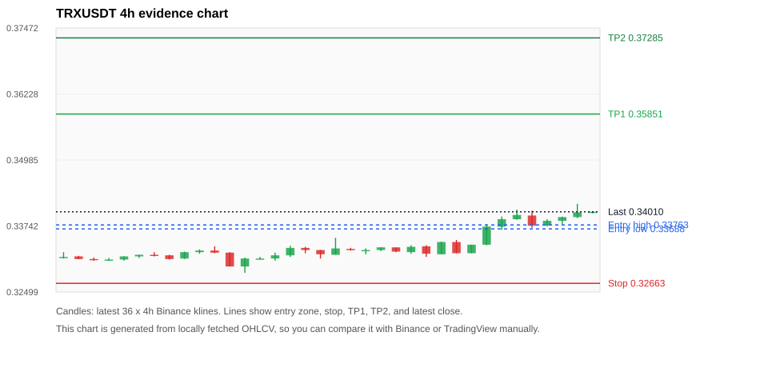
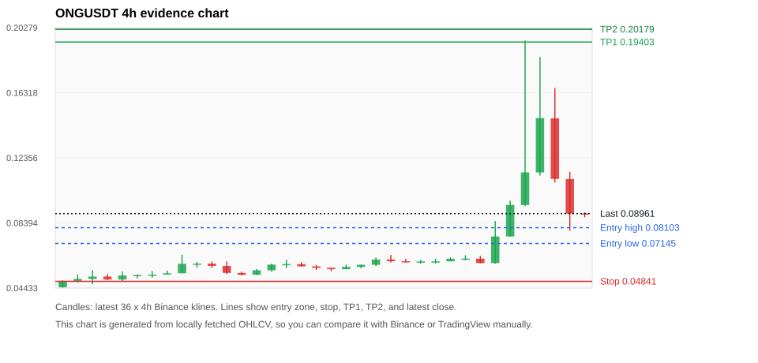
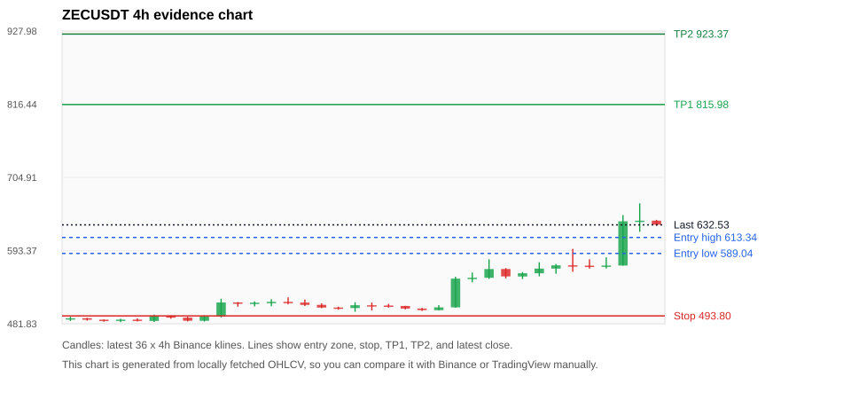
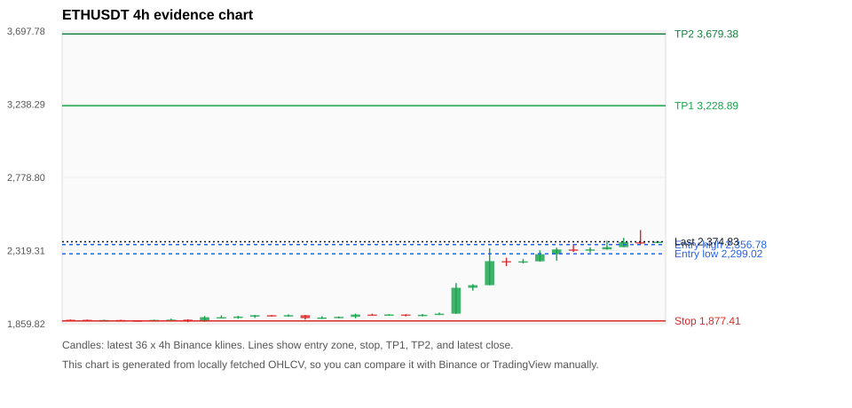
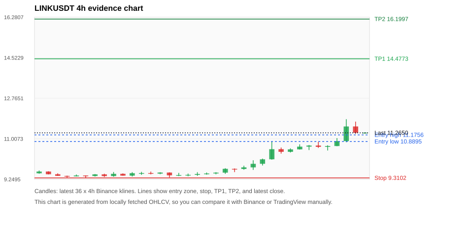

# Crypto 市场扫描报告 v1

- 报告时间：2026-08-21 20:07:17 CST
- Run ID：`20260821_120503_fd574ad0`
- Run type：`daily_full`
- Data validation mode：`paper`
- 数据来源：SQLite
- 报告版本：v1
- 扫描 ID：2ee5c0fa058f
- 数据源：Binance public spot API + CoinGecko/CoinMarketCap cross-check
- 过滤条件：USDT spot; 24h quote volume >= 30,000,000; trades >= 30,000; exclude stables/leveraged tokens; analyze 1h/4h/1d klines
- 默认单笔风险：账户权益的 1.00%

## 限制说明

- 交易信号仍以 Binance 现货公开 K 线为主源；外部数据源用于一致性复核。
- 结果是研究和模拟盘计划，不是确定收益或实盘下单指令。
- 历史长度过滤：候选币至少需要 180 根 1d K 线。
- 数据质量验证池：先验证 score 排名前 min(top_n * 2, 10) 的候选，再按 action + score 补足最终名单。
- 大盘环境过滤：RISK_ON; BTC/ETH 日线趋势均较强，允许山寨币买入候选。 BTC 7d=21.699948416618597; ETH 7d=26.03442779725851.
- Data cross-validation enabled: Binance primary source plus CoinGecko; CoinMarketCap is checked when an API key is configured.
- ONGUSDT validation state BLOCKED: BLOCKED: [BINANCE_KLINE_EXTREME_RANGE] Binance candle range exceeds 40%.; [BINANCE_KLINE_EXTREME_RANGE] Binance candle range exceeds 40%.; [BINANCE_KLINE_EXTREME_RANGE] Binance candle range exceeds 40%.; [BINANCE_KLINE_EXTREME_RANGE] Binance candle range exceeds 40%.; [BINANCE_KLINE_EXTREME_RANGE] Binance candle range exceeds 40%.; [BINANCE_KLINE_EXTREME_RANGE] Binance candle range exceeds 40%.; [BINANCE_KLINE_EXTREME_RANGE] Binance candle range exceeds 40%.; [BINANCE_KLINE_EXTREME_RANGE] Binance candle range exceeds 40%.; [BINANCE_KLINE_EXTREME_RANGE] Binance candle range exceeds 40%.; [BINANCE_KLINE_EXTREME_RANGE] Binance candle range exceeds 40%.; [BINANCE_KLINE_EXTREME_RANGE] Binance candle range exceeds 40%.; [EXTERNAL_24H_DIFF_WARNING] 24h change diff 3.09 points exceeds warning threshold; [EXTERNAL_IDENTITY_AMBIGUOUS] CoinMarketCap symbol mapping has 3 matches; selected lowest cmc_rank
- ZECUSDT validation state BLOCKED: BLOCKED: [BINANCE_KLINE_EXTREME_RANGE] Binance candle range exceeds 40%.; [BINANCE_KLINE_EXTREME_RANGE] Binance candle range exceeds 40%.; [EXTERNAL_IDENTITY_AMBIGUOUS] CoinMarketCap symbol mapping has 2 matches; selected lowest cmc_rank
- ETHUSDT validation state DEGRADED: DEGRADED: [EXTERNAL_IDENTITY_AMBIGUOUS] CoinMarketCap symbol mapping has 6 matches; selected lowest cmc_rank
- PUMPUSDT validation state DEGRADED: DEGRADED: [EXTERNAL_IDENTITY_AMBIGUOUS] CoinGecko symbol mapping has 3 exact matches; selected highest market-cap rank; [EXTERNAL_IDENTITY_AMBIGUOUS] CoinMarketCap symbol mapping has 15 matches; selected lowest cmc_rank
- TRXUSDT validation state DEGRADED: DEGRADED: [EXTERNAL_PROVIDER_RATE_LIMITED] Provider rate limited request for https://api.coingecko.com/api/v3/coins/markets?vs_currency=usd&ids=tron&price_change_percentage=24h&per_page=1&page=1: HTTP 429
- BTCUSDT validation state DEGRADED: DEGRADED: [EXTERNAL_PROVIDER_RATE_LIMITED] Provider rate limited request for https://api.coingecko.com/api/v3/coins/markets?vs_currency=usd&ids=bitcoin&price_change_percentage=24h&per_page=1&page=1: HTTP 429; [EXTERNAL_IDENTITY_AMBIGUOUS] CoinMarketCap symbol mapping has 13 matches; selected lowest cmc_rank
- AVAXUSDT validation state DEGRADED: DEGRADED: [EXTERNAL_PROVIDER_RATE_LIMITED] Provider rate limited request for https://api.coingecko.com/api/v3/coins/markets?vs_currency=usd&ids=avalanche-2&price_change_percentage=24h&per_page=1&page=1: HTTP 429
- XRPUSDT validation state DEGRADED: DEGRADED: [EXTERNAL_PROVIDER_RATE_LIMITED] Provider rate limited request for https://api.coingecko.com/api/v3/coins/markets?vs_currency=usd&ids=ripple&price_change_percentage=24h&per_page=1&page=1: HTTP 429; [EXTERNAL_IDENTITY_AMBIGUOUS] CoinMarketCap symbol mapping has 3 matches; selected lowest cmc_rank
- PEPEUSDT validation state DEGRADED: DEGRADED: [EXTERNAL_PROVIDER_RATE_LIMITED] Provider rate limited request for https://api.coingecko.com/api/v3/coins/markets?vs_currency=usd&ids=pepe&price_change_percentage=24h&per_page=1&page=1: HTTP 429; [EXTERNAL_IDENTITY_AMBIGUOUS] CoinMarketCap symbol mapping has 33 matches; selected lowest cmc_rank

## 5 个候选交易计划

| Rank | Coin | Action | Setup | Entry Zone | Stop Loss | TP1 | TP2 / Exit Rule | R/R | Verdict |
|---:|---|---|---|---:|---:|---:|---|---:|---|
| 1 | `TRX` | `BUY_CANDIDATE` | 回踩支撑/4h EMA 附近 | 0.33688 - 0.33763 | 0.32663 | 0.35851 | 0.37285 或跌破 4h 关键支撑 | 2.00-3.35 | 可考虑 |
| 2 | `ONG` | `WATCH_ONLY` | 涨幅较远，只等深回调 | 0.07145 - 0.08103 | 0.04841 | 0.19403 | 0.20179 或跌破 4h 关键支撑 | 4.23-4.51 | 只观察 |
| 3 | `ZEC` | `WATCH_ONLY` | 涨幅较远，只等深回调 | 589.04 - 613.34 | 493.80 | 815.98 | 923.37 或跌破 4h 关键支撑 | 2.00-3.00 | 只观察 |
| 4 | `ETH` | `WATCH_ONLY` | 趋势中，等回调入场 | 2,299.02 - 2,356.78 | 1,877.41 | 3,228.89 | 3,679.38 或跌破 4h 关键支撑 | 2.00-3.00 | 只等回调 |
| 5 | `LINK` | `WATCH_ONLY` | 趋势中，等回调入场 | 10.8895 - 11.1756 | 9.3102 | 14.4773 | 16.1997 或跌破 4h 关键支撑 | 2.00-3.00 | 只等回调 |

## 数据交叉验证摘要

价格差异以 Binance 当前价为基准；成交量口径不同，Binance 是 USDT 现货成交额，CoinGecko/CoinMarketCap 通常是全市场成交量。

| Rank | Coin | State | Identity | Max Price Diff | Max 24h Diff | Issue Codes | Message |
|---:|---|---|---|---:|---:|---|---|
| 1 | `TRX` | DEGRADED (DATA_WARNING) | UNCONFIRMED | 0.05% | 0.04 pts | EXTERNAL_PROVIDER_RATE_LIMITED | DEGRADED: [EXTERNAL_PROVIDER_RATE_LIMITED] Provider rate limited request for https://api.coingecko.com/api/v3/coins/markets?vs_currency=usd&ids=tron&price_change_percentage=24h&per_page=1&page=1: HTTP 429 |
| 2 | `ONG` | BLOCKED (DATA_ERROR) | UNCONFIRMED | 0.95% | 3.09 pts | BINANCE_KLINE_EXTREME_RANGE, EXTERNAL_24H_DIFF_WARNING, EXTERNAL_IDENTITY_AMBIGUOUS | BLOCKED: [BINANCE_KLINE_EXTREME_RANGE] Binance candle range exceeds 40%.; [BINANCE_KLINE_EXTREME_RANGE] Binance candle range exceeds 40%.; [BINANCE_KLINE_EXTREME_RANGE] Binance candle range exceeds 40%.; [BINANCE_KLINE_EXTREME_RANGE] Binance candle range exceeds 40%.; [BINANCE_KLINE_EXTREME_RANGE] Binance candle range exceeds 40%.; [BINANCE_KLINE_EXTREME_RANGE] Binance candle range exceeds 40%.; [BINANCE_KLINE_EXTREME_RANGE] Binance candle range exceeds 40%.; [BINANCE_KLINE_EXTREME_RANGE] Binance candle range exceeds 40%.; [BINANCE_KLINE_EXTREME_RANGE] Binance candle range exceeds 40%.; [BINANCE_KLINE_EXTREME_RANGE] Binance candle range exceeds 40%.; [BINANCE_KLINE_EXTREME_RANGE] Binance candle range exceeds 40%.; [EXTERNAL_24H_DIFF_WARNING] 24h change diff 3.09 points exceeds warning threshold; [EXTERNAL_IDENTITY_AMBIGUOUS] CoinMarketCap symbol mapping has 3 matches; selected lowest cmc_rank |
| 3 | `ZEC` | BLOCKED (DATA_ERROR) | UNCONFIRMED | 0.59% | 1.60 pts | BINANCE_KLINE_EXTREME_RANGE, EXTERNAL_IDENTITY_AMBIGUOUS | BLOCKED: [BINANCE_KLINE_EXTREME_RANGE] Binance candle range exceeds 40%.; [BINANCE_KLINE_EXTREME_RANGE] Binance candle range exceeds 40%.; [EXTERNAL_IDENTITY_AMBIGUOUS] CoinMarketCap symbol mapping has 2 matches; selected lowest cmc_rank |
| 4 | `ETH` | DEGRADED (DATA_WARNING) | UNCONFIRMED | 0.25% | 0.15 pts | EXTERNAL_IDENTITY_AMBIGUOUS | DEGRADED: [EXTERNAL_IDENTITY_AMBIGUOUS] CoinMarketCap symbol mapping has 6 matches; selected lowest cmc_rank |
| 5 | `LINK` | CLEAN (DATA_OK) | CONFIRMED | 0.13% | 0.25 pts | none | CLEAN: External provider checks agree with Binance within configured thresholds. |

## 候选币说明

### 1. TRX `TRXUSDT`



- 入选原因：回踩支撑/4h EMA 附近；24h +0.71%，7d +2.22%，4h RSI 67.54，24h 成交额 $49.3M。
- 交易失效条件：跌破 0.326626 或 4h 收盘重新失守关键支撑。
- 主要风险：主要风险是大盘同步回撤；External validation is degraded; this candidate is not a clean data sample.；Paper mode allows degraded validation; candidate is excluded from clean-data samples.。
- 数据交叉验证：DEGRADED / DATA_WARNING；身份=UNCONFIRMED；DEGRADED: [EXTERNAL_PROVIDER_RATE_LIMITED] Provider rate limited request for https://api.coingecko.com/api/v3/coins/markets?vs_currency=usd&ids=tron&price_change_percentage=24h&per_page=1&page=1: HTTP 429

#### 可点击人工验证

- [Binance 交易页](https://www.binance.com/en/trade/TRX_USDT)
- [TradingView 图表](https://www.tradingview.com/chart/?symbol=BINANCE%3ATRXUSDT)
- [CoinGecko 搜索](https://www.coingecko.com/en/search?query=TRX)
- [CoinMarketCap 搜索](https://coinmarketcap.com/search/?q=TRX)

#### 多数据源对照

| Source | Status | Identity | Blocking | Asset ID | Price | 24h Change | 24h Volume | Price Diff | 24h Diff | Updated | Issue Codes | Message |
|---|---|---|---:|---|---:|---:|---:|---:|---:|---|---|---|
| Binance | DATA_OK | CONFIRMED | no | TRXUSDT | 0.34010 | +0.71% | $49.3M | 0.00% | 0.00 pts | 2026-08-21T12:06:28+00:00 | none | Primary market data source passed health checks. |
| CoinGecko | DATA_WARNING | UNCONFIRMED | no | n/a | n/a | n/a | n/a | n/a | n/a | 2026-08-21T12:06:28+00:00 | EXTERNAL_PROVIDER_RATE_LIMITED | Provider rate limited request for https://api.coingecko.com/api/v3/coins/markets?vs_currency=usd&ids=tron&price_change_percentage=24h&per_page=1&page=1: HTTP 429 |
| CoinMarketCap | DATA_OK | CONFIRMED | no | 1958 | 0.33992 | +0.75% | $710.1M | 0.05% | 0.04 pts | 2026-08-21T12:05:00.000Z | none | External source agrees with Binance within thresholds. |

#### 指标证据

| 指标 | 数值 | 人工核对用途 |
|---|---:|---|
| 当前价 | 0.34010 | 与 Binance/TradingView 当前价格对照 |
| 24h 涨跌 | +0.71% | 与交易所 24h 涨跌对照 |
| 7d 涨跌 | +2.22% | 判断短线趋势是否延续 |
| 4h EMA20 | 0.33621 | 判断短期趋势支撑 |
| 4h EMA50 | 0.33417 | 判断中期趋势支撑 |
| 1d EMA20 | 0.33249 | 判断日线趋势 |
| 1d EMA50 | 0.33035 | 判断日线趋势 |
| 4h RSI14 | 67.54 | 判断是否过热/过弱 |
| 4h ATR14 | 0.0020357143 | 推导止损和入场缓冲 |
| 最近 18 根 4h 最低点 | 0.33160 | 支撑/止损参考 |
| 最近 36 根 4h 最高点 | 0.34160 | TP/压力参考 |
| 支撑位 | 0.33621 | 入场区间推导基础 |

#### 交易计划推导

- 支撑位 = 最近低点、4h EMA20、4h EMA50、1d EMA20 中不高于当前价的最高有效支撑 = `0.33621`。
- 入场区间 = 支撑位附近 + ATR 缓冲 = `0.33688 - 0.33763`。
- 止损 = min(最近 18 根 4h 最低点 * 0.985, 入场中位价 - 1.15 * ATR14) = `0.32663`。
- TP1 = max(最近 36 根 4h 最高点 * 0.995, 入场中位价 + 2R) = `0.35851`。
- TP2 = max(入场中位价 + 3R, TP1 * 1.04) = `0.37285`。

#### 最近 10 根 4h K线

| UTC 开盘时间 | Open | High | Low | Close | Quote Volume | Trades |
|---|---:|---:|---:|---:|---:|---:|
| 2026-08-20T00:00+00:00 | 0.33440 | 0.33480 | 0.33230 | 0.33230 | $6.3M | 10693 |
| 2026-08-20T04:00+00:00 | 0.33230 | 0.33390 | 0.33230 | 0.33390 | $3.5M | 9167 |
| 2026-08-20T08:00+00:00 | 0.33390 | 0.33770 | 0.33380 | 0.33730 | $11.6M | 22270 |
| 2026-08-20T12:00+00:00 | 0.33730 | 0.33920 | 0.33670 | 0.33870 | $12.2M | 18242 |
| 2026-08-20T16:00+00:00 | 0.33870 | 0.34050 | 0.33860 | 0.33950 | $8.4M | 14084 |
| 2026-08-20T20:00+00:00 | 0.33940 | 0.34030 | 0.33710 | 0.33750 | $8.2M | 10835 |
| 2026-08-21T00:00+00:00 | 0.33750 | 0.33870 | 0.33740 | 0.33840 | $5.5M | 8174 |
| 2026-08-21T04:00+00:00 | 0.33840 | 0.33920 | 0.33770 | 0.33910 | $4.4M | 11180 |
| 2026-08-21T08:00+00:00 | 0.33910 | 0.34160 | 0.33890 | 0.34000 | $11.2M | 22488 |
| 2026-08-21T12:00+00:00 | 0.34000 | 0.34010 | 0.33980 | 0.34010 | $75,152 | 359 |

### 2. ONG `ONGUSDT`



- 入选原因：涨幅较远，只等深回调；24h +51.39%，7d +104.31%，4h RSI 59.16，24h 成交额 $46.2M。
- 交易失效条件：跌破 0.048406423 或 4h 收盘重新失守关键支撑。
- 主要风险：距离支撑偏远，不能追市价；24h 振幅较大，回撤风险高；成交量突增，可能是事件驱动；Blocking data-quality issue detected; paper plan creation is not allowed.。
- 数据交叉验证：BLOCKED / DATA_ERROR；身份=UNCONFIRMED；BLOCKED: [BINANCE_KLINE_EXTREME_RANGE] Binance candle range exceeds 40%.; [BINANCE_KLINE_EXTREME_RANGE] Binance candle range exceeds 40%.; [BINANCE_KLINE_EXTREME_RANGE] Binance candle range exceeds 40%.; [BINANCE_KLINE_EXTREME_RANGE] Binance candle range exceeds 40%.; [BINANCE_KLINE_EXTREME_RANGE] Binance candle range exceeds 40%.; [BINANCE_KLINE_EXTREME_RANGE] Binance candle range exceeds 40%.; [BINANCE_KLINE_EXTREME_RANGE] Binance candle range exceeds 40%.; [BINANCE_KLINE_EXTREME_RANGE] Binance candle range exceeds 40%.; [BINANCE_KLINE_EXTREME_RANGE] Binance candle range exceeds 40%.; [BINANCE_KLINE_EXTREME_RANGE] Binance candle range exceeds 40%.; [BINANCE_KLINE_EXTREME_RANGE] Binance candle range exceeds 40%.; [EXTERNAL_24H_DIFF_WARNING] 24h change diff 3.09 points exceeds warning threshold; [EXTERNAL_IDENTITY_AMBIGUOUS] CoinMarketCap symbol mapping has 3 matches; selected lowest cmc_rank

#### 可点击人工验证

- [Binance 交易页](https://www.binance.com/en/trade/ONG_USDT)
- [TradingView 图表](https://www.tradingview.com/chart/?symbol=BINANCE%3AONGUSDT)
- [CoinGecko 搜索](https://www.coingecko.com/en/search?query=ONG)
- [CoinMarketCap 搜索](https://coinmarketcap.com/search/?q=ONG)

#### 多数据源对照

| Source | Status | Identity | Blocking | Asset ID | Price | 24h Change | 24h Volume | Price Diff | 24h Diff | Updated | Issue Codes | Message |
|---|---|---|---:|---|---:|---:|---:|---:|---:|---|---|---|
| Binance | DATA_ERROR | CONFIRMED | yes | ONGUSDT | 0.08961 | +51.39% | $46.2M | 0.00% | 0.00 pts | 2026-08-21T12:06:28+00:00 | BINANCE_KLINE_EXTREME_RANGE | [BINANCE_KLINE_EXTREME_RANGE] Binance candle range exceeds 40%.; [BINANCE_KLINE_EXTREME_RANGE] Binance candle range exceeds 40%.; [BINANCE_KLINE_EXTREME_RANGE] Binance candle range exceeds 40%.; [BINANCE_KLINE_EXTREME_RANGE] Binance candle range exceeds 40%.; [BINANCE_KLINE_EXTREME_RANGE] Binance candle range exceeds 40%.; [BINANCE_KLINE_EXTREME_RANGE] Binance candle range exceeds 40%.; [BINANCE_KLINE_EXTREME_RANGE] Binance candle range exceeds 40%.; [BINANCE_KLINE_EXTREME_RANGE] Binance candle range exceeds 40%.; [BINANCE_KLINE_EXTREME_RANGE] Binance candle range exceeds 40%.; [BINANCE_KLINE_EXTREME_RANGE] Binance candle range exceeds 40%.; [BINANCE_KLINE_EXTREME_RANGE] Binance candle range exceeds 40%. |
| CoinGecko | DATA_WARNING | CONFIRMED | yes | ong | 0.08879 | +48.30% | $136.0M | 0.92% | 3.09 pts | 2026-08-21T12:04:20.000Z | EXTERNAL_24H_DIFF_WARNING | [EXTERNAL_24H_DIFF_WARNING] 24h change diff 3.09 points exceeds warning threshold |
| CoinMarketCap | DATA_WARNING | UNCONFIRMED | no | 3217 | 0.08876 | +51.10% | $148.5M | 0.95% | 0.29 pts | 2026-08-21T12:05:00.000Z | EXTERNAL_IDENTITY_AMBIGUOUS | [EXTERNAL_IDENTITY_AMBIGUOUS] CoinMarketCap symbol mapping has 3 matches; selected lowest cmc_rank |

#### 指标证据

| 指标 | 数值 | 人工核对用途 |
|---|---:|---|
| 当前价 | 0.08961 | 与 Binance/TradingView 当前价格对照 |
| 24h 涨跌 | +51.39% | 与交易所 24h 涨跌对照 |
| 7d 涨跌 | +104.31% | 判断短线趋势是否延续 |
| 4h EMA20 | 0.08087 | 判断短期趋势支撑 |
| 4h EMA50 | 0.06523 | 判断中期趋势支撑 |
| 1d EMA20 | 0.05775 | 判断日线趋势 |
| 1d EMA50 | 0.05160 | 判断日线趋势 |
| 4h RSI14 | 59.16 | 判断是否过热/过弱 |
| 4h ATR14 | 0.02421 | 推导止损和入场缓冲 |
| 最近 18 根 4h 最低点 | 0.05464 | 支撑/止损参考 |
| 最近 36 根 4h 最高点 | 0.19500 | TP/压力参考 |
| 支撑位 | 0.08087 | 入场区间推导基础 |

#### 交易计划推导

- 支撑位 = 最近低点、4h EMA20、4h EMA50、1d EMA20 中不高于当前价的最高有效支撑 = `0.08087`。
- 入场区间 = 支撑位附近 + ATR 缓冲 = `0.07145 - 0.08103`。
- 止损 = min(最近 18 根 4h 最低点 * 0.985, 入场中位价 - 1.15 * ATR14) = `0.04841`。
- TP1 = max(最近 36 根 4h 最高点 * 0.995, 入场中位价 + 2R) = `0.19403`。
- TP2 = max(入场中位价 + 3R, TP1 * 1.04) = `0.20179`。

#### 最近 10 根 4h K线

| UTC 开盘时间 | Open | High | Low | Close | Quote Volume | Trades |
|---|---:|---:|---:|---:|---:|---:|
| 2026-08-20T00:00+00:00 | 0.06057 | 0.06306 | 0.06057 | 0.06213 | $399,698 | 18875 |
| 2026-08-20T04:00+00:00 | 0.06212 | 0.06427 | 0.06125 | 0.06224 | $279,833 | 12435 |
| 2026-08-20T08:00+00:00 | 0.06221 | 0.06379 | 0.05933 | 0.05950 | $274,873 | 13220 |
| 2026-08-20T12:00+00:00 | 0.05951 | 0.08507 | 0.05910 | 0.07570 | $5.5M | 223028 |
| 2026-08-20T16:00+00:00 | 0.07571 | 0.09750 | 0.07559 | 0.09488 | $2.9M | 125784 |
| 2026-08-20T20:00+00:00 | 0.09487 | 0.19500 | 0.09414 | 0.11469 | $12.6M | 667686 |
| 2026-08-21T00:00+00:00 | 0.11468 | 0.18501 | 0.11278 | 0.14775 | $8.9M | 513557 |
| 2026-08-21T04:00+00:00 | 0.14761 | 0.16600 | 0.10852 | 0.11073 | $5.7M | 340300 |
| 2026-08-21T08:00+00:00 | 0.11072 | 0.11500 | 0.07921 | 0.08962 | $10.4M | 392096 |
| 2026-08-21T12:00+00:00 | 0.08979 | 0.09033 | 0.08735 | 0.08961 | $165,231 | 4610 |

### 3. ZEC `ZECUSDT`



- 入选原因：涨幅较远，只等深回调；24h +11.70%，7d +30.71%，4h RSI 88.58，24h 成交额 $245.5M。
- 交易失效条件：跌破 493.8002 或 4h 收盘重新失守关键支撑。
- 主要风险：距离支撑偏远，不能追市价；4h RSI 偏热；成交量突增，可能是事件驱动；Blocking data-quality issue detected; paper plan creation is not allowed.。
- 数据交叉验证：BLOCKED / DATA_ERROR；身份=UNCONFIRMED；BLOCKED: [BINANCE_KLINE_EXTREME_RANGE] Binance candle range exceeds 40%.; [BINANCE_KLINE_EXTREME_RANGE] Binance candle range exceeds 40%.; [EXTERNAL_IDENTITY_AMBIGUOUS] CoinMarketCap symbol mapping has 2 matches; selected lowest cmc_rank

#### 可点击人工验证

- [Binance 交易页](https://www.binance.com/en/trade/ZEC_USDT)
- [TradingView 图表](https://www.tradingview.com/chart/?symbol=BINANCE%3AZECUSDT)
- [CoinGecko 搜索](https://www.coingecko.com/en/search?query=ZEC)
- [CoinMarketCap 搜索](https://coinmarketcap.com/search/?q=ZEC)

#### 多数据源对照

| Source | Status | Identity | Blocking | Asset ID | Price | 24h Change | 24h Volume | Price Diff | 24h Diff | Updated | Issue Codes | Message |
|---|---|---|---:|---|---:|---:|---:|---:|---:|---|---|---|
| Binance | DATA_ERROR | CONFIRMED | yes | ZECUSDT | 632.53 | +11.70% | $245.5M | 0.00% | 0.00 pts | 2026-08-21T12:06:28+00:00 | BINANCE_KLINE_EXTREME_RANGE | [BINANCE_KLINE_EXTREME_RANGE] Binance candle range exceeds 40%.; [BINANCE_KLINE_EXTREME_RANGE] Binance candle range exceeds 40%. |
| CoinGecko | DATA_OK | CONFIRMED | no | zcash | 634.75 | +13.30% | $883.1M | 0.35% | 1.60 pts | 2026-08-21T12:04:20.000Z | none | External source agrees with Binance within thresholds. |
| CoinMarketCap | DATA_WARNING | UNCONFIRMED | no | 1437 | 636.26 | +12.29% | $1.05B | 0.59% | 0.59 pts | 2026-08-21T12:05:00.000Z | EXTERNAL_IDENTITY_AMBIGUOUS | [EXTERNAL_IDENTITY_AMBIGUOUS] CoinMarketCap symbol mapping has 2 matches; selected lowest cmc_rank |

#### 指标证据

| 指标 | 数值 | 人工核对用途 |
|---|---:|---|
| 当前价 | 632.53 | 与 Binance/TradingView 当前价格对照 |
| 24h 涨跌 | +11.70% | 与交易所 24h 涨跌对照 |
| 7d 涨跌 | +30.71% | 判断短线趋势是否延续 |
| 4h EMA20 | 566.68 | 判断短期趋势支撑 |
| 4h EMA50 | 533.44 | 判断中期趋势支撑 |
| 1d EMA20 | 521.17 | 判断日线趋势 |
| 1d EMA50 | 502.34 | 判断日线趋势 |
| 4h RSI14 | 88.58 | 判断是否过热/过弱 |
| 4h ATR14 | 25.5821 | 推导止损和入场缓冲 |
| 最近 18 根 4h 最低点 | 501.32 | 支撑/止损参考 |
| 最近 36 根 4h 最高点 | 665.30 | TP/压力参考 |
| 支撑位 | 566.68 | 入场区间推导基础 |

#### 交易计划推导

- 支撑位 = 最近低点、4h EMA20、4h EMA50、1d EMA20 中不高于当前价的最高有效支撑 = `566.68`。
- 入场区间 = 支撑位附近 + ATR 缓冲 = `589.04 - 613.34`。
- 止损 = min(最近 18 根 4h 最低点 * 0.985, 入场中位价 - 1.15 * ATR14) = `493.80`。
- TP1 = max(最近 36 根 4h 最高点 * 0.995, 入场中位价 + 2R) = `815.98`。
- TP2 = max(入场中位价 + 3R, TP1 * 1.04) = `923.37`。

#### 最近 10 根 4h K线

| UTC 开盘时间 | Open | High | Low | Close | Quote Volume | Trades |
|---|---:|---:|---:|---:|---:|---:|
| 2026-08-20T00:00+00:00 | 565.25 | 566.61 | 550.93 | 553.97 | $11.9M | 45990 |
| 2026-08-20T04:00+00:00 | 553.85 | 560.58 | 549.93 | 558.76 | $8.4M | 39363 |
| 2026-08-20T08:00+00:00 | 558.74 | 575.53 | 554.02 | 565.90 | $25.1M | 91135 |
| 2026-08-20T12:00+00:00 | 565.84 | 572.99 | 558.00 | 570.88 | $24.3M | 110245 |
| 2026-08-20T16:00+00:00 | 570.91 | 595.96 | 561.06 | 570.38 | $33.4M | 137699 |
| 2026-08-20T20:00+00:00 | 570.34 | 579.99 | 565.78 | 568.91 | $17.1M | 71570 |
| 2026-08-21T00:00+00:00 | 568.91 | 583.00 | 566.00 | 570.51 | $18.6M | 93053 |
| 2026-08-21T04:00+00:00 | 570.55 | 647.46 | 570.47 | 638.00 | $65.0M | 233916 |
| 2026-08-21T08:00+00:00 | 637.99 | 665.30 | 622.03 | 638.93 | $85.3M | 379813 |
| 2026-08-21T12:00+00:00 | 638.94 | 640.13 | 631.12 | 632.83 | $3.1M | 11536 |

### 4. ETH `ETHUSDT`



- 入选原因：趋势中，等回调入场；24h +3.56%，7d +27.00%，4h RSI 98.85，24h 成交额 $1.58B。
- 交易失效条件：跌破 1877.41 或 4h 收盘重新失守关键支撑。
- 主要风险：4h RSI 偏热；External validation is degraded; this candidate is not a clean data sample.；Paper mode allows degraded validation; candidate is excluded from clean-data samples.。
- 数据交叉验证：DEGRADED / DATA_WARNING；身份=UNCONFIRMED；DEGRADED: [EXTERNAL_IDENTITY_AMBIGUOUS] CoinMarketCap symbol mapping has 6 matches; selected lowest cmc_rank

#### 可点击人工验证

- [Binance 交易页](https://www.binance.com/en/trade/ETH_USDT)
- [TradingView 图表](https://www.tradingview.com/chart/?symbol=BINANCE%3AETHUSDT)
- [CoinGecko 搜索](https://www.coingecko.com/en/search?query=ETH)
- [CoinMarketCap 搜索](https://coinmarketcap.com/search/?q=ETH)

#### 多数据源对照

| Source | Status | Identity | Blocking | Asset ID | Price | 24h Change | 24h Volume | Price Diff | 24h Diff | Updated | Issue Codes | Message |
|---|---|---|---:|---|---:|---:|---:|---:|---:|---|---|---|
| Binance | DATA_OK | CONFIRMED | no | ETHUSDT | 2,374.83 | +3.56% | $1.58B | 0.00% | 0.00 pts | 2026-08-21T12:06:28+00:00 | none | Primary market data source passed health checks. |
| CoinGecko | DATA_OK | CONFIRMED | no | ethereum | 2,368.89 | +3.70% | $27.56B | 0.25% | 0.14 pts | 2026-08-21T12:04:20.000Z | none | External source agrees with Binance within thresholds. |
| CoinMarketCap | DATA_WARNING | UNCONFIRMED | no | 1027 | 2,372.54 | +3.41% | $30.47B | 0.10% | 0.15 pts | 2026-08-21T12:05:00.000Z | EXTERNAL_IDENTITY_AMBIGUOUS | [EXTERNAL_IDENTITY_AMBIGUOUS] CoinMarketCap symbol mapping has 6 matches; selected lowest cmc_rank |

#### 指标证据

| 指标 | 数值 | 人工核对用途 |
|---|---:|---|
| 当前价 | 2,374.83 | 与 Binance/TradingView 当前价格对照 |
| 24h 涨跌 | +3.56% | 与交易所 24h 涨跌对照 |
| 7d 涨跌 | +27.00% | 判断短线趋势是否延续 |
| 4h EMA20 | 2,200.47 | 判断短期趋势支撑 |
| 4h EMA50 | 2,057.88 | 判断中期趋势支撑 |
| 1d EMA20 | 2,001.53 | 判断日线趋势 |
| 1d EMA50 | 1,920.82 | 判断日线趋势 |
| 4h RSI14 | 98.85 | 判断是否过热/过弱 |
| 4h ATR14 | 72.1957 | 推导止损和入场缓冲 |
| 最近 18 根 4h 最低点 | 1,906.00 | 支撑/止损参考 |
| 最近 36 根 4h 最高点 | 2,447.98 | TP/压力参考 |
| 支撑位 | 2,200.47 | 入场区间推导基础 |

#### 交易计划推导

- 支撑位 = 最近低点、4h EMA20、4h EMA50、1d EMA20 中不高于当前价的最高有效支撑 = `2,200.47`。
- 入场区间 = 支撑位附近 + ATR 缓冲 = `2,299.02 - 2,356.78`。
- 止损 = min(最近 18 根 4h 最低点 * 0.985, 入场中位价 - 1.15 * ATR14) = `1,877.41`。
- TP1 = max(最近 36 根 4h 最高点 * 0.995, 入场中位价 + 2R) = `3,228.89`。
- TP2 = max(入场中位价 + 3R, TP1 * 1.04) = `3,679.38`。

#### 最近 10 根 4h K线

| UTC 开盘时间 | Open | High | Low | Close | Quote Volume | Trades |
|---|---:|---:|---:|---:|---:|---:|
| 2026-08-20T00:00+00:00 | 2,252.81 | 2,274.25 | 2,221.54 | 2,251.21 | $243.6M | 897465 |
| 2026-08-20T04:00+00:00 | 2,251.21 | 2,267.30 | 2,238.97 | 2,251.81 | $167.1M | 565894 |
| 2026-08-20T08:00+00:00 | 2,251.81 | 2,320.00 | 2,249.19 | 2,296.58 | $339.8M | 1290207 |
| 2026-08-20T12:00+00:00 | 2,296.59 | 2,337.89 | 2,255.68 | 2,326.41 | $319.2M | 1432294 |
| 2026-08-20T16:00+00:00 | 2,326.40 | 2,360.00 | 2,310.44 | 2,323.77 | $325.5M | 1022916 |
| 2026-08-20T20:00+00:00 | 2,323.78 | 2,340.00 | 2,306.67 | 2,326.82 | $90.5M | 432351 |
| 2026-08-21T00:00+00:00 | 2,326.83 | 2,380.82 | 2,324.99 | 2,341.04 | $225.3M | 1129939 |
| 2026-08-21T04:00+00:00 | 2,341.05 | 2,398.71 | 2,341.05 | 2,371.66 | $216.5M | 914983 |
| 2026-08-21T08:00+00:00 | 2,371.67 | 2,447.98 | 2,357.18 | 2,370.47 | $417.5M | 1756205 |
| 2026-08-21T12:00+00:00 | 2,370.48 | 2,375.16 | 2,365.44 | 2,374.84 | $8.0M | 26144 |

### 5. LINK `LINKUSDT`



- 入选原因：趋势中，等回调入场；24h +5.75%，7d +27.42%，4h RSI 82.00，24h 成交额 $62.9M。
- 交易失效条件：跌破 9.31022 或 4h 收盘重新失守关键支撑。
- 主要风险：4h RSI 偏热。
- 数据交叉验证：CLEAN / DATA_OK；身份=CONFIRMED；CLEAN: External provider checks agree with Binance within configured thresholds.

#### 可点击人工验证

- [Binance 交易页](https://www.binance.com/en/trade/LINK_USDT)
- [TradingView 图表](https://www.tradingview.com/chart/?symbol=BINANCE%3ALINKUSDT)
- [CoinGecko 搜索](https://www.coingecko.com/en/search?query=LINK)
- [CoinMarketCap 搜索](https://coinmarketcap.com/search/?q=LINK)

#### 多数据源对照

| Source | Status | Identity | Blocking | Asset ID | Price | 24h Change | 24h Volume | Price Diff | 24h Diff | Updated | Issue Codes | Message |
|---|---|---|---:|---|---:|---:|---:|---:|---:|---|---|---|
| Binance | DATA_OK | CONFIRMED | no | LINKUSDT | 11.2650 | +5.75% | $62.9M | 0.00% | 0.00 pts | 2026-08-21T12:06:28+00:00 | none | Primary market data source passed health checks. |
| CoinGecko | DATA_OK | CONFIRMED | no | chainlink | 11.2500 | +5.50% | $797.8M | 0.13% | 0.25 pts | 2026-08-21T12:04:20.000Z | none | External source agrees with Binance within thresholds. |
| CoinMarketCap | DATA_OK | CONFIRMED | no | 1975 | 11.2535 | +5.56% | $769.0M | 0.10% | 0.19 pts | 2026-08-21T12:05:00.000Z | none | External source agrees with Binance within thresholds. |

#### 指标证据

| 指标 | 数值 | 人工核对用途 |
|---|---:|---|
| 当前价 | 11.2650 | 与 Binance/TradingView 当前价格对照 |
| 24h 涨跌 | +5.75% | 与交易所 24h 涨跌对照 |
| 7d 涨跌 | +27.42% | 判断短线趋势是否延续 |
| 4h EMA20 | 10.4887 | 判断短期趋势支撑 |
| 4h EMA50 | 9.8332 | 判断中期趋势支撑 |
| 1d EMA20 | 9.3310 | 判断日线趋势 |
| 1d EMA50 | 8.7734 | 判断日线趋势 |
| 4h RSI14 | 82.00 | 判断是否过热/过弱 |
| 4h ATR14 | 0.35757 | 推导止损和入场缓冲 |
| 最近 18 根 4h 最低点 | 9.4520 | 支撑/止损参考 |
| 最近 36 根 4h 最高点 | 11.8570 | TP/压力参考 |
| 支撑位 | 10.4887 | 入场区间推导基础 |

#### 交易计划推导

- 支撑位 = 最近低点、4h EMA20、4h EMA50、1d EMA20 中不高于当前价的最高有效支撑 = `10.4887`。
- 入场区间 = 支撑位附近 + ATR 缓冲 = `10.8895 - 11.1756`。
- 止损 = min(最近 18 根 4h 最低点 * 0.985, 入场中位价 - 1.15 * ATR14) = `9.3102`。
- TP1 = max(最近 36 根 4h 最高点 * 0.995, 入场中位价 + 2R) = `14.4773`。
- TP2 = max(入场中位价 + 3R, TP1 * 1.04) = `16.1997`。

#### 最近 10 根 4h K线

| UTC 开盘时间 | Open | High | Low | Close | Quote Volume | Trades |
|---|---:|---:|---:|---:|---:|---:|
| 2026-08-20T00:00+00:00 | 10.5570 | 10.6290 | 10.3650 | 10.4420 | $5.5M | 82684 |
| 2026-08-20T04:00+00:00 | 10.4420 | 10.5930 | 10.4120 | 10.5480 | $3.4M | 58114 |
| 2026-08-20T08:00+00:00 | 10.5480 | 10.7680 | 10.5400 | 10.6670 | $7.9M | 111289 |
| 2026-08-20T12:00+00:00 | 10.6670 | 10.7370 | 10.5190 | 10.7140 | $6.2M | 111019 |
| 2026-08-20T16:00+00:00 | 10.7150 | 10.8760 | 10.6100 | 10.6570 | $6.9M | 121325 |
| 2026-08-20T20:00+00:00 | 10.6570 | 10.7270 | 10.5000 | 10.6920 | $4.0M | 64891 |
| 2026-08-21T00:00+00:00 | 10.6930 | 11.0380 | 10.6870 | 10.9060 | $9.4M | 149537 |
| 2026-08-21T04:00+00:00 | 10.9060 | 11.8570 | 10.8580 | 11.5410 | $19.9M | 219369 |
| 2026-08-21T08:00+00:00 | 11.5420 | 11.7520 | 11.2230 | 11.2700 | $16.5M | 238897 |
| 2026-08-21T12:00+00:00 | 11.2700 | 11.2900 | 11.2320 | 11.2740 | $372,706 | 5378 |

## 组合风控

- 不要 5 个候选全部满仓买入。
- 同时持仓总风险建议控制在账户权益的 3% - 5% 以内。
- 如果 BTC/ETH 同时破位，暂停山寨币多头计划或降低仓位。
- 第一版报告用于模拟盘和人工复核，不自动下单。

## 原始数据

```json
[
  {
    "rank": 1,
    "symbol": "TRXUSDT",
    "base_asset": "TRX",
    "price": 0.3401,
    "score": 63.30251310306393,
    "setup": "回踩支撑/4h EMA 附近",
    "verdict": "可考虑",
    "entry_low": 0.33687782084620144,
    "entry_high": 0.33763041002614913,
    "stop_loss": 0.326626,
    "take_profit_1": 0.3585103463085258,
    "take_profit_2": 0.3728507601608668,
    "risk_reward_1": 2.0,
    "risk_reward_2": 3.34929037405165,
    "pct_24h": 0.711,
    "pct_3d": 2.285714285714291,
    "pct_7d": 2.224226029455978,
    "quote_volume_24h": 49256996.2055,
    "trades_24h": 84441,
    "high_low_range_24h": 1.455301455301461,
    "rsi_1h": 53.01204819277111,
    "rsi_4h": 67.53926701570691,
    "ema20_4h": 0.3362054100261491,
    "ema50_4h": 0.33417031765237243,
    "ema20_1d": 0.3324943012245084,
    "ema50_1d": 0.33035303785635634,
    "atr_4h": 0.0020357142857142874,
    "macd_hist_4h": 0.0005815028927861475,
    "volume_ratio_24h": 1.8500773454168433,
    "support_level": 0.3362054100261491,
    "recent_low_4h_18": 0.3316,
    "recent_high_4h_36": 0.3416,
    "distance_to_support_pct": 1.1583959858195048,
    "binance_trade_url": "https://www.binance.com/en/trade/TRX_USDT",
    "tradingview_url": "https://www.tradingview.com/chart/?symbol=BINANCE%3ATRXUSDT",
    "coingecko_search_url": "https://www.coingecko.com/en/search?query=TRX",
    "coinmarketcap_search_url": "https://coinmarketcap.com/search/?q=TRX",
    "invalidation": "跌破 0.326626 或 4h 收盘重新失守关键支撑",
    "recent_4h_klines": [
      {
        "open_time_utc": "2026-08-15T16:00+00:00",
        "open": 0.3314,
        "high": 0.3325,
        "low": 0.3313,
        "close": 0.3316,
        "quote_volume": 3898474.8434,
        "trades": 9268
      },
      {
        "open_time_utc": "2026-08-15T20:00+00:00",
        "open": 0.3317,
        "high": 0.3318,
        "low": 0.3312,
        "close": 0.3312,
        "quote_volume": 1703051.51757,
        "trades": 8037
      },
      {
        "open_time_utc": "2026-08-16T00:00+00:00",
        "open": 0.3312,
        "high": 0.3315,
        "low": 0.3309,
        "close": 0.331,
        "quote_volume": 1821204.29676,
        "trades": 4349
      },
      {
        "open_time_utc": "2026-08-16T04:00+00:00",
        "open": 0.3309,
        "high": 0.3314,
        "low": 0.3309,
        "close": 0.3311,
        "quote_volume": 944412.52746,
        "trades": 5094
      },
      {
        "open_time_utc": "2026-08-16T08:00+00:00",
        "open": 0.3311,
        "high": 0.3317,
        "low": 0.3309,
        "close": 0.3317,
        "quote_volume": 1793274.07591,
        "trades": 7094
      },
      {
        "open_time_utc": "2026-08-16T12:00+00:00",
        "open": 0.3317,
        "high": 0.332,
        "low": 0.3314,
        "close": 0.332,
        "quote_volume": 2669230.31935,
        "trades": 7220
      },
      {
        "open_time_utc": "2026-08-16T16:00+00:00",
        "open": 0.332,
        "high": 0.3325,
        "low": 0.3317,
        "close": 0.3318,
        "quote_volume": 2654438.61941,
        "trades": 6468
      },
      {
        "open_time_utc": "2026-08-16T20:00+00:00",
        "open": 0.3319,
        "high": 0.332,
        "low": 0.3311,
        "close": 0.3312,
        "quote_volume": 3095843.04276,
        "trades": 6288
      },
      {
        "open_time_utc": "2026-08-17T00:00+00:00",
        "open": 0.3313,
        "high": 0.3326,
        "low": 0.3312,
        "close": 0.3325,
        "quote_volume": 3376218.24137,
        "trades": 5541
      },
      {
        "open_time_utc": "2026-08-17T04:00+00:00",
        "open": 0.3325,
        "high": 0.333,
        "low": 0.3322,
        "close": 0.3328,
        "quote_volume": 2230630.27092,
        "trades": 6703
      },
      {
        "open_time_utc": "2026-08-17T08:00+00:00",
        "open": 0.3328,
        "high": 0.3336,
        "low": 0.3323,
        "close": 0.3324,
        "quote_volume": 4043315.63336,
        "trades": 8754
      },
      {
        "open_time_utc": "2026-08-17T12:00+00:00",
        "open": 0.3324,
        "high": 0.3325,
        "low": 0.3298,
        "close": 0.3298,
        "quote_volume": 4999489.42498,
        "trades": 11275
      },
      {
        "open_time_utc": "2026-08-17T16:00+00:00",
        "open": 0.3298,
        "high": 0.3315,
        "low": 0.3286,
        "close": 0.3313,
        "quote_volume": 9388776.07141,
        "trades": 12643
      },
      {
        "open_time_utc": "2026-08-17T20:00+00:00",
        "open": 0.3313,
        "high": 0.3316,
        "low": 0.3311,
        "close": 0.3313,
        "quote_volume": 1306965.99676,
        "trades": 4530
      },
      {
        "open_time_utc": "2026-08-18T00:00+00:00",
        "open": 0.3313,
        "high": 0.3324,
        "low": 0.3309,
        "close": 0.3319,
        "quote_volume": 3601168.06866,
        "trades": 5798
      },
      {
        "open_time_utc": "2026-08-18T04:00+00:00",
        "open": 0.3319,
        "high": 0.3337,
        "low": 0.3316,
        "close": 0.3333,
        "quote_volume": 5576585.35154,
        "trades": 8308
      },
      {
        "open_time_utc": "2026-08-18T08:00+00:00",
        "open": 0.3333,
        "high": 0.3335,
        "low": 0.3323,
        "close": 0.3329,
        "quote_volume": 5881258.94667,
        "trades": 12158
      },
      {
        "open_time_utc": "2026-08-18T12:00+00:00",
        "open": 0.3329,
        "high": 0.3329,
        "low": 0.3313,
        "close": 0.3321,
        "quote_volume": 5907260.7762,
        "trades": 11097
      },
      {
        "open_time_utc": "2026-08-18T16:00+00:00",
        "open": 0.332,
        "high": 0.3352,
        "low": 0.332,
        "close": 0.3332,
        "quote_volume": 9060983.49125,
        "trades": 12518
      },
      {
        "open_time_utc": "2026-08-18T20:00+00:00",
        "open": 0.3331,
        "high": 0.3333,
        "low": 0.3328,
        "close": 0.3329,
        "quote_volume": 1482089.21003,
        "trades": 4634
      },
      {
        "open_time_utc": "2026-08-19T00:00+00:00",
        "open": 0.3328,
        "high": 0.3332,
        "low": 0.3321,
        "close": 0.3329,
        "quote_volume": 3777874.8411,
        "trades": 5020
      },
      {
        "open_time_utc": "2026-08-19T04:00+00:00",
        "open": 0.3329,
        "high": 0.3334,
        "low": 0.3327,
        "close": 0.3334,
        "quote_volume": 1465384.67577,
        "trades": 4885
      },
      {
        "open_time_utc": "2026-08-19T08:00+00:00",
        "open": 0.3334,
        "high": 0.3334,
        "low": 0.3325,
        "close": 0.3326,
        "quote_volume": 2138432.01645,
        "trades": 7701
      },
      {
        "open_time_utc": "2026-08-19T12:00+00:00",
        "open": 0.3325,
        "high": 0.3338,
        "low": 0.3322,
        "close": 0.3335,
        "quote_volume": 7292384.02563,
        "trades": 13312
      },
      {
        "open_time_utc": "2026-08-19T16:00+00:00",
        "open": 0.3336,
        "high": 0.3338,
        "low": 0.3316,
        "close": 0.3322,
        "quote_volume": 6903650.26768,
        "trades": 10427
      },
      {
        "open_time_utc": "2026-08-19T20:00+00:00",
        "open": 0.3321,
        "high": 0.3345,
        "low": 0.3321,
        "close": 0.3344,
        "quote_volume": 8260600.80602,
        "trades": 15805
      },
      {
        "open_time_utc": "2026-08-20T00:00+00:00",
        "open": 0.3344,
        "high": 0.3348,
        "low": 0.3323,
        "close": 0.3323,
        "quote_volume": 6250881.70381,
        "trades": 10693
      },
      {
        "open_time_utc": "2026-08-20T04:00+00:00",
        "open": 0.3323,
        "high": 0.3339,
        "low": 0.3323,
        "close": 0.3339,
        "quote_volume": 3519060.17744,
        "trades": 9167
      },
      {
        "open_time_utc": "2026-08-20T08:00+00:00",
        "open": 0.3339,
        "high": 0.3377,
        "low": 0.3338,
        "close": 0.3373,
        "quote_volume": 11575001.83955,
        "trades": 22270
      },
      {
        "open_time_utc": "2026-08-20T12:00+00:00",
        "open": 0.3373,
        "high": 0.3392,
        "low": 0.3367,
        "close": 0.3387,
        "quote_volume": 12233133.36204,
        "trades": 18242
      },
      {
        "open_time_utc": "2026-08-20T16:00+00:00",
        "open": 0.3387,
        "high": 0.3405,
        "low": 0.3386,
        "close": 0.3395,
        "quote_volume": 8446292.61148,
        "trades": 14084
      },
      {
        "open_time_utc": "2026-08-20T20:00+00:00",
        "open": 0.3394,
        "high": 0.3403,
        "low": 0.3371,
        "close": 0.3375,
        "quote_volume": 8223755.20827,
        "trades": 10835
      },
      {
        "open_time_utc": "2026-08-21T00:00+00:00",
        "open": 0.3375,
        "high": 0.3387,
        "low": 0.3374,
        "close": 0.3384,
        "quote_volume": 5486919.39802,
        "trades": 8174
      },
      {
        "open_time_utc": "2026-08-21T04:00+00:00",
        "open": 0.3384,
        "high": 0.3392,
        "low": 0.3377,
        "close": 0.3391,
        "quote_volume": 4360001.54631,
        "trades": 11180
      },
      {
        "open_time_utc": "2026-08-21T08:00+00:00",
        "open": 0.3391,
        "high": 0.3416,
        "low": 0.3389,
        "close": 0.34,
        "quote_volume": 11213418.72357,
        "trades": 22488
      },
      {
        "open_time_utc": "2026-08-21T12:00+00:00",
        "open": 0.34,
        "high": 0.3401,
        "low": 0.3398,
        "close": 0.3401,
        "quote_volume": 75152.17277,
        "trades": 359
      }
    ],
    "risks": [
      "主要风险是大盘同步回撤",
      "External validation is degraded; this candidate is not a clean data sample.",
      "Paper mode allows degraded validation; candidate is excluded from clean-data samples."
    ],
    "data_quality_status": "DATA_WARNING",
    "data_quality_message": "DEGRADED: [EXTERNAL_PROVIDER_RATE_LIMITED] Provider rate limited request for https://api.coingecko.com/api/v3/coins/markets?vs_currency=usd&ids=tron&price_change_percentage=24h&per_page=1&page=1: HTTP 429",
    "data_checks": [
      {
        "provider": "Binance",
        "status": "DATA_OK",
        "provider_asset_id": "TRXUSDT",
        "provider_symbol": "TRXUSDT",
        "price_usd": 0.3401,
        "pct_24h": 0.711,
        "volume_24h": 49256996.2055,
        "last_updated": null,
        "fetched_at_utc": "2026-08-21T12:06:28+00:00",
        "price_diff_pct": 0.0,
        "pct_24h_diff": 0.0,
        "volume_note": "Binance USDT spot 24h quoteVolume.",
        "message": "Primary market data source passed health checks.",
        "blocking": false,
        "identity_status": "CONFIRMED",
        "issues": []
      },
      {
        "provider": "CoinGecko",
        "status": "DATA_WARNING",
        "provider_asset_id": null,
        "provider_symbol": "TRX",
        "price_usd": null,
        "pct_24h": null,
        "volume_24h": null,
        "last_updated": null,
        "fetched_at_utc": "2026-08-21T12:06:28+00:00",
        "price_diff_pct": null,
        "pct_24h_diff": null,
        "volume_note": "External provider data unavailable.",
        "message": "Provider rate limited request for https://api.coingecko.com/api/v3/coins/markets?vs_currency=usd&ids=tron&price_change_percentage=24h&per_page=1&page=1: HTTP 429",
        "blocking": false,
        "identity_status": "UNCONFIRMED",
        "issues": [
          {
            "provider": "CoinGecko",
            "code": "EXTERNAL_PROVIDER_RATE_LIMITED",
            "severity": "WARNING",
            "blocking": false,
            "message": "Provider rate limited request for https://api.coingecko.com/api/v3/coins/markets?vs_currency=usd&ids=tron&price_change_percentage=24h&per_page=1&page=1: HTTP 429",
            "context": {}
          }
        ]
      },
      {
        "provider": "CoinMarketCap",
        "status": "DATA_OK",
        "provider_asset_id": "1958",
        "provider_symbol": "TRX",
        "price_usd": 0.33992165508269057,
        "pct_24h": 0.74922562,
        "volume_24h": 710122117.5388875,
        "last_updated": "2026-08-21T12:05:00.000Z",
        "fetched_at_utc": "2026-08-21T12:06:28+00:00",
        "price_diff_pct": 0.05243896421918482,
        "pct_24h_diff": 0.03822562000000007,
        "volume_note": "CoinMarketCap total market volume; not the same venue scope as Binance quoteVolume.",
        "message": "External source agrees with Binance within thresholds.",
        "blocking": false,
        "identity_status": "CONFIRMED",
        "issues": []
      }
    ],
    "action": "BUY_CANDIDATE",
    "data_quality_state": "DEGRADED",
    "data_quality_issues": [
      {
        "provider": "CoinGecko",
        "code": "EXTERNAL_PROVIDER_RATE_LIMITED",
        "severity": "WARNING",
        "blocking": false,
        "message": "Provider rate limited request for https://api.coingecko.com/api/v3/coins/markets?vs_currency=usd&ids=tron&price_change_percentage=24h&per_page=1&page=1: HTTP 429",
        "context": {}
      }
    ],
    "external_identity_status": "UNCONFIRMED"
  },
  {
    "rank": 2,
    "symbol": "ONGUSDT",
    "base_asset": "ONG",
    "price": 0.08961,
    "score": 72.61129139766695,
    "setup": "涨幅较远，只等深回调",
    "verdict": "只观察",
    "entry_low": 0.07145464285714286,
    "entry_high": 0.08103463123529175,
    "stop_loss": 0.04840642276050303,
    "take_profit_1": 0.194025,
    "take_profit_2": 0.20178600000000002,
    "risk_reward_1": 4.230887863171022,
    "risk_reward_2": 4.509677297017097,
    "pct_24h": 51.392,
    "pct_3d": 56.990189208128925,
    "pct_7d": 104.30916552667577,
    "quote_volume_24h": 46186660.19143,
    "trades_24h": 2266329,
    "high_low_range_24h": 229.94923857868025,
    "rsi_1h": 35.06987203512341,
    "rsi_4h": 59.16371274780097,
    "ema20_4h": 0.08087288546436303,
    "ema50_4h": 0.06523192508836481,
    "ema20_1d": 0.05774638569301442,
    "ema50_1d": 0.051599956840980774,
    "atr_4h": 0.024207142857142854,
    "macd_hist_4h": 0.002845168252395787,
    "volume_ratio_24h": 11.594385020259438,
    "support_level": 0.08087288546436303,
    "recent_low_4h_18": 0.05464,
    "recent_high_4h_36": 0.195,
    "distance_to_support_pct": 10.803515276435904,
    "binance_trade_url": "https://www.binance.com/en/trade/ONG_USDT",
    "tradingview_url": "https://www.tradingview.com/chart/?symbol=BINANCE%3AONGUSDT",
    "coingecko_search_url": "https://www.coingecko.com/en/search?query=ONG",
    "coinmarketcap_search_url": "https://coinmarketcap.com/search/?q=ONG",
    "invalidation": "跌破 0.048406423 或 4h 收盘重新失守关键支撑",
    "recent_4h_klines": [
      {
        "open_time_utc": "2026-08-15T16:00+00:00",
        "open": 0.04478,
        "high": 0.049,
        "low": 0.04455,
        "close": 0.04868,
        "quote_volume": 373357.91604,
        "trades": 6498
      },
      {
        "open_time_utc": "2026-08-15T20:00+00:00",
        "open": 0.0487,
        "high": 0.05263,
        "low": 0.0478,
        "close": 0.04987,
        "quote_volume": 804104.27681,
        "trades": 17537
      },
      {
        "open_time_utc": "2026-08-16T00:00+00:00",
        "open": 0.04988,
        "high": 0.05517,
        "low": 0.04662,
        "close": 0.05132,
        "quote_volume": 1983898.97982,
        "trades": 75613
      },
      {
        "open_time_utc": "2026-08-16T04:00+00:00",
        "open": 0.05133,
        "high": 0.05294,
        "low": 0.04916,
        "close": 0.04951,
        "quote_volume": 616295.19819,
        "trades": 27738
      },
      {
        "open_time_utc": "2026-08-16T08:00+00:00",
        "open": 0.0495,
        "high": 0.05432,
        "low": 0.04852,
        "close": 0.05196,
        "quote_volume": 956245.98719,
        "trades": 40220
      },
      {
        "open_time_utc": "2026-08-16T12:00+00:00",
        "open": 0.05197,
        "high": 0.05257,
        "low": 0.05019,
        "close": 0.05222,
        "quote_volume": 668122.05878,
        "trades": 25796
      },
      {
        "open_time_utc": "2026-08-16T16:00+00:00",
        "open": 0.05222,
        "high": 0.05461,
        "low": 0.05061,
        "close": 0.05249,
        "quote_volume": 804763.49631,
        "trades": 33371
      },
      {
        "open_time_utc": "2026-08-16T20:00+00:00",
        "open": 0.05253,
        "high": 0.05498,
        "low": 0.05248,
        "close": 0.05331,
        "quote_volume": 437859.17186,
        "trades": 14697
      },
      {
        "open_time_utc": "2026-08-17T00:00+00:00",
        "open": 0.05332,
        "high": 0.0646,
        "low": 0.05329,
        "close": 0.05908,
        "quote_volume": 3409529.13091,
        "trades": 126288
      },
      {
        "open_time_utc": "2026-08-17T04:00+00:00",
        "open": 0.05907,
        "high": 0.06015,
        "low": 0.05669,
        "close": 0.05919,
        "quote_volume": 915447.8068,
        "trades": 34854
      },
      {
        "open_time_utc": "2026-08-17T08:00+00:00",
        "open": 0.05919,
        "high": 0.06039,
        "low": 0.05664,
        "close": 0.0578,
        "quote_volume": 935964.08393,
        "trades": 33066
      },
      {
        "open_time_utc": "2026-08-17T12:00+00:00",
        "open": 0.05778,
        "high": 0.0605,
        "low": 0.05279,
        "close": 0.05354,
        "quote_volume": 943179.6262,
        "trades": 33650
      },
      {
        "open_time_utc": "2026-08-17T16:00+00:00",
        "open": 0.05351,
        "high": 0.05432,
        "low": 0.05196,
        "close": 0.05237,
        "quote_volume": 583632.50657,
        "trades": 18081
      },
      {
        "open_time_utc": "2026-08-17T20:00+00:00",
        "open": 0.05238,
        "high": 0.05594,
        "low": 0.05229,
        "close": 0.05515,
        "quote_volume": 295332.03496,
        "trades": 10108
      },
      {
        "open_time_utc": "2026-08-18T00:00+00:00",
        "open": 0.05512,
        "high": 0.05903,
        "low": 0.05419,
        "close": 0.05859,
        "quote_volume": 926639.63939,
        "trades": 43473
      },
      {
        "open_time_utc": "2026-08-18T04:00+00:00",
        "open": 0.05858,
        "high": 0.06153,
        "low": 0.05652,
        "close": 0.05887,
        "quote_volume": 847122.22941,
        "trades": 33712
      },
      {
        "open_time_utc": "2026-08-18T08:00+00:00",
        "open": 0.05886,
        "high": 0.06009,
        "low": 0.05725,
        "close": 0.05752,
        "quote_volume": 405281.68874,
        "trades": 17445
      },
      {
        "open_time_utc": "2026-08-18T12:00+00:00",
        "open": 0.05753,
        "high": 0.05839,
        "low": 0.0554,
        "close": 0.05665,
        "quote_volume": 289708.89891,
        "trades": 13527
      },
      {
        "open_time_utc": "2026-08-18T16:00+00:00",
        "open": 0.05666,
        "high": 0.05666,
        "low": 0.05464,
        "close": 0.05578,
        "quote_volume": 147511.34257,
        "trades": 7511
      },
      {
        "open_time_utc": "2026-08-18T20:00+00:00",
        "open": 0.05579,
        "high": 0.05854,
        "low": 0.05579,
        "close": 0.0572,
        "quote_volume": 283998.21707,
        "trades": 12968
      },
      {
        "open_time_utc": "2026-08-19T00:00+00:00",
        "open": 0.05719,
        "high": 0.05854,
        "low": 0.05633,
        "close": 0.05848,
        "quote_volume": 370832.56691,
        "trades": 15622
      },
      {
        "open_time_utc": "2026-08-19T04:00+00:00",
        "open": 0.05847,
        "high": 0.0629,
        "low": 0.05768,
        "close": 0.06169,
        "quote_volume": 827849.20508,
        "trades": 31917
      },
      {
        "open_time_utc": "2026-08-19T08:00+00:00",
        "open": 0.0617,
        "high": 0.06448,
        "low": 0.05982,
        "close": 0.06063,
        "quote_volume": 831642.34787,
        "trades": 34422
      },
      {
        "open_time_utc": "2026-08-19T12:00+00:00",
        "open": 0.06062,
        "high": 0.06209,
        "low": 0.05998,
        "close": 0.06036,
        "quote_volume": 363883.54933,
        "trades": 17887
      },
      {
        "open_time_utc": "2026-08-19T16:00+00:00",
        "open": 0.06036,
        "high": 0.06141,
        "low": 0.05926,
        "close": 0.0605,
        "quote_volume": 141290.85136,
        "trades": 8286
      },
      {
        "open_time_utc": "2026-08-19T20:00+00:00",
        "open": 0.0605,
        "high": 0.06213,
        "low": 0.05936,
        "close": 0.06055,
        "quote_volume": 142117.40784,
        "trades": 6477
      },
      {
        "open_time_utc": "2026-08-20T00:00+00:00",
        "open": 0.06057,
        "high": 0.06306,
        "low": 0.06057,
        "close": 0.06213,
        "quote_volume": 399697.79089,
        "trades": 18875
      },
      {
        "open_time_utc": "2026-08-20T04:00+00:00",
        "open": 0.06212,
        "high": 0.06427,
        "low": 0.06125,
        "close": 0.06224,
        "quote_volume": 279833.02837,
        "trades": 12435
      },
      {
        "open_time_utc": "2026-08-20T08:00+00:00",
        "open": 0.06221,
        "high": 0.06379,
        "low": 0.05933,
        "close": 0.0595,
        "quote_volume": 274872.93624,
        "trades": 13220
      },
      {
        "open_time_utc": "2026-08-20T12:00+00:00",
        "open": 0.05951,
        "high": 0.08507,
        "low": 0.0591,
        "close": 0.0757,
        "quote_volume": 5526332.80479,
        "trades": 223028
      },
      {
        "open_time_utc": "2026-08-20T16:00+00:00",
        "open": 0.07571,
        "high": 0.0975,
        "low": 0.07559,
        "close": 0.09488,
        "quote_volume": 2939171.37857,
        "trades": 125784
      },
      {
        "open_time_utc": "2026-08-20T20:00+00:00",
        "open": 0.09487,
        "high": 0.195,
        "low": 0.09414,
        "close": 0.11469,
        "quote_volume": 12564505.53827,
        "trades": 667686
      },
      {
        "open_time_utc": "2026-08-21T00:00+00:00",
        "open": 0.11468,
        "high": 0.18501,
        "low": 0.11278,
        "close": 0.14775,
        "quote_volume": 8872835.65631,
        "trades": 513557
      },
      {
        "open_time_utc": "2026-08-21T04:00+00:00",
        "open": 0.14761,
        "high": 0.166,
        "low": 0.10852,
        "close": 0.11073,
        "quote_volume": 5721802.59807,
        "trades": 340300
      },
      {
        "open_time_utc": "2026-08-21T08:00+00:00",
        "open": 0.11072,
        "high": 0.115,
        "low": 0.07921,
        "close": 0.08962,
        "quote_volume": 10425046.40959,
        "trades": 392096
      },
      {
        "open_time_utc": "2026-08-21T12:00+00:00",
        "open": 0.08979,
        "high": 0.09033,
        "low": 0.08735,
        "close": 0.08961,
        "quote_volume": 165231.14911,
        "trades": 4610
      }
    ],
    "risks": [
      "距离支撑偏远，不能追市价",
      "24h 振幅较大，回撤风险高",
      "成交量突增，可能是事件驱动",
      "Blocking data-quality issue detected; paper plan creation is not allowed."
    ],
    "data_quality_status": "DATA_ERROR",
    "data_quality_message": "BLOCKED: [BINANCE_KLINE_EXTREME_RANGE] Binance candle range exceeds 40%.; [BINANCE_KLINE_EXTREME_RANGE] Binance candle range exceeds 40%.; [BINANCE_KLINE_EXTREME_RANGE] Binance candle range exceeds 40%.; [BINANCE_KLINE_EXTREME_RANGE] Binance candle range exceeds 40%.; [BINANCE_KLINE_EXTREME_RANGE] Binance candle range exceeds 40%.; [BINANCE_KLINE_EXTREME_RANGE] Binance candle range exceeds 40%.; [BINANCE_KLINE_EXTREME_RANGE] Binance candle range exceeds 40%.; [BINANCE_KLINE_EXTREME_RANGE] Binance candle range exceeds 40%.; [BINANCE_KLINE_EXTREME_RANGE] Binance candle range exceeds 40%.; [BINANCE_KLINE_EXTREME_RANGE] Binance candle range exceeds 40%.; [BINANCE_KLINE_EXTREME_RANGE] Binance candle range exceeds 40%.; [EXTERNAL_24H_DIFF_WARNING] 24h change diff 3.09 points exceeds warning threshold; [EXTERNAL_IDENTITY_AMBIGUOUS] CoinMarketCap symbol mapping has 3 matches; selected lowest cmc_rank",
    "data_checks": [
      {
        "provider": "Binance",
        "status": "DATA_ERROR",
        "provider_asset_id": "ONGUSDT",
        "provider_symbol": "ONGUSDT",
        "price_usd": 0.08961,
        "pct_24h": 51.392,
        "volume_24h": 46186660.19143,
        "last_updated": null,
        "fetched_at_utc": "2026-08-21T12:06:28+00:00",
        "price_diff_pct": 0.0,
        "pct_24h_diff": 0.0,
        "volume_note": "Binance USDT spot 24h quoteVolume.",
        "message": "[BINANCE_KLINE_EXTREME_RANGE] Binance candle range exceeds 40%.; [BINANCE_KLINE_EXTREME_RANGE] Binance candle range exceeds 40%.; [BINANCE_KLINE_EXTREME_RANGE] Binance candle range exceeds 40%.; [BINANCE_KLINE_EXTREME_RANGE] Binance candle range exceeds 40%.; [BINANCE_KLINE_EXTREME_RANGE] Binance candle range exceeds 40%.; [BINANCE_KLINE_EXTREME_RANGE] Binance candle range exceeds 40%.; [BINANCE_KLINE_EXTREME_RANGE] Binance candle range exceeds 40%.; [BINANCE_KLINE_EXTREME_RANGE] Binance candle range exceeds 40%.; [BINANCE_KLINE_EXTREME_RANGE] Binance candle range exceeds 40%.; [BINANCE_KLINE_EXTREME_RANGE] Binance candle range exceeds 40%.; [BINANCE_KLINE_EXTREME_RANGE] Binance candle range exceeds 40%.",
        "blocking": true,
        "identity_status": "CONFIRMED",
        "issues": [
          {
            "provider": "Binance",
            "code": "BINANCE_KLINE_EXTREME_RANGE",
            "severity": "ERROR",
            "blocking": true,
            "message": "Binance candle range exceeds 40%.",
            "context": {
              "symbol": "ONGUSDT",
              "interval": "1h",
              "row_index": 151,
              "open_time": 1787256000000,
              "range_pct": 107.13830465264502
            }
          },
          {
            "provider": "Binance",
            "code": "BINANCE_KLINE_EXTREME_RANGE",
            "severity": "ERROR",
            "blocking": true,
            "message": "Binance candle range exceeds 40%.",
            "context": {
              "symbol": "ONGUSDT",
              "interval": "1h",
              "row_index": 154,
              "open_time": 1787266800000,
              "range_pct": 42.52928292543565
            }
          },
          {
            "provider": "Binance",
            "code": "BINANCE_KLINE_EXTREME_RANGE",
            "severity": "ERROR",
            "blocking": true,
            "message": "Binance candle range exceeds 40%.",
            "context": {
              "symbol": "ONGUSDT",
              "interval": "1h",
              "row_index": 163,
              "open_time": 1787299200000,
              "range_pct": 45.183688928165644
            }
          },
          {
            "provider": "Binance",
            "code": "BINANCE_KLINE_EXTREME_RANGE",
            "severity": "ERROR",
            "blocking": true,
            "message": "Binance candle range exceeds 40%.",
            "context": {
              "symbol": "ONGUSDT",
              "interval": "4h",
              "row_index": 113,
              "open_time": 1787227200000,
              "range_pct": 43.94247038917092
            }
          },
          {
            "provider": "Binance",
            "code": "BINANCE_KLINE_EXTREME_RANGE",
            "severity": "ERROR",
            "blocking": true,
            "message": "Binance candle range exceeds 40%.",
            "context": {
              "symbol": "ONGUSDT",
              "interval": "4h",
              "row_index": 115,
              "open_time": 1787256000000,
              "range_pct": 107.13830465264502
            }
          },
          {
            "provider": "Binance",
            "code": "BINANCE_KLINE_EXTREME_RANGE",
            "severity": "ERROR",
            "blocking": true,
            "message": "Binance candle range exceeds 40%.",
            "context": {
              "symbol": "ONGUSDT",
              "interval": "4h",
              "row_index": 116,
              "open_time": 1787270400000,
              "range_pct": 64.04504344741974
            }
          },
          {
            "provider": "Binance",
            "code": "BINANCE_KLINE_EXTREME_RANGE",
            "severity": "ERROR",
            "blocking": true,
            "message": "Binance candle range exceeds 40%.",
            "context": {
              "symbol": "ONGUSDT",
              "interval": "4h",
              "row_index": 117,
              "open_time": 1787284800000,
              "range_pct": 52.96719498709914
            }
          },
          {
            "provider": "Binance",
            "code": "BINANCE_KLINE_EXTREME_RANGE",
            "severity": "ERROR",
            "blocking": true,
            "message": "Binance candle range exceeds 40%.",
            "context": {
              "symbol": "ONGUSDT",
              "interval": "4h",
              "row_index": 118,
              "open_time": 1787299200000,
              "range_pct": 45.183688928165644
            }
          },
          {
            "provider": "Binance",
            "code": "BINANCE_KLINE_EXTREME_RANGE",
            "severity": "ERROR",
            "blocking": true,
            "message": "Binance candle range exceeds 40%.",
            "context": {
              "symbol": "ONGUSDT",
              "interval": "1d",
              "row_index": 39,
              "open_time": 1775174400000,
              "range_pct": 73.45516493727737
            }
          },
          {
            "provider": "Binance",
            "code": "BINANCE_KLINE_EXTREME_RANGE",
            "severity": "ERROR",
            "blocking": true,
            "message": "Binance candle range exceeds 40%.",
            "context": {
              "symbol": "ONGUSDT",
              "interval": "1d",
              "row_index": 178,
              "open_time": 1787184000000,
              "range_pct": 229.94923857868025
            }
          },
          {
            "provider": "Binance",
            "code": "BINANCE_KLINE_EXTREME_RANGE",
            "severity": "ERROR",
            "blocking": true,
            "message": "Binance candle range exceeds 40%.",
            "context": {
              "symbol": "ONGUSDT",
              "interval": "1d",
              "row_index": 179,
              "open_time": 1787270400000,
              "range_pct": 133.5689938139124
            }
          }
        ]
      },
      {
        "provider": "CoinGecko",
        "status": "DATA_WARNING",
        "provider_asset_id": "ong",
        "provider_symbol": "ONG",
        "price_usd": 0.088789,
        "pct_24h": 48.3,
        "volume_24h": 135953170.0,
        "last_updated": "2026-08-21T12:04:20.000Z",
        "fetched_at_utc": "2026-08-21T12:06:28+00:00",
        "price_diff_pct": 0.9161923892422591,
        "pct_24h_diff": 3.092000000000006,
        "volume_note": "CoinGecko total market volume; not the same venue scope as Binance quoteVolume.",
        "message": "[EXTERNAL_24H_DIFF_WARNING] 24h change diff 3.09 points exceeds warning threshold",
        "blocking": true,
        "identity_status": "CONFIRMED",
        "issues": [
          {
            "provider": "CoinGecko",
            "code": "EXTERNAL_24H_DIFF_WARNING",
            "severity": "WARNING",
            "blocking": true,
            "message": "24h change diff 3.09 points exceeds warning threshold",
            "context": {
              "pct_24h_diff": 3.092000000000006
            }
          }
        ]
      },
      {
        "provider": "CoinMarketCap",
        "status": "DATA_WARNING",
        "provider_asset_id": "3217",
        "provider_symbol": "ONG",
        "price_usd": 0.08876003234579302,
        "pct_24h": 51.09707901,
        "volume_24h": 148516815.60066766,
        "last_updated": "2026-08-21T12:05:00.000Z",
        "fetched_at_utc": "2026-08-21T12:06:28+00:00",
        "price_diff_pct": 0.9485187526023585,
        "pct_24h_diff": 0.2949209900000014,
        "volume_note": "CoinMarketCap total market volume; not the same venue scope as Binance quoteVolume.",
        "message": "[EXTERNAL_IDENTITY_AMBIGUOUS] CoinMarketCap symbol mapping has 3 matches; selected lowest cmc_rank",
        "blocking": false,
        "identity_status": "UNCONFIRMED",
        "issues": [
          {
            "provider": "CoinMarketCap",
            "code": "EXTERNAL_IDENTITY_AMBIGUOUS",
            "severity": "WARNING",
            "blocking": false,
            "message": "CoinMarketCap symbol mapping has 3 matches; selected lowest cmc_rank",
            "context": {}
          }
        ]
      }
    ],
    "action": "WATCH_ONLY",
    "data_quality_state": "BLOCKED",
    "data_quality_issues": [
      {
        "provider": "Binance",
        "code": "BINANCE_KLINE_EXTREME_RANGE",
        "severity": "ERROR",
        "blocking": true,
        "message": "Binance candle range exceeds 40%.",
        "context": {
          "symbol": "ONGUSDT",
          "interval": "1h",
          "row_index": 151,
          "open_time": 1787256000000,
          "range_pct": 107.13830465264502
        }
      },
      {
        "provider": "Binance",
        "code": "BINANCE_KLINE_EXTREME_RANGE",
        "severity": "ERROR",
        "blocking": true,
        "message": "Binance candle range exceeds 40%.",
        "context": {
          "symbol": "ONGUSDT",
          "interval": "1h",
          "row_index": 154,
          "open_time": 1787266800000,
          "range_pct": 42.52928292543565
        }
      },
      {
        "provider": "Binance",
        "code": "BINANCE_KLINE_EXTREME_RANGE",
        "severity": "ERROR",
        "blocking": true,
        "message": "Binance candle range exceeds 40%.",
        "context": {
          "symbol": "ONGUSDT",
          "interval": "1h",
          "row_index": 163,
          "open_time": 1787299200000,
          "range_pct": 45.183688928165644
        }
      },
      {
        "provider": "Binance",
        "code": "BINANCE_KLINE_EXTREME_RANGE",
        "severity": "ERROR",
        "blocking": true,
        "message": "Binance candle range exceeds 40%.",
        "context": {
          "symbol": "ONGUSDT",
          "interval": "4h",
          "row_index": 113,
          "open_time": 1787227200000,
          "range_pct": 43.94247038917092
        }
      },
      {
        "provider": "Binance",
        "code": "BINANCE_KLINE_EXTREME_RANGE",
        "severity": "ERROR",
        "blocking": true,
        "message": "Binance candle range exceeds 40%.",
        "context": {
          "symbol": "ONGUSDT",
          "interval": "4h",
          "row_index": 115,
          "open_time": 1787256000000,
          "range_pct": 107.13830465264502
        }
      },
      {
        "provider": "Binance",
        "code": "BINANCE_KLINE_EXTREME_RANGE",
        "severity": "ERROR",
        "blocking": true,
        "message": "Binance candle range exceeds 40%.",
        "context": {
          "symbol": "ONGUSDT",
          "interval": "4h",
          "row_index": 116,
          "open_time": 1787270400000,
          "range_pct": 64.04504344741974
        }
      },
      {
        "provider": "Binance",
        "code": "BINANCE_KLINE_EXTREME_RANGE",
        "severity": "ERROR",
        "blocking": true,
        "message": "Binance candle range exceeds 40%.",
        "context": {
          "symbol": "ONGUSDT",
          "interval": "4h",
          "row_index": 117,
          "open_time": 1787284800000,
          "range_pct": 52.96719498709914
        }
      },
      {
        "provider": "Binance",
        "code": "BINANCE_KLINE_EXTREME_RANGE",
        "severity": "ERROR",
        "blocking": true,
        "message": "Binance candle range exceeds 40%.",
        "context": {
          "symbol": "ONGUSDT",
          "interval": "4h",
          "row_index": 118,
          "open_time": 1787299200000,
          "range_pct": 45.183688928165644
        }
      },
      {
        "provider": "Binance",
        "code": "BINANCE_KLINE_EXTREME_RANGE",
        "severity": "ERROR",
        "blocking": true,
        "message": "Binance candle range exceeds 40%.",
        "context": {
          "symbol": "ONGUSDT",
          "interval": "1d",
          "row_index": 39,
          "open_time": 1775174400000,
          "range_pct": 73.45516493727737
        }
      },
      {
        "provider": "Binance",
        "code": "BINANCE_KLINE_EXTREME_RANGE",
        "severity": "ERROR",
        "blocking": true,
        "message": "Binance candle range exceeds 40%.",
        "context": {
          "symbol": "ONGUSDT",
          "interval": "1d",
          "row_index": 178,
          "open_time": 1787184000000,
          "range_pct": 229.94923857868025
        }
      },
      {
        "provider": "Binance",
        "code": "BINANCE_KLINE_EXTREME_RANGE",
        "severity": "ERROR",
        "blocking": true,
        "message": "Binance candle range exceeds 40%.",
        "context": {
          "symbol": "ONGUSDT",
          "interval": "1d",
          "row_index": 179,
          "open_time": 1787270400000,
          "range_pct": 133.5689938139124
        }
      },
      {
        "provider": "CoinGecko",
        "code": "EXTERNAL_24H_DIFF_WARNING",
        "severity": "WARNING",
        "blocking": true,
        "message": "24h change diff 3.09 points exceeds warning threshold",
        "context": {
          "pct_24h_diff": 3.092000000000006
        }
      },
      {
        "provider": "CoinMarketCap",
        "code": "EXTERNAL_IDENTITY_AMBIGUOUS",
        "severity": "WARNING",
        "blocking": false,
        "message": "CoinMarketCap symbol mapping has 3 matches; selected lowest cmc_rank",
        "context": {}
      }
    ],
    "external_identity_status": "UNCONFIRMED"
  },
  {
    "rank": 3,
    "symbol": "ZECUSDT",
    "base_asset": "ZEC",
    "price": 632.53,
    "score": 68.97025883638538,
    "setup": "涨幅较远，只等深回调",
    "verdict": "只观察",
    "entry_low": 589.0403571428571,
    "entry_high": 613.3433928571428,
    "stop_loss": 493.80019999999996,
    "take_profit_1": 815.975225,
    "take_profit_2": 923.3669,
    "risk_reward_1": 2.0,
    "risk_reward_2": 2.9999999999999996,
    "pct_24h": 11.7,
    "pct_3d": 26.20814876890538,
    "pct_7d": 30.70962142502891,
    "quote_volume_24h": 245463442.70558,
    "trades_24h": 1032925,
    "high_low_range_24h": 19.22939068100358,
    "rsi_1h": 75.53483725963541,
    "rsi_4h": 88.58074074074081,
    "ema20_4h": 566.6792644984768,
    "ema50_4h": 533.4379794284578,
    "ema20_1d": 521.1689831669653,
    "ema50_1d": 502.33864341026197,
    "atr_4h": 25.582142857142873,
    "macd_hist_4h": 8.769409225482448,
    "volume_ratio_24h": 4.1274784940446985,
    "support_level": 566.6792644984768,
    "recent_low_4h_18": 501.32,
    "recent_high_4h_36": 665.3,
    "distance_to_support_pct": 11.620459689803987,
    "binance_trade_url": "https://www.binance.com/en/trade/ZEC_USDT",
    "tradingview_url": "https://www.tradingview.com/chart/?symbol=BINANCE%3AZECUSDT",
    "coingecko_search_url": "https://www.coingecko.com/en/search?query=ZEC",
    "coinmarketcap_search_url": "https://coinmarketcap.com/search/?q=ZEC",
    "invalidation": "跌破 493.8002 或 4h 收盘重新失守关键支撑",
    "recent_4h_klines": [
      {
        "open_time_utc": "2026-08-15T16:00+00:00",
        "open": 489.73,
        "high": 492.5,
        "low": 486.03,
        "close": 490.19,
        "quote_volume": 2306562.12285,
        "trades": 10389
      },
      {
        "open_time_utc": "2026-08-15T20:00+00:00",
        "open": 490.26,
        "high": 490.68,
        "low": 486.53,
        "close": 487.96,
        "quote_volume": 1162567.38435,
        "trades": 6774
      },
      {
        "open_time_utc": "2026-08-16T00:00+00:00",
        "open": 488.01,
        "high": 488.37,
        "low": 485.0,
        "close": 486.96,
        "quote_volume": 2573938.11367,
        "trades": 14187
      },
      {
        "open_time_utc": "2026-08-16T04:00+00:00",
        "open": 486.9,
        "high": 489.37,
        "low": 484.25,
        "close": 488.08,
        "quote_volume": 1880245.99615,
        "trades": 11382
      },
      {
        "open_time_utc": "2026-08-16T08:00+00:00",
        "open": 488.09,
        "high": 490.0,
        "low": 485.32,
        "close": 486.14,
        "quote_volume": 1782590.69017,
        "trades": 13779
      },
      {
        "open_time_utc": "2026-08-16T12:00+00:00",
        "open": 486.14,
        "high": 495.76,
        "low": 484.5,
        "close": 494.09,
        "quote_volume": 5583819.83845,
        "trades": 19146
      },
      {
        "open_time_utc": "2026-08-16T16:00+00:00",
        "open": 494.09,
        "high": 494.38,
        "low": 489.49,
        "close": 491.13,
        "quote_volume": 1954447.17057,
        "trades": 12881
      },
      {
        "open_time_utc": "2026-08-16T20:00+00:00",
        "open": 491.11,
        "high": 492.36,
        "low": 485.3,
        "close": 486.4,
        "quote_volume": 2666994.26638,
        "trades": 13910
      },
      {
        "open_time_utc": "2026-08-17T00:00+00:00",
        "open": 486.33,
        "high": 494.5,
        "low": 485.1,
        "close": 492.98,
        "quote_volume": 4158637.54341,
        "trades": 34676
      },
      {
        "open_time_utc": "2026-08-17T04:00+00:00",
        "open": 492.98,
        "high": 520.0,
        "low": 491.49,
        "close": 514.22,
        "quote_volume": 30511255.29607,
        "trades": 95109
      },
      {
        "open_time_utc": "2026-08-17T08:00+00:00",
        "open": 514.28,
        "high": 514.89,
        "low": 507.82,
        "close": 512.57,
        "quote_volume": 9326324.97023,
        "trades": 39221
      },
      {
        "open_time_utc": "2026-08-17T12:00+00:00",
        "open": 512.57,
        "high": 515.9,
        "low": 508.24,
        "close": 513.92,
        "quote_volume": 8082456.34688,
        "trades": 41097
      },
      {
        "open_time_utc": "2026-08-17T16:00+00:00",
        "open": 513.9,
        "high": 519.2,
        "low": 508.5,
        "close": 515.17,
        "quote_volume": 7738778.98614,
        "trades": 33760
      },
      {
        "open_time_utc": "2026-08-17T20:00+00:00",
        "open": 515.17,
        "high": 522.09,
        "low": 511.35,
        "close": 514.08,
        "quote_volume": 4628529.29002,
        "trades": 28433
      },
      {
        "open_time_utc": "2026-08-18T00:00+00:00",
        "open": 514.03,
        "high": 518.77,
        "low": 508.89,
        "close": 510.59,
        "quote_volume": 5098227.73051,
        "trades": 27456
      },
      {
        "open_time_utc": "2026-08-18T04:00+00:00",
        "open": 510.59,
        "high": 512.99,
        "low": 505.58,
        "close": 506.5,
        "quote_volume": 5320006.09633,
        "trades": 27032
      },
      {
        "open_time_utc": "2026-08-18T08:00+00:00",
        "open": 506.53,
        "high": 507.86,
        "low": 503.2,
        "close": 505.75,
        "quote_volume": 7651450.61121,
        "trades": 38923
      },
      {
        "open_time_utc": "2026-08-18T12:00+00:00",
        "open": 505.74,
        "high": 514.6,
        "low": 500.1,
        "close": 510.07,
        "quote_volume": 9602592.05927,
        "trades": 43564
      },
      {
        "open_time_utc": "2026-08-18T16:00+00:00",
        "open": 510.03,
        "high": 514.05,
        "low": 502.15,
        "close": 509.59,
        "quote_volume": 5959780.66399,
        "trades": 31227
      },
      {
        "open_time_utc": "2026-08-18T20:00+00:00",
        "open": 509.59,
        "high": 512.15,
        "low": 506.4,
        "close": 508.9,
        "quote_volume": 3728278.82941,
        "trades": 22737
      },
      {
        "open_time_utc": "2026-08-19T00:00+00:00",
        "open": 508.91,
        "high": 509.17,
        "low": 503.71,
        "close": 504.93,
        "quote_volume": 6024602.26918,
        "trades": 27640
      },
      {
        "open_time_utc": "2026-08-19T04:00+00:00",
        "open": 505.0,
        "high": 505.87,
        "low": 501.32,
        "close": 502.62,
        "quote_volume": 4811399.50253,
        "trades": 26210
      },
      {
        "open_time_utc": "2026-08-19T08:00+00:00",
        "open": 502.5,
        "high": 510.21,
        "low": 502.33,
        "close": 506.8,
        "quote_volume": 3942867.95824,
        "trades": 22898
      },
      {
        "open_time_utc": "2026-08-19T12:00+00:00",
        "open": 506.8,
        "high": 553.5,
        "low": 506.25,
        "close": 550.62,
        "quote_volume": 47126415.37251,
        "trades": 175378
      },
      {
        "open_time_utc": "2026-08-19T16:00+00:00",
        "open": 550.63,
        "high": 560.0,
        "low": 545.0,
        "close": 551.9,
        "quote_volume": 63865655.85536,
        "trades": 195069
      },
      {
        "open_time_utc": "2026-08-19T20:00+00:00",
        "open": 551.87,
        "high": 580.0,
        "low": 550.19,
        "close": 565.17,
        "quote_volume": 28538741.71684,
        "trades": 129820
      },
      {
        "open_time_utc": "2026-08-20T00:00+00:00",
        "open": 565.25,
        "high": 566.61,
        "low": 550.93,
        "close": 553.97,
        "quote_volume": 11933820.40864,
        "trades": 45990
      },
      {
        "open_time_utc": "2026-08-20T04:00+00:00",
        "open": 553.85,
        "high": 560.58,
        "low": 549.93,
        "close": 558.76,
        "quote_volume": 8432951.43988,
        "trades": 39363
      },
      {
        "open_time_utc": "2026-08-20T08:00+00:00",
        "open": 558.74,
        "high": 575.53,
        "low": 554.02,
        "close": 565.9,
        "quote_volume": 25078116.86695,
        "trades": 91135
      },
      {
        "open_time_utc": "2026-08-20T12:00+00:00",
        "open": 565.84,
        "high": 572.99,
        "low": 558.0,
        "close": 570.88,
        "quote_volume": 24326841.17374,
        "trades": 110245
      },
      {
        "open_time_utc": "2026-08-20T16:00+00:00",
        "open": 570.91,
        "high": 595.96,
        "low": 561.06,
        "close": 570.38,
        "quote_volume": 33376347.2422,
        "trades": 137699
      },
      {
        "open_time_utc": "2026-08-20T20:00+00:00",
        "open": 570.34,
        "high": 579.99,
        "low": 565.78,
        "close": 568.91,
        "quote_volume": 17103857.05188,
        "trades": 71570
      },
      {
        "open_time_utc": "2026-08-21T00:00+00:00",
        "open": 568.91,
        "high": 583.0,
        "low": 566.0,
        "close": 570.51,
        "quote_volume": 18552696.29826,
        "trades": 93053
      },
      {
        "open_time_utc": "2026-08-21T04:00+00:00",
        "open": 570.55,
        "high": 647.46,
        "low": 570.47,
        "close": 638.0,
        "quote_volume": 64989412.49687,
        "trades": 233916
      },
      {
        "open_time_utc": "2026-08-21T08:00+00:00",
        "open": 637.99,
        "high": 665.3,
        "low": 622.03,
        "close": 638.93,
        "quote_volume": 85257922.47291,
        "trades": 379813
      },
      {
        "open_time_utc": "2026-08-21T12:00+00:00",
        "open": 638.94,
        "high": 640.13,
        "low": 631.12,
        "close": 632.83,
        "quote_volume": 3064129.64975,
        "trades": 11536
      }
    ],
    "risks": [
      "距离支撑偏远，不能追市价",
      "4h RSI 偏热",
      "成交量突增，可能是事件驱动",
      "Blocking data-quality issue detected; paper plan creation is not allowed."
    ],
    "data_quality_status": "DATA_ERROR",
    "data_quality_message": "BLOCKED: [BINANCE_KLINE_EXTREME_RANGE] Binance candle range exceeds 40%.; [BINANCE_KLINE_EXTREME_RANGE] Binance candle range exceeds 40%.; [EXTERNAL_IDENTITY_AMBIGUOUS] CoinMarketCap symbol mapping has 2 matches; selected lowest cmc_rank",
    "data_checks": [
      {
        "provider": "Binance",
        "status": "DATA_ERROR",
        "provider_asset_id": "ZECUSDT",
        "provider_symbol": "ZECUSDT",
        "price_usd": 632.53,
        "pct_24h": 11.7,
        "volume_24h": 245463442.70558,
        "last_updated": null,
        "fetched_at_utc": "2026-08-21T12:06:28+00:00",
        "price_diff_pct": 0.0,
        "pct_24h_diff": 0.0,
        "volume_note": "Binance USDT spot 24h quoteVolume.",
        "message": "[BINANCE_KLINE_EXTREME_RANGE] Binance candle range exceeds 40%.; [BINANCE_KLINE_EXTREME_RANGE] Binance candle range exceeds 40%.",
        "blocking": true,
        "identity_status": "CONFIRMED",
        "issues": [
          {
            "provider": "Binance",
            "code": "BINANCE_KLINE_EXTREME_RANGE",
            "severity": "ERROR",
            "blocking": true,
            "message": "Binance candle range exceeds 40%.",
            "context": {
              "symbol": "ZECUSDT",
              "interval": "1d",
              "row_index": 101,
              "open_time": 1780531200000,
              "range_pct": 42.369663962396345
            }
          },
          {
            "provider": "Binance",
            "code": "BINANCE_KLINE_EXTREME_RANGE",
            "severity": "ERROR",
            "blocking": true,
            "message": "Binance candle range exceeds 40%.",
            "context": {
              "symbol": "ZECUSDT",
              "interval": "1d",
              "row_index": 102,
              "open_time": 1780617600000,
              "range_pct": 83.68383176075484
            }
          }
        ]
      },
      {
        "provider": "CoinGecko",
        "status": "DATA_OK",
        "provider_asset_id": "zcash",
        "provider_symbol": "ZEC",
        "price_usd": 634.75,
        "pct_24h": 13.3,
        "volume_24h": 883143392.0,
        "last_updated": "2026-08-21T12:04:20.000Z",
        "fetched_at_utc": "2026-08-21T12:06:28+00:00",
        "price_diff_pct": 0.3509714954231463,
        "pct_24h_diff": 1.6000000000000014,
        "volume_note": "CoinGecko total market volume; not the same venue scope as Binance quoteVolume.",
        "message": "External source agrees with Binance within thresholds.",
        "blocking": false,
        "identity_status": "CONFIRMED",
        "issues": []
      },
      {
        "provider": "CoinMarketCap",
        "status": "DATA_WARNING",
        "provider_asset_id": "1437",
        "provider_symbol": "ZEC",
        "price_usd": 636.260503255875,
        "pct_24h": 12.29172239,
        "volume_24h": 1053669208.735263,
        "last_updated": "2026-08-21T12:05:00.000Z",
        "fetched_at_utc": "2026-08-21T12:06:28+00:00",
        "price_diff_pct": 0.58977491279071,
        "pct_24h_diff": 0.591722390000001,
        "volume_note": "CoinMarketCap total market volume; not the same venue scope as Binance quoteVolume.",
        "message": "[EXTERNAL_IDENTITY_AMBIGUOUS] CoinMarketCap symbol mapping has 2 matches; selected lowest cmc_rank",
        "blocking": false,
        "identity_status": "UNCONFIRMED",
        "issues": [
          {
            "provider": "CoinMarketCap",
            "code": "EXTERNAL_IDENTITY_AMBIGUOUS",
            "severity": "WARNING",
            "blocking": false,
            "message": "CoinMarketCap symbol mapping has 2 matches; selected lowest cmc_rank",
            "context": {}
          }
        ]
      }
    ],
    "action": "WATCH_ONLY",
    "data_quality_state": "BLOCKED",
    "data_quality_issues": [
      {
        "provider": "Binance",
        "code": "BINANCE_KLINE_EXTREME_RANGE",
        "severity": "ERROR",
        "blocking": true,
        "message": "Binance candle range exceeds 40%.",
        "context": {
          "symbol": "ZECUSDT",
          "interval": "1d",
          "row_index": 101,
          "open_time": 1780531200000,
          "range_pct": 42.369663962396345
        }
      },
      {
        "provider": "Binance",
        "code": "BINANCE_KLINE_EXTREME_RANGE",
        "severity": "ERROR",
        "blocking": true,
        "message": "Binance candle range exceeds 40%.",
        "context": {
          "symbol": "ZECUSDT",
          "interval": "1d",
          "row_index": 102,
          "open_time": 1780617600000,
          "range_pct": 83.68383176075484
        }
      },
      {
        "provider": "CoinMarketCap",
        "code": "EXTERNAL_IDENTITY_AMBIGUOUS",
        "severity": "WARNING",
        "blocking": false,
        "message": "CoinMarketCap symbol mapping has 2 matches; selected lowest cmc_rank",
        "context": {}
      }
    ],
    "external_identity_status": "UNCONFIRMED"
  },
  {
    "rank": 4,
    "symbol": "ETHUSDT",
    "base_asset": "ETH",
    "price": 2374.83,
    "score": 68.66298447305277,
    "setup": "趋势中，等回调入场",
    "verdict": "只等回调",
    "entry_low": 2299.0245,
    "entry_high": 2356.7810714285715,
    "stop_loss": 1877.41,
    "take_profit_1": 3228.8883571428564,
    "take_profit_2": 3679.3811428571416,
    "risk_reward_1": 2.0,
    "risk_reward_2": 2.9999999999999996,
    "pct_24h": 3.561,
    "pct_3d": 25.133309446528695,
    "pct_7d": 26.99829409027952,
    "quote_volume_24h": 1583831912.783944,
    "trades_24h": 6667905,
    "high_low_range_24h": 8.525145410696556,
    "rsi_1h": 62.27097298395286,
    "rsi_4h": 98.84599825409329,
    "ema20_4h": 2200.4714198211013,
    "ema50_4h": 2057.878649960046,
    "ema20_1d": 2001.5290690349034,
    "ema50_1d": 1920.816530011992,
    "atr_4h": 72.19571428571437,
    "macd_hist_4h": 17.98184660956977,
    "volume_ratio_24h": 2.6814648406608876,
    "support_level": 2200.4714198211013,
    "recent_low_4h_18": 1906.0,
    "recent_high_4h_36": 2447.98,
    "distance_to_support_pct": 7.92369210562498,
    "binance_trade_url": "https://www.binance.com/en/trade/ETH_USDT",
    "tradingview_url": "https://www.tradingview.com/chart/?symbol=BINANCE%3AETHUSDT",
    "coingecko_search_url": "https://www.coingecko.com/en/search?query=ETH",
    "coinmarketcap_search_url": "https://coinmarketcap.com/search/?q=ETH",
    "invalidation": "跌破 1877.41 或 4h 收盘重新失守关键支撑",
    "recent_4h_klines": [
      {
        "open_time_utc": "2026-08-15T16:00+00:00",
        "open": 1884.92,
        "high": 1886.58,
        "low": 1882.59,
        "close": 1884.55,
        "quote_volume": 15507582.450546,
        "trades": 57032
      },
      {
        "open_time_utc": "2026-08-15T20:00+00:00",
        "open": 1884.55,
        "high": 1885.8,
        "low": 1881.98,
        "close": 1882.64,
        "quote_volume": 13746382.809163,
        "trades": 57211
      },
      {
        "open_time_utc": "2026-08-16T00:00+00:00",
        "open": 1882.64,
        "high": 1885.0,
        "low": 1877.01,
        "close": 1883.3,
        "quote_volume": 16745876.276271,
        "trades": 87754
      },
      {
        "open_time_utc": "2026-08-16T04:00+00:00",
        "open": 1883.31,
        "high": 1884.56,
        "low": 1879.0,
        "close": 1881.54,
        "quote_volume": 11903447.578809,
        "trades": 55926
      },
      {
        "open_time_utc": "2026-08-16T08:00+00:00",
        "open": 1881.54,
        "high": 1882.52,
        "low": 1879.27,
        "close": 1880.94,
        "quote_volume": 14515859.400908,
        "trades": 50386
      },
      {
        "open_time_utc": "2026-08-16T12:00+00:00",
        "open": 1880.94,
        "high": 1885.0,
        "low": 1879.32,
        "close": 1884.06,
        "quote_volume": 17194043.813509,
        "trades": 56739
      },
      {
        "open_time_utc": "2026-08-16T16:00+00:00",
        "open": 1884.06,
        "high": 1892.31,
        "low": 1882.63,
        "close": 1885.83,
        "quote_volume": 28146184.506166,
        "trades": 123385
      },
      {
        "open_time_utc": "2026-08-16T20:00+00:00",
        "open": 1885.83,
        "high": 1887.58,
        "low": 1869.17,
        "close": 1876.0,
        "quote_volume": 40510450.35534,
        "trades": 199302
      },
      {
        "open_time_utc": "2026-08-17T00:00+00:00",
        "open": 1876.01,
        "high": 1908.62,
        "low": 1872.46,
        "close": 1900.92,
        "quote_volume": 79931407.901019,
        "trades": 347690
      },
      {
        "open_time_utc": "2026-08-17T04:00+00:00",
        "open": 1900.93,
        "high": 1912.6,
        "low": 1897.13,
        "close": 1900.93,
        "quote_volume": 57415991.798935,
        "trades": 159406
      },
      {
        "open_time_utc": "2026-08-17T08:00+00:00",
        "open": 1900.93,
        "high": 1909.49,
        "low": 1891.57,
        "close": 1904.46,
        "quote_volume": 44049503.361459,
        "trades": 227076
      },
      {
        "open_time_utc": "2026-08-17T12:00+00:00",
        "open": 1904.46,
        "high": 1915.5,
        "low": 1896.28,
        "close": 1913.22,
        "quote_volume": 75794265.12366,
        "trades": 332198
      },
      {
        "open_time_utc": "2026-08-17T16:00+00:00",
        "open": 1913.22,
        "high": 1914.19,
        "low": 1904.59,
        "close": 1907.25,
        "quote_volume": 45344967.243363,
        "trades": 241412
      },
      {
        "open_time_utc": "2026-08-17T20:00+00:00",
        "open": 1907.24,
        "high": 1918.71,
        "low": 1903.59,
        "close": 1913.6,
        "quote_volume": 31811728.604936,
        "trades": 133703
      },
      {
        "open_time_utc": "2026-08-18T00:00+00:00",
        "open": 1913.59,
        "high": 1914.38,
        "low": 1885.78,
        "close": 1894.69,
        "quote_volume": 52706771.157688,
        "trades": 261227
      },
      {
        "open_time_utc": "2026-08-18T04:00+00:00",
        "open": 1894.68,
        "high": 1906.94,
        "low": 1891.53,
        "close": 1898.84,
        "quote_volume": 37117512.077172,
        "trades": 140792
      },
      {
        "open_time_utc": "2026-08-18T08:00+00:00",
        "open": 1898.83,
        "high": 1905.65,
        "low": 1893.8,
        "close": 1903.11,
        "quote_volume": 35849366.842787,
        "trades": 178744
      },
      {
        "open_time_utc": "2026-08-18T12:00+00:00",
        "open": 1903.12,
        "high": 1923.27,
        "low": 1894.0,
        "close": 1917.7,
        "quote_volume": 81475553.420661,
        "trades": 348899
      },
      {
        "open_time_utc": "2026-08-18T16:00+00:00",
        "open": 1917.71,
        "high": 1922.3,
        "low": 1910.81,
        "close": 1913.28,
        "quote_volume": 39538242.605256,
        "trades": 189159
      },
      {
        "open_time_utc": "2026-08-18T20:00+00:00",
        "open": 1913.28,
        "high": 1920.1,
        "low": 1910.87,
        "close": 1917.85,
        "quote_volume": 28630825.027226,
        "trades": 110457
      },
      {
        "open_time_utc": "2026-08-19T00:00+00:00",
        "open": 1917.85,
        "high": 1919.15,
        "low": 1906.19,
        "close": 1912.15,
        "quote_volume": 42648897.717523,
        "trades": 209935
      },
      {
        "open_time_utc": "2026-08-19T04:00+00:00",
        "open": 1912.15,
        "high": 1921.32,
        "low": 1906.0,
        "close": 1916.01,
        "quote_volume": 47226795.151042,
        "trades": 148550
      },
      {
        "open_time_utc": "2026-08-19T08:00+00:00",
        "open": 1916.01,
        "high": 1929.94,
        "low": 1915.32,
        "close": 1923.06,
        "quote_volume": 45845053.825589,
        "trades": 189484
      },
      {
        "open_time_utc": "2026-08-19T12:00+00:00",
        "open": 1923.06,
        "high": 2115.0,
        "low": 1922.05,
        "close": 2085.83,
        "quote_volume": 605212208.433768,
        "trades": 1612909
      },
      {
        "open_time_utc": "2026-08-19T16:00+00:00",
        "open": 2085.83,
        "high": 2108.0,
        "low": 2067.43,
        "close": 2102.02,
        "quote_volume": 295655451.670076,
        "trades": 1019935
      },
      {
        "open_time_utc": "2026-08-19T20:00+00:00",
        "open": 2102.02,
        "high": 2333.65,
        "low": 2102.02,
        "close": 2252.8,
        "quote_volume": 642825325.076305,
        "trades": 2098865
      },
      {
        "open_time_utc": "2026-08-20T00:00+00:00",
        "open": 2252.81,
        "high": 2274.25,
        "low": 2221.54,
        "close": 2251.21,
        "quote_volume": 243602331.013792,
        "trades": 897465
      },
      {
        "open_time_utc": "2026-08-20T04:00+00:00",
        "open": 2251.21,
        "high": 2267.3,
        "low": 2238.97,
        "close": 2251.81,
        "quote_volume": 167058938.700793,
        "trades": 565894
      },
      {
        "open_time_utc": "2026-08-20T08:00+00:00",
        "open": 2251.81,
        "high": 2320.0,
        "low": 2249.19,
        "close": 2296.58,
        "quote_volume": 339842076.821834,
        "trades": 1290207
      },
      {
        "open_time_utc": "2026-08-20T12:00+00:00",
        "open": 2296.59,
        "high": 2337.89,
        "low": 2255.68,
        "close": 2326.41,
        "quote_volume": 319199555.356713,
        "trades": 1432294
      },
      {
        "open_time_utc": "2026-08-20T16:00+00:00",
        "open": 2326.4,
        "high": 2360.0,
        "low": 2310.44,
        "close": 2323.77,
        "quote_volume": 325515321.011872,
        "trades": 1022916
      },
      {
        "open_time_utc": "2026-08-20T20:00+00:00",
        "open": 2323.78,
        "high": 2340.0,
        "low": 2306.67,
        "close": 2326.82,
        "quote_volume": 90470894.116433,
        "trades": 432351
      },
      {
        "open_time_utc": "2026-08-21T00:00+00:00",
        "open": 2326.83,
        "high": 2380.82,
        "low": 2324.99,
        "close": 2341.04,
        "quote_volume": 225333531.62713,
        "trades": 1129939
      },
      {
        "open_time_utc": "2026-08-21T04:00+00:00",
        "open": 2341.05,
        "high": 2398.71,
        "low": 2341.05,
        "close": 2371.66,
        "quote_volume": 216531611.332784,
        "trades": 914983
      },
      {
        "open_time_utc": "2026-08-21T08:00+00:00",
        "open": 2371.67,
        "high": 2447.98,
        "low": 2357.18,
        "close": 2370.47,
        "quote_volume": 417464093.796605,
        "trades": 1756205
      },
      {
        "open_time_utc": "2026-08-21T12:00+00:00",
        "open": 2370.48,
        "high": 2375.16,
        "low": 2365.44,
        "close": 2374.84,
        "quote_volume": 8002845.472906,
        "trades": 26144
      }
    ],
    "risks": [
      "4h RSI 偏热",
      "External validation is degraded; this candidate is not a clean data sample.",
      "Paper mode allows degraded validation; candidate is excluded from clean-data samples."
    ],
    "data_quality_status": "DATA_WARNING",
    "data_quality_message": "DEGRADED: [EXTERNAL_IDENTITY_AMBIGUOUS] CoinMarketCap symbol mapping has 6 matches; selected lowest cmc_rank",
    "data_checks": [
      {
        "provider": "Binance",
        "status": "DATA_OK",
        "provider_asset_id": "ETHUSDT",
        "provider_symbol": "ETHUSDT",
        "price_usd": 2374.83,
        "pct_24h": 3.561,
        "volume_24h": 1583831912.783944,
        "last_updated": null,
        "fetched_at_utc": "2026-08-21T12:06:28+00:00",
        "price_diff_pct": 0.0,
        "pct_24h_diff": 0.0,
        "volume_note": "Binance USDT spot 24h quoteVolume.",
        "message": "Primary market data source passed health checks.",
        "blocking": false,
        "identity_status": "CONFIRMED",
        "issues": []
      },
      {
        "provider": "CoinGecko",
        "status": "DATA_OK",
        "provider_asset_id": "ethereum",
        "provider_symbol": "ETH",
        "price_usd": 2368.89,
        "pct_24h": 3.7,
        "volume_24h": 27557349548.0,
        "last_updated": "2026-08-21T12:04:20.000Z",
        "fetched_at_utc": "2026-08-21T12:06:28+00:00",
        "price_diff_pct": 0.25012316671088264,
        "pct_24h_diff": 0.13900000000000023,
        "volume_note": "CoinGecko total market volume; not the same venue scope as Binance quoteVolume.",
        "message": "External source agrees with Binance within thresholds.",
        "blocking": false,
        "identity_status": "CONFIRMED",
        "issues": []
      },
      {
        "provider": "CoinMarketCap",
        "status": "DATA_WARNING",
        "provider_asset_id": "1027",
        "provider_symbol": "ETH",
        "price_usd": 2372.5426564455,
        "pct_24h": 3.4079853,
        "volume_24h": 30469006991.811916,
        "last_updated": "2026-08-21T12:05:00.000Z",
        "fetched_at_utc": "2026-08-21T12:06:28+00:00",
        "price_diff_pct": 0.09631609649952985,
        "pct_24h_diff": 0.15301469999999995,
        "volume_note": "CoinMarketCap total market volume; not the same venue scope as Binance quoteVolume.",
        "message": "[EXTERNAL_IDENTITY_AMBIGUOUS] CoinMarketCap symbol mapping has 6 matches; selected lowest cmc_rank",
        "blocking": false,
        "identity_status": "UNCONFIRMED",
        "issues": [
          {
            "provider": "CoinMarketCap",
            "code": "EXTERNAL_IDENTITY_AMBIGUOUS",
            "severity": "WARNING",
            "blocking": false,
            "message": "CoinMarketCap symbol mapping has 6 matches; selected lowest cmc_rank",
            "context": {}
          }
        ]
      }
    ],
    "action": "WATCH_ONLY",
    "data_quality_state": "DEGRADED",
    "data_quality_issues": [
      {
        "provider": "CoinMarketCap",
        "code": "EXTERNAL_IDENTITY_AMBIGUOUS",
        "severity": "WARNING",
        "blocking": false,
        "message": "CoinMarketCap symbol mapping has 6 matches; selected lowest cmc_rank",
        "context": {}
      }
    ],
    "external_identity_status": "UNCONFIRMED"
  },
  {
    "rank": 5,
    "symbol": "LINKUSDT",
    "base_asset": "LINK",
    "price": 11.265,
    "score": 64.70808293098148,
    "setup": "趋势中，等回调入场",
    "verdict": "只等回调",
    "entry_low": 10.88955,
    "entry_high": 11.175607142857144,
    "stop_loss": 9.31022,
    "take_profit_1": 14.47729571428572,
    "take_profit_2": 16.199654285714296,
    "risk_reward_1": 2.0,
    "risk_reward_2": 3.000000000000001,
    "pct_24h": 5.748,
    "pct_3d": 19.49718892542698,
    "pct_7d": 27.417712928401784,
    "quote_volume_24h": 62918244.17507,
    "trades_24h": 906745,
    "high_low_range_24h": 12.923809523809515,
    "rsi_1h": 70.42702358189933,
    "rsi_4h": 81.9991873222267,
    "ema20_4h": 10.48869336055012,
    "ema50_4h": 9.833160927902604,
    "ema20_1d": 9.331012115773698,
    "ema50_1d": 8.773443646127774,
    "atr_4h": 0.3575714285714285,
    "macd_hist_4h": 0.08849883812667425,
    "volume_ratio_24h": 2.2730213282381264,
    "support_level": 10.48869336055012,
    "recent_low_4h_18": 9.452,
    "recent_high_4h_36": 11.857,
    "distance_to_support_pct": 7.401366526451336,
    "binance_trade_url": "https://www.binance.com/en/trade/LINK_USDT",
    "tradingview_url": "https://www.tradingview.com/chart/?symbol=BINANCE%3ALINKUSDT",
    "coingecko_search_url": "https://www.coingecko.com/en/search?query=LINK",
    "coinmarketcap_search_url": "https://coinmarketcap.com/search/?q=LINK",
    "invalidation": "跌破 9.31022 或 4h 收盘重新失守关键支撑",
    "recent_4h_klines": [
      {
        "open_time_utc": "2026-08-15T16:00+00:00",
        "open": 9.512,
        "high": 9.633,
        "low": 9.492,
        "close": 9.587,
        "quote_volume": 3941616.33245,
        "trades": 56736
      },
      {
        "open_time_utc": "2026-08-15T20:00+00:00",
        "open": 9.587,
        "high": 9.599,
        "low": 9.462,
        "close": 9.47,
        "quote_volume": 1917134.15855,
        "trades": 24814
      },
      {
        "open_time_utc": "2026-08-16T00:00+00:00",
        "open": 9.47,
        "high": 9.512,
        "low": 9.398,
        "close": 9.4,
        "quote_volume": 2462902.97774,
        "trades": 30424
      },
      {
        "open_time_utc": "2026-08-16T04:00+00:00",
        "open": 9.399,
        "high": 9.41,
        "low": 9.32,
        "close": 9.379,
        "quote_volume": 2117396.121,
        "trades": 23931
      },
      {
        "open_time_utc": "2026-08-16T08:00+00:00",
        "open": 9.378,
        "high": 9.459,
        "low": 9.373,
        "close": 9.415,
        "quote_volume": 1421409.36204,
        "trades": 20053
      },
      {
        "open_time_utc": "2026-08-16T12:00+00:00",
        "open": 9.416,
        "high": 9.42,
        "low": 9.296,
        "close": 9.393,
        "quote_volume": 3007330.67819,
        "trades": 30895
      },
      {
        "open_time_utc": "2026-08-16T16:00+00:00",
        "open": 9.393,
        "high": 9.478,
        "low": 9.369,
        "close": 9.465,
        "quote_volume": 2657915.96833,
        "trades": 36342
      },
      {
        "open_time_utc": "2026-08-16T20:00+00:00",
        "open": 9.465,
        "high": 9.493,
        "low": 9.348,
        "close": 9.39,
        "quote_volume": 1608330.06166,
        "trades": 27404
      },
      {
        "open_time_utc": "2026-08-17T00:00+00:00",
        "open": 9.39,
        "high": 9.568,
        "low": 9.361,
        "close": 9.488,
        "quote_volume": 2539358.35303,
        "trades": 39888
      },
      {
        "open_time_utc": "2026-08-17T04:00+00:00",
        "open": 9.489,
        "high": 9.508,
        "low": 9.409,
        "close": 9.409,
        "quote_volume": 1833300.05604,
        "trades": 24327
      },
      {
        "open_time_utc": "2026-08-17T08:00+00:00",
        "open": 9.409,
        "high": 9.561,
        "low": 9.37,
        "close": 9.516,
        "quote_volume": 2423430.26802,
        "trades": 30127
      },
      {
        "open_time_utc": "2026-08-17T12:00+00:00",
        "open": 9.516,
        "high": 9.574,
        "low": 9.443,
        "close": 9.521,
        "quote_volume": 3691747.96033,
        "trades": 45106
      },
      {
        "open_time_utc": "2026-08-17T16:00+00:00",
        "open": 9.522,
        "high": 9.585,
        "low": 9.464,
        "close": 9.496,
        "quote_volume": 2713112.07862,
        "trades": 33598
      },
      {
        "open_time_utc": "2026-08-17T20:00+00:00",
        "open": 9.497,
        "high": 9.557,
        "low": 9.473,
        "close": 9.543,
        "quote_volume": 927273.07895,
        "trades": 17923
      },
      {
        "open_time_utc": "2026-08-18T00:00+00:00",
        "open": 9.543,
        "high": 9.553,
        "low": 9.33,
        "close": 9.423,
        "quote_volume": 2333225.20568,
        "trades": 38309
      },
      {
        "open_time_utc": "2026-08-18T04:00+00:00",
        "open": 9.423,
        "high": 9.53,
        "low": 9.391,
        "close": 9.434,
        "quote_volume": 1875175.78376,
        "trades": 28874
      },
      {
        "open_time_utc": "2026-08-18T08:00+00:00",
        "open": 9.434,
        "high": 9.499,
        "low": 9.383,
        "close": 9.445,
        "quote_volume": 2491794.45275,
        "trades": 28540
      },
      {
        "open_time_utc": "2026-08-18T12:00+00:00",
        "open": 9.444,
        "high": 9.559,
        "low": 9.401,
        "close": 9.48,
        "quote_volume": 3030999.29951,
        "trades": 40065
      },
      {
        "open_time_utc": "2026-08-18T16:00+00:00",
        "open": 9.48,
        "high": 9.545,
        "low": 9.452,
        "close": 9.503,
        "quote_volume": 1505246.84943,
        "trades": 25523
      },
      {
        "open_time_utc": "2026-08-18T20:00+00:00",
        "open": 9.503,
        "high": 9.559,
        "low": 9.467,
        "close": 9.538,
        "quote_volume": 1422886.12997,
        "trades": 23496
      },
      {
        "open_time_utc": "2026-08-19T00:00+00:00",
        "open": 9.539,
        "high": 9.732,
        "low": 9.487,
        "close": 9.705,
        "quote_volume": 3520870.84151,
        "trades": 53205
      },
      {
        "open_time_utc": "2026-08-19T04:00+00:00",
        "open": 9.704,
        "high": 9.723,
        "low": 9.563,
        "close": 9.699,
        "quote_volume": 3114889.23437,
        "trades": 45936
      },
      {
        "open_time_utc": "2026-08-19T08:00+00:00",
        "open": 9.698,
        "high": 9.84,
        "low": 9.664,
        "close": 9.769,
        "quote_volume": 5175552.12248,
        "trades": 67630
      },
      {
        "open_time_utc": "2026-08-19T12:00+00:00",
        "open": 9.768,
        "high": 10.077,
        "low": 9.658,
        "close": 9.922,
        "quote_volume": 12165825.84217,
        "trades": 164072
      },
      {
        "open_time_utc": "2026-08-19T16:00+00:00",
        "open": 9.923,
        "high": 10.149,
        "low": 9.849,
        "close": 10.117,
        "quote_volume": 11452239.80865,
        "trades": 122045
      },
      {
        "open_time_utc": "2026-08-19T20:00+00:00",
        "open": 10.118,
        "high": 10.892,
        "low": 10.102,
        "close": 10.557,
        "quote_volume": 21111161.76164,
        "trades": 280137
      },
      {
        "open_time_utc": "2026-08-20T00:00+00:00",
        "open": 10.557,
        "high": 10.629,
        "low": 10.365,
        "close": 10.442,
        "quote_volume": 5467420.03574,
        "trades": 82684
      },
      {
        "open_time_utc": "2026-08-20T04:00+00:00",
        "open": 10.442,
        "high": 10.593,
        "low": 10.412,
        "close": 10.548,
        "quote_volume": 3407145.509,
        "trades": 58114
      },
      {
        "open_time_utc": "2026-08-20T08:00+00:00",
        "open": 10.548,
        "high": 10.768,
        "low": 10.54,
        "close": 10.667,
        "quote_volume": 7924557.17444,
        "trades": 111289
      },
      {
        "open_time_utc": "2026-08-20T12:00+00:00",
        "open": 10.667,
        "high": 10.737,
        "low": 10.519,
        "close": 10.714,
        "quote_volume": 6240876.22432,
        "trades": 111019
      },
      {
        "open_time_utc": "2026-08-20T16:00+00:00",
        "open": 10.715,
        "high": 10.876,
        "low": 10.61,
        "close": 10.657,
        "quote_volume": 6942302.44534,
        "trades": 121325
      },
      {
        "open_time_utc": "2026-08-20T20:00+00:00",
        "open": 10.657,
        "high": 10.727,
        "low": 10.5,
        "close": 10.692,
        "quote_volume": 3957478.64033,
        "trades": 64891
      },
      {
        "open_time_utc": "2026-08-21T00:00+00:00",
        "open": 10.693,
        "high": 11.038,
        "low": 10.687,
        "close": 10.906,
        "quote_volume": 9409648.84348,
        "trades": 149537
      },
      {
        "open_time_utc": "2026-08-21T04:00+00:00",
        "open": 10.906,
        "high": 11.857,
        "low": 10.858,
        "close": 11.541,
        "quote_volume": 19856154.66829,
        "trades": 219369
      },
      {
        "open_time_utc": "2026-08-21T08:00+00:00",
        "open": 11.542,
        "high": 11.752,
        "low": 11.223,
        "close": 11.27,
        "quote_volume": 16547331.04999,
        "trades": 238897
      },
      {
        "open_time_utc": "2026-08-21T12:00+00:00",
        "open": 11.27,
        "high": 11.29,
        "low": 11.232,
        "close": 11.274,
        "quote_volume": 372705.69626,
        "trades": 5378
      }
    ],
    "risks": [
      "4h RSI 偏热"
    ],
    "data_quality_status": "DATA_OK",
    "data_quality_message": "CLEAN: External provider checks agree with Binance within configured thresholds.",
    "data_checks": [
      {
        "provider": "Binance",
        "status": "DATA_OK",
        "provider_asset_id": "LINKUSDT",
        "provider_symbol": "LINKUSDT",
        "price_usd": 11.265,
        "pct_24h": 5.748,
        "volume_24h": 62918244.17507,
        "last_updated": null,
        "fetched_at_utc": "2026-08-21T12:06:28+00:00",
        "price_diff_pct": 0.0,
        "pct_24h_diff": 0.0,
        "volume_note": "Binance USDT spot 24h quoteVolume.",
        "message": "Primary market data source passed health checks.",
        "blocking": false,
        "identity_status": "CONFIRMED",
        "issues": []
      },
      {
        "provider": "CoinGecko",
        "status": "DATA_OK",
        "provider_asset_id": "chainlink",
        "provider_symbol": "LINK",
        "price_usd": 11.25,
        "pct_24h": 5.5,
        "volume_24h": 797836815.0,
        "last_updated": "2026-08-21T12:04:20.000Z",
        "fetched_at_utc": "2026-08-21T12:06:28+00:00",
        "price_diff_pct": 0.13315579227696908,
        "pct_24h_diff": 0.24800000000000022,
        "volume_note": "CoinGecko total market volume; not the same venue scope as Binance quoteVolume.",
        "message": "External source agrees with Binance within thresholds.",
        "blocking": false,
        "identity_status": "CONFIRMED",
        "issues": []
      },
      {
        "provider": "CoinMarketCap",
        "status": "DATA_OK",
        "provider_asset_id": "1975",
        "provider_symbol": "LINK",
        "price_usd": 11.253538564929828,
        "pct_24h": 5.55508499,
        "volume_24h": 768970825.2635691,
        "last_updated": "2026-08-21T12:05:00.000Z",
        "fetched_at_utc": "2026-08-21T12:06:28+00:00",
        "price_diff_pct": 0.10174376449332001,
        "pct_24h_diff": 0.1929150100000001,
        "volume_note": "CoinMarketCap total market volume; not the same venue scope as Binance quoteVolume.",
        "message": "External source agrees with Binance within thresholds.",
        "blocking": false,
        "identity_status": "CONFIRMED",
        "issues": []
      }
    ],
    "action": "WATCH_ONLY",
    "data_quality_state": "CLEAN",
    "data_quality_issues": [],
    "external_identity_status": "CONFIRMED"
  }
]
```
