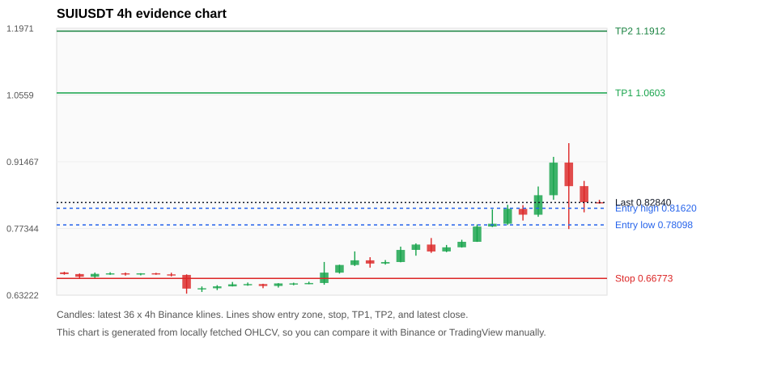
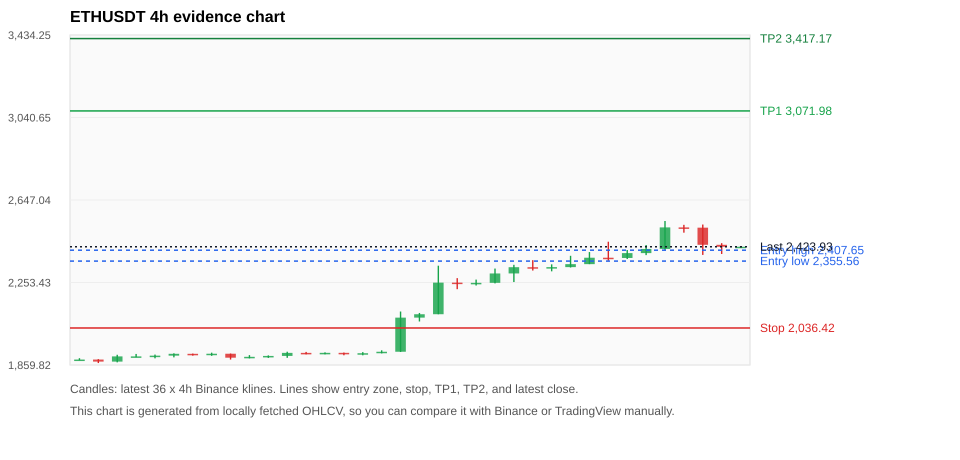
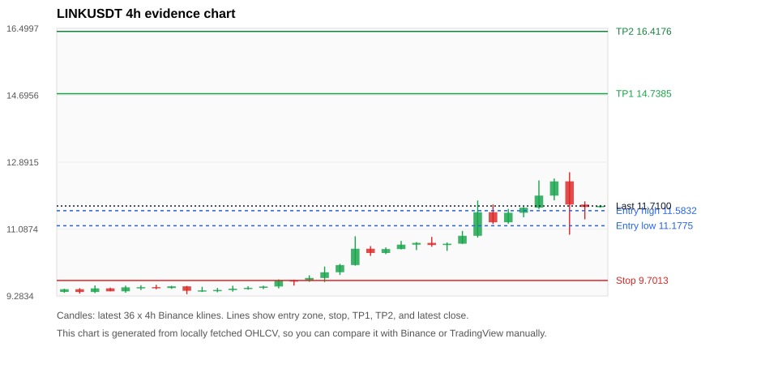
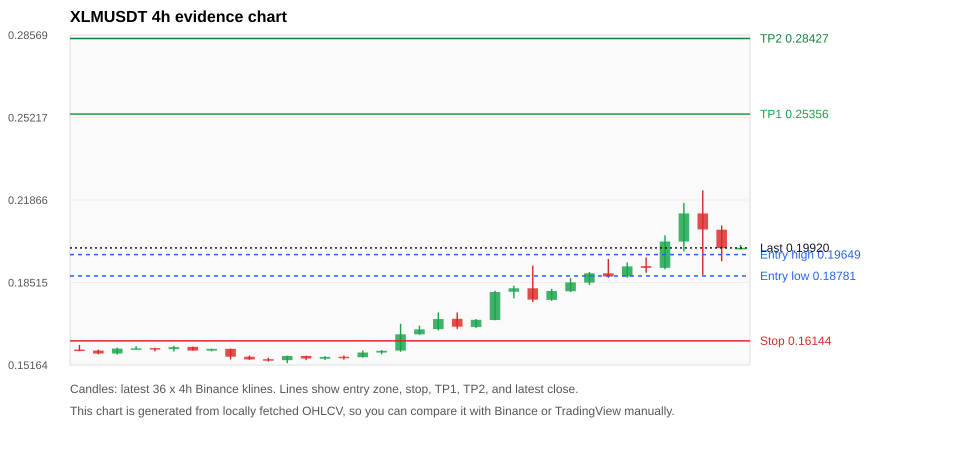
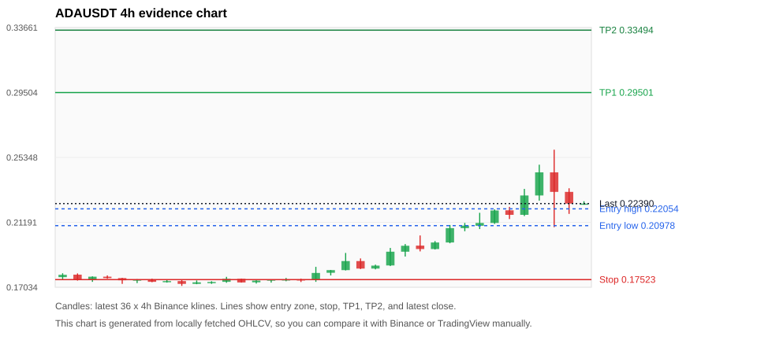

# Crypto 市场扫描报告 v1

- 报告时间：2026-08-22 20:06:52 CST
- Run ID：`20260822_120504_8553f043`
- Run type：`daily_full`
- Data validation mode：`paper`
- 数据来源：SQLite
- 报告版本：v1
- 扫描 ID：dd4ccf80b821
- 数据源：Binance public spot API + CoinGecko/CoinMarketCap cross-check
- 过滤条件：USDT spot; 24h quote volume >= 30,000,000; trades >= 30,000; exclude stables/leveraged tokens; analyze 1h/4h/1d klines
- 默认单笔风险：账户权益的 1.00%

## 限制说明

- 交易信号仍以 Binance 现货公开 K 线为主源；外部数据源用于一致性复核。
- 结果是研究和模拟盘计划，不是确定收益或实盘下单指令。
- 历史长度过滤：候选币至少需要 180 根 1d K 线。
- 数据质量验证池：先验证 score 排名前 min(top_n * 2, 10) 的候选，再按 action + score 补足最终名单。
- 大盘环境过滤：RISK_ON; BTC/ETH 日线趋势均较强，允许山寨币买入候选。 BTC 7d=22.27925018557997; ETH 7d=28.756427144860396.
- Data cross-validation enabled: Binance primary source plus CoinGecko; CoinMarketCap is checked when an API key is configured.
- ACEUSDT validation state BLOCKED: BLOCKED: [BINANCE_KLINE_EXTREME_RANGE] Binance candle range exceeds 40%.; [BINANCE_KLINE_EXTREME_RANGE] Binance candle range exceeds 40%.; [BINANCE_KLINE_EXTREME_RANGE] Binance candle range exceeds 40%.; [BINANCE_KLINE_EXTREME_RANGE] Binance candle range exceeds 40%.; [BINANCE_KLINE_EXTREME_RANGE] Binance candle range exceeds 40%.; [BINANCE_KLINE_EXTREME_RANGE] Binance candle range exceeds 40%.; [BINANCE_KLINE_EXTREME_RANGE] Binance candle range exceeds 40%.; [BINANCE_KLINE_EXTREME_RANGE] Binance candle range exceeds 40%.; [BINANCE_KLINE_EXTREME_RANGE] Binance candle range exceeds 40%.; [BINANCE_KLINE_EXTREME_RANGE] Binance candle range exceeds 40%.; [BINANCE_KLINE_EXTREME_RANGE] Binance candle range exceeds 40%.; [BINANCE_KLINE_EXTREME_RANGE] Binance candle range exceeds 40%.; [BINANCE_KLINE_EXTREME_RANGE] Binance candle range exceeds 40%.; [BINANCE_KLINE_EXTREME_RANGE] Binance candle range exceeds 40%.; [BINANCE_KLINE_EXTREME_RANGE] Binance candle range exceeds 40%.; [BINANCE_KLINE_EXTREME_RANGE] Binance candle range exceeds 40%.; [BINANCE_KLINE_EXTREME_RANGE] Binance candle range exceeds 40%.; [BINANCE_KLINE_EXTREME_RANGE] Binance candle range exceeds 40%.; [BINANCE_KLINE_EXTREME_RANGE] Binance candle range exceeds 40%.; [BINANCE_KLINE_EXTREME_RANGE] Binance candle range exceeds 40%.; [BINANCE_KLINE_EXTREME_RANGE] Binance candle range exceeds 40%.; [EXTERNAL_24H_DIFF_WARNING] 24h change diff 3.50 points exceeds warning threshold; [EXTERNAL_IDENTITY_AMBIGUOUS] CoinMarketCap symbol mapping has 8 matches; selected lowest cmc_rank
- BCHUSDT validation state DEGRADED: DEGRADED: [EXTERNAL_IDENTITY_AMBIGUOUS] CoinGecko symbol mapping has 2 exact matches; selected highest market-cap rank
- DOGEUSDT validation state DEGRADED: DEGRADED: [EXTERNAL_IDENTITY_AMBIGUOUS] CoinMarketCap symbol mapping has 23 matches; selected lowest cmc_rank
- SUIUSDT validation state DEGRADED: DEGRADED: [EXTERNAL_IDENTITY_AMBIGUOUS] CoinMarketCap symbol mapping has 5 matches; selected lowest cmc_rank
- ETHUSDT validation state DEGRADED: DEGRADED: [EXTERNAL_IDENTITY_AMBIGUOUS] CoinMarketCap symbol mapping has 6 matches; selected lowest cmc_rank
- LINKUSDT validation state DEGRADED: DEGRADED: [EXTERNAL_PROVIDER_RATE_LIMITED] Provider rate limited request for https://api.coingecko.com/api/v3/coins/markets?vs_currency=usd&ids=chainlink&price_change_percentage=24h&per_page=1&page=1: HTTP 429
- DASHUSDT validation state DEGRADED: DEGRADED: [EXTERNAL_PROVIDER_RATE_LIMITED] Provider rate limited request for https://api.coingecko.com/api/v3/coins/markets?vs_currency=usd&ids=dash&price_change_percentage=24h&per_page=1&page=1: HTTP 429; [EXTERNAL_IDENTITY_AMBIGUOUS] CoinMarketCap symbol mapping has 2 matches; selected lowest cmc_rank
- XLMUSDT validation state DEGRADED: DEGRADED: [EXTERNAL_PROVIDER_RATE_LIMITED] Provider rate limited request for https://api.coingecko.com/api/v3/coins/markets?vs_currency=usd&ids=stellar&price_change_percentage=24h&per_page=1&page=1: HTTP 429
- ADAUSDT validation state DEGRADED: DEGRADED: [EXTERNAL_PROVIDER_RATE_LIMITED] Provider rate limited request for https://api.coingecko.com/api/v3/coins/markets?vs_currency=usd&ids=cardano&price_change_percentage=24h&per_page=1&page=1: HTTP 429; [EXTERNAL_IDENTITY_AMBIGUOUS] CoinMarketCap symbol mapping has 3 matches; selected lowest cmc_rank
- UNIUSDT validation state DEGRADED: DEGRADED: [EXTERNAL_PROVIDER_RATE_LIMITED] Provider rate limited request for https://api.coingecko.com/api/v3/coins/markets?vs_currency=usd&ids=uniswap&price_change_percentage=24h&per_page=1&page=1: HTTP 429; [EXTERNAL_IDENTITY_AMBIGUOUS] CoinMarketCap symbol mapping has 7 matches; selected lowest cmc_rank

## 5 个候选交易计划

| Rank | Coin | Action | Setup | Entry Zone | Stop Loss | TP1 | TP2 / Exit Rule | R/R | Verdict |
|---:|---|---|---|---:|---:|---:|---|---:|---|
| 1 | `SUI` | `WAIT_PULLBACK` | 趋势中，等回调入场 | 0.78098 - 0.81620 | 0.66773 | 1.0603 | 1.1912 或跌破 4h 关键支撑 | 2.00-3.00 | 只等回调 |
| 2 | `ETH` | `WAIT_PULLBACK` | 趋势中，等回调入场 | 2,355.56 - 2,407.65 | 2,036.42 | 3,071.98 | 3,417.17 或跌破 4h 关键支撑 | 2.00-3.00 | 只等回调 |
| 3 | `LINK` | `WAIT_PULLBACK` | 趋势中，等回调入场 | 11.1775 - 11.5832 | 9.7013 | 14.7385 | 16.4176 或跌破 4h 关键支撑 | 2.00-3.00 | 只等回调 |
| 4 | `XLM` | `WAIT_PULLBACK` | 趋势中，等回调入场 | 0.18781 - 0.19649 | 0.16144 | 0.25356 | 0.28427 或跌破 4h 关键支撑 | 2.00-3.00 | 只等回调 |
| 5 | `ADA` | `WAIT_PULLBACK` | 趋势中，等回调入场 | 0.20978 - 0.22054 | 0.17523 | 0.29501 | 0.33494 或跌破 4h 关键支撑 | 2.00-3.00 | 只等回调 |

## 数据交叉验证摘要

价格差异以 Binance 当前价为基准；成交量口径不同，Binance 是 USDT 现货成交额，CoinGecko/CoinMarketCap 通常是全市场成交量。

| Rank | Coin | State | Identity | Max Price Diff | Max 24h Diff | Issue Codes | Message |
|---:|---|---|---|---:|---:|---|---|
| 1 | `SUI` | DEGRADED (DATA_WARNING) | UNCONFIRMED | 0.11% | 2.00 pts | EXTERNAL_IDENTITY_AMBIGUOUS | DEGRADED: [EXTERNAL_IDENTITY_AMBIGUOUS] CoinMarketCap symbol mapping has 5 matches; selected lowest cmc_rank |
| 2 | `ETH` | DEGRADED (DATA_WARNING) | UNCONFIRMED | 0.09% | 0.82 pts | EXTERNAL_IDENTITY_AMBIGUOUS | DEGRADED: [EXTERNAL_IDENTITY_AMBIGUOUS] CoinMarketCap symbol mapping has 6 matches; selected lowest cmc_rank |
| 3 | `LINK` | DEGRADED (DATA_WARNING) | UNCONFIRMED | 0.07% | 0.00 pts | EXTERNAL_PROVIDER_RATE_LIMITED | DEGRADED: [EXTERNAL_PROVIDER_RATE_LIMITED] Provider rate limited request for https://api.coingecko.com/api/v3/coins/markets?vs_currency=usd&ids=chainlink&price_change_percentage=24h&per_page=1&page=1: HTTP 429 |
| 4 | `XLM` | DEGRADED (DATA_WARNING) | UNCONFIRMED | 0.08% | 0.02 pts | EXTERNAL_PROVIDER_RATE_LIMITED | DEGRADED: [EXTERNAL_PROVIDER_RATE_LIMITED] Provider rate limited request for https://api.coingecko.com/api/v3/coins/markets?vs_currency=usd&ids=stellar&price_change_percentage=24h&per_page=1&page=1: HTTP 429 |
| 5 | `ADA` | DEGRADED (DATA_WARNING) | UNCONFIRMED | 0.14% | 0.08 pts | EXTERNAL_IDENTITY_AMBIGUOUS, EXTERNAL_PROVIDER_RATE_LIMITED | DEGRADED: [EXTERNAL_PROVIDER_RATE_LIMITED] Provider rate limited request for https://api.coingecko.com/api/v3/coins/markets?vs_currency=usd&ids=cardano&price_change_percentage=24h&per_page=1&page=1: HTTP 429; [EXTERNAL_IDENTITY_AMBIGUOUS] CoinMarketCap symbol mapping has 3 matches; selected lowest cmc_rank |

## 候选币说明

### 1. SUI `SUIUSDT`



- 入选原因：趋势中，等回调入场；24h +5.80%，7d +21.27%，4h RSI 68.08，24h 成交额 $150.4M。
- 交易失效条件：跌破 0.6677315 或 4h 收盘重新失守关键支撑。
- 主要风险：成交量突增，可能是事件驱动；External validation is degraded; this candidate is not a clean data sample.；Paper mode allows degraded validation; candidate is excluded from clean-data samples.。
- 数据交叉验证：DEGRADED / DATA_WARNING；身份=UNCONFIRMED；DEGRADED: [EXTERNAL_IDENTITY_AMBIGUOUS] CoinMarketCap symbol mapping has 5 matches; selected lowest cmc_rank

#### 可点击人工验证

- [Binance 交易页](https://www.binance.com/en/trade/SUI_USDT)
- [TradingView 图表](https://www.tradingview.com/chart/?symbol=BINANCE%3ASUIUSDT)
- [CoinGecko 搜索](https://www.coingecko.com/en/search?query=SUI)
- [CoinMarketCap 搜索](https://coinmarketcap.com/search/?q=SUI)

#### 多数据源对照

| Source | Status | Identity | Blocking | Asset ID | Price | 24h Change | 24h Volume | Price Diff | 24h Diff | Updated | Issue Codes | Message |
|---|---|---|---:|---|---:|---:|---:|---:|---:|---|---|---|
| Binance | DATA_OK | CONFIRMED | no | SUIUSDT | 0.82840 | +5.80% | $150.4M | 0.00% | 0.00 pts | 2026-08-22T12:06:08+00:00 | none | Primary market data source passed health checks. |
| CoinGecko | DATA_OK | CONFIRMED | no | sui | 0.82819 | +3.80% | $1.34B | 0.03% | 2.00 pts | 2026-08-22T12:04:20.000Z | none | External source agrees with Binance within thresholds. |
| CoinMarketCap | DATA_WARNING | UNCONFIRMED | no | 20947 | 0.82929 | +5.98% | $1.38B | 0.11% | 0.19 pts | 2026-08-22T12:05:01.000Z | EXTERNAL_IDENTITY_AMBIGUOUS | [EXTERNAL_IDENTITY_AMBIGUOUS] CoinMarketCap symbol mapping has 5 matches; selected lowest cmc_rank |

#### 指标证据

| 指标 | 数值 | 人工核对用途 |
|---|---:|---|
| 当前价 | 0.82840 | 与 Binance/TradingView 当前价格对照 |
| 24h 涨跌 | +5.80% | 与交易所 24h 涨跌对照 |
| 7d 涨跌 | +21.27% | 判断短线趋势是否延续 |
| 4h EMA20 | 0.77942 | 判断短期趋势支撑 |
| 4h EMA50 | 0.73113 | 判断中期趋势支撑 |
| 1d EMA20 | 0.71765 | 判断日线趋势 |
| 1d EMA50 | 0.72462 | 判断日线趋势 |
| 4h RSI14 | 68.08 | 判断是否过热/过弱 |
| 4h ATR14 | 0.04881 | 推导止损和入场缓冲 |
| 最近 18 根 4h 最低点 | 0.67790 | 支撑/止损参考 |
| 最近 36 根 4h 最高点 | 0.95400 | TP/压力参考 |
| 支撑位 | 0.77942 | 入场区间推导基础 |

#### 交易计划推导

- 支撑位 = 最近低点、4h EMA20、4h EMA50、1d EMA20 中不高于当前价的最高有效支撑 = `0.77942`。
- 入场区间 = 支撑位附近 + ATR 缓冲 = `0.78098 - 0.81620`。
- 止损 = min(最近 18 根 4h 最低点 * 0.985, 入场中位价 - 1.15 * ATR14) = `0.66773`。
- TP1 = max(最近 36 根 4h 最高点 * 0.995, 入场中位价 + 2R) = `1.0603`。
- TP2 = max(入场中位价 + 3R, TP1 * 1.04) = `1.1912`。

#### 最近 10 根 4h K线

| UTC 开盘时间 | Open | High | Low | Close | Quote Volume | Trades |
|---|---:|---:|---:|---:|---:|---:|
| 2026-08-21T00:00+00:00 | 0.73360 | 0.74950 | 0.73290 | 0.74520 | $8.3M | 75323 |
| 2026-08-21T04:00+00:00 | 0.74520 | 0.78190 | 0.74500 | 0.77750 | $18.0M | 124365 |
| 2026-08-21T08:00+00:00 | 0.77750 | 0.81400 | 0.77650 | 0.78350 | $26.5M | 223680 |
| 2026-08-21T12:00+00:00 | 0.78350 | 0.82350 | 0.78070 | 0.81500 | $16.4M | 148027 |
| 2026-08-21T16:00+00:00 | 0.81490 | 0.82280 | 0.79020 | 0.80260 | $12.8M | 117899 |
| 2026-08-21T20:00+00:00 | 0.80250 | 0.86230 | 0.79810 | 0.84380 | $19.9M | 155440 |
| 2026-08-22T00:00+00:00 | 0.84380 | 0.92500 | 0.83410 | 0.91280 | $24.8M | 216107 |
| 2026-08-22T04:00+00:00 | 0.91290 | 0.95400 | 0.77220 | 0.86300 | $55.6M | 637323 |
| 2026-08-22T08:00+00:00 | 0.86310 | 0.87410 | 0.80760 | 0.82910 | $21.0M | 173089 |
| 2026-08-22T12:00+00:00 | 0.82900 | 0.83410 | 0.82650 | 0.82850 | $416,381 | 3490 |

### 2. ETH `ETHUSDT`



- 入选原因：趋势中，等回调入场；24h +2.22%，7d +28.67%，4h RSI 73.61，24h 成交额 $1.78B。
- 交易失效条件：跌破 2036.4185 或 4h 收盘重新失守关键支撑。
- 主要风险：主要风险是大盘同步回撤；External validation is degraded; this candidate is not a clean data sample.；Paper mode allows degraded validation; candidate is excluded from clean-data samples.。
- 数据交叉验证：DEGRADED / DATA_WARNING；身份=UNCONFIRMED；DEGRADED: [EXTERNAL_IDENTITY_AMBIGUOUS] CoinMarketCap symbol mapping has 6 matches; selected lowest cmc_rank

#### 可点击人工验证

- [Binance 交易页](https://www.binance.com/en/trade/ETH_USDT)
- [TradingView 图表](https://www.tradingview.com/chart/?symbol=BINANCE%3AETHUSDT)
- [CoinGecko 搜索](https://www.coingecko.com/en/search?query=ETH)
- [CoinMarketCap 搜索](https://coinmarketcap.com/search/?q=ETH)

#### 多数据源对照

| Source | Status | Identity | Blocking | Asset ID | Price | 24h Change | 24h Volume | Price Diff | 24h Diff | Updated | Issue Codes | Message |
|---|---|---|---:|---|---:|---:|---:|---:|---:|---|---|---|
| Binance | DATA_OK | CONFIRMED | no | ETHUSDT | 2,423.93 | +2.22% | $1.78B | 0.00% | 0.00 pts | 2026-08-22T12:06:08+00:00 | none | Primary market data source passed health checks. |
| CoinGecko | DATA_OK | CONFIRMED | no | ethereum | 2,421.67 | +1.40% | $29.37B | 0.09% | 0.82 pts | 2026-08-22T12:04:20.000Z | none | External source agrees with Binance within thresholds. |
| CoinMarketCap | DATA_WARNING | UNCONFIRMED | no | 1027 | 2,422.68 | +2.11% | $33.87B | 0.05% | 0.11 pts | 2026-08-22T12:05:01.000Z | EXTERNAL_IDENTITY_AMBIGUOUS | [EXTERNAL_IDENTITY_AMBIGUOUS] CoinMarketCap symbol mapping has 6 matches; selected lowest cmc_rank |

#### 指标证据

| 指标 | 数值 | 人工核对用途 |
|---|---:|---|
| 当前价 | 2,423.93 | 与 Binance/TradingView 当前价格对照 |
| 24h 涨跌 | +2.22% | 与交易所 24h 涨跌对照 |
| 7d 涨跌 | +28.67% | 判断短线趋势是否延续 |
| 4h EMA20 | 2,314.79 | 判断短期趋势支撑 |
| 4h EMA50 | 2,143.04 | 判断中期趋势支撑 |
| 1d EMA20 | 2,053.91 | 判断日线趋势 |
| 1d EMA50 | 1,945.86 | 判断日线趋势 |
| 4h RSI14 | 73.61 | 判断是否过热/过弱 |
| 4h ATR14 | 65.1143 | 推导止损和入场缓冲 |
| 最近 18 根 4h 最低点 | 2,067.43 | 支撑/止损参考 |
| 最近 36 根 4h 最高点 | 2,546.78 | TP/压力参考 |
| 支撑位 | 2,314.79 | 入场区间推导基础 |

#### 交易计划推导

- 支撑位 = 最近低点、4h EMA20、4h EMA50、1d EMA20 中不高于当前价的最高有效支撑 = `2,314.79`。
- 入场区间 = 支撑位附近 + ATR 缓冲 = `2,355.56 - 2,407.65`。
- 止损 = min(最近 18 根 4h 最低点 * 0.985, 入场中位价 - 1.15 * ATR14) = `2,036.42`。
- TP1 = max(最近 36 根 4h 最高点 * 0.995, 入场中位价 + 2R) = `3,071.98`。
- TP2 = max(入场中位价 + 3R, TP1 * 1.04) = `3,417.17`。

#### 最近 10 根 4h K线

| UTC 开盘时间 | Open | High | Low | Close | Quote Volume | Trades |
|---|---:|---:|---:|---:|---:|---:|
| 2026-08-21T00:00+00:00 | 2,326.83 | 2,380.82 | 2,324.99 | 2,341.04 | $225.3M | 1129939 |
| 2026-08-21T04:00+00:00 | 2,341.05 | 2,398.71 | 2,341.05 | 2,371.66 | $216.5M | 914983 |
| 2026-08-21T08:00+00:00 | 2,371.67 | 2,447.98 | 2,357.18 | 2,370.47 | $417.5M | 1756205 |
| 2026-08-21T12:00+00:00 | 2,370.48 | 2,408.55 | 2,365.44 | 2,393.65 | $283.0M | 1154800 |
| 2026-08-21T16:00+00:00 | 2,393.64 | 2,432.35 | 2,384.00 | 2,413.55 | $240.1M | 850472 |
| 2026-08-21T20:00+00:00 | 2,413.54 | 2,546.78 | 2,408.86 | 2,516.30 | $404.1M | 1436299 |
| 2026-08-22T00:00+00:00 | 2,516.31 | 2,528.58 | 2,491.11 | 2,515.06 | $217.1M | 845662 |
| 2026-08-22T04:00+00:00 | 2,515.06 | 2,529.99 | 2,385.00 | 2,433.31 | $444.6M | 1414938 |
| 2026-08-22T08:00+00:00 | 2,433.32 | 2,441.10 | 2,389.45 | 2,423.93 | $195.0M | 893462 |
| 2026-08-22T12:00+00:00 | 2,423.92 | 2,427.00 | 2,419.10 | 2,423.93 | $3.1M | 23002 |

### 3. LINK `LINKUSDT`



- 入选原因：趋势中，等回调入场；24h +3.99%，7d +23.61%，4h RSI 68.17，24h 成交额 $104.3M。
- 交易失效条件：跌破 9.701265 或 4h 收盘重新失守关键支撑。
- 主要风险：成交量突增，可能是事件驱动；External validation is degraded; this candidate is not a clean data sample.；Paper mode allows degraded validation; candidate is excluded from clean-data samples.。
- 数据交叉验证：DEGRADED / DATA_WARNING；身份=UNCONFIRMED；DEGRADED: [EXTERNAL_PROVIDER_RATE_LIMITED] Provider rate limited request for https://api.coingecko.com/api/v3/coins/markets?vs_currency=usd&ids=chainlink&price_change_percentage=24h&per_page=1&page=1: HTTP 429

#### 可点击人工验证

- [Binance 交易页](https://www.binance.com/en/trade/LINK_USDT)
- [TradingView 图表](https://www.tradingview.com/chart/?symbol=BINANCE%3ALINKUSDT)
- [CoinGecko 搜索](https://www.coingecko.com/en/search?query=LINK)
- [CoinMarketCap 搜索](https://coinmarketcap.com/search/?q=LINK)

#### 多数据源对照

| Source | Status | Identity | Blocking | Asset ID | Price | 24h Change | 24h Volume | Price Diff | 24h Diff | Updated | Issue Codes | Message |
|---|---|---|---:|---|---:|---:|---:|---:|---:|---|---|---|
| Binance | DATA_OK | CONFIRMED | no | LINKUSDT | 11.7100 | +3.99% | $104.3M | 0.00% | 0.00 pts | 2026-08-22T12:06:08+00:00 | none | Primary market data source passed health checks. |
| CoinGecko | DATA_WARNING | UNCONFIRMED | no | n/a | n/a | n/a | n/a | n/a | n/a | 2026-08-22T12:06:08+00:00 | EXTERNAL_PROVIDER_RATE_LIMITED | Provider rate limited request for https://api.coingecko.com/api/v3/coins/markets?vs_currency=usd&ids=chainlink&price_change_percentage=24h&per_page=1&page=1: HTTP 429 |
| CoinMarketCap | DATA_OK | CONFIRMED | no | 1975 | 11.7018 | +3.98% | $1.17B | 0.07% | 0.00 pts | 2026-08-22T12:05:01.000Z | none | External source agrees with Binance within thresholds. |

#### 指标证据

| 指标 | 数值 | 人工核对用途 |
|---|---:|---|
| 当前价 | 11.7100 | 与 Binance/TradingView 当前价格对照 |
| 24h 涨跌 | +3.99% | 与交易所 24h 涨跌对照 |
| 7d 涨跌 | +23.61% | 判断短线趋势是否延续 |
| 4h EMA20 | 11.1160 | 判断短期趋势支撑 |
| 4h EMA50 | 10.2726 | 判断中期趋势支撑 |
| 1d EMA20 | 9.6191 | 判断日线趋势 |
| 1d EMA50 | 8.9156 | 判断日线趋势 |
| 4h RSI14 | 68.17 | 判断是否过热/过弱 |
| 4h ATR14 | 0.50714 | 推导止损和入场缓冲 |
| 最近 18 根 4h 最低点 | 9.8490 | 支撑/止损参考 |
| 最近 36 根 4h 最高点 | 12.6200 | TP/压力参考 |
| 支撑位 | 11.1160 | 入场区间推导基础 |

#### 交易计划推导

- 支撑位 = 最近低点、4h EMA20、4h EMA50、1d EMA20 中不高于当前价的最高有效支撑 = `11.1160`。
- 入场区间 = 支撑位附近 + ATR 缓冲 = `11.1775 - 11.5832`。
- 止损 = min(最近 18 根 4h 最低点 * 0.985, 入场中位价 - 1.15 * ATR14) = `9.7013`。
- TP1 = max(最近 36 根 4h 最高点 * 0.995, 入场中位价 + 2R) = `14.7385`。
- TP2 = max(入场中位价 + 3R, TP1 * 1.04) = `16.4176`。

#### 最近 10 根 4h K线

| UTC 开盘时间 | Open | High | Low | Close | Quote Volume | Trades |
|---|---:|---:|---:|---:|---:|---:|
| 2026-08-21T00:00+00:00 | 10.6930 | 11.0380 | 10.6870 | 10.9060 | $9.4M | 149537 |
| 2026-08-21T04:00+00:00 | 10.9060 | 11.8570 | 10.8580 | 11.5410 | $19.9M | 219369 |
| 2026-08-21T08:00+00:00 | 11.5420 | 11.7520 | 11.2230 | 11.2700 | $16.5M | 238897 |
| 2026-08-21T12:00+00:00 | 11.2700 | 11.6310 | 11.2320 | 11.5270 | $16.2M | 193875 |
| 2026-08-21T16:00+00:00 | 11.5270 | 11.6840 | 11.4050 | 11.6630 | $12.1M | 151116 |
| 2026-08-21T20:00+00:00 | 11.6640 | 12.4000 | 11.6290 | 11.9900 | $16.4M | 220225 |
| 2026-08-22T00:00+00:00 | 11.9900 | 12.4510 | 11.8610 | 12.3740 | $11.4M | 171242 |
| 2026-08-22T04:00+00:00 | 12.3750 | 12.6200 | 10.9360 | 11.7480 | $33.3M | 423278 |
| 2026-08-22T08:00+00:00 | 11.7490 | 11.8350 | 11.3500 | 11.6840 | $14.8M | 222313 |
| 2026-08-22T12:00+00:00 | 11.6830 | 11.7350 | 11.6610 | 11.7100 | $146,705 | 2951 |

### 4. XLM `XLMUSDT`



- 入选原因：趋势中，等回调入场；24h +6.19%，7d +26.16%，4h RSI 70.74，24h 成交额 $65.7M。
- 交易失效条件：跌破 0.1614415 或 4h 收盘重新失守关键支撑。
- 主要风险：成交量突增，可能是事件驱动；External validation is degraded; this candidate is not a clean data sample.；Paper mode allows degraded validation; candidate is excluded from clean-data samples.。
- 数据交叉验证：DEGRADED / DATA_WARNING；身份=UNCONFIRMED；DEGRADED: [EXTERNAL_PROVIDER_RATE_LIMITED] Provider rate limited request for https://api.coingecko.com/api/v3/coins/markets?vs_currency=usd&ids=stellar&price_change_percentage=24h&per_page=1&page=1: HTTP 429

#### 可点击人工验证

- [Binance 交易页](https://www.binance.com/en/trade/XLM_USDT)
- [TradingView 图表](https://www.tradingview.com/chart/?symbol=BINANCE%3AXLMUSDT)
- [CoinGecko 搜索](https://www.coingecko.com/en/search?query=XLM)
- [CoinMarketCap 搜索](https://coinmarketcap.com/search/?q=XLM)

#### 多数据源对照

| Source | Status | Identity | Blocking | Asset ID | Price | 24h Change | 24h Volume | Price Diff | 24h Diff | Updated | Issue Codes | Message |
|---|---|---|---:|---|---:|---:|---:|---:|---:|---|---|---|
| Binance | DATA_OK | CONFIRMED | no | XLMUSDT | 0.19920 | +6.19% | $65.7M | 0.00% | 0.00 pts | 2026-08-22T12:06:08+00:00 | none | Primary market data source passed health checks. |
| CoinGecko | DATA_WARNING | UNCONFIRMED | no | n/a | n/a | n/a | n/a | n/a | n/a | 2026-08-22T12:06:08+00:00 | EXTERNAL_PROVIDER_RATE_LIMITED | Provider rate limited request for https://api.coingecko.com/api/v3/coins/markets?vs_currency=usd&ids=stellar&price_change_percentage=24h&per_page=1&page=1: HTTP 429 |
| CoinMarketCap | DATA_OK | CONFIRMED | no | 512 | 0.19936 | +6.16% | $661.6M | 0.08% | 0.02 pts | 2026-08-22T12:05:01.000Z | none | External source agrees with Binance within thresholds. |

#### 指标证据

| 指标 | 数值 | 人工核对用途 |
|---|---:|---|
| 当前价 | 0.19920 | 与 Binance/TradingView 当前价格对照 |
| 24h 涨跌 | +6.19% | 与交易所 24h 涨跌对照 |
| 7d 涨跌 | +26.16% | 判断短线趋势是否延续 |
| 4h EMA20 | 0.18691 | 判断短期趋势支撑 |
| 4h EMA50 | 0.17442 | 判断中期趋势支撑 |
| 1d EMA20 | 0.17226 | 判断日线趋势 |
| 1d EMA50 | 0.17549 | 判断日线趋势 |
| 4h RSI14 | 70.74 | 判断是否过热/过弱 |
| 4h ATR14 | 0.01085 | 推导止损和入场缓冲 |
| 最近 18 根 4h 最低点 | 0.16390 | 支撑/止损参考 |
| 最近 36 根 4h 最高点 | 0.22260 | TP/压力参考 |
| 支撑位 | 0.18691 | 入场区间推导基础 |

#### 交易计划推导

- 支撑位 = 最近低点、4h EMA20、4h EMA50、1d EMA20 中不高于当前价的最高有效支撑 = `0.18691`。
- 入场区间 = 支撑位附近 + ATR 缓冲 = `0.18781 - 0.19649`。
- 止损 = min(最近 18 根 4h 最低点 * 0.985, 入场中位价 - 1.15 * ATR14) = `0.16144`。
- TP1 = max(最近 36 根 4h 最高点 * 0.995, 入场中位价 + 2R) = `0.25356`。
- TP2 = max(入场中位价 + 3R, TP1 * 1.04) = `0.28427`。

#### 最近 10 根 4h K线

| UTC 开盘时间 | Open | High | Low | Close | Quote Volume | Trades |
|---|---:|---:|---:|---:|---:|---:|
| 2026-08-21T00:00+00:00 | 0.18160 | 0.18690 | 0.18130 | 0.18520 | $3.9M | 34032 |
| 2026-08-21T04:00+00:00 | 0.18510 | 0.18940 | 0.18420 | 0.18890 | $3.5M | 24221 |
| 2026-08-21T08:00+00:00 | 0.18890 | 0.19470 | 0.18710 | 0.18760 | $12.3M | 77289 |
| 2026-08-21T12:00+00:00 | 0.18760 | 0.19330 | 0.18710 | 0.19170 | $5.5M | 41747 |
| 2026-08-21T16:00+00:00 | 0.19180 | 0.19530 | 0.18910 | 0.19110 | $3.7M | 32814 |
| 2026-08-21T20:00+00:00 | 0.19110 | 0.20430 | 0.19050 | 0.20180 | $7.1M | 55217 |
| 2026-08-22T00:00+00:00 | 0.20180 | 0.21750 | 0.19780 | 0.21320 | $12.4M | 88845 |
| 2026-08-22T04:00+00:00 | 0.21320 | 0.22260 | 0.18820 | 0.20670 | $27.9M | 217526 |
| 2026-08-22T08:00+00:00 | 0.20660 | 0.20830 | 0.19380 | 0.19910 | $9.0M | 87977 |
| 2026-08-22T12:00+00:00 | 0.19920 | 0.20040 | 0.19860 | 0.19920 | $165,159 | 1395 |

### 5. ADA `ADAUSDT`



- 入选原因：趋势中，等回调入场；24h +5.96%，7d +25.08%，4h RSI 72.18，24h 成交额 $115.0M。
- 交易失效条件：跌破 0.1752315 或 4h 收盘重新失守关键支撑。
- 主要风险：成交量突增，可能是事件驱动；External validation is degraded; this candidate is not a clean data sample.；Paper mode allows degraded validation; candidate is excluded from clean-data samples.。
- 数据交叉验证：DEGRADED / DATA_WARNING；身份=UNCONFIRMED；DEGRADED: [EXTERNAL_PROVIDER_RATE_LIMITED] Provider rate limited request for https://api.coingecko.com/api/v3/coins/markets?vs_currency=usd&ids=cardano&price_change_percentage=24h&per_page=1&page=1: HTTP 429; [EXTERNAL_IDENTITY_AMBIGUOUS] CoinMarketCap symbol mapping has 3 matches; selected lowest cmc_rank

#### 可点击人工验证

- [Binance 交易页](https://www.binance.com/en/trade/ADA_USDT)
- [TradingView 图表](https://www.tradingview.com/chart/?symbol=BINANCE%3AADAUSDT)
- [CoinGecko 搜索](https://www.coingecko.com/en/search?query=ADA)
- [CoinMarketCap 搜索](https://coinmarketcap.com/search/?q=ADA)

#### 多数据源对照

| Source | Status | Identity | Blocking | Asset ID | Price | 24h Change | 24h Volume | Price Diff | 24h Diff | Updated | Issue Codes | Message |
|---|---|---|---:|---|---:|---:|---:|---:|---:|---|---|---|
| Binance | DATA_OK | CONFIRMED | no | ADAUSDT | 0.22390 | +5.96% | $115.0M | 0.00% | 0.00 pts | 2026-08-22T12:06:08+00:00 | none | Primary market data source passed health checks. |
| CoinGecko | DATA_WARNING | UNCONFIRMED | no | n/a | n/a | n/a | n/a | n/a | n/a | 2026-08-22T12:06:08+00:00 | EXTERNAL_PROVIDER_RATE_LIMITED | Provider rate limited request for https://api.coingecko.com/api/v3/coins/markets?vs_currency=usd&ids=cardano&price_change_percentage=24h&per_page=1&page=1: HTTP 429 |
| CoinMarketCap | DATA_WARNING | UNCONFIRMED | no | 2010 | 0.22421 | +6.03% | $1.59B | 0.14% | 0.08 pts | 2026-08-22T12:05:01.000Z | EXTERNAL_IDENTITY_AMBIGUOUS | [EXTERNAL_IDENTITY_AMBIGUOUS] CoinMarketCap symbol mapping has 3 matches; selected lowest cmc_rank |

#### 指标证据

| 指标 | 数值 | 人工核对用途 |
|---|---:|---|
| 当前价 | 0.22390 | 与 Binance/TradingView 当前价格对照 |
| 24h 涨跌 | +5.96% | 与交易所 24h 涨跌对照 |
| 7d 涨跌 | +25.08% | 判断短线趋势是否延续 |
| 4h EMA20 | 0.20926 | 判断短期趋势支撑 |
| 4h EMA50 | 0.19585 | 判断中期趋势支撑 |
| 1d EMA20 | 0.19080 | 判断日线趋势 |
| 1d EMA50 | 0.18416 | 判断日线趋势 |
| 4h RSI14 | 72.18 | 判断是否过热/过弱 |
| 4h ATR14 | 0.01345 | 推导止损和入场缓冲 |
| 最近 18 根 4h 最低点 | 0.17790 | 支撑/止损参考 |
| 最近 36 根 4h 最高点 | 0.25840 | TP/压力参考 |
| 支撑位 | 0.20926 | 入场区间推导基础 |

#### 交易计划推导

- 支撑位 = 最近低点、4h EMA20、4h EMA50、1d EMA20 中不高于当前价的最高有效支撑 = `0.20926`。
- 入场区间 = 支撑位附近 + ATR 缓冲 = `0.20978 - 0.22054`。
- 止损 = min(最近 18 根 4h 最低点 * 0.985, 入场中位价 - 1.15 * ATR14) = `0.17523`。
- TP1 = max(最近 36 根 4h 最高点 * 0.995, 入场中位价 + 2R) = `0.29501`。
- TP2 = max(入场中位价 + 3R, TP1 * 1.04) = `0.33494`。

#### 最近 10 根 4h K线

| UTC 开盘时间 | Open | High | Low | Close | Quote Volume | Trades |
|---|---:|---:|---:|---:|---:|---:|
| 2026-08-21T00:00+00:00 | 0.19900 | 0.21020 | 0.19850 | 0.20820 | $10.5M | 71567 |
| 2026-08-21T04:00+00:00 | 0.20820 | 0.21150 | 0.20620 | 0.20980 | $8.7M | 53171 |
| 2026-08-21T08:00+00:00 | 0.20970 | 0.21800 | 0.20760 | 0.21150 | $18.3M | 138299 |
| 2026-08-21T12:00+00:00 | 0.21150 | 0.22020 | 0.21090 | 0.21950 | $12.9M | 97537 |
| 2026-08-21T16:00+00:00 | 0.21960 | 0.22180 | 0.21400 | 0.21670 | $11.5M | 74206 |
| 2026-08-21T20:00+00:00 | 0.21670 | 0.23330 | 0.21590 | 0.22910 | $14.0M | 98874 |
| 2026-08-22T00:00+00:00 | 0.22910 | 0.24880 | 0.22580 | 0.24390 | $15.5M | 116096 |
| 2026-08-22T04:00+00:00 | 0.24390 | 0.25840 | 0.20880 | 0.23140 | $45.5M | 295553 |
| 2026-08-22T08:00+00:00 | 0.23140 | 0.23370 | 0.21730 | 0.22390 | $15.6M | 120907 |
| 2026-08-22T12:00+00:00 | 0.22390 | 0.22540 | 0.22320 | 0.22390 | $310,329 | 2587 |

## 组合风控

- 不要 5 个候选全部满仓买入。
- 同时持仓总风险建议控制在账户权益的 3% - 5% 以内。
- 如果 BTC/ETH 同时破位，暂停山寨币多头计划或降低仓位。
- 第一版报告用于模拟盘和人工复核，不自动下单。

## 原始数据

```json
[
  {
    "rank": 1,
    "symbol": "SUIUSDT",
    "base_asset": "SUI",
    "price": 0.8284,
    "score": 75.41032327263501,
    "setup": "趋势中，等回调入场",
    "verdict": "只等回调",
    "entry_low": 0.7809768359710753,
    "entry_high": 0.8161964285714286,
    "stop_loss": 0.6677314999999999,
    "take_profit_1": 1.0602968968137558,
    "take_profit_2": 1.191152029085008,
    "risk_reward_1": 1.9999999999999991,
    "risk_reward_2": 3.0,
    "pct_24h": 5.797,
    "pct_3d": 26.396093988404033,
    "pct_7d": 21.270677792416915,
    "quote_volume_24h": 150438915.75936,
    "trades_24h": 1446027,
    "high_low_range_24h": 23.543123543123535,
    "rsi_1h": 45.164960182025034,
    "rsi_4h": 68.08022922636104,
    "ema20_4h": 0.779417999971133,
    "ema50_4h": 0.7311270548053841,
    "ema20_1d": 0.7176473387239742,
    "ema50_1d": 0.7246164286167113,
    "atr_4h": 0.04881428571428571,
    "macd_hist_4h": 0.008267077584029524,
    "volume_ratio_24h": 4.749669868580074,
    "support_level": 0.779417999971133,
    "recent_low_4h_18": 0.6779,
    "recent_high_4h_36": 0.954,
    "distance_to_support_pct": 6.284432747342383,
    "binance_trade_url": "https://www.binance.com/en/trade/SUI_USDT",
    "tradingview_url": "https://www.tradingview.com/chart/?symbol=BINANCE%3ASUIUSDT",
    "coingecko_search_url": "https://www.coingecko.com/en/search?query=SUI",
    "coinmarketcap_search_url": "https://coinmarketcap.com/search/?q=SUI",
    "invalidation": "跌破 0.6677315 或 4h 收盘重新失守关键支撑",
    "recent_4h_klines": [
      {
        "open_time_utc": "2026-08-16T16:00+00:00",
        "open": 0.6804,
        "high": 0.6818,
        "low": 0.6755,
        "close": 0.6768,
        "quote_volume": 461556.38337,
        "trades": 5374
      },
      {
        "open_time_utc": "2026-08-16T20:00+00:00",
        "open": 0.6769,
        "high": 0.6781,
        "low": 0.6668,
        "close": 0.6712,
        "quote_volume": 1290818.59542,
        "trades": 12038
      },
      {
        "open_time_utc": "2026-08-17T00:00+00:00",
        "open": 0.6712,
        "high": 0.6801,
        "low": 0.6677,
        "close": 0.6773,
        "quote_volume": 1336816.92841,
        "trades": 14635
      },
      {
        "open_time_utc": "2026-08-17T04:00+00:00",
        "open": 0.6773,
        "high": 0.6808,
        "low": 0.6753,
        "close": 0.6785,
        "quote_volume": 1115102.55441,
        "trades": 9803
      },
      {
        "open_time_utc": "2026-08-17T08:00+00:00",
        "open": 0.6785,
        "high": 0.6802,
        "low": 0.6736,
        "close": 0.6779,
        "quote_volume": 1187589.16609,
        "trades": 9701
      },
      {
        "open_time_utc": "2026-08-17T12:00+00:00",
        "open": 0.6779,
        "high": 0.6788,
        "low": 0.6742,
        "close": 0.6785,
        "quote_volume": 976544.13286,
        "trades": 10627
      },
      {
        "open_time_utc": "2026-08-17T16:00+00:00",
        "open": 0.6786,
        "high": 0.6795,
        "low": 0.6755,
        "close": 0.6762,
        "quote_volume": 968961.73659,
        "trades": 8413
      },
      {
        "open_time_utc": "2026-08-17T20:00+00:00",
        "open": 0.6763,
        "high": 0.6798,
        "low": 0.6719,
        "close": 0.6751,
        "quote_volume": 2387193.59614,
        "trades": 13499
      },
      {
        "open_time_utc": "2026-08-18T00:00+00:00",
        "open": 0.6751,
        "high": 0.6763,
        "low": 0.6354,
        "close": 0.6461,
        "quote_volume": 9126966.91341,
        "trades": 58749
      },
      {
        "open_time_utc": "2026-08-18T04:00+00:00",
        "open": 0.646,
        "high": 0.6507,
        "low": 0.639,
        "close": 0.6469,
        "quote_volume": 8371344.48766,
        "trades": 38664
      },
      {
        "open_time_utc": "2026-08-18T08:00+00:00",
        "open": 0.6469,
        "high": 0.6534,
        "low": 0.643,
        "close": 0.6509,
        "quote_volume": 2895266.63925,
        "trades": 17302
      },
      {
        "open_time_utc": "2026-08-18T12:00+00:00",
        "open": 0.6509,
        "high": 0.6602,
        "low": 0.6507,
        "close": 0.6552,
        "quote_volume": 3973759.76048,
        "trades": 25542
      },
      {
        "open_time_utc": "2026-08-18T16:00+00:00",
        "open": 0.6552,
        "high": 0.659,
        "low": 0.6521,
        "close": 0.6557,
        "quote_volume": 1714969.87976,
        "trades": 13189
      },
      {
        "open_time_utc": "2026-08-18T20:00+00:00",
        "open": 0.6557,
        "high": 0.6564,
        "low": 0.647,
        "close": 0.6517,
        "quote_volume": 3083705.4111,
        "trades": 22119
      },
      {
        "open_time_utc": "2026-08-19T00:00+00:00",
        "open": 0.6518,
        "high": 0.6576,
        "low": 0.6483,
        "close": 0.6571,
        "quote_volume": 1532162.9156,
        "trades": 14686
      },
      {
        "open_time_utc": "2026-08-19T04:00+00:00",
        "open": 0.6572,
        "high": 0.6587,
        "low": 0.6532,
        "close": 0.6572,
        "quote_volume": 1823603.04423,
        "trades": 13528
      },
      {
        "open_time_utc": "2026-08-19T08:00+00:00",
        "open": 0.6571,
        "high": 0.6608,
        "low": 0.6557,
        "close": 0.658,
        "quote_volume": 2477399.14734,
        "trades": 14918
      },
      {
        "open_time_utc": "2026-08-19T12:00+00:00",
        "open": 0.658,
        "high": 0.7025,
        "low": 0.6543,
        "close": 0.68,
        "quote_volume": 14011383.16745,
        "trades": 94202
      },
      {
        "open_time_utc": "2026-08-19T16:00+00:00",
        "open": 0.6799,
        "high": 0.6967,
        "low": 0.6779,
        "close": 0.6961,
        "quote_volume": 6699450.22248,
        "trades": 49027
      },
      {
        "open_time_utc": "2026-08-19T20:00+00:00",
        "open": 0.6961,
        "high": 0.7249,
        "low": 0.694,
        "close": 0.706,
        "quote_volume": 12786672.70315,
        "trades": 136279
      },
      {
        "open_time_utc": "2026-08-20T00:00+00:00",
        "open": 0.706,
        "high": 0.7126,
        "low": 0.6905,
        "close": 0.6991,
        "quote_volume": 5077520.21454,
        "trades": 47208
      },
      {
        "open_time_utc": "2026-08-20T04:00+00:00",
        "open": 0.6992,
        "high": 0.7066,
        "low": 0.6969,
        "close": 0.7023,
        "quote_volume": 3076260.40975,
        "trades": 26209
      },
      {
        "open_time_utc": "2026-08-20T08:00+00:00",
        "open": 0.7024,
        "high": 0.735,
        "low": 0.7018,
        "close": 0.728,
        "quote_volume": 13446610.27714,
        "trades": 93429
      },
      {
        "open_time_utc": "2026-08-20T12:00+00:00",
        "open": 0.7281,
        "high": 0.7419,
        "low": 0.7158,
        "close": 0.7394,
        "quote_volume": 8341196.60546,
        "trades": 89623
      },
      {
        "open_time_utc": "2026-08-20T16:00+00:00",
        "open": 0.7394,
        "high": 0.7532,
        "low": 0.7217,
        "close": 0.7247,
        "quote_volume": 11512671.2179,
        "trades": 94339
      },
      {
        "open_time_utc": "2026-08-20T20:00+00:00",
        "open": 0.7248,
        "high": 0.7385,
        "low": 0.7233,
        "close": 0.7335,
        "quote_volume": 5278691.54955,
        "trades": 43883
      },
      {
        "open_time_utc": "2026-08-21T00:00+00:00",
        "open": 0.7336,
        "high": 0.7495,
        "low": 0.7329,
        "close": 0.7452,
        "quote_volume": 8253877.28975,
        "trades": 75323
      },
      {
        "open_time_utc": "2026-08-21T04:00+00:00",
        "open": 0.7452,
        "high": 0.7819,
        "low": 0.745,
        "close": 0.7775,
        "quote_volume": 18006395.18941,
        "trades": 124365
      },
      {
        "open_time_utc": "2026-08-21T08:00+00:00",
        "open": 0.7775,
        "high": 0.814,
        "low": 0.7765,
        "close": 0.7835,
        "quote_volume": 26475784.38907,
        "trades": 223680
      },
      {
        "open_time_utc": "2026-08-21T12:00+00:00",
        "open": 0.7835,
        "high": 0.8235,
        "low": 0.7807,
        "close": 0.815,
        "quote_volume": 16420868.42671,
        "trades": 148027
      },
      {
        "open_time_utc": "2026-08-21T16:00+00:00",
        "open": 0.8149,
        "high": 0.8228,
        "low": 0.7902,
        "close": 0.8026,
        "quote_volume": 12843575.45403,
        "trades": 117899
      },
      {
        "open_time_utc": "2026-08-21T20:00+00:00",
        "open": 0.8025,
        "high": 0.8623,
        "low": 0.7981,
        "close": 0.8438,
        "quote_volume": 19897543.04069,
        "trades": 155440
      },
      {
        "open_time_utc": "2026-08-22T00:00+00:00",
        "open": 0.8438,
        "high": 0.925,
        "low": 0.8341,
        "close": 0.9128,
        "quote_volume": 24772876.91853,
        "trades": 216107
      },
      {
        "open_time_utc": "2026-08-22T04:00+00:00",
        "open": 0.9129,
        "high": 0.954,
        "low": 0.7722,
        "close": 0.863,
        "quote_volume": 55565668.89511,
        "trades": 637323
      },
      {
        "open_time_utc": "2026-08-22T08:00+00:00",
        "open": 0.8631,
        "high": 0.8741,
        "low": 0.8076,
        "close": 0.8291,
        "quote_volume": 20963284.54897,
        "trades": 173089
      },
      {
        "open_time_utc": "2026-08-22T12:00+00:00",
        "open": 0.829,
        "high": 0.8341,
        "low": 0.8265,
        "close": 0.8285,
        "quote_volume": 416381.00751,
        "trades": 3490
      }
    ],
    "risks": [
      "成交量突增，可能是事件驱动",
      "External validation is degraded; this candidate is not a clean data sample.",
      "Paper mode allows degraded validation; candidate is excluded from clean-data samples."
    ],
    "data_quality_status": "DATA_WARNING",
    "data_quality_message": "DEGRADED: [EXTERNAL_IDENTITY_AMBIGUOUS] CoinMarketCap symbol mapping has 5 matches; selected lowest cmc_rank",
    "data_checks": [
      {
        "provider": "Binance",
        "status": "DATA_OK",
        "provider_asset_id": "SUIUSDT",
        "provider_symbol": "SUIUSDT",
        "price_usd": 0.8284,
        "pct_24h": 5.797,
        "volume_24h": 150438915.75936,
        "last_updated": null,
        "fetched_at_utc": "2026-08-22T12:06:08+00:00",
        "price_diff_pct": 0.0,
        "pct_24h_diff": 0.0,
        "volume_note": "Binance USDT spot 24h quoteVolume.",
        "message": "Primary market data source passed health checks.",
        "blocking": false,
        "identity_status": "CONFIRMED",
        "issues": []
      },
      {
        "provider": "CoinGecko",
        "status": "DATA_OK",
        "provider_asset_id": "sui",
        "provider_symbol": "SUI",
        "price_usd": 0.828186,
        "pct_24h": 3.8,
        "volume_24h": 1339074449.0,
        "last_updated": "2026-08-22T12:04:20.000Z",
        "fetched_at_utc": "2026-08-22T12:06:08+00:00",
        "price_diff_pct": 0.025832930951237024,
        "pct_24h_diff": 1.9969999999999999,
        "volume_note": "CoinGecko total market volume; not the same venue scope as Binance quoteVolume.",
        "message": "External source agrees with Binance within thresholds.",
        "blocking": false,
        "identity_status": "CONFIRMED",
        "issues": []
      },
      {
        "provider": "CoinMarketCap",
        "status": "DATA_WARNING",
        "provider_asset_id": "20947",
        "provider_symbol": "SUI",
        "price_usd": 0.8292885124060628,
        "pct_24h": 5.98305112,
        "volume_24h": 1377981979.2633593,
        "last_updated": "2026-08-22T12:05:01.000Z",
        "fetched_at_utc": "2026-08-22T12:06:08+00:00",
        "price_diff_pct": 0.10725644689314372,
        "pct_24h_diff": 0.18605112000000013,
        "volume_note": "CoinMarketCap total market volume; not the same venue scope as Binance quoteVolume.",
        "message": "[EXTERNAL_IDENTITY_AMBIGUOUS] CoinMarketCap symbol mapping has 5 matches; selected lowest cmc_rank",
        "blocking": false,
        "identity_status": "UNCONFIRMED",
        "issues": [
          {
            "provider": "CoinMarketCap",
            "code": "EXTERNAL_IDENTITY_AMBIGUOUS",
            "severity": "WARNING",
            "blocking": false,
            "message": "CoinMarketCap symbol mapping has 5 matches; selected lowest cmc_rank",
            "context": {}
          }
        ]
      }
    ],
    "action": "WAIT_PULLBACK",
    "data_quality_state": "DEGRADED",
    "data_quality_issues": [
      {
        "provider": "CoinMarketCap",
        "code": "EXTERNAL_IDENTITY_AMBIGUOUS",
        "severity": "WARNING",
        "blocking": false,
        "message": "CoinMarketCap symbol mapping has 5 matches; selected lowest cmc_rank",
        "context": {}
      }
    ],
    "external_identity_status": "UNCONFIRMED"
  },
  {
    "rank": 2,
    "symbol": "ETHUSDT",
    "base_asset": "ETH",
    "price": 2423.93,
    "score": 75.06784691680495,
    "setup": "趋势中，等回调入场",
    "verdict": "只等回调",
    "entry_low": 2355.56,
    "entry_high": 2407.6514285714284,
    "stop_loss": 2036.4185499999999,
    "take_profit_1": 3071.9800428571434,
    "take_profit_2": 3417.167207142858,
    "risk_reward_1": 2.0,
    "risk_reward_2": 3.0,
    "pct_24h": 2.219,
    "pct_3d": 25.403797402866136,
    "pct_7d": 28.668266219358117,
    "quote_volume_24h": 1780862280.201287,
    "trades_24h": 6594070,
    "high_low_range_24h": 7.546197763589069,
    "rsi_1h": 17.498341074983358,
    "rsi_4h": 73.6091298145506,
    "ema20_4h": 2314.7921097628714,
    "ema50_4h": 2143.041650158046,
    "ema20_1d": 2053.9065272500884,
    "ema50_1d": 1945.859500663269,
    "atr_4h": 65.11428571428574,
    "macd_hist_4h": -0.9849918085628673,
    "volume_ratio_24h": 2.1156873288603077,
    "support_level": 2314.7921097628714,
    "recent_low_4h_18": 2067.43,
    "recent_high_4h_36": 2546.78,
    "distance_to_support_pct": 4.714803103778875,
    "binance_trade_url": "https://www.binance.com/en/trade/ETH_USDT",
    "tradingview_url": "https://www.tradingview.com/chart/?symbol=BINANCE%3AETHUSDT",
    "coingecko_search_url": "https://www.coingecko.com/en/search?query=ETH",
    "coinmarketcap_search_url": "https://coinmarketcap.com/search/?q=ETH",
    "invalidation": "跌破 2036.4185 或 4h 收盘重新失守关键支撑",
    "recent_4h_klines": [
      {
        "open_time_utc": "2026-08-16T16:00+00:00",
        "open": 1884.06,
        "high": 1892.31,
        "low": 1882.63,
        "close": 1885.83,
        "quote_volume": 28146184.506166,
        "trades": 123385
      },
      {
        "open_time_utc": "2026-08-16T20:00+00:00",
        "open": 1885.83,
        "high": 1887.58,
        "low": 1869.17,
        "close": 1876.0,
        "quote_volume": 40510450.35534,
        "trades": 199302
      },
      {
        "open_time_utc": "2026-08-17T00:00+00:00",
        "open": 1876.01,
        "high": 1908.62,
        "low": 1872.46,
        "close": 1900.92,
        "quote_volume": 79931407.901019,
        "trades": 347690
      },
      {
        "open_time_utc": "2026-08-17T04:00+00:00",
        "open": 1900.93,
        "high": 1912.6,
        "low": 1897.13,
        "close": 1900.93,
        "quote_volume": 57415991.798935,
        "trades": 159406
      },
      {
        "open_time_utc": "2026-08-17T08:00+00:00",
        "open": 1900.93,
        "high": 1909.49,
        "low": 1891.57,
        "close": 1904.46,
        "quote_volume": 44049503.361459,
        "trades": 227076
      },
      {
        "open_time_utc": "2026-08-17T12:00+00:00",
        "open": 1904.46,
        "high": 1915.5,
        "low": 1896.28,
        "close": 1913.22,
        "quote_volume": 75794265.12366,
        "trades": 332198
      },
      {
        "open_time_utc": "2026-08-17T16:00+00:00",
        "open": 1913.22,
        "high": 1914.19,
        "low": 1904.59,
        "close": 1907.25,
        "quote_volume": 45344967.243363,
        "trades": 241412
      },
      {
        "open_time_utc": "2026-08-17T20:00+00:00",
        "open": 1907.24,
        "high": 1918.71,
        "low": 1903.59,
        "close": 1913.6,
        "quote_volume": 31811728.604936,
        "trades": 133703
      },
      {
        "open_time_utc": "2026-08-18T00:00+00:00",
        "open": 1913.59,
        "high": 1914.38,
        "low": 1885.78,
        "close": 1894.69,
        "quote_volume": 52706771.157688,
        "trades": 261227
      },
      {
        "open_time_utc": "2026-08-18T04:00+00:00",
        "open": 1894.68,
        "high": 1906.94,
        "low": 1891.53,
        "close": 1898.84,
        "quote_volume": 37117512.077172,
        "trades": 140792
      },
      {
        "open_time_utc": "2026-08-18T08:00+00:00",
        "open": 1898.83,
        "high": 1905.65,
        "low": 1893.8,
        "close": 1903.11,
        "quote_volume": 35849366.842787,
        "trades": 178744
      },
      {
        "open_time_utc": "2026-08-18T12:00+00:00",
        "open": 1903.12,
        "high": 1923.27,
        "low": 1894.0,
        "close": 1917.7,
        "quote_volume": 81475553.420661,
        "trades": 348899
      },
      {
        "open_time_utc": "2026-08-18T16:00+00:00",
        "open": 1917.71,
        "high": 1922.3,
        "low": 1910.81,
        "close": 1913.28,
        "quote_volume": 39538242.605256,
        "trades": 189159
      },
      {
        "open_time_utc": "2026-08-18T20:00+00:00",
        "open": 1913.28,
        "high": 1920.1,
        "low": 1910.87,
        "close": 1917.85,
        "quote_volume": 28630825.027226,
        "trades": 110457
      },
      {
        "open_time_utc": "2026-08-19T00:00+00:00",
        "open": 1917.85,
        "high": 1919.15,
        "low": 1906.19,
        "close": 1912.15,
        "quote_volume": 42648897.717523,
        "trades": 209935
      },
      {
        "open_time_utc": "2026-08-19T04:00+00:00",
        "open": 1912.15,
        "high": 1921.32,
        "low": 1906.0,
        "close": 1916.01,
        "quote_volume": 47226795.151042,
        "trades": 148550
      },
      {
        "open_time_utc": "2026-08-19T08:00+00:00",
        "open": 1916.01,
        "high": 1929.94,
        "low": 1915.32,
        "close": 1923.06,
        "quote_volume": 45845053.825589,
        "trades": 189484
      },
      {
        "open_time_utc": "2026-08-19T12:00+00:00",
        "open": 1923.06,
        "high": 2115.0,
        "low": 1922.05,
        "close": 2085.83,
        "quote_volume": 605212208.433768,
        "trades": 1612909
      },
      {
        "open_time_utc": "2026-08-19T16:00+00:00",
        "open": 2085.83,
        "high": 2108.0,
        "low": 2067.43,
        "close": 2102.02,
        "quote_volume": 295655451.670076,
        "trades": 1019935
      },
      {
        "open_time_utc": "2026-08-19T20:00+00:00",
        "open": 2102.02,
        "high": 2333.65,
        "low": 2102.02,
        "close": 2252.8,
        "quote_volume": 642825325.076305,
        "trades": 2098865
      },
      {
        "open_time_utc": "2026-08-20T00:00+00:00",
        "open": 2252.81,
        "high": 2274.25,
        "low": 2221.54,
        "close": 2251.21,
        "quote_volume": 243602331.013792,
        "trades": 897465
      },
      {
        "open_time_utc": "2026-08-20T04:00+00:00",
        "open": 2251.21,
        "high": 2267.3,
        "low": 2238.97,
        "close": 2251.81,
        "quote_volume": 167058938.700793,
        "trades": 565894
      },
      {
        "open_time_utc": "2026-08-20T08:00+00:00",
        "open": 2251.81,
        "high": 2320.0,
        "low": 2249.19,
        "close": 2296.58,
        "quote_volume": 339842076.821834,
        "trades": 1290207
      },
      {
        "open_time_utc": "2026-08-20T12:00+00:00",
        "open": 2296.59,
        "high": 2337.89,
        "low": 2255.68,
        "close": 2326.41,
        "quote_volume": 319199555.356713,
        "trades": 1432294
      },
      {
        "open_time_utc": "2026-08-20T16:00+00:00",
        "open": 2326.4,
        "high": 2360.0,
        "low": 2310.44,
        "close": 2323.77,
        "quote_volume": 325515321.011872,
        "trades": 1022916
      },
      {
        "open_time_utc": "2026-08-20T20:00+00:00",
        "open": 2323.78,
        "high": 2340.0,
        "low": 2306.67,
        "close": 2326.82,
        "quote_volume": 90470894.116433,
        "trades": 432351
      },
      {
        "open_time_utc": "2026-08-21T00:00+00:00",
        "open": 2326.83,
        "high": 2380.82,
        "low": 2324.99,
        "close": 2341.04,
        "quote_volume": 225333531.62713,
        "trades": 1129939
      },
      {
        "open_time_utc": "2026-08-21T04:00+00:00",
        "open": 2341.05,
        "high": 2398.71,
        "low": 2341.05,
        "close": 2371.66,
        "quote_volume": 216531611.332784,
        "trades": 914983
      },
      {
        "open_time_utc": "2026-08-21T08:00+00:00",
        "open": 2371.67,
        "high": 2447.98,
        "low": 2357.18,
        "close": 2370.47,
        "quote_volume": 417464093.796605,
        "trades": 1756205
      },
      {
        "open_time_utc": "2026-08-21T12:00+00:00",
        "open": 2370.48,
        "high": 2408.55,
        "low": 2365.44,
        "close": 2393.65,
        "quote_volume": 282984303.505544,
        "trades": 1154800
      },
      {
        "open_time_utc": "2026-08-21T16:00+00:00",
        "open": 2393.64,
        "high": 2432.35,
        "low": 2384.0,
        "close": 2413.55,
        "quote_volume": 240126291.432467,
        "trades": 850472
      },
      {
        "open_time_utc": "2026-08-21T20:00+00:00",
        "open": 2413.54,
        "high": 2546.78,
        "low": 2408.86,
        "close": 2516.3,
        "quote_volume": 404145044.593269,
        "trades": 1436299
      },
      {
        "open_time_utc": "2026-08-22T00:00+00:00",
        "open": 2516.31,
        "high": 2528.58,
        "low": 2491.11,
        "close": 2515.06,
        "quote_volume": 217146591.671543,
        "trades": 845662
      },
      {
        "open_time_utc": "2026-08-22T04:00+00:00",
        "open": 2515.06,
        "high": 2529.99,
        "low": 2385.0,
        "close": 2433.31,
        "quote_volume": 444602747.309494,
        "trades": 1414938
      },
      {
        "open_time_utc": "2026-08-22T08:00+00:00",
        "open": 2433.32,
        "high": 2441.1,
        "low": 2389.45,
        "close": 2423.93,
        "quote_volume": 195024308.627177,
        "trades": 893462
      },
      {
        "open_time_utc": "2026-08-22T12:00+00:00",
        "open": 2423.92,
        "high": 2427.0,
        "low": 2419.1,
        "close": 2423.93,
        "quote_volume": 3123874.725746,
        "trades": 23002
      }
    ],
    "risks": [
      "主要风险是大盘同步回撤",
      "External validation is degraded; this candidate is not a clean data sample.",
      "Paper mode allows degraded validation; candidate is excluded from clean-data samples."
    ],
    "data_quality_status": "DATA_WARNING",
    "data_quality_message": "DEGRADED: [EXTERNAL_IDENTITY_AMBIGUOUS] CoinMarketCap symbol mapping has 6 matches; selected lowest cmc_rank",
    "data_checks": [
      {
        "provider": "Binance",
        "status": "DATA_OK",
        "provider_asset_id": "ETHUSDT",
        "provider_symbol": "ETHUSDT",
        "price_usd": 2423.93,
        "pct_24h": 2.219,
        "volume_24h": 1780862280.201287,
        "last_updated": null,
        "fetched_at_utc": "2026-08-22T12:06:08+00:00",
        "price_diff_pct": 0.0,
        "pct_24h_diff": 0.0,
        "volume_note": "Binance USDT spot 24h quoteVolume.",
        "message": "Primary market data source passed health checks.",
        "blocking": false,
        "identity_status": "CONFIRMED",
        "issues": []
      },
      {
        "provider": "CoinGecko",
        "status": "DATA_OK",
        "provider_asset_id": "ethereum",
        "provider_symbol": "ETH",
        "price_usd": 2421.67,
        "pct_24h": 1.4,
        "volume_24h": 29374579351.0,
        "last_updated": "2026-08-22T12:04:20.000Z",
        "fetched_at_utc": "2026-08-22T12:06:08+00:00",
        "price_diff_pct": 0.093237015920417,
        "pct_24h_diff": 0.819,
        "volume_note": "CoinGecko total market volume; not the same venue scope as Binance quoteVolume.",
        "message": "External source agrees with Binance within thresholds.",
        "blocking": false,
        "identity_status": "CONFIRMED",
        "issues": []
      },
      {
        "provider": "CoinMarketCap",
        "status": "DATA_WARNING",
        "provider_asset_id": "1027",
        "provider_symbol": "ETH",
        "price_usd": 2422.6812022158174,
        "pct_24h": 2.11328322,
        "volume_24h": 33872780938.77002,
        "last_updated": "2026-08-22T12:05:01.000Z",
        "fetched_at_utc": "2026-08-22T12:06:08+00:00",
        "price_diff_pct": 0.05151954817929739,
        "pct_24h_diff": 0.10571677999999984,
        "volume_note": "CoinMarketCap total market volume; not the same venue scope as Binance quoteVolume.",
        "message": "[EXTERNAL_IDENTITY_AMBIGUOUS] CoinMarketCap symbol mapping has 6 matches; selected lowest cmc_rank",
        "blocking": false,
        "identity_status": "UNCONFIRMED",
        "issues": [
          {
            "provider": "CoinMarketCap",
            "code": "EXTERNAL_IDENTITY_AMBIGUOUS",
            "severity": "WARNING",
            "blocking": false,
            "message": "CoinMarketCap symbol mapping has 6 matches; selected lowest cmc_rank",
            "context": {}
          }
        ]
      }
    ],
    "action": "WAIT_PULLBACK",
    "data_quality_state": "DEGRADED",
    "data_quality_issues": [
      {
        "provider": "CoinMarketCap",
        "code": "EXTERNAL_IDENTITY_AMBIGUOUS",
        "severity": "WARNING",
        "blocking": false,
        "message": "CoinMarketCap symbol mapping has 6 matches; selected lowest cmc_rank",
        "context": {}
      }
    ],
    "external_identity_status": "UNCONFIRMED"
  },
  {
    "rank": 3,
    "symbol": "LINKUSDT",
    "base_asset": "LINK",
    "price": 11.71,
    "score": 73.91289845765777,
    "setup": "趋势中，等回调入场",
    "verdict": "只等回调",
    "entry_low": 11.1775,
    "entry_high": 11.583214285714286,
    "stop_loss": 9.701265,
    "take_profit_1": 14.73854142857143,
    "take_profit_2": 16.417633571428574,
    "risk_reward_1": 2.0,
    "risk_reward_2": 3.0,
    "pct_24h": 3.987,
    "pct_3d": 20.95857865922943,
    "pct_7d": 23.61448326823603,
    "quote_volume_24h": 104309442.66743,
    "trades_24h": 1380360,
    "high_low_range_24h": 15.398683247988298,
    "rsi_1h": 38.641686182669794,
    "rsi_4h": 68.16760475297059,
    "ema20_4h": 11.115999743186865,
    "ema50_4h": 10.272645278636134,
    "ema20_1d": 9.619106200276551,
    "ema50_1d": 8.915571005441793,
    "atr_4h": 0.5071428571428573,
    "macd_hist_4h": 0.036354497985178424,
    "volume_ratio_24h": 3.255909748467408,
    "support_level": 11.115999743186865,
    "recent_low_4h_18": 9.849,
    "recent_high_4h_36": 12.62,
    "distance_to_support_pct": 5.34365122828655,
    "binance_trade_url": "https://www.binance.com/en/trade/LINK_USDT",
    "tradingview_url": "https://www.tradingview.com/chart/?symbol=BINANCE%3ALINKUSDT",
    "coingecko_search_url": "https://www.coingecko.com/en/search?query=LINK",
    "coinmarketcap_search_url": "https://coinmarketcap.com/search/?q=LINK",
    "invalidation": "跌破 9.701265 或 4h 收盘重新失守关键支撑",
    "recent_4h_klines": [
      {
        "open_time_utc": "2026-08-16T16:00+00:00",
        "open": 9.393,
        "high": 9.478,
        "low": 9.369,
        "close": 9.465,
        "quote_volume": 2657915.96833,
        "trades": 36342
      },
      {
        "open_time_utc": "2026-08-16T20:00+00:00",
        "open": 9.465,
        "high": 9.493,
        "low": 9.348,
        "close": 9.39,
        "quote_volume": 1608330.06166,
        "trades": 27404
      },
      {
        "open_time_utc": "2026-08-17T00:00+00:00",
        "open": 9.39,
        "high": 9.568,
        "low": 9.361,
        "close": 9.488,
        "quote_volume": 2539358.35303,
        "trades": 39888
      },
      {
        "open_time_utc": "2026-08-17T04:00+00:00",
        "open": 9.489,
        "high": 9.508,
        "low": 9.409,
        "close": 9.409,
        "quote_volume": 1833300.05604,
        "trades": 24327
      },
      {
        "open_time_utc": "2026-08-17T08:00+00:00",
        "open": 9.409,
        "high": 9.561,
        "low": 9.37,
        "close": 9.516,
        "quote_volume": 2423430.26802,
        "trades": 30127
      },
      {
        "open_time_utc": "2026-08-17T12:00+00:00",
        "open": 9.516,
        "high": 9.574,
        "low": 9.443,
        "close": 9.521,
        "quote_volume": 3691747.96033,
        "trades": 45106
      },
      {
        "open_time_utc": "2026-08-17T16:00+00:00",
        "open": 9.522,
        "high": 9.585,
        "low": 9.464,
        "close": 9.496,
        "quote_volume": 2713112.07862,
        "trades": 33598
      },
      {
        "open_time_utc": "2026-08-17T20:00+00:00",
        "open": 9.497,
        "high": 9.557,
        "low": 9.473,
        "close": 9.543,
        "quote_volume": 927273.07895,
        "trades": 17923
      },
      {
        "open_time_utc": "2026-08-18T00:00+00:00",
        "open": 9.543,
        "high": 9.553,
        "low": 9.33,
        "close": 9.423,
        "quote_volume": 2333225.20568,
        "trades": 38309
      },
      {
        "open_time_utc": "2026-08-18T04:00+00:00",
        "open": 9.423,
        "high": 9.53,
        "low": 9.391,
        "close": 9.434,
        "quote_volume": 1875175.78376,
        "trades": 28874
      },
      {
        "open_time_utc": "2026-08-18T08:00+00:00",
        "open": 9.434,
        "high": 9.499,
        "low": 9.383,
        "close": 9.445,
        "quote_volume": 2491794.45275,
        "trades": 28540
      },
      {
        "open_time_utc": "2026-08-18T12:00+00:00",
        "open": 9.444,
        "high": 9.559,
        "low": 9.401,
        "close": 9.48,
        "quote_volume": 3030999.29951,
        "trades": 40065
      },
      {
        "open_time_utc": "2026-08-18T16:00+00:00",
        "open": 9.48,
        "high": 9.545,
        "low": 9.452,
        "close": 9.503,
        "quote_volume": 1505246.84943,
        "trades": 25523
      },
      {
        "open_time_utc": "2026-08-18T20:00+00:00",
        "open": 9.503,
        "high": 9.559,
        "low": 9.467,
        "close": 9.538,
        "quote_volume": 1422886.12997,
        "trades": 23496
      },
      {
        "open_time_utc": "2026-08-19T00:00+00:00",
        "open": 9.539,
        "high": 9.732,
        "low": 9.487,
        "close": 9.705,
        "quote_volume": 3520870.84151,
        "trades": 53205
      },
      {
        "open_time_utc": "2026-08-19T04:00+00:00",
        "open": 9.704,
        "high": 9.723,
        "low": 9.563,
        "close": 9.699,
        "quote_volume": 3114889.23437,
        "trades": 45936
      },
      {
        "open_time_utc": "2026-08-19T08:00+00:00",
        "open": 9.698,
        "high": 9.84,
        "low": 9.664,
        "close": 9.769,
        "quote_volume": 5175552.12248,
        "trades": 67630
      },
      {
        "open_time_utc": "2026-08-19T12:00+00:00",
        "open": 9.768,
        "high": 10.077,
        "low": 9.658,
        "close": 9.922,
        "quote_volume": 12165825.84217,
        "trades": 164072
      },
      {
        "open_time_utc": "2026-08-19T16:00+00:00",
        "open": 9.923,
        "high": 10.149,
        "low": 9.849,
        "close": 10.117,
        "quote_volume": 11452239.80865,
        "trades": 122045
      },
      {
        "open_time_utc": "2026-08-19T20:00+00:00",
        "open": 10.118,
        "high": 10.892,
        "low": 10.102,
        "close": 10.557,
        "quote_volume": 21111161.76164,
        "trades": 280137
      },
      {
        "open_time_utc": "2026-08-20T00:00+00:00",
        "open": 10.557,
        "high": 10.629,
        "low": 10.365,
        "close": 10.442,
        "quote_volume": 5467420.03574,
        "trades": 82684
      },
      {
        "open_time_utc": "2026-08-20T04:00+00:00",
        "open": 10.442,
        "high": 10.593,
        "low": 10.412,
        "close": 10.548,
        "quote_volume": 3407145.509,
        "trades": 58114
      },
      {
        "open_time_utc": "2026-08-20T08:00+00:00",
        "open": 10.548,
        "high": 10.768,
        "low": 10.54,
        "close": 10.667,
        "quote_volume": 7924557.17444,
        "trades": 111289
      },
      {
        "open_time_utc": "2026-08-20T12:00+00:00",
        "open": 10.667,
        "high": 10.737,
        "low": 10.519,
        "close": 10.714,
        "quote_volume": 6240876.22432,
        "trades": 111019
      },
      {
        "open_time_utc": "2026-08-20T16:00+00:00",
        "open": 10.715,
        "high": 10.876,
        "low": 10.61,
        "close": 10.657,
        "quote_volume": 6942302.44534,
        "trades": 121325
      },
      {
        "open_time_utc": "2026-08-20T20:00+00:00",
        "open": 10.657,
        "high": 10.727,
        "low": 10.5,
        "close": 10.692,
        "quote_volume": 3957478.64033,
        "trades": 64891
      },
      {
        "open_time_utc": "2026-08-21T00:00+00:00",
        "open": 10.693,
        "high": 11.038,
        "low": 10.687,
        "close": 10.906,
        "quote_volume": 9409648.84348,
        "trades": 149537
      },
      {
        "open_time_utc": "2026-08-21T04:00+00:00",
        "open": 10.906,
        "high": 11.857,
        "low": 10.858,
        "close": 11.541,
        "quote_volume": 19856154.66829,
        "trades": 219369
      },
      {
        "open_time_utc": "2026-08-21T08:00+00:00",
        "open": 11.542,
        "high": 11.752,
        "low": 11.223,
        "close": 11.27,
        "quote_volume": 16547331.04999,
        "trades": 238897
      },
      {
        "open_time_utc": "2026-08-21T12:00+00:00",
        "open": 11.27,
        "high": 11.631,
        "low": 11.232,
        "close": 11.527,
        "quote_volume": 16227842.16505,
        "trades": 193875
      },
      {
        "open_time_utc": "2026-08-21T16:00+00:00",
        "open": 11.527,
        "high": 11.684,
        "low": 11.405,
        "close": 11.663,
        "quote_volume": 12109803.26294,
        "trades": 151116
      },
      {
        "open_time_utc": "2026-08-21T20:00+00:00",
        "open": 11.664,
        "high": 12.4,
        "low": 11.629,
        "close": 11.99,
        "quote_volume": 16393289.30171,
        "trades": 220225
      },
      {
        "open_time_utc": "2026-08-22T00:00+00:00",
        "open": 11.99,
        "high": 12.451,
        "low": 11.861,
        "close": 12.374,
        "quote_volume": 11433328.05055,
        "trades": 171242
      },
      {
        "open_time_utc": "2026-08-22T04:00+00:00",
        "open": 12.375,
        "high": 12.62,
        "low": 10.936,
        "close": 11.748,
        "quote_volume": 33322557.5069,
        "trades": 423278
      },
      {
        "open_time_utc": "2026-08-22T08:00+00:00",
        "open": 11.749,
        "high": 11.835,
        "low": 11.35,
        "close": 11.684,
        "quote_volume": 14847193.16837,
        "trades": 222313
      },
      {
        "open_time_utc": "2026-08-22T12:00+00:00",
        "open": 11.683,
        "high": 11.735,
        "low": 11.661,
        "close": 11.71,
        "quote_volume": 146705.14593,
        "trades": 2951
      }
    ],
    "risks": [
      "成交量突增，可能是事件驱动",
      "External validation is degraded; this candidate is not a clean data sample.",
      "Paper mode allows degraded validation; candidate is excluded from clean-data samples."
    ],
    "data_quality_status": "DATA_WARNING",
    "data_quality_message": "DEGRADED: [EXTERNAL_PROVIDER_RATE_LIMITED] Provider rate limited request for https://api.coingecko.com/api/v3/coins/markets?vs_currency=usd&ids=chainlink&price_change_percentage=24h&per_page=1&page=1: HTTP 429",
    "data_checks": [
      {
        "provider": "Binance",
        "status": "DATA_OK",
        "provider_asset_id": "LINKUSDT",
        "provider_symbol": "LINKUSDT",
        "price_usd": 11.71,
        "pct_24h": 3.987,
        "volume_24h": 104309442.66743,
        "last_updated": null,
        "fetched_at_utc": "2026-08-22T12:06:08+00:00",
        "price_diff_pct": 0.0,
        "pct_24h_diff": 0.0,
        "volume_note": "Binance USDT spot 24h quoteVolume.",
        "message": "Primary market data source passed health checks.",
        "blocking": false,
        "identity_status": "CONFIRMED",
        "issues": []
      },
      {
        "provider": "CoinGecko",
        "status": "DATA_WARNING",
        "provider_asset_id": null,
        "provider_symbol": "LINK",
        "price_usd": null,
        "pct_24h": null,
        "volume_24h": null,
        "last_updated": null,
        "fetched_at_utc": "2026-08-22T12:06:08+00:00",
        "price_diff_pct": null,
        "pct_24h_diff": null,
        "volume_note": "External provider data unavailable.",
        "message": "Provider rate limited request for https://api.coingecko.com/api/v3/coins/markets?vs_currency=usd&ids=chainlink&price_change_percentage=24h&per_page=1&page=1: HTTP 429",
        "blocking": false,
        "identity_status": "UNCONFIRMED",
        "issues": [
          {
            "provider": "CoinGecko",
            "code": "EXTERNAL_PROVIDER_RATE_LIMITED",
            "severity": "WARNING",
            "blocking": false,
            "message": "Provider rate limited request for https://api.coingecko.com/api/v3/coins/markets?vs_currency=usd&ids=chainlink&price_change_percentage=24h&per_page=1&page=1: HTTP 429",
            "context": {}
          }
        ]
      },
      {
        "provider": "CoinMarketCap",
        "status": "DATA_OK",
        "provider_asset_id": "1975",
        "provider_symbol": "LINK",
        "price_usd": 11.701765137543413,
        "pct_24h": 3.9829834,
        "volume_24h": 1166326187.2216132,
        "last_updated": "2026-08-22T12:05:01.000Z",
        "fetched_at_utc": "2026-08-22T12:06:08+00:00",
        "price_diff_pct": 0.07032333438589049,
        "pct_24h_diff": 0.004016599999999926,
        "volume_note": "CoinMarketCap total market volume; not the same venue scope as Binance quoteVolume.",
        "message": "External source agrees with Binance within thresholds.",
        "blocking": false,
        "identity_status": "CONFIRMED",
        "issues": []
      }
    ],
    "action": "WAIT_PULLBACK",
    "data_quality_state": "DEGRADED",
    "data_quality_issues": [
      {
        "provider": "CoinGecko",
        "code": "EXTERNAL_PROVIDER_RATE_LIMITED",
        "severity": "WARNING",
        "blocking": false,
        "message": "Provider rate limited request for https://api.coingecko.com/api/v3/coins/markets?vs_currency=usd&ids=chainlink&price_change_percentage=24h&per_page=1&page=1: HTTP 429",
        "context": {}
      }
    ],
    "external_identity_status": "UNCONFIRMED"
  },
  {
    "rank": 4,
    "symbol": "XLMUSDT",
    "base_asset": "XLM",
    "price": 0.1992,
    "score": 72.45069313436818,
    "setup": "趋势中，等回调入场",
    "verdict": "只等回调",
    "entry_low": 0.1878075,
    "entry_high": 0.19648749999999998,
    "stop_loss": 0.1614415,
    "take_profit_1": 0.25355949999999994,
    "take_profit_2": 0.28426549999999995,
    "risk_reward_1": 2.0,
    "risk_reward_2": 3.000000000000001,
    "pct_24h": 6.187,
    "pct_3d": 25.99620493358634,
    "pct_7d": 26.15579480683976,
    "quote_volume_24h": 65672325.6559,
    "trades_24h": 524111,
    "high_low_range_24h": 18.783351120597636,
    "rsi_1h": 46.629213483146046,
    "rsi_4h": 70.73863636363633,
    "ema20_4h": 0.18690655167647746,
    "ema50_4h": 0.17441910513985567,
    "ema20_1d": 0.17226002299250315,
    "ema50_1d": 0.1754932386160996,
    "atr_4h": 0.010850000000000007,
    "macd_hist_4h": 0.0015108309051140335,
    "volume_ratio_24h": 4.710282863362796,
    "support_level": 0.18690655167647746,
    "recent_low_4h_18": 0.1639,
    "recent_high_4h_36": 0.2226,
    "distance_to_support_pct": 6.57732338072432,
    "binance_trade_url": "https://www.binance.com/en/trade/XLM_USDT",
    "tradingview_url": "https://www.tradingview.com/chart/?symbol=BINANCE%3AXLMUSDT",
    "coingecko_search_url": "https://www.coingecko.com/en/search?query=XLM",
    "coinmarketcap_search_url": "https://coinmarketcap.com/search/?q=XLM",
    "invalidation": "跌破 0.1614415 或 4h 收盘重新失守关键支撑",
    "recent_4h_klines": [
      {
        "open_time_utc": "2026-08-16T16:00+00:00",
        "open": 0.1579,
        "high": 0.1598,
        "low": 0.1573,
        "close": 0.1574,
        "quote_volume": 1004809.8689,
        "trades": 6249
      },
      {
        "open_time_utc": "2026-08-16T20:00+00:00",
        "open": 0.1575,
        "high": 0.1579,
        "low": 0.156,
        "close": 0.1563,
        "quote_volume": 691846.2775,
        "trades": 5673
      },
      {
        "open_time_utc": "2026-08-17T00:00+00:00",
        "open": 0.1563,
        "high": 0.1587,
        "low": 0.1559,
        "close": 0.1583,
        "quote_volume": 849084.8255,
        "trades": 6055
      },
      {
        "open_time_utc": "2026-08-17T04:00+00:00",
        "open": 0.1583,
        "high": 0.1593,
        "low": 0.1582,
        "close": 0.1584,
        "quote_volume": 681926.1258,
        "trades": 6515
      },
      {
        "open_time_utc": "2026-08-17T08:00+00:00",
        "open": 0.1585,
        "high": 0.1586,
        "low": 0.1572,
        "close": 0.158,
        "quote_volume": 812485.961,
        "trades": 4957
      },
      {
        "open_time_utc": "2026-08-17T12:00+00:00",
        "open": 0.1581,
        "high": 0.1594,
        "low": 0.1571,
        "close": 0.1589,
        "quote_volume": 1101978.9858,
        "trades": 6876
      },
      {
        "open_time_utc": "2026-08-17T16:00+00:00",
        "open": 0.159,
        "high": 0.1591,
        "low": 0.1575,
        "close": 0.1575,
        "quote_volume": 805597.2327,
        "trades": 5085
      },
      {
        "open_time_utc": "2026-08-17T20:00+00:00",
        "open": 0.1575,
        "high": 0.1582,
        "low": 0.1572,
        "close": 0.1582,
        "quote_volume": 563393.8048,
        "trades": 4219
      },
      {
        "open_time_utc": "2026-08-18T00:00+00:00",
        "open": 0.1582,
        "high": 0.1583,
        "low": 0.1539,
        "close": 0.155,
        "quote_volume": 1566920.3448,
        "trades": 12713
      },
      {
        "open_time_utc": "2026-08-18T04:00+00:00",
        "open": 0.155,
        "high": 0.1555,
        "low": 0.1537,
        "close": 0.1539,
        "quote_volume": 888151.1705,
        "trades": 6899
      },
      {
        "open_time_utc": "2026-08-18T08:00+00:00",
        "open": 0.154,
        "high": 0.1546,
        "low": 0.153,
        "close": 0.1537,
        "quote_volume": 1379859.1795,
        "trades": 7299
      },
      {
        "open_time_utc": "2026-08-18T12:00+00:00",
        "open": 0.1536,
        "high": 0.1554,
        "low": 0.1524,
        "close": 0.1553,
        "quote_volume": 1797985.7293,
        "trades": 8685
      },
      {
        "open_time_utc": "2026-08-18T16:00+00:00",
        "open": 0.1553,
        "high": 0.1554,
        "low": 0.1536,
        "close": 0.1543,
        "quote_volume": 742538.0354,
        "trades": 4087
      },
      {
        "open_time_utc": "2026-08-18T20:00+00:00",
        "open": 0.1542,
        "high": 0.1552,
        "low": 0.1537,
        "close": 0.1549,
        "quote_volume": 497112.1867,
        "trades": 3476
      },
      {
        "open_time_utc": "2026-08-19T00:00+00:00",
        "open": 0.155,
        "high": 0.1555,
        "low": 0.1538,
        "close": 0.1548,
        "quote_volume": 860931.6742,
        "trades": 6426
      },
      {
        "open_time_utc": "2026-08-19T04:00+00:00",
        "open": 0.1548,
        "high": 0.1575,
        "low": 0.1547,
        "close": 0.1567,
        "quote_volume": 1080424.9068,
        "trades": 11272
      },
      {
        "open_time_utc": "2026-08-19T08:00+00:00",
        "open": 0.1567,
        "high": 0.1577,
        "low": 0.156,
        "close": 0.1574,
        "quote_volume": 546078.9967,
        "trades": 4635
      },
      {
        "open_time_utc": "2026-08-19T12:00+00:00",
        "open": 0.1575,
        "high": 0.1684,
        "low": 0.157,
        "close": 0.1641,
        "quote_volume": 4594191.4106,
        "trades": 31728
      },
      {
        "open_time_utc": "2026-08-19T16:00+00:00",
        "open": 0.1641,
        "high": 0.1676,
        "low": 0.1639,
        "close": 0.1661,
        "quote_volume": 2151255.6657,
        "trades": 17910
      },
      {
        "open_time_utc": "2026-08-19T20:00+00:00",
        "open": 0.1662,
        "high": 0.173,
        "low": 0.1657,
        "close": 0.1703,
        "quote_volume": 4364700.1873,
        "trades": 33202
      },
      {
        "open_time_utc": "2026-08-20T00:00+00:00",
        "open": 0.1704,
        "high": 0.173,
        "low": 0.1663,
        "close": 0.1672,
        "quote_volume": 2796128.8208,
        "trades": 19710
      },
      {
        "open_time_utc": "2026-08-20T04:00+00:00",
        "open": 0.1671,
        "high": 0.1703,
        "low": 0.1667,
        "close": 0.17,
        "quote_volume": 1046357.7444,
        "trades": 7979
      },
      {
        "open_time_utc": "2026-08-20T08:00+00:00",
        "open": 0.1699,
        "high": 0.1818,
        "low": 0.1698,
        "close": 0.1813,
        "quote_volume": 6404290.4591,
        "trades": 41649
      },
      {
        "open_time_utc": "2026-08-20T12:00+00:00",
        "open": 0.1814,
        "high": 0.1839,
        "low": 0.1787,
        "close": 0.1828,
        "quote_volume": 6935815.4203,
        "trades": 57854
      },
      {
        "open_time_utc": "2026-08-20T16:00+00:00",
        "open": 0.1828,
        "high": 0.192,
        "low": 0.1772,
        "close": 0.1782,
        "quote_volume": 10618327.6931,
        "trades": 66482
      },
      {
        "open_time_utc": "2026-08-20T20:00+00:00",
        "open": 0.1781,
        "high": 0.1826,
        "low": 0.1777,
        "close": 0.1817,
        "quote_volume": 2741047.521,
        "trades": 21231
      },
      {
        "open_time_utc": "2026-08-21T00:00+00:00",
        "open": 0.1816,
        "high": 0.1869,
        "low": 0.1813,
        "close": 0.1852,
        "quote_volume": 3919529.4866,
        "trades": 34032
      },
      {
        "open_time_utc": "2026-08-21T04:00+00:00",
        "open": 0.1851,
        "high": 0.1894,
        "low": 0.1842,
        "close": 0.1889,
        "quote_volume": 3538426.5603,
        "trades": 24221
      },
      {
        "open_time_utc": "2026-08-21T08:00+00:00",
        "open": 0.1889,
        "high": 0.1947,
        "low": 0.1871,
        "close": 0.1876,
        "quote_volume": 12258868.9672,
        "trades": 77289
      },
      {
        "open_time_utc": "2026-08-21T12:00+00:00",
        "open": 0.1876,
        "high": 0.1933,
        "low": 0.1871,
        "close": 0.1917,
        "quote_volume": 5468137.4358,
        "trades": 41747
      },
      {
        "open_time_utc": "2026-08-21T16:00+00:00",
        "open": 0.1918,
        "high": 0.1953,
        "low": 0.1891,
        "close": 0.1911,
        "quote_volume": 3712686.1581,
        "trades": 32814
      },
      {
        "open_time_utc": "2026-08-21T20:00+00:00",
        "open": 0.1911,
        "high": 0.2043,
        "low": 0.1905,
        "close": 0.2018,
        "quote_volume": 7143162.0864,
        "trades": 55217
      },
      {
        "open_time_utc": "2026-08-22T00:00+00:00",
        "open": 0.2018,
        "high": 0.2175,
        "low": 0.1978,
        "close": 0.2132,
        "quote_volume": 12369527.9428,
        "trades": 88845
      },
      {
        "open_time_utc": "2026-08-22T04:00+00:00",
        "open": 0.2132,
        "high": 0.2226,
        "low": 0.1882,
        "close": 0.2067,
        "quote_volume": 27908187.7995,
        "trades": 217526
      },
      {
        "open_time_utc": "2026-08-22T08:00+00:00",
        "open": 0.2066,
        "high": 0.2083,
        "low": 0.1938,
        "close": 0.1991,
        "quote_volume": 9030910.0545,
        "trades": 87977
      },
      {
        "open_time_utc": "2026-08-22T12:00+00:00",
        "open": 0.1992,
        "high": 0.2004,
        "low": 0.1986,
        "close": 0.1992,
        "quote_volume": 165158.6699,
        "trades": 1395
      }
    ],
    "risks": [
      "成交量突增，可能是事件驱动",
      "External validation is degraded; this candidate is not a clean data sample.",
      "Paper mode allows degraded validation; candidate is excluded from clean-data samples."
    ],
    "data_quality_status": "DATA_WARNING",
    "data_quality_message": "DEGRADED: [EXTERNAL_PROVIDER_RATE_LIMITED] Provider rate limited request for https://api.coingecko.com/api/v3/coins/markets?vs_currency=usd&ids=stellar&price_change_percentage=24h&per_page=1&page=1: HTTP 429",
    "data_checks": [
      {
        "provider": "Binance",
        "status": "DATA_OK",
        "provider_asset_id": "XLMUSDT",
        "provider_symbol": "XLMUSDT",
        "price_usd": 0.1992,
        "pct_24h": 6.187,
        "volume_24h": 65672325.6559,
        "last_updated": null,
        "fetched_at_utc": "2026-08-22T12:06:08+00:00",
        "price_diff_pct": 0.0,
        "pct_24h_diff": 0.0,
        "volume_note": "Binance USDT spot 24h quoteVolume.",
        "message": "Primary market data source passed health checks.",
        "blocking": false,
        "identity_status": "CONFIRMED",
        "issues": []
      },
      {
        "provider": "CoinGecko",
        "status": "DATA_WARNING",
        "provider_asset_id": null,
        "provider_symbol": "XLM",
        "price_usd": null,
        "pct_24h": null,
        "volume_24h": null,
        "last_updated": null,
        "fetched_at_utc": "2026-08-22T12:06:08+00:00",
        "price_diff_pct": null,
        "pct_24h_diff": null,
        "volume_note": "External provider data unavailable.",
        "message": "Provider rate limited request for https://api.coingecko.com/api/v3/coins/markets?vs_currency=usd&ids=stellar&price_change_percentage=24h&per_page=1&page=1: HTTP 429",
        "blocking": false,
        "identity_status": "UNCONFIRMED",
        "issues": [
          {
            "provider": "CoinGecko",
            "code": "EXTERNAL_PROVIDER_RATE_LIMITED",
            "severity": "WARNING",
            "blocking": false,
            "message": "Provider rate limited request for https://api.coingecko.com/api/v3/coins/markets?vs_currency=usd&ids=stellar&price_change_percentage=24h&per_page=1&page=1: HTTP 429",
            "context": {}
          }
        ]
      },
      {
        "provider": "CoinMarketCap",
        "status": "DATA_OK",
        "provider_asset_id": "512",
        "provider_symbol": "XLM",
        "price_usd": 0.19935572928059134,
        "pct_24h": 6.16423967,
        "volume_24h": 661594939.2682549,
        "last_updated": "2026-08-22T12:05:01.000Z",
        "fetched_at_utc": "2026-08-22T12:06:08+00:00",
        "price_diff_pct": 0.07817734969445235,
        "pct_24h_diff": 0.02276033000000055,
        "volume_note": "CoinMarketCap total market volume; not the same venue scope as Binance quoteVolume.",
        "message": "External source agrees with Binance within thresholds.",
        "blocking": false,
        "identity_status": "CONFIRMED",
        "issues": []
      }
    ],
    "action": "WAIT_PULLBACK",
    "data_quality_state": "DEGRADED",
    "data_quality_issues": [
      {
        "provider": "CoinGecko",
        "code": "EXTERNAL_PROVIDER_RATE_LIMITED",
        "severity": "WARNING",
        "blocking": false,
        "message": "Provider rate limited request for https://api.coingecko.com/api/v3/coins/markets?vs_currency=usd&ids=stellar&price_change_percentage=24h&per_page=1&page=1: HTTP 429",
        "context": {}
      }
    ],
    "external_identity_status": "UNCONFIRMED"
  },
  {
    "rank": 5,
    "symbol": "ADAUSDT",
    "base_asset": "ADA",
    "price": 0.2239,
    "score": 72.31999477837752,
    "setup": "趋势中，等回调入场",
    "verdict": "只等回调",
    "entry_low": 0.2097775,
    "entry_high": 0.2205375,
    "stop_loss": 0.1752315,
    "take_profit_1": 0.2950095,
    "take_profit_2": 0.33493549999999994,
    "risk_reward_1": 2.0,
    "risk_reward_2": 2.999999999999999,
    "pct_24h": 5.957,
    "pct_3d": 28.60425043078689,
    "pct_7d": 25.083798882681574,
    "quote_volume_24h": 115011735.56908,
    "trades_24h": 803397,
    "high_low_range_24h": 23.754789272030653,
    "rsi_1h": 43.89857369255149,
    "rsi_4h": 72.17877094972066,
    "ema20_4h": 0.20926040755104408,
    "ema50_4h": 0.1958450447580523,
    "ema20_1d": 0.19080244149902734,
    "ema50_1d": 0.18416365523808303,
    "atr_4h": 0.013449999999999995,
    "macd_hist_4h": 0.0022065941135014262,
    "volume_ratio_24h": 4.457509210547529,
    "support_level": 0.20926040755104408,
    "recent_low_4h_18": 0.1779,
    "recent_high_4h_36": 0.2584,
    "distance_to_support_pct": 6.995873046546053,
    "binance_trade_url": "https://www.binance.com/en/trade/ADA_USDT",
    "tradingview_url": "https://www.tradingview.com/chart/?symbol=BINANCE%3AADAUSDT",
    "coingecko_search_url": "https://www.coingecko.com/en/search?query=ADA",
    "coinmarketcap_search_url": "https://coinmarketcap.com/search/?q=ADA",
    "invalidation": "跌破 0.1752315 或 4h 收盘重新失守关键支撑",
    "recent_4h_klines": [
      {
        "open_time_utc": "2026-08-16T16:00+00:00",
        "open": 0.1768,
        "high": 0.1793,
        "low": 0.175,
        "close": 0.1783,
        "quote_volume": 4109709.08581,
        "trades": 17359
      },
      {
        "open_time_utc": "2026-08-16T20:00+00:00",
        "open": 0.1784,
        "high": 0.1792,
        "low": 0.1746,
        "close": 0.1749,
        "quote_volume": 2126274.17669,
        "trades": 12254
      },
      {
        "open_time_utc": "2026-08-17T00:00+00:00",
        "open": 0.1749,
        "high": 0.1773,
        "low": 0.1738,
        "close": 0.1771,
        "quote_volume": 1948054.12039,
        "trades": 13108
      },
      {
        "open_time_utc": "2026-08-17T04:00+00:00",
        "open": 0.1771,
        "high": 0.1779,
        "low": 0.1758,
        "close": 0.1762,
        "quote_volume": 1490030.40477,
        "trades": 8179
      },
      {
        "open_time_utc": "2026-08-17T08:00+00:00",
        "open": 0.1762,
        "high": 0.1763,
        "low": 0.1725,
        "close": 0.1748,
        "quote_volume": 2382721.7387,
        "trades": 12642
      },
      {
        "open_time_utc": "2026-08-17T12:00+00:00",
        "open": 0.1749,
        "high": 0.1755,
        "low": 0.173,
        "close": 0.1753,
        "quote_volume": 2406969.06992,
        "trades": 12148
      },
      {
        "open_time_utc": "2026-08-17T16:00+00:00",
        "open": 0.1752,
        "high": 0.1758,
        "low": 0.1736,
        "close": 0.1738,
        "quote_volume": 1801448.20023,
        "trades": 9921
      },
      {
        "open_time_utc": "2026-08-17T20:00+00:00",
        "open": 0.1738,
        "high": 0.1749,
        "low": 0.1733,
        "close": 0.1743,
        "quote_volume": 1195776.16804,
        "trades": 7089
      },
      {
        "open_time_utc": "2026-08-18T00:00+00:00",
        "open": 0.1743,
        "high": 0.1749,
        "low": 0.1712,
        "close": 0.1725,
        "quote_volume": 1902576.15427,
        "trades": 13401
      },
      {
        "open_time_utc": "2026-08-18T04:00+00:00",
        "open": 0.1725,
        "high": 0.1747,
        "low": 0.1723,
        "close": 0.1735,
        "quote_volume": 1331877.98676,
        "trades": 9015
      },
      {
        "open_time_utc": "2026-08-18T08:00+00:00",
        "open": 0.1736,
        "high": 0.1742,
        "low": 0.1725,
        "close": 0.1737,
        "quote_volume": 1132099.88853,
        "trades": 7872
      },
      {
        "open_time_utc": "2026-08-18T12:00+00:00",
        "open": 0.1738,
        "high": 0.177,
        "low": 0.1732,
        "close": 0.1757,
        "quote_volume": 2786631.69182,
        "trades": 19336
      },
      {
        "open_time_utc": "2026-08-18T16:00+00:00",
        "open": 0.1757,
        "high": 0.1758,
        "low": 0.1733,
        "close": 0.1734,
        "quote_volume": 1381876.6936,
        "trades": 8391
      },
      {
        "open_time_utc": "2026-08-18T20:00+00:00",
        "open": 0.1735,
        "high": 0.1748,
        "low": 0.1727,
        "close": 0.1746,
        "quote_volume": 1282950.95809,
        "trades": 7477
      },
      {
        "open_time_utc": "2026-08-19T00:00+00:00",
        "open": 0.1746,
        "high": 0.1754,
        "low": 0.1733,
        "close": 0.1753,
        "quote_volume": 1235318.45429,
        "trades": 8727
      },
      {
        "open_time_utc": "2026-08-19T04:00+00:00",
        "open": 0.1753,
        "high": 0.1763,
        "low": 0.1742,
        "close": 0.1754,
        "quote_volume": 2019814.47583,
        "trades": 10218
      },
      {
        "open_time_utc": "2026-08-19T08:00+00:00",
        "open": 0.1754,
        "high": 0.1758,
        "low": 0.1737,
        "close": 0.1749,
        "quote_volume": 1648668.02929,
        "trades": 7748
      },
      {
        "open_time_utc": "2026-08-19T12:00+00:00",
        "open": 0.175,
        "high": 0.1834,
        "low": 0.1738,
        "close": 0.1795,
        "quote_volume": 10246635.57275,
        "trades": 48940
      },
      {
        "open_time_utc": "2026-08-19T16:00+00:00",
        "open": 0.1796,
        "high": 0.1814,
        "low": 0.1779,
        "close": 0.1813,
        "quote_volume": 5501576.87316,
        "trades": 27403
      },
      {
        "open_time_utc": "2026-08-19T20:00+00:00",
        "open": 0.1813,
        "high": 0.1923,
        "low": 0.1811,
        "close": 0.1871,
        "quote_volume": 11321318.8866,
        "trades": 68369
      },
      {
        "open_time_utc": "2026-08-20T00:00+00:00",
        "open": 0.1871,
        "high": 0.1888,
        "low": 0.182,
        "close": 0.1823,
        "quote_volume": 4660954.58263,
        "trades": 25075
      },
      {
        "open_time_utc": "2026-08-20T04:00+00:00",
        "open": 0.1823,
        "high": 0.1848,
        "low": 0.1818,
        "close": 0.1842,
        "quote_volume": 2639385.22285,
        "trades": 13970
      },
      {
        "open_time_utc": "2026-08-20T08:00+00:00",
        "open": 0.1843,
        "high": 0.1955,
        "low": 0.1839,
        "close": 0.1931,
        "quote_volume": 12018361.84498,
        "trades": 57120
      },
      {
        "open_time_utc": "2026-08-20T12:00+00:00",
        "open": 0.1931,
        "high": 0.198,
        "low": 0.19,
        "close": 0.1969,
        "quote_volume": 9715054.79364,
        "trades": 64790
      },
      {
        "open_time_utc": "2026-08-20T16:00+00:00",
        "open": 0.197,
        "high": 0.2035,
        "low": 0.1933,
        "close": 0.1948,
        "quote_volume": 12528769.78696,
        "trades": 65204
      },
      {
        "open_time_utc": "2026-08-20T20:00+00:00",
        "open": 0.1948,
        "high": 0.1999,
        "low": 0.1945,
        "close": 0.199,
        "quote_volume": 3715580.23224,
        "trades": 24918
      },
      {
        "open_time_utc": "2026-08-21T00:00+00:00",
        "open": 0.199,
        "high": 0.2102,
        "low": 0.1985,
        "close": 0.2082,
        "quote_volume": 10472092.56161,
        "trades": 71567
      },
      {
        "open_time_utc": "2026-08-21T04:00+00:00",
        "open": 0.2082,
        "high": 0.2115,
        "low": 0.2062,
        "close": 0.2098,
        "quote_volume": 8699114.92788,
        "trades": 53171
      },
      {
        "open_time_utc": "2026-08-21T08:00+00:00",
        "open": 0.2097,
        "high": 0.218,
        "low": 0.2076,
        "close": 0.2115,
        "quote_volume": 18313756.19489,
        "trades": 138299
      },
      {
        "open_time_utc": "2026-08-21T12:00+00:00",
        "open": 0.2115,
        "high": 0.2202,
        "low": 0.2109,
        "close": 0.2195,
        "quote_volume": 12926481.46324,
        "trades": 97537
      },
      {
        "open_time_utc": "2026-08-21T16:00+00:00",
        "open": 0.2196,
        "high": 0.2218,
        "low": 0.214,
        "close": 0.2167,
        "quote_volume": 11511467.55257,
        "trades": 74206
      },
      {
        "open_time_utc": "2026-08-21T20:00+00:00",
        "open": 0.2167,
        "high": 0.2333,
        "low": 0.2159,
        "close": 0.2291,
        "quote_volume": 13966979.62428,
        "trades": 98874
      },
      {
        "open_time_utc": "2026-08-22T00:00+00:00",
        "open": 0.2291,
        "high": 0.2488,
        "low": 0.2258,
        "close": 0.2439,
        "quote_volume": 15456267.04472,
        "trades": 116096
      },
      {
        "open_time_utc": "2026-08-22T04:00+00:00",
        "open": 0.2439,
        "high": 0.2584,
        "low": 0.2088,
        "close": 0.2314,
        "quote_volume": 45463780.88063,
        "trades": 295553
      },
      {
        "open_time_utc": "2026-08-22T08:00+00:00",
        "open": 0.2314,
        "high": 0.2337,
        "low": 0.2173,
        "close": 0.2239,
        "quote_volume": 15632917.54655,
        "trades": 120907
      },
      {
        "open_time_utc": "2026-08-22T12:00+00:00",
        "open": 0.2239,
        "high": 0.2254,
        "low": 0.2232,
        "close": 0.2239,
        "quote_volume": 310329.27068,
        "trades": 2587
      }
    ],
    "risks": [
      "成交量突增，可能是事件驱动",
      "External validation is degraded; this candidate is not a clean data sample.",
      "Paper mode allows degraded validation; candidate is excluded from clean-data samples."
    ],
    "data_quality_status": "DATA_WARNING",
    "data_quality_message": "DEGRADED: [EXTERNAL_PROVIDER_RATE_LIMITED] Provider rate limited request for https://api.coingecko.com/api/v3/coins/markets?vs_currency=usd&ids=cardano&price_change_percentage=24h&per_page=1&page=1: HTTP 429; [EXTERNAL_IDENTITY_AMBIGUOUS] CoinMarketCap symbol mapping has 3 matches; selected lowest cmc_rank",
    "data_checks": [
      {
        "provider": "Binance",
        "status": "DATA_OK",
        "provider_asset_id": "ADAUSDT",
        "provider_symbol": "ADAUSDT",
        "price_usd": 0.2239,
        "pct_24h": 5.957,
        "volume_24h": 115011735.56908,
        "last_updated": null,
        "fetched_at_utc": "2026-08-22T12:06:08+00:00",
        "price_diff_pct": 0.0,
        "pct_24h_diff": 0.0,
        "volume_note": "Binance USDT spot 24h quoteVolume.",
        "message": "Primary market data source passed health checks.",
        "blocking": false,
        "identity_status": "CONFIRMED",
        "issues": []
      },
      {
        "provider": "CoinGecko",
        "status": "DATA_WARNING",
        "provider_asset_id": null,
        "provider_symbol": "ADA",
        "price_usd": null,
        "pct_24h": null,
        "volume_24h": null,
        "last_updated": null,
        "fetched_at_utc": "2026-08-22T12:06:08+00:00",
        "price_diff_pct": null,
        "pct_24h_diff": null,
        "volume_note": "External provider data unavailable.",
        "message": "Provider rate limited request for https://api.coingecko.com/api/v3/coins/markets?vs_currency=usd&ids=cardano&price_change_percentage=24h&per_page=1&page=1: HTTP 429",
        "blocking": false,
        "identity_status": "UNCONFIRMED",
        "issues": [
          {
            "provider": "CoinGecko",
            "code": "EXTERNAL_PROVIDER_RATE_LIMITED",
            "severity": "WARNING",
            "blocking": false,
            "message": "Provider rate limited request for https://api.coingecko.com/api/v3/coins/markets?vs_currency=usd&ids=cardano&price_change_percentage=24h&per_page=1&page=1: HTTP 429",
            "context": {}
          }
        ]
      },
      {
        "provider": "CoinMarketCap",
        "status": "DATA_WARNING",
        "provider_asset_id": "2010",
        "provider_symbol": "ADA",
        "price_usd": 0.2242107592182462,
        "pct_24h": 6.03322202,
        "volume_24h": 1588980403.0042536,
        "last_updated": "2026-08-22T12:05:01.000Z",
        "fetched_at_utc": "2026-08-22T12:06:08+00:00",
        "price_diff_pct": 0.13879375535784746,
        "pct_24h_diff": 0.07622202000000033,
        "volume_note": "CoinMarketCap total market volume; not the same venue scope as Binance quoteVolume.",
        "message": "[EXTERNAL_IDENTITY_AMBIGUOUS] CoinMarketCap symbol mapping has 3 matches; selected lowest cmc_rank",
        "blocking": false,
        "identity_status": "UNCONFIRMED",
        "issues": [
          {
            "provider": "CoinMarketCap",
            "code": "EXTERNAL_IDENTITY_AMBIGUOUS",
            "severity": "WARNING",
            "blocking": false,
            "message": "CoinMarketCap symbol mapping has 3 matches; selected lowest cmc_rank",
            "context": {}
          }
        ]
      }
    ],
    "action": "WAIT_PULLBACK",
    "data_quality_state": "DEGRADED",
    "data_quality_issues": [
      {
        "provider": "CoinGecko",
        "code": "EXTERNAL_PROVIDER_RATE_LIMITED",
        "severity": "WARNING",
        "blocking": false,
        "message": "Provider rate limited request for https://api.coingecko.com/api/v3/coins/markets?vs_currency=usd&ids=cardano&price_change_percentage=24h&per_page=1&page=1: HTTP 429",
        "context": {}
      },
      {
        "provider": "CoinMarketCap",
        "code": "EXTERNAL_IDENTITY_AMBIGUOUS",
        "severity": "WARNING",
        "blocking": false,
        "message": "CoinMarketCap symbol mapping has 3 matches; selected lowest cmc_rank",
        "context": {}
      }
    ],
    "external_identity_status": "UNCONFIRMED"
  }
]
```
