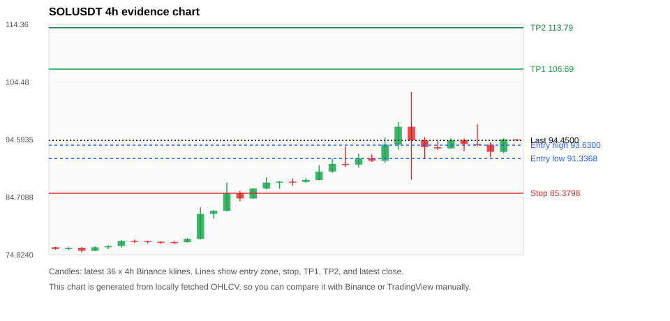
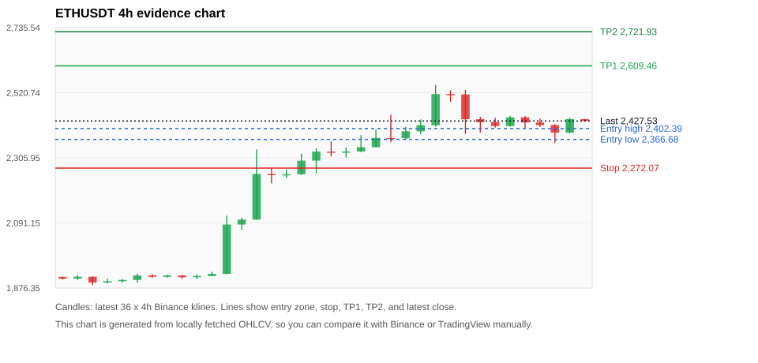
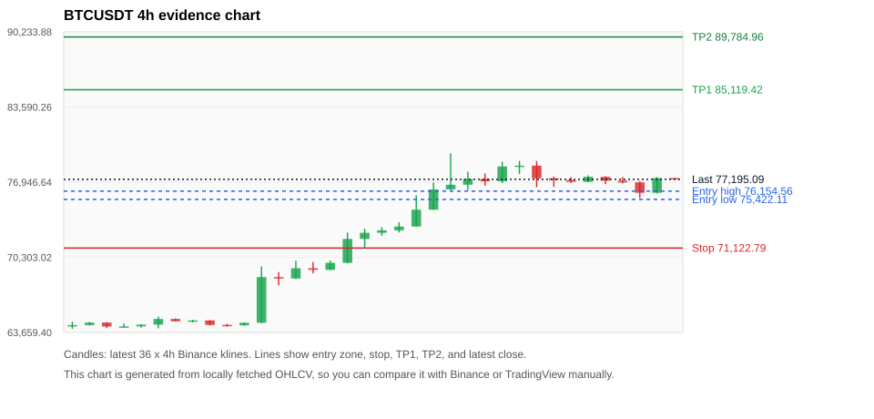
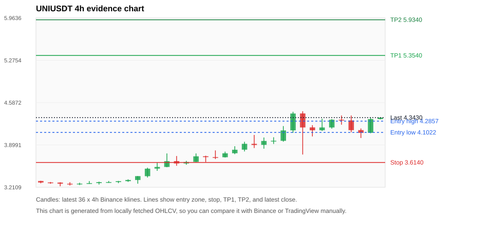
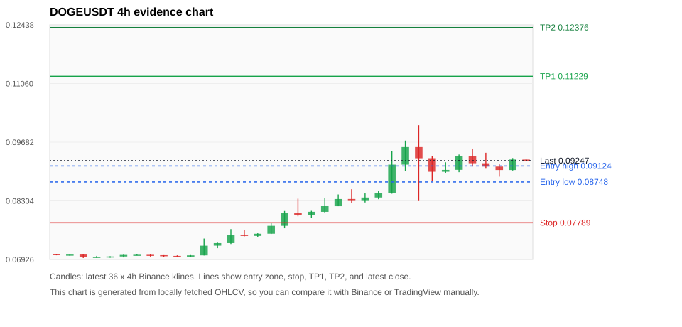

# Crypto 市场扫描报告 v1

- 报告时间：2026-08-23 20:06:31 CST
- Run ID：`20260823_120504_26ee622a`
- Run type：`daily_full`
- Data validation mode：`paper`
- 数据来源：SQLite
- 报告版本：v1
- 扫描 ID：320bc0bceb6a
- 数据源：Binance public spot API + CoinGecko/CoinMarketCap cross-check
- 过滤条件：USDT spot; 24h quote volume >= 30,000,000; trades >= 30,000; exclude stables/leveraged tokens; analyze 1h/4h/1d klines
- 默认单笔风险：账户权益的 1.00%

## 限制说明

- 交易信号仍以 Binance 现货公开 K 线为主源；外部数据源用于一致性复核。
- 结果是研究和模拟盘计划，不是确定收益或实盘下单指令。
- 历史长度过滤：候选币至少需要 180 根 1d K 线。
- 数据质量验证池：先验证 score 排名前 min(top_n * 2, 10) 的候选，再按 action + score 补足最终名单。
- 大盘环境过滤：RISK_ON; BTC/ETH 日线趋势均较强，允许山寨币买入候选。 BTC 7d=22.73448330683625; ETH 7d=29.424307036247342.
- Data cross-validation enabled: Binance primary source plus CoinGecko; CoinMarketCap is checked when an API key is configured.
- UNIUSDT validation state DEGRADED: DEGRADED: [EXTERNAL_IDENTITY_AMBIGUOUS] CoinMarketCap symbol mapping has 7 matches; selected lowest cmc_rank
- ENAUSDT validation state BLOCKED: BLOCKED: [EXTERNAL_24H_DIFF_WARNING] 24h change diff 3.62 points exceeds warning threshold; [EXTERNAL_IDENTITY_AMBIGUOUS] CoinMarketCap symbol mapping has 2 matches; selected lowest cmc_rank
- DOGEUSDT validation state DEGRADED: DEGRADED: [EXTERNAL_IDENTITY_AMBIGUOUS] CoinMarketCap symbol mapping has 23 matches; selected lowest cmc_rank
- SOLUSDT validation state DEGRADED: DEGRADED: [EXTERNAL_PROVIDER_RATE_LIMITED] Provider rate limited request for https://api.coingecko.com/api/v3/coins/markets?vs_currency=usd&ids=solana&price_change_percentage=24h&per_page=1&page=1: HTTP 429; [EXTERNAL_IDENTITY_AMBIGUOUS] CoinMarketCap symbol mapping has 8 matches; selected lowest cmc_rank
- ETHUSDT validation state DEGRADED: DEGRADED: [EXTERNAL_PROVIDER_RATE_LIMITED] Provider rate limited request for https://api.coingecko.com/api/v3/coins/markets?vs_currency=usd&ids=ethereum&price_change_percentage=24h&per_page=1&page=1: HTTP 429; [EXTERNAL_IDENTITY_AMBIGUOUS] CoinMarketCap symbol mapping has 6 matches; selected lowest cmc_rank
- XRPUSDT validation state DEGRADED: DEGRADED: [EXTERNAL_PROVIDER_RATE_LIMITED] Provider rate limited request for https://api.coingecko.com/api/v3/coins/markets?vs_currency=usd&ids=ripple&price_change_percentage=24h&per_page=1&page=1: HTTP 429; [EXTERNAL_IDENTITY_AMBIGUOUS] CoinMarketCap symbol mapping has 3 matches; selected lowest cmc_rank
- PEPEUSDT validation state DEGRADED: DEGRADED: [EXTERNAL_PROVIDER_RATE_LIMITED] Provider rate limited request for https://api.coingecko.com/api/v3/coins/markets?vs_currency=usd&ids=pepe&price_change_percentage=24h&per_page=1&page=1: HTTP 429; [EXTERNAL_IDENTITY_AMBIGUOUS] CoinMarketCap symbol mapping has 33 matches; selected lowest cmc_rank
- BTCUSDT validation state DEGRADED: DEGRADED: [EXTERNAL_PROVIDER_RATE_LIMITED] Provider rate limited request for https://api.coingecko.com/api/v3/coins/markets?vs_currency=usd&ids=bitcoin&price_change_percentage=24h&per_page=1&page=1: HTTP 429; [EXTERNAL_IDENTITY_AMBIGUOUS] CoinMarketCap symbol mapping has 13 matches; selected lowest cmc_rank
- ZECUSDT validation state BLOCKED: BLOCKED: [BINANCE_KLINE_EXTREME_RANGE] Binance candle range exceeds 40%.; [BINANCE_KLINE_EXTREME_RANGE] Binance candle range exceeds 40%.; [EXTERNAL_PROVIDER_RATE_LIMITED] Provider rate limited request for https://api.coingecko.com/api/v3/coins/markets?vs_currency=usd&ids=zcash&price_change_percentage=24h&per_page=1&page=1: HTTP 429; [EXTERNAL_IDENTITY_AMBIGUOUS] CoinMarketCap symbol mapping has 2 matches; selected lowest cmc_rank

## 5 个候选交易计划

| Rank | Coin | Action | Setup | Entry Zone | Stop Loss | TP1 | TP2 / Exit Rule | R/R | Verdict |
|---:|---|---|---|---:|---:|---:|---|---:|---|
| 1 | `SOL` | `BUY_CANDIDATE` | 回踩支撑/4h EMA 附近 | 91.3368 - 93.6300 | 85.3798 | 106.69 | 113.79 或跌破 4h 关键支撑 | 2.00-3.00 | 可考虑 |
| 2 | `ETH` | `BUY_CANDIDATE` | 回踩支撑/4h EMA 附近 | 2,366.68 - 2,402.39 | 2,272.07 | 2,609.46 | 2,721.93 或跌破 4h 关键支撑 | 2.00-3.00 | 可考虑 |
| 3 | `BTC` | `BUY_CANDIDATE` | 回踩支撑/4h EMA 附近 | 75,422.11 - 76,154.56 | 71,122.79 | 85,119.42 | 89,784.96 或跌破 4h 关键支撑 | 2.00-3.00 | 可考虑 |
| 4 | `UNI` | `WAIT_PULLBACK` | 趋势中，等回调入场 | 4.1022 - 4.2857 | 3.6140 | 5.3540 | 5.9340 或跌破 4h 关键支撑 | 2.00-3.00 | 只等回调 |
| 5 | `DOGE` | `WAIT_PULLBACK` | 趋势中，等回调入场 | 0.08748 - 0.09124 | 0.07789 | 0.11229 | 0.12376 或跌破 4h 关键支撑 | 2.00-3.00 | 只等回调 |

## 数据交叉验证摘要

价格差异以 Binance 当前价为基准；成交量口径不同，Binance 是 USDT 现货成交额，CoinGecko/CoinMarketCap 通常是全市场成交量。

| Rank | Coin | State | Identity | Max Price Diff | Max 24h Diff | Issue Codes | Message |
|---:|---|---|---|---:|---:|---|---|
| 1 | `SOL` | DEGRADED (DATA_WARNING) | UNCONFIRMED | 0.12% | 0.05 pts | EXTERNAL_IDENTITY_AMBIGUOUS, EXTERNAL_PROVIDER_RATE_LIMITED | DEGRADED: [EXTERNAL_PROVIDER_RATE_LIMITED] Provider rate limited request for https://api.coingecko.com/api/v3/coins/markets?vs_currency=usd&ids=solana&price_change_percentage=24h&per_page=1&page=1: HTTP 429; [EXTERNAL_IDENTITY_AMBIGUOUS] CoinMarketCap symbol mapping has 8 matches; selected lowest cmc_rank |
| 2 | `ETH` | DEGRADED (DATA_WARNING) | UNCONFIRMED | 0.14% | 0.03 pts | EXTERNAL_IDENTITY_AMBIGUOUS, EXTERNAL_PROVIDER_RATE_LIMITED | DEGRADED: [EXTERNAL_PROVIDER_RATE_LIMITED] Provider rate limited request for https://api.coingecko.com/api/v3/coins/markets?vs_currency=usd&ids=ethereum&price_change_percentage=24h&per_page=1&page=1: HTTP 429; [EXTERNAL_IDENTITY_AMBIGUOUS] CoinMarketCap symbol mapping has 6 matches; selected lowest cmc_rank |
| 3 | `BTC` | DEGRADED (DATA_WARNING) | UNCONFIRMED | 0.01% | 0.02 pts | EXTERNAL_IDENTITY_AMBIGUOUS, EXTERNAL_PROVIDER_RATE_LIMITED | DEGRADED: [EXTERNAL_PROVIDER_RATE_LIMITED] Provider rate limited request for https://api.coingecko.com/api/v3/coins/markets?vs_currency=usd&ids=bitcoin&price_change_percentage=24h&per_page=1&page=1: HTTP 429; [EXTERNAL_IDENTITY_AMBIGUOUS] CoinMarketCap symbol mapping has 13 matches; selected lowest cmc_rank |
| 4 | `UNI` | DEGRADED (DATA_WARNING) | UNCONFIRMED | 0.24% | 1.50 pts | EXTERNAL_IDENTITY_AMBIGUOUS | DEGRADED: [EXTERNAL_IDENTITY_AMBIGUOUS] CoinMarketCap symbol mapping has 7 matches; selected lowest cmc_rank |
| 5 | `DOGE` | DEGRADED (DATA_WARNING) | UNCONFIRMED | 0.29% | 0.74 pts | EXTERNAL_IDENTITY_AMBIGUOUS | DEGRADED: [EXTERNAL_IDENTITY_AMBIGUOUS] CoinMarketCap symbol mapping has 23 matches; selected lowest cmc_rank |

## 候选币说明

### 1. SOL `SOLUSDT`



- 入选原因：回踩支撑/4h EMA 附近；24h +1.30%，7d +25.41%，4h RSI 61.95，24h 成交额 $355.3M。
- 交易失效条件：跌破 85.3798 或 4h 收盘重新失守关键支撑。
- 主要风险：主要风险是大盘同步回撤；External validation is degraded; this candidate is not a clean data sample.；Paper mode allows degraded validation; candidate is excluded from clean-data samples.。
- 数据交叉验证：DEGRADED / DATA_WARNING；身份=UNCONFIRMED；DEGRADED: [EXTERNAL_PROVIDER_RATE_LIMITED] Provider rate limited request for https://api.coingecko.com/api/v3/coins/markets?vs_currency=usd&ids=solana&price_change_percentage=24h&per_page=1&page=1: HTTP 429; [EXTERNAL_IDENTITY_AMBIGUOUS] CoinMarketCap symbol mapping has 8 matches; selected lowest cmc_rank

#### 可点击人工验证

- [Binance 交易页](https://www.binance.com/en/trade/SOL_USDT)
- [TradingView 图表](https://www.tradingview.com/chart/?symbol=BINANCE%3ASOLUSDT)
- [CoinGecko 搜索](https://www.coingecko.com/en/search?query=SOL)
- [CoinMarketCap 搜索](https://coinmarketcap.com/search/?q=SOL)

#### 多数据源对照

| Source | Status | Identity | Blocking | Asset ID | Price | 24h Change | 24h Volume | Price Diff | 24h Diff | Updated | Issue Codes | Message |
|---|---|---|---:|---|---:|---:|---:|---:|---:|---|---|---|
| Binance | DATA_OK | CONFIRMED | no | SOLUSDT | 94.4500 | +1.30% | $355.3M | 0.00% | 0.00 pts | 2026-08-23T12:05:39+00:00 | none | Primary market data source passed health checks. |
| CoinGecko | DATA_WARNING | UNCONFIRMED | no | n/a | n/a | n/a | n/a | n/a | n/a | 2026-08-23T12:05:39+00:00 | EXTERNAL_PROVIDER_RATE_LIMITED | Provider rate limited request for https://api.coingecko.com/api/v3/coins/markets?vs_currency=usd&ids=solana&price_change_percentage=24h&per_page=1&page=1: HTTP 429 |
| CoinMarketCap | DATA_WARNING | UNCONFIRMED | no | 5426 | 94.5586 | +1.34% | $4.65B | 0.12% | 0.05 pts | 2026-08-23T12:05:01.000Z | EXTERNAL_IDENTITY_AMBIGUOUS | [EXTERNAL_IDENTITY_AMBIGUOUS] CoinMarketCap symbol mapping has 8 matches; selected lowest cmc_rank |

#### 指标证据

| 指标 | 数值 | 人工核对用途 |
|---|---:|---|
| 当前价 | 94.4500 | 与 Binance/TradingView 当前价格对照 |
| 24h 涨跌 | +1.30% | 与交易所 24h 涨跌对照 |
| 7d 涨跌 | +25.41% | 判断短线趋势是否延续 |
| 4h EMA20 | 91.1545 | 判断短期趋势支撑 |
| 4h EMA50 | 85.6151 | 判断中期趋势支撑 |
| 1d EMA20 | 81.7191 | 判断日线趋势 |
| 1d EMA50 | 78.3929 | 判断日线趋势 |
| 4h RSI14 | 61.95 | 判断是否过热/过弱 |
| 4h ATR14 | 3.5364 | 推导止损和入场缓冲 |
| 最近 18 根 4h 最低点 | 86.6800 | 支撑/止损参考 |
| 最近 36 根 4h 最高点 | 102.74 | TP/压力参考 |
| 支撑位 | 91.1545 | 入场区间推导基础 |

#### 交易计划推导

- 支撑位 = 最近低点、4h EMA20、4h EMA50、1d EMA20 中不高于当前价的最高有效支撑 = `91.1545`。
- 入场区间 = 支撑位附近 + ATR 缓冲 = `91.3368 - 93.6300`。
- 止损 = min(最近 18 根 4h 最低点 * 0.985, 入场中位价 - 1.15 * ATR14) = `85.3798`。
- TP1 = max(最近 36 根 4h 最高点 * 0.995, 入场中位价 + 2R) = `106.69`。
- TP2 = max(入场中位价 + 3R, TP1 * 1.04) = `113.79`。

#### 最近 10 根 4h K线

| UTC 开盘时间 | Open | High | Low | Close | Quote Volume | Trades |
|---|---:|---:|---:|---:|---:|---:|
| 2026-08-22T00:00+00:00 | 93.7200 | 97.5900 | 92.8600 | 96.7900 | $108.6M | 416287 |
| 2026-08-22T04:00+00:00 | 96.8000 | 102.74 | 87.7200 | 94.4600 | $322.0M | 1222837 |
| 2026-08-22T08:00+00:00 | 94.4600 | 95.0100 | 91.3400 | 93.3000 | $106.3M | 473892 |
| 2026-08-22T12:00+00:00 | 93.2900 | 94.3500 | 92.8200 | 93.0700 | $53.6M | 237915 |
| 2026-08-22T16:00+00:00 | 93.0800 | 94.8000 | 93.0700 | 94.4900 | $43.1M | 160623 |
| 2026-08-22T20:00+00:00 | 94.4900 | 94.7800 | 92.5800 | 93.8200 | $38.7M | 183938 |
| 2026-08-23T00:00+00:00 | 93.8300 | 97.2100 | 93.4300 | 93.7000 | $102.8M | 449392 |
| 2026-08-23T04:00+00:00 | 93.7100 | 94.1000 | 91.5800 | 92.4900 | $73.4M | 327921 |
| 2026-08-23T08:00+00:00 | 92.4800 | 94.8200 | 92.3100 | 94.6300 | $42.4M | 182212 |
| 2026-08-23T12:00+00:00 | 94.6200 | 94.6200 | 94.3800 | 94.4500 | $2.8M | 5418 |

### 2. ETH `ETHUSDT`



- 入选原因：回踩支撑/4h EMA 附近；24h +0.18%，7d +28.99%，4h RSI 57.31，24h 成交额 $722.6M。
- 交易失效条件：跌破 2272.07 或 4h 收盘重新失守关键支撑。
- 主要风险：主要风险是大盘同步回撤；External validation is degraded; this candidate is not a clean data sample.；Paper mode allows degraded validation; candidate is excluded from clean-data samples.。
- 数据交叉验证：DEGRADED / DATA_WARNING；身份=UNCONFIRMED；DEGRADED: [EXTERNAL_PROVIDER_RATE_LIMITED] Provider rate limited request for https://api.coingecko.com/api/v3/coins/markets?vs_currency=usd&ids=ethereum&price_change_percentage=24h&per_page=1&page=1: HTTP 429; [EXTERNAL_IDENTITY_AMBIGUOUS] CoinMarketCap symbol mapping has 6 matches; selected lowest cmc_rank

#### 可点击人工验证

- [Binance 交易页](https://www.binance.com/en/trade/ETH_USDT)
- [TradingView 图表](https://www.tradingview.com/chart/?symbol=BINANCE%3AETHUSDT)
- [CoinGecko 搜索](https://www.coingecko.com/en/search?query=ETH)
- [CoinMarketCap 搜索](https://coinmarketcap.com/search/?q=ETH)

#### 多数据源对照

| Source | Status | Identity | Blocking | Asset ID | Price | 24h Change | 24h Volume | Price Diff | 24h Diff | Updated | Issue Codes | Message |
|---|---|---|---:|---|---:|---:|---:|---:|---:|---|---|---|
| Binance | DATA_OK | CONFIRMED | no | ETHUSDT | 2,427.53 | +0.18% | $722.6M | 0.00% | 0.00 pts | 2026-08-23T12:05:39+00:00 | none | Primary market data source passed health checks. |
| CoinGecko | DATA_WARNING | UNCONFIRMED | no | n/a | n/a | n/a | n/a | n/a | n/a | 2026-08-23T12:05:39+00:00 | EXTERNAL_PROVIDER_RATE_LIMITED | Provider rate limited request for https://api.coingecko.com/api/v3/coins/markets?vs_currency=usd&ids=ethereum&price_change_percentage=24h&per_page=1&page=1: HTTP 429 |
| CoinMarketCap | DATA_WARNING | UNCONFIRMED | no | 1027 | 2,430.82 | +0.21% | $14.79B | 0.14% | 0.03 pts | 2026-08-23T12:05:01.000Z | EXTERNAL_IDENTITY_AMBIGUOUS | [EXTERNAL_IDENTITY_AMBIGUOUS] CoinMarketCap symbol mapping has 6 matches; selected lowest cmc_rank |

#### 指标证据

| 指标 | 数值 | 人工核对用途 |
|---|---:|---|
| 当前价 | 2,427.53 | 与 Binance/TradingView 当前价格对照 |
| 24h 涨跌 | +0.18% | 与交易所 24h 涨跌对照 |
| 7d 涨跌 | +28.99% | 判断短线趋势是否延续 |
| 4h EMA20 | 2,361.95 | 判断短期趋势支撑 |
| 4h EMA50 | 2,202.26 | 判断中期趋势支撑 |
| 1d EMA20 | 2,089.38 | 判断日线趋势 |
| 1d EMA50 | 1,964.70 | 判断日线趋势 |
| 4h RSI14 | 57.31 | 判断是否过热/过弱 |
| 4h ATR14 | 57.7757 | 推导止损和入场缓冲 |
| 最近 18 根 4h 最低点 | 2,306.67 | 支撑/止损参考 |
| 最近 36 根 4h 最高点 | 2,546.78 | TP/压力参考 |
| 支撑位 | 2,361.95 | 入场区间推导基础 |

#### 交易计划推导

- 支撑位 = 最近低点、4h EMA20、4h EMA50、1d EMA20 中不高于当前价的最高有效支撑 = `2,361.95`。
- 入场区间 = 支撑位附近 + ATR 缓冲 = `2,366.68 - 2,402.39`。
- 止损 = min(最近 18 根 4h 最低点 * 0.985, 入场中位价 - 1.15 * ATR14) = `2,272.07`。
- TP1 = max(最近 36 根 4h 最高点 * 0.995, 入场中位价 + 2R) = `2,609.46`。
- TP2 = max(入场中位价 + 3R, TP1 * 1.04) = `2,721.93`。

#### 最近 10 根 4h K线

| UTC 开盘时间 | Open | High | Low | Close | Quote Volume | Trades |
|---|---:|---:|---:|---:|---:|---:|
| 2026-08-22T00:00+00:00 | 2,516.31 | 2,528.58 | 2,491.11 | 2,515.06 | $217.1M | 845662 |
| 2026-08-22T04:00+00:00 | 2,515.06 | 2,529.99 | 2,385.00 | 2,433.31 | $444.6M | 1414938 |
| 2026-08-22T08:00+00:00 | 2,433.32 | 2,441.10 | 2,389.45 | 2,423.93 | $195.0M | 893462 |
| 2026-08-22T12:00+00:00 | 2,423.92 | 2,437.76 | 2,405.62 | 2,410.90 | $128.3M | 518733 |
| 2026-08-22T16:00+00:00 | 2,410.89 | 2,444.71 | 2,409.00 | 2,439.41 | $91.8M | 376184 |
| 2026-08-22T20:00+00:00 | 2,439.41 | 2,443.72 | 2,403.47 | 2,422.60 | $110.6M | 432799 |
| 2026-08-23T00:00+00:00 | 2,422.60 | 2,435.53 | 2,408.00 | 2,413.98 | $83.0M | 386718 |
| 2026-08-23T04:00+00:00 | 2,413.98 | 2,417.02 | 2,355.71 | 2,389.02 | $183.3M | 847875 |
| 2026-08-23T08:00+00:00 | 2,389.01 | 2,438.31 | 2,386.96 | 2,433.68 | $126.0M | 443614 |
| 2026-08-23T12:00+00:00 | 2,433.67 | 2,433.68 | 2,427.40 | 2,427.53 | $2.5M | 11339 |

### 3. BTC `BTCUSDT`



- 入选原因：回踩支撑/4h EMA 附近；24h +0.08%，7d +22.42%，4h RSI 56.16，24h 成交额 $1.08B。
- 交易失效条件：跌破 71122.792 或 4h 收盘重新失守关键支撑。
- 主要风险：主要风险是大盘同步回撤；External validation is degraded; this candidate is not a clean data sample.；Paper mode allows degraded validation; candidate is excluded from clean-data samples.。
- 数据交叉验证：DEGRADED / DATA_WARNING；身份=UNCONFIRMED；DEGRADED: [EXTERNAL_PROVIDER_RATE_LIMITED] Provider rate limited request for https://api.coingecko.com/api/v3/coins/markets?vs_currency=usd&ids=bitcoin&price_change_percentage=24h&per_page=1&page=1: HTTP 429; [EXTERNAL_IDENTITY_AMBIGUOUS] CoinMarketCap symbol mapping has 13 matches; selected lowest cmc_rank

#### 可点击人工验证

- [Binance 交易页](https://www.binance.com/en/trade/BTC_USDT)
- [TradingView 图表](https://www.tradingview.com/chart/?symbol=BINANCE%3ABTCUSDT)
- [CoinGecko 搜索](https://www.coingecko.com/en/search?query=BTC)
- [CoinMarketCap 搜索](https://coinmarketcap.com/search/?q=BTC)

#### 多数据源对照

| Source | Status | Identity | Blocking | Asset ID | Price | 24h Change | 24h Volume | Price Diff | 24h Diff | Updated | Issue Codes | Message |
|---|---|---|---:|---|---:|---:|---:|---:|---:|---|---|---|
| Binance | DATA_OK | CONFIRMED | no | BTCUSDT | 77,195.09 | +0.08% | $1.08B | 0.00% | 0.00 pts | 2026-08-23T12:05:39+00:00 | none | Primary market data source passed health checks. |
| CoinGecko | DATA_WARNING | UNCONFIRMED | no | n/a | n/a | n/a | n/a | n/a | n/a | 2026-08-23T12:05:39+00:00 | EXTERNAL_PROVIDER_RATE_LIMITED | Provider rate limited request for https://api.coingecko.com/api/v3/coins/markets?vs_currency=usd&ids=bitcoin&price_change_percentage=24h&per_page=1&page=1: HTTP 429 |
| CoinMarketCap | DATA_WARNING | UNCONFIRMED | no | 1 | 77,200.95 | +0.06% | $27.98B | 0.01% | 0.02 pts | 2026-08-23T12:05:01.000Z | EXTERNAL_IDENTITY_AMBIGUOUS | [EXTERNAL_IDENTITY_AMBIGUOUS] CoinMarketCap symbol mapping has 13 matches; selected lowest cmc_rank |

#### 指标证据

| 指标 | 数值 | 人工核对用途 |
|---|---:|---|
| 当前价 | 77,195.09 | 与 Binance/TradingView 当前价格对照 |
| 24h 涨跌 | +0.08% | 与交易所 24h 涨跌对照 |
| 7d 涨跌 | +22.42% | 判断短线趋势是否延续 |
| 4h EMA20 | 75,271.56 | 判断短期趋势支撑 |
| 4h EMA50 | 71,205.78 | 判断中期趋势支撑 |
| 1d EMA20 | 68,446.23 | 判断日线趋势 |
| 1d EMA50 | 66,320.91 | 判断日线趋势 |
| 4h RSI14 | 56.16 | 判断是否过热/过弱 |
| 4h ATR14 | 1,261.42 | 推导止损和入场缓冲 |
| 最近 18 根 4h 最低点 | 72,205.88 | 支撑/止损参考 |
| 最近 36 根 4h 最高点 | 79,500.00 | TP/压力参考 |
| 支撑位 | 75,271.56 | 入场区间推导基础 |

#### 交易计划推导

- 支撑位 = 最近低点、4h EMA20、4h EMA50、1d EMA20 中不高于当前价的最高有效支撑 = `75,271.56`。
- 入场区间 = 支撑位附近 + ATR 缓冲 = `75,422.11 - 76,154.56`。
- 止损 = min(最近 18 根 4h 最低点 * 0.985, 入场中位价 - 1.15 * ATR14) = `71,122.79`。
- TP1 = max(最近 36 根 4h 最高点 * 0.995, 入场中位价 + 2R) = `85,119.42`。
- TP2 = max(入场中位价 + 3R, TP1 * 1.04) = `89,784.96`。

#### 最近 10 根 4h K线

| UTC 开盘时间 | Open | High | Low | Close | Quote Volume | Trades |
|---|---:|---:|---:|---:|---:|---:|
| 2026-08-22T00:00+00:00 | 78,338.03 | 78,828.15 | 77,683.37 | 78,410.98 | $245.3M | 857785 |
| 2026-08-22T04:00+00:00 | 78,410.98 | 78,818.00 | 76,500.00 | 77,289.18 | $466.6M | 1105878 |
| 2026-08-22T08:00+00:00 | 77,289.18 | 77,445.60 | 76,533.87 | 77,130.02 | $288.8M | 769748 |
| 2026-08-22T12:00+00:00 | 77,130.01 | 77,387.99 | 76,880.00 | 76,978.83 | $154.3M | 457317 |
| 2026-08-22T16:00+00:00 | 76,978.83 | 77,547.96 | 76,956.36 | 77,418.25 | $109.1M | 353418 |
| 2026-08-22T20:00+00:00 | 77,418.26 | 77,467.53 | 76,772.00 | 77,074.93 | $169.7M | 405899 |
| 2026-08-23T00:00+00:00 | 77,074.94 | 77,400.00 | 76,837.00 | 76,927.87 | $119.8M | 403643 |
| 2026-08-23T04:00+00:00 | 76,927.87 | 77,036.58 | 75,545.67 | 76,007.13 | $339.6M | 873491 |
| 2026-08-23T08:00+00:00 | 76,007.12 | 77,400.00 | 75,952.09 | 77,311.02 | $187.1M | 547639 |
| 2026-08-23T12:00+00:00 | 77,311.02 | 77,311.99 | 77,191.58 | 77,195.08 | $2.8M | 8440 |

### 4. UNI `UNIUSDT`



- 入选原因：趋势中，等回调入场；24h +4.70%，7d +32.73%，4h RSI 64.81，24h 成交额 $33.8M。
- 交易失效条件：跌破 3.613965 或 4h 收盘重新失守关键支撑。
- 主要风险：主要风险是大盘同步回撤；External validation is degraded; this candidate is not a clean data sample.；Paper mode allows degraded validation; candidate is excluded from clean-data samples.。
- 数据交叉验证：DEGRADED / DATA_WARNING；身份=UNCONFIRMED；DEGRADED: [EXTERNAL_IDENTITY_AMBIGUOUS] CoinMarketCap symbol mapping has 7 matches; selected lowest cmc_rank

#### 可点击人工验证

- [Binance 交易页](https://www.binance.com/en/trade/UNI_USDT)
- [TradingView 图表](https://www.tradingview.com/chart/?symbol=BINANCE%3AUNIUSDT)
- [CoinGecko 搜索](https://www.coingecko.com/en/search?query=UNI)
- [CoinMarketCap 搜索](https://coinmarketcap.com/search/?q=UNI)

#### 多数据源对照

| Source | Status | Identity | Blocking | Asset ID | Price | 24h Change | 24h Volume | Price Diff | 24h Diff | Updated | Issue Codes | Message |
|---|---|---|---:|---|---:|---:|---:|---:|---:|---|---|---|
| Binance | DATA_OK | CONFIRMED | no | UNIUSDT | 4.3430 | +4.70% | $33.8M | 0.00% | 0.00 pts | 2026-08-23T12:05:39+00:00 | none | Primary market data source passed health checks. |
| CoinGecko | DATA_OK | CONFIRMED | no | uniswap | 4.3400 | +6.20% | $451.8M | 0.07% | 1.50 pts | 2026-08-23T12:03:30.000Z | none | External source agrees with Binance within thresholds. |
| CoinMarketCap | DATA_WARNING | UNCONFIRMED | no | 7083 | 4.3327 | +4.53% | $393.3M | 0.24% | 0.17 pts | 2026-08-23T12:04:01.000Z | EXTERNAL_IDENTITY_AMBIGUOUS | [EXTERNAL_IDENTITY_AMBIGUOUS] CoinMarketCap symbol mapping has 7 matches; selected lowest cmc_rank |

#### 指标证据

| 指标 | 数值 | 人工核对用途 |
|---|---:|---|
| 当前价 | 4.3430 | 与 Binance/TradingView 当前价格对照 |
| 24h 涨跌 | +4.70% | 与交易所 24h 涨跌对照 |
| 7d 涨跌 | +32.73% | 判断短线趋势是否延续 |
| 4h EMA20 | 4.0512 | 判断短期趋势支撑 |
| 4h EMA50 | 3.8069 | 判断中期趋势支撑 |
| 1d EMA20 | 3.7920 | 判断日线趋势 |
| 1d EMA50 | 3.6676 | 判断日线趋势 |
| 4h RSI14 | 64.81 | 判断是否过热/过弱 |
| 4h ATR14 | 0.22929 | 推导止损和入场缓冲 |
| 最近 18 根 4h 最低点 | 3.6690 | 支撑/止损参考 |
| 最近 36 根 4h 最高点 | 4.4470 | TP/压力参考 |
| 支撑位 | 4.0512 | 入场区间推导基础 |

#### 交易计划推导

- 支撑位 = 最近低点、4h EMA20、4h EMA50、1d EMA20 中不高于当前价的最高有效支撑 = `4.0512`。
- 入场区间 = 支撑位附近 + ATR 缓冲 = `4.1022 - 4.2857`。
- 止损 = min(最近 18 根 4h 最低点 * 0.985, 入场中位价 - 1.15 * ATR14) = `3.6140`。
- TP1 = max(最近 36 根 4h 最高点 * 0.995, 入场中位价 + 2R) = `5.3540`。
- TP2 = max(入场中位价 + 3R, TP1 * 1.04) = `5.9340`。

#### 最近 10 根 4h K线

| UTC 开盘时间 | Open | High | Low | Close | Quote Volume | Trades |
|---|---:|---:|---:|---:|---:|---:|
| 2026-08-22T00:00+00:00 | 4.1360 | 4.4380 | 4.0960 | 4.4100 | $9.1M | 64060 |
| 2026-08-22T04:00+00:00 | 4.4110 | 4.4470 | 3.7430 | 4.1830 | $19.6M | 138254 |
| 2026-08-22T08:00+00:00 | 4.1840 | 4.2210 | 4.0370 | 4.1370 | $7.8M | 52156 |
| 2026-08-22T12:00+00:00 | 4.1380 | 4.3250 | 4.1260 | 4.1830 | $7.6M | 52883 |
| 2026-08-22T16:00+00:00 | 4.1830 | 4.3190 | 4.1630 | 4.3090 | $3.8M | 29797 |
| 2026-08-22T20:00+00:00 | 4.3080 | 4.3780 | 4.2280 | 4.2970 | $6.2M | 38095 |
| 2026-08-23T00:00+00:00 | 4.2980 | 4.3780 | 4.1050 | 4.1390 | $5.2M | 36480 |
| 2026-08-23T04:00+00:00 | 4.1400 | 4.1670 | 4.0120 | 4.0950 | $5.7M | 33327 |
| 2026-08-23T08:00+00:00 | 4.0960 | 4.3480 | 4.0890 | 4.3190 | $5.0M | 31746 |
| 2026-08-23T12:00+00:00 | 4.3190 | 4.3460 | 4.3160 | 4.3430 | $338,209 | 1691 |

### 5. DOGE `DOGEUSDT`



- 入选原因：趋势中，等回调入场；24h +3.06%，7d +32.23%，4h RSI 65.79，24h 成交额 $116.5M。
- 交易失效条件：跌破 0.0778938 或 4h 收盘重新失守关键支撑。
- 主要风险：主要风险是大盘同步回撤；External validation is degraded; this candidate is not a clean data sample.；Paper mode allows degraded validation; candidate is excluded from clean-data samples.。
- 数据交叉验证：DEGRADED / DATA_WARNING；身份=UNCONFIRMED；DEGRADED: [EXTERNAL_IDENTITY_AMBIGUOUS] CoinMarketCap symbol mapping has 23 matches; selected lowest cmc_rank

#### 可点击人工验证

- [Binance 交易页](https://www.binance.com/en/trade/DOGE_USDT)
- [TradingView 图表](https://www.tradingview.com/chart/?symbol=BINANCE%3ADOGEUSDT)
- [CoinGecko 搜索](https://www.coingecko.com/en/search?query=DOGE)
- [CoinMarketCap 搜索](https://coinmarketcap.com/search/?q=DOGE)

#### 多数据源对照

| Source | Status | Identity | Blocking | Asset ID | Price | 24h Change | 24h Volume | Price Diff | 24h Diff | Updated | Issue Codes | Message |
|---|---|---|---:|---|---:|---:|---:|---:|---:|---|---|---|
| Binance | DATA_OK | CONFIRMED | no | DOGEUSDT | 0.09247 | +3.06% | $116.5M | 0.00% | 0.00 pts | 2026-08-23T12:05:39+00:00 | none | Primary market data source passed health checks. |
| CoinGecko | DATA_OK | CONFIRMED | no | dogecoin | 0.09255 | +3.80% | $1.36B | 0.08% | 0.74 pts | 2026-08-23T12:03:30.000Z | none | External source agrees with Binance within thresholds. |
| CoinMarketCap | DATA_WARNING | UNCONFIRMED | no | 74 | 0.09274 | +3.14% | $1.62B | 0.29% | 0.08 pts | 2026-08-23T12:05:01.000Z | EXTERNAL_IDENTITY_AMBIGUOUS | [EXTERNAL_IDENTITY_AMBIGUOUS] CoinMarketCap symbol mapping has 23 matches; selected lowest cmc_rank |

#### 指标证据

| 指标 | 数值 | 人工核对用途 |
|---|---:|---|
| 当前价 | 0.09247 | 与 Binance/TradingView 当前价格对照 |
| 24h 涨跌 | +3.06% | 与交易所 24h 涨跌对照 |
| 7d 涨跌 | +32.23% | 判断短线趋势是否延续 |
| 4h EMA20 | 0.08730 | 判断短期趋势支撑 |
| 4h EMA50 | 0.08053 | 判断中期趋势支撑 |
| 1d EMA20 | 0.07699 | 判断日线趋势 |
| 1d EMA50 | 0.07575 | 判断日线趋势 |
| 4h RSI14 | 65.79 | 判断是否过热/过弱 |
| 4h ATR14 | 0.0049164286 | 推导止损和入场缓冲 |
| 最近 18 根 4h 最低点 | 0.07908 | 支撑/止损参考 |
| 最近 36 根 4h 最高点 | 0.10080 | TP/压力参考 |
| 支撑位 | 0.08730 | 入场区间推导基础 |

#### 交易计划推导

- 支撑位 = 最近低点、4h EMA20、4h EMA50、1d EMA20 中不高于当前价的最高有效支撑 = `0.08730`。
- 入场区间 = 支撑位附近 + ATR 缓冲 = `0.08748 - 0.09124`。
- 止损 = min(最近 18 根 4h 最低点 * 0.985, 入场中位价 - 1.15 * ATR14) = `0.07789`。
- TP1 = max(最近 36 根 4h 最高点 * 0.995, 入场中位价 + 2R) = `0.11229`。
- TP2 = max(入场中位价 + 3R, TP1 * 1.04) = `0.12376`。

#### 最近 10 根 4h K线

| UTC 开盘时间 | Open | High | Low | Close | Quote Volume | Trades |
|---|---:|---:|---:|---:|---:|---:|
| 2026-08-22T00:00+00:00 | 0.09155 | 0.09719 | 0.09014 | 0.09567 | $35.5M | 453389 |
| 2026-08-22T04:00+00:00 | 0.09567 | 0.10080 | 0.08300 | 0.09305 | $105.2M | 1256290 |
| 2026-08-22T08:00+00:00 | 0.09306 | 0.09348 | 0.08769 | 0.08988 | $36.0M | 358946 |
| 2026-08-22T12:00+00:00 | 0.08988 | 0.09210 | 0.08951 | 0.09032 | $18.2M | 238242 |
| 2026-08-22T16:00+00:00 | 0.09033 | 0.09392 | 0.08978 | 0.09352 | $20.9M | 202860 |
| 2026-08-22T20:00+00:00 | 0.09352 | 0.09532 | 0.09112 | 0.09188 | $21.5M | 171893 |
| 2026-08-23T00:00+00:00 | 0.09187 | 0.09434 | 0.09059 | 0.09111 | $19.4M | 193510 |
| 2026-08-23T04:00+00:00 | 0.09110 | 0.09176 | 0.08873 | 0.09029 | $21.3M | 199732 |
| 2026-08-23T08:00+00:00 | 0.09029 | 0.09309 | 0.09017 | 0.09275 | $15.0M | 138028 |
| 2026-08-23T12:00+00:00 | 0.09274 | 0.09280 | 0.09246 | 0.09247 | $803,339 | 2762 |

## 组合风控

- 不要 5 个候选全部满仓买入。
- 同时持仓总风险建议控制在账户权益的 3% - 5% 以内。
- 如果 BTC/ETH 同时破位，暂停山寨币多头计划或降低仓位。
- 第一版报告用于模拟盘和人工复核，不自动下单。

## 原始数据

```json
[
  {
    "rank": 1,
    "symbol": "SOLUSDT",
    "base_asset": "SOL",
    "price": 94.45,
    "score": 75.02450774532979,
    "setup": "回踩支撑/4h EMA 附近",
    "verdict": "可考虑",
    "entry_low": 91.33676531414643,
    "entry_high": 93.62995640134375,
    "stop_loss": 85.3798,
    "take_profit_1": 106.69048257323524,
    "take_profit_2": 113.79404343098032,
    "risk_reward_1": 2.0,
    "risk_reward_2": 3.0,
    "pct_24h": 1.297,
    "pct_3d": 9.089859089859086,
    "pct_7d": 25.41495153366087,
    "quote_volume_24h": 355309197.21715,
    "trades_24h": 1540528,
    "high_low_range_24h": 6.147630487005884,
    "rsi_1h": 54.419595314164006,
    "rsi_4h": 61.952662721893496,
    "ema20_4h": 91.15445640134375,
    "ema50_4h": 85.615147318794,
    "ema20_1d": 81.71908659825796,
    "ema50_1d": 78.39285264112426,
    "atr_4h": 3.5364285714285697,
    "macd_hist_4h": -0.3387661261899084,
    "volume_ratio_24h": 1.0498802756859782,
    "support_level": 91.15445640134375,
    "recent_low_4h_18": 86.68,
    "recent_high_4h_36": 102.74,
    "distance_to_support_pct": 3.6153400818346393,
    "binance_trade_url": "https://www.binance.com/en/trade/SOL_USDT",
    "tradingview_url": "https://www.tradingview.com/chart/?symbol=BINANCE%3ASOLUSDT",
    "coingecko_search_url": "https://www.coingecko.com/en/search?query=SOL",
    "coinmarketcap_search_url": "https://coinmarketcap.com/search/?q=SOL",
    "invalidation": "跌破 85.3798 或 4h 收盘重新失守关键支撑",
    "recent_4h_klines": [
      {
        "open_time_utc": "2026-08-17T16:00+00:00",
        "open": 76.11,
        "high": 76.17,
        "low": 75.7,
        "close": 75.81,
        "quote_volume": 12777800.40163,
        "trades": 51775
      },
      {
        "open_time_utc": "2026-08-17T20:00+00:00",
        "open": 75.81,
        "high": 76.12,
        "low": 75.63,
        "close": 76.02,
        "quote_volume": 10065218.8457,
        "trades": 45706
      },
      {
        "open_time_utc": "2026-08-18T00:00+00:00",
        "open": 76.02,
        "high": 76.09,
        "low": 75.2,
        "close": 75.5,
        "quote_volume": 16908053.0078,
        "trades": 63050
      },
      {
        "open_time_utc": "2026-08-18T04:00+00:00",
        "open": 75.5,
        "high": 76.27,
        "low": 75.41,
        "close": 76.1,
        "quote_volume": 19706792.69624,
        "trades": 63130
      },
      {
        "open_time_utc": "2026-08-18T08:00+00:00",
        "open": 76.1,
        "high": 76.45,
        "low": 75.8,
        "close": 76.31,
        "quote_volume": 16990454.33187,
        "trades": 50654
      },
      {
        "open_time_utc": "2026-08-18T12:00+00:00",
        "open": 76.32,
        "high": 77.33,
        "low": 76.05,
        "close": 77.19,
        "quote_volume": 31098376.95388,
        "trades": 101149
      },
      {
        "open_time_utc": "2026-08-18T16:00+00:00",
        "open": 77.2,
        "high": 77.41,
        "low": 76.85,
        "close": 77.18,
        "quote_volume": 12582121.58141,
        "trades": 49874
      },
      {
        "open_time_utc": "2026-08-18T20:00+00:00",
        "open": 77.18,
        "high": 77.23,
        "low": 76.75,
        "close": 77.05,
        "quote_volume": 13856508.33148,
        "trades": 44049
      },
      {
        "open_time_utc": "2026-08-19T00:00+00:00",
        "open": 77.05,
        "high": 77.12,
        "low": 76.64,
        "close": 77.0,
        "quote_volume": 12863201.8415,
        "trades": 48472
      },
      {
        "open_time_utc": "2026-08-19T04:00+00:00",
        "open": 76.99,
        "high": 77.17,
        "low": 76.63,
        "close": 76.96,
        "quote_volume": 12028046.2579,
        "trades": 36336
      },
      {
        "open_time_utc": "2026-08-19T08:00+00:00",
        "open": 76.96,
        "high": 77.65,
        "low": 76.92,
        "close": 77.55,
        "quote_volume": 17590073.68221,
        "trades": 38823
      },
      {
        "open_time_utc": "2026-08-19T12:00+00:00",
        "open": 77.54,
        "high": 83.0,
        "low": 77.43,
        "close": 81.83,
        "quote_volume": 139290434.03173,
        "trades": 393007
      },
      {
        "open_time_utc": "2026-08-19T16:00+00:00",
        "open": 81.83,
        "high": 82.5,
        "low": 81.01,
        "close": 82.36,
        "quote_volume": 48121430.45086,
        "trades": 176564
      },
      {
        "open_time_utc": "2026-08-19T20:00+00:00",
        "open": 82.37,
        "high": 87.21,
        "low": 82.28,
        "close": 85.38,
        "quote_volume": 99855580.62414,
        "trades": 491727
      },
      {
        "open_time_utc": "2026-08-20T00:00+00:00",
        "open": 85.39,
        "high": 85.79,
        "low": 84.01,
        "close": 84.48,
        "quote_volume": 50222021.04119,
        "trades": 149763
      },
      {
        "open_time_utc": "2026-08-20T04:00+00:00",
        "open": 84.48,
        "high": 86.2,
        "low": 84.42,
        "close": 86.18,
        "quote_volume": 35005738.65144,
        "trades": 90487
      },
      {
        "open_time_utc": "2026-08-20T08:00+00:00",
        "open": 86.17,
        "high": 88.1,
        "low": 86.04,
        "close": 87.21,
        "quote_volume": 81288347.30443,
        "trades": 233800
      },
      {
        "open_time_utc": "2026-08-20T12:00+00:00",
        "open": 87.22,
        "high": 87.48,
        "low": 86.16,
        "close": 87.37,
        "quote_volume": 73961629.06232,
        "trades": 277887
      },
      {
        "open_time_utc": "2026-08-20T16:00+00:00",
        "open": 87.37,
        "high": 87.93,
        "low": 86.68,
        "close": 87.31,
        "quote_volume": 52881940.72448,
        "trades": 167766
      },
      {
        "open_time_utc": "2026-08-20T20:00+00:00",
        "open": 87.32,
        "high": 87.99,
        "low": 87.19,
        "close": 87.66,
        "quote_volume": 26426787.01619,
        "trades": 85805
      },
      {
        "open_time_utc": "2026-08-21T00:00+00:00",
        "open": 87.65,
        "high": 90.2,
        "low": 87.57,
        "close": 89.1,
        "quote_volume": 97696595.11039,
        "trades": 339103
      },
      {
        "open_time_utc": "2026-08-21T04:00+00:00",
        "open": 89.11,
        "high": 91.33,
        "low": 88.88,
        "close": 90.41,
        "quote_volume": 80275298.64002,
        "trades": 270244
      },
      {
        "open_time_utc": "2026-08-21T08:00+00:00",
        "open": 90.42,
        "high": 93.39,
        "low": 89.91,
        "close": 90.29,
        "quote_volume": 140333182.19731,
        "trades": 547147
      },
      {
        "open_time_utc": "2026-08-21T12:00+00:00",
        "open": 90.3,
        "high": 92.16,
        "low": 89.78,
        "close": 91.37,
        "quote_volume": 80237017.57857,
        "trades": 324719
      },
      {
        "open_time_utc": "2026-08-21T16:00+00:00",
        "open": 91.37,
        "high": 92.06,
        "low": 90.75,
        "close": 90.96,
        "quote_volume": 48346556.98893,
        "trades": 200686
      },
      {
        "open_time_utc": "2026-08-21T20:00+00:00",
        "open": 90.96,
        "high": 94.99,
        "low": 90.59,
        "close": 93.72,
        "quote_volume": 84694218.42171,
        "trades": 390086
      },
      {
        "open_time_utc": "2026-08-22T00:00+00:00",
        "open": 93.72,
        "high": 97.59,
        "low": 92.86,
        "close": 96.79,
        "quote_volume": 108556776.33764,
        "trades": 416287
      },
      {
        "open_time_utc": "2026-08-22T04:00+00:00",
        "open": 96.8,
        "high": 102.74,
        "low": 87.72,
        "close": 94.46,
        "quote_volume": 322025016.14877,
        "trades": 1222837
      },
      {
        "open_time_utc": "2026-08-22T08:00+00:00",
        "open": 94.46,
        "high": 95.01,
        "low": 91.34,
        "close": 93.3,
        "quote_volume": 106348591.63076,
        "trades": 473892
      },
      {
        "open_time_utc": "2026-08-22T12:00+00:00",
        "open": 93.29,
        "high": 94.35,
        "low": 92.82,
        "close": 93.07,
        "quote_volume": 53585128.42959,
        "trades": 237915
      },
      {
        "open_time_utc": "2026-08-22T16:00+00:00",
        "open": 93.08,
        "high": 94.8,
        "low": 93.07,
        "close": 94.49,
        "quote_volume": 43115060.51556,
        "trades": 160623
      },
      {
        "open_time_utc": "2026-08-22T20:00+00:00",
        "open": 94.49,
        "high": 94.78,
        "low": 92.58,
        "close": 93.82,
        "quote_volume": 38685724.52756,
        "trades": 183938
      },
      {
        "open_time_utc": "2026-08-23T00:00+00:00",
        "open": 93.83,
        "high": 97.21,
        "low": 93.43,
        "close": 93.7,
        "quote_volume": 102800675.89394,
        "trades": 449392
      },
      {
        "open_time_utc": "2026-08-23T04:00+00:00",
        "open": 93.71,
        "high": 94.1,
        "low": 91.58,
        "close": 92.49,
        "quote_volume": 73358283.14858,
        "trades": 327921
      },
      {
        "open_time_utc": "2026-08-23T08:00+00:00",
        "open": 92.48,
        "high": 94.82,
        "low": 92.31,
        "close": 94.63,
        "quote_volume": 42399496.45061,
        "trades": 182212
      },
      {
        "open_time_utc": "2026-08-23T12:00+00:00",
        "open": 94.62,
        "high": 94.62,
        "low": 94.38,
        "close": 94.45,
        "quote_volume": 2820980.88439,
        "trades": 5418
      }
    ],
    "risks": [
      "主要风险是大盘同步回撤",
      "External validation is degraded; this candidate is not a clean data sample.",
      "Paper mode allows degraded validation; candidate is excluded from clean-data samples."
    ],
    "data_quality_status": "DATA_WARNING",
    "data_quality_message": "DEGRADED: [EXTERNAL_PROVIDER_RATE_LIMITED] Provider rate limited request for https://api.coingecko.com/api/v3/coins/markets?vs_currency=usd&ids=solana&price_change_percentage=24h&per_page=1&page=1: HTTP 429; [EXTERNAL_IDENTITY_AMBIGUOUS] CoinMarketCap symbol mapping has 8 matches; selected lowest cmc_rank",
    "data_checks": [
      {
        "provider": "Binance",
        "status": "DATA_OK",
        "provider_asset_id": "SOLUSDT",
        "provider_symbol": "SOLUSDT",
        "price_usd": 94.45,
        "pct_24h": 1.297,
        "volume_24h": 355309197.21715,
        "last_updated": null,
        "fetched_at_utc": "2026-08-23T12:05:39+00:00",
        "price_diff_pct": 0.0,
        "pct_24h_diff": 0.0,
        "volume_note": "Binance USDT spot 24h quoteVolume.",
        "message": "Primary market data source passed health checks.",
        "blocking": false,
        "identity_status": "CONFIRMED",
        "issues": []
      },
      {
        "provider": "CoinGecko",
        "status": "DATA_WARNING",
        "provider_asset_id": null,
        "provider_symbol": "SOL",
        "price_usd": null,
        "pct_24h": null,
        "volume_24h": null,
        "last_updated": null,
        "fetched_at_utc": "2026-08-23T12:05:39+00:00",
        "price_diff_pct": null,
        "pct_24h_diff": null,
        "volume_note": "External provider data unavailable.",
        "message": "Provider rate limited request for https://api.coingecko.com/api/v3/coins/markets?vs_currency=usd&ids=solana&price_change_percentage=24h&per_page=1&page=1: HTTP 429",
        "blocking": false,
        "identity_status": "UNCONFIRMED",
        "issues": [
          {
            "provider": "CoinGecko",
            "code": "EXTERNAL_PROVIDER_RATE_LIMITED",
            "severity": "WARNING",
            "blocking": false,
            "message": "Provider rate limited request for https://api.coingecko.com/api/v3/coins/markets?vs_currency=usd&ids=solana&price_change_percentage=24h&per_page=1&page=1: HTTP 429",
            "context": {}
          }
        ]
      },
      {
        "provider": "CoinMarketCap",
        "status": "DATA_WARNING",
        "provider_asset_id": "5426",
        "provider_symbol": "SOL",
        "price_usd": 94.55863547022233,
        "pct_24h": 1.34481599,
        "volume_24h": 4652302337.931145,
        "last_updated": "2026-08-23T12:05:01.000Z",
        "fetched_at_utc": "2026-08-23T12:05:39+00:00",
        "price_diff_pct": 0.11501902617503934,
        "pct_24h_diff": 0.04781599000000014,
        "volume_note": "CoinMarketCap total market volume; not the same venue scope as Binance quoteVolume.",
        "message": "[EXTERNAL_IDENTITY_AMBIGUOUS] CoinMarketCap symbol mapping has 8 matches; selected lowest cmc_rank",
        "blocking": false,
        "identity_status": "UNCONFIRMED",
        "issues": [
          {
            "provider": "CoinMarketCap",
            "code": "EXTERNAL_IDENTITY_AMBIGUOUS",
            "severity": "WARNING",
            "blocking": false,
            "message": "CoinMarketCap symbol mapping has 8 matches; selected lowest cmc_rank",
            "context": {}
          }
        ]
      }
    ],
    "action": "BUY_CANDIDATE",
    "data_quality_state": "DEGRADED",
    "data_quality_issues": [
      {
        "provider": "CoinGecko",
        "code": "EXTERNAL_PROVIDER_RATE_LIMITED",
        "severity": "WARNING",
        "blocking": false,
        "message": "Provider rate limited request for https://api.coingecko.com/api/v3/coins/markets?vs_currency=usd&ids=solana&price_change_percentage=24h&per_page=1&page=1: HTTP 429",
        "context": {}
      },
      {
        "provider": "CoinMarketCap",
        "code": "EXTERNAL_IDENTITY_AMBIGUOUS",
        "severity": "WARNING",
        "blocking": false,
        "message": "CoinMarketCap symbol mapping has 8 matches; selected lowest cmc_rank",
        "context": {}
      }
    ],
    "external_identity_status": "UNCONFIRMED"
  },
  {
    "rank": 2,
    "symbol": "ETHUSDT",
    "base_asset": "ETH",
    "price": 2427.53,
    "score": 74.1936365574162,
    "setup": "回踩支撑/4h EMA 附近",
    "verdict": "可考虑",
    "entry_low": 2366.6753924337977,
    "entry_high": 2402.394489454888,
    "stop_loss": 2272.06995,
    "take_profit_1": 2609.4649228330286,
    "take_profit_2": 2721.9299137773714,
    "risk_reward_1": 2.0,
    "risk_reward_2": 3.0,
    "pct_24h": 0.181,
    "pct_3d": 6.615105559727885,
    "pct_7d": 28.98945779931561,
    "quote_volume_24h": 722605461.963872,
    "trades_24h": 2995034,
    "high_low_range_24h": 3.7780541747498564,
    "rsi_1h": 54.57657287601846,
    "rsi_4h": 57.310339413288716,
    "ema20_4h": 2361.951489454888,
    "ema50_4h": 2202.2603710974126,
    "ema20_1d": 2089.375111210803,
    "ema50_1d": 1964.697786393388,
    "atr_4h": 57.775714285714294,
    "macd_hist_4h": -17.370581900295633,
    "volume_ratio_24h": 0.6268848728822587,
    "support_level": 2361.951489454888,
    "recent_low_4h_18": 2306.67,
    "recent_high_4h_36": 2546.78,
    "distance_to_support_pct": 2.7764545901087567,
    "binance_trade_url": "https://www.binance.com/en/trade/ETH_USDT",
    "tradingview_url": "https://www.tradingview.com/chart/?symbol=BINANCE%3AETHUSDT",
    "coingecko_search_url": "https://www.coingecko.com/en/search?query=ETH",
    "coinmarketcap_search_url": "https://coinmarketcap.com/search/?q=ETH",
    "invalidation": "跌破 2272.07 或 4h 收盘重新失守关键支撑",
    "recent_4h_klines": [
      {
        "open_time_utc": "2026-08-17T16:00+00:00",
        "open": 1913.22,
        "high": 1914.19,
        "low": 1904.59,
        "close": 1907.25,
        "quote_volume": 45344967.243363,
        "trades": 241412
      },
      {
        "open_time_utc": "2026-08-17T20:00+00:00",
        "open": 1907.24,
        "high": 1918.71,
        "low": 1903.59,
        "close": 1913.6,
        "quote_volume": 31811728.604936,
        "trades": 133703
      },
      {
        "open_time_utc": "2026-08-18T00:00+00:00",
        "open": 1913.59,
        "high": 1914.38,
        "low": 1885.78,
        "close": 1894.69,
        "quote_volume": 52706771.157688,
        "trades": 261227
      },
      {
        "open_time_utc": "2026-08-18T04:00+00:00",
        "open": 1894.68,
        "high": 1906.94,
        "low": 1891.53,
        "close": 1898.84,
        "quote_volume": 37117512.077172,
        "trades": 140792
      },
      {
        "open_time_utc": "2026-08-18T08:00+00:00",
        "open": 1898.83,
        "high": 1905.65,
        "low": 1893.8,
        "close": 1903.11,
        "quote_volume": 35849366.842787,
        "trades": 178744
      },
      {
        "open_time_utc": "2026-08-18T12:00+00:00",
        "open": 1903.12,
        "high": 1923.27,
        "low": 1894.0,
        "close": 1917.7,
        "quote_volume": 81475553.420661,
        "trades": 348899
      },
      {
        "open_time_utc": "2026-08-18T16:00+00:00",
        "open": 1917.71,
        "high": 1922.3,
        "low": 1910.81,
        "close": 1913.28,
        "quote_volume": 39538242.605256,
        "trades": 189159
      },
      {
        "open_time_utc": "2026-08-18T20:00+00:00",
        "open": 1913.28,
        "high": 1920.1,
        "low": 1910.87,
        "close": 1917.85,
        "quote_volume": 28630825.027226,
        "trades": 110457
      },
      {
        "open_time_utc": "2026-08-19T00:00+00:00",
        "open": 1917.85,
        "high": 1919.15,
        "low": 1906.19,
        "close": 1912.15,
        "quote_volume": 42648897.717523,
        "trades": 209935
      },
      {
        "open_time_utc": "2026-08-19T04:00+00:00",
        "open": 1912.15,
        "high": 1921.32,
        "low": 1906.0,
        "close": 1916.01,
        "quote_volume": 47226795.151042,
        "trades": 148550
      },
      {
        "open_time_utc": "2026-08-19T08:00+00:00",
        "open": 1916.01,
        "high": 1929.94,
        "low": 1915.32,
        "close": 1923.06,
        "quote_volume": 45845053.825589,
        "trades": 189484
      },
      {
        "open_time_utc": "2026-08-19T12:00+00:00",
        "open": 1923.06,
        "high": 2115.0,
        "low": 1922.05,
        "close": 2085.83,
        "quote_volume": 605212208.433768,
        "trades": 1612909
      },
      {
        "open_time_utc": "2026-08-19T16:00+00:00",
        "open": 2085.83,
        "high": 2108.0,
        "low": 2067.43,
        "close": 2102.02,
        "quote_volume": 295655451.670076,
        "trades": 1019935
      },
      {
        "open_time_utc": "2026-08-19T20:00+00:00",
        "open": 2102.02,
        "high": 2333.65,
        "low": 2102.02,
        "close": 2252.8,
        "quote_volume": 642825325.076305,
        "trades": 2098865
      },
      {
        "open_time_utc": "2026-08-20T00:00+00:00",
        "open": 2252.81,
        "high": 2274.25,
        "low": 2221.54,
        "close": 2251.21,
        "quote_volume": 243602331.013792,
        "trades": 897465
      },
      {
        "open_time_utc": "2026-08-20T04:00+00:00",
        "open": 2251.21,
        "high": 2267.3,
        "low": 2238.97,
        "close": 2251.81,
        "quote_volume": 167058938.700793,
        "trades": 565894
      },
      {
        "open_time_utc": "2026-08-20T08:00+00:00",
        "open": 2251.81,
        "high": 2320.0,
        "low": 2249.19,
        "close": 2296.58,
        "quote_volume": 339842076.821834,
        "trades": 1290207
      },
      {
        "open_time_utc": "2026-08-20T12:00+00:00",
        "open": 2296.59,
        "high": 2337.89,
        "low": 2255.68,
        "close": 2326.41,
        "quote_volume": 319199555.356713,
        "trades": 1432294
      },
      {
        "open_time_utc": "2026-08-20T16:00+00:00",
        "open": 2326.4,
        "high": 2360.0,
        "low": 2310.44,
        "close": 2323.77,
        "quote_volume": 325515321.011872,
        "trades": 1022916
      },
      {
        "open_time_utc": "2026-08-20T20:00+00:00",
        "open": 2323.78,
        "high": 2340.0,
        "low": 2306.67,
        "close": 2326.82,
        "quote_volume": 90470894.116433,
        "trades": 432351
      },
      {
        "open_time_utc": "2026-08-21T00:00+00:00",
        "open": 2326.83,
        "high": 2380.82,
        "low": 2324.99,
        "close": 2341.04,
        "quote_volume": 225333531.62713,
        "trades": 1129939
      },
      {
        "open_time_utc": "2026-08-21T04:00+00:00",
        "open": 2341.05,
        "high": 2398.71,
        "low": 2341.05,
        "close": 2371.66,
        "quote_volume": 216531611.332784,
        "trades": 914983
      },
      {
        "open_time_utc": "2026-08-21T08:00+00:00",
        "open": 2371.67,
        "high": 2447.98,
        "low": 2357.18,
        "close": 2370.47,
        "quote_volume": 417464093.796605,
        "trades": 1756205
      },
      {
        "open_time_utc": "2026-08-21T12:00+00:00",
        "open": 2370.48,
        "high": 2408.55,
        "low": 2365.44,
        "close": 2393.65,
        "quote_volume": 282984303.505544,
        "trades": 1154800
      },
      {
        "open_time_utc": "2026-08-21T16:00+00:00",
        "open": 2393.64,
        "high": 2432.35,
        "low": 2384.0,
        "close": 2413.55,
        "quote_volume": 240126291.432467,
        "trades": 850472
      },
      {
        "open_time_utc": "2026-08-21T20:00+00:00",
        "open": 2413.54,
        "high": 2546.78,
        "low": 2408.86,
        "close": 2516.3,
        "quote_volume": 404145044.593269,
        "trades": 1436299
      },
      {
        "open_time_utc": "2026-08-22T00:00+00:00",
        "open": 2516.31,
        "high": 2528.58,
        "low": 2491.11,
        "close": 2515.06,
        "quote_volume": 217146591.671543,
        "trades": 845662
      },
      {
        "open_time_utc": "2026-08-22T04:00+00:00",
        "open": 2515.06,
        "high": 2529.99,
        "low": 2385.0,
        "close": 2433.31,
        "quote_volume": 444602747.309494,
        "trades": 1414938
      },
      {
        "open_time_utc": "2026-08-22T08:00+00:00",
        "open": 2433.32,
        "high": 2441.1,
        "low": 2389.45,
        "close": 2423.93,
        "quote_volume": 195024308.627177,
        "trades": 893462
      },
      {
        "open_time_utc": "2026-08-22T12:00+00:00",
        "open": 2423.92,
        "high": 2437.76,
        "low": 2405.62,
        "close": 2410.9,
        "quote_volume": 128335623.597646,
        "trades": 518733
      },
      {
        "open_time_utc": "2026-08-22T16:00+00:00",
        "open": 2410.89,
        "high": 2444.71,
        "low": 2409.0,
        "close": 2439.41,
        "quote_volume": 91774811.801335,
        "trades": 376184
      },
      {
        "open_time_utc": "2026-08-22T20:00+00:00",
        "open": 2439.41,
        "high": 2443.72,
        "low": 2403.47,
        "close": 2422.6,
        "quote_volume": 110612488.726276,
        "trades": 432799
      },
      {
        "open_time_utc": "2026-08-23T00:00+00:00",
        "open": 2422.6,
        "high": 2435.53,
        "low": 2408.0,
        "close": 2413.98,
        "quote_volume": 83015375.410514,
        "trades": 386718
      },
      {
        "open_time_utc": "2026-08-23T04:00+00:00",
        "open": 2413.98,
        "high": 2417.02,
        "low": 2355.71,
        "close": 2389.02,
        "quote_volume": 183348315.311039,
        "trades": 847875
      },
      {
        "open_time_utc": "2026-08-23T08:00+00:00",
        "open": 2389.01,
        "high": 2438.31,
        "low": 2386.96,
        "close": 2433.68,
        "quote_volume": 126019110.099471,
        "trades": 443614
      },
      {
        "open_time_utc": "2026-08-23T12:00+00:00",
        "open": 2433.67,
        "high": 2433.68,
        "low": 2427.4,
        "close": 2427.53,
        "quote_volume": 2516855.986993,
        "trades": 11339
      }
    ],
    "risks": [
      "主要风险是大盘同步回撤",
      "External validation is degraded; this candidate is not a clean data sample.",
      "Paper mode allows degraded validation; candidate is excluded from clean-data samples."
    ],
    "data_quality_status": "DATA_WARNING",
    "data_quality_message": "DEGRADED: [EXTERNAL_PROVIDER_RATE_LIMITED] Provider rate limited request for https://api.coingecko.com/api/v3/coins/markets?vs_currency=usd&ids=ethereum&price_change_percentage=24h&per_page=1&page=1: HTTP 429; [EXTERNAL_IDENTITY_AMBIGUOUS] CoinMarketCap symbol mapping has 6 matches; selected lowest cmc_rank",
    "data_checks": [
      {
        "provider": "Binance",
        "status": "DATA_OK",
        "provider_asset_id": "ETHUSDT",
        "provider_symbol": "ETHUSDT",
        "price_usd": 2427.53,
        "pct_24h": 0.181,
        "volume_24h": 722605461.963872,
        "last_updated": null,
        "fetched_at_utc": "2026-08-23T12:05:39+00:00",
        "price_diff_pct": 0.0,
        "pct_24h_diff": 0.0,
        "volume_note": "Binance USDT spot 24h quoteVolume.",
        "message": "Primary market data source passed health checks.",
        "blocking": false,
        "identity_status": "CONFIRMED",
        "issues": []
      },
      {
        "provider": "CoinGecko",
        "status": "DATA_WARNING",
        "provider_asset_id": null,
        "provider_symbol": "ETH",
        "price_usd": null,
        "pct_24h": null,
        "volume_24h": null,
        "last_updated": null,
        "fetched_at_utc": "2026-08-23T12:05:39+00:00",
        "price_diff_pct": null,
        "pct_24h_diff": null,
        "volume_note": "External provider data unavailable.",
        "message": "Provider rate limited request for https://api.coingecko.com/api/v3/coins/markets?vs_currency=usd&ids=ethereum&price_change_percentage=24h&per_page=1&page=1: HTTP 429",
        "blocking": false,
        "identity_status": "UNCONFIRMED",
        "issues": [
          {
            "provider": "CoinGecko",
            "code": "EXTERNAL_PROVIDER_RATE_LIMITED",
            "severity": "WARNING",
            "blocking": false,
            "message": "Provider rate limited request for https://api.coingecko.com/api/v3/coins/markets?vs_currency=usd&ids=ethereum&price_change_percentage=24h&per_page=1&page=1: HTTP 429",
            "context": {}
          }
        ]
      },
      {
        "provider": "CoinMarketCap",
        "status": "DATA_WARNING",
        "provider_asset_id": "1027",
        "provider_symbol": "ETH",
        "price_usd": 2430.818216687274,
        "pct_24h": 0.20883479,
        "volume_24h": 14790883582.317589,
        "last_updated": "2026-08-23T12:05:01.000Z",
        "fetched_at_utc": "2026-08-23T12:05:39+00:00",
        "price_diff_pct": 0.13545524410712487,
        "pct_24h_diff": 0.027834789999999998,
        "volume_note": "CoinMarketCap total market volume; not the same venue scope as Binance quoteVolume.",
        "message": "[EXTERNAL_IDENTITY_AMBIGUOUS] CoinMarketCap symbol mapping has 6 matches; selected lowest cmc_rank",
        "blocking": false,
        "identity_status": "UNCONFIRMED",
        "issues": [
          {
            "provider": "CoinMarketCap",
            "code": "EXTERNAL_IDENTITY_AMBIGUOUS",
            "severity": "WARNING",
            "blocking": false,
            "message": "CoinMarketCap symbol mapping has 6 matches; selected lowest cmc_rank",
            "context": {}
          }
        ]
      }
    ],
    "action": "BUY_CANDIDATE",
    "data_quality_state": "DEGRADED",
    "data_quality_issues": [
      {
        "provider": "CoinGecko",
        "code": "EXTERNAL_PROVIDER_RATE_LIMITED",
        "severity": "WARNING",
        "blocking": false,
        "message": "Provider rate limited request for https://api.coingecko.com/api/v3/coins/markets?vs_currency=usd&ids=ethereum&price_change_percentage=24h&per_page=1&page=1: HTTP 429",
        "context": {}
      },
      {
        "provider": "CoinMarketCap",
        "code": "EXTERNAL_IDENTITY_AMBIGUOUS",
        "severity": "WARNING",
        "blocking": false,
        "message": "CoinMarketCap symbol mapping has 6 matches; selected lowest cmc_rank",
        "context": {}
      }
    ],
    "external_identity_status": "UNCONFIRMED"
  },
  {
    "rank": 3,
    "symbol": "BTCUSDT",
    "base_asset": "BTC",
    "price": 77195.09,
    "score": 71.26801485315283,
    "setup": "回踩支撑/4h EMA 附近",
    "verdict": "可考虑",
    "entry_low": 75422.10670073696,
    "entry_high": 76154.55907358979,
    "stop_loss": 71122.7918,
    "take_profit_1": 85119.4150614901,
    "take_profit_2": 89784.95614865347,
    "risk_reward_1": 2.0,
    "risk_reward_2": 3.0,
    "pct_24h": 0.083,
    "pct_3d": 7.676031869111166,
    "pct_7d": 22.415283473630907,
    "quote_volume_24h": 1079293975.2155151,
    "trades_24h": 3032113,
    "high_low_range_24h": 2.650436484314733,
    "rsi_1h": 53.17517273338721,
    "rsi_4h": 56.163528222357954,
    "ema20_4h": 75271.56357358978,
    "ema50_4h": 71205.77663634358,
    "ema20_1d": 68446.23196394175,
    "ema50_1d": 66320.90525572603,
    "atr_4h": 1261.4221428571452,
    "macd_hist_4h": -393.6020686512443,
    "volume_ratio_24h": 0.5793444515494336,
    "support_level": 75271.56357358978,
    "recent_low_4h_18": 72205.88,
    "recent_high_4h_36": 79500.0,
    "distance_to_support_pct": 2.555449010341948,
    "binance_trade_url": "https://www.binance.com/en/trade/BTC_USDT",
    "tradingview_url": "https://www.tradingview.com/chart/?symbol=BINANCE%3ABTCUSDT",
    "coingecko_search_url": "https://www.coingecko.com/en/search?query=BTC",
    "coinmarketcap_search_url": "https://coinmarketcap.com/search/?q=BTC",
    "invalidation": "跌破 71122.792 或 4h 收盘重新失守关键支撑",
    "recent_4h_klines": [
      {
        "open_time_utc": "2026-08-17T16:00+00:00",
        "open": 64200.0,
        "high": 64610.01,
        "low": 63979.3,
        "close": 64309.96,
        "quote_volume": 230413977.46563,
        "trades": 541032
      },
      {
        "open_time_utc": "2026-08-17T20:00+00:00",
        "open": 64309.95,
        "high": 64578.0,
        "low": 64266.0,
        "close": 64532.1,
        "quote_volume": 73006989.5728039,
        "trades": 202323
      },
      {
        "open_time_utc": "2026-08-18T00:00+00:00",
        "open": 64532.11,
        "high": 64568.46,
        "low": 64047.73,
        "close": 64185.01,
        "quote_volume": 111202818.3351658,
        "trades": 246058
      },
      {
        "open_time_utc": "2026-08-18T04:00+00:00",
        "open": 64185.0,
        "high": 64446.0,
        "low": 64090.0,
        "close": 64198.97,
        "quote_volume": 202472655.3705193,
        "trades": 253329
      },
      {
        "open_time_utc": "2026-08-18T08:00+00:00",
        "open": 64198.97,
        "high": 64402.35,
        "low": 64087.98,
        "close": 64351.19,
        "quote_volume": 77227074.7347002,
        "trades": 197005
      },
      {
        "open_time_utc": "2026-08-18T12:00+00:00",
        "open": 64351.18,
        "high": 65058.81,
        "low": 64027.85,
        "close": 64855.06,
        "quote_volume": 237954220.3227694,
        "trades": 541934
      },
      {
        "open_time_utc": "2026-08-18T16:00+00:00",
        "open": 64855.06,
        "high": 64891.81,
        "low": 64642.36,
        "close": 64643.26,
        "quote_volume": 79255097.0914884,
        "trades": 211297
      },
      {
        "open_time_utc": "2026-08-18T20:00+00:00",
        "open": 64643.27,
        "high": 64780.0,
        "low": 64562.25,
        "close": 64725.42,
        "quote_volume": 51293463.9747784,
        "trades": 158396
      },
      {
        "open_time_utc": "2026-08-19T00:00+00:00",
        "open": 64725.42,
        "high": 64736.27,
        "low": 64278.0,
        "close": 64330.71,
        "quote_volume": 88199811.0086489,
        "trades": 258329
      },
      {
        "open_time_utc": "2026-08-19T04:00+00:00",
        "open": 64330.7,
        "high": 64409.93,
        "low": 64166.0,
        "close": 64296.0,
        "quote_volume": 117221863.8378684,
        "trades": 184917
      },
      {
        "open_time_utc": "2026-08-19T08:00+00:00",
        "open": 64296.01,
        "high": 64539.05,
        "low": 64255.0,
        "close": 64515.63,
        "quote_volume": 74611199.1198357,
        "trades": 150786
      },
      {
        "open_time_utc": "2026-08-19T12:00+00:00",
        "open": 64515.62,
        "high": 69500.0,
        "low": 64474.86,
        "close": 68554.0,
        "quote_volume": 939526647.5011343,
        "trades": 1576421
      },
      {
        "open_time_utc": "2026-08-19T16:00+00:00",
        "open": 68554.0,
        "high": 68997.0,
        "low": 67825.03,
        "close": 68429.44,
        "quote_volume": 347389517.9273289,
        "trades": 853285
      },
      {
        "open_time_utc": "2026-08-19T20:00+00:00",
        "open": 68429.44,
        "high": 70000.0,
        "low": 68390.0,
        "close": 69334.79,
        "quote_volume": 387820099.6983747,
        "trades": 1136858
      },
      {
        "open_time_utc": "2026-08-20T00:00+00:00",
        "open": 69334.78,
        "high": 69894.5,
        "low": 68902.22,
        "close": 69195.64,
        "quote_volume": 286686629.3688295,
        "trades": 752205
      },
      {
        "open_time_utc": "2026-08-20T04:00+00:00",
        "open": 69195.64,
        "high": 70022.0,
        "low": 69166.0,
        "close": 69816.45,
        "quote_volume": 377584678.9597753,
        "trades": 693188
      },
      {
        "open_time_utc": "2026-08-20T08:00+00:00",
        "open": 69816.45,
        "high": 72490.0,
        "low": 69772.36,
        "close": 71927.07,
        "quote_volume": 791582876.508384,
        "trades": 1531290
      },
      {
        "open_time_utc": "2026-08-20T12:00+00:00",
        "open": 71927.07,
        "high": 72830.0,
        "low": 71132.0,
        "close": 72470.83,
        "quote_volume": 582385271.5188173,
        "trades": 1685640
      },
      {
        "open_time_utc": "2026-08-20T16:00+00:00",
        "open": 72470.84,
        "high": 72966.0,
        "low": 72205.88,
        "close": 72690.76,
        "quote_volume": 317970452.9319334,
        "trades": 951205
      },
      {
        "open_time_utc": "2026-08-20T20:00+00:00",
        "open": 72690.76,
        "high": 73400.0,
        "low": 72498.0,
        "close": 73025.15,
        "quote_volume": 205843798.3222438,
        "trades": 635586
      },
      {
        "open_time_utc": "2026-08-21T00:00+00:00",
        "open": 73027.02,
        "high": 75785.82,
        "low": 73027.02,
        "close": 74510.77,
        "quote_volume": 584652979.5047988,
        "trades": 1582036
      },
      {
        "open_time_utc": "2026-08-21T04:00+00:00",
        "open": 74510.77,
        "high": 76916.95,
        "low": 74510.77,
        "close": 76308.65,
        "quote_volume": 540182095.0565292,
        "trades": 1233155
      },
      {
        "open_time_utc": "2026-08-21T08:00+00:00",
        "open": 76308.66,
        "high": 79500.0,
        "low": 76235.76,
        "close": 76722.32,
        "quote_volume": 973556247.6462284,
        "trades": 2281523
      },
      {
        "open_time_utc": "2026-08-21T12:00+00:00",
        "open": 76722.31,
        "high": 77871.33,
        "low": 76243.04,
        "close": 77221.98,
        "quote_volume": 606989752.8285966,
        "trades": 1797337
      },
      {
        "open_time_utc": "2026-08-21T16:00+00:00",
        "open": 77221.98,
        "high": 77722.12,
        "low": 76643.72,
        "close": 77028.94,
        "quote_volume": 375915274.045809,
        "trades": 975846
      },
      {
        "open_time_utc": "2026-08-21T20:00+00:00",
        "open": 77028.94,
        "high": 78760.68,
        "low": 76863.56,
        "close": 78338.03,
        "quote_volume": 320376410.9513989,
        "trades": 1059047
      },
      {
        "open_time_utc": "2026-08-22T00:00+00:00",
        "open": 78338.03,
        "high": 78828.15,
        "low": 77683.37,
        "close": 78410.98,
        "quote_volume": 245268338.6654446,
        "trades": 857785
      },
      {
        "open_time_utc": "2026-08-22T04:00+00:00",
        "open": 78410.98,
        "high": 78818.0,
        "low": 76500.0,
        "close": 77289.18,
        "quote_volume": 466550227.9128869,
        "trades": 1105878
      },
      {
        "open_time_utc": "2026-08-22T08:00+00:00",
        "open": 77289.18,
        "high": 77445.6,
        "low": 76533.87,
        "close": 77130.02,
        "quote_volume": 288838577.4531066,
        "trades": 769748
      },
      {
        "open_time_utc": "2026-08-22T12:00+00:00",
        "open": 77130.01,
        "high": 77387.99,
        "low": 76880.0,
        "close": 76978.83,
        "quote_volume": 154332032.6085874,
        "trades": 457317
      },
      {
        "open_time_utc": "2026-08-22T16:00+00:00",
        "open": 76978.83,
        "high": 77547.96,
        "low": 76956.36,
        "close": 77418.25,
        "quote_volume": 109110128.0558765,
        "trades": 353418
      },
      {
        "open_time_utc": "2026-08-22T20:00+00:00",
        "open": 77418.26,
        "high": 77467.53,
        "low": 76772.0,
        "close": 77074.93,
        "quote_volume": 169669083.9013361,
        "trades": 405899
      },
      {
        "open_time_utc": "2026-08-23T00:00+00:00",
        "open": 77074.94,
        "high": 77400.0,
        "low": 76837.0,
        "close": 76927.87,
        "quote_volume": 119795735.0255654,
        "trades": 403643
      },
      {
        "open_time_utc": "2026-08-23T04:00+00:00",
        "open": 76927.87,
        "high": 77036.58,
        "low": 75545.67,
        "close": 76007.13,
        "quote_volume": 339620679.0390339,
        "trades": 873491
      },
      {
        "open_time_utc": "2026-08-23T08:00+00:00",
        "open": 76007.12,
        "high": 77400.0,
        "low": 75952.09,
        "close": 77311.02,
        "quote_volume": 187060386.4546426,
        "trades": 547639
      },
      {
        "open_time_utc": "2026-08-23T12:00+00:00",
        "open": 77311.02,
        "high": 77311.99,
        "low": 77191.58,
        "close": 77195.08,
        "quote_volume": 2829965.077938,
        "trades": 8440
      }
    ],
    "risks": [
      "主要风险是大盘同步回撤",
      "External validation is degraded; this candidate is not a clean data sample.",
      "Paper mode allows degraded validation; candidate is excluded from clean-data samples."
    ],
    "data_quality_status": "DATA_WARNING",
    "data_quality_message": "DEGRADED: [EXTERNAL_PROVIDER_RATE_LIMITED] Provider rate limited request for https://api.coingecko.com/api/v3/coins/markets?vs_currency=usd&ids=bitcoin&price_change_percentage=24h&per_page=1&page=1: HTTP 429; [EXTERNAL_IDENTITY_AMBIGUOUS] CoinMarketCap symbol mapping has 13 matches; selected lowest cmc_rank",
    "data_checks": [
      {
        "provider": "Binance",
        "status": "DATA_OK",
        "provider_asset_id": "BTCUSDT",
        "provider_symbol": "BTCUSDT",
        "price_usd": 77195.09,
        "pct_24h": 0.083,
        "volume_24h": 1079293975.2155151,
        "last_updated": null,
        "fetched_at_utc": "2026-08-23T12:05:39+00:00",
        "price_diff_pct": 0.0,
        "pct_24h_diff": 0.0,
        "volume_note": "Binance USDT spot 24h quoteVolume.",
        "message": "Primary market data source passed health checks.",
        "blocking": false,
        "identity_status": "CONFIRMED",
        "issues": []
      },
      {
        "provider": "CoinGecko",
        "status": "DATA_WARNING",
        "provider_asset_id": null,
        "provider_symbol": "BTC",
        "price_usd": null,
        "pct_24h": null,
        "volume_24h": null,
        "last_updated": null,
        "fetched_at_utc": "2026-08-23T12:05:39+00:00",
        "price_diff_pct": null,
        "pct_24h_diff": null,
        "volume_note": "External provider data unavailable.",
        "message": "Provider rate limited request for https://api.coingecko.com/api/v3/coins/markets?vs_currency=usd&ids=bitcoin&price_change_percentage=24h&per_page=1&page=1: HTTP 429",
        "blocking": false,
        "identity_status": "UNCONFIRMED",
        "issues": [
          {
            "provider": "CoinGecko",
            "code": "EXTERNAL_PROVIDER_RATE_LIMITED",
            "severity": "WARNING",
            "blocking": false,
            "message": "Provider rate limited request for https://api.coingecko.com/api/v3/coins/markets?vs_currency=usd&ids=bitcoin&price_change_percentage=24h&per_page=1&page=1: HTTP 429",
            "context": {}
          }
        ]
      },
      {
        "provider": "CoinMarketCap",
        "status": "DATA_WARNING",
        "provider_asset_id": "1",
        "provider_symbol": "BTC",
        "price_usd": 77200.94574559342,
        "pct_24h": 0.06389134,
        "volume_24h": 27981485111.79047,
        "last_updated": "2026-08-23T12:05:01.000Z",
        "fetched_at_utc": "2026-08-23T12:05:39+00:00",
        "price_diff_pct": 0.0075856451406696715,
        "pct_24h_diff": 0.01910866,
        "volume_note": "CoinMarketCap total market volume; not the same venue scope as Binance quoteVolume.",
        "message": "[EXTERNAL_IDENTITY_AMBIGUOUS] CoinMarketCap symbol mapping has 13 matches; selected lowest cmc_rank",
        "blocking": false,
        "identity_status": "UNCONFIRMED",
        "issues": [
          {
            "provider": "CoinMarketCap",
            "code": "EXTERNAL_IDENTITY_AMBIGUOUS",
            "severity": "WARNING",
            "blocking": false,
            "message": "CoinMarketCap symbol mapping has 13 matches; selected lowest cmc_rank",
            "context": {}
          }
        ]
      }
    ],
    "action": "BUY_CANDIDATE",
    "data_quality_state": "DEGRADED",
    "data_quality_issues": [
      {
        "provider": "CoinGecko",
        "code": "EXTERNAL_PROVIDER_RATE_LIMITED",
        "severity": "WARNING",
        "blocking": false,
        "message": "Provider rate limited request for https://api.coingecko.com/api/v3/coins/markets?vs_currency=usd&ids=bitcoin&price_change_percentage=24h&per_page=1&page=1: HTTP 429",
        "context": {}
      },
      {
        "provider": "CoinMarketCap",
        "code": "EXTERNAL_IDENTITY_AMBIGUOUS",
        "severity": "WARNING",
        "blocking": false,
        "message": "CoinMarketCap symbol mapping has 13 matches; selected lowest cmc_rank",
        "context": {}
      }
    ],
    "external_identity_status": "UNCONFIRMED"
  },
  {
    "rank": 4,
    "symbol": "UNIUSDT",
    "base_asset": "UNI",
    "price": 4.343,
    "score": 80.17045059956736,
    "setup": "趋势中，等回调入场",
    "verdict": "只等回调",
    "entry_low": 4.10225,
    "entry_high": 4.285678571428571,
    "stop_loss": 3.613965,
    "take_profit_1": 5.353962857142856,
    "take_profit_2": 5.933962142857142,
    "risk_reward_1": 2.0,
    "risk_reward_2": 3.000000000000001,
    "pct_24h": 4.701,
    "pct_3d": 18.144722524483136,
    "pct_7d": 32.73227383863082,
    "quote_volume_24h": 33812542.56354,
    "trades_24h": 223418,
    "high_low_range_24h": 9.122632103688954,
    "rsi_1h": 54.290171606864256,
    "rsi_4h": 64.81223922114046,
    "ema20_4h": 4.051221844761706,
    "ema50_4h": 3.8069496479323504,
    "ema20_1d": 3.7920117107270785,
    "ema50_1d": 3.6675830536041194,
    "atr_4h": 0.22928571428571426,
    "macd_hist_4h": 0.0021830994542581528,
    "volume_ratio_24h": 1.4229693290566352,
    "support_level": 4.051221844761706,
    "recent_low_4h_18": 3.669,
    "recent_high_4h_36": 4.447,
    "distance_to_support_pct": 7.202226054728844,
    "binance_trade_url": "https://www.binance.com/en/trade/UNI_USDT",
    "tradingview_url": "https://www.tradingview.com/chart/?symbol=BINANCE%3AUNIUSDT",
    "coingecko_search_url": "https://www.coingecko.com/en/search?query=UNI",
    "coinmarketcap_search_url": "https://coinmarketcap.com/search/?q=UNI",
    "invalidation": "跌破 3.613965 或 4h 收盘重新失守关键支撑",
    "recent_4h_klines": [
      {
        "open_time_utc": "2026-08-17T16:00+00:00",
        "open": 3.313,
        "high": 3.315,
        "low": 3.275,
        "close": 3.288,
        "quote_volume": 1191253.98174,
        "trades": 6289
      },
      {
        "open_time_utc": "2026-08-17T20:00+00:00",
        "open": 3.289,
        "high": 3.296,
        "low": 3.268,
        "close": 3.286,
        "quote_volume": 825176.93626,
        "trades": 4807
      },
      {
        "open_time_utc": "2026-08-18T00:00+00:00",
        "open": 3.287,
        "high": 3.292,
        "low": 3.227,
        "close": 3.269,
        "quote_volume": 1539638.53278,
        "trades": 8456
      },
      {
        "open_time_utc": "2026-08-18T04:00+00:00",
        "open": 3.269,
        "high": 3.293,
        "low": 3.24,
        "close": 3.26,
        "quote_volume": 704413.92413,
        "trades": 4897
      },
      {
        "open_time_utc": "2026-08-18T08:00+00:00",
        "open": 3.259,
        "high": 3.285,
        "low": 3.247,
        "close": 3.27,
        "quote_volume": 847757.56143,
        "trades": 4581
      },
      {
        "open_time_utc": "2026-08-18T12:00+00:00",
        "open": 3.271,
        "high": 3.312,
        "low": 3.267,
        "close": 3.278,
        "quote_volume": 1926172.54187,
        "trades": 9619
      },
      {
        "open_time_utc": "2026-08-18T16:00+00:00",
        "open": 3.279,
        "high": 3.302,
        "low": 3.255,
        "close": 3.294,
        "quote_volume": 827781.73295,
        "trades": 5270
      },
      {
        "open_time_utc": "2026-08-18T20:00+00:00",
        "open": 3.294,
        "high": 3.313,
        "low": 3.283,
        "close": 3.295,
        "quote_volume": 699996.01855,
        "trades": 4617
      },
      {
        "open_time_utc": "2026-08-19T00:00+00:00",
        "open": 3.296,
        "high": 3.314,
        "low": 3.277,
        "close": 3.31,
        "quote_volume": 862893.57364,
        "trades": 6482
      },
      {
        "open_time_utc": "2026-08-19T04:00+00:00",
        "open": 3.31,
        "high": 3.34,
        "low": 3.298,
        "close": 3.329,
        "quote_volume": 2454208.02415,
        "trades": 13081
      },
      {
        "open_time_utc": "2026-08-19T08:00+00:00",
        "open": 3.329,
        "high": 3.392,
        "low": 3.269,
        "close": 3.392,
        "quote_volume": 3672749.52062,
        "trades": 15521
      },
      {
        "open_time_utc": "2026-08-19T12:00+00:00",
        "open": 3.391,
        "high": 3.529,
        "low": 3.369,
        "close": 3.513,
        "quote_volume": 6510671.29761,
        "trades": 38139
      },
      {
        "open_time_utc": "2026-08-19T16:00+00:00",
        "open": 3.514,
        "high": 3.609,
        "low": 3.478,
        "close": 3.541,
        "quote_volume": 5188194.729,
        "trades": 38690
      },
      {
        "open_time_utc": "2026-08-19T20:00+00:00",
        "open": 3.541,
        "high": 3.761,
        "low": 3.537,
        "close": 3.635,
        "quote_volume": 6933238.64734,
        "trades": 39761
      },
      {
        "open_time_utc": "2026-08-20T00:00+00:00",
        "open": 3.636,
        "high": 3.719,
        "low": 3.56,
        "close": 3.598,
        "quote_volume": 4321187.62331,
        "trades": 19304
      },
      {
        "open_time_utc": "2026-08-20T04:00+00:00",
        "open": 3.598,
        "high": 3.64,
        "low": 3.577,
        "close": 3.622,
        "quote_volume": 2212132.10001,
        "trades": 10197
      },
      {
        "open_time_utc": "2026-08-20T08:00+00:00",
        "open": 3.623,
        "high": 3.761,
        "low": 3.621,
        "close": 3.714,
        "quote_volume": 5654833.69163,
        "trades": 27170
      },
      {
        "open_time_utc": "2026-08-20T12:00+00:00",
        "open": 3.715,
        "high": 3.724,
        "low": 3.621,
        "close": 3.701,
        "quote_volume": 5067616.01965,
        "trades": 28908
      },
      {
        "open_time_utc": "2026-08-20T16:00+00:00",
        "open": 3.701,
        "high": 3.81,
        "low": 3.669,
        "close": 3.699,
        "quote_volume": 4371537.27038,
        "trades": 28663
      },
      {
        "open_time_utc": "2026-08-20T20:00+00:00",
        "open": 3.699,
        "high": 3.79,
        "low": 3.694,
        "close": 3.763,
        "quote_volume": 1707132.67888,
        "trades": 10405
      },
      {
        "open_time_utc": "2026-08-21T00:00+00:00",
        "open": 3.764,
        "high": 3.878,
        "low": 3.749,
        "close": 3.821,
        "quote_volume": 4417152.38518,
        "trades": 28311
      },
      {
        "open_time_utc": "2026-08-21T04:00+00:00",
        "open": 3.822,
        "high": 3.95,
        "low": 3.793,
        "close": 3.917,
        "quote_volume": 5008228.63328,
        "trades": 27287
      },
      {
        "open_time_utc": "2026-08-21T08:00+00:00",
        "open": 3.917,
        "high": 4.062,
        "low": 3.849,
        "close": 3.898,
        "quote_volume": 9280739.79639,
        "trades": 54306
      },
      {
        "open_time_utc": "2026-08-21T12:00+00:00",
        "open": 3.9,
        "high": 4.02,
        "low": 3.838,
        "close": 3.964,
        "quote_volume": 5557404.79272,
        "trades": 35079
      },
      {
        "open_time_utc": "2026-08-21T16:00+00:00",
        "open": 3.964,
        "high": 4.024,
        "low": 3.915,
        "close": 3.967,
        "quote_volume": 3230096.20573,
        "trades": 25118
      },
      {
        "open_time_utc": "2026-08-21T20:00+00:00",
        "open": 3.966,
        "high": 4.206,
        "low": 3.952,
        "close": 4.135,
        "quote_volume": 5581349.25294,
        "trades": 36524
      },
      {
        "open_time_utc": "2026-08-22T00:00+00:00",
        "open": 4.136,
        "high": 4.438,
        "low": 4.096,
        "close": 4.41,
        "quote_volume": 9058310.45882,
        "trades": 64060
      },
      {
        "open_time_utc": "2026-08-22T04:00+00:00",
        "open": 4.411,
        "high": 4.447,
        "low": 3.743,
        "close": 4.183,
        "quote_volume": 19627091.60538,
        "trades": 138254
      },
      {
        "open_time_utc": "2026-08-22T08:00+00:00",
        "open": 4.184,
        "high": 4.221,
        "low": 4.037,
        "close": 4.137,
        "quote_volume": 7837806.74502,
        "trades": 52156
      },
      {
        "open_time_utc": "2026-08-22T12:00+00:00",
        "open": 4.138,
        "high": 4.325,
        "low": 4.126,
        "close": 4.183,
        "quote_volume": 7620185.62457,
        "trades": 52883
      },
      {
        "open_time_utc": "2026-08-22T16:00+00:00",
        "open": 4.183,
        "high": 4.319,
        "low": 4.163,
        "close": 4.309,
        "quote_volume": 3809374.52839,
        "trades": 29797
      },
      {
        "open_time_utc": "2026-08-22T20:00+00:00",
        "open": 4.308,
        "high": 4.378,
        "low": 4.228,
        "close": 4.297,
        "quote_volume": 6224445.41018,
        "trades": 38095
      },
      {
        "open_time_utc": "2026-08-23T00:00+00:00",
        "open": 4.298,
        "high": 4.378,
        "low": 4.105,
        "close": 4.139,
        "quote_volume": 5202753.76727,
        "trades": 36480
      },
      {
        "open_time_utc": "2026-08-23T04:00+00:00",
        "open": 4.14,
        "high": 4.167,
        "low": 4.012,
        "close": 4.095,
        "quote_volume": 5712612.26253,
        "trades": 33327
      },
      {
        "open_time_utc": "2026-08-23T08:00+00:00",
        "open": 4.096,
        "high": 4.348,
        "low": 4.089,
        "close": 4.319,
        "quote_volume": 4956220.78527,
        "trades": 31746
      },
      {
        "open_time_utc": "2026-08-23T12:00+00:00",
        "open": 4.319,
        "high": 4.346,
        "low": 4.316,
        "close": 4.343,
        "quote_volume": 338208.91295,
        "trades": 1691
      }
    ],
    "risks": [
      "主要风险是大盘同步回撤",
      "External validation is degraded; this candidate is not a clean data sample.",
      "Paper mode allows degraded validation; candidate is excluded from clean-data samples."
    ],
    "data_quality_status": "DATA_WARNING",
    "data_quality_message": "DEGRADED: [EXTERNAL_IDENTITY_AMBIGUOUS] CoinMarketCap symbol mapping has 7 matches; selected lowest cmc_rank",
    "data_checks": [
      {
        "provider": "Binance",
        "status": "DATA_OK",
        "provider_asset_id": "UNIUSDT",
        "provider_symbol": "UNIUSDT",
        "price_usd": 4.343,
        "pct_24h": 4.701,
        "volume_24h": 33812542.56354,
        "last_updated": null,
        "fetched_at_utc": "2026-08-23T12:05:39+00:00",
        "price_diff_pct": 0.0,
        "pct_24h_diff": 0.0,
        "volume_note": "Binance USDT spot 24h quoteVolume.",
        "message": "Primary market data source passed health checks.",
        "blocking": false,
        "identity_status": "CONFIRMED",
        "issues": []
      },
      {
        "provider": "CoinGecko",
        "status": "DATA_OK",
        "provider_asset_id": "uniswap",
        "provider_symbol": "UNI",
        "price_usd": 4.34,
        "pct_24h": 6.2,
        "volume_24h": 451774972.0,
        "last_updated": "2026-08-23T12:03:30.000Z",
        "fetched_at_utc": "2026-08-23T12:05:39+00:00",
        "price_diff_pct": 0.06907667510937403,
        "pct_24h_diff": 1.4990000000000006,
        "volume_note": "CoinGecko total market volume; not the same venue scope as Binance quoteVolume.",
        "message": "External source agrees with Binance within thresholds.",
        "blocking": false,
        "identity_status": "CONFIRMED",
        "issues": []
      },
      {
        "provider": "CoinMarketCap",
        "status": "DATA_WARNING",
        "provider_asset_id": "7083",
        "provider_symbol": "UNI",
        "price_usd": 4.332687628623928,
        "pct_24h": 4.53296024,
        "volume_24h": 393292153.752817,
        "last_updated": "2026-08-23T12:04:01.000Z",
        "fetched_at_utc": "2026-08-23T12:05:39+00:00",
        "price_diff_pct": 0.23744810905070216,
        "pct_24h_diff": 0.1680397599999992,
        "volume_note": "CoinMarketCap total market volume; not the same venue scope as Binance quoteVolume.",
        "message": "[EXTERNAL_IDENTITY_AMBIGUOUS] CoinMarketCap symbol mapping has 7 matches; selected lowest cmc_rank",
        "blocking": false,
        "identity_status": "UNCONFIRMED",
        "issues": [
          {
            "provider": "CoinMarketCap",
            "code": "EXTERNAL_IDENTITY_AMBIGUOUS",
            "severity": "WARNING",
            "blocking": false,
            "message": "CoinMarketCap symbol mapping has 7 matches; selected lowest cmc_rank",
            "context": {}
          }
        ]
      }
    ],
    "action": "WAIT_PULLBACK",
    "data_quality_state": "DEGRADED",
    "data_quality_issues": [
      {
        "provider": "CoinMarketCap",
        "code": "EXTERNAL_IDENTITY_AMBIGUOUS",
        "severity": "WARNING",
        "blocking": false,
        "message": "CoinMarketCap symbol mapping has 7 matches; selected lowest cmc_rank",
        "context": {}
      }
    ],
    "external_identity_status": "UNCONFIRMED"
  },
  {
    "rank": 5,
    "symbol": "DOGEUSDT",
    "base_asset": "DOGE",
    "price": 0.09247,
    "score": 76.00155855688068,
    "setup": "趋势中，等回调入场",
    "verdict": "只等回调",
    "entry_low": 0.08747920169291401,
    "entry_high": 0.09124089285714286,
    "stop_loss": 0.0778938,
    "take_profit_1": 0.11229254182508533,
    "take_profit_2": 0.12375878910011377,
    "risk_reward_1": 2.0,
    "risk_reward_2": 3.0,
    "pct_24h": 3.063,
    "pct_3d": 19.37774335140716,
    "pct_7d": 32.232232232232214,
    "quote_volume_24h": 116465420.84025,
    "trades_24h": 1141028,
    "high_low_range_24h": 7.4270258086329255,
    "rsi_1h": 52.56916996047427,
    "rsi_4h": 65.78947368421049,
    "ema20_4h": 0.08730459250789821,
    "ema50_4h": 0.08053013193857395,
    "ema20_1d": 0.07698772018670445,
    "ema50_1d": 0.0757493555555755,
    "atr_4h": 0.004916428571428569,
    "macd_hist_4h": -9.848509965368693e-05,
    "volume_ratio_24h": 1.152032661465843,
    "support_level": 0.08730459250789821,
    "recent_low_4h_18": 0.07908,
    "recent_high_4h_36": 0.1008,
    "distance_to_support_pct": 5.916535824429259,
    "binance_trade_url": "https://www.binance.com/en/trade/DOGE_USDT",
    "tradingview_url": "https://www.tradingview.com/chart/?symbol=BINANCE%3ADOGEUSDT",
    "coingecko_search_url": "https://www.coingecko.com/en/search?query=DOGE",
    "coinmarketcap_search_url": "https://coinmarketcap.com/search/?q=DOGE",
    "invalidation": "跌破 0.0778938 或 4h 收盘重新失守关键支撑",
    "recent_4h_klines": [
      {
        "open_time_utc": "2026-08-17T16:00+00:00",
        "open": 0.07052,
        "high": 0.07055,
        "low": 0.07025,
        "close": 0.07031,
        "quote_volume": 2452907.27246,
        "trades": 19320
      },
      {
        "open_time_utc": "2026-08-17T20:00+00:00",
        "open": 0.07031,
        "high": 0.07053,
        "low": 0.07012,
        "close": 0.07041,
        "quote_volume": 2340028.04828,
        "trades": 16004
      },
      {
        "open_time_utc": "2026-08-18T00:00+00:00",
        "open": 0.07042,
        "high": 0.07043,
        "low": 0.06961,
        "close": 0.06986,
        "quote_volume": 3842026.4099,
        "trades": 24197
      },
      {
        "open_time_utc": "2026-08-18T04:00+00:00",
        "open": 0.06986,
        "high": 0.07011,
        "low": 0.06961,
        "close": 0.06988,
        "quote_volume": 3196178.40197,
        "trades": 21756
      },
      {
        "open_time_utc": "2026-08-18T08:00+00:00",
        "open": 0.06988,
        "high": 0.07003,
        "low": 0.06967,
        "close": 0.06997,
        "quote_volume": 1679835.28093,
        "trades": 17369
      },
      {
        "open_time_utc": "2026-08-18T12:00+00:00",
        "open": 0.06997,
        "high": 0.07038,
        "low": 0.06975,
        "close": 0.07033,
        "quote_volume": 2352529.06244,
        "trades": 28435
      },
      {
        "open_time_utc": "2026-08-18T16:00+00:00",
        "open": 0.07034,
        "high": 0.07055,
        "low": 0.07022,
        "close": 0.07037,
        "quote_volume": 2482513.59436,
        "trades": 20836
      },
      {
        "open_time_utc": "2026-08-18T20:00+00:00",
        "open": 0.07036,
        "high": 0.07042,
        "low": 0.06996,
        "close": 0.07026,
        "quote_volume": 4621266.43653,
        "trades": 22553
      },
      {
        "open_time_utc": "2026-08-19T00:00+00:00",
        "open": 0.07027,
        "high": 0.07028,
        "low": 0.06987,
        "close": 0.0701,
        "quote_volume": 2791780.75519,
        "trades": 17215
      },
      {
        "open_time_utc": "2026-08-19T04:00+00:00",
        "open": 0.07011,
        "high": 0.07023,
        "low": 0.06988,
        "close": 0.06994,
        "quote_volume": 3470627.48198,
        "trades": 18009
      },
      {
        "open_time_utc": "2026-08-19T08:00+00:00",
        "open": 0.06994,
        "high": 0.0703,
        "low": 0.06989,
        "close": 0.07023,
        "quote_volume": 3113739.84016,
        "trades": 17938
      },
      {
        "open_time_utc": "2026-08-19T12:00+00:00",
        "open": 0.07023,
        "high": 0.07418,
        "low": 0.07021,
        "close": 0.0725,
        "quote_volume": 21311602.54353,
        "trades": 145261
      },
      {
        "open_time_utc": "2026-08-19T16:00+00:00",
        "open": 0.07251,
        "high": 0.07323,
        "low": 0.07192,
        "close": 0.07311,
        "quote_volume": 8542128.87268,
        "trades": 77174
      },
      {
        "open_time_utc": "2026-08-19T20:00+00:00",
        "open": 0.07311,
        "high": 0.0764,
        "low": 0.0729,
        "close": 0.07504,
        "quote_volume": 30794528.80448,
        "trades": 245180
      },
      {
        "open_time_utc": "2026-08-20T00:00+00:00",
        "open": 0.07504,
        "high": 0.07613,
        "low": 0.07469,
        "close": 0.0748,
        "quote_volume": 13251963.36761,
        "trades": 105663
      },
      {
        "open_time_utc": "2026-08-20T04:00+00:00",
        "open": 0.0748,
        "high": 0.07543,
        "low": 0.07445,
        "close": 0.07531,
        "quote_volume": 10423779.201,
        "trades": 67287
      },
      {
        "open_time_utc": "2026-08-20T08:00+00:00",
        "open": 0.07532,
        "high": 0.07791,
        "low": 0.07526,
        "close": 0.07717,
        "quote_volume": 21649468.60993,
        "trades": 180113
      },
      {
        "open_time_utc": "2026-08-20T12:00+00:00",
        "open": 0.07717,
        "high": 0.08066,
        "low": 0.0766,
        "close": 0.08024,
        "quote_volume": 32121852.30055,
        "trades": 257738
      },
      {
        "open_time_utc": "2026-08-20T16:00+00:00",
        "open": 0.08023,
        "high": 0.08355,
        "low": 0.07941,
        "close": 0.07971,
        "quote_volume": 31567969.23744,
        "trades": 353256
      },
      {
        "open_time_utc": "2026-08-20T20:00+00:00",
        "open": 0.0797,
        "high": 0.0807,
        "low": 0.07908,
        "close": 0.08047,
        "quote_volume": 11028469.90271,
        "trades": 104870
      },
      {
        "open_time_utc": "2026-08-21T00:00+00:00",
        "open": 0.08046,
        "high": 0.08366,
        "low": 0.08029,
        "close": 0.08179,
        "quote_volume": 23604867.8431,
        "trades": 232133
      },
      {
        "open_time_utc": "2026-08-21T04:00+00:00",
        "open": 0.08178,
        "high": 0.08454,
        "low": 0.08178,
        "close": 0.08347,
        "quote_volume": 20966138.73509,
        "trades": 211715
      },
      {
        "open_time_utc": "2026-08-21T08:00+00:00",
        "open": 0.08348,
        "high": 0.08577,
        "low": 0.08259,
        "close": 0.08302,
        "quote_volume": 34899630.91777,
        "trades": 404071
      },
      {
        "open_time_utc": "2026-08-21T12:00+00:00",
        "open": 0.08302,
        "high": 0.08479,
        "low": 0.08266,
        "close": 0.08382,
        "quote_volume": 16529596.13901,
        "trades": 262126
      },
      {
        "open_time_utc": "2026-08-21T16:00+00:00",
        "open": 0.08383,
        "high": 0.08534,
        "low": 0.08343,
        "close": 0.08493,
        "quote_volume": 14338336.60548,
        "trades": 207386
      },
      {
        "open_time_utc": "2026-08-21T20:00+00:00",
        "open": 0.08494,
        "high": 0.09472,
        "low": 0.08472,
        "close": 0.09155,
        "quote_volume": 57581174.7023,
        "trades": 600146
      },
      {
        "open_time_utc": "2026-08-22T00:00+00:00",
        "open": 0.09155,
        "high": 0.09719,
        "low": 0.09014,
        "close": 0.09567,
        "quote_volume": 35459780.95483,
        "trades": 453389
      },
      {
        "open_time_utc": "2026-08-22T04:00+00:00",
        "open": 0.09567,
        "high": 0.1008,
        "low": 0.083,
        "close": 0.09305,
        "quote_volume": 105207664.63325,
        "trades": 1256290
      },
      {
        "open_time_utc": "2026-08-22T08:00+00:00",
        "open": 0.09306,
        "high": 0.09348,
        "low": 0.08769,
        "close": 0.08988,
        "quote_volume": 35991525.21447,
        "trades": 358946
      },
      {
        "open_time_utc": "2026-08-22T12:00+00:00",
        "open": 0.08988,
        "high": 0.0921,
        "low": 0.08951,
        "close": 0.09032,
        "quote_volume": 18208481.02657,
        "trades": 238242
      },
      {
        "open_time_utc": "2026-08-22T16:00+00:00",
        "open": 0.09033,
        "high": 0.09392,
        "low": 0.08978,
        "close": 0.09352,
        "quote_volume": 20936612.13319,
        "trades": 202860
      },
      {
        "open_time_utc": "2026-08-22T20:00+00:00",
        "open": 0.09352,
        "high": 0.09532,
        "low": 0.09112,
        "close": 0.09188,
        "quote_volume": 21481638.76743,
        "trades": 171893
      },
      {
        "open_time_utc": "2026-08-23T00:00+00:00",
        "open": 0.09187,
        "high": 0.09434,
        "low": 0.09059,
        "close": 0.09111,
        "quote_volume": 19391358.42876,
        "trades": 193510
      },
      {
        "open_time_utc": "2026-08-23T04:00+00:00",
        "open": 0.0911,
        "high": 0.09176,
        "low": 0.08873,
        "close": 0.09029,
        "quote_volume": 21267649.90566,
        "trades": 199732
      },
      {
        "open_time_utc": "2026-08-23T08:00+00:00",
        "open": 0.09029,
        "high": 0.09309,
        "low": 0.09017,
        "close": 0.09275,
        "quote_volume": 15013317.84642,
        "trades": 138028
      },
      {
        "open_time_utc": "2026-08-23T12:00+00:00",
        "open": 0.09274,
        "high": 0.0928,
        "low": 0.09246,
        "close": 0.09247,
        "quote_volume": 803338.83427,
        "trades": 2762
      }
    ],
    "risks": [
      "主要风险是大盘同步回撤",
      "External validation is degraded; this candidate is not a clean data sample.",
      "Paper mode allows degraded validation; candidate is excluded from clean-data samples."
    ],
    "data_quality_status": "DATA_WARNING",
    "data_quality_message": "DEGRADED: [EXTERNAL_IDENTITY_AMBIGUOUS] CoinMarketCap symbol mapping has 23 matches; selected lowest cmc_rank",
    "data_checks": [
      {
        "provider": "Binance",
        "status": "DATA_OK",
        "provider_asset_id": "DOGEUSDT",
        "provider_symbol": "DOGEUSDT",
        "price_usd": 0.09247,
        "pct_24h": 3.063,
        "volume_24h": 116465420.84025,
        "last_updated": null,
        "fetched_at_utc": "2026-08-23T12:05:39+00:00",
        "price_diff_pct": 0.0,
        "pct_24h_diff": 0.0,
        "volume_note": "Binance USDT spot 24h quoteVolume.",
        "message": "Primary market data source passed health checks.",
        "blocking": false,
        "identity_status": "CONFIRMED",
        "issues": []
      },
      {
        "provider": "CoinGecko",
        "status": "DATA_OK",
        "provider_asset_id": "dogecoin",
        "provider_symbol": "DOGE",
        "price_usd": 0.092547,
        "pct_24h": 3.8,
        "volume_24h": 1358295221.0,
        "last_updated": "2026-08-23T12:03:30.000Z",
        "fetched_at_utc": "2026-08-23T12:05:39+00:00",
        "price_diff_pct": 0.08327024981075767,
        "pct_24h_diff": 0.7369999999999997,
        "volume_note": "CoinGecko total market volume; not the same venue scope as Binance quoteVolume.",
        "message": "External source agrees with Binance within thresholds.",
        "blocking": false,
        "identity_status": "CONFIRMED",
        "issues": []
      },
      {
        "provider": "CoinMarketCap",
        "status": "DATA_WARNING",
        "provider_asset_id": "74",
        "provider_symbol": "DOGE",
        "price_usd": 0.0927381900898042,
        "pct_24h": 3.14308155,
        "volume_24h": 1615196542.9065254,
        "last_updated": "2026-08-23T12:05:01.000Z",
        "fetched_at_utc": "2026-08-23T12:05:39+00:00",
        "price_diff_pct": 0.29002929577615144,
        "pct_24h_diff": 0.08008154999999961,
        "volume_note": "CoinMarketCap total market volume; not the same venue scope as Binance quoteVolume.",
        "message": "[EXTERNAL_IDENTITY_AMBIGUOUS] CoinMarketCap symbol mapping has 23 matches; selected lowest cmc_rank",
        "blocking": false,
        "identity_status": "UNCONFIRMED",
        "issues": [
          {
            "provider": "CoinMarketCap",
            "code": "EXTERNAL_IDENTITY_AMBIGUOUS",
            "severity": "WARNING",
            "blocking": false,
            "message": "CoinMarketCap symbol mapping has 23 matches; selected lowest cmc_rank",
            "context": {}
          }
        ]
      }
    ],
    "action": "WAIT_PULLBACK",
    "data_quality_state": "DEGRADED",
    "data_quality_issues": [
      {
        "provider": "CoinMarketCap",
        "code": "EXTERNAL_IDENTITY_AMBIGUOUS",
        "severity": "WARNING",
        "blocking": false,
        "message": "CoinMarketCap symbol mapping has 23 matches; selected lowest cmc_rank",
        "context": {}
      }
    ],
    "external_identity_status": "UNCONFIRMED"
  }
]
```
