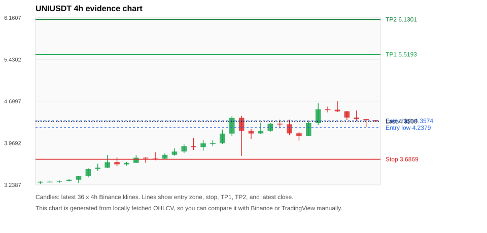
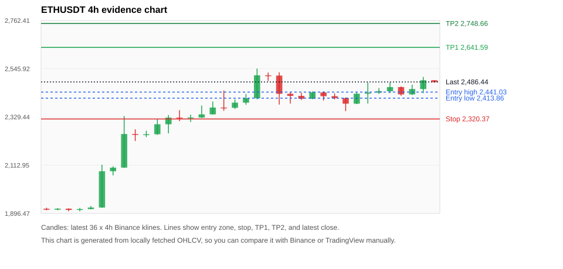
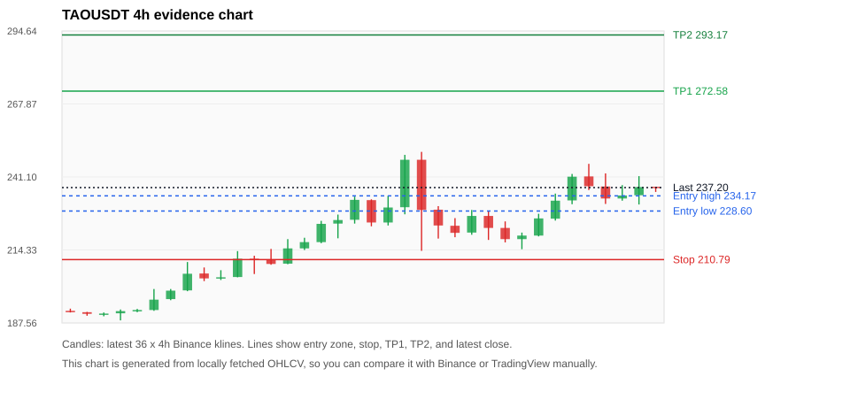
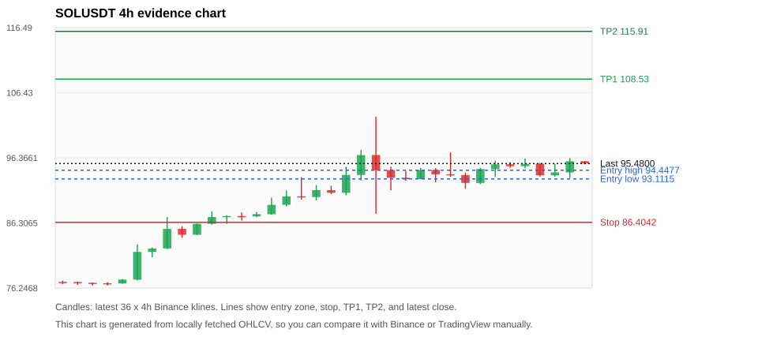
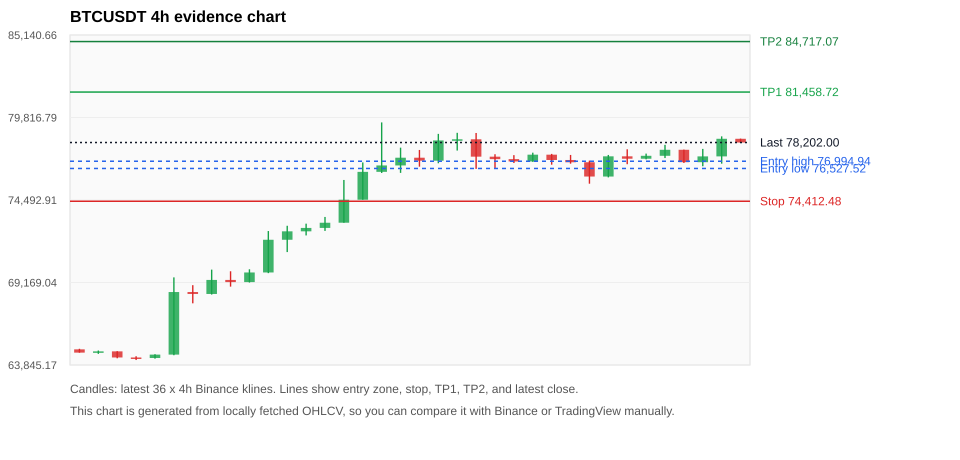

# Crypto 市场扫描报告 v1

- 报告时间：2026-08-24 20:07:11 CST
- Run ID：`20260824_120503_b6999dcc`
- Run type：`daily_full`
- Data validation mode：`paper`
- 数据来源：SQLite
- 报告版本：v1
- 扫描 ID：ed103f737b70
- 数据源：Binance public spot API + CoinGecko/CoinMarketCap cross-check
- 过滤条件：USDT spot; 24h quote volume >= 30,000,000; trades >= 30,000; exclude stables/leveraged tokens; analyze 1h/4h/1d klines
- 默认单笔风险：账户权益的 1.00%

## 限制说明

- 交易信号仍以 Binance 现货公开 K 线为主源；外部数据源用于一致性复核。
- 结果是研究和模拟盘计划，不是确定收益或实盘下单指令。
- 历史长度过滤：候选币至少需要 180 根 1d K 线。
- 数据质量验证池：先验证 score 排名前 min(top_n * 2, 10) 的候选，再按 action + score 补足最终名单。
- 大盘环境过滤：RISK_ON; BTC/ETH 日线趋势均较强，允许山寨币买入候选。 BTC 7d=21.20304468628791; ETH 7d=29.882943143812724.
- Data cross-validation enabled: Binance primary source plus CoinGecko; CoinMarketCap is checked when an API key is configured.
- PENGUUSDT validation state DEGRADED: DEGRADED: [EXTERNAL_IDENTITY_AMBIGUOUS] CoinMarketCap symbol mapping has 9 matches; selected lowest cmc_rank
- ZECUSDT validation state BLOCKED: BLOCKED: [BINANCE_KLINE_EXTREME_RANGE] Binance candle range exceeds 40%.; [BINANCE_KLINE_EXTREME_RANGE] Binance candle range exceeds 40%.; [EXTERNAL_IDENTITY_AMBIGUOUS] CoinMarketCap symbol mapping has 2 matches; selected lowest cmc_rank
- UNIUSDT validation state DEGRADED: DEGRADED: [EXTERNAL_IDENTITY_AMBIGUOUS] CoinMarketCap symbol mapping has 7 matches; selected lowest cmc_rank
- ETHUSDT validation state DEGRADED: DEGRADED: [EXTERNAL_IDENTITY_AMBIGUOUS] CoinMarketCap symbol mapping has 6 matches; selected lowest cmc_rank
- TAOUSDT validation state DEGRADED: DEGRADED: [EXTERNAL_PROVIDER_RATE_LIMITED] Provider rate limited request for https://api.coingecko.com/api/v3/coins/markets?vs_currency=usd&ids=bittensor&price_change_percentage=24h&per_page=1&page=1: HTTP 429; [EXTERNAL_IDENTITY_AMBIGUOUS] CoinMarketCap symbol mapping has 5 matches; selected lowest cmc_rank
- SOLUSDT validation state DEGRADED: DEGRADED: [EXTERNAL_PROVIDER_RATE_LIMITED] Provider rate limited request for https://api.coingecko.com/api/v3/coins/markets?vs_currency=usd&ids=solana&price_change_percentage=24h&per_page=1&page=1: HTTP 429; [EXTERNAL_IDENTITY_AMBIGUOUS] CoinMarketCap symbol mapping has 8 matches; selected lowest cmc_rank
- PYTHUSDT validation state DEGRADED: DEGRADED: [EXTERNAL_PROVIDER_RATE_LIMITED] Provider rate limited request for https://api.coingecko.com/api/v3/coins/markets?vs_currency=usd&ids=pyth-network&price_change_percentage=24h&per_page=1&page=1: HTTP 429
- BTCUSDT validation state DEGRADED: DEGRADED: [EXTERNAL_PROVIDER_RATE_LIMITED] Provider rate limited request for https://api.coingecko.com/api/v3/coins/markets?vs_currency=usd&ids=bitcoin&price_change_percentage=24h&per_page=1&page=1: HTTP 429; [EXTERNAL_IDENTITY_AMBIGUOUS] CoinMarketCap symbol mapping has 13 matches; selected lowest cmc_rank
- NEARUSDT validation state DEGRADED: DEGRADED: [EXTERNAL_PROVIDER_RATE_LIMITED] Provider rate limited request for https://api.coingecko.com/api/v3/coins/markets?vs_currency=usd&ids=near&price_change_percentage=24h&per_page=1&page=1: HTTP 429

## 5 个候选交易计划

| Rank | Coin | Action | Setup | Entry Zone | Stop Loss | TP1 | TP2 / Exit Rule | R/R | Verdict |
|---:|---|---|---|---:|---:|---:|---|---:|---|
| 1 | `UNI` | `BUY_CANDIDATE` | 回踩支撑/4h EMA 附近 | 4.2379 - 4.3574 | 3.6869 | 5.5193 | 6.1301 或跌破 4h 关键支撑 | 2.00-3.00 | 可考虑 |
| 2 | `ETH` | `BUY_CANDIDATE` | 回踩支撑/4h EMA 附近 | 2,413.86 - 2,441.03 | 2,320.37 | 2,641.59 | 2,748.66 或跌破 4h 关键支撑 | 2.00-3.00 | 可考虑 |
| 3 | `TAO` | `BUY_CANDIDATE` | 回踩支撑/4h EMA 附近 | 228.60 - 234.17 | 210.79 | 272.58 | 293.17 或跌破 4h 关键支撑 | 2.00-3.00 | 可考虑 |
| 4 | `SOL` | `BUY_CANDIDATE` | 回踩支撑/4h EMA 附近 | 93.1115 - 94.4477 | 86.4042 | 108.53 | 115.91 或跌破 4h 关键支撑 | 2.00-3.00 | 可考虑 |
| 5 | `BTC` | `BUY_CANDIDATE` | 回踩支撑/4h EMA 附近 | 76,527.52 - 76,994.94 | 74,412.48 | 81,458.72 | 84,717.07 或跌破 4h 关键支撑 | 2.00-3.39 | 可考虑 |

## 数据交叉验证摘要

价格差异以 Binance 当前价为基准；成交量口径不同，Binance 是 USDT 现货成交额，CoinGecko/CoinMarketCap 通常是全市场成交量。

| Rank | Coin | State | Identity | Max Price Diff | Max 24h Diff | Issue Codes | Message |
|---:|---|---|---|---:|---:|---|---|
| 1 | `UNI` | DEGRADED (DATA_WARNING) | UNCONFIRMED | 0.08% | 0.23 pts | EXTERNAL_IDENTITY_AMBIGUOUS | DEGRADED: [EXTERNAL_IDENTITY_AMBIGUOUS] CoinMarketCap symbol mapping has 7 matches; selected lowest cmc_rank |
| 2 | `ETH` | DEGRADED (DATA_WARNING) | UNCONFIRMED | 0.03% | 0.04 pts | EXTERNAL_IDENTITY_AMBIGUOUS | DEGRADED: [EXTERNAL_IDENTITY_AMBIGUOUS] CoinMarketCap symbol mapping has 6 matches; selected lowest cmc_rank |
| 3 | `TAO` | DEGRADED (DATA_WARNING) | UNCONFIRMED | 0.06% | 0.11 pts | EXTERNAL_IDENTITY_AMBIGUOUS, EXTERNAL_PROVIDER_RATE_LIMITED | DEGRADED: [EXTERNAL_PROVIDER_RATE_LIMITED] Provider rate limited request for https://api.coingecko.com/api/v3/coins/markets?vs_currency=usd&ids=bittensor&price_change_percentage=24h&per_page=1&page=1: HTTP 429; [EXTERNAL_IDENTITY_AMBIGUOUS] CoinMarketCap symbol mapping has 5 matches; selected lowest cmc_rank |
| 4 | `SOL` | DEGRADED (DATA_WARNING) | UNCONFIRMED | 0.04% | 0.06 pts | EXTERNAL_IDENTITY_AMBIGUOUS, EXTERNAL_PROVIDER_RATE_LIMITED | DEGRADED: [EXTERNAL_PROVIDER_RATE_LIMITED] Provider rate limited request for https://api.coingecko.com/api/v3/coins/markets?vs_currency=usd&ids=solana&price_change_percentage=24h&per_page=1&page=1: HTTP 429; [EXTERNAL_IDENTITY_AMBIGUOUS] CoinMarketCap symbol mapping has 8 matches; selected lowest cmc_rank |
| 5 | `BTC` | DEGRADED (DATA_WARNING) | UNCONFIRMED | 0.01% | 0.02 pts | EXTERNAL_IDENTITY_AMBIGUOUS, EXTERNAL_PROVIDER_RATE_LIMITED | DEGRADED: [EXTERNAL_PROVIDER_RATE_LIMITED] Provider rate limited request for https://api.coingecko.com/api/v3/coins/markets?vs_currency=usd&ids=bitcoin&price_change_percentage=24h&per_page=1&page=1: HTTP 429; [EXTERNAL_IDENTITY_AMBIGUOUS] CoinMarketCap symbol mapping has 13 matches; selected lowest cmc_rank |

## 候选币说明

### 1. UNI `UNIUSDT`



- 入选原因：回踩支撑/4h EMA 附近；24h +0.23%，7d +32.38%，4h RSI 57.56，24h 成交额 $52.0M。
- 交易失效条件：跌破 3.686855 或 4h 收盘重新失守关键支撑。
- 主要风险：主要风险是大盘同步回撤；External validation is degraded; this candidate is not a clean data sample.；Paper mode allows degraded validation; candidate is excluded from clean-data samples.。
- 数据交叉验证：DEGRADED / DATA_WARNING；身份=UNCONFIRMED；DEGRADED: [EXTERNAL_IDENTITY_AMBIGUOUS] CoinMarketCap symbol mapping has 7 matches; selected lowest cmc_rank

#### 可点击人工验证

- [Binance 交易页](https://www.binance.com/en/trade/UNI_USDT)
- [TradingView 图表](https://www.tradingview.com/chart/?symbol=BINANCE%3AUNIUSDT)
- [CoinGecko 搜索](https://www.coingecko.com/en/search?query=UNI)
- [CoinMarketCap 搜索](https://coinmarketcap.com/search/?q=UNI)

#### 多数据源对照

| Source | Status | Identity | Blocking | Asset ID | Price | 24h Change | 24h Volume | Price Diff | 24h Diff | Updated | Issue Codes | Message |
|---|---|---|---:|---|---:|---:|---:|---:|---:|---|---|---|
| Binance | DATA_OK | CONFIRMED | no | UNIUSDT | 4.3500 | +0.23% | $52.0M | 0.00% | 0.00 pts | 2026-08-24T12:06:22+00:00 | none | Primary market data source passed health checks. |
| CoinGecko | DATA_OK | CONFIRMED | no | uniswap | 4.3500 | +0.38% | $580.2M | 0.00% | 0.15 pts | 2026-08-24T12:04:20.000Z | none | External source agrees with Binance within thresholds. |
| CoinMarketCap | DATA_WARNING | UNCONFIRMED | no | 7083 | 4.3533 | +0.46% | $530.5M | 0.08% | 0.23 pts | 2026-08-24T12:05:02.000Z | EXTERNAL_IDENTITY_AMBIGUOUS | [EXTERNAL_IDENTITY_AMBIGUOUS] CoinMarketCap symbol mapping has 7 matches; selected lowest cmc_rank |

#### 指标证据

| 指标 | 数值 | 人工核对用途 |
|---|---:|---|
| 当前价 | 4.3500 | 与 Binance/TradingView 当前价格对照 |
| 24h 涨跌 | +0.23% | 与交易所 24h 涨跌对照 |
| 7d 涨跌 | +32.38% | 判断短线趋势是否延续 |
| 4h EMA20 | 4.2295 | 判断短期趋势支撑 |
| 4h EMA50 | 3.9491 | 判断中期趋势支撑 |
| 1d EMA20 | 3.8606 | 判断日线趋势 |
| 1d EMA50 | 3.7011 | 判断日线趋势 |
| 4h RSI14 | 57.56 | 判断是否过热/过弱 |
| 4h ATR14 | 0.18271 | 推导止损和入场缓冲 |
| 最近 18 根 4h 最低点 | 3.7430 | 支撑/止损参考 |
| 最近 36 根 4h 最高点 | 4.7000 | TP/压力参考 |
| 支撑位 | 4.2295 | 入场区间推导基础 |

#### 交易计划推导

- 支撑位 = 最近低点、4h EMA20、4h EMA50、1d EMA20 中不高于当前价的最高有效支撑 = `4.2295`。
- 入场区间 = 支撑位附近 + ATR 缓冲 = `4.2379 - 4.3574`。
- 止损 = min(最近 18 根 4h 最低点 * 0.985, 入场中位价 - 1.15 * ATR14) = `3.6869`。
- TP1 = max(最近 36 根 4h 最高点 * 0.995, 入场中位价 + 2R) = `5.5193`。
- TP2 = max(入场中位价 + 3R, TP1 * 1.04) = `6.1301`。

#### 最近 10 根 4h K线

| UTC 开盘时间 | Open | High | Low | Close | Quote Volume | Trades |
|---|---:|---:|---:|---:|---:|---:|
| 2026-08-23T00:00+00:00 | 4.2980 | 4.3780 | 4.1050 | 4.1390 | $5.2M | 36480 |
| 2026-08-23T04:00+00:00 | 4.1400 | 4.1670 | 4.0120 | 4.0950 | $5.7M | 33327 |
| 2026-08-23T08:00+00:00 | 4.0960 | 4.3480 | 4.0890 | 4.3190 | $5.0M | 31746 |
| 2026-08-23T12:00+00:00 | 4.3190 | 4.6640 | 4.2860 | 4.5590 | $20.9M | 110325 |
| 2026-08-23T16:00+00:00 | 4.5600 | 4.6080 | 4.5050 | 4.5540 | $4.8M | 37388 |
| 2026-08-23T20:00+00:00 | 4.5540 | 4.7000 | 4.5140 | 4.5230 | $5.4M | 38506 |
| 2026-08-24T00:00+00:00 | 4.5240 | 4.5310 | 4.3710 | 4.4150 | $6.9M | 43632 |
| 2026-08-24T04:00+00:00 | 4.4150 | 4.5380 | 4.3560 | 4.3880 | $7.6M | 47060 |
| 2026-08-24T08:00+00:00 | 4.3890 | 4.3950 | 4.2470 | 4.3700 | $6.6M | 39890 |
| 2026-08-24T12:00+00:00 | 4.3700 | 4.3700 | 4.3450 | 4.3500 | $94,933 | 843 |

### 2. ETH `ETHUSDT`



- 入选原因：回踩支撑/4h EMA 附近；24h +2.38%，7d +30.53%，4h RSI 59.33，24h 成交额 $1.02B。
- 交易失效条件：跌破 2320.3744 或 4h 收盘重新失守关键支撑。
- 主要风险：主要风险是大盘同步回撤；External validation is degraded; this candidate is not a clean data sample.；Paper mode allows degraded validation; candidate is excluded from clean-data samples.。
- 数据交叉验证：DEGRADED / DATA_WARNING；身份=UNCONFIRMED；DEGRADED: [EXTERNAL_IDENTITY_AMBIGUOUS] CoinMarketCap symbol mapping has 6 matches; selected lowest cmc_rank

#### 可点击人工验证

- [Binance 交易页](https://www.binance.com/en/trade/ETH_USDT)
- [TradingView 图表](https://www.tradingview.com/chart/?symbol=BINANCE%3AETHUSDT)
- [CoinGecko 搜索](https://www.coingecko.com/en/search?query=ETH)
- [CoinMarketCap 搜索](https://coinmarketcap.com/search/?q=ETH)

#### 多数据源对照

| Source | Status | Identity | Blocking | Asset ID | Price | 24h Change | 24h Volume | Price Diff | 24h Diff | Updated | Issue Codes | Message |
|---|---|---|---:|---|---:|---:|---:|---:|---:|---|---|---|
| Binance | DATA_OK | CONFIRMED | no | ETHUSDT | 2,486.44 | +2.38% | $1.02B | 0.00% | 0.00 pts | 2026-08-24T12:06:22+00:00 | none | Primary market data source passed health checks. |
| CoinGecko | DATA_OK | CONFIRMED | no | ethereum | 2,486.30 | +2.42% | $17.67B | 0.01% | 0.03 pts | 2026-08-24T12:04:20.000Z | none | External source agrees with Binance within thresholds. |
| CoinMarketCap | DATA_WARNING | UNCONFIRMED | no | 1027 | 2,485.68 | +2.35% | $19.59B | 0.03% | 0.04 pts | 2026-08-24T12:05:02.000Z | EXTERNAL_IDENTITY_AMBIGUOUS | [EXTERNAL_IDENTITY_AMBIGUOUS] CoinMarketCap symbol mapping has 6 matches; selected lowest cmc_rank |

#### 指标证据

| 指标 | 数值 | 人工核对用途 |
|---|---:|---|
| 当前价 | 2,486.44 | 与 Binance/TradingView 当前价格对照 |
| 24h 涨跌 | +2.38% | 与交易所 24h 涨跌对照 |
| 7d 涨跌 | +30.53% | 判断短线趋势是否延续 |
| 4h EMA20 | 2,409.04 | 判断短期趋势支撑 |
| 4h EMA50 | 2,258.57 | 判断中期趋势支撑 |
| 1d EMA20 | 2,130.21 | 判断日线趋势 |
| 1d EMA50 | 1,986.46 | 判断日线趋势 |
| 4h RSI14 | 59.33 | 判断是否过热/过弱 |
| 4h ATR14 | 45.6979 | 推导止损和入场缓冲 |
| 最近 18 根 4h 最低点 | 2,355.71 | 支撑/止损参考 |
| 最近 36 根 4h 最高点 | 2,546.78 | TP/压力参考 |
| 支撑位 | 2,409.04 | 入场区间推导基础 |

#### 交易计划推导

- 支撑位 = 最近低点、4h EMA20、4h EMA50、1d EMA20 中不高于当前价的最高有效支撑 = `2,409.04`。
- 入场区间 = 支撑位附近 + ATR 缓冲 = `2,413.86 - 2,441.03`。
- 止损 = min(最近 18 根 4h 最低点 * 0.985, 入场中位价 - 1.15 * ATR14) = `2,320.37`。
- TP1 = max(最近 36 根 4h 最高点 * 0.995, 入场中位价 + 2R) = `2,641.59`。
- TP2 = max(入场中位价 + 3R, TP1 * 1.04) = `2,748.66`。

#### 最近 10 根 4h K线

| UTC 开盘时间 | Open | High | Low | Close | Quote Volume | Trades |
|---|---:|---:|---:|---:|---:|---:|
| 2026-08-23T00:00+00:00 | 2,422.60 | 2,435.53 | 2,408.00 | 2,413.98 | $83.0M | 386718 |
| 2026-08-23T04:00+00:00 | 2,413.98 | 2,417.02 | 2,355.71 | 2,389.02 | $183.3M | 847875 |
| 2026-08-23T08:00+00:00 | 2,389.01 | 2,438.31 | 2,386.96 | 2,433.68 | $126.0M | 443614 |
| 2026-08-23T12:00+00:00 | 2,433.67 | 2,484.06 | 2,389.85 | 2,438.62 | $263.5M | 940029 |
| 2026-08-23T16:00+00:00 | 2,438.61 | 2,459.22 | 2,432.81 | 2,444.96 | $94.3M | 474404 |
| 2026-08-23T20:00+00:00 | 2,444.95 | 2,484.62 | 2,436.41 | 2,463.41 | $170.2M | 718062 |
| 2026-08-24T00:00+00:00 | 2,463.42 | 2,466.98 | 2,424.73 | 2,430.64 | $132.7M | 597195 |
| 2026-08-24T04:00+00:00 | 2,430.65 | 2,474.09 | 2,428.11 | 2,454.64 | $146.4M | 508657 |
| 2026-08-24T08:00+00:00 | 2,454.67 | 2,509.00 | 2,436.41 | 2,494.18 | $210.1M | 736867 |
| 2026-08-24T12:00+00:00 | 2,494.18 | 2,494.27 | 2,484.09 | 2,485.64 | $4.2M | 21982 |

### 3. TAO `TAOUSDT`



- 入选原因：回踩支撑/4h EMA 附近；24h +4.87%，7d +20.84%，4h RSI 57.02，24h 成交额 $36.6M。
- 交易失效条件：跌破 210.79 或 4h 收盘重新失守关键支撑。
- 主要风险：主要风险是大盘同步回撤；External validation is degraded; this candidate is not a clean data sample.；Paper mode allows degraded validation; candidate is excluded from clean-data samples.。
- 数据交叉验证：DEGRADED / DATA_WARNING；身份=UNCONFIRMED；DEGRADED: [EXTERNAL_PROVIDER_RATE_LIMITED] Provider rate limited request for https://api.coingecko.com/api/v3/coins/markets?vs_currency=usd&ids=bittensor&price_change_percentage=24h&per_page=1&page=1: HTTP 429; [EXTERNAL_IDENTITY_AMBIGUOUS] CoinMarketCap symbol mapping has 5 matches; selected lowest cmc_rank

#### 可点击人工验证

- [Binance 交易页](https://www.binance.com/en/trade/TAO_USDT)
- [TradingView 图表](https://www.tradingview.com/chart/?symbol=BINANCE%3ATAOUSDT)
- [CoinGecko 搜索](https://www.coingecko.com/en/search?query=TAO)
- [CoinMarketCap 搜索](https://coinmarketcap.com/search/?q=TAO)

#### 多数据源对照

| Source | Status | Identity | Blocking | Asset ID | Price | 24h Change | 24h Volume | Price Diff | 24h Diff | Updated | Issue Codes | Message |
|---|---|---|---:|---|---:|---:|---:|---:|---:|---|---|---|
| Binance | DATA_OK | CONFIRMED | no | TAOUSDT | 237.20 | +4.87% | $36.6M | 0.00% | 0.00 pts | 2026-08-24T12:06:22+00:00 | none | Primary market data source passed health checks. |
| CoinGecko | DATA_WARNING | UNCONFIRMED | no | n/a | n/a | n/a | n/a | n/a | n/a | 2026-08-24T12:06:22+00:00 | EXTERNAL_PROVIDER_RATE_LIMITED | Provider rate limited request for https://api.coingecko.com/api/v3/coins/markets?vs_currency=usd&ids=bittensor&price_change_percentage=24h&per_page=1&page=1: HTTP 429 |
| CoinMarketCap | DATA_WARNING | UNCONFIRMED | no | 22974 | 237.05 | +4.98% | $306.3M | 0.06% | 0.11 pts | 2026-08-24T12:05:02.000Z | EXTERNAL_IDENTITY_AMBIGUOUS | [EXTERNAL_IDENTITY_AMBIGUOUS] CoinMarketCap symbol mapping has 5 matches; selected lowest cmc_rank |

#### 指标证据

| 指标 | 数值 | 人工核对用途 |
|---|---:|---|
| 当前价 | 237.20 | 与 Binance/TradingView 当前价格对照 |
| 24h 涨跌 | +4.87% | 与交易所 24h 涨跌对照 |
| 7d 涨跌 | +20.84% | 判断短线趋势是否延续 |
| 4h EMA20 | 228.15 | 判断短期趋势支撑 |
| 4h EMA50 | 217.29 | 判断中期趋势支撑 |
| 1d EMA20 | 210.38 | 判断日线趋势 |
| 1d EMA50 | 208.10 | 判断日线趋势 |
| 4h RSI14 | 57.02 | 判断是否过热/过弱 |
| 4h ATR14 | 8.6000 | 推导止损和入场缓冲 |
| 最近 18 根 4h 最低点 | 214.00 | 支撑/止损参考 |
| 最近 36 根 4h 最高点 | 250.30 | TP/压力参考 |
| 支撑位 | 228.15 | 入场区间推导基础 |

#### 交易计划推导

- 支撑位 = 最近低点、4h EMA20、4h EMA50、1d EMA20 中不高于当前价的最高有效支撑 = `228.15`。
- 入场区间 = 支撑位附近 + ATR 缓冲 = `228.60 - 234.17`。
- 止损 = min(最近 18 根 4h 最低点 * 0.985, 入场中位价 - 1.15 * ATR14) = `210.79`。
- TP1 = max(最近 36 根 4h 最高点 * 0.995, 入场中位价 + 2R) = `272.58`。
- TP2 = max(入场中位价 + 3R, TP1 * 1.04) = `293.17`。

#### 最近 10 根 4h K线

| UTC 开盘时间 | Open | High | Low | Close | Quote Volume | Trades |
|---|---:|---:|---:|---:|---:|---:|
| 2026-08-23T00:00+00:00 | 222.40 | 224.80 | 217.10 | 218.30 | $2.7M | 18700 |
| 2026-08-23T04:00+00:00 | 218.30 | 220.70 | 214.60 | 219.60 | $3.9M | 26987 |
| 2026-08-23T08:00+00:00 | 219.60 | 227.60 | 219.30 | 225.90 | $3.5M | 15316 |
| 2026-08-23T12:00+00:00 | 225.80 | 235.00 | 225.10 | 232.40 | $8.8M | 41680 |
| 2026-08-23T16:00+00:00 | 232.50 | 242.20 | 231.10 | 241.20 | $6.0M | 36007 |
| 2026-08-23T20:00+00:00 | 241.30 | 245.90 | 236.30 | 237.70 | $7.1M | 39188 |
| 2026-08-24T00:00+00:00 | 237.60 | 242.40 | 231.20 | 233.20 | $5.2M | 30448 |
| 2026-08-24T04:00+00:00 | 233.20 | 238.10 | 232.40 | 234.30 | $3.2M | 19049 |
| 2026-08-24T08:00+00:00 | 234.40 | 241.40 | 231.00 | 237.40 | $6.2M | 34387 |
| 2026-08-24T12:00+00:00 | 237.50 | 237.50 | 235.60 | 237.20 | $312,910 | 1419 |

### 4. SOL `SOLUSDT`



- 入选原因：回踩支撑/4h EMA 附近；24h +1.04%，7d +26.25%，4h RSI 54.12，24h 成交额 $311.7M。
- 交易失效条件：跌破 86.4042 或 4h 收盘重新失守关键支撑。
- 主要风险：主要风险是大盘同步回撤；External validation is degraded; this candidate is not a clean data sample.；Paper mode allows degraded validation; candidate is excluded from clean-data samples.。
- 数据交叉验证：DEGRADED / DATA_WARNING；身份=UNCONFIRMED；DEGRADED: [EXTERNAL_PROVIDER_RATE_LIMITED] Provider rate limited request for https://api.coingecko.com/api/v3/coins/markets?vs_currency=usd&ids=solana&price_change_percentage=24h&per_page=1&page=1: HTTP 429; [EXTERNAL_IDENTITY_AMBIGUOUS] CoinMarketCap symbol mapping has 8 matches; selected lowest cmc_rank

#### 可点击人工验证

- [Binance 交易页](https://www.binance.com/en/trade/SOL_USDT)
- [TradingView 图表](https://www.tradingview.com/chart/?symbol=BINANCE%3ASOLUSDT)
- [CoinGecko 搜索](https://www.coingecko.com/en/search?query=SOL)
- [CoinMarketCap 搜索](https://coinmarketcap.com/search/?q=SOL)

#### 多数据源对照

| Source | Status | Identity | Blocking | Asset ID | Price | 24h Change | 24h Volume | Price Diff | 24h Diff | Updated | Issue Codes | Message |
|---|---|---|---:|---|---:|---:|---:|---:|---:|---|---|---|
| Binance | DATA_OK | CONFIRMED | no | SOLUSDT | 95.4800 | +1.04% | $311.7M | 0.00% | 0.00 pts | 2026-08-24T12:06:22+00:00 | none | Primary market data source passed health checks. |
| CoinGecko | DATA_WARNING | UNCONFIRMED | no | n/a | n/a | n/a | n/a | n/a | n/a | 2026-08-24T12:06:22+00:00 | EXTERNAL_PROVIDER_RATE_LIMITED | Provider rate limited request for https://api.coingecko.com/api/v3/coins/markets?vs_currency=usd&ids=solana&price_change_percentage=24h&per_page=1&page=1: HTTP 429 |
| CoinMarketCap | DATA_WARNING | UNCONFIRMED | no | 5426 | 95.5178 | +1.09% | $4.16B | 0.04% | 0.06 pts | 2026-08-24T12:05:02.000Z | EXTERNAL_IDENTITY_AMBIGUOUS | [EXTERNAL_IDENTITY_AMBIGUOUS] CoinMarketCap symbol mapping has 8 matches; selected lowest cmc_rank |

#### 指标证据

| 指标 | 数值 | 人工核对用途 |
|---|---:|---|
| 当前价 | 95.4800 | 与 Binance/TradingView 当前价格对照 |
| 24h 涨跌 | +1.04% | 与交易所 24h 涨跌对照 |
| 7d 涨跌 | +26.25% | 判断短线趋势是否延续 |
| 4h EMA20 | 92.9257 | 判断短期趋势支撑 |
| 4h EMA50 | 87.6356 | 判断中期趋势支撑 |
| 1d EMA20 | 83.1160 | 判断日线趋势 |
| 1d EMA50 | 79.1000 | 判断日线趋势 |
| 4h RSI14 | 54.12 | 判断是否过热/过弱 |
| 4h ATR14 | 2.1743 | 推导止损和入场缓冲 |
| 最近 18 根 4h 最低点 | 87.7200 | 支撑/止损参考 |
| 最近 36 根 4h 最高点 | 102.74 | TP/压力参考 |
| 支撑位 | 92.9257 | 入场区间推导基础 |

#### 交易计划推导

- 支撑位 = 最近低点、4h EMA20、4h EMA50、1d EMA20 中不高于当前价的最高有效支撑 = `92.9257`。
- 入场区间 = 支撑位附近 + ATR 缓冲 = `93.1115 - 94.4477`。
- 止损 = min(最近 18 根 4h 最低点 * 0.985, 入场中位价 - 1.15 * ATR14) = `86.4042`。
- TP1 = max(最近 36 根 4h 最高点 * 0.995, 入场中位价 + 2R) = `108.53`。
- TP2 = max(入场中位价 + 3R, TP1 * 1.04) = `115.91`。

#### 最近 10 根 4h K线

| UTC 开盘时间 | Open | High | Low | Close | Quote Volume | Trades |
|---|---:|---:|---:|---:|---:|---:|
| 2026-08-23T00:00+00:00 | 93.8300 | 97.2100 | 93.4300 | 93.7000 | $102.8M | 449392 |
| 2026-08-23T04:00+00:00 | 93.7100 | 94.1000 | 91.5800 | 92.4900 | $73.4M | 327921 |
| 2026-08-23T08:00+00:00 | 92.4800 | 94.8200 | 92.3100 | 94.6300 | $42.4M | 182212 |
| 2026-08-23T12:00+00:00 | 94.6200 | 95.9000 | 93.4000 | 95.3600 | $76.7M | 332982 |
| 2026-08-23T16:00+00:00 | 95.3700 | 95.7200 | 94.8200 | 95.0700 | $24.2M | 151150 |
| 2026-08-23T20:00+00:00 | 95.0800 | 96.2500 | 94.7600 | 95.4300 | $38.1M | 231649 |
| 2026-08-24T00:00+00:00 | 95.4400 | 95.5600 | 93.4700 | 93.6600 | $58.6M | 278783 |
| 2026-08-24T04:00+00:00 | 93.6600 | 95.4500 | 93.4700 | 94.1100 | $57.0M | 216228 |
| 2026-08-24T08:00+00:00 | 94.1100 | 96.3300 | 93.2600 | 95.8400 | $58.6M | 239862 |
| 2026-08-24T12:00+00:00 | 95.8400 | 95.8400 | 95.3700 | 95.5000 | $1.3M | 7183 |

### 5. BTC `BTCUSDT`



- 入选原因：回踩支撑/4h EMA 附近；24h +1.32%，7d +22.82%，4h RSI 56.76，24h 成交额 $1.40B。
- 交易失效条件：跌破 74412.485 或 4h 收盘重新失守关键支撑。
- 主要风险：主要风险是大盘同步回撤；External validation is degraded; this candidate is not a clean data sample.；Paper mode allows degraded validation; candidate is excluded from clean-data samples.。
- 数据交叉验证：DEGRADED / DATA_WARNING；身份=UNCONFIRMED；DEGRADED: [EXTERNAL_PROVIDER_RATE_LIMITED] Provider rate limited request for https://api.coingecko.com/api/v3/coins/markets?vs_currency=usd&ids=bitcoin&price_change_percentage=24h&per_page=1&page=1: HTTP 429; [EXTERNAL_IDENTITY_AMBIGUOUS] CoinMarketCap symbol mapping has 13 matches; selected lowest cmc_rank

#### 可点击人工验证

- [Binance 交易页](https://www.binance.com/en/trade/BTC_USDT)
- [TradingView 图表](https://www.tradingview.com/chart/?symbol=BINANCE%3ABTCUSDT)
- [CoinGecko 搜索](https://www.coingecko.com/en/search?query=BTC)
- [CoinMarketCap 搜索](https://coinmarketcap.com/search/?q=BTC)

#### 多数据源对照

| Source | Status | Identity | Blocking | Asset ID | Price | 24h Change | 24h Volume | Price Diff | 24h Diff | Updated | Issue Codes | Message |
|---|---|---|---:|---|---:|---:|---:|---:|---:|---|---|---|
| Binance | DATA_OK | CONFIRMED | no | BTCUSDT | 78,202.00 | +1.32% | $1.40B | 0.00% | 0.00 pts | 2026-08-24T12:06:22+00:00 | none | Primary market data source passed health checks. |
| CoinGecko | DATA_WARNING | UNCONFIRMED | no | n/a | n/a | n/a | n/a | n/a | n/a | 2026-08-24T12:06:22+00:00 | EXTERNAL_PROVIDER_RATE_LIMITED | Provider rate limited request for https://api.coingecko.com/api/v3/coins/markets?vs_currency=usd&ids=bitcoin&price_change_percentage=24h&per_page=1&page=1: HTTP 429 |
| CoinMarketCap | DATA_WARNING | UNCONFIRMED | no | 1 | 78,208.98 | +1.31% | $35.20B | 0.01% | 0.02 pts | 2026-08-24T12:05:02.000Z | EXTERNAL_IDENTITY_AMBIGUOUS | [EXTERNAL_IDENTITY_AMBIGUOUS] CoinMarketCap symbol mapping has 13 matches; selected lowest cmc_rank |

#### 指标证据

| 指标 | 数值 | 人工核对用途 |
|---|---:|---|
| 当前价 | 78,202.00 | 与 Binance/TradingView 当前价格对照 |
| 24h 涨跌 | +1.32% | 与交易所 24h 涨跌对照 |
| 7d 涨跌 | +22.82% | 判断短线趋势是否延续 |
| 4h EMA20 | 76,374.77 | 判断短期趋势支撑 |
| 4h EMA50 | 72,596.44 | 判断中期趋势支撑 |
| 1d EMA20 | 69,421.79 | 判断日线趋势 |
| 1d EMA50 | 66,806.75 | 判断日线趋势 |
| 4h RSI14 | 56.76 | 判断是否过热/过弱 |
| 4h ATR14 | 885.96 | 推导止损和入场缓冲 |
| 最近 18 根 4h 最低点 | 75,545.67 | 支撑/止损参考 |
| 最近 36 根 4h 最高点 | 79,500.00 | TP/压力参考 |
| 支撑位 | 76,374.77 | 入场区间推导基础 |

#### 交易计划推导

- 支撑位 = 最近低点、4h EMA20、4h EMA50、1d EMA20 中不高于当前价的最高有效支撑 = `76,374.77`。
- 入场区间 = 支撑位附近 + ATR 缓冲 = `76,527.52 - 76,994.94`。
- 止损 = min(最近 18 根 4h 最低点 * 0.985, 入场中位价 - 1.15 * ATR14) = `74,412.48`。
- TP1 = max(最近 36 根 4h 最高点 * 0.995, 入场中位价 + 2R) = `81,458.72`。
- TP2 = max(入场中位价 + 3R, TP1 * 1.04) = `84,717.07`。

#### 最近 10 根 4h K线

| UTC 开盘时间 | Open | High | Low | Close | Quote Volume | Trades |
|---|---:|---:|---:|---:|---:|---:|
| 2026-08-23T00:00+00:00 | 77,074.94 | 77,400.00 | 76,837.00 | 76,927.87 | $119.8M | 403643 |
| 2026-08-23T04:00+00:00 | 76,927.87 | 77,036.58 | 75,545.67 | 76,007.13 | $339.6M | 873491 |
| 2026-08-23T08:00+00:00 | 76,007.12 | 77,400.00 | 75,952.09 | 77,311.02 | $187.1M | 547639 |
| 2026-08-23T12:00+00:00 | 77,311.02 | 77,765.80 | 76,802.00 | 77,156.13 | $230.4M | 678045 |
| 2026-08-23T16:00+00:00 | 77,156.14 | 77,487.04 | 77,116.00 | 77,346.01 | $128.7M | 405681 |
| 2026-08-23T20:00+00:00 | 77,346.00 | 78,052.85 | 77,200.03 | 77,734.00 | $177.1M | 719330 |
| 2026-08-24T00:00+00:00 | 77,734.00 | 77,742.00 | 76,883.61 | 76,933.02 | $283.1M | 880230 |
| 2026-08-24T04:00+00:00 | 76,933.02 | 77,790.19 | 76,670.01 | 77,307.15 | $270.4M | 686797 |
| 2026-08-24T08:00+00:00 | 77,307.14 | 78,600.00 | 76,838.00 | 78,443.65 | $301.6M | 777457 |
| 2026-08-24T12:00+00:00 | 78,443.65 | 78,451.69 | 78,185.20 | 78,202.01 | $9.8M | 34608 |

## 组合风控

- 不要 5 个候选全部满仓买入。
- 同时持仓总风险建议控制在账户权益的 3% - 5% 以内。
- 如果 BTC/ETH 同时破位，暂停山寨币多头计划或降低仓位。
- 第一版报告用于模拟盘和人工复核，不自动下单。

## 原始数据

```json
[
  {
    "rank": 1,
    "symbol": "UNIUSDT",
    "base_asset": "UNI",
    "price": 4.35,
    "score": 78.11672645298837,
    "setup": "回踩支撑/4h EMA 附近",
    "verdict": "可考虑",
    "entry_low": 4.237943717270133,
    "entry_high": 4.357384747774584,
    "stop_loss": 3.686855,
    "take_profit_1": 5.519282697567074,
    "take_profit_2": 6.130091930089431,
    "risk_reward_1": 2.0,
    "risk_reward_2": 2.999999999999999,
    "pct_24h": 0.23,
    "pct_3d": 10.912799592044852,
    "pct_7d": 32.379793061472895,
    "quote_volume_24h": 51976913.04323,
    "trades_24h": 315831,
    "high_low_range_24h": 10.666352719566753,
    "rsi_1h": 37.082818294190325,
    "rsi_4h": 57.556561085972824,
    "ema20_4h": 4.229484747774584,
    "ema50_4h": 3.9491242127579436,
    "ema20_1d": 3.8605684174026083,
    "ema50_1d": 3.701051277148459,
    "atr_4h": 0.18271428571428563,
    "macd_hist_4h": -0.017883076113180824,
    "volume_ratio_24h": 1.797487092305712,
    "support_level": 4.229484747774584,
    "recent_low_4h_18": 3.743,
    "recent_high_4h_36": 4.7,
    "distance_to_support_pct": 2.8494074198713415,
    "binance_trade_url": "https://www.binance.com/en/trade/UNI_USDT",
    "tradingview_url": "https://www.tradingview.com/chart/?symbol=BINANCE%3AUNIUSDT",
    "coingecko_search_url": "https://www.coingecko.com/en/search?query=UNI",
    "coinmarketcap_search_url": "https://coinmarketcap.com/search/?q=UNI",
    "invalidation": "跌破 3.686855 或 4h 收盘重新失守关键支撑",
    "recent_4h_klines": [
      {
        "open_time_utc": "2026-08-18T16:00+00:00",
        "open": 3.279,
        "high": 3.302,
        "low": 3.255,
        "close": 3.294,
        "quote_volume": 827781.73295,
        "trades": 5270
      },
      {
        "open_time_utc": "2026-08-18T20:00+00:00",
        "open": 3.294,
        "high": 3.313,
        "low": 3.283,
        "close": 3.295,
        "quote_volume": 699996.01855,
        "trades": 4617
      },
      {
        "open_time_utc": "2026-08-19T00:00+00:00",
        "open": 3.296,
        "high": 3.314,
        "low": 3.277,
        "close": 3.31,
        "quote_volume": 862893.57364,
        "trades": 6482
      },
      {
        "open_time_utc": "2026-08-19T04:00+00:00",
        "open": 3.31,
        "high": 3.34,
        "low": 3.298,
        "close": 3.329,
        "quote_volume": 2454208.02415,
        "trades": 13081
      },
      {
        "open_time_utc": "2026-08-19T08:00+00:00",
        "open": 3.329,
        "high": 3.392,
        "low": 3.269,
        "close": 3.392,
        "quote_volume": 3672749.52062,
        "trades": 15521
      },
      {
        "open_time_utc": "2026-08-19T12:00+00:00",
        "open": 3.391,
        "high": 3.529,
        "low": 3.369,
        "close": 3.513,
        "quote_volume": 6510671.29761,
        "trades": 38139
      },
      {
        "open_time_utc": "2026-08-19T16:00+00:00",
        "open": 3.514,
        "high": 3.609,
        "low": 3.478,
        "close": 3.541,
        "quote_volume": 5188194.729,
        "trades": 38690
      },
      {
        "open_time_utc": "2026-08-19T20:00+00:00",
        "open": 3.541,
        "high": 3.761,
        "low": 3.537,
        "close": 3.635,
        "quote_volume": 6933238.64734,
        "trades": 39761
      },
      {
        "open_time_utc": "2026-08-20T00:00+00:00",
        "open": 3.636,
        "high": 3.719,
        "low": 3.56,
        "close": 3.598,
        "quote_volume": 4321187.62331,
        "trades": 19304
      },
      {
        "open_time_utc": "2026-08-20T04:00+00:00",
        "open": 3.598,
        "high": 3.64,
        "low": 3.577,
        "close": 3.622,
        "quote_volume": 2212132.10001,
        "trades": 10197
      },
      {
        "open_time_utc": "2026-08-20T08:00+00:00",
        "open": 3.623,
        "high": 3.761,
        "low": 3.621,
        "close": 3.714,
        "quote_volume": 5654833.69163,
        "trades": 27170
      },
      {
        "open_time_utc": "2026-08-20T12:00+00:00",
        "open": 3.715,
        "high": 3.724,
        "low": 3.621,
        "close": 3.701,
        "quote_volume": 5067616.01965,
        "trades": 28908
      },
      {
        "open_time_utc": "2026-08-20T16:00+00:00",
        "open": 3.701,
        "high": 3.81,
        "low": 3.669,
        "close": 3.699,
        "quote_volume": 4371537.27038,
        "trades": 28663
      },
      {
        "open_time_utc": "2026-08-20T20:00+00:00",
        "open": 3.699,
        "high": 3.79,
        "low": 3.694,
        "close": 3.763,
        "quote_volume": 1707132.67888,
        "trades": 10405
      },
      {
        "open_time_utc": "2026-08-21T00:00+00:00",
        "open": 3.764,
        "high": 3.878,
        "low": 3.749,
        "close": 3.821,
        "quote_volume": 4417152.38518,
        "trades": 28311
      },
      {
        "open_time_utc": "2026-08-21T04:00+00:00",
        "open": 3.822,
        "high": 3.95,
        "low": 3.793,
        "close": 3.917,
        "quote_volume": 5008228.63328,
        "trades": 27287
      },
      {
        "open_time_utc": "2026-08-21T08:00+00:00",
        "open": 3.917,
        "high": 4.062,
        "low": 3.849,
        "close": 3.898,
        "quote_volume": 9280739.79639,
        "trades": 54306
      },
      {
        "open_time_utc": "2026-08-21T12:00+00:00",
        "open": 3.9,
        "high": 4.02,
        "low": 3.838,
        "close": 3.964,
        "quote_volume": 5557404.79272,
        "trades": 35079
      },
      {
        "open_time_utc": "2026-08-21T16:00+00:00",
        "open": 3.964,
        "high": 4.024,
        "low": 3.915,
        "close": 3.967,
        "quote_volume": 3230096.20573,
        "trades": 25118
      },
      {
        "open_time_utc": "2026-08-21T20:00+00:00",
        "open": 3.966,
        "high": 4.206,
        "low": 3.952,
        "close": 4.135,
        "quote_volume": 5581349.25294,
        "trades": 36524
      },
      {
        "open_time_utc": "2026-08-22T00:00+00:00",
        "open": 4.136,
        "high": 4.438,
        "low": 4.096,
        "close": 4.41,
        "quote_volume": 9058310.45882,
        "trades": 64060
      },
      {
        "open_time_utc": "2026-08-22T04:00+00:00",
        "open": 4.411,
        "high": 4.447,
        "low": 3.743,
        "close": 4.183,
        "quote_volume": 19627091.60538,
        "trades": 138254
      },
      {
        "open_time_utc": "2026-08-22T08:00+00:00",
        "open": 4.184,
        "high": 4.221,
        "low": 4.037,
        "close": 4.137,
        "quote_volume": 7837806.74502,
        "trades": 52156
      },
      {
        "open_time_utc": "2026-08-22T12:00+00:00",
        "open": 4.138,
        "high": 4.325,
        "low": 4.126,
        "close": 4.183,
        "quote_volume": 7620185.62457,
        "trades": 52883
      },
      {
        "open_time_utc": "2026-08-22T16:00+00:00",
        "open": 4.183,
        "high": 4.319,
        "low": 4.163,
        "close": 4.309,
        "quote_volume": 3809374.52839,
        "trades": 29797
      },
      {
        "open_time_utc": "2026-08-22T20:00+00:00",
        "open": 4.308,
        "high": 4.378,
        "low": 4.228,
        "close": 4.297,
        "quote_volume": 6224445.41018,
        "trades": 38095
      },
      {
        "open_time_utc": "2026-08-23T00:00+00:00",
        "open": 4.298,
        "high": 4.378,
        "low": 4.105,
        "close": 4.139,
        "quote_volume": 5202753.76727,
        "trades": 36480
      },
      {
        "open_time_utc": "2026-08-23T04:00+00:00",
        "open": 4.14,
        "high": 4.167,
        "low": 4.012,
        "close": 4.095,
        "quote_volume": 5712612.26253,
        "trades": 33327
      },
      {
        "open_time_utc": "2026-08-23T08:00+00:00",
        "open": 4.096,
        "high": 4.348,
        "low": 4.089,
        "close": 4.319,
        "quote_volume": 4956220.78527,
        "trades": 31746
      },
      {
        "open_time_utc": "2026-08-23T12:00+00:00",
        "open": 4.319,
        "high": 4.664,
        "low": 4.286,
        "close": 4.559,
        "quote_volume": 20946667.30507,
        "trades": 110325
      },
      {
        "open_time_utc": "2026-08-23T16:00+00:00",
        "open": 4.56,
        "high": 4.608,
        "low": 4.505,
        "close": 4.554,
        "quote_volume": 4763232.0427,
        "trades": 37388
      },
      {
        "open_time_utc": "2026-08-23T20:00+00:00",
        "open": 4.554,
        "high": 4.7,
        "low": 4.514,
        "close": 4.523,
        "quote_volume": 5362473.54658,
        "trades": 38506
      },
      {
        "open_time_utc": "2026-08-24T00:00+00:00",
        "open": 4.524,
        "high": 4.531,
        "low": 4.371,
        "close": 4.415,
        "quote_volume": 6878846.50298,
        "trades": 43632
      },
      {
        "open_time_utc": "2026-08-24T04:00+00:00",
        "open": 4.415,
        "high": 4.538,
        "low": 4.356,
        "close": 4.388,
        "quote_volume": 7641150.65768,
        "trades": 47060
      },
      {
        "open_time_utc": "2026-08-24T08:00+00:00",
        "open": 4.389,
        "high": 4.395,
        "low": 4.247,
        "close": 4.37,
        "quote_volume": 6642975.77943,
        "trades": 39890
      },
      {
        "open_time_utc": "2026-08-24T12:00+00:00",
        "open": 4.37,
        "high": 4.37,
        "low": 4.345,
        "close": 4.35,
        "quote_volume": 94933.44076,
        "trades": 843
      }
    ],
    "risks": [
      "主要风险是大盘同步回撤",
      "External validation is degraded; this candidate is not a clean data sample.",
      "Paper mode allows degraded validation; candidate is excluded from clean-data samples."
    ],
    "data_quality_status": "DATA_WARNING",
    "data_quality_message": "DEGRADED: [EXTERNAL_IDENTITY_AMBIGUOUS] CoinMarketCap symbol mapping has 7 matches; selected lowest cmc_rank",
    "data_checks": [
      {
        "provider": "Binance",
        "status": "DATA_OK",
        "provider_asset_id": "UNIUSDT",
        "provider_symbol": "UNIUSDT",
        "price_usd": 4.35,
        "pct_24h": 0.23,
        "volume_24h": 51976913.04323,
        "last_updated": null,
        "fetched_at_utc": "2026-08-24T12:06:22+00:00",
        "price_diff_pct": 0.0,
        "pct_24h_diff": 0.0,
        "volume_note": "Binance USDT spot 24h quoteVolume.",
        "message": "Primary market data source passed health checks.",
        "blocking": false,
        "identity_status": "CONFIRMED",
        "issues": []
      },
      {
        "provider": "CoinGecko",
        "status": "DATA_OK",
        "provider_asset_id": "uniswap",
        "provider_symbol": "UNI",
        "price_usd": 4.35,
        "pct_24h": 0.38037,
        "volume_24h": 580235996.0,
        "last_updated": "2026-08-24T12:04:20.000Z",
        "fetched_at_utc": "2026-08-24T12:06:22+00:00",
        "price_diff_pct": 0.0,
        "pct_24h_diff": 0.15036999999999998,
        "volume_note": "CoinGecko total market volume; not the same venue scope as Binance quoteVolume.",
        "message": "External source agrees with Binance within thresholds.",
        "blocking": false,
        "identity_status": "CONFIRMED",
        "issues": []
      },
      {
        "provider": "CoinMarketCap",
        "status": "DATA_WARNING",
        "provider_asset_id": "7083",
        "provider_symbol": "UNI",
        "price_usd": 4.3533153822457145,
        "pct_24h": 0.46304013,
        "volume_24h": 530479036.9533999,
        "last_updated": "2026-08-24T12:05:02.000Z",
        "fetched_at_utc": "2026-08-24T12:06:22+00:00",
        "price_diff_pct": 0.07621568380953599,
        "pct_24h_diff": 0.23304012999999998,
        "volume_note": "CoinMarketCap total market volume; not the same venue scope as Binance quoteVolume.",
        "message": "[EXTERNAL_IDENTITY_AMBIGUOUS] CoinMarketCap symbol mapping has 7 matches; selected lowest cmc_rank",
        "blocking": false,
        "identity_status": "UNCONFIRMED",
        "issues": [
          {
            "provider": "CoinMarketCap",
            "code": "EXTERNAL_IDENTITY_AMBIGUOUS",
            "severity": "WARNING",
            "blocking": false,
            "message": "CoinMarketCap symbol mapping has 7 matches; selected lowest cmc_rank",
            "context": {}
          }
        ]
      }
    ],
    "action": "BUY_CANDIDATE",
    "data_quality_state": "DEGRADED",
    "data_quality_issues": [
      {
        "provider": "CoinMarketCap",
        "code": "EXTERNAL_IDENTITY_AMBIGUOUS",
        "severity": "WARNING",
        "blocking": false,
        "message": "CoinMarketCap symbol mapping has 7 matches; selected lowest cmc_rank",
        "context": {}
      }
    ],
    "external_identity_status": "UNCONFIRMED"
  },
  {
    "rank": 2,
    "symbol": "ETHUSDT",
    "base_asset": "ETH",
    "price": 2486.44,
    "score": 77.8241102448918,
    "setup": "回踩支撑/4h EMA 附近",
    "verdict": "可考虑",
    "entry_low": 2413.8617567754914,
    "entry_high": 2441.032169436618,
    "stop_loss": 2320.37435,
    "take_profit_1": 2641.592189318164,
    "take_profit_2": 2748.6648024242186,
    "risk_reward_1": 2.0,
    "risk_reward_2": 3.0,
    "pct_24h": 2.385,
    "pct_3d": 4.137541096894437,
    "pct_7d": 30.52726623690234,
    "quote_volume_24h": 1018790947.534106,
    "trades_24h": 3985418,
    "high_low_range_24h": 4.985668556603984,
    "rsi_1h": 60.583990828781374,
    "rsi_4h": 59.326323293530585,
    "ema20_4h": 2409.043669436618,
    "ema50_4h": 2258.5699569540748,
    "ema20_1d": 2130.2063236659465,
    "ema50_1d": 1986.4589134798123,
    "atr_4h": 45.697857142857174,
    "macd_hist_4h": -11.002384136513967,
    "volume_ratio_24h": 0.8611943960316418,
    "support_level": 2409.043669436618,
    "recent_low_4h_18": 2355.71,
    "recent_high_4h_36": 2546.78,
    "distance_to_support_pct": 3.212740870798836,
    "binance_trade_url": "https://www.binance.com/en/trade/ETH_USDT",
    "tradingview_url": "https://www.tradingview.com/chart/?symbol=BINANCE%3AETHUSDT",
    "coingecko_search_url": "https://www.coingecko.com/en/search?query=ETH",
    "coinmarketcap_search_url": "https://coinmarketcap.com/search/?q=ETH",
    "invalidation": "跌破 2320.3744 或 4h 收盘重新失守关键支撑",
    "recent_4h_klines": [
      {
        "open_time_utc": "2026-08-18T16:00+00:00",
        "open": 1917.71,
        "high": 1922.3,
        "low": 1910.81,
        "close": 1913.28,
        "quote_volume": 39538242.605256,
        "trades": 189159
      },
      {
        "open_time_utc": "2026-08-18T20:00+00:00",
        "open": 1913.28,
        "high": 1920.1,
        "low": 1910.87,
        "close": 1917.85,
        "quote_volume": 28630825.027226,
        "trades": 110457
      },
      {
        "open_time_utc": "2026-08-19T00:00+00:00",
        "open": 1917.85,
        "high": 1919.15,
        "low": 1906.19,
        "close": 1912.15,
        "quote_volume": 42648897.717523,
        "trades": 209935
      },
      {
        "open_time_utc": "2026-08-19T04:00+00:00",
        "open": 1912.15,
        "high": 1921.32,
        "low": 1906.0,
        "close": 1916.01,
        "quote_volume": 47226795.151042,
        "trades": 148550
      },
      {
        "open_time_utc": "2026-08-19T08:00+00:00",
        "open": 1916.01,
        "high": 1929.94,
        "low": 1915.32,
        "close": 1923.06,
        "quote_volume": 45845053.825589,
        "trades": 189484
      },
      {
        "open_time_utc": "2026-08-19T12:00+00:00",
        "open": 1923.06,
        "high": 2115.0,
        "low": 1922.05,
        "close": 2085.83,
        "quote_volume": 605212208.433768,
        "trades": 1612909
      },
      {
        "open_time_utc": "2026-08-19T16:00+00:00",
        "open": 2085.83,
        "high": 2108.0,
        "low": 2067.43,
        "close": 2102.02,
        "quote_volume": 295655451.670076,
        "trades": 1019935
      },
      {
        "open_time_utc": "2026-08-19T20:00+00:00",
        "open": 2102.02,
        "high": 2333.65,
        "low": 2102.02,
        "close": 2252.8,
        "quote_volume": 642825325.076305,
        "trades": 2098865
      },
      {
        "open_time_utc": "2026-08-20T00:00+00:00",
        "open": 2252.81,
        "high": 2274.25,
        "low": 2221.54,
        "close": 2251.21,
        "quote_volume": 243602331.013792,
        "trades": 897465
      },
      {
        "open_time_utc": "2026-08-20T04:00+00:00",
        "open": 2251.21,
        "high": 2267.3,
        "low": 2238.97,
        "close": 2251.81,
        "quote_volume": 167058938.700793,
        "trades": 565894
      },
      {
        "open_time_utc": "2026-08-20T08:00+00:00",
        "open": 2251.81,
        "high": 2320.0,
        "low": 2249.19,
        "close": 2296.58,
        "quote_volume": 339842076.821834,
        "trades": 1290207
      },
      {
        "open_time_utc": "2026-08-20T12:00+00:00",
        "open": 2296.59,
        "high": 2337.89,
        "low": 2255.68,
        "close": 2326.41,
        "quote_volume": 319199555.356713,
        "trades": 1432294
      },
      {
        "open_time_utc": "2026-08-20T16:00+00:00",
        "open": 2326.4,
        "high": 2360.0,
        "low": 2310.44,
        "close": 2323.77,
        "quote_volume": 325515321.011872,
        "trades": 1022916
      },
      {
        "open_time_utc": "2026-08-20T20:00+00:00",
        "open": 2323.78,
        "high": 2340.0,
        "low": 2306.67,
        "close": 2326.82,
        "quote_volume": 90470894.116433,
        "trades": 432351
      },
      {
        "open_time_utc": "2026-08-21T00:00+00:00",
        "open": 2326.83,
        "high": 2380.82,
        "low": 2324.99,
        "close": 2341.04,
        "quote_volume": 225333531.62713,
        "trades": 1129939
      },
      {
        "open_time_utc": "2026-08-21T04:00+00:00",
        "open": 2341.05,
        "high": 2398.71,
        "low": 2341.05,
        "close": 2371.66,
        "quote_volume": 216531611.332784,
        "trades": 914983
      },
      {
        "open_time_utc": "2026-08-21T08:00+00:00",
        "open": 2371.67,
        "high": 2447.98,
        "low": 2357.18,
        "close": 2370.47,
        "quote_volume": 417464093.796605,
        "trades": 1756205
      },
      {
        "open_time_utc": "2026-08-21T12:00+00:00",
        "open": 2370.48,
        "high": 2408.55,
        "low": 2365.44,
        "close": 2393.65,
        "quote_volume": 282984303.505544,
        "trades": 1154800
      },
      {
        "open_time_utc": "2026-08-21T16:00+00:00",
        "open": 2393.64,
        "high": 2432.35,
        "low": 2384.0,
        "close": 2413.55,
        "quote_volume": 240126291.432467,
        "trades": 850472
      },
      {
        "open_time_utc": "2026-08-21T20:00+00:00",
        "open": 2413.54,
        "high": 2546.78,
        "low": 2408.86,
        "close": 2516.3,
        "quote_volume": 404145044.593269,
        "trades": 1436299
      },
      {
        "open_time_utc": "2026-08-22T00:00+00:00",
        "open": 2516.31,
        "high": 2528.58,
        "low": 2491.11,
        "close": 2515.06,
        "quote_volume": 217146591.671543,
        "trades": 845662
      },
      {
        "open_time_utc": "2026-08-22T04:00+00:00",
        "open": 2515.06,
        "high": 2529.99,
        "low": 2385.0,
        "close": 2433.31,
        "quote_volume": 444602747.309494,
        "trades": 1414938
      },
      {
        "open_time_utc": "2026-08-22T08:00+00:00",
        "open": 2433.32,
        "high": 2441.1,
        "low": 2389.45,
        "close": 2423.93,
        "quote_volume": 195024308.627177,
        "trades": 893462
      },
      {
        "open_time_utc": "2026-08-22T12:00+00:00",
        "open": 2423.92,
        "high": 2437.76,
        "low": 2405.62,
        "close": 2410.9,
        "quote_volume": 128335623.597646,
        "trades": 518733
      },
      {
        "open_time_utc": "2026-08-22T16:00+00:00",
        "open": 2410.89,
        "high": 2444.71,
        "low": 2409.0,
        "close": 2439.41,
        "quote_volume": 91774811.801335,
        "trades": 376184
      },
      {
        "open_time_utc": "2026-08-22T20:00+00:00",
        "open": 2439.41,
        "high": 2443.72,
        "low": 2403.47,
        "close": 2422.6,
        "quote_volume": 110612488.726276,
        "trades": 432799
      },
      {
        "open_time_utc": "2026-08-23T00:00+00:00",
        "open": 2422.6,
        "high": 2435.53,
        "low": 2408.0,
        "close": 2413.98,
        "quote_volume": 83015375.410514,
        "trades": 386718
      },
      {
        "open_time_utc": "2026-08-23T04:00+00:00",
        "open": 2413.98,
        "high": 2417.02,
        "low": 2355.71,
        "close": 2389.02,
        "quote_volume": 183348315.311039,
        "trades": 847875
      },
      {
        "open_time_utc": "2026-08-23T08:00+00:00",
        "open": 2389.01,
        "high": 2438.31,
        "low": 2386.96,
        "close": 2433.68,
        "quote_volume": 126019110.099471,
        "trades": 443614
      },
      {
        "open_time_utc": "2026-08-23T12:00+00:00",
        "open": 2433.67,
        "high": 2484.06,
        "low": 2389.85,
        "close": 2438.62,
        "quote_volume": 263542437.620367,
        "trades": 940029
      },
      {
        "open_time_utc": "2026-08-23T16:00+00:00",
        "open": 2438.61,
        "high": 2459.22,
        "low": 2432.81,
        "close": 2444.96,
        "quote_volume": 94266335.630249,
        "trades": 474404
      },
      {
        "open_time_utc": "2026-08-23T20:00+00:00",
        "open": 2444.95,
        "high": 2484.62,
        "low": 2436.41,
        "close": 2463.41,
        "quote_volume": 170203261.578887,
        "trades": 718062
      },
      {
        "open_time_utc": "2026-08-24T00:00+00:00",
        "open": 2463.42,
        "high": 2466.98,
        "low": 2424.73,
        "close": 2430.64,
        "quote_volume": 132730644.434916,
        "trades": 597195
      },
      {
        "open_time_utc": "2026-08-24T04:00+00:00",
        "open": 2430.65,
        "high": 2474.09,
        "low": 2428.11,
        "close": 2454.64,
        "quote_volume": 146395231.059373,
        "trades": 508657
      },
      {
        "open_time_utc": "2026-08-24T08:00+00:00",
        "open": 2454.67,
        "high": 2509.0,
        "low": 2436.41,
        "close": 2494.18,
        "quote_volume": 210056239.856599,
        "trades": 736867
      },
      {
        "open_time_utc": "2026-08-24T12:00+00:00",
        "open": 2494.18,
        "high": 2494.27,
        "low": 2484.09,
        "close": 2485.64,
        "quote_volume": 4153242.705546,
        "trades": 21982
      }
    ],
    "risks": [
      "主要风险是大盘同步回撤",
      "External validation is degraded; this candidate is not a clean data sample.",
      "Paper mode allows degraded validation; candidate is excluded from clean-data samples."
    ],
    "data_quality_status": "DATA_WARNING",
    "data_quality_message": "DEGRADED: [EXTERNAL_IDENTITY_AMBIGUOUS] CoinMarketCap symbol mapping has 6 matches; selected lowest cmc_rank",
    "data_checks": [
      {
        "provider": "Binance",
        "status": "DATA_OK",
        "provider_asset_id": "ETHUSDT",
        "provider_symbol": "ETHUSDT",
        "price_usd": 2486.44,
        "pct_24h": 2.385,
        "volume_24h": 1018790947.534106,
        "last_updated": null,
        "fetched_at_utc": "2026-08-24T12:06:22+00:00",
        "price_diff_pct": 0.0,
        "pct_24h_diff": 0.0,
        "volume_note": "Binance USDT spot 24h quoteVolume.",
        "message": "Primary market data source passed health checks.",
        "blocking": false,
        "identity_status": "CONFIRMED",
        "issues": []
      },
      {
        "provider": "CoinGecko",
        "status": "DATA_OK",
        "provider_asset_id": "ethereum",
        "provider_symbol": "ETH",
        "price_usd": 2486.3,
        "pct_24h": 2.41995,
        "volume_24h": 17672574869.0,
        "last_updated": "2026-08-24T12:04:20.000Z",
        "fetched_at_utc": "2026-08-24T12:06:22+00:00",
        "price_diff_pct": 0.005630540049221886,
        "pct_24h_diff": 0.03495000000000026,
        "volume_note": "CoinGecko total market volume; not the same venue scope as Binance quoteVolume.",
        "message": "External source agrees with Binance within thresholds.",
        "blocking": false,
        "identity_status": "CONFIRMED",
        "issues": []
      },
      {
        "provider": "CoinMarketCap",
        "status": "DATA_WARNING",
        "provider_asset_id": "1027",
        "provider_symbol": "ETH",
        "price_usd": 2485.6848956802655,
        "pct_24h": 2.34802568,
        "volume_24h": 19593632553.415108,
        "last_updated": "2026-08-24T12:05:02.000Z",
        "fetched_at_utc": "2026-08-24T12:06:22+00:00",
        "price_diff_pct": 0.030368893668639818,
        "pct_24h_diff": 0.03697431999999967,
        "volume_note": "CoinMarketCap total market volume; not the same venue scope as Binance quoteVolume.",
        "message": "[EXTERNAL_IDENTITY_AMBIGUOUS] CoinMarketCap symbol mapping has 6 matches; selected lowest cmc_rank",
        "blocking": false,
        "identity_status": "UNCONFIRMED",
        "issues": [
          {
            "provider": "CoinMarketCap",
            "code": "EXTERNAL_IDENTITY_AMBIGUOUS",
            "severity": "WARNING",
            "blocking": false,
            "message": "CoinMarketCap symbol mapping has 6 matches; selected lowest cmc_rank",
            "context": {}
          }
        ]
      }
    ],
    "action": "BUY_CANDIDATE",
    "data_quality_state": "DEGRADED",
    "data_quality_issues": [
      {
        "provider": "CoinMarketCap",
        "code": "EXTERNAL_IDENTITY_AMBIGUOUS",
        "severity": "WARNING",
        "blocking": false,
        "message": "CoinMarketCap symbol mapping has 6 matches; selected lowest cmc_rank",
        "context": {}
      }
    ],
    "external_identity_status": "UNCONFIRMED"
  },
  {
    "rank": 3,
    "symbol": "TAOUSDT",
    "base_asset": "TAO",
    "price": 237.2,
    "score": 75.36232613748604,
    "setup": "回踩支撑/4h EMA 附近",
    "verdict": "可考虑",
    "entry_low": 228.60382318459742,
    "entry_high": 234.16752812834073,
    "stop_loss": 210.79,
    "take_profit_1": 272.5770269694072,
    "take_profit_2": 293.17270262587624,
    "risk_reward_1": 2.0,
    "risk_reward_2": 2.9999999999999987,
    "pct_24h": 4.867,
    "pct_3d": 3.6713286713286664,
    "pct_7d": 20.83545593479368,
    "quote_volume_24h": 36638512.34345,
    "trades_24h": 201549,
    "high_low_range_24h": 9.24033762772103,
    "rsi_1h": 43.31683168316832,
    "rsi_4h": 57.020547945205465,
    "ema20_4h": 228.14752812834072,
    "ema50_4h": 217.29419715693763,
    "ema20_1d": 210.3768901759581,
    "ema50_1d": 208.0964632988794,
    "atr_4h": 8.6,
    "macd_hist_4h": 0.09467394409680185,
    "volume_ratio_24h": 1.3640160966980437,
    "support_level": 228.14752812834072,
    "recent_low_4h_18": 214.0,
    "recent_high_4h_36": 250.3,
    "distance_to_support_pct": 3.9678150124716316,
    "binance_trade_url": "https://www.binance.com/en/trade/TAO_USDT",
    "tradingview_url": "https://www.tradingview.com/chart/?symbol=BINANCE%3ATAOUSDT",
    "coingecko_search_url": "https://www.coingecko.com/en/search?query=TAO",
    "coinmarketcap_search_url": "https://coinmarketcap.com/search/?q=TAO",
    "invalidation": "跌破 210.79 或 4h 收盘重新失守关键支撑",
    "recent_4h_klines": [
      {
        "open_time_utc": "2026-08-18T16:00+00:00",
        "open": 192.0,
        "high": 192.8,
        "low": 191.4,
        "close": 191.5,
        "quote_volume": 774769.93438,
        "trades": 4202
      },
      {
        "open_time_utc": "2026-08-18T20:00+00:00",
        "open": 191.5,
        "high": 191.6,
        "low": 190.2,
        "close": 190.9,
        "quote_volume": 672445.47095,
        "trades": 4030
      },
      {
        "open_time_utc": "2026-08-19T00:00+00:00",
        "open": 190.9,
        "high": 191.4,
        "low": 190.0,
        "close": 191.0,
        "quote_volume": 1069448.52343,
        "trades": 6035
      },
      {
        "open_time_utc": "2026-08-19T04:00+00:00",
        "open": 191.1,
        "high": 192.5,
        "low": 188.5,
        "close": 191.9,
        "quote_volume": 1457712.15752,
        "trades": 8058
      },
      {
        "open_time_utc": "2026-08-19T08:00+00:00",
        "open": 191.8,
        "high": 192.7,
        "low": 191.5,
        "close": 192.3,
        "quote_volume": 695545.2019,
        "trades": 3929
      },
      {
        "open_time_utc": "2026-08-19T12:00+00:00",
        "open": 192.3,
        "high": 200.0,
        "low": 192.0,
        "close": 196.1,
        "quote_volume": 5762588.20353,
        "trades": 22398
      },
      {
        "open_time_utc": "2026-08-19T16:00+00:00",
        "open": 196.3,
        "high": 200.0,
        "low": 195.9,
        "close": 199.4,
        "quote_volume": 3831204.76281,
        "trades": 21403
      },
      {
        "open_time_utc": "2026-08-19T20:00+00:00",
        "open": 199.5,
        "high": 209.9,
        "low": 199.2,
        "close": 205.6,
        "quote_volume": 9078450.47141,
        "trades": 39244
      },
      {
        "open_time_utc": "2026-08-20T00:00+00:00",
        "open": 205.7,
        "high": 207.9,
        "low": 202.9,
        "close": 203.9,
        "quote_volume": 2855778.40619,
        "trades": 13645
      },
      {
        "open_time_utc": "2026-08-20T04:00+00:00",
        "open": 203.9,
        "high": 206.9,
        "low": 203.3,
        "close": 204.3,
        "quote_volume": 1797501.55656,
        "trades": 8437
      },
      {
        "open_time_utc": "2026-08-20T08:00+00:00",
        "open": 204.4,
        "high": 213.9,
        "low": 204.3,
        "close": 211.1,
        "quote_volume": 6033490.97477,
        "trades": 20994
      },
      {
        "open_time_utc": "2026-08-20T12:00+00:00",
        "open": 211.1,
        "high": 212.2,
        "low": 205.5,
        "close": 210.9,
        "quote_volume": 4134022.2463,
        "trades": 20418
      },
      {
        "open_time_utc": "2026-08-20T16:00+00:00",
        "open": 210.9,
        "high": 214.7,
        "low": 208.9,
        "close": 209.2,
        "quote_volume": 4972106.50825,
        "trades": 24898
      },
      {
        "open_time_utc": "2026-08-20T20:00+00:00",
        "open": 209.3,
        "high": 218.3,
        "low": 209.1,
        "close": 214.9,
        "quote_volume": 4533680.8429,
        "trades": 16844
      },
      {
        "open_time_utc": "2026-08-21T00:00+00:00",
        "open": 214.9,
        "high": 218.8,
        "low": 214.3,
        "close": 217.2,
        "quote_volume": 4656032.16443,
        "trades": 24088
      },
      {
        "open_time_utc": "2026-08-21T04:00+00:00",
        "open": 217.2,
        "high": 225.0,
        "low": 216.8,
        "close": 223.9,
        "quote_volume": 6201562.20933,
        "trades": 21677
      },
      {
        "open_time_utc": "2026-08-21T08:00+00:00",
        "open": 224.0,
        "high": 227.3,
        "low": 218.6,
        "close": 225.3,
        "quote_volume": 11677737.80322,
        "trades": 44473
      },
      {
        "open_time_utc": "2026-08-21T12:00+00:00",
        "open": 225.4,
        "high": 233.9,
        "low": 224.0,
        "close": 232.7,
        "quote_volume": 9915305.29013,
        "trades": 48981
      },
      {
        "open_time_utc": "2026-08-21T16:00+00:00",
        "open": 232.6,
        "high": 232.9,
        "low": 223.0,
        "close": 224.4,
        "quote_volume": 5051453.6652,
        "trades": 33969
      },
      {
        "open_time_utc": "2026-08-21T20:00+00:00",
        "open": 224.4,
        "high": 234.2,
        "low": 223.3,
        "close": 229.9,
        "quote_volume": 4796628.66085,
        "trades": 30822
      },
      {
        "open_time_utc": "2026-08-22T00:00+00:00",
        "open": 230.0,
        "high": 249.2,
        "low": 227.4,
        "close": 247.4,
        "quote_volume": 11436504.3504,
        "trades": 59076
      },
      {
        "open_time_utc": "2026-08-22T04:00+00:00",
        "open": 247.4,
        "high": 250.3,
        "low": 214.0,
        "close": 229.0,
        "quote_volume": 17668986.99983,
        "trades": 123245
      },
      {
        "open_time_utc": "2026-08-22T08:00+00:00",
        "open": 229.1,
        "high": 230.4,
        "low": 218.5,
        "close": 223.3,
        "quote_volume": 7356197.98045,
        "trades": 48414
      },
      {
        "open_time_utc": "2026-08-22T12:00+00:00",
        "open": 223.2,
        "high": 226.0,
        "low": 219.0,
        "close": 220.6,
        "quote_volume": 4809924.77098,
        "trades": 27868
      },
      {
        "open_time_utc": "2026-08-22T16:00+00:00",
        "open": 220.7,
        "high": 229.0,
        "low": 219.9,
        "close": 226.8,
        "quote_volume": 2948732.13693,
        "trades": 18555
      },
      {
        "open_time_utc": "2026-08-22T20:00+00:00",
        "open": 226.8,
        "high": 228.5,
        "low": 218.0,
        "close": 222.4,
        "quote_volume": 3292904.85219,
        "trades": 26482
      },
      {
        "open_time_utc": "2026-08-23T00:00+00:00",
        "open": 222.4,
        "high": 224.8,
        "low": 217.1,
        "close": 218.3,
        "quote_volume": 2736068.54237,
        "trades": 18700
      },
      {
        "open_time_utc": "2026-08-23T04:00+00:00",
        "open": 218.3,
        "high": 220.7,
        "low": 214.6,
        "close": 219.6,
        "quote_volume": 3921044.25868,
        "trades": 26987
      },
      {
        "open_time_utc": "2026-08-23T08:00+00:00",
        "open": 219.6,
        "high": 227.6,
        "low": 219.3,
        "close": 225.9,
        "quote_volume": 3456857.73824,
        "trades": 15316
      },
      {
        "open_time_utc": "2026-08-23T12:00+00:00",
        "open": 225.8,
        "high": 235.0,
        "low": 225.1,
        "close": 232.4,
        "quote_volume": 8789292.8001,
        "trades": 41680
      },
      {
        "open_time_utc": "2026-08-23T16:00+00:00",
        "open": 232.5,
        "high": 242.2,
        "low": 231.1,
        "close": 241.2,
        "quote_volume": 6008531.9297,
        "trades": 36007
      },
      {
        "open_time_utc": "2026-08-23T20:00+00:00",
        "open": 241.3,
        "high": 245.9,
        "low": 236.3,
        "close": 237.7,
        "quote_volume": 7080118.93826,
        "trades": 39188
      },
      {
        "open_time_utc": "2026-08-24T00:00+00:00",
        "open": 237.6,
        "high": 242.4,
        "low": 231.2,
        "close": 233.2,
        "quote_volume": 5179661.64453,
        "trades": 30448
      },
      {
        "open_time_utc": "2026-08-24T04:00+00:00",
        "open": 233.2,
        "high": 238.1,
        "low": 232.4,
        "close": 234.3,
        "quote_volume": 3174664.21141,
        "trades": 19049
      },
      {
        "open_time_utc": "2026-08-24T08:00+00:00",
        "open": 234.4,
        "high": 241.4,
        "low": 231.0,
        "close": 237.4,
        "quote_volume": 6205824.78325,
        "trades": 34387
      },
      {
        "open_time_utc": "2026-08-24T12:00+00:00",
        "open": 237.5,
        "high": 237.5,
        "low": 235.6,
        "close": 237.2,
        "quote_volume": 312909.72784,
        "trades": 1419
      }
    ],
    "risks": [
      "主要风险是大盘同步回撤",
      "External validation is degraded; this candidate is not a clean data sample.",
      "Paper mode allows degraded validation; candidate is excluded from clean-data samples."
    ],
    "data_quality_status": "DATA_WARNING",
    "data_quality_message": "DEGRADED: [EXTERNAL_PROVIDER_RATE_LIMITED] Provider rate limited request for https://api.coingecko.com/api/v3/coins/markets?vs_currency=usd&ids=bittensor&price_change_percentage=24h&per_page=1&page=1: HTTP 429; [EXTERNAL_IDENTITY_AMBIGUOUS] CoinMarketCap symbol mapping has 5 matches; selected lowest cmc_rank",
    "data_checks": [
      {
        "provider": "Binance",
        "status": "DATA_OK",
        "provider_asset_id": "TAOUSDT",
        "provider_symbol": "TAOUSDT",
        "price_usd": 237.2,
        "pct_24h": 4.867,
        "volume_24h": 36638512.34345,
        "last_updated": null,
        "fetched_at_utc": "2026-08-24T12:06:22+00:00",
        "price_diff_pct": 0.0,
        "pct_24h_diff": 0.0,
        "volume_note": "Binance USDT spot 24h quoteVolume.",
        "message": "Primary market data source passed health checks.",
        "blocking": false,
        "identity_status": "CONFIRMED",
        "issues": []
      },
      {
        "provider": "CoinGecko",
        "status": "DATA_WARNING",
        "provider_asset_id": null,
        "provider_symbol": "TAO",
        "price_usd": null,
        "pct_24h": null,
        "volume_24h": null,
        "last_updated": null,
        "fetched_at_utc": "2026-08-24T12:06:22+00:00",
        "price_diff_pct": null,
        "pct_24h_diff": null,
        "volume_note": "External provider data unavailable.",
        "message": "Provider rate limited request for https://api.coingecko.com/api/v3/coins/markets?vs_currency=usd&ids=bittensor&price_change_percentage=24h&per_page=1&page=1: HTTP 429",
        "blocking": false,
        "identity_status": "UNCONFIRMED",
        "issues": [
          {
            "provider": "CoinGecko",
            "code": "EXTERNAL_PROVIDER_RATE_LIMITED",
            "severity": "WARNING",
            "blocking": false,
            "message": "Provider rate limited request for https://api.coingecko.com/api/v3/coins/markets?vs_currency=usd&ids=bittensor&price_change_percentage=24h&per_page=1&page=1: HTTP 429",
            "context": {}
          }
        ]
      },
      {
        "provider": "CoinMarketCap",
        "status": "DATA_WARNING",
        "provider_asset_id": "22974",
        "provider_symbol": "TAO",
        "price_usd": 237.05330063567766,
        "pct_24h": 4.97621028,
        "volume_24h": 306334205.9103582,
        "last_updated": "2026-08-24T12:05:02.000Z",
        "fetched_at_utc": "2026-08-24T12:06:22+00:00",
        "price_diff_pct": 0.061846275009414184,
        "pct_24h_diff": 0.1092102800000001,
        "volume_note": "CoinMarketCap total market volume; not the same venue scope as Binance quoteVolume.",
        "message": "[EXTERNAL_IDENTITY_AMBIGUOUS] CoinMarketCap symbol mapping has 5 matches; selected lowest cmc_rank",
        "blocking": false,
        "identity_status": "UNCONFIRMED",
        "issues": [
          {
            "provider": "CoinMarketCap",
            "code": "EXTERNAL_IDENTITY_AMBIGUOUS",
            "severity": "WARNING",
            "blocking": false,
            "message": "CoinMarketCap symbol mapping has 5 matches; selected lowest cmc_rank",
            "context": {}
          }
        ]
      }
    ],
    "action": "BUY_CANDIDATE",
    "data_quality_state": "DEGRADED",
    "data_quality_issues": [
      {
        "provider": "CoinGecko",
        "code": "EXTERNAL_PROVIDER_RATE_LIMITED",
        "severity": "WARNING",
        "blocking": false,
        "message": "Provider rate limited request for https://api.coingecko.com/api/v3/coins/markets?vs_currency=usd&ids=bittensor&price_change_percentage=24h&per_page=1&page=1: HTTP 429",
        "context": {}
      },
      {
        "provider": "CoinMarketCap",
        "code": "EXTERNAL_IDENTITY_AMBIGUOUS",
        "severity": "WARNING",
        "blocking": false,
        "message": "CoinMarketCap symbol mapping has 5 matches; selected lowest cmc_rank",
        "context": {}
      }
    ],
    "external_identity_status": "UNCONFIRMED"
  },
  {
    "rank": 4,
    "symbol": "SOLUSDT",
    "base_asset": "SOL",
    "price": 95.48,
    "score": 73.4078597045631,
    "setup": "回踩支撑/4h EMA 附近",
    "verdict": "可考虑",
    "entry_low": 93.1115473438544,
    "entry_high": 94.44769595195051,
    "stop_loss": 86.4042,
    "take_profit_1": 108.53046494370733,
    "take_profit_2": 115.90588659160977,
    "risk_reward_1": 2.0,
    "risk_reward_2": 3.0,
    "pct_24h": 1.038,
    "pct_3d": 4.842428900845519,
    "pct_7d": 26.246198598439797,
    "quote_volume_24h": 311712806.28205,
    "trades_24h": 1452142,
    "high_low_range_24h": 3.291872185288436,
    "rsi_1h": 49.251700680272116,
    "rsi_4h": 54.12044374009509,
    "ema20_4h": 92.9256959519505,
    "ema50_4h": 87.63562293461487,
    "ema20_1d": 83.11599893917224,
    "ema50_1d": 79.100037531818,
    "atr_4h": 2.174285714285713,
    "macd_hist_4h": -0.4117131086781636,
    "volume_ratio_24h": 0.8053175963074223,
    "support_level": 92.9256959519505,
    "recent_low_4h_18": 87.72,
    "recent_high_4h_36": 102.74,
    "distance_to_support_pct": 2.74875966424859,
    "binance_trade_url": "https://www.binance.com/en/trade/SOL_USDT",
    "tradingview_url": "https://www.tradingview.com/chart/?symbol=BINANCE%3ASOLUSDT",
    "coingecko_search_url": "https://www.coingecko.com/en/search?query=SOL",
    "coinmarketcap_search_url": "https://coinmarketcap.com/search/?q=SOL",
    "invalidation": "跌破 86.4042 或 4h 收盘重新失守关键支撑",
    "recent_4h_klines": [
      {
        "open_time_utc": "2026-08-18T16:00+00:00",
        "open": 77.2,
        "high": 77.41,
        "low": 76.85,
        "close": 77.18,
        "quote_volume": 12582121.58141,
        "trades": 49874
      },
      {
        "open_time_utc": "2026-08-18T20:00+00:00",
        "open": 77.18,
        "high": 77.23,
        "low": 76.75,
        "close": 77.05,
        "quote_volume": 13856508.33148,
        "trades": 44049
      },
      {
        "open_time_utc": "2026-08-19T00:00+00:00",
        "open": 77.05,
        "high": 77.12,
        "low": 76.64,
        "close": 77.0,
        "quote_volume": 12863201.8415,
        "trades": 48472
      },
      {
        "open_time_utc": "2026-08-19T04:00+00:00",
        "open": 76.99,
        "high": 77.17,
        "low": 76.63,
        "close": 76.96,
        "quote_volume": 12028046.2579,
        "trades": 36336
      },
      {
        "open_time_utc": "2026-08-19T08:00+00:00",
        "open": 76.96,
        "high": 77.65,
        "low": 76.92,
        "close": 77.55,
        "quote_volume": 17590073.68221,
        "trades": 38823
      },
      {
        "open_time_utc": "2026-08-19T12:00+00:00",
        "open": 77.54,
        "high": 83.0,
        "low": 77.43,
        "close": 81.83,
        "quote_volume": 139290434.03173,
        "trades": 393007
      },
      {
        "open_time_utc": "2026-08-19T16:00+00:00",
        "open": 81.83,
        "high": 82.5,
        "low": 81.01,
        "close": 82.36,
        "quote_volume": 48121430.45086,
        "trades": 176564
      },
      {
        "open_time_utc": "2026-08-19T20:00+00:00",
        "open": 82.37,
        "high": 87.21,
        "low": 82.28,
        "close": 85.38,
        "quote_volume": 99855580.62414,
        "trades": 491727
      },
      {
        "open_time_utc": "2026-08-20T00:00+00:00",
        "open": 85.39,
        "high": 85.79,
        "low": 84.01,
        "close": 84.48,
        "quote_volume": 50222021.04119,
        "trades": 149763
      },
      {
        "open_time_utc": "2026-08-20T04:00+00:00",
        "open": 84.48,
        "high": 86.2,
        "low": 84.42,
        "close": 86.18,
        "quote_volume": 35005738.65144,
        "trades": 90487
      },
      {
        "open_time_utc": "2026-08-20T08:00+00:00",
        "open": 86.17,
        "high": 88.1,
        "low": 86.04,
        "close": 87.21,
        "quote_volume": 81288347.30443,
        "trades": 233800
      },
      {
        "open_time_utc": "2026-08-20T12:00+00:00",
        "open": 87.22,
        "high": 87.48,
        "low": 86.16,
        "close": 87.37,
        "quote_volume": 73961629.06232,
        "trades": 277887
      },
      {
        "open_time_utc": "2026-08-20T16:00+00:00",
        "open": 87.37,
        "high": 87.93,
        "low": 86.68,
        "close": 87.31,
        "quote_volume": 52881940.72448,
        "trades": 167766
      },
      {
        "open_time_utc": "2026-08-20T20:00+00:00",
        "open": 87.32,
        "high": 87.99,
        "low": 87.19,
        "close": 87.66,
        "quote_volume": 26426787.01619,
        "trades": 85805
      },
      {
        "open_time_utc": "2026-08-21T00:00+00:00",
        "open": 87.65,
        "high": 90.2,
        "low": 87.57,
        "close": 89.1,
        "quote_volume": 97696595.11039,
        "trades": 339103
      },
      {
        "open_time_utc": "2026-08-21T04:00+00:00",
        "open": 89.11,
        "high": 91.33,
        "low": 88.88,
        "close": 90.41,
        "quote_volume": 80275298.64002,
        "trades": 270244
      },
      {
        "open_time_utc": "2026-08-21T08:00+00:00",
        "open": 90.42,
        "high": 93.39,
        "low": 89.91,
        "close": 90.29,
        "quote_volume": 140333182.19731,
        "trades": 547147
      },
      {
        "open_time_utc": "2026-08-21T12:00+00:00",
        "open": 90.3,
        "high": 92.16,
        "low": 89.78,
        "close": 91.37,
        "quote_volume": 80237017.57857,
        "trades": 324719
      },
      {
        "open_time_utc": "2026-08-21T16:00+00:00",
        "open": 91.37,
        "high": 92.06,
        "low": 90.75,
        "close": 90.96,
        "quote_volume": 48346556.98893,
        "trades": 200686
      },
      {
        "open_time_utc": "2026-08-21T20:00+00:00",
        "open": 90.96,
        "high": 94.99,
        "low": 90.59,
        "close": 93.72,
        "quote_volume": 84694218.42171,
        "trades": 390086
      },
      {
        "open_time_utc": "2026-08-22T00:00+00:00",
        "open": 93.72,
        "high": 97.59,
        "low": 92.86,
        "close": 96.79,
        "quote_volume": 108556776.33764,
        "trades": 416287
      },
      {
        "open_time_utc": "2026-08-22T04:00+00:00",
        "open": 96.8,
        "high": 102.74,
        "low": 87.72,
        "close": 94.46,
        "quote_volume": 322025016.14877,
        "trades": 1222837
      },
      {
        "open_time_utc": "2026-08-22T08:00+00:00",
        "open": 94.46,
        "high": 95.01,
        "low": 91.34,
        "close": 93.3,
        "quote_volume": 106348591.63076,
        "trades": 473892
      },
      {
        "open_time_utc": "2026-08-22T12:00+00:00",
        "open": 93.29,
        "high": 94.35,
        "low": 92.82,
        "close": 93.07,
        "quote_volume": 53585128.42959,
        "trades": 237915
      },
      {
        "open_time_utc": "2026-08-22T16:00+00:00",
        "open": 93.08,
        "high": 94.8,
        "low": 93.07,
        "close": 94.49,
        "quote_volume": 43115060.51556,
        "trades": 160623
      },
      {
        "open_time_utc": "2026-08-22T20:00+00:00",
        "open": 94.49,
        "high": 94.78,
        "low": 92.58,
        "close": 93.82,
        "quote_volume": 38685724.52756,
        "trades": 183938
      },
      {
        "open_time_utc": "2026-08-23T00:00+00:00",
        "open": 93.83,
        "high": 97.21,
        "low": 93.43,
        "close": 93.7,
        "quote_volume": 102800675.89394,
        "trades": 449392
      },
      {
        "open_time_utc": "2026-08-23T04:00+00:00",
        "open": 93.71,
        "high": 94.1,
        "low": 91.58,
        "close": 92.49,
        "quote_volume": 73358283.14858,
        "trades": 327921
      },
      {
        "open_time_utc": "2026-08-23T08:00+00:00",
        "open": 92.48,
        "high": 94.82,
        "low": 92.31,
        "close": 94.63,
        "quote_volume": 42399496.45061,
        "trades": 182212
      },
      {
        "open_time_utc": "2026-08-23T12:00+00:00",
        "open": 94.62,
        "high": 95.9,
        "low": 93.4,
        "close": 95.36,
        "quote_volume": 76686796.78259,
        "trades": 332982
      },
      {
        "open_time_utc": "2026-08-23T16:00+00:00",
        "open": 95.37,
        "high": 95.72,
        "low": 94.82,
        "close": 95.07,
        "quote_volume": 24236724.50948,
        "trades": 151150
      },
      {
        "open_time_utc": "2026-08-23T20:00+00:00",
        "open": 95.08,
        "high": 96.25,
        "low": 94.76,
        "close": 95.43,
        "quote_volume": 38060982.04896,
        "trades": 231649
      },
      {
        "open_time_utc": "2026-08-24T00:00+00:00",
        "open": 95.44,
        "high": 95.56,
        "low": 93.47,
        "close": 93.66,
        "quote_volume": 58632721.37929,
        "trades": 278783
      },
      {
        "open_time_utc": "2026-08-24T04:00+00:00",
        "open": 93.66,
        "high": 95.45,
        "low": 93.47,
        "close": 94.11,
        "quote_volume": 57011645.9485,
        "trades": 216228
      },
      {
        "open_time_utc": "2026-08-24T08:00+00:00",
        "open": 94.11,
        "high": 96.33,
        "low": 93.26,
        "close": 95.84,
        "quote_volume": 58569757.09813,
        "trades": 239862
      },
      {
        "open_time_utc": "2026-08-24T12:00+00:00",
        "open": 95.84,
        "high": 95.84,
        "low": 95.37,
        "close": 95.5,
        "quote_volume": 1345069.69068,
        "trades": 7183
      }
    ],
    "risks": [
      "主要风险是大盘同步回撤",
      "External validation is degraded; this candidate is not a clean data sample.",
      "Paper mode allows degraded validation; candidate is excluded from clean-data samples."
    ],
    "data_quality_status": "DATA_WARNING",
    "data_quality_message": "DEGRADED: [EXTERNAL_PROVIDER_RATE_LIMITED] Provider rate limited request for https://api.coingecko.com/api/v3/coins/markets?vs_currency=usd&ids=solana&price_change_percentage=24h&per_page=1&page=1: HTTP 429; [EXTERNAL_IDENTITY_AMBIGUOUS] CoinMarketCap symbol mapping has 8 matches; selected lowest cmc_rank",
    "data_checks": [
      {
        "provider": "Binance",
        "status": "DATA_OK",
        "provider_asset_id": "SOLUSDT",
        "provider_symbol": "SOLUSDT",
        "price_usd": 95.48,
        "pct_24h": 1.038,
        "volume_24h": 311712806.28205,
        "last_updated": null,
        "fetched_at_utc": "2026-08-24T12:06:22+00:00",
        "price_diff_pct": 0.0,
        "pct_24h_diff": 0.0,
        "volume_note": "Binance USDT spot 24h quoteVolume.",
        "message": "Primary market data source passed health checks.",
        "blocking": false,
        "identity_status": "CONFIRMED",
        "issues": []
      },
      {
        "provider": "CoinGecko",
        "status": "DATA_WARNING",
        "provider_asset_id": null,
        "provider_symbol": "SOL",
        "price_usd": null,
        "pct_24h": null,
        "volume_24h": null,
        "last_updated": null,
        "fetched_at_utc": "2026-08-24T12:06:22+00:00",
        "price_diff_pct": null,
        "pct_24h_diff": null,
        "volume_note": "External provider data unavailable.",
        "message": "Provider rate limited request for https://api.coingecko.com/api/v3/coins/markets?vs_currency=usd&ids=solana&price_change_percentage=24h&per_page=1&page=1: HTTP 429",
        "blocking": false,
        "identity_status": "UNCONFIRMED",
        "issues": [
          {
            "provider": "CoinGecko",
            "code": "EXTERNAL_PROVIDER_RATE_LIMITED",
            "severity": "WARNING",
            "blocking": false,
            "message": "Provider rate limited request for https://api.coingecko.com/api/v3/coins/markets?vs_currency=usd&ids=solana&price_change_percentage=24h&per_page=1&page=1: HTTP 429",
            "context": {}
          }
        ]
      },
      {
        "provider": "CoinMarketCap",
        "status": "DATA_WARNING",
        "provider_asset_id": "5426",
        "provider_symbol": "SOL",
        "price_usd": 95.5178274711896,
        "pct_24h": 1.0947578,
        "volume_24h": 4162701658.359656,
        "last_updated": "2026-08-24T12:05:02.000Z",
        "fetched_at_utc": "2026-08-24T12:06:22+00:00",
        "price_diff_pct": 0.03961821448429113,
        "pct_24h_diff": 0.05675779999999997,
        "volume_note": "CoinMarketCap total market volume; not the same venue scope as Binance quoteVolume.",
        "message": "[EXTERNAL_IDENTITY_AMBIGUOUS] CoinMarketCap symbol mapping has 8 matches; selected lowest cmc_rank",
        "blocking": false,
        "identity_status": "UNCONFIRMED",
        "issues": [
          {
            "provider": "CoinMarketCap",
            "code": "EXTERNAL_IDENTITY_AMBIGUOUS",
            "severity": "WARNING",
            "blocking": false,
            "message": "CoinMarketCap symbol mapping has 8 matches; selected lowest cmc_rank",
            "context": {}
          }
        ]
      }
    ],
    "action": "BUY_CANDIDATE",
    "data_quality_state": "DEGRADED",
    "data_quality_issues": [
      {
        "provider": "CoinGecko",
        "code": "EXTERNAL_PROVIDER_RATE_LIMITED",
        "severity": "WARNING",
        "blocking": false,
        "message": "Provider rate limited request for https://api.coingecko.com/api/v3/coins/markets?vs_currency=usd&ids=solana&price_change_percentage=24h&per_page=1&page=1: HTTP 429",
        "context": {}
      },
      {
        "provider": "CoinMarketCap",
        "code": "EXTERNAL_IDENTITY_AMBIGUOUS",
        "severity": "WARNING",
        "blocking": false,
        "message": "CoinMarketCap symbol mapping has 8 matches; selected lowest cmc_rank",
        "context": {}
      }
    ],
    "external_identity_status": "UNCONFIRMED"
  },
  {
    "rank": 5,
    "symbol": "BTCUSDT",
    "base_asset": "BTC",
    "price": 78202.0,
    "score": 70.6362873909697,
    "setup": "回踩支撑/4h EMA 附近",
    "verdict": "可考虑",
    "entry_low": 76527.52156974994,
    "entry_high": 76994.94152569854,
    "stop_loss": 74412.48495,
    "take_profit_1": 81458.72474317272,
    "take_profit_2": 84717.07373289963,
    "risk_reward_1": 2.0,
    "risk_reward_2": 3.387271403770852,
    "pct_24h": 1.321,
    "pct_3d": 1.210259973000083,
    "pct_7d": 22.81938348130963,
    "quote_volume_24h": 1398168114.5169568,
    "trades_24h": 4172817,
    "high_low_range_24h": 2.5172684860742978,
    "rsi_1h": 56.39109536202641,
    "rsi_4h": 56.76091242654569,
    "ema20_4h": 76374.77202569853,
    "ema50_4h": 72596.4363286695,
    "ema20_1d": 69421.78940228988,
    "ema50_1d": 66806.74669132628,
    "atr_4h": 885.9564285714316,
    "macd_hist_4h": -325.84772439702647,
    "volume_ratio_24h": 0.72843684284274,
    "support_level": 76374.77202569853,
    "recent_low_4h_18": 75545.67,
    "recent_high_4h_36": 79500.0,
    "distance_to_support_pct": 2.3924496608469736,
    "binance_trade_url": "https://www.binance.com/en/trade/BTC_USDT",
    "tradingview_url": "https://www.tradingview.com/chart/?symbol=BINANCE%3ABTCUSDT",
    "coingecko_search_url": "https://www.coingecko.com/en/search?query=BTC",
    "coinmarketcap_search_url": "https://coinmarketcap.com/search/?q=BTC",
    "invalidation": "跌破 74412.485 或 4h 收盘重新失守关键支撑",
    "recent_4h_klines": [
      {
        "open_time_utc": "2026-08-18T16:00+00:00",
        "open": 64855.06,
        "high": 64891.81,
        "low": 64642.36,
        "close": 64643.26,
        "quote_volume": 79255097.0914884,
        "trades": 211297
      },
      {
        "open_time_utc": "2026-08-18T20:00+00:00",
        "open": 64643.27,
        "high": 64780.0,
        "low": 64562.25,
        "close": 64725.42,
        "quote_volume": 51293463.9747784,
        "trades": 158396
      },
      {
        "open_time_utc": "2026-08-19T00:00+00:00",
        "open": 64725.42,
        "high": 64736.27,
        "low": 64278.0,
        "close": 64330.71,
        "quote_volume": 88199811.0086489,
        "trades": 258329
      },
      {
        "open_time_utc": "2026-08-19T04:00+00:00",
        "open": 64330.7,
        "high": 64409.93,
        "low": 64166.0,
        "close": 64296.0,
        "quote_volume": 117221863.8378684,
        "trades": 184917
      },
      {
        "open_time_utc": "2026-08-19T08:00+00:00",
        "open": 64296.01,
        "high": 64539.05,
        "low": 64255.0,
        "close": 64515.63,
        "quote_volume": 74611199.1198357,
        "trades": 150786
      },
      {
        "open_time_utc": "2026-08-19T12:00+00:00",
        "open": 64515.62,
        "high": 69500.0,
        "low": 64474.86,
        "close": 68554.0,
        "quote_volume": 939526647.5011343,
        "trades": 1576421
      },
      {
        "open_time_utc": "2026-08-19T16:00+00:00",
        "open": 68554.0,
        "high": 68997.0,
        "low": 67825.03,
        "close": 68429.44,
        "quote_volume": 347389517.9273289,
        "trades": 853285
      },
      {
        "open_time_utc": "2026-08-19T20:00+00:00",
        "open": 68429.44,
        "high": 70000.0,
        "low": 68390.0,
        "close": 69334.79,
        "quote_volume": 387820099.6983747,
        "trades": 1136858
      },
      {
        "open_time_utc": "2026-08-20T00:00+00:00",
        "open": 69334.78,
        "high": 69894.5,
        "low": 68902.22,
        "close": 69195.64,
        "quote_volume": 286686629.3688295,
        "trades": 752205
      },
      {
        "open_time_utc": "2026-08-20T04:00+00:00",
        "open": 69195.64,
        "high": 70022.0,
        "low": 69166.0,
        "close": 69816.45,
        "quote_volume": 377584678.9597753,
        "trades": 693188
      },
      {
        "open_time_utc": "2026-08-20T08:00+00:00",
        "open": 69816.45,
        "high": 72490.0,
        "low": 69772.36,
        "close": 71927.07,
        "quote_volume": 791582876.508384,
        "trades": 1531290
      },
      {
        "open_time_utc": "2026-08-20T12:00+00:00",
        "open": 71927.07,
        "high": 72830.0,
        "low": 71132.0,
        "close": 72470.83,
        "quote_volume": 582385271.5188173,
        "trades": 1685640
      },
      {
        "open_time_utc": "2026-08-20T16:00+00:00",
        "open": 72470.84,
        "high": 72966.0,
        "low": 72205.88,
        "close": 72690.76,
        "quote_volume": 317970452.9319334,
        "trades": 951205
      },
      {
        "open_time_utc": "2026-08-20T20:00+00:00",
        "open": 72690.76,
        "high": 73400.0,
        "low": 72498.0,
        "close": 73025.15,
        "quote_volume": 205843798.3222438,
        "trades": 635586
      },
      {
        "open_time_utc": "2026-08-21T00:00+00:00",
        "open": 73027.02,
        "high": 75785.82,
        "low": 73027.02,
        "close": 74510.77,
        "quote_volume": 584652979.5047988,
        "trades": 1582036
      },
      {
        "open_time_utc": "2026-08-21T04:00+00:00",
        "open": 74510.77,
        "high": 76916.95,
        "low": 74510.77,
        "close": 76308.65,
        "quote_volume": 540182095.0565292,
        "trades": 1233155
      },
      {
        "open_time_utc": "2026-08-21T08:00+00:00",
        "open": 76308.66,
        "high": 79500.0,
        "low": 76235.76,
        "close": 76722.32,
        "quote_volume": 973556247.6462284,
        "trades": 2281523
      },
      {
        "open_time_utc": "2026-08-21T12:00+00:00",
        "open": 76722.31,
        "high": 77871.33,
        "low": 76243.04,
        "close": 77221.98,
        "quote_volume": 606989752.8285966,
        "trades": 1797337
      },
      {
        "open_time_utc": "2026-08-21T16:00+00:00",
        "open": 77221.98,
        "high": 77722.12,
        "low": 76643.72,
        "close": 77028.94,
        "quote_volume": 375915274.045809,
        "trades": 975846
      },
      {
        "open_time_utc": "2026-08-21T20:00+00:00",
        "open": 77028.94,
        "high": 78760.68,
        "low": 76863.56,
        "close": 78338.03,
        "quote_volume": 320376410.9513989,
        "trades": 1059047
      },
      {
        "open_time_utc": "2026-08-22T00:00+00:00",
        "open": 78338.03,
        "high": 78828.15,
        "low": 77683.37,
        "close": 78410.98,
        "quote_volume": 245268338.6654446,
        "trades": 857785
      },
      {
        "open_time_utc": "2026-08-22T04:00+00:00",
        "open": 78410.98,
        "high": 78818.0,
        "low": 76500.0,
        "close": 77289.18,
        "quote_volume": 466550227.9128869,
        "trades": 1105878
      },
      {
        "open_time_utc": "2026-08-22T08:00+00:00",
        "open": 77289.18,
        "high": 77445.6,
        "low": 76533.87,
        "close": 77130.02,
        "quote_volume": 288838577.4531066,
        "trades": 769748
      },
      {
        "open_time_utc": "2026-08-22T12:00+00:00",
        "open": 77130.01,
        "high": 77387.99,
        "low": 76880.0,
        "close": 76978.83,
        "quote_volume": 154332032.6085874,
        "trades": 457317
      },
      {
        "open_time_utc": "2026-08-22T16:00+00:00",
        "open": 76978.83,
        "high": 77547.96,
        "low": 76956.36,
        "close": 77418.25,
        "quote_volume": 109110128.0558765,
        "trades": 353418
      },
      {
        "open_time_utc": "2026-08-22T20:00+00:00",
        "open": 77418.26,
        "high": 77467.53,
        "low": 76772.0,
        "close": 77074.93,
        "quote_volume": 169669083.9013361,
        "trades": 405899
      },
      {
        "open_time_utc": "2026-08-23T00:00+00:00",
        "open": 77074.94,
        "high": 77400.0,
        "low": 76837.0,
        "close": 76927.87,
        "quote_volume": 119795735.0255654,
        "trades": 403643
      },
      {
        "open_time_utc": "2026-08-23T04:00+00:00",
        "open": 76927.87,
        "high": 77036.58,
        "low": 75545.67,
        "close": 76007.13,
        "quote_volume": 339620679.0390339,
        "trades": 873491
      },
      {
        "open_time_utc": "2026-08-23T08:00+00:00",
        "open": 76007.12,
        "high": 77400.0,
        "low": 75952.09,
        "close": 77311.02,
        "quote_volume": 187060386.4546426,
        "trades": 547639
      },
      {
        "open_time_utc": "2026-08-23T12:00+00:00",
        "open": 77311.02,
        "high": 77765.8,
        "low": 76802.0,
        "close": 77156.13,
        "quote_volume": 230369560.0512623,
        "trades": 678045
      },
      {
        "open_time_utc": "2026-08-23T16:00+00:00",
        "open": 77156.14,
        "high": 77487.04,
        "low": 77116.0,
        "close": 77346.01,
        "quote_volume": 128662882.743986,
        "trades": 405681
      },
      {
        "open_time_utc": "2026-08-23T20:00+00:00",
        "open": 77346.0,
        "high": 78052.85,
        "low": 77200.03,
        "close": 77734.0,
        "quote_volume": 177119032.7449427,
        "trades": 719330
      },
      {
        "open_time_utc": "2026-08-24T00:00+00:00",
        "open": 77734.0,
        "high": 77742.0,
        "low": 76883.61,
        "close": 76933.02,
        "quote_volume": 283117467.4220027,
        "trades": 880230
      },
      {
        "open_time_utc": "2026-08-24T04:00+00:00",
        "open": 76933.02,
        "high": 77790.19,
        "low": 76670.01,
        "close": 77307.15,
        "quote_volume": 270380619.8475587,
        "trades": 686797
      },
      {
        "open_time_utc": "2026-08-24T08:00+00:00",
        "open": 77307.14,
        "high": 78600.0,
        "low": 76838.0,
        "close": 78443.65,
        "quote_volume": 301637101.6681494,
        "trades": 777457
      },
      {
        "open_time_utc": "2026-08-24T12:00+00:00",
        "open": 78443.65,
        "high": 78451.69,
        "low": 78185.2,
        "close": 78202.01,
        "quote_volume": 9847779.2610824,
        "trades": 34608
      }
    ],
    "risks": [
      "主要风险是大盘同步回撤",
      "External validation is degraded; this candidate is not a clean data sample.",
      "Paper mode allows degraded validation; candidate is excluded from clean-data samples."
    ],
    "data_quality_status": "DATA_WARNING",
    "data_quality_message": "DEGRADED: [EXTERNAL_PROVIDER_RATE_LIMITED] Provider rate limited request for https://api.coingecko.com/api/v3/coins/markets?vs_currency=usd&ids=bitcoin&price_change_percentage=24h&per_page=1&page=1: HTTP 429; [EXTERNAL_IDENTITY_AMBIGUOUS] CoinMarketCap symbol mapping has 13 matches; selected lowest cmc_rank",
    "data_checks": [
      {
        "provider": "Binance",
        "status": "DATA_OK",
        "provider_asset_id": "BTCUSDT",
        "provider_symbol": "BTCUSDT",
        "price_usd": 78202.0,
        "pct_24h": 1.321,
        "volume_24h": 1398168114.5169568,
        "last_updated": null,
        "fetched_at_utc": "2026-08-24T12:06:22+00:00",
        "price_diff_pct": 0.0,
        "pct_24h_diff": 0.0,
        "volume_note": "Binance USDT spot 24h quoteVolume.",
        "message": "Primary market data source passed health checks.",
        "blocking": false,
        "identity_status": "CONFIRMED",
        "issues": []
      },
      {
        "provider": "CoinGecko",
        "status": "DATA_WARNING",
        "provider_asset_id": null,
        "provider_symbol": "BTC",
        "price_usd": null,
        "pct_24h": null,
        "volume_24h": null,
        "last_updated": null,
        "fetched_at_utc": "2026-08-24T12:06:22+00:00",
        "price_diff_pct": null,
        "pct_24h_diff": null,
        "volume_note": "External provider data unavailable.",
        "message": "Provider rate limited request for https://api.coingecko.com/api/v3/coins/markets?vs_currency=usd&ids=bitcoin&price_change_percentage=24h&per_page=1&page=1: HTTP 429",
        "blocking": false,
        "identity_status": "UNCONFIRMED",
        "issues": [
          {
            "provider": "CoinGecko",
            "code": "EXTERNAL_PROVIDER_RATE_LIMITED",
            "severity": "WARNING",
            "blocking": false,
            "message": "Provider rate limited request for https://api.coingecko.com/api/v3/coins/markets?vs_currency=usd&ids=bitcoin&price_change_percentage=24h&per_page=1&page=1: HTTP 429",
            "context": {}
          }
        ]
      },
      {
        "provider": "CoinMarketCap",
        "status": "DATA_WARNING",
        "provider_asset_id": "1",
        "provider_symbol": "BTC",
        "price_usd": 78208.97541616953,
        "pct_24h": 1.30572192,
        "volume_24h": 35198760175.8802,
        "last_updated": "2026-08-24T12:05:02.000Z",
        "fetched_at_utc": "2026-08-24T12:06:22+00:00",
        "price_diff_pct": 0.008919741399875891,
        "pct_24h_diff": 0.01527807999999986,
        "volume_note": "CoinMarketCap total market volume; not the same venue scope as Binance quoteVolume.",
        "message": "[EXTERNAL_IDENTITY_AMBIGUOUS] CoinMarketCap symbol mapping has 13 matches; selected lowest cmc_rank",
        "blocking": false,
        "identity_status": "UNCONFIRMED",
        "issues": [
          {
            "provider": "CoinMarketCap",
            "code": "EXTERNAL_IDENTITY_AMBIGUOUS",
            "severity": "WARNING",
            "blocking": false,
            "message": "CoinMarketCap symbol mapping has 13 matches; selected lowest cmc_rank",
            "context": {}
          }
        ]
      }
    ],
    "action": "BUY_CANDIDATE",
    "data_quality_state": "DEGRADED",
    "data_quality_issues": [
      {
        "provider": "CoinGecko",
        "code": "EXTERNAL_PROVIDER_RATE_LIMITED",
        "severity": "WARNING",
        "blocking": false,
        "message": "Provider rate limited request for https://api.coingecko.com/api/v3/coins/markets?vs_currency=usd&ids=bitcoin&price_change_percentage=24h&per_page=1&page=1: HTTP 429",
        "context": {}
      },
      {
        "provider": "CoinMarketCap",
        "code": "EXTERNAL_IDENTITY_AMBIGUOUS",
        "severity": "WARNING",
        "blocking": false,
        "message": "CoinMarketCap symbol mapping has 13 matches; selected lowest cmc_rank",
        "context": {}
      }
    ],
    "external_identity_status": "UNCONFIRMED"
  }
]
```
