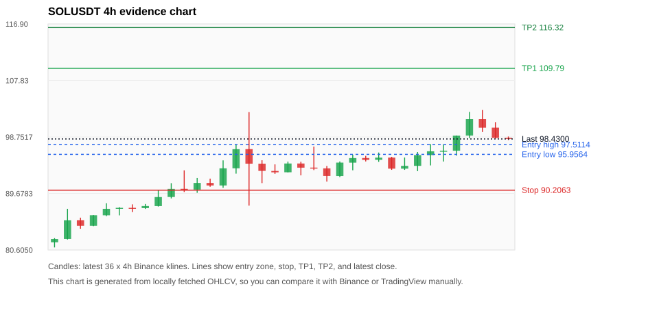
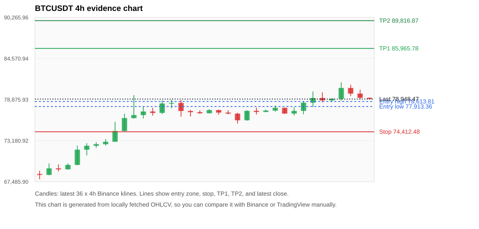
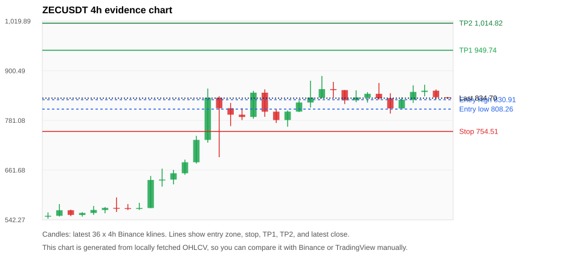
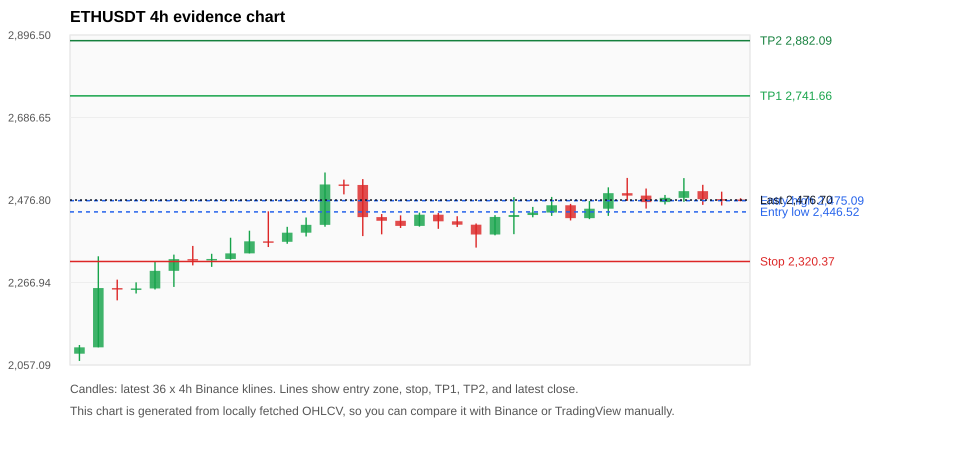
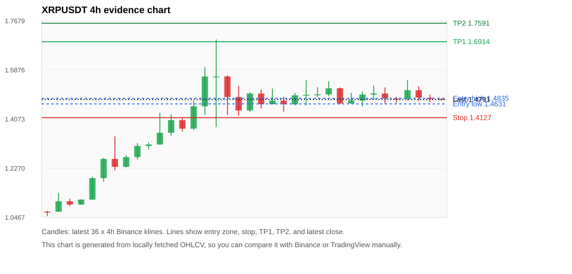

# Crypto 市场扫描报告 v1

- 报告时间：2026-08-25 20:06:50 CST
- Run ID：`20260825_120506_1d6a22c2`
- Run type：`daily_full`
- Data validation mode：`paper`
- 数据来源：SQLite
- 报告版本：v1
- 扫描 ID：1480a9add8c9
- 数据源：Binance public spot API + CoinGecko/CoinMarketCap cross-check
- 过滤条件：USDT spot; 24h quote volume >= 30,000,000; trades >= 30,000; exclude stables/leveraged tokens; analyze 1h/4h/1d klines
- 默认单笔风险：账户权益的 1.00%

## 限制说明

- 交易信号仍以 Binance 现货公开 K 线为主源；外部数据源用于一致性复核。
- 结果是研究和模拟盘计划，不是确定收益或实盘下单指令。
- 历史长度过滤：候选币至少需要 180 根 1d K 线。
- 数据质量验证池：先验证 score 排名前 min(top_n * 2, 10) 的候选，再按 action + score 补足最终名单。
- 大盘环境过滤：RISK_ON; BTC/ETH 日线趋势均较强，允许山寨币买入候选。 BTC 7d=21.98607594975823; ETH 7d=29.121672706416057.
- Data cross-validation enabled: Binance primary source plus CoinGecko; CoinMarketCap is checked when an API key is configured.
- SOLUSDT validation state DEGRADED: DEGRADED: [EXTERNAL_IDENTITY_AMBIGUOUS] CoinMarketCap symbol mapping has 8 matches; selected lowest cmc_rank
- BTCUSDT validation state DEGRADED: DEGRADED: [EXTERNAL_IDENTITY_AMBIGUOUS] CoinMarketCap symbol mapping has 13 matches; selected lowest cmc_rank
- ZECUSDT validation state BLOCKED: BLOCKED: [BINANCE_KLINE_EXTREME_RANGE] Binance candle range exceeds 40%.; [BINANCE_KLINE_EXTREME_RANGE] Binance candle range exceeds 40%.; [EXTERNAL_IDENTITY_AMBIGUOUS] CoinMarketCap symbol mapping has 2 matches; selected lowest cmc_rank
- ETHUSDT validation state DEGRADED: DEGRADED: [EXTERNAL_IDENTITY_AMBIGUOUS] CoinMarketCap symbol mapping has 6 matches; selected lowest cmc_rank
- XRPUSDT validation state DEGRADED: DEGRADED: [EXTERNAL_IDENTITY_AMBIGUOUS] CoinMarketCap symbol mapping has 3 matches; selected lowest cmc_rank
- PEPEUSDT validation state DEGRADED: DEGRADED: [EXTERNAL_PROVIDER_RATE_LIMITED] Provider rate limited request for https://api.coingecko.com/api/v3/coins/markets?vs_currency=usd&ids=pepe&price_change_percentage=24h&per_page=1&page=1: HTTP 429; [EXTERNAL_IDENTITY_AMBIGUOUS] CoinMarketCap symbol mapping has 33 matches; selected lowest cmc_rank
- DOGEUSDT validation state DEGRADED: DEGRADED: [EXTERNAL_PROVIDER_RATE_LIMITED] Provider rate limited request for https://api.coingecko.com/api/v3/coins/markets?vs_currency=usd&ids=dogecoin&price_change_percentage=24h&per_page=1&page=1: HTTP 429; [EXTERNAL_IDENTITY_AMBIGUOUS] CoinMarketCap symbol mapping has 23 matches; selected lowest cmc_rank
- TAOUSDT validation state DEGRADED: DEGRADED: [EXTERNAL_PROVIDER_RATE_LIMITED] Provider rate limited request for https://api.coingecko.com/api/v3/coins/markets?vs_currency=usd&ids=bittensor&price_change_percentage=24h&per_page=1&page=1: HTTP 429; [EXTERNAL_IDENTITY_AMBIGUOUS] CoinMarketCap symbol mapping has 5 matches; selected lowest cmc_rank
- BNBUSDT validation state DEGRADED: DEGRADED: [EXTERNAL_PROVIDER_RATE_LIMITED] Provider rate limited request for https://api.coingecko.com/api/v3/coins/markets?vs_currency=usd&ids=binancecoin&price_change_percentage=24h&per_page=1&page=1: HTTP 429; [EXTERNAL_IDENTITY_AMBIGUOUS] CoinMarketCap symbol mapping has 4 matches; selected lowest cmc_rank
- LINKUSDT validation state DEGRADED: DEGRADED: [EXTERNAL_PROVIDER_RATE_LIMITED] Provider rate limited request for https://api.coingecko.com/api/v3/coins/markets?vs_currency=usd&ids=chainlink&price_change_percentage=24h&per_page=1&page=1: HTTP 429

## 5 个候选交易计划

| Rank | Coin | Action | Setup | Entry Zone | Stop Loss | TP1 | TP2 / Exit Rule | R/R | Verdict |
|---:|---|---|---|---:|---:|---:|---|---:|---|
| 1 | `SOL` | `BUY_CANDIDATE` | 回踩支撑/4h EMA 附近 | 95.9564 - 97.5114 | 90.2063 | 109.79 | 116.32 或跌破 4h 关键支撑 | 2.00-3.00 | 可考虑 |
| 2 | `BTC` | `BUY_CANDIDATE` | 回踩支撑/4h EMA 附近 | 77,913.36 - 78,613.81 | 74,412.48 | 85,965.78 | 89,816.87 或跌破 4h 关键支撑 | 2.00-3.00 | 可考虑 |
| 3 | `ZEC` | `WATCH_ONLY` | 回踩支撑/4h EMA 附近 | 808.26 - 830.91 | 754.51 | 949.74 | 1,014.82 或跌破 4h 关键支撑 | 2.00-3.00 | 只观察 |
| 4 | `ETH` | `WATCH_ONLY` | 回踩支撑/4h EMA 附近 | 2,446.52 - 2,475.09 | 2,320.37 | 2,741.66 | 2,882.09 或跌破 4h 关键支撑 | 2.00-3.00 | 只观察 |
| 5 | `XRP` | `WATCH_ONLY` | 回踩支撑/4h EMA 附近 | 1.4631 - 1.4835 | 1.4127 | 1.6914 | 1.7591 或跌破 4h 关键支撑 | 3.60-4.71 | 只观察 |

## 数据交叉验证摘要

价格差异以 Binance 当前价为基准；成交量口径不同，Binance 是 USDT 现货成交额，CoinGecko/CoinMarketCap 通常是全市场成交量。

| Rank | Coin | State | Identity | Max Price Diff | Max 24h Diff | Issue Codes | Message |
|---:|---|---|---|---:|---:|---|---|
| 1 | `SOL` | DEGRADED (DATA_WARNING) | UNCONFIRMED | 0.11% | 0.06 pts | EXTERNAL_IDENTITY_AMBIGUOUS | DEGRADED: [EXTERNAL_IDENTITY_AMBIGUOUS] CoinMarketCap symbol mapping has 8 matches; selected lowest cmc_rank |
| 2 | `BTC` | DEGRADED (DATA_WARNING) | UNCONFIRMED | 0.13% | 0.09 pts | EXTERNAL_IDENTITY_AMBIGUOUS | DEGRADED: [EXTERNAL_IDENTITY_AMBIGUOUS] CoinMarketCap symbol mapping has 13 matches; selected lowest cmc_rank |
| 3 | `ZEC` | BLOCKED (DATA_ERROR) | UNCONFIRMED | 0.13% | 0.21 pts | BINANCE_KLINE_EXTREME_RANGE, EXTERNAL_IDENTITY_AMBIGUOUS | BLOCKED: [BINANCE_KLINE_EXTREME_RANGE] Binance candle range exceeds 40%.; [BINANCE_KLINE_EXTREME_RANGE] Binance candle range exceeds 40%.; [EXTERNAL_IDENTITY_AMBIGUOUS] CoinMarketCap symbol mapping has 2 matches; selected lowest cmc_rank |
| 4 | `ETH` | DEGRADED (DATA_WARNING) | UNCONFIRMED | 0.05% | 0.02 pts | EXTERNAL_IDENTITY_AMBIGUOUS | DEGRADED: [EXTERNAL_IDENTITY_AMBIGUOUS] CoinMarketCap symbol mapping has 6 matches; selected lowest cmc_rank |
| 5 | `XRP` | DEGRADED (DATA_WARNING) | UNCONFIRMED | 0.07% | 0.01 pts | EXTERNAL_IDENTITY_AMBIGUOUS | DEGRADED: [EXTERNAL_IDENTITY_AMBIGUOUS] CoinMarketCap symbol mapping has 3 matches; selected lowest cmc_rank |

## 候选币说明

### 1. SOL `SOLUSDT`



- 入选原因：回踩支撑/4h EMA 附近；24h +3.22%，7d +29.16%，4h RSI 68.09，24h 成交额 $602.2M。
- 交易失效条件：跌破 90.2063 或 4h 收盘重新失守关键支撑。
- 主要风险：主要风险是大盘同步回撤；External validation is degraded; this candidate is not a clean data sample.；Paper mode allows degraded validation; candidate is excluded from clean-data samples.。
- 数据交叉验证：DEGRADED / DATA_WARNING；身份=UNCONFIRMED；DEGRADED: [EXTERNAL_IDENTITY_AMBIGUOUS] CoinMarketCap symbol mapping has 8 matches; selected lowest cmc_rank

#### 可点击人工验证

- [Binance 交易页](https://www.binance.com/en/trade/SOL_USDT)
- [TradingView 图表](https://www.tradingview.com/chart/?symbol=BINANCE%3ASOLUSDT)
- [CoinGecko 搜索](https://www.coingecko.com/en/search?query=SOL)
- [CoinMarketCap 搜索](https://coinmarketcap.com/search/?q=SOL)

#### 多数据源对照

| Source | Status | Identity | Blocking | Asset ID | Price | 24h Change | 24h Volume | Price Diff | 24h Diff | Updated | Issue Codes | Message |
|---|---|---|---:|---|---:|---:|---:|---:|---:|---|---|---|
| Binance | DATA_OK | CONFIRMED | no | SOLUSDT | 98.4300 | +3.22% | $602.2M | 0.00% | 0.00 pts | 2026-08-25T12:05:57+00:00 | none | Primary market data source passed health checks. |
| CoinGecko | DATA_OK | CONFIRMED | no | solana | 98.5000 | +3.23% | $7.29B | 0.07% | 0.01 pts | 2026-08-25T12:04:20.000Z | none | External source agrees with Binance within thresholds. |
| CoinMarketCap | DATA_WARNING | UNCONFIRMED | no | 5426 | 98.5339 | +3.16% | $7.79B | 0.11% | 0.06 pts | 2026-08-25T12:05:01.000Z | EXTERNAL_IDENTITY_AMBIGUOUS | [EXTERNAL_IDENTITY_AMBIGUOUS] CoinMarketCap symbol mapping has 8 matches; selected lowest cmc_rank |

#### 指标证据

| 指标 | 数值 | 人工核对用途 |
|---|---:|---|
| 当前价 | 98.4300 | 与 Binance/TradingView 当前价格对照 |
| 24h 涨跌 | +3.22% | 与交易所 24h 涨跌对照 |
| 7d 涨跌 | +29.16% | 判断短线趋势是否延续 |
| 4h EMA20 | 95.7649 | 判断短期趋势支撑 |
| 4h EMA50 | 90.1115 | 判断中期趋势支撑 |
| 1d EMA20 | 84.8735 | 判断日线趋势 |
| 1d EMA50 | 79.9885 | 判断日线趋势 |
| 4h RSI14 | 68.09 | 判断是否过热/过弱 |
| 4h ATR14 | 2.4950 | 推导止损和入场缓冲 |
| 最近 18 根 4h 最低点 | 91.5800 | 支撑/止损参考 |
| 最近 36 根 4h 最高点 | 103.08 | TP/压力参考 |
| 支撑位 | 95.7649 | 入场区间推导基础 |

#### 交易计划推导

- 支撑位 = 最近低点、4h EMA20、4h EMA50、1d EMA20 中不高于当前价的最高有效支撑 = `95.7649`。
- 入场区间 = 支撑位附近 + ATR 缓冲 = `95.9564 - 97.5114`。
- 止损 = min(最近 18 根 4h 最低点 * 0.985, 入场中位价 - 1.15 * ATR14) = `90.2063`。
- TP1 = max(最近 36 根 4h 最高点 * 0.995, 入场中位价 + 2R) = `109.79`。
- TP2 = max(入场中位价 + 3R, TP1 * 1.04) = `116.32`。

#### 最近 10 根 4h K线

| UTC 开盘时间 | Open | High | Low | Close | Quote Volume | Trades |
|---|---:|---:|---:|---:|---:|---:|
| 2026-08-24T00:00+00:00 | 95.4400 | 95.5600 | 93.4700 | 93.6600 | $58.6M | 278783 |
| 2026-08-24T04:00+00:00 | 93.6600 | 95.4500 | 93.4700 | 94.1100 | $57.0M | 216228 |
| 2026-08-24T08:00+00:00 | 94.1100 | 96.3300 | 93.2600 | 95.8400 | $58.6M | 239862 |
| 2026-08-24T12:00+00:00 | 95.8400 | 97.6100 | 94.1800 | 96.4500 | $119.9M | 596954 |
| 2026-08-24T16:00+00:00 | 96.4600 | 97.5800 | 94.8100 | 96.5400 | $82.7M | 411691 |
| 2026-08-24T20:00+00:00 | 96.5400 | 98.9900 | 95.7500 | 98.9700 | $63.5M | 272493 |
| 2026-08-25T00:00+00:00 | 98.9800 | 102.77 | 98.5600 | 101.61 | $183.8M | 754531 |
| 2026-08-25T04:00+00:00 | 101.61 | 103.08 | 99.5400 | 100.23 | $84.8M | 335566 |
| 2026-08-25T08:00+00:00 | 100.24 | 101.13 | 98.4900 | 98.6000 | $66.5M | 296750 |
| 2026-08-25T12:00+00:00 | 98.6100 | 98.8200 | 98.2600 | 98.4300 | $2.2M | 11781 |

### 2. BTC `BTCUSDT`



- 入选原因：回踩支撑/4h EMA 附近；24h +1.00%，7d +22.93%，4h RSI 67.08，24h 成交额 $2.68B。
- 交易失效条件：跌破 74412.485 或 4h 收盘重新失守关键支撑。
- 主要风险：主要风险是大盘同步回撤；External validation is degraded; this candidate is not a clean data sample.；Paper mode allows degraded validation; candidate is excluded from clean-data samples.。
- 数据交叉验证：DEGRADED / DATA_WARNING；身份=UNCONFIRMED；DEGRADED: [EXTERNAL_IDENTITY_AMBIGUOUS] CoinMarketCap symbol mapping has 13 matches; selected lowest cmc_rank

#### 可点击人工验证

- [Binance 交易页](https://www.binance.com/en/trade/BTC_USDT)
- [TradingView 图表](https://www.tradingview.com/chart/?symbol=BINANCE%3ABTCUSDT)
- [CoinGecko 搜索](https://www.coingecko.com/en/search?query=BTC)
- [CoinMarketCap 搜索](https://coinmarketcap.com/search/?q=BTC)

#### 多数据源对照

| Source | Status | Identity | Blocking | Asset ID | Price | 24h Change | 24h Volume | Price Diff | 24h Diff | Updated | Issue Codes | Message |
|---|---|---|---:|---|---:|---:|---:|---:|---:|---|---|---|
| Binance | DATA_OK | CONFIRMED | no | BTCUSDT | 78,948.47 | +1.00% | $2.68B | 0.00% | 0.00 pts | 2026-08-25T12:05:57+00:00 | none | Primary market data source passed health checks. |
| CoinGecko | DATA_OK | CONFIRMED | no | bitcoin | 79,037.00 | +1.08% | $54.76B | 0.11% | 0.09 pts | 2026-08-25T12:04:20.000Z | none | External source agrees with Binance within thresholds. |
| CoinMarketCap | DATA_WARNING | UNCONFIRMED | no | 1 | 79,051.60 | +1.08% | $61.07B | 0.13% | 0.08 pts | 2026-08-25T12:05:01.000Z | EXTERNAL_IDENTITY_AMBIGUOUS | [EXTERNAL_IDENTITY_AMBIGUOUS] CoinMarketCap symbol mapping has 13 matches; selected lowest cmc_rank |

#### 指标证据

| 指标 | 数值 | 人工核对用途 |
|---|---:|---|
| 当前价 | 78,948.47 | 与 Binance/TradingView 当前价格对照 |
| 24h 涨跌 | +1.00% | 与交易所 24h 涨跌对照 |
| 7d 涨跌 | +22.93% | 判断短线趋势是否延续 |
| 4h EMA20 | 77,757.84 | 判断短期趋势支撑 |
| 4h EMA50 | 74,069.79 | 判断中期趋势支撑 |
| 1d EMA20 | 70,397.39 | 判断日线趋势 |
| 1d EMA50 | 67,312.25 | 判断日线趋势 |
| 4h RSI14 | 67.08 | 判断是否过热/过弱 |
| 4h ATR14 | 1,222.81 | 推导止损和入场缓冲 |
| 最近 18 根 4h 最低点 | 75,545.67 | 支撑/止损参考 |
| 最近 36 根 4h 最高点 | 81,272.62 | TP/压力参考 |
| 支撑位 | 77,757.84 | 入场区间推导基础 |

#### 交易计划推导

- 支撑位 = 最近低点、4h EMA20、4h EMA50、1d EMA20 中不高于当前价的最高有效支撑 = `77,757.84`。
- 入场区间 = 支撑位附近 + ATR 缓冲 = `77,913.36 - 78,613.81`。
- 止损 = min(最近 18 根 4h 最低点 * 0.985, 入场中位价 - 1.15 * ATR14) = `74,412.48`。
- TP1 = max(最近 36 根 4h 最高点 * 0.995, 入场中位价 + 2R) = `85,965.78`。
- TP2 = max(入场中位价 + 3R, TP1 * 1.04) = `89,816.87`。

#### 最近 10 根 4h K线

| UTC 开盘时间 | Open | High | Low | Close | Quote Volume | Trades |
|---|---:|---:|---:|---:|---:|---:|
| 2026-08-24T00:00+00:00 | 77,734.00 | 77,742.00 | 76,883.61 | 76,933.02 | $283.1M | 880230 |
| 2026-08-24T04:00+00:00 | 76,933.02 | 77,790.19 | 76,670.01 | 77,307.15 | $270.4M | 686797 |
| 2026-08-24T08:00+00:00 | 77,307.14 | 78,600.00 | 76,838.00 | 78,443.65 | $301.6M | 777457 |
| 2026-08-24T12:00+00:00 | 78,443.65 | 80,000.00 | 77,851.90 | 79,100.01 | $954.1M | 2256737 |
| 2026-08-24T16:00+00:00 | 79,100.01 | 79,877.87 | 78,468.61 | 78,758.00 | $423.7M | 1289063 |
| 2026-08-24T20:00+00:00 | 78,757.99 | 79,049.40 | 78,560.00 | 78,992.75 | $135.0M | 444125 |
| 2026-08-25T00:00+00:00 | 78,992.76 | 81,272.62 | 78,715.63 | 80,488.01 | $552.0M | 1567814 |
| 2026-08-25T04:00+00:00 | 80,488.01 | 80,923.69 | 79,369.17 | 79,705.79 | $317.3M | 860532 |
| 2026-08-25T08:00+00:00 | 79,705.79 | 80,249.00 | 78,888.00 | 79,117.99 | $295.6M | 921083 |
| 2026-08-25T12:00+00:00 | 79,118.00 | 79,171.88 | 78,948.00 | 78,950.10 | $7.9M | 29850 |

### 3. ZEC `ZECUSDT`



- 入选原因：回踩支撑/4h EMA 附近；24h -0.93%，7d +66.55%，4h RSI 58.44，24h 成交额 $214.3M。
- 交易失效条件：跌破 754.51 或 4h 收盘重新失守关键支撑。
- 主要风险：24h 动量未确认；Blocking data-quality issue detected; paper plan creation is not allowed.。
- 数据交叉验证：BLOCKED / DATA_ERROR；身份=UNCONFIRMED；BLOCKED: [BINANCE_KLINE_EXTREME_RANGE] Binance candle range exceeds 40%.; [BINANCE_KLINE_EXTREME_RANGE] Binance candle range exceeds 40%.; [EXTERNAL_IDENTITY_AMBIGUOUS] CoinMarketCap symbol mapping has 2 matches; selected lowest cmc_rank

#### 可点击人工验证

- [Binance 交易页](https://www.binance.com/en/trade/ZEC_USDT)
- [TradingView 图表](https://www.tradingview.com/chart/?symbol=BINANCE%3AZECUSDT)
- [CoinGecko 搜索](https://www.coingecko.com/en/search?query=ZEC)
- [CoinMarketCap 搜索](https://coinmarketcap.com/search/?q=ZEC)

#### 多数据源对照

| Source | Status | Identity | Blocking | Asset ID | Price | 24h Change | 24h Volume | Price Diff | 24h Diff | Updated | Issue Codes | Message |
|---|---|---|---:|---|---:|---:|---:|---:|---:|---|---|---|
| Binance | DATA_ERROR | CONFIRMED | yes | ZECUSDT | 834.70 | -0.93% | $214.3M | 0.00% | 0.00 pts | 2026-08-25T12:05:57+00:00 | BINANCE_KLINE_EXTREME_RANGE | [BINANCE_KLINE_EXTREME_RANGE] Binance candle range exceeds 40%.; [BINANCE_KLINE_EXTREME_RANGE] Binance candle range exceeds 40%. |
| CoinGecko | DATA_OK | CONFIRMED | no | zcash | 835.75 | -0.85% | $1.26B | 0.13% | 0.08 pts | 2026-08-25T12:04:20.000Z | none | External source agrees with Binance within thresholds. |
| CoinMarketCap | DATA_WARNING | UNCONFIRMED | no | 1437 | 835.02 | -1.14% | $1.46B | 0.04% | 0.21 pts | 2026-08-25T12:05:01.000Z | EXTERNAL_IDENTITY_AMBIGUOUS | [EXTERNAL_IDENTITY_AMBIGUOUS] CoinMarketCap symbol mapping has 2 matches; selected lowest cmc_rank |

#### 指标证据

| 指标 | 数值 | 人工核对用途 |
|---|---:|---|
| 当前价 | 834.70 | 与 Binance/TradingView 当前价格对照 |
| 24h 涨跌 | -0.93% | 与交易所 24h 涨跌对照 |
| 7d 涨跌 | +66.55% | 判断短线趋势是否延续 |
| 4h EMA20 | 806.65 | 判断短期趋势支撑 |
| 4h EMA50 | 713.13 | 判断中期趋势支撑 |
| 1d EMA20 | 629.95 | 判断日线趋势 |
| 1d EMA50 | 554.26 | 判断日线趋势 |
| 4h RSI14 | 58.44 | 判断是否过热/过弱 |
| 4h ATR14 | 34.6586 | 推导止损和入场缓冲 |
| 最近 18 根 4h 最低点 | 766.00 | 支撑/止损参考 |
| 最近 36 根 4h 最高点 | 888.00 | TP/压力参考 |
| 支撑位 | 806.65 | 入场区间推导基础 |

#### 交易计划推导

- 支撑位 = 最近低点、4h EMA20、4h EMA50、1d EMA20 中不高于当前价的最高有效支撑 = `806.65`。
- 入场区间 = 支撑位附近 + ATR 缓冲 = `808.26 - 830.91`。
- 止损 = min(最近 18 根 4h 最低点 * 0.985, 入场中位价 - 1.15 * ATR14) = `754.51`。
- TP1 = max(最近 36 根 4h 最高点 * 0.995, 入场中位价 + 2R) = `949.74`。
- TP2 = max(入场中位价 + 3R, TP1 * 1.04) = `1,014.82`。

#### 最近 10 根 4h K线

| UTC 开盘时间 | Open | High | Low | Close | Quote Volume | Trades |
|---|---:|---:|---:|---:|---:|---:|
| 2026-08-24T00:00+00:00 | 853.99 | 854.01 | 820.49 | 829.54 | $41.2M | 115907 |
| 2026-08-24T04:00+00:00 | 829.54 | 853.51 | 824.96 | 836.28 | $25.9M | 86750 |
| 2026-08-24T08:00+00:00 | 836.28 | 849.10 | 823.98 | 845.08 | $33.5M | 98677 |
| 2026-08-24T12:00+00:00 | 845.04 | 871.17 | 830.88 | 834.40 | $57.6M | 174124 |
| 2026-08-24T16:00+00:00 | 834.46 | 846.59 | 797.60 | 809.94 | $49.5M | 142808 |
| 2026-08-24T20:00+00:00 | 809.90 | 836.72 | 809.52 | 830.87 | $14.5M | 50825 |
| 2026-08-25T00:00+00:00 | 830.73 | 865.58 | 823.19 | 849.61 | $35.7M | 98559 |
| 2026-08-25T04:00+00:00 | 849.61 | 866.93 | 839.01 | 852.50 | $26.9M | 81529 |
| 2026-08-25T08:00+00:00 | 852.56 | 855.53 | 832.01 | 836.80 | $30.7M | 83817 |
| 2026-08-25T12:00+00:00 | 836.70 | 837.35 | 833.20 | 834.70 | $472,106 | 1680 |

### 4. ETH `ETHUSDT`



- 入选原因：回踩支撑/4h EMA 附近；24h -0.29%，7d +30.50%，4h RSI 67.97，24h 成交额 $1.10B。
- 交易失效条件：跌破 2320.3744 或 4h 收盘重新失守关键支撑。
- 主要风险：24h 动量未确认；External validation is degraded; this candidate is not a clean data sample.；Paper mode allows degraded validation; candidate is excluded from clean-data samples.。
- 数据交叉验证：DEGRADED / DATA_WARNING；身份=UNCONFIRMED；DEGRADED: [EXTERNAL_IDENTITY_AMBIGUOUS] CoinMarketCap symbol mapping has 6 matches; selected lowest cmc_rank

#### 可点击人工验证

- [Binance 交易页](https://www.binance.com/en/trade/ETH_USDT)
- [TradingView 图表](https://www.tradingview.com/chart/?symbol=BINANCE%3AETHUSDT)
- [CoinGecko 搜索](https://www.coingecko.com/en/search?query=ETH)
- [CoinMarketCap 搜索](https://coinmarketcap.com/search/?q=ETH)

#### 多数据源对照

| Source | Status | Identity | Blocking | Asset ID | Price | 24h Change | 24h Volume | Price Diff | 24h Diff | Updated | Issue Codes | Message |
|---|---|---|---:|---|---:|---:|---:|---:|---:|---|---|---|
| Binance | DATA_OK | CONFIRMED | no | ETHUSDT | 2,476.70 | -0.29% | $1.10B | 0.00% | 0.00 pts | 2026-08-25T12:05:57+00:00 | none | Primary market data source passed health checks. |
| CoinGecko | DATA_OK | CONFIRMED | no | ethereum | 2,476.29 | -0.27% | $19.21B | 0.02% | 0.02 pts | 2026-08-25T12:03:20.000Z | none | External source agrees with Binance within thresholds. |
| CoinMarketCap | DATA_WARNING | UNCONFIRMED | no | 1027 | 2,478.05 | -0.31% | $21.98B | 0.05% | 0.02 pts | 2026-08-25T12:05:01.000Z | EXTERNAL_IDENTITY_AMBIGUOUS | [EXTERNAL_IDENTITY_AMBIGUOUS] CoinMarketCap symbol mapping has 6 matches; selected lowest cmc_rank |

#### 指标证据

| 指标 | 数值 | 人工核对用途 |
|---|---:|---|
| 当前价 | 2,476.70 | 与 Binance/TradingView 当前价格对照 |
| 24h 涨跌 | -0.29% | 与交易所 24h 涨跌对照 |
| 7d 涨跌 | +30.50% | 判断短线趋势是否延续 |
| 4h EMA20 | 2,441.64 | 判断短期趋势支撑 |
| 4h EMA50 | 2,306.41 | 判断中期趋势支撑 |
| 1d EMA20 | 2,162.92 | 判断日线趋势 |
| 1d EMA50 | 2,005.54 | 判断日线趋势 |
| 4h RSI14 | 67.97 | 判断是否过热/过弱 |
| 4h ATR14 | 47.7864 | 推导止损和入场缓冲 |
| 最近 18 根 4h 最低点 | 2,355.71 | 支撑/止损参考 |
| 最近 36 根 4h 最高点 | 2,546.78 | TP/压力参考 |
| 支撑位 | 2,441.64 | 入场区间推导基础 |

#### 交易计划推导

- 支撑位 = 最近低点、4h EMA20、4h EMA50、1d EMA20 中不高于当前价的最高有效支撑 = `2,441.64`。
- 入场区间 = 支撑位附近 + ATR 缓冲 = `2,446.52 - 2,475.09`。
- 止损 = min(最近 18 根 4h 最低点 * 0.985, 入场中位价 - 1.15 * ATR14) = `2,320.37`。
- TP1 = max(最近 36 根 4h 最高点 * 0.995, 入场中位价 + 2R) = `2,741.66`。
- TP2 = max(入场中位价 + 3R, TP1 * 1.04) = `2,882.09`。

#### 最近 10 根 4h K线

| UTC 开盘时间 | Open | High | Low | Close | Quote Volume | Trades |
|---|---:|---:|---:|---:|---:|---:|
| 2026-08-24T00:00+00:00 | 2,463.42 | 2,466.98 | 2,424.73 | 2,430.64 | $132.7M | 597195 |
| 2026-08-24T04:00+00:00 | 2,430.65 | 2,474.09 | 2,428.11 | 2,454.64 | $146.4M | 508657 |
| 2026-08-24T08:00+00:00 | 2,454.67 | 2,509.00 | 2,436.41 | 2,494.18 | $210.1M | 736867 |
| 2026-08-24T12:00+00:00 | 2,494.18 | 2,532.95 | 2,474.50 | 2,487.99 | $384.4M | 1333071 |
| 2026-08-24T16:00+00:00 | 2,487.99 | 2,506.00 | 2,455.00 | 2,471.40 | $215.8M | 846668 |
| 2026-08-24T20:00+00:00 | 2,471.48 | 2,489.67 | 2,465.46 | 2,482.31 | $69.0M | 291903 |
| 2026-08-25T00:00+00:00 | 2,482.31 | 2,532.50 | 2,472.18 | 2,499.29 | $191.4M | 813592 |
| 2026-08-25T04:00+00:00 | 2,499.30 | 2,515.43 | 2,464.41 | 2,478.94 | $128.5M | 468453 |
| 2026-08-25T08:00+00:00 | 2,478.94 | 2,498.00 | 2,462.81 | 2,477.91 | $109.3M | 507427 |
| 2026-08-25T12:00+00:00 | 2,477.90 | 2,481.37 | 2,473.55 | 2,476.71 | $3.2M | 17491 |

### 5. XRP `XRPUSDT`



- 入选原因：回踩支撑/4h EMA 附近；24h -0.94%，7d +48.18%，4h RSI 53.67，24h 成交额 $380.7M。
- 交易失效条件：跌破 1.412687 或 4h 收盘重新失守关键支撑。
- 主要风险：24h 动量未确认；External validation is degraded; this candidate is not a clean data sample.；Paper mode allows degraded validation; candidate is excluded from clean-data samples.。
- 数据交叉验证：DEGRADED / DATA_WARNING；身份=UNCONFIRMED；DEGRADED: [EXTERNAL_IDENTITY_AMBIGUOUS] CoinMarketCap symbol mapping has 3 matches; selected lowest cmc_rank

#### 可点击人工验证

- [Binance 交易页](https://www.binance.com/en/trade/XRP_USDT)
- [TradingView 图表](https://www.tradingview.com/chart/?symbol=BINANCE%3AXRPUSDT)
- [CoinGecko 搜索](https://www.coingecko.com/en/search?query=XRP)
- [CoinMarketCap 搜索](https://coinmarketcap.com/search/?q=XRP)

#### 多数据源对照

| Source | Status | Identity | Blocking | Asset ID | Price | 24h Change | 24h Volume | Price Diff | 24h Diff | Updated | Issue Codes | Message |
|---|---|---|---:|---|---:|---:|---:|---:|---:|---|---|---|
| Binance | DATA_OK | CONFIRMED | no | XRPUSDT | 1.4791 | -0.94% | $380.7M | 0.00% | 0.00 pts | 2026-08-25T12:05:57+00:00 | none | Primary market data source passed health checks. |
| CoinGecko | DATA_OK | CONFIRMED | no | ripple | 1.4800 | -0.95% | $5.39B | 0.06% | 0.00 pts | 2026-08-25T12:04:20.000Z | none | External source agrees with Binance within thresholds. |
| CoinMarketCap | DATA_WARNING | UNCONFIRMED | no | 52 | 1.4801 | -0.95% | $6.11B | 0.07% | 0.01 pts | 2026-08-25T12:05:01.000Z | EXTERNAL_IDENTITY_AMBIGUOUS | [EXTERNAL_IDENTITY_AMBIGUOUS] CoinMarketCap symbol mapping has 3 matches; selected lowest cmc_rank |

#### 指标证据

| 指标 | 数值 | 人工核对用途 |
|---|---:|---|
| 当前价 | 1.4791 | 与 Binance/TradingView 当前价格对照 |
| 24h 涨跌 | -0.94% | 与交易所 24h 涨跌对照 |
| 7d 涨跌 | +48.18% | 判断短线趋势是否延续 |
| 4h EMA20 | 1.4602 | 判断短期趋势支撑 |
| 4h EMA50 | 1.3381 | 判断中期趋势支撑 |
| 1d EMA20 | 1.2251 | 判断日线趋势 |
| 1d EMA50 | 1.1550 | 判断日线趋势 |
| 4h RSI14 | 53.67 | 判断是否过热/过弱 |
| 4h ATR14 | 0.04904 | 推导止损和入场缓冲 |
| 最近 18 根 4h 最低点 | 1.4342 | 支撑/止损参考 |
| 最近 36 根 4h 最高点 | 1.6999 | TP/压力参考 |
| 支撑位 | 1.4602 | 入场区间推导基础 |

#### 交易计划推导

- 支撑位 = 最近低点、4h EMA20、4h EMA50、1d EMA20 中不高于当前价的最高有效支撑 = `1.4602`。
- 入场区间 = 支撑位附近 + ATR 缓冲 = `1.4631 - 1.4835`。
- 止损 = min(最近 18 根 4h 最低点 * 0.985, 入场中位价 - 1.15 * ATR14) = `1.4127`。
- TP1 = max(最近 36 根 4h 最高点 * 0.995, 入场中位价 + 2R) = `1.6914`。
- TP2 = max(入场中位价 + 3R, TP1 * 1.04) = `1.7591`。

#### 最近 10 根 4h K线

| UTC 开盘时间 | Open | High | Low | Close | Quote Volume | Trades |
|---|---:|---:|---:|---:|---:|---:|
| 2026-08-24T00:00+00:00 | 1.5205 | 1.5238 | 1.4624 | 1.4652 | $62.6M | 345573 |
| 2026-08-24T04:00+00:00 | 1.4651 | 1.5033 | 1.4642 | 1.4758 | $61.2M | 326158 |
| 2026-08-24T08:00+00:00 | 1.4759 | 1.5090 | 1.4532 | 1.4974 | $66.7M | 294310 |
| 2026-08-24T12:00+00:00 | 1.4973 | 1.5304 | 1.4781 | 1.5013 | $93.5M | 482947 |
| 2026-08-24T16:00+00:00 | 1.5013 | 1.5238 | 1.4629 | 1.4831 | $74.3M | 360337 |
| 2026-08-24T20:00+00:00 | 1.4830 | 1.4892 | 1.4669 | 1.4817 | $34.4M | 173117 |
| 2026-08-25T00:00+00:00 | 1.4818 | 1.5505 | 1.4749 | 1.5135 | $87.6M | 389264 |
| 2026-08-25T04:00+00:00 | 1.5134 | 1.5275 | 1.4740 | 1.4861 | $53.1M | 275130 |
| 2026-08-25T08:00+00:00 | 1.4860 | 1.4976 | 1.4700 | 1.4808 | $37.3M | 194981 |
| 2026-08-25T12:00+00:00 | 1.4808 | 1.4834 | 1.4761 | 1.4791 | $1.3M | 6681 |

## 组合风控

- 不要 5 个候选全部满仓买入。
- 同时持仓总风险建议控制在账户权益的 3% - 5% 以内。
- 如果 BTC/ETH 同时破位，暂停山寨币多头计划或降低仓位。
- 第一版报告用于模拟盘和人工复核，不自动下单。

## 原始数据

```json
[
  {
    "rank": 1,
    "symbol": "SOLUSDT",
    "base_asset": "SOL",
    "price": 98.43,
    "score": 78.22642152802337,
    "setup": "回踩支撑/4h EMA 附近",
    "verdict": "可考虑",
    "entry_low": 95.95644307602628,
    "entry_high": 97.51141324952722,
    "stop_loss": 90.2063,
    "take_profit_1": 109.78918448833025,
    "take_profit_2": 116.316812651107,
    "risk_reward_1": 2.0,
    "risk_reward_2": 3.0,
    "pct_24h": 3.219,
    "pct_3d": 4.579260518487049,
    "pct_7d": 29.156278703582217,
    "quote_volume_24h": 602159709.32907,
    "trades_24h": 2672987,
    "high_low_range_24h": 9.449989382034385,
    "rsi_1h": 54.37062937062939,
    "rsi_4h": 68.08769792935445,
    "ema20_4h": 95.76491324952723,
    "ema50_4h": 90.11145198421676,
    "ema20_1d": 84.87347748991193,
    "ema50_1d": 79.98848145319847,
    "atr_4h": 2.4949999999999966,
    "macd_hist_4h": -0.06567286103636727,
    "volume_ratio_24h": 1.3875304260207273,
    "support_level": 95.76491324952723,
    "recent_low_4h_18": 91.58,
    "recent_high_4h_36": 103.08,
    "distance_to_support_pct": 2.782946968822042,
    "binance_trade_url": "https://www.binance.com/en/trade/SOL_USDT",
    "tradingview_url": "https://www.tradingview.com/chart/?symbol=BINANCE%3ASOLUSDT",
    "coingecko_search_url": "https://www.coingecko.com/en/search?query=SOL",
    "coinmarketcap_search_url": "https://coinmarketcap.com/search/?q=SOL",
    "invalidation": "跌破 90.2063 或 4h 收盘重新失守关键支撑",
    "recent_4h_klines": [
      {
        "open_time_utc": "2026-08-19T16:00+00:00",
        "open": 81.83,
        "high": 82.5,
        "low": 81.01,
        "close": 82.36,
        "quote_volume": 48121430.45086,
        "trades": 176564
      },
      {
        "open_time_utc": "2026-08-19T20:00+00:00",
        "open": 82.37,
        "high": 87.21,
        "low": 82.28,
        "close": 85.38,
        "quote_volume": 99855580.62414,
        "trades": 491727
      },
      {
        "open_time_utc": "2026-08-20T00:00+00:00",
        "open": 85.39,
        "high": 85.79,
        "low": 84.01,
        "close": 84.48,
        "quote_volume": 50222021.04119,
        "trades": 149763
      },
      {
        "open_time_utc": "2026-08-20T04:00+00:00",
        "open": 84.48,
        "high": 86.2,
        "low": 84.42,
        "close": 86.18,
        "quote_volume": 35005738.65144,
        "trades": 90487
      },
      {
        "open_time_utc": "2026-08-20T08:00+00:00",
        "open": 86.17,
        "high": 88.1,
        "low": 86.04,
        "close": 87.21,
        "quote_volume": 81288347.30443,
        "trades": 233800
      },
      {
        "open_time_utc": "2026-08-20T12:00+00:00",
        "open": 87.22,
        "high": 87.48,
        "low": 86.16,
        "close": 87.37,
        "quote_volume": 73961629.06232,
        "trades": 277887
      },
      {
        "open_time_utc": "2026-08-20T16:00+00:00",
        "open": 87.37,
        "high": 87.93,
        "low": 86.68,
        "close": 87.31,
        "quote_volume": 52881940.72448,
        "trades": 167766
      },
      {
        "open_time_utc": "2026-08-20T20:00+00:00",
        "open": 87.32,
        "high": 87.99,
        "low": 87.19,
        "close": 87.66,
        "quote_volume": 26426787.01619,
        "trades": 85805
      },
      {
        "open_time_utc": "2026-08-21T00:00+00:00",
        "open": 87.65,
        "high": 90.2,
        "low": 87.57,
        "close": 89.1,
        "quote_volume": 97696595.11039,
        "trades": 339103
      },
      {
        "open_time_utc": "2026-08-21T04:00+00:00",
        "open": 89.11,
        "high": 91.33,
        "low": 88.88,
        "close": 90.41,
        "quote_volume": 80275298.64002,
        "trades": 270244
      },
      {
        "open_time_utc": "2026-08-21T08:00+00:00",
        "open": 90.42,
        "high": 93.39,
        "low": 89.91,
        "close": 90.29,
        "quote_volume": 140333182.19731,
        "trades": 547147
      },
      {
        "open_time_utc": "2026-08-21T12:00+00:00",
        "open": 90.3,
        "high": 92.16,
        "low": 89.78,
        "close": 91.37,
        "quote_volume": 80237017.57857,
        "trades": 324719
      },
      {
        "open_time_utc": "2026-08-21T16:00+00:00",
        "open": 91.37,
        "high": 92.06,
        "low": 90.75,
        "close": 90.96,
        "quote_volume": 48346556.98893,
        "trades": 200686
      },
      {
        "open_time_utc": "2026-08-21T20:00+00:00",
        "open": 90.96,
        "high": 94.99,
        "low": 90.59,
        "close": 93.72,
        "quote_volume": 84694218.42171,
        "trades": 390086
      },
      {
        "open_time_utc": "2026-08-22T00:00+00:00",
        "open": 93.72,
        "high": 97.59,
        "low": 92.86,
        "close": 96.79,
        "quote_volume": 108556776.33764,
        "trades": 416287
      },
      {
        "open_time_utc": "2026-08-22T04:00+00:00",
        "open": 96.8,
        "high": 102.74,
        "low": 87.72,
        "close": 94.46,
        "quote_volume": 322025016.14877,
        "trades": 1222837
      },
      {
        "open_time_utc": "2026-08-22T08:00+00:00",
        "open": 94.46,
        "high": 95.01,
        "low": 91.34,
        "close": 93.3,
        "quote_volume": 106348591.63076,
        "trades": 473892
      },
      {
        "open_time_utc": "2026-08-22T12:00+00:00",
        "open": 93.29,
        "high": 94.35,
        "low": 92.82,
        "close": 93.07,
        "quote_volume": 53585128.42959,
        "trades": 237915
      },
      {
        "open_time_utc": "2026-08-22T16:00+00:00",
        "open": 93.08,
        "high": 94.8,
        "low": 93.07,
        "close": 94.49,
        "quote_volume": 43115060.51556,
        "trades": 160623
      },
      {
        "open_time_utc": "2026-08-22T20:00+00:00",
        "open": 94.49,
        "high": 94.78,
        "low": 92.58,
        "close": 93.82,
        "quote_volume": 38685724.52756,
        "trades": 183938
      },
      {
        "open_time_utc": "2026-08-23T00:00+00:00",
        "open": 93.83,
        "high": 97.21,
        "low": 93.43,
        "close": 93.7,
        "quote_volume": 102800675.89394,
        "trades": 449392
      },
      {
        "open_time_utc": "2026-08-23T04:00+00:00",
        "open": 93.71,
        "high": 94.1,
        "low": 91.58,
        "close": 92.49,
        "quote_volume": 73358283.14858,
        "trades": 327921
      },
      {
        "open_time_utc": "2026-08-23T08:00+00:00",
        "open": 92.48,
        "high": 94.82,
        "low": 92.31,
        "close": 94.63,
        "quote_volume": 42399496.45061,
        "trades": 182212
      },
      {
        "open_time_utc": "2026-08-23T12:00+00:00",
        "open": 94.62,
        "high": 95.9,
        "low": 93.4,
        "close": 95.36,
        "quote_volume": 76686796.78259,
        "trades": 332982
      },
      {
        "open_time_utc": "2026-08-23T16:00+00:00",
        "open": 95.37,
        "high": 95.72,
        "low": 94.82,
        "close": 95.07,
        "quote_volume": 24236724.50948,
        "trades": 151150
      },
      {
        "open_time_utc": "2026-08-23T20:00+00:00",
        "open": 95.08,
        "high": 96.25,
        "low": 94.76,
        "close": 95.43,
        "quote_volume": 38060982.04896,
        "trades": 231649
      },
      {
        "open_time_utc": "2026-08-24T00:00+00:00",
        "open": 95.44,
        "high": 95.56,
        "low": 93.47,
        "close": 93.66,
        "quote_volume": 58632721.37929,
        "trades": 278783
      },
      {
        "open_time_utc": "2026-08-24T04:00+00:00",
        "open": 93.66,
        "high": 95.45,
        "low": 93.47,
        "close": 94.11,
        "quote_volume": 57011645.9485,
        "trades": 216228
      },
      {
        "open_time_utc": "2026-08-24T08:00+00:00",
        "open": 94.11,
        "high": 96.33,
        "low": 93.26,
        "close": 95.84,
        "quote_volume": 58569757.09813,
        "trades": 239862
      },
      {
        "open_time_utc": "2026-08-24T12:00+00:00",
        "open": 95.84,
        "high": 97.61,
        "low": 94.18,
        "close": 96.45,
        "quote_volume": 119893274.34999,
        "trades": 596954
      },
      {
        "open_time_utc": "2026-08-24T16:00+00:00",
        "open": 96.46,
        "high": 97.58,
        "low": 94.81,
        "close": 96.54,
        "quote_volume": 82741910.33424,
        "trades": 411691
      },
      {
        "open_time_utc": "2026-08-24T20:00+00:00",
        "open": 96.54,
        "high": 98.99,
        "low": 95.75,
        "close": 98.97,
        "quote_volume": 63543938.15549,
        "trades": 272493
      },
      {
        "open_time_utc": "2026-08-25T00:00+00:00",
        "open": 98.98,
        "high": 102.77,
        "low": 98.56,
        "close": 101.61,
        "quote_volume": 183831354.33008,
        "trades": 754531
      },
      {
        "open_time_utc": "2026-08-25T04:00+00:00",
        "open": 101.61,
        "high": 103.08,
        "low": 99.54,
        "close": 100.23,
        "quote_volume": 84770390.02423,
        "trades": 335566
      },
      {
        "open_time_utc": "2026-08-25T08:00+00:00",
        "open": 100.24,
        "high": 101.13,
        "low": 98.49,
        "close": 98.6,
        "quote_volume": 66504662.50222,
        "trades": 296750
      },
      {
        "open_time_utc": "2026-08-25T12:00+00:00",
        "open": 98.61,
        "high": 98.82,
        "low": 98.26,
        "close": 98.43,
        "quote_volume": 2188723.78545,
        "trades": 11781
      }
    ],
    "risks": [
      "主要风险是大盘同步回撤",
      "External validation is degraded; this candidate is not a clean data sample.",
      "Paper mode allows degraded validation; candidate is excluded from clean-data samples."
    ],
    "data_quality_status": "DATA_WARNING",
    "data_quality_message": "DEGRADED: [EXTERNAL_IDENTITY_AMBIGUOUS] CoinMarketCap symbol mapping has 8 matches; selected lowest cmc_rank",
    "data_checks": [
      {
        "provider": "Binance",
        "status": "DATA_OK",
        "provider_asset_id": "SOLUSDT",
        "provider_symbol": "SOLUSDT",
        "price_usd": 98.43,
        "pct_24h": 3.219,
        "volume_24h": 602159709.32907,
        "last_updated": null,
        "fetched_at_utc": "2026-08-25T12:05:57+00:00",
        "price_diff_pct": 0.0,
        "pct_24h_diff": 0.0,
        "volume_note": "Binance USDT spot 24h quoteVolume.",
        "message": "Primary market data source passed health checks.",
        "blocking": false,
        "identity_status": "CONFIRMED",
        "issues": []
      },
      {
        "provider": "CoinGecko",
        "status": "DATA_OK",
        "provider_asset_id": "solana",
        "provider_symbol": "SOL",
        "price_usd": 98.5,
        "pct_24h": 3.22605,
        "volume_24h": 7285676226.0,
        "last_updated": "2026-08-25T12:04:20.000Z",
        "fetched_at_utc": "2026-08-25T12:05:57+00:00",
        "price_diff_pct": 0.07111652951335282,
        "pct_24h_diff": 0.007050000000000001,
        "volume_note": "CoinGecko total market volume; not the same venue scope as Binance quoteVolume.",
        "message": "External source agrees with Binance within thresholds.",
        "blocking": false,
        "identity_status": "CONFIRMED",
        "issues": []
      },
      {
        "provider": "CoinMarketCap",
        "status": "DATA_WARNING",
        "provider_asset_id": "5426",
        "provider_symbol": "SOL",
        "price_usd": 98.53392562183572,
        "pct_24h": 3.15762851,
        "volume_24h": 7786620294.333227,
        "last_updated": "2026-08-25T12:05:01.000Z",
        "fetched_at_utc": "2026-08-25T12:05:57+00:00",
        "price_diff_pct": 0.1055832793210544,
        "pct_24h_diff": 0.06137148999999997,
        "volume_note": "CoinMarketCap total market volume; not the same venue scope as Binance quoteVolume.",
        "message": "[EXTERNAL_IDENTITY_AMBIGUOUS] CoinMarketCap symbol mapping has 8 matches; selected lowest cmc_rank",
        "blocking": false,
        "identity_status": "UNCONFIRMED",
        "issues": [
          {
            "provider": "CoinMarketCap",
            "code": "EXTERNAL_IDENTITY_AMBIGUOUS",
            "severity": "WARNING",
            "blocking": false,
            "message": "CoinMarketCap symbol mapping has 8 matches; selected lowest cmc_rank",
            "context": {}
          }
        ]
      }
    ],
    "action": "BUY_CANDIDATE",
    "data_quality_state": "DEGRADED",
    "data_quality_issues": [
      {
        "provider": "CoinMarketCap",
        "code": "EXTERNAL_IDENTITY_AMBIGUOUS",
        "severity": "WARNING",
        "blocking": false,
        "message": "CoinMarketCap symbol mapping has 8 matches; selected lowest cmc_rank",
        "context": {}
      }
    ],
    "external_identity_status": "UNCONFIRMED"
  },
  {
    "rank": 2,
    "symbol": "BTCUSDT",
    "base_asset": "BTC",
    "price": 78948.47,
    "score": 74.03936619309512,
    "setup": "回踩支撑/4h EMA 附近",
    "verdict": "可考虑",
    "entry_low": 77913.35728184738,
    "entry_high": 78613.80609865008,
    "stop_loss": 74412.48495,
    "take_profit_1": 85965.77517074619,
    "take_profit_2": 89816.87191099492,
    "risk_reward_1": 2.0,
    "risk_reward_2": 3.0,
    "pct_24h": 0.999,
    "pct_3d": 2.1475994784225794,
    "pct_7d": 22.934416526692083,
    "quote_volume_24h": 2676089925.3222847,
    "trades_24h": 7335635,
    "high_low_range_24h": 4.393881202642458,
    "rsi_1h": 52.06735489245232,
    "rsi_4h": 67.08139136693163,
    "ema20_4h": 77757.84159865008,
    "ema50_4h": 74069.79259812215,
    "ema20_1d": 70397.38569800842,
    "ema50_1d": 67312.24523237985,
    "atr_4h": 1222.8064285714293,
    "macd_hist_4h": -205.82372464673676,
    "volume_ratio_24h": 1.2815277511343433,
    "support_level": 77757.84159865008,
    "recent_low_4h_18": 75545.67,
    "recent_high_4h_36": 81272.62,
    "distance_to_support_pct": 1.5312004254122602,
    "binance_trade_url": "https://www.binance.com/en/trade/BTC_USDT",
    "tradingview_url": "https://www.tradingview.com/chart/?symbol=BINANCE%3ABTCUSDT",
    "coingecko_search_url": "https://www.coingecko.com/en/search?query=BTC",
    "coinmarketcap_search_url": "https://coinmarketcap.com/search/?q=BTC",
    "invalidation": "跌破 74412.485 或 4h 收盘重新失守关键支撑",
    "recent_4h_klines": [
      {
        "open_time_utc": "2026-08-19T16:00+00:00",
        "open": 68554.0,
        "high": 68997.0,
        "low": 67825.03,
        "close": 68429.44,
        "quote_volume": 347389517.9273289,
        "trades": 853285
      },
      {
        "open_time_utc": "2026-08-19T20:00+00:00",
        "open": 68429.44,
        "high": 70000.0,
        "low": 68390.0,
        "close": 69334.79,
        "quote_volume": 387820099.6983747,
        "trades": 1136858
      },
      {
        "open_time_utc": "2026-08-20T00:00+00:00",
        "open": 69334.78,
        "high": 69894.5,
        "low": 68902.22,
        "close": 69195.64,
        "quote_volume": 286686629.3688295,
        "trades": 752205
      },
      {
        "open_time_utc": "2026-08-20T04:00+00:00",
        "open": 69195.64,
        "high": 70022.0,
        "low": 69166.0,
        "close": 69816.45,
        "quote_volume": 377584678.9597753,
        "trades": 693188
      },
      {
        "open_time_utc": "2026-08-20T08:00+00:00",
        "open": 69816.45,
        "high": 72490.0,
        "low": 69772.36,
        "close": 71927.07,
        "quote_volume": 791582876.508384,
        "trades": 1531290
      },
      {
        "open_time_utc": "2026-08-20T12:00+00:00",
        "open": 71927.07,
        "high": 72830.0,
        "low": 71132.0,
        "close": 72470.83,
        "quote_volume": 582385271.5188173,
        "trades": 1685640
      },
      {
        "open_time_utc": "2026-08-20T16:00+00:00",
        "open": 72470.84,
        "high": 72966.0,
        "low": 72205.88,
        "close": 72690.76,
        "quote_volume": 317970452.9319334,
        "trades": 951205
      },
      {
        "open_time_utc": "2026-08-20T20:00+00:00",
        "open": 72690.76,
        "high": 73400.0,
        "low": 72498.0,
        "close": 73025.15,
        "quote_volume": 205843798.3222438,
        "trades": 635586
      },
      {
        "open_time_utc": "2026-08-21T00:00+00:00",
        "open": 73027.02,
        "high": 75785.82,
        "low": 73027.02,
        "close": 74510.77,
        "quote_volume": 584652979.5047988,
        "trades": 1582036
      },
      {
        "open_time_utc": "2026-08-21T04:00+00:00",
        "open": 74510.77,
        "high": 76916.95,
        "low": 74510.77,
        "close": 76308.65,
        "quote_volume": 540182095.0565292,
        "trades": 1233155
      },
      {
        "open_time_utc": "2026-08-21T08:00+00:00",
        "open": 76308.66,
        "high": 79500.0,
        "low": 76235.76,
        "close": 76722.32,
        "quote_volume": 973556247.6462284,
        "trades": 2281523
      },
      {
        "open_time_utc": "2026-08-21T12:00+00:00",
        "open": 76722.31,
        "high": 77871.33,
        "low": 76243.04,
        "close": 77221.98,
        "quote_volume": 606989752.8285966,
        "trades": 1797337
      },
      {
        "open_time_utc": "2026-08-21T16:00+00:00",
        "open": 77221.98,
        "high": 77722.12,
        "low": 76643.72,
        "close": 77028.94,
        "quote_volume": 375915274.045809,
        "trades": 975846
      },
      {
        "open_time_utc": "2026-08-21T20:00+00:00",
        "open": 77028.94,
        "high": 78760.68,
        "low": 76863.56,
        "close": 78338.03,
        "quote_volume": 320376410.9513989,
        "trades": 1059047
      },
      {
        "open_time_utc": "2026-08-22T00:00+00:00",
        "open": 78338.03,
        "high": 78828.15,
        "low": 77683.37,
        "close": 78410.98,
        "quote_volume": 245268338.6654446,
        "trades": 857785
      },
      {
        "open_time_utc": "2026-08-22T04:00+00:00",
        "open": 78410.98,
        "high": 78818.0,
        "low": 76500.0,
        "close": 77289.18,
        "quote_volume": 466550227.9128869,
        "trades": 1105878
      },
      {
        "open_time_utc": "2026-08-22T08:00+00:00",
        "open": 77289.18,
        "high": 77445.6,
        "low": 76533.87,
        "close": 77130.02,
        "quote_volume": 288838577.4531066,
        "trades": 769748
      },
      {
        "open_time_utc": "2026-08-22T12:00+00:00",
        "open": 77130.01,
        "high": 77387.99,
        "low": 76880.0,
        "close": 76978.83,
        "quote_volume": 154332032.6085874,
        "trades": 457317
      },
      {
        "open_time_utc": "2026-08-22T16:00+00:00",
        "open": 76978.83,
        "high": 77547.96,
        "low": 76956.36,
        "close": 77418.25,
        "quote_volume": 109110128.0558765,
        "trades": 353418
      },
      {
        "open_time_utc": "2026-08-22T20:00+00:00",
        "open": 77418.26,
        "high": 77467.53,
        "low": 76772.0,
        "close": 77074.93,
        "quote_volume": 169669083.9013361,
        "trades": 405899
      },
      {
        "open_time_utc": "2026-08-23T00:00+00:00",
        "open": 77074.94,
        "high": 77400.0,
        "low": 76837.0,
        "close": 76927.87,
        "quote_volume": 119795735.0255654,
        "trades": 403643
      },
      {
        "open_time_utc": "2026-08-23T04:00+00:00",
        "open": 76927.87,
        "high": 77036.58,
        "low": 75545.67,
        "close": 76007.13,
        "quote_volume": 339620679.0390339,
        "trades": 873491
      },
      {
        "open_time_utc": "2026-08-23T08:00+00:00",
        "open": 76007.12,
        "high": 77400.0,
        "low": 75952.09,
        "close": 77311.02,
        "quote_volume": 187060386.4546426,
        "trades": 547639
      },
      {
        "open_time_utc": "2026-08-23T12:00+00:00",
        "open": 77311.02,
        "high": 77765.8,
        "low": 76802.0,
        "close": 77156.13,
        "quote_volume": 230369560.0512623,
        "trades": 678045
      },
      {
        "open_time_utc": "2026-08-23T16:00+00:00",
        "open": 77156.14,
        "high": 77487.04,
        "low": 77116.0,
        "close": 77346.01,
        "quote_volume": 128662882.743986,
        "trades": 405681
      },
      {
        "open_time_utc": "2026-08-23T20:00+00:00",
        "open": 77346.0,
        "high": 78052.85,
        "low": 77200.03,
        "close": 77734.0,
        "quote_volume": 177119032.7449427,
        "trades": 719330
      },
      {
        "open_time_utc": "2026-08-24T00:00+00:00",
        "open": 77734.0,
        "high": 77742.0,
        "low": 76883.61,
        "close": 76933.02,
        "quote_volume": 283117467.4220027,
        "trades": 880230
      },
      {
        "open_time_utc": "2026-08-24T04:00+00:00",
        "open": 76933.02,
        "high": 77790.19,
        "low": 76670.01,
        "close": 77307.15,
        "quote_volume": 270380619.8475587,
        "trades": 686797
      },
      {
        "open_time_utc": "2026-08-24T08:00+00:00",
        "open": 77307.14,
        "high": 78600.0,
        "low": 76838.0,
        "close": 78443.65,
        "quote_volume": 301637101.6681494,
        "trades": 777457
      },
      {
        "open_time_utc": "2026-08-24T12:00+00:00",
        "open": 78443.65,
        "high": 80000.0,
        "low": 77851.9,
        "close": 79100.01,
        "quote_volume": 954105947.7383028,
        "trades": 2256737
      },
      {
        "open_time_utc": "2026-08-24T16:00+00:00",
        "open": 79100.01,
        "high": 79877.87,
        "low": 78468.61,
        "close": 78758.0,
        "quote_volume": 423708111.237088,
        "trades": 1289063
      },
      {
        "open_time_utc": "2026-08-24T20:00+00:00",
        "open": 78757.99,
        "high": 79049.4,
        "low": 78560.0,
        "close": 78992.75,
        "quote_volume": 135011596.3897474,
        "trades": 444125
      },
      {
        "open_time_utc": "2026-08-25T00:00+00:00",
        "open": 78992.76,
        "high": 81272.62,
        "low": 78715.63,
        "close": 80488.01,
        "quote_volume": 552000217.0837109,
        "trades": 1567814
      },
      {
        "open_time_utc": "2026-08-25T04:00+00:00",
        "open": 80488.01,
        "high": 80923.69,
        "low": 79369.17,
        "close": 79705.79,
        "quote_volume": 317316928.5911922,
        "trades": 860532
      },
      {
        "open_time_utc": "2026-08-25T08:00+00:00",
        "open": 79705.79,
        "high": 80249.0,
        "low": 78888.0,
        "close": 79117.99,
        "quote_volume": 295648536.1362784,
        "trades": 921083
      },
      {
        "open_time_utc": "2026-08-25T12:00+00:00",
        "open": 79118.0,
        "high": 79171.88,
        "low": 78948.0,
        "close": 78950.1,
        "quote_volume": 7944133.9393519,
        "trades": 29850
      }
    ],
    "risks": [
      "主要风险是大盘同步回撤",
      "External validation is degraded; this candidate is not a clean data sample.",
      "Paper mode allows degraded validation; candidate is excluded from clean-data samples."
    ],
    "data_quality_status": "DATA_WARNING",
    "data_quality_message": "DEGRADED: [EXTERNAL_IDENTITY_AMBIGUOUS] CoinMarketCap symbol mapping has 13 matches; selected lowest cmc_rank",
    "data_checks": [
      {
        "provider": "Binance",
        "status": "DATA_OK",
        "provider_asset_id": "BTCUSDT",
        "provider_symbol": "BTCUSDT",
        "price_usd": 78948.47,
        "pct_24h": 0.999,
        "volume_24h": 2676089925.3222847,
        "last_updated": null,
        "fetched_at_utc": "2026-08-25T12:05:57+00:00",
        "price_diff_pct": 0.0,
        "pct_24h_diff": 0.0,
        "volume_note": "Binance USDT spot 24h quoteVolume.",
        "message": "Primary market data source passed health checks.",
        "blocking": false,
        "identity_status": "CONFIRMED",
        "issues": []
      },
      {
        "provider": "CoinGecko",
        "status": "DATA_OK",
        "provider_asset_id": "bitcoin",
        "provider_symbol": "BTC",
        "price_usd": 79037.0,
        "pct_24h": 1.08429,
        "volume_24h": 54757281797.0,
        "last_updated": "2026-08-25T12:04:20.000Z",
        "fetched_at_utc": "2026-08-25T12:05:57+00:00",
        "price_diff_pct": 0.11213643532293764,
        "pct_24h_diff": 0.08528999999999998,
        "volume_note": "CoinGecko total market volume; not the same venue scope as Binance quoteVolume.",
        "message": "External source agrees with Binance within thresholds.",
        "blocking": false,
        "identity_status": "CONFIRMED",
        "issues": []
      },
      {
        "provider": "CoinMarketCap",
        "status": "DATA_WARNING",
        "provider_asset_id": "1",
        "provider_symbol": "BTC",
        "price_usd": 79051.59773864843,
        "pct_24h": 1.07739849,
        "volume_24h": 61065239024.052086,
        "last_updated": "2026-08-25T12:05:01.000Z",
        "fetched_at_utc": "2026-08-25T12:05:57+00:00",
        "price_diff_pct": 0.13062664627753892,
        "pct_24h_diff": 0.07839848999999999,
        "volume_note": "CoinMarketCap total market volume; not the same venue scope as Binance quoteVolume.",
        "message": "[EXTERNAL_IDENTITY_AMBIGUOUS] CoinMarketCap symbol mapping has 13 matches; selected lowest cmc_rank",
        "blocking": false,
        "identity_status": "UNCONFIRMED",
        "issues": [
          {
            "provider": "CoinMarketCap",
            "code": "EXTERNAL_IDENTITY_AMBIGUOUS",
            "severity": "WARNING",
            "blocking": false,
            "message": "CoinMarketCap symbol mapping has 13 matches; selected lowest cmc_rank",
            "context": {}
          }
        ]
      }
    ],
    "action": "BUY_CANDIDATE",
    "data_quality_state": "DEGRADED",
    "data_quality_issues": [
      {
        "provider": "CoinMarketCap",
        "code": "EXTERNAL_IDENTITY_AMBIGUOUS",
        "severity": "WARNING",
        "blocking": false,
        "message": "CoinMarketCap symbol mapping has 13 matches; selected lowest cmc_rank",
        "context": {}
      }
    ],
    "external_identity_status": "UNCONFIRMED"
  },
  {
    "rank": 3,
    "symbol": "ZECUSDT",
    "base_asset": "ZEC",
    "price": 834.7,
    "score": 70.94652869511026,
    "setup": "回踩支撑/4h EMA 附近",
    "verdict": "只观察",
    "entry_low": 808.2626108879372,
    "entry_high": 830.9103122634103,
    "stop_loss": 754.51,
    "take_profit_1": 949.7393847270213,
    "take_profit_2": 1014.815846302695,
    "risk_reward_1": 2.0,
    "risk_reward_2": 3.0,
    "pct_24h": -0.93,
    "pct_3d": 4.911892612050983,
    "pct_7d": 66.54694919988826,
    "quote_volume_24h": 214281345.44965,
    "trades_24h": 630240,
    "high_low_range_24h": 9.223921765295874,
    "rsi_1h": 57.57709251101324,
    "rsi_4h": 58.444062320879596,
    "ema20_4h": 806.6493122634104,
    "ema50_4h": 713.1308937642908,
    "ema20_1d": 629.9520798352315,
    "ema50_1d": 554.2637761866084,
    "atr_4h": 34.65857142857141,
    "macd_hist_4h": -9.74123695801859,
    "volume_ratio_24h": 0.7952922738830339,
    "support_level": 806.6493122634104,
    "recent_low_4h_18": 766.0,
    "recent_high_4h_36": 888.0,
    "distance_to_support_pct": 3.477432796400848,
    "binance_trade_url": "https://www.binance.com/en/trade/ZEC_USDT",
    "tradingview_url": "https://www.tradingview.com/chart/?symbol=BINANCE%3AZECUSDT",
    "coingecko_search_url": "https://www.coingecko.com/en/search?query=ZEC",
    "coinmarketcap_search_url": "https://coinmarketcap.com/search/?q=ZEC",
    "invalidation": "跌破 754.51 或 4h 收盘重新失守关键支撑",
    "recent_4h_klines": [
      {
        "open_time_utc": "2026-08-19T16:00+00:00",
        "open": 550.63,
        "high": 560.0,
        "low": 545.0,
        "close": 551.9,
        "quote_volume": 63865655.85536,
        "trades": 195069
      },
      {
        "open_time_utc": "2026-08-19T20:00+00:00",
        "open": 551.87,
        "high": 580.0,
        "low": 550.19,
        "close": 565.17,
        "quote_volume": 28538741.71684,
        "trades": 129820
      },
      {
        "open_time_utc": "2026-08-20T00:00+00:00",
        "open": 565.25,
        "high": 566.61,
        "low": 550.93,
        "close": 553.97,
        "quote_volume": 11933820.40864,
        "trades": 45990
      },
      {
        "open_time_utc": "2026-08-20T04:00+00:00",
        "open": 553.85,
        "high": 560.58,
        "low": 549.93,
        "close": 558.76,
        "quote_volume": 8432951.43988,
        "trades": 39363
      },
      {
        "open_time_utc": "2026-08-20T08:00+00:00",
        "open": 558.74,
        "high": 575.53,
        "low": 554.02,
        "close": 565.9,
        "quote_volume": 25078116.86695,
        "trades": 91135
      },
      {
        "open_time_utc": "2026-08-20T12:00+00:00",
        "open": 565.84,
        "high": 572.99,
        "low": 558.0,
        "close": 570.88,
        "quote_volume": 24326841.17374,
        "trades": 110245
      },
      {
        "open_time_utc": "2026-08-20T16:00+00:00",
        "open": 570.91,
        "high": 595.96,
        "low": 561.06,
        "close": 570.38,
        "quote_volume": 33376347.2422,
        "trades": 137699
      },
      {
        "open_time_utc": "2026-08-20T20:00+00:00",
        "open": 570.34,
        "high": 579.99,
        "low": 565.78,
        "close": 568.91,
        "quote_volume": 17103857.05188,
        "trades": 71570
      },
      {
        "open_time_utc": "2026-08-21T00:00+00:00",
        "open": 568.91,
        "high": 583.0,
        "low": 566.0,
        "close": 570.51,
        "quote_volume": 18552696.29826,
        "trades": 93053
      },
      {
        "open_time_utc": "2026-08-21T04:00+00:00",
        "open": 570.55,
        "high": 647.46,
        "low": 570.47,
        "close": 638.0,
        "quote_volume": 64989412.49687,
        "trades": 233916
      },
      {
        "open_time_utc": "2026-08-21T08:00+00:00",
        "open": 637.99,
        "high": 665.3,
        "low": 622.03,
        "close": 638.93,
        "quote_volume": 85257922.47291,
        "trades": 379813
      },
      {
        "open_time_utc": "2026-08-21T12:00+00:00",
        "open": 638.94,
        "high": 662.33,
        "low": 627.46,
        "close": 654.13,
        "quote_volume": 53204177.97222,
        "trades": 191410
      },
      {
        "open_time_utc": "2026-08-21T16:00+00:00",
        "open": 654.12,
        "high": 686.92,
        "low": 650.47,
        "close": 680.51,
        "quote_volume": 49308134.40269,
        "trades": 198241
      },
      {
        "open_time_utc": "2026-08-21T20:00+00:00",
        "open": 680.51,
        "high": 744.0,
        "low": 677.37,
        "close": 734.27,
        "quote_volume": 96269212.09982,
        "trades": 266040
      },
      {
        "open_time_utc": "2026-08-22T00:00+00:00",
        "open": 734.27,
        "high": 857.63,
        "low": 727.66,
        "close": 835.44,
        "quote_volume": 114303455.2558,
        "trades": 340924
      },
      {
        "open_time_utc": "2026-08-22T04:00+00:00",
        "open": 835.45,
        "high": 839.08,
        "low": 692.68,
        "close": 810.38,
        "quote_volume": 142359433.09578,
        "trades": 505814
      },
      {
        "open_time_utc": "2026-08-22T08:00+00:00",
        "open": 810.48,
        "high": 823.17,
        "low": 767.47,
        "close": 794.92,
        "quote_volume": 66384146.72849,
        "trades": 244411
      },
      {
        "open_time_utc": "2026-08-22T12:00+00:00",
        "open": 794.88,
        "high": 810.73,
        "low": 782.0,
        "close": 789.39,
        "quote_volume": 43602598.57298,
        "trades": 155997
      },
      {
        "open_time_utc": "2026-08-22T16:00+00:00",
        "open": 789.5,
        "high": 852.22,
        "low": 785.2,
        "close": 847.83,
        "quote_volume": 59256845.90849,
        "trades": 162138
      },
      {
        "open_time_utc": "2026-08-22T20:00+00:00",
        "open": 847.82,
        "high": 855.83,
        "low": 789.77,
        "close": 802.11,
        "quote_volume": 51687324.53918,
        "trades": 155882
      },
      {
        "open_time_utc": "2026-08-23T00:00+00:00",
        "open": 802.16,
        "high": 807.19,
        "low": 775.03,
        "close": 782.0,
        "quote_volume": 30052151.32542,
        "trades": 122882
      },
      {
        "open_time_utc": "2026-08-23T04:00+00:00",
        "open": 781.99,
        "high": 805.17,
        "low": 766.0,
        "close": 802.29,
        "quote_volume": 30917839.09622,
        "trades": 130790
      },
      {
        "open_time_utc": "2026-08-23T08:00+00:00",
        "open": 802.29,
        "high": 828.47,
        "low": 801.19,
        "close": 824.12,
        "quote_volume": 42018106.01653,
        "trades": 193348
      },
      {
        "open_time_utc": "2026-08-23T12:00+00:00",
        "open": 824.15,
        "high": 876.63,
        "low": 812.04,
        "close": 836.16,
        "quote_volume": 68698585.8226,
        "trades": 197268
      },
      {
        "open_time_utc": "2026-08-23T16:00+00:00",
        "open": 836.1,
        "high": 888.0,
        "low": 834.08,
        "close": 856.35,
        "quote_volume": 45138486.83865,
        "trades": 162040
      },
      {
        "open_time_utc": "2026-08-23T20:00+00:00",
        "open": 856.39,
        "high": 873.79,
        "low": 836.01,
        "close": 853.98,
        "quote_volume": 40449410.60161,
        "trades": 128523
      },
      {
        "open_time_utc": "2026-08-24T00:00+00:00",
        "open": 853.99,
        "high": 854.01,
        "low": 820.49,
        "close": 829.54,
        "quote_volume": 41180153.32583,
        "trades": 115907
      },
      {
        "open_time_utc": "2026-08-24T04:00+00:00",
        "open": 829.54,
        "high": 853.51,
        "low": 824.96,
        "close": 836.28,
        "quote_volume": 25932839.18171,
        "trades": 86750
      },
      {
        "open_time_utc": "2026-08-24T08:00+00:00",
        "open": 836.28,
        "high": 849.1,
        "low": 823.98,
        "close": 845.08,
        "quote_volume": 33452871.51726,
        "trades": 98677
      },
      {
        "open_time_utc": "2026-08-24T12:00+00:00",
        "open": 845.04,
        "high": 871.17,
        "low": 830.88,
        "close": 834.4,
        "quote_volume": 57602491.102,
        "trades": 174124
      },
      {
        "open_time_utc": "2026-08-24T16:00+00:00",
        "open": 834.46,
        "high": 846.59,
        "low": 797.6,
        "close": 809.94,
        "quote_volume": 49516997.20215,
        "trades": 142808
      },
      {
        "open_time_utc": "2026-08-24T20:00+00:00",
        "open": 809.9,
        "high": 836.72,
        "low": 809.52,
        "close": 830.87,
        "quote_volume": 14450201.00063,
        "trades": 50825
      },
      {
        "open_time_utc": "2026-08-25T00:00+00:00",
        "open": 830.73,
        "high": 865.58,
        "low": 823.19,
        "close": 849.61,
        "quote_volume": 35739115.2946,
        "trades": 98559
      },
      {
        "open_time_utc": "2026-08-25T04:00+00:00",
        "open": 849.61,
        "high": 866.93,
        "low": 839.01,
        "close": 852.5,
        "quote_volume": 26945921.36939,
        "trades": 81529
      },
      {
        "open_time_utc": "2026-08-25T08:00+00:00",
        "open": 852.56,
        "high": 855.53,
        "low": 832.01,
        "close": 836.8,
        "quote_volume": 30674653.61172,
        "trades": 83817
      },
      {
        "open_time_utc": "2026-08-25T12:00+00:00",
        "open": 836.7,
        "high": 837.35,
        "low": 833.2,
        "close": 834.7,
        "quote_volume": 472106.04194,
        "trades": 1680
      }
    ],
    "risks": [
      "24h 动量未确认",
      "Blocking data-quality issue detected; paper plan creation is not allowed."
    ],
    "data_quality_status": "DATA_ERROR",
    "data_quality_message": "BLOCKED: [BINANCE_KLINE_EXTREME_RANGE] Binance candle range exceeds 40%.; [BINANCE_KLINE_EXTREME_RANGE] Binance candle range exceeds 40%.; [EXTERNAL_IDENTITY_AMBIGUOUS] CoinMarketCap symbol mapping has 2 matches; selected lowest cmc_rank",
    "data_checks": [
      {
        "provider": "Binance",
        "status": "DATA_ERROR",
        "provider_asset_id": "ZECUSDT",
        "provider_symbol": "ZECUSDT",
        "price_usd": 834.7,
        "pct_24h": -0.93,
        "volume_24h": 214281345.44965,
        "last_updated": null,
        "fetched_at_utc": "2026-08-25T12:05:57+00:00",
        "price_diff_pct": 0.0,
        "pct_24h_diff": 0.0,
        "volume_note": "Binance USDT spot 24h quoteVolume.",
        "message": "[BINANCE_KLINE_EXTREME_RANGE] Binance candle range exceeds 40%.; [BINANCE_KLINE_EXTREME_RANGE] Binance candle range exceeds 40%.",
        "blocking": true,
        "identity_status": "CONFIRMED",
        "issues": [
          {
            "provider": "Binance",
            "code": "BINANCE_KLINE_EXTREME_RANGE",
            "severity": "ERROR",
            "blocking": true,
            "message": "Binance candle range exceeds 40%.",
            "context": {
              "symbol": "ZECUSDT",
              "interval": "1d",
              "row_index": 97,
              "open_time": 1780531200000,
              "range_pct": 42.369663962396345
            }
          },
          {
            "provider": "Binance",
            "code": "BINANCE_KLINE_EXTREME_RANGE",
            "severity": "ERROR",
            "blocking": true,
            "message": "Binance candle range exceeds 40%.",
            "context": {
              "symbol": "ZECUSDT",
              "interval": "1d",
              "row_index": 98,
              "open_time": 1780617600000,
              "range_pct": 83.68383176075484
            }
          }
        ]
      },
      {
        "provider": "CoinGecko",
        "status": "DATA_OK",
        "provider_asset_id": "zcash",
        "provider_symbol": "ZEC",
        "price_usd": 835.75,
        "pct_24h": -0.84732,
        "volume_24h": 1256511059.0,
        "last_updated": "2026-08-25T12:04:20.000Z",
        "fetched_at_utc": "2026-08-25T12:05:57+00:00",
        "price_diff_pct": 0.1257936983347256,
        "pct_24h_diff": 0.08268000000000009,
        "volume_note": "CoinGecko total market volume; not the same venue scope as Binance quoteVolume.",
        "message": "External source agrees with Binance within thresholds.",
        "blocking": false,
        "identity_status": "CONFIRMED",
        "issues": []
      },
      {
        "provider": "CoinMarketCap",
        "status": "DATA_WARNING",
        "provider_asset_id": "1437",
        "provider_symbol": "ZEC",
        "price_usd": 835.0223239813384,
        "pct_24h": -1.13749781,
        "volume_24h": 1460312317.4848218,
        "last_updated": "2026-08-25T12:05:01.000Z",
        "fetched_at_utc": "2026-08-25T12:05:57+00:00",
        "price_diff_pct": 0.03861554826145918,
        "pct_24h_diff": 0.2074978099999999,
        "volume_note": "CoinMarketCap total market volume; not the same venue scope as Binance quoteVolume.",
        "message": "[EXTERNAL_IDENTITY_AMBIGUOUS] CoinMarketCap symbol mapping has 2 matches; selected lowest cmc_rank",
        "blocking": false,
        "identity_status": "UNCONFIRMED",
        "issues": [
          {
            "provider": "CoinMarketCap",
            "code": "EXTERNAL_IDENTITY_AMBIGUOUS",
            "severity": "WARNING",
            "blocking": false,
            "message": "CoinMarketCap symbol mapping has 2 matches; selected lowest cmc_rank",
            "context": {}
          }
        ]
      }
    ],
    "action": "WATCH_ONLY",
    "data_quality_state": "BLOCKED",
    "data_quality_issues": [
      {
        "provider": "Binance",
        "code": "BINANCE_KLINE_EXTREME_RANGE",
        "severity": "ERROR",
        "blocking": true,
        "message": "Binance candle range exceeds 40%.",
        "context": {
          "symbol": "ZECUSDT",
          "interval": "1d",
          "row_index": 97,
          "open_time": 1780531200000,
          "range_pct": 42.369663962396345
        }
      },
      {
        "provider": "Binance",
        "code": "BINANCE_KLINE_EXTREME_RANGE",
        "severity": "ERROR",
        "blocking": true,
        "message": "Binance candle range exceeds 40%.",
        "context": {
          "symbol": "ZECUSDT",
          "interval": "1d",
          "row_index": 98,
          "open_time": 1780617600000,
          "range_pct": 83.68383176075484
        }
      },
      {
        "provider": "CoinMarketCap",
        "code": "EXTERNAL_IDENTITY_AMBIGUOUS",
        "severity": "WARNING",
        "blocking": false,
        "message": "CoinMarketCap symbol mapping has 2 matches; selected lowest cmc_rank",
        "context": {}
      }
    ],
    "external_identity_status": "UNCONFIRMED"
  },
  {
    "rank": 4,
    "symbol": "ETHUSDT",
    "base_asset": "ETH",
    "price": 2476.7,
    "score": 69.76419229365513,
    "setup": "回踩支撑/4h EMA 附近",
    "verdict": "只观察",
    "entry_low": 2446.5195295705626,
    "entry_high": 2475.0867570564496,
    "stop_loss": 2320.37435,
    "take_profit_1": 2741.660729940518,
    "take_profit_2": 2882.0895232540242,
    "risk_reward_1": 2.0,
    "risk_reward_2": 3.0,
    "pct_24h": -0.289,
    "pct_3d": 1.9180359575159622,
    "pct_7d": 30.500990599839817,
    "quote_volume_24h": 1097576173.298298,
    "trades_24h": 4257090,
    "high_low_range_24h": 3.1751527494908283,
    "rsi_1h": 51.034248897931334,
    "rsi_4h": 67.9729452756713,
    "ema20_4h": 2441.6362570564497,
    "ema50_4h": 2306.411083509152,
    "ema20_1d": 2162.9197344498903,
    "ema50_1d": 2005.536159136795,
    "atr_4h": 47.78642857142855,
    "macd_hist_4h": -11.528370888589492,
    "volume_ratio_24h": 0.7882066960669595,
    "support_level": 2441.6362570564497,
    "recent_low_4h_18": 2355.71,
    "recent_high_4h_36": 2546.78,
    "distance_to_support_pct": 1.4360756170053612,
    "binance_trade_url": "https://www.binance.com/en/trade/ETH_USDT",
    "tradingview_url": "https://www.tradingview.com/chart/?symbol=BINANCE%3AETHUSDT",
    "coingecko_search_url": "https://www.coingecko.com/en/search?query=ETH",
    "coinmarketcap_search_url": "https://coinmarketcap.com/search/?q=ETH",
    "invalidation": "跌破 2320.3744 或 4h 收盘重新失守关键支撑",
    "recent_4h_klines": [
      {
        "open_time_utc": "2026-08-19T16:00+00:00",
        "open": 2085.83,
        "high": 2108.0,
        "low": 2067.43,
        "close": 2102.02,
        "quote_volume": 295655451.670076,
        "trades": 1019935
      },
      {
        "open_time_utc": "2026-08-19T20:00+00:00",
        "open": 2102.02,
        "high": 2333.65,
        "low": 2102.02,
        "close": 2252.8,
        "quote_volume": 642825325.076305,
        "trades": 2098865
      },
      {
        "open_time_utc": "2026-08-20T00:00+00:00",
        "open": 2252.81,
        "high": 2274.25,
        "low": 2221.54,
        "close": 2251.21,
        "quote_volume": 243602331.013792,
        "trades": 897465
      },
      {
        "open_time_utc": "2026-08-20T04:00+00:00",
        "open": 2251.21,
        "high": 2267.3,
        "low": 2238.97,
        "close": 2251.81,
        "quote_volume": 167058938.700793,
        "trades": 565894
      },
      {
        "open_time_utc": "2026-08-20T08:00+00:00",
        "open": 2251.81,
        "high": 2320.0,
        "low": 2249.19,
        "close": 2296.58,
        "quote_volume": 339842076.821834,
        "trades": 1290207
      },
      {
        "open_time_utc": "2026-08-20T12:00+00:00",
        "open": 2296.59,
        "high": 2337.89,
        "low": 2255.68,
        "close": 2326.41,
        "quote_volume": 319199555.356713,
        "trades": 1432294
      },
      {
        "open_time_utc": "2026-08-20T16:00+00:00",
        "open": 2326.4,
        "high": 2360.0,
        "low": 2310.44,
        "close": 2323.77,
        "quote_volume": 325515321.011872,
        "trades": 1022916
      },
      {
        "open_time_utc": "2026-08-20T20:00+00:00",
        "open": 2323.78,
        "high": 2340.0,
        "low": 2306.67,
        "close": 2326.82,
        "quote_volume": 90470894.116433,
        "trades": 432351
      },
      {
        "open_time_utc": "2026-08-21T00:00+00:00",
        "open": 2326.83,
        "high": 2380.82,
        "low": 2324.99,
        "close": 2341.04,
        "quote_volume": 225333531.62713,
        "trades": 1129939
      },
      {
        "open_time_utc": "2026-08-21T04:00+00:00",
        "open": 2341.05,
        "high": 2398.71,
        "low": 2341.05,
        "close": 2371.66,
        "quote_volume": 216531611.332784,
        "trades": 914983
      },
      {
        "open_time_utc": "2026-08-21T08:00+00:00",
        "open": 2371.67,
        "high": 2447.98,
        "low": 2357.18,
        "close": 2370.47,
        "quote_volume": 417464093.796605,
        "trades": 1756205
      },
      {
        "open_time_utc": "2026-08-21T12:00+00:00",
        "open": 2370.48,
        "high": 2408.55,
        "low": 2365.44,
        "close": 2393.65,
        "quote_volume": 282984303.505544,
        "trades": 1154800
      },
      {
        "open_time_utc": "2026-08-21T16:00+00:00",
        "open": 2393.64,
        "high": 2432.35,
        "low": 2384.0,
        "close": 2413.55,
        "quote_volume": 240126291.432467,
        "trades": 850472
      },
      {
        "open_time_utc": "2026-08-21T20:00+00:00",
        "open": 2413.54,
        "high": 2546.78,
        "low": 2408.86,
        "close": 2516.3,
        "quote_volume": 404145044.593269,
        "trades": 1436299
      },
      {
        "open_time_utc": "2026-08-22T00:00+00:00",
        "open": 2516.31,
        "high": 2528.58,
        "low": 2491.11,
        "close": 2515.06,
        "quote_volume": 217146591.671543,
        "trades": 845662
      },
      {
        "open_time_utc": "2026-08-22T04:00+00:00",
        "open": 2515.06,
        "high": 2529.99,
        "low": 2385.0,
        "close": 2433.31,
        "quote_volume": 444602747.309494,
        "trades": 1414938
      },
      {
        "open_time_utc": "2026-08-22T08:00+00:00",
        "open": 2433.32,
        "high": 2441.1,
        "low": 2389.45,
        "close": 2423.93,
        "quote_volume": 195024308.627177,
        "trades": 893462
      },
      {
        "open_time_utc": "2026-08-22T12:00+00:00",
        "open": 2423.92,
        "high": 2437.76,
        "low": 2405.62,
        "close": 2410.9,
        "quote_volume": 128335623.597646,
        "trades": 518733
      },
      {
        "open_time_utc": "2026-08-22T16:00+00:00",
        "open": 2410.89,
        "high": 2444.71,
        "low": 2409.0,
        "close": 2439.41,
        "quote_volume": 91774811.801335,
        "trades": 376184
      },
      {
        "open_time_utc": "2026-08-22T20:00+00:00",
        "open": 2439.41,
        "high": 2443.72,
        "low": 2403.47,
        "close": 2422.6,
        "quote_volume": 110612488.726276,
        "trades": 432799
      },
      {
        "open_time_utc": "2026-08-23T00:00+00:00",
        "open": 2422.6,
        "high": 2435.53,
        "low": 2408.0,
        "close": 2413.98,
        "quote_volume": 83015375.410514,
        "trades": 386718
      },
      {
        "open_time_utc": "2026-08-23T04:00+00:00",
        "open": 2413.98,
        "high": 2417.02,
        "low": 2355.71,
        "close": 2389.02,
        "quote_volume": 183348315.311039,
        "trades": 847875
      },
      {
        "open_time_utc": "2026-08-23T08:00+00:00",
        "open": 2389.01,
        "high": 2438.31,
        "low": 2386.96,
        "close": 2433.68,
        "quote_volume": 126019110.099471,
        "trades": 443614
      },
      {
        "open_time_utc": "2026-08-23T12:00+00:00",
        "open": 2433.67,
        "high": 2484.06,
        "low": 2389.85,
        "close": 2438.62,
        "quote_volume": 263542437.620367,
        "trades": 940029
      },
      {
        "open_time_utc": "2026-08-23T16:00+00:00",
        "open": 2438.61,
        "high": 2459.22,
        "low": 2432.81,
        "close": 2444.96,
        "quote_volume": 94266335.630249,
        "trades": 474404
      },
      {
        "open_time_utc": "2026-08-23T20:00+00:00",
        "open": 2444.95,
        "high": 2484.62,
        "low": 2436.41,
        "close": 2463.41,
        "quote_volume": 170203261.578887,
        "trades": 718062
      },
      {
        "open_time_utc": "2026-08-24T00:00+00:00",
        "open": 2463.42,
        "high": 2466.98,
        "low": 2424.73,
        "close": 2430.64,
        "quote_volume": 132730644.434916,
        "trades": 597195
      },
      {
        "open_time_utc": "2026-08-24T04:00+00:00",
        "open": 2430.65,
        "high": 2474.09,
        "low": 2428.11,
        "close": 2454.64,
        "quote_volume": 146395231.059373,
        "trades": 508657
      },
      {
        "open_time_utc": "2026-08-24T08:00+00:00",
        "open": 2454.67,
        "high": 2509.0,
        "low": 2436.41,
        "close": 2494.18,
        "quote_volume": 210056239.856599,
        "trades": 736867
      },
      {
        "open_time_utc": "2026-08-24T12:00+00:00",
        "open": 2494.18,
        "high": 2532.95,
        "low": 2474.5,
        "close": 2487.99,
        "quote_volume": 384422276.855439,
        "trades": 1333071
      },
      {
        "open_time_utc": "2026-08-24T16:00+00:00",
        "open": 2487.99,
        "high": 2506.0,
        "low": 2455.0,
        "close": 2471.4,
        "quote_volume": 215841737.273607,
        "trades": 846668
      },
      {
        "open_time_utc": "2026-08-24T20:00+00:00",
        "open": 2471.48,
        "high": 2489.67,
        "low": 2465.46,
        "close": 2482.31,
        "quote_volume": 69004495.907418,
        "trades": 291903
      },
      {
        "open_time_utc": "2026-08-25T00:00+00:00",
        "open": 2482.31,
        "high": 2532.5,
        "low": 2472.18,
        "close": 2499.29,
        "quote_volume": 191419904.79878,
        "trades": 813592
      },
      {
        "open_time_utc": "2026-08-25T04:00+00:00",
        "open": 2499.3,
        "high": 2515.43,
        "low": 2464.41,
        "close": 2478.94,
        "quote_volume": 128499845.057502,
        "trades": 468453
      },
      {
        "open_time_utc": "2026-08-25T08:00+00:00",
        "open": 2478.94,
        "high": 2498.0,
        "low": 2462.81,
        "close": 2477.91,
        "quote_volume": 109334010.536263,
        "trades": 507427
      },
      {
        "open_time_utc": "2026-08-25T12:00+00:00",
        "open": 2477.9,
        "high": 2481.37,
        "low": 2473.55,
        "close": 2476.71,
        "quote_volume": 3173714.678953,
        "trades": 17491
      }
    ],
    "risks": [
      "24h 动量未确认",
      "External validation is degraded; this candidate is not a clean data sample.",
      "Paper mode allows degraded validation; candidate is excluded from clean-data samples."
    ],
    "data_quality_status": "DATA_WARNING",
    "data_quality_message": "DEGRADED: [EXTERNAL_IDENTITY_AMBIGUOUS] CoinMarketCap symbol mapping has 6 matches; selected lowest cmc_rank",
    "data_checks": [
      {
        "provider": "Binance",
        "status": "DATA_OK",
        "provider_asset_id": "ETHUSDT",
        "provider_symbol": "ETHUSDT",
        "price_usd": 2476.7,
        "pct_24h": -0.289,
        "volume_24h": 1097576173.298298,
        "last_updated": null,
        "fetched_at_utc": "2026-08-25T12:05:57+00:00",
        "price_diff_pct": 0.0,
        "pct_24h_diff": 0.0,
        "volume_note": "Binance USDT spot 24h quoteVolume.",
        "message": "Primary market data source passed health checks.",
        "blocking": false,
        "identity_status": "CONFIRMED",
        "issues": []
      },
      {
        "provider": "CoinGecko",
        "status": "DATA_OK",
        "provider_asset_id": "ethereum",
        "provider_symbol": "ETH",
        "price_usd": 2476.29,
        "pct_24h": -0.26834,
        "volume_24h": 19214742500.0,
        "last_updated": "2026-08-25T12:03:20.000Z",
        "fetched_at_utc": "2026-08-25T12:05:57+00:00",
        "price_diff_pct": 0.016554285945001596,
        "pct_24h_diff": 0.020659999999999956,
        "volume_note": "CoinGecko total market volume; not the same venue scope as Binance quoteVolume.",
        "message": "External source agrees with Binance within thresholds.",
        "blocking": false,
        "identity_status": "CONFIRMED",
        "issues": []
      },
      {
        "provider": "CoinMarketCap",
        "status": "DATA_WARNING",
        "provider_asset_id": "1027",
        "provider_symbol": "ETH",
        "price_usd": 2478.0548597058155,
        "pct_24h": -0.3069591,
        "volume_24h": 21975659788.030537,
        "last_updated": "2026-08-25T12:05:01.000Z",
        "fetched_at_utc": "2026-08-25T12:05:57+00:00",
        "price_diff_pct": 0.054704231671808067,
        "pct_24h_diff": 0.017959100000000006,
        "volume_note": "CoinMarketCap total market volume; not the same venue scope as Binance quoteVolume.",
        "message": "[EXTERNAL_IDENTITY_AMBIGUOUS] CoinMarketCap symbol mapping has 6 matches; selected lowest cmc_rank",
        "blocking": false,
        "identity_status": "UNCONFIRMED",
        "issues": [
          {
            "provider": "CoinMarketCap",
            "code": "EXTERNAL_IDENTITY_AMBIGUOUS",
            "severity": "WARNING",
            "blocking": false,
            "message": "CoinMarketCap symbol mapping has 6 matches; selected lowest cmc_rank",
            "context": {}
          }
        ]
      }
    ],
    "action": "WATCH_ONLY",
    "data_quality_state": "DEGRADED",
    "data_quality_issues": [
      {
        "provider": "CoinMarketCap",
        "code": "EXTERNAL_IDENTITY_AMBIGUOUS",
        "severity": "WARNING",
        "blocking": false,
        "message": "CoinMarketCap symbol mapping has 6 matches; selected lowest cmc_rank",
        "context": {}
      }
    ],
    "external_identity_status": "UNCONFIRMED"
  },
  {
    "rank": 5,
    "symbol": "XRPUSDT",
    "base_asset": "XRP",
    "price": 1.4791,
    "score": 69.66208088661105,
    "setup": "回踩支撑/4h EMA 附近",
    "verdict": "只观察",
    "entry_low": 1.4631066085601918,
    "entry_high": 1.4835372999999998,
    "stop_loss": 1.4126869999999998,
    "take_profit_1": 1.6914004999999999,
    "take_profit_2": 1.75905652,
    "risk_reward_1": 3.596581349967156,
    "risk_reward_2": 4.712373730834983,
    "pct_24h": -0.944,
    "pct_3d": -1.4196214342841795,
    "pct_7d": 48.17671809256663,
    "quote_volume_24h": 380738615.88148,
    "trades_24h": 1876177,
    "high_low_range_24h": 5.988105817212386,
    "rsi_1h": 50.390964378801094,
    "rsi_4h": 53.66991938905391,
    "ema20_4h": 1.4601862360880158,
    "ema50_4h": 1.3381108882339638,
    "ema20_1d": 1.2251168547478803,
    "ema50_1d": 1.155022802143666,
    "atr_4h": 0.04904285714285715,
    "macd_hist_4h": -0.01594533741641302,
    "volume_ratio_24h": 0.7831388743522982,
    "support_level": 1.4601862360880158,
    "recent_low_4h_18": 1.4342,
    "recent_high_4h_36": 1.6999,
    "distance_to_support_pct": 1.2952980547643156,
    "binance_trade_url": "https://www.binance.com/en/trade/XRP_USDT",
    "tradingview_url": "https://www.tradingview.com/chart/?symbol=BINANCE%3AXRPUSDT",
    "coingecko_search_url": "https://www.coingecko.com/en/search?query=XRP",
    "coinmarketcap_search_url": "https://coinmarketcap.com/search/?q=XRP",
    "invalidation": "跌破 1.412687 或 4h 收盘重新失守关键支撑",
    "recent_4h_klines": [
      {
        "open_time_utc": "2026-08-19T16:00+00:00",
        "open": 1.0678,
        "high": 1.071,
        "low": 1.052,
        "close": 1.0676,
        "quote_volume": 35215079.4486,
        "trades": 135648
      },
      {
        "open_time_utc": "2026-08-19T20:00+00:00",
        "open": 1.0677,
        "high": 1.1363,
        "low": 1.0675,
        "close": 1.106,
        "quote_volume": 82141310.42831,
        "trades": 433386
      },
      {
        "open_time_utc": "2026-08-20T00:00+00:00",
        "open": 1.1059,
        "high": 1.1158,
        "low": 1.0879,
        "close": 1.0938,
        "quote_volume": 22669828.6323,
        "trades": 128679
      },
      {
        "open_time_utc": "2026-08-20T04:00+00:00",
        "open": 1.0939,
        "high": 1.1135,
        "low": 1.0932,
        "close": 1.1122,
        "quote_volume": 14039092.8365,
        "trades": 92736
      },
      {
        "open_time_utc": "2026-08-20T08:00+00:00",
        "open": 1.1121,
        "high": 1.1962,
        "low": 1.1113,
        "close": 1.1907,
        "quote_volume": 68324258.40082,
        "trades": 392464
      },
      {
        "open_time_utc": "2026-08-20T12:00+00:00",
        "open": 1.1908,
        "high": 1.2647,
        "low": 1.1776,
        "close": 1.2613,
        "quote_volume": 128386983.77117,
        "trades": 768041
      },
      {
        "open_time_utc": "2026-08-20T16:00+00:00",
        "open": 1.2612,
        "high": 1.3441,
        "low": 1.2202,
        "close": 1.2324,
        "quote_volume": 173227932.89358,
        "trades": 1037803
      },
      {
        "open_time_utc": "2026-08-20T20:00+00:00",
        "open": 1.2324,
        "high": 1.2753,
        "low": 1.2303,
        "close": 1.2681,
        "quote_volume": 60555162.70705,
        "trades": 337459
      },
      {
        "open_time_utc": "2026-08-21T00:00+00:00",
        "open": 1.2681,
        "high": 1.3194,
        "low": 1.2588,
        "close": 1.3088,
        "quote_volume": 70358096.557,
        "trades": 454208
      },
      {
        "open_time_utc": "2026-08-21T04:00+00:00",
        "open": 1.3088,
        "high": 1.3219,
        "low": 1.2965,
        "close": 1.3143,
        "quote_volume": 54969281.2383,
        "trades": 328298
      },
      {
        "open_time_utc": "2026-08-21T08:00+00:00",
        "open": 1.3143,
        "high": 1.43,
        "low": 1.3128,
        "close": 1.3573,
        "quote_volume": 173634029.8976,
        "trades": 1156214
      },
      {
        "open_time_utc": "2026-08-21T12:00+00:00",
        "open": 1.3573,
        "high": 1.4245,
        "low": 1.3471,
        "close": 1.4036,
        "quote_volume": 109248878.94501,
        "trades": 714419
      },
      {
        "open_time_utc": "2026-08-21T16:00+00:00",
        "open": 1.4037,
        "high": 1.4138,
        "low": 1.3622,
        "close": 1.3725,
        "quote_volume": 83625113.45351,
        "trades": 497578
      },
      {
        "open_time_utc": "2026-08-21T20:00+00:00",
        "open": 1.3726,
        "high": 1.4756,
        "low": 1.3666,
        "close": 1.4544,
        "quote_volume": 115659820.95166,
        "trades": 658210
      },
      {
        "open_time_utc": "2026-08-22T00:00+00:00",
        "open": 1.4543,
        "high": 1.5985,
        "low": 1.4229,
        "close": 1.5637,
        "quote_volume": 175413570.68879,
        "trades": 1099717
      },
      {
        "open_time_utc": "2026-08-22T04:00+00:00",
        "open": 1.5638,
        "high": 1.6999,
        "low": 1.378,
        "close": 1.5638,
        "quote_volume": 368019180.21045,
        "trades": 2021584
      },
      {
        "open_time_utc": "2026-08-22T08:00+00:00",
        "open": 1.5638,
        "high": 1.5675,
        "low": 1.4224,
        "close": 1.4884,
        "quote_volume": 139274022.10606,
        "trades": 919348
      },
      {
        "open_time_utc": "2026-08-22T12:00+00:00",
        "open": 1.4884,
        "high": 1.5297,
        "low": 1.42,
        "close": 1.4391,
        "quote_volume": 99976247.18491,
        "trades": 493100
      },
      {
        "open_time_utc": "2026-08-22T16:00+00:00",
        "open": 1.4392,
        "high": 1.5061,
        "low": 1.4343,
        "close": 1.5011,
        "quote_volume": 62188001.75479,
        "trades": 297503
      },
      {
        "open_time_utc": "2026-08-22T20:00+00:00",
        "open": 1.5012,
        "high": 1.516,
        "low": 1.4463,
        "close": 1.4619,
        "quote_volume": 49165645.69245,
        "trades": 241478
      },
      {
        "open_time_utc": "2026-08-23T00:00+00:00",
        "open": 1.4619,
        "high": 1.5196,
        "low": 1.4618,
        "close": 1.4749,
        "quote_volume": 65641062.76565,
        "trades": 369933
      },
      {
        "open_time_utc": "2026-08-23T04:00+00:00",
        "open": 1.4749,
        "high": 1.4897,
        "low": 1.4342,
        "close": 1.4618,
        "quote_volume": 69180919.62591,
        "trades": 400403
      },
      {
        "open_time_utc": "2026-08-23T08:00+00:00",
        "open": 1.4617,
        "high": 1.5035,
        "low": 1.4575,
        "close": 1.4945,
        "quote_volume": 53716837.47684,
        "trades": 297311
      },
      {
        "open_time_utc": "2026-08-23T12:00+00:00",
        "open": 1.4944,
        "high": 1.5507,
        "low": 1.4573,
        "close": 1.4968,
        "quote_volume": 95242773.71488,
        "trades": 448090
      },
      {
        "open_time_utc": "2026-08-23T16:00+00:00",
        "open": 1.4969,
        "high": 1.5244,
        "low": 1.4885,
        "close": 1.4979,
        "quote_volume": 41957498.92564,
        "trades": 225122
      },
      {
        "open_time_utc": "2026-08-23T20:00+00:00",
        "open": 1.498,
        "high": 1.5466,
        "low": 1.4911,
        "close": 1.5204,
        "quote_volume": 54524453.49106,
        "trades": 279460
      },
      {
        "open_time_utc": "2026-08-24T00:00+00:00",
        "open": 1.5205,
        "high": 1.5238,
        "low": 1.4624,
        "close": 1.4652,
        "quote_volume": 62595983.12868,
        "trades": 345573
      },
      {
        "open_time_utc": "2026-08-24T04:00+00:00",
        "open": 1.4651,
        "high": 1.5033,
        "low": 1.4642,
        "close": 1.4758,
        "quote_volume": 61167448.14095,
        "trades": 326158
      },
      {
        "open_time_utc": "2026-08-24T08:00+00:00",
        "open": 1.4759,
        "high": 1.509,
        "low": 1.4532,
        "close": 1.4974,
        "quote_volume": 66668145.31365,
        "trades": 294310
      },
      {
        "open_time_utc": "2026-08-24T12:00+00:00",
        "open": 1.4973,
        "high": 1.5304,
        "low": 1.4781,
        "close": 1.5013,
        "quote_volume": 93546772.86909,
        "trades": 482947
      },
      {
        "open_time_utc": "2026-08-24T16:00+00:00",
        "open": 1.5013,
        "high": 1.5238,
        "low": 1.4629,
        "close": 1.4831,
        "quote_volume": 74254006.22031,
        "trades": 360337
      },
      {
        "open_time_utc": "2026-08-24T20:00+00:00",
        "open": 1.483,
        "high": 1.4892,
        "low": 1.4669,
        "close": 1.4817,
        "quote_volume": 34393735.65086,
        "trades": 173117
      },
      {
        "open_time_utc": "2026-08-25T00:00+00:00",
        "open": 1.4818,
        "high": 1.5505,
        "low": 1.4749,
        "close": 1.5135,
        "quote_volume": 87607881.19428,
        "trades": 389264
      },
      {
        "open_time_utc": "2026-08-25T04:00+00:00",
        "open": 1.5134,
        "high": 1.5275,
        "low": 1.474,
        "close": 1.4861,
        "quote_volume": 53149688.25987,
        "trades": 275130
      },
      {
        "open_time_utc": "2026-08-25T08:00+00:00",
        "open": 1.486,
        "high": 1.4976,
        "low": 1.47,
        "close": 1.4808,
        "quote_volume": 37324894.18945,
        "trades": 194981
      },
      {
        "open_time_utc": "2026-08-25T12:00+00:00",
        "open": 1.4808,
        "high": 1.4834,
        "low": 1.4761,
        "close": 1.4791,
        "quote_volume": 1315384.85109,
        "trades": 6681
      }
    ],
    "risks": [
      "24h 动量未确认",
      "External validation is degraded; this candidate is not a clean data sample.",
      "Paper mode allows degraded validation; candidate is excluded from clean-data samples."
    ],
    "data_quality_status": "DATA_WARNING",
    "data_quality_message": "DEGRADED: [EXTERNAL_IDENTITY_AMBIGUOUS] CoinMarketCap symbol mapping has 3 matches; selected lowest cmc_rank",
    "data_checks": [
      {
        "provider": "Binance",
        "status": "DATA_OK",
        "provider_asset_id": "XRPUSDT",
        "provider_symbol": "XRPUSDT",
        "price_usd": 1.4791,
        "pct_24h": -0.944,
        "volume_24h": 380738615.88148,
        "last_updated": null,
        "fetched_at_utc": "2026-08-25T12:05:57+00:00",
        "price_diff_pct": 0.0,
        "pct_24h_diff": 0.0,
        "volume_note": "Binance USDT spot 24h quoteVolume.",
        "message": "Primary market data source passed health checks.",
        "blocking": false,
        "identity_status": "CONFIRMED",
        "issues": []
      },
      {
        "provider": "CoinGecko",
        "status": "DATA_OK",
        "provider_asset_id": "ripple",
        "provider_symbol": "XRP",
        "price_usd": 1.48,
        "pct_24h": -0.9477,
        "volume_24h": 5388945729.0,
        "last_updated": "2026-08-25T12:04:20.000Z",
        "fetched_at_utc": "2026-08-25T12:05:57+00:00",
        "price_diff_pct": 0.060847812859164414,
        "pct_24h_diff": 0.0037000000000000366,
        "volume_note": "CoinGecko total market volume; not the same venue scope as Binance quoteVolume.",
        "message": "External source agrees with Binance within thresholds.",
        "blocking": false,
        "identity_status": "CONFIRMED",
        "issues": []
      },
      {
        "provider": "CoinMarketCap",
        "status": "DATA_WARNING",
        "provider_asset_id": "52",
        "provider_symbol": "XRP",
        "price_usd": 1.4801059360517326,
        "pct_24h": -0.95444524,
        "volume_24h": 6111177116.602422,
        "last_updated": "2026-08-25T12:05:01.000Z",
        "fetched_at_utc": "2026-08-25T12:05:57+00:00",
        "price_diff_pct": 0.06801000958234685,
        "pct_24h_diff": 0.010445240000000022,
        "volume_note": "CoinMarketCap total market volume; not the same venue scope as Binance quoteVolume.",
        "message": "[EXTERNAL_IDENTITY_AMBIGUOUS] CoinMarketCap symbol mapping has 3 matches; selected lowest cmc_rank",
        "blocking": false,
        "identity_status": "UNCONFIRMED",
        "issues": [
          {
            "provider": "CoinMarketCap",
            "code": "EXTERNAL_IDENTITY_AMBIGUOUS",
            "severity": "WARNING",
            "blocking": false,
            "message": "CoinMarketCap symbol mapping has 3 matches; selected lowest cmc_rank",
            "context": {}
          }
        ]
      }
    ],
    "action": "WATCH_ONLY",
    "data_quality_state": "DEGRADED",
    "data_quality_issues": [
      {
        "provider": "CoinMarketCap",
        "code": "EXTERNAL_IDENTITY_AMBIGUOUS",
        "severity": "WARNING",
        "blocking": false,
        "message": "CoinMarketCap symbol mapping has 3 matches; selected lowest cmc_rank",
        "context": {}
      }
    ],
    "external_identity_status": "UNCONFIRMED"
  }
]
```
