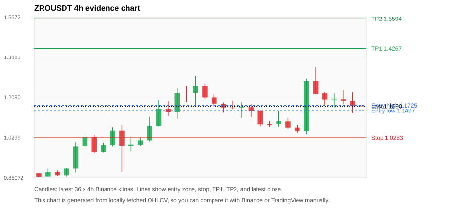
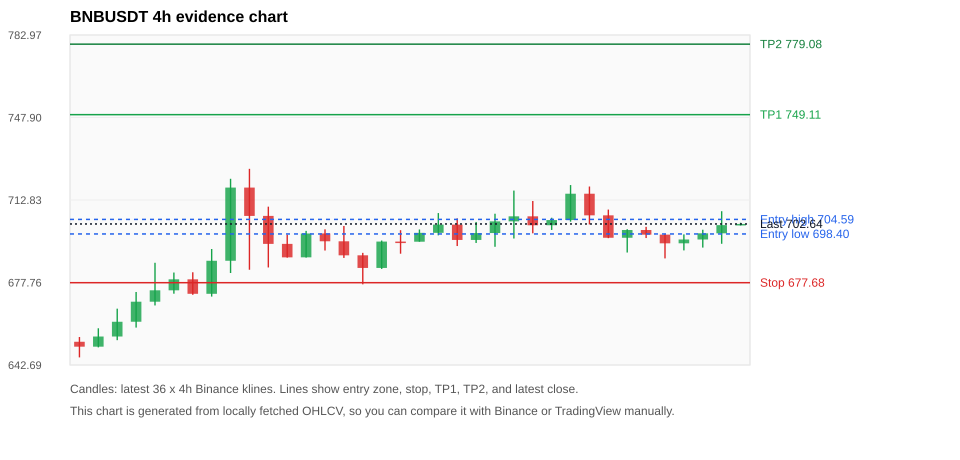
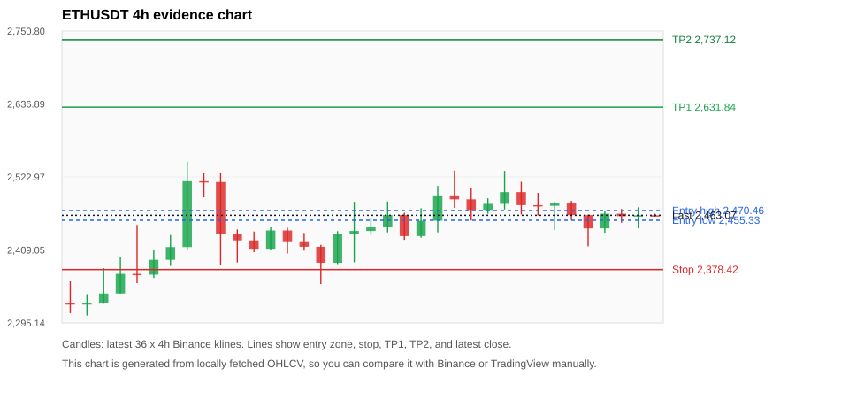
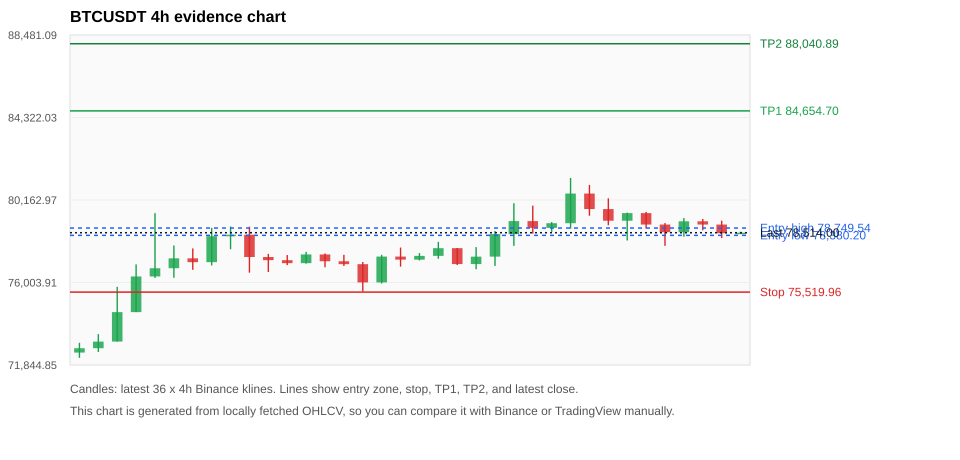
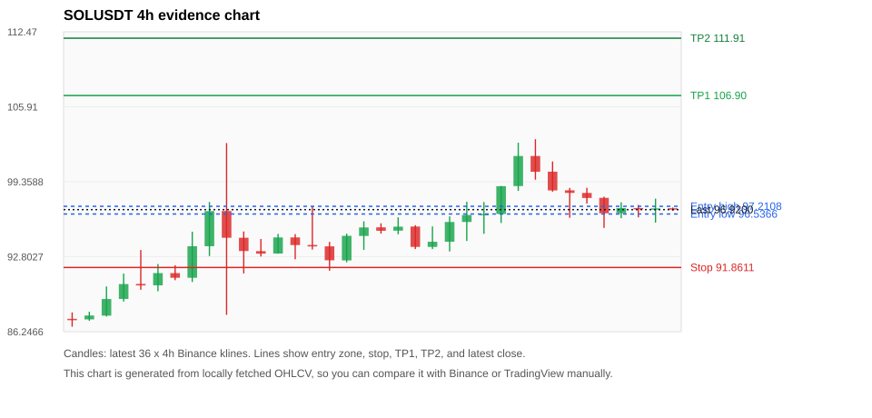

# Crypto 市场扫描报告 v1

- 报告时间：2026-08-26 20:06:38 CST
- Run ID：`20260826_120504_64db5169`
- Run type：`daily_full`
- Data validation mode：`paper`
- 数据来源：SQLite
- 报告版本：v1
- 扫描 ID：6d047ae7c4f5
- 数据源：Binance public spot API + CoinGecko/CoinMarketCap cross-check
- 过滤条件：USDT spot; 24h quote volume >= 30,000,000; trades >= 30,000; exclude stables/leveraged tokens; analyze 1h/4h/1d klines
- 默认单笔风险：账户权益的 1.00%

## 限制说明

- 交易信号仍以 Binance 现货公开 K 线为主源；外部数据源用于一致性复核。
- 结果是研究和模拟盘计划，不是确定收益或实盘下单指令。
- 历史长度过滤：候选币至少需要 180 根 1d K 线。
- 数据质量验证池：先验证 score 排名前 min(top_n * 2, 10) 的候选，再按 action + score 补足最终名单。
- 大盘环境过滤：RISK_ON; BTC/ETH 日线趋势均较强，允许山寨币买入候选。 BTC 7d=13.238967046701955; ETH 7d=9.336381392045446.
- Data cross-validation enabled: Binance primary source plus CoinGecko; CoinMarketCap is checked when an API key is configured.
- ZROUSDT validation state DEGRADED: DEGRADED: [EXTERNAL_IDENTITY_AMBIGUOUS] CoinMarketCap symbol mapping has 3 matches; selected lowest cmc_rank
- ETHUSDT validation state DEGRADED: DEGRADED: [EXTERNAL_IDENTITY_AMBIGUOUS] CoinMarketCap symbol mapping has 6 matches; selected lowest cmc_rank
- BTCUSDT validation state DEGRADED: DEGRADED: [EXTERNAL_IDENTITY_AMBIGUOUS] CoinMarketCap symbol mapping has 13 matches; selected lowest cmc_rank
- BNBUSDT validation state DEGRADED: DEGRADED: [EXTERNAL_IDENTITY_AMBIGUOUS] CoinMarketCap symbol mapping has 4 matches; selected lowest cmc_rank
- SOLUSDT validation state DEGRADED: DEGRADED: [EXTERNAL_PROVIDER_RATE_LIMITED] Provider rate limited request for https://api.coingecko.com/api/v3/coins/markets?vs_currency=usd&ids=solana&price_change_percentage=24h&per_page=1&page=1: HTTP 429; [EXTERNAL_IDENTITY_AMBIGUOUS] CoinMarketCap symbol mapping has 8 matches; selected lowest cmc_rank
- PUMPUSDT validation state BLOCKED: BLOCKED: [BINANCE_KLINE_EXTREME_RANGE] Binance candle range exceeds 40%.; [EXTERNAL_PROVIDER_RATE_LIMITED] Provider rate limited request for https://api.coingecko.com/api/v3/coins/markets?vs_currency=usd&ids=pump-fun&price_change_percentage=24h&per_page=1&page=1: HTTP 429; [EXTERNAL_IDENTITY_AMBIGUOUS] CoinMarketCap symbol mapping has 15 matches; selected lowest cmc_rank
- BMTUSDT validation state BLOCKED: BLOCKED: [BINANCE_KLINE_EXTREME_RANGE] Binance candle range exceeds 40%.; [BINANCE_KLINE_EXTREME_RANGE] Binance candle range exceeds 40%.; [BINANCE_KLINE_EXTREME_RANGE] Binance candle range exceeds 40%.; [BINANCE_KLINE_EXTREME_RANGE] Binance candle range exceeds 40%.; [BINANCE_KLINE_EXTREME_RANGE] Binance candle range exceeds 40%.; [BINANCE_KLINE_EXTREME_RANGE] Binance candle range exceeds 40%.; [BINANCE_KLINE_EXTREME_RANGE] Binance candle range exceeds 40%.; [BINANCE_KLINE_EXTREME_RANGE] Binance candle range exceeds 40%.; [EXTERNAL_PROVIDER_RATE_LIMITED] Provider rate limited request for https://api.coingecko.com/api/v3/coins/markets?vs_currency=usd&ids=bubblemaps&price_change_percentage=24h&per_page=1&page=1: HTTP 429; [EXTERNAL_IDENTITY_AMBIGUOUS] CoinMarketCap symbol mapping has 3 matches; selected lowest cmc_rank
- PEPEUSDT validation state DEGRADED: DEGRADED: [EXTERNAL_PROVIDER_RATE_LIMITED] Provider rate limited request for https://api.coingecko.com/api/v3/coins/markets?vs_currency=usd&ids=pepe&price_change_percentage=24h&per_page=1&page=1: HTTP 429; [EXTERNAL_IDENTITY_AMBIGUOUS] CoinMarketCap symbol mapping has 33 matches; selected lowest cmc_rank
- XRPUSDT validation state DEGRADED: DEGRADED: [EXTERNAL_PROVIDER_RATE_LIMITED] Provider rate limited request for https://api.coingecko.com/api/v3/coins/markets?vs_currency=usd&ids=ripple&price_change_percentage=24h&per_page=1&page=1: HTTP 429; [EXTERNAL_IDENTITY_AMBIGUOUS] CoinMarketCap symbol mapping has 3 matches; selected lowest cmc_rank
- ZECUSDT validation state BLOCKED: BLOCKED: [BINANCE_KLINE_EXTREME_RANGE] Binance candle range exceeds 40%.; [BINANCE_KLINE_EXTREME_RANGE] Binance candle range exceeds 40%.; [EXTERNAL_PROVIDER_RATE_LIMITED] Provider rate limited request for https://api.coingecko.com/api/v3/coins/markets?vs_currency=usd&ids=zcash&price_change_percentage=24h&per_page=1&page=1: HTTP 429; [EXTERNAL_IDENTITY_AMBIGUOUS] CoinMarketCap symbol mapping has 2 matches; selected lowest cmc_rank

## 5 个候选交易计划

| Rank | Coin | Action | Setup | Entry Zone | Stop Loss | TP1 | TP2 / Exit Rule | R/R | Verdict |
|---:|---|---|---|---:|---:|---:|---|---:|---|
| 1 | `ZRO` | `BUY_CANDIDATE` | 回踩支撑/4h EMA 附近 | 1.1497 - 1.1725 | 1.0283 | 1.4267 | 1.5594 或跌破 4h 关键支撑 | 2.00-3.00 | 可考虑 |
| 2 | `BNB` | `BUY_CANDIDATE` | 回踩支撑/4h EMA 附近 | 698.40 - 704.59 | 677.68 | 749.11 | 779.08 或跌破 4h 关键支撑 | 2.00-3.26 | 可考虑 |
| 3 | `ETH` | `WATCH_ONLY` | 回踩支撑/4h EMA 附近 | 2,455.33 - 2,470.46 | 2,378.42 | 2,631.84 | 2,737.12 或跌破 4h 关键支撑 | 2.00-3.25 | 只观察 |
| 4 | `BTC` | `WATCH_ONLY` | 回踩支撑/4h EMA 附近 | 78,380.20 - 78,749.54 | 75,519.96 | 84,654.70 | 88,040.89 或跌破 4h 关键支撑 | 2.00-3.11 | 只观察 |
| 5 | `SOL` | `WATCH_ONLY` | 回踩支撑/4h EMA 附近 | 96.5366 - 97.2108 | 91.8611 | 106.90 | 111.91 或跌破 4h 关键支撑 | 2.00-3.00 | 只观察 |

## 数据交叉验证摘要

价格差异以 Binance 当前价为基准；成交量口径不同，Binance 是 USDT 现货成交额，CoinGecko/CoinMarketCap 通常是全市场成交量。

| Rank | Coin | State | Identity | Max Price Diff | Max 24h Diff | Issue Codes | Message |
|---:|---|---|---|---:|---:|---|---|
| 1 | `ZRO` | DEGRADED (DATA_WARNING) | UNCONFIRMED | 0.09% | 0.34 pts | EXTERNAL_IDENTITY_AMBIGUOUS | DEGRADED: [EXTERNAL_IDENTITY_AMBIGUOUS] CoinMarketCap symbol mapping has 3 matches; selected lowest cmc_rank |
| 2 | `BNB` | DEGRADED (DATA_WARNING) | UNCONFIRMED | 0.08% | 0.10 pts | EXTERNAL_IDENTITY_AMBIGUOUS | DEGRADED: [EXTERNAL_IDENTITY_AMBIGUOUS] CoinMarketCap symbol mapping has 4 matches; selected lowest cmc_rank |
| 3 | `ETH` | DEGRADED (DATA_WARNING) | UNCONFIRMED | 0.06% | 0.08 pts | EXTERNAL_IDENTITY_AMBIGUOUS | DEGRADED: [EXTERNAL_IDENTITY_AMBIGUOUS] CoinMarketCap symbol mapping has 6 matches; selected lowest cmc_rank |
| 4 | `BTC` | DEGRADED (DATA_WARNING) | UNCONFIRMED | 0.04% | 0.03 pts | EXTERNAL_IDENTITY_AMBIGUOUS | DEGRADED: [EXTERNAL_IDENTITY_AMBIGUOUS] CoinMarketCap symbol mapping has 13 matches; selected lowest cmc_rank |
| 5 | `SOL` | DEGRADED (DATA_WARNING) | UNCONFIRMED | 0.05% | 0.02 pts | EXTERNAL_IDENTITY_AMBIGUOUS, EXTERNAL_PROVIDER_RATE_LIMITED | DEGRADED: [EXTERNAL_PROVIDER_RATE_LIMITED] Provider rate limited request for https://api.coingecko.com/api/v3/coins/markets?vs_currency=usd&ids=solana&price_change_percentage=24h&per_page=1&page=1: HTTP 429; [EXTERNAL_IDENTITY_AMBIGUOUS] CoinMarketCap symbol mapping has 8 matches; selected lowest cmc_rank |

## 候选币说明

### 1. ZRO `ZROUSDT`



- 入选原因：回踩支撑/4h EMA 附近；24h +11.02%，7d +35.46%，4h RSI 50.74，24h 成交额 $33.4M。
- 交易失效条件：跌破 1.02834 或 4h 收盘重新失守关键支撑。
- 主要风险：24h 振幅较大，回撤风险高；成交量突增，可能是事件驱动；External validation is degraded; this candidate is not a clean data sample.；Paper mode allows degraded validation; candidate is excluded from clean-data samples.。
- 数据交叉验证：DEGRADED / DATA_WARNING；身份=UNCONFIRMED；DEGRADED: [EXTERNAL_IDENTITY_AMBIGUOUS] CoinMarketCap symbol mapping has 3 matches; selected lowest cmc_rank

#### 可点击人工验证

- [Binance 交易页](https://www.binance.com/en/trade/ZRO_USDT)
- [TradingView 图表](https://www.tradingview.com/chart/?symbol=BINANCE%3AZROUSDT)
- [CoinGecko 搜索](https://www.coingecko.com/en/search?query=ZRO)
- [CoinMarketCap 搜索](https://coinmarketcap.com/search/?q=ZRO)

#### 多数据源对照

| Source | Status | Identity | Blocking | Asset ID | Price | 24h Change | 24h Volume | Price Diff | 24h Diff | Updated | Issue Codes | Message |
|---|---|---|---:|---|---:|---:|---:|---:|---:|---|---|---|
| Binance | DATA_OK | CONFIRMED | no | ZROUSDT | 1.1690 | +11.02% | $33.4M | 0.00% | 0.00 pts | 2026-08-26T12:05:30+00:00 | none | Primary market data source passed health checks. |
| CoinGecko | DATA_OK | CONFIRMED | no | layerzero | 1.1700 | +10.99% | $216.0M | 0.09% | 0.03 pts | 2026-08-26T12:03:20.000Z | none | External source agrees with Binance within thresholds. |
| CoinMarketCap | DATA_WARNING | UNCONFIRMED | no | 26997 | 1.1697 | +10.67% | $259.2M | 0.06% | 0.34 pts | 2026-08-26T12:04:04.000Z | EXTERNAL_IDENTITY_AMBIGUOUS | [EXTERNAL_IDENTITY_AMBIGUOUS] CoinMarketCap symbol mapping has 3 matches; selected lowest cmc_rank |

#### 指标证据

| 指标 | 数值 | 人工核对用途 |
|---|---:|---|
| 当前价 | 1.1690 | 与 Binance/TradingView 当前价格对照 |
| 24h 涨跌 | +11.02% | 与交易所 24h 涨跌对照 |
| 7d 涨跌 | +35.46% | 判断短线趋势是否延续 |
| 4h EMA20 | 1.1474 | 判断短期趋势支撑 |
| 4h EMA50 | 1.0550 | 判断中期趋势支撑 |
| 1d EMA20 | 0.95975 | 判断日线趋势 |
| 1d EMA50 | 0.91149 | 判断日线趋势 |
| 4h RSI14 | 50.74 | 判断是否过热/过弱 |
| 4h ATR14 | 0.07421 | 推导止损和入场缓冲 |
| 最近 18 根 4h 最低点 | 1.0440 | 支撑/止损参考 |
| 最近 36 根 4h 最高点 | 1.3440 | TP/压力参考 |
| 支撑位 | 1.1474 | 入场区间推导基础 |

#### 交易计划推导

- 支撑位 = 最近低点、4h EMA20、4h EMA50、1d EMA20 中不高于当前价的最高有效支撑 = `1.1474`。
- 入场区间 = 支撑位附近 + ATR 缓冲 = `1.1497 - 1.1725`。
- 止损 = min(最近 18 根 4h 最低点 * 0.985, 入场中位价 - 1.15 * ATR14) = `1.0283`。
- TP1 = max(最近 36 根 4h 最高点 * 0.995, 入场中位价 + 2R) = `1.4267`。
- TP2 = max(入场中位价 + 3R, TP1 * 1.04) = `1.5594`。

#### 最近 10 根 4h K线

| UTC 开盘时间 | Open | High | Low | Close | Quote Volume | Trades |
|---|---:|---:|---:|---:|---:|---:|
| 2026-08-25T00:00+00:00 | 1.0900 | 1.1510 | 1.0790 | 1.1030 | $1.5M | 11135 |
| 2026-08-25T04:00+00:00 | 1.1020 | 1.1180 | 1.0690 | 1.0750 | $792,133 | 5039 |
| 2026-08-25T08:00+00:00 | 1.0750 | 1.0870 | 1.0510 | 1.0580 | $1.1M | 5678 |
| 2026-08-25T12:00+00:00 | 1.0580 | 1.2920 | 1.0440 | 1.2810 | $16.5M | 173194 |
| 2026-08-25T16:00+00:00 | 1.2810 | 1.3440 | 1.2230 | 1.2230 | $7.4M | 73689 |
| 2026-08-25T20:00+00:00 | 1.2260 | 1.2340 | 1.1750 | 1.1990 | $1.9M | 20286 |
| 2026-08-26T00:00+00:00 | 1.1990 | 1.2260 | 1.1640 | 1.1990 | $4.3M | 42474 |
| 2026-08-26T04:00+00:00 | 1.2000 | 1.2430 | 1.1780 | 1.1940 | $1.5M | 19921 |
| 2026-08-26T08:00+00:00 | 1.1930 | 1.2330 | 1.1400 | 1.1700 | $1.8M | 19903 |
| 2026-08-26T12:00+00:00 | 1.1720 | 1.1720 | 1.1660 | 1.1690 | $15,403 | 213 |

### 2. BNB `BNBUSDT`



- 入选原因：回踩支撑/4h EMA 附近；24h +0.96%，7d +16.28%，4h RSI 53.21，24h 成交额 $90.3M。
- 交易失效条件：跌破 677.68 或 4h 收盘重新失守关键支撑。
- 主要风险：主要风险是大盘同步回撤；External validation is degraded; this candidate is not a clean data sample.；Paper mode allows degraded validation; candidate is excluded from clean-data samples.。
- 数据交叉验证：DEGRADED / DATA_WARNING；身份=UNCONFIRMED；DEGRADED: [EXTERNAL_IDENTITY_AMBIGUOUS] CoinMarketCap symbol mapping has 4 matches; selected lowest cmc_rank

#### 可点击人工验证

- [Binance 交易页](https://www.binance.com/en/trade/BNB_USDT)
- [TradingView 图表](https://www.tradingview.com/chart/?symbol=BINANCE%3ABNBUSDT)
- [CoinGecko 搜索](https://www.coingecko.com/en/search?query=BNB)
- [CoinMarketCap 搜索](https://coinmarketcap.com/search/?q=BNB)

#### 多数据源对照

| Source | Status | Identity | Blocking | Asset ID | Price | 24h Change | 24h Volume | Price Diff | 24h Diff | Updated | Issue Codes | Message |
|---|---|---|---:|---|---:|---:|---:|---:|---:|---|---|---|
| Binance | DATA_OK | CONFIRMED | no | BNBUSDT | 702.64 | +0.96% | $90.3M | 0.00% | 0.00 pts | 2026-08-26T12:05:30+00:00 | none | Primary market data source passed health checks. |
| CoinGecko | DATA_OK | CONFIRMED | no | binancecoin | 702.08 | +0.88% | $857.5M | 0.08% | 0.08 pts | 2026-08-26T12:03:20.000Z | none | External source agrees with Binance within thresholds. |
| CoinMarketCap | DATA_WARNING | UNCONFIRMED | no | 1839 | 702.39 | +0.86% | $1.50B | 0.03% | 0.10 pts | 2026-08-26T12:04:04.000Z | EXTERNAL_IDENTITY_AMBIGUOUS | [EXTERNAL_IDENTITY_AMBIGUOUS] CoinMarketCap symbol mapping has 4 matches; selected lowest cmc_rank |

#### 指标证据

| 指标 | 数值 | 人工核对用途 |
|---|---:|---|
| 当前价 | 702.64 | 与 Binance/TradingView 当前价格对照 |
| 24h 涨跌 | +0.96% | 与交易所 24h 涨跌对照 |
| 7d 涨跌 | +16.28% | 判断短线趋势是否延续 |
| 4h EMA20 | 697.00 | 判断短期趋势支撑 |
| 4h EMA50 | 676.17 | 判断中期趋势支撑 |
| 1d EMA20 | 647.81 | 判断日线趋势 |
| 1d EMA50 | 617.64 | 判断日线趋势 |
| 4h RSI14 | 53.21 | 判断是否过热/过弱 |
| 4h ATR14 | 10.8336 | 推导止损和入场缓冲 |
| 最近 18 根 4h 最低点 | 688.00 | 支撑/止损参考 |
| 最近 36 根 4h 最高点 | 726.08 | TP/压力参考 |
| 支撑位 | 697.00 | 入场区间推导基础 |

#### 交易计划推导

- 支撑位 = 最近低点、4h EMA20、4h EMA50、1d EMA20 中不高于当前价的最高有效支撑 = `697.00`。
- 入场区间 = 支撑位附近 + ATR 缓冲 = `698.40 - 704.59`。
- 止损 = min(最近 18 根 4h 最低点 * 0.985, 入场中位价 - 1.15 * ATR14) = `677.68`。
- TP1 = max(最近 36 根 4h 最高点 * 0.995, 入场中位价 + 2R) = `749.11`。
- TP2 = max(入场中位价 + 3R, TP1 * 1.04) = `779.08`。

#### 最近 10 根 4h K线

| UTC 开盘时间 | Open | High | Low | Close | Quote Volume | Trades |
|---|---:|---:|---:|---:|---:|---:|
| 2026-08-25T00:00+00:00 | 704.31 | 719.18 | 703.62 | 715.50 | $27.6M | 263482 |
| 2026-08-25T04:00+00:00 | 715.50 | 718.56 | 702.44 | 706.31 | $23.4M | 234203 |
| 2026-08-25T08:00+00:00 | 706.31 | 708.76 | 696.61 | 696.78 | $28.8M | 267716 |
| 2026-08-25T12:00+00:00 | 696.78 | 700.42 | 690.50 | 700.07 | $23.2M | 234084 |
| 2026-08-25T16:00+00:00 | 700.08 | 701.43 | 696.66 | 698.10 | $9.8M | 88970 |
| 2026-08-25T20:00+00:00 | 698.11 | 698.40 | 688.00 | 694.41 | $10.1M | 110862 |
| 2026-08-26T00:00+00:00 | 694.42 | 698.21 | 691.40 | 696.04 | $10.4M | 120459 |
| 2026-08-26T04:00+00:00 | 696.04 | 700.19 | 692.60 | 698.67 | $11.8M | 125043 |
| 2026-08-26T08:00+00:00 | 698.67 | 708.06 | 694.22 | 702.15 | $25.4M | 170783 |
| 2026-08-26T12:00+00:00 | 702.15 | 703.16 | 702.01 | 702.64 | $475,622 | 3975 |

### 3. ETH `ETHUSDT`



- 入选原因：回踩支撑/4h EMA 附近；24h -0.58%，7d +27.43%，4h RSI 52.28，24h 成交额 $642.5M。
- 交易失效条件：跌破 2378.4204 或 4h 收盘重新失守关键支撑。
- 主要风险：24h 动量未确认；External validation is degraded; this candidate is not a clean data sample.；Paper mode allows degraded validation; candidate is excluded from clean-data samples.。
- 数据交叉验证：DEGRADED / DATA_WARNING；身份=UNCONFIRMED；DEGRADED: [EXTERNAL_IDENTITY_AMBIGUOUS] CoinMarketCap symbol mapping has 6 matches; selected lowest cmc_rank

#### 可点击人工验证

- [Binance 交易页](https://www.binance.com/en/trade/ETH_USDT)
- [TradingView 图表](https://www.tradingview.com/chart/?symbol=BINANCE%3AETHUSDT)
- [CoinGecko 搜索](https://www.coingecko.com/en/search?query=ETH)
- [CoinMarketCap 搜索](https://coinmarketcap.com/search/?q=ETH)

#### 多数据源对照

| Source | Status | Identity | Blocking | Asset ID | Price | 24h Change | 24h Volume | Price Diff | 24h Diff | Updated | Issue Codes | Message |
|---|---|---|---:|---|---:|---:|---:|---:|---:|---|---|---|
| Binance | DATA_OK | CONFIRMED | no | ETHUSDT | 2,463.07 | -0.58% | $642.5M | 0.00% | 0.00 pts | 2026-08-26T12:05:30+00:00 | none | Primary market data source passed health checks. |
| CoinGecko | DATA_OK | CONFIRMED | no | ethereum | 2,461.65 | -0.61% | $12.21B | 0.06% | 0.03 pts | 2026-08-26T12:03:20.000Z | none | External source agrees with Binance within thresholds. |
| CoinMarketCap | DATA_WARNING | UNCONFIRMED | no | 1027 | 2,461.59 | -0.66% | $13.51B | 0.06% | 0.08 pts | 2026-08-26T12:04:04.000Z | EXTERNAL_IDENTITY_AMBIGUOUS | [EXTERNAL_IDENTITY_AMBIGUOUS] CoinMarketCap symbol mapping has 6 matches; selected lowest cmc_rank |

#### 指标证据

| 指标 | 数值 | 人工核对用途 |
|---|---:|---|
| 当前价 | 2,463.07 | 与 Binance/TradingView 当前价格对照 |
| 24h 涨跌 | -0.58% | 与交易所 24h 涨跌对照 |
| 7d 涨跌 | +27.43% | 判断短线趋势是否延续 |
| 4h EMA20 | 2,450.43 | 判断短期趋势支撑 |
| 4h EMA50 | 2,339.47 | 判断中期趋势支撑 |
| 1d EMA20 | 2,188.57 | 判断日线趋势 |
| 1d EMA50 | 2,022.19 | 判断日线趋势 |
| 4h RSI14 | 52.28 | 判断是否过热/过弱 |
| 4h ATR14 | 40.6743 | 推导止损和入场缓冲 |
| 最近 18 根 4h 最低点 | 2,414.64 | 支撑/止损参考 |
| 最近 36 根 4h 最高点 | 2,546.78 | TP/压力参考 |
| 支撑位 | 2,450.43 | 入场区间推导基础 |

#### 交易计划推导

- 支撑位 = 最近低点、4h EMA20、4h EMA50、1d EMA20 中不高于当前价的最高有效支撑 = `2,450.43`。
- 入场区间 = 支撑位附近 + ATR 缓冲 = `2,455.33 - 2,470.46`。
- 止损 = min(最近 18 根 4h 最低点 * 0.985, 入场中位价 - 1.15 * ATR14) = `2,378.42`。
- TP1 = max(最近 36 根 4h 最高点 * 0.995, 入场中位价 + 2R) = `2,631.84`。
- TP2 = max(入场中位价 + 3R, TP1 * 1.04) = `2,737.12`。

#### 最近 10 根 4h K线

| UTC 开盘时间 | Open | High | Low | Close | Quote Volume | Trades |
|---|---:|---:|---:|---:|---:|---:|
| 2026-08-25T00:00+00:00 | 2,482.31 | 2,532.50 | 2,472.18 | 2,499.29 | $191.4M | 813592 |
| 2026-08-25T04:00+00:00 | 2,499.30 | 2,515.43 | 2,464.41 | 2,478.94 | $128.5M | 468453 |
| 2026-08-25T08:00+00:00 | 2,478.94 | 2,498.00 | 2,462.81 | 2,477.91 | $109.3M | 507427 |
| 2026-08-25T12:00+00:00 | 2,477.90 | 2,484.00 | 2,440.00 | 2,482.88 | $190.4M | 825688 |
| 2026-08-25T16:00+00:00 | 2,482.89 | 2,485.60 | 2,455.54 | 2,463.42 | $105.7M | 366829 |
| 2026-08-25T20:00+00:00 | 2,463.42 | 2,464.24 | 2,414.64 | 2,442.64 | $120.7M | 510239 |
| 2026-08-26T00:00+00:00 | 2,442.65 | 2,469.82 | 2,435.81 | 2,465.57 | $59.8M | 335934 |
| 2026-08-26T04:00+00:00 | 2,465.56 | 2,472.86 | 2,451.49 | 2,461.78 | $70.9M | 267230 |
| 2026-08-26T08:00+00:00 | 2,461.78 | 2,475.61 | 2,442.76 | 2,463.09 | $96.8M | 416910 |
| 2026-08-26T12:00+00:00 | 2,463.09 | 2,465.63 | 2,460.86 | 2,463.07 | $1.2M | 6896 |

### 4. BTC `BTCUSDT`



- 入选原因：回踩支撑/4h EMA 附近；24h -0.60%，7d +20.77%，4h RSI 57.78，24h 成交额 $1.32B。
- 交易失效条件：跌破 75519.96 或 4h 收盘重新失守关键支撑。
- 主要风险：24h 动量未确认；External validation is degraded; this candidate is not a clean data sample.；Paper mode allows degraded validation; candidate is excluded from clean-data samples.。
- 数据交叉验证：DEGRADED / DATA_WARNING；身份=UNCONFIRMED；DEGRADED: [EXTERNAL_IDENTITY_AMBIGUOUS] CoinMarketCap symbol mapping has 13 matches; selected lowest cmc_rank

#### 可点击人工验证

- [Binance 交易页](https://www.binance.com/en/trade/BTC_USDT)
- [TradingView 图表](https://www.tradingview.com/chart/?symbol=BINANCE%3ABTCUSDT)
- [CoinGecko 搜索](https://www.coingecko.com/en/search?query=BTC)
- [CoinMarketCap 搜索](https://coinmarketcap.com/search/?q=BTC)

#### 多数据源对照

| Source | Status | Identity | Blocking | Asset ID | Price | 24h Change | 24h Volume | Price Diff | 24h Diff | Updated | Issue Codes | Message |
|---|---|---|---:|---|---:|---:|---:|---:|---:|---|---|---|
| Binance | DATA_OK | CONFIRMED | no | BTCUSDT | 78,514.00 | -0.60% | $1.32B | 0.00% | 0.00 pts | 2026-08-26T12:05:30+00:00 | none | Primary market data source passed health checks. |
| CoinGecko | DATA_OK | CONFIRMED | no | bitcoin | 78,479.00 | -0.63% | $31.31B | 0.04% | 0.03 pts | 2026-08-26T12:03:20.000Z | none | External source agrees with Binance within thresholds. |
| CoinMarketCap | DATA_WARNING | UNCONFIRMED | no | 1 | 78,501.40 | -0.59% | $33.10B | 0.02% | 0.01 pts | 2026-08-26T12:04:04.000Z | EXTERNAL_IDENTITY_AMBIGUOUS | [EXTERNAL_IDENTITY_AMBIGUOUS] CoinMarketCap symbol mapping has 13 matches; selected lowest cmc_rank |

#### 指标证据

| 指标 | 数值 | 人工核对用途 |
|---|---:|---|
| 当前价 | 78,514.00 | 与 Binance/TradingView 当前价格对照 |
| 24h 涨跌 | -0.60% | 与交易所 24h 涨跌对照 |
| 7d 涨跌 | +20.77% | 判断短线趋势是否延续 |
| 4h EMA20 | 78,223.76 | 判断短期趋势支撑 |
| 4h EMA50 | 75,088.92 | 判断中期趋势支撑 |
| 1d EMA20 | 71,134.99 | 判断日线趋势 |
| 1d EMA50 | 67,735.91 | 判断日线趋势 |
| 4h RSI14 | 57.78 | 判断是否过热/过弱 |
| 4h ATR14 | 1,225.15 | 推导止损和入场缓冲 |
| 最近 18 根 4h 最低点 | 76,670.01 | 支撑/止损参考 |
| 最近 36 根 4h 最高点 | 81,272.62 | TP/压力参考 |
| 支撑位 | 78,223.76 | 入场区间推导基础 |

#### 交易计划推导

- 支撑位 = 最近低点、4h EMA20、4h EMA50、1d EMA20 中不高于当前价的最高有效支撑 = `78,223.76`。
- 入场区间 = 支撑位附近 + ATR 缓冲 = `78,380.20 - 78,749.54`。
- 止损 = min(最近 18 根 4h 最低点 * 0.985, 入场中位价 - 1.15 * ATR14) = `75,519.96`。
- TP1 = max(最近 36 根 4h 最高点 * 0.995, 入场中位价 + 2R) = `84,654.70`。
- TP2 = max(入场中位价 + 3R, TP1 * 1.04) = `88,040.89`。

#### 最近 10 根 4h K线

| UTC 开盘时间 | Open | High | Low | Close | Quote Volume | Trades |
|---|---:|---:|---:|---:|---:|---:|
| 2026-08-25T00:00+00:00 | 78,992.76 | 81,272.62 | 78,715.63 | 80,488.01 | $552.0M | 1567814 |
| 2026-08-25T04:00+00:00 | 80,488.01 | 80,923.69 | 79,369.17 | 79,705.79 | $317.3M | 860532 |
| 2026-08-25T08:00+00:00 | 79,705.79 | 80,249.00 | 78,888.00 | 79,117.99 | $295.6M | 921083 |
| 2026-08-25T12:00+00:00 | 79,118.00 | 79,527.09 | 78,120.74 | 79,502.01 | $375.1M | 1483533 |
| 2026-08-25T16:00+00:00 | 79,502.01 | 79,563.71 | 78,728.35 | 78,925.95 | $205.4M | 649705 |
| 2026-08-25T20:00+00:00 | 78,925.96 | 79,000.00 | 77,851.00 | 78,539.14 | $226.7M | 877535 |
| 2026-08-26T00:00+00:00 | 78,539.13 | 79,251.60 | 78,312.00 | 79,088.62 | $174.3M | 675988 |
| 2026-08-26T04:00+00:00 | 79,088.61 | 79,206.00 | 78,638.00 | 78,925.56 | $155.9M | 570851 |
| 2026-08-26T08:00+00:00 | 78,925.57 | 79,119.37 | 78,244.83 | 78,487.26 | $183.3M | 658841 |
| 2026-08-26T12:00+00:00 | 78,487.26 | 78,562.00 | 78,464.00 | 78,514.00 | $5.5M | 16183 |

### 5. SOL `SOLUSDT`



- 入选原因：回踩支撑/4h EMA 附近；24h -1.58%，7d +23.61%，4h RSI 60.59，24h 成交额 $250.7M。
- 交易失效条件：跌破 91.8611 或 4h 收盘重新失守关键支撑。
- 主要风险：24h 动量未确认；External validation is degraded; this candidate is not a clean data sample.；Paper mode allows degraded validation; candidate is excluded from clean-data samples.。
- 数据交叉验证：DEGRADED / DATA_WARNING；身份=UNCONFIRMED；DEGRADED: [EXTERNAL_PROVIDER_RATE_LIMITED] Provider rate limited request for https://api.coingecko.com/api/v3/coins/markets?vs_currency=usd&ids=solana&price_change_percentage=24h&per_page=1&page=1: HTTP 429; [EXTERNAL_IDENTITY_AMBIGUOUS] CoinMarketCap symbol mapping has 8 matches; selected lowest cmc_rank

#### 可点击人工验证

- [Binance 交易页](https://www.binance.com/en/trade/SOL_USDT)
- [TradingView 图表](https://www.tradingview.com/chart/?symbol=BINANCE%3ASOLUSDT)
- [CoinGecko 搜索](https://www.coingecko.com/en/search?query=SOL)
- [CoinMarketCap 搜索](https://coinmarketcap.com/search/?q=SOL)

#### 多数据源对照

| Source | Status | Identity | Blocking | Asset ID | Price | 24h Change | 24h Volume | Price Diff | 24h Diff | Updated | Issue Codes | Message |
|---|---|---|---:|---|---:|---:|---:|---:|---:|---|---|---|
| Binance | DATA_OK | CONFIRMED | no | SOLUSDT | 96.9200 | -1.58% | $250.7M | 0.00% | 0.00 pts | 2026-08-26T12:05:30+00:00 | none | Primary market data source passed health checks. |
| CoinGecko | DATA_WARNING | UNCONFIRMED | no | n/a | n/a | n/a | n/a | n/a | n/a | 2026-08-26T12:05:30+00:00 | EXTERNAL_PROVIDER_RATE_LIMITED | Provider rate limited request for https://api.coingecko.com/api/v3/coins/markets?vs_currency=usd&ids=solana&price_change_percentage=24h&per_page=1&page=1: HTTP 429 |
| CoinMarketCap | DATA_WARNING | UNCONFIRMED | no | 5426 | 96.9669 | -1.60% | $3.48B | 0.05% | 0.02 pts | 2026-08-26T12:04:04.000Z | EXTERNAL_IDENTITY_AMBIGUOUS | [EXTERNAL_IDENTITY_AMBIGUOUS] CoinMarketCap symbol mapping has 8 matches; selected lowest cmc_rank |

#### 指标证据

| 指标 | 数值 | 人工核对用途 |
|---|---:|---|
| 当前价 | 96.9200 | 与 Binance/TradingView 当前价格对照 |
| 24h 涨跌 | -1.58% | 与交易所 24h 涨跌对照 |
| 7d 涨跌 | +23.61% | 判断短线趋势是否延续 |
| 4h EMA20 | 96.3439 | 判断短期趋势支撑 |
| 4h EMA50 | 91.6063 | 判断中期趋势支撑 |
| 1d EMA20 | 85.8631 | 判断日线趋势 |
| 1d EMA50 | 80.5839 | 判断日线趋势 |
| 4h RSI14 | 60.59 | 判断是否过热/过弱 |
| 4h ATR14 | 2.4636 | 推导止损和入场缓冲 |
| 最近 18 根 4h 最低点 | 93.2600 | 支撑/止损参考 |
| 最近 36 根 4h 最高点 | 103.08 | TP/压力参考 |
| 支撑位 | 96.3439 | 入场区间推导基础 |

#### 交易计划推导

- 支撑位 = 最近低点、4h EMA20、4h EMA50、1d EMA20 中不高于当前价的最高有效支撑 = `96.3439`。
- 入场区间 = 支撑位附近 + ATR 缓冲 = `96.5366 - 97.2108`。
- 止损 = min(最近 18 根 4h 最低点 * 0.985, 入场中位价 - 1.15 * ATR14) = `91.8611`。
- TP1 = max(最近 36 根 4h 最高点 * 0.995, 入场中位价 + 2R) = `106.90`。
- TP2 = max(入场中位价 + 3R, TP1 * 1.04) = `111.91`。

#### 最近 10 根 4h K线

| UTC 开盘时间 | Open | High | Low | Close | Quote Volume | Trades |
|---|---:|---:|---:|---:|---:|---:|
| 2026-08-25T00:00+00:00 | 98.9800 | 102.77 | 98.5600 | 101.61 | $183.8M | 754531 |
| 2026-08-25T04:00+00:00 | 101.61 | 103.08 | 99.5400 | 100.23 | $84.8M | 335566 |
| 2026-08-25T08:00+00:00 | 100.24 | 101.13 | 98.4900 | 98.6000 | $66.5M | 296750 |
| 2026-08-25T12:00+00:00 | 98.6100 | 98.8200 | 96.2100 | 98.3800 | $79.4M | 477758 |
| 2026-08-25T16:00+00:00 | 98.3800 | 98.8300 | 97.4500 | 97.9400 | $39.5M | 190215 |
| 2026-08-25T20:00+00:00 | 97.9500 | 98.0500 | 95.3200 | 96.6000 | $42.4M | 223281 |
| 2026-08-26T00:00+00:00 | 96.6000 | 97.5600 | 96.1700 | 97.0600 | $30.5M | 134558 |
| 2026-08-26T04:00+00:00 | 97.0600 | 97.3300 | 96.2500 | 96.9500 | $27.4M | 121997 |
| 2026-08-26T08:00+00:00 | 96.9500 | 97.8800 | 95.7800 | 97.0300 | $32.6M | 163175 |
| 2026-08-26T12:00+00:00 | 97.0400 | 97.1100 | 96.8100 | 96.9200 | $1.1M | 3932 |

## 组合风控

- 不要 5 个候选全部满仓买入。
- 同时持仓总风险建议控制在账户权益的 3% - 5% 以内。
- 如果 BTC/ETH 同时破位，暂停山寨币多头计划或降低仓位。
- 第一版报告用于模拟盘和人工复核，不自动下单。

## 原始数据

```json
[
  {
    "rank": 1,
    "symbol": "ZROUSDT",
    "base_asset": "ZRO",
    "price": 1.169,
    "score": 77.31932115699172,
    "setup": "回踩支撑/4h EMA 附近",
    "verdict": "可考虑",
    "entry_low": 1.149718888082447,
    "entry_high": 1.172507,
    "stop_loss": 1.02834,
    "take_profit_1": 1.4266588321236706,
    "take_profit_2": 1.5594317761648941,
    "risk_reward_1": 2.0,
    "risk_reward_2": 3.0,
    "pct_24h": 11.016,
    "pct_3d": -6.330128205128204,
    "pct_7d": 35.4577056778679,
    "quote_volume_24h": 33356759.01493,
    "trades_24h": 349388,
    "high_low_range_24h": 28.735632183908045,
    "rsi_1h": 46.41509433962266,
    "rsi_4h": 50.73995771670191,
    "ema20_4h": 1.147424040002442,
    "ema50_4h": 1.0549839357272197,
    "ema20_1d": 0.9597513732683836,
    "ema50_1d": 0.9114871576095531,
    "atr_4h": 0.07421428571428572,
    "macd_hist_4h": -0.006927567071923026,
    "volume_ratio_24h": 3.798772116387573,
    "support_level": 1.147424040002442,
    "recent_low_4h_18": 1.044,
    "recent_high_4h_36": 1.344,
    "distance_to_support_pct": 1.880382425795446,
    "binance_trade_url": "https://www.binance.com/en/trade/ZRO_USDT",
    "tradingview_url": "https://www.tradingview.com/chart/?symbol=BINANCE%3AZROUSDT",
    "coingecko_search_url": "https://www.coingecko.com/en/search?query=ZRO",
    "coinmarketcap_search_url": "https://coinmarketcap.com/search/?q=ZRO",
    "invalidation": "跌破 1.02834 或 4h 收盘重新失守关键支撑",
    "recent_4h_klines": [
      {
        "open_time_utc": "2026-08-20T16:00+00:00",
        "open": 0.87,
        "high": 0.872,
        "low": 0.855,
        "close": 0.855,
        "quote_volume": 447839.18285,
        "trades": 4509
      },
      {
        "open_time_utc": "2026-08-20T20:00+00:00",
        "open": 0.856,
        "high": 0.891,
        "low": 0.856,
        "close": 0.875,
        "quote_volume": 306640.34633,
        "trades": 3502
      },
      {
        "open_time_utc": "2026-08-21T00:00+00:00",
        "open": 0.876,
        "high": 0.883,
        "low": 0.859,
        "close": 0.861,
        "quote_volume": 949418.18255,
        "trades": 6046
      },
      {
        "open_time_utc": "2026-08-21T04:00+00:00",
        "open": 0.861,
        "high": 0.895,
        "low": 0.856,
        "close": 0.891,
        "quote_volume": 873609.64587,
        "trades": 9952
      },
      {
        "open_time_utc": "2026-08-21T08:00+00:00",
        "open": 0.891,
        "high": 1.01,
        "low": 0.874,
        "close": 0.991,
        "quote_volume": 3980483.26126,
        "trades": 32795
      },
      {
        "open_time_utc": "2026-08-21T12:00+00:00",
        "open": 0.992,
        "high": 1.049,
        "low": 0.976,
        "close": 1.031,
        "quote_volume": 2269712.42851,
        "trades": 21240
      },
      {
        "open_time_utc": "2026-08-21T16:00+00:00",
        "open": 1.031,
        "high": 1.041,
        "low": 0.96,
        "close": 0.965,
        "quote_volume": 1738574.39202,
        "trades": 14499
      },
      {
        "open_time_utc": "2026-08-21T20:00+00:00",
        "open": 0.965,
        "high": 1.007,
        "low": 0.963,
        "close": 0.997,
        "quote_volume": 1144238.43009,
        "trades": 9081
      },
      {
        "open_time_utc": "2026-08-22T00:00+00:00",
        "open": 0.997,
        "high": 1.077,
        "low": 0.991,
        "close": 1.062,
        "quote_volume": 1257846.9774,
        "trades": 7923
      },
      {
        "open_time_utc": "2026-08-22T04:00+00:00",
        "open": 1.062,
        "high": 1.087,
        "low": 0.876,
        "close": 0.993,
        "quote_volume": 3488597.20703,
        "trades": 29212
      },
      {
        "open_time_utc": "2026-08-22T08:00+00:00",
        "open": 0.993,
        "high": 1.034,
        "low": 0.967,
        "close": 0.999,
        "quote_volume": 1083911.09033,
        "trades": 8735
      },
      {
        "open_time_utc": "2026-08-22T12:00+00:00",
        "open": 0.998,
        "high": 1.027,
        "low": 0.993,
        "close": 1.017,
        "quote_volume": 649908.20828,
        "trades": 5214
      },
      {
        "open_time_utc": "2026-08-22T16:00+00:00",
        "open": 1.017,
        "high": 1.123,
        "low": 1.012,
        "close": 1.081,
        "quote_volume": 1962945.41031,
        "trades": 12592
      },
      {
        "open_time_utc": "2026-08-22T20:00+00:00",
        "open": 1.081,
        "high": 1.196,
        "low": 1.08,
        "close": 1.158,
        "quote_volume": 2895146.53725,
        "trades": 21274
      },
      {
        "open_time_utc": "2026-08-23T00:00+00:00",
        "open": 1.159,
        "high": 1.191,
        "low": 1.126,
        "close": 1.143,
        "quote_volume": 1886755.48196,
        "trades": 20993
      },
      {
        "open_time_utc": "2026-08-23T04:00+00:00",
        "open": 1.144,
        "high": 1.25,
        "low": 1.114,
        "close": 1.229,
        "quote_volume": 3260821.32391,
        "trades": 27070
      },
      {
        "open_time_utc": "2026-08-23T08:00+00:00",
        "open": 1.23,
        "high": 1.261,
        "low": 1.188,
        "close": 1.228,
        "quote_volume": 2464777.20074,
        "trades": 22230
      },
      {
        "open_time_utc": "2026-08-23T12:00+00:00",
        "open": 1.228,
        "high": 1.304,
        "low": 1.166,
        "close": 1.26,
        "quote_volume": 4456146.29536,
        "trades": 34116
      },
      {
        "open_time_utc": "2026-08-23T16:00+00:00",
        "open": 1.261,
        "high": 1.27,
        "low": 1.203,
        "close": 1.208,
        "quote_volume": 1364992.28912,
        "trades": 12076
      },
      {
        "open_time_utc": "2026-08-23T20:00+00:00",
        "open": 1.208,
        "high": 1.221,
        "low": 1.168,
        "close": 1.181,
        "quote_volume": 1215090.34526,
        "trades": 8218
      },
      {
        "open_time_utc": "2026-08-24T00:00+00:00",
        "open": 1.18,
        "high": 1.186,
        "low": 1.141,
        "close": 1.164,
        "quote_volume": 1001182.99923,
        "trades": 13293
      },
      {
        "open_time_utc": "2026-08-24T04:00+00:00",
        "open": 1.164,
        "high": 1.194,
        "low": 1.156,
        "close": 1.162,
        "quote_volume": 548220.5747,
        "trades": 10157
      },
      {
        "open_time_utc": "2026-08-24T08:00+00:00",
        "open": 1.162,
        "high": 1.188,
        "low": 1.118,
        "close": 1.165,
        "quote_volume": 737925.02312,
        "trades": 10471
      },
      {
        "open_time_utc": "2026-08-24T12:00+00:00",
        "open": 1.165,
        "high": 1.178,
        "low": 1.12,
        "close": 1.149,
        "quote_volume": 1980446.28708,
        "trades": 20755
      },
      {
        "open_time_utc": "2026-08-24T16:00+00:00",
        "open": 1.15,
        "high": 1.153,
        "low": 1.08,
        "close": 1.089,
        "quote_volume": 710388.00364,
        "trades": 6967
      },
      {
        "open_time_utc": "2026-08-24T20:00+00:00",
        "open": 1.09,
        "high": 1.105,
        "low": 1.078,
        "close": 1.089,
        "quote_volume": 247283.7593,
        "trades": 2339
      },
      {
        "open_time_utc": "2026-08-25T00:00+00:00",
        "open": 1.09,
        "high": 1.151,
        "low": 1.079,
        "close": 1.103,
        "quote_volume": 1471744.28274,
        "trades": 11135
      },
      {
        "open_time_utc": "2026-08-25T04:00+00:00",
        "open": 1.102,
        "high": 1.118,
        "low": 1.069,
        "close": 1.075,
        "quote_volume": 792132.59818,
        "trades": 5039
      },
      {
        "open_time_utc": "2026-08-25T08:00+00:00",
        "open": 1.075,
        "high": 1.087,
        "low": 1.051,
        "close": 1.058,
        "quote_volume": 1092097.44084,
        "trades": 5678
      },
      {
        "open_time_utc": "2026-08-25T12:00+00:00",
        "open": 1.058,
        "high": 1.292,
        "low": 1.044,
        "close": 1.281,
        "quote_volume": 16470899.34463,
        "trades": 173194
      },
      {
        "open_time_utc": "2026-08-25T16:00+00:00",
        "open": 1.281,
        "high": 1.344,
        "low": 1.223,
        "close": 1.223,
        "quote_volume": 7418295.05792,
        "trades": 73689
      },
      {
        "open_time_utc": "2026-08-25T20:00+00:00",
        "open": 1.226,
        "high": 1.234,
        "low": 1.175,
        "close": 1.199,
        "quote_volume": 1878245.97581,
        "trades": 20286
      },
      {
        "open_time_utc": "2026-08-26T00:00+00:00",
        "open": 1.199,
        "high": 1.226,
        "low": 1.164,
        "close": 1.199,
        "quote_volume": 4315139.50771,
        "trades": 42474
      },
      {
        "open_time_utc": "2026-08-26T04:00+00:00",
        "open": 1.2,
        "high": 1.243,
        "low": 1.178,
        "close": 1.194,
        "quote_volume": 1536119.95411,
        "trades": 19921
      },
      {
        "open_time_utc": "2026-08-26T08:00+00:00",
        "open": 1.193,
        "high": 1.233,
        "low": 1.14,
        "close": 1.17,
        "quote_volume": 1756696.06739,
        "trades": 19903
      },
      {
        "open_time_utc": "2026-08-26T12:00+00:00",
        "open": 1.172,
        "high": 1.172,
        "low": 1.166,
        "close": 1.169,
        "quote_volume": 15403.4941,
        "trades": 213
      }
    ],
    "risks": [
      "24h 振幅较大，回撤风险高",
      "成交量突增，可能是事件驱动",
      "External validation is degraded; this candidate is not a clean data sample.",
      "Paper mode allows degraded validation; candidate is excluded from clean-data samples."
    ],
    "data_quality_status": "DATA_WARNING",
    "data_quality_message": "DEGRADED: [EXTERNAL_IDENTITY_AMBIGUOUS] CoinMarketCap symbol mapping has 3 matches; selected lowest cmc_rank",
    "data_checks": [
      {
        "provider": "Binance",
        "status": "DATA_OK",
        "provider_asset_id": "ZROUSDT",
        "provider_symbol": "ZROUSDT",
        "price_usd": 1.169,
        "pct_24h": 11.016,
        "volume_24h": 33356759.01493,
        "last_updated": null,
        "fetched_at_utc": "2026-08-26T12:05:30+00:00",
        "price_diff_pct": 0.0,
        "pct_24h_diff": 0.0,
        "volume_note": "Binance USDT spot 24h quoteVolume.",
        "message": "Primary market data source passed health checks.",
        "blocking": false,
        "identity_status": "CONFIRMED",
        "issues": []
      },
      {
        "provider": "CoinGecko",
        "status": "DATA_OK",
        "provider_asset_id": "layerzero",
        "provider_symbol": "ZRO",
        "price_usd": 1.17,
        "pct_24h": 10.98943,
        "volume_24h": 216035479.0,
        "last_updated": "2026-08-26T12:03:20.000Z",
        "fetched_at_utc": "2026-08-26T12:05:30+00:00",
        "price_diff_pct": 0.08554319931564498,
        "pct_24h_diff": 0.02656999999999954,
        "volume_note": "CoinGecko total market volume; not the same venue scope as Binance quoteVolume.",
        "message": "External source agrees with Binance within thresholds.",
        "blocking": false,
        "identity_status": "CONFIRMED",
        "issues": []
      },
      {
        "provider": "CoinMarketCap",
        "status": "DATA_WARNING",
        "provider_asset_id": "26997",
        "provider_symbol": "ZRO",
        "price_usd": 1.1696512250776059,
        "pct_24h": 10.67316222,
        "volume_24h": 259246706.8953893,
        "last_updated": "2026-08-26T12:04:04.000Z",
        "fetched_at_utc": "2026-08-26T12:05:30+00:00",
        "price_diff_pct": 0.0557078766129892,
        "pct_24h_diff": 0.34283778,
        "volume_note": "CoinMarketCap total market volume; not the same venue scope as Binance quoteVolume.",
        "message": "[EXTERNAL_IDENTITY_AMBIGUOUS] CoinMarketCap symbol mapping has 3 matches; selected lowest cmc_rank",
        "blocking": false,
        "identity_status": "UNCONFIRMED",
        "issues": [
          {
            "provider": "CoinMarketCap",
            "code": "EXTERNAL_IDENTITY_AMBIGUOUS",
            "severity": "WARNING",
            "blocking": false,
            "message": "CoinMarketCap symbol mapping has 3 matches; selected lowest cmc_rank",
            "context": {}
          }
        ]
      }
    ],
    "action": "BUY_CANDIDATE",
    "data_quality_state": "DEGRADED",
    "data_quality_issues": [
      {
        "provider": "CoinMarketCap",
        "code": "EXTERNAL_IDENTITY_AMBIGUOUS",
        "severity": "WARNING",
        "blocking": false,
        "message": "CoinMarketCap symbol mapping has 3 matches; selected lowest cmc_rank",
        "context": {}
      }
    ],
    "external_identity_status": "UNCONFIRMED"
  },
  {
    "rank": 2,
    "symbol": "BNBUSDT",
    "base_asset": "BNB",
    "price": 702.64,
    "score": 63.650934784715446,
    "setup": "回踩支撑/4h EMA 附近",
    "verdict": "可考虑",
    "entry_low": 698.3959062014809,
    "entry_high": 704.5854023966875,
    "stop_loss": 677.68,
    "take_profit_1": 749.1119628972527,
    "take_profit_2": 779.0764414131429,
    "risk_reward_1": 2.0,
    "risk_reward_2": 3.258448345833259,
    "pct_24h": 0.96,
    "pct_3d": 0.621509379922669,
    "pct_7d": 16.27529828393652,
    "quote_volume_24h": 90287403.94463,
    "trades_24h": 844600,
    "high_low_range_24h": 2.9156976744185936,
    "rsi_1h": 57.699805068226155,
    "rsi_4h": 53.21268470861696,
    "ema20_4h": 697.0019023966876,
    "ema50_4h": 676.1709336140378,
    "ema20_1d": 647.8070377104965,
    "ema50_1d": 617.6370666826722,
    "atr_4h": 10.833571428571402,
    "macd_hist_4h": -2.44003905212519,
    "volume_ratio_24h": 0.45085346438564955,
    "support_level": 697.0019023966876,
    "recent_low_4h_18": 688.0,
    "recent_high_4h_36": 726.08,
    "distance_to_support_pct": 0.8089070609313076,
    "binance_trade_url": "https://www.binance.com/en/trade/BNB_USDT",
    "tradingview_url": "https://www.tradingview.com/chart/?symbol=BINANCE%3ABNBUSDT",
    "coingecko_search_url": "https://www.coingecko.com/en/search?query=BNB",
    "coinmarketcap_search_url": "https://coinmarketcap.com/search/?q=BNB",
    "invalidation": "跌破 677.68 或 4h 收盘重新失守关键支撑",
    "recent_4h_klines": [
      {
        "open_time_utc": "2026-08-20T16:00+00:00",
        "open": 652.57,
        "high": 654.59,
        "low": 645.92,
        "close": 650.48,
        "quote_volume": 21123115.55165,
        "trades": 174756
      },
      {
        "open_time_utc": "2026-08-20T20:00+00:00",
        "open": 650.48,
        "high": 658.3,
        "low": 650.18,
        "close": 654.8,
        "quote_volume": 12057329.47737,
        "trades": 105072
      },
      {
        "open_time_utc": "2026-08-21T00:00+00:00",
        "open": 654.8,
        "high": 666.64,
        "low": 653.24,
        "close": 661.07,
        "quote_volume": 33285821.31479,
        "trades": 300104
      },
      {
        "open_time_utc": "2026-08-21T04:00+00:00",
        "open": 661.08,
        "high": 673.73,
        "low": 658.59,
        "close": 669.6,
        "quote_volume": 38301272.85305,
        "trades": 260707
      },
      {
        "open_time_utc": "2026-08-21T08:00+00:00",
        "open": 669.6,
        "high": 686.15,
        "low": 668.0,
        "close": 674.44,
        "quote_volume": 78183572.74793,
        "trades": 496620
      },
      {
        "open_time_utc": "2026-08-21T12:00+00:00",
        "open": 674.44,
        "high": 682.0,
        "low": 673.0,
        "close": 679.11,
        "quote_volume": 31470977.7978,
        "trades": 248837
      },
      {
        "open_time_utc": "2026-08-21T16:00+00:00",
        "open": 679.11,
        "high": 682.11,
        "low": 672.53,
        "close": 672.96,
        "quote_volume": 21536679.75363,
        "trades": 176487
      },
      {
        "open_time_utc": "2026-08-21T20:00+00:00",
        "open": 672.96,
        "high": 692.0,
        "low": 671.77,
        "close": 687.0,
        "quote_volume": 36731699.19704,
        "trades": 223841
      },
      {
        "open_time_utc": "2026-08-22T00:00+00:00",
        "open": 687.0,
        "high": 721.85,
        "low": 681.8,
        "close": 718.11,
        "quote_volume": 69661550.76784,
        "trades": 527186
      },
      {
        "open_time_utc": "2026-08-22T04:00+00:00",
        "open": 718.11,
        "high": 726.08,
        "low": 683.18,
        "close": 706.06,
        "quote_volume": 114903534.20684,
        "trades": 748050
      },
      {
        "open_time_utc": "2026-08-22T08:00+00:00",
        "open": 706.07,
        "high": 710.0,
        "low": 684.15,
        "close": 694.17,
        "quote_volume": 42932688.98024,
        "trades": 356334
      },
      {
        "open_time_utc": "2026-08-22T12:00+00:00",
        "open": 694.18,
        "high": 698.1,
        "low": 688.33,
        "close": 688.45,
        "quote_volume": 30024451.87317,
        "trades": 242829
      },
      {
        "open_time_utc": "2026-08-22T16:00+00:00",
        "open": 688.46,
        "high": 699.71,
        "low": 688.36,
        "close": 698.6,
        "quote_volume": 11242326.25302,
        "trades": 130337
      },
      {
        "open_time_utc": "2026-08-22T20:00+00:00",
        "open": 698.61,
        "high": 700.36,
        "low": 691.35,
        "close": 695.28,
        "quote_volume": 14506632.14086,
        "trades": 140240
      },
      {
        "open_time_utc": "2026-08-23T00:00+00:00",
        "open": 695.28,
        "high": 701.79,
        "low": 688.2,
        "close": 689.31,
        "quote_volume": 20149249.06879,
        "trades": 223579
      },
      {
        "open_time_utc": "2026-08-23T04:00+00:00",
        "open": 689.32,
        "high": 690.37,
        "low": 676.98,
        "close": 683.95,
        "quote_volume": 30863207.78977,
        "trades": 336087
      },
      {
        "open_time_utc": "2026-08-23T08:00+00:00",
        "open": 683.95,
        "high": 695.6,
        "low": 683.53,
        "close": 695.16,
        "quote_volume": 17979149.4787,
        "trades": 173725
      },
      {
        "open_time_utc": "2026-08-23T12:00+00:00",
        "open": 695.16,
        "high": 700.0,
        "low": 690.0,
        "close": 695.09,
        "quote_volume": 17711470.85407,
        "trades": 185837
      },
      {
        "open_time_utc": "2026-08-23T16:00+00:00",
        "open": 695.1,
        "high": 700.3,
        "low": 695.1,
        "close": 698.87,
        "quote_volume": 14017812.96012,
        "trades": 115734
      },
      {
        "open_time_utc": "2026-08-23T20:00+00:00",
        "open": 698.87,
        "high": 707.27,
        "low": 697.81,
        "close": 702.37,
        "quote_volume": 14701293.60866,
        "trades": 154712
      },
      {
        "open_time_utc": "2026-08-24T00:00+00:00",
        "open": 702.37,
        "high": 705.0,
        "low": 693.26,
        "close": 695.85,
        "quote_volume": 18148846.53625,
        "trades": 245559
      },
      {
        "open_time_utc": "2026-08-24T04:00+00:00",
        "open": 695.85,
        "high": 703.5,
        "low": 694.57,
        "close": 698.77,
        "quote_volume": 13032659.43543,
        "trades": 173216
      },
      {
        "open_time_utc": "2026-08-24T08:00+00:00",
        "open": 698.78,
        "high": 707.0,
        "low": 692.94,
        "close": 703.75,
        "quote_volume": 19440944.13093,
        "trades": 199069
      },
      {
        "open_time_utc": "2026-08-24T12:00+00:00",
        "open": 703.75,
        "high": 716.84,
        "low": 696.46,
        "close": 705.89,
        "quote_volume": 46108873.61735,
        "trades": 325938
      },
      {
        "open_time_utc": "2026-08-24T16:00+00:00",
        "open": 705.89,
        "high": 712.4,
        "low": 698.67,
        "close": 702.09,
        "quote_volume": 21969203.28423,
        "trades": 127484
      },
      {
        "open_time_utc": "2026-08-24T20:00+00:00",
        "open": 702.1,
        "high": 705.29,
        "low": 700.1,
        "close": 704.31,
        "quote_volume": 8694280.91366,
        "trades": 54034
      },
      {
        "open_time_utc": "2026-08-25T00:00+00:00",
        "open": 704.31,
        "high": 719.18,
        "low": 703.62,
        "close": 715.5,
        "quote_volume": 27571443.53388,
        "trades": 263482
      },
      {
        "open_time_utc": "2026-08-25T04:00+00:00",
        "open": 715.5,
        "high": 718.56,
        "low": 702.44,
        "close": 706.31,
        "quote_volume": 23417409.44052,
        "trades": 234203
      },
      {
        "open_time_utc": "2026-08-25T08:00+00:00",
        "open": 706.31,
        "high": 708.76,
        "low": 696.61,
        "close": 696.78,
        "quote_volume": 28789364.84345,
        "trades": 267716
      },
      {
        "open_time_utc": "2026-08-25T12:00+00:00",
        "open": 696.78,
        "high": 700.42,
        "low": 690.5,
        "close": 700.07,
        "quote_volume": 23181434.4721,
        "trades": 234084
      },
      {
        "open_time_utc": "2026-08-25T16:00+00:00",
        "open": 700.08,
        "high": 701.43,
        "low": 696.66,
        "close": 698.1,
        "quote_volume": 9827978.8573,
        "trades": 88970
      },
      {
        "open_time_utc": "2026-08-25T20:00+00:00",
        "open": 698.11,
        "high": 698.4,
        "low": 688.0,
        "close": 694.41,
        "quote_volume": 10051113.23939,
        "trades": 110862
      },
      {
        "open_time_utc": "2026-08-26T00:00+00:00",
        "open": 694.42,
        "high": 698.21,
        "low": 691.4,
        "close": 696.04,
        "quote_volume": 10422736.80921,
        "trades": 120459
      },
      {
        "open_time_utc": "2026-08-26T04:00+00:00",
        "open": 696.04,
        "high": 700.19,
        "low": 692.6,
        "close": 698.67,
        "quote_volume": 11829703.19218,
        "trades": 125043
      },
      {
        "open_time_utc": "2026-08-26T08:00+00:00",
        "open": 698.67,
        "high": 708.06,
        "low": 694.22,
        "close": 702.15,
        "quote_volume": 25429113.30027,
        "trades": 170783
      },
      {
        "open_time_utc": "2026-08-26T12:00+00:00",
        "open": 702.15,
        "high": 703.16,
        "low": 702.01,
        "close": 702.64,
        "quote_volume": 475622.04631,
        "trades": 3975
      }
    ],
    "risks": [
      "主要风险是大盘同步回撤",
      "External validation is degraded; this candidate is not a clean data sample.",
      "Paper mode allows degraded validation; candidate is excluded from clean-data samples."
    ],
    "data_quality_status": "DATA_WARNING",
    "data_quality_message": "DEGRADED: [EXTERNAL_IDENTITY_AMBIGUOUS] CoinMarketCap symbol mapping has 4 matches; selected lowest cmc_rank",
    "data_checks": [
      {
        "provider": "Binance",
        "status": "DATA_OK",
        "provider_asset_id": "BNBUSDT",
        "provider_symbol": "BNBUSDT",
        "price_usd": 702.64,
        "pct_24h": 0.96,
        "volume_24h": 90287403.94463,
        "last_updated": null,
        "fetched_at_utc": "2026-08-26T12:05:30+00:00",
        "price_diff_pct": 0.0,
        "pct_24h_diff": 0.0,
        "volume_note": "Binance USDT spot 24h quoteVolume.",
        "message": "Primary market data source passed health checks.",
        "blocking": false,
        "identity_status": "CONFIRMED",
        "issues": []
      },
      {
        "provider": "CoinGecko",
        "status": "DATA_OK",
        "provider_asset_id": "binancecoin",
        "provider_symbol": "BNB",
        "price_usd": 702.08,
        "pct_24h": 0.88138,
        "volume_24h": 857530889.0,
        "last_updated": "2026-08-26T12:03:20.000Z",
        "fetched_at_utc": "2026-08-26T12:05:30+00:00",
        "price_diff_pct": 0.07969941933279424,
        "pct_24h_diff": 0.07861999999999991,
        "volume_note": "CoinGecko total market volume; not the same venue scope as Binance quoteVolume.",
        "message": "External source agrees with Binance within thresholds.",
        "blocking": false,
        "identity_status": "CONFIRMED",
        "issues": []
      },
      {
        "provider": "CoinMarketCap",
        "status": "DATA_WARNING",
        "provider_asset_id": "1839",
        "provider_symbol": "BNB",
        "price_usd": 702.3942921876948,
        "pct_24h": 0.86273464,
        "volume_24h": 1498545278.534145,
        "last_updated": "2026-08-26T12:04:04.000Z",
        "fetched_at_utc": "2026-08-26T12:05:30+00:00",
        "price_diff_pct": 0.03496923208260659,
        "pct_24h_diff": 0.09726535999999997,
        "volume_note": "CoinMarketCap total market volume; not the same venue scope as Binance quoteVolume.",
        "message": "[EXTERNAL_IDENTITY_AMBIGUOUS] CoinMarketCap symbol mapping has 4 matches; selected lowest cmc_rank",
        "blocking": false,
        "identity_status": "UNCONFIRMED",
        "issues": [
          {
            "provider": "CoinMarketCap",
            "code": "EXTERNAL_IDENTITY_AMBIGUOUS",
            "severity": "WARNING",
            "blocking": false,
            "message": "CoinMarketCap symbol mapping has 4 matches; selected lowest cmc_rank",
            "context": {}
          }
        ]
      }
    ],
    "action": "BUY_CANDIDATE",
    "data_quality_state": "DEGRADED",
    "data_quality_issues": [
      {
        "provider": "CoinMarketCap",
        "code": "EXTERNAL_IDENTITY_AMBIGUOUS",
        "severity": "WARNING",
        "blocking": false,
        "message": "CoinMarketCap symbol mapping has 4 matches; selected lowest cmc_rank",
        "context": {}
      }
    ],
    "external_identity_status": "UNCONFIRMED"
  },
  {
    "rank": 3,
    "symbol": "ETHUSDT",
    "base_asset": "ETH",
    "price": 2463.07,
    "score": 66.76632520137734,
    "setup": "回踩支撑/4h EMA 附近",
    "verdict": "只观察",
    "entry_low": 2455.3298854965833,
    "entry_high": 2470.45921,
    "stop_loss": 2378.4204,
    "take_profit_1": 2631.842843244875,
    "take_profit_2": 2737.11655697467,
    "risk_reward_1": 2.0,
    "risk_reward_2": 3.246224040560669,
    "pct_24h": -0.584,
    "pct_3d": 0.1349730663685378,
    "pct_7d": 27.42873402659216,
    "quote_volume_24h": 642468481.528566,
    "trades_24h": 2713168,
    "high_low_range_24h": 2.938740350528435,
    "rsi_1h": 54.701986754966846,
    "rsi_4h": 52.280227211252445,
    "ema20_4h": 2450.4290274417,
    "ema50_4h": 2339.4748754211255,
    "ema20_1d": 2188.569737462603,
    "ema50_1d": 2022.1919141151823,
    "atr_4h": 40.67428571428575,
    "macd_hist_4h": -12.767954024463066,
    "volume_ratio_24h": 0.42539105558843626,
    "support_level": 2450.4290274417,
    "recent_low_4h_18": 2414.64,
    "recent_high_4h_36": 2546.78,
    "distance_to_support_pct": 0.5158677283339852,
    "binance_trade_url": "https://www.binance.com/en/trade/ETH_USDT",
    "tradingview_url": "https://www.tradingview.com/chart/?symbol=BINANCE%3AETHUSDT",
    "coingecko_search_url": "https://www.coingecko.com/en/search?query=ETH",
    "coinmarketcap_search_url": "https://coinmarketcap.com/search/?q=ETH",
    "invalidation": "跌破 2378.4204 或 4h 收盘重新失守关键支撑",
    "recent_4h_klines": [
      {
        "open_time_utc": "2026-08-20T16:00+00:00",
        "open": 2326.4,
        "high": 2360.0,
        "low": 2310.44,
        "close": 2323.77,
        "quote_volume": 325515321.011872,
        "trades": 1022916
      },
      {
        "open_time_utc": "2026-08-20T20:00+00:00",
        "open": 2323.78,
        "high": 2340.0,
        "low": 2306.67,
        "close": 2326.82,
        "quote_volume": 90470894.116433,
        "trades": 432351
      },
      {
        "open_time_utc": "2026-08-21T00:00+00:00",
        "open": 2326.83,
        "high": 2380.82,
        "low": 2324.99,
        "close": 2341.04,
        "quote_volume": 225333531.62713,
        "trades": 1129939
      },
      {
        "open_time_utc": "2026-08-21T04:00+00:00",
        "open": 2341.05,
        "high": 2398.71,
        "low": 2341.05,
        "close": 2371.66,
        "quote_volume": 216531611.332784,
        "trades": 914983
      },
      {
        "open_time_utc": "2026-08-21T08:00+00:00",
        "open": 2371.67,
        "high": 2447.98,
        "low": 2357.18,
        "close": 2370.47,
        "quote_volume": 417464093.796605,
        "trades": 1756205
      },
      {
        "open_time_utc": "2026-08-21T12:00+00:00",
        "open": 2370.48,
        "high": 2408.55,
        "low": 2365.44,
        "close": 2393.65,
        "quote_volume": 282984303.505544,
        "trades": 1154800
      },
      {
        "open_time_utc": "2026-08-21T16:00+00:00",
        "open": 2393.64,
        "high": 2432.35,
        "low": 2384.0,
        "close": 2413.55,
        "quote_volume": 240126291.432467,
        "trades": 850472
      },
      {
        "open_time_utc": "2026-08-21T20:00+00:00",
        "open": 2413.54,
        "high": 2546.78,
        "low": 2408.86,
        "close": 2516.3,
        "quote_volume": 404145044.593269,
        "trades": 1436299
      },
      {
        "open_time_utc": "2026-08-22T00:00+00:00",
        "open": 2516.31,
        "high": 2528.58,
        "low": 2491.11,
        "close": 2515.06,
        "quote_volume": 217146591.671543,
        "trades": 845662
      },
      {
        "open_time_utc": "2026-08-22T04:00+00:00",
        "open": 2515.06,
        "high": 2529.99,
        "low": 2385.0,
        "close": 2433.31,
        "quote_volume": 444602747.309494,
        "trades": 1414938
      },
      {
        "open_time_utc": "2026-08-22T08:00+00:00",
        "open": 2433.32,
        "high": 2441.1,
        "low": 2389.45,
        "close": 2423.93,
        "quote_volume": 195024308.627177,
        "trades": 893462
      },
      {
        "open_time_utc": "2026-08-22T12:00+00:00",
        "open": 2423.92,
        "high": 2437.76,
        "low": 2405.62,
        "close": 2410.9,
        "quote_volume": 128335623.597646,
        "trades": 518733
      },
      {
        "open_time_utc": "2026-08-22T16:00+00:00",
        "open": 2410.89,
        "high": 2444.71,
        "low": 2409.0,
        "close": 2439.41,
        "quote_volume": 91774811.801335,
        "trades": 376184
      },
      {
        "open_time_utc": "2026-08-22T20:00+00:00",
        "open": 2439.41,
        "high": 2443.72,
        "low": 2403.47,
        "close": 2422.6,
        "quote_volume": 110612488.726276,
        "trades": 432799
      },
      {
        "open_time_utc": "2026-08-23T00:00+00:00",
        "open": 2422.6,
        "high": 2435.53,
        "low": 2408.0,
        "close": 2413.98,
        "quote_volume": 83015375.410514,
        "trades": 386718
      },
      {
        "open_time_utc": "2026-08-23T04:00+00:00",
        "open": 2413.98,
        "high": 2417.02,
        "low": 2355.71,
        "close": 2389.02,
        "quote_volume": 183348315.311039,
        "trades": 847875
      },
      {
        "open_time_utc": "2026-08-23T08:00+00:00",
        "open": 2389.01,
        "high": 2438.31,
        "low": 2386.96,
        "close": 2433.68,
        "quote_volume": 126019110.099471,
        "trades": 443614
      },
      {
        "open_time_utc": "2026-08-23T12:00+00:00",
        "open": 2433.67,
        "high": 2484.06,
        "low": 2389.85,
        "close": 2438.62,
        "quote_volume": 263542437.620367,
        "trades": 940029
      },
      {
        "open_time_utc": "2026-08-23T16:00+00:00",
        "open": 2438.61,
        "high": 2459.22,
        "low": 2432.81,
        "close": 2444.96,
        "quote_volume": 94266335.630249,
        "trades": 474404
      },
      {
        "open_time_utc": "2026-08-23T20:00+00:00",
        "open": 2444.95,
        "high": 2484.62,
        "low": 2436.41,
        "close": 2463.41,
        "quote_volume": 170203261.578887,
        "trades": 718062
      },
      {
        "open_time_utc": "2026-08-24T00:00+00:00",
        "open": 2463.42,
        "high": 2466.98,
        "low": 2424.73,
        "close": 2430.64,
        "quote_volume": 132730644.434916,
        "trades": 597195
      },
      {
        "open_time_utc": "2026-08-24T04:00+00:00",
        "open": 2430.65,
        "high": 2474.09,
        "low": 2428.11,
        "close": 2454.64,
        "quote_volume": 146395231.059373,
        "trades": 508657
      },
      {
        "open_time_utc": "2026-08-24T08:00+00:00",
        "open": 2454.67,
        "high": 2509.0,
        "low": 2436.41,
        "close": 2494.18,
        "quote_volume": 210056239.856599,
        "trades": 736867
      },
      {
        "open_time_utc": "2026-08-24T12:00+00:00",
        "open": 2494.18,
        "high": 2532.95,
        "low": 2474.5,
        "close": 2487.99,
        "quote_volume": 384422276.855439,
        "trades": 1333071
      },
      {
        "open_time_utc": "2026-08-24T16:00+00:00",
        "open": 2487.99,
        "high": 2506.0,
        "low": 2455.0,
        "close": 2471.4,
        "quote_volume": 215841737.273607,
        "trades": 846668
      },
      {
        "open_time_utc": "2026-08-24T20:00+00:00",
        "open": 2471.48,
        "high": 2489.67,
        "low": 2465.46,
        "close": 2482.31,
        "quote_volume": 69004495.907418,
        "trades": 291903
      },
      {
        "open_time_utc": "2026-08-25T00:00+00:00",
        "open": 2482.31,
        "high": 2532.5,
        "low": 2472.18,
        "close": 2499.29,
        "quote_volume": 191419904.79878,
        "trades": 813592
      },
      {
        "open_time_utc": "2026-08-25T04:00+00:00",
        "open": 2499.3,
        "high": 2515.43,
        "low": 2464.41,
        "close": 2478.94,
        "quote_volume": 128499845.057502,
        "trades": 468453
      },
      {
        "open_time_utc": "2026-08-25T08:00+00:00",
        "open": 2478.94,
        "high": 2498.0,
        "low": 2462.81,
        "close": 2477.91,
        "quote_volume": 109334010.536263,
        "trades": 507427
      },
      {
        "open_time_utc": "2026-08-25T12:00+00:00",
        "open": 2477.9,
        "high": 2484.0,
        "low": 2440.0,
        "close": 2482.88,
        "quote_volume": 190405583.850323,
        "trades": 825688
      },
      {
        "open_time_utc": "2026-08-25T16:00+00:00",
        "open": 2482.89,
        "high": 2485.6,
        "low": 2455.54,
        "close": 2463.42,
        "quote_volume": 105666476.121323,
        "trades": 366829
      },
      {
        "open_time_utc": "2026-08-25T20:00+00:00",
        "open": 2463.42,
        "high": 2464.24,
        "low": 2414.64,
        "close": 2442.64,
        "quote_volume": 120669730.749629,
        "trades": 510239
      },
      {
        "open_time_utc": "2026-08-26T00:00+00:00",
        "open": 2442.65,
        "high": 2469.82,
        "low": 2435.81,
        "close": 2465.57,
        "quote_volume": 59775138.891536,
        "trades": 335934
      },
      {
        "open_time_utc": "2026-08-26T04:00+00:00",
        "open": 2465.56,
        "high": 2472.86,
        "low": 2451.49,
        "close": 2461.78,
        "quote_volume": 70921679.053244,
        "trades": 267230
      },
      {
        "open_time_utc": "2026-08-26T08:00+00:00",
        "open": 2461.78,
        "high": 2475.61,
        "low": 2442.76,
        "close": 2463.09,
        "quote_volume": 96810386.33762,
        "trades": 416910
      },
      {
        "open_time_utc": "2026-08-26T12:00+00:00",
        "open": 2463.09,
        "high": 2465.63,
        "low": 2460.86,
        "close": 2463.07,
        "quote_volume": 1193172.096532,
        "trades": 6896
      }
    ],
    "risks": [
      "24h 动量未确认",
      "External validation is degraded; this candidate is not a clean data sample.",
      "Paper mode allows degraded validation; candidate is excluded from clean-data samples."
    ],
    "data_quality_status": "DATA_WARNING",
    "data_quality_message": "DEGRADED: [EXTERNAL_IDENTITY_AMBIGUOUS] CoinMarketCap symbol mapping has 6 matches; selected lowest cmc_rank",
    "data_checks": [
      {
        "provider": "Binance",
        "status": "DATA_OK",
        "provider_asset_id": "ETHUSDT",
        "provider_symbol": "ETHUSDT",
        "price_usd": 2463.07,
        "pct_24h": -0.584,
        "volume_24h": 642468481.528566,
        "last_updated": null,
        "fetched_at_utc": "2026-08-26T12:05:30+00:00",
        "price_diff_pct": 0.0,
        "pct_24h_diff": 0.0,
        "volume_note": "Binance USDT spot 24h quoteVolume.",
        "message": "Primary market data source passed health checks.",
        "blocking": false,
        "identity_status": "CONFIRMED",
        "issues": []
      },
      {
        "provider": "CoinGecko",
        "status": "DATA_OK",
        "provider_asset_id": "ethereum",
        "provider_symbol": "ETH",
        "price_usd": 2461.65,
        "pct_24h": -0.61384,
        "volume_24h": 12208003799.0,
        "last_updated": "2026-08-26T12:03:20.000Z",
        "fetched_at_utc": "2026-08-26T12:05:30+00:00",
        "price_diff_pct": 0.05765162987653914,
        "pct_24h_diff": 0.02984000000000009,
        "volume_note": "CoinGecko total market volume; not the same venue scope as Binance quoteVolume.",
        "message": "External source agrees with Binance within thresholds.",
        "blocking": false,
        "identity_status": "CONFIRMED",
        "issues": []
      },
      {
        "provider": "CoinMarketCap",
        "status": "DATA_WARNING",
        "provider_asset_id": "1027",
        "provider_symbol": "ETH",
        "price_usd": 2461.5860353645235,
        "pct_24h": -0.66458675,
        "volume_24h": 13508585461.953451,
        "last_updated": "2026-08-26T12:04:04.000Z",
        "fetched_at_utc": "2026-08-26T12:05:30+00:00",
        "price_diff_pct": 0.06024857740448689,
        "pct_24h_diff": 0.08058675000000004,
        "volume_note": "CoinMarketCap total market volume; not the same venue scope as Binance quoteVolume.",
        "message": "[EXTERNAL_IDENTITY_AMBIGUOUS] CoinMarketCap symbol mapping has 6 matches; selected lowest cmc_rank",
        "blocking": false,
        "identity_status": "UNCONFIRMED",
        "issues": [
          {
            "provider": "CoinMarketCap",
            "code": "EXTERNAL_IDENTITY_AMBIGUOUS",
            "severity": "WARNING",
            "blocking": false,
            "message": "CoinMarketCap symbol mapping has 6 matches; selected lowest cmc_rank",
            "context": {}
          }
        ]
      }
    ],
    "action": "WATCH_ONLY",
    "data_quality_state": "DEGRADED",
    "data_quality_issues": [
      {
        "provider": "CoinMarketCap",
        "code": "EXTERNAL_IDENTITY_AMBIGUOUS",
        "severity": "WARNING",
        "blocking": false,
        "message": "CoinMarketCap symbol mapping has 6 matches; selected lowest cmc_rank",
        "context": {}
      }
    ],
    "external_identity_status": "UNCONFIRMED"
  },
  {
    "rank": 4,
    "symbol": "BTCUSDT",
    "base_asset": "BTC",
    "price": 78514.0,
    "score": 64.22824131494521,
    "setup": "回踩支撑/4h EMA 附近",
    "verdict": "只观察",
    "entry_low": 78380.2028282886,
    "entry_high": 78749.54199999999,
    "stop_loss": 75519.95985,
    "take_profit_1": 84654.69754243288,
    "take_profit_2": 88040.88544413021,
    "risk_reward_1": 2.0,
    "risk_reward_2": 3.112080504895857,
    "pct_24h": -0.603,
    "pct_3d": 1.324572880158148,
    "pct_7d": 20.768250596965608,
    "quote_volume_24h": 1318598717.5721622,
    "trades_24h": 4904309,
    "high_low_range_24h": 2.199984585939818,
    "rsi_1h": 42.92182357620293,
    "rsi_4h": 57.776726718792965,
    "ema20_4h": 78223.7553176533,
    "ema50_4h": 75088.92266591311,
    "ema20_1d": 71134.9851758654,
    "ema50_1d": 67735.90566597097,
    "atr_4h": 1225.1514285714272,
    "macd_hist_4h": -358.52992281033676,
    "volume_ratio_24h": 0.5414470893244042,
    "support_level": 78223.7553176533,
    "recent_low_4h_18": 76670.01,
    "recent_high_4h_36": 81272.62,
    "distance_to_support_pct": 0.37104416831954534,
    "binance_trade_url": "https://www.binance.com/en/trade/BTC_USDT",
    "tradingview_url": "https://www.tradingview.com/chart/?symbol=BINANCE%3ABTCUSDT",
    "coingecko_search_url": "https://www.coingecko.com/en/search?query=BTC",
    "coinmarketcap_search_url": "https://coinmarketcap.com/search/?q=BTC",
    "invalidation": "跌破 75519.96 或 4h 收盘重新失守关键支撑",
    "recent_4h_klines": [
      {
        "open_time_utc": "2026-08-20T16:00+00:00",
        "open": 72470.84,
        "high": 72966.0,
        "low": 72205.88,
        "close": 72690.76,
        "quote_volume": 317970452.9319334,
        "trades": 951205
      },
      {
        "open_time_utc": "2026-08-20T20:00+00:00",
        "open": 72690.76,
        "high": 73400.0,
        "low": 72498.0,
        "close": 73025.15,
        "quote_volume": 205843798.3222438,
        "trades": 635586
      },
      {
        "open_time_utc": "2026-08-21T00:00+00:00",
        "open": 73027.02,
        "high": 75785.82,
        "low": 73027.02,
        "close": 74510.77,
        "quote_volume": 584652979.5047988,
        "trades": 1582036
      },
      {
        "open_time_utc": "2026-08-21T04:00+00:00",
        "open": 74510.77,
        "high": 76916.95,
        "low": 74510.77,
        "close": 76308.65,
        "quote_volume": 540182095.0565292,
        "trades": 1233155
      },
      {
        "open_time_utc": "2026-08-21T08:00+00:00",
        "open": 76308.66,
        "high": 79500.0,
        "low": 76235.76,
        "close": 76722.32,
        "quote_volume": 973556247.6462284,
        "trades": 2281523
      },
      {
        "open_time_utc": "2026-08-21T12:00+00:00",
        "open": 76722.31,
        "high": 77871.33,
        "low": 76243.04,
        "close": 77221.98,
        "quote_volume": 606989752.8285966,
        "trades": 1797337
      },
      {
        "open_time_utc": "2026-08-21T16:00+00:00",
        "open": 77221.98,
        "high": 77722.12,
        "low": 76643.72,
        "close": 77028.94,
        "quote_volume": 375915274.045809,
        "trades": 975846
      },
      {
        "open_time_utc": "2026-08-21T20:00+00:00",
        "open": 77028.94,
        "high": 78760.68,
        "low": 76863.56,
        "close": 78338.03,
        "quote_volume": 320376410.9513989,
        "trades": 1059047
      },
      {
        "open_time_utc": "2026-08-22T00:00+00:00",
        "open": 78338.03,
        "high": 78828.15,
        "low": 77683.37,
        "close": 78410.98,
        "quote_volume": 245268338.6654446,
        "trades": 857785
      },
      {
        "open_time_utc": "2026-08-22T04:00+00:00",
        "open": 78410.98,
        "high": 78818.0,
        "low": 76500.0,
        "close": 77289.18,
        "quote_volume": 466550227.9128869,
        "trades": 1105878
      },
      {
        "open_time_utc": "2026-08-22T08:00+00:00",
        "open": 77289.18,
        "high": 77445.6,
        "low": 76533.87,
        "close": 77130.02,
        "quote_volume": 288838577.4531066,
        "trades": 769748
      },
      {
        "open_time_utc": "2026-08-22T12:00+00:00",
        "open": 77130.01,
        "high": 77387.99,
        "low": 76880.0,
        "close": 76978.83,
        "quote_volume": 154332032.6085874,
        "trades": 457317
      },
      {
        "open_time_utc": "2026-08-22T16:00+00:00",
        "open": 76978.83,
        "high": 77547.96,
        "low": 76956.36,
        "close": 77418.25,
        "quote_volume": 109110128.0558765,
        "trades": 353418
      },
      {
        "open_time_utc": "2026-08-22T20:00+00:00",
        "open": 77418.26,
        "high": 77467.53,
        "low": 76772.0,
        "close": 77074.93,
        "quote_volume": 169669083.9013361,
        "trades": 405899
      },
      {
        "open_time_utc": "2026-08-23T00:00+00:00",
        "open": 77074.94,
        "high": 77400.0,
        "low": 76837.0,
        "close": 76927.87,
        "quote_volume": 119795735.0255654,
        "trades": 403643
      },
      {
        "open_time_utc": "2026-08-23T04:00+00:00",
        "open": 76927.87,
        "high": 77036.58,
        "low": 75545.67,
        "close": 76007.13,
        "quote_volume": 339620679.0390339,
        "trades": 873491
      },
      {
        "open_time_utc": "2026-08-23T08:00+00:00",
        "open": 76007.12,
        "high": 77400.0,
        "low": 75952.09,
        "close": 77311.02,
        "quote_volume": 187060386.4546426,
        "trades": 547639
      },
      {
        "open_time_utc": "2026-08-23T12:00+00:00",
        "open": 77311.02,
        "high": 77765.8,
        "low": 76802.0,
        "close": 77156.13,
        "quote_volume": 230369560.0512623,
        "trades": 678045
      },
      {
        "open_time_utc": "2026-08-23T16:00+00:00",
        "open": 77156.14,
        "high": 77487.04,
        "low": 77116.0,
        "close": 77346.01,
        "quote_volume": 128662882.743986,
        "trades": 405681
      },
      {
        "open_time_utc": "2026-08-23T20:00+00:00",
        "open": 77346.0,
        "high": 78052.85,
        "low": 77200.03,
        "close": 77734.0,
        "quote_volume": 177119032.7449427,
        "trades": 719330
      },
      {
        "open_time_utc": "2026-08-24T00:00+00:00",
        "open": 77734.0,
        "high": 77742.0,
        "low": 76883.61,
        "close": 76933.02,
        "quote_volume": 283117467.4220027,
        "trades": 880230
      },
      {
        "open_time_utc": "2026-08-24T04:00+00:00",
        "open": 76933.02,
        "high": 77790.19,
        "low": 76670.01,
        "close": 77307.15,
        "quote_volume": 270380619.8475587,
        "trades": 686797
      },
      {
        "open_time_utc": "2026-08-24T08:00+00:00",
        "open": 77307.14,
        "high": 78600.0,
        "low": 76838.0,
        "close": 78443.65,
        "quote_volume": 301637101.6681494,
        "trades": 777457
      },
      {
        "open_time_utc": "2026-08-24T12:00+00:00",
        "open": 78443.65,
        "high": 80000.0,
        "low": 77851.9,
        "close": 79100.01,
        "quote_volume": 954105947.7383028,
        "trades": 2256737
      },
      {
        "open_time_utc": "2026-08-24T16:00+00:00",
        "open": 79100.01,
        "high": 79877.87,
        "low": 78468.61,
        "close": 78758.0,
        "quote_volume": 423708111.237088,
        "trades": 1289063
      },
      {
        "open_time_utc": "2026-08-24T20:00+00:00",
        "open": 78757.99,
        "high": 79049.4,
        "low": 78560.0,
        "close": 78992.75,
        "quote_volume": 135011596.3897474,
        "trades": 444125
      },
      {
        "open_time_utc": "2026-08-25T00:00+00:00",
        "open": 78992.76,
        "high": 81272.62,
        "low": 78715.63,
        "close": 80488.01,
        "quote_volume": 552000217.0837109,
        "trades": 1567814
      },
      {
        "open_time_utc": "2026-08-25T04:00+00:00",
        "open": 80488.01,
        "high": 80923.69,
        "low": 79369.17,
        "close": 79705.79,
        "quote_volume": 317316928.5911922,
        "trades": 860532
      },
      {
        "open_time_utc": "2026-08-25T08:00+00:00",
        "open": 79705.79,
        "high": 80249.0,
        "low": 78888.0,
        "close": 79117.99,
        "quote_volume": 295648536.1362784,
        "trades": 921083
      },
      {
        "open_time_utc": "2026-08-25T12:00+00:00",
        "open": 79118.0,
        "high": 79527.09,
        "low": 78120.74,
        "close": 79502.01,
        "quote_volume": 375123227.0557541,
        "trades": 1483533
      },
      {
        "open_time_utc": "2026-08-25T16:00+00:00",
        "open": 79502.01,
        "high": 79563.71,
        "low": 78728.35,
        "close": 78925.95,
        "quote_volume": 205368523.100307,
        "trades": 649705
      },
      {
        "open_time_utc": "2026-08-25T20:00+00:00",
        "open": 78925.96,
        "high": 79000.0,
        "low": 77851.0,
        "close": 78539.14,
        "quote_volume": 226713098.307355,
        "trades": 877535
      },
      {
        "open_time_utc": "2026-08-26T00:00+00:00",
        "open": 78539.13,
        "high": 79251.6,
        "low": 78312.0,
        "close": 79088.62,
        "quote_volume": 174349498.5546417,
        "trades": 675988
      },
      {
        "open_time_utc": "2026-08-26T04:00+00:00",
        "open": 79088.61,
        "high": 79206.0,
        "low": 78638.0,
        "close": 78925.56,
        "quote_volume": 155873393.5797887,
        "trades": 570851
      },
      {
        "open_time_utc": "2026-08-26T08:00+00:00",
        "open": 78925.57,
        "high": 79119.37,
        "low": 78244.83,
        "close": 78487.26,
        "quote_volume": 183326671.602398,
        "trades": 658841
      },
      {
        "open_time_utc": "2026-08-26T12:00+00:00",
        "open": 78487.26,
        "high": 78562.0,
        "low": 78464.0,
        "close": 78514.0,
        "quote_volume": 5536115.8477204,
        "trades": 16183
      }
    ],
    "risks": [
      "24h 动量未确认",
      "External validation is degraded; this candidate is not a clean data sample.",
      "Paper mode allows degraded validation; candidate is excluded from clean-data samples."
    ],
    "data_quality_status": "DATA_WARNING",
    "data_quality_message": "DEGRADED: [EXTERNAL_IDENTITY_AMBIGUOUS] CoinMarketCap symbol mapping has 13 matches; selected lowest cmc_rank",
    "data_checks": [
      {
        "provider": "Binance",
        "status": "DATA_OK",
        "provider_asset_id": "BTCUSDT",
        "provider_symbol": "BTCUSDT",
        "price_usd": 78514.0,
        "pct_24h": -0.603,
        "volume_24h": 1318598717.5721622,
        "last_updated": null,
        "fetched_at_utc": "2026-08-26T12:05:30+00:00",
        "price_diff_pct": 0.0,
        "pct_24h_diff": 0.0,
        "volume_note": "Binance USDT spot 24h quoteVolume.",
        "message": "Primary market data source passed health checks.",
        "blocking": false,
        "identity_status": "CONFIRMED",
        "issues": []
      },
      {
        "provider": "CoinGecko",
        "status": "DATA_OK",
        "provider_asset_id": "bitcoin",
        "provider_symbol": "BTC",
        "price_usd": 78479.0,
        "pct_24h": -0.63002,
        "volume_24h": 31306930028.0,
        "last_updated": "2026-08-26T12:03:20.000Z",
        "fetched_at_utc": "2026-08-26T12:05:30+00:00",
        "price_diff_pct": 0.04457803703798049,
        "pct_24h_diff": 0.027020000000000044,
        "volume_note": "CoinGecko total market volume; not the same venue scope as Binance quoteVolume.",
        "message": "External source agrees with Binance within thresholds.",
        "blocking": false,
        "identity_status": "CONFIRMED",
        "issues": []
      },
      {
        "provider": "CoinMarketCap",
        "status": "DATA_WARNING",
        "provider_asset_id": "1",
        "provider_symbol": "BTC",
        "price_usd": 78501.39723961682,
        "pct_24h": -0.59039315,
        "volume_24h": 33097897606.895344,
        "last_updated": "2026-08-26T12:04:04.000Z",
        "fetched_at_utc": "2026-08-26T12:05:30+00:00",
        "price_diff_pct": 0.01605160911834238,
        "pct_24h_diff": 0.012606849999999947,
        "volume_note": "CoinMarketCap total market volume; not the same venue scope as Binance quoteVolume.",
        "message": "[EXTERNAL_IDENTITY_AMBIGUOUS] CoinMarketCap symbol mapping has 13 matches; selected lowest cmc_rank",
        "blocking": false,
        "identity_status": "UNCONFIRMED",
        "issues": [
          {
            "provider": "CoinMarketCap",
            "code": "EXTERNAL_IDENTITY_AMBIGUOUS",
            "severity": "WARNING",
            "blocking": false,
            "message": "CoinMarketCap symbol mapping has 13 matches; selected lowest cmc_rank",
            "context": {}
          }
        ]
      }
    ],
    "action": "WATCH_ONLY",
    "data_quality_state": "DEGRADED",
    "data_quality_issues": [
      {
        "provider": "CoinMarketCap",
        "code": "EXTERNAL_IDENTITY_AMBIGUOUS",
        "severity": "WARNING",
        "blocking": false,
        "message": "CoinMarketCap symbol mapping has 13 matches; selected lowest cmc_rank",
        "context": {}
      }
    ],
    "external_identity_status": "UNCONFIRMED"
  },
  {
    "rank": 5,
    "symbol": "SOLUSDT",
    "base_asset": "SOL",
    "price": 96.92,
    "score": 63.432981621711065,
    "setup": "回踩支撑/4h EMA 附近",
    "verdict": "只观察",
    "entry_low": 96.53662118815281,
    "entry_high": 97.21076,
    "stop_loss": 91.86110000000001,
    "take_profit_1": 106.89887178222921,
    "take_profit_2": 111.91146237630561,
    "risk_reward_1": 2.0,
    "risk_reward_2": 3.0,
    "pct_24h": -1.584,
    "pct_3d": 1.6039417129678268,
    "pct_7d": 23.60668282106875,
    "quote_volume_24h": 250662532.13225,
    "trades_24h": 1303339,
    "high_low_range_24h": 3.682333193453635,
    "rsi_1h": 47.272727272727316,
    "rsi_4h": 60.58779201205727,
    "ema20_4h": 96.3439333215098,
    "ema50_4h": 91.60631607157839,
    "ema20_1d": 85.86307829556863,
    "ema50_1d": 80.58391170212,
    "atr_4h": 2.463571428571425,
    "macd_hist_4h": -0.5767399213953888,
    "volume_ratio_24h": 0.4781666181654007,
    "support_level": 96.3439333215098,
    "recent_low_4h_18": 93.26,
    "recent_high_4h_36": 103.08,
    "distance_to_support_pct": 0.597927299239287,
    "binance_trade_url": "https://www.binance.com/en/trade/SOL_USDT",
    "tradingview_url": "https://www.tradingview.com/chart/?symbol=BINANCE%3ASOLUSDT",
    "coingecko_search_url": "https://www.coingecko.com/en/search?query=SOL",
    "coinmarketcap_search_url": "https://coinmarketcap.com/search/?q=SOL",
    "invalidation": "跌破 91.8611 或 4h 收盘重新失守关键支撑",
    "recent_4h_klines": [
      {
        "open_time_utc": "2026-08-20T16:00+00:00",
        "open": 87.37,
        "high": 87.93,
        "low": 86.68,
        "close": 87.31,
        "quote_volume": 52881940.72448,
        "trades": 167766
      },
      {
        "open_time_utc": "2026-08-20T20:00+00:00",
        "open": 87.32,
        "high": 87.99,
        "low": 87.19,
        "close": 87.66,
        "quote_volume": 26426787.01619,
        "trades": 85805
      },
      {
        "open_time_utc": "2026-08-21T00:00+00:00",
        "open": 87.65,
        "high": 90.2,
        "low": 87.57,
        "close": 89.1,
        "quote_volume": 97696595.11039,
        "trades": 339103
      },
      {
        "open_time_utc": "2026-08-21T04:00+00:00",
        "open": 89.11,
        "high": 91.33,
        "low": 88.88,
        "close": 90.41,
        "quote_volume": 80275298.64002,
        "trades": 270244
      },
      {
        "open_time_utc": "2026-08-21T08:00+00:00",
        "open": 90.42,
        "high": 93.39,
        "low": 89.91,
        "close": 90.29,
        "quote_volume": 140333182.19731,
        "trades": 547147
      },
      {
        "open_time_utc": "2026-08-21T12:00+00:00",
        "open": 90.3,
        "high": 92.16,
        "low": 89.78,
        "close": 91.37,
        "quote_volume": 80237017.57857,
        "trades": 324719
      },
      {
        "open_time_utc": "2026-08-21T16:00+00:00",
        "open": 91.37,
        "high": 92.06,
        "low": 90.75,
        "close": 90.96,
        "quote_volume": 48346556.98893,
        "trades": 200686
      },
      {
        "open_time_utc": "2026-08-21T20:00+00:00",
        "open": 90.96,
        "high": 94.99,
        "low": 90.59,
        "close": 93.72,
        "quote_volume": 84694218.42171,
        "trades": 390086
      },
      {
        "open_time_utc": "2026-08-22T00:00+00:00",
        "open": 93.72,
        "high": 97.59,
        "low": 92.86,
        "close": 96.79,
        "quote_volume": 108556776.33764,
        "trades": 416287
      },
      {
        "open_time_utc": "2026-08-22T04:00+00:00",
        "open": 96.8,
        "high": 102.74,
        "low": 87.72,
        "close": 94.46,
        "quote_volume": 322025016.14877,
        "trades": 1222837
      },
      {
        "open_time_utc": "2026-08-22T08:00+00:00",
        "open": 94.46,
        "high": 95.01,
        "low": 91.34,
        "close": 93.3,
        "quote_volume": 106348591.63076,
        "trades": 473892
      },
      {
        "open_time_utc": "2026-08-22T12:00+00:00",
        "open": 93.29,
        "high": 94.35,
        "low": 92.82,
        "close": 93.07,
        "quote_volume": 53585128.42959,
        "trades": 237915
      },
      {
        "open_time_utc": "2026-08-22T16:00+00:00",
        "open": 93.08,
        "high": 94.8,
        "low": 93.07,
        "close": 94.49,
        "quote_volume": 43115060.51556,
        "trades": 160623
      },
      {
        "open_time_utc": "2026-08-22T20:00+00:00",
        "open": 94.49,
        "high": 94.78,
        "low": 92.58,
        "close": 93.82,
        "quote_volume": 38685724.52756,
        "trades": 183938
      },
      {
        "open_time_utc": "2026-08-23T00:00+00:00",
        "open": 93.83,
        "high": 97.21,
        "low": 93.43,
        "close": 93.7,
        "quote_volume": 102800675.89394,
        "trades": 449392
      },
      {
        "open_time_utc": "2026-08-23T04:00+00:00",
        "open": 93.71,
        "high": 94.1,
        "low": 91.58,
        "close": 92.49,
        "quote_volume": 73358283.14858,
        "trades": 327921
      },
      {
        "open_time_utc": "2026-08-23T08:00+00:00",
        "open": 92.48,
        "high": 94.82,
        "low": 92.31,
        "close": 94.63,
        "quote_volume": 42399496.45061,
        "trades": 182212
      },
      {
        "open_time_utc": "2026-08-23T12:00+00:00",
        "open": 94.62,
        "high": 95.9,
        "low": 93.4,
        "close": 95.36,
        "quote_volume": 76686796.78259,
        "trades": 332982
      },
      {
        "open_time_utc": "2026-08-23T16:00+00:00",
        "open": 95.37,
        "high": 95.72,
        "low": 94.82,
        "close": 95.07,
        "quote_volume": 24236724.50948,
        "trades": 151150
      },
      {
        "open_time_utc": "2026-08-23T20:00+00:00",
        "open": 95.08,
        "high": 96.25,
        "low": 94.76,
        "close": 95.43,
        "quote_volume": 38060982.04896,
        "trades": 231649
      },
      {
        "open_time_utc": "2026-08-24T00:00+00:00",
        "open": 95.44,
        "high": 95.56,
        "low": 93.47,
        "close": 93.66,
        "quote_volume": 58632721.37929,
        "trades": 278783
      },
      {
        "open_time_utc": "2026-08-24T04:00+00:00",
        "open": 93.66,
        "high": 95.45,
        "low": 93.47,
        "close": 94.11,
        "quote_volume": 57011645.9485,
        "trades": 216228
      },
      {
        "open_time_utc": "2026-08-24T08:00+00:00",
        "open": 94.11,
        "high": 96.33,
        "low": 93.26,
        "close": 95.84,
        "quote_volume": 58569757.09813,
        "trades": 239862
      },
      {
        "open_time_utc": "2026-08-24T12:00+00:00",
        "open": 95.84,
        "high": 97.61,
        "low": 94.18,
        "close": 96.45,
        "quote_volume": 119893274.34999,
        "trades": 596954
      },
      {
        "open_time_utc": "2026-08-24T16:00+00:00",
        "open": 96.46,
        "high": 97.58,
        "low": 94.81,
        "close": 96.54,
        "quote_volume": 82741910.33424,
        "trades": 411691
      },
      {
        "open_time_utc": "2026-08-24T20:00+00:00",
        "open": 96.54,
        "high": 98.99,
        "low": 95.75,
        "close": 98.97,
        "quote_volume": 63543938.15549,
        "trades": 272493
      },
      {
        "open_time_utc": "2026-08-25T00:00+00:00",
        "open": 98.98,
        "high": 102.77,
        "low": 98.56,
        "close": 101.61,
        "quote_volume": 183831354.33008,
        "trades": 754531
      },
      {
        "open_time_utc": "2026-08-25T04:00+00:00",
        "open": 101.61,
        "high": 103.08,
        "low": 99.54,
        "close": 100.23,
        "quote_volume": 84770390.02423,
        "trades": 335566
      },
      {
        "open_time_utc": "2026-08-25T08:00+00:00",
        "open": 100.24,
        "high": 101.13,
        "low": 98.49,
        "close": 98.6,
        "quote_volume": 66504662.50222,
        "trades": 296750
      },
      {
        "open_time_utc": "2026-08-25T12:00+00:00",
        "open": 98.61,
        "high": 98.82,
        "low": 96.21,
        "close": 98.38,
        "quote_volume": 79419746.67665,
        "trades": 477758
      },
      {
        "open_time_utc": "2026-08-25T16:00+00:00",
        "open": 98.38,
        "high": 98.83,
        "low": 97.45,
        "close": 97.94,
        "quote_volume": 39482520.15279,
        "trades": 190215
      },
      {
        "open_time_utc": "2026-08-25T20:00+00:00",
        "open": 97.95,
        "high": 98.05,
        "low": 95.32,
        "close": 96.6,
        "quote_volume": 42409771.67745,
        "trades": 223281
      },
      {
        "open_time_utc": "2026-08-26T00:00+00:00",
        "open": 96.6,
        "high": 97.56,
        "low": 96.17,
        "close": 97.06,
        "quote_volume": 30484680.0077,
        "trades": 134558
      },
      {
        "open_time_utc": "2026-08-26T04:00+00:00",
        "open": 97.06,
        "high": 97.33,
        "low": 96.25,
        "close": 96.95,
        "quote_volume": 27354750.4835,
        "trades": 121997
      },
      {
        "open_time_utc": "2026-08-26T08:00+00:00",
        "open": 96.95,
        "high": 97.88,
        "low": 95.78,
        "close": 97.03,
        "quote_volume": 32571130.28178,
        "trades": 163175
      },
      {
        "open_time_utc": "2026-08-26T12:00+00:00",
        "open": 97.04,
        "high": 97.11,
        "low": 96.81,
        "close": 96.92,
        "quote_volume": 1076270.80186,
        "trades": 3932
      }
    ],
    "risks": [
      "24h 动量未确认",
      "External validation is degraded; this candidate is not a clean data sample.",
      "Paper mode allows degraded validation; candidate is excluded from clean-data samples."
    ],
    "data_quality_status": "DATA_WARNING",
    "data_quality_message": "DEGRADED: [EXTERNAL_PROVIDER_RATE_LIMITED] Provider rate limited request for https://api.coingecko.com/api/v3/coins/markets?vs_currency=usd&ids=solana&price_change_percentage=24h&per_page=1&page=1: HTTP 429; [EXTERNAL_IDENTITY_AMBIGUOUS] CoinMarketCap symbol mapping has 8 matches; selected lowest cmc_rank",
    "data_checks": [
      {
        "provider": "Binance",
        "status": "DATA_OK",
        "provider_asset_id": "SOLUSDT",
        "provider_symbol": "SOLUSDT",
        "price_usd": 96.92,
        "pct_24h": -1.584,
        "volume_24h": 250662532.13225,
        "last_updated": null,
        "fetched_at_utc": "2026-08-26T12:05:30+00:00",
        "price_diff_pct": 0.0,
        "pct_24h_diff": 0.0,
        "volume_note": "Binance USDT spot 24h quoteVolume.",
        "message": "Primary market data source passed health checks.",
        "blocking": false,
        "identity_status": "CONFIRMED",
        "issues": []
      },
      {
        "provider": "CoinGecko",
        "status": "DATA_WARNING",
        "provider_asset_id": null,
        "provider_symbol": "SOL",
        "price_usd": null,
        "pct_24h": null,
        "volume_24h": null,
        "last_updated": null,
        "fetched_at_utc": "2026-08-26T12:05:30+00:00",
        "price_diff_pct": null,
        "pct_24h_diff": null,
        "volume_note": "External provider data unavailable.",
        "message": "Provider rate limited request for https://api.coingecko.com/api/v3/coins/markets?vs_currency=usd&ids=solana&price_change_percentage=24h&per_page=1&page=1: HTTP 429",
        "blocking": false,
        "identity_status": "UNCONFIRMED",
        "issues": [
          {
            "provider": "CoinGecko",
            "code": "EXTERNAL_PROVIDER_RATE_LIMITED",
            "severity": "WARNING",
            "blocking": false,
            "message": "Provider rate limited request for https://api.coingecko.com/api/v3/coins/markets?vs_currency=usd&ids=solana&price_change_percentage=24h&per_page=1&page=1: HTTP 429",
            "context": {}
          }
        ]
      },
      {
        "provider": "CoinMarketCap",
        "status": "DATA_WARNING",
        "provider_asset_id": "5426",
        "provider_symbol": "SOL",
        "price_usd": 96.96685834542883,
        "pct_24h": -1.60023195,
        "volume_24h": 3476701800.736089,
        "last_updated": "2026-08-26T12:04:04.000Z",
        "fetched_at_utc": "2026-08-26T12:05:30+00:00",
        "price_diff_pct": 0.048347446789961536,
        "pct_24h_diff": 0.016231949999999884,
        "volume_note": "CoinMarketCap total market volume; not the same venue scope as Binance quoteVolume.",
        "message": "[EXTERNAL_IDENTITY_AMBIGUOUS] CoinMarketCap symbol mapping has 8 matches; selected lowest cmc_rank",
        "blocking": false,
        "identity_status": "UNCONFIRMED",
        "issues": [
          {
            "provider": "CoinMarketCap",
            "code": "EXTERNAL_IDENTITY_AMBIGUOUS",
            "severity": "WARNING",
            "blocking": false,
            "message": "CoinMarketCap symbol mapping has 8 matches; selected lowest cmc_rank",
            "context": {}
          }
        ]
      }
    ],
    "action": "WATCH_ONLY",
    "data_quality_state": "DEGRADED",
    "data_quality_issues": [
      {
        "provider": "CoinGecko",
        "code": "EXTERNAL_PROVIDER_RATE_LIMITED",
        "severity": "WARNING",
        "blocking": false,
        "message": "Provider rate limited request for https://api.coingecko.com/api/v3/coins/markets?vs_currency=usd&ids=solana&price_change_percentage=24h&per_page=1&page=1: HTTP 429",
        "context": {}
      },
      {
        "provider": "CoinMarketCap",
        "code": "EXTERNAL_IDENTITY_AMBIGUOUS",
        "severity": "WARNING",
        "blocking": false,
        "message": "CoinMarketCap symbol mapping has 8 matches; selected lowest cmc_rank",
        "context": {}
      }
    ],
    "external_identity_status": "UNCONFIRMED"
  }
]
```
