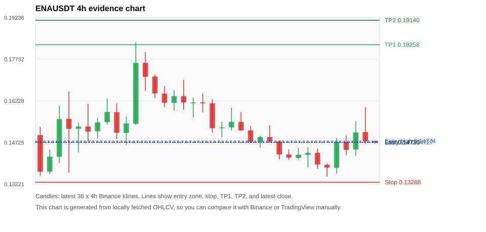
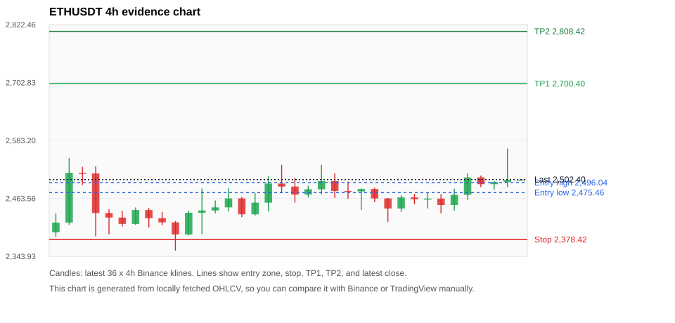
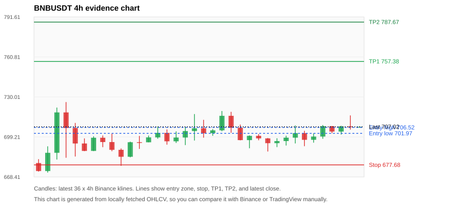
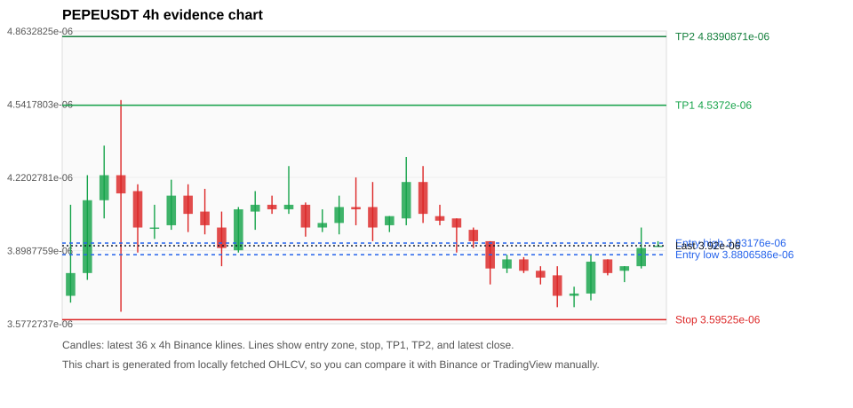
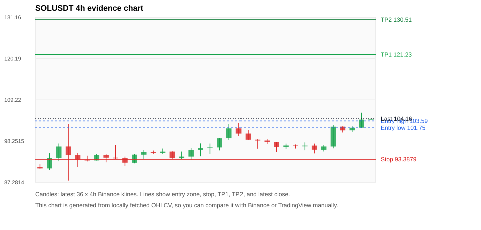

# Crypto 市场扫描报告 v1

- 报告时间：2026-08-27 20:07:41 CST
- Run ID：`20260827_120503_44711bcf`
- Run type：`daily_full`
- Data validation mode：`paper`
- 数据来源：SQLite
- 报告版本：v1
- 扫描 ID：05233b4f12a0
- 数据源：Binance public spot API + CoinGecko/CoinMarketCap cross-check
- 过滤条件：USDT spot; 24h quote volume >= 30,000,000; trades >= 30,000; exclude stables/leveraged tokens; analyze 1h/4h/1d klines
- 默认单笔风险：账户权益的 1.00%

## 限制说明

- 交易信号仍以 Binance 现货公开 K 线为主源；外部数据源用于一致性复核。
- 结果是研究和模拟盘计划，不是确定收益或实盘下单指令。
- 历史长度过滤：候选币至少需要 180 根 1d K 线。
- 数据质量验证池：先验证 score 排名前 min(top_n * 2, 10) 的候选，再按 action + score 补足最终名单。
- 大盘环境过滤：RISK_ON; BTC/ETH 日线趋势均较强，允许山寨币买入候选。 BTC 7d=8.743371290575919; ETH 7d=7.481885147970169.
- Data cross-validation enabled: Binance primary source plus CoinGecko; CoinMarketCap is checked when an API key is configured.
- ONGUSDT validation state BLOCKED: BLOCKED: [BINANCE_KLINE_EXTREME_RANGE] Binance candle range exceeds 40%.; [BINANCE_KLINE_EXTREME_RANGE] Binance candle range exceeds 40%.; [BINANCE_KLINE_EXTREME_RANGE] Binance candle range exceeds 40%.; [BINANCE_KLINE_EXTREME_RANGE] Binance candle range exceeds 40%.; [BINANCE_KLINE_EXTREME_RANGE] Binance candle range exceeds 40%.; [BINANCE_KLINE_EXTREME_RANGE] Binance candle range exceeds 40%.; [BINANCE_KLINE_EXTREME_RANGE] Binance candle range exceeds 40%.; [BINANCE_KLINE_EXTREME_RANGE] Binance candle range exceeds 40%.; [BINANCE_KLINE_EXTREME_RANGE] Binance candle range exceeds 40%.; [BINANCE_KLINE_EXTREME_RANGE] Binance candle range exceeds 40%.; [BINANCE_KLINE_EXTREME_RANGE] Binance candle range exceeds 40%.; [BINANCE_KLINE_EXTREME_RANGE] Binance candle range exceeds 40%.; [BINANCE_KLINE_EXTREME_RANGE] Binance candle range exceeds 40%.; [BINANCE_KLINE_EXTREME_RANGE] Binance candle range exceeds 40%.; [BINANCE_KLINE_EXTREME_RANGE] Binance candle range exceeds 40%.; [BINANCE_KLINE_EXTREME_RANGE] Binance candle range exceeds 40%.; [BINANCE_KLINE_EXTREME_RANGE] Binance candle range exceeds 40%.; [BINANCE_KLINE_EXTREME_RANGE] Binance candle range exceeds 40%.; [BINANCE_KLINE_EXTREME_RANGE] Binance candle range exceeds 40%.; [EXTERNAL_IDENTITY_AMBIGUOUS] CoinMarketCap symbol mapping has 3 matches; selected lowest cmc_rank
- SOLUSDT validation state DEGRADED: DEGRADED: [EXTERNAL_IDENTITY_AMBIGUOUS] CoinMarketCap symbol mapping has 8 matches; selected lowest cmc_rank
- TAOUSDT validation state DEGRADED: DEGRADED: [EXTERNAL_IDENTITY_AMBIGUOUS] CoinGecko symbol mapping has 2 exact matches; selected highest market-cap rank; [EXTERNAL_IDENTITY_AMBIGUOUS] CoinMarketCap symbol mapping has 5 matches; selected lowest cmc_rank
- BICOUSDT validation state BLOCKED: BLOCKED: [BINANCE_KLINE_EXTREME_RANGE] Binance candle range exceeds 40%.; [BINANCE_KLINE_EXTREME_RANGE] Binance candle range exceeds 40%.; [BINANCE_KLINE_EXTREME_RANGE] Binance candle range exceeds 40%.; [BINANCE_KLINE_EXTREME_RANGE] Binance candle range exceeds 40%.; [BINANCE_KLINE_EXTREME_RANGE] Binance candle range exceeds 40%.; [BINANCE_KLINE_EXTREME_RANGE] Binance candle range exceeds 40%.; [BINANCE_KLINE_EXTREME_RANGE] Binance candle range exceeds 40%.; [BINANCE_KLINE_EXTREME_RANGE] Binance candle range exceeds 40%.; [BINANCE_KLINE_EXTREME_RANGE] Binance candle range exceeds 40%.; [BINANCE_KLINE_EXTREME_RANGE] Binance candle range exceeds 40%.; [BINANCE_KLINE_EXTREME_RANGE] Binance candle range exceeds 40%.; [BINANCE_KLINE_EXTREME_RANGE] Binance candle range exceeds 40%.; [BINANCE_KLINE_EXTREME_RANGE] Binance candle range exceeds 40%.; [BINANCE_KLINE_EXTREME_RANGE] Binance candle range exceeds 40%.; [BINANCE_KLINE_EXTREME_RANGE] Binance candle range exceeds 40%.
- ENAUSDT validation state DEGRADED: DEGRADED: [EXTERNAL_PROVIDER_RATE_LIMITED] Provider rate limited request for https://api.coingecko.com/api/v3/coins/markets?vs_currency=usd&ids=ethena&price_change_percentage=24h&per_page=1&page=1: HTTP 429; [EXTERNAL_IDENTITY_AMBIGUOUS] CoinMarketCap symbol mapping has 2 matches; selected lowest cmc_rank
- PUMPUSDT validation state BLOCKED: BLOCKED: [BINANCE_KLINE_EXTREME_RANGE] Binance candle range exceeds 40%.; [EXTERNAL_PROVIDER_RATE_LIMITED] Provider rate limited request for https://api.coingecko.com/api/v3/coins/markets?vs_currency=usd&ids=pump-fun&price_change_percentage=24h&per_page=1&page=1: HTTP 429; [EXTERNAL_IDENTITY_AMBIGUOUS] CoinMarketCap symbol mapping has 15 matches; selected lowest cmc_rank
- ETHUSDT validation state DEGRADED: DEGRADED: [EXTERNAL_PROVIDER_RATE_LIMITED] Provider rate limited request for https://api.coingecko.com/api/v3/coins/markets?vs_currency=usd&ids=ethereum&price_change_percentage=24h&per_page=1&page=1: HTTP 429; [EXTERNAL_IDENTITY_AMBIGUOUS] CoinMarketCap symbol mapping has 6 matches; selected lowest cmc_rank
- BNBUSDT validation state DEGRADED: DEGRADED: [EXTERNAL_PROVIDER_RATE_LIMITED] Provider rate limited request for https://api.coingecko.com/api/v3/coins/markets?vs_currency=usd&ids=binancecoin&price_change_percentage=24h&per_page=1&page=1: HTTP 429; [EXTERNAL_IDENTITY_AMBIGUOUS] CoinMarketCap symbol mapping has 4 matches; selected lowest cmc_rank
- PEPEUSDT validation state DEGRADED: DEGRADED: [EXTERNAL_PROVIDER_RATE_LIMITED] Provider rate limited request for https://api.coingecko.com/api/v3/coins/markets?vs_currency=usd&ids=pepe&price_change_percentage=24h&per_page=1&page=1: HTTP 429; [EXTERNAL_IDENTITY_AMBIGUOUS] CoinMarketCap symbol mapping has 33 matches; selected lowest cmc_rank
- TUTUSDT validation state BLOCKED: BLOCKED: [BINANCE_KLINE_EXTREME_RANGE] Binance candle range exceeds 40%.; [BINANCE_KLINE_EXTREME_RANGE] Binance candle range exceeds 40%.; [BINANCE_KLINE_EXTREME_RANGE] Binance candle range exceeds 40%.; [BINANCE_KLINE_EXTREME_RANGE] Binance candle range exceeds 40%.; [BINANCE_KLINE_EXTREME_RANGE] Binance candle range exceeds 40%.; [BINANCE_KLINE_EXTREME_RANGE] Binance candle range exceeds 40%.; [BINANCE_KLINE_EXTREME_RANGE] Binance candle range exceeds 40%.; [BINANCE_KLINE_EXTREME_RANGE] Binance candle range exceeds 40%.; [BINANCE_KLINE_EXTREME_RANGE] Binance candle range exceeds 40%.; [BINANCE_KLINE_EXTREME_RANGE] Binance candle range exceeds 40%.; [BINANCE_KLINE_EXTREME_RANGE] Binance candle range exceeds 40%.; [BINANCE_KLINE_EXTREME_RANGE] Binance candle range exceeds 40%.; [BINANCE_KLINE_EXTREME_RANGE] Binance candle range exceeds 40%.; [BINANCE_KLINE_EXTREME_RANGE] Binance candle range exceeds 40%.; [BINANCE_KLINE_EXTREME_RANGE] Binance candle range exceeds 40%.; [BINANCE_KLINE_EXTREME_RANGE] Binance candle range exceeds 40%.; [BINANCE_KLINE_EXTREME_RANGE] Binance candle range exceeds 40%.; [BINANCE_KLINE_EXTREME_RANGE] Binance candle range exceeds 40%.; [BINANCE_KLINE_EXTREME_RANGE] Binance candle range exceeds 40%.; [BINANCE_KLINE_EXTREME_RANGE] Binance candle range exceeds 40%.; [BINANCE_KLINE_EXTREME_RANGE] Binance candle range exceeds 40%.; [BINANCE_KLINE_EXTREME_RANGE] Binance candle range exceeds 40%.; [BINANCE_KLINE_EXTREME_RANGE] Binance candle range exceeds 40%.; [BINANCE_KLINE_EXTREME_RANGE] Binance candle range exceeds 40%.; [BINANCE_KLINE_EXTREME_RANGE] Binance candle range exceeds 40%.; [EXTERNAL_PROVIDER_RATE_LIMITED] Provider rate limited request for https://api.coingecko.com/api/v3/coins/markets?vs_currency=usd&ids=tutorial&price_change_percentage=24h&per_page=1&page=1: HTTP 429; [EXTERNAL_IDENTITY_AMBIGUOUS] CoinMarketCap symbol mapping has 3 matches; selected lowest cmc_rank

## 5 个候选交易计划

| Rank | Coin | Action | Setup | Entry Zone | Stop Loss | TP1 | TP2 / Exit Rule | R/R | Verdict |
|---:|---|---|---|---:|---:|---:|---|---:|---|
| 1 | `ENA` | `BUY_CANDIDATE` | 回踩支撑/4h EMA 附近 | 0.14727 - 0.14774 | 0.13288 | 0.18258 | 0.19140 或跌破 4h 关键支撑 | 2.40-3.00 | 可考虑 |
| 2 | `ETH` | `BUY_CANDIDATE` | 回踩支撑/4h EMA 附近 | 2,475.46 - 2,496.04 | 2,378.42 | 2,700.40 | 2,808.42 或跌破 4h 关键支撑 | 2.00-3.01 | 可考虑 |
| 3 | `BNB` | `BUY_CANDIDATE` | 回踩支撑/4h EMA 附近 | 701.97 - 706.52 | 677.68 | 757.38 | 787.67 或跌破 4h 关键支撑 | 2.00-3.14 | 可考虑 |
| 4 | `PEPE` | `BUY_CANDIDATE` | 回踩支撑/4h EMA 附近 | 3.8806586e-06 - 3.93176e-06 | 3.59525e-06 | 4.5372e-06 | 4.8390871e-06 或跌破 4h 关键支撑 | 2.03-3.00 | 可考虑 |
| 5 | `SOL` | `WAIT_PULLBACK` | 趋势中，等回调入场 | 101.75 - 103.59 | 93.3879 | 121.23 | 130.51 或跌破 4h 关键支撑 | 2.00-3.00 | 只等回调 |

## 数据交叉验证摘要

价格差异以 Binance 当前价为基准；成交量口径不同，Binance 是 USDT 现货成交额，CoinGecko/CoinMarketCap 通常是全市场成交量。

| Rank | Coin | State | Identity | Max Price Diff | Max 24h Diff | Issue Codes | Message |
|---:|---|---|---|---:|---:|---|---|
| 1 | `ENA` | DEGRADED (DATA_WARNING) | UNCONFIRMED | 0.04% | 0.07 pts | EXTERNAL_IDENTITY_AMBIGUOUS, EXTERNAL_PROVIDER_RATE_LIMITED | DEGRADED: [EXTERNAL_PROVIDER_RATE_LIMITED] Provider rate limited request for https://api.coingecko.com/api/v3/coins/markets?vs_currency=usd&ids=ethena&price_change_percentage=24h&per_page=1&page=1: HTTP 429; [EXTERNAL_IDENTITY_AMBIGUOUS] CoinMarketCap symbol mapping has 2 matches; selected lowest cmc_rank |
| 2 | `ETH` | DEGRADED (DATA_WARNING) | UNCONFIRMED | 0.06% | 0.01 pts | EXTERNAL_IDENTITY_AMBIGUOUS, EXTERNAL_PROVIDER_RATE_LIMITED | DEGRADED: [EXTERNAL_PROVIDER_RATE_LIMITED] Provider rate limited request for https://api.coingecko.com/api/v3/coins/markets?vs_currency=usd&ids=ethereum&price_change_percentage=24h&per_page=1&page=1: HTTP 429; [EXTERNAL_IDENTITY_AMBIGUOUS] CoinMarketCap symbol mapping has 6 matches; selected lowest cmc_rank |
| 3 | `BNB` | DEGRADED (DATA_WARNING) | UNCONFIRMED | 0.04% | 0.05 pts | EXTERNAL_IDENTITY_AMBIGUOUS, EXTERNAL_PROVIDER_RATE_LIMITED | DEGRADED: [EXTERNAL_PROVIDER_RATE_LIMITED] Provider rate limited request for https://api.coingecko.com/api/v3/coins/markets?vs_currency=usd&ids=binancecoin&price_change_percentage=24h&per_page=1&page=1: HTTP 429; [EXTERNAL_IDENTITY_AMBIGUOUS] CoinMarketCap symbol mapping has 4 matches; selected lowest cmc_rank |
| 4 | `PEPE` | DEGRADED (DATA_WARNING) | UNCONFIRMED | 0.09% | 0.18 pts | EXTERNAL_IDENTITY_AMBIGUOUS, EXTERNAL_PROVIDER_RATE_LIMITED | DEGRADED: [EXTERNAL_PROVIDER_RATE_LIMITED] Provider rate limited request for https://api.coingecko.com/api/v3/coins/markets?vs_currency=usd&ids=pepe&price_change_percentage=24h&per_page=1&page=1: HTTP 429; [EXTERNAL_IDENTITY_AMBIGUOUS] CoinMarketCap symbol mapping has 33 matches; selected lowest cmc_rank |
| 5 | `SOL` | DEGRADED (DATA_WARNING) | UNCONFIRMED | 0.02% | 0.23 pts | EXTERNAL_IDENTITY_AMBIGUOUS | DEGRADED: [EXTERNAL_IDENTITY_AMBIGUOUS] CoinMarketCap symbol mapping has 8 matches; selected lowest cmc_rank |

## 候选币说明

### 1. ENA `ENAUSDT`



- 入选原因：回踩支撑/4h EMA 附近；24h +2.58%，7d +49.85%，4h RSI 44.92，24h 成交额 $53.3M。
- 交易失效条件：跌破 0.1328765 或 4h 收盘重新失守关键支撑。
- 主要风险：主要风险是大盘同步回撤；External validation is degraded; this candidate is not a clean data sample.；Paper mode allows degraded validation; candidate is excluded from clean-data samples.。
- 数据交叉验证：DEGRADED / DATA_WARNING；身份=UNCONFIRMED；DEGRADED: [EXTERNAL_PROVIDER_RATE_LIMITED] Provider rate limited request for https://api.coingecko.com/api/v3/coins/markets?vs_currency=usd&ids=ethena&price_change_percentage=24h&per_page=1&page=1: HTTP 429; [EXTERNAL_IDENTITY_AMBIGUOUS] CoinMarketCap symbol mapping has 2 matches; selected lowest cmc_rank

#### 可点击人工验证

- [Binance 交易页](https://www.binance.com/en/trade/ENA_USDT)
- [TradingView 图表](https://www.tradingview.com/chart/?symbol=BINANCE%3AENAUSDT)
- [CoinGecko 搜索](https://www.coingecko.com/en/search?query=ENA)
- [CoinMarketCap 搜索](https://coinmarketcap.com/search/?q=ENA)

#### 多数据源对照

| Source | Status | Identity | Blocking | Asset ID | Price | 24h Change | 24h Volume | Price Diff | 24h Diff | Updated | Issue Codes | Message |
|---|---|---|---:|---|---:|---:|---:|---:|---:|---|---|---|
| Binance | DATA_OK | CONFIRMED | no | ENAUSDT | 0.14730 | +2.58% | $53.3M | 0.00% | 0.00 pts | 2026-08-27T12:06:38+00:00 | none | Primary market data source passed health checks. |
| CoinGecko | DATA_WARNING | UNCONFIRMED | no | n/a | n/a | n/a | n/a | n/a | n/a | 2026-08-27T12:06:38+00:00 | EXTERNAL_PROVIDER_RATE_LIMITED | Provider rate limited request for https://api.coingecko.com/api/v3/coins/markets?vs_currency=usd&ids=ethena&price_change_percentage=24h&per_page=1&page=1: HTTP 429 |
| CoinMarketCap | DATA_WARNING | UNCONFIRMED | no | 30171 | 0.14735 | +2.51% | $816.4M | 0.04% | 0.07 pts | 2026-08-27T12:06:01.000Z | EXTERNAL_IDENTITY_AMBIGUOUS | [EXTERNAL_IDENTITY_AMBIGUOUS] CoinMarketCap symbol mapping has 2 matches; selected lowest cmc_rank |

#### 指标证据

| 指标 | 数值 | 人工核对用途 |
|---|---:|---|
| 当前价 | 0.14730 | 与 Binance/TradingView 当前价格对照 |
| 24h 涨跌 | +2.58% | 与交易所 24h 涨跌对照 |
| 7d 涨跌 | +49.85% | 判断短线趋势是否延续 |
| 4h EMA20 | 0.14698 | 判断短期趋势支撑 |
| 4h EMA50 | 0.13764 | 判断中期趋势支撑 |
| 1d EMA20 | 0.11985 | 判断日线趋势 |
| 1d EMA50 | 0.10269 | 判断日线趋势 |
| 4h RSI14 | 44.92 | 判断是否过热/过弱 |
| 4h ATR14 | 0.0069285714 | 推导止损和入场缓冲 |
| 最近 18 根 4h 最低点 | 0.13490 | 支撑/止损参考 |
| 最近 36 根 4h 最高点 | 0.18350 | TP/压力参考 |
| 支撑位 | 0.14698 | 入场区间推导基础 |

#### 交易计划推导

- 支撑位 = 最近低点、4h EMA20、4h EMA50、1d EMA20 中不高于当前价的最高有效支撑 = `0.14698`。
- 入场区间 = 支撑位附近 + ATR 缓冲 = `0.14727 - 0.14774`。
- 止损 = min(最近 18 根 4h 最低点 * 0.985, 入场中位价 - 1.15 * ATR14) = `0.13288`。
- TP1 = max(最近 36 根 4h 最高点 * 0.995, 入场中位价 + 2R) = `0.18258`。
- TP2 = max(入场中位价 + 3R, TP1 * 1.04) = `0.19140`。

#### 最近 10 根 4h K线

| UTC 开盘时间 | Open | High | Low | Close | Quote Volume | Trades |
|---|---:|---:|---:|---:|---:|---:|
| 2026-08-26T00:00+00:00 | 0.14290 | 0.14480 | 0.14100 | 0.14180 | $3.6M | 20601 |
| 2026-08-26T04:00+00:00 | 0.14170 | 0.14530 | 0.14100 | 0.14280 | $3.7M | 22147 |
| 2026-08-26T08:00+00:00 | 0.14280 | 0.14550 | 0.13820 | 0.14350 | $5.5M | 27040 |
| 2026-08-26T12:00+00:00 | 0.14350 | 0.14500 | 0.13770 | 0.13930 | $8.0M | 41965 |
| 2026-08-26T16:00+00:00 | 0.13920 | 0.13950 | 0.13490 | 0.13820 | $5.3M | 25764 |
| 2026-08-26T20:00+00:00 | 0.13810 | 0.14880 | 0.13600 | 0.14750 | $5.9M | 26694 |
| 2026-08-27T00:00+00:00 | 0.14740 | 0.14980 | 0.14270 | 0.14460 | $6.2M | 27719 |
| 2026-08-27T04:00+00:00 | 0.14470 | 0.15500 | 0.14240 | 0.15090 | $8.1M | 38525 |
| 2026-08-27T08:00+00:00 | 0.15100 | 0.16000 | 0.14680 | 0.14770 | $19.6M | 98208 |
| 2026-08-27T12:00+00:00 | 0.14770 | 0.14790 | 0.14680 | 0.14730 | $193,139 | 1461 |

### 2. ETH `ETHUSDT`



- 入选原因：回踩支撑/4h EMA 附近；24h +1.54%，7d +9.90%，4h RSI 56.99，24h 成交额 $817.2M。
- 交易失效条件：跌破 2378.4204 或 4h 收盘重新失守关键支撑。
- 主要风险：主要风险是大盘同步回撤；External validation is degraded; this candidate is not a clean data sample.；Paper mode allows degraded validation; candidate is excluded from clean-data samples.。
- 数据交叉验证：DEGRADED / DATA_WARNING；身份=UNCONFIRMED；DEGRADED: [EXTERNAL_PROVIDER_RATE_LIMITED] Provider rate limited request for https://api.coingecko.com/api/v3/coins/markets?vs_currency=usd&ids=ethereum&price_change_percentage=24h&per_page=1&page=1: HTTP 429; [EXTERNAL_IDENTITY_AMBIGUOUS] CoinMarketCap symbol mapping has 6 matches; selected lowest cmc_rank

#### 可点击人工验证

- [Binance 交易页](https://www.binance.com/en/trade/ETH_USDT)
- [TradingView 图表](https://www.tradingview.com/chart/?symbol=BINANCE%3AETHUSDT)
- [CoinGecko 搜索](https://www.coingecko.com/en/search?query=ETH)
- [CoinMarketCap 搜索](https://coinmarketcap.com/search/?q=ETH)

#### 多数据源对照

| Source | Status | Identity | Blocking | Asset ID | Price | 24h Change | 24h Volume | Price Diff | 24h Diff | Updated | Issue Codes | Message |
|---|---|---|---:|---|---:|---:|---:|---:|---:|---|---|---|
| Binance | DATA_OK | CONFIRMED | no | ETHUSDT | 2,502.40 | +1.54% | $817.2M | 0.00% | 0.00 pts | 2026-08-27T12:06:38+00:00 | none | Primary market data source passed health checks. |
| CoinGecko | DATA_WARNING | UNCONFIRMED | no | n/a | n/a | n/a | n/a | n/a | n/a | 2026-08-27T12:06:38+00:00 | EXTERNAL_PROVIDER_RATE_LIMITED | Provider rate limited request for https://api.coingecko.com/api/v3/coins/markets?vs_currency=usd&ids=ethereum&price_change_percentage=24h&per_page=1&page=1: HTTP 429 |
| CoinMarketCap | DATA_WARNING | UNCONFIRMED | no | 1027 | 2,500.84 | +1.55% | $16.39B | 0.06% | 0.01 pts | 2026-08-27T12:06:01.000Z | EXTERNAL_IDENTITY_AMBIGUOUS | [EXTERNAL_IDENTITY_AMBIGUOUS] CoinMarketCap symbol mapping has 6 matches; selected lowest cmc_rank |

#### 指标证据

| 指标 | 数值 | 人工核对用途 |
|---|---:|---|
| 当前价 | 2,502.40 | 与 Binance/TradingView 当前价格对照 |
| 24h 涨跌 | +1.54% | 与交易所 24h 涨跌对照 |
| 7d 涨跌 | +9.90% | 判断短线趋势是否延续 |
| 4h EMA20 | 2,470.52 | 判断短期趋势支撑 |
| 4h EMA50 | 2,372.44 | 判断中期趋势支撑 |
| 1d EMA20 | 2,222.15 | 判断日线趋势 |
| 1d EMA50 | 2,042.64 | 判断日线趋势 |
| 4h RSI14 | 56.99 | 判断是否过热/过弱 |
| 4h ATR14 | 36.4529 | 推导止损和入场缓冲 |
| 最近 18 根 4h 最低点 | 2,414.64 | 支撑/止损参考 |
| 最近 36 根 4h 最高点 | 2,566.53 | TP/压力参考 |
| 支撑位 | 2,470.52 | 入场区间推导基础 |

#### 交易计划推导

- 支撑位 = 最近低点、4h EMA20、4h EMA50、1d EMA20 中不高于当前价的最高有效支撑 = `2,470.52`。
- 入场区间 = 支撑位附近 + ATR 缓冲 = `2,475.46 - 2,496.04`。
- 止损 = min(最近 18 根 4h 最低点 * 0.985, 入场中位价 - 1.15 * ATR14) = `2,378.42`。
- TP1 = max(最近 36 根 4h 最高点 * 0.995, 入场中位价 + 2R) = `2,700.40`。
- TP2 = max(入场中位价 + 3R, TP1 * 1.04) = `2,808.42`。

#### 最近 10 根 4h K线

| UTC 开盘时间 | Open | High | Low | Close | Quote Volume | Trades |
|---|---:|---:|---:|---:|---:|---:|
| 2026-08-26T00:00+00:00 | 2,442.65 | 2,469.82 | 2,435.81 | 2,465.57 | $59.8M | 335934 |
| 2026-08-26T04:00+00:00 | 2,465.56 | 2,472.86 | 2,451.49 | 2,461.78 | $70.9M | 267230 |
| 2026-08-26T08:00+00:00 | 2,461.78 | 2,475.61 | 2,442.76 | 2,463.09 | $96.8M | 416910 |
| 2026-08-26T12:00+00:00 | 2,463.09 | 2,472.05 | 2,432.32 | 2,449.85 | $144.9M | 728526 |
| 2026-08-26T16:00+00:00 | 2,449.85 | 2,483.52 | 2,438.10 | 2,470.79 | $102.2M | 413399 |
| 2026-08-26T20:00+00:00 | 2,470.79 | 2,515.38 | 2,460.29 | 2,506.78 | $143.2M | 525660 |
| 2026-08-27T00:00+00:00 | 2,506.78 | 2,510.64 | 2,487.03 | 2,492.89 | $82.1M | 414384 |
| 2026-08-27T04:00+00:00 | 2,492.89 | 2,499.00 | 2,481.74 | 2,497.16 | $59.0M | 277273 |
| 2026-08-27T08:00+00:00 | 2,497.17 | 2,566.53 | 2,486.97 | 2,501.73 | $284.9M | 1018546 |
| 2026-08-27T12:00+00:00 | 2,501.74 | 2,503.49 | 2,500.90 | 2,502.40 | $2.5M | 11276 |

### 3. BNB `BNBUSDT`



- 入选原因：回踩支撑/4h EMA 附近；24h +0.57%，7d +10.19%，4h RSI 50.69，24h 成交额 $94.5M。
- 交易失效条件：跌破 677.68 或 4h 收盘重新失守关键支撑。
- 主要风险：主要风险是大盘同步回撤；External validation is degraded; this candidate is not a clean data sample.；Paper mode allows degraded validation; candidate is excluded from clean-data samples.。
- 数据交叉验证：DEGRADED / DATA_WARNING；身份=UNCONFIRMED；DEGRADED: [EXTERNAL_PROVIDER_RATE_LIMITED] Provider rate limited request for https://api.coingecko.com/api/v3/coins/markets?vs_currency=usd&ids=binancecoin&price_change_percentage=24h&per_page=1&page=1: HTTP 429; [EXTERNAL_IDENTITY_AMBIGUOUS] CoinMarketCap symbol mapping has 4 matches; selected lowest cmc_rank

#### 可点击人工验证

- [Binance 交易页](https://www.binance.com/en/trade/BNB_USDT)
- [TradingView 图表](https://www.tradingview.com/chart/?symbol=BINANCE%3ABNBUSDT)
- [CoinGecko 搜索](https://www.coingecko.com/en/search?query=BNB)
- [CoinMarketCap 搜索](https://coinmarketcap.com/search/?q=BNB)

#### 多数据源对照

| Source | Status | Identity | Blocking | Asset ID | Price | 24h Change | 24h Volume | Price Diff | 24h Diff | Updated | Issue Codes | Message |
|---|---|---|---:|---|---:|---:|---:|---:|---:|---|---|---|
| Binance | DATA_OK | CONFIRMED | no | BNBUSDT | 707.02 | +0.57% | $94.5M | 0.00% | 0.00 pts | 2026-08-27T12:06:38+00:00 | none | Primary market data source passed health checks. |
| CoinGecko | DATA_WARNING | UNCONFIRMED | no | n/a | n/a | n/a | n/a | n/a | n/a | 2026-08-27T12:06:38+00:00 | EXTERNAL_PROVIDER_RATE_LIMITED | Provider rate limited request for https://api.coingecko.com/api/v3/coins/markets?vs_currency=usd&ids=binancecoin&price_change_percentage=24h&per_page=1&page=1: HTTP 429 |
| CoinMarketCap | DATA_WARNING | UNCONFIRMED | no | 1839 | 706.75 | +0.62% | $1.53B | 0.04% | 0.05 pts | 2026-08-27T12:06:01.000Z | EXTERNAL_IDENTITY_AMBIGUOUS | [EXTERNAL_IDENTITY_AMBIGUOUS] CoinMarketCap symbol mapping has 4 matches; selected lowest cmc_rank |

#### 指标证据

| 指标 | 数值 | 人工核对用途 |
|---|---:|---|
| 当前价 | 707.02 | 与 Binance/TradingView 当前价格对照 |
| 24h 涨跌 | +0.57% | 与交易所 24h 涨跌对照 |
| 7d 涨跌 | +10.19% | 判断短线趋势是否延续 |
| 4h EMA20 | 700.57 | 判断短期趋势支撑 |
| 4h EMA50 | 682.28 | 判断中期趋势支撑 |
| 1d EMA20 | 653.86 | 判断日线趋势 |
| 1d EMA50 | 621.33 | 判断日线趋势 |
| 4h RSI14 | 50.69 | 判断是否过热/过弱 |
| 4h ATR14 | 8.5021 | 推导止损和入场缓冲 |
| 最近 18 根 4h 最低点 | 688.00 | 支撑/止损参考 |
| 最近 36 根 4h 最高点 | 726.08 | TP/压力参考 |
| 支撑位 | 700.57 | 入场区间推导基础 |

#### 交易计划推导

- 支撑位 = 最近低点、4h EMA20、4h EMA50、1d EMA20 中不高于当前价的最高有效支撑 = `700.57`。
- 入场区间 = 支撑位附近 + ATR 缓冲 = `701.97 - 706.52`。
- 止损 = min(最近 18 根 4h 最低点 * 0.985, 入场中位价 - 1.15 * ATR14) = `677.68`。
- TP1 = max(最近 36 根 4h 最高点 * 0.995, 入场中位价 + 2R) = `757.38`。
- TP2 = max(入场中位价 + 3R, TP1 * 1.04) = `787.67`。

#### 最近 10 根 4h K线

| UTC 开盘时间 | Open | High | Low | Close | Quote Volume | Trades |
|---|---:|---:|---:|---:|---:|---:|
| 2026-08-26T00:00+00:00 | 694.42 | 698.21 | 691.40 | 696.04 | $10.4M | 120459 |
| 2026-08-26T04:00+00:00 | 696.04 | 700.19 | 692.60 | 698.67 | $11.8M | 125043 |
| 2026-08-26T08:00+00:00 | 698.67 | 708.06 | 694.22 | 702.15 | $25.4M | 170783 |
| 2026-08-26T12:00+00:00 | 702.15 | 703.96 | 692.10 | 697.00 | $24.9M | 208928 |
| 2026-08-26T16:00+00:00 | 697.01 | 702.00 | 694.80 | 699.53 | $10.9M | 105223 |
| 2026-08-26T20:00+00:00 | 699.54 | 708.39 | 697.80 | 707.52 | $13.1M | 94947 |
| 2026-08-27T00:00+00:00 | 707.52 | 707.60 | 702.10 | 703.34 | $10.9M | 96401 |
| 2026-08-27T04:00+00:00 | 703.34 | 707.81 | 701.05 | 707.35 | $8.9M | 85650 |
| 2026-08-27T08:00+00:00 | 707.36 | 715.79 | 704.86 | 706.72 | $26.0M | 210909 |
| 2026-08-27T12:00+00:00 | 706.72 | 707.21 | 706.50 | 707.01 | $322,094 | 2996 |

### 4. PEPE `PEPEUSDT`



- 入选原因：回踩支撑/4h EMA 附近；24h +3.43%，7d +24.84%，4h RSI 40.79，24h 成交额 $40.3M。
- 交易失效条件：跌破 3.59525e-06 或 4h 收盘重新失守关键支撑。
- 主要风险：主要风险是大盘同步回撤；External validation is degraded; this candidate is not a clean data sample.；Paper mode allows degraded validation; candidate is excluded from clean-data samples.。
- 数据交叉验证：DEGRADED / DATA_WARNING；身份=UNCONFIRMED；DEGRADED: [EXTERNAL_PROVIDER_RATE_LIMITED] Provider rate limited request for https://api.coingecko.com/api/v3/coins/markets?vs_currency=usd&ids=pepe&price_change_percentage=24h&per_page=1&page=1: HTTP 429; [EXTERNAL_IDENTITY_AMBIGUOUS] CoinMarketCap symbol mapping has 33 matches; selected lowest cmc_rank

#### 可点击人工验证

- [Binance 交易页](https://www.binance.com/en/trade/PEPE_USDT)
- [TradingView 图表](https://www.tradingview.com/chart/?symbol=BINANCE%3APEPEUSDT)
- [CoinGecko 搜索](https://www.coingecko.com/en/search?query=PEPE)
- [CoinMarketCap 搜索](https://coinmarketcap.com/search/?q=PEPE)

#### 多数据源对照

| Source | Status | Identity | Blocking | Asset ID | Price | 24h Change | 24h Volume | Price Diff | 24h Diff | Updated | Issue Codes | Message |
|---|---|---|---:|---|---:|---:|---:|---:|---:|---|---|---|
| Binance | DATA_OK | CONFIRMED | no | PEPEUSDT | 3.92e-06 | +3.43% | $40.3M | 0.00% | 0.00 pts | 2026-08-27T12:06:38+00:00 | none | Primary market data source passed health checks. |
| CoinGecko | DATA_WARNING | UNCONFIRMED | no | n/a | n/a | n/a | n/a | n/a | n/a | 2026-08-27T12:06:38+00:00 | EXTERNAL_PROVIDER_RATE_LIMITED | Provider rate limited request for https://api.coingecko.com/api/v3/coins/markets?vs_currency=usd&ids=pepe&price_change_percentage=24h&per_page=1&page=1: HTTP 429 |
| CoinMarketCap | DATA_WARNING | UNCONFIRMED | no | 24478 | 3.9233884e-06 | +3.61% | $393.0M | 0.09% | 0.18 pts | 2026-08-27T12:06:01.000Z | EXTERNAL_IDENTITY_AMBIGUOUS | [EXTERNAL_IDENTITY_AMBIGUOUS] CoinMarketCap symbol mapping has 33 matches; selected lowest cmc_rank |

#### 指标证据

| 指标 | 数值 | 人工核对用途 |
|---|---:|---|
| 当前价 | 3.92e-06 | 与 Binance/TradingView 当前价格对照 |
| 24h 涨跌 | +3.43% | 与交易所 24h 涨跌对照 |
| 7d 涨跌 | +24.84% | 判断短线趋势是否延续 |
| 4h EMA20 | 3.8729127e-06 | 判断短期趋势支撑 |
| 4h EMA50 | 3.6905648e-06 | 判断中期趋势支撑 |
| 1d EMA20 | 3.3809392e-06 | 判断日线趋势 |
| 1d EMA50 | 3.0945184e-06 | 判断日线趋势 |
| 4h RSI14 | 40.79 | 判断是否过热/过弱 |
| 4h ATR14 | 1.1214286e-07 | 推导止损和入场缓冲 |
| 最近 18 根 4h 最低点 | 3.65e-06 | 支撑/止损参考 |
| 最近 36 根 4h 最高点 | 4.56e-06 | TP/压力参考 |
| 支撑位 | 3.8729127e-06 | 入场区间推导基础 |

#### 交易计划推导

- 支撑位 = 最近低点、4h EMA20、4h EMA50、1d EMA20 中不高于当前价的最高有效支撑 = `3.8729127e-06`。
- 入场区间 = 支撑位附近 + ATR 缓冲 = `3.8806586e-06 - 3.93176e-06`。
- 止损 = min(最近 18 根 4h 最低点 * 0.985, 入场中位价 - 1.15 * ATR14) = `3.59525e-06`。
- TP1 = max(最近 36 根 4h 最高点 * 0.995, 入场中位价 + 2R) = `4.5372e-06`。
- TP2 = max(入场中位价 + 3R, TP1 * 1.04) = `4.8390871e-06`。

#### 最近 10 根 4h K线

| UTC 开盘时间 | Open | High | Low | Close | Quote Volume | Trades |
|---|---:|---:|---:|---:|---:|---:|
| 2026-08-26T00:00+00:00 | 3.82e-06 | 3.88e-06 | 3.8e-06 | 3.86e-06 | $4.0M | 8679 |
| 2026-08-26T04:00+00:00 | 3.86e-06 | 3.87e-06 | 3.8e-06 | 3.81e-06 | $3.5M | 9933 |
| 2026-08-26T08:00+00:00 | 3.81e-06 | 3.83e-06 | 3.75e-06 | 3.78e-06 | $3.8M | 9638 |
| 2026-08-26T12:00+00:00 | 3.79e-06 | 3.83e-06 | 3.65e-06 | 3.7e-06 | $9.8M | 21905 |
| 2026-08-26T16:00+00:00 | 3.7e-06 | 3.74e-06 | 3.65e-06 | 3.71e-06 | $4.3M | 11166 |
| 2026-08-26T20:00+00:00 | 3.71e-06 | 3.88e-06 | 3.68e-06 | 3.85e-06 | $5.0M | 13987 |
| 2026-08-27T00:00+00:00 | 3.86e-06 | 3.86e-06 | 3.79e-06 | 3.8e-06 | $3.3M | 8748 |
| 2026-08-27T04:00+00:00 | 3.81e-06 | 3.83e-06 | 3.76e-06 | 3.83e-06 | $2.6M | 8041 |
| 2026-08-27T08:00+00:00 | 3.83e-06 | 4e-06 | 3.82e-06 | 3.91e-06 | $15.3M | 34725 |
| 2026-08-27T12:00+00:00 | 3.92e-06 | 3.94e-06 | 3.92e-06 | 3.92e-06 | $103,771 | 307 |

### 5. SOL `SOLUSDT`



- 入选原因：趋势中，等回调入场；24h +7.40%，7d +20.30%，4h RSI 62.60，24h 成交额 $406.9M。
- 交易失效条件：跌破 93.38785 或 4h 收盘重新失守关键支撑。
- 主要风险：主要风险是大盘同步回撤；External validation is degraded; this candidate is not a clean data sample.；Paper mode allows degraded validation; candidate is excluded from clean-data samples.。
- 数据交叉验证：DEGRADED / DATA_WARNING；身份=UNCONFIRMED；DEGRADED: [EXTERNAL_IDENTITY_AMBIGUOUS] CoinMarketCap symbol mapping has 8 matches; selected lowest cmc_rank

#### 可点击人工验证

- [Binance 交易页](https://www.binance.com/en/trade/SOL_USDT)
- [TradingView 图表](https://www.tradingview.com/chart/?symbol=BINANCE%3ASOLUSDT)
- [CoinGecko 搜索](https://www.coingecko.com/en/search?query=SOL)
- [CoinMarketCap 搜索](https://coinmarketcap.com/search/?q=SOL)

#### 多数据源对照

| Source | Status | Identity | Blocking | Asset ID | Price | 24h Change | 24h Volume | Price Diff | 24h Diff | Updated | Issue Codes | Message |
|---|---|---|---:|---|---:|---:|---:|---:|---:|---|---|---|
| Binance | DATA_OK | CONFIRMED | no | SOLUSDT | 104.16 | +7.40% | $406.9M | 0.00% | 0.00 pts | 2026-08-27T12:06:38+00:00 | none | Primary market data source passed health checks. |
| CoinGecko | DATA_OK | CONFIRMED | no | solana | 104.18 | +7.62% | $5.36B | 0.02% | 0.23 pts | 2026-08-27T12:04:20.000Z | none | External source agrees with Binance within thresholds. |
| CoinMarketCap | DATA_WARNING | UNCONFIRMED | no | 5426 | 104.15 | +7.41% | $5.47B | 0.01% | 0.01 pts | 2026-08-27T12:05:04.000Z | EXTERNAL_IDENTITY_AMBIGUOUS | [EXTERNAL_IDENTITY_AMBIGUOUS] CoinMarketCap symbol mapping has 8 matches; selected lowest cmc_rank |

#### 指标证据

| 指标 | 数值 | 人工核对用途 |
|---|---:|---|
| 当前价 | 104.16 | 与 Binance/TradingView 当前价格对照 |
| 24h 涨跌 | +7.40% | 与交易所 24h 涨跌对照 |
| 7d 涨跌 | +20.30% | 判断短线趋势是否延续 |
| 4h EMA20 | 98.8428 | 判断短期趋势支撑 |
| 4h EMA50 | 93.7673 | 判断中期趋势支撑 |
| 1d EMA20 | 88.0504 | 判断日线趋势 |
| 1d EMA50 | 81.7033 | 判断日线趋势 |
| 4h RSI14 | 62.60 | 判断是否过热/过弱 |
| 4h ATR14 | 2.2950 | 推导止损和入场缓冲 |
| 最近 18 根 4h 最低点 | 94.8100 | 支撑/止损参考 |
| 最近 36 根 4h 最高点 | 105.79 | TP/压力参考 |
| 支撑位 | 98.8428 | 入场区间推导基础 |

#### 交易计划推导

- 支撑位 = 最近低点、4h EMA20、4h EMA50、1d EMA20 中不高于当前价的最高有效支撑 = `98.8428`。
- 入场区间 = 支撑位附近 + ATR 缓冲 = `101.75 - 103.59`。
- 止损 = min(最近 18 根 4h 最低点 * 0.985, 入场中位价 - 1.15 * ATR14) = `93.3879`。
- TP1 = max(最近 36 根 4h 最高点 * 0.995, 入场中位价 + 2R) = `121.23`。
- TP2 = max(入场中位价 + 3R, TP1 * 1.04) = `130.51`。

#### 最近 10 根 4h K线

| UTC 开盘时间 | Open | High | Low | Close | Quote Volume | Trades |
|---|---:|---:|---:|---:|---:|---:|
| 2026-08-26T00:00+00:00 | 96.6000 | 97.5600 | 96.1700 | 97.0600 | $30.5M | 134558 |
| 2026-08-26T04:00+00:00 | 97.0600 | 97.3300 | 96.2500 | 96.9500 | $27.4M | 121997 |
| 2026-08-26T08:00+00:00 | 96.9500 | 97.8800 | 95.7800 | 97.0300 | $32.6M | 163175 |
| 2026-08-26T12:00+00:00 | 97.0400 | 97.5700 | 94.9500 | 95.9400 | $56.3M | 323054 |
| 2026-08-26T16:00+00:00 | 95.9300 | 97.2500 | 95.4700 | 96.8000 | $32.5M | 166738 |
| 2026-08-26T20:00+00:00 | 96.7900 | 102.46 | 96.3000 | 102.07 | $78.2M | 353993 |
| 2026-08-27T00:00+00:00 | 102.08 | 102.14 | 100.52 | 101.08 | $53.9M | 246048 |
| 2026-08-27T04:00+00:00 | 101.09 | 102.29 | 100.70 | 101.80 | $58.2M | 191931 |
| 2026-08-27T08:00+00:00 | 101.81 | 105.79 | 101.73 | 103.95 | $127.5M | 519215 |
| 2026-08-27T12:00+00:00 | 103.95 | 104.30 | 103.93 | 104.15 | $1.6M | 7176 |

## 组合风控

- 不要 5 个候选全部满仓买入。
- 同时持仓总风险建议控制在账户权益的 3% - 5% 以内。
- 如果 BTC/ETH 同时破位，暂停山寨币多头计划或降低仓位。
- 第一版报告用于模拟盘和人工复核，不自动下单。

## 原始数据

```json
[
  {
    "rank": 1,
    "symbol": "ENAUSDT",
    "base_asset": "ENA",
    "price": 0.1473,
    "score": 63.82519273922594,
    "setup": "回踩支撑/4h EMA 附近",
    "verdict": "可考虑",
    "entry_low": 0.1472730528437021,
    "entry_high": 0.14774189999999998,
    "stop_loss": 0.13287649999999998,
    "take_profit_1": 0.1825825,
    "take_profit_2": 0.19140040568740416,
    "risk_reward_1": 2.397312562527625,
    "risk_reward_2": 3.0,
    "pct_24h": 2.577,
    "pct_3d": -8.052434456928847,
    "pct_7d": 49.84740590030518,
    "quote_volume_24h": 53253631.715891,
    "trades_24h": 259903,
    "high_low_range_24h": 18.60637509266123,
    "rsi_1h": 55.80645161290322,
    "rsi_4h": 44.917257683215105,
    "ema20_4h": 0.14697909465439332,
    "ema50_4h": 0.13763915521159534,
    "ema20_1d": 0.11984983841064131,
    "ema50_1d": 0.10268590154135757,
    "atr_4h": 0.006928571428571432,
    "macd_hist_4h": -0.0008376742659889124,
    "volume_ratio_24h": 0.5991280002683832,
    "support_level": 0.14697909465439332,
    "recent_low_4h_18": 0.1349,
    "recent_high_4h_36": 0.1835,
    "distance_to_support_pct": 0.21833400618043175,
    "binance_trade_url": "https://www.binance.com/en/trade/ENA_USDT",
    "tradingview_url": "https://www.tradingview.com/chart/?symbol=BINANCE%3AENAUSDT",
    "coingecko_search_url": "https://www.coingecko.com/en/search?query=ENA",
    "coinmarketcap_search_url": "https://coinmarketcap.com/search/?q=ENA",
    "invalidation": "跌破 0.1328765 或 4h 收盘重新失守关键支撑",
    "recent_4h_klines": [
      {
        "open_time_utc": "2026-08-21T16:00+00:00",
        "open": 0.1499,
        "high": 0.1529,
        "low": 0.1351,
        "close": 0.1367,
        "quote_volume": 28224854.594685,
        "trades": 175629
      },
      {
        "open_time_utc": "2026-08-21T20:00+00:00",
        "open": 0.1367,
        "high": 0.1446,
        "low": 0.136,
        "close": 0.1421,
        "quote_volume": 13095572.05979,
        "trades": 96084
      },
      {
        "open_time_utc": "2026-08-22T00:00+00:00",
        "open": 0.1421,
        "high": 0.1604,
        "low": 0.1398,
        "close": 0.1557,
        "quote_volume": 22773901.379632,
        "trades": 114654
      },
      {
        "open_time_utc": "2026-08-22T04:00+00:00",
        "open": 0.1558,
        "high": 0.1657,
        "low": 0.1364,
        "close": 0.1522,
        "quote_volume": 47436484.915486,
        "trades": 253907
      },
      {
        "open_time_utc": "2026-08-22T08:00+00:00",
        "open": 0.1522,
        "high": 0.1545,
        "low": 0.1436,
        "close": 0.153,
        "quote_volume": 16028220.150425,
        "trades": 85028
      },
      {
        "open_time_utc": "2026-08-22T12:00+00:00",
        "open": 0.153,
        "high": 0.1612,
        "low": 0.1476,
        "close": 0.1512,
        "quote_volume": 16081714.89855,
        "trades": 75442
      },
      {
        "open_time_utc": "2026-08-22T16:00+00:00",
        "open": 0.1513,
        "high": 0.1562,
        "low": 0.1486,
        "close": 0.1545,
        "quote_volume": 6449697.671657,
        "trades": 39134
      },
      {
        "open_time_utc": "2026-08-22T20:00+00:00",
        "open": 0.1546,
        "high": 0.1631,
        "low": 0.1537,
        "close": 0.1583,
        "quote_volume": 10392782.365161,
        "trades": 62393
      },
      {
        "open_time_utc": "2026-08-23T00:00+00:00",
        "open": 0.1582,
        "high": 0.1614,
        "low": 0.1485,
        "close": 0.1508,
        "quote_volume": 11531349.676475,
        "trades": 74070
      },
      {
        "open_time_utc": "2026-08-23T04:00+00:00",
        "open": 0.1507,
        "high": 0.1567,
        "low": 0.1464,
        "close": 0.1541,
        "quote_volume": 9446150.289546,
        "trades": 60817
      },
      {
        "open_time_utc": "2026-08-23T08:00+00:00",
        "open": 0.154,
        "high": 0.1835,
        "low": 0.1536,
        "close": 0.176,
        "quote_volume": 40671124.015616,
        "trades": 198266
      },
      {
        "open_time_utc": "2026-08-23T12:00+00:00",
        "open": 0.176,
        "high": 0.18,
        "low": 0.1659,
        "close": 0.171,
        "quote_volume": 23464449.930947,
        "trades": 117067
      },
      {
        "open_time_utc": "2026-08-23T16:00+00:00",
        "open": 0.1711,
        "high": 0.1717,
        "low": 0.1633,
        "close": 0.165,
        "quote_volume": 10860245.437764,
        "trades": 48812
      },
      {
        "open_time_utc": "2026-08-23T20:00+00:00",
        "open": 0.1649,
        "high": 0.1677,
        "low": 0.16,
        "close": 0.1616,
        "quote_volume": 7253802.503136,
        "trades": 33614
      },
      {
        "open_time_utc": "2026-08-24T00:00+00:00",
        "open": 0.1616,
        "high": 0.1662,
        "low": 0.1587,
        "close": 0.164,
        "quote_volume": 12588732.455553,
        "trades": 72691
      },
      {
        "open_time_utc": "2026-08-24T04:00+00:00",
        "open": 0.164,
        "high": 0.1698,
        "low": 0.1592,
        "close": 0.1617,
        "quote_volume": 13027758.09142,
        "trades": 88562
      },
      {
        "open_time_utc": "2026-08-24T08:00+00:00",
        "open": 0.1617,
        "high": 0.1634,
        "low": 0.1563,
        "close": 0.1617,
        "quote_volume": 11081603.271786,
        "trades": 71889
      },
      {
        "open_time_utc": "2026-08-24T12:00+00:00",
        "open": 0.1617,
        "high": 0.165,
        "low": 0.1581,
        "close": 0.1614,
        "quote_volume": 15446960.572566,
        "trades": 86798
      },
      {
        "open_time_utc": "2026-08-24T16:00+00:00",
        "open": 0.1614,
        "high": 0.1629,
        "low": 0.1507,
        "close": 0.1524,
        "quote_volume": 10111679.25663,
        "trades": 63465
      },
      {
        "open_time_utc": "2026-08-24T20:00+00:00",
        "open": 0.1525,
        "high": 0.1547,
        "low": 0.1491,
        "close": 0.1527,
        "quote_volume": 3843680.555026,
        "trades": 20778
      },
      {
        "open_time_utc": "2026-08-25T00:00+00:00",
        "open": 0.1527,
        "high": 0.1598,
        "low": 0.1516,
        "close": 0.1547,
        "quote_volume": 8566887.534692,
        "trades": 57307
      },
      {
        "open_time_utc": "2026-08-25T04:00+00:00",
        "open": 0.1547,
        "high": 0.1582,
        "low": 0.1516,
        "close": 0.1516,
        "quote_volume": 5640282.006056,
        "trades": 31643
      },
      {
        "open_time_utc": "2026-08-25T08:00+00:00",
        "open": 0.1516,
        "high": 0.1532,
        "low": 0.1473,
        "close": 0.1475,
        "quote_volume": 6208088.135508,
        "trades": 35614
      },
      {
        "open_time_utc": "2026-08-25T12:00+00:00",
        "open": 0.1475,
        "high": 0.1497,
        "low": 0.1454,
        "close": 0.1492,
        "quote_volume": 6185548.335365,
        "trades": 37165
      },
      {
        "open_time_utc": "2026-08-25T16:00+00:00",
        "open": 0.1492,
        "high": 0.1534,
        "low": 0.1473,
        "close": 0.1476,
        "quote_volume": 6458620.23603,
        "trades": 27285
      },
      {
        "open_time_utc": "2026-08-25T20:00+00:00",
        "open": 0.1476,
        "high": 0.1477,
        "low": 0.1411,
        "close": 0.1429,
        "quote_volume": 4401526.004413,
        "trades": 28866
      },
      {
        "open_time_utc": "2026-08-26T00:00+00:00",
        "open": 0.1429,
        "high": 0.1448,
        "low": 0.141,
        "close": 0.1418,
        "quote_volume": 3560907.191504,
        "trades": 20601
      },
      {
        "open_time_utc": "2026-08-26T04:00+00:00",
        "open": 0.1417,
        "high": 0.1453,
        "low": 0.141,
        "close": 0.1428,
        "quote_volume": 3719810.335858,
        "trades": 22147
      },
      {
        "open_time_utc": "2026-08-26T08:00+00:00",
        "open": 0.1428,
        "high": 0.1455,
        "low": 0.1382,
        "close": 0.1435,
        "quote_volume": 5458895.31617,
        "trades": 27040
      },
      {
        "open_time_utc": "2026-08-26T12:00+00:00",
        "open": 0.1435,
        "high": 0.145,
        "low": 0.1377,
        "close": 0.1393,
        "quote_volume": 7975338.456982,
        "trades": 41965
      },
      {
        "open_time_utc": "2026-08-26T16:00+00:00",
        "open": 0.1392,
        "high": 0.1395,
        "low": 0.1349,
        "close": 0.1382,
        "quote_volume": 5289149.876738,
        "trades": 25764
      },
      {
        "open_time_utc": "2026-08-26T20:00+00:00",
        "open": 0.1381,
        "high": 0.1488,
        "low": 0.136,
        "close": 0.1475,
        "quote_volume": 5925133.049711,
        "trades": 26694
      },
      {
        "open_time_utc": "2026-08-27T00:00+00:00",
        "open": 0.1474,
        "high": 0.1498,
        "low": 0.1427,
        "close": 0.1446,
        "quote_volume": 6214240.55624,
        "trades": 27719
      },
      {
        "open_time_utc": "2026-08-27T04:00+00:00",
        "open": 0.1447,
        "high": 0.155,
        "low": 0.1424,
        "close": 0.1509,
        "quote_volume": 8128304.540904,
        "trades": 38525
      },
      {
        "open_time_utc": "2026-08-27T08:00+00:00",
        "open": 0.151,
        "high": 0.16,
        "low": 0.1468,
        "close": 0.1477,
        "quote_volume": 19596058.467602,
        "trades": 98208
      },
      {
        "open_time_utc": "2026-08-27T12:00+00:00",
        "open": 0.1477,
        "high": 0.1479,
        "low": 0.1468,
        "close": 0.1473,
        "quote_volume": 193139.336421,
        "trades": 1461
      }
    ],
    "risks": [
      "主要风险是大盘同步回撤",
      "External validation is degraded; this candidate is not a clean data sample.",
      "Paper mode allows degraded validation; candidate is excluded from clean-data samples."
    ],
    "data_quality_status": "DATA_WARNING",
    "data_quality_message": "DEGRADED: [EXTERNAL_PROVIDER_RATE_LIMITED] Provider rate limited request for https://api.coingecko.com/api/v3/coins/markets?vs_currency=usd&ids=ethena&price_change_percentage=24h&per_page=1&page=1: HTTP 429; [EXTERNAL_IDENTITY_AMBIGUOUS] CoinMarketCap symbol mapping has 2 matches; selected lowest cmc_rank",
    "data_checks": [
      {
        "provider": "Binance",
        "status": "DATA_OK",
        "provider_asset_id": "ENAUSDT",
        "provider_symbol": "ENAUSDT",
        "price_usd": 0.1473,
        "pct_24h": 2.577,
        "volume_24h": 53253631.715891,
        "last_updated": null,
        "fetched_at_utc": "2026-08-27T12:06:38+00:00",
        "price_diff_pct": 0.0,
        "pct_24h_diff": 0.0,
        "volume_note": "Binance USDT spot 24h quoteVolume.",
        "message": "Primary market data source passed health checks.",
        "blocking": false,
        "identity_status": "CONFIRMED",
        "issues": []
      },
      {
        "provider": "CoinGecko",
        "status": "DATA_WARNING",
        "provider_asset_id": null,
        "provider_symbol": "ENA",
        "price_usd": null,
        "pct_24h": null,
        "volume_24h": null,
        "last_updated": null,
        "fetched_at_utc": "2026-08-27T12:06:38+00:00",
        "price_diff_pct": null,
        "pct_24h_diff": null,
        "volume_note": "External provider data unavailable.",
        "message": "Provider rate limited request for https://api.coingecko.com/api/v3/coins/markets?vs_currency=usd&ids=ethena&price_change_percentage=24h&per_page=1&page=1: HTTP 429",
        "blocking": false,
        "identity_status": "UNCONFIRMED",
        "issues": [
          {
            "provider": "CoinGecko",
            "code": "EXTERNAL_PROVIDER_RATE_LIMITED",
            "severity": "WARNING",
            "blocking": false,
            "message": "Provider rate limited request for https://api.coingecko.com/api/v3/coins/markets?vs_currency=usd&ids=ethena&price_change_percentage=24h&per_page=1&page=1: HTTP 429",
            "context": {}
          }
        ]
      },
      {
        "provider": "CoinMarketCap",
        "status": "DATA_WARNING",
        "provider_asset_id": "30171",
        "provider_symbol": "ENA",
        "price_usd": 0.14735213611119513,
        "pct_24h": 2.51082992,
        "volume_24h": 816409385.8324283,
        "last_updated": "2026-08-27T12:06:01.000Z",
        "fetched_at_utc": "2026-08-27T12:06:38+00:00",
        "price_diff_pct": 0.03539450861856389,
        "pct_24h_diff": 0.06617008000000002,
        "volume_note": "CoinMarketCap total market volume; not the same venue scope as Binance quoteVolume.",
        "message": "[EXTERNAL_IDENTITY_AMBIGUOUS] CoinMarketCap symbol mapping has 2 matches; selected lowest cmc_rank",
        "blocking": false,
        "identity_status": "UNCONFIRMED",
        "issues": [
          {
            "provider": "CoinMarketCap",
            "code": "EXTERNAL_IDENTITY_AMBIGUOUS",
            "severity": "WARNING",
            "blocking": false,
            "message": "CoinMarketCap symbol mapping has 2 matches; selected lowest cmc_rank",
            "context": {}
          }
        ]
      }
    ],
    "action": "BUY_CANDIDATE",
    "data_quality_state": "DEGRADED",
    "data_quality_issues": [
      {
        "provider": "CoinGecko",
        "code": "EXTERNAL_PROVIDER_RATE_LIMITED",
        "severity": "WARNING",
        "blocking": false,
        "message": "Provider rate limited request for https://api.coingecko.com/api/v3/coins/markets?vs_currency=usd&ids=ethena&price_change_percentage=24h&per_page=1&page=1: HTTP 429",
        "context": {}
      },
      {
        "provider": "CoinMarketCap",
        "code": "EXTERNAL_IDENTITY_AMBIGUOUS",
        "severity": "WARNING",
        "blocking": false,
        "message": "CoinMarketCap symbol mapping has 2 matches; selected lowest cmc_rank",
        "context": {}
      }
    ],
    "external_identity_status": "UNCONFIRMED"
  },
  {
    "rank": 2,
    "symbol": "ETHUSDT",
    "base_asset": "ETH",
    "price": 2502.4,
    "score": 62.83306528986671,
    "setup": "回踩支撑/4h EMA 附近",
    "verdict": "可考虑",
    "entry_low": 2475.459979525772,
    "entry_high": 2496.0359416424867,
    "stop_loss": 2378.4204,
    "take_profit_1": 2700.403081752387,
    "take_profit_2": 2808.419205022483,
    "risk_reward_1": 2.0,
    "risk_reward_2": 3.00641552535266,
    "pct_24h": 1.542,
    "pct_3d": 0.3436481235689737,
    "pct_7d": 9.903333904282574,
    "quote_volume_24h": 817212276.529974,
    "trades_24h": 3380551,
    "high_low_range_24h": 5.517777266149193,
    "rsi_1h": 53.26799849227293,
    "rsi_4h": 56.988798856053315,
    "ema20_4h": 2470.518941642487,
    "ema50_4h": 2372.440171082916,
    "ema20_1d": 2222.1494906305143,
    "ema50_1d": 2042.6436721302482,
    "atr_4h": 36.452857142857184,
    "macd_hist_4h": -4.405380872807065,
    "volume_ratio_24h": 0.6930539437574619,
    "support_level": 2470.518941642487,
    "recent_low_4h_18": 2414.64,
    "recent_high_4h_36": 2566.53,
    "distance_to_support_pct": 1.2904599847478826,
    "binance_trade_url": "https://www.binance.com/en/trade/ETH_USDT",
    "tradingview_url": "https://www.tradingview.com/chart/?symbol=BINANCE%3AETHUSDT",
    "coingecko_search_url": "https://www.coingecko.com/en/search?query=ETH",
    "coinmarketcap_search_url": "https://coinmarketcap.com/search/?q=ETH",
    "invalidation": "跌破 2378.4204 或 4h 收盘重新失守关键支撑",
    "recent_4h_klines": [
      {
        "open_time_utc": "2026-08-21T16:00+00:00",
        "open": 2393.64,
        "high": 2432.35,
        "low": 2384.0,
        "close": 2413.55,
        "quote_volume": 240126291.432467,
        "trades": 850472
      },
      {
        "open_time_utc": "2026-08-21T20:00+00:00",
        "open": 2413.54,
        "high": 2546.78,
        "low": 2408.86,
        "close": 2516.3,
        "quote_volume": 404145044.593269,
        "trades": 1436299
      },
      {
        "open_time_utc": "2026-08-22T00:00+00:00",
        "open": 2516.31,
        "high": 2528.58,
        "low": 2491.11,
        "close": 2515.06,
        "quote_volume": 217146591.671543,
        "trades": 845662
      },
      {
        "open_time_utc": "2026-08-22T04:00+00:00",
        "open": 2515.06,
        "high": 2529.99,
        "low": 2385.0,
        "close": 2433.31,
        "quote_volume": 444602747.309494,
        "trades": 1414938
      },
      {
        "open_time_utc": "2026-08-22T08:00+00:00",
        "open": 2433.32,
        "high": 2441.1,
        "low": 2389.45,
        "close": 2423.93,
        "quote_volume": 195024308.627177,
        "trades": 893462
      },
      {
        "open_time_utc": "2026-08-22T12:00+00:00",
        "open": 2423.92,
        "high": 2437.76,
        "low": 2405.62,
        "close": 2410.9,
        "quote_volume": 128335623.597646,
        "trades": 518733
      },
      {
        "open_time_utc": "2026-08-22T16:00+00:00",
        "open": 2410.89,
        "high": 2444.71,
        "low": 2409.0,
        "close": 2439.41,
        "quote_volume": 91774811.801335,
        "trades": 376184
      },
      {
        "open_time_utc": "2026-08-22T20:00+00:00",
        "open": 2439.41,
        "high": 2443.72,
        "low": 2403.47,
        "close": 2422.6,
        "quote_volume": 110612488.726276,
        "trades": 432799
      },
      {
        "open_time_utc": "2026-08-23T00:00+00:00",
        "open": 2422.6,
        "high": 2435.53,
        "low": 2408.0,
        "close": 2413.98,
        "quote_volume": 83015375.410514,
        "trades": 386718
      },
      {
        "open_time_utc": "2026-08-23T04:00+00:00",
        "open": 2413.98,
        "high": 2417.02,
        "low": 2355.71,
        "close": 2389.02,
        "quote_volume": 183348315.311039,
        "trades": 847875
      },
      {
        "open_time_utc": "2026-08-23T08:00+00:00",
        "open": 2389.01,
        "high": 2438.31,
        "low": 2386.96,
        "close": 2433.68,
        "quote_volume": 126019110.099471,
        "trades": 443614
      },
      {
        "open_time_utc": "2026-08-23T12:00+00:00",
        "open": 2433.67,
        "high": 2484.06,
        "low": 2389.85,
        "close": 2438.62,
        "quote_volume": 263542437.620367,
        "trades": 940029
      },
      {
        "open_time_utc": "2026-08-23T16:00+00:00",
        "open": 2438.61,
        "high": 2459.22,
        "low": 2432.81,
        "close": 2444.96,
        "quote_volume": 94266335.630249,
        "trades": 474404
      },
      {
        "open_time_utc": "2026-08-23T20:00+00:00",
        "open": 2444.95,
        "high": 2484.62,
        "low": 2436.41,
        "close": 2463.41,
        "quote_volume": 170203261.578887,
        "trades": 718062
      },
      {
        "open_time_utc": "2026-08-24T00:00+00:00",
        "open": 2463.42,
        "high": 2466.98,
        "low": 2424.73,
        "close": 2430.64,
        "quote_volume": 132730644.434916,
        "trades": 597195
      },
      {
        "open_time_utc": "2026-08-24T04:00+00:00",
        "open": 2430.65,
        "high": 2474.09,
        "low": 2428.11,
        "close": 2454.64,
        "quote_volume": 146395231.059373,
        "trades": 508657
      },
      {
        "open_time_utc": "2026-08-24T08:00+00:00",
        "open": 2454.67,
        "high": 2509.0,
        "low": 2436.41,
        "close": 2494.18,
        "quote_volume": 210056239.856599,
        "trades": 736867
      },
      {
        "open_time_utc": "2026-08-24T12:00+00:00",
        "open": 2494.18,
        "high": 2532.95,
        "low": 2474.5,
        "close": 2487.99,
        "quote_volume": 384422276.855439,
        "trades": 1333071
      },
      {
        "open_time_utc": "2026-08-24T16:00+00:00",
        "open": 2487.99,
        "high": 2506.0,
        "low": 2455.0,
        "close": 2471.4,
        "quote_volume": 215841737.273607,
        "trades": 846668
      },
      {
        "open_time_utc": "2026-08-24T20:00+00:00",
        "open": 2471.48,
        "high": 2489.67,
        "low": 2465.46,
        "close": 2482.31,
        "quote_volume": 69004495.907418,
        "trades": 291903
      },
      {
        "open_time_utc": "2026-08-25T00:00+00:00",
        "open": 2482.31,
        "high": 2532.5,
        "low": 2472.18,
        "close": 2499.29,
        "quote_volume": 191419904.79878,
        "trades": 813592
      },
      {
        "open_time_utc": "2026-08-25T04:00+00:00",
        "open": 2499.3,
        "high": 2515.43,
        "low": 2464.41,
        "close": 2478.94,
        "quote_volume": 128499845.057502,
        "trades": 468453
      },
      {
        "open_time_utc": "2026-08-25T08:00+00:00",
        "open": 2478.94,
        "high": 2498.0,
        "low": 2462.81,
        "close": 2477.91,
        "quote_volume": 109334010.536263,
        "trades": 507427
      },
      {
        "open_time_utc": "2026-08-25T12:00+00:00",
        "open": 2477.9,
        "high": 2484.0,
        "low": 2440.0,
        "close": 2482.88,
        "quote_volume": 190405583.850323,
        "trades": 825688
      },
      {
        "open_time_utc": "2026-08-25T16:00+00:00",
        "open": 2482.89,
        "high": 2485.6,
        "low": 2455.54,
        "close": 2463.42,
        "quote_volume": 105666476.121323,
        "trades": 366829
      },
      {
        "open_time_utc": "2026-08-25T20:00+00:00",
        "open": 2463.42,
        "high": 2464.24,
        "low": 2414.64,
        "close": 2442.64,
        "quote_volume": 120669730.749629,
        "trades": 510239
      },
      {
        "open_time_utc": "2026-08-26T00:00+00:00",
        "open": 2442.65,
        "high": 2469.82,
        "low": 2435.81,
        "close": 2465.57,
        "quote_volume": 59775138.891536,
        "trades": 335934
      },
      {
        "open_time_utc": "2026-08-26T04:00+00:00",
        "open": 2465.56,
        "high": 2472.86,
        "low": 2451.49,
        "close": 2461.78,
        "quote_volume": 70921679.053244,
        "trades": 267230
      },
      {
        "open_time_utc": "2026-08-26T08:00+00:00",
        "open": 2461.78,
        "high": 2475.61,
        "low": 2442.76,
        "close": 2463.09,
        "quote_volume": 96810386.33762,
        "trades": 416910
      },
      {
        "open_time_utc": "2026-08-26T12:00+00:00",
        "open": 2463.09,
        "high": 2472.05,
        "low": 2432.32,
        "close": 2449.85,
        "quote_volume": 144939890.541464,
        "trades": 728526
      },
      {
        "open_time_utc": "2026-08-26T16:00+00:00",
        "open": 2449.85,
        "high": 2483.52,
        "low": 2438.1,
        "close": 2470.79,
        "quote_volume": 102214742.065156,
        "trades": 413399
      },
      {
        "open_time_utc": "2026-08-26T20:00+00:00",
        "open": 2470.79,
        "high": 2515.38,
        "low": 2460.29,
        "close": 2506.78,
        "quote_volume": 143175342.098209,
        "trades": 525660
      },
      {
        "open_time_utc": "2026-08-27T00:00+00:00",
        "open": 2506.78,
        "high": 2510.64,
        "low": 2487.03,
        "close": 2492.89,
        "quote_volume": 82050223.775527,
        "trades": 414384
      },
      {
        "open_time_utc": "2026-08-27T04:00+00:00",
        "open": 2492.89,
        "high": 2499.0,
        "low": 2481.74,
        "close": 2497.16,
        "quote_volume": 58960583.254117,
        "trades": 277273
      },
      {
        "open_time_utc": "2026-08-27T08:00+00:00",
        "open": 2497.17,
        "high": 2566.53,
        "low": 2486.97,
        "close": 2501.73,
        "quote_volume": 284905757.17379,
        "trades": 1018546
      },
      {
        "open_time_utc": "2026-08-27T12:00+00:00",
        "open": 2501.74,
        "high": 2503.49,
        "low": 2500.9,
        "close": 2502.4,
        "quote_volume": 2489017.216001,
        "trades": 11276
      }
    ],
    "risks": [
      "主要风险是大盘同步回撤",
      "External validation is degraded; this candidate is not a clean data sample.",
      "Paper mode allows degraded validation; candidate is excluded from clean-data samples."
    ],
    "data_quality_status": "DATA_WARNING",
    "data_quality_message": "DEGRADED: [EXTERNAL_PROVIDER_RATE_LIMITED] Provider rate limited request for https://api.coingecko.com/api/v3/coins/markets?vs_currency=usd&ids=ethereum&price_change_percentage=24h&per_page=1&page=1: HTTP 429; [EXTERNAL_IDENTITY_AMBIGUOUS] CoinMarketCap symbol mapping has 6 matches; selected lowest cmc_rank",
    "data_checks": [
      {
        "provider": "Binance",
        "status": "DATA_OK",
        "provider_asset_id": "ETHUSDT",
        "provider_symbol": "ETHUSDT",
        "price_usd": 2502.4,
        "pct_24h": 1.542,
        "volume_24h": 817212276.529974,
        "last_updated": null,
        "fetched_at_utc": "2026-08-27T12:06:38+00:00",
        "price_diff_pct": 0.0,
        "pct_24h_diff": 0.0,
        "volume_note": "Binance USDT spot 24h quoteVolume.",
        "message": "Primary market data source passed health checks.",
        "blocking": false,
        "identity_status": "CONFIRMED",
        "issues": []
      },
      {
        "provider": "CoinGecko",
        "status": "DATA_WARNING",
        "provider_asset_id": null,
        "provider_symbol": "ETH",
        "price_usd": null,
        "pct_24h": null,
        "volume_24h": null,
        "last_updated": null,
        "fetched_at_utc": "2026-08-27T12:06:38+00:00",
        "price_diff_pct": null,
        "pct_24h_diff": null,
        "volume_note": "External provider data unavailable.",
        "message": "Provider rate limited request for https://api.coingecko.com/api/v3/coins/markets?vs_currency=usd&ids=ethereum&price_change_percentage=24h&per_page=1&page=1: HTTP 429",
        "blocking": false,
        "identity_status": "UNCONFIRMED",
        "issues": [
          {
            "provider": "CoinGecko",
            "code": "EXTERNAL_PROVIDER_RATE_LIMITED",
            "severity": "WARNING",
            "blocking": false,
            "message": "Provider rate limited request for https://api.coingecko.com/api/v3/coins/markets?vs_currency=usd&ids=ethereum&price_change_percentage=24h&per_page=1&page=1: HTTP 429",
            "context": {}
          }
        ]
      },
      {
        "provider": "CoinMarketCap",
        "status": "DATA_WARNING",
        "provider_asset_id": "1027",
        "provider_symbol": "ETH",
        "price_usd": 2500.837092029221,
        "pct_24h": 1.55097046,
        "volume_24h": 16393352216.721962,
        "last_updated": "2026-08-27T12:06:01.000Z",
        "fetched_at_utc": "2026-08-27T12:06:38+00:00",
        "price_diff_pct": 0.06245636072487128,
        "pct_24h_diff": 0.008970460000000013,
        "volume_note": "CoinMarketCap total market volume; not the same venue scope as Binance quoteVolume.",
        "message": "[EXTERNAL_IDENTITY_AMBIGUOUS] CoinMarketCap symbol mapping has 6 matches; selected lowest cmc_rank",
        "blocking": false,
        "identity_status": "UNCONFIRMED",
        "issues": [
          {
            "provider": "CoinMarketCap",
            "code": "EXTERNAL_IDENTITY_AMBIGUOUS",
            "severity": "WARNING",
            "blocking": false,
            "message": "CoinMarketCap symbol mapping has 6 matches; selected lowest cmc_rank",
            "context": {}
          }
        ]
      }
    ],
    "action": "BUY_CANDIDATE",
    "data_quality_state": "DEGRADED",
    "data_quality_issues": [
      {
        "provider": "CoinGecko",
        "code": "EXTERNAL_PROVIDER_RATE_LIMITED",
        "severity": "WARNING",
        "blocking": false,
        "message": "Provider rate limited request for https://api.coingecko.com/api/v3/coins/markets?vs_currency=usd&ids=ethereum&price_change_percentage=24h&per_page=1&page=1: HTTP 429",
        "context": {}
      },
      {
        "provider": "CoinMarketCap",
        "code": "EXTERNAL_IDENTITY_AMBIGUOUS",
        "severity": "WARNING",
        "blocking": false,
        "message": "CoinMarketCap symbol mapping has 6 matches; selected lowest cmc_rank",
        "context": {}
      }
    ],
    "external_identity_status": "UNCONFIRMED"
  },
  {
    "rank": 3,
    "symbol": "BNBUSDT",
    "base_asset": "BNB",
    "price": 707.02,
    "score": 60.227860874147545,
    "setup": "回踩支撑/4h EMA 附近",
    "verdict": "可考虑",
    "entry_low": 701.970044827379,
    "entry_high": 706.5204070133523,
    "stop_loss": 677.68,
    "take_profit_1": 757.3756777610968,
    "take_profit_2": 787.6707048715407,
    "risk_reward_1": 2.0,
    "risk_reward_2": 3.1404016363820553,
    "pct_24h": 0.574,
    "pct_3d": 1.0374985709385998,
    "pct_7d": 10.191231706746873,
    "quote_volume_24h": 94478620.98409,
    "trades_24h": 800429,
    "high_low_range_24h": 3.422915763617973,
    "rsi_1h": 54.79031708148644,
    "rsi_4h": 50.686274509803965,
    "ema20_4h": 700.5689070133523,
    "ema50_4h": 682.2844738176583,
    "ema20_1d": 653.8639186306459,
    "ema50_1d": 621.327228064115,
    "atr_4h": 8.502142857142855,
    "macd_hist_4h": -0.9119273595830961,
    "volume_ratio_24h": 0.5387220260850736,
    "support_level": 700.5689070133523,
    "recent_low_4h_18": 688.0,
    "recent_high_4h_36": 726.08,
    "distance_to_support_pct": 0.920836326315122,
    "binance_trade_url": "https://www.binance.com/en/trade/BNB_USDT",
    "tradingview_url": "https://www.tradingview.com/chart/?symbol=BINANCE%3ABNBUSDT",
    "coingecko_search_url": "https://www.coingecko.com/en/search?query=BNB",
    "coinmarketcap_search_url": "https://coinmarketcap.com/search/?q=BNB",
    "invalidation": "跌破 677.68 或 4h 收盘重新失守关键支撑",
    "recent_4h_klines": [
      {
        "open_time_utc": "2026-08-21T16:00+00:00",
        "open": 679.11,
        "high": 682.11,
        "low": 672.53,
        "close": 672.96,
        "quote_volume": 21536679.75363,
        "trades": 176487
      },
      {
        "open_time_utc": "2026-08-21T20:00+00:00",
        "open": 672.96,
        "high": 692.0,
        "low": 671.77,
        "close": 687.0,
        "quote_volume": 36731699.19704,
        "trades": 223841
      },
      {
        "open_time_utc": "2026-08-22T00:00+00:00",
        "open": 687.0,
        "high": 721.85,
        "low": 681.8,
        "close": 718.11,
        "quote_volume": 69661550.76784,
        "trades": 527186
      },
      {
        "open_time_utc": "2026-08-22T04:00+00:00",
        "open": 718.11,
        "high": 726.08,
        "low": 683.18,
        "close": 706.06,
        "quote_volume": 114903534.20684,
        "trades": 748050
      },
      {
        "open_time_utc": "2026-08-22T08:00+00:00",
        "open": 706.07,
        "high": 710.0,
        "low": 684.15,
        "close": 694.17,
        "quote_volume": 42932688.98024,
        "trades": 356334
      },
      {
        "open_time_utc": "2026-08-22T12:00+00:00",
        "open": 694.18,
        "high": 698.1,
        "low": 688.33,
        "close": 688.45,
        "quote_volume": 30024451.87317,
        "trades": 242829
      },
      {
        "open_time_utc": "2026-08-22T16:00+00:00",
        "open": 688.46,
        "high": 699.71,
        "low": 688.36,
        "close": 698.6,
        "quote_volume": 11242326.25302,
        "trades": 130337
      },
      {
        "open_time_utc": "2026-08-22T20:00+00:00",
        "open": 698.61,
        "high": 700.36,
        "low": 691.35,
        "close": 695.28,
        "quote_volume": 14506632.14086,
        "trades": 140240
      },
      {
        "open_time_utc": "2026-08-23T00:00+00:00",
        "open": 695.28,
        "high": 701.79,
        "low": 688.2,
        "close": 689.31,
        "quote_volume": 20149249.06879,
        "trades": 223579
      },
      {
        "open_time_utc": "2026-08-23T04:00+00:00",
        "open": 689.32,
        "high": 690.37,
        "low": 676.98,
        "close": 683.95,
        "quote_volume": 30863207.78977,
        "trades": 336087
      },
      {
        "open_time_utc": "2026-08-23T08:00+00:00",
        "open": 683.95,
        "high": 695.6,
        "low": 683.53,
        "close": 695.16,
        "quote_volume": 17979149.4787,
        "trades": 173725
      },
      {
        "open_time_utc": "2026-08-23T12:00+00:00",
        "open": 695.16,
        "high": 700.0,
        "low": 690.0,
        "close": 695.09,
        "quote_volume": 17711470.85407,
        "trades": 185837
      },
      {
        "open_time_utc": "2026-08-23T16:00+00:00",
        "open": 695.1,
        "high": 700.3,
        "low": 695.1,
        "close": 698.87,
        "quote_volume": 14017812.96012,
        "trades": 115734
      },
      {
        "open_time_utc": "2026-08-23T20:00+00:00",
        "open": 698.87,
        "high": 707.27,
        "low": 697.81,
        "close": 702.37,
        "quote_volume": 14701293.60866,
        "trades": 154712
      },
      {
        "open_time_utc": "2026-08-24T00:00+00:00",
        "open": 702.37,
        "high": 705.0,
        "low": 693.26,
        "close": 695.85,
        "quote_volume": 18148846.53625,
        "trades": 245559
      },
      {
        "open_time_utc": "2026-08-24T04:00+00:00",
        "open": 695.85,
        "high": 703.5,
        "low": 694.57,
        "close": 698.77,
        "quote_volume": 13032659.43543,
        "trades": 173216
      },
      {
        "open_time_utc": "2026-08-24T08:00+00:00",
        "open": 698.78,
        "high": 707.0,
        "low": 692.94,
        "close": 703.75,
        "quote_volume": 19440944.13093,
        "trades": 199069
      },
      {
        "open_time_utc": "2026-08-24T12:00+00:00",
        "open": 703.75,
        "high": 716.84,
        "low": 696.46,
        "close": 705.89,
        "quote_volume": 46108873.61735,
        "trades": 325938
      },
      {
        "open_time_utc": "2026-08-24T16:00+00:00",
        "open": 705.89,
        "high": 712.4,
        "low": 698.67,
        "close": 702.09,
        "quote_volume": 21969203.28423,
        "trades": 127484
      },
      {
        "open_time_utc": "2026-08-24T20:00+00:00",
        "open": 702.1,
        "high": 705.29,
        "low": 700.1,
        "close": 704.31,
        "quote_volume": 8694280.91366,
        "trades": 54034
      },
      {
        "open_time_utc": "2026-08-25T00:00+00:00",
        "open": 704.31,
        "high": 719.18,
        "low": 703.62,
        "close": 715.5,
        "quote_volume": 27571443.53388,
        "trades": 263482
      },
      {
        "open_time_utc": "2026-08-25T04:00+00:00",
        "open": 715.5,
        "high": 718.56,
        "low": 702.44,
        "close": 706.31,
        "quote_volume": 23417409.44052,
        "trades": 234203
      },
      {
        "open_time_utc": "2026-08-25T08:00+00:00",
        "open": 706.31,
        "high": 708.76,
        "low": 696.61,
        "close": 696.78,
        "quote_volume": 28789364.84345,
        "trades": 267716
      },
      {
        "open_time_utc": "2026-08-25T12:00+00:00",
        "open": 696.78,
        "high": 700.42,
        "low": 690.5,
        "close": 700.07,
        "quote_volume": 23181434.4721,
        "trades": 234084
      },
      {
        "open_time_utc": "2026-08-25T16:00+00:00",
        "open": 700.08,
        "high": 701.43,
        "low": 696.66,
        "close": 698.1,
        "quote_volume": 9827978.8573,
        "trades": 88970
      },
      {
        "open_time_utc": "2026-08-25T20:00+00:00",
        "open": 698.11,
        "high": 698.4,
        "low": 688.0,
        "close": 694.41,
        "quote_volume": 10051113.23939,
        "trades": 110862
      },
      {
        "open_time_utc": "2026-08-26T00:00+00:00",
        "open": 694.42,
        "high": 698.21,
        "low": 691.4,
        "close": 696.04,
        "quote_volume": 10422736.80921,
        "trades": 120459
      },
      {
        "open_time_utc": "2026-08-26T04:00+00:00",
        "open": 696.04,
        "high": 700.19,
        "low": 692.6,
        "close": 698.67,
        "quote_volume": 11829703.19218,
        "trades": 125043
      },
      {
        "open_time_utc": "2026-08-26T08:00+00:00",
        "open": 698.67,
        "high": 708.06,
        "low": 694.22,
        "close": 702.15,
        "quote_volume": 25429113.30027,
        "trades": 170783
      },
      {
        "open_time_utc": "2026-08-26T12:00+00:00",
        "open": 702.15,
        "high": 703.96,
        "low": 692.1,
        "close": 697.0,
        "quote_volume": 24886464.30652,
        "trades": 208928
      },
      {
        "open_time_utc": "2026-08-26T16:00+00:00",
        "open": 697.01,
        "high": 702.0,
        "low": 694.8,
        "close": 699.53,
        "quote_volume": 10886262.10928,
        "trades": 105223
      },
      {
        "open_time_utc": "2026-08-26T20:00+00:00",
        "open": 699.54,
        "high": 708.39,
        "low": 697.8,
        "close": 707.52,
        "quote_volume": 13088746.32272,
        "trades": 94947
      },
      {
        "open_time_utc": "2026-08-27T00:00+00:00",
        "open": 707.52,
        "high": 707.6,
        "low": 702.1,
        "close": 703.34,
        "quote_volume": 10861187.09153,
        "trades": 96401
      },
      {
        "open_time_utc": "2026-08-27T04:00+00:00",
        "open": 703.34,
        "high": 707.81,
        "low": 701.05,
        "close": 707.35,
        "quote_volume": 8945427.24233,
        "trades": 85650
      },
      {
        "open_time_utc": "2026-08-27T08:00+00:00",
        "open": 707.36,
        "high": 715.79,
        "low": 704.86,
        "close": 706.72,
        "quote_volume": 26022886.40651,
        "trades": 210909
      },
      {
        "open_time_utc": "2026-08-27T12:00+00:00",
        "open": 706.72,
        "high": 707.21,
        "low": 706.5,
        "close": 707.01,
        "quote_volume": 322094.10056,
        "trades": 2996
      }
    ],
    "risks": [
      "主要风险是大盘同步回撤",
      "External validation is degraded; this candidate is not a clean data sample.",
      "Paper mode allows degraded validation; candidate is excluded from clean-data samples."
    ],
    "data_quality_status": "DATA_WARNING",
    "data_quality_message": "DEGRADED: [EXTERNAL_PROVIDER_RATE_LIMITED] Provider rate limited request for https://api.coingecko.com/api/v3/coins/markets?vs_currency=usd&ids=binancecoin&price_change_percentage=24h&per_page=1&page=1: HTTP 429; [EXTERNAL_IDENTITY_AMBIGUOUS] CoinMarketCap symbol mapping has 4 matches; selected lowest cmc_rank",
    "data_checks": [
      {
        "provider": "Binance",
        "status": "DATA_OK",
        "provider_asset_id": "BNBUSDT",
        "provider_symbol": "BNBUSDT",
        "price_usd": 707.02,
        "pct_24h": 0.574,
        "volume_24h": 94478620.98409,
        "last_updated": null,
        "fetched_at_utc": "2026-08-27T12:06:38+00:00",
        "price_diff_pct": 0.0,
        "pct_24h_diff": 0.0,
        "volume_note": "Binance USDT spot 24h quoteVolume.",
        "message": "Primary market data source passed health checks.",
        "blocking": false,
        "identity_status": "CONFIRMED",
        "issues": []
      },
      {
        "provider": "CoinGecko",
        "status": "DATA_WARNING",
        "provider_asset_id": null,
        "provider_symbol": "BNB",
        "price_usd": null,
        "pct_24h": null,
        "volume_24h": null,
        "last_updated": null,
        "fetched_at_utc": "2026-08-27T12:06:38+00:00",
        "price_diff_pct": null,
        "pct_24h_diff": null,
        "volume_note": "External provider data unavailable.",
        "message": "Provider rate limited request for https://api.coingecko.com/api/v3/coins/markets?vs_currency=usd&ids=binancecoin&price_change_percentage=24h&per_page=1&page=1: HTTP 429",
        "blocking": false,
        "identity_status": "UNCONFIRMED",
        "issues": [
          {
            "provider": "CoinGecko",
            "code": "EXTERNAL_PROVIDER_RATE_LIMITED",
            "severity": "WARNING",
            "blocking": false,
            "message": "Provider rate limited request for https://api.coingecko.com/api/v3/coins/markets?vs_currency=usd&ids=binancecoin&price_change_percentage=24h&per_page=1&page=1: HTTP 429",
            "context": {}
          }
        ]
      },
      {
        "provider": "CoinMarketCap",
        "status": "DATA_WARNING",
        "provider_asset_id": "1839",
        "provider_symbol": "BNB",
        "price_usd": 706.7482117093324,
        "pct_24h": 0.61986829,
        "volume_24h": 1526603788.102037,
        "last_updated": "2026-08-27T12:06:01.000Z",
        "fetched_at_utc": "2026-08-27T12:06:38+00:00",
        "price_diff_pct": 0.03844138647670318,
        "pct_24h_diff": 0.045868290000000034,
        "volume_note": "CoinMarketCap total market volume; not the same venue scope as Binance quoteVolume.",
        "message": "[EXTERNAL_IDENTITY_AMBIGUOUS] CoinMarketCap symbol mapping has 4 matches; selected lowest cmc_rank",
        "blocking": false,
        "identity_status": "UNCONFIRMED",
        "issues": [
          {
            "provider": "CoinMarketCap",
            "code": "EXTERNAL_IDENTITY_AMBIGUOUS",
            "severity": "WARNING",
            "blocking": false,
            "message": "CoinMarketCap symbol mapping has 4 matches; selected lowest cmc_rank",
            "context": {}
          }
        ]
      }
    ],
    "action": "BUY_CANDIDATE",
    "data_quality_state": "DEGRADED",
    "data_quality_issues": [
      {
        "provider": "CoinGecko",
        "code": "EXTERNAL_PROVIDER_RATE_LIMITED",
        "severity": "WARNING",
        "blocking": false,
        "message": "Provider rate limited request for https://api.coingecko.com/api/v3/coins/markets?vs_currency=usd&ids=binancecoin&price_change_percentage=24h&per_page=1&page=1: HTTP 429",
        "context": {}
      },
      {
        "provider": "CoinMarketCap",
        "code": "EXTERNAL_IDENTITY_AMBIGUOUS",
        "severity": "WARNING",
        "blocking": false,
        "message": "CoinMarketCap symbol mapping has 4 matches; selected lowest cmc_rank",
        "context": {}
      }
    ],
    "external_identity_status": "UNCONFIRMED"
  },
  {
    "rank": 4,
    "symbol": "PEPEUSDT",
    "base_asset": "PEPE",
    "price": 3.92e-06,
    "score": 59.79957867298479,
    "setup": "回踩支撑/4h EMA 附近",
    "verdict": "可考虑",
    "entry_low": 3.880658555256357e-06,
    "entry_high": 3.931759999999999e-06,
    "stop_loss": 3.59525e-06,
    "take_profit_1": 4.5372e-06,
    "take_profit_2": 4.839087110512712e-06,
    "risk_reward_1": 2.029174775503288,
    "risk_reward_2": 3.0,
    "pct_24h": 3.43,
    "pct_3d": -3.6855036855036882,
    "pct_7d": 24.840764331210185,
    "quote_volume_24h": 40301736.44357044,
    "trades_24h": 98689,
    "high_low_range_24h": 9.589041095890405,
    "rsi_1h": 63.636363636363555,
    "rsi_4h": 40.78947368421052,
    "ema20_4h": 3.872912729796763e-06,
    "ema50_4h": 3.6905647692157675e-06,
    "ema20_1d": 3.380939159893481e-06,
    "ema50_1d": 3.094518430377952e-06,
    "atr_4h": 1.1214285714285719e-07,
    "macd_hist_4h": -2.0403555367550772e-08,
    "volume_ratio_24h": 0.4846684824448376,
    "support_level": 3.872912729796763e-06,
    "recent_low_4h_18": 3.65e-06,
    "recent_high_4h_36": 4.56e-06,
    "distance_to_support_pct": 1.2158102567342732,
    "binance_trade_url": "https://www.binance.com/en/trade/PEPE_USDT",
    "tradingview_url": "https://www.tradingview.com/chart/?symbol=BINANCE%3APEPEUSDT",
    "coingecko_search_url": "https://www.coingecko.com/en/search?query=PEPE",
    "coinmarketcap_search_url": "https://coinmarketcap.com/search/?q=PEPE",
    "invalidation": "跌破 3.59525e-06 或 4h 收盘重新失守关键支撑",
    "recent_4h_klines": [
      {
        "open_time_utc": "2026-08-21T16:00+00:00",
        "open": 3.7e-06,
        "high": 4.1e-06,
        "low": 3.67e-06,
        "close": 3.8e-06,
        "quote_volume": 24704855.09813934,
        "trades": 106829
      },
      {
        "open_time_utc": "2026-08-21T20:00+00:00",
        "open": 3.8e-06,
        "high": 4.23e-06,
        "low": 3.77e-06,
        "close": 4.12e-06,
        "quote_volume": 24682623.60682984,
        "trades": 82762
      },
      {
        "open_time_utc": "2026-08-22T00:00+00:00",
        "open": 4.12e-06,
        "high": 4.36e-06,
        "low": 4.04e-06,
        "close": 4.23e-06,
        "quote_volume": 23563026.76388059,
        "trades": 82914
      },
      {
        "open_time_utc": "2026-08-22T04:00+00:00",
        "open": 4.23e-06,
        "high": 4.56e-06,
        "low": 3.63e-06,
        "close": 4.15e-06,
        "quote_volume": 52282166.11497605,
        "trades": 195769
      },
      {
        "open_time_utc": "2026-08-22T08:00+00:00",
        "open": 4.16e-06,
        "high": 4.19e-06,
        "low": 3.89e-06,
        "close": 4e-06,
        "quote_volume": 18540071.4988899,
        "trades": 74989
      },
      {
        "open_time_utc": "2026-08-22T12:00+00:00",
        "open": 4e-06,
        "high": 4.1e-06,
        "low": 3.95e-06,
        "close": 4e-06,
        "quote_volume": 11312050.39111422,
        "trades": 40597
      },
      {
        "open_time_utc": "2026-08-22T16:00+00:00",
        "open": 4.01e-06,
        "high": 4.21e-06,
        "low": 3.99e-06,
        "close": 4.14e-06,
        "quote_volume": 15363486.12970474,
        "trades": 38063
      },
      {
        "open_time_utc": "2026-08-22T20:00+00:00",
        "open": 4.14e-06,
        "high": 4.19e-06,
        "low": 3.98e-06,
        "close": 4.06e-06,
        "quote_volume": 11872997.92035753,
        "trades": 36471
      },
      {
        "open_time_utc": "2026-08-23T00:00+00:00",
        "open": 4.07e-06,
        "high": 4.17e-06,
        "low": 3.97e-06,
        "close": 4.01e-06,
        "quote_volume": 13194083.03958592,
        "trades": 33811
      },
      {
        "open_time_utc": "2026-08-23T04:00+00:00",
        "open": 4e-06,
        "high": 4.07e-06,
        "low": 3.83e-06,
        "close": 3.91e-06,
        "quote_volume": 14381586.4391199,
        "trades": 44015
      },
      {
        "open_time_utc": "2026-08-23T08:00+00:00",
        "open": 3.9e-06,
        "high": 4.09e-06,
        "low": 3.89e-06,
        "close": 4.08e-06,
        "quote_volume": 10300810.69322915,
        "trades": 24817
      },
      {
        "open_time_utc": "2026-08-23T12:00+00:00",
        "open": 4.07e-06,
        "high": 4.16e-06,
        "low": 3.99e-06,
        "close": 4.1e-06,
        "quote_volume": 13011712.00230003,
        "trades": 35188
      },
      {
        "open_time_utc": "2026-08-23T16:00+00:00",
        "open": 4.1e-06,
        "high": 4.14e-06,
        "low": 4.06e-06,
        "close": 4.08e-06,
        "quote_volume": 5363264.05574341,
        "trades": 14058
      },
      {
        "open_time_utc": "2026-08-23T20:00+00:00",
        "open": 4.08e-06,
        "high": 4.27e-06,
        "low": 4.06e-06,
        "close": 4.1e-06,
        "quote_volume": 9814464.30354298,
        "trades": 27930
      },
      {
        "open_time_utc": "2026-08-24T00:00+00:00",
        "open": 4.1e-06,
        "high": 4.11e-06,
        "low": 3.96e-06,
        "close": 4e-06,
        "quote_volume": 6665067.6508298,
        "trades": 23578
      },
      {
        "open_time_utc": "2026-08-24T04:00+00:00",
        "open": 4e-06,
        "high": 4.08e-06,
        "low": 3.98e-06,
        "close": 4.02e-06,
        "quote_volume": 6570720.88773788,
        "trades": 18257
      },
      {
        "open_time_utc": "2026-08-24T08:00+00:00",
        "open": 4.02e-06,
        "high": 4.14e-06,
        "low": 3.97e-06,
        "close": 4.09e-06,
        "quote_volume": 8571867.95674969,
        "trades": 21003
      },
      {
        "open_time_utc": "2026-08-24T12:00+00:00",
        "open": 4.09e-06,
        "high": 4.22e-06,
        "low": 4.01e-06,
        "close": 4.08e-06,
        "quote_volume": 21990654.4641155,
        "trades": 58306
      },
      {
        "open_time_utc": "2026-08-24T16:00+00:00",
        "open": 4.09e-06,
        "high": 4.2e-06,
        "low": 3.94e-06,
        "close": 4e-06,
        "quote_volume": 12120136.01568002,
        "trades": 43218
      },
      {
        "open_time_utc": "2026-08-24T20:00+00:00",
        "open": 4.01e-06,
        "high": 4.05e-06,
        "low": 3.98e-06,
        "close": 4.05e-06,
        "quote_volume": 3167995.90103626,
        "trades": 10110
      },
      {
        "open_time_utc": "2026-08-25T00:00+00:00",
        "open": 4.04e-06,
        "high": 4.31e-06,
        "low": 4.01e-06,
        "close": 4.2e-06,
        "quote_volume": 18879298.21073432,
        "trades": 40626
      },
      {
        "open_time_utc": "2026-08-25T04:00+00:00",
        "open": 4.2e-06,
        "high": 4.27e-06,
        "low": 4.02e-06,
        "close": 4.06e-06,
        "quote_volume": 15057591.65691527,
        "trades": 33282
      },
      {
        "open_time_utc": "2026-08-25T08:00+00:00",
        "open": 4.05e-06,
        "high": 4.1e-06,
        "low": 4.01e-06,
        "close": 4.03e-06,
        "quote_volume": 7125320.15712064,
        "trades": 18120
      },
      {
        "open_time_utc": "2026-08-25T12:00+00:00",
        "open": 4.04e-06,
        "high": 4.04e-06,
        "low": 3.89e-06,
        "close": 4e-06,
        "quote_volume": 11863914.18878241,
        "trades": 31436
      },
      {
        "open_time_utc": "2026-08-25T16:00+00:00",
        "open": 3.99e-06,
        "high": 4e-06,
        "low": 3.91e-06,
        "close": 3.94e-06,
        "quote_volume": 5973917.80844867,
        "trades": 13077
      },
      {
        "open_time_utc": "2026-08-25T20:00+00:00",
        "open": 3.94e-06,
        "high": 3.94e-06,
        "low": 3.75e-06,
        "close": 3.82e-06,
        "quote_volume": 10984694.3183035,
        "trades": 21833
      },
      {
        "open_time_utc": "2026-08-26T00:00+00:00",
        "open": 3.82e-06,
        "high": 3.88e-06,
        "low": 3.8e-06,
        "close": 3.86e-06,
        "quote_volume": 3969019.1443351,
        "trades": 8679
      },
      {
        "open_time_utc": "2026-08-26T04:00+00:00",
        "open": 3.86e-06,
        "high": 3.87e-06,
        "low": 3.8e-06,
        "close": 3.81e-06,
        "quote_volume": 3518456.36786124,
        "trades": 9933
      },
      {
        "open_time_utc": "2026-08-26T08:00+00:00",
        "open": 3.81e-06,
        "high": 3.83e-06,
        "low": 3.75e-06,
        "close": 3.78e-06,
        "quote_volume": 3772379.24114716,
        "trades": 9638
      },
      {
        "open_time_utc": "2026-08-26T12:00+00:00",
        "open": 3.79e-06,
        "high": 3.83e-06,
        "low": 3.65e-06,
        "close": 3.7e-06,
        "quote_volume": 9821990.33252067,
        "trades": 21905
      },
      {
        "open_time_utc": "2026-08-26T16:00+00:00",
        "open": 3.7e-06,
        "high": 3.74e-06,
        "low": 3.65e-06,
        "close": 3.71e-06,
        "quote_volume": 4316534.49711123,
        "trades": 11166
      },
      {
        "open_time_utc": "2026-08-26T20:00+00:00",
        "open": 3.71e-06,
        "high": 3.88e-06,
        "low": 3.68e-06,
        "close": 3.85e-06,
        "quote_volume": 4991869.86914966,
        "trades": 13987
      },
      {
        "open_time_utc": "2026-08-27T00:00+00:00",
        "open": 3.86e-06,
        "high": 3.86e-06,
        "low": 3.79e-06,
        "close": 3.8e-06,
        "quote_volume": 3277346.13207383,
        "trades": 8748
      },
      {
        "open_time_utc": "2026-08-27T04:00+00:00",
        "open": 3.81e-06,
        "high": 3.83e-06,
        "low": 3.76e-06,
        "close": 3.83e-06,
        "quote_volume": 2552604.43947394,
        "trades": 8041
      },
      {
        "open_time_utc": "2026-08-27T08:00+00:00",
        "open": 3.83e-06,
        "high": 4e-06,
        "low": 3.82e-06,
        "close": 3.91e-06,
        "quote_volume": 15302954.98213638,
        "trades": 34725
      },
      {
        "open_time_utc": "2026-08-27T12:00+00:00",
        "open": 3.92e-06,
        "high": 3.94e-06,
        "low": 3.92e-06,
        "close": 3.92e-06,
        "quote_volume": 103770.82030068,
        "trades": 307
      }
    ],
    "risks": [
      "主要风险是大盘同步回撤",
      "External validation is degraded; this candidate is not a clean data sample.",
      "Paper mode allows degraded validation; candidate is excluded from clean-data samples."
    ],
    "data_quality_status": "DATA_WARNING",
    "data_quality_message": "DEGRADED: [EXTERNAL_PROVIDER_RATE_LIMITED] Provider rate limited request for https://api.coingecko.com/api/v3/coins/markets?vs_currency=usd&ids=pepe&price_change_percentage=24h&per_page=1&page=1: HTTP 429; [EXTERNAL_IDENTITY_AMBIGUOUS] CoinMarketCap symbol mapping has 33 matches; selected lowest cmc_rank",
    "data_checks": [
      {
        "provider": "Binance",
        "status": "DATA_OK",
        "provider_asset_id": "PEPEUSDT",
        "provider_symbol": "PEPEUSDT",
        "price_usd": 3.92e-06,
        "pct_24h": 3.43,
        "volume_24h": 40301736.44357044,
        "last_updated": null,
        "fetched_at_utc": "2026-08-27T12:06:38+00:00",
        "price_diff_pct": 0.0,
        "pct_24h_diff": 0.0,
        "volume_note": "Binance USDT spot 24h quoteVolume.",
        "message": "Primary market data source passed health checks.",
        "blocking": false,
        "identity_status": "CONFIRMED",
        "issues": []
      },
      {
        "provider": "CoinGecko",
        "status": "DATA_WARNING",
        "provider_asset_id": null,
        "provider_symbol": "PEPE",
        "price_usd": null,
        "pct_24h": null,
        "volume_24h": null,
        "last_updated": null,
        "fetched_at_utc": "2026-08-27T12:06:38+00:00",
        "price_diff_pct": null,
        "pct_24h_diff": null,
        "volume_note": "External provider data unavailable.",
        "message": "Provider rate limited request for https://api.coingecko.com/api/v3/coins/markets?vs_currency=usd&ids=pepe&price_change_percentage=24h&per_page=1&page=1: HTTP 429",
        "blocking": false,
        "identity_status": "UNCONFIRMED",
        "issues": [
          {
            "provider": "CoinGecko",
            "code": "EXTERNAL_PROVIDER_RATE_LIMITED",
            "severity": "WARNING",
            "blocking": false,
            "message": "Provider rate limited request for https://api.coingecko.com/api/v3/coins/markets?vs_currency=usd&ids=pepe&price_change_percentage=24h&per_page=1&page=1: HTTP 429",
            "context": {}
          }
        ]
      },
      {
        "provider": "CoinMarketCap",
        "status": "DATA_WARNING",
        "provider_asset_id": "24478",
        "provider_symbol": "PEPE",
        "price_usd": 3.923388378702e-06,
        "pct_24h": 3.60792607,
        "volume_24h": 392963252.8626858,
        "last_updated": "2026-08-27T12:06:01.000Z",
        "fetched_at_utc": "2026-08-27T12:06:38+00:00",
        "price_diff_pct": 0.08643823219388753,
        "pct_24h_diff": 0.17792606999999983,
        "volume_note": "CoinMarketCap total market volume; not the same venue scope as Binance quoteVolume.",
        "message": "[EXTERNAL_IDENTITY_AMBIGUOUS] CoinMarketCap symbol mapping has 33 matches; selected lowest cmc_rank",
        "blocking": false,
        "identity_status": "UNCONFIRMED",
        "issues": [
          {
            "provider": "CoinMarketCap",
            "code": "EXTERNAL_IDENTITY_AMBIGUOUS",
            "severity": "WARNING",
            "blocking": false,
            "message": "CoinMarketCap symbol mapping has 33 matches; selected lowest cmc_rank",
            "context": {}
          }
        ]
      }
    ],
    "action": "BUY_CANDIDATE",
    "data_quality_state": "DEGRADED",
    "data_quality_issues": [
      {
        "provider": "CoinGecko",
        "code": "EXTERNAL_PROVIDER_RATE_LIMITED",
        "severity": "WARNING",
        "blocking": false,
        "message": "Provider rate limited request for https://api.coingecko.com/api/v3/coins/markets?vs_currency=usd&ids=pepe&price_change_percentage=24h&per_page=1&page=1: HTTP 429",
        "context": {}
      },
      {
        "provider": "CoinMarketCap",
        "code": "EXTERNAL_IDENTITY_AMBIGUOUS",
        "severity": "WARNING",
        "blocking": false,
        "message": "CoinMarketCap symbol mapping has 33 matches; selected lowest cmc_rank",
        "context": {}
      }
    ],
    "external_identity_status": "UNCONFIRMED"
  },
  {
    "rank": 5,
    "symbol": "SOLUSDT",
    "base_asset": "SOL",
    "price": 104.16,
    "score": 74.11440454248188,
    "setup": "趋势中，等回调入场",
    "verdict": "只等回调",
    "entry_low": 101.75025,
    "entry_high": 103.58624999999999,
    "stop_loss": 93.38785,
    "take_profit_1": 121.22905,
    "take_profit_2": 130.50945000000002,
    "risk_reward_1": 2.0,
    "risk_reward_2": 3.0000000000000013,
    "pct_24h": 7.399,
    "pct_3d": 9.619027573142503,
    "pct_7d": 20.304920304920305,
    "quote_volume_24h": 406868217.71648,
    "trades_24h": 1803944,
    "high_low_range_24h": 11.416535018430762,
    "rsi_1h": 70.0900900900901,
    "rsi_4h": 62.596401028277626,
    "ema20_4h": 98.84277760708974,
    "ema50_4h": 93.76734281638929,
    "ema20_1d": 88.05035882816028,
    "ema50_1d": 81.70332458077343,
    "atr_4h": 2.2949999999999986,
    "macd_hist_4h": 0.33187690964470606,
    "volume_ratio_24h": 0.8640028432822379,
    "support_level": 98.84277760708974,
    "recent_low_4h_18": 94.81,
    "recent_high_4h_36": 105.79,
    "distance_to_support_pct": 5.379474880852464,
    "binance_trade_url": "https://www.binance.com/en/trade/SOL_USDT",
    "tradingview_url": "https://www.tradingview.com/chart/?symbol=BINANCE%3ASOLUSDT",
    "coingecko_search_url": "https://www.coingecko.com/en/search?query=SOL",
    "coinmarketcap_search_url": "https://coinmarketcap.com/search/?q=SOL",
    "invalidation": "跌破 93.38785 或 4h 收盘重新失守关键支撑",
    "recent_4h_klines": [
      {
        "open_time_utc": "2026-08-21T16:00+00:00",
        "open": 91.37,
        "high": 92.06,
        "low": 90.75,
        "close": 90.96,
        "quote_volume": 48346556.98893,
        "trades": 200686
      },
      {
        "open_time_utc": "2026-08-21T20:00+00:00",
        "open": 90.96,
        "high": 94.99,
        "low": 90.59,
        "close": 93.72,
        "quote_volume": 84694218.42171,
        "trades": 390086
      },
      {
        "open_time_utc": "2026-08-22T00:00+00:00",
        "open": 93.72,
        "high": 97.59,
        "low": 92.86,
        "close": 96.79,
        "quote_volume": 108556776.33764,
        "trades": 416287
      },
      {
        "open_time_utc": "2026-08-22T04:00+00:00",
        "open": 96.8,
        "high": 102.74,
        "low": 87.72,
        "close": 94.46,
        "quote_volume": 322025016.14877,
        "trades": 1222837
      },
      {
        "open_time_utc": "2026-08-22T08:00+00:00",
        "open": 94.46,
        "high": 95.01,
        "low": 91.34,
        "close": 93.3,
        "quote_volume": 106348591.63076,
        "trades": 473892
      },
      {
        "open_time_utc": "2026-08-22T12:00+00:00",
        "open": 93.29,
        "high": 94.35,
        "low": 92.82,
        "close": 93.07,
        "quote_volume": 53585128.42959,
        "trades": 237915
      },
      {
        "open_time_utc": "2026-08-22T16:00+00:00",
        "open": 93.08,
        "high": 94.8,
        "low": 93.07,
        "close": 94.49,
        "quote_volume": 43115060.51556,
        "trades": 160623
      },
      {
        "open_time_utc": "2026-08-22T20:00+00:00",
        "open": 94.49,
        "high": 94.78,
        "low": 92.58,
        "close": 93.82,
        "quote_volume": 38685724.52756,
        "trades": 183938
      },
      {
        "open_time_utc": "2026-08-23T00:00+00:00",
        "open": 93.83,
        "high": 97.21,
        "low": 93.43,
        "close": 93.7,
        "quote_volume": 102800675.89394,
        "trades": 449392
      },
      {
        "open_time_utc": "2026-08-23T04:00+00:00",
        "open": 93.71,
        "high": 94.1,
        "low": 91.58,
        "close": 92.49,
        "quote_volume": 73358283.14858,
        "trades": 327921
      },
      {
        "open_time_utc": "2026-08-23T08:00+00:00",
        "open": 92.48,
        "high": 94.82,
        "low": 92.31,
        "close": 94.63,
        "quote_volume": 42399496.45061,
        "trades": 182212
      },
      {
        "open_time_utc": "2026-08-23T12:00+00:00",
        "open": 94.62,
        "high": 95.9,
        "low": 93.4,
        "close": 95.36,
        "quote_volume": 76686796.78259,
        "trades": 332982
      },
      {
        "open_time_utc": "2026-08-23T16:00+00:00",
        "open": 95.37,
        "high": 95.72,
        "low": 94.82,
        "close": 95.07,
        "quote_volume": 24236724.50948,
        "trades": 151150
      },
      {
        "open_time_utc": "2026-08-23T20:00+00:00",
        "open": 95.08,
        "high": 96.25,
        "low": 94.76,
        "close": 95.43,
        "quote_volume": 38060982.04896,
        "trades": 231649
      },
      {
        "open_time_utc": "2026-08-24T00:00+00:00",
        "open": 95.44,
        "high": 95.56,
        "low": 93.47,
        "close": 93.66,
        "quote_volume": 58632721.37929,
        "trades": 278783
      },
      {
        "open_time_utc": "2026-08-24T04:00+00:00",
        "open": 93.66,
        "high": 95.45,
        "low": 93.47,
        "close": 94.11,
        "quote_volume": 57011645.9485,
        "trades": 216228
      },
      {
        "open_time_utc": "2026-08-24T08:00+00:00",
        "open": 94.11,
        "high": 96.33,
        "low": 93.26,
        "close": 95.84,
        "quote_volume": 58569757.09813,
        "trades": 239862
      },
      {
        "open_time_utc": "2026-08-24T12:00+00:00",
        "open": 95.84,
        "high": 97.61,
        "low": 94.18,
        "close": 96.45,
        "quote_volume": 119893274.34999,
        "trades": 596954
      },
      {
        "open_time_utc": "2026-08-24T16:00+00:00",
        "open": 96.46,
        "high": 97.58,
        "low": 94.81,
        "close": 96.54,
        "quote_volume": 82741910.33424,
        "trades": 411691
      },
      {
        "open_time_utc": "2026-08-24T20:00+00:00",
        "open": 96.54,
        "high": 98.99,
        "low": 95.75,
        "close": 98.97,
        "quote_volume": 63543938.15549,
        "trades": 272493
      },
      {
        "open_time_utc": "2026-08-25T00:00+00:00",
        "open": 98.98,
        "high": 102.77,
        "low": 98.56,
        "close": 101.61,
        "quote_volume": 183831354.33008,
        "trades": 754531
      },
      {
        "open_time_utc": "2026-08-25T04:00+00:00",
        "open": 101.61,
        "high": 103.08,
        "low": 99.54,
        "close": 100.23,
        "quote_volume": 84770390.02423,
        "trades": 335566
      },
      {
        "open_time_utc": "2026-08-25T08:00+00:00",
        "open": 100.24,
        "high": 101.13,
        "low": 98.49,
        "close": 98.6,
        "quote_volume": 66504662.50222,
        "trades": 296750
      },
      {
        "open_time_utc": "2026-08-25T12:00+00:00",
        "open": 98.61,
        "high": 98.82,
        "low": 96.21,
        "close": 98.38,
        "quote_volume": 79419746.67665,
        "trades": 477758
      },
      {
        "open_time_utc": "2026-08-25T16:00+00:00",
        "open": 98.38,
        "high": 98.83,
        "low": 97.45,
        "close": 97.94,
        "quote_volume": 39482520.15279,
        "trades": 190215
      },
      {
        "open_time_utc": "2026-08-25T20:00+00:00",
        "open": 97.95,
        "high": 98.05,
        "low": 95.32,
        "close": 96.6,
        "quote_volume": 42409771.67745,
        "trades": 223281
      },
      {
        "open_time_utc": "2026-08-26T00:00+00:00",
        "open": 96.6,
        "high": 97.56,
        "low": 96.17,
        "close": 97.06,
        "quote_volume": 30484680.0077,
        "trades": 134558
      },
      {
        "open_time_utc": "2026-08-26T04:00+00:00",
        "open": 97.06,
        "high": 97.33,
        "low": 96.25,
        "close": 96.95,
        "quote_volume": 27354750.4835,
        "trades": 121997
      },
      {
        "open_time_utc": "2026-08-26T08:00+00:00",
        "open": 96.95,
        "high": 97.88,
        "low": 95.78,
        "close": 97.03,
        "quote_volume": 32571130.28178,
        "trades": 163175
      },
      {
        "open_time_utc": "2026-08-26T12:00+00:00",
        "open": 97.04,
        "high": 97.57,
        "low": 94.95,
        "close": 95.94,
        "quote_volume": 56253498.60791,
        "trades": 323054
      },
      {
        "open_time_utc": "2026-08-26T16:00+00:00",
        "open": 95.93,
        "high": 97.25,
        "low": 95.47,
        "close": 96.8,
        "quote_volume": 32466939.49456,
        "trades": 166738
      },
      {
        "open_time_utc": "2026-08-26T20:00+00:00",
        "open": 96.79,
        "high": 102.46,
        "low": 96.3,
        "close": 102.07,
        "quote_volume": 78198058.80256,
        "trades": 353993
      },
      {
        "open_time_utc": "2026-08-27T00:00+00:00",
        "open": 102.08,
        "high": 102.14,
        "low": 100.52,
        "close": 101.08,
        "quote_volume": 53862728.07426,
        "trades": 246048
      },
      {
        "open_time_utc": "2026-08-27T04:00+00:00",
        "open": 101.09,
        "high": 102.29,
        "low": 100.7,
        "close": 101.8,
        "quote_volume": 58224846.49293,
        "trades": 191931
      },
      {
        "open_time_utc": "2026-08-27T08:00+00:00",
        "open": 101.81,
        "high": 105.79,
        "low": 101.73,
        "close": 103.95,
        "quote_volume": 127458034.58359,
        "trades": 519215
      },
      {
        "open_time_utc": "2026-08-27T12:00+00:00",
        "open": 103.95,
        "high": 104.3,
        "low": 103.93,
        "close": 104.15,
        "quote_volume": 1552951.74326,
        "trades": 7176
      }
    ],
    "risks": [
      "主要风险是大盘同步回撤",
      "External validation is degraded; this candidate is not a clean data sample.",
      "Paper mode allows degraded validation; candidate is excluded from clean-data samples."
    ],
    "data_quality_status": "DATA_WARNING",
    "data_quality_message": "DEGRADED: [EXTERNAL_IDENTITY_AMBIGUOUS] CoinMarketCap symbol mapping has 8 matches; selected lowest cmc_rank",
    "data_checks": [
      {
        "provider": "Binance",
        "status": "DATA_OK",
        "provider_asset_id": "SOLUSDT",
        "provider_symbol": "SOLUSDT",
        "price_usd": 104.16,
        "pct_24h": 7.399,
        "volume_24h": 406868217.71648,
        "last_updated": null,
        "fetched_at_utc": "2026-08-27T12:06:38+00:00",
        "price_diff_pct": 0.0,
        "pct_24h_diff": 0.0,
        "volume_note": "Binance USDT spot 24h quoteVolume.",
        "message": "Primary market data source passed health checks.",
        "blocking": false,
        "identity_status": "CONFIRMED",
        "issues": []
      },
      {
        "provider": "CoinGecko",
        "status": "DATA_OK",
        "provider_asset_id": "solana",
        "provider_symbol": "SOL",
        "price_usd": 104.18,
        "pct_24h": 7.6246,
        "volume_24h": 5361087688.0,
        "last_updated": "2026-08-27T12:04:20.000Z",
        "fetched_at_utc": "2026-08-27T12:06:38+00:00",
        "price_diff_pct": 0.019201228878658057,
        "pct_24h_diff": 0.22560000000000002,
        "volume_note": "CoinGecko total market volume; not the same venue scope as Binance quoteVolume.",
        "message": "External source agrees with Binance within thresholds.",
        "blocking": false,
        "identity_status": "CONFIRMED",
        "issues": []
      },
      {
        "provider": "CoinMarketCap",
        "status": "DATA_WARNING",
        "provider_asset_id": "5426",
        "provider_symbol": "SOL",
        "price_usd": 104.14823555803733,
        "pct_24h": 7.40601205,
        "volume_24h": 5470638122.420684,
        "last_updated": "2026-08-27T12:05:04.000Z",
        "fetched_at_utc": "2026-08-27T12:06:38+00:00",
        "price_diff_pct": 0.011294587137738643,
        "pct_24h_diff": 0.0070120500000001584,
        "volume_note": "CoinMarketCap total market volume; not the same venue scope as Binance quoteVolume.",
        "message": "[EXTERNAL_IDENTITY_AMBIGUOUS] CoinMarketCap symbol mapping has 8 matches; selected lowest cmc_rank",
        "blocking": false,
        "identity_status": "UNCONFIRMED",
        "issues": [
          {
            "provider": "CoinMarketCap",
            "code": "EXTERNAL_IDENTITY_AMBIGUOUS",
            "severity": "WARNING",
            "blocking": false,
            "message": "CoinMarketCap symbol mapping has 8 matches; selected lowest cmc_rank",
            "context": {}
          }
        ]
      }
    ],
    "action": "WAIT_PULLBACK",
    "data_quality_state": "DEGRADED",
    "data_quality_issues": [
      {
        "provider": "CoinMarketCap",
        "code": "EXTERNAL_IDENTITY_AMBIGUOUS",
        "severity": "WARNING",
        "blocking": false,
        "message": "CoinMarketCap symbol mapping has 8 matches; selected lowest cmc_rank",
        "context": {}
      }
    ],
    "external_identity_status": "UNCONFIRMED"
  }
]
```
