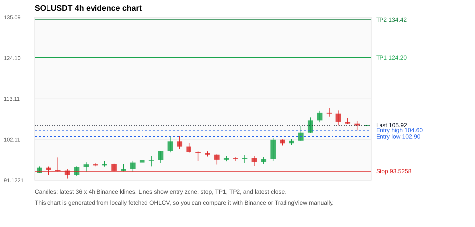
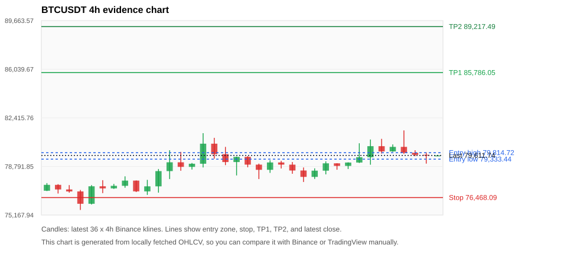
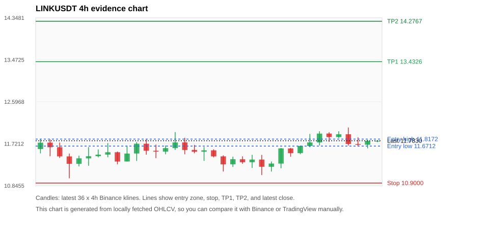
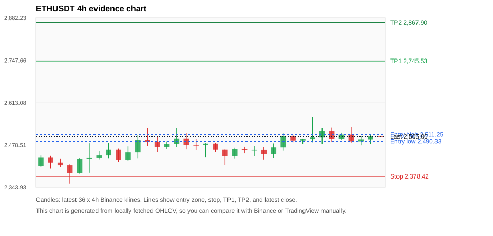
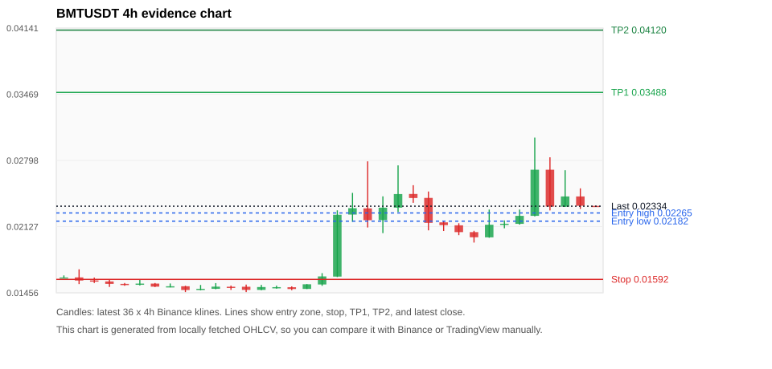

# Crypto 市场扫描报告 v1

- 报告时间：2026-08-28 20:06:24 CST
- Run ID：`20260828_120503_740b7d3d`
- Run type：`daily_full`
- Data validation mode：`paper`
- 数据来源：SQLite
- 报告版本：v1
- 扫描 ID：637752924d13
- 数据源：Binance public spot API + CoinGecko/CoinMarketCap cross-check
- 过滤条件：USDT spot; 24h quote volume >= 30,000,000; trades >= 30,000; exclude stables/leveraged tokens; analyze 1h/4h/1d klines
- 默认单笔风险：账户权益的 1.00%

## 限制说明

- 交易信号仍以 Binance 现货公开 K 线为主源；外部数据源用于一致性复核。
- 结果是研究和模拟盘计划，不是确定收益或实盘下单指令。
- 历史长度过滤：候选币至少需要 180 根 1d K 线。
- 数据质量验证池：先验证 score 排名前 min(top_n * 2, 10) 的候选，再按 action + score 补足最终名单。
- 大盘环境过滤：RISK_ON; BTC/ETH 日线趋势均较强，允许山寨币买入候选。 BTC 7d=1.6259152802285293; ETH 7d=-0.4554305925366653.
- Data cross-validation enabled: Binance primary source plus CoinGecko; CoinMarketCap is checked when an API key is configured.
- TRUMPUSDT validation state BLOCKED: BLOCKED: [BINANCE_KLINE_EXTREME_RANGE] Binance candle range exceeds 40%.; [BINANCE_KLINE_EXTREME_RANGE] Binance candle range exceeds 40%.; [BINANCE_KLINE_EXTREME_RANGE] Binance candle range exceeds 40%.; [BINANCE_KLINE_EXTREME_RANGE] Binance candle range exceeds 40%.; [EXTERNAL_IDENTITY_AMBIGUOUS] CoinGecko symbol mapping has 2 exact matches; selected highest market-cap rank; [EXTERNAL_IDENTITY_AMBIGUOUS] CoinMarketCap symbol mapping has 61 matches; selected lowest cmc_rank
- BMTUSDT validation state BLOCKED: BLOCKED: [BINANCE_KLINE_EXTREME_RANGE] Binance candle range exceeds 40%.; [BINANCE_KLINE_EXTREME_RANGE] Binance candle range exceeds 40%.; [BINANCE_KLINE_EXTREME_RANGE] Binance candle range exceeds 40%.; [BINANCE_KLINE_EXTREME_RANGE] Binance candle range exceeds 40%.; [BINANCE_KLINE_EXTREME_RANGE] Binance candle range exceeds 40%.; [BINANCE_KLINE_EXTREME_RANGE] Binance candle range exceeds 40%.; [BINANCE_KLINE_EXTREME_RANGE] Binance candle range exceeds 40%.; [BINANCE_KLINE_EXTREME_RANGE] Binance candle range exceeds 40%.; [BINANCE_KLINE_EXTREME_RANGE] Binance candle range exceeds 40%.; [EXTERNAL_IDENTITY_AMBIGUOUS] CoinGecko symbol mapping has 2 exact matches; selected highest market-cap rank; [EXTERNAL_IDENTITY_AMBIGUOUS] CoinMarketCap symbol mapping has 3 matches; selected lowest cmc_rank
- ENAUSDT validation state DEGRADED: DEGRADED: [EXTERNAL_IDENTITY_AMBIGUOUS] CoinMarketCap symbol mapping has 2 matches; selected lowest cmc_rank
- SOLUSDT validation state DEGRADED: DEGRADED: [EXTERNAL_IDENTITY_AMBIGUOUS] CoinMarketCap symbol mapping has 8 matches; selected lowest cmc_rank
- ZECUSDT validation state BLOCKED: BLOCKED: [BINANCE_KLINE_EXTREME_RANGE] Binance candle range exceeds 40%.; [BINANCE_KLINE_EXTREME_RANGE] Binance candle range exceeds 40%.; [EXTERNAL_IDENTITY_AMBIGUOUS] CoinMarketCap symbol mapping has 2 matches; selected lowest cmc_rank
- BTCUSDT validation state DEGRADED: DEGRADED: [EXTERNAL_PROVIDER_RATE_LIMITED] Provider rate limited request for https://api.coingecko.com/api/v3/coins/markets?vs_currency=usd&ids=bitcoin&price_change_percentage=24h&per_page=1&page=1: HTTP 429; [EXTERNAL_IDENTITY_AMBIGUOUS] CoinMarketCap symbol mapping has 13 matches; selected lowest cmc_rank
- PUMPUSDT validation state BLOCKED: BLOCKED: [BINANCE_KLINE_EXTREME_RANGE] Binance candle range exceeds 40%.; [EXTERNAL_PROVIDER_RATE_LIMITED] Provider rate limited request for https://api.coingecko.com/api/v3/coins/markets?vs_currency=usd&ids=pump-fun&price_change_percentage=24h&per_page=1&page=1: HTTP 429; [EXTERNAL_IDENTITY_AMBIGUOUS] CoinMarketCap symbol mapping has 15 matches; selected lowest cmc_rank
- LINKUSDT validation state DEGRADED: DEGRADED: [EXTERNAL_PROVIDER_RATE_LIMITED] Provider rate limited request for https://api.coingecko.com/api/v3/coins/markets?vs_currency=usd&ids=chainlink&price_change_percentage=24h&per_page=1&page=1: HTTP 429
- ETHUSDT validation state DEGRADED: DEGRADED: [EXTERNAL_PROVIDER_RATE_LIMITED] Provider rate limited request for https://api.coingecko.com/api/v3/coins/markets?vs_currency=usd&ids=ethereum&price_change_percentage=24h&per_page=1&page=1: HTTP 429; [EXTERNAL_IDENTITY_AMBIGUOUS] CoinMarketCap symbol mapping has 6 matches; selected lowest cmc_rank
- BNBUSDT validation state DEGRADED: DEGRADED: [EXTERNAL_PROVIDER_RATE_LIMITED] Provider rate limited request for https://api.coingecko.com/api/v3/coins/markets?vs_currency=usd&ids=binancecoin&price_change_percentage=24h&per_page=1&page=1: HTTP 429; [EXTERNAL_IDENTITY_AMBIGUOUS] CoinMarketCap symbol mapping has 4 matches; selected lowest cmc_rank

## 5 个候选交易计划

| Rank | Coin | Action | Setup | Entry Zone | Stop Loss | TP1 | TP2 / Exit Rule | R/R | Verdict |
|---:|---|---|---|---:|---:|---:|---|---:|---|
| 1 | `SOL` | `BUY_CANDIDATE` | 回踩支撑/4h EMA 附近 | 102.90 - 104.60 | 93.5258 | 124.20 | 134.42 或跌破 4h 关键支撑 | 2.00-3.00 | 可考虑 |
| 2 | `BTC` | `BUY_CANDIDATE` | 回踩支撑/4h EMA 附近 | 79,333.44 - 79,814.72 | 76,468.09 | 85,786.05 | 89,217.49 或跌破 4h 关键支撑 | 2.00-3.10 | 可考虑 |
| 3 | `LINK` | `BUY_CANDIDATE` | 回踩支撑/4h EMA 附近 | 11.6712 - 11.8172 | 10.9000 | 13.4326 | 14.2767 或跌破 4h 关键支撑 | 2.00-3.00 | 可考虑 |
| 4 | `ETH` | `BUY_CANDIDATE` | 回踩支撑/4h EMA 附近 | 2,490.33 - 2,511.25 | 2,378.42 | 2,745.53 | 2,867.90 或跌破 4h 关键支撑 | 2.00-3.00 | 可考虑 |
| 5 | `BMT` | `WAIT_PULLBACK` | 趋势中，等回调入场 | 0.02182 - 0.02265 | 0.01592 | 0.03488 | 0.04120 或跌破 4h 关键支撑 | 2.00-3.00 | 只观察 |

## 数据交叉验证摘要

价格差异以 Binance 当前价为基准；成交量口径不同，Binance 是 USDT 现货成交额，CoinGecko/CoinMarketCap 通常是全市场成交量。

| Rank | Coin | State | Identity | Max Price Diff | Max 24h Diff | Issue Codes | Message |
|---:|---|---|---|---:|---:|---|---|
| 1 | `SOL` | DEGRADED (DATA_WARNING) | UNCONFIRMED | 0.14% | 0.14 pts | EXTERNAL_IDENTITY_AMBIGUOUS | DEGRADED: [EXTERNAL_IDENTITY_AMBIGUOUS] CoinMarketCap symbol mapping has 8 matches; selected lowest cmc_rank |
| 2 | `BTC` | DEGRADED (DATA_WARNING) | UNCONFIRMED | 0.01% | 0.02 pts | EXTERNAL_IDENTITY_AMBIGUOUS, EXTERNAL_PROVIDER_RATE_LIMITED | DEGRADED: [EXTERNAL_PROVIDER_RATE_LIMITED] Provider rate limited request for https://api.coingecko.com/api/v3/coins/markets?vs_currency=usd&ids=bitcoin&price_change_percentage=24h&per_page=1&page=1: HTTP 429; [EXTERNAL_IDENTITY_AMBIGUOUS] CoinMarketCap symbol mapping has 13 matches; selected lowest cmc_rank |
| 3 | `LINK` | DEGRADED (DATA_WARNING) | UNCONFIRMED | 0.07% | 0.02 pts | EXTERNAL_PROVIDER_RATE_LIMITED | DEGRADED: [EXTERNAL_PROVIDER_RATE_LIMITED] Provider rate limited request for https://api.coingecko.com/api/v3/coins/markets?vs_currency=usd&ids=chainlink&price_change_percentage=24h&per_page=1&page=1: HTTP 429 |
| 4 | `ETH` | DEGRADED (DATA_WARNING) | UNCONFIRMED | 0.02% | 0.03 pts | EXTERNAL_IDENTITY_AMBIGUOUS, EXTERNAL_PROVIDER_RATE_LIMITED | DEGRADED: [EXTERNAL_PROVIDER_RATE_LIMITED] Provider rate limited request for https://api.coingecko.com/api/v3/coins/markets?vs_currency=usd&ids=ethereum&price_change_percentage=24h&per_page=1&page=1: HTTP 429; [EXTERNAL_IDENTITY_AMBIGUOUS] CoinMarketCap symbol mapping has 6 matches; selected lowest cmc_rank |
| 5 | `BMT` | BLOCKED (DATA_ERROR) | UNCONFIRMED | 0.05% | 1.28 pts | BINANCE_KLINE_EXTREME_RANGE, EXTERNAL_IDENTITY_AMBIGUOUS | BLOCKED: [BINANCE_KLINE_EXTREME_RANGE] Binance candle range exceeds 40%.; [BINANCE_KLINE_EXTREME_RANGE] Binance candle range exceeds 40%.; [BINANCE_KLINE_EXTREME_RANGE] Binance candle range exceeds 40%.; [BINANCE_KLINE_EXTREME_RANGE] Binance candle range exceeds 40%.; [BINANCE_KLINE_EXTREME_RANGE] Binance candle range exceeds 40%.; [BINANCE_KLINE_EXTREME_RANGE] Binance candle range exceeds 40%.; [BINANCE_KLINE_EXTREME_RANGE] Binance candle range exceeds 40%.; [BINANCE_KLINE_EXTREME_RANGE] Binance candle range exceeds 40%.; [BINANCE_KLINE_EXTREME_RANGE] Binance candle range exceeds 40%.; [EXTERNAL_IDENTITY_AMBIGUOUS] CoinGecko symbol mapping has 2 exact matches; selected highest market-cap rank; [EXTERNAL_IDENTITY_AMBIGUOUS] CoinMarketCap symbol mapping has 3 matches; selected lowest cmc_rank |

## 候选币说明

### 1. SOL `SOLUSDT`



- 入选原因：回踩支撑/4h EMA 附近；24h +1.70%，7d +16.31%，4h RSI 72.17，24h 成交额 $477.7M。
- 交易失效条件：跌破 93.52575 或 4h 收盘重新失守关键支撑。
- 主要风险：主要风险是大盘同步回撤；External validation is degraded; this candidate is not a clean data sample.；Paper mode allows degraded validation; candidate is excluded from clean-data samples.。
- 数据交叉验证：DEGRADED / DATA_WARNING；身份=UNCONFIRMED；DEGRADED: [EXTERNAL_IDENTITY_AMBIGUOUS] CoinMarketCap symbol mapping has 8 matches; selected lowest cmc_rank

#### 可点击人工验证

- [Binance 交易页](https://www.binance.com/en/trade/SOL_USDT)
- [TradingView 图表](https://www.tradingview.com/chart/?symbol=BINANCE%3ASOLUSDT)
- [CoinGecko 搜索](https://www.coingecko.com/en/search?query=SOL)
- [CoinMarketCap 搜索](https://coinmarketcap.com/search/?q=SOL)

#### 多数据源对照

| Source | Status | Identity | Blocking | Asset ID | Price | 24h Change | 24h Volume | Price Diff | 24h Diff | Updated | Issue Codes | Message |
|---|---|---|---:|---|---:|---:|---:|---:|---:|---|---|---|
| Binance | DATA_OK | CONFIRMED | no | SOLUSDT | 105.92 | +1.70% | $477.7M | 0.00% | 0.00 pts | 2026-08-28T12:05:40+00:00 | none | Primary market data source passed health checks. |
| CoinGecko | DATA_OK | CONFIRMED | no | solana | 105.77 | +1.60% | $5.91B | 0.14% | 0.10 pts | 2026-08-28T12:03:20.000Z | none | External source agrees with Binance within thresholds. |
| CoinMarketCap | DATA_WARNING | UNCONFIRMED | no | 5426 | 105.78 | +1.56% | $5.83B | 0.14% | 0.14 pts | 2026-08-28T12:04:05.000Z | EXTERNAL_IDENTITY_AMBIGUOUS | [EXTERNAL_IDENTITY_AMBIGUOUS] CoinMarketCap symbol mapping has 8 matches; selected lowest cmc_rank |

#### 指标证据

| 指标 | 数值 | 人工核对用途 |
|---|---:|---|
| 当前价 | 105.92 | 与 Binance/TradingView 当前价格对照 |
| 24h 涨跌 | +1.70% | 与交易所 24h 涨跌对照 |
| 7d 涨跌 | +16.31% | 判断短线趋势是否延续 |
| 4h EMA20 | 102.70 | 判断短期趋势支撑 |
| 4h EMA50 | 96.7293 | 判断中期趋势支撑 |
| 1d EMA20 | 90.1805 | 判断日线趋势 |
| 1d EMA50 | 82.8406 | 判断日线趋势 |
| 4h RSI14 | 72.17 | 判断是否过热/过弱 |
| 4h ATR14 | 2.7186 | 推导止损和入场缓冲 |
| 最近 18 根 4h 最低点 | 94.9500 | 支撑/止损参考 |
| 最近 36 根 4h 最高点 | 110.60 | TP/压力参考 |
| 支撑位 | 102.70 | 入场区间推导基础 |

#### 交易计划推导

- 支撑位 = 最近低点、4h EMA20、4h EMA50、1d EMA20 中不高于当前价的最高有效支撑 = `102.70`。
- 入场区间 = 支撑位附近 + ATR 缓冲 = `102.90 - 104.60`。
- 止损 = min(最近 18 根 4h 最低点 * 0.985, 入场中位价 - 1.15 * ATR14) = `93.5258`。
- TP1 = max(最近 36 根 4h 最高点 * 0.995, 入场中位价 + 2R) = `124.20`。
- TP2 = max(入场中位价 + 3R, TP1 * 1.04) = `134.42`。

#### 最近 10 根 4h K线

| UTC 开盘时间 | Open | High | Low | Close | Quote Volume | Trades |
|---|---:|---:|---:|---:|---:|---:|
| 2026-08-27T00:00+00:00 | 102.08 | 102.14 | 100.52 | 101.08 | $53.9M | 246048 |
| 2026-08-27T04:00+00:00 | 101.09 | 102.29 | 100.70 | 101.80 | $58.2M | 191931 |
| 2026-08-27T08:00+00:00 | 101.81 | 105.79 | 101.73 | 103.95 | $127.5M | 519215 |
| 2026-08-27T12:00+00:00 | 103.95 | 108.00 | 103.93 | 107.20 | $133.8M | 576530 |
| 2026-08-27T16:00+00:00 | 107.20 | 109.92 | 106.69 | 109.39 | $107.7M | 485809 |
| 2026-08-27T20:00+00:00 | 109.39 | 110.60 | 108.21 | 109.14 | $63.7M | 249410 |
| 2026-08-28T00:00+00:00 | 109.15 | 110.00 | 105.86 | 106.85 | $73.5M | 317408 |
| 2026-08-28T04:00+00:00 | 106.84 | 107.85 | 106.26 | 106.35 | $39.8M | 180689 |
| 2026-08-28T08:00+00:00 | 106.35 | 107.05 | 104.53 | 105.84 | $59.0M | 186642 |
| 2026-08-28T12:00+00:00 | 105.84 | 105.92 | 105.73 | 105.92 | $1.6M | 3394 |

### 2. BTC `BTCUSDT`



- 入选原因：回踩支撑/4h EMA 附近；24h +0.25%，7d +3.03%，4h RSI 56.90，24h 成交额 $1.36B。
- 交易失效条件：跌破 76468.091 或 4h 收盘重新失守关键支撑。
- 主要风险：主要风险是大盘同步回撤；External validation is degraded; this candidate is not a clean data sample.；Paper mode allows degraded validation; candidate is excluded from clean-data samples.。
- 数据交叉验证：DEGRADED / DATA_WARNING；身份=UNCONFIRMED；DEGRADED: [EXTERNAL_PROVIDER_RATE_LIMITED] Provider rate limited request for https://api.coingecko.com/api/v3/coins/markets?vs_currency=usd&ids=bitcoin&price_change_percentage=24h&per_page=1&page=1: HTTP 429; [EXTERNAL_IDENTITY_AMBIGUOUS] CoinMarketCap symbol mapping has 13 matches; selected lowest cmc_rank

#### 可点击人工验证

- [Binance 交易页](https://www.binance.com/en/trade/BTC_USDT)
- [TradingView 图表](https://www.tradingview.com/chart/?symbol=BINANCE%3ABTCUSDT)
- [CoinGecko 搜索](https://www.coingecko.com/en/search?query=BTC)
- [CoinMarketCap 搜索](https://coinmarketcap.com/search/?q=BTC)

#### 多数据源对照

| Source | Status | Identity | Blocking | Asset ID | Price | 24h Change | 24h Volume | Price Diff | 24h Diff | Updated | Issue Codes | Message |
|---|---|---|---:|---|---:|---:|---:|---:|---:|---|---|---|
| Binance | DATA_OK | CONFIRMED | no | BTCUSDT | 79,611.74 | +0.25% | $1.36B | 0.00% | 0.00 pts | 2026-08-28T12:05:40+00:00 | none | Primary market data source passed health checks. |
| CoinGecko | DATA_WARNING | UNCONFIRMED | no | n/a | n/a | n/a | n/a | n/a | n/a | 2026-08-28T12:05:40+00:00 | EXTERNAL_PROVIDER_RATE_LIMITED | Provider rate limited request for https://api.coingecko.com/api/v3/coins/markets?vs_currency=usd&ids=bitcoin&price_change_percentage=24h&per_page=1&page=1: HTTP 429 |
| CoinMarketCap | DATA_WARNING | UNCONFIRMED | no | 1 | 79,617.99 | +0.23% | $34.89B | 0.01% | 0.02 pts | 2026-08-28T12:05:04.000Z | EXTERNAL_IDENTITY_AMBIGUOUS | [EXTERNAL_IDENTITY_AMBIGUOUS] CoinMarketCap symbol mapping has 13 matches; selected lowest cmc_rank |

#### 指标证据

| 指标 | 数值 | 人工核对用途 |
|---|---:|---|
| 当前价 | 79,611.74 | 与 Binance/TradingView 当前价格对照 |
| 24h 涨跌 | +0.25% | 与交易所 24h 涨跌对照 |
| 7d 涨跌 | +3.03% | 判断短线趋势是否延续 |
| 4h EMA20 | 79,175.09 | 判断短期趋势支撑 |
| 4h EMA50 | 76,778.44 | 判断中期趋势支撑 |
| 1d EMA20 | 72,767.42 | 判断日线趋势 |
| 1d EMA50 | 68,691.47 | 判断日线趋势 |
| 4h RSI14 | 56.90 | 判断是否过热/过弱 |
| 4h ATR14 | 913.76 | 推导止损和入场缓冲 |
| 最近 18 根 4h 最低点 | 77,632.58 | 支撑/止损参考 |
| 最近 36 根 4h 最高点 | 81,478.87 | TP/压力参考 |
| 支撑位 | 79,175.09 | 入场区间推导基础 |

#### 交易计划推导

- 支撑位 = 最近低点、4h EMA20、4h EMA50、1d EMA20 中不高于当前价的最高有效支撑 = `79,175.09`。
- 入场区间 = 支撑位附近 + ATR 缓冲 = `79,333.44 - 79,814.72`。
- 止损 = min(最近 18 根 4h 最低点 * 0.985, 入场中位价 - 1.15 * ATR14) = `76,468.09`。
- TP1 = max(最近 36 根 4h 最高点 * 0.995, 入场中位价 + 2R) = `85,786.05`。
- TP2 = max(入场中位价 + 3R, TP1 * 1.04) = `89,217.49`。

#### 最近 10 根 4h K线

| UTC 开盘时间 | Open | High | Low | Close | Quote Volume | Trades |
|---|---:|---:|---:|---:|---:|---:|
| 2026-08-27T00:00+00:00 | 79,023.75 | 79,028.49 | 78,546.13 | 78,830.68 | $144.6M | 551359 |
| 2026-08-27T04:00+00:00 | 78,830.68 | 79,095.99 | 78,600.00 | 79,082.17 | $96.4M | 384940 |
| 2026-08-27T08:00+00:00 | 79,082.18 | 80,520.00 | 79,048.00 | 79,477.67 | $330.5M | 1124274 |
| 2026-08-27T12:00+00:00 | 79,477.66 | 80,799.91 | 78,920.00 | 80,302.32 | $361.7M | 1596713 |
| 2026-08-27T16:00+00:00 | 80,302.32 | 80,848.74 | 79,749.70 | 79,910.19 | $249.8M | 874564 |
| 2026-08-27T20:00+00:00 | 79,910.19 | 80,432.36 | 79,882.86 | 80,249.58 | $114.3M | 400435 |
| 2026-08-28T00:00+00:00 | 80,249.59 | 81,478.87 | 79,723.02 | 79,810.49 | $297.7M | 914119 |
| 2026-08-28T04:00+00:00 | 79,810.48 | 79,999.00 | 79,558.11 | 79,660.00 | $180.7M | 520403 |
| 2026-08-28T08:00+00:00 | 79,660.00 | 79,840.00 | 79,001.01 | 79,604.13 | $159.8M | 470492 |
| 2026-08-28T12:00+00:00 | 79,604.12 | 79,624.76 | 79,568.79 | 79,611.74 | $1.7M | 7504 |

### 3. LINK `LINKUSDT`



- 入选原因：回踩支撑/4h EMA 附近；24h +0.20%，7d +3.27%，4h RSI 64.62，24h 成交额 $32.6M。
- 交易失效条件：跌破 10.90001 或 4h 收盘重新失守关键支撑。
- 主要风险：主要风险是大盘同步回撤；External validation is degraded; this candidate is not a clean data sample.；Paper mode allows degraded validation; candidate is excluded from clean-data samples.。
- 数据交叉验证：DEGRADED / DATA_WARNING；身份=UNCONFIRMED；DEGRADED: [EXTERNAL_PROVIDER_RATE_LIMITED] Provider rate limited request for https://api.coingecko.com/api/v3/coins/markets?vs_currency=usd&ids=chainlink&price_change_percentage=24h&per_page=1&page=1: HTTP 429

#### 可点击人工验证

- [Binance 交易页](https://www.binance.com/en/trade/LINK_USDT)
- [TradingView 图表](https://www.tradingview.com/chart/?symbol=BINANCE%3ALINKUSDT)
- [CoinGecko 搜索](https://www.coingecko.com/en/search?query=LINK)
- [CoinMarketCap 搜索](https://coinmarketcap.com/search/?q=LINK)

#### 多数据源对照

| Source | Status | Identity | Blocking | Asset ID | Price | 24h Change | 24h Volume | Price Diff | 24h Diff | Updated | Issue Codes | Message |
|---|---|---|---:|---|---:|---:|---:|---:|---:|---|---|---|
| Binance | DATA_OK | CONFIRMED | no | LINKUSDT | 11.7830 | +0.20% | $32.6M | 0.00% | 0.00 pts | 2026-08-28T12:05:40+00:00 | none | Primary market data source passed health checks. |
| CoinGecko | DATA_WARNING | UNCONFIRMED | no | n/a | n/a | n/a | n/a | n/a | n/a | 2026-08-28T12:05:40+00:00 | EXTERNAL_PROVIDER_RATE_LIMITED | Provider rate limited request for https://api.coingecko.com/api/v3/coins/markets?vs_currency=usd&ids=chainlink&price_change_percentage=24h&per_page=1&page=1: HTTP 429 |
| CoinMarketCap | DATA_OK | CONFIRMED | no | 1975 | 11.7750 | +0.19% | $375.4M | 0.07% | 0.02 pts | 2026-08-28T12:05:04.000Z | none | External source agrees with Binance within thresholds. |

#### 指标证据

| 指标 | 数值 | 人工核对用途 |
|---|---:|---|
| 当前价 | 11.7830 | 与 Binance/TradingView 当前价格对照 |
| 24h 涨跌 | +0.20% | 与交易所 24h 涨跌对照 |
| 7d 涨跌 | +3.27% | 判断短线趋势是否延续 |
| 4h EMA20 | 11.6479 | 判断短期趋势支撑 |
| 4h EMA50 | 11.2821 | 判断中期趋势支撑 |
| 1d EMA20 | 10.5337 | 判断日线趋势 |
| 1d EMA50 | 9.4949 | 判断日线趋势 |
| 4h RSI14 | 64.62 | 判断是否过热/过弱 |
| 4h ATR14 | 0.24179 | 推导止损和入场缓冲 |
| 最近 18 根 4h 最低点 | 11.0660 | 支撑/止损参考 |
| 最近 36 根 4h 最高点 | 12.0590 | TP/压力参考 |
| 支撑位 | 11.6479 | 入场区间推导基础 |

#### 交易计划推导

- 支撑位 = 最近低点、4h EMA20、4h EMA50、1d EMA20 中不高于当前价的最高有效支撑 = `11.6479`。
- 入场区间 = 支撑位附近 + ATR 缓冲 = `11.6712 - 11.8172`。
- 止损 = min(最近 18 根 4h 最低点 * 0.985, 入场中位价 - 1.15 * ATR14) = `10.9000`。
- TP1 = max(最近 36 根 4h 最高点 * 0.995, 入场中位价 + 2R) = `13.4326`。
- TP2 = max(入场中位价 + 3R, TP1 * 1.04) = `14.2767`。

#### 最近 10 根 4h K线

| UTC 开盘时间 | Open | High | Low | Close | Quote Volume | Trades |
|---|---:|---:|---:|---:|---:|---:|
| 2026-08-27T00:00+00:00 | 11.6230 | 11.6320 | 11.4500 | 11.5240 | $3.3M | 42886 |
| 2026-08-27T04:00+00:00 | 11.5250 | 11.6830 | 11.5020 | 11.6740 | $3.8M | 42361 |
| 2026-08-27T08:00+00:00 | 11.6740 | 11.9240 | 11.6480 | 11.7480 | $8.3M | 105216 |
| 2026-08-27T12:00+00:00 | 11.7480 | 11.9800 | 11.6850 | 11.9320 | $10.2M | 108890 |
| 2026-08-27T16:00+00:00 | 11.9330 | 11.9600 | 11.7590 | 11.8590 | $5.6M | 70286 |
| 2026-08-27T20:00+00:00 | 11.8590 | 11.9810 | 11.8380 | 11.9190 | $3.1M | 32653 |
| 2026-08-28T00:00+00:00 | 11.9190 | 12.0590 | 11.6810 | 11.7150 | $6.2M | 64266 |
| 2026-08-28T04:00+00:00 | 11.7140 | 11.8530 | 11.6620 | 11.7000 | $3.9M | 40473 |
| 2026-08-28T08:00+00:00 | 11.7000 | 11.8020 | 11.6240 | 11.7820 | $3.6M | 41238 |
| 2026-08-28T12:00+00:00 | 11.7830 | 11.7830 | 11.7520 | 11.7830 | $141,140 | 990 |

### 4. ETH `ETHUSDT`



- 入选原因：回踩支撑/4h EMA 附近；24h +0.15%，7d +4.91%，4h RSI 61.57，24h 成交额 $688.1M。
- 交易失效条件：跌破 2378.4204 或 4h 收盘重新失守关键支撑。
- 主要风险：主要风险是大盘同步回撤；External validation is degraded; this candidate is not a clean data sample.；Paper mode allows degraded validation; candidate is excluded from clean-data samples.。
- 数据交叉验证：DEGRADED / DATA_WARNING；身份=UNCONFIRMED；DEGRADED: [EXTERNAL_PROVIDER_RATE_LIMITED] Provider rate limited request for https://api.coingecko.com/api/v3/coins/markets?vs_currency=usd&ids=ethereum&price_change_percentage=24h&per_page=1&page=1: HTTP 429; [EXTERNAL_IDENTITY_AMBIGUOUS] CoinMarketCap symbol mapping has 6 matches; selected lowest cmc_rank

#### 可点击人工验证

- [Binance 交易页](https://www.binance.com/en/trade/ETH_USDT)
- [TradingView 图表](https://www.tradingview.com/chart/?symbol=BINANCE%3AETHUSDT)
- [CoinGecko 搜索](https://www.coingecko.com/en/search?query=ETH)
- [CoinMarketCap 搜索](https://coinmarketcap.com/search/?q=ETH)

#### 多数据源对照

| Source | Status | Identity | Blocking | Asset ID | Price | 24h Change | 24h Volume | Price Diff | 24h Diff | Updated | Issue Codes | Message |
|---|---|---|---:|---|---:|---:|---:|---:|---:|---|---|---|
| Binance | DATA_OK | CONFIRMED | no | ETHUSDT | 2,505.00 | +0.15% | $688.1M | 0.00% | 0.00 pts | 2026-08-28T12:05:40+00:00 | none | Primary market data source passed health checks. |
| CoinGecko | DATA_WARNING | UNCONFIRMED | no | n/a | n/a | n/a | n/a | n/a | n/a | 2026-08-28T12:05:40+00:00 | EXTERNAL_PROVIDER_RATE_LIMITED | Provider rate limited request for https://api.coingecko.com/api/v3/coins/markets?vs_currency=usd&ids=ethereum&price_change_percentage=24h&per_page=1&page=1: HTTP 429 |
| CoinMarketCap | DATA_WARNING | UNCONFIRMED | no | 1027 | 2,504.50 | +0.12% | $14.46B | 0.02% | 0.03 pts | 2026-08-28T12:05:04.000Z | EXTERNAL_IDENTITY_AMBIGUOUS | [EXTERNAL_IDENTITY_AMBIGUOUS] CoinMarketCap symbol mapping has 6 matches; selected lowest cmc_rank |

#### 指标证据

| 指标 | 数值 | 人工核对用途 |
|---|---:|---|
| 当前价 | 2,505.00 | 与 Binance/TradingView 当前价格对照 |
| 24h 涨跌 | +0.15% | 与交易所 24h 涨跌对照 |
| 7d 涨跌 | +4.91% | 判断短线趋势是否延续 |
| 4h EMA20 | 2,485.36 | 判断短期趋势支撑 |
| 4h EMA50 | 2,400.38 | 判断中期趋势支撑 |
| 1d EMA20 | 2,249.89 | 判断日线趋势 |
| 1d EMA50 | 2,061.13 | 判断日线趋势 |
| 4h RSI14 | 61.57 | 判断是否过热/过弱 |
| 4h ATR14 | 36.9821 | 推导止损和入场缓冲 |
| 最近 18 根 4h 最低点 | 2,414.64 | 支撑/止损参考 |
| 最近 36 根 4h 最高点 | 2,566.53 | TP/压力参考 |
| 支撑位 | 2,485.36 | 入场区间推导基础 |

#### 交易计划推导

- 支撑位 = 最近低点、4h EMA20、4h EMA50、1d EMA20 中不高于当前价的最高有效支撑 = `2,485.36`。
- 入场区间 = 支撑位附近 + ATR 缓冲 = `2,490.33 - 2,511.25`。
- 止损 = min(最近 18 根 4h 最低点 * 0.985, 入场中位价 - 1.15 * ATR14) = `2,378.42`。
- TP1 = max(最近 36 根 4h 最高点 * 0.995, 入场中位价 + 2R) = `2,745.53`。
- TP2 = max(入场中位价 + 3R, TP1 * 1.04) = `2,867.90`。

#### 最近 10 根 4h K线

| UTC 开盘时间 | Open | High | Low | Close | Quote Volume | Trades |
|---|---:|---:|---:|---:|---:|---:|
| 2026-08-27T00:00+00:00 | 2,506.78 | 2,510.64 | 2,487.03 | 2,492.89 | $82.1M | 414384 |
| 2026-08-27T04:00+00:00 | 2,492.89 | 2,499.00 | 2,481.74 | 2,497.16 | $59.0M | 277273 |
| 2026-08-27T08:00+00:00 | 2,497.17 | 2,566.53 | 2,486.97 | 2,501.73 | $284.9M | 1018546 |
| 2026-08-27T12:00+00:00 | 2,501.74 | 2,531.84 | 2,482.54 | 2,521.68 | $185.5M | 889613 |
| 2026-08-27T16:00+00:00 | 2,521.68 | 2,533.78 | 2,488.74 | 2,498.21 | $170.0M | 548302 |
| 2026-08-27T20:00+00:00 | 2,498.22 | 2,516.98 | 2,495.06 | 2,510.94 | $65.0M | 278411 |
| 2026-08-28T00:00+00:00 | 2,510.94 | 2,535.05 | 2,486.09 | 2,489.92 | $103.7M | 491891 |
| 2026-08-28T04:00+00:00 | 2,489.91 | 2,505.37 | 2,477.49 | 2,496.48 | $77.7M | 315837 |
| 2026-08-28T08:00+00:00 | 2,496.47 | 2,511.51 | 2,482.17 | 2,505.10 | $87.3M | 330221 |
| 2026-08-28T12:00+00:00 | 2,505.10 | 2,505.89 | 2,504.10 | 2,504.99 | $1.1M | 4951 |

### 5. BMT `BMTUSDT`



- 入选原因：趋势中，等回调入场；24h +7.31%，7d +34.60%，4h RSI 50.41，24h 成交额 $48.5M。
- 交易失效条件：跌破 0.0159176 或 4h 收盘重新失守关键支撑。
- 主要风险：24h 振幅较大，回撤风险高；成交量突增，可能是事件驱动；Blocking data-quality issue detected; paper plan creation is not allowed.。
- 数据交叉验证：BLOCKED / DATA_ERROR；身份=UNCONFIRMED；BLOCKED: [BINANCE_KLINE_EXTREME_RANGE] Binance candle range exceeds 40%.; [BINANCE_KLINE_EXTREME_RANGE] Binance candle range exceeds 40%.; [BINANCE_KLINE_EXTREME_RANGE] Binance candle range exceeds 40%.; [BINANCE_KLINE_EXTREME_RANGE] Binance candle range exceeds 40%.; [BINANCE_KLINE_EXTREME_RANGE] Binance candle range exceeds 40%.; [BINANCE_KLINE_EXTREME_RANGE] Binance candle range exceeds 40%.; [BINANCE_KLINE_EXTREME_RANGE] Binance candle range exceeds 40%.; [BINANCE_KLINE_EXTREME_RANGE] Binance candle range exceeds 40%.; [BINANCE_KLINE_EXTREME_RANGE] Binance candle range exceeds 40%.; [EXTERNAL_IDENTITY_AMBIGUOUS] CoinGecko symbol mapping has 2 exact matches; selected highest market-cap rank; [EXTERNAL_IDENTITY_AMBIGUOUS] CoinMarketCap symbol mapping has 3 matches; selected lowest cmc_rank

#### 可点击人工验证

- [Binance 交易页](https://www.binance.com/en/trade/BMT_USDT)
- [TradingView 图表](https://www.tradingview.com/chart/?symbol=BINANCE%3ABMTUSDT)
- [CoinGecko 搜索](https://www.coingecko.com/en/search?query=BMT)
- [CoinMarketCap 搜索](https://coinmarketcap.com/search/?q=BMT)

#### 多数据源对照

| Source | Status | Identity | Blocking | Asset ID | Price | 24h Change | 24h Volume | Price Diff | 24h Diff | Updated | Issue Codes | Message |
|---|---|---|---:|---|---:|---:|---:|---:|---:|---|---|---|
| Binance | DATA_ERROR | CONFIRMED | yes | BMTUSDT | 0.02334 | +7.31% | $48.5M | 0.00% | 0.00 pts | 2026-08-28T12:05:40+00:00 | BINANCE_KLINE_EXTREME_RANGE | [BINANCE_KLINE_EXTREME_RANGE] Binance candle range exceeds 40%.; [BINANCE_KLINE_EXTREME_RANGE] Binance candle range exceeds 40%.; [BINANCE_KLINE_EXTREME_RANGE] Binance candle range exceeds 40%.; [BINANCE_KLINE_EXTREME_RANGE] Binance candle range exceeds 40%.; [BINANCE_KLINE_EXTREME_RANGE] Binance candle range exceeds 40%.; [BINANCE_KLINE_EXTREME_RANGE] Binance candle range exceeds 40%.; [BINANCE_KLINE_EXTREME_RANGE] Binance candle range exceeds 40%.; [BINANCE_KLINE_EXTREME_RANGE] Binance candle range exceeds 40%.; [BINANCE_KLINE_EXTREME_RANGE] Binance candle range exceeds 40%. |
| CoinGecko | DATA_WARNING | UNCONFIRMED | no | bubblemaps | 0.02335 | +7.32% | $126.1M | 0.03% | 0.02 pts | 2026-08-28T12:03:20.000Z | EXTERNAL_IDENTITY_AMBIGUOUS | [EXTERNAL_IDENTITY_AMBIGUOUS] CoinGecko symbol mapping has 2 exact matches; selected highest market-cap rank |
| CoinMarketCap | DATA_WARNING | UNCONFIRMED | no | 35214 | 0.02335 | +8.58% | $122.8M | 0.05% | 1.28 pts | 2026-08-28T12:04:05.000Z | EXTERNAL_IDENTITY_AMBIGUOUS | [EXTERNAL_IDENTITY_AMBIGUOUS] CoinMarketCap symbol mapping has 3 matches; selected lowest cmc_rank |

#### 指标证据

| 指标 | 数值 | 人工核对用途 |
|---|---:|---|
| 当前价 | 0.02334 | 与 Binance/TradingView 当前价格对照 |
| 24h 涨跌 | +7.31% | 与交易所 24h 涨跌对照 |
| 7d 涨跌 | +34.60% | 判断短线趋势是否延续 |
| 4h EMA20 | 0.02178 | 判断短期趋势支撑 |
| 4h EMA50 | 0.01967 | 判断中期趋势支撑 |
| 1d EMA20 | 0.01855 | 判断日线趋势 |
| 1d EMA50 | 0.01612 | 判断日线趋势 |
| 4h RSI14 | 50.41 | 判断是否过热/过弱 |
| 4h ATR14 | 0.0027442857 | 推导止损和入场缓冲 |
| 最近 18 根 4h 最低点 | 0.01616 | 支撑/止损参考 |
| 最近 36 根 4h 最高点 | 0.03030 | TP/压力参考 |
| 支撑位 | 0.02178 | 入场区间推导基础 |

#### 交易计划推导

- 支撑位 = 最近低点、4h EMA20、4h EMA50、1d EMA20 中不高于当前价的最高有效支撑 = `0.02178`。
- 入场区间 = 支撑位附近 + ATR 缓冲 = `0.02182 - 0.02265`。
- 止损 = min(最近 18 根 4h 最低点 * 0.985, 入场中位价 - 1.15 * ATR14) = `0.01592`。
- TP1 = max(最近 36 根 4h 最高点 * 0.995, 入场中位价 + 2R) = `0.03488`。
- TP2 = max(入场中位价 + 3R, TP1 * 1.04) = `0.04120`。

#### 最近 10 根 4h K线

| UTC 开盘时间 | Open | High | Low | Close | Quote Volume | Trades |
|---|---:|---:|---:|---:|---:|---:|
| 2026-08-27T00:00+00:00 | 0.02140 | 0.02161 | 0.02040 | 0.02071 | $721,792 | 20197 |
| 2026-08-27T04:00+00:00 | 0.02071 | 0.02084 | 0.01965 | 0.02019 | $1.1M | 21282 |
| 2026-08-27T08:00+00:00 | 0.02018 | 0.02300 | 0.02014 | 0.02146 | $4.9M | 83030 |
| 2026-08-27T12:00+00:00 | 0.02146 | 0.02190 | 0.02110 | 0.02156 | $3.5M | 53360 |
| 2026-08-27T16:00+00:00 | 0.02155 | 0.02300 | 0.02147 | 0.02236 | $3.8M | 56268 |
| 2026-08-27T20:00+00:00 | 0.02236 | 0.03030 | 0.02231 | 0.02704 | $11.5M | 190366 |
| 2026-08-28T00:00+00:00 | 0.02704 | 0.02830 | 0.02291 | 0.02330 | $8.5M | 101272 |
| 2026-08-28T04:00+00:00 | 0.02329 | 0.02699 | 0.02326 | 0.02433 | $13.3M | 145940 |
| 2026-08-28T08:00+00:00 | 0.02433 | 0.02515 | 0.02306 | 0.02338 | $7.8M | 94614 |
| 2026-08-28T12:00+00:00 | 0.02337 | 0.02338 | 0.02327 | 0.02334 | $136,781 | 877 |

## 组合风控

- 不要 5 个候选全部满仓买入。
- 同时持仓总风险建议控制在账户权益的 3% - 5% 以内。
- 如果 BTC/ETH 同时破位，暂停山寨币多头计划或降低仓位。
- 第一版报告用于模拟盘和人工复核，不自动下单。

## 原始数据

```json
[
  {
    "rank": 1,
    "symbol": "SOLUSDT",
    "base_asset": "SOL",
    "price": 105.92,
    "score": 69.57866416445503,
    "setup": "回踩支撑/4h EMA 附近",
    "verdict": "可考虑",
    "entry_low": 102.90071170390547,
    "entry_high": 104.5983210617819,
    "stop_loss": 93.52575,
    "take_profit_1": 124.19704914853108,
    "take_profit_2": 134.42081553137479,
    "risk_reward_1": 2.0,
    "risk_reward_2": 3.0000000000000013,
    "pct_24h": 1.7,
    "pct_3d": 9.027277406073075,
    "pct_7d": 16.30613813550017,
    "quote_volume_24h": 477664892.28985,
    "trades_24h": 1993144,
    "high_low_range_24h": 6.356380421194352,
    "rsi_1h": 23.28990228013022,
    "rsi_4h": 72.1700444883836,
    "ema20_4h": 102.69532106178191,
    "ema50_4h": 96.72934593941113,
    "ema20_1d": 90.18048341018185,
    "ema50_1d": 82.84057151019518,
    "atr_4h": 2.7185714285714266,
    "macd_hist_4h": 0.16485925079163533,
    "volume_ratio_24h": 1.049648331039674,
    "support_level": 102.69532106178191,
    "recent_low_4h_18": 94.95,
    "recent_high_4h_36": 110.6,
    "distance_to_support_pct": 3.1400446533276005,
    "binance_trade_url": "https://www.binance.com/en/trade/SOL_USDT",
    "tradingview_url": "https://www.tradingview.com/chart/?symbol=BINANCE%3ASOLUSDT",
    "coingecko_search_url": "https://www.coingecko.com/en/search?query=SOL",
    "coinmarketcap_search_url": "https://coinmarketcap.com/search/?q=SOL",
    "invalidation": "跌破 93.52575 或 4h 收盘重新失守关键支撑",
    "recent_4h_klines": [
      {
        "open_time_utc": "2026-08-22T16:00+00:00",
        "open": 93.08,
        "high": 94.8,
        "low": 93.07,
        "close": 94.49,
        "quote_volume": 43115060.51556,
        "trades": 160623
      },
      {
        "open_time_utc": "2026-08-22T20:00+00:00",
        "open": 94.49,
        "high": 94.78,
        "low": 92.58,
        "close": 93.82,
        "quote_volume": 38685724.52756,
        "trades": 183938
      },
      {
        "open_time_utc": "2026-08-23T00:00+00:00",
        "open": 93.83,
        "high": 97.21,
        "low": 93.43,
        "close": 93.7,
        "quote_volume": 102800675.89394,
        "trades": 449392
      },
      {
        "open_time_utc": "2026-08-23T04:00+00:00",
        "open": 93.71,
        "high": 94.1,
        "low": 91.58,
        "close": 92.49,
        "quote_volume": 73358283.14858,
        "trades": 327921
      },
      {
        "open_time_utc": "2026-08-23T08:00+00:00",
        "open": 92.48,
        "high": 94.82,
        "low": 92.31,
        "close": 94.63,
        "quote_volume": 42399496.45061,
        "trades": 182212
      },
      {
        "open_time_utc": "2026-08-23T12:00+00:00",
        "open": 94.62,
        "high": 95.9,
        "low": 93.4,
        "close": 95.36,
        "quote_volume": 76686796.78259,
        "trades": 332982
      },
      {
        "open_time_utc": "2026-08-23T16:00+00:00",
        "open": 95.37,
        "high": 95.72,
        "low": 94.82,
        "close": 95.07,
        "quote_volume": 24236724.50948,
        "trades": 151150
      },
      {
        "open_time_utc": "2026-08-23T20:00+00:00",
        "open": 95.08,
        "high": 96.25,
        "low": 94.76,
        "close": 95.43,
        "quote_volume": 38060982.04896,
        "trades": 231649
      },
      {
        "open_time_utc": "2026-08-24T00:00+00:00",
        "open": 95.44,
        "high": 95.56,
        "low": 93.47,
        "close": 93.66,
        "quote_volume": 58632721.37929,
        "trades": 278783
      },
      {
        "open_time_utc": "2026-08-24T04:00+00:00",
        "open": 93.66,
        "high": 95.45,
        "low": 93.47,
        "close": 94.11,
        "quote_volume": 57011645.9485,
        "trades": 216228
      },
      {
        "open_time_utc": "2026-08-24T08:00+00:00",
        "open": 94.11,
        "high": 96.33,
        "low": 93.26,
        "close": 95.84,
        "quote_volume": 58569757.09813,
        "trades": 239862
      },
      {
        "open_time_utc": "2026-08-24T12:00+00:00",
        "open": 95.84,
        "high": 97.61,
        "low": 94.18,
        "close": 96.45,
        "quote_volume": 119893274.34999,
        "trades": 596954
      },
      {
        "open_time_utc": "2026-08-24T16:00+00:00",
        "open": 96.46,
        "high": 97.58,
        "low": 94.81,
        "close": 96.54,
        "quote_volume": 82741910.33424,
        "trades": 411691
      },
      {
        "open_time_utc": "2026-08-24T20:00+00:00",
        "open": 96.54,
        "high": 98.99,
        "low": 95.75,
        "close": 98.97,
        "quote_volume": 63543938.15549,
        "trades": 272493
      },
      {
        "open_time_utc": "2026-08-25T00:00+00:00",
        "open": 98.98,
        "high": 102.77,
        "low": 98.56,
        "close": 101.61,
        "quote_volume": 183831354.33008,
        "trades": 754531
      },
      {
        "open_time_utc": "2026-08-25T04:00+00:00",
        "open": 101.61,
        "high": 103.08,
        "low": 99.54,
        "close": 100.23,
        "quote_volume": 84770390.02423,
        "trades": 335566
      },
      {
        "open_time_utc": "2026-08-25T08:00+00:00",
        "open": 100.24,
        "high": 101.13,
        "low": 98.49,
        "close": 98.6,
        "quote_volume": 66504662.50222,
        "trades": 296750
      },
      {
        "open_time_utc": "2026-08-25T12:00+00:00",
        "open": 98.61,
        "high": 98.82,
        "low": 96.21,
        "close": 98.38,
        "quote_volume": 79419746.67665,
        "trades": 477758
      },
      {
        "open_time_utc": "2026-08-25T16:00+00:00",
        "open": 98.38,
        "high": 98.83,
        "low": 97.45,
        "close": 97.94,
        "quote_volume": 39482520.15279,
        "trades": 190215
      },
      {
        "open_time_utc": "2026-08-25T20:00+00:00",
        "open": 97.95,
        "high": 98.05,
        "low": 95.32,
        "close": 96.6,
        "quote_volume": 42409771.67745,
        "trades": 223281
      },
      {
        "open_time_utc": "2026-08-26T00:00+00:00",
        "open": 96.6,
        "high": 97.56,
        "low": 96.17,
        "close": 97.06,
        "quote_volume": 30484680.0077,
        "trades": 134558
      },
      {
        "open_time_utc": "2026-08-26T04:00+00:00",
        "open": 97.06,
        "high": 97.33,
        "low": 96.25,
        "close": 96.95,
        "quote_volume": 27354750.4835,
        "trades": 121997
      },
      {
        "open_time_utc": "2026-08-26T08:00+00:00",
        "open": 96.95,
        "high": 97.88,
        "low": 95.78,
        "close": 97.03,
        "quote_volume": 32571130.28178,
        "trades": 163175
      },
      {
        "open_time_utc": "2026-08-26T12:00+00:00",
        "open": 97.04,
        "high": 97.57,
        "low": 94.95,
        "close": 95.94,
        "quote_volume": 56253498.60791,
        "trades": 323054
      },
      {
        "open_time_utc": "2026-08-26T16:00+00:00",
        "open": 95.93,
        "high": 97.25,
        "low": 95.47,
        "close": 96.8,
        "quote_volume": 32466939.49456,
        "trades": 166738
      },
      {
        "open_time_utc": "2026-08-26T20:00+00:00",
        "open": 96.79,
        "high": 102.46,
        "low": 96.3,
        "close": 102.07,
        "quote_volume": 78198058.80256,
        "trades": 353993
      },
      {
        "open_time_utc": "2026-08-27T00:00+00:00",
        "open": 102.08,
        "high": 102.14,
        "low": 100.52,
        "close": 101.08,
        "quote_volume": 53862728.07426,
        "trades": 246048
      },
      {
        "open_time_utc": "2026-08-27T04:00+00:00",
        "open": 101.09,
        "high": 102.29,
        "low": 100.7,
        "close": 101.8,
        "quote_volume": 58224846.49293,
        "trades": 191931
      },
      {
        "open_time_utc": "2026-08-27T08:00+00:00",
        "open": 101.81,
        "high": 105.79,
        "low": 101.73,
        "close": 103.95,
        "quote_volume": 127458034.58359,
        "trades": 519215
      },
      {
        "open_time_utc": "2026-08-27T12:00+00:00",
        "open": 103.95,
        "high": 108.0,
        "low": 103.93,
        "close": 107.2,
        "quote_volume": 133790126.17957,
        "trades": 576530
      },
      {
        "open_time_utc": "2026-08-27T16:00+00:00",
        "open": 107.2,
        "high": 109.92,
        "low": 106.69,
        "close": 109.39,
        "quote_volume": 107675246.51663,
        "trades": 485809
      },
      {
        "open_time_utc": "2026-08-27T20:00+00:00",
        "open": 109.39,
        "high": 110.6,
        "low": 108.21,
        "close": 109.14,
        "quote_volume": 63678117.58506,
        "trades": 249410
      },
      {
        "open_time_utc": "2026-08-28T00:00+00:00",
        "open": 109.15,
        "high": 110.0,
        "low": 105.86,
        "close": 106.85,
        "quote_volume": 73525882.3359,
        "trades": 317408
      },
      {
        "open_time_utc": "2026-08-28T04:00+00:00",
        "open": 106.84,
        "high": 107.85,
        "low": 106.26,
        "close": 106.35,
        "quote_volume": 39826277.40924,
        "trades": 180689
      },
      {
        "open_time_utc": "2026-08-28T08:00+00:00",
        "open": 106.35,
        "high": 107.05,
        "low": 104.53,
        "close": 105.84,
        "quote_volume": 58981353.42793,
        "trades": 186642
      },
      {
        "open_time_utc": "2026-08-28T12:00+00:00",
        "open": 105.84,
        "high": 105.92,
        "low": 105.73,
        "close": 105.92,
        "quote_volume": 1648130.93276,
        "trades": 3394
      }
    ],
    "risks": [
      "主要风险是大盘同步回撤",
      "External validation is degraded; this candidate is not a clean data sample.",
      "Paper mode allows degraded validation; candidate is excluded from clean-data samples."
    ],
    "data_quality_status": "DATA_WARNING",
    "data_quality_message": "DEGRADED: [EXTERNAL_IDENTITY_AMBIGUOUS] CoinMarketCap symbol mapping has 8 matches; selected lowest cmc_rank",
    "data_checks": [
      {
        "provider": "Binance",
        "status": "DATA_OK",
        "provider_asset_id": "SOLUSDT",
        "provider_symbol": "SOLUSDT",
        "price_usd": 105.92,
        "pct_24h": 1.7,
        "volume_24h": 477664892.28985,
        "last_updated": null,
        "fetched_at_utc": "2026-08-28T12:05:40+00:00",
        "price_diff_pct": 0.0,
        "pct_24h_diff": 0.0,
        "volume_note": "Binance USDT spot 24h quoteVolume.",
        "message": "Primary market data source passed health checks.",
        "blocking": false,
        "identity_status": "CONFIRMED",
        "issues": []
      },
      {
        "provider": "CoinGecko",
        "status": "DATA_OK",
        "provider_asset_id": "solana",
        "provider_symbol": "SOL",
        "price_usd": 105.77,
        "pct_24h": 1.60489,
        "volume_24h": 5911090781.0,
        "last_updated": "2026-08-28T12:03:20.000Z",
        "fetched_at_utc": "2026-08-28T12:05:40+00:00",
        "price_diff_pct": 0.14161631419940113,
        "pct_24h_diff": 0.09511000000000003,
        "volume_note": "CoinGecko total market volume; not the same venue scope as Binance quoteVolume.",
        "message": "External source agrees with Binance within thresholds.",
        "blocking": false,
        "identity_status": "CONFIRMED",
        "issues": []
      },
      {
        "provider": "CoinMarketCap",
        "status": "DATA_WARNING",
        "provider_asset_id": "5426",
        "provider_symbol": "SOL",
        "price_usd": 105.77537918789842,
        "pct_24h": 1.56233432,
        "volume_24h": 5834132405.55492,
        "last_updated": "2026-08-28T12:04:05.000Z",
        "fetched_at_utc": "2026-08-28T12:05:40+00:00",
        "price_diff_pct": 0.1365377757756596,
        "pct_24h_diff": 0.13766568,
        "volume_note": "CoinMarketCap total market volume; not the same venue scope as Binance quoteVolume.",
        "message": "[EXTERNAL_IDENTITY_AMBIGUOUS] CoinMarketCap symbol mapping has 8 matches; selected lowest cmc_rank",
        "blocking": false,
        "identity_status": "UNCONFIRMED",
        "issues": [
          {
            "provider": "CoinMarketCap",
            "code": "EXTERNAL_IDENTITY_AMBIGUOUS",
            "severity": "WARNING",
            "blocking": false,
            "message": "CoinMarketCap symbol mapping has 8 matches; selected lowest cmc_rank",
            "context": {}
          }
        ]
      }
    ],
    "action": "BUY_CANDIDATE",
    "data_quality_state": "DEGRADED",
    "data_quality_issues": [
      {
        "provider": "CoinMarketCap",
        "code": "EXTERNAL_IDENTITY_AMBIGUOUS",
        "severity": "WARNING",
        "blocking": false,
        "message": "CoinMarketCap symbol mapping has 8 matches; selected lowest cmc_rank",
        "context": {}
      }
    ],
    "external_identity_status": "UNCONFIRMED"
  },
  {
    "rank": 2,
    "symbol": "BTCUSDT",
    "base_asset": "BTC",
    "price": 79611.74,
    "score": 60.65449965956728,
    "setup": "回踩支撑/4h EMA 附近",
    "verdict": "可考虑",
    "entry_low": 79333.43527720163,
    "entry_high": 79814.71660698765,
    "stop_loss": 76468.0913,
    "take_profit_1": 85786.04522628392,
    "take_profit_2": 89217.48703533529,
    "risk_reward_1": 2.0,
    "risk_reward_2": 3.1047838944680803,
    "pct_24h": 0.251,
    "pct_3d": 1.2253968601104726,
    "pct_7d": 3.0347676824491687,
    "quote_volume_24h": 1359765005.3918412,
    "trades_24h": 4760399,
    "high_low_range_24h": 3.2423593512417526,
    "rsi_1h": 36.27060491380791,
    "rsi_4h": 56.8958655759452,
    "ema20_4h": 79175.08510698765,
    "ema50_4h": 76778.44032672992,
    "ema20_1d": 72767.42075712998,
    "ema50_1d": 68691.47438804549,
    "atr_4h": 913.759285714285,
    "macd_hist_4h": -134.10415467111682,
    "volume_ratio_24h": 0.8104743629982648,
    "support_level": 79175.08510698765,
    "recent_low_4h_18": 77632.58,
    "recent_high_4h_36": 81478.87,
    "distance_to_support_pct": 0.5515054292929644,
    "binance_trade_url": "https://www.binance.com/en/trade/BTC_USDT",
    "tradingview_url": "https://www.tradingview.com/chart/?symbol=BINANCE%3ABTCUSDT",
    "coingecko_search_url": "https://www.coingecko.com/en/search?query=BTC",
    "coinmarketcap_search_url": "https://coinmarketcap.com/search/?q=BTC",
    "invalidation": "跌破 76468.091 或 4h 收盘重新失守关键支撑",
    "recent_4h_klines": [
      {
        "open_time_utc": "2026-08-22T16:00+00:00",
        "open": 76978.83,
        "high": 77547.96,
        "low": 76956.36,
        "close": 77418.25,
        "quote_volume": 109110128.0558765,
        "trades": 353418
      },
      {
        "open_time_utc": "2026-08-22T20:00+00:00",
        "open": 77418.26,
        "high": 77467.53,
        "low": 76772.0,
        "close": 77074.93,
        "quote_volume": 169669083.9013361,
        "trades": 405899
      },
      {
        "open_time_utc": "2026-08-23T00:00+00:00",
        "open": 77074.94,
        "high": 77400.0,
        "low": 76837.0,
        "close": 76927.87,
        "quote_volume": 119795735.0255654,
        "trades": 403643
      },
      {
        "open_time_utc": "2026-08-23T04:00+00:00",
        "open": 76927.87,
        "high": 77036.58,
        "low": 75545.67,
        "close": 76007.13,
        "quote_volume": 339620679.0390339,
        "trades": 873491
      },
      {
        "open_time_utc": "2026-08-23T08:00+00:00",
        "open": 76007.12,
        "high": 77400.0,
        "low": 75952.09,
        "close": 77311.02,
        "quote_volume": 187060386.4546426,
        "trades": 547639
      },
      {
        "open_time_utc": "2026-08-23T12:00+00:00",
        "open": 77311.02,
        "high": 77765.8,
        "low": 76802.0,
        "close": 77156.13,
        "quote_volume": 230369560.0512623,
        "trades": 678045
      },
      {
        "open_time_utc": "2026-08-23T16:00+00:00",
        "open": 77156.14,
        "high": 77487.04,
        "low": 77116.0,
        "close": 77346.01,
        "quote_volume": 128662882.743986,
        "trades": 405681
      },
      {
        "open_time_utc": "2026-08-23T20:00+00:00",
        "open": 77346.0,
        "high": 78052.85,
        "low": 77200.03,
        "close": 77734.0,
        "quote_volume": 177119032.7449427,
        "trades": 719330
      },
      {
        "open_time_utc": "2026-08-24T00:00+00:00",
        "open": 77734.0,
        "high": 77742.0,
        "low": 76883.61,
        "close": 76933.02,
        "quote_volume": 283117467.4220027,
        "trades": 880230
      },
      {
        "open_time_utc": "2026-08-24T04:00+00:00",
        "open": 76933.02,
        "high": 77790.19,
        "low": 76670.01,
        "close": 77307.15,
        "quote_volume": 270380619.8475587,
        "trades": 686797
      },
      {
        "open_time_utc": "2026-08-24T08:00+00:00",
        "open": 77307.14,
        "high": 78600.0,
        "low": 76838.0,
        "close": 78443.65,
        "quote_volume": 301637101.6681494,
        "trades": 777457
      },
      {
        "open_time_utc": "2026-08-24T12:00+00:00",
        "open": 78443.65,
        "high": 80000.0,
        "low": 77851.9,
        "close": 79100.01,
        "quote_volume": 954105947.7383028,
        "trades": 2256737
      },
      {
        "open_time_utc": "2026-08-24T16:00+00:00",
        "open": 79100.01,
        "high": 79877.87,
        "low": 78468.61,
        "close": 78758.0,
        "quote_volume": 423708111.237088,
        "trades": 1289063
      },
      {
        "open_time_utc": "2026-08-24T20:00+00:00",
        "open": 78757.99,
        "high": 79049.4,
        "low": 78560.0,
        "close": 78992.75,
        "quote_volume": 135011596.3897474,
        "trades": 444125
      },
      {
        "open_time_utc": "2026-08-25T00:00+00:00",
        "open": 78992.76,
        "high": 81272.62,
        "low": 78715.63,
        "close": 80488.01,
        "quote_volume": 552000217.0837109,
        "trades": 1567814
      },
      {
        "open_time_utc": "2026-08-25T04:00+00:00",
        "open": 80488.01,
        "high": 80923.69,
        "low": 79369.17,
        "close": 79705.79,
        "quote_volume": 317316928.5911922,
        "trades": 860532
      },
      {
        "open_time_utc": "2026-08-25T08:00+00:00",
        "open": 79705.79,
        "high": 80249.0,
        "low": 78888.0,
        "close": 79117.99,
        "quote_volume": 295648536.1362784,
        "trades": 921083
      },
      {
        "open_time_utc": "2026-08-25T12:00+00:00",
        "open": 79118.0,
        "high": 79527.09,
        "low": 78120.74,
        "close": 79502.01,
        "quote_volume": 375123227.0557541,
        "trades": 1483533
      },
      {
        "open_time_utc": "2026-08-25T16:00+00:00",
        "open": 79502.01,
        "high": 79563.71,
        "low": 78728.35,
        "close": 78925.95,
        "quote_volume": 205368523.100307,
        "trades": 649705
      },
      {
        "open_time_utc": "2026-08-25T20:00+00:00",
        "open": 78925.96,
        "high": 79000.0,
        "low": 77851.0,
        "close": 78539.14,
        "quote_volume": 226713098.307355,
        "trades": 877535
      },
      {
        "open_time_utc": "2026-08-26T00:00+00:00",
        "open": 78539.13,
        "high": 79251.6,
        "low": 78312.0,
        "close": 79088.62,
        "quote_volume": 174349498.5546417,
        "trades": 675988
      },
      {
        "open_time_utc": "2026-08-26T04:00+00:00",
        "open": 79088.61,
        "high": 79206.0,
        "low": 78638.0,
        "close": 78925.56,
        "quote_volume": 155873393.5797887,
        "trades": 570851
      },
      {
        "open_time_utc": "2026-08-26T08:00+00:00",
        "open": 78925.57,
        "high": 79119.37,
        "low": 78244.83,
        "close": 78487.26,
        "quote_volume": 183326671.602398,
        "trades": 658841
      },
      {
        "open_time_utc": "2026-08-26T12:00+00:00",
        "open": 78487.26,
        "high": 78713.79,
        "low": 77632.58,
        "close": 78011.65,
        "quote_volume": 291557221.1197071,
        "trades": 1189541
      },
      {
        "open_time_utc": "2026-08-26T16:00+00:00",
        "open": 78011.64,
        "high": 78650.26,
        "low": 77858.0,
        "close": 78475.49,
        "quote_volume": 155798970.7634363,
        "trades": 562882
      },
      {
        "open_time_utc": "2026-08-26T20:00+00:00",
        "open": 78475.49,
        "high": 79174.12,
        "low": 78200.0,
        "close": 79023.75,
        "quote_volume": 187330300.2592667,
        "trades": 626424
      },
      {
        "open_time_utc": "2026-08-27T00:00+00:00",
        "open": 79023.75,
        "high": 79028.49,
        "low": 78546.13,
        "close": 78830.68,
        "quote_volume": 144579435.7540884,
        "trades": 551359
      },
      {
        "open_time_utc": "2026-08-27T04:00+00:00",
        "open": 78830.68,
        "high": 79095.99,
        "low": 78600.0,
        "close": 79082.17,
        "quote_volume": 96432095.2774659,
        "trades": 384940
      },
      {
        "open_time_utc": "2026-08-27T08:00+00:00",
        "open": 79082.18,
        "high": 80520.0,
        "low": 79048.0,
        "close": 79477.67,
        "quote_volume": 330549396.0114476,
        "trades": 1124274
      },
      {
        "open_time_utc": "2026-08-27T12:00+00:00",
        "open": 79477.66,
        "high": 80799.91,
        "low": 78920.0,
        "close": 80302.32,
        "quote_volume": 361694413.2504901,
        "trades": 1596713
      },
      {
        "open_time_utc": "2026-08-27T16:00+00:00",
        "open": 80302.32,
        "high": 80848.74,
        "low": 79749.7,
        "close": 79910.19,
        "quote_volume": 249832874.322733,
        "trades": 874564
      },
      {
        "open_time_utc": "2026-08-27T20:00+00:00",
        "open": 79910.19,
        "high": 80432.36,
        "low": 79882.86,
        "close": 80249.58,
        "quote_volume": 114282160.8572536,
        "trades": 400435
      },
      {
        "open_time_utc": "2026-08-28T00:00+00:00",
        "open": 80249.59,
        "high": 81478.87,
        "low": 79723.02,
        "close": 79810.49,
        "quote_volume": 297709414.9709503,
        "trades": 914119
      },
      {
        "open_time_utc": "2026-08-28T04:00+00:00",
        "open": 79810.48,
        "high": 79999.0,
        "low": 79558.11,
        "close": 79660.0,
        "quote_volume": 180738434.018482,
        "trades": 520403
      },
      {
        "open_time_utc": "2026-08-28T08:00+00:00",
        "open": 79660.0,
        "high": 79840.0,
        "low": 79001.01,
        "close": 79604.13,
        "quote_volume": 159814037.5381611,
        "trades": 470492
      },
      {
        "open_time_utc": "2026-08-28T12:00+00:00",
        "open": 79604.12,
        "high": 79624.76,
        "low": 79568.79,
        "close": 79611.74,
        "quote_volume": 1726170.4491135,
        "trades": 7504
      }
    ],
    "risks": [
      "主要风险是大盘同步回撤",
      "External validation is degraded; this candidate is not a clean data sample.",
      "Paper mode allows degraded validation; candidate is excluded from clean-data samples."
    ],
    "data_quality_status": "DATA_WARNING",
    "data_quality_message": "DEGRADED: [EXTERNAL_PROVIDER_RATE_LIMITED] Provider rate limited request for https://api.coingecko.com/api/v3/coins/markets?vs_currency=usd&ids=bitcoin&price_change_percentage=24h&per_page=1&page=1: HTTP 429; [EXTERNAL_IDENTITY_AMBIGUOUS] CoinMarketCap symbol mapping has 13 matches; selected lowest cmc_rank",
    "data_checks": [
      {
        "provider": "Binance",
        "status": "DATA_OK",
        "provider_asset_id": "BTCUSDT",
        "provider_symbol": "BTCUSDT",
        "price_usd": 79611.74,
        "pct_24h": 0.251,
        "volume_24h": 1359765005.3918412,
        "last_updated": null,
        "fetched_at_utc": "2026-08-28T12:05:40+00:00",
        "price_diff_pct": 0.0,
        "pct_24h_diff": 0.0,
        "volume_note": "Binance USDT spot 24h quoteVolume.",
        "message": "Primary market data source passed health checks.",
        "blocking": false,
        "identity_status": "CONFIRMED",
        "issues": []
      },
      {
        "provider": "CoinGecko",
        "status": "DATA_WARNING",
        "provider_asset_id": null,
        "provider_symbol": "BTC",
        "price_usd": null,
        "pct_24h": null,
        "volume_24h": null,
        "last_updated": null,
        "fetched_at_utc": "2026-08-28T12:05:40+00:00",
        "price_diff_pct": null,
        "pct_24h_diff": null,
        "volume_note": "External provider data unavailable.",
        "message": "Provider rate limited request for https://api.coingecko.com/api/v3/coins/markets?vs_currency=usd&ids=bitcoin&price_change_percentage=24h&per_page=1&page=1: HTTP 429",
        "blocking": false,
        "identity_status": "UNCONFIRMED",
        "issues": [
          {
            "provider": "CoinGecko",
            "code": "EXTERNAL_PROVIDER_RATE_LIMITED",
            "severity": "WARNING",
            "blocking": false,
            "message": "Provider rate limited request for https://api.coingecko.com/api/v3/coins/markets?vs_currency=usd&ids=bitcoin&price_change_percentage=24h&per_page=1&page=1: HTTP 429",
            "context": {}
          }
        ]
      },
      {
        "provider": "CoinMarketCap",
        "status": "DATA_WARNING",
        "provider_asset_id": "1",
        "provider_symbol": "BTC",
        "price_usd": 79617.98853859643,
        "pct_24h": 0.23357529,
        "volume_24h": 34888144712.74903,
        "last_updated": "2026-08-28T12:05:04.000Z",
        "fetched_at_utc": "2026-08-28T12:05:40+00:00",
        "price_diff_pct": 0.007848765265555838,
        "pct_24h_diff": 0.01742471000000001,
        "volume_note": "CoinMarketCap total market volume; not the same venue scope as Binance quoteVolume.",
        "message": "[EXTERNAL_IDENTITY_AMBIGUOUS] CoinMarketCap symbol mapping has 13 matches; selected lowest cmc_rank",
        "blocking": false,
        "identity_status": "UNCONFIRMED",
        "issues": [
          {
            "provider": "CoinMarketCap",
            "code": "EXTERNAL_IDENTITY_AMBIGUOUS",
            "severity": "WARNING",
            "blocking": false,
            "message": "CoinMarketCap symbol mapping has 13 matches; selected lowest cmc_rank",
            "context": {}
          }
        ]
      }
    ],
    "action": "BUY_CANDIDATE",
    "data_quality_state": "DEGRADED",
    "data_quality_issues": [
      {
        "provider": "CoinGecko",
        "code": "EXTERNAL_PROVIDER_RATE_LIMITED",
        "severity": "WARNING",
        "blocking": false,
        "message": "Provider rate limited request for https://api.coingecko.com/api/v3/coins/markets?vs_currency=usd&ids=bitcoin&price_change_percentage=24h&per_page=1&page=1: HTTP 429",
        "context": {}
      },
      {
        "provider": "CoinMarketCap",
        "code": "EXTERNAL_IDENTITY_AMBIGUOUS",
        "severity": "WARNING",
        "blocking": false,
        "message": "CoinMarketCap symbol mapping has 13 matches; selected lowest cmc_rank",
        "context": {}
      }
    ],
    "external_identity_status": "UNCONFIRMED"
  },
  {
    "rank": 3,
    "symbol": "LINKUSDT",
    "base_asset": "LINK",
    "price": 11.783,
    "score": 59.50685683751946,
    "setup": "回踩支撑/4h EMA 附近",
    "verdict": "可考虑",
    "entry_low": 11.671214301118106,
    "entry_high": 11.817168464189725,
    "stop_loss": 10.90001,
    "take_profit_1": 13.43255414796175,
    "take_profit_2": 14.276735530615666,
    "risk_reward_1": 2.0,
    "risk_reward_2": 3.0,
    "pct_24h": 0.204,
    "pct_3d": 2.639372822299646,
    "pct_7d": 3.269062226117425,
    "quote_volume_24h": 32642567.18007,
    "trades_24h": 357417,
    "high_low_range_24h": 3.742257398485882,
    "rsi_1h": 36.71766342141851,
    "rsi_4h": 64.62140992167093,
    "ema20_4h": 11.647918464189726,
    "ema50_4h": 11.282101280124605,
    "ema20_1d": 10.533718632698026,
    "ema50_1d": 9.494872522249592,
    "atr_4h": 0.24178571428571402,
    "macd_hist_4h": 0.003943134877076759,
    "volume_ratio_24h": 0.6457865994441218,
    "support_level": 11.647918464189726,
    "recent_low_4h_18": 11.066,
    "recent_high_4h_36": 12.059,
    "distance_to_support_pct": 1.1597053690371117,
    "binance_trade_url": "https://www.binance.com/en/trade/LINK_USDT",
    "tradingview_url": "https://www.tradingview.com/chart/?symbol=BINANCE%3ALINKUSDT",
    "coingecko_search_url": "https://www.coingecko.com/en/search?query=LINK",
    "coinmarketcap_search_url": "https://coinmarketcap.com/search/?q=LINK",
    "invalidation": "跌破 10.90001 或 4h 收盘重新失守关键支撑",
    "recent_4h_klines": [
      {
        "open_time_utc": "2026-08-22T16:00+00:00",
        "open": 11.61,
        "high": 11.815,
        "low": 11.519,
        "close": 11.743,
        "quote_volume": 7141644.70364,
        "trades": 108653
      },
      {
        "open_time_utc": "2026-08-22T20:00+00:00",
        "open": 11.744,
        "high": 11.81,
        "low": 11.459,
        "close": 11.648,
        "quote_volume": 4759125.58802,
        "trades": 75046
      },
      {
        "open_time_utc": "2026-08-23T00:00+00:00",
        "open": 11.648,
        "high": 11.745,
        "low": 11.424,
        "close": 11.456,
        "quote_volume": 6329427.35317,
        "trades": 89596
      },
      {
        "open_time_utc": "2026-08-23T04:00+00:00",
        "open": 11.456,
        "high": 11.516,
        "low": 11.0,
        "close": 11.301,
        "quote_volume": 15479627.04041,
        "trades": 197624
      },
      {
        "open_time_utc": "2026-08-23T08:00+00:00",
        "open": 11.302,
        "high": 11.471,
        "low": 11.248,
        "close": 11.416,
        "quote_volume": 8596527.7006,
        "trades": 106007
      },
      {
        "open_time_utc": "2026-08-23T12:00+00:00",
        "open": 11.415,
        "high": 11.65,
        "low": 11.261,
        "close": 11.46,
        "quote_volume": 10849458.34834,
        "trades": 159760
      },
      {
        "open_time_utc": "2026-08-23T16:00+00:00",
        "open": 11.461,
        "high": 11.602,
        "low": 11.436,
        "close": 11.493,
        "quote_volume": 3782711.71203,
        "trades": 65111
      },
      {
        "open_time_utc": "2026-08-23T20:00+00:00",
        "open": 11.494,
        "high": 11.734,
        "low": 11.439,
        "close": 11.543,
        "quote_volume": 6274799.34639,
        "trades": 107944
      },
      {
        "open_time_utc": "2026-08-24T00:00+00:00",
        "open": 11.543,
        "high": 11.557,
        "low": 11.291,
        "close": 11.349,
        "quote_volume": 6348862.77069,
        "trades": 116537
      },
      {
        "open_time_utc": "2026-08-24T04:00+00:00",
        "open": 11.35,
        "high": 11.68,
        "low": 11.35,
        "close": 11.516,
        "quote_volume": 5611866.13131,
        "trades": 99385
      },
      {
        "open_time_utc": "2026-08-24T08:00+00:00",
        "open": 11.517,
        "high": 11.755,
        "low": 11.361,
        "close": 11.721,
        "quote_volume": 5582605.86813,
        "trades": 98318
      },
      {
        "open_time_utc": "2026-08-24T12:00+00:00",
        "open": 11.721,
        "high": 11.808,
        "low": 11.492,
        "close": 11.574,
        "quote_volume": 14274360.4444,
        "trades": 204198
      },
      {
        "open_time_utc": "2026-08-24T16:00+00:00",
        "open": 11.574,
        "high": 11.703,
        "low": 11.419,
        "close": 11.556,
        "quote_volume": 5775329.19186,
        "trades": 115214
      },
      {
        "open_time_utc": "2026-08-24T20:00+00:00",
        "open": 11.556,
        "high": 11.684,
        "low": 11.5,
        "close": 11.629,
        "quote_volume": 3482774.59071,
        "trades": 56680
      },
      {
        "open_time_utc": "2026-08-25T00:00+00:00",
        "open": 11.629,
        "high": 11.964,
        "low": 11.591,
        "close": 11.748,
        "quote_volume": 8201019.01236,
        "trades": 130075
      },
      {
        "open_time_utc": "2026-08-25T04:00+00:00",
        "open": 11.749,
        "high": 11.845,
        "low": 11.5,
        "close": 11.59,
        "quote_volume": 8213392.79688,
        "trades": 96897
      },
      {
        "open_time_utc": "2026-08-25T08:00+00:00",
        "open": 11.591,
        "high": 11.696,
        "low": 11.522,
        "close": 11.553,
        "quote_volume": 4441598.6922,
        "trades": 64139
      },
      {
        "open_time_utc": "2026-08-25T12:00+00:00",
        "open": 11.554,
        "high": 11.651,
        "low": 11.363,
        "close": 11.583,
        "quote_volume": 9770570.61847,
        "trades": 140665
      },
      {
        "open_time_utc": "2026-08-25T16:00+00:00",
        "open": 11.583,
        "high": 11.605,
        "low": 11.436,
        "close": 11.456,
        "quote_volume": 2777610.87414,
        "trades": 53867
      },
      {
        "open_time_utc": "2026-08-25T20:00+00:00",
        "open": 11.457,
        "high": 11.478,
        "low": 11.141,
        "close": 11.291,
        "quote_volume": 4878521.38718,
        "trades": 88518
      },
      {
        "open_time_utc": "2026-08-26T00:00+00:00",
        "open": 11.292,
        "high": 11.45,
        "low": 11.235,
        "close": 11.397,
        "quote_volume": 2571825.4295,
        "trades": 47651
      },
      {
        "open_time_utc": "2026-08-26T04:00+00:00",
        "open": 11.396,
        "high": 11.457,
        "low": 11.303,
        "close": 11.335,
        "quote_volume": 3459861.60329,
        "trades": 35355
      },
      {
        "open_time_utc": "2026-08-26T08:00+00:00",
        "open": 11.335,
        "high": 11.489,
        "low": 11.216,
        "close": 11.39,
        "quote_volume": 4058767.07372,
        "trades": 43362
      },
      {
        "open_time_utc": "2026-08-26T12:00+00:00",
        "open": 11.39,
        "high": 11.488,
        "low": 11.066,
        "close": 11.24,
        "quote_volume": 5517630.80227,
        "trades": 93134
      },
      {
        "open_time_utc": "2026-08-26T16:00+00:00",
        "open": 11.24,
        "high": 11.35,
        "low": 11.14,
        "close": 11.307,
        "quote_volume": 3118926.21989,
        "trades": 51637
      },
      {
        "open_time_utc": "2026-08-26T20:00+00:00",
        "open": 11.306,
        "high": 11.632,
        "low": 11.208,
        "close": 11.624,
        "quote_volume": 3982916.82043,
        "trades": 50132
      },
      {
        "open_time_utc": "2026-08-27T00:00+00:00",
        "open": 11.623,
        "high": 11.632,
        "low": 11.45,
        "close": 11.524,
        "quote_volume": 3348213.24206,
        "trades": 42886
      },
      {
        "open_time_utc": "2026-08-27T04:00+00:00",
        "open": 11.525,
        "high": 11.683,
        "low": 11.502,
        "close": 11.674,
        "quote_volume": 3771677.24796,
        "trades": 42361
      },
      {
        "open_time_utc": "2026-08-27T08:00+00:00",
        "open": 11.674,
        "high": 11.924,
        "low": 11.648,
        "close": 11.748,
        "quote_volume": 8274500.60732,
        "trades": 105216
      },
      {
        "open_time_utc": "2026-08-27T12:00+00:00",
        "open": 11.748,
        "high": 11.98,
        "low": 11.685,
        "close": 11.932,
        "quote_volume": 10170667.268,
        "trades": 108890
      },
      {
        "open_time_utc": "2026-08-27T16:00+00:00",
        "open": 11.933,
        "high": 11.96,
        "low": 11.759,
        "close": 11.859,
        "quote_volume": 5575581.73313,
        "trades": 70286
      },
      {
        "open_time_utc": "2026-08-27T20:00+00:00",
        "open": 11.859,
        "high": 11.981,
        "low": 11.838,
        "close": 11.919,
        "quote_volume": 3103475.61886,
        "trades": 32653
      },
      {
        "open_time_utc": "2026-08-28T00:00+00:00",
        "open": 11.919,
        "high": 12.059,
        "low": 11.681,
        "close": 11.715,
        "quote_volume": 6238851.08474,
        "trades": 64266
      },
      {
        "open_time_utc": "2026-08-28T04:00+00:00",
        "open": 11.714,
        "high": 11.853,
        "low": 11.662,
        "close": 11.7,
        "quote_volume": 3881006.77865,
        "trades": 40473
      },
      {
        "open_time_utc": "2026-08-28T08:00+00:00",
        "open": 11.7,
        "high": 11.802,
        "low": 11.624,
        "close": 11.782,
        "quote_volume": 3589624.58203,
        "trades": 41238
      },
      {
        "open_time_utc": "2026-08-28T12:00+00:00",
        "open": 11.783,
        "high": 11.783,
        "low": 11.752,
        "close": 11.783,
        "quote_volume": 141140.04124,
        "trades": 990
      }
    ],
    "risks": [
      "主要风险是大盘同步回撤",
      "External validation is degraded; this candidate is not a clean data sample.",
      "Paper mode allows degraded validation; candidate is excluded from clean-data samples."
    ],
    "data_quality_status": "DATA_WARNING",
    "data_quality_message": "DEGRADED: [EXTERNAL_PROVIDER_RATE_LIMITED] Provider rate limited request for https://api.coingecko.com/api/v3/coins/markets?vs_currency=usd&ids=chainlink&price_change_percentage=24h&per_page=1&page=1: HTTP 429",
    "data_checks": [
      {
        "provider": "Binance",
        "status": "DATA_OK",
        "provider_asset_id": "LINKUSDT",
        "provider_symbol": "LINKUSDT",
        "price_usd": 11.783,
        "pct_24h": 0.204,
        "volume_24h": 32642567.18007,
        "last_updated": null,
        "fetched_at_utc": "2026-08-28T12:05:40+00:00",
        "price_diff_pct": 0.0,
        "pct_24h_diff": 0.0,
        "volume_note": "Binance USDT spot 24h quoteVolume.",
        "message": "Primary market data source passed health checks.",
        "blocking": false,
        "identity_status": "CONFIRMED",
        "issues": []
      },
      {
        "provider": "CoinGecko",
        "status": "DATA_WARNING",
        "provider_asset_id": null,
        "provider_symbol": "LINK",
        "price_usd": null,
        "pct_24h": null,
        "volume_24h": null,
        "last_updated": null,
        "fetched_at_utc": "2026-08-28T12:05:40+00:00",
        "price_diff_pct": null,
        "pct_24h_diff": null,
        "volume_note": "External provider data unavailable.",
        "message": "Provider rate limited request for https://api.coingecko.com/api/v3/coins/markets?vs_currency=usd&ids=chainlink&price_change_percentage=24h&per_page=1&page=1: HTTP 429",
        "blocking": false,
        "identity_status": "UNCONFIRMED",
        "issues": [
          {
            "provider": "CoinGecko",
            "code": "EXTERNAL_PROVIDER_RATE_LIMITED",
            "severity": "WARNING",
            "blocking": false,
            "message": "Provider rate limited request for https://api.coingecko.com/api/v3/coins/markets?vs_currency=usd&ids=chainlink&price_change_percentage=24h&per_page=1&page=1: HTTP 429",
            "context": {}
          }
        ]
      },
      {
        "provider": "CoinMarketCap",
        "status": "DATA_OK",
        "provider_asset_id": "1975",
        "provider_symbol": "LINK",
        "price_usd": 11.775038765414806,
        "pct_24h": 0.1852137,
        "volume_24h": 375372542.7950284,
        "last_updated": "2026-08-28T12:05:04.000Z",
        "fetched_at_utc": "2026-08-28T12:05:40+00:00",
        "price_diff_pct": 0.06756542973091591,
        "pct_24h_diff": 0.018786299999999978,
        "volume_note": "CoinMarketCap total market volume; not the same venue scope as Binance quoteVolume.",
        "message": "External source agrees with Binance within thresholds.",
        "blocking": false,
        "identity_status": "CONFIRMED",
        "issues": []
      }
    ],
    "action": "BUY_CANDIDATE",
    "data_quality_state": "DEGRADED",
    "data_quality_issues": [
      {
        "provider": "CoinGecko",
        "code": "EXTERNAL_PROVIDER_RATE_LIMITED",
        "severity": "WARNING",
        "blocking": false,
        "message": "Provider rate limited request for https://api.coingecko.com/api/v3/coins/markets?vs_currency=usd&ids=chainlink&price_change_percentage=24h&per_page=1&page=1: HTTP 429",
        "context": {}
      }
    ],
    "external_identity_status": "UNCONFIRMED"
  },
  {
    "rank": 4,
    "symbol": "ETHUSDT",
    "base_asset": "ETH",
    "price": 2505.0,
    "score": 59.43460225667347,
    "setup": "回踩支撑/4h EMA 附近",
    "verdict": "可考虑",
    "entry_low": 2490.3307191387726,
    "entry_high": 2511.247499140492,
    "stop_loss": 2378.4204,
    "take_profit_1": 2745.526527418897,
    "take_profit_2": 2867.895236558529,
    "risk_reward_1": 2.0,
    "risk_reward_2": 3.0,
    "pct_24h": 0.15,
    "pct_3d": 1.799059628646793,
    "pct_7d": 4.914874458149221,
    "quote_volume_24h": 688147230.617287,
    "trades_24h": 2849520,
    "high_low_range_24h": 2.3233191657686003,
    "rsi_1h": 44.3704936217415,
    "rsi_4h": 61.57390046606296,
    "ema20_4h": 2485.3599991404917,
    "ema50_4h": 2400.383021089809,
    "ema20_1d": 2249.89062839242,
    "ema50_1d": 2061.1292541958182,
    "atr_4h": 36.982142857142954,
    "macd_hist_4h": -4.387037438941757,
    "volume_ratio_24h": 0.6571361586618164,
    "support_level": 2485.3599991404917,
    "recent_low_4h_18": 2414.64,
    "recent_high_4h_36": 2566.53,
    "distance_to_support_pct": 0.7902276075216541,
    "binance_trade_url": "https://www.binance.com/en/trade/ETH_USDT",
    "tradingview_url": "https://www.tradingview.com/chart/?symbol=BINANCE%3AETHUSDT",
    "coingecko_search_url": "https://www.coingecko.com/en/search?query=ETH",
    "coinmarketcap_search_url": "https://coinmarketcap.com/search/?q=ETH",
    "invalidation": "跌破 2378.4204 或 4h 收盘重新失守关键支撑",
    "recent_4h_klines": [
      {
        "open_time_utc": "2026-08-22T16:00+00:00",
        "open": 2410.89,
        "high": 2444.71,
        "low": 2409.0,
        "close": 2439.41,
        "quote_volume": 91774811.801335,
        "trades": 376184
      },
      {
        "open_time_utc": "2026-08-22T20:00+00:00",
        "open": 2439.41,
        "high": 2443.72,
        "low": 2403.47,
        "close": 2422.6,
        "quote_volume": 110612488.726276,
        "trades": 432799
      },
      {
        "open_time_utc": "2026-08-23T00:00+00:00",
        "open": 2422.6,
        "high": 2435.53,
        "low": 2408.0,
        "close": 2413.98,
        "quote_volume": 83015375.410514,
        "trades": 386718
      },
      {
        "open_time_utc": "2026-08-23T04:00+00:00",
        "open": 2413.98,
        "high": 2417.02,
        "low": 2355.71,
        "close": 2389.02,
        "quote_volume": 183348315.311039,
        "trades": 847875
      },
      {
        "open_time_utc": "2026-08-23T08:00+00:00",
        "open": 2389.01,
        "high": 2438.31,
        "low": 2386.96,
        "close": 2433.68,
        "quote_volume": 126019110.099471,
        "trades": 443614
      },
      {
        "open_time_utc": "2026-08-23T12:00+00:00",
        "open": 2433.67,
        "high": 2484.06,
        "low": 2389.85,
        "close": 2438.62,
        "quote_volume": 263542437.620367,
        "trades": 940029
      },
      {
        "open_time_utc": "2026-08-23T16:00+00:00",
        "open": 2438.61,
        "high": 2459.22,
        "low": 2432.81,
        "close": 2444.96,
        "quote_volume": 94266335.630249,
        "trades": 474404
      },
      {
        "open_time_utc": "2026-08-23T20:00+00:00",
        "open": 2444.95,
        "high": 2484.62,
        "low": 2436.41,
        "close": 2463.41,
        "quote_volume": 170203261.578887,
        "trades": 718062
      },
      {
        "open_time_utc": "2026-08-24T00:00+00:00",
        "open": 2463.42,
        "high": 2466.98,
        "low": 2424.73,
        "close": 2430.64,
        "quote_volume": 132730644.434916,
        "trades": 597195
      },
      {
        "open_time_utc": "2026-08-24T04:00+00:00",
        "open": 2430.65,
        "high": 2474.09,
        "low": 2428.11,
        "close": 2454.64,
        "quote_volume": 146395231.059373,
        "trades": 508657
      },
      {
        "open_time_utc": "2026-08-24T08:00+00:00",
        "open": 2454.67,
        "high": 2509.0,
        "low": 2436.41,
        "close": 2494.18,
        "quote_volume": 210056239.856599,
        "trades": 736867
      },
      {
        "open_time_utc": "2026-08-24T12:00+00:00",
        "open": 2494.18,
        "high": 2532.95,
        "low": 2474.5,
        "close": 2487.99,
        "quote_volume": 384422276.855439,
        "trades": 1333071
      },
      {
        "open_time_utc": "2026-08-24T16:00+00:00",
        "open": 2487.99,
        "high": 2506.0,
        "low": 2455.0,
        "close": 2471.4,
        "quote_volume": 215841737.273607,
        "trades": 846668
      },
      {
        "open_time_utc": "2026-08-24T20:00+00:00",
        "open": 2471.48,
        "high": 2489.67,
        "low": 2465.46,
        "close": 2482.31,
        "quote_volume": 69004495.907418,
        "trades": 291903
      },
      {
        "open_time_utc": "2026-08-25T00:00+00:00",
        "open": 2482.31,
        "high": 2532.5,
        "low": 2472.18,
        "close": 2499.29,
        "quote_volume": 191419904.79878,
        "trades": 813592
      },
      {
        "open_time_utc": "2026-08-25T04:00+00:00",
        "open": 2499.3,
        "high": 2515.43,
        "low": 2464.41,
        "close": 2478.94,
        "quote_volume": 128499845.057502,
        "trades": 468453
      },
      {
        "open_time_utc": "2026-08-25T08:00+00:00",
        "open": 2478.94,
        "high": 2498.0,
        "low": 2462.81,
        "close": 2477.91,
        "quote_volume": 109334010.536263,
        "trades": 507427
      },
      {
        "open_time_utc": "2026-08-25T12:00+00:00",
        "open": 2477.9,
        "high": 2484.0,
        "low": 2440.0,
        "close": 2482.88,
        "quote_volume": 190405583.850323,
        "trades": 825688
      },
      {
        "open_time_utc": "2026-08-25T16:00+00:00",
        "open": 2482.89,
        "high": 2485.6,
        "low": 2455.54,
        "close": 2463.42,
        "quote_volume": 105666476.121323,
        "trades": 366829
      },
      {
        "open_time_utc": "2026-08-25T20:00+00:00",
        "open": 2463.42,
        "high": 2464.24,
        "low": 2414.64,
        "close": 2442.64,
        "quote_volume": 120669730.749629,
        "trades": 510239
      },
      {
        "open_time_utc": "2026-08-26T00:00+00:00",
        "open": 2442.65,
        "high": 2469.82,
        "low": 2435.81,
        "close": 2465.57,
        "quote_volume": 59775138.891536,
        "trades": 335934
      },
      {
        "open_time_utc": "2026-08-26T04:00+00:00",
        "open": 2465.56,
        "high": 2472.86,
        "low": 2451.49,
        "close": 2461.78,
        "quote_volume": 70921679.053244,
        "trades": 267230
      },
      {
        "open_time_utc": "2026-08-26T08:00+00:00",
        "open": 2461.78,
        "high": 2475.61,
        "low": 2442.76,
        "close": 2463.09,
        "quote_volume": 96810386.33762,
        "trades": 416910
      },
      {
        "open_time_utc": "2026-08-26T12:00+00:00",
        "open": 2463.09,
        "high": 2472.05,
        "low": 2432.32,
        "close": 2449.85,
        "quote_volume": 144939890.541464,
        "trades": 728526
      },
      {
        "open_time_utc": "2026-08-26T16:00+00:00",
        "open": 2449.85,
        "high": 2483.52,
        "low": 2438.1,
        "close": 2470.79,
        "quote_volume": 102214742.065156,
        "trades": 413399
      },
      {
        "open_time_utc": "2026-08-26T20:00+00:00",
        "open": 2470.79,
        "high": 2515.38,
        "low": 2460.29,
        "close": 2506.78,
        "quote_volume": 143175342.098209,
        "trades": 525660
      },
      {
        "open_time_utc": "2026-08-27T00:00+00:00",
        "open": 2506.78,
        "high": 2510.64,
        "low": 2487.03,
        "close": 2492.89,
        "quote_volume": 82050223.775527,
        "trades": 414384
      },
      {
        "open_time_utc": "2026-08-27T04:00+00:00",
        "open": 2492.89,
        "high": 2499.0,
        "low": 2481.74,
        "close": 2497.16,
        "quote_volume": 58960583.254117,
        "trades": 277273
      },
      {
        "open_time_utc": "2026-08-27T08:00+00:00",
        "open": 2497.17,
        "high": 2566.53,
        "low": 2486.97,
        "close": 2501.73,
        "quote_volume": 284905757.17379,
        "trades": 1018546
      },
      {
        "open_time_utc": "2026-08-27T12:00+00:00",
        "open": 2501.74,
        "high": 2531.84,
        "low": 2482.54,
        "close": 2521.68,
        "quote_volume": 185545606.303075,
        "trades": 889613
      },
      {
        "open_time_utc": "2026-08-27T16:00+00:00",
        "open": 2521.68,
        "high": 2533.78,
        "low": 2488.74,
        "close": 2498.21,
        "quote_volume": 169988285.091393,
        "trades": 548302
      },
      {
        "open_time_utc": "2026-08-27T20:00+00:00",
        "open": 2498.22,
        "high": 2516.98,
        "low": 2495.06,
        "close": 2510.94,
        "quote_volume": 65020386.863564,
        "trades": 278411
      },
      {
        "open_time_utc": "2026-08-28T00:00+00:00",
        "open": 2510.94,
        "high": 2535.05,
        "low": 2486.09,
        "close": 2489.92,
        "quote_volume": 103749904.442546,
        "trades": 491891
      },
      {
        "open_time_utc": "2026-08-28T04:00+00:00",
        "open": 2489.91,
        "high": 2505.37,
        "low": 2477.49,
        "close": 2496.48,
        "quote_volume": 77673943.876313,
        "trades": 315837
      },
      {
        "open_time_utc": "2026-08-28T08:00+00:00",
        "open": 2496.47,
        "high": 2511.51,
        "low": 2482.17,
        "close": 2505.1,
        "quote_volume": 87270866.174143,
        "trades": 330221
      },
      {
        "open_time_utc": "2026-08-28T12:00+00:00",
        "open": 2505.1,
        "high": 2505.89,
        "low": 2504.1,
        "close": 2504.99,
        "quote_volume": 1051447.800282,
        "trades": 4951
      }
    ],
    "risks": [
      "主要风险是大盘同步回撤",
      "External validation is degraded; this candidate is not a clean data sample.",
      "Paper mode allows degraded validation; candidate is excluded from clean-data samples."
    ],
    "data_quality_status": "DATA_WARNING",
    "data_quality_message": "DEGRADED: [EXTERNAL_PROVIDER_RATE_LIMITED] Provider rate limited request for https://api.coingecko.com/api/v3/coins/markets?vs_currency=usd&ids=ethereum&price_change_percentage=24h&per_page=1&page=1: HTTP 429; [EXTERNAL_IDENTITY_AMBIGUOUS] CoinMarketCap symbol mapping has 6 matches; selected lowest cmc_rank",
    "data_checks": [
      {
        "provider": "Binance",
        "status": "DATA_OK",
        "provider_asset_id": "ETHUSDT",
        "provider_symbol": "ETHUSDT",
        "price_usd": 2505.0,
        "pct_24h": 0.15,
        "volume_24h": 688147230.617287,
        "last_updated": null,
        "fetched_at_utc": "2026-08-28T12:05:40+00:00",
        "price_diff_pct": 0.0,
        "pct_24h_diff": 0.0,
        "volume_note": "Binance USDT spot 24h quoteVolume.",
        "message": "Primary market data source passed health checks.",
        "blocking": false,
        "identity_status": "CONFIRMED",
        "issues": []
      },
      {
        "provider": "CoinGecko",
        "status": "DATA_WARNING",
        "provider_asset_id": null,
        "provider_symbol": "ETH",
        "price_usd": null,
        "pct_24h": null,
        "volume_24h": null,
        "last_updated": null,
        "fetched_at_utc": "2026-08-28T12:05:40+00:00",
        "price_diff_pct": null,
        "pct_24h_diff": null,
        "volume_note": "External provider data unavailable.",
        "message": "Provider rate limited request for https://api.coingecko.com/api/v3/coins/markets?vs_currency=usd&ids=ethereum&price_change_percentage=24h&per_page=1&page=1: HTTP 429",
        "blocking": false,
        "identity_status": "UNCONFIRMED",
        "issues": [
          {
            "provider": "CoinGecko",
            "code": "EXTERNAL_PROVIDER_RATE_LIMITED",
            "severity": "WARNING",
            "blocking": false,
            "message": "Provider rate limited request for https://api.coingecko.com/api/v3/coins/markets?vs_currency=usd&ids=ethereum&price_change_percentage=24h&per_page=1&page=1: HTTP 429",
            "context": {}
          }
        ]
      },
      {
        "provider": "CoinMarketCap",
        "status": "DATA_WARNING",
        "provider_asset_id": "1027",
        "provider_symbol": "ETH",
        "price_usd": 2504.4954036655513,
        "pct_24h": 0.11960736,
        "volume_24h": 14457378032.108288,
        "last_updated": "2026-08-28T12:05:04.000Z",
        "fetched_at_utc": "2026-08-28T12:05:40+00:00",
        "price_diff_pct": 0.020143566245457337,
        "pct_24h_diff": 0.03039264,
        "volume_note": "CoinMarketCap total market volume; not the same venue scope as Binance quoteVolume.",
        "message": "[EXTERNAL_IDENTITY_AMBIGUOUS] CoinMarketCap symbol mapping has 6 matches; selected lowest cmc_rank",
        "blocking": false,
        "identity_status": "UNCONFIRMED",
        "issues": [
          {
            "provider": "CoinMarketCap",
            "code": "EXTERNAL_IDENTITY_AMBIGUOUS",
            "severity": "WARNING",
            "blocking": false,
            "message": "CoinMarketCap symbol mapping has 6 matches; selected lowest cmc_rank",
            "context": {}
          }
        ]
      }
    ],
    "action": "BUY_CANDIDATE",
    "data_quality_state": "DEGRADED",
    "data_quality_issues": [
      {
        "provider": "CoinGecko",
        "code": "EXTERNAL_PROVIDER_RATE_LIMITED",
        "severity": "WARNING",
        "blocking": false,
        "message": "Provider rate limited request for https://api.coingecko.com/api/v3/coins/markets?vs_currency=usd&ids=ethereum&price_change_percentage=24h&per_page=1&page=1: HTTP 429",
        "context": {}
      },
      {
        "provider": "CoinMarketCap",
        "code": "EXTERNAL_IDENTITY_AMBIGUOUS",
        "severity": "WARNING",
        "blocking": false,
        "message": "CoinMarketCap symbol mapping has 6 matches; selected lowest cmc_rank",
        "context": {}
      }
    ],
    "external_identity_status": "UNCONFIRMED"
  },
  {
    "rank": 5,
    "symbol": "BMTUSDT",
    "base_asset": "BMT",
    "price": 0.02334,
    "score": 73.49532175952957,
    "setup": "趋势中，等回调入场",
    "verdict": "只观察",
    "entry_low": 0.021822423081433923,
    "entry_high": 0.02265392857142857,
    "stop_loss": 0.0159176,
    "take_profit_1": 0.034879327479293745,
    "take_profit_2": 0.041199903305725,
    "risk_reward_1": 2.0,
    "risk_reward_2": 3.0000000000000004,
    "pct_24h": 7.307,
    "pct_3d": 48.947032546266755,
    "pct_7d": 34.602076124567475,
    "quote_volume_24h": 48512310.176904,
    "trades_24h": 641454,
    "high_low_range_24h": 43.601895734597164,
    "rsi_1h": 36.5988909426987,
    "rsi_4h": 50.40827436037018,
    "ema20_4h": 0.02177886535073246,
    "ema50_4h": 0.019665241343322638,
    "ema20_1d": 0.0185476342008336,
    "ema50_1d": 0.016116940737821415,
    "atr_4h": 0.002744285714285714,
    "macd_hist_4h": 2.156901474626902e-05,
    "volume_ratio_24h": 5.2927835831065995,
    "support_level": 0.02177886535073246,
    "recent_low_4h_18": 0.01616,
    "recent_high_4h_36": 0.0303,
    "distance_to_support_pct": 7.1681174575747075,
    "binance_trade_url": "https://www.binance.com/en/trade/BMT_USDT",
    "tradingview_url": "https://www.tradingview.com/chart/?symbol=BINANCE%3ABMTUSDT",
    "coingecko_search_url": "https://www.coingecko.com/en/search?query=BMT",
    "coinmarketcap_search_url": "https://coinmarketcap.com/search/?q=BMT",
    "invalidation": "跌破 0.0159176 或 4h 收盘重新失守关键支撑",
    "recent_4h_klines": [
      {
        "open_time_utc": "2026-08-22T16:00+00:00",
        "open": 0.01606,
        "high": 0.01632,
        "low": 0.01605,
        "close": 0.01611,
        "quote_volume": 130854.546843,
        "trades": 2441
      },
      {
        "open_time_utc": "2026-08-22T20:00+00:00",
        "open": 0.01612,
        "high": 0.01694,
        "low": 0.01544,
        "close": 0.0158,
        "quote_volume": 497488.240951,
        "trades": 8848
      },
      {
        "open_time_utc": "2026-08-23T00:00+00:00",
        "open": 0.01581,
        "high": 0.0161,
        "low": 0.01555,
        "close": 0.01569,
        "quote_volume": 134150.283601,
        "trades": 3588
      },
      {
        "open_time_utc": "2026-08-23T04:00+00:00",
        "open": 0.01571,
        "high": 0.01591,
        "low": 0.01515,
        "close": 0.01546,
        "quote_volume": 138673.432011,
        "trades": 3807
      },
      {
        "open_time_utc": "2026-08-23T08:00+00:00",
        "open": 0.01546,
        "high": 0.01555,
        "low": 0.01527,
        "close": 0.01544,
        "quote_volume": 91430.001334,
        "trades": 2106
      },
      {
        "open_time_utc": "2026-08-23T12:00+00:00",
        "open": 0.01545,
        "high": 0.0159,
        "low": 0.0153,
        "close": 0.01549,
        "quote_volume": 284061.78123,
        "trades": 4479
      },
      {
        "open_time_utc": "2026-08-23T16:00+00:00",
        "open": 0.01549,
        "high": 0.01555,
        "low": 0.01514,
        "close": 0.01518,
        "quote_volume": 127714.671021,
        "trades": 2458
      },
      {
        "open_time_utc": "2026-08-23T20:00+00:00",
        "open": 0.01517,
        "high": 0.0155,
        "low": 0.01511,
        "close": 0.01522,
        "quote_volume": 188382.086881,
        "trades": 3409
      },
      {
        "open_time_utc": "2026-08-24T00:00+00:00",
        "open": 0.01522,
        "high": 0.01527,
        "low": 0.01463,
        "close": 0.01484,
        "quote_volume": 209244.082418,
        "trades": 4492
      },
      {
        "open_time_utc": "2026-08-24T04:00+00:00",
        "open": 0.01485,
        "high": 0.01535,
        "low": 0.01481,
        "close": 0.01496,
        "quote_volume": 136306.647331,
        "trades": 3224
      },
      {
        "open_time_utc": "2026-08-24T08:00+00:00",
        "open": 0.01496,
        "high": 0.01554,
        "low": 0.01492,
        "close": 0.01518,
        "quote_volume": 206324.986336,
        "trades": 3911
      },
      {
        "open_time_utc": "2026-08-24T12:00+00:00",
        "open": 0.01517,
        "high": 0.01529,
        "low": 0.01485,
        "close": 0.01516,
        "quote_volume": 150508.765942,
        "trades": 3066
      },
      {
        "open_time_utc": "2026-08-24T16:00+00:00",
        "open": 0.01517,
        "high": 0.01539,
        "low": 0.01463,
        "close": 0.01485,
        "quote_volume": 206891.740054,
        "trades": 4273
      },
      {
        "open_time_utc": "2026-08-24T20:00+00:00",
        "open": 0.01485,
        "high": 0.01536,
        "low": 0.01482,
        "close": 0.01514,
        "quote_volume": 104988.87359,
        "trades": 2395
      },
      {
        "open_time_utc": "2026-08-25T00:00+00:00",
        "open": 0.01513,
        "high": 0.01528,
        "low": 0.01498,
        "close": 0.01513,
        "quote_volume": 56101.035309,
        "trades": 1896
      },
      {
        "open_time_utc": "2026-08-25T04:00+00:00",
        "open": 0.01512,
        "high": 0.01521,
        "low": 0.01482,
        "close": 0.01494,
        "quote_volume": 84332.404892,
        "trades": 1824
      },
      {
        "open_time_utc": "2026-08-25T08:00+00:00",
        "open": 0.01495,
        "high": 0.01543,
        "low": 0.01494,
        "close": 0.01542,
        "quote_volume": 153745.169948,
        "trades": 3373
      },
      {
        "open_time_utc": "2026-08-25T12:00+00:00",
        "open": 0.0154,
        "high": 0.01655,
        "low": 0.01526,
        "close": 0.01622,
        "quote_volume": 880695.114018,
        "trades": 20764
      },
      {
        "open_time_utc": "2026-08-25T16:00+00:00",
        "open": 0.0162,
        "high": 0.02292,
        "low": 0.01616,
        "close": 0.02247,
        "quote_volume": 6144034.041308,
        "trades": 159022
      },
      {
        "open_time_utc": "2026-08-25T20:00+00:00",
        "open": 0.02249,
        "high": 0.02469,
        "low": 0.02175,
        "close": 0.02314,
        "quote_volume": 6035685.030582,
        "trades": 145685
      },
      {
        "open_time_utc": "2026-08-26T00:00+00:00",
        "open": 0.02312,
        "high": 0.02789,
        "low": 0.02118,
        "close": 0.02192,
        "quote_volume": 6539154.641574,
        "trades": 128393
      },
      {
        "open_time_utc": "2026-08-26T04:00+00:00",
        "open": 0.02193,
        "high": 0.02434,
        "low": 0.02061,
        "close": 0.02319,
        "quote_volume": 5284204.09934,
        "trades": 80150
      },
      {
        "open_time_utc": "2026-08-26T08:00+00:00",
        "open": 0.02319,
        "high": 0.02748,
        "low": 0.02275,
        "close": 0.02457,
        "quote_volume": 8154813.942414,
        "trades": 103279
      },
      {
        "open_time_utc": "2026-08-26T12:00+00:00",
        "open": 0.02458,
        "high": 0.02547,
        "low": 0.02368,
        "close": 0.02417,
        "quote_volume": 3441567.052237,
        "trades": 46322
      },
      {
        "open_time_utc": "2026-08-26T16:00+00:00",
        "open": 0.02418,
        "high": 0.02483,
        "low": 0.02089,
        "close": 0.02165,
        "quote_volume": 2917377.70826,
        "trades": 43697
      },
      {
        "open_time_utc": "2026-08-26T20:00+00:00",
        "open": 0.0217,
        "high": 0.02188,
        "low": 0.02082,
        "close": 0.02142,
        "quote_volume": 1148475.385928,
        "trades": 22710
      },
      {
        "open_time_utc": "2026-08-27T00:00+00:00",
        "open": 0.0214,
        "high": 0.02161,
        "low": 0.0204,
        "close": 0.02071,
        "quote_volume": 721791.579215,
        "trades": 20197
      },
      {
        "open_time_utc": "2026-08-27T04:00+00:00",
        "open": 0.02071,
        "high": 0.02084,
        "low": 0.01965,
        "close": 0.02019,
        "quote_volume": 1132895.705586,
        "trades": 21282
      },
      {
        "open_time_utc": "2026-08-27T08:00+00:00",
        "open": 0.02018,
        "high": 0.023,
        "low": 0.02014,
        "close": 0.02146,
        "quote_volume": 4858756.613396,
        "trades": 83030
      },
      {
        "open_time_utc": "2026-08-27T12:00+00:00",
        "open": 0.02146,
        "high": 0.0219,
        "low": 0.0211,
        "close": 0.02156,
        "quote_volume": 3541954.002123,
        "trades": 53360
      },
      {
        "open_time_utc": "2026-08-27T16:00+00:00",
        "open": 0.02155,
        "high": 0.023,
        "low": 0.02147,
        "close": 0.02236,
        "quote_volume": 3821108.345519,
        "trades": 56268
      },
      {
        "open_time_utc": "2026-08-27T20:00+00:00",
        "open": 0.02236,
        "high": 0.0303,
        "low": 0.02231,
        "close": 0.02704,
        "quote_volume": 11531306.356643,
        "trades": 190366
      },
      {
        "open_time_utc": "2026-08-28T00:00+00:00",
        "open": 0.02704,
        "high": 0.0283,
        "low": 0.02291,
        "close": 0.0233,
        "quote_volume": 8508757.729864,
        "trades": 101272
      },
      {
        "open_time_utc": "2026-08-28T04:00+00:00",
        "open": 0.02329,
        "high": 0.02699,
        "low": 0.02326,
        "close": 0.02433,
        "quote_volume": 13284255.179227,
        "trades": 145940
      },
      {
        "open_time_utc": "2026-08-28T08:00+00:00",
        "open": 0.02433,
        "high": 0.02515,
        "low": 0.02306,
        "close": 0.02338,
        "quote_volume": 7763738.212155,
        "trades": 94614
      },
      {
        "open_time_utc": "2026-08-28T12:00+00:00",
        "open": 0.02337,
        "high": 0.02338,
        "low": 0.02327,
        "close": 0.02334,
        "quote_volume": 136781.316732,
        "trades": 877
      }
    ],
    "risks": [
      "24h 振幅较大，回撤风险高",
      "成交量突增，可能是事件驱动",
      "Blocking data-quality issue detected; paper plan creation is not allowed."
    ],
    "data_quality_status": "DATA_ERROR",
    "data_quality_message": "BLOCKED: [BINANCE_KLINE_EXTREME_RANGE] Binance candle range exceeds 40%.; [BINANCE_KLINE_EXTREME_RANGE] Binance candle range exceeds 40%.; [BINANCE_KLINE_EXTREME_RANGE] Binance candle range exceeds 40%.; [BINANCE_KLINE_EXTREME_RANGE] Binance candle range exceeds 40%.; [BINANCE_KLINE_EXTREME_RANGE] Binance candle range exceeds 40%.; [BINANCE_KLINE_EXTREME_RANGE] Binance candle range exceeds 40%.; [BINANCE_KLINE_EXTREME_RANGE] Binance candle range exceeds 40%.; [BINANCE_KLINE_EXTREME_RANGE] Binance candle range exceeds 40%.; [BINANCE_KLINE_EXTREME_RANGE] Binance candle range exceeds 40%.; [EXTERNAL_IDENTITY_AMBIGUOUS] CoinGecko symbol mapping has 2 exact matches; selected highest market-cap rank; [EXTERNAL_IDENTITY_AMBIGUOUS] CoinMarketCap symbol mapping has 3 matches; selected lowest cmc_rank",
    "data_checks": [
      {
        "provider": "Binance",
        "status": "DATA_ERROR",
        "provider_asset_id": "BMTUSDT",
        "provider_symbol": "BMTUSDT",
        "price_usd": 0.02334,
        "pct_24h": 7.307,
        "volume_24h": 48512310.176904,
        "last_updated": null,
        "fetched_at_utc": "2026-08-28T12:05:40+00:00",
        "price_diff_pct": 0.0,
        "pct_24h_diff": 0.0,
        "volume_note": "Binance USDT spot 24h quoteVolume.",
        "message": "[BINANCE_KLINE_EXTREME_RANGE] Binance candle range exceeds 40%.; [BINANCE_KLINE_EXTREME_RANGE] Binance candle range exceeds 40%.; [BINANCE_KLINE_EXTREME_RANGE] Binance candle range exceeds 40%.; [BINANCE_KLINE_EXTREME_RANGE] Binance candle range exceeds 40%.; [BINANCE_KLINE_EXTREME_RANGE] Binance candle range exceeds 40%.; [BINANCE_KLINE_EXTREME_RANGE] Binance candle range exceeds 40%.; [BINANCE_KLINE_EXTREME_RANGE] Binance candle range exceeds 40%.; [BINANCE_KLINE_EXTREME_RANGE] Binance candle range exceeds 40%.; [BINANCE_KLINE_EXTREME_RANGE] Binance candle range exceeds 40%.",
        "blocking": true,
        "identity_status": "CONFIRMED",
        "issues": [
          {
            "provider": "Binance",
            "code": "BINANCE_KLINE_EXTREME_RANGE",
            "severity": "ERROR",
            "blocking": true,
            "message": "Binance candle range exceeds 40%.",
            "context": {
              "symbol": "BMTUSDT",
              "interval": "4h",
              "row_index": 3,
              "open_time": 1786248000000,
              "range_pct": 59.08766928011402
            }
          },
          {
            "provider": "Binance",
            "code": "BINANCE_KLINE_EXTREME_RANGE",
            "severity": "ERROR",
            "blocking": true,
            "message": "Binance candle range exceeds 40%.",
            "context": {
              "symbol": "BMTUSDT",
              "interval": "4h",
              "row_index": 4,
              "open_time": 1786262400000,
              "range_pct": 52.56124721603563
            }
          },
          {
            "provider": "Binance",
            "code": "BINANCE_KLINE_EXTREME_RANGE",
            "severity": "ERROR",
            "blocking": true,
            "message": "Binance candle range exceeds 40%.",
            "context": {
              "symbol": "BMTUSDT",
              "interval": "4h",
              "row_index": 6,
              "open_time": 1786291200000,
              "range_pct": 53.26488706365502
            }
          },
          {
            "provider": "Binance",
            "code": "BINANCE_KLINE_EXTREME_RANGE",
            "severity": "ERROR",
            "blocking": true,
            "message": "Binance candle range exceeds 40%.",
            "context": {
              "symbol": "BMTUSDT",
              "interval": "4h",
              "row_index": 102,
              "open_time": 1787673600000,
              "range_pct": 41.83168316831682
            }
          },
          {
            "provider": "Binance",
            "code": "BINANCE_KLINE_EXTREME_RANGE",
            "severity": "ERROR",
            "blocking": true,
            "message": "Binance candle range exceeds 40%.",
            "context": {
              "symbol": "BMTUSDT",
              "interval": "1d",
              "row_index": 160,
              "open_time": 1786233600000,
              "range_pct": 215.44342507645257
            }
          },
          {
            "provider": "Binance",
            "code": "BINANCE_KLINE_EXTREME_RANGE",
            "severity": "ERROR",
            "blocking": true,
            "message": "Binance candle range exceeds 40%.",
            "context": {
              "symbol": "BMTUSDT",
              "interval": "1d",
              "row_index": 161,
              "open_time": 1786320000000,
              "range_pct": 95.03577817531306
            }
          },
          {
            "provider": "Binance",
            "code": "BINANCE_KLINE_EXTREME_RANGE",
            "severity": "ERROR",
            "blocking": true,
            "message": "Binance candle range exceeds 40%.",
            "context": {
              "symbol": "BMTUSDT",
              "interval": "1d",
              "row_index": 163,
              "open_time": 1786492800000,
              "range_pct": 48.82600842865743
            }
          },
          {
            "provider": "Binance",
            "code": "BINANCE_KLINE_EXTREME_RANGE",
            "severity": "ERROR",
            "blocking": true,
            "message": "Binance candle range exceeds 40%.",
            "context": {
              "symbol": "BMTUSDT",
              "interval": "1d",
              "row_index": 176,
              "open_time": 1787616000000,
              "range_pct": 66.59919028340082
            }
          },
          {
            "provider": "Binance",
            "code": "BINANCE_KLINE_EXTREME_RANGE",
            "severity": "ERROR",
            "blocking": true,
            "message": "Binance candle range exceeds 40%.",
            "context": {
              "symbol": "BMTUSDT",
              "interval": "1d",
              "row_index": 178,
              "open_time": 1787788800000,
              "range_pct": 54.19847328244274
            }
          }
        ]
      },
      {
        "provider": "CoinGecko",
        "status": "DATA_WARNING",
        "provider_asset_id": "bubblemaps",
        "provider_symbol": "BMT",
        "price_usd": 0.02334629,
        "pct_24h": 7.32294,
        "volume_24h": 126061637.0,
        "last_updated": "2026-08-28T12:03:20.000Z",
        "fetched_at_utc": "2026-08-28T12:05:40+00:00",
        "price_diff_pct": 0.026949443016277098,
        "pct_24h_diff": 0.01593999999999962,
        "volume_note": "CoinGecko total market volume; not the same venue scope as Binance quoteVolume.",
        "message": "[EXTERNAL_IDENTITY_AMBIGUOUS] CoinGecko symbol mapping has 2 exact matches; selected highest market-cap rank",
        "blocking": false,
        "identity_status": "UNCONFIRMED",
        "issues": [
          {
            "provider": "CoinGecko",
            "code": "EXTERNAL_IDENTITY_AMBIGUOUS",
            "severity": "WARNING",
            "blocking": false,
            "message": "CoinGecko symbol mapping has 2 exact matches; selected highest market-cap rank",
            "context": {}
          }
        ]
      },
      {
        "provider": "CoinMarketCap",
        "status": "DATA_WARNING",
        "provider_asset_id": "35214",
        "provider_symbol": "BMT",
        "price_usd": 0.02335270530657148,
        "pct_24h": 8.58213944,
        "volume_24h": 122756188.19408238,
        "last_updated": "2026-08-28T12:04:05.000Z",
        "fetched_at_utc": "2026-08-28T12:05:40+00:00",
        "price_diff_pct": 0.05443576080326371,
        "pct_24h_diff": 1.2751394400000002,
        "volume_note": "CoinMarketCap total market volume; not the same venue scope as Binance quoteVolume.",
        "message": "[EXTERNAL_IDENTITY_AMBIGUOUS] CoinMarketCap symbol mapping has 3 matches; selected lowest cmc_rank",
        "blocking": false,
        "identity_status": "UNCONFIRMED",
        "issues": [
          {
            "provider": "CoinMarketCap",
            "code": "EXTERNAL_IDENTITY_AMBIGUOUS",
            "severity": "WARNING",
            "blocking": false,
            "message": "CoinMarketCap symbol mapping has 3 matches; selected lowest cmc_rank",
            "context": {}
          }
        ]
      }
    ],
    "action": "WAIT_PULLBACK",
    "data_quality_state": "BLOCKED",
    "data_quality_issues": [
      {
        "provider": "Binance",
        "code": "BINANCE_KLINE_EXTREME_RANGE",
        "severity": "ERROR",
        "blocking": true,
        "message": "Binance candle range exceeds 40%.",
        "context": {
          "symbol": "BMTUSDT",
          "interval": "4h",
          "row_index": 3,
          "open_time": 1786248000000,
          "range_pct": 59.08766928011402
        }
      },
      {
        "provider": "Binance",
        "code": "BINANCE_KLINE_EXTREME_RANGE",
        "severity": "ERROR",
        "blocking": true,
        "message": "Binance candle range exceeds 40%.",
        "context": {
          "symbol": "BMTUSDT",
          "interval": "4h",
          "row_index": 4,
          "open_time": 1786262400000,
          "range_pct": 52.56124721603563
        }
      },
      {
        "provider": "Binance",
        "code": "BINANCE_KLINE_EXTREME_RANGE",
        "severity": "ERROR",
        "blocking": true,
        "message": "Binance candle range exceeds 40%.",
        "context": {
          "symbol": "BMTUSDT",
          "interval": "4h",
          "row_index": 6,
          "open_time": 1786291200000,
          "range_pct": 53.26488706365502
        }
      },
      {
        "provider": "Binance",
        "code": "BINANCE_KLINE_EXTREME_RANGE",
        "severity": "ERROR",
        "blocking": true,
        "message": "Binance candle range exceeds 40%.",
        "context": {
          "symbol": "BMTUSDT",
          "interval": "4h",
          "row_index": 102,
          "open_time": 1787673600000,
          "range_pct": 41.83168316831682
        }
      },
      {
        "provider": "Binance",
        "code": "BINANCE_KLINE_EXTREME_RANGE",
        "severity": "ERROR",
        "blocking": true,
        "message": "Binance candle range exceeds 40%.",
        "context": {
          "symbol": "BMTUSDT",
          "interval": "1d",
          "row_index": 160,
          "open_time": 1786233600000,
          "range_pct": 215.44342507645257
        }
      },
      {
        "provider": "Binance",
        "code": "BINANCE_KLINE_EXTREME_RANGE",
        "severity": "ERROR",
        "blocking": true,
        "message": "Binance candle range exceeds 40%.",
        "context": {
          "symbol": "BMTUSDT",
          "interval": "1d",
          "row_index": 161,
          "open_time": 1786320000000,
          "range_pct": 95.03577817531306
        }
      },
      {
        "provider": "Binance",
        "code": "BINANCE_KLINE_EXTREME_RANGE",
        "severity": "ERROR",
        "blocking": true,
        "message": "Binance candle range exceeds 40%.",
        "context": {
          "symbol": "BMTUSDT",
          "interval": "1d",
          "row_index": 163,
          "open_time": 1786492800000,
          "range_pct": 48.82600842865743
        }
      },
      {
        "provider": "Binance",
        "code": "BINANCE_KLINE_EXTREME_RANGE",
        "severity": "ERROR",
        "blocking": true,
        "message": "Binance candle range exceeds 40%.",
        "context": {
          "symbol": "BMTUSDT",
          "interval": "1d",
          "row_index": 176,
          "open_time": 1787616000000,
          "range_pct": 66.59919028340082
        }
      },
      {
        "provider": "Binance",
        "code": "BINANCE_KLINE_EXTREME_RANGE",
        "severity": "ERROR",
        "blocking": true,
        "message": "Binance candle range exceeds 40%.",
        "context": {
          "symbol": "BMTUSDT",
          "interval": "1d",
          "row_index": 178,
          "open_time": 1787788800000,
          "range_pct": 54.19847328244274
        }
      },
      {
        "provider": "CoinGecko",
        "code": "EXTERNAL_IDENTITY_AMBIGUOUS",
        "severity": "WARNING",
        "blocking": false,
        "message": "CoinGecko symbol mapping has 2 exact matches; selected highest market-cap rank",
        "context": {}
      },
      {
        "provider": "CoinMarketCap",
        "code": "EXTERNAL_IDENTITY_AMBIGUOUS",
        "severity": "WARNING",
        "blocking": false,
        "message": "CoinMarketCap symbol mapping has 3 matches; selected lowest cmc_rank",
        "context": {}
      }
    ],
    "external_identity_status": "UNCONFIRMED"
  }
]
```
