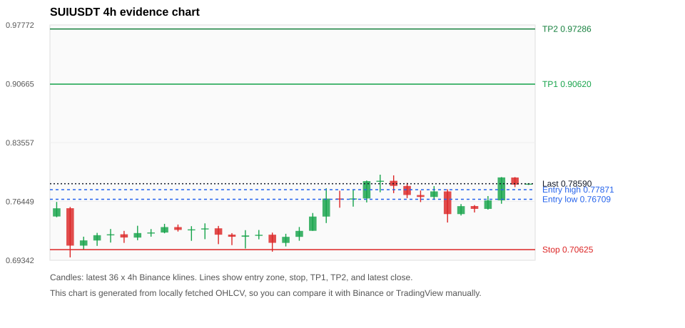
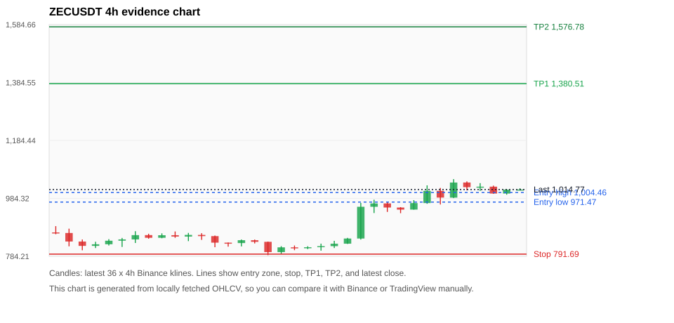
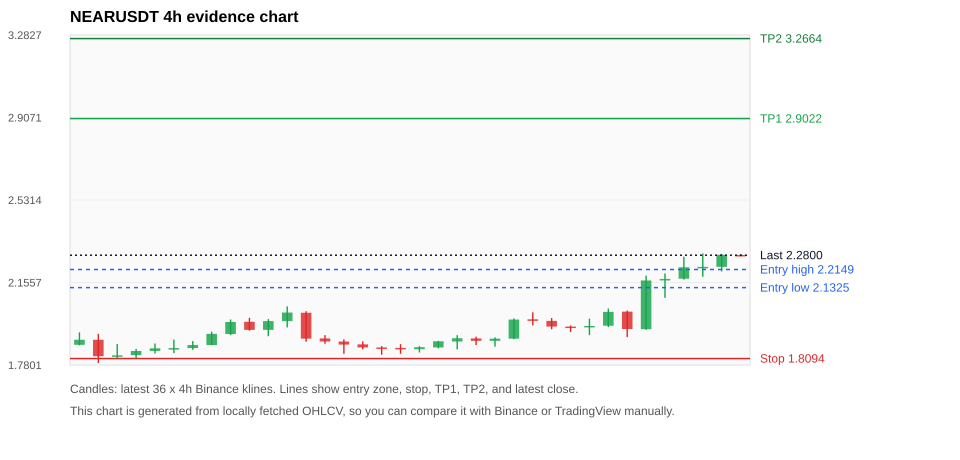
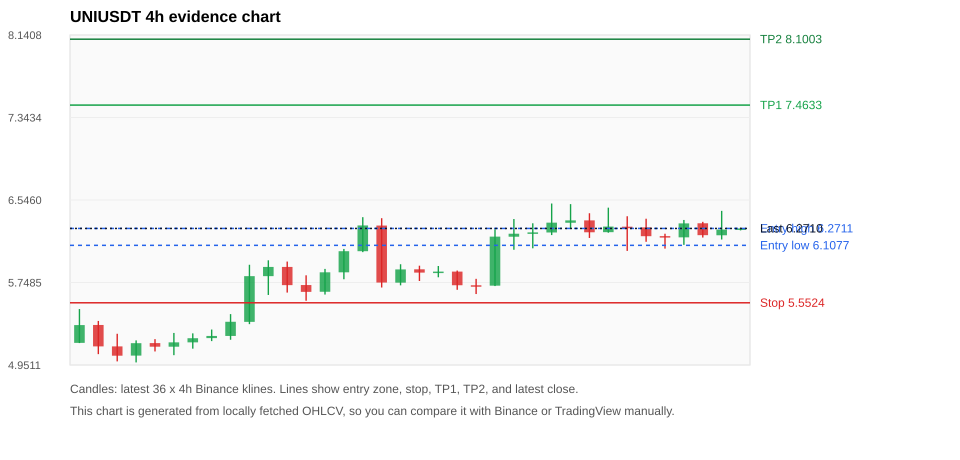
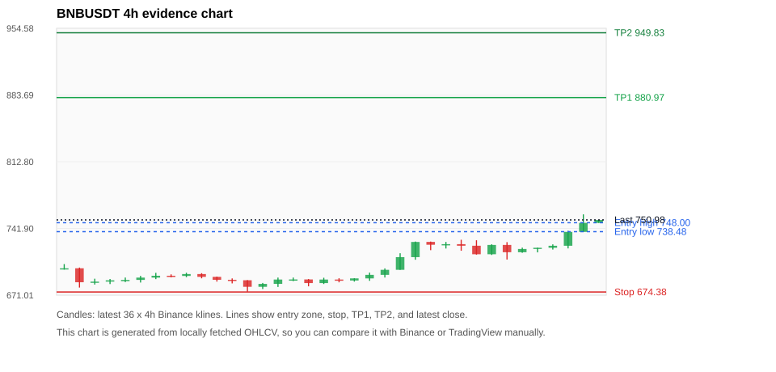

# Crypto 市场扫描报告 v1

- 报告时间：2026-09-05 20:06:06 CST
- Run ID：`20260905_120502_1c9e7ed5`
- Run type：`daily_full`
- Data validation mode：`paper`
- 数据来源：SQLite
- 报告版本：v1
- 扫描 ID：6da7db425dbd
- 数据源：Binance public spot API + CoinGecko/CoinMarketCap cross-check
- 过滤条件：USDT spot; 24h quote volume >= 30,000,000; trades >= 30,000; exclude stables/leveraged tokens; analyze 1h/4h/1d klines
- 默认单笔风险：账户权益的 1.00%

## 限制说明

- 交易信号仍以 Binance 现货公开 K 线为主源；外部数据源用于一致性复核。
- 结果是研究和模拟盘计划，不是确定收益或实盘下单指令。
- 历史长度过滤：候选币至少需要 180 根 1d K 线。
- 数据质量验证池：先验证 score 排名前 min(top_n * 2, 10) 的候选，再按 action + score 补足最终名单。
- 大盘环境过滤：RISK_ON; BTC/ETH 日线趋势均较强，允许山寨币买入候选。 BTC 7d=1.8205419915633403; ETH 7d=-0.08626056386740188.
- Data cross-validation enabled: Binance primary source plus CoinGecko; CoinMarketCap is checked when an API key is configured.
- ZECUSDT validation state BLOCKED: BLOCKED: [BINANCE_KLINE_EXTREME_RANGE] Binance candle range exceeds 40%.; [BINANCE_KLINE_EXTREME_RANGE] Binance candle range exceeds 40%.; [EXTERNAL_IDENTITY_AMBIGUOUS] CoinMarketCap symbol mapping has 2 matches; selected lowest cmc_rank
- SUIUSDT validation state DEGRADED: DEGRADED: [EXTERNAL_IDENTITY_AMBIGUOUS] CoinMarketCap symbol mapping has 5 matches; selected lowest cmc_rank
- UNIUSDT validation state DEGRADED: DEGRADED: [EXTERNAL_IDENTITY_AMBIGUOUS] CoinMarketCap symbol mapping has 7 matches; selected lowest cmc_rank
- BNBUSDT validation state DEGRADED: DEGRADED: [EXTERNAL_IDENTITY_AMBIGUOUS] CoinMarketCap symbol mapping has 4 matches; selected lowest cmc_rank
- ZKCUSDT validation state BLOCKED: BLOCKED: [BINANCE_KLINE_EXTREME_RANGE] Binance candle range exceeds 40%.; [BINANCE_KLINE_EXTREME_RANGE] Binance candle range exceeds 40%.; [BINANCE_KLINE_EXTREME_RANGE] Binance candle range exceeds 40%.; [EXTERNAL_PROVIDER_RATE_LIMITED] Provider rate limited request for https://api.coingecko.com/api/v3/search?query=ZKC: HTTP 429; [EXTERNAL_IDENTITY_AMBIGUOUS] CoinMarketCap symbol mapping has 2 matches; selected lowest cmc_rank
- DOGEUSDT validation state DEGRADED: DEGRADED: [EXTERNAL_PROVIDER_RATE_LIMITED] Provider rate limited request for https://api.coingecko.com/api/v3/coins/markets?vs_currency=usd&ids=dogecoin&price_change_percentage=24h&per_page=1&page=1: HTTP 429; [EXTERNAL_IDENTITY_AMBIGUOUS] CoinMarketCap symbol mapping has 23 matches; selected lowest cmc_rank
- BTCUSDT validation state DEGRADED: DEGRADED: [EXTERNAL_PROVIDER_RATE_LIMITED] Provider rate limited request for https://api.coingecko.com/api/v3/coins/markets?vs_currency=usd&ids=bitcoin&price_change_percentage=24h&per_page=1&page=1: HTTP 429; [EXTERNAL_IDENTITY_AMBIGUOUS] CoinMarketCap symbol mapping has 13 matches; selected lowest cmc_rank
- ADAUSDT validation state DEGRADED: DEGRADED: [EXTERNAL_PROVIDER_RATE_LIMITED] Provider rate limited request for https://api.coingecko.com/api/v3/coins/markets?vs_currency=usd&ids=cardano&price_change_percentage=24h&per_page=1&page=1: HTTP 429; [EXTERNAL_IDENTITY_AMBIGUOUS] CoinMarketCap symbol mapping has 3 matches; selected lowest cmc_rank
- ENAUSDT validation state DEGRADED: DEGRADED: [EXTERNAL_PROVIDER_RATE_LIMITED] Provider rate limited request for https://api.coingecko.com/api/v3/coins/markets?vs_currency=usd&ids=ethena&price_change_percentage=24h&per_page=1&page=1: HTTP 429; [EXTERNAL_IDENTITY_AMBIGUOUS] CoinMarketCap symbol mapping has 2 matches; selected lowest cmc_rank

## 5 个候选交易计划

| Rank | Coin | Action | Setup | Entry Zone | Stop Loss | TP1 | TP2 / Exit Rule | R/R | Verdict |
|---:|---|---|---|---:|---:|---:|---|---:|---|
| 1 | `SUI` | `BUY_CANDIDATE` | 回踩支撑/4h EMA 附近 | 0.76709 - 0.77871 | 0.70625 | 0.90620 | 0.97286 或跌破 4h 关键支撑 | 2.00-3.00 | 可考虑 |
| 2 | `ZEC` | `WATCH_ONLY` | 趋势中，等回调入场 | 971.47 - 1,004.46 | 791.69 | 1,380.51 | 1,576.78 或跌破 4h 关键支撑 | 2.00-3.00 | 只观察 |
| 3 | `NEAR` | `WATCH_ONLY` | 涨幅较远，只等深回调 | 2.1325 - 2.2149 | 1.8094 | 2.9022 | 3.2664 或跌破 4h 关键支撑 | 2.00-3.00 | 只等回调 |
| 4 | `UNI` | `WATCH_ONLY` | 回踩支撑/4h EMA 附近 | 6.1077 - 6.2711 | 5.5524 | 7.4633 | 8.1003 或跌破 4h 关键支撑 | 2.00-3.00 | 只观察 |
| 5 | `BNB` | `WATCH_ONLY` | 趋势中，等回调入场 | 738.48 - 748.00 | 674.38 | 880.97 | 949.83 或跌破 4h 关键支撑 | 2.00-3.00 | 只等回调 |

## 数据交叉验证摘要

价格差异以 Binance 当前价为基准；成交量口径不同，Binance 是 USDT 现货成交额，CoinGecko/CoinMarketCap 通常是全市场成交量。

| Rank | Coin | State | Identity | Max Price Diff | Max 24h Diff | Issue Codes | Message |
|---:|---|---|---|---:|---:|---|---|
| 1 | `SUI` | DEGRADED (DATA_WARNING) | UNCONFIRMED | 0.09% | 0.30 pts | EXTERNAL_IDENTITY_AMBIGUOUS | DEGRADED: [EXTERNAL_IDENTITY_AMBIGUOUS] CoinMarketCap symbol mapping has 5 matches; selected lowest cmc_rank |
| 2 | `ZEC` | BLOCKED (DATA_ERROR) | UNCONFIRMED | 0.06% | 0.13 pts | BINANCE_KLINE_EXTREME_RANGE, EXTERNAL_IDENTITY_AMBIGUOUS | BLOCKED: [BINANCE_KLINE_EXTREME_RANGE] Binance candle range exceeds 40%.; [BINANCE_KLINE_EXTREME_RANGE] Binance candle range exceeds 40%.; [EXTERNAL_IDENTITY_AMBIGUOUS] CoinMarketCap symbol mapping has 2 matches; selected lowest cmc_rank |
| 3 | `NEAR` | CLEAN (DATA_OK) | CONFIRMED | 0.05% | 0.76 pts | none | CLEAN: External provider checks agree with Binance within configured thresholds. |
| 4 | `UNI` | DEGRADED (DATA_WARNING) | UNCONFIRMED | 0.11% | 0.15 pts | EXTERNAL_IDENTITY_AMBIGUOUS | DEGRADED: [EXTERNAL_IDENTITY_AMBIGUOUS] CoinMarketCap symbol mapping has 7 matches; selected lowest cmc_rank |
| 5 | `BNB` | DEGRADED (DATA_WARNING) | UNCONFIRMED | 0.13% | 0.10 pts | EXTERNAL_IDENTITY_AMBIGUOUS | DEGRADED: [EXTERNAL_IDENTITY_AMBIGUOUS] CoinMarketCap symbol mapping has 4 matches; selected lowest cmc_rank |

## 候选币说明

### 1. SUI `SUIUSDT`



- 入选原因：回踩支撑/4h EMA 附近；24h +1.41%，7d +6.48%，4h RSI 56.84，24h 成交额 $53.8M。
- 交易失效条件：跌破 0.706245 或 4h 收盘重新失守关键支撑。
- 主要风险：主要风险是大盘同步回撤；External validation is degraded; this candidate is not a clean data sample.；Paper mode allows degraded validation; candidate is excluded from clean-data samples.。
- 数据交叉验证：DEGRADED / DATA_WARNING；身份=UNCONFIRMED；DEGRADED: [EXTERNAL_IDENTITY_AMBIGUOUS] CoinMarketCap symbol mapping has 5 matches; selected lowest cmc_rank

#### 可点击人工验证

- [Binance 交易页](https://www.binance.com/en/trade/SUI_USDT)
- [TradingView 图表](https://www.tradingview.com/chart/?symbol=BINANCE%3ASUIUSDT)
- [CoinGecko 搜索](https://www.coingecko.com/en/search?query=SUI)
- [CoinMarketCap 搜索](https://coinmarketcap.com/search/?q=SUI)

#### 多数据源对照

| Source | Status | Identity | Blocking | Asset ID | Price | 24h Change | 24h Volume | Price Diff | 24h Diff | Updated | Issue Codes | Message |
|---|---|---|---:|---|---:|---:|---:|---:|---:|---|---|---|
| Binance | DATA_OK | CONFIRMED | no | SUIUSDT | 0.78590 | +1.41% | $53.8M | 0.00% | 0.00 pts | 2026-09-05T12:05:26+00:00 | none | Primary market data source passed health checks. |
| CoinGecko | DATA_OK | CONFIRMED | no | sui | 0.78586 | +1.44% | $521.4M | 0.00% | 0.04 pts | 2026-09-05T12:03:20.000Z | none | External source agrees with Binance within thresholds. |
| CoinMarketCap | DATA_WARNING | UNCONFIRMED | no | 20947 | 0.78520 | +1.11% | $493.4M | 0.09% | 0.30 pts | 2026-09-05T12:04:02.000Z | EXTERNAL_IDENTITY_AMBIGUOUS | [EXTERNAL_IDENTITY_AMBIGUOUS] CoinMarketCap symbol mapping has 5 matches; selected lowest cmc_rank |

#### 指标证据

| 指标 | 数值 | 人工核对用途 |
|---|---:|---|
| 当前价 | 0.78590 | 与 Binance/TradingView 当前价格对照 |
| 24h 涨跌 | +1.41% | 与交易所 24h 涨跌对照 |
| 7d 涨跌 | +6.48% | 判断短线趋势是否延续 |
| 4h EMA20 | 0.76556 | 判断短期趋势支撑 |
| 4h EMA50 | 0.75503 | 判断中期趋势支撑 |
| 1d EMA20 | 0.74829 | 判断日线趋势 |
| 1d EMA50 | 0.73969 | 判断日线趋势 |
| 4h RSI14 | 56.84 | 判断是否过热/过弱 |
| 4h ATR14 | 0.01879 | 推导止损和入场缓冲 |
| 最近 18 根 4h 最低点 | 0.71700 | 支撑/止损参考 |
| 最近 36 根 4h 最高点 | 0.79680 | TP/压力参考 |
| 支撑位 | 0.76556 | 入场区间推导基础 |

#### 交易计划推导

- 支撑位 = 最近低点、4h EMA20、4h EMA50、1d EMA20 中不高于当前价的最高有效支撑 = `0.76556`。
- 入场区间 = 支撑位附近 + ATR 缓冲 = `0.76709 - 0.77871`。
- 止损 = min(最近 18 根 4h 最低点 * 0.985, 入场中位价 - 1.15 * ATR14) = `0.70625`。
- TP1 = max(最近 36 根 4h 最高点 * 0.995, 入场中位价 + 2R) = `0.90620`。
- TP2 = max(入场中位价 + 3R, TP1 * 1.04) = `0.97286`。

#### 最近 10 根 4h K线

| UTC 开盘时间 | Open | High | Low | Close | Quote Volume | Trades |
|---|---:|---:|---:|---:|---:|---:|
| 2026-09-04T00:00+00:00 | 0.78320 | 0.78690 | 0.76850 | 0.77230 | $7.6M | 47202 |
| 2026-09-04T04:00+00:00 | 0.77220 | 0.77770 | 0.76370 | 0.76990 | $6.6M | 40256 |
| 2026-09-04T08:00+00:00 | 0.76990 | 0.78300 | 0.76750 | 0.77660 | $7.6M | 45063 |
| 2026-09-04T12:00+00:00 | 0.77660 | 0.77920 | 0.73900 | 0.74920 | $16.9M | 116002 |
| 2026-09-04T16:00+00:00 | 0.74920 | 0.76130 | 0.74750 | 0.75880 | $4.6M | 28199 |
| 2026-09-04T20:00+00:00 | 0.75890 | 0.76010 | 0.75120 | 0.75550 | $3.4M | 20059 |
| 2026-09-05T00:00+00:00 | 0.75550 | 0.77100 | 0.75460 | 0.76570 | $8.0M | 45566 |
| 2026-09-05T04:00+00:00 | 0.76580 | 0.79390 | 0.76170 | 0.79350 | $11.3M | 61152 |
| 2026-09-05T08:00+00:00 | 0.79340 | 0.79390 | 0.78180 | 0.78480 | $9.6M | 61226 |
| 2026-09-05T12:00+00:00 | 0.78470 | 0.78620 | 0.78450 | 0.78600 | $51,723 | 651 |

### 2. ZEC `ZECUSDT`



- 入选原因：趋势中，等回调入场；24h +0.60%，7d +25.18%，4h RSI 76.27，24h 成交额 $271.9M。
- 交易失效条件：跌破 791.69375 或 4h 收盘重新失守关键支撑。
- 主要风险：4h RSI 偏热；Blocking data-quality issue detected; paper plan creation is not allowed.。
- 数据交叉验证：BLOCKED / DATA_ERROR；身份=UNCONFIRMED；BLOCKED: [BINANCE_KLINE_EXTREME_RANGE] Binance candle range exceeds 40%.; [BINANCE_KLINE_EXTREME_RANGE] Binance candle range exceeds 40%.; [EXTERNAL_IDENTITY_AMBIGUOUS] CoinMarketCap symbol mapping has 2 matches; selected lowest cmc_rank

#### 可点击人工验证

- [Binance 交易页](https://www.binance.com/en/trade/ZEC_USDT)
- [TradingView 图表](https://www.tradingview.com/chart/?symbol=BINANCE%3AZECUSDT)
- [CoinGecko 搜索](https://www.coingecko.com/en/search?query=ZEC)
- [CoinMarketCap 搜索](https://coinmarketcap.com/search/?q=ZEC)

#### 多数据源对照

| Source | Status | Identity | Blocking | Asset ID | Price | 24h Change | 24h Volume | Price Diff | 24h Diff | Updated | Issue Codes | Message |
|---|---|---|---:|---|---:|---:|---:|---:|---:|---|---|---|
| Binance | DATA_ERROR | CONFIRMED | yes | ZECUSDT | 1,014.77 | +0.60% | $271.9M | 0.00% | 0.00 pts | 2026-09-05T12:05:26+00:00 | BINANCE_KLINE_EXTREME_RANGE | [BINANCE_KLINE_EXTREME_RANGE] Binance candle range exceeds 40%.; [BINANCE_KLINE_EXTREME_RANGE] Binance candle range exceeds 40%. |
| CoinGecko | DATA_OK | CONFIRMED | no | zcash | 1,015.28 | +0.72% | $1.10B | 0.05% | 0.13 pts | 2026-09-05T12:03:20.000Z | none | External source agrees with Binance within thresholds. |
| CoinMarketCap | DATA_WARNING | UNCONFIRMED | no | 1437 | 1,015.34 | +0.55% | $1.33B | 0.06% | 0.05 pts | 2026-09-05T12:04:02.000Z | EXTERNAL_IDENTITY_AMBIGUOUS | [EXTERNAL_IDENTITY_AMBIGUOUS] CoinMarketCap symbol mapping has 2 matches; selected lowest cmc_rank |

#### 指标证据

| 指标 | 数值 | 人工核对用途 |
|---|---:|---|
| 当前价 | 1,014.77 | 与 Binance/TradingView 当前价格对照 |
| 24h 涨跌 | +0.60% | 与交易所 24h 涨跌对照 |
| 7d 涨跌 | +25.18% | 判断短线趋势是否延续 |
| 4h EMA20 | 954.18 | 判断短期趋势支撑 |
| 4h EMA50 | 884.50 | 判断中期趋势支撑 |
| 1d EMA20 | 803.45 | 判断日线趋势 |
| 1d EMA50 | 668.50 | 判断日线趋势 |
| 4h RSI14 | 76.27 | 判断是否过热/过弱 |
| 4h ATR14 | 41.2379 | 推导止损和入场缓冲 |
| 最近 18 根 4h 最低点 | 803.75 | 支撑/止损参考 |
| 最近 36 根 4h 最高点 | 1,050.70 | TP/压力参考 |
| 支撑位 | 954.18 | 入场区间推导基础 |

#### 交易计划推导

- 支撑位 = 最近低点、4h EMA20、4h EMA50、1d EMA20 中不高于当前价的最高有效支撑 = `954.18`。
- 入场区间 = 支撑位附近 + ATR 缓冲 = `971.47 - 1,004.46`。
- 止损 = min(最近 18 根 4h 最低点 * 0.985, 入场中位价 - 1.15 * ATR14) = `791.69`。
- TP1 = max(最近 36 根 4h 最高点 * 0.995, 入场中位价 + 2R) = `1,380.51`。
- TP2 = max(入场中位价 + 3R, TP1 * 1.04) = `1,576.78`。

#### 最近 10 根 4h K线

| UTC 开盘时间 | Open | High | Low | Close | Quote Volume | Trades |
|---|---:|---:|---:|---:|---:|---:|
| 2026-09-04T00:00+00:00 | 952.68 | 954.07 | 933.12 | 945.45 | $22.9M | 55679 |
| 2026-09-04T04:00+00:00 | 945.52 | 978.28 | 945.31 | 968.07 | $27.8M | 99240 |
| 2026-09-04T08:00+00:00 | 968.08 | 1,029.22 | 965.55 | 1,010.33 | $66.9M | 177868 |
| 2026-09-04T12:00+00:00 | 1,010.34 | 1,020.30 | 963.19 | 987.01 | $83.0M | 215974 |
| 2026-09-04T16:00+00:00 | 986.80 | 1,050.70 | 985.27 | 1,038.98 | $76.2M | 203506 |
| 2026-09-04T20:00+00:00 | 1,039.08 | 1,042.90 | 1,012.00 | 1,022.94 | $33.8M | 96227 |
| 2026-09-05T00:00+00:00 | 1,022.94 | 1,036.90 | 1,010.00 | 1,024.79 | $29.6M | 83746 |
| 2026-09-05T04:00+00:00 | 1,024.79 | 1,028.26 | 1,000.00 | 1,001.02 | $24.6M | 85747 |
| 2026-09-05T08:00+00:00 | 1,001.02 | 1,015.00 | 997.00 | 1,014.38 | $24.7M | 91245 |
| 2026-09-05T12:00+00:00 | 1,014.36 | 1,019.21 | 1,014.10 | 1,014.77 | $711,613 | 2970 |

### 3. NEAR `NEARUSDT`



- 入选原因：涨幅较远，只等深回调；24h +13.41%，7d +25.97%，4h RSI 81.66，24h 成交额 $78.9M。
- 交易失效条件：跌破 1.809445 或 4h 收盘重新失守关键支撑。
- 主要风险：距离支撑偏远，不能追市价；4h RSI 偏热。
- 数据交叉验证：CLEAN / DATA_OK；身份=CONFIRMED；CLEAN: External provider checks agree with Binance within configured thresholds.

#### 可点击人工验证

- [Binance 交易页](https://www.binance.com/en/trade/NEAR_USDT)
- [TradingView 图表](https://www.tradingview.com/chart/?symbol=BINANCE%3ANEARUSDT)
- [CoinGecko 搜索](https://www.coingecko.com/en/search?query=NEAR)
- [CoinMarketCap 搜索](https://coinmarketcap.com/search/?q=NEAR)

#### 多数据源对照

| Source | Status | Identity | Blocking | Asset ID | Price | 24h Change | 24h Volume | Price Diff | 24h Diff | Updated | Issue Codes | Message |
|---|---|---|---:|---|---:|---:|---:|---:|---:|---|---|---|
| Binance | DATA_OK | CONFIRMED | no | NEARUSDT | 2.2800 | +13.41% | $78.9M | 0.00% | 0.00 pts | 2026-09-05T12:05:26+00:00 | none | Primary market data source passed health checks. |
| CoinGecko | DATA_OK | CONFIRMED | no | near | 2.2800 | +12.99% | $570.2M | 0.00% | 0.43 pts | 2026-09-05T12:03:20.000Z | none | External source agrees with Binance within thresholds. |
| CoinMarketCap | DATA_OK | CONFIRMED | no | 6535 | 2.2811 | +12.66% | $616.0M | 0.05% | 0.76 pts | 2026-09-05T12:04:02.000Z | none | External source agrees with Binance within thresholds. |

#### 指标证据

| 指标 | 数值 | 人工核对用途 |
|---|---:|---|
| 当前价 | 2.2800 | 与 Binance/TradingView 当前价格对照 |
| 24h 涨跌 | +13.41% | 与交易所 24h 涨跌对照 |
| 7d 涨跌 | +25.97% | 判断短线趋势是否延续 |
| 4h EMA20 | 2.0666 | 判断短期趋势支撑 |
| 4h EMA50 | 1.9677 | 判断中期趋势支撑 |
| 1d EMA20 | 1.9149 | 判断日线趋势 |
| 1d EMA50 | 1.8518 | 判断日线趋势 |
| 4h RSI14 | 81.66 | 判断是否过热/过弱 |
| 4h ATR14 | 0.08679 | 推导止损和入场缓冲 |
| 最近 18 根 4h 最低点 | 1.8370 | 支撑/止损参考 |
| 最近 36 根 4h 最高点 | 2.2880 | TP/压力参考 |
| 支撑位 | 2.0666 | 入场区间推导基础 |

#### 交易计划推导

- 支撑位 = 最近低点、4h EMA20、4h EMA50、1d EMA20 中不高于当前价的最高有效支撑 = `2.0666`。
- 入场区间 = 支撑位附近 + ATR 缓冲 = `2.1325 - 2.2149`。
- 止损 = min(最近 18 根 4h 最低点 * 0.985, 入场中位价 - 1.15 * ATR14) = `1.8094`。
- TP1 = max(最近 36 根 4h 最高点 * 0.995, 入场中位价 + 2R) = `2.9022`。
- TP2 = max(入场中位价 + 3R, TP1 * 1.04) = `3.2664`。

#### 最近 10 根 4h K线

| UTC 开盘时间 | Open | High | Low | Close | Quote Volume | Trades |
|---|---:|---:|---:|---:|---:|---:|
| 2026-09-04T00:00+00:00 | 1.9550 | 1.9600 | 1.9300 | 1.9540 | $3.7M | 25203 |
| 2026-09-04T04:00+00:00 | 1.9540 | 1.9910 | 1.9160 | 1.9580 | $7.8M | 43029 |
| 2026-09-04T08:00+00:00 | 1.9590 | 2.0370 | 1.9530 | 2.0220 | $12.4M | 61234 |
| 2026-09-04T12:00+00:00 | 2.0230 | 2.0280 | 1.9070 | 1.9440 | $13.8M | 87712 |
| 2026-09-04T16:00+00:00 | 1.9430 | 2.1870 | 1.9400 | 2.1650 | $18.4M | 84261 |
| 2026-09-04T20:00+00:00 | 2.1650 | 2.1970 | 2.0860 | 2.1720 | $14.6M | 93502 |
| 2026-09-05T00:00+00:00 | 2.1730 | 2.2730 | 2.1690 | 2.2250 | $14.5M | 95712 |
| 2026-09-05T04:00+00:00 | 2.2250 | 2.2880 | 2.1820 | 2.2270 | $11.1M | 82999 |
| 2026-09-05T08:00+00:00 | 2.2270 | 2.2860 | 2.2060 | 2.2820 | $6.4M | 44588 |
| 2026-09-05T12:00+00:00 | 2.2810 | 2.2850 | 2.2750 | 2.2800 | $172,773 | 1376 |

### 4. UNI `UNIUSDT`



- 入选原因：回踩支撑/4h EMA 附近；24h -0.49%，7d +42.26%，4h RSI 72.70，24h 成交额 $52.7M。
- 交易失效条件：跌破 5.552445 或 4h 收盘重新失守关键支撑。
- 主要风险：24h 动量未确认；External validation is degraded; this candidate is not a clean data sample.；Paper mode allows degraded validation; candidate is excluded from clean-data samples.。
- 数据交叉验证：DEGRADED / DATA_WARNING；身份=UNCONFIRMED；DEGRADED: [EXTERNAL_IDENTITY_AMBIGUOUS] CoinMarketCap symbol mapping has 7 matches; selected lowest cmc_rank

#### 可点击人工验证

- [Binance 交易页](https://www.binance.com/en/trade/UNI_USDT)
- [TradingView 图表](https://www.tradingview.com/chart/?symbol=BINANCE%3AUNIUSDT)
- [CoinGecko 搜索](https://www.coingecko.com/en/search?query=UNI)
- [CoinMarketCap 搜索](https://coinmarketcap.com/search/?q=UNI)

#### 多数据源对照

| Source | Status | Identity | Blocking | Asset ID | Price | 24h Change | 24h Volume | Price Diff | 24h Diff | Updated | Issue Codes | Message |
|---|---|---|---:|---|---:|---:|---:|---:|---:|---|---|---|
| Binance | DATA_OK | CONFIRMED | no | UNIUSDT | 6.2710 | -0.49% | $52.7M | 0.00% | 0.00 pts | 2026-09-05T12:05:26+00:00 | none | Primary market data source passed health checks. |
| CoinGecko | DATA_OK | CONFIRMED | no | uniswap | 6.2700 | -0.35% | $567.2M | 0.02% | 0.15 pts | 2026-09-05T12:03:20.000Z | none | External source agrees with Binance within thresholds. |
| CoinMarketCap | DATA_WARNING | UNCONFIRMED | no | 7083 | 6.2643 | -0.38% | $479.5M | 0.11% | 0.11 pts | 2026-09-05T12:04:02.000Z | EXTERNAL_IDENTITY_AMBIGUOUS | [EXTERNAL_IDENTITY_AMBIGUOUS] CoinMarketCap symbol mapping has 7 matches; selected lowest cmc_rank |

#### 指标证据

| 指标 | 数值 | 人工核对用途 |
|---|---:|---|
| 当前价 | 6.2710 | 与 Binance/TradingView 当前价格对照 |
| 24h 涨跌 | -0.49% | 与交易所 24h 涨跌对照 |
| 7d 涨跌 | +42.26% | 判断短线趋势是否延续 |
| 4h EMA20 | 6.0955 | 判断短期趋势支撑 |
| 4h EMA50 | 5.6072 | 判断中期趋势支撑 |
| 1d EMA20 | 5.0216 | 判断日线趋势 |
| 1d EMA50 | 4.3389 | 判断日线趋势 |
| 4h RSI14 | 72.70 | 判断是否过热/过弱 |
| 4h ATR14 | 0.25093 | 推导止损和入场缓冲 |
| 最近 18 根 4h 最低点 | 5.6370 | 支撑/止损参考 |
| 最近 36 根 4h 最高点 | 6.5120 | TP/压力参考 |
| 支撑位 | 6.0955 | 入场区间推导基础 |

#### 交易计划推导

- 支撑位 = 最近低点、4h EMA20、4h EMA50、1d EMA20 中不高于当前价的最高有效支撑 = `6.0955`。
- 入场区间 = 支撑位附近 + ATR 缓冲 = `6.1077 - 6.2711`。
- 止损 = min(最近 18 根 4h 最低点 * 0.985, 入场中位价 - 1.15 * ATR14) = `5.5524`。
- TP1 = max(最近 36 根 4h 最高点 * 0.995, 入场中位价 + 2R) = `7.4633`。
- TP2 = max(入场中位价 + 3R, TP1 * 1.04) = `8.1003`。

#### 最近 10 根 4h K线

| UTC 开盘时间 | Open | High | Low | Close | Quote Volume | Trades |
|---|---:|---:|---:|---:|---:|---:|
| 2026-09-04T00:00+00:00 | 6.3260 | 6.5060 | 6.2650 | 6.3490 | $12.7M | 66019 |
| 2026-09-04T04:00+00:00 | 6.3490 | 6.4180 | 6.1790 | 6.2340 | $11.5M | 56778 |
| 2026-09-04T08:00+00:00 | 6.2350 | 6.4720 | 6.2300 | 6.2890 | $10.2M | 61308 |
| 2026-09-04T12:00+00:00 | 6.2880 | 6.3890 | 6.0540 | 6.2820 | $23.3M | 123937 |
| 2026-09-04T16:00+00:00 | 6.2810 | 6.3650 | 6.1420 | 6.1960 | $6.7M | 42531 |
| 2026-09-04T20:00+00:00 | 6.1970 | 6.2200 | 6.0760 | 6.1850 | $3.3M | 20691 |
| 2026-09-05T00:00+00:00 | 6.1850 | 6.3530 | 6.1120 | 6.3200 | $6.3M | 35965 |
| 2026-09-05T04:00+00:00 | 6.3210 | 6.3350 | 6.1830 | 6.2060 | $5.2M | 32001 |
| 2026-09-05T08:00+00:00 | 6.2050 | 6.4410 | 6.1640 | 6.2600 | $8.0M | 43433 |
| 2026-09-05T12:00+00:00 | 6.2590 | 6.2780 | 6.2520 | 6.2710 | $49,406 | 382 |

### 5. BNB `BNBUSDT`



- 入选原因：趋势中，等回调入场；24h +3.63%，7d +9.05%，4h RSI 77.64，24h 成交额 $168.7M。
- 交易失效条件：跌破 674.38025 或 4h 收盘重新失守关键支撑。
- 主要风险：4h RSI 偏热；External validation is degraded; this candidate is not a clean data sample.；Paper mode allows degraded validation; candidate is excluded from clean-data samples.。
- 数据交叉验证：DEGRADED / DATA_WARNING；身份=UNCONFIRMED；DEGRADED: [EXTERNAL_IDENTITY_AMBIGUOUS] CoinMarketCap symbol mapping has 4 matches; selected lowest cmc_rank

#### 可点击人工验证

- [Binance 交易页](https://www.binance.com/en/trade/BNB_USDT)
- [TradingView 图表](https://www.tradingview.com/chart/?symbol=BINANCE%3ABNBUSDT)
- [CoinGecko 搜索](https://www.coingecko.com/en/search?query=BNB)
- [CoinMarketCap 搜索](https://coinmarketcap.com/search/?q=BNB)

#### 多数据源对照

| Source | Status | Identity | Blocking | Asset ID | Price | 24h Change | 24h Volume | Price Diff | 24h Diff | Updated | Issue Codes | Message |
|---|---|---|---:|---|---:|---:|---:|---:|---:|---|---|---|
| Binance | DATA_OK | CONFIRMED | no | BNBUSDT | 750.98 | +3.63% | $168.7M | 0.00% | 0.00 pts | 2026-09-05T12:05:26+00:00 | none | Primary market data source passed health checks. |
| CoinGecko | DATA_OK | CONFIRMED | no | binancecoin | 750.86 | +3.67% | $1.51B | 0.02% | 0.04 pts | 2026-09-05T12:03:20.000Z | none | External source agrees with Binance within thresholds. |
| CoinMarketCap | DATA_WARNING | UNCONFIRMED | no | 1839 | 750.00 | +3.53% | $2.13B | 0.13% | 0.10 pts | 2026-09-05T12:04:02.000Z | EXTERNAL_IDENTITY_AMBIGUOUS | [EXTERNAL_IDENTITY_AMBIGUOUS] CoinMarketCap symbol mapping has 4 matches; selected lowest cmc_rank |

#### 指标证据

| 指标 | 数值 | 人工核对用途 |
|---|---:|---|
| 当前价 | 750.98 | 与 Binance/TradingView 当前价格对照 |
| 24h 涨跌 | +3.63% | 与交易所 24h 涨跌对照 |
| 7d 涨跌 | +9.05% | 判断短线趋势是否延续 |
| 4h EMA20 | 719.91 | 判断短期趋势支撑 |
| 4h EMA50 | 704.85 | 判断中期趋势支撑 |
| 1d EMA20 | 686.23 | 判断日线趋势 |
| 1d EMA50 | 646.79 | 判断日线趋势 |
| 4h RSI14 | 77.64 | 判断是否过热/过弱 |
| 4h ATR14 | 11.9021 | 推导止损和入场缓冲 |
| 最近 18 根 4h 最低点 | 684.65 | 支撑/止损参考 |
| 最近 36 根 4h 最高点 | 756.88 | TP/压力参考 |
| 支撑位 | 719.91 | 入场区间推导基础 |

#### 交易计划推导

- 支撑位 = 最近低点、4h EMA20、4h EMA50、1d EMA20 中不高于当前价的最高有效支撑 = `719.91`。
- 入场区间 = 支撑位附近 + ATR 缓冲 = `738.48 - 748.00`。
- 止损 = min(最近 18 根 4h 最低点 * 0.985, 入场中位价 - 1.15 * ATR14) = `674.38`。
- TP1 = max(最近 36 根 4h 最高点 * 0.995, 入场中位价 + 2R) = `880.97`。
- TP2 = max(入场中位价 + 3R, TP1 * 1.04) = `949.83`。

#### 最近 10 根 4h K线

| UTC 开盘时间 | Open | High | Low | Close | Quote Volume | Trades |
|---|---:|---:|---:|---:|---:|---:|
| 2026-09-04T00:00+00:00 | 725.22 | 729.90 | 718.22 | 723.54 | $19.5M | 144791 |
| 2026-09-04T04:00+00:00 | 723.54 | 729.36 | 714.11 | 714.50 | $19.4M | 148075 |
| 2026-09-04T08:00+00:00 | 714.51 | 725.05 | 713.75 | 724.39 | $16.7M | 145052 |
| 2026-09-04T12:00+00:00 | 724.40 | 727.35 | 708.88 | 716.64 | $35.6M | 295899 |
| 2026-09-04T16:00+00:00 | 716.64 | 721.50 | 716.02 | 720.10 | $11.5M | 96684 |
| 2026-09-04T20:00+00:00 | 720.10 | 721.51 | 716.48 | 721.37 | $5.4M | 58601 |
| 2026-09-05T00:00+00:00 | 721.38 | 725.00 | 719.49 | 723.51 | $11.7M | 83868 |
| 2026-09-05T04:00+00:00 | 723.52 | 739.46 | 720.69 | 738.25 | $27.9M | 169355 |
| 2026-09-05T08:00+00:00 | 738.25 | 756.88 | 738.16 | 747.85 | $76.0M | 372776 |
| 2026-09-05T12:00+00:00 | 747.85 | 751.14 | 747.84 | 750.98 | $900,397 | 6069 |

## 组合风控

- 不要 5 个候选全部满仓买入。
- 同时持仓总风险建议控制在账户权益的 3% - 5% 以内。
- 如果 BTC/ETH 同时破位，暂停山寨币多头计划或降低仓位。
- 第一版报告用于模拟盘和人工复核，不自动下单。

## 原始数据

```json
[
  {
    "rank": 1,
    "symbol": "SUIUSDT",
    "base_asset": "SUI",
    "price": 0.7859,
    "score": 66.41687752085463,
    "setup": "回踩支撑/4h EMA 附近",
    "verdict": "可考虑",
    "entry_low": 0.7670861553268277,
    "entry_high": 0.778710045236355,
    "stop_loss": 0.706245,
    "take_profit_1": 0.906204300844774,
    "take_profit_2": 0.9728574011263653,
    "risk_reward_1": 2.0,
    "risk_reward_2": 3.0,
    "pct_24h": 1.406,
    "pct_3d": 9.152777777777787,
    "pct_7d": 6.47608725105,
    "quote_volume_24h": 53844775.09181,
    "trades_24h": 331896,
    "high_low_range_24h": 7.428958051420853,
    "rsi_1h": 81.43382352941177,
    "rsi_4h": 56.83979517190931,
    "ema20_4h": 0.765555045236355,
    "ema50_4h": 0.755033618349903,
    "ema20_1d": 0.748290309504028,
    "ema50_1d": 0.739685141657709,
    "atr_4h": 0.01879285714285715,
    "macd_hist_4h": 0.0016641902309059119,
    "volume_ratio_24h": 0.9337186406410246,
    "support_level": 0.765555045236355,
    "recent_low_4h_18": 0.717,
    "recent_high_4h_36": 0.7968,
    "distance_to_support_pct": 2.6575430323712235,
    "binance_trade_url": "https://www.binance.com/en/trade/SUI_USDT",
    "tradingview_url": "https://www.tradingview.com/chart/?symbol=BINANCE%3ASUIUSDT",
    "coingecko_search_url": "https://www.coingecko.com/en/search?query=SUI",
    "coinmarketcap_search_url": "https://coinmarketcap.com/search/?q=SUI",
    "invalidation": "跌破 0.706245 或 4h 收盘重新失守关键支撑",
    "recent_4h_klines": [
      {
        "open_time_utc": "2026-08-30T16:00+00:00",
        "open": 0.7463,
        "high": 0.7639,
        "low": 0.7454,
        "close": 0.7562,
        "quote_volume": 9996811.75427,
        "trades": 59581
      },
      {
        "open_time_utc": "2026-08-30T20:00+00:00",
        "open": 0.7563,
        "high": 0.7578,
        "low": 0.6969,
        "close": 0.7111,
        "quote_volume": 17434959.96486,
        "trades": 110153
      },
      {
        "open_time_utc": "2026-08-31T00:00+00:00",
        "open": 0.7111,
        "high": 0.7219,
        "low": 0.7063,
        "close": 0.7174,
        "quote_volume": 12240802.82073,
        "trades": 65052
      },
      {
        "open_time_utc": "2026-08-31T04:00+00:00",
        "open": 0.7173,
        "high": 0.7265,
        "low": 0.7108,
        "close": 0.7237,
        "quote_volume": 7190952.89276,
        "trades": 40710
      },
      {
        "open_time_utc": "2026-08-31T08:00+00:00",
        "open": 0.7237,
        "high": 0.7312,
        "low": 0.7148,
        "close": 0.7248,
        "quote_volume": 8548363.788,
        "trades": 39956
      },
      {
        "open_time_utc": "2026-08-31T12:00+00:00",
        "open": 0.7248,
        "high": 0.7289,
        "low": 0.7144,
        "close": 0.7209,
        "quote_volume": 7800588.54368,
        "trades": 56979
      },
      {
        "open_time_utc": "2026-08-31T16:00+00:00",
        "open": 0.7208,
        "high": 0.7351,
        "low": 0.7176,
        "close": 0.7263,
        "quote_volume": 6492144.75598,
        "trades": 40193
      },
      {
        "open_time_utc": "2026-08-31T20:00+00:00",
        "open": 0.7263,
        "high": 0.7311,
        "low": 0.7219,
        "close": 0.727,
        "quote_volume": 3378975.45618,
        "trades": 21919
      },
      {
        "open_time_utc": "2026-09-01T00:00+00:00",
        "open": 0.7269,
        "high": 0.7374,
        "low": 0.726,
        "close": 0.7335,
        "quote_volume": 5202786.64169,
        "trades": 35936
      },
      {
        "open_time_utc": "2026-09-01T04:00+00:00",
        "open": 0.7335,
        "high": 0.7366,
        "low": 0.7281,
        "close": 0.7301,
        "quote_volume": 5172275.67441,
        "trades": 32241
      },
      {
        "open_time_utc": "2026-09-01T08:00+00:00",
        "open": 0.7301,
        "high": 0.7346,
        "low": 0.7169,
        "close": 0.7308,
        "quote_volume": 6264539.85133,
        "trades": 41653
      },
      {
        "open_time_utc": "2026-09-01T12:00+00:00",
        "open": 0.7308,
        "high": 0.738,
        "low": 0.7189,
        "close": 0.7319,
        "quote_volume": 6564978.70916,
        "trades": 54359
      },
      {
        "open_time_utc": "2026-09-01T16:00+00:00",
        "open": 0.732,
        "high": 0.7349,
        "low": 0.7129,
        "close": 0.7243,
        "quote_volume": 10963505.17478,
        "trades": 59782
      },
      {
        "open_time_utc": "2026-09-01T20:00+00:00",
        "open": 0.7244,
        "high": 0.7262,
        "low": 0.7117,
        "close": 0.7218,
        "quote_volume": 6897624.28864,
        "trades": 39993
      },
      {
        "open_time_utc": "2026-09-02T00:00+00:00",
        "open": 0.7218,
        "high": 0.7298,
        "low": 0.7076,
        "close": 0.7234,
        "quote_volume": 6671441.62602,
        "trades": 45584
      },
      {
        "open_time_utc": "2026-09-02T04:00+00:00",
        "open": 0.7234,
        "high": 0.73,
        "low": 0.7187,
        "close": 0.7242,
        "quote_volume": 4741345.69932,
        "trades": 29474
      },
      {
        "open_time_utc": "2026-09-02T08:00+00:00",
        "open": 0.7243,
        "high": 0.7268,
        "low": 0.7038,
        "close": 0.7145,
        "quote_volume": 6343003.64323,
        "trades": 41606
      },
      {
        "open_time_utc": "2026-09-02T12:00+00:00",
        "open": 0.7144,
        "high": 0.7254,
        "low": 0.7101,
        "close": 0.7217,
        "quote_volume": 8359097.24273,
        "trades": 46090
      },
      {
        "open_time_utc": "2026-09-02T16:00+00:00",
        "open": 0.7217,
        "high": 0.7336,
        "low": 0.717,
        "close": 0.7289,
        "quote_volume": 7157045.33194,
        "trades": 42634
      },
      {
        "open_time_utc": "2026-09-02T20:00+00:00",
        "open": 0.729,
        "high": 0.7505,
        "low": 0.729,
        "close": 0.7462,
        "quote_volume": 9275399.54794,
        "trades": 53581
      },
      {
        "open_time_utc": "2026-09-03T00:00+00:00",
        "open": 0.7462,
        "high": 0.7804,
        "low": 0.7384,
        "close": 0.7679,
        "quote_volume": 15585388.46195,
        "trades": 97194
      },
      {
        "open_time_utc": "2026-09-03T04:00+00:00",
        "open": 0.768,
        "high": 0.7774,
        "low": 0.7569,
        "close": 0.7673,
        "quote_volume": 11519467.30295,
        "trades": 64946
      },
      {
        "open_time_utc": "2026-09-03T08:00+00:00",
        "open": 0.7674,
        "high": 0.7789,
        "low": 0.7582,
        "close": 0.7681,
        "quote_volume": 9568019.59937,
        "trades": 56816
      },
      {
        "open_time_utc": "2026-09-03T12:00+00:00",
        "open": 0.7681,
        "high": 0.7898,
        "low": 0.7633,
        "close": 0.789,
        "quote_volume": 15721000.9259,
        "trades": 89088
      },
      {
        "open_time_utc": "2026-09-03T16:00+00:00",
        "open": 0.789,
        "high": 0.7968,
        "low": 0.7756,
        "close": 0.7895,
        "quote_volume": 11565165.69486,
        "trades": 73960
      },
      {
        "open_time_utc": "2026-09-03T20:00+00:00",
        "open": 0.7894,
        "high": 0.796,
        "low": 0.7745,
        "close": 0.7833,
        "quote_volume": 8974070.54606,
        "trades": 55222
      },
      {
        "open_time_utc": "2026-09-04T00:00+00:00",
        "open": 0.7832,
        "high": 0.7869,
        "low": 0.7685,
        "close": 0.7723,
        "quote_volume": 7616416.69929,
        "trades": 47202
      },
      {
        "open_time_utc": "2026-09-04T04:00+00:00",
        "open": 0.7722,
        "high": 0.7777,
        "low": 0.7637,
        "close": 0.7699,
        "quote_volume": 6626847.14677,
        "trades": 40256
      },
      {
        "open_time_utc": "2026-09-04T08:00+00:00",
        "open": 0.7699,
        "high": 0.783,
        "low": 0.7675,
        "close": 0.7766,
        "quote_volume": 7570923.35295,
        "trades": 45063
      },
      {
        "open_time_utc": "2026-09-04T12:00+00:00",
        "open": 0.7766,
        "high": 0.7792,
        "low": 0.739,
        "close": 0.7492,
        "quote_volume": 16891144.94747,
        "trades": 116002
      },
      {
        "open_time_utc": "2026-09-04T16:00+00:00",
        "open": 0.7492,
        "high": 0.7613,
        "low": 0.7475,
        "close": 0.7588,
        "quote_volume": 4642303.52347,
        "trades": 28199
      },
      {
        "open_time_utc": "2026-09-04T20:00+00:00",
        "open": 0.7589,
        "high": 0.7601,
        "low": 0.7512,
        "close": 0.7555,
        "quote_volume": 3422745.45721,
        "trades": 20059
      },
      {
        "open_time_utc": "2026-09-05T00:00+00:00",
        "open": 0.7555,
        "high": 0.771,
        "low": 0.7546,
        "close": 0.7657,
        "quote_volume": 8020262.44214,
        "trades": 45566
      },
      {
        "open_time_utc": "2026-09-05T04:00+00:00",
        "open": 0.7658,
        "high": 0.7939,
        "low": 0.7617,
        "close": 0.7935,
        "quote_volume": 11341683.78532,
        "trades": 61152
      },
      {
        "open_time_utc": "2026-09-05T08:00+00:00",
        "open": 0.7934,
        "high": 0.7939,
        "low": 0.7818,
        "close": 0.7848,
        "quote_volume": 9616970.2865,
        "trades": 61226
      },
      {
        "open_time_utc": "2026-09-05T12:00+00:00",
        "open": 0.7847,
        "high": 0.7862,
        "low": 0.7845,
        "close": 0.786,
        "quote_volume": 51723.40909,
        "trades": 651
      }
    ],
    "risks": [
      "主要风险是大盘同步回撤",
      "External validation is degraded; this candidate is not a clean data sample.",
      "Paper mode allows degraded validation; candidate is excluded from clean-data samples."
    ],
    "data_quality_status": "DATA_WARNING",
    "data_quality_message": "DEGRADED: [EXTERNAL_IDENTITY_AMBIGUOUS] CoinMarketCap symbol mapping has 5 matches; selected lowest cmc_rank",
    "data_checks": [
      {
        "provider": "Binance",
        "status": "DATA_OK",
        "provider_asset_id": "SUIUSDT",
        "provider_symbol": "SUIUSDT",
        "price_usd": 0.7859,
        "pct_24h": 1.406,
        "volume_24h": 53844775.09181,
        "last_updated": null,
        "fetched_at_utc": "2026-09-05T12:05:26+00:00",
        "price_diff_pct": 0.0,
        "pct_24h_diff": 0.0,
        "volume_note": "Binance USDT spot 24h quoteVolume.",
        "message": "Primary market data source passed health checks.",
        "blocking": false,
        "identity_status": "CONFIRMED",
        "issues": []
      },
      {
        "provider": "CoinGecko",
        "status": "DATA_OK",
        "provider_asset_id": "sui",
        "provider_symbol": "SUI",
        "price_usd": 0.785861,
        "pct_24h": 1.44413,
        "volume_24h": 521381869.0,
        "last_updated": "2026-09-05T12:03:20.000Z",
        "fetched_at_utc": "2026-09-05T12:05:26+00:00",
        "price_diff_pct": 0.004962463417739056,
        "pct_24h_diff": 0.03813,
        "volume_note": "CoinGecko total market volume; not the same venue scope as Binance quoteVolume.",
        "message": "External source agrees with Binance within thresholds.",
        "blocking": false,
        "identity_status": "CONFIRMED",
        "issues": []
      },
      {
        "provider": "CoinMarketCap",
        "status": "DATA_WARNING",
        "provider_asset_id": "20947",
        "provider_symbol": "SUI",
        "price_usd": 0.7852039632337798,
        "pct_24h": 1.11091117,
        "volume_24h": 493406131.18011063,
        "last_updated": "2026-09-05T12:04:02.000Z",
        "fetched_at_utc": "2026-09-05T12:05:26+00:00",
        "price_diff_pct": 0.08856556384020987,
        "pct_24h_diff": 0.29508882999999986,
        "volume_note": "CoinMarketCap total market volume; not the same venue scope as Binance quoteVolume.",
        "message": "[EXTERNAL_IDENTITY_AMBIGUOUS] CoinMarketCap symbol mapping has 5 matches; selected lowest cmc_rank",
        "blocking": false,
        "identity_status": "UNCONFIRMED",
        "issues": [
          {
            "provider": "CoinMarketCap",
            "code": "EXTERNAL_IDENTITY_AMBIGUOUS",
            "severity": "WARNING",
            "blocking": false,
            "message": "CoinMarketCap symbol mapping has 5 matches; selected lowest cmc_rank",
            "context": {}
          }
        ]
      }
    ],
    "action": "BUY_CANDIDATE",
    "data_quality_state": "DEGRADED",
    "data_quality_issues": [
      {
        "provider": "CoinMarketCap",
        "code": "EXTERNAL_IDENTITY_AMBIGUOUS",
        "severity": "WARNING",
        "blocking": false,
        "message": "CoinMarketCap symbol mapping has 5 matches; selected lowest cmc_rank",
        "context": {}
      }
    ],
    "external_identity_status": "UNCONFIRMED"
  },
  {
    "rank": 2,
    "symbol": "ZECUSDT",
    "base_asset": "ZEC",
    "price": 1014.77,
    "score": 72.63838826851165,
    "setup": "趋势中，等回调入场",
    "verdict": "只观察",
    "entry_low": 971.47025,
    "entry_high": 1004.4605357142857,
    "stop_loss": 791.69375,
    "take_profit_1": 1380.5086785714286,
    "take_profit_2": 1576.7803214285714,
    "risk_reward_1": 2.0,
    "risk_reward_2": 2.9999999999999996,
    "pct_24h": 0.596,
    "pct_3d": 25.286433897970273,
    "pct_7d": 25.184426735091648,
    "quote_volume_24h": 271909363.39578,
    "trades_24h": 777442,
    "high_low_range_24h": 9.085434857089458,
    "rsi_1h": 44.64111498257838,
    "rsi_4h": 76.2710912715124,
    "ema20_4h": 954.1841964707226,
    "ema50_4h": 884.4965056946177,
    "ema20_1d": 803.4529289896158,
    "ema50_1d": 668.5016229617814,
    "atr_4h": 41.23785714285717,
    "macd_hist_4h": 5.6284496310771175,
    "volume_ratio_24h": 1.4067465782432447,
    "support_level": 954.1841964707226,
    "recent_low_4h_18": 803.75,
    "recent_high_4h_36": 1050.7,
    "distance_to_support_pct": 6.349487211522509,
    "binance_trade_url": "https://www.binance.com/en/trade/ZEC_USDT",
    "tradingview_url": "https://www.tradingview.com/chart/?symbol=BINANCE%3AZECUSDT",
    "coingecko_search_url": "https://www.coingecko.com/en/search?query=ZEC",
    "coinmarketcap_search_url": "https://coinmarketcap.com/search/?q=ZEC",
    "invalidation": "跌破 791.69375 或 4h 收盘重新失守关键支撑",
    "recent_4h_klines": [
      {
        "open_time_utc": "2026-08-30T16:00+00:00",
        "open": 866.69,
        "high": 888.37,
        "low": 860.42,
        "close": 864.73,
        "quote_volume": 30678589.12609,
        "trades": 95958
      },
      {
        "open_time_utc": "2026-08-30T20:00+00:00",
        "open": 864.75,
        "high": 879.6,
        "low": 818.68,
        "close": 835.29,
        "quote_volume": 47925099.2345,
        "trades": 184016
      },
      {
        "open_time_utc": "2026-08-31T00:00+00:00",
        "open": 835.13,
        "high": 842.26,
        "low": 805.05,
        "close": 820.2,
        "quote_volume": 31019217.04602,
        "trades": 136907
      },
      {
        "open_time_utc": "2026-08-31T04:00+00:00",
        "open": 820.21,
        "high": 834.38,
        "low": 812.66,
        "close": 825.73,
        "quote_volume": 28802808.50357,
        "trades": 87560
      },
      {
        "open_time_utc": "2026-08-31T08:00+00:00",
        "open": 825.78,
        "high": 843.39,
        "low": 821.51,
        "close": 838.03,
        "quote_volume": 20433052.85638,
        "trades": 74457
      },
      {
        "open_time_utc": "2026-08-31T12:00+00:00",
        "open": 838.16,
        "high": 847.57,
        "low": 816.53,
        "close": 842.55,
        "quote_volume": 30379854.79315,
        "trades": 99478
      },
      {
        "open_time_utc": "2026-08-31T16:00+00:00",
        "open": 842.51,
        "high": 870.92,
        "low": 830.2,
        "close": 857.32,
        "quote_volume": 47782378.1728,
        "trades": 114339
      },
      {
        "open_time_utc": "2026-08-31T20:00+00:00",
        "open": 857.43,
        "high": 862.04,
        "low": 845.0,
        "close": 848.1,
        "quote_volume": 15270039.48253,
        "trades": 45716
      },
      {
        "open_time_utc": "2026-09-01T00:00+00:00",
        "open": 848.12,
        "high": 863.4,
        "low": 846.52,
        "close": 856.95,
        "quote_volume": 10823923.23218,
        "trades": 40322
      },
      {
        "open_time_utc": "2026-09-01T04:00+00:00",
        "open": 857.1,
        "high": 870.0,
        "low": 848.0,
        "close": 852.38,
        "quote_volume": 18783543.5312,
        "trades": 57043
      },
      {
        "open_time_utc": "2026-09-01T08:00+00:00",
        "open": 852.38,
        "high": 864.99,
        "low": 836.59,
        "close": 858.03,
        "quote_volume": 33796305.18163,
        "trades": 99423
      },
      {
        "open_time_utc": "2026-09-01T12:00+00:00",
        "open": 858.02,
        "high": 864.0,
        "low": 841.02,
        "close": 853.92,
        "quote_volume": 27126400.44989,
        "trades": 87108
      },
      {
        "open_time_utc": "2026-09-01T16:00+00:00",
        "open": 853.92,
        "high": 855.84,
        "low": 815.61,
        "close": 831.31,
        "quote_volume": 30917740.31379,
        "trades": 106334
      },
      {
        "open_time_utc": "2026-09-01T20:00+00:00",
        "open": 831.3,
        "high": 831.8,
        "low": 817.59,
        "close": 829.82,
        "quote_volume": 16546394.11559,
        "trades": 47245
      },
      {
        "open_time_utc": "2026-09-02T00:00+00:00",
        "open": 829.91,
        "high": 842.2,
        "low": 818.33,
        "close": 839.77,
        "quote_volume": 18585256.58323,
        "trades": 55497
      },
      {
        "open_time_utc": "2026-09-02T04:00+00:00",
        "open": 839.77,
        "high": 842.01,
        "low": 828.62,
        "close": 834.15,
        "quote_volume": 13019502.54438,
        "trades": 41695
      },
      {
        "open_time_utc": "2026-09-02T08:00+00:00",
        "open": 834.24,
        "high": 834.71,
        "low": 788.15,
        "close": 798.69,
        "quote_volume": 42996755.56375,
        "trades": 184628
      },
      {
        "open_time_utc": "2026-09-02T12:00+00:00",
        "open": 798.71,
        "high": 819.18,
        "low": 792.36,
        "close": 815.11,
        "quote_volume": 28549703.31177,
        "trades": 132703
      },
      {
        "open_time_utc": "2026-09-02T16:00+00:00",
        "open": 815.16,
        "high": 821.52,
        "low": 805.38,
        "close": 812.63,
        "quote_volume": 15907590.10316,
        "trades": 54519
      },
      {
        "open_time_utc": "2026-09-02T20:00+00:00",
        "open": 812.68,
        "high": 819.0,
        "low": 809.02,
        "close": 815.53,
        "quote_volume": 10119867.71972,
        "trades": 37380
      },
      {
        "open_time_utc": "2026-09-03T00:00+00:00",
        "open": 815.62,
        "high": 827.89,
        "low": 803.75,
        "close": 819.26,
        "quote_volume": 13467860.52819,
        "trades": 49585
      },
      {
        "open_time_utc": "2026-09-03T04:00+00:00",
        "open": 819.27,
        "high": 837.65,
        "low": 812.74,
        "close": 827.62,
        "quote_volume": 26922093.19979,
        "trades": 111876
      },
      {
        "open_time_utc": "2026-09-03T08:00+00:00",
        "open": 827.78,
        "high": 847.85,
        "low": 826.92,
        "close": 845.59,
        "quote_volume": 14445695.75572,
        "trades": 93437
      },
      {
        "open_time_utc": "2026-09-03T12:00+00:00",
        "open": 845.61,
        "high": 968.68,
        "low": 842.03,
        "close": 955.3,
        "quote_volume": 76242540.49651,
        "trades": 260165
      },
      {
        "open_time_utc": "2026-09-03T16:00+00:00",
        "open": 955.27,
        "high": 979.69,
        "low": 933.7,
        "close": 966.84,
        "quote_volume": 62645240.25269,
        "trades": 183613
      },
      {
        "open_time_utc": "2026-09-03T20:00+00:00",
        "open": 966.93,
        "high": 972.0,
        "low": 937.54,
        "close": 952.69,
        "quote_volume": 40330586.91901,
        "trades": 113726
      },
      {
        "open_time_utc": "2026-09-04T00:00+00:00",
        "open": 952.68,
        "high": 954.07,
        "low": 933.12,
        "close": 945.45,
        "quote_volume": 22914151.97886,
        "trades": 55679
      },
      {
        "open_time_utc": "2026-09-04T04:00+00:00",
        "open": 945.52,
        "high": 978.28,
        "low": 945.31,
        "close": 968.07,
        "quote_volume": 27762719.05972,
        "trades": 99240
      },
      {
        "open_time_utc": "2026-09-04T08:00+00:00",
        "open": 968.08,
        "high": 1029.22,
        "low": 965.55,
        "close": 1010.33,
        "quote_volume": 66873245.82372,
        "trades": 177868
      },
      {
        "open_time_utc": "2026-09-04T12:00+00:00",
        "open": 1010.34,
        "high": 1020.3,
        "low": 963.19,
        "close": 987.01,
        "quote_volume": 82991101.27283,
        "trades": 215974
      },
      {
        "open_time_utc": "2026-09-04T16:00+00:00",
        "open": 986.8,
        "high": 1050.7,
        "low": 985.27,
        "close": 1038.98,
        "quote_volume": 76167718.37995,
        "trades": 203506
      },
      {
        "open_time_utc": "2026-09-04T20:00+00:00",
        "open": 1039.08,
        "high": 1042.9,
        "low": 1012.0,
        "close": 1022.94,
        "quote_volume": 33785600.40227,
        "trades": 96227
      },
      {
        "open_time_utc": "2026-09-05T00:00+00:00",
        "open": 1022.94,
        "high": 1036.9,
        "low": 1010.0,
        "close": 1024.79,
        "quote_volume": 29584841.44895,
        "trades": 83746
      },
      {
        "open_time_utc": "2026-09-05T04:00+00:00",
        "open": 1024.79,
        "high": 1028.26,
        "low": 1000.0,
        "close": 1001.02,
        "quote_volume": 24585626.83035,
        "trades": 85747
      },
      {
        "open_time_utc": "2026-09-05T08:00+00:00",
        "open": 1001.02,
        "high": 1015.0,
        "low": 997.0,
        "close": 1014.38,
        "quote_volume": 24685650.38999,
        "trades": 91245
      },
      {
        "open_time_utc": "2026-09-05T12:00+00:00",
        "open": 1014.36,
        "high": 1019.21,
        "low": 1014.1,
        "close": 1014.77,
        "quote_volume": 711612.76741,
        "trades": 2970
      }
    ],
    "risks": [
      "4h RSI 偏热",
      "Blocking data-quality issue detected; paper plan creation is not allowed."
    ],
    "data_quality_status": "DATA_ERROR",
    "data_quality_message": "BLOCKED: [BINANCE_KLINE_EXTREME_RANGE] Binance candle range exceeds 40%.; [BINANCE_KLINE_EXTREME_RANGE] Binance candle range exceeds 40%.; [EXTERNAL_IDENTITY_AMBIGUOUS] CoinMarketCap symbol mapping has 2 matches; selected lowest cmc_rank",
    "data_checks": [
      {
        "provider": "Binance",
        "status": "DATA_ERROR",
        "provider_asset_id": "ZECUSDT",
        "provider_symbol": "ZECUSDT",
        "price_usd": 1014.77,
        "pct_24h": 0.596,
        "volume_24h": 271909363.39578,
        "last_updated": null,
        "fetched_at_utc": "2026-09-05T12:05:26+00:00",
        "price_diff_pct": 0.0,
        "pct_24h_diff": 0.0,
        "volume_note": "Binance USDT spot 24h quoteVolume.",
        "message": "[BINANCE_KLINE_EXTREME_RANGE] Binance candle range exceeds 40%.; [BINANCE_KLINE_EXTREME_RANGE] Binance candle range exceeds 40%.",
        "blocking": true,
        "identity_status": "CONFIRMED",
        "issues": [
          {
            "provider": "Binance",
            "code": "BINANCE_KLINE_EXTREME_RANGE",
            "severity": "ERROR",
            "blocking": true,
            "message": "Binance candle range exceeds 40%.",
            "context": {
              "symbol": "ZECUSDT",
              "interval": "1d",
              "row_index": 86,
              "open_time": 1780531200000,
              "range_pct": 42.369663962396345
            }
          },
          {
            "provider": "Binance",
            "code": "BINANCE_KLINE_EXTREME_RANGE",
            "severity": "ERROR",
            "blocking": true,
            "message": "Binance candle range exceeds 40%.",
            "context": {
              "symbol": "ZECUSDT",
              "interval": "1d",
              "row_index": 87,
              "open_time": 1780617600000,
              "range_pct": 83.68383176075484
            }
          }
        ]
      },
      {
        "provider": "CoinGecko",
        "status": "DATA_OK",
        "provider_asset_id": "zcash",
        "provider_symbol": "ZEC",
        "price_usd": 1015.28,
        "pct_24h": 0.72365,
        "volume_24h": 1102755927.0,
        "last_updated": "2026-09-05T12:03:20.000Z",
        "fetched_at_utc": "2026-09-05T12:05:26+00:00",
        "price_diff_pct": 0.05025769386166234,
        "pct_24h_diff": 0.12765000000000004,
        "volume_note": "CoinGecko total market volume; not the same venue scope as Binance quoteVolume.",
        "message": "External source agrees with Binance within thresholds.",
        "blocking": false,
        "identity_status": "CONFIRMED",
        "issues": []
      },
      {
        "provider": "CoinMarketCap",
        "status": "DATA_WARNING",
        "provider_asset_id": "1437",
        "provider_symbol": "ZEC",
        "price_usd": 1015.336659570231,
        "pct_24h": 0.54561676,
        "volume_24h": 1334796831.8469367,
        "last_updated": "2026-09-05T12:04:02.000Z",
        "fetched_at_utc": "2026-09-05T12:05:26+00:00",
        "price_diff_pct": 0.05584118275382281,
        "pct_24h_diff": 0.05038323999999994,
        "volume_note": "CoinMarketCap total market volume; not the same venue scope as Binance quoteVolume.",
        "message": "[EXTERNAL_IDENTITY_AMBIGUOUS] CoinMarketCap symbol mapping has 2 matches; selected lowest cmc_rank",
        "blocking": false,
        "identity_status": "UNCONFIRMED",
        "issues": [
          {
            "provider": "CoinMarketCap",
            "code": "EXTERNAL_IDENTITY_AMBIGUOUS",
            "severity": "WARNING",
            "blocking": false,
            "message": "CoinMarketCap symbol mapping has 2 matches; selected lowest cmc_rank",
            "context": {}
          }
        ]
      }
    ],
    "action": "WATCH_ONLY",
    "data_quality_state": "BLOCKED",
    "data_quality_issues": [
      {
        "provider": "Binance",
        "code": "BINANCE_KLINE_EXTREME_RANGE",
        "severity": "ERROR",
        "blocking": true,
        "message": "Binance candle range exceeds 40%.",
        "context": {
          "symbol": "ZECUSDT",
          "interval": "1d",
          "row_index": 86,
          "open_time": 1780531200000,
          "range_pct": 42.369663962396345
        }
      },
      {
        "provider": "Binance",
        "code": "BINANCE_KLINE_EXTREME_RANGE",
        "severity": "ERROR",
        "blocking": true,
        "message": "Binance candle range exceeds 40%.",
        "context": {
          "symbol": "ZECUSDT",
          "interval": "1d",
          "row_index": 87,
          "open_time": 1780617600000,
          "range_pct": 83.68383176075484
        }
      },
      {
        "provider": "CoinMarketCap",
        "code": "EXTERNAL_IDENTITY_AMBIGUOUS",
        "severity": "WARNING",
        "blocking": false,
        "message": "CoinMarketCap symbol mapping has 2 matches; selected lowest cmc_rank",
        "context": {}
      }
    ],
    "external_identity_status": "UNCONFIRMED"
  },
  {
    "rank": 3,
    "symbol": "NEARUSDT",
    "base_asset": "NEAR",
    "price": 2.28,
    "score": 69.88482288236857,
    "setup": "涨幅较远，只等深回调",
    "verdict": "只等回调",
    "entry_low": 2.1324642857142857,
    "entry_high": 2.214910714285714,
    "stop_loss": 1.809445,
    "take_profit_1": 2.9021724999999994,
    "take_profit_2": 3.2664149999999994,
    "risk_reward_1": 2.0,
    "risk_reward_2": 3.0000000000000004,
    "pct_24h": 13.413,
    "pct_3d": 22.514777001612018,
    "pct_7d": 25.96685082872927,
    "quote_volume_24h": 78877209.3835,
    "trades_24h": 489029,
    "high_low_range_24h": 19.979024646040887,
    "rsi_1h": 77.33812949640281,
    "rsi_4h": 81.65584415584414,
    "ema20_4h": 2.066615831705631,
    "ema50_4h": 1.967721233667322,
    "ema20_1d": 1.9148747724572306,
    "ema50_1d": 1.8518309659790206,
    "atr_4h": 0.08678571428571431,
    "macd_hist_4h": 0.03386410080998345,
    "volume_ratio_24h": 2.1938964915519894,
    "support_level": 2.066615831705631,
    "recent_low_4h_18": 1.837,
    "recent_high_4h_36": 2.288,
    "distance_to_support_pct": 10.325294378406902,
    "binance_trade_url": "https://www.binance.com/en/trade/NEAR_USDT",
    "tradingview_url": "https://www.tradingview.com/chart/?symbol=BINANCE%3ANEARUSDT",
    "coingecko_search_url": "https://www.coingecko.com/en/search?query=NEAR",
    "coinmarketcap_search_url": "https://coinmarketcap.com/search/?q=NEAR",
    "invalidation": "跌破 1.809445 或 4h 收盘重新失守关键支撑",
    "recent_4h_klines": [
      {
        "open_time_utc": "2026-08-30T16:00+00:00",
        "open": 1.872,
        "high": 1.929,
        "low": 1.87,
        "close": 1.895,
        "quote_volume": 4727715.6969,
        "trades": 28838
      },
      {
        "open_time_utc": "2026-08-30T20:00+00:00",
        "open": 1.895,
        "high": 1.922,
        "low": 1.789,
        "close": 1.82,
        "quote_volume": 10431276.4427,
        "trades": 64775
      },
      {
        "open_time_utc": "2026-08-31T00:00+00:00",
        "open": 1.819,
        "high": 1.876,
        "low": 1.807,
        "close": 1.824,
        "quote_volume": 6031573.1082,
        "trades": 38878
      },
      {
        "open_time_utc": "2026-08-31T04:00+00:00",
        "open": 1.825,
        "high": 1.853,
        "low": 1.812,
        "close": 1.844,
        "quote_volume": 2243519.6775,
        "trades": 16566
      },
      {
        "open_time_utc": "2026-08-31T08:00+00:00",
        "open": 1.844,
        "high": 1.878,
        "low": 1.832,
        "close": 1.856,
        "quote_volume": 2244800.6944,
        "trades": 18154
      },
      {
        "open_time_utc": "2026-08-31T12:00+00:00",
        "open": 1.857,
        "high": 1.896,
        "low": 1.834,
        "close": 1.857,
        "quote_volume": 5774423.0324,
        "trades": 42091
      },
      {
        "open_time_utc": "2026-08-31T16:00+00:00",
        "open": 1.857,
        "high": 1.889,
        "low": 1.849,
        "close": 1.871,
        "quote_volume": 4876463.0877,
        "trades": 30498
      },
      {
        "open_time_utc": "2026-08-31T20:00+00:00",
        "open": 1.871,
        "high": 1.932,
        "low": 1.87,
        "close": 1.922,
        "quote_volume": 4428513.9951,
        "trades": 29932
      },
      {
        "open_time_utc": "2026-09-01T00:00+00:00",
        "open": 1.921,
        "high": 1.987,
        "low": 1.916,
        "close": 1.976,
        "quote_volume": 7029363.9061,
        "trades": 44966
      },
      {
        "open_time_utc": "2026-09-01T04:00+00:00",
        "open": 1.977,
        "high": 1.995,
        "low": 1.936,
        "close": 1.94,
        "quote_volume": 5792548.5799,
        "trades": 32987
      },
      {
        "open_time_utc": "2026-09-01T08:00+00:00",
        "open": 1.94,
        "high": 1.989,
        "low": 1.911,
        "close": 1.98,
        "quote_volume": 6440478.4952,
        "trades": 37146
      },
      {
        "open_time_utc": "2026-09-01T12:00+00:00",
        "open": 1.98,
        "high": 2.047,
        "low": 1.951,
        "close": 2.019,
        "quote_volume": 11150758.9056,
        "trades": 77289
      },
      {
        "open_time_utc": "2026-09-01T16:00+00:00",
        "open": 2.018,
        "high": 2.025,
        "low": 1.886,
        "close": 1.9,
        "quote_volume": 11523594.4734,
        "trades": 64605
      },
      {
        "open_time_utc": "2026-09-01T20:00+00:00",
        "open": 1.901,
        "high": 1.916,
        "low": 1.877,
        "close": 1.887,
        "quote_volume": 4662733.1923,
        "trades": 29007
      },
      {
        "open_time_utc": "2026-09-02T00:00+00:00",
        "open": 1.887,
        "high": 1.897,
        "low": 1.831,
        "close": 1.873,
        "quote_volume": 5157819.9864,
        "trades": 32018
      },
      {
        "open_time_utc": "2026-09-02T04:00+00:00",
        "open": 1.874,
        "high": 1.888,
        "low": 1.851,
        "close": 1.86,
        "quote_volume": 2937369.7991,
        "trades": 18957
      },
      {
        "open_time_utc": "2026-09-02T08:00+00:00",
        "open": 1.86,
        "high": 1.866,
        "low": 1.827,
        "close": 1.859,
        "quote_volume": 6087317.3584,
        "trades": 33076
      },
      {
        "open_time_utc": "2026-09-02T12:00+00:00",
        "open": 1.858,
        "high": 1.875,
        "low": 1.831,
        "close": 1.852,
        "quote_volume": 4369472.1525,
        "trades": 31435
      },
      {
        "open_time_utc": "2026-09-02T16:00+00:00",
        "open": 1.852,
        "high": 1.866,
        "low": 1.837,
        "close": 1.861,
        "quote_volume": 2589493.9976,
        "trades": 22023
      },
      {
        "open_time_utc": "2026-09-02T20:00+00:00",
        "open": 1.86,
        "high": 1.89,
        "low": 1.856,
        "close": 1.888,
        "quote_volume": 3803369.9785,
        "trades": 20501
      },
      {
        "open_time_utc": "2026-09-03T00:00+00:00",
        "open": 1.887,
        "high": 1.916,
        "low": 1.851,
        "close": 1.902,
        "quote_volume": 4393086.851,
        "trades": 27615
      },
      {
        "open_time_utc": "2026-09-03T04:00+00:00",
        "open": 1.901,
        "high": 1.909,
        "low": 1.871,
        "close": 1.89,
        "quote_volume": 3805970.7894,
        "trades": 23867
      },
      {
        "open_time_utc": "2026-09-03T08:00+00:00",
        "open": 1.89,
        "high": 1.906,
        "low": 1.864,
        "close": 1.9,
        "quote_volume": 5313481.7511,
        "trades": 31833
      },
      {
        "open_time_utc": "2026-09-03T12:00+00:00",
        "open": 1.9,
        "high": 1.992,
        "low": 1.898,
        "close": 1.987,
        "quote_volume": 9317541.7376,
        "trades": 54226
      },
      {
        "open_time_utc": "2026-09-03T16:00+00:00",
        "open": 1.988,
        "high": 2.02,
        "low": 1.96,
        "close": 1.981,
        "quote_volume": 6772372.6017,
        "trades": 41716
      },
      {
        "open_time_utc": "2026-09-03T20:00+00:00",
        "open": 1.981,
        "high": 1.994,
        "low": 1.943,
        "close": 1.955,
        "quote_volume": 3121428.3391,
        "trades": 24544
      },
      {
        "open_time_utc": "2026-09-04T00:00+00:00",
        "open": 1.955,
        "high": 1.96,
        "low": 1.93,
        "close": 1.954,
        "quote_volume": 3651443.5205,
        "trades": 25203
      },
      {
        "open_time_utc": "2026-09-04T04:00+00:00",
        "open": 1.954,
        "high": 1.991,
        "low": 1.916,
        "close": 1.958,
        "quote_volume": 7789378.2021,
        "trades": 43029
      },
      {
        "open_time_utc": "2026-09-04T08:00+00:00",
        "open": 1.959,
        "high": 2.037,
        "low": 1.953,
        "close": 2.022,
        "quote_volume": 12365188.5541,
        "trades": 61234
      },
      {
        "open_time_utc": "2026-09-04T12:00+00:00",
        "open": 2.023,
        "high": 2.028,
        "low": 1.907,
        "close": 1.944,
        "quote_volume": 13758011.861,
        "trades": 87712
      },
      {
        "open_time_utc": "2026-09-04T16:00+00:00",
        "open": 1.943,
        "high": 2.187,
        "low": 1.94,
        "close": 2.165,
        "quote_volume": 18409760.0177,
        "trades": 84261
      },
      {
        "open_time_utc": "2026-09-04T20:00+00:00",
        "open": 2.165,
        "high": 2.197,
        "low": 2.086,
        "close": 2.172,
        "quote_volume": 14640247.7394,
        "trades": 93502
      },
      {
        "open_time_utc": "2026-09-05T00:00+00:00",
        "open": 2.173,
        "high": 2.273,
        "low": 2.169,
        "close": 2.225,
        "quote_volume": 14485605.3879,
        "trades": 95712
      },
      {
        "open_time_utc": "2026-09-05T04:00+00:00",
        "open": 2.225,
        "high": 2.288,
        "low": 2.182,
        "close": 2.227,
        "quote_volume": 11139165.1813,
        "trades": 82999
      },
      {
        "open_time_utc": "2026-09-05T08:00+00:00",
        "open": 2.227,
        "high": 2.286,
        "low": 2.206,
        "close": 2.282,
        "quote_volume": 6426695.7982,
        "trades": 44588
      },
      {
        "open_time_utc": "2026-09-05T12:00+00:00",
        "open": 2.281,
        "high": 2.285,
        "low": 2.275,
        "close": 2.28,
        "quote_volume": 172773.1183,
        "trades": 1376
      }
    ],
    "risks": [
      "距离支撑偏远，不能追市价",
      "4h RSI 偏热"
    ],
    "data_quality_status": "DATA_OK",
    "data_quality_message": "CLEAN: External provider checks agree with Binance within configured thresholds.",
    "data_checks": [
      {
        "provider": "Binance",
        "status": "DATA_OK",
        "provider_asset_id": "NEARUSDT",
        "provider_symbol": "NEARUSDT",
        "price_usd": 2.28,
        "pct_24h": 13.413,
        "volume_24h": 78877209.3835,
        "last_updated": null,
        "fetched_at_utc": "2026-09-05T12:05:26+00:00",
        "price_diff_pct": 0.0,
        "pct_24h_diff": 0.0,
        "volume_note": "Binance USDT spot 24h quoteVolume.",
        "message": "Primary market data source passed health checks.",
        "blocking": false,
        "identity_status": "CONFIRMED",
        "issues": []
      },
      {
        "provider": "CoinGecko",
        "status": "DATA_OK",
        "provider_asset_id": "near",
        "provider_symbol": "NEAR",
        "price_usd": 2.28,
        "pct_24h": 12.98511,
        "volume_24h": 570244002.0,
        "last_updated": "2026-09-05T12:03:20.000Z",
        "fetched_at_utc": "2026-09-05T12:05:26+00:00",
        "price_diff_pct": 0.0,
        "pct_24h_diff": 0.42788999999999966,
        "volume_note": "CoinGecko total market volume; not the same venue scope as Binance quoteVolume.",
        "message": "External source agrees with Binance within thresholds.",
        "blocking": false,
        "identity_status": "CONFIRMED",
        "issues": []
      },
      {
        "provider": "CoinMarketCap",
        "status": "DATA_OK",
        "provider_asset_id": "6535",
        "provider_symbol": "NEAR",
        "price_usd": 2.281058568883191,
        "pct_24h": 12.65736014,
        "volume_24h": 616026620.5629991,
        "last_updated": "2026-09-05T12:04:02.000Z",
        "fetched_at_utc": "2026-09-05T12:05:26+00:00",
        "price_diff_pct": 0.04642845978908879,
        "pct_24h_diff": 0.7556398600000005,
        "volume_note": "CoinMarketCap total market volume; not the same venue scope as Binance quoteVolume.",
        "message": "External source agrees with Binance within thresholds.",
        "blocking": false,
        "identity_status": "CONFIRMED",
        "issues": []
      }
    ],
    "action": "WATCH_ONLY",
    "data_quality_state": "CLEAN",
    "data_quality_issues": [],
    "external_identity_status": "CONFIRMED"
  },
  {
    "rank": 4,
    "symbol": "UNIUSDT",
    "base_asset": "UNI",
    "price": 6.271,
    "score": 65.19649126202957,
    "setup": "回踩支撑/4h EMA 附近",
    "verdict": "只观察",
    "entry_low": 6.10767784044532,
    "entry_high": 6.271136866711896,
    "stop_loss": 5.552445,
    "take_profit_1": 7.463332060735826,
    "take_profit_2": 8.100294414314433,
    "risk_reward_1": 2.0,
    "risk_reward_2": 2.9999999999999987,
    "pct_24h": -0.492,
    "pct_3d": 6.540944614339117,
    "pct_7d": 42.26406533575315,
    "quote_volume_24h": 52674831.02223,
    "trades_24h": 298085,
    "high_low_range_24h": 6.3924677898909765,
    "rsi_1h": 60.97222222222218,
    "rsi_4h": 72.70491803278688,
    "ema20_4h": 6.095486866711896,
    "ema50_4h": 5.6072220413806635,
    "ema20_1d": 5.02164709602328,
    "ema50_1d": 4.338928642396084,
    "atr_4h": 0.25092857142857133,
    "macd_hist_4h": -0.03669529655197995,
    "volume_ratio_24h": 0.5728418986480834,
    "support_level": 6.095486866711896,
    "recent_low_4h_18": 5.637,
    "recent_high_4h_36": 6.512,
    "distance_to_support_pct": 2.87939482318631,
    "binance_trade_url": "https://www.binance.com/en/trade/UNI_USDT",
    "tradingview_url": "https://www.tradingview.com/chart/?symbol=BINANCE%3AUNIUSDT",
    "coingecko_search_url": "https://www.coingecko.com/en/search?query=UNI",
    "coinmarketcap_search_url": "https://coinmarketcap.com/search/?q=UNI",
    "invalidation": "跌破 5.552445 或 4h 收盘重新失守关键支撑",
    "recent_4h_klines": [
      {
        "open_time_utc": "2026-08-30T16:00+00:00",
        "open": 5.165,
        "high": 5.492,
        "low": 5.163,
        "close": 5.337,
        "quote_volume": 13881895.41906,
        "trades": 94158
      },
      {
        "open_time_utc": "2026-08-30T20:00+00:00",
        "open": 5.338,
        "high": 5.377,
        "low": 5.056,
        "close": 5.131,
        "quote_volume": 10358539.35601,
        "trades": 66414
      },
      {
        "open_time_utc": "2026-08-31T00:00+00:00",
        "open": 5.131,
        "high": 5.253,
        "low": 4.986,
        "close": 5.041,
        "quote_volume": 12240291.04227,
        "trades": 82856
      },
      {
        "open_time_utc": "2026-08-31T04:00+00:00",
        "open": 5.042,
        "high": 5.189,
        "low": 4.976,
        "close": 5.162,
        "quote_volume": 7029945.04344,
        "trades": 46695
      },
      {
        "open_time_utc": "2026-08-31T08:00+00:00",
        "open": 5.163,
        "high": 5.201,
        "low": 5.082,
        "close": 5.128,
        "quote_volume": 4600210.115,
        "trades": 35536
      },
      {
        "open_time_utc": "2026-08-31T12:00+00:00",
        "open": 5.128,
        "high": 5.261,
        "low": 5.046,
        "close": 5.17,
        "quote_volume": 8452725.20796,
        "trades": 54122
      },
      {
        "open_time_utc": "2026-08-31T16:00+00:00",
        "open": 5.17,
        "high": 5.257,
        "low": 5.109,
        "close": 5.21,
        "quote_volume": 3975279.06836,
        "trades": 29230
      },
      {
        "open_time_utc": "2026-08-31T20:00+00:00",
        "open": 5.211,
        "high": 5.294,
        "low": 5.182,
        "close": 5.232,
        "quote_volume": 3700977.52083,
        "trades": 22682
      },
      {
        "open_time_utc": "2026-09-01T00:00+00:00",
        "open": 5.232,
        "high": 5.443,
        "low": 5.195,
        "close": 5.369,
        "quote_volume": 9674347.12542,
        "trades": 51305
      },
      {
        "open_time_utc": "2026-09-01T04:00+00:00",
        "open": 5.368,
        "high": 5.92,
        "low": 5.346,
        "close": 5.81,
        "quote_volume": 21445182.52535,
        "trades": 109988
      },
      {
        "open_time_utc": "2026-09-01T08:00+00:00",
        "open": 5.81,
        "high": 5.963,
        "low": 5.628,
        "close": 5.899,
        "quote_volume": 20242573.33092,
        "trades": 109615
      },
      {
        "open_time_utc": "2026-09-01T12:00+00:00",
        "open": 5.899,
        "high": 5.951,
        "low": 5.651,
        "close": 5.723,
        "quote_volume": 15709499.7958,
        "trades": 81001
      },
      {
        "open_time_utc": "2026-09-01T16:00+00:00",
        "open": 5.724,
        "high": 5.818,
        "low": 5.572,
        "close": 5.658,
        "quote_volume": 8132300.71944,
        "trades": 56252
      },
      {
        "open_time_utc": "2026-09-01T20:00+00:00",
        "open": 5.659,
        "high": 5.88,
        "low": 5.632,
        "close": 5.847,
        "quote_volume": 6052491.97353,
        "trades": 44015
      },
      {
        "open_time_utc": "2026-09-02T00:00+00:00",
        "open": 5.847,
        "high": 6.073,
        "low": 5.78,
        "close": 6.051,
        "quote_volume": 22019488.80499,
        "trades": 101246
      },
      {
        "open_time_utc": "2026-09-02T04:00+00:00",
        "open": 6.051,
        "high": 6.38,
        "low": 6.042,
        "close": 6.3,
        "quote_volume": 29181836.84831,
        "trades": 155827
      },
      {
        "open_time_utc": "2026-09-02T08:00+00:00",
        "open": 6.299,
        "high": 6.37,
        "low": 5.7,
        "close": 5.748,
        "quote_volume": 27691571.94469,
        "trades": 136277
      },
      {
        "open_time_utc": "2026-09-02T12:00+00:00",
        "open": 5.747,
        "high": 5.925,
        "low": 5.721,
        "close": 5.875,
        "quote_volume": 20409973.58948,
        "trades": 101637
      },
      {
        "open_time_utc": "2026-09-02T16:00+00:00",
        "open": 5.876,
        "high": 5.911,
        "low": 5.763,
        "close": 5.844,
        "quote_volume": 7792789.051,
        "trades": 47111
      },
      {
        "open_time_utc": "2026-09-02T20:00+00:00",
        "open": 5.845,
        "high": 5.908,
        "low": 5.799,
        "close": 5.854,
        "quote_volume": 7180511.36233,
        "trades": 31021
      },
      {
        "open_time_utc": "2026-09-03T00:00+00:00",
        "open": 5.854,
        "high": 5.864,
        "low": 5.678,
        "close": 5.722,
        "quote_volume": 10890832.53752,
        "trades": 50919
      },
      {
        "open_time_utc": "2026-09-03T04:00+00:00",
        "open": 5.722,
        "high": 5.784,
        "low": 5.637,
        "close": 5.717,
        "quote_volume": 11004758.82973,
        "trades": 62719
      },
      {
        "open_time_utc": "2026-09-03T08:00+00:00",
        "open": 5.718,
        "high": 6.263,
        "low": 5.714,
        "close": 6.192,
        "quote_volume": 20847937.90356,
        "trades": 151853
      },
      {
        "open_time_utc": "2026-09-03T12:00+00:00",
        "open": 6.191,
        "high": 6.362,
        "low": 6.065,
        "close": 6.22,
        "quote_volume": 19520620.82585,
        "trades": 111617
      },
      {
        "open_time_utc": "2026-09-03T16:00+00:00",
        "open": 6.219,
        "high": 6.321,
        "low": 6.079,
        "close": 6.233,
        "quote_volume": 10107041.21524,
        "trades": 55339
      },
      {
        "open_time_utc": "2026-09-03T20:00+00:00",
        "open": 6.232,
        "high": 6.512,
        "low": 6.207,
        "close": 6.327,
        "quote_volume": 16502479.79794,
        "trades": 85866
      },
      {
        "open_time_utc": "2026-09-04T00:00+00:00",
        "open": 6.326,
        "high": 6.506,
        "low": 6.265,
        "close": 6.349,
        "quote_volume": 12685605.93519,
        "trades": 66019
      },
      {
        "open_time_utc": "2026-09-04T04:00+00:00",
        "open": 6.349,
        "high": 6.418,
        "low": 6.179,
        "close": 6.234,
        "quote_volume": 11547435.5797,
        "trades": 56778
      },
      {
        "open_time_utc": "2026-09-04T08:00+00:00",
        "open": 6.235,
        "high": 6.472,
        "low": 6.23,
        "close": 6.289,
        "quote_volume": 10172079.28558,
        "trades": 61308
      },
      {
        "open_time_utc": "2026-09-04T12:00+00:00",
        "open": 6.288,
        "high": 6.389,
        "low": 6.054,
        "close": 6.282,
        "quote_volume": 23300747.50716,
        "trades": 123937
      },
      {
        "open_time_utc": "2026-09-04T16:00+00:00",
        "open": 6.281,
        "high": 6.365,
        "low": 6.142,
        "close": 6.196,
        "quote_volume": 6671817.79263,
        "trades": 42531
      },
      {
        "open_time_utc": "2026-09-04T20:00+00:00",
        "open": 6.197,
        "high": 6.22,
        "low": 6.076,
        "close": 6.185,
        "quote_volume": 3338953.29416,
        "trades": 20691
      },
      {
        "open_time_utc": "2026-09-05T00:00+00:00",
        "open": 6.185,
        "high": 6.353,
        "low": 6.112,
        "close": 6.32,
        "quote_volume": 6254023.31916,
        "trades": 35965
      },
      {
        "open_time_utc": "2026-09-05T04:00+00:00",
        "open": 6.321,
        "high": 6.335,
        "low": 6.183,
        "close": 6.206,
        "quote_volume": 5150108.39957,
        "trades": 32001
      },
      {
        "open_time_utc": "2026-09-05T08:00+00:00",
        "open": 6.205,
        "high": 6.441,
        "low": 6.164,
        "close": 6.26,
        "quote_volume": 7995459.47735,
        "trades": 43433
      },
      {
        "open_time_utc": "2026-09-05T12:00+00:00",
        "open": 6.259,
        "high": 6.278,
        "low": 6.252,
        "close": 6.271,
        "quote_volume": 49405.93465,
        "trades": 382
      }
    ],
    "risks": [
      "24h 动量未确认",
      "External validation is degraded; this candidate is not a clean data sample.",
      "Paper mode allows degraded validation; candidate is excluded from clean-data samples."
    ],
    "data_quality_status": "DATA_WARNING",
    "data_quality_message": "DEGRADED: [EXTERNAL_IDENTITY_AMBIGUOUS] CoinMarketCap symbol mapping has 7 matches; selected lowest cmc_rank",
    "data_checks": [
      {
        "provider": "Binance",
        "status": "DATA_OK",
        "provider_asset_id": "UNIUSDT",
        "provider_symbol": "UNIUSDT",
        "price_usd": 6.271,
        "pct_24h": -0.492,
        "volume_24h": 52674831.02223,
        "last_updated": null,
        "fetched_at_utc": "2026-09-05T12:05:26+00:00",
        "price_diff_pct": 0.0,
        "pct_24h_diff": 0.0,
        "volume_note": "Binance USDT spot 24h quoteVolume.",
        "message": "Primary market data source passed health checks.",
        "blocking": false,
        "identity_status": "CONFIRMED",
        "issues": []
      },
      {
        "provider": "CoinGecko",
        "status": "DATA_OK",
        "provider_asset_id": "uniswap",
        "provider_symbol": "UNI",
        "price_usd": 6.27,
        "pct_24h": -0.34537,
        "volume_24h": 567177963.0,
        "last_updated": "2026-09-05T12:03:20.000Z",
        "fetched_at_utc": "2026-09-05T12:05:26+00:00",
        "price_diff_pct": 0.015946420028708882,
        "pct_24h_diff": 0.14662999999999998,
        "volume_note": "CoinGecko total market volume; not the same venue scope as Binance quoteVolume.",
        "message": "External source agrees with Binance within thresholds.",
        "blocking": false,
        "identity_status": "CONFIRMED",
        "issues": []
      },
      {
        "provider": "CoinMarketCap",
        "status": "DATA_WARNING",
        "provider_asset_id": "7083",
        "provider_symbol": "UNI",
        "price_usd": 6.264312538441143,
        "pct_24h": -0.37992493,
        "volume_24h": 479509174.9719498,
        "last_updated": "2026-09-05T12:04:02.000Z",
        "fetched_at_utc": "2026-09-05T12:05:26+00:00",
        "price_diff_pct": 0.10664107094334625,
        "pct_24h_diff": 0.11207507,
        "volume_note": "CoinMarketCap total market volume; not the same venue scope as Binance quoteVolume.",
        "message": "[EXTERNAL_IDENTITY_AMBIGUOUS] CoinMarketCap symbol mapping has 7 matches; selected lowest cmc_rank",
        "blocking": false,
        "identity_status": "UNCONFIRMED",
        "issues": [
          {
            "provider": "CoinMarketCap",
            "code": "EXTERNAL_IDENTITY_AMBIGUOUS",
            "severity": "WARNING",
            "blocking": false,
            "message": "CoinMarketCap symbol mapping has 7 matches; selected lowest cmc_rank",
            "context": {}
          }
        ]
      }
    ],
    "action": "WATCH_ONLY",
    "data_quality_state": "DEGRADED",
    "data_quality_issues": [
      {
        "provider": "CoinMarketCap",
        "code": "EXTERNAL_IDENTITY_AMBIGUOUS",
        "severity": "WARNING",
        "blocking": false,
        "message": "CoinMarketCap symbol mapping has 7 matches; selected lowest cmc_rank",
        "context": {}
      }
    ],
    "external_identity_status": "UNCONFIRMED"
  },
  {
    "rank": 5,
    "symbol": "BNBUSDT",
    "base_asset": "BNB",
    "price": 750.98,
    "score": 61.520830382771756,
    "setup": "趋势中，等回调入场",
    "verdict": "只等回调",
    "entry_low": 738.48275,
    "entry_high": 748.0044642857143,
    "stop_loss": 674.3802499999999,
    "take_profit_1": 880.9703214285717,
    "take_profit_2": 949.8336785714289,
    "risk_reward_1": 2.0,
    "risk_reward_2": 3.0,
    "pct_24h": 3.629,
    "pct_3d": 9.238221304202355,
    "pct_7d": 9.052625464684017,
    "quote_volume_24h": 168749070.13486,
    "trades_24h": 1079148,
    "high_low_range_24h": 6.77124478049882,
    "rsi_1h": 85.96569391846742,
    "rsi_4h": 77.64337851929096,
    "ema20_4h": 719.9146198951876,
    "ema50_4h": 704.845967675471,
    "ema20_1d": 686.2287423739676,
    "ema50_1d": 646.7924992717282,
    "atr_4h": 11.902142857142849,
    "macd_hist_4h": 3.3246096154166676,
    "volume_ratio_24h": 1.9217332574694235,
    "support_level": 719.9146198951876,
    "recent_low_4h_18": 684.65,
    "recent_high_4h_36": 756.88,
    "distance_to_support_pct": 4.315147830910182,
    "binance_trade_url": "https://www.binance.com/en/trade/BNB_USDT",
    "tradingview_url": "https://www.tradingview.com/chart/?symbol=BINANCE%3ABNBUSDT",
    "coingecko_search_url": "https://www.coingecko.com/en/search?query=BNB",
    "coinmarketcap_search_url": "https://coinmarketcap.com/search/?q=BNB",
    "invalidation": "跌破 674.38025 或 4h 收盘重新失守关键支撑",
    "recent_4h_klines": [
      {
        "open_time_utc": "2026-08-30T16:00+00:00",
        "open": 699.42,
        "high": 704.04,
        "low": 698.19,
        "close": 699.58,
        "quote_volume": 10791450.07004,
        "trades": 106818
      },
      {
        "open_time_utc": "2026-08-30T20:00+00:00",
        "open": 699.59,
        "high": 700.35,
        "low": 679.09,
        "close": 684.74,
        "quote_volume": 16529824.76503,
        "trades": 161101
      },
      {
        "open_time_utc": "2026-08-31T00:00+00:00",
        "open": 684.73,
        "high": 688.5,
        "low": 682.29,
        "close": 685.39,
        "quote_volume": 13415036.48238,
        "trades": 133914
      },
      {
        "open_time_utc": "2026-08-31T04:00+00:00",
        "open": 685.4,
        "high": 688.18,
        "low": 682.8,
        "close": 686.81,
        "quote_volume": 12362496.51689,
        "trades": 99436
      },
      {
        "open_time_utc": "2026-08-31T08:00+00:00",
        "open": 686.82,
        "high": 689.74,
        "low": 684.93,
        "close": 687.21,
        "quote_volume": 12870082.67787,
        "trades": 117878
      },
      {
        "open_time_utc": "2026-08-31T12:00+00:00",
        "open": 687.22,
        "high": 691.51,
        "low": 684.44,
        "close": 689.67,
        "quote_volume": 11563354.95222,
        "trades": 149120
      },
      {
        "open_time_utc": "2026-08-31T16:00+00:00",
        "open": 689.67,
        "high": 694.73,
        "low": 688.05,
        "close": 691.65,
        "quote_volume": 8965635.02457,
        "trades": 96171
      },
      {
        "open_time_utc": "2026-08-31T20:00+00:00",
        "open": 691.65,
        "high": 693.11,
        "low": 690.01,
        "close": 691.44,
        "quote_volume": 4080148.42795,
        "trades": 49874
      },
      {
        "open_time_utc": "2026-09-01T00:00+00:00",
        "open": 691.44,
        "high": 694.83,
        "low": 690.16,
        "close": 693.46,
        "quote_volume": 8260620.53585,
        "trades": 72866
      },
      {
        "open_time_utc": "2026-09-01T04:00+00:00",
        "open": 693.46,
        "high": 694.38,
        "low": 688.9,
        "close": 690.47,
        "quote_volume": 11311059.19057,
        "trades": 83598
      },
      {
        "open_time_utc": "2026-09-01T08:00+00:00",
        "open": 690.47,
        "high": 690.75,
        "low": 685.43,
        "close": 687.35,
        "quote_volume": 11413147.13787,
        "trades": 105946
      },
      {
        "open_time_utc": "2026-09-01T12:00+00:00",
        "open": 687.36,
        "high": 688.81,
        "low": 683.52,
        "close": 686.88,
        "quote_volume": 9654159.95273,
        "trades": 117160
      },
      {
        "open_time_utc": "2026-09-01T16:00+00:00",
        "open": 686.87,
        "high": 687.0,
        "low": 674.6,
        "close": 679.89,
        "quote_volume": 13938565.58332,
        "trades": 131417
      },
      {
        "open_time_utc": "2026-09-01T20:00+00:00",
        "open": 679.89,
        "high": 683.99,
        "low": 677.54,
        "close": 683.0,
        "quote_volume": 6959330.29699,
        "trades": 74067
      },
      {
        "open_time_utc": "2026-09-02T00:00+00:00",
        "open": 683.0,
        "high": 689.71,
        "low": 679.74,
        "close": 687.62,
        "quote_volume": 17764951.15423,
        "trades": 138577
      },
      {
        "open_time_utc": "2026-09-02T04:00+00:00",
        "open": 687.62,
        "high": 689.72,
        "low": 685.97,
        "close": 687.71,
        "quote_volume": 10683007.91248,
        "trades": 72634
      },
      {
        "open_time_utc": "2026-09-02T08:00+00:00",
        "open": 687.71,
        "high": 688.1,
        "low": 680.41,
        "close": 683.84,
        "quote_volume": 12789707.3226,
        "trades": 122762
      },
      {
        "open_time_utc": "2026-09-02T12:00+00:00",
        "open": 683.84,
        "high": 689.52,
        "low": 682.86,
        "close": 687.61,
        "quote_volume": 13067510.24493,
        "trades": 150274
      },
      {
        "open_time_utc": "2026-09-02T16:00+00:00",
        "open": 687.62,
        "high": 689.0,
        "low": 684.65,
        "close": 686.61,
        "quote_volume": 9951424.37332,
        "trades": 94969
      },
      {
        "open_time_utc": "2026-09-02T20:00+00:00",
        "open": 686.61,
        "high": 688.99,
        "low": 685.45,
        "close": 688.84,
        "quote_volume": 5234329.25519,
        "trades": 61160
      },
      {
        "open_time_utc": "2026-09-03T00:00+00:00",
        "open": 688.82,
        "high": 695.0,
        "low": 686.24,
        "close": 692.6,
        "quote_volume": 9428020.01765,
        "trades": 97418
      },
      {
        "open_time_utc": "2026-09-03T04:00+00:00",
        "open": 692.6,
        "high": 699.45,
        "low": 689.77,
        "close": 697.96,
        "quote_volume": 12142615.60962,
        "trades": 109648
      },
      {
        "open_time_utc": "2026-09-03T08:00+00:00",
        "open": 697.96,
        "high": 715.57,
        "low": 697.95,
        "close": 711.43,
        "quote_volume": 29379182.91848,
        "trades": 212772
      },
      {
        "open_time_utc": "2026-09-03T12:00+00:00",
        "open": 711.43,
        "high": 728.0,
        "low": 708.66,
        "close": 727.56,
        "quote_volume": 38236857.69734,
        "trades": 301182
      },
      {
        "open_time_utc": "2026-09-03T16:00+00:00",
        "open": 727.62,
        "high": 727.98,
        "low": 718.82,
        "close": 724.59,
        "quote_volume": 18942580.29088,
        "trades": 155608
      },
      {
        "open_time_utc": "2026-09-03T20:00+00:00",
        "open": 724.6,
        "high": 727.58,
        "low": 720.58,
        "close": 725.22,
        "quote_volume": 10439876.83806,
        "trades": 108941
      },
      {
        "open_time_utc": "2026-09-04T00:00+00:00",
        "open": 725.22,
        "high": 729.9,
        "low": 718.22,
        "close": 723.54,
        "quote_volume": 19510412.18739,
        "trades": 144791
      },
      {
        "open_time_utc": "2026-09-04T04:00+00:00",
        "open": 723.54,
        "high": 729.36,
        "low": 714.11,
        "close": 714.5,
        "quote_volume": 19414365.91945,
        "trades": 148075
      },
      {
        "open_time_utc": "2026-09-04T08:00+00:00",
        "open": 714.51,
        "high": 725.05,
        "low": 713.75,
        "close": 724.39,
        "quote_volume": 16746243.4955,
        "trades": 145052
      },
      {
        "open_time_utc": "2026-09-04T12:00+00:00",
        "open": 724.4,
        "high": 727.35,
        "low": 708.88,
        "close": 716.64,
        "quote_volume": 35575180.21049,
        "trades": 295899
      },
      {
        "open_time_utc": "2026-09-04T16:00+00:00",
        "open": 716.64,
        "high": 721.5,
        "low": 716.02,
        "close": 720.1,
        "quote_volume": 11493278.09771,
        "trades": 96684
      },
      {
        "open_time_utc": "2026-09-04T20:00+00:00",
        "open": 720.1,
        "high": 721.51,
        "low": 716.48,
        "close": 721.37,
        "quote_volume": 5444505.1649,
        "trades": 58601
      },
      {
        "open_time_utc": "2026-09-05T00:00+00:00",
        "open": 721.38,
        "high": 725.0,
        "low": 719.49,
        "close": 723.51,
        "quote_volume": 11726285.87435,
        "trades": 83868
      },
      {
        "open_time_utc": "2026-09-05T04:00+00:00",
        "open": 723.52,
        "high": 739.46,
        "low": 720.69,
        "close": 738.25,
        "quote_volume": 27948231.43195,
        "trades": 169355
      },
      {
        "open_time_utc": "2026-09-05T08:00+00:00",
        "open": 738.25,
        "high": 756.88,
        "low": 738.16,
        "close": 747.85,
        "quote_volume": 75969904.03867,
        "trades": 372776
      },
      {
        "open_time_utc": "2026-09-05T12:00+00:00",
        "open": 747.85,
        "high": 751.14,
        "low": 747.84,
        "close": 750.98,
        "quote_volume": 900396.97917,
        "trades": 6069
      }
    ],
    "risks": [
      "4h RSI 偏热",
      "External validation is degraded; this candidate is not a clean data sample.",
      "Paper mode allows degraded validation; candidate is excluded from clean-data samples."
    ],
    "data_quality_status": "DATA_WARNING",
    "data_quality_message": "DEGRADED: [EXTERNAL_IDENTITY_AMBIGUOUS] CoinMarketCap symbol mapping has 4 matches; selected lowest cmc_rank",
    "data_checks": [
      {
        "provider": "Binance",
        "status": "DATA_OK",
        "provider_asset_id": "BNBUSDT",
        "provider_symbol": "BNBUSDT",
        "price_usd": 750.98,
        "pct_24h": 3.629,
        "volume_24h": 168749070.13486,
        "last_updated": null,
        "fetched_at_utc": "2026-09-05T12:05:26+00:00",
        "price_diff_pct": 0.0,
        "pct_24h_diff": 0.0,
        "volume_note": "Binance USDT spot 24h quoteVolume.",
        "message": "Primary market data source passed health checks.",
        "blocking": false,
        "identity_status": "CONFIRMED",
        "issues": []
      },
      {
        "provider": "CoinGecko",
        "status": "DATA_OK",
        "provider_asset_id": "binancecoin",
        "provider_symbol": "BNB",
        "price_usd": 750.86,
        "pct_24h": 3.66889,
        "volume_24h": 1509446534.0,
        "last_updated": "2026-09-05T12:03:20.000Z",
        "fetched_at_utc": "2026-09-05T12:05:26+00:00",
        "price_diff_pct": 0.015979120615729387,
        "pct_24h_diff": 0.0398900000000002,
        "volume_note": "CoinGecko total market volume; not the same venue scope as Binance quoteVolume.",
        "message": "External source agrees with Binance within thresholds.",
        "blocking": false,
        "identity_status": "CONFIRMED",
        "issues": []
      },
      {
        "provider": "CoinMarketCap",
        "status": "DATA_WARNING",
        "provider_asset_id": "1839",
        "provider_symbol": "BNB",
        "price_usd": 750.0024973585417,
        "pct_24h": 3.5280365,
        "volume_24h": 2131298311.818885,
        "last_updated": "2026-09-05T12:04:02.000Z",
        "fetched_at_utc": "2026-09-05T12:05:26+00:00",
        "price_diff_pct": 0.13016360508379352,
        "pct_24h_diff": 0.1009635000000002,
        "volume_note": "CoinMarketCap total market volume; not the same venue scope as Binance quoteVolume.",
        "message": "[EXTERNAL_IDENTITY_AMBIGUOUS] CoinMarketCap symbol mapping has 4 matches; selected lowest cmc_rank",
        "blocking": false,
        "identity_status": "UNCONFIRMED",
        "issues": [
          {
            "provider": "CoinMarketCap",
            "code": "EXTERNAL_IDENTITY_AMBIGUOUS",
            "severity": "WARNING",
            "blocking": false,
            "message": "CoinMarketCap symbol mapping has 4 matches; selected lowest cmc_rank",
            "context": {}
          }
        ]
      }
    ],
    "action": "WATCH_ONLY",
    "data_quality_state": "DEGRADED",
    "data_quality_issues": [
      {
        "provider": "CoinMarketCap",
        "code": "EXTERNAL_IDENTITY_AMBIGUOUS",
        "severity": "WARNING",
        "blocking": false,
        "message": "CoinMarketCap symbol mapping has 4 matches; selected lowest cmc_rank",
        "context": {}
      }
    ],
    "external_identity_status": "UNCONFIRMED"
  }
]
```
