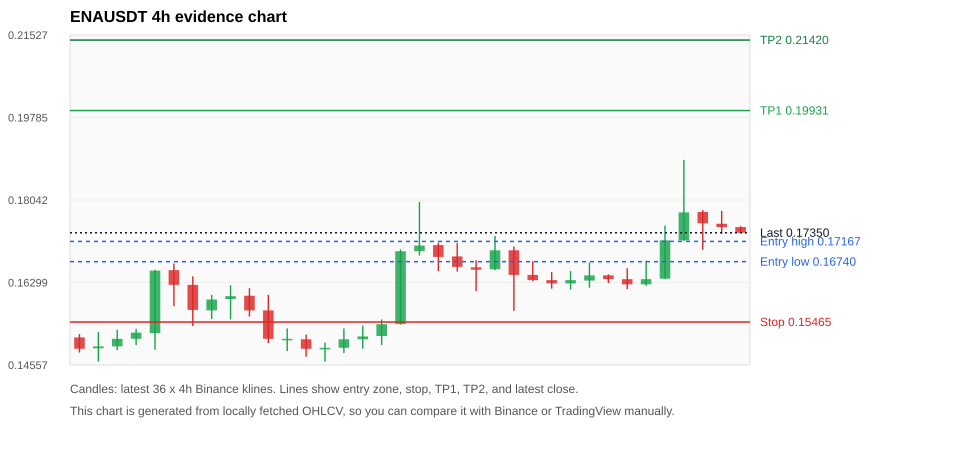
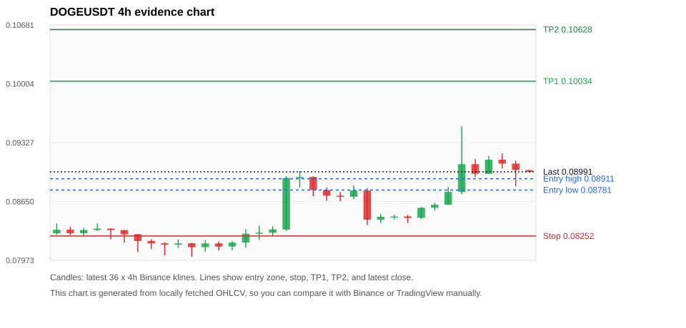
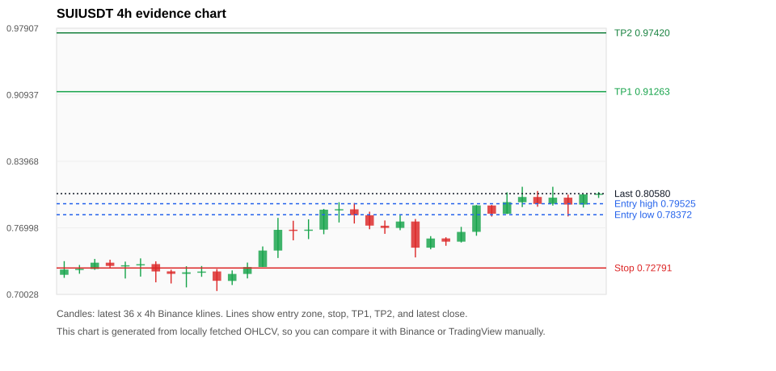
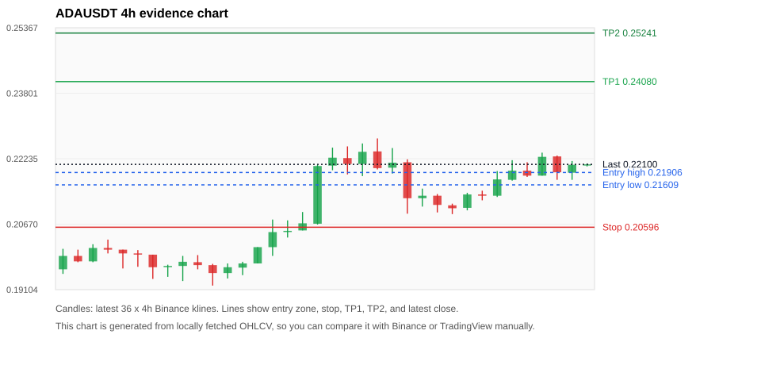
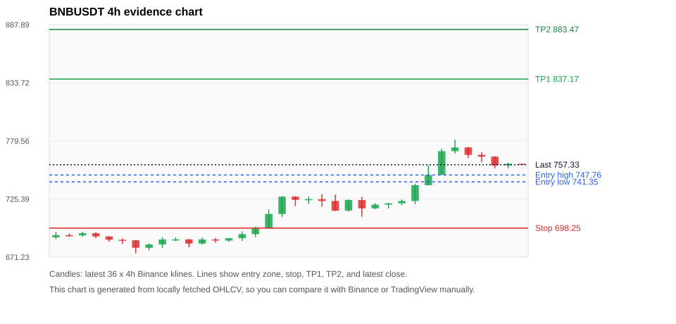

# Crypto 市场扫描报告 v1

- 报告时间：2026-09-06 20:13:07 CST
- Run ID：`20260906_120502_351c41cc`
- Run type：`daily_full`
- Data validation mode：`paper`
- 数据来源：SQLite
- 报告版本：v1
- 扫描 ID：23537861af20
- 数据源：Binance public spot API + CoinGecko/CoinMarketCap cross-check
- 过滤条件：USDT spot; 24h quote volume >= 30,000,000; trades >= 30,000; exclude stables/leveraged tokens; analyze 1h/4h/1d klines
- 默认单笔风险：账户权益的 1.00%

## 限制说明

- 交易信号仍以 Binance 现货公开 K 线为主源；外部数据源用于一致性复核。
- 结果是研究和模拟盘计划，不是确定收益或实盘下单指令。
- 历史长度过滤：候选币至少需要 180 根 1d K 线。
- 数据质量验证池：先验证 score 排名前 min(top_n * 2, 10) 的候选，再按 action + score 补足最终名单。
- 大盘环境过滤：RISK_ON; BTC/ETH 日线趋势均较强，允许山寨币买入候选。 BTC 7d=2.8346463788264886; ETH 7d=3.4507298666048847.
- Data cross-validation enabled: Binance primary source plus CoinGecko; CoinMarketCap is checked when an API key is configured.
- UNIUSDT validation state DEGRADED: DEGRADED: [EXTERNAL_IDENTITY_AMBIGUOUS] CoinMarketCap symbol mapping has 7 matches; selected lowest cmc_rank
- ENAUSDT validation state DEGRADED: DEGRADED: [EXTERNAL_IDENTITY_AMBIGUOUS] CoinMarketCap symbol mapping has 2 matches; selected lowest cmc_rank
- DOGEUSDT validation state DEGRADED: DEGRADED: [EXTERNAL_IDENTITY_AMBIGUOUS] CoinMarketCap symbol mapping has 23 matches; selected lowest cmc_rank
- SUIUSDT validation state DEGRADED: DEGRADED: [EXTERNAL_IDENTITY_AMBIGUOUS] CoinMarketCap symbol mapping has 5 matches; selected lowest cmc_rank
- ADAUSDT validation state DEGRADED: DEGRADED: [EXTERNAL_PROVIDER_RATE_LIMITED] Provider rate limited request for https://api.coingecko.com/api/v3/coins/markets?vs_currency=usd&ids=cardano&price_change_percentage=24h&per_page=1&page=1: HTTP 429; [EXTERNAL_IDENTITY_AMBIGUOUS] CoinMarketCap symbol mapping has 3 matches; selected lowest cmc_rank
- ZECUSDT validation state BLOCKED: BLOCKED: [BINANCE_KLINE_EXTREME_RANGE] Binance candle range exceeds 40%.; [BINANCE_KLINE_EXTREME_RANGE] Binance candle range exceeds 40%.; [EXTERNAL_PROVIDER_RATE_LIMITED] Provider rate limited request for https://api.coingecko.com/api/v3/coins/markets?vs_currency=usd&ids=zcash&price_change_percentage=24h&per_page=1&page=1: HTTP 429; [EXTERNAL_IDENTITY_AMBIGUOUS] CoinMarketCap symbol mapping has 2 matches; selected lowest cmc_rank
- BNBUSDT validation state DEGRADED: DEGRADED: [EXTERNAL_PROVIDER_RATE_LIMITED] Provider rate limited request for https://api.coingecko.com/api/v3/coins/markets?vs_currency=usd&ids=binancecoin&price_change_percentage=24h&per_page=1&page=1: HTTP 429; [EXTERNAL_IDENTITY_AMBIGUOUS] CoinMarketCap symbol mapping has 4 matches; selected lowest cmc_rank
- ETHUSDT validation state DEGRADED: DEGRADED: [EXTERNAL_PROVIDER_RATE_LIMITED] Provider rate limited request for https://api.coingecko.com/api/v3/coins/markets?vs_currency=usd&ids=ethereum&price_change_percentage=24h&per_page=1&page=1: HTTP 429; [EXTERNAL_IDENTITY_AMBIGUOUS] CoinMarketCap symbol mapping has 6 matches; selected lowest cmc_rank
- DASHUSDT validation state DEGRADED: DEGRADED: [EXTERNAL_PROVIDER_RATE_LIMITED] Provider rate limited request for https://api.coingecko.com/api/v3/coins/markets?vs_currency=usd&ids=dash&price_change_percentage=24h&per_page=1&page=1: HTTP 429; [EXTERNAL_IDENTITY_AMBIGUOUS] CoinMarketCap symbol mapping has 2 matches; selected lowest cmc_rank

## 5 个候选交易计划

| Rank | Coin | Action | Setup | Entry Zone | Stop Loss | TP1 | TP2 / Exit Rule | R/R | Verdict |
|---:|---|---|---|---:|---:|---:|---|---:|---|
| 1 | `ENA` | `BUY_CANDIDATE` | 回踩支撑/4h EMA 附近 | 0.16740 - 0.17167 | 0.15465 | 0.19931 | 0.21420 或跌破 4h 关键支撑 | 2.00-3.00 | 可考虑 |
| 2 | `DOGE` | `BUY_CANDIDATE` | 回踩支撑/4h EMA 附近 | 0.08781 - 0.08911 | 0.08252 | 0.10034 | 0.10628 或跌破 4h 关键支撑 | 2.00-3.00 | 可考虑 |
| 3 | `SUI` | `BUY_CANDIDATE` | 回踩支撑/4h EMA 附近 | 0.78372 - 0.79525 | 0.72791 | 0.91263 | 0.97420 或跌破 4h 关键支撑 | 2.00-3.00 | 可考虑 |
| 4 | `ADA` | `BUY_CANDIDATE` | 回踩支撑/4h EMA 附近 | 0.21609 - 0.21906 | 0.20596 | 0.24080 | 0.25241 或跌破 4h 关键支撑 | 2.00-3.00 | 可考虑 |
| 5 | `BNB` | `BUY_CANDIDATE` | 回踩支撑/4h EMA 附近 | 741.35 - 747.76 | 698.25 | 837.17 | 883.47 或跌破 4h 关键支撑 | 2.00-3.00 | 可考虑 |

## 数据交叉验证摘要

价格差异以 Binance 当前价为基准；成交量口径不同，Binance 是 USDT 现货成交额，CoinGecko/CoinMarketCap 通常是全市场成交量。

| Rank | Coin | State | Identity | Max Price Diff | Max 24h Diff | Issue Codes | Message |
|---:|---|---|---|---:|---:|---|---|
| 1 | `ENA` | DEGRADED (DATA_WARNING) | UNCONFIRMED | 0.15% | 0.12 pts | EXTERNAL_IDENTITY_AMBIGUOUS | DEGRADED: [EXTERNAL_IDENTITY_AMBIGUOUS] CoinMarketCap symbol mapping has 2 matches; selected lowest cmc_rank |
| 2 | `DOGE` | DEGRADED (DATA_WARNING) | UNCONFIRMED | 0.05% | 0.09 pts | EXTERNAL_IDENTITY_AMBIGUOUS | DEGRADED: [EXTERNAL_IDENTITY_AMBIGUOUS] CoinMarketCap symbol mapping has 23 matches; selected lowest cmc_rank |
| 3 | `SUI` | DEGRADED (DATA_WARNING) | UNCONFIRMED | 0.25% | 0.28 pts | EXTERNAL_IDENTITY_AMBIGUOUS | DEGRADED: [EXTERNAL_IDENTITY_AMBIGUOUS] CoinMarketCap symbol mapping has 5 matches; selected lowest cmc_rank |
| 4 | `ADA` | DEGRADED (DATA_WARNING) | UNCONFIRMED | 0.11% | 0.32 pts | EXTERNAL_IDENTITY_AMBIGUOUS, EXTERNAL_PROVIDER_RATE_LIMITED | DEGRADED: [EXTERNAL_PROVIDER_RATE_LIMITED] Provider rate limited request for https://api.coingecko.com/api/v3/coins/markets?vs_currency=usd&ids=cardano&price_change_percentage=24h&per_page=1&page=1: HTTP 429; [EXTERNAL_IDENTITY_AMBIGUOUS] CoinMarketCap symbol mapping has 3 matches; selected lowest cmc_rank |
| 5 | `BNB` | DEGRADED (DATA_WARNING) | UNCONFIRMED | 0.06% | 0.04 pts | EXTERNAL_IDENTITY_AMBIGUOUS, EXTERNAL_PROVIDER_RATE_LIMITED | DEGRADED: [EXTERNAL_PROVIDER_RATE_LIMITED] Provider rate limited request for https://api.coingecko.com/api/v3/coins/markets?vs_currency=usd&ids=binancecoin&price_change_percentage=24h&per_page=1&page=1: HTTP 429; [EXTERNAL_IDENTITY_AMBIGUOUS] CoinMarketCap symbol mapping has 4 matches; selected lowest cmc_rank |

## 候选币说明

### 1. ENA `ENAUSDT`



- 入选原因：回踩支撑/4h EMA 附近；24h +6.37%，7d +7.43%，4h RSI 61.40，24h 成交额 $61.8M。
- 交易失效条件：跌破 0.154645 或 4h 收盘重新失守关键支撑。
- 主要风险：主要风险是大盘同步回撤；External validation is degraded; this candidate is not a clean data sample.；Paper mode allows degraded validation; candidate is excluded from clean-data samples.。
- 数据交叉验证：DEGRADED / DATA_WARNING；身份=UNCONFIRMED；DEGRADED: [EXTERNAL_IDENTITY_AMBIGUOUS] CoinMarketCap symbol mapping has 2 matches; selected lowest cmc_rank

#### 可点击人工验证

- [Binance 交易页](https://www.binance.com/en/trade/ENA_USDT)
- [TradingView 图表](https://www.tradingview.com/chart/?symbol=BINANCE%3AENAUSDT)
- [CoinGecko 搜索](https://www.coingecko.com/en/search?query=ENA)
- [CoinMarketCap 搜索](https://coinmarketcap.com/search/?q=ENA)

#### 多数据源对照

| Source | Status | Identity | Blocking | Asset ID | Price | 24h Change | 24h Volume | Price Diff | 24h Diff | Updated | Issue Codes | Message |
|---|---|---|---:|---|---:|---:|---:|---:|---:|---|---|---|
| Binance | DATA_OK | CONFIRMED | no | ENAUSDT | 0.17350 | +6.37% | $61.8M | 0.00% | 0.00 pts | 2026-09-06T12:12:12+00:00 | none | Primary market data source passed health checks. |
| CoinGecko | DATA_OK | CONFIRMED | no | ethena | 0.17362 | +6.25% | $838.0M | 0.07% | 0.12 pts | 2026-09-06T12:10:20.000Z | none | External source agrees with Binance within thresholds. |
| CoinMarketCap | DATA_WARNING | UNCONFIRMED | no | 30171 | 0.17376 | +6.28% | $885.5M | 0.15% | 0.09 pts | 2026-09-06T12:10:59.000Z | EXTERNAL_IDENTITY_AMBIGUOUS | [EXTERNAL_IDENTITY_AMBIGUOUS] CoinMarketCap symbol mapping has 2 matches; selected lowest cmc_rank |

#### 指标证据

| 指标 | 数值 | 人工核对用途 |
|---|---:|---|
| 当前价 | 0.17350 | 与 Binance/TradingView 当前价格对照 |
| 24h 涨跌 | +6.37% | 与交易所 24h 涨跌对照 |
| 7d 涨跌 | +7.43% | 判断短线趋势是否延续 |
| 4h EMA20 | 0.16706 | 判断短期趋势支撑 |
| 4h EMA50 | 0.16039 | 判断中期趋势支撑 |
| 1d EMA20 | 0.14741 | 判断日线趋势 |
| 1d EMA50 | 0.12254 | 判断日线趋势 |
| 4h RSI14 | 61.40 | 判断是否过热/过弱 |
| 4h ATR14 | 0.0065857143 | 推导止损和入场缓冲 |
| 最近 18 根 4h 最低点 | 0.15700 | 支撑/止损参考 |
| 最近 36 根 4h 最高点 | 0.18890 | TP/压力参考 |
| 支撑位 | 0.16706 | 入场区间推导基础 |

#### 交易计划推导

- 支撑位 = 最近低点、4h EMA20、4h EMA50、1d EMA20 中不高于当前价的最高有效支撑 = `0.16706`。
- 入场区间 = 支撑位附近 + ATR 缓冲 = `0.16740 - 0.17167`。
- 止损 = min(最近 18 根 4h 最低点 * 0.985, 入场中位价 - 1.15 * ATR14) = `0.15465`。
- TP1 = max(最近 36 根 4h 最高点 * 0.995, 入场中位价 + 2R) = `0.19931`。
- TP2 = max(入场中位价 + 3R, TP1 * 1.04) = `0.21420`。

#### 最近 10 根 4h K线

| UTC 开盘时间 | Open | High | Low | Close | Quote Volume | Trades |
|---|---:|---:|---:|---:|---:|---:|
| 2026-09-05T00:00+00:00 | 0.16280 | 0.16540 | 0.16150 | 0.16350 | $3.3M | 14635 |
| 2026-09-05T04:00+00:00 | 0.16340 | 0.16720 | 0.16190 | 0.16450 | $3.7M | 19175 |
| 2026-09-05T08:00+00:00 | 0.16450 | 0.16470 | 0.16290 | 0.16370 | $3.0M | 16784 |
| 2026-09-05T12:00+00:00 | 0.16370 | 0.16600 | 0.16160 | 0.16260 | $5.5M | 21841 |
| 2026-09-05T16:00+00:00 | 0.16260 | 0.16760 | 0.16230 | 0.16370 | $5.7M | 31075 |
| 2026-09-05T20:00+00:00 | 0.16380 | 0.17500 | 0.16380 | 0.17190 | $12.1M | 60264 |
| 2026-09-06T00:00+00:00 | 0.17190 | 0.18890 | 0.17180 | 0.17780 | $22.1M | 125551 |
| 2026-09-06T04:00+00:00 | 0.17790 | 0.17830 | 0.16990 | 0.17550 | $10.5M | 43937 |
| 2026-09-06T08:00+00:00 | 0.17540 | 0.17810 | 0.17330 | 0.17470 | $5.5M | 27251 |
| 2026-09-06T12:00+00:00 | 0.17470 | 0.17490 | 0.17350 | 0.17350 | $370,864 | 908 |

### 2. DOGE `DOGEUSDT`



- 入选原因：回踩支撑/4h EMA 附近；24h +4.26%，7d +4.91%，4h RSI 59.63，24h 成交额 $144.4M。
- 交易失效条件：跌破 0.0825233 或 4h 收盘重新失守关键支撑。
- 主要风险：主要风险是大盘同步回撤；External validation is degraded; this candidate is not a clean data sample.；Paper mode allows degraded validation; candidate is excluded from clean-data samples.。
- 数据交叉验证：DEGRADED / DATA_WARNING；身份=UNCONFIRMED；DEGRADED: [EXTERNAL_IDENTITY_AMBIGUOUS] CoinMarketCap symbol mapping has 23 matches; selected lowest cmc_rank

#### 可点击人工验证

- [Binance 交易页](https://www.binance.com/en/trade/DOGE_USDT)
- [TradingView 图表](https://www.tradingview.com/chart/?symbol=BINANCE%3ADOGEUSDT)
- [CoinGecko 搜索](https://www.coingecko.com/en/search?query=DOGE)
- [CoinMarketCap 搜索](https://coinmarketcap.com/search/?q=DOGE)

#### 多数据源对照

| Source | Status | Identity | Blocking | Asset ID | Price | 24h Change | 24h Volume | Price Diff | 24h Diff | Updated | Issue Codes | Message |
|---|---|---|---:|---|---:|---:|---:|---:|---:|---|---|---|
| Binance | DATA_OK | CONFIRMED | no | DOGEUSDT | 0.08991 | +4.26% | $144.4M | 0.00% | 0.00 pts | 2026-09-06T12:12:12+00:00 | none | Primary market data source passed health checks. |
| CoinGecko | DATA_OK | CONFIRMED | no | dogecoin | 0.08996 | +4.23% | $1.39B | 0.05% | 0.03 pts | 2026-09-06T12:10:20.000Z | none | External source agrees with Binance within thresholds. |
| CoinMarketCap | DATA_WARNING | UNCONFIRMED | no | 74 | 0.08995 | +4.18% | $1.59B | 0.04% | 0.09 pts | 2026-09-06T12:10:59.000Z | EXTERNAL_IDENTITY_AMBIGUOUS | [EXTERNAL_IDENTITY_AMBIGUOUS] CoinMarketCap symbol mapping has 23 matches; selected lowest cmc_rank |

#### 指标证据

| 指标 | 数值 | 人工核对用途 |
|---|---:|---|
| 当前价 | 0.08991 | 与 Binance/TradingView 当前价格对照 |
| 24h 涨跌 | +4.26% | 与交易所 24h 涨跌对照 |
| 7d 涨跌 | +4.91% | 判断短线趋势是否延续 |
| 4h EMA20 | 0.08764 | 判断短期趋势支撑 |
| 4h EMA50 | 0.08593 | 判断中期趋势支撑 |
| 1d EMA20 | 0.08386 | 判断日线趋势 |
| 1d EMA50 | 0.08015 | 判断日线趋势 |
| 4h RSI14 | 59.63 | 判断是否过热/过弱 |
| 4h ATR14 | 0.0021121429 | 推导止损和入场缓冲 |
| 最近 18 根 4h 最低点 | 0.08378 | 支撑/止损参考 |
| 最近 36 根 4h 最高点 | 0.09515 | TP/压力参考 |
| 支撑位 | 0.08764 | 入场区间推导基础 |

#### 交易计划推导

- 支撑位 = 最近低点、4h EMA20、4h EMA50、1d EMA20 中不高于当前价的最高有效支撑 = `0.08764`。
- 入场区间 = 支撑位附近 + ATR 缓冲 = `0.08781 - 0.08911`。
- 止损 = min(最近 18 根 4h 最低点 * 0.985, 入场中位价 - 1.15 * ATR14) = `0.08252`。
- TP1 = max(最近 36 根 4h 最高点 * 0.995, 入场中位价 + 2R) = `0.10034`。
- TP2 = max(入场中位价 + 3R, TP1 * 1.04) = `0.10628`。

#### 最近 10 根 4h K线

| UTC 开盘时间 | Open | High | Low | Close | Quote Volume | Trades |
|---|---:|---:|---:|---:|---:|---:|
| 2026-09-05T00:00+00:00 | 0.08478 | 0.08495 | 0.08402 | 0.08460 | $8.6M | 42328 |
| 2026-09-05T04:00+00:00 | 0.08461 | 0.08585 | 0.08447 | 0.08578 | $8.7M | 50427 |
| 2026-09-05T08:00+00:00 | 0.08578 | 0.08635 | 0.08548 | 0.08612 | $7.3M | 50710 |
| 2026-09-05T12:00+00:00 | 0.08612 | 0.08816 | 0.08610 | 0.08760 | $18.7M | 121753 |
| 2026-09-05T16:00+00:00 | 0.08760 | 0.09515 | 0.08733 | 0.09079 | $51.5M | 412881 |
| 2026-09-05T20:00+00:00 | 0.09079 | 0.09138 | 0.08930 | 0.08969 | $22.1M | 134618 |
| 2026-09-06T00:00+00:00 | 0.08969 | 0.09172 | 0.08968 | 0.09131 | $13.7M | 85064 |
| 2026-09-06T04:00+00:00 | 0.09131 | 0.09203 | 0.09031 | 0.09086 | $21.5M | 109591 |
| 2026-09-06T08:00+00:00 | 0.09086 | 0.09120 | 0.08825 | 0.09012 | $17.7M | 109897 |
| 2026-09-06T12:00+00:00 | 0.09011 | 0.09011 | 0.08984 | 0.08991 | $256,647 | 2445 |

### 3. SUI `SUIUSDT`



- 入选原因：回踩支撑/4h EMA 附近；24h +2.40%，7d +7.61%，4h RSI 62.51，24h 成交额 $74.1M。
- 交易失效条件：跌破 0.727915 或 4h 收盘重新失守关键支撑。
- 主要风险：主要风险是大盘同步回撤；External validation is degraded; this candidate is not a clean data sample.；Paper mode allows degraded validation; candidate is excluded from clean-data samples.。
- 数据交叉验证：DEGRADED / DATA_WARNING；身份=UNCONFIRMED；DEGRADED: [EXTERNAL_IDENTITY_AMBIGUOUS] CoinMarketCap symbol mapping has 5 matches; selected lowest cmc_rank

#### 可点击人工验证

- [Binance 交易页](https://www.binance.com/en/trade/SUI_USDT)
- [TradingView 图表](https://www.tradingview.com/chart/?symbol=BINANCE%3ASUIUSDT)
- [CoinGecko 搜索](https://www.coingecko.com/en/search?query=SUI)
- [CoinMarketCap 搜索](https://coinmarketcap.com/search/?q=SUI)

#### 多数据源对照

| Source | Status | Identity | Blocking | Asset ID | Price | 24h Change | 24h Volume | Price Diff | 24h Diff | Updated | Issue Codes | Message |
|---|---|---|---:|---|---:|---:|---:|---:|---:|---|---|---|
| Binance | DATA_OK | CONFIRMED | no | SUIUSDT | 0.80580 | +2.40% | $74.1M | 0.00% | 0.00 pts | 2026-09-06T12:12:12+00:00 | none | Primary market data source passed health checks. |
| CoinGecko | DATA_OK | CONFIRMED | no | sui | 0.80487 | +2.27% | $648.0M | 0.11% | 0.14 pts | 2026-09-06T12:10:20.000Z | none | External source agrees with Binance within thresholds. |
| CoinMarketCap | DATA_WARNING | UNCONFIRMED | no | 20947 | 0.80375 | +2.13% | $642.3M | 0.25% | 0.28 pts | 2026-09-06T12:10:59.000Z | EXTERNAL_IDENTITY_AMBIGUOUS | [EXTERNAL_IDENTITY_AMBIGUOUS] CoinMarketCap symbol mapping has 5 matches; selected lowest cmc_rank |

#### 指标证据

| 指标 | 数值 | 人工核对用途 |
|---|---:|---|
| 当前价 | 0.80580 | 与 Binance/TradingView 当前价格对照 |
| 24h 涨跌 | +2.40% | 与交易所 24h 涨跌对照 |
| 7d 涨跌 | +7.61% | 判断短线趋势是否延续 |
| 4h EMA20 | 0.78215 | 判断短期趋势支撑 |
| 4h EMA50 | 0.76542 | 判断中期趋势支撑 |
| 1d EMA20 | 0.75455 | 判断日线趋势 |
| 1d EMA50 | 0.74262 | 判断日线趋势 |
| 4h RSI14 | 62.51 | 判断是否过热/过弱 |
| 4h ATR14 | 0.01871 | 推导止损和入场缓冲 |
| 最近 18 根 4h 最低点 | 0.73900 | 支撑/止损参考 |
| 最近 36 根 4h 最高点 | 0.81300 | TP/压力参考 |
| 支撑位 | 0.78215 | 入场区间推导基础 |

#### 交易计划推导

- 支撑位 = 最近低点、4h EMA20、4h EMA50、1d EMA20 中不高于当前价的最高有效支撑 = `0.78215`。
- 入场区间 = 支撑位附近 + ATR 缓冲 = `0.78372 - 0.79525`。
- 止损 = min(最近 18 根 4h 最低点 * 0.985, 入场中位价 - 1.15 * ATR14) = `0.72791`。
- TP1 = max(最近 36 根 4h 最高点 * 0.995, 入场中位价 + 2R) = `0.91263`。
- TP2 = max(入场中位价 + 3R, TP1 * 1.04) = `0.97420`。

#### 最近 10 根 4h K线

| UTC 开盘时间 | Open | High | Low | Close | Quote Volume | Trades |
|---|---:|---:|---:|---:|---:|---:|
| 2026-09-05T00:00+00:00 | 0.75550 | 0.77100 | 0.75460 | 0.76570 | $8.0M | 45566 |
| 2026-09-05T04:00+00:00 | 0.76580 | 0.79390 | 0.76170 | 0.79350 | $11.3M | 61152 |
| 2026-09-05T08:00+00:00 | 0.79340 | 0.79390 | 0.78180 | 0.78480 | $9.6M | 61226 |
| 2026-09-05T12:00+00:00 | 0.78470 | 0.80720 | 0.78450 | 0.79690 | $17.5M | 104221 |
| 2026-09-05T16:00+00:00 | 0.79680 | 0.81300 | 0.79170 | 0.80230 | $16.6M | 85652 |
| 2026-09-05T20:00+00:00 | 0.80230 | 0.80860 | 0.79210 | 0.79510 | $8.7M | 52242 |
| 2026-09-06T00:00+00:00 | 0.79520 | 0.81300 | 0.79330 | 0.80160 | $13.9M | 68227 |
| 2026-09-06T04:00+00:00 | 0.80160 | 0.80480 | 0.78200 | 0.79440 | $8.1M | 45489 |
| 2026-09-06T08:00+00:00 | 0.79440 | 0.80500 | 0.79130 | 0.80500 | $8.8M | 46841 |
| 2026-09-06T12:00+00:00 | 0.80500 | 0.80750 | 0.80130 | 0.80580 | $625,599 | 3190 |

### 4. ADA `ADAUSDT`



- 入选原因：回踩支撑/4h EMA 附近；24h +3.71%，7d +7.96%，4h RSI 51.31，24h 成交额 $35.1M。
- 交易失效条件：跌破 0.2059635 或 4h 收盘重新失守关键支撑。
- 主要风险：主要风险是大盘同步回撤；External validation is degraded; this candidate is not a clean data sample.；Paper mode allows degraded validation; candidate is excluded from clean-data samples.。
- 数据交叉验证：DEGRADED / DATA_WARNING；身份=UNCONFIRMED；DEGRADED: [EXTERNAL_PROVIDER_RATE_LIMITED] Provider rate limited request for https://api.coingecko.com/api/v3/coins/markets?vs_currency=usd&ids=cardano&price_change_percentage=24h&per_page=1&page=1: HTTP 429; [EXTERNAL_IDENTITY_AMBIGUOUS] CoinMarketCap symbol mapping has 3 matches; selected lowest cmc_rank

#### 可点击人工验证

- [Binance 交易页](https://www.binance.com/en/trade/ADA_USDT)
- [TradingView 图表](https://www.tradingview.com/chart/?symbol=BINANCE%3AADAUSDT)
- [CoinGecko 搜索](https://www.coingecko.com/en/search?query=ADA)
- [CoinMarketCap 搜索](https://coinmarketcap.com/search/?q=ADA)

#### 多数据源对照

| Source | Status | Identity | Blocking | Asset ID | Price | 24h Change | 24h Volume | Price Diff | 24h Diff | Updated | Issue Codes | Message |
|---|---|---|---:|---|---:|---:|---:|---:|---:|---|---|---|
| Binance | DATA_OK | CONFIRMED | no | ADAUSDT | 0.22100 | +3.71% | $35.1M | 0.00% | 0.00 pts | 2026-09-06T12:12:12+00:00 | none | Primary market data source passed health checks. |
| CoinGecko | DATA_WARNING | UNCONFIRMED | no | n/a | n/a | n/a | n/a | n/a | n/a | 2026-09-06T12:12:12+00:00 | EXTERNAL_PROVIDER_RATE_LIMITED | Provider rate limited request for https://api.coingecko.com/api/v3/coins/markets?vs_currency=usd&ids=cardano&price_change_percentage=24h&per_page=1&page=1: HTTP 429 |
| CoinMarketCap | DATA_WARNING | UNCONFIRMED | no | 2010 | 0.22076 | +3.38% | $492.0M | 0.11% | 0.32 pts | 2026-09-06T12:12:00.000Z | EXTERNAL_IDENTITY_AMBIGUOUS | [EXTERNAL_IDENTITY_AMBIGUOUS] CoinMarketCap symbol mapping has 3 matches; selected lowest cmc_rank |

#### 指标证据

| 指标 | 数值 | 人工核对用途 |
|---|---:|---|
| 当前价 | 0.22100 | 与 Binance/TradingView 当前价格对照 |
| 24h 涨跌 | +3.71% | 与交易所 24h 涨跌对照 |
| 7d 涨跌 | +7.96% | 判断短线趋势是否延续 |
| 4h EMA20 | 0.21566 | 判断短期趋势支撑 |
| 4h EMA50 | 0.21038 | 判断中期趋势支撑 |
| 1d EMA20 | 0.20589 | 判断日线趋势 |
| 1d EMA50 | 0.19579 | 判断日线趋势 |
| 4h RSI14 | 51.31 | 判断是否过热/过弱 |
| 4h ATR14 | 0.00485 | 推导止损和入场缓冲 |
| 最近 18 根 4h 最低点 | 0.20910 | 支撑/止损参考 |
| 最近 36 根 4h 最高点 | 0.22720 | TP/压力参考 |
| 支撑位 | 0.21566 | 入场区间推导基础 |

#### 交易计划推导

- 支撑位 = 最近低点、4h EMA20、4h EMA50、1d EMA20 中不高于当前价的最高有效支撑 = `0.21566`。
- 入场区间 = 支撑位附近 + ATR 缓冲 = `0.21609 - 0.21906`。
- 止损 = min(最近 18 根 4h 最低点 * 0.985, 入场中位价 - 1.15 * ATR14) = `0.20596`。
- TP1 = max(最近 36 根 4h 最高点 * 0.995, 入场中位价 + 2R) = `0.24080`。
- TP2 = max(入场中位价 + 3R, TP1 * 1.04) = `0.25241`。

#### 最近 10 根 4h K线

| UTC 开盘时间 | Open | High | Low | Close | Quote Volume | Trades |
|---|---:|---:|---:|---:|---:|---:|
| 2026-09-05T00:00+00:00 | 0.21120 | 0.21160 | 0.20910 | 0.21050 | $4.5M | 15828 |
| 2026-09-05T04:00+00:00 | 0.21060 | 0.21420 | 0.21000 | 0.21380 | $5.3M | 17287 |
| 2026-09-05T08:00+00:00 | 0.21380 | 0.21470 | 0.21240 | 0.21350 | $3.9M | 13321 |
| 2026-09-05T12:00+00:00 | 0.21350 | 0.21940 | 0.21320 | 0.21740 | $7.1M | 26217 |
| 2026-09-05T16:00+00:00 | 0.21730 | 0.22200 | 0.21710 | 0.21950 | $6.6M | 28214 |
| 2026-09-05T20:00+00:00 | 0.21950 | 0.22150 | 0.21800 | 0.21830 | $5.8M | 22536 |
| 2026-09-06T00:00+00:00 | 0.21830 | 0.22380 | 0.21830 | 0.22280 | $5.5M | 21254 |
| 2026-09-06T04:00+00:00 | 0.22290 | 0.22310 | 0.21730 | 0.21910 | $4.5M | 20659 |
| 2026-09-06T08:00+00:00 | 0.21900 | 0.22180 | 0.21730 | 0.22090 | $5.5M | 20323 |
| 2026-09-06T12:00+00:00 | 0.22090 | 0.22120 | 0.22050 | 0.22100 | $178,718 | 741 |

### 5. BNB `BNBUSDT`



- 入选原因：回踩支撑/4h EMA 附近；24h +0.86%，7d +8.29%，4h RSI 72.84，24h 成交额 $208.0M。
- 交易失效条件：跌破 698.2468 或 4h 收盘重新失守关键支撑。
- 主要风险：主要风险是大盘同步回撤；External validation is degraded; this candidate is not a clean data sample.；Paper mode allows degraded validation; candidate is excluded from clean-data samples.。
- 数据交叉验证：DEGRADED / DATA_WARNING；身份=UNCONFIRMED；DEGRADED: [EXTERNAL_PROVIDER_RATE_LIMITED] Provider rate limited request for https://api.coingecko.com/api/v3/coins/markets?vs_currency=usd&ids=binancecoin&price_change_percentage=24h&per_page=1&page=1: HTTP 429; [EXTERNAL_IDENTITY_AMBIGUOUS] CoinMarketCap symbol mapping has 4 matches; selected lowest cmc_rank

#### 可点击人工验证

- [Binance 交易页](https://www.binance.com/en/trade/BNB_USDT)
- [TradingView 图表](https://www.tradingview.com/chart/?symbol=BINANCE%3ABNBUSDT)
- [CoinGecko 搜索](https://www.coingecko.com/en/search?query=BNB)
- [CoinMarketCap 搜索](https://coinmarketcap.com/search/?q=BNB)

#### 多数据源对照

| Source | Status | Identity | Blocking | Asset ID | Price | 24h Change | 24h Volume | Price Diff | 24h Diff | Updated | Issue Codes | Message |
|---|---|---|---:|---|---:|---:|---:|---:|---:|---|---|---|
| Binance | DATA_OK | CONFIRMED | no | BNBUSDT | 757.33 | +0.86% | $208.0M | 0.00% | 0.00 pts | 2026-09-06T12:12:12+00:00 | none | Primary market data source passed health checks. |
| CoinGecko | DATA_WARNING | UNCONFIRMED | no | n/a | n/a | n/a | n/a | n/a | n/a | 2026-09-06T12:12:12+00:00 | EXTERNAL_PROVIDER_RATE_LIMITED | Provider rate limited request for https://api.coingecko.com/api/v3/coins/markets?vs_currency=usd&ids=binancecoin&price_change_percentage=24h&per_page=1&page=1: HTTP 429 |
| CoinMarketCap | DATA_WARNING | UNCONFIRMED | no | 1839 | 757.79 | +0.90% | $2.51B | 0.06% | 0.04 pts | 2026-09-06T12:12:00.000Z | EXTERNAL_IDENTITY_AMBIGUOUS | [EXTERNAL_IDENTITY_AMBIGUOUS] CoinMarketCap symbol mapping has 4 matches; selected lowest cmc_rank |

#### 指标证据

| 指标 | 数值 | 人工核对用途 |
|---|---:|---|
| 当前价 | 757.33 | 与 Binance/TradingView 当前价格对照 |
| 24h 涨跌 | +0.86% | 与交易所 24h 涨跌对照 |
| 7d 涨跌 | +8.29% | 判断短线趋势是否延续 |
| 4h EMA20 | 739.87 | 判断短期趋势支撑 |
| 4h EMA50 | 717.79 | 判断中期趋势支撑 |
| 1d EMA20 | 694.34 | 判断日线趋势 |
| 1d EMA50 | 651.71 | 判断日线趋势 |
| 4h RSI14 | 72.84 | 判断是否过热/过弱 |
| 4h ATR14 | 11.2664 | 推导止损和入场缓冲 |
| 最近 18 根 4h 最低点 | 708.88 | 支撑/止损参考 |
| 最近 36 根 4h 最高点 | 780.64 | TP/压力参考 |
| 支撑位 | 739.87 | 入场区间推导基础 |

#### 交易计划推导

- 支撑位 = 最近低点、4h EMA20、4h EMA50、1d EMA20 中不高于当前价的最高有效支撑 = `739.87`。
- 入场区间 = 支撑位附近 + ATR 缓冲 = `741.35 - 747.76`。
- 止损 = min(最近 18 根 4h 最低点 * 0.985, 入场中位价 - 1.15 * ATR14) = `698.25`。
- TP1 = max(最近 36 根 4h 最高点 * 0.995, 入场中位价 + 2R) = `837.17`。
- TP2 = max(入场中位价 + 3R, TP1 * 1.04) = `883.47`。

#### 最近 10 根 4h K线

| UTC 开盘时间 | Open | High | Low | Close | Quote Volume | Trades |
|---|---:|---:|---:|---:|---:|---:|
| 2026-09-05T00:00+00:00 | 721.38 | 725.00 | 719.49 | 723.51 | $11.7M | 83868 |
| 2026-09-05T04:00+00:00 | 723.52 | 739.46 | 720.69 | 738.25 | $27.9M | 169355 |
| 2026-09-05T08:00+00:00 | 738.25 | 756.88 | 738.16 | 747.85 | $76.0M | 372776 |
| 2026-09-05T12:00+00:00 | 747.85 | 772.31 | 747.84 | 769.99 | $80.3M | 428889 |
| 2026-09-05T16:00+00:00 | 769.99 | 780.64 | 767.71 | 773.42 | $41.8M | 274970 |
| 2026-09-05T20:00+00:00 | 773.42 | 774.03 | 763.47 | 766.53 | $17.3M | 147455 |
| 2026-09-06T00:00+00:00 | 766.52 | 769.00 | 759.76 | 764.87 | $26.5M | 162062 |
| 2026-09-06T04:00+00:00 | 764.87 | 765.26 | 753.96 | 756.62 | $24.8M | 165743 |
| 2026-09-06T08:00+00:00 | 756.62 | 758.99 | 753.99 | 758.24 | $18.2M | 137248 |
| 2026-09-06T12:00+00:00 | 758.24 | 758.24 | 757.29 | 757.33 | $598,642 | 4598 |

## 组合风控

- 不要 5 个候选全部满仓买入。
- 同时持仓总风险建议控制在账户权益的 3% - 5% 以内。
- 如果 BTC/ETH 同时破位，暂停山寨币多头计划或降低仓位。
- 第一版报告用于模拟盘和人工复核，不自动下单。

## 原始数据

```json
[
  {
    "rank": 1,
    "symbol": "ENAUSDT",
    "base_asset": "ENA",
    "price": 0.1735,
    "score": 72.02658940595,
    "setup": "回踩支撑/4h EMA 附近",
    "verdict": "可考虑",
    "entry_low": 0.16739583725893095,
    "entry_high": 0.17167171383126842,
    "stop_loss": 0.154645,
    "take_profit_1": 0.19931132663529905,
    "take_profit_2": 0.21420010218039873,
    "risk_reward_1": 2.0,
    "risk_reward_2": 3.0,
    "pct_24h": 6.369,
    "pct_3d": 11.289288005131471,
    "pct_7d": 7.430340557275539,
    "quote_volume_24h": 61832541.288684,
    "trades_24h": 310479,
    "high_low_range_24h": 16.893564356435654,
    "rsi_1h": 56.38297872340424,
    "rsi_4h": 61.40350877192979,
    "ema20_4h": 0.16706171383126842,
    "ema50_4h": 0.16038818425966042,
    "ema20_1d": 0.1474075598950213,
    "ema50_1d": 0.12254137936831655,
    "atr_4h": 0.006585714285714288,
    "macd_hist_4h": 0.0008556595373729581,
    "volume_ratio_24h": 1.4676114787459256,
    "support_level": 0.16706171383126842,
    "recent_low_4h_18": 0.157,
    "recent_high_4h_36": 0.1889,
    "distance_to_support_pct": 3.8538370169207026,
    "binance_trade_url": "https://www.binance.com/en/trade/ENA_USDT",
    "tradingview_url": "https://www.tradingview.com/chart/?symbol=BINANCE%3AENAUSDT",
    "coingecko_search_url": "https://www.coingecko.com/en/search?query=ENA",
    "coinmarketcap_search_url": "https://coinmarketcap.com/search/?q=ENA",
    "invalidation": "跌破 0.154645 或 4h 收盘重新失守关键支撑",
    "recent_4h_klines": [
      {
        "open_time_utc": "2026-08-31T16:00+00:00",
        "open": 0.1514,
        "high": 0.1521,
        "low": 0.1482,
        "close": 0.149,
        "quote_volume": 3388680.850486,
        "trades": 21868
      },
      {
        "open_time_utc": "2026-08-31T20:00+00:00",
        "open": 0.1491,
        "high": 0.1525,
        "low": 0.1463,
        "close": 0.1495,
        "quote_volume": 3702286.073011,
        "trades": 19934
      },
      {
        "open_time_utc": "2026-09-01T00:00+00:00",
        "open": 0.1495,
        "high": 0.153,
        "low": 0.1487,
        "close": 0.1511,
        "quote_volume": 3488552.972247,
        "trades": 23617
      },
      {
        "open_time_utc": "2026-09-01T04:00+00:00",
        "open": 0.1511,
        "high": 0.1532,
        "low": 0.1498,
        "close": 0.1524,
        "quote_volume": 3452614.469076,
        "trades": 22196
      },
      {
        "open_time_utc": "2026-09-01T08:00+00:00",
        "open": 0.1523,
        "high": 0.1657,
        "low": 0.1488,
        "close": 0.1655,
        "quote_volume": 13247978.399827,
        "trades": 64003
      },
      {
        "open_time_utc": "2026-09-01T12:00+00:00",
        "open": 0.1656,
        "high": 0.167,
        "low": 0.158,
        "close": 0.1625,
        "quote_volume": 16395944.604473,
        "trades": 93003
      },
      {
        "open_time_utc": "2026-09-01T16:00+00:00",
        "open": 0.1625,
        "high": 0.1643,
        "low": 0.1538,
        "close": 0.1572,
        "quote_volume": 11145796.550869,
        "trades": 58068
      },
      {
        "open_time_utc": "2026-09-01T20:00+00:00",
        "open": 0.1571,
        "high": 0.1604,
        "low": 0.1553,
        "close": 0.1594,
        "quote_volume": 4185291.355791,
        "trades": 25275
      },
      {
        "open_time_utc": "2026-09-02T00:00+00:00",
        "open": 0.1595,
        "high": 0.1624,
        "low": 0.1552,
        "close": 0.1601,
        "quote_volume": 6888772.071059,
        "trades": 33423
      },
      {
        "open_time_utc": "2026-09-02T04:00+00:00",
        "open": 0.1602,
        "high": 0.1618,
        "low": 0.1558,
        "close": 0.1571,
        "quote_volume": 5175598.765509,
        "trades": 23085
      },
      {
        "open_time_utc": "2026-09-02T08:00+00:00",
        "open": 0.1571,
        "high": 0.1604,
        "low": 0.1502,
        "close": 0.1511,
        "quote_volume": 7098151.57748,
        "trades": 29911
      },
      {
        "open_time_utc": "2026-09-02T12:00+00:00",
        "open": 0.1511,
        "high": 0.1533,
        "low": 0.1485,
        "close": 0.1511,
        "quote_volume": 6983407.850407,
        "trades": 29851
      },
      {
        "open_time_utc": "2026-09-02T16:00+00:00",
        "open": 0.151,
        "high": 0.152,
        "low": 0.1473,
        "close": 0.149,
        "quote_volume": 3245265.076619,
        "trades": 17978
      },
      {
        "open_time_utc": "2026-09-02T20:00+00:00",
        "open": 0.1491,
        "high": 0.1503,
        "low": 0.1463,
        "close": 0.1492,
        "quote_volume": 2481007.558003,
        "trades": 13201
      },
      {
        "open_time_utc": "2026-09-03T00:00+00:00",
        "open": 0.1492,
        "high": 0.1533,
        "low": 0.1481,
        "close": 0.151,
        "quote_volume": 4127931.940347,
        "trades": 21054
      },
      {
        "open_time_utc": "2026-09-03T04:00+00:00",
        "open": 0.151,
        "high": 0.1539,
        "low": 0.149,
        "close": 0.1516,
        "quote_volume": 3172509.005135,
        "trades": 16480
      },
      {
        "open_time_utc": "2026-09-03T08:00+00:00",
        "open": 0.1517,
        "high": 0.1552,
        "low": 0.1498,
        "close": 0.1542,
        "quote_volume": 4992691.237019,
        "trades": 18687
      },
      {
        "open_time_utc": "2026-09-03T12:00+00:00",
        "open": 0.1542,
        "high": 0.17,
        "low": 0.1541,
        "close": 0.1696,
        "quote_volume": 14097585.831966,
        "trades": 56822
      },
      {
        "open_time_utc": "2026-09-03T16:00+00:00",
        "open": 0.1696,
        "high": 0.18,
        "low": 0.1687,
        "close": 0.1708,
        "quote_volume": 22707793.48454,
        "trades": 110170
      },
      {
        "open_time_utc": "2026-09-03T20:00+00:00",
        "open": 0.1709,
        "high": 0.1714,
        "low": 0.1654,
        "close": 0.1684,
        "quote_volume": 7925086.889529,
        "trades": 36331
      },
      {
        "open_time_utc": "2026-09-04T00:00+00:00",
        "open": 0.1685,
        "high": 0.1713,
        "low": 0.1653,
        "close": 0.1663,
        "quote_volume": 8393540.315494,
        "trades": 36956
      },
      {
        "open_time_utc": "2026-09-04T04:00+00:00",
        "open": 0.1662,
        "high": 0.1677,
        "low": 0.1612,
        "close": 0.1657,
        "quote_volume": 6038373.067706,
        "trades": 28039
      },
      {
        "open_time_utc": "2026-09-04T08:00+00:00",
        "open": 0.1658,
        "high": 0.1728,
        "low": 0.1656,
        "close": 0.1698,
        "quote_volume": 8394229.084862,
        "trades": 40994
      },
      {
        "open_time_utc": "2026-09-04T12:00+00:00",
        "open": 0.1698,
        "high": 0.1706,
        "low": 0.157,
        "close": 0.1646,
        "quote_volume": 17067251.955255,
        "trades": 94043
      },
      {
        "open_time_utc": "2026-09-04T16:00+00:00",
        "open": 0.1646,
        "high": 0.1675,
        "low": 0.1633,
        "close": 0.1635,
        "quote_volume": 4851993.747627,
        "trades": 30043
      },
      {
        "open_time_utc": "2026-09-04T20:00+00:00",
        "open": 0.1635,
        "high": 0.1652,
        "low": 0.1617,
        "close": 0.1628,
        "quote_volume": 3404100.737205,
        "trades": 14675
      },
      {
        "open_time_utc": "2026-09-05T00:00+00:00",
        "open": 0.1628,
        "high": 0.1654,
        "low": 0.1615,
        "close": 0.1635,
        "quote_volume": 3281644.498505,
        "trades": 14635
      },
      {
        "open_time_utc": "2026-09-05T04:00+00:00",
        "open": 0.1634,
        "high": 0.1672,
        "low": 0.1619,
        "close": 0.1645,
        "quote_volume": 3691839.407529,
        "trades": 19175
      },
      {
        "open_time_utc": "2026-09-05T08:00+00:00",
        "open": 0.1645,
        "high": 0.1647,
        "low": 0.1629,
        "close": 0.1637,
        "quote_volume": 3013042.131033,
        "trades": 16784
      },
      {
        "open_time_utc": "2026-09-05T12:00+00:00",
        "open": 0.1637,
        "high": 0.166,
        "low": 0.1616,
        "close": 0.1626,
        "quote_volume": 5542918.858606,
        "trades": 21841
      },
      {
        "open_time_utc": "2026-09-05T16:00+00:00",
        "open": 0.1626,
        "high": 0.1676,
        "low": 0.1623,
        "close": 0.1637,
        "quote_volume": 5719329.129686,
        "trades": 31075
      },
      {
        "open_time_utc": "2026-09-05T20:00+00:00",
        "open": 0.1638,
        "high": 0.175,
        "low": 0.1638,
        "close": 0.1719,
        "quote_volume": 12128439.957768,
        "trades": 60264
      },
      {
        "open_time_utc": "2026-09-06T00:00+00:00",
        "open": 0.1719,
        "high": 0.1889,
        "low": 0.1718,
        "close": 0.1778,
        "quote_volume": 22076389.288084,
        "trades": 125551
      },
      {
        "open_time_utc": "2026-09-06T04:00+00:00",
        "open": 0.1779,
        "high": 0.1783,
        "low": 0.1699,
        "close": 0.1755,
        "quote_volume": 10527634.621388,
        "trades": 43937
      },
      {
        "open_time_utc": "2026-09-06T08:00+00:00",
        "open": 0.1754,
        "high": 0.1781,
        "low": 0.1733,
        "close": 0.1747,
        "quote_volume": 5517696.867533,
        "trades": 27251
      },
      {
        "open_time_utc": "2026-09-06T12:00+00:00",
        "open": 0.1747,
        "high": 0.1749,
        "low": 0.1735,
        "close": 0.1735,
        "quote_volume": 370864.418938,
        "trades": 908
      }
    ],
    "risks": [
      "主要风险是大盘同步回撤",
      "External validation is degraded; this candidate is not a clean data sample.",
      "Paper mode allows degraded validation; candidate is excluded from clean-data samples."
    ],
    "data_quality_status": "DATA_WARNING",
    "data_quality_message": "DEGRADED: [EXTERNAL_IDENTITY_AMBIGUOUS] CoinMarketCap symbol mapping has 2 matches; selected lowest cmc_rank",
    "data_checks": [
      {
        "provider": "Binance",
        "status": "DATA_OK",
        "provider_asset_id": "ENAUSDT",
        "provider_symbol": "ENAUSDT",
        "price_usd": 0.1735,
        "pct_24h": 6.369,
        "volume_24h": 61832541.288684,
        "last_updated": null,
        "fetched_at_utc": "2026-09-06T12:12:12+00:00",
        "price_diff_pct": 0.0,
        "pct_24h_diff": 0.0,
        "volume_note": "Binance USDT spot 24h quoteVolume.",
        "message": "Primary market data source passed health checks.",
        "blocking": false,
        "identity_status": "CONFIRMED",
        "issues": []
      },
      {
        "provider": "CoinGecko",
        "status": "DATA_OK",
        "provider_asset_id": "ethena",
        "provider_symbol": "ENA",
        "price_usd": 0.173618,
        "pct_24h": 6.24932,
        "volume_24h": 837967596.0,
        "last_updated": "2026-09-06T12:10:20.000Z",
        "fetched_at_utc": "2026-09-06T12:12:12+00:00",
        "price_diff_pct": 0.06801152737752565,
        "pct_24h_diff": 0.11967999999999979,
        "volume_note": "CoinGecko total market volume; not the same venue scope as Binance quoteVolume.",
        "message": "External source agrees with Binance within thresholds.",
        "blocking": false,
        "identity_status": "CONFIRMED",
        "issues": []
      },
      {
        "provider": "CoinMarketCap",
        "status": "DATA_WARNING",
        "provider_asset_id": "30171",
        "provider_symbol": "ENA",
        "price_usd": 0.1737621251798369,
        "pct_24h": 6.28240746,
        "volume_24h": 885455676.4965503,
        "last_updated": "2026-09-06T12:10:59.000Z",
        "fetched_at_utc": "2026-09-06T12:12:12+00:00",
        "price_diff_pct": 0.1510807952950577,
        "pct_24h_diff": 0.08659253999999983,
        "volume_note": "CoinMarketCap total market volume; not the same venue scope as Binance quoteVolume.",
        "message": "[EXTERNAL_IDENTITY_AMBIGUOUS] CoinMarketCap symbol mapping has 2 matches; selected lowest cmc_rank",
        "blocking": false,
        "identity_status": "UNCONFIRMED",
        "issues": [
          {
            "provider": "CoinMarketCap",
            "code": "EXTERNAL_IDENTITY_AMBIGUOUS",
            "severity": "WARNING",
            "blocking": false,
            "message": "CoinMarketCap symbol mapping has 2 matches; selected lowest cmc_rank",
            "context": {}
          }
        ]
      }
    ],
    "action": "BUY_CANDIDATE",
    "data_quality_state": "DEGRADED",
    "data_quality_issues": [
      {
        "provider": "CoinMarketCap",
        "code": "EXTERNAL_IDENTITY_AMBIGUOUS",
        "severity": "WARNING",
        "blocking": false,
        "message": "CoinMarketCap symbol mapping has 2 matches; selected lowest cmc_rank",
        "context": {}
      }
    ],
    "external_identity_status": "UNCONFIRMED"
  },
  {
    "rank": 2,
    "symbol": "DOGEUSDT",
    "base_asset": "DOGE",
    "price": 0.08991,
    "score": 70.60843667056388,
    "setup": "回踩支撑/4h EMA 附近",
    "verdict": "可考虑",
    "entry_low": 0.08781165304440303,
    "entry_high": 0.08911488028383535,
    "stop_loss": 0.0825233,
    "take_profit_1": 0.10034319999235758,
    "take_profit_2": 0.10628316665647677,
    "risk_reward_1": 2.0,
    "risk_reward_2": 3.0,
    "pct_24h": 4.265,
    "pct_3d": 7.650862068965525,
    "pct_7d": 4.912485414235723,
    "quote_volume_24h": 144442796.64474,
    "trades_24h": 973076,
    "high_low_range_24h": 10.472541507024257,
    "rsi_1h": 48.18840579710152,
    "rsi_4h": 59.625668449197896,
    "ema20_4h": 0.08763638028383536,
    "ema50_4h": 0.08592530870925041,
    "ema20_1d": 0.08385539342657258,
    "ema50_1d": 0.0801515973150538,
    "atr_4h": 0.002112142857142857,
    "macd_hist_4h": 0.00037683975381570226,
    "volume_ratio_24h": 2.2199106754279065,
    "support_level": 0.08763638028383536,
    "recent_low_4h_18": 0.08378,
    "recent_high_4h_36": 0.09515,
    "distance_to_support_pct": 2.5943788513410615,
    "binance_trade_url": "https://www.binance.com/en/trade/DOGE_USDT",
    "tradingview_url": "https://www.tradingview.com/chart/?symbol=BINANCE%3ADOGEUSDT",
    "coingecko_search_url": "https://www.coingecko.com/en/search?query=DOGE",
    "coinmarketcap_search_url": "https://coinmarketcap.com/search/?q=DOGE",
    "invalidation": "跌破 0.0825233 或 4h 收盘重新失守关键支撑",
    "recent_4h_klines": [
      {
        "open_time_utc": "2026-08-31T16:00+00:00",
        "open": 0.08283,
        "high": 0.08398,
        "low": 0.08267,
        "close": 0.08324,
        "quote_volume": 6120176.41108,
        "trades": 73384
      },
      {
        "open_time_utc": "2026-08-31T20:00+00:00",
        "open": 0.08324,
        "high": 0.08356,
        "low": 0.08265,
        "close": 0.08285,
        "quote_volume": 3176928.70978,
        "trades": 36900
      },
      {
        "open_time_utc": "2026-09-01T00:00+00:00",
        "open": 0.08285,
        "high": 0.08346,
        "low": 0.08251,
        "close": 0.08321,
        "quote_volume": 5317907.7413,
        "trades": 50347
      },
      {
        "open_time_utc": "2026-09-01T04:00+00:00",
        "open": 0.08321,
        "high": 0.08396,
        "low": 0.08311,
        "close": 0.08337,
        "quote_volume": 6704495.31192,
        "trades": 48924
      },
      {
        "open_time_utc": "2026-09-01T08:00+00:00",
        "open": 0.08337,
        "high": 0.08341,
        "low": 0.08213,
        "close": 0.0832,
        "quote_volume": 9031646.98051,
        "trades": 81364
      },
      {
        "open_time_utc": "2026-09-01T12:00+00:00",
        "open": 0.0832,
        "high": 0.08322,
        "low": 0.08176,
        "close": 0.08272,
        "quote_volume": 8908396.65661,
        "trades": 115414
      },
      {
        "open_time_utc": "2026-09-01T16:00+00:00",
        "open": 0.08273,
        "high": 0.08274,
        "low": 0.0807,
        "close": 0.08195,
        "quote_volume": 8552589.26317,
        "trades": 99554
      },
      {
        "open_time_utc": "2026-09-01T20:00+00:00",
        "open": 0.08196,
        "high": 0.08215,
        "low": 0.08101,
        "close": 0.08167,
        "quote_volume": 6276987.02409,
        "trades": 61443
      },
      {
        "open_time_utc": "2026-09-02T00:00+00:00",
        "open": 0.08168,
        "high": 0.08177,
        "low": 0.08028,
        "close": 0.08153,
        "quote_volume": 8263885.53912,
        "trades": 76087
      },
      {
        "open_time_utc": "2026-09-02T04:00+00:00",
        "open": 0.08153,
        "high": 0.08211,
        "low": 0.08114,
        "close": 0.08167,
        "quote_volume": 6315327.70942,
        "trades": 51677
      },
      {
        "open_time_utc": "2026-09-02T08:00+00:00",
        "open": 0.08168,
        "high": 0.08175,
        "low": 0.08013,
        "close": 0.08124,
        "quote_volume": 10752278.34609,
        "trades": 89965
      },
      {
        "open_time_utc": "2026-09-02T12:00+00:00",
        "open": 0.08124,
        "high": 0.08207,
        "low": 0.0807,
        "close": 0.08167,
        "quote_volume": 9339765.41162,
        "trades": 112849
      },
      {
        "open_time_utc": "2026-09-02T16:00+00:00",
        "open": 0.08167,
        "high": 0.0819,
        "low": 0.08085,
        "close": 0.0813,
        "quote_volume": 7275369.15374,
        "trades": 72039
      },
      {
        "open_time_utc": "2026-09-02T20:00+00:00",
        "open": 0.08131,
        "high": 0.08193,
        "low": 0.08088,
        "close": 0.08176,
        "quote_volume": 7786001.81763,
        "trades": 57102
      },
      {
        "open_time_utc": "2026-09-03T00:00+00:00",
        "open": 0.08176,
        "high": 0.08329,
        "low": 0.08116,
        "close": 0.08279,
        "quote_volume": 10852738.89923,
        "trades": 96384
      },
      {
        "open_time_utc": "2026-09-03T04:00+00:00",
        "open": 0.0828,
        "high": 0.0837,
        "low": 0.08207,
        "close": 0.0829,
        "quote_volume": 9562070.4679,
        "trades": 82941
      },
      {
        "open_time_utc": "2026-09-03T08:00+00:00",
        "open": 0.0829,
        "high": 0.08363,
        "low": 0.08253,
        "close": 0.08328,
        "quote_volume": 6176973.32331,
        "trades": 73303
      },
      {
        "open_time_utc": "2026-09-03T12:00+00:00",
        "open": 0.08327,
        "high": 0.08942,
        "low": 0.08311,
        "close": 0.0892,
        "quote_volume": 32847001.65199,
        "trades": 269014
      },
      {
        "open_time_utc": "2026-09-03T16:00+00:00",
        "open": 0.0892,
        "high": 0.08999,
        "low": 0.08809,
        "close": 0.08932,
        "quote_volume": 24818817.22795,
        "trades": 235688
      },
      {
        "open_time_utc": "2026-09-03T20:00+00:00",
        "open": 0.08932,
        "high": 0.08939,
        "low": 0.08712,
        "close": 0.08782,
        "quote_volume": 15110586.39162,
        "trades": 127065
      },
      {
        "open_time_utc": "2026-09-04T00:00+00:00",
        "open": 0.08782,
        "high": 0.0881,
        "low": 0.08658,
        "close": 0.08716,
        "quote_volume": 10590450.43782,
        "trades": 88270
      },
      {
        "open_time_utc": "2026-09-04T04:00+00:00",
        "open": 0.08716,
        "high": 0.08759,
        "low": 0.08653,
        "close": 0.08703,
        "quote_volume": 8522974.0203,
        "trades": 74867
      },
      {
        "open_time_utc": "2026-09-04T08:00+00:00",
        "open": 0.08704,
        "high": 0.08836,
        "low": 0.08676,
        "close": 0.08777,
        "quote_volume": 12663920.77628,
        "trades": 95629
      },
      {
        "open_time_utc": "2026-09-04T12:00+00:00",
        "open": 0.08776,
        "high": 0.08805,
        "low": 0.08378,
        "close": 0.0844,
        "quote_volume": 37644726.14689,
        "trades": 296300
      },
      {
        "open_time_utc": "2026-09-04T16:00+00:00",
        "open": 0.08439,
        "high": 0.08505,
        "low": 0.08402,
        "close": 0.08474,
        "quote_volume": 8680955.31595,
        "trades": 55414
      },
      {
        "open_time_utc": "2026-09-04T20:00+00:00",
        "open": 0.08474,
        "high": 0.08497,
        "low": 0.08443,
        "close": 0.08477,
        "quote_volume": 4818422.45793,
        "trades": 35119
      },
      {
        "open_time_utc": "2026-09-05T00:00+00:00",
        "open": 0.08478,
        "high": 0.08495,
        "low": 0.08402,
        "close": 0.0846,
        "quote_volume": 8617471.47167,
        "trades": 42328
      },
      {
        "open_time_utc": "2026-09-05T04:00+00:00",
        "open": 0.08461,
        "high": 0.08585,
        "low": 0.08447,
        "close": 0.08578,
        "quote_volume": 8681475.48762,
        "trades": 50427
      },
      {
        "open_time_utc": "2026-09-05T08:00+00:00",
        "open": 0.08578,
        "high": 0.08635,
        "low": 0.08548,
        "close": 0.08612,
        "quote_volume": 7313064.111,
        "trades": 50710
      },
      {
        "open_time_utc": "2026-09-05T12:00+00:00",
        "open": 0.08612,
        "high": 0.08816,
        "low": 0.0861,
        "close": 0.0876,
        "quote_volume": 18667642.59402,
        "trades": 121753
      },
      {
        "open_time_utc": "2026-09-05T16:00+00:00",
        "open": 0.0876,
        "high": 0.09515,
        "low": 0.08733,
        "close": 0.09079,
        "quote_volume": 51544350.28919,
        "trades": 412881
      },
      {
        "open_time_utc": "2026-09-05T20:00+00:00",
        "open": 0.09079,
        "high": 0.09138,
        "low": 0.0893,
        "close": 0.08969,
        "quote_volume": 22119806.74115,
        "trades": 134618
      },
      {
        "open_time_utc": "2026-09-06T00:00+00:00",
        "open": 0.08969,
        "high": 0.09172,
        "low": 0.08968,
        "close": 0.09131,
        "quote_volume": 13650437.49075,
        "trades": 85064
      },
      {
        "open_time_utc": "2026-09-06T04:00+00:00",
        "open": 0.09131,
        "high": 0.09203,
        "low": 0.09031,
        "close": 0.09086,
        "quote_volume": 21505410.72866,
        "trades": 109591
      },
      {
        "open_time_utc": "2026-09-06T08:00+00:00",
        "open": 0.09086,
        "high": 0.0912,
        "low": 0.08825,
        "close": 0.09012,
        "quote_volume": 17701793.17293,
        "trades": 109897
      },
      {
        "open_time_utc": "2026-09-06T12:00+00:00",
        "open": 0.09011,
        "high": 0.09011,
        "low": 0.08984,
        "close": 0.08991,
        "quote_volume": 256647.44842,
        "trades": 2445
      }
    ],
    "risks": [
      "主要风险是大盘同步回撤",
      "External validation is degraded; this candidate is not a clean data sample.",
      "Paper mode allows degraded validation; candidate is excluded from clean-data samples."
    ],
    "data_quality_status": "DATA_WARNING",
    "data_quality_message": "DEGRADED: [EXTERNAL_IDENTITY_AMBIGUOUS] CoinMarketCap symbol mapping has 23 matches; selected lowest cmc_rank",
    "data_checks": [
      {
        "provider": "Binance",
        "status": "DATA_OK",
        "provider_asset_id": "DOGEUSDT",
        "provider_symbol": "DOGEUSDT",
        "price_usd": 0.08991,
        "pct_24h": 4.265,
        "volume_24h": 144442796.64474,
        "last_updated": null,
        "fetched_at_utc": "2026-09-06T12:12:12+00:00",
        "price_diff_pct": 0.0,
        "pct_24h_diff": 0.0,
        "volume_note": "Binance USDT spot 24h quoteVolume.",
        "message": "Primary market data source passed health checks.",
        "blocking": false,
        "identity_status": "CONFIRMED",
        "issues": []
      },
      {
        "provider": "CoinGecko",
        "status": "DATA_OK",
        "provider_asset_id": "dogecoin",
        "provider_symbol": "DOGE",
        "price_usd": 0.089958,
        "pct_24h": 4.2338,
        "volume_24h": 1393071309.0,
        "last_updated": "2026-09-06T12:10:20.000Z",
        "fetched_at_utc": "2026-09-06T12:12:12+00:00",
        "price_diff_pct": 0.05338672005337836,
        "pct_24h_diff": 0.031200000000000117,
        "volume_note": "CoinGecko total market volume; not the same venue scope as Binance quoteVolume.",
        "message": "External source agrees with Binance within thresholds.",
        "blocking": false,
        "identity_status": "CONFIRMED",
        "issues": []
      },
      {
        "provider": "CoinMarketCap",
        "status": "DATA_WARNING",
        "provider_asset_id": "74",
        "provider_symbol": "DOGE",
        "price_usd": 0.08995004780395316,
        "pct_24h": 4.17792865,
        "volume_24h": 1592640944.9343588,
        "last_updated": "2026-09-06T12:10:59.000Z",
        "fetched_at_utc": "2026-09-06T12:12:12+00:00",
        "price_diff_pct": 0.04454210205000048,
        "pct_24h_diff": 0.08707134999999955,
        "volume_note": "CoinMarketCap total market volume; not the same venue scope as Binance quoteVolume.",
        "message": "[EXTERNAL_IDENTITY_AMBIGUOUS] CoinMarketCap symbol mapping has 23 matches; selected lowest cmc_rank",
        "blocking": false,
        "identity_status": "UNCONFIRMED",
        "issues": [
          {
            "provider": "CoinMarketCap",
            "code": "EXTERNAL_IDENTITY_AMBIGUOUS",
            "severity": "WARNING",
            "blocking": false,
            "message": "CoinMarketCap symbol mapping has 23 matches; selected lowest cmc_rank",
            "context": {}
          }
        ]
      }
    ],
    "action": "BUY_CANDIDATE",
    "data_quality_state": "DEGRADED",
    "data_quality_issues": [
      {
        "provider": "CoinMarketCap",
        "code": "EXTERNAL_IDENTITY_AMBIGUOUS",
        "severity": "WARNING",
        "blocking": false,
        "message": "CoinMarketCap symbol mapping has 23 matches; selected lowest cmc_rank",
        "context": {}
      }
    ],
    "external_identity_status": "UNCONFIRMED"
  },
  {
    "rank": 3,
    "symbol": "SUIUSDT",
    "base_asset": "SUI",
    "price": 0.8058,
    "score": 67.58143292140184,
    "setup": "回踩支撑/4h EMA 附近",
    "verdict": "可考虑",
    "entry_low": 0.7837184922820113,
    "entry_high": 0.7952541839141829,
    "stop_loss": 0.727915,
    "take_profit_1": 0.9126290142942913,
    "take_profit_2": 0.9742003523923884,
    "risk_reward_1": 2.0,
    "risk_reward_2": 3.0,
    "pct_24h": 2.404,
    "pct_3d": 5.154639175257736,
    "pct_7d": 7.612179487179471,
    "quote_volume_24h": 74054603.79185,
    "trades_24h": 404259,
    "high_low_range_24h": 3.9641943734015195,
    "rsi_1h": 58.33333333333336,
    "rsi_4h": 62.50871080139372,
    "ema20_4h": 0.7821541839141829,
    "ema50_4h": 0.7654211848781185,
    "ema20_1d": 0.7545515503615144,
    "ema50_1d": 0.7426221469699192,
    "atr_4h": 0.018714285714285708,
    "macd_hist_4h": 0.0019556656684934833,
    "volume_ratio_24h": 1.3059311470479076,
    "support_level": 0.7821541839141829,
    "recent_low_4h_18": 0.739,
    "recent_high_4h_36": 0.813,
    "distance_to_support_pct": 3.023165581942533,
    "binance_trade_url": "https://www.binance.com/en/trade/SUI_USDT",
    "tradingview_url": "https://www.tradingview.com/chart/?symbol=BINANCE%3ASUIUSDT",
    "coingecko_search_url": "https://www.coingecko.com/en/search?query=SUI",
    "coinmarketcap_search_url": "https://coinmarketcap.com/search/?q=SUI",
    "invalidation": "跌破 0.727915 或 4h 收盘重新失守关键支撑",
    "recent_4h_klines": [
      {
        "open_time_utc": "2026-08-31T16:00+00:00",
        "open": 0.7208,
        "high": 0.7351,
        "low": 0.7176,
        "close": 0.7263,
        "quote_volume": 6492144.75598,
        "trades": 40193
      },
      {
        "open_time_utc": "2026-08-31T20:00+00:00",
        "open": 0.7263,
        "high": 0.7311,
        "low": 0.7219,
        "close": 0.727,
        "quote_volume": 3378975.45618,
        "trades": 21919
      },
      {
        "open_time_utc": "2026-09-01T00:00+00:00",
        "open": 0.7269,
        "high": 0.7374,
        "low": 0.726,
        "close": 0.7335,
        "quote_volume": 5202786.64169,
        "trades": 35936
      },
      {
        "open_time_utc": "2026-09-01T04:00+00:00",
        "open": 0.7335,
        "high": 0.7366,
        "low": 0.7281,
        "close": 0.7301,
        "quote_volume": 5172275.67441,
        "trades": 32241
      },
      {
        "open_time_utc": "2026-09-01T08:00+00:00",
        "open": 0.7301,
        "high": 0.7346,
        "low": 0.7169,
        "close": 0.7308,
        "quote_volume": 6264539.85133,
        "trades": 41653
      },
      {
        "open_time_utc": "2026-09-01T12:00+00:00",
        "open": 0.7308,
        "high": 0.738,
        "low": 0.7189,
        "close": 0.7319,
        "quote_volume": 6564978.70916,
        "trades": 54359
      },
      {
        "open_time_utc": "2026-09-01T16:00+00:00",
        "open": 0.732,
        "high": 0.7349,
        "low": 0.7129,
        "close": 0.7243,
        "quote_volume": 10963505.17478,
        "trades": 59782
      },
      {
        "open_time_utc": "2026-09-01T20:00+00:00",
        "open": 0.7244,
        "high": 0.7262,
        "low": 0.7117,
        "close": 0.7218,
        "quote_volume": 6897624.28864,
        "trades": 39993
      },
      {
        "open_time_utc": "2026-09-02T00:00+00:00",
        "open": 0.7218,
        "high": 0.7298,
        "low": 0.7076,
        "close": 0.7234,
        "quote_volume": 6671441.62602,
        "trades": 45584
      },
      {
        "open_time_utc": "2026-09-02T04:00+00:00",
        "open": 0.7234,
        "high": 0.73,
        "low": 0.7187,
        "close": 0.7242,
        "quote_volume": 4741345.69932,
        "trades": 29474
      },
      {
        "open_time_utc": "2026-09-02T08:00+00:00",
        "open": 0.7243,
        "high": 0.7268,
        "low": 0.7038,
        "close": 0.7145,
        "quote_volume": 6343003.64323,
        "trades": 41606
      },
      {
        "open_time_utc": "2026-09-02T12:00+00:00",
        "open": 0.7144,
        "high": 0.7254,
        "low": 0.7101,
        "close": 0.7217,
        "quote_volume": 8359097.24273,
        "trades": 46090
      },
      {
        "open_time_utc": "2026-09-02T16:00+00:00",
        "open": 0.7217,
        "high": 0.7336,
        "low": 0.717,
        "close": 0.7289,
        "quote_volume": 7157045.33194,
        "trades": 42634
      },
      {
        "open_time_utc": "2026-09-02T20:00+00:00",
        "open": 0.729,
        "high": 0.7505,
        "low": 0.729,
        "close": 0.7462,
        "quote_volume": 9275399.54794,
        "trades": 53581
      },
      {
        "open_time_utc": "2026-09-03T00:00+00:00",
        "open": 0.7462,
        "high": 0.7804,
        "low": 0.7384,
        "close": 0.7679,
        "quote_volume": 15585388.46195,
        "trades": 97194
      },
      {
        "open_time_utc": "2026-09-03T04:00+00:00",
        "open": 0.768,
        "high": 0.7774,
        "low": 0.7569,
        "close": 0.7673,
        "quote_volume": 11519467.30295,
        "trades": 64946
      },
      {
        "open_time_utc": "2026-09-03T08:00+00:00",
        "open": 0.7674,
        "high": 0.7789,
        "low": 0.7582,
        "close": 0.7681,
        "quote_volume": 9568019.59937,
        "trades": 56816
      },
      {
        "open_time_utc": "2026-09-03T12:00+00:00",
        "open": 0.7681,
        "high": 0.7898,
        "low": 0.7633,
        "close": 0.789,
        "quote_volume": 15721000.9259,
        "trades": 89088
      },
      {
        "open_time_utc": "2026-09-03T16:00+00:00",
        "open": 0.789,
        "high": 0.7968,
        "low": 0.7756,
        "close": 0.7895,
        "quote_volume": 11565165.69486,
        "trades": 73960
      },
      {
        "open_time_utc": "2026-09-03T20:00+00:00",
        "open": 0.7894,
        "high": 0.796,
        "low": 0.7745,
        "close": 0.7833,
        "quote_volume": 8974070.54606,
        "trades": 55222
      },
      {
        "open_time_utc": "2026-09-04T00:00+00:00",
        "open": 0.7832,
        "high": 0.7869,
        "low": 0.7685,
        "close": 0.7723,
        "quote_volume": 7616416.69929,
        "trades": 47202
      },
      {
        "open_time_utc": "2026-09-04T04:00+00:00",
        "open": 0.7722,
        "high": 0.7777,
        "low": 0.7637,
        "close": 0.7699,
        "quote_volume": 6626847.14677,
        "trades": 40256
      },
      {
        "open_time_utc": "2026-09-04T08:00+00:00",
        "open": 0.7699,
        "high": 0.783,
        "low": 0.7675,
        "close": 0.7766,
        "quote_volume": 7570923.35295,
        "trades": 45063
      },
      {
        "open_time_utc": "2026-09-04T12:00+00:00",
        "open": 0.7766,
        "high": 0.7792,
        "low": 0.739,
        "close": 0.7492,
        "quote_volume": 16891144.94747,
        "trades": 116002
      },
      {
        "open_time_utc": "2026-09-04T16:00+00:00",
        "open": 0.7492,
        "high": 0.7613,
        "low": 0.7475,
        "close": 0.7588,
        "quote_volume": 4642303.52347,
        "trades": 28199
      },
      {
        "open_time_utc": "2026-09-04T20:00+00:00",
        "open": 0.7589,
        "high": 0.7601,
        "low": 0.7512,
        "close": 0.7555,
        "quote_volume": 3422745.45721,
        "trades": 20059
      },
      {
        "open_time_utc": "2026-09-05T00:00+00:00",
        "open": 0.7555,
        "high": 0.771,
        "low": 0.7546,
        "close": 0.7657,
        "quote_volume": 8020262.44214,
        "trades": 45566
      },
      {
        "open_time_utc": "2026-09-05T04:00+00:00",
        "open": 0.7658,
        "high": 0.7939,
        "low": 0.7617,
        "close": 0.7935,
        "quote_volume": 11341683.78532,
        "trades": 61152
      },
      {
        "open_time_utc": "2026-09-05T08:00+00:00",
        "open": 0.7934,
        "high": 0.7939,
        "low": 0.7818,
        "close": 0.7848,
        "quote_volume": 9616970.2865,
        "trades": 61226
      },
      {
        "open_time_utc": "2026-09-05T12:00+00:00",
        "open": 0.7847,
        "high": 0.8072,
        "low": 0.7845,
        "close": 0.7969,
        "quote_volume": 17478507.86669,
        "trades": 104221
      },
      {
        "open_time_utc": "2026-09-05T16:00+00:00",
        "open": 0.7968,
        "high": 0.813,
        "low": 0.7917,
        "close": 0.8023,
        "quote_volume": 16556643.06898,
        "trades": 85652
      },
      {
        "open_time_utc": "2026-09-05T20:00+00:00",
        "open": 0.8023,
        "high": 0.8086,
        "low": 0.7921,
        "close": 0.7951,
        "quote_volume": 8699670.58817,
        "trades": 52242
      },
      {
        "open_time_utc": "2026-09-06T00:00+00:00",
        "open": 0.7952,
        "high": 0.813,
        "low": 0.7933,
        "close": 0.8016,
        "quote_volume": 13942533.97372,
        "trades": 68227
      },
      {
        "open_time_utc": "2026-09-06T04:00+00:00",
        "open": 0.8016,
        "high": 0.8048,
        "low": 0.782,
        "close": 0.7944,
        "quote_volume": 8124801.6098,
        "trades": 45489
      },
      {
        "open_time_utc": "2026-09-06T08:00+00:00",
        "open": 0.7944,
        "high": 0.805,
        "low": 0.7913,
        "close": 0.805,
        "quote_volume": 8819239.76829,
        "trades": 46841
      },
      {
        "open_time_utc": "2026-09-06T12:00+00:00",
        "open": 0.805,
        "high": 0.8075,
        "low": 0.8013,
        "close": 0.8058,
        "quote_volume": 625599.02525,
        "trades": 3190
      }
    ],
    "risks": [
      "主要风险是大盘同步回撤",
      "External validation is degraded; this candidate is not a clean data sample.",
      "Paper mode allows degraded validation; candidate is excluded from clean-data samples."
    ],
    "data_quality_status": "DATA_WARNING",
    "data_quality_message": "DEGRADED: [EXTERNAL_IDENTITY_AMBIGUOUS] CoinMarketCap symbol mapping has 5 matches; selected lowest cmc_rank",
    "data_checks": [
      {
        "provider": "Binance",
        "status": "DATA_OK",
        "provider_asset_id": "SUIUSDT",
        "provider_symbol": "SUIUSDT",
        "price_usd": 0.8058,
        "pct_24h": 2.404,
        "volume_24h": 74054603.79185,
        "last_updated": null,
        "fetched_at_utc": "2026-09-06T12:12:12+00:00",
        "price_diff_pct": 0.0,
        "pct_24h_diff": 0.0,
        "volume_note": "Binance USDT spot 24h quoteVolume.",
        "message": "Primary market data source passed health checks.",
        "blocking": false,
        "identity_status": "CONFIRMED",
        "issues": []
      },
      {
        "provider": "CoinGecko",
        "status": "DATA_OK",
        "provider_asset_id": "sui",
        "provider_symbol": "SUI",
        "price_usd": 0.804874,
        "pct_24h": 2.26875,
        "volume_24h": 647972225.0,
        "last_updated": "2026-09-06T12:10:20.000Z",
        "fetched_at_utc": "2026-09-06T12:12:12+00:00",
        "price_diff_pct": 0.114916852817074,
        "pct_24h_diff": 0.1352500000000001,
        "volume_note": "CoinGecko total market volume; not the same venue scope as Binance quoteVolume.",
        "message": "External source agrees with Binance within thresholds.",
        "blocking": false,
        "identity_status": "CONFIRMED",
        "issues": []
      },
      {
        "provider": "CoinMarketCap",
        "status": "DATA_WARNING",
        "provider_asset_id": "20947",
        "provider_symbol": "SUI",
        "price_usd": 0.8037498773409355,
        "pct_24h": 2.12870504,
        "volume_24h": 642288593.4610687,
        "last_updated": "2026-09-06T12:10:59.000Z",
        "fetched_at_utc": "2026-09-06T12:12:12+00:00",
        "price_diff_pct": 0.25442078171561894,
        "pct_24h_diff": 0.2752949600000001,
        "volume_note": "CoinMarketCap total market volume; not the same venue scope as Binance quoteVolume.",
        "message": "[EXTERNAL_IDENTITY_AMBIGUOUS] CoinMarketCap symbol mapping has 5 matches; selected lowest cmc_rank",
        "blocking": false,
        "identity_status": "UNCONFIRMED",
        "issues": [
          {
            "provider": "CoinMarketCap",
            "code": "EXTERNAL_IDENTITY_AMBIGUOUS",
            "severity": "WARNING",
            "blocking": false,
            "message": "CoinMarketCap symbol mapping has 5 matches; selected lowest cmc_rank",
            "context": {}
          }
        ]
      }
    ],
    "action": "BUY_CANDIDATE",
    "data_quality_state": "DEGRADED",
    "data_quality_issues": [
      {
        "provider": "CoinMarketCap",
        "code": "EXTERNAL_IDENTITY_AMBIGUOUS",
        "severity": "WARNING",
        "blocking": false,
        "message": "CoinMarketCap symbol mapping has 5 matches; selected lowest cmc_rank",
        "context": {}
      }
    ],
    "external_identity_status": "UNCONFIRMED"
  },
  {
    "rank": 4,
    "symbol": "ADAUSDT",
    "base_asset": "ADA",
    "price": 0.221,
    "score": 67.3504005892834,
    "setup": "回踩支撑/4h EMA 附近",
    "verdict": "可考虑",
    "entry_low": 0.21609244197280905,
    "entry_high": 0.21905611973334238,
    "stop_loss": 0.2059635,
    "take_profit_1": 0.2407958425592272,
    "take_profit_2": 0.2524066234123029,
    "risk_reward_1": 2.0,
    "risk_reward_2": 2.999999999999998,
    "pct_24h": 3.705,
    "pct_3d": 5.238095238095242,
    "pct_7d": 7.962872496336115,
    "quote_volume_24h": 35110394.42102,
    "trades_24h": 139436,
    "high_low_range_24h": 4.971857410881797,
    "rsi_1h": 54.77707006369427,
    "rsi_4h": 51.311953352769684,
    "ema20_4h": 0.21566111973334237,
    "ema50_4h": 0.2103842280353042,
    "ema20_1d": 0.2058914381824796,
    "ema50_1d": 0.19579353843860467,
    "atr_4h": 0.004850000000000005,
    "macd_hist_4h": 0.0001254014329539286,
    "volume_ratio_24h": 1.0637764371302674,
    "support_level": 0.21566111973334237,
    "recent_low_4h_18": 0.2091,
    "recent_high_4h_36": 0.2272,
    "distance_to_support_pct": 2.475587752330588,
    "binance_trade_url": "https://www.binance.com/en/trade/ADA_USDT",
    "tradingview_url": "https://www.tradingview.com/chart/?symbol=BINANCE%3AADAUSDT",
    "coingecko_search_url": "https://www.coingecko.com/en/search?query=ADA",
    "coinmarketcap_search_url": "https://coinmarketcap.com/search/?q=ADA",
    "invalidation": "跌破 0.2059635 或 4h 收盘重新失守关键支撑",
    "recent_4h_klines": [
      {
        "open_time_utc": "2026-08-31T16:00+00:00",
        "open": 0.1959,
        "high": 0.2008,
        "low": 0.1948,
        "close": 0.1991,
        "quote_volume": 3621011.69833,
        "trades": 23482
      },
      {
        "open_time_utc": "2026-08-31T20:00+00:00",
        "open": 0.1991,
        "high": 0.2006,
        "low": 0.1976,
        "close": 0.1978,
        "quote_volume": 2058103.1789,
        "trades": 12638
      },
      {
        "open_time_utc": "2026-09-01T00:00+00:00",
        "open": 0.1978,
        "high": 0.2019,
        "low": 0.1976,
        "close": 0.201,
        "quote_volume": 2886516.60347,
        "trades": 15945
      },
      {
        "open_time_utc": "2026-09-01T04:00+00:00",
        "open": 0.201,
        "high": 0.203,
        "low": 0.1997,
        "close": 0.2006,
        "quote_volume": 2969417.71863,
        "trades": 16709
      },
      {
        "open_time_utc": "2026-09-01T08:00+00:00",
        "open": 0.2006,
        "high": 0.2006,
        "low": 0.1961,
        "close": 0.1997,
        "quote_volume": 3472902.18896,
        "trades": 20757
      },
      {
        "open_time_utc": "2026-09-01T12:00+00:00",
        "open": 0.1997,
        "high": 0.2005,
        "low": 0.1965,
        "close": 0.1995,
        "quote_volume": 3837226.96073,
        "trades": 31329
      },
      {
        "open_time_utc": "2026-09-01T16:00+00:00",
        "open": 0.1994,
        "high": 0.1994,
        "low": 0.1936,
        "close": 0.1964,
        "quote_volume": 4301770.35879,
        "trades": 33417
      },
      {
        "open_time_utc": "2026-09-01T20:00+00:00",
        "open": 0.1965,
        "high": 0.197,
        "low": 0.1941,
        "close": 0.1967,
        "quote_volume": 2590971.19171,
        "trades": 18108
      },
      {
        "open_time_utc": "2026-09-02T00:00+00:00",
        "open": 0.1967,
        "high": 0.1991,
        "low": 0.1931,
        "close": 0.1977,
        "quote_volume": 2934218.44541,
        "trades": 21241
      },
      {
        "open_time_utc": "2026-09-02T04:00+00:00",
        "open": 0.1976,
        "high": 0.1993,
        "low": 0.1959,
        "close": 0.1969,
        "quote_volume": 2564510.3738,
        "trades": 14920
      },
      {
        "open_time_utc": "2026-09-02T08:00+00:00",
        "open": 0.1969,
        "high": 0.1972,
        "low": 0.192,
        "close": 0.195,
        "quote_volume": 3828183.64106,
        "trades": 22383
      },
      {
        "open_time_utc": "2026-09-02T12:00+00:00",
        "open": 0.195,
        "high": 0.1973,
        "low": 0.1937,
        "close": 0.1964,
        "quote_volume": 3592824.05616,
        "trades": 23930
      },
      {
        "open_time_utc": "2026-09-02T16:00+00:00",
        "open": 0.1963,
        "high": 0.1977,
        "low": 0.1945,
        "close": 0.1973,
        "quote_volume": 2702547.47564,
        "trades": 16437
      },
      {
        "open_time_utc": "2026-09-02T20:00+00:00",
        "open": 0.1973,
        "high": 0.2012,
        "low": 0.1973,
        "close": 0.2012,
        "quote_volume": 3519368.53343,
        "trades": 16478
      },
      {
        "open_time_utc": "2026-09-03T00:00+00:00",
        "open": 0.2012,
        "high": 0.2078,
        "low": 0.1991,
        "close": 0.2048,
        "quote_volume": 7495343.27426,
        "trades": 38482
      },
      {
        "open_time_utc": "2026-09-03T04:00+00:00",
        "open": 0.2049,
        "high": 0.2076,
        "low": 0.2035,
        "close": 0.2051,
        "quote_volume": 4109895.83046,
        "trades": 22107
      },
      {
        "open_time_utc": "2026-09-03T08:00+00:00",
        "open": 0.2052,
        "high": 0.2096,
        "low": 0.2052,
        "close": 0.2069,
        "quote_volume": 6145252.01707,
        "trades": 26344
      },
      {
        "open_time_utc": "2026-09-03T12:00+00:00",
        "open": 0.2068,
        "high": 0.2209,
        "low": 0.2066,
        "close": 0.2206,
        "quote_volume": 13570058.30285,
        "trades": 64328
      },
      {
        "open_time_utc": "2026-09-03T16:00+00:00",
        "open": 0.2207,
        "high": 0.225,
        "low": 0.2196,
        "close": 0.2226,
        "quote_volume": 11031737.97576,
        "trades": 56183
      },
      {
        "open_time_utc": "2026-09-03T20:00+00:00",
        "open": 0.2225,
        "high": 0.2253,
        "low": 0.2186,
        "close": 0.2211,
        "quote_volume": 6566842.88529,
        "trades": 33033
      },
      {
        "open_time_utc": "2026-09-04T00:00+00:00",
        "open": 0.2211,
        "high": 0.226,
        "low": 0.2182,
        "close": 0.224,
        "quote_volume": 9058975.88742,
        "trades": 36881
      },
      {
        "open_time_utc": "2026-09-04T04:00+00:00",
        "open": 0.2241,
        "high": 0.2272,
        "low": 0.2198,
        "close": 0.2201,
        "quote_volume": 6666570.26832,
        "trades": 27317
      },
      {
        "open_time_utc": "2026-09-04T08:00+00:00",
        "open": 0.2202,
        "high": 0.2249,
        "low": 0.2188,
        "close": 0.2214,
        "quote_volume": 6502950.99576,
        "trades": 29910
      },
      {
        "open_time_utc": "2026-09-04T12:00+00:00",
        "open": 0.2215,
        "high": 0.2222,
        "low": 0.2092,
        "close": 0.2129,
        "quote_volume": 16988288.93367,
        "trades": 84157
      },
      {
        "open_time_utc": "2026-09-04T16:00+00:00",
        "open": 0.2129,
        "high": 0.2152,
        "low": 0.2109,
        "close": 0.2135,
        "quote_volume": 4800646.92836,
        "trades": 17643
      },
      {
        "open_time_utc": "2026-09-04T20:00+00:00",
        "open": 0.2135,
        "high": 0.2139,
        "low": 0.2095,
        "close": 0.2113,
        "quote_volume": 3880739.78024,
        "trades": 13119
      },
      {
        "open_time_utc": "2026-09-05T00:00+00:00",
        "open": 0.2112,
        "high": 0.2116,
        "low": 0.2091,
        "close": 0.2105,
        "quote_volume": 4476097.697,
        "trades": 15828
      },
      {
        "open_time_utc": "2026-09-05T04:00+00:00",
        "open": 0.2106,
        "high": 0.2142,
        "low": 0.21,
        "close": 0.2138,
        "quote_volume": 5251643.30277,
        "trades": 17287
      },
      {
        "open_time_utc": "2026-09-05T08:00+00:00",
        "open": 0.2138,
        "high": 0.2147,
        "low": 0.2124,
        "close": 0.2135,
        "quote_volume": 3894782.25146,
        "trades": 13321
      },
      {
        "open_time_utc": "2026-09-05T12:00+00:00",
        "open": 0.2135,
        "high": 0.2194,
        "low": 0.2132,
        "close": 0.2174,
        "quote_volume": 7086743.82803,
        "trades": 26217
      },
      {
        "open_time_utc": "2026-09-05T16:00+00:00",
        "open": 0.2173,
        "high": 0.222,
        "low": 0.2171,
        "close": 0.2195,
        "quote_volume": 6615610.18297,
        "trades": 28214
      },
      {
        "open_time_utc": "2026-09-05T20:00+00:00",
        "open": 0.2195,
        "high": 0.2215,
        "low": 0.218,
        "close": 0.2183,
        "quote_volume": 5754782.7669,
        "trades": 22536
      },
      {
        "open_time_utc": "2026-09-06T00:00+00:00",
        "open": 0.2183,
        "high": 0.2238,
        "low": 0.2183,
        "close": 0.2228,
        "quote_volume": 5510689.01644,
        "trades": 21254
      },
      {
        "open_time_utc": "2026-09-06T04:00+00:00",
        "open": 0.2229,
        "high": 0.2231,
        "low": 0.2173,
        "close": 0.2191,
        "quote_volume": 4543953.78391,
        "trades": 20659
      },
      {
        "open_time_utc": "2026-09-06T08:00+00:00",
        "open": 0.219,
        "high": 0.2218,
        "low": 0.2173,
        "close": 0.2209,
        "quote_volume": 5532436.02204,
        "trades": 20323
      },
      {
        "open_time_utc": "2026-09-06T12:00+00:00",
        "open": 0.2209,
        "high": 0.2212,
        "low": 0.2205,
        "close": 0.221,
        "quote_volume": 178717.59069,
        "trades": 741
      }
    ],
    "risks": [
      "主要风险是大盘同步回撤",
      "External validation is degraded; this candidate is not a clean data sample.",
      "Paper mode allows degraded validation; candidate is excluded from clean-data samples."
    ],
    "data_quality_status": "DATA_WARNING",
    "data_quality_message": "DEGRADED: [EXTERNAL_PROVIDER_RATE_LIMITED] Provider rate limited request for https://api.coingecko.com/api/v3/coins/markets?vs_currency=usd&ids=cardano&price_change_percentage=24h&per_page=1&page=1: HTTP 429; [EXTERNAL_IDENTITY_AMBIGUOUS] CoinMarketCap symbol mapping has 3 matches; selected lowest cmc_rank",
    "data_checks": [
      {
        "provider": "Binance",
        "status": "DATA_OK",
        "provider_asset_id": "ADAUSDT",
        "provider_symbol": "ADAUSDT",
        "price_usd": 0.221,
        "pct_24h": 3.705,
        "volume_24h": 35110394.42102,
        "last_updated": null,
        "fetched_at_utc": "2026-09-06T12:12:12+00:00",
        "price_diff_pct": 0.0,
        "pct_24h_diff": 0.0,
        "volume_note": "Binance USDT spot 24h quoteVolume.",
        "message": "Primary market data source passed health checks.",
        "blocking": false,
        "identity_status": "CONFIRMED",
        "issues": []
      },
      {
        "provider": "CoinGecko",
        "status": "DATA_WARNING",
        "provider_asset_id": null,
        "provider_symbol": "ADA",
        "price_usd": null,
        "pct_24h": null,
        "volume_24h": null,
        "last_updated": null,
        "fetched_at_utc": "2026-09-06T12:12:12+00:00",
        "price_diff_pct": null,
        "pct_24h_diff": null,
        "volume_note": "External provider data unavailable.",
        "message": "Provider rate limited request for https://api.coingecko.com/api/v3/coins/markets?vs_currency=usd&ids=cardano&price_change_percentage=24h&per_page=1&page=1: HTTP 429",
        "blocking": false,
        "identity_status": "UNCONFIRMED",
        "issues": [
          {
            "provider": "CoinGecko",
            "code": "EXTERNAL_PROVIDER_RATE_LIMITED",
            "severity": "WARNING",
            "blocking": false,
            "message": "Provider rate limited request for https://api.coingecko.com/api/v3/coins/markets?vs_currency=usd&ids=cardano&price_change_percentage=24h&per_page=1&page=1: HTTP 429",
            "context": {}
          }
        ]
      },
      {
        "provider": "CoinMarketCap",
        "status": "DATA_WARNING",
        "provider_asset_id": "2010",
        "provider_symbol": "ADA",
        "price_usd": 0.22076337276623836,
        "pct_24h": 3.38460205,
        "volume_24h": 492010061.19179916,
        "last_updated": "2026-09-06T12:12:00.000Z",
        "fetched_at_utc": "2026-09-06T12:12:12+00:00",
        "price_diff_pct": 0.1070711464984788,
        "pct_24h_diff": 0.32039795000000026,
        "volume_note": "CoinMarketCap total market volume; not the same venue scope as Binance quoteVolume.",
        "message": "[EXTERNAL_IDENTITY_AMBIGUOUS] CoinMarketCap symbol mapping has 3 matches; selected lowest cmc_rank",
        "blocking": false,
        "identity_status": "UNCONFIRMED",
        "issues": [
          {
            "provider": "CoinMarketCap",
            "code": "EXTERNAL_IDENTITY_AMBIGUOUS",
            "severity": "WARNING",
            "blocking": false,
            "message": "CoinMarketCap symbol mapping has 3 matches; selected lowest cmc_rank",
            "context": {}
          }
        ]
      }
    ],
    "action": "BUY_CANDIDATE",
    "data_quality_state": "DEGRADED",
    "data_quality_issues": [
      {
        "provider": "CoinGecko",
        "code": "EXTERNAL_PROVIDER_RATE_LIMITED",
        "severity": "WARNING",
        "blocking": false,
        "message": "Provider rate limited request for https://api.coingecko.com/api/v3/coins/markets?vs_currency=usd&ids=cardano&price_change_percentage=24h&per_page=1&page=1: HTTP 429",
        "context": {}
      },
      {
        "provider": "CoinMarketCap",
        "code": "EXTERNAL_IDENTITY_AMBIGUOUS",
        "severity": "WARNING",
        "blocking": false,
        "message": "CoinMarketCap symbol mapping has 3 matches; selected lowest cmc_rank",
        "context": {}
      }
    ],
    "external_identity_status": "UNCONFIRMED"
  },
  {
    "rank": 5,
    "symbol": "BNBUSDT",
    "base_asset": "BNB",
    "price": 757.33,
    "score": 64.60464385968825,
    "setup": "回踩支撑/4h EMA 附近",
    "verdict": "可考虑",
    "entry_low": 741.3499526224628,
    "entry_high": 747.7567121980666,
    "stop_loss": 698.2468,
    "take_profit_1": 837.1663972307938,
    "take_profit_2": 883.4729296410584,
    "risk_reward_1": 2.0,
    "risk_reward_2": 3.0,
    "pct_24h": 0.861,
    "pct_3d": 6.417390326841477,
    "pct_7d": 8.289007092198574,
    "quote_volume_24h": 208044077.67732,
    "trades_24h": 1311018,
    "high_low_range_24h": 3.9204462253224825,
    "rsi_1h": 15.368421052631874,
    "rsi_4h": 72.84266666666672,
    "ema20_4h": 739.8702121980666,
    "ema50_4h": 717.793168644275,
    "ema20_1d": 694.3402001893363,
    "ema50_1d": 651.7125771560006,
    "atr_4h": 11.266428571428557,
    "macd_hist_4h": 1.423629340106043,
    "volume_ratio_24h": 1.8827172337307634,
    "support_level": 739.8702121980666,
    "recent_low_4h_18": 708.88,
    "recent_high_4h_36": 780.64,
    "distance_to_support_pct": 2.3598446746575297,
    "binance_trade_url": "https://www.binance.com/en/trade/BNB_USDT",
    "tradingview_url": "https://www.tradingview.com/chart/?symbol=BINANCE%3ABNBUSDT",
    "coingecko_search_url": "https://www.coingecko.com/en/search?query=BNB",
    "coinmarketcap_search_url": "https://coinmarketcap.com/search/?q=BNB",
    "invalidation": "跌破 698.2468 或 4h 收盘重新失守关键支撑",
    "recent_4h_klines": [
      {
        "open_time_utc": "2026-08-31T16:00+00:00",
        "open": 689.67,
        "high": 694.73,
        "low": 688.05,
        "close": 691.65,
        "quote_volume": 8965635.02457,
        "trades": 96171
      },
      {
        "open_time_utc": "2026-08-31T20:00+00:00",
        "open": 691.65,
        "high": 693.11,
        "low": 690.01,
        "close": 691.44,
        "quote_volume": 4080148.42795,
        "trades": 49874
      },
      {
        "open_time_utc": "2026-09-01T00:00+00:00",
        "open": 691.44,
        "high": 694.83,
        "low": 690.16,
        "close": 693.46,
        "quote_volume": 8260620.53585,
        "trades": 72866
      },
      {
        "open_time_utc": "2026-09-01T04:00+00:00",
        "open": 693.46,
        "high": 694.38,
        "low": 688.9,
        "close": 690.47,
        "quote_volume": 11311059.19057,
        "trades": 83598
      },
      {
        "open_time_utc": "2026-09-01T08:00+00:00",
        "open": 690.47,
        "high": 690.75,
        "low": 685.43,
        "close": 687.35,
        "quote_volume": 11413147.13787,
        "trades": 105946
      },
      {
        "open_time_utc": "2026-09-01T12:00+00:00",
        "open": 687.36,
        "high": 688.81,
        "low": 683.52,
        "close": 686.88,
        "quote_volume": 9654159.95273,
        "trades": 117160
      },
      {
        "open_time_utc": "2026-09-01T16:00+00:00",
        "open": 686.87,
        "high": 687.0,
        "low": 674.6,
        "close": 679.89,
        "quote_volume": 13938565.58332,
        "trades": 131417
      },
      {
        "open_time_utc": "2026-09-01T20:00+00:00",
        "open": 679.89,
        "high": 683.99,
        "low": 677.54,
        "close": 683.0,
        "quote_volume": 6959330.29699,
        "trades": 74067
      },
      {
        "open_time_utc": "2026-09-02T00:00+00:00",
        "open": 683.0,
        "high": 689.71,
        "low": 679.74,
        "close": 687.62,
        "quote_volume": 17764951.15423,
        "trades": 138577
      },
      {
        "open_time_utc": "2026-09-02T04:00+00:00",
        "open": 687.62,
        "high": 689.72,
        "low": 685.97,
        "close": 687.71,
        "quote_volume": 10683007.91248,
        "trades": 72634
      },
      {
        "open_time_utc": "2026-09-02T08:00+00:00",
        "open": 687.71,
        "high": 688.1,
        "low": 680.41,
        "close": 683.84,
        "quote_volume": 12789707.3226,
        "trades": 122762
      },
      {
        "open_time_utc": "2026-09-02T12:00+00:00",
        "open": 683.84,
        "high": 689.52,
        "low": 682.86,
        "close": 687.61,
        "quote_volume": 13067510.24493,
        "trades": 150274
      },
      {
        "open_time_utc": "2026-09-02T16:00+00:00",
        "open": 687.62,
        "high": 689.0,
        "low": 684.65,
        "close": 686.61,
        "quote_volume": 9951424.37332,
        "trades": 94969
      },
      {
        "open_time_utc": "2026-09-02T20:00+00:00",
        "open": 686.61,
        "high": 688.99,
        "low": 685.45,
        "close": 688.84,
        "quote_volume": 5234329.25519,
        "trades": 61160
      },
      {
        "open_time_utc": "2026-09-03T00:00+00:00",
        "open": 688.82,
        "high": 695.0,
        "low": 686.24,
        "close": 692.6,
        "quote_volume": 9428020.01765,
        "trades": 97418
      },
      {
        "open_time_utc": "2026-09-03T04:00+00:00",
        "open": 692.6,
        "high": 699.45,
        "low": 689.77,
        "close": 697.96,
        "quote_volume": 12142615.60962,
        "trades": 109648
      },
      {
        "open_time_utc": "2026-09-03T08:00+00:00",
        "open": 697.96,
        "high": 715.57,
        "low": 697.95,
        "close": 711.43,
        "quote_volume": 29379182.91848,
        "trades": 212772
      },
      {
        "open_time_utc": "2026-09-03T12:00+00:00",
        "open": 711.43,
        "high": 728.0,
        "low": 708.66,
        "close": 727.56,
        "quote_volume": 38236857.69734,
        "trades": 301182
      },
      {
        "open_time_utc": "2026-09-03T16:00+00:00",
        "open": 727.62,
        "high": 727.98,
        "low": 718.82,
        "close": 724.59,
        "quote_volume": 18942580.29088,
        "trades": 155608
      },
      {
        "open_time_utc": "2026-09-03T20:00+00:00",
        "open": 724.6,
        "high": 727.58,
        "low": 720.58,
        "close": 725.22,
        "quote_volume": 10439876.83806,
        "trades": 108941
      },
      {
        "open_time_utc": "2026-09-04T00:00+00:00",
        "open": 725.22,
        "high": 729.9,
        "low": 718.22,
        "close": 723.54,
        "quote_volume": 19510412.18739,
        "trades": 144791
      },
      {
        "open_time_utc": "2026-09-04T04:00+00:00",
        "open": 723.54,
        "high": 729.36,
        "low": 714.11,
        "close": 714.5,
        "quote_volume": 19414365.91945,
        "trades": 148075
      },
      {
        "open_time_utc": "2026-09-04T08:00+00:00",
        "open": 714.51,
        "high": 725.05,
        "low": 713.75,
        "close": 724.39,
        "quote_volume": 16746243.4955,
        "trades": 145052
      },
      {
        "open_time_utc": "2026-09-04T12:00+00:00",
        "open": 724.4,
        "high": 727.35,
        "low": 708.88,
        "close": 716.64,
        "quote_volume": 35575180.21049,
        "trades": 295899
      },
      {
        "open_time_utc": "2026-09-04T16:00+00:00",
        "open": 716.64,
        "high": 721.5,
        "low": 716.02,
        "close": 720.1,
        "quote_volume": 11493278.09771,
        "trades": 96684
      },
      {
        "open_time_utc": "2026-09-04T20:00+00:00",
        "open": 720.1,
        "high": 721.51,
        "low": 716.48,
        "close": 721.37,
        "quote_volume": 5444505.1649,
        "trades": 58601
      },
      {
        "open_time_utc": "2026-09-05T00:00+00:00",
        "open": 721.38,
        "high": 725.0,
        "low": 719.49,
        "close": 723.51,
        "quote_volume": 11726285.87435,
        "trades": 83868
      },
      {
        "open_time_utc": "2026-09-05T04:00+00:00",
        "open": 723.52,
        "high": 739.46,
        "low": 720.69,
        "close": 738.25,
        "quote_volume": 27948231.43195,
        "trades": 169355
      },
      {
        "open_time_utc": "2026-09-05T08:00+00:00",
        "open": 738.25,
        "high": 756.88,
        "low": 738.16,
        "close": 747.85,
        "quote_volume": 75969904.03867,
        "trades": 372776
      },
      {
        "open_time_utc": "2026-09-05T12:00+00:00",
        "open": 747.85,
        "high": 772.31,
        "low": 747.84,
        "close": 769.99,
        "quote_volume": 80308811.86932,
        "trades": 428889
      },
      {
        "open_time_utc": "2026-09-05T16:00+00:00",
        "open": 769.99,
        "high": 780.64,
        "low": 767.71,
        "close": 773.42,
        "quote_volume": 41755238.86188,
        "trades": 274970
      },
      {
        "open_time_utc": "2026-09-05T20:00+00:00",
        "open": 773.42,
        "high": 774.03,
        "low": 763.47,
        "close": 766.53,
        "quote_volume": 17313779.56746,
        "trades": 147455
      },
      {
        "open_time_utc": "2026-09-06T00:00+00:00",
        "open": 766.52,
        "high": 769.0,
        "low": 759.76,
        "close": 764.87,
        "quote_volume": 26464902.3872,
        "trades": 162062
      },
      {
        "open_time_utc": "2026-09-06T04:00+00:00",
        "open": 764.87,
        "high": 765.26,
        "low": 753.96,
        "close": 756.62,
        "quote_volume": 24757911.84391,
        "trades": 165743
      },
      {
        "open_time_utc": "2026-09-06T08:00+00:00",
        "open": 756.62,
        "high": 758.99,
        "low": 753.99,
        "close": 758.24,
        "quote_volume": 18225033.25561,
        "trades": 137248
      },
      {
        "open_time_utc": "2026-09-06T12:00+00:00",
        "open": 758.24,
        "high": 758.24,
        "low": 757.29,
        "close": 757.33,
        "quote_volume": 598641.70213,
        "trades": 4598
      }
    ],
    "risks": [
      "主要风险是大盘同步回撤",
      "External validation is degraded; this candidate is not a clean data sample.",
      "Paper mode allows degraded validation; candidate is excluded from clean-data samples."
    ],
    "data_quality_status": "DATA_WARNING",
    "data_quality_message": "DEGRADED: [EXTERNAL_PROVIDER_RATE_LIMITED] Provider rate limited request for https://api.coingecko.com/api/v3/coins/markets?vs_currency=usd&ids=binancecoin&price_change_percentage=24h&per_page=1&page=1: HTTP 429; [EXTERNAL_IDENTITY_AMBIGUOUS] CoinMarketCap symbol mapping has 4 matches; selected lowest cmc_rank",
    "data_checks": [
      {
        "provider": "Binance",
        "status": "DATA_OK",
        "provider_asset_id": "BNBUSDT",
        "provider_symbol": "BNBUSDT",
        "price_usd": 757.33,
        "pct_24h": 0.861,
        "volume_24h": 208044077.67732,
        "last_updated": null,
        "fetched_at_utc": "2026-09-06T12:12:12+00:00",
        "price_diff_pct": 0.0,
        "pct_24h_diff": 0.0,
        "volume_note": "Binance USDT spot 24h quoteVolume.",
        "message": "Primary market data source passed health checks.",
        "blocking": false,
        "identity_status": "CONFIRMED",
        "issues": []
      },
      {
        "provider": "CoinGecko",
        "status": "DATA_WARNING",
        "provider_asset_id": null,
        "provider_symbol": "BNB",
        "price_usd": null,
        "pct_24h": null,
        "volume_24h": null,
        "last_updated": null,
        "fetched_at_utc": "2026-09-06T12:12:12+00:00",
        "price_diff_pct": null,
        "pct_24h_diff": null,
        "volume_note": "External provider data unavailable.",
        "message": "Provider rate limited request for https://api.coingecko.com/api/v3/coins/markets?vs_currency=usd&ids=binancecoin&price_change_percentage=24h&per_page=1&page=1: HTTP 429",
        "blocking": false,
        "identity_status": "UNCONFIRMED",
        "issues": [
          {
            "provider": "CoinGecko",
            "code": "EXTERNAL_PROVIDER_RATE_LIMITED",
            "severity": "WARNING",
            "blocking": false,
            "message": "Provider rate limited request for https://api.coingecko.com/api/v3/coins/markets?vs_currency=usd&ids=binancecoin&price_change_percentage=24h&per_page=1&page=1: HTTP 429",
            "context": {}
          }
        ]
      },
      {
        "provider": "CoinMarketCap",
        "status": "DATA_WARNING",
        "provider_asset_id": "1839",
        "provider_symbol": "BNB",
        "price_usd": 757.7931756769765,
        "pct_24h": 0.90486367,
        "volume_24h": 2506654715.6361127,
        "last_updated": "2026-09-06T12:12:00.000Z",
        "fetched_at_utc": "2026-09-06T12:12:12+00:00",
        "price_diff_pct": 0.06115902935001226,
        "pct_24h_diff": 0.04386367000000002,
        "volume_note": "CoinMarketCap total market volume; not the same venue scope as Binance quoteVolume.",
        "message": "[EXTERNAL_IDENTITY_AMBIGUOUS] CoinMarketCap symbol mapping has 4 matches; selected lowest cmc_rank",
        "blocking": false,
        "identity_status": "UNCONFIRMED",
        "issues": [
          {
            "provider": "CoinMarketCap",
            "code": "EXTERNAL_IDENTITY_AMBIGUOUS",
            "severity": "WARNING",
            "blocking": false,
            "message": "CoinMarketCap symbol mapping has 4 matches; selected lowest cmc_rank",
            "context": {}
          }
        ]
      }
    ],
    "action": "BUY_CANDIDATE",
    "data_quality_state": "DEGRADED",
    "data_quality_issues": [
      {
        "provider": "CoinGecko",
        "code": "EXTERNAL_PROVIDER_RATE_LIMITED",
        "severity": "WARNING",
        "blocking": false,
        "message": "Provider rate limited request for https://api.coingecko.com/api/v3/coins/markets?vs_currency=usd&ids=binancecoin&price_change_percentage=24h&per_page=1&page=1: HTTP 429",
        "context": {}
      },
      {
        "provider": "CoinMarketCap",
        "code": "EXTERNAL_IDENTITY_AMBIGUOUS",
        "severity": "WARNING",
        "blocking": false,
        "message": "CoinMarketCap symbol mapping has 4 matches; selected lowest cmc_rank",
        "context": {}
      }
    ],
    "external_identity_status": "UNCONFIRMED"
  }
]
```
