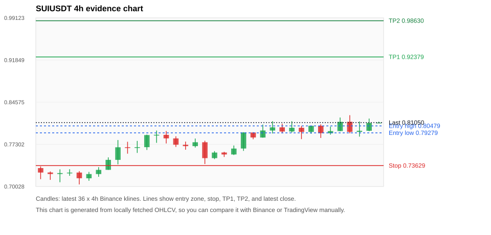
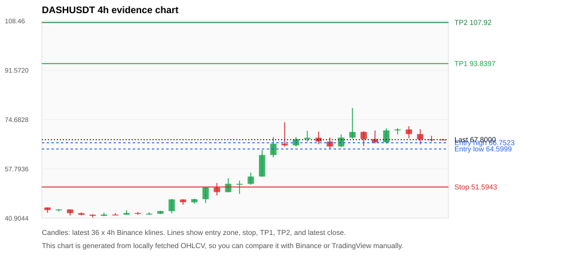
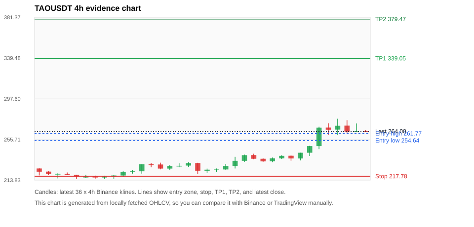
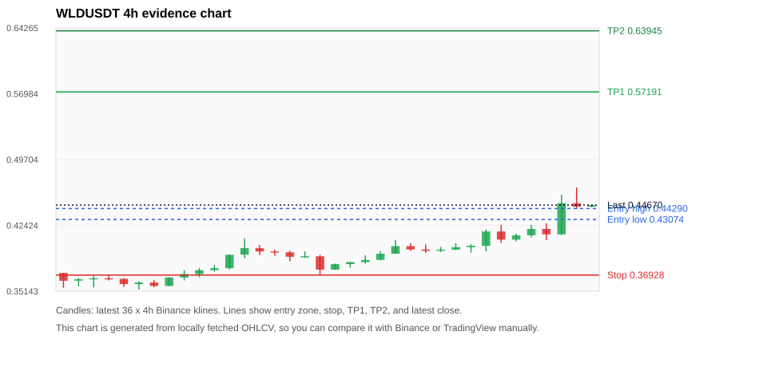
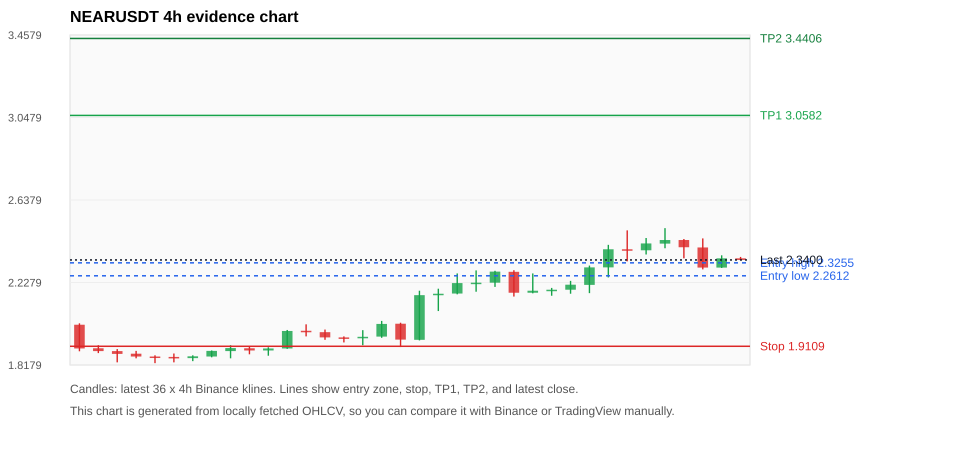

# Crypto 市场扫描报告 v1

- 报告时间：2026-09-07 20:06:52 CST
- Run ID：`20260907_120502_264e4661`
- Run type：`daily_full`
- Data validation mode：`paper`
- 数据来源：SQLite
- 报告版本：v1
- 扫描 ID：1be61ae78f1e
- 数据源：Binance public spot API + CoinGecko/CoinMarketCap cross-check
- 过滤条件：USDT spot; 24h quote volume >= 30,000,000; trades >= 30,000; exclude stables/leveraged tokens; analyze 1h/4h/1d klines
- 默认单笔风险：账户权益的 1.00%

## 限制说明

- 交易信号仍以 Binance 现货公开 K 线为主源；外部数据源用于一致性复核。
- 结果是研究和模拟盘计划，不是确定收益或实盘下单指令。
- 历史长度过滤：候选币至少需要 180 根 1d K 线。
- 数据质量验证池：先验证 score 排名前 min(top_n * 2, 10) 的候选，再按 action + score 补足最终名单。
- 大盘环境过滤：RISK_ON; BTC/ETH 日线趋势均较强，允许山寨币买入候选。 BTC 7d=1.059552471078029; ETH 7d=0.8826211172572984.
- Data cross-validation enabled: Binance primary source plus CoinGecko; CoinMarketCap is checked when an API key is configured.
- DASHUSDT validation state DEGRADED: DEGRADED: [EXTERNAL_IDENTITY_AMBIGUOUS] CoinGecko symbol mapping has 2 exact matches; selected highest market-cap rank; [EXTERNAL_IDENTITY_AMBIGUOUS] CoinMarketCap symbol mapping has 2 matches; selected lowest cmc_rank
- WLDUSDT validation state BLOCKED: BLOCKED: [BINANCE_KLINE_EXTREME_RANGE] Binance candle range exceeds 40%.; [EXTERNAL_IDENTITY_AMBIGUOUS] CoinMarketCap symbol mapping has 2 matches; selected lowest cmc_rank
- UNIUSDT validation state DEGRADED: DEGRADED: [EXTERNAL_IDENTITY_AMBIGUOUS] CoinMarketCap symbol mapping has 7 matches; selected lowest cmc_rank
- ARBUSDT validation state BLOCKED: BLOCKED: [BINANCE_KLINE_EXTREME_RANGE] Binance candle range exceeds 40%.; [EXTERNAL_PROVIDER_RATE_LIMITED] Provider rate limited request for https://api.coingecko.com/api/v3/coins/markets?vs_currency=usd&ids=arbitrum&price_change_percentage=24h&per_page=1&page=1: HTTP 429; [EXTERNAL_IDENTITY_AMBIGUOUS] CoinMarketCap symbol mapping has 5 matches; selected lowest cmc_rank
- RAYUSDT validation state BLOCKED: BLOCKED: [BINANCE_KLINE_EXTREME_RANGE] Binance candle range exceeds 40%.; [EXTERNAL_PROVIDER_RATE_LIMITED] Provider rate limited request for https://api.coingecko.com/api/v3/search?query=RAY: HTTP 429
- SUIUSDT validation state DEGRADED: DEGRADED: [EXTERNAL_PROVIDER_RATE_LIMITED] Provider rate limited request for https://api.coingecko.com/api/v3/coins/markets?vs_currency=usd&ids=sui&price_change_percentage=24h&per_page=1&page=1: HTTP 429; [EXTERNAL_IDENTITY_AMBIGUOUS] CoinMarketCap symbol mapping has 5 matches; selected lowest cmc_rank
- TAOUSDT validation state DEGRADED: DEGRADED: [EXTERNAL_PROVIDER_RATE_LIMITED] Provider rate limited request for https://api.coingecko.com/api/v3/coins/markets?vs_currency=usd&ids=bittensor&price_change_percentage=24h&per_page=1&page=1: HTTP 429; [EXTERNAL_IDENTITY_AMBIGUOUS] CoinMarketCap symbol mapping has 5 matches; selected lowest cmc_rank
- ZECUSDT validation state BLOCKED: BLOCKED: [BINANCE_KLINE_EXTREME_RANGE] Binance candle range exceeds 40%.; [BINANCE_KLINE_EXTREME_RANGE] Binance candle range exceeds 40%.; [EXTERNAL_PROVIDER_RATE_LIMITED] Provider rate limited request for https://api.coingecko.com/api/v3/coins/markets?vs_currency=usd&ids=zcash&price_change_percentage=24h&per_page=1&page=1: HTTP 429; [EXTERNAL_IDENTITY_AMBIGUOUS] CoinMarketCap symbol mapping has 2 matches; selected lowest cmc_rank
- LINKUSDT validation state DEGRADED: DEGRADED: [EXTERNAL_PROVIDER_RATE_LIMITED] Provider rate limited request for https://api.coingecko.com/api/v3/coins/markets?vs_currency=usd&ids=chainlink&price_change_percentage=24h&per_page=1&page=1: HTTP 429

## 5 个候选交易计划

| Rank | Coin | Action | Setup | Entry Zone | Stop Loss | TP1 | TP2 / Exit Rule | R/R | Verdict |
|---:|---|---|---|---:|---:|---:|---|---:|---|
| 1 | `SUI` | `BUY_CANDIDATE` | 回踩支撑/4h EMA 附近 | 0.79279 - 0.80479 | 0.73629 | 0.92379 | 0.98630 或跌破 4h 关键支撑 | 2.00-3.00 | 可考虑 |
| 2 | `DASH` | `WAIT_PULLBACK` | 趋势中，等回调入场 | 64.5999 - 66.7523 | 51.5943 | 93.8397 | 107.92 或跌破 4h 关键支撑 | 2.00-3.00 | 只等回调 |
| 3 | `TAO` | `WAIT_PULLBACK` | 趋势中，等回调入场 | 254.64 - 261.77 | 217.78 | 339.05 | 379.47 或跌破 4h 关键支撑 | 2.00-3.00 | 只等回调 |
| 4 | `WLD` | `WATCH_ONLY` | 趋势中，等回调入场 | 0.43074 - 0.44290 | 0.36928 | 0.57191 | 0.63945 或跌破 4h 关键支撑 | 2.00-3.00 | 只观察 |
| 5 | `NEAR` | `WATCH_ONLY` | 回踩支撑/4h EMA 附近 | 2.2612 - 2.3255 | 1.9109 | 3.0582 | 3.4406 或跌破 4h 关键支撑 | 2.00-3.00 | 只观察 |

## 数据交叉验证摘要

价格差异以 Binance 当前价为基准；成交量口径不同，Binance 是 USDT 现货成交额，CoinGecko/CoinMarketCap 通常是全市场成交量。

| Rank | Coin | State | Identity | Max Price Diff | Max 24h Diff | Issue Codes | Message |
|---:|---|---|---|---:|---:|---|---|
| 1 | `SUI` | DEGRADED (DATA_WARNING) | UNCONFIRMED | 0.05% | 0.14 pts | EXTERNAL_IDENTITY_AMBIGUOUS, EXTERNAL_PROVIDER_RATE_LIMITED | DEGRADED: [EXTERNAL_PROVIDER_RATE_LIMITED] Provider rate limited request for https://api.coingecko.com/api/v3/coins/markets?vs_currency=usd&ids=sui&price_change_percentage=24h&per_page=1&page=1: HTTP 429; [EXTERNAL_IDENTITY_AMBIGUOUS] CoinMarketCap symbol mapping has 5 matches; selected lowest cmc_rank |
| 2 | `DASH` | DEGRADED (DATA_WARNING) | UNCONFIRMED | 0.23% | 0.04 pts | EXTERNAL_IDENTITY_AMBIGUOUS | DEGRADED: [EXTERNAL_IDENTITY_AMBIGUOUS] CoinGecko symbol mapping has 2 exact matches; selected highest market-cap rank; [EXTERNAL_IDENTITY_AMBIGUOUS] CoinMarketCap symbol mapping has 2 matches; selected lowest cmc_rank |
| 3 | `TAO` | DEGRADED (DATA_WARNING) | UNCONFIRMED | 0.26% | 0.14 pts | EXTERNAL_IDENTITY_AMBIGUOUS, EXTERNAL_PROVIDER_RATE_LIMITED | DEGRADED: [EXTERNAL_PROVIDER_RATE_LIMITED] Provider rate limited request for https://api.coingecko.com/api/v3/coins/markets?vs_currency=usd&ids=bittensor&price_change_percentage=24h&per_page=1&page=1: HTTP 429; [EXTERNAL_IDENTITY_AMBIGUOUS] CoinMarketCap symbol mapping has 5 matches; selected lowest cmc_rank |
| 4 | `WLD` | BLOCKED (DATA_ERROR) | UNCONFIRMED | 0.18% | 0.19 pts | BINANCE_KLINE_EXTREME_RANGE, EXTERNAL_IDENTITY_AMBIGUOUS | BLOCKED: [BINANCE_KLINE_EXTREME_RANGE] Binance candle range exceeds 40%.; [EXTERNAL_IDENTITY_AMBIGUOUS] CoinMarketCap symbol mapping has 2 matches; selected lowest cmc_rank |
| 5 | `NEAR` | CLEAN (DATA_OK) | CONFIRMED | 0.51% | 0.36 pts | none | CLEAN: External provider checks agree with Binance within configured thresholds. |

## 候选币说明

### 1. SUI `SUIUSDT`



- 入选原因：回踩支撑/4h EMA 附近；24h +0.82%，7d +13.12%，4h RSI 56.90，24h 成交额 $67.3M。
- 交易失效条件：跌破 0.7362875 或 4h 收盘重新失守关键支撑。
- 主要风险：主要风险是大盘同步回撤；External validation is degraded; this candidate is not a clean data sample.；Paper mode allows degraded validation; candidate is excluded from clean-data samples.。
- 数据交叉验证：DEGRADED / DATA_WARNING；身份=UNCONFIRMED；DEGRADED: [EXTERNAL_PROVIDER_RATE_LIMITED] Provider rate limited request for https://api.coingecko.com/api/v3/coins/markets?vs_currency=usd&ids=sui&price_change_percentage=24h&per_page=1&page=1: HTTP 429; [EXTERNAL_IDENTITY_AMBIGUOUS] CoinMarketCap symbol mapping has 5 matches; selected lowest cmc_rank

#### 可点击人工验证

- [Binance 交易页](https://www.binance.com/en/trade/SUI_USDT)
- [TradingView 图表](https://www.tradingview.com/chart/?symbol=BINANCE%3ASUIUSDT)
- [CoinGecko 搜索](https://www.coingecko.com/en/search?query=SUI)
- [CoinMarketCap 搜索](https://coinmarketcap.com/search/?q=SUI)

#### 多数据源对照

| Source | Status | Identity | Blocking | Asset ID | Price | 24h Change | 24h Volume | Price Diff | 24h Diff | Updated | Issue Codes | Message |
|---|---|---|---:|---|---:|---:|---:|---:|---:|---|---|---|
| Binance | DATA_OK | CONFIRMED | no | SUIUSDT | 0.81050 | +0.82% | $67.3M | 0.00% | 0.00 pts | 2026-09-07T12:06:00+00:00 | none | Primary market data source passed health checks. |
| CoinGecko | DATA_WARNING | UNCONFIRMED | no | n/a | n/a | n/a | n/a | n/a | n/a | 2026-09-07T12:06:00+00:00 | EXTERNAL_PROVIDER_RATE_LIMITED | Provider rate limited request for https://api.coingecko.com/api/v3/coins/markets?vs_currency=usd&ids=sui&price_change_percentage=24h&per_page=1&page=1: HTTP 429 |
| CoinMarketCap | DATA_WARNING | UNCONFIRMED | no | 20947 | 0.81090 | +0.68% | $620.6M | 0.05% | 0.14 pts | 2026-09-07T12:04:59.000Z | EXTERNAL_IDENTITY_AMBIGUOUS | [EXTERNAL_IDENTITY_AMBIGUOUS] CoinMarketCap symbol mapping has 5 matches; selected lowest cmc_rank |

#### 指标证据

| 指标 | 数值 | 人工核对用途 |
|---|---:|---|
| 当前价 | 0.81050 | 与 Binance/TradingView 当前价格对照 |
| 24h 涨跌 | +0.82% | 与交易所 24h 涨跌对照 |
| 7d 涨跌 | +13.12% | 判断短线趋势是否延续 |
| 4h EMA20 | 0.79121 | 判断短期趋势支撑 |
| 4h EMA50 | 0.77390 | 判断中期趋势支撑 |
| 1d EMA20 | 0.76040 | 判断日线趋势 |
| 1d EMA50 | 0.74551 | 判断日线趋势 |
| 4h RSI14 | 56.90 | 判断是否过热/过弱 |
| 4h ATR14 | 0.01940 | 推导止损和入场缓冲 |
| 最近 18 根 4h 最低点 | 0.74750 | 支撑/止损参考 |
| 最近 36 根 4h 最高点 | 0.82330 | TP/压力参考 |
| 支撑位 | 0.79121 | 入场区间推导基础 |

#### 交易计划推导

- 支撑位 = 最近低点、4h EMA20、4h EMA50、1d EMA20 中不高于当前价的最高有效支撑 = `0.79121`。
- 入场区间 = 支撑位附近 + ATR 缓冲 = `0.79279 - 0.80479`。
- 止损 = min(最近 18 根 4h 最低点 * 0.985, 入场中位价 - 1.15 * ATR14) = `0.73629`。
- TP1 = max(最近 36 根 4h 最高点 * 0.995, 入场中位价 + 2R) = `0.92379`。
- TP2 = max(入场中位价 + 3R, TP1 * 1.04) = `0.98630`。

#### 最近 10 根 4h K线

| UTC 开盘时间 | Open | High | Low | Close | Quote Volume | Trades |
|---|---:|---:|---:|---:|---:|---:|
| 2026-09-06T00:00+00:00 | 0.79520 | 0.81300 | 0.79330 | 0.80160 | $13.9M | 68227 |
| 2026-09-06T04:00+00:00 | 0.80160 | 0.80480 | 0.78200 | 0.79440 | $8.1M | 45489 |
| 2026-09-06T08:00+00:00 | 0.79440 | 0.80500 | 0.79130 | 0.80500 | $8.8M | 46841 |
| 2026-09-06T12:00+00:00 | 0.80500 | 0.80750 | 0.78400 | 0.79230 | $10.4M | 59339 |
| 2026-09-06T16:00+00:00 | 0.79220 | 0.80360 | 0.78970 | 0.79580 | $5.6M | 38455 |
| 2026-09-06T20:00+00:00 | 0.79590 | 0.81930 | 0.79550 | 0.81180 | $11.1M | 73806 |
| 2026-09-07T00:00+00:00 | 0.81190 | 0.82330 | 0.79200 | 0.79450 | $14.7M | 94320 |
| 2026-09-07T04:00+00:00 | 0.79450 | 0.81250 | 0.78630 | 0.79640 | $11.5M | 77036 |
| 2026-09-07T08:00+00:00 | 0.79640 | 0.81750 | 0.79570 | 0.81000 | $14.2M | 90425 |
| 2026-09-07T12:00+00:00 | 0.81000 | 0.81210 | 0.80980 | 0.81050 | $193,651 | 1534 |

### 2. DASH `DASHUSDT`



- 入选原因：趋势中，等回调入场；24h +0.56%，7d +57.35%，4h RSI 54.48，24h 成交额 $44.3M。
- 交易失效条件：跌破 51.5943 或 4h 收盘重新失守关键支撑。
- 主要风险：主要风险是大盘同步回撤；External validation is degraded; this candidate is not a clean data sample.；Paper mode allows degraded validation; candidate is excluded from clean-data samples.。
- 数据交叉验证：DEGRADED / DATA_WARNING；身份=UNCONFIRMED；DEGRADED: [EXTERNAL_IDENTITY_AMBIGUOUS] CoinGecko symbol mapping has 2 exact matches; selected highest market-cap rank; [EXTERNAL_IDENTITY_AMBIGUOUS] CoinMarketCap symbol mapping has 2 matches; selected lowest cmc_rank

#### 可点击人工验证

- [Binance 交易页](https://www.binance.com/en/trade/DASH_USDT)
- [TradingView 图表](https://www.tradingview.com/chart/?symbol=BINANCE%3ADASHUSDT)
- [CoinGecko 搜索](https://www.coingecko.com/en/search?query=DASH)
- [CoinMarketCap 搜索](https://coinmarketcap.com/search/?q=DASH)

#### 多数据源对照

| Source | Status | Identity | Blocking | Asset ID | Price | 24h Change | 24h Volume | Price Diff | 24h Diff | Updated | Issue Codes | Message |
|---|---|---|---:|---|---:|---:|---:|---:|---:|---|---|---|
| Binance | DATA_OK | CONFIRMED | no | DASHUSDT | 67.8000 | +0.56% | $44.3M | 0.00% | 0.00 pts | 2026-09-07T12:06:00+00:00 | none | Primary market data source passed health checks. |
| CoinGecko | DATA_WARNING | UNCONFIRMED | no | dash | 67.8000 | +0.59% | $274.5M | 0.00% | 0.02 pts | 2026-09-07T12:04:20.000Z | EXTERNAL_IDENTITY_AMBIGUOUS | [EXTERNAL_IDENTITY_AMBIGUOUS] CoinGecko symbol mapping has 2 exact matches; selected highest market-cap rank |
| CoinMarketCap | DATA_WARNING | UNCONFIRMED | no | 131 | 67.9566 | +0.61% | $279.2M | 0.23% | 0.04 pts | 2026-09-07T12:04:01.000Z | EXTERNAL_IDENTITY_AMBIGUOUS | [EXTERNAL_IDENTITY_AMBIGUOUS] CoinMarketCap symbol mapping has 2 matches; selected lowest cmc_rank |

#### 指标证据

| 指标 | 数值 | 人工核对用途 |
|---|---:|---|
| 当前价 | 67.8000 | 与 Binance/TradingView 当前价格对照 |
| 24h 涨跌 | +0.56% | 与交易所 24h 涨跌对照 |
| 7d 涨跌 | +57.35% | 判断短线趋势是否延续 |
| 4h EMA20 | 64.4710 | 判断短期趋势支撑 |
| 4h EMA50 | 55.8904 | 判断中期趋势支撑 |
| 1d EMA20 | 48.5820 | 判断日线趋势 |
| 1d EMA50 | 40.9150 | 判断日线趋势 |
| 4h RSI14 | 54.48 | 判断是否过热/过弱 |
| 4h ATR14 | 4.1907 | 推导止损和入场缓冲 |
| 最近 18 根 4h 最低点 | 52.3800 | 支撑/止损参考 |
| 最近 36 根 4h 最高点 | 78.6800 | TP/压力参考 |
| 支撑位 | 64.4710 | 入场区间推导基础 |

#### 交易计划推导

- 支撑位 = 最近低点、4h EMA20、4h EMA50、1d EMA20 中不高于当前价的最高有效支撑 = `64.4710`。
- 入场区间 = 支撑位附近 + ATR 缓冲 = `64.5999 - 66.7523`。
- 止损 = min(最近 18 根 4h 最低点 * 0.985, 入场中位价 - 1.15 * ATR14) = `51.5943`。
- TP1 = max(最近 36 根 4h 最高点 * 0.995, 入场中位价 + 2R) = `93.8397`。
- TP2 = max(入场中位价 + 3R, TP1 * 1.04) = `107.92`。

#### 最近 10 根 4h K线

| UTC 开盘时间 | Open | High | Low | Close | Quote Volume | Trades |
|---|---:|---:|---:|---:|---:|---:|
| 2026-09-06T00:00+00:00 | 65.4900 | 69.6000 | 65.2100 | 68.5000 | $7.0M | 49199 |
| 2026-09-06T04:00+00:00 | 68.5100 | 78.6800 | 68.0800 | 70.4500 | $30.6M | 197822 |
| 2026-09-06T08:00+00:00 | 70.4600 | 70.6800 | 65.6500 | 68.0200 | $9.8M | 80076 |
| 2026-09-06T12:00+00:00 | 68.0100 | 70.9400 | 66.4700 | 66.9000 | $10.2M | 76182 |
| 2026-09-06T16:00+00:00 | 66.9000 | 71.6900 | 66.4400 | 70.9600 | $11.1M | 70625 |
| 2026-09-06T20:00+00:00 | 70.9600 | 71.7400 | 69.6000 | 71.3100 | $4.5M | 37249 |
| 2026-09-07T00:00+00:00 | 71.3000 | 72.4300 | 68.3000 | 69.7100 | $6.8M | 34874 |
| 2026-09-07T04:00+00:00 | 69.7200 | 71.4100 | 66.2000 | 67.9000 | $9.2M | 48565 |
| 2026-09-07T08:00+00:00 | 67.9200 | 69.1300 | 67.1700 | 67.8800 | $2.9M | 18821 |
| 2026-09-07T12:00+00:00 | 67.8700 | 68.0600 | 67.7300 | 67.8000 | $67,480 | 642 |

### 3. TAO `TAOUSDT`



- 入选原因：趋势中，等回调入场；24h +9.36%，7d +16.61%，4h RSI 73.06，24h 成交额 $78.4M。
- 交易失效条件：跌破 217.7835 或 4h 收盘重新失守关键支撑。
- 主要风险：成交量突增，可能是事件驱动；External validation is degraded; this candidate is not a clean data sample.；Paper mode allows degraded validation; candidate is excluded from clean-data samples.。
- 数据交叉验证：DEGRADED / DATA_WARNING；身份=UNCONFIRMED；DEGRADED: [EXTERNAL_PROVIDER_RATE_LIMITED] Provider rate limited request for https://api.coingecko.com/api/v3/coins/markets?vs_currency=usd&ids=bittensor&price_change_percentage=24h&per_page=1&page=1: HTTP 429; [EXTERNAL_IDENTITY_AMBIGUOUS] CoinMarketCap symbol mapping has 5 matches; selected lowest cmc_rank

#### 可点击人工验证

- [Binance 交易页](https://www.binance.com/en/trade/TAO_USDT)
- [TradingView 图表](https://www.tradingview.com/chart/?symbol=BINANCE%3ATAOUSDT)
- [CoinGecko 搜索](https://www.coingecko.com/en/search?query=TAO)
- [CoinMarketCap 搜索](https://coinmarketcap.com/search/?q=TAO)

#### 多数据源对照

| Source | Status | Identity | Blocking | Asset ID | Price | 24h Change | 24h Volume | Price Diff | 24h Diff | Updated | Issue Codes | Message |
|---|---|---|---:|---|---:|---:|---:|---:|---:|---|---|---|
| Binance | DATA_OK | CONFIRMED | no | TAOUSDT | 264.00 | +9.36% | $78.4M | 0.00% | 0.00 pts | 2026-09-07T12:06:00+00:00 | none | Primary market data source passed health checks. |
| CoinGecko | DATA_WARNING | UNCONFIRMED | no | n/a | n/a | n/a | n/a | n/a | n/a | 2026-09-07T12:06:00+00:00 | EXTERNAL_PROVIDER_RATE_LIMITED | Provider rate limited request for https://api.coingecko.com/api/v3/coins/markets?vs_currency=usd&ids=bittensor&price_change_percentage=24h&per_page=1&page=1: HTTP 429 |
| CoinMarketCap | DATA_WARNING | UNCONFIRMED | no | 22974 | 264.68 | +9.50% | $587.8M | 0.26% | 0.14 pts | 2026-09-07T12:04:59.000Z | EXTERNAL_IDENTITY_AMBIGUOUS | [EXTERNAL_IDENTITY_AMBIGUOUS] CoinMarketCap symbol mapping has 5 matches; selected lowest cmc_rank |

#### 指标证据

| 指标 | 数值 | 人工核对用途 |
|---|---:|---|
| 当前价 | 264.00 | 与 Binance/TradingView 当前价格对照 |
| 24h 涨跌 | +9.36% | 与交易所 24h 涨跌对照 |
| 7d 涨跌 | +16.61% | 判断短线趋势是否延续 |
| 4h EMA20 | 248.14 | 判断短期趋势支撑 |
| 4h EMA50 | 238.17 | 判断中期趋势支撑 |
| 1d EMA20 | 231.41 | 判断日线趋势 |
| 1d EMA50 | 220.54 | 判断日线趋势 |
| 4h RSI14 | 73.06 | 判断是否过热/过弱 |
| 4h ATR14 | 8.9143 | 推导止损和入场缓冲 |
| 最近 18 根 4h 最低点 | 221.10 | 支撑/止损参考 |
| 最近 36 根 4h 最高点 | 277.00 | TP/压力参考 |
| 支撑位 | 248.14 | 入场区间推导基础 |

#### 交易计划推导

- 支撑位 = 最近低点、4h EMA20、4h EMA50、1d EMA20 中不高于当前价的最高有效支撑 = `248.14`。
- 入场区间 = 支撑位附近 + ATR 缓冲 = `254.64 - 261.77`。
- 止损 = min(最近 18 根 4h 最低点 * 0.985, 入场中位价 - 1.15 * ATR14) = `217.78`。
- TP1 = max(最近 36 根 4h 最高点 * 0.995, 入场中位价 + 2R) = `339.05`。
- TP2 = max(入场中位价 + 3R, TP1 * 1.04) = `379.47`。

#### 最近 10 根 4h K线

| UTC 开盘时间 | Open | High | Low | Close | Quote Volume | Trades |
|---|---:|---:|---:|---:|---:|---:|
| 2026-09-06T00:00+00:00 | 236.20 | 239.40 | 235.60 | 238.80 | $2.4M | 12786 |
| 2026-09-06T04:00+00:00 | 238.90 | 239.30 | 233.80 | 236.10 | $2.7M | 16783 |
| 2026-09-06T08:00+00:00 | 236.10 | 242.00 | 234.10 | 242.00 | $5.9M | 19348 |
| 2026-09-06T12:00+00:00 | 242.00 | 249.10 | 238.70 | 248.80 | $14.5M | 55846 |
| 2026-09-06T16:00+00:00 | 248.80 | 268.80 | 245.70 | 267.80 | $19.3M | 89513 |
| 2026-09-06T20:00+00:00 | 267.90 | 272.20 | 260.10 | 265.70 | $14.9M | 77835 |
| 2026-09-07T00:00+00:00 | 265.80 | 277.00 | 260.50 | 269.80 | $14.2M | 84940 |
| 2026-09-07T04:00+00:00 | 269.90 | 275.50 | 261.60 | 263.70 | $8.7M | 50526 |
| 2026-09-07T08:00+00:00 | 263.70 | 272.10 | 263.50 | 264.40 | $7.1M | 38704 |
| 2026-09-07T12:00+00:00 | 264.30 | 265.20 | 264.00 | 264.00 | $179,044 | 637 |

### 4. WLD `WLDUSDT`



- 入选原因：趋势中，等回调入场；24h +5.93%，7d +25.80%，4h RSI 76.37，24h 成交额 $49.7M。
- 交易失效条件：跌破 0.3692765 或 4h 收盘重新失守关键支撑。
- 主要风险：距离支撑偏远，不能追市价；4h RSI 偏热；Blocking data-quality issue detected; paper plan creation is not allowed.。
- 数据交叉验证：BLOCKED / DATA_ERROR；身份=UNCONFIRMED；BLOCKED: [BINANCE_KLINE_EXTREME_RANGE] Binance candle range exceeds 40%.; [EXTERNAL_IDENTITY_AMBIGUOUS] CoinMarketCap symbol mapping has 2 matches; selected lowest cmc_rank

#### 可点击人工验证

- [Binance 交易页](https://www.binance.com/en/trade/WLD_USDT)
- [TradingView 图表](https://www.tradingview.com/chart/?symbol=BINANCE%3AWLDUSDT)
- [CoinGecko 搜索](https://www.coingecko.com/en/search?query=WLD)
- [CoinMarketCap 搜索](https://coinmarketcap.com/search/?q=WLD)

#### 多数据源对照

| Source | Status | Identity | Blocking | Asset ID | Price | 24h Change | 24h Volume | Price Diff | 24h Diff | Updated | Issue Codes | Message |
|---|---|---|---:|---|---:|---:|---:|---:|---:|---|---|---|
| Binance | DATA_ERROR | CONFIRMED | yes | WLDUSDT | 0.44670 | +5.93% | $49.7M | 0.00% | 0.00 pts | 2026-09-07T12:06:00+00:00 | BINANCE_KLINE_EXTREME_RANGE | [BINANCE_KLINE_EXTREME_RANGE] Binance candle range exceeds 40%. |
| CoinGecko | DATA_OK | CONFIRMED | no | worldcoin-wld | 0.44615 | +5.80% | $328.7M | 0.12% | 0.13 pts | 2026-09-07T12:04:20.000Z | none | External source agrees with Binance within thresholds. |
| CoinMarketCap | DATA_WARNING | UNCONFIRMED | no | 13502 | 0.44591 | +6.12% | $378.5M | 0.18% | 0.19 pts | 2026-09-07T12:04:01.000Z | EXTERNAL_IDENTITY_AMBIGUOUS | [EXTERNAL_IDENTITY_AMBIGUOUS] CoinMarketCap symbol mapping has 2 matches; selected lowest cmc_rank |

#### 指标证据

| 指标 | 数值 | 人工核对用途 |
|---|---:|---|
| 当前价 | 0.44670 | 与 Binance/TradingView 当前价格对照 |
| 24h 涨跌 | +5.93% | 与交易所 24h 涨跌对照 |
| 7d 涨跌 | +25.80% | 判断短线趋势是否延续 |
| 4h EMA20 | 0.41180 | 判断短期趋势支撑 |
| 4h EMA50 | 0.39556 | 判断中期趋势支撑 |
| 1d EMA20 | 0.38681 | 判断日线趋势 |
| 1d EMA50 | 0.37668 | 判断日线趋势 |
| 4h RSI14 | 76.37 | 判断是否过热/过弱 |
| 4h ATR14 | 0.01520 | 推导止损和入场缓冲 |
| 最近 18 根 4h 最低点 | 0.37490 | 支撑/止损参考 |
| 最近 36 根 4h 最高点 | 0.46620 | TP/压力参考 |
| 支撑位 | 0.41180 | 入场区间推导基础 |

#### 交易计划推导

- 支撑位 = 最近低点、4h EMA20、4h EMA50、1d EMA20 中不高于当前价的最高有效支撑 = `0.41180`。
- 入场区间 = 支撑位附近 + ATR 缓冲 = `0.43074 - 0.44290`。
- 止损 = min(最近 18 根 4h 最低点 * 0.985, 入场中位价 - 1.15 * ATR14) = `0.36928`。
- TP1 = max(最近 36 根 4h 最高点 * 0.995, 入场中位价 + 2R) = `0.57191`。
- TP2 = max(入场中位价 + 3R, TP1 * 1.04) = `0.63945`。

#### 最近 10 根 4h K线

| UTC 开盘时间 | Open | High | Low | Close | Quote Volume | Trades |
|---|---:|---:|---:|---:|---:|---:|
| 2026-09-06T00:00+00:00 | 0.39730 | 0.40460 | 0.39700 | 0.40010 | $2.2M | 16205 |
| 2026-09-06T04:00+00:00 | 0.40010 | 0.40330 | 0.39410 | 0.40170 | $2.1M | 17287 |
| 2026-09-06T08:00+00:00 | 0.40160 | 0.41970 | 0.39560 | 0.41750 | $5.9M | 37224 |
| 2026-09-06T12:00+00:00 | 0.41750 | 0.42490 | 0.40470 | 0.40850 | $7.6M | 50745 |
| 2026-09-06T16:00+00:00 | 0.40850 | 0.41510 | 0.40650 | 0.41330 | $1.8M | 15969 |
| 2026-09-06T20:00+00:00 | 0.41330 | 0.42480 | 0.41090 | 0.42040 | $3.1M | 24106 |
| 2026-09-07T00:00+00:00 | 0.42040 | 0.42660 | 0.40790 | 0.41430 | $5.1M | 32952 |
| 2026-09-07T04:00+00:00 | 0.41430 | 0.45820 | 0.41370 | 0.44880 | $13.6M | 76807 |
| 2026-09-07T08:00+00:00 | 0.44870 | 0.46620 | 0.44230 | 0.44500 | $19.0M | 120980 |
| 2026-09-07T12:00+00:00 | 0.44500 | 0.44700 | 0.44410 | 0.44670 | $231,740 | 1838 |

### 5. NEAR `NEARUSDT`



- 入选原因：回踩支撑/4h EMA 附近；24h -1.80%，7d +27.45%，4h RSI 59.07，24h 成交额 $71.3M。
- 交易失效条件：跌破 1.9109 或 4h 收盘重新失守关键支撑。
- 主要风险：24h 动量未确认。
- 数据交叉验证：CLEAN / DATA_OK；身份=CONFIRMED；CLEAN: External provider checks agree with Binance within configured thresholds.

#### 可点击人工验证

- [Binance 交易页](https://www.binance.com/en/trade/NEAR_USDT)
- [TradingView 图表](https://www.tradingview.com/chart/?symbol=BINANCE%3ANEARUSDT)
- [CoinGecko 搜索](https://www.coingecko.com/en/search?query=NEAR)
- [CoinMarketCap 搜索](https://coinmarketcap.com/search/?q=NEAR)

#### 多数据源对照

| Source | Status | Identity | Blocking | Asset ID | Price | 24h Change | 24h Volume | Price Diff | 24h Diff | Updated | Issue Codes | Message |
|---|---|---|---:|---|---:|---:|---:|---:|---:|---|---|---|
| Binance | DATA_OK | CONFIRMED | no | NEARUSDT | 2.3400 | -1.80% | $71.3M | 0.00% | 0.00 pts | 2026-09-07T12:06:00+00:00 | none | Primary market data source passed health checks. |
| CoinGecko | DATA_OK | CONFIRMED | no | near | 2.3400 | -1.44% | $530.5M | 0.00% | 0.36 pts | 2026-09-07T12:04:20.000Z | none | External source agrees with Binance within thresholds. |
| CoinMarketCap | DATA_OK | CONFIRMED | no | 6535 | 2.3519 | -1.74% | $553.3M | 0.51% | 0.06 pts | 2026-09-07T12:04:01.000Z | none | External source agrees with Binance within thresholds. |

#### 指标证据

| 指标 | 数值 | 人工核对用途 |
|---|---:|---|
| 当前价 | 2.3400 | 与 Binance/TradingView 当前价格对照 |
| 24h 涨跌 | -1.80% | 与交易所 24h 涨跌对照 |
| 7d 涨跌 | +27.45% | 判断短线趋势是否延续 |
| 4h EMA20 | 2.2567 | 判断短期趋势支撑 |
| 4h EMA50 | 2.1068 | 判断中期趋势支撑 |
| 1d EMA20 | 1.9937 | 判断日线趋势 |
| 1d EMA50 | 1.8899 | 判断日线趋势 |
| 4h RSI14 | 59.07 | 判断是否过热/过弱 |
| 4h ATR14 | 0.09836 | 推导止损和入场缓冲 |
| 最近 18 根 4h 最低点 | 1.9400 | 支撑/止损参考 |
| 最近 36 根 4h 最高点 | 2.4980 | TP/压力参考 |
| 支撑位 | 2.2567 | 入场区间推导基础 |

#### 交易计划推导

- 支撑位 = 最近低点、4h EMA20、4h EMA50、1d EMA20 中不高于当前价的最高有效支撑 = `2.2567`。
- 入场区间 = 支撑位附近 + ATR 缓冲 = `2.2612 - 2.3255`。
- 止损 = min(最近 18 根 4h 最低点 * 0.985, 入场中位价 - 1.15 * ATR14) = `1.9109`。
- TP1 = max(最近 36 根 4h 最高点 * 0.995, 入场中位价 + 2R) = `3.0582`。
- TP2 = max(入场中位价 + 3R, TP1 * 1.04) = `3.4406`。

#### 最近 10 根 4h K线

| UTC 开盘时间 | Open | High | Low | Close | Quote Volume | Trades |
|---|---:|---:|---:|---:|---:|---:|
| 2026-09-06T00:00+00:00 | 2.1920 | 2.2360 | 2.1720 | 2.2170 | $6.7M | 43632 |
| 2026-09-06T04:00+00:00 | 2.2160 | 2.3120 | 2.1750 | 2.3030 | $12.6M | 78364 |
| 2026-09-06T08:00+00:00 | 2.3030 | 2.4150 | 2.2530 | 2.3930 | $27.5M | 145296 |
| 2026-09-06T12:00+00:00 | 2.3930 | 2.4870 | 2.3330 | 2.3880 | $21.4M | 148179 |
| 2026-09-06T16:00+00:00 | 2.3880 | 2.4490 | 2.3670 | 2.4220 | $11.0M | 77444 |
| 2026-09-06T20:00+00:00 | 2.4210 | 2.4980 | 2.3980 | 2.4390 | $9.6M | 78512 |
| 2026-09-07T00:00+00:00 | 2.4390 | 2.4440 | 2.3480 | 2.4030 | $8.8M | 65673 |
| 2026-09-07T04:00+00:00 | 2.4020 | 2.4470 | 2.2930 | 2.3020 | $14.3M | 92246 |
| 2026-09-07T08:00+00:00 | 2.3020 | 2.3630 | 2.3000 | 2.3480 | $6.7M | 40115 |
| 2026-09-07T12:00+00:00 | 2.3480 | 2.3550 | 2.3390 | 2.3400 | $157,348 | 1195 |

## 组合风控

- 不要 5 个候选全部满仓买入。
- 同时持仓总风险建议控制在账户权益的 3% - 5% 以内。
- 如果 BTC/ETH 同时破位，暂停山寨币多头计划或降低仓位。
- 第一版报告用于模拟盘和人工复核，不自动下单。

## 原始数据

```json
[
  {
    "rank": 1,
    "symbol": "SUIUSDT",
    "base_asset": "SUI",
    "price": 0.8105,
    "score": 70.00836654049493,
    "setup": "回踩支撑/4h EMA 附近",
    "verdict": "可考虑",
    "entry_low": 0.7927911328654246,
    "entry_high": 0.8047887154345555,
    "stop_loss": 0.7362875000000001,
    "take_profit_1": 0.92379477244997,
    "take_profit_2": 0.98629719659996,
    "risk_reward_1": 2.0,
    "risk_reward_2": 3.0,
    "pct_24h": 0.821,
    "pct_3d": 7.5789753119193115,
    "pct_7d": 13.119330076762026,
    "quote_volume_24h": 67267374.67455,
    "trades_24h": 432895,
    "high_low_range_24h": 5.012755102040822,
    "rsi_1h": 52.989449003516995,
    "rsi_4h": 56.89935064935067,
    "ema20_4h": 0.7912087154345555,
    "ema50_4h": 0.7738995687575793,
    "ema20_1d": 0.7603969811921888,
    "ema50_1d": 0.7455088171218319,
    "atr_4h": 0.019400000000000004,
    "macd_hist_4h": 8.70837830765879e-05,
    "volume_ratio_24h": 1.2079406045051926,
    "support_level": 0.7912087154345555,
    "recent_low_4h_18": 0.7475,
    "recent_high_4h_36": 0.8233,
    "distance_to_support_pct": 2.438204254973253,
    "binance_trade_url": "https://www.binance.com/en/trade/SUI_USDT",
    "tradingview_url": "https://www.tradingview.com/chart/?symbol=BINANCE%3ASUIUSDT",
    "coingecko_search_url": "https://www.coingecko.com/en/search?query=SUI",
    "coinmarketcap_search_url": "https://coinmarketcap.com/search/?q=SUI",
    "invalidation": "跌破 0.7362875 或 4h 收盘重新失守关键支撑",
    "recent_4h_klines": [
      {
        "open_time_utc": "2026-09-01T16:00+00:00",
        "open": 0.732,
        "high": 0.7349,
        "low": 0.7129,
        "close": 0.7243,
        "quote_volume": 10963505.17478,
        "trades": 59782
      },
      {
        "open_time_utc": "2026-09-01T20:00+00:00",
        "open": 0.7244,
        "high": 0.7262,
        "low": 0.7117,
        "close": 0.7218,
        "quote_volume": 6897624.28864,
        "trades": 39993
      },
      {
        "open_time_utc": "2026-09-02T00:00+00:00",
        "open": 0.7218,
        "high": 0.7298,
        "low": 0.7076,
        "close": 0.7234,
        "quote_volume": 6671441.62602,
        "trades": 45584
      },
      {
        "open_time_utc": "2026-09-02T04:00+00:00",
        "open": 0.7234,
        "high": 0.73,
        "low": 0.7187,
        "close": 0.7242,
        "quote_volume": 4741345.69932,
        "trades": 29474
      },
      {
        "open_time_utc": "2026-09-02T08:00+00:00",
        "open": 0.7243,
        "high": 0.7268,
        "low": 0.7038,
        "close": 0.7145,
        "quote_volume": 6343003.64323,
        "trades": 41606
      },
      {
        "open_time_utc": "2026-09-02T12:00+00:00",
        "open": 0.7144,
        "high": 0.7254,
        "low": 0.7101,
        "close": 0.7217,
        "quote_volume": 8359097.24273,
        "trades": 46090
      },
      {
        "open_time_utc": "2026-09-02T16:00+00:00",
        "open": 0.7217,
        "high": 0.7336,
        "low": 0.717,
        "close": 0.7289,
        "quote_volume": 7157045.33194,
        "trades": 42634
      },
      {
        "open_time_utc": "2026-09-02T20:00+00:00",
        "open": 0.729,
        "high": 0.7505,
        "low": 0.729,
        "close": 0.7462,
        "quote_volume": 9275399.54794,
        "trades": 53581
      },
      {
        "open_time_utc": "2026-09-03T00:00+00:00",
        "open": 0.7462,
        "high": 0.7804,
        "low": 0.7384,
        "close": 0.7679,
        "quote_volume": 15585388.46195,
        "trades": 97194
      },
      {
        "open_time_utc": "2026-09-03T04:00+00:00",
        "open": 0.768,
        "high": 0.7774,
        "low": 0.7569,
        "close": 0.7673,
        "quote_volume": 11519467.30295,
        "trades": 64946
      },
      {
        "open_time_utc": "2026-09-03T08:00+00:00",
        "open": 0.7674,
        "high": 0.7789,
        "low": 0.7582,
        "close": 0.7681,
        "quote_volume": 9568019.59937,
        "trades": 56816
      },
      {
        "open_time_utc": "2026-09-03T12:00+00:00",
        "open": 0.7681,
        "high": 0.7898,
        "low": 0.7633,
        "close": 0.789,
        "quote_volume": 15721000.9259,
        "trades": 89088
      },
      {
        "open_time_utc": "2026-09-03T16:00+00:00",
        "open": 0.789,
        "high": 0.7968,
        "low": 0.7756,
        "close": 0.7895,
        "quote_volume": 11565165.69486,
        "trades": 73960
      },
      {
        "open_time_utc": "2026-09-03T20:00+00:00",
        "open": 0.7894,
        "high": 0.796,
        "low": 0.7745,
        "close": 0.7833,
        "quote_volume": 8974070.54606,
        "trades": 55222
      },
      {
        "open_time_utc": "2026-09-04T00:00+00:00",
        "open": 0.7832,
        "high": 0.7869,
        "low": 0.7685,
        "close": 0.7723,
        "quote_volume": 7616416.69929,
        "trades": 47202
      },
      {
        "open_time_utc": "2026-09-04T04:00+00:00",
        "open": 0.7722,
        "high": 0.7777,
        "low": 0.7637,
        "close": 0.7699,
        "quote_volume": 6626847.14677,
        "trades": 40256
      },
      {
        "open_time_utc": "2026-09-04T08:00+00:00",
        "open": 0.7699,
        "high": 0.783,
        "low": 0.7675,
        "close": 0.7766,
        "quote_volume": 7570923.35295,
        "trades": 45063
      },
      {
        "open_time_utc": "2026-09-04T12:00+00:00",
        "open": 0.7766,
        "high": 0.7792,
        "low": 0.739,
        "close": 0.7492,
        "quote_volume": 16891144.94747,
        "trades": 116002
      },
      {
        "open_time_utc": "2026-09-04T16:00+00:00",
        "open": 0.7492,
        "high": 0.7613,
        "low": 0.7475,
        "close": 0.7588,
        "quote_volume": 4642303.52347,
        "trades": 28199
      },
      {
        "open_time_utc": "2026-09-04T20:00+00:00",
        "open": 0.7589,
        "high": 0.7601,
        "low": 0.7512,
        "close": 0.7555,
        "quote_volume": 3422745.45721,
        "trades": 20059
      },
      {
        "open_time_utc": "2026-09-05T00:00+00:00",
        "open": 0.7555,
        "high": 0.771,
        "low": 0.7546,
        "close": 0.7657,
        "quote_volume": 8020262.44214,
        "trades": 45566
      },
      {
        "open_time_utc": "2026-09-05T04:00+00:00",
        "open": 0.7658,
        "high": 0.7939,
        "low": 0.7617,
        "close": 0.7935,
        "quote_volume": 11341683.78532,
        "trades": 61152
      },
      {
        "open_time_utc": "2026-09-05T08:00+00:00",
        "open": 0.7934,
        "high": 0.7939,
        "low": 0.7818,
        "close": 0.7848,
        "quote_volume": 9616970.2865,
        "trades": 61226
      },
      {
        "open_time_utc": "2026-09-05T12:00+00:00",
        "open": 0.7847,
        "high": 0.8072,
        "low": 0.7845,
        "close": 0.7969,
        "quote_volume": 17478507.86669,
        "trades": 104221
      },
      {
        "open_time_utc": "2026-09-05T16:00+00:00",
        "open": 0.7968,
        "high": 0.813,
        "low": 0.7917,
        "close": 0.8023,
        "quote_volume": 16556643.06898,
        "trades": 85652
      },
      {
        "open_time_utc": "2026-09-05T20:00+00:00",
        "open": 0.8023,
        "high": 0.8086,
        "low": 0.7921,
        "close": 0.7951,
        "quote_volume": 8699670.58817,
        "trades": 52242
      },
      {
        "open_time_utc": "2026-09-06T00:00+00:00",
        "open": 0.7952,
        "high": 0.813,
        "low": 0.7933,
        "close": 0.8016,
        "quote_volume": 13942533.97372,
        "trades": 68227
      },
      {
        "open_time_utc": "2026-09-06T04:00+00:00",
        "open": 0.8016,
        "high": 0.8048,
        "low": 0.782,
        "close": 0.7944,
        "quote_volume": 8124801.6098,
        "trades": 45489
      },
      {
        "open_time_utc": "2026-09-06T08:00+00:00",
        "open": 0.7944,
        "high": 0.805,
        "low": 0.7913,
        "close": 0.805,
        "quote_volume": 8819239.76829,
        "trades": 46841
      },
      {
        "open_time_utc": "2026-09-06T12:00+00:00",
        "open": 0.805,
        "high": 0.8075,
        "low": 0.784,
        "close": 0.7923,
        "quote_volume": 10430831.20654,
        "trades": 59339
      },
      {
        "open_time_utc": "2026-09-06T16:00+00:00",
        "open": 0.7922,
        "high": 0.8036,
        "low": 0.7897,
        "close": 0.7958,
        "quote_volume": 5614841.0826,
        "trades": 38455
      },
      {
        "open_time_utc": "2026-09-06T20:00+00:00",
        "open": 0.7959,
        "high": 0.8193,
        "low": 0.7955,
        "close": 0.8118,
        "quote_volume": 11105028.96672,
        "trades": 73806
      },
      {
        "open_time_utc": "2026-09-07T00:00+00:00",
        "open": 0.8119,
        "high": 0.8233,
        "low": 0.792,
        "close": 0.7945,
        "quote_volume": 14654375.86409,
        "trades": 94320
      },
      {
        "open_time_utc": "2026-09-07T04:00+00:00",
        "open": 0.7945,
        "high": 0.8125,
        "low": 0.7863,
        "close": 0.7964,
        "quote_volume": 11511827.75146,
        "trades": 77036
      },
      {
        "open_time_utc": "2026-09-07T08:00+00:00",
        "open": 0.7964,
        "high": 0.8175,
        "low": 0.7957,
        "close": 0.81,
        "quote_volume": 14167697.94515,
        "trades": 90425
      },
      {
        "open_time_utc": "2026-09-07T12:00+00:00",
        "open": 0.81,
        "high": 0.8121,
        "low": 0.8098,
        "close": 0.8105,
        "quote_volume": 193650.63184,
        "trades": 1534
      }
    ],
    "risks": [
      "主要风险是大盘同步回撤",
      "External validation is degraded; this candidate is not a clean data sample.",
      "Paper mode allows degraded validation; candidate is excluded from clean-data samples."
    ],
    "data_quality_status": "DATA_WARNING",
    "data_quality_message": "DEGRADED: [EXTERNAL_PROVIDER_RATE_LIMITED] Provider rate limited request for https://api.coingecko.com/api/v3/coins/markets?vs_currency=usd&ids=sui&price_change_percentage=24h&per_page=1&page=1: HTTP 429; [EXTERNAL_IDENTITY_AMBIGUOUS] CoinMarketCap symbol mapping has 5 matches; selected lowest cmc_rank",
    "data_checks": [
      {
        "provider": "Binance",
        "status": "DATA_OK",
        "provider_asset_id": "SUIUSDT",
        "provider_symbol": "SUIUSDT",
        "price_usd": 0.8105,
        "pct_24h": 0.821,
        "volume_24h": 67267374.67455,
        "last_updated": null,
        "fetched_at_utc": "2026-09-07T12:06:00+00:00",
        "price_diff_pct": 0.0,
        "pct_24h_diff": 0.0,
        "volume_note": "Binance USDT spot 24h quoteVolume.",
        "message": "Primary market data source passed health checks.",
        "blocking": false,
        "identity_status": "CONFIRMED",
        "issues": []
      },
      {
        "provider": "CoinGecko",
        "status": "DATA_WARNING",
        "provider_asset_id": null,
        "provider_symbol": "SUI",
        "price_usd": null,
        "pct_24h": null,
        "volume_24h": null,
        "last_updated": null,
        "fetched_at_utc": "2026-09-07T12:06:00+00:00",
        "price_diff_pct": null,
        "pct_24h_diff": null,
        "volume_note": "External provider data unavailable.",
        "message": "Provider rate limited request for https://api.coingecko.com/api/v3/coins/markets?vs_currency=usd&ids=sui&price_change_percentage=24h&per_page=1&page=1: HTTP 429",
        "blocking": false,
        "identity_status": "UNCONFIRMED",
        "issues": [
          {
            "provider": "CoinGecko",
            "code": "EXTERNAL_PROVIDER_RATE_LIMITED",
            "severity": "WARNING",
            "blocking": false,
            "message": "Provider rate limited request for https://api.coingecko.com/api/v3/coins/markets?vs_currency=usd&ids=sui&price_change_percentage=24h&per_page=1&page=1: HTTP 429",
            "context": {}
          }
        ]
      },
      {
        "provider": "CoinMarketCap",
        "status": "DATA_WARNING",
        "provider_asset_id": "20947",
        "provider_symbol": "SUI",
        "price_usd": 0.8108979735036673,
        "pct_24h": 0.68317573,
        "volume_24h": 620640496.8637445,
        "last_updated": "2026-09-07T12:04:59.000Z",
        "fetched_at_utc": "2026-09-07T12:06:00+00:00",
        "price_diff_pct": 0.04910222130380333,
        "pct_24h_diff": 0.13782426999999997,
        "volume_note": "CoinMarketCap total market volume; not the same venue scope as Binance quoteVolume.",
        "message": "[EXTERNAL_IDENTITY_AMBIGUOUS] CoinMarketCap symbol mapping has 5 matches; selected lowest cmc_rank",
        "blocking": false,
        "identity_status": "UNCONFIRMED",
        "issues": [
          {
            "provider": "CoinMarketCap",
            "code": "EXTERNAL_IDENTITY_AMBIGUOUS",
            "severity": "WARNING",
            "blocking": false,
            "message": "CoinMarketCap symbol mapping has 5 matches; selected lowest cmc_rank",
            "context": {}
          }
        ]
      }
    ],
    "action": "BUY_CANDIDATE",
    "data_quality_state": "DEGRADED",
    "data_quality_issues": [
      {
        "provider": "CoinGecko",
        "code": "EXTERNAL_PROVIDER_RATE_LIMITED",
        "severity": "WARNING",
        "blocking": false,
        "message": "Provider rate limited request for https://api.coingecko.com/api/v3/coins/markets?vs_currency=usd&ids=sui&price_change_percentage=24h&per_page=1&page=1: HTTP 429",
        "context": {}
      },
      {
        "provider": "CoinMarketCap",
        "code": "EXTERNAL_IDENTITY_AMBIGUOUS",
        "severity": "WARNING",
        "blocking": false,
        "message": "CoinMarketCap symbol mapping has 5 matches; selected lowest cmc_rank",
        "context": {}
      }
    ],
    "external_identity_status": "UNCONFIRMED"
  },
  {
    "rank": 2,
    "symbol": "DASHUSDT",
    "base_asset": "DASH",
    "price": 67.8,
    "score": 76.27147895539458,
    "setup": "趋势中，等回调入场",
    "verdict": "只等回调",
    "entry_low": 64.59990374686733,
    "entry_high": 66.75232142857142,
    "stop_loss": 51.594300000000004,
    "take_profit_1": 93.83973776315811,
    "take_profit_2": 107.92155035087748,
    "risk_reward_1": 2.0,
    "risk_reward_2": 3.0,
    "pct_24h": 0.564,
    "pct_3d": 34.92537313432835,
    "pct_7d": 57.34509166860058,
    "quote_volume_24h": 44304845.06307,
    "trades_24h": 285082,
    "high_low_range_24h": 9.410876132930523,
    "rsi_1h": 33.230769230769326,
    "rsi_4h": 54.479308776716685,
    "ema20_4h": 64.47096182322089,
    "ema50_4h": 55.89039546509177,
    "ema20_1d": 48.58201487061596,
    "ema50_1d": 40.91498027234953,
    "atr_4h": 4.190714285714286,
    "macd_hist_4h": -0.6745793530431969,
    "volume_ratio_24h": 1.0193754500229293,
    "support_level": 64.47096182322089,
    "recent_low_4h_18": 52.38,
    "recent_high_4h_36": 78.68,
    "distance_to_support_pct": 5.163624184648152,
    "binance_trade_url": "https://www.binance.com/en/trade/DASH_USDT",
    "tradingview_url": "https://www.tradingview.com/chart/?symbol=BINANCE%3ADASHUSDT",
    "coingecko_search_url": "https://www.coingecko.com/en/search?query=DASH",
    "coinmarketcap_search_url": "https://coinmarketcap.com/search/?q=DASH",
    "invalidation": "跌破 51.5943 或 4h 收盘重新失守关键支撑",
    "recent_4h_klines": [
      {
        "open_time_utc": "2026-09-01T16:00+00:00",
        "open": 44.58,
        "high": 44.61,
        "low": 42.77,
        "close": 43.69,
        "quote_volume": 2320901.30468,
        "trades": 17645
      },
      {
        "open_time_utc": "2026-09-01T20:00+00:00",
        "open": 43.7,
        "high": 44.04,
        "low": 43.21,
        "close": 43.9,
        "quote_volume": 754760.16691,
        "trades": 6279
      },
      {
        "open_time_utc": "2026-09-02T00:00+00:00",
        "open": 43.9,
        "high": 43.95,
        "low": 41.81,
        "close": 42.64,
        "quote_volume": 2419998.28597,
        "trades": 15455
      },
      {
        "open_time_utc": "2026-09-02T04:00+00:00",
        "open": 42.63,
        "high": 42.85,
        "low": 41.91,
        "close": 42.07,
        "quote_volume": 1013319.23805,
        "trades": 7827
      },
      {
        "open_time_utc": "2026-09-02T08:00+00:00",
        "open": 42.1,
        "high": 42.26,
        "low": 41.11,
        "close": 41.73,
        "quote_volume": 1307139.62233,
        "trades": 8188
      },
      {
        "open_time_utc": "2026-09-02T12:00+00:00",
        "open": 41.72,
        "high": 42.82,
        "low": 41.6,
        "close": 42.17,
        "quote_volume": 1439260.59367,
        "trades": 10061
      },
      {
        "open_time_utc": "2026-09-02T16:00+00:00",
        "open": 42.16,
        "high": 42.65,
        "low": 41.97,
        "close": 42.11,
        "quote_volume": 529464.41256,
        "trades": 5709
      },
      {
        "open_time_utc": "2026-09-02T20:00+00:00",
        "open": 42.13,
        "high": 43.65,
        "low": 42.08,
        "close": 42.68,
        "quote_volume": 2404764.09926,
        "trades": 13981
      },
      {
        "open_time_utc": "2026-09-03T00:00+00:00",
        "open": 42.69,
        "high": 43.04,
        "low": 42.09,
        "close": 42.43,
        "quote_volume": 549934.48853,
        "trades": 8033
      },
      {
        "open_time_utc": "2026-09-03T04:00+00:00",
        "open": 42.43,
        "high": 42.94,
        "low": 42.07,
        "close": 42.45,
        "quote_volume": 491680.74389,
        "trades": 5514
      },
      {
        "open_time_utc": "2026-09-03T08:00+00:00",
        "open": 42.43,
        "high": 43.49,
        "low": 42.34,
        "close": 43.36,
        "quote_volume": 1133920.22706,
        "trades": 9113
      },
      {
        "open_time_utc": "2026-09-03T12:00+00:00",
        "open": 43.34,
        "high": 47.5,
        "low": 42.57,
        "close": 47.35,
        "quote_volume": 5179760.778,
        "trades": 32500
      },
      {
        "open_time_utc": "2026-09-03T16:00+00:00",
        "open": 47.33,
        "high": 47.38,
        "low": 45.54,
        "close": 46.39,
        "quote_volume": 3406758.42837,
        "trades": 31546
      },
      {
        "open_time_utc": "2026-09-03T20:00+00:00",
        "open": 46.37,
        "high": 47.6,
        "low": 45.87,
        "close": 47.42,
        "quote_volume": 2253192.1466,
        "trades": 17559
      },
      {
        "open_time_utc": "2026-09-04T00:00+00:00",
        "open": 47.43,
        "high": 51.68,
        "low": 46.11,
        "close": 51.45,
        "quote_volume": 7294437.99807,
        "trades": 68927
      },
      {
        "open_time_utc": "2026-09-04T04:00+00:00",
        "open": 51.45,
        "high": 52.97,
        "low": 48.72,
        "close": 49.84,
        "quote_volume": 12958732.70922,
        "trades": 107253
      },
      {
        "open_time_utc": "2026-09-04T08:00+00:00",
        "open": 49.85,
        "high": 54.6,
        "low": 49.78,
        "close": 52.69,
        "quote_volume": 10278343.28986,
        "trades": 76125
      },
      {
        "open_time_utc": "2026-09-04T12:00+00:00",
        "open": 52.65,
        "high": 53.75,
        "low": 49.23,
        "close": 52.66,
        "quote_volume": 10066765.54812,
        "trades": 88991
      },
      {
        "open_time_utc": "2026-09-04T16:00+00:00",
        "open": 52.66,
        "high": 56.5,
        "low": 52.38,
        "close": 55.16,
        "quote_volume": 10094023.17153,
        "trades": 79598
      },
      {
        "open_time_utc": "2026-09-04T20:00+00:00",
        "open": 55.17,
        "high": 64.25,
        "low": 55.13,
        "close": 62.55,
        "quote_volume": 16355555.66248,
        "trades": 107723
      },
      {
        "open_time_utc": "2026-09-05T00:00+00:00",
        "open": 62.53,
        "high": 68.74,
        "low": 61.72,
        "close": 66.41,
        "quote_volume": 20722455.53679,
        "trades": 142618
      },
      {
        "open_time_utc": "2026-09-05T04:00+00:00",
        "open": 66.42,
        "high": 73.8,
        "low": 65.47,
        "close": 65.83,
        "quote_volume": 27627353.78575,
        "trades": 171881
      },
      {
        "open_time_utc": "2026-09-05T08:00+00:00",
        "open": 65.84,
        "high": 68.7,
        "low": 65.49,
        "close": 67.97,
        "quote_volume": 9309800.2165,
        "trades": 64731
      },
      {
        "open_time_utc": "2026-09-05T12:00+00:00",
        "open": 67.99,
        "high": 70.86,
        "low": 67.11,
        "close": 68.43,
        "quote_volume": 12002977.60951,
        "trades": 97594
      },
      {
        "open_time_utc": "2026-09-05T16:00+00:00",
        "open": 68.46,
        "high": 70.58,
        "low": 66.25,
        "close": 67.16,
        "quote_volume": 7144709.5867,
        "trades": 48451
      },
      {
        "open_time_utc": "2026-09-05T20:00+00:00",
        "open": 67.15,
        "high": 68.57,
        "low": 64.7,
        "close": 65.48,
        "quote_volume": 4691944.75215,
        "trades": 36940
      },
      {
        "open_time_utc": "2026-09-06T00:00+00:00",
        "open": 65.49,
        "high": 69.6,
        "low": 65.21,
        "close": 68.5,
        "quote_volume": 7034092.41113,
        "trades": 49199
      },
      {
        "open_time_utc": "2026-09-06T04:00+00:00",
        "open": 68.51,
        "high": 78.68,
        "low": 68.08,
        "close": 70.45,
        "quote_volume": 30631557.107,
        "trades": 197822
      },
      {
        "open_time_utc": "2026-09-06T08:00+00:00",
        "open": 70.46,
        "high": 70.68,
        "low": 65.65,
        "close": 68.02,
        "quote_volume": 9769525.86072,
        "trades": 80076
      },
      {
        "open_time_utc": "2026-09-06T12:00+00:00",
        "open": 68.01,
        "high": 70.94,
        "low": 66.47,
        "close": 66.9,
        "quote_volume": 10173292.98269,
        "trades": 76182
      },
      {
        "open_time_utc": "2026-09-06T16:00+00:00",
        "open": 66.9,
        "high": 71.69,
        "low": 66.44,
        "close": 70.96,
        "quote_volume": 11078271.80383,
        "trades": 70625
      },
      {
        "open_time_utc": "2026-09-06T20:00+00:00",
        "open": 70.96,
        "high": 71.74,
        "low": 69.6,
        "close": 71.31,
        "quote_volume": 4506579.7669,
        "trades": 37249
      },
      {
        "open_time_utc": "2026-09-07T00:00+00:00",
        "open": 71.3,
        "high": 72.43,
        "low": 68.3,
        "close": 69.71,
        "quote_volume": 6840465.86204,
        "trades": 34874
      },
      {
        "open_time_utc": "2026-09-07T04:00+00:00",
        "open": 69.72,
        "high": 71.41,
        "low": 66.2,
        "close": 67.9,
        "quote_volume": 9169602.5546,
        "trades": 48565
      },
      {
        "open_time_utc": "2026-09-07T08:00+00:00",
        "open": 67.92,
        "high": 69.13,
        "low": 67.17,
        "close": 67.88,
        "quote_volume": 2891514.91815,
        "trades": 18821
      },
      {
        "open_time_utc": "2026-09-07T12:00+00:00",
        "open": 67.87,
        "high": 68.06,
        "low": 67.73,
        "close": 67.8,
        "quote_volume": 67480.25499,
        "trades": 642
      }
    ],
    "risks": [
      "主要风险是大盘同步回撤",
      "External validation is degraded; this candidate is not a clean data sample.",
      "Paper mode allows degraded validation; candidate is excluded from clean-data samples."
    ],
    "data_quality_status": "DATA_WARNING",
    "data_quality_message": "DEGRADED: [EXTERNAL_IDENTITY_AMBIGUOUS] CoinGecko symbol mapping has 2 exact matches; selected highest market-cap rank; [EXTERNAL_IDENTITY_AMBIGUOUS] CoinMarketCap symbol mapping has 2 matches; selected lowest cmc_rank",
    "data_checks": [
      {
        "provider": "Binance",
        "status": "DATA_OK",
        "provider_asset_id": "DASHUSDT",
        "provider_symbol": "DASHUSDT",
        "price_usd": 67.8,
        "pct_24h": 0.564,
        "volume_24h": 44304845.06307,
        "last_updated": null,
        "fetched_at_utc": "2026-09-07T12:06:00+00:00",
        "price_diff_pct": 0.0,
        "pct_24h_diff": 0.0,
        "volume_note": "Binance USDT spot 24h quoteVolume.",
        "message": "Primary market data source passed health checks.",
        "blocking": false,
        "identity_status": "CONFIRMED",
        "issues": []
      },
      {
        "provider": "CoinGecko",
        "status": "DATA_WARNING",
        "provider_asset_id": "dash",
        "provider_symbol": "DASH",
        "price_usd": 67.8,
        "pct_24h": 0.58572,
        "volume_24h": 274484143.0,
        "last_updated": "2026-09-07T12:04:20.000Z",
        "fetched_at_utc": "2026-09-07T12:06:00+00:00",
        "price_diff_pct": 0.0,
        "pct_24h_diff": 0.021720000000000073,
        "volume_note": "CoinGecko total market volume; not the same venue scope as Binance quoteVolume.",
        "message": "[EXTERNAL_IDENTITY_AMBIGUOUS] CoinGecko symbol mapping has 2 exact matches; selected highest market-cap rank",
        "blocking": false,
        "identity_status": "UNCONFIRMED",
        "issues": [
          {
            "provider": "CoinGecko",
            "code": "EXTERNAL_IDENTITY_AMBIGUOUS",
            "severity": "WARNING",
            "blocking": false,
            "message": "CoinGecko symbol mapping has 2 exact matches; selected highest market-cap rank",
            "context": {}
          }
        ]
      },
      {
        "provider": "CoinMarketCap",
        "status": "DATA_WARNING",
        "provider_asset_id": "131",
        "provider_symbol": "DASH",
        "price_usd": 67.95661379627525,
        "pct_24h": 0.60837259,
        "volume_24h": 279217623.4185404,
        "last_updated": "2026-09-07T12:04:01.000Z",
        "fetched_at_utc": "2026-09-07T12:06:00+00:00",
        "price_diff_pct": 0.230993799816006,
        "pct_24h_diff": 0.044372590000000045,
        "volume_note": "CoinMarketCap total market volume; not the same venue scope as Binance quoteVolume.",
        "message": "[EXTERNAL_IDENTITY_AMBIGUOUS] CoinMarketCap symbol mapping has 2 matches; selected lowest cmc_rank",
        "blocking": false,
        "identity_status": "UNCONFIRMED",
        "issues": [
          {
            "provider": "CoinMarketCap",
            "code": "EXTERNAL_IDENTITY_AMBIGUOUS",
            "severity": "WARNING",
            "blocking": false,
            "message": "CoinMarketCap symbol mapping has 2 matches; selected lowest cmc_rank",
            "context": {}
          }
        ]
      }
    ],
    "action": "WAIT_PULLBACK",
    "data_quality_state": "DEGRADED",
    "data_quality_issues": [
      {
        "provider": "CoinGecko",
        "code": "EXTERNAL_IDENTITY_AMBIGUOUS",
        "severity": "WARNING",
        "blocking": false,
        "message": "CoinGecko symbol mapping has 2 exact matches; selected highest market-cap rank",
        "context": {}
      },
      {
        "provider": "CoinMarketCap",
        "code": "EXTERNAL_IDENTITY_AMBIGUOUS",
        "severity": "WARNING",
        "blocking": false,
        "message": "CoinMarketCap symbol mapping has 2 matches; selected lowest cmc_rank",
        "context": {}
      }
    ],
    "external_identity_status": "UNCONFIRMED"
  },
  {
    "rank": 3,
    "symbol": "TAOUSDT",
    "base_asset": "TAO",
    "price": 264.0,
    "score": 67.27771744858754,
    "setup": "趋势中，等回调入场",
    "verdict": "只等回调",
    "entry_low": 254.64,
    "entry_high": 261.77142857142854,
    "stop_loss": 217.7835,
    "take_profit_1": 339.0501428571429,
    "take_profit_2": 379.47235714285716,
    "risk_reward_1": 2.0,
    "risk_reward_2": 3.0,
    "pct_24h": 9.358,
    "pct_3d": 17.752007136485283,
    "pct_7d": 16.607773851590114,
    "quote_volume_24h": 78353044.4188,
    "trades_24h": 396554,
    "high_low_range_24h": 16.045245077503157,
    "rsi_1h": 53.388090349075995,
    "rsi_4h": 73.05936073059358,
    "ema20_4h": 248.14173206831748,
    "ema50_4h": 238.1653041737082,
    "ema20_1d": 231.40809202531932,
    "ema50_1d": 220.5389115264174,
    "atr_4h": 8.914285714285713,
    "macd_hist_4h": 2.662724298660324,
    "volume_ratio_24h": 4.0375262950631265,
    "support_level": 248.14173206831748,
    "recent_low_4h_18": 221.1,
    "recent_high_4h_36": 277.0,
    "distance_to_support_pct": 6.390810525702495,
    "binance_trade_url": "https://www.binance.com/en/trade/TAO_USDT",
    "tradingview_url": "https://www.tradingview.com/chart/?symbol=BINANCE%3ATAOUSDT",
    "coingecko_search_url": "https://www.coingecko.com/en/search?query=TAO",
    "coinmarketcap_search_url": "https://coinmarketcap.com/search/?q=TAO",
    "invalidation": "跌破 217.7835 或 4h 收盘重新失守关键支撑",
    "recent_4h_klines": [
      {
        "open_time_utc": "2026-09-01T16:00+00:00",
        "open": 225.8,
        "high": 225.9,
        "low": 218.7,
        "close": 222.5,
        "quote_volume": 4235759.29075,
        "trades": 23887
      },
      {
        "open_time_utc": "2026-09-01T20:00+00:00",
        "open": 222.6,
        "high": 222.9,
        "low": 219.0,
        "close": 220.1,
        "quote_volume": 2096389.05148,
        "trades": 8654
      },
      {
        "open_time_utc": "2026-09-02T00:00+00:00",
        "open": 220.2,
        "high": 221.1,
        "low": 215.6,
        "close": 220.3,
        "quote_volume": 2093170.26592,
        "trades": 10747
      },
      {
        "open_time_utc": "2026-09-02T04:00+00:00",
        "open": 220.2,
        "high": 221.7,
        "low": 218.9,
        "close": 219.1,
        "quote_volume": 1122877.68253,
        "trades": 8496
      },
      {
        "open_time_utc": "2026-09-02T08:00+00:00",
        "open": 219.2,
        "high": 219.4,
        "low": 214.9,
        "close": 217.3,
        "quote_volume": 2417345.49044,
        "trades": 13505
      },
      {
        "open_time_utc": "2026-09-02T12:00+00:00",
        "open": 217.3,
        "high": 219.3,
        "low": 215.9,
        "close": 217.3,
        "quote_volume": 1458218.69443,
        "trades": 9886
      },
      {
        "open_time_utc": "2026-09-02T16:00+00:00",
        "open": 217.3,
        "high": 218.5,
        "low": 215.3,
        "close": 217.0,
        "quote_volume": 2269258.11196,
        "trades": 9983
      },
      {
        "open_time_utc": "2026-09-02T20:00+00:00",
        "open": 217.0,
        "high": 218.4,
        "low": 215.2,
        "close": 217.3,
        "quote_volume": 1526999.54131,
        "trades": 8159
      },
      {
        "open_time_utc": "2026-09-03T00:00+00:00",
        "open": 217.2,
        "high": 219.0,
        "low": 215.1,
        "close": 218.6,
        "quote_volume": 1911797.40296,
        "trades": 8485
      },
      {
        "open_time_utc": "2026-09-03T04:00+00:00",
        "open": 218.6,
        "high": 223.1,
        "low": 216.9,
        "close": 222.2,
        "quote_volume": 3220638.4793,
        "trades": 10357
      },
      {
        "open_time_utc": "2026-09-03T08:00+00:00",
        "open": 222.3,
        "high": 224.3,
        "low": 220.5,
        "close": 222.9,
        "quote_volume": 2229483.38497,
        "trades": 9165
      },
      {
        "open_time_utc": "2026-09-03T12:00+00:00",
        "open": 222.9,
        "high": 230.1,
        "low": 220.5,
        "close": 230.1,
        "quote_volume": 6765959.83692,
        "trades": 26563
      },
      {
        "open_time_utc": "2026-09-03T16:00+00:00",
        "open": 230.1,
        "high": 231.6,
        "low": 227.0,
        "close": 229.9,
        "quote_volume": 3086220.38212,
        "trades": 12294
      },
      {
        "open_time_utc": "2026-09-03T20:00+00:00",
        "open": 229.9,
        "high": 231.8,
        "low": 224.9,
        "close": 225.7,
        "quote_volume": 2313740.60204,
        "trades": 10904
      },
      {
        "open_time_utc": "2026-09-04T00:00+00:00",
        "open": 225.7,
        "high": 229.4,
        "low": 224.5,
        "close": 228.4,
        "quote_volume": 2171010.90449,
        "trades": 10523
      },
      {
        "open_time_utc": "2026-09-04T04:00+00:00",
        "open": 228.4,
        "high": 231.1,
        "low": 227.0,
        "close": 228.6,
        "quote_volume": 2974589.92013,
        "trades": 10503
      },
      {
        "open_time_utc": "2026-09-04T08:00+00:00",
        "open": 228.8,
        "high": 232.2,
        "low": 227.4,
        "close": 231.3,
        "quote_volume": 2670504.07443,
        "trades": 10467
      },
      {
        "open_time_utc": "2026-09-04T12:00+00:00",
        "open": 231.4,
        "high": 231.7,
        "low": 220.0,
        "close": 223.5,
        "quote_volume": 6246845.1605,
        "trades": 30120
      },
      {
        "open_time_utc": "2026-09-04T16:00+00:00",
        "open": 223.5,
        "high": 225.7,
        "low": 221.1,
        "close": 224.6,
        "quote_volume": 2198244.20945,
        "trades": 12029
      },
      {
        "open_time_utc": "2026-09-04T20:00+00:00",
        "open": 224.6,
        "high": 225.8,
        "low": 222.2,
        "close": 224.8,
        "quote_volume": 2391091.81188,
        "trades": 13079
      },
      {
        "open_time_utc": "2026-09-05T00:00+00:00",
        "open": 224.8,
        "high": 230.6,
        "low": 224.1,
        "close": 228.5,
        "quote_volume": 3472476.95301,
        "trades": 16785
      },
      {
        "open_time_utc": "2026-09-05T04:00+00:00",
        "open": 228.5,
        "high": 237.8,
        "low": 225.8,
        "close": 233.7,
        "quote_volume": 6883287.08313,
        "trades": 25447
      },
      {
        "open_time_utc": "2026-09-05T08:00+00:00",
        "open": 233.7,
        "high": 240.1,
        "low": 232.6,
        "close": 239.5,
        "quote_volume": 4741258.25267,
        "trades": 23342
      },
      {
        "open_time_utc": "2026-09-05T12:00+00:00",
        "open": 239.6,
        "high": 241.0,
        "low": 235.3,
        "close": 235.8,
        "quote_volume": 3544230.4312,
        "trades": 15989
      },
      {
        "open_time_utc": "2026-09-05T16:00+00:00",
        "open": 235.8,
        "high": 236.4,
        "low": 232.6,
        "close": 233.1,
        "quote_volume": 1771586.69872,
        "trades": 11268
      },
      {
        "open_time_utc": "2026-09-05T20:00+00:00",
        "open": 233.2,
        "high": 237.1,
        "low": 232.3,
        "close": 236.2,
        "quote_volume": 2210574.00759,
        "trades": 8811
      },
      {
        "open_time_utc": "2026-09-06T00:00+00:00",
        "open": 236.2,
        "high": 239.4,
        "low": 235.6,
        "close": 238.8,
        "quote_volume": 2436473.88902,
        "trades": 12786
      },
      {
        "open_time_utc": "2026-09-06T04:00+00:00",
        "open": 238.9,
        "high": 239.3,
        "low": 233.8,
        "close": 236.1,
        "quote_volume": 2702036.54383,
        "trades": 16783
      },
      {
        "open_time_utc": "2026-09-06T08:00+00:00",
        "open": 236.1,
        "high": 242.0,
        "low": 234.1,
        "close": 242.0,
        "quote_volume": 5918910.81738,
        "trades": 19348
      },
      {
        "open_time_utc": "2026-09-06T12:00+00:00",
        "open": 242.0,
        "high": 249.1,
        "low": 238.7,
        "close": 248.8,
        "quote_volume": 14509719.28458,
        "trades": 55846
      },
      {
        "open_time_utc": "2026-09-06T16:00+00:00",
        "open": 248.8,
        "high": 268.8,
        "low": 245.7,
        "close": 267.8,
        "quote_volume": 19325117.17982,
        "trades": 89513
      },
      {
        "open_time_utc": "2026-09-06T20:00+00:00",
        "open": 267.9,
        "high": 272.2,
        "low": 260.1,
        "close": 265.7,
        "quote_volume": 14914264.60824,
        "trades": 77835
      },
      {
        "open_time_utc": "2026-09-07T00:00+00:00",
        "open": 265.8,
        "high": 277.0,
        "low": 260.5,
        "close": 269.8,
        "quote_volume": 14187898.52879,
        "trades": 84940
      },
      {
        "open_time_utc": "2026-09-07T04:00+00:00",
        "open": 269.9,
        "high": 275.5,
        "low": 261.6,
        "close": 263.7,
        "quote_volume": 8653609.15357,
        "trades": 50526
      },
      {
        "open_time_utc": "2026-09-07T08:00+00:00",
        "open": 263.7,
        "high": 272.1,
        "low": 263.5,
        "close": 264.4,
        "quote_volume": 7140165.68507,
        "trades": 38704
      },
      {
        "open_time_utc": "2026-09-07T12:00+00:00",
        "open": 264.3,
        "high": 265.2,
        "low": 264.0,
        "close": 264.0,
        "quote_volume": 179043.97943,
        "trades": 637
      }
    ],
    "risks": [
      "成交量突增，可能是事件驱动",
      "External validation is degraded; this candidate is not a clean data sample.",
      "Paper mode allows degraded validation; candidate is excluded from clean-data samples."
    ],
    "data_quality_status": "DATA_WARNING",
    "data_quality_message": "DEGRADED: [EXTERNAL_PROVIDER_RATE_LIMITED] Provider rate limited request for https://api.coingecko.com/api/v3/coins/markets?vs_currency=usd&ids=bittensor&price_change_percentage=24h&per_page=1&page=1: HTTP 429; [EXTERNAL_IDENTITY_AMBIGUOUS] CoinMarketCap symbol mapping has 5 matches; selected lowest cmc_rank",
    "data_checks": [
      {
        "provider": "Binance",
        "status": "DATA_OK",
        "provider_asset_id": "TAOUSDT",
        "provider_symbol": "TAOUSDT",
        "price_usd": 264.0,
        "pct_24h": 9.358,
        "volume_24h": 78353044.4188,
        "last_updated": null,
        "fetched_at_utc": "2026-09-07T12:06:00+00:00",
        "price_diff_pct": 0.0,
        "pct_24h_diff": 0.0,
        "volume_note": "Binance USDT spot 24h quoteVolume.",
        "message": "Primary market data source passed health checks.",
        "blocking": false,
        "identity_status": "CONFIRMED",
        "issues": []
      },
      {
        "provider": "CoinGecko",
        "status": "DATA_WARNING",
        "provider_asset_id": null,
        "provider_symbol": "TAO",
        "price_usd": null,
        "pct_24h": null,
        "volume_24h": null,
        "last_updated": null,
        "fetched_at_utc": "2026-09-07T12:06:00+00:00",
        "price_diff_pct": null,
        "pct_24h_diff": null,
        "volume_note": "External provider data unavailable.",
        "message": "Provider rate limited request for https://api.coingecko.com/api/v3/coins/markets?vs_currency=usd&ids=bittensor&price_change_percentage=24h&per_page=1&page=1: HTTP 429",
        "blocking": false,
        "identity_status": "UNCONFIRMED",
        "issues": [
          {
            "provider": "CoinGecko",
            "code": "EXTERNAL_PROVIDER_RATE_LIMITED",
            "severity": "WARNING",
            "blocking": false,
            "message": "Provider rate limited request for https://api.coingecko.com/api/v3/coins/markets?vs_currency=usd&ids=bittensor&price_change_percentage=24h&per_page=1&page=1: HTTP 429",
            "context": {}
          }
        ]
      },
      {
        "provider": "CoinMarketCap",
        "status": "DATA_WARNING",
        "provider_asset_id": "22974",
        "provider_symbol": "TAO",
        "price_usd": 264.6785214318773,
        "pct_24h": 9.50275912,
        "volume_24h": 587758083.9653988,
        "last_updated": "2026-09-07T12:04:59.000Z",
        "fetched_at_utc": "2026-09-07T12:06:00+00:00",
        "price_diff_pct": 0.25701569389291673,
        "pct_24h_diff": 0.1447591199999998,
        "volume_note": "CoinMarketCap total market volume; not the same venue scope as Binance quoteVolume.",
        "message": "[EXTERNAL_IDENTITY_AMBIGUOUS] CoinMarketCap symbol mapping has 5 matches; selected lowest cmc_rank",
        "blocking": false,
        "identity_status": "UNCONFIRMED",
        "issues": [
          {
            "provider": "CoinMarketCap",
            "code": "EXTERNAL_IDENTITY_AMBIGUOUS",
            "severity": "WARNING",
            "blocking": false,
            "message": "CoinMarketCap symbol mapping has 5 matches; selected lowest cmc_rank",
            "context": {}
          }
        ]
      }
    ],
    "action": "WAIT_PULLBACK",
    "data_quality_state": "DEGRADED",
    "data_quality_issues": [
      {
        "provider": "CoinGecko",
        "code": "EXTERNAL_PROVIDER_RATE_LIMITED",
        "severity": "WARNING",
        "blocking": false,
        "message": "Provider rate limited request for https://api.coingecko.com/api/v3/coins/markets?vs_currency=usd&ids=bittensor&price_change_percentage=24h&per_page=1&page=1: HTTP 429",
        "context": {}
      },
      {
        "provider": "CoinMarketCap",
        "code": "EXTERNAL_IDENTITY_AMBIGUOUS",
        "severity": "WARNING",
        "blocking": false,
        "message": "CoinMarketCap symbol mapping has 5 matches; selected lowest cmc_rank",
        "context": {}
      }
    ],
    "external_identity_status": "UNCONFIRMED"
  },
  {
    "rank": 4,
    "symbol": "WLDUSDT",
    "base_asset": "WLD",
    "price": 0.4467,
    "score": 74.54845283911072,
    "setup": "趋势中，等回调入场",
    "verdict": "只观察",
    "entry_low": 0.43073999999999996,
    "entry_high": 0.44289999999999996,
    "stop_loss": 0.3692765,
    "take_profit_1": 0.5719069999999999,
    "take_profit_2": 0.6394504999999999,
    "risk_reward_1": 2.0,
    "risk_reward_2": 3.0,
    "pct_24h": 5.928,
    "pct_3d": 17.552631578947352,
    "pct_7d": 25.795550549141065,
    "quote_volume_24h": 49746694.12453,
    "trades_24h": 320881,
    "high_low_range_24h": 15.196441808747219,
    "rsi_1h": 69.86842105263159,
    "rsi_4h": 76.37254901960786,
    "ema20_4h": 0.4117951652118566,
    "ema50_4h": 0.39556146004358483,
    "ema20_1d": 0.3868115622876064,
    "ema50_1d": 0.3766767684654358,
    "atr_4h": 0.015200000000000007,
    "macd_hist_4h": 0.004453629229495966,
    "volume_ratio_24h": 2.6709184929403493,
    "support_level": 0.4117951652118566,
    "recent_low_4h_18": 0.3749,
    "recent_high_4h_36": 0.4662,
    "distance_to_support_pct": 8.476261436966093,
    "binance_trade_url": "https://www.binance.com/en/trade/WLD_USDT",
    "tradingview_url": "https://www.tradingview.com/chart/?symbol=BINANCE%3AWLDUSDT",
    "coingecko_search_url": "https://www.coingecko.com/en/search?query=WLD",
    "coinmarketcap_search_url": "https://coinmarketcap.com/search/?q=WLD",
    "invalidation": "跌破 0.3692765 或 4h 收盘重新失守关键支撑",
    "recent_4h_klines": [
      {
        "open_time_utc": "2026-09-01T16:00+00:00",
        "open": 0.3716,
        "high": 0.3716,
        "low": 0.3553,
        "close": 0.363,
        "quote_volume": 3635309.81895,
        "trades": 26271
      },
      {
        "open_time_utc": "2026-09-01T20:00+00:00",
        "open": 0.3631,
        "high": 0.3659,
        "low": 0.3568,
        "close": 0.3647,
        "quote_volume": 2194749.11967,
        "trades": 16288
      },
      {
        "open_time_utc": "2026-09-02T00:00+00:00",
        "open": 0.3648,
        "high": 0.3687,
        "low": 0.3556,
        "close": 0.3658,
        "quote_volume": 2823360.38932,
        "trades": 24258
      },
      {
        "open_time_utc": "2026-09-02T04:00+00:00",
        "open": 0.3658,
        "high": 0.37,
        "low": 0.3633,
        "close": 0.3651,
        "quote_volume": 2007957.69179,
        "trades": 22108
      },
      {
        "open_time_utc": "2026-09-02T08:00+00:00",
        "open": 0.3651,
        "high": 0.366,
        "low": 0.3561,
        "close": 0.3593,
        "quote_volume": 3028459.10352,
        "trades": 22308
      },
      {
        "open_time_utc": "2026-09-02T12:00+00:00",
        "open": 0.3593,
        "high": 0.3623,
        "low": 0.3532,
        "close": 0.3611,
        "quote_volume": 2703960.69562,
        "trades": 22421
      },
      {
        "open_time_utc": "2026-09-02T16:00+00:00",
        "open": 0.361,
        "high": 0.364,
        "low": 0.356,
        "close": 0.3572,
        "quote_volume": 1759653.54334,
        "trades": 13502
      },
      {
        "open_time_utc": "2026-09-02T20:00+00:00",
        "open": 0.3573,
        "high": 0.3667,
        "low": 0.3571,
        "close": 0.3666,
        "quote_volume": 1810823.47412,
        "trades": 12978
      },
      {
        "open_time_utc": "2026-09-03T00:00+00:00",
        "open": 0.3666,
        "high": 0.3747,
        "low": 0.3633,
        "close": 0.3704,
        "quote_volume": 3892152.44509,
        "trades": 27685
      },
      {
        "open_time_utc": "2026-09-03T04:00+00:00",
        "open": 0.3704,
        "high": 0.3773,
        "low": 0.3669,
        "close": 0.3747,
        "quote_volume": 3030702.89394,
        "trades": 25136
      },
      {
        "open_time_utc": "2026-09-03T08:00+00:00",
        "open": 0.3748,
        "high": 0.3804,
        "low": 0.3731,
        "close": 0.3769,
        "quote_volume": 2459746.95977,
        "trades": 15279
      },
      {
        "open_time_utc": "2026-09-03T12:00+00:00",
        "open": 0.3769,
        "high": 0.392,
        "low": 0.3755,
        "close": 0.3917,
        "quote_volume": 4446877.33708,
        "trades": 32951
      },
      {
        "open_time_utc": "2026-09-03T16:00+00:00",
        "open": 0.3919,
        "high": 0.4099,
        "low": 0.3881,
        "close": 0.3991,
        "quote_volume": 6430945.57487,
        "trades": 44766
      },
      {
        "open_time_utc": "2026-09-03T20:00+00:00",
        "open": 0.399,
        "high": 0.4026,
        "low": 0.3913,
        "close": 0.3954,
        "quote_volume": 2510777.48705,
        "trades": 20819
      },
      {
        "open_time_utc": "2026-09-04T00:00+00:00",
        "open": 0.3954,
        "high": 0.3976,
        "low": 0.3906,
        "close": 0.3945,
        "quote_volume": 1854891.91459,
        "trades": 14653
      },
      {
        "open_time_utc": "2026-09-04T04:00+00:00",
        "open": 0.3944,
        "high": 0.3962,
        "low": 0.3844,
        "close": 0.3895,
        "quote_volume": 2707782.94554,
        "trades": 18199
      },
      {
        "open_time_utc": "2026-09-04T08:00+00:00",
        "open": 0.3896,
        "high": 0.3955,
        "low": 0.3883,
        "close": 0.3901,
        "quote_volume": 2515749.88202,
        "trades": 15899
      },
      {
        "open_time_utc": "2026-09-04T12:00+00:00",
        "open": 0.39,
        "high": 0.3917,
        "low": 0.3697,
        "close": 0.3753,
        "quote_volume": 5569269.70457,
        "trades": 47397
      },
      {
        "open_time_utc": "2026-09-04T16:00+00:00",
        "open": 0.3753,
        "high": 0.3821,
        "low": 0.3749,
        "close": 0.3814,
        "quote_volume": 1422112.63623,
        "trades": 10806
      },
      {
        "open_time_utc": "2026-09-04T20:00+00:00",
        "open": 0.3814,
        "high": 0.3837,
        "low": 0.3775,
        "close": 0.3836,
        "quote_volume": 1048657.37945,
        "trades": 9462
      },
      {
        "open_time_utc": "2026-09-05T00:00+00:00",
        "open": 0.3836,
        "high": 0.3911,
        "low": 0.3819,
        "close": 0.386,
        "quote_volume": 2633443.21979,
        "trades": 20416
      },
      {
        "open_time_utc": "2026-09-05T04:00+00:00",
        "open": 0.3861,
        "high": 0.3958,
        "low": 0.3856,
        "close": 0.3929,
        "quote_volume": 2363272.72884,
        "trades": 18565
      },
      {
        "open_time_utc": "2026-09-05T08:00+00:00",
        "open": 0.3929,
        "high": 0.4082,
        "low": 0.3928,
        "close": 0.4013,
        "quote_volume": 5766425.82423,
        "trades": 32641
      },
      {
        "open_time_utc": "2026-09-05T12:00+00:00",
        "open": 0.4013,
        "high": 0.4046,
        "low": 0.3959,
        "close": 0.3976,
        "quote_volume": 3410954.20429,
        "trades": 26592
      },
      {
        "open_time_utc": "2026-09-05T16:00+00:00",
        "open": 0.3976,
        "high": 0.4032,
        "low": 0.3937,
        "close": 0.3961,
        "quote_volume": 3199359.01953,
        "trades": 19284
      },
      {
        "open_time_utc": "2026-09-05T20:00+00:00",
        "open": 0.3962,
        "high": 0.4004,
        "low": 0.3948,
        "close": 0.3974,
        "quote_volume": 2347080.67836,
        "trades": 13389
      },
      {
        "open_time_utc": "2026-09-06T00:00+00:00",
        "open": 0.3973,
        "high": 0.4046,
        "low": 0.397,
        "close": 0.4001,
        "quote_volume": 2224400.35376,
        "trades": 16205
      },
      {
        "open_time_utc": "2026-09-06T04:00+00:00",
        "open": 0.4001,
        "high": 0.4033,
        "low": 0.3941,
        "close": 0.4017,
        "quote_volume": 2117849.21237,
        "trades": 17287
      },
      {
        "open_time_utc": "2026-09-06T08:00+00:00",
        "open": 0.4016,
        "high": 0.4197,
        "low": 0.3956,
        "close": 0.4175,
        "quote_volume": 5949625.32047,
        "trades": 37224
      },
      {
        "open_time_utc": "2026-09-06T12:00+00:00",
        "open": 0.4175,
        "high": 0.4249,
        "low": 0.4047,
        "close": 0.4085,
        "quote_volume": 7561185.98928,
        "trades": 50745
      },
      {
        "open_time_utc": "2026-09-06T16:00+00:00",
        "open": 0.4085,
        "high": 0.4151,
        "low": 0.4065,
        "close": 0.4133,
        "quote_volume": 1807928.84498,
        "trades": 15969
      },
      {
        "open_time_utc": "2026-09-06T20:00+00:00",
        "open": 0.4133,
        "high": 0.4248,
        "low": 0.4109,
        "close": 0.4204,
        "quote_volume": 3146123.14804,
        "trades": 24106
      },
      {
        "open_time_utc": "2026-09-07T00:00+00:00",
        "open": 0.4204,
        "high": 0.4266,
        "low": 0.4079,
        "close": 0.4143,
        "quote_volume": 5050896.48201,
        "trades": 32952
      },
      {
        "open_time_utc": "2026-09-07T04:00+00:00",
        "open": 0.4143,
        "high": 0.4582,
        "low": 0.4137,
        "close": 0.4488,
        "quote_volume": 13633935.94978,
        "trades": 76807
      },
      {
        "open_time_utc": "2026-09-07T08:00+00:00",
        "open": 0.4487,
        "high": 0.4662,
        "low": 0.4423,
        "close": 0.445,
        "quote_volume": 18980392.18255,
        "trades": 120980
      },
      {
        "open_time_utc": "2026-09-07T12:00+00:00",
        "open": 0.445,
        "high": 0.447,
        "low": 0.4441,
        "close": 0.4467,
        "quote_volume": 231740.22324,
        "trades": 1838
      }
    ],
    "risks": [
      "距离支撑偏远，不能追市价",
      "4h RSI 偏热",
      "Blocking data-quality issue detected; paper plan creation is not allowed."
    ],
    "data_quality_status": "DATA_ERROR",
    "data_quality_message": "BLOCKED: [BINANCE_KLINE_EXTREME_RANGE] Binance candle range exceeds 40%.; [EXTERNAL_IDENTITY_AMBIGUOUS] CoinMarketCap symbol mapping has 2 matches; selected lowest cmc_rank",
    "data_checks": [
      {
        "provider": "Binance",
        "status": "DATA_ERROR",
        "provider_asset_id": "WLDUSDT",
        "provider_symbol": "WLDUSDT",
        "price_usd": 0.4467,
        "pct_24h": 5.928,
        "volume_24h": 49746694.12453,
        "last_updated": null,
        "fetched_at_utc": "2026-09-07T12:06:00+00:00",
        "price_diff_pct": 0.0,
        "pct_24h_diff": 0.0,
        "volume_note": "Binance USDT spot 24h quoteVolume.",
        "message": "[BINANCE_KLINE_EXTREME_RANGE] Binance candle range exceeds 40%.",
        "blocking": true,
        "identity_status": "CONFIRMED",
        "issues": [
          {
            "provider": "Binance",
            "code": "BINANCE_KLINE_EXTREME_RANGE",
            "severity": "ERROR",
            "blocking": true,
            "message": "Binance candle range exceeds 40%.",
            "context": {
              "symbol": "WLDUSDT",
              "interval": "1d",
              "row_index": 83,
              "open_time": 1780444800000,
              "range_pct": 48.543689320388374
            }
          }
        ]
      },
      {
        "provider": "CoinGecko",
        "status": "DATA_OK",
        "provider_asset_id": "worldcoin-wld",
        "provider_symbol": "WLD",
        "price_usd": 0.44615,
        "pct_24h": 5.79964,
        "volume_24h": 328709411.0,
        "last_updated": "2026-09-07T12:04:20.000Z",
        "fetched_at_utc": "2026-09-07T12:06:00+00:00",
        "price_diff_pct": 0.12312513991493058,
        "pct_24h_diff": 0.1283599999999998,
        "volume_note": "CoinGecko total market volume; not the same venue scope as Binance quoteVolume.",
        "message": "External source agrees with Binance within thresholds.",
        "blocking": false,
        "identity_status": "CONFIRMED",
        "issues": []
      },
      {
        "provider": "CoinMarketCap",
        "status": "DATA_WARNING",
        "provider_asset_id": "13502",
        "provider_symbol": "WLD",
        "price_usd": 0.4459109947448811,
        "pct_24h": 6.11532122,
        "volume_24h": 378513832.1772888,
        "last_updated": "2026-09-07T12:04:01.000Z",
        "fetched_at_utc": "2026-09-07T12:06:00+00:00",
        "price_diff_pct": 0.17662978623659722,
        "pct_24h_diff": 0.1873212200000003,
        "volume_note": "CoinMarketCap total market volume; not the same venue scope as Binance quoteVolume.",
        "message": "[EXTERNAL_IDENTITY_AMBIGUOUS] CoinMarketCap symbol mapping has 2 matches; selected lowest cmc_rank",
        "blocking": false,
        "identity_status": "UNCONFIRMED",
        "issues": [
          {
            "provider": "CoinMarketCap",
            "code": "EXTERNAL_IDENTITY_AMBIGUOUS",
            "severity": "WARNING",
            "blocking": false,
            "message": "CoinMarketCap symbol mapping has 2 matches; selected lowest cmc_rank",
            "context": {}
          }
        ]
      }
    ],
    "action": "WATCH_ONLY",
    "data_quality_state": "BLOCKED",
    "data_quality_issues": [
      {
        "provider": "Binance",
        "code": "BINANCE_KLINE_EXTREME_RANGE",
        "severity": "ERROR",
        "blocking": true,
        "message": "Binance candle range exceeds 40%.",
        "context": {
          "symbol": "WLDUSDT",
          "interval": "1d",
          "row_index": 83,
          "open_time": 1780444800000,
          "range_pct": 48.543689320388374
        }
      },
      {
        "provider": "CoinMarketCap",
        "code": "EXTERNAL_IDENTITY_AMBIGUOUS",
        "severity": "WARNING",
        "blocking": false,
        "message": "CoinMarketCap symbol mapping has 2 matches; selected lowest cmc_rank",
        "context": {}
      }
    ],
    "external_identity_status": "UNCONFIRMED"
  },
  {
    "rank": 5,
    "symbol": "NEARUSDT",
    "base_asset": "NEAR",
    "price": 2.34,
    "score": 71.84060271886575,
    "setup": "回踩支撑/4h EMA 附近",
    "verdict": "只观察",
    "entry_low": 2.2611686041425556,
    "entry_high": 2.3255052935554446,
    "stop_loss": 1.9108999999999998,
    "take_profit_1": 3.0582108465470013,
    "take_profit_2": 3.4406477953960017,
    "risk_reward_1": 2.0,
    "risk_reward_2": 3.0,
    "pct_24h": -1.804,
    "pct_3d": 18.421052631578938,
    "pct_7d": 27.450980392156854,
    "quote_volume_24h": 71342026.3253,
    "trades_24h": 500587,
    "high_low_range_24h": 8.940252943741832,
    "rsi_1h": 37.96296296296293,
    "rsi_4h": 59.06902086677368,
    "ema20_4h": 2.2566552935554447,
    "ema50_4h": 2.1067581715466663,
    "ema20_1d": 1.9936650105051574,
    "ema50_1d": 1.8899209580969956,
    "atr_4h": 0.0983571428571429,
    "macd_hist_4h": -0.003065878320637566,
    "volume_ratio_24h": 1.3777420563155867,
    "support_level": 2.2566552935554447,
    "recent_low_4h_18": 1.94,
    "recent_high_4h_36": 2.498,
    "distance_to_support_pct": 3.6932847778112565,
    "binance_trade_url": "https://www.binance.com/en/trade/NEAR_USDT",
    "tradingview_url": "https://www.tradingview.com/chart/?symbol=BINANCE%3ANEARUSDT",
    "coingecko_search_url": "https://www.coingecko.com/en/search?query=NEAR",
    "coinmarketcap_search_url": "https://coinmarketcap.com/search/?q=NEAR",
    "invalidation": "跌破 1.9109 或 4h 收盘重新失守关键支撑",
    "recent_4h_klines": [
      {
        "open_time_utc": "2026-09-01T16:00+00:00",
        "open": 2.018,
        "high": 2.025,
        "low": 1.886,
        "close": 1.9,
        "quote_volume": 11523594.4734,
        "trades": 64605
      },
      {
        "open_time_utc": "2026-09-01T20:00+00:00",
        "open": 1.901,
        "high": 1.916,
        "low": 1.877,
        "close": 1.887,
        "quote_volume": 4662733.1923,
        "trades": 29007
      },
      {
        "open_time_utc": "2026-09-02T00:00+00:00",
        "open": 1.887,
        "high": 1.897,
        "low": 1.831,
        "close": 1.873,
        "quote_volume": 5157819.9864,
        "trades": 32018
      },
      {
        "open_time_utc": "2026-09-02T04:00+00:00",
        "open": 1.874,
        "high": 1.888,
        "low": 1.851,
        "close": 1.86,
        "quote_volume": 2937369.7991,
        "trades": 18957
      },
      {
        "open_time_utc": "2026-09-02T08:00+00:00",
        "open": 1.86,
        "high": 1.866,
        "low": 1.827,
        "close": 1.859,
        "quote_volume": 6087317.3584,
        "trades": 33076
      },
      {
        "open_time_utc": "2026-09-02T12:00+00:00",
        "open": 1.858,
        "high": 1.875,
        "low": 1.831,
        "close": 1.852,
        "quote_volume": 4369472.1525,
        "trades": 31435
      },
      {
        "open_time_utc": "2026-09-02T16:00+00:00",
        "open": 1.852,
        "high": 1.866,
        "low": 1.837,
        "close": 1.861,
        "quote_volume": 2589493.9976,
        "trades": 22023
      },
      {
        "open_time_utc": "2026-09-02T20:00+00:00",
        "open": 1.86,
        "high": 1.89,
        "low": 1.856,
        "close": 1.888,
        "quote_volume": 3803369.9785,
        "trades": 20501
      },
      {
        "open_time_utc": "2026-09-03T00:00+00:00",
        "open": 1.887,
        "high": 1.916,
        "low": 1.851,
        "close": 1.902,
        "quote_volume": 4393086.851,
        "trades": 27615
      },
      {
        "open_time_utc": "2026-09-03T04:00+00:00",
        "open": 1.901,
        "high": 1.909,
        "low": 1.871,
        "close": 1.89,
        "quote_volume": 3805970.7894,
        "trades": 23867
      },
      {
        "open_time_utc": "2026-09-03T08:00+00:00",
        "open": 1.89,
        "high": 1.906,
        "low": 1.864,
        "close": 1.9,
        "quote_volume": 5313481.7511,
        "trades": 31833
      },
      {
        "open_time_utc": "2026-09-03T12:00+00:00",
        "open": 1.9,
        "high": 1.992,
        "low": 1.898,
        "close": 1.987,
        "quote_volume": 9317541.7376,
        "trades": 54226
      },
      {
        "open_time_utc": "2026-09-03T16:00+00:00",
        "open": 1.988,
        "high": 2.02,
        "low": 1.96,
        "close": 1.981,
        "quote_volume": 6772372.6017,
        "trades": 41716
      },
      {
        "open_time_utc": "2026-09-03T20:00+00:00",
        "open": 1.981,
        "high": 1.994,
        "low": 1.943,
        "close": 1.955,
        "quote_volume": 3121428.3391,
        "trades": 24544
      },
      {
        "open_time_utc": "2026-09-04T00:00+00:00",
        "open": 1.955,
        "high": 1.96,
        "low": 1.93,
        "close": 1.954,
        "quote_volume": 3651443.5205,
        "trades": 25203
      },
      {
        "open_time_utc": "2026-09-04T04:00+00:00",
        "open": 1.954,
        "high": 1.991,
        "low": 1.916,
        "close": 1.958,
        "quote_volume": 7789378.2021,
        "trades": 43029
      },
      {
        "open_time_utc": "2026-09-04T08:00+00:00",
        "open": 1.959,
        "high": 2.037,
        "low": 1.953,
        "close": 2.022,
        "quote_volume": 12365188.5541,
        "trades": 61234
      },
      {
        "open_time_utc": "2026-09-04T12:00+00:00",
        "open": 2.023,
        "high": 2.028,
        "low": 1.907,
        "close": 1.944,
        "quote_volume": 13758011.861,
        "trades": 87712
      },
      {
        "open_time_utc": "2026-09-04T16:00+00:00",
        "open": 1.943,
        "high": 2.187,
        "low": 1.94,
        "close": 2.165,
        "quote_volume": 18409760.0177,
        "trades": 84261
      },
      {
        "open_time_utc": "2026-09-04T20:00+00:00",
        "open": 2.165,
        "high": 2.197,
        "low": 2.086,
        "close": 2.172,
        "quote_volume": 14640247.7394,
        "trades": 93502
      },
      {
        "open_time_utc": "2026-09-05T00:00+00:00",
        "open": 2.173,
        "high": 2.273,
        "low": 2.169,
        "close": 2.225,
        "quote_volume": 14485605.3879,
        "trades": 95712
      },
      {
        "open_time_utc": "2026-09-05T04:00+00:00",
        "open": 2.225,
        "high": 2.288,
        "low": 2.182,
        "close": 2.227,
        "quote_volume": 11139165.1813,
        "trades": 82999
      },
      {
        "open_time_utc": "2026-09-05T08:00+00:00",
        "open": 2.227,
        "high": 2.286,
        "low": 2.206,
        "close": 2.282,
        "quote_volume": 6426695.7982,
        "trades": 44588
      },
      {
        "open_time_utc": "2026-09-05T12:00+00:00",
        "open": 2.281,
        "high": 2.289,
        "low": 2.158,
        "close": 2.177,
        "quote_volume": 9018102.4104,
        "trades": 57786
      },
      {
        "open_time_utc": "2026-09-05T16:00+00:00",
        "open": 2.177,
        "high": 2.273,
        "low": 2.174,
        "close": 2.187,
        "quote_volume": 9758118.4956,
        "trades": 60842
      },
      {
        "open_time_utc": "2026-09-05T20:00+00:00",
        "open": 2.187,
        "high": 2.201,
        "low": 2.162,
        "close": 2.192,
        "quote_volume": 5132297.1129,
        "trades": 36826
      },
      {
        "open_time_utc": "2026-09-06T00:00+00:00",
        "open": 2.192,
        "high": 2.236,
        "low": 2.172,
        "close": 2.217,
        "quote_volume": 6685444.1024,
        "trades": 43632
      },
      {
        "open_time_utc": "2026-09-06T04:00+00:00",
        "open": 2.216,
        "high": 2.312,
        "low": 2.175,
        "close": 2.303,
        "quote_volume": 12632704.5231,
        "trades": 78364
      },
      {
        "open_time_utc": "2026-09-06T08:00+00:00",
        "open": 2.303,
        "high": 2.415,
        "low": 2.253,
        "close": 2.393,
        "quote_volume": 27490339.2444,
        "trades": 145296
      },
      {
        "open_time_utc": "2026-09-06T12:00+00:00",
        "open": 2.393,
        "high": 2.487,
        "low": 2.333,
        "close": 2.388,
        "quote_volume": 21389556.6224,
        "trades": 148179
      },
      {
        "open_time_utc": "2026-09-06T16:00+00:00",
        "open": 2.388,
        "high": 2.449,
        "low": 2.367,
        "close": 2.422,
        "quote_volume": 10951912.5311,
        "trades": 77444
      },
      {
        "open_time_utc": "2026-09-06T20:00+00:00",
        "open": 2.421,
        "high": 2.498,
        "low": 2.398,
        "close": 2.439,
        "quote_volume": 9574832.7628,
        "trades": 78512
      },
      {
        "open_time_utc": "2026-09-07T00:00+00:00",
        "open": 2.439,
        "high": 2.444,
        "low": 2.348,
        "close": 2.403,
        "quote_volume": 8768385.3789,
        "trades": 65673
      },
      {
        "open_time_utc": "2026-09-07T04:00+00:00",
        "open": 2.402,
        "high": 2.447,
        "low": 2.293,
        "close": 2.302,
        "quote_volume": 14313761.6079,
        "trades": 92246
      },
      {
        "open_time_utc": "2026-09-07T08:00+00:00",
        "open": 2.302,
        "high": 2.363,
        "low": 2.3,
        "close": 2.348,
        "quote_volume": 6670489.1062,
        "trades": 40115
      },
      {
        "open_time_utc": "2026-09-07T12:00+00:00",
        "open": 2.348,
        "high": 2.355,
        "low": 2.339,
        "close": 2.34,
        "quote_volume": 157348.2469,
        "trades": 1195
      }
    ],
    "risks": [
      "24h 动量未确认"
    ],
    "data_quality_status": "DATA_OK",
    "data_quality_message": "CLEAN: External provider checks agree with Binance within configured thresholds.",
    "data_checks": [
      {
        "provider": "Binance",
        "status": "DATA_OK",
        "provider_asset_id": "NEARUSDT",
        "provider_symbol": "NEARUSDT",
        "price_usd": 2.34,
        "pct_24h": -1.804,
        "volume_24h": 71342026.3253,
        "last_updated": null,
        "fetched_at_utc": "2026-09-07T12:06:00+00:00",
        "price_diff_pct": 0.0,
        "pct_24h_diff": 0.0,
        "volume_note": "Binance USDT spot 24h quoteVolume.",
        "message": "Primary market data source passed health checks.",
        "blocking": false,
        "identity_status": "CONFIRMED",
        "issues": []
      },
      {
        "provider": "CoinGecko",
        "status": "DATA_OK",
        "provider_asset_id": "near",
        "provider_symbol": "NEAR",
        "price_usd": 2.34,
        "pct_24h": -1.44407,
        "volume_24h": 530506399.0,
        "last_updated": "2026-09-07T12:04:20.000Z",
        "fetched_at_utc": "2026-09-07T12:06:00+00:00",
        "price_diff_pct": 0.0,
        "pct_24h_diff": 0.3599300000000001,
        "volume_note": "CoinGecko total market volume; not the same venue scope as Binance quoteVolume.",
        "message": "External source agrees with Binance within thresholds.",
        "blocking": false,
        "identity_status": "CONFIRMED",
        "issues": []
      },
      {
        "provider": "CoinMarketCap",
        "status": "DATA_OK",
        "provider_asset_id": "6535",
        "provider_symbol": "NEAR",
        "price_usd": 2.3518598858860287,
        "pct_24h": -1.74114964,
        "volume_24h": 553265481.8957161,
        "last_updated": "2026-09-07T12:04:01.000Z",
        "fetched_at_utc": "2026-09-07T12:06:00+00:00",
        "price_diff_pct": 0.5068327301721718,
        "pct_24h_diff": 0.0628503600000001,
        "volume_note": "CoinMarketCap total market volume; not the same venue scope as Binance quoteVolume.",
        "message": "External source agrees with Binance within thresholds.",
        "blocking": false,
        "identity_status": "CONFIRMED",
        "issues": []
      }
    ],
    "action": "WATCH_ONLY",
    "data_quality_state": "CLEAN",
    "data_quality_issues": [],
    "external_identity_status": "CONFIRMED"
  }
]
```
