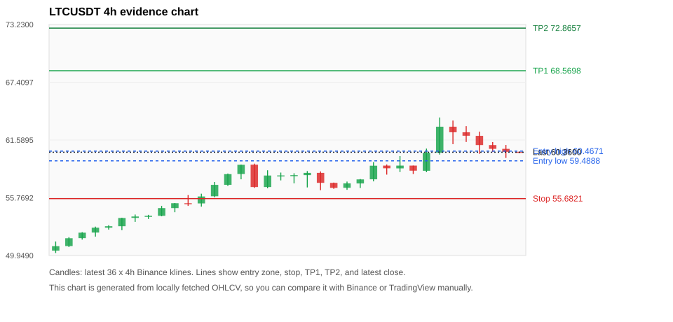
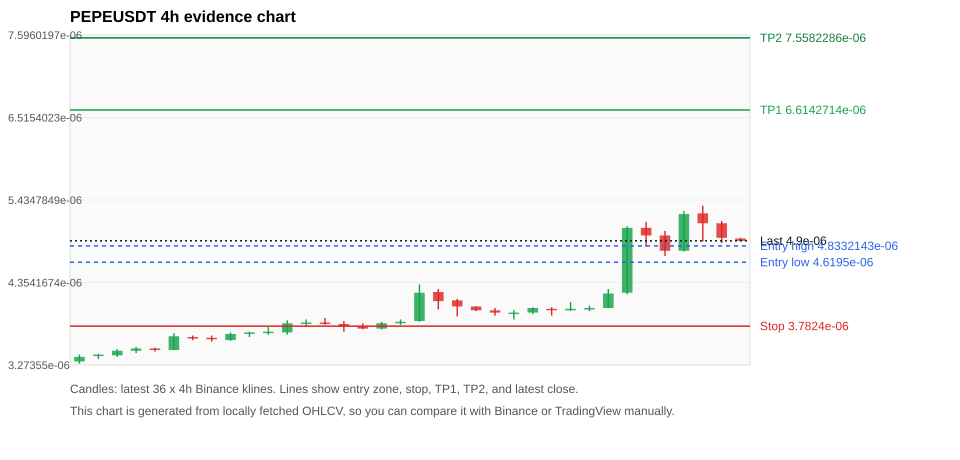
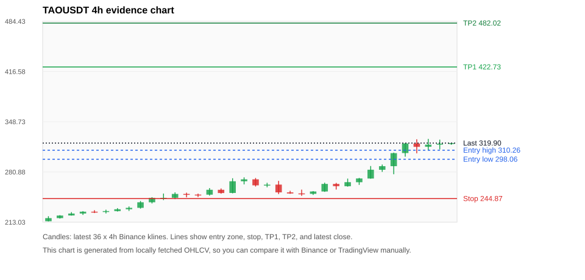
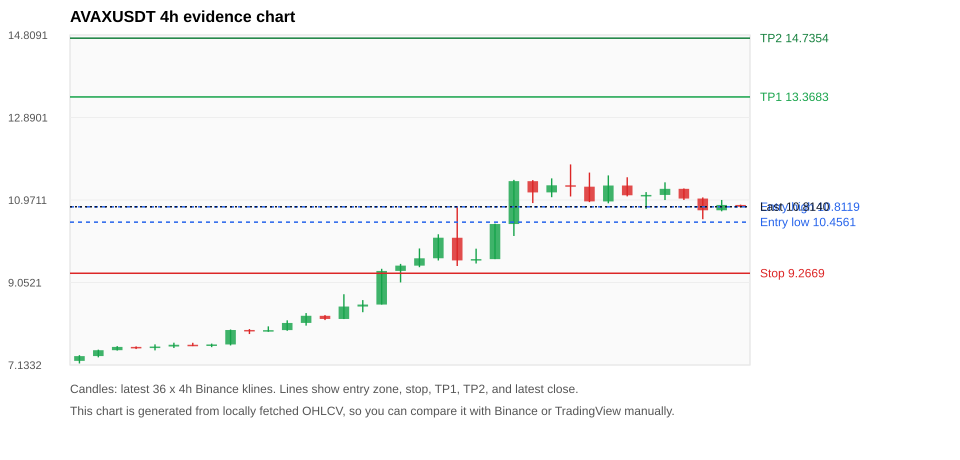
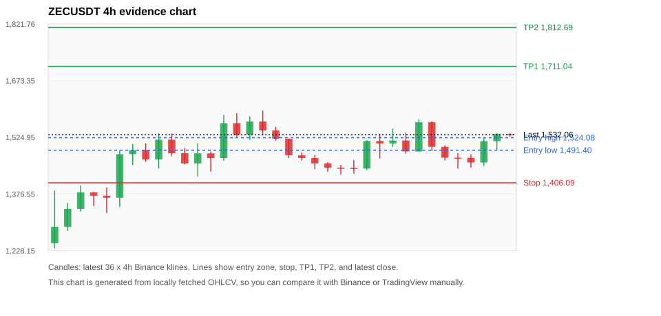

# Crypto 市场扫描报告 v1

- 报告时间：2026-09-22 20:07:06 CST
- Run ID：`20260922_120503_fb40918a`
- Run type：`daily_full`
- Data validation mode：`paper`
- 数据来源：SQLite
- 报告版本：v1
- 扫描 ID：1f452162056b
- 数据源：Binance public spot API + CoinGecko/CoinMarketCap cross-check
- 过滤条件：USDT spot; 24h quote volume >= 30,000,000; trades >= 30,000; exclude stables/leveraged tokens; analyze 1h/4h/1d klines
- 默认单笔风险：账户权益的 1.00%

## 限制说明

- 交易信号仍以 Binance 现货公开 K 线为主源；外部数据源用于一致性复核。
- 结果是研究和模拟盘计划，不是确定收益或实盘下单指令。
- 历史长度过滤：候选币至少需要 180 根 1d K 线。
- 数据质量验证池：先验证 score 排名前 min(top_n * 2, 10) 的候选，再按 action + score 补足最终名单。
- 大盘环境过滤：RISK_ON; BTC/ETH 日线趋势均较强，允许山寨币买入候选。 BTC 7d=13.642132248116457; ETH 7d=14.424207550474089.
- Data cross-validation enabled: Binance primary source plus CoinGecko; CoinMarketCap is checked when an API key is configured.
- PEPEUSDT validation state DEGRADED: DEGRADED: [EXTERNAL_IDENTITY_AMBIGUOUS] CoinGecko symbol mapping has 4 exact matches; selected highest market-cap rank; [EXTERNAL_IDENTITY_AMBIGUOUS] CoinMarketCap symbol mapping has 33 matches; selected lowest cmc_rank
- TAOUSDT validation state DEGRADED: DEGRADED: [EXTERNAL_IDENTITY_AMBIGUOUS] CoinGecko symbol mapping has 2 exact matches; selected highest market-cap rank; [EXTERNAL_IDENTITY_AMBIGUOUS] CoinMarketCap symbol mapping has 5 matches; selected lowest cmc_rank
- ZECUSDT validation state BLOCKED: BLOCKED: [BINANCE_KLINE_EXTREME_RANGE] Binance candle range exceeds 40%.; [BINANCE_KLINE_EXTREME_RANGE] Binance candle range exceeds 40%.; [EXTERNAL_IDENTITY_AMBIGUOUS] CoinMarketCap symbol mapping has 2 matches; selected lowest cmc_rank
- UNIUSDT validation state DEGRADED: DEGRADED: [EXTERNAL_IDENTITY_AMBIGUOUS] CoinMarketCap symbol mapping has 7 matches; selected lowest cmc_rank
- ENAUSDT validation state DEGRADED: DEGRADED: [EXTERNAL_PROVIDER_RATE_LIMITED] Provider rate limited request for https://api.coingecko.com/api/v3/coins/markets?vs_currency=usd&ids=ethena&price_change_percentage=24h&per_page=1&page=1: HTTP 429; [EXTERNAL_IDENTITY_AMBIGUOUS] CoinMarketCap symbol mapping has 2 matches; selected lowest cmc_rank
- ARBUSDT validation state BLOCKED: BLOCKED: [BINANCE_KLINE_EXTREME_RANGE] Binance candle range exceeds 40%.; [EXTERNAL_PROVIDER_RATE_LIMITED] Provider rate limited request for https://api.coingecko.com/api/v3/coins/markets?vs_currency=usd&ids=arbitrum&price_change_percentage=24h&per_page=1&page=1: HTTP 429; [EXTERNAL_IDENTITY_AMBIGUOUS] CoinMarketCap symbol mapping has 5 matches; selected lowest cmc_rank
- LTCUSDT validation state DEGRADED: DEGRADED: [EXTERNAL_PROVIDER_RATE_LIMITED] Provider rate limited request for https://api.coingecko.com/api/v3/coins/markets?vs_currency=usd&ids=litecoin&price_change_percentage=24h&per_page=1&page=1: HTTP 429
- ZAMAUSDT validation state BLOCKED: BLOCKED: [BINANCE_KLINE_EXTREME_RANGE] Binance candle range exceeds 40%.; [BINANCE_KLINE_EXTREME_RANGE] Binance candle range exceeds 40%.; [EXTERNAL_PROVIDER_RATE_LIMITED] Provider rate limited request for https://api.coingecko.com/api/v3/coins/markets?vs_currency=usd&ids=zama&price_change_percentage=24h&per_page=1&page=1: HTTP 429
- PENGUUSDT validation state DEGRADED: DEGRADED: [EXTERNAL_PROVIDER_RATE_LIMITED] Provider rate limited request for https://api.coingecko.com/api/v3/coins/markets?vs_currency=usd&ids=pudgy-penguins&price_change_percentage=24h&per_page=1&page=1: HTTP 429; [EXTERNAL_IDENTITY_AMBIGUOUS] CoinMarketCap symbol mapping has 9 matches; selected lowest cmc_rank

## 5 个候选交易计划

| Rank | Coin | Action | Setup | Entry Zone | Stop Loss | TP1 | TP2 / Exit Rule | R/R | Verdict |
|---:|---|---|---|---:|---:|---:|---|---:|---|
| 1 | `LTC` | `BUY_CANDIDATE` | 回踩支撑/4h EMA 附近 | 59.4888 - 60.4671 | 55.6821 | 68.5698 | 72.8657 或跌破 4h 关键支撑 | 2.00-3.00 | 可考虑 |
| 2 | `PEPE` | `WAIT_PULLBACK` | 趋势中，等回调入场 | 4.6195e-06 - 4.8332143e-06 | 3.7824e-06 | 6.6142714e-06 | 7.5582286e-06 或跌破 4h 关键支撑 | 2.00-3.00 | 只等回调 |
| 3 | `TAO` | `WATCH_ONLY` | 涨幅较远，只等深回调 | 298.06 - 310.26 | 244.87 | 422.73 | 482.02 或跌破 4h 关键支撑 | 2.00-3.00 | 只等回调 |
| 4 | `AVAX` | `WATCH_ONLY` | 回踩支撑/4h EMA 附近 | 10.4561 - 10.8119 | 9.2669 | 13.3683 | 14.7354 或跌破 4h 关键支撑 | 2.00-3.00 | 只观察 |
| 5 | `ZEC` | `WATCH_ONLY` | 回踩支撑/4h EMA 附近 | 1,491.40 - 1,524.08 | 1,406.09 | 1,711.04 | 1,812.69 或跌破 4h 关键支撑 | 2.00-3.00 | 只观察 |

## 数据交叉验证摘要

价格差异以 Binance 当前价为基准；成交量口径不同，Binance 是 USDT 现货成交额，CoinGecko/CoinMarketCap 通常是全市场成交量。

| Rank | Coin | State | Identity | Max Price Diff | Max 24h Diff | Issue Codes | Message |
|---:|---|---|---|---:|---:|---|---|
| 1 | `LTC` | DEGRADED (DATA_WARNING) | UNCONFIRMED | 0.01% | 0.04 pts | EXTERNAL_PROVIDER_RATE_LIMITED | DEGRADED: [EXTERNAL_PROVIDER_RATE_LIMITED] Provider rate limited request for https://api.coingecko.com/api/v3/coins/markets?vs_currency=usd&ids=litecoin&price_change_percentage=24h&per_page=1&page=1: HTTP 429 |
| 2 | `PEPE` | DEGRADED (DATA_WARNING) | UNCONFIRMED | 0.29% | 0.57 pts | EXTERNAL_IDENTITY_AMBIGUOUS | DEGRADED: [EXTERNAL_IDENTITY_AMBIGUOUS] CoinGecko symbol mapping has 4 exact matches; selected highest market-cap rank; [EXTERNAL_IDENTITY_AMBIGUOUS] CoinMarketCap symbol mapping has 33 matches; selected lowest cmc_rank |
| 3 | `TAO` | DEGRADED (DATA_WARNING) | UNCONFIRMED | 0.31% | 0.36 pts | EXTERNAL_IDENTITY_AMBIGUOUS | DEGRADED: [EXTERNAL_IDENTITY_AMBIGUOUS] CoinGecko symbol mapping has 2 exact matches; selected highest market-cap rank; [EXTERNAL_IDENTITY_AMBIGUOUS] CoinMarketCap symbol mapping has 5 matches; selected lowest cmc_rank |
| 4 | `AVAX` | CLEAN (DATA_OK) | CONFIRMED | 0.10% | 0.25 pts | none | CLEAN: External provider checks agree with Binance within configured thresholds. |
| 5 | `ZEC` | BLOCKED (DATA_ERROR) | UNCONFIRMED | 0.19% | 0.25 pts | BINANCE_KLINE_EXTREME_RANGE, EXTERNAL_IDENTITY_AMBIGUOUS | BLOCKED: [BINANCE_KLINE_EXTREME_RANGE] Binance candle range exceeds 40%.; [BINANCE_KLINE_EXTREME_RANGE] Binance candle range exceeds 40%.; [EXTERNAL_IDENTITY_AMBIGUOUS] CoinMarketCap symbol mapping has 2 matches; selected lowest cmc_rank |

## 候选币说明

### 1. LTC `LTCUSDT`



- 入选原因：回踩支撑/4h EMA 附近；24h +0.23%，7d +15.02%，4h RSI 67.51，24h 成交额 $44.0M。
- 交易失效条件：跌破 55.68205 或 4h 收盘重新失守关键支撑。
- 主要风险：主要风险是大盘同步回撤；External validation is degraded; this candidate is not a clean data sample.；Paper mode allows degraded validation; candidate is excluded from clean-data samples.。
- 数据交叉验证：DEGRADED / DATA_WARNING；身份=UNCONFIRMED；DEGRADED: [EXTERNAL_PROVIDER_RATE_LIMITED] Provider rate limited request for https://api.coingecko.com/api/v3/coins/markets?vs_currency=usd&ids=litecoin&price_change_percentage=24h&per_page=1&page=1: HTTP 429

#### 可点击人工验证

- [Binance 交易页](https://www.binance.com/en/trade/LTC_USDT)
- [TradingView 图表](https://www.tradingview.com/chart/?symbol=BINANCE%3ALTCUSDT)
- [CoinGecko 搜索](https://www.coingecko.com/en/search?query=LTC)
- [CoinMarketCap 搜索](https://coinmarketcap.com/search/?q=LTC)

#### 多数据源对照

| Source | Status | Identity | Blocking | Asset ID | Price | 24h Change | 24h Volume | Price Diff | 24h Diff | Updated | Issue Codes | Message |
|---|---|---|---:|---|---:|---:|---:|---:|---:|---|---|---|
| Binance | DATA_OK | CONFIRMED | no | LTCUSDT | 60.3600 | +0.23% | $44.0M | 0.00% | 0.00 pts | 2026-09-22T12:06:20+00:00 | none | Primary market data source passed health checks. |
| CoinGecko | DATA_WARNING | UNCONFIRMED | no | n/a | n/a | n/a | n/a | n/a | n/a | 2026-09-22T12:06:20+00:00 | EXTERNAL_PROVIDER_RATE_LIMITED | Provider rate limited request for https://api.coingecko.com/api/v3/coins/markets?vs_currency=usd&ids=litecoin&price_change_percentage=24h&per_page=1&page=1: HTTP 429 |
| CoinMarketCap | DATA_OK | CONFIRMED | no | 2 | 60.3528 | +0.20% | $538.0M | 0.01% | 0.04 pts | 2026-09-22T12:05:00.000Z | none | External source agrees with Binance within thresholds. |

#### 指标证据

| 指标 | 数值 | 人工核对用途 |
|---|---:|---|
| 当前价 | 60.3600 | 与 Binance/TradingView 当前价格对照 |
| 24h 涨跌 | +0.23% | 与交易所 24h 涨跌对照 |
| 7d 涨跌 | +15.02% | 判断短线趋势是否延续 |
| 4h EMA20 | 59.3701 | 判断短期趋势支撑 |
| 4h EMA50 | 57.0634 | 判断中期趋势支撑 |
| 1d EMA20 | 55.0780 | 判断日线趋势 |
| 1d EMA50 | 51.7210 | 判断日线趋势 |
| 4h RSI14 | 67.51 | 判断是否过热/过弱 |
| 4h ATR14 | 1.5671 | 推导止损和入场缓冲 |
| 最近 18 根 4h 最低点 | 56.5300 | 支撑/止损参考 |
| 最近 36 根 4h 最高点 | 63.8600 | TP/压力参考 |
| 支撑位 | 59.3701 | 入场区间推导基础 |

#### 交易计划推导

- 支撑位 = 最近低点、4h EMA20、4h EMA50、1d EMA20 中不高于当前价的最高有效支撑 = `59.3701`。
- 入场区间 = 支撑位附近 + ATR 缓冲 = `59.4888 - 60.4671`。
- 止损 = min(最近 18 根 4h 最低点 * 0.985, 入场中位价 - 1.15 * ATR14) = `55.6821`。
- TP1 = max(最近 36 根 4h 最高点 * 0.995, 入场中位价 + 2R) = `68.5698`。
- TP2 = max(入场中位价 + 3R, TP1 * 1.04) = `72.8657`。

#### 最近 10 根 4h K线

| UTC 开盘时间 | Open | High | Low | Close | Quote Volume | Trades |
|---|---:|---:|---:|---:|---:|---:|
| 2026-09-21T00:00+00:00 | 58.7300 | 59.9700 | 58.3600 | 59.0100 | $5.1M | 49926 |
| 2026-09-21T04:00+00:00 | 59.0100 | 59.0100 | 58.1600 | 58.5000 | $3.2M | 28696 |
| 2026-09-21T08:00+00:00 | 58.4900 | 60.7200 | 58.3500 | 60.3000 | $10.1M | 68143 |
| 2026-09-21T12:00+00:00 | 60.3100 | 63.8600 | 60.1200 | 62.9300 | $17.5M | 144632 |
| 2026-09-21T16:00+00:00 | 62.9300 | 63.5500 | 61.1700 | 62.3700 | $7.1M | 61387 |
| 2026-09-21T20:00+00:00 | 62.3700 | 62.9900 | 61.3900 | 62.0200 | $4.7M | 33923 |
| 2026-09-22T00:00+00:00 | 62.0100 | 62.4300 | 60.2000 | 61.0800 | $6.2M | 49661 |
| 2026-09-22T04:00+00:00 | 61.0800 | 61.3800 | 60.3700 | 60.7000 | $4.2M | 30905 |
| 2026-09-22T08:00+00:00 | 60.7000 | 61.0900 | 59.7800 | 60.4000 | $4.3M | 33688 |
| 2026-09-22T12:00+00:00 | 60.4000 | 60.4200 | 60.2800 | 60.3600 | $232,289 | 1529 |

### 2. PEPE `PEPEUSDT`



- 入选原因：趋势中，等回调入场；24h +15.84%，7d +41.21%，4h RSI 69.70，24h 成交额 $198.4M。
- 交易失效条件：跌破 3.7824e-06 或 4h 收盘重新失守关键支撑。
- 主要风险：距离支撑偏远，不能追市价；24h 振幅较大，回撤风险高；成交量突增，可能是事件驱动；External validation is degraded; this candidate is not a clean data sample.；Paper mode allows degraded validation; candidate is excluded from clean-data samples.。
- 数据交叉验证：DEGRADED / DATA_WARNING；身份=UNCONFIRMED；DEGRADED: [EXTERNAL_IDENTITY_AMBIGUOUS] CoinGecko symbol mapping has 4 exact matches; selected highest market-cap rank; [EXTERNAL_IDENTITY_AMBIGUOUS] CoinMarketCap symbol mapping has 33 matches; selected lowest cmc_rank

#### 可点击人工验证

- [Binance 交易页](https://www.binance.com/en/trade/PEPE_USDT)
- [TradingView 图表](https://www.tradingview.com/chart/?symbol=BINANCE%3APEPEUSDT)
- [CoinGecko 搜索](https://www.coingecko.com/en/search?query=PEPE)
- [CoinMarketCap 搜索](https://coinmarketcap.com/search/?q=PEPE)

#### 多数据源对照

| Source | Status | Identity | Blocking | Asset ID | Price | 24h Change | 24h Volume | Price Diff | 24h Diff | Updated | Issue Codes | Message |
|---|---|---|---:|---|---:|---:|---:|---:|---:|---|---|---|
| Binance | DATA_OK | CONFIRMED | no | PEPEUSDT | 4.9e-06 | +15.84% | $198.4M | 0.00% | 0.00 pts | 2026-09-22T12:06:20+00:00 | none | Primary market data source passed health checks. |
| CoinGecko | DATA_WARNING | UNCONFIRMED | no | pepe | 4.9e-06 | +15.97% | $1.51B | 0.00% | 0.14 pts | 2026-09-22T12:04:20.000Z | EXTERNAL_IDENTITY_AMBIGUOUS | [EXTERNAL_IDENTITY_AMBIGUOUS] CoinGecko symbol mapping has 4 exact matches; selected highest market-cap rank |
| CoinMarketCap | DATA_WARNING | UNCONFIRMED | no | 24478 | 4.9143284e-06 | +16.41% | $1.55B | 0.29% | 0.57 pts | 2026-09-22T12:05:00.000Z | EXTERNAL_IDENTITY_AMBIGUOUS | [EXTERNAL_IDENTITY_AMBIGUOUS] CoinMarketCap symbol mapping has 33 matches; selected lowest cmc_rank |

#### 指标证据

| 指标 | 数值 | 人工核对用途 |
|---|---:|---|
| 当前价 | 4.9e-06 | 与 Binance/TradingView 当前价格对照 |
| 24h 涨跌 | +15.84% | 与交易所 24h 涨跌对照 |
| 7d 涨跌 | +41.21% | 判断短线趋势是否延续 |
| 4h EMA20 | 4.4658164e-06 | 判断短期趋势支撑 |
| 4h EMA50 | 4.0474872e-06 | 判断中期趋势支撑 |
| 1d EMA20 | 3.8246203e-06 | 判断日线趋势 |
| 1d EMA50 | 3.5063833e-06 | 判断日线趋势 |
| 4h RSI14 | 69.70 | 判断是否过热/过弱 |
| 4h ATR14 | 2.6714286e-07 | 推导止损和入场缓冲 |
| 最近 18 根 4h 最低点 | 3.84e-06 | 支撑/止损参考 |
| 最近 36 根 4h 最高点 | 5.36e-06 | TP/压力参考 |
| 支撑位 | 4.4658164e-06 | 入场区间推导基础 |

#### 交易计划推导

- 支撑位 = 最近低点、4h EMA20、4h EMA50、1d EMA20 中不高于当前价的最高有效支撑 = `4.4658164e-06`。
- 入场区间 = 支撑位附近 + ATR 缓冲 = `4.6195e-06 - 4.8332143e-06`。
- 止损 = min(最近 18 根 4h 最低点 * 0.985, 入场中位价 - 1.15 * ATR14) = `3.7824e-06`。
- TP1 = max(最近 36 根 4h 最高点 * 0.995, 入场中位价 + 2R) = `6.6142714e-06`。
- TP2 = max(入场中位价 + 3R, TP1 * 1.04) = `7.5582286e-06`。

#### 最近 10 根 4h K线

| UTC 开盘时间 | Open | High | Low | Close | Quote Volume | Trades |
|---|---:|---:|---:|---:|---:|---:|
| 2026-09-21T00:00+00:00 | 3.99e-06 | 4.1e-06 | 3.98e-06 | 4.01e-06 | $7.9M | 24552 |
| 2026-09-21T04:00+00:00 | 4.01e-06 | 4.05e-06 | 3.98e-06 | 4.02e-06 | $3.5M | 12485 |
| 2026-09-21T08:00+00:00 | 4.02e-06 | 4.27e-06 | 4.02e-06 | 4.21e-06 | $15.7M | 40487 |
| 2026-09-21T12:00+00:00 | 4.22e-06 | 5.09e-06 | 4.2e-06 | 5.07e-06 | $54.4M | 212870 |
| 2026-09-21T16:00+00:00 | 5.07e-06 | 5.15e-06 | 4.82e-06 | 4.97e-06 | $31.5M | 158951 |
| 2026-09-21T20:00+00:00 | 4.97e-06 | 5.03e-06 | 4.7e-06 | 4.77e-06 | $22.3M | 86008 |
| 2026-09-22T00:00+00:00 | 4.77e-06 | 5.29e-06 | 4.76e-06 | 5.25e-06 | $38.5M | 122889 |
| 2026-09-22T04:00+00:00 | 5.26e-06 | 5.36e-06 | 4.89e-06 | 5.13e-06 | $33.4M | 91509 |
| 2026-09-22T08:00+00:00 | 5.13e-06 | 5.16e-06 | 4.87e-06 | 4.94e-06 | $18.2M | 68641 |
| 2026-09-22T12:00+00:00 | 4.93e-06 | 4.94e-06 | 4.9e-06 | 4.9e-06 | $241,456 | 996 |

### 3. TAO `TAOUSDT`



- 入选原因：涨幅较远，只等深回调；24h +12.49%，7d +41.86%，4h RSI 90.49，24h 成交额 $103.3M。
- 交易失效条件：跌破 244.871 或 4h 收盘重新失守关键支撑。
- 主要风险：距离支撑偏远，不能追市价；4h RSI 偏热；External validation is degraded; this candidate is not a clean data sample.；Paper mode allows degraded validation; candidate is excluded from clean-data samples.。
- 数据交叉验证：DEGRADED / DATA_WARNING；身份=UNCONFIRMED；DEGRADED: [EXTERNAL_IDENTITY_AMBIGUOUS] CoinGecko symbol mapping has 2 exact matches; selected highest market-cap rank; [EXTERNAL_IDENTITY_AMBIGUOUS] CoinMarketCap symbol mapping has 5 matches; selected lowest cmc_rank

#### 可点击人工验证

- [Binance 交易页](https://www.binance.com/en/trade/TAO_USDT)
- [TradingView 图表](https://www.tradingview.com/chart/?symbol=BINANCE%3ATAOUSDT)
- [CoinGecko 搜索](https://www.coingecko.com/en/search?query=TAO)
- [CoinMarketCap 搜索](https://coinmarketcap.com/search/?q=TAO)

#### 多数据源对照

| Source | Status | Identity | Blocking | Asset ID | Price | 24h Change | 24h Volume | Price Diff | 24h Diff | Updated | Issue Codes | Message |
|---|---|---|---:|---|---:|---:|---:|---:|---:|---|---|---|
| Binance | DATA_OK | CONFIRMED | no | TAOUSDT | 319.90 | +12.49% | $103.3M | 0.00% | 0.00 pts | 2026-09-22T12:06:20+00:00 | none | Primary market data source passed health checks. |
| CoinGecko | DATA_WARNING | UNCONFIRMED | no | bittensor | 319.15 | +12.12% | $673.5M | 0.23% | 0.36 pts | 2026-09-22T12:04:20.000Z | EXTERNAL_IDENTITY_AMBIGUOUS | [EXTERNAL_IDENTITY_AMBIGUOUS] CoinGecko symbol mapping has 2 exact matches; selected highest market-cap rank |
| CoinMarketCap | DATA_WARNING | UNCONFIRMED | no | 22974 | 318.90 | +12.42% | $683.9M | 0.31% | 0.07 pts | 2026-09-22T12:05:00.000Z | EXTERNAL_IDENTITY_AMBIGUOUS | [EXTERNAL_IDENTITY_AMBIGUOUS] CoinMarketCap symbol mapping has 5 matches; selected lowest cmc_rank |

#### 指标证据

| 指标 | 数值 | 人工核对用途 |
|---|---:|---|
| 当前价 | 319.90 | 与 Binance/TradingView 当前价格对照 |
| 24h 涨跌 | +12.49% | 与交易所 24h 涨跌对照 |
| 7d 涨跌 | +41.86% | 判断短线趋势是否延续 |
| 4h EMA20 | 286.19 | 判断短期趋势支撑 |
| 4h EMA50 | 263.38 | 判断中期趋势支撑 |
| 1d EMA20 | 253.67 | 判断日线趋势 |
| 1d EMA50 | 235.71 | 判断日线趋势 |
| 4h RSI14 | 90.49 | 判断是否过热/过弱 |
| 4h ATR14 | 12.8500 | 推导止损和入场缓冲 |
| 最近 18 根 4h 最低点 | 248.60 | 支撑/止损参考 |
| 最近 36 根 4h 最高点 | 325.50 | TP/压力参考 |
| 支撑位 | 286.19 | 入场区间推导基础 |

#### 交易计划推导

- 支撑位 = 最近低点、4h EMA20、4h EMA50、1d EMA20 中不高于当前价的最高有效支撑 = `286.19`。
- 入场区间 = 支撑位附近 + ATR 缓冲 = `298.06 - 310.26`。
- 止损 = min(最近 18 根 4h 最低点 * 0.985, 入场中位价 - 1.15 * ATR14) = `244.87`。
- TP1 = max(最近 36 根 4h 最高点 * 0.995, 入场中位价 + 2R) = `422.73`。
- TP2 = max(入场中位价 + 3R, TP1 * 1.04) = `482.02`。

#### 最近 10 根 4h K线

| UTC 开盘时间 | Open | High | Low | Close | Quote Volume | Trades |
|---|---:|---:|---:|---:|---:|---:|
| 2026-09-21T00:00+00:00 | 261.60 | 271.90 | 261.00 | 267.10 | $9.4M | 47546 |
| 2026-09-21T04:00+00:00 | 267.00 | 272.80 | 263.40 | 272.10 | $6.7M | 35452 |
| 2026-09-21T08:00+00:00 | 272.00 | 288.90 | 271.80 | 283.90 | $20.0M | 86444 |
| 2026-09-21T12:00+00:00 | 283.80 | 290.90 | 281.00 | 288.70 | $13.3M | 60769 |
| 2026-09-21T16:00+00:00 | 288.70 | 307.00 | 277.80 | 306.30 | $15.9M | 74075 |
| 2026-09-21T20:00+00:00 | 306.40 | 319.70 | 301.50 | 319.40 | $27.0M | 138086 |
| 2026-09-22T00:00+00:00 | 319.40 | 325.00 | 306.10 | 314.80 | $22.2M | 143866 |
| 2026-09-22T04:00+00:00 | 314.90 | 325.50 | 309.80 | 317.80 | $11.5M | 65646 |
| 2026-09-22T08:00+00:00 | 317.80 | 324.50 | 311.30 | 319.10 | $13.2M | 70224 |
| 2026-09-22T12:00+00:00 | 319.10 | 320.00 | 317.50 | 319.90 | $570,351 | 2651 |

### 4. AVAX `AVAXUSDT`



- 入选原因：回踩支撑/4h EMA 附近；24h -4.51%，7d +43.40%，4h RSI 65.09，24h 成交额 $80.8M。
- 交易失效条件：跌破 9.26688 或 4h 收盘重新失守关键支撑。
- 主要风险：24h 动量未确认。
- 数据交叉验证：CLEAN / DATA_OK；身份=CONFIRMED；CLEAN: External provider checks agree with Binance within configured thresholds.

#### 可点击人工验证

- [Binance 交易页](https://www.binance.com/en/trade/AVAX_USDT)
- [TradingView 图表](https://www.tradingview.com/chart/?symbol=BINANCE%3AAVAXUSDT)
- [CoinGecko 搜索](https://www.coingecko.com/en/search?query=AVAX)
- [CoinMarketCap 搜索](https://coinmarketcap.com/search/?q=AVAX)

#### 多数据源对照

| Source | Status | Identity | Blocking | Asset ID | Price | 24h Change | 24h Volume | Price Diff | 24h Diff | Updated | Issue Codes | Message |
|---|---|---|---:|---|---:|---:|---:|---:|---:|---|---|---|
| Binance | DATA_OK | CONFIRMED | no | AVAXUSDT | 10.8140 | -4.51% | $80.8M | 0.00% | 0.00 pts | 2026-09-22T12:06:20+00:00 | none | Primary market data source passed health checks. |
| CoinGecko | DATA_OK | CONFIRMED | no | avalanche-2 | 10.8100 | -4.58% | $798.4M | 0.04% | 0.07 pts | 2026-09-22T12:04:20.000Z | none | External source agrees with Binance within thresholds. |
| CoinMarketCap | DATA_OK | CONFIRMED | no | 5805 | 10.8248 | -4.27% | $784.5M | 0.10% | 0.25 pts | 2026-09-22T12:05:00.000Z | none | External source agrees with Binance within thresholds. |

#### 指标证据

| 指标 | 数值 | 人工核对用途 |
|---|---:|---|
| 当前价 | 10.8140 | 与 Binance/TradingView 当前价格对照 |
| 24h 涨跌 | -4.51% | 与交易所 24h 涨跌对照 |
| 7d 涨跌 | +43.40% | 判断短线趋势是否延续 |
| 4h EMA20 | 10.4352 | 判断短期趋势支撑 |
| 4h EMA50 | 9.3556 | 判断中期趋势支撑 |
| 1d EMA20 | 8.6330 | 判断日线趋势 |
| 1d EMA50 | 7.7972 | 判断日线趋势 |
| 4h RSI14 | 65.09 | 判断是否过热/过弱 |
| 4h ATR14 | 0.53807 | 推导止损和入场缓冲 |
| 最近 18 根 4h 最低点 | 9.4080 | 支撑/止损参考 |
| 最近 36 根 4h 最高点 | 11.7990 | TP/压力参考 |
| 支撑位 | 10.4352 | 入场区间推导基础 |

#### 交易计划推导

- 支撑位 = 最近低点、4h EMA20、4h EMA50、1d EMA20 中不高于当前价的最高有效支撑 = `10.4352`。
- 入场区间 = 支撑位附近 + ATR 缓冲 = `10.4561 - 10.8119`。
- 止损 = min(最近 18 根 4h 最低点 * 0.985, 入场中位价 - 1.15 * ATR14) = `9.2669`。
- TP1 = max(最近 36 根 4h 最高点 * 0.995, 入场中位价 + 2R) = `13.3683`。
- TP2 = max(入场中位价 + 3R, TP1 * 1.04) = `14.7354`。

#### 最近 10 根 4h K线

| UTC 开盘时间 | Open | High | Low | Close | Quote Volume | Trades |
|---|---:|---:|---:|---:|---:|---:|
| 2026-09-21T00:00+00:00 | 11.3140 | 11.7990 | 11.0530 | 11.2810 | $22.8M | 249176 |
| 2026-09-21T04:00+00:00 | 11.2810 | 11.6090 | 10.9220 | 10.9390 | $19.8M | 199471 |
| 2026-09-21T08:00+00:00 | 10.9380 | 11.5430 | 10.8950 | 11.3080 | $18.7M | 169232 |
| 2026-09-21T12:00+00:00 | 11.3080 | 11.5000 | 11.0550 | 11.0810 | $20.9M | 169854 |
| 2026-09-21T16:00+00:00 | 11.0810 | 11.1550 | 10.7640 | 11.0890 | $14.8M | 116786 |
| 2026-09-21T20:00+00:00 | 11.0890 | 11.3820 | 10.9700 | 11.2310 | $13.8M | 103731 |
| 2026-09-22T00:00+00:00 | 11.2310 | 11.2390 | 10.9720 | 11.0050 | $10.0M | 90098 |
| 2026-09-22T04:00+00:00 | 11.0050 | 11.0310 | 10.5240 | 10.7320 | $13.2M | 106664 |
| 2026-09-22T08:00+00:00 | 10.7320 | 10.9720 | 10.7080 | 10.8560 | $8.4M | 68903 |
| 2026-09-22T12:00+00:00 | 10.8560 | 10.8630 | 10.7990 | 10.8130 | $211,470 | 1938 |

### 5. ZEC `ZECUSDT`



- 入选原因：回踩支撑/4h EMA 附近；24h -1.80%，7d +34.84%，4h RSI 61.54，24h 成交额 $358.9M。
- 交易失效条件：跌破 1406.0875 或 4h 收盘重新失守关键支撑。
- 主要风险：24h 动量未确认；Blocking data-quality issue detected; paper plan creation is not allowed.。
- 数据交叉验证：BLOCKED / DATA_ERROR；身份=UNCONFIRMED；BLOCKED: [BINANCE_KLINE_EXTREME_RANGE] Binance candle range exceeds 40%.; [BINANCE_KLINE_EXTREME_RANGE] Binance candle range exceeds 40%.; [EXTERNAL_IDENTITY_AMBIGUOUS] CoinMarketCap symbol mapping has 2 matches; selected lowest cmc_rank

#### 可点击人工验证

- [Binance 交易页](https://www.binance.com/en/trade/ZEC_USDT)
- [TradingView 图表](https://www.tradingview.com/chart/?symbol=BINANCE%3AZECUSDT)
- [CoinGecko 搜索](https://www.coingecko.com/en/search?query=ZEC)
- [CoinMarketCap 搜索](https://coinmarketcap.com/search/?q=ZEC)

#### 多数据源对照

| Source | Status | Identity | Blocking | Asset ID | Price | 24h Change | 24h Volume | Price Diff | 24h Diff | Updated | Issue Codes | Message |
|---|---|---|---:|---|---:|---:|---:|---:|---:|---|---|---|
| Binance | DATA_ERROR | CONFIRMED | yes | ZECUSDT | 1,532.06 | -1.80% | $358.9M | 0.00% | 0.00 pts | 2026-09-22T12:06:20+00:00 | BINANCE_KLINE_EXTREME_RANGE | [BINANCE_KLINE_EXTREME_RANGE] Binance candle range exceeds 40%.; [BINANCE_KLINE_EXTREME_RANGE] Binance candle range exceeds 40%. |
| CoinGecko | DATA_OK | CONFIRMED | no | zcash | 1,529.09 | -1.55% | $1.30B | 0.19% | 0.25 pts | 2026-09-22T12:04:20.000Z | none | External source agrees with Binance within thresholds. |
| CoinMarketCap | DATA_WARNING | UNCONFIRMED | no | 1437 | 1,531.37 | -1.85% | $1.50B | 0.05% | 0.05 pts | 2026-09-22T12:05:00.000Z | EXTERNAL_IDENTITY_AMBIGUOUS | [EXTERNAL_IDENTITY_AMBIGUOUS] CoinMarketCap symbol mapping has 2 matches; selected lowest cmc_rank |

#### 指标证据

| 指标 | 数值 | 人工核对用途 |
|---|---:|---|
| 当前价 | 1,532.06 | 与 Binance/TradingView 当前价格对照 |
| 24h 涨跌 | -1.80% | 与交易所 24h 涨跌对照 |
| 7d 涨跌 | +34.84% | 判断短线趋势是否延续 |
| 4h EMA20 | 1,488.42 | 判断短期趋势支撑 |
| 4h EMA50 | 1,403.01 | 判断中期趋势支撑 |
| 1d EMA20 | 1,253.34 | 判断日线趋势 |
| 1d EMA50 | 986.19 | 判断日线趋势 |
| 4h RSI14 | 61.54 | 判断是否过热/过弱 |
| 4h ATR14 | 50.9393 | 推导止损和入场缓冲 |
| 最近 18 根 4h 最低点 | 1,427.50 | 支撑/止损参考 |
| 最近 36 根 4h 最高点 | 1,595.35 | TP/压力参考 |
| 支撑位 | 1,488.42 | 入场区间推导基础 |

#### 交易计划推导

- 支撑位 = 最近低点、4h EMA20、4h EMA50、1d EMA20 中不高于当前价的最高有效支撑 = `1,488.42`。
- 入场区间 = 支撑位附近 + ATR 缓冲 = `1,491.40 - 1,524.08`。
- 止损 = min(最近 18 根 4h 最低点 * 0.985, 入场中位价 - 1.15 * ATR14) = `1,406.09`。
- TP1 = max(最近 36 根 4h 最高点 * 0.995, 入场中位价 + 2R) = `1,711.04`。
- TP2 = max(入场中位价 + 3R, TP1 * 1.04) = `1,812.69`。

#### 最近 10 根 4h K线

| UTC 开盘时间 | Open | High | Low | Close | Quote Volume | Trades |
|---|---:|---:|---:|---:|---:|---:|
| 2026-09-21T00:00+00:00 | 1,509.14 | 1,548.33 | 1,500.00 | 1,516.76 | $72.0M | 145791 |
| 2026-09-21T04:00+00:00 | 1,516.78 | 1,537.77 | 1,482.28 | 1,488.10 | $44.6M | 107468 |
| 2026-09-21T08:00+00:00 | 1,488.04 | 1,572.35 | 1,487.55 | 1,564.60 | $79.3M | 192861 |
| 2026-09-21T12:00+00:00 | 1,564.82 | 1,566.83 | 1,489.11 | 1,500.24 | $77.4M | 261807 |
| 2026-09-21T16:00+00:00 | 1,500.05 | 1,504.00 | 1,464.89 | 1,471.67 | $46.2M | 155258 |
| 2026-09-21T20:00+00:00 | 1,471.68 | 1,484.09 | 1,443.25 | 1,471.45 | $51.3M | 110804 |
| 2026-09-22T00:00+00:00 | 1,471.44 | 1,480.68 | 1,445.85 | 1,459.17 | $35.3M | 122898 |
| 2026-09-22T04:00+00:00 | 1,459.18 | 1,523.71 | 1,450.24 | 1,515.04 | $77.8M | 384102 |
| 2026-09-22T08:00+00:00 | 1,515.10 | 1,536.00 | 1,490.12 | 1,533.87 | $70.1M | 278058 |
| 2026-09-22T12:00+00:00 | 1,533.86 | 1,536.00 | 1,527.17 | 1,532.12 | $3.5M | 6310 |

## 组合风控

- 不要 5 个候选全部满仓买入。
- 同时持仓总风险建议控制在账户权益的 3% - 5% 以内。
- 如果 BTC/ETH 同时破位，暂停山寨币多头计划或降低仓位。
- 第一版报告用于模拟盘和人工复核，不自动下单。

## 原始数据

```json
[
  {
    "rank": 1,
    "symbol": "LTCUSDT",
    "base_asset": "LTC",
    "price": 60.36,
    "score": 65.90227069988919,
    "setup": "回踩支撑/4h EMA 附近",
    "verdict": "可考虑",
    "entry_low": 59.488823247349856,
    "entry_high": 60.46708308118748,
    "stop_loss": 55.682050000000004,
    "take_profit_1": 68.569759492806,
    "take_profit_2": 72.86566265707467,
    "risk_reward_1": 2.0,
    "risk_reward_2": 3.0,
    "pct_24h": 0.232,
    "pct_3d": 4.392943618125211,
    "pct_7d": 15.015243902439025,
    "quote_volume_24h": 44046148.47495,
    "trades_24h": 354014,
    "high_low_range_24h": 6.825025092004022,
    "rsi_1h": 36.152219873150045,
    "rsi_4h": 67.50972762645915,
    "ema20_4h": 59.37008308118748,
    "ema50_4h": 57.06340426810711,
    "ema20_1d": 55.0780337139039,
    "ema50_1d": 51.72100682461121,
    "atr_4h": 1.5671428571428565,
    "macd_hist_4h": -0.07394394878118704,
    "volume_ratio_24h": 1.5327168110316463,
    "support_level": 59.37008308118748,
    "recent_low_4h_18": 56.53,
    "recent_high_4h_36": 63.86,
    "distance_to_support_pct": 1.6673665715758235,
    "binance_trade_url": "https://www.binance.com/en/trade/LTC_USDT",
    "tradingview_url": "https://www.tradingview.com/chart/?symbol=BINANCE%3ALTCUSDT",
    "coingecko_search_url": "https://www.coingecko.com/en/search?query=LTC",
    "coinmarketcap_search_url": "https://coinmarketcap.com/search/?q=LTC",
    "invalidation": "跌破 55.68205 或 4h 收盘重新失守关键支撑",
    "recent_4h_klines": [
      {
        "open_time_utc": "2026-09-16T16:00+00:00",
        "open": 50.44,
        "high": 51.36,
        "low": 50.2,
        "close": 50.89,
        "quote_volume": 4862738.61902,
        "trades": 56004
      },
      {
        "open_time_utc": "2026-09-16T20:00+00:00",
        "open": 50.9,
        "high": 51.8,
        "low": 50.8,
        "close": 51.69,
        "quote_volume": 2968044.4736,
        "trades": 25179
      },
      {
        "open_time_utc": "2026-09-17T00:00+00:00",
        "open": 51.7,
        "high": 52.3,
        "low": 51.55,
        "close": 52.25,
        "quote_volume": 2132151.98734,
        "trades": 18748
      },
      {
        "open_time_utc": "2026-09-17T04:00+00:00",
        "open": 52.26,
        "high": 52.86,
        "low": 51.85,
        "close": 52.75,
        "quote_volume": 1936073.19719,
        "trades": 14879
      },
      {
        "open_time_utc": "2026-09-17T08:00+00:00",
        "open": 52.75,
        "high": 53.0,
        "low": 52.56,
        "close": 52.9,
        "quote_volume": 2169079.32747,
        "trades": 17658
      },
      {
        "open_time_utc": "2026-09-17T12:00+00:00",
        "open": 52.9,
        "high": 53.75,
        "low": 52.5,
        "close": 53.73,
        "quote_volume": 3196402.6844,
        "trades": 29871
      },
      {
        "open_time_utc": "2026-09-17T16:00+00:00",
        "open": 53.74,
        "high": 54.08,
        "low": 53.34,
        "close": 53.88,
        "quote_volume": 2409730.75099,
        "trades": 24813
      },
      {
        "open_time_utc": "2026-09-17T20:00+00:00",
        "open": 53.88,
        "high": 54.05,
        "low": 53.63,
        "close": 53.95,
        "quote_volume": 2020401.90239,
        "trades": 15212
      },
      {
        "open_time_utc": "2026-09-18T00:00+00:00",
        "open": 53.95,
        "high": 54.95,
        "low": 53.9,
        "close": 54.73,
        "quote_volume": 2461511.32793,
        "trades": 20728
      },
      {
        "open_time_utc": "2026-09-18T04:00+00:00",
        "open": 54.73,
        "high": 55.24,
        "low": 54.31,
        "close": 55.22,
        "quote_volume": 4505511.87898,
        "trades": 26362
      },
      {
        "open_time_utc": "2026-09-18T08:00+00:00",
        "open": 55.22,
        "high": 56.04,
        "low": 54.95,
        "close": 55.2,
        "quote_volume": 6034790.3678,
        "trades": 39676
      },
      {
        "open_time_utc": "2026-09-18T12:00+00:00",
        "open": 55.2,
        "high": 56.18,
        "low": 54.87,
        "close": 55.9,
        "quote_volume": 6140976.20546,
        "trades": 51777
      },
      {
        "open_time_utc": "2026-09-18T16:00+00:00",
        "open": 55.92,
        "high": 57.36,
        "low": 55.82,
        "close": 57.07,
        "quote_volume": 6085881.38653,
        "trades": 54727
      },
      {
        "open_time_utc": "2026-09-18T20:00+00:00",
        "open": 57.07,
        "high": 58.21,
        "low": 56.96,
        "close": 58.15,
        "quote_volume": 6710719.88085,
        "trades": 63666
      },
      {
        "open_time_utc": "2026-09-19T00:00+00:00",
        "open": 58.16,
        "high": 59.1,
        "low": 57.63,
        "close": 59.09,
        "quote_volume": 6796454.7946,
        "trades": 69070
      },
      {
        "open_time_utc": "2026-09-19T04:00+00:00",
        "open": 59.1,
        "high": 59.21,
        "low": 56.76,
        "close": 56.85,
        "quote_volume": 4896762.19287,
        "trades": 52724
      },
      {
        "open_time_utc": "2026-09-19T08:00+00:00",
        "open": 56.85,
        "high": 58.54,
        "low": 56.72,
        "close": 58.01,
        "quote_volume": 5117227.26897,
        "trades": 34484
      },
      {
        "open_time_utc": "2026-09-19T12:00+00:00",
        "open": 58.01,
        "high": 58.31,
        "low": 57.52,
        "close": 58.02,
        "quote_volume": 4004481.69339,
        "trades": 33696
      },
      {
        "open_time_utc": "2026-09-19T16:00+00:00",
        "open": 58.02,
        "high": 58.24,
        "low": 57.22,
        "close": 58.05,
        "quote_volume": 3966732.29801,
        "trades": 31436
      },
      {
        "open_time_utc": "2026-09-19T20:00+00:00",
        "open": 58.05,
        "high": 58.46,
        "low": 56.81,
        "close": 58.28,
        "quote_volume": 3076795.10745,
        "trades": 31700
      },
      {
        "open_time_utc": "2026-09-20T00:00+00:00",
        "open": 58.28,
        "high": 58.42,
        "low": 56.53,
        "close": 57.27,
        "quote_volume": 3433875.88132,
        "trades": 37735
      },
      {
        "open_time_utc": "2026-09-20T04:00+00:00",
        "open": 57.27,
        "high": 57.3,
        "low": 56.67,
        "close": 56.76,
        "quote_volume": 2302243.39146,
        "trades": 26802
      },
      {
        "open_time_utc": "2026-09-20T08:00+00:00",
        "open": 56.77,
        "high": 57.4,
        "low": 56.57,
        "close": 57.22,
        "quote_volume": 2710272.73017,
        "trades": 29472
      },
      {
        "open_time_utc": "2026-09-20T12:00+00:00",
        "open": 57.21,
        "high": 57.66,
        "low": 56.75,
        "close": 57.62,
        "quote_volume": 3061930.02139,
        "trades": 27529
      },
      {
        "open_time_utc": "2026-09-20T16:00+00:00",
        "open": 57.63,
        "high": 59.36,
        "low": 57.42,
        "close": 59.0,
        "quote_volume": 6895724.75164,
        "trades": 56502
      },
      {
        "open_time_utc": "2026-09-20T20:00+00:00",
        "open": 59.01,
        "high": 59.12,
        "low": 58.1,
        "close": 58.74,
        "quote_volume": 3664020.35938,
        "trades": 31715
      },
      {
        "open_time_utc": "2026-09-21T00:00+00:00",
        "open": 58.73,
        "high": 59.97,
        "low": 58.36,
        "close": 59.01,
        "quote_volume": 5076142.97511,
        "trades": 49926
      },
      {
        "open_time_utc": "2026-09-21T04:00+00:00",
        "open": 59.01,
        "high": 59.01,
        "low": 58.16,
        "close": 58.5,
        "quote_volume": 3233541.48769,
        "trades": 28696
      },
      {
        "open_time_utc": "2026-09-21T08:00+00:00",
        "open": 58.49,
        "high": 60.72,
        "low": 58.35,
        "close": 60.3,
        "quote_volume": 10077864.74441,
        "trades": 68143
      },
      {
        "open_time_utc": "2026-09-21T12:00+00:00",
        "open": 60.31,
        "high": 63.86,
        "low": 60.12,
        "close": 62.93,
        "quote_volume": 17494790.27375,
        "trades": 144632
      },
      {
        "open_time_utc": "2026-09-21T16:00+00:00",
        "open": 62.93,
        "high": 63.55,
        "low": 61.17,
        "close": 62.37,
        "quote_volume": 7108079.50066,
        "trades": 61387
      },
      {
        "open_time_utc": "2026-09-21T20:00+00:00",
        "open": 62.37,
        "high": 62.99,
        "low": 61.39,
        "close": 62.02,
        "quote_volume": 4657990.48117,
        "trades": 33923
      },
      {
        "open_time_utc": "2026-09-22T00:00+00:00",
        "open": 62.01,
        "high": 62.43,
        "low": 60.2,
        "close": 61.08,
        "quote_volume": 6249624.30851,
        "trades": 49661
      },
      {
        "open_time_utc": "2026-09-22T04:00+00:00",
        "open": 61.08,
        "high": 61.38,
        "low": 60.37,
        "close": 60.7,
        "quote_volume": 4228524.2897,
        "trades": 30905
      },
      {
        "open_time_utc": "2026-09-22T08:00+00:00",
        "open": 60.7,
        "high": 61.09,
        "low": 59.78,
        "close": 60.4,
        "quote_volume": 4310196.58818,
        "trades": 33688
      },
      {
        "open_time_utc": "2026-09-22T12:00+00:00",
        "open": 60.4,
        "high": 60.42,
        "low": 60.28,
        "close": 60.36,
        "quote_volume": 232289.20492,
        "trades": 1529
      }
    ],
    "risks": [
      "主要风险是大盘同步回撤",
      "External validation is degraded; this candidate is not a clean data sample.",
      "Paper mode allows degraded validation; candidate is excluded from clean-data samples."
    ],
    "data_quality_status": "DATA_WARNING",
    "data_quality_message": "DEGRADED: [EXTERNAL_PROVIDER_RATE_LIMITED] Provider rate limited request for https://api.coingecko.com/api/v3/coins/markets?vs_currency=usd&ids=litecoin&price_change_percentage=24h&per_page=1&page=1: HTTP 429",
    "data_checks": [
      {
        "provider": "Binance",
        "status": "DATA_OK",
        "provider_asset_id": "LTCUSDT",
        "provider_symbol": "LTCUSDT",
        "price_usd": 60.36,
        "pct_24h": 0.232,
        "volume_24h": 44046148.47495,
        "last_updated": null,
        "fetched_at_utc": "2026-09-22T12:06:20+00:00",
        "price_diff_pct": 0.0,
        "pct_24h_diff": 0.0,
        "volume_note": "Binance USDT spot 24h quoteVolume.",
        "message": "Primary market data source passed health checks.",
        "blocking": false,
        "identity_status": "CONFIRMED",
        "issues": []
      },
      {
        "provider": "CoinGecko",
        "status": "DATA_WARNING",
        "provider_asset_id": null,
        "provider_symbol": "LTC",
        "price_usd": null,
        "pct_24h": null,
        "volume_24h": null,
        "last_updated": null,
        "fetched_at_utc": "2026-09-22T12:06:20+00:00",
        "price_diff_pct": null,
        "pct_24h_diff": null,
        "volume_note": "External provider data unavailable.",
        "message": "Provider rate limited request for https://api.coingecko.com/api/v3/coins/markets?vs_currency=usd&ids=litecoin&price_change_percentage=24h&per_page=1&page=1: HTTP 429",
        "blocking": false,
        "identity_status": "UNCONFIRMED",
        "issues": [
          {
            "provider": "CoinGecko",
            "code": "EXTERNAL_PROVIDER_RATE_LIMITED",
            "severity": "WARNING",
            "blocking": false,
            "message": "Provider rate limited request for https://api.coingecko.com/api/v3/coins/markets?vs_currency=usd&ids=litecoin&price_change_percentage=24h&per_page=1&page=1: HTTP 429",
            "context": {}
          }
        ]
      },
      {
        "provider": "CoinMarketCap",
        "status": "DATA_OK",
        "provider_asset_id": "2",
        "provider_symbol": "LTC",
        "price_usd": 60.35276097103935,
        "pct_24h": 0.1965026,
        "volume_24h": 537952795.8196229,
        "last_updated": "2026-09-22T12:05:00.000Z",
        "fetched_at_utc": "2026-09-22T12:06:20+00:00",
        "price_diff_pct": 0.011993089729369502,
        "pct_24h_diff": 0.03549740000000001,
        "volume_note": "CoinMarketCap total market volume; not the same venue scope as Binance quoteVolume.",
        "message": "External source agrees with Binance within thresholds.",
        "blocking": false,
        "identity_status": "CONFIRMED",
        "issues": []
      }
    ],
    "action": "BUY_CANDIDATE",
    "data_quality_state": "DEGRADED",
    "data_quality_issues": [
      {
        "provider": "CoinGecko",
        "code": "EXTERNAL_PROVIDER_RATE_LIMITED",
        "severity": "WARNING",
        "blocking": false,
        "message": "Provider rate limited request for https://api.coingecko.com/api/v3/coins/markets?vs_currency=usd&ids=litecoin&price_change_percentage=24h&per_page=1&page=1: HTTP 429",
        "context": {}
      }
    ],
    "external_identity_status": "UNCONFIRMED"
  },
  {
    "rank": 2,
    "symbol": "PEPEUSDT",
    "base_asset": "PEPE",
    "price": 4.9e-06,
    "score": 86.78921568400175,
    "setup": "趋势中，等回调入场",
    "verdict": "只等回调",
    "entry_low": 4.6194999999999996e-06,
    "entry_high": 4.833214285714286e-06,
    "stop_loss": 3.7823999999999996e-06,
    "take_profit_1": 6.61427142857143e-06,
    "take_profit_2": 7.5582285714285736e-06,
    "risk_reward_1": 2.0,
    "risk_reward_2": 3.0,
    "pct_24h": 15.839,
    "pct_3d": 28.272251308900522,
    "pct_7d": 41.21037463976944,
    "quote_volume_24h": 198402104.08406988,
    "trades_24h": 741263,
    "high_low_range_24h": 27.315914489311165,
    "rsi_1h": 54.33070866141731,
    "rsi_4h": 69.6969696969697,
    "ema20_4h": 4.465816441112988e-06,
    "ema50_4h": 4.047487220422174e-06,
    "ema20_1d": 3.82462027969047e-06,
    "ema50_1d": 3.5063832558764376e-06,
    "atr_4h": 2.6714285714285733e-07,
    "macd_hist_4h": 6.562899857725042e-08,
    "volume_ratio_24h": 5.271709191511347,
    "support_level": 4.465816441112988e-06,
    "recent_low_4h_18": 3.84e-06,
    "recent_high_4h_36": 5.36e-06,
    "distance_to_support_pct": 9.722378082758887,
    "binance_trade_url": "https://www.binance.com/en/trade/PEPE_USDT",
    "tradingview_url": "https://www.tradingview.com/chart/?symbol=BINANCE%3APEPEUSDT",
    "coingecko_search_url": "https://www.coingecko.com/en/search?query=PEPE",
    "coinmarketcap_search_url": "https://coinmarketcap.com/search/?q=PEPE",
    "invalidation": "跌破 3.7824e-06 或 4h 收盘重新失守关键支撑",
    "recent_4h_klines": [
      {
        "open_time_utc": "2026-09-16T16:00+00:00",
        "open": 3.32e-06,
        "high": 3.41e-06,
        "low": 3.29e-06,
        "close": 3.38e-06,
        "quote_volume": 7398121.67694493,
        "trades": 23050
      },
      {
        "open_time_utc": "2026-09-16T20:00+00:00",
        "open": 3.39e-06,
        "high": 3.42e-06,
        "low": 3.35e-06,
        "close": 3.41e-06,
        "quote_volume": 2729507.7313555,
        "trades": 9114
      },
      {
        "open_time_utc": "2026-09-17T00:00+00:00",
        "open": 3.4e-06,
        "high": 3.48e-06,
        "low": 3.38e-06,
        "close": 3.46e-06,
        "quote_volume": 3343650.68389118,
        "trades": 10350
      },
      {
        "open_time_utc": "2026-09-17T04:00+00:00",
        "open": 3.46e-06,
        "high": 3.51e-06,
        "low": 3.43e-06,
        "close": 3.49e-06,
        "quote_volume": 2525103.58038877,
        "trades": 8066
      },
      {
        "open_time_utc": "2026-09-17T08:00+00:00",
        "open": 3.49e-06,
        "high": 3.5e-06,
        "low": 3.45e-06,
        "close": 3.47e-06,
        "quote_volume": 2550641.54436651,
        "trades": 7370
      },
      {
        "open_time_utc": "2026-09-17T12:00+00:00",
        "open": 3.47e-06,
        "high": 3.69e-06,
        "low": 3.47e-06,
        "close": 3.65e-06,
        "quote_volume": 9416074.1062708,
        "trades": 28130
      },
      {
        "open_time_utc": "2026-09-17T16:00+00:00",
        "open": 3.64e-06,
        "high": 3.66e-06,
        "low": 3.6e-06,
        "close": 3.63e-06,
        "quote_volume": 4099661.78156679,
        "trades": 13585
      },
      {
        "open_time_utc": "2026-09-17T20:00+00:00",
        "open": 3.63e-06,
        "high": 3.66e-06,
        "low": 3.58e-06,
        "close": 3.61e-06,
        "quote_volume": 1972813.47929849,
        "trades": 8335
      },
      {
        "open_time_utc": "2026-09-18T00:00+00:00",
        "open": 3.6e-06,
        "high": 3.7e-06,
        "low": 3.59e-06,
        "close": 3.68e-06,
        "quote_volume": 4248235.42099745,
        "trades": 10428
      },
      {
        "open_time_utc": "2026-09-18T04:00+00:00",
        "open": 3.68e-06,
        "high": 3.71e-06,
        "low": 3.64e-06,
        "close": 3.7e-06,
        "quote_volume": 3491459.37641483,
        "trades": 9766
      },
      {
        "open_time_utc": "2026-09-18T08:00+00:00",
        "open": 3.71e-06,
        "high": 3.77e-06,
        "low": 3.67e-06,
        "close": 3.71e-06,
        "quote_volume": 5598769.26390182,
        "trades": 15270
      },
      {
        "open_time_utc": "2026-09-18T12:00+00:00",
        "open": 3.7e-06,
        "high": 3.86e-06,
        "low": 3.67e-06,
        "close": 3.82e-06,
        "quote_volume": 12052294.38387541,
        "trades": 29507
      },
      {
        "open_time_utc": "2026-09-18T16:00+00:00",
        "open": 3.82e-06,
        "high": 3.87e-06,
        "low": 3.78e-06,
        "close": 3.83e-06,
        "quote_volume": 6980984.98376509,
        "trades": 17455
      },
      {
        "open_time_utc": "2026-09-18T20:00+00:00",
        "open": 3.83e-06,
        "high": 3.89e-06,
        "low": 3.8e-06,
        "close": 3.82e-06,
        "quote_volume": 4246528.75728868,
        "trades": 12187
      },
      {
        "open_time_utc": "2026-09-19T00:00+00:00",
        "open": 3.81e-06,
        "high": 3.85e-06,
        "low": 3.71e-06,
        "close": 3.78e-06,
        "quote_volume": 3693289.64029343,
        "trades": 12863
      },
      {
        "open_time_utc": "2026-09-19T04:00+00:00",
        "open": 3.78e-06,
        "high": 3.82e-06,
        "low": 3.74e-06,
        "close": 3.75e-06,
        "quote_volume": 3891293.27380269,
        "trades": 12381
      },
      {
        "open_time_utc": "2026-09-19T08:00+00:00",
        "open": 3.75e-06,
        "high": 3.84e-06,
        "low": 3.74e-06,
        "close": 3.82e-06,
        "quote_volume": 3287258.75414093,
        "trades": 10653
      },
      {
        "open_time_utc": "2026-09-19T12:00+00:00",
        "open": 3.82e-06,
        "high": 3.87e-06,
        "low": 3.8e-06,
        "close": 3.84e-06,
        "quote_volume": 6073160.88029,
        "trades": 14890
      },
      {
        "open_time_utc": "2026-09-19T16:00+00:00",
        "open": 3.85e-06,
        "high": 4.33e-06,
        "low": 3.84e-06,
        "close": 4.22e-06,
        "quote_volume": 30299409.07984007,
        "trades": 99925
      },
      {
        "open_time_utc": "2026-09-19T20:00+00:00",
        "open": 4.23e-06,
        "high": 4.27e-06,
        "low": 4e-06,
        "close": 4.11e-06,
        "quote_volume": 12619224.90810674,
        "trades": 40680
      },
      {
        "open_time_utc": "2026-09-20T00:00+00:00",
        "open": 4.12e-06,
        "high": 4.14e-06,
        "low": 3.91e-06,
        "close": 4.04e-06,
        "quote_volume": 8905090.21233398,
        "trades": 26586
      },
      {
        "open_time_utc": "2026-09-20T04:00+00:00",
        "open": 4.04e-06,
        "high": 4.04e-06,
        "low": 3.98e-06,
        "close": 3.99e-06,
        "quote_volume": 3575908.52955321,
        "trades": 12185
      },
      {
        "open_time_utc": "2026-09-20T08:00+00:00",
        "open": 3.99e-06,
        "high": 4.02e-06,
        "low": 3.92e-06,
        "close": 3.96e-06,
        "quote_volume": 3581584.72749252,
        "trades": 13497
      },
      {
        "open_time_utc": "2026-09-20T12:00+00:00",
        "open": 3.96e-06,
        "high": 3.99e-06,
        "low": 3.87e-06,
        "close": 3.96e-06,
        "quote_volume": 6439242.26256664,
        "trades": 23861
      },
      {
        "open_time_utc": "2026-09-20T16:00+00:00",
        "open": 3.96e-06,
        "high": 4.03e-06,
        "low": 3.94e-06,
        "close": 4.02e-06,
        "quote_volume": 6577311.83711555,
        "trades": 21943
      },
      {
        "open_time_utc": "2026-09-20T20:00+00:00",
        "open": 4.01e-06,
        "high": 4.03e-06,
        "low": 3.92e-06,
        "close": 4e-06,
        "quote_volume": 4513296.51391497,
        "trades": 14808
      },
      {
        "open_time_utc": "2026-09-21T00:00+00:00",
        "open": 3.99e-06,
        "high": 4.1e-06,
        "low": 3.98e-06,
        "close": 4.01e-06,
        "quote_volume": 7921397.33516332,
        "trades": 24552
      },
      {
        "open_time_utc": "2026-09-21T04:00+00:00",
        "open": 4.01e-06,
        "high": 4.05e-06,
        "low": 3.98e-06,
        "close": 4.02e-06,
        "quote_volume": 3512582.84568569,
        "trades": 12485
      },
      {
        "open_time_utc": "2026-09-21T08:00+00:00",
        "open": 4.02e-06,
        "high": 4.27e-06,
        "low": 4.02e-06,
        "close": 4.21e-06,
        "quote_volume": 15747173.44318339,
        "trades": 40487
      },
      {
        "open_time_utc": "2026-09-21T12:00+00:00",
        "open": 4.22e-06,
        "high": 5.09e-06,
        "low": 4.2e-06,
        "close": 5.07e-06,
        "quote_volume": 54419753.34614014,
        "trades": 212870
      },
      {
        "open_time_utc": "2026-09-21T16:00+00:00",
        "open": 5.07e-06,
        "high": 5.15e-06,
        "low": 4.82e-06,
        "close": 4.97e-06,
        "quote_volume": 31509643.33009872,
        "trades": 158951
      },
      {
        "open_time_utc": "2026-09-21T20:00+00:00",
        "open": 4.97e-06,
        "high": 5.03e-06,
        "low": 4.7e-06,
        "close": 4.77e-06,
        "quote_volume": 22313016.27298619,
        "trades": 86008
      },
      {
        "open_time_utc": "2026-09-22T00:00+00:00",
        "open": 4.77e-06,
        "high": 5.29e-06,
        "low": 4.76e-06,
        "close": 5.25e-06,
        "quote_volume": 38525779.87559613,
        "trades": 122889
      },
      {
        "open_time_utc": "2026-09-22T04:00+00:00",
        "open": 5.26e-06,
        "high": 5.36e-06,
        "low": 4.89e-06,
        "close": 5.13e-06,
        "quote_volume": 33371243.55626255,
        "trades": 91509
      },
      {
        "open_time_utc": "2026-09-22T08:00+00:00",
        "open": 5.13e-06,
        "high": 5.16e-06,
        "low": 4.87e-06,
        "close": 4.94e-06,
        "quote_volume": 18166330.5586107,
        "trades": 68641
      },
      {
        "open_time_utc": "2026-09-22T12:00+00:00",
        "open": 4.93e-06,
        "high": 4.94e-06,
        "low": 4.9e-06,
        "close": 4.9e-06,
        "quote_volume": 241456.49202567,
        "trades": 996
      }
    ],
    "risks": [
      "距离支撑偏远，不能追市价",
      "24h 振幅较大，回撤风险高",
      "成交量突增，可能是事件驱动",
      "External validation is degraded; this candidate is not a clean data sample.",
      "Paper mode allows degraded validation; candidate is excluded from clean-data samples."
    ],
    "data_quality_status": "DATA_WARNING",
    "data_quality_message": "DEGRADED: [EXTERNAL_IDENTITY_AMBIGUOUS] CoinGecko symbol mapping has 4 exact matches; selected highest market-cap rank; [EXTERNAL_IDENTITY_AMBIGUOUS] CoinMarketCap symbol mapping has 33 matches; selected lowest cmc_rank",
    "data_checks": [
      {
        "provider": "Binance",
        "status": "DATA_OK",
        "provider_asset_id": "PEPEUSDT",
        "provider_symbol": "PEPEUSDT",
        "price_usd": 4.9e-06,
        "pct_24h": 15.839,
        "volume_24h": 198402104.08406988,
        "last_updated": null,
        "fetched_at_utc": "2026-09-22T12:06:20+00:00",
        "price_diff_pct": 0.0,
        "pct_24h_diff": 0.0,
        "volume_note": "Binance USDT spot 24h quoteVolume.",
        "message": "Primary market data source passed health checks.",
        "blocking": false,
        "identity_status": "CONFIRMED",
        "issues": []
      },
      {
        "provider": "CoinGecko",
        "status": "DATA_WARNING",
        "provider_asset_id": "pepe",
        "provider_symbol": "PEPE",
        "price_usd": 4.9e-06,
        "pct_24h": 15.97479,
        "volume_24h": 1510481360.0,
        "last_updated": "2026-09-22T12:04:20.000Z",
        "fetched_at_utc": "2026-09-22T12:06:20+00:00",
        "price_diff_pct": 0.0,
        "pct_24h_diff": 0.13579000000000008,
        "volume_note": "CoinGecko total market volume; not the same venue scope as Binance quoteVolume.",
        "message": "[EXTERNAL_IDENTITY_AMBIGUOUS] CoinGecko symbol mapping has 4 exact matches; selected highest market-cap rank",
        "blocking": false,
        "identity_status": "UNCONFIRMED",
        "issues": [
          {
            "provider": "CoinGecko",
            "code": "EXTERNAL_IDENTITY_AMBIGUOUS",
            "severity": "WARNING",
            "blocking": false,
            "message": "CoinGecko symbol mapping has 4 exact matches; selected highest market-cap rank",
            "context": {}
          }
        ]
      },
      {
        "provider": "CoinMarketCap",
        "status": "DATA_WARNING",
        "provider_asset_id": "24478",
        "provider_symbol": "PEPE",
        "price_usd": 4.914328413776e-06,
        "pct_24h": 16.41298826,
        "volume_24h": 1554398296.2868967,
        "last_updated": "2026-09-22T12:05:00.000Z",
        "fetched_at_utc": "2026-09-22T12:06:20+00:00",
        "price_diff_pct": 0.29241660767347766,
        "pct_24h_diff": 0.5739882599999984,
        "volume_note": "CoinMarketCap total market volume; not the same venue scope as Binance quoteVolume.",
        "message": "[EXTERNAL_IDENTITY_AMBIGUOUS] CoinMarketCap symbol mapping has 33 matches; selected lowest cmc_rank",
        "blocking": false,
        "identity_status": "UNCONFIRMED",
        "issues": [
          {
            "provider": "CoinMarketCap",
            "code": "EXTERNAL_IDENTITY_AMBIGUOUS",
            "severity": "WARNING",
            "blocking": false,
            "message": "CoinMarketCap symbol mapping has 33 matches; selected lowest cmc_rank",
            "context": {}
          }
        ]
      }
    ],
    "action": "WAIT_PULLBACK",
    "data_quality_state": "DEGRADED",
    "data_quality_issues": [
      {
        "provider": "CoinGecko",
        "code": "EXTERNAL_IDENTITY_AMBIGUOUS",
        "severity": "WARNING",
        "blocking": false,
        "message": "CoinGecko symbol mapping has 4 exact matches; selected highest market-cap rank",
        "context": {}
      },
      {
        "provider": "CoinMarketCap",
        "code": "EXTERNAL_IDENTITY_AMBIGUOUS",
        "severity": "WARNING",
        "blocking": false,
        "message": "CoinMarketCap symbol mapping has 33 matches; selected lowest cmc_rank",
        "context": {}
      }
    ],
    "external_identity_status": "UNCONFIRMED"
  },
  {
    "rank": 3,
    "symbol": "TAOUSDT",
    "base_asset": "TAO",
    "price": 319.9,
    "score": 74.22455919773189,
    "setup": "涨幅较远，只等深回调",
    "verdict": "只等回调",
    "entry_low": 298.055,
    "entry_high": 310.2625,
    "stop_loss": 244.87099999999998,
    "take_profit_1": 422.73425000000003,
    "take_profit_2": 482.02200000000005,
    "risk_reward_1": 2.0,
    "risk_reward_2": 3.0,
    "pct_24h": 12.487,
    "pct_3d": 19.41022769690184,
    "pct_7d": 41.862527716186236,
    "quote_volume_24h": 103270518.00897,
    "trades_24h": 553470,
    "high_low_range_24h": 17.170626349891993,
    "rsi_1h": 55.95611285266453,
    "rsi_4h": 90.48751486325804,
    "ema20_4h": 286.18992249665285,
    "ema50_4h": 263.37992167945964,
    "ema20_1d": 253.66778978419504,
    "ema50_1d": 235.71280100493007,
    "atr_4h": 12.84999999999999,
    "macd_hist_4h": 4.403381750583497,
    "volume_ratio_24h": 2.8159781542952254,
    "support_level": 286.18992249665285,
    "recent_low_4h_18": 248.6,
    "recent_high_4h_36": 325.5,
    "distance_to_support_pct": 11.778918422168205,
    "binance_trade_url": "https://www.binance.com/en/trade/TAO_USDT",
    "tradingview_url": "https://www.tradingview.com/chart/?symbol=BINANCE%3ATAOUSDT",
    "coingecko_search_url": "https://www.coingecko.com/en/search?query=TAO",
    "coinmarketcap_search_url": "https://coinmarketcap.com/search/?q=TAO",
    "invalidation": "跌破 244.871 或 4h 收盘重新失守关键支撑",
    "recent_4h_klines": [
      {
        "open_time_utc": "2026-09-16T16:00+00:00",
        "open": 214.3,
        "high": 221.1,
        "low": 214.1,
        "close": 218.5,
        "quote_volume": 6003543.28305,
        "trades": 24118
      },
      {
        "open_time_utc": "2026-09-16T20:00+00:00",
        "open": 218.5,
        "high": 222.5,
        "low": 217.9,
        "close": 222.0,
        "quote_volume": 3516798.10678,
        "trades": 15178
      },
      {
        "open_time_utc": "2026-09-17T00:00+00:00",
        "open": 222.1,
        "high": 226.6,
        "low": 221.9,
        "close": 224.7,
        "quote_volume": 3864324.80207,
        "trades": 21856
      },
      {
        "open_time_utc": "2026-09-17T04:00+00:00",
        "open": 224.7,
        "high": 227.9,
        "low": 222.8,
        "close": 227.2,
        "quote_volume": 2078226.90564,
        "trades": 10242
      },
      {
        "open_time_utc": "2026-09-17T08:00+00:00",
        "open": 227.2,
        "high": 229.2,
        "low": 225.4,
        "close": 226.8,
        "quote_volume": 2804273.1307,
        "trades": 11805
      },
      {
        "open_time_utc": "2026-09-17T12:00+00:00",
        "open": 226.8,
        "high": 229.9,
        "low": 224.8,
        "close": 228.0,
        "quote_volume": 3428222.97128,
        "trades": 18628
      },
      {
        "open_time_utc": "2026-09-17T16:00+00:00",
        "open": 228.0,
        "high": 232.0,
        "low": 227.4,
        "close": 230.5,
        "quote_volume": 4058804.24943,
        "trades": 19664
      },
      {
        "open_time_utc": "2026-09-17T20:00+00:00",
        "open": 230.5,
        "high": 234.3,
        "low": 228.2,
        "close": 232.4,
        "quote_volume": 2518908.69117,
        "trades": 15576
      },
      {
        "open_time_utc": "2026-09-18T00:00+00:00",
        "open": 232.4,
        "high": 241.6,
        "low": 231.3,
        "close": 239.9,
        "quote_volume": 5155868.21557,
        "trades": 21501
      },
      {
        "open_time_utc": "2026-09-18T04:00+00:00",
        "open": 239.9,
        "high": 246.8,
        "low": 238.3,
        "close": 245.9,
        "quote_volume": 6317400.73814,
        "trades": 26661
      },
      {
        "open_time_utc": "2026-09-18T08:00+00:00",
        "open": 245.9,
        "high": 251.7,
        "low": 242.9,
        "close": 245.9,
        "quote_volume": 7392572.93966,
        "trades": 29821
      },
      {
        "open_time_utc": "2026-09-18T12:00+00:00",
        "open": 246.0,
        "high": 253.3,
        "low": 244.1,
        "close": 251.2,
        "quote_volume": 9562296.1657,
        "trades": 38864
      },
      {
        "open_time_utc": "2026-09-18T16:00+00:00",
        "open": 251.2,
        "high": 252.9,
        "low": 246.6,
        "close": 250.3,
        "quote_volume": 5314866.98415,
        "trades": 31434
      },
      {
        "open_time_utc": "2026-09-18T20:00+00:00",
        "open": 250.3,
        "high": 251.6,
        "low": 247.0,
        "close": 250.2,
        "quote_volume": 3855618.46701,
        "trades": 28564
      },
      {
        "open_time_utc": "2026-09-19T00:00+00:00",
        "open": 250.2,
        "high": 259.1,
        "low": 248.9,
        "close": 256.8,
        "quote_volume": 8377232.5356,
        "trades": 49306
      },
      {
        "open_time_utc": "2026-09-19T04:00+00:00",
        "open": 256.8,
        "high": 258.6,
        "low": 251.5,
        "close": 252.4,
        "quote_volume": 4973511.494,
        "trades": 22632
      },
      {
        "open_time_utc": "2026-09-19T08:00+00:00",
        "open": 252.5,
        "high": 272.4,
        "low": 252.0,
        "close": 268.3,
        "quote_volume": 16808504.82874,
        "trades": 61783
      },
      {
        "open_time_utc": "2026-09-19T12:00+00:00",
        "open": 268.3,
        "high": 273.6,
        "low": 264.1,
        "close": 270.9,
        "quote_volume": 8583291.37295,
        "trades": 40055
      },
      {
        "open_time_utc": "2026-09-19T16:00+00:00",
        "open": 270.9,
        "high": 272.7,
        "low": 261.2,
        "close": 262.8,
        "quote_volume": 5130162.3941,
        "trades": 29238
      },
      {
        "open_time_utc": "2026-09-19T20:00+00:00",
        "open": 262.7,
        "high": 266.2,
        "low": 260.2,
        "close": 263.7,
        "quote_volume": 5230237.36068,
        "trades": 29189
      },
      {
        "open_time_utc": "2026-09-20T00:00+00:00",
        "open": 263.8,
        "high": 268.8,
        "low": 251.0,
        "close": 253.3,
        "quote_volume": 8638411.08925,
        "trades": 51707
      },
      {
        "open_time_utc": "2026-09-20T04:00+00:00",
        "open": 253.3,
        "high": 255.4,
        "low": 251.4,
        "close": 251.8,
        "quote_volume": 3152508.12022,
        "trades": 20003
      },
      {
        "open_time_utc": "2026-09-20T08:00+00:00",
        "open": 251.9,
        "high": 257.0,
        "low": 248.6,
        "close": 251.4,
        "quote_volume": 3677412.1434,
        "trades": 17564
      },
      {
        "open_time_utc": "2026-09-20T12:00+00:00",
        "open": 251.3,
        "high": 255.0,
        "low": 249.9,
        "close": 254.5,
        "quote_volume": 3822540.01028,
        "trades": 18785
      },
      {
        "open_time_utc": "2026-09-20T16:00+00:00",
        "open": 254.5,
        "high": 266.4,
        "low": 254.0,
        "close": 264.7,
        "quote_volume": 10977272.00848,
        "trades": 45076
      },
      {
        "open_time_utc": "2026-09-20T20:00+00:00",
        "open": 264.7,
        "high": 266.1,
        "low": 257.1,
        "close": 261.7,
        "quote_volume": 5346692.17136,
        "trades": 26096
      },
      {
        "open_time_utc": "2026-09-21T00:00+00:00",
        "open": 261.6,
        "high": 271.9,
        "low": 261.0,
        "close": 267.1,
        "quote_volume": 9417548.78173,
        "trades": 47546
      },
      {
        "open_time_utc": "2026-09-21T04:00+00:00",
        "open": 267.0,
        "high": 272.8,
        "low": 263.4,
        "close": 272.1,
        "quote_volume": 6682851.19302,
        "trades": 35452
      },
      {
        "open_time_utc": "2026-09-21T08:00+00:00",
        "open": 272.0,
        "high": 288.9,
        "low": 271.8,
        "close": 283.9,
        "quote_volume": 20004772.14722,
        "trades": 86444
      },
      {
        "open_time_utc": "2026-09-21T12:00+00:00",
        "open": 283.8,
        "high": 290.9,
        "low": 281.0,
        "close": 288.7,
        "quote_volume": 13330970.6394,
        "trades": 60769
      },
      {
        "open_time_utc": "2026-09-21T16:00+00:00",
        "open": 288.7,
        "high": 307.0,
        "low": 277.8,
        "close": 306.3,
        "quote_volume": 15914214.90289,
        "trades": 74075
      },
      {
        "open_time_utc": "2026-09-21T20:00+00:00",
        "open": 306.4,
        "high": 319.7,
        "low": 301.5,
        "close": 319.4,
        "quote_volume": 26998629.81457,
        "trades": 138086
      },
      {
        "open_time_utc": "2026-09-22T00:00+00:00",
        "open": 319.4,
        "high": 325.0,
        "low": 306.1,
        "close": 314.8,
        "quote_volume": 22166381.78856,
        "trades": 143866
      },
      {
        "open_time_utc": "2026-09-22T04:00+00:00",
        "open": 314.9,
        "high": 325.5,
        "low": 309.8,
        "close": 317.8,
        "quote_volume": 11493621.46081,
        "trades": 65646
      },
      {
        "open_time_utc": "2026-09-22T08:00+00:00",
        "open": 317.8,
        "high": 324.5,
        "low": 311.3,
        "close": 319.1,
        "quote_volume": 13182582.71735,
        "trades": 70224
      },
      {
        "open_time_utc": "2026-09-22T12:00+00:00",
        "open": 319.1,
        "high": 320.0,
        "low": 317.5,
        "close": 319.9,
        "quote_volume": 570350.62142,
        "trades": 2651
      }
    ],
    "risks": [
      "距离支撑偏远，不能追市价",
      "4h RSI 偏热",
      "External validation is degraded; this candidate is not a clean data sample.",
      "Paper mode allows degraded validation; candidate is excluded from clean-data samples."
    ],
    "data_quality_status": "DATA_WARNING",
    "data_quality_message": "DEGRADED: [EXTERNAL_IDENTITY_AMBIGUOUS] CoinGecko symbol mapping has 2 exact matches; selected highest market-cap rank; [EXTERNAL_IDENTITY_AMBIGUOUS] CoinMarketCap symbol mapping has 5 matches; selected lowest cmc_rank",
    "data_checks": [
      {
        "provider": "Binance",
        "status": "DATA_OK",
        "provider_asset_id": "TAOUSDT",
        "provider_symbol": "TAOUSDT",
        "price_usd": 319.9,
        "pct_24h": 12.487,
        "volume_24h": 103270518.00897,
        "last_updated": null,
        "fetched_at_utc": "2026-09-22T12:06:20+00:00",
        "price_diff_pct": 0.0,
        "pct_24h_diff": 0.0,
        "volume_note": "Binance USDT spot 24h quoteVolume.",
        "message": "Primary market data source passed health checks.",
        "blocking": false,
        "identity_status": "CONFIRMED",
        "issues": []
      },
      {
        "provider": "CoinGecko",
        "status": "DATA_WARNING",
        "provider_asset_id": "bittensor",
        "provider_symbol": "TAO",
        "price_usd": 319.15,
        "pct_24h": 12.12379,
        "volume_24h": 673511967.0,
        "last_updated": "2026-09-22T12:04:20.000Z",
        "fetched_at_utc": "2026-09-22T12:06:20+00:00",
        "price_diff_pct": 0.2344482650828384,
        "pct_24h_diff": 0.3632100000000005,
        "volume_note": "CoinGecko total market volume; not the same venue scope as Binance quoteVolume.",
        "message": "[EXTERNAL_IDENTITY_AMBIGUOUS] CoinGecko symbol mapping has 2 exact matches; selected highest market-cap rank",
        "blocking": false,
        "identity_status": "UNCONFIRMED",
        "issues": [
          {
            "provider": "CoinGecko",
            "code": "EXTERNAL_IDENTITY_AMBIGUOUS",
            "severity": "WARNING",
            "blocking": false,
            "message": "CoinGecko symbol mapping has 2 exact matches; selected highest market-cap rank",
            "context": {}
          }
        ]
      },
      {
        "provider": "CoinMarketCap",
        "status": "DATA_WARNING",
        "provider_asset_id": "22974",
        "provider_symbol": "TAO",
        "price_usd": 318.89619388478997,
        "pct_24h": 12.41910767,
        "volume_24h": 683884604.2274324,
        "last_updated": "2026-09-22T12:05:00.000Z",
        "fetched_at_utc": "2026-09-22T12:06:20+00:00",
        "price_diff_pct": 0.3137874695873746,
        "pct_24h_diff": 0.06789232999999939,
        "volume_note": "CoinMarketCap total market volume; not the same venue scope as Binance quoteVolume.",
        "message": "[EXTERNAL_IDENTITY_AMBIGUOUS] CoinMarketCap symbol mapping has 5 matches; selected lowest cmc_rank",
        "blocking": false,
        "identity_status": "UNCONFIRMED",
        "issues": [
          {
            "provider": "CoinMarketCap",
            "code": "EXTERNAL_IDENTITY_AMBIGUOUS",
            "severity": "WARNING",
            "blocking": false,
            "message": "CoinMarketCap symbol mapping has 5 matches; selected lowest cmc_rank",
            "context": {}
          }
        ]
      }
    ],
    "action": "WATCH_ONLY",
    "data_quality_state": "DEGRADED",
    "data_quality_issues": [
      {
        "provider": "CoinGecko",
        "code": "EXTERNAL_IDENTITY_AMBIGUOUS",
        "severity": "WARNING",
        "blocking": false,
        "message": "CoinGecko symbol mapping has 2 exact matches; selected highest market-cap rank",
        "context": {}
      },
      {
        "provider": "CoinMarketCap",
        "code": "EXTERNAL_IDENTITY_AMBIGUOUS",
        "severity": "WARNING",
        "blocking": false,
        "message": "CoinMarketCap symbol mapping has 5 matches; selected lowest cmc_rank",
        "context": {}
      }
    ],
    "external_identity_status": "UNCONFIRMED"
  },
  {
    "rank": 4,
    "symbol": "AVAXUSDT",
    "base_asset": "AVAX",
    "price": 10.814,
    "score": 73.02191378399263,
    "setup": "回踩支撑/4h EMA 附近",
    "verdict": "只观察",
    "entry_low": 10.456114401063004,
    "entry_high": 10.811893913236531,
    "stop_loss": 9.266879999999999,
    "take_profit_1": 13.368252471449306,
    "take_profit_2": 14.735376628599075,
    "risk_reward_1": 2.0,
    "risk_reward_2": 3.0,
    "pct_24h": -4.513,
    "pct_3d": 15.324730724112179,
    "pct_7d": 43.40273173319187,
    "quote_volume_24h": 80820548.8583,
    "trades_24h": 653583,
    "high_low_range_24h": 9.27404028886356,
    "rsi_1h": 27.55741127348641,
    "rsi_4h": 65.09433962264151,
    "ema20_4h": 10.435243913236532,
    "ema50_4h": 9.355571905746684,
    "ema20_1d": 8.632950089094663,
    "ema50_1d": 7.7972082091768,
    "atr_4h": 0.5380714285714284,
    "macd_hist_4h": -0.11007336906859055,
    "volume_ratio_24h": 1.1695700390764188,
    "support_level": 10.435243913236532,
    "recent_low_4h_18": 9.408,
    "recent_high_4h_36": 11.799,
    "distance_to_support_pct": 3.629585373496025,
    "binance_trade_url": "https://www.binance.com/en/trade/AVAX_USDT",
    "tradingview_url": "https://www.tradingview.com/chart/?symbol=BINANCE%3AAVAXUSDT",
    "coingecko_search_url": "https://www.coingecko.com/en/search?query=AVAX",
    "coinmarketcap_search_url": "https://coinmarketcap.com/search/?q=AVAX",
    "invalidation": "跌破 9.26688 或 4h 收盘重新失守关键支撑",
    "recent_4h_klines": [
      {
        "open_time_utc": "2026-09-16T16:00+00:00",
        "open": 7.229,
        "high": 7.362,
        "low": 7.169,
        "close": 7.34,
        "quote_volume": 4781574.19641,
        "trades": 48916
      },
      {
        "open_time_utc": "2026-09-16T20:00+00:00",
        "open": 7.341,
        "high": 7.49,
        "low": 7.311,
        "close": 7.477,
        "quote_volume": 4350265.16279,
        "trades": 29297
      },
      {
        "open_time_utc": "2026-09-17T00:00+00:00",
        "open": 7.478,
        "high": 7.573,
        "low": 7.469,
        "close": 7.554,
        "quote_volume": 4008651.96709,
        "trades": 28388
      },
      {
        "open_time_utc": "2026-09-17T04:00+00:00",
        "open": 7.554,
        "high": 7.566,
        "low": 7.504,
        "close": 7.54,
        "quote_volume": 1726225.9212,
        "trades": 12608
      },
      {
        "open_time_utc": "2026-09-17T08:00+00:00",
        "open": 7.54,
        "high": 7.613,
        "low": 7.473,
        "close": 7.562,
        "quote_volume": 3583941.51825,
        "trades": 30310
      },
      {
        "open_time_utc": "2026-09-17T12:00+00:00",
        "open": 7.563,
        "high": 7.652,
        "low": 7.528,
        "close": 7.604,
        "quote_volume": 3977385.01339,
        "trades": 36409
      },
      {
        "open_time_utc": "2026-09-17T16:00+00:00",
        "open": 7.604,
        "high": 7.65,
        "low": 7.573,
        "close": 7.588,
        "quote_volume": 3717409.56833,
        "trades": 25379
      },
      {
        "open_time_utc": "2026-09-17T20:00+00:00",
        "open": 7.588,
        "high": 7.631,
        "low": 7.548,
        "close": 7.611,
        "quote_volume": 1816014.99097,
        "trades": 19096
      },
      {
        "open_time_utc": "2026-09-18T00:00+00:00",
        "open": 7.611,
        "high": 7.959,
        "low": 7.588,
        "close": 7.947,
        "quote_volume": 6758864.1224,
        "trades": 56570
      },
      {
        "open_time_utc": "2026-09-18T04:00+00:00",
        "open": 7.948,
        "high": 7.969,
        "low": 7.853,
        "close": 7.93,
        "quote_volume": 5115524.86924,
        "trades": 36214
      },
      {
        "open_time_utc": "2026-09-18T08:00+00:00",
        "open": 7.93,
        "high": 8.032,
        "low": 7.906,
        "close": 7.944,
        "quote_volume": 6780800.16578,
        "trades": 43974
      },
      {
        "open_time_utc": "2026-09-18T12:00+00:00",
        "open": 7.945,
        "high": 8.172,
        "low": 7.929,
        "close": 8.111,
        "quote_volume": 12962680.95057,
        "trades": 112225
      },
      {
        "open_time_utc": "2026-09-18T16:00+00:00",
        "open": 8.112,
        "high": 8.341,
        "low": 8.049,
        "close": 8.278,
        "quote_volume": 10444657.01775,
        "trades": 77596
      },
      {
        "open_time_utc": "2026-09-18T20:00+00:00",
        "open": 8.277,
        "high": 8.294,
        "low": 8.178,
        "close": 8.204,
        "quote_volume": 5009913.46452,
        "trades": 43857
      },
      {
        "open_time_utc": "2026-09-19T00:00+00:00",
        "open": 8.204,
        "high": 8.779,
        "low": 8.202,
        "close": 8.493,
        "quote_volume": 12347428.41845,
        "trades": 119909
      },
      {
        "open_time_utc": "2026-09-19T04:00+00:00",
        "open": 8.493,
        "high": 8.643,
        "low": 8.361,
        "close": 8.539,
        "quote_volume": 6446603.65906,
        "trades": 63517
      },
      {
        "open_time_utc": "2026-09-19T08:00+00:00",
        "open": 8.539,
        "high": 9.371,
        "low": 8.539,
        "close": 9.321,
        "quote_volume": 19132285.98669,
        "trades": 204118
      },
      {
        "open_time_utc": "2026-09-19T12:00+00:00",
        "open": 9.322,
        "high": 9.485,
        "low": 9.054,
        "close": 9.445,
        "quote_volume": 15300273.33491,
        "trades": 184471
      },
      {
        "open_time_utc": "2026-09-19T16:00+00:00",
        "open": 9.444,
        "high": 9.844,
        "low": 9.408,
        "close": 9.615,
        "quote_volume": 16418455.39789,
        "trades": 182742
      },
      {
        "open_time_utc": "2026-09-19T20:00+00:00",
        "open": 9.616,
        "high": 10.174,
        "low": 9.564,
        "close": 10.094,
        "quote_volume": 15372190.27528,
        "trades": 158930
      },
      {
        "open_time_utc": "2026-09-20T00:00+00:00",
        "open": 10.093,
        "high": 10.825,
        "low": 9.436,
        "close": 9.566,
        "quote_volume": 31364256.54101,
        "trades": 311767
      },
      {
        "open_time_utc": "2026-09-20T04:00+00:00",
        "open": 9.567,
        "high": 9.839,
        "low": 9.494,
        "close": 9.597,
        "quote_volume": 11760697.32944,
        "trades": 141495
      },
      {
        "open_time_utc": "2026-09-20T08:00+00:00",
        "open": 9.596,
        "high": 10.421,
        "low": 9.596,
        "close": 10.412,
        "quote_volume": 15913231.75345,
        "trades": 150411
      },
      {
        "open_time_utc": "2026-09-20T12:00+00:00",
        "open": 10.412,
        "high": 11.439,
        "low": 10.134,
        "close": 11.41,
        "quote_volume": 48689897.61619,
        "trades": 488033
      },
      {
        "open_time_utc": "2026-09-20T16:00+00:00",
        "open": 11.409,
        "high": 11.434,
        "low": 10.9,
        "close": 11.147,
        "quote_volume": 29938322.03946,
        "trades": 318253
      },
      {
        "open_time_utc": "2026-09-20T20:00+00:00",
        "open": 11.148,
        "high": 11.474,
        "low": 11.036,
        "close": 11.313,
        "quote_volume": 13713607.82523,
        "trades": 146422
      },
      {
        "open_time_utc": "2026-09-21T00:00+00:00",
        "open": 11.314,
        "high": 11.799,
        "low": 11.053,
        "close": 11.281,
        "quote_volume": 22774842.27884,
        "trades": 249176
      },
      {
        "open_time_utc": "2026-09-21T04:00+00:00",
        "open": 11.281,
        "high": 11.609,
        "low": 10.922,
        "close": 10.939,
        "quote_volume": 19783129.47422,
        "trades": 199471
      },
      {
        "open_time_utc": "2026-09-21T08:00+00:00",
        "open": 10.938,
        "high": 11.543,
        "low": 10.895,
        "close": 11.308,
        "quote_volume": 18701350.96134,
        "trades": 169232
      },
      {
        "open_time_utc": "2026-09-21T12:00+00:00",
        "open": 11.308,
        "high": 11.5,
        "low": 11.055,
        "close": 11.081,
        "quote_volume": 20865575.49429,
        "trades": 169854
      },
      {
        "open_time_utc": "2026-09-21T16:00+00:00",
        "open": 11.081,
        "high": 11.155,
        "low": 10.764,
        "close": 11.089,
        "quote_volume": 14800645.99178,
        "trades": 116786
      },
      {
        "open_time_utc": "2026-09-21T20:00+00:00",
        "open": 11.089,
        "high": 11.382,
        "low": 10.97,
        "close": 11.231,
        "quote_volume": 13833815.64611,
        "trades": 103731
      },
      {
        "open_time_utc": "2026-09-22T00:00+00:00",
        "open": 11.231,
        "high": 11.239,
        "low": 10.972,
        "close": 11.005,
        "quote_volume": 9967806.63191,
        "trades": 90098
      },
      {
        "open_time_utc": "2026-09-22T04:00+00:00",
        "open": 11.005,
        "high": 11.031,
        "low": 10.524,
        "close": 10.732,
        "quote_volume": 13204850.51713,
        "trades": 106664
      },
      {
        "open_time_utc": "2026-09-22T08:00+00:00",
        "open": 10.732,
        "high": 10.972,
        "low": 10.708,
        "close": 10.856,
        "quote_volume": 8352809.07562,
        "trades": 68903
      },
      {
        "open_time_utc": "2026-09-22T12:00+00:00",
        "open": 10.856,
        "high": 10.863,
        "low": 10.799,
        "close": 10.813,
        "quote_volume": 211469.79261,
        "trades": 1938
      }
    ],
    "risks": [
      "24h 动量未确认"
    ],
    "data_quality_status": "DATA_OK",
    "data_quality_message": "CLEAN: External provider checks agree with Binance within configured thresholds.",
    "data_checks": [
      {
        "provider": "Binance",
        "status": "DATA_OK",
        "provider_asset_id": "AVAXUSDT",
        "provider_symbol": "AVAXUSDT",
        "price_usd": 10.814,
        "pct_24h": -4.513,
        "volume_24h": 80820548.8583,
        "last_updated": null,
        "fetched_at_utc": "2026-09-22T12:06:20+00:00",
        "price_diff_pct": 0.0,
        "pct_24h_diff": 0.0,
        "volume_note": "Binance USDT spot 24h quoteVolume.",
        "message": "Primary market data source passed health checks.",
        "blocking": false,
        "identity_status": "CONFIRMED",
        "issues": []
      },
      {
        "provider": "CoinGecko",
        "status": "DATA_OK",
        "provider_asset_id": "avalanche-2",
        "provider_symbol": "AVAX",
        "price_usd": 10.81,
        "pct_24h": -4.58377,
        "volume_24h": 798381642.0,
        "last_updated": "2026-09-22T12:04:20.000Z",
        "fetched_at_utc": "2026-09-22T12:06:20+00:00",
        "price_diff_pct": 0.036989088218971324,
        "pct_24h_diff": 0.07077000000000044,
        "volume_note": "CoinGecko total market volume; not the same venue scope as Binance quoteVolume.",
        "message": "External source agrees with Binance within thresholds.",
        "blocking": false,
        "identity_status": "CONFIRMED",
        "issues": []
      },
      {
        "provider": "CoinMarketCap",
        "status": "DATA_OK",
        "provider_asset_id": "5805",
        "provider_symbol": "AVAX",
        "price_usd": 10.824765145363598,
        "pct_24h": -4.2676764,
        "volume_24h": 784480197.1258559,
        "last_updated": "2026-09-22T12:05:00.000Z",
        "fetched_at_utc": "2026-09-22T12:06:20+00:00",
        "price_diff_pct": 0.09954822788605269,
        "pct_24h_diff": 0.24532359999999986,
        "volume_note": "CoinMarketCap total market volume; not the same venue scope as Binance quoteVolume.",
        "message": "External source agrees with Binance within thresholds.",
        "blocking": false,
        "identity_status": "CONFIRMED",
        "issues": []
      }
    ],
    "action": "WATCH_ONLY",
    "data_quality_state": "CLEAN",
    "data_quality_issues": [],
    "external_identity_status": "CONFIRMED"
  },
  {
    "rank": 5,
    "symbol": "ZECUSDT",
    "base_asset": "ZEC",
    "price": 1532.06,
    "score": 69.3733114406279,
    "setup": "回踩支撑/4h EMA 附近",
    "verdict": "只观察",
    "entry_low": 1491.3984647872476,
    "entry_high": 1524.0791215441593,
    "stop_loss": 1406.0875,
    "take_profit_1": 1711.0413794971105,
    "take_profit_2": 1812.692672662814,
    "risk_reward_1": 2.0,
    "risk_reward_2": 3.0,
    "pct_24h": -1.805,
    "pct_3d": -0.001958109510535877,
    "pct_7d": 34.83595015137646,
    "quote_volume_24h": 358881041.08133,
    "trades_24h": 1314133,
    "high_low_range_24h": 7.8939892603498985,
    "rsi_1h": 71.80540540540544,
    "rsi_4h": 61.54461358001653,
    "ema20_4h": 1488.4216215441593,
    "ema50_4h": 1403.0144344554983,
    "ema20_1d": 1253.3371593507716,
    "ema50_1d": 986.1852940756455,
    "atr_4h": 50.9392857142857,
    "macd_hist_4h": -5.2082759898727105,
    "volume_ratio_24h": 0.7840078556624621,
    "support_level": 1488.4216215441593,
    "recent_low_4h_18": 1427.5,
    "recent_high_4h_36": 1595.35,
    "distance_to_support_pct": 2.93185598920338,
    "binance_trade_url": "https://www.binance.com/en/trade/ZEC_USDT",
    "tradingview_url": "https://www.tradingview.com/chart/?symbol=BINANCE%3AZECUSDT",
    "coingecko_search_url": "https://www.coingecko.com/en/search?query=ZEC",
    "coinmarketcap_search_url": "https://coinmarketcap.com/search/?q=ZEC",
    "invalidation": "跌破 1406.0875 或 4h 收盘重新失守关键支撑",
    "recent_4h_klines": [
      {
        "open_time_utc": "2026-09-16T16:00+00:00",
        "open": 1247.78,
        "high": 1385.65,
        "low": 1234.32,
        "close": 1290.73,
        "quote_volume": 232735082.23542,
        "trades": 863371
      },
      {
        "open_time_utc": "2026-09-16T20:00+00:00",
        "open": 1290.67,
        "high": 1353.2,
        "low": 1280.11,
        "close": 1337.89,
        "quote_volume": 85546228.25236,
        "trades": 348201
      },
      {
        "open_time_utc": "2026-09-17T00:00+00:00",
        "open": 1337.89,
        "high": 1399.0,
        "low": 1330.09,
        "close": 1380.81,
        "quote_volume": 101362979.48324,
        "trades": 212786
      },
      {
        "open_time_utc": "2026-09-17T04:00+00:00",
        "open": 1380.81,
        "high": 1381.86,
        "low": 1345.14,
        "close": 1372.19,
        "quote_volume": 92506302.91448,
        "trades": 194498
      },
      {
        "open_time_utc": "2026-09-17T08:00+00:00",
        "open": 1372.19,
        "high": 1393.82,
        "low": 1327.1,
        "close": 1367.03,
        "quote_volume": 154931023.38247,
        "trades": 278747
      },
      {
        "open_time_utc": "2026-09-17T12:00+00:00",
        "open": 1367.05,
        "high": 1491.0,
        "low": 1343.0,
        "close": 1480.87,
        "quote_volume": 147938011.82824,
        "trades": 297501
      },
      {
        "open_time_utc": "2026-09-17T16:00+00:00",
        "open": 1481.07,
        "high": 1507.69,
        "low": 1452.55,
        "close": 1491.44,
        "quote_volume": 124526648.24841,
        "trades": 236042
      },
      {
        "open_time_utc": "2026-09-17T20:00+00:00",
        "open": 1491.44,
        "high": 1509.22,
        "low": 1461.07,
        "close": 1466.84,
        "quote_volume": 60402741.71581,
        "trades": 122717
      },
      {
        "open_time_utc": "2026-09-18T00:00+00:00",
        "open": 1466.93,
        "high": 1535.82,
        "low": 1443.52,
        "close": 1518.81,
        "quote_volume": 82440221.54502,
        "trades": 154656
      },
      {
        "open_time_utc": "2026-09-18T04:00+00:00",
        "open": 1519.01,
        "high": 1535.35,
        "low": 1475.78,
        "close": 1483.54,
        "quote_volume": 61662130.5395,
        "trades": 139894
      },
      {
        "open_time_utc": "2026-09-18T08:00+00:00",
        "open": 1483.58,
        "high": 1496.87,
        "low": 1454.15,
        "close": 1456.81,
        "quote_volume": 57031045.50597,
        "trades": 151601
      },
      {
        "open_time_utc": "2026-09-18T12:00+00:00",
        "open": 1456.81,
        "high": 1509.95,
        "low": 1422.39,
        "close": 1483.19,
        "quote_volume": 91197530.99974,
        "trades": 233649
      },
      {
        "open_time_utc": "2026-09-18T16:00+00:00",
        "open": 1483.1,
        "high": 1488.0,
        "low": 1435.05,
        "close": 1470.82,
        "quote_volume": 64313227.8553,
        "trades": 166054
      },
      {
        "open_time_utc": "2026-09-18T20:00+00:00",
        "open": 1470.85,
        "high": 1584.2,
        "low": 1463.88,
        "close": 1562.07,
        "quote_volume": 78063277.16094,
        "trades": 163113
      },
      {
        "open_time_utc": "2026-09-19T00:00+00:00",
        "open": 1562.12,
        "high": 1588.42,
        "low": 1525.89,
        "close": 1531.99,
        "quote_volume": 60548590.54981,
        "trades": 143508
      },
      {
        "open_time_utc": "2026-09-19T04:00+00:00",
        "open": 1532.08,
        "high": 1580.0,
        "low": 1518.21,
        "close": 1566.71,
        "quote_volume": 43760801.49509,
        "trades": 92899
      },
      {
        "open_time_utc": "2026-09-19T08:00+00:00",
        "open": 1566.72,
        "high": 1595.35,
        "low": 1530.0,
        "close": 1543.22,
        "quote_volume": 50980411.33219,
        "trades": 111053
      },
      {
        "open_time_utc": "2026-09-19T12:00+00:00",
        "open": 1543.27,
        "high": 1552.59,
        "low": 1516.51,
        "close": 1521.42,
        "quote_volume": 52017110.05747,
        "trades": 95561
      },
      {
        "open_time_utc": "2026-09-19T16:00+00:00",
        "open": 1521.48,
        "high": 1522.38,
        "low": 1470.41,
        "close": 1477.99,
        "quote_volume": 47418739.3745,
        "trades": 99159
      },
      {
        "open_time_utc": "2026-09-19T20:00+00:00",
        "open": 1477.95,
        "high": 1486.03,
        "low": 1464.03,
        "close": 1470.96,
        "quote_volume": 37527325.78321,
        "trades": 73102
      },
      {
        "open_time_utc": "2026-09-20T00:00+00:00",
        "open": 1470.95,
        "high": 1479.06,
        "low": 1441.74,
        "close": 1456.79,
        "quote_volume": 63791797.17898,
        "trades": 121896
      },
      {
        "open_time_utc": "2026-09-20T04:00+00:00",
        "open": 1456.79,
        "high": 1460.04,
        "low": 1435.05,
        "close": 1445.51,
        "quote_volume": 35376519.65653,
        "trades": 84882
      },
      {
        "open_time_utc": "2026-09-20T08:00+00:00",
        "open": 1445.52,
        "high": 1452.9,
        "low": 1427.5,
        "close": 1445.14,
        "quote_volume": 28473150.37061,
        "trades": 75523
      },
      {
        "open_time_utc": "2026-09-20T12:00+00:00",
        "open": 1445.05,
        "high": 1465.86,
        "low": 1430.0,
        "close": 1443.44,
        "quote_volume": 57678588.39296,
        "trades": 125602
      },
      {
        "open_time_utc": "2026-09-20T16:00+00:00",
        "open": 1443.47,
        "high": 1517.85,
        "low": 1439.35,
        "close": 1515.47,
        "quote_volume": 80629836.17579,
        "trades": 149023
      },
      {
        "open_time_utc": "2026-09-20T20:00+00:00",
        "open": 1515.55,
        "high": 1534.01,
        "low": 1469.92,
        "close": 1509.13,
        "quote_volume": 57183240.35041,
        "trades": 127133
      },
      {
        "open_time_utc": "2026-09-21T00:00+00:00",
        "open": 1509.14,
        "high": 1548.33,
        "low": 1500.0,
        "close": 1516.76,
        "quote_volume": 71968413.00287,
        "trades": 145791
      },
      {
        "open_time_utc": "2026-09-21T04:00+00:00",
        "open": 1516.78,
        "high": 1537.77,
        "low": 1482.28,
        "close": 1488.1,
        "quote_volume": 44622893.72183,
        "trades": 107468
      },
      {
        "open_time_utc": "2026-09-21T08:00+00:00",
        "open": 1488.04,
        "high": 1572.35,
        "low": 1487.55,
        "close": 1564.6,
        "quote_volume": 79285972.59289,
        "trades": 192861
      },
      {
        "open_time_utc": "2026-09-21T12:00+00:00",
        "open": 1564.82,
        "high": 1566.83,
        "low": 1489.11,
        "close": 1500.24,
        "quote_volume": 77358712.74892,
        "trades": 261807
      },
      {
        "open_time_utc": "2026-09-21T16:00+00:00",
        "open": 1500.05,
        "high": 1504.0,
        "low": 1464.89,
        "close": 1471.67,
        "quote_volume": 46171997.84461,
        "trades": 155258
      },
      {
        "open_time_utc": "2026-09-21T20:00+00:00",
        "open": 1471.68,
        "high": 1484.09,
        "low": 1443.25,
        "close": 1471.45,
        "quote_volume": 51250126.27484,
        "trades": 110804
      },
      {
        "open_time_utc": "2026-09-22T00:00+00:00",
        "open": 1471.44,
        "high": 1480.68,
        "low": 1445.85,
        "close": 1459.17,
        "quote_volume": 35284772.59515,
        "trades": 122898
      },
      {
        "open_time_utc": "2026-09-22T04:00+00:00",
        "open": 1459.18,
        "high": 1523.71,
        "low": 1450.24,
        "close": 1515.04,
        "quote_volume": 77795539.37211,
        "trades": 384102
      },
      {
        "open_time_utc": "2026-09-22T08:00+00:00",
        "open": 1515.1,
        "high": 1536.0,
        "low": 1490.12,
        "close": 1533.87,
        "quote_volume": 70076137.35942,
        "trades": 278058
      },
      {
        "open_time_utc": "2026-09-22T12:00+00:00",
        "open": 1533.86,
        "high": 1536.0,
        "low": 1527.17,
        "close": 1532.12,
        "quote_volume": 3496251.81937,
        "trades": 6310
      }
    ],
    "risks": [
      "24h 动量未确认",
      "Blocking data-quality issue detected; paper plan creation is not allowed."
    ],
    "data_quality_status": "DATA_ERROR",
    "data_quality_message": "BLOCKED: [BINANCE_KLINE_EXTREME_RANGE] Binance candle range exceeds 40%.; [BINANCE_KLINE_EXTREME_RANGE] Binance candle range exceeds 40%.; [EXTERNAL_IDENTITY_AMBIGUOUS] CoinMarketCap symbol mapping has 2 matches; selected lowest cmc_rank",
    "data_checks": [
      {
        "provider": "Binance",
        "status": "DATA_ERROR",
        "provider_asset_id": "ZECUSDT",
        "provider_symbol": "ZECUSDT",
        "price_usd": 1532.06,
        "pct_24h": -1.805,
        "volume_24h": 358881041.08133,
        "last_updated": null,
        "fetched_at_utc": "2026-09-22T12:06:20+00:00",
        "price_diff_pct": 0.0,
        "pct_24h_diff": 0.0,
        "volume_note": "Binance USDT spot 24h quoteVolume.",
        "message": "[BINANCE_KLINE_EXTREME_RANGE] Binance candle range exceeds 40%.; [BINANCE_KLINE_EXTREME_RANGE] Binance candle range exceeds 40%.",
        "blocking": true,
        "identity_status": "CONFIRMED",
        "issues": [
          {
            "provider": "Binance",
            "code": "BINANCE_KLINE_EXTREME_RANGE",
            "severity": "ERROR",
            "blocking": true,
            "message": "Binance candle range exceeds 40%.",
            "context": {
              "symbol": "ZECUSDT",
              "interval": "1d",
              "row_index": 69,
              "open_time": 1780531200000,
              "range_pct": 42.369663962396345
            }
          },
          {
            "provider": "Binance",
            "code": "BINANCE_KLINE_EXTREME_RANGE",
            "severity": "ERROR",
            "blocking": true,
            "message": "Binance candle range exceeds 40%.",
            "context": {
              "symbol": "ZECUSDT",
              "interval": "1d",
              "row_index": 70,
              "open_time": 1780617600000,
              "range_pct": 83.68383176075484
            }
          }
        ]
      },
      {
        "provider": "CoinGecko",
        "status": "DATA_OK",
        "provider_asset_id": "zcash",
        "provider_symbol": "ZEC",
        "price_usd": 1529.09,
        "pct_24h": -1.5512,
        "volume_24h": 1301647638.0,
        "last_updated": "2026-09-22T12:04:20.000Z",
        "fetched_at_utc": "2026-09-22T12:06:20+00:00",
        "price_diff_pct": 0.19385663746850826,
        "pct_24h_diff": 0.2538,
        "volume_note": "CoinGecko total market volume; not the same venue scope as Binance quoteVolume.",
        "message": "External source agrees with Binance within thresholds.",
        "blocking": false,
        "identity_status": "CONFIRMED",
        "issues": []
      },
      {
        "provider": "CoinMarketCap",
        "status": "DATA_WARNING",
        "provider_asset_id": "1437",
        "provider_symbol": "ZEC",
        "price_usd": 1531.36517719085,
        "pct_24h": -1.85474936,
        "volume_24h": 1503757723.5421169,
        "last_updated": "2026-09-22T12:05:00.000Z",
        "fetched_at_utc": "2026-09-22T12:06:20+00:00",
        "price_diff_pct": 0.04535219307010528,
        "pct_24h_diff": 0.049749360000000076,
        "volume_note": "CoinMarketCap total market volume; not the same venue scope as Binance quoteVolume.",
        "message": "[EXTERNAL_IDENTITY_AMBIGUOUS] CoinMarketCap symbol mapping has 2 matches; selected lowest cmc_rank",
        "blocking": false,
        "identity_status": "UNCONFIRMED",
        "issues": [
          {
            "provider": "CoinMarketCap",
            "code": "EXTERNAL_IDENTITY_AMBIGUOUS",
            "severity": "WARNING",
            "blocking": false,
            "message": "CoinMarketCap symbol mapping has 2 matches; selected lowest cmc_rank",
            "context": {}
          }
        ]
      }
    ],
    "action": "WATCH_ONLY",
    "data_quality_state": "BLOCKED",
    "data_quality_issues": [
      {
        "provider": "Binance",
        "code": "BINANCE_KLINE_EXTREME_RANGE",
        "severity": "ERROR",
        "blocking": true,
        "message": "Binance candle range exceeds 40%.",
        "context": {
          "symbol": "ZECUSDT",
          "interval": "1d",
          "row_index": 69,
          "open_time": 1780531200000,
          "range_pct": 42.369663962396345
        }
      },
      {
        "provider": "Binance",
        "code": "BINANCE_KLINE_EXTREME_RANGE",
        "severity": "ERROR",
        "blocking": true,
        "message": "Binance candle range exceeds 40%.",
        "context": {
          "symbol": "ZECUSDT",
          "interval": "1d",
          "row_index": 70,
          "open_time": 1780617600000,
          "range_pct": 83.68383176075484
        }
      },
      {
        "provider": "CoinMarketCap",
        "code": "EXTERNAL_IDENTITY_AMBIGUOUS",
        "severity": "WARNING",
        "blocking": false,
        "message": "CoinMarketCap symbol mapping has 2 matches; selected lowest cmc_rank",
        "context": {}
      }
    ],
    "external_identity_status": "UNCONFIRMED"
  }
]
```
