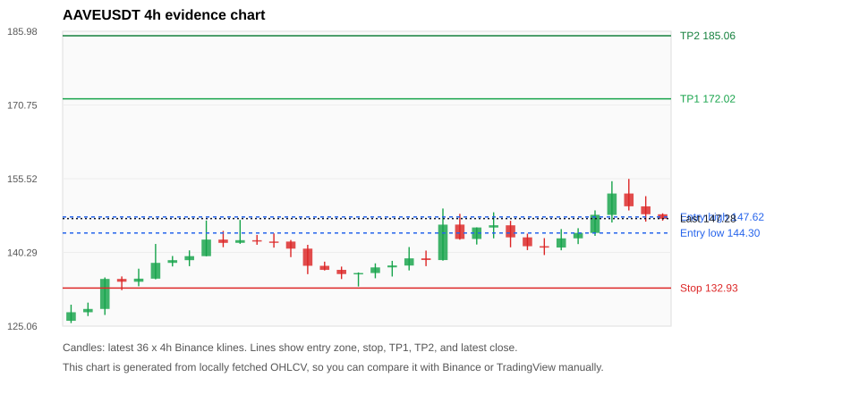
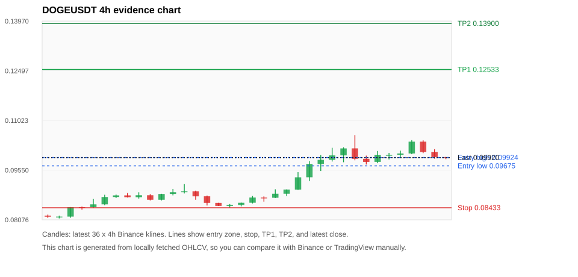
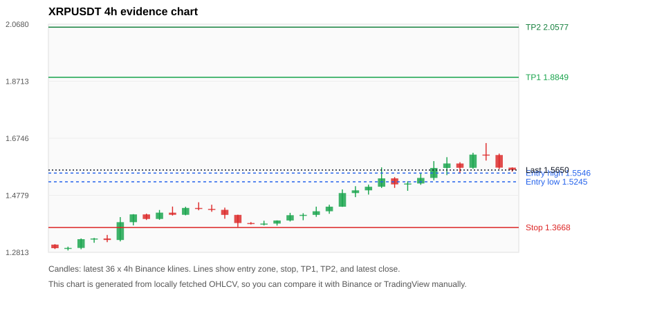
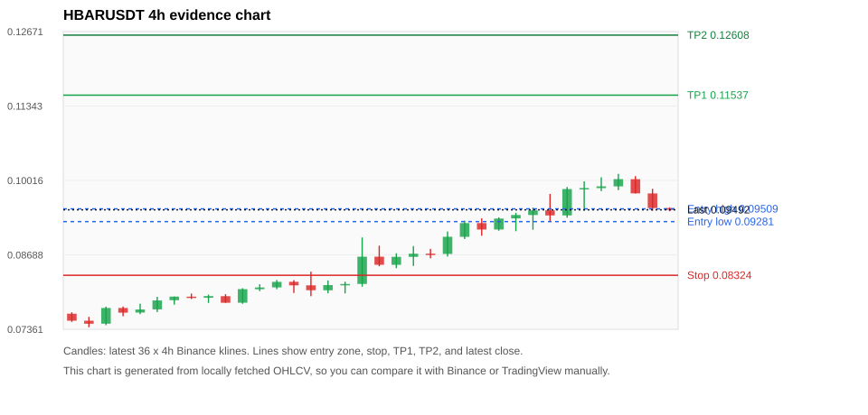
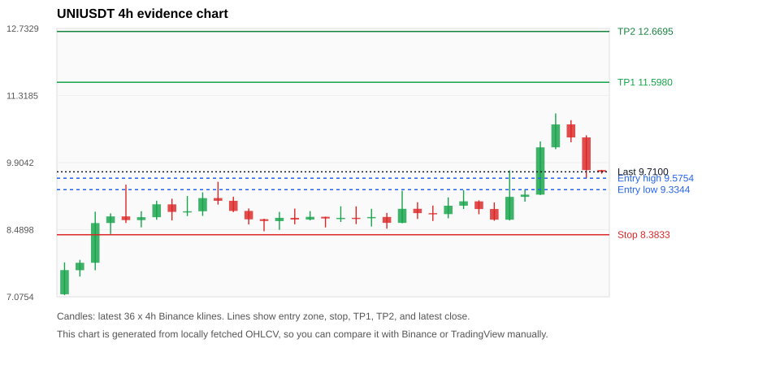

# Crypto 市场扫描报告 v1

- 报告时间：2026-09-23 20:06:31 CST
- Run ID：`20260923_120503_13d127af`
- Run type：`daily_full`
- Data validation mode：`paper`
- 数据来源：SQLite
- 报告版本：v1
- 扫描 ID：75c59fd5991f
- 数据源：Binance public spot API + CoinGecko/CoinMarketCap cross-check
- 过滤条件：USDT spot; 24h quote volume >= 30,000,000; trades >= 30,000; exclude stables/leveraged tokens; analyze 1h/4h/1d klines
- 默认单笔风险：账户权益的 1.00%

## 限制说明

- 交易信号仍以 Binance 现货公开 K 线为主源；外部数据源用于一致性复核。
- 结果是研究和模拟盘计划，不是确定收益或实盘下单指令。
- 历史长度过滤：候选币至少需要 180 根 1d K 线。
- 数据质量验证池：先验证 score 排名前 min(top_n * 2, 10) 的候选，再按 action + score 补足最终名单。
- 大盘环境过滤：RISK_ON; BTC/ETH 日线趋势均较强，允许山寨币买入候选。 BTC 7d=12.188015092247984; ETH 7d=12.568541017094926.
- Data cross-validation enabled: Binance primary source plus CoinGecko; CoinMarketCap is checked when an API key is configured.
- UNIUSDT validation state DEGRADED: DEGRADED: [EXTERNAL_IDENTITY_AMBIGUOUS] CoinMarketCap symbol mapping has 7 matches; selected lowest cmc_rank
- ARBUSDT validation state BLOCKED: BLOCKED: [BINANCE_KLINE_EXTREME_RANGE] Binance candle range exceeds 40%.; [EXTERNAL_IDENTITY_AMBIGUOUS] CoinGecko symbol mapping has 2 exact matches; selected highest market-cap rank; [EXTERNAL_IDENTITY_AMBIGUOUS] CoinMarketCap symbol mapping has 5 matches; selected lowest cmc_rank
- PENGUUSDT validation state DEGRADED: DEGRADED: [EXTERNAL_IDENTITY_AMBIGUOUS] CoinMarketCap symbol mapping has 9 matches; selected lowest cmc_rank
- ZECUSDT validation state BLOCKED: BLOCKED: [BINANCE_KLINE_EXTREME_RANGE] Binance candle range exceeds 40%.; [BINANCE_KLINE_EXTREME_RANGE] Binance candle range exceeds 40%.; [EXTERNAL_IDENTITY_AMBIGUOUS] CoinMarketCap symbol mapping has 2 matches; selected lowest cmc_rank
- AAVEUSDT validation state DEGRADED: DEGRADED: [EXTERNAL_PROVIDER_RATE_LIMITED] Provider rate limited request for https://api.coingecko.com/api/v3/coins/markets?vs_currency=usd&ids=aave&price_change_percentage=24h&per_page=1&page=1: HTTP 429
- SUIUSDT validation state DEGRADED: DEGRADED: [EXTERNAL_PROVIDER_RATE_LIMITED] Provider rate limited request for https://api.coingecko.com/api/v3/coins/markets?vs_currency=usd&ids=sui&price_change_percentage=24h&per_page=1&page=1: HTTP 429; [EXTERNAL_IDENTITY_AMBIGUOUS] CoinMarketCap symbol mapping has 5 matches; selected lowest cmc_rank
- DOGEUSDT validation state DEGRADED: DEGRADED: [EXTERNAL_PROVIDER_RATE_LIMITED] Provider rate limited request for https://api.coingecko.com/api/v3/coins/markets?vs_currency=usd&ids=dogecoin&price_change_percentage=24h&per_page=1&page=1: HTTP 429; [EXTERNAL_IDENTITY_AMBIGUOUS] CoinMarketCap symbol mapping has 23 matches; selected lowest cmc_rank
- XRPUSDT validation state DEGRADED: DEGRADED: [EXTERNAL_PROVIDER_RATE_LIMITED] Provider rate limited request for https://api.coingecko.com/api/v3/coins/markets?vs_currency=usd&ids=ripple&price_change_percentage=24h&per_page=1&page=1: HTTP 429; [EXTERNAL_IDENTITY_AMBIGUOUS] CoinMarketCap symbol mapping has 3 matches; selected lowest cmc_rank
- HBARUSDT validation state DEGRADED: DEGRADED: [EXTERNAL_PROVIDER_RATE_LIMITED] Provider rate limited request for https://api.coingecko.com/api/v3/coins/markets?vs_currency=usd&ids=hedera-hashgraph&price_change_percentage=24h&per_page=1&page=1: HTTP 429

## 5 个候选交易计划

| Rank | Coin | Action | Setup | Entry Zone | Stop Loss | TP1 | TP2 / Exit Rule | R/R | Verdict |
|---:|---|---|---|---:|---:|---:|---|---:|---|
| 1 | `AAVE` | `BUY_CANDIDATE` | 回踩支撑/4h EMA 附近 | 144.30 - 147.62 | 132.93 | 172.02 | 185.06 或跌破 4h 关键支撑 | 2.00-3.00 | 可考虑 |
| 2 | `DOGE` | `BUY_CANDIDATE` | 回踩支撑/4h EMA 附近 | 0.09675 - 0.09924 | 0.08433 | 0.12533 | 0.13900 或跌破 4h 关键支撑 | 2.00-3.00 | 可考虑 |
| 3 | `XRP` | `BUY_CANDIDATE` | 回踩支撑/4h EMA 附近 | 1.5245 - 1.5546 | 1.3668 | 1.8849 | 2.0577 或跌破 4h 关键支撑 | 2.00-3.00 | 可考虑 |
| 4 | `HBAR` | `BUY_CANDIDATE` | 回踩支撑/4h EMA 附近 | 0.09281 - 0.09509 | 0.08324 | 0.11537 | 0.12608 或跌破 4h 关键支撑 | 2.00-3.00 | 可考虑 |
| 5 | `UNI` | `WAIT_PULLBACK` | 趋势中，等回调入场 | 9.3344 - 9.5754 | 8.3833 | 11.5980 | 12.6695 或跌破 4h 关键支撑 | 2.00-3.00 | 只等回调 |

## 数据交叉验证摘要

价格差异以 Binance 当前价为基准；成交量口径不同，Binance 是 USDT 现货成交额，CoinGecko/CoinMarketCap 通常是全市场成交量。

| Rank | Coin | State | Identity | Max Price Diff | Max 24h Diff | Issue Codes | Message |
|---:|---|---|---|---:|---:|---|---|
| 1 | `AAVE` | DEGRADED (DATA_WARNING) | UNCONFIRMED | 0.62% | 0.98 pts | EXTERNAL_PROVIDER_RATE_LIMITED | DEGRADED: [EXTERNAL_PROVIDER_RATE_LIMITED] Provider rate limited request for https://api.coingecko.com/api/v3/coins/markets?vs_currency=usd&ids=aave&price_change_percentage=24h&per_page=1&page=1: HTTP 429 |
| 2 | `DOGE` | DEGRADED (DATA_WARNING) | UNCONFIRMED | 0.05% | 0.23 pts | EXTERNAL_IDENTITY_AMBIGUOUS, EXTERNAL_PROVIDER_RATE_LIMITED | DEGRADED: [EXTERNAL_PROVIDER_RATE_LIMITED] Provider rate limited request for https://api.coingecko.com/api/v3/coins/markets?vs_currency=usd&ids=dogecoin&price_change_percentage=24h&per_page=1&page=1: HTTP 429; [EXTERNAL_IDENTITY_AMBIGUOUS] CoinMarketCap symbol mapping has 23 matches; selected lowest cmc_rank |
| 3 | `XRP` | DEGRADED (DATA_WARNING) | UNCONFIRMED | 0.14% | 0.29 pts | EXTERNAL_IDENTITY_AMBIGUOUS, EXTERNAL_PROVIDER_RATE_LIMITED | DEGRADED: [EXTERNAL_PROVIDER_RATE_LIMITED] Provider rate limited request for https://api.coingecko.com/api/v3/coins/markets?vs_currency=usd&ids=ripple&price_change_percentage=24h&per_page=1&page=1: HTTP 429; [EXTERNAL_IDENTITY_AMBIGUOUS] CoinMarketCap symbol mapping has 3 matches; selected lowest cmc_rank |
| 4 | `HBAR` | DEGRADED (DATA_WARNING) | UNCONFIRMED | 0.04% | 0.49 pts | EXTERNAL_PROVIDER_RATE_LIMITED | DEGRADED: [EXTERNAL_PROVIDER_RATE_LIMITED] Provider rate limited request for https://api.coingecko.com/api/v3/coins/markets?vs_currency=usd&ids=hedera-hashgraph&price_change_percentage=24h&per_page=1&page=1: HTTP 429 |
| 5 | `UNI` | DEGRADED (DATA_WARNING) | UNCONFIRMED | 0.10% | 0.40 pts | EXTERNAL_IDENTITY_AMBIGUOUS | DEGRADED: [EXTERNAL_IDENTITY_AMBIGUOUS] CoinMarketCap symbol mapping has 7 matches; selected lowest cmc_rank |

## 候选币说明

### 1. AAVE `AAVEUSDT`



- 入选原因：回踩支撑/4h EMA 附近；24h +3.90%，7d +25.74%，4h RSI 62.47，24h 成交额 $32.2M。
- 交易失效条件：跌破 132.92575 或 4h 收盘重新失守关键支撑。
- 主要风险：主要风险是大盘同步回撤；External validation is degraded; this candidate is not a clean data sample.；Paper mode allows degraded validation; candidate is excluded from clean-data samples.。
- 数据交叉验证：DEGRADED / DATA_WARNING；身份=UNCONFIRMED；DEGRADED: [EXTERNAL_PROVIDER_RATE_LIMITED] Provider rate limited request for https://api.coingecko.com/api/v3/coins/markets?vs_currency=usd&ids=aave&price_change_percentage=24h&per_page=1&page=1: HTTP 429

#### 可点击人工验证

- [Binance 交易页](https://www.binance.com/en/trade/AAVE_USDT)
- [TradingView 图表](https://www.tradingview.com/chart/?symbol=BINANCE%3AAAVEUSDT)
- [CoinGecko 搜索](https://www.coingecko.com/en/search?query=AAVE)
- [CoinMarketCap 搜索](https://coinmarketcap.com/search/?q=AAVE)

#### 多数据源对照

| Source | Status | Identity | Blocking | Asset ID | Price | 24h Change | 24h Volume | Price Diff | 24h Diff | Updated | Issue Codes | Message |
|---|---|---|---:|---|---:|---:|---:|---:|---:|---|---|---|
| Binance | DATA_OK | CONFIRMED | no | AAVEUSDT | 147.28 | +3.90% | $32.2M | 0.00% | 0.00 pts | 2026-09-23T12:05:51+00:00 | none | Primary market data source passed health checks. |
| CoinGecko | DATA_WARNING | UNCONFIRMED | no | n/a | n/a | n/a | n/a | n/a | n/a | 2026-09-23T12:05:51+00:00 | EXTERNAL_PROVIDER_RATE_LIMITED | Provider rate limited request for https://api.coingecko.com/api/v3/coins/markets?vs_currency=usd&ids=aave&price_change_percentage=24h&per_page=1&page=1: HTTP 429 |
| CoinMarketCap | DATA_OK | CONFIRMED | no | 7278 | 148.19 | +4.88% | $419.5M | 0.62% | 0.98 pts | 2026-09-23T12:04:59.000Z | none | External source agrees with Binance within thresholds. |

#### 指标证据

| 指标 | 数值 | 人工核对用途 |
|---|---:|---|
| 当前价 | 147.28 | 与 Binance/TradingView 当前价格对照 |
| 24h 涨跌 | +3.90% | 与交易所 24h 涨跌对照 |
| 7d 涨跌 | +25.74% | 判断短线趋势是否延续 |
| 4h EMA20 | 144.01 | 判断短期趋势支撑 |
| 4h EMA50 | 138.44 | 判断中期趋势支撑 |
| 1d EMA20 | 133.11 | 判断日线趋势 |
| 1d EMA50 | 121.15 | 判断日线趋势 |
| 4h RSI14 | 62.47 | 判断是否过热/过弱 |
| 4h ATR14 | 5.1514 | 推导止损和入场缓冲 |
| 最近 18 根 4h 最低点 | 134.95 | 支撑/止损参考 |
| 最近 36 根 4h 最高点 | 155.48 | TP/压力参考 |
| 支撑位 | 144.01 | 入场区间推导基础 |

#### 交易计划推导

- 支撑位 = 最近低点、4h EMA20、4h EMA50、1d EMA20 中不高于当前价的最高有效支撑 = `144.01`。
- 入场区间 = 支撑位附近 + ATR 缓冲 = `144.30 - 147.62`。
- 止损 = min(最近 18 根 4h 最低点 * 0.985, 入场中位价 - 1.15 * ATR14) = `132.93`。
- TP1 = max(最近 36 根 4h 最高点 * 0.995, 入场中位价 + 2R) = `172.02`。
- TP2 = max(入场中位价 + 3R, TP1 * 1.04) = `185.06`。

#### 最近 10 根 4h K线

| UTC 开盘时间 | Open | High | Low | Close | Quote Volume | Trades |
|---|---:|---:|---:|---:|---:|---:|
| 2026-09-22T00:00+00:00 | 145.89 | 146.82 | 141.35 | 143.40 | $4.0M | 57841 |
| 2026-09-22T04:00+00:00 | 143.40 | 144.16 | 140.77 | 141.57 | $2.3M | 42868 |
| 2026-09-22T08:00+00:00 | 141.58 | 143.24 | 139.75 | 141.28 | $2.5M | 39995 |
| 2026-09-22T12:00+00:00 | 141.30 | 145.11 | 140.73 | 143.20 | $5.0M | 76241 |
| 2026-09-22T16:00+00:00 | 143.20 | 145.29 | 142.01 | 144.32 | $2.9M | 41219 |
| 2026-09-22T20:00+00:00 | 144.32 | 148.98 | 143.71 | 148.06 | $3.5M | 43137 |
| 2026-09-23T00:00+00:00 | 148.04 | 155.00 | 146.47 | 152.46 | $7.7M | 87075 |
| 2026-09-23T04:00+00:00 | 152.46 | 155.48 | 148.96 | 149.82 | $8.5M | 75239 |
| 2026-09-23T08:00+00:00 | 149.81 | 151.91 | 146.65 | 148.18 | $4.3M | 65403 |
| 2026-09-23T12:00+00:00 | 148.17 | 148.37 | 146.85 | 147.23 | $330,533 | 2815 |

### 2. DOGE `DOGEUSDT`



- 入选原因：回踩支撑/4h EMA 附近；24h +1.01%，7d +25.11%，4h RSI 67.52，24h 成交额 $175.9M。
- 交易失效条件：跌破 0.08432585 或 4h 收盘重新失守关键支撑。
- 主要风险：主要风险是大盘同步回撤；External validation is degraded; this candidate is not a clean data sample.；Paper mode allows degraded validation; candidate is excluded from clean-data samples.。
- 数据交叉验证：DEGRADED / DATA_WARNING；身份=UNCONFIRMED；DEGRADED: [EXTERNAL_PROVIDER_RATE_LIMITED] Provider rate limited request for https://api.coingecko.com/api/v3/coins/markets?vs_currency=usd&ids=dogecoin&price_change_percentage=24h&per_page=1&page=1: HTTP 429; [EXTERNAL_IDENTITY_AMBIGUOUS] CoinMarketCap symbol mapping has 23 matches; selected lowest cmc_rank

#### 可点击人工验证

- [Binance 交易页](https://www.binance.com/en/trade/DOGE_USDT)
- [TradingView 图表](https://www.tradingview.com/chart/?symbol=BINANCE%3ADOGEUSDT)
- [CoinGecko 搜索](https://www.coingecko.com/en/search?query=DOGE)
- [CoinMarketCap 搜索](https://coinmarketcap.com/search/?q=DOGE)

#### 多数据源对照

| Source | Status | Identity | Blocking | Asset ID | Price | 24h Change | 24h Volume | Price Diff | 24h Diff | Updated | Issue Codes | Message |
|---|---|---|---:|---|---:|---:|---:|---:|---:|---|---|---|
| Binance | DATA_OK | CONFIRMED | no | DOGEUSDT | 0.09920 | +1.01% | $175.9M | 0.00% | 0.00 pts | 2026-09-23T12:05:51+00:00 | none | Primary market data source passed health checks. |
| CoinGecko | DATA_WARNING | UNCONFIRMED | no | n/a | n/a | n/a | n/a | n/a | n/a | 2026-09-23T12:05:51+00:00 | EXTERNAL_PROVIDER_RATE_LIMITED | Provider rate limited request for https://api.coingecko.com/api/v3/coins/markets?vs_currency=usd&ids=dogecoin&price_change_percentage=24h&per_page=1&page=1: HTTP 429 |
| CoinMarketCap | DATA_WARNING | UNCONFIRMED | no | 74 | 0.09915 | +1.24% | $2.16B | 0.05% | 0.23 pts | 2026-09-23T12:04:59.000Z | EXTERNAL_IDENTITY_AMBIGUOUS | [EXTERNAL_IDENTITY_AMBIGUOUS] CoinMarketCap symbol mapping has 23 matches; selected lowest cmc_rank |

#### 指标证据

| 指标 | 数值 | 人工核对用途 |
|---|---:|---|
| 当前价 | 0.09920 | 与 Binance/TradingView 当前价格对照 |
| 24h 涨跌 | +1.01% | 与交易所 24h 涨跌对照 |
| 7d 涨跌 | +25.11% | 判断短线趋势是否延续 |
| 4h EMA20 | 0.09656 | 判断短期趋势支撑 |
| 4h EMA50 | 0.09153 | 判断中期趋势支撑 |
| 1d EMA20 | 0.08857 | 判断日线趋势 |
| 1d EMA50 | 0.08419 | 判断日线趋势 |
| 4h RSI14 | 67.52 | 判断是否过热/过弱 |
| 4h ATR14 | 0.0038257143 | 推导止损和入场缓冲 |
| 最近 18 根 4h 最低点 | 0.08561 | 支撑/止损参考 |
| 最近 36 根 4h 最高点 | 0.10589 | TP/压力参考 |
| 支撑位 | 0.09656 | 入场区间推导基础 |

#### 交易计划推导

- 支撑位 = 最近低点、4h EMA20、4h EMA50、1d EMA20 中不高于当前价的最高有效支撑 = `0.09656`。
- 入场区间 = 支撑位附近 + ATR 缓冲 = `0.09675 - 0.09924`。
- 止损 = min(最近 18 根 4h 最低点 * 0.985, 入场中位价 - 1.15 * ATR14) = `0.08433`。
- TP1 = max(最近 36 根 4h 最高点 * 0.995, 入场中位价 + 2R) = `0.12533`。
- TP2 = max(入场中位价 + 3R, TP1 * 1.04) = `0.13900`。

#### 最近 10 根 4h K线

| UTC 开盘时间 | Open | High | Low | Close | Quote Volume | Trades |
|---|---:|---:|---:|---:|---:|---:|
| 2026-09-22T00:00+00:00 | 0.09987 | 0.10227 | 0.09783 | 0.10193 | $55.3M | 452329 |
| 2026-09-22T04:00+00:00 | 0.10194 | 0.10589 | 0.09840 | 0.09884 | $58.0M | 430258 |
| 2026-09-22T08:00+00:00 | 0.09884 | 0.09979 | 0.09716 | 0.09792 | $23.7M | 186630 |
| 2026-09-22T12:00+00:00 | 0.09793 | 0.10116 | 0.09754 | 0.10002 | $42.9M | 260729 |
| 2026-09-22T16:00+00:00 | 0.10001 | 0.10060 | 0.09867 | 0.10003 | $26.2M | 138891 |
| 2026-09-22T20:00+00:00 | 0.10003 | 0.10128 | 0.09927 | 0.10044 | $19.5M | 107699 |
| 2026-09-23T00:00+00:00 | 0.10044 | 0.10438 | 0.10022 | 0.10394 | $30.2M | 246145 |
| 2026-09-23T04:00+00:00 | 0.10394 | 0.10432 | 0.10053 | 0.10088 | $27.5M | 208801 |
| 2026-09-23T08:00+00:00 | 0.10089 | 0.10168 | 0.09888 | 0.09936 | $29.2M | 191165 |
| 2026-09-23T12:00+00:00 | 0.09936 | 0.09943 | 0.09874 | 0.09919 | $804,190 | 6709 |

### 3. XRP `XRPUSDT`



- 入选原因：回踩支撑/4h EMA 附近；24h +1.62%，7d +22.71%，4h RSI 70.88，24h 成交额 $554.8M。
- 交易失效条件：跌破 1.366786 或 4h 收盘重新失守关键支撑。
- 主要风险：主要风险是大盘同步回撤；External validation is degraded; this candidate is not a clean data sample.；Paper mode allows degraded validation; candidate is excluded from clean-data samples.。
- 数据交叉验证：DEGRADED / DATA_WARNING；身份=UNCONFIRMED；DEGRADED: [EXTERNAL_PROVIDER_RATE_LIMITED] Provider rate limited request for https://api.coingecko.com/api/v3/coins/markets?vs_currency=usd&ids=ripple&price_change_percentage=24h&per_page=1&page=1: HTTP 429; [EXTERNAL_IDENTITY_AMBIGUOUS] CoinMarketCap symbol mapping has 3 matches; selected lowest cmc_rank

#### 可点击人工验证

- [Binance 交易页](https://www.binance.com/en/trade/XRP_USDT)
- [TradingView 图表](https://www.tradingview.com/chart/?symbol=BINANCE%3AXRPUSDT)
- [CoinGecko 搜索](https://www.coingecko.com/en/search?query=XRP)
- [CoinMarketCap 搜索](https://coinmarketcap.com/search/?q=XRP)

#### 多数据源对照

| Source | Status | Identity | Blocking | Asset ID | Price | 24h Change | 24h Volume | Price Diff | 24h Diff | Updated | Issue Codes | Message |
|---|---|---|---:|---|---:|---:|---:|---:|---:|---|---|---|
| Binance | DATA_OK | CONFIRMED | no | XRPUSDT | 1.5650 | +1.62% | $554.8M | 0.00% | 0.00 pts | 2026-09-23T12:05:51+00:00 | none | Primary market data source passed health checks. |
| CoinGecko | DATA_WARNING | UNCONFIRMED | no | n/a | n/a | n/a | n/a | n/a | n/a | 2026-09-23T12:05:51+00:00 | EXTERNAL_PROVIDER_RATE_LIMITED | Provider rate limited request for https://api.coingecko.com/api/v3/coins/markets?vs_currency=usd&ids=ripple&price_change_percentage=24h&per_page=1&page=1: HTTP 429 |
| CoinMarketCap | DATA_WARNING | UNCONFIRMED | no | 52 | 1.5673 | +1.91% | $7.79B | 0.14% | 0.29 pts | 2026-09-23T12:04:59.000Z | EXTERNAL_IDENTITY_AMBIGUOUS | [EXTERNAL_IDENTITY_AMBIGUOUS] CoinMarketCap symbol mapping has 3 matches; selected lowest cmc_rank |

#### 指标证据

| 指标 | 数值 | 人工核对用途 |
|---|---:|---|
| 当前价 | 1.5650 | 与 Binance/TradingView 当前价格对照 |
| 24h 涨跌 | +1.62% | 与交易所 24h 涨跌对照 |
| 7d 涨跌 | +22.71% | 判断短线趋势是否延续 |
| 4h EMA20 | 1.5214 | 判断短期趋势支撑 |
| 4h EMA50 | 1.4541 | 判断中期趋势支撑 |
| 1d EMA20 | 1.4124 | 判断日线趋势 |
| 1d EMA50 | 1.3272 | 判断日线趋势 |
| 4h RSI14 | 70.88 | 判断是否过热/过弱 |
| 4h ATR14 | 0.04734 | 推导止损和入场缓冲 |
| 最近 18 根 4h 最低点 | 1.3876 | 支撑/止损参考 |
| 最近 36 根 4h 最高点 | 1.6581 | TP/压力参考 |
| 支撑位 | 1.5214 | 入场区间推导基础 |

#### 交易计划推导

- 支撑位 = 最近低点、4h EMA20、4h EMA50、1d EMA20 中不高于当前价的最高有效支撑 = `1.5214`。
- 入场区间 = 支撑位附近 + ATR 缓冲 = `1.5245 - 1.5546`。
- 止损 = min(最近 18 根 4h 最低点 * 0.985, 入场中位价 - 1.15 * ATR14) = `1.3668`。
- TP1 = max(最近 36 根 4h 最高点 * 0.995, 入场中位价 + 2R) = `1.8849`。
- TP2 = max(入场中位价 + 3R, TP1 * 1.04) = `2.0577`。

#### 最近 10 根 4h K线

| UTC 开盘时间 | Open | High | Low | Close | Quote Volume | Trades |
|---|---:|---:|---:|---:|---:|---:|
| 2026-09-22T00:00+00:00 | 1.5363 | 1.5407 | 1.5035 | 1.5156 | $65.3M | 295992 |
| 2026-09-22T04:00+00:00 | 1.5157 | 1.5263 | 1.4934 | 1.5186 | $67.6M | 268710 |
| 2026-09-22T08:00+00:00 | 1.5187 | 1.5545 | 1.5140 | 1.5378 | $71.9M | 287169 |
| 2026-09-22T12:00+00:00 | 1.5378 | 1.5958 | 1.5297 | 1.5722 | $122.9M | 422429 |
| 2026-09-22T16:00+00:00 | 1.5722 | 1.6094 | 1.5475 | 1.5877 | $91.3M | 294674 |
| 2026-09-22T20:00+00:00 | 1.5876 | 1.5921 | 1.5552 | 1.5727 | $58.9M | 167384 |
| 2026-09-23T00:00+00:00 | 1.5727 | 1.6246 | 1.5694 | 1.6182 | $71.9M | 231540 |
| 2026-09-23T04:00+00:00 | 1.6183 | 1.6581 | 1.5977 | 1.6168 | $115.3M | 477171 |
| 2026-09-23T08:00+00:00 | 1.6168 | 1.6217 | 1.5682 | 1.5733 | $92.7M | 307189 |
| 2026-09-23T12:00+00:00 | 1.5733 | 1.5741 | 1.5595 | 1.5655 | $3.5M | 11651 |

### 4. HBAR `HBARUSDT`



- 入选原因：回踩支撑/4h EMA 附近；24h +0.53%，7d +29.87%，4h RSI 67.18，24h 成交额 $30.2M。
- 交易失效条件：跌破 0.08324235 或 4h 收盘重新失守关键支撑。
- 主要风险：主要风险是大盘同步回撤；External validation is degraded; this candidate is not a clean data sample.；Paper mode allows degraded validation; candidate is excluded from clean-data samples.。
- 数据交叉验证：DEGRADED / DATA_WARNING；身份=UNCONFIRMED；DEGRADED: [EXTERNAL_PROVIDER_RATE_LIMITED] Provider rate limited request for https://api.coingecko.com/api/v3/coins/markets?vs_currency=usd&ids=hedera-hashgraph&price_change_percentage=24h&per_page=1&page=1: HTTP 429

#### 可点击人工验证

- [Binance 交易页](https://www.binance.com/en/trade/HBAR_USDT)
- [TradingView 图表](https://www.tradingview.com/chart/?symbol=BINANCE%3AHBARUSDT)
- [CoinGecko 搜索](https://www.coingecko.com/en/search?query=HBAR)
- [CoinMarketCap 搜索](https://coinmarketcap.com/search/?q=HBAR)

#### 多数据源对照

| Source | Status | Identity | Blocking | Asset ID | Price | 24h Change | 24h Volume | Price Diff | 24h Diff | Updated | Issue Codes | Message |
|---|---|---|---:|---|---:|---:|---:|---:|---:|---|---|---|
| Binance | DATA_OK | CONFIRMED | no | HBARUSDT | 0.09492 | +0.53% | $30.2M | 0.00% | 0.00 pts | 2026-09-23T12:05:51+00:00 | none | Primary market data source passed health checks. |
| CoinGecko | DATA_WARNING | UNCONFIRMED | no | n/a | n/a | n/a | n/a | n/a | n/a | 2026-09-23T12:05:51+00:00 | EXTERNAL_PROVIDER_RATE_LIMITED | Provider rate limited request for https://api.coingecko.com/api/v3/coins/markets?vs_currency=usd&ids=hedera-hashgraph&price_change_percentage=24h&per_page=1&page=1: HTTP 429 |
| CoinMarketCap | DATA_OK | CONFIRMED | no | 4642 | 0.09489 | +1.02% | $220.1M | 0.04% | 0.49 pts | 2026-09-23T12:04:59.000Z | none | External source agrees with Binance within thresholds. |

#### 指标证据

| 指标 | 数值 | 人工核对用途 |
|---|---:|---|
| 当前价 | 0.09492 | 与 Binance/TradingView 当前价格对照 |
| 24h 涨跌 | +0.53% | 与交易所 24h 涨跌对照 |
| 7d 涨跌 | +29.87% | 判断短线趋势是否延续 |
| 4h EMA20 | 0.09263 | 判断短期趋势支撑 |
| 4h EMA50 | 0.08638 | 判断中期趋势支撑 |
| 1d EMA20 | 0.08228 | 判断日线趋势 |
| 1d EMA50 | 0.07775 | 判断日线趋势 |
| 4h RSI14 | 67.18 | 判断是否过热/过弱 |
| 4h ATR14 | 0.0035128571 | 推导止损和入场缓冲 |
| 最近 18 根 4h 最低点 | 0.08451 | 支撑/止损参考 |
| 最近 36 根 4h 最高点 | 0.10133 | TP/压力参考 |
| 支撑位 | 0.09263 | 入场区间推导基础 |

#### 交易计划推导

- 支撑位 = 最近低点、4h EMA20、4h EMA50、1d EMA20 中不高于当前价的最高有效支撑 = `0.09263`。
- 入场区间 = 支撑位附近 + ATR 缓冲 = `0.09281 - 0.09509`。
- 止损 = min(最近 18 根 4h 最低点 * 0.985, 入场中位价 - 1.15 * ATR14) = `0.08324`。
- TP1 = max(最近 36 根 4h 最高点 * 0.995, 入场中位价 + 2R) = `0.11537`。
- TP2 = max(入场中位价 + 3R, TP1 * 1.04) = `0.12608`。

#### 最近 10 根 4h K线

| UTC 开盘时间 | Open | High | Low | Close | Quote Volume | Trades |
|---|---:|---:|---:|---:|---:|---:|
| 2026-09-22T00:00+00:00 | 0.09339 | 0.09438 | 0.09110 | 0.09399 | $4.7M | 61972 |
| 2026-09-22T04:00+00:00 | 0.09399 | 0.09531 | 0.09137 | 0.09482 | $4.0M | 48320 |
| 2026-09-22T08:00+00:00 | 0.09482 | 0.09775 | 0.09286 | 0.09392 | $6.6M | 66919 |
| 2026-09-22T12:00+00:00 | 0.09392 | 0.09899 | 0.09352 | 0.09862 | $5.6M | 68845 |
| 2026-09-22T16:00+00:00 | 0.09861 | 0.09999 | 0.09473 | 0.09880 | $6.3M | 61574 |
| 2026-09-22T20:00+00:00 | 0.09879 | 0.10072 | 0.09825 | 0.09910 | $5.6M | 48595 |
| 2026-09-23T00:00+00:00 | 0.09910 | 0.10133 | 0.09843 | 0.10039 | $4.5M | 46315 |
| 2026-09-23T04:00+00:00 | 0.10038 | 0.10093 | 0.09783 | 0.09785 | $3.8M | 38510 |
| 2026-09-23T08:00+00:00 | 0.09784 | 0.09867 | 0.09476 | 0.09523 | $4.2M | 35947 |
| 2026-09-23T12:00+00:00 | 0.09522 | 0.09536 | 0.09467 | 0.09492 | $219,128 | 2036 |

### 5. UNI `UNIUSDT`



- 入选原因：趋势中，等回调入场；24h +11.03%，7d +56.23%，4h RSI 63.21，24h 成交额 $270.5M。
- 交易失效条件：跌破 8.383335 或 4h 收盘重新失守关键支撑。
- 主要风险：24h 振幅较大，回撤风险高；External validation is degraded; this candidate is not a clean data sample.；Paper mode allows degraded validation; candidate is excluded from clean-data samples.。
- 数据交叉验证：DEGRADED / DATA_WARNING；身份=UNCONFIRMED；DEGRADED: [EXTERNAL_IDENTITY_AMBIGUOUS] CoinMarketCap symbol mapping has 7 matches; selected lowest cmc_rank

#### 可点击人工验证

- [Binance 交易页](https://www.binance.com/en/trade/UNI_USDT)
- [TradingView 图表](https://www.tradingview.com/chart/?symbol=BINANCE%3AUNIUSDT)
- [CoinGecko 搜索](https://www.coingecko.com/en/search?query=UNI)
- [CoinMarketCap 搜索](https://coinmarketcap.com/search/?q=UNI)

#### 多数据源对照

| Source | Status | Identity | Blocking | Asset ID | Price | 24h Change | 24h Volume | Price Diff | 24h Diff | Updated | Issue Codes | Message |
|---|---|---|---:|---|---:|---:|---:|---:|---:|---|---|---|
| Binance | DATA_OK | CONFIRMED | no | UNIUSDT | 9.7100 | +11.03% | $270.5M | 0.00% | 0.00 pts | 2026-09-23T12:05:51+00:00 | none | Primary market data source passed health checks. |
| CoinGecko | DATA_OK | CONFIRMED | no | uniswap | 9.7000 | +11.07% | $2.44B | 0.10% | 0.04 pts | 2026-09-23T12:02:50.000Z | none | External source agrees with Binance within thresholds. |
| CoinMarketCap | DATA_WARNING | UNCONFIRMED | no | 7083 | 9.7141 | +11.43% | $2.50B | 0.04% | 0.40 pts | 2026-09-23T12:03:59.000Z | EXTERNAL_IDENTITY_AMBIGUOUS | [EXTERNAL_IDENTITY_AMBIGUOUS] CoinMarketCap symbol mapping has 7 matches; selected lowest cmc_rank |

#### 指标证据

| 指标 | 数值 | 人工核对用途 |
|---|---:|---|
| 当前价 | 9.7100 | 与 Binance/TradingView 当前价格对照 |
| 24h 涨跌 | +11.03% | 与交易所 24h 涨跌对照 |
| 7d 涨跌 | +56.23% | 判断短线趋势是否延续 |
| 4h EMA20 | 9.3158 | 判断短期趋势支撑 |
| 4h EMA50 | 8.5200 | 判断中期趋势支撑 |
| 1d EMA20 | 7.5678 | 判断日线趋势 |
| 1d EMA50 | 6.0715 | 判断日线趋势 |
| 4h RSI14 | 63.21 | 判断是否过热/过弱 |
| 4h ATR14 | 0.53850 | 推导止损和入场缓冲 |
| 最近 18 根 4h 最低点 | 8.5110 | 支撑/止损参考 |
| 最近 36 根 4h 最高点 | 10.9420 | TP/压力参考 |
| 支撑位 | 9.3158 | 入场区间推导基础 |

#### 交易计划推导

- 支撑位 = 最近低点、4h EMA20、4h EMA50、1d EMA20 中不高于当前价的最高有效支撑 = `9.3158`。
- 入场区间 = 支撑位附近 + ATR 缓冲 = `9.3344 - 9.5754`。
- 止损 = min(最近 18 根 4h 最低点 * 0.985, 入场中位价 - 1.15 * ATR14) = `8.3833`。
- TP1 = max(最近 36 根 4h 最高点 * 0.995, 入场中位价 + 2R) = `11.5980`。
- TP2 = max(入场中位价 + 3R, TP1 * 1.04) = `12.6695`。

#### 最近 10 根 4h K线

| UTC 开盘时间 | Open | High | Low | Close | Quote Volume | Trades |
|---|---:|---:|---:|---:|---:|---:|
| 2026-09-22T00:00+00:00 | 8.9960 | 9.3240 | 8.9260 | 9.0880 | $28.0M | 149759 |
| 2026-09-22T04:00+00:00 | 9.0870 | 9.1090 | 8.8150 | 8.9250 | $12.8M | 75571 |
| 2026-09-22T08:00+00:00 | 8.9260 | 9.0640 | 8.6780 | 8.7010 | $17.2M | 80148 |
| 2026-09-22T12:00+00:00 | 8.7000 | 9.7390 | 8.6840 | 9.1820 | $75.1M | 314642 |
| 2026-09-22T16:00+00:00 | 9.1820 | 9.3450 | 9.0810 | 9.2290 | $13.6M | 92009 |
| 2026-09-22T20:00+00:00 | 9.2290 | 10.3500 | 9.2210 | 10.2260 | $60.2M | 276606 |
| 2026-09-23T00:00+00:00 | 10.2270 | 10.9420 | 10.1880 | 10.7090 | $51.8M | 262379 |
| 2026-09-23T04:00+00:00 | 10.7110 | 10.8000 | 10.3320 | 10.4350 | $33.3M | 151387 |
| 2026-09-23T08:00+00:00 | 10.4360 | 10.4800 | 9.5720 | 9.7470 | $36.3M | 154457 |
| 2026-09-23T12:00+00:00 | 9.7470 | 9.7510 | 9.6700 | 9.7100 | $391,808 | 2290 |

## 组合风控

- 不要 5 个候选全部满仓买入。
- 同时持仓总风险建议控制在账户权益的 3% - 5% 以内。
- 如果 BTC/ETH 同时破位，暂停山寨币多头计划或降低仓位。
- 第一版报告用于模拟盘和人工复核，不自动下单。

## 原始数据

```json
[
  {
    "rank": 1,
    "symbol": "AAVEUSDT",
    "base_asset": "AAVE",
    "price": 147.28,
    "score": 79.44492340649302,
    "setup": "回踩支撑/4h EMA 附近",
    "verdict": "可考虑",
    "entry_low": 144.29942228999548,
    "entry_high": 147.61739949101343,
    "stop_loss": 132.92575,
    "take_profit_1": 172.02373267151341,
    "take_profit_2": 185.0563935620179,
    "risk_reward_1": 2.0,
    "risk_reward_2": 3.0,
    "pct_24h": 3.901,
    "pct_3d": 10.107655502392344,
    "pct_7d": 25.740630069153948,
    "quote_volume_24h": 32157591.09021,
    "trades_24h": 389844,
    "high_low_range_24h": 10.481063028494276,
    "rsi_1h": 52.01482167670218,
    "rsi_4h": 62.4670377966598,
    "ema20_4h": 144.01139949101344,
    "ema50_4h": 138.4409434046251,
    "ema20_1d": 133.105724082564,
    "ema50_1d": 121.1509048172095,
    "atr_4h": 5.151428571428574,
    "macd_hist_4h": 0.15493901163305024,
    "volume_ratio_24h": 1.475710723242014,
    "support_level": 144.01139949101344,
    "recent_low_4h_18": 134.95,
    "recent_high_4h_36": 155.48,
    "distance_to_support_pct": 2.269681789454814,
    "binance_trade_url": "https://www.binance.com/en/trade/AAVE_USDT",
    "tradingview_url": "https://www.tradingview.com/chart/?symbol=BINANCE%3AAAVEUSDT",
    "coingecko_search_url": "https://www.coingecko.com/en/search?query=AAVE",
    "coinmarketcap_search_url": "https://coinmarketcap.com/search/?q=AAVE",
    "invalidation": "跌破 132.92575 或 4h 收盘重新失守关键支撑",
    "recent_4h_klines": [
      {
        "open_time_utc": "2026-09-17T16:00+00:00",
        "open": 126.16,
        "high": 129.49,
        "low": 125.69,
        "close": 127.93,
        "quote_volume": 3435147.19639,
        "trades": 44628
      },
      {
        "open_time_utc": "2026-09-17T20:00+00:00",
        "open": 127.93,
        "high": 129.92,
        "low": 127.14,
        "close": 128.61,
        "quote_volume": 2265947.33191,
        "trades": 29730
      },
      {
        "open_time_utc": "2026-09-18T00:00+00:00",
        "open": 128.61,
        "high": 135.12,
        "low": 127.37,
        "close": 134.81,
        "quote_volume": 5212435.41626,
        "trades": 49438
      },
      {
        "open_time_utc": "2026-09-18T04:00+00:00",
        "open": 134.81,
        "high": 135.33,
        "low": 132.5,
        "close": 134.23,
        "quote_volume": 4448055.02501,
        "trades": 43336
      },
      {
        "open_time_utc": "2026-09-18T08:00+00:00",
        "open": 134.23,
        "high": 136.93,
        "low": 133.3,
        "close": 134.87,
        "quote_volume": 4012533.28078,
        "trades": 46582
      },
      {
        "open_time_utc": "2026-09-18T12:00+00:00",
        "open": 134.87,
        "high": 142.04,
        "low": 134.73,
        "close": 138.13,
        "quote_volume": 7820274.23924,
        "trades": 116536
      },
      {
        "open_time_utc": "2026-09-18T16:00+00:00",
        "open": 138.13,
        "high": 139.55,
        "low": 137.39,
        "close": 138.69,
        "quote_volume": 2385067.90169,
        "trades": 42790
      },
      {
        "open_time_utc": "2026-09-18T20:00+00:00",
        "open": 138.69,
        "high": 140.71,
        "low": 137.45,
        "close": 139.52,
        "quote_volume": 2634920.77644,
        "trades": 40991
      },
      {
        "open_time_utc": "2026-09-19T00:00+00:00",
        "open": 139.52,
        "high": 146.88,
        "low": 139.5,
        "close": 142.94,
        "quote_volume": 7238211.70021,
        "trades": 87251
      },
      {
        "open_time_utc": "2026-09-19T04:00+00:00",
        "open": 142.94,
        "high": 144.73,
        "low": 141.37,
        "close": 142.26,
        "quote_volume": 3036383.44945,
        "trades": 52161
      },
      {
        "open_time_utc": "2026-09-19T08:00+00:00",
        "open": 142.27,
        "high": 147.0,
        "low": 142.06,
        "close": 142.82,
        "quote_volume": 3094234.81774,
        "trades": 48244
      },
      {
        "open_time_utc": "2026-09-19T12:00+00:00",
        "open": 142.81,
        "high": 143.9,
        "low": 141.87,
        "close": 142.55,
        "quote_volume": 2464544.41335,
        "trades": 30788
      },
      {
        "open_time_utc": "2026-09-19T16:00+00:00",
        "open": 142.54,
        "high": 144.22,
        "low": 141.28,
        "close": 142.48,
        "quote_volume": 1913260.39347,
        "trades": 34330
      },
      {
        "open_time_utc": "2026-09-19T20:00+00:00",
        "open": 142.53,
        "high": 142.86,
        "low": 139.32,
        "close": 141.07,
        "quote_volume": 2094845.15069,
        "trades": 31466
      },
      {
        "open_time_utc": "2026-09-20T00:00+00:00",
        "open": 141.07,
        "high": 141.86,
        "low": 135.8,
        "close": 137.53,
        "quote_volume": 4872210.77325,
        "trades": 53280
      },
      {
        "open_time_utc": "2026-09-20T04:00+00:00",
        "open": 137.52,
        "high": 138.38,
        "low": 136.56,
        "close": 136.68,
        "quote_volume": 1198316.60725,
        "trades": 27892
      },
      {
        "open_time_utc": "2026-09-20T08:00+00:00",
        "open": 136.69,
        "high": 137.36,
        "low": 134.79,
        "close": 135.82,
        "quote_volume": 1965272.25278,
        "trades": 26048
      },
      {
        "open_time_utc": "2026-09-20T12:00+00:00",
        "open": 135.81,
        "high": 136.16,
        "low": 133.25,
        "close": 136.03,
        "quote_volume": 2697560.61889,
        "trades": 41262
      },
      {
        "open_time_utc": "2026-09-20T16:00+00:00",
        "open": 136.03,
        "high": 138.03,
        "low": 134.95,
        "close": 137.19,
        "quote_volume": 4074639.72794,
        "trades": 56285
      },
      {
        "open_time_utc": "2026-09-20T20:00+00:00",
        "open": 137.2,
        "high": 138.55,
        "low": 135.31,
        "close": 137.59,
        "quote_volume": 1972430.7871,
        "trades": 32816
      },
      {
        "open_time_utc": "2026-09-21T00:00+00:00",
        "open": 137.58,
        "high": 141.4,
        "low": 136.57,
        "close": 139.06,
        "quote_volume": 4449388.72572,
        "trades": 70150
      },
      {
        "open_time_utc": "2026-09-21T04:00+00:00",
        "open": 139.06,
        "high": 140.67,
        "low": 137.45,
        "close": 138.72,
        "quote_volume": 2799154.79588,
        "trades": 50018
      },
      {
        "open_time_utc": "2026-09-21T08:00+00:00",
        "open": 138.71,
        "high": 149.36,
        "low": 138.59,
        "close": 146.03,
        "quote_volume": 8729361.8857,
        "trades": 117400
      },
      {
        "open_time_utc": "2026-09-21T12:00+00:00",
        "open": 146.04,
        "high": 148.26,
        "low": 142.92,
        "close": 143.07,
        "quote_volume": 5905576.38957,
        "trades": 73837
      },
      {
        "open_time_utc": "2026-09-21T16:00+00:00",
        "open": 143.07,
        "high": 145.44,
        "low": 141.92,
        "close": 145.44,
        "quote_volume": 3826240.93078,
        "trades": 44744
      },
      {
        "open_time_utc": "2026-09-21T20:00+00:00",
        "open": 145.43,
        "high": 148.58,
        "low": 143.2,
        "close": 145.9,
        "quote_volume": 3536076.28966,
        "trades": 51273
      },
      {
        "open_time_utc": "2026-09-22T00:00+00:00",
        "open": 145.89,
        "high": 146.82,
        "low": 141.35,
        "close": 143.4,
        "quote_volume": 4047021.17039,
        "trades": 57841
      },
      {
        "open_time_utc": "2026-09-22T04:00+00:00",
        "open": 143.4,
        "high": 144.16,
        "low": 140.77,
        "close": 141.57,
        "quote_volume": 2289890.05084,
        "trades": 42868
      },
      {
        "open_time_utc": "2026-09-22T08:00+00:00",
        "open": 141.58,
        "high": 143.24,
        "low": 139.75,
        "close": 141.28,
        "quote_volume": 2508047.69957,
        "trades": 39995
      },
      {
        "open_time_utc": "2026-09-22T12:00+00:00",
        "open": 141.3,
        "high": 145.11,
        "low": 140.73,
        "close": 143.2,
        "quote_volume": 5013165.19459,
        "trades": 76241
      },
      {
        "open_time_utc": "2026-09-22T16:00+00:00",
        "open": 143.2,
        "high": 145.29,
        "low": 142.01,
        "close": 144.32,
        "quote_volume": 2910512.92083,
        "trades": 41219
      },
      {
        "open_time_utc": "2026-09-22T20:00+00:00",
        "open": 144.32,
        "high": 148.98,
        "low": 143.71,
        "close": 148.06,
        "quote_volume": 3495865.77446,
        "trades": 43137
      },
      {
        "open_time_utc": "2026-09-23T00:00+00:00",
        "open": 148.04,
        "high": 155.0,
        "low": 146.47,
        "close": 152.46,
        "quote_volume": 7718375.44061,
        "trades": 87075
      },
      {
        "open_time_utc": "2026-09-23T04:00+00:00",
        "open": 152.46,
        "high": 155.48,
        "low": 148.96,
        "close": 149.82,
        "quote_volume": 8534751.42523,
        "trades": 75239
      },
      {
        "open_time_utc": "2026-09-23T08:00+00:00",
        "open": 149.81,
        "high": 151.91,
        "low": 146.65,
        "close": 148.18,
        "quote_volume": 4262136.27278,
        "trades": 65403
      },
      {
        "open_time_utc": "2026-09-23T12:00+00:00",
        "open": 148.17,
        "high": 148.37,
        "low": 146.85,
        "close": 147.23,
        "quote_volume": 330533.2275,
        "trades": 2815
      }
    ],
    "risks": [
      "主要风险是大盘同步回撤",
      "External validation is degraded; this candidate is not a clean data sample.",
      "Paper mode allows degraded validation; candidate is excluded from clean-data samples."
    ],
    "data_quality_status": "DATA_WARNING",
    "data_quality_message": "DEGRADED: [EXTERNAL_PROVIDER_RATE_LIMITED] Provider rate limited request for https://api.coingecko.com/api/v3/coins/markets?vs_currency=usd&ids=aave&price_change_percentage=24h&per_page=1&page=1: HTTP 429",
    "data_checks": [
      {
        "provider": "Binance",
        "status": "DATA_OK",
        "provider_asset_id": "AAVEUSDT",
        "provider_symbol": "AAVEUSDT",
        "price_usd": 147.28,
        "pct_24h": 3.901,
        "volume_24h": 32157591.09021,
        "last_updated": null,
        "fetched_at_utc": "2026-09-23T12:05:51+00:00",
        "price_diff_pct": 0.0,
        "pct_24h_diff": 0.0,
        "volume_note": "Binance USDT spot 24h quoteVolume.",
        "message": "Primary market data source passed health checks.",
        "blocking": false,
        "identity_status": "CONFIRMED",
        "issues": []
      },
      {
        "provider": "CoinGecko",
        "status": "DATA_WARNING",
        "provider_asset_id": null,
        "provider_symbol": "AAVE",
        "price_usd": null,
        "pct_24h": null,
        "volume_24h": null,
        "last_updated": null,
        "fetched_at_utc": "2026-09-23T12:05:51+00:00",
        "price_diff_pct": null,
        "pct_24h_diff": null,
        "volume_note": "External provider data unavailable.",
        "message": "Provider rate limited request for https://api.coingecko.com/api/v3/coins/markets?vs_currency=usd&ids=aave&price_change_percentage=24h&per_page=1&page=1: HTTP 429",
        "blocking": false,
        "identity_status": "UNCONFIRMED",
        "issues": [
          {
            "provider": "CoinGecko",
            "code": "EXTERNAL_PROVIDER_RATE_LIMITED",
            "severity": "WARNING",
            "blocking": false,
            "message": "Provider rate limited request for https://api.coingecko.com/api/v3/coins/markets?vs_currency=usd&ids=aave&price_change_percentage=24h&per_page=1&page=1: HTTP 429",
            "context": {}
          }
        ]
      },
      {
        "provider": "CoinMarketCap",
        "status": "DATA_OK",
        "provider_asset_id": "7278",
        "provider_symbol": "AAVE",
        "price_usd": 148.19211712037486,
        "pct_24h": 4.87809855,
        "volume_24h": 419529787.0534978,
        "last_updated": "2026-09-23T12:04:59.000Z",
        "fetched_at_utc": "2026-09-23T12:05:51+00:00",
        "price_diff_pct": 0.6193082023186168,
        "pct_24h_diff": 0.97709855,
        "volume_note": "CoinMarketCap total market volume; not the same venue scope as Binance quoteVolume.",
        "message": "External source agrees with Binance within thresholds.",
        "blocking": false,
        "identity_status": "CONFIRMED",
        "issues": []
      }
    ],
    "action": "BUY_CANDIDATE",
    "data_quality_state": "DEGRADED",
    "data_quality_issues": [
      {
        "provider": "CoinGecko",
        "code": "EXTERNAL_PROVIDER_RATE_LIMITED",
        "severity": "WARNING",
        "blocking": false,
        "message": "Provider rate limited request for https://api.coingecko.com/api/v3/coins/markets?vs_currency=usd&ids=aave&price_change_percentage=24h&per_page=1&page=1: HTTP 429",
        "context": {}
      }
    ],
    "external_identity_status": "UNCONFIRMED"
  },
  {
    "rank": 2,
    "symbol": "DOGEUSDT",
    "base_asset": "DOGE",
    "price": 0.0992,
    "score": 76.82944483660275,
    "setup": "回踩支撑/4h EMA 附近",
    "verdict": "可考虑",
    "entry_low": 0.09675309146971016,
    "entry_high": 0.09923797152665685,
    "stop_loss": 0.08432585000000001,
    "take_profit_1": 0.1253348944945505,
    "take_profit_2": 0.139004575992734,
    "risk_reward_1": 1.999999999999999,
    "risk_reward_2": 3.0,
    "pct_24h": 1.01,
    "pct_3d": 16.774573278399064,
    "pct_7d": 25.110354395257907,
    "quote_volume_24h": 175882267.86035,
    "trades_24h": 1156459,
    "high_low_range_24h": 7.012507689153158,
    "rsi_1h": 44.51672862453532,
    "rsi_4h": 67.51946607341489,
    "ema20_4h": 0.09655997152665685,
    "ema50_4h": 0.09153308164559279,
    "ema20_1d": 0.08857017613618684,
    "ema50_1d": 0.08418694777049787,
    "atr_4h": 0.0038257142857142886,
    "macd_hist_4h": -6.1427731954044e-05,
    "volume_ratio_24h": 1.3584113967684268,
    "support_level": 0.09655997152665685,
    "recent_low_4h_18": 0.08561,
    "recent_high_4h_36": 0.10589,
    "distance_to_support_pct": 2.7340816609647822,
    "binance_trade_url": "https://www.binance.com/en/trade/DOGE_USDT",
    "tradingview_url": "https://www.tradingview.com/chart/?symbol=BINANCE%3ADOGEUSDT",
    "coingecko_search_url": "https://www.coingecko.com/en/search?query=DOGE",
    "coinmarketcap_search_url": "https://coinmarketcap.com/search/?q=DOGE",
    "invalidation": "跌破 0.08432585 或 4h 收盘重新失守关键支撑",
    "recent_4h_klines": [
      {
        "open_time_utc": "2026-09-17T16:00+00:00",
        "open": 0.08199,
        "high": 0.0823,
        "low": 0.08134,
        "close": 0.08169,
        "quote_volume": 5343677.22573,
        "trades": 46815
      },
      {
        "open_time_utc": "2026-09-17T20:00+00:00",
        "open": 0.0817,
        "high": 0.08198,
        "low": 0.08117,
        "close": 0.08172,
        "quote_volume": 4430728.25885,
        "trades": 29954
      },
      {
        "open_time_utc": "2026-09-18T00:00+00:00",
        "open": 0.08172,
        "high": 0.08454,
        "low": 0.08138,
        "close": 0.08451,
        "quote_volume": 12465080.93529,
        "trades": 69549
      },
      {
        "open_time_utc": "2026-09-18T04:00+00:00",
        "open": 0.08451,
        "high": 0.0847,
        "low": 0.08377,
        "close": 0.08446,
        "quote_volume": 14502475.56734,
        "trades": 82330
      },
      {
        "open_time_utc": "2026-09-18T08:00+00:00",
        "open": 0.08447,
        "high": 0.087,
        "low": 0.0842,
        "close": 0.08535,
        "quote_volume": 24434187.15766,
        "trades": 113213
      },
      {
        "open_time_utc": "2026-09-18T12:00+00:00",
        "open": 0.08535,
        "high": 0.08819,
        "low": 0.08507,
        "close": 0.08751,
        "quote_volume": 25928657.31085,
        "trades": 168318
      },
      {
        "open_time_utc": "2026-09-18T16:00+00:00",
        "open": 0.08751,
        "high": 0.08826,
        "low": 0.08719,
        "close": 0.088,
        "quote_volume": 19618776.92794,
        "trades": 109751
      },
      {
        "open_time_utc": "2026-09-18T20:00+00:00",
        "open": 0.088,
        "high": 0.0887,
        "low": 0.08739,
        "close": 0.08747,
        "quote_volume": 12687533.64661,
        "trades": 69599
      },
      {
        "open_time_utc": "2026-09-19T00:00+00:00",
        "open": 0.08747,
        "high": 0.08892,
        "low": 0.08705,
        "close": 0.08804,
        "quote_volume": 14709693.91221,
        "trades": 87353
      },
      {
        "open_time_utc": "2026-09-19T04:00+00:00",
        "open": 0.08804,
        "high": 0.0884,
        "low": 0.08649,
        "close": 0.0867,
        "quote_volume": 7622251.92545,
        "trades": 64772
      },
      {
        "open_time_utc": "2026-09-19T08:00+00:00",
        "open": 0.0867,
        "high": 0.08847,
        "low": 0.08651,
        "close": 0.08841,
        "quote_volume": 9040403.88136,
        "trades": 61702
      },
      {
        "open_time_utc": "2026-09-19T12:00+00:00",
        "open": 0.08842,
        "high": 0.08989,
        "low": 0.088,
        "close": 0.08894,
        "quote_volume": 18927447.07734,
        "trades": 115001
      },
      {
        "open_time_utc": "2026-09-19T16:00+00:00",
        "open": 0.08894,
        "high": 0.09135,
        "low": 0.08857,
        "close": 0.08922,
        "quote_volume": 23876331.53434,
        "trades": 148425
      },
      {
        "open_time_utc": "2026-09-19T20:00+00:00",
        "open": 0.08923,
        "high": 0.08939,
        "low": 0.0867,
        "close": 0.08772,
        "quote_volume": 15093506.8925,
        "trades": 91953
      },
      {
        "open_time_utc": "2026-09-20T00:00+00:00",
        "open": 0.08773,
        "high": 0.08795,
        "low": 0.085,
        "close": 0.08579,
        "quote_volume": 17062531.0756,
        "trades": 105091
      },
      {
        "open_time_utc": "2026-09-20T04:00+00:00",
        "open": 0.08579,
        "high": 0.08581,
        "low": 0.08486,
        "close": 0.08489,
        "quote_volume": 8020475.35782,
        "trades": 59762
      },
      {
        "open_time_utc": "2026-09-20T08:00+00:00",
        "open": 0.08488,
        "high": 0.08544,
        "low": 0.08434,
        "close": 0.08516,
        "quote_volume": 8966808.22595,
        "trades": 54085
      },
      {
        "open_time_utc": "2026-09-20T12:00+00:00",
        "open": 0.08516,
        "high": 0.08586,
        "low": 0.08475,
        "close": 0.08582,
        "quote_volume": 11109860.95163,
        "trades": 69808
      },
      {
        "open_time_utc": "2026-09-20T16:00+00:00",
        "open": 0.08583,
        "high": 0.08786,
        "low": 0.08561,
        "close": 0.08738,
        "quote_volume": 13715179.27362,
        "trades": 114455
      },
      {
        "open_time_utc": "2026-09-20T20:00+00:00",
        "open": 0.08737,
        "high": 0.08771,
        "low": 0.08615,
        "close": 0.0873,
        "quote_volume": 9039550.83376,
        "trades": 85911
      },
      {
        "open_time_utc": "2026-09-21T00:00+00:00",
        "open": 0.0873,
        "high": 0.0898,
        "low": 0.08722,
        "close": 0.08849,
        "quote_volume": 20194944.58098,
        "trades": 183566
      },
      {
        "open_time_utc": "2026-09-21T04:00+00:00",
        "open": 0.08849,
        "high": 0.08976,
        "low": 0.08782,
        "close": 0.08974,
        "quote_volume": 11735724.25744,
        "trades": 104621
      },
      {
        "open_time_utc": "2026-09-21T08:00+00:00",
        "open": 0.08973,
        "high": 0.09488,
        "low": 0.08967,
        "close": 0.09336,
        "quote_volume": 57833815.53905,
        "trades": 324400
      },
      {
        "open_time_utc": "2026-09-21T12:00+00:00",
        "open": 0.09337,
        "high": 0.09818,
        "low": 0.09225,
        "close": 0.09733,
        "quote_volume": 62037321.98826,
        "trades": 433542
      },
      {
        "open_time_utc": "2026-09-21T16:00+00:00",
        "open": 0.09732,
        "high": 0.1,
        "low": 0.09521,
        "close": 0.09854,
        "quote_volume": 60924633.42865,
        "trades": 441204
      },
      {
        "open_time_utc": "2026-09-21T20:00+00:00",
        "open": 0.09854,
        "high": 0.10211,
        "low": 0.09804,
        "close": 0.09986,
        "quote_volume": 48406443.5531,
        "trades": 310416
      },
      {
        "open_time_utc": "2026-09-22T00:00+00:00",
        "open": 0.09987,
        "high": 0.10227,
        "low": 0.09783,
        "close": 0.10193,
        "quote_volume": 55291701.20428,
        "trades": 452329
      },
      {
        "open_time_utc": "2026-09-22T04:00+00:00",
        "open": 0.10194,
        "high": 0.10589,
        "low": 0.0984,
        "close": 0.09884,
        "quote_volume": 57957134.28445,
        "trades": 430258
      },
      {
        "open_time_utc": "2026-09-22T08:00+00:00",
        "open": 0.09884,
        "high": 0.09979,
        "low": 0.09716,
        "close": 0.09792,
        "quote_volume": 23664192.08,
        "trades": 186630
      },
      {
        "open_time_utc": "2026-09-22T12:00+00:00",
        "open": 0.09793,
        "high": 0.10116,
        "low": 0.09754,
        "close": 0.10002,
        "quote_volume": 42923229.23766,
        "trades": 260729
      },
      {
        "open_time_utc": "2026-09-22T16:00+00:00",
        "open": 0.10001,
        "high": 0.1006,
        "low": 0.09867,
        "close": 0.10003,
        "quote_volume": 26183373.85899,
        "trades": 138891
      },
      {
        "open_time_utc": "2026-09-22T20:00+00:00",
        "open": 0.10003,
        "high": 0.10128,
        "low": 0.09927,
        "close": 0.10044,
        "quote_volume": 19461625.14332,
        "trades": 107699
      },
      {
        "open_time_utc": "2026-09-23T00:00+00:00",
        "open": 0.10044,
        "high": 0.10438,
        "low": 0.10022,
        "close": 0.10394,
        "quote_volume": 30212971.88862,
        "trades": 246145
      },
      {
        "open_time_utc": "2026-09-23T04:00+00:00",
        "open": 0.10394,
        "high": 0.10432,
        "low": 0.10053,
        "close": 0.10088,
        "quote_volume": 27519997.96583,
        "trades": 208801
      },
      {
        "open_time_utc": "2026-09-23T08:00+00:00",
        "open": 0.10089,
        "high": 0.10168,
        "low": 0.09888,
        "close": 0.09936,
        "quote_volume": 29216650.2236,
        "trades": 191165
      },
      {
        "open_time_utc": "2026-09-23T12:00+00:00",
        "open": 0.09936,
        "high": 0.09943,
        "low": 0.09874,
        "close": 0.09919,
        "quote_volume": 804189.9603,
        "trades": 6709
      }
    ],
    "risks": [
      "主要风险是大盘同步回撤",
      "External validation is degraded; this candidate is not a clean data sample.",
      "Paper mode allows degraded validation; candidate is excluded from clean-data samples."
    ],
    "data_quality_status": "DATA_WARNING",
    "data_quality_message": "DEGRADED: [EXTERNAL_PROVIDER_RATE_LIMITED] Provider rate limited request for https://api.coingecko.com/api/v3/coins/markets?vs_currency=usd&ids=dogecoin&price_change_percentage=24h&per_page=1&page=1: HTTP 429; [EXTERNAL_IDENTITY_AMBIGUOUS] CoinMarketCap symbol mapping has 23 matches; selected lowest cmc_rank",
    "data_checks": [
      {
        "provider": "Binance",
        "status": "DATA_OK",
        "provider_asset_id": "DOGEUSDT",
        "provider_symbol": "DOGEUSDT",
        "price_usd": 0.0992,
        "pct_24h": 1.01,
        "volume_24h": 175882267.86035,
        "last_updated": null,
        "fetched_at_utc": "2026-09-23T12:05:51+00:00",
        "price_diff_pct": 0.0,
        "pct_24h_diff": 0.0,
        "volume_note": "Binance USDT spot 24h quoteVolume.",
        "message": "Primary market data source passed health checks.",
        "blocking": false,
        "identity_status": "CONFIRMED",
        "issues": []
      },
      {
        "provider": "CoinGecko",
        "status": "DATA_WARNING",
        "provider_asset_id": null,
        "provider_symbol": "DOGE",
        "price_usd": null,
        "pct_24h": null,
        "volume_24h": null,
        "last_updated": null,
        "fetched_at_utc": "2026-09-23T12:05:51+00:00",
        "price_diff_pct": null,
        "pct_24h_diff": null,
        "volume_note": "External provider data unavailable.",
        "message": "Provider rate limited request for https://api.coingecko.com/api/v3/coins/markets?vs_currency=usd&ids=dogecoin&price_change_percentage=24h&per_page=1&page=1: HTTP 429",
        "blocking": false,
        "identity_status": "UNCONFIRMED",
        "issues": [
          {
            "provider": "CoinGecko",
            "code": "EXTERNAL_PROVIDER_RATE_LIMITED",
            "severity": "WARNING",
            "blocking": false,
            "message": "Provider rate limited request for https://api.coingecko.com/api/v3/coins/markets?vs_currency=usd&ids=dogecoin&price_change_percentage=24h&per_page=1&page=1: HTTP 429",
            "context": {}
          }
        ]
      },
      {
        "provider": "CoinMarketCap",
        "status": "DATA_WARNING",
        "provider_asset_id": "74",
        "provider_symbol": "DOGE",
        "price_usd": 0.09915395542740199,
        "pct_24h": 1.23830005,
        "volume_24h": 2162697556.232157,
        "last_updated": "2026-09-23T12:04:59.000Z",
        "fetched_at_utc": "2026-09-23T12:05:51+00:00",
        "price_diff_pct": 0.04641589979637678,
        "pct_24h_diff": 0.2283000500000001,
        "volume_note": "CoinMarketCap total market volume; not the same venue scope as Binance quoteVolume.",
        "message": "[EXTERNAL_IDENTITY_AMBIGUOUS] CoinMarketCap symbol mapping has 23 matches; selected lowest cmc_rank",
        "blocking": false,
        "identity_status": "UNCONFIRMED",
        "issues": [
          {
            "provider": "CoinMarketCap",
            "code": "EXTERNAL_IDENTITY_AMBIGUOUS",
            "severity": "WARNING",
            "blocking": false,
            "message": "CoinMarketCap symbol mapping has 23 matches; selected lowest cmc_rank",
            "context": {}
          }
        ]
      }
    ],
    "action": "BUY_CANDIDATE",
    "data_quality_state": "DEGRADED",
    "data_quality_issues": [
      {
        "provider": "CoinGecko",
        "code": "EXTERNAL_PROVIDER_RATE_LIMITED",
        "severity": "WARNING",
        "blocking": false,
        "message": "Provider rate limited request for https://api.coingecko.com/api/v3/coins/markets?vs_currency=usd&ids=dogecoin&price_change_percentage=24h&per_page=1&page=1: HTTP 429",
        "context": {}
      },
      {
        "provider": "CoinMarketCap",
        "code": "EXTERNAL_IDENTITY_AMBIGUOUS",
        "severity": "WARNING",
        "blocking": false,
        "message": "CoinMarketCap symbol mapping has 23 matches; selected lowest cmc_rank",
        "context": {}
      }
    ],
    "external_identity_status": "UNCONFIRMED"
  },
  {
    "rank": 3,
    "symbol": "XRPUSDT",
    "base_asset": "XRP",
    "price": 1.565,
    "score": 76.18215245838391,
    "setup": "回踩支撑/4h EMA 附近",
    "verdict": "可考虑",
    "entry_low": 1.5244605364070274,
    "entry_high": 1.5545527010050173,
    "stop_loss": 1.3667859999999998,
    "take_profit_1": 1.884947856118067,
    "take_profit_2": 2.0576684748240894,
    "risk_reward_1": 2.0,
    "risk_reward_2": 3.0,
    "pct_24h": 1.625,
    "pct_3d": 13.611615245009068,
    "pct_7d": 22.706601850399856,
    "quote_volume_24h": 554766058.26305,
    "trades_24h": 1905829,
    "high_low_range_24h": 8.393802706413013,
    "rsi_1h": 47.98409994321405,
    "rsi_4h": 70.88274044795781,
    "ema20_4h": 1.5214177010050174,
    "ema50_4h": 1.4541168326609506,
    "ema20_1d": 1.4124130047298018,
    "ema50_1d": 1.3271722069983471,
    "atr_4h": 0.04733571428571427,
    "macd_hist_4h": 0.0031965288383552157,
    "volume_ratio_24h": 1.846756080858424,
    "support_level": 1.5214177010050174,
    "recent_low_4h_18": 1.3876,
    "recent_high_4h_36": 1.6581,
    "distance_to_support_pct": 2.864584720303509,
    "binance_trade_url": "https://www.binance.com/en/trade/XRP_USDT",
    "tradingview_url": "https://www.tradingview.com/chart/?symbol=BINANCE%3AXRPUSDT",
    "coingecko_search_url": "https://www.coingecko.com/en/search?query=XRP",
    "coinmarketcap_search_url": "https://coinmarketcap.com/search/?q=XRP",
    "invalidation": "跌破 1.366786 或 4h 收盘重新失守关键支撑",
    "recent_4h_klines": [
      {
        "open_time_utc": "2026-09-17T16:00+00:00",
        "open": 1.3079,
        "high": 1.3094,
        "low": 1.2926,
        "close": 1.2956,
        "quote_volume": 20478139.02787,
        "trades": 86419
      },
      {
        "open_time_utc": "2026-09-17T20:00+00:00",
        "open": 1.2956,
        "high": 1.3008,
        "low": 1.2877,
        "close": 1.2964,
        "quote_volume": 17733471.12473,
        "trades": 62042
      },
      {
        "open_time_utc": "2026-09-18T00:00+00:00",
        "open": 1.2964,
        "high": 1.3292,
        "low": 1.2919,
        "close": 1.3266,
        "quote_volume": 27042947.92271,
        "trades": 103936
      },
      {
        "open_time_utc": "2026-09-18T04:00+00:00",
        "open": 1.3266,
        "high": 1.331,
        "low": 1.3142,
        "close": 1.3289,
        "quote_volume": 38930512.05504,
        "trades": 109543
      },
      {
        "open_time_utc": "2026-09-18T08:00+00:00",
        "open": 1.329,
        "high": 1.3413,
        "low": 1.3163,
        "close": 1.3238,
        "quote_volume": 38143247.51181,
        "trades": 128169
      },
      {
        "open_time_utc": "2026-09-18T12:00+00:00",
        "open": 1.3238,
        "high": 1.4028,
        "low": 1.3189,
        "close": 1.3853,
        "quote_volume": 94956523.91404,
        "trades": 354826
      },
      {
        "open_time_utc": "2026-09-18T16:00+00:00",
        "open": 1.3853,
        "high": 1.413,
        "low": 1.3742,
        "close": 1.4121,
        "quote_volume": 49132031.43075,
        "trades": 191025
      },
      {
        "open_time_utc": "2026-09-18T20:00+00:00",
        "open": 1.412,
        "high": 1.4147,
        "low": 1.3928,
        "close": 1.3963,
        "quote_volume": 39722762.37677,
        "trades": 113734
      },
      {
        "open_time_utc": "2026-09-19T00:00+00:00",
        "open": 1.3964,
        "high": 1.4273,
        "low": 1.3932,
        "close": 1.4181,
        "quote_volume": 47522562.60827,
        "trades": 390038
      },
      {
        "open_time_utc": "2026-09-19T04:00+00:00",
        "open": 1.418,
        "high": 1.4391,
        "low": 1.408,
        "close": 1.4107,
        "quote_volume": 43064314.67659,
        "trades": 423469
      },
      {
        "open_time_utc": "2026-09-19T08:00+00:00",
        "open": 1.4107,
        "high": 1.4384,
        "low": 1.4088,
        "close": 1.4343,
        "quote_volume": 34457292.58695,
        "trades": 150566
      },
      {
        "open_time_utc": "2026-09-19T12:00+00:00",
        "open": 1.4343,
        "high": 1.4538,
        "low": 1.4263,
        "close": 1.4308,
        "quote_volume": 62477372.52551,
        "trades": 243182
      },
      {
        "open_time_utc": "2026-09-19T16:00+00:00",
        "open": 1.4309,
        "high": 1.4454,
        "low": 1.4211,
        "close": 1.4278,
        "quote_volume": 36932959.78685,
        "trades": 134229
      },
      {
        "open_time_utc": "2026-09-19T20:00+00:00",
        "open": 1.4278,
        "high": 1.4354,
        "low": 1.397,
        "close": 1.4104,
        "quote_volume": 36111166.07653,
        "trades": 117779
      },
      {
        "open_time_utc": "2026-09-20T00:00+00:00",
        "open": 1.4104,
        "high": 1.4109,
        "low": 1.368,
        "close": 1.3823,
        "quote_volume": 38854922.2714,
        "trades": 183398
      },
      {
        "open_time_utc": "2026-09-20T04:00+00:00",
        "open": 1.3823,
        "high": 1.3856,
        "low": 1.3773,
        "close": 1.3798,
        "quote_volume": 22230568.91272,
        "trades": 94884
      },
      {
        "open_time_utc": "2026-09-20T08:00+00:00",
        "open": 1.3798,
        "high": 1.3902,
        "low": 1.3739,
        "close": 1.3804,
        "quote_volume": 24164476.54226,
        "trades": 110953
      },
      {
        "open_time_utc": "2026-09-20T12:00+00:00",
        "open": 1.3804,
        "high": 1.3915,
        "low": 1.3735,
        "close": 1.391,
        "quote_volume": 29322435.58671,
        "trades": 178665
      },
      {
        "open_time_utc": "2026-09-20T16:00+00:00",
        "open": 1.3911,
        "high": 1.4174,
        "low": 1.3876,
        "close": 1.4093,
        "quote_volume": 32182165.53391,
        "trades": 149423
      },
      {
        "open_time_utc": "2026-09-20T20:00+00:00",
        "open": 1.4092,
        "high": 1.4161,
        "low": 1.392,
        "close": 1.4105,
        "quote_volume": 28527344.65209,
        "trades": 121059
      },
      {
        "open_time_utc": "2026-09-21T00:00+00:00",
        "open": 1.4104,
        "high": 1.4388,
        "low": 1.4035,
        "close": 1.4229,
        "quote_volume": 46073171.05519,
        "trades": 217109
      },
      {
        "open_time_utc": "2026-09-21T04:00+00:00",
        "open": 1.4229,
        "high": 1.4454,
        "low": 1.4142,
        "close": 1.4387,
        "quote_volume": 48963700.87379,
        "trades": 207827
      },
      {
        "open_time_utc": "2026-09-21T08:00+00:00",
        "open": 1.4386,
        "high": 1.4982,
        "low": 1.438,
        "close": 1.4856,
        "quote_volume": 121829992.86043,
        "trades": 364951
      },
      {
        "open_time_utc": "2026-09-21T12:00+00:00",
        "open": 1.4856,
        "high": 1.5094,
        "low": 1.4716,
        "close": 1.495,
        "quote_volume": 90906210.18737,
        "trades": 345455
      },
      {
        "open_time_utc": "2026-09-21T16:00+00:00",
        "open": 1.4951,
        "high": 1.5148,
        "low": 1.4804,
        "close": 1.5074,
        "quote_volume": 69224255.69301,
        "trades": 220843
      },
      {
        "open_time_utc": "2026-09-21T20:00+00:00",
        "open": 1.5075,
        "high": 1.5743,
        "low": 1.5032,
        "close": 1.5363,
        "quote_volume": 119656903.03309,
        "trades": 341497
      },
      {
        "open_time_utc": "2026-09-22T00:00+00:00",
        "open": 1.5363,
        "high": 1.5407,
        "low": 1.5035,
        "close": 1.5156,
        "quote_volume": 65300766.02996,
        "trades": 295992
      },
      {
        "open_time_utc": "2026-09-22T04:00+00:00",
        "open": 1.5157,
        "high": 1.5263,
        "low": 1.4934,
        "close": 1.5186,
        "quote_volume": 67564133.93671,
        "trades": 268710
      },
      {
        "open_time_utc": "2026-09-22T08:00+00:00",
        "open": 1.5187,
        "high": 1.5545,
        "low": 1.514,
        "close": 1.5378,
        "quote_volume": 71881420.34365,
        "trades": 287169
      },
      {
        "open_time_utc": "2026-09-22T12:00+00:00",
        "open": 1.5378,
        "high": 1.5958,
        "low": 1.5297,
        "close": 1.5722,
        "quote_volume": 122944935.42015,
        "trades": 422429
      },
      {
        "open_time_utc": "2026-09-22T16:00+00:00",
        "open": 1.5722,
        "high": 1.6094,
        "low": 1.5475,
        "close": 1.5877,
        "quote_volume": 91269008.17505,
        "trades": 294674
      },
      {
        "open_time_utc": "2026-09-22T20:00+00:00",
        "open": 1.5876,
        "high": 1.5921,
        "low": 1.5552,
        "close": 1.5727,
        "quote_volume": 58863083.2258,
        "trades": 167384
      },
      {
        "open_time_utc": "2026-09-23T00:00+00:00",
        "open": 1.5727,
        "high": 1.6246,
        "low": 1.5694,
        "close": 1.6182,
        "quote_volume": 71937540.13069,
        "trades": 231540
      },
      {
        "open_time_utc": "2026-09-23T04:00+00:00",
        "open": 1.6183,
        "high": 1.6581,
        "low": 1.5977,
        "close": 1.6168,
        "quote_volume": 115275110.59928,
        "trades": 477171
      },
      {
        "open_time_utc": "2026-09-23T08:00+00:00",
        "open": 1.6168,
        "high": 1.6217,
        "low": 1.5682,
        "close": 1.5733,
        "quote_volume": 92680583.56388,
        "trades": 307189
      },
      {
        "open_time_utc": "2026-09-23T12:00+00:00",
        "open": 1.5733,
        "high": 1.5741,
        "low": 1.5595,
        "close": 1.5655,
        "quote_volume": 3528125.89498,
        "trades": 11651
      }
    ],
    "risks": [
      "主要风险是大盘同步回撤",
      "External validation is degraded; this candidate is not a clean data sample.",
      "Paper mode allows degraded validation; candidate is excluded from clean-data samples."
    ],
    "data_quality_status": "DATA_WARNING",
    "data_quality_message": "DEGRADED: [EXTERNAL_PROVIDER_RATE_LIMITED] Provider rate limited request for https://api.coingecko.com/api/v3/coins/markets?vs_currency=usd&ids=ripple&price_change_percentage=24h&per_page=1&page=1: HTTP 429; [EXTERNAL_IDENTITY_AMBIGUOUS] CoinMarketCap symbol mapping has 3 matches; selected lowest cmc_rank",
    "data_checks": [
      {
        "provider": "Binance",
        "status": "DATA_OK",
        "provider_asset_id": "XRPUSDT",
        "provider_symbol": "XRPUSDT",
        "price_usd": 1.565,
        "pct_24h": 1.625,
        "volume_24h": 554766058.26305,
        "last_updated": null,
        "fetched_at_utc": "2026-09-23T12:05:51+00:00",
        "price_diff_pct": 0.0,
        "pct_24h_diff": 0.0,
        "volume_note": "Binance USDT spot 24h quoteVolume.",
        "message": "Primary market data source passed health checks.",
        "blocking": false,
        "identity_status": "CONFIRMED",
        "issues": []
      },
      {
        "provider": "CoinGecko",
        "status": "DATA_WARNING",
        "provider_asset_id": null,
        "provider_symbol": "XRP",
        "price_usd": null,
        "pct_24h": null,
        "volume_24h": null,
        "last_updated": null,
        "fetched_at_utc": "2026-09-23T12:05:51+00:00",
        "price_diff_pct": null,
        "pct_24h_diff": null,
        "volume_note": "External provider data unavailable.",
        "message": "Provider rate limited request for https://api.coingecko.com/api/v3/coins/markets?vs_currency=usd&ids=ripple&price_change_percentage=24h&per_page=1&page=1: HTTP 429",
        "blocking": false,
        "identity_status": "UNCONFIRMED",
        "issues": [
          {
            "provider": "CoinGecko",
            "code": "EXTERNAL_PROVIDER_RATE_LIMITED",
            "severity": "WARNING",
            "blocking": false,
            "message": "Provider rate limited request for https://api.coingecko.com/api/v3/coins/markets?vs_currency=usd&ids=ripple&price_change_percentage=24h&per_page=1&page=1: HTTP 429",
            "context": {}
          }
        ]
      },
      {
        "provider": "CoinMarketCap",
        "status": "DATA_WARNING",
        "provider_asset_id": "52",
        "provider_symbol": "XRP",
        "price_usd": 1.5672588624050376,
        "pct_24h": 1.91228097,
        "volume_24h": 7789769932.82772,
        "last_updated": "2026-09-23T12:04:59.000Z",
        "fetched_at_utc": "2026-09-23T12:05:51+00:00",
        "price_diff_pct": 0.14433625591295196,
        "pct_24h_diff": 0.2872809700000001,
        "volume_note": "CoinMarketCap total market volume; not the same venue scope as Binance quoteVolume.",
        "message": "[EXTERNAL_IDENTITY_AMBIGUOUS] CoinMarketCap symbol mapping has 3 matches; selected lowest cmc_rank",
        "blocking": false,
        "identity_status": "UNCONFIRMED",
        "issues": [
          {
            "provider": "CoinMarketCap",
            "code": "EXTERNAL_IDENTITY_AMBIGUOUS",
            "severity": "WARNING",
            "blocking": false,
            "message": "CoinMarketCap symbol mapping has 3 matches; selected lowest cmc_rank",
            "context": {}
          }
        ]
      }
    ],
    "action": "BUY_CANDIDATE",
    "data_quality_state": "DEGRADED",
    "data_quality_issues": [
      {
        "provider": "CoinGecko",
        "code": "EXTERNAL_PROVIDER_RATE_LIMITED",
        "severity": "WARNING",
        "blocking": false,
        "message": "Provider rate limited request for https://api.coingecko.com/api/v3/coins/markets?vs_currency=usd&ids=ripple&price_change_percentage=24h&per_page=1&page=1: HTTP 429",
        "context": {}
      },
      {
        "provider": "CoinMarketCap",
        "code": "EXTERNAL_IDENTITY_AMBIGUOUS",
        "severity": "WARNING",
        "blocking": false,
        "message": "CoinMarketCap symbol mapping has 3 matches; selected lowest cmc_rank",
        "context": {}
      }
    ],
    "external_identity_status": "UNCONFIRMED"
  },
  {
    "rank": 4,
    "symbol": "HBARUSDT",
    "base_asset": "HBAR",
    "price": 0.09492,
    "score": 75.59286126638153,
    "setup": "回踩支撑/4h EMA 附近",
    "verdict": "可考虑",
    "entry_low": 0.09281371717216604,
    "entry_high": 0.09508746025166272,
    "stop_loss": 0.08324235,
    "take_profit_1": 0.11536706613574312,
    "take_profit_2": 0.1260753048476575,
    "risk_reward_1": 2.0,
    "risk_reward_2": 3.0000000000000013,
    "pct_24h": 0.53,
    "pct_3d": 10.116009280742455,
    "pct_7d": 29.86728690655356,
    "quote_volume_24h": 30218628.0861,
    "trades_24h": 300844,
    "high_low_range_24h": 8.351154833190755,
    "rsi_1h": 29.522862823061587,
    "rsi_4h": 67.17590571802708,
    "ema20_4h": 0.09262846025166271,
    "ema50_4h": 0.08637580108008998,
    "ema20_1d": 0.08227506224060459,
    "ema50_1d": 0.07775275883554575,
    "atr_4h": 0.003512857142857144,
    "macd_hist_4h": -0.0001955193942927147,
    "volume_ratio_24h": 1.5429319122135603,
    "support_level": 0.09262846025166271,
    "recent_low_4h_18": 0.08451,
    "recent_high_4h_36": 0.10133,
    "distance_to_support_pct": 2.4739046099993445,
    "binance_trade_url": "https://www.binance.com/en/trade/HBAR_USDT",
    "tradingview_url": "https://www.tradingview.com/chart/?symbol=BINANCE%3AHBARUSDT",
    "coingecko_search_url": "https://www.coingecko.com/en/search?query=HBAR",
    "coinmarketcap_search_url": "https://coinmarketcap.com/search/?q=HBAR",
    "invalidation": "跌破 0.08324235 或 4h 收盘重新失守关键支撑",
    "recent_4h_klines": [
      {
        "open_time_utc": "2026-09-17T16:00+00:00",
        "open": 0.07639,
        "high": 0.07664,
        "low": 0.07493,
        "close": 0.07514,
        "quote_volume": 1074384.30375,
        "trades": 9459
      },
      {
        "open_time_utc": "2026-09-17T20:00+00:00",
        "open": 0.07514,
        "high": 0.07582,
        "low": 0.07398,
        "close": 0.0746,
        "quote_volume": 933653.64374,
        "trades": 7554
      },
      {
        "open_time_utc": "2026-09-18T00:00+00:00",
        "open": 0.07461,
        "high": 0.07765,
        "low": 0.07434,
        "close": 0.07741,
        "quote_volume": 1531270.45479,
        "trades": 11326
      },
      {
        "open_time_utc": "2026-09-18T04:00+00:00",
        "open": 0.07741,
        "high": 0.07766,
        "low": 0.07594,
        "close": 0.07657,
        "quote_volume": 1311758.90323,
        "trades": 10364
      },
      {
        "open_time_utc": "2026-09-18T08:00+00:00",
        "open": 0.0766,
        "high": 0.07818,
        "low": 0.07631,
        "close": 0.07714,
        "quote_volume": 2570622.69899,
        "trades": 16578
      },
      {
        "open_time_utc": "2026-09-18T12:00+00:00",
        "open": 0.07716,
        "high": 0.0794,
        "low": 0.07669,
        "close": 0.07876,
        "quote_volume": 3459487.73869,
        "trades": 21387
      },
      {
        "open_time_utc": "2026-09-18T16:00+00:00",
        "open": 0.0788,
        "high": 0.07945,
        "low": 0.078,
        "close": 0.07944,
        "quote_volume": 1766560.73706,
        "trades": 12185
      },
      {
        "open_time_utc": "2026-09-18T20:00+00:00",
        "open": 0.07943,
        "high": 0.07998,
        "low": 0.07901,
        "close": 0.07923,
        "quote_volume": 1469159.78666,
        "trades": 10870
      },
      {
        "open_time_utc": "2026-09-19T00:00+00:00",
        "open": 0.07923,
        "high": 0.0798,
        "low": 0.07831,
        "close": 0.07953,
        "quote_volume": 1725184.5015,
        "trades": 10903
      },
      {
        "open_time_utc": "2026-09-19T04:00+00:00",
        "open": 0.07952,
        "high": 0.07987,
        "low": 0.07834,
        "close": 0.07834,
        "quote_volume": 1585820.79172,
        "trades": 10661
      },
      {
        "open_time_utc": "2026-09-19T08:00+00:00",
        "open": 0.07835,
        "high": 0.08094,
        "low": 0.07816,
        "close": 0.08077,
        "quote_volume": 2716988.39044,
        "trades": 19057
      },
      {
        "open_time_utc": "2026-09-19T12:00+00:00",
        "open": 0.08076,
        "high": 0.08164,
        "low": 0.08042,
        "close": 0.08107,
        "quote_volume": 3069957.87452,
        "trades": 21649
      },
      {
        "open_time_utc": "2026-09-19T16:00+00:00",
        "open": 0.08108,
        "high": 0.0824,
        "low": 0.08075,
        "close": 0.08207,
        "quote_volume": 3026663.82945,
        "trades": 20082
      },
      {
        "open_time_utc": "2026-09-19T20:00+00:00",
        "open": 0.08208,
        "high": 0.08238,
        "low": 0.08009,
        "close": 0.08145,
        "quote_volume": 2836425.91065,
        "trades": 19346
      },
      {
        "open_time_utc": "2026-09-20T00:00+00:00",
        "open": 0.08145,
        "high": 0.08389,
        "low": 0.07951,
        "close": 0.08058,
        "quote_volume": 5074355.73582,
        "trades": 58524
      },
      {
        "open_time_utc": "2026-09-20T04:00+00:00",
        "open": 0.08057,
        "high": 0.08232,
        "low": 0.08003,
        "close": 0.08149,
        "quote_volume": 2650762.58775,
        "trades": 24779
      },
      {
        "open_time_utc": "2026-09-20T08:00+00:00",
        "open": 0.08149,
        "high": 0.0821,
        "low": 0.08001,
        "close": 0.08169,
        "quote_volume": 1603482.44979,
        "trades": 20801
      },
      {
        "open_time_utc": "2026-09-20T12:00+00:00",
        "open": 0.0817,
        "high": 0.08999,
        "low": 0.0812,
        "close": 0.08656,
        "quote_volume": 13891540.40972,
        "trades": 204865
      },
      {
        "open_time_utc": "2026-09-20T16:00+00:00",
        "open": 0.08656,
        "high": 0.08852,
        "low": 0.08484,
        "close": 0.08511,
        "quote_volume": 5719681.24766,
        "trades": 76515
      },
      {
        "open_time_utc": "2026-09-20T20:00+00:00",
        "open": 0.08511,
        "high": 0.08717,
        "low": 0.08451,
        "close": 0.08653,
        "quote_volume": 3122131.38722,
        "trades": 31182
      },
      {
        "open_time_utc": "2026-09-21T00:00+00:00",
        "open": 0.08653,
        "high": 0.08846,
        "low": 0.0849,
        "close": 0.08709,
        "quote_volume": 4458648.99123,
        "trades": 48383
      },
      {
        "open_time_utc": "2026-09-21T04:00+00:00",
        "open": 0.0871,
        "high": 0.08796,
        "low": 0.08627,
        "close": 0.08705,
        "quote_volume": 2550645.90575,
        "trades": 29385
      },
      {
        "open_time_utc": "2026-09-21T08:00+00:00",
        "open": 0.08705,
        "high": 0.09105,
        "low": 0.08659,
        "close": 0.09011,
        "quote_volume": 5673065.69658,
        "trades": 70009
      },
      {
        "open_time_utc": "2026-09-21T12:00+00:00",
        "open": 0.0901,
        "high": 0.093,
        "low": 0.0897,
        "close": 0.09255,
        "quote_volume": 6731128.05527,
        "trades": 76221
      },
      {
        "open_time_utc": "2026-09-21T16:00+00:00",
        "open": 0.09255,
        "high": 0.09341,
        "low": 0.09029,
        "close": 0.0914,
        "quote_volume": 4339126.55539,
        "trades": 44483
      },
      {
        "open_time_utc": "2026-09-21T20:00+00:00",
        "open": 0.09141,
        "high": 0.09358,
        "low": 0.09119,
        "close": 0.09336,
        "quote_volume": 2600530.17549,
        "trades": 30262
      },
      {
        "open_time_utc": "2026-09-22T00:00+00:00",
        "open": 0.09339,
        "high": 0.09438,
        "low": 0.0911,
        "close": 0.09399,
        "quote_volume": 4707491.5385,
        "trades": 61972
      },
      {
        "open_time_utc": "2026-09-22T04:00+00:00",
        "open": 0.09399,
        "high": 0.09531,
        "low": 0.09137,
        "close": 0.09482,
        "quote_volume": 4031896.45119,
        "trades": 48320
      },
      {
        "open_time_utc": "2026-09-22T08:00+00:00",
        "open": 0.09482,
        "high": 0.09775,
        "low": 0.09286,
        "close": 0.09392,
        "quote_volume": 6638605.57148,
        "trades": 66919
      },
      {
        "open_time_utc": "2026-09-22T12:00+00:00",
        "open": 0.09392,
        "high": 0.09899,
        "low": 0.09352,
        "close": 0.09862,
        "quote_volume": 5603459.56967,
        "trades": 68845
      },
      {
        "open_time_utc": "2026-09-22T16:00+00:00",
        "open": 0.09861,
        "high": 0.09999,
        "low": 0.09473,
        "close": 0.0988,
        "quote_volume": 6338645.31198,
        "trades": 61574
      },
      {
        "open_time_utc": "2026-09-22T20:00+00:00",
        "open": 0.09879,
        "high": 0.10072,
        "low": 0.09825,
        "close": 0.0991,
        "quote_volume": 5608469.4054,
        "trades": 48595
      },
      {
        "open_time_utc": "2026-09-23T00:00+00:00",
        "open": 0.0991,
        "high": 0.10133,
        "low": 0.09843,
        "close": 0.10039,
        "quote_volume": 4526434.69796,
        "trades": 46315
      },
      {
        "open_time_utc": "2026-09-23T04:00+00:00",
        "open": 0.10038,
        "high": 0.10093,
        "low": 0.09783,
        "close": 0.09785,
        "quote_volume": 3793823.98361,
        "trades": 38510
      },
      {
        "open_time_utc": "2026-09-23T08:00+00:00",
        "open": 0.09784,
        "high": 0.09867,
        "low": 0.09476,
        "close": 0.09523,
        "quote_volume": 4215842.89186,
        "trades": 35947
      },
      {
        "open_time_utc": "2026-09-23T12:00+00:00",
        "open": 0.09522,
        "high": 0.09536,
        "low": 0.09467,
        "close": 0.09492,
        "quote_volume": 219128.15984,
        "trades": 2036
      }
    ],
    "risks": [
      "主要风险是大盘同步回撤",
      "External validation is degraded; this candidate is not a clean data sample.",
      "Paper mode allows degraded validation; candidate is excluded from clean-data samples."
    ],
    "data_quality_status": "DATA_WARNING",
    "data_quality_message": "DEGRADED: [EXTERNAL_PROVIDER_RATE_LIMITED] Provider rate limited request for https://api.coingecko.com/api/v3/coins/markets?vs_currency=usd&ids=hedera-hashgraph&price_change_percentage=24h&per_page=1&page=1: HTTP 429",
    "data_checks": [
      {
        "provider": "Binance",
        "status": "DATA_OK",
        "provider_asset_id": "HBARUSDT",
        "provider_symbol": "HBARUSDT",
        "price_usd": 0.09492,
        "pct_24h": 0.53,
        "volume_24h": 30218628.0861,
        "last_updated": null,
        "fetched_at_utc": "2026-09-23T12:05:51+00:00",
        "price_diff_pct": 0.0,
        "pct_24h_diff": 0.0,
        "volume_note": "Binance USDT spot 24h quoteVolume.",
        "message": "Primary market data source passed health checks.",
        "blocking": false,
        "identity_status": "CONFIRMED",
        "issues": []
      },
      {
        "provider": "CoinGecko",
        "status": "DATA_WARNING",
        "provider_asset_id": null,
        "provider_symbol": "HBAR",
        "price_usd": null,
        "pct_24h": null,
        "volume_24h": null,
        "last_updated": null,
        "fetched_at_utc": "2026-09-23T12:05:51+00:00",
        "price_diff_pct": null,
        "pct_24h_diff": null,
        "volume_note": "External provider data unavailable.",
        "message": "Provider rate limited request for https://api.coingecko.com/api/v3/coins/markets?vs_currency=usd&ids=hedera-hashgraph&price_change_percentage=24h&per_page=1&page=1: HTTP 429",
        "blocking": false,
        "identity_status": "UNCONFIRMED",
        "issues": [
          {
            "provider": "CoinGecko",
            "code": "EXTERNAL_PROVIDER_RATE_LIMITED",
            "severity": "WARNING",
            "blocking": false,
            "message": "Provider rate limited request for https://api.coingecko.com/api/v3/coins/markets?vs_currency=usd&ids=hedera-hashgraph&price_change_percentage=24h&per_page=1&page=1: HTTP 429",
            "context": {}
          }
        ]
      },
      {
        "provider": "CoinMarketCap",
        "status": "DATA_OK",
        "provider_asset_id": "4642",
        "provider_symbol": "HBAR",
        "price_usd": 0.09488553564456868,
        "pct_24h": 1.02317277,
        "volume_24h": 220060678.08876824,
        "last_updated": "2026-09-23T12:04:59.000Z",
        "fetched_at_utc": "2026-09-23T12:05:51+00:00",
        "price_diff_pct": 0.03630884474433333,
        "pct_24h_diff": 0.4931727699999999,
        "volume_note": "CoinMarketCap total market volume; not the same venue scope as Binance quoteVolume.",
        "message": "External source agrees with Binance within thresholds.",
        "blocking": false,
        "identity_status": "CONFIRMED",
        "issues": []
      }
    ],
    "action": "BUY_CANDIDATE",
    "data_quality_state": "DEGRADED",
    "data_quality_issues": [
      {
        "provider": "CoinGecko",
        "code": "EXTERNAL_PROVIDER_RATE_LIMITED",
        "severity": "WARNING",
        "blocking": false,
        "message": "Provider rate limited request for https://api.coingecko.com/api/v3/coins/markets?vs_currency=usd&ids=hedera-hashgraph&price_change_percentage=24h&per_page=1&page=1: HTTP 429",
        "context": {}
      }
    ],
    "external_identity_status": "UNCONFIRMED"
  },
  {
    "rank": 5,
    "symbol": "UNIUSDT",
    "base_asset": "UNI",
    "price": 9.71,
    "score": 87.41828006335696,
    "setup": "趋势中，等回调入场",
    "verdict": "只等回调",
    "entry_low": 9.334399671233953,
    "entry_high": 9.575375000000001,
    "stop_loss": 8.383334999999999,
    "take_profit_1": 11.597992006850934,
    "take_profit_2": 12.669544342467912,
    "risk_reward_1": 2.0,
    "risk_reward_2": 3.0,
    "pct_24h": 11.03,
    "pct_3d": 13.355124912444548,
    "pct_7d": 56.23491552695094,
    "quote_volume_24h": 270516292.95107,
    "trades_24h": 1252469,
    "high_low_range_24h": 26.001842468908354,
    "rsi_1h": 35.43599257884978,
    "rsi_4h": 63.212180746561906,
    "ema20_4h": 9.315768134964026,
    "ema50_4h": 8.519996612623244,
    "ema20_1d": 7.567795110846816,
    "ema50_1d": 6.071474184997655,
    "atr_4h": 0.5385000000000002,
    "macd_hist_4h": 0.048883120317518625,
    "volume_ratio_24h": 1.9558795105702513,
    "support_level": 9.315768134964026,
    "recent_low_4h_18": 8.511,
    "recent_high_4h_36": 10.942,
    "distance_to_support_pct": 4.231877171312792,
    "binance_trade_url": "https://www.binance.com/en/trade/UNI_USDT",
    "tradingview_url": "https://www.tradingview.com/chart/?symbol=BINANCE%3AUNIUSDT",
    "coingecko_search_url": "https://www.coingecko.com/en/search?query=UNI",
    "coinmarketcap_search_url": "https://coinmarketcap.com/search/?q=UNI",
    "invalidation": "跌破 8.383335 或 4h 收盘重新失守关键支撑",
    "recent_4h_klines": [
      {
        "open_time_utc": "2026-09-17T16:00+00:00",
        "open": 7.128,
        "high": 7.799,
        "low": 7.111,
        "close": 7.637,
        "quote_volume": 27400650.54483,
        "trades": 197286
      },
      {
        "open_time_utc": "2026-09-17T20:00+00:00",
        "open": 7.635,
        "high": 7.854,
        "low": 7.501,
        "close": 7.792,
        "quote_volume": 14291751.22967,
        "trades": 104520
      },
      {
        "open_time_utc": "2026-09-18T00:00+00:00",
        "open": 7.792,
        "high": 8.869,
        "low": 7.634,
        "close": 8.629,
        "quote_volume": 40325644.35769,
        "trades": 252152
      },
      {
        "open_time_utc": "2026-09-18T04:00+00:00",
        "open": 8.631,
        "high": 8.833,
        "low": 8.399,
        "close": 8.77,
        "quote_volume": 35351012.28378,
        "trades": 179780
      },
      {
        "open_time_utc": "2026-09-18T08:00+00:00",
        "open": 8.77,
        "high": 9.44,
        "low": 8.631,
        "close": 8.692,
        "quote_volume": 61500225.95728,
        "trades": 326977
      },
      {
        "open_time_utc": "2026-09-18T12:00+00:00",
        "open": 8.692,
        "high": 8.88,
        "low": 8.54,
        "close": 8.753,
        "quote_volume": 30642958.45801,
        "trades": 186916
      },
      {
        "open_time_utc": "2026-09-18T16:00+00:00",
        "open": 8.753,
        "high": 9.1,
        "low": 8.699,
        "close": 9.025,
        "quote_volume": 26099503.3767,
        "trades": 128028
      },
      {
        "open_time_utc": "2026-09-18T20:00+00:00",
        "open": 9.024,
        "high": 9.143,
        "low": 8.685,
        "close": 8.865,
        "quote_volume": 15330661.94957,
        "trades": 92928
      },
      {
        "open_time_utc": "2026-09-19T00:00+00:00",
        "open": 8.865,
        "high": 9.2,
        "low": 8.777,
        "close": 8.878,
        "quote_volume": 26247932.04431,
        "trades": 168119
      },
      {
        "open_time_utc": "2026-09-19T04:00+00:00",
        "open": 8.878,
        "high": 9.276,
        "low": 8.78,
        "close": 9.156,
        "quote_volume": 26025971.50432,
        "trades": 137107
      },
      {
        "open_time_utc": "2026-09-19T08:00+00:00",
        "open": 9.157,
        "high": 9.499,
        "low": 9.019,
        "close": 9.099,
        "quote_volume": 21129901.42872,
        "trades": 131392
      },
      {
        "open_time_utc": "2026-09-19T12:00+00:00",
        "open": 9.099,
        "high": 9.186,
        "low": 8.861,
        "close": 8.885,
        "quote_volume": 14915175.12399,
        "trades": 75667
      },
      {
        "open_time_utc": "2026-09-19T16:00+00:00",
        "open": 8.885,
        "high": 8.938,
        "low": 8.6,
        "close": 8.709,
        "quote_volume": 14645400.02437,
        "trades": 74932
      },
      {
        "open_time_utc": "2026-09-19T20:00+00:00",
        "open": 8.711,
        "high": 8.721,
        "low": 8.456,
        "close": 8.673,
        "quote_volume": 11518754.08791,
        "trades": 54416
      },
      {
        "open_time_utc": "2026-09-20T00:00+00:00",
        "open": 8.671,
        "high": 8.865,
        "low": 8.486,
        "close": 8.74,
        "quote_volume": 16864606.46541,
        "trades": 89758
      },
      {
        "open_time_utc": "2026-09-20T04:00+00:00",
        "open": 8.739,
        "high": 8.934,
        "low": 8.605,
        "close": 8.704,
        "quote_volume": 10159187.05072,
        "trades": 69864
      },
      {
        "open_time_utc": "2026-09-20T08:00+00:00",
        "open": 8.704,
        "high": 8.882,
        "low": 8.685,
        "close": 8.761,
        "quote_volume": 6344621.44176,
        "trades": 42555
      },
      {
        "open_time_utc": "2026-09-20T12:00+00:00",
        "open": 8.762,
        "high": 8.762,
        "low": 8.538,
        "close": 8.726,
        "quote_volume": 12504544.68242,
        "trades": 75092
      },
      {
        "open_time_utc": "2026-09-20T16:00+00:00",
        "open": 8.726,
        "high": 8.983,
        "low": 8.653,
        "close": 8.739,
        "quote_volume": 11484664.49979,
        "trades": 77055
      },
      {
        "open_time_utc": "2026-09-20T20:00+00:00",
        "open": 8.741,
        "high": 8.982,
        "low": 8.608,
        "close": 8.732,
        "quote_volume": 9558980.68285,
        "trades": 65822
      },
      {
        "open_time_utc": "2026-09-21T00:00+00:00",
        "open": 8.732,
        "high": 8.93,
        "low": 8.556,
        "close": 8.757,
        "quote_volume": 18822285.97702,
        "trades": 115375
      },
      {
        "open_time_utc": "2026-09-21T04:00+00:00",
        "open": 8.758,
        "high": 8.844,
        "low": 8.511,
        "close": 8.634,
        "quote_volume": 12742334.30822,
        "trades": 61142
      },
      {
        "open_time_utc": "2026-09-21T08:00+00:00",
        "open": 8.633,
        "high": 9.31,
        "low": 8.626,
        "close": 8.93,
        "quote_volume": 37937858.20196,
        "trades": 149565
      },
      {
        "open_time_utc": "2026-09-21T12:00+00:00",
        "open": 8.931,
        "high": 9.069,
        "low": 8.716,
        "close": 8.839,
        "quote_volume": 24115347.61836,
        "trades": 144202
      },
      {
        "open_time_utc": "2026-09-21T16:00+00:00",
        "open": 8.839,
        "high": 8.998,
        "low": 8.673,
        "close": 8.818,
        "quote_volume": 9857567.06119,
        "trades": 62211
      },
      {
        "open_time_utc": "2026-09-21T20:00+00:00",
        "open": 8.818,
        "high": 9.171,
        "low": 8.731,
        "close": 8.995,
        "quote_volume": 12082320.37561,
        "trades": 64017
      },
      {
        "open_time_utc": "2026-09-22T00:00+00:00",
        "open": 8.996,
        "high": 9.324,
        "low": 8.926,
        "close": 9.088,
        "quote_volume": 27962559.67689,
        "trades": 149759
      },
      {
        "open_time_utc": "2026-09-22T04:00+00:00",
        "open": 9.087,
        "high": 9.109,
        "low": 8.815,
        "close": 8.925,
        "quote_volume": 12811422.73891,
        "trades": 75571
      },
      {
        "open_time_utc": "2026-09-22T08:00+00:00",
        "open": 8.926,
        "high": 9.064,
        "low": 8.678,
        "close": 8.701,
        "quote_volume": 17216596.73819,
        "trades": 80148
      },
      {
        "open_time_utc": "2026-09-22T12:00+00:00",
        "open": 8.7,
        "high": 9.739,
        "low": 8.684,
        "close": 9.182,
        "quote_volume": 75142687.27104,
        "trades": 314642
      },
      {
        "open_time_utc": "2026-09-22T16:00+00:00",
        "open": 9.182,
        "high": 9.345,
        "low": 9.081,
        "close": 9.229,
        "quote_volume": 13556290.67881,
        "trades": 92009
      },
      {
        "open_time_utc": "2026-09-22T20:00+00:00",
        "open": 9.229,
        "high": 10.35,
        "low": 9.221,
        "close": 10.226,
        "quote_volume": 60205560.76661,
        "trades": 276606
      },
      {
        "open_time_utc": "2026-09-23T00:00+00:00",
        "open": 10.227,
        "high": 10.942,
        "low": 10.188,
        "close": 10.709,
        "quote_volume": 51759925.04466,
        "trades": 262379
      },
      {
        "open_time_utc": "2026-09-23T04:00+00:00",
        "open": 10.711,
        "high": 10.8,
        "low": 10.332,
        "close": 10.435,
        "quote_volume": 33312967.89081,
        "trades": 151387
      },
      {
        "open_time_utc": "2026-09-23T08:00+00:00",
        "open": 10.436,
        "high": 10.48,
        "low": 9.572,
        "close": 9.747,
        "quote_volume": 36337142.28308,
        "trades": 154457
      },
      {
        "open_time_utc": "2026-09-23T12:00+00:00",
        "open": 9.747,
        "high": 9.751,
        "low": 9.67,
        "close": 9.71,
        "quote_volume": 391808.47409,
        "trades": 2290
      }
    ],
    "risks": [
      "24h 振幅较大，回撤风险高",
      "External validation is degraded; this candidate is not a clean data sample.",
      "Paper mode allows degraded validation; candidate is excluded from clean-data samples."
    ],
    "data_quality_status": "DATA_WARNING",
    "data_quality_message": "DEGRADED: [EXTERNAL_IDENTITY_AMBIGUOUS] CoinMarketCap symbol mapping has 7 matches; selected lowest cmc_rank",
    "data_checks": [
      {
        "provider": "Binance",
        "status": "DATA_OK",
        "provider_asset_id": "UNIUSDT",
        "provider_symbol": "UNIUSDT",
        "price_usd": 9.71,
        "pct_24h": 11.03,
        "volume_24h": 270516292.95107,
        "last_updated": null,
        "fetched_at_utc": "2026-09-23T12:05:51+00:00",
        "price_diff_pct": 0.0,
        "pct_24h_diff": 0.0,
        "volume_note": "Binance USDT spot 24h quoteVolume.",
        "message": "Primary market data source passed health checks.",
        "blocking": false,
        "identity_status": "CONFIRMED",
        "issues": []
      },
      {
        "provider": "CoinGecko",
        "status": "DATA_OK",
        "provider_asset_id": "uniswap",
        "provider_symbol": "UNI",
        "price_usd": 9.7,
        "pct_24h": 11.06578,
        "volume_24h": 2441137745.0,
        "last_updated": "2026-09-23T12:02:50.000Z",
        "fetched_at_utc": "2026-09-23T12:05:51+00:00",
        "price_diff_pct": 0.10298661174048983,
        "pct_24h_diff": 0.03578000000000081,
        "volume_note": "CoinGecko total market volume; not the same venue scope as Binance quoteVolume.",
        "message": "External source agrees with Binance within thresholds.",
        "blocking": false,
        "identity_status": "CONFIRMED",
        "issues": []
      },
      {
        "provider": "CoinMarketCap",
        "status": "DATA_WARNING",
        "provider_asset_id": "7083",
        "provider_symbol": "UNI",
        "price_usd": 9.714088963400874,
        "pct_24h": 11.4303776,
        "volume_24h": 2497128359.5933423,
        "last_updated": "2026-09-23T12:03:59.000Z",
        "fetched_at_utc": "2026-09-23T12:05:51+00:00",
        "price_diff_pct": 0.04211084861867321,
        "pct_24h_diff": 0.40037760000000056,
        "volume_note": "CoinMarketCap total market volume; not the same venue scope as Binance quoteVolume.",
        "message": "[EXTERNAL_IDENTITY_AMBIGUOUS] CoinMarketCap symbol mapping has 7 matches; selected lowest cmc_rank",
        "blocking": false,
        "identity_status": "UNCONFIRMED",
        "issues": [
          {
            "provider": "CoinMarketCap",
            "code": "EXTERNAL_IDENTITY_AMBIGUOUS",
            "severity": "WARNING",
            "blocking": false,
            "message": "CoinMarketCap symbol mapping has 7 matches; selected lowest cmc_rank",
            "context": {}
          }
        ]
      }
    ],
    "action": "WAIT_PULLBACK",
    "data_quality_state": "DEGRADED",
    "data_quality_issues": [
      {
        "provider": "CoinMarketCap",
        "code": "EXTERNAL_IDENTITY_AMBIGUOUS",
        "severity": "WARNING",
        "blocking": false,
        "message": "CoinMarketCap symbol mapping has 7 matches; selected lowest cmc_rank",
        "context": {}
      }
    ],
    "external_identity_status": "UNCONFIRMED"
  }
]
```
