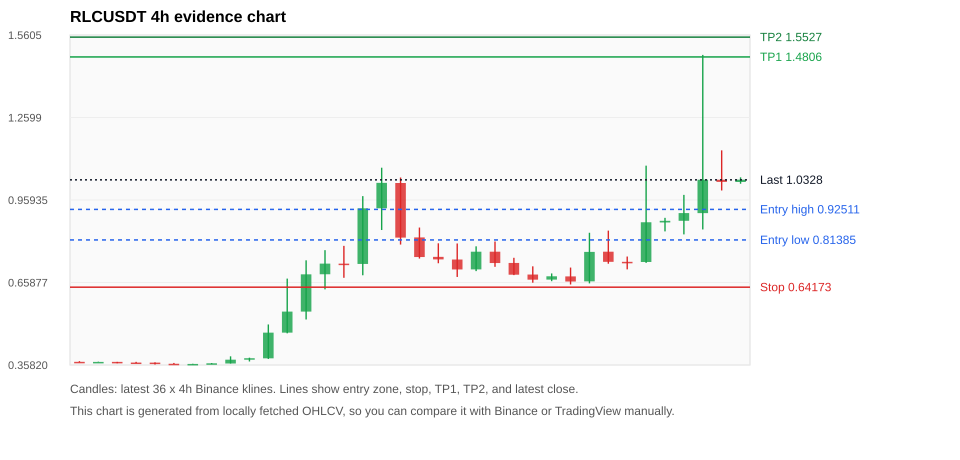
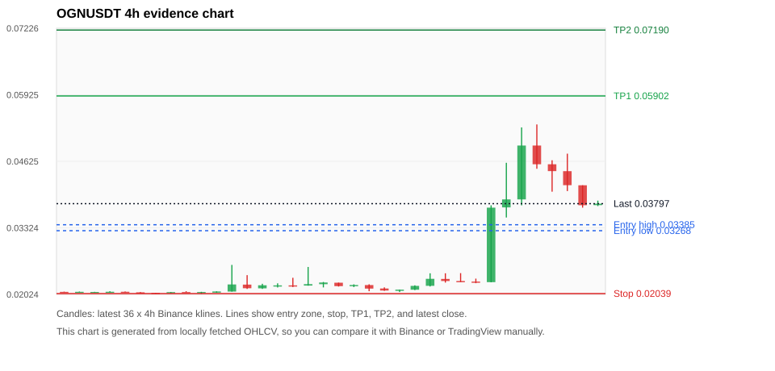
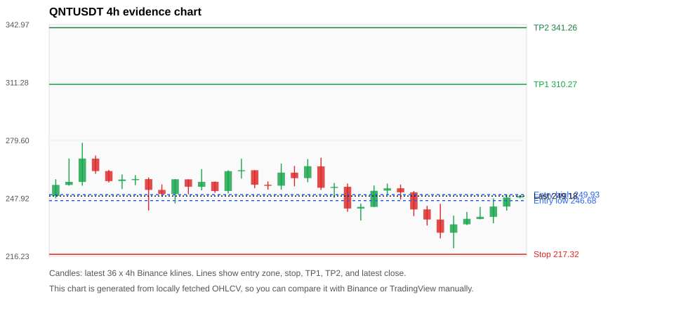
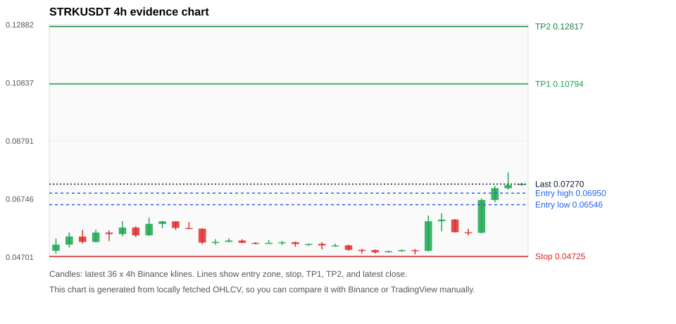
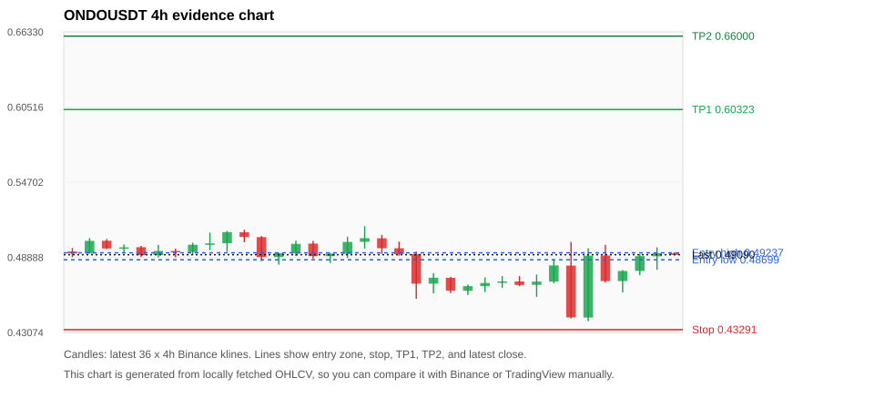

# Crypto 市场扫描报告 v1

- 报告时间：2026-10-09 20:07:41 CST
- Run ID：`20261009_120503_060f1481`
- Run type：`daily_full`
- Data validation mode：`paper`
- 数据来源：SQLite
- 报告版本：v1
- 扫描 ID：c6386143eeed
- 数据源：Binance public spot API + CoinGecko/CoinMarketCap cross-check
- 过滤条件：USDT spot; 24h quote volume >= 30,000,000; trades >= 30,000; exclude stables/leveraged tokens; analyze 1h/4h/1d klines
- 默认单笔风险：账户权益的 1.00%

## 限制说明

- 交易信号仍以 Binance 现货公开 K 线为主源；外部数据源用于一致性复核。
- 结果是研究和模拟盘计划，不是确定收益或实盘下单指令。
- 历史长度过滤：候选币至少需要 180 根 1d K 线。
- 数据质量验证池：先验证 score 排名前 min(top_n * 2, 10) 的候选，再按 action + score 补足最终名单。
- 大盘环境过滤：RISK_OFF; BTC/ETH 大盘偏弱，山寨币买入候选降级为观察。 BTC 7d=-1.4120067427048966; ETH 7d=-6.050011429256664.
- Data cross-validation enabled: Binance primary source plus CoinGecko; CoinMarketCap is checked when an API key is configured.
- RLCUSDT validation state BLOCKED: BLOCKED: [BINANCE_KLINE_EXTREME_RANGE] Binance candle range exceeds 40%.; [BINANCE_KLINE_EXTREME_RANGE] Binance candle range exceeds 40%.; [BINANCE_KLINE_EXTREME_RANGE] Binance candle range exceeds 40%.; [BINANCE_KLINE_EXTREME_RANGE] Binance candle range exceeds 40%.; [BINANCE_KLINE_EXTREME_RANGE] Binance candle range exceeds 40%.; [BINANCE_KLINE_EXTREME_RANGE] Binance candle range exceeds 40%.; [BINANCE_KLINE_EXTREME_RANGE] Binance candle range exceeds 40%.; [BINANCE_KLINE_EXTREME_RANGE] Binance candle range exceeds 40%.; [BINANCE_KLINE_EXTREME_RANGE] Binance candle range exceeds 40%.; [BINANCE_KLINE_EXTREME_RANGE] Binance candle range exceeds 40%.
- OGNUSDT validation state BLOCKED: BLOCKED: [BINANCE_KLINE_EXTREME_RANGE] Binance candle range exceeds 40%.; [BINANCE_KLINE_EXTREME_RANGE] Binance candle range exceeds 40%.; [BINANCE_KLINE_EXTREME_RANGE] Binance candle range exceeds 40%.; [BINANCE_KLINE_EXTREME_RANGE] Binance candle range exceeds 40%.; [BINANCE_KLINE_EXTREME_RANGE] Binance candle range exceeds 40%.
- QNTUSDT validation state BLOCKED: BLOCKED: [BINANCE_KLINE_EXTREME_RANGE] Binance candle range exceeds 40%.; [BINANCE_KLINE_EXTREME_RANGE] Binance candle range exceeds 40%.; [BINANCE_KLINE_EXTREME_RANGE] Binance candle range exceeds 40%.; [BINANCE_KLINE_EXTREME_RANGE] Binance candle range exceeds 40%.
- STRKUSDT validation state BLOCKED: BLOCKED: [BINANCE_KLINE_EXTREME_RANGE] Binance candle range exceeds 40%.; [EXTERNAL_IDENTITY_AMBIGUOUS] CoinGecko symbol mapping has 2 exact matches; selected highest market-cap rank; [EXTERNAL_IDENTITY_AMBIGUOUS] CoinMarketCap symbol mapping has 2 matches; selected lowest cmc_rank
- ONDOUSDT validation state DEGRADED: DEGRADED: [EXTERNAL_PROVIDER_RATE_LIMITED] Provider rate limited request for https://api.coingecko.com/api/v3/coins/markets?vs_currency=usd&ids=ondo-finance&price_change_percentage=24h&per_page=1&page=1: HTTP 429
- XAUTUSDT validation state DEGRADED: DEGRADED: [EXTERNAL_PROVIDER_RATE_LIMITED] Provider rate limited request for https://api.coingecko.com/api/v3/coins/markets?vs_currency=usd&ids=tether-gold&price_change_percentage=24h&per_page=1&page=1: HTTP 429
- BTCUSDT validation state DEGRADED: DEGRADED: [EXTERNAL_PROVIDER_RATE_LIMITED] Provider rate limited request for https://api.coingecko.com/api/v3/coins/markets?vs_currency=usd&ids=bitcoin&price_change_percentage=24h&per_page=1&page=1: HTTP 429; [EXTERNAL_IDENTITY_AMBIGUOUS] CoinMarketCap symbol mapping has 13 matches; selected lowest cmc_rank
- NEARUSDT validation state DEGRADED: DEGRADED: [EXTERNAL_PROVIDER_RATE_LIMITED] Provider rate limited request for https://api.coingecko.com/api/v3/coins/markets?vs_currency=usd&ids=near&price_change_percentage=24h&per_page=1&page=1: HTTP 429
- PUMPUSDT validation state BLOCKED: BLOCKED: [BINANCE_KLINE_EXTREME_RANGE] Binance candle range exceeds 40%.; [EXTERNAL_PROVIDER_RATE_LIMITED] Provider rate limited request for https://api.coingecko.com/api/v3/coins/markets?vs_currency=usd&ids=pump-fun&price_change_percentage=24h&per_page=1&page=1: HTTP 429; [EXTERNAL_IDENTITY_AMBIGUOUS] CoinMarketCap symbol mapping has 15 matches; selected lowest cmc_rank
- ZECUSDT validation state BLOCKED: BLOCKED: [BINANCE_KLINE_EXTREME_RANGE] Binance candle range exceeds 40%.; [BINANCE_KLINE_EXTREME_RANGE] Binance candle range exceeds 40%.; [EXTERNAL_PROVIDER_RATE_LIMITED] Provider rate limited request for https://api.coingecko.com/api/v3/coins/markets?vs_currency=usd&ids=zcash&price_change_percentage=24h&per_page=1&page=1: HTTP 429; [EXTERNAL_IDENTITY_AMBIGUOUS] CoinMarketCap symbol mapping has 2 matches; selected lowest cmc_rank

## 5 个候选交易计划

| Rank | Coin | Action | Setup | Entry Zone | Stop Loss | TP1 | TP2 / Exit Rule | R/R | Verdict |
|---:|---|---|---|---:|---:|---:|---|---:|---|
| 1 | `RLC` | `WATCH_ONLY` | 涨幅较远，只等深回调 | 0.81385 - 0.92511 | 0.64173 | 1.4806 | 1.5527 或跌破 4h 关键支撑 | 2.68-3.00 | 只观察 |
| 2 | `OGN` | `WATCH_ONLY` | 涨幅较远，只等深回调 | 0.03268 - 0.03385 | 0.02039 | 0.05902 | 0.07190 或跌破 4h 关键支撑 | 2.00-3.00 | 只观察 |
| 3 | `QNT` | `WATCH_ONLY` | 回踩支撑/4h EMA 附近 | 246.68 - 249.93 | 217.32 | 310.27 | 341.26 或跌破 4h 关键支撑 | 2.00-3.00 | 只观察 |
| 4 | `STRK` | `WATCH_ONLY` | 涨幅较远，只等深回调 | 0.06546 - 0.06950 | 0.04725 | 0.10794 | 0.12817 或跌破 4h 关键支撑 | 2.00-3.00 | 只观察 |
| 5 | `ONDO` | `WATCH_ONLY` | 回踩支撑/4h EMA 附近 | 0.48699 - 0.49237 | 0.43291 | 0.60323 | 0.66000 或跌破 4h 关键支撑 | 2.00-3.00 | 只观察 |

## 数据交叉验证摘要

价格差异以 Binance 当前价为基准；成交量口径不同，Binance 是 USDT 现货成交额，CoinGecko/CoinMarketCap 通常是全市场成交量。

| Rank | Coin | State | Identity | Max Price Diff | Max 24h Diff | Issue Codes | Message |
|---:|---|---|---|---:|---:|---|---|
| 1 | `RLC` | BLOCKED (DATA_ERROR) | CONFIRMED | 0.37% | 1.22 pts | BINANCE_KLINE_EXTREME_RANGE | BLOCKED: [BINANCE_KLINE_EXTREME_RANGE] Binance candle range exceeds 40%.; [BINANCE_KLINE_EXTREME_RANGE] Binance candle range exceeds 40%.; [BINANCE_KLINE_EXTREME_RANGE] Binance candle range exceeds 40%.; [BINANCE_KLINE_EXTREME_RANGE] Binance candle range exceeds 40%.; [BINANCE_KLINE_EXTREME_RANGE] Binance candle range exceeds 40%.; [BINANCE_KLINE_EXTREME_RANGE] Binance candle range exceeds 40%.; [BINANCE_KLINE_EXTREME_RANGE] Binance candle range exceeds 40%.; [BINANCE_KLINE_EXTREME_RANGE] Binance candle range exceeds 40%.; [BINANCE_KLINE_EXTREME_RANGE] Binance candle range exceeds 40%.; [BINANCE_KLINE_EXTREME_RANGE] Binance candle range exceeds 40%. |
| 2 | `OGN` | BLOCKED (DATA_ERROR) | CONFIRMED | 0.44% | 2.36 pts | BINANCE_KLINE_EXTREME_RANGE | BLOCKED: [BINANCE_KLINE_EXTREME_RANGE] Binance candle range exceeds 40%.; [BINANCE_KLINE_EXTREME_RANGE] Binance candle range exceeds 40%.; [BINANCE_KLINE_EXTREME_RANGE] Binance candle range exceeds 40%.; [BINANCE_KLINE_EXTREME_RANGE] Binance candle range exceeds 40%.; [BINANCE_KLINE_EXTREME_RANGE] Binance candle range exceeds 40%. |
| 3 | `QNT` | BLOCKED (DATA_ERROR) | CONFIRMED | 0.37% | 0.33 pts | BINANCE_KLINE_EXTREME_RANGE | BLOCKED: [BINANCE_KLINE_EXTREME_RANGE] Binance candle range exceeds 40%.; [BINANCE_KLINE_EXTREME_RANGE] Binance candle range exceeds 40%.; [BINANCE_KLINE_EXTREME_RANGE] Binance candle range exceeds 40%.; [BINANCE_KLINE_EXTREME_RANGE] Binance candle range exceeds 40%. |
| 4 | `STRK` | BLOCKED (DATA_ERROR) | UNCONFIRMED | 0.13% | 1.57 pts | BINANCE_KLINE_EXTREME_RANGE, EXTERNAL_IDENTITY_AMBIGUOUS | BLOCKED: [BINANCE_KLINE_EXTREME_RANGE] Binance candle range exceeds 40%.; [EXTERNAL_IDENTITY_AMBIGUOUS] CoinGecko symbol mapping has 2 exact matches; selected highest market-cap rank; [EXTERNAL_IDENTITY_AMBIGUOUS] CoinMarketCap symbol mapping has 2 matches; selected lowest cmc_rank |
| 5 | `ONDO` | DEGRADED (DATA_WARNING) | UNCONFIRMED | 0.01% | 0.01 pts | EXTERNAL_PROVIDER_RATE_LIMITED | DEGRADED: [EXTERNAL_PROVIDER_RATE_LIMITED] Provider rate limited request for https://api.coingecko.com/api/v3/coins/markets?vs_currency=usd&ids=ondo-finance&price_change_percentage=24h&per_page=1&page=1: HTTP 429 |

## 候选币说明

### 1. RLC `RLCUSDT`



- 入选原因：涨幅较远，只等深回调；24h +38.80%，7d +171.65%，4h RSI 72.10，24h 成交额 $48.9M。
- 交易失效条件：跌破 0.6417275 或 4h 收盘重新失守关键支撑。
- 主要风险：距离支撑偏远，不能追市价；24h 振幅较大，回撤风险高；BTC/ETH 大盘环境未确认强势，山寨币买入信号降级；Blocking data-quality issue detected; paper plan creation is not allowed.。
- 数据交叉验证：BLOCKED / DATA_ERROR；身份=CONFIRMED；BLOCKED: [BINANCE_KLINE_EXTREME_RANGE] Binance candle range exceeds 40%.; [BINANCE_KLINE_EXTREME_RANGE] Binance candle range exceeds 40%.; [BINANCE_KLINE_EXTREME_RANGE] Binance candle range exceeds 40%.; [BINANCE_KLINE_EXTREME_RANGE] Binance candle range exceeds 40%.; [BINANCE_KLINE_EXTREME_RANGE] Binance candle range exceeds 40%.; [BINANCE_KLINE_EXTREME_RANGE] Binance candle range exceeds 40%.; [BINANCE_KLINE_EXTREME_RANGE] Binance candle range exceeds 40%.; [BINANCE_KLINE_EXTREME_RANGE] Binance candle range exceeds 40%.; [BINANCE_KLINE_EXTREME_RANGE] Binance candle range exceeds 40%.; [BINANCE_KLINE_EXTREME_RANGE] Binance candle range exceeds 40%.

#### 可点击人工验证

- [Binance 交易页](https://www.binance.com/en/trade/RLC_USDT)
- [TradingView 图表](https://www.tradingview.com/chart/?symbol=BINANCE%3ARLCUSDT)
- [CoinGecko 搜索](https://www.coingecko.com/en/search?query=RLC)
- [CoinMarketCap 搜索](https://coinmarketcap.com/search/?q=RLC)

#### 多数据源对照

| Source | Status | Identity | Blocking | Asset ID | Price | 24h Change | 24h Volume | Price Diff | 24h Diff | Updated | Issue Codes | Message |
|---|---|---|---:|---|---:|---:|---:|---:|---:|---|---|---|
| Binance | DATA_ERROR | CONFIRMED | yes | RLCUSDT | 1.0328 | +38.80% | $48.9M | 0.00% | 0.00 pts | 2026-10-09T12:06:38+00:00 | BINANCE_KLINE_EXTREME_RANGE | [BINANCE_KLINE_EXTREME_RANGE] Binance candle range exceeds 40%.; [BINANCE_KLINE_EXTREME_RANGE] Binance candle range exceeds 40%.; [BINANCE_KLINE_EXTREME_RANGE] Binance candle range exceeds 40%.; [BINANCE_KLINE_EXTREME_RANGE] Binance candle range exceeds 40%.; [BINANCE_KLINE_EXTREME_RANGE] Binance candle range exceeds 40%.; [BINANCE_KLINE_EXTREME_RANGE] Binance candle range exceeds 40%.; [BINANCE_KLINE_EXTREME_RANGE] Binance candle range exceeds 40%.; [BINANCE_KLINE_EXTREME_RANGE] Binance candle range exceeds 40%.; [BINANCE_KLINE_EXTREME_RANGE] Binance candle range exceeds 40%.; [BINANCE_KLINE_EXTREME_RANGE] Binance candle range exceeds 40%. |
| CoinGecko | DATA_OK | CONFIRMED | no | iexec-rlc | 1.0290 | +38.88% | $204.4M | 0.37% | 0.08 pts | 2026-10-09T12:05:53.000Z | none | External source agrees with Binance within thresholds. |
| CoinMarketCap | DATA_OK | CONFIRMED | no | 1637 | 1.0306 | +40.01% | $232.8M | 0.21% | 1.22 pts | 2026-10-09T12:05:02.000Z | none | External source agrees with Binance within thresholds. |

#### 指标证据

| 指标 | 数值 | 人工核对用途 |
|---|---:|---|
| 当前价 | 1.0328 | 与 Binance/TradingView 当前价格对照 |
| 24h 涨跌 | +38.80% | 与交易所 24h 涨跌对照 |
| 7d 涨跌 | +171.65% | 判断短线趋势是否延续 |
| 4h EMA20 | 0.81223 | 判断短期趋势支撑 |
| 4h EMA50 | 0.64977 | 判断中期趋势支撑 |
| 1d EMA20 | 0.53398 | 判断日线趋势 |
| 1d EMA50 | 0.41235 | 判断日线趋势 |
| 4h RSI14 | 72.10 | 判断是否过热/过弱 |
| 4h ATR14 | 0.14359 | 推导止损和入场缓冲 |
| 最近 18 根 4h 最低点 | 0.65150 | 支撑/止损参考 |
| 最近 36 根 4h 最高点 | 1.4880 | TP/压力参考 |
| 支撑位 | 0.81223 | 入场区间推导基础 |

#### 交易计划推导

- 支撑位 = 最近低点、4h EMA20、4h EMA50、1d EMA20 中不高于当前价的最高有效支撑 = `0.81223`。
- 入场区间 = 支撑位附近 + ATR 缓冲 = `0.81385 - 0.92511`。
- 止损 = min(最近 18 根 4h 最低点 * 0.985, 入场中位价 - 1.15 * ATR14) = `0.64173`。
- TP1 = max(最近 36 根 4h 最高点 * 0.995, 入场中位价 + 2R) = `1.4806`。
- TP2 = max(入场中位价 + 3R, TP1 * 1.04) = `1.5527`。

#### 最近 10 根 4h K线

| UTC 开盘时间 | Open | High | Low | Close | Quote Volume | Trades |
|---|---:|---:|---:|---:|---:|---:|
| 2026-10-08T00:00+00:00 | 0.68100 | 0.71320 | 0.65150 | 0.66230 | $2.0M | 25204 |
| 2026-10-08T04:00+00:00 | 0.66290 | 0.84000 | 0.65550 | 0.77030 | $3.7M | 42403 |
| 2026-10-08T08:00+00:00 | 0.77100 | 0.84780 | 0.72720 | 0.73410 | $1.9M | 19484 |
| 2026-10-08T12:00+00:00 | 0.73410 | 0.75340 | 0.70660 | 0.73360 | $1.6M | 15045 |
| 2026-10-08T16:00+00:00 | 0.73350 | 1.0845 | 0.73020 | 0.87830 | $16.0M | 123117 |
| 2026-10-08T20:00+00:00 | 0.87750 | 0.89440 | 0.84500 | 0.88350 | $2.2M | 22131 |
| 2026-10-09T00:00+00:00 | 0.88360 | 0.97800 | 0.83400 | 0.91170 | $4.3M | 38665 |
| 2026-10-09T04:00+00:00 | 0.91150 | 1.4880 | 0.85200 | 1.0332 | $17.3M | 183503 |
| 2026-10-09T08:00+00:00 | 1.0332 | 1.1402 | 0.99400 | 1.0253 | $7.4M | 76475 |
| 2026-10-09T12:00+00:00 | 1.0250 | 1.0419 | 1.0185 | 1.0334 | $122,804 | 971 |

### 2. OGN `OGNUSDT`



- 入选原因：涨幅较远，只等深回调；24h +6.11%，7d +78.43%，4h RSI 70.39，24h 成交额 $60.6M。
- 交易失效条件：跌破 0.0203895 或 4h 收盘重新失守关键支撑。
- 主要风险：距离支撑偏远，不能追市价；24h 振幅较大，回撤风险高；成交量突增，可能是事件驱动；BTC/ETH 大盘环境未确认强势，山寨币买入信号降级；Blocking data-quality issue detected; paper plan creation is not allowed.。
- 数据交叉验证：BLOCKED / DATA_ERROR；身份=CONFIRMED；BLOCKED: [BINANCE_KLINE_EXTREME_RANGE] Binance candle range exceeds 40%.; [BINANCE_KLINE_EXTREME_RANGE] Binance candle range exceeds 40%.; [BINANCE_KLINE_EXTREME_RANGE] Binance candle range exceeds 40%.; [BINANCE_KLINE_EXTREME_RANGE] Binance candle range exceeds 40%.; [BINANCE_KLINE_EXTREME_RANGE] Binance candle range exceeds 40%.

#### 可点击人工验证

- [Binance 交易页](https://www.binance.com/en/trade/OGN_USDT)
- [TradingView 图表](https://www.tradingview.com/chart/?symbol=BINANCE%3AOGNUSDT)
- [CoinGecko 搜索](https://www.coingecko.com/en/search?query=OGN)
- [CoinMarketCap 搜索](https://coinmarketcap.com/search/?q=OGN)

#### 多数据源对照

| Source | Status | Identity | Blocking | Asset ID | Price | 24h Change | 24h Volume | Price Diff | 24h Diff | Updated | Issue Codes | Message |
|---|---|---|---:|---|---:|---:|---:|---:|---:|---|---|---|
| Binance | DATA_ERROR | CONFIRMED | yes | OGNUSDT | 0.03797 | +6.11% | $60.6M | 0.00% | 0.00 pts | 2026-10-09T12:06:38+00:00 | BINANCE_KLINE_EXTREME_RANGE | [BINANCE_KLINE_EXTREME_RANGE] Binance candle range exceeds 40%.; [BINANCE_KLINE_EXTREME_RANGE] Binance candle range exceeds 40%.; [BINANCE_KLINE_EXTREME_RANGE] Binance candle range exceeds 40%.; [BINANCE_KLINE_EXTREME_RANGE] Binance candle range exceeds 40%.; [BINANCE_KLINE_EXTREME_RANGE] Binance candle range exceeds 40%. |
| CoinGecko | DATA_OK | CONFIRMED | no | origin-protocol | 0.03814 | +4.47% | $213.1M | 0.44% | 1.64 pts | 2026-10-09T12:05:53.000Z | none | External source agrees with Binance within thresholds. |
| CoinMarketCap | DATA_OK | CONFIRMED | no | 5117 | 0.03800 | +3.76% | $281.5M | 0.08% | 2.36 pts | 2026-10-09T12:05:02.000Z | none | External source agrees with Binance within thresholds. |

#### 指标证据

| 指标 | 数值 | 人工核对用途 |
|---|---:|---|
| 当前价 | 0.03797 | 与 Binance/TradingView 当前价格对照 |
| 24h 涨跌 | +6.11% | 与交易所 24h 涨跌对照 |
| 7d 涨跌 | +78.43% | 判断短线趋势是否延续 |
| 4h EMA20 | 0.03262 | 判断短期趋势支撑 |
| 4h EMA50 | 0.02683 | 判断中期趋势支撑 |
| 1d EMA20 | 0.02436 | 判断日线趋势 |
| 1d EMA50 | 0.02101 | 判断日线趋势 |
| 4h RSI14 | 70.39 | 判断是否过热/过弱 |
| 4h ATR14 | 0.0054964286 | 推导止损和入场缓冲 |
| 最近 18 根 4h 最低点 | 0.02070 | 支撑/止损参考 |
| 最近 36 根 4h 最高点 | 0.05345 | TP/压力参考 |
| 支撑位 | 0.03262 | 入场区间推导基础 |

#### 交易计划推导

- 支撑位 = 最近低点、4h EMA20、4h EMA50、1d EMA20 中不高于当前价的最高有效支撑 = `0.03262`。
- 入场区间 = 支撑位附近 + ATR 缓冲 = `0.03268 - 0.03385`。
- 止损 = min(最近 18 根 4h 最低点 * 0.985, 入场中位价 - 1.15 * ATR14) = `0.02039`。
- TP1 = max(最近 36 根 4h 最高点 * 0.995, 入场中位价 + 2R) = `0.05902`。
- TP2 = max(入场中位价 + 3R, TP1 * 1.04) = `0.07190`。

#### 最近 10 根 4h K线

| UTC 开盘时间 | Open | High | Low | Close | Quote Volume | Trades |
|---|---:|---:|---:|---:|---:|---:|
| 2026-10-08T00:00+00:00 | 0.02285 | 0.02439 | 0.02267 | 0.02274 | $665,910 | 6170 |
| 2026-10-08T04:00+00:00 | 0.02274 | 0.02332 | 0.02243 | 0.02262 | $478,232 | 5637 |
| 2026-10-08T08:00+00:00 | 0.02263 | 0.03765 | 0.02260 | 0.03719 | $11.1M | 141296 |
| 2026-10-08T12:00+00:00 | 0.03724 | 0.04596 | 0.03526 | 0.03880 | $19.1M | 198791 |
| 2026-10-08T16:00+00:00 | 0.03880 | 0.05287 | 0.03764 | 0.04933 | $16.8M | 191812 |
| 2026-10-08T20:00+00:00 | 0.04933 | 0.05345 | 0.04479 | 0.04567 | $8.1M | 147052 |
| 2026-10-09T00:00+00:00 | 0.04567 | 0.04645 | 0.04031 | 0.04433 | $5.4M | 72883 |
| 2026-10-09T04:00+00:00 | 0.04432 | 0.04774 | 0.04043 | 0.04158 | $6.6M | 85537 |
| 2026-10-09T08:00+00:00 | 0.04156 | 0.04156 | 0.03719 | 0.03766 | $4.8M | 64769 |
| 2026-10-09T12:00+00:00 | 0.03768 | 0.03856 | 0.03750 | 0.03797 | $92,497 | 1327 |

### 3. QNT `QNTUSDT`



- 入选原因：回踩支撑/4h EMA 附近；24h +5.40%，7d +1.54%，4h RSI 46.26，24h 成交额 $35.5M。
- 交易失效条件：跌破 217.32055 或 4h 收盘重新失守关键支撑。
- 主要风险：BTC/ETH 大盘环境未确认强势，山寨币买入信号降级；Blocking data-quality issue detected; paper plan creation is not allowed.。
- 数据交叉验证：BLOCKED / DATA_ERROR；身份=CONFIRMED；BLOCKED: [BINANCE_KLINE_EXTREME_RANGE] Binance candle range exceeds 40%.; [BINANCE_KLINE_EXTREME_RANGE] Binance candle range exceeds 40%.; [BINANCE_KLINE_EXTREME_RANGE] Binance candle range exceeds 40%.; [BINANCE_KLINE_EXTREME_RANGE] Binance candle range exceeds 40%.

#### 可点击人工验证

- [Binance 交易页](https://www.binance.com/en/trade/QNT_USDT)
- [TradingView 图表](https://www.tradingview.com/chart/?symbol=BINANCE%3AQNTUSDT)
- [CoinGecko 搜索](https://www.coingecko.com/en/search?query=QNT)
- [CoinMarketCap 搜索](https://coinmarketcap.com/search/?q=QNT)

#### 多数据源对照

| Source | Status | Identity | Blocking | Asset ID | Price | 24h Change | 24h Volume | Price Diff | 24h Diff | Updated | Issue Codes | Message |
|---|---|---|---:|---|---:|---:|---:|---:|---:|---|---|---|
| Binance | DATA_ERROR | CONFIRMED | yes | QNTUSDT | 249.18 | +5.40% | $35.5M | 0.00% | 0.00 pts | 2026-10-09T12:06:38+00:00 | BINANCE_KLINE_EXTREME_RANGE | [BINANCE_KLINE_EXTREME_RANGE] Binance candle range exceeds 40%.; [BINANCE_KLINE_EXTREME_RANGE] Binance candle range exceeds 40%.; [BINANCE_KLINE_EXTREME_RANGE] Binance candle range exceeds 40%.; [BINANCE_KLINE_EXTREME_RANGE] Binance candle range exceeds 40%. |
| CoinGecko | DATA_OK | CONFIRMED | no | quant-network | 249.23 | +5.39% | $199.1M | 0.02% | 0.01 pts | 2026-10-09T12:05:53.000Z | none | External source agrees with Binance within thresholds. |
| CoinMarketCap | DATA_OK | CONFIRMED | no | 3155 | 248.25 | +5.07% | $182.0M | 0.37% | 0.33 pts | 2026-10-09T12:05:02.000Z | none | External source agrees with Binance within thresholds. |

#### 指标证据

| 指标 | 数值 | 人工核对用途 |
|---|---:|---|
| 当前价 | 249.18 | 与 Binance/TradingView 当前价格对照 |
| 24h 涨跌 | +5.40% | 与交易所 24h 涨跌对照 |
| 7d 涨跌 | +1.54% | 判断短线趋势是否延续 |
| 4h EMA20 | 246.19 | 判断短期趋势支撑 |
| 4h EMA50 | 241.82 | 判断中期趋势支撑 |
| 1d EMA20 | 206.85 | 判断日线趋势 |
| 1d EMA50 | 145.34 | 判断日线趋势 |
| 4h RSI14 | 46.26 | 判断是否过热/过弱 |
| 4h ATR14 | 10.7193 | 推导止损和入场缓冲 |
| 最近 18 根 4h 最低点 | 220.63 | 支撑/止损参考 |
| 最近 36 根 4h 最高点 | 278.34 | TP/压力参考 |
| 支撑位 | 246.19 | 入场区间推导基础 |

#### 交易计划推导

- 支撑位 = 最近低点、4h EMA20、4h EMA50、1d EMA20 中不高于当前价的最高有效支撑 = `246.19`。
- 入场区间 = 支撑位附近 + ATR 缓冲 = `246.68 - 249.93`。
- 止损 = min(最近 18 根 4h 最低点 * 0.985, 入场中位价 - 1.15 * ATR14) = `217.32`。
- TP1 = max(最近 36 根 4h 最高点 * 0.995, 入场中位价 + 2R) = `310.27`。
- TP2 = max(入场中位价 + 3R, TP1 * 1.04) = `341.26`。

#### 最近 10 根 4h K线

| UTC 开盘时间 | Open | High | Low | Close | Quote Volume | Trades |
|---|---:|---:|---:|---:|---:|---:|
| 2026-10-08T00:00+00:00 | 253.44 | 255.45 | 247.25 | 251.23 | $3.3M | 31140 |
| 2026-10-08T04:00+00:00 | 251.24 | 251.94 | 238.22 | 241.86 | $6.2M | 59451 |
| 2026-10-08T08:00+00:00 | 241.88 | 243.84 | 233.07 | 236.35 | $4.7M | 43064 |
| 2026-10-08T12:00+00:00 | 236.33 | 244.93 | 226.04 | 229.12 | $10.1M | 98104 |
| 2026-10-08T16:00+00:00 | 229.13 | 238.50 | 220.63 | 233.70 | $10.1M | 113698 |
| 2026-10-08T20:00+00:00 | 233.73 | 240.52 | 233.35 | 236.73 | $2.9M | 36086 |
| 2026-10-09T00:00+00:00 | 236.64 | 243.23 | 236.43 | 237.83 | $2.9M | 39226 |
| 2026-10-09T04:00+00:00 | 237.80 | 247.89 | 234.26 | 243.46 | $4.9M | 48019 |
| 2026-10-09T08:00+00:00 | 243.44 | 250.00 | 241.21 | 248.40 | $4.6M | 51460 |
| 2026-10-09T12:00+00:00 | 248.41 | 249.68 | 247.97 | 249.18 | $164,337 | 1677 |

### 4. STRK `STRKUSDT`



- 入选原因：涨幅较远，只等深回调；24h +23.70%，7d +66.67%，4h RSI 79.74，24h 成交额 $59.3M。
- 交易失效条件：跌破 0.04725045 或 4h 收盘重新失守关键支撑。
- 主要风险：距离支撑偏远，不能追市价；4h RSI 偏热；24h 振幅较大，回撤风险高；成交量突增，可能是事件驱动；BTC/ETH 大盘环境未确认强势，山寨币买入信号降级；Blocking data-quality issue detected; paper plan creation is not allowed.。
- 数据交叉验证：BLOCKED / DATA_ERROR；身份=UNCONFIRMED；BLOCKED: [BINANCE_KLINE_EXTREME_RANGE] Binance candle range exceeds 40%.; [EXTERNAL_IDENTITY_AMBIGUOUS] CoinGecko symbol mapping has 2 exact matches; selected highest market-cap rank; [EXTERNAL_IDENTITY_AMBIGUOUS] CoinMarketCap symbol mapping has 2 matches; selected lowest cmc_rank

#### 可点击人工验证

- [Binance 交易页](https://www.binance.com/en/trade/STRK_USDT)
- [TradingView 图表](https://www.tradingview.com/chart/?symbol=BINANCE%3ASTRKUSDT)
- [CoinGecko 搜索](https://www.coingecko.com/en/search?query=STRK)
- [CoinMarketCap 搜索](https://coinmarketcap.com/search/?q=STRK)

#### 多数据源对照

| Source | Status | Identity | Blocking | Asset ID | Price | 24h Change | 24h Volume | Price Diff | 24h Diff | Updated | Issue Codes | Message |
|---|---|---|---:|---|---:|---:|---:|---:|---:|---|---|---|
| Binance | DATA_ERROR | CONFIRMED | yes | STRKUSDT | 0.07270 | +23.70% | $59.3M | 0.00% | 0.00 pts | 2026-10-09T12:06:38+00:00 | BINANCE_KLINE_EXTREME_RANGE | [BINANCE_KLINE_EXTREME_RANGE] Binance candle range exceeds 40%. |
| CoinGecko | DATA_WARNING | UNCONFIRMED | no | starknet | 0.07279 | +25.27% | $474.9M | 0.13% | 1.57 pts | 2026-10-09T12:05:53.000Z | EXTERNAL_IDENTITY_AMBIGUOUS | [EXTERNAL_IDENTITY_AMBIGUOUS] CoinGecko symbol mapping has 2 exact matches; selected highest market-cap rank |
| CoinMarketCap | DATA_WARNING | UNCONFIRMED | no | 22691 | 0.07279 | +23.50% | $441.9M | 0.13% | 0.20 pts | 2026-10-09T12:05:02.000Z | EXTERNAL_IDENTITY_AMBIGUOUS | [EXTERNAL_IDENTITY_AMBIGUOUS] CoinMarketCap symbol mapping has 2 matches; selected lowest cmc_rank |

#### 指标证据

| 指标 | 数值 | 人工核对用途 |
|---|---:|---|
| 当前价 | 0.07270 | 与 Binance/TradingView 当前价格对照 |
| 24h 涨跌 | +23.70% | 与交易所 24h 涨跌对照 |
| 7d 涨跌 | +66.67% | 判断短线趋势是否延续 |
| 4h EMA20 | 0.05894 | 判断短期趋势支撑 |
| 4h EMA50 | 0.05340 | 判断中期趋势支撑 |
| 1d EMA20 | 0.04818 | 判断日线趋势 |
| 1d EMA50 | 0.03978 | 判断日线趋势 |
| 4h RSI14 | 79.74 | 判断是否过热/过弱 |
| 4h ATR14 | 0.00426 | 推导止损和入场缓冲 |
| 最近 18 根 4h 最低点 | 0.04797 | 支撑/止损参考 |
| 最近 36 根 4h 最高点 | 0.07682 | TP/压力参考 |
| 支撑位 | 0.05894 | 入场区间推导基础 |

#### 交易计划推导

- 支撑位 = 最近低点、4h EMA20、4h EMA50、1d EMA20 中不高于当前价的最高有效支撑 = `0.05894`。
- 入场区间 = 支撑位附近 + ATR 缓冲 = `0.06546 - 0.06950`。
- 止损 = min(最近 18 根 4h 最低点 * 0.985, 入场中位价 - 1.15 * ATR14) = `0.04725`。
- TP1 = max(最近 36 根 4h 最高点 * 0.995, 入场中位价 + 2R) = `0.10794`。
- TP2 = max(入场中位价 + 3R, TP1 * 1.04) = `0.12817`。

#### 最近 10 根 4h K线

| UTC 开盘时间 | Open | High | Low | Close | Quote Volume | Trades |
|---|---:|---:|---:|---:|---:|---:|
| 2026-10-08T00:00+00:00 | 0.04907 | 0.04969 | 0.04896 | 0.04946 | $1.2M | 10216 |
| 2026-10-08T04:00+00:00 | 0.04946 | 0.04986 | 0.04797 | 0.04919 | $1.5M | 16433 |
| 2026-10-08T08:00+00:00 | 0.04920 | 0.06166 | 0.04908 | 0.05963 | $10.3M | 128796 |
| 2026-10-08T12:00+00:00 | 0.05963 | 0.06250 | 0.05611 | 0.06020 | $11.3M | 128592 |
| 2026-10-08T16:00+00:00 | 0.06025 | 0.06036 | 0.05572 | 0.05576 | $5.4M | 67300 |
| 2026-10-08T20:00+00:00 | 0.05575 | 0.05698 | 0.05466 | 0.05557 | $2.3M | 29685 |
| 2026-10-09T00:00+00:00 | 0.05558 | 0.06766 | 0.05534 | 0.06710 | $8.8M | 100061 |
| 2026-10-09T04:00+00:00 | 0.06711 | 0.07206 | 0.06633 | 0.07127 | $16.2M | 153033 |
| 2026-10-09T08:00+00:00 | 0.07123 | 0.07682 | 0.07075 | 0.07238 | $15.1M | 150901 |
| 2026-10-09T12:00+00:00 | 0.07238 | 0.07317 | 0.07222 | 0.07278 | $315,847 | 4180 |

### 5. ONDO `ONDOUSDT`



- 入选原因：回踩支撑/4h EMA 附近；24h +2.21%，7d -3.40%，4h RSI 55.35，24h 成交额 $50.0M。
- 交易失效条件：跌破 0.4329075 或 4h 收盘重新失守关键支撑。
- 主要风险：BTC/ETH 大盘环境未确认强势，山寨币买入信号降级；7d 趋势未确认；External validation is degraded; this candidate is not a clean data sample.；Paper mode allows degraded validation; candidate is excluded from clean-data samples.。
- 数据交叉验证：DEGRADED / DATA_WARNING；身份=UNCONFIRMED；DEGRADED: [EXTERNAL_PROVIDER_RATE_LIMITED] Provider rate limited request for https://api.coingecko.com/api/v3/coins/markets?vs_currency=usd&ids=ondo-finance&price_change_percentage=24h&per_page=1&page=1: HTTP 429

#### 可点击人工验证

- [Binance 交易页](https://www.binance.com/en/trade/ONDO_USDT)
- [TradingView 图表](https://www.tradingview.com/chart/?symbol=BINANCE%3AONDOUSDT)
- [CoinGecko 搜索](https://www.coingecko.com/en/search?query=ONDO)
- [CoinMarketCap 搜索](https://coinmarketcap.com/search/?q=ONDO)

#### 多数据源对照

| Source | Status | Identity | Blocking | Asset ID | Price | 24h Change | 24h Volume | Price Diff | 24h Diff | Updated | Issue Codes | Message |
|---|---|---|---:|---|---:|---:|---:|---:|---:|---|---|---|
| Binance | DATA_OK | CONFIRMED | no | ONDOUSDT | 0.49090 | +2.21% | $50.0M | 0.00% | 0.00 pts | 2026-10-09T12:06:38+00:00 | none | Primary market data source passed health checks. |
| CoinGecko | DATA_WARNING | UNCONFIRMED | no | n/a | n/a | n/a | n/a | n/a | n/a | 2026-10-09T12:06:38+00:00 | EXTERNAL_PROVIDER_RATE_LIMITED | Provider rate limited request for https://api.coingecko.com/api/v3/coins/markets?vs_currency=usd&ids=ondo-finance&price_change_percentage=24h&per_page=1&page=1: HTTP 429 |
| CoinMarketCap | DATA_OK | CONFIRMED | no | 21159 | 0.49084 | +2.22% | $494.3M | 0.01% | 0.01 pts | 2026-10-09T12:05:02.000Z | none | External source agrees with Binance within thresholds. |

#### 指标证据

| 指标 | 数值 | 人工核对用途 |
|---|---:|---|
| 当前价 | 0.49090 | 与 Binance/TradingView 当前价格对照 |
| 24h 涨跌 | +2.21% | 与交易所 24h 涨跌对照 |
| 7d 涨跌 | -3.40% | 判断短线趋势是否延续 |
| 4h EMA20 | 0.48135 | 判断短期趋势支撑 |
| 4h EMA50 | 0.48602 | 判断中期趋势支撑 |
| 1d EMA20 | 0.47644 | 判断日线趋势 |
| 1d EMA50 | 0.43437 | 判断日线趋势 |
| 4h RSI14 | 55.35 | 判断是否过热/过弱 |
| 4h ATR14 | 0.02021 | 推导止损和入场缓冲 |
| 最近 18 根 4h 最低点 | 0.43950 | 支撑/止损参考 |
| 最近 36 根 4h 最高点 | 0.51290 | TP/压力参考 |
| 支撑位 | 0.48602 | 入场区间推导基础 |

#### 交易计划推导

- 支撑位 = 最近低点、4h EMA20、4h EMA50、1d EMA20 中不高于当前价的最高有效支撑 = `0.48602`。
- 入场区间 = 支撑位附近 + ATR 缓冲 = `0.48699 - 0.49237`。
- 止损 = min(最近 18 根 4h 最低点 * 0.985, 入场中位价 - 1.15 * ATR14) = `0.43291`。
- TP1 = max(最近 36 根 4h 最高点 * 0.995, 入场中位价 + 2R) = `0.60323`。
- TP2 = max(入场中位价 + 3R, TP1 * 1.04) = `0.66000`。

#### 最近 10 根 4h K线

| UTC 开盘时间 | Open | High | Low | Close | Quote Volume | Trades |
|---|---:|---:|---:|---:|---:|---:|
| 2026-10-08T00:00+00:00 | 0.47020 | 0.47430 | 0.46660 | 0.46750 | $2.1M | 11295 |
| 2026-10-08T04:00+00:00 | 0.46760 | 0.47550 | 0.45830 | 0.47010 | $6.2M | 21426 |
| 2026-10-08T08:00+00:00 | 0.47010 | 0.48740 | 0.46890 | 0.48260 | $5.9M | 28465 |
| 2026-10-08T12:00+00:00 | 0.48250 | 0.50080 | 0.44170 | 0.44240 | $15.6M | 77950 |
| 2026-10-08T16:00+00:00 | 0.44230 | 0.49590 | 0.43950 | 0.49020 | $13.3M | 63005 |
| 2026-10-08T20:00+00:00 | 0.49030 | 0.49850 | 0.46930 | 0.47050 | $6.9M | 29995 |
| 2026-10-09T00:00+00:00 | 0.47050 | 0.47900 | 0.46170 | 0.47830 | $4.7M | 22255 |
| 2026-10-09T04:00+00:00 | 0.47840 | 0.49140 | 0.47500 | 0.48980 | $3.7M | 17022 |
| 2026-10-09T08:00+00:00 | 0.48970 | 0.49660 | 0.47920 | 0.49210 | $5.8M | 27418 |
| 2026-10-09T12:00+00:00 | 0.49200 | 0.49290 | 0.49050 | 0.49080 | $89,777 | 518 |

## 组合风控

- 不要 5 个候选全部满仓买入。
- 同时持仓总风险建议控制在账户权益的 3% - 5% 以内。
- 如果 BTC/ETH 同时破位，暂停山寨币多头计划或降低仓位。
- 第一版报告用于模拟盘和人工复核，不自动下单。

## 原始数据

```json
[
  {
    "rank": 1,
    "symbol": "RLCUSDT",
    "base_asset": "RLC",
    "price": 1.0328,
    "score": 53.12336645672343,
    "setup": "涨幅较远，只等深回调",
    "verdict": "只观察",
    "entry_low": 0.8138515768414168,
    "entry_high": 0.9251053571428571,
    "stop_loss": 0.6417275,
    "take_profit_1": 1.4805599999999999,
    "take_profit_2": 1.5527313679685477,
    "risk_reward_1": 2.683112792355171,
    "risk_reward_2": 3.0,
    "pct_24h": 38.796,
    "pct_3d": 16.503102086858433,
    "pct_7d": 171.64650184113626,
    "quote_volume_24h": 48862347.97957,
    "trades_24h": 459574,
    "high_low_range_24h": 110.58590433059723,
    "rsi_1h": 59.23750415604565,
    "rsi_4h": 72.10242587601081,
    "ema20_4h": 0.8122271225962244,
    "ema50_4h": 0.6497685277491354,
    "ema20_1d": 0.5339825287420257,
    "ema50_1d": 0.41235042747869144,
    "atr_4h": 0.14359285714285716,
    "macd_hist_4h": 0.020997235747658785,
    "volume_ratio_24h": 2.779796591757056,
    "support_level": 0.8122271225962244,
    "recent_low_4h_18": 0.6515,
    "recent_high_4h_36": 1.488,
    "distance_to_support_pct": 27.156551568818642,
    "binance_trade_url": "https://www.binance.com/en/trade/RLC_USDT",
    "tradingview_url": "https://www.tradingview.com/chart/?symbol=BINANCE%3ARLCUSDT",
    "coingecko_search_url": "https://www.coingecko.com/en/search?query=RLC",
    "coinmarketcap_search_url": "https://coinmarketcap.com/search/?q=RLC",
    "invalidation": "跌破 0.6417275 或 4h 收盘重新失守关键支撑",
    "recent_4h_klines": [
      {
        "open_time_utc": "2026-10-03T16:00+00:00",
        "open": 0.3698,
        "high": 0.3721,
        "low": 0.368,
        "close": 0.3689,
        "quote_volume": 11335.46347,
        "trades": 271
      },
      {
        "open_time_utc": "2026-10-03T20:00+00:00",
        "open": 0.3691,
        "high": 0.3702,
        "low": 0.3686,
        "close": 0.3695,
        "quote_volume": 1910.00003,
        "trades": 68
      },
      {
        "open_time_utc": "2026-10-04T00:00+00:00",
        "open": 0.3696,
        "high": 0.3696,
        "low": 0.3646,
        "close": 0.3666,
        "quote_volume": 21851.50141,
        "trades": 507
      },
      {
        "open_time_utc": "2026-10-04T04:00+00:00",
        "open": 0.3671,
        "high": 0.3697,
        "low": 0.3649,
        "close": 0.3668,
        "quote_volume": 19923.47255,
        "trades": 354
      },
      {
        "open_time_utc": "2026-10-04T08:00+00:00",
        "open": 0.3669,
        "high": 0.3679,
        "low": 0.36,
        "close": 0.3629,
        "quote_volume": 35985.99178,
        "trades": 924
      },
      {
        "open_time_utc": "2026-10-04T12:00+00:00",
        "open": 0.3627,
        "high": 0.3657,
        "low": 0.3616,
        "close": 0.3624,
        "quote_volume": 19492.29028,
        "trades": 667
      },
      {
        "open_time_utc": "2026-10-04T16:00+00:00",
        "open": 0.3621,
        "high": 0.3627,
        "low": 0.3603,
        "close": 0.3621,
        "quote_volume": 14983.13076,
        "trades": 535
      },
      {
        "open_time_utc": "2026-10-04T20:00+00:00",
        "open": 0.3625,
        "high": 0.3651,
        "low": 0.3613,
        "close": 0.3644,
        "quote_volume": 11668.32137,
        "trades": 199
      },
      {
        "open_time_utc": "2026-10-05T00:00+00:00",
        "open": 0.3637,
        "high": 0.3898,
        "low": 0.3637,
        "close": 0.3776,
        "quote_volume": 125457.39842,
        "trades": 2467
      },
      {
        "open_time_utc": "2026-10-05T04:00+00:00",
        "open": 0.3781,
        "high": 0.3849,
        "low": 0.371,
        "close": 0.3829,
        "quote_volume": 64384.09697,
        "trades": 1209
      },
      {
        "open_time_utc": "2026-10-05T08:00+00:00",
        "open": 0.3825,
        "high": 0.5059,
        "low": 0.3803,
        "close": 0.4761,
        "quote_volume": 3689743.32815,
        "trades": 53872
      },
      {
        "open_time_utc": "2026-10-05T12:00+00:00",
        "open": 0.4761,
        "high": 0.673,
        "low": 0.4736,
        "close": 0.5528,
        "quote_volume": 9378457.57985,
        "trades": 169158
      },
      {
        "open_time_utc": "2026-10-05T16:00+00:00",
        "open": 0.5528,
        "high": 0.7396,
        "low": 0.524,
        "close": 0.6885,
        "quote_volume": 11487329.776,
        "trades": 140147
      },
      {
        "open_time_utc": "2026-10-05T20:00+00:00",
        "open": 0.6888,
        "high": 0.7766,
        "low": 0.6337,
        "close": 0.7276,
        "quote_volume": 6592185.10885,
        "trades": 78180
      },
      {
        "open_time_utc": "2026-10-06T00:00+00:00",
        "open": 0.7275,
        "high": 0.7923,
        "low": 0.6759,
        "close": 0.7274,
        "quote_volume": 6447585.61855,
        "trades": 72846
      },
      {
        "open_time_utc": "2026-10-06T04:00+00:00",
        "open": 0.7264,
        "high": 0.9735,
        "low": 0.6851,
        "close": 0.929,
        "quote_volume": 14924711.22306,
        "trades": 138673
      },
      {
        "open_time_utc": "2026-10-06T08:00+00:00",
        "open": 0.9292,
        "high": 1.077,
        "low": 0.85,
        "close": 1.0218,
        "quote_volume": 13619148.66097,
        "trades": 127507
      },
      {
        "open_time_utc": "2026-10-06T12:00+00:00",
        "open": 1.0213,
        "high": 1.0413,
        "low": 0.797,
        "close": 0.8223,
        "quote_volume": 12544548.77907,
        "trades": 129957
      },
      {
        "open_time_utc": "2026-10-06T16:00+00:00",
        "open": 0.823,
        "high": 0.859,
        "low": 0.746,
        "close": 0.7515,
        "quote_volume": 4932146.37233,
        "trades": 41268
      },
      {
        "open_time_utc": "2026-10-06T20:00+00:00",
        "open": 0.7522,
        "high": 0.8016,
        "low": 0.7289,
        "close": 0.7429,
        "quote_volume": 3068207.01226,
        "trades": 26121
      },
      {
        "open_time_utc": "2026-10-07T00:00+00:00",
        "open": 0.7425,
        "high": 0.801,
        "low": 0.679,
        "close": 0.7063,
        "quote_volume": 2434851.38105,
        "trades": 25666
      },
      {
        "open_time_utc": "2026-10-07T04:00+00:00",
        "open": 0.7065,
        "high": 0.7906,
        "low": 0.7002,
        "close": 0.771,
        "quote_volume": 2303850.12812,
        "trades": 23161
      },
      {
        "open_time_utc": "2026-10-07T08:00+00:00",
        "open": 0.771,
        "high": 0.8082,
        "low": 0.7159,
        "close": 0.7297,
        "quote_volume": 1650787.65438,
        "trades": 18813
      },
      {
        "open_time_utc": "2026-10-07T12:00+00:00",
        "open": 0.73,
        "high": 0.7488,
        "low": 0.6857,
        "close": 0.6872,
        "quote_volume": 1440802.27207,
        "trades": 14753
      },
      {
        "open_time_utc": "2026-10-07T16:00+00:00",
        "open": 0.6878,
        "high": 0.7177,
        "low": 0.658,
        "close": 0.6691,
        "quote_volume": 966986.9729,
        "trades": 13207
      },
      {
        "open_time_utc": "2026-10-07T20:00+00:00",
        "open": 0.6693,
        "high": 0.6918,
        "low": 0.6635,
        "close": 0.6814,
        "quote_volume": 608208.78487,
        "trades": 9675
      },
      {
        "open_time_utc": "2026-10-08T00:00+00:00",
        "open": 0.681,
        "high": 0.7132,
        "low": 0.6515,
        "close": 0.6623,
        "quote_volume": 1967301.04169,
        "trades": 25204
      },
      {
        "open_time_utc": "2026-10-08T04:00+00:00",
        "open": 0.6629,
        "high": 0.84,
        "low": 0.6555,
        "close": 0.7703,
        "quote_volume": 3691919.60792,
        "trades": 42403
      },
      {
        "open_time_utc": "2026-10-08T08:00+00:00",
        "open": 0.771,
        "high": 0.8478,
        "low": 0.7272,
        "close": 0.7341,
        "quote_volume": 1918523.18043,
        "trades": 19484
      },
      {
        "open_time_utc": "2026-10-08T12:00+00:00",
        "open": 0.7341,
        "high": 0.7534,
        "low": 0.7066,
        "close": 0.7336,
        "quote_volume": 1593124.8821,
        "trades": 15045
      },
      {
        "open_time_utc": "2026-10-08T16:00+00:00",
        "open": 0.7335,
        "high": 1.0845,
        "low": 0.7302,
        "close": 0.8783,
        "quote_volume": 15970866.10666,
        "trades": 123117
      },
      {
        "open_time_utc": "2026-10-08T20:00+00:00",
        "open": 0.8775,
        "high": 0.8944,
        "low": 0.845,
        "close": 0.8835,
        "quote_volume": 2203649.35012,
        "trades": 22131
      },
      {
        "open_time_utc": "2026-10-09T00:00+00:00",
        "open": 0.8836,
        "high": 0.978,
        "low": 0.834,
        "close": 0.9117,
        "quote_volume": 4305465.78271,
        "trades": 38665
      },
      {
        "open_time_utc": "2026-10-09T04:00+00:00",
        "open": 0.9115,
        "high": 1.488,
        "low": 0.852,
        "close": 1.0332,
        "quote_volume": 17312129.8255,
        "trades": 183503
      },
      {
        "open_time_utc": "2026-10-09T08:00+00:00",
        "open": 1.0332,
        "high": 1.1402,
        "low": 0.994,
        "close": 1.0253,
        "quote_volume": 7384990.73736,
        "trades": 76475
      },
      {
        "open_time_utc": "2026-10-09T12:00+00:00",
        "open": 1.025,
        "high": 1.0419,
        "low": 1.0185,
        "close": 1.0334,
        "quote_volume": 122803.58194,
        "trades": 971
      }
    ],
    "risks": [
      "距离支撑偏远，不能追市价",
      "24h 振幅较大，回撤风险高",
      "BTC/ETH 大盘环境未确认强势，山寨币买入信号降级",
      "Blocking data-quality issue detected; paper plan creation is not allowed."
    ],
    "data_quality_status": "DATA_ERROR",
    "data_quality_message": "BLOCKED: [BINANCE_KLINE_EXTREME_RANGE] Binance candle range exceeds 40%.; [BINANCE_KLINE_EXTREME_RANGE] Binance candle range exceeds 40%.; [BINANCE_KLINE_EXTREME_RANGE] Binance candle range exceeds 40%.; [BINANCE_KLINE_EXTREME_RANGE] Binance candle range exceeds 40%.; [BINANCE_KLINE_EXTREME_RANGE] Binance candle range exceeds 40%.; [BINANCE_KLINE_EXTREME_RANGE] Binance candle range exceeds 40%.; [BINANCE_KLINE_EXTREME_RANGE] Binance candle range exceeds 40%.; [BINANCE_KLINE_EXTREME_RANGE] Binance candle range exceeds 40%.; [BINANCE_KLINE_EXTREME_RANGE] Binance candle range exceeds 40%.; [BINANCE_KLINE_EXTREME_RANGE] Binance candle range exceeds 40%.",
    "data_checks": [
      {
        "provider": "Binance",
        "status": "DATA_ERROR",
        "provider_asset_id": "RLCUSDT",
        "provider_symbol": "RLCUSDT",
        "price_usd": 1.0328,
        "pct_24h": 38.796,
        "volume_24h": 48862347.97957,
        "last_updated": null,
        "fetched_at_utc": "2026-10-09T12:06:38+00:00",
        "price_diff_pct": 0.0,
        "pct_24h_diff": 0.0,
        "volume_note": "Binance USDT spot 24h quoteVolume.",
        "message": "[BINANCE_KLINE_EXTREME_RANGE] Binance candle range exceeds 40%.; [BINANCE_KLINE_EXTREME_RANGE] Binance candle range exceeds 40%.; [BINANCE_KLINE_EXTREME_RANGE] Binance candle range exceeds 40%.; [BINANCE_KLINE_EXTREME_RANGE] Binance candle range exceeds 40%.; [BINANCE_KLINE_EXTREME_RANGE] Binance candle range exceeds 40%.; [BINANCE_KLINE_EXTREME_RANGE] Binance candle range exceeds 40%.; [BINANCE_KLINE_EXTREME_RANGE] Binance candle range exceeds 40%.; [BINANCE_KLINE_EXTREME_RANGE] Binance candle range exceeds 40%.; [BINANCE_KLINE_EXTREME_RANGE] Binance candle range exceeds 40%.; [BINANCE_KLINE_EXTREME_RANGE] Binance candle range exceeds 40%.",
        "blocking": true,
        "identity_status": "CONFIRMED",
        "issues": [
          {
            "provider": "Binance",
            "code": "BINANCE_KLINE_EXTREME_RANGE",
            "severity": "ERROR",
            "blocking": true,
            "message": "Binance candle range exceeds 40%.",
            "context": {
              "symbol": "RLCUSDT",
              "interval": "1h",
              "row_index": 71,
              "open_time": 1791201600000,
              "range_pct": 42.10304054054055
            }
          },
          {
            "provider": "Binance",
            "code": "BINANCE_KLINE_EXTREME_RANGE",
            "severity": "ERROR",
            "blocking": true,
            "message": "Binance candle range exceeds 40%.",
            "context": {
              "symbol": "RLCUSDT",
              "interval": "4h",
              "row_index": 95,
              "open_time": 1791201600000,
              "range_pct": 42.10304054054055
            }
          },
          {
            "provider": "Binance",
            "code": "BINANCE_KLINE_EXTREME_RANGE",
            "severity": "ERROR",
            "blocking": true,
            "message": "Binance candle range exceeds 40%.",
            "context": {
              "symbol": "RLCUSDT",
              "interval": "4h",
              "row_index": 96,
              "open_time": 1791216000000,
              "range_pct": 41.14503816793893
            }
          },
          {
            "provider": "Binance",
            "code": "BINANCE_KLINE_EXTREME_RANGE",
            "severity": "ERROR",
            "blocking": true,
            "message": "Binance candle range exceeds 40%.",
            "context": {
              "symbol": "RLCUSDT",
              "interval": "4h",
              "row_index": 99,
              "open_time": 1791259200000,
              "range_pct": 42.096044373084204
            }
          },
          {
            "provider": "Binance",
            "code": "BINANCE_KLINE_EXTREME_RANGE",
            "severity": "ERROR",
            "blocking": true,
            "message": "Binance candle range exceeds 40%.",
            "context": {
              "symbol": "RLCUSDT",
              "interval": "4h",
              "row_index": 114,
              "open_time": 1791475200000,
              "range_pct": 48.52095316351686
            }
          },
          {
            "provider": "Binance",
            "code": "BINANCE_KLINE_EXTREME_RANGE",
            "severity": "ERROR",
            "blocking": true,
            "message": "Binance candle range exceeds 40%.",
            "context": {
              "symbol": "RLCUSDT",
              "interval": "4h",
              "row_index": 117,
              "open_time": 1791518400000,
              "range_pct": 74.64788732394368
            }
          },
          {
            "provider": "Binance",
            "code": "BINANCE_KLINE_EXTREME_RANGE",
            "severity": "ERROR",
            "blocking": true,
            "message": "Binance candle range exceeds 40%.",
            "context": {
              "symbol": "RLCUSDT",
              "interval": "1d",
              "row_index": 175,
              "open_time": 1791158400000,
              "range_pct": 113.52763266428374
            }
          },
          {
            "provider": "Binance",
            "code": "BINANCE_KLINE_EXTREME_RANGE",
            "severity": "ERROR",
            "blocking": true,
            "message": "Binance candle range exceeds 40%.",
            "context": {
              "symbol": "RLCUSDT",
              "interval": "1d",
              "row_index": 176,
              "open_time": 1791244800000,
              "range_pct": 59.34309809143365
            }
          },
          {
            "provider": "Binance",
            "code": "BINANCE_KLINE_EXTREME_RANGE",
            "severity": "ERROR",
            "blocking": true,
            "message": "Binance candle range exceeds 40%.",
            "context": {
              "symbol": "RLCUSDT",
              "interval": "1d",
              "row_index": 178,
              "open_time": 1791417600000,
              "range_pct": 66.46201074443591
            }
          },
          {
            "provider": "Binance",
            "code": "BINANCE_KLINE_EXTREME_RANGE",
            "severity": "ERROR",
            "blocking": true,
            "message": "Binance candle range exceeds 40%.",
            "context": {
              "symbol": "RLCUSDT",
              "interval": "1d",
              "row_index": 179,
              "open_time": 1791504000000,
              "range_pct": 78.41726618705036
            }
          }
        ]
      },
      {
        "provider": "CoinGecko",
        "status": "DATA_OK",
        "provider_asset_id": "iexec-rlc",
        "provider_symbol": "RLC",
        "price_usd": 1.029,
        "pct_24h": 38.87886,
        "volume_24h": 204410740.0,
        "last_updated": "2026-10-09T12:05:53.000Z",
        "fetched_at_utc": "2026-10-09T12:06:38+00:00",
        "price_diff_pct": 0.36793183578621474,
        "pct_24h_diff": 0.08286000000000371,
        "volume_note": "CoinGecko total market volume; not the same venue scope as Binance quoteVolume.",
        "message": "External source agrees with Binance within thresholds.",
        "blocking": false,
        "identity_status": "CONFIRMED",
        "issues": []
      },
      {
        "provider": "CoinMarketCap",
        "status": "DATA_OK",
        "provider_asset_id": "1637",
        "provider_symbol": "RLC",
        "price_usd": 1.0306081311300879,
        "pct_24h": 40.01269263,
        "volume_24h": 232811748.5870482,
        "last_updated": "2026-10-09T12:05:02.000Z",
        "fetched_at_utc": "2026-10-09T12:06:38+00:00",
        "price_diff_pct": 0.21222587818668404,
        "pct_24h_diff": 1.2166926299999972,
        "volume_note": "CoinMarketCap total market volume; not the same venue scope as Binance quoteVolume.",
        "message": "External source agrees with Binance within thresholds.",
        "blocking": false,
        "identity_status": "CONFIRMED",
        "issues": []
      }
    ],
    "action": "WATCH_ONLY",
    "data_quality_state": "BLOCKED",
    "data_quality_issues": [
      {
        "provider": "Binance",
        "code": "BINANCE_KLINE_EXTREME_RANGE",
        "severity": "ERROR",
        "blocking": true,
        "message": "Binance candle range exceeds 40%.",
        "context": {
          "symbol": "RLCUSDT",
          "interval": "1h",
          "row_index": 71,
          "open_time": 1791201600000,
          "range_pct": 42.10304054054055
        }
      },
      {
        "provider": "Binance",
        "code": "BINANCE_KLINE_EXTREME_RANGE",
        "severity": "ERROR",
        "blocking": true,
        "message": "Binance candle range exceeds 40%.",
        "context": {
          "symbol": "RLCUSDT",
          "interval": "4h",
          "row_index": 95,
          "open_time": 1791201600000,
          "range_pct": 42.10304054054055
        }
      },
      {
        "provider": "Binance",
        "code": "BINANCE_KLINE_EXTREME_RANGE",
        "severity": "ERROR",
        "blocking": true,
        "message": "Binance candle range exceeds 40%.",
        "context": {
          "symbol": "RLCUSDT",
          "interval": "4h",
          "row_index": 96,
          "open_time": 1791216000000,
          "range_pct": 41.14503816793893
        }
      },
      {
        "provider": "Binance",
        "code": "BINANCE_KLINE_EXTREME_RANGE",
        "severity": "ERROR",
        "blocking": true,
        "message": "Binance candle range exceeds 40%.",
        "context": {
          "symbol": "RLCUSDT",
          "interval": "4h",
          "row_index": 99,
          "open_time": 1791259200000,
          "range_pct": 42.096044373084204
        }
      },
      {
        "provider": "Binance",
        "code": "BINANCE_KLINE_EXTREME_RANGE",
        "severity": "ERROR",
        "blocking": true,
        "message": "Binance candle range exceeds 40%.",
        "context": {
          "symbol": "RLCUSDT",
          "interval": "4h",
          "row_index": 114,
          "open_time": 1791475200000,
          "range_pct": 48.52095316351686
        }
      },
      {
        "provider": "Binance",
        "code": "BINANCE_KLINE_EXTREME_RANGE",
        "severity": "ERROR",
        "blocking": true,
        "message": "Binance candle range exceeds 40%.",
        "context": {
          "symbol": "RLCUSDT",
          "interval": "4h",
          "row_index": 117,
          "open_time": 1791518400000,
          "range_pct": 74.64788732394368
        }
      },
      {
        "provider": "Binance",
        "code": "BINANCE_KLINE_EXTREME_RANGE",
        "severity": "ERROR",
        "blocking": true,
        "message": "Binance candle range exceeds 40%.",
        "context": {
          "symbol": "RLCUSDT",
          "interval": "1d",
          "row_index": 175,
          "open_time": 1791158400000,
          "range_pct": 113.52763266428374
        }
      },
      {
        "provider": "Binance",
        "code": "BINANCE_KLINE_EXTREME_RANGE",
        "severity": "ERROR",
        "blocking": true,
        "message": "Binance candle range exceeds 40%.",
        "context": {
          "symbol": "RLCUSDT",
          "interval": "1d",
          "row_index": 176,
          "open_time": 1791244800000,
          "range_pct": 59.34309809143365
        }
      },
      {
        "provider": "Binance",
        "code": "BINANCE_KLINE_EXTREME_RANGE",
        "severity": "ERROR",
        "blocking": true,
        "message": "Binance candle range exceeds 40%.",
        "context": {
          "symbol": "RLCUSDT",
          "interval": "1d",
          "row_index": 178,
          "open_time": 1791417600000,
          "range_pct": 66.46201074443591
        }
      },
      {
        "provider": "Binance",
        "code": "BINANCE_KLINE_EXTREME_RANGE",
        "severity": "ERROR",
        "blocking": true,
        "message": "Binance candle range exceeds 40%.",
        "context": {
          "symbol": "RLCUSDT",
          "interval": "1d",
          "row_index": 179,
          "open_time": 1791504000000,
          "range_pct": 78.41726618705036
        }
      }
    ],
    "external_identity_status": "CONFIRMED"
  },
  {
    "rank": 2,
    "symbol": "OGNUSDT",
    "base_asset": "OGN",
    "price": 0.03797,
    "score": 48.178315053576114,
    "setup": "涨幅较远，只等深回调",
    "verdict": "只观察",
    "entry_low": 0.03268462517347134,
    "entry_high": 0.03384767857142857,
    "stop_loss": 0.020389499999999998,
    "take_profit_1": 0.059019455617349864,
    "take_profit_2": 0.07189610748979983,
    "risk_reward_1": 2.0,
    "risk_reward_2": 3.0000000000000004,
    "pct_24h": 6.111,
    "pct_3d": 73.37899543378994,
    "pct_7d": 78.43045112781952,
    "quote_volume_24h": 60599078.68332,
    "trades_24h": 756593,
    "high_low_range_24h": 51.58820192853091,
    "rsi_1h": 21.591610117211587,
    "rsi_4h": 70.38904899135446,
    "ema20_4h": 0.032619386400670004,
    "ema50_4h": 0.026828753451869573,
    "ema20_1d": 0.02435731249514595,
    "ema50_1d": 0.0210098684439169,
    "atr_4h": 0.0054964285714285705,
    "macd_hist_4h": 0.0010922374233087806,
    "volume_ratio_24h": 9.519698535279444,
    "support_level": 0.032619386400670004,
    "recent_low_4h_18": 0.0207,
    "recent_high_4h_36": 0.05345,
    "distance_to_support_pct": 16.40317059802232,
    "binance_trade_url": "https://www.binance.com/en/trade/OGN_USDT",
    "tradingview_url": "https://www.tradingview.com/chart/?symbol=BINANCE%3AOGNUSDT",
    "coingecko_search_url": "https://www.coingecko.com/en/search?query=OGN",
    "coinmarketcap_search_url": "https://coinmarketcap.com/search/?q=OGN",
    "invalidation": "跌破 0.0203895 或 4h 收盘重新失守关键支撑",
    "recent_4h_klines": [
      {
        "open_time_utc": "2026-10-03T16:00+00:00",
        "open": 0.02073,
        "high": 0.02077,
        "low": 0.02067,
        "close": 0.0207,
        "quote_volume": 14642.3961,
        "trades": 303
      },
      {
        "open_time_utc": "2026-10-03T20:00+00:00",
        "open": 0.02069,
        "high": 0.02079,
        "low": 0.02065,
        "close": 0.02074,
        "quote_volume": 7104.18298,
        "trades": 185
      },
      {
        "open_time_utc": "2026-10-04T00:00+00:00",
        "open": 0.02071,
        "high": 0.02074,
        "low": 0.02062,
        "close": 0.02071,
        "quote_volume": 4875.84916,
        "trades": 123
      },
      {
        "open_time_utc": "2026-10-04T04:00+00:00",
        "open": 0.02073,
        "high": 0.02086,
        "low": 0.02063,
        "close": 0.02075,
        "quote_volume": 27000.10693,
        "trades": 639
      },
      {
        "open_time_utc": "2026-10-04T08:00+00:00",
        "open": 0.02075,
        "high": 0.0208,
        "low": 0.02065,
        "close": 0.02066,
        "quote_volume": 8661.38767,
        "trades": 386
      },
      {
        "open_time_utc": "2026-10-04T12:00+00:00",
        "open": 0.02064,
        "high": 0.02068,
        "low": 0.02047,
        "close": 0.02053,
        "quote_volume": 13797.44059,
        "trades": 352
      },
      {
        "open_time_utc": "2026-10-04T16:00+00:00",
        "open": 0.02052,
        "high": 0.02052,
        "low": 0.02037,
        "close": 0.0205,
        "quote_volume": 22662.21725,
        "trades": 547
      },
      {
        "open_time_utc": "2026-10-04T20:00+00:00",
        "open": 0.02052,
        "high": 0.02069,
        "low": 0.02044,
        "close": 0.02068,
        "quote_volume": 16108.7036,
        "trades": 409
      },
      {
        "open_time_utc": "2026-10-05T00:00+00:00",
        "open": 0.02069,
        "high": 0.02086,
        "low": 0.02064,
        "close": 0.02064,
        "quote_volume": 14288.89395,
        "trades": 448
      },
      {
        "open_time_utc": "2026-10-05T04:00+00:00",
        "open": 0.02065,
        "high": 0.02074,
        "low": 0.02034,
        "close": 0.0207,
        "quote_volume": 20143.9145,
        "trades": 477
      },
      {
        "open_time_utc": "2026-10-05T08:00+00:00",
        "open": 0.02068,
        "high": 0.02082,
        "low": 0.02056,
        "close": 0.02081,
        "quote_volume": 20222.40207,
        "trades": 505
      },
      {
        "open_time_utc": "2026-10-05T12:00+00:00",
        "open": 0.02079,
        "high": 0.026,
        "low": 0.02078,
        "close": 0.02218,
        "quote_volume": 4585499.78917,
        "trades": 82448
      },
      {
        "open_time_utc": "2026-10-05T16:00+00:00",
        "open": 0.02215,
        "high": 0.024,
        "low": 0.0213,
        "close": 0.02144,
        "quote_volume": 2200068.61977,
        "trades": 28805
      },
      {
        "open_time_utc": "2026-10-05T20:00+00:00",
        "open": 0.02142,
        "high": 0.02231,
        "low": 0.02131,
        "close": 0.02202,
        "quote_volume": 671817.69662,
        "trades": 8343
      },
      {
        "open_time_utc": "2026-10-06T00:00+00:00",
        "open": 0.022,
        "high": 0.0224,
        "low": 0.02159,
        "close": 0.022,
        "quote_volume": 339686.16615,
        "trades": 4390
      },
      {
        "open_time_utc": "2026-10-06T04:00+00:00",
        "open": 0.022,
        "high": 0.02348,
        "low": 0.02167,
        "close": 0.02197,
        "quote_volume": 1130163.14894,
        "trades": 13094
      },
      {
        "open_time_utc": "2026-10-06T08:00+00:00",
        "open": 0.02196,
        "high": 0.0256,
        "low": 0.02194,
        "close": 0.02224,
        "quote_volume": 2267650.95285,
        "trades": 33744
      },
      {
        "open_time_utc": "2026-10-06T12:00+00:00",
        "open": 0.02223,
        "high": 0.02266,
        "low": 0.0216,
        "close": 0.02256,
        "quote_volume": 645667.64864,
        "trades": 8765
      },
      {
        "open_time_utc": "2026-10-06T16:00+00:00",
        "open": 0.02252,
        "high": 0.02253,
        "low": 0.02177,
        "close": 0.02185,
        "quote_volume": 514534.62918,
        "trades": 8923
      },
      {
        "open_time_utc": "2026-10-06T20:00+00:00",
        "open": 0.02184,
        "high": 0.0222,
        "low": 0.02167,
        "close": 0.02207,
        "quote_volume": 340584.47268,
        "trades": 5719
      },
      {
        "open_time_utc": "2026-10-07T00:00+00:00",
        "open": 0.02206,
        "high": 0.02221,
        "low": 0.02086,
        "close": 0.02137,
        "quote_volume": 375868.86964,
        "trades": 5008
      },
      {
        "open_time_utc": "2026-10-07T04:00+00:00",
        "open": 0.02139,
        "high": 0.02161,
        "low": 0.02094,
        "close": 0.02099,
        "quote_volume": 242979.56552,
        "trades": 3040
      },
      {
        "open_time_utc": "2026-10-07T08:00+00:00",
        "open": 0.021,
        "high": 0.02117,
        "low": 0.0207,
        "close": 0.02116,
        "quote_volume": 247532.73035,
        "trades": 3057
      },
      {
        "open_time_utc": "2026-10-07T12:00+00:00",
        "open": 0.02115,
        "high": 0.02201,
        "low": 0.02108,
        "close": 0.0219,
        "quote_volume": 400195.04605,
        "trades": 4033
      },
      {
        "open_time_utc": "2026-10-07T16:00+00:00",
        "open": 0.02191,
        "high": 0.02436,
        "low": 0.02178,
        "close": 0.02328,
        "quote_volume": 1951406.25317,
        "trades": 21893
      },
      {
        "open_time_utc": "2026-10-07T20:00+00:00",
        "open": 0.02326,
        "high": 0.02436,
        "low": 0.02254,
        "close": 0.02285,
        "quote_volume": 1096495.23666,
        "trades": 11419
      },
      {
        "open_time_utc": "2026-10-08T00:00+00:00",
        "open": 0.02285,
        "high": 0.02439,
        "low": 0.02267,
        "close": 0.02274,
        "quote_volume": 665910.24701,
        "trades": 6170
      },
      {
        "open_time_utc": "2026-10-08T04:00+00:00",
        "open": 0.02274,
        "high": 0.02332,
        "low": 0.02243,
        "close": 0.02262,
        "quote_volume": 478231.50853,
        "trades": 5637
      },
      {
        "open_time_utc": "2026-10-08T08:00+00:00",
        "open": 0.02263,
        "high": 0.03765,
        "low": 0.0226,
        "close": 0.03719,
        "quote_volume": 11114242.13556,
        "trades": 141296
      },
      {
        "open_time_utc": "2026-10-08T12:00+00:00",
        "open": 0.03724,
        "high": 0.04596,
        "low": 0.03526,
        "close": 0.0388,
        "quote_volume": 19104385.32072,
        "trades": 198791
      },
      {
        "open_time_utc": "2026-10-08T16:00+00:00",
        "open": 0.0388,
        "high": 0.05287,
        "low": 0.03764,
        "close": 0.04933,
        "quote_volume": 16800123.49946,
        "trades": 191812
      },
      {
        "open_time_utc": "2026-10-08T20:00+00:00",
        "open": 0.04933,
        "high": 0.05345,
        "low": 0.04479,
        "close": 0.04567,
        "quote_volume": 8054527.84732,
        "trades": 147052
      },
      {
        "open_time_utc": "2026-10-09T00:00+00:00",
        "open": 0.04567,
        "high": 0.04645,
        "low": 0.04031,
        "close": 0.04433,
        "quote_volume": 5436635.19464,
        "trades": 72883
      },
      {
        "open_time_utc": "2026-10-09T04:00+00:00",
        "open": 0.04432,
        "high": 0.04774,
        "low": 0.04043,
        "close": 0.04158,
        "quote_volume": 6647850.02396,
        "trades": 85537
      },
      {
        "open_time_utc": "2026-10-09T08:00+00:00",
        "open": 0.04156,
        "high": 0.04156,
        "low": 0.03719,
        "close": 0.03766,
        "quote_volume": 4769224.7009,
        "trades": 64769
      },
      {
        "open_time_utc": "2026-10-09T12:00+00:00",
        "open": 0.03768,
        "high": 0.03856,
        "low": 0.0375,
        "close": 0.03797,
        "quote_volume": 92497.04705,
        "trades": 1327
      }
    ],
    "risks": [
      "距离支撑偏远，不能追市价",
      "24h 振幅较大，回撤风险高",
      "成交量突增，可能是事件驱动",
      "BTC/ETH 大盘环境未确认强势，山寨币买入信号降级",
      "Blocking data-quality issue detected; paper plan creation is not allowed."
    ],
    "data_quality_status": "DATA_ERROR",
    "data_quality_message": "BLOCKED: [BINANCE_KLINE_EXTREME_RANGE] Binance candle range exceeds 40%.; [BINANCE_KLINE_EXTREME_RANGE] Binance candle range exceeds 40%.; [BINANCE_KLINE_EXTREME_RANGE] Binance candle range exceeds 40%.; [BINANCE_KLINE_EXTREME_RANGE] Binance candle range exceeds 40%.; [BINANCE_KLINE_EXTREME_RANGE] Binance candle range exceeds 40%.",
    "data_checks": [
      {
        "provider": "Binance",
        "status": "DATA_ERROR",
        "provider_asset_id": "OGNUSDT",
        "provider_symbol": "OGNUSDT",
        "price_usd": 0.03797,
        "pct_24h": 6.111,
        "volume_24h": 60599078.68332,
        "last_updated": null,
        "fetched_at_utc": "2026-10-09T12:06:38+00:00",
        "price_diff_pct": 0.0,
        "pct_24h_diff": 0.0,
        "volume_note": "Binance USDT spot 24h quoteVolume.",
        "message": "[BINANCE_KLINE_EXTREME_RANGE] Binance candle range exceeds 40%.; [BINANCE_KLINE_EXTREME_RANGE] Binance candle range exceeds 40%.; [BINANCE_KLINE_EXTREME_RANGE] Binance candle range exceeds 40%.; [BINANCE_KLINE_EXTREME_RANGE] Binance candle range exceeds 40%.; [BINANCE_KLINE_EXTREME_RANGE] Binance candle range exceeds 40%.",
        "blocking": true,
        "identity_status": "CONFIRMED",
        "issues": [
          {
            "provider": "Binance",
            "code": "BINANCE_KLINE_EXTREME_RANGE",
            "severity": "ERROR",
            "blocking": true,
            "message": "Binance candle range exceeds 40%.",
            "context": {
              "symbol": "OGNUSDT",
              "interval": "4h",
              "row_index": 112,
              "open_time": 1791446400000,
              "range_pct": 66.59292035398232
            }
          },
          {
            "provider": "Binance",
            "code": "BINANCE_KLINE_EXTREME_RANGE",
            "severity": "ERROR",
            "blocking": true,
            "message": "Binance candle range exceeds 40%.",
            "context": {
              "symbol": "OGNUSDT",
              "interval": "4h",
              "row_index": 114,
              "open_time": 1791475200000,
              "range_pct": 40.46227417640809
            }
          },
          {
            "provider": "Binance",
            "code": "BINANCE_KLINE_EXTREME_RANGE",
            "severity": "ERROR",
            "blocking": true,
            "message": "Binance candle range exceeds 40%.",
            "context": {
              "symbol": "OGNUSDT",
              "interval": "1d",
              "row_index": 82,
              "open_time": 1783123200000,
              "range_pct": 56.130268199233704
            }
          },
          {
            "provider": "Binance",
            "code": "BINANCE_KLINE_EXTREME_RANGE",
            "severity": "ERROR",
            "blocking": true,
            "message": "Binance candle range exceeds 40%.",
            "context": {
              "symbol": "OGNUSDT",
              "interval": "1d",
              "row_index": 86,
              "open_time": 1783468800000,
              "range_pct": 40.14687882496939
            }
          },
          {
            "provider": "Binance",
            "code": "BINANCE_KLINE_EXTREME_RANGE",
            "severity": "ERROR",
            "blocking": true,
            "message": "Binance candle range exceeds 40%.",
            "context": {
              "symbol": "OGNUSDT",
              "interval": "1d",
              "row_index": 178,
              "open_time": 1791417600000,
              "range_pct": 138.29692376281767
            }
          }
        ]
      },
      {
        "provider": "CoinGecko",
        "status": "DATA_OK",
        "provider_asset_id": "origin-protocol",
        "provider_symbol": "OGN",
        "price_usd": 0.03813545,
        "pct_24h": 4.47032,
        "volume_24h": 213069782.0,
        "last_updated": "2026-10-09T12:05:53.000Z",
        "fetched_at_utc": "2026-10-09T12:06:38+00:00",
        "price_diff_pct": 0.4357387411114156,
        "pct_24h_diff": 1.6406799999999997,
        "volume_note": "CoinGecko total market volume; not the same venue scope as Binance quoteVolume.",
        "message": "External source agrees with Binance within thresholds.",
        "blocking": false,
        "identity_status": "CONFIRMED",
        "issues": []
      },
      {
        "provider": "CoinMarketCap",
        "status": "DATA_OK",
        "provider_asset_id": "5117",
        "provider_symbol": "OGN",
        "price_usd": 0.037998958030817015,
        "pct_24h": 3.75555981,
        "volume_24h": 281452928.0861222,
        "last_updated": "2026-10-09T12:05:02.000Z",
        "fetched_at_utc": "2026-10-09T12:06:38+00:00",
        "price_diff_pct": 0.07626555390312917,
        "pct_24h_diff": 2.35544019,
        "volume_note": "CoinMarketCap total market volume; not the same venue scope as Binance quoteVolume.",
        "message": "External source agrees with Binance within thresholds.",
        "blocking": false,
        "identity_status": "CONFIRMED",
        "issues": []
      }
    ],
    "action": "WATCH_ONLY",
    "data_quality_state": "BLOCKED",
    "data_quality_issues": [
      {
        "provider": "Binance",
        "code": "BINANCE_KLINE_EXTREME_RANGE",
        "severity": "ERROR",
        "blocking": true,
        "message": "Binance candle range exceeds 40%.",
        "context": {
          "symbol": "OGNUSDT",
          "interval": "4h",
          "row_index": 112,
          "open_time": 1791446400000,
          "range_pct": 66.59292035398232
        }
      },
      {
        "provider": "Binance",
        "code": "BINANCE_KLINE_EXTREME_RANGE",
        "severity": "ERROR",
        "blocking": true,
        "message": "Binance candle range exceeds 40%.",
        "context": {
          "symbol": "OGNUSDT",
          "interval": "4h",
          "row_index": 114,
          "open_time": 1791475200000,
          "range_pct": 40.46227417640809
        }
      },
      {
        "provider": "Binance",
        "code": "BINANCE_KLINE_EXTREME_RANGE",
        "severity": "ERROR",
        "blocking": true,
        "message": "Binance candle range exceeds 40%.",
        "context": {
          "symbol": "OGNUSDT",
          "interval": "1d",
          "row_index": 82,
          "open_time": 1783123200000,
          "range_pct": 56.130268199233704
        }
      },
      {
        "provider": "Binance",
        "code": "BINANCE_KLINE_EXTREME_RANGE",
        "severity": "ERROR",
        "blocking": true,
        "message": "Binance candle range exceeds 40%.",
        "context": {
          "symbol": "OGNUSDT",
          "interval": "1d",
          "row_index": 86,
          "open_time": 1783468800000,
          "range_pct": 40.14687882496939
        }
      },
      {
        "provider": "Binance",
        "code": "BINANCE_KLINE_EXTREME_RANGE",
        "severity": "ERROR",
        "blocking": true,
        "message": "Binance candle range exceeds 40%.",
        "context": {
          "symbol": "OGNUSDT",
          "interval": "1d",
          "row_index": 178,
          "open_time": 1791417600000,
          "range_pct": 138.29692376281767
        }
      }
    ],
    "external_identity_status": "CONFIRMED"
  },
  {
    "rank": 3,
    "symbol": "QNTUSDT",
    "base_asset": "QNT",
    "price": 249.18,
    "score": 42.20729045201223,
    "setup": "回踩支撑/4h EMA 附近",
    "verdict": "只观察",
    "entry_low": 246.68317931333567,
    "entry_high": 249.92754,
    "stop_loss": 217.32055,
    "take_profit_1": 310.27497897000353,
    "take_profit_2": 341.25978862667137,
    "risk_reward_1": 2.000000000000001,
    "risk_reward_2": 3.000000000000001,
    "pct_24h": 5.4,
    "pct_3d": -3.41111714086364,
    "pct_7d": 1.5362047186341377,
    "quote_volume_24h": 35504647.04211,
    "trades_24h": 387015,
    "high_low_range_24h": 13.311879617459098,
    "rsi_1h": 64.71789634924686,
    "rsi_4h": 46.25799732182711,
    "ema20_4h": 246.19079771789987,
    "ema50_4h": 241.81566000584837,
    "ema20_1d": 206.85299626356272,
    "ema50_1d": 145.33544251912025,
    "atr_4h": 10.719285714285716,
    "macd_hist_4h": 0.4036212698342503,
    "volume_ratio_24h": 0.6988585426927324,
    "support_level": 246.19079771789987,
    "recent_low_4h_18": 220.63,
    "recent_high_4h_36": 278.34,
    "distance_to_support_pct": 1.2141811594133411,
    "binance_trade_url": "https://www.binance.com/en/trade/QNT_USDT",
    "tradingview_url": "https://www.tradingview.com/chart/?symbol=BINANCE%3AQNTUSDT",
    "coingecko_search_url": "https://www.coingecko.com/en/search?query=QNT",
    "coinmarketcap_search_url": "https://coinmarketcap.com/search/?q=QNT",
    "invalidation": "跌破 217.32055 或 4h 收盘重新失守关键支撑",
    "recent_4h_klines": [
      {
        "open_time_utc": "2026-10-03T16:00+00:00",
        "open": 249.3,
        "high": 258.36,
        "low": 247.93,
        "close": 255.27,
        "quote_volume": 6501137.87994,
        "trades": 51928
      },
      {
        "open_time_utc": "2026-10-03T20:00+00:00",
        "open": 255.26,
        "high": 269.7,
        "low": 254.86,
        "close": 256.95,
        "quote_volume": 9232783.37308,
        "trades": 70071
      },
      {
        "open_time_utc": "2026-10-04T00:00+00:00",
        "open": 256.9,
        "high": 278.34,
        "low": 254.87,
        "close": 269.69,
        "quote_volume": 13508787.55793,
        "trades": 94447
      },
      {
        "open_time_utc": "2026-10-04T04:00+00:00",
        "open": 269.65,
        "high": 271.32,
        "low": 261.41,
        "close": 262.85,
        "quote_volume": 5428830.84877,
        "trades": 41427
      },
      {
        "open_time_utc": "2026-10-04T08:00+00:00",
        "open": 262.85,
        "high": 263.48,
        "low": 256.62,
        "close": 257.37,
        "quote_volume": 7546309.7458,
        "trades": 51522
      },
      {
        "open_time_utc": "2026-10-04T12:00+00:00",
        "open": 257.4,
        "high": 261.0,
        "low": 253.03,
        "close": 258.24,
        "quote_volume": 10138809.80352,
        "trades": 70182
      },
      {
        "open_time_utc": "2026-10-04T16:00+00:00",
        "open": 258.24,
        "high": 260.62,
        "low": 255.13,
        "close": 258.49,
        "quote_volume": 5887441.99696,
        "trades": 37233
      },
      {
        "open_time_utc": "2026-10-04T20:00+00:00",
        "open": 258.44,
        "high": 259.33,
        "low": 241.31,
        "close": 252.57,
        "quote_volume": 9543048.22023,
        "trades": 66811
      },
      {
        "open_time_utc": "2026-10-05T00:00+00:00",
        "open": 252.54,
        "high": 255.5,
        "low": 248.74,
        "close": 250.28,
        "quote_volume": 6382912.82561,
        "trades": 46890
      },
      {
        "open_time_utc": "2026-10-05T04:00+00:00",
        "open": 250.26,
        "high": 258.46,
        "low": 245.16,
        "close": 258.36,
        "quote_volume": 9513039.38877,
        "trades": 71953
      },
      {
        "open_time_utc": "2026-10-05T08:00+00:00",
        "open": 258.32,
        "high": 258.33,
        "low": 250.15,
        "close": 254.29,
        "quote_volume": 5219496.42167,
        "trades": 41311
      },
      {
        "open_time_utc": "2026-10-05T12:00+00:00",
        "open": 254.22,
        "high": 263.92,
        "low": 252.3,
        "close": 256.96,
        "quote_volume": 10518454.00056,
        "trades": 67686
      },
      {
        "open_time_utc": "2026-10-05T16:00+00:00",
        "open": 256.97,
        "high": 257.16,
        "low": 251.0,
        "close": 251.91,
        "quote_volume": 6787809.75026,
        "trades": 45360
      },
      {
        "open_time_utc": "2026-10-05T20:00+00:00",
        "open": 251.99,
        "high": 263.25,
        "low": 250.65,
        "close": 262.8,
        "quote_volume": 9621932.37954,
        "trades": 70383
      },
      {
        "open_time_utc": "2026-10-06T00:00+00:00",
        "open": 262.87,
        "high": 269.57,
        "low": 258.74,
        "close": 263.31,
        "quote_volume": 9682736.5441,
        "trades": 81314
      },
      {
        "open_time_utc": "2026-10-06T04:00+00:00",
        "open": 263.31,
        "high": 263.34,
        "low": 253.48,
        "close": 255.39,
        "quote_volume": 6712405.31216,
        "trades": 50349
      },
      {
        "open_time_utc": "2026-10-06T08:00+00:00",
        "open": 255.35,
        "high": 257.17,
        "low": 252.66,
        "close": 254.81,
        "quote_volume": 4887662.2201,
        "trades": 37173
      },
      {
        "open_time_utc": "2026-10-06T12:00+00:00",
        "open": 254.86,
        "high": 266.94,
        "low": 252.68,
        "close": 261.99,
        "quote_volume": 10336067.08301,
        "trades": 71283
      },
      {
        "open_time_utc": "2026-10-06T16:00+00:00",
        "open": 261.97,
        "high": 265.6,
        "low": 254.5,
        "close": 258.97,
        "quote_volume": 5139688.15251,
        "trades": 47005
      },
      {
        "open_time_utc": "2026-10-06T20:00+00:00",
        "open": 258.99,
        "high": 269.4,
        "low": 256.75,
        "close": 265.52,
        "quote_volume": 7816233.82716,
        "trades": 66091
      },
      {
        "open_time_utc": "2026-10-07T00:00+00:00",
        "open": 265.43,
        "high": 270.14,
        "low": 252.52,
        "close": 253.73,
        "quote_volume": 10112686.12504,
        "trades": 97762
      },
      {
        "open_time_utc": "2026-10-07T04:00+00:00",
        "open": 253.72,
        "high": 256.36,
        "low": 248.23,
        "close": 254.21,
        "quote_volume": 6139441.44214,
        "trades": 51894
      },
      {
        "open_time_utc": "2026-10-07T08:00+00:00",
        "open": 254.24,
        "high": 256.04,
        "low": 240.61,
        "close": 242.37,
        "quote_volume": 7290201.35757,
        "trades": 60591
      },
      {
        "open_time_utc": "2026-10-07T12:00+00:00",
        "open": 242.34,
        "high": 245.13,
        "low": 235.83,
        "close": 243.26,
        "quote_volume": 7316848.48242,
        "trades": 66187
      },
      {
        "open_time_utc": "2026-10-07T16:00+00:00",
        "open": 243.26,
        "high": 254.96,
        "low": 243.16,
        "close": 252.07,
        "quote_volume": 8537904.94741,
        "trades": 71231
      },
      {
        "open_time_utc": "2026-10-07T20:00+00:00",
        "open": 252.17,
        "high": 256.0,
        "low": 250.01,
        "close": 253.4,
        "quote_volume": 2504351.15621,
        "trades": 26742
      },
      {
        "open_time_utc": "2026-10-08T00:00+00:00",
        "open": 253.44,
        "high": 255.45,
        "low": 247.25,
        "close": 251.23,
        "quote_volume": 3256158.125,
        "trades": 31140
      },
      {
        "open_time_utc": "2026-10-08T04:00+00:00",
        "open": 251.24,
        "high": 251.94,
        "low": 238.22,
        "close": 241.86,
        "quote_volume": 6182528.63471,
        "trades": 59451
      },
      {
        "open_time_utc": "2026-10-08T08:00+00:00",
        "open": 241.88,
        "high": 243.84,
        "low": 233.07,
        "close": 236.35,
        "quote_volume": 4672948.42895,
        "trades": 43064
      },
      {
        "open_time_utc": "2026-10-08T12:00+00:00",
        "open": 236.33,
        "high": 244.93,
        "low": 226.04,
        "close": 229.12,
        "quote_volume": 10062140.21956,
        "trades": 98104
      },
      {
        "open_time_utc": "2026-10-08T16:00+00:00",
        "open": 229.13,
        "high": 238.5,
        "low": 220.63,
        "close": 233.7,
        "quote_volume": 10079481.75006,
        "trades": 113698
      },
      {
        "open_time_utc": "2026-10-08T20:00+00:00",
        "open": 233.73,
        "high": 240.52,
        "low": 233.35,
        "close": 236.73,
        "quote_volume": 2882053.74208,
        "trades": 36086
      },
      {
        "open_time_utc": "2026-10-09T00:00+00:00",
        "open": 236.64,
        "high": 243.23,
        "low": 236.43,
        "close": 237.83,
        "quote_volume": 2885243.94377,
        "trades": 39226
      },
      {
        "open_time_utc": "2026-10-09T04:00+00:00",
        "open": 237.8,
        "high": 247.89,
        "low": 234.26,
        "close": 243.46,
        "quote_volume": 4860728.95694,
        "trades": 48019
      },
      {
        "open_time_utc": "2026-10-09T08:00+00:00",
        "open": 243.44,
        "high": 250.0,
        "low": 241.21,
        "close": 248.4,
        "quote_volume": 4629252.01945,
        "trades": 51460
      },
      {
        "open_time_utc": "2026-10-09T12:00+00:00",
        "open": 248.41,
        "high": 249.68,
        "low": 247.97,
        "close": 249.18,
        "quote_volume": 164336.79667,
        "trades": 1677
      }
    ],
    "risks": [
      "BTC/ETH 大盘环境未确认强势，山寨币买入信号降级",
      "Blocking data-quality issue detected; paper plan creation is not allowed."
    ],
    "data_quality_status": "DATA_ERROR",
    "data_quality_message": "BLOCKED: [BINANCE_KLINE_EXTREME_RANGE] Binance candle range exceeds 40%.; [BINANCE_KLINE_EXTREME_RANGE] Binance candle range exceeds 40%.; [BINANCE_KLINE_EXTREME_RANGE] Binance candle range exceeds 40%.; [BINANCE_KLINE_EXTREME_RANGE] Binance candle range exceeds 40%.",
    "data_checks": [
      {
        "provider": "Binance",
        "status": "DATA_ERROR",
        "provider_asset_id": "QNTUSDT",
        "provider_symbol": "QNTUSDT",
        "price_usd": 249.18,
        "pct_24h": 5.4,
        "volume_24h": 35504647.04211,
        "last_updated": null,
        "fetched_at_utc": "2026-10-09T12:06:38+00:00",
        "price_diff_pct": 0.0,
        "pct_24h_diff": 0.0,
        "volume_note": "Binance USDT spot 24h quoteVolume.",
        "message": "[BINANCE_KLINE_EXTREME_RANGE] Binance candle range exceeds 40%.; [BINANCE_KLINE_EXTREME_RANGE] Binance candle range exceeds 40%.; [BINANCE_KLINE_EXTREME_RANGE] Binance candle range exceeds 40%.; [BINANCE_KLINE_EXTREME_RANGE] Binance candle range exceeds 40%.",
        "blocking": true,
        "identity_status": "CONFIRMED",
        "issues": [
          {
            "provider": "Binance",
            "code": "BINANCE_KLINE_EXTREME_RANGE",
            "severity": "ERROR",
            "blocking": true,
            "message": "Binance candle range exceeds 40%.",
            "context": {
              "symbol": "QNTUSDT",
              "interval": "4h",
              "row_index": 49,
              "open_time": 1790539200000,
              "range_pct": 101.50180973475229
            }
          },
          {
            "provider": "Binance",
            "code": "BINANCE_KLINE_EXTREME_RANGE",
            "severity": "ERROR",
            "blocking": true,
            "message": "Binance candle range exceeds 40%.",
            "context": {
              "symbol": "QNTUSDT",
              "interval": "1d",
              "row_index": 166,
              "open_time": 1790380800000,
              "range_pct": 64.52074391988556
            }
          },
          {
            "provider": "Binance",
            "code": "BINANCE_KLINE_EXTREME_RANGE",
            "severity": "ERROR",
            "blocking": true,
            "message": "Binance candle range exceeds 40%.",
            "context": {
              "symbol": "QNTUSDT",
              "interval": "1d",
              "row_index": 167,
              "open_time": 1790467200000,
              "range_pct": 151.27997844246832
            }
          },
          {
            "provider": "Binance",
            "code": "BINANCE_KLINE_EXTREME_RANGE",
            "severity": "ERROR",
            "blocking": true,
            "message": "Binance candle range exceeds 40%.",
            "context": {
              "symbol": "QNTUSDT",
              "interval": "1d",
              "row_index": 168,
              "open_time": 1790553600000,
              "range_pct": 63.80854875863835
            }
          }
        ]
      },
      {
        "provider": "CoinGecko",
        "status": "DATA_OK",
        "provider_asset_id": "quant-network",
        "provider_symbol": "QNT",
        "price_usd": 249.23,
        "pct_24h": 5.38787,
        "volume_24h": 199137746.0,
        "last_updated": "2026-10-09T12:05:53.000Z",
        "fetched_at_utc": "2026-10-09T12:06:38+00:00",
        "price_diff_pct": 0.02006581587606668,
        "pct_24h_diff": 0.012129999999999974,
        "volume_note": "CoinGecko total market volume; not the same venue scope as Binance quoteVolume.",
        "message": "External source agrees with Binance within thresholds.",
        "blocking": false,
        "identity_status": "CONFIRMED",
        "issues": []
      },
      {
        "provider": "CoinMarketCap",
        "status": "DATA_OK",
        "provider_asset_id": "3155",
        "provider_symbol": "QNT",
        "price_usd": 248.2459612342372,
        "pct_24h": 5.07002501,
        "volume_24h": 182007535.71277443,
        "last_updated": "2026-10-09T12:05:02.000Z",
        "fetched_at_utc": "2026-10-09T12:06:38+00:00",
        "price_diff_pct": 0.374844997898229,
        "pct_24h_diff": 0.3299749900000002,
        "volume_note": "CoinMarketCap total market volume; not the same venue scope as Binance quoteVolume.",
        "message": "External source agrees with Binance within thresholds.",
        "blocking": false,
        "identity_status": "CONFIRMED",
        "issues": []
      }
    ],
    "action": "WATCH_ONLY",
    "data_quality_state": "BLOCKED",
    "data_quality_issues": [
      {
        "provider": "Binance",
        "code": "BINANCE_KLINE_EXTREME_RANGE",
        "severity": "ERROR",
        "blocking": true,
        "message": "Binance candle range exceeds 40%.",
        "context": {
          "symbol": "QNTUSDT",
          "interval": "4h",
          "row_index": 49,
          "open_time": 1790539200000,
          "range_pct": 101.50180973475229
        }
      },
      {
        "provider": "Binance",
        "code": "BINANCE_KLINE_EXTREME_RANGE",
        "severity": "ERROR",
        "blocking": true,
        "message": "Binance candle range exceeds 40%.",
        "context": {
          "symbol": "QNTUSDT",
          "interval": "1d",
          "row_index": 166,
          "open_time": 1790380800000,
          "range_pct": 64.52074391988556
        }
      },
      {
        "provider": "Binance",
        "code": "BINANCE_KLINE_EXTREME_RANGE",
        "severity": "ERROR",
        "blocking": true,
        "message": "Binance candle range exceeds 40%.",
        "context": {
          "symbol": "QNTUSDT",
          "interval": "1d",
          "row_index": 167,
          "open_time": 1790467200000,
          "range_pct": 151.27997844246832
        }
      },
      {
        "provider": "Binance",
        "code": "BINANCE_KLINE_EXTREME_RANGE",
        "severity": "ERROR",
        "blocking": true,
        "message": "Binance candle range exceeds 40%.",
        "context": {
          "symbol": "QNTUSDT",
          "interval": "1d",
          "row_index": 168,
          "open_time": 1790553600000,
          "range_pct": 63.80854875863835
        }
      }
    ],
    "external_identity_status": "CONFIRMED"
  },
  {
    "rank": 4,
    "symbol": "STRKUSDT",
    "base_asset": "STRK",
    "price": 0.0727,
    "score": 39.88210041805776,
    "setup": "涨幅较远，只等深回调",
    "verdict": "只观察",
    "entry_low": 0.065458,
    "entry_high": 0.069505,
    "stop_loss": 0.04725045,
    "take_profit_1": 0.1079436,
    "take_profit_2": 0.12817465,
    "risk_reward_1": 2.0,
    "risk_reward_2": 3.0,
    "pct_24h": 23.699,
    "pct_3d": 39.53934740882919,
    "pct_7d": 66.66666666666667,
    "quote_volume_24h": 59270715.127047,
    "trades_24h": 630826,
    "high_low_range_24h": 40.54152945481155,
    "rsi_1h": 80.15492438214685,
    "rsi_4h": 79.7416162726773,
    "ema20_4h": 0.05894317324134757,
    "ema50_4h": 0.05340039222970465,
    "ema20_1d": 0.04817510956116509,
    "ema50_1d": 0.039783919583231984,
    "atr_4h": 0.00426,
    "macd_hist_4h": 0.0022417958810910846,
    "volume_ratio_24h": 4.158063330790068,
    "support_level": 0.05894317324134757,
    "recent_low_4h_18": 0.04797,
    "recent_high_4h_36": 0.07682,
    "distance_to_support_pct": 23.339134970429896,
    "binance_trade_url": "https://www.binance.com/en/trade/STRK_USDT",
    "tradingview_url": "https://www.tradingview.com/chart/?symbol=BINANCE%3ASTRKUSDT",
    "coingecko_search_url": "https://www.coingecko.com/en/search?query=STRK",
    "coinmarketcap_search_url": "https://coinmarketcap.com/search/?q=STRK",
    "invalidation": "跌破 0.04725045 或 4h 收盘重新失守关键支撑",
    "recent_4h_klines": [
      {
        "open_time_utc": "2026-10-03T16:00+00:00",
        "open": 0.04924,
        "high": 0.05353,
        "low": 0.04819,
        "close": 0.05142,
        "quote_volume": 7827348.5559216,
        "trades": 101274
      },
      {
        "open_time_utc": "2026-10-03T20:00+00:00",
        "open": 0.05141,
        "high": 0.05571,
        "low": 0.05038,
        "close": 0.05428,
        "quote_volume": 4264349.2760542,
        "trades": 53281
      },
      {
        "open_time_utc": "2026-10-04T00:00+00:00",
        "open": 0.05424,
        "high": 0.05657,
        "low": 0.05176,
        "close": 0.05234,
        "quote_volume": 3877155.1074734,
        "trades": 49503
      },
      {
        "open_time_utc": "2026-10-04T04:00+00:00",
        "open": 0.05234,
        "high": 0.05668,
        "low": 0.0522,
        "close": 0.05565,
        "quote_volume": 2940233.4623729,
        "trades": 38315
      },
      {
        "open_time_utc": "2026-10-04T08:00+00:00",
        "open": 0.05564,
        "high": 0.05647,
        "low": 0.0526,
        "close": 0.0551,
        "quote_volume": 3404810.6062599,
        "trades": 43062
      },
      {
        "open_time_utc": "2026-10-04T12:00+00:00",
        "open": 0.05509,
        "high": 0.05962,
        "low": 0.05438,
        "close": 0.0574,
        "quote_volume": 6406920.9184359,
        "trades": 79593
      },
      {
        "open_time_utc": "2026-10-04T16:00+00:00",
        "open": 0.05741,
        "high": 0.05786,
        "low": 0.05403,
        "close": 0.05467,
        "quote_volume": 2589415.782615,
        "trades": 41458
      },
      {
        "open_time_utc": "2026-10-04T20:00+00:00",
        "open": 0.05467,
        "high": 0.06086,
        "low": 0.05453,
        "close": 0.05871,
        "quote_volume": 3414907.1677783,
        "trades": 60671
      },
      {
        "open_time_utc": "2026-10-05T00:00+00:00",
        "open": 0.05865,
        "high": 0.0597,
        "low": 0.05719,
        "close": 0.05962,
        "quote_volume": 2722813.7792212,
        "trades": 36703
      },
      {
        "open_time_utc": "2026-10-05T04:00+00:00",
        "open": 0.05961,
        "high": 0.05962,
        "low": 0.05659,
        "close": 0.05728,
        "quote_volume": 2502550.3306857,
        "trades": 32020
      },
      {
        "open_time_utc": "2026-10-05T08:00+00:00",
        "open": 0.05726,
        "high": 0.05935,
        "low": 0.05683,
        "close": 0.05702,
        "quote_volume": 1696023.4770798,
        "trades": 23647
      },
      {
        "open_time_utc": "2026-10-05T12:00+00:00",
        "open": 0.05702,
        "high": 0.05706,
        "low": 0.05157,
        "close": 0.05211,
        "quote_volume": 3051576.703761,
        "trades": 35237
      },
      {
        "open_time_utc": "2026-10-05T16:00+00:00",
        "open": 0.05212,
        "high": 0.05331,
        "low": 0.05135,
        "close": 0.05235,
        "quote_volume": 1603800.5282872,
        "trades": 15954
      },
      {
        "open_time_utc": "2026-10-05T20:00+00:00",
        "open": 0.05236,
        "high": 0.05366,
        "low": 0.05227,
        "close": 0.05285,
        "quote_volume": 713735.8393989,
        "trades": 8039
      },
      {
        "open_time_utc": "2026-10-06T00:00+00:00",
        "open": 0.05285,
        "high": 0.05331,
        "low": 0.05194,
        "close": 0.05201,
        "quote_volume": 743825.6338887,
        "trades": 9323
      },
      {
        "open_time_utc": "2026-10-06T04:00+00:00",
        "open": 0.05201,
        "high": 0.0523,
        "low": 0.05151,
        "close": 0.05195,
        "quote_volume": 756585.5794752,
        "trades": 10287
      },
      {
        "open_time_utc": "2026-10-06T08:00+00:00",
        "open": 0.05196,
        "high": 0.053,
        "low": 0.05177,
        "close": 0.05202,
        "quote_volume": 939099.1257176,
        "trades": 16289
      },
      {
        "open_time_utc": "2026-10-06T12:00+00:00",
        "open": 0.05203,
        "high": 0.05275,
        "low": 0.05127,
        "close": 0.05223,
        "quote_volume": 850932.843848,
        "trades": 11250
      },
      {
        "open_time_utc": "2026-10-06T16:00+00:00",
        "open": 0.05224,
        "high": 0.05247,
        "low": 0.05067,
        "close": 0.0516,
        "quote_volume": 835818.40031,
        "trades": 13368
      },
      {
        "open_time_utc": "2026-10-06T20:00+00:00",
        "open": 0.05161,
        "high": 0.05171,
        "low": 0.05092,
        "close": 0.05168,
        "quote_volume": 312202.5598078,
        "trades": 4483
      },
      {
        "open_time_utc": "2026-10-07T00:00+00:00",
        "open": 0.05169,
        "high": 0.05228,
        "low": 0.04973,
        "close": 0.05113,
        "quote_volume": 1236733.7109146,
        "trades": 18650
      },
      {
        "open_time_utc": "2026-10-07T04:00+00:00",
        "open": 0.05113,
        "high": 0.05176,
        "low": 0.0506,
        "close": 0.05114,
        "quote_volume": 598305.519348,
        "trades": 12238
      },
      {
        "open_time_utc": "2026-10-07T08:00+00:00",
        "open": 0.05113,
        "high": 0.05137,
        "low": 0.04924,
        "close": 0.04955,
        "quote_volume": 2039065.6448933,
        "trades": 21888
      },
      {
        "open_time_utc": "2026-10-07T12:00+00:00",
        "open": 0.04954,
        "high": 0.04992,
        "low": 0.04825,
        "close": 0.04949,
        "quote_volume": 2723651.6409006,
        "trades": 26281
      },
      {
        "open_time_utc": "2026-10-07T16:00+00:00",
        "open": 0.04949,
        "high": 0.04971,
        "low": 0.04825,
        "close": 0.04867,
        "quote_volume": 1844219.9916125,
        "trades": 19994
      },
      {
        "open_time_utc": "2026-10-07T20:00+00:00",
        "open": 0.04868,
        "high": 0.04938,
        "low": 0.04862,
        "close": 0.04907,
        "quote_volume": 519472.955234,
        "trades": 6833
      },
      {
        "open_time_utc": "2026-10-08T00:00+00:00",
        "open": 0.04907,
        "high": 0.04969,
        "low": 0.04896,
        "close": 0.04946,
        "quote_volume": 1219536.9562049,
        "trades": 10216
      },
      {
        "open_time_utc": "2026-10-08T04:00+00:00",
        "open": 0.04946,
        "high": 0.04986,
        "low": 0.04797,
        "close": 0.04919,
        "quote_volume": 1526491.2798314,
        "trades": 16433
      },
      {
        "open_time_utc": "2026-10-08T08:00+00:00",
        "open": 0.0492,
        "high": 0.06166,
        "low": 0.04908,
        "close": 0.05963,
        "quote_volume": 10321898.9532289,
        "trades": 128796
      },
      {
        "open_time_utc": "2026-10-08T12:00+00:00",
        "open": 0.05963,
        "high": 0.0625,
        "low": 0.05611,
        "close": 0.0602,
        "quote_volume": 11305731.3637372,
        "trades": 128592
      },
      {
        "open_time_utc": "2026-10-08T16:00+00:00",
        "open": 0.06025,
        "high": 0.06036,
        "low": 0.05572,
        "close": 0.05576,
        "quote_volume": 5413026.9676572,
        "trades": 67300
      },
      {
        "open_time_utc": "2026-10-08T20:00+00:00",
        "open": 0.05575,
        "high": 0.05698,
        "low": 0.05466,
        "close": 0.05557,
        "quote_volume": 2290174.4826434,
        "trades": 29685
      },
      {
        "open_time_utc": "2026-10-09T00:00+00:00",
        "open": 0.05558,
        "high": 0.06766,
        "low": 0.05534,
        "close": 0.0671,
        "quote_volume": 8843390.6861364,
        "trades": 100061
      },
      {
        "open_time_utc": "2026-10-09T04:00+00:00",
        "open": 0.06711,
        "high": 0.07206,
        "low": 0.06633,
        "close": 0.07127,
        "quote_volume": 16155353.9626258,
        "trades": 153033
      },
      {
        "open_time_utc": "2026-10-09T08:00+00:00",
        "open": 0.07123,
        "high": 0.07682,
        "low": 0.07075,
        "close": 0.07238,
        "quote_volume": 15132960.9276761,
        "trades": 150901
      },
      {
        "open_time_utc": "2026-10-09T12:00+00:00",
        "open": 0.07238,
        "high": 0.07317,
        "low": 0.07222,
        "close": 0.07278,
        "quote_volume": 315846.8771695,
        "trades": 4180
      }
    ],
    "risks": [
      "距离支撑偏远，不能追市价",
      "4h RSI 偏热",
      "24h 振幅较大，回撤风险高",
      "成交量突增，可能是事件驱动",
      "BTC/ETH 大盘环境未确认强势，山寨币买入信号降级",
      "Blocking data-quality issue detected; paper plan creation is not allowed."
    ],
    "data_quality_status": "DATA_ERROR",
    "data_quality_message": "BLOCKED: [BINANCE_KLINE_EXTREME_RANGE] Binance candle range exceeds 40%.; [EXTERNAL_IDENTITY_AMBIGUOUS] CoinGecko symbol mapping has 2 exact matches; selected highest market-cap rank; [EXTERNAL_IDENTITY_AMBIGUOUS] CoinMarketCap symbol mapping has 2 matches; selected lowest cmc_rank",
    "data_checks": [
      {
        "provider": "Binance",
        "status": "DATA_ERROR",
        "provider_asset_id": "STRKUSDT",
        "provider_symbol": "STRKUSDT",
        "price_usd": 0.0727,
        "pct_24h": 23.699,
        "volume_24h": 59270715.127047,
        "last_updated": null,
        "fetched_at_utc": "2026-10-09T12:06:38+00:00",
        "price_diff_pct": 0.0,
        "pct_24h_diff": 0.0,
        "volume_note": "Binance USDT spot 24h quoteVolume.",
        "message": "[BINANCE_KLINE_EXTREME_RANGE] Binance candle range exceeds 40%.",
        "blocking": true,
        "identity_status": "CONFIRMED",
        "issues": [
          {
            "provider": "Binance",
            "code": "BINANCE_KLINE_EXTREME_RANGE",
            "severity": "ERROR",
            "blocking": true,
            "message": "Binance candle range exceeds 40%.",
            "context": {
              "symbol": "STRKUSDT",
              "interval": "1d",
              "row_index": 158,
              "open_time": 1789689600000,
              "range_pct": 57.40611961057023
            }
          }
        ]
      },
      {
        "provider": "CoinGecko",
        "status": "DATA_WARNING",
        "provider_asset_id": "starknet",
        "provider_symbol": "STRK",
        "price_usd": 0.072791,
        "pct_24h": 25.26698,
        "volume_24h": 474906138.0,
        "last_updated": "2026-10-09T12:05:53.000Z",
        "fetched_at_utc": "2026-10-09T12:06:38+00:00",
        "price_diff_pct": 0.12517193947729555,
        "pct_24h_diff": 1.5679799999999986,
        "volume_note": "CoinGecko total market volume; not the same venue scope as Binance quoteVolume.",
        "message": "[EXTERNAL_IDENTITY_AMBIGUOUS] CoinGecko symbol mapping has 2 exact matches; selected highest market-cap rank",
        "blocking": false,
        "identity_status": "UNCONFIRMED",
        "issues": [
          {
            "provider": "CoinGecko",
            "code": "EXTERNAL_IDENTITY_AMBIGUOUS",
            "severity": "WARNING",
            "blocking": false,
            "message": "CoinGecko symbol mapping has 2 exact matches; selected highest market-cap rank",
            "context": {}
          }
        ]
      },
      {
        "provider": "CoinMarketCap",
        "status": "DATA_WARNING",
        "provider_asset_id": "22691",
        "provider_symbol": "STRK",
        "price_usd": 0.07279438017805306,
        "pct_24h": 23.49670011,
        "volume_24h": 441909975.0430378,
        "last_updated": "2026-10-09T12:05:02.000Z",
        "fetched_at_utc": "2026-10-09T12:06:38+00:00",
        "price_diff_pct": 0.1298214278584091,
        "pct_24h_diff": 0.2022998900000026,
        "volume_note": "CoinMarketCap total market volume; not the same venue scope as Binance quoteVolume.",
        "message": "[EXTERNAL_IDENTITY_AMBIGUOUS] CoinMarketCap symbol mapping has 2 matches; selected lowest cmc_rank",
        "blocking": false,
        "identity_status": "UNCONFIRMED",
        "issues": [
          {
            "provider": "CoinMarketCap",
            "code": "EXTERNAL_IDENTITY_AMBIGUOUS",
            "severity": "WARNING",
            "blocking": false,
            "message": "CoinMarketCap symbol mapping has 2 matches; selected lowest cmc_rank",
            "context": {}
          }
        ]
      }
    ],
    "action": "WATCH_ONLY",
    "data_quality_state": "BLOCKED",
    "data_quality_issues": [
      {
        "provider": "Binance",
        "code": "BINANCE_KLINE_EXTREME_RANGE",
        "severity": "ERROR",
        "blocking": true,
        "message": "Binance candle range exceeds 40%.",
        "context": {
          "symbol": "STRKUSDT",
          "interval": "1d",
          "row_index": 158,
          "open_time": 1789689600000,
          "range_pct": 57.40611961057023
        }
      },
      {
        "provider": "CoinGecko",
        "code": "EXTERNAL_IDENTITY_AMBIGUOUS",
        "severity": "WARNING",
        "blocking": false,
        "message": "CoinGecko symbol mapping has 2 exact matches; selected highest market-cap rank",
        "context": {}
      },
      {
        "provider": "CoinMarketCap",
        "code": "EXTERNAL_IDENTITY_AMBIGUOUS",
        "severity": "WARNING",
        "blocking": false,
        "message": "CoinMarketCap symbol mapping has 2 matches; selected lowest cmc_rank",
        "context": {}
      }
    ],
    "external_identity_status": "UNCONFIRMED"
  },
  {
    "rank": 5,
    "symbol": "ONDOUSDT",
    "base_asset": "ONDO",
    "price": 0.4909,
    "score": 32.86229510417856,
    "setup": "回踩支撑/4h EMA 附近",
    "verdict": "只观察",
    "entry_low": 0.4869877661442856,
    "entry_high": 0.49237269999999994,
    "stop_loss": 0.4329075,
    "take_profit_1": 0.6032256992164284,
    "take_profit_2": 0.6599984322885712,
    "risk_reward_1": 2.0,
    "risk_reward_2": 3.0,
    "pct_24h": 2.205,
    "pct_3d": -1.3067953357458806,
    "pct_7d": -3.404171585989768,
    "quote_volume_24h": 49991901.87165,
    "trades_24h": 237599,
    "high_low_range_24h": 13.947667804323105,
    "rsi_1h": 58.49387040280209,
    "rsi_4h": 55.34743202416919,
    "ema20_4h": 0.48135260766125165,
    "ema50_4h": 0.48601573467493575,
    "ema20_1d": 0.4764396992234338,
    "ema50_1d": 0.43436605135568246,
    "atr_4h": 0.020207142857142858,
    "macd_hist_4h": 0.003131233958621884,
    "volume_ratio_24h": 2.2230644646107223,
    "support_level": 0.48601573467493575,
    "recent_low_4h_18": 0.4395,
    "recent_high_4h_36": 0.5129,
    "distance_to_support_pct": 1.0049603287702213,
    "binance_trade_url": "https://www.binance.com/en/trade/ONDO_USDT",
    "tradingview_url": "https://www.tradingview.com/chart/?symbol=BINANCE%3AONDOUSDT",
    "coingecko_search_url": "https://www.coingecko.com/en/search?query=ONDO",
    "coinmarketcap_search_url": "https://coinmarketcap.com/search/?q=ONDO",
    "invalidation": "跌破 0.4329075 或 4h 收盘重新失守关键支撑",
    "recent_4h_klines": [
      {
        "open_time_utc": "2026-10-03T16:00+00:00",
        "open": 0.4934,
        "high": 0.4961,
        "low": 0.4891,
        "close": 0.4919,
        "quote_volume": 1462236.99658,
        "trades": 9045
      },
      {
        "open_time_utc": "2026-10-03T20:00+00:00",
        "open": 0.4919,
        "high": 0.5037,
        "low": 0.4919,
        "close": 0.5016,
        "quote_volume": 1784565.09904,
        "trades": 9364
      },
      {
        "open_time_utc": "2026-10-04T00:00+00:00",
        "open": 0.5017,
        "high": 0.5031,
        "low": 0.4953,
        "close": 0.4957,
        "quote_volume": 1810426.08613,
        "trades": 8003
      },
      {
        "open_time_utc": "2026-10-04T04:00+00:00",
        "open": 0.4958,
        "high": 0.4988,
        "low": 0.4928,
        "close": 0.4966,
        "quote_volume": 1397747.71689,
        "trades": 6468
      },
      {
        "open_time_utc": "2026-10-04T08:00+00:00",
        "open": 0.4967,
        "high": 0.4977,
        "low": 0.4891,
        "close": 0.4906,
        "quote_volume": 2097004.87679,
        "trades": 7208
      },
      {
        "open_time_utc": "2026-10-04T12:00+00:00",
        "open": 0.4906,
        "high": 0.4985,
        "low": 0.4888,
        "close": 0.4938,
        "quote_volume": 2084557.26769,
        "trades": 8752
      },
      {
        "open_time_utc": "2026-10-04T16:00+00:00",
        "open": 0.4938,
        "high": 0.4956,
        "low": 0.4889,
        "close": 0.4929,
        "quote_volume": 2707797.39652,
        "trades": 9534
      },
      {
        "open_time_utc": "2026-10-04T20:00+00:00",
        "open": 0.4929,
        "high": 0.5002,
        "low": 0.4907,
        "close": 0.4986,
        "quote_volume": 2655497.21484,
        "trades": 11482
      },
      {
        "open_time_utc": "2026-10-05T00:00+00:00",
        "open": 0.4985,
        "high": 0.508,
        "low": 0.4945,
        "close": 0.4996,
        "quote_volume": 4387955.61054,
        "trades": 14464
      },
      {
        "open_time_utc": "2026-10-05T04:00+00:00",
        "open": 0.4998,
        "high": 0.5093,
        "low": 0.4932,
        "close": 0.5084,
        "quote_volume": 4990505.22095,
        "trades": 15106
      },
      {
        "open_time_utc": "2026-10-05T08:00+00:00",
        "open": 0.5083,
        "high": 0.5102,
        "low": 0.5006,
        "close": 0.5046,
        "quote_volume": 4320061.98137,
        "trades": 14107
      },
      {
        "open_time_utc": "2026-10-05T12:00+00:00",
        "open": 0.5045,
        "high": 0.5053,
        "low": 0.4859,
        "close": 0.4891,
        "quote_volume": 7260330.90636,
        "trades": 21802
      },
      {
        "open_time_utc": "2026-10-05T16:00+00:00",
        "open": 0.4891,
        "high": 0.4925,
        "low": 0.4832,
        "close": 0.4921,
        "quote_volume": 3504975.9541,
        "trades": 12021
      },
      {
        "open_time_utc": "2026-10-05T20:00+00:00",
        "open": 0.4919,
        "high": 0.5018,
        "low": 0.4898,
        "close": 0.4993,
        "quote_volume": 2369197.96606,
        "trades": 10559
      },
      {
        "open_time_utc": "2026-10-06T00:00+00:00",
        "open": 0.4995,
        "high": 0.5016,
        "low": 0.4879,
        "close": 0.4898,
        "quote_volume": 2629924.55709,
        "trades": 11875
      },
      {
        "open_time_utc": "2026-10-06T04:00+00:00",
        "open": 0.4898,
        "high": 0.4923,
        "low": 0.4845,
        "close": 0.4917,
        "quote_volume": 2441154.19675,
        "trades": 10145
      },
      {
        "open_time_utc": "2026-10-06T08:00+00:00",
        "open": 0.4916,
        "high": 0.5049,
        "low": 0.4884,
        "close": 0.5008,
        "quote_volume": 3737331.89599,
        "trades": 14003
      },
      {
        "open_time_utc": "2026-10-06T12:00+00:00",
        "open": 0.5009,
        "high": 0.5129,
        "low": 0.4957,
        "close": 0.5037,
        "quote_volume": 5281152.48113,
        "trades": 17186
      },
      {
        "open_time_utc": "2026-10-06T16:00+00:00",
        "open": 0.5036,
        "high": 0.5063,
        "low": 0.4914,
        "close": 0.4959,
        "quote_volume": 3600102.42858,
        "trades": 13298
      },
      {
        "open_time_utc": "2026-10-06T20:00+00:00",
        "open": 0.4959,
        "high": 0.501,
        "low": 0.4901,
        "close": 0.4914,
        "quote_volume": 1674702.68447,
        "trades": 8946
      },
      {
        "open_time_utc": "2026-10-07T00:00+00:00",
        "open": 0.4914,
        "high": 0.4934,
        "low": 0.4568,
        "close": 0.4685,
        "quote_volume": 8795669.21149,
        "trades": 40651
      },
      {
        "open_time_utc": "2026-10-07T04:00+00:00",
        "open": 0.4685,
        "high": 0.4767,
        "low": 0.4609,
        "close": 0.4731,
        "quote_volume": 4360075.51963,
        "trades": 18679
      },
      {
        "open_time_utc": "2026-10-07T08:00+00:00",
        "open": 0.473,
        "high": 0.4738,
        "low": 0.4612,
        "close": 0.4631,
        "quote_volume": 2872241.50936,
        "trades": 14867
      },
      {
        "open_time_utc": "2026-10-07T12:00+00:00",
        "open": 0.463,
        "high": 0.4678,
        "low": 0.4596,
        "close": 0.4666,
        "quote_volume": 3477491.75859,
        "trades": 18261
      },
      {
        "open_time_utc": "2026-10-07T16:00+00:00",
        "open": 0.4666,
        "high": 0.4734,
        "low": 0.462,
        "close": 0.469,
        "quote_volume": 2446199.8453,
        "trades": 14082
      },
      {
        "open_time_utc": "2026-10-07T20:00+00:00",
        "open": 0.4691,
        "high": 0.4744,
        "low": 0.4653,
        "close": 0.4702,
        "quote_volume": 1595279.61664,
        "trades": 9235
      },
      {
        "open_time_utc": "2026-10-08T00:00+00:00",
        "open": 0.4702,
        "high": 0.4743,
        "low": 0.4666,
        "close": 0.4675,
        "quote_volume": 2143902.89039,
        "trades": 11295
      },
      {
        "open_time_utc": "2026-10-08T04:00+00:00",
        "open": 0.4676,
        "high": 0.4755,
        "low": 0.4583,
        "close": 0.4701,
        "quote_volume": 6197191.70127,
        "trades": 21426
      },
      {
        "open_time_utc": "2026-10-08T08:00+00:00",
        "open": 0.4701,
        "high": 0.4874,
        "low": 0.4689,
        "close": 0.4826,
        "quote_volume": 5948068.15594,
        "trades": 28465
      },
      {
        "open_time_utc": "2026-10-08T12:00+00:00",
        "open": 0.4825,
        "high": 0.5008,
        "low": 0.4417,
        "close": 0.4424,
        "quote_volume": 15579386.495,
        "trades": 77950
      },
      {
        "open_time_utc": "2026-10-08T16:00+00:00",
        "open": 0.4423,
        "high": 0.4959,
        "low": 0.4395,
        "close": 0.4902,
        "quote_volume": 13286321.59404,
        "trades": 63005
      },
      {
        "open_time_utc": "2026-10-08T20:00+00:00",
        "open": 0.4903,
        "high": 0.4985,
        "low": 0.4693,
        "close": 0.4705,
        "quote_volume": 6930387.61422,
        "trades": 29995
      },
      {
        "open_time_utc": "2026-10-09T00:00+00:00",
        "open": 0.4705,
        "high": 0.479,
        "low": 0.4617,
        "close": 0.4783,
        "quote_volume": 4698574.34785,
        "trades": 22255
      },
      {
        "open_time_utc": "2026-10-09T04:00+00:00",
        "open": 0.4784,
        "high": 0.4914,
        "low": 0.475,
        "close": 0.4898,
        "quote_volume": 3685903.16909,
        "trades": 17022
      },
      {
        "open_time_utc": "2026-10-09T08:00+00:00",
        "open": 0.4897,
        "high": 0.4966,
        "low": 0.4792,
        "close": 0.4921,
        "quote_volume": 5798719.22673,
        "trades": 27418
      },
      {
        "open_time_utc": "2026-10-09T12:00+00:00",
        "open": 0.492,
        "high": 0.4929,
        "low": 0.4905,
        "close": 0.4908,
        "quote_volume": 89777.03289,
        "trades": 518
      }
    ],
    "risks": [
      "BTC/ETH 大盘环境未确认强势，山寨币买入信号降级",
      "7d 趋势未确认",
      "External validation is degraded; this candidate is not a clean data sample.",
      "Paper mode allows degraded validation; candidate is excluded from clean-data samples."
    ],
    "data_quality_status": "DATA_WARNING",
    "data_quality_message": "DEGRADED: [EXTERNAL_PROVIDER_RATE_LIMITED] Provider rate limited request for https://api.coingecko.com/api/v3/coins/markets?vs_currency=usd&ids=ondo-finance&price_change_percentage=24h&per_page=1&page=1: HTTP 429",
    "data_checks": [
      {
        "provider": "Binance",
        "status": "DATA_OK",
        "provider_asset_id": "ONDOUSDT",
        "provider_symbol": "ONDOUSDT",
        "price_usd": 0.4909,
        "pct_24h": 2.205,
        "volume_24h": 49991901.87165,
        "last_updated": null,
        "fetched_at_utc": "2026-10-09T12:06:38+00:00",
        "price_diff_pct": 0.0,
        "pct_24h_diff": 0.0,
        "volume_note": "Binance USDT spot 24h quoteVolume.",
        "message": "Primary market data source passed health checks.",
        "blocking": false,
        "identity_status": "CONFIRMED",
        "issues": []
      },
      {
        "provider": "CoinGecko",
        "status": "DATA_WARNING",
        "provider_asset_id": null,
        "provider_symbol": "ONDO",
        "price_usd": null,
        "pct_24h": null,
        "volume_24h": null,
        "last_updated": null,
        "fetched_at_utc": "2026-10-09T12:06:38+00:00",
        "price_diff_pct": null,
        "pct_24h_diff": null,
        "volume_note": "External provider data unavailable.",
        "message": "Provider rate limited request for https://api.coingecko.com/api/v3/coins/markets?vs_currency=usd&ids=ondo-finance&price_change_percentage=24h&per_page=1&page=1: HTTP 429",
        "blocking": false,
        "identity_status": "UNCONFIRMED",
        "issues": [
          {
            "provider": "CoinGecko",
            "code": "EXTERNAL_PROVIDER_RATE_LIMITED",
            "severity": "WARNING",
            "blocking": false,
            "message": "Provider rate limited request for https://api.coingecko.com/api/v3/coins/markets?vs_currency=usd&ids=ondo-finance&price_change_percentage=24h&per_page=1&page=1: HTTP 429",
            "context": {}
          }
        ]
      },
      {
        "provider": "CoinMarketCap",
        "status": "DATA_OK",
        "provider_asset_id": "21159",
        "provider_symbol": "ONDO",
        "price_usd": 0.4908383441997802,
        "pct_24h": 2.21999224,
        "volume_24h": 494294604.56399256,
        "last_updated": "2026-10-09T12:05:02.000Z",
        "fetched_at_utc": "2026-10-09T12:06:38+00:00",
        "price_diff_pct": 0.012559747447510417,
        "pct_24h_diff": 0.014992239999999768,
        "volume_note": "CoinMarketCap total market volume; not the same venue scope as Binance quoteVolume.",
        "message": "External source agrees with Binance within thresholds.",
        "blocking": false,
        "identity_status": "CONFIRMED",
        "issues": []
      }
    ],
    "action": "WATCH_ONLY",
    "data_quality_state": "DEGRADED",
    "data_quality_issues": [
      {
        "provider": "CoinGecko",
        "code": "EXTERNAL_PROVIDER_RATE_LIMITED",
        "severity": "WARNING",
        "blocking": false,
        "message": "Provider rate limited request for https://api.coingecko.com/api/v3/coins/markets?vs_currency=usd&ids=ondo-finance&price_change_percentage=24h&per_page=1&page=1: HTTP 429",
        "context": {}
      }
    ],
    "external_identity_status": "UNCONFIRMED"
  }
]
```
