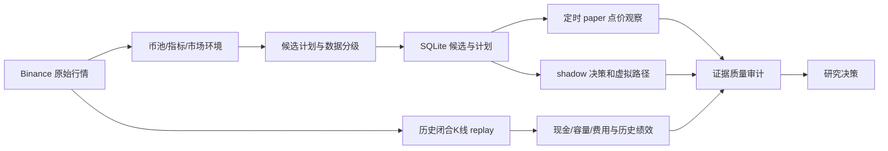

# 项目技术路线复盘与两周工作计划

复盘日期：2026-10-09（北京时间）。计划区间：2026-10-09 至 2026-10-22，共 14 个自然日。

代码基点：`ad2aff014798549ce20765c6c0b71c4dc7112eac`；最新运行证据截止 10-09 12:11。本次检查代码、既有报告、实验账本、Obsidian 实验日志和项目历史，并运行两个纯内存实现复现；没有新跑策略回测、A/B、scan 或 paper update，没有修改策略配置或业务数据库。执行后续计划与部署变更是后续工作，本报告不表示它们已经实施。

## 1. 负责人结论

**保留研究系统的基本架构；未来两周把主线改为执行正确性、证据可比性和运行连续性。当前还没有可信证据证明策略具有稳定、可执行、扣除成本后的优势。**

已经做对的事情很多：从固定币池转向动态 universe；把交易状态集中管理；保存运行、配置、事件和原始行情；对表现不稳定的策略分支停止部署；承认历史币池缺失，转向前向观察。这些积累应继续使用，不需要推倒重写。

最需要纠正的是研究顺序：先后筛了很多规则与组合，但成交先后、止损计价、真实资金约束、三条对照路径和持续运行仍未完全对齐。这样得到的收益改善，可能来自不同执行假设或资金路径，不能直接归因为“入场质量提高”。本次还复现了回测止损计价和 UNKNOWN 大盘状态放行两个实现问题。

两周成功标准是：能够解释每笔决策何时可知、何时可成交、钱怎么变化、漏数据时如何处理，以及哪些证据允许用来判断策略。两周内不承诺验证盈利，不上线 ATR 0.35、TP1 部分止盈或换仓。

## 2. 系统目标与当前技术路线

- **系统级目标**：构建可解释、可复现的 Binance USDT 现货研究与模拟系统，最终检验成本后交易优势。
- **本轮唯一主问题**：既有结论是否建立在同一套可执行、连续、可对账的交易口径上？
- **路线位置**：基础设施可信与前向验证的交界；先补可靠性，再讨论优势来源，实盘阶段尚未开始。
- **事实**：以下代码行为、已保存指标和两个内存复现。
- **观察**：部分组合在旧历史窗口改善；前向采集存在空档；ATR 同时点拒绝了所有 12 次原策略入场。
- **假设**：趋势恢复确认与 EMA 保护利润可能有价值，但优势能否在修正执行口径后保留仍未知。
- **决策建议**：保留默认参数及原始历史记录；冻结新增策略维度，优先修复实现和观察设计。修复后的执行语义必须有新版本，不静默覆盖旧绩效。

策略的朴素解释：先筛流动性和历史长度，再看 BTC/ETH 环境、趋势和回调，等价格重新站回入场区间后考虑买入；跌破止损退出，到 TP1 后跟随 EMA 抬高保护位，到 TP2 平仓。当前 TP1 只是状态变化，没有卖出 50%。



三条路径共享一些函数，但**目前不是等价执行器**。下一阶段先确定最小执行契约及共享事件顺序，不立即重写整个项目。

当前参数事实：24h 成交额至少 3,000 万 USDT、24h 成交笔数至少 3 万、180 日历史、top_n=5；RISK_OFF 核心币买入关闭；reclaim 与 TP1 EMA trailing 开启；ATR 门槛、TP1 保本、最大持仓时限未开启。回测有 1% 单笔风险、5 个活跃仓位、5% 总风险、现金约束及费用；paper 的账户权益目前只是逐计划仓位计算基数，不能当成同一受约束组合。

## 3. 做过哪些尝试，结果究竟说明什么

先用普通语言概括：降低弱市开仓、等待恢复确认和管理退出，曾比早期粗糙策略表现好；更严趋势、保本止损和换仓并非越多越好。ATR 0.35 是历史上较亮眼的候选，但后来证据显示，改善与“哪些仓位先占住位置”高度相关。数据分级修复确实修好了样本入口，停机与执行差异又限制了后续收益判断。

下表指标均为**原报告记录值**，不是本次重新验证后的成绩，也不能跨行相加。含 EMA trailing 的历史结果增加“止损计价/时序待复核”标记；依赖当前交易对 master 的结果保留幸存者偏差限制。

| 阶段与尝试 | 主要样本/观察 | 原报告结果 | 现在可以保留的结论 |
|---|---|---|---|
| 6 月固定币种 A/B → 动态 universe | 3 币扩至 13 币；2025-01→06；再扩展动态历史币池 | 早期 18 笔闭合、净收益 -4.34%、PF 0.719；固定币池下多个选币参数不改变结果 | 固定 symbols 绕过待测选币机制；改为动态 universe 是正确纠偏 |
| history 250/365、流动性 50m、严格追高 | 多个窗口、source-limit / max-symbols 逐步扩大 | 更严格历史/流动性有减亏样本，跨段不稳定；部分追高实验无变化 | `retest`；减亏不等于正期望，也不能归因于未实际触发的规则 |
| RISK_OFF 禁核心币 + reclaim | 2024-07→2025-06；2025-06→2026-06 | 净收益 -5.59%→11.74%、-10.62%→5.96%；PF 0.91→1.40、0.73→1.20；MDD 两窗下降 | 曾达到 `candidate_keep_review`，形成默认主线；当前需重验可执行成交口径 [E1] |
| TP1 保本、EMA trailing、日线趋势、large-cap 豁免 | 多个历史组合 | 简单保本变差；EMA 曾改善；强制日线趋势近窗退化；large-cap 豁免近窗 +3.12%→-3.12% | 不增加保本/日线/豁免规则；保留 EMA 的研究假设，先审计实现 [E2] |
| 大币/山寨分池 | 两个非重叠窗 | 大币 +14.14%、+3.46%；山寨 +11.71%、-10.26% | 只提供风险/资本配置线索；币池大小、暴露、容量不同，不是独立 alpha 证明 [E3] |
| 未到 TP1 的 18/30/42 根退出；固定 vs 条件 42 | 两近窗及 2023-24 第三窗 | sensitive+固定42：净收益 +2.37%→31.86%、+3.12%→15.95%，但早窗 MDD 18.03%→20.66%；条件42多数退化 | 固定42 `retest`，条件版不推进；第三窗历史 master 限制同样适用，不按原“三窗验证”强度引用 [E4] |
| 7 月固定机会集 shadow：reclaim / momentum / relative strength | 06-19→07-02、07-03→07-25；另有重叠短窗 | ATR0.25、相对强度-0.5、trend-support pullback 入围 | 是离线候选筛选，Total Decision R 不是组合净收益；重叠短窗不算新独立验证 [E5] |
| 相对强度 -1/-0.5/0 正式 A/B | 2024-07→2025-06；2025-06→2026-06 | -0.5 净收益 -2.09%→5.63%、3.11%→7.88%，早窗 MDD 16.59%→18.96% | `retest`，不部署；相邻阈值未解决回撤问题 [E6] |
| ATR 0.10/0.15/0.25/0.35 | 同两近端历史窗 | 0.35 净收益 -2.09%→18.20%、3.11%→9.33%；PF 0.95→1.62、1.11→1.31；MDD 两窗改善 | 历史候选；交易归因后为 path-dependent，现冻结为研究参照，未部署 [E7] |
| 容量/停滞仓位 replacement | 512 blocked events，42 合格比较，只有 3 个 stale-trade 簇 | R42 mean +0.309、median -0.223、胜出比例 42.9%、trimmed mean 约 0；最大簇占 83.3% | `paused_no_stable_executable_edge`；不换仓、不扩大仓位、不把同批事件包装成新 ranking 轴 [E8] |
| ATR 第三窗 N0–N4 | 2023-07→2024-07 | 组合账面改善，但 50 笔被直接过滤交易原本净赚 1335.62 USDT；current master 漏 147/413，按有效池口径仍漏 127/393=32.32% | 机制未获支持，且历史样本有结构性偏差；放弃该窗强验证，保留诊断 [E9] |
| 数据分级修复 | 08-16 后已存 90 candidates、40 BUY | 39 个 DEGRADED BUY 全建 plan；17 BLOCKED 全未建 plan | 工程修复 `keep`；不是收益验证，也不是完整旧新 scanner A/B [E10] |
| 退出缺口与 ATR 可信证据审计 | 8 个固定已退出计划；另 273 配对时点/29 plans | 3 笔原盈利应先止损；8 笔条件性毛损益 +1580.44→+791.53；12 次原入场均被 ATR 同时点拒绝 | 收益证据 `retest`；12 个入场机会内合格完整配对终态为 0，不能裁决 ATR 收益 [E11][E12] |
| TP1 卖出50% | 8 月仅准备实验卡 | `gated_not_approved / not_run` | 没有实验结果；继续挂起 [E13] |

ATR 的关键归因：共同交易没有普遍变好，variant-only 新增赢家贡献更大；近窗 top3 贡献超过总净改善。于是“0.35 挑到更好入场”与“改变持仓路径后碰巧腾出赢家位置”尚未分清。前向审计又发现记录器在原 paper 入场后停止该类 plan-level 观察；**0 次同时点放行不能解释为独立 ATR 策略永不交易**，candidate 虚拟路径实际上存在后续/不同时间入场，但执行口径不可比。[E7][E12]

## 4. 重大疏漏与方向风险

### P0-A：移动止损触发位与成交记账价不一致，已经复现

`backtest/replay.py:607` 先用旧 stop 计算 `stop_fill`，随后把当前收盘 EMA 和旧 fill 一起传入 `step_trade`（约 612–629 行）。`trade_state.py:96–121` 先抬 stop，再判断 low，成交却采用旧 override。

纯内存样例：entry=100、quantity=1、旧 stop=101、当前 EMA=112、bar high/low/close=115/110/114。输出：

```text
TP1_EMA_TRAILING_RAISED: 112
STOPPED: 100.899
```

即触发用 112，成交按旧 101 扣 10 bps，价格低于该 bar 的最低 110。**实现问题已证实，历史受影响次数、金额和方向尚未量化。** 不能简单给旧收益加一个修正值，资金与容量后续路径也会变。

另一个独立问题：利用本 bar 收盘才知道的 EMA 抬高止损，再检查本 bar 更早的 low，事件因果顺序不成立。修正旧 override 不自动修正这一点。建议先评估区间内已生效止损，再让收盘更新的 stop 于后续时点生效；这是待定稿的执行契约，不在本次改代码。

### P0-B：前向采样与保护单、断档处理之间存在实质差异

`paper_trader.py:1872–1877` 把当前 ticker 同时传成 high/low/close；离线 candidate outcome 在约 780 行只拿最新一根 bar。丢失的区间没有完整逐根推进。即使任务全部成功，盘中穿越止损也可能不被定时 ticker 捕获。

8 笔缺口审计已有真实影响：ADA/BTC/DOGE 原毛收益合计 +488.91，在固定原止损成交假设下变为 -300。其余 5 笔条件性毛收益仍为正，不代表都具备完整执行证据；其中 UNI 的退出时点提前。+791.53 也没有费用、daily/入场前机会和全组合路径，不能证明整体仍盈利。[E11]

应明确两种口径：原始真实观测不可改写；离线补算是重建证据，不能补造成历史前向实绩。若目标是交易所常驻保护单，必须在模拟中建出该语义；若目标是定时决策，回测必须采用相同决策时点和可成交价。

### P0-C：UNKNOWN 大盘状态失败回退与代码冲突，已经复现

`scanner.py:413–422` 在 regime API 失败后返回 `UNKNOWN / allows_alt_buy=False`，说明默认不放开山寨币；但约 264–266 行仅在 `RISK_OFF` 时真正阻断。

用已有测试的合成 SOL 行情、`allows_buy=False`，结果是 `RISK_OFF→WATCH_ONLY`，`UNKNOWN→BUY_CANDIDATE`，`NEUTRAL→BUY_CANDIDATE`。UNKNOWN 与失败回退契约冲突；NEUTRAL 的预期行为需核对策略意图，不能顺手当成已批准的禁买规则。历史实际出现次数及影响仍待审计。

### P1-A：scanner、历史 replay、paper、shadow 的交易定义不一致

| 维度 | 现状 | 后果 |
|---|---|---|
| 指标时点 | live scanner/market regime 直接使用 API 最后一根 K 线；历史 replay 截取已闭合 bar | live 未闭合指标不自动等于前视，但与历史信号不同 |
| reclaim 成交 | replay 用当根 close 确认，然后按同根 `entry_high + slippage` 入场；paper 需当前 ticker 回到区间并检查已闭合 reclaim | 收盘确认后的交易不能默认获得更早区间成交价 |
| EMA / stop | paper 传 EMA trailing，candidate counterfactual 不传；历史路径还存在 P0-A | 同名 baseline 的退出不是同一条规则 |
| 账户与成本 | replay 限现金/5仓/总风险并扣费；paper 逐笔用固定权益 sizing，shadow 无独立资金组合 | paper 毛 PnL、Decision R、回测净值不能直接比较 |
| 独立性 | plan-level shadow 随原 paper 入场停止该类观察；ATR shadow 与 incumbent 当前定义相同 | 三行不是三个独立样本，不能直接做独立组合归因 |

源码定位：`scanner.py:180–201,397–405,529–536`，`market_data.py:63–78`，`backtest/replay.py:705–814,881–883`，`paper_trader.py:358–379,833–857,1372–1395,1765–1784`。7 月时序审计已经发现 warning；本次应把它提升为收益解释的前置条件，而非只加报告备注。[E14]

### P1-B：反复挑选规则后，缺少真正未观察的数据

两个日期不重叠的窗口，若被反复用于选参数、组合、退出和阈值，就不再是新的样本外证明。`closed_trades >= 20`、`terminal >= 5` 是流程门槛，不是统计显著性；不同币也常暴露于同一市场冲击。相邻阈值都改善不能证明“不是过拟合”。多重试验会增加挑中偶然赢家的风险，依据为 Bailey 等人的[原始研究](https://www.davidhbailey.com/dhbpapers/overfitting.pdf)。本项目风险判断来自既有试验复用事实，不是对过拟合概率的估算。

应把已研究的 2024–26 窗口统一标为 development/diagnostic；新前向 epoch 冻结规则及执行版本。建立全试验登记，保留失败、无变化和停止分支；以后按时间/币种簇评估不确定性，并预声明主要指标。优先补可信数据，不急于引入庞大统计框架。

### P1-C：历史币池、基线漂移和文档状态让“进步”不可直接串联

动态 universe 已减少按当前排名回看历史的偏差，但当前 `exchangeInfo` master 仍缺历史退市币。N2/N3 的结论应限制所有使用该数据源的旧研究，不只限制 ATR 第三窗。[E9]

此外，6 月与 7 月同一早窗的 sensitive baseline 从 +2.37%/MDD18.03% 变成 -2.09%/MDD16.59%；18/30/42 的部分比较用了不同 max-symbols。原因要按代码、配置、缓存和 master 哈希核对，不能拼成持续提升曲线，也不能横排最优阈值。当前路线图还留着已做完的阈值敏感性和过期“terminal=0”，必须由最新状态覆盖。

另外，回测已在 `backtest/runner.py:183–198` 提供 BTC/ETH buy-and-hold 等 benchmark；不应重复建设，而应把共同风险/暴露尺度下的基准比较、成本压力与尾部损失纳入后续裁决。相对旧策略变好，并不自动证明值得投入资本；本轮先修执行，尚未进行这些新比较。

## 5. 截至最新证据的状态

10-09 12:11 自动报告：`decisions=1446`、`complete opportunities=174`、`symbols=45`、`mature terminal=16`、`controls_paper=0`。16 个由 7 ARCHIVED 与 9 个入场后退出组成；3 个 ENTERED、10 个 WATCHING 仍开放。candidate outcomes=375，terminal=248，不能当 248 笔独立真实闭合交易。[E15]

4h 已出现 00:10、04:10、08:10、12:10 四次恢复成功记录；最新 run 为 `20261009_041003_c8d9a1e6`。这比凌晨“单次恢复”有进展，但尚未构成完整多日连续验收。daily 最新成功仍为 09-23 20:05，09-03 两条 stale running 尚待核对；本次没有触发或修改调度任务。[E16]

08-16–08-22 原 epoch 实际有 35 candidates、8 plans、12 BLOCKED，另有 2 次逐计划 API skip。必须正式收口为“工程分级有效、完整连续绩效不通过/未证”，不能重复等待这段已经结束的日历时间。[E10]

剩余固定待审 cohort 是 TRX/ZRO/AAVE/SOL；虽然 ZRO 已退出，仍留在这四笔审计里。ATR 的 273 个配对时点、12 次入场核对已经由 `36413a8` 完成，不重复立项或重复取数；新增的是独立生命周期和执行一致性工程。

## 6. 两周执行计划：范围、交付与门槛

建议按单条工程主线推进；审计文档与被动自动采集可并行。先完成最小正确性修复，不把完整新组合引擎塞进两周硬期限。以下为计划，没有在本次实施修复或启动新策略实验。

| 日期 | 工作及负责人 | 交付物 | 验收与依赖 |
|---|---|---|---|
| 10/09–10/10（D1–D2） | 工程：冻结证据基线，收口旧 epoch，核对 daily 恢复与剩余四笔缺口；研究：现有证据分级 | 版本/数据清单、四笔审计、旧 epoch 结论、执行契约草案 | 原记录保留；每笔有 clean/gap-affected/unknown 理由；明确 P0-A/P0-C 的发生路径。契约包含闭合数据、信息时点、成交、stop生效、缺口/重试语义 |
| 10/11–10/13（D3–D5） | 工程：小步修复旧 stop fill、因果顺序、UNKNOWN 回退；建立关键调用层回归 | 小范围实现提交、确定性 fixture、历史影响清单 | 触发位与计价一致；收盘信息不作用于更早事件；同一 bar 不重放计费；UNKNOWN 行为与契约一致。NEUTRAL 行为单独明确，不能混入策略调整 |
| 10/14–10/15（D6–D7） | 工程：完成最小独立 shadow 路径切片及运行健康验收；研究：冻结比较协议 | 独立等待/入场/退出/过期/缺口状态规格与最小实现、配对对账、epoch manifest | baseline 入场不终止另一线观察；同输入同规则的状态与费用可对账；不能完成现金/容量时，仅认证单计划诊断，不认证组合。通过后以实际日期开新 epoch |
| 10/16–10/20（D8–D12） | 运维：维持既有频率收集；工程：核查逐计划覆盖、重试幂等；研究：固定旧规则做影响审计 | 每日运行/缺口表、冻结历史案例的修复前后影响报告、三线机制报告 | 不搜参数。重跑只解释实现修复影响，旧收益不覆盖；若执行实现再变更，收益验证 epoch 重新计时，历史证据仍保留 |
| 10/21–10/22（D13–D14） | 项目负责人+工程：阶段评审 | “已证明/被否定/仍未知”决策记录、下一阶段单一优先任务 | 按下列 G0–G2 分级；未收满连续窗口或交易样本就写不足，不降低门槛，不自动部署 |

建议精力：约 60% 执行正确性与一致性，25% 连续运行及存量审计，15% 研究登记和决策收口。新指标、ranking、capacity replacement、扩仓、TP1 50%、固定42上线和历史 master 大工程本轮均不启动。当前是无杠杆现货，资金费率/爆仓模型不是本轮缺口；盘口冲击、交易所数量/价格过滤及部分成交留在未来实盘门槛，不能混作已完成能力。

### 三道验收门

**G0：正确性与口径。** 两个复现变成回归约束；明确当前 close、next event/fill、旧/新 stop 生效顺序；paper/shadow 对照同一策略输入时具有一致的生命周期、费用和缺口分类。独立组合现金/容量未完成时，报告必须仍写“候选/单计划诊断”，capacity contribution 保持 n/a。

**G1：连续运行。** 稳定版本后至少 7 个完整北京时间自然日，按现有调度应有 7 次 daily + 35 次 scheduled 4h。还要逐计划核对应该评价的区间：任务 success 不替代行情可用；任何漏评价都必须被识别、分类，受影响交易不算 clean。原定每日第六个市场4h区间如何由 daily 覆盖，须在执行契约写清；不能把 5 次调度当成完整 6 根闭合4h覆盖。缺口/未知会使“无缺口收益证据”门槛失败，但不是删除整个运维观察。若 10/15 定稿，最早完整观察可为 10/16–10/22，要到 10/23 00:00 才满七个完整自然日；10/22评审可先评进度，不能提前宣布G1通过。若继续改执行代码或停机，窗口顺延。

**G2：研究可回答性。** 分开报告候选数、独立 plan 数、入场后退出数、ARCHIVED、受污染、右截尾及真正同口径配对样本数。16 terminal 或 >=20 closed 都不能单独证明 alpha。两周交易少也可以完成 G0/G1；G2 无证据时仍写 `insufficient_evidence`。

### 允许排入计划的验证卡（都不是新策略搜索）

| 卡片 | 唯一问题与路线位置 | 支持标准 | 否定标准 | 证据不足 |
|---|---|---|---|---|
| V1 执行一致性审计 | 既有规则在同信息集、同执行时序下能否被各适配器一致推进？基础设施门 | 确定性 fixture 的状态/数量/现金/费用逐事件一致；差异都有明确的观测模式解释 | 尚有不可成交 fill、前视、重复扣费或同规则无解释差异 | 行情/旧记录缺字段，无法唯一判定顺序；按 unknown 隔离，不择有利路径 |
| V2 已冻结 ATR 前向机制复核 | 在合格独立路径中，0.35 的直接过滤价值是否覆盖错失/延迟机会？既有假设归因 | 预先冻结机会集/成本/主指标后，配对净贡献改善，不依赖单个币或时间簇，风险无实质恶化；仅允许进入候选审查 | 足够可比样本显示错失机会持续超过避免亏损，或预声明风险界限失败 | 放行过少、右截尾、缺口、身份未确认、执行不等价、置信区间跨零；本批仍不足 |

V2 正式读取新的绩效结果前，应补齐样本单位、固定评审日、最小可检测效应/容忍回撤、按币与时间簇的不确定性方法及停止规则；缺这些就只做描述，不事后挑胜出指标。依照工作区规则，生产策略参数或交易规则部署仍须明确批准；工程修复按后续授权任务执行，不因本报告自动实施。

## 7. 复核证据与可复现性

本次两个实现复现仅用合成数据，不是市场实验。没有修复生产代码，故不宣称测试套件已验证修复。下面的脚本可在根目录以 PowerShell 运行，不写数据库：

```powershell
@'
import sys, runpy
sys.path.insert(0, "src")
from crypto_trading_system.trade_state import step_trade
ns = runpy.run_path("tests/test_trade_state.py")
t = ns["make_trade"]("TP1_HIT")
t.entry_price, t.quantity, t.stop_loss = 100.0, 1.0, 101.0
t.take_profit_2 = 130.0
t.tp1_trailing_ema_stop_active = True
events = step_trade(t, high=115, low=110, close=114,
    event_time_utc="2026-01-02T00:00:00Z",
    stop_exit_price_override=101 * (1-10/10000),
    tp1_trailing_ema_stop=112, tp1_trailing_ema_stop_ready=True)
print(t.stop_loss, t.exit_price, [(e.event_type, e.price) for e in events])
ns = runpy.run_path("tests/test_scanner_regime.py")
series = ns["_trend_series"]
ticker = ns["RawTicker"]("SOLUSDT", "SOL", 120, 2, 100000000, 100000, 5)
for state in ["RISK_OFF", "UNKNOWN", "NEUTRAL"]:
    c = ns["_analyze_ticker"](ticker, series(220,3600000),
        series(140,14400000), series(220,86400000), 2.0,
        min_history_days=180, market_regime_allows_buy=False,
        market_regime_status=state, risk_off_core_buy_enabled=False)
    print(state, c.action)
'@ | python -B -
```

扫描/回放数据时点的外部核对依据：[Binance K线字段与时间](https://developers.binance.com/en/docs/catalog/core-trading-spot-trading/api/rest-api/market)。未来可执行订单还受[交易所过滤规则](https://developers.binance.com/en/docs/products/spot/filters)约束；本次没有连接账户、下单或核验账户实际费率。

### 本地证据索引

- E1：[regime + reclaim 双窗汇总](../2026-06-11/abtest_summary_dynamic_universe_risk_off_no_core_entry_reclaim_2026-06-11_v1.md)。
- E2：[截至6月18日实验索引](../2026-06-18/experiment_index_2026-06-18_v1.md)，[实验账本](../../EXPERIMENT_LEDGER.md)。
- E3：[近窗市值分池](../2026-06-11/market_cap_split_sensitive_2026-06-11_v1.md)，[早窗大币](../2026-06-11/backtest_dynamic_universe_2024-07-01_2025-06-01_v14.md)，[早窗山寨](../2026-06-11/backtest_dynamic_universe_2024-07-01_2025-06-01_v15.md)。
- E4：[固定42总绩效](../2026-06-13/abtest_summary_dynamic_universe_risk_off_no_core_entry_reclaim_ema_stop_sensitive_max_holding_42_2026-06-13_v1.md)，[42根退出复盘](../2026-06-13/max_holding_42_exit_review_2026-06-13_v1.md)，[固定与条件42](../2026-06-16/max_holding_42_fixed_vs_conditional_review_2026-06-16_v1.md)。
- E5：[shadow跨窗口](../2026-07-25/paper_shadow_experiment_cross_window_review_2026-07-25_v1.md)。
- E6：[相对强度敏感性](../2026-07-26/relative_strength_soft_gate_threshold_sensitivity_2026-07-26_v1.md)。
- E7：[ATR0.35双窗](../2026-07-26/abtest_summary_dynamic_universe_atr_reclaim_0_35_2026-07-26_v1.md)，[交易归因](../2026-07-26/atr_reclaim_0_35_trade_attribution_review_2026-07-26_v1.md)。
- E8：[42事件主比较](../2026-07-27/blocked_candidate_vs_stale_slot_review_2026-07-27_v1.md)，[replacement收口](../2026-07-27/replacement_closure_audit_2026-07-27_v1.md)，[8月研究方向讨论](../../claude-discussions/2026-08-16-0048-next-research-direction.md)。
- E9：[N1诊断](../2026-07-30/atr_reclaim_0_35_n1_diagnostic_retest_review_2026-07-30_v1.md)，[N2](../2026-07-30/atr_reclaim_stage_n2_universe_audit_2026-07-30_v2.md)，[N3](../2026-07-30/atr_reclaim_stage_n3_historical_membership_dataset_2026-07-30_v1.md)，[N4](../2026-07-30/atr_reclaim_stage_n4_historical_master_mvp_2026-07-30_v1.md)，[第三窗收口](../2026-07-30/atr_reclaim_2023_2024_window_abandonment_decision_2026-07-30_v1.md)。
- E10：[采集和分级验收](../2026-10-08/data_collection_status_review_2026-10-08_v1.md)。
- E11：[8笔退出缺口审计](closed_trade_gap_audit_2026-10-09_v1.md)。
- E12：[ATR可信证据审计](atr_0_35_trusted_evidence_review_2026-10-09_v1.md)。
- E13：[TP1实验卡](../2026-08-16/tp1_partial_take_profit_50_experiment_card_2026-08-16_v1.md)。
- E14：[7月成交时序审计](../2026-07-27/signal_fill_timing_audit_2026-07-27_v1.md)。
- E15：[最新三线对账v4](paper_shadow_reconciliation_2026-10-09_demo_v4.md)。
- E16：[12:11运行仪表](paper_4h_dashboard_1211_demo_v1.md)。

核对时生产设置文件 SHA256：`BE7EC39EC21F6A838571511CB2CD0E290263031B521A9A07A6FB70164B8EF4BF`。已有 `scripts/run_logged_paper_task.ps1` 本地修改保持原状，不纳入本次文档提交。会话期间其他审计已提交为 `36413a8/ad2aff0`，本次按其最终报告更新引用，没有覆盖其工作。收尾时另有并行的 `independent_shadow_contract_2026-10-09_v1.md` 与 `paper_shadow_forward.py` 工作草稿；它们不属于本次基点或验收结果。后续计划应复用并审查该工程进展，避免重新起炉灶，本次不提交其未完成文件。
