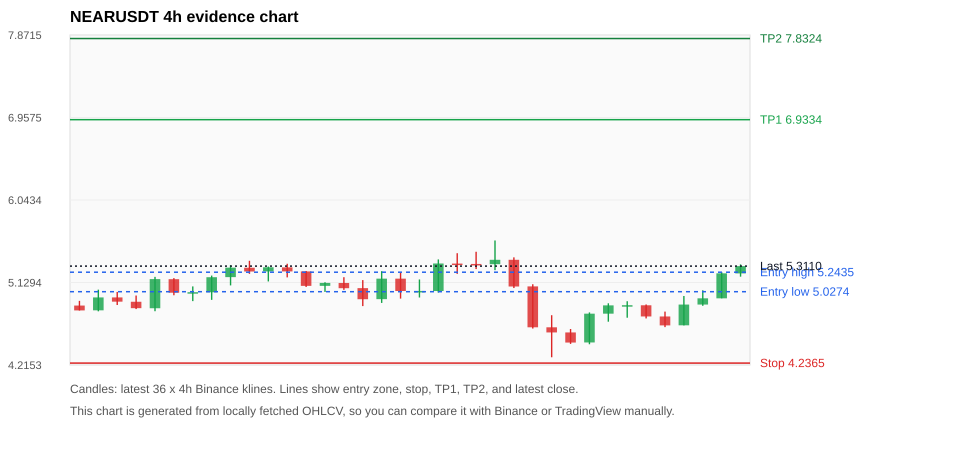
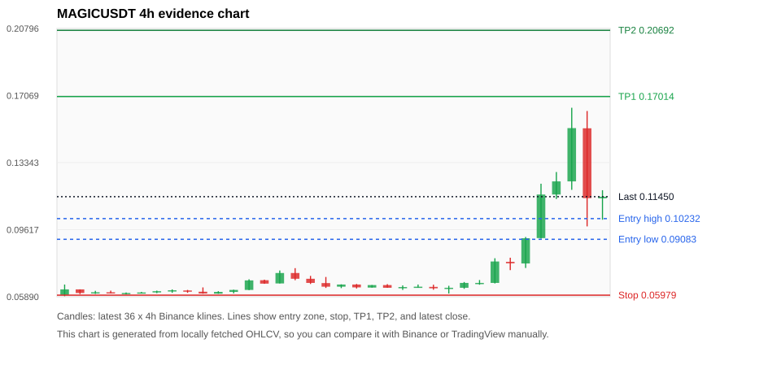
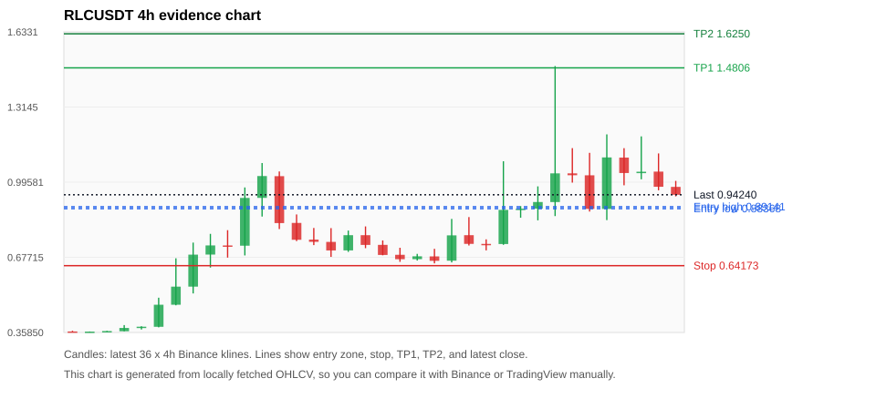
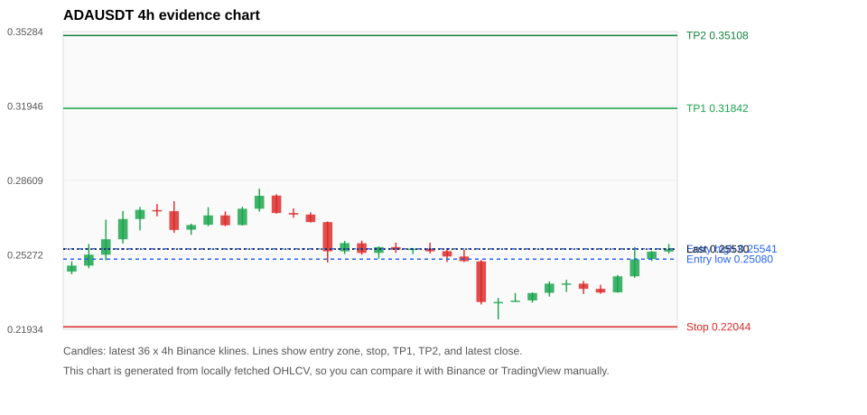
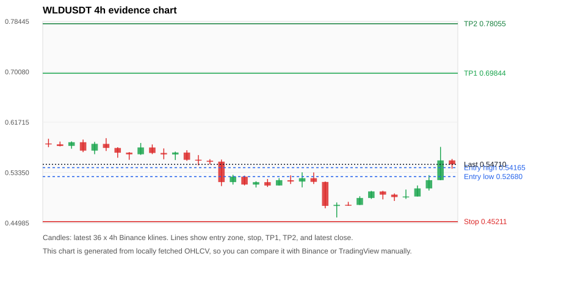

# Crypto 市场扫描报告 v1

- 报告时间：2026-10-10 20:07:16 CST
- Run ID：`20261010_120503_01ef3673`
- Run type：`daily_full`
- Data validation mode：`paper`
- 数据来源：SQLite
- 报告版本：v1
- 扫描 ID：d8b9057bb081
- 数据源：Binance public spot API + CoinGecko/CoinMarketCap cross-check
- 过滤条件：USDT spot; 24h quote volume >= 30,000,000; trades >= 30,000; exclude stables/leveraged tokens; analyze 1h/4h/1d klines
- 默认单笔风险：账户权益的 1.00%

## 限制说明

- 交易信号仍以 Binance 现货公开 K 线为主源；外部数据源用于一致性复核。
- 结果是研究和模拟盘计划，不是确定收益或实盘下单指令。
- 历史长度过滤：候选币至少需要 180 根 1d K 线。
- 数据质量验证池：先验证 score 排名前 min(top_n * 2, 10) 的候选，再按 action + score 补足最终名单。
- 指标截止：2026-10-10T12:05:19.599000+00:00；仅使用此前至少60秒已闭合K线，ticker为扫描时点观测。
- 大盘环境过滤：RISK_OFF; BTC/ETH 大盘偏弱，山寨币买入候选降级为观察。 BTC 7d=-2.227288598015964; ETH 7d=-6.778486016960283.
- Data cross-validation enabled: Binance primary source plus CoinGecko; CoinMarketCap is checked when an API key is configured.
- MAGICUSDT validation state BLOCKED: BLOCKED: [BINANCE_KLINE_EXTREME_RANGE] Binance candle range exceeds 40%.; [BINANCE_KLINE_EXTREME_RANGE] Binance candle range exceeds 40%.; [BINANCE_KLINE_EXTREME_RANGE] Binance candle range exceeds 40%.; [EXTERNAL_PRICE_DIFF_WARNING] price diff 1.46% exceeds warning threshold; [EXTERNAL_IDENTITY_AMBIGUOUS] CoinGecko symbol mapping has 3 exact matches; selected highest market-cap rank; [EXTERNAL_PRICE_DIFF_WARNING] price diff 1.36% exceeds warning threshold; [EXTERNAL_IDENTITY_AMBIGUOUS] CoinMarketCap symbol mapping has 5 matches; selected lowest cmc_rank
- RLCUSDT validation state BLOCKED: BLOCKED: [BINANCE_KLINE_EXTREME_RANGE] Binance candle range exceeds 40%.; [BINANCE_KLINE_EXTREME_RANGE] Binance candle range exceeds 40%.; [BINANCE_KLINE_EXTREME_RANGE] Binance candle range exceeds 40%.; [BINANCE_KLINE_EXTREME_RANGE] Binance candle range exceeds 40%.; [BINANCE_KLINE_EXTREME_RANGE] Binance candle range exceeds 40%.; [BINANCE_KLINE_EXTREME_RANGE] Binance candle range exceeds 40%.; [BINANCE_KLINE_EXTREME_RANGE] Binance candle range exceeds 40%.; [BINANCE_KLINE_EXTREME_RANGE] Binance candle range exceeds 40%.; [BINANCE_KLINE_EXTREME_RANGE] Binance candle range exceeds 40%.; [BINANCE_KLINE_EXTREME_RANGE] Binance candle range exceeds 40%.; [BINANCE_KLINE_EXTREME_RANGE] Binance candle range exceeds 40%.
- ADAUSDT validation state DEGRADED: DEGRADED: [EXTERNAL_IDENTITY_AMBIGUOUS] CoinMarketCap symbol mapping has 3 matches; selected lowest cmc_rank
- WLDUSDT validation state BLOCKED: BLOCKED: [BINANCE_KLINE_EXTREME_RANGE] Binance candle range exceeds 40%.; [EXTERNAL_IDENTITY_AMBIGUOUS] CoinMarketCap symbol mapping has 2 matches; selected lowest cmc_rank
- SUIUSDT validation state DEGRADED: DEGRADED: [EXTERNAL_PROVIDER_RATE_LIMITED] Provider rate limited request for https://api.coingecko.com/api/v3/coins/markets?vs_currency=usd&ids=sui&price_change_percentage=24h&per_page=1&page=1: HTTP 429; [EXTERNAL_IDENTITY_AMBIGUOUS] CoinMarketCap symbol mapping has 5 matches; selected lowest cmc_rank
- BTCUSDT validation state DEGRADED: DEGRADED: [EXTERNAL_PROVIDER_RATE_LIMITED] Provider rate limited request for https://api.coingecko.com/api/v3/coins/markets?vs_currency=usd&ids=bitcoin&price_change_percentage=24h&per_page=1&page=1: HTTP 429; [EXTERNAL_IDENTITY_AMBIGUOUS] CoinMarketCap symbol mapping has 13 matches; selected lowest cmc_rank
- ETHUSDT validation state DEGRADED: DEGRADED: [EXTERNAL_PROVIDER_RATE_LIMITED] Provider rate limited request for https://api.coingecko.com/api/v3/coins/markets?vs_currency=usd&ids=ethereum&price_change_percentage=24h&per_page=1&page=1: HTTP 429; [EXTERNAL_IDENTITY_AMBIGUOUS] CoinMarketCap symbol mapping has 6 matches; selected lowest cmc_rank
- BNBUSDT validation state DEGRADED: DEGRADED: [EXTERNAL_PROVIDER_RATE_LIMITED] Provider rate limited request for https://api.coingecko.com/api/v3/coins/markets?vs_currency=usd&ids=binancecoin&price_change_percentage=24h&per_page=1&page=1: HTTP 429; [EXTERNAL_IDENTITY_AMBIGUOUS] CoinMarketCap symbol mapping has 4 matches; selected lowest cmc_rank
- XRPUSDT validation state DEGRADED: DEGRADED: [EXTERNAL_PROVIDER_RATE_LIMITED] Provider rate limited request for https://api.coingecko.com/api/v3/coins/markets?vs_currency=usd&ids=ripple&price_change_percentage=24h&per_page=1&page=1: HTTP 429; [EXTERNAL_IDENTITY_AMBIGUOUS] CoinMarketCap symbol mapping has 3 matches; selected lowest cmc_rank

## 5 个候选交易计划

| Rank | Coin | Action | Setup | Entry Zone | Stop Loss | TP1 | TP2 / Exit Rule | R/R | Verdict |
|---:|---|---|---|---:|---:|---:|---|---:|---|
| 1 | `NEAR` | `WAIT_PULLBACK` | 趋势中，等回调入场 | 5.0274 - 5.2435 | 4.2365 | 6.9334 | 7.8324 或跌破 4h 关键支撑 | 2.00-3.00 | 只等回调 |
| 2 | `MAGIC` | `WATCH_ONLY` | 涨幅较远，只等深回调 | 0.09083 - 0.10232 | 0.05979 | 0.17014 | 0.20692 或跌破 4h 关键支撑 | 2.00-3.00 | 只观察 |
| 3 | `RLC` | `WATCH_ONLY` | 趋势中，等回调入场 | 0.88368 - 0.89141 | 0.64173 | 1.4806 | 1.6250 或跌破 4h 关键支撑 | 2.41-3.00 | 只观察 |
| 4 | `ADA` | `WATCH_ONLY` | 回踩支撑/4h EMA 附近 | 0.25080 - 0.25541 | 0.22044 | 0.31842 | 0.35108 或跌破 4h 关键支撑 | 2.00-3.00 | 只观察 |
| 5 | `WLD` | `WATCH_ONLY` | 趋势中，等回调入场 | 0.52680 - 0.54165 | 0.45211 | 0.69844 | 0.78055 或跌破 4h 关键支撑 | 2.00-3.00 | 只观察 |

## 数据交叉验证摘要

价格差异以 Binance 当前价为基准；成交量口径不同，Binance 是 USDT 现货成交额，CoinGecko/CoinMarketCap 通常是全市场成交量。

| Rank | Coin | State | Identity | Max Price Diff | Max 24h Diff | Issue Codes | Message |
|---:|---|---|---|---:|---:|---|---|
| 1 | `NEAR` | CLEAN (DATA_OK) | CONFIRMED | 0.21% | 0.41 pts | none | CLEAN: External provider checks agree with Binance within configured thresholds. |
| 2 | `MAGIC` | BLOCKED (DATA_ERROR) | UNCONFIRMED | 1.46% | 0.96 pts | BINANCE_KLINE_EXTREME_RANGE, EXTERNAL_IDENTITY_AMBIGUOUS, EXTERNAL_PRICE_DIFF_WARNING | BLOCKED: [BINANCE_KLINE_EXTREME_RANGE] Binance candle range exceeds 40%.; [BINANCE_KLINE_EXTREME_RANGE] Binance candle range exceeds 40%.; [BINANCE_KLINE_EXTREME_RANGE] Binance candle range exceeds 40%.; [EXTERNAL_PRICE_DIFF_WARNING] price diff 1.46% exceeds warning threshold; [EXTERNAL_IDENTITY_AMBIGUOUS] CoinGecko symbol mapping has 3 exact matches; selected highest market-cap rank; [EXTERNAL_PRICE_DIFF_WARNING] price diff 1.36% exceeds warning threshold; [EXTERNAL_IDENTITY_AMBIGUOUS] CoinMarketCap symbol mapping has 5 matches; selected lowest cmc_rank |
| 3 | `RLC` | BLOCKED (DATA_ERROR) | CONFIRMED | 0.09% | 0.19 pts | BINANCE_KLINE_EXTREME_RANGE | BLOCKED: [BINANCE_KLINE_EXTREME_RANGE] Binance candle range exceeds 40%.; [BINANCE_KLINE_EXTREME_RANGE] Binance candle range exceeds 40%.; [BINANCE_KLINE_EXTREME_RANGE] Binance candle range exceeds 40%.; [BINANCE_KLINE_EXTREME_RANGE] Binance candle range exceeds 40%.; [BINANCE_KLINE_EXTREME_RANGE] Binance candle range exceeds 40%.; [BINANCE_KLINE_EXTREME_RANGE] Binance candle range exceeds 40%.; [BINANCE_KLINE_EXTREME_RANGE] Binance candle range exceeds 40%.; [BINANCE_KLINE_EXTREME_RANGE] Binance candle range exceeds 40%.; [BINANCE_KLINE_EXTREME_RANGE] Binance candle range exceeds 40%.; [BINANCE_KLINE_EXTREME_RANGE] Binance candle range exceeds 40%.; [BINANCE_KLINE_EXTREME_RANGE] Binance candle range exceeds 40%. |
| 4 | `ADA` | DEGRADED (DATA_WARNING) | UNCONFIRMED | 0.08% | 0.11 pts | EXTERNAL_IDENTITY_AMBIGUOUS | DEGRADED: [EXTERNAL_IDENTITY_AMBIGUOUS] CoinMarketCap symbol mapping has 3 matches; selected lowest cmc_rank |
| 5 | `WLD` | BLOCKED (DATA_ERROR) | UNCONFIRMED | 0.11% | 0.03 pts | BINANCE_KLINE_EXTREME_RANGE, EXTERNAL_IDENTITY_AMBIGUOUS | BLOCKED: [BINANCE_KLINE_EXTREME_RANGE] Binance candle range exceeds 40%.; [EXTERNAL_IDENTITY_AMBIGUOUS] CoinMarketCap symbol mapping has 2 matches; selected lowest cmc_rank |

## 候选币说明

### 1. NEAR `NEARUSDT`



- 入选原因：趋势中，等回调入场；24h +8.80%，7d +13.87%，4h RSI 49.54，24h 成交额 $131.1M。
- 交易失效条件：跌破 4.236485 或 4h 收盘重新失守关键支撑。
- 主要风险：BTC/ETH 大盘环境未确认强势，山寨币买入信号降级。
- 数据交叉验证：CLEAN / DATA_OK；身份=CONFIRMED；CLEAN: External provider checks agree with Binance within configured thresholds.

#### 可点击人工验证

- [Binance 交易页](https://www.binance.com/en/trade/NEAR_USDT)
- [TradingView 图表](https://www.tradingview.com/chart/?symbol=BINANCE%3ANEARUSDT)
- [CoinGecko 搜索](https://www.coingecko.com/en/search?query=NEAR)
- [CoinMarketCap 搜索](https://coinmarketcap.com/search/?q=NEAR)

#### 多数据源对照

| Source | Status | Identity | Blocking | Asset ID | Price | 24h Change | 24h Volume | Price Diff | 24h Diff | Updated | Issue Codes | Message |
|---|---|---|---:|---|---:|---:|---:|---:|---:|---|---|---|
| Binance | DATA_OK | CONFIRMED | no | NEARUSDT | 5.3110 | +8.80% | $131.1M | 0.00% | 0.00 pts | 2026-10-10T12:06:19+00:00 | none | Primary market data source passed health checks. |
| CoinGecko | DATA_OK | CONFIRMED | no | near | 5.3000 | +9.21% | $855.4M | 0.21% | 0.41 pts | 2026-10-10T12:05:57.000Z | none | External source agrees with Binance within thresholds. |
| CoinMarketCap | DATA_OK | CONFIRMED | no | 6535 | 5.3103 | +9.03% | $976.7M | 0.01% | 0.23 pts | 2026-10-10T12:05:02.000Z | none | External source agrees with Binance within thresholds. |

#### 指标证据

| 指标 | 数值 | 人工核对用途 |
|---|---:|---|
| 当前价 | 5.3110 | 与 Binance/TradingView 当前价格对照 |
| 24h 涨跌 | +8.80% | 与交易所 24h 涨跌对照 |
| 7d 涨跌 | +13.87% | 判断短线趋势是否延续 |
| 4h EMA20 | 4.9765 | 判断短期趋势支撑 |
| 4h EMA50 | 4.9611 | 判断中期趋势支撑 |
| 1d EMA20 | 4.5882 | 判断日线趋势 |
| 1d EMA50 | 3.6720 | 判断日线趋势 |
| 4h RSI14 | 49.54 | 判断是否过热/过弱 |
| 4h ATR14 | 0.27007 | 推导止损和入场缓冲 |
| 最近 18 根 4h 最低点 | 4.3010 | 支撑/止损参考 |
| 最近 36 根 4h 最高点 | 5.5950 | TP/压力参考 |
| 支撑位 | 4.9765 | 入场区间推导基础 |

#### 交易计划推导

- 支撑位 = 最近低点、4h EMA20、4h EMA50、1d EMA20 中不高于当前价的最高有效支撑 = `4.9765`。
- 入场区间 = 支撑位附近 + ATR 缓冲 = `5.0274 - 5.2435`。
- 止损 = min(最近 18 根 4h 最低点 * 0.985, 入场中位价 - 1.15 * ATR14) = `4.2365`。
- TP1 = max(最近 36 根 4h 最高点 * 0.995, 入场中位价 + 2R) = `6.9334`。
- TP2 = max(入场中位价 + 3R, TP1 * 1.04) = `7.8324`。

#### 最近 10 根 4h K线

| UTC 开盘时间 | Open | High | Low | Close | Quote Volume | Trades |
|---|---:|---:|---:|---:|---:|---:|
| 2026-10-08T20:00+00:00 | 4.5760 | 4.6140 | 4.4490 | 4.4640 | $21.9M | 94909 |
| 2026-10-09T00:00+00:00 | 4.4650 | 4.7980 | 4.4450 | 4.7840 | $35.8M | 144292 |
| 2026-10-09T04:00+00:00 | 4.7840 | 4.8990 | 4.6950 | 4.8760 | $27.8M | 105892 |
| 2026-10-09T08:00+00:00 | 4.8750 | 4.9220 | 4.7390 | 4.8780 | $19.8M | 84148 |
| 2026-10-09T12:00+00:00 | 4.8770 | 4.8860 | 4.7310 | 4.7530 | $16.2M | 82251 |
| 2026-10-09T16:00+00:00 | 4.7530 | 4.8070 | 4.6350 | 4.6540 | $17.3M | 68771 |
| 2026-10-09T20:00+00:00 | 4.6550 | 4.9800 | 4.6540 | 4.8850 | $23.8M | 91923 |
| 2026-10-10T00:00+00:00 | 4.8850 | 5.0430 | 4.8710 | 4.9540 | $17.4M | 84641 |
| 2026-10-10T04:00+00:00 | 4.9540 | 5.2430 | 4.9540 | 5.2310 | $31.0M | 122665 |
| 2026-10-10T08:00+00:00 | 5.2300 | 5.3300 | 5.1940 | 5.3110 | $24.5M | 90681 |

### 2. MAGIC `MAGICUSDT`



- 入选原因：涨幅较远，只等深回调；24h +48.81%，7d +102.30%，4h RSI 69.14，24h 成交额 $76.0M。
- 交易失效条件：跌破 0.0597895 或 4h 收盘重新失守关键支撑。
- 主要风险：距离支撑偏远，不能追市价；24h 振幅较大，回撤风险高；成交量突增，可能是事件驱动；BTC/ETH 大盘环境未确认强势，山寨币买入信号降级；Blocking data-quality issue detected; paper plan creation is not allowed.。
- 数据交叉验证：BLOCKED / DATA_ERROR；身份=UNCONFIRMED；BLOCKED: [BINANCE_KLINE_EXTREME_RANGE] Binance candle range exceeds 40%.; [BINANCE_KLINE_EXTREME_RANGE] Binance candle range exceeds 40%.; [BINANCE_KLINE_EXTREME_RANGE] Binance candle range exceeds 40%.; [EXTERNAL_PRICE_DIFF_WARNING] price diff 1.46% exceeds warning threshold; [EXTERNAL_IDENTITY_AMBIGUOUS] CoinGecko symbol mapping has 3 exact matches; selected highest market-cap rank; [EXTERNAL_PRICE_DIFF_WARNING] price diff 1.36% exceeds warning threshold; [EXTERNAL_IDENTITY_AMBIGUOUS] CoinMarketCap symbol mapping has 5 matches; selected lowest cmc_rank

#### 可点击人工验证

- [Binance 交易页](https://www.binance.com/en/trade/MAGIC_USDT)
- [TradingView 图表](https://www.tradingview.com/chart/?symbol=BINANCE%3AMAGICUSDT)
- [CoinGecko 搜索](https://www.coingecko.com/en/search?query=MAGIC)
- [CoinMarketCap 搜索](https://coinmarketcap.com/search/?q=MAGIC)

#### 多数据源对照

| Source | Status | Identity | Blocking | Asset ID | Price | 24h Change | 24h Volume | Price Diff | 24h Diff | Updated | Issue Codes | Message |
|---|---|---|---:|---|---:|---:|---:|---:|---:|---|---|---|
| Binance | DATA_ERROR | CONFIRMED | yes | MAGICUSDT | 0.11450 | +48.81% | $76.0M | 0.00% | 0.00 pts | 2026-10-10T12:06:19+00:00 | BINANCE_KLINE_EXTREME_RANGE | [BINANCE_KLINE_EXTREME_RANGE] Binance candle range exceeds 40%.; [BINANCE_KLINE_EXTREME_RANGE] Binance candle range exceeds 40%.; [BINANCE_KLINE_EXTREME_RANGE] Binance candle range exceeds 40%. |
| CoinGecko | DATA_WARNING | UNCONFIRMED | yes | magic | 0.11282 | +49.04% | $372.7M | 1.46% | 0.23 pts | 2026-10-10T12:05:57.000Z | EXTERNAL_IDENTITY_AMBIGUOUS, EXTERNAL_PRICE_DIFF_WARNING | [EXTERNAL_PRICE_DIFF_WARNING] price diff 1.46% exceeds warning threshold; [EXTERNAL_IDENTITY_AMBIGUOUS] CoinGecko symbol mapping has 3 exact matches; selected highest market-cap rank |
| CoinMarketCap | DATA_WARNING | UNCONFIRMED | yes | 14783 | 0.11295 | +49.78% | $463.8M | 1.36% | 0.96 pts | 2026-10-10T12:05:02.000Z | EXTERNAL_IDENTITY_AMBIGUOUS, EXTERNAL_PRICE_DIFF_WARNING | [EXTERNAL_PRICE_DIFF_WARNING] price diff 1.36% exceeds warning threshold; [EXTERNAL_IDENTITY_AMBIGUOUS] CoinMarketCap symbol mapping has 5 matches; selected lowest cmc_rank |

#### 指标证据

| 指标 | 数值 | 人工核对用途 |
|---|---:|---|
| 当前价 | 0.11450 | 与 Binance/TradingView 当前价格对照 |
| 24h 涨跌 | +48.81% | 与交易所 24h 涨跌对照 |
| 7d 涨跌 | +102.30% | 判断短线趋势是否延续 |
| 4h EMA20 | 0.09065 | 判断短期趋势支撑 |
| 4h EMA50 | 0.07466 | 判断中期趋势支撑 |
| 1d EMA20 | 0.06321 | 判断日线趋势 |
| 1d EMA50 | 0.05392 | 判断日线趋势 |
| 4h RSI14 | 69.14 | 判断是否过热/过弱 |
| 4h ATR14 | 0.01624 | 推导止损和入场缓冲 |
| 最近 18 根 4h 最低点 | 0.06070 | 支撑/止损参考 |
| 最近 36 根 4h 最高点 | 0.16390 | TP/压力参考 |
| 支撑位 | 0.09065 | 入场区间推导基础 |

#### 交易计划推导

- 支撑位 = 最近低点、4h EMA20、4h EMA50、1d EMA20 中不高于当前价的最高有效支撑 = `0.09065`。
- 入场区间 = 支撑位附近 + ATR 缓冲 = `0.09083 - 0.10232`。
- 止损 = min(最近 18 根 4h 最低点 * 0.985, 入场中位价 - 1.15 * ATR14) = `0.05979`。
- TP1 = max(最近 36 根 4h 最高点 * 0.995, 入场中位价 + 2R) = `0.17014`。
- TP2 = max(入场中位价 + 3R, TP1 * 1.04) = `0.20692`。

#### 最近 10 根 4h K线

| UTC 开盘时间 | Open | High | Low | Close | Quote Volume | Trades |
|---|---:|---:|---:|---:|---:|---:|
| 2026-10-08T20:00+00:00 | 0.06390 | 0.06710 | 0.06330 | 0.06660 | $195,793 | 3248 |
| 2026-10-09T00:00+00:00 | 0.06650 | 0.06820 | 0.06560 | 0.06660 | $157,901 | 2170 |
| 2026-10-09T04:00+00:00 | 0.06660 | 0.08030 | 0.06630 | 0.07850 | $3.3M | 40229 |
| 2026-10-09T08:00+00:00 | 0.07830 | 0.08060 | 0.07370 | 0.07750 | $2.9M | 30980 |
| 2026-10-09T12:00+00:00 | 0.07740 | 0.09210 | 0.07490 | 0.09140 | $4.9M | 42334 |
| 2026-10-09T16:00+00:00 | 0.09150 | 0.12170 | 0.09120 | 0.11570 | $14.6M | 136900 |
| 2026-10-09T20:00+00:00 | 0.11570 | 0.12820 | 0.11320 | 0.12300 | $7.7M | 88895 |
| 2026-10-10T00:00+00:00 | 0.12300 | 0.16390 | 0.11830 | 0.15260 | $16.4M | 133930 |
| 2026-10-10T04:00+00:00 | 0.15250 | 0.16210 | 0.09800 | 0.11370 | $22.1M | 193631 |
| 2026-10-10T08:00+00:00 | 0.11360 | 0.11810 | 0.10170 | 0.11450 | $10.3M | 96534 |

### 3. RLC `RLCUSDT`



- 入选原因：趋势中，等回调入场；24h -8.45%，7d +156.78%，4h RSI 64.25，24h 成交额 $32.8M。
- 交易失效条件：跌破 0.6417275 或 4h 收盘重新失守关键支撑。
- 主要风险：24h 振幅较大，回撤风险高；BTC/ETH 大盘环境未确认强势，山寨币买入信号降级；24h 动量未确认；Blocking data-quality issue detected; paper plan creation is not allowed.。
- 数据交叉验证：BLOCKED / DATA_ERROR；身份=CONFIRMED；BLOCKED: [BINANCE_KLINE_EXTREME_RANGE] Binance candle range exceeds 40%.; [BINANCE_KLINE_EXTREME_RANGE] Binance candle range exceeds 40%.; [BINANCE_KLINE_EXTREME_RANGE] Binance candle range exceeds 40%.; [BINANCE_KLINE_EXTREME_RANGE] Binance candle range exceeds 40%.; [BINANCE_KLINE_EXTREME_RANGE] Binance candle range exceeds 40%.; [BINANCE_KLINE_EXTREME_RANGE] Binance candle range exceeds 40%.; [BINANCE_KLINE_EXTREME_RANGE] Binance candle range exceeds 40%.; [BINANCE_KLINE_EXTREME_RANGE] Binance candle range exceeds 40%.; [BINANCE_KLINE_EXTREME_RANGE] Binance candle range exceeds 40%.; [BINANCE_KLINE_EXTREME_RANGE] Binance candle range exceeds 40%.; [BINANCE_KLINE_EXTREME_RANGE] Binance candle range exceeds 40%.

#### 可点击人工验证

- [Binance 交易页](https://www.binance.com/en/trade/RLC_USDT)
- [TradingView 图表](https://www.tradingview.com/chart/?symbol=BINANCE%3ARLCUSDT)
- [CoinGecko 搜索](https://www.coingecko.com/en/search?query=RLC)
- [CoinMarketCap 搜索](https://coinmarketcap.com/search/?q=RLC)

#### 多数据源对照

| Source | Status | Identity | Blocking | Asset ID | Price | 24h Change | 24h Volume | Price Diff | 24h Diff | Updated | Issue Codes | Message |
|---|---|---|---:|---|---:|---:|---:|---:|---:|---|---|---|
| Binance | DATA_ERROR | CONFIRMED | yes | RLCUSDT | 0.94240 | -8.45% | $32.8M | 0.00% | 0.00 pts | 2026-10-10T12:06:19+00:00 | BINANCE_KLINE_EXTREME_RANGE | [BINANCE_KLINE_EXTREME_RANGE] Binance candle range exceeds 40%.; [BINANCE_KLINE_EXTREME_RANGE] Binance candle range exceeds 40%.; [BINANCE_KLINE_EXTREME_RANGE] Binance candle range exceeds 40%.; [BINANCE_KLINE_EXTREME_RANGE] Binance candle range exceeds 40%.; [BINANCE_KLINE_EXTREME_RANGE] Binance candle range exceeds 40%.; [BINANCE_KLINE_EXTREME_RANGE] Binance candle range exceeds 40%.; [BINANCE_KLINE_EXTREME_RANGE] Binance candle range exceeds 40%.; [BINANCE_KLINE_EXTREME_RANGE] Binance candle range exceeds 40%.; [BINANCE_KLINE_EXTREME_RANGE] Binance candle range exceeds 40%.; [BINANCE_KLINE_EXTREME_RANGE] Binance candle range exceeds 40%.; [BINANCE_KLINE_EXTREME_RANGE] Binance candle range exceeds 40%. |
| CoinGecko | DATA_OK | CONFIRMED | no | iexec-rlc | 0.94278 | -8.42% | $143.9M | 0.04% | 0.04 pts | 2026-10-10T12:05:57.000Z | none | External source agrees with Binance within thresholds. |
| CoinMarketCap | DATA_OK | CONFIRMED | no | 1637 | 0.94152 | -8.64% | $150.8M | 0.09% | 0.19 pts | 2026-10-10T12:05:02.000Z | none | External source agrees with Binance within thresholds. |

#### 指标证据

| 指标 | 数值 | 人工核对用途 |
|---|---:|---|
| 当前价 | 0.94240 | 与 Binance/TradingView 当前价格对照 |
| 24h 涨跌 | -8.45% | 与交易所 24h 涨跌对照 |
| 7d 涨跌 | +156.78% | 判断短线趋势是否延续 |
| 4h EMA20 | 0.88192 | 判断短期趋势支撑 |
| 4h EMA50 | 0.71148 | 判断中期趋势支撑 |
| 1d EMA20 | 0.53410 | 判断日线趋势 |
| 1d EMA50 | 0.41240 | 判断日线趋势 |
| 4h RSI14 | 64.25 | 判断是否过热/过弱 |
| 4h ATR14 | 0.20398 | 推导止损和入场缓冲 |
| 最近 18 根 4h 最低点 | 0.65150 | 支撑/止损参考 |
| 最近 36 根 4h 最高点 | 1.4880 | TP/压力参考 |
| 支撑位 | 0.88192 | 入场区间推导基础 |

#### 交易计划推导

- 支撑位 = 最近低点、4h EMA20、4h EMA50、1d EMA20 中不高于当前价的最高有效支撑 = `0.88192`。
- 入场区间 = 支撑位附近 + ATR 缓冲 = `0.88368 - 0.89141`。
- 止损 = min(最近 18 根 4h 最低点 * 0.985, 入场中位价 - 1.15 * ATR14) = `0.64173`。
- TP1 = max(最近 36 根 4h 最高点 * 0.995, 入场中位价 + 2R) = `1.4806`。
- TP2 = max(入场中位价 + 3R, TP1 * 1.04) = `1.6250`。

#### 最近 10 根 4h K线

| UTC 开盘时间 | Open | High | Low | Close | Quote Volume | Trades |
|---|---:|---:|---:|---:|---:|---:|
| 2026-10-08T20:00+00:00 | 0.87750 | 0.89440 | 0.84500 | 0.88350 | $2.2M | 22131 |
| 2026-10-09T00:00+00:00 | 0.88360 | 0.97800 | 0.83400 | 0.91170 | $4.3M | 38665 |
| 2026-10-09T04:00+00:00 | 0.91150 | 1.4880 | 0.85200 | 1.0332 | $17.3M | 183503 |
| 2026-10-09T08:00+00:00 | 1.0332 | 1.1402 | 0.99400 | 1.0253 | $7.4M | 76475 |
| 2026-10-09T12:00+00:00 | 1.0250 | 1.1202 | 0.87120 | 0.88240 | $6.9M | 61895 |
| 2026-10-09T16:00+00:00 | 0.88230 | 1.1985 | 0.83500 | 1.1008 | $8.6M | 129061 |
| 2026-10-09T20:00+00:00 | 1.1000 | 1.1400 | 0.98260 | 1.0346 | $5.6M | 67536 |
| 2026-10-10T00:00+00:00 | 1.0341 | 1.1900 | 1.0080 | 1.0402 | $5.2M | 42791 |
| 2026-10-10T04:00+00:00 | 1.0406 | 1.1177 | 0.96140 | 0.97630 | $4.4M | 37491 |
| 2026-10-10T08:00+00:00 | 0.97580 | 1.0013 | 0.93560 | 0.94240 | $2.2M | 17644 |

### 4. ADA `ADAUSDT`



- 入选原因：回踩支撑/4h EMA 附近；24h +6.59%，7d +4.29%，4h RSI 50.92，24h 成交额 $39.4M。
- 交易失效条件：跌破 0.220443 或 4h 收盘重新失守关键支撑。
- 主要风险：BTC/ETH 大盘环境未确认强势，山寨币买入信号降级；External validation is degraded; this candidate is not a clean data sample.；Paper mode allows degraded validation; candidate is excluded from clean-data samples.。
- 数据交叉验证：DEGRADED / DATA_WARNING；身份=UNCONFIRMED；DEGRADED: [EXTERNAL_IDENTITY_AMBIGUOUS] CoinMarketCap symbol mapping has 3 matches; selected lowest cmc_rank

#### 可点击人工验证

- [Binance 交易页](https://www.binance.com/en/trade/ADA_USDT)
- [TradingView 图表](https://www.tradingview.com/chart/?symbol=BINANCE%3AADAUSDT)
- [CoinGecko 搜索](https://www.coingecko.com/en/search?query=ADA)
- [CoinMarketCap 搜索](https://coinmarketcap.com/search/?q=ADA)

#### 多数据源对照

| Source | Status | Identity | Blocking | Asset ID | Price | 24h Change | 24h Volume | Price Diff | 24h Diff | Updated | Issue Codes | Message |
|---|---|---|---:|---|---:|---:|---:|---:|---:|---|---|---|
| Binance | DATA_OK | CONFIRMED | no | ADAUSDT | 0.25530 | +6.59% | $39.4M | 0.00% | 0.00 pts | 2026-10-10T12:06:19+00:00 | none | Primary market data source passed health checks. |
| CoinGecko | DATA_OK | CONFIRMED | no | cardano | 0.25521 | +6.66% | $542.8M | 0.04% | 0.07 pts | 2026-10-10T12:05:57.000Z | none | External source agrees with Binance within thresholds. |
| CoinMarketCap | DATA_WARNING | UNCONFIRMED | no | 2010 | 0.25509 | +6.49% | $573.9M | 0.08% | 0.11 pts | 2026-10-10T12:05:02.000Z | EXTERNAL_IDENTITY_AMBIGUOUS | [EXTERNAL_IDENTITY_AMBIGUOUS] CoinMarketCap symbol mapping has 3 matches; selected lowest cmc_rank |

#### 指标证据

| 指标 | 数值 | 人工核对用途 |
|---|---:|---|
| 当前价 | 0.25530 | 与 Binance/TradingView 当前价格对照 |
| 24h 涨跌 | +6.59% | 与交易所 24h 涨跌对照 |
| 7d 涨跌 | +4.29% | 判断短线趋势是否延续 |
| 4h EMA20 | 0.24764 | 判断短期趋势支撑 |
| 4h EMA50 | 0.25030 | 判断中期趋势支撑 |
| 1d EMA20 | 0.24453 | 判断日线趋势 |
| 1d EMA50 | 0.22806 | 判断日线趋势 |
| 4h RSI14 | 50.92 | 判断是否过热/过弱 |
| 4h ATR14 | 0.0073 | 推导止损和入场缓冲 |
| 最近 18 根 4h 最低点 | 0.22380 | 支撑/止损参考 |
| 最近 36 根 4h 最高点 | 0.28240 | TP/压力参考 |
| 支撑位 | 0.25030 | 入场区间推导基础 |

#### 交易计划推导

- 支撑位 = 最近低点、4h EMA20、4h EMA50、1d EMA20 中不高于当前价的最高有效支撑 = `0.25030`。
- 入场区间 = 支撑位附近 + ATR 缓冲 = `0.25080 - 0.25541`。
- 止损 = min(最近 18 根 4h 最低点 * 0.985, 入场中位价 - 1.15 * ATR14) = `0.22044`。
- TP1 = max(最近 36 根 4h 最高点 * 0.995, 入场中位价 + 2R) = `0.31842`。
- TP2 = max(入场中位价 + 3R, TP1 * 1.04) = `0.35108`。

#### 最近 10 根 4h K线

| UTC 开盘时间 | Open | High | Low | Close | Quote Volume | Trades |
|---|---:|---:|---:|---:|---:|---:|
| 2026-10-08T20:00+00:00 | 0.23170 | 0.23560 | 0.23170 | 0.23220 | $6.2M | 25323 |
| 2026-10-09T00:00+00:00 | 0.23230 | 0.23590 | 0.23130 | 0.23560 | $4.7M | 20933 |
| 2026-10-09T04:00+00:00 | 0.23570 | 0.24080 | 0.23400 | 0.23980 | $6.2M | 22279 |
| 2026-10-09T08:00+00:00 | 0.23980 | 0.24150 | 0.23610 | 0.23990 | $5.3M | 22897 |
| 2026-10-09T12:00+00:00 | 0.23980 | 0.24100 | 0.23520 | 0.23750 | $6.0M | 30102 |
| 2026-10-09T16:00+00:00 | 0.23750 | 0.23930 | 0.23530 | 0.23580 | $2.5M | 15700 |
| 2026-10-09T20:00+00:00 | 0.23590 | 0.24370 | 0.23580 | 0.24310 | $3.7M | 14669 |
| 2026-10-10T00:00+00:00 | 0.24310 | 0.25620 | 0.24240 | 0.25070 | $15.6M | 53842 |
| 2026-10-10T04:00+00:00 | 0.25080 | 0.25440 | 0.25000 | 0.25420 | $5.5M | 21577 |
| 2026-10-10T08:00+00:00 | 0.25420 | 0.25760 | 0.25330 | 0.25530 | $6.2M | 22553 |

### 5. WLD `WLDUSDT`



- 入选原因：趋势中，等回调入场；24h +10.41%，7d -10.05%，4h RSI 59.33，24h 成交额 $40.9M。
- 交易失效条件：跌破 0.452115 或 4h 收盘重新失守关键支撑。
- 主要风险：BTC/ETH 大盘环境未确认强势，山寨币买入信号降级；7d 趋势未确认；Blocking data-quality issue detected; paper plan creation is not allowed.。
- 数据交叉验证：BLOCKED / DATA_ERROR；身份=UNCONFIRMED；BLOCKED: [BINANCE_KLINE_EXTREME_RANGE] Binance candle range exceeds 40%.; [EXTERNAL_IDENTITY_AMBIGUOUS] CoinMarketCap symbol mapping has 2 matches; selected lowest cmc_rank

#### 可点击人工验证

- [Binance 交易页](https://www.binance.com/en/trade/WLD_USDT)
- [TradingView 图表](https://www.tradingview.com/chart/?symbol=BINANCE%3AWLDUSDT)
- [CoinGecko 搜索](https://www.coingecko.com/en/search?query=WLD)
- [CoinMarketCap 搜索](https://coinmarketcap.com/search/?q=WLD)

#### 多数据源对照

| Source | Status | Identity | Blocking | Asset ID | Price | 24h Change | 24h Volume | Price Diff | 24h Diff | Updated | Issue Codes | Message |
|---|---|---|---:|---|---:|---:|---:|---:|---:|---|---|---|
| Binance | DATA_ERROR | CONFIRMED | yes | WLDUSDT | 0.54710 | +10.41% | $40.9M | 0.00% | 0.00 pts | 2026-10-10T12:06:19+00:00 | BINANCE_KLINE_EXTREME_RANGE | [BINANCE_KLINE_EXTREME_RANGE] Binance candle range exceeds 40%. |
| CoinGecko | DATA_OK | CONFIRMED | no | worldcoin-wld | 0.54742 | +10.40% | $265.9M | 0.06% | 0.00 pts | 2026-10-10T12:05:57.000Z | none | External source agrees with Binance within thresholds. |
| CoinMarketCap | DATA_WARNING | UNCONFIRMED | no | 13502 | 0.54771 | +10.38% | $331.0M | 0.11% | 0.03 pts | 2026-10-10T12:05:02.000Z | EXTERNAL_IDENTITY_AMBIGUOUS | [EXTERNAL_IDENTITY_AMBIGUOUS] CoinMarketCap symbol mapping has 2 matches; selected lowest cmc_rank |

#### 指标证据

| 指标 | 数值 | 人工核对用途 |
|---|---:|---|
| 当前价 | 0.54710 | 与 Binance/TradingView 当前价格对照 |
| 24h 涨跌 | +10.41% | 与交易所 24h 涨跌对照 |
| 7d 涨跌 | -10.05% | 判断短线趋势是否延续 |
| 4h EMA20 | 0.51908 | 判断短期趋势支撑 |
| 4h EMA50 | 0.52575 | 判断中期趋势支撑 |
| 1d EMA20 | 0.50506 | 判断日线趋势 |
| 1d EMA50 | 0.45697 | 判断日线趋势 |
| 4h RSI14 | 59.33 | 判断是否过热/过弱 |
| 4h ATR14 | 0.02181 | 推导止损和入场缓冲 |
| 最近 18 根 4h 最低点 | 0.45900 | 支撑/止损参考 |
| 最近 36 根 4h 最高点 | 0.59060 | TP/压力参考 |
| 支撑位 | 0.52575 | 入场区间推导基础 |

#### 交易计划推导

- 支撑位 = 最近低点、4h EMA20、4h EMA50、1d EMA20 中不高于当前价的最高有效支撑 = `0.52575`。
- 入场区间 = 支撑位附近 + ATR 缓冲 = `0.52680 - 0.54165`。
- 止损 = min(最近 18 根 4h 最低点 * 0.985, 入场中位价 - 1.15 * ATR14) = `0.45211`。
- TP1 = max(最近 36 根 4h 最高点 * 0.995, 入场中位价 + 2R) = `0.69844`。
- TP2 = max(入场中位价 + 3R, TP1 * 1.04) = `0.78055`。

#### 最近 10 根 4h K线

| UTC 开盘时间 | Open | High | Low | Close | Quote Volume | Trades |
|---|---:|---:|---:|---:|---:|---:|
| 2026-10-08T20:00+00:00 | 0.48000 | 0.48490 | 0.47830 | 0.47970 | $3.0M | 28544 |
| 2026-10-09T00:00+00:00 | 0.47980 | 0.49420 | 0.47970 | 0.49130 | $4.2M | 25588 |
| 2026-10-09T04:00+00:00 | 0.49130 | 0.50310 | 0.48980 | 0.50220 | $3.6M | 21928 |
| 2026-10-09T08:00+00:00 | 0.50210 | 0.50320 | 0.48900 | 0.49690 | $3.7M | 24610 |
| 2026-10-09T12:00+00:00 | 0.49690 | 0.49890 | 0.48640 | 0.49290 | $3.5M | 26925 |
| 2026-10-09T16:00+00:00 | 0.49290 | 0.50530 | 0.48980 | 0.49380 | $3.5M | 25906 |
| 2026-10-09T20:00+00:00 | 0.49380 | 0.51210 | 0.49380 | 0.50720 | $2.8M | 20391 |
| 2026-10-10T00:00+00:00 | 0.50720 | 0.52920 | 0.50370 | 0.52090 | $5.6M | 37013 |
| 2026-10-10T04:00+00:00 | 0.52100 | 0.57610 | 0.52080 | 0.55370 | $19.0M | 153862 |
| 2026-10-10T08:00+00:00 | 0.55370 | 0.55610 | 0.53990 | 0.54710 | $6.6M | 54565 |

## 组合风控

- 不要 5 个候选全部满仓买入。
- 同时持仓总风险建议控制在账户权益的 3% - 5% 以内。
- 如果 BTC/ETH 同时破位，暂停山寨币多头计划或降低仓位。
- 第一版报告用于模拟盘和人工复核，不自动下单。

## 原始数据

```json
[
  {
    "rank": 1,
    "symbol": "NEARUSDT",
    "base_asset": "NEAR",
    "price": 5.311,
    "score": 58.71283469311537,
    "setup": "趋势中，等回调入场",
    "verdict": "只等回调",
    "entry_low": 5.027425,
    "entry_high": 5.243482142857143,
    "stop_loss": 4.236485,
    "take_profit_1": 6.933390714285716,
    "take_profit_2": 7.832359285714288,
    "risk_reward_1": 2.0,
    "risk_reward_2": 3.0,
    "pct_24h": 8.802,
    "pct_3d": 4.732794320646816,
    "pct_7d": 13.872212692967413,
    "quote_volume_24h": 131070482.1536,
    "trades_24h": 541452,
    "high_low_range_24h": 14.994606256742182,
    "rsi_1h": 79.60784313725493,
    "rsi_4h": 49.53560371517028,
    "ema20_4h": 4.976488831640299,
    "ema50_4h": 4.961116623055395,
    "ema20_1d": 4.58822956639607,
    "ema50_1d": 3.671968377440613,
    "atr_4h": 0.27007142857142874,
    "macd_hist_4h": 0.04109554682055803,
    "volume_ratio_24h": 0.8241085866192415,
    "support_level": 4.976488831640299,
    "recent_low_4h_18": 4.301,
    "recent_high_4h_36": 5.595,
    "distance_to_support_pct": 6.721830987199118,
    "binance_trade_url": "https://www.binance.com/en/trade/NEAR_USDT",
    "tradingview_url": "https://www.tradingview.com/chart/?symbol=BINANCE%3ANEARUSDT",
    "coingecko_search_url": "https://www.coingecko.com/en/search?query=NEAR",
    "coinmarketcap_search_url": "https://coinmarketcap.com/search/?q=NEAR",
    "invalidation": "跌破 4.236485 或 4h 收盘重新失守关键支撑",
    "recent_4h_klines": [
      {
        "open_time_utc": "2026-10-04T12:00+00:00",
        "open": 4.874,
        "high": 4.926,
        "low": 4.819,
        "close": 4.82,
        "quote_volume": 9652133.1409,
        "trades": 57078
      },
      {
        "open_time_utc": "2026-10-04T16:00+00:00",
        "open": 4.821,
        "high": 5.05,
        "low": 4.81,
        "close": 4.964,
        "quote_volume": 22319769.1901,
        "trades": 114770
      },
      {
        "open_time_utc": "2026-10-04T20:00+00:00",
        "open": 4.964,
        "high": 5.025,
        "low": 4.88,
        "close": 4.917,
        "quote_volume": 12642381.4172,
        "trades": 67658
      },
      {
        "open_time_utc": "2026-10-05T00:00+00:00",
        "open": 4.916,
        "high": 4.985,
        "low": 4.835,
        "close": 4.845,
        "quote_volume": 13131289.7359,
        "trades": 62560
      },
      {
        "open_time_utc": "2026-10-05T04:00+00:00",
        "open": 4.844,
        "high": 5.192,
        "low": 4.811,
        "close": 5.167,
        "quote_volume": 41983367.8737,
        "trades": 137948
      },
      {
        "open_time_utc": "2026-10-05T08:00+00:00",
        "open": 5.166,
        "high": 5.178,
        "low": 4.988,
        "close": 5.016,
        "quote_volume": 16893312.5878,
        "trades": 61292
      },
      {
        "open_time_utc": "2026-10-05T12:00+00:00",
        "open": 5.015,
        "high": 5.086,
        "low": 4.923,
        "close": 5.022,
        "quote_volume": 20077614.0652,
        "trades": 93610
      },
      {
        "open_time_utc": "2026-10-05T16:00+00:00",
        "open": 5.021,
        "high": 5.206,
        "low": 4.937,
        "close": 5.188,
        "quote_volume": 22696956.1255,
        "trades": 89109
      },
      {
        "open_time_utc": "2026-10-05T20:00+00:00",
        "open": 5.189,
        "high": 5.321,
        "low": 5.097,
        "close": 5.294,
        "quote_volume": 34068129.5047,
        "trades": 118445
      },
      {
        "open_time_utc": "2026-10-06T00:00+00:00",
        "open": 5.293,
        "high": 5.37,
        "low": 5.225,
        "close": 5.251,
        "quote_volume": 25936161.1932,
        "trades": 125011
      },
      {
        "open_time_utc": "2026-10-06T04:00+00:00",
        "open": 5.252,
        "high": 5.306,
        "low": 5.141,
        "close": 5.298,
        "quote_volume": 13795171.31,
        "trades": 64657
      },
      {
        "open_time_utc": "2026-10-06T08:00+00:00",
        "open": 5.297,
        "high": 5.337,
        "low": 5.186,
        "close": 5.252,
        "quote_volume": 14969714.7365,
        "trades": 70327
      },
      {
        "open_time_utc": "2026-10-06T12:00+00:00",
        "open": 5.252,
        "high": 5.257,
        "low": 5.08,
        "close": 5.092,
        "quote_volume": 20006218.3754,
        "trades": 78763
      },
      {
        "open_time_utc": "2026-10-06T16:00+00:00",
        "open": 5.092,
        "high": 5.132,
        "low": 5.025,
        "close": 5.125,
        "quote_volume": 16966696.6862,
        "trades": 57441
      },
      {
        "open_time_utc": "2026-10-06T20:00+00:00",
        "open": 5.124,
        "high": 5.188,
        "low": 5.048,
        "close": 5.066,
        "quote_volume": 10079079.5868,
        "trades": 39662
      },
      {
        "open_time_utc": "2026-10-07T00:00+00:00",
        "open": 5.067,
        "high": 5.156,
        "low": 4.868,
        "close": 4.944,
        "quote_volume": 29960715.2458,
        "trades": 118321
      },
      {
        "open_time_utc": "2026-10-07T04:00+00:00",
        "open": 4.945,
        "high": 5.255,
        "low": 4.903,
        "close": 5.172,
        "quote_volume": 22342095.3878,
        "trades": 86693
      },
      {
        "open_time_utc": "2026-10-07T08:00+00:00",
        "open": 5.172,
        "high": 5.24,
        "low": 4.951,
        "close": 5.035,
        "quote_volume": 28539475.4193,
        "trades": 119076
      },
      {
        "open_time_utc": "2026-10-07T12:00+00:00",
        "open": 5.035,
        "high": 5.163,
        "low": 4.963,
        "close": 5.036,
        "quote_volume": 30283781.2387,
        "trades": 145919
      },
      {
        "open_time_utc": "2026-10-07T16:00+00:00",
        "open": 5.035,
        "high": 5.385,
        "low": 5.018,
        "close": 5.34,
        "quote_volume": 40303775.1993,
        "trades": 168554
      },
      {
        "open_time_utc": "2026-10-07T20:00+00:00",
        "open": 5.339,
        "high": 5.454,
        "low": 5.225,
        "close": 5.335,
        "quote_volume": 33911433.9351,
        "trades": 139957
      },
      {
        "open_time_utc": "2026-10-08T00:00+00:00",
        "open": 5.335,
        "high": 5.47,
        "low": 5.278,
        "close": 5.332,
        "quote_volume": 23244871.7434,
        "trades": 116312
      },
      {
        "open_time_utc": "2026-10-08T04:00+00:00",
        "open": 5.332,
        "high": 5.595,
        "low": 5.266,
        "close": 5.381,
        "quote_volume": 58496121.7612,
        "trades": 221843
      },
      {
        "open_time_utc": "2026-10-08T08:00+00:00",
        "open": 5.381,
        "high": 5.408,
        "low": 5.068,
        "close": 5.085,
        "quote_volume": 46938078.0577,
        "trades": 158112
      },
      {
        "open_time_utc": "2026-10-08T12:00+00:00",
        "open": 5.086,
        "high": 5.11,
        "low": 4.619,
        "close": 4.633,
        "quote_volume": 76642546.7666,
        "trades": 254630
      },
      {
        "open_time_utc": "2026-10-08T16:00+00:00",
        "open": 4.633,
        "high": 4.767,
        "low": 4.301,
        "close": 4.576,
        "quote_volume": 76633839.4387,
        "trades": 309447
      },
      {
        "open_time_utc": "2026-10-08T20:00+00:00",
        "open": 4.576,
        "high": 4.614,
        "low": 4.449,
        "close": 4.464,
        "quote_volume": 21882135.7617,
        "trades": 94909
      },
      {
        "open_time_utc": "2026-10-09T00:00+00:00",
        "open": 4.465,
        "high": 4.798,
        "low": 4.445,
        "close": 4.784,
        "quote_volume": 35763386.9084,
        "trades": 144292
      },
      {
        "open_time_utc": "2026-10-09T04:00+00:00",
        "open": 4.784,
        "high": 4.899,
        "low": 4.695,
        "close": 4.876,
        "quote_volume": 27830389.7114,
        "trades": 105892
      },
      {
        "open_time_utc": "2026-10-09T08:00+00:00",
        "open": 4.875,
        "high": 4.922,
        "low": 4.739,
        "close": 4.878,
        "quote_volume": 19766528.1546,
        "trades": 84148
      },
      {
        "open_time_utc": "2026-10-09T12:00+00:00",
        "open": 4.877,
        "high": 4.886,
        "low": 4.731,
        "close": 4.753,
        "quote_volume": 16201243.4816,
        "trades": 82251
      },
      {
        "open_time_utc": "2026-10-09T16:00+00:00",
        "open": 4.753,
        "high": 4.807,
        "low": 4.635,
        "close": 4.654,
        "quote_volume": 17288935.126,
        "trades": 68771
      },
      {
        "open_time_utc": "2026-10-09T20:00+00:00",
        "open": 4.655,
        "high": 4.98,
        "low": 4.654,
        "close": 4.885,
        "quote_volume": 23758258.7552,
        "trades": 91923
      },
      {
        "open_time_utc": "2026-10-10T00:00+00:00",
        "open": 4.885,
        "high": 5.043,
        "low": 4.871,
        "close": 4.954,
        "quote_volume": 17369888.0452,
        "trades": 84641
      },
      {
        "open_time_utc": "2026-10-10T04:00+00:00",
        "open": 4.954,
        "high": 5.243,
        "low": 4.954,
        "close": 5.231,
        "quote_volume": 30968996.1186,
        "trades": 122665
      },
      {
        "open_time_utc": "2026-10-10T08:00+00:00",
        "open": 5.23,
        "high": 5.33,
        "low": 5.194,
        "close": 5.311,
        "quote_volume": 24496974.3681,
        "trades": 90681
      }
    ],
    "risks": [
      "BTC/ETH 大盘环境未确认强势，山寨币买入信号降级"
    ],
    "data_quality_status": "DATA_OK",
    "data_quality_message": "CLEAN: External provider checks agree with Binance within configured thresholds.",
    "data_checks": [
      {
        "provider": "Binance",
        "status": "DATA_OK",
        "provider_asset_id": "NEARUSDT",
        "provider_symbol": "NEARUSDT",
        "price_usd": 5.311,
        "pct_24h": 8.802,
        "volume_24h": 131070482.1536,
        "last_updated": null,
        "fetched_at_utc": "2026-10-10T12:06:19+00:00",
        "price_diff_pct": 0.0,
        "pct_24h_diff": 0.0,
        "volume_note": "Binance USDT spot 24h quoteVolume.",
        "message": "Primary market data source passed health checks.",
        "blocking": false,
        "identity_status": "CONFIRMED",
        "issues": []
      },
      {
        "provider": "CoinGecko",
        "status": "DATA_OK",
        "provider_asset_id": "near",
        "provider_symbol": "NEAR",
        "price_usd": 5.3,
        "pct_24h": 9.20974,
        "volume_24h": 855448921.0,
        "last_updated": "2026-10-10T12:05:57.000Z",
        "fetched_at_utc": "2026-10-10T12:06:19+00:00",
        "price_diff_pct": 0.2071173037092849,
        "pct_24h_diff": 0.40774000000000044,
        "volume_note": "CoinGecko total market volume; not the same venue scope as Binance quoteVolume.",
        "message": "External source agrees with Binance within thresholds.",
        "blocking": false,
        "identity_status": "CONFIRMED",
        "issues": []
      },
      {
        "provider": "CoinMarketCap",
        "status": "DATA_OK",
        "provider_asset_id": "6535",
        "provider_symbol": "NEAR",
        "price_usd": 5.310306835868699,
        "pct_24h": 9.03033537,
        "volume_24h": 976669364.5016867,
        "last_updated": "2026-10-10T12:05:02.000Z",
        "fetched_at_utc": "2026-10-10T12:06:19+00:00",
        "price_diff_pct": 0.013051480536633504,
        "pct_24h_diff": 0.22833536999999993,
        "volume_note": "CoinMarketCap total market volume; not the same venue scope as Binance quoteVolume.",
        "message": "External source agrees with Binance within thresholds.",
        "blocking": false,
        "identity_status": "CONFIRMED",
        "issues": []
      }
    ],
    "action": "WAIT_PULLBACK",
    "data_quality_state": "CLEAN",
    "data_quality_issues": [],
    "external_identity_status": "CONFIRMED"
  },
  {
    "rank": 2,
    "symbol": "MAGICUSDT",
    "base_asset": "MAGIC",
    "price": 0.1145,
    "score": 53.15269769391827,
    "setup": "涨幅较远，只等深回调",
    "verdict": "只观察",
    "entry_low": 0.09082728945004283,
    "entry_high": 0.10231785714285715,
    "stop_loss": 0.059789499999999995,
    "take_profit_1": 0.17013871988935,
    "take_profit_2": 0.2069217931858,
    "risk_reward_1": 2.0,
    "risk_reward_2": 3.0,
    "pct_24h": 48.813,
    "pct_3d": 75.3445635528331,
    "pct_7d": 102.29681978798588,
    "quote_volume_24h": 76046473.19034,
    "trades_24h": 692499,
    "high_low_range_24h": 117.08609271523179,
    "rsi_1h": 48.58188472095151,
    "rsi_4h": 69.1376701966717,
    "ema20_4h": 0.09064599745513256,
    "ema50_4h": 0.07465978392987206,
    "ema20_1d": 0.06320894838465417,
    "ema50_1d": 0.05391714206919172,
    "atr_4h": 0.016242857142857142,
    "macd_hist_4h": 0.005533606882626135,
    "volume_ratio_24h": 23.255789167569063,
    "support_level": 0.09064599745513256,
    "recent_low_4h_18": 0.0607,
    "recent_high_4h_36": 0.1639,
    "distance_to_support_pct": 26.31556076888508,
    "binance_trade_url": "https://www.binance.com/en/trade/MAGIC_USDT",
    "tradingview_url": "https://www.tradingview.com/chart/?symbol=BINANCE%3AMAGICUSDT",
    "coingecko_search_url": "https://www.coingecko.com/en/search?query=MAGIC",
    "coinmarketcap_search_url": "https://coinmarketcap.com/search/?q=MAGIC",
    "invalidation": "跌破 0.0597895 或 4h 收盘重新失守关键支撑",
    "recent_4h_klines": [
      {
        "open_time_utc": "2026-10-04T12:00+00:00",
        "open": 0.0599,
        "high": 0.0657,
        "low": 0.0592,
        "close": 0.063,
        "quote_volume": 1873416.49135,
        "trades": 23902
      },
      {
        "open_time_utc": "2026-10-04T16:00+00:00",
        "open": 0.063,
        "high": 0.063,
        "low": 0.0604,
        "close": 0.061,
        "quote_volume": 314902.14696,
        "trades": 6586
      },
      {
        "open_time_utc": "2026-10-04T20:00+00:00",
        "open": 0.061,
        "high": 0.0622,
        "low": 0.0605,
        "close": 0.0614,
        "quote_volume": 237263.96147,
        "trades": 4273
      },
      {
        "open_time_utc": "2026-10-05T00:00+00:00",
        "open": 0.0614,
        "high": 0.0623,
        "low": 0.0608,
        "close": 0.0609,
        "quote_volume": 133937.86346,
        "trades": 2097
      },
      {
        "open_time_utc": "2026-10-05T04:00+00:00",
        "open": 0.0609,
        "high": 0.0613,
        "low": 0.0602,
        "close": 0.061,
        "quote_volume": 171295.36478,
        "trades": 2720
      },
      {
        "open_time_utc": "2026-10-05T08:00+00:00",
        "open": 0.061,
        "high": 0.0616,
        "low": 0.0608,
        "close": 0.0613,
        "quote_volume": 100016.04455,
        "trades": 1539
      },
      {
        "open_time_utc": "2026-10-05T12:00+00:00",
        "open": 0.0613,
        "high": 0.0623,
        "low": 0.0609,
        "close": 0.062,
        "quote_volume": 168527.40706,
        "trades": 2220
      },
      {
        "open_time_utc": "2026-10-05T16:00+00:00",
        "open": 0.062,
        "high": 0.063,
        "low": 0.0611,
        "close": 0.0625,
        "quote_volume": 179350.62602,
        "trades": 1973
      },
      {
        "open_time_utc": "2026-10-05T20:00+00:00",
        "open": 0.0624,
        "high": 0.0627,
        "low": 0.0611,
        "close": 0.0617,
        "quote_volume": 180660.53753,
        "trades": 2420
      },
      {
        "open_time_utc": "2026-10-06T00:00+00:00",
        "open": 0.0617,
        "high": 0.0641,
        "low": 0.0606,
        "close": 0.0607,
        "quote_volume": 377614.75447,
        "trades": 5644
      },
      {
        "open_time_utc": "2026-10-06T04:00+00:00",
        "open": 0.0606,
        "high": 0.062,
        "low": 0.0606,
        "close": 0.0616,
        "quote_volume": 191014.29482,
        "trades": 3460
      },
      {
        "open_time_utc": "2026-10-06T08:00+00:00",
        "open": 0.0616,
        "high": 0.0628,
        "low": 0.0608,
        "close": 0.0627,
        "quote_volume": 173521.8159,
        "trades": 2110
      },
      {
        "open_time_utc": "2026-10-06T12:00+00:00",
        "open": 0.0627,
        "high": 0.0686,
        "low": 0.0626,
        "close": 0.068,
        "quote_volume": 1211369.62017,
        "trades": 13664
      },
      {
        "open_time_utc": "2026-10-06T16:00+00:00",
        "open": 0.0681,
        "high": 0.0684,
        "low": 0.0661,
        "close": 0.0662,
        "quote_volume": 304794.50503,
        "trades": 6487
      },
      {
        "open_time_utc": "2026-10-06T20:00+00:00",
        "open": 0.0663,
        "high": 0.0735,
        "low": 0.0663,
        "close": 0.0721,
        "quote_volume": 1800594.39108,
        "trades": 29966
      },
      {
        "open_time_utc": "2026-10-07T00:00+00:00",
        "open": 0.0721,
        "high": 0.0748,
        "low": 0.0681,
        "close": 0.0689,
        "quote_volume": 1385347.99757,
        "trades": 13726
      },
      {
        "open_time_utc": "2026-10-07T04:00+00:00",
        "open": 0.0689,
        "high": 0.0705,
        "low": 0.066,
        "close": 0.0666,
        "quote_volume": 665475.96795,
        "trades": 7643
      },
      {
        "open_time_utc": "2026-10-07T08:00+00:00",
        "open": 0.0665,
        "high": 0.0699,
        "low": 0.0638,
        "close": 0.0645,
        "quote_volume": 933713.39572,
        "trades": 10817
      },
      {
        "open_time_utc": "2026-10-07T12:00+00:00",
        "open": 0.0645,
        "high": 0.0658,
        "low": 0.0637,
        "close": 0.0657,
        "quote_volume": 306993.71181,
        "trades": 4313
      },
      {
        "open_time_utc": "2026-10-07T16:00+00:00",
        "open": 0.0657,
        "high": 0.066,
        "low": 0.0635,
        "close": 0.0641,
        "quote_volume": 164504.55322,
        "trades": 1978
      },
      {
        "open_time_utc": "2026-10-07T20:00+00:00",
        "open": 0.064,
        "high": 0.0654,
        "low": 0.064,
        "close": 0.0654,
        "quote_volume": 128756.01131,
        "trades": 2268
      },
      {
        "open_time_utc": "2026-10-08T00:00+00:00",
        "open": 0.0654,
        "high": 0.0659,
        "low": 0.0639,
        "close": 0.0639,
        "quote_volume": 109211.76854,
        "trades": 1585
      },
      {
        "open_time_utc": "2026-10-08T04:00+00:00",
        "open": 0.0638,
        "high": 0.0652,
        "low": 0.0627,
        "close": 0.0643,
        "quote_volume": 172287.79561,
        "trades": 2330
      },
      {
        "open_time_utc": "2026-10-08T08:00+00:00",
        "open": 0.0643,
        "high": 0.0657,
        "low": 0.064,
        "close": 0.0645,
        "quote_volume": 106387.30176,
        "trades": 1436
      },
      {
        "open_time_utc": "2026-10-08T12:00+00:00",
        "open": 0.0644,
        "high": 0.0656,
        "low": 0.0628,
        "close": 0.0636,
        "quote_volume": 302646.02207,
        "trades": 4145
      },
      {
        "open_time_utc": "2026-10-08T16:00+00:00",
        "open": 0.0636,
        "high": 0.065,
        "low": 0.0607,
        "close": 0.0639,
        "quote_volume": 368729.72346,
        "trades": 6231
      },
      {
        "open_time_utc": "2026-10-08T20:00+00:00",
        "open": 0.0639,
        "high": 0.0671,
        "low": 0.0633,
        "close": 0.0666,
        "quote_volume": 195792.79529,
        "trades": 3248
      },
      {
        "open_time_utc": "2026-10-09T00:00+00:00",
        "open": 0.0665,
        "high": 0.0682,
        "low": 0.0656,
        "close": 0.0666,
        "quote_volume": 157900.53721,
        "trades": 2170
      },
      {
        "open_time_utc": "2026-10-09T04:00+00:00",
        "open": 0.0666,
        "high": 0.0803,
        "low": 0.0663,
        "close": 0.0785,
        "quote_volume": 3329983.74263,
        "trades": 40229
      },
      {
        "open_time_utc": "2026-10-09T08:00+00:00",
        "open": 0.0783,
        "high": 0.0806,
        "low": 0.0737,
        "close": 0.0775,
        "quote_volume": 2930010.9668,
        "trades": 30980
      },
      {
        "open_time_utc": "2026-10-09T12:00+00:00",
        "open": 0.0774,
        "high": 0.0921,
        "low": 0.0749,
        "close": 0.0914,
        "quote_volume": 4888072.59891,
        "trades": 42334
      },
      {
        "open_time_utc": "2026-10-09T16:00+00:00",
        "open": 0.0915,
        "high": 0.1217,
        "low": 0.0912,
        "close": 0.1157,
        "quote_volume": 14596982.99909,
        "trades": 136900
      },
      {
        "open_time_utc": "2026-10-09T20:00+00:00",
        "open": 0.1157,
        "high": 0.1282,
        "low": 0.1132,
        "close": 0.123,
        "quote_volume": 7719454.54359,
        "trades": 88895
      },
      {
        "open_time_utc": "2026-10-10T00:00+00:00",
        "open": 0.123,
        "high": 0.1639,
        "low": 0.1183,
        "close": 0.1526,
        "quote_volume": 16368266.72229,
        "trades": 133930
      },
      {
        "open_time_utc": "2026-10-10T04:00+00:00",
        "open": 0.1525,
        "high": 0.1621,
        "low": 0.098,
        "close": 0.1137,
        "quote_volume": 22105264.51154,
        "trades": 193631
      },
      {
        "open_time_utc": "2026-10-10T08:00+00:00",
        "open": 0.1136,
        "high": 0.1181,
        "low": 0.1017,
        "close": 0.1145,
        "quote_volume": 10325893.36697,
        "trades": 96534
      }
    ],
    "risks": [
      "距离支撑偏远，不能追市价",
      "24h 振幅较大，回撤风险高",
      "成交量突增，可能是事件驱动",
      "BTC/ETH 大盘环境未确认强势，山寨币买入信号降级",
      "Blocking data-quality issue detected; paper plan creation is not allowed."
    ],
    "data_quality_status": "DATA_ERROR",
    "data_quality_message": "BLOCKED: [BINANCE_KLINE_EXTREME_RANGE] Binance candle range exceeds 40%.; [BINANCE_KLINE_EXTREME_RANGE] Binance candle range exceeds 40%.; [BINANCE_KLINE_EXTREME_RANGE] Binance candle range exceeds 40%.; [EXTERNAL_PRICE_DIFF_WARNING] price diff 1.46% exceeds warning threshold; [EXTERNAL_IDENTITY_AMBIGUOUS] CoinGecko symbol mapping has 3 exact matches; selected highest market-cap rank; [EXTERNAL_PRICE_DIFF_WARNING] price diff 1.36% exceeds warning threshold; [EXTERNAL_IDENTITY_AMBIGUOUS] CoinMarketCap symbol mapping has 5 matches; selected lowest cmc_rank",
    "data_checks": [
      {
        "provider": "Binance",
        "status": "DATA_ERROR",
        "provider_asset_id": "MAGICUSDT",
        "provider_symbol": "MAGICUSDT",
        "price_usd": 0.1145,
        "pct_24h": 48.813,
        "volume_24h": 76046473.19034,
        "last_updated": null,
        "fetched_at_utc": "2026-10-10T12:06:19+00:00",
        "price_diff_pct": 0.0,
        "pct_24h_diff": 0.0,
        "volume_note": "Binance USDT spot 24h quoteVolume.",
        "message": "[BINANCE_KLINE_EXTREME_RANGE] Binance candle range exceeds 40%.; [BINANCE_KLINE_EXTREME_RANGE] Binance candle range exceeds 40%.; [BINANCE_KLINE_EXTREME_RANGE] Binance candle range exceeds 40%.",
        "blocking": true,
        "identity_status": "CONFIRMED",
        "issues": [
          {
            "provider": "Binance",
            "code": "BINANCE_KLINE_EXTREME_RANGE",
            "severity": "ERROR",
            "blocking": true,
            "message": "Binance candle range exceeds 40%.",
            "context": {
              "symbol": "MAGICUSDT",
              "interval": "1h",
              "row_index": 163,
              "open_time": 1791615600000,
              "range_pct": 64.3877551020408
            }
          },
          {
            "provider": "Binance",
            "code": "BINANCE_KLINE_EXTREME_RANGE",
            "severity": "ERROR",
            "blocking": true,
            "message": "Binance candle range exceeds 40%.",
            "context": {
              "symbol": "MAGICUSDT",
              "interval": "4h",
              "row_index": 118,
              "open_time": 1791604800000,
              "range_pct": 65.40816326530611
            }
          },
          {
            "provider": "Binance",
            "code": "BINANCE_KLINE_EXTREME_RANGE",
            "severity": "ERROR",
            "blocking": true,
            "message": "Binance candle range exceeds 40%.",
            "context": {
              "symbol": "MAGICUSDT",
              "interval": "1d",
              "row_index": 179,
              "open_time": 1791504000000,
              "range_pct": 95.42682926829269
            }
          }
        ]
      },
      {
        "provider": "CoinGecko",
        "status": "DATA_WARNING",
        "provider_asset_id": "magic",
        "provider_symbol": "MAGIC",
        "price_usd": 0.112824,
        "pct_24h": 49.0416,
        "volume_24h": 372744095.0,
        "last_updated": "2026-10-10T12:05:57.000Z",
        "fetched_at_utc": "2026-10-10T12:06:19+00:00",
        "price_diff_pct": 1.4637554585152932,
        "pct_24h_diff": 0.22860000000000014,
        "volume_note": "CoinGecko total market volume; not the same venue scope as Binance quoteVolume.",
        "message": "[EXTERNAL_PRICE_DIFF_WARNING] price diff 1.46% exceeds warning threshold; [EXTERNAL_IDENTITY_AMBIGUOUS] CoinGecko symbol mapping has 3 exact matches; selected highest market-cap rank",
        "blocking": true,
        "identity_status": "UNCONFIRMED",
        "issues": [
          {
            "provider": "CoinGecko",
            "code": "EXTERNAL_PRICE_DIFF_WARNING",
            "severity": "WARNING",
            "blocking": true,
            "message": "price diff 1.46% exceeds warning threshold",
            "context": {
              "price_diff_pct": 1.4637554585152932
            }
          },
          {
            "provider": "CoinGecko",
            "code": "EXTERNAL_IDENTITY_AMBIGUOUS",
            "severity": "WARNING",
            "blocking": false,
            "message": "CoinGecko symbol mapping has 3 exact matches; selected highest market-cap rank",
            "context": {}
          }
        ]
      },
      {
        "provider": "CoinMarketCap",
        "status": "DATA_WARNING",
        "provider_asset_id": "14783",
        "provider_symbol": "MAGIC",
        "price_usd": 0.11294753257850773,
        "pct_24h": 49.77714095,
        "volume_24h": 463796870.5891996,
        "last_updated": "2026-10-10T12:05:02.000Z",
        "fetched_at_utc": "2026-10-10T12:06:19+00:00",
        "price_diff_pct": 1.355866743661374,
        "pct_24h_diff": 0.9641409500000009,
        "volume_note": "CoinMarketCap total market volume; not the same venue scope as Binance quoteVolume.",
        "message": "[EXTERNAL_PRICE_DIFF_WARNING] price diff 1.36% exceeds warning threshold; [EXTERNAL_IDENTITY_AMBIGUOUS] CoinMarketCap symbol mapping has 5 matches; selected lowest cmc_rank",
        "blocking": true,
        "identity_status": "UNCONFIRMED",
        "issues": [
          {
            "provider": "CoinMarketCap",
            "code": "EXTERNAL_PRICE_DIFF_WARNING",
            "severity": "WARNING",
            "blocking": true,
            "message": "price diff 1.36% exceeds warning threshold",
            "context": {
              "price_diff_pct": 1.355866743661374
            }
          },
          {
            "provider": "CoinMarketCap",
            "code": "EXTERNAL_IDENTITY_AMBIGUOUS",
            "severity": "WARNING",
            "blocking": false,
            "message": "CoinMarketCap symbol mapping has 5 matches; selected lowest cmc_rank",
            "context": {}
          }
        ]
      }
    ],
    "action": "WATCH_ONLY",
    "data_quality_state": "BLOCKED",
    "data_quality_issues": [
      {
        "provider": "Binance",
        "code": "BINANCE_KLINE_EXTREME_RANGE",
        "severity": "ERROR",
        "blocking": true,
        "message": "Binance candle range exceeds 40%.",
        "context": {
          "symbol": "MAGICUSDT",
          "interval": "1h",
          "row_index": 163,
          "open_time": 1791615600000,
          "range_pct": 64.3877551020408
        }
      },
      {
        "provider": "Binance",
        "code": "BINANCE_KLINE_EXTREME_RANGE",
        "severity": "ERROR",
        "blocking": true,
        "message": "Binance candle range exceeds 40%.",
        "context": {
          "symbol": "MAGICUSDT",
          "interval": "4h",
          "row_index": 118,
          "open_time": 1791604800000,
          "range_pct": 65.40816326530611
        }
      },
      {
        "provider": "Binance",
        "code": "BINANCE_KLINE_EXTREME_RANGE",
        "severity": "ERROR",
        "blocking": true,
        "message": "Binance candle range exceeds 40%.",
        "context": {
          "symbol": "MAGICUSDT",
          "interval": "1d",
          "row_index": 179,
          "open_time": 1791504000000,
          "range_pct": 95.42682926829269
        }
      },
      {
        "provider": "CoinGecko",
        "code": "EXTERNAL_PRICE_DIFF_WARNING",
        "severity": "WARNING",
        "blocking": true,
        "message": "price diff 1.46% exceeds warning threshold",
        "context": {
          "price_diff_pct": 1.4637554585152932
        }
      },
      {
        "provider": "CoinGecko",
        "code": "EXTERNAL_IDENTITY_AMBIGUOUS",
        "severity": "WARNING",
        "blocking": false,
        "message": "CoinGecko symbol mapping has 3 exact matches; selected highest market-cap rank",
        "context": {}
      },
      {
        "provider": "CoinMarketCap",
        "code": "EXTERNAL_PRICE_DIFF_WARNING",
        "severity": "WARNING",
        "blocking": true,
        "message": "price diff 1.36% exceeds warning threshold",
        "context": {
          "price_diff_pct": 1.355866743661374
        }
      },
      {
        "provider": "CoinMarketCap",
        "code": "EXTERNAL_IDENTITY_AMBIGUOUS",
        "severity": "WARNING",
        "blocking": false,
        "message": "CoinMarketCap symbol mapping has 5 matches; selected lowest cmc_rank",
        "context": {}
      }
    ],
    "external_identity_status": "UNCONFIRMED"
  },
  {
    "rank": 3,
    "symbol": "RLCUSDT",
    "base_asset": "RLC",
    "price": 0.9424,
    "score": 50.623186203050366,
    "setup": "趋势中，等回调入场",
    "verdict": "只观察",
    "entry_low": 0.883682270619122,
    "entry_high": 0.8914053571428572,
    "stop_loss": 0.6417275,
    "take_profit_1": 1.4805599999999999,
    "take_profit_2": 1.6249927555239583,
    "risk_reward_1": 2.412436248662143,
    "risk_reward_2": 3.0,
    "pct_24h": -8.454,
    "pct_3d": 27.145169994603346,
    "pct_7d": 156.7847411444142,
    "quote_volume_24h": 32756208.76847,
    "trades_24h": 355781,
    "high_low_range_24h": 43.53293413173651,
    "rsi_1h": 28.02313354363828,
    "rsi_4h": 64.2457532295799,
    "ema20_4h": 0.8819184337516187,
    "ema50_4h": 0.7114800780544382,
    "ema20_1d": 0.5340968144563114,
    "ema50_1d": 0.41239748630222084,
    "atr_4h": 0.20397857142857143,
    "macd_hist_4h": -0.0005682846479603265,
    "volume_ratio_24h": 1.290026063545877,
    "support_level": 0.8819184337516187,
    "recent_low_4h_18": 0.6515,
    "recent_high_4h_36": 1.488,
    "distance_to_support_pct": 6.857954651327214,
    "binance_trade_url": "https://www.binance.com/en/trade/RLC_USDT",
    "tradingview_url": "https://www.tradingview.com/chart/?symbol=BINANCE%3ARLCUSDT",
    "coingecko_search_url": "https://www.coingecko.com/en/search?query=RLC",
    "coinmarketcap_search_url": "https://coinmarketcap.com/search/?q=RLC",
    "invalidation": "跌破 0.6417275 或 4h 收盘重新失守关键支撑",
    "recent_4h_klines": [
      {
        "open_time_utc": "2026-10-04T12:00+00:00",
        "open": 0.3627,
        "high": 0.3657,
        "low": 0.3616,
        "close": 0.3624,
        "quote_volume": 19492.29028,
        "trades": 667
      },
      {
        "open_time_utc": "2026-10-04T16:00+00:00",
        "open": 0.3621,
        "high": 0.3627,
        "low": 0.3603,
        "close": 0.3621,
        "quote_volume": 14983.13076,
        "trades": 535
      },
      {
        "open_time_utc": "2026-10-04T20:00+00:00",
        "open": 0.3625,
        "high": 0.3651,
        "low": 0.3613,
        "close": 0.3644,
        "quote_volume": 11668.32137,
        "trades": 199
      },
      {
        "open_time_utc": "2026-10-05T00:00+00:00",
        "open": 0.3637,
        "high": 0.3898,
        "low": 0.3637,
        "close": 0.3776,
        "quote_volume": 125457.39842,
        "trades": 2467
      },
      {
        "open_time_utc": "2026-10-05T04:00+00:00",
        "open": 0.3781,
        "high": 0.3849,
        "low": 0.371,
        "close": 0.3829,
        "quote_volume": 64384.09697,
        "trades": 1209
      },
      {
        "open_time_utc": "2026-10-05T08:00+00:00",
        "open": 0.3825,
        "high": 0.5059,
        "low": 0.3803,
        "close": 0.4761,
        "quote_volume": 3689743.32815,
        "trades": 53872
      },
      {
        "open_time_utc": "2026-10-05T12:00+00:00",
        "open": 0.4761,
        "high": 0.673,
        "low": 0.4736,
        "close": 0.5528,
        "quote_volume": 9378457.57985,
        "trades": 169158
      },
      {
        "open_time_utc": "2026-10-05T16:00+00:00",
        "open": 0.5528,
        "high": 0.7396,
        "low": 0.524,
        "close": 0.6885,
        "quote_volume": 11487329.776,
        "trades": 140147
      },
      {
        "open_time_utc": "2026-10-05T20:00+00:00",
        "open": 0.6888,
        "high": 0.7766,
        "low": 0.6337,
        "close": 0.7276,
        "quote_volume": 6592185.10885,
        "trades": 78180
      },
      {
        "open_time_utc": "2026-10-06T00:00+00:00",
        "open": 0.7275,
        "high": 0.7923,
        "low": 0.6759,
        "close": 0.7274,
        "quote_volume": 6447585.61855,
        "trades": 72846
      },
      {
        "open_time_utc": "2026-10-06T04:00+00:00",
        "open": 0.7264,
        "high": 0.9735,
        "low": 0.6851,
        "close": 0.929,
        "quote_volume": 14924711.22306,
        "trades": 138673
      },
      {
        "open_time_utc": "2026-10-06T08:00+00:00",
        "open": 0.9292,
        "high": 1.077,
        "low": 0.85,
        "close": 1.0218,
        "quote_volume": 13619148.66097,
        "trades": 127507
      },
      {
        "open_time_utc": "2026-10-06T12:00+00:00",
        "open": 1.0213,
        "high": 1.0413,
        "low": 0.797,
        "close": 0.8223,
        "quote_volume": 12544548.77907,
        "trades": 129957
      },
      {
        "open_time_utc": "2026-10-06T16:00+00:00",
        "open": 0.823,
        "high": 0.859,
        "low": 0.746,
        "close": 0.7515,
        "quote_volume": 4932146.37233,
        "trades": 41268
      },
      {
        "open_time_utc": "2026-10-06T20:00+00:00",
        "open": 0.7522,
        "high": 0.8016,
        "low": 0.7289,
        "close": 0.7429,
        "quote_volume": 3068207.01226,
        "trades": 26121
      },
      {
        "open_time_utc": "2026-10-07T00:00+00:00",
        "open": 0.7425,
        "high": 0.801,
        "low": 0.679,
        "close": 0.7063,
        "quote_volume": 2434851.38105,
        "trades": 25666
      },
      {
        "open_time_utc": "2026-10-07T04:00+00:00",
        "open": 0.7065,
        "high": 0.7906,
        "low": 0.7002,
        "close": 0.771,
        "quote_volume": 2303850.12812,
        "trades": 23161
      },
      {
        "open_time_utc": "2026-10-07T08:00+00:00",
        "open": 0.771,
        "high": 0.8082,
        "low": 0.7159,
        "close": 0.7297,
        "quote_volume": 1650787.65438,
        "trades": 18813
      },
      {
        "open_time_utc": "2026-10-07T12:00+00:00",
        "open": 0.73,
        "high": 0.7488,
        "low": 0.6857,
        "close": 0.6872,
        "quote_volume": 1440802.27207,
        "trades": 14753
      },
      {
        "open_time_utc": "2026-10-07T16:00+00:00",
        "open": 0.6878,
        "high": 0.7177,
        "low": 0.658,
        "close": 0.6691,
        "quote_volume": 966986.9729,
        "trades": 13207
      },
      {
        "open_time_utc": "2026-10-07T20:00+00:00",
        "open": 0.6693,
        "high": 0.6918,
        "low": 0.6635,
        "close": 0.6814,
        "quote_volume": 608208.78487,
        "trades": 9675
      },
      {
        "open_time_utc": "2026-10-08T00:00+00:00",
        "open": 0.681,
        "high": 0.7132,
        "low": 0.6515,
        "close": 0.6623,
        "quote_volume": 1967301.04169,
        "trades": 25204
      },
      {
        "open_time_utc": "2026-10-08T04:00+00:00",
        "open": 0.6629,
        "high": 0.84,
        "low": 0.6555,
        "close": 0.7703,
        "quote_volume": 3691919.60792,
        "trades": 42403
      },
      {
        "open_time_utc": "2026-10-08T08:00+00:00",
        "open": 0.771,
        "high": 0.8478,
        "low": 0.7272,
        "close": 0.7341,
        "quote_volume": 1918523.18043,
        "trades": 19484
      },
      {
        "open_time_utc": "2026-10-08T12:00+00:00",
        "open": 0.7341,
        "high": 0.7534,
        "low": 0.7066,
        "close": 0.7336,
        "quote_volume": 1593124.8821,
        "trades": 15045
      },
      {
        "open_time_utc": "2026-10-08T16:00+00:00",
        "open": 0.7335,
        "high": 1.0845,
        "low": 0.7302,
        "close": 0.8783,
        "quote_volume": 15970866.10666,
        "trades": 123117
      },
      {
        "open_time_utc": "2026-10-08T20:00+00:00",
        "open": 0.8775,
        "high": 0.8944,
        "low": 0.845,
        "close": 0.8835,
        "quote_volume": 2203649.35012,
        "trades": 22131
      },
      {
        "open_time_utc": "2026-10-09T00:00+00:00",
        "open": 0.8836,
        "high": 0.978,
        "low": 0.834,
        "close": 0.9117,
        "quote_volume": 4305465.78271,
        "trades": 38665
      },
      {
        "open_time_utc": "2026-10-09T04:00+00:00",
        "open": 0.9115,
        "high": 1.488,
        "low": 0.852,
        "close": 1.0332,
        "quote_volume": 17312129.8255,
        "trades": 183503
      },
      {
        "open_time_utc": "2026-10-09T08:00+00:00",
        "open": 1.0332,
        "high": 1.1402,
        "low": 0.994,
        "close": 1.0253,
        "quote_volume": 7384990.73736,
        "trades": 76475
      },
      {
        "open_time_utc": "2026-10-09T12:00+00:00",
        "open": 1.025,
        "high": 1.1202,
        "low": 0.8712,
        "close": 0.8824,
        "quote_volume": 6872065.27004,
        "trades": 61895
      },
      {
        "open_time_utc": "2026-10-09T16:00+00:00",
        "open": 0.8823,
        "high": 1.1985,
        "low": 0.835,
        "close": 1.1008,
        "quote_volume": 8557753.59792,
        "trades": 129061
      },
      {
        "open_time_utc": "2026-10-09T20:00+00:00",
        "open": 1.1,
        "high": 1.14,
        "low": 0.9826,
        "close": 1.0346,
        "quote_volume": 5637309.57285,
        "trades": 67536
      },
      {
        "open_time_utc": "2026-10-10T00:00+00:00",
        "open": 1.0341,
        "high": 1.19,
        "low": 1.008,
        "close": 1.0402,
        "quote_volume": 5189092.09438,
        "trades": 42791
      },
      {
        "open_time_utc": "2026-10-10T04:00+00:00",
        "open": 1.0406,
        "high": 1.1177,
        "low": 0.9614,
        "close": 0.9763,
        "quote_volume": 4353648.53137,
        "trades": 37491
      },
      {
        "open_time_utc": "2026-10-10T08:00+00:00",
        "open": 0.9758,
        "high": 1.0013,
        "low": 0.9356,
        "close": 0.9424,
        "quote_volume": 2239200.58319,
        "trades": 17644
      }
    ],
    "risks": [
      "24h 振幅较大，回撤风险高",
      "BTC/ETH 大盘环境未确认强势，山寨币买入信号降级",
      "24h 动量未确认",
      "Blocking data-quality issue detected; paper plan creation is not allowed."
    ],
    "data_quality_status": "DATA_ERROR",
    "data_quality_message": "BLOCKED: [BINANCE_KLINE_EXTREME_RANGE] Binance candle range exceeds 40%.; [BINANCE_KLINE_EXTREME_RANGE] Binance candle range exceeds 40%.; [BINANCE_KLINE_EXTREME_RANGE] Binance candle range exceeds 40%.; [BINANCE_KLINE_EXTREME_RANGE] Binance candle range exceeds 40%.; [BINANCE_KLINE_EXTREME_RANGE] Binance candle range exceeds 40%.; [BINANCE_KLINE_EXTREME_RANGE] Binance candle range exceeds 40%.; [BINANCE_KLINE_EXTREME_RANGE] Binance candle range exceeds 40%.; [BINANCE_KLINE_EXTREME_RANGE] Binance candle range exceeds 40%.; [BINANCE_KLINE_EXTREME_RANGE] Binance candle range exceeds 40%.; [BINANCE_KLINE_EXTREME_RANGE] Binance candle range exceeds 40%.; [BINANCE_KLINE_EXTREME_RANGE] Binance candle range exceeds 40%.",
    "data_checks": [
      {
        "provider": "Binance",
        "status": "DATA_ERROR",
        "provider_asset_id": "RLCUSDT",
        "provider_symbol": "RLCUSDT",
        "price_usd": 0.9424,
        "pct_24h": -8.454,
        "volume_24h": 32756208.76847,
        "last_updated": null,
        "fetched_at_utc": "2026-10-10T12:06:19+00:00",
        "price_diff_pct": 0.0,
        "pct_24h_diff": 0.0,
        "volume_note": "Binance USDT spot 24h quoteVolume.",
        "message": "[BINANCE_KLINE_EXTREME_RANGE] Binance candle range exceeds 40%.; [BINANCE_KLINE_EXTREME_RANGE] Binance candle range exceeds 40%.; [BINANCE_KLINE_EXTREME_RANGE] Binance candle range exceeds 40%.; [BINANCE_KLINE_EXTREME_RANGE] Binance candle range exceeds 40%.; [BINANCE_KLINE_EXTREME_RANGE] Binance candle range exceeds 40%.; [BINANCE_KLINE_EXTREME_RANGE] Binance candle range exceeds 40%.; [BINANCE_KLINE_EXTREME_RANGE] Binance candle range exceeds 40%.; [BINANCE_KLINE_EXTREME_RANGE] Binance candle range exceeds 40%.; [BINANCE_KLINE_EXTREME_RANGE] Binance candle range exceeds 40%.; [BINANCE_KLINE_EXTREME_RANGE] Binance candle range exceeds 40%.; [BINANCE_KLINE_EXTREME_RANGE] Binance candle range exceeds 40%.",
        "blocking": true,
        "identity_status": "CONFIRMED",
        "issues": [
          {
            "provider": "Binance",
            "code": "BINANCE_KLINE_EXTREME_RANGE",
            "severity": "ERROR",
            "blocking": true,
            "message": "Binance candle range exceeds 40%.",
            "context": {
              "symbol": "RLCUSDT",
              "interval": "1h",
              "row_index": 48,
              "open_time": 1791201600000,
              "range_pct": 42.10304054054055
            }
          },
          {
            "provider": "Binance",
            "code": "BINANCE_KLINE_EXTREME_RANGE",
            "severity": "ERROR",
            "blocking": true,
            "message": "Binance candle range exceeds 40%.",
            "context": {
              "symbol": "RLCUSDT",
              "interval": "4h",
              "row_index": 90,
              "open_time": 1791201600000,
              "range_pct": 42.10304054054055
            }
          },
          {
            "provider": "Binance",
            "code": "BINANCE_KLINE_EXTREME_RANGE",
            "severity": "ERROR",
            "blocking": true,
            "message": "Binance candle range exceeds 40%.",
            "context": {
              "symbol": "RLCUSDT",
              "interval": "4h",
              "row_index": 91,
              "open_time": 1791216000000,
              "range_pct": 41.14503816793893
            }
          },
          {
            "provider": "Binance",
            "code": "BINANCE_KLINE_EXTREME_RANGE",
            "severity": "ERROR",
            "blocking": true,
            "message": "Binance candle range exceeds 40%.",
            "context": {
              "symbol": "RLCUSDT",
              "interval": "4h",
              "row_index": 94,
              "open_time": 1791259200000,
              "range_pct": 42.096044373084204
            }
          },
          {
            "provider": "Binance",
            "code": "BINANCE_KLINE_EXTREME_RANGE",
            "severity": "ERROR",
            "blocking": true,
            "message": "Binance candle range exceeds 40%.",
            "context": {
              "symbol": "RLCUSDT",
              "interval": "4h",
              "row_index": 109,
              "open_time": 1791475200000,
              "range_pct": 48.52095316351686
            }
          },
          {
            "provider": "Binance",
            "code": "BINANCE_KLINE_EXTREME_RANGE",
            "severity": "ERROR",
            "blocking": true,
            "message": "Binance candle range exceeds 40%.",
            "context": {
              "symbol": "RLCUSDT",
              "interval": "4h",
              "row_index": 112,
              "open_time": 1791518400000,
              "range_pct": 74.64788732394368
            }
          },
          {
            "provider": "Binance",
            "code": "BINANCE_KLINE_EXTREME_RANGE",
            "severity": "ERROR",
            "blocking": true,
            "message": "Binance candle range exceeds 40%.",
            "context": {
              "symbol": "RLCUSDT",
              "interval": "4h",
              "row_index": 115,
              "open_time": 1791561600000,
              "range_pct": 43.53293413173651
            }
          },
          {
            "provider": "Binance",
            "code": "BINANCE_KLINE_EXTREME_RANGE",
            "severity": "ERROR",
            "blocking": true,
            "message": "Binance candle range exceeds 40%.",
            "context": {
              "symbol": "RLCUSDT",
              "interval": "1d",
              "row_index": 175,
              "open_time": 1791158400000,
              "range_pct": 113.52763266428374
            }
          },
          {
            "provider": "Binance",
            "code": "BINANCE_KLINE_EXTREME_RANGE",
            "severity": "ERROR",
            "blocking": true,
            "message": "Binance candle range exceeds 40%.",
            "context": {
              "symbol": "RLCUSDT",
              "interval": "1d",
              "row_index": 176,
              "open_time": 1791244800000,
              "range_pct": 59.34309809143365
            }
          },
          {
            "provider": "Binance",
            "code": "BINANCE_KLINE_EXTREME_RANGE",
            "severity": "ERROR",
            "blocking": true,
            "message": "Binance candle range exceeds 40%.",
            "context": {
              "symbol": "RLCUSDT",
              "interval": "1d",
              "row_index": 178,
              "open_time": 1791417600000,
              "range_pct": 66.46201074443591
            }
          },
          {
            "provider": "Binance",
            "code": "BINANCE_KLINE_EXTREME_RANGE",
            "severity": "ERROR",
            "blocking": true,
            "message": "Binance candle range exceeds 40%.",
            "context": {
              "symbol": "RLCUSDT",
              "interval": "1d",
              "row_index": 179,
              "open_time": 1791504000000,
              "range_pct": 78.41726618705036
            }
          }
        ]
      },
      {
        "provider": "CoinGecko",
        "status": "DATA_OK",
        "provider_asset_id": "iexec-rlc",
        "provider_symbol": "RLC",
        "price_usd": 0.942779,
        "pct_24h": -8.4152,
        "volume_24h": 143860107.0,
        "last_updated": "2026-10-10T12:05:57.000Z",
        "fetched_at_utc": "2026-10-10T12:06:19+00:00",
        "price_diff_pct": 0.040216468590833845,
        "pct_24h_diff": 0.03880000000000017,
        "volume_note": "CoinGecko total market volume; not the same venue scope as Binance quoteVolume.",
        "message": "External source agrees with Binance within thresholds.",
        "blocking": false,
        "identity_status": "CONFIRMED",
        "issues": []
      },
      {
        "provider": "CoinMarketCap",
        "status": "DATA_OK",
        "provider_asset_id": "1637",
        "provider_symbol": "RLC",
        "price_usd": 0.9415196460030875,
        "pct_24h": -8.64426375,
        "volume_24h": 150774580.18838134,
        "last_updated": "2026-10-10T12:05:02.000Z",
        "fetched_at_utc": "2026-10-10T12:06:19+00:00",
        "price_diff_pct": 0.09341617114946445,
        "pct_24h_diff": 0.19026374999999973,
        "volume_note": "CoinMarketCap total market volume; not the same venue scope as Binance quoteVolume.",
        "message": "External source agrees with Binance within thresholds.",
        "blocking": false,
        "identity_status": "CONFIRMED",
        "issues": []
      }
    ],
    "action": "WATCH_ONLY",
    "data_quality_state": "BLOCKED",
    "data_quality_issues": [
      {
        "provider": "Binance",
        "code": "BINANCE_KLINE_EXTREME_RANGE",
        "severity": "ERROR",
        "blocking": true,
        "message": "Binance candle range exceeds 40%.",
        "context": {
          "symbol": "RLCUSDT",
          "interval": "1h",
          "row_index": 48,
          "open_time": 1791201600000,
          "range_pct": 42.10304054054055
        }
      },
      {
        "provider": "Binance",
        "code": "BINANCE_KLINE_EXTREME_RANGE",
        "severity": "ERROR",
        "blocking": true,
        "message": "Binance candle range exceeds 40%.",
        "context": {
          "symbol": "RLCUSDT",
          "interval": "4h",
          "row_index": 90,
          "open_time": 1791201600000,
          "range_pct": 42.10304054054055
        }
      },
      {
        "provider": "Binance",
        "code": "BINANCE_KLINE_EXTREME_RANGE",
        "severity": "ERROR",
        "blocking": true,
        "message": "Binance candle range exceeds 40%.",
        "context": {
          "symbol": "RLCUSDT",
          "interval": "4h",
          "row_index": 91,
          "open_time": 1791216000000,
          "range_pct": 41.14503816793893
        }
      },
      {
        "provider": "Binance",
        "code": "BINANCE_KLINE_EXTREME_RANGE",
        "severity": "ERROR",
        "blocking": true,
        "message": "Binance candle range exceeds 40%.",
        "context": {
          "symbol": "RLCUSDT",
          "interval": "4h",
          "row_index": 94,
          "open_time": 1791259200000,
          "range_pct": 42.096044373084204
        }
      },
      {
        "provider": "Binance",
        "code": "BINANCE_KLINE_EXTREME_RANGE",
        "severity": "ERROR",
        "blocking": true,
        "message": "Binance candle range exceeds 40%.",
        "context": {
          "symbol": "RLCUSDT",
          "interval": "4h",
          "row_index": 109,
          "open_time": 1791475200000,
          "range_pct": 48.52095316351686
        }
      },
      {
        "provider": "Binance",
        "code": "BINANCE_KLINE_EXTREME_RANGE",
        "severity": "ERROR",
        "blocking": true,
        "message": "Binance candle range exceeds 40%.",
        "context": {
          "symbol": "RLCUSDT",
          "interval": "4h",
          "row_index": 112,
          "open_time": 1791518400000,
          "range_pct": 74.64788732394368
        }
      },
      {
        "provider": "Binance",
        "code": "BINANCE_KLINE_EXTREME_RANGE",
        "severity": "ERROR",
        "blocking": true,
        "message": "Binance candle range exceeds 40%.",
        "context": {
          "symbol": "RLCUSDT",
          "interval": "4h",
          "row_index": 115,
          "open_time": 1791561600000,
          "range_pct": 43.53293413173651
        }
      },
      {
        "provider": "Binance",
        "code": "BINANCE_KLINE_EXTREME_RANGE",
        "severity": "ERROR",
        "blocking": true,
        "message": "Binance candle range exceeds 40%.",
        "context": {
          "symbol": "RLCUSDT",
          "interval": "1d",
          "row_index": 175,
          "open_time": 1791158400000,
          "range_pct": 113.52763266428374
        }
      },
      {
        "provider": "Binance",
        "code": "BINANCE_KLINE_EXTREME_RANGE",
        "severity": "ERROR",
        "blocking": true,
        "message": "Binance candle range exceeds 40%.",
        "context": {
          "symbol": "RLCUSDT",
          "interval": "1d",
          "row_index": 176,
          "open_time": 1791244800000,
          "range_pct": 59.34309809143365
        }
      },
      {
        "provider": "Binance",
        "code": "BINANCE_KLINE_EXTREME_RANGE",
        "severity": "ERROR",
        "blocking": true,
        "message": "Binance candle range exceeds 40%.",
        "context": {
          "symbol": "RLCUSDT",
          "interval": "1d",
          "row_index": 178,
          "open_time": 1791417600000,
          "range_pct": 66.46201074443591
        }
      },
      {
        "provider": "Binance",
        "code": "BINANCE_KLINE_EXTREME_RANGE",
        "severity": "ERROR",
        "blocking": true,
        "message": "Binance candle range exceeds 40%.",
        "context": {
          "symbol": "RLCUSDT",
          "interval": "1d",
          "row_index": 179,
          "open_time": 1791504000000,
          "range_pct": 78.41726618705036
        }
      }
    ],
    "external_identity_status": "CONFIRMED"
  },
  {
    "rank": 4,
    "symbol": "ADAUSDT",
    "base_asset": "ADA",
    "price": 0.2553,
    "score": 41.76170003971717,
    "setup": "回踩支撑/4h EMA 附近",
    "verdict": "只观察",
    "entry_low": 0.2507985136462875,
    "entry_high": 0.2554079178106662,
    "stop_loss": 0.220443,
    "take_profit_1": 0.3184236471854305,
    "take_profit_2": 0.3510838629139073,
    "risk_reward_1": 2.0,
    "risk_reward_2": 3.0,
    "pct_24h": 6.592,
    "pct_3d": 0.43273013375297875,
    "pct_7d": 4.289215686274517,
    "quote_volume_24h": 39373584.03591,
    "trades_24h": 157469,
    "high_low_range_24h": 9.523809523809534,
    "rsi_1h": 79.66804979253112,
    "rsi_4h": 50.91575091575091,
    "ema20_4h": 0.2476410941613803,
    "ema50_4h": 0.2502979178106662,
    "ema20_1d": 0.2445286105596533,
    "ema50_1d": 0.22806253802884266,
    "atr_4h": 0.007299999999999993,
    "macd_hist_4h": 0.0017953941612984135,
    "volume_ratio_24h": 0.680326566038251,
    "support_level": 0.2502979178106662,
    "recent_low_4h_18": 0.2238,
    "recent_high_4h_36": 0.2824,
    "distance_to_support_pct": 1.998451378695676,
    "binance_trade_url": "https://www.binance.com/en/trade/ADA_USDT",
    "tradingview_url": "https://www.tradingview.com/chart/?symbol=BINANCE%3AADAUSDT",
    "coingecko_search_url": "https://www.coingecko.com/en/search?query=ADA",
    "coinmarketcap_search_url": "https://coinmarketcap.com/search/?q=ADA",
    "invalidation": "跌破 0.220443 或 4h 收盘重新失守关键支撑",
    "recent_4h_klines": [
      {
        "open_time_utc": "2026-10-04T12:00+00:00",
        "open": 0.2452,
        "high": 0.2498,
        "low": 0.244,
        "close": 0.2479,
        "quote_volume": 7362883.36778,
        "trades": 20208
      },
      {
        "open_time_utc": "2026-10-04T16:00+00:00",
        "open": 0.2479,
        "high": 0.2576,
        "low": 0.2467,
        "close": 0.2528,
        "quote_volume": 12580729.98775,
        "trades": 36880
      },
      {
        "open_time_utc": "2026-10-04T20:00+00:00",
        "open": 0.2528,
        "high": 0.2685,
        "low": 0.2503,
        "close": 0.2597,
        "quote_volume": 23207255.28397,
        "trades": 75316
      },
      {
        "open_time_utc": "2026-10-05T00:00+00:00",
        "open": 0.2597,
        "high": 0.2724,
        "low": 0.2578,
        "close": 0.2688,
        "quote_volume": 22785452.28094,
        "trades": 71341
      },
      {
        "open_time_utc": "2026-10-05T04:00+00:00",
        "open": 0.2688,
        "high": 0.2742,
        "low": 0.2637,
        "close": 0.2729,
        "quote_volume": 17746841.67205,
        "trades": 60409
      },
      {
        "open_time_utc": "2026-10-05T08:00+00:00",
        "open": 0.2728,
        "high": 0.2755,
        "low": 0.27,
        "close": 0.2723,
        "quote_volume": 11407281.90609,
        "trades": 43009
      },
      {
        "open_time_utc": "2026-10-05T12:00+00:00",
        "open": 0.2723,
        "high": 0.2768,
        "low": 0.2626,
        "close": 0.2639,
        "quote_volume": 20218934.55559,
        "trades": 72347
      },
      {
        "open_time_utc": "2026-10-05T16:00+00:00",
        "open": 0.264,
        "high": 0.2667,
        "low": 0.2617,
        "close": 0.2661,
        "quote_volume": 7628093.01884,
        "trades": 23346
      },
      {
        "open_time_utc": "2026-10-05T20:00+00:00",
        "open": 0.2662,
        "high": 0.2741,
        "low": 0.2656,
        "close": 0.2704,
        "quote_volume": 7913432.85571,
        "trades": 24414
      },
      {
        "open_time_utc": "2026-10-06T00:00+00:00",
        "open": 0.2704,
        "high": 0.2722,
        "low": 0.2656,
        "close": 0.266,
        "quote_volume": 5699519.54754,
        "trades": 21343
      },
      {
        "open_time_utc": "2026-10-06T04:00+00:00",
        "open": 0.2661,
        "high": 0.2743,
        "low": 0.2659,
        "close": 0.2734,
        "quote_volume": 9469830.35315,
        "trades": 28831
      },
      {
        "open_time_utc": "2026-10-06T08:00+00:00",
        "open": 0.2734,
        "high": 0.2824,
        "low": 0.2721,
        "close": 0.2792,
        "quote_volume": 18306966.89269,
        "trades": 64045
      },
      {
        "open_time_utc": "2026-10-06T12:00+00:00",
        "open": 0.2793,
        "high": 0.2799,
        "low": 0.2712,
        "close": 0.2715,
        "quote_volume": 11965997.1456,
        "trades": 37333
      },
      {
        "open_time_utc": "2026-10-06T16:00+00:00",
        "open": 0.2715,
        "high": 0.2736,
        "low": 0.2694,
        "close": 0.2708,
        "quote_volume": 9850351.06216,
        "trades": 32739
      },
      {
        "open_time_utc": "2026-10-06T20:00+00:00",
        "open": 0.2708,
        "high": 0.2718,
        "low": 0.2673,
        "close": 0.2674,
        "quote_volume": 4372007.74767,
        "trades": 15537
      },
      {
        "open_time_utc": "2026-10-07T00:00+00:00",
        "open": 0.2674,
        "high": 0.2677,
        "low": 0.2493,
        "close": 0.2543,
        "quote_volume": 22397469.69631,
        "trades": 72552
      },
      {
        "open_time_utc": "2026-10-07T04:00+00:00",
        "open": 0.2543,
        "high": 0.259,
        "low": 0.2531,
        "close": 0.258,
        "quote_volume": 10520679.40738,
        "trades": 31456
      },
      {
        "open_time_utc": "2026-10-07T08:00+00:00",
        "open": 0.2579,
        "high": 0.2591,
        "low": 0.2528,
        "close": 0.2536,
        "quote_volume": 6123663.41332,
        "trades": 25152
      },
      {
        "open_time_utc": "2026-10-07T12:00+00:00",
        "open": 0.2536,
        "high": 0.2565,
        "low": 0.251,
        "close": 0.2562,
        "quote_volume": 8732638.93856,
        "trades": 33882
      },
      {
        "open_time_utc": "2026-10-07T16:00+00:00",
        "open": 0.2562,
        "high": 0.2582,
        "low": 0.2536,
        "close": 0.255,
        "quote_volume": 6235635.05697,
        "trades": 24538
      },
      {
        "open_time_utc": "2026-10-07T20:00+00:00",
        "open": 0.2551,
        "high": 0.2558,
        "low": 0.2531,
        "close": 0.2555,
        "quote_volume": 2957134.76024,
        "trades": 13409
      },
      {
        "open_time_utc": "2026-10-08T00:00+00:00",
        "open": 0.2555,
        "high": 0.2582,
        "low": 0.2534,
        "close": 0.2543,
        "quote_volume": 4848252.69379,
        "trades": 22721
      },
      {
        "open_time_utc": "2026-10-08T04:00+00:00",
        "open": 0.2544,
        "high": 0.2557,
        "low": 0.2495,
        "close": 0.252,
        "quote_volume": 8207206.27475,
        "trades": 32084
      },
      {
        "open_time_utc": "2026-10-08T08:00+00:00",
        "open": 0.252,
        "high": 0.255,
        "low": 0.2495,
        "close": 0.2499,
        "quote_volume": 5994465.61279,
        "trades": 25253
      },
      {
        "open_time_utc": "2026-10-08T12:00+00:00",
        "open": 0.2498,
        "high": 0.2504,
        "low": 0.2305,
        "close": 0.2316,
        "quote_volume": 22509676.83275,
        "trades": 78064
      },
      {
        "open_time_utc": "2026-10-08T16:00+00:00",
        "open": 0.2316,
        "high": 0.2334,
        "low": 0.2238,
        "close": 0.2316,
        "quote_volume": 21654131.22409,
        "trades": 79575
      },
      {
        "open_time_utc": "2026-10-08T20:00+00:00",
        "open": 0.2317,
        "high": 0.2356,
        "low": 0.2317,
        "close": 0.2322,
        "quote_volume": 6223965.17575,
        "trades": 25323
      },
      {
        "open_time_utc": "2026-10-09T00:00+00:00",
        "open": 0.2323,
        "high": 0.2359,
        "low": 0.2313,
        "close": 0.2356,
        "quote_volume": 4653142.9436,
        "trades": 20933
      },
      {
        "open_time_utc": "2026-10-09T04:00+00:00",
        "open": 0.2357,
        "high": 0.2408,
        "low": 0.234,
        "close": 0.2398,
        "quote_volume": 6225346.99394,
        "trades": 22279
      },
      {
        "open_time_utc": "2026-10-09T08:00+00:00",
        "open": 0.2398,
        "high": 0.2415,
        "low": 0.2361,
        "close": 0.2399,
        "quote_volume": 5332263.76769,
        "trades": 22897
      },
      {
        "open_time_utc": "2026-10-09T12:00+00:00",
        "open": 0.2398,
        "high": 0.241,
        "low": 0.2352,
        "close": 0.2375,
        "quote_volume": 6031554.14021,
        "trades": 30102
      },
      {
        "open_time_utc": "2026-10-09T16:00+00:00",
        "open": 0.2375,
        "high": 0.2393,
        "low": 0.2353,
        "close": 0.2358,
        "quote_volume": 2474757.87893,
        "trades": 15700
      },
      {
        "open_time_utc": "2026-10-09T20:00+00:00",
        "open": 0.2359,
        "high": 0.2437,
        "low": 0.2358,
        "close": 0.2431,
        "quote_volume": 3668189.07633,
        "trades": 14669
      },
      {
        "open_time_utc": "2026-10-10T00:00+00:00",
        "open": 0.2431,
        "high": 0.2562,
        "low": 0.2424,
        "close": 0.2507,
        "quote_volume": 15645808.10271,
        "trades": 53842
      },
      {
        "open_time_utc": "2026-10-10T04:00+00:00",
        "open": 0.2508,
        "high": 0.2544,
        "low": 0.25,
        "close": 0.2542,
        "quote_volume": 5546930.45383,
        "trades": 21577
      },
      {
        "open_time_utc": "2026-10-10T08:00+00:00",
        "open": 0.2542,
        "high": 0.2576,
        "low": 0.2533,
        "close": 0.2553,
        "quote_volume": 6216363.77538,
        "trades": 22553
      }
    ],
    "risks": [
      "BTC/ETH 大盘环境未确认强势，山寨币买入信号降级",
      "External validation is degraded; this candidate is not a clean data sample.",
      "Paper mode allows degraded validation; candidate is excluded from clean-data samples."
    ],
    "data_quality_status": "DATA_WARNING",
    "data_quality_message": "DEGRADED: [EXTERNAL_IDENTITY_AMBIGUOUS] CoinMarketCap symbol mapping has 3 matches; selected lowest cmc_rank",
    "data_checks": [
      {
        "provider": "Binance",
        "status": "DATA_OK",
        "provider_asset_id": "ADAUSDT",
        "provider_symbol": "ADAUSDT",
        "price_usd": 0.2553,
        "pct_24h": 6.592,
        "volume_24h": 39373584.03591,
        "last_updated": null,
        "fetched_at_utc": "2026-10-10T12:06:19+00:00",
        "price_diff_pct": 0.0,
        "pct_24h_diff": 0.0,
        "volume_note": "Binance USDT spot 24h quoteVolume.",
        "message": "Primary market data source passed health checks.",
        "blocking": false,
        "identity_status": "CONFIRMED",
        "issues": []
      },
      {
        "provider": "CoinGecko",
        "status": "DATA_OK",
        "provider_asset_id": "cardano",
        "provider_symbol": "ADA",
        "price_usd": 0.255209,
        "pct_24h": 6.66325,
        "volume_24h": 542785197.0,
        "last_updated": "2026-10-10T12:05:57.000Z",
        "fetched_at_utc": "2026-10-10T12:06:19+00:00",
        "price_diff_pct": 0.03564433999216911,
        "pct_24h_diff": 0.07125000000000004,
        "volume_note": "CoinGecko total market volume; not the same venue scope as Binance quoteVolume.",
        "message": "External source agrees with Binance within thresholds.",
        "blocking": false,
        "identity_status": "CONFIRMED",
        "issues": []
      },
      {
        "provider": "CoinMarketCap",
        "status": "DATA_WARNING",
        "provider_asset_id": "2010",
        "provider_symbol": "ADA",
        "price_usd": 0.2550875781290421,
        "pct_24h": 6.48555794,
        "volume_24h": 573917646.0613039,
        "last_updated": "2026-10-10T12:05:02.000Z",
        "fetched_at_utc": "2026-10-10T12:06:19+00:00",
        "price_diff_pct": 0.08320480648567766,
        "pct_24h_diff": 0.10644206,
        "volume_note": "CoinMarketCap total market volume; not the same venue scope as Binance quoteVolume.",
        "message": "[EXTERNAL_IDENTITY_AMBIGUOUS] CoinMarketCap symbol mapping has 3 matches; selected lowest cmc_rank",
        "blocking": false,
        "identity_status": "UNCONFIRMED",
        "issues": [
          {
            "provider": "CoinMarketCap",
            "code": "EXTERNAL_IDENTITY_AMBIGUOUS",
            "severity": "WARNING",
            "blocking": false,
            "message": "CoinMarketCap symbol mapping has 3 matches; selected lowest cmc_rank",
            "context": {}
          }
        ]
      }
    ],
    "action": "WATCH_ONLY",
    "data_quality_state": "DEGRADED",
    "data_quality_issues": [
      {
        "provider": "CoinMarketCap",
        "code": "EXTERNAL_IDENTITY_AMBIGUOUS",
        "severity": "WARNING",
        "blocking": false,
        "message": "CoinMarketCap symbol mapping has 3 matches; selected lowest cmc_rank",
        "context": {}
      }
    ],
    "external_identity_status": "UNCONFIRMED"
  },
  {
    "rank": 5,
    "symbol": "WLDUSDT",
    "base_asset": "WLD",
    "price": 0.5471,
    "score": 28.30101603546572,
    "setup": "趋势中，等回调入场",
    "verdict": "只观察",
    "entry_low": 0.5267986946701155,
    "entry_high": 0.5416464285714286,
    "stop_loss": 0.452115,
    "take_profit_1": 0.6984376848623163,
    "take_profit_2": 0.7805452464830884,
    "risk_reward_1": 2.0,
    "risk_reward_2": 3.000000000000001,
    "pct_24h": 10.407,
    "pct_3d": 6.439688715953307,
    "pct_7d": -10.046037487668524,
    "quote_volume_24h": 40922022.84028,
    "trades_24h": 318637,
    "high_low_range_24h": 18.441611842105242,
    "rsi_1h": 73.80675203725265,
    "rsi_4h": 59.33202357563854,
    "ema20_4h": 0.5190816090794176,
    "ema50_4h": 0.5257472002695763,
    "ema20_1d": 0.5050576763215542,
    "ema50_1d": 0.4569687088614509,
    "atr_4h": 0.0218142857142857,
    "macd_hist_4h": 0.007379321167502806,
    "volume_ratio_24h": 1.0499936526568021,
    "support_level": 0.5257472002695763,
    "recent_low_4h_18": 0.459,
    "recent_high_4h_36": 0.5906,
    "distance_to_support_pct": 4.061419579500392,
    "binance_trade_url": "https://www.binance.com/en/trade/WLD_USDT",
    "tradingview_url": "https://www.tradingview.com/chart/?symbol=BINANCE%3AWLDUSDT",
    "coingecko_search_url": "https://www.coingecko.com/en/search?query=WLD",
    "coinmarketcap_search_url": "https://coinmarketcap.com/search/?q=WLD",
    "invalidation": "跌破 0.452115 或 4h 收盘重新失守关键支撑",
    "recent_4h_klines": [
      {
        "open_time_utc": "2026-10-04T12:00+00:00",
        "open": 0.5818,
        "high": 0.5896,
        "low": 0.5757,
        "close": 0.5803,
        "quote_volume": 5351196.66052,
        "trades": 35110
      },
      {
        "open_time_utc": "2026-10-04T16:00+00:00",
        "open": 0.5804,
        "high": 0.585,
        "low": 0.577,
        "close": 0.5776,
        "quote_volume": 4547365.94149,
        "trades": 26326
      },
      {
        "open_time_utc": "2026-10-04T20:00+00:00",
        "open": 0.5778,
        "high": 0.5853,
        "low": 0.5731,
        "close": 0.5839,
        "quote_volume": 5335200.49591,
        "trades": 34451
      },
      {
        "open_time_utc": "2026-10-05T00:00+00:00",
        "open": 0.5839,
        "high": 0.5883,
        "low": 0.5674,
        "close": 0.5699,
        "quote_volume": 9857318.50953,
        "trades": 61119
      },
      {
        "open_time_utc": "2026-10-05T04:00+00:00",
        "open": 0.5699,
        "high": 0.5844,
        "low": 0.564,
        "close": 0.5812,
        "quote_volume": 7941389.11334,
        "trades": 46207
      },
      {
        "open_time_utc": "2026-10-05T08:00+00:00",
        "open": 0.5811,
        "high": 0.5906,
        "low": 0.5693,
        "close": 0.5744,
        "quote_volume": 6572326.91695,
        "trades": 42148
      },
      {
        "open_time_utc": "2026-10-05T12:00+00:00",
        "open": 0.5743,
        "high": 0.5756,
        "low": 0.5581,
        "close": 0.5665,
        "quote_volume": 6686616.22312,
        "trades": 45436
      },
      {
        "open_time_utc": "2026-10-05T16:00+00:00",
        "open": 0.5666,
        "high": 0.5675,
        "low": 0.5547,
        "close": 0.5638,
        "quote_volume": 4706531.47733,
        "trades": 32039
      },
      {
        "open_time_utc": "2026-10-05T20:00+00:00",
        "open": 0.5639,
        "high": 0.5826,
        "low": 0.5628,
        "close": 0.5752,
        "quote_volume": 4001613.25123,
        "trades": 30744
      },
      {
        "open_time_utc": "2026-10-06T00:00+00:00",
        "open": 0.5751,
        "high": 0.5802,
        "low": 0.5641,
        "close": 0.566,
        "quote_volume": 3606028.9308,
        "trades": 24937
      },
      {
        "open_time_utc": "2026-10-06T04:00+00:00",
        "open": 0.566,
        "high": 0.5736,
        "low": 0.5556,
        "close": 0.5637,
        "quote_volume": 3774752.31237,
        "trades": 26028
      },
      {
        "open_time_utc": "2026-10-06T08:00+00:00",
        "open": 0.5636,
        "high": 0.5683,
        "low": 0.5544,
        "close": 0.5668,
        "quote_volume": 3952185.76379,
        "trades": 29529
      },
      {
        "open_time_utc": "2026-10-06T12:00+00:00",
        "open": 0.5667,
        "high": 0.5706,
        "low": 0.553,
        "close": 0.5547,
        "quote_volume": 5869313.51624,
        "trades": 41965
      },
      {
        "open_time_utc": "2026-10-06T16:00+00:00",
        "open": 0.5548,
        "high": 0.5625,
        "low": 0.5456,
        "close": 0.5533,
        "quote_volume": 4725830.10806,
        "trades": 32927
      },
      {
        "open_time_utc": "2026-10-06T20:00+00:00",
        "open": 0.5532,
        "high": 0.5557,
        "low": 0.5471,
        "close": 0.5515,
        "quote_volume": 1860528.605,
        "trades": 16062
      },
      {
        "open_time_utc": "2026-10-07T00:00+00:00",
        "open": 0.5516,
        "high": 0.5551,
        "low": 0.5111,
        "close": 0.5177,
        "quote_volume": 15240695.39547,
        "trades": 72332
      },
      {
        "open_time_utc": "2026-10-07T04:00+00:00",
        "open": 0.5177,
        "high": 0.5298,
        "low": 0.5136,
        "close": 0.5268,
        "quote_volume": 7243258.27423,
        "trades": 46258
      },
      {
        "open_time_utc": "2026-10-07T08:00+00:00",
        "open": 0.5267,
        "high": 0.5284,
        "low": 0.5122,
        "close": 0.5137,
        "quote_volume": 4788301.67617,
        "trades": 31678
      },
      {
        "open_time_utc": "2026-10-07T12:00+00:00",
        "open": 0.5136,
        "high": 0.5191,
        "low": 0.5088,
        "close": 0.5176,
        "quote_volume": 5429641.22829,
        "trades": 38590
      },
      {
        "open_time_utc": "2026-10-07T16:00+00:00",
        "open": 0.5176,
        "high": 0.5228,
        "low": 0.5096,
        "close": 0.512,
        "quote_volume": 4906881.22351,
        "trades": 32127
      },
      {
        "open_time_utc": "2026-10-07T20:00+00:00",
        "open": 0.5121,
        "high": 0.5243,
        "low": 0.5121,
        "close": 0.5209,
        "quote_volume": 3814828.23934,
        "trades": 25115
      },
      {
        "open_time_utc": "2026-10-08T00:00+00:00",
        "open": 0.5208,
        "high": 0.5289,
        "low": 0.5145,
        "close": 0.5186,
        "quote_volume": 5051201.68909,
        "trades": 31702
      },
      {
        "open_time_utc": "2026-10-08T04:00+00:00",
        "open": 0.5186,
        "high": 0.5339,
        "low": 0.509,
        "close": 0.5242,
        "quote_volume": 6724753.89348,
        "trades": 53473
      },
      {
        "open_time_utc": "2026-10-08T08:00+00:00",
        "open": 0.5242,
        "high": 0.5337,
        "low": 0.5145,
        "close": 0.5181,
        "quote_volume": 6762586.11473,
        "trades": 48879
      },
      {
        "open_time_utc": "2026-10-08T12:00+00:00",
        "open": 0.5179,
        "high": 0.5187,
        "low": 0.4742,
        "close": 0.4782,
        "quote_volume": 15011263.76355,
        "trades": 96065
      },
      {
        "open_time_utc": "2026-10-08T16:00+00:00",
        "open": 0.4781,
        "high": 0.4839,
        "low": 0.459,
        "close": 0.4799,
        "quote_volume": 11056770.18625,
        "trades": 79890
      },
      {
        "open_time_utc": "2026-10-08T20:00+00:00",
        "open": 0.48,
        "high": 0.4849,
        "low": 0.4783,
        "close": 0.4797,
        "quote_volume": 3043337.26857,
        "trades": 28544
      },
      {
        "open_time_utc": "2026-10-09T00:00+00:00",
        "open": 0.4798,
        "high": 0.4942,
        "low": 0.4797,
        "close": 0.4913,
        "quote_volume": 4160292.10955,
        "trades": 25588
      },
      {
        "open_time_utc": "2026-10-09T04:00+00:00",
        "open": 0.4913,
        "high": 0.5031,
        "low": 0.4898,
        "close": 0.5022,
        "quote_volume": 3635319.69648,
        "trades": 21928
      },
      {
        "open_time_utc": "2026-10-09T08:00+00:00",
        "open": 0.5021,
        "high": 0.5032,
        "low": 0.489,
        "close": 0.4969,
        "quote_volume": 3698703.64926,
        "trades": 24610
      },
      {
        "open_time_utc": "2026-10-09T12:00+00:00",
        "open": 0.4969,
        "high": 0.4989,
        "low": 0.4864,
        "close": 0.4929,
        "quote_volume": 3470228.25431,
        "trades": 26925
      },
      {
        "open_time_utc": "2026-10-09T16:00+00:00",
        "open": 0.4929,
        "high": 0.5053,
        "low": 0.4898,
        "close": 0.4938,
        "quote_volume": 3452389.27231,
        "trades": 25906
      },
      {
        "open_time_utc": "2026-10-09T20:00+00:00",
        "open": 0.4938,
        "high": 0.5121,
        "low": 0.4938,
        "close": 0.5072,
        "quote_volume": 2751297.70641,
        "trades": 20391
      },
      {
        "open_time_utc": "2026-10-10T00:00+00:00",
        "open": 0.5072,
        "high": 0.5292,
        "low": 0.5037,
        "close": 0.5209,
        "quote_volume": 5586806.32944,
        "trades": 37013
      },
      {
        "open_time_utc": "2026-10-10T04:00+00:00",
        "open": 0.521,
        "high": 0.5761,
        "low": 0.5208,
        "close": 0.5537,
        "quote_volume": 19041323.95776,
        "trades": 153862
      },
      {
        "open_time_utc": "2026-10-10T08:00+00:00",
        "open": 0.5537,
        "high": 0.5561,
        "low": 0.5399,
        "close": 0.5471,
        "quote_volume": 6577118.575,
        "trades": 54565
      }
    ],
    "risks": [
      "BTC/ETH 大盘环境未确认强势，山寨币买入信号降级",
      "7d 趋势未确认",
      "Blocking data-quality issue detected; paper plan creation is not allowed."
    ],
    "data_quality_status": "DATA_ERROR",
    "data_quality_message": "BLOCKED: [BINANCE_KLINE_EXTREME_RANGE] Binance candle range exceeds 40%.; [EXTERNAL_IDENTITY_AMBIGUOUS] CoinMarketCap symbol mapping has 2 matches; selected lowest cmc_rank",
    "data_checks": [
      {
        "provider": "Binance",
        "status": "DATA_ERROR",
        "provider_asset_id": "WLDUSDT",
        "provider_symbol": "WLDUSDT",
        "price_usd": 0.5471,
        "pct_24h": 10.407,
        "volume_24h": 40922022.84028,
        "last_updated": null,
        "fetched_at_utc": "2026-10-10T12:06:19+00:00",
        "price_diff_pct": 0.0,
        "pct_24h_diff": 0.0,
        "volume_note": "Binance USDT spot 24h quoteVolume.",
        "message": "[BINANCE_KLINE_EXTREME_RANGE] Binance candle range exceeds 40%.",
        "blocking": true,
        "identity_status": "CONFIRMED",
        "issues": [
          {
            "provider": "Binance",
            "code": "BINANCE_KLINE_EXTREME_RANGE",
            "severity": "ERROR",
            "blocking": true,
            "message": "Binance candle range exceeds 40%.",
            "context": {
              "symbol": "WLDUSDT",
              "interval": "1d",
              "row_index": 51,
              "open_time": 1780444800000,
              "range_pct": 48.543689320388374
            }
          }
        ]
      },
      {
        "provider": "CoinGecko",
        "status": "DATA_OK",
        "provider_asset_id": "worldcoin-wld",
        "provider_symbol": "WLD",
        "price_usd": 0.547421,
        "pct_24h": 10.40434,
        "volume_24h": 265902837.0,
        "last_updated": "2026-10-10T12:05:57.000Z",
        "fetched_at_utc": "2026-10-10T12:06:19+00:00",
        "price_diff_pct": 0.05867300310729587,
        "pct_24h_diff": 0.002660000000000551,
        "volume_note": "CoinGecko total market volume; not the same venue scope as Binance quoteVolume.",
        "message": "External source agrees with Binance within thresholds.",
        "blocking": false,
        "identity_status": "CONFIRMED",
        "issues": []
      },
      {
        "provider": "CoinMarketCap",
        "status": "DATA_WARNING",
        "provider_asset_id": "13502",
        "provider_symbol": "WLD",
        "price_usd": 0.5477095772557145,
        "pct_24h": 10.38158926,
        "volume_24h": 330956131.33852273,
        "last_updated": "2026-10-10T12:05:02.000Z",
        "fetched_at_utc": "2026-10-10T12:06:19+00:00",
        "price_diff_pct": 0.11141971407684552,
        "pct_24h_diff": 0.025410739999999876,
        "volume_note": "CoinMarketCap total market volume; not the same venue scope as Binance quoteVolume.",
        "message": "[EXTERNAL_IDENTITY_AMBIGUOUS] CoinMarketCap symbol mapping has 2 matches; selected lowest cmc_rank",
        "blocking": false,
        "identity_status": "UNCONFIRMED",
        "issues": [
          {
            "provider": "CoinMarketCap",
            "code": "EXTERNAL_IDENTITY_AMBIGUOUS",
            "severity": "WARNING",
            "blocking": false,
            "message": "CoinMarketCap symbol mapping has 2 matches; selected lowest cmc_rank",
            "context": {}
          }
        ]
      }
    ],
    "action": "WATCH_ONLY",
    "data_quality_state": "BLOCKED",
    "data_quality_issues": [
      {
        "provider": "Binance",
        "code": "BINANCE_KLINE_EXTREME_RANGE",
        "severity": "ERROR",
        "blocking": true,
        "message": "Binance candle range exceeds 40%.",
        "context": {
          "symbol": "WLDUSDT",
          "interval": "1d",
          "row_index": 51,
          "open_time": 1780444800000,
          "range_pct": 48.543689320388374
        }
      },
      {
        "provider": "CoinMarketCap",
        "code": "EXTERNAL_IDENTITY_AMBIGUOUS",
        "severity": "WARNING",
        "blocking": false,
        "message": "CoinMarketCap symbol mapping has 2 matches; selected lowest cmc_rank",
        "context": {}
      }
    ],
    "external_identity_status": "UNCONFIRMED"
  }
]
```
